# Database assessment: power_suite

Generated 2026-11-18T10:30:48+00:00. Plan hash `96b609d888d3a110ee47e0582322a4e557e75f3ae97d66c41df5b636b70d268a`.

**This report describes proposals only. Nothing has been changed.**

## Executive summary

Database power_suite (mysql, imported from sql_dump) has 214 table(s) and 1 view(s).

Overall health is 55.4 (D) with 79% confidence.

3169 finding(s): 45 confirmed defect(s), 2286 optional improvement(s) and 838 context-dependent item(s). 3 are critical and 92 are high severity.

92 rule(s) ran; 39 were skipped and 0 failed. See coverage.

The migration plan has 2891 step(s): 1335 with SQL and 1556 manual. Nothing has been applied.

Top confirmed risks:

- [critical] Password column smtp_settings.smtp_password stores plaintext values (`SECA-008-f5c850d3`)
- [critical] Monetary column invoices.transaction_fee uses binary floating point (`SCH-020-85d26706`)
- [high] Identifier to is a reserved word (`SCH-050-097a3725`)
- [high] Identifier drop is a reserved word (`SCH-050-1f7ba04a`)
- [high] Identifier separator is a reserved word (`SCH-050-45fef1fd`)

## Health scores

Overall **55.4**, grade **D**, confidence 79%. Capped: no.

**Method:** Each category starts at 100. A rule deducts its worst finding's severity points (critical 25, high 12, medium 5, low 1.5, informational 0), multiplied by kind (defect 1, context-dependent 0.5, optional 0.25), finding confidence, and the square root of the number of findings. Overall is a weighted average of assessed categories, capped at 59 if a confirmed critical defect exists. Confidence is the share of applicable rules that could actually run. These weights are a framework judgment, not a published standard.

| Category | Score | Grade | Confidence | Weight | Rules run | Rules skipped | Deductions |
|---|---|---|---|---|---|---|---|
| schema_quality | 28.9 | F | 100% | 14 | 13 | 0 | 9 |
| data_integrity | 0.0 | F | 100% | 16 | 18 | 0 | 13 |
| performance | 92.8 | A | 33% | 10 | 5 | 10 | 3 |
| security | 57.0 | D | 69% | 16 | 9 | 4 | 5 |
| data_quality | 49.8 | D | 100% | 12 | 11 | 0 | 7 |
| scalability | 91.7 | A | 100% | 6 | 5 | 0 | 2 |
| maintainability | 52.6 | D | 100% | 6 | 18 | 0 | 11 |
| data_engineering_readiness | 97.7 | A | 29% | 6 | 4 | 10 | 1 |
| governance | 74.8 | C | 100% | 6 | 8 | 0 | 7 |
| reliability_recovery | 100.0 | A | 33% | 8 | 1 | 2 | 0 |

### Deductions: schema_quality

| Rule | Title | Count | Points |
|---|---|---|---|
| SCH-012 | Attribute branch_document_template_pins.company_code repeats a column of branch_document_template_versions | 120 | 23.28 |
| SCH-032 | Numbers stored as text in maintenance_fee_groups.markup_fee_amount | 6 | 11.02 |
| SCH-010 | Repeating column group in journal_entries: analysis_code | 1 | 9.6 |
| SCH-036 | UUID stored as text in audit_log.request_id | 4 | 9.5 |
| SCH-011 | Delimited list stored in cus_supplementaries.product_code_ids | 3 | 5.2 |
| SCH-043 | Inconsistent or non-Unicode text encoding in visa_status_history (collation) | 1 | 4.5 |
| SCH-013 | audit_log.parent_type depends on parent_id, not on the key | 5 | 4.47 |
| SCH-038 | Most columns in airline_codes are nullable | 47 | 1.8 |
| SCH-031 | Date stored as text in customers.acc_close_date | 2 | 1.77 |

### Deductions: data_integrity

| Rule | Title | Count | Points |
|---|---|---|---|
| DQ-009 | Orphan references in credit_notes.branch_id to branches (strong inference) | 17 | 42.06 |
| SCH-002 | Column admin_audit_log.admin_user_id looks like an undeclared reference to admin_users | 63 | 40.48 |
| SCH-030 | Instant column admin_audit_log.created_at stores no time zone | 241 | 29.11 |
| DQ-007 | Orphan rows in costs.service_id (declared foreign key) | 4 | 21.6 |
| SCH-020 | Monetary column invoices.transaction_fee uses binary floating point | 1 | 21.25 |
| SCH-023 | Multi-currency amount cost_taxes.tax_amount has a scale below four | 88 | 15.24 |
| SCH-003 | Foreign key hotel_allotments.company_code does not match the type of companies.code | 5 | 10.06 |
| SCH-024 | Amounts in hotel_rate_breakdowns have no currency | 9 | 4.5 |
| SCH-022 | Monetary column credit_notes.deposit_balance has too few decimal places | 4 | 3.75 |
| SCH-040 | Polymorphic reference in admin_audit_log.target_id | 6 | 3.67 |
| SCH-007 | Foreign key on audit_log does not declare its actions | 95 | 3.11 |
| SCH-006 | Foreign key chart_of_accounts.user_id allows NULL but never has one | 33 | 3.02 |
| SCH-046 | Status column intake_items.last_notified_status has no CHECK or reference table | 6 | 0.73 |

### Deductions: performance

| Rule | Title | Count | Points |
|---|---|---|---|
| PERF-002 | Index idx_branch_id on branch_document_template is redundant | 17 | 4.64 |
| PERF-003 | Table costs has many indexes | 10 | 1.66 |
| PERF-006 | Index idx_document_type_status on documents.document_type has low selectivity | 3 | 0.91 |

- input not available: query_stats

### Deductions: security

| Rule | Title | Count | Points |
|---|---|---|---|
| SECA-008 | Password column smtp_settings.smtp_password stores plaintext values | 1 | 22.5 |
| SECA-005 | Sampled values in admin_users.email look like email | 8 | 6.36 |
| SECA-007 | Possible stored card number in credit_notes.card_number (column name) | 1 | 6.25 |
| SECA-009 | Sensitive column bank_accounts.bank_account_code (bank_account) has no encryption signal | 10 | 4.74 |
| SECA-004 | Possible email data in admin_users.email | 48 | 3.12 |

- input not available: security_metadata

### Deductions: data_quality

| Rule | Title | Count | Points |
|---|---|---|---|
| DQ-002 | Duplicate rows in admin_audit_log | 30 | 12.32 |
| DQ-006 | NULLs in mandatory-looking column costs.company_code | 67 | 12.28 |
| DQ-011 | Invalid email format values in customer_contacts.email | 3 | 7.79 |
| DQ-005 | High NULL rate in airline_codes.airline_ticket (100%) | 361 | 6.41 |
| DQ-003 | Likely natural key airline_codes.airline_code has duplicates | 17 | 6.18 |
| DQ-015 | Case or whitespace variants in airline_class_codes.class_code | 77 | 2.96 |
| DQ-012 | Negative values in invoices.total_price | 1 | 2.25 |

### Deductions: scalability

| Rule | Title | Count | Points |
|---|---|---|---|
| SCH-037 | Generated key branch_document_template_pins.id is narrower than 64-bit | 53 | 7.74 |
| PERF-033 | UUID primary key intake_items.issue_id on InnoDB | 2 | 0.58 |

### Deductions: maintainability

| Rule | Title | Count | Points |
|---|---|---|---|
| SCH-050 | Identifier to is a reserved word | 4 | 22.8 |
| SCH-060 | Boolean column branch_permissions.active is not named is_ or has_ | 145 | 4.06 |
| SCH-059 | Constraints or indexes in admin_audit_log use non-standard names | 154 | 3.96 |
| SCH-039 | bank_accounts.bank_id has a different type from the same column elsewhere | 5 | 3.91 |
| SCH-058 | Foreign key column admin_settings.updated_by is not named for its parent | 93 | 3.07 |
| SCH-042 | Table credit_notes has a very large number of columns | 3 | 2.6 |
| SCH-061 | instant column admin_users.locked_until does not follow the naming form | 56 | 2.39 |
| SCH-034 | Enumeration branch_document_template.document_type may need a reference table | 16 | 1.8 |
| SCH-052 | Identifier createdAt is not lowercase snake case | 17 | 1.47 |
| SCH-055 | Table naming differs from the plural convention | 15 | 1.02 |
| SCH-057 | Primary key naming differs from the &lt;entity_singular>_id form | 1 | 0.32 |

### Deductions: data_engineering_readiness

| Rule | Title | Count | Points |
|---|---|---|---|
| DE-005 | Table admin_audit_log has no reliable change column | 106 | 2.32 |

- input not available: pipelines

### Deductions: governance

| Rule | Title | Count | Points |
|---|---|---|---|
| SCH-044 | Table admin_audit_log is missing audit column created_by | 557 | 7.97 |
| GVN-001 | Table admin_audit_log has no description | 214 | 4.94 |
| GVN-002 | Columns of admin_audit_log have no descriptions (9) | 213 | 4.93 |
| FINA-003 | Gaps in document numbers in credit_notes.doc_no | 10 | 4.74 |
| GVN-004 | No data classification metadata found | 1 | 1.25 |
| GVN-006 | No retention schedule structures found | 1 | 1.0 |
| GVN-003 | No ownership metadata found | 1 | 0.38 |

### Deductions: reliability_recovery

- input not available: live

## Distributions

| Severity | Count |
|---|---|
| critical | 3 |
| high | 92 |
| medium | 717 |
| low | 2270 |
| informational | 87 |

| Kind | Count |
|---|---|
| confirmed_defect | 45 |
| optional_improvement | 2286 |
| context_dependent | 838 |

| Category | Count |
|---|---|
| schema_quality | 189 |
| data_integrity | 572 |
| performance | 30 |
| security | 68 |
| data_quality | 615 |
| scalability | 55 |
| maintainability | 536 |
| data_engineering_readiness | 106 |
| governance | 997 |
| reliability_recovery | 1 |

## Findings (3169)

### Confirmed defects (45)

#### CRITICAL: Monetary column invoices.transaction_fee uses binary floating point

- **ID:** `SCH-020-85d26706`
- **Rule:** `SCH-020`
- **Severity:** critical
- **Kind:** confirmed_defect
- **Category:** data_integrity
- **Database:** `power_suite`
- **Table:** `invoices`
- **Column:** `transaction_fee`
- **Evidence:** invoices.transaction_fee is float, a binary floating-point type, and its name indicates a monetary value.
- **Root cause:** A money column was declared as float, real or double.
- **Business impact:** Totals can be off by small amounts and fail reconciliation or audit.
- **Technical impact:** Binary floating point cannot hold most decimal fractions exactly, and errors accumulate in aggregates.
- **Standards:** TYP-001: Monetary values MUST be stored in an exact decimal type or in integer minor units, and MUST NOT be stored or calculated in binary floating point.
- **Recommended solution:** Change the column to an exact decimal type.
- **Complexity:** medium
- **Migration requirements:** Convert with explicit rounding reviewed by the data owner. Large tables need an online method.
- **Risks:** Rounding during conversion can change stored values.
- **Validation strategy:** Reconcile sums before and after, and confirm the catalog type.
- **Confidence:** 0.85
- **Provisional standard:** no

#### CRITICAL: Password column smtp_settings.smtp_password stores plaintext values

- **ID:** `SECA-008-f5c850d3`
- **Rule:** `SECA-008`
- **Severity:** critical
- **Kind:** confirmed_defect
- **Category:** security
- **Database:** `power_suite`
- **Table:** `smtp_settings`
- **Column:** `smtp_password`
- **Evidence:** 3 of 3 sampled values do not match any password-hash shape.
- **Root cause:** Values are stored without a password-hashing algorithm.
- **Business impact:** A database leak would directly expose user credentials.
- **Technical impact:** Sampled values of smtp_password match the shape: plaintext.
- **Standards:** SEC-027: Stored passwords MUST be hashed with a password-hashing algorithm and MUST NOT be reversibly encrypted.
- **Recommended solution:** Store only an Argon2id, scrypt, bcrypt or PBKDF2 hash, and migrate at next login or by forced reset.
- **Complexity:** medium
- **Migration requirements:** Rehash on login, or force a reset for accounts that do not return.
- **Risks:** A forced reset affects users; a shape match cannot prove the algorithm.
- **Validation strategy:** Re-sample and confirm that every value matches a password-hash shape. Values are not shown.
- **Confidence:** 0.90
- **Provisional standard:** no

#### HIGH: Orphan rows in costs.service_id (declared foreign key)

- **ID:** `DQ-007-dc34d726`
- **Rule:** `DQ-007`
- **Severity:** high
- **Kind:** confirmed_defect
- **Category:** data_integrity
- **Database:** `power_suite`
- **Table:** `costs`
- **Column:** `service_id`
- **Evidence:** 43 of 7390 sampled references have no parent in services.
- **Root cause:** References exist with no parent, because constraints were disabled or data was loaded around them.
- **Business impact:** Records that point to nothing are dropped by joins, so totals are understated.
- **Technical impact:** Values of service_id have no match in services.
- **Standards:** DQA-002: OLTP systems of record MUST enforce integrity with database constraints at the point of write.
- **Recommended solution:** Repair each orphan under a plan by restoring or correcting its parent.
- **Complexity:** medium
- **Migration requirements:** Manual repair plan, then validate the foreign key. Records are not deleted automatically.
- **Risks:** Repairs can affect posted records; involve the data owner.
- **Validation strategy:** Re-run the check; the orphan count must be zero.
- **Confidence:** 0.90
- **Provisional standard:** no

#### HIGH: Orphan rows in invoices.service_id (declared foreign key)

- **ID:** `DQ-007-369f993d`
- **Rule:** `DQ-007`
- **Severity:** high
- **Kind:** confirmed_defect
- **Category:** data_integrity
- **Database:** `power_suite`
- **Table:** `invoices`
- **Column:** `service_id`
- **Evidence:** 43 of 8214 sampled references have no parent in services.
- **Root cause:** References exist with no parent, because constraints were disabled or data was loaded around them.
- **Business impact:** Records that point to nothing are dropped by joins, so totals are understated.
- **Technical impact:** Values of service_id have no match in services.
- **Standards:** DQA-002: OLTP systems of record MUST enforce integrity with database constraints at the point of write.
- **Recommended solution:** Repair each orphan under a plan by restoring or correcting its parent.
- **Complexity:** medium
- **Migration requirements:** Manual repair plan, then validate the foreign key. Records are not deleted automatically.
- **Risks:** Repairs can affect posted records; involve the data owner.
- **Validation strategy:** Re-run the check; the orphan count must be zero.
- **Confidence:** 0.90
- **Provisional standard:** no

#### HIGH: Orphan rows in service_passengers.service_id (declared foreign key)

- **ID:** `DQ-007-8a60aece`
- **Rule:** `DQ-007`
- **Severity:** high
- **Kind:** confirmed_defect
- **Category:** data_integrity
- **Database:** `power_suite`
- **Table:** `service_passengers`
- **Column:** `service_id`
- **Evidence:** 4 of 11825 sampled references have no parent in services.
- **Root cause:** References exist with no parent, because constraints were disabled or data was loaded around them.
- **Business impact:** Records that point to nothing are dropped by joins, so totals are understated.
- **Technical impact:** Values of service_id have no match in services.
- **Standards:** DQA-002: OLTP systems of record MUST enforce integrity with database constraints at the point of write.
- **Recommended solution:** Repair each orphan under a plan by restoring or correcting its parent.
- **Complexity:** medium
- **Migration requirements:** Manual repair plan, then validate the foreign key. Records are not deleted automatically.
- **Risks:** Repairs can affect posted records; involve the data owner.
- **Validation strategy:** Re-run the check; the orphan count must be zero.
- **Confidence:** 0.90
- **Provisional standard:** no

#### HIGH: Orphan rows in supplier_contacts.supplier_id (declared foreign key)

- **ID:** `DQ-007-ef797cb9`
- **Rule:** `DQ-007`
- **Severity:** high
- **Kind:** confirmed_defect
- **Category:** data_integrity
- **Database:** `power_suite`
- **Table:** `supplier_contacts`
- **Column:** `supplier_id`
- **Evidence:** 7 of 161 sampled references have no parent in suppliers.
- **Root cause:** References exist with no parent, because constraints were disabled or data was loaded around them.
- **Business impact:** Records that point to nothing are dropped by joins, so totals are understated.
- **Technical impact:** Values of supplier_id have no match in suppliers.
- **Standards:** DQA-002: OLTP systems of record MUST enforce integrity with database constraints at the point of write.
- **Recommended solution:** Repair each orphan under a plan by restoring or correcting its parent.
- **Complexity:** medium
- **Migration requirements:** Manual repair plan, then validate the foreign key. Records are not deleted automatically.
- **Risks:** Repairs can affect posted records; involve the data owner.
- **Validation strategy:** Re-run the check; the orphan count must be zero.
- **Confidence:** 0.90
- **Provisional standard:** no

#### HIGH: Orphan references in credit_notes.branch_id to branches (strong inference)

- **ID:** `DQ-009-fe162d5b`
- **Rule:** `DQ-009`
- **Severity:** high
- **Kind:** confirmed_defect
- **Category:** data_integrity
- **Database:** `power_suite`
- **Table:** `credit_notes`
- **Column:** `branch_id`
- **Evidence:** 12 of 434 sampled values of branch_id have no match in branches.id; 97% resolve, and no foreign key is declared.
- **Root cause:** The column looks like a reference, but no foreign key is declared, so the engine does not enforce it.
- **Business impact:** Records that point to nothing are dropped by joins, so totals are understated.
- **Technical impact:** Some values of branch_id have no match in branches.
- **Standards:** DQA-002: OLTP systems of record MUST enforce integrity with database constraints at the point of write.
- **Recommended solution:** Confirm the relationship, repair the orphans under a plan, then declare the foreign key.
- **Complexity:** medium
- **Migration requirements:** Manual repair plan, then a foreign key. Records are not deleted automatically.
- **Risks:** The inferred relationship can be wrong when the match rate is low.
- **Validation strategy:** Re-run after repair and confirm the foreign key validates.
- **Confidence:** 0.85
- **Provisional standard:** no

#### HIGH: Orphan references in credit_notes.refund_id to refunds (strong inference)

- **ID:** `DQ-009-2aba5f3a`
- **Rule:** `DQ-009`
- **Severity:** high
- **Kind:** confirmed_defect
- **Category:** data_integrity
- **Database:** `power_suite`
- **Table:** `credit_notes`
- **Column:** `refund_id`
- **Evidence:** 3 of 393 sampled values of refund_id have no match in refunds.id; 99% resolve, and no foreign key is declared.
- **Root cause:** The column looks like a reference, but no foreign key is declared, so the engine does not enforce it.
- **Business impact:** Records that point to nothing are dropped by joins, so totals are understated.
- **Technical impact:** Some values of refund_id have no match in refunds.
- **Standards:** DQA-002: OLTP systems of record MUST enforce integrity with database constraints at the point of write.
- **Recommended solution:** Confirm the relationship, repair the orphans under a plan, then declare the foreign key.
- **Complexity:** medium
- **Migration requirements:** Manual repair plan, then a foreign key. Records are not deleted automatically.
- **Risks:** The inferred relationship can be wrong when the match rate is low.
- **Validation strategy:** Re-run after repair and confirm the foreign key validates.
- **Confidence:** 0.85
- **Provisional standard:** no

#### HIGH: Orphan references in customer_deposits.branch_id to branches (strong inference)

- **ID:** `DQ-009-4616af55`
- **Rule:** `DQ-009`
- **Severity:** high
- **Kind:** confirmed_defect
- **Category:** data_integrity
- **Database:** `power_suite`
- **Table:** `customer_deposits`
- **Column:** `branch_id`
- **Evidence:** 10 of 2112 sampled values of branch_id have no match in branches.id; 100% resolve, and no foreign key is declared.
- **Root cause:** The column looks like a reference, but no foreign key is declared, so the engine does not enforce it.
- **Business impact:** Records that point to nothing are dropped by joins, so totals are understated.
- **Technical impact:** Some values of branch_id have no match in branches.
- **Standards:** DQA-002: OLTP systems of record MUST enforce integrity with database constraints at the point of write.
- **Recommended solution:** Confirm the relationship, repair the orphans under a plan, then declare the foreign key.
- **Complexity:** medium
- **Migration requirements:** Manual repair plan, then a foreign key. Records are not deleted automatically.
- **Risks:** The inferred relationship can be wrong when the match rate is low.
- **Validation strategy:** Re-run after repair and confirm the foreign key validates.
- **Confidence:** 0.85
- **Provisional standard:** no

#### HIGH: Orphan references in customers.branch_id to branches (strong inference)

- **ID:** `DQ-009-a347548b`
- **Rule:** `DQ-009`
- **Severity:** high
- **Kind:** confirmed_defect
- **Category:** data_integrity
- **Database:** `power_suite`
- **Table:** `customers`
- **Column:** `branch_id`
- **Evidence:** 1 of 2264 sampled values of branch_id have no match in branches.id; 100% resolve, and no foreign key is declared.
- **Root cause:** The column looks like a reference, but no foreign key is declared, so the engine does not enforce it.
- **Business impact:** Records that point to nothing are dropped by joins, so totals are understated.
- **Technical impact:** Some values of branch_id have no match in branches.
- **Standards:** DQA-002: OLTP systems of record MUST enforce integrity with database constraints at the point of write.
- **Recommended solution:** Confirm the relationship, repair the orphans under a plan, then declare the foreign key.
- **Complexity:** medium
- **Migration requirements:** Manual repair plan, then a foreign key. Records are not deleted automatically.
- **Risks:** The inferred relationship can be wrong when the match rate is low.
- **Validation strategy:** Re-run after repair and confirm the foreign key validates.
- **Confidence:** 0.85
- **Provisional standard:** no

#### HIGH: Orphan references in customers.customer_category_id to customer_categories (strong inference)

- **ID:** `DQ-009-c45b32b8`
- **Rule:** `DQ-009`
- **Severity:** high
- **Kind:** confirmed_defect
- **Category:** data_integrity
- **Database:** `power_suite`
- **Table:** `customers`
- **Column:** `customer_category_id`
- **Evidence:** 16 of 2008 sampled values of customer_category_id have no match in customer_categories.id; 99% resolve, and no foreign key is declared.
- **Root cause:** The column looks like a reference, but no foreign key is declared, so the engine does not enforce it.
- **Business impact:** Records that point to nothing are dropped by joins, so totals are understated.
- **Technical impact:** Some values of customer_category_id have no match in customer_categories.
- **Standards:** DQA-002: OLTP systems of record MUST enforce integrity with database constraints at the point of write.
- **Recommended solution:** Confirm the relationship, repair the orphans under a plan, then declare the foreign key.
- **Complexity:** medium
- **Migration requirements:** Manual repair plan, then a foreign key. Records are not deleted automatically.
- **Risks:** The inferred relationship can be wrong when the match rate is low.
- **Validation strategy:** Re-run after repair and confirm the foreign key validates.
- **Confidence:** 0.85
- **Provisional standard:** no

#### HIGH: Orphan references in customers.user_id to users (strong inference)

- **ID:** `DQ-009-0a9d4e28`
- **Rule:** `DQ-009`
- **Severity:** high
- **Kind:** confirmed_defect
- **Category:** data_integrity
- **Database:** `power_suite`
- **Table:** `customers`
- **Column:** `user_id`
- **Evidence:** 1 of 2282 sampled values of user_id have no match in users.id; 100% resolve, and no foreign key is declared.
- **Root cause:** The column looks like a reference, but no foreign key is declared, so the engine does not enforce it.
- **Business impact:** Records that point to nothing are dropped by joins, so totals are understated.
- **Technical impact:** Some values of user_id have no match in users.
- **Standards:** DQA-002: OLTP systems of record MUST enforce integrity with database constraints at the point of write.
- **Recommended solution:** Confirm the relationship, repair the orphans under a plan, then declare the foreign key.
- **Complexity:** medium
- **Migration requirements:** Manual repair plan, then a foreign key. Records are not deleted automatically.
- **Risks:** The inferred relationship can be wrong when the match rate is low.
- **Validation strategy:** Re-run after repair and confirm the foreign key validates.
- **Confidence:** 0.85
- **Provisional standard:** no

#### HIGH: Orphan references in debit_notes.branch_id to branches (strong inference)

- **ID:** `DQ-009-d1896983`
- **Rule:** `DQ-009`
- **Severity:** high
- **Kind:** confirmed_defect
- **Category:** data_integrity
- **Database:** `power_suite`
- **Table:** `debit_notes`
- **Column:** `branch_id`
- **Evidence:** 12 of 415 sampled values of branch_id have no match in branches.id; 97% resolve, and no foreign key is declared.
- **Root cause:** The column looks like a reference, but no foreign key is declared, so the engine does not enforce it.
- **Business impact:** Records that point to nothing are dropped by joins, so totals are understated.
- **Technical impact:** Some values of branch_id have no match in branches.
- **Standards:** DQA-002: OLTP systems of record MUST enforce integrity with database constraints at the point of write.
- **Recommended solution:** Confirm the relationship, repair the orphans under a plan, then declare the foreign key.
- **Complexity:** medium
- **Migration requirements:** Manual repair plan, then a foreign key. Records are not deleted automatically.
- **Risks:** The inferred relationship can be wrong when the match rate is low.
- **Validation strategy:** Re-run after repair and confirm the foreign key validates.
- **Confidence:** 0.85
- **Provisional standard:** no

#### HIGH: Orphan references in debit_notes.refund_id to refunds (strong inference)

- **ID:** `DQ-009-a771bc84`
- **Rule:** `DQ-009`
- **Severity:** high
- **Kind:** confirmed_defect
- **Category:** data_integrity
- **Database:** `power_suite`
- **Table:** `debit_notes`
- **Column:** `refund_id`
- **Evidence:** 4 of 379 sampled values of refund_id have no match in refunds.id; 99% resolve, and no foreign key is declared.
- **Root cause:** The column looks like a reference, but no foreign key is declared, so the engine does not enforce it.
- **Business impact:** Records that point to nothing are dropped by joins, so totals are understated.
- **Technical impact:** Some values of refund_id have no match in refunds.
- **Standards:** DQA-002: OLTP systems of record MUST enforce integrity with database constraints at the point of write.
- **Recommended solution:** Confirm the relationship, repair the orphans under a plan, then declare the foreign key.
- **Complexity:** medium
- **Migration requirements:** Manual repair plan, then a foreign key. Records are not deleted automatically.
- **Risks:** The inferred relationship can be wrong when the match rate is low.
- **Validation strategy:** Re-run after repair and confirm the foreign key validates.
- **Confidence:** 0.85
- **Provisional standard:** no

#### HIGH: Orphan references in payment_settlement_deposits.payment_settlement_id to payment_settlements (strong inference)

- **ID:** `DQ-009-43f3c30c`
- **Rule:** `DQ-009`
- **Severity:** high
- **Kind:** confirmed_defect
- **Category:** data_integrity
- **Database:** `power_suite`
- **Table:** `payment_settlement_deposits`
- **Column:** `payment_settlement_id`
- **Evidence:** 2 of 103 sampled values of payment_settlement_id have no match in payment_settlements.id; 98% resolve, and no foreign key is declared.
- **Root cause:** The column looks like a reference, but no foreign key is declared, so the engine does not enforce it.
- **Business impact:** Records that point to nothing are dropped by joins, so totals are understated.
- **Technical impact:** Some values of payment_settlement_id have no match in payment_settlements.
- **Standards:** DQA-002: OLTP systems of record MUST enforce integrity with database constraints at the point of write.
- **Recommended solution:** Confirm the relationship, repair the orphans under a plan, then declare the foreign key.
- **Complexity:** medium
- **Migration requirements:** Manual repair plan, then a foreign key. Records are not deleted automatically.
- **Risks:** The inferred relationship can be wrong when the match rate is low.
- **Validation strategy:** Re-run after repair and confirm the foreign key validates.
- **Confidence:** 0.85
- **Provisional standard:** no

#### HIGH: Orphan references in service_rental_cars.company_id to companies (strong inference)

- **ID:** `DQ-009-77791d8f`
- **Rule:** `DQ-009`
- **Severity:** high
- **Kind:** confirmed_defect
- **Category:** data_integrity
- **Database:** `power_suite`
- **Table:** `service_rental_cars`
- **Column:** `company_id`
- **Evidence:** 1 of 12 sampled values of company_id have no match in companies.id; 92% resolve, and no foreign key is declared.
- **Root cause:** The column looks like a reference, but no foreign key is declared, so the engine does not enforce it.
- **Business impact:** Records that point to nothing are dropped by joins, so totals are understated.
- **Technical impact:** Some values of company_id have no match in companies.
- **Standards:** DQA-002: OLTP systems of record MUST enforce integrity with database constraints at the point of write.
- **Recommended solution:** Confirm the relationship, repair the orphans under a plan, then declare the foreign key.
- **Complexity:** medium
- **Migration requirements:** Manual repair plan, then a foreign key. Records are not deleted automatically.
- **Risks:** The inferred relationship can be wrong when the match rate is low.
- **Validation strategy:** Re-run after repair and confirm the foreign key validates.
- **Confidence:** 0.85
- **Provisional standard:** no

#### HIGH: Orphan references in service_umrah_contacts.service_umrah_id to service_umrahs (strong inference)

- **ID:** `DQ-009-081f30ac`
- **Rule:** `DQ-009`
- **Severity:** high
- **Kind:** confirmed_defect
- **Category:** data_integrity
- **Database:** `power_suite`
- **Table:** `service_umrah_contacts`
- **Column:** `service_umrah_id`
- **Evidence:** 1 of 70 sampled values of service_umrah_id have no match in service_umrahs.id; 99% resolve, and no foreign key is declared.
- **Root cause:** The column looks like a reference, but no foreign key is declared, so the engine does not enforce it.
- **Business impact:** Records that point to nothing are dropped by joins, so totals are understated.
- **Technical impact:** Some values of service_umrah_id have no match in service_umrahs.
- **Standards:** DQA-002: OLTP systems of record MUST enforce integrity with database constraints at the point of write.
- **Recommended solution:** Confirm the relationship, repair the orphans under a plan, then declare the foreign key.
- **Complexity:** medium
- **Migration requirements:** Manual repair plan, then a foreign key. Records are not deleted automatically.
- **Risks:** The inferred relationship can be wrong when the match rate is low.
- **Validation strategy:** Re-run after repair and confirm the foreign key validates.
- **Confidence:** 0.85
- **Provisional standard:** no

#### HIGH: Orphan references in service_umrah_flights.service_umrah_id to service_umrahs (strong inference)

- **ID:** `DQ-009-7f563aeb`
- **Rule:** `DQ-009`
- **Severity:** high
- **Kind:** confirmed_defect
- **Category:** data_integrity
- **Database:** `power_suite`
- **Table:** `service_umrah_flights`
- **Column:** `service_umrah_id`
- **Evidence:** 2 of 88 sampled values of service_umrah_id have no match in service_umrahs.id; 98% resolve, and no foreign key is declared.
- **Root cause:** The column looks like a reference, but no foreign key is declared, so the engine does not enforce it.
- **Business impact:** Records that point to nothing are dropped by joins, so totals are understated.
- **Technical impact:** Some values of service_umrah_id have no match in service_umrahs.
- **Standards:** DQA-002: OLTP systems of record MUST enforce integrity with database constraints at the point of write.
- **Recommended solution:** Confirm the relationship, repair the orphans under a plan, then declare the foreign key.
- **Complexity:** medium
- **Migration requirements:** Manual repair plan, then a foreign key. Records are not deleted automatically.
- **Risks:** The inferred relationship can be wrong when the match rate is low.
- **Validation strategy:** Re-run after repair and confirm the foreign key validates.
- **Confidence:** 0.85
- **Provisional standard:** no

#### HIGH: Orphan references in service_umrah_tours.service_umrah_id to service_umrahs (strong inference)

- **ID:** `DQ-009-aa503a21`
- **Rule:** `DQ-009`
- **Severity:** high
- **Kind:** confirmed_defect
- **Category:** data_integrity
- **Database:** `power_suite`
- **Table:** `service_umrah_tours`
- **Column:** `service_umrah_id`
- **Evidence:** 1 of 64 sampled values of service_umrah_id have no match in service_umrahs.id; 98% resolve, and no foreign key is declared.
- **Root cause:** The column looks like a reference, but no foreign key is declared, so the engine does not enforce it.
- **Business impact:** Records that point to nothing are dropped by joins, so totals are understated.
- **Technical impact:** Some values of service_umrah_id have no match in service_umrahs.
- **Standards:** DQA-002: OLTP systems of record MUST enforce integrity with database constraints at the point of write.
- **Recommended solution:** Confirm the relationship, repair the orphans under a plan, then declare the foreign key.
- **Complexity:** medium
- **Migration requirements:** Manual repair plan, then a foreign key. Records are not deleted automatically.
- **Risks:** The inferred relationship can be wrong when the match rate is low.
- **Validation strategy:** Re-run after repair and confirm the foreign key validates.
- **Confidence:** 0.85
- **Provisional standard:** no

#### HIGH: Orphan references in service_umrah_transports.service_umrah_id to service_umrahs (strong inference)

- **ID:** `DQ-009-7889c4ed`
- **Rule:** `DQ-009`
- **Severity:** high
- **Kind:** confirmed_defect
- **Category:** data_integrity
- **Database:** `power_suite`
- **Table:** `service_umrah_transports`
- **Column:** `service_umrah_id`
- **Evidence:** 1 of 73 sampled values of service_umrah_id have no match in service_umrahs.id; 99% resolve, and no foreign key is declared.
- **Root cause:** The column looks like a reference, but no foreign key is declared, so the engine does not enforce it.
- **Business impact:** Records that point to nothing are dropped by joins, so totals are understated.
- **Technical impact:** Some values of service_umrah_id have no match in service_umrahs.
- **Standards:** DQA-002: OLTP systems of record MUST enforce integrity with database constraints at the point of write.
- **Recommended solution:** Confirm the relationship, repair the orphans under a plan, then declare the foreign key.
- **Complexity:** medium
- **Migration requirements:** Manual repair plan, then a foreign key. Records are not deleted automatically.
- **Risks:** The inferred relationship can be wrong when the match rate is low.
- **Validation strategy:** Re-run after repair and confirm the foreign key validates.
- **Confidence:** 0.85
- **Provisional standard:** no

#### HIGH: Orphan references in supplier_deposits.branch_id to branches (strong inference)

- **ID:** `DQ-009-5b390b2b`
- **Rule:** `DQ-009`
- **Severity:** high
- **Kind:** confirmed_defect
- **Category:** data_integrity
- **Database:** `power_suite`
- **Table:** `supplier_deposits`
- **Column:** `branch_id`
- **Evidence:** 4 of 864 sampled values of branch_id have no match in branches.id; 100% resolve, and no foreign key is declared.
- **Root cause:** The column looks like a reference, but no foreign key is declared, so the engine does not enforce it.
- **Business impact:** Records that point to nothing are dropped by joins, so totals are understated.
- **Technical impact:** Some values of branch_id have no match in branches.
- **Standards:** DQA-002: OLTP systems of record MUST enforce integrity with database constraints at the point of write.
- **Recommended solution:** Confirm the relationship, repair the orphans under a plan, then declare the foreign key.
- **Complexity:** medium
- **Migration requirements:** Manual repair plan, then a foreign key. Records are not deleted automatically.
- **Risks:** The inferred relationship can be wrong when the match rate is low.
- **Validation strategy:** Re-run after repair and confirm the foreign key validates.
- **Confidence:** 0.85
- **Provisional standard:** no

#### HIGH: Repeating column group in journal_entries: analysis_code

- **ID:** `SCH-010-b3191106`
- **Rule:** `SCH-010`
- **Severity:** high
- **Kind:** confirmed_defect
- **Category:** schema_quality
- **Database:** `power_suite`
- **Table:** `journal_entries`
- **Column:** `analysis_code1`
- **Evidence:** Numbered column group in journal_entries: analysis_code1, analysis_code2, analysis_code3, analysis_code4, analysis_code5, analysis_code6.
- **Root cause:** Several values of one attribute are stored in numbered columns.
- **Business impact:** The number of values is capped, and reports must inspect every column.
- **Technical impact:** Queries need OR across columns, indexing is awkward, and adding a value needs a schema change.
- **Standards:** NRM-001: Relational system-of-record base tables MUST NOT store repeating groups, delimited lists or numbered-column arrays.
- **Recommended solution:** Move the values to a child table with one row per value.
- **Complexity:** high
- **Migration requirements:** Create the child table, backfill from the numbered columns, switch readers and writers, then drop the columns.
- **Risks:** All application code using these columns must change.
- **Validation strategy:** Reconcile row counts between old columns and the new table.
- **Confidence:** 0.80
- **Provisional standard:** no

#### HIGH: Identifier to is a reserved word

- **ID:** `SCH-050-097a3725`
- **Rule:** `SCH-050`
- **Severity:** high
- **Kind:** confirmed_defect
- **Category:** maintainability
- **Database:** `power_suite`
- **Table:** `credit_notes`
- **Column:** `to`
- **Evidence:** Column credit_notes.to uses the name to, a reserved word in mysql, postgres (checked against a curated subset of each engine's list).
- **Root cause:** The name is a reserved word in one of the target engines (mysql, postgres).
- **Business impact:** Queries and tools fail unless the name is quoted, which slows delivery and risks outages.
- **Technical impact:** Every statement must quote the identifier, and migrating between engines can fail.
- **Standards:** NAM-011: Identifiers MUST NOT be a reserved word, or use a reserved prefix, of any target engine.
- **Recommended solution:** Rename the object. The word lists are a curated subset of each engine's published reserved words.
- **Complexity:** medium
- **Migration requirements:** Rename with a compatibility view or a coordinated release.
- **Risks:** All queries, reports and application mappings must be updated.
- **Validation strategy:** The object can be used unquoted on every target engine.
- **Confidence:** 0.95
- **Provisional standard:** no

#### HIGH: Identifier drop is a reserved word

- **ID:** `SCH-050-1f7ba04a`
- **Rule:** `SCH-050`
- **Severity:** high
- **Kind:** confirmed_defect
- **Category:** maintainability
- **Database:** `power_suite`
- **Table:** `service_hajj_transports`
- **Column:** `drop`
- **Evidence:** Column service_hajj_transports.drop uses the name drop, a reserved word in mysql (checked against a curated subset of each engine's list).
- **Root cause:** The name is a reserved word in one of the target engines (mysql).
- **Business impact:** Queries and tools fail unless the name is quoted, which slows delivery and risks outages.
- **Technical impact:** Every statement must quote the identifier, and migrating between engines can fail.
- **Standards:** NAM-011: Identifiers MUST NOT be a reserved word, or use a reserved prefix, of any target engine.
- **Recommended solution:** Rename the object. The word lists are a curated subset of each engine's published reserved words.
- **Complexity:** medium
- **Migration requirements:** Rename with a compatibility view or a coordinated release.
- **Risks:** All queries, reports and application mappings must be updated.
- **Validation strategy:** The object can be used unquoted on every target engine.
- **Confidence:** 0.95
- **Provisional standard:** no

#### HIGH: Identifier separator is a reserved word

- **ID:** `SCH-050-45fef1fd`
- **Rule:** `SCH-050`
- **Severity:** high
- **Kind:** confirmed_defect
- **Category:** maintainability
- **Database:** `power_suite`
- **Table:** `templates`
- **Column:** `separator`
- **Evidence:** Column templates.separator uses the name separator, a reserved word in mysql (checked against a curated subset of each engine's list).
- **Root cause:** The name is a reserved word in one of the target engines (mysql).
- **Business impact:** Queries and tools fail unless the name is quoted, which slows delivery and risks outages.
- **Technical impact:** Every statement must quote the identifier, and migrating between engines can fail.
- **Standards:** NAM-011: Identifiers MUST NOT be a reserved word, or use a reserved prefix, of any target engine.
- **Recommended solution:** Rename the object. The word lists are a curated subset of each engine's published reserved words.
- **Complexity:** medium
- **Migration requirements:** Rename with a compatibility view or a coordinated release.
- **Risks:** All queries, reports and application mappings must be updated.
- **Validation strategy:** The object can be used unquoted on every target engine.
- **Confidence:** 0.95
- **Provisional standard:** no

#### HIGH: Identifier limit is a reserved word

- **ID:** `SCH-050-099c66d6`
- **Rule:** `SCH-050`
- **Severity:** high
- **Kind:** confirmed_defect
- **Category:** maintainability
- **Database:** `power_suite`
- **Table:** `users`
- **Column:** `limit`
- **Evidence:** Column users.limit uses the name limit, a reserved word in mysql, postgres (checked against a curated subset of each engine's list).
- **Root cause:** The name is a reserved word in one of the target engines (mysql, postgres).
- **Business impact:** Queries and tools fail unless the name is quoted, which slows delivery and risks outages.
- **Technical impact:** Every statement must quote the identifier, and migrating between engines can fail.
- **Standards:** NAM-011: Identifiers MUST NOT be a reserved word, or use a reserved prefix, of any target engine.
- **Recommended solution:** Rename the object. The word lists are a curated subset of each engine's published reserved words.
- **Complexity:** medium
- **Migration requirements:** Rename with a compatibility view or a coordinated release.
- **Risks:** All queries, reports and application mappings must be updated.
- **Validation strategy:** The object can be used unquoted on every target engine.
- **Confidence:** 0.95
- **Provisional standard:** no

#### MEDIUM: Invalid email format values in customer_contacts.email

- **ID:** `DQ-011-2a1eab9b`
- **Rule:** `DQ-011`
- **Severity:** medium
- **Kind:** confirmed_defect
- **Category:** data_quality
- **Database:** `power_suite`
- **Table:** `customer_contacts`
- **Column:** `email`
- **Evidence:** 2 of 59 sampled values fail email format; examples: K***@***, ***.
- **Root cause:** The column is free text, and no validation runs at the point of write.
- **Business impact:** Invalid values break downstream processing and communications.
- **Technical impact:** Some values of email do not meet email format.
- **Standards:** DQA-012: Quality rules SHOULD use one dimension vocabulary, the DAMA UK six plus currency, mapped to ISO/IEC 25012.
- **Recommended solution:** Correct the values with the data owner and validate them at write.
- **Complexity:** low
- **Migration requirements:** Manual data repair, then a CHECK or application validation.
- **Risks:** A wide pattern can reject unusual but valid values.
- **Validation strategy:** Re-run the check after repair. Evidence is masked except for code lists.
- **Confidence:** 0.90
- **Provisional standard:** no

#### MEDIUM: Invalid email format values in users.email

- **ID:** `DQ-011-558fee51`
- **Rule:** `DQ-011`
- **Severity:** medium
- **Kind:** confirmed_defect
- **Category:** data_quality
- **Database:** `power_suite`
- **Table:** `users`
- **Column:** `email`
- **Evidence:** 5 of 15 sampled values fail email format; examples: ***, ***, ***.
- **Root cause:** The column is free text, and no validation runs at the point of write.
- **Business impact:** Invalid values break downstream processing and communications.
- **Technical impact:** Some values of email do not meet email format.
- **Standards:** DQA-012: Quality rules SHOULD use one dimension vocabulary, the DAMA UK six plus currency, mapped to ISO/IEC 25012.
- **Recommended solution:** Correct the values with the data owner and validate them at write.
- **Complexity:** low
- **Migration requirements:** Manual data repair, then a CHECK or application validation.
- **Risks:** A wide pattern can reject unusual but valid values.
- **Validation strategy:** Re-run the check after repair. Evidence is masked except for code lists.
- **Confidence:** 0.90
- **Provisional standard:** no

#### MEDIUM: Invalid email format values in users.smtp_from_email

- **ID:** `DQ-011-861ef8d7`
- **Rule:** `DQ-011`
- **Severity:** medium
- **Kind:** confirmed_defect
- **Category:** data_quality
- **Database:** `power_suite`
- **Table:** `users`
- **Column:** `smtp_from_email`
- **Evidence:** 2 of 19 sampled values fail email format; examples: A***@***, A***@***.
- **Root cause:** The column is free text, and no validation runs at the point of write.
- **Business impact:** Invalid values break downstream processing and communications.
- **Technical impact:** Some values of smtp_from_email do not meet email format.
- **Standards:** DQA-012: Quality rules SHOULD use one dimension vocabulary, the DAMA UK six plus currency, mapped to ISO/IEC 25012.
- **Recommended solution:** Correct the values with the data owner and validate them at write.
- **Complexity:** low
- **Migration requirements:** Manual data repair, then a CHECK or application validation.
- **Risks:** A wide pattern can reject unusual but valid values.
- **Validation strategy:** Re-run the check after repair. Evidence is masked except for code lists.
- **Confidence:** 0.90
- **Provisional standard:** no

#### MEDIUM: Foreign key hotel_allotments.company_code does not match the type of companies.code

- **ID:** `SCH-003-5736eff0`
- **Rule:** `SCH-003`
- **Severity:** medium
- **Kind:** confirmed_defect
- **Category:** data_integrity
- **Database:** `power_suite`
- **Table:** `hotel_allotments`
- **Column:** `company_code`
- **Evidence:** hotel_allotments.company_code is varchar(200) but references companies.code of type varchar(255).
- **Root cause:** The reference column and the key it references were declared with different types, widths or character settings.
- **Business impact:** Values can be truncated or fail to match, which appears as missing or wrong related records.
- **Technical impact:** Joins can need implicit conversion and lose index use. Some engines reject or degrade such keys.
- **Standards:** INT-004: A reference column SHOULD have the same data type and width as the key it references.; TYP-020: Columns that are joined or related by a foreign key SHOULD have the same data type, width, character set and collation.
- **Recommended solution:** Change hotel_allotments.company_code to the type of companies.code.
- **Complexity:** medium
- **Migration requirements:** Change the type in a maintenance window or with online schema change. Widening is usually a rewrite on large tables.
- **Risks:** Narrowing can truncate. Confirm every value fits before converting.
- **Validation strategy:** Compare catalog types for both columns and run the join with EXPLAIN.
- **Confidence:** 0.90
- **Provisional standard:** no

#### MEDIUM: Foreign key journal_periods.company_code does not match the type of companies.code

- **ID:** `SCH-003-b7330d16`
- **Rule:** `SCH-003`
- **Severity:** medium
- **Kind:** confirmed_defect
- **Category:** data_integrity
- **Database:** `power_suite`
- **Table:** `journal_periods`
- **Column:** `company_code`
- **Evidence:** journal_periods.company_code is varchar(200) but references companies.code of type varchar(255).
- **Root cause:** The reference column and the key it references were declared with different types, widths or character settings.
- **Business impact:** Values can be truncated or fail to match, which appears as missing or wrong related records.
- **Technical impact:** Joins can need implicit conversion and lose index use. Some engines reject or degrade such keys.
- **Standards:** INT-004: A reference column SHOULD have the same data type and width as the key it references.; TYP-020: Columns that are joined or related by a foreign key SHOULD have the same data type, width, character set and collation.
- **Recommended solution:** Change journal_periods.company_code to the type of companies.code.
- **Complexity:** medium
- **Migration requirements:** Change the type in a maintenance window or with online schema change. Widening is usually a rewrite on large tables.
- **Risks:** Narrowing can truncate. Confirm every value fits before converting.
- **Validation strategy:** Compare catalog types for both columns and run the join with EXPLAIN.
- **Confidence:** 0.90
- **Provisional standard:** no

#### MEDIUM: Foreign key posting_rules.company_code does not match the type of companies.code

- **ID:** `SCH-003-491dab94`
- **Rule:** `SCH-003`
- **Severity:** medium
- **Kind:** confirmed_defect
- **Category:** data_integrity
- **Database:** `power_suite`
- **Table:** `posting_rules`
- **Column:** `company_code`
- **Evidence:** posting_rules.company_code is varchar(200) but references companies.code of type varchar(255).
- **Root cause:** The reference column and the key it references were declared with different types, widths or character settings.
- **Business impact:** Values can be truncated or fail to match, which appears as missing or wrong related records.
- **Technical impact:** Joins can need implicit conversion and lose index use. Some engines reject or degrade such keys.
- **Standards:** INT-004: A reference column SHOULD have the same data type and width as the key it references.; TYP-020: Columns that are joined or related by a foreign key SHOULD have the same data type, width, character set and collation.
- **Recommended solution:** Change posting_rules.company_code to the type of companies.code.
- **Complexity:** medium
- **Migration requirements:** Change the type in a maintenance window or with online schema change. Widening is usually a rewrite on large tables.
- **Risks:** Narrowing can truncate. Confirm every value fits before converting.
- **Validation strategy:** Compare catalog types for both columns and run the join with EXPLAIN.
- **Confidence:** 0.90
- **Provisional standard:** no

#### MEDIUM: Foreign key sub_accounts.company_code does not match the type of companies.code

- **ID:** `SCH-003-0f016aba`
- **Rule:** `SCH-003`
- **Severity:** medium
- **Kind:** confirmed_defect
- **Category:** data_integrity
- **Database:** `power_suite`
- **Table:** `sub_accounts`
- **Column:** `company_code`
- **Evidence:** sub_accounts.company_code is varchar(200) but references companies.code of type varchar(255).
- **Root cause:** The reference column and the key it references were declared with different types, widths or character settings.
- **Business impact:** Values can be truncated or fail to match, which appears as missing or wrong related records.
- **Technical impact:** Joins can need implicit conversion and lose index use. Some engines reject or degrade such keys.
- **Standards:** INT-004: A reference column SHOULD have the same data type and width as the key it references.; TYP-020: Columns that are joined or related by a foreign key SHOULD have the same data type, width, character set and collation.
- **Recommended solution:** Change sub_accounts.company_code to the type of companies.code.
- **Complexity:** medium
- **Migration requirements:** Change the type in a maintenance window or with online schema change. Widening is usually a rewrite on large tables.
- **Risks:** Narrowing can truncate. Confirm every value fits before converting.
- **Validation strategy:** Compare catalog types for both columns and run the join with EXPLAIN.
- **Confidence:** 0.90
- **Provisional standard:** no

#### MEDIUM: Foreign key users.company_code does not match the type of companies.code

- **ID:** `SCH-003-24df470b`
- **Rule:** `SCH-003`
- **Severity:** medium
- **Kind:** confirmed_defect
- **Category:** data_integrity
- **Database:** `power_suite`
- **Table:** `users`
- **Column:** `company_code`
- **Evidence:** users.company_code is varchar(200) but references companies.code of type varchar(255).
- **Root cause:** The reference column and the key it references were declared with different types, widths or character settings.
- **Business impact:** Values can be truncated or fail to match, which appears as missing or wrong related records.
- **Technical impact:** Joins can need implicit conversion and lose index use. Some engines reject or degrade such keys.
- **Standards:** INT-004: A reference column SHOULD have the same data type and width as the key it references.; TYP-020: Columns that are joined or related by a foreign key SHOULD have the same data type, width, character set and collation.
- **Recommended solution:** Change users.company_code to the type of companies.code.
- **Complexity:** medium
- **Migration requirements:** Change the type in a maintenance window or with online schema change. Widening is usually a rewrite on large tables.
- **Risks:** Narrowing can truncate. Confirm every value fits before converting.
- **Validation strategy:** Compare catalog types for both columns and run the join with EXPLAIN.
- **Confidence:** 0.90
- **Provisional standard:** no

#### MEDIUM: Numbers stored as text in maintenance_fee_groups.markup_fee_amount

- **ID:** `SCH-032-84f2982f`
- **Rule:** `SCH-032`
- **Severity:** medium
- **Kind:** confirmed_defect
- **Category:** schema_quality
- **Database:** `power_suite`
- **Table:** `maintenance_fee_groups`
- **Column:** `markup_fee_amount`
- **Evidence:** All or nearly all of 56 sampled values in maintenance_fee_groups.markup_fee_amount (varchar(45)) are numeric.
- **Root cause:** A quantity or amount is stored in a text column.
- **Business impact:** Totals need conversion, and invalid values can enter unnoticed.
- **Technical impact:** Sorting and comparison are lexical, and arithmetic needs casts that block index use.
- **Standards:** TYP-008: Quantities that must add up or reconcile exactly SHOULD use an exact decimal or integer type.
- **Recommended solution:** Change the column to an exact numeric type.
- **Complexity:** medium
- **Migration requirements:** Remove non-numeric values, then convert.
- **Risks:** Formatted values such as thousands separators need cleaning first.
- **Validation strategy:** Reconcile sums and row counts.
- **Confidence:** 0.90
- **Provisional standard:** no

#### MEDIUM: Numbers stored as text in maintenance_fee_groups.markup_fee_percent

- **ID:** `SCH-032-f5ff9757`
- **Rule:** `SCH-032`
- **Severity:** medium
- **Kind:** confirmed_defect
- **Category:** schema_quality
- **Database:** `power_suite`
- **Table:** `maintenance_fee_groups`
- **Column:** `markup_fee_percent`
- **Evidence:** All or nearly all of 56 sampled values in maintenance_fee_groups.markup_fee_percent (varchar(45)) are numeric.
- **Root cause:** A quantity or amount is stored in a text column.
- **Business impact:** Totals need conversion, and invalid values can enter unnoticed.
- **Technical impact:** Sorting and comparison are lexical, and arithmetic needs casts that block index use.
- **Standards:** TYP-008: Quantities that must add up or reconcile exactly SHOULD use an exact decimal or integer type.
- **Recommended solution:** Change the column to an exact numeric type.
- **Complexity:** medium
- **Migration requirements:** Remove non-numeric values, then convert.
- **Risks:** Formatted values such as thousands separators need cleaning first.
- **Validation strategy:** Reconcile sums and row counts.
- **Confidence:** 0.90
- **Provisional standard:** no

#### MEDIUM: Numbers stored as text in maintenance_fee_groups.transaction_fee_amount

- **ID:** `SCH-032-d173cdda`
- **Rule:** `SCH-032`
- **Severity:** medium
- **Kind:** confirmed_defect
- **Category:** schema_quality
- **Database:** `power_suite`
- **Table:** `maintenance_fee_groups`
- **Column:** `transaction_fee_amount`
- **Evidence:** All or nearly all of 81 sampled values in maintenance_fee_groups.transaction_fee_amount (varchar(255)) are numeric.
- **Root cause:** A quantity or amount is stored in a text column.
- **Business impact:** Totals need conversion, and invalid values can enter unnoticed.
- **Technical impact:** Sorting and comparison are lexical, and arithmetic needs casts that block index use.
- **Standards:** TYP-008: Quantities that must add up or reconcile exactly SHOULD use an exact decimal or integer type.
- **Recommended solution:** Change the column to an exact numeric type.
- **Complexity:** medium
- **Migration requirements:** Remove non-numeric values, then convert.
- **Risks:** Formatted values such as thousands separators need cleaning first.
- **Validation strategy:** Reconcile sums and row counts.
- **Confidence:** 0.90
- **Provisional standard:** no

#### MEDIUM: Numbers stored as text in maintenance_fee_groups.transaction_fee_max_amount

- **ID:** `SCH-032-d816af69`
- **Rule:** `SCH-032`
- **Severity:** medium
- **Kind:** confirmed_defect
- **Category:** schema_quality
- **Database:** `power_suite`
- **Table:** `maintenance_fee_groups`
- **Column:** `transaction_fee_max_amount`
- **Evidence:** All or nearly all of 81 sampled values in maintenance_fee_groups.transaction_fee_max_amount (varchar(255)) are numeric.
- **Root cause:** A quantity or amount is stored in a text column.
- **Business impact:** Totals need conversion, and invalid values can enter unnoticed.
- **Technical impact:** Sorting and comparison are lexical, and arithmetic needs casts that block index use.
- **Standards:** TYP-008: Quantities that must add up or reconcile exactly SHOULD use an exact decimal or integer type.
- **Recommended solution:** Change the column to an exact numeric type.
- **Complexity:** medium
- **Migration requirements:** Remove non-numeric values, then convert.
- **Risks:** Formatted values such as thousands separators need cleaning first.
- **Validation strategy:** Reconcile sums and row counts.
- **Confidence:** 0.90
- **Provisional standard:** no

#### MEDIUM: Numbers stored as text in maintenance_fee_groups.transaction_fee_min_amount

- **ID:** `SCH-032-30cebae9`
- **Rule:** `SCH-032`
- **Severity:** medium
- **Kind:** confirmed_defect
- **Category:** schema_quality
- **Database:** `power_suite`
- **Table:** `maintenance_fee_groups`
- **Column:** `transaction_fee_min_amount`
- **Evidence:** All or nearly all of 81 sampled values in maintenance_fee_groups.transaction_fee_min_amount (varchar(255)) are numeric.
- **Root cause:** A quantity or amount is stored in a text column.
- **Business impact:** Totals need conversion, and invalid values can enter unnoticed.
- **Technical impact:** Sorting and comparison are lexical, and arithmetic needs casts that block index use.
- **Standards:** TYP-008: Quantities that must add up or reconcile exactly SHOULD use an exact decimal or integer type.
- **Recommended solution:** Change the column to an exact numeric type.
- **Complexity:** medium
- **Migration requirements:** Remove non-numeric values, then convert.
- **Risks:** Formatted values such as thousands separators need cleaning first.
- **Validation strategy:** Reconcile sums and row counts.
- **Confidence:** 0.90
- **Provisional standard:** no

#### MEDIUM: Numbers stored as text in maintenance_fee_groups.transaction_fee_percent

- **ID:** `SCH-032-d8af9f33`
- **Rule:** `SCH-032`
- **Severity:** medium
- **Kind:** confirmed_defect
- **Category:** schema_quality
- **Database:** `power_suite`
- **Table:** `maintenance_fee_groups`
- **Column:** `transaction_fee_percent`
- **Evidence:** All or nearly all of 81 sampled values in maintenance_fee_groups.transaction_fee_percent (varchar(255)) are numeric.
- **Root cause:** A quantity or amount is stored in a text column.
- **Business impact:** Totals need conversion, and invalid values can enter unnoticed.
- **Technical impact:** Sorting and comparison are lexical, and arithmetic needs casts that block index use.
- **Standards:** TYP-008: Quantities that must add up or reconcile exactly SHOULD use an exact decimal or integer type.
- **Recommended solution:** Change the column to an exact numeric type.
- **Complexity:** medium
- **Migration requirements:** Remove non-numeric values, then convert.
- **Risks:** Formatted values such as thousands separators need cleaning first.
- **Validation strategy:** Reconcile sums and row counts.
- **Confidence:** 0.90
- **Provisional standard:** no

#### MEDIUM: UUID stored as text in audit_log.request_id

- **ID:** `SCH-036-4596ff63`
- **Rule:** `SCH-036`
- **Severity:** medium
- **Kind:** confirmed_defect
- **Category:** schema_quality
- **Database:** `power_suite`
- **Table:** `audit_log`
- **Column:** `request_id`
- **Evidence:** 100% of 20000 sampled values in audit_log.request_id (char(36)) are UUIDs stored as text.
- **Root cause:** UUID values are stored in a text column.
- **Business impact:** Storage and index size grow, which raises cost and slows queries.
- **Technical impact:** Text form uses more than twice the bytes, and comparison depends on case and format.
- **Standards:** TYP-030: UUIDs SHOULD be stored in a native 16-byte type or equivalent binary form and not as text.
- **Recommended solution:** Use the native UUID type or binary(16).
- **Complexity:** medium
- **Migration requirements:** Validate values, convert, and update every foreign key column together.
- **Risks:** All referencing columns must change at the same time.
- **Validation strategy:** Count of invalid values is zero, and joins still work.
- **Confidence:** 0.95
- **Provisional standard:** no

#### MEDIUM: UUID stored as text in intake_items.issue_id

- **ID:** `SCH-036-ff2f9c98`
- **Rule:** `SCH-036`
- **Severity:** medium
- **Kind:** confirmed_defect
- **Category:** schema_quality
- **Database:** `power_suite`
- **Table:** `intake_items`
- **Column:** `issue_id`
- **Evidence:** 100% of 140 sampled values in intake_items.issue_id (char(36)) are UUIDs stored as text.
- **Root cause:** UUID values are stored in a text column.
- **Business impact:** Storage and index size grow, which raises cost and slows queries.
- **Technical impact:** Text form uses more than twice the bytes, and comparison depends on case and format.
- **Standards:** TYP-030: UUIDs SHOULD be stored in a native 16-byte type or equivalent binary form and not as text.
- **Recommended solution:** Use the native UUID type or binary(16).
- **Complexity:** medium
- **Migration requirements:** Validate values, convert, and update every foreign key column together.
- **Risks:** All referencing columns must change at the same time.
- **Validation strategy:** Count of invalid values is zero, and joins still work.
- **Confidence:** 0.95
- **Provisional standard:** no

#### MEDIUM: UUID stored as text in intake_notifications.issue_id

- **ID:** `SCH-036-44a776e8`
- **Rule:** `SCH-036`
- **Severity:** medium
- **Kind:** confirmed_defect
- **Category:** schema_quality
- **Database:** `power_suite`
- **Table:** `intake_notifications`
- **Column:** `issue_id`
- **Evidence:** 100% of 1247 sampled values in intake_notifications.issue_id (char(36)) are UUIDs stored as text.
- **Root cause:** UUID values are stored in a text column.
- **Business impact:** Storage and index size grow, which raises cost and slows queries.
- **Technical impact:** Text form uses more than twice the bytes, and comparison depends on case and format.
- **Standards:** TYP-030: UUIDs SHOULD be stored in a native 16-byte type or equivalent binary form and not as text.
- **Recommended solution:** Use the native UUID type or binary(16).
- **Complexity:** medium
- **Migration requirements:** Validate values, convert, and update every foreign key column together.
- **Risks:** All referencing columns must change at the same time.
- **Validation strategy:** Count of invalid values is zero, and joins still work.
- **Confidence:** 0.95
- **Provisional standard:** no

#### MEDIUM: UUID stored as text in intake_trackers.issue_id

- **ID:** `SCH-036-0efea563`
- **Rule:** `SCH-036`
- **Severity:** medium
- **Kind:** confirmed_defect
- **Category:** schema_quality
- **Database:** `power_suite`
- **Table:** `intake_trackers`
- **Column:** `issue_id`
- **Evidence:** 100% of 198 sampled values in intake_trackers.issue_id (char(36)) are UUIDs stored as text.
- **Root cause:** UUID values are stored in a text column.
- **Business impact:** Storage and index size grow, which raises cost and slows queries.
- **Technical impact:** Text form uses more than twice the bytes, and comparison depends on case and format.
- **Standards:** TYP-030: UUIDs SHOULD be stored in a native 16-byte type or equivalent binary form and not as text.
- **Recommended solution:** Use the native UUID type or binary(16).
- **Complexity:** medium
- **Migration requirements:** Validate values, convert, and update every foreign key column together.
- **Risks:** All referencing columns must change at the same time.
- **Validation strategy:** Count of invalid values is zero, and joins still work.
- **Confidence:** 0.95
- **Provisional standard:** no

#### MEDIUM: Inconsistent or non-Unicode text encoding in visa_status_history (collation)

- **ID:** `SCH-043-0f1cf69f`
- **Rule:** `SCH-043`
- **Severity:** medium
- **Kind:** confirmed_defect
- **Category:** schema_quality
- **Database:** `power_suite`
- **Table:** `visa_status_history`
- **Column:** `status`
- **Evidence:** visa_status_history uses collation utf8mb4_unicode_ci, while most text columns use utf8mb4_0900_ai_ci.
- **Root cause:** Tables were created with different character sets or collations, or with a non-Unicode encoding.
- **Business impact:** Some characters cannot be stored, and text comparisons can give unexpected results.
- **Technical impact:** Joins between mixed collations can fail or lose index use.
- **Standards:** TYP-019: A database SHOULD use one Unicode-capable encoding for text.
- **Recommended solution:** Convert the affected tables to the database's single approved Unicode encoding and collation.
- **Complexity:** medium
- **Migration requirements:** Convert in a maintenance window. Test collation changes against unique indexes first.
- **Risks:** Rewrites tables. Collation changes can introduce unique-key duplicates.
- **Validation strategy:** Catalog shows one encoding, and unique indexes still hold.
- **Confidence:** 0.90
- **Provisional standard:** no


### Optional improvements (2286)

#### MEDIUM: Index idx_branch_id on branch_document_template is redundant

- **ID:** `PERF-002-447ef1c5`
- **Rule:** `PERF-002`
- **Severity:** medium
- **Kind:** optional_improvement
- **Category:** performance
- **Database:** `power_suite`
- **Table:** `branch_document_template`
- **Column:** (none)
- **Evidence:** Index idx_branch_id on (branch_id) in branch_document_template is covered by index unique_branch_document_type (branch_id, document_type).
- **Root cause:** This index is a duplicate or a left prefix of another index.
- **Business impact:** Writes and storage cost more with no query benefit.
- **Technical impact:** Every insert and update maintains an index the optimizer does not need.
- **Standards:** IDX-001: Each secondary index on an OLTP table SHOULD be justified by a named query, join or constraint it serves.
- **Recommended solution:** Drop the redundant index.
- **Complexity:** low
- **Migration requirements:** Drop online. Keep a re-create script for rollback.
- **Risks:** An index hint or a plan may name it. Check first.
- **Validation strategy:** Query plans are unchanged and write latency does not rise.
- **Confidence:** 0.90
- **Provisional standard:** no

#### MEDIUM: Index service_id on costs is redundant

- **ID:** `PERF-002-d7f1ad0f`
- **Rule:** `PERF-002`
- **Severity:** medium
- **Kind:** optional_improvement
- **Category:** performance
- **Database:** `power_suite`
- **Table:** `costs`
- **Column:** (none)
- **Evidence:** Index service_id on (service_id) in costs is covered by index idx_costs_service_passenger (service_id, passenger_id).
- **Root cause:** This index is a duplicate or a left prefix of another index.
- **Business impact:** Writes and storage cost more with no query benefit.
- **Technical impact:** Every insert and update maintains an index the optimizer does not need.
- **Standards:** IDX-001: Each secondary index on an OLTP table SHOULD be justified by a named query, join or constraint it serves.
- **Recommended solution:** Drop the redundant index.
- **Complexity:** low
- **Migration requirements:** Drop online. Keep a re-create script for rollback.
- **Risks:** An index hint or a plan may name it. Check first.
- **Validation strategy:** Query plans are unchanged and write latency does not rise.
- **Confidence:** 0.90
- **Provisional standard:** no

#### MEDIUM: Index idx_costs_company_code on costs is redundant

- **ID:** `PERF-002-db87628d`
- **Rule:** `PERF-002`
- **Severity:** medium
- **Kind:** optional_improvement
- **Category:** performance
- **Database:** `power_suite`
- **Table:** `costs`
- **Column:** (none)
- **Evidence:** Index idx_costs_company_code on (company_code) in costs is covered by index unique_xo_number_per_company (company_code, xo_number).
- **Root cause:** This index is a duplicate or a left prefix of another index.
- **Business impact:** Writes and storage cost more with no query benefit.
- **Technical impact:** Every insert and update maintains an index the optimizer does not need.
- **Standards:** IDX-001: Each secondary index on an OLTP table SHOULD be justified by a named query, join or constraint it serves.
- **Recommended solution:** Drop the redundant index.
- **Complexity:** low
- **Migration requirements:** Drop online. Keep a re-create script for rollback.
- **Risks:** An index hint or a plan may name it. Check first.
- **Validation strategy:** Query plans are unchanged and write latency does not rise.
- **Confidence:** 0.90
- **Provisional standard:** no

#### MEDIUM: Index fk_chart_of_account_id_idx on credit_notes is redundant

- **ID:** `PERF-002-a448f512`
- **Rule:** `PERF-002`
- **Severity:** medium
- **Kind:** optional_improvement
- **Category:** performance
- **Database:** `power_suite`
- **Table:** `credit_notes`
- **Column:** (none)
- **Evidence:** Index fk_chart_of_account_id_idx on (chart_of_account_id) in credit_notes is covered by index chart_of_account_id_idx.
- **Root cause:** This index is a duplicate or a left prefix of another index.
- **Business impact:** Writes and storage cost more with no query benefit.
- **Technical impact:** Every insert and update maintains an index the optimizer does not need.
- **Standards:** IDX-001: Each secondary index on an OLTP table SHOULD be justified by a named query, join or constraint it serves.
- **Recommended solution:** Drop the redundant index.
- **Complexity:** low
- **Migration requirements:** Drop online. Keep a re-create script for rollback.
- **Risks:** An index hint or a plan may name it. Check first.
- **Validation strategy:** Query plans are unchanged and write latency does not rise.
- **Confidence:** 0.90
- **Provisional standard:** no

#### MEDIUM: Index idx_credit_notes_company_code on credit_notes is redundant

- **ID:** `PERF-002-ccf27ccf`
- **Rule:** `PERF-002`
- **Severity:** medium
- **Kind:** optional_improvement
- **Category:** performance
- **Database:** `power_suite`
- **Table:** `credit_notes`
- **Column:** (none)
- **Evidence:** Index idx_credit_notes_company_code on (company_code) in credit_notes is covered by index unique_credit_note_per_company (company_code, reference).
- **Root cause:** This index is a duplicate or a left prefix of another index.
- **Business impact:** Writes and storage cost more with no query benefit.
- **Technical impact:** Every insert and update maintains an index the optimizer does not need.
- **Standards:** IDX-001: Each secondary index on an OLTP table SHOULD be justified by a named query, join or constraint it serves.
- **Recommended solution:** Drop the redundant index.
- **Complexity:** low
- **Migration requirements:** Drop online. Keep a re-create script for rollback.
- **Risks:** An index hint or a plan may name it. Check first.
- **Validation strategy:** Query plans are unchanged and write latency does not rise.
- **Confidence:** 0.90
- **Provisional standard:** no

#### MEDIUM: Index idx_reference on debit_notes is redundant

- **ID:** `PERF-002-39fb04bb`
- **Rule:** `PERF-002`
- **Severity:** medium
- **Kind:** optional_improvement
- **Category:** performance
- **Database:** `power_suite`
- **Table:** `debit_notes`
- **Column:** (none)
- **Evidence:** Index idx_reference on (reference) in debit_notes is covered by index debit_notes_reference_branch_unique (reference, branch_id).
- **Root cause:** This index is a duplicate or a left prefix of another index.
- **Business impact:** Writes and storage cost more with no query benefit.
- **Technical impact:** Every insert and update maintains an index the optimizer does not need.
- **Standards:** IDX-001: Each secondary index on an OLTP table SHOULD be justified by a named query, join or constraint it serves.
- **Recommended solution:** Drop the redundant index.
- **Complexity:** low
- **Migration requirements:** Drop online. Keep a re-create script for rollback.
- **Risks:** An index hint or a plan may name it. Check first.
- **Validation strategy:** Query plans are unchanged and write latency does not rise.
- **Confidence:** 0.90
- **Provisional standard:** no

#### MEDIUM: Index idx_debit_notes_company_code on debit_notes is redundant

- **ID:** `PERF-002-7d2d06db`
- **Rule:** `PERF-002`
- **Severity:** medium
- **Kind:** optional_improvement
- **Category:** performance
- **Database:** `power_suite`
- **Table:** `debit_notes`
- **Column:** (none)
- **Evidence:** Index idx_debit_notes_company_code on (company_code) in debit_notes is covered by index unique_debit_note_per_company (company_code, reference).
- **Root cause:** This index is a duplicate or a left prefix of another index.
- **Business impact:** Writes and storage cost more with no query benefit.
- **Technical impact:** Every insert and update maintains an index the optimizer does not need.
- **Standards:** IDX-001: Each secondary index on an OLTP table SHOULD be justified by a named query, join or constraint it serves.
- **Recommended solution:** Drop the redundant index.
- **Complexity:** low
- **Migration requirements:** Drop online. Keep a re-create script for rollback.
- **Risks:** An index hint or a plan may name it. Check first.
- **Validation strategy:** Query plans are unchanged and write latency does not rise.
- **Confidence:** 0.90
- **Provisional standard:** no

#### MEDIUM: Index idx_document_type_status on documents is redundant

- **ID:** `PERF-002-10561e49`
- **Rule:** `PERF-002`
- **Severity:** medium
- **Kind:** optional_improvement
- **Category:** performance
- **Database:** `power_suite`
- **Table:** `documents`
- **Column:** (none)
- **Evidence:** Index idx_document_type_status on (document_type) in documents is covered by index uq_documents_type_docid (document_type, document_id).
- **Root cause:** This index is a duplicate or a left prefix of another index.
- **Business impact:** Writes and storage cost more with no query benefit.
- **Technical impact:** Every insert and update maintains an index the optimizer does not need.
- **Standards:** IDX-001: Each secondary index on an OLTP table SHOULD be justified by a named query, join or constraint it serves.
- **Recommended solution:** Drop the redundant index.
- **Complexity:** low
- **Migration requirements:** Drop online. Keep a re-create script for rollback.
- **Risks:** An index hint or a plan may name it. Check first.
- **Validation strategy:** Query plans are unchanged and write latency does not rise.
- **Confidence:** 0.90
- **Provisional standard:** no

#### MEDIUM: Index idx_documents_type_status on documents is redundant

- **ID:** `PERF-002-a51e91b4`
- **Rule:** `PERF-002`
- **Severity:** medium
- **Kind:** optional_improvement
- **Category:** performance
- **Database:** `power_suite`
- **Table:** `documents`
- **Column:** (none)
- **Evidence:** Index idx_documents_type_status on (document_type) in documents is covered by index uq_documents_type_docid (document_type, document_id).
- **Root cause:** This index is a duplicate or a left prefix of another index.
- **Business impact:** Writes and storage cost more with no query benefit.
- **Technical impact:** Every insert and update maintains an index the optimizer does not need.
- **Standards:** IDX-001: Each secondary index on an OLTP table SHOULD be justified by a named query, join or constraint it serves.
- **Recommended solution:** Drop the redundant index.
- **Complexity:** low
- **Migration requirements:** Drop online. Keep a re-create script for rollback.
- **Risks:** An index hint or a plan may name it. Check first.
- **Validation strategy:** Query plans are unchanged and write latency does not rise.
- **Confidence:** 0.90
- **Provisional standard:** no

#### MEDIUM: Index idx_import_batches_company on import_batches is redundant

- **ID:** `PERF-002-7f62f524`
- **Rule:** `PERF-002`
- **Severity:** medium
- **Kind:** optional_improvement
- **Category:** performance
- **Database:** `power_suite`
- **Table:** `import_batches`
- **Column:** (none)
- **Evidence:** Index idx_import_batches_company on (company_id) in import_batches is covered by index unique_import_batch_per_company (company_id, batch_no).
- **Root cause:** This index is a duplicate or a left prefix of another index.
- **Business impact:** Writes and storage cost more with no query benefit.
- **Technical impact:** Every insert and update maintains an index the optimizer does not need.
- **Standards:** IDX-001: Each secondary index on an OLTP table SHOULD be justified by a named query, join or constraint it serves.
- **Recommended solution:** Drop the redundant index.
- **Complexity:** low
- **Migration requirements:** Drop online. Keep a re-create script for rollback.
- **Risks:** An index hint or a plan may name it. Check first.
- **Validation strategy:** Query plans are unchanged and write latency does not rise.
- **Confidence:** 0.90
- **Provisional standard:** no

#### MEDIUM: Index service_id on invoices is redundant

- **ID:** `PERF-002-aa86d591`
- **Rule:** `PERF-002`
- **Severity:** medium
- **Kind:** optional_improvement
- **Category:** performance
- **Database:** `power_suite`
- **Table:** `invoices`
- **Column:** (none)
- **Evidence:** Index service_id on (service_id) in invoices is covered by index idx_invoices_service_id.
- **Root cause:** This index is a duplicate or a left prefix of another index.
- **Business impact:** Writes and storage cost more with no query benefit.
- **Technical impact:** Every insert and update maintains an index the optimizer does not need.
- **Standards:** IDX-001: Each secondary index on an OLTP table SHOULD be justified by a named query, join or constraint it serves.
- **Recommended solution:** Drop the redundant index.
- **Complexity:** low
- **Migration requirements:** Drop online. Keep a re-create script for rollback.
- **Risks:** An index hint or a plan may name it. Check first.
- **Validation strategy:** Query plans are unchanged and write latency does not rise.
- **Confidence:** 0.90
- **Provisional standard:** no

#### MEDIUM: Index idx_invoices_service_id on invoices is redundant

- **ID:** `PERF-002-33c1dd89`
- **Rule:** `PERF-002`
- **Severity:** medium
- **Kind:** optional_improvement
- **Category:** performance
- **Database:** `power_suite`
- **Table:** `invoices`
- **Column:** (none)
- **Evidence:** Index idx_invoices_service_id on (service_id) in invoices is covered by index idx_invoices_service_passenger (service_id, passenger_id).
- **Root cause:** This index is a duplicate or a left prefix of another index.
- **Business impact:** Writes and storage cost more with no query benefit.
- **Technical impact:** Every insert and update maintains an index the optimizer does not need.
- **Standards:** IDX-001: Each secondary index on an OLTP table SHOULD be justified by a named query, join or constraint it serves.
- **Recommended solution:** Drop the redundant index.
- **Complexity:** low
- **Migration requirements:** Drop online. Keep a re-create script for rollback.
- **Risks:** An index hint or a plan may name it. Check first.
- **Validation strategy:** Query plans are unchanged and write latency does not rise.
- **Confidence:** 0.90
- **Provisional standard:** no

#### MEDIUM: Index idx_orders_company_code on orders is redundant

- **ID:** `PERF-002-6ab4b67e`
- **Rule:** `PERF-002`
- **Severity:** medium
- **Kind:** optional_improvement
- **Category:** performance
- **Database:** `power_suite`
- **Table:** `orders`
- **Column:** (none)
- **Evidence:** Index idx_orders_company_code on (company_code) in orders is covered by index unique_order_per_company (company_code, order_number).
- **Root cause:** This index is a duplicate or a left prefix of another index.
- **Business impact:** Writes and storage cost more with no query benefit.
- **Technical impact:** Every insert and update maintains an index the optimizer does not need.
- **Standards:** IDX-001: Each secondary index on an OLTP table SHOULD be justified by a named query, join or constraint it serves.
- **Recommended solution:** Drop the redundant index.
- **Complexity:** low
- **Migration requirements:** Drop online. Keep a re-create script for rollback.
- **Risks:** An index hint or a plan may name it. Check first.
- **Validation strategy:** Query plans are unchanged and write latency does not rise.
- **Confidence:** 0.90
- **Provisional standard:** no

#### MEDIUM: Index idx_payment_settlements_company_code on payment_settlements is redundant

- **ID:** `PERF-002-8fd5e2dd`
- **Rule:** `PERF-002`
- **Severity:** medium
- **Kind:** optional_improvement
- **Category:** performance
- **Database:** `power_suite`
- **Table:** `payment_settlements`
- **Column:** (none)
- **Evidence:** Index idx_payment_settlements_company_code on (company_code) in payment_settlements is covered by index unique_payment_number_per_company (company_code, payment_number).
- **Root cause:** This index is a duplicate or a left prefix of another index.
- **Business impact:** Writes and storage cost more with no query benefit.
- **Technical impact:** Every insert and update maintains an index the optimizer does not need.
- **Standards:** IDX-001: Each secondary index on an OLTP table SHOULD be justified by a named query, join or constraint it serves.
- **Recommended solution:** Drop the redundant index.
- **Complexity:** low
- **Migration requirements:** Drop online. Keep a re-create script for rollback.
- **Risks:** An index hint or a plan may name it. Check first.
- **Validation strategy:** Query plans are unchanged and write latency does not rise.
- **Confidence:** 0.90
- **Provisional standard:** no

#### MEDIUM: Index idx_receipt_settlements_company_code on receipt_settlements is redundant

- **ID:** `PERF-002-55476848`
- **Rule:** `PERF-002`
- **Severity:** medium
- **Kind:** optional_improvement
- **Category:** performance
- **Database:** `power_suite`
- **Table:** `receipt_settlements`
- **Column:** (none)
- **Evidence:** Index idx_receipt_settlements_company_code on (company_code) in receipt_settlements is covered by index unique_receipt_number_per_company (company_code, receipt_number).
- **Root cause:** This index is a duplicate or a left prefix of another index.
- **Business impact:** Writes and storage cost more with no query benefit.
- **Technical impact:** Every insert and update maintains an index the optimizer does not need.
- **Standards:** IDX-001: Each secondary index on an OLTP table SHOULD be justified by a named query, join or constraint it serves.
- **Recommended solution:** Drop the redundant index.
- **Complexity:** low
- **Migration requirements:** Drop online. Keep a re-create script for rollback.
- **Risks:** An index hint or a plan may name it. Check first.
- **Validation strategy:** Query plans are unchanged and write latency does not rise.
- **Confidence:** 0.90
- **Provisional standard:** no

#### MEDIUM: Index idx_tcid_users_company on tcid_users is redundant

- **ID:** `PERF-002-3ae54e05`
- **Rule:** `PERF-002`
- **Severity:** medium
- **Kind:** optional_improvement
- **Category:** performance
- **Database:** `power_suite`
- **Table:** `tcid_users`
- **Column:** (none)
- **Evidence:** Index idx_tcid_users_company on (company_code) in tcid_users is covered by index uq_tcid_user (company_code, user_id).
- **Root cause:** This index is a duplicate or a left prefix of another index.
- **Business impact:** Writes and storage cost more with no query benefit.
- **Technical impact:** Every insert and update maintains an index the optimizer does not need.
- **Standards:** IDX-001: Each secondary index on an OLTP table SHOULD be justified by a named query, join or constraint it serves.
- **Recommended solution:** Drop the redundant index.
- **Complexity:** low
- **Migration requirements:** Drop online. Keep a re-create script for rollback.
- **Risks:** An index hint or a plan may name it. Check first.
- **Validation strategy:** Query plans are unchanged and write latency does not rise.
- **Confidence:** 0.90
- **Provisional standard:** no

#### MEDIUM: Index fk_company_code on users is redundant

- **ID:** `PERF-002-79092169`
- **Rule:** `PERF-002`
- **Severity:** medium
- **Kind:** optional_improvement
- **Category:** performance
- **Database:** `power_suite`
- **Table:** `users`
- **Column:** (none)
- **Evidence:** Index fk_company_code on (company_code) in users is covered by index uq_users_company_host_user_id (company_code, host_user_id).
- **Root cause:** This index is a duplicate or a left prefix of another index.
- **Business impact:** Writes and storage cost more with no query benefit.
- **Technical impact:** Every insert and update maintains an index the optimizer does not need.
- **Standards:** IDX-001: Each secondary index on an OLTP table SHOULD be justified by a named query, join or constraint it serves.
- **Recommended solution:** Drop the redundant index.
- **Complexity:** low
- **Migration requirements:** Drop online. Keep a re-create script for rollback.
- **Risks:** An index hint or a plan may name it. Check first.
- **Validation strategy:** Query plans are unchanged and write latency does not rise.
- **Confidence:** 0.90
- **Provisional standard:** no

#### MEDIUM: Generated key branch_document_template_pins.id is narrower than 64-bit

- **ID:** `SCH-037-237fa7b2`
- **Rule:** `SCH-037`
- **Severity:** medium
- **Kind:** optional_improvement
- **Category:** scalability
- **Database:** `power_suite`
- **Table:** `branch_document_template_pins`
- **Column:** `id`
- **Evidence:** Generated primary key branch_document_template_pins.id is int (32-bit).
- **Root cause:** A generated primary key uses an integer type narrower than 64 bits.
- **Business impact:** A growing table can run out of key values and stop accepting inserts.
- **Technical impact:** Widening later rewrites the table and every referencing key.
- **Standards:** TYP-029: Generated integer keys SHOULD be 64-bit, unless the table is a bounded lookup table.; IDX-023: On single-node OLTP engines, generated primary keys SHOULD default to a 64-bit integer identity, and a time-ordered 128-bit identifier in native binary form SHOULD be used only where global or client-generated uniqueness is required.
- **Recommended solution:** Use a 64-bit integer key, widening referencing columns at the same time.
- **Complexity:** high
- **Migration requirements:** Plan an online change of the key and every foreign key that references it.
- **Risks:** Long table rewrites, and application code that stores keys in 32-bit fields.
- **Validation strategy:** Catalog shows 64-bit on the key and all references.
- **Confidence:** 0.85
- **Provisional standard:** no

#### MEDIUM: Generated key branch_document_template_versions.id is narrower than 64-bit

- **ID:** `SCH-037-0d1bebb7`
- **Rule:** `SCH-037`
- **Severity:** medium
- **Kind:** optional_improvement
- **Category:** scalability
- **Database:** `power_suite`
- **Table:** `branch_document_template_versions`
- **Column:** `id`
- **Evidence:** Generated primary key branch_document_template_versions.id is int (32-bit).
- **Root cause:** A generated primary key uses an integer type narrower than 64 bits.
- **Business impact:** A growing table can run out of key values and stop accepting inserts.
- **Technical impact:** Widening later rewrites the table and every referencing key.
- **Standards:** TYP-029: Generated integer keys SHOULD be 64-bit, unless the table is a bounded lookup table.; IDX-023: On single-node OLTP engines, generated primary keys SHOULD default to a 64-bit integer identity, and a time-ordered 128-bit identifier in native binary form SHOULD be used only where global or client-generated uniqueness is required.
- **Recommended solution:** Use a 64-bit integer key, widening referencing columns at the same time.
- **Complexity:** high
- **Migration requirements:** Plan an online change of the key and every foreign key that references it.
- **Risks:** Long table rewrites, and application code that stores keys in 32-bit fields.
- **Validation strategy:** Catalog shows 64-bit on the key and all references.
- **Confidence:** 0.85
- **Provisional standard:** no

#### MEDIUM: Generated key chart_of_accounts.id is narrower than 64-bit

- **ID:** `SCH-037-c5e28a0b`
- **Rule:** `SCH-037`
- **Severity:** medium
- **Kind:** optional_improvement
- **Category:** scalability
- **Database:** `power_suite`
- **Table:** `chart_of_accounts`
- **Column:** `id`
- **Evidence:** Generated primary key chart_of_accounts.id is int (32-bit).
- **Root cause:** A generated primary key uses an integer type narrower than 64 bits.
- **Business impact:** A growing table can run out of key values and stop accepting inserts.
- **Technical impact:** Widening later rewrites the table and every referencing key.
- **Standards:** TYP-029: Generated integer keys SHOULD be 64-bit, unless the table is a bounded lookup table.; IDX-023: On single-node OLTP engines, generated primary keys SHOULD default to a 64-bit integer identity, and a time-ordered 128-bit identifier in native binary form SHOULD be used only where global or client-generated uniqueness is required.
- **Recommended solution:** Use a 64-bit integer key, widening referencing columns at the same time.
- **Complexity:** high
- **Migration requirements:** Plan an online change of the key and every foreign key that references it.
- **Risks:** Long table rewrites, and application code that stores keys in 32-bit fields.
- **Validation strategy:** Catalog shows 64-bit on the key and all references.
- **Confidence:** 0.85
- **Provisional standard:** no

#### MEDIUM: Generated key coa_templates.id is narrower than 64-bit

- **ID:** `SCH-037-4ab6d41b`
- **Rule:** `SCH-037`
- **Severity:** medium
- **Kind:** optional_improvement
- **Category:** scalability
- **Database:** `power_suite`
- **Table:** `coa_templates`
- **Column:** `id`
- **Evidence:** Generated primary key coa_templates.id is int (32-bit).
- **Root cause:** A generated primary key uses an integer type narrower than 64 bits.
- **Business impact:** A growing table can run out of key values and stop accepting inserts.
- **Technical impact:** Widening later rewrites the table and every referencing key.
- **Standards:** TYP-029: Generated integer keys SHOULD be 64-bit, unless the table is a bounded lookup table.; IDX-023: On single-node OLTP engines, generated primary keys SHOULD default to a 64-bit integer identity, and a time-ordered 128-bit identifier in native binary form SHOULD be used only where global or client-generated uniqueness is required.
- **Recommended solution:** Use a 64-bit integer key, widening referencing columns at the same time.
- **Complexity:** high
- **Migration requirements:** Plan an online change of the key and every foreign key that references it.
- **Risks:** Long table rewrites, and application code that stores keys in 32-bit fields.
- **Validation strategy:** Catalog shows 64-bit on the key and all references.
- **Confidence:** 0.85
- **Provisional standard:** no

#### MEDIUM: Generated key cost_taxes.id is narrower than 64-bit

- **ID:** `SCH-037-c82a948b`
- **Rule:** `SCH-037`
- **Severity:** medium
- **Kind:** optional_improvement
- **Category:** scalability
- **Database:** `power_suite`
- **Table:** `cost_taxes`
- **Column:** `id`
- **Evidence:** Generated primary key cost_taxes.id is int (32-bit).
- **Root cause:** A generated primary key uses an integer type narrower than 64 bits.
- **Business impact:** A growing table can run out of key values and stop accepting inserts.
- **Technical impact:** Widening later rewrites the table and every referencing key.
- **Standards:** TYP-029: Generated integer keys SHOULD be 64-bit, unless the table is a bounded lookup table.; IDX-023: On single-node OLTP engines, generated primary keys SHOULD default to a 64-bit integer identity, and a time-ordered 128-bit identifier in native binary form SHOULD be used only where global or client-generated uniqueness is required.
- **Recommended solution:** Use a 64-bit integer key, widening referencing columns at the same time.
- **Complexity:** high
- **Migration requirements:** Plan an online change of the key and every foreign key that references it.
- **Risks:** Long table rewrites, and application code that stores keys in 32-bit fields.
- **Validation strategy:** Catalog shows 64-bit on the key and all references.
- **Confidence:** 0.85
- **Provisional standard:** no

#### MEDIUM: Generated key costs.id is narrower than 64-bit

- **ID:** `SCH-037-da4c4099`
- **Rule:** `SCH-037`
- **Severity:** medium
- **Kind:** optional_improvement
- **Category:** scalability
- **Database:** `power_suite`
- **Table:** `costs`
- **Column:** `id`
- **Evidence:** Generated primary key costs.id is int (32-bit).
- **Root cause:** A generated primary key uses an integer type narrower than 64 bits.
- **Business impact:** A growing table can run out of key values and stop accepting inserts.
- **Technical impact:** Widening later rewrites the table and every referencing key.
- **Standards:** TYP-029: Generated integer keys SHOULD be 64-bit, unless the table is a bounded lookup table.; IDX-023: On single-node OLTP engines, generated primary keys SHOULD default to a 64-bit integer identity, and a time-ordered 128-bit identifier in native binary form SHOULD be used only where global or client-generated uniqueness is required.
- **Recommended solution:** Use a 64-bit integer key, widening referencing columns at the same time.
- **Complexity:** high
- **Migration requirements:** Plan an online change of the key and every foreign key that references it.
- **Risks:** Long table rewrites, and application code that stores keys in 32-bit fields.
- **Validation strategy:** Catalog shows 64-bit on the key and all references.
- **Confidence:** 0.85
- **Provisional standard:** no

#### MEDIUM: Generated key credit_control_pccs.id is narrower than 64-bit

- **ID:** `SCH-037-1b58f43a`
- **Rule:** `SCH-037`
- **Severity:** medium
- **Kind:** optional_improvement
- **Category:** scalability
- **Database:** `power_suite`
- **Table:** `credit_control_pccs`
- **Column:** `id`
- **Evidence:** Generated primary key credit_control_pccs.id is int (32-bit).
- **Root cause:** A generated primary key uses an integer type narrower than 64 bits.
- **Business impact:** A growing table can run out of key values and stop accepting inserts.
- **Technical impact:** Widening later rewrites the table and every referencing key.
- **Standards:** TYP-029: Generated integer keys SHOULD be 64-bit, unless the table is a bounded lookup table.; IDX-023: On single-node OLTP engines, generated primary keys SHOULD default to a 64-bit integer identity, and a time-ordered 128-bit identifier in native binary form SHOULD be used only where global or client-generated uniqueness is required.
- **Recommended solution:** Use a 64-bit integer key, widening referencing columns at the same time.
- **Complexity:** high
- **Migration requirements:** Plan an online change of the key and every foreign key that references it.
- **Risks:** Long table rewrites, and application code that stores keys in 32-bit fields.
- **Validation strategy:** Catalog shows 64-bit on the key and all references.
- **Confidence:** 0.85
- **Provisional standard:** no

#### MEDIUM: Generated key customer_amends.id is narrower than 64-bit

- **ID:** `SCH-037-d0d54bb7`
- **Rule:** `SCH-037`
- **Severity:** medium
- **Kind:** optional_improvement
- **Category:** scalability
- **Database:** `power_suite`
- **Table:** `customer_amends`
- **Column:** `id`
- **Evidence:** Generated primary key customer_amends.id is int (32-bit).
- **Root cause:** A generated primary key uses an integer type narrower than 64 bits.
- **Business impact:** A growing table can run out of key values and stop accepting inserts.
- **Technical impact:** Widening later rewrites the table and every referencing key.
- **Standards:** TYP-029: Generated integer keys SHOULD be 64-bit, unless the table is a bounded lookup table.; IDX-023: On single-node OLTP engines, generated primary keys SHOULD default to a 64-bit integer identity, and a time-ordered 128-bit identifier in native binary form SHOULD be used only where global or client-generated uniqueness is required.
- **Recommended solution:** Use a 64-bit integer key, widening referencing columns at the same time.
- **Complexity:** high
- **Migration requirements:** Plan an online change of the key and every foreign key that references it.
- **Risks:** Long table rewrites, and application code that stores keys in 32-bit fields.
- **Validation strategy:** Catalog shows 64-bit on the key and all references.
- **Confidence:** 0.85
- **Provisional standard:** no

#### MEDIUM: Generated key customer_contacts.id is narrower than 64-bit

- **ID:** `SCH-037-6ed419e2`
- **Rule:** `SCH-037`
- **Severity:** medium
- **Kind:** optional_improvement
- **Category:** scalability
- **Database:** `power_suite`
- **Table:** `customer_contacts`
- **Column:** `id`
- **Evidence:** Generated primary key customer_contacts.id is int (32-bit).
- **Root cause:** A generated primary key uses an integer type narrower than 64 bits.
- **Business impact:** A growing table can run out of key values and stop accepting inserts.
- **Technical impact:** Widening later rewrites the table and every referencing key.
- **Standards:** TYP-029: Generated integer keys SHOULD be 64-bit, unless the table is a bounded lookup table.; IDX-023: On single-node OLTP engines, generated primary keys SHOULD default to a 64-bit integer identity, and a time-ordered 128-bit identifier in native binary form SHOULD be used only where global or client-generated uniqueness is required.
- **Recommended solution:** Use a 64-bit integer key, widening referencing columns at the same time.
- **Complexity:** high
- **Migration requirements:** Plan an online change of the key and every foreign key that references it.
- **Risks:** Long table rewrites, and application code that stores keys in 32-bit fields.
- **Validation strategy:** Catalog shows 64-bit on the key and all references.
- **Confidence:** 0.85
- **Provisional standard:** no

#### MEDIUM: Generated key customer_credit_terms.id is narrower than 64-bit

- **ID:** `SCH-037-24c3c64c`
- **Rule:** `SCH-037`
- **Severity:** medium
- **Kind:** optional_improvement
- **Category:** scalability
- **Database:** `power_suite`
- **Table:** `customer_credit_terms`
- **Column:** `id`
- **Evidence:** Generated primary key customer_credit_terms.id is int (32-bit).
- **Root cause:** A generated primary key uses an integer type narrower than 64 bits.
- **Business impact:** A growing table can run out of key values and stop accepting inserts.
- **Technical impact:** Widening later rewrites the table and every referencing key.
- **Standards:** TYP-029: Generated integer keys SHOULD be 64-bit, unless the table is a bounded lookup table.; IDX-023: On single-node OLTP engines, generated primary keys SHOULD default to a 64-bit integer identity, and a time-ordered 128-bit identifier in native binary form SHOULD be used only where global or client-generated uniqueness is required.
- **Recommended solution:** Use a 64-bit integer key, widening referencing columns at the same time.
- **Complexity:** high
- **Migration requirements:** Plan an online change of the key and every foreign key that references it.
- **Risks:** Long table rewrites, and application code that stores keys in 32-bit fields.
- **Validation strategy:** Catalog shows 64-bit on the key and all references.
- **Confidence:** 0.85
- **Provisional standard:** no

#### MEDIUM: Generated key customer_deposits.id is narrower than 64-bit

- **ID:** `SCH-037-9ef09223`
- **Rule:** `SCH-037`
- **Severity:** medium
- **Kind:** optional_improvement
- **Category:** scalability
- **Database:** `power_suite`
- **Table:** `customer_deposits`
- **Column:** `id`
- **Evidence:** Generated primary key customer_deposits.id is int (32-bit).
- **Root cause:** A generated primary key uses an integer type narrower than 64 bits.
- **Business impact:** A growing table can run out of key values and stop accepting inserts.
- **Technical impact:** Widening later rewrites the table and every referencing key.
- **Standards:** TYP-029: Generated integer keys SHOULD be 64-bit, unless the table is a bounded lookup table.; IDX-023: On single-node OLTP engines, generated primary keys SHOULD default to a 64-bit integer identity, and a time-ordered 128-bit identifier in native binary form SHOULD be used only where global or client-generated uniqueness is required.
- **Recommended solution:** Use a 64-bit integer key, widening referencing columns at the same time.
- **Complexity:** high
- **Migration requirements:** Plan an online change of the key and every foreign key that references it.
- **Risks:** Long table rewrites, and application code that stores keys in 32-bit fields.
- **Validation strategy:** Catalog shows 64-bit on the key and all references.
- **Confidence:** 0.85
- **Provisional standard:** no

#### MEDIUM: Generated key customer_history.id is narrower than 64-bit

- **ID:** `SCH-037-3946dd58`
- **Rule:** `SCH-037`
- **Severity:** medium
- **Kind:** optional_improvement
- **Category:** scalability
- **Database:** `power_suite`
- **Table:** `customer_history`
- **Column:** `id`
- **Evidence:** Generated primary key customer_history.id is int (32-bit).
- **Root cause:** A generated primary key uses an integer type narrower than 64 bits.
- **Business impact:** A growing table can run out of key values and stop accepting inserts.
- **Technical impact:** Widening later rewrites the table and every referencing key.
- **Standards:** TYP-029: Generated integer keys SHOULD be 64-bit, unless the table is a bounded lookup table.; IDX-023: On single-node OLTP engines, generated primary keys SHOULD default to a 64-bit integer identity, and a time-ordered 128-bit identifier in native binary form SHOULD be used only where global or client-generated uniqueness is required.
- **Recommended solution:** Use a 64-bit integer key, widening referencing columns at the same time.
- **Complexity:** high
- **Migration requirements:** Plan an online change of the key and every foreign key that references it.
- **Risks:** Long table rewrites, and application code that stores keys in 32-bit fields.
- **Validation strategy:** Catalog shows 64-bit on the key and all references.
- **Confidence:** 0.85
- **Provisional standard:** no

#### MEDIUM: Generated key customer_memberships.id is narrower than 64-bit

- **ID:** `SCH-037-a554f656`
- **Rule:** `SCH-037`
- **Severity:** medium
- **Kind:** optional_improvement
- **Category:** scalability
- **Database:** `power_suite`
- **Table:** `customer_memberships`
- **Column:** `id`
- **Evidence:** Generated primary key customer_memberships.id is int (32-bit).
- **Root cause:** A generated primary key uses an integer type narrower than 64 bits.
- **Business impact:** A growing table can run out of key values and stop accepting inserts.
- **Technical impact:** Widening later rewrites the table and every referencing key.
- **Standards:** TYP-029: Generated integer keys SHOULD be 64-bit, unless the table is a bounded lookup table.; IDX-023: On single-node OLTP engines, generated primary keys SHOULD default to a 64-bit integer identity, and a time-ordered 128-bit identifier in native binary form SHOULD be used only where global or client-generated uniqueness is required.
- **Recommended solution:** Use a 64-bit integer key, widening referencing columns at the same time.
- **Complexity:** high
- **Migration requirements:** Plan an online change of the key and every foreign key that references it.
- **Risks:** Long table rewrites, and application code that stores keys in 32-bit fields.
- **Validation strategy:** Catalog shows 64-bit on the key and all references.
- **Confidence:** 0.85
- **Provisional standard:** no

#### MEDIUM: Generated key customer_permissions.id is narrower than 64-bit

- **ID:** `SCH-037-7b2a368b`
- **Rule:** `SCH-037`
- **Severity:** medium
- **Kind:** optional_improvement
- **Category:** scalability
- **Database:** `power_suite`
- **Table:** `customer_permissions`
- **Column:** `id`
- **Evidence:** Generated primary key customer_permissions.id is int (32-bit).
- **Root cause:** A generated primary key uses an integer type narrower than 64 bits.
- **Business impact:** A growing table can run out of key values and stop accepting inserts.
- **Technical impact:** Widening later rewrites the table and every referencing key.
- **Standards:** TYP-029: Generated integer keys SHOULD be 64-bit, unless the table is a bounded lookup table.; IDX-023: On single-node OLTP engines, generated primary keys SHOULD default to a 64-bit integer identity, and a time-ordered 128-bit identifier in native binary form SHOULD be used only where global or client-generated uniqueness is required.
- **Recommended solution:** Use a 64-bit integer key, widening referencing columns at the same time.
- **Complexity:** high
- **Migration requirements:** Plan an online change of the key and every foreign key that references it.
- **Risks:** Long table rewrites, and application code that stores keys in 32-bit fields.
- **Validation strategy:** Catalog shows 64-bit on the key and all references.
- **Confidence:** 0.85
- **Provisional standard:** no

#### MEDIUM: Generated key customer_special_handling.id is narrower than 64-bit

- **ID:** `SCH-037-efe05898`
- **Rule:** `SCH-037`
- **Severity:** medium
- **Kind:** optional_improvement
- **Category:** scalability
- **Database:** `power_suite`
- **Table:** `customer_special_handling`
- **Column:** `id`
- **Evidence:** Generated primary key customer_special_handling.id is int (32-bit).
- **Root cause:** A generated primary key uses an integer type narrower than 64 bits.
- **Business impact:** A growing table can run out of key values and stop accepting inserts.
- **Technical impact:** Widening later rewrites the table and every referencing key.
- **Standards:** TYP-029: Generated integer keys SHOULD be 64-bit, unless the table is a bounded lookup table.; IDX-023: On single-node OLTP engines, generated primary keys SHOULD default to a 64-bit integer identity, and a time-ordered 128-bit identifier in native binary form SHOULD be used only where global or client-generated uniqueness is required.
- **Recommended solution:** Use a 64-bit integer key, widening referencing columns at the same time.
- **Complexity:** high
- **Migration requirements:** Plan an online change of the key and every foreign key that references it.
- **Risks:** Long table rewrites, and application code that stores keys in 32-bit fields.
- **Validation strategy:** Catalog shows 64-bit on the key and all references.
- **Confidence:** 0.85
- **Provisional standard:** no

#### MEDIUM: Generated key customer_uploads.id is narrower than 64-bit

- **ID:** `SCH-037-167d7a74`
- **Rule:** `SCH-037`
- **Severity:** medium
- **Kind:** optional_improvement
- **Category:** scalability
- **Database:** `power_suite`
- **Table:** `customer_uploads`
- **Column:** `id`
- **Evidence:** Generated primary key customer_uploads.id is int (32-bit).
- **Root cause:** A generated primary key uses an integer type narrower than 64 bits.
- **Business impact:** A growing table can run out of key values and stop accepting inserts.
- **Technical impact:** Widening later rewrites the table and every referencing key.
- **Standards:** TYP-029: Generated integer keys SHOULD be 64-bit, unless the table is a bounded lookup table.; IDX-023: On single-node OLTP engines, generated primary keys SHOULD default to a 64-bit integer identity, and a time-ordered 128-bit identifier in native binary form SHOULD be used only where global or client-generated uniqueness is required.
- **Recommended solution:** Use a 64-bit integer key, widening referencing columns at the same time.
- **Complexity:** high
- **Migration requirements:** Plan an online change of the key and every foreign key that references it.
- **Risks:** Long table rewrites, and application code that stores keys in 32-bit fields.
- **Validation strategy:** Catalog shows 64-bit on the key and all references.
- **Confidence:** 0.85
- **Provisional standard:** no

#### MEDIUM: Generated key customers.id is narrower than 64-bit

- **ID:** `SCH-037-e795f64e`
- **Rule:** `SCH-037`
- **Severity:** medium
- **Kind:** optional_improvement
- **Category:** scalability
- **Database:** `power_suite`
- **Table:** `customers`
- **Column:** `id`
- **Evidence:** Generated primary key customers.id is int (32-bit).
- **Root cause:** A generated primary key uses an integer type narrower than 64 bits.
- **Business impact:** A growing table can run out of key values and stop accepting inserts.
- **Technical impact:** Widening later rewrites the table and every referencing key.
- **Standards:** TYP-029: Generated integer keys SHOULD be 64-bit, unless the table is a bounded lookup table.; IDX-023: On single-node OLTP engines, generated primary keys SHOULD default to a 64-bit integer identity, and a time-ordered 128-bit identifier in native binary form SHOULD be used only where global or client-generated uniqueness is required.
- **Recommended solution:** Use a 64-bit integer key, widening referencing columns at the same time.
- **Complexity:** high
- **Migration requirements:** Plan an online change of the key and every foreign key that references it.
- **Risks:** Long table rewrites, and application code that stores keys in 32-bit fields.
- **Validation strategy:** Catalog shows 64-bit on the key and all references.
- **Confidence:** 0.85
- **Provisional standard:** no

#### MEDIUM: Generated key documents.id is narrower than 64-bit

- **ID:** `SCH-037-391ed52b`
- **Rule:** `SCH-037`
- **Severity:** medium
- **Kind:** optional_improvement
- **Category:** scalability
- **Database:** `power_suite`
- **Table:** `documents`
- **Column:** `id`
- **Evidence:** Generated primary key documents.id is int (32-bit).
- **Root cause:** A generated primary key uses an integer type narrower than 64 bits.
- **Business impact:** A growing table can run out of key values and stop accepting inserts.
- **Technical impact:** Widening later rewrites the table and every referencing key.
- **Standards:** TYP-029: Generated integer keys SHOULD be 64-bit, unless the table is a bounded lookup table.; IDX-023: On single-node OLTP engines, generated primary keys SHOULD default to a 64-bit integer identity, and a time-ordered 128-bit identifier in native binary form SHOULD be used only where global or client-generated uniqueness is required.
- **Recommended solution:** Use a 64-bit integer key, widening referencing columns at the same time.
- **Complexity:** high
- **Migration requirements:** Plan an online change of the key and every foreign key that references it.
- **Risks:** Long table rewrites, and application code that stores keys in 32-bit fields.
- **Validation strategy:** Catalog shows 64-bit on the key and all references.
- **Confidence:** 0.85
- **Provisional standard:** no

#### MEDIUM: Generated key hotel_rate_breakdowns.id is narrower than 64-bit

- **ID:** `SCH-037-90daed70`
- **Rule:** `SCH-037`
- **Severity:** medium
- **Kind:** optional_improvement
- **Category:** scalability
- **Database:** `power_suite`
- **Table:** `hotel_rate_breakdowns`
- **Column:** `id`
- **Evidence:** Generated primary key hotel_rate_breakdowns.id is int unsigned (32-bit).
- **Root cause:** A generated primary key uses an integer type narrower than 64 bits.
- **Business impact:** A growing table can run out of key values and stop accepting inserts.
- **Technical impact:** Widening later rewrites the table and every referencing key.
- **Standards:** TYP-029: Generated integer keys SHOULD be 64-bit, unless the table is a bounded lookup table.; IDX-023: On single-node OLTP engines, generated primary keys SHOULD default to a 64-bit integer identity, and a time-ordered 128-bit identifier in native binary form SHOULD be used only where global or client-generated uniqueness is required.
- **Recommended solution:** Use a 64-bit integer key, widening referencing columns at the same time.
- **Complexity:** high
- **Migration requirements:** Plan an online change of the key and every foreign key that references it.
- **Risks:** Long table rewrites, and application code that stores keys in 32-bit fields.
- **Validation strategy:** Catalog shows 64-bit on the key and all references.
- **Confidence:** 0.85
- **Provisional standard:** no

#### MEDIUM: Generated key intake_legacy_company_labels.id is narrower than 64-bit

- **ID:** `SCH-037-43402556`
- **Rule:** `SCH-037`
- **Severity:** medium
- **Kind:** optional_improvement
- **Category:** scalability
- **Database:** `power_suite`
- **Table:** `intake_legacy_company_labels`
- **Column:** `id`
- **Evidence:** Generated primary key intake_legacy_company_labels.id is int (32-bit).
- **Root cause:** A generated primary key uses an integer type narrower than 64 bits.
- **Business impact:** A growing table can run out of key values and stop accepting inserts.
- **Technical impact:** Widening later rewrites the table and every referencing key.
- **Standards:** TYP-029: Generated integer keys SHOULD be 64-bit, unless the table is a bounded lookup table.; IDX-023: On single-node OLTP engines, generated primary keys SHOULD default to a 64-bit integer identity, and a time-ordered 128-bit identifier in native binary form SHOULD be used only where global or client-generated uniqueness is required.
- **Recommended solution:** Use a 64-bit integer key, widening referencing columns at the same time.
- **Complexity:** high
- **Migration requirements:** Plan an online change of the key and every foreign key that references it.
- **Risks:** Long table rewrites, and application code that stores keys in 32-bit fields.
- **Validation strategy:** Catalog shows 64-bit on the key and all references.
- **Confidence:** 0.85
- **Provisional standard:** no

#### MEDIUM: Generated key intake_notifications.id is narrower than 64-bit

- **ID:** `SCH-037-115840ea`
- **Rule:** `SCH-037`
- **Severity:** medium
- **Kind:** optional_improvement
- **Category:** scalability
- **Database:** `power_suite`
- **Table:** `intake_notifications`
- **Column:** `id`
- **Evidence:** Generated primary key intake_notifications.id is int (32-bit).
- **Root cause:** A generated primary key uses an integer type narrower than 64 bits.
- **Business impact:** A growing table can run out of key values and stop accepting inserts.
- **Technical impact:** Widening later rewrites the table and every referencing key.
- **Standards:** TYP-029: Generated integer keys SHOULD be 64-bit, unless the table is a bounded lookup table.; IDX-023: On single-node OLTP engines, generated primary keys SHOULD default to a 64-bit integer identity, and a time-ordered 128-bit identifier in native binary form SHOULD be used only where global or client-generated uniqueness is required.
- **Recommended solution:** Use a 64-bit integer key, widening referencing columns at the same time.
- **Complexity:** high
- **Migration requirements:** Plan an online change of the key and every foreign key that references it.
- **Risks:** Long table rewrites, and application code that stores keys in 32-bit fields.
- **Validation strategy:** Catalog shows 64-bit on the key and all references.
- **Confidence:** 0.85
- **Provisional standard:** no

#### MEDIUM: Generated key invoice_discounts.id is narrower than 64-bit

- **ID:** `SCH-037-4a413f57`
- **Rule:** `SCH-037`
- **Severity:** medium
- **Kind:** optional_improvement
- **Category:** scalability
- **Database:** `power_suite`
- **Table:** `invoice_discounts`
- **Column:** `id`
- **Evidence:** Generated primary key invoice_discounts.id is int (32-bit).
- **Root cause:** A generated primary key uses an integer type narrower than 64 bits.
- **Business impact:** A growing table can run out of key values and stop accepting inserts.
- **Technical impact:** Widening later rewrites the table and every referencing key.
- **Standards:** TYP-029: Generated integer keys SHOULD be 64-bit, unless the table is a bounded lookup table.; IDX-023: On single-node OLTP engines, generated primary keys SHOULD default to a 64-bit integer identity, and a time-ordered 128-bit identifier in native binary form SHOULD be used only where global or client-generated uniqueness is required.
- **Recommended solution:** Use a 64-bit integer key, widening referencing columns at the same time.
- **Complexity:** high
- **Migration requirements:** Plan an online change of the key and every foreign key that references it.
- **Risks:** Long table rewrites, and application code that stores keys in 32-bit fields.
- **Validation strategy:** Catalog shows 64-bit on the key and all references.
- **Confidence:** 0.85
- **Provisional standard:** no

#### MEDIUM: Generated key invoice_footers.id is narrower than 64-bit

- **ID:** `SCH-037-b70de534`
- **Rule:** `SCH-037`
- **Severity:** medium
- **Kind:** optional_improvement
- **Category:** scalability
- **Database:** `power_suite`
- **Table:** `invoice_footers`
- **Column:** `id`
- **Evidence:** Generated primary key invoice_footers.id is int (32-bit).
- **Root cause:** A generated primary key uses an integer type narrower than 64 bits.
- **Business impact:** A growing table can run out of key values and stop accepting inserts.
- **Technical impact:** Widening later rewrites the table and every referencing key.
- **Standards:** TYP-029: Generated integer keys SHOULD be 64-bit, unless the table is a bounded lookup table.; IDX-023: On single-node OLTP engines, generated primary keys SHOULD default to a 64-bit integer identity, and a time-ordered 128-bit identifier in native binary form SHOULD be used only where global or client-generated uniqueness is required.
- **Recommended solution:** Use a 64-bit integer key, widening referencing columns at the same time.
- **Complexity:** high
- **Migration requirements:** Plan an online change of the key and every foreign key that references it.
- **Risks:** Long table rewrites, and application code that stores keys in 32-bit fields.
- **Validation strategy:** Catalog shows 64-bit on the key and all references.
- **Confidence:** 0.85
- **Provisional standard:** no

#### MEDIUM: Generated key invoice_taxes.id is narrower than 64-bit

- **ID:** `SCH-037-aba4cb4f`
- **Rule:** `SCH-037`
- **Severity:** medium
- **Kind:** optional_improvement
- **Category:** scalability
- **Database:** `power_suite`
- **Table:** `invoice_taxes`
- **Column:** `id`
- **Evidence:** Generated primary key invoice_taxes.id is int (32-bit).
- **Root cause:** A generated primary key uses an integer type narrower than 64 bits.
- **Business impact:** A growing table can run out of key values and stop accepting inserts.
- **Technical impact:** Widening later rewrites the table and every referencing key.
- **Standards:** TYP-029: Generated integer keys SHOULD be 64-bit, unless the table is a bounded lookup table.; IDX-023: On single-node OLTP engines, generated primary keys SHOULD default to a 64-bit integer identity, and a time-ordered 128-bit identifier in native binary form SHOULD be used only where global or client-generated uniqueness is required.
- **Recommended solution:** Use a 64-bit integer key, widening referencing columns at the same time.
- **Complexity:** high
- **Migration requirements:** Plan an online change of the key and every foreign key that references it.
- **Risks:** Long table rewrites, and application code that stores keys in 32-bit fields.
- **Validation strategy:** Catalog shows 64-bit on the key and all references.
- **Confidence:** 0.85
- **Provisional standard:** no

#### MEDIUM: Generated key invoices.id is narrower than 64-bit

- **ID:** `SCH-037-59e7c296`
- **Rule:** `SCH-037`
- **Severity:** medium
- **Kind:** optional_improvement
- **Category:** scalability
- **Database:** `power_suite`
- **Table:** `invoices`
- **Column:** `id`
- **Evidence:** Generated primary key invoices.id is int (32-bit).
- **Root cause:** A generated primary key uses an integer type narrower than 64 bits.
- **Business impact:** A growing table can run out of key values and stop accepting inserts.
- **Technical impact:** Widening later rewrites the table and every referencing key.
- **Standards:** TYP-029: Generated integer keys SHOULD be 64-bit, unless the table is a bounded lookup table.; IDX-023: On single-node OLTP engines, generated primary keys SHOULD default to a 64-bit integer identity, and a time-ordered 128-bit identifier in native binary form SHOULD be used only where global or client-generated uniqueness is required.
- **Recommended solution:** Use a 64-bit integer key, widening referencing columns at the same time.
- **Complexity:** high
- **Migration requirements:** Plan an online change of the key and every foreign key that references it.
- **Risks:** Long table rewrites, and application code that stores keys in 32-bit fields.
- **Validation strategy:** Catalog shows 64-bit on the key and all references.
- **Confidence:** 0.85
- **Provisional standard:** no

#### MEDIUM: Generated key issued_document_numbers.id is narrower than 64-bit

- **ID:** `SCH-037-aa13afa4`
- **Rule:** `SCH-037`
- **Severity:** medium
- **Kind:** optional_improvement
- **Category:** scalability
- **Database:** `power_suite`
- **Table:** `issued_document_numbers`
- **Column:** `id`
- **Evidence:** Generated primary key issued_document_numbers.id is int (32-bit).
- **Root cause:** A generated primary key uses an integer type narrower than 64 bits.
- **Business impact:** A growing table can run out of key values and stop accepting inserts.
- **Technical impact:** Widening later rewrites the table and every referencing key.
- **Standards:** TYP-029: Generated integer keys SHOULD be 64-bit, unless the table is a bounded lookup table.; IDX-023: On single-node OLTP engines, generated primary keys SHOULD default to a 64-bit integer identity, and a time-ordered 128-bit identifier in native binary form SHOULD be used only where global or client-generated uniqueness is required.
- **Recommended solution:** Use a 64-bit integer key, widening referencing columns at the same time.
- **Complexity:** high
- **Migration requirements:** Plan an online change of the key and every foreign key that references it.
- **Risks:** Long table rewrites, and application code that stores keys in 32-bit fields.
- **Validation strategy:** Catalog shows 64-bit on the key and all references.
- **Confidence:** 0.85
- **Provisional standard:** no

#### MEDIUM: Generated key iur_ingest_claims.id is narrower than 64-bit

- **ID:** `SCH-037-9c83dabe`
- **Rule:** `SCH-037`
- **Severity:** medium
- **Kind:** optional_improvement
- **Category:** scalability
- **Database:** `power_suite`
- **Table:** `iur_ingest_claims`
- **Column:** `id`
- **Evidence:** Generated primary key iur_ingest_claims.id is int (32-bit).
- **Root cause:** A generated primary key uses an integer type narrower than 64 bits.
- **Business impact:** A growing table can run out of key values and stop accepting inserts.
- **Technical impact:** Widening later rewrites the table and every referencing key.
- **Standards:** TYP-029: Generated integer keys SHOULD be 64-bit, unless the table is a bounded lookup table.; IDX-023: On single-node OLTP engines, generated primary keys SHOULD default to a 64-bit integer identity, and a time-ordered 128-bit identifier in native binary form SHOULD be used only where global or client-generated uniqueness is required.
- **Recommended solution:** Use a 64-bit integer key, widening referencing columns at the same time.
- **Complexity:** high
- **Migration requirements:** Plan an online change of the key and every foreign key that references it.
- **Risks:** Long table rewrites, and application code that stores keys in 32-bit fields.
- **Validation strategy:** Catalog shows 64-bit on the key and all references.
- **Confidence:** 0.85
- **Provisional standard:** no

#### MEDIUM: Generated key iur_upload_locks.id is narrower than 64-bit

- **ID:** `SCH-037-96f3a7d0`
- **Rule:** `SCH-037`
- **Severity:** medium
- **Kind:** optional_improvement
- **Category:** scalability
- **Database:** `power_suite`
- **Table:** `iur_upload_locks`
- **Column:** `id`
- **Evidence:** Generated primary key iur_upload_locks.id is int (32-bit).
- **Root cause:** A generated primary key uses an integer type narrower than 64 bits.
- **Business impact:** A growing table can run out of key values and stop accepting inserts.
- **Technical impact:** Widening later rewrites the table and every referencing key.
- **Standards:** TYP-029: Generated integer keys SHOULD be 64-bit, unless the table is a bounded lookup table.; IDX-023: On single-node OLTP engines, generated primary keys SHOULD default to a 64-bit integer identity, and a time-ordered 128-bit identifier in native binary form SHOULD be used only where global or client-generated uniqueness is required.
- **Recommended solution:** Use a 64-bit integer key, widening referencing columns at the same time.
- **Complexity:** high
- **Migration requirements:** Plan an online change of the key and every foreign key that references it.
- **Risks:** Long table rewrites, and application code that stores keys in 32-bit fields.
- **Validation strategy:** Catalog shows 64-bit on the key and all references.
- **Confidence:** 0.85
- **Provisional standard:** no

#### MEDIUM: Generated key iur_upload_logs.id is narrower than 64-bit

- **ID:** `SCH-037-3a679d7c`
- **Rule:** `SCH-037`
- **Severity:** medium
- **Kind:** optional_improvement
- **Category:** scalability
- **Database:** `power_suite`
- **Table:** `iur_upload_logs`
- **Column:** `id`
- **Evidence:** Generated primary key iur_upload_logs.id is int (32-bit).
- **Root cause:** A generated primary key uses an integer type narrower than 64 bits.
- **Business impact:** A growing table can run out of key values and stop accepting inserts.
- **Technical impact:** Widening later rewrites the table and every referencing key.
- **Standards:** TYP-029: Generated integer keys SHOULD be 64-bit, unless the table is a bounded lookup table.; IDX-023: On single-node OLTP engines, generated primary keys SHOULD default to a 64-bit integer identity, and a time-ordered 128-bit identifier in native binary form SHOULD be used only where global or client-generated uniqueness is required.
- **Recommended solution:** Use a 64-bit integer key, widening referencing columns at the same time.
- **Complexity:** high
- **Migration requirements:** Plan an online change of the key and every foreign key that references it.
- **Risks:** Long table rewrites, and application code that stores keys in 32-bit fields.
- **Validation strategy:** Catalog shows 64-bit on the key and all references.
- **Confidence:** 0.85
- **Provisional standard:** no

#### MEDIUM: Generated key journal_entries.id is narrower than 64-bit

- **ID:** `SCH-037-27483cd8`
- **Rule:** `SCH-037`
- **Severity:** medium
- **Kind:** optional_improvement
- **Category:** scalability
- **Database:** `power_suite`
- **Table:** `journal_entries`
- **Column:** `id`
- **Evidence:** Generated primary key journal_entries.id is int (32-bit).
- **Root cause:** A generated primary key uses an integer type narrower than 64 bits.
- **Business impact:** A growing table can run out of key values and stop accepting inserts.
- **Technical impact:** Widening later rewrites the table and every referencing key.
- **Standards:** TYP-029: Generated integer keys SHOULD be 64-bit, unless the table is a bounded lookup table.; IDX-023: On single-node OLTP engines, generated primary keys SHOULD default to a 64-bit integer identity, and a time-ordered 128-bit identifier in native binary form SHOULD be used only where global or client-generated uniqueness is required.
- **Recommended solution:** Use a 64-bit integer key, widening referencing columns at the same time.
- **Complexity:** high
- **Migration requirements:** Plan an online change of the key and every foreign key that references it.
- **Risks:** Long table rewrites, and application code that stores keys in 32-bit fields.
- **Validation strategy:** Catalog shows 64-bit on the key and all references.
- **Confidence:** 0.85
- **Provisional standard:** no

#### MEDIUM: Generated key login_history.id is narrower than 64-bit

- **ID:** `SCH-037-23023fc5`
- **Rule:** `SCH-037`
- **Severity:** medium
- **Kind:** optional_improvement
- **Category:** scalability
- **Database:** `power_suite`
- **Table:** `login_history`
- **Column:** `id`
- **Evidence:** Generated primary key login_history.id is int (32-bit).
- **Root cause:** A generated primary key uses an integer type narrower than 64 bits.
- **Business impact:** A growing table can run out of key values and stop accepting inserts.
- **Technical impact:** Widening later rewrites the table and every referencing key.
- **Standards:** TYP-029: Generated integer keys SHOULD be 64-bit, unless the table is a bounded lookup table.; IDX-023: On single-node OLTP engines, generated primary keys SHOULD default to a 64-bit integer identity, and a time-ordered 128-bit identifier in native binary form SHOULD be used only where global or client-generated uniqueness is required.
- **Recommended solution:** Use a 64-bit integer key, widening referencing columns at the same time.
- **Complexity:** high
- **Migration requirements:** Plan an online change of the key and every foreign key that references it.
- **Risks:** Long table rewrites, and application code that stores keys in 32-bit fields.
- **Validation strategy:** Catalog shows 64-bit on the key and all references.
- **Confidence:** 0.85
- **Provisional standard:** no

#### MEDIUM: Generated key order_history.id is narrower than 64-bit

- **ID:** `SCH-037-02643e76`
- **Rule:** `SCH-037`
- **Severity:** medium
- **Kind:** optional_improvement
- **Category:** scalability
- **Database:** `power_suite`
- **Table:** `order_history`
- **Column:** `id`
- **Evidence:** Generated primary key order_history.id is int (32-bit).
- **Root cause:** A generated primary key uses an integer type narrower than 64 bits.
- **Business impact:** A growing table can run out of key values and stop accepting inserts.
- **Technical impact:** Widening later rewrites the table and every referencing key.
- **Standards:** TYP-029: Generated integer keys SHOULD be 64-bit, unless the table is a bounded lookup table.; IDX-023: On single-node OLTP engines, generated primary keys SHOULD default to a 64-bit integer identity, and a time-ordered 128-bit identifier in native binary form SHOULD be used only where global or client-generated uniqueness is required.
- **Recommended solution:** Use a 64-bit integer key, widening referencing columns at the same time.
- **Complexity:** high
- **Migration requirements:** Plan an online change of the key and every foreign key that references it.
- **Risks:** Long table rewrites, and application code that stores keys in 32-bit fields.
- **Validation strategy:** Catalog shows 64-bit on the key and all references.
- **Confidence:** 0.85
- **Provisional standard:** no

#### MEDIUM: Generated key orders.id is narrower than 64-bit

- **ID:** `SCH-037-90f89e5a`
- **Rule:** `SCH-037`
- **Severity:** medium
- **Kind:** optional_improvement
- **Category:** scalability
- **Database:** `power_suite`
- **Table:** `orders`
- **Column:** `id`
- **Evidence:** Generated primary key orders.id is int (32-bit).
- **Root cause:** A generated primary key uses an integer type narrower than 64 bits.
- **Business impact:** A growing table can run out of key values and stop accepting inserts.
- **Technical impact:** Widening later rewrites the table and every referencing key.
- **Standards:** TYP-029: Generated integer keys SHOULD be 64-bit, unless the table is a bounded lookup table.; IDX-023: On single-node OLTP engines, generated primary keys SHOULD default to a 64-bit integer identity, and a time-ordered 128-bit identifier in native binary form SHOULD be used only where global or client-generated uniqueness is required.
- **Recommended solution:** Use a 64-bit integer key, widening referencing columns at the same time.
- **Complexity:** high
- **Migration requirements:** Plan an online change of the key and every foreign key that references it.
- **Risks:** Long table rewrites, and application code that stores keys in 32-bit fields.
- **Validation strategy:** Catalog shows 64-bit on the key and all references.
- **Confidence:** 0.85
- **Provisional standard:** no

#### MEDIUM: Generated key passengers.id is narrower than 64-bit

- **ID:** `SCH-037-11e1c2d5`
- **Rule:** `SCH-037`
- **Severity:** medium
- **Kind:** optional_improvement
- **Category:** scalability
- **Database:** `power_suite`
- **Table:** `passengers`
- **Column:** `id`
- **Evidence:** Generated primary key passengers.id is int (32-bit).
- **Root cause:** A generated primary key uses an integer type narrower than 64 bits.
- **Business impact:** A growing table can run out of key values and stop accepting inserts.
- **Technical impact:** Widening later rewrites the table and every referencing key.
- **Standards:** TYP-029: Generated integer keys SHOULD be 64-bit, unless the table is a bounded lookup table.; IDX-023: On single-node OLTP engines, generated primary keys SHOULD default to a 64-bit integer identity, and a time-ordered 128-bit identifier in native binary form SHOULD be used only where global or client-generated uniqueness is required.
- **Recommended solution:** Use a 64-bit integer key, widening referencing columns at the same time.
- **Complexity:** high
- **Migration requirements:** Plan an online change of the key and every foreign key that references it.
- **Risks:** Long table rewrites, and application code that stores keys in 32-bit fields.
- **Validation strategy:** Catalog shows 64-bit on the key and all references.
- **Confidence:** 0.85
- **Provisional standard:** no

#### MEDIUM: Generated key payment_settlement_costs.id is narrower than 64-bit

- **ID:** `SCH-037-7c5ac649`
- **Rule:** `SCH-037`
- **Severity:** medium
- **Kind:** optional_improvement
- **Category:** scalability
- **Database:** `power_suite`
- **Table:** `payment_settlement_costs`
- **Column:** `id`
- **Evidence:** Generated primary key payment_settlement_costs.id is int (32-bit).
- **Root cause:** A generated primary key uses an integer type narrower than 64 bits.
- **Business impact:** A growing table can run out of key values and stop accepting inserts.
- **Technical impact:** Widening later rewrites the table and every referencing key.
- **Standards:** TYP-029: Generated integer keys SHOULD be 64-bit, unless the table is a bounded lookup table.; IDX-023: On single-node OLTP engines, generated primary keys SHOULD default to a 64-bit integer identity, and a time-ordered 128-bit identifier in native binary form SHOULD be used only where global or client-generated uniqueness is required.
- **Recommended solution:** Use a 64-bit integer key, widening referencing columns at the same time.
- **Complexity:** high
- **Migration requirements:** Plan an online change of the key and every foreign key that references it.
- **Risks:** Long table rewrites, and application code that stores keys in 32-bit fields.
- **Validation strategy:** Catalog shows 64-bit on the key and all references.
- **Confidence:** 0.85
- **Provisional standard:** no

#### MEDIUM: Generated key payment_settlement_customer_transfers.id is narrower than 64-bit

- **ID:** `SCH-037-7aa637bf`
- **Rule:** `SCH-037`
- **Severity:** medium
- **Kind:** optional_improvement
- **Category:** scalability
- **Database:** `power_suite`
- **Table:** `payment_settlement_customer_transfers`
- **Column:** `id`
- **Evidence:** Generated primary key payment_settlement_customer_transfers.id is int (32-bit).
- **Root cause:** A generated primary key uses an integer type narrower than 64 bits.
- **Business impact:** A growing table can run out of key values and stop accepting inserts.
- **Technical impact:** Widening later rewrites the table and every referencing key.
- **Standards:** TYP-029: Generated integer keys SHOULD be 64-bit, unless the table is a bounded lookup table.; IDX-023: On single-node OLTP engines, generated primary keys SHOULD default to a 64-bit integer identity, and a time-ordered 128-bit identifier in native binary form SHOULD be used only where global or client-generated uniqueness is required.
- **Recommended solution:** Use a 64-bit integer key, widening referencing columns at the same time.
- **Complexity:** high
- **Migration requirements:** Plan an online change of the key and every foreign key that references it.
- **Risks:** Long table rewrites, and application code that stores keys in 32-bit fields.
- **Validation strategy:** Catalog shows 64-bit on the key and all references.
- **Confidence:** 0.85
- **Provisional standard:** no

#### MEDIUM: Generated key payment_settlement_opening_invoices.id is narrower than 64-bit

- **ID:** `SCH-037-fd9f4fa9`
- **Rule:** `SCH-037`
- **Severity:** medium
- **Kind:** optional_improvement
- **Category:** scalability
- **Database:** `power_suite`
- **Table:** `payment_settlement_opening_invoices`
- **Column:** `id`
- **Evidence:** Generated primary key payment_settlement_opening_invoices.id is int (32-bit).
- **Root cause:** A generated primary key uses an integer type narrower than 64 bits.
- **Business impact:** A growing table can run out of key values and stop accepting inserts.
- **Technical impact:** Widening later rewrites the table and every referencing key.
- **Standards:** TYP-029: Generated integer keys SHOULD be 64-bit, unless the table is a bounded lookup table.; IDX-023: On single-node OLTP engines, generated primary keys SHOULD default to a 64-bit integer identity, and a time-ordered 128-bit identifier in native binary form SHOULD be used only where global or client-generated uniqueness is required.
- **Recommended solution:** Use a 64-bit integer key, widening referencing columns at the same time.
- **Complexity:** high
- **Migration requirements:** Plan an online change of the key and every foreign key that references it.
- **Risks:** Long table rewrites, and application code that stores keys in 32-bit fields.
- **Validation strategy:** Catalog shows 64-bit on the key and all references.
- **Confidence:** 0.85
- **Provisional standard:** no

#### MEDIUM: Generated key payment_settlement_payments.id is narrower than 64-bit

- **ID:** `SCH-037-c7155186`
- **Rule:** `SCH-037`
- **Severity:** medium
- **Kind:** optional_improvement
- **Category:** scalability
- **Database:** `power_suite`
- **Table:** `payment_settlement_payments`
- **Column:** `id`
- **Evidence:** Generated primary key payment_settlement_payments.id is int (32-bit).
- **Root cause:** A generated primary key uses an integer type narrower than 64 bits.
- **Business impact:** A growing table can run out of key values and stop accepting inserts.
- **Technical impact:** Widening later rewrites the table and every referencing key.
- **Standards:** TYP-029: Generated integer keys SHOULD be 64-bit, unless the table is a bounded lookup table.; IDX-023: On single-node OLTP engines, generated primary keys SHOULD default to a 64-bit integer identity, and a time-ordered 128-bit identifier in native binary form SHOULD be used only where global or client-generated uniqueness is required.
- **Recommended solution:** Use a 64-bit integer key, widening referencing columns at the same time.
- **Complexity:** high
- **Migration requirements:** Plan an online change of the key and every foreign key that references it.
- **Risks:** Long table rewrites, and application code that stores keys in 32-bit fields.
- **Validation strategy:** Catalog shows 64-bit on the key and all references.
- **Confidence:** 0.85
- **Provisional standard:** no

#### MEDIUM: Generated key payments.id is narrower than 64-bit

- **ID:** `SCH-037-b1f2e48d`
- **Rule:** `SCH-037`
- **Severity:** medium
- **Kind:** optional_improvement
- **Category:** scalability
- **Database:** `power_suite`
- **Table:** `payments`
- **Column:** `id`
- **Evidence:** Generated primary key payments.id is int (32-bit).
- **Root cause:** A generated primary key uses an integer type narrower than 64 bits.
- **Business impact:** A growing table can run out of key values and stop accepting inserts.
- **Technical impact:** Widening later rewrites the table and every referencing key.
- **Standards:** TYP-029: Generated integer keys SHOULD be 64-bit, unless the table is a bounded lookup table.; IDX-023: On single-node OLTP engines, generated primary keys SHOULD default to a 64-bit integer identity, and a time-ordered 128-bit identifier in native binary form SHOULD be used only where global or client-generated uniqueness is required.
- **Recommended solution:** Use a 64-bit integer key, widening referencing columns at the same time.
- **Complexity:** high
- **Migration requirements:** Plan an online change of the key and every foreign key that references it.
- **Risks:** Long table rewrites, and application code that stores keys in 32-bit fields.
- **Validation strategy:** Catalog shows 64-bit on the key and all references.
- **Confidence:** 0.85
- **Provisional standard:** no

#### MEDIUM: Generated key permission_groups.id is narrower than 64-bit

- **ID:** `SCH-037-3ddc9d71`
- **Rule:** `SCH-037`
- **Severity:** medium
- **Kind:** optional_improvement
- **Category:** scalability
- **Database:** `power_suite`
- **Table:** `permission_groups`
- **Column:** `id`
- **Evidence:** Generated primary key permission_groups.id is int (32-bit).
- **Root cause:** A generated primary key uses an integer type narrower than 64 bits.
- **Business impact:** A growing table can run out of key values and stop accepting inserts.
- **Technical impact:** Widening later rewrites the table and every referencing key.
- **Standards:** TYP-029: Generated integer keys SHOULD be 64-bit, unless the table is a bounded lookup table.; IDX-023: On single-node OLTP engines, generated primary keys SHOULD default to a 64-bit integer identity, and a time-ordered 128-bit identifier in native binary form SHOULD be used only where global or client-generated uniqueness is required.
- **Recommended solution:** Use a 64-bit integer key, widening referencing columns at the same time.
- **Complexity:** high
- **Migration requirements:** Plan an online change of the key and every foreign key that references it.
- **Risks:** Long table rewrites, and application code that stores keys in 32-bit fields.
- **Validation strategy:** Catalog shows 64-bit on the key and all references.
- **Confidence:** 0.85
- **Provisional standard:** no

#### MEDIUM: Generated key posting_rules.id is narrower than 64-bit

- **ID:** `SCH-037-940c41e1`
- **Rule:** `SCH-037`
- **Severity:** medium
- **Kind:** optional_improvement
- **Category:** scalability
- **Database:** `power_suite`
- **Table:** `posting_rules`
- **Column:** `id`
- **Evidence:** Generated primary key posting_rules.id is int (32-bit).
- **Root cause:** A generated primary key uses an integer type narrower than 64 bits.
- **Business impact:** A growing table can run out of key values and stop accepting inserts.
- **Technical impact:** Widening later rewrites the table and every referencing key.
- **Standards:** TYP-029: Generated integer keys SHOULD be 64-bit, unless the table is a bounded lookup table.; IDX-023: On single-node OLTP engines, generated primary keys SHOULD default to a 64-bit integer identity, and a time-ordered 128-bit identifier in native binary form SHOULD be used only where global or client-generated uniqueness is required.
- **Recommended solution:** Use a 64-bit integer key, widening referencing columns at the same time.
- **Complexity:** high
- **Migration requirements:** Plan an online change of the key and every foreign key that references it.
- **Risks:** Long table rewrites, and application code that stores keys in 32-bit fields.
- **Validation strategy:** Catalog shows 64-bit on the key and all references.
- **Confidence:** 0.85
- **Provisional standard:** no

#### MEDIUM: Generated key product_account_relations.id is narrower than 64-bit

- **ID:** `SCH-037-ba2d6ef1`
- **Rule:** `SCH-037`
- **Severity:** medium
- **Kind:** optional_improvement
- **Category:** scalability
- **Database:** `power_suite`
- **Table:** `product_account_relations`
- **Column:** `id`
- **Evidence:** Generated primary key product_account_relations.id is int (32-bit).
- **Root cause:** A generated primary key uses an integer type narrower than 64 bits.
- **Business impact:** A growing table can run out of key values and stop accepting inserts.
- **Technical impact:** Widening later rewrites the table and every referencing key.
- **Standards:** TYP-029: Generated integer keys SHOULD be 64-bit, unless the table is a bounded lookup table.; IDX-023: On single-node OLTP engines, generated primary keys SHOULD default to a 64-bit integer identity, and a time-ordered 128-bit identifier in native binary form SHOULD be used only where global or client-generated uniqueness is required.
- **Recommended solution:** Use a 64-bit integer key, widening referencing columns at the same time.
- **Complexity:** high
- **Migration requirements:** Plan an online change of the key and every foreign key that references it.
- **Risks:** Long table rewrites, and application code that stores keys in 32-bit fields.
- **Validation strategy:** Catalog shows 64-bit on the key and all references.
- **Confidence:** 0.85
- **Provisional standard:** no

#### MEDIUM: Generated key receipt_settlement_invoices.id is narrower than 64-bit

- **ID:** `SCH-037-13f5b26d`
- **Rule:** `SCH-037`
- **Severity:** medium
- **Kind:** optional_improvement
- **Category:** scalability
- **Database:** `power_suite`
- **Table:** `receipt_settlement_invoices`
- **Column:** `id`
- **Evidence:** Generated primary key receipt_settlement_invoices.id is int (32-bit).
- **Root cause:** A generated primary key uses an integer type narrower than 64 bits.
- **Business impact:** A growing table can run out of key values and stop accepting inserts.
- **Technical impact:** Widening later rewrites the table and every referencing key.
- **Standards:** TYP-029: Generated integer keys SHOULD be 64-bit, unless the table is a bounded lookup table.; IDX-023: On single-node OLTP engines, generated primary keys SHOULD default to a 64-bit integer identity, and a time-ordered 128-bit identifier in native binary form SHOULD be used only where global or client-generated uniqueness is required.
- **Recommended solution:** Use a 64-bit integer key, widening referencing columns at the same time.
- **Complexity:** high
- **Migration requirements:** Plan an online change of the key and every foreign key that references it.
- **Risks:** Long table rewrites, and application code that stores keys in 32-bit fields.
- **Validation strategy:** Catalog shows 64-bit on the key and all references.
- **Confidence:** 0.85
- **Provisional standard:** no

#### MEDIUM: Generated key receipts.id is narrower than 64-bit

- **ID:** `SCH-037-a3b39dc8`
- **Rule:** `SCH-037`
- **Severity:** medium
- **Kind:** optional_improvement
- **Category:** scalability
- **Database:** `power_suite`
- **Table:** `receipts`
- **Column:** `id`
- **Evidence:** Generated primary key receipts.id is int (32-bit).
- **Root cause:** A generated primary key uses an integer type narrower than 64 bits.
- **Business impact:** A growing table can run out of key values and stop accepting inserts.
- **Technical impact:** Widening later rewrites the table and every referencing key.
- **Standards:** TYP-029: Generated integer keys SHOULD be 64-bit, unless the table is a bounded lookup table.; IDX-023: On single-node OLTP engines, generated primary keys SHOULD default to a 64-bit integer identity, and a time-ordered 128-bit identifier in native binary form SHOULD be used only where global or client-generated uniqueness is required.
- **Recommended solution:** Use a 64-bit integer key, widening referencing columns at the same time.
- **Complexity:** high
- **Migration requirements:** Plan an online change of the key and every foreign key that references it.
- **Risks:** Long table rewrites, and application code that stores keys in 32-bit fields.
- **Validation strategy:** Catalog shows 64-bit on the key and all references.
- **Confidence:** 0.85
- **Provisional standard:** no

#### MEDIUM: Generated key reports.id is narrower than 64-bit

- **ID:** `SCH-037-9f9ab7ae`
- **Rule:** `SCH-037`
- **Severity:** medium
- **Kind:** optional_improvement
- **Category:** scalability
- **Database:** `power_suite`
- **Table:** `reports`
- **Column:** `id`
- **Evidence:** Generated primary key reports.id is int (32-bit).
- **Root cause:** A generated primary key uses an integer type narrower than 64 bits.
- **Business impact:** A growing table can run out of key values and stop accepting inserts.
- **Technical impact:** Widening later rewrites the table and every referencing key.
- **Standards:** TYP-029: Generated integer keys SHOULD be 64-bit, unless the table is a bounded lookup table.; IDX-023: On single-node OLTP engines, generated primary keys SHOULD default to a 64-bit integer identity, and a time-ordered 128-bit identifier in native binary form SHOULD be used only where global or client-generated uniqueness is required.
- **Recommended solution:** Use a 64-bit integer key, widening referencing columns at the same time.
- **Complexity:** high
- **Migration requirements:** Plan an online change of the key and every foreign key that references it.
- **Risks:** Long table rewrites, and application code that stores keys in 32-bit fields.
- **Validation strategy:** Catalog shows 64-bit on the key and all references.
- **Confidence:** 0.85
- **Provisional standard:** no

#### MEDIUM: Generated key service_flights.id is narrower than 64-bit

- **ID:** `SCH-037-9e754f29`
- **Rule:** `SCH-037`
- **Severity:** medium
- **Kind:** optional_improvement
- **Category:** scalability
- **Database:** `power_suite`
- **Table:** `service_flights`
- **Column:** `id`
- **Evidence:** Generated primary key service_flights.id is int (32-bit).
- **Root cause:** A generated primary key uses an integer type narrower than 64 bits.
- **Business impact:** A growing table can run out of key values and stop accepting inserts.
- **Technical impact:** Widening later rewrites the table and every referencing key.
- **Standards:** TYP-029: Generated integer keys SHOULD be 64-bit, unless the table is a bounded lookup table.; IDX-023: On single-node OLTP engines, generated primary keys SHOULD default to a 64-bit integer identity, and a time-ordered 128-bit identifier in native binary form SHOULD be used only where global or client-generated uniqueness is required.
- **Recommended solution:** Use a 64-bit integer key, widening referencing columns at the same time.
- **Complexity:** high
- **Migration requirements:** Plan an online change of the key and every foreign key that references it.
- **Risks:** Long table rewrites, and application code that stores keys in 32-bit fields.
- **Validation strategy:** Catalog shows 64-bit on the key and all references.
- **Confidence:** 0.85
- **Provisional standard:** no

#### MEDIUM: Generated key service_passengers.id is narrower than 64-bit

- **ID:** `SCH-037-b9108ff5`
- **Rule:** `SCH-037`
- **Severity:** medium
- **Kind:** optional_improvement
- **Category:** scalability
- **Database:** `power_suite`
- **Table:** `service_passengers`
- **Column:** `id`
- **Evidence:** Generated primary key service_passengers.id is int (32-bit).
- **Root cause:** A generated primary key uses an integer type narrower than 64 bits.
- **Business impact:** A growing table can run out of key values and stop accepting inserts.
- **Technical impact:** Widening later rewrites the table and every referencing key.
- **Standards:** TYP-029: Generated integer keys SHOULD be 64-bit, unless the table is a bounded lookup table.; IDX-023: On single-node OLTP engines, generated primary keys SHOULD default to a 64-bit integer identity, and a time-ordered 128-bit identifier in native binary form SHOULD be used only where global or client-generated uniqueness is required.
- **Recommended solution:** Use a 64-bit integer key, widening referencing columns at the same time.
- **Complexity:** high
- **Migration requirements:** Plan an online change of the key and every foreign key that references it.
- **Risks:** Long table rewrites, and application code that stores keys in 32-bit fields.
- **Validation strategy:** Catalog shows 64-bit on the key and all references.
- **Confidence:** 0.85
- **Provisional standard:** no

#### MEDIUM: Generated key service_visas.id is narrower than 64-bit

- **ID:** `SCH-037-78946eb2`
- **Rule:** `SCH-037`
- **Severity:** medium
- **Kind:** optional_improvement
- **Category:** scalability
- **Database:** `power_suite`
- **Table:** `service_visas`
- **Column:** `id`
- **Evidence:** Generated primary key service_visas.id is int (32-bit).
- **Root cause:** A generated primary key uses an integer type narrower than 64 bits.
- **Business impact:** A growing table can run out of key values and stop accepting inserts.
- **Technical impact:** Widening later rewrites the table and every referencing key.
- **Standards:** TYP-029: Generated integer keys SHOULD be 64-bit, unless the table is a bounded lookup table.; IDX-023: On single-node OLTP engines, generated primary keys SHOULD default to a 64-bit integer identity, and a time-ordered 128-bit identifier in native binary form SHOULD be used only where global or client-generated uniqueness is required.
- **Recommended solution:** Use a 64-bit integer key, widening referencing columns at the same time.
- **Complexity:** high
- **Migration requirements:** Plan an online change of the key and every foreign key that references it.
- **Risks:** Long table rewrites, and application code that stores keys in 32-bit fields.
- **Validation strategy:** Catalog shows 64-bit on the key and all references.
- **Confidence:** 0.85
- **Provisional standard:** no

#### MEDIUM: Generated key services.id is narrower than 64-bit

- **ID:** `SCH-037-7cbff585`
- **Rule:** `SCH-037`
- **Severity:** medium
- **Kind:** optional_improvement
- **Category:** scalability
- **Database:** `power_suite`
- **Table:** `services`
- **Column:** `id`
- **Evidence:** Generated primary key services.id is int (32-bit).
- **Root cause:** A generated primary key uses an integer type narrower than 64 bits.
- **Business impact:** A growing table can run out of key values and stop accepting inserts.
- **Technical impact:** Widening later rewrites the table and every referencing key.
- **Standards:** TYP-029: Generated integer keys SHOULD be 64-bit, unless the table is a bounded lookup table.; IDX-023: On single-node OLTP engines, generated primary keys SHOULD default to a 64-bit integer identity, and a time-ordered 128-bit identifier in native binary form SHOULD be used only where global or client-generated uniqueness is required.
- **Recommended solution:** Use a 64-bit integer key, widening referencing columns at the same time.
- **Complexity:** high
- **Migration requirements:** Plan an online change of the key and every foreign key that references it.
- **Risks:** Long table rewrites, and application code that stores keys in 32-bit fields.
- **Validation strategy:** Catalog shows 64-bit on the key and all references.
- **Confidence:** 0.85
- **Provisional standard:** no

#### MEDIUM: Generated key supplier_amends.id is narrower than 64-bit

- **ID:** `SCH-037-577ff7e7`
- **Rule:** `SCH-037`
- **Severity:** medium
- **Kind:** optional_improvement
- **Category:** scalability
- **Database:** `power_suite`
- **Table:** `supplier_amends`
- **Column:** `id`
- **Evidence:** Generated primary key supplier_amends.id is int (32-bit).
- **Root cause:** A generated primary key uses an integer type narrower than 64 bits.
- **Business impact:** A growing table can run out of key values and stop accepting inserts.
- **Technical impact:** Widening later rewrites the table and every referencing key.
- **Standards:** TYP-029: Generated integer keys SHOULD be 64-bit, unless the table is a bounded lookup table.; IDX-023: On single-node OLTP engines, generated primary keys SHOULD default to a 64-bit integer identity, and a time-ordered 128-bit identifier in native binary form SHOULD be used only where global or client-generated uniqueness is required.
- **Recommended solution:** Use a 64-bit integer key, widening referencing columns at the same time.
- **Complexity:** high
- **Migration requirements:** Plan an online change of the key and every foreign key that references it.
- **Risks:** Long table rewrites, and application code that stores keys in 32-bit fields.
- **Validation strategy:** Catalog shows 64-bit on the key and all references.
- **Confidence:** 0.85
- **Provisional standard:** no

#### MEDIUM: Generated key supplier_permissions.id is narrower than 64-bit

- **ID:** `SCH-037-a253e2ed`
- **Rule:** `SCH-037`
- **Severity:** medium
- **Kind:** optional_improvement
- **Category:** scalability
- **Database:** `power_suite`
- **Table:** `supplier_permissions`
- **Column:** `id`
- **Evidence:** Generated primary key supplier_permissions.id is int (32-bit).
- **Root cause:** A generated primary key uses an integer type narrower than 64 bits.
- **Business impact:** A growing table can run out of key values and stop accepting inserts.
- **Technical impact:** Widening later rewrites the table and every referencing key.
- **Standards:** TYP-029: Generated integer keys SHOULD be 64-bit, unless the table is a bounded lookup table.; IDX-023: On single-node OLTP engines, generated primary keys SHOULD default to a 64-bit integer identity, and a time-ordered 128-bit identifier in native binary form SHOULD be used only where global or client-generated uniqueness is required.
- **Recommended solution:** Use a 64-bit integer key, widening referencing columns at the same time.
- **Complexity:** high
- **Migration requirements:** Plan an online change of the key and every foreign key that references it.
- **Risks:** Long table rewrites, and application code that stores keys in 32-bit fields.
- **Validation strategy:** Catalog shows 64-bit on the key and all references.
- **Confidence:** 0.85
- **Provisional standard:** no

#### MEDIUM: Generated key user_other_ids.id is narrower than 64-bit

- **ID:** `SCH-037-5dba91f6`
- **Rule:** `SCH-037`
- **Severity:** medium
- **Kind:** optional_improvement
- **Category:** scalability
- **Database:** `power_suite`
- **Table:** `user_other_ids`
- **Column:** `id`
- **Evidence:** Generated primary key user_other_ids.id is int (32-bit).
- **Root cause:** A generated primary key uses an integer type narrower than 64 bits.
- **Business impact:** A growing table can run out of key values and stop accepting inserts.
- **Technical impact:** Widening later rewrites the table and every referencing key.
- **Standards:** TYP-029: Generated integer keys SHOULD be 64-bit, unless the table is a bounded lookup table.; IDX-023: On single-node OLTP engines, generated primary keys SHOULD default to a 64-bit integer identity, and a time-ordered 128-bit identifier in native binary form SHOULD be used only where global or client-generated uniqueness is required.
- **Recommended solution:** Use a 64-bit integer key, widening referencing columns at the same time.
- **Complexity:** high
- **Migration requirements:** Plan an online change of the key and every foreign key that references it.
- **Risks:** Long table rewrites, and application code that stores keys in 32-bit fields.
- **Validation strategy:** Catalog shows 64-bit on the key and all references.
- **Confidence:** 0.85
- **Provisional standard:** no

#### MEDIUM: Generated key visa_import_logs.id is narrower than 64-bit

- **ID:** `SCH-037-230ff9cb`
- **Rule:** `SCH-037`
- **Severity:** medium
- **Kind:** optional_improvement
- **Category:** scalability
- **Database:** `power_suite`
- **Table:** `visa_import_logs`
- **Column:** `id`
- **Evidence:** Generated primary key visa_import_logs.id is int (32-bit).
- **Root cause:** A generated primary key uses an integer type narrower than 64 bits.
- **Business impact:** A growing table can run out of key values and stop accepting inserts.
- **Technical impact:** Widening later rewrites the table and every referencing key.
- **Standards:** TYP-029: Generated integer keys SHOULD be 64-bit, unless the table is a bounded lookup table.; IDX-023: On single-node OLTP engines, generated primary keys SHOULD default to a 64-bit integer identity, and a time-ordered 128-bit identifier in native binary form SHOULD be used only where global or client-generated uniqueness is required.
- **Recommended solution:** Use a 64-bit integer key, widening referencing columns at the same time.
- **Complexity:** high
- **Migration requirements:** Plan an online change of the key and every foreign key that references it.
- **Risks:** Long table rewrites, and application code that stores keys in 32-bit fields.
- **Validation strategy:** Catalog shows 64-bit on the key and all references.
- **Confidence:** 0.85
- **Provisional standard:** no

#### LOW: Table admin_audit_log has no reliable change column

- **ID:** `DE-005-597cc3e5`
- **Rule:** `DE-005`
- **Severity:** low
- **Kind:** optional_improvement
- **Category:** data_engineering_readiness
- **Database:** `power_suite`
- **Table:** `admin_audit_log`
- **Column:** `updated_at`
- **Evidence:** Table admin_audit_log has no reliable change column.
- **Root cause:** The table does not record when a row last changed.
- **Business impact:** Incremental data feeds cannot be built without full table scans.
- **Technical impact:** Query-based extraction of admin_audit_log needs a full read.
- **Standards:** PIP-008: Tables extracted by query SHOULD maintain a reliable change column and a defined way to observe deletes.
- **Recommended solution:** Add updated_at, maintained by the engine or by a trigger, if the table will be extracted by query.
- **Complexity:** low
- **Migration requirements:** Additive column, then a trigger or an application change.
- **Risks:** Only useful if every write path maintains the column.
- **Validation strategy:** Update a row through each write path and confirm the column changes.
- **Confidence:** 0.60
- **Provisional standard:** yes

#### LOW: Table admin_sessions has no reliable change column

- **ID:** `DE-005-f4fe479e`
- **Rule:** `DE-005`
- **Severity:** low
- **Kind:** optional_improvement
- **Category:** data_engineering_readiness
- **Database:** `power_suite`
- **Table:** `admin_sessions`
- **Column:** `updated_at`
- **Evidence:** Table admin_sessions has no reliable change column.
- **Root cause:** The table does not record when a row last changed.
- **Business impact:** Incremental data feeds cannot be built without full table scans.
- **Technical impact:** Query-based extraction of admin_sessions needs a full read.
- **Standards:** PIP-008: Tables extracted by query SHOULD maintain a reliable change column and a defined way to observe deletes.
- **Recommended solution:** Add updated_at, maintained by the engine or by a trigger, if the table will be extracted by query.
- **Complexity:** low
- **Migration requirements:** Additive column, then a trigger or an application change.
- **Risks:** Only useful if every write path maintains the column.
- **Validation strategy:** Update a row through each write path and confirm the column changes.
- **Confidence:** 0.60
- **Provisional standard:** yes

#### LOW: Table airline_class_codes has no reliable change column

- **ID:** `DE-005-238ad3cd`
- **Rule:** `DE-005`
- **Severity:** low
- **Kind:** optional_improvement
- **Category:** data_engineering_readiness
- **Database:** `power_suite`
- **Table:** `airline_class_codes`
- **Column:** `updated_at`
- **Evidence:** Table airline_class_codes has no reliable change column.
- **Root cause:** The table does not record when a row last changed.
- **Business impact:** Incremental data feeds cannot be built without full table scans.
- **Technical impact:** Query-based extraction of airline_class_codes needs a full read.
- **Standards:** PIP-008: Tables extracted by query SHOULD maintain a reliable change column and a defined way to observe deletes.
- **Recommended solution:** Add updated_at, maintained by the engine or by a trigger, if the table will be extracted by query.
- **Complexity:** low
- **Migration requirements:** Additive column, then a trigger or an application change.
- **Risks:** Only useful if every write path maintains the column.
- **Validation strategy:** Update a row through each write path and confirm the column changes.
- **Confidence:** 0.60
- **Provisional standard:** yes

#### LOW: Table airline_codes has no reliable change column

- **ID:** `DE-005-ec878334`
- **Rule:** `DE-005`
- **Severity:** low
- **Kind:** optional_improvement
- **Category:** data_engineering_readiness
- **Database:** `power_suite`
- **Table:** `airline_codes`
- **Column:** `updated_at`
- **Evidence:** Table airline_codes has no reliable change column.
- **Root cause:** The table does not record when a row last changed.
- **Business impact:** Incremental data feeds cannot be built without full table scans.
- **Technical impact:** Query-based extraction of airline_codes needs a full read.
- **Standards:** PIP-008: Tables extracted by query SHOULD maintain a reliable change column and a defined way to observe deletes.
- **Recommended solution:** Add updated_at, maintained by the engine or by a trigger, if the table will be extracted by query.
- **Complexity:** low
- **Migration requirements:** Additive column, then a trigger or an application change.
- **Risks:** Only useful if every write path maintains the column.
- **Validation strategy:** Update a row through each write path and confirm the column changes.
- **Confidence:** 0.60
- **Provisional standard:** yes

#### LOW: Table airline_equipments has no reliable change column

- **ID:** `DE-005-b720438c`
- **Rule:** `DE-005`
- **Severity:** low
- **Kind:** optional_improvement
- **Category:** data_engineering_readiness
- **Database:** `power_suite`
- **Table:** `airline_equipments`
- **Column:** `updated_at`
- **Evidence:** Table airline_equipments has no reliable change column.
- **Root cause:** The table does not record when a row last changed.
- **Business impact:** Incremental data feeds cannot be built without full table scans.
- **Technical impact:** Query-based extraction of airline_equipments needs a full read.
- **Standards:** PIP-008: Tables extracted by query SHOULD maintain a reliable change column and a defined way to observe deletes.
- **Recommended solution:** Add updated_at, maintained by the engine or by a trigger, if the table will be extracted by query.
- **Complexity:** low
- **Migration requirements:** Additive column, then a trigger or an application change.
- **Risks:** Only useful if every write path maintains the column.
- **Validation strategy:** Update a row through each write path and confirm the column changes.
- **Confidence:** 0.60
- **Provisional standard:** yes

#### LOW: Table audit_log has no reliable change column

- **ID:** `DE-005-f120ccf9`
- **Rule:** `DE-005`
- **Severity:** low
- **Kind:** optional_improvement
- **Category:** data_engineering_readiness
- **Database:** `power_suite`
- **Table:** `audit_log`
- **Column:** `updated_at`
- **Evidence:** Table audit_log has no reliable change column.
- **Root cause:** The table does not record when a row last changed.
- **Business impact:** Incremental data feeds cannot be built without full table scans.
- **Technical impact:** Query-based extraction of audit_log needs a full read.
- **Standards:** PIP-008: Tables extracted by query SHOULD maintain a reliable change column and a defined way to observe deletes.
- **Recommended solution:** Add updated_at, maintained by the engine or by a trigger, if the table will be extracted by query.
- **Complexity:** low
- **Migration requirements:** Additive column, then a trigger or an application change.
- **Risks:** Only useful if every write path maintains the column.
- **Validation strategy:** Update a row through each write path and confirm the column changes.
- **Confidence:** 0.60
- **Provisional standard:** yes

#### LOW: Table branch_document_template_pins has no reliable change column

- **ID:** `DE-005-c4fdd0a3`
- **Rule:** `DE-005`
- **Severity:** low
- **Kind:** optional_improvement
- **Category:** data_engineering_readiness
- **Database:** `power_suite`
- **Table:** `branch_document_template_pins`
- **Column:** `updated_at`
- **Evidence:** Table branch_document_template_pins has no reliable change column.
- **Root cause:** The table does not record when a row last changed.
- **Business impact:** Incremental data feeds cannot be built without full table scans.
- **Technical impact:** Query-based extraction of branch_document_template_pins needs a full read.
- **Standards:** PIP-008: Tables extracted by query SHOULD maintain a reliable change column and a defined way to observe deletes.
- **Recommended solution:** Add updated_at, maintained by the engine or by a trigger, if the table will be extracted by query.
- **Complexity:** low
- **Migration requirements:** Additive column, then a trigger or an application change.
- **Risks:** Only useful if every write path maintains the column.
- **Validation strategy:** Update a row through each write path and confirm the column changes.
- **Confidence:** 0.60
- **Provisional standard:** yes

#### LOW: Table branch_document_template_versions has no reliable change column

- **ID:** `DE-005-962d9289`
- **Rule:** `DE-005`
- **Severity:** low
- **Kind:** optional_improvement
- **Category:** data_engineering_readiness
- **Database:** `power_suite`
- **Table:** `branch_document_template_versions`
- **Column:** `updated_at`
- **Evidence:** Table branch_document_template_versions has no reliable change column.
- **Root cause:** The table does not record when a row last changed.
- **Business impact:** Incremental data feeds cannot be built without full table scans.
- **Technical impact:** Query-based extraction of branch_document_template_versions needs a full read.
- **Standards:** PIP-008: Tables extracted by query SHOULD maintain a reliable change column and a defined way to observe deletes.
- **Recommended solution:** Add updated_at, maintained by the engine or by a trigger, if the table will be extracted by query.
- **Complexity:** low
- **Migration requirements:** Additive column, then a trigger or an application change.
- **Risks:** Only useful if every write path maintains the column.
- **Validation strategy:** Update a row through each write path and confirm the column changes.
- **Confidence:** 0.60
- **Provisional standard:** yes

#### LOW: Table branch_permissions has no reliable change column

- **ID:** `DE-005-7e02a14c`
- **Rule:** `DE-005`
- **Severity:** low
- **Kind:** optional_improvement
- **Category:** data_engineering_readiness
- **Database:** `power_suite`
- **Table:** `branch_permissions`
- **Column:** `updated_at`
- **Evidence:** Table branch_permissions has no reliable change column.
- **Root cause:** The table does not record when a row last changed.
- **Business impact:** Incremental data feeds cannot be built without full table scans.
- **Technical impact:** Query-based extraction of branch_permissions needs a full read.
- **Standards:** PIP-008: Tables extracted by query SHOULD maintain a reliable change column and a defined way to observe deletes.
- **Recommended solution:** Add updated_at, maintained by the engine or by a trigger, if the table will be extracted by query.
- **Complexity:** low
- **Migration requirements:** Additive column, then a trigger or an application change.
- **Risks:** Only useful if every write path maintains the column.
- **Validation strategy:** Update a row through each write path and confirm the column changes.
- **Confidence:** 0.60
- **Provisional standard:** yes

#### LOW: Table branches has no reliable change column

- **ID:** `DE-005-e8279f72`
- **Rule:** `DE-005`
- **Severity:** low
- **Kind:** optional_improvement
- **Category:** data_engineering_readiness
- **Database:** `power_suite`
- **Table:** `branches`
- **Column:** `updated_at`
- **Evidence:** Table branches has no reliable change column.
- **Root cause:** The table does not record when a row last changed.
- **Business impact:** Incremental data feeds cannot be built without full table scans.
- **Technical impact:** Query-based extraction of branches needs a full read.
- **Standards:** PIP-008: Tables extracted by query SHOULD maintain a reliable change column and a defined way to observe deletes.
- **Recommended solution:** Add updated_at, maintained by the engine or by a trigger, if the table will be extracted by query.
- **Complexity:** low
- **Migration requirements:** Additive column, then a trigger or an application change.
- **Risks:** Only useful if every write path maintains the column.
- **Validation strategy:** Update a row through each write path and confirm the column changes.
- **Confidence:** 0.60
- **Provisional standard:** yes

#### LOW: Table cabin_type_maintenances has no reliable change column

- **ID:** `DE-005-07d462d5`
- **Rule:** `DE-005`
- **Severity:** low
- **Kind:** optional_improvement
- **Category:** data_engineering_readiness
- **Database:** `power_suite`
- **Table:** `cabin_type_maintenances`
- **Column:** `updated_at`
- **Evidence:** Table cabin_type_maintenances has no reliable change column.
- **Root cause:** The table does not record when a row last changed.
- **Business impact:** Incremental data feeds cannot be built without full table scans.
- **Technical impact:** Query-based extraction of cabin_type_maintenances needs a full read.
- **Standards:** PIP-008: Tables extracted by query SHOULD maintain a reliable change column and a defined way to observe deletes.
- **Recommended solution:** Add updated_at, maintained by the engine or by a trigger, if the table will be extracted by query.
- **Complexity:** low
- **Migration requirements:** Additive column, then a trigger or an application change.
- **Risks:** Only useful if every write path maintains the column.
- **Validation strategy:** Update a row through each write path and confirm the column changes.
- **Confidence:** 0.60
- **Provisional standard:** yes

#### LOW: Table car_company_maintenances has no reliable change column

- **ID:** `DE-005-45690eb1`
- **Rule:** `DE-005`
- **Severity:** low
- **Kind:** optional_improvement
- **Category:** data_engineering_readiness
- **Database:** `power_suite`
- **Table:** `car_company_maintenances`
- **Column:** `updated_at`
- **Evidence:** Table car_company_maintenances has no reliable change column.
- **Root cause:** The table does not record when a row last changed.
- **Business impact:** Incremental data feeds cannot be built without full table scans.
- **Technical impact:** Query-based extraction of car_company_maintenances needs a full read.
- **Standards:** PIP-008: Tables extracted by query SHOULD maintain a reliable change column and a defined way to observe deletes.
- **Recommended solution:** Add updated_at, maintained by the engine or by a trigger, if the table will be extracted by query.
- **Complexity:** low
- **Migration requirements:** Additive column, then a trigger or an application change.
- **Risks:** Only useful if every write path maintains the column.
- **Validation strategy:** Update a row through each write path and confirm the column changes.
- **Confidence:** 0.60
- **Provisional standard:** yes

#### LOW: Table car_rate_maintenances has no reliable change column

- **ID:** `DE-005-72979f71`
- **Rule:** `DE-005`
- **Severity:** low
- **Kind:** optional_improvement
- **Category:** data_engineering_readiness
- **Database:** `power_suite`
- **Table:** `car_rate_maintenances`
- **Column:** `updated_at`
- **Evidence:** Table car_rate_maintenances has no reliable change column.
- **Root cause:** The table does not record when a row last changed.
- **Business impact:** Incremental data feeds cannot be built without full table scans.
- **Technical impact:** Query-based extraction of car_rate_maintenances needs a full read.
- **Standards:** PIP-008: Tables extracted by query SHOULD maintain a reliable change column and a defined way to observe deletes.
- **Recommended solution:** Add updated_at, maintained by the engine or by a trigger, if the table will be extracted by query.
- **Complexity:** low
- **Migration requirements:** Additive column, then a trigger or an application change.
- **Risks:** Only useful if every write path maintains the column.
- **Validation strategy:** Update a row through each write path and confirm the column changes.
- **Confidence:** 0.60
- **Provisional standard:** yes

#### LOW: Table car_rental_statuses has no reliable change column

- **ID:** `DE-005-9d5f8d70`
- **Rule:** `DE-005`
- **Severity:** low
- **Kind:** optional_improvement
- **Category:** data_engineering_readiness
- **Database:** `power_suite`
- **Table:** `car_rental_statuses`
- **Column:** `updated_at`
- **Evidence:** Table car_rental_statuses has no reliable change column.
- **Root cause:** The table does not record when a row last changed.
- **Business impact:** Incremental data feeds cannot be built without full table scans.
- **Technical impact:** Query-based extraction of car_rental_statuses needs a full read.
- **Standards:** PIP-008: Tables extracted by query SHOULD maintain a reliable change column and a defined way to observe deletes.
- **Recommended solution:** Add updated_at, maintained by the engine or by a trigger, if the table will be extracted by query.
- **Complexity:** low
- **Migration requirements:** Additive column, then a trigger or an application change.
- **Risks:** Only useful if every write path maintains the column.
- **Validation strategy:** Update a row through each write path and confirm the column changes.
- **Confidence:** 0.60
- **Provisional standard:** yes

#### LOW: Table car_types has no reliable change column

- **ID:** `DE-005-540d4fd8`
- **Rule:** `DE-005`
- **Severity:** low
- **Kind:** optional_improvement
- **Category:** data_engineering_readiness
- **Database:** `power_suite`
- **Table:** `car_types`
- **Column:** `updated_at`
- **Evidence:** Table car_types has no reliable change column.
- **Root cause:** The table does not record when a row last changed.
- **Business impact:** Incremental data feeds cannot be built without full table scans.
- **Technical impact:** Query-based extraction of car_types needs a full read.
- **Standards:** PIP-008: Tables extracted by query SHOULD maintain a reliable change column and a defined way to observe deletes.
- **Recommended solution:** Add updated_at, maintained by the engine or by a trigger, if the table will be extracted by query.
- **Complexity:** low
- **Migration requirements:** Additive column, then a trigger or an application change.
- **Risks:** Only useful if every write path maintains the column.
- **Validation strategy:** Update a row through each write path and confirm the column changes.
- **Confidence:** 0.60
- **Provisional standard:** yes

#### LOW: Table city_codes has no reliable change column

- **ID:** `DE-005-e2153e4b`
- **Rule:** `DE-005`
- **Severity:** low
- **Kind:** optional_improvement
- **Category:** data_engineering_readiness
- **Database:** `power_suite`
- **Table:** `city_codes`
- **Column:** `updated_at`
- **Evidence:** Table city_codes has no reliable change column.
- **Root cause:** The table does not record when a row last changed.
- **Business impact:** Incremental data feeds cannot be built without full table scans.
- **Technical impact:** Query-based extraction of city_codes needs a full read.
- **Standards:** PIP-008: Tables extracted by query SHOULD maintain a reliable change column and a defined way to observe deletes.
- **Recommended solution:** Add updated_at, maintained by the engine or by a trigger, if the table will be extracted by query.
- **Complexity:** low
- **Migration requirements:** Additive column, then a trigger or an application change.
- **Risks:** Only useful if every write path maintains the column.
- **Validation strategy:** Update a row through each write path and confirm the column changes.
- **Confidence:** 0.60
- **Provisional standard:** yes

#### LOW: Table coa_template_rows has no reliable change column

- **ID:** `DE-005-9225a8f7`
- **Rule:** `DE-005`
- **Severity:** low
- **Kind:** optional_improvement
- **Category:** data_engineering_readiness
- **Database:** `power_suite`
- **Table:** `coa_template_rows`
- **Column:** `updated_at`
- **Evidence:** Table coa_template_rows has no reliable change column.
- **Root cause:** The table does not record when a row last changed.
- **Business impact:** Incremental data feeds cannot be built without full table scans.
- **Technical impact:** Query-based extraction of coa_template_rows needs a full read.
- **Standards:** PIP-008: Tables extracted by query SHOULD maintain a reliable change column and a defined way to observe deletes.
- **Recommended solution:** Add updated_at, maintained by the engine or by a trigger, if the table will be extracted by query.
- **Complexity:** low
- **Migration requirements:** Additive column, then a trigger or an application change.
- **Risks:** Only useful if every write path maintains the column.
- **Validation strategy:** Update a row through each write path and confirm the column changes.
- **Confidence:** 0.60
- **Provisional standard:** yes

#### LOW: Table coa_templates has no reliable change column

- **ID:** `DE-005-50912d10`
- **Rule:** `DE-005`
- **Severity:** low
- **Kind:** optional_improvement
- **Category:** data_engineering_readiness
- **Database:** `power_suite`
- **Table:** `coa_templates`
- **Column:** `updated_at`
- **Evidence:** Table coa_templates has no reliable change column.
- **Root cause:** The table does not record when a row last changed.
- **Business impact:** Incremental data feeds cannot be built without full table scans.
- **Technical impact:** Query-based extraction of coa_templates needs a full read.
- **Standards:** PIP-008: Tables extracted by query SHOULD maintain a reliable change column and a defined way to observe deletes.
- **Recommended solution:** Add updated_at, maintained by the engine or by a trigger, if the table will be extracted by query.
- **Complexity:** low
- **Migration requirements:** Additive column, then a trigger or an application change.
- **Risks:** Only useful if every write path maintains the column.
- **Validation strategy:** Update a row through each write path and confirm the column changes.
- **Confidence:** 0.60
- **Provisional standard:** yes

#### LOW: Table companies has no reliable change column

- **ID:** `DE-005-eb9f0f9a`
- **Rule:** `DE-005`
- **Severity:** low
- **Kind:** optional_improvement
- **Category:** data_engineering_readiness
- **Database:** `power_suite`
- **Table:** `companies`
- **Column:** `updated_at`
- **Evidence:** Table companies has no reliable change column.
- **Root cause:** The table does not record when a row last changed.
- **Business impact:** Incremental data feeds cannot be built without full table scans.
- **Technical impact:** Query-based extraction of companies needs a full read.
- **Standards:** PIP-008: Tables extracted by query SHOULD maintain a reliable change column and a defined way to observe deletes.
- **Recommended solution:** Add updated_at, maintained by the engine or by a trigger, if the table will be extracted by query.
- **Complexity:** low
- **Migration requirements:** Additive column, then a trigger or an application change.
- **Risks:** Only useful if every write path maintains the column.
- **Validation strategy:** Update a row through each write path and confirm the column changes.
- **Confidence:** 0.60
- **Provisional standard:** yes

#### LOW: Table country_codes has no reliable change column

- **ID:** `DE-005-761e2cda`
- **Rule:** `DE-005`
- **Severity:** low
- **Kind:** optional_improvement
- **Category:** data_engineering_readiness
- **Database:** `power_suite`
- **Table:** `country_codes`
- **Column:** `updated_at`
- **Evidence:** Table country_codes has no reliable change column.
- **Root cause:** The table does not record when a row last changed.
- **Business impact:** Incremental data feeds cannot be built without full table scans.
- **Technical impact:** Query-based extraction of country_codes needs a full read.
- **Standards:** PIP-008: Tables extracted by query SHOULD maintain a reliable change column and a defined way to observe deletes.
- **Recommended solution:** Add updated_at, maintained by the engine or by a trigger, if the table will be extracted by query.
- **Complexity:** low
- **Migration requirements:** Additive column, then a trigger or an application change.
- **Risks:** Only useful if every write path maintains the column.
- **Validation strategy:** Update a row through each write path and confirm the column changes.
- **Confidence:** 0.60
- **Provisional standard:** yes

#### LOW: Table cruise_company_maintenances has no reliable change column

- **ID:** `DE-005-0792e1a6`
- **Rule:** `DE-005`
- **Severity:** low
- **Kind:** optional_improvement
- **Category:** data_engineering_readiness
- **Database:** `power_suite`
- **Table:** `cruise_company_maintenances`
- **Column:** `updated_at`
- **Evidence:** Table cruise_company_maintenances has no reliable change column.
- **Root cause:** The table does not record when a row last changed.
- **Business impact:** Incremental data feeds cannot be built without full table scans.
- **Technical impact:** Query-based extraction of cruise_company_maintenances needs a full read.
- **Standards:** PIP-008: Tables extracted by query SHOULD maintain a reliable change column and a defined way to observe deletes.
- **Recommended solution:** Add updated_at, maintained by the engine or by a trigger, if the table will be extracted by query.
- **Complexity:** low
- **Migration requirements:** Additive column, then a trigger or an application change.
- **Risks:** Only useful if every write path maintains the column.
- **Validation strategy:** Update a row through each write path and confirm the column changes.
- **Confidence:** 0.60
- **Provisional standard:** yes

#### LOW: Table cruise_services has no reliable change column

- **ID:** `DE-005-32b9e0d1`
- **Rule:** `DE-005`
- **Severity:** low
- **Kind:** optional_improvement
- **Category:** data_engineering_readiness
- **Database:** `power_suite`
- **Table:** `cruise_services`
- **Column:** `updated_at`
- **Evidence:** Table cruise_services has no reliable change column.
- **Root cause:** The table does not record when a row last changed.
- **Business impact:** Incremental data feeds cannot be built without full table scans.
- **Technical impact:** Query-based extraction of cruise_services needs a full read.
- **Standards:** PIP-008: Tables extracted by query SHOULD maintain a reliable change column and a defined way to observe deletes.
- **Recommended solution:** Add updated_at, maintained by the engine or by a trigger, if the table will be extracted by query.
- **Complexity:** low
- **Migration requirements:** Additive column, then a trigger or an application change.
- **Risks:** Only useful if every write path maintains the column.
- **Validation strategy:** Update a row through each write path and confirm the column changes.
- **Confidence:** 0.60
- **Provisional standard:** yes

#### LOW: Table currency_codes has no reliable change column

- **ID:** `DE-005-9be60b68`
- **Rule:** `DE-005`
- **Severity:** low
- **Kind:** optional_improvement
- **Category:** data_engineering_readiness
- **Database:** `power_suite`
- **Table:** `currency_codes`
- **Column:** `updated_at`
- **Evidence:** Table currency_codes has no reliable change column.
- **Root cause:** The table does not record when a row last changed.
- **Business impact:** Incremental data feeds cannot be built without full table scans.
- **Technical impact:** Query-based extraction of currency_codes needs a full read.
- **Standards:** PIP-008: Tables extracted by query SHOULD maintain a reliable change column and a defined way to observe deletes.
- **Recommended solution:** Add updated_at, maintained by the engine or by a trigger, if the table will be extracted by query.
- **Complexity:** low
- **Migration requirements:** Additive column, then a trigger or an application change.
- **Risks:** Only useful if every write path maintains the column.
- **Validation strategy:** Update a row through each write path and confirm the column changes.
- **Confidence:** 0.60
- **Provisional standard:** yes

#### LOW: Table currency_history has no reliable change column

- **ID:** `DE-005-45ac3e17`
- **Rule:** `DE-005`
- **Severity:** low
- **Kind:** optional_improvement
- **Category:** data_engineering_readiness
- **Database:** `power_suite`
- **Table:** `currency_history`
- **Column:** `updated_at`
- **Evidence:** Table currency_history has no reliable change column.
- **Root cause:** The table does not record when a row last changed.
- **Business impact:** Incremental data feeds cannot be built without full table scans.
- **Technical impact:** Query-based extraction of currency_history needs a full read.
- **Standards:** PIP-008: Tables extracted by query SHOULD maintain a reliable change column and a defined way to observe deletes.
- **Recommended solution:** Add updated_at, maintained by the engine or by a trigger, if the table will be extracted by query.
- **Complexity:** low
- **Migration requirements:** Additive column, then a trigger or an application change.
- **Risks:** Only useful if every write path maintains the column.
- **Validation strategy:** Update a row through each write path and confirm the column changes.
- **Confidence:** 0.60
- **Provisional standard:** yes

#### LOW: Table customer_credit_terms has no reliable change column

- **ID:** `DE-005-6fb14571`
- **Rule:** `DE-005`
- **Severity:** low
- **Kind:** optional_improvement
- **Category:** data_engineering_readiness
- **Database:** `power_suite`
- **Table:** `customer_credit_terms`
- **Column:** `updated_at`
- **Evidence:** Table customer_credit_terms has no reliable change column.
- **Root cause:** The table does not record when a row last changed.
- **Business impact:** Incremental data feeds cannot be built without full table scans.
- **Technical impact:** Query-based extraction of customer_credit_terms needs a full read.
- **Standards:** PIP-008: Tables extracted by query SHOULD maintain a reliable change column and a defined way to observe deletes.
- **Recommended solution:** Add updated_at, maintained by the engine or by a trigger, if the table will be extracted by query.
- **Complexity:** low
- **Migration requirements:** Additive column, then a trigger or an application change.
- **Risks:** Only useful if every write path maintains the column.
- **Validation strategy:** Update a row through each write path and confirm the column changes.
- **Confidence:** 0.60
- **Provisional standard:** yes

#### LOW: Table customer_history has no reliable change column

- **ID:** `DE-005-a1fbfe06`
- **Rule:** `DE-005`
- **Severity:** low
- **Kind:** optional_improvement
- **Category:** data_engineering_readiness
- **Database:** `power_suite`
- **Table:** `customer_history`
- **Column:** `updated_at`
- **Evidence:** Table customer_history has no reliable change column.
- **Root cause:** The table does not record when a row last changed.
- **Business impact:** Incremental data feeds cannot be built without full table scans.
- **Technical impact:** Query-based extraction of customer_history needs a full read.
- **Standards:** PIP-008: Tables extracted by query SHOULD maintain a reliable change column and a defined way to observe deletes.
- **Recommended solution:** Add updated_at, maintained by the engine or by a trigger, if the table will be extracted by query.
- **Complexity:** low
- **Migration requirements:** Additive column, then a trigger or an application change.
- **Risks:** Only useful if every write path maintains the column.
- **Validation strategy:** Update a row through each write path and confirm the column changes.
- **Confidence:** 0.60
- **Provisional standard:** yes

#### LOW: Table customer_memberships has no reliable change column

- **ID:** `DE-005-1d535e50`
- **Rule:** `DE-005`
- **Severity:** low
- **Kind:** optional_improvement
- **Category:** data_engineering_readiness
- **Database:** `power_suite`
- **Table:** `customer_memberships`
- **Column:** `updated_at`
- **Evidence:** Table customer_memberships has no reliable change column.
- **Root cause:** The table does not record when a row last changed.
- **Business impact:** Incremental data feeds cannot be built without full table scans.
- **Technical impact:** Query-based extraction of customer_memberships needs a full read.
- **Standards:** PIP-008: Tables extracted by query SHOULD maintain a reliable change column and a defined way to observe deletes.
- **Recommended solution:** Add updated_at, maintained by the engine or by a trigger, if the table will be extracted by query.
- **Complexity:** low
- **Migration requirements:** Additive column, then a trigger or an application change.
- **Risks:** Only useful if every write path maintains the column.
- **Validation strategy:** Update a row through each write path and confirm the column changes.
- **Confidence:** 0.60
- **Provisional standard:** yes

#### LOW: Table customer_permissions has no reliable change column

- **ID:** `DE-005-2637f7d6`
- **Rule:** `DE-005`
- **Severity:** low
- **Kind:** optional_improvement
- **Category:** data_engineering_readiness
- **Database:** `power_suite`
- **Table:** `customer_permissions`
- **Column:** `updated_at`
- **Evidence:** Table customer_permissions has no reliable change column.
- **Root cause:** The table does not record when a row last changed.
- **Business impact:** Incremental data feeds cannot be built without full table scans.
- **Technical impact:** Query-based extraction of customer_permissions needs a full read.
- **Standards:** PIP-008: Tables extracted by query SHOULD maintain a reliable change column and a defined way to observe deletes.
- **Recommended solution:** Add updated_at, maintained by the engine or by a trigger, if the table will be extracted by query.
- **Complexity:** low
- **Migration requirements:** Additive column, then a trigger or an application change.
- **Risks:** Only useful if every write path maintains the column.
- **Validation strategy:** Update a row through each write path and confirm the column changes.
- **Confidence:** 0.60
- **Provisional standard:** yes

#### LOW: Table customer_required_data has no reliable change column

- **ID:** `DE-005-7030c319`
- **Rule:** `DE-005`
- **Severity:** low
- **Kind:** optional_improvement
- **Category:** data_engineering_readiness
- **Database:** `power_suite`
- **Table:** `customer_required_data`
- **Column:** `updated_at`
- **Evidence:** Table customer_required_data has no reliable change column.
- **Root cause:** The table does not record when a row last changed.
- **Business impact:** Incremental data feeds cannot be built without full table scans.
- **Technical impact:** Query-based extraction of customer_required_data needs a full read.
- **Standards:** PIP-008: Tables extracted by query SHOULD maintain a reliable change column and a defined way to observe deletes.
- **Recommended solution:** Add updated_at, maintained by the engine or by a trigger, if the table will be extracted by query.
- **Complexity:** low
- **Migration requirements:** Additive column, then a trigger or an application change.
- **Risks:** Only useful if every write path maintains the column.
- **Validation strategy:** Update a row through each write path and confirm the column changes.
- **Confidence:** 0.60
- **Provisional standard:** yes

#### LOW: Table customer_required_data_options has no reliable change column

- **ID:** `DE-005-f8ab5bcf`
- **Rule:** `DE-005`
- **Severity:** low
- **Kind:** optional_improvement
- **Category:** data_engineering_readiness
- **Database:** `power_suite`
- **Table:** `customer_required_data_options`
- **Column:** `updated_at`
- **Evidence:** Table customer_required_data_options has no reliable change column.
- **Root cause:** The table does not record when a row last changed.
- **Business impact:** Incremental data feeds cannot be built without full table scans.
- **Technical impact:** Query-based extraction of customer_required_data_options needs a full read.
- **Standards:** PIP-008: Tables extracted by query SHOULD maintain a reliable change column and a defined way to observe deletes.
- **Recommended solution:** Add updated_at, maintained by the engine or by a trigger, if the table will be extracted by query.
- **Complexity:** low
- **Migration requirements:** Additive column, then a trigger or an application change.
- **Risks:** Only useful if every write path maintains the column.
- **Validation strategy:** Update a row through each write path and confirm the column changes.
- **Confidence:** 0.60
- **Provisional standard:** yes

#### LOW: Table customer_required_data_profiles has no reliable change column

- **ID:** `DE-005-8b8e07cd`
- **Rule:** `DE-005`
- **Severity:** low
- **Kind:** optional_improvement
- **Category:** data_engineering_readiness
- **Database:** `power_suite`
- **Table:** `customer_required_data_profiles`
- **Column:** `updated_at`
- **Evidence:** Table customer_required_data_profiles has no reliable change column.
- **Root cause:** The table does not record when a row last changed.
- **Business impact:** Incremental data feeds cannot be built without full table scans.
- **Technical impact:** Query-based extraction of customer_required_data_profiles needs a full read.
- **Standards:** PIP-008: Tables extracted by query SHOULD maintain a reliable change column and a defined way to observe deletes.
- **Recommended solution:** Add updated_at, maintained by the engine or by a trigger, if the table will be extracted by query.
- **Complexity:** low
- **Migration requirements:** Additive column, then a trigger or an application change.
- **Risks:** Only useful if every write path maintains the column.
- **Validation strategy:** Update a row through each write path and confirm the column changes.
- **Confidence:** 0.60
- **Provisional standard:** yes

#### LOW: Table customer_required_data_settings has no reliable change column

- **ID:** `DE-005-3b6edfed`
- **Rule:** `DE-005`
- **Severity:** low
- **Kind:** optional_improvement
- **Category:** data_engineering_readiness
- **Database:** `power_suite`
- **Table:** `customer_required_data_settings`
- **Column:** `updated_at`
- **Evidence:** Table customer_required_data_settings has no reliable change column.
- **Root cause:** The table does not record when a row last changed.
- **Business impact:** Incremental data feeds cannot be built without full table scans.
- **Technical impact:** Query-based extraction of customer_required_data_settings needs a full read.
- **Standards:** PIP-008: Tables extracted by query SHOULD maintain a reliable change column and a defined way to observe deletes.
- **Recommended solution:** Add updated_at, maintained by the engine or by a trigger, if the table will be extracted by query.
- **Complexity:** low
- **Migration requirements:** Additive column, then a trigger or an application change.
- **Risks:** Only useful if every write path maintains the column.
- **Validation strategy:** Update a row through each write path and confirm the column changes.
- **Confidence:** 0.60
- **Provisional standard:** yes

#### LOW: Table customer_types has no reliable change column

- **ID:** `DE-005-7b1ae10e`
- **Rule:** `DE-005`
- **Severity:** low
- **Kind:** optional_improvement
- **Category:** data_engineering_readiness
- **Database:** `power_suite`
- **Table:** `customer_types`
- **Column:** `updated_at`
- **Evidence:** Table customer_types has no reliable change column.
- **Root cause:** The table does not record when a row last changed.
- **Business impact:** Incremental data feeds cannot be built without full table scans.
- **Technical impact:** Query-based extraction of customer_types needs a full read.
- **Standards:** PIP-008: Tables extracted by query SHOULD maintain a reliable change column and a defined way to observe deletes.
- **Recommended solution:** Add updated_at, maintained by the engine or by a trigger, if the table will be extracted by query.
- **Complexity:** low
- **Migration requirements:** Additive column, then a trigger or an application change.
- **Risks:** Only useful if every write path maintains the column.
- **Validation strategy:** Update a row through each write path and confirm the column changes.
- **Confidence:** 0.60
- **Provisional standard:** yes

#### LOW: Table customer_visas has no reliable change column

- **ID:** `DE-005-a5d4de66`
- **Rule:** `DE-005`
- **Severity:** low
- **Kind:** optional_improvement
- **Category:** data_engineering_readiness
- **Database:** `power_suite`
- **Table:** `customer_visas`
- **Column:** `updated_at`
- **Evidence:** Table customer_visas has no reliable change column.
- **Root cause:** The table does not record when a row last changed.
- **Business impact:** Incremental data feeds cannot be built without full table scans.
- **Technical impact:** Query-based extraction of customer_visas needs a full read.
- **Standards:** PIP-008: Tables extracted by query SHOULD maintain a reliable change column and a defined way to observe deletes.
- **Recommended solution:** Add updated_at, maintained by the engine or by a trigger, if the table will be extracted by query.
- **Complexity:** low
- **Migration requirements:** Additive column, then a trigger or an application change.
- **Risks:** Only useful if every write path maintains the column.
- **Validation strategy:** Update a row through each write path and confirm the column changes.
- **Confidence:** 0.60
- **Provisional standard:** yes

#### LOW: Table data_migrations has no reliable change column

- **ID:** `DE-005-335b6a4b`
- **Rule:** `DE-005`
- **Severity:** low
- **Kind:** optional_improvement
- **Category:** data_engineering_readiness
- **Database:** `power_suite`
- **Table:** `data_migrations`
- **Column:** `updated_at`
- **Evidence:** Table data_migrations has no reliable change column.
- **Root cause:** The table does not record when a row last changed.
- **Business impact:** Incremental data feeds cannot be built without full table scans.
- **Technical impact:** Query-based extraction of data_migrations needs a full read.
- **Standards:** PIP-008: Tables extracted by query SHOULD maintain a reliable change column and a defined way to observe deletes.
- **Recommended solution:** Add updated_at, maintained by the engine or by a trigger, if the table will be extracted by query.
- **Complexity:** low
- **Migration requirements:** Additive column, then a trigger or an application change.
- **Risks:** Only useful if every write path maintains the column.
- **Validation strategy:** Update a row through each write path and confirm the column changes.
- **Confidence:** 0.60
- **Provisional standard:** yes

#### LOW: Table doc_issue_permissions has no reliable change column

- **ID:** `DE-005-0b3d8913`
- **Rule:** `DE-005`
- **Severity:** low
- **Kind:** optional_improvement
- **Category:** data_engineering_readiness
- **Database:** `power_suite`
- **Table:** `doc_issue_permissions`
- **Column:** `updated_at`
- **Evidence:** Table doc_issue_permissions has no reliable change column.
- **Root cause:** The table does not record when a row last changed.
- **Business impact:** Incremental data feeds cannot be built without full table scans.
- **Technical impact:** Query-based extraction of doc_issue_permissions needs a full read.
- **Standards:** PIP-008: Tables extracted by query SHOULD maintain a reliable change column and a defined way to observe deletes.
- **Recommended solution:** Add updated_at, maintained by the engine or by a trigger, if the table will be extracted by query.
- **Complexity:** low
- **Migration requirements:** Additive column, then a trigger or an application change.
- **Risks:** Only useful if every write path maintains the column.
- **Validation strategy:** Update a row through each write path and confirm the column changes.
- **Confidence:** 0.60
- **Provisional standard:** yes

#### LOW: Table doc_issues has no reliable change column

- **ID:** `DE-005-3b200b80`
- **Rule:** `DE-005`
- **Severity:** low
- **Kind:** optional_improvement
- **Category:** data_engineering_readiness
- **Database:** `power_suite`
- **Table:** `doc_issues`
- **Column:** `updated_at`
- **Evidence:** Table doc_issues has no reliable change column.
- **Root cause:** The table does not record when a row last changed.
- **Business impact:** Incremental data feeds cannot be built without full table scans.
- **Technical impact:** Query-based extraction of doc_issues needs a full read.
- **Standards:** PIP-008: Tables extracted by query SHOULD maintain a reliable change column and a defined way to observe deletes.
- **Recommended solution:** Add updated_at, maintained by the engine or by a trigger, if the table will be extracted by query.
- **Complexity:** low
- **Migration requirements:** Additive column, then a trigger or an application change.
- **Risks:** Only useful if every write path maintains the column.
- **Validation strategy:** Update a row through each write path and confirm the column changes.
- **Confidence:** 0.60
- **Provisional standard:** yes

#### LOW: Table fee_airlines has no reliable change column

- **ID:** `DE-005-6179d586`
- **Rule:** `DE-005`
- **Severity:** low
- **Kind:** optional_improvement
- **Category:** data_engineering_readiness
- **Database:** `power_suite`
- **Table:** `fee_airlines`
- **Column:** `updated_at`
- **Evidence:** Table fee_airlines has no reliable change column.
- **Root cause:** The table does not record when a row last changed.
- **Business impact:** Incremental data feeds cannot be built without full table scans.
- **Technical impact:** Query-based extraction of fee_airlines needs a full read.
- **Standards:** PIP-008: Tables extracted by query SHOULD maintain a reliable change column and a defined way to observe deletes.
- **Recommended solution:** Add updated_at, maintained by the engine or by a trigger, if the table will be extracted by query.
- **Complexity:** low
- **Migration requirements:** Additive column, then a trigger or an application change.
- **Risks:** Only useful if every write path maintains the column.
- **Validation strategy:** Update a row through each write path and confirm the column changes.
- **Confidence:** 0.60
- **Provisional standard:** yes

#### LOW: Table fee_class_airlines has no reliable change column

- **ID:** `DE-005-57affd84`
- **Rule:** `DE-005`
- **Severity:** low
- **Kind:** optional_improvement
- **Category:** data_engineering_readiness
- **Database:** `power_suite`
- **Table:** `fee_class_airlines`
- **Column:** `updated_at`
- **Evidence:** Table fee_class_airlines has no reliable change column.
- **Root cause:** The table does not record when a row last changed.
- **Business impact:** Incremental data feeds cannot be built without full table scans.
- **Technical impact:** Query-based extraction of fee_class_airlines needs a full read.
- **Standards:** PIP-008: Tables extracted by query SHOULD maintain a reliable change column and a defined way to observe deletes.
- **Recommended solution:** Add updated_at, maintained by the engine or by a trigger, if the table will be extracted by query.
- **Complexity:** low
- **Migration requirements:** Additive column, then a trigger or an application change.
- **Risks:** Only useful if every write path maintains the column.
- **Validation strategy:** Update a row through each write path and confirm the column changes.
- **Confidence:** 0.60
- **Provisional standard:** yes

#### LOW: Table fee_main_product_codes has no reliable change column

- **ID:** `DE-005-5742b21a`
- **Rule:** `DE-005`
- **Severity:** low
- **Kind:** optional_improvement
- **Category:** data_engineering_readiness
- **Database:** `power_suite`
- **Table:** `fee_main_product_codes`
- **Column:** `updated_at`
- **Evidence:** Table fee_main_product_codes has no reliable change column.
- **Root cause:** The table does not record when a row last changed.
- **Business impact:** Incremental data feeds cannot be built without full table scans.
- **Technical impact:** Query-based extraction of fee_main_product_codes needs a full read.
- **Standards:** PIP-008: Tables extracted by query SHOULD maintain a reliable change column and a defined way to observe deletes.
- **Recommended solution:** Add updated_at, maintained by the engine or by a trigger, if the table will be extracted by query.
- **Complexity:** low
- **Migration requirements:** Additive column, then a trigger or an application change.
- **Risks:** Only useful if every write path maintains the column.
- **Validation strategy:** Update a row through each write path and confirm the column changes.
- **Confidence:** 0.60
- **Provisional standard:** yes

#### LOW: Table fee_maintenances has no reliable change column

- **ID:** `DE-005-00e5ac50`
- **Rule:** `DE-005`
- **Severity:** low
- **Kind:** optional_improvement
- **Category:** data_engineering_readiness
- **Database:** `power_suite`
- **Table:** `fee_maintenances`
- **Column:** `updated_at`
- **Evidence:** Table fee_maintenances has no reliable change column.
- **Root cause:** The table does not record when a row last changed.
- **Business impact:** Incremental data feeds cannot be built without full table scans.
- **Technical impact:** Query-based extraction of fee_maintenances needs a full read.
- **Standards:** PIP-008: Tables extracted by query SHOULD maintain a reliable change column and a defined way to observe deletes.
- **Recommended solution:** Add updated_at, maintained by the engine or by a trigger, if the table will be extracted by query.
- **Complexity:** low
- **Migration requirements:** Additive column, then a trigger or an application change.
- **Risks:** Only useful if every write path maintains the column.
- **Validation strategy:** Update a row through each write path and confirm the column changes.
- **Confidence:** 0.60
- **Provisional standard:** yes

#### LOW: Table gl_settle_accounts has no reliable change column

- **ID:** `DE-005-3da86a20`
- **Rule:** `DE-005`
- **Severity:** low
- **Kind:** optional_improvement
- **Category:** data_engineering_readiness
- **Database:** `power_suite`
- **Table:** `gl_settle_accounts`
- **Column:** `updated_at`
- **Evidence:** Table gl_settle_accounts has no reliable change column.
- **Root cause:** The table does not record when a row last changed.
- **Business impact:** Incremental data feeds cannot be built without full table scans.
- **Technical impact:** Query-based extraction of gl_settle_accounts needs a full read.
- **Standards:** PIP-008: Tables extracted by query SHOULD maintain a reliable change column and a defined way to observe deletes.
- **Recommended solution:** Add updated_at, maintained by the engine or by a trigger, if the table will be extracted by query.
- **Complexity:** low
- **Migration requirements:** Additive column, then a trigger or an application change.
- **Risks:** Only useful if every write path maintains the column.
- **Validation strategy:** Update a row through each write path and confirm the column changes.
- **Confidence:** 0.60
- **Provisional standard:** yes

#### LOW: Table hotel_chain_maintenances has no reliable change column

- **ID:** `DE-005-8e219ca9`
- **Rule:** `DE-005`
- **Severity:** low
- **Kind:** optional_improvement
- **Category:** data_engineering_readiness
- **Database:** `power_suite`
- **Table:** `hotel_chain_maintenances`
- **Column:** `updated_at`
- **Evidence:** Table hotel_chain_maintenances has no reliable change column.
- **Root cause:** The table does not record when a row last changed.
- **Business impact:** Incremental data feeds cannot be built without full table scans.
- **Technical impact:** Query-based extraction of hotel_chain_maintenances needs a full read.
- **Standards:** PIP-008: Tables extracted by query SHOULD maintain a reliable change column and a defined way to observe deletes.
- **Recommended solution:** Add updated_at, maintained by the engine or by a trigger, if the table will be extracted by query.
- **Complexity:** low
- **Migration requirements:** Additive column, then a trigger or an application change.
- **Risks:** Only useful if every write path maintains the column.
- **Validation strategy:** Update a row through each write path and confirm the column changes.
- **Confidence:** 0.60
- **Provisional standard:** yes

#### LOW: Table hotel_statuses has no reliable change column

- **ID:** `DE-005-0f51b704`
- **Rule:** `DE-005`
- **Severity:** low
- **Kind:** optional_improvement
- **Category:** data_engineering_readiness
- **Database:** `power_suite`
- **Table:** `hotel_statuses`
- **Column:** `updated_at`
- **Evidence:** Table hotel_statuses has no reliable change column.
- **Root cause:** The table does not record when a row last changed.
- **Business impact:** Incremental data feeds cannot be built without full table scans.
- **Technical impact:** Query-based extraction of hotel_statuses needs a full read.
- **Standards:** PIP-008: Tables extracted by query SHOULD maintain a reliable change column and a defined way to observe deletes.
- **Recommended solution:** Add updated_at, maintained by the engine or by a trigger, if the table will be extracted by query.
- **Complexity:** low
- **Migration requirements:** Additive column, then a trigger or an application change.
- **Risks:** Only useful if every write path maintains the column.
- **Validation strategy:** Update a row through each write path and confirm the column changes.
- **Confidence:** 0.60
- **Provisional standard:** yes

#### LOW: Table iata_maintenances has no reliable change column

- **ID:** `DE-005-4da9f0a6`
- **Rule:** `DE-005`
- **Severity:** low
- **Kind:** optional_improvement
- **Category:** data_engineering_readiness
- **Database:** `power_suite`
- **Table:** `iata_maintenances`
- **Column:** `updated_at`
- **Evidence:** Table iata_maintenances has no reliable change column.
- **Root cause:** The table does not record when a row last changed.
- **Business impact:** Incremental data feeds cannot be built without full table scans.
- **Technical impact:** Query-based extraction of iata_maintenances needs a full read.
- **Standards:** PIP-008: Tables extracted by query SHOULD maintain a reliable change column and a defined way to observe deletes.
- **Recommended solution:** Add updated_at, maintained by the engine or by a trigger, if the table will be extracted by query.
- **Complexity:** low
- **Migration requirements:** Additive column, then a trigger or an application change.
- **Risks:** Only useful if every write path maintains the column.
- **Validation strategy:** Update a row through each write path and confirm the column changes.
- **Confidence:** 0.60
- **Provisional standard:** yes

#### LOW: Table intake_cache has no reliable change column

- **ID:** `DE-005-3c4054ef`
- **Rule:** `DE-005`
- **Severity:** low
- **Kind:** optional_improvement
- **Category:** data_engineering_readiness
- **Database:** `power_suite`
- **Table:** `intake_cache`
- **Column:** `updated_at`
- **Evidence:** Table intake_cache has no reliable change column.
- **Root cause:** The table does not record when a row last changed.
- **Business impact:** Incremental data feeds cannot be built without full table scans.
- **Technical impact:** Query-based extraction of intake_cache needs a full read.
- **Standards:** PIP-008: Tables extracted by query SHOULD maintain a reliable change column and a defined way to observe deletes.
- **Recommended solution:** Add updated_at, maintained by the engine or by a trigger, if the table will be extracted by query.
- **Complexity:** low
- **Migration requirements:** Additive column, then a trigger or an application change.
- **Risks:** Only useful if every write path maintains the column.
- **Validation strategy:** Update a row through each write path and confirm the column changes.
- **Confidence:** 0.60
- **Provisional standard:** yes

#### LOW: Table intake_notifications has no reliable change column

- **ID:** `DE-005-dae12a8a`
- **Rule:** `DE-005`
- **Severity:** low
- **Kind:** optional_improvement
- **Category:** data_engineering_readiness
- **Database:** `power_suite`
- **Table:** `intake_notifications`
- **Column:** `updated_at`
- **Evidence:** Table intake_notifications has no reliable change column.
- **Root cause:** The table does not record when a row last changed.
- **Business impact:** Incremental data feeds cannot be built without full table scans.
- **Technical impact:** Query-based extraction of intake_notifications needs a full read.
- **Standards:** PIP-008: Tables extracted by query SHOULD maintain a reliable change column and a defined way to observe deletes.
- **Recommended solution:** Add updated_at, maintained by the engine or by a trigger, if the table will be extracted by query.
- **Complexity:** low
- **Migration requirements:** Additive column, then a trigger or an application change.
- **Risks:** Only useful if every write path maintains the column.
- **Validation strategy:** Update a row through each write path and confirm the column changes.
- **Confidence:** 0.60
- **Provisional standard:** yes

#### LOW: Table intake_sessions has no reliable change column

- **ID:** `DE-005-c4e7215e`
- **Rule:** `DE-005`
- **Severity:** low
- **Kind:** optional_improvement
- **Category:** data_engineering_readiness
- **Database:** `power_suite`
- **Table:** `intake_sessions`
- **Column:** `updated_at`
- **Evidence:** Table intake_sessions has no reliable change column.
- **Root cause:** The table does not record when a row last changed.
- **Business impact:** Incremental data feeds cannot be built without full table scans.
- **Technical impact:** Query-based extraction of intake_sessions needs a full read.
- **Standards:** PIP-008: Tables extracted by query SHOULD maintain a reliable change column and a defined way to observe deletes.
- **Recommended solution:** Add updated_at, maintained by the engine or by a trigger, if the table will be extracted by query.
- **Complexity:** low
- **Migration requirements:** Additive column, then a trigger or an application change.
- **Risks:** Only useful if every write path maintains the column.
- **Validation strategy:** Update a row through each write path and confirm the column changes.
- **Confidence:** 0.60
- **Provisional standard:** yes

#### LOW: Table intake_trackers has no reliable change column

- **ID:** `DE-005-1ceabb58`
- **Rule:** `DE-005`
- **Severity:** low
- **Kind:** optional_improvement
- **Category:** data_engineering_readiness
- **Database:** `power_suite`
- **Table:** `intake_trackers`
- **Column:** `updated_at`
- **Evidence:** Table intake_trackers has no reliable change column.
- **Root cause:** The table does not record when a row last changed.
- **Business impact:** Incremental data feeds cannot be built without full table scans.
- **Technical impact:** Query-based extraction of intake_trackers needs a full read.
- **Standards:** PIP-008: Tables extracted by query SHOULD maintain a reliable change column and a defined way to observe deletes.
- **Recommended solution:** Add updated_at, maintained by the engine or by a trigger, if the table will be extracted by query.
- **Complexity:** low
- **Migration requirements:** Additive column, then a trigger or an application change.
- **Risks:** Only useful if every write path maintains the column.
- **Validation strategy:** Update a row through each write path and confirm the column changes.
- **Confidence:** 0.60
- **Provisional standard:** yes

#### LOW: Table integrity_snapshots has no reliable change column

- **ID:** `DE-005-16c34917`
- **Rule:** `DE-005`
- **Severity:** low
- **Kind:** optional_improvement
- **Category:** data_engineering_readiness
- **Database:** `power_suite`
- **Table:** `integrity_snapshots`
- **Column:** `updated_at`
- **Evidence:** Table integrity_snapshots has no reliable change column.
- **Root cause:** The table does not record when a row last changed.
- **Business impact:** Incremental data feeds cannot be built without full table scans.
- **Technical impact:** Query-based extraction of integrity_snapshots needs a full read.
- **Standards:** PIP-008: Tables extracted by query SHOULD maintain a reliable change column and a defined way to observe deletes.
- **Recommended solution:** Add updated_at, maintained by the engine or by a trigger, if the table will be extracted by query.
- **Complexity:** low
- **Migration requirements:** Additive column, then a trigger or an application change.
- **Risks:** Only useful if every write path maintains the column.
- **Validation strategy:** Update a row through each write path and confirm the column changes.
- **Confidence:** 0.60
- **Provisional standard:** yes

#### LOW: Table invoice_footers has no reliable change column

- **ID:** `DE-005-15952674`
- **Rule:** `DE-005`
- **Severity:** low
- **Kind:** optional_improvement
- **Category:** data_engineering_readiness
- **Database:** `power_suite`
- **Table:** `invoice_footers`
- **Column:** `updated_at`
- **Evidence:** Table invoice_footers has no reliable change column.
- **Root cause:** The table does not record when a row last changed.
- **Business impact:** Incremental data feeds cannot be built without full table scans.
- **Technical impact:** Query-based extraction of invoice_footers needs a full read.
- **Standards:** PIP-008: Tables extracted by query SHOULD maintain a reliable change column and a defined way to observe deletes.
- **Recommended solution:** Add updated_at, maintained by the engine or by a trigger, if the table will be extracted by query.
- **Complexity:** low
- **Migration requirements:** Additive column, then a trigger or an application change.
- **Risks:** Only useful if every write path maintains the column.
- **Validation strategy:** Update a row through each write path and confirm the column changes.
- **Confidence:** 0.60
- **Provisional standard:** yes

#### LOW: Table invoice_settings has no reliable change column

- **ID:** `DE-005-45006d0c`
- **Rule:** `DE-005`
- **Severity:** low
- **Kind:** optional_improvement
- **Category:** data_engineering_readiness
- **Database:** `power_suite`
- **Table:** `invoice_settings`
- **Column:** `updated_at`
- **Evidence:** Table invoice_settings has no reliable change column.
- **Root cause:** The table does not record when a row last changed.
- **Business impact:** Incremental data feeds cannot be built without full table scans.
- **Technical impact:** Query-based extraction of invoice_settings needs a full read.
- **Standards:** PIP-008: Tables extracted by query SHOULD maintain a reliable change column and a defined way to observe deletes.
- **Recommended solution:** Add updated_at, maintained by the engine or by a trigger, if the table will be extracted by query.
- **Complexity:** low
- **Migration requirements:** Additive column, then a trigger or an application change.
- **Risks:** Only useful if every write path maintains the column.
- **Validation strategy:** Update a row through each write path and confirm the column changes.
- **Confidence:** 0.60
- **Provisional standard:** yes

#### LOW: Table issued_document_numbers has no reliable change column

- **ID:** `DE-005-8a795d4a`
- **Rule:** `DE-005`
- **Severity:** low
- **Kind:** optional_improvement
- **Category:** data_engineering_readiness
- **Database:** `power_suite`
- **Table:** `issued_document_numbers`
- **Column:** `updated_at`
- **Evidence:** Table issued_document_numbers has no reliable change column.
- **Root cause:** The table does not record when a row last changed.
- **Business impact:** Incremental data feeds cannot be built without full table scans.
- **Technical impact:** Query-based extraction of issued_document_numbers needs a full read.
- **Standards:** PIP-008: Tables extracted by query SHOULD maintain a reliable change column and a defined way to observe deletes.
- **Recommended solution:** Add updated_at, maintained by the engine or by a trigger, if the table will be extracted by query.
- **Complexity:** low
- **Migration requirements:** Additive column, then a trigger or an application change.
- **Risks:** Only useful if every write path maintains the column.
- **Validation strategy:** Update a row through each write path and confirm the column changes.
- **Confidence:** 0.60
- **Provisional standard:** yes

#### LOW: Table iur_settings has no reliable change column

- **ID:** `DE-005-bf715248`
- **Rule:** `DE-005`
- **Severity:** low
- **Kind:** optional_improvement
- **Category:** data_engineering_readiness
- **Database:** `power_suite`
- **Table:** `iur_settings`
- **Column:** `updated_at`
- **Evidence:** Table iur_settings has no reliable change column.
- **Root cause:** The table does not record when a row last changed.
- **Business impact:** Incremental data feeds cannot be built without full table scans.
- **Technical impact:** Query-based extraction of iur_settings needs a full read.
- **Standards:** PIP-008: Tables extracted by query SHOULD maintain a reliable change column and a defined way to observe deletes.
- **Recommended solution:** Add updated_at, maintained by the engine or by a trigger, if the table will be extracted by query.
- **Complexity:** low
- **Migration requirements:** Additive column, then a trigger or an application change.
- **Risks:** Only useful if every write path maintains the column.
- **Validation strategy:** Update a row through each write path and confirm the column changes.
- **Confidence:** 0.60
- **Provisional standard:** yes

#### LOW: Table iur_upload_locks has no reliable change column

- **ID:** `DE-005-3a3c3892`
- **Rule:** `DE-005`
- **Severity:** low
- **Kind:** optional_improvement
- **Category:** data_engineering_readiness
- **Database:** `power_suite`
- **Table:** `iur_upload_locks`
- **Column:** `updated_at`
- **Evidence:** Table iur_upload_locks has no reliable change column.
- **Root cause:** The table does not record when a row last changed.
- **Business impact:** Incremental data feeds cannot be built without full table scans.
- **Technical impact:** Query-based extraction of iur_upload_locks needs a full read.
- **Standards:** PIP-008: Tables extracted by query SHOULD maintain a reliable change column and a defined way to observe deletes.
- **Recommended solution:** Add updated_at, maintained by the engine or by a trigger, if the table will be extracted by query.
- **Complexity:** low
- **Migration requirements:** Additive column, then a trigger or an application change.
- **Risks:** Only useful if every write path maintains the column.
- **Validation strategy:** Update a row through each write path and confirm the column changes.
- **Confidence:** 0.60
- **Provisional standard:** yes

#### LOW: Table journal_entries has no reliable change column

- **ID:** `DE-005-a8dc5e95`
- **Rule:** `DE-005`
- **Severity:** low
- **Kind:** optional_improvement
- **Category:** data_engineering_readiness
- **Database:** `power_suite`
- **Table:** `journal_entries`
- **Column:** `updated_at`
- **Evidence:** Table journal_entries has no reliable change column.
- **Root cause:** The table does not record when a row last changed.
- **Business impact:** Incremental data feeds cannot be built without full table scans.
- **Technical impact:** Query-based extraction of journal_entries needs a full read.
- **Standards:** PIP-008: Tables extracted by query SHOULD maintain a reliable change column and a defined way to observe deletes.
- **Recommended solution:** Add updated_at, maintained by the engine or by a trigger, if the table will be extracted by query.
- **Complexity:** low
- **Migration requirements:** Additive column, then a trigger or an application change.
- **Risks:** Only useful if every write path maintains the column.
- **Validation strategy:** Update a row through each write path and confirm the column changes.
- **Confidence:** 0.60
- **Provisional standard:** yes

#### LOW: Table journal_entry_types has no reliable change column

- **ID:** `DE-005-bbbf85ac`
- **Rule:** `DE-005`
- **Severity:** low
- **Kind:** optional_improvement
- **Category:** data_engineering_readiness
- **Database:** `power_suite`
- **Table:** `journal_entry_types`
- **Column:** `updated_at`
- **Evidence:** Table journal_entry_types has no reliable change column.
- **Root cause:** The table does not record when a row last changed.
- **Business impact:** Incremental data feeds cannot be built without full table scans.
- **Technical impact:** Query-based extraction of journal_entry_types needs a full read.
- **Standards:** PIP-008: Tables extracted by query SHOULD maintain a reliable change column and a defined way to observe deletes.
- **Recommended solution:** Add updated_at, maintained by the engine or by a trigger, if the table will be extracted by query.
- **Complexity:** low
- **Migration requirements:** Additive column, then a trigger or an application change.
- **Risks:** Only useful if every write path maintains the column.
- **Validation strategy:** Update a row through each write path and confirm the column changes.
- **Confidence:** 0.60
- **Provisional standard:** yes

#### LOW: Table maintenance_fee_groups has no reliable change column

- **ID:** `DE-005-fc217362`
- **Rule:** `DE-005`
- **Severity:** low
- **Kind:** optional_improvement
- **Category:** data_engineering_readiness
- **Database:** `power_suite`
- **Table:** `maintenance_fee_groups`
- **Column:** `updated_at`
- **Evidence:** Table maintenance_fee_groups has no reliable change column.
- **Root cause:** The table does not record when a row last changed.
- **Business impact:** Incremental data feeds cannot be built without full table scans.
- **Technical impact:** Query-based extraction of maintenance_fee_groups needs a full read.
- **Standards:** PIP-008: Tables extracted by query SHOULD maintain a reliable change column and a defined way to observe deletes.
- **Recommended solution:** Add updated_at, maintained by the engine or by a trigger, if the table will be extracted by query.
- **Complexity:** low
- **Migration requirements:** Additive column, then a trigger or an application change.
- **Risks:** Only useful if every write path maintains the column.
- **Validation strategy:** Update a row through each write path and confirm the column changes.
- **Confidence:** 0.60
- **Provisional standard:** yes

#### LOW: Table migration_test has no reliable change column

- **ID:** `DE-005-79e0d4c9`
- **Rule:** `DE-005`
- **Severity:** low
- **Kind:** optional_improvement
- **Category:** data_engineering_readiness
- **Database:** `power_suite`
- **Table:** `migration_test`
- **Column:** `updated_at`
- **Evidence:** Table migration_test has no reliable change column.
- **Root cause:** The table does not record when a row last changed.
- **Business impact:** Incremental data feeds cannot be built without full table scans.
- **Technical impact:** Query-based extraction of migration_test needs a full read.
- **Standards:** PIP-008: Tables extracted by query SHOULD maintain a reliable change column and a defined way to observe deletes.
- **Recommended solution:** Add updated_at, maintained by the engine or by a trigger, if the table will be extracted by query.
- **Complexity:** low
- **Migration requirements:** Additive column, then a trigger or an application change.
- **Risks:** Only useful if every write path maintains the column.
- **Validation strategy:** Update a row through each write path and confirm the column changes.
- **Confidence:** 0.60
- **Provisional standard:** yes

#### LOW: Table name_titles has no reliable change column

- **ID:** `DE-005-6047519c`
- **Rule:** `DE-005`
- **Severity:** low
- **Kind:** optional_improvement
- **Category:** data_engineering_readiness
- **Database:** `power_suite`
- **Table:** `name_titles`
- **Column:** `updated_at`
- **Evidence:** Table name_titles has no reliable change column.
- **Root cause:** The table does not record when a row last changed.
- **Business impact:** Incremental data feeds cannot be built without full table scans.
- **Technical impact:** Query-based extraction of name_titles needs a full read.
- **Standards:** PIP-008: Tables extracted by query SHOULD maintain a reliable change column and a defined way to observe deletes.
- **Recommended solution:** Add updated_at, maintained by the engine or by a trigger, if the table will be extracted by query.
- **Complexity:** low
- **Migration requirements:** Additive column, then a trigger or an application change.
- **Risks:** Only useful if every write path maintains the column.
- **Validation strategy:** Update a row through each write path and confirm the column changes.
- **Confidence:** 0.60
- **Provisional standard:** yes

#### LOW: Table order_history has no reliable change column

- **ID:** `DE-005-fb80e6dc`
- **Rule:** `DE-005`
- **Severity:** low
- **Kind:** optional_improvement
- **Category:** data_engineering_readiness
- **Database:** `power_suite`
- **Table:** `order_history`
- **Column:** `updated_at`
- **Evidence:** Table order_history has no reliable change column.
- **Root cause:** The table does not record when a row last changed.
- **Business impact:** Incremental data feeds cannot be built without full table scans.
- **Technical impact:** Query-based extraction of order_history needs a full read.
- **Standards:** PIP-008: Tables extracted by query SHOULD maintain a reliable change column and a defined way to observe deletes.
- **Recommended solution:** Add updated_at, maintained by the engine or by a trigger, if the table will be extracted by query.
- **Complexity:** low
- **Migration requirements:** Additive column, then a trigger or an application change.
- **Risks:** Only useful if every write path maintains the column.
- **Validation strategy:** Update a row through each write path and confirm the column changes.
- **Confidence:** 0.60
- **Provisional standard:** yes

#### LOW: Table order_settings has no reliable change column

- **ID:** `DE-005-466a080c`
- **Rule:** `DE-005`
- **Severity:** low
- **Kind:** optional_improvement
- **Category:** data_engineering_readiness
- **Database:** `power_suite`
- **Table:** `order_settings`
- **Column:** `updated_at`
- **Evidence:** Table order_settings has no reliable change column.
- **Root cause:** The table does not record when a row last changed.
- **Business impact:** Incremental data feeds cannot be built without full table scans.
- **Technical impact:** Query-based extraction of order_settings needs a full read.
- **Standards:** PIP-008: Tables extracted by query SHOULD maintain a reliable change column and a defined way to observe deletes.
- **Recommended solution:** Add updated_at, maintained by the engine or by a trigger, if the table will be extracted by query.
- **Complexity:** low
- **Migration requirements:** Additive column, then a trigger or an application change.
- **Risks:** Only useful if every write path maintains the column.
- **Validation strategy:** Update a row through each write path and confirm the column changes.
- **Confidence:** 0.60
- **Provisional standard:** yes

#### LOW: Table pay_card_types has no reliable change column

- **ID:** `DE-005-1dab70f2`
- **Rule:** `DE-005`
- **Severity:** low
- **Kind:** optional_improvement
- **Category:** data_engineering_readiness
- **Database:** `power_suite`
- **Table:** `pay_card_types`
- **Column:** `updated_at`
- **Evidence:** Table pay_card_types has no reliable change column.
- **Root cause:** The table does not record when a row last changed.
- **Business impact:** Incremental data feeds cannot be built without full table scans.
- **Technical impact:** Query-based extraction of pay_card_types needs a full read.
- **Standards:** PIP-008: Tables extracted by query SHOULD maintain a reliable change column and a defined way to observe deletes.
- **Recommended solution:** Add updated_at, maintained by the engine or by a trigger, if the table will be extracted by query.
- **Complexity:** low
- **Migration requirements:** Additive column, then a trigger or an application change.
- **Risks:** Only useful if every write path maintains the column.
- **Validation strategy:** Update a row through each write path and confirm the column changes.
- **Confidence:** 0.60
- **Provisional standard:** yes

#### LOW: Table pay_type_forms has no reliable change column

- **ID:** `DE-005-cdefb171`
- **Rule:** `DE-005`
- **Severity:** low
- **Kind:** optional_improvement
- **Category:** data_engineering_readiness
- **Database:** `power_suite`
- **Table:** `pay_type_forms`
- **Column:** `updated_at`
- **Evidence:** Table pay_type_forms has no reliable change column.
- **Root cause:** The table does not record when a row last changed.
- **Business impact:** Incremental data feeds cannot be built without full table scans.
- **Technical impact:** Query-based extraction of pay_type_forms needs a full read.
- **Standards:** PIP-008: Tables extracted by query SHOULD maintain a reliable change column and a defined way to observe deletes.
- **Recommended solution:** Add updated_at, maintained by the engine or by a trigger, if the table will be extracted by query.
- **Complexity:** low
- **Migration requirements:** Additive column, then a trigger or an application change.
- **Risks:** Only useful if every write path maintains the column.
- **Validation strategy:** Update a row through each write path and confirm the column changes.
- **Confidence:** 0.60
- **Provisional standard:** yes

#### LOW: Table pay_types has no reliable change column

- **ID:** `DE-005-dd3a5bd8`
- **Rule:** `DE-005`
- **Severity:** low
- **Kind:** optional_improvement
- **Category:** data_engineering_readiness
- **Database:** `power_suite`
- **Table:** `pay_types`
- **Column:** `updated_at`
- **Evidence:** Table pay_types has no reliable change column.
- **Root cause:** The table does not record when a row last changed.
- **Business impact:** Incremental data feeds cannot be built without full table scans.
- **Technical impact:** Query-based extraction of pay_types needs a full read.
- **Standards:** PIP-008: Tables extracted by query SHOULD maintain a reliable change column and a defined way to observe deletes.
- **Recommended solution:** Add updated_at, maintained by the engine or by a trigger, if the table will be extracted by query.
- **Complexity:** low
- **Migration requirements:** Additive column, then a trigger or an application change.
- **Risks:** Only useful if every write path maintains the column.
- **Validation strategy:** Update a row through each write path and confirm the column changes.
- **Confidence:** 0.60
- **Provisional standard:** yes

#### LOW: Table permission_groups has no reliable change column

- **ID:** `DE-005-8354f02c`
- **Rule:** `DE-005`
- **Severity:** low
- **Kind:** optional_improvement
- **Category:** data_engineering_readiness
- **Database:** `power_suite`
- **Table:** `permission_groups`
- **Column:** `updated_at`
- **Evidence:** Table permission_groups has no reliable change column.
- **Root cause:** The table does not record when a row last changed.
- **Business impact:** Incremental data feeds cannot be built without full table scans.
- **Technical impact:** Query-based extraction of permission_groups needs a full read.
- **Standards:** PIP-008: Tables extracted by query SHOULD maintain a reliable change column and a defined way to observe deletes.
- **Recommended solution:** Add updated_at, maintained by the engine or by a trigger, if the table will be extracted by query.
- **Complexity:** low
- **Migration requirements:** Additive column, then a trigger or an application change.
- **Risks:** Only useful if every write path maintains the column.
- **Validation strategy:** Update a row through each write path and confirm the column changes.
- **Confidence:** 0.60
- **Provisional standard:** yes

#### LOW: Table permissions has no reliable change column

- **ID:** `DE-005-b50a3c2e`
- **Rule:** `DE-005`
- **Severity:** low
- **Kind:** optional_improvement
- **Category:** data_engineering_readiness
- **Database:** `power_suite`
- **Table:** `permissions`
- **Column:** `updated_at`
- **Evidence:** Table permissions has no reliable change column.
- **Root cause:** The table does not record when a row last changed.
- **Business impact:** Incremental data feeds cannot be built without full table scans.
- **Technical impact:** Query-based extraction of permissions needs a full read.
- **Standards:** PIP-008: Tables extracted by query SHOULD maintain a reliable change column and a defined way to observe deletes.
- **Recommended solution:** Add updated_at, maintained by the engine or by a trigger, if the table will be extracted by query.
- **Complexity:** low
- **Migration requirements:** Additive column, then a trigger or an application change.
- **Risks:** Only useful if every write path maintains the column.
- **Validation strategy:** Update a row through each write path and confirm the column changes.
- **Confidence:** 0.60
- **Provisional standard:** yes

#### LOW: Table personal_dependents has no reliable change column

- **ID:** `DE-005-0600c6aa`
- **Rule:** `DE-005`
- **Severity:** low
- **Kind:** optional_improvement
- **Category:** data_engineering_readiness
- **Database:** `power_suite`
- **Table:** `personal_dependents`
- **Column:** `updated_at`
- **Evidence:** Table personal_dependents has no reliable change column.
- **Root cause:** The table does not record when a row last changed.
- **Business impact:** Incremental data feeds cannot be built without full table scans.
- **Technical impact:** Query-based extraction of personal_dependents needs a full read.
- **Standards:** PIP-008: Tables extracted by query SHOULD maintain a reliable change column and a defined way to observe deletes.
- **Recommended solution:** Add updated_at, maintained by the engine or by a trigger, if the table will be extracted by query.
- **Complexity:** low
- **Migration requirements:** Additive column, then a trigger or an application change.
- **Risks:** Only useful if every write path maintains the column.
- **Validation strategy:** Update a row through each write path and confirm the column changes.
- **Confidence:** 0.60
- **Provisional standard:** yes

#### LOW: Table personal_genders has no reliable change column

- **ID:** `DE-005-36b59577`
- **Rule:** `DE-005`
- **Severity:** low
- **Kind:** optional_improvement
- **Category:** data_engineering_readiness
- **Database:** `power_suite`
- **Table:** `personal_genders`
- **Column:** `updated_at`
- **Evidence:** Table personal_genders has no reliable change column.
- **Root cause:** The table does not record when a row last changed.
- **Business impact:** Incremental data feeds cannot be built without full table scans.
- **Technical impact:** Query-based extraction of personal_genders needs a full read.
- **Standards:** PIP-008: Tables extracted by query SHOULD maintain a reliable change column and a defined way to observe deletes.
- **Recommended solution:** Add updated_at, maintained by the engine or by a trigger, if the table will be extracted by query.
- **Complexity:** low
- **Migration requirements:** Additive column, then a trigger or an application change.
- **Risks:** Only useful if every write path maintains the column.
- **Validation strategy:** Update a row through each write path and confirm the column changes.
- **Confidence:** 0.60
- **Provisional standard:** yes

#### LOW: Table pk_province has no reliable change column

- **ID:** `DE-005-8a1c3e11`
- **Rule:** `DE-005`
- **Severity:** low
- **Kind:** optional_improvement
- **Category:** data_engineering_readiness
- **Database:** `power_suite`
- **Table:** `pk_province`
- **Column:** `updated_at`
- **Evidence:** Table pk_province has no reliable change column.
- **Root cause:** The table does not record when a row last changed.
- **Business impact:** Incremental data feeds cannot be built without full table scans.
- **Technical impact:** Query-based extraction of pk_province needs a full read.
- **Standards:** PIP-008: Tables extracted by query SHOULD maintain a reliable change column and a defined way to observe deletes.
- **Recommended solution:** Add updated_at, maintained by the engine or by a trigger, if the table will be extracted by query.
- **Complexity:** low
- **Migration requirements:** Additive column, then a trigger or an application change.
- **Risks:** Only useful if every write path maintains the column.
- **Validation strategy:** Update a row through each write path and confirm the column changes.
- **Confidence:** 0.60
- **Provisional standard:** yes

#### LOW: Table posting_number_prefixes has no reliable change column

- **ID:** `DE-005-d3a4d88e`
- **Rule:** `DE-005`
- **Severity:** low
- **Kind:** optional_improvement
- **Category:** data_engineering_readiness
- **Database:** `power_suite`
- **Table:** `posting_number_prefixes`
- **Column:** `updated_at`
- **Evidence:** Table posting_number_prefixes has no reliable change column.
- **Root cause:** The table does not record when a row last changed.
- **Business impact:** Incremental data feeds cannot be built without full table scans.
- **Technical impact:** Query-based extraction of posting_number_prefixes needs a full read.
- **Standards:** PIP-008: Tables extracted by query SHOULD maintain a reliable change column and a defined way to observe deletes.
- **Recommended solution:** Add updated_at, maintained by the engine or by a trigger, if the table will be extracted by query.
- **Complexity:** low
- **Migration requirements:** Additive column, then a trigger or an application change.
- **Risks:** Only useful if every write path maintains the column.
- **Validation strategy:** Update a row through each write path and confirm the column changes.
- **Confidence:** 0.60
- **Provisional standard:** yes

#### LOW: Table posting_number_types has no reliable change column

- **ID:** `DE-005-4d9fcf30`
- **Rule:** `DE-005`
- **Severity:** low
- **Kind:** optional_improvement
- **Category:** data_engineering_readiness
- **Database:** `power_suite`
- **Table:** `posting_number_types`
- **Column:** `updated_at`
- **Evidence:** Table posting_number_types has no reliable change column.
- **Root cause:** The table does not record when a row last changed.
- **Business impact:** Incremental data feeds cannot be built without full table scans.
- **Technical impact:** Query-based extraction of posting_number_types needs a full read.
- **Standards:** PIP-008: Tables extracted by query SHOULD maintain a reliable change column and a defined way to observe deletes.
- **Recommended solution:** Add updated_at, maintained by the engine or by a trigger, if the table will be extracted by query.
- **Complexity:** low
- **Migration requirements:** Additive column, then a trigger or an application change.
- **Risks:** Only useful if every write path maintains the column.
- **Validation strategy:** Update a row through each write path and confirm the column changes.
- **Confidence:** 0.60
- **Provisional standard:** yes

#### LOW: Table posting_rules has no reliable change column

- **ID:** `DE-005-9b0c4939`
- **Rule:** `DE-005`
- **Severity:** low
- **Kind:** optional_improvement
- **Category:** data_engineering_readiness
- **Database:** `power_suite`
- **Table:** `posting_rules`
- **Column:** `updated_at`
- **Evidence:** Table posting_rules has no reliable change column.
- **Root cause:** The table does not record when a row last changed.
- **Business impact:** Incremental data feeds cannot be built without full table scans.
- **Technical impact:** Query-based extraction of posting_rules needs a full read.
- **Standards:** PIP-008: Tables extracted by query SHOULD maintain a reliable change column and a defined way to observe deletes.
- **Recommended solution:** Add updated_at, maintained by the engine or by a trigger, if the table will be extracted by query.
- **Complexity:** low
- **Migration requirements:** Additive column, then a trigger or an application change.
- **Risks:** Only useful if every write path maintains the column.
- **Validation strategy:** Update a row through each write path and confirm the column changes.
- **Confidence:** 0.60
- **Provisional standard:** yes

#### LOW: Table product_code_permissions has no reliable change column

- **ID:** `DE-005-c498d4d5`
- **Rule:** `DE-005`
- **Severity:** low
- **Kind:** optional_improvement
- **Category:** data_engineering_readiness
- **Database:** `power_suite`
- **Table:** `product_code_permissions`
- **Column:** `updated_at`
- **Evidence:** Table product_code_permissions has no reliable change column.
- **Root cause:** The table does not record when a row last changed.
- **Business impact:** Incremental data feeds cannot be built without full table scans.
- **Technical impact:** Query-based extraction of product_code_permissions needs a full read.
- **Standards:** PIP-008: Tables extracted by query SHOULD maintain a reliable change column and a defined way to observe deletes.
- **Recommended solution:** Add updated_at, maintained by the engine or by a trigger, if the table will be extracted by query.
- **Complexity:** low
- **Migration requirements:** Additive column, then a trigger or an application change.
- **Risks:** Only useful if every write path maintains the column.
- **Validation strategy:** Update a row through each write path and confirm the column changes.
- **Confidence:** 0.60
- **Provisional standard:** yes

#### LOW: Table provisioning_runs has no reliable change column

- **ID:** `DE-005-c6484cb3`
- **Rule:** `DE-005`
- **Severity:** low
- **Kind:** optional_improvement
- **Category:** data_engineering_readiness
- **Database:** `power_suite`
- **Table:** `provisioning_runs`
- **Column:** `updated_at`
- **Evidence:** Table provisioning_runs has no reliable change column.
- **Root cause:** The table does not record when a row last changed.
- **Business impact:** Incremental data feeds cannot be built without full table scans.
- **Technical impact:** Query-based extraction of provisioning_runs needs a full read.
- **Standards:** PIP-008: Tables extracted by query SHOULD maintain a reliable change column and a defined way to observe deletes.
- **Recommended solution:** Add updated_at, maintained by the engine or by a trigger, if the table will be extracted by query.
- **Complexity:** low
- **Migration requirements:** Additive column, then a trigger or an application change.
- **Risks:** Only useful if every write path maintains the column.
- **Validation strategy:** Update a row through each write path and confirm the column changes.
- **Confidence:** 0.60
- **Provisional standard:** yes

#### LOW: Table report_group has no reliable change column

- **ID:** `DE-005-8425761d`
- **Rule:** `DE-005`
- **Severity:** low
- **Kind:** optional_improvement
- **Category:** data_engineering_readiness
- **Database:** `power_suite`
- **Table:** `report_group`
- **Column:** `updated_at`
- **Evidence:** Table report_group has no reliable change column.
- **Root cause:** The table does not record when a row last changed.
- **Business impact:** Incremental data feeds cannot be built without full table scans.
- **Technical impact:** Query-based extraction of report_group needs a full read.
- **Standards:** PIP-008: Tables extracted by query SHOULD maintain a reliable change column and a defined way to observe deletes.
- **Recommended solution:** Add updated_at, maintained by the engine or by a trigger, if the table will be extracted by query.
- **Complexity:** low
- **Migration requirements:** Additive column, then a trigger or an application change.
- **Risks:** Only useful if every write path maintains the column.
- **Validation strategy:** Update a row through each write path and confirm the column changes.
- **Confidence:** 0.60
- **Provisional standard:** yes

#### LOW: Table required_field_values has no reliable change column

- **ID:** `DE-005-9a6eaabd`
- **Rule:** `DE-005`
- **Severity:** low
- **Kind:** optional_improvement
- **Category:** data_engineering_readiness
- **Database:** `power_suite`
- **Table:** `required_field_values`
- **Column:** `updated_at`
- **Evidence:** Table required_field_values has no reliable change column.
- **Root cause:** The table does not record when a row last changed.
- **Business impact:** Incremental data feeds cannot be built without full table scans.
- **Technical impact:** Query-based extraction of required_field_values needs a full read.
- **Standards:** PIP-008: Tables extracted by query SHOULD maintain a reliable change column and a defined way to observe deletes.
- **Recommended solution:** Add updated_at, maintained by the engine or by a trigger, if the table will be extracted by query.
- **Complexity:** low
- **Migration requirements:** Additive column, then a trigger or an application change.
- **Risks:** Only useful if every write path maintains the column.
- **Validation strategy:** Update a row through each write path and confirm the column changes.
- **Confidence:** 0.60
- **Provisional standard:** yes

#### LOW: Table room_categories has no reliable change column

- **ID:** `DE-005-ec1b0f4d`
- **Rule:** `DE-005`
- **Severity:** low
- **Kind:** optional_improvement
- **Category:** data_engineering_readiness
- **Database:** `power_suite`
- **Table:** `room_categories`
- **Column:** `updated_at`
- **Evidence:** Table room_categories has no reliable change column.
- **Root cause:** The table does not record when a row last changed.
- **Business impact:** Incremental data feeds cannot be built without full table scans.
- **Technical impact:** Query-based extraction of room_categories needs a full read.
- **Standards:** PIP-008: Tables extracted by query SHOULD maintain a reliable change column and a defined way to observe deletes.
- **Recommended solution:** Add updated_at, maintained by the engine or by a trigger, if the table will be extracted by query.
- **Complexity:** low
- **Migration requirements:** Additive column, then a trigger or an application change.
- **Risks:** Only useful if every write path maintains the column.
- **Validation strategy:** Update a row through each write path and confirm the column changes.
- **Confidence:** 0.60
- **Provisional standard:** yes

#### LOW: Table room_types has no reliable change column

- **ID:** `DE-005-fc4d95bb`
- **Rule:** `DE-005`
- **Severity:** low
- **Kind:** optional_improvement
- **Category:** data_engineering_readiness
- **Database:** `power_suite`
- **Table:** `room_types`
- **Column:** `updated_at`
- **Evidence:** Table room_types has no reliable change column.
- **Root cause:** The table does not record when a row last changed.
- **Business impact:** Incremental data feeds cannot be built without full table scans.
- **Technical impact:** Query-based extraction of room_types needs a full read.
- **Standards:** PIP-008: Tables extracted by query SHOULD maintain a reliable change column and a defined way to observe deletes.
- **Recommended solution:** Add updated_at, maintained by the engine or by a trigger, if the table will be extracted by query.
- **Complexity:** low
- **Migration requirements:** Additive column, then a trigger or an application change.
- **Risks:** Only useful if every write path maintains the column.
- **Validation strategy:** Update a row through each write path and confirm the column changes.
- **Confidence:** 0.60
- **Provisional standard:** yes

#### LOW: Table sales_id has no reliable change column

- **ID:** `DE-005-c340f825`
- **Rule:** `DE-005`
- **Severity:** low
- **Kind:** optional_improvement
- **Category:** data_engineering_readiness
- **Database:** `power_suite`
- **Table:** `sales_id`
- **Column:** `updated_at`
- **Evidence:** Table sales_id has no reliable change column.
- **Root cause:** The table does not record when a row last changed.
- **Business impact:** Incremental data feeds cannot be built without full table scans.
- **Technical impact:** Query-based extraction of sales_id needs a full read.
- **Standards:** PIP-008: Tables extracted by query SHOULD maintain a reliable change column and a defined way to observe deletes.
- **Recommended solution:** Add updated_at, maintained by the engine or by a trigger, if the table will be extracted by query.
- **Complexity:** low
- **Migration requirements:** Additive column, then a trigger or an application change.
- **Risks:** Only useful if every write path maintains the column.
- **Validation strategy:** Update a row through each write path and confirm the column changes.
- **Confidence:** 0.60
- **Provisional standard:** yes

#### LOW: Table seaport_code_maintenances has no reliable change column

- **ID:** `DE-005-936e088f`
- **Rule:** `DE-005`
- **Severity:** low
- **Kind:** optional_improvement
- **Category:** data_engineering_readiness
- **Database:** `power_suite`
- **Table:** `seaport_code_maintenances`
- **Column:** `updated_at`
- **Evidence:** Table seaport_code_maintenances has no reliable change column.
- **Root cause:** The table does not record when a row last changed.
- **Business impact:** Incremental data feeds cannot be built without full table scans.
- **Technical impact:** Query-based extraction of seaport_code_maintenances needs a full read.
- **Standards:** PIP-008: Tables extracted by query SHOULD maintain a reliable change column and a defined way to observe deletes.
- **Recommended solution:** Add updated_at, maintained by the engine or by a trigger, if the table will be extracted by query.
- **Complexity:** low
- **Migration requirements:** Additive column, then a trigger or an application change.
- **Risks:** Only useful if every write path maintains the column.
- **Validation strategy:** Update a row through each write path and confirm the column changes.
- **Confidence:** 0.60
- **Provisional standard:** yes

#### LOW: Table service_insurances has no reliable change column

- **ID:** `DE-005-7fd58efd`
- **Rule:** `DE-005`
- **Severity:** low
- **Kind:** optional_improvement
- **Category:** data_engineering_readiness
- **Database:** `power_suite`
- **Table:** `service_insurances`
- **Column:** `updated_at`
- **Evidence:** Table service_insurances has no reliable change column.
- **Root cause:** The table does not record when a row last changed.
- **Business impact:** Incremental data feeds cannot be built without full table scans.
- **Technical impact:** Query-based extraction of service_insurances needs a full read.
- **Standards:** PIP-008: Tables extracted by query SHOULD maintain a reliable change column and a defined way to observe deletes.
- **Recommended solution:** Add updated_at, maintained by the engine or by a trigger, if the table will be extracted by query.
- **Complexity:** low
- **Migration requirements:** Additive column, then a trigger or an application change.
- **Risks:** Only useful if every write path maintains the column.
- **Validation strategy:** Update a row through each write path and confirm the column changes.
- **Confidence:** 0.60
- **Provisional standard:** yes

#### LOW: Table service_miscellaneous has no reliable change column

- **ID:** `DE-005-1d73a650`
- **Rule:** `DE-005`
- **Severity:** low
- **Kind:** optional_improvement
- **Category:** data_engineering_readiness
- **Database:** `power_suite`
- **Table:** `service_miscellaneous`
- **Column:** `updated_at`
- **Evidence:** Table service_miscellaneous has no reliable change column.
- **Root cause:** The table does not record when a row last changed.
- **Business impact:** Incremental data feeds cannot be built without full table scans.
- **Technical impact:** Query-based extraction of service_miscellaneous needs a full read.
- **Standards:** PIP-008: Tables extracted by query SHOULD maintain a reliable change column and a defined way to observe deletes.
- **Recommended solution:** Add updated_at, maintained by the engine or by a trigger, if the table will be extracted by query.
- **Complexity:** low
- **Migration requirements:** Additive column, then a trigger or an application change.
- **Risks:** Only useful if every write path maintains the column.
- **Validation strategy:** Update a row through each write path and confirm the column changes.
- **Confidence:** 0.60
- **Provisional standard:** yes

#### LOW: Table service_trains has no reliable change column

- **ID:** `DE-005-1e66bc8d`
- **Rule:** `DE-005`
- **Severity:** low
- **Kind:** optional_improvement
- **Category:** data_engineering_readiness
- **Database:** `power_suite`
- **Table:** `service_trains`
- **Column:** `updated_at`
- **Evidence:** Table service_trains has no reliable change column.
- **Root cause:** The table does not record when a row last changed.
- **Business impact:** Incremental data feeds cannot be built without full table scans.
- **Technical impact:** Query-based extraction of service_trains needs a full read.
- **Standards:** PIP-008: Tables extracted by query SHOULD maintain a reliable change column and a defined way to observe deletes.
- **Recommended solution:** Add updated_at, maintained by the engine or by a trigger, if the table will be extracted by query.
- **Complexity:** low
- **Migration requirements:** Additive column, then a trigger or an application change.
- **Risks:** Only useful if every write path maintains the column.
- **Validation strategy:** Update a row through each write path and confirm the column changes.
- **Confidence:** 0.60
- **Provisional standard:** yes

#### LOW: Table service_types has no reliable change column

- **ID:** `DE-005-33419685`
- **Rule:** `DE-005`
- **Severity:** low
- **Kind:** optional_improvement
- **Category:** data_engineering_readiness
- **Database:** `power_suite`
- **Table:** `service_types`
- **Column:** `updated_at`
- **Evidence:** Table service_types has no reliable change column.
- **Root cause:** The table does not record when a row last changed.
- **Business impact:** Incremental data feeds cannot be built without full table scans.
- **Technical impact:** Query-based extraction of service_types needs a full read.
- **Standards:** PIP-008: Tables extracted by query SHOULD maintain a reliable change column and a defined way to observe deletes.
- **Recommended solution:** Add updated_at, maintained by the engine or by a trigger, if the table will be extracted by query.
- **Complexity:** low
- **Migration requirements:** Additive column, then a trigger or an application change.
- **Risks:** Only useful if every write path maintains the column.
- **Validation strategy:** Update a row through each write path and confirm the column changes.
- **Confidence:** 0.60
- **Provisional standard:** yes

#### LOW: Table service_visas has no reliable change column

- **ID:** `DE-005-f2f127d6`
- **Rule:** `DE-005`
- **Severity:** low
- **Kind:** optional_improvement
- **Category:** data_engineering_readiness
- **Database:** `power_suite`
- **Table:** `service_visas`
- **Column:** `updated_at`
- **Evidence:** Table service_visas has no reliable change column.
- **Root cause:** The table does not record when a row last changed.
- **Business impact:** Incremental data feeds cannot be built without full table scans.
- **Technical impact:** Query-based extraction of service_visas needs a full read.
- **Standards:** PIP-008: Tables extracted by query SHOULD maintain a reliable change column and a defined way to observe deletes.
- **Recommended solution:** Add updated_at, maintained by the engine or by a trigger, if the table will be extracted by query.
- **Complexity:** low
- **Migration requirements:** Additive column, then a trigger or an application change.
- **Risks:** Only useful if every write path maintains the column.
- **Validation strategy:** Update a row through each write path and confirm the column changes.
- **Confidence:** 0.60
- **Provisional standard:** yes

#### LOW: Table ship_name_maintenances has no reliable change column

- **ID:** `DE-005-00990638`
- **Rule:** `DE-005`
- **Severity:** low
- **Kind:** optional_improvement
- **Category:** data_engineering_readiness
- **Database:** `power_suite`
- **Table:** `ship_name_maintenances`
- **Column:** `updated_at`
- **Evidence:** Table ship_name_maintenances has no reliable change column.
- **Root cause:** The table does not record when a row last changed.
- **Business impact:** Incremental data feeds cannot be built without full table scans.
- **Technical impact:** Query-based extraction of ship_name_maintenances needs a full read.
- **Standards:** PIP-008: Tables extracted by query SHOULD maintain a reliable change column and a defined way to observe deletes.
- **Recommended solution:** Add updated_at, maintained by the engine or by a trigger, if the table will be extracted by query.
- **Complexity:** low
- **Migration requirements:** Additive column, then a trigger or an application change.
- **Risks:** Only useful if every write path maintains the column.
- **Validation strategy:** Update a row through each write path and confirm the column changes.
- **Confidence:** 0.60
- **Provisional standard:** yes

#### LOW: Table smtp_settings has no reliable change column

- **ID:** `DE-005-5911d2bd`
- **Rule:** `DE-005`
- **Severity:** low
- **Kind:** optional_improvement
- **Category:** data_engineering_readiness
- **Database:** `power_suite`
- **Table:** `smtp_settings`
- **Column:** `updated_at`
- **Evidence:** Table smtp_settings has no reliable change column.
- **Root cause:** The table does not record when a row last changed.
- **Business impact:** Incremental data feeds cannot be built without full table scans.
- **Technical impact:** Query-based extraction of smtp_settings needs a full read.
- **Standards:** PIP-008: Tables extracted by query SHOULD maintain a reliable change column and a defined way to observe deletes.
- **Recommended solution:** Add updated_at, maintained by the engine or by a trigger, if the table will be extracted by query.
- **Complexity:** low
- **Migration requirements:** Additive column, then a trigger or an application change.
- **Risks:** Only useful if every write path maintains the column.
- **Validation strategy:** Update a row through each write path and confirm the column changes.
- **Confidence:** 0.60
- **Provisional standard:** yes

#### LOW: Table special_account_maintenances has no reliable change column

- **ID:** `DE-005-a73848ea`
- **Rule:** `DE-005`
- **Severity:** low
- **Kind:** optional_improvement
- **Category:** data_engineering_readiness
- **Database:** `power_suite`
- **Table:** `special_account_maintenances`
- **Column:** `updated_at`
- **Evidence:** Table special_account_maintenances has no reliable change column.
- **Root cause:** The table does not record when a row last changed.
- **Business impact:** Incremental data feeds cannot be built without full table scans.
- **Technical impact:** Query-based extraction of special_account_maintenances needs a full read.
- **Standards:** PIP-008: Tables extracted by query SHOULD maintain a reliable change column and a defined way to observe deletes.
- **Recommended solution:** Add updated_at, maintained by the engine or by a trigger, if the table will be extracted by query.
- **Complexity:** low
- **Migration requirements:** Additive column, then a trigger or an application change.
- **Risks:** Only useful if every write path maintains the column.
- **Validation strategy:** Update a row through each write path and confirm the column changes.
- **Confidence:** 0.60
- **Provisional standard:** yes

#### LOW: Table special_meal has no reliable change column

- **ID:** `DE-005-a023b951`
- **Rule:** `DE-005`
- **Severity:** low
- **Kind:** optional_improvement
- **Category:** data_engineering_readiness
- **Database:** `power_suite`
- **Table:** `special_meal`
- **Column:** `updated_at`
- **Evidence:** Table special_meal has no reliable change column.
- **Root cause:** The table does not record when a row last changed.
- **Business impact:** Incremental data feeds cannot be built without full table scans.
- **Technical impact:** Query-based extraction of special_meal needs a full read.
- **Standards:** PIP-008: Tables extracted by query SHOULD maintain a reliable change column and a defined way to observe deletes.
- **Recommended solution:** Add updated_at, maintained by the engine or by a trigger, if the table will be extracted by query.
- **Complexity:** low
- **Migration requirements:** Additive column, then a trigger or an application change.
- **Risks:** Only useful if every write path maintains the column.
- **Validation strategy:** Update a row through each write path and confirm the column changes.
- **Confidence:** 0.60
- **Provisional standard:** yes

#### LOW: Table special_seat has no reliable change column

- **ID:** `DE-005-2579e7b3`
- **Rule:** `DE-005`
- **Severity:** low
- **Kind:** optional_improvement
- **Category:** data_engineering_readiness
- **Database:** `power_suite`
- **Table:** `special_seat`
- **Column:** `updated_at`
- **Evidence:** Table special_seat has no reliable change column.
- **Root cause:** The table does not record when a row last changed.
- **Business impact:** Incremental data feeds cannot be built without full table scans.
- **Technical impact:** Query-based extraction of special_seat needs a full read.
- **Standards:** PIP-008: Tables extracted by query SHOULD maintain a reliable change column and a defined way to observe deletes.
- **Recommended solution:** Add updated_at, maintained by the engine or by a trigger, if the table will be extracted by query.
- **Complexity:** low
- **Migration requirements:** Additive column, then a trigger or an application change.
- **Risks:** Only useful if every write path maintains the column.
- **Validation strategy:** Update a row through each write path and confirm the column changes.
- **Confidence:** 0.60
- **Provisional standard:** yes

#### LOW: Table supplier_permissions has no reliable change column

- **ID:** `DE-005-c26c168c`
- **Rule:** `DE-005`
- **Severity:** low
- **Kind:** optional_improvement
- **Category:** data_engineering_readiness
- **Database:** `power_suite`
- **Table:** `supplier_permissions`
- **Column:** `updated_at`
- **Evidence:** Table supplier_permissions has no reliable change column.
- **Root cause:** The table does not record when a row last changed.
- **Business impact:** Incremental data feeds cannot be built without full table scans.
- **Technical impact:** Query-based extraction of supplier_permissions needs a full read.
- **Standards:** PIP-008: Tables extracted by query SHOULD maintain a reliable change column and a defined way to observe deletes.
- **Recommended solution:** Add updated_at, maintained by the engine or by a trigger, if the table will be extracted by query.
- **Complexity:** low
- **Migration requirements:** Additive column, then a trigger or an application change.
- **Risks:** Only useful if every write path maintains the column.
- **Validation strategy:** Update a row through each write path and confirm the column changes.
- **Confidence:** 0.60
- **Provisional standard:** yes

#### LOW: Table supplier_types has no reliable change column

- **ID:** `DE-005-d85e7079`
- **Rule:** `DE-005`
- **Severity:** low
- **Kind:** optional_improvement
- **Category:** data_engineering_readiness
- **Database:** `power_suite`
- **Table:** `supplier_types`
- **Column:** `updated_at`
- **Evidence:** Table supplier_types has no reliable change column.
- **Root cause:** The table does not record when a row last changed.
- **Business impact:** Incremental data feeds cannot be built without full table scans.
- **Technical impact:** Query-based extraction of supplier_types needs a full read.
- **Standards:** PIP-008: Tables extracted by query SHOULD maintain a reliable change column and a defined way to observe deletes.
- **Recommended solution:** Add updated_at, maintained by the engine or by a trigger, if the table will be extracted by query.
- **Complexity:** low
- **Migration requirements:** Additive column, then a trigger or an application change.
- **Risks:** Only useful if every write path maintains the column.
- **Validation strategy:** Update a row through each write path and confirm the column changes.
- **Confidence:** 0.60
- **Provisional standard:** yes

#### LOW: Table system_date_setting has no reliable change column

- **ID:** `DE-005-09be0368`
- **Rule:** `DE-005`
- **Severity:** low
- **Kind:** optional_improvement
- **Category:** data_engineering_readiness
- **Database:** `power_suite`
- **Table:** `system_date_setting`
- **Column:** `updated_at`
- **Evidence:** Table system_date_setting has no reliable change column.
- **Root cause:** The table does not record when a row last changed.
- **Business impact:** Incremental data feeds cannot be built without full table scans.
- **Technical impact:** Query-based extraction of system_date_setting needs a full read.
- **Standards:** PIP-008: Tables extracted by query SHOULD maintain a reliable change column and a defined way to observe deletes.
- **Recommended solution:** Add updated_at, maintained by the engine or by a trigger, if the table will be extracted by query.
- **Complexity:** low
- **Migration requirements:** Additive column, then a trigger or an application change.
- **Risks:** Only useful if every write path maintains the column.
- **Validation strategy:** Update a row through each write path and confirm the column changes.
- **Confidence:** 0.60
- **Provisional standard:** yes

#### LOW: Table system_table has no reliable change column

- **ID:** `DE-005-01c99dac`
- **Rule:** `DE-005`
- **Severity:** low
- **Kind:** optional_improvement
- **Category:** data_engineering_readiness
- **Database:** `power_suite`
- **Table:** `system_table`
- **Column:** `updated_at`
- **Evidence:** Table system_table has no reliable change column.
- **Root cause:** The table does not record when a row last changed.
- **Business impact:** Incremental data feeds cannot be built without full table scans.
- **Technical impact:** Query-based extraction of system_table needs a full read.
- **Standards:** PIP-008: Tables extracted by query SHOULD maintain a reliable change column and a defined way to observe deletes.
- **Recommended solution:** Add updated_at, maintained by the engine or by a trigger, if the table will be extracted by query.
- **Complexity:** low
- **Migration requirements:** Additive column, then a trigger or an application change.
- **Risks:** Only useful if every write path maintains the column.
- **Validation strategy:** Update a row through each write path and confirm the column changes.
- **Confidence:** 0.60
- **Provisional standard:** yes

#### LOW: Table tax_rate_maintenance has no reliable change column

- **ID:** `DE-005-e6c5a449`
- **Rule:** `DE-005`
- **Severity:** low
- **Kind:** optional_improvement
- **Category:** data_engineering_readiness
- **Database:** `power_suite`
- **Table:** `tax_rate_maintenance`
- **Column:** `updated_at`
- **Evidence:** Table tax_rate_maintenance has no reliable change column.
- **Root cause:** The table does not record when a row last changed.
- **Business impact:** Incremental data feeds cannot be built without full table scans.
- **Technical impact:** Query-based extraction of tax_rate_maintenance needs a full read.
- **Standards:** PIP-008: Tables extracted by query SHOULD maintain a reliable change column and a defined way to observe deletes.
- **Recommended solution:** Add updated_at, maintained by the engine or by a trigger, if the table will be extracted by query.
- **Complexity:** low
- **Migration requirements:** Additive column, then a trigger or an application change.
- **Risks:** Only useful if every write path maintains the column.
- **Validation strategy:** Update a row through each write path and confirm the column changes.
- **Confidence:** 0.60
- **Provisional standard:** yes

#### LOW: Table tcids has no reliable change column

- **ID:** `DE-005-f13850f4`
- **Rule:** `DE-005`
- **Severity:** low
- **Kind:** optional_improvement
- **Category:** data_engineering_readiness
- **Database:** `power_suite`
- **Table:** `tcids`
- **Column:** `updated_at`
- **Evidence:** Table tcids has no reliable change column.
- **Root cause:** The table does not record when a row last changed.
- **Business impact:** Incremental data feeds cannot be built without full table scans.
- **Technical impact:** Query-based extraction of tcids needs a full read.
- **Standards:** PIP-008: Tables extracted by query SHOULD maintain a reliable change column and a defined way to observe deletes.
- **Recommended solution:** Add updated_at, maintained by the engine or by a trigger, if the table will be extracted by query.
- **Complexity:** low
- **Migration requirements:** Additive column, then a trigger or an application change.
- **Risks:** Only useful if every write path maintains the column.
- **Validation strategy:** Update a row through each write path and confirm the column changes.
- **Confidence:** 0.60
- **Provisional standard:** yes

#### LOW: Table team_codes has no reliable change column

- **ID:** `DE-005-1aa59a36`
- **Rule:** `DE-005`
- **Severity:** low
- **Kind:** optional_improvement
- **Category:** data_engineering_readiness
- **Database:** `power_suite`
- **Table:** `team_codes`
- **Column:** `updated_at`
- **Evidence:** Table team_codes has no reliable change column.
- **Root cause:** The table does not record when a row last changed.
- **Business impact:** Incremental data feeds cannot be built without full table scans.
- **Technical impact:** Query-based extraction of team_codes needs a full read.
- **Standards:** PIP-008: Tables extracted by query SHOULD maintain a reliable change column and a defined way to observe deletes.
- **Recommended solution:** Add updated_at, maintained by the engine or by a trigger, if the table will be extracted by query.
- **Complexity:** low
- **Migration requirements:** Additive column, then a trigger or an application change.
- **Risks:** Only useful if every write path maintains the column.
- **Validation strategy:** Update a row through each write path and confirm the column changes.
- **Confidence:** 0.60
- **Provisional standard:** yes

#### LOW: Table ticket_inventory_details has no reliable change column

- **ID:** `DE-005-94c65cc0`
- **Rule:** `DE-005`
- **Severity:** low
- **Kind:** optional_improvement
- **Category:** data_engineering_readiness
- **Database:** `power_suite`
- **Table:** `ticket_inventory_details`
- **Column:** `updated_at`
- **Evidence:** Table ticket_inventory_details has no reliable change column.
- **Root cause:** The table does not record when a row last changed.
- **Business impact:** Incremental data feeds cannot be built without full table scans.
- **Technical impact:** Query-based extraction of ticket_inventory_details needs a full read.
- **Standards:** PIP-008: Tables extracted by query SHOULD maintain a reliable change column and a defined way to observe deletes.
- **Recommended solution:** Add updated_at, maintained by the engine or by a trigger, if the table will be extracted by query.
- **Complexity:** low
- **Migration requirements:** Additive column, then a trigger or an application change.
- **Risks:** Only useful if every write path maintains the column.
- **Validation strategy:** Update a row through each write path and confirm the column changes.
- **Confidence:** 0.60
- **Provisional standard:** yes

#### LOW: Table trade_groups has no reliable change column

- **ID:** `DE-005-c3a74d1c`
- **Rule:** `DE-005`
- **Severity:** low
- **Kind:** optional_improvement
- **Category:** data_engineering_readiness
- **Database:** `power_suite`
- **Table:** `trade_groups`
- **Column:** `updated_at`
- **Evidence:** Table trade_groups has no reliable change column.
- **Root cause:** The table does not record when a row last changed.
- **Business impact:** Incremental data feeds cannot be built without full table scans.
- **Technical impact:** Query-based extraction of trade_groups needs a full read.
- **Standards:** PIP-008: Tables extracted by query SHOULD maintain a reliable change column and a defined way to observe deletes.
- **Recommended solution:** Add updated_at, maintained by the engine or by a trigger, if the table will be extracted by query.
- **Complexity:** low
- **Migration requirements:** Additive column, then a trigger or an application change.
- **Risks:** Only useful if every write path maintains the column.
- **Validation strategy:** Update a row through each write path and confirm the column changes.
- **Confidence:** 0.60
- **Provisional standard:** yes

#### LOW: Table user_permissions has no reliable change column

- **ID:** `DE-005-765c879f`
- **Rule:** `DE-005`
- **Severity:** low
- **Kind:** optional_improvement
- **Category:** data_engineering_readiness
- **Database:** `power_suite`
- **Table:** `user_permissions`
- **Column:** `updated_at`
- **Evidence:** Table user_permissions has no reliable change column.
- **Root cause:** The table does not record when a row last changed.
- **Business impact:** Incremental data feeds cannot be built without full table scans.
- **Technical impact:** Query-based extraction of user_permissions needs a full read.
- **Standards:** PIP-008: Tables extracted by query SHOULD maintain a reliable change column and a defined way to observe deletes.
- **Recommended solution:** Add updated_at, maintained by the engine or by a trigger, if the table will be extracted by query.
- **Complexity:** low
- **Migration requirements:** Additive column, then a trigger or an application change.
- **Risks:** Only useful if every write path maintains the column.
- **Validation strategy:** Update a row through each write path and confirm the column changes.
- **Confidence:** 0.60
- **Provisional standard:** yes

#### LOW: Table vehicle_maintenances has no reliable change column

- **ID:** `DE-005-0189d67d`
- **Rule:** `DE-005`
- **Severity:** low
- **Kind:** optional_improvement
- **Category:** data_engineering_readiness
- **Database:** `power_suite`
- **Table:** `vehicle_maintenances`
- **Column:** `updated_at`
- **Evidence:** Table vehicle_maintenances has no reliable change column.
- **Root cause:** The table does not record when a row last changed.
- **Business impact:** Incremental data feeds cannot be built without full table scans.
- **Technical impact:** Query-based extraction of vehicle_maintenances needs a full read.
- **Standards:** PIP-008: Tables extracted by query SHOULD maintain a reliable change column and a defined way to observe deletes.
- **Recommended solution:** Add updated_at, maintained by the engine or by a trigger, if the table will be extracted by query.
- **Complexity:** low
- **Migration requirements:** Additive column, then a trigger or an application change.
- **Risks:** Only useful if every write path maintains the column.
- **Validation strategy:** Update a row through each write path and confirm the column changes.
- **Confidence:** 0.60
- **Provisional standard:** yes

#### LOW: Table visa_code_maintenance has no reliable change column

- **ID:** `DE-005-eec786e3`
- **Rule:** `DE-005`
- **Severity:** low
- **Kind:** optional_improvement
- **Category:** data_engineering_readiness
- **Database:** `power_suite`
- **Table:** `visa_code_maintenance`
- **Column:** `updated_at`
- **Evidence:** Table visa_code_maintenance has no reliable change column.
- **Root cause:** The table does not record when a row last changed.
- **Business impact:** Incremental data feeds cannot be built without full table scans.
- **Technical impact:** Query-based extraction of visa_code_maintenance needs a full read.
- **Standards:** PIP-008: Tables extracted by query SHOULD maintain a reliable change column and a defined way to observe deletes.
- **Recommended solution:** Add updated_at, maintained by the engine or by a trigger, if the table will be extracted by query.
- **Complexity:** low
- **Migration requirements:** Additive column, then a trigger or an application change.
- **Risks:** Only useful if every write path maintains the column.
- **Validation strategy:** Update a row through each write path and confirm the column changes.
- **Confidence:** 0.60
- **Provisional standard:** yes

#### LOW: Table visa_code_require_codes has no reliable change column

- **ID:** `DE-005-41b933f0`
- **Rule:** `DE-005`
- **Severity:** low
- **Kind:** optional_improvement
- **Category:** data_engineering_readiness
- **Database:** `power_suite`
- **Table:** `visa_code_require_codes`
- **Column:** `updated_at`
- **Evidence:** Table visa_code_require_codes has no reliable change column.
- **Root cause:** The table does not record when a row last changed.
- **Business impact:** Incremental data feeds cannot be built without full table scans.
- **Technical impact:** Query-based extraction of visa_code_require_codes needs a full read.
- **Standards:** PIP-008: Tables extracted by query SHOULD maintain a reliable change column and a defined way to observe deletes.
- **Recommended solution:** Add updated_at, maintained by the engine or by a trigger, if the table will be extracted by query.
- **Complexity:** low
- **Migration requirements:** Additive column, then a trigger or an application change.
- **Risks:** Only useful if every write path maintains the column.
- **Validation strategy:** Update a row through each write path and confirm the column changes.
- **Confidence:** 0.60
- **Provisional standard:** yes

#### LOW: Table visa_maintenance_history has no reliable change column

- **ID:** `DE-005-917873f0`
- **Rule:** `DE-005`
- **Severity:** low
- **Kind:** optional_improvement
- **Category:** data_engineering_readiness
- **Database:** `power_suite`
- **Table:** `visa_maintenance_history`
- **Column:** `updated_at`
- **Evidence:** Table visa_maintenance_history has no reliable change column.
- **Root cause:** The table does not record when a row last changed.
- **Business impact:** Incremental data feeds cannot be built without full table scans.
- **Technical impact:** Query-based extraction of visa_maintenance_history needs a full read.
- **Standards:** PIP-008: Tables extracted by query SHOULD maintain a reliable change column and a defined way to observe deletes.
- **Recommended solution:** Add updated_at, maintained by the engine or by a trigger, if the table will be extracted by query.
- **Complexity:** low
- **Migration requirements:** Additive column, then a trigger or an application change.
- **Risks:** Only useful if every write path maintains the column.
- **Validation strategy:** Update a row through each write path and confirm the column changes.
- **Confidence:** 0.60
- **Provisional standard:** yes

#### LOW: Table wht_tax has no reliable change column

- **ID:** `DE-005-f39123af`
- **Rule:** `DE-005`
- **Severity:** low
- **Kind:** optional_improvement
- **Category:** data_engineering_readiness
- **Database:** `power_suite`
- **Table:** `wht_tax`
- **Column:** `updated_at`
- **Evidence:** Table wht_tax has no reliable change column.
- **Root cause:** The table does not record when a row last changed.
- **Business impact:** Incremental data feeds cannot be built without full table scans.
- **Technical impact:** Query-based extraction of wht_tax needs a full read.
- **Standards:** PIP-008: Tables extracted by query SHOULD maintain a reliable change column and a defined way to observe deletes.
- **Recommended solution:** Add updated_at, maintained by the engine or by a trigger, if the table will be extracted by query.
- **Complexity:** low
- **Migration requirements:** Additive column, then a trigger or an application change.
- **Risks:** Only useful if every write path maintains the column.
- **Validation strategy:** Update a row through each write path and confirm the column changes.
- **Confidence:** 0.60
- **Provisional standard:** yes

#### LOW: High NULL rate in airline_codes.airline_ticket (100%)

- **ID:** `DQ-005-8aff7d56`
- **Rule:** `DQ-005`
- **Severity:** low
- **Kind:** optional_improvement
- **Category:** data_quality
- **Database:** `power_suite`
- **Table:** `airline_codes`
- **Column:** `airline_ticket`
- **Evidence:** 100% of 589 sampled rows are NULL.
- **Root cause:** The column is rarely populated.
- **Business impact:** Reports relying on this column are incomplete.
- **Technical impact:** 100% of sampled rows hold NULL in airline_ticket.
- **Standards:** DQA-012: Quality rules SHOULD use one dimension vocabulary, the DAMA UK six plus currency, mapped to ISO/IEC 25012.
- **Recommended solution:** Confirm whether the column is needed and whether its source is populating it.
- **Complexity:** low
- **Migration requirements:** None until the need is confirmed.
- **Risks:** Sparse columns can be valid by design.
- **Validation strategy:** Track completeness over time.
- **Confidence:** 0.90
- **Provisional standard:** no

#### LOW: High NULL rate in audit_log.old_value (72%)

- **ID:** `DQ-005-3be0c428`
- **Rule:** `DQ-005`
- **Severity:** low
- **Kind:** optional_improvement
- **Category:** data_quality
- **Database:** `power_suite`
- **Table:** `audit_log`
- **Column:** `old_value`
- **Evidence:** 72% of 99878 sampled rows are NULL.
- **Root cause:** The column is rarely populated.
- **Business impact:** Reports relying on this column are incomplete.
- **Technical impact:** 72% of sampled rows hold NULL in old_value.
- **Standards:** DQA-012: Quality rules SHOULD use one dimension vocabulary, the DAMA UK six plus currency, mapped to ISO/IEC 25012.
- **Recommended solution:** Confirm whether the column is needed and whether its source is populating it.
- **Complexity:** low
- **Migration requirements:** None until the need is confirmed.
- **Risks:** Sparse columns can be valid by design.
- **Validation strategy:** Track completeness over time.
- **Confidence:** 0.90
- **Provisional standard:** no

#### LOW: High NULL rate in audit_log.ref (60%)

- **ID:** `DQ-005-5386bd0c`
- **Rule:** `DQ-005`
- **Severity:** low
- **Kind:** optional_improvement
- **Category:** data_quality
- **Database:** `power_suite`
- **Table:** `audit_log`
- **Column:** `ref`
- **Evidence:** 60% of 99878 sampled rows are NULL.
- **Root cause:** The column is rarely populated.
- **Business impact:** Reports relying on this column are incomplete.
- **Technical impact:** 60% of sampled rows hold NULL in ref.
- **Standards:** DQA-012: Quality rules SHOULD use one dimension vocabulary, the DAMA UK six plus currency, mapped to ISO/IEC 25012.
- **Recommended solution:** Confirm whether the column is needed and whether its source is populating it.
- **Complexity:** low
- **Migration requirements:** None until the need is confirmed.
- **Risks:** Sparse columns can be valid by design.
- **Validation strategy:** Track completeness over time.
- **Confidence:** 0.90
- **Provisional standard:** no

#### LOW: High NULL rate in branch_document_template.stamp_height (99%)

- **ID:** `DQ-005-af1203f5`
- **Rule:** `DQ-005`
- **Severity:** low
- **Kind:** optional_improvement
- **Category:** data_quality
- **Database:** `power_suite`
- **Table:** `branch_document_template`
- **Column:** `stamp_height`
- **Evidence:** 99% of 406 sampled rows are NULL.
- **Root cause:** The column is rarely populated.
- **Business impact:** Reports relying on this column are incomplete.
- **Technical impact:** 99% of sampled rows hold NULL in stamp_height.
- **Standards:** DQA-012: Quality rules SHOULD use one dimension vocabulary, the DAMA UK six plus currency, mapped to ISO/IEC 25012.
- **Recommended solution:** Confirm whether the column is needed and whether its source is populating it.
- **Complexity:** low
- **Migration requirements:** None until the need is confirmed.
- **Risks:** Sparse columns can be valid by design.
- **Validation strategy:** Track completeness over time.
- **Confidence:** 0.90
- **Provisional standard:** no

#### LOW: High NULL rate in branch_document_template.stamp_image (95%)

- **ID:** `DQ-005-d4b2772a`
- **Rule:** `DQ-005`
- **Severity:** low
- **Kind:** optional_improvement
- **Category:** data_quality
- **Database:** `power_suite`
- **Table:** `branch_document_template`
- **Column:** `stamp_image`
- **Evidence:** 95% of 406 sampled rows are NULL.
- **Root cause:** The column is rarely populated.
- **Business impact:** Reports relying on this column are incomplete.
- **Technical impact:** 95% of sampled rows hold NULL in stamp_image.
- **Standards:** DQA-012: Quality rules SHOULD use one dimension vocabulary, the DAMA UK six plus currency, mapped to ISO/IEC 25012.
- **Recommended solution:** Confirm whether the column is needed and whether its source is populating it.
- **Complexity:** low
- **Migration requirements:** None until the need is confirmed.
- **Risks:** Sparse columns can be valid by design.
- **Validation strategy:** Track completeness over time.
- **Confidence:** 0.90
- **Provisional standard:** no

#### LOW: High NULL rate in branch_document_template.stamp_width (99%)

- **ID:** `DQ-005-1788f68f`
- **Rule:** `DQ-005`
- **Severity:** low
- **Kind:** optional_improvement
- **Category:** data_quality
- **Database:** `power_suite`
- **Table:** `branch_document_template`
- **Column:** `stamp_width`
- **Evidence:** 99% of 406 sampled rows are NULL.
- **Root cause:** The column is rarely populated.
- **Business impact:** Reports relying on this column are incomplete.
- **Technical impact:** 99% of sampled rows hold NULL in stamp_width.
- **Standards:** DQA-012: Quality rules SHOULD use one dimension vocabulary, the DAMA UK six plus currency, mapped to ISO/IEC 25012.
- **Recommended solution:** Confirm whether the column is needed and whether its source is populating it.
- **Complexity:** low
- **Migration requirements:** None until the need is confirmed.
- **Risks:** Sparse columns can be valid by design.
- **Validation strategy:** Track completeness over time.
- **Confidence:** 0.90
- **Provisional standard:** no

#### LOW: High NULL rate in chart_of_accounts.journal_entry_type_id (100%)

- **ID:** `DQ-005-08273b73`
- **Rule:** `DQ-005`
- **Severity:** low
- **Kind:** optional_improvement
- **Category:** data_quality
- **Database:** `power_suite`
- **Table:** `chart_of_accounts`
- **Column:** `journal_entry_type_id`
- **Evidence:** 100% of 6921 sampled rows are NULL.
- **Root cause:** The column is rarely populated.
- **Business impact:** Reports relying on this column are incomplete.
- **Technical impact:** 100% of sampled rows hold NULL in journal_entry_type_id.
- **Standards:** DQA-012: Quality rules SHOULD use one dimension vocabulary, the DAMA UK six plus currency, mapped to ISO/IEC 25012.
- **Recommended solution:** Confirm whether the column is needed and whether its source is populating it.
- **Complexity:** low
- **Migration requirements:** None until the need is confirmed.
- **Risks:** Sparse columns can be valid by design.
- **Validation strategy:** Track completeness over time.
- **Confidence:** 0.90
- **Provisional standard:** no

#### LOW: High NULL rate in chart_of_accounts.sub_account_id (100%)

- **ID:** `DQ-005-194a38da`
- **Rule:** `DQ-005`
- **Severity:** low
- **Kind:** optional_improvement
- **Category:** data_quality
- **Database:** `power_suite`
- **Table:** `chart_of_accounts`
- **Column:** `sub_account_id`
- **Evidence:** 100% of 6921 sampled rows are NULL.
- **Root cause:** The column is rarely populated.
- **Business impact:** Reports relying on this column are incomplete.
- **Technical impact:** 100% of sampled rows hold NULL in sub_account_id.
- **Standards:** DQA-012: Quality rules SHOULD use one dimension vocabulary, the DAMA UK six plus currency, mapped to ISO/IEC 25012.
- **Recommended solution:** Confirm whether the column is needed and whether its source is populating it.
- **Complexity:** low
- **Migration requirements:** None until the need is confirmed.
- **Risks:** Sparse columns can be valid by design.
- **Validation strategy:** Track completeness over time.
- **Confidence:** 0.90
- **Provisional standard:** no

#### LOW: High NULL rate in costs.commission_value (84%)

- **ID:** `DQ-005-443d27f1`
- **Rule:** `DQ-005`
- **Severity:** low
- **Kind:** optional_improvement
- **Category:** data_quality
- **Database:** `power_suite`
- **Table:** `costs`
- **Column:** `commission_value`
- **Evidence:** 84% of 7390 sampled rows are NULL.
- **Root cause:** The column is rarely populated.
- **Business impact:** Reports relying on this column are incomplete.
- **Technical impact:** 84% of sampled rows hold NULL in commission_value.
- **Standards:** DQA-012: Quality rules SHOULD use one dimension vocabulary, the DAMA UK six plus currency, mapped to ISO/IEC 25012.
- **Recommended solution:** Confirm whether the column is needed and whether its source is populating it.
- **Complexity:** low
- **Migration requirements:** None until the need is confirmed.
- **Risks:** Sparse columns can be valid by design.
- **Validation strategy:** Track completeness over time.
- **Confidence:** 0.90
- **Provisional standard:** no

#### LOW: High NULL rate in costs.import_batch_id (97%)

- **ID:** `DQ-005-cfdb5ca6`
- **Rule:** `DQ-005`
- **Severity:** low
- **Kind:** optional_improvement
- **Category:** data_quality
- **Database:** `power_suite`
- **Table:** `costs`
- **Column:** `import_batch_id`
- **Evidence:** 97% of 7390 sampled rows are NULL.
- **Root cause:** The column is rarely populated.
- **Business impact:** Reports relying on this column are incomplete.
- **Technical impact:** 97% of sampled rows hold NULL in import_batch_id.
- **Standards:** DQA-012: Quality rules SHOULD use one dimension vocabulary, the DAMA UK six plus currency, mapped to ISO/IEC 25012.
- **Recommended solution:** Confirm whether the column is needed and whether its source is populating it.
- **Complexity:** low
- **Migration requirements:** None until the need is confirmed.
- **Risks:** Sparse columns can be valid by design.
- **Validation strategy:** Track completeness over time.
- **Confidence:** 0.90
- **Provisional standard:** no

#### LOW: High NULL rate in costs.party_address (96%)

- **ID:** `DQ-005-0d4b3fcb`
- **Rule:** `DQ-005`
- **Severity:** low
- **Kind:** optional_improvement
- **Category:** data_quality
- **Database:** `power_suite`
- **Table:** `costs`
- **Column:** `party_address`
- **Evidence:** 96% of 7390 sampled rows are NULL.
- **Root cause:** The column is rarely populated.
- **Business impact:** Reports relying on this column are incomplete.
- **Technical impact:** 96% of sampled rows hold NULL in party_address.
- **Standards:** DQA-012: Quality rules SHOULD use one dimension vocabulary, the DAMA UK six plus currency, mapped to ISO/IEC 25012.
- **Recommended solution:** Confirm whether the column is needed and whether its source is populating it.
- **Complexity:** low
- **Migration requirements:** None until the need is confirmed.
- **Risks:** Sparse columns can be valid by design.
- **Validation strategy:** Track completeness over time.
- **Confidence:** 0.90
- **Provisional standard:** no

#### LOW: High NULL rate in costs.passenger_id (96%)

- **ID:** `DQ-005-3e7c5bfc`
- **Rule:** `DQ-005`
- **Severity:** low
- **Kind:** optional_improvement
- **Category:** data_quality
- **Database:** `power_suite`
- **Table:** `costs`
- **Column:** `passenger_id`
- **Evidence:** 96% of 7390 sampled rows are NULL.
- **Root cause:** The column is rarely populated.
- **Business impact:** Reports relying on this column are incomplete.
- **Technical impact:** 96% of sampled rows hold NULL in passenger_id.
- **Standards:** DQA-012: Quality rules SHOULD use one dimension vocabulary, the DAMA UK six plus currency, mapped to ISO/IEC 25012.
- **Recommended solution:** Confirm whether the column is needed and whether its source is populating it.
- **Complexity:** low
- **Migration requirements:** None until the need is confirmed.
- **Risks:** Sparse columns can be valid by design.
- **Validation strategy:** Track completeness over time.
- **Confidence:** 0.90
- **Provisional standard:** no

#### LOW: High NULL rate in costs.staff_comission (96%)

- **ID:** `DQ-005-35daca2c`
- **Rule:** `DQ-005`
- **Severity:** low
- **Kind:** optional_improvement
- **Category:** data_quality
- **Database:** `power_suite`
- **Table:** `costs`
- **Column:** `staff_comission`
- **Evidence:** 96% of 7390 sampled rows are NULL.
- **Root cause:** The column is rarely populated.
- **Business impact:** Reports relying on this column are incomplete.
- **Technical impact:** 96% of sampled rows hold NULL in staff_comission.
- **Standards:** DQA-012: Quality rules SHOULD use one dimension vocabulary, the DAMA UK six plus currency, mapped to ISO/IEC 25012.
- **Recommended solution:** Confirm whether the column is needed and whether its source is populating it.
- **Complexity:** low
- **Migration requirements:** None until the need is confirmed.
- **Risks:** Sparse columns can be valid by design.
- **Validation strategy:** Track completeness over time.
- **Confidence:** 0.90
- **Provisional standard:** no

#### LOW: High NULL rate in costs.void_remarks (87%)

- **ID:** `DQ-005-df2a3efb`
- **Rule:** `DQ-005`
- **Severity:** low
- **Kind:** optional_improvement
- **Category:** data_quality
- **Database:** `power_suite`
- **Table:** `costs`
- **Column:** `void_remarks`
- **Evidence:** 87% of 7390 sampled rows are NULL.
- **Root cause:** The column is rarely populated.
- **Business impact:** Reports relying on this column are incomplete.
- **Technical impact:** 87% of sampled rows hold NULL in void_remarks.
- **Standards:** DQA-012: Quality rules SHOULD use one dimension vocabulary, the DAMA UK six plus currency, mapped to ISO/IEC 25012.
- **Recommended solution:** Confirm whether the column is needed and whether its source is populating it.
- **Complexity:** low
- **Migration requirements:** None until the need is confirmed.
- **Risks:** Sparse columns can be valid by design.
- **Validation strategy:** Track completeness over time.
- **Confidence:** 0.90
- **Provisional standard:** no

#### LOW: High NULL rate in costs.voided_date (83%)

- **ID:** `DQ-005-f8c81785`
- **Rule:** `DQ-005`
- **Severity:** low
- **Kind:** optional_improvement
- **Category:** data_quality
- **Database:** `power_suite`
- **Table:** `costs`
- **Column:** `voided_date`
- **Evidence:** 83% of 7390 sampled rows are NULL.
- **Root cause:** The column is rarely populated.
- **Business impact:** Reports relying on this column are incomplete.
- **Technical impact:** 83% of sampled rows hold NULL in voided_date.
- **Standards:** DQA-012: Quality rules SHOULD use one dimension vocabulary, the DAMA UK six plus currency, mapped to ISO/IEC 25012.
- **Recommended solution:** Confirm whether the column is needed and whether its source is populating it.
- **Complexity:** low
- **Migration requirements:** None until the need is confirmed.
- **Risks:** Sparse columns can be valid by design.
- **Validation strategy:** Track completeness over time.
- **Confidence:** 0.90
- **Provisional standard:** no

#### LOW: High NULL rate in costs.xo_number (97%)

- **ID:** `DQ-005-d6838646`
- **Rule:** `DQ-005`
- **Severity:** low
- **Kind:** optional_improvement
- **Category:** data_quality
- **Database:** `power_suite`
- **Table:** `costs`
- **Column:** `xo_number`
- **Evidence:** 97% of 7390 sampled rows are NULL.
- **Root cause:** The column is rarely populated.
- **Business impact:** Reports relying on this column are incomplete.
- **Technical impact:** 97% of sampled rows hold NULL in xo_number.
- **Standards:** DQA-012: Quality rules SHOULD use one dimension vocabulary, the DAMA UK six plus currency, mapped to ISO/IEC 25012.
- **Recommended solution:** Confirm whether the column is needed and whether its source is populating it.
- **Complexity:** low
- **Migration requirements:** None until the need is confirmed.
- **Risks:** Sparse columns can be valid by design.
- **Validation strategy:** Track completeness over time.
- **Confidence:** 0.90
- **Provisional standard:** no

#### LOW: High NULL rate in credit_notes.account_no (100%)

- **ID:** `DQ-005-b465cd83`
- **Rule:** `DQ-005`
- **Severity:** low
- **Kind:** optional_improvement
- **Category:** data_quality
- **Database:** `power_suite`
- **Table:** `credit_notes`
- **Column:** `account_no`
- **Evidence:** 100% of 477 sampled rows are NULL.
- **Root cause:** The column is rarely populated.
- **Business impact:** Reports relying on this column are incomplete.
- **Technical impact:** 100% of sampled rows hold NULL in account_no.
- **Standards:** DQA-012: Quality rules SHOULD use one dimension vocabulary, the DAMA UK six plus currency, mapped to ISO/IEC 25012.
- **Recommended solution:** Confirm whether the column is needed and whether its source is populating it.
- **Complexity:** low
- **Migration requirements:** None until the need is confirmed.
- **Risks:** Sparse columns can be valid by design.
- **Validation strategy:** Track completeness over time.
- **Confidence:** 0.90
- **Provisional standard:** no

#### LOW: High NULL rate in credit_notes.account_number (100%)

- **ID:** `DQ-005-3933c36f`
- **Rule:** `DQ-005`
- **Severity:** low
- **Kind:** optional_improvement
- **Category:** data_quality
- **Database:** `power_suite`
- **Table:** `credit_notes`
- **Column:** `account_number`
- **Evidence:** 100% of 477 sampled rows are NULL.
- **Root cause:** The column is rarely populated.
- **Business impact:** Reports relying on this column are incomplete.
- **Technical impact:** 100% of sampled rows hold NULL in account_number.
- **Standards:** DQA-012: Quality rules SHOULD use one dimension vocabulary, the DAMA UK six plus currency, mapped to ISO/IEC 25012.
- **Recommended solution:** Confirm whether the column is needed and whether its source is populating it.
- **Complexity:** low
- **Migration requirements:** None until the need is confirmed.
- **Risks:** Sparse columns can be valid by design.
- **Validation strategy:** Track completeness over time.
- **Confidence:** 0.90
- **Provisional standard:** no

#### LOW: High NULL rate in credit_notes.amount_raw (100%)

- **ID:** `DQ-005-dfed4d94`
- **Rule:** `DQ-005`
- **Severity:** low
- **Kind:** optional_improvement
- **Category:** data_quality
- **Database:** `power_suite`
- **Table:** `credit_notes`
- **Column:** `amount_raw`
- **Evidence:** 100% of 477 sampled rows are NULL.
- **Root cause:** The column is rarely populated.
- **Business impact:** Reports relying on this column are incomplete.
- **Technical impact:** 100% of sampled rows hold NULL in amount_raw.
- **Standards:** DQA-012: Quality rules SHOULD use one dimension vocabulary, the DAMA UK six plus currency, mapped to ISO/IEC 25012.
- **Recommended solution:** Confirm whether the column is needed and whether its source is populating it.
- **Complexity:** low
- **Migration requirements:** None until the need is confirmed.
- **Risks:** Sparse columns can be valid by design.
- **Validation strategy:** Track completeness over time.
- **Confidence:** 0.90
- **Provisional standard:** no

#### LOW: High NULL rate in credit_notes.approved_by (100%)

- **ID:** `DQ-005-12eb9cbf`
- **Rule:** `DQ-005`
- **Severity:** low
- **Kind:** optional_improvement
- **Category:** data_quality
- **Database:** `power_suite`
- **Table:** `credit_notes`
- **Column:** `approved_by`
- **Evidence:** 100% of 477 sampled rows are NULL.
- **Root cause:** The column is rarely populated.
- **Business impact:** Reports relying on this column are incomplete.
- **Technical impact:** 100% of sampled rows hold NULL in approved_by.
- **Standards:** DQA-012: Quality rules SHOULD use one dimension vocabulary, the DAMA UK six plus currency, mapped to ISO/IEC 25012.
- **Recommended solution:** Confirm whether the column is needed and whether its source is populating it.
- **Complexity:** low
- **Migration requirements:** None until the need is confirmed.
- **Risks:** Sparse columns can be valid by design.
- **Validation strategy:** Track completeness over time.
- **Confidence:** 0.90
- **Provisional standard:** no

#### LOW: High NULL rate in credit_notes.bank_id (100%)

- **ID:** `DQ-005-6438f788`
- **Rule:** `DQ-005`
- **Severity:** low
- **Kind:** optional_improvement
- **Category:** data_quality
- **Database:** `power_suite`
- **Table:** `credit_notes`
- **Column:** `bank_id`
- **Evidence:** 100% of 477 sampled rows are NULL.
- **Root cause:** The column is rarely populated.
- **Business impact:** Reports relying on this column are incomplete.
- **Technical impact:** 100% of sampled rows hold NULL in bank_id.
- **Standards:** DQA-012: Quality rules SHOULD use one dimension vocabulary, the DAMA UK six plus currency, mapped to ISO/IEC 25012.
- **Recommended solution:** Confirm whether the column is needed and whether its source is populating it.
- **Complexity:** low
- **Migration requirements:** None until the need is confirmed.
- **Risks:** Sparse columns can be valid by design.
- **Validation strategy:** Track completeness over time.
- **Confidence:** 0.90
- **Provisional standard:** no

#### LOW: High NULL rate in credit_notes.card_number (100%)

- **ID:** `DQ-005-309a9785`
- **Rule:** `DQ-005`
- **Severity:** low
- **Kind:** optional_improvement
- **Category:** data_quality
- **Database:** `power_suite`
- **Table:** `credit_notes`
- **Column:** `card_number`
- **Evidence:** 100% of 477 sampled rows are NULL.
- **Root cause:** The column is rarely populated.
- **Business impact:** Reports relying on this column are incomplete.
- **Technical impact:** 100% of sampled rows hold NULL in card_number.
- **Standards:** DQA-012: Quality rules SHOULD use one dimension vocabulary, the DAMA UK six plus currency, mapped to ISO/IEC 25012.
- **Recommended solution:** Confirm whether the column is needed and whether its source is populating it.
- **Complexity:** low
- **Migration requirements:** None until the need is confirmed.
- **Risks:** Sparse columns can be valid by design.
- **Validation strategy:** Track completeness over time.
- **Confidence:** 0.90
- **Provisional standard:** no

#### LOW: High NULL rate in credit_notes.card_type_id (100%)

- **ID:** `DQ-005-aa7c8121`
- **Rule:** `DQ-005`
- **Severity:** low
- **Kind:** optional_improvement
- **Category:** data_quality
- **Database:** `power_suite`
- **Table:** `credit_notes`
- **Column:** `card_type_id`
- **Evidence:** 100% of 477 sampled rows are NULL.
- **Root cause:** The column is rarely populated.
- **Business impact:** Reports relying on this column are incomplete.
- **Technical impact:** 100% of sampled rows hold NULL in card_type_id.
- **Standards:** DQA-012: Quality rules SHOULD use one dimension vocabulary, the DAMA UK six plus currency, mapped to ISO/IEC 25012.
- **Recommended solution:** Confirm whether the column is needed and whether its source is populating it.
- **Complexity:** low
- **Migration requirements:** None until the need is confirmed.
- **Risks:** Sparse columns can be valid by design.
- **Validation strategy:** Track completeness over time.
- **Confidence:** 0.90
- **Provisional standard:** no

#### LOW: High NULL rate in credit_notes.cash_box (100%)

- **ID:** `DQ-005-ccb0ab02`
- **Rule:** `DQ-005`
- **Severity:** low
- **Kind:** optional_improvement
- **Category:** data_quality
- **Database:** `power_suite`
- **Table:** `credit_notes`
- **Column:** `cash_box`
- **Evidence:** 100% of 477 sampled rows are NULL.
- **Root cause:** The column is rarely populated.
- **Business impact:** Reports relying on this column are incomplete.
- **Technical impact:** 100% of sampled rows hold NULL in cash_box.
- **Standards:** DQA-012: Quality rules SHOULD use one dimension vocabulary, the DAMA UK six plus currency, mapped to ISO/IEC 25012.
- **Recommended solution:** Confirm whether the column is needed and whether its source is populating it.
- **Complexity:** low
- **Migration requirements:** None until the need is confirmed.
- **Risks:** Sparse columns can be valid by design.
- **Validation strategy:** Track completeness over time.
- **Confidence:** 0.90
- **Provisional standard:** no

#### LOW: High NULL rate in credit_notes.chart_of_account_id (100%)

- **ID:** `DQ-005-3bee7bf9`
- **Rule:** `DQ-005`
- **Severity:** low
- **Kind:** optional_improvement
- **Category:** data_quality
- **Database:** `power_suite`
- **Table:** `credit_notes`
- **Column:** `chart_of_account_id`
- **Evidence:** 100% of 477 sampled rows are NULL.
- **Root cause:** The column is rarely populated.
- **Business impact:** Reports relying on this column are incomplete.
- **Technical impact:** 100% of sampled rows hold NULL in chart_of_account_id.
- **Standards:** DQA-012: Quality rules SHOULD use one dimension vocabulary, the DAMA UK six plus currency, mapped to ISO/IEC 25012.
- **Recommended solution:** Confirm whether the column is needed and whether its source is populating it.
- **Complexity:** low
- **Migration requirements:** None until the need is confirmed.
- **Risks:** Sparse columns can be valid by design.
- **Validation strategy:** Track completeness over time.
- **Confidence:** 0.90
- **Provisional standard:** no

#### LOW: High NULL rate in credit_notes.check_number (100%)

- **ID:** `DQ-005-ff2c04c0`
- **Rule:** `DQ-005`
- **Severity:** low
- **Kind:** optional_improvement
- **Category:** data_quality
- **Database:** `power_suite`
- **Table:** `credit_notes`
- **Column:** `check_number`
- **Evidence:** 100% of 477 sampled rows are NULL.
- **Root cause:** The column is rarely populated.
- **Business impact:** Reports relying on this column are incomplete.
- **Technical impact:** 100% of sampled rows hold NULL in check_number.
- **Standards:** DQA-012: Quality rules SHOULD use one dimension vocabulary, the DAMA UK six plus currency, mapped to ISO/IEC 25012.
- **Recommended solution:** Confirm whether the column is needed and whether its source is populating it.
- **Complexity:** low
- **Migration requirements:** None until the need is confirmed.
- **Risks:** Sparse columns can be valid by design.
- **Validation strategy:** Track completeness over time.
- **Confidence:** 0.90
- **Provisional standard:** no

#### LOW: High NULL rate in credit_notes.credit_term (100%)

- **ID:** `DQ-005-048af7ba`
- **Rule:** `DQ-005`
- **Severity:** low
- **Kind:** optional_improvement
- **Category:** data_quality
- **Database:** `power_suite`
- **Table:** `credit_notes`
- **Column:** `credit_term`
- **Evidence:** 100% of 477 sampled rows are NULL.
- **Root cause:** The column is rarely populated.
- **Business impact:** Reports relying on this column are incomplete.
- **Technical impact:** 100% of sampled rows hold NULL in credit_term.
- **Standards:** DQA-012: Quality rules SHOULD use one dimension vocabulary, the DAMA UK six plus currency, mapped to ISO/IEC 25012.
- **Recommended solution:** Confirm whether the column is needed and whether its source is populating it.
- **Complexity:** low
- **Migration requirements:** None until the need is confirmed.
- **Risks:** Sparse columns can be valid by design.
- **Validation strategy:** Track completeness over time.
- **Confidence:** 0.90
- **Provisional standard:** no

#### LOW: High NULL rate in credit_notes.deposit_balance (100%)

- **ID:** `DQ-005-209345d1`
- **Rule:** `DQ-005`
- **Severity:** low
- **Kind:** optional_improvement
- **Category:** data_quality
- **Database:** `power_suite`
- **Table:** `credit_notes`
- **Column:** `deposit_balance`
- **Evidence:** 100% of 477 sampled rows are NULL.
- **Root cause:** The column is rarely populated.
- **Business impact:** Reports relying on this column are incomplete.
- **Technical impact:** 100% of sampled rows hold NULL in deposit_balance.
- **Standards:** DQA-012: Quality rules SHOULD use one dimension vocabulary, the DAMA UK six plus currency, mapped to ISO/IEC 25012.
- **Recommended solution:** Confirm whether the column is needed and whether its source is populating it.
- **Complexity:** low
- **Migration requirements:** None until the need is confirmed.
- **Risks:** Sparse columns can be valid by design.
- **Validation strategy:** Track completeness over time.
- **Confidence:** 0.90
- **Provisional standard:** no

#### LOW: High NULL rate in credit_notes.deposit_date (100%)

- **ID:** `DQ-005-ae2eaad8`
- **Rule:** `DQ-005`
- **Severity:** low
- **Kind:** optional_improvement
- **Category:** data_quality
- **Database:** `power_suite`
- **Table:** `credit_notes`
- **Column:** `deposit_date`
- **Evidence:** 100% of 477 sampled rows are NULL.
- **Root cause:** The column is rarely populated.
- **Business impact:** Reports relying on this column are incomplete.
- **Technical impact:** 100% of sampled rows hold NULL in deposit_date.
- **Standards:** DQA-012: Quality rules SHOULD use one dimension vocabulary, the DAMA UK six plus currency, mapped to ISO/IEC 25012.
- **Recommended solution:** Confirm whether the column is needed and whether its source is populating it.
- **Complexity:** low
- **Migration requirements:** None until the need is confirmed.
- **Risks:** Sparse columns can be valid by design.
- **Validation strategy:** Track completeness over time.
- **Confidence:** 0.90
- **Provisional standard:** no

#### LOW: High NULL rate in credit_notes.deposit_no (100%)

- **ID:** `DQ-005-e11e1741`
- **Rule:** `DQ-005`
- **Severity:** low
- **Kind:** optional_improvement
- **Category:** data_quality
- **Database:** `power_suite`
- **Table:** `credit_notes`
- **Column:** `deposit_no`
- **Evidence:** 100% of 477 sampled rows are NULL.
- **Root cause:** The column is rarely populated.
- **Business impact:** Reports relying on this column are incomplete.
- **Technical impact:** 100% of sampled rows hold NULL in deposit_no.
- **Standards:** DQA-012: Quality rules SHOULD use one dimension vocabulary, the DAMA UK six plus currency, mapped to ISO/IEC 25012.
- **Recommended solution:** Confirm whether the column is needed and whether its source is populating it.
- **Complexity:** low
- **Migration requirements:** None until the need is confirmed.
- **Risks:** Sparse columns can be valid by design.
- **Validation strategy:** Track completeness over time.
- **Confidence:** 0.90
- **Provisional standard:** no

#### LOW: High NULL rate in credit_notes.due_date (100%)

- **ID:** `DQ-005-4f76a546`
- **Rule:** `DQ-005`
- **Severity:** low
- **Kind:** optional_improvement
- **Category:** data_quality
- **Database:** `power_suite`
- **Table:** `credit_notes`
- **Column:** `due_date`
- **Evidence:** 100% of 477 sampled rows are NULL.
- **Root cause:** The column is rarely populated.
- **Business impact:** Reports relying on this column are incomplete.
- **Technical impact:** 100% of sampled rows hold NULL in due_date.
- **Standards:** DQA-012: Quality rules SHOULD use one dimension vocabulary, the DAMA UK six plus currency, mapped to ISO/IEC 25012.
- **Recommended solution:** Confirm whether the column is needed and whether its source is populating it.
- **Complexity:** low
- **Migration requirements:** None until the need is confirmed.
- **Risks:** Sparse columns can be valid by design.
- **Validation strategy:** Track completeness over time.
- **Confidence:** 0.90
- **Provisional standard:** no

#### LOW: High NULL rate in credit_notes.gl_account_box (100%)

- **ID:** `DQ-005-e28b6c35`
- **Rule:** `DQ-005`
- **Severity:** low
- **Kind:** optional_improvement
- **Category:** data_quality
- **Database:** `power_suite`
- **Table:** `credit_notes`
- **Column:** `gl_account_box`
- **Evidence:** 100% of 477 sampled rows are NULL.
- **Root cause:** The column is rarely populated.
- **Business impact:** Reports relying on this column are incomplete.
- **Technical impact:** 100% of sampled rows hold NULL in gl_account_box.
- **Standards:** DQA-012: Quality rules SHOULD use one dimension vocabulary, the DAMA UK six plus currency, mapped to ISO/IEC 25012.
- **Recommended solution:** Confirm whether the column is needed and whether its source is populating it.
- **Complexity:** low
- **Migration requirements:** None until the need is confirmed.
- **Risks:** Sparse columns can be valid by design.
- **Validation strategy:** Track completeness over time.
- **Confidence:** 0.90
- **Provisional standard:** no

#### LOW: High NULL rate in credit_notes.handling_fee (100%)

- **ID:** `DQ-005-8ccb3d48`
- **Rule:** `DQ-005`
- **Severity:** low
- **Kind:** optional_improvement
- **Category:** data_quality
- **Database:** `power_suite`
- **Table:** `credit_notes`
- **Column:** `handling_fee`
- **Evidence:** 100% of 477 sampled rows are NULL.
- **Root cause:** The column is rarely populated.
- **Business impact:** Reports relying on this column are incomplete.
- **Technical impact:** 100% of sampled rows hold NULL in handling_fee.
- **Standards:** DQA-012: Quality rules SHOULD use one dimension vocabulary, the DAMA UK six plus currency, mapped to ISO/IEC 25012.
- **Recommended solution:** Confirm whether the column is needed and whether its source is populating it.
- **Complexity:** low
- **Migration requirements:** None until the need is confirmed.
- **Risks:** Sparse columns can be valid by design.
- **Validation strategy:** Track completeness over time.
- **Confidence:** 0.90
- **Provisional standard:** no

#### LOW: High NULL rate in credit_notes.import_batch_id (93%)

- **ID:** `DQ-005-ad892a7d`
- **Rule:** `DQ-005`
- **Severity:** low
- **Kind:** optional_improvement
- **Category:** data_quality
- **Database:** `power_suite`
- **Table:** `credit_notes`
- **Column:** `import_batch_id`
- **Evidence:** 93% of 477 sampled rows are NULL.
- **Root cause:** The column is rarely populated.
- **Business impact:** Reports relying on this column are incomplete.
- **Technical impact:** 93% of sampled rows hold NULL in import_batch_id.
- **Standards:** DQA-012: Quality rules SHOULD use one dimension vocabulary, the DAMA UK six plus currency, mapped to ISO/IEC 25012.
- **Recommended solution:** Confirm whether the column is needed and whether its source is populating it.
- **Complexity:** low
- **Migration requirements:** None until the need is confirmed.
- **Risks:** Sparse columns can be valid by design.
- **Validation strategy:** Track completeness over time.
- **Confidence:** 0.90
- **Provisional standard:** no

#### LOW: High NULL rate in credit_notes.internal_remarks (100%)

- **ID:** `DQ-005-37eaa592`
- **Rule:** `DQ-005`
- **Severity:** low
- **Kind:** optional_improvement
- **Category:** data_quality
- **Database:** `power_suite`
- **Table:** `credit_notes`
- **Column:** `internal_remarks`
- **Evidence:** 100% of 477 sampled rows are NULL.
- **Root cause:** The column is rarely populated.
- **Business impact:** Reports relying on this column are incomplete.
- **Technical impact:** 100% of sampled rows hold NULL in internal_remarks.
- **Standards:** DQA-012: Quality rules SHOULD use one dimension vocabulary, the DAMA UK six plus currency, mapped to ISO/IEC 25012.
- **Recommended solution:** Confirm whether the column is needed and whether its source is populating it.
- **Complexity:** low
- **Migration requirements:** None until the need is confirmed.
- **Risks:** Sparse columns can be valid by design.
- **Validation strategy:** Track completeness over time.
- **Confidence:** 0.90
- **Provisional standard:** no

#### LOW: High NULL rate in credit_notes.invoice_id (87%)

- **ID:** `DQ-005-7bc3ff79`
- **Rule:** `DQ-005`
- **Severity:** low
- **Kind:** optional_improvement
- **Category:** data_quality
- **Database:** `power_suite`
- **Table:** `credit_notes`
- **Column:** `invoice_id`
- **Evidence:** 87% of 477 sampled rows are NULL.
- **Root cause:** The column is rarely populated.
- **Business impact:** Reports relying on this column are incomplete.
- **Technical impact:** 87% of sampled rows hold NULL in invoice_id.
- **Standards:** DQA-012: Quality rules SHOULD use one dimension vocabulary, the DAMA UK six plus currency, mapped to ISO/IEC 25012.
- **Recommended solution:** Confirm whether the column is needed and whether its source is populating it.
- **Complexity:** low
- **Migration requirements:** None until the need is confirmed.
- **Risks:** Sparse columns can be valid by design.
- **Validation strategy:** Track completeness over time.
- **Confidence:** 0.90
- **Provisional standard:** no

#### LOW: High NULL rate in credit_notes.paid_amount (100%)

- **ID:** `DQ-005-bfb7186a`
- **Rule:** `DQ-005`
- **Severity:** low
- **Kind:** optional_improvement
- **Category:** data_quality
- **Database:** `power_suite`
- **Table:** `credit_notes`
- **Column:** `paid_amount`
- **Evidence:** 100% of 477 sampled rows are NULL.
- **Root cause:** The column is rarely populated.
- **Business impact:** Reports relying on this column are incomplete.
- **Technical impact:** 100% of sampled rows hold NULL in paid_amount.
- **Standards:** DQA-012: Quality rules SHOULD use one dimension vocabulary, the DAMA UK six plus currency, mapped to ISO/IEC 25012.
- **Recommended solution:** Confirm whether the column is needed and whether its source is populating it.
- **Complexity:** low
- **Migration requirements:** None until the need is confirmed.
- **Risks:** Sparse columns can be valid by design.
- **Validation strategy:** Track completeness over time.
- **Confidence:** 0.90
- **Provisional standard:** no

#### LOW: High NULL rate in credit_notes.paid_payment_number (100%)

- **ID:** `DQ-005-a36e1985`
- **Rule:** `DQ-005`
- **Severity:** low
- **Kind:** optional_improvement
- **Category:** data_quality
- **Database:** `power_suite`
- **Table:** `credit_notes`
- **Column:** `paid_payment_number`
- **Evidence:** 100% of 477 sampled rows are NULL.
- **Root cause:** The column is rarely populated.
- **Business impact:** Reports relying on this column are incomplete.
- **Technical impact:** 100% of sampled rows hold NULL in paid_payment_number.
- **Standards:** DQA-012: Quality rules SHOULD use one dimension vocabulary, the DAMA UK six plus currency, mapped to ISO/IEC 25012.
- **Recommended solution:** Confirm whether the column is needed and whether its source is populating it.
- **Complexity:** low
- **Migration requirements:** None until the need is confirmed.
- **Risks:** Sparse columns can be valid by design.
- **Validation strategy:** Track completeness over time.
- **Confidence:** 0.90
- **Provisional standard:** no

#### LOW: High NULL rate in credit_notes.party_address (68%)

- **ID:** `DQ-005-67c41c5e`
- **Rule:** `DQ-005`
- **Severity:** low
- **Kind:** optional_improvement
- **Category:** data_quality
- **Database:** `power_suite`
- **Table:** `credit_notes`
- **Column:** `party_address`
- **Evidence:** 68% of 477 sampled rows are NULL.
- **Root cause:** The column is rarely populated.
- **Business impact:** Reports relying on this column are incomplete.
- **Technical impact:** 68% of sampled rows hold NULL in party_address.
- **Standards:** DQA-012: Quality rules SHOULD use one dimension vocabulary, the DAMA UK six plus currency, mapped to ISO/IEC 25012.
- **Recommended solution:** Confirm whether the column is needed and whether its source is populating it.
- **Complexity:** low
- **Migration requirements:** None until the need is confirmed.
- **Risks:** Sparse columns can be valid by design.
- **Validation strategy:** Track completeness over time.
- **Confidence:** 0.90
- **Provisional standard:** no

#### LOW: High NULL rate in credit_notes.passenger_id (87%)

- **ID:** `DQ-005-5811e9bb`
- **Rule:** `DQ-005`
- **Severity:** low
- **Kind:** optional_improvement
- **Category:** data_quality
- **Database:** `power_suite`
- **Table:** `credit_notes`
- **Column:** `passenger_id`
- **Evidence:** 87% of 477 sampled rows are NULL.
- **Root cause:** The column is rarely populated.
- **Business impact:** Reports relying on this column are incomplete.
- **Technical impact:** 87% of sampled rows hold NULL in passenger_id.
- **Standards:** DQA-012: Quality rules SHOULD use one dimension vocabulary, the DAMA UK six plus currency, mapped to ISO/IEC 25012.
- **Recommended solution:** Confirm whether the column is needed and whether its source is populating it.
- **Complexity:** low
- **Migration requirements:** None until the need is confirmed.
- **Risks:** Sparse columns can be valid by design.
- **Validation strategy:** Track completeness over time.
- **Confidence:** 0.90
- **Provisional standard:** no

#### LOW: High NULL rate in credit_notes.pax_name (80%)

- **ID:** `DQ-005-cd085b4d`
- **Rule:** `DQ-005`
- **Severity:** low
- **Kind:** optional_improvement
- **Category:** data_quality
- **Database:** `power_suite`
- **Table:** `credit_notes`
- **Column:** `pax_name`
- **Evidence:** 80% of 477 sampled rows are NULL.
- **Root cause:** The column is rarely populated.
- **Business impact:** Reports relying on this column are incomplete.
- **Technical impact:** 80% of sampled rows hold NULL in pax_name.
- **Standards:** DQA-012: Quality rules SHOULD use one dimension vocabulary, the DAMA UK six plus currency, mapped to ISO/IEC 25012.
- **Recommended solution:** Confirm whether the column is needed and whether its source is populating it.
- **Complexity:** low
- **Migration requirements:** None until the need is confirmed.
- **Risks:** Sparse columns can be valid by design.
- **Validation strategy:** Track completeness over time.
- **Confidence:** 0.90
- **Provisional standard:** no

#### LOW: High NULL rate in credit_notes.pay_type_id (100%)

- **ID:** `DQ-005-b2236cde`
- **Rule:** `DQ-005`
- **Severity:** low
- **Kind:** optional_improvement
- **Category:** data_quality
- **Database:** `power_suite`
- **Table:** `credit_notes`
- **Column:** `pay_type_id`
- **Evidence:** 100% of 477 sampled rows are NULL.
- **Root cause:** The column is rarely populated.
- **Business impact:** Reports relying on this column are incomplete.
- **Technical impact:** 100% of sampled rows hold NULL in pay_type_id.
- **Standards:** DQA-012: Quality rules SHOULD use one dimension vocabulary, the DAMA UK six plus currency, mapped to ISO/IEC 25012.
- **Recommended solution:** Confirm whether the column is needed and whether its source is populating it.
- **Complexity:** low
- **Migration requirements:** None until the need is confirmed.
- **Risks:** Sparse columns can be valid by design.
- **Validation strategy:** Track completeness over time.
- **Confidence:** 0.90
- **Provisional standard:** no

#### LOW: High NULL rate in credit_notes.pr_type (100%)

- **ID:** `DQ-005-c3129899`
- **Rule:** `DQ-005`
- **Severity:** low
- **Kind:** optional_improvement
- **Category:** data_quality
- **Database:** `power_suite`
- **Table:** `credit_notes`
- **Column:** `pr_type`
- **Evidence:** 100% of 477 sampled rows are NULL.
- **Root cause:** The column is rarely populated.
- **Business impact:** Reports relying on this column are incomplete.
- **Technical impact:** 100% of sampled rows hold NULL in pr_type.
- **Standards:** DQA-012: Quality rules SHOULD use one dimension vocabulary, the DAMA UK six plus currency, mapped to ISO/IEC 25012.
- **Recommended solution:** Confirm whether the column is needed and whether its source is populating it.
- **Complexity:** low
- **Migration requirements:** None until the need is confirmed.
- **Risks:** Sparse columns can be valid by design.
- **Validation strategy:** Track completeness over time.
- **Confidence:** 0.90
- **Provisional standard:** no

#### LOW: High NULL rate in credit_notes.request_by (100%)

- **ID:** `DQ-005-f74ae22a`
- **Rule:** `DQ-005`
- **Severity:** low
- **Kind:** optional_improvement
- **Category:** data_quality
- **Database:** `power_suite`
- **Table:** `credit_notes`
- **Column:** `request_by`
- **Evidence:** 100% of 477 sampled rows are NULL.
- **Root cause:** The column is rarely populated.
- **Business impact:** Reports relying on this column are incomplete.
- **Technical impact:** 100% of sampled rows hold NULL in request_by.
- **Standards:** DQA-012: Quality rules SHOULD use one dimension vocabulary, the DAMA UK six plus currency, mapped to ISO/IEC 25012.
- **Recommended solution:** Confirm whether the column is needed and whether its source is populating it.
- **Complexity:** low
- **Migration requirements:** None until the need is confirmed.
- **Risks:** Sparse columns can be valid by design.
- **Validation strategy:** Track completeness over time.
- **Confidence:** 0.90
- **Provisional standard:** no

#### LOW: High NULL rate in credit_notes.service_provided (100%)

- **ID:** `DQ-005-e8c84ff1`
- **Rule:** `DQ-005`
- **Severity:** low
- **Kind:** optional_improvement
- **Category:** data_quality
- **Database:** `power_suite`
- **Table:** `credit_notes`
- **Column:** `service_provided`
- **Evidence:** 100% of 477 sampled rows are NULL.
- **Root cause:** The column is rarely populated.
- **Business impact:** Reports relying on this column are incomplete.
- **Technical impact:** 100% of sampled rows hold NULL in service_provided.
- **Standards:** DQA-012: Quality rules SHOULD use one dimension vocabulary, the DAMA UK six plus currency, mapped to ISO/IEC 25012.
- **Recommended solution:** Confirm whether the column is needed and whether its source is populating it.
- **Complexity:** low
- **Migration requirements:** None until the need is confirmed.
- **Risks:** Sparse columns can be valid by design.
- **Validation strategy:** Track completeness over time.
- **Confidence:** 0.90
- **Provisional standard:** no

#### LOW: High NULL rate in credit_notes.settled_invoice_number (65%)

- **ID:** `DQ-005-f87b2483`
- **Rule:** `DQ-005`
- **Severity:** low
- **Kind:** optional_improvement
- **Category:** data_quality
- **Database:** `power_suite`
- **Table:** `credit_notes`
- **Column:** `settled_invoice_number`
- **Evidence:** 65% of 477 sampled rows are NULL.
- **Root cause:** The column is rarely populated.
- **Business impact:** Reports relying on this column are incomplete.
- **Technical impact:** 65% of sampled rows hold NULL in settled_invoice_number.
- **Standards:** DQA-012: Quality rules SHOULD use one dimension vocabulary, the DAMA UK six plus currency, mapped to ISO/IEC 25012.
- **Recommended solution:** Confirm whether the column is needed and whether its source is populating it.
- **Complexity:** low
- **Migration requirements:** None until the need is confirmed.
- **Risks:** Sparse columns can be valid by design.
- **Validation strategy:** Track completeness over time.
- **Confidence:** 0.90
- **Provisional standard:** no

#### LOW: High NULL rate in credit_notes.so_no (100%)

- **ID:** `DQ-005-110de25d`
- **Rule:** `DQ-005`
- **Severity:** low
- **Kind:** optional_improvement
- **Category:** data_quality
- **Database:** `power_suite`
- **Table:** `credit_notes`
- **Column:** `so_no`
- **Evidence:** 100% of 477 sampled rows are NULL.
- **Root cause:** The column is rarely populated.
- **Business impact:** Reports relying on this column are incomplete.
- **Technical impact:** 100% of sampled rows hold NULL in so_no.
- **Standards:** DQA-012: Quality rules SHOULD use one dimension vocabulary, the DAMA UK six plus currency, mapped to ISO/IEC 25012.
- **Recommended solution:** Confirm whether the column is needed and whether its source is populating it.
- **Complexity:** low
- **Migration requirements:** None until the need is confirmed.
- **Risks:** Sparse columns can be valid by design.
- **Validation strategy:** Track completeness over time.
- **Confidence:** 0.90
- **Provisional standard:** no

#### LOW: High NULL rate in credit_notes.sst_amount (100%)

- **ID:** `DQ-005-180f42ff`
- **Rule:** `DQ-005`
- **Severity:** low
- **Kind:** optional_improvement
- **Category:** data_quality
- **Database:** `power_suite`
- **Table:** `credit_notes`
- **Column:** `sst_amount`
- **Evidence:** 100% of 477 sampled rows are NULL.
- **Root cause:** The column is rarely populated.
- **Business impact:** Reports relying on this column are incomplete.
- **Technical impact:** 100% of sampled rows hold NULL in sst_amount.
- **Standards:** DQA-012: Quality rules SHOULD use one dimension vocabulary, the DAMA UK six plus currency, mapped to ISO/IEC 25012.
- **Recommended solution:** Confirm whether the column is needed and whether its source is populating it.
- **Complexity:** low
- **Migration requirements:** None until the need is confirmed.
- **Risks:** Sparse columns can be valid by design.
- **Validation strategy:** Track completeness over time.
- **Confidence:** 0.90
- **Provisional standard:** no

#### LOW: High NULL rate in credit_notes.sst_code (100%)

- **ID:** `DQ-005-f630276a`
- **Rule:** `DQ-005`
- **Severity:** low
- **Kind:** optional_improvement
- **Category:** data_quality
- **Database:** `power_suite`
- **Table:** `credit_notes`
- **Column:** `sst_code`
- **Evidence:** 100% of 477 sampled rows are NULL.
- **Root cause:** The column is rarely populated.
- **Business impact:** Reports relying on this column are incomplete.
- **Technical impact:** 100% of sampled rows hold NULL in sst_code.
- **Standards:** DQA-012: Quality rules SHOULD use one dimension vocabulary, the DAMA UK six plus currency, mapped to ISO/IEC 25012.
- **Recommended solution:** Confirm whether the column is needed and whether its source is populating it.
- **Complexity:** low
- **Migration requirements:** None until the need is confirmed.
- **Risks:** Sparse columns can be valid by design.
- **Validation strategy:** Track completeness over time.
- **Confidence:** 0.90
- **Provisional standard:** no

#### LOW: High NULL rate in credit_notes.sst_handling_fee (100%)

- **ID:** `DQ-005-5852078b`
- **Rule:** `DQ-005`
- **Severity:** low
- **Kind:** optional_improvement
- **Category:** data_quality
- **Database:** `power_suite`
- **Table:** `credit_notes`
- **Column:** `sst_handling_fee`
- **Evidence:** 100% of 477 sampled rows are NULL.
- **Root cause:** The column is rarely populated.
- **Business impact:** Reports relying on this column are incomplete.
- **Technical impact:** 100% of sampled rows hold NULL in sst_handling_fee.
- **Standards:** DQA-012: Quality rules SHOULD use one dimension vocabulary, the DAMA UK six plus currency, mapped to ISO/IEC 25012.
- **Recommended solution:** Confirm whether the column is needed and whether its source is populating it.
- **Complexity:** low
- **Migration requirements:** None until the need is confirmed.
- **Risks:** Sparse columns can be valid by design.
- **Validation strategy:** Track completeness over time.
- **Confidence:** 0.90
- **Provisional standard:** no

#### LOW: High NULL rate in credit_notes.supplier_id (100%)

- **ID:** `DQ-005-0dcfce95`
- **Rule:** `DQ-005`
- **Severity:** low
- **Kind:** optional_improvement
- **Category:** data_quality
- **Database:** `power_suite`
- **Table:** `credit_notes`
- **Column:** `supplier_id`
- **Evidence:** 100% of 477 sampled rows are NULL.
- **Root cause:** The column is rarely populated.
- **Business impact:** Reports relying on this column are incomplete.
- **Technical impact:** 100% of sampled rows hold NULL in supplier_id.
- **Standards:** DQA-012: Quality rules SHOULD use one dimension vocabulary, the DAMA UK six plus currency, mapped to ISO/IEC 25012.
- **Recommended solution:** Confirm whether the column is needed and whether its source is populating it.
- **Complexity:** low
- **Migration requirements:** None until the need is confirmed.
- **Risks:** Sparse columns can be valid by design.
- **Validation strategy:** Track completeness over time.
- **Confidence:** 0.90
- **Provisional standard:** no

#### LOW: High NULL rate in credit_notes.tc_id (100%)

- **ID:** `DQ-005-4ffc02ff`
- **Rule:** `DQ-005`
- **Severity:** low
- **Kind:** optional_improvement
- **Category:** data_quality
- **Database:** `power_suite`
- **Table:** `credit_notes`
- **Column:** `tc_id`
- **Evidence:** 100% of 477 sampled rows are NULL.
- **Root cause:** The column is rarely populated.
- **Business impact:** Reports relying on this column are incomplete.
- **Technical impact:** 100% of sampled rows hold NULL in tc_id.
- **Standards:** DQA-012: Quality rules SHOULD use one dimension vocabulary, the DAMA UK six plus currency, mapped to ISO/IEC 25012.
- **Recommended solution:** Confirm whether the column is needed and whether its source is populating it.
- **Complexity:** low
- **Migration requirements:** None until the need is confirmed.
- **Risks:** Sparse columns can be valid by design.
- **Validation strategy:** Track completeness over time.
- **Confidence:** 0.90
- **Provisional standard:** no

#### LOW: High NULL rate in credit_notes.type (100%)

- **ID:** `DQ-005-9371e4d9`
- **Rule:** `DQ-005`
- **Severity:** low
- **Kind:** optional_improvement
- **Category:** data_quality
- **Database:** `power_suite`
- **Table:** `credit_notes`
- **Column:** `type`
- **Evidence:** 100% of 477 sampled rows are NULL.
- **Root cause:** The column is rarely populated.
- **Business impact:** Reports relying on this column are incomplete.
- **Technical impact:** 100% of sampled rows hold NULL in type.
- **Standards:** DQA-012: Quality rules SHOULD use one dimension vocabulary, the DAMA UK six plus currency, mapped to ISO/IEC 25012.
- **Recommended solution:** Confirm whether the column is needed and whether its source is populating it.
- **Complexity:** low
- **Migration requirements:** None until the need is confirmed.
- **Risks:** Sparse columns can be valid by design.
- **Validation strategy:** Track completeness over time.
- **Confidence:** 0.90
- **Provisional standard:** no

#### LOW: High NULL rate in credit_notes.void_remarks (92%)

- **ID:** `DQ-005-499ceebf`
- **Rule:** `DQ-005`
- **Severity:** low
- **Kind:** optional_improvement
- **Category:** data_quality
- **Database:** `power_suite`
- **Table:** `credit_notes`
- **Column:** `void_remarks`
- **Evidence:** 92% of 477 sampled rows are NULL.
- **Root cause:** The column is rarely populated.
- **Business impact:** Reports relying on this column are incomplete.
- **Technical impact:** 92% of sampled rows hold NULL in void_remarks.
- **Standards:** DQA-012: Quality rules SHOULD use one dimension vocabulary, the DAMA UK six plus currency, mapped to ISO/IEC 25012.
- **Recommended solution:** Confirm whether the column is needed and whether its source is populating it.
- **Complexity:** low
- **Migration requirements:** None until the need is confirmed.
- **Risks:** Sparse columns can be valid by design.
- **Validation strategy:** Track completeness over time.
- **Confidence:** 0.90
- **Provisional standard:** no

#### LOW: High NULL rate in credit_notes.voided_date (73%)

- **ID:** `DQ-005-f9f007be`
- **Rule:** `DQ-005`
- **Severity:** low
- **Kind:** optional_improvement
- **Category:** data_quality
- **Database:** `power_suite`
- **Table:** `credit_notes`
- **Column:** `voided_date`
- **Evidence:** 73% of 477 sampled rows are NULL.
- **Root cause:** The column is rarely populated.
- **Business impact:** Reports relying on this column are incomplete.
- **Technical impact:** 73% of sampled rows hold NULL in voided_date.
- **Standards:** DQA-012: Quality rules SHOULD use one dimension vocabulary, the DAMA UK six plus currency, mapped to ISO/IEC 25012.
- **Recommended solution:** Confirm whether the column is needed and whether its source is populating it.
- **Complexity:** low
- **Migration requirements:** None until the need is confirmed.
- **Risks:** Sparse columns can be valid by design.
- **Validation strategy:** Track completeness over time.
- **Confidence:** 0.90
- **Provisional standard:** no

#### LOW: High NULL rate in credit_notes.voucher_number (100%)

- **ID:** `DQ-005-ad8f9f38`
- **Rule:** `DQ-005`
- **Severity:** low
- **Kind:** optional_improvement
- **Category:** data_quality
- **Database:** `power_suite`
- **Table:** `credit_notes`
- **Column:** `voucher_number`
- **Evidence:** 100% of 477 sampled rows are NULL.
- **Root cause:** The column is rarely populated.
- **Business impact:** Reports relying on this column are incomplete.
- **Technical impact:** 100% of sampled rows hold NULL in voucher_number.
- **Standards:** DQA-012: Quality rules SHOULD use one dimension vocabulary, the DAMA UK six plus currency, mapped to ISO/IEC 25012.
- **Recommended solution:** Confirm whether the column is needed and whether its source is populating it.
- **Complexity:** low
- **Migration requirements:** None until the need is confirmed.
- **Risks:** Sparse columns can be valid by design.
- **Validation strategy:** Track completeness over time.
- **Confidence:** 0.90
- **Provisional standard:** no

#### LOW: High NULL rate in currency_codes.symbol (96%)

- **ID:** `DQ-005-8875ff23`
- **Rule:** `DQ-005`
- **Severity:** low
- **Kind:** optional_improvement
- **Category:** data_quality
- **Database:** `power_suite`
- **Table:** `currency_codes`
- **Column:** `symbol`
- **Evidence:** 96% of 178 sampled rows are NULL.
- **Root cause:** The column is rarely populated.
- **Business impact:** Reports relying on this column are incomplete.
- **Technical impact:** 96% of sampled rows hold NULL in symbol.
- **Standards:** DQA-012: Quality rules SHOULD use one dimension vocabulary, the DAMA UK six plus currency, mapped to ISO/IEC 25012.
- **Recommended solution:** Confirm whether the column is needed and whether its source is populating it.
- **Complexity:** low
- **Migration requirements:** None until the need is confirmed.
- **Risks:** Sparse columns can be valid by design.
- **Validation strategy:** Track completeness over time.
- **Confidence:** 0.90
- **Provisional standard:** no

#### LOW: High NULL rate in customer_contacts.email (97%)

- **ID:** `DQ-005-41f45c51`
- **Rule:** `DQ-005`
- **Severity:** low
- **Kind:** optional_improvement
- **Category:** data_quality
- **Database:** `power_suite`
- **Table:** `customer_contacts`
- **Column:** `email`
- **Evidence:** 97% of 1929 sampled rows are NULL.
- **Root cause:** The column is rarely populated.
- **Business impact:** Reports relying on this column are incomplete.
- **Technical impact:** 97% of sampled rows hold NULL in email.
- **Standards:** DQA-012: Quality rules SHOULD use one dimension vocabulary, the DAMA UK six plus currency, mapped to ISO/IEC 25012.
- **Recommended solution:** Confirm whether the column is needed and whether its source is populating it.
- **Complexity:** low
- **Migration requirements:** None until the need is confirmed.
- **Risks:** Sparse columns can be valid by design.
- **Validation strategy:** Track completeness over time.
- **Confidence:** 0.90
- **Provisional standard:** no

#### LOW: High NULL rate in customer_contacts.ex1 (100%)

- **ID:** `DQ-005-4d30739d`
- **Rule:** `DQ-005`
- **Severity:** low
- **Kind:** optional_improvement
- **Category:** data_quality
- **Database:** `power_suite`
- **Table:** `customer_contacts`
- **Column:** `ex1`
- **Evidence:** 100% of 1929 sampled rows are NULL.
- **Root cause:** The column is rarely populated.
- **Business impact:** Reports relying on this column are incomplete.
- **Technical impact:** 100% of sampled rows hold NULL in ex1.
- **Standards:** DQA-012: Quality rules SHOULD use one dimension vocabulary, the DAMA UK six plus currency, mapped to ISO/IEC 25012.
- **Recommended solution:** Confirm whether the column is needed and whether its source is populating it.
- **Complexity:** low
- **Migration requirements:** None until the need is confirmed.
- **Risks:** Sparse columns can be valid by design.
- **Validation strategy:** Track completeness over time.
- **Confidence:** 0.90
- **Provisional standard:** no

#### LOW: High NULL rate in customer_contacts.ex2 (100%)

- **ID:** `DQ-005-6d235b72`
- **Rule:** `DQ-005`
- **Severity:** low
- **Kind:** optional_improvement
- **Category:** data_quality
- **Database:** `power_suite`
- **Table:** `customer_contacts`
- **Column:** `ex2`
- **Evidence:** 100% of 1929 sampled rows are NULL.
- **Root cause:** The column is rarely populated.
- **Business impact:** Reports relying on this column are incomplete.
- **Technical impact:** 100% of sampled rows hold NULL in ex2.
- **Standards:** DQA-012: Quality rules SHOULD use one dimension vocabulary, the DAMA UK six plus currency, mapped to ISO/IEC 25012.
- **Recommended solution:** Confirm whether the column is needed and whether its source is populating it.
- **Complexity:** low
- **Migration requirements:** None until the need is confirmed.
- **Risks:** Sparse columns can be valid by design.
- **Validation strategy:** Track completeness over time.
- **Confidence:** 0.90
- **Provisional standard:** no

#### LOW: High NULL rate in customer_contacts.job_title (99%)

- **ID:** `DQ-005-e90f92e5`
- **Rule:** `DQ-005`
- **Severity:** low
- **Kind:** optional_improvement
- **Category:** data_quality
- **Database:** `power_suite`
- **Table:** `customer_contacts`
- **Column:** `job_title`
- **Evidence:** 99% of 1929 sampled rows are NULL.
- **Root cause:** The column is rarely populated.
- **Business impact:** Reports relying on this column are incomplete.
- **Technical impact:** 99% of sampled rows hold NULL in job_title.
- **Standards:** DQA-012: Quality rules SHOULD use one dimension vocabulary, the DAMA UK six plus currency, mapped to ISO/IEC 25012.
- **Recommended solution:** Confirm whether the column is needed and whether its source is populating it.
- **Complexity:** low
- **Migration requirements:** None until the need is confirmed.
- **Risks:** Sparse columns can be valid by design.
- **Validation strategy:** Track completeness over time.
- **Confidence:** 0.90
- **Provisional standard:** no

#### LOW: High NULL rate in customer_contacts.mobile_number (98%)

- **ID:** `DQ-005-d7e79e0f`
- **Rule:** `DQ-005`
- **Severity:** low
- **Kind:** optional_improvement
- **Category:** data_quality
- **Database:** `power_suite`
- **Table:** `customer_contacts`
- **Column:** `mobile_number`
- **Evidence:** 98% of 1929 sampled rows are NULL.
- **Root cause:** The column is rarely populated.
- **Business impact:** Reports relying on this column are incomplete.
- **Technical impact:** 98% of sampled rows hold NULL in mobile_number.
- **Standards:** DQA-012: Quality rules SHOULD use one dimension vocabulary, the DAMA UK six plus currency, mapped to ISO/IEC 25012.
- **Recommended solution:** Confirm whether the column is needed and whether its source is populating it.
- **Complexity:** low
- **Migration requirements:** None until the need is confirmed.
- **Risks:** Sparse columns can be valid by design.
- **Validation strategy:** Track completeness over time.
- **Confidence:** 0.90
- **Provisional standard:** no

#### LOW: High NULL rate in customer_contacts.name (94%)

- **ID:** `DQ-005-23a1be62`
- **Rule:** `DQ-005`
- **Severity:** low
- **Kind:** optional_improvement
- **Category:** data_quality
- **Database:** `power_suite`
- **Table:** `customer_contacts`
- **Column:** `name`
- **Evidence:** 94% of 1929 sampled rows are NULL.
- **Root cause:** The column is rarely populated.
- **Business impact:** Reports relying on this column are incomplete.
- **Technical impact:** 94% of sampled rows hold NULL in name.
- **Standards:** DQA-012: Quality rules SHOULD use one dimension vocabulary, the DAMA UK six plus currency, mapped to ISO/IEC 25012.
- **Recommended solution:** Confirm whether the column is needed and whether its source is populating it.
- **Complexity:** low
- **Migration requirements:** None until the need is confirmed.
- **Risks:** Sparse columns can be valid by design.
- **Validation strategy:** Track completeness over time.
- **Confidence:** 0.90
- **Provisional standard:** no

#### LOW: High NULL rate in customer_contacts.role (99%)

- **ID:** `DQ-005-1057c3ef`
- **Rule:** `DQ-005`
- **Severity:** low
- **Kind:** optional_improvement
- **Category:** data_quality
- **Database:** `power_suite`
- **Table:** `customer_contacts`
- **Column:** `role`
- **Evidence:** 99% of 1929 sampled rows are NULL.
- **Root cause:** The column is rarely populated.
- **Business impact:** Reports relying on this column are incomplete.
- **Technical impact:** 99% of sampled rows hold NULL in role.
- **Standards:** DQA-012: Quality rules SHOULD use one dimension vocabulary, the DAMA UK six plus currency, mapped to ISO/IEC 25012.
- **Recommended solution:** Confirm whether the column is needed and whether its source is populating it.
- **Complexity:** low
- **Migration requirements:** None until the need is confirmed.
- **Risks:** Sparse columns can be valid by design.
- **Validation strategy:** Track completeness over time.
- **Confidence:** 0.90
- **Provisional standard:** no

#### LOW: High NULL rate in customer_contacts.surname (96%)

- **ID:** `DQ-005-4e3fa694`
- **Rule:** `DQ-005`
- **Severity:** low
- **Kind:** optional_improvement
- **Category:** data_quality
- **Database:** `power_suite`
- **Table:** `customer_contacts`
- **Column:** `surname`
- **Evidence:** 96% of 1929 sampled rows are NULL.
- **Root cause:** The column is rarely populated.
- **Business impact:** Reports relying on this column are incomplete.
- **Technical impact:** 96% of sampled rows hold NULL in surname.
- **Standards:** DQA-012: Quality rules SHOULD use one dimension vocabulary, the DAMA UK six plus currency, mapped to ISO/IEC 25012.
- **Recommended solution:** Confirm whether the column is needed and whether its source is populating it.
- **Complexity:** low
- **Migration requirements:** None until the need is confirmed.
- **Risks:** Sparse columns can be valid by design.
- **Validation strategy:** Track completeness over time.
- **Confidence:** 0.90
- **Provisional standard:** no

#### LOW: High NULL rate in customer_contacts.tel1 (98%)

- **ID:** `DQ-005-09b21f15`
- **Rule:** `DQ-005`
- **Severity:** low
- **Kind:** optional_improvement
- **Category:** data_quality
- **Database:** `power_suite`
- **Table:** `customer_contacts`
- **Column:** `tel1`
- **Evidence:** 98% of 1929 sampled rows are NULL.
- **Root cause:** The column is rarely populated.
- **Business impact:** Reports relying on this column are incomplete.
- **Technical impact:** 98% of sampled rows hold NULL in tel1.
- **Standards:** DQA-012: Quality rules SHOULD use one dimension vocabulary, the DAMA UK six plus currency, mapped to ISO/IEC 25012.
- **Recommended solution:** Confirm whether the column is needed and whether its source is populating it.
- **Complexity:** low
- **Migration requirements:** None until the need is confirmed.
- **Risks:** Sparse columns can be valid by design.
- **Validation strategy:** Track completeness over time.
- **Confidence:** 0.90
- **Provisional standard:** no

#### LOW: High NULL rate in customer_contacts.tel2 (99%)

- **ID:** `DQ-005-04c7aaf0`
- **Rule:** `DQ-005`
- **Severity:** low
- **Kind:** optional_improvement
- **Category:** data_quality
- **Database:** `power_suite`
- **Table:** `customer_contacts`
- **Column:** `tel2`
- **Evidence:** 99% of 1929 sampled rows are NULL.
- **Root cause:** The column is rarely populated.
- **Business impact:** Reports relying on this column are incomplete.
- **Technical impact:** 99% of sampled rows hold NULL in tel2.
- **Standards:** DQA-012: Quality rules SHOULD use one dimension vocabulary, the DAMA UK six plus currency, mapped to ISO/IEC 25012.
- **Recommended solution:** Confirm whether the column is needed and whether its source is populating it.
- **Complexity:** low
- **Migration requirements:** None until the need is confirmed.
- **Risks:** Sparse columns can be valid by design.
- **Validation strategy:** Track completeness over time.
- **Confidence:** 0.90
- **Provisional standard:** no

#### LOW: High NULL rate in customer_contacts.title (97%)

- **ID:** `DQ-005-99f62ea0`
- **Rule:** `DQ-005`
- **Severity:** low
- **Kind:** optional_improvement
- **Category:** data_quality
- **Database:** `power_suite`
- **Table:** `customer_contacts`
- **Column:** `title`
- **Evidence:** 97% of 1929 sampled rows are NULL.
- **Root cause:** The column is rarely populated.
- **Business impact:** Reports relying on this column are incomplete.
- **Technical impact:** 97% of sampled rows hold NULL in title.
- **Standards:** DQA-012: Quality rules SHOULD use one dimension vocabulary, the DAMA UK six plus currency, mapped to ISO/IEC 25012.
- **Recommended solution:** Confirm whether the column is needed and whether its source is populating it.
- **Complexity:** low
- **Migration requirements:** None until the need is confirmed.
- **Risks:** Sparse columns can be valid by design.
- **Validation strategy:** Track completeness over time.
- **Confidence:** 0.90
- **Provisional standard:** no

#### LOW: High NULL rate in customer_deposits.adjustment_date (82%)

- **ID:** `DQ-005-bc8df2a0`
- **Rule:** `DQ-005`
- **Severity:** low
- **Kind:** optional_improvement
- **Category:** data_quality
- **Database:** `power_suite`
- **Table:** `customer_deposits`
- **Column:** `adjustment_date`
- **Evidence:** 82% of 2112 sampled rows are NULL.
- **Root cause:** The column is rarely populated.
- **Business impact:** Reports relying on this column are incomplete.
- **Technical impact:** 82% of sampled rows hold NULL in adjustment_date.
- **Standards:** DQA-012: Quality rules SHOULD use one dimension vocabulary, the DAMA UK six plus currency, mapped to ISO/IEC 25012.
- **Recommended solution:** Confirm whether the column is needed and whether its source is populating it.
- **Complexity:** low
- **Migration requirements:** None until the need is confirmed.
- **Risks:** Sparse columns can be valid by design.
- **Validation strategy:** Track completeness over time.
- **Confidence:** 0.90
- **Provisional standard:** no

#### LOW: High NULL rate in customer_deposits.card_type_id (99%)

- **ID:** `DQ-005-31051f58`
- **Rule:** `DQ-005`
- **Severity:** low
- **Kind:** optional_improvement
- **Category:** data_quality
- **Database:** `power_suite`
- **Table:** `customer_deposits`
- **Column:** `card_type_id`
- **Evidence:** 99% of 2112 sampled rows are NULL.
- **Root cause:** The column is rarely populated.
- **Business impact:** Reports relying on this column are incomplete.
- **Technical impact:** 99% of sampled rows hold NULL in card_type_id.
- **Standards:** DQA-012: Quality rules SHOULD use one dimension vocabulary, the DAMA UK six plus currency, mapped to ISO/IEC 25012.
- **Recommended solution:** Confirm whether the column is needed and whether its source is populating it.
- **Complexity:** low
- **Migration requirements:** None until the need is confirmed.
- **Risks:** Sparse columns can be valid by design.
- **Validation strategy:** Track completeness over time.
- **Confidence:** 0.90
- **Provisional standard:** no

#### LOW: High NULL rate in customer_deposits.gl_account_id (99%)

- **ID:** `DQ-005-f78a0768`
- **Rule:** `DQ-005`
- **Severity:** low
- **Kind:** optional_improvement
- **Category:** data_quality
- **Database:** `power_suite`
- **Table:** `customer_deposits`
- **Column:** `gl_account_id`
- **Evidence:** 99% of 2112 sampled rows are NULL.
- **Root cause:** The column is rarely populated.
- **Business impact:** Reports relying on this column are incomplete.
- **Technical impact:** 99% of sampled rows hold NULL in gl_account_id.
- **Standards:** DQA-012: Quality rules SHOULD use one dimension vocabulary, the DAMA UK six plus currency, mapped to ISO/IEC 25012.
- **Recommended solution:** Confirm whether the column is needed and whether its source is populating it.
- **Complexity:** low
- **Migration requirements:** None until the need is confirmed.
- **Risks:** Sparse columns can be valid by design.
- **Validation strategy:** Track completeness over time.
- **Confidence:** 0.90
- **Provisional standard:** no

#### LOW: High NULL rate in customer_deposits.party_address (89%)

- **ID:** `DQ-005-67e5fc2f`
- **Rule:** `DQ-005`
- **Severity:** low
- **Kind:** optional_improvement
- **Category:** data_quality
- **Database:** `power_suite`
- **Table:** `customer_deposits`
- **Column:** `party_address`
- **Evidence:** 89% of 2112 sampled rows are NULL.
- **Root cause:** The column is rarely populated.
- **Business impact:** Reports relying on this column are incomplete.
- **Technical impact:** 89% of sampled rows hold NULL in party_address.
- **Standards:** DQA-012: Quality rules SHOULD use one dimension vocabulary, the DAMA UK six plus currency, mapped to ISO/IEC 25012.
- **Recommended solution:** Confirm whether the column is needed and whether its source is populating it.
- **Complexity:** low
- **Migration requirements:** None until the need is confirmed.
- **Risks:** Sparse columns can be valid by design.
- **Validation strategy:** Track completeness over time.
- **Confidence:** 0.90
- **Provisional standard:** no

#### LOW: High NULL rate in customer_deposits.receipt_settlement_id (100%)

- **ID:** `DQ-005-545f203b`
- **Rule:** `DQ-005`
- **Severity:** low
- **Kind:** optional_improvement
- **Category:** data_quality
- **Database:** `power_suite`
- **Table:** `customer_deposits`
- **Column:** `receipt_settlement_id`
- **Evidence:** 100% of 2112 sampled rows are NULL.
- **Root cause:** The column is rarely populated.
- **Business impact:** Reports relying on this column are incomplete.
- **Technical impact:** 100% of sampled rows hold NULL in receipt_settlement_id.
- **Standards:** DQA-012: Quality rules SHOULD use one dimension vocabulary, the DAMA UK six plus currency, mapped to ISO/IEC 25012.
- **Recommended solution:** Confirm whether the column is needed and whether its source is populating it.
- **Complexity:** low
- **Migration requirements:** None until the need is confirmed.
- **Risks:** Sparse columns can be valid by design.
- **Validation strategy:** Track completeness over time.
- **Confidence:** 0.90
- **Provisional standard:** no

#### LOW: High NULL rate in customer_deposits.settled_invoice_number (74%)

- **ID:** `DQ-005-ab313953`
- **Rule:** `DQ-005`
- **Severity:** low
- **Kind:** optional_improvement
- **Category:** data_quality
- **Database:** `power_suite`
- **Table:** `customer_deposits`
- **Column:** `settled_invoice_number`
- **Evidence:** 74% of 2112 sampled rows are NULL.
- **Root cause:** The column is rarely populated.
- **Business impact:** Reports relying on this column are incomplete.
- **Technical impact:** 74% of sampled rows hold NULL in settled_invoice_number.
- **Standards:** DQA-012: Quality rules SHOULD use one dimension vocabulary, the DAMA UK six plus currency, mapped to ISO/IEC 25012.
- **Recommended solution:** Confirm whether the column is needed and whether its source is populating it.
- **Complexity:** low
- **Migration requirements:** None until the need is confirmed.
- **Risks:** Sparse columns can be valid by design.
- **Validation strategy:** Track completeness over time.
- **Confidence:** 0.90
- **Provisional standard:** no

#### LOW: High NULL rate in customer_deposits.void_remarks (96%)

- **ID:** `DQ-005-2e7c1ce6`
- **Rule:** `DQ-005`
- **Severity:** low
- **Kind:** optional_improvement
- **Category:** data_quality
- **Database:** `power_suite`
- **Table:** `customer_deposits`
- **Column:** `void_remarks`
- **Evidence:** 96% of 2112 sampled rows are NULL.
- **Root cause:** The column is rarely populated.
- **Business impact:** Reports relying on this column are incomplete.
- **Technical impact:** 96% of sampled rows hold NULL in void_remarks.
- **Standards:** DQA-012: Quality rules SHOULD use one dimension vocabulary, the DAMA UK six plus currency, mapped to ISO/IEC 25012.
- **Recommended solution:** Confirm whether the column is needed and whether its source is populating it.
- **Complexity:** low
- **Migration requirements:** None until the need is confirmed.
- **Risks:** Sparse columns can be valid by design.
- **Validation strategy:** Track completeness over time.
- **Confidence:** 0.90
- **Provisional standard:** no

#### LOW: High NULL rate in customer_deposits.voided_date (91%)

- **ID:** `DQ-005-6f64a755`
- **Rule:** `DQ-005`
- **Severity:** low
- **Kind:** optional_improvement
- **Category:** data_quality
- **Database:** `power_suite`
- **Table:** `customer_deposits`
- **Column:** `voided_date`
- **Evidence:** 91% of 2112 sampled rows are NULL.
- **Root cause:** The column is rarely populated.
- **Business impact:** Reports relying on this column are incomplete.
- **Technical impact:** 91% of sampled rows hold NULL in voided_date.
- **Standards:** DQA-012: Quality rules SHOULD use one dimension vocabulary, the DAMA UK six plus currency, mapped to ISO/IEC 25012.
- **Recommended solution:** Confirm whether the column is needed and whether its source is populating it.
- **Complexity:** low
- **Migration requirements:** None until the need is confirmed.
- **Risks:** Sparse columns can be valid by design.
- **Validation strategy:** Track completeness over time.
- **Confidence:** 0.90
- **Provisional standard:** no

#### LOW: High NULL rate in customer_history.fee_id (81%)

- **ID:** `DQ-005-6be41101`
- **Rule:** `DQ-005`
- **Severity:** low
- **Kind:** optional_improvement
- **Category:** data_quality
- **Database:** `power_suite`
- **Table:** `customer_history`
- **Column:** `fee_id`
- **Evidence:** 81% of 5008 sampled rows are NULL.
- **Root cause:** The column is rarely populated.
- **Business impact:** Reports relying on this column are incomplete.
- **Technical impact:** 81% of sampled rows hold NULL in fee_id.
- **Standards:** DQA-012: Quality rules SHOULD use one dimension vocabulary, the DAMA UK six plus currency, mapped to ISO/IEC 25012.
- **Recommended solution:** Confirm whether the column is needed and whether its source is populating it.
- **Complexity:** low
- **Migration requirements:** None until the need is confirmed.
- **Risks:** Sparse columns can be valid by design.
- **Validation strategy:** Track completeness over time.
- **Confidence:** 0.90
- **Provisional standard:** no

#### LOW: High NULL rate in customer_history.old_value (65%)

- **ID:** `DQ-005-cd3acb59`
- **Rule:** `DQ-005`
- **Severity:** low
- **Kind:** optional_improvement
- **Category:** data_quality
- **Database:** `power_suite`
- **Table:** `customer_history`
- **Column:** `old_value`
- **Evidence:** 65% of 5008 sampled rows are NULL.
- **Root cause:** The column is rarely populated.
- **Business impact:** Reports relying on this column are incomplete.
- **Technical impact:** 65% of sampled rows hold NULL in old_value.
- **Standards:** DQA-012: Quality rules SHOULD use one dimension vocabulary, the DAMA UK six plus currency, mapped to ISO/IEC 25012.
- **Recommended solution:** Confirm whether the column is needed and whether its source is populating it.
- **Complexity:** low
- **Migration requirements:** None until the need is confirmed.
- **Risks:** Sparse columns can be valid by design.
- **Validation strategy:** Track completeness over time.
- **Confidence:** 0.90
- **Provisional standard:** no

#### LOW: High NULL rate in customers.acc_close_date (100%)

- **ID:** `DQ-005-9bd5d476`
- **Rule:** `DQ-005`
- **Severity:** low
- **Kind:** optional_improvement
- **Category:** data_quality
- **Database:** `power_suite`
- **Table:** `customers`
- **Column:** `acc_close_date`
- **Evidence:** 100% of 2283 sampled rows are NULL.
- **Root cause:** The column is rarely populated.
- **Business impact:** Reports relying on this column are incomplete.
- **Technical impact:** 100% of sampled rows hold NULL in acc_close_date.
- **Standards:** DQA-012: Quality rules SHOULD use one dimension vocabulary, the DAMA UK six plus currency, mapped to ISO/IEC 25012.
- **Recommended solution:** Confirm whether the column is needed and whether its source is populating it.
- **Complexity:** low
- **Migration requirements:** None until the need is confirmed.
- **Risks:** Sparse columns can be valid by design.
- **Validation strategy:** Track completeness over time.
- **Confidence:** 0.90
- **Provisional standard:** no

#### LOW: High NULL rate in customers.acc_open_date (99%)

- **ID:** `DQ-005-f669de5a`
- **Rule:** `DQ-005`
- **Severity:** low
- **Kind:** optional_improvement
- **Category:** data_quality
- **Database:** `power_suite`
- **Table:** `customers`
- **Column:** `acc_open_date`
- **Evidence:** 99% of 2283 sampled rows are NULL.
- **Root cause:** The column is rarely populated.
- **Business impact:** Reports relying on this column are incomplete.
- **Technical impact:** 99% of sampled rows hold NULL in acc_open_date.
- **Standards:** DQA-012: Quality rules SHOULD use one dimension vocabulary, the DAMA UK six plus currency, mapped to ISO/IEC 25012.
- **Recommended solution:** Confirm whether the column is needed and whether its source is populating it.
- **Complexity:** low
- **Migration requirements:** None until the need is confirmed.
- **Risks:** Sparse columns can be valid by design.
- **Validation strategy:** Track completeness over time.
- **Confidence:** 0.90
- **Provisional standard:** no

#### LOW: High NULL rate in customers.account_no (100%)

- **ID:** `DQ-005-42e56227`
- **Rule:** `DQ-005`
- **Severity:** low
- **Kind:** optional_improvement
- **Category:** data_quality
- **Database:** `power_suite`
- **Table:** `customers`
- **Column:** `account_no`
- **Evidence:** 100% of 2283 sampled rows are NULL.
- **Root cause:** The column is rarely populated.
- **Business impact:** Reports relying on this column are incomplete.
- **Technical impact:** 100% of sampled rows hold NULL in account_no.
- **Standards:** DQA-012: Quality rules SHOULD use one dimension vocabulary, the DAMA UK six plus currency, mapped to ISO/IEC 25012.
- **Recommended solution:** Confirm whether the column is needed and whether its source is populating it.
- **Complexity:** low
- **Migration requirements:** None until the need is confirmed.
- **Risks:** Sparse columns can be valid by design.
- **Validation strategy:** Track completeness over time.
- **Confidence:** 0.90
- **Provisional standard:** no

#### LOW: High NULL rate in customers.alpha_code (100%)

- **ID:** `DQ-005-5c310b69`
- **Rule:** `DQ-005`
- **Severity:** low
- **Kind:** optional_improvement
- **Category:** data_quality
- **Database:** `power_suite`
- **Table:** `customers`
- **Column:** `alpha_code`
- **Evidence:** 100% of 2283 sampled rows are NULL.
- **Root cause:** The column is rarely populated.
- **Business impact:** Reports relying on this column are incomplete.
- **Technical impact:** 100% of sampled rows hold NULL in alpha_code.
- **Standards:** DQA-012: Quality rules SHOULD use one dimension vocabulary, the DAMA UK six plus currency, mapped to ISO/IEC 25012.
- **Recommended solution:** Confirm whether the column is needed and whether its source is populating it.
- **Complexity:** low
- **Migration requirements:** None until the need is confirmed.
- **Risks:** Sparse columns can be valid by design.
- **Validation strategy:** Track completeness over time.
- **Confidence:** 0.90
- **Provisional standard:** no

#### LOW: High NULL rate in customers.also_known_as (100%)

- **ID:** `DQ-005-c8c724e7`
- **Rule:** `DQ-005`
- **Severity:** low
- **Kind:** optional_improvement
- **Category:** data_quality
- **Database:** `power_suite`
- **Table:** `customers`
- **Column:** `also_known_as`
- **Evidence:** 100% of 2283 sampled rows are NULL.
- **Root cause:** The column is rarely populated.
- **Business impact:** Reports relying on this column are incomplete.
- **Technical impact:** 100% of sampled rows hold NULL in also_known_as.
- **Standards:** DQA-012: Quality rules SHOULD use one dimension vocabulary, the DAMA UK six plus currency, mapped to ISO/IEC 25012.
- **Recommended solution:** Confirm whether the column is needed and whether its source is populating it.
- **Complexity:** low
- **Migration requirements:** None until the need is confirmed.
- **Risks:** Sparse columns can be valid by design.
- **Validation strategy:** Track completeness over time.
- **Confidence:** 0.90
- **Provisional standard:** no

#### LOW: High NULL rate in customers.billing_country_code (99%)

- **ID:** `DQ-005-f7743783`
- **Rule:** `DQ-005`
- **Severity:** low
- **Kind:** optional_improvement
- **Category:** data_quality
- **Database:** `power_suite`
- **Table:** `customers`
- **Column:** `billing_country_code`
- **Evidence:** 99% of 2283 sampled rows are NULL.
- **Root cause:** The column is rarely populated.
- **Business impact:** Reports relying on this column are incomplete.
- **Technical impact:** 99% of sampled rows hold NULL in billing_country_code.
- **Standards:** DQA-012: Quality rules SHOULD use one dimension vocabulary, the DAMA UK six plus currency, mapped to ISO/IEC 25012.
- **Recommended solution:** Confirm whether the column is needed and whether its source is populating it.
- **Complexity:** low
- **Migration requirements:** None until the need is confirmed.
- **Risks:** Sparse columns can be valid by design.
- **Validation strategy:** Track completeness over time.
- **Confidence:** 0.90
- **Provisional standard:** no

#### LOW: High NULL rate in customers.billing_post_code (99%)

- **ID:** `DQ-005-3ac40007`
- **Rule:** `DQ-005`
- **Severity:** low
- **Kind:** optional_improvement
- **Category:** data_quality
- **Database:** `power_suite`
- **Table:** `customers`
- **Column:** `billing_post_code`
- **Evidence:** 99% of 2283 sampled rows are NULL.
- **Root cause:** The column is rarely populated.
- **Business impact:** Reports relying on this column are incomplete.
- **Technical impact:** 99% of sampled rows hold NULL in billing_post_code.
- **Standards:** DQA-012: Quality rules SHOULD use one dimension vocabulary, the DAMA UK six plus currency, mapped to ISO/IEC 25012.
- **Recommended solution:** Confirm whether the column is needed and whether its source is populating it.
- **Complexity:** low
- **Migration requirements:** None until the need is confirmed.
- **Risks:** Sparse columns can be valid by design.
- **Validation strategy:** Track completeness over time.
- **Confidence:** 0.90
- **Provisional standard:** no

#### LOW: High NULL rate in customers.billing_suburb_name (99%)

- **ID:** `DQ-005-0d272f21`
- **Rule:** `DQ-005`
- **Severity:** low
- **Kind:** optional_improvement
- **Category:** data_quality
- **Database:** `power_suite`
- **Table:** `customers`
- **Column:** `billing_suburb_name`
- **Evidence:** 99% of 2283 sampled rows are NULL.
- **Root cause:** The column is rarely populated.
- **Business impact:** Reports relying on this column are incomplete.
- **Technical impact:** 99% of sampled rows hold NULL in billing_suburb_name.
- **Standards:** DQA-012: Quality rules SHOULD use one dimension vocabulary, the DAMA UK six plus currency, mapped to ISO/IEC 25012.
- **Recommended solution:** Confirm whether the column is needed and whether its source is populating it.
- **Complexity:** low
- **Migration requirements:** None until the need is confirmed.
- **Risks:** Sparse columns can be valid by design.
- **Validation strategy:** Track completeness over time.
- **Confidence:** 0.90
- **Provisional standard:** no

#### LOW: High NULL rate in customers.business_reg_no (99%)

- **ID:** `DQ-005-c8727f53`
- **Rule:** `DQ-005`
- **Severity:** low
- **Kind:** optional_improvement
- **Category:** data_quality
- **Database:** `power_suite`
- **Table:** `customers`
- **Column:** `business_reg_no`
- **Evidence:** 99% of 2283 sampled rows are NULL.
- **Root cause:** The column is rarely populated.
- **Business impact:** Reports relying on this column are incomplete.
- **Technical impact:** 99% of sampled rows hold NULL in business_reg_no.
- **Standards:** DQA-012: Quality rules SHOULD use one dimension vocabulary, the DAMA UK six plus currency, mapped to ISO/IEC 25012.
- **Recommended solution:** Confirm whether the column is needed and whether its source is populating it.
- **Complexity:** low
- **Migration requirements:** None until the need is confirmed.
- **Risks:** Sparse columns can be valid by design.
- **Validation strategy:** Track completeness over time.
- **Confidence:** 0.90
- **Provisional standard:** no

#### LOW: High NULL rate in customers.comm_id (100%)

- **ID:** `DQ-005-c0b716b3`
- **Rule:** `DQ-005`
- **Severity:** low
- **Kind:** optional_improvement
- **Category:** data_quality
- **Database:** `power_suite`
- **Table:** `customers`
- **Column:** `comm_id`
- **Evidence:** 100% of 2283 sampled rows are NULL.
- **Root cause:** The column is rarely populated.
- **Business impact:** Reports relying on this column are incomplete.
- **Technical impact:** 100% of sampled rows hold NULL in comm_id.
- **Standards:** DQA-012: Quality rules SHOULD use one dimension vocabulary, the DAMA UK six plus currency, mapped to ISO/IEC 25012.
- **Recommended solution:** Confirm whether the column is needed and whether its source is populating it.
- **Complexity:** low
- **Migration requirements:** None until the need is confirmed.
- **Risks:** Sparse columns can be valid by design.
- **Validation strategy:** Track completeness over time.
- **Confidence:** 0.90
- **Provisional standard:** no

#### LOW: High NULL rate in customers.company (99%)

- **ID:** `DQ-005-e5b51f5a`
- **Rule:** `DQ-005`
- **Severity:** low
- **Kind:** optional_improvement
- **Category:** data_quality
- **Database:** `power_suite`
- **Table:** `customers`
- **Column:** `company`
- **Evidence:** 99% of 2283 sampled rows are NULL.
- **Root cause:** The column is rarely populated.
- **Business impact:** Reports relying on this column are incomplete.
- **Technical impact:** 99% of sampled rows hold NULL in company.
- **Standards:** DQA-012: Quality rules SHOULD use one dimension vocabulary, the DAMA UK six plus currency, mapped to ISO/IEC 25012.
- **Recommended solution:** Confirm whether the column is needed and whether its source is populating it.
- **Complexity:** low
- **Migration requirements:** None until the need is confirmed.
- **Risks:** Sparse columns can be valid by design.
- **Validation strategy:** Track completeness over time.
- **Confidence:** 0.90
- **Provisional standard:** no

#### LOW: High NULL rate in customers.company_groups (100%)

- **ID:** `DQ-005-961a983b`
- **Rule:** `DQ-005`
- **Severity:** low
- **Kind:** optional_improvement
- **Category:** data_quality
- **Database:** `power_suite`
- **Table:** `customers`
- **Column:** `company_groups`
- **Evidence:** 100% of 2283 sampled rows are NULL.
- **Root cause:** The column is rarely populated.
- **Business impact:** Reports relying on this column are incomplete.
- **Technical impact:** 100% of sampled rows hold NULL in company_groups.
- **Standards:** DQA-012: Quality rules SHOULD use one dimension vocabulary, the DAMA UK six plus currency, mapped to ISO/IEC 25012.
- **Recommended solution:** Confirm whether the column is needed and whether its source is populating it.
- **Complexity:** low
- **Migration requirements:** None until the need is confirmed.
- **Risks:** Sparse columns can be valid by design.
- **Validation strategy:** Track completeness over time.
- **Confidence:** 0.90
- **Provisional standard:** no

#### LOW: High NULL rate in customers.cost_centre (100%)

- **ID:** `DQ-005-04606254`
- **Rule:** `DQ-005`
- **Severity:** low
- **Kind:** optional_improvement
- **Category:** data_quality
- **Database:** `power_suite`
- **Table:** `customers`
- **Column:** `cost_centre`
- **Evidence:** 100% of 2283 sampled rows are NULL.
- **Root cause:** The column is rarely populated.
- **Business impact:** Reports relying on this column are incomplete.
- **Technical impact:** 100% of sampled rows hold NULL in cost_centre.
- **Standards:** DQA-012: Quality rules SHOULD use one dimension vocabulary, the DAMA UK six plus currency, mapped to ISO/IEC 25012.
- **Recommended solution:** Confirm whether the column is needed and whether its source is populating it.
- **Complexity:** low
- **Migration requirements:** None until the need is confirmed.
- **Risks:** Sparse columns can be valid by design.
- **Validation strategy:** Track completeness over time.
- **Confidence:** 0.90
- **Provisional standard:** no

#### LOW: High NULL rate in customers.country_agency_code (100%)

- **ID:** `DQ-005-c519bb4c`
- **Rule:** `DQ-005`
- **Severity:** low
- **Kind:** optional_improvement
- **Category:** data_quality
- **Database:** `power_suite`
- **Table:** `customers`
- **Column:** `country_agency_code`
- **Evidence:** 100% of 2283 sampled rows are NULL.
- **Root cause:** The column is rarely populated.
- **Business impact:** Reports relying on this column are incomplete.
- **Technical impact:** 100% of sampled rows hold NULL in country_agency_code.
- **Standards:** DQA-012: Quality rules SHOULD use one dimension vocabulary, the DAMA UK six plus currency, mapped to ISO/IEC 25012.
- **Recommended solution:** Confirm whether the column is needed and whether its source is populating it.
- **Complexity:** low
- **Migration requirements:** None until the need is confirmed.
- **Risks:** Sparse columns can be valid by design.
- **Validation strategy:** Track completeness over time.
- **Confidence:** 0.90
- **Provisional standard:** no

#### LOW: High NULL rate in customers.country_client_code (100%)

- **ID:** `DQ-005-68f84e96`
- **Rule:** `DQ-005`
- **Severity:** low
- **Kind:** optional_improvement
- **Category:** data_quality
- **Database:** `power_suite`
- **Table:** `customers`
- **Column:** `country_client_code`
- **Evidence:** 100% of 2283 sampled rows are NULL.
- **Root cause:** The column is rarely populated.
- **Business impact:** Reports relying on this column are incomplete.
- **Technical impact:** 100% of sampled rows hold NULL in country_client_code.
- **Standards:** DQA-012: Quality rules SHOULD use one dimension vocabulary, the DAMA UK six plus currency, mapped to ISO/IEC 25012.
- **Recommended solution:** Confirm whether the column is needed and whether its source is populating it.
- **Complexity:** low
- **Migration requirements:** None until the need is confirmed.
- **Risks:** Sparse columns can be valid by design.
- **Validation strategy:** Track completeness over time.
- **Confidence:** 0.90
- **Provisional standard:** no

#### LOW: High NULL rate in customers.country_client_type (100%)

- **ID:** `DQ-005-fa74b4c3`
- **Rule:** `DQ-005`
- **Severity:** low
- **Kind:** optional_improvement
- **Category:** data_quality
- **Database:** `power_suite`
- **Table:** `customers`
- **Column:** `country_client_type`
- **Evidence:** 100% of 2283 sampled rows are NULL.
- **Root cause:** The column is rarely populated.
- **Business impact:** Reports relying on this column are incomplete.
- **Technical impact:** 100% of sampled rows hold NULL in country_client_type.
- **Standards:** DQA-012: Quality rules SHOULD use one dimension vocabulary, the DAMA UK six plus currency, mapped to ISO/IEC 25012.
- **Recommended solution:** Confirm whether the column is needed and whether its source is populating it.
- **Complexity:** low
- **Migration requirements:** None until the need is confirmed.
- **Risks:** Sparse columns can be valid by design.
- **Validation strategy:** Track completeness over time.
- **Confidence:** 0.90
- **Provisional standard:** no

#### LOW: High NULL rate in customers.country_of_birth (100%)

- **ID:** `DQ-005-68765f4a`
- **Rule:** `DQ-005`
- **Severity:** low
- **Kind:** optional_improvement
- **Category:** data_quality
- **Database:** `power_suite`
- **Table:** `customers`
- **Column:** `country_of_birth`
- **Evidence:** 100% of 2283 sampled rows are NULL.
- **Root cause:** The column is rarely populated.
- **Business impact:** Reports relying on this column are incomplete.
- **Technical impact:** 100% of sampled rows hold NULL in country_of_birth.
- **Standards:** DQA-012: Quality rules SHOULD use one dimension vocabulary, the DAMA UK six plus currency, mapped to ISO/IEC 25012.
- **Recommended solution:** Confirm whether the column is needed and whether its source is populating it.
- **Complexity:** low
- **Migration requirements:** None until the need is confirmed.
- **Risks:** Sparse columns can be valid by design.
- **Validation strategy:** Track completeness over time.
- **Confidence:** 0.90
- **Provisional standard:** no

#### LOW: High NULL rate in customers.credit_check_mode (100%)

- **ID:** `DQ-005-5261ce59`
- **Rule:** `DQ-005`
- **Severity:** low
- **Kind:** optional_improvement
- **Category:** data_quality
- **Database:** `power_suite`
- **Table:** `customers`
- **Column:** `credit_check_mode`
- **Evidence:** 100% of 2283 sampled rows are NULL.
- **Root cause:** The column is rarely populated.
- **Business impact:** Reports relying on this column are incomplete.
- **Technical impact:** 100% of sampled rows hold NULL in credit_check_mode.
- **Standards:** DQA-012: Quality rules SHOULD use one dimension vocabulary, the DAMA UK six plus currency, mapped to ISO/IEC 25012.
- **Recommended solution:** Confirm whether the column is needed and whether its source is populating it.
- **Complexity:** low
- **Migration requirements:** None until the need is confirmed.
- **Risks:** Sparse columns can be valid by design.
- **Validation strategy:** Track completeness over time.
- **Confidence:** 0.90
- **Provisional standard:** no

#### LOW: High NULL rate in customers.credit_days_1 (85%)

- **ID:** `DQ-005-6d86f12e`
- **Rule:** `DQ-005`
- **Severity:** low
- **Kind:** optional_improvement
- **Category:** data_quality
- **Database:** `power_suite`
- **Table:** `customers`
- **Column:** `credit_days_1`
- **Evidence:** 85% of 2283 sampled rows are NULL.
- **Root cause:** The column is rarely populated.
- **Business impact:** Reports relying on this column are incomplete.
- **Technical impact:** 85% of sampled rows hold NULL in credit_days_1.
- **Standards:** DQA-012: Quality rules SHOULD use one dimension vocabulary, the DAMA UK six plus currency, mapped to ISO/IEC 25012.
- **Recommended solution:** Confirm whether the column is needed and whether its source is populating it.
- **Complexity:** low
- **Migration requirements:** None until the need is confirmed.
- **Risks:** Sparse columns can be valid by design.
- **Validation strategy:** Track completeness over time.
- **Confidence:** 0.90
- **Provisional standard:** no

#### LOW: High NULL rate in customers.credit_from_date (99%)

- **ID:** `DQ-005-28f9090b`
- **Rule:** `DQ-005`
- **Severity:** low
- **Kind:** optional_improvement
- **Category:** data_quality
- **Database:** `power_suite`
- **Table:** `customers`
- **Column:** `credit_from_date`
- **Evidence:** 99% of 2283 sampled rows are NULL.
- **Root cause:** The column is rarely populated.
- **Business impact:** Reports relying on this column are incomplete.
- **Technical impact:** 99% of sampled rows hold NULL in credit_from_date.
- **Standards:** DQA-012: Quality rules SHOULD use one dimension vocabulary, the DAMA UK six plus currency, mapped to ISO/IEC 25012.
- **Recommended solution:** Confirm whether the column is needed and whether its source is populating it.
- **Complexity:** low
- **Migration requirements:** None until the need is confirmed.
- **Risks:** Sparse columns can be valid by design.
- **Validation strategy:** Track completeness over time.
- **Confidence:** 0.90
- **Provisional standard:** no

#### LOW: High NULL rate in customers.credit_term_type (73%)

- **ID:** `DQ-005-e3b29710`
- **Rule:** `DQ-005`
- **Severity:** low
- **Kind:** optional_improvement
- **Category:** data_quality
- **Database:** `power_suite`
- **Table:** `customers`
- **Column:** `credit_term_type`
- **Evidence:** 73% of 2283 sampled rows are NULL.
- **Root cause:** The column is rarely populated.
- **Business impact:** Reports relying on this column are incomplete.
- **Technical impact:** 73% of sampled rows hold NULL in credit_term_type.
- **Standards:** DQA-012: Quality rules SHOULD use one dimension vocabulary, the DAMA UK six plus currency, mapped to ISO/IEC 25012.
- **Recommended solution:** Confirm whether the column is needed and whether its source is populating it.
- **Complexity:** low
- **Migration requirements:** None until the need is confirmed.
- **Risks:** Sparse columns can be valid by design.
- **Validation strategy:** Track completeness over time.
- **Confidence:** 0.90
- **Provisional standard:** no

#### LOW: High NULL rate in customers.credit_to_date (98%)

- **ID:** `DQ-005-4987f03d`
- **Rule:** `DQ-005`
- **Severity:** low
- **Kind:** optional_improvement
- **Category:** data_quality
- **Database:** `power_suite`
- **Table:** `customers`
- **Column:** `credit_to_date`
- **Evidence:** 98% of 2283 sampled rows are NULL.
- **Root cause:** The column is rarely populated.
- **Business impact:** Reports relying on this column are incomplete.
- **Technical impact:** 98% of sampled rows hold NULL in credit_to_date.
- **Standards:** DQA-012: Quality rules SHOULD use one dimension vocabulary, the DAMA UK six plus currency, mapped to ISO/IEC 25012.
- **Recommended solution:** Confirm whether the column is needed and whether its source is populating it.
- **Complexity:** low
- **Migration requirements:** None until the need is confirmed.
- **Risks:** Sparse columns can be valid by design.
- **Validation strategy:** Track completeness over time.
- **Confidence:** 0.90
- **Provisional standard:** no

#### LOW: High NULL rate in customers.currency_id (72%)

- **ID:** `DQ-005-f8a06fd0`
- **Rule:** `DQ-005`
- **Severity:** low
- **Kind:** optional_improvement
- **Category:** data_quality
- **Database:** `power_suite`
- **Table:** `customers`
- **Column:** `currency_id`
- **Evidence:** 72% of 2283 sampled rows are NULL.
- **Root cause:** The column is rarely populated.
- **Business impact:** Reports relying on this column are incomplete.
- **Technical impact:** 72% of sampled rows hold NULL in currency_id.
- **Standards:** DQA-012: Quality rules SHOULD use one dimension vocabulary, the DAMA UK six plus currency, mapped to ISO/IEC 25012.
- **Recommended solution:** Confirm whether the column is needed and whether its source is populating it.
- **Complexity:** low
- **Migration requirements:** None until the need is confirmed.
- **Risks:** Sparse columns can be valid by design.
- **Validation strategy:** Track completeness over time.
- **Confidence:** 0.90
- **Provisional standard:** no

#### LOW: High NULL rate in customers.customer_sequence (84%)

- **ID:** `DQ-005-00aaa853`
- **Rule:** `DQ-005`
- **Severity:** low
- **Kind:** optional_improvement
- **Category:** data_quality
- **Database:** `power_suite`
- **Table:** `customers`
- **Column:** `customer_sequence`
- **Evidence:** 84% of 2283 sampled rows are NULL.
- **Root cause:** The column is rarely populated.
- **Business impact:** Reports relying on this column are incomplete.
- **Technical impact:** 84% of sampled rows hold NULL in customer_sequence.
- **Standards:** DQA-012: Quality rules SHOULD use one dimension vocabulary, the DAMA UK six plus currency, mapped to ISO/IEC 25012.
- **Recommended solution:** Confirm whether the column is needed and whether its source is populating it.
- **Complexity:** low
- **Migration requirements:** None until the need is confirmed.
- **Risks:** Sparse columns can be valid by design.
- **Validation strategy:** Track completeness over time.
- **Confidence:** 0.90
- **Provisional standard:** no

#### LOW: High NULL rate in customers.customerscol (100%)

- **ID:** `DQ-005-a13ef2b7`
- **Rule:** `DQ-005`
- **Severity:** low
- **Kind:** optional_improvement
- **Category:** data_quality
- **Database:** `power_suite`
- **Table:** `customers`
- **Column:** `customerscol`
- **Evidence:** 100% of 2283 sampled rows are NULL.
- **Root cause:** The column is rarely populated.
- **Business impact:** Reports relying on this column are incomplete.
- **Technical impact:** 100% of sampled rows hold NULL in customerscol.
- **Standards:** DQA-012: Quality rules SHOULD use one dimension vocabulary, the DAMA UK six plus currency, mapped to ISO/IEC 25012.
- **Recommended solution:** Confirm whether the column is needed and whether its source is populating it.
- **Complexity:** low
- **Migration requirements:** None until the need is confirmed.
- **Risks:** Sparse columns can be valid by design.
- **Validation strategy:** Track completeness over time.
- **Confidence:** 0.90
- **Provisional standard:** no

#### LOW: High NULL rate in customers.date_of_birth (100%)

- **ID:** `DQ-005-a228171b`
- **Rule:** `DQ-005`
- **Severity:** low
- **Kind:** optional_improvement
- **Category:** data_quality
- **Database:** `power_suite`
- **Table:** `customers`
- **Column:** `date_of_birth`
- **Evidence:** 100% of 2283 sampled rows are NULL.
- **Root cause:** The column is rarely populated.
- **Business impact:** Reports relying on this column are incomplete.
- **Technical impact:** 100% of sampled rows hold NULL in date_of_birth.
- **Standards:** DQA-012: Quality rules SHOULD use one dimension vocabulary, the DAMA UK six plus currency, mapped to ISO/IEC 25012.
- **Recommended solution:** Confirm whether the column is needed and whether its source is populating it.
- **Complexity:** low
- **Migration requirements:** None until the need is confirmed.
- **Risks:** Sparse columns can be valid by design.
- **Validation strategy:** Track completeness over time.
- **Confidence:** 0.90
- **Provisional standard:** no

#### LOW: High NULL rate in customers.date_type (87%)

- **ID:** `DQ-005-f99b9818`
- **Rule:** `DQ-005`
- **Severity:** low
- **Kind:** optional_improvement
- **Category:** data_quality
- **Database:** `power_suite`
- **Table:** `customers`
- **Column:** `date_type`
- **Evidence:** 87% of 2283 sampled rows are NULL.
- **Root cause:** The column is rarely populated.
- **Business impact:** Reports relying on this column are incomplete.
- **Technical impact:** 87% of sampled rows hold NULL in date_type.
- **Standards:** DQA-012: Quality rules SHOULD use one dimension vocabulary, the DAMA UK six plus currency, mapped to ISO/IEC 25012.
- **Recommended solution:** Confirm whether the column is needed and whether its source is populating it.
- **Complexity:** low
- **Migration requirements:** None until the need is confirmed.
- **Risks:** Sparse columns can be valid by design.
- **Validation strategy:** Track completeness over time.
- **Confidence:** 0.90
- **Provisional standard:** no

#### LOW: High NULL rate in customers.delivery_country_code (100%)

- **ID:** `DQ-005-d1e30978`
- **Rule:** `DQ-005`
- **Severity:** low
- **Kind:** optional_improvement
- **Category:** data_quality
- **Database:** `power_suite`
- **Table:** `customers`
- **Column:** `delivery_country_code`
- **Evidence:** 100% of 2283 sampled rows are NULL.
- **Root cause:** The column is rarely populated.
- **Business impact:** Reports relying on this column are incomplete.
- **Technical impact:** 100% of sampled rows hold NULL in delivery_country_code.
- **Standards:** DQA-012: Quality rules SHOULD use one dimension vocabulary, the DAMA UK six plus currency, mapped to ISO/IEC 25012.
- **Recommended solution:** Confirm whether the column is needed and whether its source is populating it.
- **Complexity:** low
- **Migration requirements:** None until the need is confirmed.
- **Risks:** Sparse columns can be valid by design.
- **Validation strategy:** Track completeness over time.
- **Confidence:** 0.90
- **Provisional standard:** no

#### LOW: High NULL rate in customers.delivery_post_code (100%)

- **ID:** `DQ-005-5ef53c63`
- **Rule:** `DQ-005`
- **Severity:** low
- **Kind:** optional_improvement
- **Category:** data_quality
- **Database:** `power_suite`
- **Table:** `customers`
- **Column:** `delivery_post_code`
- **Evidence:** 100% of 2283 sampled rows are NULL.
- **Root cause:** The column is rarely populated.
- **Business impact:** Reports relying on this column are incomplete.
- **Technical impact:** 100% of sampled rows hold NULL in delivery_post_code.
- **Standards:** DQA-012: Quality rules SHOULD use one dimension vocabulary, the DAMA UK six plus currency, mapped to ISO/IEC 25012.
- **Recommended solution:** Confirm whether the column is needed and whether its source is populating it.
- **Complexity:** low
- **Migration requirements:** None until the need is confirmed.
- **Risks:** Sparse columns can be valid by design.
- **Validation strategy:** Track completeness over time.
- **Confidence:** 0.90
- **Provisional standard:** no

#### LOW: High NULL rate in customers.delivery_suburb_name (100%)

- **ID:** `DQ-005-2cbdab12`
- **Rule:** `DQ-005`
- **Severity:** low
- **Kind:** optional_improvement
- **Category:** data_quality
- **Database:** `power_suite`
- **Table:** `customers`
- **Column:** `delivery_suburb_name`
- **Evidence:** 100% of 2283 sampled rows are NULL.
- **Root cause:** The column is rarely populated.
- **Business impact:** Reports relying on this column are incomplete.
- **Technical impact:** 100% of sampled rows hold NULL in delivery_suburb_name.
- **Standards:** DQA-012: Quality rules SHOULD use one dimension vocabulary, the DAMA UK six plus currency, mapped to ISO/IEC 25012.
- **Recommended solution:** Confirm whether the column is needed and whether its source is populating it.
- **Complexity:** low
- **Migration requirements:** None until the need is confirmed.
- **Risks:** Sparse columns can be valid by design.
- **Validation strategy:** Track completeness over time.
- **Confidence:** 0.90
- **Provisional standard:** no

#### LOW: High NULL rate in customers.department (100%)

- **ID:** `DQ-005-9439d4af`
- **Rule:** `DQ-005`
- **Severity:** low
- **Kind:** optional_improvement
- **Category:** data_quality
- **Database:** `power_suite`
- **Table:** `customers`
- **Column:** `department`
- **Evidence:** 100% of 2283 sampled rows are NULL.
- **Root cause:** The column is rarely populated.
- **Business impact:** Reports relying on this column are incomplete.
- **Technical impact:** 100% of sampled rows hold NULL in department.
- **Standards:** DQA-012: Quality rules SHOULD use one dimension vocabulary, the DAMA UK six plus currency, mapped to ISO/IEC 25012.
- **Recommended solution:** Confirm whether the column is needed and whether its source is populating it.
- **Complexity:** low
- **Migration requirements:** None until the need is confirmed.
- **Risks:** Sparse columns can be valid by design.
- **Validation strategy:** Track completeness over time.
- **Confidence:** 0.90
- **Provisional standard:** no

#### LOW: High NULL rate in customers.dependent_id (100%)

- **ID:** `DQ-005-47dbed57`
- **Rule:** `DQ-005`
- **Severity:** low
- **Kind:** optional_improvement
- **Category:** data_quality
- **Database:** `power_suite`
- **Table:** `customers`
- **Column:** `dependent_id`
- **Evidence:** 100% of 2283 sampled rows are NULL.
- **Root cause:** The column is rarely populated.
- **Business impact:** Reports relying on this column are incomplete.
- **Technical impact:** 100% of sampled rows hold NULL in dependent_id.
- **Standards:** DQA-012: Quality rules SHOULD use one dimension vocabulary, the DAMA UK six plus currency, mapped to ISO/IEC 25012.
- **Recommended solution:** Confirm whether the column is needed and whether its source is populating it.
- **Complexity:** low
- **Migration requirements:** None until the need is confirmed.
- **Risks:** Sparse columns can be valid by design.
- **Validation strategy:** Track completeness over time.
- **Confidence:** 0.90
- **Provisional standard:** no

#### LOW: High NULL rate in customers.employee (100%)

- **ID:** `DQ-005-4b234ecb`
- **Rule:** `DQ-005`
- **Severity:** low
- **Kind:** optional_improvement
- **Category:** data_quality
- **Database:** `power_suite`
- **Table:** `customers`
- **Column:** `employee`
- **Evidence:** 100% of 2283 sampled rows are NULL.
- **Root cause:** The column is rarely populated.
- **Business impact:** Reports relying on this column are incomplete.
- **Technical impact:** 100% of sampled rows hold NULL in employee.
- **Standards:** DQA-012: Quality rules SHOULD use one dimension vocabulary, the DAMA UK six plus currency, mapped to ISO/IEC 25012.
- **Recommended solution:** Confirm whether the column is needed and whether its source is populating it.
- **Complexity:** low
- **Migration requirements:** None until the need is confirmed.
- **Risks:** Sparse columns can be valid by design.
- **Validation strategy:** Track completeness over time.
- **Confidence:** 0.90
- **Provisional standard:** no

#### LOW: High NULL rate in customers.exit_permit (100%)

- **ID:** `DQ-005-6f5e5da6`
- **Rule:** `DQ-005`
- **Severity:** low
- **Kind:** optional_improvement
- **Category:** data_quality
- **Database:** `power_suite`
- **Table:** `customers`
- **Column:** `exit_permit`
- **Evidence:** 100% of 2283 sampled rows are NULL.
- **Root cause:** The column is rarely populated.
- **Business impact:** Reports relying on this column are incomplete.
- **Technical impact:** 100% of sampled rows hold NULL in exit_permit.
- **Standards:** DQA-012: Quality rules SHOULD use one dimension vocabulary, the DAMA UK six plus currency, mapped to ISO/IEC 25012.
- **Recommended solution:** Confirm whether the column is needed and whether its source is populating it.
- **Complexity:** low
- **Migration requirements:** None until the need is confirmed.
- **Risks:** Sparse columns can be valid by design.
- **Validation strategy:** Track completeness over time.
- **Confidence:** 0.90
- **Provisional standard:** no

#### LOW: High NULL rate in customers.expiry_date (100%)

- **ID:** `DQ-005-91ffeacd`
- **Rule:** `DQ-005`
- **Severity:** low
- **Kind:** optional_improvement
- **Category:** data_quality
- **Database:** `power_suite`
- **Table:** `customers`
- **Column:** `expiry_date`
- **Evidence:** 100% of 2283 sampled rows are NULL.
- **Root cause:** The column is rarely populated.
- **Business impact:** Reports relying on this column are incomplete.
- **Technical impact:** 100% of sampled rows hold NULL in expiry_date.
- **Standards:** DQA-012: Quality rules SHOULD use one dimension vocabulary, the DAMA UK six plus currency, mapped to ISO/IEC 25012.
- **Recommended solution:** Confirm whether the column is needed and whether its source is populating it.
- **Complexity:** low
- **Migration requirements:** None until the need is confirmed.
- **Risks:** Sparse columns can be valid by design.
- **Validation strategy:** Track completeness over time.
- **Confidence:** 0.90
- **Provisional standard:** no

#### LOW: High NULL rate in customers.gds_profile_id (100%)

- **ID:** `DQ-005-60e3d93e`
- **Rule:** `DQ-005`
- **Severity:** low
- **Kind:** optional_improvement
- **Category:** data_quality
- **Database:** `power_suite`
- **Table:** `customers`
- **Column:** `gds_profile_id`
- **Evidence:** 100% of 2283 sampled rows are NULL.
- **Root cause:** The column is rarely populated.
- **Business impact:** Reports relying on this column are incomplete.
- **Technical impact:** 100% of sampled rows hold NULL in gds_profile_id.
- **Standards:** DQA-012: Quality rules SHOULD use one dimension vocabulary, the DAMA UK six plus currency, mapped to ISO/IEC 25012.
- **Recommended solution:** Confirm whether the column is needed and whether its source is populating it.
- **Complexity:** low
- **Migration requirements:** None until the need is confirmed.
- **Risks:** Sparse columns can be valid by design.
- **Validation strategy:** Track completeness over time.
- **Confidence:** 0.90
- **Provisional standard:** no

#### LOW: High NULL rate in customers.gender_id (99%)

- **ID:** `DQ-005-ef501c48`
- **Rule:** `DQ-005`
- **Severity:** low
- **Kind:** optional_improvement
- **Category:** data_quality
- **Database:** `power_suite`
- **Table:** `customers`
- **Column:** `gender_id`
- **Evidence:** 99% of 2283 sampled rows are NULL.
- **Root cause:** The column is rarely populated.
- **Business impact:** Reports relying on this column are incomplete.
- **Technical impact:** 99% of sampled rows hold NULL in gender_id.
- **Standards:** DQA-012: Quality rules SHOULD use one dimension vocabulary, the DAMA UK six plus currency, mapped to ISO/IEC 25012.
- **Recommended solution:** Confirm whether the column is needed and whether its source is populating it.
- **Complexity:** low
- **Migration requirements:** None until the need is confirmed.
- **Risks:** Sparse columns can be valid by design.
- **Validation strategy:** Track completeness over time.
- **Confidence:** 0.90
- **Provisional standard:** no

#### LOW: High NULL rate in customers.given_name (99%)

- **ID:** `DQ-005-5474aa3e`
- **Rule:** `DQ-005`
- **Severity:** low
- **Kind:** optional_improvement
- **Category:** data_quality
- **Database:** `power_suite`
- **Table:** `customers`
- **Column:** `given_name`
- **Evidence:** 99% of 2283 sampled rows are NULL.
- **Root cause:** The column is rarely populated.
- **Business impact:** Reports relying on this column are incomplete.
- **Technical impact:** 99% of sampled rows hold NULL in given_name.
- **Standards:** DQA-012: Quality rules SHOULD use one dimension vocabulary, the DAMA UK six plus currency, mapped to ISO/IEC 25012.
- **Recommended solution:** Confirm whether the column is needed and whether its source is populating it.
- **Complexity:** low
- **Migration requirements:** None until the need is confirmed.
- **Risks:** Sparse columns can be valid by design.
- **Validation strategy:** Track completeness over time.
- **Confidence:** 0.90
- **Provisional standard:** no

#### LOW: High NULL rate in customers.group_id (98%)

- **ID:** `DQ-005-3edccc37`
- **Rule:** `DQ-005`
- **Severity:** low
- **Kind:** optional_improvement
- **Category:** data_quality
- **Database:** `power_suite`
- **Table:** `customers`
- **Column:** `group_id`
- **Evidence:** 98% of 2283 sampled rows are NULL.
- **Root cause:** The column is rarely populated.
- **Business impact:** Reports relying on this column are incomplete.
- **Technical impact:** 98% of sampled rows hold NULL in group_id.
- **Standards:** DQA-012: Quality rules SHOULD use one dimension vocabulary, the DAMA UK six plus currency, mapped to ISO/IEC 25012.
- **Recommended solution:** Confirm whether the column is needed and whether its source is populating it.
- **Complexity:** low
- **Migration requirements:** None until the need is confirmed.
- **Risks:** Sparse columns can be valid by design.
- **Validation strategy:** Track completeness over time.
- **Confidence:** 0.90
- **Provisional standard:** no

#### LOW: High NULL rate in customers.gst_reg_no (99%)

- **ID:** `DQ-005-6b00f5b7`
- **Rule:** `DQ-005`
- **Severity:** low
- **Kind:** optional_improvement
- **Category:** data_quality
- **Database:** `power_suite`
- **Table:** `customers`
- **Column:** `gst_reg_no`
- **Evidence:** 99% of 2283 sampled rows are NULL.
- **Root cause:** The column is rarely populated.
- **Business impact:** Reports relying on this column are incomplete.
- **Technical impact:** 99% of sampled rows hold NULL in gst_reg_no.
- **Standards:** DQA-012: Quality rules SHOULD use one dimension vocabulary, the DAMA UK six plus currency, mapped to ISO/IEC 25012.
- **Recommended solution:** Confirm whether the column is needed and whether its source is populating it.
- **Complexity:** low
- **Migration requirements:** None until the need is confirmed.
- **Risks:** Sparse columns can be valid by design.
- **Validation strategy:** Track completeness over time.
- **Confidence:** 0.90
- **Provisional standard:** no

#### LOW: High NULL rate in customers.hierarchy_structure (100%)

- **ID:** `DQ-005-86f02a8b`
- **Rule:** `DQ-005`
- **Severity:** low
- **Kind:** optional_improvement
- **Category:** data_quality
- **Database:** `power_suite`
- **Table:** `customers`
- **Column:** `hierarchy_structure`
- **Evidence:** 100% of 2283 sampled rows are NULL.
- **Root cause:** The column is rarely populated.
- **Business impact:** Reports relying on this column are incomplete.
- **Technical impact:** 100% of sampled rows hold NULL in hierarchy_structure.
- **Standards:** DQA-012: Quality rules SHOULD use one dimension vocabulary, the DAMA UK six plus currency, mapped to ISO/IEC 25012.
- **Recommended solution:** Confirm whether the column is needed and whether its source is populating it.
- **Complexity:** low
- **Migration requirements:** None until the need is confirmed.
- **Risks:** Sparse columns can be valid by design.
- **Validation strategy:** Track completeness over time.
- **Confidence:** 0.90
- **Provisional standard:** no

#### LOW: High NULL rate in customers.iata (99%)

- **ID:** `DQ-005-ece33f80`
- **Rule:** `DQ-005`
- **Severity:** low
- **Kind:** optional_improvement
- **Category:** data_quality
- **Database:** `power_suite`
- **Table:** `customers`
- **Column:** `iata`
- **Evidence:** 99% of 2283 sampled rows are NULL.
- **Root cause:** The column is rarely populated.
- **Business impact:** Reports relying on this column are incomplete.
- **Technical impact:** 99% of sampled rows hold NULL in iata.
- **Standards:** DQA-012: Quality rules SHOULD use one dimension vocabulary, the DAMA UK six plus currency, mapped to ISO/IEC 25012.
- **Recommended solution:** Confirm whether the column is needed and whether its source is populating it.
- **Complexity:** low
- **Migration requirements:** None until the need is confirmed.
- **Risks:** Sparse columns can be valid by design.
- **Validation strategy:** Track completeness over time.
- **Confidence:** 0.90
- **Provisional standard:** no

#### LOW: High NULL rate in customers.ic_id_one (100%)

- **ID:** `DQ-005-69e013b1`
- **Rule:** `DQ-005`
- **Severity:** low
- **Kind:** optional_improvement
- **Category:** data_quality
- **Database:** `power_suite`
- **Table:** `customers`
- **Column:** `ic_id_one`
- **Evidence:** 100% of 2283 sampled rows are NULL.
- **Root cause:** The column is rarely populated.
- **Business impact:** Reports relying on this column are incomplete.
- **Technical impact:** 100% of sampled rows hold NULL in ic_id_one.
- **Standards:** DQA-012: Quality rules SHOULD use one dimension vocabulary, the DAMA UK six plus currency, mapped to ISO/IEC 25012.
- **Recommended solution:** Confirm whether the column is needed and whether its source is populating it.
- **Complexity:** low
- **Migration requirements:** None until the need is confirmed.
- **Risks:** Sparse columns can be valid by design.
- **Validation strategy:** Track completeness over time.
- **Confidence:** 0.90
- **Provisional standard:** no

#### LOW: High NULL rate in customers.ic_id_two (100%)

- **ID:** `DQ-005-106ba8ae`
- **Rule:** `DQ-005`
- **Severity:** low
- **Kind:** optional_improvement
- **Category:** data_quality
- **Database:** `power_suite`
- **Table:** `customers`
- **Column:** `ic_id_two`
- **Evidence:** 100% of 2283 sampled rows are NULL.
- **Root cause:** The column is rarely populated.
- **Business impact:** Reports relying on this column are incomplete.
- **Technical impact:** 100% of sampled rows hold NULL in ic_id_two.
- **Standards:** DQA-012: Quality rules SHOULD use one dimension vocabulary, the DAMA UK six plus currency, mapped to ISO/IEC 25012.
- **Recommended solution:** Confirm whether the column is needed and whether its source is populating it.
- **Complexity:** low
- **Migration requirements:** None until the need is confirmed.
- **Risks:** Sparse columns can be valid by design.
- **Validation strategy:** Track completeness over time.
- **Confidence:** 0.90
- **Provisional standard:** no

#### LOW: High NULL rate in customers.insurance (100%)

- **ID:** `DQ-005-47b60656`
- **Rule:** `DQ-005`
- **Severity:** low
- **Kind:** optional_improvement
- **Category:** data_quality
- **Database:** `power_suite`
- **Table:** `customers`
- **Column:** `insurance`
- **Evidence:** 100% of 2283 sampled rows are NULL.
- **Root cause:** The column is rarely populated.
- **Business impact:** Reports relying on this column are incomplete.
- **Technical impact:** 100% of sampled rows hold NULL in insurance.
- **Standards:** DQA-012: Quality rules SHOULD use one dimension vocabulary, the DAMA UK six plus currency, mapped to ISO/IEC 25012.
- **Recommended solution:** Confirm whether the column is needed and whether its source is populating it.
- **Complexity:** low
- **Migration requirements:** None until the need is confirmed.
- **Risks:** Sparse columns can be valid by design.
- **Validation strategy:** Track completeness over time.
- **Confidence:** 0.90
- **Provisional standard:** no

#### LOW: High NULL rate in customers.insurance_number (100%)

- **ID:** `DQ-005-f0ebb657`
- **Rule:** `DQ-005`
- **Severity:** low
- **Kind:** optional_improvement
- **Category:** data_quality
- **Database:** `power_suite`
- **Table:** `customers`
- **Column:** `insurance_number`
- **Evidence:** 100% of 2283 sampled rows are NULL.
- **Root cause:** The column is rarely populated.
- **Business impact:** Reports relying on this column are incomplete.
- **Technical impact:** 100% of sampled rows hold NULL in insurance_number.
- **Standards:** DQA-012: Quality rules SHOULD use one dimension vocabulary, the DAMA UK six plus currency, mapped to ISO/IEC 25012.
- **Recommended solution:** Confirm whether the column is needed and whether its source is populating it.
- **Complexity:** low
- **Migration requirements:** None until the need is confirmed.
- **Risks:** Sparse columns can be valid by design.
- **Validation strategy:** Track completeness over time.
- **Confidence:** 0.90
- **Provisional standard:** no

#### LOW: High NULL rate in customers.internet_address (100%)

- **ID:** `DQ-005-152220e4`
- **Rule:** `DQ-005`
- **Severity:** low
- **Kind:** optional_improvement
- **Category:** data_quality
- **Database:** `power_suite`
- **Table:** `customers`
- **Column:** `internet_address`
- **Evidence:** 100% of 2283 sampled rows are NULL.
- **Root cause:** The column is rarely populated.
- **Business impact:** Reports relying on this column are incomplete.
- **Technical impact:** 100% of sampled rows hold NULL in internet_address.
- **Standards:** DQA-012: Quality rules SHOULD use one dimension vocabulary, the DAMA UK six plus currency, mapped to ISO/IEC 25012.
- **Recommended solution:** Confirm whether the column is needed and whether its source is populating it.
- **Complexity:** low
- **Migration requirements:** None until the need is confirmed.
- **Risks:** Sparse columns can be valid by design.
- **Validation strategy:** Track completeness over time.
- **Confidence:** 0.90
- **Provisional standard:** no

#### LOW: High NULL rate in customers.invoice_heading (82%)

- **ID:** `DQ-005-a36c82bd`
- **Rule:** `DQ-005`
- **Severity:** low
- **Kind:** optional_improvement
- **Category:** data_quality
- **Database:** `power_suite`
- **Table:** `customers`
- **Column:** `invoice_heading`
- **Evidence:** 82% of 2283 sampled rows are NULL.
- **Root cause:** The column is rarely populated.
- **Business impact:** Reports relying on this column are incomplete.
- **Technical impact:** 82% of sampled rows hold NULL in invoice_heading.
- **Standards:** DQA-012: Quality rules SHOULD use one dimension vocabulary, the DAMA UK six plus currency, mapped to ISO/IEC 25012.
- **Recommended solution:** Confirm whether the column is needed and whether its source is populating it.
- **Complexity:** low
- **Migration requirements:** None until the need is confirmed.
- **Risks:** Sparse columns can be valid by design.
- **Validation strategy:** Track completeness over time.
- **Confidence:** 0.90
- **Provisional standard:** no

#### LOW: High NULL rate in customers.issue_country_one (100%)

- **ID:** `DQ-005-dcfecdbb`
- **Rule:** `DQ-005`
- **Severity:** low
- **Kind:** optional_improvement
- **Category:** data_quality
- **Database:** `power_suite`
- **Table:** `customers`
- **Column:** `issue_country_one`
- **Evidence:** 100% of 2283 sampled rows are NULL.
- **Root cause:** The column is rarely populated.
- **Business impact:** Reports relying on this column are incomplete.
- **Technical impact:** 100% of sampled rows hold NULL in issue_country_one.
- **Standards:** DQA-012: Quality rules SHOULD use one dimension vocabulary, the DAMA UK six plus currency, mapped to ISO/IEC 25012.
- **Recommended solution:** Confirm whether the column is needed and whether its source is populating it.
- **Complexity:** low
- **Migration requirements:** None until the need is confirmed.
- **Risks:** Sparse columns can be valid by design.
- **Validation strategy:** Track completeness over time.
- **Confidence:** 0.90
- **Provisional standard:** no

#### LOW: High NULL rate in customers.issue_country_two (100%)

- **ID:** `DQ-005-760c94b3`
- **Rule:** `DQ-005`
- **Severity:** low
- **Kind:** optional_improvement
- **Category:** data_quality
- **Database:** `power_suite`
- **Table:** `customers`
- **Column:** `issue_country_two`
- **Evidence:** 100% of 2283 sampled rows are NULL.
- **Root cause:** The column is rarely populated.
- **Business impact:** Reports relying on this column are incomplete.
- **Technical impact:** 100% of sampled rows hold NULL in issue_country_two.
- **Standards:** DQA-012: Quality rules SHOULD use one dimension vocabulary, the DAMA UK six plus currency, mapped to ISO/IEC 25012.
- **Recommended solution:** Confirm whether the column is needed and whether its source is populating it.
- **Complexity:** low
- **Migration requirements:** None until the need is confirmed.
- **Risks:** Sparse columns can be valid by design.
- **Validation strategy:** Track completeness over time.
- **Confidence:** 0.90
- **Provisional standard:** no

#### LOW: High NULL rate in customers.job_title (100%)

- **ID:** `DQ-005-62f8f295`
- **Rule:** `DQ-005`
- **Severity:** low
- **Kind:** optional_improvement
- **Category:** data_quality
- **Database:** `power_suite`
- **Table:** `customers`
- **Column:** `job_title`
- **Evidence:** 100% of 2283 sampled rows are NULL.
- **Root cause:** The column is rarely populated.
- **Business impact:** Reports relying on this column are incomplete.
- **Technical impact:** 100% of sampled rows hold NULL in job_title.
- **Standards:** DQA-012: Quality rules SHOULD use one dimension vocabulary, the DAMA UK six plus currency, mapped to ISO/IEC 25012.
- **Recommended solution:** Confirm whether the column is needed and whether its source is populating it.
- **Complexity:** low
- **Migration requirements:** None until the need is confirmed.
- **Risks:** Sparse columns can be valid by design.
- **Validation strategy:** Track completeness over time.
- **Confidence:** 0.90
- **Provisional standard:** no

#### LOW: High NULL rate in customers.late_payment_charge (96%)

- **ID:** `DQ-005-ff829cf1`
- **Rule:** `DQ-005`
- **Severity:** low
- **Kind:** optional_improvement
- **Category:** data_quality
- **Database:** `power_suite`
- **Table:** `customers`
- **Column:** `late_payment_charge`
- **Evidence:** 96% of 2283 sampled rows are NULL.
- **Root cause:** The column is rarely populated.
- **Business impact:** Reports relying on this column are incomplete.
- **Technical impact:** 96% of sampled rows hold NULL in late_payment_charge.
- **Standards:** DQA-012: Quality rules SHOULD use one dimension vocabulary, the DAMA UK six plus currency, mapped to ISO/IEC 25012.
- **Recommended solution:** Confirm whether the column is needed and whether its source is populating it.
- **Complexity:** low
- **Migration requirements:** None until the need is confirmed.
- **Risks:** Sparse columns can be valid by design.
- **Validation strategy:** Track completeness over time.
- **Confidence:** 0.90
- **Provisional standard:** no

#### LOW: High NULL rate in customers.license_number (99%)

- **ID:** `DQ-005-f71fa3e1`
- **Rule:** `DQ-005`
- **Severity:** low
- **Kind:** optional_improvement
- **Category:** data_quality
- **Database:** `power_suite`
- **Table:** `customers`
- **Column:** `license_number`
- **Evidence:** 99% of 2283 sampled rows are NULL.
- **Root cause:** The column is rarely populated.
- **Business impact:** Reports relying on this column are incomplete.
- **Technical impact:** 99% of sampled rows hold NULL in license_number.
- **Standards:** DQA-012: Quality rules SHOULD use one dimension vocabulary, the DAMA UK six plus currency, mapped to ISO/IEC 25012.
- **Recommended solution:** Confirm whether the column is needed and whether its source is populating it.
- **Complexity:** low
- **Migration requirements:** None until the need is confirmed.
- **Risks:** Sparse columns can be valid by design.
- **Validation strategy:** Track completeness over time.
- **Confidence:** 0.90
- **Provisional standard:** no

#### LOW: High NULL rate in customers.location_code (100%)

- **ID:** `DQ-005-382aeab5`
- **Rule:** `DQ-005`
- **Severity:** low
- **Kind:** optional_improvement
- **Category:** data_quality
- **Database:** `power_suite`
- **Table:** `customers`
- **Column:** `location_code`
- **Evidence:** 100% of 2283 sampled rows are NULL.
- **Root cause:** The column is rarely populated.
- **Business impact:** Reports relying on this column are incomplete.
- **Technical impact:** 100% of sampled rows hold NULL in location_code.
- **Standards:** DQA-012: Quality rules SHOULD use one dimension vocabulary, the DAMA UK six plus currency, mapped to ISO/IEC 25012.
- **Recommended solution:** Confirm whether the column is needed and whether its source is populating it.
- **Complexity:** low
- **Migration requirements:** None until the need is confirmed.
- **Risks:** Sparse columns can be valid by design.
- **Validation strategy:** Track completeness over time.
- **Confidence:** 0.90
- **Provisional standard:** no

#### LOW: High NULL rate in customers.mailing_country_code (100%)

- **ID:** `DQ-005-59f5bcf3`
- **Rule:** `DQ-005`
- **Severity:** low
- **Kind:** optional_improvement
- **Category:** data_quality
- **Database:** `power_suite`
- **Table:** `customers`
- **Column:** `mailing_country_code`
- **Evidence:** 100% of 2283 sampled rows are NULL.
- **Root cause:** The column is rarely populated.
- **Business impact:** Reports relying on this column are incomplete.
- **Technical impact:** 100% of sampled rows hold NULL in mailing_country_code.
- **Standards:** DQA-012: Quality rules SHOULD use one dimension vocabulary, the DAMA UK six plus currency, mapped to ISO/IEC 25012.
- **Recommended solution:** Confirm whether the column is needed and whether its source is populating it.
- **Complexity:** low
- **Migration requirements:** None until the need is confirmed.
- **Risks:** Sparse columns can be valid by design.
- **Validation strategy:** Track completeness over time.
- **Confidence:** 0.90
- **Provisional standard:** no

#### LOW: High NULL rate in customers.mailing_post_code (100%)

- **ID:** `DQ-005-106d2f8b`
- **Rule:** `DQ-005`
- **Severity:** low
- **Kind:** optional_improvement
- **Category:** data_quality
- **Database:** `power_suite`
- **Table:** `customers`
- **Column:** `mailing_post_code`
- **Evidence:** 100% of 2283 sampled rows are NULL.
- **Root cause:** The column is rarely populated.
- **Business impact:** Reports relying on this column are incomplete.
- **Technical impact:** 100% of sampled rows hold NULL in mailing_post_code.
- **Standards:** DQA-012: Quality rules SHOULD use one dimension vocabulary, the DAMA UK six plus currency, mapped to ISO/IEC 25012.
- **Recommended solution:** Confirm whether the column is needed and whether its source is populating it.
- **Complexity:** low
- **Migration requirements:** None until the need is confirmed.
- **Risks:** Sparse columns can be valid by design.
- **Validation strategy:** Track completeness over time.
- **Confidence:** 0.90
- **Provisional standard:** no

#### LOW: High NULL rate in customers.mailing_suburb_name (100%)

- **ID:** `DQ-005-ad6cc100`
- **Rule:** `DQ-005`
- **Severity:** low
- **Kind:** optional_improvement
- **Category:** data_quality
- **Database:** `power_suite`
- **Table:** `customers`
- **Column:** `mailing_suburb_name`
- **Evidence:** 100% of 2283 sampled rows are NULL.
- **Root cause:** The column is rarely populated.
- **Business impact:** Reports relying on this column are incomplete.
- **Technical impact:** 100% of sampled rows hold NULL in mailing_suburb_name.
- **Standards:** DQA-012: Quality rules SHOULD use one dimension vocabulary, the DAMA UK six plus currency, mapped to ISO/IEC 25012.
- **Recommended solution:** Confirm whether the column is needed and whether its source is populating it.
- **Complexity:** low
- **Migration requirements:** None until the need is confirmed.
- **Risks:** Sparse columns can be valid by design.
- **Validation strategy:** Track completeness over time.
- **Confidence:** 0.90
- **Provisional standard:** no

#### LOW: High NULL rate in customers.marital_status (100%)

- **ID:** `DQ-005-b5c7fa36`
- **Rule:** `DQ-005`
- **Severity:** low
- **Kind:** optional_improvement
- **Category:** data_quality
- **Database:** `power_suite`
- **Table:** `customers`
- **Column:** `marital_status`
- **Evidence:** 100% of 2283 sampled rows are NULL.
- **Root cause:** The column is rarely populated.
- **Business impact:** Reports relying on this column are incomplete.
- **Technical impact:** 100% of sampled rows hold NULL in marital_status.
- **Standards:** DQA-012: Quality rules SHOULD use one dimension vocabulary, the DAMA UK six plus currency, mapped to ISO/IEC 25012.
- **Recommended solution:** Confirm whether the column is needed and whether its source is populating it.
- **Complexity:** low
- **Migration requirements:** None until the need is confirmed.
- **Risks:** Sparse columns can be valid by design.
- **Validation strategy:** Track completeness over time.
- **Confidence:** 0.90
- **Provisional standard:** no

#### LOW: High NULL rate in customers.middle_name (100%)

- **ID:** `DQ-005-f136524d`
- **Rule:** `DQ-005`
- **Severity:** low
- **Kind:** optional_improvement
- **Category:** data_quality
- **Database:** `power_suite`
- **Table:** `customers`
- **Column:** `middle_name`
- **Evidence:** 100% of 2283 sampled rows are NULL.
- **Root cause:** The column is rarely populated.
- **Business impact:** Reports relying on this column are incomplete.
- **Technical impact:** 100% of sampled rows hold NULL in middle_name.
- **Standards:** DQA-012: Quality rules SHOULD use one dimension vocabulary, the DAMA UK six plus currency, mapped to ISO/IEC 25012.
- **Recommended solution:** Confirm whether the column is needed and whether its source is populating it.
- **Complexity:** low
- **Migration requirements:** None until the need is confirmed.
- **Risks:** Sparse columns can be valid by design.
- **Validation strategy:** Track completeness over time.
- **Confidence:** 0.90
- **Provisional standard:** no

#### LOW: High NULL rate in customers.nationality1 (100%)

- **ID:** `DQ-005-2dba47a0`
- **Rule:** `DQ-005`
- **Severity:** low
- **Kind:** optional_improvement
- **Category:** data_quality
- **Database:** `power_suite`
- **Table:** `customers`
- **Column:** `nationality1`
- **Evidence:** 100% of 2283 sampled rows are NULL.
- **Root cause:** The column is rarely populated.
- **Business impact:** Reports relying on this column are incomplete.
- **Technical impact:** 100% of sampled rows hold NULL in nationality1.
- **Standards:** DQA-012: Quality rules SHOULD use one dimension vocabulary, the DAMA UK six plus currency, mapped to ISO/IEC 25012.
- **Recommended solution:** Confirm whether the column is needed and whether its source is populating it.
- **Complexity:** low
- **Migration requirements:** None until the need is confirmed.
- **Risks:** Sparse columns can be valid by design.
- **Validation strategy:** Track completeness over time.
- **Confidence:** 0.90
- **Provisional standard:** no

#### LOW: High NULL rate in customers.nationality2 (100%)

- **ID:** `DQ-005-b97e2895`
- **Rule:** `DQ-005`
- **Severity:** low
- **Kind:** optional_improvement
- **Category:** data_quality
- **Database:** `power_suite`
- **Table:** `customers`
- **Column:** `nationality2`
- **Evidence:** 100% of 2283 sampled rows are NULL.
- **Root cause:** The column is rarely populated.
- **Business impact:** Reports relying on this column are incomplete.
- **Technical impact:** 100% of sampled rows hold NULL in nationality2.
- **Standards:** DQA-012: Quality rules SHOULD use one dimension vocabulary, the DAMA UK six plus currency, mapped to ISO/IEC 25012.
- **Recommended solution:** Confirm whether the column is needed and whether its source is populating it.
- **Complexity:** low
- **Migration requirements:** None until the need is confirmed.
- **Risks:** Sparse columns can be valid by design.
- **Validation strategy:** Track completeness over time.
- **Confidence:** 0.90
- **Provisional standard:** no

#### LOW: High NULL rate in customers.other_due_date (100%)

- **ID:** `DQ-005-88a5c137`
- **Rule:** `DQ-005`
- **Severity:** low
- **Kind:** optional_improvement
- **Category:** data_quality
- **Database:** `power_suite`
- **Table:** `customers`
- **Column:** `other_due_date`
- **Evidence:** 100% of 2283 sampled rows are NULL.
- **Root cause:** The column is rarely populated.
- **Business impact:** Reports relying on this column are incomplete.
- **Technical impact:** 100% of sampled rows hold NULL in other_due_date.
- **Standards:** DQA-012: Quality rules SHOULD use one dimension vocabulary, the DAMA UK six plus currency, mapped to ISO/IEC 25012.
- **Recommended solution:** Confirm whether the column is needed and whether its source is populating it.
- **Complexity:** low
- **Migration requirements:** None until the need is confirmed.
- **Risks:** Sparse columns can be valid by design.
- **Validation strategy:** Track completeness over time.
- **Confidence:** 0.90
- **Provisional standard:** no

#### LOW: High NULL rate in customers.other_profile_id (100%)

- **ID:** `DQ-005-4bb75b30`
- **Rule:** `DQ-005`
- **Severity:** low
- **Kind:** optional_improvement
- **Category:** data_quality
- **Database:** `power_suite`
- **Table:** `customers`
- **Column:** `other_profile_id`
- **Evidence:** 100% of 2283 sampled rows are NULL.
- **Root cause:** The column is rarely populated.
- **Business impact:** Reports relying on this column are incomplete.
- **Technical impact:** 100% of sampled rows hold NULL in other_profile_id.
- **Standards:** DQA-012: Quality rules SHOULD use one dimension vocabulary, the DAMA UK six plus currency, mapped to ISO/IEC 25012.
- **Recommended solution:** Confirm whether the column is needed and whether its source is populating it.
- **Complexity:** low
- **Migration requirements:** None until the need is confirmed.
- **Risks:** Sparse columns can be valid by design.
- **Validation strategy:** Track completeness over time.
- **Confidence:** 0.90
- **Provisional standard:** no

#### LOW: High NULL rate in customers.parent_company (100%)

- **ID:** `DQ-005-7a6ea283`
- **Rule:** `DQ-005`
- **Severity:** low
- **Kind:** optional_improvement
- **Category:** data_quality
- **Database:** `power_suite`
- **Table:** `customers`
- **Column:** `parent_company`
- **Evidence:** 100% of 2283 sampled rows are NULL.
- **Root cause:** The column is rarely populated.
- **Business impact:** Reports relying on this column are incomplete.
- **Technical impact:** 100% of sampled rows hold NULL in parent_company.
- **Standards:** DQA-012: Quality rules SHOULD use one dimension vocabulary, the DAMA UK six plus currency, mapped to ISO/IEC 25012.
- **Recommended solution:** Confirm whether the column is needed and whether its source is populating it.
- **Complexity:** low
- **Migration requirements:** None until the need is confirmed.
- **Risks:** Sparse columns can be valid by design.
- **Validation strategy:** Track completeness over time.
- **Confidence:** 0.90
- **Provisional standard:** no

#### LOW: High NULL rate in customers.payment_type (100%)

- **ID:** `DQ-005-3b21db51`
- **Rule:** `DQ-005`
- **Severity:** low
- **Kind:** optional_improvement
- **Category:** data_quality
- **Database:** `power_suite`
- **Table:** `customers`
- **Column:** `payment_type`
- **Evidence:** 100% of 2283 sampled rows are NULL.
- **Root cause:** The column is rarely populated.
- **Business impact:** Reports relying on this column are incomplete.
- **Technical impact:** 100% of sampled rows hold NULL in payment_type.
- **Standards:** DQA-012: Quality rules SHOULD use one dimension vocabulary, the DAMA UK six plus currency, mapped to ISO/IEC 25012.
- **Recommended solution:** Confirm whether the column is needed and whether its source is populating it.
- **Complexity:** low
- **Migration requirements:** None until the need is confirmed.
- **Risks:** Sparse columns can be valid by design.
- **Validation strategy:** Track completeness over time.
- **Confidence:** 0.90
- **Provisional standard:** no

#### LOW: High NULL rate in customers.policy_file (100%)

- **ID:** `DQ-005-4907416b`
- **Rule:** `DQ-005`
- **Severity:** low
- **Kind:** optional_improvement
- **Category:** data_quality
- **Database:** `power_suite`
- **Table:** `customers`
- **Column:** `policy_file`
- **Evidence:** 100% of 2283 sampled rows are NULL.
- **Root cause:** The column is rarely populated.
- **Business impact:** Reports relying on this column are incomplete.
- **Technical impact:** 100% of sampled rows hold NULL in policy_file.
- **Standards:** DQA-012: Quality rules SHOULD use one dimension vocabulary, the DAMA UK six plus currency, mapped to ISO/IEC 25012.
- **Recommended solution:** Confirm whether the column is needed and whether its source is populating it.
- **Complexity:** low
- **Migration requirements:** None until the need is confirmed.
- **Risks:** Sparse columns can be valid by design.
- **Validation strategy:** Track completeness over time.
- **Confidence:** 0.90
- **Provisional standard:** no

#### LOW: High NULL rate in customers.policy_remarks (100%)

- **ID:** `DQ-005-fb29b4a3`
- **Rule:** `DQ-005`
- **Severity:** low
- **Kind:** optional_improvement
- **Category:** data_quality
- **Database:** `power_suite`
- **Table:** `customers`
- **Column:** `policy_remarks`
- **Evidence:** 100% of 2283 sampled rows are NULL.
- **Root cause:** The column is rarely populated.
- **Business impact:** Reports relying on this column are incomplete.
- **Technical impact:** 100% of sampled rows hold NULL in policy_remarks.
- **Standards:** DQA-012: Quality rules SHOULD use one dimension vocabulary, the DAMA UK six plus currency, mapped to ISO/IEC 25012.
- **Recommended solution:** Confirm whether the column is needed and whether its source is populating it.
- **Complexity:** low
- **Migration requirements:** None until the need is confirmed.
- **Risks:** Sparse columns can be valid by design.
- **Validation strategy:** Track completeness over time.
- **Confidence:** 0.90
- **Provisional standard:** no

#### LOW: High NULL rate in customers.project_no (100%)

- **ID:** `DQ-005-930bf25f`
- **Rule:** `DQ-005`
- **Severity:** low
- **Kind:** optional_improvement
- **Category:** data_quality
- **Database:** `power_suite`
- **Table:** `customers`
- **Column:** `project_no`
- **Evidence:** 100% of 2283 sampled rows are NULL.
- **Root cause:** The column is rarely populated.
- **Business impact:** Reports relying on this column are incomplete.
- **Technical impact:** 100% of sampled rows hold NULL in project_no.
- **Standards:** DQA-012: Quality rules SHOULD use one dimension vocabulary, the DAMA UK six plus currency, mapped to ISO/IEC 25012.
- **Recommended solution:** Confirm whether the column is needed and whether its source is populating it.
- **Complexity:** low
- **Migration requirements:** None until the need is confirmed.
- **Risks:** Sparse columns can be valid by design.
- **Validation strategy:** Track completeness over time.
- **Confidence:** 0.90
- **Provisional standard:** no

#### LOW: High NULL rate in customers.receipt_no (76%)

- **ID:** `DQ-005-ebe1110d`
- **Rule:** `DQ-005`
- **Severity:** low
- **Kind:** optional_improvement
- **Category:** data_quality
- **Database:** `power_suite`
- **Table:** `customers`
- **Column:** `receipt_no`
- **Evidence:** 76% of 2283 sampled rows are NULL.
- **Root cause:** The column is rarely populated.
- **Business impact:** Reports relying on this column are incomplete.
- **Technical impact:** 76% of sampled rows hold NULL in receipt_no.
- **Standards:** DQA-012: Quality rules SHOULD use one dimension vocabulary, the DAMA UK six plus currency, mapped to ISO/IEC 25012.
- **Recommended solution:** Confirm whether the column is needed and whether its source is populating it.
- **Complexity:** low
- **Migration requirements:** None until the need is confirmed.
- **Risks:** Sparse columns can be valid by design.
- **Validation strategy:** Track completeness over time.
- **Confidence:** 0.90
- **Provisional standard:** no

#### LOW: High NULL rate in customers.report_group_id (88%)

- **ID:** `DQ-005-495bd77d`
- **Rule:** `DQ-005`
- **Severity:** low
- **Kind:** optional_improvement
- **Category:** data_quality
- **Database:** `power_suite`
- **Table:** `customers`
- **Column:** `report_group_id`
- **Evidence:** 88% of 2283 sampled rows are NULL.
- **Root cause:** The column is rarely populated.
- **Business impact:** Reports relying on this column are incomplete.
- **Technical impact:** 88% of sampled rows hold NULL in report_group_id.
- **Standards:** DQA-012: Quality rules SHOULD use one dimension vocabulary, the DAMA UK six plus currency, mapped to ISO/IEC 25012.
- **Recommended solution:** Confirm whether the column is needed and whether its source is populating it.
- **Complexity:** low
- **Migration requirements:** None until the need is confirmed.
- **Risks:** Sparse columns can be valid by design.
- **Validation strategy:** Track completeness over time.
- **Confidence:** 0.90
- **Provisional standard:** no

#### LOW: High NULL rate in customers.sale_id (81%)

- **ID:** `DQ-005-b9b5ddcb`
- **Rule:** `DQ-005`
- **Severity:** low
- **Kind:** optional_improvement
- **Category:** data_quality
- **Database:** `power_suite`
- **Table:** `customers`
- **Column:** `sale_id`
- **Evidence:** 81% of 2283 sampled rows are NULL.
- **Root cause:** The column is rarely populated.
- **Business impact:** Reports relying on this column are incomplete.
- **Technical impact:** 81% of sampled rows hold NULL in sale_id.
- **Standards:** DQA-012: Quality rules SHOULD use one dimension vocabulary, the DAMA UK six plus currency, mapped to ISO/IEC 25012.
- **Recommended solution:** Confirm whether the column is needed and whether its source is populating it.
- **Complexity:** low
- **Migration requirements:** None until the need is confirmed.
- **Risks:** Sparse columns can be valid by design.
- **Validation strategy:** Track completeness over time.
- **Confidence:** 0.90
- **Provisional standard:** no

#### LOW: High NULL rate in customers.sales_tax_invoice_heading (82%)

- **ID:** `DQ-005-bc74a721`
- **Rule:** `DQ-005`
- **Severity:** low
- **Kind:** optional_improvement
- **Category:** data_quality
- **Database:** `power_suite`
- **Table:** `customers`
- **Column:** `sales_tax_invoice_heading`
- **Evidence:** 82% of 2283 sampled rows are NULL.
- **Root cause:** The column is rarely populated.
- **Business impact:** Reports relying on this column are incomplete.
- **Technical impact:** 82% of sampled rows hold NULL in sales_tax_invoice_heading.
- **Standards:** DQA-012: Quality rules SHOULD use one dimension vocabulary, the DAMA UK six plus currency, mapped to ISO/IEC 25012.
- **Recommended solution:** Confirm whether the column is needed and whether its source is populating it.
- **Complexity:** low
- **Migration requirements:** None until the need is confirmed.
- **Risks:** Sparse columns can be valid by design.
- **Validation strategy:** Track completeness over time.
- **Confidence:** 0.90
- **Provisional standard:** no

#### LOW: High NULL rate in customers.second_account_no (100%)

- **ID:** `DQ-005-1728bb6c`
- **Rule:** `DQ-005`
- **Severity:** low
- **Kind:** optional_improvement
- **Category:** data_quality
- **Database:** `power_suite`
- **Table:** `customers`
- **Column:** `second_account_no`
- **Evidence:** 100% of 2283 sampled rows are NULL.
- **Root cause:** The column is rarely populated.
- **Business impact:** Reports relying on this column are incomplete.
- **Technical impact:** 100% of sampled rows hold NULL in second_account_no.
- **Standards:** DQA-012: Quality rules SHOULD use one dimension vocabulary, the DAMA UK six plus currency, mapped to ISO/IEC 25012.
- **Recommended solution:** Confirm whether the column is needed and whether its source is populating it.
- **Complexity:** low
- **Migration requirements:** None until the need is confirmed.
- **Risks:** Sparse columns can be valid by design.
- **Validation strategy:** Track completeness over time.
- **Confidence:** 0.90
- **Provisional standard:** no

#### LOW: High NULL rate in customers.security_id (100%)

- **ID:** `DQ-005-c1fe7393`
- **Rule:** `DQ-005`
- **Severity:** low
- **Kind:** optional_improvement
- **Category:** data_quality
- **Database:** `power_suite`
- **Table:** `customers`
- **Column:** `security_id`
- **Evidence:** 100% of 2283 sampled rows are NULL.
- **Root cause:** The column is rarely populated.
- **Business impact:** Reports relying on this column are incomplete.
- **Technical impact:** 100% of sampled rows hold NULL in security_id.
- **Standards:** DQA-012: Quality rules SHOULD use one dimension vocabulary, the DAMA UK six plus currency, mapped to ISO/IEC 25012.
- **Recommended solution:** Confirm whether the column is needed and whether its source is populating it.
- **Complexity:** low
- **Migration requirements:** None until the need is confirmed.
- **Risks:** Sparse columns can be valid by design.
- **Validation strategy:** Track completeness over time.
- **Confidence:** 0.90
- **Provisional standard:** no

#### LOW: High NULL rate in customers.share_credit_code (76%)

- **ID:** `DQ-005-443b87ef`
- **Rule:** `DQ-005`
- **Severity:** low
- **Kind:** optional_improvement
- **Category:** data_quality
- **Database:** `power_suite`
- **Table:** `customers`
- **Column:** `share_credit_code`
- **Evidence:** 76% of 2283 sampled rows are NULL.
- **Root cause:** The column is rarely populated.
- **Business impact:** Reports relying on this column are incomplete.
- **Technical impact:** 76% of sampled rows hold NULL in share_credit_code.
- **Standards:** DQA-012: Quality rules SHOULD use one dimension vocabulary, the DAMA UK six plus currency, mapped to ISO/IEC 25012.
- **Recommended solution:** Confirm whether the column is needed and whether its source is populating it.
- **Complexity:** low
- **Migration requirements:** None until the need is confirmed.
- **Risks:** Sparse columns can be valid by design.
- **Validation strategy:** Track completeness over time.
- **Confidence:** 0.90
- **Provisional standard:** no

#### LOW: High NULL rate in customers.special_meal_id (100%)

- **ID:** `DQ-005-c4c7ed68`
- **Rule:** `DQ-005`
- **Severity:** low
- **Kind:** optional_improvement
- **Category:** data_quality
- **Database:** `power_suite`
- **Table:** `customers`
- **Column:** `special_meal_id`
- **Evidence:** 100% of 2283 sampled rows are NULL.
- **Root cause:** The column is rarely populated.
- **Business impact:** Reports relying on this column are incomplete.
- **Technical impact:** 100% of sampled rows hold NULL in special_meal_id.
- **Standards:** DQA-012: Quality rules SHOULD use one dimension vocabulary, the DAMA UK six plus currency, mapped to ISO/IEC 25012.
- **Recommended solution:** Confirm whether the column is needed and whether its source is populating it.
- **Complexity:** low
- **Migration requirements:** None until the need is confirmed.
- **Risks:** Sparse columns can be valid by design.
- **Validation strategy:** Track completeness over time.
- **Confidence:** 0.90
- **Provisional standard:** no

#### LOW: High NULL rate in customers.special_seat_id (100%)

- **ID:** `DQ-005-d19f0934`
- **Rule:** `DQ-005`
- **Severity:** low
- **Kind:** optional_improvement
- **Category:** data_quality
- **Database:** `power_suite`
- **Table:** `customers`
- **Column:** `special_seat_id`
- **Evidence:** 100% of 2283 sampled rows are NULL.
- **Root cause:** The column is rarely populated.
- **Business impact:** Reports relying on this column are incomplete.
- **Technical impact:** 100% of sampled rows hold NULL in special_seat_id.
- **Standards:** DQA-012: Quality rules SHOULD use one dimension vocabulary, the DAMA UK six plus currency, mapped to ISO/IEC 25012.
- **Recommended solution:** Confirm whether the column is needed and whether its source is populating it.
- **Complexity:** low
- **Migration requirements:** None until the need is confirmed.
- **Risks:** Sparse columns can be valid by design.
- **Validation strategy:** Track completeness over time.
- **Confidence:** 0.90
- **Provisional standard:** no

#### LOW: High NULL rate in customers.statement_country_code (100%)

- **ID:** `DQ-005-b601b54b`
- **Rule:** `DQ-005`
- **Severity:** low
- **Kind:** optional_improvement
- **Category:** data_quality
- **Database:** `power_suite`
- **Table:** `customers`
- **Column:** `statement_country_code`
- **Evidence:** 100% of 2283 sampled rows are NULL.
- **Root cause:** The column is rarely populated.
- **Business impact:** Reports relying on this column are incomplete.
- **Technical impact:** 100% of sampled rows hold NULL in statement_country_code.
- **Standards:** DQA-012: Quality rules SHOULD use one dimension vocabulary, the DAMA UK six plus currency, mapped to ISO/IEC 25012.
- **Recommended solution:** Confirm whether the column is needed and whether its source is populating it.
- **Complexity:** low
- **Migration requirements:** None until the need is confirmed.
- **Risks:** Sparse columns can be valid by design.
- **Validation strategy:** Track completeness over time.
- **Confidence:** 0.90
- **Provisional standard:** no

#### LOW: High NULL rate in customers.statement_post_code (100%)

- **ID:** `DQ-005-c9111cf0`
- **Rule:** `DQ-005`
- **Severity:** low
- **Kind:** optional_improvement
- **Category:** data_quality
- **Database:** `power_suite`
- **Table:** `customers`
- **Column:** `statement_post_code`
- **Evidence:** 100% of 2283 sampled rows are NULL.
- **Root cause:** The column is rarely populated.
- **Business impact:** Reports relying on this column are incomplete.
- **Technical impact:** 100% of sampled rows hold NULL in statement_post_code.
- **Standards:** DQA-012: Quality rules SHOULD use one dimension vocabulary, the DAMA UK six plus currency, mapped to ISO/IEC 25012.
- **Recommended solution:** Confirm whether the column is needed and whether its source is populating it.
- **Complexity:** low
- **Migration requirements:** None until the need is confirmed.
- **Risks:** Sparse columns can be valid by design.
- **Validation strategy:** Track completeness over time.
- **Confidence:** 0.90
- **Provisional standard:** no

#### LOW: High NULL rate in customers.statement_suburb_name (100%)

- **ID:** `DQ-005-413483bd`
- **Rule:** `DQ-005`
- **Severity:** low
- **Kind:** optional_improvement
- **Category:** data_quality
- **Database:** `power_suite`
- **Table:** `customers`
- **Column:** `statement_suburb_name`
- **Evidence:** 100% of 2283 sampled rows are NULL.
- **Root cause:** The column is rarely populated.
- **Business impact:** Reports relying on this column are incomplete.
- **Technical impact:** 100% of sampled rows hold NULL in statement_suburb_name.
- **Standards:** DQA-012: Quality rules SHOULD use one dimension vocabulary, the DAMA UK six plus currency, mapped to ISO/IEC 25012.
- **Recommended solution:** Confirm whether the column is needed and whether its source is populating it.
- **Complexity:** low
- **Migration requirements:** None until the need is confirmed.
- **Risks:** Sparse columns can be valid by design.
- **Validation strategy:** Track completeness over time.
- **Confidence:** 0.90
- **Provisional standard:** no

#### LOW: High NULL rate in customers.status_check_mode (100%)

- **ID:** `DQ-005-8822375d`
- **Rule:** `DQ-005`
- **Severity:** low
- **Kind:** optional_improvement
- **Category:** data_quality
- **Database:** `power_suite`
- **Table:** `customers`
- **Column:** `status_check_mode`
- **Evidence:** 100% of 2283 sampled rows are NULL.
- **Root cause:** The column is rarely populated.
- **Business impact:** Reports relying on this column are incomplete.
- **Technical impact:** 100% of sampled rows hold NULL in status_check_mode.
- **Standards:** DQA-012: Quality rules SHOULD use one dimension vocabulary, the DAMA UK six plus currency, mapped to ISO/IEC 25012.
- **Recommended solution:** Confirm whether the column is needed and whether its source is populating it.
- **Complexity:** low
- **Migration requirements:** None until the need is confirmed.
- **Risks:** Sparse columns can be valid by design.
- **Validation strategy:** Track completeness over time.
- **Confidence:** 0.90
- **Provisional standard:** no

#### LOW: High NULL rate in customers.surname (99%)

- **ID:** `DQ-005-ddf4223a`
- **Rule:** `DQ-005`
- **Severity:** low
- **Kind:** optional_improvement
- **Category:** data_quality
- **Database:** `power_suite`
- **Table:** `customers`
- **Column:** `surname`
- **Evidence:** 99% of 2283 sampled rows are NULL.
- **Root cause:** The column is rarely populated.
- **Business impact:** Reports relying on this column are incomplete.
- **Technical impact:** 99% of sampled rows hold NULL in surname.
- **Standards:** DQA-012: Quality rules SHOULD use one dimension vocabulary, the DAMA UK six plus currency, mapped to ISO/IEC 25012.
- **Recommended solution:** Confirm whether the column is needed and whether its source is populating it.
- **Complexity:** low
- **Migration requirements:** None until the need is confirmed.
- **Risks:** Sparse columns can be valid by design.
- **Validation strategy:** Track completeness over time.
- **Confidence:** 0.90
- **Provisional standard:** no

#### LOW: High NULL rate in customers.ta (100%)

- **ID:** `DQ-005-acb50106`
- **Rule:** `DQ-005`
- **Severity:** low
- **Kind:** optional_improvement
- **Category:** data_quality
- **Database:** `power_suite`
- **Table:** `customers`
- **Column:** `ta`
- **Evidence:** 100% of 2283 sampled rows are NULL.
- **Root cause:** The column is rarely populated.
- **Business impact:** Reports relying on this column are incomplete.
- **Technical impact:** 100% of sampled rows hold NULL in ta.
- **Standards:** DQA-012: Quality rules SHOULD use one dimension vocabulary, the DAMA UK six plus currency, mapped to ISO/IEC 25012.
- **Recommended solution:** Confirm whether the column is needed and whether its source is populating it.
- **Complexity:** low
- **Migration requirements:** None until the need is confirmed.
- **Risks:** Sparse columns can be valid by design.
- **Validation strategy:** Track completeness over time.
- **Confidence:** 0.90
- **Provisional standard:** no

#### LOW: High NULL rate in customers.tag (100%)

- **ID:** `DQ-005-64575451`
- **Rule:** `DQ-005`
- **Severity:** low
- **Kind:** optional_improvement
- **Category:** data_quality
- **Database:** `power_suite`
- **Table:** `customers`
- **Column:** `tag`
- **Evidence:** 100% of 2283 sampled rows are NULL.
- **Root cause:** The column is rarely populated.
- **Business impact:** Reports relying on this column are incomplete.
- **Technical impact:** 100% of sampled rows hold NULL in tag.
- **Standards:** DQA-012: Quality rules SHOULD use one dimension vocabulary, the DAMA UK six plus currency, mapped to ISO/IEC 25012.
- **Recommended solution:** Confirm whether the column is needed and whether its source is populating it.
- **Complexity:** low
- **Migration requirements:** None until the need is confirmed.
- **Risks:** Sparse columns can be valid by design.
- **Validation strategy:** Track completeness over time.
- **Confidence:** 0.90
- **Provisional standard:** no

#### LOW: High NULL rate in customers.team_id (80%)

- **ID:** `DQ-005-f95669a3`
- **Rule:** `DQ-005`
- **Severity:** low
- **Kind:** optional_improvement
- **Category:** data_quality
- **Database:** `power_suite`
- **Table:** `customers`
- **Column:** `team_id`
- **Evidence:** 80% of 2283 sampled rows are NULL.
- **Root cause:** The column is rarely populated.
- **Business impact:** Reports relying on this column are incomplete.
- **Technical impact:** 80% of sampled rows hold NULL in team_id.
- **Standards:** DQA-012: Quality rules SHOULD use one dimension vocabulary, the DAMA UK six plus currency, mapped to ISO/IEC 25012.
- **Recommended solution:** Confirm whether the column is needed and whether its source is populating it.
- **Complexity:** low
- **Migration requirements:** None until the need is confirmed.
- **Risks:** Sparse columns can be valid by design.
- **Validation strategy:** Track completeness over time.
- **Confidence:** 0.90
- **Provisional standard:** no

#### LOW: High NULL rate in customers.title_id (99%)

- **ID:** `DQ-005-6f7e9387`
- **Rule:** `DQ-005`
- **Severity:** low
- **Kind:** optional_improvement
- **Category:** data_quality
- **Database:** `power_suite`
- **Table:** `customers`
- **Column:** `title_id`
- **Evidence:** 99% of 2283 sampled rows are NULL.
- **Root cause:** The column is rarely populated.
- **Business impact:** Reports relying on this column are incomplete.
- **Technical impact:** 99% of sampled rows hold NULL in title_id.
- **Standards:** DQA-012: Quality rules SHOULD use one dimension vocabulary, the DAMA UK six plus currency, mapped to ISO/IEC 25012.
- **Recommended solution:** Confirm whether the column is needed and whether its source is populating it.
- **Complexity:** low
- **Migration requirements:** None until the need is confirmed.
- **Risks:** Sparse columns can be valid by design.
- **Validation strategy:** Track completeness over time.
- **Confidence:** 0.90
- **Provisional standard:** no

#### LOW: High NULL rate in customers.trade_group_id (100%)

- **ID:** `DQ-005-1ee10c4b`
- **Rule:** `DQ-005`
- **Severity:** low
- **Kind:** optional_improvement
- **Category:** data_quality
- **Database:** `power_suite`
- **Table:** `customers`
- **Column:** `trade_group_id`
- **Evidence:** 100% of 2283 sampled rows are NULL.
- **Root cause:** The column is rarely populated.
- **Business impact:** Reports relying on this column are incomplete.
- **Technical impact:** 100% of sampled rows hold NULL in trade_group_id.
- **Standards:** DQA-012: Quality rules SHOULD use one dimension vocabulary, the DAMA UK six plus currency, mapped to ISO/IEC 25012.
- **Recommended solution:** Confirm whether the column is needed and whether its source is populating it.
- **Complexity:** low
- **Migration requirements:** None until the need is confirmed.
- **Risks:** Sparse columns can be valid by design.
- **Validation strategy:** Track completeness over time.
- **Confidence:** 0.90
- **Provisional standard:** no

#### LOW: High NULL rate in customers.weekly (100%)

- **ID:** `DQ-005-fce78802`
- **Rule:** `DQ-005`
- **Severity:** low
- **Kind:** optional_improvement
- **Category:** data_quality
- **Database:** `power_suite`
- **Table:** `customers`
- **Column:** `weekly`
- **Evidence:** 100% of 2283 sampled rows are NULL.
- **Root cause:** The column is rarely populated.
- **Business impact:** Reports relying on this column are incomplete.
- **Technical impact:** 100% of sampled rows hold NULL in weekly.
- **Standards:** DQA-012: Quality rules SHOULD use one dimension vocabulary, the DAMA UK six plus currency, mapped to ISO/IEC 25012.
- **Recommended solution:** Confirm whether the column is needed and whether its source is populating it.
- **Complexity:** low
- **Migration requirements:** None until the need is confirmed.
- **Risks:** Sparse columns can be valid by design.
- **Validation strategy:** Track completeness over time.
- **Confidence:** 0.90
- **Provisional standard:** no

#### LOW: High NULL rate in debit_notes.approved_by (100%)

- **ID:** `DQ-005-b1f5af4c`
- **Rule:** `DQ-005`
- **Severity:** low
- **Kind:** optional_improvement
- **Category:** data_quality
- **Database:** `power_suite`
- **Table:** `debit_notes`
- **Column:** `approved_by`
- **Evidence:** 100% of 415 sampled rows are NULL.
- **Root cause:** The column is rarely populated.
- **Business impact:** Reports relying on this column are incomplete.
- **Technical impact:** 100% of sampled rows hold NULL in approved_by.
- **Standards:** DQA-012: Quality rules SHOULD use one dimension vocabulary, the DAMA UK six plus currency, mapped to ISO/IEC 25012.
- **Recommended solution:** Confirm whether the column is needed and whether its source is populating it.
- **Complexity:** low
- **Migration requirements:** None until the need is confirmed.
- **Risks:** Sparse columns can be valid by design.
- **Validation strategy:** Track completeness over time.
- **Confidence:** 0.90
- **Provisional standard:** no

#### LOW: High NULL rate in debit_notes.bank_details (100%)

- **ID:** `DQ-005-cd5c22d4`
- **Rule:** `DQ-005`
- **Severity:** low
- **Kind:** optional_improvement
- **Category:** data_quality
- **Database:** `power_suite`
- **Table:** `debit_notes`
- **Column:** `bank_details`
- **Evidence:** 100% of 415 sampled rows are NULL.
- **Root cause:** The column is rarely populated.
- **Business impact:** Reports relying on this column are incomplete.
- **Technical impact:** 100% of sampled rows hold NULL in bank_details.
- **Standards:** DQA-012: Quality rules SHOULD use one dimension vocabulary, the DAMA UK six plus currency, mapped to ISO/IEC 25012.
- **Recommended solution:** Confirm whether the column is needed and whether its source is populating it.
- **Complexity:** low
- **Migration requirements:** None until the need is confirmed.
- **Risks:** Sparse columns can be valid by design.
- **Validation strategy:** Track completeness over time.
- **Confidence:** 0.90
- **Provisional standard:** no

#### LOW: High NULL rate in debit_notes.bank_id (100%)

- **ID:** `DQ-005-d0c0e823`
- **Rule:** `DQ-005`
- **Severity:** low
- **Kind:** optional_improvement
- **Category:** data_quality
- **Database:** `power_suite`
- **Table:** `debit_notes`
- **Column:** `bank_id`
- **Evidence:** 100% of 415 sampled rows are NULL.
- **Root cause:** The column is rarely populated.
- **Business impact:** Reports relying on this column are incomplete.
- **Technical impact:** 100% of sampled rows hold NULL in bank_id.
- **Standards:** DQA-012: Quality rules SHOULD use one dimension vocabulary, the DAMA UK six plus currency, mapped to ISO/IEC 25012.
- **Recommended solution:** Confirm whether the column is needed and whether its source is populating it.
- **Complexity:** low
- **Migration requirements:** None until the need is confirmed.
- **Risks:** Sparse columns can be valid by design.
- **Validation strategy:** Track completeness over time.
- **Confidence:** 0.90
- **Provisional standard:** no

#### LOW: High NULL rate in debit_notes.cost_id (88%)

- **ID:** `DQ-005-af1e0b8e`
- **Rule:** `DQ-005`
- **Severity:** low
- **Kind:** optional_improvement
- **Category:** data_quality
- **Database:** `power_suite`
- **Table:** `debit_notes`
- **Column:** `cost_id`
- **Evidence:** 88% of 415 sampled rows are NULL.
- **Root cause:** The column is rarely populated.
- **Business impact:** Reports relying on this column are incomplete.
- **Technical impact:** 88% of sampled rows hold NULL in cost_id.
- **Standards:** DQA-012: Quality rules SHOULD use one dimension vocabulary, the DAMA UK six plus currency, mapped to ISO/IEC 25012.
- **Recommended solution:** Confirm whether the column is needed and whether its source is populating it.
- **Complexity:** low
- **Migration requirements:** None until the need is confirmed.
- **Risks:** Sparse columns can be valid by design.
- **Validation strategy:** Track completeness over time.
- **Confidence:** 0.90
- **Provisional standard:** no

#### LOW: High NULL rate in debit_notes.import_batch_id (96%)

- **ID:** `DQ-005-ccbd361f`
- **Rule:** `DQ-005`
- **Severity:** low
- **Kind:** optional_improvement
- **Category:** data_quality
- **Database:** `power_suite`
- **Table:** `debit_notes`
- **Column:** `import_batch_id`
- **Evidence:** 96% of 415 sampled rows are NULL.
- **Root cause:** The column is rarely populated.
- **Business impact:** Reports relying on this column are incomplete.
- **Technical impact:** 96% of sampled rows hold NULL in import_batch_id.
- **Standards:** DQA-012: Quality rules SHOULD use one dimension vocabulary, the DAMA UK six plus currency, mapped to ISO/IEC 25012.
- **Recommended solution:** Confirm whether the column is needed and whether its source is populating it.
- **Complexity:** low
- **Migration requirements:** None until the need is confirmed.
- **Risks:** Sparse columns can be valid by design.
- **Validation strategy:** Track completeness over time.
- **Confidence:** 0.90
- **Provisional standard:** no

#### LOW: High NULL rate in debit_notes.party_address (92%)

- **ID:** `DQ-005-303abbec`
- **Rule:** `DQ-005`
- **Severity:** low
- **Kind:** optional_improvement
- **Category:** data_quality
- **Database:** `power_suite`
- **Table:** `debit_notes`
- **Column:** `party_address`
- **Evidence:** 92% of 415 sampled rows are NULL.
- **Root cause:** The column is rarely populated.
- **Business impact:** Reports relying on this column are incomplete.
- **Technical impact:** 92% of sampled rows hold NULL in party_address.
- **Standards:** DQA-012: Quality rules SHOULD use one dimension vocabulary, the DAMA UK six plus currency, mapped to ISO/IEC 25012.
- **Recommended solution:** Confirm whether the column is needed and whether its source is populating it.
- **Complexity:** low
- **Migration requirements:** None until the need is confirmed.
- **Risks:** Sparse columns can be valid by design.
- **Validation strategy:** Track completeness over time.
- **Confidence:** 0.90
- **Provisional standard:** no

#### LOW: High NULL rate in debit_notes.passenger_id (88%)

- **ID:** `DQ-005-61afed8b`
- **Rule:** `DQ-005`
- **Severity:** low
- **Kind:** optional_improvement
- **Category:** data_quality
- **Database:** `power_suite`
- **Table:** `debit_notes`
- **Column:** `passenger_id`
- **Evidence:** 88% of 415 sampled rows are NULL.
- **Root cause:** The column is rarely populated.
- **Business impact:** Reports relying on this column are incomplete.
- **Technical impact:** 88% of sampled rows hold NULL in passenger_id.
- **Standards:** DQA-012: Quality rules SHOULD use one dimension vocabulary, the DAMA UK six plus currency, mapped to ISO/IEC 25012.
- **Recommended solution:** Confirm whether the column is needed and whether its source is populating it.
- **Complexity:** low
- **Migration requirements:** None until the need is confirmed.
- **Risks:** Sparse columns can be valid by design.
- **Validation strategy:** Track completeness over time.
- **Confidence:** 0.90
- **Provisional standard:** no

#### LOW: High NULL rate in debit_notes.pax_name (88%)

- **ID:** `DQ-005-81d3f910`
- **Rule:** `DQ-005`
- **Severity:** low
- **Kind:** optional_improvement
- **Category:** data_quality
- **Database:** `power_suite`
- **Table:** `debit_notes`
- **Column:** `pax_name`
- **Evidence:** 88% of 415 sampled rows are NULL.
- **Root cause:** The column is rarely populated.
- **Business impact:** Reports relying on this column are incomplete.
- **Technical impact:** 88% of sampled rows hold NULL in pax_name.
- **Standards:** DQA-012: Quality rules SHOULD use one dimension vocabulary, the DAMA UK six plus currency, mapped to ISO/IEC 25012.
- **Recommended solution:** Confirm whether the column is needed and whether its source is populating it.
- **Complexity:** low
- **Migration requirements:** None until the need is confirmed.
- **Risks:** Sparse columns can be valid by design.
- **Validation strategy:** Track completeness over time.
- **Confidence:** 0.90
- **Provisional standard:** no

#### LOW: High NULL rate in debit_notes.request_by (100%)

- **ID:** `DQ-005-fe365744`
- **Rule:** `DQ-005`
- **Severity:** low
- **Kind:** optional_improvement
- **Category:** data_quality
- **Database:** `power_suite`
- **Table:** `debit_notes`
- **Column:** `request_by`
- **Evidence:** 100% of 415 sampled rows are NULL.
- **Root cause:** The column is rarely populated.
- **Business impact:** Reports relying on this column are incomplete.
- **Technical impact:** 100% of sampled rows hold NULL in request_by.
- **Standards:** DQA-012: Quality rules SHOULD use one dimension vocabulary, the DAMA UK six plus currency, mapped to ISO/IEC 25012.
- **Recommended solution:** Confirm whether the column is needed and whether its source is populating it.
- **Complexity:** low
- **Migration requirements:** None until the need is confirmed.
- **Risks:** Sparse columns can be valid by design.
- **Validation strategy:** Track completeness over time.
- **Confidence:** 0.90
- **Provisional standard:** no

#### LOW: High NULL rate in debit_notes.settled_payment_number (82%)

- **ID:** `DQ-005-ba588bc0`
- **Rule:** `DQ-005`
- **Severity:** low
- **Kind:** optional_improvement
- **Category:** data_quality
- **Database:** `power_suite`
- **Table:** `debit_notes`
- **Column:** `settled_payment_number`
- **Evidence:** 82% of 415 sampled rows are NULL.
- **Root cause:** The column is rarely populated.
- **Business impact:** Reports relying on this column are incomplete.
- **Technical impact:** 82% of sampled rows hold NULL in settled_payment_number.
- **Standards:** DQA-012: Quality rules SHOULD use one dimension vocabulary, the DAMA UK six plus currency, mapped to ISO/IEC 25012.
- **Recommended solution:** Confirm whether the column is needed and whether its source is populating it.
- **Complexity:** low
- **Migration requirements:** None until the need is confirmed.
- **Risks:** Sparse columns can be valid by design.
- **Validation strategy:** Track completeness over time.
- **Confidence:** 0.90
- **Provisional standard:** no

#### LOW: High NULL rate in debit_notes.supplier_id (96%)

- **ID:** `DQ-005-c9a84045`
- **Rule:** `DQ-005`
- **Severity:** low
- **Kind:** optional_improvement
- **Category:** data_quality
- **Database:** `power_suite`
- **Table:** `debit_notes`
- **Column:** `supplier_id`
- **Evidence:** 96% of 415 sampled rows are NULL.
- **Root cause:** The column is rarely populated.
- **Business impact:** Reports relying on this column are incomplete.
- **Technical impact:** 96% of sampled rows hold NULL in supplier_id.
- **Standards:** DQA-012: Quality rules SHOULD use one dimension vocabulary, the DAMA UK six plus currency, mapped to ISO/IEC 25012.
- **Recommended solution:** Confirm whether the column is needed and whether its source is populating it.
- **Complexity:** low
- **Migration requirements:** None until the need is confirmed.
- **Risks:** Sparse columns can be valid by design.
- **Validation strategy:** Track completeness over time.
- **Confidence:** 0.90
- **Provisional standard:** no

#### LOW: High NULL rate in debit_notes.type (100%)

- **ID:** `DQ-005-9d3ce843`
- **Rule:** `DQ-005`
- **Severity:** low
- **Kind:** optional_improvement
- **Category:** data_quality
- **Database:** `power_suite`
- **Table:** `debit_notes`
- **Column:** `type`
- **Evidence:** 100% of 415 sampled rows are NULL.
- **Root cause:** The column is rarely populated.
- **Business impact:** Reports relying on this column are incomplete.
- **Technical impact:** 100% of sampled rows hold NULL in type.
- **Standards:** DQA-012: Quality rules SHOULD use one dimension vocabulary, the DAMA UK six plus currency, mapped to ISO/IEC 25012.
- **Recommended solution:** Confirm whether the column is needed and whether its source is populating it.
- **Complexity:** low
- **Migration requirements:** None until the need is confirmed.
- **Risks:** Sparse columns can be valid by design.
- **Validation strategy:** Track completeness over time.
- **Confidence:** 0.90
- **Provisional standard:** no

#### LOW: High NULL rate in debit_notes.void_remarks (92%)

- **ID:** `DQ-005-1b9f34a4`
- **Rule:** `DQ-005`
- **Severity:** low
- **Kind:** optional_improvement
- **Category:** data_quality
- **Database:** `power_suite`
- **Table:** `debit_notes`
- **Column:** `void_remarks`
- **Evidence:** 92% of 415 sampled rows are NULL.
- **Root cause:** The column is rarely populated.
- **Business impact:** Reports relying on this column are incomplete.
- **Technical impact:** 92% of sampled rows hold NULL in void_remarks.
- **Standards:** DQA-012: Quality rules SHOULD use one dimension vocabulary, the DAMA UK six plus currency, mapped to ISO/IEC 25012.
- **Recommended solution:** Confirm whether the column is needed and whether its source is populating it.
- **Complexity:** low
- **Migration requirements:** None until the need is confirmed.
- **Risks:** Sparse columns can be valid by design.
- **Validation strategy:** Track completeness over time.
- **Confidence:** 0.90
- **Provisional standard:** no

#### LOW: High NULL rate in debit_notes.voided_date (74%)

- **ID:** `DQ-005-7c54cd27`
- **Rule:** `DQ-005`
- **Severity:** low
- **Kind:** optional_improvement
- **Category:** data_quality
- **Database:** `power_suite`
- **Table:** `debit_notes`
- **Column:** `voided_date`
- **Evidence:** 74% of 415 sampled rows are NULL.
- **Root cause:** The column is rarely populated.
- **Business impact:** Reports relying on this column are incomplete.
- **Technical impact:** 74% of sampled rows hold NULL in voided_date.
- **Standards:** DQA-012: Quality rules SHOULD use one dimension vocabulary, the DAMA UK six plus currency, mapped to ISO/IEC 25012.
- **Recommended solution:** Confirm whether the column is needed and whether its source is populating it.
- **Complexity:** low
- **Migration requirements:** None until the need is confirmed.
- **Risks:** Sparse columns can be valid by design.
- **Validation strategy:** Track completeness over time.
- **Confidence:** 0.90
- **Provisional standard:** no

#### LOW: High NULL rate in documents.payment_settlement_id (93%)

- **ID:** `DQ-005-b4539996`
- **Rule:** `DQ-005`
- **Severity:** low
- **Kind:** optional_improvement
- **Category:** data_quality
- **Database:** `power_suite`
- **Table:** `documents`
- **Column:** `payment_settlement_id`
- **Evidence:** 93% of 13184 sampled rows are NULL.
- **Root cause:** The column is rarely populated.
- **Business impact:** Reports relying on this column are incomplete.
- **Technical impact:** 93% of sampled rows hold NULL in payment_settlement_id.
- **Standards:** DQA-012: Quality rules SHOULD use one dimension vocabulary, the DAMA UK six plus currency, mapped to ISO/IEC 25012.
- **Recommended solution:** Confirm whether the column is needed and whether its source is populating it.
- **Complexity:** low
- **Migration requirements:** None until the need is confirmed.
- **Risks:** Sparse columns can be valid by design.
- **Validation strategy:** Track completeness over time.
- **Confidence:** 0.90
- **Provisional standard:** no

#### LOW: High NULL rate in intake_items.created_by_customer_id (99%)

- **ID:** `DQ-005-d46bebab`
- **Rule:** `DQ-005`
- **Severity:** low
- **Kind:** optional_improvement
- **Category:** data_quality
- **Database:** `power_suite`
- **Table:** `intake_items`
- **Column:** `created_by_customer_id`
- **Evidence:** 99% of 140 sampled rows are NULL.
- **Root cause:** The column is rarely populated.
- **Business impact:** Reports relying on this column are incomplete.
- **Technical impact:** 99% of sampled rows hold NULL in created_by_customer_id.
- **Standards:** DQA-012: Quality rules SHOULD use one dimension vocabulary, the DAMA UK six plus currency, mapped to ISO/IEC 25012.
- **Recommended solution:** Confirm whether the column is needed and whether its source is populating it.
- **Complexity:** low
- **Migration requirements:** None until the need is confirmed.
- **Risks:** Sparse columns can be valid by design.
- **Validation strategy:** Track completeness over time.
- **Confidence:** 0.90
- **Provisional standard:** no

#### LOW: High NULL rate in invoices.bill_to_company (100%)

- **ID:** `DQ-005-a879500f`
- **Rule:** `DQ-005`
- **Severity:** low
- **Kind:** optional_improvement
- **Category:** data_quality
- **Database:** `power_suite`
- **Table:** `invoices`
- **Column:** `bill_to_company`
- **Evidence:** 100% of 8214 sampled rows are NULL.
- **Root cause:** The column is rarely populated.
- **Business impact:** Reports relying on this column are incomplete.
- **Technical impact:** 100% of sampled rows hold NULL in bill_to_company.
- **Standards:** DQA-012: Quality rules SHOULD use one dimension vocabulary, the DAMA UK six plus currency, mapped to ISO/IEC 25012.
- **Recommended solution:** Confirm whether the column is needed and whether its source is populating it.
- **Complexity:** low
- **Migration requirements:** None until the need is confirmed.
- **Risks:** Sparse columns can be valid by design.
- **Validation strategy:** Track completeness over time.
- **Confidence:** 0.90
- **Provisional standard:** no

#### LOW: High NULL rate in invoices.discount (62%)

- **ID:** `DQ-005-b577c401`
- **Rule:** `DQ-005`
- **Severity:** low
- **Kind:** optional_improvement
- **Category:** data_quality
- **Database:** `power_suite`
- **Table:** `invoices`
- **Column:** `discount`
- **Evidence:** 62% of 8214 sampled rows are NULL.
- **Root cause:** The column is rarely populated.
- **Business impact:** Reports relying on this column are incomplete.
- **Technical impact:** 62% of sampled rows hold NULL in discount.
- **Standards:** DQA-012: Quality rules SHOULD use one dimension vocabulary, the DAMA UK six plus currency, mapped to ISO/IEC 25012.
- **Recommended solution:** Confirm whether the column is needed and whether its source is populating it.
- **Complexity:** low
- **Migration requirements:** None until the need is confirmed.
- **Risks:** Sparse columns can be valid by design.
- **Validation strategy:** Track completeness over time.
- **Confidence:** 0.90
- **Provisional standard:** no

#### LOW: High NULL rate in invoices.free_of_cost (100%)

- **ID:** `DQ-005-02476226`
- **Rule:** `DQ-005`
- **Severity:** low
- **Kind:** optional_improvement
- **Category:** data_quality
- **Database:** `power_suite`
- **Table:** `invoices`
- **Column:** `free_of_cost`
- **Evidence:** 100% of 8214 sampled rows are NULL.
- **Root cause:** The column is rarely populated.
- **Business impact:** Reports relying on this column are incomplete.
- **Technical impact:** 100% of sampled rows hold NULL in free_of_cost.
- **Standards:** DQA-012: Quality rules SHOULD use one dimension vocabulary, the DAMA UK six plus currency, mapped to ISO/IEC 25012.
- **Recommended solution:** Confirm whether the column is needed and whether its source is populating it.
- **Complexity:** low
- **Migration requirements:** None until the need is confirmed.
- **Risks:** Sparse columns can be valid by design.
- **Validation strategy:** Track completeness over time.
- **Confidence:** 0.90
- **Provisional standard:** no

#### LOW: High NULL rate in invoices.import_batch_id (91%)

- **ID:** `DQ-005-4d262b9a`
- **Rule:** `DQ-005`
- **Severity:** low
- **Kind:** optional_improvement
- **Category:** data_quality
- **Database:** `power_suite`
- **Table:** `invoices`
- **Column:** `import_batch_id`
- **Evidence:** 91% of 8214 sampled rows are NULL.
- **Root cause:** The column is rarely populated.
- **Business impact:** Reports relying on this column are incomplete.
- **Technical impact:** 91% of sampled rows hold NULL in import_batch_id.
- **Standards:** DQA-012: Quality rules SHOULD use one dimension vocabulary, the DAMA UK six plus currency, mapped to ISO/IEC 25012.
- **Recommended solution:** Confirm whether the column is needed and whether its source is populating it.
- **Complexity:** low
- **Migration requirements:** None until the need is confirmed.
- **Risks:** Sparse columns can be valid by design.
- **Validation strategy:** Track completeness over time.
- **Confidence:** 0.90
- **Provisional standard:** no

#### LOW: High NULL rate in invoices.je_generated (50%)

- **ID:** `DQ-005-6d711fd8`
- **Rule:** `DQ-005`
- **Severity:** low
- **Kind:** optional_improvement
- **Category:** data_quality
- **Database:** `power_suite`
- **Table:** `invoices`
- **Column:** `je_generated`
- **Evidence:** 50% of 8214 sampled rows are NULL.
- **Root cause:** The column is rarely populated.
- **Business impact:** Reports relying on this column are incomplete.
- **Technical impact:** 50% of sampled rows hold NULL in je_generated.
- **Standards:** DQA-012: Quality rules SHOULD use one dimension vocabulary, the DAMA UK six plus currency, mapped to ISO/IEC 25012.
- **Recommended solution:** Confirm whether the column is needed and whether its source is populating it.
- **Complexity:** low
- **Migration requirements:** None until the need is confirmed.
- **Risks:** Sparse columns can be valid by design.
- **Validation strategy:** Track completeness over time.
- **Confidence:** 0.90
- **Provisional standard:** no

#### LOW: High NULL rate in invoices.manual_markup (65%)

- **ID:** `DQ-005-8a0d991d`
- **Rule:** `DQ-005`
- **Severity:** low
- **Kind:** optional_improvement
- **Category:** data_quality
- **Database:** `power_suite`
- **Table:** `invoices`
- **Column:** `manual_markup`
- **Evidence:** 65% of 8214 sampled rows are NULL.
- **Root cause:** The column is rarely populated.
- **Business impact:** Reports relying on this column are incomplete.
- **Technical impact:** 65% of sampled rows hold NULL in manual_markup.
- **Standards:** DQA-012: Quality rules SHOULD use one dimension vocabulary, the DAMA UK six plus currency, mapped to ISO/IEC 25012.
- **Recommended solution:** Confirm whether the column is needed and whether its source is populating it.
- **Complexity:** low
- **Migration requirements:** None until the need is confirmed.
- **Risks:** Sparse columns can be valid by design.
- **Validation strategy:** Track completeness over time.
- **Confidence:** 0.90
- **Provisional standard:** no

#### LOW: High NULL rate in invoices.manual_sst (86%)

- **ID:** `DQ-005-eb46194f`
- **Rule:** `DQ-005`
- **Severity:** low
- **Kind:** optional_improvement
- **Category:** data_quality
- **Database:** `power_suite`
- **Table:** `invoices`
- **Column:** `manual_sst`
- **Evidence:** 86% of 8214 sampled rows are NULL.
- **Root cause:** The column is rarely populated.
- **Business impact:** Reports relying on this column are incomplete.
- **Technical impact:** 86% of sampled rows hold NULL in manual_sst.
- **Standards:** DQA-012: Quality rules SHOULD use one dimension vocabulary, the DAMA UK six plus currency, mapped to ISO/IEC 25012.
- **Recommended solution:** Confirm whether the column is needed and whether its source is populating it.
- **Complexity:** low
- **Migration requirements:** None until the need is confirmed.
- **Risks:** Sparse columns can be valid by design.
- **Validation strategy:** Track completeness over time.
- **Confidence:** 0.90
- **Provisional standard:** no

#### LOW: High NULL rate in invoices.party_address (78%)

- **ID:** `DQ-005-939472c5`
- **Rule:** `DQ-005`
- **Severity:** low
- **Kind:** optional_improvement
- **Category:** data_quality
- **Database:** `power_suite`
- **Table:** `invoices`
- **Column:** `party_address`
- **Evidence:** 78% of 8214 sampled rows are NULL.
- **Root cause:** The column is rarely populated.
- **Business impact:** Reports relying on this column are incomplete.
- **Technical impact:** 78% of sampled rows hold NULL in party_address.
- **Standards:** DQA-012: Quality rules SHOULD use one dimension vocabulary, the DAMA UK six plus currency, mapped to ISO/IEC 25012.
- **Recommended solution:** Confirm whether the column is needed and whether its source is populating it.
- **Complexity:** low
- **Migration requirements:** None until the need is confirmed.
- **Risks:** Sparse columns can be valid by design.
- **Validation strategy:** Track completeness over time.
- **Confidence:** 0.90
- **Provisional standard:** no

#### LOW: High NULL rate in invoices.passenger_id (95%)

- **ID:** `DQ-005-a6f734aa`
- **Rule:** `DQ-005`
- **Severity:** low
- **Kind:** optional_improvement
- **Category:** data_quality
- **Database:** `power_suite`
- **Table:** `invoices`
- **Column:** `passenger_id`
- **Evidence:** 95% of 8214 sampled rows are NULL.
- **Root cause:** The column is rarely populated.
- **Business impact:** Reports relying on this column are incomplete.
- **Technical impact:** 95% of sampled rows hold NULL in passenger_id.
- **Standards:** DQA-012: Quality rules SHOULD use one dimension vocabulary, the DAMA UK six plus currency, mapped to ISO/IEC 25012.
- **Recommended solution:** Confirm whether the column is needed and whether its source is populating it.
- **Complexity:** low
- **Migration requirements:** None until the need is confirmed.
- **Risks:** Sparse columns can be valid by design.
- **Validation strategy:** Track completeness over time.
- **Confidence:** 0.90
- **Provisional standard:** no

#### LOW: High NULL rate in invoices.rebate (64%)

- **ID:** `DQ-005-d09e47f9`
- **Rule:** `DQ-005`
- **Severity:** low
- **Kind:** optional_improvement
- **Category:** data_quality
- **Database:** `power_suite`
- **Table:** `invoices`
- **Column:** `rebate`
- **Evidence:** 64% of 8214 sampled rows are NULL.
- **Root cause:** The column is rarely populated.
- **Business impact:** Reports relying on this column are incomplete.
- **Technical impact:** 64% of sampled rows hold NULL in rebate.
- **Standards:** DQA-012: Quality rules SHOULD use one dimension vocabulary, the DAMA UK six plus currency, mapped to ISO/IEC 25012.
- **Recommended solution:** Confirm whether the column is needed and whether its source is populating it.
- **Complexity:** low
- **Migration requirements:** None until the need is confirmed.
- **Risks:** Sparse columns can be valid by design.
- **Validation strategy:** Track completeness over time.
- **Confidence:** 0.90
- **Provisional standard:** no

#### LOW: High NULL rate in invoices.remarks (64%)

- **ID:** `DQ-005-826575a4`
- **Rule:** `DQ-005`
- **Severity:** low
- **Kind:** optional_improvement
- **Category:** data_quality
- **Database:** `power_suite`
- **Table:** `invoices`
- **Column:** `remarks`
- **Evidence:** 64% of 8214 sampled rows are NULL.
- **Root cause:** The column is rarely populated.
- **Business impact:** Reports relying on this column are incomplete.
- **Technical impact:** 64% of sampled rows hold NULL in remarks.
- **Standards:** DQA-012: Quality rules SHOULD use one dimension vocabulary, the DAMA UK six plus currency, mapped to ISO/IEC 25012.
- **Recommended solution:** Confirm whether the column is needed and whether its source is populating it.
- **Complexity:** low
- **Migration requirements:** None until the need is confirmed.
- **Risks:** Sparse columns can be valid by design.
- **Validation strategy:** Track completeness over time.
- **Confidence:** 0.90
- **Provisional standard:** no

#### LOW: High NULL rate in invoices.sst_value (86%)

- **ID:** `DQ-005-9d3ba2f3`
- **Rule:** `DQ-005`
- **Severity:** low
- **Kind:** optional_improvement
- **Category:** data_quality
- **Database:** `power_suite`
- **Table:** `invoices`
- **Column:** `sst_value`
- **Evidence:** 86% of 8214 sampled rows are NULL.
- **Root cause:** The column is rarely populated.
- **Business impact:** Reports relying on this column are incomplete.
- **Technical impact:** 86% of sampled rows hold NULL in sst_value.
- **Standards:** DQA-012: Quality rules SHOULD use one dimension vocabulary, the DAMA UK six plus currency, mapped to ISO/IEC 25012.
- **Recommended solution:** Confirm whether the column is needed and whether its source is populating it.
- **Complexity:** low
- **Migration requirements:** None until the need is confirmed.
- **Risks:** Sparse columns can be valid by design.
- **Validation strategy:** Track completeness over time.
- **Confidence:** 0.90
- **Provisional standard:** no

#### LOW: High NULL rate in invoices.transaction_fee_percent (76%)

- **ID:** `DQ-005-6511fac5`
- **Rule:** `DQ-005`
- **Severity:** low
- **Kind:** optional_improvement
- **Category:** data_quality
- **Database:** `power_suite`
- **Table:** `invoices`
- **Column:** `transaction_fee_percent`
- **Evidence:** 76% of 8214 sampled rows are NULL.
- **Root cause:** The column is rarely populated.
- **Business impact:** Reports relying on this column are incomplete.
- **Technical impact:** 76% of sampled rows hold NULL in transaction_fee_percent.
- **Standards:** DQA-012: Quality rules SHOULD use one dimension vocabulary, the DAMA UK six plus currency, mapped to ISO/IEC 25012.
- **Recommended solution:** Confirm whether the column is needed and whether its source is populating it.
- **Complexity:** low
- **Migration requirements:** None until the need is confirmed.
- **Risks:** Sparse columns can be valid by design.
- **Validation strategy:** Track completeness over time.
- **Confidence:** 0.90
- **Provisional standard:** no

#### LOW: High NULL rate in invoices.void_remarks (88%)

- **ID:** `DQ-005-e6b93613`
- **Rule:** `DQ-005`
- **Severity:** low
- **Kind:** optional_improvement
- **Category:** data_quality
- **Database:** `power_suite`
- **Table:** `invoices`
- **Column:** `void_remarks`
- **Evidence:** 88% of 8214 sampled rows are NULL.
- **Root cause:** The column is rarely populated.
- **Business impact:** Reports relying on this column are incomplete.
- **Technical impact:** 88% of sampled rows hold NULL in void_remarks.
- **Standards:** DQA-012: Quality rules SHOULD use one dimension vocabulary, the DAMA UK six plus currency, mapped to ISO/IEC 25012.
- **Recommended solution:** Confirm whether the column is needed and whether its source is populating it.
- **Complexity:** low
- **Migration requirements:** None until the need is confirmed.
- **Risks:** Sparse columns can be valid by design.
- **Validation strategy:** Track completeness over time.
- **Confidence:** 0.90
- **Provisional standard:** no

#### LOW: High NULL rate in invoices.voided_date (83%)

- **ID:** `DQ-005-41e7bb59`
- **Rule:** `DQ-005`
- **Severity:** low
- **Kind:** optional_improvement
- **Category:** data_quality
- **Database:** `power_suite`
- **Table:** `invoices`
- **Column:** `voided_date`
- **Evidence:** 83% of 8214 sampled rows are NULL.
- **Root cause:** The column is rarely populated.
- **Business impact:** Reports relying on this column are incomplete.
- **Technical impact:** 83% of sampled rows hold NULL in voided_date.
- **Standards:** DQA-012: Quality rules SHOULD use one dimension vocabulary, the DAMA UK six plus currency, mapped to ISO/IEC 25012.
- **Recommended solution:** Confirm whether the column is needed and whether its source is populating it.
- **Complexity:** low
- **Migration requirements:** None until the need is confirmed.
- **Risks:** Sparse columns can be valid by design.
- **Validation strategy:** Track completeness over time.
- **Confidence:** 0.90
- **Provisional standard:** no

#### LOW: High NULL rate in iur_file_imports.content_key (100%)

- **ID:** `DQ-005-79d86e3f`
- **Rule:** `DQ-005`
- **Severity:** low
- **Kind:** optional_improvement
- **Category:** data_quality
- **Database:** `power_suite`
- **Table:** `iur_file_imports`
- **Column:** `content_key`
- **Evidence:** 100% of 713 sampled rows are NULL.
- **Root cause:** The column is rarely populated.
- **Business impact:** Reports relying on this column are incomplete.
- **Technical impact:** 100% of sampled rows hold NULL in content_key.
- **Standards:** DQA-012: Quality rules SHOULD use one dimension vocabulary, the DAMA UK six plus currency, mapped to ISO/IEC 25012.
- **Recommended solution:** Confirm whether the column is needed and whether its source is populating it.
- **Complexity:** low
- **Migration requirements:** None until the need is confirmed.
- **Risks:** Sparse columns can be valid by design.
- **Validation strategy:** Track completeness over time.
- **Confidence:** 0.90
- **Provisional standard:** no

#### LOW: High NULL rate in iur_file_imports.last_repeat_at (100%)

- **ID:** `DQ-005-3f59d41d`
- **Rule:** `DQ-005`
- **Severity:** low
- **Kind:** optional_improvement
- **Category:** data_quality
- **Database:** `power_suite`
- **Table:** `iur_file_imports`
- **Column:** `last_repeat_at`
- **Evidence:** 100% of 713 sampled rows are NULL.
- **Root cause:** The column is rarely populated.
- **Business impact:** Reports relying on this column are incomplete.
- **Technical impact:** 100% of sampled rows hold NULL in last_repeat_at.
- **Standards:** DQA-012: Quality rules SHOULD use one dimension vocabulary, the DAMA UK six plus currency, mapped to ISO/IEC 25012.
- **Recommended solution:** Confirm whether the column is needed and whether its source is populating it.
- **Complexity:** low
- **Migration requirements:** None until the need is confirmed.
- **Risks:** Sparse columns can be valid by design.
- **Validation strategy:** Track completeness over time.
- **Confidence:** 0.90
- **Provisional standard:** no

#### LOW: High NULL rate in iur_file_imports.order_id (51%)

- **ID:** `DQ-005-12ee77ac`
- **Rule:** `DQ-005`
- **Severity:** low
- **Kind:** optional_improvement
- **Category:** data_quality
- **Database:** `power_suite`
- **Table:** `iur_file_imports`
- **Column:** `order_id`
- **Evidence:** 51% of 713 sampled rows are NULL.
- **Root cause:** The column is rarely populated.
- **Business impact:** Reports relying on this column are incomplete.
- **Technical impact:** 51% of sampled rows hold NULL in order_id.
- **Standards:** DQA-012: Quality rules SHOULD use one dimension vocabulary, the DAMA UK six plus currency, mapped to ISO/IEC 25012.
- **Recommended solution:** Confirm whether the column is needed and whether its source is populating it.
- **Complexity:** low
- **Migration requirements:** None until the need is confirmed.
- **Risks:** Sparse columns can be valid by design.
- **Validation strategy:** Track completeness over time.
- **Confidence:** 0.90
- **Provisional standard:** no

#### LOW: High NULL rate in iur_file_imports.order_number (51%)

- **ID:** `DQ-005-72175d74`
- **Rule:** `DQ-005`
- **Severity:** low
- **Kind:** optional_improvement
- **Category:** data_quality
- **Database:** `power_suite`
- **Table:** `iur_file_imports`
- **Column:** `order_number`
- **Evidence:** 51% of 713 sampled rows are NULL.
- **Root cause:** The column is rarely populated.
- **Business impact:** Reports relying on this column are incomplete.
- **Technical impact:** 51% of sampled rows hold NULL in order_number.
- **Standards:** DQA-012: Quality rules SHOULD use one dimension vocabulary, the DAMA UK six plus currency, mapped to ISO/IEC 25012.
- **Recommended solution:** Confirm whether the column is needed and whether its source is populating it.
- **Complexity:** low
- **Migration requirements:** None until the need is confirmed.
- **Risks:** Sparse columns can be valid by design.
- **Validation strategy:** Track completeness over time.
- **Confidence:** 0.90
- **Provisional standard:** no

#### LOW: High NULL rate in iur_upload_logs.customer_auto_invoice (53%)

- **ID:** `DQ-005-5b761cc1`
- **Rule:** `DQ-005`
- **Severity:** low
- **Kind:** optional_improvement
- **Category:** data_quality
- **Database:** `power_suite`
- **Table:** `iur_upload_logs`
- **Column:** `customer_auto_invoice`
- **Evidence:** 53% of 1710 sampled rows are NULL.
- **Root cause:** The column is rarely populated.
- **Business impact:** Reports relying on this column are incomplete.
- **Technical impact:** 53% of sampled rows hold NULL in customer_auto_invoice.
- **Standards:** DQA-012: Quality rules SHOULD use one dimension vocabulary, the DAMA UK six plus currency, mapped to ISO/IEC 25012.
- **Recommended solution:** Confirm whether the column is needed and whether its source is populating it.
- **Complexity:** low
- **Migration requirements:** None until the need is confirmed.
- **Risks:** Sparse columns can be valid by design.
- **Validation strategy:** Track completeness over time.
- **Confidence:** 0.90
- **Provisional standard:** no

#### LOW: High NULL rate in iur_upload_logs.customer_id (53%)

- **ID:** `DQ-005-2ee0155b`
- **Rule:** `DQ-005`
- **Severity:** low
- **Kind:** optional_improvement
- **Category:** data_quality
- **Database:** `power_suite`
- **Table:** `iur_upload_logs`
- **Column:** `customer_id`
- **Evidence:** 53% of 1710 sampled rows are NULL.
- **Root cause:** The column is rarely populated.
- **Business impact:** Reports relying on this column are incomplete.
- **Technical impact:** 53% of sampled rows hold NULL in customer_id.
- **Standards:** DQA-012: Quality rules SHOULD use one dimension vocabulary, the DAMA UK six plus currency, mapped to ISO/IEC 25012.
- **Recommended solution:** Confirm whether the column is needed and whether its source is populating it.
- **Complexity:** low
- **Migration requirements:** None until the need is confirmed.
- **Risks:** Sparse columns can be valid by design.
- **Validation strategy:** Track completeness over time.
- **Confidence:** 0.90
- **Provisional standard:** no

#### LOW: High NULL rate in iur_upload_logs.customer_name (53%)

- **ID:** `DQ-005-c72d6d61`
- **Rule:** `DQ-005`
- **Severity:** low
- **Kind:** optional_improvement
- **Category:** data_quality
- **Database:** `power_suite`
- **Table:** `iur_upload_logs`
- **Column:** `customer_name`
- **Evidence:** 53% of 1710 sampled rows are NULL.
- **Root cause:** The column is rarely populated.
- **Business impact:** Reports relying on this column are incomplete.
- **Technical impact:** 53% of sampled rows hold NULL in customer_name.
- **Standards:** DQA-012: Quality rules SHOULD use one dimension vocabulary, the DAMA UK six plus currency, mapped to ISO/IEC 25012.
- **Recommended solution:** Confirm whether the column is needed and whether its source is populating it.
- **Complexity:** low
- **Migration requirements:** None until the need is confirmed.
- **Risks:** Sparse columns can be valid by design.
- **Validation strategy:** Track completeness over time.
- **Confidence:** 0.90
- **Provisional standard:** no

#### LOW: High NULL rate in iur_upload_logs.order_id (54%)

- **ID:** `DQ-005-1f864c81`
- **Rule:** `DQ-005`
- **Severity:** low
- **Kind:** optional_improvement
- **Category:** data_quality
- **Database:** `power_suite`
- **Table:** `iur_upload_logs`
- **Column:** `order_id`
- **Evidence:** 54% of 1710 sampled rows are NULL.
- **Root cause:** The column is rarely populated.
- **Business impact:** Reports relying on this column are incomplete.
- **Technical impact:** 54% of sampled rows hold NULL in order_id.
- **Standards:** DQA-012: Quality rules SHOULD use one dimension vocabulary, the DAMA UK six plus currency, mapped to ISO/IEC 25012.
- **Recommended solution:** Confirm whether the column is needed and whether its source is populating it.
- **Complexity:** low
- **Migration requirements:** None until the need is confirmed.
- **Risks:** Sparse columns can be valid by design.
- **Validation strategy:** Track completeness over time.
- **Confidence:** 0.90
- **Provisional standard:** no

#### LOW: High NULL rate in iur_upload_logs.order_number (53%)

- **ID:** `DQ-005-c93c85e8`
- **Rule:** `DQ-005`
- **Severity:** low
- **Kind:** optional_improvement
- **Category:** data_quality
- **Database:** `power_suite`
- **Table:** `iur_upload_logs`
- **Column:** `order_number`
- **Evidence:** 53% of 1710 sampled rows are NULL.
- **Root cause:** The column is rarely populated.
- **Business impact:** Reports relying on this column are incomplete.
- **Technical impact:** 53% of sampled rows hold NULL in order_number.
- **Standards:** DQA-012: Quality rules SHOULD use one dimension vocabulary, the DAMA UK six plus currency, mapped to ISO/IEC 25012.
- **Recommended solution:** Confirm whether the column is needed and whether its source is populating it.
- **Complexity:** low
- **Migration requirements:** None until the need is confirmed.
- **Risks:** Sparse columns can be valid by design.
- **Validation strategy:** Track completeness over time.
- **Confidence:** 0.90
- **Provisional standard:** no

#### LOW: High NULL rate in iur_upload_logs.void_type (84%)

- **ID:** `DQ-005-be75e29b`
- **Rule:** `DQ-005`
- **Severity:** low
- **Kind:** optional_improvement
- **Category:** data_quality
- **Database:** `power_suite`
- **Table:** `iur_upload_logs`
- **Column:** `void_type`
- **Evidence:** 84% of 1710 sampled rows are NULL.
- **Root cause:** The column is rarely populated.
- **Business impact:** Reports relying on this column are incomplete.
- **Technical impact:** 84% of sampled rows hold NULL in void_type.
- **Standards:** DQA-012: Quality rules SHOULD use one dimension vocabulary, the DAMA UK six plus currency, mapped to ISO/IEC 25012.
- **Recommended solution:** Confirm whether the column is needed and whether its source is populating it.
- **Complexity:** low
- **Migration requirements:** None until the need is confirmed.
- **Risks:** Sparse columns can be valid by design.
- **Validation strategy:** Track completeness over time.
- **Confidence:** 0.90
- **Provisional standard:** no

#### LOW: High NULL rate in journal_batches.voided_date (97%)

- **ID:** `DQ-005-6035ef25`
- **Rule:** `DQ-005`
- **Severity:** low
- **Kind:** optional_improvement
- **Category:** data_quality
- **Database:** `power_suite`
- **Table:** `journal_batches`
- **Column:** `voided_date`
- **Evidence:** 97% of 615 sampled rows are NULL.
- **Root cause:** The column is rarely populated.
- **Business impact:** Reports relying on this column are incomplete.
- **Technical impact:** 97% of sampled rows hold NULL in voided_date.
- **Standards:** DQA-012: Quality rules SHOULD use one dimension vocabulary, the DAMA UK six plus currency, mapped to ISO/IEC 25012.
- **Recommended solution:** Confirm whether the column is needed and whether its source is populating it.
- **Complexity:** low
- **Migration requirements:** None until the need is confirmed.
- **Risks:** Sparse columns can be valid by design.
- **Validation strategy:** Track completeness over time.
- **Confidence:** 0.90
- **Provisional standard:** no

#### LOW: High NULL rate in journal_entries.analysis_code5 (52%)

- **ID:** `DQ-005-0f65d2ab`
- **Rule:** `DQ-005`
- **Severity:** low
- **Kind:** optional_improvement
- **Category:** data_quality
- **Database:** `power_suite`
- **Table:** `journal_entries`
- **Column:** `analysis_code5`
- **Evidence:** 52% of 32538 sampled rows are NULL.
- **Root cause:** The column is rarely populated.
- **Business impact:** Reports relying on this column are incomplete.
- **Technical impact:** 52% of sampled rows hold NULL in analysis_code5.
- **Standards:** DQA-012: Quality rules SHOULD use one dimension vocabulary, the DAMA UK six plus currency, mapped to ISO/IEC 25012.
- **Recommended solution:** Confirm whether the column is needed and whether its source is populating it.
- **Complexity:** low
- **Migration requirements:** None until the need is confirmed.
- **Risks:** Sparse columns can be valid by design.
- **Validation strategy:** Track completeness over time.
- **Confidence:** 0.90
- **Provisional standard:** no

#### LOW: High NULL rate in journal_entries.analysis_code6 (98%)

- **ID:** `DQ-005-5a1b7257`
- **Rule:** `DQ-005`
- **Severity:** low
- **Kind:** optional_improvement
- **Category:** data_quality
- **Database:** `power_suite`
- **Table:** `journal_entries`
- **Column:** `analysis_code6`
- **Evidence:** 98% of 32538 sampled rows are NULL.
- **Root cause:** The column is rarely populated.
- **Business impact:** Reports relying on this column are incomplete.
- **Technical impact:** 98% of sampled rows hold NULL in analysis_code6.
- **Standards:** DQA-012: Quality rules SHOULD use one dimension vocabulary, the DAMA UK six plus currency, mapped to ISO/IEC 25012.
- **Recommended solution:** Confirm whether the column is needed and whether its source is populating it.
- **Complexity:** low
- **Migration requirements:** None until the need is confirmed.
- **Risks:** Sparse columns can be valid by design.
- **Validation strategy:** Track completeness over time.
- **Confidence:** 0.90
- **Provisional standard:** no

#### LOW: High NULL rate in journal_entries.gl_entity_id (99%)

- **ID:** `DQ-005-1569c1f4`
- **Rule:** `DQ-005`
- **Severity:** low
- **Kind:** optional_improvement
- **Category:** data_quality
- **Database:** `power_suite`
- **Table:** `journal_entries`
- **Column:** `gl_entity_id`
- **Evidence:** 99% of 32538 sampled rows are NULL.
- **Root cause:** The column is rarely populated.
- **Business impact:** Reports relying on this column are incomplete.
- **Technical impact:** 99% of sampled rows hold NULL in gl_entity_id.
- **Standards:** DQA-012: Quality rules SHOULD use one dimension vocabulary, the DAMA UK six plus currency, mapped to ISO/IEC 25012.
- **Recommended solution:** Confirm whether the column is needed and whether its source is populating it.
- **Complexity:** low
- **Migration requirements:** None until the need is confirmed.
- **Risks:** Sparse columns can be valid by design.
- **Validation strategy:** Track completeness over time.
- **Confidence:** 0.90
- **Provisional standard:** no

#### LOW: High NULL rate in journal_entries.sub_account_id (100%)

- **ID:** `DQ-005-16fe8ed8`
- **Rule:** `DQ-005`
- **Severity:** low
- **Kind:** optional_improvement
- **Category:** data_quality
- **Database:** `power_suite`
- **Table:** `journal_entries`
- **Column:** `sub_account_id`
- **Evidence:** 100% of 32538 sampled rows are NULL.
- **Root cause:** The column is rarely populated.
- **Business impact:** Reports relying on this column are incomplete.
- **Technical impact:** 100% of sampled rows hold NULL in sub_account_id.
- **Standards:** DQA-012: Quality rules SHOULD use one dimension vocabulary, the DAMA UK six plus currency, mapped to ISO/IEC 25012.
- **Recommended solution:** Confirm whether the column is needed and whether its source is populating it.
- **Complexity:** low
- **Migration requirements:** None until the need is confirmed.
- **Risks:** Sparse columns can be valid by design.
- **Validation strategy:** Track completeness over time.
- **Confidence:** 0.90
- **Provisional standard:** no

#### LOW: High NULL rate in login_history.logout_time (100%)

- **ID:** `DQ-005-d4b997b2`
- **Rule:** `DQ-005`
- **Severity:** low
- **Kind:** optional_improvement
- **Category:** data_quality
- **Database:** `power_suite`
- **Table:** `login_history`
- **Column:** `logout_time`
- **Evidence:** 100% of 4313 sampled rows are NULL.
- **Root cause:** The column is rarely populated.
- **Business impact:** Reports relying on this column are incomplete.
- **Technical impact:** 100% of sampled rows hold NULL in logout_time.
- **Standards:** DQA-012: Quality rules SHOULD use one dimension vocabulary, the DAMA UK six plus currency, mapped to ISO/IEC 25012.
- **Recommended solution:** Confirm whether the column is needed and whether its source is populating it.
- **Complexity:** low
- **Migration requirements:** None until the need is confirmed.
- **Risks:** Sparse columns can be valid by design.
- **Validation strategy:** Track completeness over time.
- **Confidence:** 0.90
- **Provisional standard:** no

#### LOW: High NULL rate in order_history.old_value (83%)

- **ID:** `DQ-005-91c86507`
- **Rule:** `DQ-005`
- **Severity:** low
- **Kind:** optional_improvement
- **Category:** data_quality
- **Database:** `power_suite`
- **Table:** `order_history`
- **Column:** `old_value`
- **Evidence:** 83% of 100000 sampled rows are NULL.
- **Root cause:** The column is rarely populated.
- **Business impact:** Reports relying on this column are incomplete.
- **Technical impact:** 83% of sampled rows hold NULL in old_value.
- **Standards:** DQA-012: Quality rules SHOULD use one dimension vocabulary, the DAMA UK six plus currency, mapped to ISO/IEC 25012.
- **Recommended solution:** Confirm whether the column is needed and whether its source is populating it.
- **Complexity:** low
- **Migration requirements:** None until the need is confirmed.
- **Risks:** Sparse columns can be valid by design.
- **Validation strategy:** Track completeness over time.
- **Confidence:** 0.90
- **Provisional standard:** no

#### LOW: High NULL rate in orders.destination (90%)

- **ID:** `DQ-005-f1a84aae`
- **Rule:** `DQ-005`
- **Severity:** low
- **Kind:** optional_improvement
- **Category:** data_quality
- **Database:** `power_suite`
- **Table:** `orders`
- **Column:** `destination`
- **Evidence:** 90% of 4107 sampled rows are NULL.
- **Root cause:** The column is rarely populated.
- **Business impact:** Reports relying on this column are incomplete.
- **Technical impact:** 90% of sampled rows hold NULL in destination.
- **Standards:** DQA-012: Quality rules SHOULD use one dimension vocabulary, the DAMA UK six plus currency, mapped to ISO/IEC 25012.
- **Recommended solution:** Confirm whether the column is needed and whether its source is populating it.
- **Complexity:** low
- **Migration requirements:** None until the need is confirmed.
- **Risks:** Sparse columns can be valid by design.
- **Validation strategy:** Track completeness over time.
- **Confidence:** 0.90
- **Provisional standard:** no

#### LOW: High NULL rate in orders.iata (85%)

- **ID:** `DQ-005-78e0ffae`
- **Rule:** `DQ-005`
- **Severity:** low
- **Kind:** optional_improvement
- **Category:** data_quality
- **Database:** `power_suite`
- **Table:** `orders`
- **Column:** `iata`
- **Evidence:** 85% of 4107 sampled rows are NULL.
- **Root cause:** The column is rarely populated.
- **Business impact:** Reports relying on this column are incomplete.
- **Technical impact:** 85% of sampled rows hold NULL in iata.
- **Standards:** DQA-012: Quality rules SHOULD use one dimension vocabulary, the DAMA UK six plus currency, mapped to ISO/IEC 25012.
- **Recommended solution:** Confirm whether the column is needed and whether its source is populating it.
- **Complexity:** low
- **Migration requirements:** None until the need is confirmed.
- **Risks:** Sparse columns can be valid by design.
- **Validation strategy:** Track completeness over time.
- **Confidence:** 0.90
- **Provisional standard:** no

#### LOW: High NULL rate in orders.payment_type (86%)

- **ID:** `DQ-005-4d9c5576`
- **Rule:** `DQ-005`
- **Severity:** low
- **Kind:** optional_improvement
- **Category:** data_quality
- **Database:** `power_suite`
- **Table:** `orders`
- **Column:** `payment_type`
- **Evidence:** 86% of 4107 sampled rows are NULL.
- **Root cause:** The column is rarely populated.
- **Business impact:** Reports relying on this column are incomplete.
- **Technical impact:** 86% of sampled rows hold NULL in payment_type.
- **Standards:** DQA-012: Quality rules SHOULD use one dimension vocabulary, the DAMA UK six plus currency, mapped to ISO/IEC 25012.
- **Recommended solution:** Confirm whether the column is needed and whether its source is populating it.
- **Complexity:** low
- **Migration requirements:** None until the need is confirmed.
- **Risks:** Sparse columns can be valid by design.
- **Validation strategy:** Track completeness over time.
- **Confidence:** 0.90
- **Provisional standard:** no

#### LOW: High NULL rate in orders.tcid_user_id (66%)

- **ID:** `DQ-005-3a99a304`
- **Rule:** `DQ-005`
- **Severity:** low
- **Kind:** optional_improvement
- **Category:** data_quality
- **Database:** `power_suite`
- **Table:** `orders`
- **Column:** `tcid_user_id`
- **Evidence:** 66% of 4107 sampled rows are NULL.
- **Root cause:** The column is rarely populated.
- **Business impact:** Reports relying on this column are incomplete.
- **Technical impact:** 66% of sampled rows hold NULL in tcid_user_id.
- **Standards:** DQA-012: Quality rules SHOULD use one dimension vocabulary, the DAMA UK six plus currency, mapped to ISO/IEC 25012.
- **Recommended solution:** Confirm whether the column is needed and whether its source is populating it.
- **Complexity:** low
- **Migration requirements:** None until the need is confirmed.
- **Risks:** Sparse columns can be valid by design.
- **Validation strategy:** Track completeness over time.
- **Confidence:** 0.90
- **Provisional standard:** no

#### LOW: High NULL rate in orders.trip_date (88%)

- **ID:** `DQ-005-8cb64b64`
- **Rule:** `DQ-005`
- **Severity:** low
- **Kind:** optional_improvement
- **Category:** data_quality
- **Database:** `power_suite`
- **Table:** `orders`
- **Column:** `trip_date`
- **Evidence:** 88% of 4107 sampled rows are NULL.
- **Root cause:** The column is rarely populated.
- **Business impact:** Reports relying on this column are incomplete.
- **Technical impact:** 88% of sampled rows hold NULL in trip_date.
- **Standards:** DQA-012: Quality rules SHOULD use one dimension vocabulary, the DAMA UK six plus currency, mapped to ISO/IEC 25012.
- **Recommended solution:** Confirm whether the column is needed and whether its source is populating it.
- **Complexity:** low
- **Migration requirements:** None until the need is confirmed.
- **Risks:** Sparse columns can be valid by design.
- **Validation strategy:** Track completeness over time.
- **Confidence:** 0.90
- **Provisional standard:** no

#### LOW: High NULL rate in orders.trip_deadline (89%)

- **ID:** `DQ-005-986d43b2`
- **Rule:** `DQ-005`
- **Severity:** low
- **Kind:** optional_improvement
- **Category:** data_quality
- **Database:** `power_suite`
- **Table:** `orders`
- **Column:** `trip_deadline`
- **Evidence:** 89% of 4107 sampled rows are NULL.
- **Root cause:** The column is rarely populated.
- **Business impact:** Reports relying on this column are incomplete.
- **Technical impact:** 89% of sampled rows hold NULL in trip_deadline.
- **Standards:** DQA-012: Quality rules SHOULD use one dimension vocabulary, the DAMA UK six plus currency, mapped to ISO/IEC 25012.
- **Recommended solution:** Confirm whether the column is needed and whether its source is populating it.
- **Complexity:** low
- **Migration requirements:** None until the need is confirmed.
- **Risks:** Sparse columns can be valid by design.
- **Validation strategy:** Track completeness over time.
- **Confidence:** 0.90
- **Provisional standard:** no

#### LOW: High NULL rate in passengers.passport_number (65%)

- **ID:** `DQ-005-6ef53aea`
- **Rule:** `DQ-005`
- **Severity:** low
- **Kind:** optional_improvement
- **Category:** data_quality
- **Database:** `power_suite`
- **Table:** `passengers`
- **Column:** `passport_number`
- **Evidence:** 65% of 16862 sampled rows are NULL.
- **Root cause:** The column is rarely populated.
- **Business impact:** Reports relying on this column are incomplete.
- **Technical impact:** 65% of sampled rows hold NULL in passport_number.
- **Standards:** DQA-012: Quality rules SHOULD use one dimension vocabulary, the DAMA UK six plus currency, mapped to ISO/IEC 25012.
- **Recommended solution:** Confirm whether the column is needed and whether its source is populating it.
- **Complexity:** low
- **Migration requirements:** None until the need is confirmed.
- **Risks:** Sparse columns can be valid by design.
- **Validation strategy:** Track completeness over time.
- **Confidence:** 0.90
- **Provisional standard:** no

#### LOW: High NULL rate in payment_settlement_payments.adjustment_date (96%)

- **ID:** `DQ-005-064daba0`
- **Rule:** `DQ-005`
- **Severity:** low
- **Kind:** optional_improvement
- **Category:** data_quality
- **Database:** `power_suite`
- **Table:** `payment_settlement_payments`
- **Column:** `adjustment_date`
- **Evidence:** 96% of 1427 sampled rows are NULL.
- **Root cause:** The column is rarely populated.
- **Business impact:** Reports relying on this column are incomplete.
- **Technical impact:** 96% of sampled rows hold NULL in adjustment_date.
- **Standards:** DQA-012: Quality rules SHOULD use one dimension vocabulary, the DAMA UK six plus currency, mapped to ISO/IEC 25012.
- **Recommended solution:** Confirm whether the column is needed and whether its source is populating it.
- **Complexity:** low
- **Migration requirements:** None until the need is confirmed.
- **Risks:** Sparse columns can be valid by design.
- **Validation strategy:** Track completeness over time.
- **Confidence:** 0.90
- **Provisional standard:** no

#### LOW: High NULL rate in payment_settlement_payments.card_number (62%)

- **ID:** `DQ-005-a86fdf0b`
- **Rule:** `DQ-005`
- **Severity:** low
- **Kind:** optional_improvement
- **Category:** data_quality
- **Database:** `power_suite`
- **Table:** `payment_settlement_payments`
- **Column:** `card_number`
- **Evidence:** 62% of 1427 sampled rows are NULL.
- **Root cause:** The column is rarely populated.
- **Business impact:** Reports relying on this column are incomplete.
- **Technical impact:** 62% of sampled rows hold NULL in card_number.
- **Standards:** DQA-012: Quality rules SHOULD use one dimension vocabulary, the DAMA UK six plus currency, mapped to ISO/IEC 25012.
- **Recommended solution:** Confirm whether the column is needed and whether its source is populating it.
- **Complexity:** low
- **Migration requirements:** None until the need is confirmed.
- **Risks:** Sparse columns can be valid by design.
- **Validation strategy:** Track completeness over time.
- **Confidence:** 0.90
- **Provisional standard:** no

#### LOW: High NULL rate in payment_settlement_payments.card_type_id (99%)

- **ID:** `DQ-005-d1e1e06a`
- **Rule:** `DQ-005`
- **Severity:** low
- **Kind:** optional_improvement
- **Category:** data_quality
- **Database:** `power_suite`
- **Table:** `payment_settlement_payments`
- **Column:** `card_type_id`
- **Evidence:** 99% of 1427 sampled rows are NULL.
- **Root cause:** The column is rarely populated.
- **Business impact:** Reports relying on this column are incomplete.
- **Technical impact:** 99% of sampled rows hold NULL in card_type_id.
- **Standards:** DQA-012: Quality rules SHOULD use one dimension vocabulary, the DAMA UK six plus currency, mapped to ISO/IEC 25012.
- **Recommended solution:** Confirm whether the column is needed and whether its source is populating it.
- **Complexity:** low
- **Migration requirements:** None until the need is confirmed.
- **Risks:** Sparse columns can be valid by design.
- **Validation strategy:** Track completeness over time.
- **Confidence:** 0.90
- **Provisional standard:** no

#### LOW: High NULL rate in payment_settlement_payments.gl_account_box (61%)

- **ID:** `DQ-005-f6029004`
- **Rule:** `DQ-005`
- **Severity:** low
- **Kind:** optional_improvement
- **Category:** data_quality
- **Database:** `power_suite`
- **Table:** `payment_settlement_payments`
- **Column:** `gl_account_box`
- **Evidence:** 61% of 1427 sampled rows are NULL.
- **Root cause:** The column is rarely populated.
- **Business impact:** Reports relying on this column are incomplete.
- **Technical impact:** 61% of sampled rows hold NULL in gl_account_box.
- **Standards:** DQA-012: Quality rules SHOULD use one dimension vocabulary, the DAMA UK six plus currency, mapped to ISO/IEC 25012.
- **Recommended solution:** Confirm whether the column is needed and whether its source is populating it.
- **Complexity:** low
- **Migration requirements:** None until the need is confirmed.
- **Risks:** Sparse columns can be valid by design.
- **Validation strategy:** Track completeness over time.
- **Confidence:** 0.90
- **Provisional standard:** no

#### LOW: High NULL rate in payment_settlement_payments.gl_account_id (93%)

- **ID:** `DQ-005-951e5858`
- **Rule:** `DQ-005`
- **Severity:** low
- **Kind:** optional_improvement
- **Category:** data_quality
- **Database:** `power_suite`
- **Table:** `payment_settlement_payments`
- **Column:** `gl_account_id`
- **Evidence:** 93% of 1427 sampled rows are NULL.
- **Root cause:** The column is rarely populated.
- **Business impact:** Reports relying on this column are incomplete.
- **Technical impact:** 93% of sampled rows hold NULL in gl_account_id.
- **Standards:** DQA-012: Quality rules SHOULD use one dimension vocabulary, the DAMA UK six plus currency, mapped to ISO/IEC 25012.
- **Recommended solution:** Confirm whether the column is needed and whether its source is populating it.
- **Complexity:** low
- **Migration requirements:** None until the need is confirmed.
- **Risks:** Sparse columns can be valid by design.
- **Validation strategy:** Track completeness over time.
- **Confidence:** 0.90
- **Provisional standard:** no

#### LOW: High NULL rate in payment_settlement_payments.reference_number (60%)

- **ID:** `DQ-005-a4189bec`
- **Rule:** `DQ-005`
- **Severity:** low
- **Kind:** optional_improvement
- **Category:** data_quality
- **Database:** `power_suite`
- **Table:** `payment_settlement_payments`
- **Column:** `reference_number`
- **Evidence:** 60% of 1427 sampled rows are NULL.
- **Root cause:** The column is rarely populated.
- **Business impact:** Reports relying on this column are incomplete.
- **Technical impact:** 60% of sampled rows hold NULL in reference_number.
- **Standards:** DQA-012: Quality rules SHOULD use one dimension vocabulary, the DAMA UK six plus currency, mapped to ISO/IEC 25012.
- **Recommended solution:** Confirm whether the column is needed and whether its source is populating it.
- **Complexity:** low
- **Migration requirements:** None until the need is confirmed.
- **Risks:** Sparse columns can be valid by design.
- **Validation strategy:** Track completeness over time.
- **Confidence:** 0.90
- **Provisional standard:** no

#### LOW: High NULL rate in payment_settlement_payments.transfer_type (75%)

- **ID:** `DQ-005-e4361429`
- **Rule:** `DQ-005`
- **Severity:** low
- **Kind:** optional_improvement
- **Category:** data_quality
- **Database:** `power_suite`
- **Table:** `payment_settlement_payments`
- **Column:** `transfer_type`
- **Evidence:** 75% of 1427 sampled rows are NULL.
- **Root cause:** The column is rarely populated.
- **Business impact:** Reports relying on this column are incomplete.
- **Technical impact:** 75% of sampled rows hold NULL in transfer_type.
- **Standards:** DQA-012: Quality rules SHOULD use one dimension vocabulary, the DAMA UK six plus currency, mapped to ISO/IEC 25012.
- **Recommended solution:** Confirm whether the column is needed and whether its source is populating it.
- **Complexity:** low
- **Migration requirements:** None until the need is confirmed.
- **Risks:** Sparse columns can be valid by design.
- **Validation strategy:** Track completeness over time.
- **Confidence:** 0.90
- **Provisional standard:** no

#### LOW: High NULL rate in payment_settlement_payments.voucher_number (80%)

- **ID:** `DQ-005-523f1edb`
- **Rule:** `DQ-005`
- **Severity:** low
- **Kind:** optional_improvement
- **Category:** data_quality
- **Database:** `power_suite`
- **Table:** `payment_settlement_payments`
- **Column:** `voucher_number`
- **Evidence:** 80% of 1427 sampled rows are NULL.
- **Root cause:** The column is rarely populated.
- **Business impact:** Reports relying on this column are incomplete.
- **Technical impact:** 80% of sampled rows hold NULL in voucher_number.
- **Standards:** DQA-012: Quality rules SHOULD use one dimension vocabulary, the DAMA UK six plus currency, mapped to ISO/IEC 25012.
- **Recommended solution:** Confirm whether the column is needed and whether its source is populating it.
- **Complexity:** low
- **Migration requirements:** None until the need is confirmed.
- **Risks:** Sparse columns can be valid by design.
- **Validation strategy:** Track completeness over time.
- **Confidence:** 0.90
- **Provisional standard:** no

#### LOW: High NULL rate in payment_settlements.adjustment_date (85%)

- **ID:** `DQ-005-00baf11f`
- **Rule:** `DQ-005`
- **Severity:** low
- **Kind:** optional_improvement
- **Category:** data_quality
- **Database:** `power_suite`
- **Table:** `payment_settlements`
- **Column:** `adjustment_date`
- **Evidence:** 85% of 968 sampled rows are NULL.
- **Root cause:** The column is rarely populated.
- **Business impact:** Reports relying on this column are incomplete.
- **Technical impact:** 85% of sampled rows hold NULL in adjustment_date.
- **Standards:** DQA-012: Quality rules SHOULD use one dimension vocabulary, the DAMA UK six plus currency, mapped to ISO/IEC 25012.
- **Recommended solution:** Confirm whether the column is needed and whether its source is populating it.
- **Complexity:** low
- **Migration requirements:** None until the need is confirmed.
- **Risks:** Sparse columns can be valid by design.
- **Validation strategy:** Track completeness over time.
- **Confidence:** 0.90
- **Provisional standard:** no

#### LOW: High NULL rate in payment_settlements.coa_id (64%)

- **ID:** `DQ-005-a96bec39`
- **Rule:** `DQ-005`
- **Severity:** low
- **Kind:** optional_improvement
- **Category:** data_quality
- **Database:** `power_suite`
- **Table:** `payment_settlements`
- **Column:** `coa_id`
- **Evidence:** 64% of 968 sampled rows are NULL.
- **Root cause:** The column is rarely populated.
- **Business impact:** Reports relying on this column are incomplete.
- **Technical impact:** 64% of sampled rows hold NULL in coa_id.
- **Standards:** DQA-012: Quality rules SHOULD use one dimension vocabulary, the DAMA UK six plus currency, mapped to ISO/IEC 25012.
- **Recommended solution:** Confirm whether the column is needed and whether its source is populating it.
- **Complexity:** low
- **Migration requirements:** None until the need is confirmed.
- **Risks:** Sparse columns can be valid by design.
- **Validation strategy:** Track completeness over time.
- **Confidence:** 0.90
- **Provisional standard:** no

#### LOW: High NULL rate in payment_settlements.credit_note_id (94%)

- **ID:** `DQ-005-f87ba9ad`
- **Rule:** `DQ-005`
- **Severity:** low
- **Kind:** optional_improvement
- **Category:** data_quality
- **Database:** `power_suite`
- **Table:** `payment_settlements`
- **Column:** `credit_note_id`
- **Evidence:** 94% of 968 sampled rows are NULL.
- **Root cause:** The column is rarely populated.
- **Business impact:** Reports relying on this column are incomplete.
- **Technical impact:** 94% of sampled rows hold NULL in credit_note_id.
- **Standards:** DQA-012: Quality rules SHOULD use one dimension vocabulary, the DAMA UK six plus currency, mapped to ISO/IEC 25012.
- **Recommended solution:** Confirm whether the column is needed and whether its source is populating it.
- **Complexity:** low
- **Migration requirements:** None until the need is confirmed.
- **Risks:** Sparse columns can be valid by design.
- **Validation strategy:** Track completeness over time.
- **Confidence:** 0.90
- **Provisional standard:** no

#### LOW: High NULL rate in payment_settlements.customer_id (100%)

- **ID:** `DQ-005-22f05cf1`
- **Rule:** `DQ-005`
- **Severity:** low
- **Kind:** optional_improvement
- **Category:** data_quality
- **Database:** `power_suite`
- **Table:** `payment_settlements`
- **Column:** `customer_id`
- **Evidence:** 100% of 968 sampled rows are NULL.
- **Root cause:** The column is rarely populated.
- **Business impact:** Reports relying on this column are incomplete.
- **Technical impact:** 100% of sampled rows hold NULL in customer_id.
- **Standards:** DQA-012: Quality rules SHOULD use one dimension vocabulary, the DAMA UK six plus currency, mapped to ISO/IEC 25012.
- **Recommended solution:** Confirm whether the column is needed and whether its source is populating it.
- **Complexity:** low
- **Migration requirements:** None until the need is confirmed.
- **Risks:** Sparse columns can be valid by design.
- **Validation strategy:** Track completeness over time.
- **Confidence:** 0.90
- **Provisional standard:** no

#### LOW: High NULL rate in payment_settlements.party_address (94%)

- **ID:** `DQ-005-0e8be467`
- **Rule:** `DQ-005`
- **Severity:** low
- **Kind:** optional_improvement
- **Category:** data_quality
- **Database:** `power_suite`
- **Table:** `payment_settlements`
- **Column:** `party_address`
- **Evidence:** 94% of 968 sampled rows are NULL.
- **Root cause:** The column is rarely populated.
- **Business impact:** Reports relying on this column are incomplete.
- **Technical impact:** 94% of sampled rows hold NULL in party_address.
- **Standards:** DQA-012: Quality rules SHOULD use one dimension vocabulary, the DAMA UK six plus currency, mapped to ISO/IEC 25012.
- **Recommended solution:** Confirm whether the column is needed and whether its source is populating it.
- **Complexity:** low
- **Migration requirements:** None until the need is confirmed.
- **Risks:** Sparse columns can be valid by design.
- **Validation strategy:** Track completeness over time.
- **Confidence:** 0.90
- **Provisional standard:** no

#### LOW: High NULL rate in payment_settlements.settlement_type (100%)

- **ID:** `DQ-005-192c49bb`
- **Rule:** `DQ-005`
- **Severity:** low
- **Kind:** optional_improvement
- **Category:** data_quality
- **Database:** `power_suite`
- **Table:** `payment_settlements`
- **Column:** `settlement_type`
- **Evidence:** 100% of 968 sampled rows are NULL.
- **Root cause:** The column is rarely populated.
- **Business impact:** Reports relying on this column are incomplete.
- **Technical impact:** 100% of sampled rows hold NULL in settlement_type.
- **Standards:** DQA-012: Quality rules SHOULD use one dimension vocabulary, the DAMA UK six plus currency, mapped to ISO/IEC 25012.
- **Recommended solution:** Confirm whether the column is needed and whether its source is populating it.
- **Complexity:** low
- **Migration requirements:** None until the need is confirmed.
- **Risks:** Sparse columns can be valid by design.
- **Validation strategy:** Track completeness over time.
- **Confidence:** 0.90
- **Provisional standard:** no

#### LOW: High NULL rate in payment_settlements.void_remarks (91%)

- **ID:** `DQ-005-d78ba66f`
- **Rule:** `DQ-005`
- **Severity:** low
- **Kind:** optional_improvement
- **Category:** data_quality
- **Database:** `power_suite`
- **Table:** `payment_settlements`
- **Column:** `void_remarks`
- **Evidence:** 91% of 968 sampled rows are NULL.
- **Root cause:** The column is rarely populated.
- **Business impact:** Reports relying on this column are incomplete.
- **Technical impact:** 91% of sampled rows hold NULL in void_remarks.
- **Standards:** DQA-012: Quality rules SHOULD use one dimension vocabulary, the DAMA UK six plus currency, mapped to ISO/IEC 25012.
- **Recommended solution:** Confirm whether the column is needed and whether its source is populating it.
- **Complexity:** low
- **Migration requirements:** None until the need is confirmed.
- **Risks:** Sparse columns can be valid by design.
- **Validation strategy:** Track completeness over time.
- **Confidence:** 0.90
- **Provisional standard:** no

#### LOW: High NULL rate in payment_settlements.voided_date (82%)

- **ID:** `DQ-005-555b67ec`
- **Rule:** `DQ-005`
- **Severity:** low
- **Kind:** optional_improvement
- **Category:** data_quality
- **Database:** `power_suite`
- **Table:** `payment_settlements`
- **Column:** `voided_date`
- **Evidence:** 82% of 968 sampled rows are NULL.
- **Root cause:** The column is rarely populated.
- **Business impact:** Reports relying on this column are incomplete.
- **Technical impact:** 82% of sampled rows hold NULL in voided_date.
- **Standards:** DQA-012: Quality rules SHOULD use one dimension vocabulary, the DAMA UK six plus currency, mapped to ISO/IEC 25012.
- **Recommended solution:** Confirm whether the column is needed and whether its source is populating it.
- **Complexity:** low
- **Migration requirements:** None until the need is confirmed.
- **Risks:** Sparse columns can be valid by design.
- **Validation strategy:** Track completeness over time.
- **Confidence:** 0.90
- **Provisional standard:** no

#### LOW: High NULL rate in posting_rules.customer_type_id (100%)

- **ID:** `DQ-005-f0132188`
- **Rule:** `DQ-005`
- **Severity:** low
- **Kind:** optional_improvement
- **Category:** data_quality
- **Database:** `power_suite`
- **Table:** `posting_rules`
- **Column:** `customer_type_id`
- **Evidence:** 100% of 6848 sampled rows are NULL.
- **Root cause:** The column is rarely populated.
- **Business impact:** Reports relying on this column are incomplete.
- **Technical impact:** 100% of sampled rows hold NULL in customer_type_id.
- **Standards:** DQA-012: Quality rules SHOULD use one dimension vocabulary, the DAMA UK six plus currency, mapped to ISO/IEC 25012.
- **Recommended solution:** Confirm whether the column is needed and whether its source is populating it.
- **Complexity:** low
- **Migration requirements:** None until the need is confirmed.
- **Risks:** Sparse columns can be valid by design.
- **Validation strategy:** Track completeness over time.
- **Confidence:** 0.90
- **Provisional standard:** no

#### LOW: High NULL rate in posting_rules.posting_number_prefix_id (98%)

- **ID:** `DQ-005-4a94d596`
- **Rule:** `DQ-005`
- **Severity:** low
- **Kind:** optional_improvement
- **Category:** data_quality
- **Database:** `power_suite`
- **Table:** `posting_rules`
- **Column:** `posting_number_prefix_id`
- **Evidence:** 98% of 6848 sampled rows are NULL.
- **Root cause:** The column is rarely populated.
- **Business impact:** Reports relying on this column are incomplete.
- **Technical impact:** 98% of sampled rows hold NULL in posting_number_prefix_id.
- **Standards:** DQA-012: Quality rules SHOULD use one dimension vocabulary, the DAMA UK six plus currency, mapped to ISO/IEC 25012.
- **Recommended solution:** Confirm whether the column is needed and whether its source is populating it.
- **Complexity:** low
- **Migration requirements:** None until the need is confirmed.
- **Risks:** Sparse columns can be valid by design.
- **Validation strategy:** Track completeness over time.
- **Confidence:** 0.90
- **Provisional standard:** no

#### LOW: High NULL rate in posting_rules.sub_account_id (99%)

- **ID:** `DQ-005-2553d69f`
- **Rule:** `DQ-005`
- **Severity:** low
- **Kind:** optional_improvement
- **Category:** data_quality
- **Database:** `power_suite`
- **Table:** `posting_rules`
- **Column:** `sub_account_id`
- **Evidence:** 99% of 6848 sampled rows are NULL.
- **Root cause:** The column is rarely populated.
- **Business impact:** Reports relying on this column are incomplete.
- **Technical impact:** 99% of sampled rows hold NULL in sub_account_id.
- **Standards:** DQA-012: Quality rules SHOULD use one dimension vocabulary, the DAMA UK six plus currency, mapped to ISO/IEC 25012.
- **Recommended solution:** Confirm whether the column is needed and whether its source is populating it.
- **Complexity:** low
- **Migration requirements:** None until the need is confirmed.
- **Risks:** Sparse columns can be valid by design.
- **Validation strategy:** Track completeness over time.
- **Confidence:** 0.90
- **Provisional standard:** no

#### LOW: High NULL rate in receipt_settlement_credit_notes.remarks (100%)

- **ID:** `DQ-005-1f346c20`
- **Rule:** `DQ-005`
- **Severity:** low
- **Kind:** optional_improvement
- **Category:** data_quality
- **Database:** `power_suite`
- **Table:** `receipt_settlement_credit_notes`
- **Column:** `remarks`
- **Evidence:** 100% of 205 sampled rows are NULL.
- **Root cause:** The column is rarely populated.
- **Business impact:** Reports relying on this column are incomplete.
- **Technical impact:** 100% of sampled rows hold NULL in remarks.
- **Standards:** DQA-012: Quality rules SHOULD use one dimension vocabulary, the DAMA UK six plus currency, mapped to ISO/IEC 25012.
- **Recommended solution:** Confirm whether the column is needed and whether its source is populating it.
- **Complexity:** low
- **Migration requirements:** None until the need is confirmed.
- **Risks:** Sparse columns can be valid by design.
- **Validation strategy:** Track completeness over time.
- **Confidence:** 0.90
- **Provisional standard:** no

#### LOW: High NULL rate in receipt_settlement_payments.customer_deposit_id (99%)

- **ID:** `DQ-005-96efe54f`
- **Rule:** `DQ-005`
- **Severity:** low
- **Kind:** optional_improvement
- **Category:** data_quality
- **Database:** `power_suite`
- **Table:** `receipt_settlement_payments`
- **Column:** `customer_deposit_id`
- **Evidence:** 99% of 109 sampled rows are NULL.
- **Root cause:** The column is rarely populated.
- **Business impact:** Reports relying on this column are incomplete.
- **Technical impact:** 99% of sampled rows hold NULL in customer_deposit_id.
- **Standards:** DQA-012: Quality rules SHOULD use one dimension vocabulary, the DAMA UK six plus currency, mapped to ISO/IEC 25012.
- **Recommended solution:** Confirm whether the column is needed and whether its source is populating it.
- **Complexity:** low
- **Migration requirements:** None until the need is confirmed.
- **Risks:** Sparse columns can be valid by design.
- **Validation strategy:** Track completeness over time.
- **Confidence:** 0.90
- **Provisional standard:** no

#### LOW: High NULL rate in receipt_settlement_payments.remarks (76%)

- **ID:** `DQ-005-c439cc65`
- **Rule:** `DQ-005`
- **Severity:** low
- **Kind:** optional_improvement
- **Category:** data_quality
- **Database:** `power_suite`
- **Table:** `receipt_settlement_payments`
- **Column:** `remarks`
- **Evidence:** 76% of 109 sampled rows are NULL.
- **Root cause:** The column is rarely populated.
- **Business impact:** Reports relying on this column are incomplete.
- **Technical impact:** 76% of sampled rows hold NULL in remarks.
- **Standards:** DQA-012: Quality rules SHOULD use one dimension vocabulary, the DAMA UK six plus currency, mapped to ISO/IEC 25012.
- **Recommended solution:** Confirm whether the column is needed and whether its source is populating it.
- **Complexity:** low
- **Migration requirements:** None until the need is confirmed.
- **Risks:** Sparse columns can be valid by design.
- **Validation strategy:** Track completeness over time.
- **Confidence:** 0.90
- **Provisional standard:** no

#### LOW: High NULL rate in receipt_settlements.adjustment_date (98%)

- **ID:** `DQ-005-511c4ecd`
- **Rule:** `DQ-005`
- **Severity:** low
- **Kind:** optional_improvement
- **Category:** data_quality
- **Database:** `power_suite`
- **Table:** `receipt_settlements`
- **Column:** `adjustment_date`
- **Evidence:** 98% of 805 sampled rows are NULL.
- **Root cause:** The column is rarely populated.
- **Business impact:** Reports relying on this column are incomplete.
- **Technical impact:** 98% of sampled rows hold NULL in adjustment_date.
- **Standards:** DQA-012: Quality rules SHOULD use one dimension vocabulary, the DAMA UK six plus currency, mapped to ISO/IEC 25012.
- **Recommended solution:** Confirm whether the column is needed and whether its source is populating it.
- **Complexity:** low
- **Migration requirements:** None until the need is confirmed.
- **Risks:** Sparse columns can be valid by design.
- **Validation strategy:** Track completeness over time.
- **Confidence:** 0.90
- **Provisional standard:** no

#### LOW: High NULL rate in receipt_settlements.party_address (68%)

- **ID:** `DQ-005-6d049650`
- **Rule:** `DQ-005`
- **Severity:** low
- **Kind:** optional_improvement
- **Category:** data_quality
- **Database:** `power_suite`
- **Table:** `receipt_settlements`
- **Column:** `party_address`
- **Evidence:** 68% of 805 sampled rows are NULL.
- **Root cause:** The column is rarely populated.
- **Business impact:** Reports relying on this column are incomplete.
- **Technical impact:** 68% of sampled rows hold NULL in party_address.
- **Standards:** DQA-012: Quality rules SHOULD use one dimension vocabulary, the DAMA UK six plus currency, mapped to ISO/IEC 25012.
- **Recommended solution:** Confirm whether the column is needed and whether its source is populating it.
- **Complexity:** low
- **Migration requirements:** None until the need is confirmed.
- **Risks:** Sparse columns can be valid by design.
- **Validation strategy:** Track completeness over time.
- **Confidence:** 0.90
- **Provisional standard:** no

#### LOW: High NULL rate in receipt_settlements.settlement_type (99%)

- **ID:** `DQ-005-35dd505c`
- **Rule:** `DQ-005`
- **Severity:** low
- **Kind:** optional_improvement
- **Category:** data_quality
- **Database:** `power_suite`
- **Table:** `receipt_settlements`
- **Column:** `settlement_type`
- **Evidence:** 99% of 805 sampled rows are NULL.
- **Root cause:** The column is rarely populated.
- **Business impact:** Reports relying on this column are incomplete.
- **Technical impact:** 99% of sampled rows hold NULL in settlement_type.
- **Standards:** DQA-012: Quality rules SHOULD use one dimension vocabulary, the DAMA UK six plus currency, mapped to ISO/IEC 25012.
- **Recommended solution:** Confirm whether the column is needed and whether its source is populating it.
- **Complexity:** low
- **Migration requirements:** None until the need is confirmed.
- **Risks:** Sparse columns can be valid by design.
- **Validation strategy:** Track completeness over time.
- **Confidence:** 0.90
- **Provisional standard:** no

#### LOW: High NULL rate in receipt_settlements.supplier_id (100%)

- **ID:** `DQ-005-c236046a`
- **Rule:** `DQ-005`
- **Severity:** low
- **Kind:** optional_improvement
- **Category:** data_quality
- **Database:** `power_suite`
- **Table:** `receipt_settlements`
- **Column:** `supplier_id`
- **Evidence:** 100% of 805 sampled rows are NULL.
- **Root cause:** The column is rarely populated.
- **Business impact:** Reports relying on this column are incomplete.
- **Technical impact:** 100% of sampled rows hold NULL in supplier_id.
- **Standards:** DQA-012: Quality rules SHOULD use one dimension vocabulary, the DAMA UK six plus currency, mapped to ISO/IEC 25012.
- **Recommended solution:** Confirm whether the column is needed and whether its source is populating it.
- **Complexity:** low
- **Migration requirements:** None until the need is confirmed.
- **Risks:** Sparse columns can be valid by design.
- **Validation strategy:** Track completeness over time.
- **Confidence:** 0.90
- **Provisional standard:** no

#### LOW: High NULL rate in receipt_settlements.void_remarks (97%)

- **ID:** `DQ-005-04f5b589`
- **Rule:** `DQ-005`
- **Severity:** low
- **Kind:** optional_improvement
- **Category:** data_quality
- **Database:** `power_suite`
- **Table:** `receipt_settlements`
- **Column:** `void_remarks`
- **Evidence:** 97% of 805 sampled rows are NULL.
- **Root cause:** The column is rarely populated.
- **Business impact:** Reports relying on this column are incomplete.
- **Technical impact:** 97% of sampled rows hold NULL in void_remarks.
- **Standards:** DQA-012: Quality rules SHOULD use one dimension vocabulary, the DAMA UK six plus currency, mapped to ISO/IEC 25012.
- **Recommended solution:** Confirm whether the column is needed and whether its source is populating it.
- **Complexity:** low
- **Migration requirements:** None until the need is confirmed.
- **Risks:** Sparse columns can be valid by design.
- **Validation strategy:** Track completeness over time.
- **Confidence:** 0.90
- **Provisional standard:** no

#### LOW: High NULL rate in receipt_settlements.voided_date (76%)

- **ID:** `DQ-005-cbc2b5e6`
- **Rule:** `DQ-005`
- **Severity:** low
- **Kind:** optional_improvement
- **Category:** data_quality
- **Database:** `power_suite`
- **Table:** `receipt_settlements`
- **Column:** `voided_date`
- **Evidence:** 76% of 805 sampled rows are NULL.
- **Root cause:** The column is rarely populated.
- **Business impact:** Reports relying on this column are incomplete.
- **Technical impact:** 76% of sampled rows hold NULL in voided_date.
- **Standards:** DQA-012: Quality rules SHOULD use one dimension vocabulary, the DAMA UK six plus currency, mapped to ISO/IEC 25012.
- **Recommended solution:** Confirm whether the column is needed and whether its source is populating it.
- **Complexity:** low
- **Migration requirements:** None until the need is confirmed.
- **Risks:** Sparse columns can be valid by design.
- **Validation strategy:** Track completeness over time.
- **Confidence:** 0.90
- **Provisional standard:** no

#### LOW: High NULL rate in refunds.debit_note_id (100%)

- **ID:** `DQ-005-4e62473b`
- **Rule:** `DQ-005`
- **Severity:** low
- **Kind:** optional_improvement
- **Category:** data_quality
- **Database:** `power_suite`
- **Table:** `refunds`
- **Column:** `debit_note_id`
- **Evidence:** 100% of 459 sampled rows are NULL.
- **Root cause:** The column is rarely populated.
- **Business impact:** Reports relying on this column are incomplete.
- **Technical impact:** 100% of sampled rows hold NULL in debit_note_id.
- **Standards:** DQA-012: Quality rules SHOULD use one dimension vocabulary, the DAMA UK six plus currency, mapped to ISO/IEC 25012.
- **Recommended solution:** Confirm whether the column is needed and whether its source is populating it.
- **Complexity:** low
- **Migration requirements:** None until the need is confirmed.
- **Risks:** Sparse columns can be valid by design.
- **Validation strategy:** Track completeness over time.
- **Confidence:** 0.90
- **Provisional standard:** no

#### LOW: High NULL rate in refunds.je_generated (100%)

- **ID:** `DQ-005-344127fe`
- **Rule:** `DQ-005`
- **Severity:** low
- **Kind:** optional_improvement
- **Category:** data_quality
- **Database:** `power_suite`
- **Table:** `refunds`
- **Column:** `je_generated`
- **Evidence:** 100% of 459 sampled rows are NULL.
- **Root cause:** The column is rarely populated.
- **Business impact:** Reports relying on this column are incomplete.
- **Technical impact:** 100% of sampled rows hold NULL in je_generated.
- **Standards:** DQA-012: Quality rules SHOULD use one dimension vocabulary, the DAMA UK six plus currency, mapped to ISO/IEC 25012.
- **Recommended solution:** Confirm whether the column is needed and whether its source is populating it.
- **Complexity:** low
- **Migration requirements:** None until the need is confirmed.
- **Risks:** Sparse columns can be valid by design.
- **Validation strategy:** Track completeness over time.
- **Confidence:** 0.90
- **Provisional standard:** no

#### LOW: High NULL rate in refunds.refund_notice (100%)

- **ID:** `DQ-005-0e1d0f53`
- **Rule:** `DQ-005`
- **Severity:** low
- **Kind:** optional_improvement
- **Category:** data_quality
- **Database:** `power_suite`
- **Table:** `refunds`
- **Column:** `refund_notice`
- **Evidence:** 100% of 459 sampled rows are NULL.
- **Root cause:** The column is rarely populated.
- **Business impact:** Reports relying on this column are incomplete.
- **Technical impact:** 100% of sampled rows hold NULL in refund_notice.
- **Standards:** DQA-012: Quality rules SHOULD use one dimension vocabulary, the DAMA UK six plus currency, mapped to ISO/IEC 25012.
- **Recommended solution:** Confirm whether the column is needed and whether its source is populating it.
- **Complexity:** low
- **Migration requirements:** None until the need is confirmed.
- **Risks:** Sparse columns can be valid by design.
- **Validation strategy:** Track completeness over time.
- **Confidence:** 0.90
- **Provisional standard:** no

#### LOW: High NULL rate in refunds.voided_date (73%)

- **ID:** `DQ-005-73c9ba9b`
- **Rule:** `DQ-005`
- **Severity:** low
- **Kind:** optional_improvement
- **Category:** data_quality
- **Database:** `power_suite`
- **Table:** `refunds`
- **Column:** `voided_date`
- **Evidence:** 73% of 459 sampled rows are NULL.
- **Root cause:** The column is rarely populated.
- **Business impact:** Reports relying on this column are incomplete.
- **Technical impact:** 73% of sampled rows hold NULL in voided_date.
- **Standards:** DQA-012: Quality rules SHOULD use one dimension vocabulary, the DAMA UK six plus currency, mapped to ISO/IEC 25012.
- **Recommended solution:** Confirm whether the column is needed and whether its source is populating it.
- **Complexity:** low
- **Migration requirements:** None until the need is confirmed.
- **Risks:** Sparse columns can be valid by design.
- **Validation strategy:** Track completeness over time.
- **Confidence:** 0.90
- **Provisional standard:** no

#### LOW: High NULL rate in required_field_values.product_code_id (75%)

- **ID:** `DQ-005-07fc92ba`
- **Rule:** `DQ-005`
- **Severity:** low
- **Kind:** optional_improvement
- **Category:** data_quality
- **Database:** `power_suite`
- **Table:** `required_field_values`
- **Column:** `product_code_id`
- **Evidence:** 75% of 426 sampled rows are NULL.
- **Root cause:** The column is rarely populated.
- **Business impact:** Reports relying on this column are incomplete.
- **Technical impact:** 75% of sampled rows hold NULL in product_code_id.
- **Standards:** DQA-012: Quality rules SHOULD use one dimension vocabulary, the DAMA UK six plus currency, mapped to ISO/IEC 25012.
- **Recommended solution:** Confirm whether the column is needed and whether its source is populating it.
- **Complexity:** low
- **Migration requirements:** None until the need is confirmed.
- **Risks:** Sparse columns can be valid by design.
- **Validation strategy:** Track completeness over time.
- **Confidence:** 0.90
- **Provisional standard:** no

#### LOW: High NULL rate in service_car_transfers.arrival_from (97%)

- **ID:** `DQ-005-a82ced68`
- **Rule:** `DQ-005`
- **Severity:** low
- **Kind:** optional_improvement
- **Category:** data_quality
- **Database:** `power_suite`
- **Table:** `service_car_transfers`
- **Column:** `arrival_from`
- **Evidence:** 97% of 301 sampled rows are NULL.
- **Root cause:** The column is rarely populated.
- **Business impact:** Reports relying on this column are incomplete.
- **Technical impact:** 97% of sampled rows hold NULL in arrival_from.
- **Standards:** DQA-012: Quality rules SHOULD use one dimension vocabulary, the DAMA UK six plus currency, mapped to ISO/IEC 25012.
- **Recommended solution:** Confirm whether the column is needed and whether its source is populating it.
- **Complexity:** low
- **Migration requirements:** None until the need is confirmed.
- **Risks:** Sparse columns can be valid by design.
- **Validation strategy:** Track completeness over time.
- **Confidence:** 0.90
- **Provisional standard:** no

#### LOW: High NULL rate in service_car_transfers.estimated_time_arrival (95%)

- **ID:** `DQ-005-289419b1`
- **Rule:** `DQ-005`
- **Severity:** low
- **Kind:** optional_improvement
- **Category:** data_quality
- **Database:** `power_suite`
- **Table:** `service_car_transfers`
- **Column:** `estimated_time_arrival`
- **Evidence:** 95% of 301 sampled rows are NULL.
- **Root cause:** The column is rarely populated.
- **Business impact:** Reports relying on this column are incomplete.
- **Technical impact:** 95% of sampled rows hold NULL in estimated_time_arrival.
- **Standards:** DQA-012: Quality rules SHOULD use one dimension vocabulary, the DAMA UK six plus currency, mapped to ISO/IEC 25012.
- **Recommended solution:** Confirm whether the column is needed and whether its source is populating it.
- **Complexity:** low
- **Migration requirements:** None until the need is confirmed.
- **Risks:** Sparse columns can be valid by design.
- **Validation strategy:** Track completeness over time.
- **Confidence:** 0.90
- **Provisional standard:** no

#### LOW: High NULL rate in service_car_transfers.estimated_time_departure (96%)

- **ID:** `DQ-005-a793bc98`
- **Rule:** `DQ-005`
- **Severity:** low
- **Kind:** optional_improvement
- **Category:** data_quality
- **Database:** `power_suite`
- **Table:** `service_car_transfers`
- **Column:** `estimated_time_departure`
- **Evidence:** 96% of 301 sampled rows are NULL.
- **Root cause:** The column is rarely populated.
- **Business impact:** Reports relying on this column are incomplete.
- **Technical impact:** 96% of sampled rows hold NULL in estimated_time_departure.
- **Standards:** DQA-012: Quality rules SHOULD use one dimension vocabulary, the DAMA UK six plus currency, mapped to ISO/IEC 25012.
- **Recommended solution:** Confirm whether the column is needed and whether its source is populating it.
- **Complexity:** low
- **Migration requirements:** None until the need is confirmed.
- **Risks:** Sparse columns can be valid by design.
- **Validation strategy:** Track completeness over time.
- **Confidence:** 0.90
- **Provisional standard:** no

#### LOW: High NULL rate in service_car_transfers.no_of_cars (51%)

- **ID:** `DQ-005-3b1f504c`
- **Rule:** `DQ-005`
- **Severity:** low
- **Kind:** optional_improvement
- **Category:** data_quality
- **Database:** `power_suite`
- **Table:** `service_car_transfers`
- **Column:** `no_of_cars`
- **Evidence:** 51% of 301 sampled rows are NULL.
- **Root cause:** The column is rarely populated.
- **Business impact:** Reports relying on this column are incomplete.
- **Technical impact:** 51% of sampled rows hold NULL in no_of_cars.
- **Standards:** DQA-012: Quality rules SHOULD use one dimension vocabulary, the DAMA UK six plus currency, mapped to ISO/IEC 25012.
- **Recommended solution:** Confirm whether the column is needed and whether its source is populating it.
- **Complexity:** low
- **Migration requirements:** None until the need is confirmed.
- **Risks:** Sparse columns can be valid by design.
- **Validation strategy:** Track completeness over time.
- **Confidence:** 0.90
- **Provisional standard:** no

#### LOW: High NULL rate in service_car_transfers.transfer_type (62%)

- **ID:** `DQ-005-9323d350`
- **Rule:** `DQ-005`
- **Severity:** low
- **Kind:** optional_improvement
- **Category:** data_quality
- **Database:** `power_suite`
- **Table:** `service_car_transfers`
- **Column:** `transfer_type`
- **Evidence:** 62% of 301 sampled rows are NULL.
- **Root cause:** The column is rarely populated.
- **Business impact:** Reports relying on this column are incomplete.
- **Technical impact:** 62% of sampled rows hold NULL in transfer_type.
- **Standards:** DQA-012: Quality rules SHOULD use one dimension vocabulary, the DAMA UK six plus currency, mapped to ISO/IEC 25012.
- **Recommended solution:** Confirm whether the column is needed and whether its source is populating it.
- **Complexity:** low
- **Migration requirements:** None until the need is confirmed.
- **Risks:** Sparse columns can be valid by design.
- **Validation strategy:** Track completeness over time.
- **Confidence:** 0.90
- **Provisional standard:** no

#### LOW: High NULL rate in service_hotels.address (95%)

- **ID:** `DQ-005-3b428644`
- **Rule:** `DQ-005`
- **Severity:** low
- **Kind:** optional_improvement
- **Category:** data_quality
- **Database:** `power_suite`
- **Table:** `service_hotels`
- **Column:** `address`
- **Evidence:** 95% of 449 sampled rows are NULL.
- **Root cause:** The column is rarely populated.
- **Business impact:** Reports relying on this column are incomplete.
- **Technical impact:** 95% of sampled rows hold NULL in address.
- **Standards:** DQA-012: Quality rules SHOULD use one dimension vocabulary, the DAMA UK six plus currency, mapped to ISO/IEC 25012.
- **Recommended solution:** Confirm whether the column is needed and whether its source is populating it.
- **Complexity:** low
- **Migration requirements:** None until the need is confirmed.
- **Risks:** Sparse columns can be valid by design.
- **Validation strategy:** Track completeness over time.
- **Confidence:** 0.90
- **Provisional standard:** no

#### LOW: High NULL rate in service_hotels.allotment_room_id (99%)

- **ID:** `DQ-005-3226e916`
- **Rule:** `DQ-005`
- **Severity:** low
- **Kind:** optional_improvement
- **Category:** data_quality
- **Database:** `power_suite`
- **Table:** `service_hotels`
- **Column:** `allotment_room_id`
- **Evidence:** 99% of 449 sampled rows are NULL.
- **Root cause:** The column is rarely populated.
- **Business impact:** Reports relying on this column are incomplete.
- **Technical impact:** 99% of sampled rows hold NULL in allotment_room_id.
- **Standards:** DQA-012: Quality rules SHOULD use one dimension vocabulary, the DAMA UK six plus currency, mapped to ISO/IEC 25012.
- **Recommended solution:** Confirm whether the column is needed and whether its source is populating it.
- **Complexity:** low
- **Migration requirements:** None until the need is confirmed.
- **Risks:** Sparse columns can be valid by design.
- **Validation strategy:** Track completeness over time.
- **Confidence:** 0.90
- **Provisional standard:** no

#### LOW: High NULL rate in service_hotels.cancellation_policy (96%)

- **ID:** `DQ-005-b4965ada`
- **Rule:** `DQ-005`
- **Severity:** low
- **Kind:** optional_improvement
- **Category:** data_quality
- **Database:** `power_suite`
- **Table:** `service_hotels`
- **Column:** `cancellation_policy`
- **Evidence:** 96% of 449 sampled rows are NULL.
- **Root cause:** The column is rarely populated.
- **Business impact:** Reports relying on this column are incomplete.
- **Technical impact:** 96% of sampled rows hold NULL in cancellation_policy.
- **Standards:** DQA-012: Quality rules SHOULD use one dimension vocabulary, the DAMA UK six plus currency, mapped to ISO/IEC 25012.
- **Recommended solution:** Confirm whether the column is needed and whether its source is populating it.
- **Complexity:** low
- **Migration requirements:** None until the need is confirmed.
- **Risks:** Sparse columns can be valid by design.
- **Validation strategy:** Track completeness over time.
- **Confidence:** 0.90
- **Provisional standard:** no

#### LOW: High NULL rate in service_hotels.confirmation_by (97%)

- **ID:** `DQ-005-4993cea2`
- **Rule:** `DQ-005`
- **Severity:** low
- **Kind:** optional_improvement
- **Category:** data_quality
- **Database:** `power_suite`
- **Table:** `service_hotels`
- **Column:** `confirmation_by`
- **Evidence:** 97% of 449 sampled rows are NULL.
- **Root cause:** The column is rarely populated.
- **Business impact:** Reports relying on this column are incomplete.
- **Technical impact:** 97% of sampled rows hold NULL in confirmation_by.
- **Standards:** DQA-012: Quality rules SHOULD use one dimension vocabulary, the DAMA UK six plus currency, mapped to ISO/IEC 25012.
- **Recommended solution:** Confirm whether the column is needed and whether its source is populating it.
- **Complexity:** low
- **Migration requirements:** None until the need is confirmed.
- **Risks:** Sparse columns can be valid by design.
- **Validation strategy:** Track completeness over time.
- **Confidence:** 0.90
- **Provisional standard:** no

#### LOW: High NULL rate in service_hotels.confirmation_date (90%)

- **ID:** `DQ-005-56967629`
- **Rule:** `DQ-005`
- **Severity:** low
- **Kind:** optional_improvement
- **Category:** data_quality
- **Database:** `power_suite`
- **Table:** `service_hotels`
- **Column:** `confirmation_date`
- **Evidence:** 90% of 449 sampled rows are NULL.
- **Root cause:** The column is rarely populated.
- **Business impact:** Reports relying on this column are incomplete.
- **Technical impact:** 90% of sampled rows hold NULL in confirmation_date.
- **Standards:** DQA-012: Quality rules SHOULD use one dimension vocabulary, the DAMA UK six plus currency, mapped to ISO/IEC 25012.
- **Recommended solution:** Confirm whether the column is needed and whether its source is populating it.
- **Complexity:** low
- **Migration requirements:** None until the need is confirmed.
- **Risks:** Sparse columns can be valid by design.
- **Validation strategy:** Track completeness over time.
- **Confidence:** 0.90
- **Provisional standard:** no

#### LOW: High NULL rate in service_hotels.confirmation_no (95%)

- **ID:** `DQ-005-10cac863`
- **Rule:** `DQ-005`
- **Severity:** low
- **Kind:** optional_improvement
- **Category:** data_quality
- **Database:** `power_suite`
- **Table:** `service_hotels`
- **Column:** `confirmation_no`
- **Evidence:** 95% of 449 sampled rows are NULL.
- **Root cause:** The column is rarely populated.
- **Business impact:** Reports relying on this column are incomplete.
- **Technical impact:** 95% of sampled rows hold NULL in confirmation_no.
- **Standards:** DQA-012: Quality rules SHOULD use one dimension vocabulary, the DAMA UK six plus currency, mapped to ISO/IEC 25012.
- **Recommended solution:** Confirm whether the column is needed and whether its source is populating it.
- **Complexity:** low
- **Migration requirements:** None until the need is confirmed.
- **Risks:** Sparse columns can be valid by design.
- **Validation strategy:** Track completeness over time.
- **Confidence:** 0.90
- **Provisional standard:** no

#### LOW: High NULL rate in service_hotels.fax (98%)

- **ID:** `DQ-005-b5eb410e`
- **Rule:** `DQ-005`
- **Severity:** low
- **Kind:** optional_improvement
- **Category:** data_quality
- **Database:** `power_suite`
- **Table:** `service_hotels`
- **Column:** `fax`
- **Evidence:** 98% of 449 sampled rows are NULL.
- **Root cause:** The column is rarely populated.
- **Business impact:** Reports relying on this column are incomplete.
- **Technical impact:** 98% of sampled rows hold NULL in fax.
- **Standards:** DQA-012: Quality rules SHOULD use one dimension vocabulary, the DAMA UK six plus currency, mapped to ISO/IEC 25012.
- **Recommended solution:** Confirm whether the column is needed and whether its source is populating it.
- **Complexity:** low
- **Migration requirements:** None until the need is confirmed.
- **Risks:** Sparse columns can be valid by design.
- **Validation strategy:** Track completeness over time.
- **Confidence:** 0.90
- **Provisional standard:** no

#### LOW: High NULL rate in service_hotels.guest_per_room (61%)

- **ID:** `DQ-005-7dae9397`
- **Rule:** `DQ-005`
- **Severity:** low
- **Kind:** optional_improvement
- **Category:** data_quality
- **Database:** `power_suite`
- **Table:** `service_hotels`
- **Column:** `guest_per_room`
- **Evidence:** 61% of 449 sampled rows are NULL.
- **Root cause:** The column is rarely populated.
- **Business impact:** Reports relying on this column are incomplete.
- **Technical impact:** 61% of sampled rows hold NULL in guest_per_room.
- **Standards:** DQA-012: Quality rules SHOULD use one dimension vocabulary, the DAMA UK six plus currency, mapped to ISO/IEC 25012.
- **Recommended solution:** Confirm whether the column is needed and whether its source is populating it.
- **Complexity:** low
- **Migration requirements:** None until the need is confirmed.
- **Risks:** Sparse columns can be valid by design.
- **Validation strategy:** Track completeness over time.
- **Confidence:** 0.90
- **Provisional standard:** no

#### LOW: High NULL rate in service_hotels.hotel_chain (67%)

- **ID:** `DQ-005-82c75c6d`
- **Rule:** `DQ-005`
- **Severity:** low
- **Kind:** optional_improvement
- **Category:** data_quality
- **Database:** `power_suite`
- **Table:** `service_hotels`
- **Column:** `hotel_chain`
- **Evidence:** 67% of 449 sampled rows are NULL.
- **Root cause:** The column is rarely populated.
- **Business impact:** Reports relying on this column are incomplete.
- **Technical impact:** 67% of sampled rows hold NULL in hotel_chain.
- **Standards:** DQA-012: Quality rules SHOULD use one dimension vocabulary, the DAMA UK six plus currency, mapped to ISO/IEC 25012.
- **Recommended solution:** Confirm whether the column is needed and whether its source is populating it.
- **Complexity:** low
- **Migration requirements:** None until the need is confirmed.
- **Risks:** Sparse columns can be valid by design.
- **Validation strategy:** Track completeness over time.
- **Confidence:** 0.90
- **Provisional standard:** no

#### LOW: High NULL rate in service_hotels.hotel_code (97%)

- **ID:** `DQ-005-d600513c`
- **Rule:** `DQ-005`
- **Severity:** low
- **Kind:** optional_improvement
- **Category:** data_quality
- **Database:** `power_suite`
- **Table:** `service_hotels`
- **Column:** `hotel_code`
- **Evidence:** 97% of 449 sampled rows are NULL.
- **Root cause:** The column is rarely populated.
- **Business impact:** Reports relying on this column are incomplete.
- **Technical impact:** 97% of sampled rows hold NULL in hotel_code.
- **Standards:** DQA-012: Quality rules SHOULD use one dimension vocabulary, the DAMA UK six plus currency, mapped to ISO/IEC 25012.
- **Recommended solution:** Confirm whether the column is needed and whether its source is populating it.
- **Complexity:** low
- **Migration requirements:** None until the need is confirmed.
- **Risks:** Sparse columns can be valid by design.
- **Validation strategy:** Track completeness over time.
- **Confidence:** 0.90
- **Provisional standard:** no

#### LOW: High NULL rate in service_hotels.itin_remarks (79%)

- **ID:** `DQ-005-b288a537`
- **Rule:** `DQ-005`
- **Severity:** low
- **Kind:** optional_improvement
- **Category:** data_quality
- **Database:** `power_suite`
- **Table:** `service_hotels`
- **Column:** `itin_remarks`
- **Evidence:** 79% of 449 sampled rows are NULL.
- **Root cause:** The column is rarely populated.
- **Business impact:** Reports relying on this column are incomplete.
- **Technical impact:** 79% of sampled rows hold NULL in itin_remarks.
- **Standards:** DQA-012: Quality rules SHOULD use one dimension vocabulary, the DAMA UK six plus currency, mapped to ISO/IEC 25012.
- **Recommended solution:** Confirm whether the column is needed and whether its source is populating it.
- **Complexity:** low
- **Migration requirements:** None until the need is confirmed.
- **Risks:** Sparse columns can be valid by design.
- **Validation strategy:** Track completeness over time.
- **Confidence:** 0.90
- **Provisional standard:** no

#### LOW: High NULL rate in service_hotels.meals (96%)

- **ID:** `DQ-005-12d13b7e`
- **Rule:** `DQ-005`
- **Severity:** low
- **Kind:** optional_improvement
- **Category:** data_quality
- **Database:** `power_suite`
- **Table:** `service_hotels`
- **Column:** `meals`
- **Evidence:** 96% of 449 sampled rows are NULL.
- **Root cause:** The column is rarely populated.
- **Business impact:** Reports relying on this column are incomplete.
- **Technical impact:** 96% of sampled rows hold NULL in meals.
- **Standards:** DQA-012: Quality rules SHOULD use one dimension vocabulary, the DAMA UK six plus currency, mapped to ISO/IEC 25012.
- **Recommended solution:** Confirm whether the column is needed and whether its source is populating it.
- **Complexity:** low
- **Migration requirements:** None until the need is confirmed.
- **Risks:** Sparse columns can be valid by design.
- **Validation strategy:** Track completeness over time.
- **Confidence:** 0.90
- **Provisional standard:** no

#### LOW: High NULL rate in service_hotels.other_services (96%)

- **ID:** `DQ-005-d1e7cdcb`
- **Rule:** `DQ-005`
- **Severity:** low
- **Kind:** optional_improvement
- **Category:** data_quality
- **Database:** `power_suite`
- **Table:** `service_hotels`
- **Column:** `other_services`
- **Evidence:** 96% of 449 sampled rows are NULL.
- **Root cause:** The column is rarely populated.
- **Business impact:** Reports relying on this column are incomplete.
- **Technical impact:** 96% of sampled rows hold NULL in other_services.
- **Standards:** DQA-012: Quality rules SHOULD use one dimension vocabulary, the DAMA UK six plus currency, mapped to ISO/IEC 25012.
- **Recommended solution:** Confirm whether the column is needed and whether its source is populating it.
- **Complexity:** low
- **Migration requirements:** None until the need is confirmed.
- **Risks:** Sparse columns can be valid by design.
- **Validation strategy:** Track completeness over time.
- **Confidence:** 0.90
- **Provisional standard:** no

#### LOW: High NULL rate in service_hotels.refrence_code (97%)

- **ID:** `DQ-005-5ce4eb22`
- **Rule:** `DQ-005`
- **Severity:** low
- **Kind:** optional_improvement
- **Category:** data_quality
- **Database:** `power_suite`
- **Table:** `service_hotels`
- **Column:** `refrence_code`
- **Evidence:** 97% of 449 sampled rows are NULL.
- **Root cause:** The column is rarely populated.
- **Business impact:** Reports relying on this column are incomplete.
- **Technical impact:** 97% of sampled rows hold NULL in refrence_code.
- **Standards:** DQA-012: Quality rules SHOULD use one dimension vocabulary, the DAMA UK six plus currency, mapped to ISO/IEC 25012.
- **Recommended solution:** Confirm whether the column is needed and whether its source is populating it.
- **Complexity:** low
- **Migration requirements:** None until the need is confirmed.
- **Risks:** Sparse columns can be valid by design.
- **Validation strategy:** Track completeness over time.
- **Confidence:** 0.90
- **Provisional standard:** no

#### LOW: High NULL rate in service_hotels.remarks (74%)

- **ID:** `DQ-005-524c7e09`
- **Rule:** `DQ-005`
- **Severity:** low
- **Kind:** optional_improvement
- **Category:** data_quality
- **Database:** `power_suite`
- **Table:** `service_hotels`
- **Column:** `remarks`
- **Evidence:** 74% of 449 sampled rows are NULL.
- **Root cause:** The column is rarely populated.
- **Business impact:** Reports relying on this column are incomplete.
- **Technical impact:** 74% of sampled rows hold NULL in remarks.
- **Standards:** DQA-012: Quality rules SHOULD use one dimension vocabulary, the DAMA UK six plus currency, mapped to ISO/IEC 25012.
- **Recommended solution:** Confirm whether the column is needed and whether its source is populating it.
- **Complexity:** low
- **Migration requirements:** None until the need is confirmed.
- **Risks:** Sparse columns can be valid by design.
- **Validation strategy:** Track completeness over time.
- **Confidence:** 0.90
- **Provisional standard:** no

#### LOW: High NULL rate in service_hotels.same_day_check_out (98%)

- **ID:** `DQ-005-46346f8e`
- **Rule:** `DQ-005`
- **Severity:** low
- **Kind:** optional_improvement
- **Category:** data_quality
- **Database:** `power_suite`
- **Table:** `service_hotels`
- **Column:** `same_day_check_out`
- **Evidence:** 98% of 449 sampled rows are NULL.
- **Root cause:** The column is rarely populated.
- **Business impact:** Reports relying on this column are incomplete.
- **Technical impact:** 98% of sampled rows hold NULL in same_day_check_out.
- **Standards:** DQA-012: Quality rules SHOULD use one dimension vocabulary, the DAMA UK six plus currency, mapped to ISO/IEC 25012.
- **Recommended solution:** Confirm whether the column is needed and whether its source is populating it.
- **Complexity:** low
- **Migration requirements:** None until the need is confirmed.
- **Risks:** Sparse columns can be valid by design.
- **Validation strategy:** Track completeness over time.
- **Confidence:** 0.90
- **Provisional standard:** no

#### LOW: High NULL rate in service_hotels.status (81%)

- **ID:** `DQ-005-e1e8270a`
- **Rule:** `DQ-005`
- **Severity:** low
- **Kind:** optional_improvement
- **Category:** data_quality
- **Database:** `power_suite`
- **Table:** `service_hotels`
- **Column:** `status`
- **Evidence:** 81% of 449 sampled rows are NULL.
- **Root cause:** The column is rarely populated.
- **Business impact:** Reports relying on this column are incomplete.
- **Technical impact:** 81% of sampled rows hold NULL in status.
- **Standards:** DQA-012: Quality rules SHOULD use one dimension vocabulary, the DAMA UK six plus currency, mapped to ISO/IEC 25012.
- **Recommended solution:** Confirm whether the column is needed and whether its source is populating it.
- **Complexity:** low
- **Migration requirements:** None until the need is confirmed.
- **Risks:** Sparse columns can be valid by design.
- **Validation strategy:** Track completeness over time.
- **Confidence:** 0.90
- **Provisional standard:** no

#### LOW: High NULL rate in service_hotels.tel (97%)

- **ID:** `DQ-005-0ac389a2`
- **Rule:** `DQ-005`
- **Severity:** low
- **Kind:** optional_improvement
- **Category:** data_quality
- **Database:** `power_suite`
- **Table:** `service_hotels`
- **Column:** `tel`
- **Evidence:** 97% of 449 sampled rows are NULL.
- **Root cause:** The column is rarely populated.
- **Business impact:** Reports relying on this column are incomplete.
- **Technical impact:** 97% of sampled rows hold NULL in tel.
- **Standards:** DQA-012: Quality rules SHOULD use one dimension vocabulary, the DAMA UK six plus currency, mapped to ISO/IEC 25012.
- **Recommended solution:** Confirm whether the column is needed and whether its source is populating it.
- **Complexity:** low
- **Migration requirements:** None until the need is confirmed.
- **Risks:** Sparse columns can be valid by design.
- **Validation strategy:** Track completeness over time.
- **Confidence:** 0.90
- **Provisional standard:** no

#### LOW: High NULL rate in service_miscellaneous.city (86%)

- **ID:** `DQ-005-93f8575f`
- **Rule:** `DQ-005`
- **Severity:** low
- **Kind:** optional_improvement
- **Category:** data_quality
- **Database:** `power_suite`
- **Table:** `service_miscellaneous`
- **Column:** `city`
- **Evidence:** 86% of 137 sampled rows are NULL.
- **Root cause:** The column is rarely populated.
- **Business impact:** Reports relying on this column are incomplete.
- **Technical impact:** 86% of sampled rows hold NULL in city.
- **Standards:** DQA-012: Quality rules SHOULD use one dimension vocabulary, the DAMA UK six plus currency, mapped to ISO/IEC 25012.
- **Recommended solution:** Confirm whether the column is needed and whether its source is populating it.
- **Complexity:** low
- **Migration requirements:** None until the need is confirmed.
- **Risks:** Sparse columns can be valid by design.
- **Validation strategy:** Track completeness over time.
- **Confidence:** 0.90
- **Provisional standard:** no

#### LOW: High NULL rate in service_miscellaneous.start_date_time (82%)

- **ID:** `DQ-005-9968bfe3`
- **Rule:** `DQ-005`
- **Severity:** low
- **Kind:** optional_improvement
- **Category:** data_quality
- **Database:** `power_suite`
- **Table:** `service_miscellaneous`
- **Column:** `start_date_time`
- **Evidence:** 82% of 137 sampled rows are NULL.
- **Root cause:** The column is rarely populated.
- **Business impact:** Reports relying on this column are incomplete.
- **Technical impact:** 82% of sampled rows hold NULL in start_date_time.
- **Standards:** DQA-012: Quality rules SHOULD use one dimension vocabulary, the DAMA UK six plus currency, mapped to ISO/IEC 25012.
- **Recommended solution:** Confirm whether the column is needed and whether its source is populating it.
- **Complexity:** low
- **Migration requirements:** None until the need is confirmed.
- **Risks:** Sparse columns can be valid by design.
- **Validation strategy:** Track completeness over time.
- **Confidence:** 0.90
- **Provisional standard:** no

#### LOW: High NULL rate in service_miscellaneous.status (71%)

- **ID:** `DQ-005-55b8dcc5`
- **Rule:** `DQ-005`
- **Severity:** low
- **Kind:** optional_improvement
- **Category:** data_quality
- **Database:** `power_suite`
- **Table:** `service_miscellaneous`
- **Column:** `status`
- **Evidence:** 71% of 137 sampled rows are NULL.
- **Root cause:** The column is rarely populated.
- **Business impact:** Reports relying on this column are incomplete.
- **Technical impact:** 71% of sampled rows hold NULL in status.
- **Standards:** DQA-012: Quality rules SHOULD use one dimension vocabulary, the DAMA UK six plus currency, mapped to ISO/IEC 25012.
- **Recommended solution:** Confirm whether the column is needed and whether its source is populating it.
- **Complexity:** low
- **Migration requirements:** None until the need is confirmed.
- **Risks:** Sparse columns can be valid by design.
- **Validation strategy:** Track completeness over time.
- **Confidence:** 0.90
- **Provisional standard:** no

#### LOW: High NULL rate in service_passengers.conjection_ticket_number (96%)

- **ID:** `DQ-005-1c3023e3`
- **Rule:** `DQ-005`
- **Severity:** low
- **Kind:** optional_improvement
- **Category:** data_quality
- **Database:** `power_suite`
- **Table:** `service_passengers`
- **Column:** `conjection_ticket_number`
- **Evidence:** 96% of 11825 sampled rows are NULL.
- **Root cause:** The column is rarely populated.
- **Business impact:** Reports relying on this column are incomplete.
- **Technical impact:** 96% of sampled rows hold NULL in conjection_ticket_number.
- **Standards:** DQA-012: Quality rules SHOULD use one dimension vocabulary, the DAMA UK six plus currency, mapped to ISO/IEC 25012.
- **Recommended solution:** Confirm whether the column is needed and whether its source is populating it.
- **Complexity:** low
- **Migration requirements:** None until the need is confirmed.
- **Risks:** Sparse columns can be valid by design.
- **Validation strategy:** Track completeness over time.
- **Confidence:** 0.90
- **Provisional standard:** no

#### LOW: High NULL rate in service_passengers.stock_type (93%)

- **ID:** `DQ-005-8251b087`
- **Rule:** `DQ-005`
- **Severity:** low
- **Kind:** optional_improvement
- **Category:** data_quality
- **Database:** `power_suite`
- **Table:** `service_passengers`
- **Column:** `stock_type`
- **Evidence:** 93% of 11825 sampled rows are NULL.
- **Root cause:** The column is rarely populated.
- **Business impact:** Reports relying on this column are incomplete.
- **Technical impact:** 93% of sampled rows hold NULL in stock_type.
- **Standards:** DQA-012: Quality rules SHOULD use one dimension vocabulary, the DAMA UK six plus currency, mapped to ISO/IEC 25012.
- **Recommended solution:** Confirm whether the column is needed and whether its source is populating it.
- **Complexity:** low
- **Migration requirements:** None until the need is confirmed.
- **Risks:** Sparse columns can be valid by design.
- **Validation strategy:** Track completeness over time.
- **Confidence:** 0.90
- **Provisional standard:** no

#### LOW: High NULL rate in service_passengers.void_remarks (100%)

- **ID:** `DQ-005-7d49c21f`
- **Rule:** `DQ-005`
- **Severity:** low
- **Kind:** optional_improvement
- **Category:** data_quality
- **Database:** `power_suite`
- **Table:** `service_passengers`
- **Column:** `void_remarks`
- **Evidence:** 100% of 11825 sampled rows are NULL.
- **Root cause:** The column is rarely populated.
- **Business impact:** Reports relying on this column are incomplete.
- **Technical impact:** 100% of sampled rows hold NULL in void_remarks.
- **Standards:** DQA-012: Quality rules SHOULD use one dimension vocabulary, the DAMA UK six plus currency, mapped to ISO/IEC 25012.
- **Recommended solution:** Confirm whether the column is needed and whether its source is populating it.
- **Complexity:** low
- **Migration requirements:** None until the need is confirmed.
- **Risks:** Sparse columns can be valid by design.
- **Validation strategy:** Track completeness over time.
- **Confidence:** 0.90
- **Provisional standard:** no

#### LOW: High NULL rate in service_passengers.void_source (100%)

- **ID:** `DQ-005-4d2fae3b`
- **Rule:** `DQ-005`
- **Severity:** low
- **Kind:** optional_improvement
- **Category:** data_quality
- **Database:** `power_suite`
- **Table:** `service_passengers`
- **Column:** `void_source`
- **Evidence:** 100% of 11825 sampled rows are NULL.
- **Root cause:** The column is rarely populated.
- **Business impact:** Reports relying on this column are incomplete.
- **Technical impact:** 100% of sampled rows hold NULL in void_source.
- **Standards:** DQA-012: Quality rules SHOULD use one dimension vocabulary, the DAMA UK six plus currency, mapped to ISO/IEC 25012.
- **Recommended solution:** Confirm whether the column is needed and whether its source is populating it.
- **Complexity:** low
- **Migration requirements:** None until the need is confirmed.
- **Risks:** Sparse columns can be valid by design.
- **Validation strategy:** Track completeness over time.
- **Confidence:** 0.90
- **Provisional standard:** no

#### LOW: High NULL rate in service_passengers.voided_at (100%)

- **ID:** `DQ-005-fcb53698`
- **Rule:** `DQ-005`
- **Severity:** low
- **Kind:** optional_improvement
- **Category:** data_quality
- **Database:** `power_suite`
- **Table:** `service_passengers`
- **Column:** `voided_at`
- **Evidence:** 100% of 11825 sampled rows are NULL.
- **Root cause:** The column is rarely populated.
- **Business impact:** Reports relying on this column are incomplete.
- **Technical impact:** 100% of sampled rows hold NULL in voided_at.
- **Standards:** DQA-012: Quality rules SHOULD use one dimension vocabulary, the DAMA UK six plus currency, mapped to ISO/IEC 25012.
- **Recommended solution:** Confirm whether the column is needed and whether its source is populating it.
- **Complexity:** low
- **Migration requirements:** None until the need is confirmed.
- **Risks:** Sparse columns can be valid by design.
- **Validation strategy:** Track completeness over time.
- **Confidence:** 0.90
- **Provisional standard:** no

#### LOW: High NULL rate in service_passengers.voided_by (100%)

- **ID:** `DQ-005-a0323dde`
- **Rule:** `DQ-005`
- **Severity:** low
- **Kind:** optional_improvement
- **Category:** data_quality
- **Database:** `power_suite`
- **Table:** `service_passengers`
- **Column:** `voided_by`
- **Evidence:** 100% of 11825 sampled rows are NULL.
- **Root cause:** The column is rarely populated.
- **Business impact:** Reports relying on this column are incomplete.
- **Technical impact:** 100% of sampled rows hold NULL in voided_by.
- **Standards:** DQA-012: Quality rules SHOULD use one dimension vocabulary, the DAMA UK six plus currency, mapped to ISO/IEC 25012.
- **Recommended solution:** Confirm whether the column is needed and whether its source is populating it.
- **Complexity:** low
- **Migration requirements:** None until the need is confirmed.
- **Risks:** Sparse columns can be valid by design.
- **Validation strategy:** Track completeness over time.
- **Confidence:** 0.90
- **Provisional standard:** no

#### LOW: High NULL rate in service_visas.process_days (92%)

- **ID:** `DQ-005-6a1a8021`
- **Rule:** `DQ-005`
- **Severity:** low
- **Kind:** optional_improvement
- **Category:** data_quality
- **Database:** `power_suite`
- **Table:** `service_visas`
- **Column:** `process_days`
- **Evidence:** 92% of 1235 sampled rows are NULL.
- **Root cause:** The column is rarely populated.
- **Business impact:** Reports relying on this column are incomplete.
- **Technical impact:** 92% of sampled rows hold NULL in process_days.
- **Standards:** DQA-012: Quality rules SHOULD use one dimension vocabulary, the DAMA UK six plus currency, mapped to ISO/IEC 25012.
- **Recommended solution:** Confirm whether the column is needed and whether its source is populating it.
- **Complexity:** low
- **Migration requirements:** None until the need is confirmed.
- **Risks:** Sparse columns can be valid by design.
- **Validation strategy:** Track completeness over time.
- **Confidence:** 0.90
- **Provisional standard:** no

#### LOW: High NULL rate in service_visas.status (99%)

- **ID:** `DQ-005-873dcaf0`
- **Rule:** `DQ-005`
- **Severity:** low
- **Kind:** optional_improvement
- **Category:** data_quality
- **Database:** `power_suite`
- **Table:** `service_visas`
- **Column:** `status`
- **Evidence:** 99% of 1235 sampled rows are NULL.
- **Root cause:** The column is rarely populated.
- **Business impact:** Reports relying on this column are incomplete.
- **Technical impact:** 99% of sampled rows hold NULL in status.
- **Standards:** DQA-012: Quality rules SHOULD use one dimension vocabulary, the DAMA UK six plus currency, mapped to ISO/IEC 25012.
- **Recommended solution:** Confirm whether the column is needed and whether its source is populating it.
- **Complexity:** low
- **Migration requirements:** None until the need is confirmed.
- **Risks:** Sparse columns can be valid by design.
- **Validation strategy:** Track completeness over time.
- **Confidence:** 0.90
- **Provisional standard:** no

#### LOW: High NULL rate in service_visas.status_date (99%)

- **ID:** `DQ-005-3a66aff3`
- **Rule:** `DQ-005`
- **Severity:** low
- **Kind:** optional_improvement
- **Category:** data_quality
- **Database:** `power_suite`
- **Table:** `service_visas`
- **Column:** `status_date`
- **Evidence:** 99% of 1235 sampled rows are NULL.
- **Root cause:** The column is rarely populated.
- **Business impact:** Reports relying on this column are incomplete.
- **Technical impact:** 99% of sampled rows hold NULL in status_date.
- **Standards:** DQA-012: Quality rules SHOULD use one dimension vocabulary, the DAMA UK six plus currency, mapped to ISO/IEC 25012.
- **Recommended solution:** Confirm whether the column is needed and whether its source is populating it.
- **Complexity:** low
- **Migration requirements:** None until the need is confirmed.
- **Risks:** Sparse columns can be valid by design.
- **Validation strategy:** Track completeness over time.
- **Confidence:** 0.90
- **Provisional standard:** no

#### LOW: High NULL rate in services.iata (83%)

- **ID:** `DQ-005-edf901b1`
- **Rule:** `DQ-005`
- **Severity:** low
- **Kind:** optional_improvement
- **Category:** data_quality
- **Database:** `power_suite`
- **Table:** `services`
- **Column:** `iata`
- **Evidence:** 83% of 6484 sampled rows are NULL.
- **Root cause:** The column is rarely populated.
- **Business impact:** Reports relying on this column are incomplete.
- **Technical impact:** 83% of sampled rows hold NULL in iata.
- **Standards:** DQA-012: Quality rules SHOULD use one dimension vocabulary, the DAMA UK six plus currency, mapped to ISO/IEC 25012.
- **Recommended solution:** Confirm whether the column is needed and whether its source is populating it.
- **Complexity:** low
- **Migration requirements:** None until the need is confirmed.
- **Risks:** Sparse columns can be valid by design.
- **Validation strategy:** Track completeness over time.
- **Confidence:** 0.90
- **Provisional standard:** no

#### LOW: High NULL rate in services.iur_processed_date (78%)

- **ID:** `DQ-005-096b9072`
- **Rule:** `DQ-005`
- **Severity:** low
- **Kind:** optional_improvement
- **Category:** data_quality
- **Database:** `power_suite`
- **Table:** `services`
- **Column:** `iur_processed_date`
- **Evidence:** 78% of 6484 sampled rows are NULL.
- **Root cause:** The column is rarely populated.
- **Business impact:** Reports relying on this column are incomplete.
- **Technical impact:** 78% of sampled rows hold NULL in iur_processed_date.
- **Standards:** DQA-012: Quality rules SHOULD use one dimension vocabulary, the DAMA UK six plus currency, mapped to ISO/IEC 25012.
- **Recommended solution:** Confirm whether the column is needed and whether its source is populating it.
- **Complexity:** low
- **Migration requirements:** None until the need is confirmed.
- **Risks:** Sparse columns can be valid by design.
- **Validation strategy:** Track completeness over time.
- **Confidence:** 0.90
- **Provisional standard:** no

#### LOW: High NULL rate in services.service_group_id (100%)

- **ID:** `DQ-005-effc898e`
- **Rule:** `DQ-005`
- **Severity:** low
- **Kind:** optional_improvement
- **Category:** data_quality
- **Database:** `power_suite`
- **Table:** `services`
- **Column:** `service_group_id`
- **Evidence:** 100% of 6484 sampled rows are NULL.
- **Root cause:** The column is rarely populated.
- **Business impact:** Reports relying on this column are incomplete.
- **Technical impact:** 100% of sampled rows hold NULL in service_group_id.
- **Standards:** DQA-012: Quality rules SHOULD use one dimension vocabulary, the DAMA UK six plus currency, mapped to ISO/IEC 25012.
- **Recommended solution:** Confirm whether the column is needed and whether its source is populating it.
- **Complexity:** low
- **Migration requirements:** None until the need is confirmed.
- **Risks:** Sparse columns can be valid by design.
- **Validation strategy:** Track completeness over time.
- **Confidence:** 0.90
- **Provisional standard:** no

#### LOW: High NULL rate in services.supplier_reference (95%)

- **ID:** `DQ-005-c953d8c6`
- **Rule:** `DQ-005`
- **Severity:** low
- **Kind:** optional_improvement
- **Category:** data_quality
- **Database:** `power_suite`
- **Table:** `services`
- **Column:** `supplier_reference`
- **Evidence:** 95% of 6484 sampled rows are NULL.
- **Root cause:** The column is rarely populated.
- **Business impact:** Reports relying on this column are incomplete.
- **Technical impact:** 95% of sampled rows hold NULL in supplier_reference.
- **Standards:** DQA-012: Quality rules SHOULD use one dimension vocabulary, the DAMA UK six plus currency, mapped to ISO/IEC 25012.
- **Recommended solution:** Confirm whether the column is needed and whether its source is populating it.
- **Complexity:** low
- **Migration requirements:** None until the need is confirmed.
- **Risks:** Sparse columns can be valid by design.
- **Validation strategy:** Track completeness over time.
- **Confidence:** 0.90
- **Provisional standard:** no

#### LOW: High NULL rate in supplier_deposits.adjustment_date (91%)

- **ID:** `DQ-005-bd14ab55`
- **Rule:** `DQ-005`
- **Severity:** low
- **Kind:** optional_improvement
- **Category:** data_quality
- **Database:** `power_suite`
- **Table:** `supplier_deposits`
- **Column:** `adjustment_date`
- **Evidence:** 91% of 864 sampled rows are NULL.
- **Root cause:** The column is rarely populated.
- **Business impact:** Reports relying on this column are incomplete.
- **Technical impact:** 91% of sampled rows hold NULL in adjustment_date.
- **Standards:** DQA-012: Quality rules SHOULD use one dimension vocabulary, the DAMA UK six plus currency, mapped to ISO/IEC 25012.
- **Recommended solution:** Confirm whether the column is needed and whether its source is populating it.
- **Complexity:** low
- **Migration requirements:** None until the need is confirmed.
- **Risks:** Sparse columns can be valid by design.
- **Validation strategy:** Track completeness over time.
- **Confidence:** 0.90
- **Provisional standard:** no

#### LOW: High NULL rate in supplier_deposits.card_type_id (100%)

- **ID:** `DQ-005-bbca091a`
- **Rule:** `DQ-005`
- **Severity:** low
- **Kind:** optional_improvement
- **Category:** data_quality
- **Database:** `power_suite`
- **Table:** `supplier_deposits`
- **Column:** `card_type_id`
- **Evidence:** 100% of 864 sampled rows are NULL.
- **Root cause:** The column is rarely populated.
- **Business impact:** Reports relying on this column are incomplete.
- **Technical impact:** 100% of sampled rows hold NULL in card_type_id.
- **Standards:** DQA-012: Quality rules SHOULD use one dimension vocabulary, the DAMA UK six plus currency, mapped to ISO/IEC 25012.
- **Recommended solution:** Confirm whether the column is needed and whether its source is populating it.
- **Complexity:** low
- **Migration requirements:** None until the need is confirmed.
- **Risks:** Sparse columns can be valid by design.
- **Validation strategy:** Track completeness over time.
- **Confidence:** 0.90
- **Provisional standard:** no

#### LOW: High NULL rate in supplier_deposits.gl_account_id (100%)

- **ID:** `DQ-005-e98ce33b`
- **Rule:** `DQ-005`
- **Severity:** low
- **Kind:** optional_improvement
- **Category:** data_quality
- **Database:** `power_suite`
- **Table:** `supplier_deposits`
- **Column:** `gl_account_id`
- **Evidence:** 100% of 864 sampled rows are NULL.
- **Root cause:** The column is rarely populated.
- **Business impact:** Reports relying on this column are incomplete.
- **Technical impact:** 100% of sampled rows hold NULL in gl_account_id.
- **Standards:** DQA-012: Quality rules SHOULD use one dimension vocabulary, the DAMA UK six plus currency, mapped to ISO/IEC 25012.
- **Recommended solution:** Confirm whether the column is needed and whether its source is populating it.
- **Complexity:** low
- **Migration requirements:** None until the need is confirmed.
- **Risks:** Sparse columns can be valid by design.
- **Validation strategy:** Track completeness over time.
- **Confidence:** 0.90
- **Provisional standard:** no

#### LOW: High NULL rate in supplier_deposits.party_address (94%)

- **ID:** `DQ-005-ca66efbf`
- **Rule:** `DQ-005`
- **Severity:** low
- **Kind:** optional_improvement
- **Category:** data_quality
- **Database:** `power_suite`
- **Table:** `supplier_deposits`
- **Column:** `party_address`
- **Evidence:** 94% of 864 sampled rows are NULL.
- **Root cause:** The column is rarely populated.
- **Business impact:** Reports relying on this column are incomplete.
- **Technical impact:** 94% of sampled rows hold NULL in party_address.
- **Standards:** DQA-012: Quality rules SHOULD use one dimension vocabulary, the DAMA UK six plus currency, mapped to ISO/IEC 25012.
- **Recommended solution:** Confirm whether the column is needed and whether its source is populating it.
- **Complexity:** low
- **Migration requirements:** None until the need is confirmed.
- **Risks:** Sparse columns can be valid by design.
- **Validation strategy:** Track completeness over time.
- **Confidence:** 0.90
- **Provisional standard:** no

#### LOW: High NULL rate in supplier_deposits.settled_invoice_number (100%)

- **ID:** `DQ-005-c63030f1`
- **Rule:** `DQ-005`
- **Severity:** low
- **Kind:** optional_improvement
- **Category:** data_quality
- **Database:** `power_suite`
- **Table:** `supplier_deposits`
- **Column:** `settled_invoice_number`
- **Evidence:** 100% of 864 sampled rows are NULL.
- **Root cause:** The column is rarely populated.
- **Business impact:** Reports relying on this column are incomplete.
- **Technical impact:** 100% of sampled rows hold NULL in settled_invoice_number.
- **Standards:** DQA-012: Quality rules SHOULD use one dimension vocabulary, the DAMA UK six plus currency, mapped to ISO/IEC 25012.
- **Recommended solution:** Confirm whether the column is needed and whether its source is populating it.
- **Complexity:** low
- **Migration requirements:** None until the need is confirmed.
- **Risks:** Sparse columns can be valid by design.
- **Validation strategy:** Track completeness over time.
- **Confidence:** 0.90
- **Provisional standard:** no

#### LOW: High NULL rate in supplier_deposits.void_remarks (98%)

- **ID:** `DQ-005-656eaf3d`
- **Rule:** `DQ-005`
- **Severity:** low
- **Kind:** optional_improvement
- **Category:** data_quality
- **Database:** `power_suite`
- **Table:** `supplier_deposits`
- **Column:** `void_remarks`
- **Evidence:** 98% of 864 sampled rows are NULL.
- **Root cause:** The column is rarely populated.
- **Business impact:** Reports relying on this column are incomplete.
- **Technical impact:** 98% of sampled rows hold NULL in void_remarks.
- **Standards:** DQA-012: Quality rules SHOULD use one dimension vocabulary, the DAMA UK six plus currency, mapped to ISO/IEC 25012.
- **Recommended solution:** Confirm whether the column is needed and whether its source is populating it.
- **Complexity:** low
- **Migration requirements:** None until the need is confirmed.
- **Risks:** Sparse columns can be valid by design.
- **Validation strategy:** Track completeness over time.
- **Confidence:** 0.90
- **Provisional standard:** no

#### LOW: High NULL rate in supplier_deposits.voided_date (90%)

- **ID:** `DQ-005-88805fc9`
- **Rule:** `DQ-005`
- **Severity:** low
- **Kind:** optional_improvement
- **Category:** data_quality
- **Database:** `power_suite`
- **Table:** `supplier_deposits`
- **Column:** `voided_date`
- **Evidence:** 90% of 864 sampled rows are NULL.
- **Root cause:** The column is rarely populated.
- **Business impact:** Reports relying on this column are incomplete.
- **Technical impact:** 90% of sampled rows hold NULL in voided_date.
- **Standards:** DQA-012: Quality rules SHOULD use one dimension vocabulary, the DAMA UK six plus currency, mapped to ISO/IEC 25012.
- **Recommended solution:** Confirm whether the column is needed and whether its source is populating it.
- **Complexity:** low
- **Migration requirements:** None until the need is confirmed.
- **Risks:** Sparse columns can be valid by design.
- **Validation strategy:** Track completeness over time.
- **Confidence:** 0.90
- **Provisional standard:** no

#### LOW: High NULL rate in suppliers.account_four (96%)

- **ID:** `DQ-005-c9ebdb01`
- **Rule:** `DQ-005`
- **Severity:** low
- **Kind:** optional_improvement
- **Category:** data_quality
- **Database:** `power_suite`
- **Table:** `suppliers`
- **Column:** `account_four`
- **Evidence:** 96% of 731 sampled rows are NULL.
- **Root cause:** The column is rarely populated.
- **Business impact:** Reports relying on this column are incomplete.
- **Technical impact:** 96% of sampled rows hold NULL in account_four.
- **Standards:** DQA-012: Quality rules SHOULD use one dimension vocabulary, the DAMA UK six plus currency, mapped to ISO/IEC 25012.
- **Recommended solution:** Confirm whether the column is needed and whether its source is populating it.
- **Complexity:** low
- **Migration requirements:** None until the need is confirmed.
- **Risks:** Sparse columns can be valid by design.
- **Validation strategy:** Track completeness over time.
- **Confidence:** 0.90
- **Provisional standard:** no

#### LOW: High NULL rate in suppliers.account_one (96%)

- **ID:** `DQ-005-e02503f5`
- **Rule:** `DQ-005`
- **Severity:** low
- **Kind:** optional_improvement
- **Category:** data_quality
- **Database:** `power_suite`
- **Table:** `suppliers`
- **Column:** `account_one`
- **Evidence:** 96% of 731 sampled rows are NULL.
- **Root cause:** The column is rarely populated.
- **Business impact:** Reports relying on this column are incomplete.
- **Technical impact:** 96% of sampled rows hold NULL in account_one.
- **Standards:** DQA-012: Quality rules SHOULD use one dimension vocabulary, the DAMA UK six plus currency, mapped to ISO/IEC 25012.
- **Recommended solution:** Confirm whether the column is needed and whether its source is populating it.
- **Complexity:** low
- **Migration requirements:** None until the need is confirmed.
- **Risks:** Sparse columns can be valid by design.
- **Validation strategy:** Track completeness over time.
- **Confidence:** 0.90
- **Provisional standard:** no

#### LOW: High NULL rate in suppliers.account_three (96%)

- **ID:** `DQ-005-9e9a8082`
- **Rule:** `DQ-005`
- **Severity:** low
- **Kind:** optional_improvement
- **Category:** data_quality
- **Database:** `power_suite`
- **Table:** `suppliers`
- **Column:** `account_three`
- **Evidence:** 96% of 731 sampled rows are NULL.
- **Root cause:** The column is rarely populated.
- **Business impact:** Reports relying on this column are incomplete.
- **Technical impact:** 96% of sampled rows hold NULL in account_three.
- **Standards:** DQA-012: Quality rules SHOULD use one dimension vocabulary, the DAMA UK six plus currency, mapped to ISO/IEC 25012.
- **Recommended solution:** Confirm whether the column is needed and whether its source is populating it.
- **Complexity:** low
- **Migration requirements:** None until the need is confirmed.
- **Risks:** Sparse columns can be valid by design.
- **Validation strategy:** Track completeness over time.
- **Confidence:** 0.90
- **Provisional standard:** no

#### LOW: High NULL rate in suppliers.account_two (96%)

- **ID:** `DQ-005-0a393dfb`
- **Rule:** `DQ-005`
- **Severity:** low
- **Kind:** optional_improvement
- **Category:** data_quality
- **Database:** `power_suite`
- **Table:** `suppliers`
- **Column:** `account_two`
- **Evidence:** 96% of 731 sampled rows are NULL.
- **Root cause:** The column is rarely populated.
- **Business impact:** Reports relying on this column are incomplete.
- **Technical impact:** 96% of sampled rows hold NULL in account_two.
- **Standards:** DQA-012: Quality rules SHOULD use one dimension vocabulary, the DAMA UK six plus currency, mapped to ISO/IEC 25012.
- **Recommended solution:** Confirm whether the column is needed and whether its source is populating it.
- **Complexity:** low
- **Migration requirements:** None until the need is confirmed.
- **Risks:** Sparse columns can be valid by design.
- **Validation strategy:** Track completeness over time.
- **Confidence:** 0.90
- **Provisional standard:** no

#### LOW: High NULL rate in suppliers.address (78%)

- **ID:** `DQ-005-79d83e22`
- **Rule:** `DQ-005`
- **Severity:** low
- **Kind:** optional_improvement
- **Category:** data_quality
- **Database:** `power_suite`
- **Table:** `suppliers`
- **Column:** `address`
- **Evidence:** 78% of 731 sampled rows are NULL.
- **Root cause:** The column is rarely populated.
- **Business impact:** Reports relying on this column are incomplete.
- **Technical impact:** 78% of sampled rows hold NULL in address.
- **Standards:** DQA-012: Quality rules SHOULD use one dimension vocabulary, the DAMA UK six plus currency, mapped to ISO/IEC 25012.
- **Recommended solution:** Confirm whether the column is needed and whether its source is populating it.
- **Complexity:** low
- **Migration requirements:** None until the need is confirmed.
- **Risks:** Sparse columns can be valid by design.
- **Validation strategy:** Track completeness over time.
- **Confidence:** 0.90
- **Provisional standard:** no

#### LOW: High NULL rate in suppliers.bank_address (96%)

- **ID:** `DQ-005-e89a9a9f`
- **Rule:** `DQ-005`
- **Severity:** low
- **Kind:** optional_improvement
- **Category:** data_quality
- **Database:** `power_suite`
- **Table:** `suppliers`
- **Column:** `bank_address`
- **Evidence:** 96% of 731 sampled rows are NULL.
- **Root cause:** The column is rarely populated.
- **Business impact:** Reports relying on this column are incomplete.
- **Technical impact:** 96% of sampled rows hold NULL in bank_address.
- **Standards:** DQA-012: Quality rules SHOULD use one dimension vocabulary, the DAMA UK six plus currency, mapped to ISO/IEC 25012.
- **Recommended solution:** Confirm whether the column is needed and whether its source is populating it.
- **Complexity:** low
- **Migration requirements:** None until the need is confirmed.
- **Risks:** Sparse columns can be valid by design.
- **Validation strategy:** Track completeness over time.
- **Confidence:** 0.90
- **Provisional standard:** no

#### LOW: High NULL rate in suppliers.bank_code (96%)

- **ID:** `DQ-005-1e3216e1`
- **Rule:** `DQ-005`
- **Severity:** low
- **Kind:** optional_improvement
- **Category:** data_quality
- **Database:** `power_suite`
- **Table:** `suppliers`
- **Column:** `bank_code`
- **Evidence:** 96% of 731 sampled rows are NULL.
- **Root cause:** The column is rarely populated.
- **Business impact:** Reports relying on this column are incomplete.
- **Technical impact:** 96% of sampled rows hold NULL in bank_code.
- **Standards:** DQA-012: Quality rules SHOULD use one dimension vocabulary, the DAMA UK six plus currency, mapped to ISO/IEC 25012.
- **Recommended solution:** Confirm whether the column is needed and whether its source is populating it.
- **Complexity:** low
- **Migration requirements:** None until the need is confirmed.
- **Risks:** Sparse columns can be valid by design.
- **Validation strategy:** Track completeness over time.
- **Confidence:** 0.90
- **Provisional standard:** no

#### LOW: High NULL rate in suppliers.benef_reamrks (100%)

- **ID:** `DQ-005-10a23764`
- **Rule:** `DQ-005`
- **Severity:** low
- **Kind:** optional_improvement
- **Category:** data_quality
- **Database:** `power_suite`
- **Table:** `suppliers`
- **Column:** `benef_reamrks`
- **Evidence:** 100% of 731 sampled rows are NULL.
- **Root cause:** The column is rarely populated.
- **Business impact:** Reports relying on this column are incomplete.
- **Technical impact:** 100% of sampled rows hold NULL in benef_reamrks.
- **Standards:** DQA-012: Quality rules SHOULD use one dimension vocabulary, the DAMA UK six plus currency, mapped to ISO/IEC 25012.
- **Recommended solution:** Confirm whether the column is needed and whether its source is populating it.
- **Complexity:** low
- **Migration requirements:** None until the need is confirmed.
- **Risks:** Sparse columns can be valid by design.
- **Validation strategy:** Track completeness over time.
- **Confidence:** 0.90
- **Provisional standard:** no

#### LOW: High NULL rate in suppliers.beneficiary_account_three (100%)

- **ID:** `DQ-005-f95f675e`
- **Rule:** `DQ-005`
- **Severity:** low
- **Kind:** optional_improvement
- **Category:** data_quality
- **Database:** `power_suite`
- **Table:** `suppliers`
- **Column:** `beneficiary_account_three`
- **Evidence:** 100% of 731 sampled rows are NULL.
- **Root cause:** The column is rarely populated.
- **Business impact:** Reports relying on this column are incomplete.
- **Technical impact:** 100% of sampled rows hold NULL in beneficiary_account_three.
- **Standards:** DQA-012: Quality rules SHOULD use one dimension vocabulary, the DAMA UK six plus currency, mapped to ISO/IEC 25012.
- **Recommended solution:** Confirm whether the column is needed and whether its source is populating it.
- **Complexity:** low
- **Migration requirements:** None until the need is confirmed.
- **Risks:** Sparse columns can be valid by design.
- **Validation strategy:** Track completeness over time.
- **Confidence:** 0.90
- **Provisional standard:** no

#### LOW: High NULL rate in suppliers.beneficiary_account_two (100%)

- **ID:** `DQ-005-f26d9abc`
- **Rule:** `DQ-005`
- **Severity:** low
- **Kind:** optional_improvement
- **Category:** data_quality
- **Database:** `power_suite`
- **Table:** `suppliers`
- **Column:** `beneficiary_account_two`
- **Evidence:** 100% of 731 sampled rows are NULL.
- **Root cause:** The column is rarely populated.
- **Business impact:** Reports relying on this column are incomplete.
- **Technical impact:** 100% of sampled rows hold NULL in beneficiary_account_two.
- **Standards:** DQA-012: Quality rules SHOULD use one dimension vocabulary, the DAMA UK six plus currency, mapped to ISO/IEC 25012.
- **Recommended solution:** Confirm whether the column is needed and whether its source is populating it.
- **Complexity:** low
- **Migration requirements:** None until the need is confirmed.
- **Risks:** Sparse columns can be valid by design.
- **Validation strategy:** Track completeness over time.
- **Confidence:** 0.90
- **Provisional standard:** no

#### LOW: High NULL rate in suppliers.beneficiary_address_three (100%)

- **ID:** `DQ-005-28cdf8a4`
- **Rule:** `DQ-005`
- **Severity:** low
- **Kind:** optional_improvement
- **Category:** data_quality
- **Database:** `power_suite`
- **Table:** `suppliers`
- **Column:** `beneficiary_address_three`
- **Evidence:** 100% of 731 sampled rows are NULL.
- **Root cause:** The column is rarely populated.
- **Business impact:** Reports relying on this column are incomplete.
- **Technical impact:** 100% of sampled rows hold NULL in beneficiary_address_three.
- **Standards:** DQA-012: Quality rules SHOULD use one dimension vocabulary, the DAMA UK six plus currency, mapped to ISO/IEC 25012.
- **Recommended solution:** Confirm whether the column is needed and whether its source is populating it.
- **Complexity:** low
- **Migration requirements:** None until the need is confirmed.
- **Risks:** Sparse columns can be valid by design.
- **Validation strategy:** Track completeness over time.
- **Confidence:** 0.90
- **Provisional standard:** no

#### LOW: High NULL rate in suppliers.beneficiary_address_two (100%)

- **ID:** `DQ-005-f17f7be4`
- **Rule:** `DQ-005`
- **Severity:** low
- **Kind:** optional_improvement
- **Category:** data_quality
- **Database:** `power_suite`
- **Table:** `suppliers`
- **Column:** `beneficiary_address_two`
- **Evidence:** 100% of 731 sampled rows are NULL.
- **Root cause:** The column is rarely populated.
- **Business impact:** Reports relying on this column are incomplete.
- **Technical impact:** 100% of sampled rows hold NULL in beneficiary_address_two.
- **Standards:** DQA-012: Quality rules SHOULD use one dimension vocabulary, the DAMA UK six plus currency, mapped to ISO/IEC 25012.
- **Recommended solution:** Confirm whether the column is needed and whether its source is populating it.
- **Complexity:** low
- **Migration requirements:** None until the need is confirmed.
- **Risks:** Sparse columns can be valid by design.
- **Validation strategy:** Track completeness over time.
- **Confidence:** 0.90
- **Provisional standard:** no

#### LOW: High NULL rate in suppliers.beneficiary_bk_name (96%)

- **ID:** `DQ-005-313cdd05`
- **Rule:** `DQ-005`
- **Severity:** low
- **Kind:** optional_improvement
- **Category:** data_quality
- **Database:** `power_suite`
- **Table:** `suppliers`
- **Column:** `beneficiary_bk_name`
- **Evidence:** 96% of 731 sampled rows are NULL.
- **Root cause:** The column is rarely populated.
- **Business impact:** Reports relying on this column are incomplete.
- **Technical impact:** 96% of sampled rows hold NULL in beneficiary_bk_name.
- **Standards:** DQA-012: Quality rules SHOULD use one dimension vocabulary, the DAMA UK six plus currency, mapped to ISO/IEC 25012.
- **Recommended solution:** Confirm whether the column is needed and whether its source is populating it.
- **Complexity:** low
- **Migration requirements:** None until the need is confirmed.
- **Risks:** Sparse columns can be valid by design.
- **Validation strategy:** Track completeness over time.
- **Confidence:** 0.90
- **Provisional standard:** no

#### LOW: High NULL rate in suppliers.beneficiary_name (96%)

- **ID:** `DQ-005-e6739af5`
- **Rule:** `DQ-005`
- **Severity:** low
- **Kind:** optional_improvement
- **Category:** data_quality
- **Database:** `power_suite`
- **Table:** `suppliers`
- **Column:** `beneficiary_name`
- **Evidence:** 96% of 731 sampled rows are NULL.
- **Root cause:** The column is rarely populated.
- **Business impact:** Reports relying on this column are incomplete.
- **Technical impact:** 96% of sampled rows hold NULL in beneficiary_name.
- **Standards:** DQA-012: Quality rules SHOULD use one dimension vocabulary, the DAMA UK six plus currency, mapped to ISO/IEC 25012.
- **Recommended solution:** Confirm whether the column is needed and whether its source is populating it.
- **Complexity:** low
- **Migration requirements:** None until the need is confirmed.
- **Risks:** Sparse columns can be valid by design.
- **Validation strategy:** Track completeness over time.
- **Confidence:** 0.90
- **Provisional standard:** no

#### LOW: High NULL rate in suppliers.beneficiary_name_three (100%)

- **ID:** `DQ-005-3fe55178`
- **Rule:** `DQ-005`
- **Severity:** low
- **Kind:** optional_improvement
- **Category:** data_quality
- **Database:** `power_suite`
- **Table:** `suppliers`
- **Column:** `beneficiary_name_three`
- **Evidence:** 100% of 731 sampled rows are NULL.
- **Root cause:** The column is rarely populated.
- **Business impact:** Reports relying on this column are incomplete.
- **Technical impact:** 100% of sampled rows hold NULL in beneficiary_name_three.
- **Standards:** DQA-012: Quality rules SHOULD use one dimension vocabulary, the DAMA UK six plus currency, mapped to ISO/IEC 25012.
- **Recommended solution:** Confirm whether the column is needed and whether its source is populating it.
- **Complexity:** low
- **Migration requirements:** None until the need is confirmed.
- **Risks:** Sparse columns can be valid by design.
- **Validation strategy:** Track completeness over time.
- **Confidence:** 0.90
- **Provisional standard:** no

#### LOW: High NULL rate in suppliers.beneficiary_name_two (100%)

- **ID:** `DQ-005-dc55fc88`
- **Rule:** `DQ-005`
- **Severity:** low
- **Kind:** optional_improvement
- **Category:** data_quality
- **Database:** `power_suite`
- **Table:** `suppliers`
- **Column:** `beneficiary_name_two`
- **Evidence:** 100% of 731 sampled rows are NULL.
- **Root cause:** The column is rarely populated.
- **Business impact:** Reports relying on this column are incomplete.
- **Technical impact:** 100% of sampled rows hold NULL in beneficiary_name_two.
- **Standards:** DQA-012: Quality rules SHOULD use one dimension vocabulary, the DAMA UK six plus currency, mapped to ISO/IEC 25012.
- **Recommended solution:** Confirm whether the column is needed and whether its source is populating it.
- **Complexity:** low
- **Migration requirements:** None until the need is confirmed.
- **Risks:** Sparse columns can be valid by design.
- **Validation strategy:** Track completeness over time.
- **Confidence:** 0.90
- **Provisional standard:** no

#### LOW: High NULL rate in suppliers.beneficiary_remarks_three (100%)

- **ID:** `DQ-005-0b92e617`
- **Rule:** `DQ-005`
- **Severity:** low
- **Kind:** optional_improvement
- **Category:** data_quality
- **Database:** `power_suite`
- **Table:** `suppliers`
- **Column:** `beneficiary_remarks_three`
- **Evidence:** 100% of 731 sampled rows are NULL.
- **Root cause:** The column is rarely populated.
- **Business impact:** Reports relying on this column are incomplete.
- **Technical impact:** 100% of sampled rows hold NULL in beneficiary_remarks_three.
- **Standards:** DQA-012: Quality rules SHOULD use one dimension vocabulary, the DAMA UK six plus currency, mapped to ISO/IEC 25012.
- **Recommended solution:** Confirm whether the column is needed and whether its source is populating it.
- **Complexity:** low
- **Migration requirements:** None until the need is confirmed.
- **Risks:** Sparse columns can be valid by design.
- **Validation strategy:** Track completeness over time.
- **Confidence:** 0.90
- **Provisional standard:** no

#### LOW: High NULL rate in suppliers.beneficiary_remarks_two (100%)

- **ID:** `DQ-005-effeaae1`
- **Rule:** `DQ-005`
- **Severity:** low
- **Kind:** optional_improvement
- **Category:** data_quality
- **Database:** `power_suite`
- **Table:** `suppliers`
- **Column:** `beneficiary_remarks_two`
- **Evidence:** 100% of 731 sampled rows are NULL.
- **Root cause:** The column is rarely populated.
- **Business impact:** Reports relying on this column are incomplete.
- **Technical impact:** 100% of sampled rows hold NULL in beneficiary_remarks_two.
- **Standards:** DQA-012: Quality rules SHOULD use one dimension vocabulary, the DAMA UK six plus currency, mapped to ISO/IEC 25012.
- **Recommended solution:** Confirm whether the column is needed and whether its source is populating it.
- **Complexity:** low
- **Migration requirements:** None until the need is confirmed.
- **Risks:** Sparse columns can be valid by design.
- **Validation strategy:** Track completeness over time.
- **Confidence:** 0.90
- **Provisional standard:** no

#### LOW: High NULL rate in suppliers.beneficiary_swiftcode_three (100%)

- **ID:** `DQ-005-749028e1`
- **Rule:** `DQ-005`
- **Severity:** low
- **Kind:** optional_improvement
- **Category:** data_quality
- **Database:** `power_suite`
- **Table:** `suppliers`
- **Column:** `beneficiary_swiftcode_three`
- **Evidence:** 100% of 731 sampled rows are NULL.
- **Root cause:** The column is rarely populated.
- **Business impact:** Reports relying on this column are incomplete.
- **Technical impact:** 100% of sampled rows hold NULL in beneficiary_swiftcode_three.
- **Standards:** DQA-012: Quality rules SHOULD use one dimension vocabulary, the DAMA UK six plus currency, mapped to ISO/IEC 25012.
- **Recommended solution:** Confirm whether the column is needed and whether its source is populating it.
- **Complexity:** low
- **Migration requirements:** None until the need is confirmed.
- **Risks:** Sparse columns can be valid by design.
- **Validation strategy:** Track completeness over time.
- **Confidence:** 0.90
- **Provisional standard:** no

#### LOW: High NULL rate in suppliers.beneficiary_swiftcode_two (100%)

- **ID:** `DQ-005-59235953`
- **Rule:** `DQ-005`
- **Severity:** low
- **Kind:** optional_improvement
- **Category:** data_quality
- **Database:** `power_suite`
- **Table:** `suppliers`
- **Column:** `beneficiary_swiftcode_two`
- **Evidence:** 100% of 731 sampled rows are NULL.
- **Root cause:** The column is rarely populated.
- **Business impact:** Reports relying on this column are incomplete.
- **Technical impact:** 100% of sampled rows hold NULL in beneficiary_swiftcode_two.
- **Standards:** DQA-012: Quality rules SHOULD use one dimension vocabulary, the DAMA UK six plus currency, mapped to ISO/IEC 25012.
- **Recommended solution:** Confirm whether the column is needed and whether its source is populating it.
- **Complexity:** low
- **Migration requirements:** None until the need is confirmed.
- **Risks:** Sparse columns can be valid by design.
- **Validation strategy:** Track completeness over time.
- **Confidence:** 0.90
- **Provisional standard:** no

#### LOW: High NULL rate in suppliers.bic (100%)

- **ID:** `DQ-005-36142dfc`
- **Rule:** `DQ-005`
- **Severity:** low
- **Kind:** optional_improvement
- **Category:** data_quality
- **Database:** `power_suite`
- **Table:** `suppliers`
- **Column:** `bic`
- **Evidence:** 100% of 731 sampled rows are NULL.
- **Root cause:** The column is rarely populated.
- **Business impact:** Reports relying on this column are incomplete.
- **Technical impact:** 100% of sampled rows hold NULL in bic.
- **Standards:** DQA-012: Quality rules SHOULD use one dimension vocabulary, the DAMA UK six plus currency, mapped to ISO/IEC 25012.
- **Recommended solution:** Confirm whether the column is needed and whether its source is populating it.
- **Complexity:** low
- **Migration requirements:** None until the need is confirmed.
- **Risks:** Sparse columns can be valid by design.
- **Validation strategy:** Track completeness over time.
- **Confidence:** 0.90
- **Provisional standard:** no

#### LOW: High NULL rate in suppliers.city_bank (96%)

- **ID:** `DQ-005-62590d06`
- **Rule:** `DQ-005`
- **Severity:** low
- **Kind:** optional_improvement
- **Category:** data_quality
- **Database:** `power_suite`
- **Table:** `suppliers`
- **Column:** `city_bank`
- **Evidence:** 96% of 731 sampled rows are NULL.
- **Root cause:** The column is rarely populated.
- **Business impact:** Reports relying on this column are incomplete.
- **Technical impact:** 96% of sampled rows hold NULL in city_bank.
- **Standards:** DQA-012: Quality rules SHOULD use one dimension vocabulary, the DAMA UK six plus currency, mapped to ISO/IEC 25012.
- **Recommended solution:** Confirm whether the column is needed and whether its source is populating it.
- **Complexity:** low
- **Migration requirements:** None until the need is confirmed.
- **Risks:** Sparse columns can be valid by design.
- **Validation strategy:** Track completeness over time.
- **Confidence:** 0.90
- **Provisional standard:** no

#### LOW: High NULL rate in suppliers.comission (100%)

- **ID:** `DQ-005-264608a9`
- **Rule:** `DQ-005`
- **Severity:** low
- **Kind:** optional_improvement
- **Category:** data_quality
- **Database:** `power_suite`
- **Table:** `suppliers`
- **Column:** `comission`
- **Evidence:** 100% of 731 sampled rows are NULL.
- **Root cause:** The column is rarely populated.
- **Business impact:** Reports relying on this column are incomplete.
- **Technical impact:** 100% of sampled rows hold NULL in comission.
- **Standards:** DQA-012: Quality rules SHOULD use one dimension vocabulary, the DAMA UK six plus currency, mapped to ISO/IEC 25012.
- **Recommended solution:** Confirm whether the column is needed and whether its source is populating it.
- **Complexity:** low
- **Migration requirements:** None until the need is confirmed.
- **Risks:** Sparse columns can be valid by design.
- **Validation strategy:** Track completeness over time.
- **Confidence:** 0.90
- **Provisional standard:** no

#### LOW: High NULL rate in suppliers.commission_amount (99%)

- **ID:** `DQ-005-6e170e9b`
- **Rule:** `DQ-005`
- **Severity:** low
- **Kind:** optional_improvement
- **Category:** data_quality
- **Database:** `power_suite`
- **Table:** `suppliers`
- **Column:** `commission_amount`
- **Evidence:** 99% of 731 sampled rows are NULL.
- **Root cause:** The column is rarely populated.
- **Business impact:** Reports relying on this column are incomplete.
- **Technical impact:** 99% of sampled rows hold NULL in commission_amount.
- **Standards:** DQA-012: Quality rules SHOULD use one dimension vocabulary, the DAMA UK six plus currency, mapped to ISO/IEC 25012.
- **Recommended solution:** Confirm whether the column is needed and whether its source is populating it.
- **Complexity:** low
- **Migration requirements:** None until the need is confirmed.
- **Risks:** Sparse columns can be valid by design.
- **Validation strategy:** Track completeness over time.
- **Confidence:** 0.90
- **Provisional standard:** no

#### LOW: High NULL rate in suppliers.commission_percentage (97%)

- **ID:** `DQ-005-f9a29c13`
- **Rule:** `DQ-005`
- **Severity:** low
- **Kind:** optional_improvement
- **Category:** data_quality
- **Database:** `power_suite`
- **Table:** `suppliers`
- **Column:** `commission_percentage`
- **Evidence:** 97% of 731 sampled rows are NULL.
- **Root cause:** The column is rarely populated.
- **Business impact:** Reports relying on this column are incomplete.
- **Technical impact:** 97% of sampled rows hold NULL in commission_percentage.
- **Standards:** DQA-012: Quality rules SHOULD use one dimension vocabulary, the DAMA UK six plus currency, mapped to ISO/IEC 25012.
- **Recommended solution:** Confirm whether the column is needed and whether its source is populating it.
- **Complexity:** low
- **Migration requirements:** None until the need is confirmed.
- **Risks:** Sparse columns can be valid by design.
- **Validation strategy:** Track completeness over time.
- **Confidence:** 0.90
- **Provisional standard:** no

#### LOW: High NULL rate in suppliers.country_bank (96%)

- **ID:** `DQ-005-ca579175`
- **Rule:** `DQ-005`
- **Severity:** low
- **Kind:** optional_improvement
- **Category:** data_quality
- **Database:** `power_suite`
- **Table:** `suppliers`
- **Column:** `country_bank`
- **Evidence:** 96% of 731 sampled rows are NULL.
- **Root cause:** The column is rarely populated.
- **Business impact:** Reports relying on this column are incomplete.
- **Technical impact:** 96% of sampled rows hold NULL in country_bank.
- **Standards:** DQA-012: Quality rules SHOULD use one dimension vocabulary, the DAMA UK six plus currency, mapped to ISO/IEC 25012.
- **Recommended solution:** Confirm whether the column is needed and whether its source is populating it.
- **Complexity:** low
- **Migration requirements:** None until the need is confirmed.
- **Risks:** Sparse columns can be valid by design.
- **Validation strategy:** Track completeness over time.
- **Confidence:** 0.90
- **Provisional standard:** no

#### LOW: High NULL rate in suppliers.country_code (98%)

- **ID:** `DQ-005-492a026d`
- **Rule:** `DQ-005`
- **Severity:** low
- **Kind:** optional_improvement
- **Category:** data_quality
- **Database:** `power_suite`
- **Table:** `suppliers`
- **Column:** `country_code`
- **Evidence:** 98% of 731 sampled rows are NULL.
- **Root cause:** The column is rarely populated.
- **Business impact:** Reports relying on this column are incomplete.
- **Technical impact:** 98% of sampled rows hold NULL in country_code.
- **Standards:** DQA-012: Quality rules SHOULD use one dimension vocabulary, the DAMA UK six plus currency, mapped to ISO/IEC 25012.
- **Recommended solution:** Confirm whether the column is needed and whether its source is populating it.
- **Complexity:** low
- **Migration requirements:** None until the need is confirmed.
- **Risks:** Sparse columns can be valid by design.
- **Validation strategy:** Track completeness over time.
- **Confidence:** 0.90
- **Provisional standard:** no

#### LOW: High NULL rate in suppliers.credit_check_mode (100%)

- **ID:** `DQ-005-64580f0e`
- **Rule:** `DQ-005`
- **Severity:** low
- **Kind:** optional_improvement
- **Category:** data_quality
- **Database:** `power_suite`
- **Table:** `suppliers`
- **Column:** `credit_check_mode`
- **Evidence:** 100% of 731 sampled rows are NULL.
- **Root cause:** The column is rarely populated.
- **Business impact:** Reports relying on this column are incomplete.
- **Technical impact:** 100% of sampled rows hold NULL in credit_check_mode.
- **Standards:** DQA-012: Quality rules SHOULD use one dimension vocabulary, the DAMA UK six plus currency, mapped to ISO/IEC 25012.
- **Recommended solution:** Confirm whether the column is needed and whether its source is populating it.
- **Complexity:** low
- **Migration requirements:** None until the need is confirmed.
- **Risks:** Sparse columns can be valid by design.
- **Validation strategy:** Track completeness over time.
- **Confidence:** 0.90
- **Provisional standard:** no

#### LOW: High NULL rate in suppliers.credit_days_1 (94%)

- **ID:** `DQ-005-b081a3a8`
- **Rule:** `DQ-005`
- **Severity:** low
- **Kind:** optional_improvement
- **Category:** data_quality
- **Database:** `power_suite`
- **Table:** `suppliers`
- **Column:** `credit_days_1`
- **Evidence:** 94% of 731 sampled rows are NULL.
- **Root cause:** The column is rarely populated.
- **Business impact:** Reports relying on this column are incomplete.
- **Technical impact:** 94% of sampled rows hold NULL in credit_days_1.
- **Standards:** DQA-012: Quality rules SHOULD use one dimension vocabulary, the DAMA UK six plus currency, mapped to ISO/IEC 25012.
- **Recommended solution:** Confirm whether the column is needed and whether its source is populating it.
- **Complexity:** low
- **Migration requirements:** None until the need is confirmed.
- **Risks:** Sparse columns can be valid by design.
- **Validation strategy:** Track completeness over time.
- **Confidence:** 0.90
- **Provisional standard:** no

#### LOW: High NULL rate in suppliers.credit_limit (90%)

- **ID:** `DQ-005-7f8f3f8b`
- **Rule:** `DQ-005`
- **Severity:** low
- **Kind:** optional_improvement
- **Category:** data_quality
- **Database:** `power_suite`
- **Table:** `suppliers`
- **Column:** `credit_limit`
- **Evidence:** 90% of 731 sampled rows are NULL.
- **Root cause:** The column is rarely populated.
- **Business impact:** Reports relying on this column are incomplete.
- **Technical impact:** 90% of sampled rows hold NULL in credit_limit.
- **Standards:** DQA-012: Quality rules SHOULD use one dimension vocabulary, the DAMA UK six plus currency, mapped to ISO/IEC 25012.
- **Recommended solution:** Confirm whether the column is needed and whether its source is populating it.
- **Complexity:** low
- **Migration requirements:** None until the need is confirmed.
- **Risks:** Sparse columns can be valid by design.
- **Validation strategy:** Track completeness over time.
- **Confidence:** 0.90
- **Provisional standard:** no

#### LOW: High NULL rate in suppliers.credit_term_type (100%)

- **ID:** `DQ-005-8c8c7d63`
- **Rule:** `DQ-005`
- **Severity:** low
- **Kind:** optional_improvement
- **Category:** data_quality
- **Database:** `power_suite`
- **Table:** `suppliers`
- **Column:** `credit_term_type`
- **Evidence:** 100% of 731 sampled rows are NULL.
- **Root cause:** The column is rarely populated.
- **Business impact:** Reports relying on this column are incomplete.
- **Technical impact:** 100% of sampled rows hold NULL in credit_term_type.
- **Standards:** DQA-012: Quality rules SHOULD use one dimension vocabulary, the DAMA UK six plus currency, mapped to ISO/IEC 25012.
- **Recommended solution:** Confirm whether the column is needed and whether its source is populating it.
- **Complexity:** low
- **Migration requirements:** None until the need is confirmed.
- **Risks:** Sparse columns can be valid by design.
- **Validation strategy:** Track completeness over time.
- **Confidence:** 0.90
- **Provisional standard:** no

#### LOW: High NULL rate in suppliers.date_type (94%)

- **ID:** `DQ-005-8945abe1`
- **Rule:** `DQ-005`
- **Severity:** low
- **Kind:** optional_improvement
- **Category:** data_quality
- **Database:** `power_suite`
- **Table:** `suppliers`
- **Column:** `date_type`
- **Evidence:** 94% of 731 sampled rows are NULL.
- **Root cause:** The column is rarely populated.
- **Business impact:** Reports relying on this column are incomplete.
- **Technical impact:** 94% of sampled rows hold NULL in date_type.
- **Standards:** DQA-012: Quality rules SHOULD use one dimension vocabulary, the DAMA UK six plus currency, mapped to ISO/IEC 25012.
- **Recommended solution:** Confirm whether the column is needed and whether its source is populating it.
- **Complexity:** low
- **Migration requirements:** None until the need is confirmed.
- **Risks:** Sparse columns can be valid by design.
- **Validation strategy:** Track completeness over time.
- **Confidence:** 0.90
- **Provisional standard:** no

#### LOW: High NULL rate in suppliers.default_payee (98%)

- **ID:** `DQ-005-72e60fd8`
- **Rule:** `DQ-005`
- **Severity:** low
- **Kind:** optional_improvement
- **Category:** data_quality
- **Database:** `power_suite`
- **Table:** `suppliers`
- **Column:** `default_payee`
- **Evidence:** 98% of 731 sampled rows are NULL.
- **Root cause:** The column is rarely populated.
- **Business impact:** Reports relying on this column are incomplete.
- **Technical impact:** 98% of sampled rows hold NULL in default_payee.
- **Standards:** DQA-012: Quality rules SHOULD use one dimension vocabulary, the DAMA UK six plus currency, mapped to ISO/IEC 25012.
- **Recommended solution:** Confirm whether the column is needed and whether its source is populating it.
- **Complexity:** low
- **Migration requirements:** None until the need is confirmed.
- **Risks:** Sparse columns can be valid by design.
- **Validation strategy:** Track completeness over time.
- **Confidence:** 0.90
- **Provisional standard:** no

#### LOW: High NULL rate in suppliers.e_Nett (97%)

- **ID:** `DQ-005-acf7b340`
- **Rule:** `DQ-005`
- **Severity:** low
- **Kind:** optional_improvement
- **Category:** data_quality
- **Database:** `power_suite`
- **Table:** `suppliers`
- **Column:** `e_Nett`
- **Evidence:** 97% of 731 sampled rows are NULL.
- **Root cause:** The column is rarely populated.
- **Business impact:** Reports relying on this column are incomplete.
- **Technical impact:** 97% of sampled rows hold NULL in e_Nett.
- **Standards:** DQA-012: Quality rules SHOULD use one dimension vocabulary, the DAMA UK six plus currency, mapped to ISO/IEC 25012.
- **Recommended solution:** Confirm whether the column is needed and whether its source is populating it.
- **Complexity:** low
- **Migration requirements:** None until the need is confirmed.
- **Risks:** Sparse columns can be valid by design.
- **Validation strategy:** Track completeness over time.
- **Confidence:** 0.90
- **Provisional standard:** no

#### LOW: High NULL rate in suppliers.gst_reg_no (99%)

- **ID:** `DQ-005-36b52926`
- **Rule:** `DQ-005`
- **Severity:** low
- **Kind:** optional_improvement
- **Category:** data_quality
- **Database:** `power_suite`
- **Table:** `suppliers`
- **Column:** `gst_reg_no`
- **Evidence:** 99% of 731 sampled rows are NULL.
- **Root cause:** The column is rarely populated.
- **Business impact:** Reports relying on this column are incomplete.
- **Technical impact:** 99% of sampled rows hold NULL in gst_reg_no.
- **Standards:** DQA-012: Quality rules SHOULD use one dimension vocabulary, the DAMA UK six plus currency, mapped to ISO/IEC 25012.
- **Recommended solution:** Confirm whether the column is needed and whether its source is populating it.
- **Complexity:** low
- **Migration requirements:** None until the need is confirmed.
- **Risks:** Sparse columns can be valid by design.
- **Validation strategy:** Track completeness over time.
- **Confidence:** 0.90
- **Provisional standard:** no

#### LOW: High NULL rate in suppliers.iban_four (96%)

- **ID:** `DQ-005-781c8735`
- **Rule:** `DQ-005`
- **Severity:** low
- **Kind:** optional_improvement
- **Category:** data_quality
- **Database:** `power_suite`
- **Table:** `suppliers`
- **Column:** `iban_four`
- **Evidence:** 96% of 731 sampled rows are NULL.
- **Root cause:** The column is rarely populated.
- **Business impact:** Reports relying on this column are incomplete.
- **Technical impact:** 96% of sampled rows hold NULL in iban_four.
- **Standards:** DQA-012: Quality rules SHOULD use one dimension vocabulary, the DAMA UK six plus currency, mapped to ISO/IEC 25012.
- **Recommended solution:** Confirm whether the column is needed and whether its source is populating it.
- **Complexity:** low
- **Migration requirements:** None until the need is confirmed.
- **Risks:** Sparse columns can be valid by design.
- **Validation strategy:** Track completeness over time.
- **Confidence:** 0.90
- **Provisional standard:** no

#### LOW: High NULL rate in suppliers.iban_one (96%)

- **ID:** `DQ-005-fb6091db`
- **Rule:** `DQ-005`
- **Severity:** low
- **Kind:** optional_improvement
- **Category:** data_quality
- **Database:** `power_suite`
- **Table:** `suppliers`
- **Column:** `iban_one`
- **Evidence:** 96% of 731 sampled rows are NULL.
- **Root cause:** The column is rarely populated.
- **Business impact:** Reports relying on this column are incomplete.
- **Technical impact:** 96% of sampled rows hold NULL in iban_one.
- **Standards:** DQA-012: Quality rules SHOULD use one dimension vocabulary, the DAMA UK six plus currency, mapped to ISO/IEC 25012.
- **Recommended solution:** Confirm whether the column is needed and whether its source is populating it.
- **Complexity:** low
- **Migration requirements:** None until the need is confirmed.
- **Risks:** Sparse columns can be valid by design.
- **Validation strategy:** Track completeness over time.
- **Confidence:** 0.90
- **Provisional standard:** no

#### LOW: High NULL rate in suppliers.iban_three (96%)

- **ID:** `DQ-005-bf258e01`
- **Rule:** `DQ-005`
- **Severity:** low
- **Kind:** optional_improvement
- **Category:** data_quality
- **Database:** `power_suite`
- **Table:** `suppliers`
- **Column:** `iban_three`
- **Evidence:** 96% of 731 sampled rows are NULL.
- **Root cause:** The column is rarely populated.
- **Business impact:** Reports relying on this column are incomplete.
- **Technical impact:** 96% of sampled rows hold NULL in iban_three.
- **Standards:** DQA-012: Quality rules SHOULD use one dimension vocabulary, the DAMA UK six plus currency, mapped to ISO/IEC 25012.
- **Recommended solution:** Confirm whether the column is needed and whether its source is populating it.
- **Complexity:** low
- **Migration requirements:** None until the need is confirmed.
- **Risks:** Sparse columns can be valid by design.
- **Validation strategy:** Track completeness over time.
- **Confidence:** 0.90
- **Provisional standard:** no

#### LOW: High NULL rate in suppliers.iban_two (96%)

- **ID:** `DQ-005-a0938807`
- **Rule:** `DQ-005`
- **Severity:** low
- **Kind:** optional_improvement
- **Category:** data_quality
- **Database:** `power_suite`
- **Table:** `suppliers`
- **Column:** `iban_two`
- **Evidence:** 96% of 731 sampled rows are NULL.
- **Root cause:** The column is rarely populated.
- **Business impact:** Reports relying on this column are incomplete.
- **Technical impact:** 96% of sampled rows hold NULL in iban_two.
- **Standards:** DQA-012: Quality rules SHOULD use one dimension vocabulary, the DAMA UK six plus currency, mapped to ISO/IEC 25012.
- **Recommended solution:** Confirm whether the column is needed and whether its source is populating it.
- **Complexity:** low
- **Migration requirements:** None until the need is confirmed.
- **Risks:** Sparse columns can be valid by design.
- **Validation strategy:** Track completeness over time.
- **Confidence:** 0.90
- **Provisional standard:** no

#### LOW: High NULL rate in suppliers.interface_account_no (98%)

- **ID:** `DQ-005-c38d1cdd`
- **Rule:** `DQ-005`
- **Severity:** low
- **Kind:** optional_improvement
- **Category:** data_quality
- **Database:** `power_suite`
- **Table:** `suppliers`
- **Column:** `interface_account_no`
- **Evidence:** 98% of 731 sampled rows are NULL.
- **Root cause:** The column is rarely populated.
- **Business impact:** Reports relying on this column are incomplete.
- **Technical impact:** 98% of sampled rows hold NULL in interface_account_no.
- **Standards:** DQA-012: Quality rules SHOULD use one dimension vocabulary, the DAMA UK six plus currency, mapped to ISO/IEC 25012.
- **Recommended solution:** Confirm whether the column is needed and whether its source is populating it.
- **Complexity:** low
- **Migration requirements:** None until the need is confirmed.
- **Risks:** Sparse columns can be valid by design.
- **Validation strategy:** Track completeness over time.
- **Confidence:** 0.90
- **Provisional standard:** no

#### LOW: High NULL rate in suppliers.internet_address (98%)

- **ID:** `DQ-005-889dc43c`
- **Rule:** `DQ-005`
- **Severity:** low
- **Kind:** optional_improvement
- **Category:** data_quality
- **Database:** `power_suite`
- **Table:** `suppliers`
- **Column:** `internet_address`
- **Evidence:** 98% of 731 sampled rows are NULL.
- **Root cause:** The column is rarely populated.
- **Business impact:** Reports relying on this column are incomplete.
- **Technical impact:** 98% of sampled rows hold NULL in internet_address.
- **Standards:** DQA-012: Quality rules SHOULD use one dimension vocabulary, the DAMA UK six plus currency, mapped to ISO/IEC 25012.
- **Recommended solution:** Confirm whether the column is needed and whether its source is populating it.
- **Complexity:** low
- **Migration requirements:** None until the need is confirmed.
- **Risks:** Sparse columns can be valid by design.
- **Validation strategy:** Track completeness over time.
- **Confidence:** 0.90
- **Provisional standard:** no

#### LOW: High NULL rate in suppliers.last_day_month (100%)

- **ID:** `DQ-005-b9ad8a00`
- **Rule:** `DQ-005`
- **Severity:** low
- **Kind:** optional_improvement
- **Category:** data_quality
- **Database:** `power_suite`
- **Table:** `suppliers`
- **Column:** `last_day_month`
- **Evidence:** 100% of 731 sampled rows are NULL.
- **Root cause:** The column is rarely populated.
- **Business impact:** Reports relying on this column are incomplete.
- **Technical impact:** 100% of sampled rows hold NULL in last_day_month.
- **Standards:** DQA-012: Quality rules SHOULD use one dimension vocabulary, the DAMA UK six plus currency, mapped to ISO/IEC 25012.
- **Recommended solution:** Confirm whether the column is needed and whether its source is populating it.
- **Complexity:** low
- **Migration requirements:** None until the need is confirmed.
- **Risks:** Sparse columns can be valid by design.
- **Validation strategy:** Track completeness over time.
- **Confidence:** 0.90
- **Provisional standard:** no

#### LOW: High NULL rate in suppliers.mint_EFT (97%)

- **ID:** `DQ-005-9c74c070`
- **Rule:** `DQ-005`
- **Severity:** low
- **Kind:** optional_improvement
- **Category:** data_quality
- **Database:** `power_suite`
- **Table:** `suppliers`
- **Column:** `mint_EFT`
- **Evidence:** 97% of 731 sampled rows are NULL.
- **Root cause:** The column is rarely populated.
- **Business impact:** Reports relying on this column are incomplete.
- **Technical impact:** 97% of sampled rows hold NULL in mint_EFT.
- **Standards:** DQA-012: Quality rules SHOULD use one dimension vocabulary, the DAMA UK six plus currency, mapped to ISO/IEC 25012.
- **Recommended solution:** Confirm whether the column is needed and whether its source is populating it.
- **Complexity:** low
- **Migration requirements:** None until the need is confirmed.
- **Risks:** Sparse columns can be valid by design.
- **Validation strategy:** Track completeness over time.
- **Confidence:** 0.90
- **Provisional standard:** no

#### LOW: High NULL rate in suppliers.other_due_date (100%)

- **ID:** `DQ-005-5ee9330b`
- **Rule:** `DQ-005`
- **Severity:** low
- **Kind:** optional_improvement
- **Category:** data_quality
- **Database:** `power_suite`
- **Table:** `suppliers`
- **Column:** `other_due_date`
- **Evidence:** 100% of 731 sampled rows are NULL.
- **Root cause:** The column is rarely populated.
- **Business impact:** Reports relying on this column are incomplete.
- **Technical impact:** 100% of sampled rows hold NULL in other_due_date.
- **Standards:** DQA-012: Quality rules SHOULD use one dimension vocabulary, the DAMA UK six plus currency, mapped to ISO/IEC 25012.
- **Recommended solution:** Confirm whether the column is needed and whether its source is populating it.
- **Complexity:** low
- **Migration requirements:** None until the need is confirmed.
- **Risks:** Sparse columns can be valid by design.
- **Validation strategy:** Track completeness over time.
- **Confidence:** 0.90
- **Provisional standard:** no

#### LOW: High NULL rate in suppliers.post_code (98%)

- **ID:** `DQ-005-dc46925c`
- **Rule:** `DQ-005`
- **Severity:** low
- **Kind:** optional_improvement
- **Category:** data_quality
- **Database:** `power_suite`
- **Table:** `suppliers`
- **Column:** `post_code`
- **Evidence:** 98% of 731 sampled rows are NULL.
- **Root cause:** The column is rarely populated.
- **Business impact:** Reports relying on this column are incomplete.
- **Technical impact:** 98% of sampled rows hold NULL in post_code.
- **Standards:** DQA-012: Quality rules SHOULD use one dimension vocabulary, the DAMA UK six plus currency, mapped to ISO/IEC 25012.
- **Recommended solution:** Confirm whether the column is needed and whether its source is populating it.
- **Complexity:** low
- **Migration requirements:** None until the need is confirmed.
- **Risks:** Sparse columns can be valid by design.
- **Validation strategy:** Track completeness over time.
- **Confidence:** 0.90
- **Provisional standard:** no

#### LOW: High NULL rate in suppliers.remarks (100%)

- **ID:** `DQ-005-c1df9033`
- **Rule:** `DQ-005`
- **Severity:** low
- **Kind:** optional_improvement
- **Category:** data_quality
- **Database:** `power_suite`
- **Table:** `suppliers`
- **Column:** `remarks`
- **Evidence:** 100% of 731 sampled rows are NULL.
- **Root cause:** The column is rarely populated.
- **Business impact:** Reports relying on this column are incomplete.
- **Technical impact:** 100% of sampled rows hold NULL in remarks.
- **Standards:** DQA-012: Quality rules SHOULD use one dimension vocabulary, the DAMA UK six plus currency, mapped to ISO/IEC 25012.
- **Recommended solution:** Confirm whether the column is needed and whether its source is populating it.
- **Complexity:** low
- **Migration requirements:** None until the need is confirmed.
- **Risks:** Sparse columns can be valid by design.
- **Validation strategy:** Track completeness over time.
- **Confidence:** 0.90
- **Provisional standard:** no

#### LOW: High NULL rate in suppliers.remarks_bank (96%)

- **ID:** `DQ-005-89904a6b`
- **Rule:** `DQ-005`
- **Severity:** low
- **Kind:** optional_improvement
- **Category:** data_quality
- **Database:** `power_suite`
- **Table:** `suppliers`
- **Column:** `remarks_bank`
- **Evidence:** 96% of 731 sampled rows are NULL.
- **Root cause:** The column is rarely populated.
- **Business impact:** Reports relying on this column are incomplete.
- **Technical impact:** 96% of sampled rows hold NULL in remarks_bank.
- **Standards:** DQA-012: Quality rules SHOULD use one dimension vocabulary, the DAMA UK six plus currency, mapped to ISO/IEC 25012.
- **Recommended solution:** Confirm whether the column is needed and whether its source is populating it.
- **Complexity:** low
- **Migration requirements:** None until the need is confirmed.
- **Risks:** Sparse columns can be valid by design.
- **Validation strategy:** Track completeness over time.
- **Confidence:** 0.90
- **Provisional standard:** no

#### LOW: High NULL rate in suppliers.sabre_code (99%)

- **ID:** `DQ-005-800eafe4`
- **Rule:** `DQ-005`
- **Severity:** low
- **Kind:** optional_improvement
- **Category:** data_quality
- **Database:** `power_suite`
- **Table:** `suppliers`
- **Column:** `sabre_code`
- **Evidence:** 99% of 731 sampled rows are NULL.
- **Root cause:** The column is rarely populated.
- **Business impact:** Reports relying on this column are incomplete.
- **Technical impact:** 99% of sampled rows hold NULL in sabre_code.
- **Standards:** DQA-012: Quality rules SHOULD use one dimension vocabulary, the DAMA UK six plus currency, mapped to ISO/IEC 25012.
- **Recommended solution:** Confirm whether the column is needed and whether its source is populating it.
- **Complexity:** low
- **Migration requirements:** None until the need is confirmed.
- **Risks:** Sparse columns can be valid by design.
- **Validation strategy:** Track completeness over time.
- **Confidence:** 0.90
- **Provisional standard:** no

#### LOW: High NULL rate in suppliers.service_provided (98%)

- **ID:** `DQ-005-731a22bd`
- **Rule:** `DQ-005`
- **Severity:** low
- **Kind:** optional_improvement
- **Category:** data_quality
- **Database:** `power_suite`
- **Table:** `suppliers`
- **Column:** `service_provided`
- **Evidence:** 98% of 731 sampled rows are NULL.
- **Root cause:** The column is rarely populated.
- **Business impact:** Reports relying on this column are incomplete.
- **Technical impact:** 98% of sampled rows hold NULL in service_provided.
- **Standards:** DQA-012: Quality rules SHOULD use one dimension vocabulary, the DAMA UK six plus currency, mapped to ISO/IEC 25012.
- **Recommended solution:** Confirm whether the column is needed and whether its source is populating it.
- **Complexity:** low
- **Migration requirements:** None until the need is confirmed.
- **Risks:** Sparse columns can be valid by design.
- **Validation strategy:** Track completeness over time.
- **Confidence:** 0.90
- **Provisional standard:** no

#### LOW: High NULL rate in suppliers.status_check_mode (100%)

- **ID:** `DQ-005-30303cd6`
- **Rule:** `DQ-005`
- **Severity:** low
- **Kind:** optional_improvement
- **Category:** data_quality
- **Database:** `power_suite`
- **Table:** `suppliers`
- **Column:** `status_check_mode`
- **Evidence:** 100% of 731 sampled rows are NULL.
- **Root cause:** The column is rarely populated.
- **Business impact:** Reports relying on this column are incomplete.
- **Technical impact:** 100% of sampled rows hold NULL in status_check_mode.
- **Standards:** DQA-012: Quality rules SHOULD use one dimension vocabulary, the DAMA UK six plus currency, mapped to ISO/IEC 25012.
- **Recommended solution:** Confirm whether the column is needed and whether its source is populating it.
- **Complexity:** low
- **Migration requirements:** None until the need is confirmed.
- **Risks:** Sparse columns can be valid by design.
- **Validation strategy:** Track completeness over time.
- **Confidence:** 0.90
- **Provisional standard:** no

#### LOW: High NULL rate in suppliers.supplier_amends (100%)

- **ID:** `DQ-005-2d0e8a5f`
- **Rule:** `DQ-005`
- **Severity:** low
- **Kind:** optional_improvement
- **Category:** data_quality
- **Database:** `power_suite`
- **Table:** `suppliers`
- **Column:** `supplier_amends`
- **Evidence:** 100% of 731 sampled rows are NULL.
- **Root cause:** The column is rarely populated.
- **Business impact:** Reports relying on this column are incomplete.
- **Technical impact:** 100% of sampled rows hold NULL in supplier_amends.
- **Standards:** DQA-012: Quality rules SHOULD use one dimension vocabulary, the DAMA UK six plus currency, mapped to ISO/IEC 25012.
- **Recommended solution:** Confirm whether the column is needed and whether its source is populating it.
- **Complexity:** low
- **Migration requirements:** None until the need is confirmed.
- **Risks:** Sparse columns can be valid by design.
- **Validation strategy:** Track completeness over time.
- **Confidence:** 0.90
- **Provisional standard:** no

#### LOW: High NULL rate in suppliers.swift_code (100%)

- **ID:** `DQ-005-bbd72aac`
- **Rule:** `DQ-005`
- **Severity:** low
- **Kind:** optional_improvement
- **Category:** data_quality
- **Database:** `power_suite`
- **Table:** `suppliers`
- **Column:** `swift_code`
- **Evidence:** 100% of 731 sampled rows are NULL.
- **Root cause:** The column is rarely populated.
- **Business impact:** Reports relying on this column are incomplete.
- **Technical impact:** 100% of sampled rows hold NULL in swift_code.
- **Standards:** DQA-012: Quality rules SHOULD use one dimension vocabulary, the DAMA UK six plus currency, mapped to ISO/IEC 25012.
- **Recommended solution:** Confirm whether the column is needed and whether its source is populating it.
- **Complexity:** low
- **Migration requirements:** None until the need is confirmed.
- **Risks:** Sparse columns can be valid by design.
- **Validation strategy:** Track completeness over time.
- **Confidence:** 0.90
- **Provisional standard:** no

#### LOW: High NULL rate in suppliers.trading_currency (89%)

- **ID:** `DQ-005-dffb0783`
- **Rule:** `DQ-005`
- **Severity:** low
- **Kind:** optional_improvement
- **Category:** data_quality
- **Database:** `power_suite`
- **Table:** `suppliers`
- **Column:** `trading_currency`
- **Evidence:** 89% of 731 sampled rows are NULL.
- **Root cause:** The column is rarely populated.
- **Business impact:** Reports relying on this column are incomplete.
- **Technical impact:** 89% of sampled rows hold NULL in trading_currency.
- **Standards:** DQA-012: Quality rules SHOULD use one dimension vocabulary, the DAMA UK six plus currency, mapped to ISO/IEC 25012.
- **Recommended solution:** Confirm whether the column is needed and whether its source is populating it.
- **Complexity:** low
- **Migration requirements:** None until the need is confirmed.
- **Risks:** Sparse columns can be valid by design.
- **Validation strategy:** Track completeness over time.
- **Confidence:** 0.90
- **Provisional standard:** no

#### LOW: High NULL rate in suppliers.travel_pay_b2b (97%)

- **ID:** `DQ-005-65a07c45`
- **Rule:** `DQ-005`
- **Severity:** low
- **Kind:** optional_improvement
- **Category:** data_quality
- **Database:** `power_suite`
- **Table:** `suppliers`
- **Column:** `travel_pay_b2b`
- **Evidence:** 97% of 731 sampled rows are NULL.
- **Root cause:** The column is rarely populated.
- **Business impact:** Reports relying on this column are incomplete.
- **Technical impact:** 97% of sampled rows hold NULL in travel_pay_b2b.
- **Standards:** DQA-012: Quality rules SHOULD use one dimension vocabulary, the DAMA UK six plus currency, mapped to ISO/IEC 25012.
- **Recommended solution:** Confirm whether the column is needed and whether its source is populating it.
- **Complexity:** low
- **Migration requirements:** None until the need is confirmed.
- **Risks:** Sparse columns can be valid by design.
- **Validation strategy:** Track completeness over time.
- **Confidence:** 0.90
- **Provisional standard:** no

#### LOW: High NULL rate in suppliers.updated_at (100%)

- **ID:** `DQ-005-1fdf51bd`
- **Rule:** `DQ-005`
- **Severity:** low
- **Kind:** optional_improvement
- **Category:** data_quality
- **Database:** `power_suite`
- **Table:** `suppliers`
- **Column:** `updated_at`
- **Evidence:** 100% of 731 sampled rows are NULL.
- **Root cause:** The column is rarely populated.
- **Business impact:** Reports relying on this column are incomplete.
- **Technical impact:** 100% of sampled rows hold NULL in updated_at.
- **Standards:** DQA-012: Quality rules SHOULD use one dimension vocabulary, the DAMA UK six plus currency, mapped to ISO/IEC 25012.
- **Recommended solution:** Confirm whether the column is needed and whether its source is populating it.
- **Complexity:** low
- **Migration requirements:** None until the need is confirmed.
- **Risks:** Sparse columns can be valid by design.
- **Validation strategy:** Track completeness over time.
- **Confidence:** 0.90
- **Provisional standard:** no

#### LOW: High NULL rate in suppliers.weekly (100%)

- **ID:** `DQ-005-5fcb1753`
- **Rule:** `DQ-005`
- **Severity:** low
- **Kind:** optional_improvement
- **Category:** data_quality
- **Database:** `power_suite`
- **Table:** `suppliers`
- **Column:** `weekly`
- **Evidence:** 100% of 731 sampled rows are NULL.
- **Root cause:** The column is rarely populated.
- **Business impact:** Reports relying on this column are incomplete.
- **Technical impact:** 100% of sampled rows hold NULL in weekly.
- **Standards:** DQA-012: Quality rules SHOULD use one dimension vocabulary, the DAMA UK six plus currency, mapped to ISO/IEC 25012.
- **Recommended solution:** Confirm whether the column is needed and whether its source is populating it.
- **Complexity:** low
- **Migration requirements:** None until the need is confirmed.
- **Risks:** Sparse columns can be valid by design.
- **Validation strategy:** Track completeness over time.
- **Confidence:** 0.90
- **Provisional standard:** no

#### LOW: High NULL rate in templates.length (95%)

- **ID:** `DQ-005-e198f5d2`
- **Rule:** `DQ-005`
- **Severity:** low
- **Kind:** optional_improvement
- **Category:** data_quality
- **Database:** `power_suite`
- **Table:** `templates`
- **Column:** `length`
- **Evidence:** 95% of 702 sampled rows are NULL.
- **Root cause:** The column is rarely populated.
- **Business impact:** Reports relying on this column are incomplete.
- **Technical impact:** 95% of sampled rows hold NULL in length.
- **Standards:** DQA-012: Quality rules SHOULD use one dimension vocabulary, the DAMA UK six plus currency, mapped to ISO/IEC 25012.
- **Recommended solution:** Confirm whether the column is needed and whether its source is populating it.
- **Complexity:** low
- **Migration requirements:** None until the need is confirmed.
- **Risks:** Sparse columns can be valid by design.
- **Validation strategy:** Track completeness over time.
- **Confidence:** 0.90
- **Provisional standard:** no

#### LOW: High NULL rate in templates.row_identitfier (99%)

- **ID:** `DQ-005-23f11056`
- **Rule:** `DQ-005`
- **Severity:** low
- **Kind:** optional_improvement
- **Category:** data_quality
- **Database:** `power_suite`
- **Table:** `templates`
- **Column:** `row_identitfier`
- **Evidence:** 99% of 702 sampled rows are NULL.
- **Root cause:** The column is rarely populated.
- **Business impact:** Reports relying on this column are incomplete.
- **Technical impact:** 99% of sampled rows hold NULL in row_identitfier.
- **Standards:** DQA-012: Quality rules SHOULD use one dimension vocabulary, the DAMA UK six plus currency, mapped to ISO/IEC 25012.
- **Recommended solution:** Confirm whether the column is needed and whether its source is populating it.
- **Complexity:** low
- **Migration requirements:** None until the need is confirmed.
- **Risks:** Sparse columns can be valid by design.
- **Validation strategy:** Track completeness over time.
- **Confidence:** 0.90
- **Provisional standard:** no

#### LOW: High NULL rate in templates.separator (99%)

- **ID:** `DQ-005-a41b4118`
- **Rule:** `DQ-005`
- **Severity:** low
- **Kind:** optional_improvement
- **Category:** data_quality
- **Database:** `power_suite`
- **Table:** `templates`
- **Column:** `separator`
- **Evidence:** 99% of 702 sampled rows are NULL.
- **Root cause:** The column is rarely populated.
- **Business impact:** Reports relying on this column are incomplete.
- **Technical impact:** 99% of sampled rows hold NULL in separator.
- **Standards:** DQA-012: Quality rules SHOULD use one dimension vocabulary, the DAMA UK six plus currency, mapped to ISO/IEC 25012.
- **Recommended solution:** Confirm whether the column is needed and whether its source is populating it.
- **Complexity:** low
- **Migration requirements:** None until the need is confirmed.
- **Risks:** Sparse columns can be valid by design.
- **Validation strategy:** Track completeness over time.
- **Confidence:** 0.90
- **Provisional standard:** no

#### LOW: High NULL rate in templates.start_position (95%)

- **ID:** `DQ-005-e73febca`
- **Rule:** `DQ-005`
- **Severity:** low
- **Kind:** optional_improvement
- **Category:** data_quality
- **Database:** `power_suite`
- **Table:** `templates`
- **Column:** `start_position`
- **Evidence:** 95% of 702 sampled rows are NULL.
- **Root cause:** The column is rarely populated.
- **Business impact:** Reports relying on this column are incomplete.
- **Technical impact:** 95% of sampled rows hold NULL in start_position.
- **Standards:** DQA-012: Quality rules SHOULD use one dimension vocabulary, the DAMA UK six plus currency, mapped to ISO/IEC 25012.
- **Recommended solution:** Confirm whether the column is needed and whether its source is populating it.
- **Complexity:** low
- **Migration requirements:** None until the need is confirmed.
- **Risks:** Sparse columns can be valid by design.
- **Validation strategy:** Track completeness over time.
- **Confidence:** 0.90
- **Provisional standard:** no

#### LOW: High NULL rate in ticket_inventory_details.iata_id (100%)

- **ID:** `DQ-005-c4ee0576`
- **Rule:** `DQ-005`
- **Severity:** low
- **Kind:** optional_improvement
- **Category:** data_quality
- **Database:** `power_suite`
- **Table:** `ticket_inventory_details`
- **Column:** `iata_id`
- **Evidence:** 100% of 948 sampled rows are NULL.
- **Root cause:** The column is rarely populated.
- **Business impact:** Reports relying on this column are incomplete.
- **Technical impact:** 100% of sampled rows hold NULL in iata_id.
- **Standards:** DQA-012: Quality rules SHOULD use one dimension vocabulary, the DAMA UK six plus currency, mapped to ISO/IEC 25012.
- **Recommended solution:** Confirm whether the column is needed and whether its source is populating it.
- **Complexity:** low
- **Migration requirements:** None until the need is confirmed.
- **Risks:** Sparse columns can be valid by design.
- **Validation strategy:** Track completeness over time.
- **Confidence:** 0.90
- **Provisional standard:** no

#### LOW: Case or whitespace variants in airline_class_codes.class_code

- **ID:** `DQ-015-dc30c060`
- **Rule:** `DQ-015`
- **Severity:** low
- **Kind:** optional_improvement
- **Category:** data_quality
- **Database:** `power_suite`
- **Table:** `airline_class_codes`
- **Column:** `class_code`
- **Evidence:** 1 values appear in several spellings of case or whitespace; masked: ***/***.
- **Root cause:** Values are entered as free text with no normalization.
- **Business impact:** One value appears as several categories in reports.
- **Technical impact:** Grouping and joins on class_code treat variants as different.
- **Standards:** DQA-012: Quality rules SHOULD use one dimension vocabulary, the DAMA UK six plus currency, mapped to ISO/IEC 25012.
- **Recommended solution:** Agree on the canonical form, normalize the values, and validate at write.
- **Complexity:** low
- **Migration requirements:** Manual normalization plan.
- **Risks:** Some case differences are meaningful.
- **Validation strategy:** Re-run after normalization. Evidence is masked.
- **Confidence:** 0.90
- **Provisional standard:** no

#### LOW: Case or whitespace variants in airline_class_codes.class_description

- **ID:** `DQ-015-3fe3d90e`
- **Rule:** `DQ-015`
- **Severity:** low
- **Kind:** optional_improvement
- **Category:** data_quality
- **Database:** `power_suite`
- **Table:** `airline_class_codes`
- **Column:** `class_description`
- **Evidence:** 1 values appear in several spellings of case or whitespace; masked: ***SS/***ss.
- **Root cause:** Values are entered as free text with no normalization.
- **Business impact:** One value appears as several categories in reports.
- **Technical impact:** Grouping and joins on class_description treat variants as different.
- **Standards:** DQA-012: Quality rules SHOULD use one dimension vocabulary, the DAMA UK six plus currency, mapped to ISO/IEC 25012.
- **Recommended solution:** Agree on the canonical form, normalize the values, and validate at write.
- **Complexity:** low
- **Migration requirements:** Manual normalization plan.
- **Risks:** Some case differences are meaningful.
- **Validation strategy:** Re-run after normalization. Evidence is masked.
- **Confidence:** 0.90
- **Provisional standard:** no

#### LOW: Case or whitespace variants in branches.location

- **ID:** `DQ-015-96fa0901`
- **Rule:** `DQ-015`
- **Severity:** low
- **Kind:** optional_improvement
- **Category:** data_quality
- **Database:** `power_suite`
- **Table:** `branches`
- **Column:** `location`
- **Evidence:** 4 values appear in several spellings of case or whitespace; masked: ***AD/***ad, ***HI/***hi/***hi.
- **Root cause:** Values are entered as free text with no normalization.
- **Business impact:** One value appears as several categories in reports.
- **Technical impact:** Grouping and joins on location treat variants as different.
- **Standards:** DQA-012: Quality rules SHOULD use one dimension vocabulary, the DAMA UK six plus currency, mapped to ISO/IEC 25012.
- **Recommended solution:** Agree on the canonical form, normalize the values, and validate at write.
- **Complexity:** low
- **Migration requirements:** Manual normalization plan.
- **Risks:** Some case differences are meaningful.
- **Validation strategy:** Re-run after normalization. Evidence is masked.
- **Confidence:** 0.90
- **Provisional standard:** no

#### LOW: Case or whitespace variants in branches.name

- **ID:** `DQ-015-155bac49`
- **Rule:** `DQ-015`
- **Severity:** low
- **Kind:** optional_improvement
- **Category:** data_quality
- **Database:** `power_suite`
- **Table:** `branches`
- **Column:** `name`
- **Evidence:** 2 values appear in several spellings of case or whitespace; masked: ***HI/***hi, ***NG/***ng.
- **Root cause:** Values are entered as free text with no normalization.
- **Business impact:** One value appears as several categories in reports.
- **Technical impact:** Grouping and joins on name treat variants as different.
- **Standards:** DQA-012: Quality rules SHOULD use one dimension vocabulary, the DAMA UK six plus currency, mapped to ISO/IEC 25012.
- **Recommended solution:** Agree on the canonical form, normalize the values, and validate at write.
- **Complexity:** low
- **Migration requirements:** Manual normalization plan.
- **Risks:** Some case differences are meaningful.
- **Validation strategy:** Re-run after normalization. Evidence is masked.
- **Confidence:** 0.90
- **Provisional standard:** no

#### LOW: Case or whitespace variants in branches.pcc

- **ID:** `DQ-015-96c4dd65`
- **Rule:** `DQ-015`
- **Severity:** low
- **Kind:** optional_improvement
- **Category:** data_quality
- **Database:** `power_suite`
- **Table:** `branches`
- **Column:** `pcc`
- **Evidence:** 1 values appear in several spellings of case or whitespace; masked: ***/***.
- **Root cause:** Values are entered as free text with no normalization.
- **Business impact:** One value appears as several categories in reports.
- **Technical impact:** Grouping and joins on pcc treat variants as different.
- **Standards:** DQA-012: Quality rules SHOULD use one dimension vocabulary, the DAMA UK six plus currency, mapped to ISO/IEC 25012.
- **Recommended solution:** Agree on the canonical form, normalize the values, and validate at write.
- **Complexity:** low
- **Migration requirements:** Manual normalization plan.
- **Risks:** Some case differences are meaningful.
- **Validation strategy:** Re-run after normalization. Evidence is masked.
- **Confidence:** 0.90
- **Provisional standard:** no

#### LOW: Case or whitespace variants in car_rental_statuses.label

- **ID:** `DQ-015-d242b922`
- **Rule:** `DQ-015`
- **Severity:** low
- **Kind:** optional_improvement
- **Category:** data_quality
- **Database:** `power_suite`
- **Table:** `car_rental_statuses`
- **Column:** `label`
- **Evidence:** 2 values appear in several spellings of case or whitespace; masked: ***ed/***ed, ***st/***st.
- **Root cause:** Values are entered as free text with no normalization.
- **Business impact:** One value appears as several categories in reports.
- **Technical impact:** Grouping and joins on label treat variants as different.
- **Standards:** DQA-012: Quality rules SHOULD use one dimension vocabulary, the DAMA UK six plus currency, mapped to ISO/IEC 25012.
- **Recommended solution:** Agree on the canonical form, normalize the values, and validate at write.
- **Complexity:** low
- **Migration requirements:** Manual normalization plan.
- **Risks:** Some case differences are meaningful.
- **Validation strategy:** Re-run after normalization. Evidence is masked.
- **Confidence:** 0.90
- **Provisional standard:** no

#### LOW: Case or whitespace variants in costs.party_name

- **ID:** `DQ-015-317398f0`
- **Rule:** `DQ-015`
- **Severity:** low
- **Kind:** optional_improvement
- **Category:** data_quality
- **Database:** `power_suite`
- **Table:** `costs`
- **Column:** `party_name`
- **Evidence:** 1 values appear in several spellings of case or whitespace; masked: ***AL/***al.
- **Root cause:** Values are entered as free text with no normalization.
- **Business impact:** One value appears as several categories in reports.
- **Technical impact:** Grouping and joins on party_name treat variants as different.
- **Standards:** DQA-012: Quality rules SHOULD use one dimension vocabulary, the DAMA UK six plus currency, mapped to ISO/IEC 25012.
- **Recommended solution:** Agree on the canonical form, normalize the values, and validate at write.
- **Complexity:** low
- **Migration requirements:** Manual normalization plan.
- **Risks:** Some case differences are meaningful.
- **Validation strategy:** Re-run after normalization. Evidence is masked.
- **Confidence:** 0.90
- **Provisional standard:** no

#### LOW: Case or whitespace variants in credit_notes.void_remarks

- **ID:** `DQ-015-b62834db`
- **Rule:** `DQ-015`
- **Severity:** low
- **Kind:** optional_improvement
- **Category:** data_quality
- **Database:** `power_suite`
- **Table:** `credit_notes`
- **Column:** `void_remarks`
- **Evidence:** 2 values appear in several spellings of case or whitespace; masked: ***/***, ***nt/***nt.
- **Root cause:** Values are entered as free text with no normalization.
- **Business impact:** One value appears as several categories in reports.
- **Technical impact:** Grouping and joins on void_remarks treat variants as different.
- **Standards:** DQA-012: Quality rules SHOULD use one dimension vocabulary, the DAMA UK six plus currency, mapped to ISO/IEC 25012.
- **Recommended solution:** Agree on the canonical form, normalize the values, and validate at write.
- **Complexity:** low
- **Migration requirements:** Manual normalization plan.
- **Risks:** Some case differences are meaningful.
- **Validation strategy:** Re-run after normalization. Evidence is masked.
- **Confidence:** 0.90
- **Provisional standard:** no

#### LOW: Case or whitespace variants in customer_categories.category

- **ID:** `DQ-015-8d098167`
- **Rule:** `DQ-015`
- **Severity:** low
- **Kind:** optional_improvement
- **Category:** data_quality
- **Database:** `power_suite`
- **Table:** `customer_categories`
- **Column:** `category`
- **Evidence:** 3 values appear in several spellings of case or whitespace; masked: ***/***, ***/***.
- **Root cause:** Values are entered as free text with no normalization.
- **Business impact:** One value appears as several categories in reports.
- **Technical impact:** Grouping and joins on category treat variants as different.
- **Standards:** DQA-012: Quality rules SHOULD use one dimension vocabulary, the DAMA UK six plus currency, mapped to ISO/IEC 25012.
- **Recommended solution:** Agree on the canonical form, normalize the values, and validate at write.
- **Complexity:** low
- **Migration requirements:** Manual normalization plan.
- **Risks:** Some case differences are meaningful.
- **Validation strategy:** Re-run after normalization. Evidence is masked.
- **Confidence:** 0.90
- **Provisional standard:** no

#### LOW: Case or whitespace variants in customer_contacts.name

- **ID:** `DQ-015-8ec06ae9`
- **Rule:** `DQ-015`
- **Severity:** low
- **Kind:** optional_improvement
- **Category:** data_quality
- **Database:** `power_suite`
- **Table:** `customer_contacts`
- **Column:** `name`
- **Evidence:** 7 values appear in several spellings of case or whitespace; masked: ***/***, ***/***.
- **Root cause:** Values are entered as free text with no normalization.
- **Business impact:** One value appears as several categories in reports.
- **Technical impact:** Grouping and joins on name treat variants as different.
- **Standards:** DQA-012: Quality rules SHOULD use one dimension vocabulary, the DAMA UK six plus currency, mapped to ISO/IEC 25012.
- **Recommended solution:** Agree on the canonical form, normalize the values, and validate at write.
- **Complexity:** low
- **Migration requirements:** Manual normalization plan.
- **Risks:** Some case differences are meaningful.
- **Validation strategy:** Re-run after normalization. Evidence is masked.
- **Confidence:** 0.90
- **Provisional standard:** no

#### LOW: Case or whitespace variants in customer_contacts.role

- **ID:** `DQ-015-a97c1bb6`
- **Rule:** `DQ-015`
- **Severity:** low
- **Kind:** optional_improvement
- **Category:** data_quality
- **Database:** `power_suite`
- **Table:** `customer_contacts`
- **Column:** `role`
- **Evidence:** 1 values appear in several spellings of case or whitespace; masked: ***/***.
- **Root cause:** Values are entered as free text with no normalization.
- **Business impact:** One value appears as several categories in reports.
- **Technical impact:** Grouping and joins on role treat variants as different.
- **Standards:** DQA-012: Quality rules SHOULD use one dimension vocabulary, the DAMA UK six plus currency, mapped to ISO/IEC 25012.
- **Recommended solution:** Agree on the canonical form, normalize the values, and validate at write.
- **Complexity:** low
- **Migration requirements:** Manual normalization plan.
- **Risks:** Some case differences are meaningful.
- **Validation strategy:** Re-run after normalization. Evidence is masked.
- **Confidence:** 0.90
- **Provisional standard:** no

#### LOW: Case or whitespace variants in customer_contacts.surname

- **ID:** `DQ-015-a7e8a8f7`
- **Rule:** `DQ-015`
- **Severity:** low
- **Kind:** optional_improvement
- **Category:** data_quality
- **Database:** `power_suite`
- **Table:** `customer_contacts`
- **Column:** `surname`
- **Evidence:** 3 values appear in several spellings of case or whitespace; masked: ***/***, ***/***.
- **Root cause:** Values are entered as free text with no normalization.
- **Business impact:** One value appears as several categories in reports.
- **Technical impact:** Grouping and joins on surname treat variants as different.
- **Standards:** DQA-012: Quality rules SHOULD use one dimension vocabulary, the DAMA UK six plus currency, mapped to ISO/IEC 25012.
- **Recommended solution:** Agree on the canonical form, normalize the values, and validate at write.
- **Complexity:** low
- **Migration requirements:** Manual normalization plan.
- **Risks:** Some case differences are meaningful.
- **Validation strategy:** Re-run after normalization. Evidence is masked.
- **Confidence:** 0.90
- **Provisional standard:** no

#### LOW: Case or whitespace variants in customer_contacts.title

- **ID:** `DQ-015-71c429fd`
- **Rule:** `DQ-015`
- **Severity:** low
- **Kind:** optional_improvement
- **Category:** data_quality
- **Database:** `power_suite`
- **Table:** `customer_contacts`
- **Column:** `title`
- **Evidence:** 2 values appear in several spellings of case or whitespace; masked: ***/***/***, ***/***.
- **Root cause:** Values are entered as free text with no normalization.
- **Business impact:** One value appears as several categories in reports.
- **Technical impact:** Grouping and joins on title treat variants as different.
- **Standards:** DQA-012: Quality rules SHOULD use one dimension vocabulary, the DAMA UK six plus currency, mapped to ISO/IEC 25012.
- **Recommended solution:** Agree on the canonical form, normalize the values, and validate at write.
- **Complexity:** low
- **Migration requirements:** Manual normalization plan.
- **Risks:** Some case differences are meaningful.
- **Validation strategy:** Re-run after normalization. Evidence is masked.
- **Confidence:** 0.90
- **Provisional standard:** no

#### LOW: Case or whitespace variants in customer_deposits.void_remarks

- **ID:** `DQ-015-0c3702c2`
- **Rule:** `DQ-015`
- **Severity:** low
- **Kind:** optional_improvement
- **Category:** data_quality
- **Database:** `power_suite`
- **Table:** `customer_deposits`
- **Column:** `void_remarks`
- **Evidence:** 5 values appear in several spellings of case or whitespace; masked: ***NG/***ng, ***pt/***pt.
- **Root cause:** Values are entered as free text with no normalization.
- **Business impact:** One value appears as several categories in reports.
- **Technical impact:** Grouping and joins on void_remarks treat variants as different.
- **Standards:** DQA-012: Quality rules SHOULD use one dimension vocabulary, the DAMA UK six plus currency, mapped to ISO/IEC 25012.
- **Recommended solution:** Agree on the canonical form, normalize the values, and validate at write.
- **Complexity:** low
- **Migration requirements:** Manual normalization plan.
- **Risks:** Some case differences are meaningful.
- **Validation strategy:** Re-run after normalization. Evidence is masked.
- **Confidence:** 0.90
- **Provisional standard:** no

#### LOW: Case or whitespace variants in customer_required_data.field_name

- **ID:** `DQ-015-719e703b`
- **Rule:** `DQ-015`
- **Severity:** low
- **Kind:** optional_improvement
- **Category:** data_quality
- **Database:** `power_suite`
- **Table:** `customer_required_data`
- **Column:** `field_name`
- **Evidence:** 1 values appear in several spellings of case or whitespace; masked: ***ID/***id.
- **Root cause:** Values are entered as free text with no normalization.
- **Business impact:** One value appears as several categories in reports.
- **Technical impact:** Grouping and joins on field_name treat variants as different.
- **Standards:** DQA-012: Quality rules SHOULD use one dimension vocabulary, the DAMA UK six plus currency, mapped to ISO/IEC 25012.
- **Recommended solution:** Agree on the canonical form, normalize the values, and validate at write.
- **Complexity:** low
- **Migration requirements:** Manual normalization plan.
- **Risks:** Some case differences are meaningful.
- **Validation strategy:** Re-run after normalization. Evidence is masked.
- **Confidence:** 0.90
- **Provisional standard:** no

#### LOW: Case or whitespace variants in customer_types.type

- **ID:** `DQ-015-9ca401b0`
- **Rule:** `DQ-015`
- **Severity:** low
- **Kind:** optional_improvement
- **Category:** data_quality
- **Database:** `power_suite`
- **Table:** `customer_types`
- **Column:** `type`
- **Evidence:** 4 values appear in several spellings of case or whitespace; masked: ***/***, ***LE/***le.
- **Root cause:** Values are entered as free text with no normalization.
- **Business impact:** One value appears as several categories in reports.
- **Technical impact:** Grouping and joins on type treat variants as different.
- **Standards:** DQA-012: Quality rules SHOULD use one dimension vocabulary, the DAMA UK six plus currency, mapped to ISO/IEC 25012.
- **Recommended solution:** Agree on the canonical form, normalize the values, and validate at write.
- **Complexity:** low
- **Migration requirements:** Manual normalization plan.
- **Risks:** Some case differences are meaningful.
- **Validation strategy:** Re-run after normalization. Evidence is masked.
- **Confidence:** 0.90
- **Provisional standard:** no

#### LOW: Case or whitespace variants in customers.billing_suburb_name

- **ID:** `DQ-015-2bc07093`
- **Rule:** `DQ-015`
- **Severity:** low
- **Kind:** optional_improvement
- **Category:** data_quality
- **Database:** `power_suite`
- **Table:** `customers`
- **Column:** `billing_suburb_name`
- **Evidence:** 1 values appear in several spellings of case or whitespace; masked: ***HI/***hi.
- **Root cause:** Values are entered as free text with no normalization.
- **Business impact:** One value appears as several categories in reports.
- **Technical impact:** Grouping and joins on billing_suburb_name treat variants as different.
- **Standards:** DQA-012: Quality rules SHOULD use one dimension vocabulary, the DAMA UK six plus currency, mapped to ISO/IEC 25012.
- **Recommended solution:** Agree on the canonical form, normalize the values, and validate at write.
- **Complexity:** low
- **Migration requirements:** Manual normalization plan.
- **Risks:** Some case differences are meaningful.
- **Validation strategy:** Re-run after normalization. Evidence is masked.
- **Confidence:** 0.90
- **Provisional standard:** no

#### LOW: Case or whitespace variants in customers.given_name

- **ID:** `DQ-015-06661b79`
- **Rule:** `DQ-015`
- **Severity:** low
- **Kind:** optional_improvement
- **Category:** data_quality
- **Database:** `power_suite`
- **Table:** `customers`
- **Column:** `given_name`
- **Evidence:** 1 values appear in several spellings of case or whitespace; masked: ***AD/***ad.
- **Root cause:** Values are entered as free text with no normalization.
- **Business impact:** One value appears as several categories in reports.
- **Technical impact:** Grouping and joins on given_name treat variants as different.
- **Standards:** DQA-012: Quality rules SHOULD use one dimension vocabulary, the DAMA UK six plus currency, mapped to ISO/IEC 25012.
- **Recommended solution:** Agree on the canonical form, normalize the values, and validate at write.
- **Complexity:** low
- **Migration requirements:** Manual normalization plan.
- **Risks:** Some case differences are meaningful.
- **Validation strategy:** Re-run after normalization. Evidence is masked.
- **Confidence:** 0.90
- **Provisional standard:** no

#### LOW: Case or whitespace variants in debit_notes.from_company

- **ID:** `DQ-015-2ee26810`
- **Rule:** `DQ-015`
- **Severity:** low
- **Kind:** optional_improvement
- **Category:** data_quality
- **Database:** `power_suite`
- **Table:** `debit_notes`
- **Column:** `from_company`
- **Evidence:** 1 values appear in several spellings of case or whitespace; masked: ***HI/***hi.
- **Root cause:** Values are entered as free text with no normalization.
- **Business impact:** One value appears as several categories in reports.
- **Technical impact:** Grouping and joins on from_company treat variants as different.
- **Standards:** DQA-012: Quality rules SHOULD use one dimension vocabulary, the DAMA UK six plus currency, mapped to ISO/IEC 25012.
- **Recommended solution:** Agree on the canonical form, normalize the values, and validate at write.
- **Complexity:** low
- **Migration requirements:** Manual normalization plan.
- **Risks:** Some case differences are meaningful.
- **Validation strategy:** Re-run after normalization. Evidence is masked.
- **Confidence:** 0.90
- **Provisional standard:** no

#### LOW: Case or whitespace variants in debit_notes.party_name

- **ID:** `DQ-015-1c80c001`
- **Rule:** `DQ-015`
- **Severity:** low
- **Kind:** optional_improvement
- **Category:** data_quality
- **Database:** `power_suite`
- **Table:** `debit_notes`
- **Column:** `party_name`
- **Evidence:** 1 values appear in several spellings of case or whitespace; masked: ***ER/***R .
- **Root cause:** Values are entered as free text with no normalization.
- **Business impact:** One value appears as several categories in reports.
- **Technical impact:** Grouping and joins on party_name treat variants as different.
- **Standards:** DQA-012: Quality rules SHOULD use one dimension vocabulary, the DAMA UK six plus currency, mapped to ISO/IEC 25012.
- **Recommended solution:** Agree on the canonical form, normalize the values, and validate at write.
- **Complexity:** low
- **Migration requirements:** Manual normalization plan.
- **Risks:** Some case differences are meaningful.
- **Validation strategy:** Re-run after normalization. Evidence is masked.
- **Confidence:** 0.90
- **Provisional standard:** no

#### LOW: Case or whitespace variants in debit_notes.supplier_name

- **ID:** `DQ-015-217f57fb`
- **Rule:** `DQ-015`
- **Severity:** low
- **Kind:** optional_improvement
- **Category:** data_quality
- **Database:** `power_suite`
- **Table:** `debit_notes`
- **Column:** `supplier_name`
- **Evidence:** 1 values appear in several spellings of case or whitespace; masked: ***ER/***R .
- **Root cause:** Values are entered as free text with no normalization.
- **Business impact:** One value appears as several categories in reports.
- **Technical impact:** Grouping and joins on supplier_name treat variants as different.
- **Standards:** DQA-012: Quality rules SHOULD use one dimension vocabulary, the DAMA UK six plus currency, mapped to ISO/IEC 25012.
- **Recommended solution:** Agree on the canonical form, normalize the values, and validate at write.
- **Complexity:** low
- **Migration requirements:** Manual normalization plan.
- **Risks:** Some case differences are meaningful.
- **Validation strategy:** Re-run after normalization. Evidence is masked.
- **Confidence:** 0.90
- **Provisional standard:** no

#### LOW: Case or whitespace variants in debit_notes.void_remarks

- **ID:** `DQ-015-cb86805a`
- **Rule:** `DQ-015`
- **Severity:** low
- **Kind:** optional_improvement
- **Category:** data_quality
- **Database:** `power_suite`
- **Table:** `debit_notes`
- **Column:** `void_remarks`
- **Evidence:** 2 values appear in several spellings of case or whitespace; masked: ***/***, ***nt/***nt.
- **Root cause:** Values are entered as free text with no normalization.
- **Business impact:** One value appears as several categories in reports.
- **Technical impact:** Grouping and joins on void_remarks treat variants as different.
- **Standards:** DQA-012: Quality rules SHOULD use one dimension vocabulary, the DAMA UK six plus currency, mapped to ISO/IEC 25012.
- **Recommended solution:** Agree on the canonical form, normalize the values, and validate at write.
- **Complexity:** low
- **Migration requirements:** Manual normalization plan.
- **Risks:** Some case differences are meaningful.
- **Validation strategy:** Re-run after normalization. Evidence is masked.
- **Confidence:** 0.90
- **Provisional standard:** no

#### LOW: Case or whitespace variants in fee_type_maintenances.description

- **ID:** `DQ-015-d358f129`
- **Rule:** `DQ-015`
- **Severity:** low
- **Kind:** optional_improvement
- **Category:** data_quality
- **Database:** `power_suite`
- **Table:** `fee_type_maintenances`
- **Column:** `description`
- **Evidence:** 1 values appear in several spellings of case or whitespace; masked: ***RS/***rs.
- **Root cause:** Values are entered as free text with no normalization.
- **Business impact:** One value appears as several categories in reports.
- **Technical impact:** Grouping and joins on description treat variants as different.
- **Standards:** DQA-012: Quality rules SHOULD use one dimension vocabulary, the DAMA UK six plus currency, mapped to ISO/IEC 25012.
- **Recommended solution:** Agree on the canonical form, normalize the values, and validate at write.
- **Complexity:** low
- **Migration requirements:** Manual normalization plan.
- **Risks:** Some case differences are meaningful.
- **Validation strategy:** Re-run after normalization. Evidence is masked.
- **Confidence:** 0.90
- **Provisional standard:** no

#### LOW: Case or whitespace variants in hotel_statuses.label

- **ID:** `DQ-015-817aa422`
- **Rule:** `DQ-015`
- **Severity:** low
- **Kind:** optional_improvement
- **Category:** data_quality
- **Database:** `power_suite`
- **Table:** `hotel_statuses`
- **Column:** `label`
- **Evidence:** 1 values appear in several spellings of case or whitespace; masked: ***st/***st.
- **Root cause:** Values are entered as free text with no normalization.
- **Business impact:** One value appears as several categories in reports.
- **Technical impact:** Grouping and joins on label treat variants as different.
- **Standards:** DQA-012: Quality rules SHOULD use one dimension vocabulary, the DAMA UK six plus currency, mapped to ISO/IEC 25012.
- **Recommended solution:** Agree on the canonical form, normalize the values, and validate at write.
- **Complexity:** low
- **Migration requirements:** Manual normalization plan.
- **Risks:** Some case differences are meaningful.
- **Validation strategy:** Re-run after normalization. Evidence is masked.
- **Confidence:** 0.90
- **Provisional standard:** no

#### LOW: Case or whitespace variants in journal_batches.narratives

- **ID:** `DQ-015-424ad73f`
- **Rule:** `DQ-015`
- **Severity:** low
- **Kind:** optional_improvement
- **Category:** data_quality
- **Database:** `power_suite`
- **Table:** `journal_batches`
- **Column:** `narratives`
- **Evidence:** 3 values appear in several spellings of case or whitespace; masked: ***es/***s
, ***JI/***I .
- **Root cause:** Values are entered as free text with no normalization.
- **Business impact:** One value appears as several categories in reports.
- **Technical impact:** Grouping and joins on narratives treat variants as different.
- **Standards:** DQA-012: Quality rules SHOULD use one dimension vocabulary, the DAMA UK six plus currency, mapped to ISO/IEC 25012.
- **Recommended solution:** Agree on the canonical form, normalize the values, and validate at write.
- **Complexity:** low
- **Migration requirements:** Manual normalization plan.
- **Risks:** Some case differences are meaningful.
- **Validation strategy:** Re-run after normalization. Evidence is masked.
- **Confidence:** 0.90
- **Provisional standard:** no

#### LOW: Case or whitespace variants in maintenance_fee_groups.fee_name

- **ID:** `DQ-015-964ad7eb`
- **Rule:** `DQ-015`
- **Severity:** low
- **Kind:** optional_improvement
- **Category:** data_quality
- **Database:** `power_suite`
- **Table:** `maintenance_fee_groups`
- **Column:** `fee_name`
- **Evidence:** 1 values appear in several spellings of case or whitespace; masked: ***al/***l .
- **Root cause:** Values are entered as free text with no normalization.
- **Business impact:** One value appears as several categories in reports.
- **Technical impact:** Grouping and joins on fee_name treat variants as different.
- **Standards:** DQA-012: Quality rules SHOULD use one dimension vocabulary, the DAMA UK six plus currency, mapped to ISO/IEC 25012.
- **Recommended solution:** Agree on the canonical form, normalize the values, and validate at write.
- **Complexity:** low
- **Migration requirements:** Manual normalization plan.
- **Risks:** Some case differences are meaningful.
- **Validation strategy:** Re-run after normalization. Evidence is masked.
- **Confidence:** 0.90
- **Provisional standard:** no

#### LOW: Case or whitespace variants in orders.booking_type

- **ID:** `DQ-015-ccc51f97`
- **Rule:** `DQ-015`
- **Severity:** low
- **Kind:** optional_improvement
- **Category:** data_quality
- **Database:** `power_suite`
- **Table:** `orders`
- **Column:** `booking_type`
- **Evidence:** 4 values appear in several spellings of case or whitespace; masked: ***/***/***, ***TE/***te/***te.
- **Root cause:** Values are entered as free text with no normalization.
- **Business impact:** One value appears as several categories in reports.
- **Technical impact:** Grouping and joins on booking_type treat variants as different.
- **Standards:** DQA-012: Quality rules SHOULD use one dimension vocabulary, the DAMA UK six plus currency, mapped to ISO/IEC 25012.
- **Recommended solution:** Agree on the canonical form, normalize the values, and validate at write.
- **Complexity:** low
- **Migration requirements:** Manual normalization plan.
- **Risks:** Some case differences are meaningful.
- **Validation strategy:** Re-run after normalization. Evidence is masked.
- **Confidence:** 0.90
- **Provisional standard:** no

#### LOW: Case or whitespace variants in payment_settlement_payments.reference_number

- **ID:** `DQ-015-cadb5ab7`
- **Rule:** `DQ-015`
- **Severity:** low
- **Kind:** optional_improvement
- **Category:** data_quality
- **Database:** `power_suite`
- **Table:** `payment_settlement_payments`
- **Column:** `reference_number`
- **Evidence:** 1 values appear in several spellings of case or whitespace; masked: ***34/***.
- **Root cause:** Values are entered as free text with no normalization.
- **Business impact:** One value appears as several categories in reports.
- **Technical impact:** Grouping and joins on reference_number treat variants as different.
- **Standards:** DQA-012: Quality rules SHOULD use one dimension vocabulary, the DAMA UK six plus currency, mapped to ISO/IEC 25012.
- **Recommended solution:** Agree on the canonical form, normalize the values, and validate at write.
- **Complexity:** low
- **Migration requirements:** Manual normalization plan.
- **Risks:** Some case differences are meaningful.
- **Validation strategy:** Re-run after normalization. Evidence is masked.
- **Confidence:** 0.90
- **Provisional standard:** no

#### LOW: Case or whitespace variants in payment_settlements.void_remarks

- **ID:** `DQ-015-9fb48368`
- **Rule:** `DQ-015`
- **Severity:** low
- **Kind:** optional_improvement
- **Category:** data_quality
- **Database:** `power_suite`
- **Table:** `payment_settlements`
- **Column:** `void_remarks`
- **Evidence:** 5 values appear in several spellings of case or whitespace; masked: ***/***, ***ue/***ue.
- **Root cause:** Values are entered as free text with no normalization.
- **Business impact:** One value appears as several categories in reports.
- **Technical impact:** Grouping and joins on void_remarks treat variants as different.
- **Standards:** DQA-012: Quality rules SHOULD use one dimension vocabulary, the DAMA UK six plus currency, mapped to ISO/IEC 25012.
- **Recommended solution:** Agree on the canonical form, normalize the values, and validate at write.
- **Complexity:** low
- **Migration requirements:** Manual normalization plan.
- **Risks:** Some case differences are meaningful.
- **Validation strategy:** Re-run after normalization. Evidence is masked.
- **Confidence:** 0.90
- **Provisional standard:** no

#### LOW: Case or whitespace variants in receipt_settlements.void_remarks

- **ID:** `DQ-015-00dd90d6`
- **Rule:** `DQ-015`
- **Severity:** low
- **Kind:** optional_improvement
- **Category:** data_quality
- **Database:** `power_suite`
- **Table:** `receipt_settlements`
- **Column:** `void_remarks`
- **Evidence:** 1 values appear in several spellings of case or whitespace; masked: ***NG/***ng.
- **Root cause:** Values are entered as free text with no normalization.
- **Business impact:** One value appears as several categories in reports.
- **Technical impact:** Grouping and joins on void_remarks treat variants as different.
- **Standards:** DQA-012: Quality rules SHOULD use one dimension vocabulary, the DAMA UK six plus currency, mapped to ISO/IEC 25012.
- **Recommended solution:** Agree on the canonical form, normalize the values, and validate at write.
- **Complexity:** low
- **Migration requirements:** Manual normalization plan.
- **Risks:** Some case differences are meaningful.
- **Validation strategy:** Re-run after normalization. Evidence is masked.
- **Confidence:** 0.90
- **Provisional standard:** no

#### LOW: Case or whitespace variants in refunds.supp_name

- **ID:** `DQ-015-da62f2a1`
- **Rule:** `DQ-015`
- **Severity:** low
- **Kind:** optional_improvement
- **Category:** data_quality
- **Database:** `power_suite`
- **Table:** `refunds`
- **Column:** `supp_name`
- **Evidence:** 1 values appear in several spellings of case or whitespace; masked: ***AL/***al.
- **Root cause:** Values are entered as free text with no normalization.
- **Business impact:** One value appears as several categories in reports.
- **Technical impact:** Grouping and joins on supp_name treat variants as different.
- **Standards:** DQA-012: Quality rules SHOULD use one dimension vocabulary, the DAMA UK six plus currency, mapped to ISO/IEC 25012.
- **Recommended solution:** Agree on the canonical form, normalize the values, and validate at write.
- **Complexity:** low
- **Migration requirements:** Manual normalization plan.
- **Risks:** Some case differences are meaningful.
- **Validation strategy:** Re-run after normalization. Evidence is masked.
- **Confidence:** 0.90
- **Provisional standard:** no

#### LOW: Case or whitespace variants in report_group.description

- **ID:** `DQ-015-9e2e172f`
- **Rule:** `DQ-015`
- **Severity:** low
- **Kind:** optional_improvement
- **Category:** data_quality
- **Database:** `power_suite`
- **Table:** `report_group`
- **Column:** `description`
- **Evidence:** 1 values appear in several spellings of case or whitespace; masked: ***AD/***ad.
- **Root cause:** Values are entered as free text with no normalization.
- **Business impact:** One value appears as several categories in reports.
- **Technical impact:** Grouping and joins on description treat variants as different.
- **Standards:** DQA-012: Quality rules SHOULD use one dimension vocabulary, the DAMA UK six plus currency, mapped to ISO/IEC 25012.
- **Recommended solution:** Agree on the canonical form, normalize the values, and validate at write.
- **Complexity:** low
- **Migration requirements:** Manual normalization plan.
- **Risks:** Some case differences are meaningful.
- **Validation strategy:** Re-run after normalization. Evidence is masked.
- **Confidence:** 0.90
- **Provisional standard:** no

#### LOW: Case or whitespace variants in sales_id.sales_person_name

- **ID:** `DQ-015-08d618be`
- **Rule:** `DQ-015`
- **Severity:** low
- **Kind:** optional_improvement
- **Category:** data_quality
- **Database:** `power_suite`
- **Table:** `sales_id`
- **Column:** `sales_person_name`
- **Evidence:** 1 values appear in several spellings of case or whitespace; masked: ***/***.
- **Root cause:** Values are entered as free text with no normalization.
- **Business impact:** One value appears as several categories in reports.
- **Technical impact:** Grouping and joins on sales_person_name treat variants as different.
- **Standards:** DQA-012: Quality rules SHOULD use one dimension vocabulary, the DAMA UK six plus currency, mapped to ISO/IEC 25012.
- **Recommended solution:** Agree on the canonical form, normalize the values, and validate at write.
- **Complexity:** low
- **Migration requirements:** Manual normalization plan.
- **Risks:** Some case differences are meaningful.
- **Validation strategy:** Re-run after normalization. Evidence is masked.
- **Confidence:** 0.90
- **Provisional standard:** no

#### LOW: Case or whitespace variants in service_car_transfers.drop_off_location

- **ID:** `DQ-015-de330749`
- **Rule:** `DQ-015`
- **Severity:** low
- **Kind:** optional_improvement
- **Category:** data_quality
- **Database:** `power_suite`
- **Table:** `service_car_transfers`
- **Column:** `drop_off_location`
- **Evidence:** 6 values appear in several spellings of case or whitespace; masked: ***AL/***al, ***/***h .
- **Root cause:** Values are entered as free text with no normalization.
- **Business impact:** One value appears as several categories in reports.
- **Technical impact:** Grouping and joins on drop_off_location treat variants as different.
- **Standards:** DQA-012: Quality rules SHOULD use one dimension vocabulary, the DAMA UK six plus currency, mapped to ISO/IEC 25012.
- **Recommended solution:** Agree on the canonical form, normalize the values, and validate at write.
- **Complexity:** low
- **Migration requirements:** Manual normalization plan.
- **Risks:** Some case differences are meaningful.
- **Validation strategy:** Re-run after normalization. Evidence is masked.
- **Confidence:** 0.90
- **Provisional standard:** no

#### LOW: Case or whitespace variants in service_car_transfers.itin_remarks

- **ID:** `DQ-015-2ee89081`
- **Rule:** `DQ-015`
- **Severity:** low
- **Kind:** optional_improvement
- **Category:** data_quality
- **Database:** `power_suite`
- **Table:** `service_car_transfers`
- **Column:** `itin_remarks`
- **Evidence:** 1 values appear in several spellings of case or whitespace; masked: ***T /***rt.
- **Root cause:** Values are entered as free text with no normalization.
- **Business impact:** One value appears as several categories in reports.
- **Technical impact:** Grouping and joins on itin_remarks treat variants as different.
- **Standards:** DQA-012: Quality rules SHOULD use one dimension vocabulary, the DAMA UK six plus currency, mapped to ISO/IEC 25012.
- **Recommended solution:** Agree on the canonical form, normalize the values, and validate at write.
- **Complexity:** low
- **Migration requirements:** Manual normalization plan.
- **Risks:** Some case differences are meaningful.
- **Validation strategy:** Re-run after normalization. Evidence is masked.
- **Confidence:** 0.90
- **Provisional standard:** no

#### LOW: Case or whitespace variants in service_car_transfers.pick_up_location

- **ID:** `DQ-015-b59a2eee`
- **Rule:** `DQ-015`
- **Severity:** low
- **Kind:** optional_improvement
- **Category:** data_quality
- **Database:** `power_suite`
- **Table:** `service_car_transfers`
- **Column:** `pick_up_location`
- **Evidence:** 2 values appear in several spellings of case or whitespace; masked: ***RT/***T , ***RT/***rt.
- **Root cause:** Values are entered as free text with no normalization.
- **Business impact:** One value appears as several categories in reports.
- **Technical impact:** Grouping and joins on pick_up_location treat variants as different.
- **Standards:** DQA-012: Quality rules SHOULD use one dimension vocabulary, the DAMA UK six plus currency, mapped to ISO/IEC 25012.
- **Recommended solution:** Agree on the canonical form, normalize the values, and validate at write.
- **Complexity:** low
- **Migration requirements:** Manual normalization plan.
- **Risks:** Some case differences are meaningful.
- **Validation strategy:** Re-run after normalization. Evidence is masked.
- **Confidence:** 0.90
- **Provisional standard:** no

#### LOW: Case or whitespace variants in service_car_transfers.provided_by

- **ID:** `DQ-015-3933065a`
- **Rule:** `DQ-015`
- **Severity:** low
- **Kind:** optional_improvement
- **Category:** data_quality
- **Database:** `power_suite`
- **Table:** `service_car_transfers`
- **Column:** `provided_by`
- **Evidence:** 1 values appear in several spellings of case or whitespace; masked: ***RT/***rt/***t .
- **Root cause:** Values are entered as free text with no normalization.
- **Business impact:** One value appears as several categories in reports.
- **Technical impact:** Grouping and joins on provided_by treat variants as different.
- **Standards:** DQA-012: Quality rules SHOULD use one dimension vocabulary, the DAMA UK six plus currency, mapped to ISO/IEC 25012.
- **Recommended solution:** Agree on the canonical form, normalize the values, and validate at write.
- **Complexity:** low
- **Migration requirements:** Manual normalization plan.
- **Risks:** Some case differences are meaningful.
- **Validation strategy:** Re-run after normalization. Evidence is masked.
- **Confidence:** 0.90
- **Provisional standard:** no

#### LOW: Case or whitespace variants in service_hajj_contacts.name

- **ID:** `DQ-015-c69cb67b`
- **Rule:** `DQ-015`
- **Severity:** low
- **Kind:** optional_improvement
- **Category:** data_quality
- **Database:** `power_suite`
- **Table:** `service_hajj_contacts`
- **Column:** `name`
- **Evidence:** 2 values appear in several spellings of case or whitespace; masked: ***/***, ***/***.
- **Root cause:** Values are entered as free text with no normalization.
- **Business impact:** One value appears as several categories in reports.
- **Technical impact:** Grouping and joins on name treat variants as different.
- **Standards:** DQA-012: Quality rules SHOULD use one dimension vocabulary, the DAMA UK six plus currency, mapped to ISO/IEC 25012.
- **Recommended solution:** Agree on the canonical form, normalize the values, and validate at write.
- **Complexity:** low
- **Migration requirements:** Manual normalization plan.
- **Risks:** Some case differences are meaningful.
- **Validation strategy:** Re-run after normalization. Evidence is masked.
- **Confidence:** 0.90
- **Provisional standard:** no

#### LOW: Case or whitespace variants in service_hajj_contacts.title

- **ID:** `DQ-015-6d1bbe2b`
- **Rule:** `DQ-015`
- **Severity:** low
- **Kind:** optional_improvement
- **Category:** data_quality
- **Database:** `power_suite`
- **Table:** `service_hajj_contacts`
- **Column:** `title`
- **Evidence:** 1 values appear in several spellings of case or whitespace; masked: ***ER/***er.
- **Root cause:** Values are entered as free text with no normalization.
- **Business impact:** One value appears as several categories in reports.
- **Technical impact:** Grouping and joins on title treat variants as different.
- **Standards:** DQA-012: Quality rules SHOULD use one dimension vocabulary, the DAMA UK six plus currency, mapped to ISO/IEC 25012.
- **Recommended solution:** Agree on the canonical form, normalize the values, and validate at write.
- **Complexity:** low
- **Migration requirements:** Manual normalization plan.
- **Risks:** Some case differences are meaningful.
- **Validation strategy:** Re-run after normalization. Evidence is masked.
- **Confidence:** 0.90
- **Provisional standard:** no

#### LOW: Case or whitespace variants in service_hajj_hotels.standard

- **ID:** `DQ-015-80ba6528`
- **Rule:** `DQ-015`
- **Severity:** low
- **Kind:** optional_improvement
- **Category:** data_quality
- **Database:** `power_suite`
- **Table:** `service_hajj_hotels`
- **Column:** `standard`
- **Evidence:** 1 values appear in several spellings of case or whitespace; masked: ***MY/***my.
- **Root cause:** Values are entered as free text with no normalization.
- **Business impact:** One value appears as several categories in reports.
- **Technical impact:** Grouping and joins on standard treat variants as different.
- **Standards:** DQA-012: Quality rules SHOULD use one dimension vocabulary, the DAMA UK six plus currency, mapped to ISO/IEC 25012.
- **Recommended solution:** Agree on the canonical form, normalize the values, and validate at write.
- **Complexity:** low
- **Migration requirements:** Manual normalization plan.
- **Risks:** Some case differences are meaningful.
- **Validation strategy:** Re-run after normalization. Evidence is masked.
- **Confidence:** 0.90
- **Provisional standard:** no

#### LOW: Case or whitespace variants in service_hajj_tours.type

- **ID:** `DQ-015-98b42440`
- **Rule:** `DQ-015`
- **Severity:** low
- **Kind:** optional_improvement
- **Category:** data_quality
- **Database:** `power_suite`
- **Table:** `service_hajj_tours`
- **Column:** `type`
- **Evidence:** 1 values appear in several spellings of case or whitespace; masked: ***NG/***ng/***ng.
- **Root cause:** Values are entered as free text with no normalization.
- **Business impact:** One value appears as several categories in reports.
- **Technical impact:** Grouping and joins on type treat variants as different.
- **Standards:** DQA-012: Quality rules SHOULD use one dimension vocabulary, the DAMA UK six plus currency, mapped to ISO/IEC 25012.
- **Recommended solution:** Agree on the canonical form, normalize the values, and validate at write.
- **Complexity:** low
- **Migration requirements:** Manual normalization plan.
- **Risks:** Some case differences are meaningful.
- **Validation strategy:** Re-run after normalization. Evidence is masked.
- **Confidence:** 0.90
- **Provisional standard:** no

#### LOW: Case or whitespace variants in service_hajj_tours.vehicle

- **ID:** `DQ-015-9ccf4f19`
- **Rule:** `DQ-015`
- **Severity:** low
- **Kind:** optional_improvement
- **Category:** data_quality
- **Database:** `power_suite`
- **Table:** `service_hajj_tours`
- **Column:** `vehicle`
- **Evidence:** 1 values appear in several spellings of case or whitespace; masked: ***/***.
- **Root cause:** Values are entered as free text with no normalization.
- **Business impact:** One value appears as several categories in reports.
- **Technical impact:** Grouping and joins on vehicle treat variants as different.
- **Standards:** DQA-012: Quality rules SHOULD use one dimension vocabulary, the DAMA UK six plus currency, mapped to ISO/IEC 25012.
- **Recommended solution:** Agree on the canonical form, normalize the values, and validate at write.
- **Complexity:** low
- **Migration requirements:** Manual normalization plan.
- **Risks:** Some case differences are meaningful.
- **Validation strategy:** Re-run after normalization. Evidence is masked.
- **Confidence:** 0.90
- **Provisional standard:** no

#### LOW: Case or whitespace variants in service_hajj_transports.drop

- **ID:** `DQ-015-6a4b26ea`
- **Rule:** `DQ-015`
- **Severity:** low
- **Kind:** optional_improvement
- **Category:** data_quality
- **Database:** `power_suite`
- **Table:** `service_hajj_transports`
- **Column:** `drop`
- **Evidence:** 2 values appear in several spellings of case or whitespace; masked: ***/***, ***EL/***el/***el.
- **Root cause:** Values are entered as free text with no normalization.
- **Business impact:** One value appears as several categories in reports.
- **Technical impact:** Grouping and joins on drop treat variants as different.
- **Standards:** DQA-012: Quality rules SHOULD use one dimension vocabulary, the DAMA UK six plus currency, mapped to ISO/IEC 25012.
- **Recommended solution:** Agree on the canonical form, normalize the values, and validate at write.
- **Complexity:** low
- **Migration requirements:** Manual normalization plan.
- **Risks:** Some case differences are meaningful.
- **Validation strategy:** Re-run after normalization. Evidence is masked.
- **Confidence:** 0.90
- **Provisional standard:** no

#### LOW: Case or whitespace variants in service_hajj_transports.pick_up

- **ID:** `DQ-015-1d852181`
- **Rule:** `DQ-015`
- **Severity:** low
- **Kind:** optional_improvement
- **Category:** data_quality
- **Database:** `power_suite`
- **Table:** `service_hajj_transports`
- **Column:** `pick_up`
- **Evidence:** 2 values appear in several spellings of case or whitespace; masked: ***/***/***, ***RT/***rt/***rt.
- **Root cause:** Values are entered as free text with no normalization.
- **Business impact:** One value appears as several categories in reports.
- **Technical impact:** Grouping and joins on pick_up treat variants as different.
- **Standards:** DQA-012: Quality rules SHOULD use one dimension vocabulary, the DAMA UK six plus currency, mapped to ISO/IEC 25012.
- **Recommended solution:** Agree on the canonical form, normalize the values, and validate at write.
- **Complexity:** low
- **Migration requirements:** Manual normalization plan.
- **Risks:** Some case differences are meaningful.
- **Validation strategy:** Re-run after normalization. Evidence is masked.
- **Confidence:** 0.90
- **Provisional standard:** no

#### LOW: Case or whitespace variants in service_hajj_transports.type

- **ID:** `DQ-015-27735634`
- **Rule:** `DQ-015`
- **Severity:** low
- **Kind:** optional_improvement
- **Category:** data_quality
- **Database:** `power_suite`
- **Table:** `service_hajj_transports`
- **Column:** `type`
- **Evidence:** 1 values appear in several spellings of case or whitespace; masked: ***NG/***ng/***ng.
- **Root cause:** Values are entered as free text with no normalization.
- **Business impact:** One value appears as several categories in reports.
- **Technical impact:** Grouping and joins on type treat variants as different.
- **Standards:** DQA-012: Quality rules SHOULD use one dimension vocabulary, the DAMA UK six plus currency, mapped to ISO/IEC 25012.
- **Recommended solution:** Agree on the canonical form, normalize the values, and validate at write.
- **Complexity:** low
- **Migration requirements:** Manual normalization plan.
- **Risks:** Some case differences are meaningful.
- **Validation strategy:** Re-run after normalization. Evidence is masked.
- **Confidence:** 0.90
- **Provisional standard:** no

#### LOW: Case or whitespace variants in service_hajj_transports.vehicle

- **ID:** `DQ-015-2dbe0edc`
- **Rule:** `DQ-015`
- **Severity:** low
- **Kind:** optional_improvement
- **Category:** data_quality
- **Database:** `power_suite`
- **Table:** `service_hajj_transports`
- **Column:** `vehicle`
- **Evidence:** 2 values appear in several spellings of case or whitespace; masked: ***/***, ***/***/***.
- **Root cause:** Values are entered as free text with no normalization.
- **Business impact:** One value appears as several categories in reports.
- **Technical impact:** Grouping and joins on vehicle treat variants as different.
- **Standards:** DQA-012: Quality rules SHOULD use one dimension vocabulary, the DAMA UK six plus currency, mapped to ISO/IEC 25012.
- **Recommended solution:** Agree on the canonical form, normalize the values, and validate at write.
- **Complexity:** low
- **Migration requirements:** Manual normalization plan.
- **Risks:** Some case differences are meaningful.
- **Validation strategy:** Re-run after normalization. Evidence is masked.
- **Confidence:** 0.90
- **Provisional standard:** no

#### LOW: Case or whitespace variants in service_hotels.meals

- **ID:** `DQ-015-dc956b11`
- **Rule:** `DQ-015`
- **Severity:** low
- **Kind:** optional_improvement
- **Category:** data_quality
- **Database:** `power_suite`
- **Table:** `service_hotels`
- **Column:** `meals`
- **Evidence:** 1 values appear in several spellings of case or whitespace; masked: ***ST/***st/***t .
- **Root cause:** Values are entered as free text with no normalization.
- **Business impact:** One value appears as several categories in reports.
- **Technical impact:** Grouping and joins on meals treat variants as different.
- **Standards:** DQA-012: Quality rules SHOULD use one dimension vocabulary, the DAMA UK six plus currency, mapped to ISO/IEC 25012.
- **Recommended solution:** Agree on the canonical form, normalize the values, and validate at write.
- **Complexity:** low
- **Migration requirements:** Manual normalization plan.
- **Risks:** Some case differences are meaningful.
- **Validation strategy:** Re-run after normalization. Evidence is masked.
- **Confidence:** 0.90
- **Provisional standard:** no

#### LOW: Case or whitespace variants in service_hotels.other_services

- **ID:** `DQ-015-2513d668`
- **Rule:** `DQ-015`
- **Severity:** low
- **Kind:** optional_improvement
- **Category:** data_quality
- **Database:** `power_suite`
- **Table:** `service_hotels`
- **Column:** `other_services`
- **Evidence:** 1 values appear in several spellings of case or whitespace; masked: ***/***.
- **Root cause:** Values are entered as free text with no normalization.
- **Business impact:** One value appears as several categories in reports.
- **Technical impact:** Grouping and joins on other_services treat variants as different.
- **Standards:** DQA-012: Quality rules SHOULD use one dimension vocabulary, the DAMA UK six plus currency, mapped to ISO/IEC 25012.
- **Recommended solution:** Agree on the canonical form, normalize the values, and validate at write.
- **Complexity:** low
- **Migration requirements:** Manual normalization plan.
- **Risks:** Some case differences are meaningful.
- **Validation strategy:** Re-run after normalization. Evidence is masked.
- **Confidence:** 0.90
- **Provisional standard:** no

#### LOW: Case or whitespace variants in service_hotels.remarks

- **ID:** `DQ-015-e144f017`
- **Rule:** `DQ-015`
- **Severity:** low
- **Kind:** optional_improvement
- **Category:** data_quality
- **Database:** `power_suite`
- **Table:** `service_hotels`
- **Column:** `remarks`
- **Evidence:** 1 values appear in several spellings of case or whitespace; masked: ***26/***

.
- **Root cause:** Values are entered as free text with no normalization.
- **Business impact:** One value appears as several categories in reports.
- **Technical impact:** Grouping and joins on remarks treat variants as different.
- **Standards:** DQA-012: Quality rules SHOULD use one dimension vocabulary, the DAMA UK six plus currency, mapped to ISO/IEC 25012.
- **Recommended solution:** Agree on the canonical form, normalize the values, and validate at write.
- **Complexity:** low
- **Migration requirements:** Manual normalization plan.
- **Risks:** Some case differences are meaningful.
- **Validation strategy:** Re-run after normalization. Evidence is masked.
- **Confidence:** 0.90
- **Provisional standard:** no

#### LOW: Case or whitespace variants in service_insurances.plan_type

- **ID:** `DQ-015-5ba7cc52`
- **Rule:** `DQ-015`
- **Severity:** low
- **Kind:** optional_improvement
- **Category:** data_quality
- **Database:** `power_suite`
- **Table:** `service_insurances`
- **Column:** `plan_type`
- **Evidence:** 3 values appear in several spellings of case or whitespace; masked: ***en/***en, ***RD/***rd.
- **Root cause:** Values are entered as free text with no normalization.
- **Business impact:** One value appears as several categories in reports.
- **Technical impact:** Grouping and joins on plan_type treat variants as different.
- **Standards:** DQA-012: Quality rules SHOULD use one dimension vocabulary, the DAMA UK six plus currency, mapped to ISO/IEC 25012.
- **Recommended solution:** Agree on the canonical form, normalize the values, and validate at write.
- **Complexity:** low
- **Migration requirements:** Manual normalization plan.
- **Risks:** Some case differences are meaningful.
- **Validation strategy:** Re-run after normalization. Evidence is masked.
- **Confidence:** 0.90
- **Provisional standard:** no

#### LOW: Case or whitespace variants in service_miscellaneous.description

- **ID:** `DQ-015-377b6120`
- **Rule:** `DQ-015`
- **Severity:** low
- **Kind:** optional_improvement
- **Category:** data_quality
- **Database:** `power_suite`
- **Table:** `service_miscellaneous`
- **Column:** `description`
- **Evidence:** 4 values appear in several spellings of case or whitespace; masked: ***/***, ***te/***e /***te.
- **Root cause:** Values are entered as free text with no normalization.
- **Business impact:** One value appears as several categories in reports.
- **Technical impact:** Grouping and joins on description treat variants as different.
- **Standards:** DQA-012: Quality rules SHOULD use one dimension vocabulary, the DAMA UK six plus currency, mapped to ISO/IEC 25012.
- **Recommended solution:** Agree on the canonical form, normalize the values, and validate at write.
- **Complexity:** low
- **Migration requirements:** Manual normalization plan.
- **Risks:** Some case differences are meaningful.
- **Validation strategy:** Re-run after normalization. Evidence is masked.
- **Confidence:** 0.90
- **Provisional standard:** no

#### LOW: Case or whitespace variants in service_miscellaneous.itin_remarks

- **ID:** `DQ-015-c45c6953`
- **Rule:** `DQ-015`
- **Severity:** low
- **Kind:** optional_improvement
- **Category:** data_quality
- **Database:** `power_suite`
- **Table:** `service_miscellaneous`
- **Column:** `itin_remarks`
- **Evidence:** 1 values appear in several spellings of case or whitespace; masked: ***te/***e .
- **Root cause:** Values are entered as free text with no normalization.
- **Business impact:** One value appears as several categories in reports.
- **Technical impact:** Grouping and joins on itin_remarks treat variants as different.
- **Standards:** DQA-012: Quality rules SHOULD use one dimension vocabulary, the DAMA UK six plus currency, mapped to ISO/IEC 25012.
- **Recommended solution:** Agree on the canonical form, normalize the values, and validate at write.
- **Complexity:** low
- **Migration requirements:** Manual normalization plan.
- **Risks:** Some case differences are meaningful.
- **Validation strategy:** Re-run after normalization. Evidence is masked.
- **Confidence:** 0.90
- **Provisional standard:** no

#### LOW: Case or whitespace variants in service_rental_cars.drop_off_location

- **ID:** `DQ-015-89fb25d1`
- **Rule:** `DQ-015`
- **Severity:** low
- **Kind:** optional_improvement
- **Category:** data_quality
- **Database:** `power_suite`
- **Table:** `service_rental_cars`
- **Column:** `drop_off_location`
- **Evidence:** 1 values appear in several spellings of case or whitespace; masked: ***/***.
- **Root cause:** Values are entered as free text with no normalization.
- **Business impact:** One value appears as several categories in reports.
- **Technical impact:** Grouping and joins on drop_off_location treat variants as different.
- **Standards:** DQA-012: Quality rules SHOULD use one dimension vocabulary, the DAMA UK six plus currency, mapped to ISO/IEC 25012.
- **Recommended solution:** Agree on the canonical form, normalize the values, and validate at write.
- **Complexity:** low
- **Migration requirements:** Manual normalization plan.
- **Risks:** Some case differences are meaningful.
- **Validation strategy:** Re-run after normalization. Evidence is masked.
- **Confidence:** 0.90
- **Provisional standard:** no

#### LOW: Case or whitespace variants in service_rental_cars.pick_up_location

- **ID:** `DQ-015-3c54b1b6`
- **Rule:** `DQ-015`
- **Severity:** low
- **Kind:** optional_improvement
- **Category:** data_quality
- **Database:** `power_suite`
- **Table:** `service_rental_cars`
- **Column:** `pick_up_location`
- **Evidence:** 1 values appear in several spellings of case or whitespace; masked: ***RT/***rt.
- **Root cause:** Values are entered as free text with no normalization.
- **Business impact:** One value appears as several categories in reports.
- **Technical impact:** Grouping and joins on pick_up_location treat variants as different.
- **Standards:** DQA-012: Quality rules SHOULD use one dimension vocabulary, the DAMA UK six plus currency, mapped to ISO/IEC 25012.
- **Recommended solution:** Agree on the canonical form, normalize the values, and validate at write.
- **Complexity:** low
- **Migration requirements:** Manual normalization plan.
- **Risks:** Some case differences are meaningful.
- **Validation strategy:** Re-run after normalization. Evidence is masked.
- **Confidence:** 0.90
- **Provisional standard:** no

#### LOW: Case or whitespace variants in service_trains.train_class

- **ID:** `DQ-015-2d206001`
- **Rule:** `DQ-015`
- **Severity:** low
- **Kind:** optional_improvement
- **Category:** data_quality
- **Database:** `power_suite`
- **Table:** `service_trains`
- **Column:** `train_class`
- **Evidence:** 1 values appear in several spellings of case or whitespace; masked: ***MY/***my.
- **Root cause:** Values are entered as free text with no normalization.
- **Business impact:** One value appears as several categories in reports.
- **Technical impact:** Grouping and joins on train_class treat variants as different.
- **Standards:** DQA-012: Quality rules SHOULD use one dimension vocabulary, the DAMA UK six plus currency, mapped to ISO/IEC 25012.
- **Recommended solution:** Agree on the canonical form, normalize the values, and validate at write.
- **Complexity:** low
- **Migration requirements:** Manual normalization plan.
- **Risks:** Some case differences are meaningful.
- **Validation strategy:** Re-run after normalization. Evidence is masked.
- **Confidence:** 0.90
- **Provisional standard:** no

#### LOW: Case or whitespace variants in service_umrah_contacts.location

- **ID:** `DQ-015-9263c6af`
- **Rule:** `DQ-015`
- **Severity:** low
- **Kind:** optional_improvement
- **Category:** data_quality
- **Database:** `power_suite`
- **Table:** `service_umrah_contacts`
- **Column:** `location`
- **Evidence:** 1 values appear in several spellings of case or whitespace; masked: ***/***.
- **Root cause:** Values are entered as free text with no normalization.
- **Business impact:** One value appears as several categories in reports.
- **Technical impact:** Grouping and joins on location treat variants as different.
- **Standards:** DQA-012: Quality rules SHOULD use one dimension vocabulary, the DAMA UK six plus currency, mapped to ISO/IEC 25012.
- **Recommended solution:** Agree on the canonical form, normalize the values, and validate at write.
- **Complexity:** low
- **Migration requirements:** Manual normalization plan.
- **Risks:** Some case differences are meaningful.
- **Validation strategy:** Re-run after normalization. Evidence is masked.
- **Confidence:** 0.90
- **Provisional standard:** no

#### LOW: Case or whitespace variants in service_umrah_hotels.distance

- **ID:** `DQ-015-2edc668b`
- **Rule:** `DQ-015`
- **Severity:** low
- **Kind:** optional_improvement
- **Category:** data_quality
- **Database:** `power_suite`
- **Table:** `service_umrah_hotels`
- **Column:** `distance`
- **Evidence:** 1 values appear in several spellings of case or whitespace; masked: ***/***.
- **Root cause:** Values are entered as free text with no normalization.
- **Business impact:** One value appears as several categories in reports.
- **Technical impact:** Grouping and joins on distance treat variants as different.
- **Standards:** DQA-012: Quality rules SHOULD use one dimension vocabulary, the DAMA UK six plus currency, mapped to ISO/IEC 25012.
- **Recommended solution:** Agree on the canonical form, normalize the values, and validate at write.
- **Complexity:** low
- **Migration requirements:** Manual normalization plan.
- **Risks:** Some case differences are meaningful.
- **Validation strategy:** Re-run after normalization. Evidence is masked.
- **Confidence:** 0.90
- **Provisional standard:** no

#### LOW: Case or whitespace variants in service_umrah_hotels.hotel_name

- **ID:** `DQ-015-e54cef95`
- **Rule:** `DQ-015`
- **Severity:** low
- **Kind:** optional_improvement
- **Category:** data_quality
- **Database:** `power_suite`
- **Table:** `service_umrah_hotels`
- **Column:** `hotel_name`
- **Evidence:** 1 values appear in several spellings of case or whitespace; masked: ***/***.
- **Root cause:** Values are entered as free text with no normalization.
- **Business impact:** One value appears as several categories in reports.
- **Technical impact:** Grouping and joins on hotel_name treat variants as different.
- **Standards:** DQA-012: Quality rules SHOULD use one dimension vocabulary, the DAMA UK six plus currency, mapped to ISO/IEC 25012.
- **Recommended solution:** Agree on the canonical form, normalize the values, and validate at write.
- **Complexity:** low
- **Migration requirements:** Manual normalization plan.
- **Risks:** Some case differences are meaningful.
- **Validation strategy:** Re-run after normalization. Evidence is masked.
- **Confidence:** 0.90
- **Provisional standard:** no

#### LOW: Case or whitespace variants in service_umrah_tours.sector_route

- **ID:** `DQ-015-7f02e186`
- **Rule:** `DQ-015`
- **Severity:** low
- **Kind:** optional_improvement
- **Category:** data_quality
- **Database:** `power_suite`
- **Table:** `service_umrah_tours`
- **Column:** `sector_route`
- **Evidence:** 1 values appear in several spellings of case or whitespace; masked: ***ED/***ED.
- **Root cause:** Values are entered as free text with no normalization.
- **Business impact:** One value appears as several categories in reports.
- **Technical impact:** Grouping and joins on sector_route treat variants as different.
- **Standards:** DQA-012: Quality rules SHOULD use one dimension vocabulary, the DAMA UK six plus currency, mapped to ISO/IEC 25012.
- **Recommended solution:** Agree on the canonical form, normalize the values, and validate at write.
- **Complexity:** low
- **Migration requirements:** Manual normalization plan.
- **Risks:** Some case differences are meaningful.
- **Validation strategy:** Re-run after normalization. Evidence is masked.
- **Confidence:** 0.90
- **Provisional standard:** no

#### LOW: Case or whitespace variants in service_umrahs.status

- **ID:** `DQ-015-ac0b27a2`
- **Rule:** `DQ-015`
- **Severity:** low
- **Kind:** optional_improvement
- **Category:** data_quality
- **Database:** `power_suite`
- **Table:** `service_umrahs`
- **Column:** `status`
- **Evidence:** 1 values appear in several spellings of case or whitespace; masked: ***RM/***rm.
- **Root cause:** Values are entered as free text with no normalization.
- **Business impact:** One value appears as several categories in reports.
- **Technical impact:** Grouping and joins on status treat variants as different.
- **Standards:** DQA-012: Quality rules SHOULD use one dimension vocabulary, the DAMA UK six plus currency, mapped to ISO/IEC 25012.
- **Recommended solution:** Agree on the canonical form, normalize the values, and validate at write.
- **Complexity:** low
- **Migration requirements:** Manual normalization plan.
- **Risks:** Some case differences are meaningful.
- **Validation strategy:** Re-run after normalization. Evidence is masked.
- **Confidence:** 0.90
- **Provisional standard:** no

#### LOW: Case or whitespace variants in service_visas.title

- **ID:** `DQ-015-5b513460`
- **Rule:** `DQ-015`
- **Severity:** low
- **Kind:** optional_improvement
- **Category:** data_quality
- **Database:** `power_suite`
- **Table:** `service_visas`
- **Column:** `title`
- **Evidence:** 2 values appear in several spellings of case or whitespace; masked: ***/***/***, ***/***.
- **Root cause:** Values are entered as free text with no normalization.
- **Business impact:** One value appears as several categories in reports.
- **Technical impact:** Grouping and joins on title treat variants as different.
- **Standards:** DQA-012: Quality rules SHOULD use one dimension vocabulary, the DAMA UK six plus currency, mapped to ISO/IEC 25012.
- **Recommended solution:** Agree on the canonical form, normalize the values, and validate at write.
- **Complexity:** low
- **Migration requirements:** Manual normalization plan.
- **Risks:** Some case differences are meaningful.
- **Validation strategy:** Re-run after normalization. Evidence is masked.
- **Confidence:** 0.90
- **Provisional standard:** no

#### LOW: Case or whitespace variants in ship_name_maintenances.ship_name

- **ID:** `DQ-015-13995bcc`
- **Rule:** `DQ-015`
- **Severity:** low
- **Kind:** optional_improvement
- **Category:** data_quality
- **Database:** `power_suite`
- **Table:** `ship_name_maintenances`
- **Column:** `ship_name`
- **Evidence:** 2 values appear in several spellings of case or whitespace; masked: ***EY/***ey, ***ST/***st.
- **Root cause:** Values are entered as free text with no normalization.
- **Business impact:** One value appears as several categories in reports.
- **Technical impact:** Grouping and joins on ship_name treat variants as different.
- **Standards:** DQA-012: Quality rules SHOULD use one dimension vocabulary, the DAMA UK six plus currency, mapped to ISO/IEC 25012.
- **Recommended solution:** Agree on the canonical form, normalize the values, and validate at write.
- **Complexity:** low
- **Migration requirements:** Manual normalization plan.
- **Risks:** Some case differences are meaningful.
- **Validation strategy:** Re-run after normalization. Evidence is masked.
- **Confidence:** 0.90
- **Provisional standard:** no

#### LOW: Case or whitespace variants in supplier_contacts.sup_given_name

- **ID:** `DQ-015-94d0e78f`
- **Rule:** `DQ-015`
- **Severity:** low
- **Kind:** optional_improvement
- **Category:** data_quality
- **Database:** `power_suite`
- **Table:** `supplier_contacts`
- **Column:** `sup_given_name`
- **Evidence:** 1 values appear in several spellings of case or whitespace; masked: ***/***n .
- **Root cause:** Values are entered as free text with no normalization.
- **Business impact:** One value appears as several categories in reports.
- **Technical impact:** Grouping and joins on sup_given_name treat variants as different.
- **Standards:** DQA-012: Quality rules SHOULD use one dimension vocabulary, the DAMA UK six plus currency, mapped to ISO/IEC 25012.
- **Recommended solution:** Agree on the canonical form, normalize the values, and validate at write.
- **Complexity:** low
- **Migration requirements:** Manual normalization plan.
- **Risks:** Some case differences are meaningful.
- **Validation strategy:** Re-run after normalization. Evidence is masked.
- **Confidence:** 0.90
- **Provisional standard:** no

#### LOW: Case or whitespace variants in supplier_contacts.title

- **ID:** `DQ-015-3982c7a7`
- **Rule:** `DQ-015`
- **Severity:** low
- **Kind:** optional_improvement
- **Category:** data_quality
- **Database:** `power_suite`
- **Table:** `supplier_contacts`
- **Column:** `title`
- **Evidence:** 1 values appear in several spellings of case or whitespace; masked: ***/***.
- **Root cause:** Values are entered as free text with no normalization.
- **Business impact:** One value appears as several categories in reports.
- **Technical impact:** Grouping and joins on title treat variants as different.
- **Standards:** DQA-012: Quality rules SHOULD use one dimension vocabulary, the DAMA UK six plus currency, mapped to ISO/IEC 25012.
- **Recommended solution:** Agree on the canonical form, normalize the values, and validate at write.
- **Complexity:** low
- **Migration requirements:** Manual normalization plan.
- **Risks:** Some case differences are meaningful.
- **Validation strategy:** Re-run after normalization. Evidence is masked.
- **Confidence:** 0.90
- **Provisional standard:** no

#### LOW: Case or whitespace variants in supplier_deposits.party_name

- **ID:** `DQ-015-32bc172d`
- **Rule:** `DQ-015`
- **Severity:** low
- **Kind:** optional_improvement
- **Category:** data_quality
- **Database:** `power_suite`
- **Table:** `supplier_deposits`
- **Column:** `party_name`
- **Evidence:** 1 values appear in several spellings of case or whitespace; masked: ***AL/***al.
- **Root cause:** Values are entered as free text with no normalization.
- **Business impact:** One value appears as several categories in reports.
- **Technical impact:** Grouping and joins on party_name treat variants as different.
- **Standards:** DQA-012: Quality rules SHOULD use one dimension vocabulary, the DAMA UK six plus currency, mapped to ISO/IEC 25012.
- **Recommended solution:** Agree on the canonical form, normalize the values, and validate at write.
- **Complexity:** low
- **Migration requirements:** Manual normalization plan.
- **Risks:** Some case differences are meaningful.
- **Validation strategy:** Re-run after normalization. Evidence is masked.
- **Confidence:** 0.90
- **Provisional standard:** no

#### LOW: Case or whitespace variants in supplier_deposits.void_remarks

- **ID:** `DQ-015-aa0f7b9f`
- **Rule:** `DQ-015`
- **Severity:** low
- **Kind:** optional_improvement
- **Category:** data_quality
- **Database:** `power_suite`
- **Table:** `supplier_deposits`
- **Column:** `void_remarks`
- **Evidence:** 2 values appear in several spellings of case or whitespace; masked: ***GE/***GE, ***/***.
- **Root cause:** Values are entered as free text with no normalization.
- **Business impact:** One value appears as several categories in reports.
- **Technical impact:** Grouping and joins on void_remarks treat variants as different.
- **Standards:** DQA-012: Quality rules SHOULD use one dimension vocabulary, the DAMA UK six plus currency, mapped to ISO/IEC 25012.
- **Recommended solution:** Agree on the canonical form, normalize the values, and validate at write.
- **Complexity:** low
- **Migration requirements:** Manual normalization plan.
- **Risks:** Some case differences are meaningful.
- **Validation strategy:** Re-run after normalization. Evidence is masked.
- **Confidence:** 0.90
- **Provisional standard:** no

#### LOW: Case or whitespace variants in supplier_types.code

- **ID:** `DQ-015-ca3e9291`
- **Rule:** `DQ-015`
- **Severity:** low
- **Kind:** optional_improvement
- **Category:** data_quality
- **Database:** `power_suite`
- **Table:** `supplier_types`
- **Column:** `code`
- **Evidence:** 1 values appear in several spellings of case or whitespace; masked: ***/***.
- **Root cause:** Values are entered as free text with no normalization.
- **Business impact:** One value appears as several categories in reports.
- **Technical impact:** Grouping and joins on code treat variants as different.
- **Standards:** DQA-012: Quality rules SHOULD use one dimension vocabulary, the DAMA UK six plus currency, mapped to ISO/IEC 25012.
- **Recommended solution:** Agree on the canonical form, normalize the values, and validate at write.
- **Complexity:** low
- **Migration requirements:** Manual normalization plan.
- **Risks:** Some case differences are meaningful.
- **Validation strategy:** Re-run after normalization. Evidence is masked.
- **Confidence:** 0.90
- **Provisional standard:** no

#### LOW: Case or whitespace variants in supplier_types.description

- **ID:** `DQ-015-9cf35fa3`
- **Rule:** `DQ-015`
- **Severity:** low
- **Kind:** optional_improvement
- **Category:** data_quality
- **Database:** `power_suite`
- **Table:** `supplier_types`
- **Column:** `description`
- **Evidence:** 1 values appear in several spellings of case or whitespace; masked: ***ER/***er/***er.
- **Root cause:** Values are entered as free text with no normalization.
- **Business impact:** One value appears as several categories in reports.
- **Technical impact:** Grouping and joins on description treat variants as different.
- **Standards:** DQA-012: Quality rules SHOULD use one dimension vocabulary, the DAMA UK six plus currency, mapped to ISO/IEC 25012.
- **Recommended solution:** Agree on the canonical form, normalize the values, and validate at write.
- **Complexity:** low
- **Migration requirements:** Manual normalization plan.
- **Risks:** Some case differences are meaningful.
- **Validation strategy:** Re-run after normalization. Evidence is masked.
- **Confidence:** 0.90
- **Provisional standard:** no

#### LOW: Case or whitespace variants in suppliers.address

- **ID:** `DQ-015-460d4a3e`
- **Rule:** `DQ-015`
- **Severity:** low
- **Kind:** optional_improvement
- **Category:** data_quality
- **Database:** `power_suite`
- **Table:** `suppliers`
- **Column:** `address`
- **Evidence:** 1 values appear in several spellings of case or whitespace; masked: ***HI/***hi.
- **Root cause:** Values are entered as free text with no normalization.
- **Business impact:** One value appears as several categories in reports.
- **Technical impact:** Grouping and joins on address treat variants as different.
- **Standards:** DQA-012: Quality rules SHOULD use one dimension vocabulary, the DAMA UK six plus currency, mapped to ISO/IEC 25012.
- **Recommended solution:** Agree on the canonical form, normalize the values, and validate at write.
- **Complexity:** low
- **Migration requirements:** Manual normalization plan.
- **Risks:** Some case differences are meaningful.
- **Validation strategy:** Re-run after normalization. Evidence is masked.
- **Confidence:** 0.90
- **Provisional standard:** no

#### LOW: Case or whitespace variants in suppliers.default_payee

- **ID:** `DQ-015-265f82dd`
- **Rule:** `DQ-015`
- **Severity:** low
- **Kind:** optional_improvement
- **Category:** data_quality
- **Database:** `power_suite`
- **Table:** `suppliers`
- **Column:** `default_payee`
- **Evidence:** 1 values appear in several spellings of case or whitespace; masked: ***/***n .
- **Root cause:** Values are entered as free text with no normalization.
- **Business impact:** One value appears as several categories in reports.
- **Technical impact:** Grouping and joins on default_payee treat variants as different.
- **Standards:** DQA-012: Quality rules SHOULD use one dimension vocabulary, the DAMA UK six plus currency, mapped to ISO/IEC 25012.
- **Recommended solution:** Agree on the canonical form, normalize the values, and validate at write.
- **Complexity:** low
- **Migration requirements:** Manual normalization plan.
- **Risks:** Some case differences are meaningful.
- **Validation strategy:** Re-run after normalization. Evidence is masked.
- **Confidence:** 0.90
- **Provisional standard:** no

#### LOW: Case or whitespace variants in team_codes.display_email_name

- **ID:** `DQ-015-1cb8375b`
- **Rule:** `DQ-015`
- **Severity:** low
- **Kind:** optional_improvement
- **Category:** data_quality
- **Database:** `power_suite`
- **Table:** `team_codes`
- **Column:** `display_email_name`
- **Evidence:** 1 values appear in several spellings of case or whitespace; masked: ***/***.
- **Root cause:** Values are entered as free text with no normalization.
- **Business impact:** One value appears as several categories in reports.
- **Technical impact:** Grouping and joins on display_email_name treat variants as different.
- **Standards:** DQA-012: Quality rules SHOULD use one dimension vocabulary, the DAMA UK six plus currency, mapped to ISO/IEC 25012.
- **Recommended solution:** Agree on the canonical form, normalize the values, and validate at write.
- **Complexity:** low
- **Migration requirements:** Manual normalization plan.
- **Risks:** Some case differences are meaningful.
- **Validation strategy:** Re-run after normalization. Evidence is masked.
- **Confidence:** 0.90
- **Provisional standard:** no

#### LOW: Case or whitespace variants in team_codes.manager

- **ID:** `DQ-015-31263373`
- **Rule:** `DQ-015`
- **Severity:** low
- **Kind:** optional_improvement
- **Category:** data_quality
- **Database:** `power_suite`
- **Table:** `team_codes`
- **Column:** `manager`
- **Evidence:** 1 values appear in several spellings of case or whitespace; masked: ***/***n .
- **Root cause:** Values are entered as free text with no normalization.
- **Business impact:** One value appears as several categories in reports.
- **Technical impact:** Grouping and joins on manager treat variants as different.
- **Standards:** DQA-012: Quality rules SHOULD use one dimension vocabulary, the DAMA UK six plus currency, mapped to ISO/IEC 25012.
- **Recommended solution:** Agree on the canonical form, normalize the values, and validate at write.
- **Complexity:** low
- **Migration requirements:** Manual normalization plan.
- **Risks:** Some case differences are meaningful.
- **Validation strategy:** Re-run after normalization. Evidence is masked.
- **Confidence:** 0.90
- **Provisional standard:** no

#### LOW: Case or whitespace variants in templates.document_column

- **ID:** `DQ-015-f6cbeab3`
- **Rule:** `DQ-015`
- **Severity:** low
- **Kind:** optional_improvement
- **Category:** data_quality
- **Database:** `power_suite`
- **Table:** `templates`
- **Column:** `document_column`
- **Evidence:** 5 values appear in several spellings of case or whitespace; masked: ***re/***re, ***/***.
- **Root cause:** Values are entered as free text with no normalization.
- **Business impact:** One value appears as several categories in reports.
- **Technical impact:** Grouping and joins on document_column treat variants as different.
- **Standards:** DQA-012: Quality rules SHOULD use one dimension vocabulary, the DAMA UK six plus currency, mapped to ISO/IEC 25012.
- **Recommended solution:** Agree on the canonical form, normalize the values, and validate at write.
- **Complexity:** low
- **Migration requirements:** Manual normalization plan.
- **Risks:** Some case differences are meaningful.
- **Validation strategy:** Re-run after normalization. Evidence is masked.
- **Confidence:** 0.90
- **Provisional standard:** no

#### LOW: Case or whitespace variants in users.first_name

- **ID:** `DQ-015-a56f02b3`
- **Rule:** `DQ-015`
- **Severity:** low
- **Kind:** optional_improvement
- **Category:** data_quality
- **Database:** `power_suite`
- **Table:** `users`
- **Column:** `first_name`
- **Evidence:** 2 values appear in several spellings of case or whitespace; masked: ***AD/***ad, ***/***.
- **Root cause:** Values are entered as free text with no normalization.
- **Business impact:** One value appears as several categories in reports.
- **Technical impact:** Grouping and joins on first_name treat variants as different.
- **Standards:** DQA-012: Quality rules SHOULD use one dimension vocabulary, the DAMA UK six plus currency, mapped to ISO/IEC 25012.
- **Recommended solution:** Agree on the canonical form, normalize the values, and validate at write.
- **Complexity:** low
- **Migration requirements:** Manual normalization plan.
- **Risks:** Some case differences are meaningful.
- **Validation strategy:** Re-run after normalization. Evidence is masked.
- **Confidence:** 0.90
- **Provisional standard:** no

#### LOW: Case or whitespace variants in users.last_name

- **ID:** `DQ-015-b7272a36`
- **Rule:** `DQ-015`
- **Severity:** low
- **Kind:** optional_improvement
- **Category:** data_quality
- **Database:** `power_suite`
- **Table:** `users`
- **Column:** `last_name`
- **Evidence:** 6 values appear in several spellings of case or whitespace; masked: ***/***, ***/***/***.
- **Root cause:** Values are entered as free text with no normalization.
- **Business impact:** One value appears as several categories in reports.
- **Technical impact:** Grouping and joins on last_name treat variants as different.
- **Standards:** DQA-012: Quality rules SHOULD use one dimension vocabulary, the DAMA UK six plus currency, mapped to ISO/IEC 25012.
- **Recommended solution:** Agree on the canonical form, normalize the values, and validate at write.
- **Complexity:** low
- **Migration requirements:** Manual normalization plan.
- **Risks:** Some case differences are meaningful.
- **Validation strategy:** Re-run after normalization. Evidence is masked.
- **Confidence:** 0.90
- **Provisional standard:** no

#### LOW: Case or whitespace variants in visa_code_maintenance.description

- **ID:** `DQ-015-2aa358fc`
- **Rule:** `DQ-015`
- **Severity:** low
- **Kind:** optional_improvement
- **Category:** data_quality
- **Database:** `power_suite`
- **Table:** `visa_code_maintenance`
- **Column:** `description`
- **Evidence:** 1 values appear in several spellings of case or whitespace; masked: ***SA/***A .
- **Root cause:** Values are entered as free text with no normalization.
- **Business impact:** One value appears as several categories in reports.
- **Technical impact:** Grouping and joins on description treat variants as different.
- **Standards:** DQA-012: Quality rules SHOULD use one dimension vocabulary, the DAMA UK six plus currency, mapped to ISO/IEC 25012.
- **Recommended solution:** Agree on the canonical form, normalize the values, and validate at write.
- **Complexity:** low
- **Migration requirements:** Manual normalization plan.
- **Risks:** Some case differences are meaningful.
- **Validation strategy:** Re-run after normalization. Evidence is masked.
- **Confidence:** 0.90
- **Provisional standard:** no

#### LOW: Case or whitespace variants in wht_tax.description

- **ID:** `DQ-015-c4fe1b40`
- **Rule:** `DQ-015`
- **Severity:** low
- **Kind:** optional_improvement
- **Category:** data_quality
- **Database:** `power_suite`
- **Table:** `wht_tax`
- **Column:** `description`
- **Evidence:** 1 values appear in several spellings of case or whitespace; masked: ***AX/***ax.
- **Root cause:** Values are entered as free text with no normalization.
- **Business impact:** One value appears as several categories in reports.
- **Technical impact:** Grouping and joins on description treat variants as different.
- **Standards:** DQA-012: Quality rules SHOULD use one dimension vocabulary, the DAMA UK six plus currency, mapped to ISO/IEC 25012.
- **Recommended solution:** Agree on the canonical form, normalize the values, and validate at write.
- **Complexity:** low
- **Migration requirements:** Manual normalization plan.
- **Risks:** Some case differences are meaningful.
- **Validation strategy:** Re-run after normalization. Evidence is masked.
- **Confidence:** 0.90
- **Provisional standard:** no

#### LOW: Table admin_audit_log has no description

- **ID:** `GVN-001-69716ac9`
- **Rule:** `GVN-001`
- **Severity:** low
- **Kind:** optional_improvement
- **Category:** governance
- **Database:** `power_suite`
- **Table:** `admin_audit_log`
- **Column:** (none)
- **Evidence:** Table admin_audit_log has no description.
- **Root cause:** The table was created without a description in the schema.
- **Business impact:** Users misread data whose meaning is not recorded.
- **Technical impact:** admin_audit_log has no description in the schema.
- **Standards:** GOV-003: Tables and columns SHOULD have descriptions held with the schema artefact and containing no sensitive values.
- **Recommended solution:** Add a description held with the schema, with no sensitive values.
- **Complexity:** low
- **Migration requirements:** Metadata only.
- **Risks:** None significant.
- **Validation strategy:** Re-run the check.
- **Confidence:** 0.90
- **Provisional standard:** yes

#### LOW: Table admin_sessions has no description

- **ID:** `GVN-001-0fa40f32`
- **Rule:** `GVN-001`
- **Severity:** low
- **Kind:** optional_improvement
- **Category:** governance
- **Database:** `power_suite`
- **Table:** `admin_sessions`
- **Column:** (none)
- **Evidence:** Table admin_sessions has no description.
- **Root cause:** The table was created without a description in the schema.
- **Business impact:** Users misread data whose meaning is not recorded.
- **Technical impact:** admin_sessions has no description in the schema.
- **Standards:** GOV-003: Tables and columns SHOULD have descriptions held with the schema artefact and containing no sensitive values.
- **Recommended solution:** Add a description held with the schema, with no sensitive values.
- **Complexity:** low
- **Migration requirements:** Metadata only.
- **Risks:** None significant.
- **Validation strategy:** Re-run the check.
- **Confidence:** 0.90
- **Provisional standard:** yes

#### LOW: Table admin_settings has no description

- **ID:** `GVN-001-af0e4afa`
- **Rule:** `GVN-001`
- **Severity:** low
- **Kind:** optional_improvement
- **Category:** governance
- **Database:** `power_suite`
- **Table:** `admin_settings`
- **Column:** (none)
- **Evidence:** Table admin_settings has no description.
- **Root cause:** The table was created without a description in the schema.
- **Business impact:** Users misread data whose meaning is not recorded.
- **Technical impact:** admin_settings has no description in the schema.
- **Standards:** GOV-003: Tables and columns SHOULD have descriptions held with the schema artefact and containing no sensitive values.
- **Recommended solution:** Add a description held with the schema, with no sensitive values.
- **Complexity:** low
- **Migration requirements:** Metadata only.
- **Risks:** None significant.
- **Validation strategy:** Re-run the check.
- **Confidence:** 0.90
- **Provisional standard:** yes

#### LOW: Table admin_users has no description

- **ID:** `GVN-001-46f69d53`
- **Rule:** `GVN-001`
- **Severity:** low
- **Kind:** optional_improvement
- **Category:** governance
- **Database:** `power_suite`
- **Table:** `admin_users`
- **Column:** (none)
- **Evidence:** Table admin_users has no description.
- **Root cause:** The table was created without a description in the schema.
- **Business impact:** Users misread data whose meaning is not recorded.
- **Technical impact:** admin_users has no description in the schema.
- **Standards:** GOV-003: Tables and columns SHOULD have descriptions held with the schema artefact and containing no sensitive values.
- **Recommended solution:** Add a description held with the schema, with no sensitive values.
- **Complexity:** low
- **Migration requirements:** Metadata only.
- **Risks:** None significant.
- **Validation strategy:** Re-run the check.
- **Confidence:** 0.90
- **Provisional standard:** yes

#### LOW: Table airline_class_codes has no description

- **ID:** `GVN-001-52ae6879`
- **Rule:** `GVN-001`
- **Severity:** low
- **Kind:** optional_improvement
- **Category:** governance
- **Database:** `power_suite`
- **Table:** `airline_class_codes`
- **Column:** (none)
- **Evidence:** Table airline_class_codes has no description.
- **Root cause:** The table was created without a description in the schema.
- **Business impact:** Users misread data whose meaning is not recorded.
- **Technical impact:** airline_class_codes has no description in the schema.
- **Standards:** GOV-003: Tables and columns SHOULD have descriptions held with the schema artefact and containing no sensitive values.
- **Recommended solution:** Add a description held with the schema, with no sensitive values.
- **Complexity:** low
- **Migration requirements:** Metadata only.
- **Risks:** None significant.
- **Validation strategy:** Re-run the check.
- **Confidence:** 0.90
- **Provisional standard:** yes

#### LOW: Table airline_codes has no description

- **ID:** `GVN-001-059f6883`
- **Rule:** `GVN-001`
- **Severity:** low
- **Kind:** optional_improvement
- **Category:** governance
- **Database:** `power_suite`
- **Table:** `airline_codes`
- **Column:** (none)
- **Evidence:** Table airline_codes has no description.
- **Root cause:** The table was created without a description in the schema.
- **Business impact:** Users misread data whose meaning is not recorded.
- **Technical impact:** airline_codes has no description in the schema.
- **Standards:** GOV-003: Tables and columns SHOULD have descriptions held with the schema artefact and containing no sensitive values.
- **Recommended solution:** Add a description held with the schema, with no sensitive values.
- **Complexity:** low
- **Migration requirements:** Metadata only.
- **Risks:** None significant.
- **Validation strategy:** Re-run the check.
- **Confidence:** 0.90
- **Provisional standard:** yes

#### LOW: Table airline_equipments has no description

- **ID:** `GVN-001-6bb590eb`
- **Rule:** `GVN-001`
- **Severity:** low
- **Kind:** optional_improvement
- **Category:** governance
- **Database:** `power_suite`
- **Table:** `airline_equipments`
- **Column:** (none)
- **Evidence:** Table airline_equipments has no description.
- **Root cause:** The table was created without a description in the schema.
- **Business impact:** Users misread data whose meaning is not recorded.
- **Technical impact:** airline_equipments has no description in the schema.
- **Standards:** GOV-003: Tables and columns SHOULD have descriptions held with the schema artefact and containing no sensitive values.
- **Recommended solution:** Add a description held with the schema, with no sensitive values.
- **Complexity:** low
- **Migration requirements:** Metadata only.
- **Risks:** None significant.
- **Validation strategy:** Re-run the check.
- **Confidence:** 0.90
- **Provisional standard:** yes

#### LOW: Table audit_log has no description

- **ID:** `GVN-001-c29e324c`
- **Rule:** `GVN-001`
- **Severity:** low
- **Kind:** optional_improvement
- **Category:** governance
- **Database:** `power_suite`
- **Table:** `audit_log`
- **Column:** (none)
- **Evidence:** Table audit_log has no description.
- **Root cause:** The table was created without a description in the schema.
- **Business impact:** Users misread data whose meaning is not recorded.
- **Technical impact:** audit_log has no description in the schema.
- **Standards:** GOV-003: Tables and columns SHOULD have descriptions held with the schema artefact and containing no sensitive values.
- **Recommended solution:** Add a description held with the schema, with no sensitive values.
- **Complexity:** low
- **Migration requirements:** Metadata only.
- **Risks:** None significant.
- **Validation strategy:** Re-run the check.
- **Confidence:** 0.90
- **Provisional standard:** yes

#### LOW: Table bank_accounts has no description

- **ID:** `GVN-001-a16b470c`
- **Rule:** `GVN-001`
- **Severity:** low
- **Kind:** optional_improvement
- **Category:** governance
- **Database:** `power_suite`
- **Table:** `bank_accounts`
- **Column:** (none)
- **Evidence:** Table bank_accounts has no description.
- **Root cause:** The table was created without a description in the schema.
- **Business impact:** Users misread data whose meaning is not recorded.
- **Technical impact:** bank_accounts has no description in the schema.
- **Standards:** GOV-003: Tables and columns SHOULD have descriptions held with the schema artefact and containing no sensitive values.
- **Recommended solution:** Add a description held with the schema, with no sensitive values.
- **Complexity:** low
- **Migration requirements:** Metadata only.
- **Risks:** None significant.
- **Validation strategy:** Re-run the check.
- **Confidence:** 0.90
- **Provisional standard:** yes

#### LOW: Table banks has no description

- **ID:** `GVN-001-6e492388`
- **Rule:** `GVN-001`
- **Severity:** low
- **Kind:** optional_improvement
- **Category:** governance
- **Database:** `power_suite`
- **Table:** `banks`
- **Column:** (none)
- **Evidence:** Table banks has no description.
- **Root cause:** The table was created without a description in the schema.
- **Business impact:** Users misread data whose meaning is not recorded.
- **Technical impact:** banks has no description in the schema.
- **Standards:** GOV-003: Tables and columns SHOULD have descriptions held with the schema artefact and containing no sensitive values.
- **Recommended solution:** Add a description held with the schema, with no sensitive values.
- **Complexity:** low
- **Migration requirements:** Metadata only.
- **Risks:** None significant.
- **Validation strategy:** Re-run the check.
- **Confidence:** 0.90
- **Provisional standard:** yes

#### LOW: Table branch_document_template has no description

- **ID:** `GVN-001-4d54929c`
- **Rule:** `GVN-001`
- **Severity:** low
- **Kind:** optional_improvement
- **Category:** governance
- **Database:** `power_suite`
- **Table:** `branch_document_template`
- **Column:** (none)
- **Evidence:** Table branch_document_template has no description.
- **Root cause:** The table was created without a description in the schema.
- **Business impact:** Users misread data whose meaning is not recorded.
- **Technical impact:** branch_document_template has no description in the schema.
- **Standards:** GOV-003: Tables and columns SHOULD have descriptions held with the schema artefact and containing no sensitive values.
- **Recommended solution:** Add a description held with the schema, with no sensitive values.
- **Complexity:** low
- **Migration requirements:** Metadata only.
- **Risks:** None significant.
- **Validation strategy:** Re-run the check.
- **Confidence:** 0.90
- **Provisional standard:** yes

#### LOW: Table branch_document_template_pins has no description

- **ID:** `GVN-001-f013ae37`
- **Rule:** `GVN-001`
- **Severity:** low
- **Kind:** optional_improvement
- **Category:** governance
- **Database:** `power_suite`
- **Table:** `branch_document_template_pins`
- **Column:** (none)
- **Evidence:** Table branch_document_template_pins has no description.
- **Root cause:** The table was created without a description in the schema.
- **Business impact:** Users misread data whose meaning is not recorded.
- **Technical impact:** branch_document_template_pins has no description in the schema.
- **Standards:** GOV-003: Tables and columns SHOULD have descriptions held with the schema artefact and containing no sensitive values.
- **Recommended solution:** Add a description held with the schema, with no sensitive values.
- **Complexity:** low
- **Migration requirements:** Metadata only.
- **Risks:** None significant.
- **Validation strategy:** Re-run the check.
- **Confidence:** 0.90
- **Provisional standard:** yes

#### LOW: Table branch_document_template_versions has no description

- **ID:** `GVN-001-eaa77546`
- **Rule:** `GVN-001`
- **Severity:** low
- **Kind:** optional_improvement
- **Category:** governance
- **Database:** `power_suite`
- **Table:** `branch_document_template_versions`
- **Column:** (none)
- **Evidence:** Table branch_document_template_versions has no description.
- **Root cause:** The table was created without a description in the schema.
- **Business impact:** Users misread data whose meaning is not recorded.
- **Technical impact:** branch_document_template_versions has no description in the schema.
- **Standards:** GOV-003: Tables and columns SHOULD have descriptions held with the schema artefact and containing no sensitive values.
- **Recommended solution:** Add a description held with the schema, with no sensitive values.
- **Complexity:** low
- **Migration requirements:** Metadata only.
- **Risks:** None significant.
- **Validation strategy:** Re-run the check.
- **Confidence:** 0.90
- **Provisional standard:** yes

#### LOW: Table branch_permissions has no description

- **ID:** `GVN-001-4432ba80`
- **Rule:** `GVN-001`
- **Severity:** low
- **Kind:** optional_improvement
- **Category:** governance
- **Database:** `power_suite`
- **Table:** `branch_permissions`
- **Column:** (none)
- **Evidence:** Table branch_permissions has no description.
- **Root cause:** The table was created without a description in the schema.
- **Business impact:** Users misread data whose meaning is not recorded.
- **Technical impact:** branch_permissions has no description in the schema.
- **Standards:** GOV-003: Tables and columns SHOULD have descriptions held with the schema artefact and containing no sensitive values.
- **Recommended solution:** Add a description held with the schema, with no sensitive values.
- **Complexity:** low
- **Migration requirements:** Metadata only.
- **Risks:** None significant.
- **Validation strategy:** Re-run the check.
- **Confidence:** 0.90
- **Provisional standard:** yes

#### LOW: Table branches has no description

- **ID:** `GVN-001-aa37a24c`
- **Rule:** `GVN-001`
- **Severity:** low
- **Kind:** optional_improvement
- **Category:** governance
- **Database:** `power_suite`
- **Table:** `branches`
- **Column:** (none)
- **Evidence:** Table branches has no description.
- **Root cause:** The table was created without a description in the schema.
- **Business impact:** Users misread data whose meaning is not recorded.
- **Technical impact:** branches has no description in the schema.
- **Standards:** GOV-003: Tables and columns SHOULD have descriptions held with the schema artefact and containing no sensitive values.
- **Recommended solution:** Add a description held with the schema, with no sensitive values.
- **Complexity:** low
- **Migration requirements:** Metadata only.
- **Risks:** None significant.
- **Validation strategy:** Re-run the check.
- **Confidence:** 0.90
- **Provisional standard:** yes

#### LOW: Table cabin_type_maintenances has no description

- **ID:** `GVN-001-29d73e68`
- **Rule:** `GVN-001`
- **Severity:** low
- **Kind:** optional_improvement
- **Category:** governance
- **Database:** `power_suite`
- **Table:** `cabin_type_maintenances`
- **Column:** (none)
- **Evidence:** Table cabin_type_maintenances has no description.
- **Root cause:** The table was created without a description in the schema.
- **Business impact:** Users misread data whose meaning is not recorded.
- **Technical impact:** cabin_type_maintenances has no description in the schema.
- **Standards:** GOV-003: Tables and columns SHOULD have descriptions held with the schema artefact and containing no sensitive values.
- **Recommended solution:** Add a description held with the schema, with no sensitive values.
- **Complexity:** low
- **Migration requirements:** Metadata only.
- **Risks:** None significant.
- **Validation strategy:** Re-run the check.
- **Confidence:** 0.90
- **Provisional standard:** yes

#### LOW: Table car_company_maintenances has no description

- **ID:** `GVN-001-69b8084b`
- **Rule:** `GVN-001`
- **Severity:** low
- **Kind:** optional_improvement
- **Category:** governance
- **Database:** `power_suite`
- **Table:** `car_company_maintenances`
- **Column:** (none)
- **Evidence:** Table car_company_maintenances has no description.
- **Root cause:** The table was created without a description in the schema.
- **Business impact:** Users misread data whose meaning is not recorded.
- **Technical impact:** car_company_maintenances has no description in the schema.
- **Standards:** GOV-003: Tables and columns SHOULD have descriptions held with the schema artefact and containing no sensitive values.
- **Recommended solution:** Add a description held with the schema, with no sensitive values.
- **Complexity:** low
- **Migration requirements:** Metadata only.
- **Risks:** None significant.
- **Validation strategy:** Re-run the check.
- **Confidence:** 0.90
- **Provisional standard:** yes

#### LOW: Table car_rate_maintenances has no description

- **ID:** `GVN-001-d3d153f5`
- **Rule:** `GVN-001`
- **Severity:** low
- **Kind:** optional_improvement
- **Category:** governance
- **Database:** `power_suite`
- **Table:** `car_rate_maintenances`
- **Column:** (none)
- **Evidence:** Table car_rate_maintenances has no description.
- **Root cause:** The table was created without a description in the schema.
- **Business impact:** Users misread data whose meaning is not recorded.
- **Technical impact:** car_rate_maintenances has no description in the schema.
- **Standards:** GOV-003: Tables and columns SHOULD have descriptions held with the schema artefact and containing no sensitive values.
- **Recommended solution:** Add a description held with the schema, with no sensitive values.
- **Complexity:** low
- **Migration requirements:** Metadata only.
- **Risks:** None significant.
- **Validation strategy:** Re-run the check.
- **Confidence:** 0.90
- **Provisional standard:** yes

#### LOW: Table car_rental_statuses has no description

- **ID:** `GVN-001-882cee4d`
- **Rule:** `GVN-001`
- **Severity:** low
- **Kind:** optional_improvement
- **Category:** governance
- **Database:** `power_suite`
- **Table:** `car_rental_statuses`
- **Column:** (none)
- **Evidence:** Table car_rental_statuses has no description.
- **Root cause:** The table was created without a description in the schema.
- **Business impact:** Users misread data whose meaning is not recorded.
- **Technical impact:** car_rental_statuses has no description in the schema.
- **Standards:** GOV-003: Tables and columns SHOULD have descriptions held with the schema artefact and containing no sensitive values.
- **Recommended solution:** Add a description held with the schema, with no sensitive values.
- **Complexity:** low
- **Migration requirements:** Metadata only.
- **Risks:** None significant.
- **Validation strategy:** Re-run the check.
- **Confidence:** 0.90
- **Provisional standard:** yes

#### LOW: Table car_types has no description

- **ID:** `GVN-001-bcc972df`
- **Rule:** `GVN-001`
- **Severity:** low
- **Kind:** optional_improvement
- **Category:** governance
- **Database:** `power_suite`
- **Table:** `car_types`
- **Column:** (none)
- **Evidence:** Table car_types has no description.
- **Root cause:** The table was created without a description in the schema.
- **Business impact:** Users misread data whose meaning is not recorded.
- **Technical impact:** car_types has no description in the schema.
- **Standards:** GOV-003: Tables and columns SHOULD have descriptions held with the schema artefact and containing no sensitive values.
- **Recommended solution:** Add a description held with the schema, with no sensitive values.
- **Complexity:** low
- **Migration requirements:** Metadata only.
- **Risks:** None significant.
- **Validation strategy:** Re-run the check.
- **Confidence:** 0.90
- **Provisional standard:** yes

#### LOW: Table chart_of_accounts has no description

- **ID:** `GVN-001-75a3298b`
- **Rule:** `GVN-001`
- **Severity:** low
- **Kind:** optional_improvement
- **Category:** governance
- **Database:** `power_suite`
- **Table:** `chart_of_accounts`
- **Column:** (none)
- **Evidence:** Table chart_of_accounts has no description.
- **Root cause:** The table was created without a description in the schema.
- **Business impact:** Users misread data whose meaning is not recorded.
- **Technical impact:** chart_of_accounts has no description in the schema.
- **Standards:** GOV-003: Tables and columns SHOULD have descriptions held with the schema artefact and containing no sensitive values.
- **Recommended solution:** Add a description held with the schema, with no sensitive values.
- **Complexity:** low
- **Migration requirements:** Metadata only.
- **Risks:** None significant.
- **Validation strategy:** Re-run the check.
- **Confidence:** 0.90
- **Provisional standard:** yes

#### LOW: Table city_codes has no description

- **ID:** `GVN-001-75228f1a`
- **Rule:** `GVN-001`
- **Severity:** low
- **Kind:** optional_improvement
- **Category:** governance
- **Database:** `power_suite`
- **Table:** `city_codes`
- **Column:** (none)
- **Evidence:** Table city_codes has no description.
- **Root cause:** The table was created without a description in the schema.
- **Business impact:** Users misread data whose meaning is not recorded.
- **Technical impact:** city_codes has no description in the schema.
- **Standards:** GOV-003: Tables and columns SHOULD have descriptions held with the schema artefact and containing no sensitive values.
- **Recommended solution:** Add a description held with the schema, with no sensitive values.
- **Complexity:** low
- **Migration requirements:** Metadata only.
- **Risks:** None significant.
- **Validation strategy:** Re-run the check.
- **Confidence:** 0.90
- **Provisional standard:** yes

#### LOW: Table coa_template_rows has no description

- **ID:** `GVN-001-69d019c5`
- **Rule:** `GVN-001`
- **Severity:** low
- **Kind:** optional_improvement
- **Category:** governance
- **Database:** `power_suite`
- **Table:** `coa_template_rows`
- **Column:** (none)
- **Evidence:** Table coa_template_rows has no description.
- **Root cause:** The table was created without a description in the schema.
- **Business impact:** Users misread data whose meaning is not recorded.
- **Technical impact:** coa_template_rows has no description in the schema.
- **Standards:** GOV-003: Tables and columns SHOULD have descriptions held with the schema artefact and containing no sensitive values.
- **Recommended solution:** Add a description held with the schema, with no sensitive values.
- **Complexity:** low
- **Migration requirements:** Metadata only.
- **Risks:** None significant.
- **Validation strategy:** Re-run the check.
- **Confidence:** 0.90
- **Provisional standard:** yes

#### LOW: Table coa_templates has no description

- **ID:** `GVN-001-08a48215`
- **Rule:** `GVN-001`
- **Severity:** low
- **Kind:** optional_improvement
- **Category:** governance
- **Database:** `power_suite`
- **Table:** `coa_templates`
- **Column:** (none)
- **Evidence:** Table coa_templates has no description.
- **Root cause:** The table was created without a description in the schema.
- **Business impact:** Users misread data whose meaning is not recorded.
- **Technical impact:** coa_templates has no description in the schema.
- **Standards:** GOV-003: Tables and columns SHOULD have descriptions held with the schema artefact and containing no sensitive values.
- **Recommended solution:** Add a description held with the schema, with no sensitive values.
- **Complexity:** low
- **Migration requirements:** Metadata only.
- **Risks:** None significant.
- **Validation strategy:** Re-run the check.
- **Confidence:** 0.90
- **Provisional standard:** yes

#### LOW: Table companies has no description

- **ID:** `GVN-001-1ca4e433`
- **Rule:** `GVN-001`
- **Severity:** low
- **Kind:** optional_improvement
- **Category:** governance
- **Database:** `power_suite`
- **Table:** `companies`
- **Column:** (none)
- **Evidence:** Table companies has no description.
- **Root cause:** The table was created without a description in the schema.
- **Business impact:** Users misread data whose meaning is not recorded.
- **Technical impact:** companies has no description in the schema.
- **Standards:** GOV-003: Tables and columns SHOULD have descriptions held with the schema artefact and containing no sensitive values.
- **Recommended solution:** Add a description held with the schema, with no sensitive values.
- **Complexity:** low
- **Migration requirements:** Metadata only.
- **Risks:** None significant.
- **Validation strategy:** Re-run the check.
- **Confidence:** 0.90
- **Provisional standard:** yes

#### LOW: Table cost_taxes has no description

- **ID:** `GVN-001-99a6dbc9`
- **Rule:** `GVN-001`
- **Severity:** low
- **Kind:** optional_improvement
- **Category:** governance
- **Database:** `power_suite`
- **Table:** `cost_taxes`
- **Column:** (none)
- **Evidence:** Table cost_taxes has no description.
- **Root cause:** The table was created without a description in the schema.
- **Business impact:** Users misread data whose meaning is not recorded.
- **Technical impact:** cost_taxes has no description in the schema.
- **Standards:** GOV-003: Tables and columns SHOULD have descriptions held with the schema artefact and containing no sensitive values.
- **Recommended solution:** Add a description held with the schema, with no sensitive values.
- **Complexity:** low
- **Migration requirements:** Metadata only.
- **Risks:** None significant.
- **Validation strategy:** Re-run the check.
- **Confidence:** 0.90
- **Provisional standard:** yes

#### LOW: Table costs has no description

- **ID:** `GVN-001-5a0db377`
- **Rule:** `GVN-001`
- **Severity:** low
- **Kind:** optional_improvement
- **Category:** governance
- **Database:** `power_suite`
- **Table:** `costs`
- **Column:** (none)
- **Evidence:** Table costs has no description.
- **Root cause:** The table was created without a description in the schema.
- **Business impact:** Users misread data whose meaning is not recorded.
- **Technical impact:** costs has no description in the schema.
- **Standards:** GOV-003: Tables and columns SHOULD have descriptions held with the schema artefact and containing no sensitive values.
- **Recommended solution:** Add a description held with the schema, with no sensitive values.
- **Complexity:** low
- **Migration requirements:** Metadata only.
- **Risks:** None significant.
- **Validation strategy:** Re-run the check.
- **Confidence:** 0.90
- **Provisional standard:** yes

#### LOW: Table country_codes has no description

- **ID:** `GVN-001-dc890016`
- **Rule:** `GVN-001`
- **Severity:** low
- **Kind:** optional_improvement
- **Category:** governance
- **Database:** `power_suite`
- **Table:** `country_codes`
- **Column:** (none)
- **Evidence:** Table country_codes has no description.
- **Root cause:** The table was created without a description in the schema.
- **Business impact:** Users misread data whose meaning is not recorded.
- **Technical impact:** country_codes has no description in the schema.
- **Standards:** GOV-003: Tables and columns SHOULD have descriptions held with the schema artefact and containing no sensitive values.
- **Recommended solution:** Add a description held with the schema, with no sensitive values.
- **Complexity:** low
- **Migration requirements:** Metadata only.
- **Risks:** None significant.
- **Validation strategy:** Re-run the check.
- **Confidence:** 0.90
- **Provisional standard:** yes

#### LOW: Table credit_control_pccs has no description

- **ID:** `GVN-001-3d429170`
- **Rule:** `GVN-001`
- **Severity:** low
- **Kind:** optional_improvement
- **Category:** governance
- **Database:** `power_suite`
- **Table:** `credit_control_pccs`
- **Column:** (none)
- **Evidence:** Table credit_control_pccs has no description.
- **Root cause:** The table was created without a description in the schema.
- **Business impact:** Users misread data whose meaning is not recorded.
- **Technical impact:** credit_control_pccs has no description in the schema.
- **Standards:** GOV-003: Tables and columns SHOULD have descriptions held with the schema artefact and containing no sensitive values.
- **Recommended solution:** Add a description held with the schema, with no sensitive values.
- **Complexity:** low
- **Migration requirements:** Metadata only.
- **Risks:** None significant.
- **Validation strategy:** Re-run the check.
- **Confidence:** 0.90
- **Provisional standard:** yes

#### LOW: Table credit_notes has no description

- **ID:** `GVN-001-2bf450e3`
- **Rule:** `GVN-001`
- **Severity:** low
- **Kind:** optional_improvement
- **Category:** governance
- **Database:** `power_suite`
- **Table:** `credit_notes`
- **Column:** (none)
- **Evidence:** Table credit_notes has no description.
- **Root cause:** The table was created without a description in the schema.
- **Business impact:** Users misread data whose meaning is not recorded.
- **Technical impact:** credit_notes has no description in the schema.
- **Standards:** GOV-003: Tables and columns SHOULD have descriptions held with the schema artefact and containing no sensitive values.
- **Recommended solution:** Add a description held with the schema, with no sensitive values.
- **Complexity:** low
- **Migration requirements:** Metadata only.
- **Risks:** None significant.
- **Validation strategy:** Re-run the check.
- **Confidence:** 0.90
- **Provisional standard:** yes

#### LOW: Table cruise_company_maintenances has no description

- **ID:** `GVN-001-faf58828`
- **Rule:** `GVN-001`
- **Severity:** low
- **Kind:** optional_improvement
- **Category:** governance
- **Database:** `power_suite`
- **Table:** `cruise_company_maintenances`
- **Column:** (none)
- **Evidence:** Table cruise_company_maintenances has no description.
- **Root cause:** The table was created without a description in the schema.
- **Business impact:** Users misread data whose meaning is not recorded.
- **Technical impact:** cruise_company_maintenances has no description in the schema.
- **Standards:** GOV-003: Tables and columns SHOULD have descriptions held with the schema artefact and containing no sensitive values.
- **Recommended solution:** Add a description held with the schema, with no sensitive values.
- **Complexity:** low
- **Migration requirements:** Metadata only.
- **Risks:** None significant.
- **Validation strategy:** Re-run the check.
- **Confidence:** 0.90
- **Provisional standard:** yes

#### LOW: Table cruise_services has no description

- **ID:** `GVN-001-a1ebcb0b`
- **Rule:** `GVN-001`
- **Severity:** low
- **Kind:** optional_improvement
- **Category:** governance
- **Database:** `power_suite`
- **Table:** `cruise_services`
- **Column:** (none)
- **Evidence:** Table cruise_services has no description.
- **Root cause:** The table was created without a description in the schema.
- **Business impact:** Users misread data whose meaning is not recorded.
- **Technical impact:** cruise_services has no description in the schema.
- **Standards:** GOV-003: Tables and columns SHOULD have descriptions held with the schema artefact and containing no sensitive values.
- **Recommended solution:** Add a description held with the schema, with no sensitive values.
- **Complexity:** low
- **Migration requirements:** Metadata only.
- **Risks:** None significant.
- **Validation strategy:** Re-run the check.
- **Confidence:** 0.90
- **Provisional standard:** yes

#### LOW: Table currencies has no description

- **ID:** `GVN-001-df38c7d5`
- **Rule:** `GVN-001`
- **Severity:** low
- **Kind:** optional_improvement
- **Category:** governance
- **Database:** `power_suite`
- **Table:** `currencies`
- **Column:** (none)
- **Evidence:** Table currencies has no description.
- **Root cause:** The table was created without a description in the schema.
- **Business impact:** Users misread data whose meaning is not recorded.
- **Technical impact:** currencies has no description in the schema.
- **Standards:** GOV-003: Tables and columns SHOULD have descriptions held with the schema artefact and containing no sensitive values.
- **Recommended solution:** Add a description held with the schema, with no sensitive values.
- **Complexity:** low
- **Migration requirements:** Metadata only.
- **Risks:** None significant.
- **Validation strategy:** Re-run the check.
- **Confidence:** 0.90
- **Provisional standard:** yes

#### LOW: Table currency_codes has no description

- **ID:** `GVN-001-4303fd98`
- **Rule:** `GVN-001`
- **Severity:** low
- **Kind:** optional_improvement
- **Category:** governance
- **Database:** `power_suite`
- **Table:** `currency_codes`
- **Column:** (none)
- **Evidence:** Table currency_codes has no description.
- **Root cause:** The table was created without a description in the schema.
- **Business impact:** Users misread data whose meaning is not recorded.
- **Technical impact:** currency_codes has no description in the schema.
- **Standards:** GOV-003: Tables and columns SHOULD have descriptions held with the schema artefact and containing no sensitive values.
- **Recommended solution:** Add a description held with the schema, with no sensitive values.
- **Complexity:** low
- **Migration requirements:** Metadata only.
- **Risks:** None significant.
- **Validation strategy:** Re-run the check.
- **Confidence:** 0.90
- **Provisional standard:** yes

#### LOW: Table currency_history has no description

- **ID:** `GVN-001-b2e58d84`
- **Rule:** `GVN-001`
- **Severity:** low
- **Kind:** optional_improvement
- **Category:** governance
- **Database:** `power_suite`
- **Table:** `currency_history`
- **Column:** (none)
- **Evidence:** Table currency_history has no description.
- **Root cause:** The table was created without a description in the schema.
- **Business impact:** Users misread data whose meaning is not recorded.
- **Technical impact:** currency_history has no description in the schema.
- **Standards:** GOV-003: Tables and columns SHOULD have descriptions held with the schema artefact and containing no sensitive values.
- **Recommended solution:** Add a description held with the schema, with no sensitive values.
- **Complexity:** low
- **Migration requirements:** Metadata only.
- **Risks:** None significant.
- **Validation strategy:** Re-run the check.
- **Confidence:** 0.90
- **Provisional standard:** yes

#### LOW: Table cus_supplementaries has no description

- **ID:** `GVN-001-17f89313`
- **Rule:** `GVN-001`
- **Severity:** low
- **Kind:** optional_improvement
- **Category:** governance
- **Database:** `power_suite`
- **Table:** `cus_supplementaries`
- **Column:** (none)
- **Evidence:** Table cus_supplementaries has no description.
- **Root cause:** The table was created without a description in the schema.
- **Business impact:** Users misread data whose meaning is not recorded.
- **Technical impact:** cus_supplementaries has no description in the schema.
- **Standards:** GOV-003: Tables and columns SHOULD have descriptions held with the schema artefact and containing no sensitive values.
- **Recommended solution:** Add a description held with the schema, with no sensitive values.
- **Complexity:** low
- **Migration requirements:** Metadata only.
- **Risks:** None significant.
- **Validation strategy:** Re-run the check.
- **Confidence:** 0.90
- **Provisional standard:** yes

#### LOW: Table customer_amends has no description

- **ID:** `GVN-001-d2afa868`
- **Rule:** `GVN-001`
- **Severity:** low
- **Kind:** optional_improvement
- **Category:** governance
- **Database:** `power_suite`
- **Table:** `customer_amends`
- **Column:** (none)
- **Evidence:** Table customer_amends has no description.
- **Root cause:** The table was created without a description in the schema.
- **Business impact:** Users misread data whose meaning is not recorded.
- **Technical impact:** customer_amends has no description in the schema.
- **Standards:** GOV-003: Tables and columns SHOULD have descriptions held with the schema artefact and containing no sensitive values.
- **Recommended solution:** Add a description held with the schema, with no sensitive values.
- **Complexity:** low
- **Migration requirements:** Metadata only.
- **Risks:** None significant.
- **Validation strategy:** Re-run the check.
- **Confidence:** 0.90
- **Provisional standard:** yes

#### LOW: Table customer_categories has no description

- **ID:** `GVN-001-29bf91da`
- **Rule:** `GVN-001`
- **Severity:** low
- **Kind:** optional_improvement
- **Category:** governance
- **Database:** `power_suite`
- **Table:** `customer_categories`
- **Column:** (none)
- **Evidence:** Table customer_categories has no description.
- **Root cause:** The table was created without a description in the schema.
- **Business impact:** Users misread data whose meaning is not recorded.
- **Technical impact:** customer_categories has no description in the schema.
- **Standards:** GOV-003: Tables and columns SHOULD have descriptions held with the schema artefact and containing no sensitive values.
- **Recommended solution:** Add a description held with the schema, with no sensitive values.
- **Complexity:** low
- **Migration requirements:** Metadata only.
- **Risks:** None significant.
- **Validation strategy:** Re-run the check.
- **Confidence:** 0.90
- **Provisional standard:** yes

#### LOW: Table customer_contacts has no description

- **ID:** `GVN-001-cc94423b`
- **Rule:** `GVN-001`
- **Severity:** low
- **Kind:** optional_improvement
- **Category:** governance
- **Database:** `power_suite`
- **Table:** `customer_contacts`
- **Column:** (none)
- **Evidence:** Table customer_contacts has no description.
- **Root cause:** The table was created without a description in the schema.
- **Business impact:** Users misread data whose meaning is not recorded.
- **Technical impact:** customer_contacts has no description in the schema.
- **Standards:** GOV-003: Tables and columns SHOULD have descriptions held with the schema artefact and containing no sensitive values.
- **Recommended solution:** Add a description held with the schema, with no sensitive values.
- **Complexity:** low
- **Migration requirements:** Metadata only.
- **Risks:** None significant.
- **Validation strategy:** Re-run the check.
- **Confidence:** 0.90
- **Provisional standard:** yes

#### LOW: Table customer_credit_terms has no description

- **ID:** `GVN-001-c02c5d63`
- **Rule:** `GVN-001`
- **Severity:** low
- **Kind:** optional_improvement
- **Category:** governance
- **Database:** `power_suite`
- **Table:** `customer_credit_terms`
- **Column:** (none)
- **Evidence:** Table customer_credit_terms has no description.
- **Root cause:** The table was created without a description in the schema.
- **Business impact:** Users misread data whose meaning is not recorded.
- **Technical impact:** customer_credit_terms has no description in the schema.
- **Standards:** GOV-003: Tables and columns SHOULD have descriptions held with the schema artefact and containing no sensitive values.
- **Recommended solution:** Add a description held with the schema, with no sensitive values.
- **Complexity:** low
- **Migration requirements:** Metadata only.
- **Risks:** None significant.
- **Validation strategy:** Re-run the check.
- **Confidence:** 0.90
- **Provisional standard:** yes

#### LOW: Table customer_deposit_transfers has no description

- **ID:** `GVN-001-d919b55a`
- **Rule:** `GVN-001`
- **Severity:** low
- **Kind:** optional_improvement
- **Category:** governance
- **Database:** `power_suite`
- **Table:** `customer_deposit_transfers`
- **Column:** (none)
- **Evidence:** Table customer_deposit_transfers has no description.
- **Root cause:** The table was created without a description in the schema.
- **Business impact:** Users misread data whose meaning is not recorded.
- **Technical impact:** customer_deposit_transfers has no description in the schema.
- **Standards:** GOV-003: Tables and columns SHOULD have descriptions held with the schema artefact and containing no sensitive values.
- **Recommended solution:** Add a description held with the schema, with no sensitive values.
- **Complexity:** low
- **Migration requirements:** Metadata only.
- **Risks:** None significant.
- **Validation strategy:** Re-run the check.
- **Confidence:** 0.90
- **Provisional standard:** yes

#### LOW: Table customer_deposits has no description

- **ID:** `GVN-001-3e43413c`
- **Rule:** `GVN-001`
- **Severity:** low
- **Kind:** optional_improvement
- **Category:** governance
- **Database:** `power_suite`
- **Table:** `customer_deposits`
- **Column:** (none)
- **Evidence:** Table customer_deposits has no description.
- **Root cause:** The table was created without a description in the schema.
- **Business impact:** Users misread data whose meaning is not recorded.
- **Technical impact:** customer_deposits has no description in the schema.
- **Standards:** GOV-003: Tables and columns SHOULD have descriptions held with the schema artefact and containing no sensitive values.
- **Recommended solution:** Add a description held with the schema, with no sensitive values.
- **Complexity:** low
- **Migration requirements:** Metadata only.
- **Risks:** None significant.
- **Validation strategy:** Re-run the check.
- **Confidence:** 0.90
- **Provisional standard:** yes

#### LOW: Table customer_history has no description

- **ID:** `GVN-001-d58c0dbc`
- **Rule:** `GVN-001`
- **Severity:** low
- **Kind:** optional_improvement
- **Category:** governance
- **Database:** `power_suite`
- **Table:** `customer_history`
- **Column:** (none)
- **Evidence:** Table customer_history has no description.
- **Root cause:** The table was created without a description in the schema.
- **Business impact:** Users misread data whose meaning is not recorded.
- **Technical impact:** customer_history has no description in the schema.
- **Standards:** GOV-003: Tables and columns SHOULD have descriptions held with the schema artefact and containing no sensitive values.
- **Recommended solution:** Add a description held with the schema, with no sensitive values.
- **Complexity:** low
- **Migration requirements:** Metadata only.
- **Risks:** None significant.
- **Validation strategy:** Re-run the check.
- **Confidence:** 0.90
- **Provisional standard:** yes

#### LOW: Table customer_memberships has no description

- **ID:** `GVN-001-50ee7093`
- **Rule:** `GVN-001`
- **Severity:** low
- **Kind:** optional_improvement
- **Category:** governance
- **Database:** `power_suite`
- **Table:** `customer_memberships`
- **Column:** (none)
- **Evidence:** Table customer_memberships has no description.
- **Root cause:** The table was created without a description in the schema.
- **Business impact:** Users misread data whose meaning is not recorded.
- **Technical impact:** customer_memberships has no description in the schema.
- **Standards:** GOV-003: Tables and columns SHOULD have descriptions held with the schema artefact and containing no sensitive values.
- **Recommended solution:** Add a description held with the schema, with no sensitive values.
- **Complexity:** low
- **Migration requirements:** Metadata only.
- **Risks:** None significant.
- **Validation strategy:** Re-run the check.
- **Confidence:** 0.90
- **Provisional standard:** yes

#### LOW: Table customer_permissions has no description

- **ID:** `GVN-001-a831f6b9`
- **Rule:** `GVN-001`
- **Severity:** low
- **Kind:** optional_improvement
- **Category:** governance
- **Database:** `power_suite`
- **Table:** `customer_permissions`
- **Column:** (none)
- **Evidence:** Table customer_permissions has no description.
- **Root cause:** The table was created without a description in the schema.
- **Business impact:** Users misread data whose meaning is not recorded.
- **Technical impact:** customer_permissions has no description in the schema.
- **Standards:** GOV-003: Tables and columns SHOULD have descriptions held with the schema artefact and containing no sensitive values.
- **Recommended solution:** Add a description held with the schema, with no sensitive values.
- **Complexity:** low
- **Migration requirements:** Metadata only.
- **Risks:** None significant.
- **Validation strategy:** Re-run the check.
- **Confidence:** 0.90
- **Provisional standard:** yes

#### LOW: Table customer_required_data has no description

- **ID:** `GVN-001-0d1703c1`
- **Rule:** `GVN-001`
- **Severity:** low
- **Kind:** optional_improvement
- **Category:** governance
- **Database:** `power_suite`
- **Table:** `customer_required_data`
- **Column:** (none)
- **Evidence:** Table customer_required_data has no description.
- **Root cause:** The table was created without a description in the schema.
- **Business impact:** Users misread data whose meaning is not recorded.
- **Technical impact:** customer_required_data has no description in the schema.
- **Standards:** GOV-003: Tables and columns SHOULD have descriptions held with the schema artefact and containing no sensitive values.
- **Recommended solution:** Add a description held with the schema, with no sensitive values.
- **Complexity:** low
- **Migration requirements:** Metadata only.
- **Risks:** None significant.
- **Validation strategy:** Re-run the check.
- **Confidence:** 0.90
- **Provisional standard:** yes

#### LOW: Table customer_required_data_options has no description

- **ID:** `GVN-001-9752c149`
- **Rule:** `GVN-001`
- **Severity:** low
- **Kind:** optional_improvement
- **Category:** governance
- **Database:** `power_suite`
- **Table:** `customer_required_data_options`
- **Column:** (none)
- **Evidence:** Table customer_required_data_options has no description.
- **Root cause:** The table was created without a description in the schema.
- **Business impact:** Users misread data whose meaning is not recorded.
- **Technical impact:** customer_required_data_options has no description in the schema.
- **Standards:** GOV-003: Tables and columns SHOULD have descriptions held with the schema artefact and containing no sensitive values.
- **Recommended solution:** Add a description held with the schema, with no sensitive values.
- **Complexity:** low
- **Migration requirements:** Metadata only.
- **Risks:** None significant.
- **Validation strategy:** Re-run the check.
- **Confidence:** 0.90
- **Provisional standard:** yes

#### LOW: Table customer_required_data_profiles has no description

- **ID:** `GVN-001-b053c11e`
- **Rule:** `GVN-001`
- **Severity:** low
- **Kind:** optional_improvement
- **Category:** governance
- **Database:** `power_suite`
- **Table:** `customer_required_data_profiles`
- **Column:** (none)
- **Evidence:** Table customer_required_data_profiles has no description.
- **Root cause:** The table was created without a description in the schema.
- **Business impact:** Users misread data whose meaning is not recorded.
- **Technical impact:** customer_required_data_profiles has no description in the schema.
- **Standards:** GOV-003: Tables and columns SHOULD have descriptions held with the schema artefact and containing no sensitive values.
- **Recommended solution:** Add a description held with the schema, with no sensitive values.
- **Complexity:** low
- **Migration requirements:** Metadata only.
- **Risks:** None significant.
- **Validation strategy:** Re-run the check.
- **Confidence:** 0.90
- **Provisional standard:** yes

#### LOW: Table customer_required_data_settings has no description

- **ID:** `GVN-001-219d3b4f`
- **Rule:** `GVN-001`
- **Severity:** low
- **Kind:** optional_improvement
- **Category:** governance
- **Database:** `power_suite`
- **Table:** `customer_required_data_settings`
- **Column:** (none)
- **Evidence:** Table customer_required_data_settings has no description.
- **Root cause:** The table was created without a description in the schema.
- **Business impact:** Users misread data whose meaning is not recorded.
- **Technical impact:** customer_required_data_settings has no description in the schema.
- **Standards:** GOV-003: Tables and columns SHOULD have descriptions held with the schema artefact and containing no sensitive values.
- **Recommended solution:** Add a description held with the schema, with no sensitive values.
- **Complexity:** low
- **Migration requirements:** Metadata only.
- **Risks:** None significant.
- **Validation strategy:** Re-run the check.
- **Confidence:** 0.90
- **Provisional standard:** yes

#### LOW: Table customer_special_handling has no description

- **ID:** `GVN-001-c5310b0c`
- **Rule:** `GVN-001`
- **Severity:** low
- **Kind:** optional_improvement
- **Category:** governance
- **Database:** `power_suite`
- **Table:** `customer_special_handling`
- **Column:** (none)
- **Evidence:** Table customer_special_handling has no description.
- **Root cause:** The table was created without a description in the schema.
- **Business impact:** Users misread data whose meaning is not recorded.
- **Technical impact:** customer_special_handling has no description in the schema.
- **Standards:** GOV-003: Tables and columns SHOULD have descriptions held with the schema artefact and containing no sensitive values.
- **Recommended solution:** Add a description held with the schema, with no sensitive values.
- **Complexity:** low
- **Migration requirements:** Metadata only.
- **Risks:** None significant.
- **Validation strategy:** Re-run the check.
- **Confidence:** 0.90
- **Provisional standard:** yes

#### LOW: Table customer_types has no description

- **ID:** `GVN-001-043e0e64`
- **Rule:** `GVN-001`
- **Severity:** low
- **Kind:** optional_improvement
- **Category:** governance
- **Database:** `power_suite`
- **Table:** `customer_types`
- **Column:** (none)
- **Evidence:** Table customer_types has no description.
- **Root cause:** The table was created without a description in the schema.
- **Business impact:** Users misread data whose meaning is not recorded.
- **Technical impact:** customer_types has no description in the schema.
- **Standards:** GOV-003: Tables and columns SHOULD have descriptions held with the schema artefact and containing no sensitive values.
- **Recommended solution:** Add a description held with the schema, with no sensitive values.
- **Complexity:** low
- **Migration requirements:** Metadata only.
- **Risks:** None significant.
- **Validation strategy:** Re-run the check.
- **Confidence:** 0.90
- **Provisional standard:** yes

#### LOW: Table customer_uploads has no description

- **ID:** `GVN-001-0a9f386f`
- **Rule:** `GVN-001`
- **Severity:** low
- **Kind:** optional_improvement
- **Category:** governance
- **Database:** `power_suite`
- **Table:** `customer_uploads`
- **Column:** (none)
- **Evidence:** Table customer_uploads has no description.
- **Root cause:** The table was created without a description in the schema.
- **Business impact:** Users misread data whose meaning is not recorded.
- **Technical impact:** customer_uploads has no description in the schema.
- **Standards:** GOV-003: Tables and columns SHOULD have descriptions held with the schema artefact and containing no sensitive values.
- **Recommended solution:** Add a description held with the schema, with no sensitive values.
- **Complexity:** low
- **Migration requirements:** Metadata only.
- **Risks:** None significant.
- **Validation strategy:** Re-run the check.
- **Confidence:** 0.90
- **Provisional standard:** yes

#### LOW: Table customer_visas has no description

- **ID:** `GVN-001-07478147`
- **Rule:** `GVN-001`
- **Severity:** low
- **Kind:** optional_improvement
- **Category:** governance
- **Database:** `power_suite`
- **Table:** `customer_visas`
- **Column:** (none)
- **Evidence:** Table customer_visas has no description.
- **Root cause:** The table was created without a description in the schema.
- **Business impact:** Users misread data whose meaning is not recorded.
- **Technical impact:** customer_visas has no description in the schema.
- **Standards:** GOV-003: Tables and columns SHOULD have descriptions held with the schema artefact and containing no sensitive values.
- **Recommended solution:** Add a description held with the schema, with no sensitive values.
- **Complexity:** low
- **Migration requirements:** Metadata only.
- **Risks:** None significant.
- **Validation strategy:** Re-run the check.
- **Confidence:** 0.90
- **Provisional standard:** yes

#### LOW: Table customers has no description

- **ID:** `GVN-001-87f47ac1`
- **Rule:** `GVN-001`
- **Severity:** low
- **Kind:** optional_improvement
- **Category:** governance
- **Database:** `power_suite`
- **Table:** `customers`
- **Column:** (none)
- **Evidence:** Table customers has no description.
- **Root cause:** The table was created without a description in the schema.
- **Business impact:** Users misread data whose meaning is not recorded.
- **Technical impact:** customers has no description in the schema.
- **Standards:** GOV-003: Tables and columns SHOULD have descriptions held with the schema artefact and containing no sensitive values.
- **Recommended solution:** Add a description held with the schema, with no sensitive values.
- **Complexity:** low
- **Migration requirements:** Metadata only.
- **Risks:** None significant.
- **Validation strategy:** Re-run the check.
- **Confidence:** 0.90
- **Provisional standard:** yes

#### LOW: Table data_migrations has no description

- **ID:** `GVN-001-086d2a48`
- **Rule:** `GVN-001`
- **Severity:** low
- **Kind:** optional_improvement
- **Category:** governance
- **Database:** `power_suite`
- **Table:** `data_migrations`
- **Column:** (none)
- **Evidence:** Table data_migrations has no description.
- **Root cause:** The table was created without a description in the schema.
- **Business impact:** Users misread data whose meaning is not recorded.
- **Technical impact:** data_migrations has no description in the schema.
- **Standards:** GOV-003: Tables and columns SHOULD have descriptions held with the schema artefact and containing no sensitive values.
- **Recommended solution:** Add a description held with the schema, with no sensitive values.
- **Complexity:** low
- **Migration requirements:** Metadata only.
- **Risks:** None significant.
- **Validation strategy:** Re-run the check.
- **Confidence:** 0.90
- **Provisional standard:** yes

#### LOW: Table debit_notes has no description

- **ID:** `GVN-001-f4dfdcce`
- **Rule:** `GVN-001`
- **Severity:** low
- **Kind:** optional_improvement
- **Category:** governance
- **Database:** `power_suite`
- **Table:** `debit_notes`
- **Column:** (none)
- **Evidence:** Table debit_notes has no description.
- **Root cause:** The table was created without a description in the schema.
- **Business impact:** Users misread data whose meaning is not recorded.
- **Technical impact:** debit_notes has no description in the schema.
- **Standards:** GOV-003: Tables and columns SHOULD have descriptions held with the schema artefact and containing no sensitive values.
- **Recommended solution:** Add a description held with the schema, with no sensitive values.
- **Complexity:** low
- **Migration requirements:** Metadata only.
- **Risks:** None significant.
- **Validation strategy:** Re-run the check.
- **Confidence:** 0.90
- **Provisional standard:** yes

#### LOW: Table doc_issue_permissions has no description

- **ID:** `GVN-001-62be270a`
- **Rule:** `GVN-001`
- **Severity:** low
- **Kind:** optional_improvement
- **Category:** governance
- **Database:** `power_suite`
- **Table:** `doc_issue_permissions`
- **Column:** (none)
- **Evidence:** Table doc_issue_permissions has no description.
- **Root cause:** The table was created without a description in the schema.
- **Business impact:** Users misread data whose meaning is not recorded.
- **Technical impact:** doc_issue_permissions has no description in the schema.
- **Standards:** GOV-003: Tables and columns SHOULD have descriptions held with the schema artefact and containing no sensitive values.
- **Recommended solution:** Add a description held with the schema, with no sensitive values.
- **Complexity:** low
- **Migration requirements:** Metadata only.
- **Risks:** None significant.
- **Validation strategy:** Re-run the check.
- **Confidence:** 0.90
- **Provisional standard:** yes

#### LOW: Table doc_issues has no description

- **ID:** `GVN-001-b342ce26`
- **Rule:** `GVN-001`
- **Severity:** low
- **Kind:** optional_improvement
- **Category:** governance
- **Database:** `power_suite`
- **Table:** `doc_issues`
- **Column:** (none)
- **Evidence:** Table doc_issues has no description.
- **Root cause:** The table was created without a description in the schema.
- **Business impact:** Users misread data whose meaning is not recorded.
- **Technical impact:** doc_issues has no description in the schema.
- **Standards:** GOV-003: Tables and columns SHOULD have descriptions held with the schema artefact and containing no sensitive values.
- **Recommended solution:** Add a description held with the schema, with no sensitive values.
- **Complexity:** low
- **Migration requirements:** Metadata only.
- **Risks:** None significant.
- **Validation strategy:** Re-run the check.
- **Confidence:** 0.90
- **Provisional standard:** yes

#### LOW: Table documents has no description

- **ID:** `GVN-001-c077a1b9`
- **Rule:** `GVN-001`
- **Severity:** low
- **Kind:** optional_improvement
- **Category:** governance
- **Database:** `power_suite`
- **Table:** `documents`
- **Column:** (none)
- **Evidence:** Table documents has no description.
- **Root cause:** The table was created without a description in the schema.
- **Business impact:** Users misread data whose meaning is not recorded.
- **Technical impact:** documents has no description in the schema.
- **Standards:** GOV-003: Tables and columns SHOULD have descriptions held with the schema artefact and containing no sensitive values.
- **Recommended solution:** Add a description held with the schema, with no sensitive values.
- **Complexity:** low
- **Migration requirements:** Metadata only.
- **Risks:** None significant.
- **Validation strategy:** Re-run the check.
- **Confidence:** 0.90
- **Provisional standard:** yes

#### LOW: Table email_templates has no description

- **ID:** `GVN-001-57fe3290`
- **Rule:** `GVN-001`
- **Severity:** low
- **Kind:** optional_improvement
- **Category:** governance
- **Database:** `power_suite`
- **Table:** `email_templates`
- **Column:** (none)
- **Evidence:** Table email_templates has no description.
- **Root cause:** The table was created without a description in the schema.
- **Business impact:** Users misread data whose meaning is not recorded.
- **Technical impact:** email_templates has no description in the schema.
- **Standards:** GOV-003: Tables and columns SHOULD have descriptions held with the schema artefact and containing no sensitive values.
- **Recommended solution:** Add a description held with the schema, with no sensitive values.
- **Complexity:** low
- **Migration requirements:** Metadata only.
- **Risks:** None significant.
- **Validation strategy:** Re-run the check.
- **Confidence:** 0.90
- **Provisional standard:** yes

#### LOW: Table fee_airlines has no description

- **ID:** `GVN-001-4a51b4ce`
- **Rule:** `GVN-001`
- **Severity:** low
- **Kind:** optional_improvement
- **Category:** governance
- **Database:** `power_suite`
- **Table:** `fee_airlines`
- **Column:** (none)
- **Evidence:** Table fee_airlines has no description.
- **Root cause:** The table was created without a description in the schema.
- **Business impact:** Users misread data whose meaning is not recorded.
- **Technical impact:** fee_airlines has no description in the schema.
- **Standards:** GOV-003: Tables and columns SHOULD have descriptions held with the schema artefact and containing no sensitive values.
- **Recommended solution:** Add a description held with the schema, with no sensitive values.
- **Complexity:** low
- **Migration requirements:** Metadata only.
- **Risks:** None significant.
- **Validation strategy:** Re-run the check.
- **Confidence:** 0.90
- **Provisional standard:** yes

#### LOW: Table fee_class_airlines has no description

- **ID:** `GVN-001-72bd1de9`
- **Rule:** `GVN-001`
- **Severity:** low
- **Kind:** optional_improvement
- **Category:** governance
- **Database:** `power_suite`
- **Table:** `fee_class_airlines`
- **Column:** (none)
- **Evidence:** Table fee_class_airlines has no description.
- **Root cause:** The table was created without a description in the schema.
- **Business impact:** Users misread data whose meaning is not recorded.
- **Technical impact:** fee_class_airlines has no description in the schema.
- **Standards:** GOV-003: Tables and columns SHOULD have descriptions held with the schema artefact and containing no sensitive values.
- **Recommended solution:** Add a description held with the schema, with no sensitive values.
- **Complexity:** low
- **Migration requirements:** Metadata only.
- **Risks:** None significant.
- **Validation strategy:** Re-run the check.
- **Confidence:** 0.90
- **Provisional standard:** yes

#### LOW: Table fee_main_product_codes has no description

- **ID:** `GVN-001-d13c6aaa`
- **Rule:** `GVN-001`
- **Severity:** low
- **Kind:** optional_improvement
- **Category:** governance
- **Database:** `power_suite`
- **Table:** `fee_main_product_codes`
- **Column:** (none)
- **Evidence:** Table fee_main_product_codes has no description.
- **Root cause:** The table was created without a description in the schema.
- **Business impact:** Users misread data whose meaning is not recorded.
- **Technical impact:** fee_main_product_codes has no description in the schema.
- **Standards:** GOV-003: Tables and columns SHOULD have descriptions held with the schema artefact and containing no sensitive values.
- **Recommended solution:** Add a description held with the schema, with no sensitive values.
- **Complexity:** low
- **Migration requirements:** Metadata only.
- **Risks:** None significant.
- **Validation strategy:** Re-run the check.
- **Confidence:** 0.90
- **Provisional standard:** yes

#### LOW: Table fee_maintenances has no description

- **ID:** `GVN-001-b17a6a6e`
- **Rule:** `GVN-001`
- **Severity:** low
- **Kind:** optional_improvement
- **Category:** governance
- **Database:** `power_suite`
- **Table:** `fee_maintenances`
- **Column:** (none)
- **Evidence:** Table fee_maintenances has no description.
- **Root cause:** The table was created without a description in the schema.
- **Business impact:** Users misread data whose meaning is not recorded.
- **Technical impact:** fee_maintenances has no description in the schema.
- **Standards:** GOV-003: Tables and columns SHOULD have descriptions held with the schema artefact and containing no sensitive values.
- **Recommended solution:** Add a description held with the schema, with no sensitive values.
- **Complexity:** low
- **Migration requirements:** Metadata only.
- **Risks:** None significant.
- **Validation strategy:** Re-run the check.
- **Confidence:** 0.90
- **Provisional standard:** yes

#### LOW: Table fee_type_maintenances has no description

- **ID:** `GVN-001-6f6e2a4c`
- **Rule:** `GVN-001`
- **Severity:** low
- **Kind:** optional_improvement
- **Category:** governance
- **Database:** `power_suite`
- **Table:** `fee_type_maintenances`
- **Column:** (none)
- **Evidence:** Table fee_type_maintenances has no description.
- **Root cause:** The table was created without a description in the schema.
- **Business impact:** Users misread data whose meaning is not recorded.
- **Technical impact:** fee_type_maintenances has no description in the schema.
- **Standards:** GOV-003: Tables and columns SHOULD have descriptions held with the schema artefact and containing no sensitive values.
- **Recommended solution:** Add a description held with the schema, with no sensitive values.
- **Complexity:** low
- **Migration requirements:** Metadata only.
- **Risks:** None significant.
- **Validation strategy:** Re-run the check.
- **Confidence:** 0.90
- **Provisional standard:** yes

#### LOW: Table flyway_schema_history has no description

- **ID:** `GVN-001-49260892`
- **Rule:** `GVN-001`
- **Severity:** low
- **Kind:** optional_improvement
- **Category:** governance
- **Database:** `power_suite`
- **Table:** `flyway_schema_history`
- **Column:** (none)
- **Evidence:** Table flyway_schema_history has no description.
- **Root cause:** The table was created without a description in the schema.
- **Business impact:** Users misread data whose meaning is not recorded.
- **Technical impact:** flyway_schema_history has no description in the schema.
- **Standards:** GOV-003: Tables and columns SHOULD have descriptions held with the schema artefact and containing no sensitive values.
- **Recommended solution:** Add a description held with the schema, with no sensitive values.
- **Complexity:** low
- **Migration requirements:** Metadata only.
- **Risks:** None significant.
- **Validation strategy:** Re-run the check.
- **Confidence:** 0.90
- **Provisional standard:** yes

#### LOW: Table gl_settle_accounts has no description

- **ID:** `GVN-001-3ff69d65`
- **Rule:** `GVN-001`
- **Severity:** low
- **Kind:** optional_improvement
- **Category:** governance
- **Database:** `power_suite`
- **Table:** `gl_settle_accounts`
- **Column:** (none)
- **Evidence:** Table gl_settle_accounts has no description.
- **Root cause:** The table was created without a description in the schema.
- **Business impact:** Users misread data whose meaning is not recorded.
- **Technical impact:** gl_settle_accounts has no description in the schema.
- **Standards:** GOV-003: Tables and columns SHOULD have descriptions held with the schema artefact and containing no sensitive values.
- **Recommended solution:** Add a description held with the schema, with no sensitive values.
- **Complexity:** low
- **Migration requirements:** Metadata only.
- **Risks:** None significant.
- **Validation strategy:** Re-run the check.
- **Confidence:** 0.90
- **Provisional standard:** yes

#### LOW: Table hotel_allotment_rooms has no description

- **ID:** `GVN-001-f136ae3e`
- **Rule:** `GVN-001`
- **Severity:** low
- **Kind:** optional_improvement
- **Category:** governance
- **Database:** `power_suite`
- **Table:** `hotel_allotment_rooms`
- **Column:** (none)
- **Evidence:** Table hotel_allotment_rooms has no description.
- **Root cause:** The table was created without a description in the schema.
- **Business impact:** Users misread data whose meaning is not recorded.
- **Technical impact:** hotel_allotment_rooms has no description in the schema.
- **Standards:** GOV-003: Tables and columns SHOULD have descriptions held with the schema artefact and containing no sensitive values.
- **Recommended solution:** Add a description held with the schema, with no sensitive values.
- **Complexity:** low
- **Migration requirements:** Metadata only.
- **Risks:** None significant.
- **Validation strategy:** Re-run the check.
- **Confidence:** 0.90
- **Provisional standard:** yes

#### LOW: Table hotel_allotments has no description

- **ID:** `GVN-001-d96112dc`
- **Rule:** `GVN-001`
- **Severity:** low
- **Kind:** optional_improvement
- **Category:** governance
- **Database:** `power_suite`
- **Table:** `hotel_allotments`
- **Column:** (none)
- **Evidence:** Table hotel_allotments has no description.
- **Root cause:** The table was created without a description in the schema.
- **Business impact:** Users misread data whose meaning is not recorded.
- **Technical impact:** hotel_allotments has no description in the schema.
- **Standards:** GOV-003: Tables and columns SHOULD have descriptions held with the schema artefact and containing no sensitive values.
- **Recommended solution:** Add a description held with the schema, with no sensitive values.
- **Complexity:** low
- **Migration requirements:** Metadata only.
- **Risks:** None significant.
- **Validation strategy:** Re-run the check.
- **Confidence:** 0.90
- **Provisional standard:** yes

#### LOW: Table hotel_chain_maintenances has no description

- **ID:** `GVN-001-8d8f4aac`
- **Rule:** `GVN-001`
- **Severity:** low
- **Kind:** optional_improvement
- **Category:** governance
- **Database:** `power_suite`
- **Table:** `hotel_chain_maintenances`
- **Column:** (none)
- **Evidence:** Table hotel_chain_maintenances has no description.
- **Root cause:** The table was created without a description in the schema.
- **Business impact:** Users misread data whose meaning is not recorded.
- **Technical impact:** hotel_chain_maintenances has no description in the schema.
- **Standards:** GOV-003: Tables and columns SHOULD have descriptions held with the schema artefact and containing no sensitive values.
- **Recommended solution:** Add a description held with the schema, with no sensitive values.
- **Complexity:** low
- **Migration requirements:** Metadata only.
- **Risks:** None significant.
- **Validation strategy:** Re-run the check.
- **Confidence:** 0.90
- **Provisional standard:** yes

#### LOW: Table hotel_rate_breakdowns has no description

- **ID:** `GVN-001-4950c521`
- **Rule:** `GVN-001`
- **Severity:** low
- **Kind:** optional_improvement
- **Category:** governance
- **Database:** `power_suite`
- **Table:** `hotel_rate_breakdowns`
- **Column:** (none)
- **Evidence:** Table hotel_rate_breakdowns has no description.
- **Root cause:** The table was created without a description in the schema.
- **Business impact:** Users misread data whose meaning is not recorded.
- **Technical impact:** hotel_rate_breakdowns has no description in the schema.
- **Standards:** GOV-003: Tables and columns SHOULD have descriptions held with the schema artefact and containing no sensitive values.
- **Recommended solution:** Add a description held with the schema, with no sensitive values.
- **Complexity:** low
- **Migration requirements:** Metadata only.
- **Risks:** None significant.
- **Validation strategy:** Re-run the check.
- **Confidence:** 0.90
- **Provisional standard:** yes

#### LOW: Table hotel_statuses has no description

- **ID:** `GVN-001-002cd112`
- **Rule:** `GVN-001`
- **Severity:** low
- **Kind:** optional_improvement
- **Category:** governance
- **Database:** `power_suite`
- **Table:** `hotel_statuses`
- **Column:** (none)
- **Evidence:** Table hotel_statuses has no description.
- **Root cause:** The table was created without a description in the schema.
- **Business impact:** Users misread data whose meaning is not recorded.
- **Technical impact:** hotel_statuses has no description in the schema.
- **Standards:** GOV-003: Tables and columns SHOULD have descriptions held with the schema artefact and containing no sensitive values.
- **Recommended solution:** Add a description held with the schema, with no sensitive values.
- **Complexity:** low
- **Migration requirements:** Metadata only.
- **Risks:** None significant.
- **Validation strategy:** Re-run the check.
- **Confidence:** 0.90
- **Provisional standard:** yes

#### LOW: Table iata_maintenances has no description

- **ID:** `GVN-001-f53c8f79`
- **Rule:** `GVN-001`
- **Severity:** low
- **Kind:** optional_improvement
- **Category:** governance
- **Database:** `power_suite`
- **Table:** `iata_maintenances`
- **Column:** (none)
- **Evidence:** Table iata_maintenances has no description.
- **Root cause:** The table was created without a description in the schema.
- **Business impact:** Users misread data whose meaning is not recorded.
- **Technical impact:** iata_maintenances has no description in the schema.
- **Standards:** GOV-003: Tables and columns SHOULD have descriptions held with the schema artefact and containing no sensitive values.
- **Recommended solution:** Add a description held with the schema, with no sensitive values.
- **Complexity:** low
- **Migration requirements:** Metadata only.
- **Risks:** None significant.
- **Validation strategy:** Re-run the check.
- **Confidence:** 0.90
- **Provisional standard:** yes

#### LOW: Table import_batches has no description

- **ID:** `GVN-001-e143d770`
- **Rule:** `GVN-001`
- **Severity:** low
- **Kind:** optional_improvement
- **Category:** governance
- **Database:** `power_suite`
- **Table:** `import_batches`
- **Column:** (none)
- **Evidence:** Table import_batches has no description.
- **Root cause:** The table was created without a description in the schema.
- **Business impact:** Users misread data whose meaning is not recorded.
- **Technical impact:** import_batches has no description in the schema.
- **Standards:** GOV-003: Tables and columns SHOULD have descriptions held with the schema artefact and containing no sensitive values.
- **Recommended solution:** Add a description held with the schema, with no sensitive values.
- **Complexity:** low
- **Migration requirements:** Metadata only.
- **Risks:** None significant.
- **Validation strategy:** Re-run the check.
- **Confidence:** 0.90
- **Provisional standard:** yes

#### LOW: Table intake_cache has no description

- **ID:** `GVN-001-5a558061`
- **Rule:** `GVN-001`
- **Severity:** low
- **Kind:** optional_improvement
- **Category:** governance
- **Database:** `power_suite`
- **Table:** `intake_cache`
- **Column:** (none)
- **Evidence:** Table intake_cache has no description.
- **Root cause:** The table was created without a description in the schema.
- **Business impact:** Users misread data whose meaning is not recorded.
- **Technical impact:** intake_cache has no description in the schema.
- **Standards:** GOV-003: Tables and columns SHOULD have descriptions held with the schema artefact and containing no sensitive values.
- **Recommended solution:** Add a description held with the schema, with no sensitive values.
- **Complexity:** low
- **Migration requirements:** Metadata only.
- **Risks:** None significant.
- **Validation strategy:** Re-run the check.
- **Confidence:** 0.90
- **Provisional standard:** yes

#### LOW: Table intake_items has no description

- **ID:** `GVN-001-c168a4df`
- **Rule:** `GVN-001`
- **Severity:** low
- **Kind:** optional_improvement
- **Category:** governance
- **Database:** `power_suite`
- **Table:** `intake_items`
- **Column:** (none)
- **Evidence:** Table intake_items has no description.
- **Root cause:** The table was created without a description in the schema.
- **Business impact:** Users misread data whose meaning is not recorded.
- **Technical impact:** intake_items has no description in the schema.
- **Standards:** GOV-003: Tables and columns SHOULD have descriptions held with the schema artefact and containing no sensitive values.
- **Recommended solution:** Add a description held with the schema, with no sensitive values.
- **Complexity:** low
- **Migration requirements:** Metadata only.
- **Risks:** None significant.
- **Validation strategy:** Re-run the check.
- **Confidence:** 0.90
- **Provisional standard:** yes

#### LOW: Table intake_legacy_company_labels has no description

- **ID:** `GVN-001-a174f9d6`
- **Rule:** `GVN-001`
- **Severity:** low
- **Kind:** optional_improvement
- **Category:** governance
- **Database:** `power_suite`
- **Table:** `intake_legacy_company_labels`
- **Column:** (none)
- **Evidence:** Table intake_legacy_company_labels has no description.
- **Root cause:** The table was created without a description in the schema.
- **Business impact:** Users misread data whose meaning is not recorded.
- **Technical impact:** intake_legacy_company_labels has no description in the schema.
- **Standards:** GOV-003: Tables and columns SHOULD have descriptions held with the schema artefact and containing no sensitive values.
- **Recommended solution:** Add a description held with the schema, with no sensitive values.
- **Complexity:** low
- **Migration requirements:** Metadata only.
- **Risks:** None significant.
- **Validation strategy:** Re-run the check.
- **Confidence:** 0.90
- **Provisional standard:** yes

#### LOW: Table intake_notifications has no description

- **ID:** `GVN-001-932431c3`
- **Rule:** `GVN-001`
- **Severity:** low
- **Kind:** optional_improvement
- **Category:** governance
- **Database:** `power_suite`
- **Table:** `intake_notifications`
- **Column:** (none)
- **Evidence:** Table intake_notifications has no description.
- **Root cause:** The table was created without a description in the schema.
- **Business impact:** Users misread data whose meaning is not recorded.
- **Technical impact:** intake_notifications has no description in the schema.
- **Standards:** GOV-003: Tables and columns SHOULD have descriptions held with the schema artefact and containing no sensitive values.
- **Recommended solution:** Add a description held with the schema, with no sensitive values.
- **Complexity:** low
- **Migration requirements:** Metadata only.
- **Risks:** None significant.
- **Validation strategy:** Re-run the check.
- **Confidence:** 0.90
- **Provisional standard:** yes

#### LOW: Table intake_sessions has no description

- **ID:** `GVN-001-c8c05ad3`
- **Rule:** `GVN-001`
- **Severity:** low
- **Kind:** optional_improvement
- **Category:** governance
- **Database:** `power_suite`
- **Table:** `intake_sessions`
- **Column:** (none)
- **Evidence:** Table intake_sessions has no description.
- **Root cause:** The table was created without a description in the schema.
- **Business impact:** Users misread data whose meaning is not recorded.
- **Technical impact:** intake_sessions has no description in the schema.
- **Standards:** GOV-003: Tables and columns SHOULD have descriptions held with the schema artefact and containing no sensitive values.
- **Recommended solution:** Add a description held with the schema, with no sensitive values.
- **Complexity:** low
- **Migration requirements:** Metadata only.
- **Risks:** None significant.
- **Validation strategy:** Re-run the check.
- **Confidence:** 0.90
- **Provisional standard:** yes

#### LOW: Table intake_trackers has no description

- **ID:** `GVN-001-b20f73b0`
- **Rule:** `GVN-001`
- **Severity:** low
- **Kind:** optional_improvement
- **Category:** governance
- **Database:** `power_suite`
- **Table:** `intake_trackers`
- **Column:** (none)
- **Evidence:** Table intake_trackers has no description.
- **Root cause:** The table was created without a description in the schema.
- **Business impact:** Users misread data whose meaning is not recorded.
- **Technical impact:** intake_trackers has no description in the schema.
- **Standards:** GOV-003: Tables and columns SHOULD have descriptions held with the schema artefact and containing no sensitive values.
- **Recommended solution:** Add a description held with the schema, with no sensitive values.
- **Complexity:** low
- **Migration requirements:** Metadata only.
- **Risks:** None significant.
- **Validation strategy:** Re-run the check.
- **Confidence:** 0.90
- **Provisional standard:** yes

#### LOW: Table integration_sources has no description

- **ID:** `GVN-001-673e1db1`
- **Rule:** `GVN-001`
- **Severity:** low
- **Kind:** optional_improvement
- **Category:** governance
- **Database:** `power_suite`
- **Table:** `integration_sources`
- **Column:** (none)
- **Evidence:** Table integration_sources has no description.
- **Root cause:** The table was created without a description in the schema.
- **Business impact:** Users misread data whose meaning is not recorded.
- **Technical impact:** integration_sources has no description in the schema.
- **Standards:** GOV-003: Tables and columns SHOULD have descriptions held with the schema artefact and containing no sensitive values.
- **Recommended solution:** Add a description held with the schema, with no sensitive values.
- **Complexity:** low
- **Migration requirements:** Metadata only.
- **Risks:** None significant.
- **Validation strategy:** Re-run the check.
- **Confidence:** 0.90
- **Provisional standard:** yes

#### LOW: Table integrity_snapshots has no description

- **ID:** `GVN-001-0c20f931`
- **Rule:** `GVN-001`
- **Severity:** low
- **Kind:** optional_improvement
- **Category:** governance
- **Database:** `power_suite`
- **Table:** `integrity_snapshots`
- **Column:** (none)
- **Evidence:** Table integrity_snapshots has no description.
- **Root cause:** The table was created without a description in the schema.
- **Business impact:** Users misread data whose meaning is not recorded.
- **Technical impact:** integrity_snapshots has no description in the schema.
- **Standards:** GOV-003: Tables and columns SHOULD have descriptions held with the schema artefact and containing no sensitive values.
- **Recommended solution:** Add a description held with the schema, with no sensitive values.
- **Complexity:** low
- **Migration requirements:** Metadata only.
- **Risks:** None significant.
- **Validation strategy:** Re-run the check.
- **Confidence:** 0.90
- **Provisional standard:** yes

#### LOW: Table invoice_discounts has no description

- **ID:** `GVN-001-241f2c20`
- **Rule:** `GVN-001`
- **Severity:** low
- **Kind:** optional_improvement
- **Category:** governance
- **Database:** `power_suite`
- **Table:** `invoice_discounts`
- **Column:** (none)
- **Evidence:** Table invoice_discounts has no description.
- **Root cause:** The table was created without a description in the schema.
- **Business impact:** Users misread data whose meaning is not recorded.
- **Technical impact:** invoice_discounts has no description in the schema.
- **Standards:** GOV-003: Tables and columns SHOULD have descriptions held with the schema artefact and containing no sensitive values.
- **Recommended solution:** Add a description held with the schema, with no sensitive values.
- **Complexity:** low
- **Migration requirements:** Metadata only.
- **Risks:** None significant.
- **Validation strategy:** Re-run the check.
- **Confidence:** 0.90
- **Provisional standard:** yes

#### LOW: Table invoice_footers has no description

- **ID:** `GVN-001-a1b07122`
- **Rule:** `GVN-001`
- **Severity:** low
- **Kind:** optional_improvement
- **Category:** governance
- **Database:** `power_suite`
- **Table:** `invoice_footers`
- **Column:** (none)
- **Evidence:** Table invoice_footers has no description.
- **Root cause:** The table was created without a description in the schema.
- **Business impact:** Users misread data whose meaning is not recorded.
- **Technical impact:** invoice_footers has no description in the schema.
- **Standards:** GOV-003: Tables and columns SHOULD have descriptions held with the schema artefact and containing no sensitive values.
- **Recommended solution:** Add a description held with the schema, with no sensitive values.
- **Complexity:** low
- **Migration requirements:** Metadata only.
- **Risks:** None significant.
- **Validation strategy:** Re-run the check.
- **Confidence:** 0.90
- **Provisional standard:** yes

#### LOW: Table invoice_settings has no description

- **ID:** `GVN-001-ae5c9245`
- **Rule:** `GVN-001`
- **Severity:** low
- **Kind:** optional_improvement
- **Category:** governance
- **Database:** `power_suite`
- **Table:** `invoice_settings`
- **Column:** (none)
- **Evidence:** Table invoice_settings has no description.
- **Root cause:** The table was created without a description in the schema.
- **Business impact:** Users misread data whose meaning is not recorded.
- **Technical impact:** invoice_settings has no description in the schema.
- **Standards:** GOV-003: Tables and columns SHOULD have descriptions held with the schema artefact and containing no sensitive values.
- **Recommended solution:** Add a description held with the schema, with no sensitive values.
- **Complexity:** low
- **Migration requirements:** Metadata only.
- **Risks:** None significant.
- **Validation strategy:** Re-run the check.
- **Confidence:** 0.90
- **Provisional standard:** yes

#### LOW: Table invoice_taxes has no description

- **ID:** `GVN-001-b98cc09c`
- **Rule:** `GVN-001`
- **Severity:** low
- **Kind:** optional_improvement
- **Category:** governance
- **Database:** `power_suite`
- **Table:** `invoice_taxes`
- **Column:** (none)
- **Evidence:** Table invoice_taxes has no description.
- **Root cause:** The table was created without a description in the schema.
- **Business impact:** Users misread data whose meaning is not recorded.
- **Technical impact:** invoice_taxes has no description in the schema.
- **Standards:** GOV-003: Tables and columns SHOULD have descriptions held with the schema artefact and containing no sensitive values.
- **Recommended solution:** Add a description held with the schema, with no sensitive values.
- **Complexity:** low
- **Migration requirements:** Metadata only.
- **Risks:** None significant.
- **Validation strategy:** Re-run the check.
- **Confidence:** 0.90
- **Provisional standard:** yes

#### LOW: Table invoices has no description

- **ID:** `GVN-001-9b48b5e4`
- **Rule:** `GVN-001`
- **Severity:** low
- **Kind:** optional_improvement
- **Category:** governance
- **Database:** `power_suite`
- **Table:** `invoices`
- **Column:** (none)
- **Evidence:** Table invoices has no description.
- **Root cause:** The table was created without a description in the schema.
- **Business impact:** Users misread data whose meaning is not recorded.
- **Technical impact:** invoices has no description in the schema.
- **Standards:** GOV-003: Tables and columns SHOULD have descriptions held with the schema artefact and containing no sensitive values.
- **Recommended solution:** Add a description held with the schema, with no sensitive values.
- **Complexity:** low
- **Migration requirements:** Metadata only.
- **Risks:** None significant.
- **Validation strategy:** Re-run the check.
- **Confidence:** 0.90
- **Provisional standard:** yes

#### LOW: Table issued_document_numbers has no description

- **ID:** `GVN-001-f61981b3`
- **Rule:** `GVN-001`
- **Severity:** low
- **Kind:** optional_improvement
- **Category:** governance
- **Database:** `power_suite`
- **Table:** `issued_document_numbers`
- **Column:** (none)
- **Evidence:** Table issued_document_numbers has no description.
- **Root cause:** The table was created without a description in the schema.
- **Business impact:** Users misread data whose meaning is not recorded.
- **Technical impact:** issued_document_numbers has no description in the schema.
- **Standards:** GOV-003: Tables and columns SHOULD have descriptions held with the schema artefact and containing no sensitive values.
- **Recommended solution:** Add a description held with the schema, with no sensitive values.
- **Complexity:** low
- **Migration requirements:** Metadata only.
- **Risks:** None significant.
- **Validation strategy:** Re-run the check.
- **Confidence:** 0.90
- **Provisional standard:** yes

#### LOW: Table iur_file_imports has no description

- **ID:** `GVN-001-87d7f0b1`
- **Rule:** `GVN-001`
- **Severity:** low
- **Kind:** optional_improvement
- **Category:** governance
- **Database:** `power_suite`
- **Table:** `iur_file_imports`
- **Column:** (none)
- **Evidence:** Table iur_file_imports has no description.
- **Root cause:** The table was created without a description in the schema.
- **Business impact:** Users misread data whose meaning is not recorded.
- **Technical impact:** iur_file_imports has no description in the schema.
- **Standards:** GOV-003: Tables and columns SHOULD have descriptions held with the schema artefact and containing no sensitive values.
- **Recommended solution:** Add a description held with the schema, with no sensitive values.
- **Complexity:** low
- **Migration requirements:** Metadata only.
- **Risks:** None significant.
- **Validation strategy:** Re-run the check.
- **Confidence:** 0.90
- **Provisional standard:** yes

#### LOW: Table iur_ingest_claims has no description

- **ID:** `GVN-001-72a9dd48`
- **Rule:** `GVN-001`
- **Severity:** low
- **Kind:** optional_improvement
- **Category:** governance
- **Database:** `power_suite`
- **Table:** `iur_ingest_claims`
- **Column:** (none)
- **Evidence:** Table iur_ingest_claims has no description.
- **Root cause:** The table was created without a description in the schema.
- **Business impact:** Users misread data whose meaning is not recorded.
- **Technical impact:** iur_ingest_claims has no description in the schema.
- **Standards:** GOV-003: Tables and columns SHOULD have descriptions held with the schema artefact and containing no sensitive values.
- **Recommended solution:** Add a description held with the schema, with no sensitive values.
- **Complexity:** low
- **Migration requirements:** Metadata only.
- **Risks:** None significant.
- **Validation strategy:** Re-run the check.
- **Confidence:** 0.90
- **Provisional standard:** yes

#### LOW: Table iur_settings has no description

- **ID:** `GVN-001-7e082368`
- **Rule:** `GVN-001`
- **Severity:** low
- **Kind:** optional_improvement
- **Category:** governance
- **Database:** `power_suite`
- **Table:** `iur_settings`
- **Column:** (none)
- **Evidence:** Table iur_settings has no description.
- **Root cause:** The table was created without a description in the schema.
- **Business impact:** Users misread data whose meaning is not recorded.
- **Technical impact:** iur_settings has no description in the schema.
- **Standards:** GOV-003: Tables and columns SHOULD have descriptions held with the schema artefact and containing no sensitive values.
- **Recommended solution:** Add a description held with the schema, with no sensitive values.
- **Complexity:** low
- **Migration requirements:** Metadata only.
- **Risks:** None significant.
- **Validation strategy:** Re-run the check.
- **Confidence:** 0.90
- **Provisional standard:** yes

#### LOW: Table iur_upload_locks has no description

- **ID:** `GVN-001-dd41afe0`
- **Rule:** `GVN-001`
- **Severity:** low
- **Kind:** optional_improvement
- **Category:** governance
- **Database:** `power_suite`
- **Table:** `iur_upload_locks`
- **Column:** (none)
- **Evidence:** Table iur_upload_locks has no description.
- **Root cause:** The table was created without a description in the schema.
- **Business impact:** Users misread data whose meaning is not recorded.
- **Technical impact:** iur_upload_locks has no description in the schema.
- **Standards:** GOV-003: Tables and columns SHOULD have descriptions held with the schema artefact and containing no sensitive values.
- **Recommended solution:** Add a description held with the schema, with no sensitive values.
- **Complexity:** low
- **Migration requirements:** Metadata only.
- **Risks:** None significant.
- **Validation strategy:** Re-run the check.
- **Confidence:** 0.90
- **Provisional standard:** yes

#### LOW: Table iur_upload_logs has no description

- **ID:** `GVN-001-836fd374`
- **Rule:** `GVN-001`
- **Severity:** low
- **Kind:** optional_improvement
- **Category:** governance
- **Database:** `power_suite`
- **Table:** `iur_upload_logs`
- **Column:** (none)
- **Evidence:** Table iur_upload_logs has no description.
- **Root cause:** The table was created without a description in the schema.
- **Business impact:** Users misread data whose meaning is not recorded.
- **Technical impact:** iur_upload_logs has no description in the schema.
- **Standards:** GOV-003: Tables and columns SHOULD have descriptions held with the schema artefact and containing no sensitive values.
- **Recommended solution:** Add a description held with the schema, with no sensitive values.
- **Complexity:** low
- **Migration requirements:** Metadata only.
- **Risks:** None significant.
- **Validation strategy:** Re-run the check.
- **Confidence:** 0.90
- **Provisional standard:** yes

#### LOW: Table journal_batches has no description

- **ID:** `GVN-001-f1077854`
- **Rule:** `GVN-001`
- **Severity:** low
- **Kind:** optional_improvement
- **Category:** governance
- **Database:** `power_suite`
- **Table:** `journal_batches`
- **Column:** (none)
- **Evidence:** Table journal_batches has no description.
- **Root cause:** The table was created without a description in the schema.
- **Business impact:** Users misread data whose meaning is not recorded.
- **Technical impact:** journal_batches has no description in the schema.
- **Standards:** GOV-003: Tables and columns SHOULD have descriptions held with the schema artefact and containing no sensitive values.
- **Recommended solution:** Add a description held with the schema, with no sensitive values.
- **Complexity:** low
- **Migration requirements:** Metadata only.
- **Risks:** None significant.
- **Validation strategy:** Re-run the check.
- **Confidence:** 0.90
- **Provisional standard:** yes

#### LOW: Table journal_entries has no description

- **ID:** `GVN-001-116a7068`
- **Rule:** `GVN-001`
- **Severity:** low
- **Kind:** optional_improvement
- **Category:** governance
- **Database:** `power_suite`
- **Table:** `journal_entries`
- **Column:** (none)
- **Evidence:** Table journal_entries has no description.
- **Root cause:** The table was created without a description in the schema.
- **Business impact:** Users misread data whose meaning is not recorded.
- **Technical impact:** journal_entries has no description in the schema.
- **Standards:** GOV-003: Tables and columns SHOULD have descriptions held with the schema artefact and containing no sensitive values.
- **Recommended solution:** Add a description held with the schema, with no sensitive values.
- **Complexity:** low
- **Migration requirements:** Metadata only.
- **Risks:** None significant.
- **Validation strategy:** Re-run the check.
- **Confidence:** 0.90
- **Provisional standard:** yes

#### LOW: Table journal_entry_types has no description

- **ID:** `GVN-001-8dd4050e`
- **Rule:** `GVN-001`
- **Severity:** low
- **Kind:** optional_improvement
- **Category:** governance
- **Database:** `power_suite`
- **Table:** `journal_entry_types`
- **Column:** (none)
- **Evidence:** Table journal_entry_types has no description.
- **Root cause:** The table was created without a description in the schema.
- **Business impact:** Users misread data whose meaning is not recorded.
- **Technical impact:** journal_entry_types has no description in the schema.
- **Standards:** GOV-003: Tables and columns SHOULD have descriptions held with the schema artefact and containing no sensitive values.
- **Recommended solution:** Add a description held with the schema, with no sensitive values.
- **Complexity:** low
- **Migration requirements:** Metadata only.
- **Risks:** None significant.
- **Validation strategy:** Re-run the check.
- **Confidence:** 0.90
- **Provisional standard:** yes

#### LOW: Table journal_periods has no description

- **ID:** `GVN-001-dd546b41`
- **Rule:** `GVN-001`
- **Severity:** low
- **Kind:** optional_improvement
- **Category:** governance
- **Database:** `power_suite`
- **Table:** `journal_periods`
- **Column:** (none)
- **Evidence:** Table journal_periods has no description.
- **Root cause:** The table was created without a description in the schema.
- **Business impact:** Users misread data whose meaning is not recorded.
- **Technical impact:** journal_periods has no description in the schema.
- **Standards:** GOV-003: Tables and columns SHOULD have descriptions held with the schema artefact and containing no sensitive values.
- **Recommended solution:** Add a description held with the schema, with no sensitive values.
- **Complexity:** low
- **Migration requirements:** Metadata only.
- **Risks:** None significant.
- **Validation strategy:** Re-run the check.
- **Confidence:** 0.90
- **Provisional standard:** yes

#### LOW: Table lcc_profile_templates has no description

- **ID:** `GVN-001-99d62b33`
- **Rule:** `GVN-001`
- **Severity:** low
- **Kind:** optional_improvement
- **Category:** governance
- **Database:** `power_suite`
- **Table:** `lcc_profile_templates`
- **Column:** (none)
- **Evidence:** Table lcc_profile_templates has no description.
- **Root cause:** The table was created without a description in the schema.
- **Business impact:** Users misread data whose meaning is not recorded.
- **Technical impact:** lcc_profile_templates has no description in the schema.
- **Standards:** GOV-003: Tables and columns SHOULD have descriptions held with the schema artefact and containing no sensitive values.
- **Recommended solution:** Add a description held with the schema, with no sensitive values.
- **Complexity:** low
- **Migration requirements:** Metadata only.
- **Risks:** None significant.
- **Validation strategy:** Re-run the check.
- **Confidence:** 0.90
- **Provisional standard:** yes

#### LOW: Table login_history has no description

- **ID:** `GVN-001-3177ddab`
- **Rule:** `GVN-001`
- **Severity:** low
- **Kind:** optional_improvement
- **Category:** governance
- **Database:** `power_suite`
- **Table:** `login_history`
- **Column:** (none)
- **Evidence:** Table login_history has no description.
- **Root cause:** The table was created without a description in the schema.
- **Business impact:** Users misread data whose meaning is not recorded.
- **Technical impact:** login_history has no description in the schema.
- **Standards:** GOV-003: Tables and columns SHOULD have descriptions held with the schema artefact and containing no sensitive values.
- **Recommended solution:** Add a description held with the schema, with no sensitive values.
- **Complexity:** low
- **Migration requirements:** Metadata only.
- **Risks:** None significant.
- **Validation strategy:** Re-run the check.
- **Confidence:** 0.90
- **Provisional standard:** yes

#### LOW: Table maintenance_fee_groups has no description

- **ID:** `GVN-001-b4a4648b`
- **Rule:** `GVN-001`
- **Severity:** low
- **Kind:** optional_improvement
- **Category:** governance
- **Database:** `power_suite`
- **Table:** `maintenance_fee_groups`
- **Column:** (none)
- **Evidence:** Table maintenance_fee_groups has no description.
- **Root cause:** The table was created without a description in the schema.
- **Business impact:** Users misread data whose meaning is not recorded.
- **Technical impact:** maintenance_fee_groups has no description in the schema.
- **Standards:** GOV-003: Tables and columns SHOULD have descriptions held with the schema artefact and containing no sensitive values.
- **Recommended solution:** Add a description held with the schema, with no sensitive values.
- **Complexity:** low
- **Migration requirements:** Metadata only.
- **Risks:** None significant.
- **Validation strategy:** Re-run the check.
- **Confidence:** 0.90
- **Provisional standard:** yes

#### LOW: Table migration_test has no description

- **ID:** `GVN-001-62f4bb3f`
- **Rule:** `GVN-001`
- **Severity:** low
- **Kind:** optional_improvement
- **Category:** governance
- **Database:** `power_suite`
- **Table:** `migration_test`
- **Column:** (none)
- **Evidence:** Table migration_test has no description.
- **Root cause:** The table was created without a description in the schema.
- **Business impact:** Users misread data whose meaning is not recorded.
- **Technical impact:** migration_test has no description in the schema.
- **Standards:** GOV-003: Tables and columns SHOULD have descriptions held with the schema artefact and containing no sensitive values.
- **Recommended solution:** Add a description held with the schema, with no sensitive values.
- **Complexity:** low
- **Migration requirements:** Metadata only.
- **Risks:** None significant.
- **Validation strategy:** Re-run the check.
- **Confidence:** 0.90
- **Provisional standard:** yes

#### LOW: Table name_titles has no description

- **ID:** `GVN-001-b7c62bb3`
- **Rule:** `GVN-001`
- **Severity:** low
- **Kind:** optional_improvement
- **Category:** governance
- **Database:** `power_suite`
- **Table:** `name_titles`
- **Column:** (none)
- **Evidence:** Table name_titles has no description.
- **Root cause:** The table was created without a description in the schema.
- **Business impact:** Users misread data whose meaning is not recorded.
- **Technical impact:** name_titles has no description in the schema.
- **Standards:** GOV-003: Tables and columns SHOULD have descriptions held with the schema artefact and containing no sensitive values.
- **Recommended solution:** Add a description held with the schema, with no sensitive values.
- **Complexity:** low
- **Migration requirements:** Metadata only.
- **Risks:** None significant.
- **Validation strategy:** Re-run the check.
- **Confidence:** 0.90
- **Provisional standard:** yes

#### LOW: Table order_history has no description

- **ID:** `GVN-001-3195e1f8`
- **Rule:** `GVN-001`
- **Severity:** low
- **Kind:** optional_improvement
- **Category:** governance
- **Database:** `power_suite`
- **Table:** `order_history`
- **Column:** (none)
- **Evidence:** Table order_history has no description.
- **Root cause:** The table was created without a description in the schema.
- **Business impact:** Users misread data whose meaning is not recorded.
- **Technical impact:** order_history has no description in the schema.
- **Standards:** GOV-003: Tables and columns SHOULD have descriptions held with the schema artefact and containing no sensitive values.
- **Recommended solution:** Add a description held with the schema, with no sensitive values.
- **Complexity:** low
- **Migration requirements:** Metadata only.
- **Risks:** None significant.
- **Validation strategy:** Re-run the check.
- **Confidence:** 0.90
- **Provisional standard:** yes

#### LOW: Table order_settings has no description

- **ID:** `GVN-001-899345d1`
- **Rule:** `GVN-001`
- **Severity:** low
- **Kind:** optional_improvement
- **Category:** governance
- **Database:** `power_suite`
- **Table:** `order_settings`
- **Column:** (none)
- **Evidence:** Table order_settings has no description.
- **Root cause:** The table was created without a description in the schema.
- **Business impact:** Users misread data whose meaning is not recorded.
- **Technical impact:** order_settings has no description in the schema.
- **Standards:** GOV-003: Tables and columns SHOULD have descriptions held with the schema artefact and containing no sensitive values.
- **Recommended solution:** Add a description held with the schema, with no sensitive values.
- **Complexity:** low
- **Migration requirements:** Metadata only.
- **Risks:** None significant.
- **Validation strategy:** Re-run the check.
- **Confidence:** 0.90
- **Provisional standard:** yes

#### LOW: Table orders has no description

- **ID:** `GVN-001-2f366dd8`
- **Rule:** `GVN-001`
- **Severity:** low
- **Kind:** optional_improvement
- **Category:** governance
- **Database:** `power_suite`
- **Table:** `orders`
- **Column:** (none)
- **Evidence:** Table orders has no description.
- **Root cause:** The table was created without a description in the schema.
- **Business impact:** Users misread data whose meaning is not recorded.
- **Technical impact:** orders has no description in the schema.
- **Standards:** GOV-003: Tables and columns SHOULD have descriptions held with the schema artefact and containing no sensitive values.
- **Recommended solution:** Add a description held with the schema, with no sensitive values.
- **Complexity:** low
- **Migration requirements:** Metadata only.
- **Risks:** None significant.
- **Validation strategy:** Re-run the check.
- **Confidence:** 0.90
- **Provisional standard:** yes

#### LOW: Table passengers has no description

- **ID:** `GVN-001-afa119c9`
- **Rule:** `GVN-001`
- **Severity:** low
- **Kind:** optional_improvement
- **Category:** governance
- **Database:** `power_suite`
- **Table:** `passengers`
- **Column:** (none)
- **Evidence:** Table passengers has no description.
- **Root cause:** The table was created without a description in the schema.
- **Business impact:** Users misread data whose meaning is not recorded.
- **Technical impact:** passengers has no description in the schema.
- **Standards:** GOV-003: Tables and columns SHOULD have descriptions held with the schema artefact and containing no sensitive values.
- **Recommended solution:** Add a description held with the schema, with no sensitive values.
- **Complexity:** low
- **Migration requirements:** Metadata only.
- **Risks:** None significant.
- **Validation strategy:** Re-run the check.
- **Confidence:** 0.90
- **Provisional standard:** yes

#### LOW: Table pay_card_types has no description

- **ID:** `GVN-001-db85142b`
- **Rule:** `GVN-001`
- **Severity:** low
- **Kind:** optional_improvement
- **Category:** governance
- **Database:** `power_suite`
- **Table:** `pay_card_types`
- **Column:** (none)
- **Evidence:** Table pay_card_types has no description.
- **Root cause:** The table was created without a description in the schema.
- **Business impact:** Users misread data whose meaning is not recorded.
- **Technical impact:** pay_card_types has no description in the schema.
- **Standards:** GOV-003: Tables and columns SHOULD have descriptions held with the schema artefact and containing no sensitive values.
- **Recommended solution:** Add a description held with the schema, with no sensitive values.
- **Complexity:** low
- **Migration requirements:** Metadata only.
- **Risks:** None significant.
- **Validation strategy:** Re-run the check.
- **Confidence:** 0.90
- **Provisional standard:** yes

#### LOW: Table pay_type_forms has no description

- **ID:** `GVN-001-68c5f76a`
- **Rule:** `GVN-001`
- **Severity:** low
- **Kind:** optional_improvement
- **Category:** governance
- **Database:** `power_suite`
- **Table:** `pay_type_forms`
- **Column:** (none)
- **Evidence:** Table pay_type_forms has no description.
- **Root cause:** The table was created without a description in the schema.
- **Business impact:** Users misread data whose meaning is not recorded.
- **Technical impact:** pay_type_forms has no description in the schema.
- **Standards:** GOV-003: Tables and columns SHOULD have descriptions held with the schema artefact and containing no sensitive values.
- **Recommended solution:** Add a description held with the schema, with no sensitive values.
- **Complexity:** low
- **Migration requirements:** Metadata only.
- **Risks:** None significant.
- **Validation strategy:** Re-run the check.
- **Confidence:** 0.90
- **Provisional standard:** yes

#### LOW: Table pay_types has no description

- **ID:** `GVN-001-0164a1cf`
- **Rule:** `GVN-001`
- **Severity:** low
- **Kind:** optional_improvement
- **Category:** governance
- **Database:** `power_suite`
- **Table:** `pay_types`
- **Column:** (none)
- **Evidence:** Table pay_types has no description.
- **Root cause:** The table was created without a description in the schema.
- **Business impact:** Users misread data whose meaning is not recorded.
- **Technical impact:** pay_types has no description in the schema.
- **Standards:** GOV-003: Tables and columns SHOULD have descriptions held with the schema artefact and containing no sensitive values.
- **Recommended solution:** Add a description held with the schema, with no sensitive values.
- **Complexity:** low
- **Migration requirements:** Metadata only.
- **Risks:** None significant.
- **Validation strategy:** Re-run the check.
- **Confidence:** 0.90
- **Provisional standard:** yes

#### LOW: Table payment_settlement_costs has no description

- **ID:** `GVN-001-7b4f7aa1`
- **Rule:** `GVN-001`
- **Severity:** low
- **Kind:** optional_improvement
- **Category:** governance
- **Database:** `power_suite`
- **Table:** `payment_settlement_costs`
- **Column:** (none)
- **Evidence:** Table payment_settlement_costs has no description.
- **Root cause:** The table was created without a description in the schema.
- **Business impact:** Users misread data whose meaning is not recorded.
- **Technical impact:** payment_settlement_costs has no description in the schema.
- **Standards:** GOV-003: Tables and columns SHOULD have descriptions held with the schema artefact and containing no sensitive values.
- **Recommended solution:** Add a description held with the schema, with no sensitive values.
- **Complexity:** low
- **Migration requirements:** Metadata only.
- **Risks:** None significant.
- **Validation strategy:** Re-run the check.
- **Confidence:** 0.90
- **Provisional standard:** yes

#### LOW: Table payment_settlement_credit_notes has no description

- **ID:** `GVN-001-301e74ca`
- **Rule:** `GVN-001`
- **Severity:** low
- **Kind:** optional_improvement
- **Category:** governance
- **Database:** `power_suite`
- **Table:** `payment_settlement_credit_notes`
- **Column:** (none)
- **Evidence:** Table payment_settlement_credit_notes has no description.
- **Root cause:** The table was created without a description in the schema.
- **Business impact:** Users misread data whose meaning is not recorded.
- **Technical impact:** payment_settlement_credit_notes has no description in the schema.
- **Standards:** GOV-003: Tables and columns SHOULD have descriptions held with the schema artefact and containing no sensitive values.
- **Recommended solution:** Add a description held with the schema, with no sensitive values.
- **Complexity:** low
- **Migration requirements:** Metadata only.
- **Risks:** None significant.
- **Validation strategy:** Re-run the check.
- **Confidence:** 0.90
- **Provisional standard:** yes

#### LOW: Table payment_settlement_customer_deposits has no description

- **ID:** `GVN-001-91ea1dc0`
- **Rule:** `GVN-001`
- **Severity:** low
- **Kind:** optional_improvement
- **Category:** governance
- **Database:** `power_suite`
- **Table:** `payment_settlement_customer_deposits`
- **Column:** (none)
- **Evidence:** Table payment_settlement_customer_deposits has no description.
- **Root cause:** The table was created without a description in the schema.
- **Business impact:** Users misread data whose meaning is not recorded.
- **Technical impact:** payment_settlement_customer_deposits has no description in the schema.
- **Standards:** GOV-003: Tables and columns SHOULD have descriptions held with the schema artefact and containing no sensitive values.
- **Recommended solution:** Add a description held with the schema, with no sensitive values.
- **Complexity:** low
- **Migration requirements:** Metadata only.
- **Risks:** None significant.
- **Validation strategy:** Re-run the check.
- **Confidence:** 0.90
- **Provisional standard:** yes

#### LOW: Table payment_settlement_customer_transfers has no description

- **ID:** `GVN-001-adfb8a31`
- **Rule:** `GVN-001`
- **Severity:** low
- **Kind:** optional_improvement
- **Category:** governance
- **Database:** `power_suite`
- **Table:** `payment_settlement_customer_transfers`
- **Column:** (none)
- **Evidence:** Table payment_settlement_customer_transfers has no description.
- **Root cause:** The table was created without a description in the schema.
- **Business impact:** Users misread data whose meaning is not recorded.
- **Technical impact:** payment_settlement_customer_transfers has no description in the schema.
- **Standards:** GOV-003: Tables and columns SHOULD have descriptions held with the schema artefact and containing no sensitive values.
- **Recommended solution:** Add a description held with the schema, with no sensitive values.
- **Complexity:** low
- **Migration requirements:** Metadata only.
- **Risks:** None significant.
- **Validation strategy:** Re-run the check.
- **Confidence:** 0.90
- **Provisional standard:** yes

#### LOW: Table payment_settlement_debit_notes has no description

- **ID:** `GVN-001-e5a1a891`
- **Rule:** `GVN-001`
- **Severity:** low
- **Kind:** optional_improvement
- **Category:** governance
- **Database:** `power_suite`
- **Table:** `payment_settlement_debit_notes`
- **Column:** (none)
- **Evidence:** Table payment_settlement_debit_notes has no description.
- **Root cause:** The table was created without a description in the schema.
- **Business impact:** Users misread data whose meaning is not recorded.
- **Technical impact:** payment_settlement_debit_notes has no description in the schema.
- **Standards:** GOV-003: Tables and columns SHOULD have descriptions held with the schema artefact and containing no sensitive values.
- **Recommended solution:** Add a description held with the schema, with no sensitive values.
- **Complexity:** low
- **Migration requirements:** Metadata only.
- **Risks:** None significant.
- **Validation strategy:** Re-run the check.
- **Confidence:** 0.90
- **Provisional standard:** yes

#### LOW: Table payment_settlement_deposits has no description

- **ID:** `GVN-001-21330e46`
- **Rule:** `GVN-001`
- **Severity:** low
- **Kind:** optional_improvement
- **Category:** governance
- **Database:** `power_suite`
- **Table:** `payment_settlement_deposits`
- **Column:** (none)
- **Evidence:** Table payment_settlement_deposits has no description.
- **Root cause:** The table was created without a description in the schema.
- **Business impact:** Users misread data whose meaning is not recorded.
- **Technical impact:** payment_settlement_deposits has no description in the schema.
- **Standards:** GOV-003: Tables and columns SHOULD have descriptions held with the schema artefact and containing no sensitive values.
- **Recommended solution:** Add a description held with the schema, with no sensitive values.
- **Complexity:** low
- **Migration requirements:** Metadata only.
- **Risks:** None significant.
- **Validation strategy:** Re-run the check.
- **Confidence:** 0.90
- **Provisional standard:** yes

#### LOW: Table payment_settlement_expenses has no description

- **ID:** `GVN-001-dbf99472`
- **Rule:** `GVN-001`
- **Severity:** low
- **Kind:** optional_improvement
- **Category:** governance
- **Database:** `power_suite`
- **Table:** `payment_settlement_expenses`
- **Column:** (none)
- **Evidence:** Table payment_settlement_expenses has no description.
- **Root cause:** The table was created without a description in the schema.
- **Business impact:** Users misread data whose meaning is not recorded.
- **Technical impact:** payment_settlement_expenses has no description in the schema.
- **Standards:** GOV-003: Tables and columns SHOULD have descriptions held with the schema artefact and containing no sensitive values.
- **Recommended solution:** Add a description held with the schema, with no sensitive values.
- **Complexity:** low
- **Migration requirements:** Metadata only.
- **Risks:** None significant.
- **Validation strategy:** Re-run the check.
- **Confidence:** 0.90
- **Provisional standard:** yes

#### LOW: Table payment_settlement_opening_invoices has no description

- **ID:** `GVN-001-0ec4ce35`
- **Rule:** `GVN-001`
- **Severity:** low
- **Kind:** optional_improvement
- **Category:** governance
- **Database:** `power_suite`
- **Table:** `payment_settlement_opening_invoices`
- **Column:** (none)
- **Evidence:** Table payment_settlement_opening_invoices has no description.
- **Root cause:** The table was created without a description in the schema.
- **Business impact:** Users misread data whose meaning is not recorded.
- **Technical impact:** payment_settlement_opening_invoices has no description in the schema.
- **Standards:** GOV-003: Tables and columns SHOULD have descriptions held with the schema artefact and containing no sensitive values.
- **Recommended solution:** Add a description held with the schema, with no sensitive values.
- **Complexity:** low
- **Migration requirements:** Metadata only.
- **Risks:** None significant.
- **Validation strategy:** Re-run the check.
- **Confidence:** 0.90
- **Provisional standard:** yes

#### LOW: Table payment_settlement_overpayments has no description

- **ID:** `GVN-001-9aea4a9e`
- **Rule:** `GVN-001`
- **Severity:** low
- **Kind:** optional_improvement
- **Category:** governance
- **Database:** `power_suite`
- **Table:** `payment_settlement_overpayments`
- **Column:** (none)
- **Evidence:** Table payment_settlement_overpayments has no description.
- **Root cause:** The table was created without a description in the schema.
- **Business impact:** Users misread data whose meaning is not recorded.
- **Technical impact:** payment_settlement_overpayments has no description in the schema.
- **Standards:** GOV-003: Tables and columns SHOULD have descriptions held with the schema artefact and containing no sensitive values.
- **Recommended solution:** Add a description held with the schema, with no sensitive values.
- **Complexity:** low
- **Migration requirements:** Metadata only.
- **Risks:** None significant.
- **Validation strategy:** Re-run the check.
- **Confidence:** 0.90
- **Provisional standard:** yes

#### LOW: Table payment_settlement_payments has no description

- **ID:** `GVN-001-0d68460a`
- **Rule:** `GVN-001`
- **Severity:** low
- **Kind:** optional_improvement
- **Category:** governance
- **Database:** `power_suite`
- **Table:** `payment_settlement_payments`
- **Column:** (none)
- **Evidence:** Table payment_settlement_payments has no description.
- **Root cause:** The table was created without a description in the schema.
- **Business impact:** Users misread data whose meaning is not recorded.
- **Technical impact:** payment_settlement_payments has no description in the schema.
- **Standards:** GOV-003: Tables and columns SHOULD have descriptions held with the schema artefact and containing no sensitive values.
- **Recommended solution:** Add a description held with the schema, with no sensitive values.
- **Complexity:** low
- **Migration requirements:** Metadata only.
- **Risks:** None significant.
- **Validation strategy:** Re-run the check.
- **Confidence:** 0.90
- **Provisional standard:** yes

#### LOW: Table payment_settlements has no description

- **ID:** `GVN-001-409df5ff`
- **Rule:** `GVN-001`
- **Severity:** low
- **Kind:** optional_improvement
- **Category:** governance
- **Database:** `power_suite`
- **Table:** `payment_settlements`
- **Column:** (none)
- **Evidence:** Table payment_settlements has no description.
- **Root cause:** The table was created without a description in the schema.
- **Business impact:** Users misread data whose meaning is not recorded.
- **Technical impact:** payment_settlements has no description in the schema.
- **Standards:** GOV-003: Tables and columns SHOULD have descriptions held with the schema artefact and containing no sensitive values.
- **Recommended solution:** Add a description held with the schema, with no sensitive values.
- **Complexity:** low
- **Migration requirements:** Metadata only.
- **Risks:** None significant.
- **Validation strategy:** Re-run the check.
- **Confidence:** 0.90
- **Provisional standard:** yes

#### LOW: Table payments has no description

- **ID:** `GVN-001-852d6fc7`
- **Rule:** `GVN-001`
- **Severity:** low
- **Kind:** optional_improvement
- **Category:** governance
- **Database:** `power_suite`
- **Table:** `payments`
- **Column:** (none)
- **Evidence:** Table payments has no description.
- **Root cause:** The table was created without a description in the schema.
- **Business impact:** Users misread data whose meaning is not recorded.
- **Technical impact:** payments has no description in the schema.
- **Standards:** GOV-003: Tables and columns SHOULD have descriptions held with the schema artefact and containing no sensitive values.
- **Recommended solution:** Add a description held with the schema, with no sensitive values.
- **Complexity:** low
- **Migration requirements:** Metadata only.
- **Risks:** None significant.
- **Validation strategy:** Re-run the check.
- **Confidence:** 0.90
- **Provisional standard:** yes

#### LOW: Table permission_groups has no description

- **ID:** `GVN-001-8ada6858`
- **Rule:** `GVN-001`
- **Severity:** low
- **Kind:** optional_improvement
- **Category:** governance
- **Database:** `power_suite`
- **Table:** `permission_groups`
- **Column:** (none)
- **Evidence:** Table permission_groups has no description.
- **Root cause:** The table was created without a description in the schema.
- **Business impact:** Users misread data whose meaning is not recorded.
- **Technical impact:** permission_groups has no description in the schema.
- **Standards:** GOV-003: Tables and columns SHOULD have descriptions held with the schema artefact and containing no sensitive values.
- **Recommended solution:** Add a description held with the schema, with no sensitive values.
- **Complexity:** low
- **Migration requirements:** Metadata only.
- **Risks:** None significant.
- **Validation strategy:** Re-run the check.
- **Confidence:** 0.90
- **Provisional standard:** yes

#### LOW: Table permissions has no description

- **ID:** `GVN-001-56900fc6`
- **Rule:** `GVN-001`
- **Severity:** low
- **Kind:** optional_improvement
- **Category:** governance
- **Database:** `power_suite`
- **Table:** `permissions`
- **Column:** (none)
- **Evidence:** Table permissions has no description.
- **Root cause:** The table was created without a description in the schema.
- **Business impact:** Users misread data whose meaning is not recorded.
- **Technical impact:** permissions has no description in the schema.
- **Standards:** GOV-003: Tables and columns SHOULD have descriptions held with the schema artefact and containing no sensitive values.
- **Recommended solution:** Add a description held with the schema, with no sensitive values.
- **Complexity:** low
- **Migration requirements:** Metadata only.
- **Risks:** None significant.
- **Validation strategy:** Re-run the check.
- **Confidence:** 0.90
- **Provisional standard:** yes

#### LOW: Table personal_dependents has no description

- **ID:** `GVN-001-6265539b`
- **Rule:** `GVN-001`
- **Severity:** low
- **Kind:** optional_improvement
- **Category:** governance
- **Database:** `power_suite`
- **Table:** `personal_dependents`
- **Column:** (none)
- **Evidence:** Table personal_dependents has no description.
- **Root cause:** The table was created without a description in the schema.
- **Business impact:** Users misread data whose meaning is not recorded.
- **Technical impact:** personal_dependents has no description in the schema.
- **Standards:** GOV-003: Tables and columns SHOULD have descriptions held with the schema artefact and containing no sensitive values.
- **Recommended solution:** Add a description held with the schema, with no sensitive values.
- **Complexity:** low
- **Migration requirements:** Metadata only.
- **Risks:** None significant.
- **Validation strategy:** Re-run the check.
- **Confidence:** 0.90
- **Provisional standard:** yes

#### LOW: Table personal_genders has no description

- **ID:** `GVN-001-a44f98e1`
- **Rule:** `GVN-001`
- **Severity:** low
- **Kind:** optional_improvement
- **Category:** governance
- **Database:** `power_suite`
- **Table:** `personal_genders`
- **Column:** (none)
- **Evidence:** Table personal_genders has no description.
- **Root cause:** The table was created without a description in the schema.
- **Business impact:** Users misread data whose meaning is not recorded.
- **Technical impact:** personal_genders has no description in the schema.
- **Standards:** GOV-003: Tables and columns SHOULD have descriptions held with the schema artefact and containing no sensitive values.
- **Recommended solution:** Add a description held with the schema, with no sensitive values.
- **Complexity:** low
- **Migration requirements:** Metadata only.
- **Risks:** None significant.
- **Validation strategy:** Re-run the check.
- **Confidence:** 0.90
- **Provisional standard:** yes

#### LOW: Table pk_province has no description

- **ID:** `GVN-001-c0c3412a`
- **Rule:** `GVN-001`
- **Severity:** low
- **Kind:** optional_improvement
- **Category:** governance
- **Database:** `power_suite`
- **Table:** `pk_province`
- **Column:** (none)
- **Evidence:** Table pk_province has no description.
- **Root cause:** The table was created without a description in the schema.
- **Business impact:** Users misread data whose meaning is not recorded.
- **Technical impact:** pk_province has no description in the schema.
- **Standards:** GOV-003: Tables and columns SHOULD have descriptions held with the schema artefact and containing no sensitive values.
- **Recommended solution:** Add a description held with the schema, with no sensitive values.
- **Complexity:** low
- **Migration requirements:** Metadata only.
- **Risks:** None significant.
- **Validation strategy:** Re-run the check.
- **Confidence:** 0.90
- **Provisional standard:** yes

#### LOW: Table posting_number_prefixes has no description

- **ID:** `GVN-001-3e48cccb`
- **Rule:** `GVN-001`
- **Severity:** low
- **Kind:** optional_improvement
- **Category:** governance
- **Database:** `power_suite`
- **Table:** `posting_number_prefixes`
- **Column:** (none)
- **Evidence:** Table posting_number_prefixes has no description.
- **Root cause:** The table was created without a description in the schema.
- **Business impact:** Users misread data whose meaning is not recorded.
- **Technical impact:** posting_number_prefixes has no description in the schema.
- **Standards:** GOV-003: Tables and columns SHOULD have descriptions held with the schema artefact and containing no sensitive values.
- **Recommended solution:** Add a description held with the schema, with no sensitive values.
- **Complexity:** low
- **Migration requirements:** Metadata only.
- **Risks:** None significant.
- **Validation strategy:** Re-run the check.
- **Confidence:** 0.90
- **Provisional standard:** yes

#### LOW: Table posting_number_types has no description

- **ID:** `GVN-001-e682daa1`
- **Rule:** `GVN-001`
- **Severity:** low
- **Kind:** optional_improvement
- **Category:** governance
- **Database:** `power_suite`
- **Table:** `posting_number_types`
- **Column:** (none)
- **Evidence:** Table posting_number_types has no description.
- **Root cause:** The table was created without a description in the schema.
- **Business impact:** Users misread data whose meaning is not recorded.
- **Technical impact:** posting_number_types has no description in the schema.
- **Standards:** GOV-003: Tables and columns SHOULD have descriptions held with the schema artefact and containing no sensitive values.
- **Recommended solution:** Add a description held with the schema, with no sensitive values.
- **Complexity:** low
- **Migration requirements:** Metadata only.
- **Risks:** None significant.
- **Validation strategy:** Re-run the check.
- **Confidence:** 0.90
- **Provisional standard:** yes

#### LOW: Table posting_rules has no description

- **ID:** `GVN-001-30bf3b3e`
- **Rule:** `GVN-001`
- **Severity:** low
- **Kind:** optional_improvement
- **Category:** governance
- **Database:** `power_suite`
- **Table:** `posting_rules`
- **Column:** (none)
- **Evidence:** Table posting_rules has no description.
- **Root cause:** The table was created without a description in the schema.
- **Business impact:** Users misread data whose meaning is not recorded.
- **Technical impact:** posting_rules has no description in the schema.
- **Standards:** GOV-003: Tables and columns SHOULD have descriptions held with the schema artefact and containing no sensitive values.
- **Recommended solution:** Add a description held with the schema, with no sensitive values.
- **Complexity:** low
- **Migration requirements:** Metadata only.
- **Risks:** None significant.
- **Validation strategy:** Re-run the check.
- **Confidence:** 0.90
- **Provisional standard:** yes

#### LOW: Table product_account_relations has no description

- **ID:** `GVN-001-7a904a14`
- **Rule:** `GVN-001`
- **Severity:** low
- **Kind:** optional_improvement
- **Category:** governance
- **Database:** `power_suite`
- **Table:** `product_account_relations`
- **Column:** (none)
- **Evidence:** Table product_account_relations has no description.
- **Root cause:** The table was created without a description in the schema.
- **Business impact:** Users misread data whose meaning is not recorded.
- **Technical impact:** product_account_relations has no description in the schema.
- **Standards:** GOV-003: Tables and columns SHOULD have descriptions held with the schema artefact and containing no sensitive values.
- **Recommended solution:** Add a description held with the schema, with no sensitive values.
- **Complexity:** low
- **Migration requirements:** Metadata only.
- **Risks:** None significant.
- **Validation strategy:** Re-run the check.
- **Confidence:** 0.90
- **Provisional standard:** yes

#### LOW: Table product_code_permissions has no description

- **ID:** `GVN-001-9a3ecca3`
- **Rule:** `GVN-001`
- **Severity:** low
- **Kind:** optional_improvement
- **Category:** governance
- **Database:** `power_suite`
- **Table:** `product_code_permissions`
- **Column:** (none)
- **Evidence:** Table product_code_permissions has no description.
- **Root cause:** The table was created without a description in the schema.
- **Business impact:** Users misread data whose meaning is not recorded.
- **Technical impact:** product_code_permissions has no description in the schema.
- **Standards:** GOV-003: Tables and columns SHOULD have descriptions held with the schema artefact and containing no sensitive values.
- **Recommended solution:** Add a description held with the schema, with no sensitive values.
- **Complexity:** low
- **Migration requirements:** Metadata only.
- **Risks:** None significant.
- **Validation strategy:** Re-run the check.
- **Confidence:** 0.90
- **Provisional standard:** yes

#### LOW: Table provisioning_runs has no description

- **ID:** `GVN-001-a96f838f`
- **Rule:** `GVN-001`
- **Severity:** low
- **Kind:** optional_improvement
- **Category:** governance
- **Database:** `power_suite`
- **Table:** `provisioning_runs`
- **Column:** (none)
- **Evidence:** Table provisioning_runs has no description.
- **Root cause:** The table was created without a description in the schema.
- **Business impact:** Users misread data whose meaning is not recorded.
- **Technical impact:** provisioning_runs has no description in the schema.
- **Standards:** GOV-003: Tables and columns SHOULD have descriptions held with the schema artefact and containing no sensitive values.
- **Recommended solution:** Add a description held with the schema, with no sensitive values.
- **Complexity:** low
- **Migration requirements:** Metadata only.
- **Risks:** None significant.
- **Validation strategy:** Re-run the check.
- **Confidence:** 0.90
- **Provisional standard:** yes

#### LOW: Table receipt_settlement_credit_notes has no description

- **ID:** `GVN-001-38e1225b`
- **Rule:** `GVN-001`
- **Severity:** low
- **Kind:** optional_improvement
- **Category:** governance
- **Database:** `power_suite`
- **Table:** `receipt_settlement_credit_notes`
- **Column:** (none)
- **Evidence:** Table receipt_settlement_credit_notes has no description.
- **Root cause:** The table was created without a description in the schema.
- **Business impact:** Users misread data whose meaning is not recorded.
- **Technical impact:** receipt_settlement_credit_notes has no description in the schema.
- **Standards:** GOV-003: Tables and columns SHOULD have descriptions held with the schema artefact and containing no sensitive values.
- **Recommended solution:** Add a description held with the schema, with no sensitive values.
- **Complexity:** low
- **Migration requirements:** Metadata only.
- **Risks:** None significant.
- **Validation strategy:** Re-run the check.
- **Confidence:** 0.90
- **Provisional standard:** yes

#### LOW: Table receipt_settlement_deposits has no description

- **ID:** `GVN-001-78e73cf9`
- **Rule:** `GVN-001`
- **Severity:** low
- **Kind:** optional_improvement
- **Category:** governance
- **Database:** `power_suite`
- **Table:** `receipt_settlement_deposits`
- **Column:** (none)
- **Evidence:** Table receipt_settlement_deposits has no description.
- **Root cause:** The table was created without a description in the schema.
- **Business impact:** Users misread data whose meaning is not recorded.
- **Technical impact:** receipt_settlement_deposits has no description in the schema.
- **Standards:** GOV-003: Tables and columns SHOULD have descriptions held with the schema artefact and containing no sensitive values.
- **Recommended solution:** Add a description held with the schema, with no sensitive values.
- **Complexity:** low
- **Migration requirements:** Metadata only.
- **Risks:** None significant.
- **Validation strategy:** Re-run the check.
- **Confidence:** 0.90
- **Provisional standard:** yes

#### LOW: Table receipt_settlement_invoices has no description

- **ID:** `GVN-001-40537d94`
- **Rule:** `GVN-001`
- **Severity:** low
- **Kind:** optional_improvement
- **Category:** governance
- **Database:** `power_suite`
- **Table:** `receipt_settlement_invoices`
- **Column:** (none)
- **Evidence:** Table receipt_settlement_invoices has no description.
- **Root cause:** The table was created without a description in the schema.
- **Business impact:** Users misread data whose meaning is not recorded.
- **Technical impact:** receipt_settlement_invoices has no description in the schema.
- **Standards:** GOV-003: Tables and columns SHOULD have descriptions held with the schema artefact and containing no sensitive values.
- **Recommended solution:** Add a description held with the schema, with no sensitive values.
- **Complexity:** low
- **Migration requirements:** Metadata only.
- **Risks:** None significant.
- **Validation strategy:** Re-run the check.
- **Confidence:** 0.90
- **Provisional standard:** yes

#### LOW: Table receipt_settlement_payments has no description

- **ID:** `GVN-001-b40e7779`
- **Rule:** `GVN-001`
- **Severity:** low
- **Kind:** optional_improvement
- **Category:** governance
- **Database:** `power_suite`
- **Table:** `receipt_settlement_payments`
- **Column:** (none)
- **Evidence:** Table receipt_settlement_payments has no description.
- **Root cause:** The table was created without a description in the schema.
- **Business impact:** Users misread data whose meaning is not recorded.
- **Technical impact:** receipt_settlement_payments has no description in the schema.
- **Standards:** GOV-003: Tables and columns SHOULD have descriptions held with the schema artefact and containing no sensitive values.
- **Recommended solution:** Add a description held with the schema, with no sensitive values.
- **Complexity:** low
- **Migration requirements:** Metadata only.
- **Risks:** None significant.
- **Validation strategy:** Re-run the check.
- **Confidence:** 0.90
- **Provisional standard:** yes

#### LOW: Table receipt_settlement_transfers has no description

- **ID:** `GVN-001-e87cd5ee`
- **Rule:** `GVN-001`
- **Severity:** low
- **Kind:** optional_improvement
- **Category:** governance
- **Database:** `power_suite`
- **Table:** `receipt_settlement_transfers`
- **Column:** (none)
- **Evidence:** Table receipt_settlement_transfers has no description.
- **Root cause:** The table was created without a description in the schema.
- **Business impact:** Users misread data whose meaning is not recorded.
- **Technical impact:** receipt_settlement_transfers has no description in the schema.
- **Standards:** GOV-003: Tables and columns SHOULD have descriptions held with the schema artefact and containing no sensitive values.
- **Recommended solution:** Add a description held with the schema, with no sensitive values.
- **Complexity:** low
- **Migration requirements:** Metadata only.
- **Risks:** None significant.
- **Validation strategy:** Re-run the check.
- **Confidence:** 0.90
- **Provisional standard:** yes

#### LOW: Table receipt_settlements has no description

- **ID:** `GVN-001-25133c80`
- **Rule:** `GVN-001`
- **Severity:** low
- **Kind:** optional_improvement
- **Category:** governance
- **Database:** `power_suite`
- **Table:** `receipt_settlements`
- **Column:** (none)
- **Evidence:** Table receipt_settlements has no description.
- **Root cause:** The table was created without a description in the schema.
- **Business impact:** Users misread data whose meaning is not recorded.
- **Technical impact:** receipt_settlements has no description in the schema.
- **Standards:** GOV-003: Tables and columns SHOULD have descriptions held with the schema artefact and containing no sensitive values.
- **Recommended solution:** Add a description held with the schema, with no sensitive values.
- **Complexity:** low
- **Migration requirements:** Metadata only.
- **Risks:** None significant.
- **Validation strategy:** Re-run the check.
- **Confidence:** 0.90
- **Provisional standard:** yes

#### LOW: Table receipts has no description

- **ID:** `GVN-001-8057de16`
- **Rule:** `GVN-001`
- **Severity:** low
- **Kind:** optional_improvement
- **Category:** governance
- **Database:** `power_suite`
- **Table:** `receipts`
- **Column:** (none)
- **Evidence:** Table receipts has no description.
- **Root cause:** The table was created without a description in the schema.
- **Business impact:** Users misread data whose meaning is not recorded.
- **Technical impact:** receipts has no description in the schema.
- **Standards:** GOV-003: Tables and columns SHOULD have descriptions held with the schema artefact and containing no sensitive values.
- **Recommended solution:** Add a description held with the schema, with no sensitive values.
- **Complexity:** low
- **Migration requirements:** Metadata only.
- **Risks:** None significant.
- **Validation strategy:** Re-run the check.
- **Confidence:** 0.90
- **Provisional standard:** yes

#### LOW: Table refunds has no description

- **ID:** `GVN-001-c20ad392`
- **Rule:** `GVN-001`
- **Severity:** low
- **Kind:** optional_improvement
- **Category:** governance
- **Database:** `power_suite`
- **Table:** `refunds`
- **Column:** (none)
- **Evidence:** Table refunds has no description.
- **Root cause:** The table was created without a description in the schema.
- **Business impact:** Users misread data whose meaning is not recorded.
- **Technical impact:** refunds has no description in the schema.
- **Standards:** GOV-003: Tables and columns SHOULD have descriptions held with the schema artefact and containing no sensitive values.
- **Recommended solution:** Add a description held with the schema, with no sensitive values.
- **Complexity:** low
- **Migration requirements:** Metadata only.
- **Risks:** None significant.
- **Validation strategy:** Re-run the check.
- **Confidence:** 0.90
- **Provisional standard:** yes

#### LOW: Table report_group has no description

- **ID:** `GVN-001-59aa0cb8`
- **Rule:** `GVN-001`
- **Severity:** low
- **Kind:** optional_improvement
- **Category:** governance
- **Database:** `power_suite`
- **Table:** `report_group`
- **Column:** (none)
- **Evidence:** Table report_group has no description.
- **Root cause:** The table was created without a description in the schema.
- **Business impact:** Users misread data whose meaning is not recorded.
- **Technical impact:** report_group has no description in the schema.
- **Standards:** GOV-003: Tables and columns SHOULD have descriptions held with the schema artefact and containing no sensitive values.
- **Recommended solution:** Add a description held with the schema, with no sensitive values.
- **Complexity:** low
- **Migration requirements:** Metadata only.
- **Risks:** None significant.
- **Validation strategy:** Re-run the check.
- **Confidence:** 0.90
- **Provisional standard:** yes

#### LOW: Table reports has no description

- **ID:** `GVN-001-592a2788`
- **Rule:** `GVN-001`
- **Severity:** low
- **Kind:** optional_improvement
- **Category:** governance
- **Database:** `power_suite`
- **Table:** `reports`
- **Column:** (none)
- **Evidence:** Table reports has no description.
- **Root cause:** The table was created without a description in the schema.
- **Business impact:** Users misread data whose meaning is not recorded.
- **Technical impact:** reports has no description in the schema.
- **Standards:** GOV-003: Tables and columns SHOULD have descriptions held with the schema artefact and containing no sensitive values.
- **Recommended solution:** Add a description held with the schema, with no sensitive values.
- **Complexity:** low
- **Migration requirements:** Metadata only.
- **Risks:** None significant.
- **Validation strategy:** Re-run the check.
- **Confidence:** 0.90
- **Provisional standard:** yes

#### LOW: Table required_field_values has no description

- **ID:** `GVN-001-ade4244c`
- **Rule:** `GVN-001`
- **Severity:** low
- **Kind:** optional_improvement
- **Category:** governance
- **Database:** `power_suite`
- **Table:** `required_field_values`
- **Column:** (none)
- **Evidence:** Table required_field_values has no description.
- **Root cause:** The table was created without a description in the schema.
- **Business impact:** Users misread data whose meaning is not recorded.
- **Technical impact:** required_field_values has no description in the schema.
- **Standards:** GOV-003: Tables and columns SHOULD have descriptions held with the schema artefact and containing no sensitive values.
- **Recommended solution:** Add a description held with the schema, with no sensitive values.
- **Complexity:** low
- **Migration requirements:** Metadata only.
- **Risks:** None significant.
- **Validation strategy:** Re-run the check.
- **Confidence:** 0.90
- **Provisional standard:** yes

#### LOW: Table room_categories has no description

- **ID:** `GVN-001-3e2313eb`
- **Rule:** `GVN-001`
- **Severity:** low
- **Kind:** optional_improvement
- **Category:** governance
- **Database:** `power_suite`
- **Table:** `room_categories`
- **Column:** (none)
- **Evidence:** Table room_categories has no description.
- **Root cause:** The table was created without a description in the schema.
- **Business impact:** Users misread data whose meaning is not recorded.
- **Technical impact:** room_categories has no description in the schema.
- **Standards:** GOV-003: Tables and columns SHOULD have descriptions held with the schema artefact and containing no sensitive values.
- **Recommended solution:** Add a description held with the schema, with no sensitive values.
- **Complexity:** low
- **Migration requirements:** Metadata only.
- **Risks:** None significant.
- **Validation strategy:** Re-run the check.
- **Confidence:** 0.90
- **Provisional standard:** yes

#### LOW: Table room_types has no description

- **ID:** `GVN-001-76558e93`
- **Rule:** `GVN-001`
- **Severity:** low
- **Kind:** optional_improvement
- **Category:** governance
- **Database:** `power_suite`
- **Table:** `room_types`
- **Column:** (none)
- **Evidence:** Table room_types has no description.
- **Root cause:** The table was created without a description in the schema.
- **Business impact:** Users misread data whose meaning is not recorded.
- **Technical impact:** room_types has no description in the schema.
- **Standards:** GOV-003: Tables and columns SHOULD have descriptions held with the schema artefact and containing no sensitive values.
- **Recommended solution:** Add a description held with the schema, with no sensitive values.
- **Complexity:** low
- **Migration requirements:** Metadata only.
- **Risks:** None significant.
- **Validation strategy:** Re-run the check.
- **Confidence:** 0.90
- **Provisional standard:** yes

#### LOW: Table sales_id has no description

- **ID:** `GVN-001-15147b57`
- **Rule:** `GVN-001`
- **Severity:** low
- **Kind:** optional_improvement
- **Category:** governance
- **Database:** `power_suite`
- **Table:** `sales_id`
- **Column:** (none)
- **Evidence:** Table sales_id has no description.
- **Root cause:** The table was created without a description in the schema.
- **Business impact:** Users misread data whose meaning is not recorded.
- **Technical impact:** sales_id has no description in the schema.
- **Standards:** GOV-003: Tables and columns SHOULD have descriptions held with the schema artefact and containing no sensitive values.
- **Recommended solution:** Add a description held with the schema, with no sensitive values.
- **Complexity:** low
- **Migration requirements:** Metadata only.
- **Risks:** None significant.
- **Validation strategy:** Re-run the check.
- **Confidence:** 0.90
- **Provisional standard:** yes

#### LOW: Table seaport_code_maintenances has no description

- **ID:** `GVN-001-b6c7e0cb`
- **Rule:** `GVN-001`
- **Severity:** low
- **Kind:** optional_improvement
- **Category:** governance
- **Database:** `power_suite`
- **Table:** `seaport_code_maintenances`
- **Column:** (none)
- **Evidence:** Table seaport_code_maintenances has no description.
- **Root cause:** The table was created without a description in the schema.
- **Business impact:** Users misread data whose meaning is not recorded.
- **Technical impact:** seaport_code_maintenances has no description in the schema.
- **Standards:** GOV-003: Tables and columns SHOULD have descriptions held with the schema artefact and containing no sensitive values.
- **Recommended solution:** Add a description held with the schema, with no sensitive values.
- **Complexity:** low
- **Migration requirements:** Metadata only.
- **Risks:** None significant.
- **Validation strategy:** Re-run the check.
- **Confidence:** 0.90
- **Provisional standard:** yes

#### LOW: Table service_car_transfers has no description

- **ID:** `GVN-001-ba552400`
- **Rule:** `GVN-001`
- **Severity:** low
- **Kind:** optional_improvement
- **Category:** governance
- **Database:** `power_suite`
- **Table:** `service_car_transfers`
- **Column:** (none)
- **Evidence:** Table service_car_transfers has no description.
- **Root cause:** The table was created without a description in the schema.
- **Business impact:** Users misread data whose meaning is not recorded.
- **Technical impact:** service_car_transfers has no description in the schema.
- **Standards:** GOV-003: Tables and columns SHOULD have descriptions held with the schema artefact and containing no sensitive values.
- **Recommended solution:** Add a description held with the schema, with no sensitive values.
- **Complexity:** low
- **Migration requirements:** Metadata only.
- **Risks:** None significant.
- **Validation strategy:** Re-run the check.
- **Confidence:** 0.90
- **Provisional standard:** yes

#### LOW: Table service_flights has no description

- **ID:** `GVN-001-c5325b50`
- **Rule:** `GVN-001`
- **Severity:** low
- **Kind:** optional_improvement
- **Category:** governance
- **Database:** `power_suite`
- **Table:** `service_flights`
- **Column:** (none)
- **Evidence:** Table service_flights has no description.
- **Root cause:** The table was created without a description in the schema.
- **Business impact:** Users misread data whose meaning is not recorded.
- **Technical impact:** service_flights has no description in the schema.
- **Standards:** GOV-003: Tables and columns SHOULD have descriptions held with the schema artefact and containing no sensitive values.
- **Recommended solution:** Add a description held with the schema, with no sensitive values.
- **Complexity:** low
- **Migration requirements:** Metadata only.
- **Risks:** None significant.
- **Validation strategy:** Re-run the check.
- **Confidence:** 0.90
- **Provisional standard:** yes

#### LOW: Table service_hajj_contacts has no description

- **ID:** `GVN-001-db612b4c`
- **Rule:** `GVN-001`
- **Severity:** low
- **Kind:** optional_improvement
- **Category:** governance
- **Database:** `power_suite`
- **Table:** `service_hajj_contacts`
- **Column:** (none)
- **Evidence:** Table service_hajj_contacts has no description.
- **Root cause:** The table was created without a description in the schema.
- **Business impact:** Users misread data whose meaning is not recorded.
- **Technical impact:** service_hajj_contacts has no description in the schema.
- **Standards:** GOV-003: Tables and columns SHOULD have descriptions held with the schema artefact and containing no sensitive values.
- **Recommended solution:** Add a description held with the schema, with no sensitive values.
- **Complexity:** low
- **Migration requirements:** Metadata only.
- **Risks:** None significant.
- **Validation strategy:** Re-run the check.
- **Confidence:** 0.90
- **Provisional standard:** yes

#### LOW: Table service_hajj_flights has no description

- **ID:** `GVN-001-1dbaf19c`
- **Rule:** `GVN-001`
- **Severity:** low
- **Kind:** optional_improvement
- **Category:** governance
- **Database:** `power_suite`
- **Table:** `service_hajj_flights`
- **Column:** (none)
- **Evidence:** Table service_hajj_flights has no description.
- **Root cause:** The table was created without a description in the schema.
- **Business impact:** Users misread data whose meaning is not recorded.
- **Technical impact:** service_hajj_flights has no description in the schema.
- **Standards:** GOV-003: Tables and columns SHOULD have descriptions held with the schema artefact and containing no sensitive values.
- **Recommended solution:** Add a description held with the schema, with no sensitive values.
- **Complexity:** low
- **Migration requirements:** Metadata only.
- **Risks:** None significant.
- **Validation strategy:** Re-run the check.
- **Confidence:** 0.90
- **Provisional standard:** yes

#### LOW: Table service_hajj_hotels has no description

- **ID:** `GVN-001-bbe1804d`
- **Rule:** `GVN-001`
- **Severity:** low
- **Kind:** optional_improvement
- **Category:** governance
- **Database:** `power_suite`
- **Table:** `service_hajj_hotels`
- **Column:** (none)
- **Evidence:** Table service_hajj_hotels has no description.
- **Root cause:** The table was created without a description in the schema.
- **Business impact:** Users misread data whose meaning is not recorded.
- **Technical impact:** service_hajj_hotels has no description in the schema.
- **Standards:** GOV-003: Tables and columns SHOULD have descriptions held with the schema artefact and containing no sensitive values.
- **Recommended solution:** Add a description held with the schema, with no sensitive values.
- **Complexity:** low
- **Migration requirements:** Metadata only.
- **Risks:** None significant.
- **Validation strategy:** Re-run the check.
- **Confidence:** 0.90
- **Provisional standard:** yes

#### LOW: Table service_hajj_tours has no description

- **ID:** `GVN-001-7b9eee68`
- **Rule:** `GVN-001`
- **Severity:** low
- **Kind:** optional_improvement
- **Category:** governance
- **Database:** `power_suite`
- **Table:** `service_hajj_tours`
- **Column:** (none)
- **Evidence:** Table service_hajj_tours has no description.
- **Root cause:** The table was created without a description in the schema.
- **Business impact:** Users misread data whose meaning is not recorded.
- **Technical impact:** service_hajj_tours has no description in the schema.
- **Standards:** GOV-003: Tables and columns SHOULD have descriptions held with the schema artefact and containing no sensitive values.
- **Recommended solution:** Add a description held with the schema, with no sensitive values.
- **Complexity:** low
- **Migration requirements:** Metadata only.
- **Risks:** None significant.
- **Validation strategy:** Re-run the check.
- **Confidence:** 0.90
- **Provisional standard:** yes

#### LOW: Table service_hajj_transports has no description

- **ID:** `GVN-001-7e148261`
- **Rule:** `GVN-001`
- **Severity:** low
- **Kind:** optional_improvement
- **Category:** governance
- **Database:** `power_suite`
- **Table:** `service_hajj_transports`
- **Column:** (none)
- **Evidence:** Table service_hajj_transports has no description.
- **Root cause:** The table was created without a description in the schema.
- **Business impact:** Users misread data whose meaning is not recorded.
- **Technical impact:** service_hajj_transports has no description in the schema.
- **Standards:** GOV-003: Tables and columns SHOULD have descriptions held with the schema artefact and containing no sensitive values.
- **Recommended solution:** Add a description held with the schema, with no sensitive values.
- **Complexity:** low
- **Migration requirements:** Metadata only.
- **Risks:** None significant.
- **Validation strategy:** Re-run the check.
- **Confidence:** 0.90
- **Provisional standard:** yes

#### LOW: Table service_hajjs has no description

- **ID:** `GVN-001-7df60102`
- **Rule:** `GVN-001`
- **Severity:** low
- **Kind:** optional_improvement
- **Category:** governance
- **Database:** `power_suite`
- **Table:** `service_hajjs`
- **Column:** (none)
- **Evidence:** Table service_hajjs has no description.
- **Root cause:** The table was created without a description in the schema.
- **Business impact:** Users misread data whose meaning is not recorded.
- **Technical impact:** service_hajjs has no description in the schema.
- **Standards:** GOV-003: Tables and columns SHOULD have descriptions held with the schema artefact and containing no sensitive values.
- **Recommended solution:** Add a description held with the schema, with no sensitive values.
- **Complexity:** low
- **Migration requirements:** Metadata only.
- **Risks:** None significant.
- **Validation strategy:** Re-run the check.
- **Confidence:** 0.90
- **Provisional standard:** yes

#### LOW: Table service_hotels has no description

- **ID:** `GVN-001-1f12358e`
- **Rule:** `GVN-001`
- **Severity:** low
- **Kind:** optional_improvement
- **Category:** governance
- **Database:** `power_suite`
- **Table:** `service_hotels`
- **Column:** (none)
- **Evidence:** Table service_hotels has no description.
- **Root cause:** The table was created without a description in the schema.
- **Business impact:** Users misread data whose meaning is not recorded.
- **Technical impact:** service_hotels has no description in the schema.
- **Standards:** GOV-003: Tables and columns SHOULD have descriptions held with the schema artefact and containing no sensitive values.
- **Recommended solution:** Add a description held with the schema, with no sensitive values.
- **Complexity:** low
- **Migration requirements:** Metadata only.
- **Risks:** None significant.
- **Validation strategy:** Re-run the check.
- **Confidence:** 0.90
- **Provisional standard:** yes

#### LOW: Table service_insurances has no description

- **ID:** `GVN-001-184a1082`
- **Rule:** `GVN-001`
- **Severity:** low
- **Kind:** optional_improvement
- **Category:** governance
- **Database:** `power_suite`
- **Table:** `service_insurances`
- **Column:** (none)
- **Evidence:** Table service_insurances has no description.
- **Root cause:** The table was created without a description in the schema.
- **Business impact:** Users misread data whose meaning is not recorded.
- **Technical impact:** service_insurances has no description in the schema.
- **Standards:** GOV-003: Tables and columns SHOULD have descriptions held with the schema artefact and containing no sensitive values.
- **Recommended solution:** Add a description held with the schema, with no sensitive values.
- **Complexity:** low
- **Migration requirements:** Metadata only.
- **Risks:** None significant.
- **Validation strategy:** Re-run the check.
- **Confidence:** 0.90
- **Provisional standard:** yes

#### LOW: Table service_miscellaneous has no description

- **ID:** `GVN-001-1861ae7b`
- **Rule:** `GVN-001`
- **Severity:** low
- **Kind:** optional_improvement
- **Category:** governance
- **Database:** `power_suite`
- **Table:** `service_miscellaneous`
- **Column:** (none)
- **Evidence:** Table service_miscellaneous has no description.
- **Root cause:** The table was created without a description in the schema.
- **Business impact:** Users misread data whose meaning is not recorded.
- **Technical impact:** service_miscellaneous has no description in the schema.
- **Standards:** GOV-003: Tables and columns SHOULD have descriptions held with the schema artefact and containing no sensitive values.
- **Recommended solution:** Add a description held with the schema, with no sensitive values.
- **Complexity:** low
- **Migration requirements:** Metadata only.
- **Risks:** None significant.
- **Validation strategy:** Re-run the check.
- **Confidence:** 0.90
- **Provisional standard:** yes

#### LOW: Table service_passengers has no description

- **ID:** `GVN-001-1b0f00ef`
- **Rule:** `GVN-001`
- **Severity:** low
- **Kind:** optional_improvement
- **Category:** governance
- **Database:** `power_suite`
- **Table:** `service_passengers`
- **Column:** (none)
- **Evidence:** Table service_passengers has no description.
- **Root cause:** The table was created without a description in the schema.
- **Business impact:** Users misread data whose meaning is not recorded.
- **Technical impact:** service_passengers has no description in the schema.
- **Standards:** GOV-003: Tables and columns SHOULD have descriptions held with the schema artefact and containing no sensitive values.
- **Recommended solution:** Add a description held with the schema, with no sensitive values.
- **Complexity:** low
- **Migration requirements:** Metadata only.
- **Risks:** None significant.
- **Validation strategy:** Re-run the check.
- **Confidence:** 0.90
- **Provisional standard:** yes

#### LOW: Table service_rental_cars has no description

- **ID:** `GVN-001-d4762b4a`
- **Rule:** `GVN-001`
- **Severity:** low
- **Kind:** optional_improvement
- **Category:** governance
- **Database:** `power_suite`
- **Table:** `service_rental_cars`
- **Column:** (none)
- **Evidence:** Table service_rental_cars has no description.
- **Root cause:** The table was created without a description in the schema.
- **Business impact:** Users misread data whose meaning is not recorded.
- **Technical impact:** service_rental_cars has no description in the schema.
- **Standards:** GOV-003: Tables and columns SHOULD have descriptions held with the schema artefact and containing no sensitive values.
- **Recommended solution:** Add a description held with the schema, with no sensitive values.
- **Complexity:** low
- **Migration requirements:** Metadata only.
- **Risks:** None significant.
- **Validation strategy:** Re-run the check.
- **Confidence:** 0.90
- **Provisional standard:** yes

#### LOW: Table service_tours has no description

- **ID:** `GVN-001-91bfd578`
- **Rule:** `GVN-001`
- **Severity:** low
- **Kind:** optional_improvement
- **Category:** governance
- **Database:** `power_suite`
- **Table:** `service_tours`
- **Column:** (none)
- **Evidence:** Table service_tours has no description.
- **Root cause:** The table was created without a description in the schema.
- **Business impact:** Users misread data whose meaning is not recorded.
- **Technical impact:** service_tours has no description in the schema.
- **Standards:** GOV-003: Tables and columns SHOULD have descriptions held with the schema artefact and containing no sensitive values.
- **Recommended solution:** Add a description held with the schema, with no sensitive values.
- **Complexity:** low
- **Migration requirements:** Metadata only.
- **Risks:** None significant.
- **Validation strategy:** Re-run the check.
- **Confidence:** 0.90
- **Provisional standard:** yes

#### LOW: Table service_trains has no description

- **ID:** `GVN-001-83e84833`
- **Rule:** `GVN-001`
- **Severity:** low
- **Kind:** optional_improvement
- **Category:** governance
- **Database:** `power_suite`
- **Table:** `service_trains`
- **Column:** (none)
- **Evidence:** Table service_trains has no description.
- **Root cause:** The table was created without a description in the schema.
- **Business impact:** Users misread data whose meaning is not recorded.
- **Technical impact:** service_trains has no description in the schema.
- **Standards:** GOV-003: Tables and columns SHOULD have descriptions held with the schema artefact and containing no sensitive values.
- **Recommended solution:** Add a description held with the schema, with no sensitive values.
- **Complexity:** low
- **Migration requirements:** Metadata only.
- **Risks:** None significant.
- **Validation strategy:** Re-run the check.
- **Confidence:** 0.90
- **Provisional standard:** yes

#### LOW: Table service_types has no description

- **ID:** `GVN-001-1af63fc1`
- **Rule:** `GVN-001`
- **Severity:** low
- **Kind:** optional_improvement
- **Category:** governance
- **Database:** `power_suite`
- **Table:** `service_types`
- **Column:** (none)
- **Evidence:** Table service_types has no description.
- **Root cause:** The table was created without a description in the schema.
- **Business impact:** Users misread data whose meaning is not recorded.
- **Technical impact:** service_types has no description in the schema.
- **Standards:** GOV-003: Tables and columns SHOULD have descriptions held with the schema artefact and containing no sensitive values.
- **Recommended solution:** Add a description held with the schema, with no sensitive values.
- **Complexity:** low
- **Migration requirements:** Metadata only.
- **Risks:** None significant.
- **Validation strategy:** Re-run the check.
- **Confidence:** 0.90
- **Provisional standard:** yes

#### LOW: Table service_umrah_contacts has no description

- **ID:** `GVN-001-3170ed6d`
- **Rule:** `GVN-001`
- **Severity:** low
- **Kind:** optional_improvement
- **Category:** governance
- **Database:** `power_suite`
- **Table:** `service_umrah_contacts`
- **Column:** (none)
- **Evidence:** Table service_umrah_contacts has no description.
- **Root cause:** The table was created without a description in the schema.
- **Business impact:** Users misread data whose meaning is not recorded.
- **Technical impact:** service_umrah_contacts has no description in the schema.
- **Standards:** GOV-003: Tables and columns SHOULD have descriptions held with the schema artefact and containing no sensitive values.
- **Recommended solution:** Add a description held with the schema, with no sensitive values.
- **Complexity:** low
- **Migration requirements:** Metadata only.
- **Risks:** None significant.
- **Validation strategy:** Re-run the check.
- **Confidence:** 0.90
- **Provisional standard:** yes

#### LOW: Table service_umrah_flights has no description

- **ID:** `GVN-001-c0ddda4b`
- **Rule:** `GVN-001`
- **Severity:** low
- **Kind:** optional_improvement
- **Category:** governance
- **Database:** `power_suite`
- **Table:** `service_umrah_flights`
- **Column:** (none)
- **Evidence:** Table service_umrah_flights has no description.
- **Root cause:** The table was created without a description in the schema.
- **Business impact:** Users misread data whose meaning is not recorded.
- **Technical impact:** service_umrah_flights has no description in the schema.
- **Standards:** GOV-003: Tables and columns SHOULD have descriptions held with the schema artefact and containing no sensitive values.
- **Recommended solution:** Add a description held with the schema, with no sensitive values.
- **Complexity:** low
- **Migration requirements:** Metadata only.
- **Risks:** None significant.
- **Validation strategy:** Re-run the check.
- **Confidence:** 0.90
- **Provisional standard:** yes

#### LOW: Table service_umrah_hotels has no description

- **ID:** `GVN-001-d636beb1`
- **Rule:** `GVN-001`
- **Severity:** low
- **Kind:** optional_improvement
- **Category:** governance
- **Database:** `power_suite`
- **Table:** `service_umrah_hotels`
- **Column:** (none)
- **Evidence:** Table service_umrah_hotels has no description.
- **Root cause:** The table was created without a description in the schema.
- **Business impact:** Users misread data whose meaning is not recorded.
- **Technical impact:** service_umrah_hotels has no description in the schema.
- **Standards:** GOV-003: Tables and columns SHOULD have descriptions held with the schema artefact and containing no sensitive values.
- **Recommended solution:** Add a description held with the schema, with no sensitive values.
- **Complexity:** low
- **Migration requirements:** Metadata only.
- **Risks:** None significant.
- **Validation strategy:** Re-run the check.
- **Confidence:** 0.90
- **Provisional standard:** yes

#### LOW: Table service_umrah_tours has no description

- **ID:** `GVN-001-002c71f3`
- **Rule:** `GVN-001`
- **Severity:** low
- **Kind:** optional_improvement
- **Category:** governance
- **Database:** `power_suite`
- **Table:** `service_umrah_tours`
- **Column:** (none)
- **Evidence:** Table service_umrah_tours has no description.
- **Root cause:** The table was created without a description in the schema.
- **Business impact:** Users misread data whose meaning is not recorded.
- **Technical impact:** service_umrah_tours has no description in the schema.
- **Standards:** GOV-003: Tables and columns SHOULD have descriptions held with the schema artefact and containing no sensitive values.
- **Recommended solution:** Add a description held with the schema, with no sensitive values.
- **Complexity:** low
- **Migration requirements:** Metadata only.
- **Risks:** None significant.
- **Validation strategy:** Re-run the check.
- **Confidence:** 0.90
- **Provisional standard:** yes

#### LOW: Table service_umrah_transports has no description

- **ID:** `GVN-001-546aeccc`
- **Rule:** `GVN-001`
- **Severity:** low
- **Kind:** optional_improvement
- **Category:** governance
- **Database:** `power_suite`
- **Table:** `service_umrah_transports`
- **Column:** (none)
- **Evidence:** Table service_umrah_transports has no description.
- **Root cause:** The table was created without a description in the schema.
- **Business impact:** Users misread data whose meaning is not recorded.
- **Technical impact:** service_umrah_transports has no description in the schema.
- **Standards:** GOV-003: Tables and columns SHOULD have descriptions held with the schema artefact and containing no sensitive values.
- **Recommended solution:** Add a description held with the schema, with no sensitive values.
- **Complexity:** low
- **Migration requirements:** Metadata only.
- **Risks:** None significant.
- **Validation strategy:** Re-run the check.
- **Confidence:** 0.90
- **Provisional standard:** yes

#### LOW: Table service_umrahs has no description

- **ID:** `GVN-001-f908754a`
- **Rule:** `GVN-001`
- **Severity:** low
- **Kind:** optional_improvement
- **Category:** governance
- **Database:** `power_suite`
- **Table:** `service_umrahs`
- **Column:** (none)
- **Evidence:** Table service_umrahs has no description.
- **Root cause:** The table was created without a description in the schema.
- **Business impact:** Users misread data whose meaning is not recorded.
- **Technical impact:** service_umrahs has no description in the schema.
- **Standards:** GOV-003: Tables and columns SHOULD have descriptions held with the schema artefact and containing no sensitive values.
- **Recommended solution:** Add a description held with the schema, with no sensitive values.
- **Complexity:** low
- **Migration requirements:** Metadata only.
- **Risks:** None significant.
- **Validation strategy:** Re-run the check.
- **Confidence:** 0.90
- **Provisional standard:** yes

#### LOW: Table service_visas has no description

- **ID:** `GVN-001-4d71866d`
- **Rule:** `GVN-001`
- **Severity:** low
- **Kind:** optional_improvement
- **Category:** governance
- **Database:** `power_suite`
- **Table:** `service_visas`
- **Column:** (none)
- **Evidence:** Table service_visas has no description.
- **Root cause:** The table was created without a description in the schema.
- **Business impact:** Users misread data whose meaning is not recorded.
- **Technical impact:** service_visas has no description in the schema.
- **Standards:** GOV-003: Tables and columns SHOULD have descriptions held with the schema artefact and containing no sensitive values.
- **Recommended solution:** Add a description held with the schema, with no sensitive values.
- **Complexity:** low
- **Migration requirements:** Metadata only.
- **Risks:** None significant.
- **Validation strategy:** Re-run the check.
- **Confidence:** 0.90
- **Provisional standard:** yes

#### LOW: Table services has no description

- **ID:** `GVN-001-adfc0a80`
- **Rule:** `GVN-001`
- **Severity:** low
- **Kind:** optional_improvement
- **Category:** governance
- **Database:** `power_suite`
- **Table:** `services`
- **Column:** (none)
- **Evidence:** Table services has no description.
- **Root cause:** The table was created without a description in the schema.
- **Business impact:** Users misread data whose meaning is not recorded.
- **Technical impact:** services has no description in the schema.
- **Standards:** GOV-003: Tables and columns SHOULD have descriptions held with the schema artefact and containing no sensitive values.
- **Recommended solution:** Add a description held with the schema, with no sensitive values.
- **Complexity:** low
- **Migration requirements:** Metadata only.
- **Risks:** None significant.
- **Validation strategy:** Re-run the check.
- **Confidence:** 0.90
- **Provisional standard:** yes

#### LOW: Table ship_name_maintenances has no description

- **ID:** `GVN-001-03ede6a2`
- **Rule:** `GVN-001`
- **Severity:** low
- **Kind:** optional_improvement
- **Category:** governance
- **Database:** `power_suite`
- **Table:** `ship_name_maintenances`
- **Column:** (none)
- **Evidence:** Table ship_name_maintenances has no description.
- **Root cause:** The table was created without a description in the schema.
- **Business impact:** Users misread data whose meaning is not recorded.
- **Technical impact:** ship_name_maintenances has no description in the schema.
- **Standards:** GOV-003: Tables and columns SHOULD have descriptions held with the schema artefact and containing no sensitive values.
- **Recommended solution:** Add a description held with the schema, with no sensitive values.
- **Complexity:** low
- **Migration requirements:** Metadata only.
- **Risks:** None significant.
- **Validation strategy:** Re-run the check.
- **Confidence:** 0.90
- **Provisional standard:** yes

#### LOW: Table smtp_settings has no description

- **ID:** `GVN-001-f403d816`
- **Rule:** `GVN-001`
- **Severity:** low
- **Kind:** optional_improvement
- **Category:** governance
- **Database:** `power_suite`
- **Table:** `smtp_settings`
- **Column:** (none)
- **Evidence:** Table smtp_settings has no description.
- **Root cause:** The table was created without a description in the schema.
- **Business impact:** Users misread data whose meaning is not recorded.
- **Technical impact:** smtp_settings has no description in the schema.
- **Standards:** GOV-003: Tables and columns SHOULD have descriptions held with the schema artefact and containing no sensitive values.
- **Recommended solution:** Add a description held with the schema, with no sensitive values.
- **Complexity:** low
- **Migration requirements:** Metadata only.
- **Risks:** None significant.
- **Validation strategy:** Re-run the check.
- **Confidence:** 0.90
- **Provisional standard:** yes

#### LOW: Table special_account_maintenances has no description

- **ID:** `GVN-001-7aa95b89`
- **Rule:** `GVN-001`
- **Severity:** low
- **Kind:** optional_improvement
- **Category:** governance
- **Database:** `power_suite`
- **Table:** `special_account_maintenances`
- **Column:** (none)
- **Evidence:** Table special_account_maintenances has no description.
- **Root cause:** The table was created without a description in the schema.
- **Business impact:** Users misread data whose meaning is not recorded.
- **Technical impact:** special_account_maintenances has no description in the schema.
- **Standards:** GOV-003: Tables and columns SHOULD have descriptions held with the schema artefact and containing no sensitive values.
- **Recommended solution:** Add a description held with the schema, with no sensitive values.
- **Complexity:** low
- **Migration requirements:** Metadata only.
- **Risks:** None significant.
- **Validation strategy:** Re-run the check.
- **Confidence:** 0.90
- **Provisional standard:** yes

#### LOW: Table special_meal has no description

- **ID:** `GVN-001-67ba219d`
- **Rule:** `GVN-001`
- **Severity:** low
- **Kind:** optional_improvement
- **Category:** governance
- **Database:** `power_suite`
- **Table:** `special_meal`
- **Column:** (none)
- **Evidence:** Table special_meal has no description.
- **Root cause:** The table was created without a description in the schema.
- **Business impact:** Users misread data whose meaning is not recorded.
- **Technical impact:** special_meal has no description in the schema.
- **Standards:** GOV-003: Tables and columns SHOULD have descriptions held with the schema artefact and containing no sensitive values.
- **Recommended solution:** Add a description held with the schema, with no sensitive values.
- **Complexity:** low
- **Migration requirements:** Metadata only.
- **Risks:** None significant.
- **Validation strategy:** Re-run the check.
- **Confidence:** 0.90
- **Provisional standard:** yes

#### LOW: Table special_seat has no description

- **ID:** `GVN-001-376f84f7`
- **Rule:** `GVN-001`
- **Severity:** low
- **Kind:** optional_improvement
- **Category:** governance
- **Database:** `power_suite`
- **Table:** `special_seat`
- **Column:** (none)
- **Evidence:** Table special_seat has no description.
- **Root cause:** The table was created without a description in the schema.
- **Business impact:** Users misread data whose meaning is not recorded.
- **Technical impact:** special_seat has no description in the schema.
- **Standards:** GOV-003: Tables and columns SHOULD have descriptions held with the schema artefact and containing no sensitive values.
- **Recommended solution:** Add a description held with the schema, with no sensitive values.
- **Complexity:** low
- **Migration requirements:** Metadata only.
- **Risks:** None significant.
- **Validation strategy:** Re-run the check.
- **Confidence:** 0.90
- **Provisional standard:** yes

#### LOW: Table sub_accounts has no description

- **ID:** `GVN-001-423fdfe7`
- **Rule:** `GVN-001`
- **Severity:** low
- **Kind:** optional_improvement
- **Category:** governance
- **Database:** `power_suite`
- **Table:** `sub_accounts`
- **Column:** (none)
- **Evidence:** Table sub_accounts has no description.
- **Root cause:** The table was created without a description in the schema.
- **Business impact:** Users misread data whose meaning is not recorded.
- **Technical impact:** sub_accounts has no description in the schema.
- **Standards:** GOV-003: Tables and columns SHOULD have descriptions held with the schema artefact and containing no sensitive values.
- **Recommended solution:** Add a description held with the schema, with no sensitive values.
- **Complexity:** low
- **Migration requirements:** Metadata only.
- **Risks:** None significant.
- **Validation strategy:** Re-run the check.
- **Confidence:** 0.90
- **Provisional standard:** yes

#### LOW: Table supplier_amends has no description

- **ID:** `GVN-001-70f5eeb9`
- **Rule:** `GVN-001`
- **Severity:** low
- **Kind:** optional_improvement
- **Category:** governance
- **Database:** `power_suite`
- **Table:** `supplier_amends`
- **Column:** (none)
- **Evidence:** Table supplier_amends has no description.
- **Root cause:** The table was created without a description in the schema.
- **Business impact:** Users misread data whose meaning is not recorded.
- **Technical impact:** supplier_amends has no description in the schema.
- **Standards:** GOV-003: Tables and columns SHOULD have descriptions held with the schema artefact and containing no sensitive values.
- **Recommended solution:** Add a description held with the schema, with no sensitive values.
- **Complexity:** low
- **Migration requirements:** Metadata only.
- **Risks:** None significant.
- **Validation strategy:** Re-run the check.
- **Confidence:** 0.90
- **Provisional standard:** yes

#### LOW: Table supplier_contacts has no description

- **ID:** `GVN-001-1d8288f0`
- **Rule:** `GVN-001`
- **Severity:** low
- **Kind:** optional_improvement
- **Category:** governance
- **Database:** `power_suite`
- **Table:** `supplier_contacts`
- **Column:** (none)
- **Evidence:** Table supplier_contacts has no description.
- **Root cause:** The table was created without a description in the schema.
- **Business impact:** Users misread data whose meaning is not recorded.
- **Technical impact:** supplier_contacts has no description in the schema.
- **Standards:** GOV-003: Tables and columns SHOULD have descriptions held with the schema artefact and containing no sensitive values.
- **Recommended solution:** Add a description held with the schema, with no sensitive values.
- **Complexity:** low
- **Migration requirements:** Metadata only.
- **Risks:** None significant.
- **Validation strategy:** Re-run the check.
- **Confidence:** 0.90
- **Provisional standard:** yes

#### LOW: Table supplier_deposits has no description

- **ID:** `GVN-001-365a7d37`
- **Rule:** `GVN-001`
- **Severity:** low
- **Kind:** optional_improvement
- **Category:** governance
- **Database:** `power_suite`
- **Table:** `supplier_deposits`
- **Column:** (none)
- **Evidence:** Table supplier_deposits has no description.
- **Root cause:** The table was created without a description in the schema.
- **Business impact:** Users misread data whose meaning is not recorded.
- **Technical impact:** supplier_deposits has no description in the schema.
- **Standards:** GOV-003: Tables and columns SHOULD have descriptions held with the schema artefact and containing no sensitive values.
- **Recommended solution:** Add a description held with the schema, with no sensitive values.
- **Complexity:** low
- **Migration requirements:** Metadata only.
- **Risks:** None significant.
- **Validation strategy:** Re-run the check.
- **Confidence:** 0.90
- **Provisional standard:** yes

#### LOW: Table supplier_permissions has no description

- **ID:** `GVN-001-c019de0a`
- **Rule:** `GVN-001`
- **Severity:** low
- **Kind:** optional_improvement
- **Category:** governance
- **Database:** `power_suite`
- **Table:** `supplier_permissions`
- **Column:** (none)
- **Evidence:** Table supplier_permissions has no description.
- **Root cause:** The table was created without a description in the schema.
- **Business impact:** Users misread data whose meaning is not recorded.
- **Technical impact:** supplier_permissions has no description in the schema.
- **Standards:** GOV-003: Tables and columns SHOULD have descriptions held with the schema artefact and containing no sensitive values.
- **Recommended solution:** Add a description held with the schema, with no sensitive values.
- **Complexity:** low
- **Migration requirements:** Metadata only.
- **Risks:** None significant.
- **Validation strategy:** Re-run the check.
- **Confidence:** 0.90
- **Provisional standard:** yes

#### LOW: Table supplier_types has no description

- **ID:** `GVN-001-6920e3ac`
- **Rule:** `GVN-001`
- **Severity:** low
- **Kind:** optional_improvement
- **Category:** governance
- **Database:** `power_suite`
- **Table:** `supplier_types`
- **Column:** (none)
- **Evidence:** Table supplier_types has no description.
- **Root cause:** The table was created without a description in the schema.
- **Business impact:** Users misread data whose meaning is not recorded.
- **Technical impact:** supplier_types has no description in the schema.
- **Standards:** GOV-003: Tables and columns SHOULD have descriptions held with the schema artefact and containing no sensitive values.
- **Recommended solution:** Add a description held with the schema, with no sensitive values.
- **Complexity:** low
- **Migration requirements:** Metadata only.
- **Risks:** None significant.
- **Validation strategy:** Re-run the check.
- **Confidence:** 0.90
- **Provisional standard:** yes

#### LOW: Table suppliers has no description

- **ID:** `GVN-001-996da3ae`
- **Rule:** `GVN-001`
- **Severity:** low
- **Kind:** optional_improvement
- **Category:** governance
- **Database:** `power_suite`
- **Table:** `suppliers`
- **Column:** (none)
- **Evidence:** Table suppliers has no description.
- **Root cause:** The table was created without a description in the schema.
- **Business impact:** Users misread data whose meaning is not recorded.
- **Technical impact:** suppliers has no description in the schema.
- **Standards:** GOV-003: Tables and columns SHOULD have descriptions held with the schema artefact and containing no sensitive values.
- **Recommended solution:** Add a description held with the schema, with no sensitive values.
- **Complexity:** low
- **Migration requirements:** Metadata only.
- **Risks:** None significant.
- **Validation strategy:** Re-run the check.
- **Confidence:** 0.90
- **Provisional standard:** yes

#### LOW: Table system_date_setting has no description

- **ID:** `GVN-001-b9e0cdd8`
- **Rule:** `GVN-001`
- **Severity:** low
- **Kind:** optional_improvement
- **Category:** governance
- **Database:** `power_suite`
- **Table:** `system_date_setting`
- **Column:** (none)
- **Evidence:** Table system_date_setting has no description.
- **Root cause:** The table was created without a description in the schema.
- **Business impact:** Users misread data whose meaning is not recorded.
- **Technical impact:** system_date_setting has no description in the schema.
- **Standards:** GOV-003: Tables and columns SHOULD have descriptions held with the schema artefact and containing no sensitive values.
- **Recommended solution:** Add a description held with the schema, with no sensitive values.
- **Complexity:** low
- **Migration requirements:** Metadata only.
- **Risks:** None significant.
- **Validation strategy:** Re-run the check.
- **Confidence:** 0.90
- **Provisional standard:** yes

#### LOW: Table system_table has no description

- **ID:** `GVN-001-d046b027`
- **Rule:** `GVN-001`
- **Severity:** low
- **Kind:** optional_improvement
- **Category:** governance
- **Database:** `power_suite`
- **Table:** `system_table`
- **Column:** (none)
- **Evidence:** Table system_table has no description.
- **Root cause:** The table was created without a description in the schema.
- **Business impact:** Users misread data whose meaning is not recorded.
- **Technical impact:** system_table has no description in the schema.
- **Standards:** GOV-003: Tables and columns SHOULD have descriptions held with the schema artefact and containing no sensitive values.
- **Recommended solution:** Add a description held with the schema, with no sensitive values.
- **Complexity:** low
- **Migration requirements:** Metadata only.
- **Risks:** None significant.
- **Validation strategy:** Re-run the check.
- **Confidence:** 0.90
- **Provisional standard:** yes

#### LOW: Table tax_rate_maintenance has no description

- **ID:** `GVN-001-aa8da8c1`
- **Rule:** `GVN-001`
- **Severity:** low
- **Kind:** optional_improvement
- **Category:** governance
- **Database:** `power_suite`
- **Table:** `tax_rate_maintenance`
- **Column:** (none)
- **Evidence:** Table tax_rate_maintenance has no description.
- **Root cause:** The table was created without a description in the schema.
- **Business impact:** Users misread data whose meaning is not recorded.
- **Technical impact:** tax_rate_maintenance has no description in the schema.
- **Standards:** GOV-003: Tables and columns SHOULD have descriptions held with the schema artefact and containing no sensitive values.
- **Recommended solution:** Add a description held with the schema, with no sensitive values.
- **Complexity:** low
- **Migration requirements:** Metadata only.
- **Risks:** None significant.
- **Validation strategy:** Re-run the check.
- **Confidence:** 0.90
- **Provisional standard:** yes

#### LOW: Table tcid_users has no description

- **ID:** `GVN-001-e7525ffe`
- **Rule:** `GVN-001`
- **Severity:** low
- **Kind:** optional_improvement
- **Category:** governance
- **Database:** `power_suite`
- **Table:** `tcid_users`
- **Column:** (none)
- **Evidence:** Table tcid_users has no description.
- **Root cause:** The table was created without a description in the schema.
- **Business impact:** Users misread data whose meaning is not recorded.
- **Technical impact:** tcid_users has no description in the schema.
- **Standards:** GOV-003: Tables and columns SHOULD have descriptions held with the schema artefact and containing no sensitive values.
- **Recommended solution:** Add a description held with the schema, with no sensitive values.
- **Complexity:** low
- **Migration requirements:** Metadata only.
- **Risks:** None significant.
- **Validation strategy:** Re-run the check.
- **Confidence:** 0.90
- **Provisional standard:** yes

#### LOW: Table tcids has no description

- **ID:** `GVN-001-fdd936b3`
- **Rule:** `GVN-001`
- **Severity:** low
- **Kind:** optional_improvement
- **Category:** governance
- **Database:** `power_suite`
- **Table:** `tcids`
- **Column:** (none)
- **Evidence:** Table tcids has no description.
- **Root cause:** The table was created without a description in the schema.
- **Business impact:** Users misread data whose meaning is not recorded.
- **Technical impact:** tcids has no description in the schema.
- **Standards:** GOV-003: Tables and columns SHOULD have descriptions held with the schema artefact and containing no sensitive values.
- **Recommended solution:** Add a description held with the schema, with no sensitive values.
- **Complexity:** low
- **Migration requirements:** Metadata only.
- **Risks:** None significant.
- **Validation strategy:** Re-run the check.
- **Confidence:** 0.90
- **Provisional standard:** yes

#### LOW: Table team_codes has no description

- **ID:** `GVN-001-eaf39131`
- **Rule:** `GVN-001`
- **Severity:** low
- **Kind:** optional_improvement
- **Category:** governance
- **Database:** `power_suite`
- **Table:** `team_codes`
- **Column:** (none)
- **Evidence:** Table team_codes has no description.
- **Root cause:** The table was created without a description in the schema.
- **Business impact:** Users misread data whose meaning is not recorded.
- **Technical impact:** team_codes has no description in the schema.
- **Standards:** GOV-003: Tables and columns SHOULD have descriptions held with the schema artefact and containing no sensitive values.
- **Recommended solution:** Add a description held with the schema, with no sensitive values.
- **Complexity:** low
- **Migration requirements:** Metadata only.
- **Risks:** None significant.
- **Validation strategy:** Re-run the check.
- **Confidence:** 0.90
- **Provisional standard:** yes

#### LOW: Table templates has no description

- **ID:** `GVN-001-0df53f85`
- **Rule:** `GVN-001`
- **Severity:** low
- **Kind:** optional_improvement
- **Category:** governance
- **Database:** `power_suite`
- **Table:** `templates`
- **Column:** (none)
- **Evidence:** Table templates has no description.
- **Root cause:** The table was created without a description in the schema.
- **Business impact:** Users misread data whose meaning is not recorded.
- **Technical impact:** templates has no description in the schema.
- **Standards:** GOV-003: Tables and columns SHOULD have descriptions held with the schema artefact and containing no sensitive values.
- **Recommended solution:** Add a description held with the schema, with no sensitive values.
- **Complexity:** low
- **Migration requirements:** Metadata only.
- **Risks:** None significant.
- **Validation strategy:** Re-run the check.
- **Confidence:** 0.90
- **Provisional standard:** yes

#### LOW: Table ticket_inventory_details has no description

- **ID:** `GVN-001-a1fdc80e`
- **Rule:** `GVN-001`
- **Severity:** low
- **Kind:** optional_improvement
- **Category:** governance
- **Database:** `power_suite`
- **Table:** `ticket_inventory_details`
- **Column:** (none)
- **Evidence:** Table ticket_inventory_details has no description.
- **Root cause:** The table was created without a description in the schema.
- **Business impact:** Users misread data whose meaning is not recorded.
- **Technical impact:** ticket_inventory_details has no description in the schema.
- **Standards:** GOV-003: Tables and columns SHOULD have descriptions held with the schema artefact and containing no sensitive values.
- **Recommended solution:** Add a description held with the schema, with no sensitive values.
- **Complexity:** low
- **Migration requirements:** Metadata only.
- **Risks:** None significant.
- **Validation strategy:** Re-run the check.
- **Confidence:** 0.90
- **Provisional standard:** yes

#### LOW: Table trade_groups has no description

- **ID:** `GVN-001-4da23e13`
- **Rule:** `GVN-001`
- **Severity:** low
- **Kind:** optional_improvement
- **Category:** governance
- **Database:** `power_suite`
- **Table:** `trade_groups`
- **Column:** (none)
- **Evidence:** Table trade_groups has no description.
- **Root cause:** The table was created without a description in the schema.
- **Business impact:** Users misread data whose meaning is not recorded.
- **Technical impact:** trade_groups has no description in the schema.
- **Standards:** GOV-003: Tables and columns SHOULD have descriptions held with the schema artefact and containing no sensitive values.
- **Recommended solution:** Add a description held with the schema, with no sensitive values.
- **Complexity:** low
- **Migration requirements:** Metadata only.
- **Risks:** None significant.
- **Validation strategy:** Re-run the check.
- **Confidence:** 0.90
- **Provisional standard:** yes

#### LOW: Table user_branches has no description

- **ID:** `GVN-001-a31b4278`
- **Rule:** `GVN-001`
- **Severity:** low
- **Kind:** optional_improvement
- **Category:** governance
- **Database:** `power_suite`
- **Table:** `user_branches`
- **Column:** (none)
- **Evidence:** Table user_branches has no description.
- **Root cause:** The table was created without a description in the schema.
- **Business impact:** Users misread data whose meaning is not recorded.
- **Technical impact:** user_branches has no description in the schema.
- **Standards:** GOV-003: Tables and columns SHOULD have descriptions held with the schema artefact and containing no sensitive values.
- **Recommended solution:** Add a description held with the schema, with no sensitive values.
- **Complexity:** low
- **Migration requirements:** Metadata only.
- **Risks:** None significant.
- **Validation strategy:** Re-run the check.
- **Confidence:** 0.90
- **Provisional standard:** yes

#### LOW: Table user_groups has no description

- **ID:** `GVN-001-c111f5ce`
- **Rule:** `GVN-001`
- **Severity:** low
- **Kind:** optional_improvement
- **Category:** governance
- **Database:** `power_suite`
- **Table:** `user_groups`
- **Column:** (none)
- **Evidence:** Table user_groups has no description.
- **Root cause:** The table was created without a description in the schema.
- **Business impact:** Users misread data whose meaning is not recorded.
- **Technical impact:** user_groups has no description in the schema.
- **Standards:** GOV-003: Tables and columns SHOULD have descriptions held with the schema artefact and containing no sensitive values.
- **Recommended solution:** Add a description held with the schema, with no sensitive values.
- **Complexity:** low
- **Migration requirements:** Metadata only.
- **Risks:** None significant.
- **Validation strategy:** Re-run the check.
- **Confidence:** 0.90
- **Provisional standard:** yes

#### LOW: Table user_other_ids has no description

- **ID:** `GVN-001-86218dbf`
- **Rule:** `GVN-001`
- **Severity:** low
- **Kind:** optional_improvement
- **Category:** governance
- **Database:** `power_suite`
- **Table:** `user_other_ids`
- **Column:** (none)
- **Evidence:** Table user_other_ids has no description.
- **Root cause:** The table was created without a description in the schema.
- **Business impact:** Users misread data whose meaning is not recorded.
- **Technical impact:** user_other_ids has no description in the schema.
- **Standards:** GOV-003: Tables and columns SHOULD have descriptions held with the schema artefact and containing no sensitive values.
- **Recommended solution:** Add a description held with the schema, with no sensitive values.
- **Complexity:** low
- **Migration requirements:** Metadata only.
- **Risks:** None significant.
- **Validation strategy:** Re-run the check.
- **Confidence:** 0.90
- **Provisional standard:** yes

#### LOW: Table user_permissions has no description

- **ID:** `GVN-001-74d1e6f4`
- **Rule:** `GVN-001`
- **Severity:** low
- **Kind:** optional_improvement
- **Category:** governance
- **Database:** `power_suite`
- **Table:** `user_permissions`
- **Column:** (none)
- **Evidence:** Table user_permissions has no description.
- **Root cause:** The table was created without a description in the schema.
- **Business impact:** Users misread data whose meaning is not recorded.
- **Technical impact:** user_permissions has no description in the schema.
- **Standards:** GOV-003: Tables and columns SHOULD have descriptions held with the schema artefact and containing no sensitive values.
- **Recommended solution:** Add a description held with the schema, with no sensitive values.
- **Complexity:** low
- **Migration requirements:** Metadata only.
- **Risks:** None significant.
- **Validation strategy:** Re-run the check.
- **Confidence:** 0.90
- **Provisional standard:** yes

#### LOW: Table users has no description

- **ID:** `GVN-001-dd4fc3dc`
- **Rule:** `GVN-001`
- **Severity:** low
- **Kind:** optional_improvement
- **Category:** governance
- **Database:** `power_suite`
- **Table:** `users`
- **Column:** (none)
- **Evidence:** Table users has no description.
- **Root cause:** The table was created without a description in the schema.
- **Business impact:** Users misread data whose meaning is not recorded.
- **Technical impact:** users has no description in the schema.
- **Standards:** GOV-003: Tables and columns SHOULD have descriptions held with the schema artefact and containing no sensitive values.
- **Recommended solution:** Add a description held with the schema, with no sensitive values.
- **Complexity:** low
- **Migration requirements:** Metadata only.
- **Risks:** None significant.
- **Validation strategy:** Re-run the check.
- **Confidence:** 0.90
- **Provisional standard:** yes

#### LOW: Table vehicle_maintenances has no description

- **ID:** `GVN-001-171fb0ac`
- **Rule:** `GVN-001`
- **Severity:** low
- **Kind:** optional_improvement
- **Category:** governance
- **Database:** `power_suite`
- **Table:** `vehicle_maintenances`
- **Column:** (none)
- **Evidence:** Table vehicle_maintenances has no description.
- **Root cause:** The table was created without a description in the schema.
- **Business impact:** Users misread data whose meaning is not recorded.
- **Technical impact:** vehicle_maintenances has no description in the schema.
- **Standards:** GOV-003: Tables and columns SHOULD have descriptions held with the schema artefact and containing no sensitive values.
- **Recommended solution:** Add a description held with the schema, with no sensitive values.
- **Complexity:** low
- **Migration requirements:** Metadata only.
- **Risks:** None significant.
- **Validation strategy:** Re-run the check.
- **Confidence:** 0.90
- **Provisional standard:** yes

#### LOW: Table visa_code_maintenance has no description

- **ID:** `GVN-001-f6225864`
- **Rule:** `GVN-001`
- **Severity:** low
- **Kind:** optional_improvement
- **Category:** governance
- **Database:** `power_suite`
- **Table:** `visa_code_maintenance`
- **Column:** (none)
- **Evidence:** Table visa_code_maintenance has no description.
- **Root cause:** The table was created without a description in the schema.
- **Business impact:** Users misread data whose meaning is not recorded.
- **Technical impact:** visa_code_maintenance has no description in the schema.
- **Standards:** GOV-003: Tables and columns SHOULD have descriptions held with the schema artefact and containing no sensitive values.
- **Recommended solution:** Add a description held with the schema, with no sensitive values.
- **Complexity:** low
- **Migration requirements:** Metadata only.
- **Risks:** None significant.
- **Validation strategy:** Re-run the check.
- **Confidence:** 0.90
- **Provisional standard:** yes

#### LOW: Table visa_code_require_codes has no description

- **ID:** `GVN-001-459aefdb`
- **Rule:** `GVN-001`
- **Severity:** low
- **Kind:** optional_improvement
- **Category:** governance
- **Database:** `power_suite`
- **Table:** `visa_code_require_codes`
- **Column:** (none)
- **Evidence:** Table visa_code_require_codes has no description.
- **Root cause:** The table was created without a description in the schema.
- **Business impact:** Users misread data whose meaning is not recorded.
- **Technical impact:** visa_code_require_codes has no description in the schema.
- **Standards:** GOV-003: Tables and columns SHOULD have descriptions held with the schema artefact and containing no sensitive values.
- **Recommended solution:** Add a description held with the schema, with no sensitive values.
- **Complexity:** low
- **Migration requirements:** Metadata only.
- **Risks:** None significant.
- **Validation strategy:** Re-run the check.
- **Confidence:** 0.90
- **Provisional standard:** yes

#### LOW: Table visa_documents has no description

- **ID:** `GVN-001-1f93bae9`
- **Rule:** `GVN-001`
- **Severity:** low
- **Kind:** optional_improvement
- **Category:** governance
- **Database:** `power_suite`
- **Table:** `visa_documents`
- **Column:** (none)
- **Evidence:** Table visa_documents has no description.
- **Root cause:** The table was created without a description in the schema.
- **Business impact:** Users misread data whose meaning is not recorded.
- **Technical impact:** visa_documents has no description in the schema.
- **Standards:** GOV-003: Tables and columns SHOULD have descriptions held with the schema artefact and containing no sensitive values.
- **Recommended solution:** Add a description held with the schema, with no sensitive values.
- **Complexity:** low
- **Migration requirements:** Metadata only.
- **Risks:** None significant.
- **Validation strategy:** Re-run the check.
- **Confidence:** 0.90
- **Provisional standard:** yes

#### LOW: Table visa_import_logs has no description

- **ID:** `GVN-001-a9757453`
- **Rule:** `GVN-001`
- **Severity:** low
- **Kind:** optional_improvement
- **Category:** governance
- **Database:** `power_suite`
- **Table:** `visa_import_logs`
- **Column:** (none)
- **Evidence:** Table visa_import_logs has no description.
- **Root cause:** The table was created without a description in the schema.
- **Business impact:** Users misread data whose meaning is not recorded.
- **Technical impact:** visa_import_logs has no description in the schema.
- **Standards:** GOV-003: Tables and columns SHOULD have descriptions held with the schema artefact and containing no sensitive values.
- **Recommended solution:** Add a description held with the schema, with no sensitive values.
- **Complexity:** low
- **Migration requirements:** Metadata only.
- **Risks:** None significant.
- **Validation strategy:** Re-run the check.
- **Confidence:** 0.90
- **Provisional standard:** yes

#### LOW: Table visa_length_stays has no description

- **ID:** `GVN-001-e02b3bbc`
- **Rule:** `GVN-001`
- **Severity:** low
- **Kind:** optional_improvement
- **Category:** governance
- **Database:** `power_suite`
- **Table:** `visa_length_stays`
- **Column:** (none)
- **Evidence:** Table visa_length_stays has no description.
- **Root cause:** The table was created without a description in the schema.
- **Business impact:** Users misread data whose meaning is not recorded.
- **Technical impact:** visa_length_stays has no description in the schema.
- **Standards:** GOV-003: Tables and columns SHOULD have descriptions held with the schema artefact and containing no sensitive values.
- **Recommended solution:** Add a description held with the schema, with no sensitive values.
- **Complexity:** low
- **Migration requirements:** Metadata only.
- **Risks:** None significant.
- **Validation strategy:** Re-run the check.
- **Confidence:** 0.90
- **Provisional standard:** yes

#### LOW: Table visa_maintenance_history has no description

- **ID:** `GVN-001-82598eef`
- **Rule:** `GVN-001`
- **Severity:** low
- **Kind:** optional_improvement
- **Category:** governance
- **Database:** `power_suite`
- **Table:** `visa_maintenance_history`
- **Column:** (none)
- **Evidence:** Table visa_maintenance_history has no description.
- **Root cause:** The table was created without a description in the schema.
- **Business impact:** Users misread data whose meaning is not recorded.
- **Technical impact:** visa_maintenance_history has no description in the schema.
- **Standards:** GOV-003: Tables and columns SHOULD have descriptions held with the schema artefact and containing no sensitive values.
- **Recommended solution:** Add a description held with the schema, with no sensitive values.
- **Complexity:** low
- **Migration requirements:** Metadata only.
- **Risks:** None significant.
- **Validation strategy:** Re-run the check.
- **Confidence:** 0.90
- **Provisional standard:** yes

#### LOW: Table visa_no_entries has no description

- **ID:** `GVN-001-34b7ed43`
- **Rule:** `GVN-001`
- **Severity:** low
- **Kind:** optional_improvement
- **Category:** governance
- **Database:** `power_suite`
- **Table:** `visa_no_entries`
- **Column:** (none)
- **Evidence:** Table visa_no_entries has no description.
- **Root cause:** The table was created without a description in the schema.
- **Business impact:** Users misread data whose meaning is not recorded.
- **Technical impact:** visa_no_entries has no description in the schema.
- **Standards:** GOV-003: Tables and columns SHOULD have descriptions held with the schema artefact and containing no sensitive values.
- **Recommended solution:** Add a description held with the schema, with no sensitive values.
- **Complexity:** low
- **Migration requirements:** Metadata only.
- **Risks:** None significant.
- **Validation strategy:** Re-run the check.
- **Confidence:** 0.90
- **Provisional standard:** yes

#### LOW: Table visa_ptc_maintenances has no description

- **ID:** `GVN-001-209689dd`
- **Rule:** `GVN-001`
- **Severity:** low
- **Kind:** optional_improvement
- **Category:** governance
- **Database:** `power_suite`
- **Table:** `visa_ptc_maintenances`
- **Column:** (none)
- **Evidence:** Table visa_ptc_maintenances has no description.
- **Root cause:** The table was created without a description in the schema.
- **Business impact:** Users misread data whose meaning is not recorded.
- **Technical impact:** visa_ptc_maintenances has no description in the schema.
- **Standards:** GOV-003: Tables and columns SHOULD have descriptions held with the schema artefact and containing no sensitive values.
- **Recommended solution:** Add a description held with the schema, with no sensitive values.
- **Complexity:** low
- **Migration requirements:** Metadata only.
- **Risks:** None significant.
- **Validation strategy:** Re-run the check.
- **Confidence:** 0.90
- **Provisional standard:** yes

#### LOW: Table visa_purposes has no description

- **ID:** `GVN-001-f41f1760`
- **Rule:** `GVN-001`
- **Severity:** low
- **Kind:** optional_improvement
- **Category:** governance
- **Database:** `power_suite`
- **Table:** `visa_purposes`
- **Column:** (none)
- **Evidence:** Table visa_purposes has no description.
- **Root cause:** The table was created without a description in the schema.
- **Business impact:** Users misread data whose meaning is not recorded.
- **Technical impact:** visa_purposes has no description in the schema.
- **Standards:** GOV-003: Tables and columns SHOULD have descriptions held with the schema artefact and containing no sensitive values.
- **Recommended solution:** Add a description held with the schema, with no sensitive values.
- **Complexity:** low
- **Migration requirements:** Metadata only.
- **Risks:** None significant.
- **Validation strategy:** Re-run the check.
- **Confidence:** 0.90
- **Provisional standard:** yes

#### LOW: Table visa_require_codes has no description

- **ID:** `GVN-001-166e08bc`
- **Rule:** `GVN-001`
- **Severity:** low
- **Kind:** optional_improvement
- **Category:** governance
- **Database:** `power_suite`
- **Table:** `visa_require_codes`
- **Column:** (none)
- **Evidence:** Table visa_require_codes has no description.
- **Root cause:** The table was created without a description in the schema.
- **Business impact:** Users misread data whose meaning is not recorded.
- **Technical impact:** visa_require_codes has no description in the schema.
- **Standards:** GOV-003: Tables and columns SHOULD have descriptions held with the schema artefact and containing no sensitive values.
- **Recommended solution:** Add a description held with the schema, with no sensitive values.
- **Complexity:** low
- **Migration requirements:** Metadata only.
- **Risks:** None significant.
- **Validation strategy:** Re-run the check.
- **Confidence:** 0.90
- **Provisional standard:** yes

#### LOW: Table visa_status_history has no description

- **ID:** `GVN-001-f2464fb7`
- **Rule:** `GVN-001`
- **Severity:** low
- **Kind:** optional_improvement
- **Category:** governance
- **Database:** `power_suite`
- **Table:** `visa_status_history`
- **Column:** (none)
- **Evidence:** Table visa_status_history has no description.
- **Root cause:** The table was created without a description in the schema.
- **Business impact:** Users misread data whose meaning is not recorded.
- **Technical impact:** visa_status_history has no description in the schema.
- **Standards:** GOV-003: Tables and columns SHOULD have descriptions held with the schema artefact and containing no sensitive values.
- **Recommended solution:** Add a description held with the schema, with no sensitive values.
- **Complexity:** low
- **Migration requirements:** Metadata only.
- **Risks:** None significant.
- **Validation strategy:** Re-run the check.
- **Confidence:** 0.90
- **Provisional standard:** yes

#### LOW: Table visa_types has no description

- **ID:** `GVN-001-ef485d37`
- **Rule:** `GVN-001`
- **Severity:** low
- **Kind:** optional_improvement
- **Category:** governance
- **Database:** `power_suite`
- **Table:** `visa_types`
- **Column:** (none)
- **Evidence:** Table visa_types has no description.
- **Root cause:** The table was created without a description in the schema.
- **Business impact:** Users misread data whose meaning is not recorded.
- **Technical impact:** visa_types has no description in the schema.
- **Standards:** GOV-003: Tables and columns SHOULD have descriptions held with the schema artefact and containing no sensitive values.
- **Recommended solution:** Add a description held with the schema, with no sensitive values.
- **Complexity:** low
- **Migration requirements:** Metadata only.
- **Risks:** None significant.
- **Validation strategy:** Re-run the check.
- **Confidence:** 0.90
- **Provisional standard:** yes

#### LOW: Table visa_urgencies has no description

- **ID:** `GVN-001-071d3639`
- **Rule:** `GVN-001`
- **Severity:** low
- **Kind:** optional_improvement
- **Category:** governance
- **Database:** `power_suite`
- **Table:** `visa_urgencies`
- **Column:** (none)
- **Evidence:** Table visa_urgencies has no description.
- **Root cause:** The table was created without a description in the schema.
- **Business impact:** Users misread data whose meaning is not recorded.
- **Technical impact:** visa_urgencies has no description in the schema.
- **Standards:** GOV-003: Tables and columns SHOULD have descriptions held with the schema artefact and containing no sensitive values.
- **Recommended solution:** Add a description held with the schema, with no sensitive values.
- **Complexity:** low
- **Migration requirements:** Metadata only.
- **Risks:** None significant.
- **Validation strategy:** Re-run the check.
- **Confidence:** 0.90
- **Provisional standard:** yes

#### LOW: Table visa_validities has no description

- **ID:** `GVN-001-8c0a1a15`
- **Rule:** `GVN-001`
- **Severity:** low
- **Kind:** optional_improvement
- **Category:** governance
- **Database:** `power_suite`
- **Table:** `visa_validities`
- **Column:** (none)
- **Evidence:** Table visa_validities has no description.
- **Root cause:** The table was created without a description in the schema.
- **Business impact:** Users misread data whose meaning is not recorded.
- **Technical impact:** visa_validities has no description in the schema.
- **Standards:** GOV-003: Tables and columns SHOULD have descriptions held with the schema artefact and containing no sensitive values.
- **Recommended solution:** Add a description held with the schema, with no sensitive values.
- **Complexity:** low
- **Migration requirements:** Metadata only.
- **Risks:** None significant.
- **Validation strategy:** Re-run the check.
- **Confidence:** 0.90
- **Provisional standard:** yes

#### LOW: Table webdav_credentials has no description

- **ID:** `GVN-001-a15122ab`
- **Rule:** `GVN-001`
- **Severity:** low
- **Kind:** optional_improvement
- **Category:** governance
- **Database:** `power_suite`
- **Table:** `webdav_credentials`
- **Column:** (none)
- **Evidence:** Table webdav_credentials has no description.
- **Root cause:** The table was created without a description in the schema.
- **Business impact:** Users misread data whose meaning is not recorded.
- **Technical impact:** webdav_credentials has no description in the schema.
- **Standards:** GOV-003: Tables and columns SHOULD have descriptions held with the schema artefact and containing no sensitive values.
- **Recommended solution:** Add a description held with the schema, with no sensitive values.
- **Complexity:** low
- **Migration requirements:** Metadata only.
- **Risks:** None significant.
- **Validation strategy:** Re-run the check.
- **Confidence:** 0.90
- **Provisional standard:** yes

#### LOW: Table wht_tax has no description

- **ID:** `GVN-001-d4b120b1`
- **Rule:** `GVN-001`
- **Severity:** low
- **Kind:** optional_improvement
- **Category:** governance
- **Database:** `power_suite`
- **Table:** `wht_tax`
- **Column:** (none)
- **Evidence:** Table wht_tax has no description.
- **Root cause:** The table was created without a description in the schema.
- **Business impact:** Users misread data whose meaning is not recorded.
- **Technical impact:** wht_tax has no description in the schema.
- **Standards:** GOV-003: Tables and columns SHOULD have descriptions held with the schema artefact and containing no sensitive values.
- **Recommended solution:** Add a description held with the schema, with no sensitive values.
- **Complexity:** low
- **Migration requirements:** Metadata only.
- **Risks:** None significant.
- **Validation strategy:** Re-run the check.
- **Confidence:** 0.90
- **Provisional standard:** yes

#### LOW: Columns of admin_audit_log have no descriptions (9)

- **ID:** `GVN-002-9b48929b`
- **Rule:** `GVN-002`
- **Severity:** low
- **Kind:** optional_improvement
- **Category:** governance
- **Database:** `power_suite`
- **Table:** `admin_audit_log`
- **Column:** (none)
- **Evidence:** 9 of 9 columns have no description.
- **Root cause:** Columns were created without descriptions.
- **Business impact:** Users misread columns whose meaning is not recorded.
- **Technical impact:** 9 columns of admin_audit_log have no description.
- **Standards:** GOV-003: Tables and columns SHOULD have descriptions held with the schema artefact and containing no sensitive values.
- **Recommended solution:** Describe the columns in the schema, with no sensitive values.
- **Complexity:** low
- **Migration requirements:** Metadata only.
- **Risks:** None significant.
- **Validation strategy:** Re-run the check.
- **Confidence:** 0.90
- **Provisional standard:** yes

#### LOW: Columns of admin_sessions have no descriptions (9)

- **ID:** `GVN-002-f7103b8b`
- **Rule:** `GVN-002`
- **Severity:** low
- **Kind:** optional_improvement
- **Category:** governance
- **Database:** `power_suite`
- **Table:** `admin_sessions`
- **Column:** (none)
- **Evidence:** 9 of 9 columns have no description.
- **Root cause:** Columns were created without descriptions.
- **Business impact:** Users misread columns whose meaning is not recorded.
- **Technical impact:** 9 columns of admin_sessions have no description.
- **Standards:** GOV-003: Tables and columns SHOULD have descriptions held with the schema artefact and containing no sensitive values.
- **Recommended solution:** Describe the columns in the schema, with no sensitive values.
- **Complexity:** low
- **Migration requirements:** Metadata only.
- **Risks:** None significant.
- **Validation strategy:** Re-run the check.
- **Confidence:** 0.90
- **Provisional standard:** yes

#### LOW: Columns of admin_settings have no descriptions (4)

- **ID:** `GVN-002-e74b06d5`
- **Rule:** `GVN-002`
- **Severity:** low
- **Kind:** optional_improvement
- **Category:** governance
- **Database:** `power_suite`
- **Table:** `admin_settings`
- **Column:** (none)
- **Evidence:** 4 of 4 columns have no description.
- **Root cause:** Columns were created without descriptions.
- **Business impact:** Users misread columns whose meaning is not recorded.
- **Technical impact:** 4 columns of admin_settings have no description.
- **Standards:** GOV-003: Tables and columns SHOULD have descriptions held with the schema artefact and containing no sensitive values.
- **Recommended solution:** Describe the columns in the schema, with no sensitive values.
- **Complexity:** low
- **Migration requirements:** Metadata only.
- **Risks:** None significant.
- **Validation strategy:** Re-run the check.
- **Confidence:** 0.90
- **Provisional standard:** yes

#### LOW: Columns of admin_users have no descriptions (12)

- **ID:** `GVN-002-0cfcac52`
- **Rule:** `GVN-002`
- **Severity:** low
- **Kind:** optional_improvement
- **Category:** governance
- **Database:** `power_suite`
- **Table:** `admin_users`
- **Column:** (none)
- **Evidence:** 12 of 12 columns have no description.
- **Root cause:** Columns were created without descriptions.
- **Business impact:** Users misread columns whose meaning is not recorded.
- **Technical impact:** 12 columns of admin_users have no description.
- **Standards:** GOV-003: Tables and columns SHOULD have descriptions held with the schema artefact and containing no sensitive values.
- **Recommended solution:** Describe the columns in the schema, with no sensitive values.
- **Complexity:** low
- **Migration requirements:** Metadata only.
- **Risks:** None significant.
- **Validation strategy:** Re-run the check.
- **Confidence:** 0.90
- **Provisional standard:** yes

#### LOW: Columns of airline_class_codes have no descriptions (4)

- **ID:** `GVN-002-35ec7387`
- **Rule:** `GVN-002`
- **Severity:** low
- **Kind:** optional_improvement
- **Category:** governance
- **Database:** `power_suite`
- **Table:** `airline_class_codes`
- **Column:** (none)
- **Evidence:** 4 of 4 columns have no description.
- **Root cause:** Columns were created without descriptions.
- **Business impact:** Users misread columns whose meaning is not recorded.
- **Technical impact:** 4 columns of airline_class_codes have no description.
- **Standards:** GOV-003: Tables and columns SHOULD have descriptions held with the schema artefact and containing no sensitive values.
- **Recommended solution:** Describe the columns in the schema, with no sensitive values.
- **Complexity:** low
- **Migration requirements:** Metadata only.
- **Risks:** None significant.
- **Validation strategy:** Re-run the check.
- **Confidence:** 0.90
- **Provisional standard:** yes

#### LOW: Columns of airline_codes have no descriptions (7)

- **ID:** `GVN-002-91ce0b69`
- **Rule:** `GVN-002`
- **Severity:** low
- **Kind:** optional_improvement
- **Category:** governance
- **Database:** `power_suite`
- **Table:** `airline_codes`
- **Column:** (none)
- **Evidence:** 7 of 7 columns have no description.
- **Root cause:** Columns were created without descriptions.
- **Business impact:** Users misread columns whose meaning is not recorded.
- **Technical impact:** 7 columns of airline_codes have no description.
- **Standards:** GOV-003: Tables and columns SHOULD have descriptions held with the schema artefact and containing no sensitive values.
- **Recommended solution:** Describe the columns in the schema, with no sensitive values.
- **Complexity:** low
- **Migration requirements:** Metadata only.
- **Risks:** None significant.
- **Validation strategy:** Re-run the check.
- **Confidence:** 0.90
- **Provisional standard:** yes

#### LOW: Columns of airline_equipments have no descriptions (3)

- **ID:** `GVN-002-a67e46e1`
- **Rule:** `GVN-002`
- **Severity:** low
- **Kind:** optional_improvement
- **Category:** governance
- **Database:** `power_suite`
- **Table:** `airline_equipments`
- **Column:** (none)
- **Evidence:** 3 of 3 columns have no description.
- **Root cause:** Columns were created without descriptions.
- **Business impact:** Users misread columns whose meaning is not recorded.
- **Technical impact:** 3 columns of airline_equipments have no description.
- **Standards:** GOV-003: Tables and columns SHOULD have descriptions held with the schema artefact and containing no sensitive values.
- **Recommended solution:** Describe the columns in the schema, with no sensitive values.
- **Complexity:** low
- **Migration requirements:** Metadata only.
- **Risks:** None significant.
- **Validation strategy:** Re-run the check.
- **Confidence:** 0.90
- **Provisional standard:** yes

#### LOW: Columns of audit_log have no descriptions (15)

- **ID:** `GVN-002-c88789c0`
- **Rule:** `GVN-002`
- **Severity:** low
- **Kind:** optional_improvement
- **Category:** governance
- **Database:** `power_suite`
- **Table:** `audit_log`
- **Column:** (none)
- **Evidence:** 15 of 15 columns have no description.
- **Root cause:** Columns were created without descriptions.
- **Business impact:** Users misread columns whose meaning is not recorded.
- **Technical impact:** 15 columns of audit_log have no description.
- **Standards:** GOV-003: Tables and columns SHOULD have descriptions held with the schema artefact and containing no sensitive values.
- **Recommended solution:** Describe the columns in the schema, with no sensitive values.
- **Complexity:** low
- **Migration requirements:** Metadata only.
- **Risks:** None significant.
- **Validation strategy:** Re-run the check.
- **Confidence:** 0.90
- **Provisional standard:** yes

#### LOW: Columns of bank_accounts have no descriptions (11)

- **ID:** `GVN-002-f869c86a`
- **Rule:** `GVN-002`
- **Severity:** low
- **Kind:** optional_improvement
- **Category:** governance
- **Database:** `power_suite`
- **Table:** `bank_accounts`
- **Column:** (none)
- **Evidence:** 11 of 11 columns have no description.
- **Root cause:** Columns were created without descriptions.
- **Business impact:** Users misread columns whose meaning is not recorded.
- **Technical impact:** 11 columns of bank_accounts have no description.
- **Standards:** GOV-003: Tables and columns SHOULD have descriptions held with the schema artefact and containing no sensitive values.
- **Recommended solution:** Describe the columns in the schema, with no sensitive values.
- **Complexity:** low
- **Migration requirements:** Metadata only.
- **Risks:** None significant.
- **Validation strategy:** Re-run the check.
- **Confidence:** 0.90
- **Provisional standard:** yes

#### LOW: Columns of banks have no descriptions (6)

- **ID:** `GVN-002-db40f86c`
- **Rule:** `GVN-002`
- **Severity:** low
- **Kind:** optional_improvement
- **Category:** governance
- **Database:** `power_suite`
- **Table:** `banks`
- **Column:** (none)
- **Evidence:** 6 of 6 columns have no description.
- **Root cause:** Columns were created without descriptions.
- **Business impact:** Users misread columns whose meaning is not recorded.
- **Technical impact:** 6 columns of banks have no description.
- **Standards:** GOV-003: Tables and columns SHOULD have descriptions held with the schema artefact and containing no sensitive values.
- **Recommended solution:** Describe the columns in the schema, with no sensitive values.
- **Complexity:** low
- **Migration requirements:** Metadata only.
- **Risks:** None significant.
- **Validation strategy:** Re-run the check.
- **Confidence:** 0.90
- **Provisional standard:** yes

#### LOW: Columns of branch_document_template have no descriptions (17)

- **ID:** `GVN-002-899df7c8`
- **Rule:** `GVN-002`
- **Severity:** low
- **Kind:** optional_improvement
- **Category:** governance
- **Database:** `power_suite`
- **Table:** `branch_document_template`
- **Column:** (none)
- **Evidence:** 17 of 20 columns have no description.
- **Root cause:** Columns were created without descriptions.
- **Business impact:** Users misread columns whose meaning is not recorded.
- **Technical impact:** 17 columns of branch_document_template have no description.
- **Standards:** GOV-003: Tables and columns SHOULD have descriptions held with the schema artefact and containing no sensitive values.
- **Recommended solution:** Describe the columns in the schema, with no sensitive values.
- **Complexity:** low
- **Migration requirements:** Metadata only.
- **Risks:** None significant.
- **Validation strategy:** Re-run the check.
- **Confidence:** 0.90
- **Provisional standard:** yes

#### LOW: Columns of branch_document_template_pins have no descriptions (7)

- **ID:** `GVN-002-2d00130a`
- **Rule:** `GVN-002`
- **Severity:** low
- **Kind:** optional_improvement
- **Category:** governance
- **Database:** `power_suite`
- **Table:** `branch_document_template_pins`
- **Column:** (none)
- **Evidence:** 7 of 7 columns have no description.
- **Root cause:** Columns were created without descriptions.
- **Business impact:** Users misread columns whose meaning is not recorded.
- **Technical impact:** 7 columns of branch_document_template_pins have no description.
- **Standards:** GOV-003: Tables and columns SHOULD have descriptions held with the schema artefact and containing no sensitive values.
- **Recommended solution:** Describe the columns in the schema, with no sensitive values.
- **Complexity:** low
- **Migration requirements:** Metadata only.
- **Risks:** None significant.
- **Validation strategy:** Re-run the check.
- **Confidence:** 0.90
- **Provisional standard:** yes

#### LOW: Columns of branch_document_template_versions have no descriptions (21)

- **ID:** `GVN-002-3f1f81b0`
- **Rule:** `GVN-002`
- **Severity:** low
- **Kind:** optional_improvement
- **Category:** governance
- **Database:** `power_suite`
- **Table:** `branch_document_template_versions`
- **Column:** (none)
- **Evidence:** 21 of 21 columns have no description.
- **Root cause:** Columns were created without descriptions.
- **Business impact:** Users misread columns whose meaning is not recorded.
- **Technical impact:** 21 columns of branch_document_template_versions have no description.
- **Standards:** GOV-003: Tables and columns SHOULD have descriptions held with the schema artefact and containing no sensitive values.
- **Recommended solution:** Describe the columns in the schema, with no sensitive values.
- **Complexity:** low
- **Migration requirements:** Metadata only.
- **Risks:** None significant.
- **Validation strategy:** Re-run the check.
- **Confidence:** 0.90
- **Provisional standard:** yes

#### LOW: Columns of branch_permissions have no descriptions (4)

- **ID:** `GVN-002-1fb8cdf4`
- **Rule:** `GVN-002`
- **Severity:** low
- **Kind:** optional_improvement
- **Category:** governance
- **Database:** `power_suite`
- **Table:** `branch_permissions`
- **Column:** (none)
- **Evidence:** 4 of 4 columns have no description.
- **Root cause:** Columns were created without descriptions.
- **Business impact:** Users misread columns whose meaning is not recorded.
- **Technical impact:** 4 columns of branch_permissions have no description.
- **Standards:** GOV-003: Tables and columns SHOULD have descriptions held with the schema artefact and containing no sensitive values.
- **Recommended solution:** Describe the columns in the schema, with no sensitive values.
- **Complexity:** low
- **Migration requirements:** Metadata only.
- **Risks:** None significant.
- **Validation strategy:** Re-run the check.
- **Confidence:** 0.90
- **Provisional standard:** yes

#### LOW: Columns of branches have no descriptions (10)

- **ID:** `GVN-002-2d9c206d`
- **Rule:** `GVN-002`
- **Severity:** low
- **Kind:** optional_improvement
- **Category:** governance
- **Database:** `power_suite`
- **Table:** `branches`
- **Column:** (none)
- **Evidence:** 10 of 10 columns have no description.
- **Root cause:** Columns were created without descriptions.
- **Business impact:** Users misread columns whose meaning is not recorded.
- **Technical impact:** 10 columns of branches have no description.
- **Standards:** GOV-003: Tables and columns SHOULD have descriptions held with the schema artefact and containing no sensitive values.
- **Recommended solution:** Describe the columns in the schema, with no sensitive values.
- **Complexity:** low
- **Migration requirements:** Metadata only.
- **Risks:** None significant.
- **Validation strategy:** Re-run the check.
- **Confidence:** 0.90
- **Provisional standard:** yes

#### LOW: Columns of cabin_type_maintenances have no descriptions (2)

- **ID:** `GVN-002-c59156c3`
- **Rule:** `GVN-002`
- **Severity:** low
- **Kind:** optional_improvement
- **Category:** governance
- **Database:** `power_suite`
- **Table:** `cabin_type_maintenances`
- **Column:** (none)
- **Evidence:** 2 of 2 columns have no description.
- **Root cause:** Columns were created without descriptions.
- **Business impact:** Users misread columns whose meaning is not recorded.
- **Technical impact:** 2 columns of cabin_type_maintenances have no description.
- **Standards:** GOV-003: Tables and columns SHOULD have descriptions held with the schema artefact and containing no sensitive values.
- **Recommended solution:** Describe the columns in the schema, with no sensitive values.
- **Complexity:** low
- **Migration requirements:** Metadata only.
- **Risks:** None significant.
- **Validation strategy:** Re-run the check.
- **Confidence:** 0.90
- **Provisional standard:** yes

#### LOW: Columns of car_company_maintenances have no descriptions (3)

- **ID:** `GVN-002-400db757`
- **Rule:** `GVN-002`
- **Severity:** low
- **Kind:** optional_improvement
- **Category:** governance
- **Database:** `power_suite`
- **Table:** `car_company_maintenances`
- **Column:** (none)
- **Evidence:** 3 of 3 columns have no description.
- **Root cause:** Columns were created without descriptions.
- **Business impact:** Users misread columns whose meaning is not recorded.
- **Technical impact:** 3 columns of car_company_maintenances have no description.
- **Standards:** GOV-003: Tables and columns SHOULD have descriptions held with the schema artefact and containing no sensitive values.
- **Recommended solution:** Describe the columns in the schema, with no sensitive values.
- **Complexity:** low
- **Migration requirements:** Metadata only.
- **Risks:** None significant.
- **Validation strategy:** Re-run the check.
- **Confidence:** 0.90
- **Provisional standard:** yes

#### LOW: Columns of car_rate_maintenances have no descriptions (5)

- **ID:** `GVN-002-eb2138b5`
- **Rule:** `GVN-002`
- **Severity:** low
- **Kind:** optional_improvement
- **Category:** governance
- **Database:** `power_suite`
- **Table:** `car_rate_maintenances`
- **Column:** (none)
- **Evidence:** 5 of 5 columns have no description.
- **Root cause:** Columns were created without descriptions.
- **Business impact:** Users misread columns whose meaning is not recorded.
- **Technical impact:** 5 columns of car_rate_maintenances have no description.
- **Standards:** GOV-003: Tables and columns SHOULD have descriptions held with the schema artefact and containing no sensitive values.
- **Recommended solution:** Describe the columns in the schema, with no sensitive values.
- **Complexity:** low
- **Migration requirements:** Metadata only.
- **Risks:** None significant.
- **Validation strategy:** Re-run the check.
- **Confidence:** 0.90
- **Provisional standard:** yes

#### LOW: Columns of car_rental_statuses have no descriptions (3)

- **ID:** `GVN-002-dd27fafd`
- **Rule:** `GVN-002`
- **Severity:** low
- **Kind:** optional_improvement
- **Category:** governance
- **Database:** `power_suite`
- **Table:** `car_rental_statuses`
- **Column:** (none)
- **Evidence:** 3 of 3 columns have no description.
- **Root cause:** Columns were created without descriptions.
- **Business impact:** Users misread columns whose meaning is not recorded.
- **Technical impact:** 3 columns of car_rental_statuses have no description.
- **Standards:** GOV-003: Tables and columns SHOULD have descriptions held with the schema artefact and containing no sensitive values.
- **Recommended solution:** Describe the columns in the schema, with no sensitive values.
- **Complexity:** low
- **Migration requirements:** Metadata only.
- **Risks:** None significant.
- **Validation strategy:** Re-run the check.
- **Confidence:** 0.90
- **Provisional standard:** yes

#### LOW: Columns of car_types have no descriptions (4)

- **ID:** `GVN-002-e761be6d`
- **Rule:** `GVN-002`
- **Severity:** low
- **Kind:** optional_improvement
- **Category:** governance
- **Database:** `power_suite`
- **Table:** `car_types`
- **Column:** (none)
- **Evidence:** 4 of 4 columns have no description.
- **Root cause:** Columns were created without descriptions.
- **Business impact:** Users misread columns whose meaning is not recorded.
- **Technical impact:** 4 columns of car_types have no description.
- **Standards:** GOV-003: Tables and columns SHOULD have descriptions held with the schema artefact and containing no sensitive values.
- **Recommended solution:** Describe the columns in the schema, with no sensitive values.
- **Complexity:** low
- **Migration requirements:** Metadata only.
- **Risks:** None significant.
- **Validation strategy:** Re-run the check.
- **Confidence:** 0.90
- **Provisional standard:** yes

#### LOW: Columns of chart_of_accounts have no descriptions (18)

- **ID:** `GVN-002-d483f440`
- **Rule:** `GVN-002`
- **Severity:** low
- **Kind:** optional_improvement
- **Category:** governance
- **Database:** `power_suite`
- **Table:** `chart_of_accounts`
- **Column:** (none)
- **Evidence:** 18 of 18 columns have no description.
- **Root cause:** Columns were created without descriptions.
- **Business impact:** Users misread columns whose meaning is not recorded.
- **Technical impact:** 18 columns of chart_of_accounts have no description.
- **Standards:** GOV-003: Tables and columns SHOULD have descriptions held with the schema artefact and containing no sensitive values.
- **Recommended solution:** Describe the columns in the schema, with no sensitive values.
- **Complexity:** low
- **Migration requirements:** Metadata only.
- **Risks:** None significant.
- **Validation strategy:** Re-run the check.
- **Confidence:** 0.90
- **Provisional standard:** yes

#### LOW: Columns of city_codes have no descriptions (7)

- **ID:** `GVN-002-2033f8d9`
- **Rule:** `GVN-002`
- **Severity:** low
- **Kind:** optional_improvement
- **Category:** governance
- **Database:** `power_suite`
- **Table:** `city_codes`
- **Column:** (none)
- **Evidence:** 7 of 7 columns have no description.
- **Root cause:** Columns were created without descriptions.
- **Business impact:** Users misread columns whose meaning is not recorded.
- **Technical impact:** 7 columns of city_codes have no description.
- **Standards:** GOV-003: Tables and columns SHOULD have descriptions held with the schema artefact and containing no sensitive values.
- **Recommended solution:** Describe the columns in the schema, with no sensitive values.
- **Complexity:** low
- **Migration requirements:** Metadata only.
- **Risks:** None significant.
- **Validation strategy:** Re-run the check.
- **Confidence:** 0.90
- **Provisional standard:** yes

#### LOW: Columns of coa_template_rows have no descriptions (4)

- **ID:** `GVN-002-d70175d6`
- **Rule:** `GVN-002`
- **Severity:** low
- **Kind:** optional_improvement
- **Category:** governance
- **Database:** `power_suite`
- **Table:** `coa_template_rows`
- **Column:** (none)
- **Evidence:** 4 of 4 columns have no description.
- **Root cause:** Columns were created without descriptions.
- **Business impact:** Users misread columns whose meaning is not recorded.
- **Technical impact:** 4 columns of coa_template_rows have no description.
- **Standards:** GOV-003: Tables and columns SHOULD have descriptions held with the schema artefact and containing no sensitive values.
- **Recommended solution:** Describe the columns in the schema, with no sensitive values.
- **Complexity:** low
- **Migration requirements:** Metadata only.
- **Risks:** None significant.
- **Validation strategy:** Re-run the check.
- **Confidence:** 0.90
- **Provisional standard:** yes

#### LOW: Columns of coa_templates have no descriptions (7)

- **ID:** `GVN-002-900c832c`
- **Rule:** `GVN-002`
- **Severity:** low
- **Kind:** optional_improvement
- **Category:** governance
- **Database:** `power_suite`
- **Table:** `coa_templates`
- **Column:** (none)
- **Evidence:** 7 of 7 columns have no description.
- **Root cause:** Columns were created without descriptions.
- **Business impact:** Users misread columns whose meaning is not recorded.
- **Technical impact:** 7 columns of coa_templates have no description.
- **Standards:** GOV-003: Tables and columns SHOULD have descriptions held with the schema artefact and containing no sensitive values.
- **Recommended solution:** Describe the columns in the schema, with no sensitive values.
- **Complexity:** low
- **Migration requirements:** Metadata only.
- **Risks:** None significant.
- **Validation strategy:** Re-run the check.
- **Confidence:** 0.90
- **Provisional standard:** yes

#### LOW: Columns of companies have no descriptions (9)

- **ID:** `GVN-002-06537722`
- **Rule:** `GVN-002`
- **Severity:** low
- **Kind:** optional_improvement
- **Category:** governance
- **Database:** `power_suite`
- **Table:** `companies`
- **Column:** (none)
- **Evidence:** 9 of 9 columns have no description.
- **Root cause:** Columns were created without descriptions.
- **Business impact:** Users misread columns whose meaning is not recorded.
- **Technical impact:** 9 columns of companies have no description.
- **Standards:** GOV-003: Tables and columns SHOULD have descriptions held with the schema artefact and containing no sensitive values.
- **Recommended solution:** Describe the columns in the schema, with no sensitive values.
- **Complexity:** low
- **Migration requirements:** Metadata only.
- **Risks:** None significant.
- **Validation strategy:** Re-run the check.
- **Confidence:** 0.90
- **Provisional standard:** yes

#### LOW: Columns of cost_taxes have no descriptions (7)

- **ID:** `GVN-002-70603b39`
- **Rule:** `GVN-002`
- **Severity:** low
- **Kind:** optional_improvement
- **Category:** governance
- **Database:** `power_suite`
- **Table:** `cost_taxes`
- **Column:** (none)
- **Evidence:** 7 of 7 columns have no description.
- **Root cause:** Columns were created without descriptions.
- **Business impact:** Users misread columns whose meaning is not recorded.
- **Technical impact:** 7 columns of cost_taxes have no description.
- **Standards:** GOV-003: Tables and columns SHOULD have descriptions held with the schema artefact and containing no sensitive values.
- **Recommended solution:** Describe the columns in the schema, with no sensitive values.
- **Complexity:** low
- **Migration requirements:** Metadata only.
- **Risks:** None significant.
- **Validation strategy:** Re-run the check.
- **Confidence:** 0.90
- **Provisional standard:** yes

#### LOW: Columns of costs have no descriptions (32)

- **ID:** `GVN-002-e7dd21eb`
- **Rule:** `GVN-002`
- **Severity:** low
- **Kind:** optional_improvement
- **Category:** governance
- **Database:** `power_suite`
- **Table:** `costs`
- **Column:** (none)
- **Evidence:** 32 of 40 columns have no description.
- **Root cause:** Columns were created without descriptions.
- **Business impact:** Users misread columns whose meaning is not recorded.
- **Technical impact:** 32 columns of costs have no description.
- **Standards:** GOV-003: Tables and columns SHOULD have descriptions held with the schema artefact and containing no sensitive values.
- **Recommended solution:** Describe the columns in the schema, with no sensitive values.
- **Complexity:** low
- **Migration requirements:** Metadata only.
- **Risks:** None significant.
- **Validation strategy:** Re-run the check.
- **Confidence:** 0.90
- **Provisional standard:** yes

#### LOW: Columns of country_codes have no descriptions (3)

- **ID:** `GVN-002-b87f9aff`
- **Rule:** `GVN-002`
- **Severity:** low
- **Kind:** optional_improvement
- **Category:** governance
- **Database:** `power_suite`
- **Table:** `country_codes`
- **Column:** (none)
- **Evidence:** 3 of 3 columns have no description.
- **Root cause:** Columns were created without descriptions.
- **Business impact:** Users misread columns whose meaning is not recorded.
- **Technical impact:** 3 columns of country_codes have no description.
- **Standards:** GOV-003: Tables and columns SHOULD have descriptions held with the schema artefact and containing no sensitive values.
- **Recommended solution:** Describe the columns in the schema, with no sensitive values.
- **Complexity:** low
- **Migration requirements:** Metadata only.
- **Risks:** None significant.
- **Validation strategy:** Re-run the check.
- **Confidence:** 0.90
- **Provisional standard:** yes

#### LOW: Columns of credit_control_pccs have no descriptions (8)

- **ID:** `GVN-002-9803dfe2`
- **Rule:** `GVN-002`
- **Severity:** low
- **Kind:** optional_improvement
- **Category:** governance
- **Database:** `power_suite`
- **Table:** `credit_control_pccs`
- **Column:** (none)
- **Evidence:** 8 of 8 columns have no description.
- **Root cause:** Columns were created without descriptions.
- **Business impact:** Users misread columns whose meaning is not recorded.
- **Technical impact:** 8 columns of credit_control_pccs have no description.
- **Standards:** GOV-003: Tables and columns SHOULD have descriptions held with the schema artefact and containing no sensitive values.
- **Recommended solution:** Describe the columns in the schema, with no sensitive values.
- **Complexity:** low
- **Migration requirements:** Metadata only.
- **Risks:** None significant.
- **Validation strategy:** Re-run the check.
- **Confidence:** 0.90
- **Provisional standard:** yes

#### LOW: Columns of credit_notes have no descriptions (67)

- **ID:** `GVN-002-a54591c9`
- **Rule:** `GVN-002`
- **Severity:** low
- **Kind:** optional_improvement
- **Category:** governance
- **Database:** `power_suite`
- **Table:** `credit_notes`
- **Column:** (none)
- **Evidence:** 67 of 77 columns have no description.
- **Root cause:** Columns were created without descriptions.
- **Business impact:** Users misread columns whose meaning is not recorded.
- **Technical impact:** 67 columns of credit_notes have no description.
- **Standards:** GOV-003: Tables and columns SHOULD have descriptions held with the schema artefact and containing no sensitive values.
- **Recommended solution:** Describe the columns in the schema, with no sensitive values.
- **Complexity:** low
- **Migration requirements:** Metadata only.
- **Risks:** None significant.
- **Validation strategy:** Re-run the check.
- **Confidence:** 0.90
- **Provisional standard:** yes

#### LOW: Columns of cruise_company_maintenances have no descriptions (2)

- **ID:** `GVN-002-1b269500`
- **Rule:** `GVN-002`
- **Severity:** low
- **Kind:** optional_improvement
- **Category:** governance
- **Database:** `power_suite`
- **Table:** `cruise_company_maintenances`
- **Column:** (none)
- **Evidence:** 2 of 2 columns have no description.
- **Root cause:** Columns were created without descriptions.
- **Business impact:** Users misread columns whose meaning is not recorded.
- **Technical impact:** 2 columns of cruise_company_maintenances have no description.
- **Standards:** GOV-003: Tables and columns SHOULD have descriptions held with the schema artefact and containing no sensitive values.
- **Recommended solution:** Describe the columns in the schema, with no sensitive values.
- **Complexity:** low
- **Migration requirements:** Metadata only.
- **Risks:** None significant.
- **Validation strategy:** Re-run the check.
- **Confidence:** 0.90
- **Provisional standard:** yes

#### LOW: Columns of cruise_services have no descriptions (27)

- **ID:** `GVN-002-bbf63ea8`
- **Rule:** `GVN-002`
- **Severity:** low
- **Kind:** optional_improvement
- **Category:** governance
- **Database:** `power_suite`
- **Table:** `cruise_services`
- **Column:** (none)
- **Evidence:** 27 of 27 columns have no description.
- **Root cause:** Columns were created without descriptions.
- **Business impact:** Users misread columns whose meaning is not recorded.
- **Technical impact:** 27 columns of cruise_services have no description.
- **Standards:** GOV-003: Tables and columns SHOULD have descriptions held with the schema artefact and containing no sensitive values.
- **Recommended solution:** Describe the columns in the schema, with no sensitive values.
- **Complexity:** low
- **Migration requirements:** Metadata only.
- **Risks:** None significant.
- **Validation strategy:** Re-run the check.
- **Confidence:** 0.90
- **Provisional standard:** yes

#### LOW: Columns of currencies have no descriptions (5)

- **ID:** `GVN-002-5eb138e9`
- **Rule:** `GVN-002`
- **Severity:** low
- **Kind:** optional_improvement
- **Category:** governance
- **Database:** `power_suite`
- **Table:** `currencies`
- **Column:** (none)
- **Evidence:** 5 of 5 columns have no description.
- **Root cause:** Columns were created without descriptions.
- **Business impact:** Users misread columns whose meaning is not recorded.
- **Technical impact:** 5 columns of currencies have no description.
- **Standards:** GOV-003: Tables and columns SHOULD have descriptions held with the schema artefact and containing no sensitive values.
- **Recommended solution:** Describe the columns in the schema, with no sensitive values.
- **Complexity:** low
- **Migration requirements:** Metadata only.
- **Risks:** None significant.
- **Validation strategy:** Re-run the check.
- **Confidence:** 0.90
- **Provisional standard:** yes

#### LOW: Columns of currency_codes have no descriptions (4)

- **ID:** `GVN-002-26278633`
- **Rule:** `GVN-002`
- **Severity:** low
- **Kind:** optional_improvement
- **Category:** governance
- **Database:** `power_suite`
- **Table:** `currency_codes`
- **Column:** (none)
- **Evidence:** 4 of 4 columns have no description.
- **Root cause:** Columns were created without descriptions.
- **Business impact:** Users misread columns whose meaning is not recorded.
- **Technical impact:** 4 columns of currency_codes have no description.
- **Standards:** GOV-003: Tables and columns SHOULD have descriptions held with the schema artefact and containing no sensitive values.
- **Recommended solution:** Describe the columns in the schema, with no sensitive values.
- **Complexity:** low
- **Migration requirements:** Metadata only.
- **Risks:** None significant.
- **Validation strategy:** Re-run the check.
- **Confidence:** 0.90
- **Provisional standard:** yes

#### LOW: Columns of currency_history have no descriptions (9)

- **ID:** `GVN-002-9cc2dffe`
- **Rule:** `GVN-002`
- **Severity:** low
- **Kind:** optional_improvement
- **Category:** governance
- **Database:** `power_suite`
- **Table:** `currency_history`
- **Column:** (none)
- **Evidence:** 9 of 9 columns have no description.
- **Root cause:** Columns were created without descriptions.
- **Business impact:** Users misread columns whose meaning is not recorded.
- **Technical impact:** 9 columns of currency_history have no description.
- **Standards:** GOV-003: Tables and columns SHOULD have descriptions held with the schema artefact and containing no sensitive values.
- **Recommended solution:** Describe the columns in the schema, with no sensitive values.
- **Complexity:** low
- **Migration requirements:** Metadata only.
- **Risks:** None significant.
- **Validation strategy:** Re-run the check.
- **Confidence:** 0.90
- **Provisional standard:** yes

#### LOW: Columns of cus_supplementaries have no descriptions (14)

- **ID:** `GVN-002-037b7104`
- **Rule:** `GVN-002`
- **Severity:** low
- **Kind:** optional_improvement
- **Category:** governance
- **Database:** `power_suite`
- **Table:** `cus_supplementaries`
- **Column:** (none)
- **Evidence:** 14 of 14 columns have no description.
- **Root cause:** Columns were created without descriptions.
- **Business impact:** Users misread columns whose meaning is not recorded.
- **Technical impact:** 14 columns of cus_supplementaries have no description.
- **Standards:** GOV-003: Tables and columns SHOULD have descriptions held with the schema artefact and containing no sensitive values.
- **Recommended solution:** Describe the columns in the schema, with no sensitive values.
- **Complexity:** low
- **Migration requirements:** Metadata only.
- **Risks:** None significant.
- **Validation strategy:** Re-run the check.
- **Confidence:** 0.90
- **Provisional standard:** yes

#### LOW: Columns of customer_amends have no descriptions (13)

- **ID:** `GVN-002-6940ec6b`
- **Rule:** `GVN-002`
- **Severity:** low
- **Kind:** optional_improvement
- **Category:** governance
- **Database:** `power_suite`
- **Table:** `customer_amends`
- **Column:** (none)
- **Evidence:** 13 of 13 columns have no description.
- **Root cause:** Columns were created without descriptions.
- **Business impact:** Users misread columns whose meaning is not recorded.
- **Technical impact:** 13 columns of customer_amends have no description.
- **Standards:** GOV-003: Tables and columns SHOULD have descriptions held with the schema artefact and containing no sensitive values.
- **Recommended solution:** Describe the columns in the schema, with no sensitive values.
- **Complexity:** low
- **Migration requirements:** Metadata only.
- **Risks:** None significant.
- **Validation strategy:** Re-run the check.
- **Confidence:** 0.90
- **Provisional standard:** yes

#### LOW: Columns of customer_categories have no descriptions (5)

- **ID:** `GVN-002-9a636fa4`
- **Rule:** `GVN-002`
- **Severity:** low
- **Kind:** optional_improvement
- **Category:** governance
- **Database:** `power_suite`
- **Table:** `customer_categories`
- **Column:** (none)
- **Evidence:** 5 of 5 columns have no description.
- **Root cause:** Columns were created without descriptions.
- **Business impact:** Users misread columns whose meaning is not recorded.
- **Technical impact:** 5 columns of customer_categories have no description.
- **Standards:** GOV-003: Tables and columns SHOULD have descriptions held with the schema artefact and containing no sensitive values.
- **Recommended solution:** Describe the columns in the schema, with no sensitive values.
- **Complexity:** low
- **Migration requirements:** Metadata only.
- **Risks:** None significant.
- **Validation strategy:** Re-run the check.
- **Confidence:** 0.90
- **Provisional standard:** yes

#### LOW: Columns of customer_contacts have no descriptions (16)

- **ID:** `GVN-002-2c577337`
- **Rule:** `GVN-002`
- **Severity:** low
- **Kind:** optional_improvement
- **Category:** governance
- **Database:** `power_suite`
- **Table:** `customer_contacts`
- **Column:** (none)
- **Evidence:** 16 of 16 columns have no description.
- **Root cause:** Columns were created without descriptions.
- **Business impact:** Users misread columns whose meaning is not recorded.
- **Technical impact:** 16 columns of customer_contacts have no description.
- **Standards:** GOV-003: Tables and columns SHOULD have descriptions held with the schema artefact and containing no sensitive values.
- **Recommended solution:** Describe the columns in the schema, with no sensitive values.
- **Complexity:** low
- **Migration requirements:** Metadata only.
- **Risks:** None significant.
- **Validation strategy:** Re-run the check.
- **Confidence:** 0.90
- **Provisional standard:** yes

#### LOW: Columns of customer_credit_terms have no descriptions (8)

- **ID:** `GVN-002-8541220f`
- **Rule:** `GVN-002`
- **Severity:** low
- **Kind:** optional_improvement
- **Category:** governance
- **Database:** `power_suite`
- **Table:** `customer_credit_terms`
- **Column:** (none)
- **Evidence:** 8 of 8 columns have no description.
- **Root cause:** Columns were created without descriptions.
- **Business impact:** Users misread columns whose meaning is not recorded.
- **Technical impact:** 8 columns of customer_credit_terms have no description.
- **Standards:** GOV-003: Tables and columns SHOULD have descriptions held with the schema artefact and containing no sensitive values.
- **Recommended solution:** Describe the columns in the schema, with no sensitive values.
- **Complexity:** low
- **Migration requirements:** Metadata only.
- **Risks:** None significant.
- **Validation strategy:** Re-run the check.
- **Confidence:** 0.90
- **Provisional standard:** yes

#### LOW: Columns of customer_deposit_transfers have no descriptions (29)

- **ID:** `GVN-002-76e1626e`
- **Rule:** `GVN-002`
- **Severity:** low
- **Kind:** optional_improvement
- **Category:** governance
- **Database:** `power_suite`
- **Table:** `customer_deposit_transfers`
- **Column:** (none)
- **Evidence:** 29 of 29 columns have no description.
- **Root cause:** Columns were created without descriptions.
- **Business impact:** Users misread columns whose meaning is not recorded.
- **Technical impact:** 29 columns of customer_deposit_transfers have no description.
- **Standards:** GOV-003: Tables and columns SHOULD have descriptions held with the schema artefact and containing no sensitive values.
- **Recommended solution:** Describe the columns in the schema, with no sensitive values.
- **Complexity:** low
- **Migration requirements:** Metadata only.
- **Risks:** None significant.
- **Validation strategy:** Re-run the check.
- **Confidence:** 0.90
- **Provisional standard:** yes

#### LOW: Columns of customer_deposits have no descriptions (32)

- **ID:** `GVN-002-78641e23`
- **Rule:** `GVN-002`
- **Severity:** low
- **Kind:** optional_improvement
- **Category:** governance
- **Database:** `power_suite`
- **Table:** `customer_deposits`
- **Column:** (none)
- **Evidence:** 32 of 39 columns have no description.
- **Root cause:** Columns were created without descriptions.
- **Business impact:** Users misread columns whose meaning is not recorded.
- **Technical impact:** 32 columns of customer_deposits have no description.
- **Standards:** GOV-003: Tables and columns SHOULD have descriptions held with the schema artefact and containing no sensitive values.
- **Recommended solution:** Describe the columns in the schema, with no sensitive values.
- **Complexity:** low
- **Migration requirements:** Metadata only.
- **Risks:** None significant.
- **Validation strategy:** Re-run the check.
- **Confidence:** 0.90
- **Provisional standard:** yes

#### LOW: Columns of customer_history have no descriptions (9)

- **ID:** `GVN-002-297fa8dc`
- **Rule:** `GVN-002`
- **Severity:** low
- **Kind:** optional_improvement
- **Category:** governance
- **Database:** `power_suite`
- **Table:** `customer_history`
- **Column:** (none)
- **Evidence:** 9 of 9 columns have no description.
- **Root cause:** Columns were created without descriptions.
- **Business impact:** Users misread columns whose meaning is not recorded.
- **Technical impact:** 9 columns of customer_history have no description.
- **Standards:** GOV-003: Tables and columns SHOULD have descriptions held with the schema artefact and containing no sensitive values.
- **Recommended solution:** Describe the columns in the schema, with no sensitive values.
- **Complexity:** low
- **Migration requirements:** Metadata only.
- **Risks:** None significant.
- **Validation strategy:** Re-run the check.
- **Confidence:** 0.90
- **Provisional standard:** yes

#### LOW: Columns of customer_memberships have no descriptions (9)

- **ID:** `GVN-002-6730362a`
- **Rule:** `GVN-002`
- **Severity:** low
- **Kind:** optional_improvement
- **Category:** governance
- **Database:** `power_suite`
- **Table:** `customer_memberships`
- **Column:** (none)
- **Evidence:** 9 of 9 columns have no description.
- **Root cause:** Columns were created without descriptions.
- **Business impact:** Users misread columns whose meaning is not recorded.
- **Technical impact:** 9 columns of customer_memberships have no description.
- **Standards:** GOV-003: Tables and columns SHOULD have descriptions held with the schema artefact and containing no sensitive values.
- **Recommended solution:** Describe the columns in the schema, with no sensitive values.
- **Complexity:** low
- **Migration requirements:** Metadata only.
- **Risks:** None significant.
- **Validation strategy:** Re-run the check.
- **Confidence:** 0.90
- **Provisional standard:** yes

#### LOW: Columns of customer_permissions have no descriptions (4)

- **ID:** `GVN-002-2ac48d11`
- **Rule:** `GVN-002`
- **Severity:** low
- **Kind:** optional_improvement
- **Category:** governance
- **Database:** `power_suite`
- **Table:** `customer_permissions`
- **Column:** (none)
- **Evidence:** 4 of 4 columns have no description.
- **Root cause:** Columns were created without descriptions.
- **Business impact:** Users misread columns whose meaning is not recorded.
- **Technical impact:** 4 columns of customer_permissions have no description.
- **Standards:** GOV-003: Tables and columns SHOULD have descriptions held with the schema artefact and containing no sensitive values.
- **Recommended solution:** Describe the columns in the schema, with no sensitive values.
- **Complexity:** low
- **Migration requirements:** Metadata only.
- **Risks:** None significant.
- **Validation strategy:** Re-run the check.
- **Confidence:** 0.90
- **Provisional standard:** yes

#### LOW: Columns of customer_required_data have no descriptions (4)

- **ID:** `GVN-002-8bb551b4`
- **Rule:** `GVN-002`
- **Severity:** low
- **Kind:** optional_improvement
- **Category:** governance
- **Database:** `power_suite`
- **Table:** `customer_required_data`
- **Column:** (none)
- **Evidence:** 4 of 7 columns have no description.
- **Root cause:** Columns were created without descriptions.
- **Business impact:** Users misread columns whose meaning is not recorded.
- **Technical impact:** 4 columns of customer_required_data have no description.
- **Standards:** GOV-003: Tables and columns SHOULD have descriptions held with the schema artefact and containing no sensitive values.
- **Recommended solution:** Describe the columns in the schema, with no sensitive values.
- **Complexity:** low
- **Migration requirements:** Metadata only.
- **Risks:** None significant.
- **Validation strategy:** Re-run the check.
- **Confidence:** 0.90
- **Provisional standard:** yes

#### LOW: Columns of customer_required_data_options have no descriptions (4)

- **ID:** `GVN-002-5d54f041`
- **Rule:** `GVN-002`
- **Severity:** low
- **Kind:** optional_improvement
- **Category:** governance
- **Database:** `power_suite`
- **Table:** `customer_required_data_options`
- **Column:** (none)
- **Evidence:** 4 of 4 columns have no description.
- **Root cause:** Columns were created without descriptions.
- **Business impact:** Users misread columns whose meaning is not recorded.
- **Technical impact:** 4 columns of customer_required_data_options have no description.
- **Standards:** GOV-003: Tables and columns SHOULD have descriptions held with the schema artefact and containing no sensitive values.
- **Recommended solution:** Describe the columns in the schema, with no sensitive values.
- **Complexity:** low
- **Migration requirements:** Metadata only.
- **Risks:** None significant.
- **Validation strategy:** Re-run the check.
- **Confidence:** 0.90
- **Provisional standard:** yes

#### LOW: Columns of customer_required_data_profiles have no descriptions (6)

- **ID:** `GVN-002-54762612`
- **Rule:** `GVN-002`
- **Severity:** low
- **Kind:** optional_improvement
- **Category:** governance
- **Database:** `power_suite`
- **Table:** `customer_required_data_profiles`
- **Column:** (none)
- **Evidence:** 6 of 8 columns have no description.
- **Root cause:** Columns were created without descriptions.
- **Business impact:** Users misread columns whose meaning is not recorded.
- **Technical impact:** 6 columns of customer_required_data_profiles have no description.
- **Standards:** GOV-003: Tables and columns SHOULD have descriptions held with the schema artefact and containing no sensitive values.
- **Recommended solution:** Describe the columns in the schema, with no sensitive values.
- **Complexity:** low
- **Migration requirements:** Metadata only.
- **Risks:** None significant.
- **Validation strategy:** Re-run the check.
- **Confidence:** 0.90
- **Provisional standard:** yes

#### LOW: Columns of customer_required_data_settings have no descriptions (9)

- **ID:** `GVN-002-9ab91a26`
- **Rule:** `GVN-002`
- **Severity:** low
- **Kind:** optional_improvement
- **Category:** governance
- **Database:** `power_suite`
- **Table:** `customer_required_data_settings`
- **Column:** (none)
- **Evidence:** 9 of 11 columns have no description.
- **Root cause:** Columns were created without descriptions.
- **Business impact:** Users misread columns whose meaning is not recorded.
- **Technical impact:** 9 columns of customer_required_data_settings have no description.
- **Standards:** GOV-003: Tables and columns SHOULD have descriptions held with the schema artefact and containing no sensitive values.
- **Recommended solution:** Describe the columns in the schema, with no sensitive values.
- **Complexity:** low
- **Migration requirements:** Metadata only.
- **Risks:** None significant.
- **Validation strategy:** Re-run the check.
- **Confidence:** 0.90
- **Provisional standard:** yes

#### LOW: Columns of customer_special_handling have no descriptions (8)

- **ID:** `GVN-002-7a010238`
- **Rule:** `GVN-002`
- **Severity:** low
- **Kind:** optional_improvement
- **Category:** governance
- **Database:** `power_suite`
- **Table:** `customer_special_handling`
- **Column:** (none)
- **Evidence:** 8 of 8 columns have no description.
- **Root cause:** Columns were created without descriptions.
- **Business impact:** Users misread columns whose meaning is not recorded.
- **Technical impact:** 8 columns of customer_special_handling have no description.
- **Standards:** GOV-003: Tables and columns SHOULD have descriptions held with the schema artefact and containing no sensitive values.
- **Recommended solution:** Describe the columns in the schema, with no sensitive values.
- **Complexity:** low
- **Migration requirements:** Metadata only.
- **Risks:** None significant.
- **Validation strategy:** Re-run the check.
- **Confidence:** 0.90
- **Provisional standard:** yes

#### LOW: Columns of customer_types have no descriptions (3)

- **ID:** `GVN-002-fa968602`
- **Rule:** `GVN-002`
- **Severity:** low
- **Kind:** optional_improvement
- **Category:** governance
- **Database:** `power_suite`
- **Table:** `customer_types`
- **Column:** (none)
- **Evidence:** 3 of 3 columns have no description.
- **Root cause:** Columns were created without descriptions.
- **Business impact:** Users misread columns whose meaning is not recorded.
- **Technical impact:** 3 columns of customer_types have no description.
- **Standards:** GOV-003: Tables and columns SHOULD have descriptions held with the schema artefact and containing no sensitive values.
- **Recommended solution:** Describe the columns in the schema, with no sensitive values.
- **Complexity:** low
- **Migration requirements:** Metadata only.
- **Risks:** None significant.
- **Validation strategy:** Re-run the check.
- **Confidence:** 0.90
- **Provisional standard:** yes

#### LOW: Columns of customer_uploads have no descriptions (7)

- **ID:** `GVN-002-b22dc18b`
- **Rule:** `GVN-002`
- **Severity:** low
- **Kind:** optional_improvement
- **Category:** governance
- **Database:** `power_suite`
- **Table:** `customer_uploads`
- **Column:** (none)
- **Evidence:** 7 of 7 columns have no description.
- **Root cause:** Columns were created without descriptions.
- **Business impact:** Users misread columns whose meaning is not recorded.
- **Technical impact:** 7 columns of customer_uploads have no description.
- **Standards:** GOV-003: Tables and columns SHOULD have descriptions held with the schema artefact and containing no sensitive values.
- **Recommended solution:** Describe the columns in the schema, with no sensitive values.
- **Complexity:** low
- **Migration requirements:** Metadata only.
- **Risks:** None significant.
- **Validation strategy:** Re-run the check.
- **Confidence:** 0.90
- **Provisional standard:** yes

#### LOW: Columns of customer_visas have no descriptions (12)

- **ID:** `GVN-002-608e953d`
- **Rule:** `GVN-002`
- **Severity:** low
- **Kind:** optional_improvement
- **Category:** governance
- **Database:** `power_suite`
- **Table:** `customer_visas`
- **Column:** (none)
- **Evidence:** 12 of 12 columns have no description.
- **Root cause:** Columns were created without descriptions.
- **Business impact:** Users misread columns whose meaning is not recorded.
- **Technical impact:** 12 columns of customer_visas have no description.
- **Standards:** GOV-003: Tables and columns SHOULD have descriptions held with the schema artefact and containing no sensitive values.
- **Recommended solution:** Describe the columns in the schema, with no sensitive values.
- **Complexity:** low
- **Migration requirements:** Metadata only.
- **Risks:** None significant.
- **Validation strategy:** Re-run the check.
- **Confidence:** 0.90
- **Provisional standard:** yes

#### LOW: Columns of customers have no descriptions (120)

- **ID:** `GVN-002-91c3c9f4`
- **Rule:** `GVN-002`
- **Severity:** low
- **Kind:** optional_improvement
- **Category:** governance
- **Database:** `power_suite`
- **Table:** `customers`
- **Column:** (none)
- **Evidence:** 120 of 122 columns have no description.
- **Root cause:** Columns were created without descriptions.
- **Business impact:** Users misread columns whose meaning is not recorded.
- **Technical impact:** 120 columns of customers have no description.
- **Standards:** GOV-003: Tables and columns SHOULD have descriptions held with the schema artefact and containing no sensitive values.
- **Recommended solution:** Describe the columns in the schema, with no sensitive values.
- **Complexity:** low
- **Migration requirements:** Metadata only.
- **Risks:** None significant.
- **Validation strategy:** Re-run the check.
- **Confidence:** 0.90
- **Provisional standard:** yes

#### LOW: Columns of data_migrations have no descriptions (2)

- **ID:** `GVN-002-3848c931`
- **Rule:** `GVN-002`
- **Severity:** low
- **Kind:** optional_improvement
- **Category:** governance
- **Database:** `power_suite`
- **Table:** `data_migrations`
- **Column:** (none)
- **Evidence:** 2 of 2 columns have no description.
- **Root cause:** Columns were created without descriptions.
- **Business impact:** Users misread columns whose meaning is not recorded.
- **Technical impact:** 2 columns of data_migrations have no description.
- **Standards:** GOV-003: Tables and columns SHOULD have descriptions held with the schema artefact and containing no sensitive values.
- **Recommended solution:** Describe the columns in the schema, with no sensitive values.
- **Complexity:** low
- **Migration requirements:** Metadata only.
- **Risks:** None significant.
- **Validation strategy:** Re-run the check.
- **Confidence:** 0.90
- **Provisional standard:** yes

#### LOW: Columns of debit_notes have no descriptions (40)

- **ID:** `GVN-002-e27ec108`
- **Rule:** `GVN-002`
- **Severity:** low
- **Kind:** optional_improvement
- **Category:** governance
- **Database:** `power_suite`
- **Table:** `debit_notes`
- **Column:** (none)
- **Evidence:** 40 of 47 columns have no description.
- **Root cause:** Columns were created without descriptions.
- **Business impact:** Users misread columns whose meaning is not recorded.
- **Technical impact:** 40 columns of debit_notes have no description.
- **Standards:** GOV-003: Tables and columns SHOULD have descriptions held with the schema artefact and containing no sensitive values.
- **Recommended solution:** Describe the columns in the schema, with no sensitive values.
- **Complexity:** low
- **Migration requirements:** Metadata only.
- **Risks:** None significant.
- **Validation strategy:** Re-run the check.
- **Confidence:** 0.90
- **Provisional standard:** yes

#### LOW: Columns of doc_issue_permissions have no descriptions (4)

- **ID:** `GVN-002-8dddd8ea`
- **Rule:** `GVN-002`
- **Severity:** low
- **Kind:** optional_improvement
- **Category:** governance
- **Database:** `power_suite`
- **Table:** `doc_issue_permissions`
- **Column:** (none)
- **Evidence:** 4 of 4 columns have no description.
- **Root cause:** Columns were created without descriptions.
- **Business impact:** Users misread columns whose meaning is not recorded.
- **Technical impact:** 4 columns of doc_issue_permissions have no description.
- **Standards:** GOV-003: Tables and columns SHOULD have descriptions held with the schema artefact and containing no sensitive values.
- **Recommended solution:** Describe the columns in the schema, with no sensitive values.
- **Complexity:** low
- **Migration requirements:** Metadata only.
- **Risks:** None significant.
- **Validation strategy:** Re-run the check.
- **Confidence:** 0.90
- **Provisional standard:** yes

#### LOW: Columns of doc_issues have no descriptions (4)

- **ID:** `GVN-002-373db797`
- **Rule:** `GVN-002`
- **Severity:** low
- **Kind:** optional_improvement
- **Category:** governance
- **Database:** `power_suite`
- **Table:** `doc_issues`
- **Column:** (none)
- **Evidence:** 4 of 4 columns have no description.
- **Root cause:** Columns were created without descriptions.
- **Business impact:** Users misread columns whose meaning is not recorded.
- **Technical impact:** 4 columns of doc_issues have no description.
- **Standards:** GOV-003: Tables and columns SHOULD have descriptions held with the schema artefact and containing no sensitive values.
- **Recommended solution:** Describe the columns in the schema, with no sensitive values.
- **Complexity:** low
- **Migration requirements:** Metadata only.
- **Risks:** None significant.
- **Validation strategy:** Re-run the check.
- **Confidence:** 0.90
- **Provisional standard:** yes

#### LOW: Columns of documents have no descriptions (10)

- **ID:** `GVN-002-3bac0a1e`
- **Rule:** `GVN-002`
- **Severity:** low
- **Kind:** optional_improvement
- **Category:** governance
- **Database:** `power_suite`
- **Table:** `documents`
- **Column:** (none)
- **Evidence:** 10 of 10 columns have no description.
- **Root cause:** Columns were created without descriptions.
- **Business impact:** Users misread columns whose meaning is not recorded.
- **Technical impact:** 10 columns of documents have no description.
- **Standards:** GOV-003: Tables and columns SHOULD have descriptions held with the schema artefact and containing no sensitive values.
- **Recommended solution:** Describe the columns in the schema, with no sensitive values.
- **Complexity:** low
- **Migration requirements:** Metadata only.
- **Risks:** None significant.
- **Validation strategy:** Re-run the check.
- **Confidence:** 0.90
- **Provisional standard:** yes

#### LOW: Columns of email_templates have no descriptions (11)

- **ID:** `GVN-002-4eb5662b`
- **Rule:** `GVN-002`
- **Severity:** low
- **Kind:** optional_improvement
- **Category:** governance
- **Database:** `power_suite`
- **Table:** `email_templates`
- **Column:** (none)
- **Evidence:** 11 of 11 columns have no description.
- **Root cause:** Columns were created without descriptions.
- **Business impact:** Users misread columns whose meaning is not recorded.
- **Technical impact:** 11 columns of email_templates have no description.
- **Standards:** GOV-003: Tables and columns SHOULD have descriptions held with the schema artefact and containing no sensitive values.
- **Recommended solution:** Describe the columns in the schema, with no sensitive values.
- **Complexity:** low
- **Migration requirements:** Metadata only.
- **Risks:** None significant.
- **Validation strategy:** Re-run the check.
- **Confidence:** 0.90
- **Provisional standard:** yes

#### LOW: Columns of fee_airlines have no descriptions (3)

- **ID:** `GVN-002-1a675543`
- **Rule:** `GVN-002`
- **Severity:** low
- **Kind:** optional_improvement
- **Category:** governance
- **Database:** `power_suite`
- **Table:** `fee_airlines`
- **Column:** (none)
- **Evidence:** 3 of 3 columns have no description.
- **Root cause:** Columns were created without descriptions.
- **Business impact:** Users misread columns whose meaning is not recorded.
- **Technical impact:** 3 columns of fee_airlines have no description.
- **Standards:** GOV-003: Tables and columns SHOULD have descriptions held with the schema artefact and containing no sensitive values.
- **Recommended solution:** Describe the columns in the schema, with no sensitive values.
- **Complexity:** low
- **Migration requirements:** Metadata only.
- **Risks:** None significant.
- **Validation strategy:** Re-run the check.
- **Confidence:** 0.90
- **Provisional standard:** yes

#### LOW: Columns of fee_class_airlines have no descriptions (3)

- **ID:** `GVN-002-035b0f59`
- **Rule:** `GVN-002`
- **Severity:** low
- **Kind:** optional_improvement
- **Category:** governance
- **Database:** `power_suite`
- **Table:** `fee_class_airlines`
- **Column:** (none)
- **Evidence:** 3 of 3 columns have no description.
- **Root cause:** Columns were created without descriptions.
- **Business impact:** Users misread columns whose meaning is not recorded.
- **Technical impact:** 3 columns of fee_class_airlines have no description.
- **Standards:** GOV-003: Tables and columns SHOULD have descriptions held with the schema artefact and containing no sensitive values.
- **Recommended solution:** Describe the columns in the schema, with no sensitive values.
- **Complexity:** low
- **Migration requirements:** Metadata only.
- **Risks:** None significant.
- **Validation strategy:** Re-run the check.
- **Confidence:** 0.90
- **Provisional standard:** yes

#### LOW: Columns of fee_main_product_codes have no descriptions (3)

- **ID:** `GVN-002-ef355799`
- **Rule:** `GVN-002`
- **Severity:** low
- **Kind:** optional_improvement
- **Category:** governance
- **Database:** `power_suite`
- **Table:** `fee_main_product_codes`
- **Column:** (none)
- **Evidence:** 3 of 3 columns have no description.
- **Root cause:** Columns were created without descriptions.
- **Business impact:** Users misread columns whose meaning is not recorded.
- **Technical impact:** 3 columns of fee_main_product_codes have no description.
- **Standards:** GOV-003: Tables and columns SHOULD have descriptions held with the schema artefact and containing no sensitive values.
- **Recommended solution:** Describe the columns in the schema, with no sensitive values.
- **Complexity:** low
- **Migration requirements:** Metadata only.
- **Risks:** None significant.
- **Validation strategy:** Re-run the check.
- **Confidence:** 0.90
- **Provisional standard:** yes

#### LOW: Columns of fee_maintenances have no descriptions (3)

- **ID:** `GVN-002-3a9ceb93`
- **Rule:** `GVN-002`
- **Severity:** low
- **Kind:** optional_improvement
- **Category:** governance
- **Database:** `power_suite`
- **Table:** `fee_maintenances`
- **Column:** (none)
- **Evidence:** 3 of 3 columns have no description.
- **Root cause:** Columns were created without descriptions.
- **Business impact:** Users misread columns whose meaning is not recorded.
- **Technical impact:** 3 columns of fee_maintenances have no description.
- **Standards:** GOV-003: Tables and columns SHOULD have descriptions held with the schema artefact and containing no sensitive values.
- **Recommended solution:** Describe the columns in the schema, with no sensitive values.
- **Complexity:** low
- **Migration requirements:** Metadata only.
- **Risks:** None significant.
- **Validation strategy:** Re-run the check.
- **Confidence:** 0.90
- **Provisional standard:** yes

#### LOW: Columns of fee_type_maintenances have no descriptions (7)

- **ID:** `GVN-002-bf59108b`
- **Rule:** `GVN-002`
- **Severity:** low
- **Kind:** optional_improvement
- **Category:** governance
- **Database:** `power_suite`
- **Table:** `fee_type_maintenances`
- **Column:** (none)
- **Evidence:** 7 of 7 columns have no description.
- **Root cause:** Columns were created without descriptions.
- **Business impact:** Users misread columns whose meaning is not recorded.
- **Technical impact:** 7 columns of fee_type_maintenances have no description.
- **Standards:** GOV-003: Tables and columns SHOULD have descriptions held with the schema artefact and containing no sensitive values.
- **Recommended solution:** Describe the columns in the schema, with no sensitive values.
- **Complexity:** low
- **Migration requirements:** Metadata only.
- **Risks:** None significant.
- **Validation strategy:** Re-run the check.
- **Confidence:** 0.90
- **Provisional standard:** yes

#### LOW: Columns of flyway_schema_history have no descriptions (10)

- **ID:** `GVN-002-949f40d1`
- **Rule:** `GVN-002`
- **Severity:** low
- **Kind:** optional_improvement
- **Category:** governance
- **Database:** `power_suite`
- **Table:** `flyway_schema_history`
- **Column:** (none)
- **Evidence:** 10 of 10 columns have no description.
- **Root cause:** Columns were created without descriptions.
- **Business impact:** Users misread columns whose meaning is not recorded.
- **Technical impact:** 10 columns of flyway_schema_history have no description.
- **Standards:** GOV-003: Tables and columns SHOULD have descriptions held with the schema artefact and containing no sensitive values.
- **Recommended solution:** Describe the columns in the schema, with no sensitive values.
- **Complexity:** low
- **Migration requirements:** Metadata only.
- **Risks:** None significant.
- **Validation strategy:** Re-run the check.
- **Confidence:** 0.90
- **Provisional standard:** yes

#### LOW: Columns of gl_settle_accounts have no descriptions (5)

- **ID:** `GVN-002-060b20ce`
- **Rule:** `GVN-002`
- **Severity:** low
- **Kind:** optional_improvement
- **Category:** governance
- **Database:** `power_suite`
- **Table:** `gl_settle_accounts`
- **Column:** (none)
- **Evidence:** 5 of 5 columns have no description.
- **Root cause:** Columns were created without descriptions.
- **Business impact:** Users misread columns whose meaning is not recorded.
- **Technical impact:** 5 columns of gl_settle_accounts have no description.
- **Standards:** GOV-003: Tables and columns SHOULD have descriptions held with the schema artefact and containing no sensitive values.
- **Recommended solution:** Describe the columns in the schema, with no sensitive values.
- **Complexity:** low
- **Migration requirements:** Metadata only.
- **Risks:** None significant.
- **Validation strategy:** Re-run the check.
- **Confidence:** 0.90
- **Provisional standard:** yes

#### LOW: Columns of hotel_allotment_rooms have no descriptions (11)

- **ID:** `GVN-002-5fa86001`
- **Rule:** `GVN-002`
- **Severity:** low
- **Kind:** optional_improvement
- **Category:** governance
- **Database:** `power_suite`
- **Table:** `hotel_allotment_rooms`
- **Column:** (none)
- **Evidence:** 11 of 11 columns have no description.
- **Root cause:** Columns were created without descriptions.
- **Business impact:** Users misread columns whose meaning is not recorded.
- **Technical impact:** 11 columns of hotel_allotment_rooms have no description.
- **Standards:** GOV-003: Tables and columns SHOULD have descriptions held with the schema artefact and containing no sensitive values.
- **Recommended solution:** Describe the columns in the schema, with no sensitive values.
- **Complexity:** low
- **Migration requirements:** Metadata only.
- **Risks:** None significant.
- **Validation strategy:** Re-run the check.
- **Confidence:** 0.90
- **Provisional standard:** yes

#### LOW: Columns of hotel_allotments have no descriptions (52)

- **ID:** `GVN-002-7eed5956`
- **Rule:** `GVN-002`
- **Severity:** low
- **Kind:** optional_improvement
- **Category:** governance
- **Database:** `power_suite`
- **Table:** `hotel_allotments`
- **Column:** (none)
- **Evidence:** 52 of 53 columns have no description.
- **Root cause:** Columns were created without descriptions.
- **Business impact:** Users misread columns whose meaning is not recorded.
- **Technical impact:** 52 columns of hotel_allotments have no description.
- **Standards:** GOV-003: Tables and columns SHOULD have descriptions held with the schema artefact and containing no sensitive values.
- **Recommended solution:** Describe the columns in the schema, with no sensitive values.
- **Complexity:** low
- **Migration requirements:** Metadata only.
- **Risks:** None significant.
- **Validation strategy:** Re-run the check.
- **Confidence:** 0.90
- **Provisional standard:** yes

#### LOW: Columns of hotel_chain_maintenances have no descriptions (3)

- **ID:** `GVN-002-368fcdff`
- **Rule:** `GVN-002`
- **Severity:** low
- **Kind:** optional_improvement
- **Category:** governance
- **Database:** `power_suite`
- **Table:** `hotel_chain_maintenances`
- **Column:** (none)
- **Evidence:** 3 of 3 columns have no description.
- **Root cause:** Columns were created without descriptions.
- **Business impact:** Users misread columns whose meaning is not recorded.
- **Technical impact:** 3 columns of hotel_chain_maintenances have no description.
- **Standards:** GOV-003: Tables and columns SHOULD have descriptions held with the schema artefact and containing no sensitive values.
- **Recommended solution:** Describe the columns in the schema, with no sensitive values.
- **Complexity:** low
- **Migration requirements:** Metadata only.
- **Risks:** None significant.
- **Validation strategy:** Re-run the check.
- **Confidence:** 0.90
- **Provisional standard:** yes

#### LOW: Columns of hotel_rate_breakdowns have no descriptions (9)

- **ID:** `GVN-002-2dea2a62`
- **Rule:** `GVN-002`
- **Severity:** low
- **Kind:** optional_improvement
- **Category:** governance
- **Database:** `power_suite`
- **Table:** `hotel_rate_breakdowns`
- **Column:** (none)
- **Evidence:** 9 of 9 columns have no description.
- **Root cause:** Columns were created without descriptions.
- **Business impact:** Users misread columns whose meaning is not recorded.
- **Technical impact:** 9 columns of hotel_rate_breakdowns have no description.
- **Standards:** GOV-003: Tables and columns SHOULD have descriptions held with the schema artefact and containing no sensitive values.
- **Recommended solution:** Describe the columns in the schema, with no sensitive values.
- **Complexity:** low
- **Migration requirements:** Metadata only.
- **Risks:** None significant.
- **Validation strategy:** Re-run the check.
- **Confidence:** 0.90
- **Provisional standard:** yes

#### LOW: Columns of hotel_statuses have no descriptions (5)

- **ID:** `GVN-002-d525fcb3`
- **Rule:** `GVN-002`
- **Severity:** low
- **Kind:** optional_improvement
- **Category:** governance
- **Database:** `power_suite`
- **Table:** `hotel_statuses`
- **Column:** (none)
- **Evidence:** 5 of 5 columns have no description.
- **Root cause:** Columns were created without descriptions.
- **Business impact:** Users misread columns whose meaning is not recorded.
- **Technical impact:** 5 columns of hotel_statuses have no description.
- **Standards:** GOV-003: Tables and columns SHOULD have descriptions held with the schema artefact and containing no sensitive values.
- **Recommended solution:** Describe the columns in the schema, with no sensitive values.
- **Complexity:** low
- **Migration requirements:** Metadata only.
- **Risks:** None significant.
- **Validation strategy:** Re-run the check.
- **Confidence:** 0.90
- **Provisional standard:** yes

#### LOW: Columns of iata_maintenances have no descriptions (7)

- **ID:** `GVN-002-4d8c5ea8`
- **Rule:** `GVN-002`
- **Severity:** low
- **Kind:** optional_improvement
- **Category:** governance
- **Database:** `power_suite`
- **Table:** `iata_maintenances`
- **Column:** (none)
- **Evidence:** 7 of 7 columns have no description.
- **Root cause:** Columns were created without descriptions.
- **Business impact:** Users misread columns whose meaning is not recorded.
- **Technical impact:** 7 columns of iata_maintenances have no description.
- **Standards:** GOV-003: Tables and columns SHOULD have descriptions held with the schema artefact and containing no sensitive values.
- **Recommended solution:** Describe the columns in the schema, with no sensitive values.
- **Complexity:** low
- **Migration requirements:** Metadata only.
- **Risks:** None significant.
- **Validation strategy:** Re-run the check.
- **Confidence:** 0.90
- **Provisional standard:** yes

#### LOW: Columns of import_batches have no descriptions (11)

- **ID:** `GVN-002-4e672bc6`
- **Rule:** `GVN-002`
- **Severity:** low
- **Kind:** optional_improvement
- **Category:** governance
- **Database:** `power_suite`
- **Table:** `import_batches`
- **Column:** (none)
- **Evidence:** 11 of 13 columns have no description.
- **Root cause:** Columns were created without descriptions.
- **Business impact:** Users misread columns whose meaning is not recorded.
- **Technical impact:** 11 columns of import_batches have no description.
- **Standards:** GOV-003: Tables and columns SHOULD have descriptions held with the schema artefact and containing no sensitive values.
- **Recommended solution:** Describe the columns in the schema, with no sensitive values.
- **Complexity:** low
- **Migration requirements:** Metadata only.
- **Risks:** None significant.
- **Validation strategy:** Re-run the check.
- **Confidence:** 0.90
- **Provisional standard:** yes

#### LOW: Columns of intake_cache have no descriptions (3)

- **ID:** `GVN-002-ffef499c`
- **Rule:** `GVN-002`
- **Severity:** low
- **Kind:** optional_improvement
- **Category:** governance
- **Database:** `power_suite`
- **Table:** `intake_cache`
- **Column:** (none)
- **Evidence:** 3 of 3 columns have no description.
- **Root cause:** Columns were created without descriptions.
- **Business impact:** Users misread columns whose meaning is not recorded.
- **Technical impact:** 3 columns of intake_cache have no description.
- **Standards:** GOV-003: Tables and columns SHOULD have descriptions held with the schema artefact and containing no sensitive values.
- **Recommended solution:** Describe the columns in the schema, with no sensitive values.
- **Complexity:** low
- **Migration requirements:** Metadata only.
- **Risks:** None significant.
- **Validation strategy:** Re-run the check.
- **Confidence:** 0.90
- **Provisional standard:** yes

#### LOW: Columns of intake_items have no descriptions (10)

- **ID:** `GVN-002-3b4a9469`
- **Rule:** `GVN-002`
- **Severity:** low
- **Kind:** optional_improvement
- **Category:** governance
- **Database:** `power_suite`
- **Table:** `intake_items`
- **Column:** (none)
- **Evidence:** 10 of 10 columns have no description.
- **Root cause:** Columns were created without descriptions.
- **Business impact:** Users misread columns whose meaning is not recorded.
- **Technical impact:** 10 columns of intake_items have no description.
- **Standards:** GOV-003: Tables and columns SHOULD have descriptions held with the schema artefact and containing no sensitive values.
- **Recommended solution:** Describe the columns in the schema, with no sensitive values.
- **Complexity:** low
- **Migration requirements:** Metadata only.
- **Risks:** None significant.
- **Validation strategy:** Re-run the check.
- **Confidence:** 0.90
- **Provisional standard:** yes

#### LOW: Columns of intake_legacy_company_labels have no descriptions (7)

- **ID:** `GVN-002-a712f73d`
- **Rule:** `GVN-002`
- **Severity:** low
- **Kind:** optional_improvement
- **Category:** governance
- **Database:** `power_suite`
- **Table:** `intake_legacy_company_labels`
- **Column:** (none)
- **Evidence:** 7 of 7 columns have no description.
- **Root cause:** Columns were created without descriptions.
- **Business impact:** Users misread columns whose meaning is not recorded.
- **Technical impact:** 7 columns of intake_legacy_company_labels have no description.
- **Standards:** GOV-003: Tables and columns SHOULD have descriptions held with the schema artefact and containing no sensitive values.
- **Recommended solution:** Describe the columns in the schema, with no sensitive values.
- **Complexity:** low
- **Migration requirements:** Metadata only.
- **Risks:** None significant.
- **Validation strategy:** Re-run the check.
- **Confidence:** 0.90
- **Provisional standard:** yes

#### LOW: Columns of intake_notifications have no descriptions (5)

- **ID:** `GVN-002-23c0efdc`
- **Rule:** `GVN-002`
- **Severity:** low
- **Kind:** optional_improvement
- **Category:** governance
- **Database:** `power_suite`
- **Table:** `intake_notifications`
- **Column:** (none)
- **Evidence:** 5 of 5 columns have no description.
- **Root cause:** Columns were created without descriptions.
- **Business impact:** Users misread columns whose meaning is not recorded.
- **Technical impact:** 5 columns of intake_notifications have no description.
- **Standards:** GOV-003: Tables and columns SHOULD have descriptions held with the schema artefact and containing no sensitive values.
- **Recommended solution:** Describe the columns in the schema, with no sensitive values.
- **Complexity:** low
- **Migration requirements:** Metadata only.
- **Risks:** None significant.
- **Validation strategy:** Re-run the check.
- **Confidence:** 0.90
- **Provisional standard:** yes

#### LOW: Columns of intake_sessions have no descriptions (10)

- **ID:** `GVN-002-ccd09a83`
- **Rule:** `GVN-002`
- **Severity:** low
- **Kind:** optional_improvement
- **Category:** governance
- **Database:** `power_suite`
- **Table:** `intake_sessions`
- **Column:** (none)
- **Evidence:** 10 of 10 columns have no description.
- **Root cause:** Columns were created without descriptions.
- **Business impact:** Users misread columns whose meaning is not recorded.
- **Technical impact:** 10 columns of intake_sessions have no description.
- **Standards:** GOV-003: Tables and columns SHOULD have descriptions held with the schema artefact and containing no sensitive values.
- **Recommended solution:** Describe the columns in the schema, with no sensitive values.
- **Complexity:** low
- **Migration requirements:** Metadata only.
- **Risks:** None significant.
- **Validation strategy:** Re-run the check.
- **Confidence:** 0.90
- **Provisional standard:** yes

#### LOW: Columns of intake_trackers have no descriptions (5)

- **ID:** `GVN-002-ca4c2fdd`
- **Rule:** `GVN-002`
- **Severity:** low
- **Kind:** optional_improvement
- **Category:** governance
- **Database:** `power_suite`
- **Table:** `intake_trackers`
- **Column:** (none)
- **Evidence:** 5 of 5 columns have no description.
- **Root cause:** Columns were created without descriptions.
- **Business impact:** Users misread columns whose meaning is not recorded.
- **Technical impact:** 5 columns of intake_trackers have no description.
- **Standards:** GOV-003: Tables and columns SHOULD have descriptions held with the schema artefact and containing no sensitive values.
- **Recommended solution:** Describe the columns in the schema, with no sensitive values.
- **Complexity:** low
- **Migration requirements:** Metadata only.
- **Risks:** None significant.
- **Validation strategy:** Re-run the check.
- **Confidence:** 0.90
- **Provisional standard:** yes

#### LOW: Columns of integration_sources have no descriptions (6)

- **ID:** `GVN-002-4983044c`
- **Rule:** `GVN-002`
- **Severity:** low
- **Kind:** optional_improvement
- **Category:** governance
- **Database:** `power_suite`
- **Table:** `integration_sources`
- **Column:** (none)
- **Evidence:** 6 of 6 columns have no description.
- **Root cause:** Columns were created without descriptions.
- **Business impact:** Users misread columns whose meaning is not recorded.
- **Technical impact:** 6 columns of integration_sources have no description.
- **Standards:** GOV-003: Tables and columns SHOULD have descriptions held with the schema artefact and containing no sensitive values.
- **Recommended solution:** Describe the columns in the schema, with no sensitive values.
- **Complexity:** low
- **Migration requirements:** Metadata only.
- **Risks:** None significant.
- **Validation strategy:** Re-run the check.
- **Confidence:** 0.90
- **Provisional standard:** yes

#### LOW: Columns of integrity_snapshots have no descriptions (6)

- **ID:** `GVN-002-42420aec`
- **Rule:** `GVN-002`
- **Severity:** low
- **Kind:** optional_improvement
- **Category:** governance
- **Database:** `power_suite`
- **Table:** `integrity_snapshots`
- **Column:** (none)
- **Evidence:** 6 of 6 columns have no description.
- **Root cause:** Columns were created without descriptions.
- **Business impact:** Users misread columns whose meaning is not recorded.
- **Technical impact:** 6 columns of integrity_snapshots have no description.
- **Standards:** GOV-003: Tables and columns SHOULD have descriptions held with the schema artefact and containing no sensitive values.
- **Recommended solution:** Describe the columns in the schema, with no sensitive values.
- **Complexity:** low
- **Migration requirements:** Metadata only.
- **Risks:** None significant.
- **Validation strategy:** Re-run the check.
- **Confidence:** 0.90
- **Provisional standard:** yes

#### LOW: Columns of invoice_discounts have no descriptions (7)

- **ID:** `GVN-002-1ffc66eb`
- **Rule:** `GVN-002`
- **Severity:** low
- **Kind:** optional_improvement
- **Category:** governance
- **Database:** `power_suite`
- **Table:** `invoice_discounts`
- **Column:** (none)
- **Evidence:** 7 of 7 columns have no description.
- **Root cause:** Columns were created without descriptions.
- **Business impact:** Users misread columns whose meaning is not recorded.
- **Technical impact:** 7 columns of invoice_discounts have no description.
- **Standards:** GOV-003: Tables and columns SHOULD have descriptions held with the schema artefact and containing no sensitive values.
- **Recommended solution:** Describe the columns in the schema, with no sensitive values.
- **Complexity:** low
- **Migration requirements:** Metadata only.
- **Risks:** None significant.
- **Validation strategy:** Re-run the check.
- **Confidence:** 0.90
- **Provisional standard:** yes

#### LOW: Columns of invoice_footers have no descriptions (4)

- **ID:** `GVN-002-9f348dea`
- **Rule:** `GVN-002`
- **Severity:** low
- **Kind:** optional_improvement
- **Category:** governance
- **Database:** `power_suite`
- **Table:** `invoice_footers`
- **Column:** (none)
- **Evidence:** 4 of 4 columns have no description.
- **Root cause:** Columns were created without descriptions.
- **Business impact:** Users misread columns whose meaning is not recorded.
- **Technical impact:** 4 columns of invoice_footers have no description.
- **Standards:** GOV-003: Tables and columns SHOULD have descriptions held with the schema artefact and containing no sensitive values.
- **Recommended solution:** Describe the columns in the schema, with no sensitive values.
- **Complexity:** low
- **Migration requirements:** Metadata only.
- **Risks:** None significant.
- **Validation strategy:** Re-run the check.
- **Confidence:** 0.90
- **Provisional standard:** yes

#### LOW: Columns of invoice_settings have no descriptions (28)

- **ID:** `GVN-002-dba8178b`
- **Rule:** `GVN-002`
- **Severity:** low
- **Kind:** optional_improvement
- **Category:** governance
- **Database:** `power_suite`
- **Table:** `invoice_settings`
- **Column:** (none)
- **Evidence:** 28 of 28 columns have no description.
- **Root cause:** Columns were created without descriptions.
- **Business impact:** Users misread columns whose meaning is not recorded.
- **Technical impact:** 28 columns of invoice_settings have no description.
- **Standards:** GOV-003: Tables and columns SHOULD have descriptions held with the schema artefact and containing no sensitive values.
- **Recommended solution:** Describe the columns in the schema, with no sensitive values.
- **Complexity:** low
- **Migration requirements:** Metadata only.
- **Risks:** None significant.
- **Validation strategy:** Re-run the check.
- **Confidence:** 0.90
- **Provisional standard:** yes

#### LOW: Columns of invoice_taxes have no descriptions (7)

- **ID:** `GVN-002-1b8b5e4f`
- **Rule:** `GVN-002`
- **Severity:** low
- **Kind:** optional_improvement
- **Category:** governance
- **Database:** `power_suite`
- **Table:** `invoice_taxes`
- **Column:** (none)
- **Evidence:** 7 of 7 columns have no description.
- **Root cause:** Columns were created without descriptions.
- **Business impact:** Users misread columns whose meaning is not recorded.
- **Technical impact:** 7 columns of invoice_taxes have no description.
- **Standards:** GOV-003: Tables and columns SHOULD have descriptions held with the schema artefact and containing no sensitive values.
- **Recommended solution:** Describe the columns in the schema, with no sensitive values.
- **Complexity:** low
- **Migration requirements:** Metadata only.
- **Risks:** None significant.
- **Validation strategy:** Re-run the check.
- **Confidence:** 0.90
- **Provisional standard:** yes

#### LOW: Columns of invoices have no descriptions (40)

- **ID:** `GVN-002-10514805`
- **Rule:** `GVN-002`
- **Severity:** low
- **Kind:** optional_improvement
- **Category:** governance
- **Database:** `power_suite`
- **Table:** `invoices`
- **Column:** (none)
- **Evidence:** 40 of 47 columns have no description.
- **Root cause:** Columns were created without descriptions.
- **Business impact:** Users misread columns whose meaning is not recorded.
- **Technical impact:** 40 columns of invoices have no description.
- **Standards:** GOV-003: Tables and columns SHOULD have descriptions held with the schema artefact and containing no sensitive values.
- **Recommended solution:** Describe the columns in the schema, with no sensitive values.
- **Complexity:** low
- **Migration requirements:** Metadata only.
- **Risks:** None significant.
- **Validation strategy:** Re-run the check.
- **Confidence:** 0.90
- **Provisional standard:** yes

#### LOW: Columns of issued_document_numbers have no descriptions (4)

- **ID:** `GVN-002-8f34a032`
- **Rule:** `GVN-002`
- **Severity:** low
- **Kind:** optional_improvement
- **Category:** governance
- **Database:** `power_suite`
- **Table:** `issued_document_numbers`
- **Column:** (none)
- **Evidence:** 4 of 8 columns have no description.
- **Root cause:** Columns were created without descriptions.
- **Business impact:** Users misread columns whose meaning is not recorded.
- **Technical impact:** 4 columns of issued_document_numbers have no description.
- **Standards:** GOV-003: Tables and columns SHOULD have descriptions held with the schema artefact and containing no sensitive values.
- **Recommended solution:** Describe the columns in the schema, with no sensitive values.
- **Complexity:** low
- **Migration requirements:** Metadata only.
- **Risks:** None significant.
- **Validation strategy:** Re-run the check.
- **Confidence:** 0.90
- **Provisional standard:** yes

#### LOW: Columns of iur_file_imports have no descriptions (22)

- **ID:** `GVN-002-c603a7cb`
- **Rule:** `GVN-002`
- **Severity:** low
- **Kind:** optional_improvement
- **Category:** governance
- **Database:** `power_suite`
- **Table:** `iur_file_imports`
- **Column:** (none)
- **Evidence:** 22 of 22 columns have no description.
- **Root cause:** Columns were created without descriptions.
- **Business impact:** Users misread columns whose meaning is not recorded.
- **Technical impact:** 22 columns of iur_file_imports have no description.
- **Standards:** GOV-003: Tables and columns SHOULD have descriptions held with the schema artefact and containing no sensitive values.
- **Recommended solution:** Describe the columns in the schema, with no sensitive values.
- **Complexity:** low
- **Migration requirements:** Metadata only.
- **Risks:** None significant.
- **Validation strategy:** Re-run the check.
- **Confidence:** 0.90
- **Provisional standard:** yes

#### LOW: Columns of iur_ingest_claims have no descriptions (10)

- **ID:** `GVN-002-66576f7e`
- **Rule:** `GVN-002`
- **Severity:** low
- **Kind:** optional_improvement
- **Category:** governance
- **Database:** `power_suite`
- **Table:** `iur_ingest_claims`
- **Column:** (none)
- **Evidence:** 10 of 10 columns have no description.
- **Root cause:** Columns were created without descriptions.
- **Business impact:** Users misread columns whose meaning is not recorded.
- **Technical impact:** 10 columns of iur_ingest_claims have no description.
- **Standards:** GOV-003: Tables and columns SHOULD have descriptions held with the schema artefact and containing no sensitive values.
- **Recommended solution:** Describe the columns in the schema, with no sensitive values.
- **Complexity:** low
- **Migration requirements:** Metadata only.
- **Risks:** None significant.
- **Validation strategy:** Re-run the check.
- **Confidence:** 0.90
- **Provisional standard:** yes

#### LOW: Columns of iur_settings have no descriptions (4)

- **ID:** `GVN-002-26fd0228`
- **Rule:** `GVN-002`
- **Severity:** low
- **Kind:** optional_improvement
- **Category:** governance
- **Database:** `power_suite`
- **Table:** `iur_settings`
- **Column:** (none)
- **Evidence:** 4 of 4 columns have no description.
- **Root cause:** Columns were created without descriptions.
- **Business impact:** Users misread columns whose meaning is not recorded.
- **Technical impact:** 4 columns of iur_settings have no description.
- **Standards:** GOV-003: Tables and columns SHOULD have descriptions held with the schema artefact and containing no sensitive values.
- **Recommended solution:** Describe the columns in the schema, with no sensitive values.
- **Complexity:** low
- **Migration requirements:** Metadata only.
- **Risks:** None significant.
- **Validation strategy:** Re-run the check.
- **Confidence:** 0.90
- **Provisional standard:** yes

#### LOW: Columns of iur_upload_locks have no descriptions (4)

- **ID:** `GVN-002-8ff6eaa6`
- **Rule:** `GVN-002`
- **Severity:** low
- **Kind:** optional_improvement
- **Category:** governance
- **Database:** `power_suite`
- **Table:** `iur_upload_locks`
- **Column:** (none)
- **Evidence:** 4 of 4 columns have no description.
- **Root cause:** Columns were created without descriptions.
- **Business impact:** Users misread columns whose meaning is not recorded.
- **Technical impact:** 4 columns of iur_upload_locks have no description.
- **Standards:** GOV-003: Tables and columns SHOULD have descriptions held with the schema artefact and containing no sensitive values.
- **Recommended solution:** Describe the columns in the schema, with no sensitive values.
- **Complexity:** low
- **Migration requirements:** Metadata only.
- **Risks:** None significant.
- **Validation strategy:** Re-run the check.
- **Confidence:** 0.90
- **Provisional standard:** yes

#### LOW: Columns of iur_upload_logs have no descriptions (36)

- **ID:** `GVN-002-90dd0730`
- **Rule:** `GVN-002`
- **Severity:** low
- **Kind:** optional_improvement
- **Category:** governance
- **Database:** `power_suite`
- **Table:** `iur_upload_logs`
- **Column:** (none)
- **Evidence:** 36 of 36 columns have no description.
- **Root cause:** Columns were created without descriptions.
- **Business impact:** Users misread columns whose meaning is not recorded.
- **Technical impact:** 36 columns of iur_upload_logs have no description.
- **Standards:** GOV-003: Tables and columns SHOULD have descriptions held with the schema artefact and containing no sensitive values.
- **Recommended solution:** Describe the columns in the schema, with no sensitive values.
- **Complexity:** low
- **Migration requirements:** Metadata only.
- **Risks:** None significant.
- **Validation strategy:** Re-run the check.
- **Confidence:** 0.90
- **Provisional standard:** yes

#### LOW: Columns of journal_batches have no descriptions (13)

- **ID:** `GVN-002-48b15020`
- **Rule:** `GVN-002`
- **Severity:** low
- **Kind:** optional_improvement
- **Category:** governance
- **Database:** `power_suite`
- **Table:** `journal_batches`
- **Column:** (none)
- **Evidence:** 13 of 13 columns have no description.
- **Root cause:** Columns were created without descriptions.
- **Business impact:** Users misread columns whose meaning is not recorded.
- **Technical impact:** 13 columns of journal_batches have no description.
- **Standards:** GOV-003: Tables and columns SHOULD have descriptions held with the schema artefact and containing no sensitive values.
- **Recommended solution:** Describe the columns in the schema, with no sensitive values.
- **Complexity:** low
- **Migration requirements:** Metadata only.
- **Risks:** None significant.
- **Validation strategy:** Re-run the check.
- **Confidence:** 0.90
- **Provisional standard:** yes

#### LOW: Columns of journal_entries have no descriptions (17)

- **ID:** `GVN-002-34c9966f`
- **Rule:** `GVN-002`
- **Severity:** low
- **Kind:** optional_improvement
- **Category:** governance
- **Database:** `power_suite`
- **Table:** `journal_entries`
- **Column:** (none)
- **Evidence:** 17 of 17 columns have no description.
- **Root cause:** Columns were created without descriptions.
- **Business impact:** Users misread columns whose meaning is not recorded.
- **Technical impact:** 17 columns of journal_entries have no description.
- **Standards:** GOV-003: Tables and columns SHOULD have descriptions held with the schema artefact and containing no sensitive values.
- **Recommended solution:** Describe the columns in the schema, with no sensitive values.
- **Complexity:** low
- **Migration requirements:** Metadata only.
- **Risks:** None significant.
- **Validation strategy:** Re-run the check.
- **Confidence:** 0.90
- **Provisional standard:** yes

#### LOW: Columns of journal_entry_types have no descriptions (3)

- **ID:** `GVN-002-d01f83eb`
- **Rule:** `GVN-002`
- **Severity:** low
- **Kind:** optional_improvement
- **Category:** governance
- **Database:** `power_suite`
- **Table:** `journal_entry_types`
- **Column:** (none)
- **Evidence:** 3 of 3 columns have no description.
- **Root cause:** Columns were created without descriptions.
- **Business impact:** Users misread columns whose meaning is not recorded.
- **Technical impact:** 3 columns of journal_entry_types have no description.
- **Standards:** GOV-003: Tables and columns SHOULD have descriptions held with the schema artefact and containing no sensitive values.
- **Recommended solution:** Describe the columns in the schema, with no sensitive values.
- **Complexity:** low
- **Migration requirements:** Metadata only.
- **Risks:** None significant.
- **Validation strategy:** Re-run the check.
- **Confidence:** 0.90
- **Provisional standard:** yes

#### LOW: Columns of journal_periods have no descriptions (11)

- **ID:** `GVN-002-9fd68210`
- **Rule:** `GVN-002`
- **Severity:** low
- **Kind:** optional_improvement
- **Category:** governance
- **Database:** `power_suite`
- **Table:** `journal_periods`
- **Column:** (none)
- **Evidence:** 11 of 11 columns have no description.
- **Root cause:** Columns were created without descriptions.
- **Business impact:** Users misread columns whose meaning is not recorded.
- **Technical impact:** 11 columns of journal_periods have no description.
- **Standards:** GOV-003: Tables and columns SHOULD have descriptions held with the schema artefact and containing no sensitive values.
- **Recommended solution:** Describe the columns in the schema, with no sensitive values.
- **Complexity:** low
- **Migration requirements:** Metadata only.
- **Risks:** None significant.
- **Validation strategy:** Re-run the check.
- **Confidence:** 0.90
- **Provisional standard:** yes

#### LOW: Columns of lcc_profile_templates have no descriptions (6)

- **ID:** `GVN-002-240bf81f`
- **Rule:** `GVN-002`
- **Severity:** low
- **Kind:** optional_improvement
- **Category:** governance
- **Database:** `power_suite`
- **Table:** `lcc_profile_templates`
- **Column:** (none)
- **Evidence:** 6 of 6 columns have no description.
- **Root cause:** Columns were created without descriptions.
- **Business impact:** Users misread columns whose meaning is not recorded.
- **Technical impact:** 6 columns of lcc_profile_templates have no description.
- **Standards:** GOV-003: Tables and columns SHOULD have descriptions held with the schema artefact and containing no sensitive values.
- **Recommended solution:** Describe the columns in the schema, with no sensitive values.
- **Complexity:** low
- **Migration requirements:** Metadata only.
- **Risks:** None significant.
- **Validation strategy:** Re-run the check.
- **Confidence:** 0.90
- **Provisional standard:** yes

#### LOW: Columns of login_history have no descriptions (6)

- **ID:** `GVN-002-4bacc064`
- **Rule:** `GVN-002`
- **Severity:** low
- **Kind:** optional_improvement
- **Category:** governance
- **Database:** `power_suite`
- **Table:** `login_history`
- **Column:** (none)
- **Evidence:** 6 of 6 columns have no description.
- **Root cause:** Columns were created without descriptions.
- **Business impact:** Users misread columns whose meaning is not recorded.
- **Technical impact:** 6 columns of login_history have no description.
- **Standards:** GOV-003: Tables and columns SHOULD have descriptions held with the schema artefact and containing no sensitive values.
- **Recommended solution:** Describe the columns in the schema, with no sensitive values.
- **Complexity:** low
- **Migration requirements:** Metadata only.
- **Risks:** None significant.
- **Validation strategy:** Re-run the check.
- **Confidence:** 0.90
- **Provisional standard:** yes

#### LOW: Columns of maintenance_fee_groups have no descriptions (43)

- **ID:** `GVN-002-7cf1eafd`
- **Rule:** `GVN-002`
- **Severity:** low
- **Kind:** optional_improvement
- **Category:** governance
- **Database:** `power_suite`
- **Table:** `maintenance_fee_groups`
- **Column:** (none)
- **Evidence:** 43 of 43 columns have no description.
- **Root cause:** Columns were created without descriptions.
- **Business impact:** Users misread columns whose meaning is not recorded.
- **Technical impact:** 43 columns of maintenance_fee_groups have no description.
- **Standards:** GOV-003: Tables and columns SHOULD have descriptions held with the schema artefact and containing no sensitive values.
- **Recommended solution:** Describe the columns in the schema, with no sensitive values.
- **Complexity:** low
- **Migration requirements:** Metadata only.
- **Risks:** None significant.
- **Validation strategy:** Re-run the check.
- **Confidence:** 0.90
- **Provisional standard:** yes

#### LOW: Columns of migration_test have no descriptions (3)

- **ID:** `GVN-002-ed034f7b`
- **Rule:** `GVN-002`
- **Severity:** low
- **Kind:** optional_improvement
- **Category:** governance
- **Database:** `power_suite`
- **Table:** `migration_test`
- **Column:** (none)
- **Evidence:** 3 of 3 columns have no description.
- **Root cause:** Columns were created without descriptions.
- **Business impact:** Users misread columns whose meaning is not recorded.
- **Technical impact:** 3 columns of migration_test have no description.
- **Standards:** GOV-003: Tables and columns SHOULD have descriptions held with the schema artefact and containing no sensitive values.
- **Recommended solution:** Describe the columns in the schema, with no sensitive values.
- **Complexity:** low
- **Migration requirements:** Metadata only.
- **Risks:** None significant.
- **Validation strategy:** Re-run the check.
- **Confidence:** 0.90
- **Provisional standard:** yes

#### LOW: Columns of name_titles have no descriptions (2)

- **ID:** `GVN-002-3e53c327`
- **Rule:** `GVN-002`
- **Severity:** low
- **Kind:** optional_improvement
- **Category:** governance
- **Database:** `power_suite`
- **Table:** `name_titles`
- **Column:** (none)
- **Evidence:** 2 of 2 columns have no description.
- **Root cause:** Columns were created without descriptions.
- **Business impact:** Users misread columns whose meaning is not recorded.
- **Technical impact:** 2 columns of name_titles have no description.
- **Standards:** GOV-003: Tables and columns SHOULD have descriptions held with the schema artefact and containing no sensitive values.
- **Recommended solution:** Describe the columns in the schema, with no sensitive values.
- **Complexity:** low
- **Migration requirements:** Metadata only.
- **Risks:** None significant.
- **Validation strategy:** Re-run the check.
- **Confidence:** 0.90
- **Provisional standard:** yes

#### LOW: Columns of order_history have no descriptions (9)

- **ID:** `GVN-002-458d7289`
- **Rule:** `GVN-002`
- **Severity:** low
- **Kind:** optional_improvement
- **Category:** governance
- **Database:** `power_suite`
- **Table:** `order_history`
- **Column:** (none)
- **Evidence:** 9 of 9 columns have no description.
- **Root cause:** Columns were created without descriptions.
- **Business impact:** Users misread columns whose meaning is not recorded.
- **Technical impact:** 9 columns of order_history have no description.
- **Standards:** GOV-003: Tables and columns SHOULD have descriptions held with the schema artefact and containing no sensitive values.
- **Recommended solution:** Describe the columns in the schema, with no sensitive values.
- **Complexity:** low
- **Migration requirements:** Metadata only.
- **Risks:** None significant.
- **Validation strategy:** Re-run the check.
- **Confidence:** 0.90
- **Provisional standard:** yes

#### LOW: Columns of order_settings have no descriptions (5)

- **ID:** `GVN-002-bcbfeb79`
- **Rule:** `GVN-002`
- **Severity:** low
- **Kind:** optional_improvement
- **Category:** governance
- **Database:** `power_suite`
- **Table:** `order_settings`
- **Column:** (none)
- **Evidence:** 5 of 5 columns have no description.
- **Root cause:** Columns were created without descriptions.
- **Business impact:** Users misread columns whose meaning is not recorded.
- **Technical impact:** 5 columns of order_settings have no description.
- **Standards:** GOV-003: Tables and columns SHOULD have descriptions held with the schema artefact and containing no sensitive values.
- **Recommended solution:** Describe the columns in the schema, with no sensitive values.
- **Complexity:** low
- **Migration requirements:** Metadata only.
- **Risks:** None significant.
- **Validation strategy:** Re-run the check.
- **Confidence:** 0.90
- **Provisional standard:** yes

#### LOW: Columns of orders have no descriptions (18)

- **ID:** `GVN-002-25c28f53`
- **Rule:** `GVN-002`
- **Severity:** low
- **Kind:** optional_improvement
- **Category:** governance
- **Database:** `power_suite`
- **Table:** `orders`
- **Column:** (none)
- **Evidence:** 18 of 19 columns have no description.
- **Root cause:** Columns were created without descriptions.
- **Business impact:** Users misread columns whose meaning is not recorded.
- **Technical impact:** 18 columns of orders have no description.
- **Standards:** GOV-003: Tables and columns SHOULD have descriptions held with the schema artefact and containing no sensitive values.
- **Recommended solution:** Describe the columns in the schema, with no sensitive values.
- **Complexity:** low
- **Migration requirements:** Metadata only.
- **Risks:** None significant.
- **Validation strategy:** Re-run the check.
- **Confidence:** 0.90
- **Provisional standard:** yes

#### LOW: Columns of passengers have no descriptions (11)

- **ID:** `GVN-002-53c06874`
- **Rule:** `GVN-002`
- **Severity:** low
- **Kind:** optional_improvement
- **Category:** governance
- **Database:** `power_suite`
- **Table:** `passengers`
- **Column:** (none)
- **Evidence:** 11 of 11 columns have no description.
- **Root cause:** Columns were created without descriptions.
- **Business impact:** Users misread columns whose meaning is not recorded.
- **Technical impact:** 11 columns of passengers have no description.
- **Standards:** GOV-003: Tables and columns SHOULD have descriptions held with the schema artefact and containing no sensitive values.
- **Recommended solution:** Describe the columns in the schema, with no sensitive values.
- **Complexity:** low
- **Migration requirements:** Metadata only.
- **Risks:** None significant.
- **Validation strategy:** Re-run the check.
- **Confidence:** 0.90
- **Provisional standard:** yes

#### LOW: Columns of pay_card_types have no descriptions (2)

- **ID:** `GVN-002-1708508c`
- **Rule:** `GVN-002`
- **Severity:** low
- **Kind:** optional_improvement
- **Category:** governance
- **Database:** `power_suite`
- **Table:** `pay_card_types`
- **Column:** (none)
- **Evidence:** 2 of 2 columns have no description.
- **Root cause:** Columns were created without descriptions.
- **Business impact:** Users misread columns whose meaning is not recorded.
- **Technical impact:** 2 columns of pay_card_types have no description.
- **Standards:** GOV-003: Tables and columns SHOULD have descriptions held with the schema artefact and containing no sensitive values.
- **Recommended solution:** Describe the columns in the schema, with no sensitive values.
- **Complexity:** low
- **Migration requirements:** Metadata only.
- **Risks:** None significant.
- **Validation strategy:** Re-run the check.
- **Confidence:** 0.90
- **Provisional standard:** yes

#### LOW: Columns of pay_type_forms have no descriptions (4)

- **ID:** `GVN-002-f6dc18f9`
- **Rule:** `GVN-002`
- **Severity:** low
- **Kind:** optional_improvement
- **Category:** governance
- **Database:** `power_suite`
- **Table:** `pay_type_forms`
- **Column:** (none)
- **Evidence:** 4 of 4 columns have no description.
- **Root cause:** Columns were created without descriptions.
- **Business impact:** Users misread columns whose meaning is not recorded.
- **Technical impact:** 4 columns of pay_type_forms have no description.
- **Standards:** GOV-003: Tables and columns SHOULD have descriptions held with the schema artefact and containing no sensitive values.
- **Recommended solution:** Describe the columns in the schema, with no sensitive values.
- **Complexity:** low
- **Migration requirements:** Metadata only.
- **Risks:** None significant.
- **Validation strategy:** Re-run the check.
- **Confidence:** 0.90
- **Provisional standard:** yes

#### LOW: Columns of pay_types have no descriptions (2)

- **ID:** `GVN-002-a6d538a8`
- **Rule:** `GVN-002`
- **Severity:** low
- **Kind:** optional_improvement
- **Category:** governance
- **Database:** `power_suite`
- **Table:** `pay_types`
- **Column:** (none)
- **Evidence:** 2 of 2 columns have no description.
- **Root cause:** Columns were created without descriptions.
- **Business impact:** Users misread columns whose meaning is not recorded.
- **Technical impact:** 2 columns of pay_types have no description.
- **Standards:** GOV-003: Tables and columns SHOULD have descriptions held with the schema artefact and containing no sensitive values.
- **Recommended solution:** Describe the columns in the schema, with no sensitive values.
- **Complexity:** low
- **Migration requirements:** Metadata only.
- **Risks:** None significant.
- **Validation strategy:** Re-run the check.
- **Confidence:** 0.90
- **Provisional standard:** yes

#### LOW: Columns of payment_settlement_costs have no descriptions (6)

- **ID:** `GVN-002-70f47b3e`
- **Rule:** `GVN-002`
- **Severity:** low
- **Kind:** optional_improvement
- **Category:** governance
- **Database:** `power_suite`
- **Table:** `payment_settlement_costs`
- **Column:** (none)
- **Evidence:** 6 of 6 columns have no description.
- **Root cause:** Columns were created without descriptions.
- **Business impact:** Users misread columns whose meaning is not recorded.
- **Technical impact:** 6 columns of payment_settlement_costs have no description.
- **Standards:** GOV-003: Tables and columns SHOULD have descriptions held with the schema artefact and containing no sensitive values.
- **Recommended solution:** Describe the columns in the schema, with no sensitive values.
- **Complexity:** low
- **Migration requirements:** Metadata only.
- **Risks:** None significant.
- **Validation strategy:** Re-run the check.
- **Confidence:** 0.90
- **Provisional standard:** yes

#### LOW: Columns of payment_settlement_credit_notes have no descriptions (9)

- **ID:** `GVN-002-e18ae1bd`
- **Rule:** `GVN-002`
- **Severity:** low
- **Kind:** optional_improvement
- **Category:** governance
- **Database:** `power_suite`
- **Table:** `payment_settlement_credit_notes`
- **Column:** (none)
- **Evidence:** 9 of 10 columns have no description.
- **Root cause:** Columns were created without descriptions.
- **Business impact:** Users misread columns whose meaning is not recorded.
- **Technical impact:** 9 columns of payment_settlement_credit_notes have no description.
- **Standards:** GOV-003: Tables and columns SHOULD have descriptions held with the schema artefact and containing no sensitive values.
- **Recommended solution:** Describe the columns in the schema, with no sensitive values.
- **Complexity:** low
- **Migration requirements:** Metadata only.
- **Risks:** None significant.
- **Validation strategy:** Re-run the check.
- **Confidence:** 0.90
- **Provisional standard:** yes

#### LOW: Columns of payment_settlement_customer_deposits have no descriptions (8)

- **ID:** `GVN-002-1971e9f4`
- **Rule:** `GVN-002`
- **Severity:** low
- **Kind:** optional_improvement
- **Category:** governance
- **Database:** `power_suite`
- **Table:** `payment_settlement_customer_deposits`
- **Column:** (none)
- **Evidence:** 8 of 9 columns have no description.
- **Root cause:** Columns were created without descriptions.
- **Business impact:** Users misread columns whose meaning is not recorded.
- **Technical impact:** 8 columns of payment_settlement_customer_deposits have no description.
- **Standards:** GOV-003: Tables and columns SHOULD have descriptions held with the schema artefact and containing no sensitive values.
- **Recommended solution:** Describe the columns in the schema, with no sensitive values.
- **Complexity:** low
- **Migration requirements:** Metadata only.
- **Risks:** None significant.
- **Validation strategy:** Re-run the check.
- **Confidence:** 0.90
- **Provisional standard:** yes

#### LOW: Columns of payment_settlement_customer_transfers have no descriptions (8)

- **ID:** `GVN-002-f87473be`
- **Rule:** `GVN-002`
- **Severity:** low
- **Kind:** optional_improvement
- **Category:** governance
- **Database:** `power_suite`
- **Table:** `payment_settlement_customer_transfers`
- **Column:** (none)
- **Evidence:** 8 of 9 columns have no description.
- **Root cause:** Columns were created without descriptions.
- **Business impact:** Users misread columns whose meaning is not recorded.
- **Technical impact:** 8 columns of payment_settlement_customer_transfers have no description.
- **Standards:** GOV-003: Tables and columns SHOULD have descriptions held with the schema artefact and containing no sensitive values.
- **Recommended solution:** Describe the columns in the schema, with no sensitive values.
- **Complexity:** low
- **Migration requirements:** Metadata only.
- **Risks:** None significant.
- **Validation strategy:** Re-run the check.
- **Confidence:** 0.90
- **Provisional standard:** yes

#### LOW: Columns of payment_settlement_debit_notes have no descriptions (9)

- **ID:** `GVN-002-8590f97c`
- **Rule:** `GVN-002`
- **Severity:** low
- **Kind:** optional_improvement
- **Category:** governance
- **Database:** `power_suite`
- **Table:** `payment_settlement_debit_notes`
- **Column:** (none)
- **Evidence:** 9 of 10 columns have no description.
- **Root cause:** Columns were created without descriptions.
- **Business impact:** Users misread columns whose meaning is not recorded.
- **Technical impact:** 9 columns of payment_settlement_debit_notes have no description.
- **Standards:** GOV-003: Tables and columns SHOULD have descriptions held with the schema artefact and containing no sensitive values.
- **Recommended solution:** Describe the columns in the schema, with no sensitive values.
- **Complexity:** low
- **Migration requirements:** Metadata only.
- **Risks:** None significant.
- **Validation strategy:** Re-run the check.
- **Confidence:** 0.90
- **Provisional standard:** yes

#### LOW: Columns of payment_settlement_deposits have no descriptions (6)

- **ID:** `GVN-002-d43ef4a4`
- **Rule:** `GVN-002`
- **Severity:** low
- **Kind:** optional_improvement
- **Category:** governance
- **Database:** `power_suite`
- **Table:** `payment_settlement_deposits`
- **Column:** (none)
- **Evidence:** 6 of 6 columns have no description.
- **Root cause:** Columns were created without descriptions.
- **Business impact:** Users misread columns whose meaning is not recorded.
- **Technical impact:** 6 columns of payment_settlement_deposits have no description.
- **Standards:** GOV-003: Tables and columns SHOULD have descriptions held with the schema artefact and containing no sensitive values.
- **Recommended solution:** Describe the columns in the schema, with no sensitive values.
- **Complexity:** low
- **Migration requirements:** Metadata only.
- **Risks:** None significant.
- **Validation strategy:** Re-run the check.
- **Confidence:** 0.90
- **Provisional standard:** yes

#### LOW: Columns of payment_settlement_expenses have no descriptions (9)

- **ID:** `GVN-002-5c8c5075`
- **Rule:** `GVN-002`
- **Severity:** low
- **Kind:** optional_improvement
- **Category:** governance
- **Database:** `power_suite`
- **Table:** `payment_settlement_expenses`
- **Column:** (none)
- **Evidence:** 9 of 9 columns have no description.
- **Root cause:** Columns were created without descriptions.
- **Business impact:** Users misread columns whose meaning is not recorded.
- **Technical impact:** 9 columns of payment_settlement_expenses have no description.
- **Standards:** GOV-003: Tables and columns SHOULD have descriptions held with the schema artefact and containing no sensitive values.
- **Recommended solution:** Describe the columns in the schema, with no sensitive values.
- **Complexity:** low
- **Migration requirements:** Metadata only.
- **Risks:** None significant.
- **Validation strategy:** Re-run the check.
- **Confidence:** 0.90
- **Provisional standard:** yes

#### LOW: Columns of payment_settlement_opening_invoices have no descriptions (7)

- **ID:** `GVN-002-0f157008`
- **Rule:** `GVN-002`
- **Severity:** low
- **Kind:** optional_improvement
- **Category:** governance
- **Database:** `power_suite`
- **Table:** `payment_settlement_opening_invoices`
- **Column:** (none)
- **Evidence:** 7 of 9 columns have no description.
- **Root cause:** Columns were created without descriptions.
- **Business impact:** Users misread columns whose meaning is not recorded.
- **Technical impact:** 7 columns of payment_settlement_opening_invoices have no description.
- **Standards:** GOV-003: Tables and columns SHOULD have descriptions held with the schema artefact and containing no sensitive values.
- **Recommended solution:** Describe the columns in the schema, with no sensitive values.
- **Complexity:** low
- **Migration requirements:** Metadata only.
- **Risks:** None significant.
- **Validation strategy:** Re-run the check.
- **Confidence:** 0.90
- **Provisional standard:** yes

#### LOW: Columns of payment_settlement_payments have no descriptions (21)

- **ID:** `GVN-002-dbb070db`
- **Rule:** `GVN-002`
- **Severity:** low
- **Kind:** optional_improvement
- **Category:** governance
- **Database:** `power_suite`
- **Table:** `payment_settlement_payments`
- **Column:** (none)
- **Evidence:** 21 of 21 columns have no description.
- **Root cause:** Columns were created without descriptions.
- **Business impact:** Users misread columns whose meaning is not recorded.
- **Technical impact:** 21 columns of payment_settlement_payments have no description.
- **Standards:** GOV-003: Tables and columns SHOULD have descriptions held with the schema artefact and containing no sensitive values.
- **Recommended solution:** Describe the columns in the schema, with no sensitive values.
- **Complexity:** low
- **Migration requirements:** Metadata only.
- **Risks:** None significant.
- **Validation strategy:** Re-run the check.
- **Confidence:** 0.90
- **Provisional standard:** yes

#### LOW: Columns of payment_settlements have no descriptions (20)

- **ID:** `GVN-002-79f1e4d0`
- **Rule:** `GVN-002`
- **Severity:** low
- **Kind:** optional_improvement
- **Category:** governance
- **Database:** `power_suite`
- **Table:** `payment_settlements`
- **Column:** (none)
- **Evidence:** 20 of 25 columns have no description.
- **Root cause:** Columns were created without descriptions.
- **Business impact:** Users misread columns whose meaning is not recorded.
- **Technical impact:** 20 columns of payment_settlements have no description.
- **Standards:** GOV-003: Tables and columns SHOULD have descriptions held with the schema artefact and containing no sensitive values.
- **Recommended solution:** Describe the columns in the schema, with no sensitive values.
- **Complexity:** low
- **Migration requirements:** Metadata only.
- **Risks:** None significant.
- **Validation strategy:** Re-run the check.
- **Confidence:** 0.90
- **Provisional standard:** yes

#### LOW: Columns of payments have no descriptions (10)

- **ID:** `GVN-002-4481f30c`
- **Rule:** `GVN-002`
- **Severity:** low
- **Kind:** optional_improvement
- **Category:** governance
- **Database:** `power_suite`
- **Table:** `payments`
- **Column:** (none)
- **Evidence:** 10 of 10 columns have no description.
- **Root cause:** Columns were created without descriptions.
- **Business impact:** Users misread columns whose meaning is not recorded.
- **Technical impact:** 10 columns of payments have no description.
- **Standards:** GOV-003: Tables and columns SHOULD have descriptions held with the schema artefact and containing no sensitive values.
- **Recommended solution:** Describe the columns in the schema, with no sensitive values.
- **Complexity:** low
- **Migration requirements:** Metadata only.
- **Risks:** None significant.
- **Validation strategy:** Re-run the check.
- **Confidence:** 0.90
- **Provisional standard:** yes

#### LOW: Columns of permission_groups have no descriptions (3)

- **ID:** `GVN-002-471e8c36`
- **Rule:** `GVN-002`
- **Severity:** low
- **Kind:** optional_improvement
- **Category:** governance
- **Database:** `power_suite`
- **Table:** `permission_groups`
- **Column:** (none)
- **Evidence:** 3 of 3 columns have no description.
- **Root cause:** Columns were created without descriptions.
- **Business impact:** Users misread columns whose meaning is not recorded.
- **Technical impact:** 3 columns of permission_groups have no description.
- **Standards:** GOV-003: Tables and columns SHOULD have descriptions held with the schema artefact and containing no sensitive values.
- **Recommended solution:** Describe the columns in the schema, with no sensitive values.
- **Complexity:** low
- **Migration requirements:** Metadata only.
- **Risks:** None significant.
- **Validation strategy:** Re-run the check.
- **Confidence:** 0.90
- **Provisional standard:** yes

#### LOW: Columns of permissions have no descriptions (3)

- **ID:** `GVN-002-c7cb78f7`
- **Rule:** `GVN-002`
- **Severity:** low
- **Kind:** optional_improvement
- **Category:** governance
- **Database:** `power_suite`
- **Table:** `permissions`
- **Column:** (none)
- **Evidence:** 3 of 3 columns have no description.
- **Root cause:** Columns were created without descriptions.
- **Business impact:** Users misread columns whose meaning is not recorded.
- **Technical impact:** 3 columns of permissions have no description.
- **Standards:** GOV-003: Tables and columns SHOULD have descriptions held with the schema artefact and containing no sensitive values.
- **Recommended solution:** Describe the columns in the schema, with no sensitive values.
- **Complexity:** low
- **Migration requirements:** Metadata only.
- **Risks:** None significant.
- **Validation strategy:** Re-run the check.
- **Confidence:** 0.90
- **Provisional standard:** yes

#### LOW: Columns of personal_dependents have no descriptions (3)

- **ID:** `GVN-002-c828adb7`
- **Rule:** `GVN-002`
- **Severity:** low
- **Kind:** optional_improvement
- **Category:** governance
- **Database:** `power_suite`
- **Table:** `personal_dependents`
- **Column:** (none)
- **Evidence:** 3 of 3 columns have no description.
- **Root cause:** Columns were created without descriptions.
- **Business impact:** Users misread columns whose meaning is not recorded.
- **Technical impact:** 3 columns of personal_dependents have no description.
- **Standards:** GOV-003: Tables and columns SHOULD have descriptions held with the schema artefact and containing no sensitive values.
- **Recommended solution:** Describe the columns in the schema, with no sensitive values.
- **Complexity:** low
- **Migration requirements:** Metadata only.
- **Risks:** None significant.
- **Validation strategy:** Re-run the check.
- **Confidence:** 0.90
- **Provisional standard:** yes

#### LOW: Columns of personal_genders have no descriptions (2)

- **ID:** `GVN-002-cab42c81`
- **Rule:** `GVN-002`
- **Severity:** low
- **Kind:** optional_improvement
- **Category:** governance
- **Database:** `power_suite`
- **Table:** `personal_genders`
- **Column:** (none)
- **Evidence:** 2 of 2 columns have no description.
- **Root cause:** Columns were created without descriptions.
- **Business impact:** Users misread columns whose meaning is not recorded.
- **Technical impact:** 2 columns of personal_genders have no description.
- **Standards:** GOV-003: Tables and columns SHOULD have descriptions held with the schema artefact and containing no sensitive values.
- **Recommended solution:** Describe the columns in the schema, with no sensitive values.
- **Complexity:** low
- **Migration requirements:** Metadata only.
- **Risks:** None significant.
- **Validation strategy:** Re-run the check.
- **Confidence:** 0.90
- **Provisional standard:** yes

#### LOW: Columns of pk_province have no descriptions (2)

- **ID:** `GVN-002-80f0f843`
- **Rule:** `GVN-002`
- **Severity:** low
- **Kind:** optional_improvement
- **Category:** governance
- **Database:** `power_suite`
- **Table:** `pk_province`
- **Column:** (none)
- **Evidence:** 2 of 2 columns have no description.
- **Root cause:** Columns were created without descriptions.
- **Business impact:** Users misread columns whose meaning is not recorded.
- **Technical impact:** 2 columns of pk_province have no description.
- **Standards:** GOV-003: Tables and columns SHOULD have descriptions held with the schema artefact and containing no sensitive values.
- **Recommended solution:** Describe the columns in the schema, with no sensitive values.
- **Complexity:** low
- **Migration requirements:** Metadata only.
- **Risks:** None significant.
- **Validation strategy:** Re-run the check.
- **Confidence:** 0.90
- **Provisional standard:** yes

#### LOW: Columns of posting_number_prefixes have no descriptions (5)

- **ID:** `GVN-002-9c75d988`
- **Rule:** `GVN-002`
- **Severity:** low
- **Kind:** optional_improvement
- **Category:** governance
- **Database:** `power_suite`
- **Table:** `posting_number_prefixes`
- **Column:** (none)
- **Evidence:** 5 of 5 columns have no description.
- **Root cause:** Columns were created without descriptions.
- **Business impact:** Users misread columns whose meaning is not recorded.
- **Technical impact:** 5 columns of posting_number_prefixes have no description.
- **Standards:** GOV-003: Tables and columns SHOULD have descriptions held with the schema artefact and containing no sensitive values.
- **Recommended solution:** Describe the columns in the schema, with no sensitive values.
- **Complexity:** low
- **Migration requirements:** Metadata only.
- **Risks:** None significant.
- **Validation strategy:** Re-run the check.
- **Confidence:** 0.90
- **Provisional standard:** yes

#### LOW: Columns of posting_number_types have no descriptions (3)

- **ID:** `GVN-002-a5a8b20c`
- **Rule:** `GVN-002`
- **Severity:** low
- **Kind:** optional_improvement
- **Category:** governance
- **Database:** `power_suite`
- **Table:** `posting_number_types`
- **Column:** (none)
- **Evidence:** 3 of 3 columns have no description.
- **Root cause:** Columns were created without descriptions.
- **Business impact:** Users misread columns whose meaning is not recorded.
- **Technical impact:** 3 columns of posting_number_types have no description.
- **Standards:** GOV-003: Tables and columns SHOULD have descriptions held with the schema artefact and containing no sensitive values.
- **Recommended solution:** Describe the columns in the schema, with no sensitive values.
- **Complexity:** low
- **Migration requirements:** Metadata only.
- **Risks:** None significant.
- **Validation strategy:** Re-run the check.
- **Confidence:** 0.90
- **Provisional standard:** yes

#### LOW: Columns of posting_rules have no descriptions (13)

- **ID:** `GVN-002-b83742b4`
- **Rule:** `GVN-002`
- **Severity:** low
- **Kind:** optional_improvement
- **Category:** governance
- **Database:** `power_suite`
- **Table:** `posting_rules`
- **Column:** (none)
- **Evidence:** 13 of 13 columns have no description.
- **Root cause:** Columns were created without descriptions.
- **Business impact:** Users misread columns whose meaning is not recorded.
- **Technical impact:** 13 columns of posting_rules have no description.
- **Standards:** GOV-003: Tables and columns SHOULD have descriptions held with the schema artefact and containing no sensitive values.
- **Recommended solution:** Describe the columns in the schema, with no sensitive values.
- **Complexity:** low
- **Migration requirements:** Metadata only.
- **Risks:** None significant.
- **Validation strategy:** Re-run the check.
- **Confidence:** 0.90
- **Provisional standard:** yes

#### LOW: Columns of product_account_relations have no descriptions (6)

- **ID:** `GVN-002-b540c0a8`
- **Rule:** `GVN-002`
- **Severity:** low
- **Kind:** optional_improvement
- **Category:** governance
- **Database:** `power_suite`
- **Table:** `product_account_relations`
- **Column:** (none)
- **Evidence:** 6 of 6 columns have no description.
- **Root cause:** Columns were created without descriptions.
- **Business impact:** Users misread columns whose meaning is not recorded.
- **Technical impact:** 6 columns of product_account_relations have no description.
- **Standards:** GOV-003: Tables and columns SHOULD have descriptions held with the schema artefact and containing no sensitive values.
- **Recommended solution:** Describe the columns in the schema, with no sensitive values.
- **Complexity:** low
- **Migration requirements:** Metadata only.
- **Risks:** None significant.
- **Validation strategy:** Re-run the check.
- **Confidence:** 0.90
- **Provisional standard:** yes

#### LOW: Columns of product_code_permissions have no descriptions (4)

- **ID:** `GVN-002-e6cf1b41`
- **Rule:** `GVN-002`
- **Severity:** low
- **Kind:** optional_improvement
- **Category:** governance
- **Database:** `power_suite`
- **Table:** `product_code_permissions`
- **Column:** (none)
- **Evidence:** 4 of 4 columns have no description.
- **Root cause:** Columns were created without descriptions.
- **Business impact:** Users misread columns whose meaning is not recorded.
- **Technical impact:** 4 columns of product_code_permissions have no description.
- **Standards:** GOV-003: Tables and columns SHOULD have descriptions held with the schema artefact and containing no sensitive values.
- **Recommended solution:** Describe the columns in the schema, with no sensitive values.
- **Complexity:** low
- **Migration requirements:** Metadata only.
- **Risks:** None significant.
- **Validation strategy:** Re-run the check.
- **Confidence:** 0.90
- **Provisional standard:** yes

#### LOW: Columns of provisioning_runs have no descriptions (13)

- **ID:** `GVN-002-436a301c`
- **Rule:** `GVN-002`
- **Severity:** low
- **Kind:** optional_improvement
- **Category:** governance
- **Database:** `power_suite`
- **Table:** `provisioning_runs`
- **Column:** (none)
- **Evidence:** 13 of 13 columns have no description.
- **Root cause:** Columns were created without descriptions.
- **Business impact:** Users misread columns whose meaning is not recorded.
- **Technical impact:** 13 columns of provisioning_runs have no description.
- **Standards:** GOV-003: Tables and columns SHOULD have descriptions held with the schema artefact and containing no sensitive values.
- **Recommended solution:** Describe the columns in the schema, with no sensitive values.
- **Complexity:** low
- **Migration requirements:** Metadata only.
- **Risks:** None significant.
- **Validation strategy:** Re-run the check.
- **Confidence:** 0.90
- **Provisional standard:** yes

#### LOW: Columns of receipt_settlement_credit_notes have no descriptions (9)

- **ID:** `GVN-002-f8c2285e`
- **Rule:** `GVN-002`
- **Severity:** low
- **Kind:** optional_improvement
- **Category:** governance
- **Database:** `power_suite`
- **Table:** `receipt_settlement_credit_notes`
- **Column:** (none)
- **Evidence:** 9 of 10 columns have no description.
- **Root cause:** Columns were created without descriptions.
- **Business impact:** Users misread columns whose meaning is not recorded.
- **Technical impact:** 9 columns of receipt_settlement_credit_notes have no description.
- **Standards:** GOV-003: Tables and columns SHOULD have descriptions held with the schema artefact and containing no sensitive values.
- **Recommended solution:** Describe the columns in the schema, with no sensitive values.
- **Complexity:** low
- **Migration requirements:** Metadata only.
- **Risks:** None significant.
- **Validation strategy:** Re-run the check.
- **Confidence:** 0.90
- **Provisional standard:** yes

#### LOW: Columns of receipt_settlement_deposits have no descriptions (6)

- **ID:** `GVN-002-15c183ae`
- **Rule:** `GVN-002`
- **Severity:** low
- **Kind:** optional_improvement
- **Category:** governance
- **Database:** `power_suite`
- **Table:** `receipt_settlement_deposits`
- **Column:** (none)
- **Evidence:** 6 of 6 columns have no description.
- **Root cause:** Columns were created without descriptions.
- **Business impact:** Users misread columns whose meaning is not recorded.
- **Technical impact:** 6 columns of receipt_settlement_deposits have no description.
- **Standards:** GOV-003: Tables and columns SHOULD have descriptions held with the schema artefact and containing no sensitive values.
- **Recommended solution:** Describe the columns in the schema, with no sensitive values.
- **Complexity:** low
- **Migration requirements:** Metadata only.
- **Risks:** None significant.
- **Validation strategy:** Re-run the check.
- **Confidence:** 0.90
- **Provisional standard:** yes

#### LOW: Columns of receipt_settlement_invoices have no descriptions (6)

- **ID:** `GVN-002-a113b36e`
- **Rule:** `GVN-002`
- **Severity:** low
- **Kind:** optional_improvement
- **Category:** governance
- **Database:** `power_suite`
- **Table:** `receipt_settlement_invoices`
- **Column:** (none)
- **Evidence:** 6 of 6 columns have no description.
- **Root cause:** Columns were created without descriptions.
- **Business impact:** Users misread columns whose meaning is not recorded.
- **Technical impact:** 6 columns of receipt_settlement_invoices have no description.
- **Standards:** GOV-003: Tables and columns SHOULD have descriptions held with the schema artefact and containing no sensitive values.
- **Recommended solution:** Describe the columns in the schema, with no sensitive values.
- **Complexity:** low
- **Migration requirements:** Metadata only.
- **Risks:** None significant.
- **Validation strategy:** Re-run the check.
- **Confidence:** 0.90
- **Provisional standard:** yes

#### LOW: Columns of receipt_settlement_payments have no descriptions (11)

- **ID:** `GVN-002-51493d53`
- **Rule:** `GVN-002`
- **Severity:** low
- **Kind:** optional_improvement
- **Category:** governance
- **Database:** `power_suite`
- **Table:** `receipt_settlement_payments`
- **Column:** (none)
- **Evidence:** 11 of 11 columns have no description.
- **Root cause:** Columns were created without descriptions.
- **Business impact:** Users misread columns whose meaning is not recorded.
- **Technical impact:** 11 columns of receipt_settlement_payments have no description.
- **Standards:** GOV-003: Tables and columns SHOULD have descriptions held with the schema artefact and containing no sensitive values.
- **Recommended solution:** Describe the columns in the schema, with no sensitive values.
- **Complexity:** low
- **Migration requirements:** Metadata only.
- **Risks:** None significant.
- **Validation strategy:** Re-run the check.
- **Confidence:** 0.90
- **Provisional standard:** yes

#### LOW: Columns of receipt_settlement_transfers have no descriptions (6)

- **ID:** `GVN-002-526bbe4d`
- **Rule:** `GVN-002`
- **Severity:** low
- **Kind:** optional_improvement
- **Category:** governance
- **Database:** `power_suite`
- **Table:** `receipt_settlement_transfers`
- **Column:** (none)
- **Evidence:** 6 of 6 columns have no description.
- **Root cause:** Columns were created without descriptions.
- **Business impact:** Users misread columns whose meaning is not recorded.
- **Technical impact:** 6 columns of receipt_settlement_transfers have no description.
- **Standards:** GOV-003: Tables and columns SHOULD have descriptions held with the schema artefact and containing no sensitive values.
- **Recommended solution:** Describe the columns in the schema, with no sensitive values.
- **Complexity:** low
- **Migration requirements:** Metadata only.
- **Risks:** None significant.
- **Validation strategy:** Re-run the check.
- **Confidence:** 0.90
- **Provisional standard:** yes

#### LOW: Columns of receipt_settlements have no descriptions (19)

- **ID:** `GVN-002-ab8b7944`
- **Rule:** `GVN-002`
- **Severity:** low
- **Kind:** optional_improvement
- **Category:** governance
- **Database:** `power_suite`
- **Table:** `receipt_settlements`
- **Column:** (none)
- **Evidence:** 19 of 25 columns have no description.
- **Root cause:** Columns were created without descriptions.
- **Business impact:** Users misread columns whose meaning is not recorded.
- **Technical impact:** 19 columns of receipt_settlements have no description.
- **Standards:** GOV-003: Tables and columns SHOULD have descriptions held with the schema artefact and containing no sensitive values.
- **Recommended solution:** Describe the columns in the schema, with no sensitive values.
- **Complexity:** low
- **Migration requirements:** Metadata only.
- **Risks:** None significant.
- **Validation strategy:** Re-run the check.
- **Confidence:** 0.90
- **Provisional standard:** yes

#### LOW: Columns of receipts have no descriptions (11)

- **ID:** `GVN-002-874053ea`
- **Rule:** `GVN-002`
- **Severity:** low
- **Kind:** optional_improvement
- **Category:** governance
- **Database:** `power_suite`
- **Table:** `receipts`
- **Column:** (none)
- **Evidence:** 11 of 11 columns have no description.
- **Root cause:** Columns were created without descriptions.
- **Business impact:** Users misread columns whose meaning is not recorded.
- **Technical impact:** 11 columns of receipts have no description.
- **Standards:** GOV-003: Tables and columns SHOULD have descriptions held with the schema artefact and containing no sensitive values.
- **Recommended solution:** Describe the columns in the schema, with no sensitive values.
- **Complexity:** low
- **Migration requirements:** Metadata only.
- **Risks:** None significant.
- **Validation strategy:** Re-run the check.
- **Confidence:** 0.90
- **Provisional standard:** yes

#### LOW: Columns of refunds have no descriptions (48)

- **ID:** `GVN-002-d7ea46e5`
- **Rule:** `GVN-002`
- **Severity:** low
- **Kind:** optional_improvement
- **Category:** governance
- **Database:** `power_suite`
- **Table:** `refunds`
- **Column:** (none)
- **Evidence:** 48 of 50 columns have no description.
- **Root cause:** Columns were created without descriptions.
- **Business impact:** Users misread columns whose meaning is not recorded.
- **Technical impact:** 48 columns of refunds have no description.
- **Standards:** GOV-003: Tables and columns SHOULD have descriptions held with the schema artefact and containing no sensitive values.
- **Recommended solution:** Describe the columns in the schema, with no sensitive values.
- **Complexity:** low
- **Migration requirements:** Metadata only.
- **Risks:** None significant.
- **Validation strategy:** Re-run the check.
- **Confidence:** 0.90
- **Provisional standard:** yes

#### LOW: Columns of report_group have no descriptions (4)

- **ID:** `GVN-002-d2a0b2d8`
- **Rule:** `GVN-002`
- **Severity:** low
- **Kind:** optional_improvement
- **Category:** governance
- **Database:** `power_suite`
- **Table:** `report_group`
- **Column:** (none)
- **Evidence:** 4 of 4 columns have no description.
- **Root cause:** Columns were created without descriptions.
- **Business impact:** Users misread columns whose meaning is not recorded.
- **Technical impact:** 4 columns of report_group have no description.
- **Standards:** GOV-003: Tables and columns SHOULD have descriptions held with the schema artefact and containing no sensitive values.
- **Recommended solution:** Describe the columns in the schema, with no sensitive values.
- **Complexity:** low
- **Migration requirements:** Metadata only.
- **Risks:** None significant.
- **Validation strategy:** Re-run the check.
- **Confidence:** 0.90
- **Provisional standard:** yes

#### LOW: Columns of reports have no descriptions (7)

- **ID:** `GVN-002-b20d513e`
- **Rule:** `GVN-002`
- **Severity:** low
- **Kind:** optional_improvement
- **Category:** governance
- **Database:** `power_suite`
- **Table:** `reports`
- **Column:** (none)
- **Evidence:** 7 of 7 columns have no description.
- **Root cause:** Columns were created without descriptions.
- **Business impact:** Users misread columns whose meaning is not recorded.
- **Technical impact:** 7 columns of reports have no description.
- **Standards:** GOV-003: Tables and columns SHOULD have descriptions held with the schema artefact and containing no sensitive values.
- **Recommended solution:** Describe the columns in the schema, with no sensitive values.
- **Complexity:** low
- **Migration requirements:** Metadata only.
- **Risks:** None significant.
- **Validation strategy:** Re-run the check.
- **Confidence:** 0.90
- **Provisional standard:** yes

#### LOW: Columns of required_field_values have no descriptions (4)

- **ID:** `GVN-002-87cfd4de`
- **Rule:** `GVN-002`
- **Severity:** low
- **Kind:** optional_improvement
- **Category:** governance
- **Database:** `power_suite`
- **Table:** `required_field_values`
- **Column:** (none)
- **Evidence:** 4 of 6 columns have no description.
- **Root cause:** Columns were created without descriptions.
- **Business impact:** Users misread columns whose meaning is not recorded.
- **Technical impact:** 4 columns of required_field_values have no description.
- **Standards:** GOV-003: Tables and columns SHOULD have descriptions held with the schema artefact and containing no sensitive values.
- **Recommended solution:** Describe the columns in the schema, with no sensitive values.
- **Complexity:** low
- **Migration requirements:** Metadata only.
- **Risks:** None significant.
- **Validation strategy:** Re-run the check.
- **Confidence:** 0.90
- **Provisional standard:** yes

#### LOW: Columns of room_categories have no descriptions (5)

- **ID:** `GVN-002-1fb56d4e`
- **Rule:** `GVN-002`
- **Severity:** low
- **Kind:** optional_improvement
- **Category:** governance
- **Database:** `power_suite`
- **Table:** `room_categories`
- **Column:** (none)
- **Evidence:** 5 of 5 columns have no description.
- **Root cause:** Columns were created without descriptions.
- **Business impact:** Users misread columns whose meaning is not recorded.
- **Technical impact:** 5 columns of room_categories have no description.
- **Standards:** GOV-003: Tables and columns SHOULD have descriptions held with the schema artefact and containing no sensitive values.
- **Recommended solution:** Describe the columns in the schema, with no sensitive values.
- **Complexity:** low
- **Migration requirements:** Metadata only.
- **Risks:** None significant.
- **Validation strategy:** Re-run the check.
- **Confidence:** 0.90
- **Provisional standard:** yes

#### LOW: Columns of room_types have no descriptions (5)

- **ID:** `GVN-002-9ecf0757`
- **Rule:** `GVN-002`
- **Severity:** low
- **Kind:** optional_improvement
- **Category:** governance
- **Database:** `power_suite`
- **Table:** `room_types`
- **Column:** (none)
- **Evidence:** 5 of 5 columns have no description.
- **Root cause:** Columns were created without descriptions.
- **Business impact:** Users misread columns whose meaning is not recorded.
- **Technical impact:** 5 columns of room_types have no description.
- **Standards:** GOV-003: Tables and columns SHOULD have descriptions held with the schema artefact and containing no sensitive values.
- **Recommended solution:** Describe the columns in the schema, with no sensitive values.
- **Complexity:** low
- **Migration requirements:** Metadata only.
- **Risks:** None significant.
- **Validation strategy:** Re-run the check.
- **Confidence:** 0.90
- **Provisional standard:** yes

#### LOW: Columns of sales_id have no descriptions (7)

- **ID:** `GVN-002-439348bc`
- **Rule:** `GVN-002`
- **Severity:** low
- **Kind:** optional_improvement
- **Category:** governance
- **Database:** `power_suite`
- **Table:** `sales_id`
- **Column:** (none)
- **Evidence:** 7 of 7 columns have no description.
- **Root cause:** Columns were created without descriptions.
- **Business impact:** Users misread columns whose meaning is not recorded.
- **Technical impact:** 7 columns of sales_id have no description.
- **Standards:** GOV-003: Tables and columns SHOULD have descriptions held with the schema artefact and containing no sensitive values.
- **Recommended solution:** Describe the columns in the schema, with no sensitive values.
- **Complexity:** low
- **Migration requirements:** Metadata only.
- **Risks:** None significant.
- **Validation strategy:** Re-run the check.
- **Confidence:** 0.90
- **Provisional standard:** yes

#### LOW: Columns of seaport_code_maintenances have no descriptions (3)

- **ID:** `GVN-002-e3c4024f`
- **Rule:** `GVN-002`
- **Severity:** low
- **Kind:** optional_improvement
- **Category:** governance
- **Database:** `power_suite`
- **Table:** `seaport_code_maintenances`
- **Column:** (none)
- **Evidence:** 3 of 3 columns have no description.
- **Root cause:** Columns were created without descriptions.
- **Business impact:** Users misread columns whose meaning is not recorded.
- **Technical impact:** 3 columns of seaport_code_maintenances have no description.
- **Standards:** GOV-003: Tables and columns SHOULD have descriptions held with the schema artefact and containing no sensitive values.
- **Recommended solution:** Describe the columns in the schema, with no sensitive values.
- **Complexity:** low
- **Migration requirements:** Metadata only.
- **Risks:** None significant.
- **Validation strategy:** Re-run the check.
- **Confidence:** 0.90
- **Provisional standard:** yes

#### LOW: Columns of service_car_transfers have no descriptions (28)

- **ID:** `GVN-002-7d9d31e8`
- **Rule:** `GVN-002`
- **Severity:** low
- **Kind:** optional_improvement
- **Category:** governance
- **Database:** `power_suite`
- **Table:** `service_car_transfers`
- **Column:** (none)
- **Evidence:** 28 of 28 columns have no description.
- **Root cause:** Columns were created without descriptions.
- **Business impact:** Users misread columns whose meaning is not recorded.
- **Technical impact:** 28 columns of service_car_transfers have no description.
- **Standards:** GOV-003: Tables and columns SHOULD have descriptions held with the schema artefact and containing no sensitive values.
- **Recommended solution:** Describe the columns in the schema, with no sensitive values.
- **Complexity:** low
- **Migration requirements:** Metadata only.
- **Risks:** None significant.
- **Validation strategy:** Re-run the check.
- **Confidence:** 0.90
- **Provisional standard:** yes

#### LOW: Columns of service_flights have no descriptions (11)

- **ID:** `GVN-002-c9cc311e`
- **Rule:** `GVN-002`
- **Severity:** low
- **Kind:** optional_improvement
- **Category:** governance
- **Database:** `power_suite`
- **Table:** `service_flights`
- **Column:** (none)
- **Evidence:** 11 of 11 columns have no description.
- **Root cause:** Columns were created without descriptions.
- **Business impact:** Users misread columns whose meaning is not recorded.
- **Technical impact:** 11 columns of service_flights have no description.
- **Standards:** GOV-003: Tables and columns SHOULD have descriptions held with the schema artefact and containing no sensitive values.
- **Recommended solution:** Describe the columns in the schema, with no sensitive values.
- **Complexity:** low
- **Migration requirements:** Metadata only.
- **Risks:** None significant.
- **Validation strategy:** Re-run the check.
- **Confidence:** 0.90
- **Provisional standard:** yes

#### LOW: Columns of service_hajj_contacts have no descriptions (9)

- **ID:** `GVN-002-6e606db3`
- **Rule:** `GVN-002`
- **Severity:** low
- **Kind:** optional_improvement
- **Category:** governance
- **Database:** `power_suite`
- **Table:** `service_hajj_contacts`
- **Column:** (none)
- **Evidence:** 9 of 9 columns have no description.
- **Root cause:** Columns were created without descriptions.
- **Business impact:** Users misread columns whose meaning is not recorded.
- **Technical impact:** 9 columns of service_hajj_contacts have no description.
- **Standards:** GOV-003: Tables and columns SHOULD have descriptions held with the schema artefact and containing no sensitive values.
- **Recommended solution:** Describe the columns in the schema, with no sensitive values.
- **Complexity:** low
- **Migration requirements:** Metadata only.
- **Risks:** None significant.
- **Validation strategy:** Re-run the check.
- **Confidence:** 0.90
- **Provisional standard:** yes

#### LOW: Columns of service_hajj_flights have no descriptions (12)

- **ID:** `GVN-002-e44a408b`
- **Rule:** `GVN-002`
- **Severity:** low
- **Kind:** optional_improvement
- **Category:** governance
- **Database:** `power_suite`
- **Table:** `service_hajj_flights`
- **Column:** (none)
- **Evidence:** 12 of 12 columns have no description.
- **Root cause:** Columns were created without descriptions.
- **Business impact:** Users misread columns whose meaning is not recorded.
- **Technical impact:** 12 columns of service_hajj_flights have no description.
- **Standards:** GOV-003: Tables and columns SHOULD have descriptions held with the schema artefact and containing no sensitive values.
- **Recommended solution:** Describe the columns in the schema, with no sensitive values.
- **Complexity:** low
- **Migration requirements:** Metadata only.
- **Risks:** None significant.
- **Validation strategy:** Re-run the check.
- **Confidence:** 0.90
- **Provisional standard:** yes

#### LOW: Columns of service_hajj_hotels have no descriptions (19)

- **ID:** `GVN-002-f3619d2e`
- **Rule:** `GVN-002`
- **Severity:** low
- **Kind:** optional_improvement
- **Category:** governance
- **Database:** `power_suite`
- **Table:** `service_hajj_hotels`
- **Column:** (none)
- **Evidence:** 19 of 19 columns have no description.
- **Root cause:** Columns were created without descriptions.
- **Business impact:** Users misread columns whose meaning is not recorded.
- **Technical impact:** 19 columns of service_hajj_hotels have no description.
- **Standards:** GOV-003: Tables and columns SHOULD have descriptions held with the schema artefact and containing no sensitive values.
- **Recommended solution:** Describe the columns in the schema, with no sensitive values.
- **Complexity:** low
- **Migration requirements:** Metadata only.
- **Risks:** None significant.
- **Validation strategy:** Re-run the check.
- **Confidence:** 0.90
- **Provisional standard:** yes

#### LOW: Columns of service_hajj_tours have no descriptions (9)

- **ID:** `GVN-002-2a86a273`
- **Rule:** `GVN-002`
- **Severity:** low
- **Kind:** optional_improvement
- **Category:** governance
- **Database:** `power_suite`
- **Table:** `service_hajj_tours`
- **Column:** (none)
- **Evidence:** 9 of 9 columns have no description.
- **Root cause:** Columns were created without descriptions.
- **Business impact:** Users misread columns whose meaning is not recorded.
- **Technical impact:** 9 columns of service_hajj_tours have no description.
- **Standards:** GOV-003: Tables and columns SHOULD have descriptions held with the schema artefact and containing no sensitive values.
- **Recommended solution:** Describe the columns in the schema, with no sensitive values.
- **Complexity:** low
- **Migration requirements:** Metadata only.
- **Risks:** None significant.
- **Validation strategy:** Re-run the check.
- **Confidence:** 0.90
- **Provisional standard:** yes

#### LOW: Columns of service_hajj_transports have no descriptions (10)

- **ID:** `GVN-002-49298f38`
- **Rule:** `GVN-002`
- **Severity:** low
- **Kind:** optional_improvement
- **Category:** governance
- **Database:** `power_suite`
- **Table:** `service_hajj_transports`
- **Column:** (none)
- **Evidence:** 10 of 10 columns have no description.
- **Root cause:** Columns were created without descriptions.
- **Business impact:** Users misread columns whose meaning is not recorded.
- **Technical impact:** 10 columns of service_hajj_transports have no description.
- **Standards:** GOV-003: Tables and columns SHOULD have descriptions held with the schema artefact and containing no sensitive values.
- **Recommended solution:** Describe the columns in the schema, with no sensitive values.
- **Complexity:** low
- **Migration requirements:** Metadata only.
- **Risks:** None significant.
- **Validation strategy:** Re-run the check.
- **Confidence:** 0.90
- **Provisional standard:** yes

#### LOW: Columns of service_hajjs have no descriptions (13)

- **ID:** `GVN-002-80d2ef4f`
- **Rule:** `GVN-002`
- **Severity:** low
- **Kind:** optional_improvement
- **Category:** governance
- **Database:** `power_suite`
- **Table:** `service_hajjs`
- **Column:** (none)
- **Evidence:** 13 of 13 columns have no description.
- **Root cause:** Columns were created without descriptions.
- **Business impact:** Users misread columns whose meaning is not recorded.
- **Technical impact:** 13 columns of service_hajjs have no description.
- **Standards:** GOV-003: Tables and columns SHOULD have descriptions held with the schema artefact and containing no sensitive values.
- **Recommended solution:** Describe the columns in the schema, with no sensitive values.
- **Complexity:** low
- **Migration requirements:** Metadata only.
- **Risks:** None significant.
- **Validation strategy:** Re-run the check.
- **Confidence:** 0.90
- **Provisional standard:** yes

#### LOW: Columns of service_hotels have no descriptions (32)

- **ID:** `GVN-002-7a68449a`
- **Rule:** `GVN-002`
- **Severity:** low
- **Kind:** optional_improvement
- **Category:** governance
- **Database:** `power_suite`
- **Table:** `service_hotels`
- **Column:** (none)
- **Evidence:** 32 of 32 columns have no description.
- **Root cause:** Columns were created without descriptions.
- **Business impact:** Users misread columns whose meaning is not recorded.
- **Technical impact:** 32 columns of service_hotels have no description.
- **Standards:** GOV-003: Tables and columns SHOULD have descriptions held with the schema artefact and containing no sensitive values.
- **Recommended solution:** Describe the columns in the schema, with no sensitive values.
- **Complexity:** low
- **Migration requirements:** Metadata only.
- **Risks:** None significant.
- **Validation strategy:** Re-run the check.
- **Confidence:** 0.90
- **Provisional standard:** yes

#### LOW: Columns of service_insurances have no descriptions (15)

- **ID:** `GVN-002-45346278`
- **Rule:** `GVN-002`
- **Severity:** low
- **Kind:** optional_improvement
- **Category:** governance
- **Database:** `power_suite`
- **Table:** `service_insurances`
- **Column:** (none)
- **Evidence:** 15 of 15 columns have no description.
- **Root cause:** Columns were created without descriptions.
- **Business impact:** Users misread columns whose meaning is not recorded.
- **Technical impact:** 15 columns of service_insurances have no description.
- **Standards:** GOV-003: Tables and columns SHOULD have descriptions held with the schema artefact and containing no sensitive values.
- **Recommended solution:** Describe the columns in the schema, with no sensitive values.
- **Complexity:** low
- **Migration requirements:** Metadata only.
- **Risks:** None significant.
- **Validation strategy:** Re-run the check.
- **Confidence:** 0.90
- **Provisional standard:** yes

#### LOW: Columns of service_miscellaneous have no descriptions (10)

- **ID:** `GVN-002-cbbbc24b`
- **Rule:** `GVN-002`
- **Severity:** low
- **Kind:** optional_improvement
- **Category:** governance
- **Database:** `power_suite`
- **Table:** `service_miscellaneous`
- **Column:** (none)
- **Evidence:** 10 of 10 columns have no description.
- **Root cause:** Columns were created without descriptions.
- **Business impact:** Users misread columns whose meaning is not recorded.
- **Technical impact:** 10 columns of service_miscellaneous have no description.
- **Standards:** GOV-003: Tables and columns SHOULD have descriptions held with the schema artefact and containing no sensitive values.
- **Recommended solution:** Describe the columns in the schema, with no sensitive values.
- **Complexity:** low
- **Migration requirements:** Metadata only.
- **Risks:** None significant.
- **Validation strategy:** Re-run the check.
- **Confidence:** 0.90
- **Provisional standard:** yes

#### LOW: Columns of service_passengers have no descriptions (12)

- **ID:** `GVN-002-af618750`
- **Rule:** `GVN-002`
- **Severity:** low
- **Kind:** optional_improvement
- **Category:** governance
- **Database:** `power_suite`
- **Table:** `service_passengers`
- **Column:** (none)
- **Evidence:** 12 of 14 columns have no description.
- **Root cause:** Columns were created without descriptions.
- **Business impact:** Users misread columns whose meaning is not recorded.
- **Technical impact:** 12 columns of service_passengers have no description.
- **Standards:** GOV-003: Tables and columns SHOULD have descriptions held with the schema artefact and containing no sensitive values.
- **Recommended solution:** Describe the columns in the schema, with no sensitive values.
- **Complexity:** low
- **Migration requirements:** Metadata only.
- **Risks:** None significant.
- **Validation strategy:** Re-run the check.
- **Confidence:** 0.90
- **Provisional standard:** yes

#### LOW: Columns of service_rental_cars have no descriptions (17)

- **ID:** `GVN-002-4ebd5ff0`
- **Rule:** `GVN-002`
- **Severity:** low
- **Kind:** optional_improvement
- **Category:** governance
- **Database:** `power_suite`
- **Table:** `service_rental_cars`
- **Column:** (none)
- **Evidence:** 17 of 17 columns have no description.
- **Root cause:** Columns were created without descriptions.
- **Business impact:** Users misread columns whose meaning is not recorded.
- **Technical impact:** 17 columns of service_rental_cars have no description.
- **Standards:** GOV-003: Tables and columns SHOULD have descriptions held with the schema artefact and containing no sensitive values.
- **Recommended solution:** Describe the columns in the schema, with no sensitive values.
- **Complexity:** low
- **Migration requirements:** Metadata only.
- **Risks:** None significant.
- **Validation strategy:** Re-run the check.
- **Confidence:** 0.90
- **Provisional standard:** yes

#### LOW: Columns of service_tours have no descriptions (26)

- **ID:** `GVN-002-c0b55a20`
- **Rule:** `GVN-002`
- **Severity:** low
- **Kind:** optional_improvement
- **Category:** governance
- **Database:** `power_suite`
- **Table:** `service_tours`
- **Column:** (none)
- **Evidence:** 26 of 26 columns have no description.
- **Root cause:** Columns were created without descriptions.
- **Business impact:** Users misread columns whose meaning is not recorded.
- **Technical impact:** 26 columns of service_tours have no description.
- **Standards:** GOV-003: Tables and columns SHOULD have descriptions held with the schema artefact and containing no sensitive values.
- **Recommended solution:** Describe the columns in the schema, with no sensitive values.
- **Complexity:** low
- **Migration requirements:** Metadata only.
- **Risks:** None significant.
- **Validation strategy:** Re-run the check.
- **Confidence:** 0.90
- **Provisional standard:** yes

#### LOW: Columns of service_trains have no descriptions (10)

- **ID:** `GVN-002-ec721177`
- **Rule:** `GVN-002`
- **Severity:** low
- **Kind:** optional_improvement
- **Category:** governance
- **Database:** `power_suite`
- **Table:** `service_trains`
- **Column:** (none)
- **Evidence:** 10 of 10 columns have no description.
- **Root cause:** Columns were created without descriptions.
- **Business impact:** Users misread columns whose meaning is not recorded.
- **Technical impact:** 10 columns of service_trains have no description.
- **Standards:** GOV-003: Tables and columns SHOULD have descriptions held with the schema artefact and containing no sensitive values.
- **Recommended solution:** Describe the columns in the schema, with no sensitive values.
- **Complexity:** low
- **Migration requirements:** Metadata only.
- **Risks:** None significant.
- **Validation strategy:** Re-run the check.
- **Confidence:** 0.90
- **Provisional standard:** yes

#### LOW: Columns of service_types have no descriptions (4)

- **ID:** `GVN-002-702cc53a`
- **Rule:** `GVN-002`
- **Severity:** low
- **Kind:** optional_improvement
- **Category:** governance
- **Database:** `power_suite`
- **Table:** `service_types`
- **Column:** (none)
- **Evidence:** 4 of 4 columns have no description.
- **Root cause:** Columns were created without descriptions.
- **Business impact:** Users misread columns whose meaning is not recorded.
- **Technical impact:** 4 columns of service_types have no description.
- **Standards:** GOV-003: Tables and columns SHOULD have descriptions held with the schema artefact and containing no sensitive values.
- **Recommended solution:** Describe the columns in the schema, with no sensitive values.
- **Complexity:** low
- **Migration requirements:** Metadata only.
- **Risks:** None significant.
- **Validation strategy:** Re-run the check.
- **Confidence:** 0.90
- **Provisional standard:** yes

#### LOW: Columns of service_umrah_contacts have no descriptions (9)

- **ID:** `GVN-002-ea70affb`
- **Rule:** `GVN-002`
- **Severity:** low
- **Kind:** optional_improvement
- **Category:** governance
- **Database:** `power_suite`
- **Table:** `service_umrah_contacts`
- **Column:** (none)
- **Evidence:** 9 of 9 columns have no description.
- **Root cause:** Columns were created without descriptions.
- **Business impact:** Users misread columns whose meaning is not recorded.
- **Technical impact:** 9 columns of service_umrah_contacts have no description.
- **Standards:** GOV-003: Tables and columns SHOULD have descriptions held with the schema artefact and containing no sensitive values.
- **Recommended solution:** Describe the columns in the schema, with no sensitive values.
- **Complexity:** low
- **Migration requirements:** Metadata only.
- **Risks:** None significant.
- **Validation strategy:** Re-run the check.
- **Confidence:** 0.90
- **Provisional standard:** yes

#### LOW: Columns of service_umrah_flights have no descriptions (12)

- **ID:** `GVN-002-2a2b2c55`
- **Rule:** `GVN-002`
- **Severity:** low
- **Kind:** optional_improvement
- **Category:** governance
- **Database:** `power_suite`
- **Table:** `service_umrah_flights`
- **Column:** (none)
- **Evidence:** 12 of 12 columns have no description.
- **Root cause:** Columns were created without descriptions.
- **Business impact:** Users misread columns whose meaning is not recorded.
- **Technical impact:** 12 columns of service_umrah_flights have no description.
- **Standards:** GOV-003: Tables and columns SHOULD have descriptions held with the schema artefact and containing no sensitive values.
- **Recommended solution:** Describe the columns in the schema, with no sensitive values.
- **Complexity:** low
- **Migration requirements:** Metadata only.
- **Risks:** None significant.
- **Validation strategy:** Re-run the check.
- **Confidence:** 0.90
- **Provisional standard:** yes

#### LOW: Columns of service_umrah_hotels have no descriptions (18)

- **ID:** `GVN-002-754fc004`
- **Rule:** `GVN-002`
- **Severity:** low
- **Kind:** optional_improvement
- **Category:** governance
- **Database:** `power_suite`
- **Table:** `service_umrah_hotels`
- **Column:** (none)
- **Evidence:** 18 of 18 columns have no description.
- **Root cause:** Columns were created without descriptions.
- **Business impact:** Users misread columns whose meaning is not recorded.
- **Technical impact:** 18 columns of service_umrah_hotels have no description.
- **Standards:** GOV-003: Tables and columns SHOULD have descriptions held with the schema artefact and containing no sensitive values.
- **Recommended solution:** Describe the columns in the schema, with no sensitive values.
- **Complexity:** low
- **Migration requirements:** Metadata only.
- **Risks:** None significant.
- **Validation strategy:** Re-run the check.
- **Confidence:** 0.90
- **Provisional standard:** yes

#### LOW: Columns of service_umrah_tours have no descriptions (9)

- **ID:** `GVN-002-519132f6`
- **Rule:** `GVN-002`
- **Severity:** low
- **Kind:** optional_improvement
- **Category:** governance
- **Database:** `power_suite`
- **Table:** `service_umrah_tours`
- **Column:** (none)
- **Evidence:** 9 of 9 columns have no description.
- **Root cause:** Columns were created without descriptions.
- **Business impact:** Users misread columns whose meaning is not recorded.
- **Technical impact:** 9 columns of service_umrah_tours have no description.
- **Standards:** GOV-003: Tables and columns SHOULD have descriptions held with the schema artefact and containing no sensitive values.
- **Recommended solution:** Describe the columns in the schema, with no sensitive values.
- **Complexity:** low
- **Migration requirements:** Metadata only.
- **Risks:** None significant.
- **Validation strategy:** Re-run the check.
- **Confidence:** 0.90
- **Provisional standard:** yes

#### LOW: Columns of service_umrah_transports have no descriptions (9)

- **ID:** `GVN-002-9b00a818`
- **Rule:** `GVN-002`
- **Severity:** low
- **Kind:** optional_improvement
- **Category:** governance
- **Database:** `power_suite`
- **Table:** `service_umrah_transports`
- **Column:** (none)
- **Evidence:** 9 of 9 columns have no description.
- **Root cause:** Columns were created without descriptions.
- **Business impact:** Users misread columns whose meaning is not recorded.
- **Technical impact:** 9 columns of service_umrah_transports have no description.
- **Standards:** GOV-003: Tables and columns SHOULD have descriptions held with the schema artefact and containing no sensitive values.
- **Recommended solution:** Describe the columns in the schema, with no sensitive values.
- **Complexity:** low
- **Migration requirements:** Metadata only.
- **Risks:** None significant.
- **Validation strategy:** Re-run the check.
- **Confidence:** 0.90
- **Provisional standard:** yes

#### LOW: Columns of service_umrahs have no descriptions (14)

- **ID:** `GVN-002-837a29ba`
- **Rule:** `GVN-002`
- **Severity:** low
- **Kind:** optional_improvement
- **Category:** governance
- **Database:** `power_suite`
- **Table:** `service_umrahs`
- **Column:** (none)
- **Evidence:** 14 of 14 columns have no description.
- **Root cause:** Columns were created without descriptions.
- **Business impact:** Users misread columns whose meaning is not recorded.
- **Technical impact:** 14 columns of service_umrahs have no description.
- **Standards:** GOV-003: Tables and columns SHOULD have descriptions held with the schema artefact and containing no sensitive values.
- **Recommended solution:** Describe the columns in the schema, with no sensitive values.
- **Complexity:** low
- **Migration requirements:** Metadata only.
- **Risks:** None significant.
- **Validation strategy:** Re-run the check.
- **Confidence:** 0.90
- **Provisional standard:** yes

#### LOW: Columns of service_visas have no descriptions (26)

- **ID:** `GVN-002-a2208e8a`
- **Rule:** `GVN-002`
- **Severity:** low
- **Kind:** optional_improvement
- **Category:** governance
- **Database:** `power_suite`
- **Table:** `service_visas`
- **Column:** (none)
- **Evidence:** 26 of 26 columns have no description.
- **Root cause:** Columns were created without descriptions.
- **Business impact:** Users misread columns whose meaning is not recorded.
- **Technical impact:** 26 columns of service_visas have no description.
- **Standards:** GOV-003: Tables and columns SHOULD have descriptions held with the schema artefact and containing no sensitive values.
- **Recommended solution:** Describe the columns in the schema, with no sensitive values.
- **Complexity:** low
- **Migration requirements:** Metadata only.
- **Risks:** None significant.
- **Validation strategy:** Re-run the check.
- **Confidence:** 0.90
- **Provisional standard:** yes

#### LOW: Columns of services have no descriptions (19)

- **ID:** `GVN-002-5da5d250`
- **Rule:** `GVN-002`
- **Severity:** low
- **Kind:** optional_improvement
- **Category:** governance
- **Database:** `power_suite`
- **Table:** `services`
- **Column:** (none)
- **Evidence:** 19 of 20 columns have no description.
- **Root cause:** Columns were created without descriptions.
- **Business impact:** Users misread columns whose meaning is not recorded.
- **Technical impact:** 19 columns of services have no description.
- **Standards:** GOV-003: Tables and columns SHOULD have descriptions held with the schema artefact and containing no sensitive values.
- **Recommended solution:** Describe the columns in the schema, with no sensitive values.
- **Complexity:** low
- **Migration requirements:** Metadata only.
- **Risks:** None significant.
- **Validation strategy:** Re-run the check.
- **Confidence:** 0.90
- **Provisional standard:** yes

#### LOW: Columns of ship_name_maintenances have no descriptions (3)

- **ID:** `GVN-002-5d2031d0`
- **Rule:** `GVN-002`
- **Severity:** low
- **Kind:** optional_improvement
- **Category:** governance
- **Database:** `power_suite`
- **Table:** `ship_name_maintenances`
- **Column:** (none)
- **Evidence:** 3 of 3 columns have no description.
- **Root cause:** Columns were created without descriptions.
- **Business impact:** Users misread columns whose meaning is not recorded.
- **Technical impact:** 3 columns of ship_name_maintenances have no description.
- **Standards:** GOV-003: Tables and columns SHOULD have descriptions held with the schema artefact and containing no sensitive values.
- **Recommended solution:** Describe the columns in the schema, with no sensitive values.
- **Complexity:** low
- **Migration requirements:** Metadata only.
- **Risks:** None significant.
- **Validation strategy:** Re-run the check.
- **Confidence:** 0.90
- **Provisional standard:** yes

#### LOW: Columns of smtp_settings have no descriptions (10)

- **ID:** `GVN-002-77389b57`
- **Rule:** `GVN-002`
- **Severity:** low
- **Kind:** optional_improvement
- **Category:** governance
- **Database:** `power_suite`
- **Table:** `smtp_settings`
- **Column:** (none)
- **Evidence:** 10 of 10 columns have no description.
- **Root cause:** Columns were created without descriptions.
- **Business impact:** Users misread columns whose meaning is not recorded.
- **Technical impact:** 10 columns of smtp_settings have no description.
- **Standards:** GOV-003: Tables and columns SHOULD have descriptions held with the schema artefact and containing no sensitive values.
- **Recommended solution:** Describe the columns in the schema, with no sensitive values.
- **Complexity:** low
- **Migration requirements:** Metadata only.
- **Risks:** None significant.
- **Validation strategy:** Re-run the check.
- **Confidence:** 0.90
- **Provisional standard:** yes

#### LOW: Columns of special_account_maintenances have no descriptions (5)

- **ID:** `GVN-002-2acedac3`
- **Rule:** `GVN-002`
- **Severity:** low
- **Kind:** optional_improvement
- **Category:** governance
- **Database:** `power_suite`
- **Table:** `special_account_maintenances`
- **Column:** (none)
- **Evidence:** 5 of 5 columns have no description.
- **Root cause:** Columns were created without descriptions.
- **Business impact:** Users misread columns whose meaning is not recorded.
- **Technical impact:** 5 columns of special_account_maintenances have no description.
- **Standards:** GOV-003: Tables and columns SHOULD have descriptions held with the schema artefact and containing no sensitive values.
- **Recommended solution:** Describe the columns in the schema, with no sensitive values.
- **Complexity:** low
- **Migration requirements:** Metadata only.
- **Risks:** None significant.
- **Validation strategy:** Re-run the check.
- **Confidence:** 0.90
- **Provisional standard:** yes

#### LOW: Columns of special_meal have no descriptions (3)

- **ID:** `GVN-002-913a4c11`
- **Rule:** `GVN-002`
- **Severity:** low
- **Kind:** optional_improvement
- **Category:** governance
- **Database:** `power_suite`
- **Table:** `special_meal`
- **Column:** (none)
- **Evidence:** 3 of 3 columns have no description.
- **Root cause:** Columns were created without descriptions.
- **Business impact:** Users misread columns whose meaning is not recorded.
- **Technical impact:** 3 columns of special_meal have no description.
- **Standards:** GOV-003: Tables and columns SHOULD have descriptions held with the schema artefact and containing no sensitive values.
- **Recommended solution:** Describe the columns in the schema, with no sensitive values.
- **Complexity:** low
- **Migration requirements:** Metadata only.
- **Risks:** None significant.
- **Validation strategy:** Re-run the check.
- **Confidence:** 0.90
- **Provisional standard:** yes

#### LOW: Columns of special_seat have no descriptions (3)

- **ID:** `GVN-002-d4c11610`
- **Rule:** `GVN-002`
- **Severity:** low
- **Kind:** optional_improvement
- **Category:** governance
- **Database:** `power_suite`
- **Table:** `special_seat`
- **Column:** (none)
- **Evidence:** 3 of 3 columns have no description.
- **Root cause:** Columns were created without descriptions.
- **Business impact:** Users misread columns whose meaning is not recorded.
- **Technical impact:** 3 columns of special_seat have no description.
- **Standards:** GOV-003: Tables and columns SHOULD have descriptions held with the schema artefact and containing no sensitive values.
- **Recommended solution:** Describe the columns in the schema, with no sensitive values.
- **Complexity:** low
- **Migration requirements:** Metadata only.
- **Risks:** None significant.
- **Validation strategy:** Re-run the check.
- **Confidence:** 0.90
- **Provisional standard:** yes

#### LOW: Columns of sub_accounts have no descriptions (7)

- **ID:** `GVN-002-61fc5841`
- **Rule:** `GVN-002`
- **Severity:** low
- **Kind:** optional_improvement
- **Category:** governance
- **Database:** `power_suite`
- **Table:** `sub_accounts`
- **Column:** (none)
- **Evidence:** 7 of 7 columns have no description.
- **Root cause:** Columns were created without descriptions.
- **Business impact:** Users misread columns whose meaning is not recorded.
- **Technical impact:** 7 columns of sub_accounts have no description.
- **Standards:** GOV-003: Tables and columns SHOULD have descriptions held with the schema artefact and containing no sensitive values.
- **Recommended solution:** Describe the columns in the schema, with no sensitive values.
- **Complexity:** low
- **Migration requirements:** Metadata only.
- **Risks:** None significant.
- **Validation strategy:** Re-run the check.
- **Confidence:** 0.90
- **Provisional standard:** yes

#### LOW: Columns of supplier_amends have no descriptions (12)

- **ID:** `GVN-002-a7d0367a`
- **Rule:** `GVN-002`
- **Severity:** low
- **Kind:** optional_improvement
- **Category:** governance
- **Database:** `power_suite`
- **Table:** `supplier_amends`
- **Column:** (none)
- **Evidence:** 12 of 12 columns have no description.
- **Root cause:** Columns were created without descriptions.
- **Business impact:** Users misread columns whose meaning is not recorded.
- **Technical impact:** 12 columns of supplier_amends have no description.
- **Standards:** GOV-003: Tables and columns SHOULD have descriptions held with the schema artefact and containing no sensitive values.
- **Recommended solution:** Describe the columns in the schema, with no sensitive values.
- **Complexity:** low
- **Migration requirements:** Metadata only.
- **Risks:** None significant.
- **Validation strategy:** Re-run the check.
- **Confidence:** 0.90
- **Provisional standard:** yes

#### LOW: Columns of supplier_contacts have no descriptions (9)

- **ID:** `GVN-002-27c91aa3`
- **Rule:** `GVN-002`
- **Severity:** low
- **Kind:** optional_improvement
- **Category:** governance
- **Database:** `power_suite`
- **Table:** `supplier_contacts`
- **Column:** (none)
- **Evidence:** 9 of 9 columns have no description.
- **Root cause:** Columns were created without descriptions.
- **Business impact:** Users misread columns whose meaning is not recorded.
- **Technical impact:** 9 columns of supplier_contacts have no description.
- **Standards:** GOV-003: Tables and columns SHOULD have descriptions held with the schema artefact and containing no sensitive values.
- **Recommended solution:** Describe the columns in the schema, with no sensitive values.
- **Complexity:** low
- **Migration requirements:** Metadata only.
- **Risks:** None significant.
- **Validation strategy:** Re-run the check.
- **Confidence:** 0.90
- **Provisional standard:** yes

#### LOW: Columns of supplier_deposits have no descriptions (34)

- **ID:** `GVN-002-3a62b384`
- **Rule:** `GVN-002`
- **Severity:** low
- **Kind:** optional_improvement
- **Category:** governance
- **Database:** `power_suite`
- **Table:** `supplier_deposits`
- **Column:** (none)
- **Evidence:** 34 of 39 columns have no description.
- **Root cause:** Columns were created without descriptions.
- **Business impact:** Users misread columns whose meaning is not recorded.
- **Technical impact:** 34 columns of supplier_deposits have no description.
- **Standards:** GOV-003: Tables and columns SHOULD have descriptions held with the schema artefact and containing no sensitive values.
- **Recommended solution:** Describe the columns in the schema, with no sensitive values.
- **Complexity:** low
- **Migration requirements:** Metadata only.
- **Risks:** None significant.
- **Validation strategy:** Re-run the check.
- **Confidence:** 0.90
- **Provisional standard:** yes

#### LOW: Columns of supplier_permissions have no descriptions (4)

- **ID:** `GVN-002-a713c16c`
- **Rule:** `GVN-002`
- **Severity:** low
- **Kind:** optional_improvement
- **Category:** governance
- **Database:** `power_suite`
- **Table:** `supplier_permissions`
- **Column:** (none)
- **Evidence:** 4 of 4 columns have no description.
- **Root cause:** Columns were created without descriptions.
- **Business impact:** Users misread columns whose meaning is not recorded.
- **Technical impact:** 4 columns of supplier_permissions have no description.
- **Standards:** GOV-003: Tables and columns SHOULD have descriptions held with the schema artefact and containing no sensitive values.
- **Recommended solution:** Describe the columns in the schema, with no sensitive values.
- **Complexity:** low
- **Migration requirements:** Metadata only.
- **Risks:** None significant.
- **Validation strategy:** Re-run the check.
- **Confidence:** 0.90
- **Provisional standard:** yes

#### LOW: Columns of supplier_types have no descriptions (4)

- **ID:** `GVN-002-6f85ca11`
- **Rule:** `GVN-002`
- **Severity:** low
- **Kind:** optional_improvement
- **Category:** governance
- **Database:** `power_suite`
- **Table:** `supplier_types`
- **Column:** (none)
- **Evidence:** 4 of 4 columns have no description.
- **Root cause:** Columns were created without descriptions.
- **Business impact:** Users misread columns whose meaning is not recorded.
- **Technical impact:** 4 columns of supplier_types have no description.
- **Standards:** GOV-003: Tables and columns SHOULD have descriptions held with the schema artefact and containing no sensitive values.
- **Recommended solution:** Describe the columns in the schema, with no sensitive values.
- **Complexity:** low
- **Migration requirements:** Metadata only.
- **Risks:** None significant.
- **Validation strategy:** Re-run the check.
- **Confidence:** 0.90
- **Provisional standard:** yes

#### LOW: Columns of suppliers have no descriptions (68)

- **ID:** `GVN-002-e85407b9`
- **Rule:** `GVN-002`
- **Severity:** low
- **Kind:** optional_improvement
- **Category:** governance
- **Database:** `power_suite`
- **Table:** `suppliers`
- **Column:** (none)
- **Evidence:** 68 of 69 columns have no description.
- **Root cause:** Columns were created without descriptions.
- **Business impact:** Users misread columns whose meaning is not recorded.
- **Technical impact:** 68 columns of suppliers have no description.
- **Standards:** GOV-003: Tables and columns SHOULD have descriptions held with the schema artefact and containing no sensitive values.
- **Recommended solution:** Describe the columns in the schema, with no sensitive values.
- **Complexity:** low
- **Migration requirements:** Metadata only.
- **Risks:** None significant.
- **Validation strategy:** Re-run the check.
- **Confidence:** 0.90
- **Provisional standard:** yes

#### LOW: Columns of system_date_setting have no descriptions (3)

- **ID:** `GVN-002-94e7c314`
- **Rule:** `GVN-002`
- **Severity:** low
- **Kind:** optional_improvement
- **Category:** governance
- **Database:** `power_suite`
- **Table:** `system_date_setting`
- **Column:** (none)
- **Evidence:** 3 of 3 columns have no description.
- **Root cause:** Columns were created without descriptions.
- **Business impact:** Users misread columns whose meaning is not recorded.
- **Technical impact:** 3 columns of system_date_setting have no description.
- **Standards:** GOV-003: Tables and columns SHOULD have descriptions held with the schema artefact and containing no sensitive values.
- **Recommended solution:** Describe the columns in the schema, with no sensitive values.
- **Complexity:** low
- **Migration requirements:** Metadata only.
- **Risks:** None significant.
- **Validation strategy:** Re-run the check.
- **Confidence:** 0.90
- **Provisional standard:** yes

#### LOW: Columns of system_table have no descriptions (2)

- **ID:** `GVN-002-13972e94`
- **Rule:** `GVN-002`
- **Severity:** low
- **Kind:** optional_improvement
- **Category:** governance
- **Database:** `power_suite`
- **Table:** `system_table`
- **Column:** (none)
- **Evidence:** 2 of 2 columns have no description.
- **Root cause:** Columns were created without descriptions.
- **Business impact:** Users misread columns whose meaning is not recorded.
- **Technical impact:** 2 columns of system_table have no description.
- **Standards:** GOV-003: Tables and columns SHOULD have descriptions held with the schema artefact and containing no sensitive values.
- **Recommended solution:** Describe the columns in the schema, with no sensitive values.
- **Complexity:** low
- **Migration requirements:** Metadata only.
- **Risks:** None significant.
- **Validation strategy:** Re-run the check.
- **Confidence:** 0.90
- **Provisional standard:** yes

#### LOW: Columns of tax_rate_maintenance have no descriptions (13)

- **ID:** `GVN-002-8930d924`
- **Rule:** `GVN-002`
- **Severity:** low
- **Kind:** optional_improvement
- **Category:** governance
- **Database:** `power_suite`
- **Table:** `tax_rate_maintenance`
- **Column:** (none)
- **Evidence:** 13 of 13 columns have no description.
- **Root cause:** Columns were created without descriptions.
- **Business impact:** Users misread columns whose meaning is not recorded.
- **Technical impact:** 13 columns of tax_rate_maintenance have no description.
- **Standards:** GOV-003: Tables and columns SHOULD have descriptions held with the schema artefact and containing no sensitive values.
- **Recommended solution:** Describe the columns in the schema, with no sensitive values.
- **Complexity:** low
- **Migration requirements:** Metadata only.
- **Risks:** None significant.
- **Validation strategy:** Re-run the check.
- **Confidence:** 0.90
- **Provisional standard:** yes

#### LOW: Columns of tcid_users have no descriptions (6)

- **ID:** `GVN-002-20e7d9e9`
- **Rule:** `GVN-002`
- **Severity:** low
- **Kind:** optional_improvement
- **Category:** governance
- **Database:** `power_suite`
- **Table:** `tcid_users`
- **Column:** (none)
- **Evidence:** 6 of 6 columns have no description.
- **Root cause:** Columns were created without descriptions.
- **Business impact:** Users misread columns whose meaning is not recorded.
- **Technical impact:** 6 columns of tcid_users have no description.
- **Standards:** GOV-003: Tables and columns SHOULD have descriptions held with the schema artefact and containing no sensitive values.
- **Recommended solution:** Describe the columns in the schema, with no sensitive values.
- **Complexity:** low
- **Migration requirements:** Metadata only.
- **Risks:** None significant.
- **Validation strategy:** Re-run the check.
- **Confidence:** 0.90
- **Provisional standard:** yes

#### LOW: Columns of tcids have no descriptions (6)

- **ID:** `GVN-002-4d47d44c`
- **Rule:** `GVN-002`
- **Severity:** low
- **Kind:** optional_improvement
- **Category:** governance
- **Database:** `power_suite`
- **Table:** `tcids`
- **Column:** (none)
- **Evidence:** 6 of 6 columns have no description.
- **Root cause:** Columns were created without descriptions.
- **Business impact:** Users misread columns whose meaning is not recorded.
- **Technical impact:** 6 columns of tcids have no description.
- **Standards:** GOV-003: Tables and columns SHOULD have descriptions held with the schema artefact and containing no sensitive values.
- **Recommended solution:** Describe the columns in the schema, with no sensitive values.
- **Complexity:** low
- **Migration requirements:** Metadata only.
- **Risks:** None significant.
- **Validation strategy:** Re-run the check.
- **Confidence:** 0.90
- **Provisional standard:** yes

#### LOW: Columns of team_codes have no descriptions (7)

- **ID:** `GVN-002-b07ffd32`
- **Rule:** `GVN-002`
- **Severity:** low
- **Kind:** optional_improvement
- **Category:** governance
- **Database:** `power_suite`
- **Table:** `team_codes`
- **Column:** (none)
- **Evidence:** 7 of 7 columns have no description.
- **Root cause:** Columns were created without descriptions.
- **Business impact:** Users misread columns whose meaning is not recorded.
- **Technical impact:** 7 columns of team_codes have no description.
- **Standards:** GOV-003: Tables and columns SHOULD have descriptions held with the schema artefact and containing no sensitive values.
- **Recommended solution:** Describe the columns in the schema, with no sensitive values.
- **Complexity:** low
- **Migration requirements:** Metadata only.
- **Risks:** None significant.
- **Validation strategy:** Re-run the check.
- **Confidence:** 0.90
- **Provisional standard:** yes

#### LOW: Columns of templates have no descriptions (13)

- **ID:** `GVN-002-83334b7d`
- **Rule:** `GVN-002`
- **Severity:** low
- **Kind:** optional_improvement
- **Category:** governance
- **Database:** `power_suite`
- **Table:** `templates`
- **Column:** (none)
- **Evidence:** 13 of 13 columns have no description.
- **Root cause:** Columns were created without descriptions.
- **Business impact:** Users misread columns whose meaning is not recorded.
- **Technical impact:** 13 columns of templates have no description.
- **Standards:** GOV-003: Tables and columns SHOULD have descriptions held with the schema artefact and containing no sensitive values.
- **Recommended solution:** Describe the columns in the schema, with no sensitive values.
- **Complexity:** low
- **Migration requirements:** Metadata only.
- **Risks:** None significant.
- **Validation strategy:** Re-run the check.
- **Confidence:** 0.90
- **Provisional standard:** yes

#### LOW: Columns of ticket_inventory_details have no descriptions (8)

- **ID:** `GVN-002-c123cf57`
- **Rule:** `GVN-002`
- **Severity:** low
- **Kind:** optional_improvement
- **Category:** governance
- **Database:** `power_suite`
- **Table:** `ticket_inventory_details`
- **Column:** (none)
- **Evidence:** 8 of 8 columns have no description.
- **Root cause:** Columns were created without descriptions.
- **Business impact:** Users misread columns whose meaning is not recorded.
- **Technical impact:** 8 columns of ticket_inventory_details have no description.
- **Standards:** GOV-003: Tables and columns SHOULD have descriptions held with the schema artefact and containing no sensitive values.
- **Recommended solution:** Describe the columns in the schema, with no sensitive values.
- **Complexity:** low
- **Migration requirements:** Metadata only.
- **Risks:** None significant.
- **Validation strategy:** Re-run the check.
- **Confidence:** 0.90
- **Provisional standard:** yes

#### LOW: Columns of trade_groups have no descriptions (3)

- **ID:** `GVN-002-98d8b696`
- **Rule:** `GVN-002`
- **Severity:** low
- **Kind:** optional_improvement
- **Category:** governance
- **Database:** `power_suite`
- **Table:** `trade_groups`
- **Column:** (none)
- **Evidence:** 3 of 3 columns have no description.
- **Root cause:** Columns were created without descriptions.
- **Business impact:** Users misread columns whose meaning is not recorded.
- **Technical impact:** 3 columns of trade_groups have no description.
- **Standards:** GOV-003: Tables and columns SHOULD have descriptions held with the schema artefact and containing no sensitive values.
- **Recommended solution:** Describe the columns in the schema, with no sensitive values.
- **Complexity:** low
- **Migration requirements:** Metadata only.
- **Risks:** None significant.
- **Validation strategy:** Re-run the check.
- **Confidence:** 0.90
- **Provisional standard:** yes

#### LOW: Columns of user_branches have no descriptions (10)

- **ID:** `GVN-002-36f420c5`
- **Rule:** `GVN-002`
- **Severity:** low
- **Kind:** optional_improvement
- **Category:** governance
- **Database:** `power_suite`
- **Table:** `user_branches`
- **Column:** (none)
- **Evidence:** 10 of 10 columns have no description.
- **Root cause:** Columns were created without descriptions.
- **Business impact:** Users misread columns whose meaning is not recorded.
- **Technical impact:** 10 columns of user_branches have no description.
- **Standards:** GOV-003: Tables and columns SHOULD have descriptions held with the schema artefact and containing no sensitive values.
- **Recommended solution:** Describe the columns in the schema, with no sensitive values.
- **Complexity:** low
- **Migration requirements:** Metadata only.
- **Risks:** None significant.
- **Validation strategy:** Re-run the check.
- **Confidence:** 0.90
- **Provisional standard:** yes

#### LOW: Columns of user_groups have no descriptions (5)

- **ID:** `GVN-002-b182fd8a`
- **Rule:** `GVN-002`
- **Severity:** low
- **Kind:** optional_improvement
- **Category:** governance
- **Database:** `power_suite`
- **Table:** `user_groups`
- **Column:** (none)
- **Evidence:** 5 of 5 columns have no description.
- **Root cause:** Columns were created without descriptions.
- **Business impact:** Users misread columns whose meaning is not recorded.
- **Technical impact:** 5 columns of user_groups have no description.
- **Standards:** GOV-003: Tables and columns SHOULD have descriptions held with the schema artefact and containing no sensitive values.
- **Recommended solution:** Describe the columns in the schema, with no sensitive values.
- **Complexity:** low
- **Migration requirements:** Metadata only.
- **Risks:** None significant.
- **Validation strategy:** Re-run the check.
- **Confidence:** 0.90
- **Provisional standard:** yes

#### LOW: Columns of user_other_ids have no descriptions (9)

- **ID:** `GVN-002-05eed25d`
- **Rule:** `GVN-002`
- **Severity:** low
- **Kind:** optional_improvement
- **Category:** governance
- **Database:** `power_suite`
- **Table:** `user_other_ids`
- **Column:** (none)
- **Evidence:** 9 of 9 columns have no description.
- **Root cause:** Columns were created without descriptions.
- **Business impact:** Users misread columns whose meaning is not recorded.
- **Technical impact:** 9 columns of user_other_ids have no description.
- **Standards:** GOV-003: Tables and columns SHOULD have descriptions held with the schema artefact and containing no sensitive values.
- **Recommended solution:** Describe the columns in the schema, with no sensitive values.
- **Complexity:** low
- **Migration requirements:** Metadata only.
- **Risks:** None significant.
- **Validation strategy:** Re-run the check.
- **Confidence:** 0.90
- **Provisional standard:** yes

#### LOW: Columns of user_permissions have no descriptions (4)

- **ID:** `GVN-002-98b25545`
- **Rule:** `GVN-002`
- **Severity:** low
- **Kind:** optional_improvement
- **Category:** governance
- **Database:** `power_suite`
- **Table:** `user_permissions`
- **Column:** (none)
- **Evidence:** 4 of 4 columns have no description.
- **Root cause:** Columns were created without descriptions.
- **Business impact:** Users misread columns whose meaning is not recorded.
- **Technical impact:** 4 columns of user_permissions have no description.
- **Standards:** GOV-003: Tables and columns SHOULD have descriptions held with the schema artefact and containing no sensitive values.
- **Recommended solution:** Describe the columns in the schema, with no sensitive values.
- **Complexity:** low
- **Migration requirements:** Metadata only.
- **Risks:** None significant.
- **Validation strategy:** Re-run the check.
- **Confidence:** 0.90
- **Provisional standard:** yes

#### LOW: Columns of users have no descriptions (37)

- **ID:** `GVN-002-5c5105b8`
- **Rule:** `GVN-002`
- **Severity:** low
- **Kind:** optional_improvement
- **Category:** governance
- **Database:** `power_suite`
- **Table:** `users`
- **Column:** (none)
- **Evidence:** 37 of 37 columns have no description.
- **Root cause:** Columns were created without descriptions.
- **Business impact:** Users misread columns whose meaning is not recorded.
- **Technical impact:** 37 columns of users have no description.
- **Standards:** GOV-003: Tables and columns SHOULD have descriptions held with the schema artefact and containing no sensitive values.
- **Recommended solution:** Describe the columns in the schema, with no sensitive values.
- **Complexity:** low
- **Migration requirements:** Metadata only.
- **Risks:** None significant.
- **Validation strategy:** Re-run the check.
- **Confidence:** 0.90
- **Provisional standard:** yes

#### LOW: Columns of vehicle_maintenances have no descriptions (3)

- **ID:** `GVN-002-b4489c39`
- **Rule:** `GVN-002`
- **Severity:** low
- **Kind:** optional_improvement
- **Category:** governance
- **Database:** `power_suite`
- **Table:** `vehicle_maintenances`
- **Column:** (none)
- **Evidence:** 3 of 3 columns have no description.
- **Root cause:** Columns were created without descriptions.
- **Business impact:** Users misread columns whose meaning is not recorded.
- **Technical impact:** 3 columns of vehicle_maintenances have no description.
- **Standards:** GOV-003: Tables and columns SHOULD have descriptions held with the schema artefact and containing no sensitive values.
- **Recommended solution:** Describe the columns in the schema, with no sensitive values.
- **Complexity:** low
- **Migration requirements:** Metadata only.
- **Risks:** None significant.
- **Validation strategy:** Re-run the check.
- **Confidence:** 0.90
- **Provisional standard:** yes

#### LOW: Columns of visa_code_maintenance have no descriptions (26)

- **ID:** `GVN-002-d14e1cb2`
- **Rule:** `GVN-002`
- **Severity:** low
- **Kind:** optional_improvement
- **Category:** governance
- **Database:** `power_suite`
- **Table:** `visa_code_maintenance`
- **Column:** (none)
- **Evidence:** 26 of 26 columns have no description.
- **Root cause:** Columns were created without descriptions.
- **Business impact:** Users misread columns whose meaning is not recorded.
- **Technical impact:** 26 columns of visa_code_maintenance have no description.
- **Standards:** GOV-003: Tables and columns SHOULD have descriptions held with the schema artefact and containing no sensitive values.
- **Recommended solution:** Describe the columns in the schema, with no sensitive values.
- **Complexity:** low
- **Migration requirements:** Metadata only.
- **Risks:** None significant.
- **Validation strategy:** Re-run the check.
- **Confidence:** 0.90
- **Provisional standard:** yes

#### LOW: Columns of visa_code_require_codes have no descriptions (3)

- **ID:** `GVN-002-08ad0098`
- **Rule:** `GVN-002`
- **Severity:** low
- **Kind:** optional_improvement
- **Category:** governance
- **Database:** `power_suite`
- **Table:** `visa_code_require_codes`
- **Column:** (none)
- **Evidence:** 3 of 3 columns have no description.
- **Root cause:** Columns were created without descriptions.
- **Business impact:** Users misread columns whose meaning is not recorded.
- **Technical impact:** 3 columns of visa_code_require_codes have no description.
- **Standards:** GOV-003: Tables and columns SHOULD have descriptions held with the schema artefact and containing no sensitive values.
- **Recommended solution:** Describe the columns in the schema, with no sensitive values.
- **Complexity:** low
- **Migration requirements:** Metadata only.
- **Risks:** None significant.
- **Validation strategy:** Re-run the check.
- **Confidence:** 0.90
- **Provisional standard:** yes

#### LOW: Columns of visa_documents have no descriptions (8)

- **ID:** `GVN-002-271826f4`
- **Rule:** `GVN-002`
- **Severity:** low
- **Kind:** optional_improvement
- **Category:** governance
- **Database:** `power_suite`
- **Table:** `visa_documents`
- **Column:** (none)
- **Evidence:** 8 of 8 columns have no description.
- **Root cause:** Columns were created without descriptions.
- **Business impact:** Users misread columns whose meaning is not recorded.
- **Technical impact:** 8 columns of visa_documents have no description.
- **Standards:** GOV-003: Tables and columns SHOULD have descriptions held with the schema artefact and containing no sensitive values.
- **Recommended solution:** Describe the columns in the schema, with no sensitive values.
- **Complexity:** low
- **Migration requirements:** Metadata only.
- **Risks:** None significant.
- **Validation strategy:** Re-run the check.
- **Confidence:** 0.90
- **Provisional standard:** yes

#### LOW: Columns of visa_import_logs have no descriptions (17)

- **ID:** `GVN-002-738f4bdc`
- **Rule:** `GVN-002`
- **Severity:** low
- **Kind:** optional_improvement
- **Category:** governance
- **Database:** `power_suite`
- **Table:** `visa_import_logs`
- **Column:** (none)
- **Evidence:** 17 of 17 columns have no description.
- **Root cause:** Columns were created without descriptions.
- **Business impact:** Users misread columns whose meaning is not recorded.
- **Technical impact:** 17 columns of visa_import_logs have no description.
- **Standards:** GOV-003: Tables and columns SHOULD have descriptions held with the schema artefact and containing no sensitive values.
- **Recommended solution:** Describe the columns in the schema, with no sensitive values.
- **Complexity:** low
- **Migration requirements:** Metadata only.
- **Risks:** None significant.
- **Validation strategy:** Re-run the check.
- **Confidence:** 0.90
- **Provisional standard:** yes

#### LOW: Columns of visa_length_stays have no descriptions (10)

- **ID:** `GVN-002-ad1948d2`
- **Rule:** `GVN-002`
- **Severity:** low
- **Kind:** optional_improvement
- **Category:** governance
- **Database:** `power_suite`
- **Table:** `visa_length_stays`
- **Column:** (none)
- **Evidence:** 10 of 10 columns have no description.
- **Root cause:** Columns were created without descriptions.
- **Business impact:** Users misread columns whose meaning is not recorded.
- **Technical impact:** 10 columns of visa_length_stays have no description.
- **Standards:** GOV-003: Tables and columns SHOULD have descriptions held with the schema artefact and containing no sensitive values.
- **Recommended solution:** Describe the columns in the schema, with no sensitive values.
- **Complexity:** low
- **Migration requirements:** Metadata only.
- **Risks:** None significant.
- **Validation strategy:** Re-run the check.
- **Confidence:** 0.90
- **Provisional standard:** yes

#### LOW: Columns of visa_maintenance_history have no descriptions (9)

- **ID:** `GVN-002-658352a9`
- **Rule:** `GVN-002`
- **Severity:** low
- **Kind:** optional_improvement
- **Category:** governance
- **Database:** `power_suite`
- **Table:** `visa_maintenance_history`
- **Column:** (none)
- **Evidence:** 9 of 9 columns have no description.
- **Root cause:** Columns were created without descriptions.
- **Business impact:** Users misread columns whose meaning is not recorded.
- **Technical impact:** 9 columns of visa_maintenance_history have no description.
- **Standards:** GOV-003: Tables and columns SHOULD have descriptions held with the schema artefact and containing no sensitive values.
- **Recommended solution:** Describe the columns in the schema, with no sensitive values.
- **Complexity:** low
- **Migration requirements:** Metadata only.
- **Risks:** None significant.
- **Validation strategy:** Re-run the check.
- **Confidence:** 0.90
- **Provisional standard:** yes

#### LOW: Columns of visa_no_entries have no descriptions (10)

- **ID:** `GVN-002-9bb3cc1d`
- **Rule:** `GVN-002`
- **Severity:** low
- **Kind:** optional_improvement
- **Category:** governance
- **Database:** `power_suite`
- **Table:** `visa_no_entries`
- **Column:** (none)
- **Evidence:** 10 of 10 columns have no description.
- **Root cause:** Columns were created without descriptions.
- **Business impact:** Users misread columns whose meaning is not recorded.
- **Technical impact:** 10 columns of visa_no_entries have no description.
- **Standards:** GOV-003: Tables and columns SHOULD have descriptions held with the schema artefact and containing no sensitive values.
- **Recommended solution:** Describe the columns in the schema, with no sensitive values.
- **Complexity:** low
- **Migration requirements:** Metadata only.
- **Risks:** None significant.
- **Validation strategy:** Re-run the check.
- **Confidence:** 0.90
- **Provisional standard:** yes

#### LOW: Columns of visa_ptc_maintenances have no descriptions (10)

- **ID:** `GVN-002-5930dd68`
- **Rule:** `GVN-002`
- **Severity:** low
- **Kind:** optional_improvement
- **Category:** governance
- **Database:** `power_suite`
- **Table:** `visa_ptc_maintenances`
- **Column:** (none)
- **Evidence:** 10 of 10 columns have no description.
- **Root cause:** Columns were created without descriptions.
- **Business impact:** Users misread columns whose meaning is not recorded.
- **Technical impact:** 10 columns of visa_ptc_maintenances have no description.
- **Standards:** GOV-003: Tables and columns SHOULD have descriptions held with the schema artefact and containing no sensitive values.
- **Recommended solution:** Describe the columns in the schema, with no sensitive values.
- **Complexity:** low
- **Migration requirements:** Metadata only.
- **Risks:** None significant.
- **Validation strategy:** Re-run the check.
- **Confidence:** 0.90
- **Provisional standard:** yes

#### LOW: Columns of visa_purposes have no descriptions (10)

- **ID:** `GVN-002-bd9f4fbf`
- **Rule:** `GVN-002`
- **Severity:** low
- **Kind:** optional_improvement
- **Category:** governance
- **Database:** `power_suite`
- **Table:** `visa_purposes`
- **Column:** (none)
- **Evidence:** 10 of 10 columns have no description.
- **Root cause:** Columns were created without descriptions.
- **Business impact:** Users misread columns whose meaning is not recorded.
- **Technical impact:** 10 columns of visa_purposes have no description.
- **Standards:** GOV-003: Tables and columns SHOULD have descriptions held with the schema artefact and containing no sensitive values.
- **Recommended solution:** Describe the columns in the schema, with no sensitive values.
- **Complexity:** low
- **Migration requirements:** Metadata only.
- **Risks:** None significant.
- **Validation strategy:** Re-run the check.
- **Confidence:** 0.90
- **Provisional standard:** yes

#### LOW: Columns of visa_require_codes have no descriptions (10)

- **ID:** `GVN-002-337db3f0`
- **Rule:** `GVN-002`
- **Severity:** low
- **Kind:** optional_improvement
- **Category:** governance
- **Database:** `power_suite`
- **Table:** `visa_require_codes`
- **Column:** (none)
- **Evidence:** 10 of 10 columns have no description.
- **Root cause:** Columns were created without descriptions.
- **Business impact:** Users misread columns whose meaning is not recorded.
- **Technical impact:** 10 columns of visa_require_codes have no description.
- **Standards:** GOV-003: Tables and columns SHOULD have descriptions held with the schema artefact and containing no sensitive values.
- **Recommended solution:** Describe the columns in the schema, with no sensitive values.
- **Complexity:** low
- **Migration requirements:** Metadata only.
- **Risks:** None significant.
- **Validation strategy:** Re-run the check.
- **Confidence:** 0.90
- **Provisional standard:** yes

#### LOW: Columns of visa_status_history have no descriptions (7)

- **ID:** `GVN-002-ec1812ad`
- **Rule:** `GVN-002`
- **Severity:** low
- **Kind:** optional_improvement
- **Category:** governance
- **Database:** `power_suite`
- **Table:** `visa_status_history`
- **Column:** (none)
- **Evidence:** 7 of 10 columns have no description.
- **Root cause:** Columns were created without descriptions.
- **Business impact:** Users misread columns whose meaning is not recorded.
- **Technical impact:** 7 columns of visa_status_history have no description.
- **Standards:** GOV-003: Tables and columns SHOULD have descriptions held with the schema artefact and containing no sensitive values.
- **Recommended solution:** Describe the columns in the schema, with no sensitive values.
- **Complexity:** low
- **Migration requirements:** Metadata only.
- **Risks:** None significant.
- **Validation strategy:** Re-run the check.
- **Confidence:** 0.90
- **Provisional standard:** yes

#### LOW: Columns of visa_types have no descriptions (10)

- **ID:** `GVN-002-1b201f53`
- **Rule:** `GVN-002`
- **Severity:** low
- **Kind:** optional_improvement
- **Category:** governance
- **Database:** `power_suite`
- **Table:** `visa_types`
- **Column:** (none)
- **Evidence:** 10 of 10 columns have no description.
- **Root cause:** Columns were created without descriptions.
- **Business impact:** Users misread columns whose meaning is not recorded.
- **Technical impact:** 10 columns of visa_types have no description.
- **Standards:** GOV-003: Tables and columns SHOULD have descriptions held with the schema artefact and containing no sensitive values.
- **Recommended solution:** Describe the columns in the schema, with no sensitive values.
- **Complexity:** low
- **Migration requirements:** Metadata only.
- **Risks:** None significant.
- **Validation strategy:** Re-run the check.
- **Confidence:** 0.90
- **Provisional standard:** yes

#### LOW: Columns of visa_urgencies have no descriptions (10)

- **ID:** `GVN-002-6ce58886`
- **Rule:** `GVN-002`
- **Severity:** low
- **Kind:** optional_improvement
- **Category:** governance
- **Database:** `power_suite`
- **Table:** `visa_urgencies`
- **Column:** (none)
- **Evidence:** 10 of 10 columns have no description.
- **Root cause:** Columns were created without descriptions.
- **Business impact:** Users misread columns whose meaning is not recorded.
- **Technical impact:** 10 columns of visa_urgencies have no description.
- **Standards:** GOV-003: Tables and columns SHOULD have descriptions held with the schema artefact and containing no sensitive values.
- **Recommended solution:** Describe the columns in the schema, with no sensitive values.
- **Complexity:** low
- **Migration requirements:** Metadata only.
- **Risks:** None significant.
- **Validation strategy:** Re-run the check.
- **Confidence:** 0.90
- **Provisional standard:** yes

#### LOW: Columns of visa_validities have no descriptions (10)

- **ID:** `GVN-002-25d7a64b`
- **Rule:** `GVN-002`
- **Severity:** low
- **Kind:** optional_improvement
- **Category:** governance
- **Database:** `power_suite`
- **Table:** `visa_validities`
- **Column:** (none)
- **Evidence:** 10 of 10 columns have no description.
- **Root cause:** Columns were created without descriptions.
- **Business impact:** Users misread columns whose meaning is not recorded.
- **Technical impact:** 10 columns of visa_validities have no description.
- **Standards:** GOV-003: Tables and columns SHOULD have descriptions held with the schema artefact and containing no sensitive values.
- **Recommended solution:** Describe the columns in the schema, with no sensitive values.
- **Complexity:** low
- **Migration requirements:** Metadata only.
- **Risks:** None significant.
- **Validation strategy:** Re-run the check.
- **Confidence:** 0.90
- **Provisional standard:** yes

#### LOW: Columns of webdav_credentials have no descriptions (11)

- **ID:** `GVN-002-31ec358e`
- **Rule:** `GVN-002`
- **Severity:** low
- **Kind:** optional_improvement
- **Category:** governance
- **Database:** `power_suite`
- **Table:** `webdav_credentials`
- **Column:** (none)
- **Evidence:** 11 of 11 columns have no description.
- **Root cause:** Columns were created without descriptions.
- **Business impact:** Users misread columns whose meaning is not recorded.
- **Technical impact:** 11 columns of webdav_credentials have no description.
- **Standards:** GOV-003: Tables and columns SHOULD have descriptions held with the schema artefact and containing no sensitive values.
- **Recommended solution:** Describe the columns in the schema, with no sensitive values.
- **Complexity:** low
- **Migration requirements:** Metadata only.
- **Risks:** None significant.
- **Validation strategy:** Re-run the check.
- **Confidence:** 0.90
- **Provisional standard:** yes

#### LOW: Columns of wht_tax have no descriptions (6)

- **ID:** `GVN-002-017ca0c4`
- **Rule:** `GVN-002`
- **Severity:** low
- **Kind:** optional_improvement
- **Category:** governance
- **Database:** `power_suite`
- **Table:** `wht_tax`
- **Column:** (none)
- **Evidence:** 6 of 6 columns have no description.
- **Root cause:** Columns were created without descriptions.
- **Business impact:** Users misread columns whose meaning is not recorded.
- **Technical impact:** 6 columns of wht_tax have no description.
- **Standards:** GOV-003: Tables and columns SHOULD have descriptions held with the schema artefact and containing no sensitive values.
- **Recommended solution:** Describe the columns in the schema, with no sensitive values.
- **Complexity:** low
- **Migration requirements:** Metadata only.
- **Risks:** None significant.
- **Validation strategy:** Re-run the check.
- **Confidence:** 0.90
- **Provisional standard:** yes

#### LOW: Foreign key on audit_log does not declare its actions

- **ID:** `SCH-007-c076650d`
- **Rule:** `SCH-007`
- **Severity:** low
- **Kind:** optional_improvement
- **Category:** data_integrity
- **Database:** `power_suite`
- **Table:** `audit_log`
- **Column:** `user_id`
- **Evidence:** Foreign key audit_log_user_fk on (user_id) to users does not state ON UPDATE.
- **Root cause:** The foreign key relies on the engine's default delete and update actions.
- **Business impact:** The behaviour when a parent changes is left to chance, not recorded as a design decision.
- **Technical impact:** Actions cannot be confirmed by reading the schema, and defaults differ by engine and version.
- **Standards:** INT-005: Each foreign key SHOULD declare its delete and update actions explicitly.
- **Recommended solution:** State ON DELETE and ON UPDATE explicitly according to the relationship type.
- **Complexity:** low
- **Migration requirements:** Drop and re-create the constraint with explicit actions.
- **Risks:** Re-creating a constraint can revalidate and lock the table.
- **Validation strategy:** Catalog lists the intended actions.
- **Confidence:** 0.85
- **Provisional standard:** no

#### LOW: Foreign key on branch_document_template does not declare its actions

- **ID:** `SCH-007-326a8992`
- **Rule:** `SCH-007`
- **Severity:** low
- **Kind:** optional_improvement
- **Category:** data_integrity
- **Database:** `power_suite`
- **Table:** `branch_document_template`
- **Column:** `branch_id`
- **Evidence:** Foreign key branch_document_template_ibfk_1 on (branch_id) to branches does not state ON UPDATE.
- **Root cause:** The foreign key relies on the engine's default delete and update actions.
- **Business impact:** The behaviour when a parent changes is left to chance, not recorded as a design decision.
- **Technical impact:** Actions cannot be confirmed by reading the schema, and defaults differ by engine and version.
- **Standards:** INT-005: Each foreign key SHOULD declare its delete and update actions explicitly.
- **Recommended solution:** State ON DELETE and ON UPDATE explicitly according to the relationship type.
- **Complexity:** low
- **Migration requirements:** Drop and re-create the constraint with explicit actions.
- **Risks:** Re-creating a constraint can revalidate and lock the table.
- **Validation strategy:** Catalog lists the intended actions.
- **Confidence:** 0.85
- **Provisional standard:** no

#### LOW: Foreign key on branch_document_template does not declare its actions

- **ID:** `SCH-007-11b4c3aa`
- **Rule:** `SCH-007`
- **Severity:** low
- **Kind:** optional_improvement
- **Category:** data_integrity
- **Database:** `power_suite`
- **Table:** `branch_document_template`
- **Column:** `company_code`
- **Evidence:** Foreign key branch_document_template_ibfk_2 on (company_code) to companies does not state ON UPDATE.
- **Root cause:** The foreign key relies on the engine's default delete and update actions.
- **Business impact:** The behaviour when a parent changes is left to chance, not recorded as a design decision.
- **Technical impact:** Actions cannot be confirmed by reading the schema, and defaults differ by engine and version.
- **Standards:** INT-005: Each foreign key SHOULD declare its delete and update actions explicitly.
- **Recommended solution:** State ON DELETE and ON UPDATE explicitly according to the relationship type.
- **Complexity:** low
- **Migration requirements:** Drop and re-create the constraint with explicit actions.
- **Risks:** Re-creating a constraint can revalidate and lock the table.
- **Validation strategy:** Catalog lists the intended actions.
- **Confidence:** 0.85
- **Provisional standard:** no

#### LOW: Foreign key on branch_permissions does not declare its actions

- **ID:** `SCH-007-985231d3`
- **Rule:** `SCH-007`
- **Severity:** low
- **Kind:** optional_improvement
- **Category:** data_integrity
- **Database:** `power_suite`
- **Table:** `branch_permissions`
- **Column:** `branch_id`
- **Evidence:** Foreign key branch_permissions_ibfk_1 on (branch_id) to branches does not state ON DELETE.
- **Root cause:** The foreign key relies on the engine's default delete and update actions.
- **Business impact:** The behaviour when a parent changes is left to chance, not recorded as a design decision.
- **Technical impact:** Actions cannot be confirmed by reading the schema, and defaults differ by engine and version.
- **Standards:** INT-005: Each foreign key SHOULD declare its delete and update actions explicitly.
- **Recommended solution:** State ON DELETE and ON UPDATE explicitly according to the relationship type.
- **Complexity:** low
- **Migration requirements:** Drop and re-create the constraint with explicit actions.
- **Risks:** Re-creating a constraint can revalidate and lock the table.
- **Validation strategy:** Catalog lists the intended actions.
- **Confidence:** 0.85
- **Provisional standard:** no

#### LOW: Foreign key on branch_permissions does not declare its actions

- **ID:** `SCH-007-930a8c74`
- **Rule:** `SCH-007`
- **Severity:** low
- **Kind:** optional_improvement
- **Category:** data_integrity
- **Database:** `power_suite`
- **Table:** `branch_permissions`
- **Column:** `user_group_id`
- **Evidence:** Foreign key branch_permissions_ibfk_2 on (user_group_id) to user_groups does not state ON DELETE.
- **Root cause:** The foreign key relies on the engine's default delete and update actions.
- **Business impact:** The behaviour when a parent changes is left to chance, not recorded as a design decision.
- **Technical impact:** Actions cannot be confirmed by reading the schema, and defaults differ by engine and version.
- **Standards:** INT-005: Each foreign key SHOULD declare its delete and update actions explicitly.
- **Recommended solution:** State ON DELETE and ON UPDATE explicitly according to the relationship type.
- **Complexity:** low
- **Migration requirements:** Drop and re-create the constraint with explicit actions.
- **Risks:** Re-creating a constraint can revalidate and lock the table.
- **Validation strategy:** Catalog lists the intended actions.
- **Confidence:** 0.85
- **Provisional standard:** no

#### LOW: Foreign key on branches does not declare its actions

- **ID:** `SCH-007-09c1a939`
- **Rule:** `SCH-007`
- **Severity:** low
- **Kind:** optional_improvement
- **Category:** data_integrity
- **Database:** `power_suite`
- **Table:** `branches`
- **Column:** `city_id`
- **Evidence:** Foreign key fk_cities_id on (city_id) to city_codes does not state ON UPDATE.
- **Root cause:** The foreign key relies on the engine's default delete and update actions.
- **Business impact:** The behaviour when a parent changes is left to chance, not recorded as a design decision.
- **Technical impact:** Actions cannot be confirmed by reading the schema, and defaults differ by engine and version.
- **Standards:** INT-005: Each foreign key SHOULD declare its delete and update actions explicitly.
- **Recommended solution:** State ON DELETE and ON UPDATE explicitly according to the relationship type.
- **Complexity:** low
- **Migration requirements:** Drop and re-create the constraint with explicit actions.
- **Risks:** Re-creating a constraint can revalidate and lock the table.
- **Validation strategy:** Catalog lists the intended actions.
- **Confidence:** 0.85
- **Provisional standard:** no

#### LOW: Foreign key on branches does not declare its actions

- **ID:** `SCH-007-c569ef05`
- **Rule:** `SCH-007`
- **Severity:** low
- **Kind:** optional_improvement
- **Category:** data_integrity
- **Database:** `power_suite`
- **Table:** `branches`
- **Column:** `company_code`
- **Evidence:** Foreign key fk_company_branches on (company_code) to companies does not state ON UPDATE.
- **Root cause:** The foreign key relies on the engine's default delete and update actions.
- **Business impact:** The behaviour when a parent changes is left to chance, not recorded as a design decision.
- **Technical impact:** Actions cannot be confirmed by reading the schema, and defaults differ by engine and version.
- **Standards:** INT-005: Each foreign key SHOULD declare its delete and update actions explicitly.
- **Recommended solution:** State ON DELETE and ON UPDATE explicitly according to the relationship type.
- **Complexity:** low
- **Migration requirements:** Drop and re-create the constraint with explicit actions.
- **Risks:** Re-creating a constraint can revalidate and lock the table.
- **Validation strategy:** Catalog lists the intended actions.
- **Confidence:** 0.85
- **Provisional standard:** no

#### LOW: Foreign key on costs does not declare its actions

- **ID:** `SCH-007-bc72f899`
- **Rule:** `SCH-007`
- **Severity:** low
- **Kind:** optional_improvement
- **Category:** data_integrity
- **Database:** `power_suite`
- **Table:** `costs`
- **Column:** `import_batch_id`
- **Evidence:** Foreign key fk_costs_import_batch on (import_batch_id) to import_batches does not state ON DELETE or ON UPDATE.
- **Root cause:** The foreign key relies on the engine's default delete and update actions.
- **Business impact:** The behaviour when a parent changes is left to chance, not recorded as a design decision.
- **Technical impact:** Actions cannot be confirmed by reading the schema, and defaults differ by engine and version.
- **Standards:** INT-005: Each foreign key SHOULD declare its delete and update actions explicitly.
- **Recommended solution:** State ON DELETE and ON UPDATE explicitly according to the relationship type.
- **Complexity:** low
- **Migration requirements:** Drop and re-create the constraint with explicit actions.
- **Risks:** Re-creating a constraint can revalidate and lock the table.
- **Validation strategy:** Catalog lists the intended actions.
- **Confidence:** 0.85
- **Provisional standard:** no

#### LOW: Foreign key on credit_notes does not declare its actions

- **ID:** `SCH-007-2eb3f767`
- **Rule:** `SCH-007`
- **Severity:** low
- **Kind:** optional_improvement
- **Category:** data_integrity
- **Database:** `power_suite`
- **Table:** `credit_notes`
- **Column:** `base_currency_id`
- **Evidence:** Foreign key fk_credit_notes_base_currency on (base_currency_id) to currency_codes does not state ON DELETE or ON UPDATE.
- **Root cause:** The foreign key relies on the engine's default delete and update actions.
- **Business impact:** The behaviour when a parent changes is left to chance, not recorded as a design decision.
- **Technical impact:** Actions cannot be confirmed by reading the schema, and defaults differ by engine and version.
- **Standards:** INT-005: Each foreign key SHOULD declare its delete and update actions explicitly.
- **Recommended solution:** State ON DELETE and ON UPDATE explicitly according to the relationship type.
- **Complexity:** low
- **Migration requirements:** Drop and re-create the constraint with explicit actions.
- **Risks:** Re-creating a constraint can revalidate and lock the table.
- **Validation strategy:** Catalog lists the intended actions.
- **Confidence:** 0.85
- **Provisional standard:** no

#### LOW: Foreign key on credit_notes does not declare its actions

- **ID:** `SCH-007-64e938e3`
- **Rule:** `SCH-007`
- **Severity:** low
- **Kind:** optional_improvement
- **Category:** data_integrity
- **Database:** `power_suite`
- **Table:** `credit_notes`
- **Column:** `import_batch_id`
- **Evidence:** Foreign key fk_credit_notes_import_batch on (import_batch_id) to import_batches does not state ON DELETE or ON UPDATE.
- **Root cause:** The foreign key relies on the engine's default delete and update actions.
- **Business impact:** The behaviour when a parent changes is left to chance, not recorded as a design decision.
- **Technical impact:** Actions cannot be confirmed by reading the schema, and defaults differ by engine and version.
- **Standards:** INT-005: Each foreign key SHOULD declare its delete and update actions explicitly.
- **Recommended solution:** State ON DELETE and ON UPDATE explicitly according to the relationship type.
- **Complexity:** low
- **Migration requirements:** Drop and re-create the constraint with explicit actions.
- **Risks:** Re-creating a constraint can revalidate and lock the table.
- **Validation strategy:** Catalog lists the intended actions.
- **Confidence:** 0.85
- **Provisional standard:** no

#### LOW: Foreign key on cruise_services does not declare its actions

- **ID:** `SCH-007-eaac2556`
- **Rule:** `SCH-007`
- **Severity:** low
- **Kind:** optional_improvement
- **Category:** data_integrity
- **Database:** `power_suite`
- **Table:** `cruise_services`
- **Column:** `cabin_type_id`
- **Evidence:** Foreign key cruise_services_ibfk_6 on (cabin_type_id) to cabin_type_maintenances does not state ON DELETE or ON UPDATE.
- **Root cause:** The foreign key relies on the engine's default delete and update actions.
- **Business impact:** The behaviour when a parent changes is left to chance, not recorded as a design decision.
- **Technical impact:** Actions cannot be confirmed by reading the schema, and defaults differ by engine and version.
- **Standards:** INT-005: Each foreign key SHOULD declare its delete and update actions explicitly.
- **Recommended solution:** State ON DELETE and ON UPDATE explicitly according to the relationship type.
- **Complexity:** low
- **Migration requirements:** Drop and re-create the constraint with explicit actions.
- **Risks:** Re-creating a constraint can revalidate and lock the table.
- **Validation strategy:** Catalog lists the intended actions.
- **Confidence:** 0.85
- **Provisional standard:** no

#### LOW: Foreign key on cruise_services does not declare its actions

- **ID:** `SCH-007-382e1f38`
- **Rule:** `SCH-007`
- **Severity:** low
- **Kind:** optional_improvement
- **Category:** data_integrity
- **Database:** `power_suite`
- **Table:** `cruise_services`
- **Column:** `cruise_company_id`
- **Evidence:** Foreign key cruise_services_ibfk_2 on (cruise_company_id) to cruise_company_maintenances does not state ON DELETE or ON UPDATE.
- **Root cause:** The foreign key relies on the engine's default delete and update actions.
- **Business impact:** The behaviour when a parent changes is left to chance, not recorded as a design decision.
- **Technical impact:** Actions cannot be confirmed by reading the schema, and defaults differ by engine and version.
- **Standards:** INT-005: Each foreign key SHOULD declare its delete and update actions explicitly.
- **Recommended solution:** State ON DELETE and ON UPDATE explicitly according to the relationship type.
- **Complexity:** low
- **Migration requirements:** Drop and re-create the constraint with explicit actions.
- **Risks:** Re-creating a constraint can revalidate and lock the table.
- **Validation strategy:** Catalog lists the intended actions.
- **Confidence:** 0.85
- **Provisional standard:** no

#### LOW: Foreign key on cruise_services does not declare its actions

- **ID:** `SCH-007-2e495d1d`
- **Rule:** `SCH-007`
- **Severity:** low
- **Kind:** optional_improvement
- **Category:** data_integrity
- **Database:** `power_suite`
- **Table:** `cruise_services`
- **Column:** `disembark_port_id`
- **Evidence:** Foreign key cruise_services_ibfk_5 on (disembark_port_id) to seaport_code_maintenances does not state ON DELETE or ON UPDATE.
- **Root cause:** The foreign key relies on the engine's default delete and update actions.
- **Business impact:** The behaviour when a parent changes is left to chance, not recorded as a design decision.
- **Technical impact:** Actions cannot be confirmed by reading the schema, and defaults differ by engine and version.
- **Standards:** INT-005: Each foreign key SHOULD declare its delete and update actions explicitly.
- **Recommended solution:** State ON DELETE and ON UPDATE explicitly according to the relationship type.
- **Complexity:** low
- **Migration requirements:** Drop and re-create the constraint with explicit actions.
- **Risks:** Re-creating a constraint can revalidate and lock the table.
- **Validation strategy:** Catalog lists the intended actions.
- **Confidence:** 0.85
- **Provisional standard:** no

#### LOW: Foreign key on cruise_services does not declare its actions

- **ID:** `SCH-007-125b63fa`
- **Rule:** `SCH-007`
- **Severity:** low
- **Kind:** optional_improvement
- **Category:** data_integrity
- **Database:** `power_suite`
- **Table:** `cruise_services`
- **Column:** `embark_port_id`
- **Evidence:** Foreign key cruise_services_ibfk_4 on (embark_port_id) to seaport_code_maintenances does not state ON DELETE or ON UPDATE.
- **Root cause:** The foreign key relies on the engine's default delete and update actions.
- **Business impact:** The behaviour when a parent changes is left to chance, not recorded as a design decision.
- **Technical impact:** Actions cannot be confirmed by reading the schema, and defaults differ by engine and version.
- **Standards:** INT-005: Each foreign key SHOULD declare its delete and update actions explicitly.
- **Recommended solution:** State ON DELETE and ON UPDATE explicitly according to the relationship type.
- **Complexity:** low
- **Migration requirements:** Drop and re-create the constraint with explicit actions.
- **Risks:** Re-creating a constraint can revalidate and lock the table.
- **Validation strategy:** Catalog lists the intended actions.
- **Confidence:** 0.85
- **Provisional standard:** no

#### LOW: Foreign key on cruise_services does not declare its actions

- **ID:** `SCH-007-af60a700`
- **Rule:** `SCH-007`
- **Severity:** low
- **Kind:** optional_improvement
- **Category:** data_integrity
- **Database:** `power_suite`
- **Table:** `cruise_services`
- **Column:** `service_id`
- **Evidence:** Foreign key cruise_services_ibfk_1 on (service_id) to services does not state ON DELETE or ON UPDATE.
- **Root cause:** The foreign key relies on the engine's default delete and update actions.
- **Business impact:** The behaviour when a parent changes is left to chance, not recorded as a design decision.
- **Technical impact:** Actions cannot be confirmed by reading the schema, and defaults differ by engine and version.
- **Standards:** INT-005: Each foreign key SHOULD declare its delete and update actions explicitly.
- **Recommended solution:** State ON DELETE and ON UPDATE explicitly according to the relationship type.
- **Complexity:** low
- **Migration requirements:** Drop and re-create the constraint with explicit actions.
- **Risks:** Re-creating a constraint can revalidate and lock the table.
- **Validation strategy:** Catalog lists the intended actions.
- **Confidence:** 0.85
- **Provisional standard:** no

#### LOW: Foreign key on cruise_services does not declare its actions

- **ID:** `SCH-007-8c8c9dff`
- **Rule:** `SCH-007`
- **Severity:** low
- **Kind:** optional_improvement
- **Category:** data_integrity
- **Database:** `power_suite`
- **Table:** `cruise_services`
- **Column:** `ship_name_id`
- **Evidence:** Foreign key cruise_services_ibfk_3 on (ship_name_id) to ship_name_maintenances does not state ON DELETE or ON UPDATE.
- **Root cause:** The foreign key relies on the engine's default delete and update actions.
- **Business impact:** The behaviour when a parent changes is left to chance, not recorded as a design decision.
- **Technical impact:** Actions cannot be confirmed by reading the schema, and defaults differ by engine and version.
- **Standards:** INT-005: Each foreign key SHOULD declare its delete and update actions explicitly.
- **Recommended solution:** State ON DELETE and ON UPDATE explicitly according to the relationship type.
- **Complexity:** low
- **Migration requirements:** Drop and re-create the constraint with explicit actions.
- **Risks:** Re-creating a constraint can revalidate and lock the table.
- **Validation strategy:** Catalog lists the intended actions.
- **Confidence:** 0.85
- **Provisional standard:** no

#### LOW: Foreign key on currency_history does not declare its actions

- **ID:** `SCH-007-9fe28baa`
- **Rule:** `SCH-007`
- **Severity:** low
- **Kind:** optional_improvement
- **Category:** data_integrity
- **Database:** `power_suite`
- **Table:** `currency_history`
- **Column:** `currency_id`
- **Evidence:** Foreign key currency_history_ibfk_1 on (currency_id) to currencies does not state ON DELETE.
- **Root cause:** The foreign key relies on the engine's default delete and update actions.
- **Business impact:** The behaviour when a parent changes is left to chance, not recorded as a design decision.
- **Technical impact:** Actions cannot be confirmed by reading the schema, and defaults differ by engine and version.
- **Standards:** INT-005: Each foreign key SHOULD declare its delete and update actions explicitly.
- **Recommended solution:** State ON DELETE and ON UPDATE explicitly according to the relationship type.
- **Complexity:** low
- **Migration requirements:** Drop and re-create the constraint with explicit actions.
- **Risks:** Re-creating a constraint can revalidate and lock the table.
- **Validation strategy:** Catalog lists the intended actions.
- **Confidence:** 0.85
- **Provisional standard:** no

#### LOW: Foreign key on customer_deposit_transfers does not declare its actions

- **ID:** `SCH-007-c491485c`
- **Rule:** `SCH-007`
- **Severity:** low
- **Kind:** optional_improvement
- **Category:** data_integrity
- **Database:** `power_suite`
- **Table:** `customer_deposit_transfers`
- **Column:** `branch_id`
- **Evidence:** Foreign key fk_cdt_branch on (branch_id) to branches does not state ON DELETE or ON UPDATE.
- **Root cause:** The foreign key relies on the engine's default delete and update actions.
- **Business impact:** The behaviour when a parent changes is left to chance, not recorded as a design decision.
- **Technical impact:** Actions cannot be confirmed by reading the schema, and defaults differ by engine and version.
- **Standards:** INT-005: Each foreign key SHOULD declare its delete and update actions explicitly.
- **Recommended solution:** State ON DELETE and ON UPDATE explicitly according to the relationship type.
- **Complexity:** low
- **Migration requirements:** Drop and re-create the constraint with explicit actions.
- **Risks:** Re-creating a constraint can revalidate and lock the table.
- **Validation strategy:** Catalog lists the intended actions.
- **Confidence:** 0.85
- **Provisional standard:** no

#### LOW: Foreign key on customer_deposit_transfers does not declare its actions

- **ID:** `SCH-007-9fc12696`
- **Rule:** `SCH-007`
- **Severity:** low
- **Kind:** optional_improvement
- **Category:** data_integrity
- **Database:** `power_suite`
- **Table:** `customer_deposit_transfers`
- **Column:** `customer_deposit_id`
- **Evidence:** Foreign key fk_cdt_deposit on (customer_deposit_id) to customer_deposits does not state ON DELETE or ON UPDATE.
- **Root cause:** The foreign key relies on the engine's default delete and update actions.
- **Business impact:** The behaviour when a parent changes is left to chance, not recorded as a design decision.
- **Technical impact:** Actions cannot be confirmed by reading the schema, and defaults differ by engine and version.
- **Standards:** INT-005: Each foreign key SHOULD declare its delete and update actions explicitly.
- **Recommended solution:** State ON DELETE and ON UPDATE explicitly according to the relationship type.
- **Complexity:** low
- **Migration requirements:** Drop and re-create the constraint with explicit actions.
- **Risks:** Re-creating a constraint can revalidate and lock the table.
- **Validation strategy:** Catalog lists the intended actions.
- **Confidence:** 0.85
- **Provisional standard:** no

#### LOW: Foreign key on customer_deposit_transfers does not declare its actions

- **ID:** `SCH-007-9ac4c45d`
- **Rule:** `SCH-007`
- **Severity:** low
- **Kind:** optional_improvement
- **Category:** data_integrity
- **Database:** `power_suite`
- **Table:** `customer_deposit_transfers`
- **Column:** `from_customer_id`
- **Evidence:** Foreign key fk_cdt_from_customer on (from_customer_id) to customers does not state ON DELETE or ON UPDATE.
- **Root cause:** The foreign key relies on the engine's default delete and update actions.
- **Business impact:** The behaviour when a parent changes is left to chance, not recorded as a design decision.
- **Technical impact:** Actions cannot be confirmed by reading the schema, and defaults differ by engine and version.
- **Standards:** INT-005: Each foreign key SHOULD declare its delete and update actions explicitly.
- **Recommended solution:** State ON DELETE and ON UPDATE explicitly according to the relationship type.
- **Complexity:** low
- **Migration requirements:** Drop and re-create the constraint with explicit actions.
- **Risks:** Re-creating a constraint can revalidate and lock the table.
- **Validation strategy:** Catalog lists the intended actions.
- **Confidence:** 0.85
- **Provisional standard:** no

#### LOW: Foreign key on customer_deposit_transfers does not declare its actions

- **ID:** `SCH-007-f68c2362`
- **Rule:** `SCH-007`
- **Severity:** low
- **Kind:** optional_improvement
- **Category:** data_integrity
- **Database:** `power_suite`
- **Table:** `customer_deposit_transfers`
- **Column:** `to_customer_deposit_id`
- **Evidence:** Foreign key fk_cdt_to_deposit on (to_customer_deposit_id) to customer_deposits does not state ON DELETE or ON UPDATE.
- **Root cause:** The foreign key relies on the engine's default delete and update actions.
- **Business impact:** The behaviour when a parent changes is left to chance, not recorded as a design decision.
- **Technical impact:** Actions cannot be confirmed by reading the schema, and defaults differ by engine and version.
- **Standards:** INT-005: Each foreign key SHOULD declare its delete and update actions explicitly.
- **Recommended solution:** State ON DELETE and ON UPDATE explicitly according to the relationship type.
- **Complexity:** low
- **Migration requirements:** Drop and re-create the constraint with explicit actions.
- **Risks:** Re-creating a constraint can revalidate and lock the table.
- **Validation strategy:** Catalog lists the intended actions.
- **Confidence:** 0.85
- **Provisional standard:** no

#### LOW: Foreign key on customer_deposit_transfers does not declare its actions

- **ID:** `SCH-007-30c06a5d`
- **Rule:** `SCH-007`
- **Severity:** low
- **Kind:** optional_improvement
- **Category:** data_integrity
- **Database:** `power_suite`
- **Table:** `customer_deposit_transfers`
- **Column:** `to_customer_id`
- **Evidence:** Foreign key fk_cdt_to_customer on (to_customer_id) to customers does not state ON DELETE or ON UPDATE.
- **Root cause:** The foreign key relies on the engine's default delete and update actions.
- **Business impact:** The behaviour when a parent changes is left to chance, not recorded as a design decision.
- **Technical impact:** Actions cannot be confirmed by reading the schema, and defaults differ by engine and version.
- **Standards:** INT-005: Each foreign key SHOULD declare its delete and update actions explicitly.
- **Recommended solution:** State ON DELETE and ON UPDATE explicitly according to the relationship type.
- **Complexity:** low
- **Migration requirements:** Drop and re-create the constraint with explicit actions.
- **Risks:** Re-creating a constraint can revalidate and lock the table.
- **Validation strategy:** Catalog lists the intended actions.
- **Confidence:** 0.85
- **Provisional standard:** no

#### LOW: Foreign key on customer_deposit_transfers does not declare its actions

- **ID:** `SCH-007-3f7ecaca`
- **Rule:** `SCH-007`
- **Severity:** low
- **Kind:** optional_improvement
- **Category:** data_integrity
- **Database:** `power_suite`
- **Table:** `customer_deposit_transfers`
- **Column:** `user_id`
- **Evidence:** Foreign key fk_cdt_user on (user_id) to users does not state ON DELETE or ON UPDATE.
- **Root cause:** The foreign key relies on the engine's default delete and update actions.
- **Business impact:** The behaviour when a parent changes is left to chance, not recorded as a design decision.
- **Technical impact:** Actions cannot be confirmed by reading the schema, and defaults differ by engine and version.
- **Standards:** INT-005: Each foreign key SHOULD declare its delete and update actions explicitly.
- **Recommended solution:** State ON DELETE and ON UPDATE explicitly according to the relationship type.
- **Complexity:** low
- **Migration requirements:** Drop and re-create the constraint with explicit actions.
- **Risks:** Re-creating a constraint can revalidate and lock the table.
- **Validation strategy:** Catalog lists the intended actions.
- **Confidence:** 0.85
- **Provisional standard:** no

#### LOW: Foreign key on customer_history does not declare its actions

- **ID:** `SCH-007-8e668c0d`
- **Rule:** `SCH-007`
- **Severity:** low
- **Kind:** optional_improvement
- **Category:** data_integrity
- **Database:** `power_suite`
- **Table:** `customer_history`
- **Column:** `user_id`
- **Evidence:** Foreign key customer_history_user_id_fk on (user_id) to users does not state ON DELETE or ON UPDATE.
- **Root cause:** The foreign key relies on the engine's default delete and update actions.
- **Business impact:** The behaviour when a parent changes is left to chance, not recorded as a design decision.
- **Technical impact:** Actions cannot be confirmed by reading the schema, and defaults differ by engine and version.
- **Standards:** INT-005: Each foreign key SHOULD declare its delete and update actions explicitly.
- **Recommended solution:** State ON DELETE and ON UPDATE explicitly according to the relationship type.
- **Complexity:** low
- **Migration requirements:** Drop and re-create the constraint with explicit actions.
- **Risks:** Re-creating a constraint can revalidate and lock the table.
- **Validation strategy:** Catalog lists the intended actions.
- **Confidence:** 0.85
- **Provisional standard:** no

#### LOW: Foreign key on customer_permissions does not declare its actions

- **ID:** `SCH-007-6581a12c`
- **Rule:** `SCH-007`
- **Severity:** low
- **Kind:** optional_improvement
- **Category:** data_integrity
- **Database:** `power_suite`
- **Table:** `customer_permissions`
- **Column:** `user_group_id`
- **Evidence:** Foreign key customer_permissions_ibfk_2 on (user_group_id) to user_groups does not state ON DELETE.
- **Root cause:** The foreign key relies on the engine's default delete and update actions.
- **Business impact:** The behaviour when a parent changes is left to chance, not recorded as a design decision.
- **Technical impact:** Actions cannot be confirmed by reading the schema, and defaults differ by engine and version.
- **Standards:** INT-005: Each foreign key SHOULD declare its delete and update actions explicitly.
- **Recommended solution:** State ON DELETE and ON UPDATE explicitly according to the relationship type.
- **Complexity:** low
- **Migration requirements:** Drop and re-create the constraint with explicit actions.
- **Risks:** Re-creating a constraint can revalidate and lock the table.
- **Validation strategy:** Catalog lists the intended actions.
- **Confidence:** 0.85
- **Provisional standard:** no

#### LOW: Foreign key on customer_special_handling does not declare its actions

- **ID:** `SCH-007-09d8a413`
- **Rule:** `SCH-007`
- **Severity:** low
- **Kind:** optional_improvement
- **Category:** data_integrity
- **Database:** `power_suite`
- **Table:** `customer_special_handling`
- **Column:** `customer_id`
- **Evidence:** Foreign key customer_id_fid2 on (customer_id) to customers does not state ON DELETE or ON UPDATE.
- **Root cause:** The foreign key relies on the engine's default delete and update actions.
- **Business impact:** The behaviour when a parent changes is left to chance, not recorded as a design decision.
- **Technical impact:** Actions cannot be confirmed by reading the schema, and defaults differ by engine and version.
- **Standards:** INT-005: Each foreign key SHOULD declare its delete and update actions explicitly.
- **Recommended solution:** State ON DELETE and ON UPDATE explicitly according to the relationship type.
- **Complexity:** low
- **Migration requirements:** Drop and re-create the constraint with explicit actions.
- **Risks:** Re-creating a constraint can revalidate and lock the table.
- **Validation strategy:** Catalog lists the intended actions.
- **Confidence:** 0.85
- **Provisional standard:** no

#### LOW: Foreign key on customer_uploads does not declare its actions

- **ID:** `SCH-007-ba990671`
- **Rule:** `SCH-007`
- **Severity:** low
- **Kind:** optional_improvement
- **Category:** data_integrity
- **Database:** `power_suite`
- **Table:** `customer_uploads`
- **Column:** `customer_id`
- **Evidence:** Foreign key customer_id_fid on (customer_id) to customers does not state ON DELETE or ON UPDATE.
- **Root cause:** The foreign key relies on the engine's default delete and update actions.
- **Business impact:** The behaviour when a parent changes is left to chance, not recorded as a design decision.
- **Technical impact:** Actions cannot be confirmed by reading the schema, and defaults differ by engine and version.
- **Standards:** INT-005: Each foreign key SHOULD declare its delete and update actions explicitly.
- **Recommended solution:** State ON DELETE and ON UPDATE explicitly according to the relationship type.
- **Complexity:** low
- **Migration requirements:** Drop and re-create the constraint with explicit actions.
- **Risks:** Re-creating a constraint can revalidate and lock the table.
- **Validation strategy:** Catalog lists the intended actions.
- **Confidence:** 0.85
- **Provisional standard:** no

#### LOW: Foreign key on customer_visas does not declare its actions

- **ID:** `SCH-007-79e79b99`
- **Rule:** `SCH-007`
- **Severity:** low
- **Kind:** optional_improvement
- **Category:** data_integrity
- **Database:** `power_suite`
- **Table:** `customer_visas`
- **Column:** `customer_id`
- **Evidence:** Foreign key customer_visas_ibfk_1 on (customer_id) to customers does not state ON UPDATE.
- **Root cause:** The foreign key relies on the engine's default delete and update actions.
- **Business impact:** The behaviour when a parent changes is left to chance, not recorded as a design decision.
- **Technical impact:** Actions cannot be confirmed by reading the schema, and defaults differ by engine and version.
- **Standards:** INT-005: Each foreign key SHOULD declare its delete and update actions explicitly.
- **Recommended solution:** State ON DELETE and ON UPDATE explicitly according to the relationship type.
- **Complexity:** low
- **Migration requirements:** Drop and re-create the constraint with explicit actions.
- **Risks:** Re-creating a constraint can revalidate and lock the table.
- **Validation strategy:** Catalog lists the intended actions.
- **Confidence:** 0.85
- **Provisional standard:** no

#### LOW: Foreign key on customers does not declare its actions

- **ID:** `SCH-007-8d487f3c`
- **Rule:** `SCH-007`
- **Severity:** low
- **Kind:** optional_improvement
- **Category:** data_integrity
- **Database:** `power_suite`
- **Table:** `customers`
- **Column:** `customer_type_id`
- **Evidence:** Foreign key fk_customer_type_id on (customer_type_id) to customer_types does not state ON DELETE or ON UPDATE.
- **Root cause:** The foreign key relies on the engine's default delete and update actions.
- **Business impact:** The behaviour when a parent changes is left to chance, not recorded as a design decision.
- **Technical impact:** Actions cannot be confirmed by reading the schema, and defaults differ by engine and version.
- **Standards:** INT-005: Each foreign key SHOULD declare its delete and update actions explicitly.
- **Recommended solution:** State ON DELETE and ON UPDATE explicitly according to the relationship type.
- **Complexity:** low
- **Migration requirements:** Drop and re-create the constraint with explicit actions.
- **Risks:** Re-creating a constraint can revalidate and lock the table.
- **Validation strategy:** Catalog lists the intended actions.
- **Confidence:** 0.85
- **Provisional standard:** no

#### LOW: Foreign key on customers does not declare its actions

- **ID:** `SCH-007-f5858c43`
- **Rule:** `SCH-007`
- **Severity:** low
- **Kind:** optional_improvement
- **Category:** data_integrity
- **Database:** `power_suite`
- **Table:** `customers`
- **Column:** `nationality2`
- **Evidence:** Foreign key fk_nationality2 on (nationality2) to country_codes does not state ON DELETE or ON UPDATE.
- **Root cause:** The foreign key relies on the engine's default delete and update actions.
- **Business impact:** The behaviour when a parent changes is left to chance, not recorded as a design decision.
- **Technical impact:** Actions cannot be confirmed by reading the schema, and defaults differ by engine and version.
- **Standards:** INT-005: Each foreign key SHOULD declare its delete and update actions explicitly.
- **Recommended solution:** State ON DELETE and ON UPDATE explicitly according to the relationship type.
- **Complexity:** low
- **Migration requirements:** Drop and re-create the constraint with explicit actions.
- **Risks:** Re-creating a constraint can revalidate and lock the table.
- **Validation strategy:** Catalog lists the intended actions.
- **Confidence:** 0.85
- **Provisional standard:** no

#### LOW: Foreign key on customers does not declare its actions

- **ID:** `SCH-007-b1b0156d`
- **Rule:** `SCH-007`
- **Severity:** low
- **Kind:** optional_improvement
- **Category:** data_integrity
- **Database:** `power_suite`
- **Table:** `customers`
- **Column:** `sale_id`
- **Evidence:** Foreign key fk_customer_sales_id on (sale_id) to sales_id does not state ON UPDATE.
- **Root cause:** The foreign key relies on the engine's default delete and update actions.
- **Business impact:** The behaviour when a parent changes is left to chance, not recorded as a design decision.
- **Technical impact:** Actions cannot be confirmed by reading the schema, and defaults differ by engine and version.
- **Standards:** INT-005: Each foreign key SHOULD declare its delete and update actions explicitly.
- **Recommended solution:** State ON DELETE and ON UPDATE explicitly according to the relationship type.
- **Complexity:** low
- **Migration requirements:** Drop and re-create the constraint with explicit actions.
- **Risks:** Re-creating a constraint can revalidate and lock the table.
- **Validation strategy:** Catalog lists the intended actions.
- **Confidence:** 0.85
- **Provisional standard:** no

#### LOW: Foreign key on customers does not declare its actions

- **ID:** `SCH-007-cf5f7be7`
- **Rule:** `SCH-007`
- **Severity:** low
- **Kind:** optional_improvement
- **Category:** data_integrity
- **Database:** `power_suite`
- **Table:** `customers`
- **Column:** `team_id`
- **Evidence:** Foreign key Fk_customer_team_id on (team_id) to team_codes does not state ON UPDATE.
- **Root cause:** The foreign key relies on the engine's default delete and update actions.
- **Business impact:** The behaviour when a parent changes is left to chance, not recorded as a design decision.
- **Technical impact:** Actions cannot be confirmed by reading the schema, and defaults differ by engine and version.
- **Standards:** INT-005: Each foreign key SHOULD declare its delete and update actions explicitly.
- **Recommended solution:** State ON DELETE and ON UPDATE explicitly according to the relationship type.
- **Complexity:** low
- **Migration requirements:** Drop and re-create the constraint with explicit actions.
- **Risks:** Re-creating a constraint can revalidate and lock the table.
- **Validation strategy:** Catalog lists the intended actions.
- **Confidence:** 0.85
- **Provisional standard:** no

#### LOW: Foreign key on debit_notes does not declare its actions

- **ID:** `SCH-007-6e3a751f`
- **Rule:** `SCH-007`
- **Severity:** low
- **Kind:** optional_improvement
- **Category:** data_integrity
- **Database:** `power_suite`
- **Table:** `debit_notes`
- **Column:** `base_currency_id`
- **Evidence:** Foreign key fk_debit_notes_base_currency on (base_currency_id) to currency_codes does not state ON DELETE or ON UPDATE.
- **Root cause:** The foreign key relies on the engine's default delete and update actions.
- **Business impact:** The behaviour when a parent changes is left to chance, not recorded as a design decision.
- **Technical impact:** Actions cannot be confirmed by reading the schema, and defaults differ by engine and version.
- **Standards:** INT-005: Each foreign key SHOULD declare its delete and update actions explicitly.
- **Recommended solution:** State ON DELETE and ON UPDATE explicitly according to the relationship type.
- **Complexity:** low
- **Migration requirements:** Drop and re-create the constraint with explicit actions.
- **Risks:** Re-creating a constraint can revalidate and lock the table.
- **Validation strategy:** Catalog lists the intended actions.
- **Confidence:** 0.85
- **Provisional standard:** no

#### LOW: Foreign key on debit_notes does not declare its actions

- **ID:** `SCH-007-1f3bc9d5`
- **Rule:** `SCH-007`
- **Severity:** low
- **Kind:** optional_improvement
- **Category:** data_integrity
- **Database:** `power_suite`
- **Table:** `debit_notes`
- **Column:** `import_batch_id`
- **Evidence:** Foreign key fk_debit_notes_import_batch on (import_batch_id) to import_batches does not state ON DELETE or ON UPDATE.
- **Root cause:** The foreign key relies on the engine's default delete and update actions.
- **Business impact:** The behaviour when a parent changes is left to chance, not recorded as a design decision.
- **Technical impact:** Actions cannot be confirmed by reading the schema, and defaults differ by engine and version.
- **Standards:** INT-005: Each foreign key SHOULD declare its delete and update actions explicitly.
- **Recommended solution:** State ON DELETE and ON UPDATE explicitly according to the relationship type.
- **Complexity:** low
- **Migration requirements:** Drop and re-create the constraint with explicit actions.
- **Risks:** Re-creating a constraint can revalidate and lock the table.
- **Validation strategy:** Catalog lists the intended actions.
- **Confidence:** 0.85
- **Provisional standard:** no

#### LOW: Foreign key on doc_issue_permissions does not declare its actions

- **ID:** `SCH-007-2e630aed`
- **Rule:** `SCH-007`
- **Severity:** low
- **Kind:** optional_improvement
- **Category:** data_integrity
- **Database:** `power_suite`
- **Table:** `doc_issue_permissions`
- **Column:** `user_group_id`
- **Evidence:** Foreign key doc_issue_permissions_ibfk_2 on (user_group_id) to user_groups does not state ON DELETE.
- **Root cause:** The foreign key relies on the engine's default delete and update actions.
- **Business impact:** The behaviour when a parent changes is left to chance, not recorded as a design decision.
- **Technical impact:** Actions cannot be confirmed by reading the schema, and defaults differ by engine and version.
- **Standards:** INT-005: Each foreign key SHOULD declare its delete and update actions explicitly.
- **Recommended solution:** State ON DELETE and ON UPDATE explicitly according to the relationship type.
- **Complexity:** low
- **Migration requirements:** Drop and re-create the constraint with explicit actions.
- **Risks:** Re-creating a constraint can revalidate and lock the table.
- **Validation strategy:** Catalog lists the intended actions.
- **Confidence:** 0.85
- **Provisional standard:** no

#### LOW: Foreign key on documents does not declare its actions

- **ID:** `SCH-007-0cf08d6c`
- **Rule:** `SCH-007`
- **Severity:** low
- **Kind:** optional_improvement
- **Category:** data_integrity
- **Database:** `power_suite`
- **Table:** `documents`
- **Column:** `service_id`
- **Evidence:** Foreign key documents_ibfk_1 on (service_id) to services does not state ON UPDATE.
- **Root cause:** The foreign key relies on the engine's default delete and update actions.
- **Business impact:** The behaviour when a parent changes is left to chance, not recorded as a design decision.
- **Technical impact:** Actions cannot be confirmed by reading the schema, and defaults differ by engine and version.
- **Standards:** INT-005: Each foreign key SHOULD declare its delete and update actions explicitly.
- **Recommended solution:** State ON DELETE and ON UPDATE explicitly according to the relationship type.
- **Complexity:** low
- **Migration requirements:** Drop and re-create the constraint with explicit actions.
- **Risks:** Re-creating a constraint can revalidate and lock the table.
- **Validation strategy:** Catalog lists the intended actions.
- **Confidence:** 0.85
- **Provisional standard:** no

#### LOW: Foreign key on hotel_rate_breakdowns does not declare its actions

- **ID:** `SCH-007-bfa18462`
- **Rule:** `SCH-007`
- **Severity:** low
- **Kind:** optional_improvement
- **Category:** data_integrity
- **Database:** `power_suite`
- **Table:** `hotel_rate_breakdowns`
- **Column:** `service_id`
- **Evidence:** Foreign key FK_SERVICE_ID on (service_id) to services does not state ON DELETE or ON UPDATE.
- **Root cause:** The foreign key relies on the engine's default delete and update actions.
- **Business impact:** The behaviour when a parent changes is left to chance, not recorded as a design decision.
- **Technical impact:** Actions cannot be confirmed by reading the schema, and defaults differ by engine and version.
- **Standards:** INT-005: Each foreign key SHOULD declare its delete and update actions explicitly.
- **Recommended solution:** State ON DELETE and ON UPDATE explicitly according to the relationship type.
- **Complexity:** low
- **Migration requirements:** Drop and re-create the constraint with explicit actions.
- **Risks:** Re-creating a constraint can revalidate and lock the table.
- **Validation strategy:** Catalog lists the intended actions.
- **Confidence:** 0.85
- **Provisional standard:** no

#### LOW: Foreign key on import_batches does not declare its actions

- **ID:** `SCH-007-e50fab72`
- **Rule:** `SCH-007`
- **Severity:** low
- **Kind:** optional_improvement
- **Category:** data_integrity
- **Database:** `power_suite`
- **Table:** `import_batches`
- **Column:** `imported_by`
- **Evidence:** Foreign key fk_import_batches_user on (imported_by) to users does not state ON DELETE or ON UPDATE.
- **Root cause:** The foreign key relies on the engine's default delete and update actions.
- **Business impact:** The behaviour when a parent changes is left to chance, not recorded as a design decision.
- **Technical impact:** Actions cannot be confirmed by reading the schema, and defaults differ by engine and version.
- **Standards:** INT-005: Each foreign key SHOULD declare its delete and update actions explicitly.
- **Recommended solution:** State ON DELETE and ON UPDATE explicitly according to the relationship type.
- **Complexity:** low
- **Migration requirements:** Drop and re-create the constraint with explicit actions.
- **Risks:** Re-creating a constraint can revalidate and lock the table.
- **Validation strategy:** Catalog lists the intended actions.
- **Confidence:** 0.85
- **Provisional standard:** no

#### LOW: Foreign key on import_batches does not declare its actions

- **ID:** `SCH-007-deca9ac4`
- **Rule:** `SCH-007`
- **Severity:** low
- **Kind:** optional_improvement
- **Category:** data_integrity
- **Database:** `power_suite`
- **Table:** `import_batches`
- **Column:** `journal_batch_id`
- **Evidence:** Foreign key fk_import_batches_journal_batch on (journal_batch_id) to journal_batches does not state ON DELETE or ON UPDATE.
- **Root cause:** The foreign key relies on the engine's default delete and update actions.
- **Business impact:** The behaviour when a parent changes is left to chance, not recorded as a design decision.
- **Technical impact:** Actions cannot be confirmed by reading the schema, and defaults differ by engine and version.
- **Standards:** INT-005: Each foreign key SHOULD declare its delete and update actions explicitly.
- **Recommended solution:** State ON DELETE and ON UPDATE explicitly according to the relationship type.
- **Complexity:** low
- **Migration requirements:** Drop and re-create the constraint with explicit actions.
- **Risks:** Re-creating a constraint can revalidate and lock the table.
- **Validation strategy:** Catalog lists the intended actions.
- **Confidence:** 0.85
- **Provisional standard:** no

#### LOW: Foreign key on integration_sources does not declare its actions

- **ID:** `SCH-007-35911172`
- **Rule:** `SCH-007`
- **Severity:** low
- **Kind:** optional_improvement
- **Category:** data_integrity
- **Database:** `power_suite`
- **Table:** `integration_sources`
- **Column:** `company_code`
- **Evidence:** Foreign key fk_integration_source_company on (company_code) to companies does not state ON DELETE or ON UPDATE.
- **Root cause:** The foreign key relies on the engine's default delete and update actions.
- **Business impact:** The behaviour when a parent changes is left to chance, not recorded as a design decision.
- **Technical impact:** Actions cannot be confirmed by reading the schema, and defaults differ by engine and version.
- **Standards:** INT-005: Each foreign key SHOULD declare its delete and update actions explicitly.
- **Recommended solution:** State ON DELETE and ON UPDATE explicitly according to the relationship type.
- **Complexity:** low
- **Migration requirements:** Drop and re-create the constraint with explicit actions.
- **Risks:** Re-creating a constraint can revalidate and lock the table.
- **Validation strategy:** Catalog lists the intended actions.
- **Confidence:** 0.85
- **Provisional standard:** no

#### LOW: Foreign key on invoice_settings does not declare its actions

- **ID:** `SCH-007-f1b57a19`
- **Rule:** `SCH-007`
- **Severity:** low
- **Kind:** optional_improvement
- **Category:** data_integrity
- **Database:** `power_suite`
- **Table:** `invoice_settings`
- **Column:** `company_code`
- **Evidence:** Foreign key invoice_settings_ibfk_1 on (company_code) to companies does not state ON DELETE.
- **Root cause:** The foreign key relies on the engine's default delete and update actions.
- **Business impact:** The behaviour when a parent changes is left to chance, not recorded as a design decision.
- **Technical impact:** Actions cannot be confirmed by reading the schema, and defaults differ by engine and version.
- **Standards:** INT-005: Each foreign key SHOULD declare its delete and update actions explicitly.
- **Recommended solution:** State ON DELETE and ON UPDATE explicitly according to the relationship type.
- **Complexity:** low
- **Migration requirements:** Drop and re-create the constraint with explicit actions.
- **Risks:** Re-creating a constraint can revalidate and lock the table.
- **Validation strategy:** Catalog lists the intended actions.
- **Confidence:** 0.85
- **Provisional standard:** no

#### LOW: Foreign key on invoices does not declare its actions

- **ID:** `SCH-007-6e372163`
- **Rule:** `SCH-007`
- **Severity:** low
- **Kind:** optional_improvement
- **Category:** data_integrity
- **Database:** `power_suite`
- **Table:** `invoices`
- **Column:** `import_batch_id`
- **Evidence:** Foreign key fk_invoices_import_batch on (import_batch_id) to import_batches does not state ON DELETE or ON UPDATE.
- **Root cause:** The foreign key relies on the engine's default delete and update actions.
- **Business impact:** The behaviour when a parent changes is left to chance, not recorded as a design decision.
- **Technical impact:** Actions cannot be confirmed by reading the schema, and defaults differ by engine and version.
- **Standards:** INT-005: Each foreign key SHOULD declare its delete and update actions explicitly.
- **Recommended solution:** State ON DELETE and ON UPDATE explicitly according to the relationship type.
- **Complexity:** low
- **Migration requirements:** Drop and re-create the constraint with explicit actions.
- **Risks:** Re-creating a constraint can revalidate and lock the table.
- **Validation strategy:** Catalog lists the intended actions.
- **Confidence:** 0.85
- **Provisional standard:** no

#### LOW: Foreign key on journal_entries does not declare its actions

- **ID:** `SCH-007-0f96015f`
- **Rule:** `SCH-007`
- **Severity:** low
- **Kind:** optional_improvement
- **Category:** data_integrity
- **Database:** `power_suite`
- **Table:** `journal_entries`
- **Column:** `chart_of_account_id`
- **Evidence:** Foreign key journal_entries_ibfk_2 on (chart_of_account_id) to chart_of_accounts does not state ON DELETE.
- **Root cause:** The foreign key relies on the engine's default delete and update actions.
- **Business impact:** The behaviour when a parent changes is left to chance, not recorded as a design decision.
- **Technical impact:** Actions cannot be confirmed by reading the schema, and defaults differ by engine and version.
- **Standards:** INT-005: Each foreign key SHOULD declare its delete and update actions explicitly.
- **Recommended solution:** State ON DELETE and ON UPDATE explicitly according to the relationship type.
- **Complexity:** low
- **Migration requirements:** Drop and re-create the constraint with explicit actions.
- **Risks:** Re-creating a constraint can revalidate and lock the table.
- **Validation strategy:** Catalog lists the intended actions.
- **Confidence:** 0.85
- **Provisional standard:** no

#### LOW: Foreign key on journal_entries does not declare its actions

- **ID:** `SCH-007-0c972ba2`
- **Rule:** `SCH-007`
- **Severity:** low
- **Kind:** optional_improvement
- **Category:** data_integrity
- **Database:** `power_suite`
- **Table:** `journal_entries`
- **Column:** `journal_batch_id`
- **Evidence:** Foreign key journal_entries_ibfk_1 on (journal_batch_id) to journal_batches does not state ON UPDATE.
- **Root cause:** The foreign key relies on the engine's default delete and update actions.
- **Business impact:** The behaviour when a parent changes is left to chance, not recorded as a design decision.
- **Technical impact:** Actions cannot be confirmed by reading the schema, and defaults differ by engine and version.
- **Standards:** INT-005: Each foreign key SHOULD declare its delete and update actions explicitly.
- **Recommended solution:** State ON DELETE and ON UPDATE explicitly according to the relationship type.
- **Complexity:** low
- **Migration requirements:** Drop and re-create the constraint with explicit actions.
- **Risks:** Re-creating a constraint can revalidate and lock the table.
- **Validation strategy:** Catalog lists the intended actions.
- **Confidence:** 0.85
- **Provisional standard:** no

#### LOW: Foreign key on journal_entries does not declare its actions

- **ID:** `SCH-007-ddbd1536`
- **Rule:** `SCH-007`
- **Severity:** low
- **Kind:** optional_improvement
- **Category:** data_integrity
- **Database:** `power_suite`
- **Table:** `journal_entries`
- **Column:** `sub_account_id`
- **Evidence:** Foreign key journal_entries_ibfk_3 on (sub_account_id) to sub_accounts does not state ON DELETE.
- **Root cause:** The foreign key relies on the engine's default delete and update actions.
- **Business impact:** The behaviour when a parent changes is left to chance, not recorded as a design decision.
- **Technical impact:** Actions cannot be confirmed by reading the schema, and defaults differ by engine and version.
- **Standards:** INT-005: Each foreign key SHOULD declare its delete and update actions explicitly.
- **Recommended solution:** State ON DELETE and ON UPDATE explicitly according to the relationship type.
- **Complexity:** low
- **Migration requirements:** Drop and re-create the constraint with explicit actions.
- **Risks:** Re-creating a constraint can revalidate and lock the table.
- **Validation strategy:** Catalog lists the intended actions.
- **Confidence:** 0.85
- **Provisional standard:** no

#### LOW: Foreign key on order_history does not declare its actions

- **ID:** `SCH-007-f186af94`
- **Rule:** `SCH-007`
- **Severity:** low
- **Kind:** optional_improvement
- **Category:** data_integrity
- **Database:** `power_suite`
- **Table:** `order_history`
- **Column:** `user_id`
- **Evidence:** Foreign key order_history_ibfk_2 on (user_id) to users does not state ON DELETE.
- **Root cause:** The foreign key relies on the engine's default delete and update actions.
- **Business impact:** The behaviour when a parent changes is left to chance, not recorded as a design decision.
- **Technical impact:** Actions cannot be confirmed by reading the schema, and defaults differ by engine and version.
- **Standards:** INT-005: Each foreign key SHOULD declare its delete and update actions explicitly.
- **Recommended solution:** State ON DELETE and ON UPDATE explicitly according to the relationship type.
- **Complexity:** low
- **Migration requirements:** Drop and re-create the constraint with explicit actions.
- **Risks:** Re-creating a constraint can revalidate and lock the table.
- **Validation strategy:** Catalog lists the intended actions.
- **Confidence:** 0.85
- **Provisional standard:** no

#### LOW: Foreign key on order_settings does not declare its actions

- **ID:** `SCH-007-4b7f3aa4`
- **Rule:** `SCH-007`
- **Severity:** low
- **Kind:** optional_improvement
- **Category:** data_integrity
- **Database:** `power_suite`
- **Table:** `order_settings`
- **Column:** `company_code`
- **Evidence:** Foreign key order_settings_ibfk_1 on (company_code) to companies does not state ON DELETE or ON UPDATE.
- **Root cause:** The foreign key relies on the engine's default delete and update actions.
- **Business impact:** The behaviour when a parent changes is left to chance, not recorded as a design decision.
- **Technical impact:** Actions cannot be confirmed by reading the schema, and defaults differ by engine and version.
- **Standards:** INT-005: Each foreign key SHOULD declare its delete and update actions explicitly.
- **Recommended solution:** State ON DELETE and ON UPDATE explicitly according to the relationship type.
- **Complexity:** low
- **Migration requirements:** Drop and re-create the constraint with explicit actions.
- **Risks:** Re-creating a constraint can revalidate and lock the table.
- **Validation strategy:** Catalog lists the intended actions.
- **Confidence:** 0.85
- **Provisional standard:** no

#### LOW: Foreign key on orders does not declare its actions

- **ID:** `SCH-007-ed3039ba`
- **Rule:** `SCH-007`
- **Severity:** low
- **Kind:** optional_improvement
- **Category:** data_integrity
- **Database:** `power_suite`
- **Table:** `orders`
- **Column:** `tcid_user_id`
- **Evidence:** Foreign key fk_orders_tcid_user on (tcid_user_id) to users does not state ON DELETE or ON UPDATE.
- **Root cause:** The foreign key relies on the engine's default delete and update actions.
- **Business impact:** The behaviour when a parent changes is left to chance, not recorded as a design decision.
- **Technical impact:** Actions cannot be confirmed by reading the schema, and defaults differ by engine and version.
- **Standards:** INT-005: Each foreign key SHOULD declare its delete and update actions explicitly.
- **Recommended solution:** State ON DELETE and ON UPDATE explicitly according to the relationship type.
- **Complexity:** low
- **Migration requirements:** Drop and re-create the constraint with explicit actions.
- **Risks:** Re-creating a constraint can revalidate and lock the table.
- **Validation strategy:** Catalog lists the intended actions.
- **Confidence:** 0.85
- **Provisional standard:** no

#### LOW: Foreign key on orders does not declare its actions

- **ID:** `SCH-007-3904c78b`
- **Rule:** `SCH-007`
- **Severity:** low
- **Kind:** optional_improvement
- **Category:** data_integrity
- **Database:** `power_suite`
- **Table:** `orders`
- **Column:** `user_id`
- **Evidence:** Foreign key users_orders_fk on (user_id) to users does not state ON UPDATE.
- **Root cause:** The foreign key relies on the engine's default delete and update actions.
- **Business impact:** The behaviour when a parent changes is left to chance, not recorded as a design decision.
- **Technical impact:** Actions cannot be confirmed by reading the schema, and defaults differ by engine and version.
- **Standards:** INT-005: Each foreign key SHOULD declare its delete and update actions explicitly.
- **Recommended solution:** State ON DELETE and ON UPDATE explicitly according to the relationship type.
- **Complexity:** low
- **Migration requirements:** Drop and re-create the constraint with explicit actions.
- **Risks:** Re-creating a constraint can revalidate and lock the table.
- **Validation strategy:** Catalog lists the intended actions.
- **Confidence:** 0.85
- **Provisional standard:** no

#### LOW: Foreign key on passengers does not declare its actions

- **ID:** `SCH-007-9bf3af8b`
- **Rule:** `SCH-007`
- **Severity:** low
- **Kind:** optional_improvement
- **Category:** data_integrity
- **Database:** `power_suite`
- **Table:** `passengers`
- **Column:** `order_id`
- **Evidence:** Foreign key fk_porder_id on (order_id) to orders does not state ON UPDATE.
- **Root cause:** The foreign key relies on the engine's default delete and update actions.
- **Business impact:** The behaviour when a parent changes is left to chance, not recorded as a design decision.
- **Technical impact:** Actions cannot be confirmed by reading the schema, and defaults differ by engine and version.
- **Standards:** INT-005: Each foreign key SHOULD declare its delete and update actions explicitly.
- **Recommended solution:** State ON DELETE and ON UPDATE explicitly according to the relationship type.
- **Complexity:** low
- **Migration requirements:** Drop and re-create the constraint with explicit actions.
- **Risks:** Re-creating a constraint can revalidate and lock the table.
- **Validation strategy:** Catalog lists the intended actions.
- **Confidence:** 0.85
- **Provisional standard:** no

#### LOW: Foreign key on payment_settlement_credit_notes does not declare its actions

- **ID:** `SCH-007-7410802f`
- **Rule:** `SCH-007`
- **Severity:** low
- **Kind:** optional_improvement
- **Category:** data_integrity
- **Database:** `power_suite`
- **Table:** `payment_settlement_credit_notes`
- **Column:** `credit_note_id`
- **Evidence:** Foreign key payment_settlement_credit_notes_ibfk_2 on (credit_note_id) to credit_notes does not state ON DELETE.
- **Root cause:** The foreign key relies on the engine's default delete and update actions.
- **Business impact:** The behaviour when a parent changes is left to chance, not recorded as a design decision.
- **Technical impact:** Actions cannot be confirmed by reading the schema, and defaults differ by engine and version.
- **Standards:** INT-005: Each foreign key SHOULD declare its delete and update actions explicitly.
- **Recommended solution:** State ON DELETE and ON UPDATE explicitly according to the relationship type.
- **Complexity:** low
- **Migration requirements:** Drop and re-create the constraint with explicit actions.
- **Risks:** Re-creating a constraint can revalidate and lock the table.
- **Validation strategy:** Catalog lists the intended actions.
- **Confidence:** 0.85
- **Provisional standard:** no

#### LOW: Foreign key on payment_settlement_credit_notes does not declare its actions

- **ID:** `SCH-007-cf0bed0f`
- **Rule:** `SCH-007`
- **Severity:** low
- **Kind:** optional_improvement
- **Category:** data_integrity
- **Database:** `power_suite`
- **Table:** `payment_settlement_credit_notes`
- **Column:** `payment_settlement_id`
- **Evidence:** Foreign key payment_settlement_credit_notes_ibfk_1 on (payment_settlement_id) to payment_settlements does not state ON DELETE.
- **Root cause:** The foreign key relies on the engine's default delete and update actions.
- **Business impact:** The behaviour when a parent changes is left to chance, not recorded as a design decision.
- **Technical impact:** Actions cannot be confirmed by reading the schema, and defaults differ by engine and version.
- **Standards:** INT-005: Each foreign key SHOULD declare its delete and update actions explicitly.
- **Recommended solution:** State ON DELETE and ON UPDATE explicitly according to the relationship type.
- **Complexity:** low
- **Migration requirements:** Drop and re-create the constraint with explicit actions.
- **Risks:** Re-creating a constraint can revalidate and lock the table.
- **Validation strategy:** Catalog lists the intended actions.
- **Confidence:** 0.85
- **Provisional standard:** no

#### LOW: Foreign key on payment_settlement_debit_notes does not declare its actions

- **ID:** `SCH-007-5e17a12e`
- **Rule:** `SCH-007`
- **Severity:** low
- **Kind:** optional_improvement
- **Category:** data_integrity
- **Database:** `power_suite`
- **Table:** `payment_settlement_debit_notes`
- **Column:** `debit_note_id`
- **Evidence:** Foreign key payment_settlement_debit_notes_ibfk_2 on (debit_note_id) to debit_notes does not state ON DELETE.
- **Root cause:** The foreign key relies on the engine's default delete and update actions.
- **Business impact:** The behaviour when a parent changes is left to chance, not recorded as a design decision.
- **Technical impact:** Actions cannot be confirmed by reading the schema, and defaults differ by engine and version.
- **Standards:** INT-005: Each foreign key SHOULD declare its delete and update actions explicitly.
- **Recommended solution:** State ON DELETE and ON UPDATE explicitly according to the relationship type.
- **Complexity:** low
- **Migration requirements:** Drop and re-create the constraint with explicit actions.
- **Risks:** Re-creating a constraint can revalidate and lock the table.
- **Validation strategy:** Catalog lists the intended actions.
- **Confidence:** 0.85
- **Provisional standard:** no

#### LOW: Foreign key on payment_settlement_debit_notes does not declare its actions

- **ID:** `SCH-007-fb79711d`
- **Rule:** `SCH-007`
- **Severity:** low
- **Kind:** optional_improvement
- **Category:** data_integrity
- **Database:** `power_suite`
- **Table:** `payment_settlement_debit_notes`
- **Column:** `payment_settlement_id`
- **Evidence:** Foreign key payment_settlement_debit_notes_ibfk_1 on (payment_settlement_id) to payment_settlements does not state ON DELETE.
- **Root cause:** The foreign key relies on the engine's default delete and update actions.
- **Business impact:** The behaviour when a parent changes is left to chance, not recorded as a design decision.
- **Technical impact:** Actions cannot be confirmed by reading the schema, and defaults differ by engine and version.
- **Standards:** INT-005: Each foreign key SHOULD declare its delete and update actions explicitly.
- **Recommended solution:** State ON DELETE and ON UPDATE explicitly according to the relationship type.
- **Complexity:** low
- **Migration requirements:** Drop and re-create the constraint with explicit actions.
- **Risks:** Re-creating a constraint can revalidate and lock the table.
- **Validation strategy:** Catalog lists the intended actions.
- **Confidence:** 0.85
- **Provisional standard:** no

#### LOW: Foreign key on payment_settlement_expenses does not declare its actions

- **ID:** `SCH-007-14536309`
- **Rule:** `SCH-007`
- **Severity:** low
- **Kind:** optional_improvement
- **Category:** data_integrity
- **Database:** `power_suite`
- **Table:** `payment_settlement_expenses`
- **Column:** `coa_id`
- **Evidence:** Foreign key payment_settlement_expenses_ibfk_2 on (coa_id) to chart_of_accounts does not state ON DELETE.
- **Root cause:** The foreign key relies on the engine's default delete and update actions.
- **Business impact:** The behaviour when a parent changes is left to chance, not recorded as a design decision.
- **Technical impact:** Actions cannot be confirmed by reading the schema, and defaults differ by engine and version.
- **Standards:** INT-005: Each foreign key SHOULD declare its delete and update actions explicitly.
- **Recommended solution:** State ON DELETE and ON UPDATE explicitly according to the relationship type.
- **Complexity:** low
- **Migration requirements:** Drop and re-create the constraint with explicit actions.
- **Risks:** Re-creating a constraint can revalidate and lock the table.
- **Validation strategy:** Catalog lists the intended actions.
- **Confidence:** 0.85
- **Provisional standard:** no

#### LOW: Foreign key on payment_settlement_expenses does not declare its actions

- **ID:** `SCH-007-1bb57382`
- **Rule:** `SCH-007`
- **Severity:** low
- **Kind:** optional_improvement
- **Category:** data_integrity
- **Database:** `power_suite`
- **Table:** `payment_settlement_expenses`
- **Column:** `payment_settlement_id`
- **Evidence:** Foreign key payment_settlement_expenses_ibfk_3 on (payment_settlement_id) to payment_settlements does not state ON DELETE.
- **Root cause:** The foreign key relies on the engine's default delete and update actions.
- **Business impact:** The behaviour when a parent changes is left to chance, not recorded as a design decision.
- **Technical impact:** Actions cannot be confirmed by reading the schema, and defaults differ by engine and version.
- **Standards:** INT-005: Each foreign key SHOULD declare its delete and update actions explicitly.
- **Recommended solution:** State ON DELETE and ON UPDATE explicitly according to the relationship type.
- **Complexity:** low
- **Migration requirements:** Drop and re-create the constraint with explicit actions.
- **Risks:** Re-creating a constraint can revalidate and lock the table.
- **Validation strategy:** Catalog lists the intended actions.
- **Confidence:** 0.85
- **Provisional standard:** no

#### LOW: Foreign key on payment_settlement_overpayments does not declare its actions

- **ID:** `SCH-007-a6c207dc`
- **Rule:** `SCH-007`
- **Severity:** low
- **Kind:** optional_improvement
- **Category:** data_integrity
- **Database:** `power_suite`
- **Table:** `payment_settlement_overpayments`
- **Column:** `payment_settlement_id`
- **Evidence:** Foreign key payment_settlement_overpayments_ibfk_1 on (payment_settlement_id) to payment_settlements does not state ON DELETE.
- **Root cause:** The foreign key relies on the engine's default delete and update actions.
- **Business impact:** The behaviour when a parent changes is left to chance, not recorded as a design decision.
- **Technical impact:** Actions cannot be confirmed by reading the schema, and defaults differ by engine and version.
- **Standards:** INT-005: Each foreign key SHOULD declare its delete and update actions explicitly.
- **Recommended solution:** State ON DELETE and ON UPDATE explicitly according to the relationship type.
- **Complexity:** low
- **Migration requirements:** Drop and re-create the constraint with explicit actions.
- **Risks:** Re-creating a constraint can revalidate and lock the table.
- **Validation strategy:** Catalog lists the intended actions.
- **Confidence:** 0.85
- **Provisional standard:** no

#### LOW: Foreign key on payment_settlement_overpayments does not declare its actions

- **ID:** `SCH-007-f5ea3853`
- **Rule:** `SCH-007`
- **Severity:** low
- **Kind:** optional_improvement
- **Category:** data_integrity
- **Database:** `power_suite`
- **Table:** `payment_settlement_overpayments`
- **Column:** `source_payment_settlement_id`
- **Evidence:** Foreign key payment_settlement_overpayments_ibfk_2 on (source_payment_settlement_id) to payment_settlements does not state ON DELETE.
- **Root cause:** The foreign key relies on the engine's default delete and update actions.
- **Business impact:** The behaviour when a parent changes is left to chance, not recorded as a design decision.
- **Technical impact:** Actions cannot be confirmed by reading the schema, and defaults differ by engine and version.
- **Standards:** INT-005: Each foreign key SHOULD declare its delete and update actions explicitly.
- **Recommended solution:** State ON DELETE and ON UPDATE explicitly according to the relationship type.
- **Complexity:** low
- **Migration requirements:** Drop and re-create the constraint with explicit actions.
- **Risks:** Re-creating a constraint can revalidate and lock the table.
- **Validation strategy:** Catalog lists the intended actions.
- **Confidence:** 0.85
- **Provisional standard:** no

#### LOW: Foreign key on payment_settlements does not declare its actions

- **ID:** `SCH-007-f6194658`
- **Rule:** `SCH-007`
- **Severity:** low
- **Kind:** optional_improvement
- **Category:** data_integrity
- **Database:** `power_suite`
- **Table:** `payment_settlements`
- **Column:** `coa_id`
- **Evidence:** Foreign key payment_settlements_ibfk_1 on (coa_id) to chart_of_accounts does not state ON DELETE or ON UPDATE.
- **Root cause:** The foreign key relies on the engine's default delete and update actions.
- **Business impact:** The behaviour when a parent changes is left to chance, not recorded as a design decision.
- **Technical impact:** Actions cannot be confirmed by reading the schema, and defaults differ by engine and version.
- **Standards:** INT-005: Each foreign key SHOULD declare its delete and update actions explicitly.
- **Recommended solution:** State ON DELETE and ON UPDATE explicitly according to the relationship type.
- **Complexity:** low
- **Migration requirements:** Drop and re-create the constraint with explicit actions.
- **Risks:** Re-creating a constraint can revalidate and lock the table.
- **Validation strategy:** Catalog lists the intended actions.
- **Confidence:** 0.85
- **Provisional standard:** no

#### LOW: Foreign key on payment_settlements does not declare its actions

- **ID:** `SCH-007-df2f7db4`
- **Rule:** `SCH-007`
- **Severity:** low
- **Kind:** optional_improvement
- **Category:** data_integrity
- **Database:** `power_suite`
- **Table:** `payment_settlements`
- **Column:** `credit_note_id`
- **Evidence:** Foreign key fk_credit_note_id on (credit_note_id) to credit_notes does not state ON DELETE or ON UPDATE.
- **Root cause:** The foreign key relies on the engine's default delete and update actions.
- **Business impact:** The behaviour when a parent changes is left to chance, not recorded as a design decision.
- **Technical impact:** Actions cannot be confirmed by reading the schema, and defaults differ by engine and version.
- **Standards:** INT-005: Each foreign key SHOULD declare its delete and update actions explicitly.
- **Recommended solution:** State ON DELETE and ON UPDATE explicitly according to the relationship type.
- **Complexity:** low
- **Migration requirements:** Drop and re-create the constraint with explicit actions.
- **Risks:** Re-creating a constraint can revalidate and lock the table.
- **Validation strategy:** Catalog lists the intended actions.
- **Confidence:** 0.85
- **Provisional standard:** no

#### LOW: Foreign key on payments does not declare its actions

- **ID:** `SCH-007-a4021e6f`
- **Rule:** `SCH-007`
- **Severity:** low
- **Kind:** optional_improvement
- **Category:** data_integrity
- **Database:** `power_suite`
- **Table:** `payments`
- **Column:** `bank_account_id`
- **Evidence:** Foreign key bank_account_id_fk on (bank_account_id) to bank_accounts does not state ON UPDATE.
- **Root cause:** The foreign key relies on the engine's default delete and update actions.
- **Business impact:** The behaviour when a parent changes is left to chance, not recorded as a design decision.
- **Technical impact:** Actions cannot be confirmed by reading the schema, and defaults differ by engine and version.
- **Standards:** INT-005: Each foreign key SHOULD declare its delete and update actions explicitly.
- **Recommended solution:** State ON DELETE and ON UPDATE explicitly according to the relationship type.
- **Complexity:** low
- **Migration requirements:** Drop and re-create the constraint with explicit actions.
- **Risks:** Re-creating a constraint can revalidate and lock the table.
- **Validation strategy:** Catalog lists the intended actions.
- **Confidence:** 0.85
- **Provisional standard:** no

#### LOW: Foreign key on posting_number_prefixes does not declare its actions

- **ID:** `SCH-007-d0ba0aeb`
- **Rule:** `SCH-007`
- **Severity:** low
- **Kind:** optional_improvement
- **Category:** data_integrity
- **Database:** `power_suite`
- **Table:** `posting_number_prefixes`
- **Column:** `posting_number_type_id`
- **Evidence:** Foreign key posting_number_prefixes_ibfk_1 on (posting_number_type_id) to posting_number_types does not state ON UPDATE.
- **Root cause:** The foreign key relies on the engine's default delete and update actions.
- **Business impact:** The behaviour when a parent changes is left to chance, not recorded as a design decision.
- **Technical impact:** Actions cannot be confirmed by reading the schema, and defaults differ by engine and version.
- **Standards:** INT-005: Each foreign key SHOULD declare its delete and update actions explicitly.
- **Recommended solution:** State ON DELETE and ON UPDATE explicitly according to the relationship type.
- **Complexity:** low
- **Migration requirements:** Drop and re-create the constraint with explicit actions.
- **Risks:** Re-creating a constraint can revalidate and lock the table.
- **Validation strategy:** Catalog lists the intended actions.
- **Confidence:** 0.85
- **Provisional standard:** no

#### LOW: Foreign key on posting_rules does not declare its actions

- **ID:** `SCH-007-1371f3e5`
- **Rule:** `SCH-007`
- **Severity:** low
- **Kind:** optional_improvement
- **Category:** data_integrity
- **Database:** `power_suite`
- **Table:** `posting_rules`
- **Column:** `chart_of_account_id`
- **Evidence:** Foreign key posting_rules_ibfk_7 on (chart_of_account_id) to chart_of_accounts does not state ON DELETE or ON UPDATE.
- **Root cause:** The foreign key relies on the engine's default delete and update actions.
- **Business impact:** The behaviour when a parent changes is left to chance, not recorded as a design decision.
- **Technical impact:** Actions cannot be confirmed by reading the schema, and defaults differ by engine and version.
- **Standards:** INT-005: Each foreign key SHOULD declare its delete and update actions explicitly.
- **Recommended solution:** State ON DELETE and ON UPDATE explicitly according to the relationship type.
- **Complexity:** low
- **Migration requirements:** Drop and re-create the constraint with explicit actions.
- **Risks:** Re-creating a constraint can revalidate and lock the table.
- **Validation strategy:** Catalog lists the intended actions.
- **Confidence:** 0.85
- **Provisional standard:** no

#### LOW: Foreign key on posting_rules does not declare its actions

- **ID:** `SCH-007-399b31e3`
- **Rule:** `SCH-007`
- **Severity:** low
- **Kind:** optional_improvement
- **Category:** data_integrity
- **Database:** `power_suite`
- **Table:** `posting_rules`
- **Column:** `sub_account_id`
- **Evidence:** Foreign key posting_rules_ibfk_6 on (sub_account_id) to sub_accounts does not state ON DELETE or ON UPDATE.
- **Root cause:** The foreign key relies on the engine's default delete and update actions.
- **Business impact:** The behaviour when a parent changes is left to chance, not recorded as a design decision.
- **Technical impact:** Actions cannot be confirmed by reading the schema, and defaults differ by engine and version.
- **Standards:** INT-005: Each foreign key SHOULD declare its delete and update actions explicitly.
- **Recommended solution:** State ON DELETE and ON UPDATE explicitly according to the relationship type.
- **Complexity:** low
- **Migration requirements:** Drop and re-create the constraint with explicit actions.
- **Risks:** Re-creating a constraint can revalidate and lock the table.
- **Validation strategy:** Catalog lists the intended actions.
- **Confidence:** 0.85
- **Provisional standard:** no

#### LOW: Foreign key on product_account_relations does not declare its actions

- **ID:** `SCH-007-3c15a077`
- **Rule:** `SCH-007`
- **Severity:** low
- **Kind:** optional_improvement
- **Category:** data_integrity
- **Database:** `power_suite`
- **Table:** `product_account_relations`
- **Column:** `chart_of_account_id`
- **Evidence:** Foreign key product_account_relations_ibfk_1 on (chart_of_account_id) to chart_of_accounts does not state ON DELETE or ON UPDATE.
- **Root cause:** The foreign key relies on the engine's default delete and update actions.
- **Business impact:** The behaviour when a parent changes is left to chance, not recorded as a design decision.
- **Technical impact:** Actions cannot be confirmed by reading the schema, and defaults differ by engine and version.
- **Standards:** INT-005: Each foreign key SHOULD declare its delete and update actions explicitly.
- **Recommended solution:** State ON DELETE and ON UPDATE explicitly according to the relationship type.
- **Complexity:** low
- **Migration requirements:** Drop and re-create the constraint with explicit actions.
- **Risks:** Re-creating a constraint can revalidate and lock the table.
- **Validation strategy:** Catalog lists the intended actions.
- **Confidence:** 0.85
- **Provisional standard:** no

#### LOW: Foreign key on product_account_relations does not declare its actions

- **ID:** `SCH-007-f42d09dc`
- **Rule:** `SCH-007`
- **Severity:** low
- **Kind:** optional_improvement
- **Category:** data_integrity
- **Database:** `power_suite`
- **Table:** `product_account_relations`
- **Column:** `product_id`
- **Evidence:** Foreign key product_account_relations_ibfk_2 on (product_id) to service_types does not state ON DELETE or ON UPDATE.
- **Root cause:** The foreign key relies on the engine's default delete and update actions.
- **Business impact:** The behaviour when a parent changes is left to chance, not recorded as a design decision.
- **Technical impact:** Actions cannot be confirmed by reading the schema, and defaults differ by engine and version.
- **Standards:** INT-005: Each foreign key SHOULD declare its delete and update actions explicitly.
- **Recommended solution:** State ON DELETE and ON UPDATE explicitly according to the relationship type.
- **Complexity:** low
- **Migration requirements:** Drop and re-create the constraint with explicit actions.
- **Risks:** Re-creating a constraint can revalidate and lock the table.
- **Validation strategy:** Catalog lists the intended actions.
- **Confidence:** 0.85
- **Provisional standard:** no

#### LOW: Foreign key on product_code_permissions does not declare its actions

- **ID:** `SCH-007-ae64df76`
- **Rule:** `SCH-007`
- **Severity:** low
- **Kind:** optional_improvement
- **Category:** data_integrity
- **Database:** `power_suite`
- **Table:** `product_code_permissions`
- **Column:** `product_code_id`
- **Evidence:** Foreign key product_code_permissions_ibfk_1 on (product_code_id) to service_types does not state ON DELETE.
- **Root cause:** The foreign key relies on the engine's default delete and update actions.
- **Business impact:** The behaviour when a parent changes is left to chance, not recorded as a design decision.
- **Technical impact:** Actions cannot be confirmed by reading the schema, and defaults differ by engine and version.
- **Standards:** INT-005: Each foreign key SHOULD declare its delete and update actions explicitly.
- **Recommended solution:** State ON DELETE and ON UPDATE explicitly according to the relationship type.
- **Complexity:** low
- **Migration requirements:** Drop and re-create the constraint with explicit actions.
- **Risks:** Re-creating a constraint can revalidate and lock the table.
- **Validation strategy:** Catalog lists the intended actions.
- **Confidence:** 0.85
- **Provisional standard:** no

#### LOW: Foreign key on product_code_permissions does not declare its actions

- **ID:** `SCH-007-2c61ac35`
- **Rule:** `SCH-007`
- **Severity:** low
- **Kind:** optional_improvement
- **Category:** data_integrity
- **Database:** `power_suite`
- **Table:** `product_code_permissions`
- **Column:** `user_group_id`
- **Evidence:** Foreign key product_code_permissions_ibfk_2 on (user_group_id) to user_groups does not state ON DELETE.
- **Root cause:** The foreign key relies on the engine's default delete and update actions.
- **Business impact:** The behaviour when a parent changes is left to chance, not recorded as a design decision.
- **Technical impact:** Actions cannot be confirmed by reading the schema, and defaults differ by engine and version.
- **Standards:** INT-005: Each foreign key SHOULD declare its delete and update actions explicitly.
- **Recommended solution:** State ON DELETE and ON UPDATE explicitly according to the relationship type.
- **Complexity:** low
- **Migration requirements:** Drop and re-create the constraint with explicit actions.
- **Risks:** Re-creating a constraint can revalidate and lock the table.
- **Validation strategy:** Catalog lists the intended actions.
- **Confidence:** 0.85
- **Provisional standard:** no

#### LOW: Foreign key on receipt_settlement_credit_notes does not declare its actions

- **ID:** `SCH-007-1e82b074`
- **Rule:** `SCH-007`
- **Severity:** low
- **Kind:** optional_improvement
- **Category:** data_integrity
- **Database:** `power_suite`
- **Table:** `receipt_settlement_credit_notes`
- **Column:** `credit_note_id`
- **Evidence:** Foreign key receipt_settlement_credit_notes_ibfk_2 on (credit_note_id) to credit_notes does not state ON DELETE or ON UPDATE.
- **Root cause:** The foreign key relies on the engine's default delete and update actions.
- **Business impact:** The behaviour when a parent changes is left to chance, not recorded as a design decision.
- **Technical impact:** Actions cannot be confirmed by reading the schema, and defaults differ by engine and version.
- **Standards:** INT-005: Each foreign key SHOULD declare its delete and update actions explicitly.
- **Recommended solution:** State ON DELETE and ON UPDATE explicitly according to the relationship type.
- **Complexity:** low
- **Migration requirements:** Drop and re-create the constraint with explicit actions.
- **Risks:** Re-creating a constraint can revalidate and lock the table.
- **Validation strategy:** Catalog lists the intended actions.
- **Confidence:** 0.85
- **Provisional standard:** no

#### LOW: Foreign key on receipt_settlement_credit_notes does not declare its actions

- **ID:** `SCH-007-b752aa47`
- **Rule:** `SCH-007`
- **Severity:** low
- **Kind:** optional_improvement
- **Category:** data_integrity
- **Database:** `power_suite`
- **Table:** `receipt_settlement_credit_notes`
- **Column:** `receipt_settlement_id`
- **Evidence:** Foreign key receipt_settlement_credit_notes_ibfk_1 on (receipt_settlement_id) to receipt_settlements does not state ON UPDATE.
- **Root cause:** The foreign key relies on the engine's default delete and update actions.
- **Business impact:** The behaviour when a parent changes is left to chance, not recorded as a design decision.
- **Technical impact:** Actions cannot be confirmed by reading the schema, and defaults differ by engine and version.
- **Standards:** INT-005: Each foreign key SHOULD declare its delete and update actions explicitly.
- **Recommended solution:** State ON DELETE and ON UPDATE explicitly according to the relationship type.
- **Complexity:** low
- **Migration requirements:** Drop and re-create the constraint with explicit actions.
- **Risks:** Re-creating a constraint can revalidate and lock the table.
- **Validation strategy:** Catalog lists the intended actions.
- **Confidence:** 0.85
- **Provisional standard:** no

#### LOW: Foreign key on receipt_settlement_invoices does not declare its actions

- **ID:** `SCH-007-78d6fa0a`
- **Rule:** `SCH-007`
- **Severity:** low
- **Kind:** optional_improvement
- **Category:** data_integrity
- **Database:** `power_suite`
- **Table:** `receipt_settlement_invoices`
- **Column:** `invoice_id`
- **Evidence:** Foreign key receipt_settlement_invoices_ibfk_1 on (invoice_id) to invoices does not state ON DELETE or ON UPDATE.
- **Root cause:** The foreign key relies on the engine's default delete and update actions.
- **Business impact:** The behaviour when a parent changes is left to chance, not recorded as a design decision.
- **Technical impact:** Actions cannot be confirmed by reading the schema, and defaults differ by engine and version.
- **Standards:** INT-005: Each foreign key SHOULD declare its delete and update actions explicitly.
- **Recommended solution:** State ON DELETE and ON UPDATE explicitly according to the relationship type.
- **Complexity:** low
- **Migration requirements:** Drop and re-create the constraint with explicit actions.
- **Risks:** Re-creating a constraint can revalidate and lock the table.
- **Validation strategy:** Catalog lists the intended actions.
- **Confidence:** 0.85
- **Provisional standard:** no

#### LOW: Foreign key on receipt_settlement_payments does not declare its actions

- **ID:** `SCH-007-e411aaea`
- **Rule:** `SCH-007`
- **Severity:** low
- **Kind:** optional_improvement
- **Category:** data_integrity
- **Database:** `power_suite`
- **Table:** `receipt_settlement_payments`
- **Column:** `customer_deposit_id`
- **Evidence:** Foreign key fk_customer_deposit_id on (customer_deposit_id) to customer_deposits does not state ON UPDATE.
- **Root cause:** The foreign key relies on the engine's default delete and update actions.
- **Business impact:** The behaviour when a parent changes is left to chance, not recorded as a design decision.
- **Technical impact:** Actions cannot be confirmed by reading the schema, and defaults differ by engine and version.
- **Standards:** INT-005: Each foreign key SHOULD declare its delete and update actions explicitly.
- **Recommended solution:** State ON DELETE and ON UPDATE explicitly according to the relationship type.
- **Complexity:** low
- **Migration requirements:** Drop and re-create the constraint with explicit actions.
- **Risks:** Re-creating a constraint can revalidate and lock the table.
- **Validation strategy:** Catalog lists the intended actions.
- **Confidence:** 0.85
- **Provisional standard:** no

#### LOW: Foreign key on receipt_settlement_payments does not declare its actions

- **ID:** `SCH-007-3fdfc1a2`
- **Rule:** `SCH-007`
- **Severity:** low
- **Kind:** optional_improvement
- **Category:** data_integrity
- **Database:** `power_suite`
- **Table:** `receipt_settlement_payments`
- **Column:** `gl_account_id`
- **Evidence:** Foreign key receipt_settlement_payments_ibfk_2 on (gl_account_id) to gl_settle_accounts does not state ON DELETE or ON UPDATE.
- **Root cause:** The foreign key relies on the engine's default delete and update actions.
- **Business impact:** The behaviour when a parent changes is left to chance, not recorded as a design decision.
- **Technical impact:** Actions cannot be confirmed by reading the schema, and defaults differ by engine and version.
- **Standards:** INT-005: Each foreign key SHOULD declare its delete and update actions explicitly.
- **Recommended solution:** State ON DELETE and ON UPDATE explicitly according to the relationship type.
- **Complexity:** low
- **Migration requirements:** Drop and re-create the constraint with explicit actions.
- **Risks:** Re-creating a constraint can revalidate and lock the table.
- **Validation strategy:** Catalog lists the intended actions.
- **Confidence:** 0.85
- **Provisional standard:** no

#### LOW: Foreign key on receipt_settlement_transfers does not declare its actions

- **ID:** `SCH-007-f3e4cca3`
- **Rule:** `SCH-007`
- **Severity:** low
- **Kind:** optional_improvement
- **Category:** data_integrity
- **Database:** `power_suite`
- **Table:** `receipt_settlement_transfers`
- **Column:** `customer_deposit_transfer_id`
- **Evidence:** Foreign key fk_rst_transfer on (customer_deposit_transfer_id) to customer_deposit_transfers does not state ON DELETE or ON UPDATE.
- **Root cause:** The foreign key relies on the engine's default delete and update actions.
- **Business impact:** The behaviour when a parent changes is left to chance, not recorded as a design decision.
- **Technical impact:** Actions cannot be confirmed by reading the schema, and defaults differ by engine and version.
- **Standards:** INT-005: Each foreign key SHOULD declare its delete and update actions explicitly.
- **Recommended solution:** State ON DELETE and ON UPDATE explicitly according to the relationship type.
- **Complexity:** low
- **Migration requirements:** Drop and re-create the constraint with explicit actions.
- **Risks:** Re-creating a constraint can revalidate and lock the table.
- **Validation strategy:** Catalog lists the intended actions.
- **Confidence:** 0.85
- **Provisional standard:** no

#### LOW: Foreign key on receipt_settlement_transfers does not declare its actions

- **ID:** `SCH-007-e430ee74`
- **Rule:** `SCH-007`
- **Severity:** low
- **Kind:** optional_improvement
- **Category:** data_integrity
- **Database:** `power_suite`
- **Table:** `receipt_settlement_transfers`
- **Column:** `receipt_settlement_id`
- **Evidence:** Foreign key fk_rst_settlement on (receipt_settlement_id) to receipt_settlements does not state ON DELETE or ON UPDATE.
- **Root cause:** The foreign key relies on the engine's default delete and update actions.
- **Business impact:** The behaviour when a parent changes is left to chance, not recorded as a design decision.
- **Technical impact:** Actions cannot be confirmed by reading the schema, and defaults differ by engine and version.
- **Standards:** INT-005: Each foreign key SHOULD declare its delete and update actions explicitly.
- **Recommended solution:** State ON DELETE and ON UPDATE explicitly according to the relationship type.
- **Complexity:** low
- **Migration requirements:** Drop and re-create the constraint with explicit actions.
- **Risks:** Re-creating a constraint can revalidate and lock the table.
- **Validation strategy:** Catalog lists the intended actions.
- **Confidence:** 0.85
- **Provisional standard:** no

#### LOW: Foreign key on receipt_settlements does not declare its actions

- **ID:** `SCH-007-c21c9c63`
- **Rule:** `SCH-007`
- **Severity:** low
- **Kind:** optional_improvement
- **Category:** data_integrity
- **Database:** `power_suite`
- **Table:** `receipt_settlements`
- **Column:** `supplier_id`
- **Evidence:** Foreign key receipt_settlements_ibfk_2 on (supplier_id) to suppliers does not state ON DELETE or ON UPDATE.
- **Root cause:** The foreign key relies on the engine's default delete and update actions.
- **Business impact:** The behaviour when a parent changes is left to chance, not recorded as a design decision.
- **Technical impact:** Actions cannot be confirmed by reading the schema, and defaults differ by engine and version.
- **Standards:** INT-005: Each foreign key SHOULD declare its delete and update actions explicitly.
- **Recommended solution:** State ON DELETE and ON UPDATE explicitly according to the relationship type.
- **Complexity:** low
- **Migration requirements:** Drop and re-create the constraint with explicit actions.
- **Risks:** Re-creating a constraint can revalidate and lock the table.
- **Validation strategy:** Catalog lists the intended actions.
- **Confidence:** 0.85
- **Provisional standard:** no

#### LOW: Foreign key on receipts does not declare its actions

- **ID:** `SCH-007-d8572eb0`
- **Rule:** `SCH-007`
- **Severity:** low
- **Kind:** optional_improvement
- **Category:** data_integrity
- **Database:** `power_suite`
- **Table:** `receipts`
- **Column:** `bank_account_id`
- **Evidence:** Foreign key bank_account_refk on (bank_account_id) to bank_accounts does not state ON UPDATE.
- **Root cause:** The foreign key relies on the engine's default delete and update actions.
- **Business impact:** The behaviour when a parent changes is left to chance, not recorded as a design decision.
- **Technical impact:** Actions cannot be confirmed by reading the schema, and defaults differ by engine and version.
- **Standards:** INT-005: Each foreign key SHOULD declare its delete and update actions explicitly.
- **Recommended solution:** State ON DELETE and ON UPDATE explicitly according to the relationship type.
- **Complexity:** low
- **Migration requirements:** Drop and re-create the constraint with explicit actions.
- **Risks:** Re-creating a constraint can revalidate and lock the table.
- **Validation strategy:** Catalog lists the intended actions.
- **Confidence:** 0.85
- **Provisional standard:** no

#### LOW: Foreign key on refunds does not declare its actions

- **ID:** `SCH-007-9e94672a`
- **Rule:** `SCH-007`
- **Severity:** low
- **Kind:** optional_improvement
- **Category:** data_integrity
- **Database:** `power_suite`
- **Table:** `refunds`
- **Column:** `base_currency_id`
- **Evidence:** Foreign key fk_refunds_base_currency on (base_currency_id) to currency_codes does not state ON DELETE or ON UPDATE.
- **Root cause:** The foreign key relies on the engine's default delete and update actions.
- **Business impact:** The behaviour when a parent changes is left to chance, not recorded as a design decision.
- **Technical impact:** Actions cannot be confirmed by reading the schema, and defaults differ by engine and version.
- **Standards:** INT-005: Each foreign key SHOULD declare its delete and update actions explicitly.
- **Recommended solution:** State ON DELETE and ON UPDATE explicitly according to the relationship type.
- **Complexity:** low
- **Migration requirements:** Drop and re-create the constraint with explicit actions.
- **Risks:** Re-creating a constraint can revalidate and lock the table.
- **Validation strategy:** Catalog lists the intended actions.
- **Confidence:** 0.85
- **Provisional standard:** no

#### LOW: Foreign key on service_trains does not declare its actions

- **ID:** `SCH-007-80ce71b6`
- **Rule:** `SCH-007`
- **Severity:** low
- **Kind:** optional_improvement
- **Category:** data_integrity
- **Database:** `power_suite`
- **Table:** `service_trains`
- **Column:** `service_id`
- **Evidence:** Foreign key service_trains_ibfk_1 on (service_id) to services does not state ON DELETE.
- **Root cause:** The foreign key relies on the engine's default delete and update actions.
- **Business impact:** The behaviour when a parent changes is left to chance, not recorded as a design decision.
- **Technical impact:** Actions cannot be confirmed by reading the schema, and defaults differ by engine and version.
- **Standards:** INT-005: Each foreign key SHOULD declare its delete and update actions explicitly.
- **Recommended solution:** State ON DELETE and ON UPDATE explicitly according to the relationship type.
- **Complexity:** low
- **Migration requirements:** Drop and re-create the constraint with explicit actions.
- **Risks:** Re-creating a constraint can revalidate and lock the table.
- **Validation strategy:** Catalog lists the intended actions.
- **Confidence:** 0.85
- **Provisional standard:** no

#### LOW: Foreign key on service_visas does not declare its actions

- **ID:** `SCH-007-8df3e72f`
- **Rule:** `SCH-007`
- **Severity:** low
- **Kind:** optional_improvement
- **Category:** data_integrity
- **Database:** `power_suite`
- **Table:** `service_visas`
- **Column:** `service_id`
- **Evidence:** Foreign key service_visas_ibfk_1 on (service_id) to services does not state ON DELETE.
- **Root cause:** The foreign key relies on the engine's default delete and update actions.
- **Business impact:** The behaviour when a parent changes is left to chance, not recorded as a design decision.
- **Technical impact:** Actions cannot be confirmed by reading the schema, and defaults differ by engine and version.
- **Standards:** INT-005: Each foreign key SHOULD declare its delete and update actions explicitly.
- **Recommended solution:** State ON DELETE and ON UPDATE explicitly according to the relationship type.
- **Complexity:** low
- **Migration requirements:** Drop and re-create the constraint with explicit actions.
- **Risks:** Re-creating a constraint can revalidate and lock the table.
- **Validation strategy:** Catalog lists the intended actions.
- **Confidence:** 0.85
- **Provisional standard:** no

#### LOW: Foreign key on services does not declare its actions

- **ID:** `SCH-007-7be329f4`
- **Rule:** `SCH-007`
- **Severity:** low
- **Kind:** optional_improvement
- **Category:** data_integrity
- **Database:** `power_suite`
- **Table:** `services`
- **Column:** `service_type_id`
- **Evidence:** Foreign key services_ibfk_1 on (service_type_id) to service_types does not state ON DELETE.
- **Root cause:** The foreign key relies on the engine's default delete and update actions.
- **Business impact:** The behaviour when a parent changes is left to chance, not recorded as a design decision.
- **Technical impact:** Actions cannot be confirmed by reading the schema, and defaults differ by engine and version.
- **Standards:** INT-005: Each foreign key SHOULD declare its delete and update actions explicitly.
- **Recommended solution:** State ON DELETE and ON UPDATE explicitly according to the relationship type.
- **Complexity:** low
- **Migration requirements:** Drop and re-create the constraint with explicit actions.
- **Risks:** Re-creating a constraint can revalidate and lock the table.
- **Validation strategy:** Catalog lists the intended actions.
- **Confidence:** 0.85
- **Provisional standard:** no

#### LOW: Foreign key on smtp_settings does not declare its actions

- **ID:** `SCH-007-eed3006c`
- **Rule:** `SCH-007`
- **Severity:** low
- **Kind:** optional_improvement
- **Category:** data_integrity
- **Database:** `power_suite`
- **Table:** `smtp_settings`
- **Column:** `company_code`
- **Evidence:** Foreign key smtp_settings_ibfk_1 on (company_code) to companies does not state ON DELETE or ON UPDATE.
- **Root cause:** The foreign key relies on the engine's default delete and update actions.
- **Business impact:** The behaviour when a parent changes is left to chance, not recorded as a design decision.
- **Technical impact:** Actions cannot be confirmed by reading the schema, and defaults differ by engine and version.
- **Standards:** INT-005: Each foreign key SHOULD declare its delete and update actions explicitly.
- **Recommended solution:** State ON DELETE and ON UPDATE explicitly according to the relationship type.
- **Complexity:** low
- **Migration requirements:** Drop and re-create the constraint with explicit actions.
- **Risks:** Re-creating a constraint can revalidate and lock the table.
- **Validation strategy:** Catalog lists the intended actions.
- **Confidence:** 0.85
- **Provisional standard:** no

#### LOW: Foreign key on supplier_permissions does not declare its actions

- **ID:** `SCH-007-5dcf04e6`
- **Rule:** `SCH-007`
- **Severity:** low
- **Kind:** optional_improvement
- **Category:** data_integrity
- **Database:** `power_suite`
- **Table:** `supplier_permissions`
- **Column:** `user_group_id`
- **Evidence:** Foreign key supplier_permissions_ibfk_2 on (user_group_id) to user_groups does not state ON DELETE.
- **Root cause:** The foreign key relies on the engine's default delete and update actions.
- **Business impact:** The behaviour when a parent changes is left to chance, not recorded as a design decision.
- **Technical impact:** Actions cannot be confirmed by reading the schema, and defaults differ by engine and version.
- **Standards:** INT-005: Each foreign key SHOULD declare its delete and update actions explicitly.
- **Recommended solution:** State ON DELETE and ON UPDATE explicitly according to the relationship type.
- **Complexity:** low
- **Migration requirements:** Drop and re-create the constraint with explicit actions.
- **Risks:** Re-creating a constraint can revalidate and lock the table.
- **Validation strategy:** Catalog lists the intended actions.
- **Confidence:** 0.85
- **Provisional standard:** no

#### LOW: Foreign key on suppliers does not declare its actions

- **ID:** `SCH-007-afa239ba`
- **Rule:** `SCH-007`
- **Severity:** low
- **Kind:** optional_improvement
- **Category:** data_integrity
- **Database:** `power_suite`
- **Table:** `suppliers`
- **Column:** `supplier_type_id`
- **Evidence:** Foreign key suppliers_ibfk_4 on (supplier_type_id) to supplier_types does not state ON UPDATE.
- **Root cause:** The foreign key relies on the engine's default delete and update actions.
- **Business impact:** The behaviour when a parent changes is left to chance, not recorded as a design decision.
- **Technical impact:** Actions cannot be confirmed by reading the schema, and defaults differ by engine and version.
- **Standards:** INT-005: Each foreign key SHOULD declare its delete and update actions explicitly.
- **Recommended solution:** State ON DELETE and ON UPDATE explicitly according to the relationship type.
- **Complexity:** low
- **Migration requirements:** Drop and re-create the constraint with explicit actions.
- **Risks:** Re-creating a constraint can revalidate and lock the table.
- **Validation strategy:** Catalog lists the intended actions.
- **Confidence:** 0.85
- **Provisional standard:** no

#### LOW: Foreign key on user_other_ids does not declare its actions

- **ID:** `SCH-007-c457c06a`
- **Rule:** `SCH-007`
- **Severity:** low
- **Kind:** optional_improvement
- **Category:** data_integrity
- **Database:** `power_suite`
- **Table:** `user_other_ids`
- **Column:** `source_id`
- **Evidence:** Foreign key fk_user_other_id_source on (source_id) to integration_sources does not state ON UPDATE.
- **Root cause:** The foreign key relies on the engine's default delete and update actions.
- **Business impact:** The behaviour when a parent changes is left to chance, not recorded as a design decision.
- **Technical impact:** Actions cannot be confirmed by reading the schema, and defaults differ by engine and version.
- **Standards:** INT-005: Each foreign key SHOULD declare its delete and update actions explicitly.
- **Recommended solution:** State ON DELETE and ON UPDATE explicitly according to the relationship type.
- **Complexity:** low
- **Migration requirements:** Drop and re-create the constraint with explicit actions.
- **Risks:** Re-creating a constraint can revalidate and lock the table.
- **Validation strategy:** Catalog lists the intended actions.
- **Confidence:** 0.85
- **Provisional standard:** no

#### LOW: Foreign key on user_other_ids does not declare its actions

- **ID:** `SCH-007-48ad4b30`
- **Rule:** `SCH-007`
- **Severity:** low
- **Kind:** optional_improvement
- **Category:** data_integrity
- **Database:** `power_suite`
- **Table:** `user_other_ids`
- **Column:** `user_id`
- **Evidence:** Foreign key fk_user_other_id_user on (user_id) to users does not state ON UPDATE.
- **Root cause:** The foreign key relies on the engine's default delete and update actions.
- **Business impact:** The behaviour when a parent changes is left to chance, not recorded as a design decision.
- **Technical impact:** Actions cannot be confirmed by reading the schema, and defaults differ by engine and version.
- **Standards:** INT-005: Each foreign key SHOULD declare its delete and update actions explicitly.
- **Recommended solution:** State ON DELETE and ON UPDATE explicitly according to the relationship type.
- **Complexity:** low
- **Migration requirements:** Drop and re-create the constraint with explicit actions.
- **Risks:** Re-creating a constraint can revalidate and lock the table.
- **Validation strategy:** Catalog lists the intended actions.
- **Confidence:** 0.85
- **Provisional standard:** no

#### LOW: Foreign key on user_permissions does not declare its actions

- **ID:** `SCH-007-1520a485`
- **Rule:** `SCH-007`
- **Severity:** low
- **Kind:** optional_improvement
- **Category:** data_integrity
- **Database:** `power_suite`
- **Table:** `user_permissions`
- **Column:** `user_group_id`
- **Evidence:** Foreign key user_permissions_ibfk_2 on (user_group_id) to user_groups does not state ON DELETE.
- **Root cause:** The foreign key relies on the engine's default delete and update actions.
- **Business impact:** The behaviour when a parent changes is left to chance, not recorded as a design decision.
- **Technical impact:** Actions cannot be confirmed by reading the schema, and defaults differ by engine and version.
- **Standards:** INT-005: Each foreign key SHOULD declare its delete and update actions explicitly.
- **Recommended solution:** State ON DELETE and ON UPDATE explicitly according to the relationship type.
- **Complexity:** low
- **Migration requirements:** Drop and re-create the constraint with explicit actions.
- **Risks:** Re-creating a constraint can revalidate and lock the table.
- **Validation strategy:** Catalog lists the intended actions.
- **Confidence:** 0.85
- **Provisional standard:** no

#### LOW: Foreign key on user_permissions does not declare its actions

- **ID:** `SCH-007-3ff04174`
- **Rule:** `SCH-007`
- **Severity:** low
- **Kind:** optional_improvement
- **Category:** data_integrity
- **Database:** `power_suite`
- **Table:** `user_permissions`
- **Column:** `user_id`
- **Evidence:** Foreign key user_permissions_ibfk_1 on (user_id) to users does not state ON DELETE.
- **Root cause:** The foreign key relies on the engine's default delete and update actions.
- **Business impact:** The behaviour when a parent changes is left to chance, not recorded as a design decision.
- **Technical impact:** Actions cannot be confirmed by reading the schema, and defaults differ by engine and version.
- **Standards:** INT-005: Each foreign key SHOULD declare its delete and update actions explicitly.
- **Recommended solution:** State ON DELETE and ON UPDATE explicitly according to the relationship type.
- **Complexity:** low
- **Migration requirements:** Drop and re-create the constraint with explicit actions.
- **Risks:** Re-creating a constraint can revalidate and lock the table.
- **Validation strategy:** Catalog lists the intended actions.
- **Confidence:** 0.85
- **Provisional standard:** no

#### LOW: Foreign key on users does not declare its actions

- **ID:** `SCH-007-65d86a35`
- **Rule:** `SCH-007`
- **Severity:** low
- **Kind:** optional_improvement
- **Category:** data_integrity
- **Database:** `power_suite`
- **Table:** `users`
- **Column:** `branch_id`
- **Evidence:** Foreign key fk_branch_user_id on (branch_id) to branches does not state ON DELETE or ON UPDATE.
- **Root cause:** The foreign key relies on the engine's default delete and update actions.
- **Business impact:** The behaviour when a parent changes is left to chance, not recorded as a design decision.
- **Technical impact:** Actions cannot be confirmed by reading the schema, and defaults differ by engine and version.
- **Standards:** INT-005: Each foreign key SHOULD declare its delete and update actions explicitly.
- **Recommended solution:** State ON DELETE and ON UPDATE explicitly according to the relationship type.
- **Complexity:** low
- **Migration requirements:** Drop and re-create the constraint with explicit actions.
- **Risks:** Re-creating a constraint can revalidate and lock the table.
- **Validation strategy:** Catalog lists the intended actions.
- **Confidence:** 0.85
- **Provisional standard:** no

#### LOW: Foreign key on users does not declare its actions

- **ID:** `SCH-007-7f13a846`
- **Rule:** `SCH-007`
- **Severity:** low
- **Kind:** optional_improvement
- **Category:** data_integrity
- **Database:** `power_suite`
- **Table:** `users`
- **Column:** `company_code`
- **Evidence:** Foreign key fk_company_code on (company_code) to companies does not state ON UPDATE.
- **Root cause:** The foreign key relies on the engine's default delete and update actions.
- **Business impact:** The behaviour when a parent changes is left to chance, not recorded as a design decision.
- **Technical impact:** Actions cannot be confirmed by reading the schema, and defaults differ by engine and version.
- **Standards:** INT-005: Each foreign key SHOULD declare its delete and update actions explicitly.
- **Recommended solution:** State ON DELETE and ON UPDATE explicitly according to the relationship type.
- **Complexity:** low
- **Migration requirements:** Drop and re-create the constraint with explicit actions.
- **Risks:** Re-creating a constraint can revalidate and lock the table.
- **Validation strategy:** Catalog lists the intended actions.
- **Confidence:** 0.85
- **Provisional standard:** no

#### LOW: Foreign key on users does not declare its actions

- **ID:** `SCH-007-980a3eac`
- **Rule:** `SCH-007`
- **Severity:** low
- **Kind:** optional_improvement
- **Category:** data_integrity
- **Database:** `power_suite`
- **Table:** `users`
- **Column:** `mis_team_codes`
- **Evidence:** Foreign key fk_mis_team_id on (mis_team_codes) to team_codes does not state ON DELETE or ON UPDATE.
- **Root cause:** The foreign key relies on the engine's default delete and update actions.
- **Business impact:** The behaviour when a parent changes is left to chance, not recorded as a design decision.
- **Technical impact:** Actions cannot be confirmed by reading the schema, and defaults differ by engine and version.
- **Standards:** INT-005: Each foreign key SHOULD declare its delete and update actions explicitly.
- **Recommended solution:** State ON DELETE and ON UPDATE explicitly according to the relationship type.
- **Complexity:** low
- **Migration requirements:** Drop and re-create the constraint with explicit actions.
- **Risks:** Re-creating a constraint can revalidate and lock the table.
- **Validation strategy:** Catalog lists the intended actions.
- **Confidence:** 0.85
- **Provisional standard:** no

#### LOW: Foreign key on visa_documents does not declare its actions

- **ID:** `SCH-007-c87952e2`
- **Rule:** `SCH-007`
- **Severity:** low
- **Kind:** optional_improvement
- **Category:** data_integrity
- **Database:** `power_suite`
- **Table:** `visa_documents`
- **Column:** `passenger_id`
- **Evidence:** Foreign key visa_documents_ibfk_1 on (passenger_id) to passengers does not state ON DELETE or ON UPDATE.
- **Root cause:** The foreign key relies on the engine's default delete and update actions.
- **Business impact:** The behaviour when a parent changes is left to chance, not recorded as a design decision.
- **Technical impact:** Actions cannot be confirmed by reading the schema, and defaults differ by engine and version.
- **Standards:** INT-005: Each foreign key SHOULD declare its delete and update actions explicitly.
- **Recommended solution:** State ON DELETE and ON UPDATE explicitly according to the relationship type.
- **Complexity:** low
- **Migration requirements:** Drop and re-create the constraint with explicit actions.
- **Risks:** Re-creating a constraint can revalidate and lock the table.
- **Validation strategy:** Catalog lists the intended actions.
- **Confidence:** 0.85
- **Provisional standard:** no

#### LOW: Foreign key on visa_documents does not declare its actions

- **ID:** `SCH-007-469e9f6a`
- **Rule:** `SCH-007`
- **Severity:** low
- **Kind:** optional_improvement
- **Category:** data_integrity
- **Database:** `power_suite`
- **Table:** `visa_documents`
- **Column:** `visa_id`
- **Evidence:** Foreign key visa_documents_ibfk_2 on (visa_id) to service_visas does not state ON DELETE or ON UPDATE.
- **Root cause:** The foreign key relies on the engine's default delete and update actions.
- **Business impact:** The behaviour when a parent changes is left to chance, not recorded as a design decision.
- **Technical impact:** Actions cannot be confirmed by reading the schema, and defaults differ by engine and version.
- **Standards:** INT-005: Each foreign key SHOULD declare its delete and update actions explicitly.
- **Recommended solution:** State ON DELETE and ON UPDATE explicitly according to the relationship type.
- **Complexity:** low
- **Migration requirements:** Drop and re-create the constraint with explicit actions.
- **Risks:** Re-creating a constraint can revalidate and lock the table.
- **Validation strategy:** Catalog lists the intended actions.
- **Confidence:** 0.85
- **Provisional standard:** no

#### LOW: Foreign key on visa_status_history does not declare its actions

- **ID:** `SCH-007-fb42ae6c`
- **Rule:** `SCH-007`
- **Severity:** low
- **Kind:** optional_improvement
- **Category:** data_integrity
- **Database:** `power_suite`
- **Table:** `visa_status_history`
- **Column:** `changed_by`
- **Evidence:** Foreign key fk_visa_status_history_user on (changed_by) to users does not state ON UPDATE.
- **Root cause:** The foreign key relies on the engine's default delete and update actions.
- **Business impact:** The behaviour when a parent changes is left to chance, not recorded as a design decision.
- **Technical impact:** Actions cannot be confirmed by reading the schema, and defaults differ by engine and version.
- **Standards:** INT-005: Each foreign key SHOULD declare its delete and update actions explicitly.
- **Recommended solution:** State ON DELETE and ON UPDATE explicitly according to the relationship type.
- **Complexity:** low
- **Migration requirements:** Drop and re-create the constraint with explicit actions.
- **Risks:** Re-creating a constraint can revalidate and lock the table.
- **Validation strategy:** Catalog lists the intended actions.
- **Confidence:** 0.85
- **Provisional standard:** no

#### LOW: Foreign key on visa_status_history does not declare its actions

- **ID:** `SCH-007-a2a4c3bc`
- **Rule:** `SCH-007`
- **Severity:** low
- **Kind:** optional_improvement
- **Category:** data_integrity
- **Database:** `power_suite`
- **Table:** `visa_status_history`
- **Column:** `visa_id`
- **Evidence:** Foreign key fk_visa_status_history_visa on (visa_id) to service_visas does not state ON UPDATE.
- **Root cause:** The foreign key relies on the engine's default delete and update actions.
- **Business impact:** The behaviour when a parent changes is left to chance, not recorded as a design decision.
- **Technical impact:** Actions cannot be confirmed by reading the schema, and defaults differ by engine and version.
- **Standards:** INT-005: Each foreign key SHOULD declare its delete and update actions explicitly.
- **Recommended solution:** State ON DELETE and ON UPDATE explicitly according to the relationship type.
- **Complexity:** low
- **Migration requirements:** Drop and re-create the constraint with explicit actions.
- **Risks:** Re-creating a constraint can revalidate and lock the table.
- **Validation strategy:** Catalog lists the intended actions.
- **Confidence:** 0.85
- **Provisional standard:** no

#### LOW: Most columns in airline_codes are nullable

- **ID:** `SCH-038-c8027091`
- **Rule:** `SCH-038`
- **Severity:** low
- **Kind:** optional_improvement
- **Category:** schema_quality
- **Database:** `power_suite`
- **Table:** `airline_codes`
- **Column:** (none)
- **Evidence:** 6 of 6 non-key columns in airline_codes are nullable (100%).
- **Root cause:** Columns were left nullable by default, not by decision.
- **Business impact:** Missing values can appear in any record, which reduces data quality.
- **Technical impact:** NULL handling complicates queries and hides missing data.
- **Standards:** INT-008: Columns SHOULD be NOT NULL unless absence has a documented meaning.
- **Recommended solution:** Set NOT NULL on each column whose absence has no documented meaning.
- **Complexity:** medium
- **Migration requirements:** Backfill or confirm no NULLs, then add NOT NULL one column at a time.
- **Risks:** Inserts that omit a column will start to fail.
- **Validation strategy:** Catalog nullability matches the agreed design.
- **Confidence:** 0.70
- **Provisional standard:** no

#### LOW: Most columns in branch_document_template are nullable

- **ID:** `SCH-038-cd2dc552`
- **Rule:** `SCH-038`
- **Severity:** low
- **Kind:** optional_improvement
- **Category:** schema_quality
- **Database:** `power_suite`
- **Table:** `branch_document_template`
- **Column:** (none)
- **Evidence:** 14 of 17 non-key columns in branch_document_template are nullable (82%).
- **Root cause:** Columns were left nullable by default, not by decision.
- **Business impact:** Missing values can appear in any record, which reduces data quality.
- **Technical impact:** NULL handling complicates queries and hides missing data.
- **Standards:** INT-008: Columns SHOULD be NOT NULL unless absence has a documented meaning.
- **Recommended solution:** Set NOT NULL on each column whose absence has no documented meaning.
- **Complexity:** medium
- **Migration requirements:** Backfill or confirm no NULLs, then add NOT NULL one column at a time.
- **Risks:** Inserts that omit a column will start to fail.
- **Validation strategy:** Catalog nullability matches the agreed design.
- **Confidence:** 0.70
- **Provisional standard:** no

#### LOW: Most columns in costs are nullable

- **ID:** `SCH-038-3f4ff02b`
- **Rule:** `SCH-038`
- **Severity:** low
- **Kind:** optional_improvement
- **Category:** schema_quality
- **Database:** `power_suite`
- **Table:** `costs`
- **Column:** (none)
- **Evidence:** 32 of 36 non-key columns in costs are nullable (89%).
- **Root cause:** Columns were left nullable by default, not by decision.
- **Business impact:** Missing values can appear in any record, which reduces data quality.
- **Technical impact:** NULL handling complicates queries and hides missing data.
- **Standards:** INT-008: Columns SHOULD be NOT NULL unless absence has a documented meaning.
- **Recommended solution:** Set NOT NULL on each column whose absence has no documented meaning.
- **Complexity:** medium
- **Migration requirements:** Backfill or confirm no NULLs, then add NOT NULL one column at a time.
- **Risks:** Inserts that omit a column will start to fail.
- **Validation strategy:** Catalog nullability matches the agreed design.
- **Confidence:** 0.70
- **Provisional standard:** no

#### LOW: Most columns in credit_notes are nullable

- **ID:** `SCH-038-66b85eed`
- **Rule:** `SCH-038`
- **Severity:** low
- **Kind:** optional_improvement
- **Category:** schema_quality
- **Database:** `power_suite`
- **Table:** `credit_notes`
- **Column:** (none)
- **Evidence:** 63 of 64 non-key columns in credit_notes are nullable (98%).
- **Root cause:** Columns were left nullable by default, not by decision.
- **Business impact:** Missing values can appear in any record, which reduces data quality.
- **Technical impact:** NULL handling complicates queries and hides missing data.
- **Standards:** INT-008: Columns SHOULD be NOT NULL unless absence has a documented meaning.
- **Recommended solution:** Set NOT NULL on each column whose absence has no documented meaning.
- **Complexity:** medium
- **Migration requirements:** Backfill or confirm no NULLs, then add NOT NULL one column at a time.
- **Risks:** Inserts that omit a column will start to fail.
- **Validation strategy:** Catalog nullability matches the agreed design.
- **Confidence:** 0.70
- **Provisional standard:** no

#### LOW: Most columns in cruise_services are nullable

- **ID:** `SCH-038-ec1f3154`
- **Rule:** `SCH-038`
- **Severity:** low
- **Kind:** optional_improvement
- **Category:** schema_quality
- **Database:** `power_suite`
- **Table:** `cruise_services`
- **Column:** (none)
- **Evidence:** 20 of 20 non-key columns in cruise_services are nullable (100%).
- **Root cause:** Columns were left nullable by default, not by decision.
- **Business impact:** Missing values can appear in any record, which reduces data quality.
- **Technical impact:** NULL handling complicates queries and hides missing data.
- **Standards:** INT-008: Columns SHOULD be NOT NULL unless absence has a documented meaning.
- **Recommended solution:** Set NOT NULL on each column whose absence has no documented meaning.
- **Complexity:** medium
- **Migration requirements:** Backfill or confirm no NULLs, then add NOT NULL one column at a time.
- **Risks:** Inserts that omit a column will start to fail.
- **Validation strategy:** Catalog nullability matches the agreed design.
- **Confidence:** 0.70
- **Provisional standard:** no

#### LOW: Most columns in cus_supplementaries are nullable

- **ID:** `SCH-038-8847d82b`
- **Rule:** `SCH-038`
- **Severity:** low
- **Kind:** optional_improvement
- **Category:** schema_quality
- **Database:** `power_suite`
- **Table:** `cus_supplementaries`
- **Column:** (none)
- **Evidence:** 9 of 11 non-key columns in cus_supplementaries are nullable (82%).
- **Root cause:** Columns were left nullable by default, not by decision.
- **Business impact:** Missing values can appear in any record, which reduces data quality.
- **Technical impact:** NULL handling complicates queries and hides missing data.
- **Standards:** INT-008: Columns SHOULD be NOT NULL unless absence has a documented meaning.
- **Recommended solution:** Set NOT NULL on each column whose absence has no documented meaning.
- **Complexity:** medium
- **Migration requirements:** Backfill or confirm no NULLs, then add NOT NULL one column at a time.
- **Risks:** Inserts that omit a column will start to fail.
- **Validation strategy:** Catalog nullability matches the agreed design.
- **Confidence:** 0.70
- **Provisional standard:** no

#### LOW: Most columns in customer_contacts are nullable

- **ID:** `SCH-038-554bad78`
- **Rule:** `SCH-038`
- **Severity:** low
- **Kind:** optional_improvement
- **Category:** schema_quality
- **Database:** `power_suite`
- **Table:** `customer_contacts`
- **Column:** (none)
- **Evidence:** 14 of 15 non-key columns in customer_contacts are nullable (93%).
- **Root cause:** Columns were left nullable by default, not by decision.
- **Business impact:** Missing values can appear in any record, which reduces data quality.
- **Technical impact:** NULL handling complicates queries and hides missing data.
- **Standards:** INT-008: Columns SHOULD be NOT NULL unless absence has a documented meaning.
- **Recommended solution:** Set NOT NULL on each column whose absence has no documented meaning.
- **Complexity:** medium
- **Migration requirements:** Backfill or confirm no NULLs, then add NOT NULL one column at a time.
- **Risks:** Inserts that omit a column will start to fail.
- **Validation strategy:** Catalog nullability matches the agreed design.
- **Confidence:** 0.70
- **Provisional standard:** no

#### LOW: Most columns in customer_credit_terms are nullable

- **ID:** `SCH-038-ad3d8892`
- **Rule:** `SCH-038`
- **Severity:** low
- **Kind:** optional_improvement
- **Category:** schema_quality
- **Database:** `power_suite`
- **Table:** `customer_credit_terms`
- **Column:** (none)
- **Evidence:** 6 of 6 non-key columns in customer_credit_terms are nullable (100%).
- **Root cause:** Columns were left nullable by default, not by decision.
- **Business impact:** Missing values can appear in any record, which reduces data quality.
- **Technical impact:** NULL handling complicates queries and hides missing data.
- **Standards:** INT-008: Columns SHOULD be NOT NULL unless absence has a documented meaning.
- **Recommended solution:** Set NOT NULL on each column whose absence has no documented meaning.
- **Complexity:** medium
- **Migration requirements:** Backfill or confirm no NULLs, then add NOT NULL one column at a time.
- **Risks:** Inserts that omit a column will start to fail.
- **Validation strategy:** Catalog nullability matches the agreed design.
- **Confidence:** 0.70
- **Provisional standard:** no

#### LOW: Most columns in customer_deposits are nullable

- **ID:** `SCH-038-013b954e`
- **Rule:** `SCH-038`
- **Severity:** low
- **Kind:** optional_improvement
- **Category:** schema_quality
- **Database:** `power_suite`
- **Table:** `customer_deposits`
- **Column:** (none)
- **Evidence:** 30 of 32 non-key columns in customer_deposits are nullable (94%).
- **Root cause:** Columns were left nullable by default, not by decision.
- **Business impact:** Missing values can appear in any record, which reduces data quality.
- **Technical impact:** NULL handling complicates queries and hides missing data.
- **Standards:** INT-008: Columns SHOULD be NOT NULL unless absence has a documented meaning.
- **Recommended solution:** Set NOT NULL on each column whose absence has no documented meaning.
- **Complexity:** medium
- **Migration requirements:** Backfill or confirm no NULLs, then add NOT NULL one column at a time.
- **Risks:** Inserts that omit a column will start to fail.
- **Validation strategy:** Catalog nullability matches the agreed design.
- **Confidence:** 0.70
- **Provisional standard:** no

#### LOW: Most columns in customer_memberships are nullable

- **ID:** `SCH-038-718c230e`
- **Rule:** `SCH-038`
- **Severity:** low
- **Kind:** optional_improvement
- **Category:** schema_quality
- **Database:** `power_suite`
- **Table:** `customer_memberships`
- **Column:** (none)
- **Evidence:** 7 of 7 non-key columns in customer_memberships are nullable (100%).
- **Root cause:** Columns were left nullable by default, not by decision.
- **Business impact:** Missing values can appear in any record, which reduces data quality.
- **Technical impact:** NULL handling complicates queries and hides missing data.
- **Standards:** INT-008: Columns SHOULD be NOT NULL unless absence has a documented meaning.
- **Recommended solution:** Set NOT NULL on each column whose absence has no documented meaning.
- **Complexity:** medium
- **Migration requirements:** Backfill or confirm no NULLs, then add NOT NULL one column at a time.
- **Risks:** Inserts that omit a column will start to fail.
- **Validation strategy:** Catalog nullability matches the agreed design.
- **Confidence:** 0.70
- **Provisional standard:** no

#### LOW: Most columns in customer_special_handling are nullable

- **ID:** `SCH-038-136c7008`
- **Rule:** `SCH-038`
- **Severity:** low
- **Kind:** optional_improvement
- **Category:** schema_quality
- **Database:** `power_suite`
- **Table:** `customer_special_handling`
- **Column:** (none)
- **Evidence:** 6 of 6 non-key columns in customer_special_handling are nullable (100%).
- **Root cause:** Columns were left nullable by default, not by decision.
- **Business impact:** Missing values can appear in any record, which reduces data quality.
- **Technical impact:** NULL handling complicates queries and hides missing data.
- **Standards:** INT-008: Columns SHOULD be NOT NULL unless absence has a documented meaning.
- **Recommended solution:** Set NOT NULL on each column whose absence has no documented meaning.
- **Complexity:** medium
- **Migration requirements:** Backfill or confirm no NULLs, then add NOT NULL one column at a time.
- **Risks:** Inserts that omit a column will start to fail.
- **Validation strategy:** Catalog nullability matches the agreed design.
- **Confidence:** 0.70
- **Provisional standard:** no

#### LOW: Most columns in customer_visas are nullable

- **ID:** `SCH-038-2b94136f`
- **Rule:** `SCH-038`
- **Severity:** low
- **Kind:** optional_improvement
- **Category:** schema_quality
- **Database:** `power_suite`
- **Table:** `customer_visas`
- **Column:** (none)
- **Evidence:** 10 of 10 non-key columns in customer_visas are nullable (100%).
- **Root cause:** Columns were left nullable by default, not by decision.
- **Business impact:** Missing values can appear in any record, which reduces data quality.
- **Technical impact:** NULL handling complicates queries and hides missing data.
- **Standards:** INT-008: Columns SHOULD be NOT NULL unless absence has a documented meaning.
- **Recommended solution:** Set NOT NULL on each column whose absence has no documented meaning.
- **Complexity:** medium
- **Migration requirements:** Backfill or confirm no NULLs, then add NOT NULL one column at a time.
- **Risks:** Inserts that omit a column will start to fail.
- **Validation strategy:** Catalog nullability matches the agreed design.
- **Confidence:** 0.70
- **Provisional standard:** no

#### LOW: Most columns in customers are nullable

- **ID:** `SCH-038-91464f10`
- **Rule:** `SCH-038`
- **Severity:** low
- **Kind:** optional_improvement
- **Category:** schema_quality
- **Database:** `power_suite`
- **Table:** `customers`
- **Column:** (none)
- **Evidence:** 116 of 117 non-key columns in customers are nullable (99%).
- **Root cause:** Columns were left nullable by default, not by decision.
- **Business impact:** Missing values can appear in any record, which reduces data quality.
- **Technical impact:** NULL handling complicates queries and hides missing data.
- **Standards:** INT-008: Columns SHOULD be NOT NULL unless absence has a documented meaning.
- **Recommended solution:** Set NOT NULL on each column whose absence has no documented meaning.
- **Complexity:** medium
- **Migration requirements:** Backfill or confirm no NULLs, then add NOT NULL one column at a time.
- **Risks:** Inserts that omit a column will start to fail.
- **Validation strategy:** Catalog nullability matches the agreed design.
- **Confidence:** 0.70
- **Provisional standard:** no

#### LOW: Most columns in debit_notes are nullable

- **ID:** `SCH-038-4fa4fd6a`
- **Rule:** `SCH-038`
- **Severity:** low
- **Kind:** optional_improvement
- **Category:** schema_quality
- **Database:** `power_suite`
- **Table:** `debit_notes`
- **Column:** (none)
- **Evidence:** 41 of 42 non-key columns in debit_notes are nullable (98%).
- **Root cause:** Columns were left nullable by default, not by decision.
- **Business impact:** Missing values can appear in any record, which reduces data quality.
- **Technical impact:** NULL handling complicates queries and hides missing data.
- **Standards:** INT-008: Columns SHOULD be NOT NULL unless absence has a documented meaning.
- **Recommended solution:** Set NOT NULL on each column whose absence has no documented meaning.
- **Complexity:** medium
- **Migration requirements:** Backfill or confirm no NULLs, then add NOT NULL one column at a time.
- **Risks:** Inserts that omit a column will start to fail.
- **Validation strategy:** Catalog nullability matches the agreed design.
- **Confidence:** 0.70
- **Provisional standard:** no

#### LOW: Most columns in hotel_rate_breakdowns are nullable

- **ID:** `SCH-038-1dc7d9c5`
- **Rule:** `SCH-038`
- **Severity:** low
- **Kind:** optional_improvement
- **Category:** schema_quality
- **Database:** `power_suite`
- **Table:** `hotel_rate_breakdowns`
- **Column:** (none)
- **Evidence:** 7 of 7 non-key columns in hotel_rate_breakdowns are nullable (100%).
- **Root cause:** Columns were left nullable by default, not by decision.
- **Business impact:** Missing values can appear in any record, which reduces data quality.
- **Technical impact:** NULL handling complicates queries and hides missing data.
- **Standards:** INT-008: Columns SHOULD be NOT NULL unless absence has a documented meaning.
- **Recommended solution:** Set NOT NULL on each column whose absence has no documented meaning.
- **Complexity:** medium
- **Migration requirements:** Backfill or confirm no NULLs, then add NOT NULL one column at a time.
- **Risks:** Inserts that omit a column will start to fail.
- **Validation strategy:** Catalog nullability matches the agreed design.
- **Confidence:** 0.70
- **Provisional standard:** no

#### LOW: Most columns in invoices are nullable

- **ID:** `SCH-038-05d7924c`
- **Rule:** `SCH-038`
- **Severity:** low
- **Kind:** optional_improvement
- **Category:** schema_quality
- **Database:** `power_suite`
- **Table:** `invoices`
- **Column:** (none)
- **Evidence:** 40 of 43 non-key columns in invoices are nullable (93%).
- **Root cause:** Columns were left nullable by default, not by decision.
- **Business impact:** Missing values can appear in any record, which reduces data quality.
- **Technical impact:** NULL handling complicates queries and hides missing data.
- **Standards:** INT-008: Columns SHOULD be NOT NULL unless absence has a documented meaning.
- **Recommended solution:** Set NOT NULL on each column whose absence has no documented meaning.
- **Complexity:** medium
- **Migration requirements:** Backfill or confirm no NULLs, then add NOT NULL one column at a time.
- **Risks:** Inserts that omit a column will start to fail.
- **Validation strategy:** Catalog nullability matches the agreed design.
- **Confidence:** 0.70
- **Provisional standard:** no

#### LOW: Most columns in journal_entries are nullable

- **ID:** `SCH-038-66cd7626`
- **Rule:** `SCH-038`
- **Severity:** low
- **Kind:** optional_improvement
- **Category:** schema_quality
- **Database:** `power_suite`
- **Table:** `journal_entries`
- **Column:** (none)
- **Evidence:** 11 of 13 non-key columns in journal_entries are nullable (85%).
- **Root cause:** Columns were left nullable by default, not by decision.
- **Business impact:** Missing values can appear in any record, which reduces data quality.
- **Technical impact:** NULL handling complicates queries and hides missing data.
- **Standards:** INT-008: Columns SHOULD be NOT NULL unless absence has a documented meaning.
- **Recommended solution:** Set NOT NULL on each column whose absence has no documented meaning.
- **Complexity:** medium
- **Migration requirements:** Backfill or confirm no NULLs, then add NOT NULL one column at a time.
- **Risks:** Inserts that omit a column will start to fail.
- **Validation strategy:** Catalog nullability matches the agreed design.
- **Confidence:** 0.70
- **Provisional standard:** no

#### LOW: Most columns in lcc_profile_templates are nullable

- **ID:** `SCH-038-15e16a6e`
- **Rule:** `SCH-038`
- **Severity:** low
- **Kind:** optional_improvement
- **Category:** schema_quality
- **Database:** `power_suite`
- **Table:** `lcc_profile_templates`
- **Column:** (none)
- **Evidence:** 4 of 5 non-key columns in lcc_profile_templates are nullable (80%).
- **Root cause:** Columns were left nullable by default, not by decision.
- **Business impact:** Missing values can appear in any record, which reduces data quality.
- **Technical impact:** NULL handling complicates queries and hides missing data.
- **Standards:** INT-008: Columns SHOULD be NOT NULL unless absence has a documented meaning.
- **Recommended solution:** Set NOT NULL on each column whose absence has no documented meaning.
- **Complexity:** medium
- **Migration requirements:** Backfill or confirm no NULLs, then add NOT NULL one column at a time.
- **Risks:** Inserts that omit a column will start to fail.
- **Validation strategy:** Catalog nullability matches the agreed design.
- **Confidence:** 0.70
- **Provisional standard:** no

#### LOW: Most columns in maintenance_fee_groups are nullable

- **ID:** `SCH-038-90cf7e32`
- **Rule:** `SCH-038`
- **Severity:** low
- **Kind:** optional_improvement
- **Category:** schema_quality
- **Database:** `power_suite`
- **Table:** `maintenance_fee_groups`
- **Column:** (none)
- **Evidence:** 42 of 42 non-key columns in maintenance_fee_groups are nullable (100%).
- **Root cause:** Columns were left nullable by default, not by decision.
- **Business impact:** Missing values can appear in any record, which reduces data quality.
- **Technical impact:** NULL handling complicates queries and hides missing data.
- **Standards:** INT-008: Columns SHOULD be NOT NULL unless absence has a documented meaning.
- **Recommended solution:** Set NOT NULL on each column whose absence has no documented meaning.
- **Complexity:** medium
- **Migration requirements:** Backfill or confirm no NULLs, then add NOT NULL one column at a time.
- **Risks:** Inserts that omit a column will start to fail.
- **Validation strategy:** Catalog nullability matches the agreed design.
- **Confidence:** 0.70
- **Provisional standard:** no

#### LOW: Most columns in payment_settlement_payments are nullable

- **ID:** `SCH-038-bd6ae6a0`
- **Rule:** `SCH-038`
- **Severity:** low
- **Kind:** optional_improvement
- **Category:** schema_quality
- **Database:** `power_suite`
- **Table:** `payment_settlement_payments`
- **Column:** (none)
- **Evidence:** 13 of 15 non-key columns in payment_settlement_payments are nullable (87%).
- **Root cause:** Columns were left nullable by default, not by decision.
- **Business impact:** Missing values can appear in any record, which reduces data quality.
- **Technical impact:** NULL handling complicates queries and hides missing data.
- **Standards:** INT-008: Columns SHOULD be NOT NULL unless absence has a documented meaning.
- **Recommended solution:** Set NOT NULL on each column whose absence has no documented meaning.
- **Complexity:** medium
- **Migration requirements:** Backfill or confirm no NULLs, then add NOT NULL one column at a time.
- **Risks:** Inserts that omit a column will start to fail.
- **Validation strategy:** Catalog nullability matches the agreed design.
- **Confidence:** 0.70
- **Provisional standard:** no

#### LOW: Most columns in receipt_settlement_credit_notes are nullable

- **ID:** `SCH-038-598011c5`
- **Rule:** `SCH-038`
- **Severity:** low
- **Kind:** optional_improvement
- **Category:** schema_quality
- **Database:** `power_suite`
- **Table:** `receipt_settlement_credit_notes`
- **Column:** (none)
- **Evidence:** 6 of 7 non-key columns in receipt_settlement_credit_notes are nullable (86%).
- **Root cause:** Columns were left nullable by default, not by decision.
- **Business impact:** Missing values can appear in any record, which reduces data quality.
- **Technical impact:** NULL handling complicates queries and hides missing data.
- **Standards:** INT-008: Columns SHOULD be NOT NULL unless absence has a documented meaning.
- **Recommended solution:** Set NOT NULL on each column whose absence has no documented meaning.
- **Complexity:** medium
- **Migration requirements:** Backfill or confirm no NULLs, then add NOT NULL one column at a time.
- **Risks:** Inserts that omit a column will start to fail.
- **Validation strategy:** Catalog nullability matches the agreed design.
- **Confidence:** 0.70
- **Provisional standard:** no

#### LOW: Most columns in receipt_settlements are nullable

- **ID:** `SCH-038-12f379a7`
- **Rule:** `SCH-038`
- **Severity:** low
- **Kind:** optional_improvement
- **Category:** schema_quality
- **Database:** `power_suite`
- **Table:** `receipt_settlements`
- **Column:** (none)
- **Evidence:** 18 of 22 non-key columns in receipt_settlements are nullable (82%).
- **Root cause:** Columns were left nullable by default, not by decision.
- **Business impact:** Missing values can appear in any record, which reduces data quality.
- **Technical impact:** NULL handling complicates queries and hides missing data.
- **Standards:** INT-008: Columns SHOULD be NOT NULL unless absence has a documented meaning.
- **Recommended solution:** Set NOT NULL on each column whose absence has no documented meaning.
- **Complexity:** medium
- **Migration requirements:** Backfill or confirm no NULLs, then add NOT NULL one column at a time.
- **Risks:** Inserts that omit a column will start to fail.
- **Validation strategy:** Catalog nullability matches the agreed design.
- **Confidence:** 0.70
- **Provisional standard:** no

#### LOW: Most columns in refunds are nullable

- **ID:** `SCH-038-5c8f49b4`
- **Rule:** `SCH-038`
- **Severity:** low
- **Kind:** optional_improvement
- **Category:** schema_quality
- **Database:** `power_suite`
- **Table:** `refunds`
- **Column:** (none)
- **Evidence:** 41 of 44 non-key columns in refunds are nullable (93%).
- **Root cause:** Columns were left nullable by default, not by decision.
- **Business impact:** Missing values can appear in any record, which reduces data quality.
- **Technical impact:** NULL handling complicates queries and hides missing data.
- **Standards:** INT-008: Columns SHOULD be NOT NULL unless absence has a documented meaning.
- **Recommended solution:** Set NOT NULL on each column whose absence has no documented meaning.
- **Complexity:** medium
- **Migration requirements:** Backfill or confirm no NULLs, then add NOT NULL one column at a time.
- **Risks:** Inserts that omit a column will start to fail.
- **Validation strategy:** Catalog nullability matches the agreed design.
- **Confidence:** 0.70
- **Provisional standard:** no

#### LOW: Most columns in reports are nullable

- **ID:** `SCH-038-1636800c`
- **Rule:** `SCH-038`
- **Severity:** low
- **Kind:** optional_improvement
- **Category:** schema_quality
- **Database:** `power_suite`
- **Table:** `reports`
- **Column:** (none)
- **Evidence:** 4 of 5 non-key columns in reports are nullable (80%).
- **Root cause:** Columns were left nullable by default, not by decision.
- **Business impact:** Missing values can appear in any record, which reduces data quality.
- **Technical impact:** NULL handling complicates queries and hides missing data.
- **Standards:** INT-008: Columns SHOULD be NOT NULL unless absence has a documented meaning.
- **Recommended solution:** Set NOT NULL on each column whose absence has no documented meaning.
- **Complexity:** medium
- **Migration requirements:** Backfill or confirm no NULLs, then add NOT NULL one column at a time.
- **Risks:** Inserts that omit a column will start to fail.
- **Validation strategy:** Catalog nullability matches the agreed design.
- **Confidence:** 0.70
- **Provisional standard:** no

#### LOW: Most columns in sales_id are nullable

- **ID:** `SCH-038-7793df2c`
- **Rule:** `SCH-038`
- **Severity:** low
- **Kind:** optional_improvement
- **Category:** schema_quality
- **Database:** `power_suite`
- **Table:** `sales_id`
- **Column:** (none)
- **Evidence:** 6 of 6 non-key columns in sales_id are nullable (100%).
- **Root cause:** Columns were left nullable by default, not by decision.
- **Business impact:** Missing values can appear in any record, which reduces data quality.
- **Technical impact:** NULL handling complicates queries and hides missing data.
- **Standards:** INT-008: Columns SHOULD be NOT NULL unless absence has a documented meaning.
- **Recommended solution:** Set NOT NULL on each column whose absence has no documented meaning.
- **Complexity:** medium
- **Migration requirements:** Backfill or confirm no NULLs, then add NOT NULL one column at a time.
- **Risks:** Inserts that omit a column will start to fail.
- **Validation strategy:** Catalog nullability matches the agreed design.
- **Confidence:** 0.70
- **Provisional standard:** no

#### LOW: Most columns in service_car_transfers are nullable

- **ID:** `SCH-038-8aca7c58`
- **Rule:** `SCH-038`
- **Severity:** low
- **Kind:** optional_improvement
- **Category:** schema_quality
- **Database:** `power_suite`
- **Table:** `service_car_transfers`
- **Column:** (none)
- **Evidence:** 23 of 25 non-key columns in service_car_transfers are nullable (92%).
- **Root cause:** Columns were left nullable by default, not by decision.
- **Business impact:** Missing values can appear in any record, which reduces data quality.
- **Technical impact:** NULL handling complicates queries and hides missing data.
- **Standards:** INT-008: Columns SHOULD be NOT NULL unless absence has a documented meaning.
- **Recommended solution:** Set NOT NULL on each column whose absence has no documented meaning.
- **Complexity:** medium
- **Migration requirements:** Backfill or confirm no NULLs, then add NOT NULL one column at a time.
- **Risks:** Inserts that omit a column will start to fail.
- **Validation strategy:** Catalog nullability matches the agreed design.
- **Confidence:** 0.70
- **Provisional standard:** no

#### LOW: Most columns in service_hajj_hotels are nullable

- **ID:** `SCH-038-5ee53459`
- **Rule:** `SCH-038`
- **Severity:** low
- **Kind:** optional_improvement
- **Category:** schema_quality
- **Database:** `power_suite`
- **Table:** `service_hajj_hotels`
- **Column:** (none)
- **Evidence:** 14 of 16 non-key columns in service_hajj_hotels are nullable (88%).
- **Root cause:** Columns were left nullable by default, not by decision.
- **Business impact:** Missing values can appear in any record, which reduces data quality.
- **Technical impact:** NULL handling complicates queries and hides missing data.
- **Standards:** INT-008: Columns SHOULD be NOT NULL unless absence has a documented meaning.
- **Recommended solution:** Set NOT NULL on each column whose absence has no documented meaning.
- **Complexity:** medium
- **Migration requirements:** Backfill or confirm no NULLs, then add NOT NULL one column at a time.
- **Risks:** Inserts that omit a column will start to fail.
- **Validation strategy:** Catalog nullability matches the agreed design.
- **Confidence:** 0.70
- **Provisional standard:** no

#### LOW: Most columns in service_hajjs are nullable

- **ID:** `SCH-038-29257279`
- **Rule:** `SCH-038`
- **Severity:** low
- **Kind:** optional_improvement
- **Category:** schema_quality
- **Database:** `power_suite`
- **Table:** `service_hajjs`
- **Column:** (none)
- **Evidence:** 8 of 10 non-key columns in service_hajjs are nullable (80%).
- **Root cause:** Columns were left nullable by default, not by decision.
- **Business impact:** Missing values can appear in any record, which reduces data quality.
- **Technical impact:** NULL handling complicates queries and hides missing data.
- **Standards:** INT-008: Columns SHOULD be NOT NULL unless absence has a documented meaning.
- **Recommended solution:** Set NOT NULL on each column whose absence has no documented meaning.
- **Complexity:** medium
- **Migration requirements:** Backfill or confirm no NULLs, then add NOT NULL one column at a time.
- **Risks:** Inserts that omit a column will start to fail.
- **Validation strategy:** Catalog nullability matches the agreed design.
- **Confidence:** 0.70
- **Provisional standard:** no

#### LOW: Most columns in service_hotels are nullable

- **ID:** `SCH-038-bcdb93d4`
- **Rule:** `SCH-038`
- **Severity:** low
- **Kind:** optional_improvement
- **Category:** schema_quality
- **Database:** `power_suite`
- **Table:** `service_hotels`
- **Column:** (none)
- **Evidence:** 28 of 30 non-key columns in service_hotels are nullable (93%).
- **Root cause:** Columns were left nullable by default, not by decision.
- **Business impact:** Missing values can appear in any record, which reduces data quality.
- **Technical impact:** NULL handling complicates queries and hides missing data.
- **Standards:** INT-008: Columns SHOULD be NOT NULL unless absence has a documented meaning.
- **Recommended solution:** Set NOT NULL on each column whose absence has no documented meaning.
- **Complexity:** medium
- **Migration requirements:** Backfill or confirm no NULLs, then add NOT NULL one column at a time.
- **Risks:** Inserts that omit a column will start to fail.
- **Validation strategy:** Catalog nullability matches the agreed design.
- **Confidence:** 0.70
- **Provisional standard:** no

#### LOW: Most columns in service_insurances are nullable

- **ID:** `SCH-038-80eeac13`
- **Rule:** `SCH-038`
- **Severity:** low
- **Kind:** optional_improvement
- **Category:** schema_quality
- **Database:** `power_suite`
- **Table:** `service_insurances`
- **Column:** (none)
- **Evidence:** 13 of 13 non-key columns in service_insurances are nullable (100%).
- **Root cause:** Columns were left nullable by default, not by decision.
- **Business impact:** Missing values can appear in any record, which reduces data quality.
- **Technical impact:** NULL handling complicates queries and hides missing data.
- **Standards:** INT-008: Columns SHOULD be NOT NULL unless absence has a documented meaning.
- **Recommended solution:** Set NOT NULL on each column whose absence has no documented meaning.
- **Complexity:** medium
- **Migration requirements:** Backfill or confirm no NULLs, then add NOT NULL one column at a time.
- **Risks:** Inserts that omit a column will start to fail.
- **Validation strategy:** Catalog nullability matches the agreed design.
- **Confidence:** 0.70
- **Provisional standard:** no

#### LOW: Most columns in service_miscellaneous are nullable

- **ID:** `SCH-038-dba08c92`
- **Rule:** `SCH-038`
- **Severity:** low
- **Kind:** optional_improvement
- **Category:** schema_quality
- **Database:** `power_suite`
- **Table:** `service_miscellaneous`
- **Column:** (none)
- **Evidence:** 8 of 8 non-key columns in service_miscellaneous are nullable (100%).
- **Root cause:** Columns were left nullable by default, not by decision.
- **Business impact:** Missing values can appear in any record, which reduces data quality.
- **Technical impact:** NULL handling complicates queries and hides missing data.
- **Standards:** INT-008: Columns SHOULD be NOT NULL unless absence has a documented meaning.
- **Recommended solution:** Set NOT NULL on each column whose absence has no documented meaning.
- **Complexity:** medium
- **Migration requirements:** Backfill or confirm no NULLs, then add NOT NULL one column at a time.
- **Risks:** Inserts that omit a column will start to fail.
- **Validation strategy:** Catalog nullability matches the agreed design.
- **Confidence:** 0.70
- **Provisional standard:** no

#### LOW: Most columns in service_rental_cars are nullable

- **ID:** `SCH-038-fff60875`
- **Rule:** `SCH-038`
- **Severity:** low
- **Kind:** optional_improvement
- **Category:** schema_quality
- **Database:** `power_suite`
- **Table:** `service_rental_cars`
- **Column:** (none)
- **Evidence:** 13 of 15 non-key columns in service_rental_cars are nullable (87%).
- **Root cause:** Columns were left nullable by default, not by decision.
- **Business impact:** Missing values can appear in any record, which reduces data quality.
- **Technical impact:** NULL handling complicates queries and hides missing data.
- **Standards:** INT-008: Columns SHOULD be NOT NULL unless absence has a documented meaning.
- **Recommended solution:** Set NOT NULL on each column whose absence has no documented meaning.
- **Complexity:** medium
- **Migration requirements:** Backfill or confirm no NULLs, then add NOT NULL one column at a time.
- **Risks:** Inserts that omit a column will start to fail.
- **Validation strategy:** Catalog nullability matches the agreed design.
- **Confidence:** 0.70
- **Provisional standard:** no

#### LOW: Most columns in service_tours are nullable

- **ID:** `SCH-038-10581213`
- **Rule:** `SCH-038`
- **Severity:** low
- **Kind:** optional_improvement
- **Category:** schema_quality
- **Database:** `power_suite`
- **Table:** `service_tours`
- **Column:** (none)
- **Evidence:** 22 of 24 non-key columns in service_tours are nullable (92%).
- **Root cause:** Columns were left nullable by default, not by decision.
- **Business impact:** Missing values can appear in any record, which reduces data quality.
- **Technical impact:** NULL handling complicates queries and hides missing data.
- **Standards:** INT-008: Columns SHOULD be NOT NULL unless absence has a documented meaning.
- **Recommended solution:** Set NOT NULL on each column whose absence has no documented meaning.
- **Complexity:** medium
- **Migration requirements:** Backfill or confirm no NULLs, then add NOT NULL one column at a time.
- **Risks:** Inserts that omit a column will start to fail.
- **Validation strategy:** Catalog nullability matches the agreed design.
- **Confidence:** 0.70
- **Provisional standard:** no

#### LOW: Most columns in service_trains are nullable

- **ID:** `SCH-038-2a02adbc`
- **Rule:** `SCH-038`
- **Severity:** low
- **Kind:** optional_improvement
- **Category:** schema_quality
- **Database:** `power_suite`
- **Table:** `service_trains`
- **Column:** (none)
- **Evidence:** 8 of 8 non-key columns in service_trains are nullable (100%).
- **Root cause:** Columns were left nullable by default, not by decision.
- **Business impact:** Missing values can appear in any record, which reduces data quality.
- **Technical impact:** NULL handling complicates queries and hides missing data.
- **Standards:** INT-008: Columns SHOULD be NOT NULL unless absence has a documented meaning.
- **Recommended solution:** Set NOT NULL on each column whose absence has no documented meaning.
- **Complexity:** medium
- **Migration requirements:** Backfill or confirm no NULLs, then add NOT NULL one column at a time.
- **Risks:** Inserts that omit a column will start to fail.
- **Validation strategy:** Catalog nullability matches the agreed design.
- **Confidence:** 0.70
- **Provisional standard:** no

#### LOW: Most columns in service_umrah_hotels are nullable

- **ID:** `SCH-038-83a6a162`
- **Rule:** `SCH-038`
- **Severity:** low
- **Kind:** optional_improvement
- **Category:** schema_quality
- **Database:** `power_suite`
- **Table:** `service_umrah_hotels`
- **Column:** (none)
- **Evidence:** 13 of 15 non-key columns in service_umrah_hotels are nullable (87%).
- **Root cause:** Columns were left nullable by default, not by decision.
- **Business impact:** Missing values can appear in any record, which reduces data quality.
- **Technical impact:** NULL handling complicates queries and hides missing data.
- **Standards:** INT-008: Columns SHOULD be NOT NULL unless absence has a documented meaning.
- **Recommended solution:** Set NOT NULL on each column whose absence has no documented meaning.
- **Complexity:** medium
- **Migration requirements:** Backfill or confirm no NULLs, then add NOT NULL one column at a time.
- **Risks:** Inserts that omit a column will start to fail.
- **Validation strategy:** Catalog nullability matches the agreed design.
- **Confidence:** 0.70
- **Provisional standard:** no

#### LOW: Most columns in service_umrahs are nullable

- **ID:** `SCH-038-93f39f21`
- **Rule:** `SCH-038`
- **Severity:** low
- **Kind:** optional_improvement
- **Category:** schema_quality
- **Database:** `power_suite`
- **Table:** `service_umrahs`
- **Column:** (none)
- **Evidence:** 10 of 12 non-key columns in service_umrahs are nullable (83%).
- **Root cause:** Columns were left nullable by default, not by decision.
- **Business impact:** Missing values can appear in any record, which reduces data quality.
- **Technical impact:** NULL handling complicates queries and hides missing data.
- **Standards:** INT-008: Columns SHOULD be NOT NULL unless absence has a documented meaning.
- **Recommended solution:** Set NOT NULL on each column whose absence has no documented meaning.
- **Complexity:** medium
- **Migration requirements:** Backfill or confirm no NULLs, then add NOT NULL one column at a time.
- **Risks:** Inserts that omit a column will start to fail.
- **Validation strategy:** Catalog nullability matches the agreed design.
- **Confidence:** 0.70
- **Provisional standard:** no

#### LOW: Most columns in service_visas are nullable

- **ID:** `SCH-038-9dae3965`
- **Rule:** `SCH-038`
- **Severity:** low
- **Kind:** optional_improvement
- **Category:** schema_quality
- **Database:** `power_suite`
- **Table:** `service_visas`
- **Column:** (none)
- **Evidence:** 15 of 15 non-key columns in service_visas are nullable (100%).
- **Root cause:** Columns were left nullable by default, not by decision.
- **Business impact:** Missing values can appear in any record, which reduces data quality.
- **Technical impact:** NULL handling complicates queries and hides missing data.
- **Standards:** INT-008: Columns SHOULD be NOT NULL unless absence has a documented meaning.
- **Recommended solution:** Set NOT NULL on each column whose absence has no documented meaning.
- **Complexity:** medium
- **Migration requirements:** Backfill or confirm no NULLs, then add NOT NULL one column at a time.
- **Risks:** Inserts that omit a column will start to fail.
- **Validation strategy:** Catalog nullability matches the agreed design.
- **Confidence:** 0.70
- **Provisional standard:** no

#### LOW: Most columns in services are nullable

- **ID:** `SCH-038-6b948b46`
- **Rule:** `SCH-038`
- **Severity:** low
- **Kind:** optional_improvement
- **Category:** schema_quality
- **Database:** `power_suite`
- **Table:** `services`
- **Column:** (none)
- **Evidence:** 13 of 15 non-key columns in services are nullable (87%).
- **Root cause:** Columns were left nullable by default, not by decision.
- **Business impact:** Missing values can appear in any record, which reduces data quality.
- **Technical impact:** NULL handling complicates queries and hides missing data.
- **Standards:** INT-008: Columns SHOULD be NOT NULL unless absence has a documented meaning.
- **Recommended solution:** Set NOT NULL on each column whose absence has no documented meaning.
- **Complexity:** medium
- **Migration requirements:** Backfill or confirm no NULLs, then add NOT NULL one column at a time.
- **Risks:** Inserts that omit a column will start to fail.
- **Validation strategy:** Catalog nullability matches the agreed design.
- **Confidence:** 0.70
- **Provisional standard:** no

#### LOW: Most columns in supplier_deposits are nullable

- **ID:** `SCH-038-55fe93e4`
- **Rule:** `SCH-038`
- **Severity:** low
- **Kind:** optional_improvement
- **Category:** schema_quality
- **Database:** `power_suite`
- **Table:** `supplier_deposits`
- **Column:** (none)
- **Evidence:** 36 of 38 non-key columns in supplier_deposits are nullable (95%).
- **Root cause:** Columns were left nullable by default, not by decision.
- **Business impact:** Missing values can appear in any record, which reduces data quality.
- **Technical impact:** NULL handling complicates queries and hides missing data.
- **Standards:** INT-008: Columns SHOULD be NOT NULL unless absence has a documented meaning.
- **Recommended solution:** Set NOT NULL on each column whose absence has no documented meaning.
- **Complexity:** medium
- **Migration requirements:** Backfill or confirm no NULLs, then add NOT NULL one column at a time.
- **Risks:** Inserts that omit a column will start to fail.
- **Validation strategy:** Catalog nullability matches the agreed design.
- **Confidence:** 0.70
- **Provisional standard:** no

#### LOW: Most columns in suppliers are nullable

- **ID:** `SCH-038-e340d729`
- **Rule:** `SCH-038`
- **Severity:** low
- **Kind:** optional_improvement
- **Category:** schema_quality
- **Database:** `power_suite`
- **Table:** `suppliers`
- **Column:** (none)
- **Evidence:** 62 of 64 non-key columns in suppliers are nullable (97%).
- **Root cause:** Columns were left nullable by default, not by decision.
- **Business impact:** Missing values can appear in any record, which reduces data quality.
- **Technical impact:** NULL handling complicates queries and hides missing data.
- **Standards:** INT-008: Columns SHOULD be NOT NULL unless absence has a documented meaning.
- **Recommended solution:** Set NOT NULL on each column whose absence has no documented meaning.
- **Complexity:** medium
- **Migration requirements:** Backfill or confirm no NULLs, then add NOT NULL one column at a time.
- **Risks:** Inserts that omit a column will start to fail.
- **Validation strategy:** Catalog nullability matches the agreed design.
- **Confidence:** 0.70
- **Provisional standard:** no

#### LOW: Most columns in tax_rate_maintenance are nullable

- **ID:** `SCH-038-25ab29db`
- **Rule:** `SCH-038`
- **Severity:** low
- **Kind:** optional_improvement
- **Category:** schema_quality
- **Database:** `power_suite`
- **Table:** `tax_rate_maintenance`
- **Column:** (none)
- **Evidence:** 12 of 12 non-key columns in tax_rate_maintenance are nullable (100%).
- **Root cause:** Columns were left nullable by default, not by decision.
- **Business impact:** Missing values can appear in any record, which reduces data quality.
- **Technical impact:** NULL handling complicates queries and hides missing data.
- **Standards:** INT-008: Columns SHOULD be NOT NULL unless absence has a documented meaning.
- **Recommended solution:** Set NOT NULL on each column whose absence has no documented meaning.
- **Complexity:** medium
- **Migration requirements:** Backfill or confirm no NULLs, then add NOT NULL one column at a time.
- **Risks:** Inserts that omit a column will start to fail.
- **Validation strategy:** Catalog nullability matches the agreed design.
- **Confidence:** 0.70
- **Provisional standard:** no

#### LOW: Most columns in team_codes are nullable

- **ID:** `SCH-038-d6a11b3c`
- **Rule:** `SCH-038`
- **Severity:** low
- **Kind:** optional_improvement
- **Category:** schema_quality
- **Database:** `power_suite`
- **Table:** `team_codes`
- **Column:** (none)
- **Evidence:** 6 of 6 non-key columns in team_codes are nullable (100%).
- **Root cause:** Columns were left nullable by default, not by decision.
- **Business impact:** Missing values can appear in any record, which reduces data quality.
- **Technical impact:** NULL handling complicates queries and hides missing data.
- **Standards:** INT-008: Columns SHOULD be NOT NULL unless absence has a documented meaning.
- **Recommended solution:** Set NOT NULL on each column whose absence has no documented meaning.
- **Complexity:** medium
- **Migration requirements:** Backfill or confirm no NULLs, then add NOT NULL one column at a time.
- **Risks:** Inserts that omit a column will start to fail.
- **Validation strategy:** Catalog nullability matches the agreed design.
- **Confidence:** 0.70
- **Provisional standard:** no

#### LOW: Most columns in templates are nullable

- **ID:** `SCH-038-9e9e1771`
- **Rule:** `SCH-038`
- **Severity:** low
- **Kind:** optional_improvement
- **Category:** schema_quality
- **Database:** `power_suite`
- **Table:** `templates`
- **Column:** (none)
- **Evidence:** 12 of 12 non-key columns in templates are nullable (100%).
- **Root cause:** Columns were left nullable by default, not by decision.
- **Business impact:** Missing values can appear in any record, which reduces data quality.
- **Technical impact:** NULL handling complicates queries and hides missing data.
- **Standards:** INT-008: Columns SHOULD be NOT NULL unless absence has a documented meaning.
- **Recommended solution:** Set NOT NULL on each column whose absence has no documented meaning.
- **Complexity:** medium
- **Migration requirements:** Backfill or confirm no NULLs, then add NOT NULL one column at a time.
- **Risks:** Inserts that omit a column will start to fail.
- **Validation strategy:** Catalog nullability matches the agreed design.
- **Confidence:** 0.70
- **Provisional standard:** no

#### LOW: Most columns in users are nullable

- **ID:** `SCH-038-8adc473d`
- **Rule:** `SCH-038`
- **Severity:** low
- **Kind:** optional_improvement
- **Category:** schema_quality
- **Database:** `power_suite`
- **Table:** `users`
- **Column:** (none)
- **Evidence:** 30 of 32 non-key columns in users are nullable (94%).
- **Root cause:** Columns were left nullable by default, not by decision.
- **Business impact:** Missing values can appear in any record, which reduces data quality.
- **Technical impact:** NULL handling complicates queries and hides missing data.
- **Standards:** INT-008: Columns SHOULD be NOT NULL unless absence has a documented meaning.
- **Recommended solution:** Set NOT NULL on each column whose absence has no documented meaning.
- **Complexity:** medium
- **Migration requirements:** Backfill or confirm no NULLs, then add NOT NULL one column at a time.
- **Risks:** Inserts that omit a column will start to fail.
- **Validation strategy:** Catalog nullability matches the agreed design.
- **Confidence:** 0.70
- **Provisional standard:** no

#### LOW: Most columns in visa_code_maintenance are nullable

- **ID:** `SCH-038-39bdf4e3`
- **Rule:** `SCH-038`
- **Severity:** low
- **Kind:** optional_improvement
- **Category:** schema_quality
- **Database:** `power_suite`
- **Table:** `visa_code_maintenance`
- **Column:** (none)
- **Evidence:** 14 of 14 non-key columns in visa_code_maintenance are nullable (100%).
- **Root cause:** Columns were left nullable by default, not by decision.
- **Business impact:** Missing values can appear in any record, which reduces data quality.
- **Technical impact:** NULL handling complicates queries and hides missing data.
- **Standards:** INT-008: Columns SHOULD be NOT NULL unless absence has a documented meaning.
- **Recommended solution:** Set NOT NULL on each column whose absence has no documented meaning.
- **Complexity:** medium
- **Migration requirements:** Backfill or confirm no NULLs, then add NOT NULL one column at a time.
- **Risks:** Inserts that omit a column will start to fail.
- **Validation strategy:** Catalog nullability matches the agreed design.
- **Confidence:** 0.70
- **Provisional standard:** no

#### LOW: Most columns in visa_documents are nullable

- **ID:** `SCH-038-a761e66b`
- **Rule:** `SCH-038`
- **Severity:** low
- **Kind:** optional_improvement
- **Category:** schema_quality
- **Database:** `power_suite`
- **Table:** `visa_documents`
- **Column:** (none)
- **Evidence:** 5 of 5 non-key columns in visa_documents are nullable (100%).
- **Root cause:** Columns were left nullable by default, not by decision.
- **Business impact:** Missing values can appear in any record, which reduces data quality.
- **Technical impact:** NULL handling complicates queries and hides missing data.
- **Standards:** INT-008: Columns SHOULD be NOT NULL unless absence has a documented meaning.
- **Recommended solution:** Set NOT NULL on each column whose absence has no documented meaning.
- **Complexity:** medium
- **Migration requirements:** Backfill or confirm no NULLs, then add NOT NULL one column at a time.
- **Risks:** Inserts that omit a column will start to fail.
- **Validation strategy:** Catalog nullability matches the agreed design.
- **Confidence:** 0.70
- **Provisional standard:** no

#### LOW: Most columns in wht_tax are nullable

- **ID:** `SCH-038-165de24c`
- **Rule:** `SCH-038`
- **Severity:** low
- **Kind:** optional_improvement
- **Category:** schema_quality
- **Database:** `power_suite`
- **Table:** `wht_tax`
- **Column:** (none)
- **Evidence:** 5 of 5 non-key columns in wht_tax are nullable (100%).
- **Root cause:** Columns were left nullable by default, not by decision.
- **Business impact:** Missing values can appear in any record, which reduces data quality.
- **Technical impact:** NULL handling complicates queries and hides missing data.
- **Standards:** INT-008: Columns SHOULD be NOT NULL unless absence has a documented meaning.
- **Recommended solution:** Set NOT NULL on each column whose absence has no documented meaning.
- **Complexity:** medium
- **Migration requirements:** Backfill or confirm no NULLs, then add NOT NULL one column at a time.
- **Risks:** Inserts that omit a column will start to fail.
- **Validation strategy:** Catalog nullability matches the agreed design.
- **Confidence:** 0.70
- **Provisional standard:** no

#### LOW: Table admin_audit_log is missing audit column created_by

- **ID:** `SCH-044-ea6b8248`
- **Rule:** `SCH-044`
- **Severity:** low
- **Kind:** optional_improvement
- **Category:** governance
- **Database:** `power_suite`
- **Table:** `admin_audit_log`
- **Column:** `created_by`
- **Evidence:** admin_audit_log has none of the required audit column(s): created_by.
- **Root cause:** The table does not record who changed each row and when.
- **Business impact:** It cannot be shown who created or last changed a record.
- **Technical impact:** Incremental extraction and investigation have no change marker.
- **Standards:** TST-017: Tables subject to the audit standard SHOULD be checked automatically for the framework's required audit columns.; AUD-001: Business tables SHOULD record who created and last updated each row and when.
- **Recommended solution:** Add the audit column and populate it from the application or a trigger.
- **Complexity:** low
- **Migration requirements:** Add the column as nullable, backfill where a source exists.
- **Risks:** Historic rows cannot be accurately backfilled.
- **Validation strategy:** New and updated rows have the column populated.
- **Confidence:** 0.90
- **Provisional standard:** no

#### LOW: Table admin_audit_log is missing audit column updated_at

- **ID:** `SCH-044-bd3e4ea3`
- **Rule:** `SCH-044`
- **Severity:** low
- **Kind:** optional_improvement
- **Category:** governance
- **Database:** `power_suite`
- **Table:** `admin_audit_log`
- **Column:** `updated_at`
- **Evidence:** admin_audit_log has none of the required audit column(s): updated_at, updated_on.
- **Root cause:** The table does not record who changed each row and when.
- **Business impact:** It cannot be shown who created or last changed a record.
- **Technical impact:** Incremental extraction and investigation have no change marker.
- **Standards:** TST-017: Tables subject to the audit standard SHOULD be checked automatically for the framework's required audit columns.; AUD-001: Business tables SHOULD record who created and last updated each row and when.
- **Recommended solution:** Add the audit column and populate it from the application or a trigger.
- **Complexity:** low
- **Migration requirements:** Add the column as nullable, backfill where a source exists.
- **Risks:** Historic rows cannot be accurately backfilled.
- **Validation strategy:** New and updated rows have the column populated.
- **Confidence:** 0.90
- **Provisional standard:** no

#### LOW: Table admin_audit_log is missing audit column updated_by

- **ID:** `SCH-044-0bf526c6`
- **Rule:** `SCH-044`
- **Severity:** low
- **Kind:** optional_improvement
- **Category:** governance
- **Database:** `power_suite`
- **Table:** `admin_audit_log`
- **Column:** `updated_by`
- **Evidence:** admin_audit_log has none of the required audit column(s): updated_by.
- **Root cause:** The table does not record who changed each row and when.
- **Business impact:** It cannot be shown who created or last changed a record.
- **Technical impact:** Incremental extraction and investigation have no change marker.
- **Standards:** TST-017: Tables subject to the audit standard SHOULD be checked automatically for the framework's required audit columns.; AUD-001: Business tables SHOULD record who created and last updated each row and when.
- **Recommended solution:** Add the audit column and populate it from the application or a trigger.
- **Complexity:** low
- **Migration requirements:** Add the column as nullable, backfill where a source exists.
- **Risks:** Historic rows cannot be accurately backfilled.
- **Validation strategy:** New and updated rows have the column populated.
- **Confidence:** 0.90
- **Provisional standard:** no

#### LOW: Table admin_sessions is missing audit column created_at

- **ID:** `SCH-044-c9894674`
- **Rule:** `SCH-044`
- **Severity:** low
- **Kind:** optional_improvement
- **Category:** governance
- **Database:** `power_suite`
- **Table:** `admin_sessions`
- **Column:** `created_at`
- **Evidence:** admin_sessions has none of the required audit column(s): created_at, created_on.
- **Root cause:** The table does not record who changed each row and when.
- **Business impact:** It cannot be shown who created or last changed a record.
- **Technical impact:** Incremental extraction and investigation have no change marker.
- **Standards:** TST-017: Tables subject to the audit standard SHOULD be checked automatically for the framework's required audit columns.; AUD-001: Business tables SHOULD record who created and last updated each row and when.
- **Recommended solution:** Add the audit column and populate it from the application or a trigger.
- **Complexity:** low
- **Migration requirements:** Add the column as nullable, backfill where a source exists.
- **Risks:** Historic rows cannot be accurately backfilled.
- **Validation strategy:** New and updated rows have the column populated.
- **Confidence:** 0.90
- **Provisional standard:** no

#### LOW: Table admin_sessions is missing audit column created_by

- **ID:** `SCH-044-965ef0eb`
- **Rule:** `SCH-044`
- **Severity:** low
- **Kind:** optional_improvement
- **Category:** governance
- **Database:** `power_suite`
- **Table:** `admin_sessions`
- **Column:** `created_by`
- **Evidence:** admin_sessions has none of the required audit column(s): created_by.
- **Root cause:** The table does not record who changed each row and when.
- **Business impact:** It cannot be shown who created or last changed a record.
- **Technical impact:** Incremental extraction and investigation have no change marker.
- **Standards:** TST-017: Tables subject to the audit standard SHOULD be checked automatically for the framework's required audit columns.; AUD-001: Business tables SHOULD record who created and last updated each row and when.
- **Recommended solution:** Add the audit column and populate it from the application or a trigger.
- **Complexity:** low
- **Migration requirements:** Add the column as nullable, backfill where a source exists.
- **Risks:** Historic rows cannot be accurately backfilled.
- **Validation strategy:** New and updated rows have the column populated.
- **Confidence:** 0.90
- **Provisional standard:** no

#### LOW: Table admin_sessions is missing audit column updated_at

- **ID:** `SCH-044-2fa353fc`
- **Rule:** `SCH-044`
- **Severity:** low
- **Kind:** optional_improvement
- **Category:** governance
- **Database:** `power_suite`
- **Table:** `admin_sessions`
- **Column:** `updated_at`
- **Evidence:** admin_sessions has none of the required audit column(s): updated_at, updated_on.
- **Root cause:** The table does not record who changed each row and when.
- **Business impact:** It cannot be shown who created or last changed a record.
- **Technical impact:** Incremental extraction and investigation have no change marker.
- **Standards:** TST-017: Tables subject to the audit standard SHOULD be checked automatically for the framework's required audit columns.; AUD-001: Business tables SHOULD record who created and last updated each row and when.
- **Recommended solution:** Add the audit column and populate it from the application or a trigger.
- **Complexity:** low
- **Migration requirements:** Add the column as nullable, backfill where a source exists.
- **Risks:** Historic rows cannot be accurately backfilled.
- **Validation strategy:** New and updated rows have the column populated.
- **Confidence:** 0.90
- **Provisional standard:** no

#### LOW: Table admin_sessions is missing audit column updated_by

- **ID:** `SCH-044-97386062`
- **Rule:** `SCH-044`
- **Severity:** low
- **Kind:** optional_improvement
- **Category:** governance
- **Database:** `power_suite`
- **Table:** `admin_sessions`
- **Column:** `updated_by`
- **Evidence:** admin_sessions has none of the required audit column(s): updated_by.
- **Root cause:** The table does not record who changed each row and when.
- **Business impact:** It cannot be shown who created or last changed a record.
- **Technical impact:** Incremental extraction and investigation have no change marker.
- **Standards:** TST-017: Tables subject to the audit standard SHOULD be checked automatically for the framework's required audit columns.; AUD-001: Business tables SHOULD record who created and last updated each row and when.
- **Recommended solution:** Add the audit column and populate it from the application or a trigger.
- **Complexity:** low
- **Migration requirements:** Add the column as nullable, backfill where a source exists.
- **Risks:** Historic rows cannot be accurately backfilled.
- **Validation strategy:** New and updated rows have the column populated.
- **Confidence:** 0.90
- **Provisional standard:** no

#### LOW: Table admin_settings is missing audit column created_at

- **ID:** `SCH-044-371559fb`
- **Rule:** `SCH-044`
- **Severity:** low
- **Kind:** optional_improvement
- **Category:** governance
- **Database:** `power_suite`
- **Table:** `admin_settings`
- **Column:** `created_at`
- **Evidence:** admin_settings has none of the required audit column(s): created_at, created_on.
- **Root cause:** The table does not record who changed each row and when.
- **Business impact:** It cannot be shown who created or last changed a record.
- **Technical impact:** Incremental extraction and investigation have no change marker.
- **Standards:** TST-017: Tables subject to the audit standard SHOULD be checked automatically for the framework's required audit columns.; AUD-001: Business tables SHOULD record who created and last updated each row and when.
- **Recommended solution:** Add the audit column and populate it from the application or a trigger.
- **Complexity:** low
- **Migration requirements:** Add the column as nullable, backfill where a source exists.
- **Risks:** Historic rows cannot be accurately backfilled.
- **Validation strategy:** New and updated rows have the column populated.
- **Confidence:** 0.90
- **Provisional standard:** no

#### LOW: Table admin_settings is missing audit column created_by

- **ID:** `SCH-044-fe35f999`
- **Rule:** `SCH-044`
- **Severity:** low
- **Kind:** optional_improvement
- **Category:** governance
- **Database:** `power_suite`
- **Table:** `admin_settings`
- **Column:** `created_by`
- **Evidence:** admin_settings has none of the required audit column(s): created_by.
- **Root cause:** The table does not record who changed each row and when.
- **Business impact:** It cannot be shown who created or last changed a record.
- **Technical impact:** Incremental extraction and investigation have no change marker.
- **Standards:** TST-017: Tables subject to the audit standard SHOULD be checked automatically for the framework's required audit columns.; AUD-001: Business tables SHOULD record who created and last updated each row and when.
- **Recommended solution:** Add the audit column and populate it from the application or a trigger.
- **Complexity:** low
- **Migration requirements:** Add the column as nullable, backfill where a source exists.
- **Risks:** Historic rows cannot be accurately backfilled.
- **Validation strategy:** New and updated rows have the column populated.
- **Confidence:** 0.90
- **Provisional standard:** no

#### LOW: Table admin_users is missing audit column created_by

- **ID:** `SCH-044-d672872c`
- **Rule:** `SCH-044`
- **Severity:** low
- **Kind:** optional_improvement
- **Category:** governance
- **Database:** `power_suite`
- **Table:** `admin_users`
- **Column:** `created_by`
- **Evidence:** admin_users has none of the required audit column(s): created_by.
- **Root cause:** The table does not record who changed each row and when.
- **Business impact:** It cannot be shown who created or last changed a record.
- **Technical impact:** Incremental extraction and investigation have no change marker.
- **Standards:** TST-017: Tables subject to the audit standard SHOULD be checked automatically for the framework's required audit columns.; AUD-001: Business tables SHOULD record who created and last updated each row and when.
- **Recommended solution:** Add the audit column and populate it from the application or a trigger.
- **Complexity:** low
- **Migration requirements:** Add the column as nullable, backfill where a source exists.
- **Risks:** Historic rows cannot be accurately backfilled.
- **Validation strategy:** New and updated rows have the column populated.
- **Confidence:** 0.90
- **Provisional standard:** no

#### LOW: Table admin_users is missing audit column updated_by

- **ID:** `SCH-044-8fd80896`
- **Rule:** `SCH-044`
- **Severity:** low
- **Kind:** optional_improvement
- **Category:** governance
- **Database:** `power_suite`
- **Table:** `admin_users`
- **Column:** `updated_by`
- **Evidence:** admin_users has none of the required audit column(s): updated_by.
- **Root cause:** The table does not record who changed each row and when.
- **Business impact:** It cannot be shown who created or last changed a record.
- **Technical impact:** Incremental extraction and investigation have no change marker.
- **Standards:** TST-017: Tables subject to the audit standard SHOULD be checked automatically for the framework's required audit columns.; AUD-001: Business tables SHOULD record who created and last updated each row and when.
- **Recommended solution:** Add the audit column and populate it from the application or a trigger.
- **Complexity:** low
- **Migration requirements:** Add the column as nullable, backfill where a source exists.
- **Risks:** Historic rows cannot be accurately backfilled.
- **Validation strategy:** New and updated rows have the column populated.
- **Confidence:** 0.90
- **Provisional standard:** no

#### LOW: Table airline_class_codes is missing audit column created_at

- **ID:** `SCH-044-4d354b5c`
- **Rule:** `SCH-044`
- **Severity:** low
- **Kind:** optional_improvement
- **Category:** governance
- **Database:** `power_suite`
- **Table:** `airline_class_codes`
- **Column:** `created_at`
- **Evidence:** airline_class_codes has none of the required audit column(s): created_at, created_on.
- **Root cause:** The table does not record who changed each row and when.
- **Business impact:** It cannot be shown who created or last changed a record.
- **Technical impact:** Incremental extraction and investigation have no change marker.
- **Standards:** TST-017: Tables subject to the audit standard SHOULD be checked automatically for the framework's required audit columns.; AUD-001: Business tables SHOULD record who created and last updated each row and when.
- **Recommended solution:** Add the audit column and populate it from the application or a trigger.
- **Complexity:** low
- **Migration requirements:** Add the column as nullable, backfill where a source exists.
- **Risks:** Historic rows cannot be accurately backfilled.
- **Validation strategy:** New and updated rows have the column populated.
- **Confidence:** 0.90
- **Provisional standard:** no

#### LOW: Table airline_class_codes is missing audit column created_by

- **ID:** `SCH-044-e88173ea`
- **Rule:** `SCH-044`
- **Severity:** low
- **Kind:** optional_improvement
- **Category:** governance
- **Database:** `power_suite`
- **Table:** `airline_class_codes`
- **Column:** `created_by`
- **Evidence:** airline_class_codes has none of the required audit column(s): created_by.
- **Root cause:** The table does not record who changed each row and when.
- **Business impact:** It cannot be shown who created or last changed a record.
- **Technical impact:** Incremental extraction and investigation have no change marker.
- **Standards:** TST-017: Tables subject to the audit standard SHOULD be checked automatically for the framework's required audit columns.; AUD-001: Business tables SHOULD record who created and last updated each row and when.
- **Recommended solution:** Add the audit column and populate it from the application or a trigger.
- **Complexity:** low
- **Migration requirements:** Add the column as nullable, backfill where a source exists.
- **Risks:** Historic rows cannot be accurately backfilled.
- **Validation strategy:** New and updated rows have the column populated.
- **Confidence:** 0.90
- **Provisional standard:** no

#### LOW: Table airline_class_codes is missing audit column updated_at

- **ID:** `SCH-044-3fae5365`
- **Rule:** `SCH-044`
- **Severity:** low
- **Kind:** optional_improvement
- **Category:** governance
- **Database:** `power_suite`
- **Table:** `airline_class_codes`
- **Column:** `updated_at`
- **Evidence:** airline_class_codes has none of the required audit column(s): updated_at, updated_on.
- **Root cause:** The table does not record who changed each row and when.
- **Business impact:** It cannot be shown who created or last changed a record.
- **Technical impact:** Incremental extraction and investigation have no change marker.
- **Standards:** TST-017: Tables subject to the audit standard SHOULD be checked automatically for the framework's required audit columns.; AUD-001: Business tables SHOULD record who created and last updated each row and when.
- **Recommended solution:** Add the audit column and populate it from the application or a trigger.
- **Complexity:** low
- **Migration requirements:** Add the column as nullable, backfill where a source exists.
- **Risks:** Historic rows cannot be accurately backfilled.
- **Validation strategy:** New and updated rows have the column populated.
- **Confidence:** 0.90
- **Provisional standard:** no

#### LOW: Table airline_class_codes is missing audit column updated_by

- **ID:** `SCH-044-378e3a83`
- **Rule:** `SCH-044`
- **Severity:** low
- **Kind:** optional_improvement
- **Category:** governance
- **Database:** `power_suite`
- **Table:** `airline_class_codes`
- **Column:** `updated_by`
- **Evidence:** airline_class_codes has none of the required audit column(s): updated_by.
- **Root cause:** The table does not record who changed each row and when.
- **Business impact:** It cannot be shown who created or last changed a record.
- **Technical impact:** Incremental extraction and investigation have no change marker.
- **Standards:** TST-017: Tables subject to the audit standard SHOULD be checked automatically for the framework's required audit columns.; AUD-001: Business tables SHOULD record who created and last updated each row and when.
- **Recommended solution:** Add the audit column and populate it from the application or a trigger.
- **Complexity:** low
- **Migration requirements:** Add the column as nullable, backfill where a source exists.
- **Risks:** Historic rows cannot be accurately backfilled.
- **Validation strategy:** New and updated rows have the column populated.
- **Confidence:** 0.90
- **Provisional standard:** no

#### LOW: Table airline_codes is missing audit column created_at

- **ID:** `SCH-044-588ee97d`
- **Rule:** `SCH-044`
- **Severity:** low
- **Kind:** optional_improvement
- **Category:** governance
- **Database:** `power_suite`
- **Table:** `airline_codes`
- **Column:** `created_at`
- **Evidence:** airline_codes has none of the required audit column(s): created_at, created_on.
- **Root cause:** The table does not record who changed each row and when.
- **Business impact:** It cannot be shown who created or last changed a record.
- **Technical impact:** Incremental extraction and investigation have no change marker.
- **Standards:** TST-017: Tables subject to the audit standard SHOULD be checked automatically for the framework's required audit columns.; AUD-001: Business tables SHOULD record who created and last updated each row and when.
- **Recommended solution:** Add the audit column and populate it from the application or a trigger.
- **Complexity:** low
- **Migration requirements:** Add the column as nullable, backfill where a source exists.
- **Risks:** Historic rows cannot be accurately backfilled.
- **Validation strategy:** New and updated rows have the column populated.
- **Confidence:** 0.90
- **Provisional standard:** no

#### LOW: Table airline_codes is missing audit column created_by

- **ID:** `SCH-044-cc79b143`
- **Rule:** `SCH-044`
- **Severity:** low
- **Kind:** optional_improvement
- **Category:** governance
- **Database:** `power_suite`
- **Table:** `airline_codes`
- **Column:** `created_by`
- **Evidence:** airline_codes has none of the required audit column(s): created_by.
- **Root cause:** The table does not record who changed each row and when.
- **Business impact:** It cannot be shown who created or last changed a record.
- **Technical impact:** Incremental extraction and investigation have no change marker.
- **Standards:** TST-017: Tables subject to the audit standard SHOULD be checked automatically for the framework's required audit columns.; AUD-001: Business tables SHOULD record who created and last updated each row and when.
- **Recommended solution:** Add the audit column and populate it from the application or a trigger.
- **Complexity:** low
- **Migration requirements:** Add the column as nullable, backfill where a source exists.
- **Risks:** Historic rows cannot be accurately backfilled.
- **Validation strategy:** New and updated rows have the column populated.
- **Confidence:** 0.90
- **Provisional standard:** no

#### LOW: Table airline_codes is missing audit column updated_at

- **ID:** `SCH-044-9565dd69`
- **Rule:** `SCH-044`
- **Severity:** low
- **Kind:** optional_improvement
- **Category:** governance
- **Database:** `power_suite`
- **Table:** `airline_codes`
- **Column:** `updated_at`
- **Evidence:** airline_codes has none of the required audit column(s): updated_at, updated_on.
- **Root cause:** The table does not record who changed each row and when.
- **Business impact:** It cannot be shown who created or last changed a record.
- **Technical impact:** Incremental extraction and investigation have no change marker.
- **Standards:** TST-017: Tables subject to the audit standard SHOULD be checked automatically for the framework's required audit columns.; AUD-001: Business tables SHOULD record who created and last updated each row and when.
- **Recommended solution:** Add the audit column and populate it from the application or a trigger.
- **Complexity:** low
- **Migration requirements:** Add the column as nullable, backfill where a source exists.
- **Risks:** Historic rows cannot be accurately backfilled.
- **Validation strategy:** New and updated rows have the column populated.
- **Confidence:** 0.90
- **Provisional standard:** no

#### LOW: Table airline_codes is missing audit column updated_by

- **ID:** `SCH-044-6ef9557b`
- **Rule:** `SCH-044`
- **Severity:** low
- **Kind:** optional_improvement
- **Category:** governance
- **Database:** `power_suite`
- **Table:** `airline_codes`
- **Column:** `updated_by`
- **Evidence:** airline_codes has none of the required audit column(s): updated_by.
- **Root cause:** The table does not record who changed each row and when.
- **Business impact:** It cannot be shown who created or last changed a record.
- **Technical impact:** Incremental extraction and investigation have no change marker.
- **Standards:** TST-017: Tables subject to the audit standard SHOULD be checked automatically for the framework's required audit columns.; AUD-001: Business tables SHOULD record who created and last updated each row and when.
- **Recommended solution:** Add the audit column and populate it from the application or a trigger.
- **Complexity:** low
- **Migration requirements:** Add the column as nullable, backfill where a source exists.
- **Risks:** Historic rows cannot be accurately backfilled.
- **Validation strategy:** New and updated rows have the column populated.
- **Confidence:** 0.90
- **Provisional standard:** no

#### LOW: Table airline_equipments is missing audit column created_at

- **ID:** `SCH-044-df679ba9`
- **Rule:** `SCH-044`
- **Severity:** low
- **Kind:** optional_improvement
- **Category:** governance
- **Database:** `power_suite`
- **Table:** `airline_equipments`
- **Column:** `created_at`
- **Evidence:** airline_equipments has none of the required audit column(s): created_at, created_on.
- **Root cause:** The table does not record who changed each row and when.
- **Business impact:** It cannot be shown who created or last changed a record.
- **Technical impact:** Incremental extraction and investigation have no change marker.
- **Standards:** TST-017: Tables subject to the audit standard SHOULD be checked automatically for the framework's required audit columns.; AUD-001: Business tables SHOULD record who created and last updated each row and when.
- **Recommended solution:** Add the audit column and populate it from the application or a trigger.
- **Complexity:** low
- **Migration requirements:** Add the column as nullable, backfill where a source exists.
- **Risks:** Historic rows cannot be accurately backfilled.
- **Validation strategy:** New and updated rows have the column populated.
- **Confidence:** 0.90
- **Provisional standard:** no

#### LOW: Table airline_equipments is missing audit column created_by

- **ID:** `SCH-044-0196bd55`
- **Rule:** `SCH-044`
- **Severity:** low
- **Kind:** optional_improvement
- **Category:** governance
- **Database:** `power_suite`
- **Table:** `airline_equipments`
- **Column:** `created_by`
- **Evidence:** airline_equipments has none of the required audit column(s): created_by.
- **Root cause:** The table does not record who changed each row and when.
- **Business impact:** It cannot be shown who created or last changed a record.
- **Technical impact:** Incremental extraction and investigation have no change marker.
- **Standards:** TST-017: Tables subject to the audit standard SHOULD be checked automatically for the framework's required audit columns.; AUD-001: Business tables SHOULD record who created and last updated each row and when.
- **Recommended solution:** Add the audit column and populate it from the application or a trigger.
- **Complexity:** low
- **Migration requirements:** Add the column as nullable, backfill where a source exists.
- **Risks:** Historic rows cannot be accurately backfilled.
- **Validation strategy:** New and updated rows have the column populated.
- **Confidence:** 0.90
- **Provisional standard:** no

#### LOW: Table airline_equipments is missing audit column updated_at

- **ID:** `SCH-044-e4087b9a`
- **Rule:** `SCH-044`
- **Severity:** low
- **Kind:** optional_improvement
- **Category:** governance
- **Database:** `power_suite`
- **Table:** `airline_equipments`
- **Column:** `updated_at`
- **Evidence:** airline_equipments has none of the required audit column(s): updated_at, updated_on.
- **Root cause:** The table does not record who changed each row and when.
- **Business impact:** It cannot be shown who created or last changed a record.
- **Technical impact:** Incremental extraction and investigation have no change marker.
- **Standards:** TST-017: Tables subject to the audit standard SHOULD be checked automatically for the framework's required audit columns.; AUD-001: Business tables SHOULD record who created and last updated each row and when.
- **Recommended solution:** Add the audit column and populate it from the application or a trigger.
- **Complexity:** low
- **Migration requirements:** Add the column as nullable, backfill where a source exists.
- **Risks:** Historic rows cannot be accurately backfilled.
- **Validation strategy:** New and updated rows have the column populated.
- **Confidence:** 0.90
- **Provisional standard:** no

#### LOW: Table airline_equipments is missing audit column updated_by

- **ID:** `SCH-044-3f932e6a`
- **Rule:** `SCH-044`
- **Severity:** low
- **Kind:** optional_improvement
- **Category:** governance
- **Database:** `power_suite`
- **Table:** `airline_equipments`
- **Column:** `updated_by`
- **Evidence:** airline_equipments has none of the required audit column(s): updated_by.
- **Root cause:** The table does not record who changed each row and when.
- **Business impact:** It cannot be shown who created or last changed a record.
- **Technical impact:** Incremental extraction and investigation have no change marker.
- **Standards:** TST-017: Tables subject to the audit standard SHOULD be checked automatically for the framework's required audit columns.; AUD-001: Business tables SHOULD record who created and last updated each row and when.
- **Recommended solution:** Add the audit column and populate it from the application or a trigger.
- **Complexity:** low
- **Migration requirements:** Add the column as nullable, backfill where a source exists.
- **Risks:** Historic rows cannot be accurately backfilled.
- **Validation strategy:** New and updated rows have the column populated.
- **Confidence:** 0.90
- **Provisional standard:** no

#### LOW: Table audit_log is missing audit column created_by

- **ID:** `SCH-044-a7bfbeec`
- **Rule:** `SCH-044`
- **Severity:** low
- **Kind:** optional_improvement
- **Category:** governance
- **Database:** `power_suite`
- **Table:** `audit_log`
- **Column:** `created_by`
- **Evidence:** audit_log has none of the required audit column(s): created_by.
- **Root cause:** The table does not record who changed each row and when.
- **Business impact:** It cannot be shown who created or last changed a record.
- **Technical impact:** Incremental extraction and investigation have no change marker.
- **Standards:** TST-017: Tables subject to the audit standard SHOULD be checked automatically for the framework's required audit columns.; AUD-001: Business tables SHOULD record who created and last updated each row and when.
- **Recommended solution:** Add the audit column and populate it from the application or a trigger.
- **Complexity:** low
- **Migration requirements:** Add the column as nullable, backfill where a source exists.
- **Risks:** Historic rows cannot be accurately backfilled.
- **Validation strategy:** New and updated rows have the column populated.
- **Confidence:** 0.90
- **Provisional standard:** no

#### LOW: Table audit_log is missing audit column updated_at

- **ID:** `SCH-044-764b74d9`
- **Rule:** `SCH-044`
- **Severity:** low
- **Kind:** optional_improvement
- **Category:** governance
- **Database:** `power_suite`
- **Table:** `audit_log`
- **Column:** `updated_at`
- **Evidence:** audit_log has none of the required audit column(s): updated_at, updated_on.
- **Root cause:** The table does not record who changed each row and when.
- **Business impact:** It cannot be shown who created or last changed a record.
- **Technical impact:** Incremental extraction and investigation have no change marker.
- **Standards:** TST-017: Tables subject to the audit standard SHOULD be checked automatically for the framework's required audit columns.; AUD-001: Business tables SHOULD record who created and last updated each row and when.
- **Recommended solution:** Add the audit column and populate it from the application or a trigger.
- **Complexity:** low
- **Migration requirements:** Add the column as nullable, backfill where a source exists.
- **Risks:** Historic rows cannot be accurately backfilled.
- **Validation strategy:** New and updated rows have the column populated.
- **Confidence:** 0.90
- **Provisional standard:** no

#### LOW: Table audit_log is missing audit column updated_by

- **ID:** `SCH-044-2985007a`
- **Rule:** `SCH-044`
- **Severity:** low
- **Kind:** optional_improvement
- **Category:** governance
- **Database:** `power_suite`
- **Table:** `audit_log`
- **Column:** `updated_by`
- **Evidence:** audit_log has none of the required audit column(s): updated_by.
- **Root cause:** The table does not record who changed each row and when.
- **Business impact:** It cannot be shown who created or last changed a record.
- **Technical impact:** Incremental extraction and investigation have no change marker.
- **Standards:** TST-017: Tables subject to the audit standard SHOULD be checked automatically for the framework's required audit columns.; AUD-001: Business tables SHOULD record who created and last updated each row and when.
- **Recommended solution:** Add the audit column and populate it from the application or a trigger.
- **Complexity:** low
- **Migration requirements:** Add the column as nullable, backfill where a source exists.
- **Risks:** Historic rows cannot be accurately backfilled.
- **Validation strategy:** New and updated rows have the column populated.
- **Confidence:** 0.90
- **Provisional standard:** no

#### LOW: Table bank_accounts is missing audit column created_by

- **ID:** `SCH-044-3893e8e5`
- **Rule:** `SCH-044`
- **Severity:** low
- **Kind:** optional_improvement
- **Category:** governance
- **Database:** `power_suite`
- **Table:** `bank_accounts`
- **Column:** `created_by`
- **Evidence:** bank_accounts has none of the required audit column(s): created_by.
- **Root cause:** The table does not record who changed each row and when.
- **Business impact:** It cannot be shown who created or last changed a record.
- **Technical impact:** Incremental extraction and investigation have no change marker.
- **Standards:** TST-017: Tables subject to the audit standard SHOULD be checked automatically for the framework's required audit columns.; AUD-001: Business tables SHOULD record who created and last updated each row and when.
- **Recommended solution:** Add the audit column and populate it from the application or a trigger.
- **Complexity:** low
- **Migration requirements:** Add the column as nullable, backfill where a source exists.
- **Risks:** Historic rows cannot be accurately backfilled.
- **Validation strategy:** New and updated rows have the column populated.
- **Confidence:** 0.90
- **Provisional standard:** no

#### LOW: Table bank_accounts is missing audit column updated_by

- **ID:** `SCH-044-d654b2e6`
- **Rule:** `SCH-044`
- **Severity:** low
- **Kind:** optional_improvement
- **Category:** governance
- **Database:** `power_suite`
- **Table:** `bank_accounts`
- **Column:** `updated_by`
- **Evidence:** bank_accounts has none of the required audit column(s): updated_by.
- **Root cause:** The table does not record who changed each row and when.
- **Business impact:** It cannot be shown who created or last changed a record.
- **Technical impact:** Incremental extraction and investigation have no change marker.
- **Standards:** TST-017: Tables subject to the audit standard SHOULD be checked automatically for the framework's required audit columns.; AUD-001: Business tables SHOULD record who created and last updated each row and when.
- **Recommended solution:** Add the audit column and populate it from the application or a trigger.
- **Complexity:** low
- **Migration requirements:** Add the column as nullable, backfill where a source exists.
- **Risks:** Historic rows cannot be accurately backfilled.
- **Validation strategy:** New and updated rows have the column populated.
- **Confidence:** 0.90
- **Provisional standard:** no

#### LOW: Table banks is missing audit column created_by

- **ID:** `SCH-044-59b4dbae`
- **Rule:** `SCH-044`
- **Severity:** low
- **Kind:** optional_improvement
- **Category:** governance
- **Database:** `power_suite`
- **Table:** `banks`
- **Column:** `created_by`
- **Evidence:** banks has none of the required audit column(s): created_by.
- **Root cause:** The table does not record who changed each row and when.
- **Business impact:** It cannot be shown who created or last changed a record.
- **Technical impact:** Incremental extraction and investigation have no change marker.
- **Standards:** TST-017: Tables subject to the audit standard SHOULD be checked automatically for the framework's required audit columns.; AUD-001: Business tables SHOULD record who created and last updated each row and when.
- **Recommended solution:** Add the audit column and populate it from the application or a trigger.
- **Complexity:** low
- **Migration requirements:** Add the column as nullable, backfill where a source exists.
- **Risks:** Historic rows cannot be accurately backfilled.
- **Validation strategy:** New and updated rows have the column populated.
- **Confidence:** 0.90
- **Provisional standard:** no

#### LOW: Table banks is missing audit column updated_by

- **ID:** `SCH-044-f3c481b8`
- **Rule:** `SCH-044`
- **Severity:** low
- **Kind:** optional_improvement
- **Category:** governance
- **Database:** `power_suite`
- **Table:** `banks`
- **Column:** `updated_by`
- **Evidence:** banks has none of the required audit column(s): updated_by.
- **Root cause:** The table does not record who changed each row and when.
- **Business impact:** It cannot be shown who created or last changed a record.
- **Technical impact:** Incremental extraction and investigation have no change marker.
- **Standards:** TST-017: Tables subject to the audit standard SHOULD be checked automatically for the framework's required audit columns.; AUD-001: Business tables SHOULD record who created and last updated each row and when.
- **Recommended solution:** Add the audit column and populate it from the application or a trigger.
- **Complexity:** low
- **Migration requirements:** Add the column as nullable, backfill where a source exists.
- **Risks:** Historic rows cannot be accurately backfilled.
- **Validation strategy:** New and updated rows have the column populated.
- **Confidence:** 0.90
- **Provisional standard:** no

#### LOW: Table branch_document_template is missing audit column created_by

- **ID:** `SCH-044-653c634f`
- **Rule:** `SCH-044`
- **Severity:** low
- **Kind:** optional_improvement
- **Category:** governance
- **Database:** `power_suite`
- **Table:** `branch_document_template`
- **Column:** `created_by`
- **Evidence:** branch_document_template has none of the required audit column(s): created_by.
- **Root cause:** The table does not record who changed each row and when.
- **Business impact:** It cannot be shown who created or last changed a record.
- **Technical impact:** Incremental extraction and investigation have no change marker.
- **Standards:** TST-017: Tables subject to the audit standard SHOULD be checked automatically for the framework's required audit columns.; AUD-001: Business tables SHOULD record who created and last updated each row and when.
- **Recommended solution:** Add the audit column and populate it from the application or a trigger.
- **Complexity:** low
- **Migration requirements:** Add the column as nullable, backfill where a source exists.
- **Risks:** Historic rows cannot be accurately backfilled.
- **Validation strategy:** New and updated rows have the column populated.
- **Confidence:** 0.90
- **Provisional standard:** no

#### LOW: Table branch_document_template is missing audit column updated_by

- **ID:** `SCH-044-1a5eaaad`
- **Rule:** `SCH-044`
- **Severity:** low
- **Kind:** optional_improvement
- **Category:** governance
- **Database:** `power_suite`
- **Table:** `branch_document_template`
- **Column:** `updated_by`
- **Evidence:** branch_document_template has none of the required audit column(s): updated_by.
- **Root cause:** The table does not record who changed each row and when.
- **Business impact:** It cannot be shown who created or last changed a record.
- **Technical impact:** Incremental extraction and investigation have no change marker.
- **Standards:** TST-017: Tables subject to the audit standard SHOULD be checked automatically for the framework's required audit columns.; AUD-001: Business tables SHOULD record who created and last updated each row and when.
- **Recommended solution:** Add the audit column and populate it from the application or a trigger.
- **Complexity:** low
- **Migration requirements:** Add the column as nullable, backfill where a source exists.
- **Risks:** Historic rows cannot be accurately backfilled.
- **Validation strategy:** New and updated rows have the column populated.
- **Confidence:** 0.90
- **Provisional standard:** no

#### LOW: Table branch_document_template_pins is missing audit column created_by

- **ID:** `SCH-044-fd0ff9d8`
- **Rule:** `SCH-044`
- **Severity:** low
- **Kind:** optional_improvement
- **Category:** governance
- **Database:** `power_suite`
- **Table:** `branch_document_template_pins`
- **Column:** `created_by`
- **Evidence:** branch_document_template_pins has none of the required audit column(s): created_by.
- **Root cause:** The table does not record who changed each row and when.
- **Business impact:** It cannot be shown who created or last changed a record.
- **Technical impact:** Incremental extraction and investigation have no change marker.
- **Standards:** TST-017: Tables subject to the audit standard SHOULD be checked automatically for the framework's required audit columns.; AUD-001: Business tables SHOULD record who created and last updated each row and when.
- **Recommended solution:** Add the audit column and populate it from the application or a trigger.
- **Complexity:** low
- **Migration requirements:** Add the column as nullable, backfill where a source exists.
- **Risks:** Historic rows cannot be accurately backfilled.
- **Validation strategy:** New and updated rows have the column populated.
- **Confidence:** 0.90
- **Provisional standard:** no

#### LOW: Table branch_document_template_pins is missing audit column updated_at

- **ID:** `SCH-044-55e221a1`
- **Rule:** `SCH-044`
- **Severity:** low
- **Kind:** optional_improvement
- **Category:** governance
- **Database:** `power_suite`
- **Table:** `branch_document_template_pins`
- **Column:** `updated_at`
- **Evidence:** branch_document_template_pins has none of the required audit column(s): updated_at, updated_on.
- **Root cause:** The table does not record who changed each row and when.
- **Business impact:** It cannot be shown who created or last changed a record.
- **Technical impact:** Incremental extraction and investigation have no change marker.
- **Standards:** TST-017: Tables subject to the audit standard SHOULD be checked automatically for the framework's required audit columns.; AUD-001: Business tables SHOULD record who created and last updated each row and when.
- **Recommended solution:** Add the audit column and populate it from the application or a trigger.
- **Complexity:** low
- **Migration requirements:** Add the column as nullable, backfill where a source exists.
- **Risks:** Historic rows cannot be accurately backfilled.
- **Validation strategy:** New and updated rows have the column populated.
- **Confidence:** 0.90
- **Provisional standard:** no

#### LOW: Table branch_document_template_pins is missing audit column updated_by

- **ID:** `SCH-044-90b9c7c8`
- **Rule:** `SCH-044`
- **Severity:** low
- **Kind:** optional_improvement
- **Category:** governance
- **Database:** `power_suite`
- **Table:** `branch_document_template_pins`
- **Column:** `updated_by`
- **Evidence:** branch_document_template_pins has none of the required audit column(s): updated_by.
- **Root cause:** The table does not record who changed each row and when.
- **Business impact:** It cannot be shown who created or last changed a record.
- **Technical impact:** Incremental extraction and investigation have no change marker.
- **Standards:** TST-017: Tables subject to the audit standard SHOULD be checked automatically for the framework's required audit columns.; AUD-001: Business tables SHOULD record who created and last updated each row and when.
- **Recommended solution:** Add the audit column and populate it from the application or a trigger.
- **Complexity:** low
- **Migration requirements:** Add the column as nullable, backfill where a source exists.
- **Risks:** Historic rows cannot be accurately backfilled.
- **Validation strategy:** New and updated rows have the column populated.
- **Confidence:** 0.90
- **Provisional standard:** no

#### LOW: Table branch_document_template_versions is missing audit column created_at

- **ID:** `SCH-044-01cbdf94`
- **Rule:** `SCH-044`
- **Severity:** low
- **Kind:** optional_improvement
- **Category:** governance
- **Database:** `power_suite`
- **Table:** `branch_document_template_versions`
- **Column:** `created_at`
- **Evidence:** branch_document_template_versions has none of the required audit column(s): created_at, created_on.
- **Root cause:** The table does not record who changed each row and when.
- **Business impact:** It cannot be shown who created or last changed a record.
- **Technical impact:** Incremental extraction and investigation have no change marker.
- **Standards:** TST-017: Tables subject to the audit standard SHOULD be checked automatically for the framework's required audit columns.; AUD-001: Business tables SHOULD record who created and last updated each row and when.
- **Recommended solution:** Add the audit column and populate it from the application or a trigger.
- **Complexity:** low
- **Migration requirements:** Add the column as nullable, backfill where a source exists.
- **Risks:** Historic rows cannot be accurately backfilled.
- **Validation strategy:** New and updated rows have the column populated.
- **Confidence:** 0.90
- **Provisional standard:** no

#### LOW: Table branch_document_template_versions is missing audit column created_by

- **ID:** `SCH-044-8c0c0cfb`
- **Rule:** `SCH-044`
- **Severity:** low
- **Kind:** optional_improvement
- **Category:** governance
- **Database:** `power_suite`
- **Table:** `branch_document_template_versions`
- **Column:** `created_by`
- **Evidence:** branch_document_template_versions has none of the required audit column(s): created_by.
- **Root cause:** The table does not record who changed each row and when.
- **Business impact:** It cannot be shown who created or last changed a record.
- **Technical impact:** Incremental extraction and investigation have no change marker.
- **Standards:** TST-017: Tables subject to the audit standard SHOULD be checked automatically for the framework's required audit columns.; AUD-001: Business tables SHOULD record who created and last updated each row and when.
- **Recommended solution:** Add the audit column and populate it from the application or a trigger.
- **Complexity:** low
- **Migration requirements:** Add the column as nullable, backfill where a source exists.
- **Risks:** Historic rows cannot be accurately backfilled.
- **Validation strategy:** New and updated rows have the column populated.
- **Confidence:** 0.90
- **Provisional standard:** no

#### LOW: Table branch_document_template_versions is missing audit column updated_at

- **ID:** `SCH-044-2ed58379`
- **Rule:** `SCH-044`
- **Severity:** low
- **Kind:** optional_improvement
- **Category:** governance
- **Database:** `power_suite`
- **Table:** `branch_document_template_versions`
- **Column:** `updated_at`
- **Evidence:** branch_document_template_versions has none of the required audit column(s): updated_at, updated_on.
- **Root cause:** The table does not record who changed each row and when.
- **Business impact:** It cannot be shown who created or last changed a record.
- **Technical impact:** Incremental extraction and investigation have no change marker.
- **Standards:** TST-017: Tables subject to the audit standard SHOULD be checked automatically for the framework's required audit columns.; AUD-001: Business tables SHOULD record who created and last updated each row and when.
- **Recommended solution:** Add the audit column and populate it from the application or a trigger.
- **Complexity:** low
- **Migration requirements:** Add the column as nullable, backfill where a source exists.
- **Risks:** Historic rows cannot be accurately backfilled.
- **Validation strategy:** New and updated rows have the column populated.
- **Confidence:** 0.90
- **Provisional standard:** no

#### LOW: Table branch_document_template_versions is missing audit column updated_by

- **ID:** `SCH-044-fa2ad75b`
- **Rule:** `SCH-044`
- **Severity:** low
- **Kind:** optional_improvement
- **Category:** governance
- **Database:** `power_suite`
- **Table:** `branch_document_template_versions`
- **Column:** `updated_by`
- **Evidence:** branch_document_template_versions has none of the required audit column(s): updated_by.
- **Root cause:** The table does not record who changed each row and when.
- **Business impact:** It cannot be shown who created or last changed a record.
- **Technical impact:** Incremental extraction and investigation have no change marker.
- **Standards:** TST-017: Tables subject to the audit standard SHOULD be checked automatically for the framework's required audit columns.; AUD-001: Business tables SHOULD record who created and last updated each row and when.
- **Recommended solution:** Add the audit column and populate it from the application or a trigger.
- **Complexity:** low
- **Migration requirements:** Add the column as nullable, backfill where a source exists.
- **Risks:** Historic rows cannot be accurately backfilled.
- **Validation strategy:** New and updated rows have the column populated.
- **Confidence:** 0.90
- **Provisional standard:** no

#### LOW: Table branches is missing audit column created_at

- **ID:** `SCH-044-d7293c17`
- **Rule:** `SCH-044`
- **Severity:** low
- **Kind:** optional_improvement
- **Category:** governance
- **Database:** `power_suite`
- **Table:** `branches`
- **Column:** `created_at`
- **Evidence:** branches has none of the required audit column(s): created_at, created_on.
- **Root cause:** The table does not record who changed each row and when.
- **Business impact:** It cannot be shown who created or last changed a record.
- **Technical impact:** Incremental extraction and investigation have no change marker.
- **Standards:** TST-017: Tables subject to the audit standard SHOULD be checked automatically for the framework's required audit columns.; AUD-001: Business tables SHOULD record who created and last updated each row and when.
- **Recommended solution:** Add the audit column and populate it from the application or a trigger.
- **Complexity:** low
- **Migration requirements:** Add the column as nullable, backfill where a source exists.
- **Risks:** Historic rows cannot be accurately backfilled.
- **Validation strategy:** New and updated rows have the column populated.
- **Confidence:** 0.90
- **Provisional standard:** no

#### LOW: Table branches is missing audit column created_by

- **ID:** `SCH-044-b68ea759`
- **Rule:** `SCH-044`
- **Severity:** low
- **Kind:** optional_improvement
- **Category:** governance
- **Database:** `power_suite`
- **Table:** `branches`
- **Column:** `created_by`
- **Evidence:** branches has none of the required audit column(s): created_by.
- **Root cause:** The table does not record who changed each row and when.
- **Business impact:** It cannot be shown who created or last changed a record.
- **Technical impact:** Incremental extraction and investigation have no change marker.
- **Standards:** TST-017: Tables subject to the audit standard SHOULD be checked automatically for the framework's required audit columns.; AUD-001: Business tables SHOULD record who created and last updated each row and when.
- **Recommended solution:** Add the audit column and populate it from the application or a trigger.
- **Complexity:** low
- **Migration requirements:** Add the column as nullable, backfill where a source exists.
- **Risks:** Historic rows cannot be accurately backfilled.
- **Validation strategy:** New and updated rows have the column populated.
- **Confidence:** 0.90
- **Provisional standard:** no

#### LOW: Table branches is missing audit column updated_at

- **ID:** `SCH-044-a1b3030a`
- **Rule:** `SCH-044`
- **Severity:** low
- **Kind:** optional_improvement
- **Category:** governance
- **Database:** `power_suite`
- **Table:** `branches`
- **Column:** `updated_at`
- **Evidence:** branches has none of the required audit column(s): updated_at, updated_on.
- **Root cause:** The table does not record who changed each row and when.
- **Business impact:** It cannot be shown who created or last changed a record.
- **Technical impact:** Incremental extraction and investigation have no change marker.
- **Standards:** TST-017: Tables subject to the audit standard SHOULD be checked automatically for the framework's required audit columns.; AUD-001: Business tables SHOULD record who created and last updated each row and when.
- **Recommended solution:** Add the audit column and populate it from the application or a trigger.
- **Complexity:** low
- **Migration requirements:** Add the column as nullable, backfill where a source exists.
- **Risks:** Historic rows cannot be accurately backfilled.
- **Validation strategy:** New and updated rows have the column populated.
- **Confidence:** 0.90
- **Provisional standard:** no

#### LOW: Table branches is missing audit column updated_by

- **ID:** `SCH-044-8fe6579f`
- **Rule:** `SCH-044`
- **Severity:** low
- **Kind:** optional_improvement
- **Category:** governance
- **Database:** `power_suite`
- **Table:** `branches`
- **Column:** `updated_by`
- **Evidence:** branches has none of the required audit column(s): updated_by.
- **Root cause:** The table does not record who changed each row and when.
- **Business impact:** It cannot be shown who created or last changed a record.
- **Technical impact:** Incremental extraction and investigation have no change marker.
- **Standards:** TST-017: Tables subject to the audit standard SHOULD be checked automatically for the framework's required audit columns.; AUD-001: Business tables SHOULD record who created and last updated each row and when.
- **Recommended solution:** Add the audit column and populate it from the application or a trigger.
- **Complexity:** low
- **Migration requirements:** Add the column as nullable, backfill where a source exists.
- **Risks:** Historic rows cannot be accurately backfilled.
- **Validation strategy:** New and updated rows have the column populated.
- **Confidence:** 0.90
- **Provisional standard:** no

#### LOW: Table cabin_type_maintenances is missing audit column created_at

- **ID:** `SCH-044-5fd4e86e`
- **Rule:** `SCH-044`
- **Severity:** low
- **Kind:** optional_improvement
- **Category:** governance
- **Database:** `power_suite`
- **Table:** `cabin_type_maintenances`
- **Column:** `created_at`
- **Evidence:** cabin_type_maintenances has none of the required audit column(s): created_at, created_on.
- **Root cause:** The table does not record who changed each row and when.
- **Business impact:** It cannot be shown who created or last changed a record.
- **Technical impact:** Incremental extraction and investigation have no change marker.
- **Standards:** TST-017: Tables subject to the audit standard SHOULD be checked automatically for the framework's required audit columns.; AUD-001: Business tables SHOULD record who created and last updated each row and when.
- **Recommended solution:** Add the audit column and populate it from the application or a trigger.
- **Complexity:** low
- **Migration requirements:** Add the column as nullable, backfill where a source exists.
- **Risks:** Historic rows cannot be accurately backfilled.
- **Validation strategy:** New and updated rows have the column populated.
- **Confidence:** 0.90
- **Provisional standard:** no

#### LOW: Table cabin_type_maintenances is missing audit column created_by

- **ID:** `SCH-044-a7f8800e`
- **Rule:** `SCH-044`
- **Severity:** low
- **Kind:** optional_improvement
- **Category:** governance
- **Database:** `power_suite`
- **Table:** `cabin_type_maintenances`
- **Column:** `created_by`
- **Evidence:** cabin_type_maintenances has none of the required audit column(s): created_by.
- **Root cause:** The table does not record who changed each row and when.
- **Business impact:** It cannot be shown who created or last changed a record.
- **Technical impact:** Incremental extraction and investigation have no change marker.
- **Standards:** TST-017: Tables subject to the audit standard SHOULD be checked automatically for the framework's required audit columns.; AUD-001: Business tables SHOULD record who created and last updated each row and when.
- **Recommended solution:** Add the audit column and populate it from the application or a trigger.
- **Complexity:** low
- **Migration requirements:** Add the column as nullable, backfill where a source exists.
- **Risks:** Historic rows cannot be accurately backfilled.
- **Validation strategy:** New and updated rows have the column populated.
- **Confidence:** 0.90
- **Provisional standard:** no

#### LOW: Table cabin_type_maintenances is missing audit column updated_at

- **ID:** `SCH-044-9bf074c0`
- **Rule:** `SCH-044`
- **Severity:** low
- **Kind:** optional_improvement
- **Category:** governance
- **Database:** `power_suite`
- **Table:** `cabin_type_maintenances`
- **Column:** `updated_at`
- **Evidence:** cabin_type_maintenances has none of the required audit column(s): updated_at, updated_on.
- **Root cause:** The table does not record who changed each row and when.
- **Business impact:** It cannot be shown who created or last changed a record.
- **Technical impact:** Incremental extraction and investigation have no change marker.
- **Standards:** TST-017: Tables subject to the audit standard SHOULD be checked automatically for the framework's required audit columns.; AUD-001: Business tables SHOULD record who created and last updated each row and when.
- **Recommended solution:** Add the audit column and populate it from the application or a trigger.
- **Complexity:** low
- **Migration requirements:** Add the column as nullable, backfill where a source exists.
- **Risks:** Historic rows cannot be accurately backfilled.
- **Validation strategy:** New and updated rows have the column populated.
- **Confidence:** 0.90
- **Provisional standard:** no

#### LOW: Table cabin_type_maintenances is missing audit column updated_by

- **ID:** `SCH-044-f628337d`
- **Rule:** `SCH-044`
- **Severity:** low
- **Kind:** optional_improvement
- **Category:** governance
- **Database:** `power_suite`
- **Table:** `cabin_type_maintenances`
- **Column:** `updated_by`
- **Evidence:** cabin_type_maintenances has none of the required audit column(s): updated_by.
- **Root cause:** The table does not record who changed each row and when.
- **Business impact:** It cannot be shown who created or last changed a record.
- **Technical impact:** Incremental extraction and investigation have no change marker.
- **Standards:** TST-017: Tables subject to the audit standard SHOULD be checked automatically for the framework's required audit columns.; AUD-001: Business tables SHOULD record who created and last updated each row and when.
- **Recommended solution:** Add the audit column and populate it from the application or a trigger.
- **Complexity:** low
- **Migration requirements:** Add the column as nullable, backfill where a source exists.
- **Risks:** Historic rows cannot be accurately backfilled.
- **Validation strategy:** New and updated rows have the column populated.
- **Confidence:** 0.90
- **Provisional standard:** no

#### LOW: Table car_company_maintenances is missing audit column created_at

- **ID:** `SCH-044-b86f3e28`
- **Rule:** `SCH-044`
- **Severity:** low
- **Kind:** optional_improvement
- **Category:** governance
- **Database:** `power_suite`
- **Table:** `car_company_maintenances`
- **Column:** `created_at`
- **Evidence:** car_company_maintenances has none of the required audit column(s): created_at, created_on.
- **Root cause:** The table does not record who changed each row and when.
- **Business impact:** It cannot be shown who created or last changed a record.
- **Technical impact:** Incremental extraction and investigation have no change marker.
- **Standards:** TST-017: Tables subject to the audit standard SHOULD be checked automatically for the framework's required audit columns.; AUD-001: Business tables SHOULD record who created and last updated each row and when.
- **Recommended solution:** Add the audit column and populate it from the application or a trigger.
- **Complexity:** low
- **Migration requirements:** Add the column as nullable, backfill where a source exists.
- **Risks:** Historic rows cannot be accurately backfilled.
- **Validation strategy:** New and updated rows have the column populated.
- **Confidence:** 0.90
- **Provisional standard:** no

#### LOW: Table car_company_maintenances is missing audit column created_by

- **ID:** `SCH-044-76309d94`
- **Rule:** `SCH-044`
- **Severity:** low
- **Kind:** optional_improvement
- **Category:** governance
- **Database:** `power_suite`
- **Table:** `car_company_maintenances`
- **Column:** `created_by`
- **Evidence:** car_company_maintenances has none of the required audit column(s): created_by.
- **Root cause:** The table does not record who changed each row and when.
- **Business impact:** It cannot be shown who created or last changed a record.
- **Technical impact:** Incremental extraction and investigation have no change marker.
- **Standards:** TST-017: Tables subject to the audit standard SHOULD be checked automatically for the framework's required audit columns.; AUD-001: Business tables SHOULD record who created and last updated each row and when.
- **Recommended solution:** Add the audit column and populate it from the application or a trigger.
- **Complexity:** low
- **Migration requirements:** Add the column as nullable, backfill where a source exists.
- **Risks:** Historic rows cannot be accurately backfilled.
- **Validation strategy:** New and updated rows have the column populated.
- **Confidence:** 0.90
- **Provisional standard:** no

#### LOW: Table car_company_maintenances is missing audit column updated_at

- **ID:** `SCH-044-328974ad`
- **Rule:** `SCH-044`
- **Severity:** low
- **Kind:** optional_improvement
- **Category:** governance
- **Database:** `power_suite`
- **Table:** `car_company_maintenances`
- **Column:** `updated_at`
- **Evidence:** car_company_maintenances has none of the required audit column(s): updated_at, updated_on.
- **Root cause:** The table does not record who changed each row and when.
- **Business impact:** It cannot be shown who created or last changed a record.
- **Technical impact:** Incremental extraction and investigation have no change marker.
- **Standards:** TST-017: Tables subject to the audit standard SHOULD be checked automatically for the framework's required audit columns.; AUD-001: Business tables SHOULD record who created and last updated each row and when.
- **Recommended solution:** Add the audit column and populate it from the application or a trigger.
- **Complexity:** low
- **Migration requirements:** Add the column as nullable, backfill where a source exists.
- **Risks:** Historic rows cannot be accurately backfilled.
- **Validation strategy:** New and updated rows have the column populated.
- **Confidence:** 0.90
- **Provisional standard:** no

#### LOW: Table car_company_maintenances is missing audit column updated_by

- **ID:** `SCH-044-7ebdd3f3`
- **Rule:** `SCH-044`
- **Severity:** low
- **Kind:** optional_improvement
- **Category:** governance
- **Database:** `power_suite`
- **Table:** `car_company_maintenances`
- **Column:** `updated_by`
- **Evidence:** car_company_maintenances has none of the required audit column(s): updated_by.
- **Root cause:** The table does not record who changed each row and when.
- **Business impact:** It cannot be shown who created or last changed a record.
- **Technical impact:** Incremental extraction and investigation have no change marker.
- **Standards:** TST-017: Tables subject to the audit standard SHOULD be checked automatically for the framework's required audit columns.; AUD-001: Business tables SHOULD record who created and last updated each row and when.
- **Recommended solution:** Add the audit column and populate it from the application or a trigger.
- **Complexity:** low
- **Migration requirements:** Add the column as nullable, backfill where a source exists.
- **Risks:** Historic rows cannot be accurately backfilled.
- **Validation strategy:** New and updated rows have the column populated.
- **Confidence:** 0.90
- **Provisional standard:** no

#### LOW: Table car_rate_maintenances is missing audit column created_at

- **ID:** `SCH-044-01df638a`
- **Rule:** `SCH-044`
- **Severity:** low
- **Kind:** optional_improvement
- **Category:** governance
- **Database:** `power_suite`
- **Table:** `car_rate_maintenances`
- **Column:** `created_at`
- **Evidence:** car_rate_maintenances has none of the required audit column(s): created_at, created_on.
- **Root cause:** The table does not record who changed each row and when.
- **Business impact:** It cannot be shown who created or last changed a record.
- **Technical impact:** Incremental extraction and investigation have no change marker.
- **Standards:** TST-017: Tables subject to the audit standard SHOULD be checked automatically for the framework's required audit columns.; AUD-001: Business tables SHOULD record who created and last updated each row and when.
- **Recommended solution:** Add the audit column and populate it from the application or a trigger.
- **Complexity:** low
- **Migration requirements:** Add the column as nullable, backfill where a source exists.
- **Risks:** Historic rows cannot be accurately backfilled.
- **Validation strategy:** New and updated rows have the column populated.
- **Confidence:** 0.90
- **Provisional standard:** no

#### LOW: Table car_rate_maintenances is missing audit column created_by

- **ID:** `SCH-044-f70ebf24`
- **Rule:** `SCH-044`
- **Severity:** low
- **Kind:** optional_improvement
- **Category:** governance
- **Database:** `power_suite`
- **Table:** `car_rate_maintenances`
- **Column:** `created_by`
- **Evidence:** car_rate_maintenances has none of the required audit column(s): created_by.
- **Root cause:** The table does not record who changed each row and when.
- **Business impact:** It cannot be shown who created or last changed a record.
- **Technical impact:** Incremental extraction and investigation have no change marker.
- **Standards:** TST-017: Tables subject to the audit standard SHOULD be checked automatically for the framework's required audit columns.; AUD-001: Business tables SHOULD record who created and last updated each row and when.
- **Recommended solution:** Add the audit column and populate it from the application or a trigger.
- **Complexity:** low
- **Migration requirements:** Add the column as nullable, backfill where a source exists.
- **Risks:** Historic rows cannot be accurately backfilled.
- **Validation strategy:** New and updated rows have the column populated.
- **Confidence:** 0.90
- **Provisional standard:** no

#### LOW: Table car_rate_maintenances is missing audit column updated_at

- **ID:** `SCH-044-3b72740a`
- **Rule:** `SCH-044`
- **Severity:** low
- **Kind:** optional_improvement
- **Category:** governance
- **Database:** `power_suite`
- **Table:** `car_rate_maintenances`
- **Column:** `updated_at`
- **Evidence:** car_rate_maintenances has none of the required audit column(s): updated_at, updated_on.
- **Root cause:** The table does not record who changed each row and when.
- **Business impact:** It cannot be shown who created or last changed a record.
- **Technical impact:** Incremental extraction and investigation have no change marker.
- **Standards:** TST-017: Tables subject to the audit standard SHOULD be checked automatically for the framework's required audit columns.; AUD-001: Business tables SHOULD record who created and last updated each row and when.
- **Recommended solution:** Add the audit column and populate it from the application or a trigger.
- **Complexity:** low
- **Migration requirements:** Add the column as nullable, backfill where a source exists.
- **Risks:** Historic rows cannot be accurately backfilled.
- **Validation strategy:** New and updated rows have the column populated.
- **Confidence:** 0.90
- **Provisional standard:** no

#### LOW: Table car_rate_maintenances is missing audit column updated_by

- **ID:** `SCH-044-1e58c3fa`
- **Rule:** `SCH-044`
- **Severity:** low
- **Kind:** optional_improvement
- **Category:** governance
- **Database:** `power_suite`
- **Table:** `car_rate_maintenances`
- **Column:** `updated_by`
- **Evidence:** car_rate_maintenances has none of the required audit column(s): updated_by.
- **Root cause:** The table does not record who changed each row and when.
- **Business impact:** It cannot be shown who created or last changed a record.
- **Technical impact:** Incremental extraction and investigation have no change marker.
- **Standards:** TST-017: Tables subject to the audit standard SHOULD be checked automatically for the framework's required audit columns.; AUD-001: Business tables SHOULD record who created and last updated each row and when.
- **Recommended solution:** Add the audit column and populate it from the application or a trigger.
- **Complexity:** low
- **Migration requirements:** Add the column as nullable, backfill where a source exists.
- **Risks:** Historic rows cannot be accurately backfilled.
- **Validation strategy:** New and updated rows have the column populated.
- **Confidence:** 0.90
- **Provisional standard:** no

#### LOW: Table car_rental_statuses is missing audit column created_at

- **ID:** `SCH-044-bdbb9610`
- **Rule:** `SCH-044`
- **Severity:** low
- **Kind:** optional_improvement
- **Category:** governance
- **Database:** `power_suite`
- **Table:** `car_rental_statuses`
- **Column:** `created_at`
- **Evidence:** car_rental_statuses has none of the required audit column(s): created_at, created_on.
- **Root cause:** The table does not record who changed each row and when.
- **Business impact:** It cannot be shown who created or last changed a record.
- **Technical impact:** Incremental extraction and investigation have no change marker.
- **Standards:** TST-017: Tables subject to the audit standard SHOULD be checked automatically for the framework's required audit columns.; AUD-001: Business tables SHOULD record who created and last updated each row and when.
- **Recommended solution:** Add the audit column and populate it from the application or a trigger.
- **Complexity:** low
- **Migration requirements:** Add the column as nullable, backfill where a source exists.
- **Risks:** Historic rows cannot be accurately backfilled.
- **Validation strategy:** New and updated rows have the column populated.
- **Confidence:** 0.90
- **Provisional standard:** no

#### LOW: Table car_rental_statuses is missing audit column created_by

- **ID:** `SCH-044-466b323f`
- **Rule:** `SCH-044`
- **Severity:** low
- **Kind:** optional_improvement
- **Category:** governance
- **Database:** `power_suite`
- **Table:** `car_rental_statuses`
- **Column:** `created_by`
- **Evidence:** car_rental_statuses has none of the required audit column(s): created_by.
- **Root cause:** The table does not record who changed each row and when.
- **Business impact:** It cannot be shown who created or last changed a record.
- **Technical impact:** Incremental extraction and investigation have no change marker.
- **Standards:** TST-017: Tables subject to the audit standard SHOULD be checked automatically for the framework's required audit columns.; AUD-001: Business tables SHOULD record who created and last updated each row and when.
- **Recommended solution:** Add the audit column and populate it from the application or a trigger.
- **Complexity:** low
- **Migration requirements:** Add the column as nullable, backfill where a source exists.
- **Risks:** Historic rows cannot be accurately backfilled.
- **Validation strategy:** New and updated rows have the column populated.
- **Confidence:** 0.90
- **Provisional standard:** no

#### LOW: Table car_rental_statuses is missing audit column updated_at

- **ID:** `SCH-044-bab062b3`
- **Rule:** `SCH-044`
- **Severity:** low
- **Kind:** optional_improvement
- **Category:** governance
- **Database:** `power_suite`
- **Table:** `car_rental_statuses`
- **Column:** `updated_at`
- **Evidence:** car_rental_statuses has none of the required audit column(s): updated_at, updated_on.
- **Root cause:** The table does not record who changed each row and when.
- **Business impact:** It cannot be shown who created or last changed a record.
- **Technical impact:** Incremental extraction and investigation have no change marker.
- **Standards:** TST-017: Tables subject to the audit standard SHOULD be checked automatically for the framework's required audit columns.; AUD-001: Business tables SHOULD record who created and last updated each row and when.
- **Recommended solution:** Add the audit column and populate it from the application or a trigger.
- **Complexity:** low
- **Migration requirements:** Add the column as nullable, backfill where a source exists.
- **Risks:** Historic rows cannot be accurately backfilled.
- **Validation strategy:** New and updated rows have the column populated.
- **Confidence:** 0.90
- **Provisional standard:** no

#### LOW: Table car_rental_statuses is missing audit column updated_by

- **ID:** `SCH-044-118d7e96`
- **Rule:** `SCH-044`
- **Severity:** low
- **Kind:** optional_improvement
- **Category:** governance
- **Database:** `power_suite`
- **Table:** `car_rental_statuses`
- **Column:** `updated_by`
- **Evidence:** car_rental_statuses has none of the required audit column(s): updated_by.
- **Root cause:** The table does not record who changed each row and when.
- **Business impact:** It cannot be shown who created or last changed a record.
- **Technical impact:** Incremental extraction and investigation have no change marker.
- **Standards:** TST-017: Tables subject to the audit standard SHOULD be checked automatically for the framework's required audit columns.; AUD-001: Business tables SHOULD record who created and last updated each row and when.
- **Recommended solution:** Add the audit column and populate it from the application or a trigger.
- **Complexity:** low
- **Migration requirements:** Add the column as nullable, backfill where a source exists.
- **Risks:** Historic rows cannot be accurately backfilled.
- **Validation strategy:** New and updated rows have the column populated.
- **Confidence:** 0.90
- **Provisional standard:** no

#### LOW: Table car_types is missing audit column created_at

- **ID:** `SCH-044-4af5cb83`
- **Rule:** `SCH-044`
- **Severity:** low
- **Kind:** optional_improvement
- **Category:** governance
- **Database:** `power_suite`
- **Table:** `car_types`
- **Column:** `created_at`
- **Evidence:** car_types has none of the required audit column(s): created_at, created_on.
- **Root cause:** The table does not record who changed each row and when.
- **Business impact:** It cannot be shown who created or last changed a record.
- **Technical impact:** Incremental extraction and investigation have no change marker.
- **Standards:** TST-017: Tables subject to the audit standard SHOULD be checked automatically for the framework's required audit columns.; AUD-001: Business tables SHOULD record who created and last updated each row and when.
- **Recommended solution:** Add the audit column and populate it from the application or a trigger.
- **Complexity:** low
- **Migration requirements:** Add the column as nullable, backfill where a source exists.
- **Risks:** Historic rows cannot be accurately backfilled.
- **Validation strategy:** New and updated rows have the column populated.
- **Confidence:** 0.90
- **Provisional standard:** no

#### LOW: Table car_types is missing audit column created_by

- **ID:** `SCH-044-0dad1e71`
- **Rule:** `SCH-044`
- **Severity:** low
- **Kind:** optional_improvement
- **Category:** governance
- **Database:** `power_suite`
- **Table:** `car_types`
- **Column:** `created_by`
- **Evidence:** car_types has none of the required audit column(s): created_by.
- **Root cause:** The table does not record who changed each row and when.
- **Business impact:** It cannot be shown who created or last changed a record.
- **Technical impact:** Incremental extraction and investigation have no change marker.
- **Standards:** TST-017: Tables subject to the audit standard SHOULD be checked automatically for the framework's required audit columns.; AUD-001: Business tables SHOULD record who created and last updated each row and when.
- **Recommended solution:** Add the audit column and populate it from the application or a trigger.
- **Complexity:** low
- **Migration requirements:** Add the column as nullable, backfill where a source exists.
- **Risks:** Historic rows cannot be accurately backfilled.
- **Validation strategy:** New and updated rows have the column populated.
- **Confidence:** 0.90
- **Provisional standard:** no

#### LOW: Table car_types is missing audit column updated_at

- **ID:** `SCH-044-9929b958`
- **Rule:** `SCH-044`
- **Severity:** low
- **Kind:** optional_improvement
- **Category:** governance
- **Database:** `power_suite`
- **Table:** `car_types`
- **Column:** `updated_at`
- **Evidence:** car_types has none of the required audit column(s): updated_at, updated_on.
- **Root cause:** The table does not record who changed each row and when.
- **Business impact:** It cannot be shown who created or last changed a record.
- **Technical impact:** Incremental extraction and investigation have no change marker.
- **Standards:** TST-017: Tables subject to the audit standard SHOULD be checked automatically for the framework's required audit columns.; AUD-001: Business tables SHOULD record who created and last updated each row and when.
- **Recommended solution:** Add the audit column and populate it from the application or a trigger.
- **Complexity:** low
- **Migration requirements:** Add the column as nullable, backfill where a source exists.
- **Risks:** Historic rows cannot be accurately backfilled.
- **Validation strategy:** New and updated rows have the column populated.
- **Confidence:** 0.90
- **Provisional standard:** no

#### LOW: Table car_types is missing audit column updated_by

- **ID:** `SCH-044-8455eaab`
- **Rule:** `SCH-044`
- **Severity:** low
- **Kind:** optional_improvement
- **Category:** governance
- **Database:** `power_suite`
- **Table:** `car_types`
- **Column:** `updated_by`
- **Evidence:** car_types has none of the required audit column(s): updated_by.
- **Root cause:** The table does not record who changed each row and when.
- **Business impact:** It cannot be shown who created or last changed a record.
- **Technical impact:** Incremental extraction and investigation have no change marker.
- **Standards:** TST-017: Tables subject to the audit standard SHOULD be checked automatically for the framework's required audit columns.; AUD-001: Business tables SHOULD record who created and last updated each row and when.
- **Recommended solution:** Add the audit column and populate it from the application or a trigger.
- **Complexity:** low
- **Migration requirements:** Add the column as nullable, backfill where a source exists.
- **Risks:** Historic rows cannot be accurately backfilled.
- **Validation strategy:** New and updated rows have the column populated.
- **Confidence:** 0.90
- **Provisional standard:** no

#### LOW: Table chart_of_accounts is missing audit column created_by

- **ID:** `SCH-044-23e85687`
- **Rule:** `SCH-044`
- **Severity:** low
- **Kind:** optional_improvement
- **Category:** governance
- **Database:** `power_suite`
- **Table:** `chart_of_accounts`
- **Column:** `created_by`
- **Evidence:** chart_of_accounts has none of the required audit column(s): created_by.
- **Root cause:** The table does not record who changed each row and when.
- **Business impact:** It cannot be shown who created or last changed a record.
- **Technical impact:** Incremental extraction and investigation have no change marker.
- **Standards:** TST-017: Tables subject to the audit standard SHOULD be checked automatically for the framework's required audit columns.; AUD-001: Business tables SHOULD record who created and last updated each row and when.
- **Recommended solution:** Add the audit column and populate it from the application or a trigger.
- **Complexity:** low
- **Migration requirements:** Add the column as nullable, backfill where a source exists.
- **Risks:** Historic rows cannot be accurately backfilled.
- **Validation strategy:** New and updated rows have the column populated.
- **Confidence:** 0.90
- **Provisional standard:** no

#### LOW: Table chart_of_accounts is missing audit column updated_by

- **ID:** `SCH-044-6b3d8f7e`
- **Rule:** `SCH-044`
- **Severity:** low
- **Kind:** optional_improvement
- **Category:** governance
- **Database:** `power_suite`
- **Table:** `chart_of_accounts`
- **Column:** `updated_by`
- **Evidence:** chart_of_accounts has none of the required audit column(s): updated_by.
- **Root cause:** The table does not record who changed each row and when.
- **Business impact:** It cannot be shown who created or last changed a record.
- **Technical impact:** Incremental extraction and investigation have no change marker.
- **Standards:** TST-017: Tables subject to the audit standard SHOULD be checked automatically for the framework's required audit columns.; AUD-001: Business tables SHOULD record who created and last updated each row and when.
- **Recommended solution:** Add the audit column and populate it from the application or a trigger.
- **Complexity:** low
- **Migration requirements:** Add the column as nullable, backfill where a source exists.
- **Risks:** Historic rows cannot be accurately backfilled.
- **Validation strategy:** New and updated rows have the column populated.
- **Confidence:** 0.90
- **Provisional standard:** no

#### LOW: Table city_codes is missing audit column created_at

- **ID:** `SCH-044-1e43a9b2`
- **Rule:** `SCH-044`
- **Severity:** low
- **Kind:** optional_improvement
- **Category:** governance
- **Database:** `power_suite`
- **Table:** `city_codes`
- **Column:** `created_at`
- **Evidence:** city_codes has none of the required audit column(s): created_at, created_on.
- **Root cause:** The table does not record who changed each row and when.
- **Business impact:** It cannot be shown who created or last changed a record.
- **Technical impact:** Incremental extraction and investigation have no change marker.
- **Standards:** TST-017: Tables subject to the audit standard SHOULD be checked automatically for the framework's required audit columns.; AUD-001: Business tables SHOULD record who created and last updated each row and when.
- **Recommended solution:** Add the audit column and populate it from the application or a trigger.
- **Complexity:** low
- **Migration requirements:** Add the column as nullable, backfill where a source exists.
- **Risks:** Historic rows cannot be accurately backfilled.
- **Validation strategy:** New and updated rows have the column populated.
- **Confidence:** 0.90
- **Provisional standard:** no

#### LOW: Table city_codes is missing audit column created_by

- **ID:** `SCH-044-78f9bf3f`
- **Rule:** `SCH-044`
- **Severity:** low
- **Kind:** optional_improvement
- **Category:** governance
- **Database:** `power_suite`
- **Table:** `city_codes`
- **Column:** `created_by`
- **Evidence:** city_codes has none of the required audit column(s): created_by.
- **Root cause:** The table does not record who changed each row and when.
- **Business impact:** It cannot be shown who created or last changed a record.
- **Technical impact:** Incremental extraction and investigation have no change marker.
- **Standards:** TST-017: Tables subject to the audit standard SHOULD be checked automatically for the framework's required audit columns.; AUD-001: Business tables SHOULD record who created and last updated each row and when.
- **Recommended solution:** Add the audit column and populate it from the application or a trigger.
- **Complexity:** low
- **Migration requirements:** Add the column as nullable, backfill where a source exists.
- **Risks:** Historic rows cannot be accurately backfilled.
- **Validation strategy:** New and updated rows have the column populated.
- **Confidence:** 0.90
- **Provisional standard:** no

#### LOW: Table city_codes is missing audit column updated_at

- **ID:** `SCH-044-9386fe06`
- **Rule:** `SCH-044`
- **Severity:** low
- **Kind:** optional_improvement
- **Category:** governance
- **Database:** `power_suite`
- **Table:** `city_codes`
- **Column:** `updated_at`
- **Evidence:** city_codes has none of the required audit column(s): updated_at, updated_on.
- **Root cause:** The table does not record who changed each row and when.
- **Business impact:** It cannot be shown who created or last changed a record.
- **Technical impact:** Incremental extraction and investigation have no change marker.
- **Standards:** TST-017: Tables subject to the audit standard SHOULD be checked automatically for the framework's required audit columns.; AUD-001: Business tables SHOULD record who created and last updated each row and when.
- **Recommended solution:** Add the audit column and populate it from the application or a trigger.
- **Complexity:** low
- **Migration requirements:** Add the column as nullable, backfill where a source exists.
- **Risks:** Historic rows cannot be accurately backfilled.
- **Validation strategy:** New and updated rows have the column populated.
- **Confidence:** 0.90
- **Provisional standard:** no

#### LOW: Table city_codes is missing audit column updated_by

- **ID:** `SCH-044-eb78e589`
- **Rule:** `SCH-044`
- **Severity:** low
- **Kind:** optional_improvement
- **Category:** governance
- **Database:** `power_suite`
- **Table:** `city_codes`
- **Column:** `updated_by`
- **Evidence:** city_codes has none of the required audit column(s): updated_by.
- **Root cause:** The table does not record who changed each row and when.
- **Business impact:** It cannot be shown who created or last changed a record.
- **Technical impact:** Incremental extraction and investigation have no change marker.
- **Standards:** TST-017: Tables subject to the audit standard SHOULD be checked automatically for the framework's required audit columns.; AUD-001: Business tables SHOULD record who created and last updated each row and when.
- **Recommended solution:** Add the audit column and populate it from the application or a trigger.
- **Complexity:** low
- **Migration requirements:** Add the column as nullable, backfill where a source exists.
- **Risks:** Historic rows cannot be accurately backfilled.
- **Validation strategy:** New and updated rows have the column populated.
- **Confidence:** 0.90
- **Provisional standard:** no

#### LOW: Table coa_template_rows is missing audit column created_at

- **ID:** `SCH-044-8ff57da2`
- **Rule:** `SCH-044`
- **Severity:** low
- **Kind:** optional_improvement
- **Category:** governance
- **Database:** `power_suite`
- **Table:** `coa_template_rows`
- **Column:** `created_at`
- **Evidence:** coa_template_rows has none of the required audit column(s): created_at, created_on.
- **Root cause:** The table does not record who changed each row and when.
- **Business impact:** It cannot be shown who created or last changed a record.
- **Technical impact:** Incremental extraction and investigation have no change marker.
- **Standards:** TST-017: Tables subject to the audit standard SHOULD be checked automatically for the framework's required audit columns.; AUD-001: Business tables SHOULD record who created and last updated each row and when.
- **Recommended solution:** Add the audit column and populate it from the application or a trigger.
- **Complexity:** low
- **Migration requirements:** Add the column as nullable, backfill where a source exists.
- **Risks:** Historic rows cannot be accurately backfilled.
- **Validation strategy:** New and updated rows have the column populated.
- **Confidence:** 0.90
- **Provisional standard:** no

#### LOW: Table coa_template_rows is missing audit column created_by

- **ID:** `SCH-044-60dd7782`
- **Rule:** `SCH-044`
- **Severity:** low
- **Kind:** optional_improvement
- **Category:** governance
- **Database:** `power_suite`
- **Table:** `coa_template_rows`
- **Column:** `created_by`
- **Evidence:** coa_template_rows has none of the required audit column(s): created_by.
- **Root cause:** The table does not record who changed each row and when.
- **Business impact:** It cannot be shown who created or last changed a record.
- **Technical impact:** Incremental extraction and investigation have no change marker.
- **Standards:** TST-017: Tables subject to the audit standard SHOULD be checked automatically for the framework's required audit columns.; AUD-001: Business tables SHOULD record who created and last updated each row and when.
- **Recommended solution:** Add the audit column and populate it from the application or a trigger.
- **Complexity:** low
- **Migration requirements:** Add the column as nullable, backfill where a source exists.
- **Risks:** Historic rows cannot be accurately backfilled.
- **Validation strategy:** New and updated rows have the column populated.
- **Confidence:** 0.90
- **Provisional standard:** no

#### LOW: Table coa_template_rows is missing audit column updated_at

- **ID:** `SCH-044-5c0f2406`
- **Rule:** `SCH-044`
- **Severity:** low
- **Kind:** optional_improvement
- **Category:** governance
- **Database:** `power_suite`
- **Table:** `coa_template_rows`
- **Column:** `updated_at`
- **Evidence:** coa_template_rows has none of the required audit column(s): updated_at, updated_on.
- **Root cause:** The table does not record who changed each row and when.
- **Business impact:** It cannot be shown who created or last changed a record.
- **Technical impact:** Incremental extraction and investigation have no change marker.
- **Standards:** TST-017: Tables subject to the audit standard SHOULD be checked automatically for the framework's required audit columns.; AUD-001: Business tables SHOULD record who created and last updated each row and when.
- **Recommended solution:** Add the audit column and populate it from the application or a trigger.
- **Complexity:** low
- **Migration requirements:** Add the column as nullable, backfill where a source exists.
- **Risks:** Historic rows cannot be accurately backfilled.
- **Validation strategy:** New and updated rows have the column populated.
- **Confidence:** 0.90
- **Provisional standard:** no

#### LOW: Table coa_template_rows is missing audit column updated_by

- **ID:** `SCH-044-a4514527`
- **Rule:** `SCH-044`
- **Severity:** low
- **Kind:** optional_improvement
- **Category:** governance
- **Database:** `power_suite`
- **Table:** `coa_template_rows`
- **Column:** `updated_by`
- **Evidence:** coa_template_rows has none of the required audit column(s): updated_by.
- **Root cause:** The table does not record who changed each row and when.
- **Business impact:** It cannot be shown who created or last changed a record.
- **Technical impact:** Incremental extraction and investigation have no change marker.
- **Standards:** TST-017: Tables subject to the audit standard SHOULD be checked automatically for the framework's required audit columns.; AUD-001: Business tables SHOULD record who created and last updated each row and when.
- **Recommended solution:** Add the audit column and populate it from the application or a trigger.
- **Complexity:** low
- **Migration requirements:** Add the column as nullable, backfill where a source exists.
- **Risks:** Historic rows cannot be accurately backfilled.
- **Validation strategy:** New and updated rows have the column populated.
- **Confidence:** 0.90
- **Provisional standard:** no

#### LOW: Table coa_templates is missing audit column updated_at

- **ID:** `SCH-044-f9f1d333`
- **Rule:** `SCH-044`
- **Severity:** low
- **Kind:** optional_improvement
- **Category:** governance
- **Database:** `power_suite`
- **Table:** `coa_templates`
- **Column:** `updated_at`
- **Evidence:** coa_templates has none of the required audit column(s): updated_at, updated_on.
- **Root cause:** The table does not record who changed each row and when.
- **Business impact:** It cannot be shown who created or last changed a record.
- **Technical impact:** Incremental extraction and investigation have no change marker.
- **Standards:** TST-017: Tables subject to the audit standard SHOULD be checked automatically for the framework's required audit columns.; AUD-001: Business tables SHOULD record who created and last updated each row and when.
- **Recommended solution:** Add the audit column and populate it from the application or a trigger.
- **Complexity:** low
- **Migration requirements:** Add the column as nullable, backfill where a source exists.
- **Risks:** Historic rows cannot be accurately backfilled.
- **Validation strategy:** New and updated rows have the column populated.
- **Confidence:** 0.90
- **Provisional standard:** no

#### LOW: Table coa_templates is missing audit column updated_by

- **ID:** `SCH-044-8678a935`
- **Rule:** `SCH-044`
- **Severity:** low
- **Kind:** optional_improvement
- **Category:** governance
- **Database:** `power_suite`
- **Table:** `coa_templates`
- **Column:** `updated_by`
- **Evidence:** coa_templates has none of the required audit column(s): updated_by.
- **Root cause:** The table does not record who changed each row and when.
- **Business impact:** It cannot be shown who created or last changed a record.
- **Technical impact:** Incremental extraction and investigation have no change marker.
- **Standards:** TST-017: Tables subject to the audit standard SHOULD be checked automatically for the framework's required audit columns.; AUD-001: Business tables SHOULD record who created and last updated each row and when.
- **Recommended solution:** Add the audit column and populate it from the application or a trigger.
- **Complexity:** low
- **Migration requirements:** Add the column as nullable, backfill where a source exists.
- **Risks:** Historic rows cannot be accurately backfilled.
- **Validation strategy:** New and updated rows have the column populated.
- **Confidence:** 0.90
- **Provisional standard:** no

#### LOW: Table companies is missing audit column created_at

- **ID:** `SCH-044-fd346ff8`
- **Rule:** `SCH-044`
- **Severity:** low
- **Kind:** optional_improvement
- **Category:** governance
- **Database:** `power_suite`
- **Table:** `companies`
- **Column:** `created_at`
- **Evidence:** companies has none of the required audit column(s): created_at, created_on.
- **Root cause:** The table does not record who changed each row and when.
- **Business impact:** It cannot be shown who created or last changed a record.
- **Technical impact:** Incremental extraction and investigation have no change marker.
- **Standards:** TST-017: Tables subject to the audit standard SHOULD be checked automatically for the framework's required audit columns.; AUD-001: Business tables SHOULD record who created and last updated each row and when.
- **Recommended solution:** Add the audit column and populate it from the application or a trigger.
- **Complexity:** low
- **Migration requirements:** Add the column as nullable, backfill where a source exists.
- **Risks:** Historic rows cannot be accurately backfilled.
- **Validation strategy:** New and updated rows have the column populated.
- **Confidence:** 0.90
- **Provisional standard:** no

#### LOW: Table companies is missing audit column created_by

- **ID:** `SCH-044-953deef1`
- **Rule:** `SCH-044`
- **Severity:** low
- **Kind:** optional_improvement
- **Category:** governance
- **Database:** `power_suite`
- **Table:** `companies`
- **Column:** `created_by`
- **Evidence:** companies has none of the required audit column(s): created_by.
- **Root cause:** The table does not record who changed each row and when.
- **Business impact:** It cannot be shown who created or last changed a record.
- **Technical impact:** Incremental extraction and investigation have no change marker.
- **Standards:** TST-017: Tables subject to the audit standard SHOULD be checked automatically for the framework's required audit columns.; AUD-001: Business tables SHOULD record who created and last updated each row and when.
- **Recommended solution:** Add the audit column and populate it from the application or a trigger.
- **Complexity:** low
- **Migration requirements:** Add the column as nullable, backfill where a source exists.
- **Risks:** Historic rows cannot be accurately backfilled.
- **Validation strategy:** New and updated rows have the column populated.
- **Confidence:** 0.90
- **Provisional standard:** no

#### LOW: Table companies is missing audit column updated_at

- **ID:** `SCH-044-24dde147`
- **Rule:** `SCH-044`
- **Severity:** low
- **Kind:** optional_improvement
- **Category:** governance
- **Database:** `power_suite`
- **Table:** `companies`
- **Column:** `updated_at`
- **Evidence:** companies has none of the required audit column(s): updated_at, updated_on.
- **Root cause:** The table does not record who changed each row and when.
- **Business impact:** It cannot be shown who created or last changed a record.
- **Technical impact:** Incremental extraction and investigation have no change marker.
- **Standards:** TST-017: Tables subject to the audit standard SHOULD be checked automatically for the framework's required audit columns.; AUD-001: Business tables SHOULD record who created and last updated each row and when.
- **Recommended solution:** Add the audit column and populate it from the application or a trigger.
- **Complexity:** low
- **Migration requirements:** Add the column as nullable, backfill where a source exists.
- **Risks:** Historic rows cannot be accurately backfilled.
- **Validation strategy:** New and updated rows have the column populated.
- **Confidence:** 0.90
- **Provisional standard:** no

#### LOW: Table companies is missing audit column updated_by

- **ID:** `SCH-044-939d6e37`
- **Rule:** `SCH-044`
- **Severity:** low
- **Kind:** optional_improvement
- **Category:** governance
- **Database:** `power_suite`
- **Table:** `companies`
- **Column:** `updated_by`
- **Evidence:** companies has none of the required audit column(s): updated_by.
- **Root cause:** The table does not record who changed each row and when.
- **Business impact:** It cannot be shown who created or last changed a record.
- **Technical impact:** Incremental extraction and investigation have no change marker.
- **Standards:** TST-017: Tables subject to the audit standard SHOULD be checked automatically for the framework's required audit columns.; AUD-001: Business tables SHOULD record who created and last updated each row and when.
- **Recommended solution:** Add the audit column and populate it from the application or a trigger.
- **Complexity:** low
- **Migration requirements:** Add the column as nullable, backfill where a source exists.
- **Risks:** Historic rows cannot be accurately backfilled.
- **Validation strategy:** New and updated rows have the column populated.
- **Confidence:** 0.90
- **Provisional standard:** no

#### LOW: Table cost_taxes is missing audit column created_by

- **ID:** `SCH-044-eeedd825`
- **Rule:** `SCH-044`
- **Severity:** low
- **Kind:** optional_improvement
- **Category:** governance
- **Database:** `power_suite`
- **Table:** `cost_taxes`
- **Column:** `created_by`
- **Evidence:** cost_taxes has none of the required audit column(s): created_by.
- **Root cause:** The table does not record who changed each row and when.
- **Business impact:** It cannot be shown who created or last changed a record.
- **Technical impact:** Incremental extraction and investigation have no change marker.
- **Standards:** TST-017: Tables subject to the audit standard SHOULD be checked automatically for the framework's required audit columns.; AUD-001: Business tables SHOULD record who created and last updated each row and when.
- **Recommended solution:** Add the audit column and populate it from the application or a trigger.
- **Complexity:** low
- **Migration requirements:** Add the column as nullable, backfill where a source exists.
- **Risks:** Historic rows cannot be accurately backfilled.
- **Validation strategy:** New and updated rows have the column populated.
- **Confidence:** 0.90
- **Provisional standard:** no

#### LOW: Table cost_taxes is missing audit column updated_by

- **ID:** `SCH-044-23ea77ee`
- **Rule:** `SCH-044`
- **Severity:** low
- **Kind:** optional_improvement
- **Category:** governance
- **Database:** `power_suite`
- **Table:** `cost_taxes`
- **Column:** `updated_by`
- **Evidence:** cost_taxes has none of the required audit column(s): updated_by.
- **Root cause:** The table does not record who changed each row and when.
- **Business impact:** It cannot be shown who created or last changed a record.
- **Technical impact:** Incremental extraction and investigation have no change marker.
- **Standards:** TST-017: Tables subject to the audit standard SHOULD be checked automatically for the framework's required audit columns.; AUD-001: Business tables SHOULD record who created and last updated each row and when.
- **Recommended solution:** Add the audit column and populate it from the application or a trigger.
- **Complexity:** low
- **Migration requirements:** Add the column as nullable, backfill where a source exists.
- **Risks:** Historic rows cannot be accurately backfilled.
- **Validation strategy:** New and updated rows have the column populated.
- **Confidence:** 0.90
- **Provisional standard:** no

#### LOW: Table country_codes is missing audit column created_at

- **ID:** `SCH-044-bbdc9635`
- **Rule:** `SCH-044`
- **Severity:** low
- **Kind:** optional_improvement
- **Category:** governance
- **Database:** `power_suite`
- **Table:** `country_codes`
- **Column:** `created_at`
- **Evidence:** country_codes has none of the required audit column(s): created_at, created_on.
- **Root cause:** The table does not record who changed each row and when.
- **Business impact:** It cannot be shown who created or last changed a record.
- **Technical impact:** Incremental extraction and investigation have no change marker.
- **Standards:** TST-017: Tables subject to the audit standard SHOULD be checked automatically for the framework's required audit columns.; AUD-001: Business tables SHOULD record who created and last updated each row and when.
- **Recommended solution:** Add the audit column and populate it from the application or a trigger.
- **Complexity:** low
- **Migration requirements:** Add the column as nullable, backfill where a source exists.
- **Risks:** Historic rows cannot be accurately backfilled.
- **Validation strategy:** New and updated rows have the column populated.
- **Confidence:** 0.90
- **Provisional standard:** no

#### LOW: Table country_codes is missing audit column created_by

- **ID:** `SCH-044-05fa4fdf`
- **Rule:** `SCH-044`
- **Severity:** low
- **Kind:** optional_improvement
- **Category:** governance
- **Database:** `power_suite`
- **Table:** `country_codes`
- **Column:** `created_by`
- **Evidence:** country_codes has none of the required audit column(s): created_by.
- **Root cause:** The table does not record who changed each row and when.
- **Business impact:** It cannot be shown who created or last changed a record.
- **Technical impact:** Incremental extraction and investigation have no change marker.
- **Standards:** TST-017: Tables subject to the audit standard SHOULD be checked automatically for the framework's required audit columns.; AUD-001: Business tables SHOULD record who created and last updated each row and when.
- **Recommended solution:** Add the audit column and populate it from the application or a trigger.
- **Complexity:** low
- **Migration requirements:** Add the column as nullable, backfill where a source exists.
- **Risks:** Historic rows cannot be accurately backfilled.
- **Validation strategy:** New and updated rows have the column populated.
- **Confidence:** 0.90
- **Provisional standard:** no

#### LOW: Table country_codes is missing audit column updated_at

- **ID:** `SCH-044-9ec26469`
- **Rule:** `SCH-044`
- **Severity:** low
- **Kind:** optional_improvement
- **Category:** governance
- **Database:** `power_suite`
- **Table:** `country_codes`
- **Column:** `updated_at`
- **Evidence:** country_codes has none of the required audit column(s): updated_at, updated_on.
- **Root cause:** The table does not record who changed each row and when.
- **Business impact:** It cannot be shown who created or last changed a record.
- **Technical impact:** Incremental extraction and investigation have no change marker.
- **Standards:** TST-017: Tables subject to the audit standard SHOULD be checked automatically for the framework's required audit columns.; AUD-001: Business tables SHOULD record who created and last updated each row and when.
- **Recommended solution:** Add the audit column and populate it from the application or a trigger.
- **Complexity:** low
- **Migration requirements:** Add the column as nullable, backfill where a source exists.
- **Risks:** Historic rows cannot be accurately backfilled.
- **Validation strategy:** New and updated rows have the column populated.
- **Confidence:** 0.90
- **Provisional standard:** no

#### LOW: Table country_codes is missing audit column updated_by

- **ID:** `SCH-044-e08feb74`
- **Rule:** `SCH-044`
- **Severity:** low
- **Kind:** optional_improvement
- **Category:** governance
- **Database:** `power_suite`
- **Table:** `country_codes`
- **Column:** `updated_by`
- **Evidence:** country_codes has none of the required audit column(s): updated_by.
- **Root cause:** The table does not record who changed each row and when.
- **Business impact:** It cannot be shown who created or last changed a record.
- **Technical impact:** Incremental extraction and investigation have no change marker.
- **Standards:** TST-017: Tables subject to the audit standard SHOULD be checked automatically for the framework's required audit columns.; AUD-001: Business tables SHOULD record who created and last updated each row and when.
- **Recommended solution:** Add the audit column and populate it from the application or a trigger.
- **Complexity:** low
- **Migration requirements:** Add the column as nullable, backfill where a source exists.
- **Risks:** Historic rows cannot be accurately backfilled.
- **Validation strategy:** New and updated rows have the column populated.
- **Confidence:** 0.90
- **Provisional standard:** no

#### LOW: Table credit_control_pccs is missing audit column created_by

- **ID:** `SCH-044-6673a56f`
- **Rule:** `SCH-044`
- **Severity:** low
- **Kind:** optional_improvement
- **Category:** governance
- **Database:** `power_suite`
- **Table:** `credit_control_pccs`
- **Column:** `created_by`
- **Evidence:** credit_control_pccs has none of the required audit column(s): created_by.
- **Root cause:** The table does not record who changed each row and when.
- **Business impact:** It cannot be shown who created or last changed a record.
- **Technical impact:** Incremental extraction and investigation have no change marker.
- **Standards:** TST-017: Tables subject to the audit standard SHOULD be checked automatically for the framework's required audit columns.; AUD-001: Business tables SHOULD record who created and last updated each row and when.
- **Recommended solution:** Add the audit column and populate it from the application or a trigger.
- **Complexity:** low
- **Migration requirements:** Add the column as nullable, backfill where a source exists.
- **Risks:** Historic rows cannot be accurately backfilled.
- **Validation strategy:** New and updated rows have the column populated.
- **Confidence:** 0.90
- **Provisional standard:** no

#### LOW: Table credit_control_pccs is missing audit column updated_by

- **ID:** `SCH-044-fae3ee27`
- **Rule:** `SCH-044`
- **Severity:** low
- **Kind:** optional_improvement
- **Category:** governance
- **Database:** `power_suite`
- **Table:** `credit_control_pccs`
- **Column:** `updated_by`
- **Evidence:** credit_control_pccs has none of the required audit column(s): updated_by.
- **Root cause:** The table does not record who changed each row and when.
- **Business impact:** It cannot be shown who created or last changed a record.
- **Technical impact:** Incremental extraction and investigation have no change marker.
- **Standards:** TST-017: Tables subject to the audit standard SHOULD be checked automatically for the framework's required audit columns.; AUD-001: Business tables SHOULD record who created and last updated each row and when.
- **Recommended solution:** Add the audit column and populate it from the application or a trigger.
- **Complexity:** low
- **Migration requirements:** Add the column as nullable, backfill where a source exists.
- **Risks:** Historic rows cannot be accurately backfilled.
- **Validation strategy:** New and updated rows have the column populated.
- **Confidence:** 0.90
- **Provisional standard:** no

#### LOW: Table cruise_company_maintenances is missing audit column created_at

- **ID:** `SCH-044-15536e5b`
- **Rule:** `SCH-044`
- **Severity:** low
- **Kind:** optional_improvement
- **Category:** governance
- **Database:** `power_suite`
- **Table:** `cruise_company_maintenances`
- **Column:** `created_at`
- **Evidence:** cruise_company_maintenances has none of the required audit column(s): created_at, created_on.
- **Root cause:** The table does not record who changed each row and when.
- **Business impact:** It cannot be shown who created or last changed a record.
- **Technical impact:** Incremental extraction and investigation have no change marker.
- **Standards:** TST-017: Tables subject to the audit standard SHOULD be checked automatically for the framework's required audit columns.; AUD-001: Business tables SHOULD record who created and last updated each row and when.
- **Recommended solution:** Add the audit column and populate it from the application or a trigger.
- **Complexity:** low
- **Migration requirements:** Add the column as nullable, backfill where a source exists.
- **Risks:** Historic rows cannot be accurately backfilled.
- **Validation strategy:** New and updated rows have the column populated.
- **Confidence:** 0.90
- **Provisional standard:** no

#### LOW: Table cruise_company_maintenances is missing audit column created_by

- **ID:** `SCH-044-61c1c87e`
- **Rule:** `SCH-044`
- **Severity:** low
- **Kind:** optional_improvement
- **Category:** governance
- **Database:** `power_suite`
- **Table:** `cruise_company_maintenances`
- **Column:** `created_by`
- **Evidence:** cruise_company_maintenances has none of the required audit column(s): created_by.
- **Root cause:** The table does not record who changed each row and when.
- **Business impact:** It cannot be shown who created or last changed a record.
- **Technical impact:** Incremental extraction and investigation have no change marker.
- **Standards:** TST-017: Tables subject to the audit standard SHOULD be checked automatically for the framework's required audit columns.; AUD-001: Business tables SHOULD record who created and last updated each row and when.
- **Recommended solution:** Add the audit column and populate it from the application or a trigger.
- **Complexity:** low
- **Migration requirements:** Add the column as nullable, backfill where a source exists.
- **Risks:** Historic rows cannot be accurately backfilled.
- **Validation strategy:** New and updated rows have the column populated.
- **Confidence:** 0.90
- **Provisional standard:** no

#### LOW: Table cruise_company_maintenances is missing audit column updated_at

- **ID:** `SCH-044-fec9c959`
- **Rule:** `SCH-044`
- **Severity:** low
- **Kind:** optional_improvement
- **Category:** governance
- **Database:** `power_suite`
- **Table:** `cruise_company_maintenances`
- **Column:** `updated_at`
- **Evidence:** cruise_company_maintenances has none of the required audit column(s): updated_at, updated_on.
- **Root cause:** The table does not record who changed each row and when.
- **Business impact:** It cannot be shown who created or last changed a record.
- **Technical impact:** Incremental extraction and investigation have no change marker.
- **Standards:** TST-017: Tables subject to the audit standard SHOULD be checked automatically for the framework's required audit columns.; AUD-001: Business tables SHOULD record who created and last updated each row and when.
- **Recommended solution:** Add the audit column and populate it from the application or a trigger.
- **Complexity:** low
- **Migration requirements:** Add the column as nullable, backfill where a source exists.
- **Risks:** Historic rows cannot be accurately backfilled.
- **Validation strategy:** New and updated rows have the column populated.
- **Confidence:** 0.90
- **Provisional standard:** no

#### LOW: Table cruise_company_maintenances is missing audit column updated_by

- **ID:** `SCH-044-10d1e8cc`
- **Rule:** `SCH-044`
- **Severity:** low
- **Kind:** optional_improvement
- **Category:** governance
- **Database:** `power_suite`
- **Table:** `cruise_company_maintenances`
- **Column:** `updated_by`
- **Evidence:** cruise_company_maintenances has none of the required audit column(s): updated_by.
- **Root cause:** The table does not record who changed each row and when.
- **Business impact:** It cannot be shown who created or last changed a record.
- **Technical impact:** Incremental extraction and investigation have no change marker.
- **Standards:** TST-017: Tables subject to the audit standard SHOULD be checked automatically for the framework's required audit columns.; AUD-001: Business tables SHOULD record who created and last updated each row and when.
- **Recommended solution:** Add the audit column and populate it from the application or a trigger.
- **Complexity:** low
- **Migration requirements:** Add the column as nullable, backfill where a source exists.
- **Risks:** Historic rows cannot be accurately backfilled.
- **Validation strategy:** New and updated rows have the column populated.
- **Confidence:** 0.90
- **Provisional standard:** no

#### LOW: Table cruise_services is missing audit column created_at

- **ID:** `SCH-044-754bd7aa`
- **Rule:** `SCH-044`
- **Severity:** low
- **Kind:** optional_improvement
- **Category:** governance
- **Database:** `power_suite`
- **Table:** `cruise_services`
- **Column:** `created_at`
- **Evidence:** cruise_services has none of the required audit column(s): created_at, created_on.
- **Root cause:** The table does not record who changed each row and when.
- **Business impact:** It cannot be shown who created or last changed a record.
- **Technical impact:** Incremental extraction and investigation have no change marker.
- **Standards:** TST-017: Tables subject to the audit standard SHOULD be checked automatically for the framework's required audit columns.; AUD-001: Business tables SHOULD record who created and last updated each row and when.
- **Recommended solution:** Add the audit column and populate it from the application or a trigger.
- **Complexity:** low
- **Migration requirements:** Add the column as nullable, backfill where a source exists.
- **Risks:** Historic rows cannot be accurately backfilled.
- **Validation strategy:** New and updated rows have the column populated.
- **Confidence:** 0.90
- **Provisional standard:** no

#### LOW: Table cruise_services is missing audit column created_by

- **ID:** `SCH-044-a33d67ca`
- **Rule:** `SCH-044`
- **Severity:** low
- **Kind:** optional_improvement
- **Category:** governance
- **Database:** `power_suite`
- **Table:** `cruise_services`
- **Column:** `created_by`
- **Evidence:** cruise_services has none of the required audit column(s): created_by.
- **Root cause:** The table does not record who changed each row and when.
- **Business impact:** It cannot be shown who created or last changed a record.
- **Technical impact:** Incremental extraction and investigation have no change marker.
- **Standards:** TST-017: Tables subject to the audit standard SHOULD be checked automatically for the framework's required audit columns.; AUD-001: Business tables SHOULD record who created and last updated each row and when.
- **Recommended solution:** Add the audit column and populate it from the application or a trigger.
- **Complexity:** low
- **Migration requirements:** Add the column as nullable, backfill where a source exists.
- **Risks:** Historic rows cannot be accurately backfilled.
- **Validation strategy:** New and updated rows have the column populated.
- **Confidence:** 0.90
- **Provisional standard:** no

#### LOW: Table cruise_services is missing audit column updated_at

- **ID:** `SCH-044-3683f11d`
- **Rule:** `SCH-044`
- **Severity:** low
- **Kind:** optional_improvement
- **Category:** governance
- **Database:** `power_suite`
- **Table:** `cruise_services`
- **Column:** `updated_at`
- **Evidence:** cruise_services has none of the required audit column(s): updated_at, updated_on.
- **Root cause:** The table does not record who changed each row and when.
- **Business impact:** It cannot be shown who created or last changed a record.
- **Technical impact:** Incremental extraction and investigation have no change marker.
- **Standards:** TST-017: Tables subject to the audit standard SHOULD be checked automatically for the framework's required audit columns.; AUD-001: Business tables SHOULD record who created and last updated each row and when.
- **Recommended solution:** Add the audit column and populate it from the application or a trigger.
- **Complexity:** low
- **Migration requirements:** Add the column as nullable, backfill where a source exists.
- **Risks:** Historic rows cannot be accurately backfilled.
- **Validation strategy:** New and updated rows have the column populated.
- **Confidence:** 0.90
- **Provisional standard:** no

#### LOW: Table cruise_services is missing audit column updated_by

- **ID:** `SCH-044-756541be`
- **Rule:** `SCH-044`
- **Severity:** low
- **Kind:** optional_improvement
- **Category:** governance
- **Database:** `power_suite`
- **Table:** `cruise_services`
- **Column:** `updated_by`
- **Evidence:** cruise_services has none of the required audit column(s): updated_by.
- **Root cause:** The table does not record who changed each row and when.
- **Business impact:** It cannot be shown who created or last changed a record.
- **Technical impact:** Incremental extraction and investigation have no change marker.
- **Standards:** TST-017: Tables subject to the audit standard SHOULD be checked automatically for the framework's required audit columns.; AUD-001: Business tables SHOULD record who created and last updated each row and when.
- **Recommended solution:** Add the audit column and populate it from the application or a trigger.
- **Complexity:** low
- **Migration requirements:** Add the column as nullable, backfill where a source exists.
- **Risks:** Historic rows cannot be accurately backfilled.
- **Validation strategy:** New and updated rows have the column populated.
- **Confidence:** 0.90
- **Provisional standard:** no

#### LOW: Table currency_codes is missing audit column created_at

- **ID:** `SCH-044-9ba0e5a9`
- **Rule:** `SCH-044`
- **Severity:** low
- **Kind:** optional_improvement
- **Category:** governance
- **Database:** `power_suite`
- **Table:** `currency_codes`
- **Column:** `created_at`
- **Evidence:** currency_codes has none of the required audit column(s): created_at, created_on.
- **Root cause:** The table does not record who changed each row and when.
- **Business impact:** It cannot be shown who created or last changed a record.
- **Technical impact:** Incremental extraction and investigation have no change marker.
- **Standards:** TST-017: Tables subject to the audit standard SHOULD be checked automatically for the framework's required audit columns.; AUD-001: Business tables SHOULD record who created and last updated each row and when.
- **Recommended solution:** Add the audit column and populate it from the application or a trigger.
- **Complexity:** low
- **Migration requirements:** Add the column as nullable, backfill where a source exists.
- **Risks:** Historic rows cannot be accurately backfilled.
- **Validation strategy:** New and updated rows have the column populated.
- **Confidence:** 0.90
- **Provisional standard:** no

#### LOW: Table currency_codes is missing audit column created_by

- **ID:** `SCH-044-63fd6bd9`
- **Rule:** `SCH-044`
- **Severity:** low
- **Kind:** optional_improvement
- **Category:** governance
- **Database:** `power_suite`
- **Table:** `currency_codes`
- **Column:** `created_by`
- **Evidence:** currency_codes has none of the required audit column(s): created_by.
- **Root cause:** The table does not record who changed each row and when.
- **Business impact:** It cannot be shown who created or last changed a record.
- **Technical impact:** Incremental extraction and investigation have no change marker.
- **Standards:** TST-017: Tables subject to the audit standard SHOULD be checked automatically for the framework's required audit columns.; AUD-001: Business tables SHOULD record who created and last updated each row and when.
- **Recommended solution:** Add the audit column and populate it from the application or a trigger.
- **Complexity:** low
- **Migration requirements:** Add the column as nullable, backfill where a source exists.
- **Risks:** Historic rows cannot be accurately backfilled.
- **Validation strategy:** New and updated rows have the column populated.
- **Confidence:** 0.90
- **Provisional standard:** no

#### LOW: Table currency_codes is missing audit column updated_at

- **ID:** `SCH-044-9fc6c486`
- **Rule:** `SCH-044`
- **Severity:** low
- **Kind:** optional_improvement
- **Category:** governance
- **Database:** `power_suite`
- **Table:** `currency_codes`
- **Column:** `updated_at`
- **Evidence:** currency_codes has none of the required audit column(s): updated_at, updated_on.
- **Root cause:** The table does not record who changed each row and when.
- **Business impact:** It cannot be shown who created or last changed a record.
- **Technical impact:** Incremental extraction and investigation have no change marker.
- **Standards:** TST-017: Tables subject to the audit standard SHOULD be checked automatically for the framework's required audit columns.; AUD-001: Business tables SHOULD record who created and last updated each row and when.
- **Recommended solution:** Add the audit column and populate it from the application or a trigger.
- **Complexity:** low
- **Migration requirements:** Add the column as nullable, backfill where a source exists.
- **Risks:** Historic rows cannot be accurately backfilled.
- **Validation strategy:** New and updated rows have the column populated.
- **Confidence:** 0.90
- **Provisional standard:** no

#### LOW: Table currency_codes is missing audit column updated_by

- **ID:** `SCH-044-69847468`
- **Rule:** `SCH-044`
- **Severity:** low
- **Kind:** optional_improvement
- **Category:** governance
- **Database:** `power_suite`
- **Table:** `currency_codes`
- **Column:** `updated_by`
- **Evidence:** currency_codes has none of the required audit column(s): updated_by.
- **Root cause:** The table does not record who changed each row and when.
- **Business impact:** It cannot be shown who created or last changed a record.
- **Technical impact:** Incremental extraction and investigation have no change marker.
- **Standards:** TST-017: Tables subject to the audit standard SHOULD be checked automatically for the framework's required audit columns.; AUD-001: Business tables SHOULD record who created and last updated each row and when.
- **Recommended solution:** Add the audit column and populate it from the application or a trigger.
- **Complexity:** low
- **Migration requirements:** Add the column as nullable, backfill where a source exists.
- **Risks:** Historic rows cannot be accurately backfilled.
- **Validation strategy:** New and updated rows have the column populated.
- **Confidence:** 0.90
- **Provisional standard:** no

#### LOW: Table currency_history is missing audit column created_by

- **ID:** `SCH-044-c86dee3c`
- **Rule:** `SCH-044`
- **Severity:** low
- **Kind:** optional_improvement
- **Category:** governance
- **Database:** `power_suite`
- **Table:** `currency_history`
- **Column:** `created_by`
- **Evidence:** currency_history has none of the required audit column(s): created_by.
- **Root cause:** The table does not record who changed each row and when.
- **Business impact:** It cannot be shown who created or last changed a record.
- **Technical impact:** Incremental extraction and investigation have no change marker.
- **Standards:** TST-017: Tables subject to the audit standard SHOULD be checked automatically for the framework's required audit columns.; AUD-001: Business tables SHOULD record who created and last updated each row and when.
- **Recommended solution:** Add the audit column and populate it from the application or a trigger.
- **Complexity:** low
- **Migration requirements:** Add the column as nullable, backfill where a source exists.
- **Risks:** Historic rows cannot be accurately backfilled.
- **Validation strategy:** New and updated rows have the column populated.
- **Confidence:** 0.90
- **Provisional standard:** no

#### LOW: Table currency_history is missing audit column updated_at

- **ID:** `SCH-044-d5ad75d9`
- **Rule:** `SCH-044`
- **Severity:** low
- **Kind:** optional_improvement
- **Category:** governance
- **Database:** `power_suite`
- **Table:** `currency_history`
- **Column:** `updated_at`
- **Evidence:** currency_history has none of the required audit column(s): updated_at, updated_on.
- **Root cause:** The table does not record who changed each row and when.
- **Business impact:** It cannot be shown who created or last changed a record.
- **Technical impact:** Incremental extraction and investigation have no change marker.
- **Standards:** TST-017: Tables subject to the audit standard SHOULD be checked automatically for the framework's required audit columns.; AUD-001: Business tables SHOULD record who created and last updated each row and when.
- **Recommended solution:** Add the audit column and populate it from the application or a trigger.
- **Complexity:** low
- **Migration requirements:** Add the column as nullable, backfill where a source exists.
- **Risks:** Historic rows cannot be accurately backfilled.
- **Validation strategy:** New and updated rows have the column populated.
- **Confidence:** 0.90
- **Provisional standard:** no

#### LOW: Table currency_history is missing audit column updated_by

- **ID:** `SCH-044-1b6d9f8a`
- **Rule:** `SCH-044`
- **Severity:** low
- **Kind:** optional_improvement
- **Category:** governance
- **Database:** `power_suite`
- **Table:** `currency_history`
- **Column:** `updated_by`
- **Evidence:** currency_history has none of the required audit column(s): updated_by.
- **Root cause:** The table does not record who changed each row and when.
- **Business impact:** It cannot be shown who created or last changed a record.
- **Technical impact:** Incremental extraction and investigation have no change marker.
- **Standards:** TST-017: Tables subject to the audit standard SHOULD be checked automatically for the framework's required audit columns.; AUD-001: Business tables SHOULD record who created and last updated each row and when.
- **Recommended solution:** Add the audit column and populate it from the application or a trigger.
- **Complexity:** low
- **Migration requirements:** Add the column as nullable, backfill where a source exists.
- **Risks:** Historic rows cannot be accurately backfilled.
- **Validation strategy:** New and updated rows have the column populated.
- **Confidence:** 0.90
- **Provisional standard:** no

#### LOW: Table cus_supplementaries is missing audit column created_by

- **ID:** `SCH-044-524b0d03`
- **Rule:** `SCH-044`
- **Severity:** low
- **Kind:** optional_improvement
- **Category:** governance
- **Database:** `power_suite`
- **Table:** `cus_supplementaries`
- **Column:** `created_by`
- **Evidence:** cus_supplementaries has none of the required audit column(s): created_by.
- **Root cause:** The table does not record who changed each row and when.
- **Business impact:** It cannot be shown who created or last changed a record.
- **Technical impact:** Incremental extraction and investigation have no change marker.
- **Standards:** TST-017: Tables subject to the audit standard SHOULD be checked automatically for the framework's required audit columns.; AUD-001: Business tables SHOULD record who created and last updated each row and when.
- **Recommended solution:** Add the audit column and populate it from the application or a trigger.
- **Complexity:** low
- **Migration requirements:** Add the column as nullable, backfill where a source exists.
- **Risks:** Historic rows cannot be accurately backfilled.
- **Validation strategy:** New and updated rows have the column populated.
- **Confidence:** 0.90
- **Provisional standard:** no

#### LOW: Table cus_supplementaries is missing audit column updated_by

- **ID:** `SCH-044-bde73ab0`
- **Rule:** `SCH-044`
- **Severity:** low
- **Kind:** optional_improvement
- **Category:** governance
- **Database:** `power_suite`
- **Table:** `cus_supplementaries`
- **Column:** `updated_by`
- **Evidence:** cus_supplementaries has none of the required audit column(s): updated_by.
- **Root cause:** The table does not record who changed each row and when.
- **Business impact:** It cannot be shown who created or last changed a record.
- **Technical impact:** Incremental extraction and investigation have no change marker.
- **Standards:** TST-017: Tables subject to the audit standard SHOULD be checked automatically for the framework's required audit columns.; AUD-001: Business tables SHOULD record who created and last updated each row and when.
- **Recommended solution:** Add the audit column and populate it from the application or a trigger.
- **Complexity:** low
- **Migration requirements:** Add the column as nullable, backfill where a source exists.
- **Risks:** Historic rows cannot be accurately backfilled.
- **Validation strategy:** New and updated rows have the column populated.
- **Confidence:** 0.90
- **Provisional standard:** no

#### LOW: Table customer_amends is missing audit column created_by

- **ID:** `SCH-044-d337adc4`
- **Rule:** `SCH-044`
- **Severity:** low
- **Kind:** optional_improvement
- **Category:** governance
- **Database:** `power_suite`
- **Table:** `customer_amends`
- **Column:** `created_by`
- **Evidence:** customer_amends has none of the required audit column(s): created_by.
- **Root cause:** The table does not record who changed each row and when.
- **Business impact:** It cannot be shown who created or last changed a record.
- **Technical impact:** Incremental extraction and investigation have no change marker.
- **Standards:** TST-017: Tables subject to the audit standard SHOULD be checked automatically for the framework's required audit columns.; AUD-001: Business tables SHOULD record who created and last updated each row and when.
- **Recommended solution:** Add the audit column and populate it from the application or a trigger.
- **Complexity:** low
- **Migration requirements:** Add the column as nullable, backfill where a source exists.
- **Risks:** Historic rows cannot be accurately backfilled.
- **Validation strategy:** New and updated rows have the column populated.
- **Confidence:** 0.90
- **Provisional standard:** no

#### LOW: Table customer_amends is missing audit column updated_by

- **ID:** `SCH-044-1d080839`
- **Rule:** `SCH-044`
- **Severity:** low
- **Kind:** optional_improvement
- **Category:** governance
- **Database:** `power_suite`
- **Table:** `customer_amends`
- **Column:** `updated_by`
- **Evidence:** customer_amends has none of the required audit column(s): updated_by.
- **Root cause:** The table does not record who changed each row and when.
- **Business impact:** It cannot be shown who created or last changed a record.
- **Technical impact:** Incremental extraction and investigation have no change marker.
- **Standards:** TST-017: Tables subject to the audit standard SHOULD be checked automatically for the framework's required audit columns.; AUD-001: Business tables SHOULD record who created and last updated each row and when.
- **Recommended solution:** Add the audit column and populate it from the application or a trigger.
- **Complexity:** low
- **Migration requirements:** Add the column as nullable, backfill where a source exists.
- **Risks:** Historic rows cannot be accurately backfilled.
- **Validation strategy:** New and updated rows have the column populated.
- **Confidence:** 0.90
- **Provisional standard:** no

#### LOW: Table customer_categories is missing audit column created_by

- **ID:** `SCH-044-acfc84d7`
- **Rule:** `SCH-044`
- **Severity:** low
- **Kind:** optional_improvement
- **Category:** governance
- **Database:** `power_suite`
- **Table:** `customer_categories`
- **Column:** `created_by`
- **Evidence:** customer_categories has none of the required audit column(s): created_by.
- **Root cause:** The table does not record who changed each row and when.
- **Business impact:** It cannot be shown who created or last changed a record.
- **Technical impact:** Incremental extraction and investigation have no change marker.
- **Standards:** TST-017: Tables subject to the audit standard SHOULD be checked automatically for the framework's required audit columns.; AUD-001: Business tables SHOULD record who created and last updated each row and when.
- **Recommended solution:** Add the audit column and populate it from the application or a trigger.
- **Complexity:** low
- **Migration requirements:** Add the column as nullable, backfill where a source exists.
- **Risks:** Historic rows cannot be accurately backfilled.
- **Validation strategy:** New and updated rows have the column populated.
- **Confidence:** 0.90
- **Provisional standard:** no

#### LOW: Table customer_categories is missing audit column updated_by

- **ID:** `SCH-044-1effeb7c`
- **Rule:** `SCH-044`
- **Severity:** low
- **Kind:** optional_improvement
- **Category:** governance
- **Database:** `power_suite`
- **Table:** `customer_categories`
- **Column:** `updated_by`
- **Evidence:** customer_categories has none of the required audit column(s): updated_by.
- **Root cause:** The table does not record who changed each row and when.
- **Business impact:** It cannot be shown who created or last changed a record.
- **Technical impact:** Incremental extraction and investigation have no change marker.
- **Standards:** TST-017: Tables subject to the audit standard SHOULD be checked automatically for the framework's required audit columns.; AUD-001: Business tables SHOULD record who created and last updated each row and when.
- **Recommended solution:** Add the audit column and populate it from the application or a trigger.
- **Complexity:** low
- **Migration requirements:** Add the column as nullable, backfill where a source exists.
- **Risks:** Historic rows cannot be accurately backfilled.
- **Validation strategy:** New and updated rows have the column populated.
- **Confidence:** 0.90
- **Provisional standard:** no

#### LOW: Table customer_contacts is missing audit column created_by

- **ID:** `SCH-044-ba0bb798`
- **Rule:** `SCH-044`
- **Severity:** low
- **Kind:** optional_improvement
- **Category:** governance
- **Database:** `power_suite`
- **Table:** `customer_contacts`
- **Column:** `created_by`
- **Evidence:** customer_contacts has none of the required audit column(s): created_by.
- **Root cause:** The table does not record who changed each row and when.
- **Business impact:** It cannot be shown who created or last changed a record.
- **Technical impact:** Incremental extraction and investigation have no change marker.
- **Standards:** TST-017: Tables subject to the audit standard SHOULD be checked automatically for the framework's required audit columns.; AUD-001: Business tables SHOULD record who created and last updated each row and when.
- **Recommended solution:** Add the audit column and populate it from the application or a trigger.
- **Complexity:** low
- **Migration requirements:** Add the column as nullable, backfill where a source exists.
- **Risks:** Historic rows cannot be accurately backfilled.
- **Validation strategy:** New and updated rows have the column populated.
- **Confidence:** 0.90
- **Provisional standard:** no

#### LOW: Table customer_contacts is missing audit column updated_by

- **ID:** `SCH-044-47a99a8f`
- **Rule:** `SCH-044`
- **Severity:** low
- **Kind:** optional_improvement
- **Category:** governance
- **Database:** `power_suite`
- **Table:** `customer_contacts`
- **Column:** `updated_by`
- **Evidence:** customer_contacts has none of the required audit column(s): updated_by.
- **Root cause:** The table does not record who changed each row and when.
- **Business impact:** It cannot be shown who created or last changed a record.
- **Technical impact:** Incremental extraction and investigation have no change marker.
- **Standards:** TST-017: Tables subject to the audit standard SHOULD be checked automatically for the framework's required audit columns.; AUD-001: Business tables SHOULD record who created and last updated each row and when.
- **Recommended solution:** Add the audit column and populate it from the application or a trigger.
- **Complexity:** low
- **Migration requirements:** Add the column as nullable, backfill where a source exists.
- **Risks:** Historic rows cannot be accurately backfilled.
- **Validation strategy:** New and updated rows have the column populated.
- **Confidence:** 0.90
- **Provisional standard:** no

#### LOW: Table customer_credit_terms is missing audit column created_at

- **ID:** `SCH-044-51f5f832`
- **Rule:** `SCH-044`
- **Severity:** low
- **Kind:** optional_improvement
- **Category:** governance
- **Database:** `power_suite`
- **Table:** `customer_credit_terms`
- **Column:** `created_at`
- **Evidence:** customer_credit_terms has none of the required audit column(s): created_at, created_on.
- **Root cause:** The table does not record who changed each row and when.
- **Business impact:** It cannot be shown who created or last changed a record.
- **Technical impact:** Incremental extraction and investigation have no change marker.
- **Standards:** TST-017: Tables subject to the audit standard SHOULD be checked automatically for the framework's required audit columns.; AUD-001: Business tables SHOULD record who created and last updated each row and when.
- **Recommended solution:** Add the audit column and populate it from the application or a trigger.
- **Complexity:** low
- **Migration requirements:** Add the column as nullable, backfill where a source exists.
- **Risks:** Historic rows cannot be accurately backfilled.
- **Validation strategy:** New and updated rows have the column populated.
- **Confidence:** 0.90
- **Provisional standard:** no

#### LOW: Table customer_credit_terms is missing audit column created_by

- **ID:** `SCH-044-910c27eb`
- **Rule:** `SCH-044`
- **Severity:** low
- **Kind:** optional_improvement
- **Category:** governance
- **Database:** `power_suite`
- **Table:** `customer_credit_terms`
- **Column:** `created_by`
- **Evidence:** customer_credit_terms has none of the required audit column(s): created_by.
- **Root cause:** The table does not record who changed each row and when.
- **Business impact:** It cannot be shown who created or last changed a record.
- **Technical impact:** Incremental extraction and investigation have no change marker.
- **Standards:** TST-017: Tables subject to the audit standard SHOULD be checked automatically for the framework's required audit columns.; AUD-001: Business tables SHOULD record who created and last updated each row and when.
- **Recommended solution:** Add the audit column and populate it from the application or a trigger.
- **Complexity:** low
- **Migration requirements:** Add the column as nullable, backfill where a source exists.
- **Risks:** Historic rows cannot be accurately backfilled.
- **Validation strategy:** New and updated rows have the column populated.
- **Confidence:** 0.90
- **Provisional standard:** no

#### LOW: Table customer_credit_terms is missing audit column updated_at

- **ID:** `SCH-044-454e9a9e`
- **Rule:** `SCH-044`
- **Severity:** low
- **Kind:** optional_improvement
- **Category:** governance
- **Database:** `power_suite`
- **Table:** `customer_credit_terms`
- **Column:** `updated_at`
- **Evidence:** customer_credit_terms has none of the required audit column(s): updated_at, updated_on.
- **Root cause:** The table does not record who changed each row and when.
- **Business impact:** It cannot be shown who created or last changed a record.
- **Technical impact:** Incremental extraction and investigation have no change marker.
- **Standards:** TST-017: Tables subject to the audit standard SHOULD be checked automatically for the framework's required audit columns.; AUD-001: Business tables SHOULD record who created and last updated each row and when.
- **Recommended solution:** Add the audit column and populate it from the application or a trigger.
- **Complexity:** low
- **Migration requirements:** Add the column as nullable, backfill where a source exists.
- **Risks:** Historic rows cannot be accurately backfilled.
- **Validation strategy:** New and updated rows have the column populated.
- **Confidence:** 0.90
- **Provisional standard:** no

#### LOW: Table customer_credit_terms is missing audit column updated_by

- **ID:** `SCH-044-eeba8e4b`
- **Rule:** `SCH-044`
- **Severity:** low
- **Kind:** optional_improvement
- **Category:** governance
- **Database:** `power_suite`
- **Table:** `customer_credit_terms`
- **Column:** `updated_by`
- **Evidence:** customer_credit_terms has none of the required audit column(s): updated_by.
- **Root cause:** The table does not record who changed each row and when.
- **Business impact:** It cannot be shown who created or last changed a record.
- **Technical impact:** Incremental extraction and investigation have no change marker.
- **Standards:** TST-017: Tables subject to the audit standard SHOULD be checked automatically for the framework's required audit columns.; AUD-001: Business tables SHOULD record who created and last updated each row and when.
- **Recommended solution:** Add the audit column and populate it from the application or a trigger.
- **Complexity:** low
- **Migration requirements:** Add the column as nullable, backfill where a source exists.
- **Risks:** Historic rows cannot be accurately backfilled.
- **Validation strategy:** New and updated rows have the column populated.
- **Confidence:** 0.90
- **Provisional standard:** no

#### LOW: Table customer_history is missing audit column created_by

- **ID:** `SCH-044-4af5537c`
- **Rule:** `SCH-044`
- **Severity:** low
- **Kind:** optional_improvement
- **Category:** governance
- **Database:** `power_suite`
- **Table:** `customer_history`
- **Column:** `created_by`
- **Evidence:** customer_history has none of the required audit column(s): created_by.
- **Root cause:** The table does not record who changed each row and when.
- **Business impact:** It cannot be shown who created or last changed a record.
- **Technical impact:** Incremental extraction and investigation have no change marker.
- **Standards:** TST-017: Tables subject to the audit standard SHOULD be checked automatically for the framework's required audit columns.; AUD-001: Business tables SHOULD record who created and last updated each row and when.
- **Recommended solution:** Add the audit column and populate it from the application or a trigger.
- **Complexity:** low
- **Migration requirements:** Add the column as nullable, backfill where a source exists.
- **Risks:** Historic rows cannot be accurately backfilled.
- **Validation strategy:** New and updated rows have the column populated.
- **Confidence:** 0.90
- **Provisional standard:** no

#### LOW: Table customer_history is missing audit column updated_at

- **ID:** `SCH-044-0c27eeed`
- **Rule:** `SCH-044`
- **Severity:** low
- **Kind:** optional_improvement
- **Category:** governance
- **Database:** `power_suite`
- **Table:** `customer_history`
- **Column:** `updated_at`
- **Evidence:** customer_history has none of the required audit column(s): updated_at, updated_on.
- **Root cause:** The table does not record who changed each row and when.
- **Business impact:** It cannot be shown who created or last changed a record.
- **Technical impact:** Incremental extraction and investigation have no change marker.
- **Standards:** TST-017: Tables subject to the audit standard SHOULD be checked automatically for the framework's required audit columns.; AUD-001: Business tables SHOULD record who created and last updated each row and when.
- **Recommended solution:** Add the audit column and populate it from the application or a trigger.
- **Complexity:** low
- **Migration requirements:** Add the column as nullable, backfill where a source exists.
- **Risks:** Historic rows cannot be accurately backfilled.
- **Validation strategy:** New and updated rows have the column populated.
- **Confidence:** 0.90
- **Provisional standard:** no

#### LOW: Table customer_history is missing audit column updated_by

- **ID:** `SCH-044-fa20549b`
- **Rule:** `SCH-044`
- **Severity:** low
- **Kind:** optional_improvement
- **Category:** governance
- **Database:** `power_suite`
- **Table:** `customer_history`
- **Column:** `updated_by`
- **Evidence:** customer_history has none of the required audit column(s): updated_by.
- **Root cause:** The table does not record who changed each row and when.
- **Business impact:** It cannot be shown who created or last changed a record.
- **Technical impact:** Incremental extraction and investigation have no change marker.
- **Standards:** TST-017: Tables subject to the audit standard SHOULD be checked automatically for the framework's required audit columns.; AUD-001: Business tables SHOULD record who created and last updated each row and when.
- **Recommended solution:** Add the audit column and populate it from the application or a trigger.
- **Complexity:** low
- **Migration requirements:** Add the column as nullable, backfill where a source exists.
- **Risks:** Historic rows cannot be accurately backfilled.
- **Validation strategy:** New and updated rows have the column populated.
- **Confidence:** 0.90
- **Provisional standard:** no

#### LOW: Table customer_memberships is missing audit column created_at

- **ID:** `SCH-044-94a8bf83`
- **Rule:** `SCH-044`
- **Severity:** low
- **Kind:** optional_improvement
- **Category:** governance
- **Database:** `power_suite`
- **Table:** `customer_memberships`
- **Column:** `created_at`
- **Evidence:** customer_memberships has none of the required audit column(s): created_at, created_on.
- **Root cause:** The table does not record who changed each row and when.
- **Business impact:** It cannot be shown who created or last changed a record.
- **Technical impact:** Incremental extraction and investigation have no change marker.
- **Standards:** TST-017: Tables subject to the audit standard SHOULD be checked automatically for the framework's required audit columns.; AUD-001: Business tables SHOULD record who created and last updated each row and when.
- **Recommended solution:** Add the audit column and populate it from the application or a trigger.
- **Complexity:** low
- **Migration requirements:** Add the column as nullable, backfill where a source exists.
- **Risks:** Historic rows cannot be accurately backfilled.
- **Validation strategy:** New and updated rows have the column populated.
- **Confidence:** 0.90
- **Provisional standard:** no

#### LOW: Table customer_memberships is missing audit column created_by

- **ID:** `SCH-044-8fec4157`
- **Rule:** `SCH-044`
- **Severity:** low
- **Kind:** optional_improvement
- **Category:** governance
- **Database:** `power_suite`
- **Table:** `customer_memberships`
- **Column:** `created_by`
- **Evidence:** customer_memberships has none of the required audit column(s): created_by.
- **Root cause:** The table does not record who changed each row and when.
- **Business impact:** It cannot be shown who created or last changed a record.
- **Technical impact:** Incremental extraction and investigation have no change marker.
- **Standards:** TST-017: Tables subject to the audit standard SHOULD be checked automatically for the framework's required audit columns.; AUD-001: Business tables SHOULD record who created and last updated each row and when.
- **Recommended solution:** Add the audit column and populate it from the application or a trigger.
- **Complexity:** low
- **Migration requirements:** Add the column as nullable, backfill where a source exists.
- **Risks:** Historic rows cannot be accurately backfilled.
- **Validation strategy:** New and updated rows have the column populated.
- **Confidence:** 0.90
- **Provisional standard:** no

#### LOW: Table customer_memberships is missing audit column updated_at

- **ID:** `SCH-044-ae3ac665`
- **Rule:** `SCH-044`
- **Severity:** low
- **Kind:** optional_improvement
- **Category:** governance
- **Database:** `power_suite`
- **Table:** `customer_memberships`
- **Column:** `updated_at`
- **Evidence:** customer_memberships has none of the required audit column(s): updated_at, updated_on.
- **Root cause:** The table does not record who changed each row and when.
- **Business impact:** It cannot be shown who created or last changed a record.
- **Technical impact:** Incremental extraction and investigation have no change marker.
- **Standards:** TST-017: Tables subject to the audit standard SHOULD be checked automatically for the framework's required audit columns.; AUD-001: Business tables SHOULD record who created and last updated each row and when.
- **Recommended solution:** Add the audit column and populate it from the application or a trigger.
- **Complexity:** low
- **Migration requirements:** Add the column as nullable, backfill where a source exists.
- **Risks:** Historic rows cannot be accurately backfilled.
- **Validation strategy:** New and updated rows have the column populated.
- **Confidence:** 0.90
- **Provisional standard:** no

#### LOW: Table customer_memberships is missing audit column updated_by

- **ID:** `SCH-044-23f35505`
- **Rule:** `SCH-044`
- **Severity:** low
- **Kind:** optional_improvement
- **Category:** governance
- **Database:** `power_suite`
- **Table:** `customer_memberships`
- **Column:** `updated_by`
- **Evidence:** customer_memberships has none of the required audit column(s): updated_by.
- **Root cause:** The table does not record who changed each row and when.
- **Business impact:** It cannot be shown who created or last changed a record.
- **Technical impact:** Incremental extraction and investigation have no change marker.
- **Standards:** TST-017: Tables subject to the audit standard SHOULD be checked automatically for the framework's required audit columns.; AUD-001: Business tables SHOULD record who created and last updated each row and when.
- **Recommended solution:** Add the audit column and populate it from the application or a trigger.
- **Complexity:** low
- **Migration requirements:** Add the column as nullable, backfill where a source exists.
- **Risks:** Historic rows cannot be accurately backfilled.
- **Validation strategy:** New and updated rows have the column populated.
- **Confidence:** 0.90
- **Provisional standard:** no

#### LOW: Table customer_required_data is missing audit column created_at

- **ID:** `SCH-044-a0641fba`
- **Rule:** `SCH-044`
- **Severity:** low
- **Kind:** optional_improvement
- **Category:** governance
- **Database:** `power_suite`
- **Table:** `customer_required_data`
- **Column:** `created_at`
- **Evidence:** customer_required_data has none of the required audit column(s): created_at, created_on.
- **Root cause:** The table does not record who changed each row and when.
- **Business impact:** It cannot be shown who created or last changed a record.
- **Technical impact:** Incremental extraction and investigation have no change marker.
- **Standards:** TST-017: Tables subject to the audit standard SHOULD be checked automatically for the framework's required audit columns.; AUD-001: Business tables SHOULD record who created and last updated each row and when.
- **Recommended solution:** Add the audit column and populate it from the application or a trigger.
- **Complexity:** low
- **Migration requirements:** Add the column as nullable, backfill where a source exists.
- **Risks:** Historic rows cannot be accurately backfilled.
- **Validation strategy:** New and updated rows have the column populated.
- **Confidence:** 0.90
- **Provisional standard:** no

#### LOW: Table customer_required_data is missing audit column created_by

- **ID:** `SCH-044-e2dc8d6c`
- **Rule:** `SCH-044`
- **Severity:** low
- **Kind:** optional_improvement
- **Category:** governance
- **Database:** `power_suite`
- **Table:** `customer_required_data`
- **Column:** `created_by`
- **Evidence:** customer_required_data has none of the required audit column(s): created_by.
- **Root cause:** The table does not record who changed each row and when.
- **Business impact:** It cannot be shown who created or last changed a record.
- **Technical impact:** Incremental extraction and investigation have no change marker.
- **Standards:** TST-017: Tables subject to the audit standard SHOULD be checked automatically for the framework's required audit columns.; AUD-001: Business tables SHOULD record who created and last updated each row and when.
- **Recommended solution:** Add the audit column and populate it from the application or a trigger.
- **Complexity:** low
- **Migration requirements:** Add the column as nullable, backfill where a source exists.
- **Risks:** Historic rows cannot be accurately backfilled.
- **Validation strategy:** New and updated rows have the column populated.
- **Confidence:** 0.90
- **Provisional standard:** no

#### LOW: Table customer_required_data is missing audit column updated_at

- **ID:** `SCH-044-eaa02cc7`
- **Rule:** `SCH-044`
- **Severity:** low
- **Kind:** optional_improvement
- **Category:** governance
- **Database:** `power_suite`
- **Table:** `customer_required_data`
- **Column:** `updated_at`
- **Evidence:** customer_required_data has none of the required audit column(s): updated_at, updated_on.
- **Root cause:** The table does not record who changed each row and when.
- **Business impact:** It cannot be shown who created or last changed a record.
- **Technical impact:** Incremental extraction and investigation have no change marker.
- **Standards:** TST-017: Tables subject to the audit standard SHOULD be checked automatically for the framework's required audit columns.; AUD-001: Business tables SHOULD record who created and last updated each row and when.
- **Recommended solution:** Add the audit column and populate it from the application or a trigger.
- **Complexity:** low
- **Migration requirements:** Add the column as nullable, backfill where a source exists.
- **Risks:** Historic rows cannot be accurately backfilled.
- **Validation strategy:** New and updated rows have the column populated.
- **Confidence:** 0.90
- **Provisional standard:** no

#### LOW: Table customer_required_data is missing audit column updated_by

- **ID:** `SCH-044-f46baf30`
- **Rule:** `SCH-044`
- **Severity:** low
- **Kind:** optional_improvement
- **Category:** governance
- **Database:** `power_suite`
- **Table:** `customer_required_data`
- **Column:** `updated_by`
- **Evidence:** customer_required_data has none of the required audit column(s): updated_by.
- **Root cause:** The table does not record who changed each row and when.
- **Business impact:** It cannot be shown who created or last changed a record.
- **Technical impact:** Incremental extraction and investigation have no change marker.
- **Standards:** TST-017: Tables subject to the audit standard SHOULD be checked automatically for the framework's required audit columns.; AUD-001: Business tables SHOULD record who created and last updated each row and when.
- **Recommended solution:** Add the audit column and populate it from the application or a trigger.
- **Complexity:** low
- **Migration requirements:** Add the column as nullable, backfill where a source exists.
- **Risks:** Historic rows cannot be accurately backfilled.
- **Validation strategy:** New and updated rows have the column populated.
- **Confidence:** 0.90
- **Provisional standard:** no

#### LOW: Table customer_required_data_options is missing audit column created_at

- **ID:** `SCH-044-e3d1c9d2`
- **Rule:** `SCH-044`
- **Severity:** low
- **Kind:** optional_improvement
- **Category:** governance
- **Database:** `power_suite`
- **Table:** `customer_required_data_options`
- **Column:** `created_at`
- **Evidence:** customer_required_data_options has none of the required audit column(s): created_at, created_on.
- **Root cause:** The table does not record who changed each row and when.
- **Business impact:** It cannot be shown who created or last changed a record.
- **Technical impact:** Incremental extraction and investigation have no change marker.
- **Standards:** TST-017: Tables subject to the audit standard SHOULD be checked automatically for the framework's required audit columns.; AUD-001: Business tables SHOULD record who created and last updated each row and when.
- **Recommended solution:** Add the audit column and populate it from the application or a trigger.
- **Complexity:** low
- **Migration requirements:** Add the column as nullable, backfill where a source exists.
- **Risks:** Historic rows cannot be accurately backfilled.
- **Validation strategy:** New and updated rows have the column populated.
- **Confidence:** 0.90
- **Provisional standard:** no

#### LOW: Table customer_required_data_options is missing audit column created_by

- **ID:** `SCH-044-4d0e6aeb`
- **Rule:** `SCH-044`
- **Severity:** low
- **Kind:** optional_improvement
- **Category:** governance
- **Database:** `power_suite`
- **Table:** `customer_required_data_options`
- **Column:** `created_by`
- **Evidence:** customer_required_data_options has none of the required audit column(s): created_by.
- **Root cause:** The table does not record who changed each row and when.
- **Business impact:** It cannot be shown who created or last changed a record.
- **Technical impact:** Incremental extraction and investigation have no change marker.
- **Standards:** TST-017: Tables subject to the audit standard SHOULD be checked automatically for the framework's required audit columns.; AUD-001: Business tables SHOULD record who created and last updated each row and when.
- **Recommended solution:** Add the audit column and populate it from the application or a trigger.
- **Complexity:** low
- **Migration requirements:** Add the column as nullable, backfill where a source exists.
- **Risks:** Historic rows cannot be accurately backfilled.
- **Validation strategy:** New and updated rows have the column populated.
- **Confidence:** 0.90
- **Provisional standard:** no

#### LOW: Table customer_required_data_options is missing audit column updated_at

- **ID:** `SCH-044-cfb84b9f`
- **Rule:** `SCH-044`
- **Severity:** low
- **Kind:** optional_improvement
- **Category:** governance
- **Database:** `power_suite`
- **Table:** `customer_required_data_options`
- **Column:** `updated_at`
- **Evidence:** customer_required_data_options has none of the required audit column(s): updated_at, updated_on.
- **Root cause:** The table does not record who changed each row and when.
- **Business impact:** It cannot be shown who created or last changed a record.
- **Technical impact:** Incremental extraction and investigation have no change marker.
- **Standards:** TST-017: Tables subject to the audit standard SHOULD be checked automatically for the framework's required audit columns.; AUD-001: Business tables SHOULD record who created and last updated each row and when.
- **Recommended solution:** Add the audit column and populate it from the application or a trigger.
- **Complexity:** low
- **Migration requirements:** Add the column as nullable, backfill where a source exists.
- **Risks:** Historic rows cannot be accurately backfilled.
- **Validation strategy:** New and updated rows have the column populated.
- **Confidence:** 0.90
- **Provisional standard:** no

#### LOW: Table customer_required_data_options is missing audit column updated_by

- **ID:** `SCH-044-a8b8e272`
- **Rule:** `SCH-044`
- **Severity:** low
- **Kind:** optional_improvement
- **Category:** governance
- **Database:** `power_suite`
- **Table:** `customer_required_data_options`
- **Column:** `updated_by`
- **Evidence:** customer_required_data_options has none of the required audit column(s): updated_by.
- **Root cause:** The table does not record who changed each row and when.
- **Business impact:** It cannot be shown who created or last changed a record.
- **Technical impact:** Incremental extraction and investigation have no change marker.
- **Standards:** TST-017: Tables subject to the audit standard SHOULD be checked automatically for the framework's required audit columns.; AUD-001: Business tables SHOULD record who created and last updated each row and when.
- **Recommended solution:** Add the audit column and populate it from the application or a trigger.
- **Complexity:** low
- **Migration requirements:** Add the column as nullable, backfill where a source exists.
- **Risks:** Historic rows cannot be accurately backfilled.
- **Validation strategy:** New and updated rows have the column populated.
- **Confidence:** 0.90
- **Provisional standard:** no

#### LOW: Table customer_required_data_profiles is missing audit column created_at

- **ID:** `SCH-044-9e8a8608`
- **Rule:** `SCH-044`
- **Severity:** low
- **Kind:** optional_improvement
- **Category:** governance
- **Database:** `power_suite`
- **Table:** `customer_required_data_profiles`
- **Column:** `created_at`
- **Evidence:** customer_required_data_profiles has none of the required audit column(s): created_at, created_on.
- **Root cause:** The table does not record who changed each row and when.
- **Business impact:** It cannot be shown who created or last changed a record.
- **Technical impact:** Incremental extraction and investigation have no change marker.
- **Standards:** TST-017: Tables subject to the audit standard SHOULD be checked automatically for the framework's required audit columns.; AUD-001: Business tables SHOULD record who created and last updated each row and when.
- **Recommended solution:** Add the audit column and populate it from the application or a trigger.
- **Complexity:** low
- **Migration requirements:** Add the column as nullable, backfill where a source exists.
- **Risks:** Historic rows cannot be accurately backfilled.
- **Validation strategy:** New and updated rows have the column populated.
- **Confidence:** 0.90
- **Provisional standard:** no

#### LOW: Table customer_required_data_profiles is missing audit column created_by

- **ID:** `SCH-044-e297a9d4`
- **Rule:** `SCH-044`
- **Severity:** low
- **Kind:** optional_improvement
- **Category:** governance
- **Database:** `power_suite`
- **Table:** `customer_required_data_profiles`
- **Column:** `created_by`
- **Evidence:** customer_required_data_profiles has none of the required audit column(s): created_by.
- **Root cause:** The table does not record who changed each row and when.
- **Business impact:** It cannot be shown who created or last changed a record.
- **Technical impact:** Incremental extraction and investigation have no change marker.
- **Standards:** TST-017: Tables subject to the audit standard SHOULD be checked automatically for the framework's required audit columns.; AUD-001: Business tables SHOULD record who created and last updated each row and when.
- **Recommended solution:** Add the audit column and populate it from the application or a trigger.
- **Complexity:** low
- **Migration requirements:** Add the column as nullable, backfill where a source exists.
- **Risks:** Historic rows cannot be accurately backfilled.
- **Validation strategy:** New and updated rows have the column populated.
- **Confidence:** 0.90
- **Provisional standard:** no

#### LOW: Table customer_required_data_profiles is missing audit column updated_at

- **ID:** `SCH-044-1ddca947`
- **Rule:** `SCH-044`
- **Severity:** low
- **Kind:** optional_improvement
- **Category:** governance
- **Database:** `power_suite`
- **Table:** `customer_required_data_profiles`
- **Column:** `updated_at`
- **Evidence:** customer_required_data_profiles has none of the required audit column(s): updated_at, updated_on.
- **Root cause:** The table does not record who changed each row and when.
- **Business impact:** It cannot be shown who created or last changed a record.
- **Technical impact:** Incremental extraction and investigation have no change marker.
- **Standards:** TST-017: Tables subject to the audit standard SHOULD be checked automatically for the framework's required audit columns.; AUD-001: Business tables SHOULD record who created and last updated each row and when.
- **Recommended solution:** Add the audit column and populate it from the application or a trigger.
- **Complexity:** low
- **Migration requirements:** Add the column as nullable, backfill where a source exists.
- **Risks:** Historic rows cannot be accurately backfilled.
- **Validation strategy:** New and updated rows have the column populated.
- **Confidence:** 0.90
- **Provisional standard:** no

#### LOW: Table customer_required_data_profiles is missing audit column updated_by

- **ID:** `SCH-044-7c581a76`
- **Rule:** `SCH-044`
- **Severity:** low
- **Kind:** optional_improvement
- **Category:** governance
- **Database:** `power_suite`
- **Table:** `customer_required_data_profiles`
- **Column:** `updated_by`
- **Evidence:** customer_required_data_profiles has none of the required audit column(s): updated_by.
- **Root cause:** The table does not record who changed each row and when.
- **Business impact:** It cannot be shown who created or last changed a record.
- **Technical impact:** Incremental extraction and investigation have no change marker.
- **Standards:** TST-017: Tables subject to the audit standard SHOULD be checked automatically for the framework's required audit columns.; AUD-001: Business tables SHOULD record who created and last updated each row and when.
- **Recommended solution:** Add the audit column and populate it from the application or a trigger.
- **Complexity:** low
- **Migration requirements:** Add the column as nullable, backfill where a source exists.
- **Risks:** Historic rows cannot be accurately backfilled.
- **Validation strategy:** New and updated rows have the column populated.
- **Confidence:** 0.90
- **Provisional standard:** no

#### LOW: Table customer_required_data_settings is missing audit column created_at

- **ID:** `SCH-044-07c59cdd`
- **Rule:** `SCH-044`
- **Severity:** low
- **Kind:** optional_improvement
- **Category:** governance
- **Database:** `power_suite`
- **Table:** `customer_required_data_settings`
- **Column:** `created_at`
- **Evidence:** customer_required_data_settings has none of the required audit column(s): created_at, created_on.
- **Root cause:** The table does not record who changed each row and when.
- **Business impact:** It cannot be shown who created or last changed a record.
- **Technical impact:** Incremental extraction and investigation have no change marker.
- **Standards:** TST-017: Tables subject to the audit standard SHOULD be checked automatically for the framework's required audit columns.; AUD-001: Business tables SHOULD record who created and last updated each row and when.
- **Recommended solution:** Add the audit column and populate it from the application or a trigger.
- **Complexity:** low
- **Migration requirements:** Add the column as nullable, backfill where a source exists.
- **Risks:** Historic rows cannot be accurately backfilled.
- **Validation strategy:** New and updated rows have the column populated.
- **Confidence:** 0.90
- **Provisional standard:** no

#### LOW: Table customer_required_data_settings is missing audit column created_by

- **ID:** `SCH-044-7c020bd3`
- **Rule:** `SCH-044`
- **Severity:** low
- **Kind:** optional_improvement
- **Category:** governance
- **Database:** `power_suite`
- **Table:** `customer_required_data_settings`
- **Column:** `created_by`
- **Evidence:** customer_required_data_settings has none of the required audit column(s): created_by.
- **Root cause:** The table does not record who changed each row and when.
- **Business impact:** It cannot be shown who created or last changed a record.
- **Technical impact:** Incremental extraction and investigation have no change marker.
- **Standards:** TST-017: Tables subject to the audit standard SHOULD be checked automatically for the framework's required audit columns.; AUD-001: Business tables SHOULD record who created and last updated each row and when.
- **Recommended solution:** Add the audit column and populate it from the application or a trigger.
- **Complexity:** low
- **Migration requirements:** Add the column as nullable, backfill where a source exists.
- **Risks:** Historic rows cannot be accurately backfilled.
- **Validation strategy:** New and updated rows have the column populated.
- **Confidence:** 0.90
- **Provisional standard:** no

#### LOW: Table customer_required_data_settings is missing audit column updated_at

- **ID:** `SCH-044-b40cdcd3`
- **Rule:** `SCH-044`
- **Severity:** low
- **Kind:** optional_improvement
- **Category:** governance
- **Database:** `power_suite`
- **Table:** `customer_required_data_settings`
- **Column:** `updated_at`
- **Evidence:** customer_required_data_settings has none of the required audit column(s): updated_at, updated_on.
- **Root cause:** The table does not record who changed each row and when.
- **Business impact:** It cannot be shown who created or last changed a record.
- **Technical impact:** Incremental extraction and investigation have no change marker.
- **Standards:** TST-017: Tables subject to the audit standard SHOULD be checked automatically for the framework's required audit columns.; AUD-001: Business tables SHOULD record who created and last updated each row and when.
- **Recommended solution:** Add the audit column and populate it from the application or a trigger.
- **Complexity:** low
- **Migration requirements:** Add the column as nullable, backfill where a source exists.
- **Risks:** Historic rows cannot be accurately backfilled.
- **Validation strategy:** New and updated rows have the column populated.
- **Confidence:** 0.90
- **Provisional standard:** no

#### LOW: Table customer_required_data_settings is missing audit column updated_by

- **ID:** `SCH-044-77d7d1cb`
- **Rule:** `SCH-044`
- **Severity:** low
- **Kind:** optional_improvement
- **Category:** governance
- **Database:** `power_suite`
- **Table:** `customer_required_data_settings`
- **Column:** `updated_by`
- **Evidence:** customer_required_data_settings has none of the required audit column(s): updated_by.
- **Root cause:** The table does not record who changed each row and when.
- **Business impact:** It cannot be shown who created or last changed a record.
- **Technical impact:** Incremental extraction and investigation have no change marker.
- **Standards:** TST-017: Tables subject to the audit standard SHOULD be checked automatically for the framework's required audit columns.; AUD-001: Business tables SHOULD record who created and last updated each row and when.
- **Recommended solution:** Add the audit column and populate it from the application or a trigger.
- **Complexity:** low
- **Migration requirements:** Add the column as nullable, backfill where a source exists.
- **Risks:** Historic rows cannot be accurately backfilled.
- **Validation strategy:** New and updated rows have the column populated.
- **Confidence:** 0.90
- **Provisional standard:** no

#### LOW: Table customer_special_handling is missing audit column created_by

- **ID:** `SCH-044-b0262851`
- **Rule:** `SCH-044`
- **Severity:** low
- **Kind:** optional_improvement
- **Category:** governance
- **Database:** `power_suite`
- **Table:** `customer_special_handling`
- **Column:** `created_by`
- **Evidence:** customer_special_handling has none of the required audit column(s): created_by.
- **Root cause:** The table does not record who changed each row and when.
- **Business impact:** It cannot be shown who created or last changed a record.
- **Technical impact:** Incremental extraction and investigation have no change marker.
- **Standards:** TST-017: Tables subject to the audit standard SHOULD be checked automatically for the framework's required audit columns.; AUD-001: Business tables SHOULD record who created and last updated each row and when.
- **Recommended solution:** Add the audit column and populate it from the application or a trigger.
- **Complexity:** low
- **Migration requirements:** Add the column as nullable, backfill where a source exists.
- **Risks:** Historic rows cannot be accurately backfilled.
- **Validation strategy:** New and updated rows have the column populated.
- **Confidence:** 0.90
- **Provisional standard:** no

#### LOW: Table customer_special_handling is missing audit column updated_by

- **ID:** `SCH-044-657039c1`
- **Rule:** `SCH-044`
- **Severity:** low
- **Kind:** optional_improvement
- **Category:** governance
- **Database:** `power_suite`
- **Table:** `customer_special_handling`
- **Column:** `updated_by`
- **Evidence:** customer_special_handling has none of the required audit column(s): updated_by.
- **Root cause:** The table does not record who changed each row and when.
- **Business impact:** It cannot be shown who created or last changed a record.
- **Technical impact:** Incremental extraction and investigation have no change marker.
- **Standards:** TST-017: Tables subject to the audit standard SHOULD be checked automatically for the framework's required audit columns.; AUD-001: Business tables SHOULD record who created and last updated each row and when.
- **Recommended solution:** Add the audit column and populate it from the application or a trigger.
- **Complexity:** low
- **Migration requirements:** Add the column as nullable, backfill where a source exists.
- **Risks:** Historic rows cannot be accurately backfilled.
- **Validation strategy:** New and updated rows have the column populated.
- **Confidence:** 0.90
- **Provisional standard:** no

#### LOW: Table customer_types is missing audit column created_at

- **ID:** `SCH-044-59e7eb72`
- **Rule:** `SCH-044`
- **Severity:** low
- **Kind:** optional_improvement
- **Category:** governance
- **Database:** `power_suite`
- **Table:** `customer_types`
- **Column:** `created_at`
- **Evidence:** customer_types has none of the required audit column(s): created_at, created_on.
- **Root cause:** The table does not record who changed each row and when.
- **Business impact:** It cannot be shown who created or last changed a record.
- **Technical impact:** Incremental extraction and investigation have no change marker.
- **Standards:** TST-017: Tables subject to the audit standard SHOULD be checked automatically for the framework's required audit columns.; AUD-001: Business tables SHOULD record who created and last updated each row and when.
- **Recommended solution:** Add the audit column and populate it from the application or a trigger.
- **Complexity:** low
- **Migration requirements:** Add the column as nullable, backfill where a source exists.
- **Risks:** Historic rows cannot be accurately backfilled.
- **Validation strategy:** New and updated rows have the column populated.
- **Confidence:** 0.90
- **Provisional standard:** no

#### LOW: Table customer_types is missing audit column created_by

- **ID:** `SCH-044-641f9d91`
- **Rule:** `SCH-044`
- **Severity:** low
- **Kind:** optional_improvement
- **Category:** governance
- **Database:** `power_suite`
- **Table:** `customer_types`
- **Column:** `created_by`
- **Evidence:** customer_types has none of the required audit column(s): created_by.
- **Root cause:** The table does not record who changed each row and when.
- **Business impact:** It cannot be shown who created or last changed a record.
- **Technical impact:** Incremental extraction and investigation have no change marker.
- **Standards:** TST-017: Tables subject to the audit standard SHOULD be checked automatically for the framework's required audit columns.; AUD-001: Business tables SHOULD record who created and last updated each row and when.
- **Recommended solution:** Add the audit column and populate it from the application or a trigger.
- **Complexity:** low
- **Migration requirements:** Add the column as nullable, backfill where a source exists.
- **Risks:** Historic rows cannot be accurately backfilled.
- **Validation strategy:** New and updated rows have the column populated.
- **Confidence:** 0.90
- **Provisional standard:** no

#### LOW: Table customer_types is missing audit column updated_at

- **ID:** `SCH-044-f64945ae`
- **Rule:** `SCH-044`
- **Severity:** low
- **Kind:** optional_improvement
- **Category:** governance
- **Database:** `power_suite`
- **Table:** `customer_types`
- **Column:** `updated_at`
- **Evidence:** customer_types has none of the required audit column(s): updated_at, updated_on.
- **Root cause:** The table does not record who changed each row and when.
- **Business impact:** It cannot be shown who created or last changed a record.
- **Technical impact:** Incremental extraction and investigation have no change marker.
- **Standards:** TST-017: Tables subject to the audit standard SHOULD be checked automatically for the framework's required audit columns.; AUD-001: Business tables SHOULD record who created and last updated each row and when.
- **Recommended solution:** Add the audit column and populate it from the application or a trigger.
- **Complexity:** low
- **Migration requirements:** Add the column as nullable, backfill where a source exists.
- **Risks:** Historic rows cannot be accurately backfilled.
- **Validation strategy:** New and updated rows have the column populated.
- **Confidence:** 0.90
- **Provisional standard:** no

#### LOW: Table customer_types is missing audit column updated_by

- **ID:** `SCH-044-0339de14`
- **Rule:** `SCH-044`
- **Severity:** low
- **Kind:** optional_improvement
- **Category:** governance
- **Database:** `power_suite`
- **Table:** `customer_types`
- **Column:** `updated_by`
- **Evidence:** customer_types has none of the required audit column(s): updated_by.
- **Root cause:** The table does not record who changed each row and when.
- **Business impact:** It cannot be shown who created or last changed a record.
- **Technical impact:** Incremental extraction and investigation have no change marker.
- **Standards:** TST-017: Tables subject to the audit standard SHOULD be checked automatically for the framework's required audit columns.; AUD-001: Business tables SHOULD record who created and last updated each row and when.
- **Recommended solution:** Add the audit column and populate it from the application or a trigger.
- **Complexity:** low
- **Migration requirements:** Add the column as nullable, backfill where a source exists.
- **Risks:** Historic rows cannot be accurately backfilled.
- **Validation strategy:** New and updated rows have the column populated.
- **Confidence:** 0.90
- **Provisional standard:** no

#### LOW: Table customer_uploads is missing audit column created_by

- **ID:** `SCH-044-cafab5e4`
- **Rule:** `SCH-044`
- **Severity:** low
- **Kind:** optional_improvement
- **Category:** governance
- **Database:** `power_suite`
- **Table:** `customer_uploads`
- **Column:** `created_by`
- **Evidence:** customer_uploads has none of the required audit column(s): created_by.
- **Root cause:** The table does not record who changed each row and when.
- **Business impact:** It cannot be shown who created or last changed a record.
- **Technical impact:** Incremental extraction and investigation have no change marker.
- **Standards:** TST-017: Tables subject to the audit standard SHOULD be checked automatically for the framework's required audit columns.; AUD-001: Business tables SHOULD record who created and last updated each row and when.
- **Recommended solution:** Add the audit column and populate it from the application or a trigger.
- **Complexity:** low
- **Migration requirements:** Add the column as nullable, backfill where a source exists.
- **Risks:** Historic rows cannot be accurately backfilled.
- **Validation strategy:** New and updated rows have the column populated.
- **Confidence:** 0.90
- **Provisional standard:** no

#### LOW: Table customer_uploads is missing audit column updated_by

- **ID:** `SCH-044-409a3db9`
- **Rule:** `SCH-044`
- **Severity:** low
- **Kind:** optional_improvement
- **Category:** governance
- **Database:** `power_suite`
- **Table:** `customer_uploads`
- **Column:** `updated_by`
- **Evidence:** customer_uploads has none of the required audit column(s): updated_by.
- **Root cause:** The table does not record who changed each row and when.
- **Business impact:** It cannot be shown who created or last changed a record.
- **Technical impact:** Incremental extraction and investigation have no change marker.
- **Standards:** TST-017: Tables subject to the audit standard SHOULD be checked automatically for the framework's required audit columns.; AUD-001: Business tables SHOULD record who created and last updated each row and when.
- **Recommended solution:** Add the audit column and populate it from the application or a trigger.
- **Complexity:** low
- **Migration requirements:** Add the column as nullable, backfill where a source exists.
- **Risks:** Historic rows cannot be accurately backfilled.
- **Validation strategy:** New and updated rows have the column populated.
- **Confidence:** 0.90
- **Provisional standard:** no

#### LOW: Table customer_visas is missing audit column created_at

- **ID:** `SCH-044-54055b45`
- **Rule:** `SCH-044`
- **Severity:** low
- **Kind:** optional_improvement
- **Category:** governance
- **Database:** `power_suite`
- **Table:** `customer_visas`
- **Column:** `created_at`
- **Evidence:** customer_visas has none of the required audit column(s): created_at, created_on.
- **Root cause:** The table does not record who changed each row and when.
- **Business impact:** It cannot be shown who created or last changed a record.
- **Technical impact:** Incremental extraction and investigation have no change marker.
- **Standards:** TST-017: Tables subject to the audit standard SHOULD be checked automatically for the framework's required audit columns.; AUD-001: Business tables SHOULD record who created and last updated each row and when.
- **Recommended solution:** Add the audit column and populate it from the application or a trigger.
- **Complexity:** low
- **Migration requirements:** Add the column as nullable, backfill where a source exists.
- **Risks:** Historic rows cannot be accurately backfilled.
- **Validation strategy:** New and updated rows have the column populated.
- **Confidence:** 0.90
- **Provisional standard:** no

#### LOW: Table customer_visas is missing audit column created_by

- **ID:** `SCH-044-f6011945`
- **Rule:** `SCH-044`
- **Severity:** low
- **Kind:** optional_improvement
- **Category:** governance
- **Database:** `power_suite`
- **Table:** `customer_visas`
- **Column:** `created_by`
- **Evidence:** customer_visas has none of the required audit column(s): created_by.
- **Root cause:** The table does not record who changed each row and when.
- **Business impact:** It cannot be shown who created or last changed a record.
- **Technical impact:** Incremental extraction and investigation have no change marker.
- **Standards:** TST-017: Tables subject to the audit standard SHOULD be checked automatically for the framework's required audit columns.; AUD-001: Business tables SHOULD record who created and last updated each row and when.
- **Recommended solution:** Add the audit column and populate it from the application or a trigger.
- **Complexity:** low
- **Migration requirements:** Add the column as nullable, backfill where a source exists.
- **Risks:** Historic rows cannot be accurately backfilled.
- **Validation strategy:** New and updated rows have the column populated.
- **Confidence:** 0.90
- **Provisional standard:** no

#### LOW: Table customer_visas is missing audit column updated_at

- **ID:** `SCH-044-174e6090`
- **Rule:** `SCH-044`
- **Severity:** low
- **Kind:** optional_improvement
- **Category:** governance
- **Database:** `power_suite`
- **Table:** `customer_visas`
- **Column:** `updated_at`
- **Evidence:** customer_visas has none of the required audit column(s): updated_at, updated_on.
- **Root cause:** The table does not record who changed each row and when.
- **Business impact:** It cannot be shown who created or last changed a record.
- **Technical impact:** Incremental extraction and investigation have no change marker.
- **Standards:** TST-017: Tables subject to the audit standard SHOULD be checked automatically for the framework's required audit columns.; AUD-001: Business tables SHOULD record who created and last updated each row and when.
- **Recommended solution:** Add the audit column and populate it from the application or a trigger.
- **Complexity:** low
- **Migration requirements:** Add the column as nullable, backfill where a source exists.
- **Risks:** Historic rows cannot be accurately backfilled.
- **Validation strategy:** New and updated rows have the column populated.
- **Confidence:** 0.90
- **Provisional standard:** no

#### LOW: Table customer_visas is missing audit column updated_by

- **ID:** `SCH-044-eeb31b31`
- **Rule:** `SCH-044`
- **Severity:** low
- **Kind:** optional_improvement
- **Category:** governance
- **Database:** `power_suite`
- **Table:** `customer_visas`
- **Column:** `updated_by`
- **Evidence:** customer_visas has none of the required audit column(s): updated_by.
- **Root cause:** The table does not record who changed each row and when.
- **Business impact:** It cannot be shown who created or last changed a record.
- **Technical impact:** Incremental extraction and investigation have no change marker.
- **Standards:** TST-017: Tables subject to the audit standard SHOULD be checked automatically for the framework's required audit columns.; AUD-001: Business tables SHOULD record who created and last updated each row and when.
- **Recommended solution:** Add the audit column and populate it from the application or a trigger.
- **Complexity:** low
- **Migration requirements:** Add the column as nullable, backfill where a source exists.
- **Risks:** Historic rows cannot be accurately backfilled.
- **Validation strategy:** New and updated rows have the column populated.
- **Confidence:** 0.90
- **Provisional standard:** no

#### LOW: Table customers is missing audit column created_by

- **ID:** `SCH-044-bbc87131`
- **Rule:** `SCH-044`
- **Severity:** low
- **Kind:** optional_improvement
- **Category:** governance
- **Database:** `power_suite`
- **Table:** `customers`
- **Column:** `created_by`
- **Evidence:** customers has none of the required audit column(s): created_by.
- **Root cause:** The table does not record who changed each row and when.
- **Business impact:** It cannot be shown who created or last changed a record.
- **Technical impact:** Incremental extraction and investigation have no change marker.
- **Standards:** TST-017: Tables subject to the audit standard SHOULD be checked automatically for the framework's required audit columns.; AUD-001: Business tables SHOULD record who created and last updated each row and when.
- **Recommended solution:** Add the audit column and populate it from the application or a trigger.
- **Complexity:** low
- **Migration requirements:** Add the column as nullable, backfill where a source exists.
- **Risks:** Historic rows cannot be accurately backfilled.
- **Validation strategy:** New and updated rows have the column populated.
- **Confidence:** 0.90
- **Provisional standard:** no

#### LOW: Table customers is missing audit column updated_by

- **ID:** `SCH-044-d10c53f5`
- **Rule:** `SCH-044`
- **Severity:** low
- **Kind:** optional_improvement
- **Category:** governance
- **Database:** `power_suite`
- **Table:** `customers`
- **Column:** `updated_by`
- **Evidence:** customers has none of the required audit column(s): updated_by.
- **Root cause:** The table does not record who changed each row and when.
- **Business impact:** It cannot be shown who created or last changed a record.
- **Technical impact:** Incremental extraction and investigation have no change marker.
- **Standards:** TST-017: Tables subject to the audit standard SHOULD be checked automatically for the framework's required audit columns.; AUD-001: Business tables SHOULD record who created and last updated each row and when.
- **Recommended solution:** Add the audit column and populate it from the application or a trigger.
- **Complexity:** low
- **Migration requirements:** Add the column as nullable, backfill where a source exists.
- **Risks:** Historic rows cannot be accurately backfilled.
- **Validation strategy:** New and updated rows have the column populated.
- **Confidence:** 0.90
- **Provisional standard:** no

#### LOW: Table data_migrations is missing audit column created_at

- **ID:** `SCH-044-3856080c`
- **Rule:** `SCH-044`
- **Severity:** low
- **Kind:** optional_improvement
- **Category:** governance
- **Database:** `power_suite`
- **Table:** `data_migrations`
- **Column:** `created_at`
- **Evidence:** data_migrations has none of the required audit column(s): created_at, created_on.
- **Root cause:** The table does not record who changed each row and when.
- **Business impact:** It cannot be shown who created or last changed a record.
- **Technical impact:** Incremental extraction and investigation have no change marker.
- **Standards:** TST-017: Tables subject to the audit standard SHOULD be checked automatically for the framework's required audit columns.; AUD-001: Business tables SHOULD record who created and last updated each row and when.
- **Recommended solution:** Add the audit column and populate it from the application or a trigger.
- **Complexity:** low
- **Migration requirements:** Add the column as nullable, backfill where a source exists.
- **Risks:** Historic rows cannot be accurately backfilled.
- **Validation strategy:** New and updated rows have the column populated.
- **Confidence:** 0.90
- **Provisional standard:** no

#### LOW: Table data_migrations is missing audit column created_by

- **ID:** `SCH-044-82f1723c`
- **Rule:** `SCH-044`
- **Severity:** low
- **Kind:** optional_improvement
- **Category:** governance
- **Database:** `power_suite`
- **Table:** `data_migrations`
- **Column:** `created_by`
- **Evidence:** data_migrations has none of the required audit column(s): created_by.
- **Root cause:** The table does not record who changed each row and when.
- **Business impact:** It cannot be shown who created or last changed a record.
- **Technical impact:** Incremental extraction and investigation have no change marker.
- **Standards:** TST-017: Tables subject to the audit standard SHOULD be checked automatically for the framework's required audit columns.; AUD-001: Business tables SHOULD record who created and last updated each row and when.
- **Recommended solution:** Add the audit column and populate it from the application or a trigger.
- **Complexity:** low
- **Migration requirements:** Add the column as nullable, backfill where a source exists.
- **Risks:** Historic rows cannot be accurately backfilled.
- **Validation strategy:** New and updated rows have the column populated.
- **Confidence:** 0.90
- **Provisional standard:** no

#### LOW: Table data_migrations is missing audit column updated_at

- **ID:** `SCH-044-5f6863d4`
- **Rule:** `SCH-044`
- **Severity:** low
- **Kind:** optional_improvement
- **Category:** governance
- **Database:** `power_suite`
- **Table:** `data_migrations`
- **Column:** `updated_at`
- **Evidence:** data_migrations has none of the required audit column(s): updated_at, updated_on.
- **Root cause:** The table does not record who changed each row and when.
- **Business impact:** It cannot be shown who created or last changed a record.
- **Technical impact:** Incremental extraction and investigation have no change marker.
- **Standards:** TST-017: Tables subject to the audit standard SHOULD be checked automatically for the framework's required audit columns.; AUD-001: Business tables SHOULD record who created and last updated each row and when.
- **Recommended solution:** Add the audit column and populate it from the application or a trigger.
- **Complexity:** low
- **Migration requirements:** Add the column as nullable, backfill where a source exists.
- **Risks:** Historic rows cannot be accurately backfilled.
- **Validation strategy:** New and updated rows have the column populated.
- **Confidence:** 0.90
- **Provisional standard:** no

#### LOW: Table data_migrations is missing audit column updated_by

- **ID:** `SCH-044-f3f2dcb7`
- **Rule:** `SCH-044`
- **Severity:** low
- **Kind:** optional_improvement
- **Category:** governance
- **Database:** `power_suite`
- **Table:** `data_migrations`
- **Column:** `updated_by`
- **Evidence:** data_migrations has none of the required audit column(s): updated_by.
- **Root cause:** The table does not record who changed each row and when.
- **Business impact:** It cannot be shown who created or last changed a record.
- **Technical impact:** Incremental extraction and investigation have no change marker.
- **Standards:** TST-017: Tables subject to the audit standard SHOULD be checked automatically for the framework's required audit columns.; AUD-001: Business tables SHOULD record who created and last updated each row and when.
- **Recommended solution:** Add the audit column and populate it from the application or a trigger.
- **Complexity:** low
- **Migration requirements:** Add the column as nullable, backfill where a source exists.
- **Risks:** Historic rows cannot be accurately backfilled.
- **Validation strategy:** New and updated rows have the column populated.
- **Confidence:** 0.90
- **Provisional standard:** no

#### LOW: Table doc_issues is missing audit column created_at

- **ID:** `SCH-044-8b0ab294`
- **Rule:** `SCH-044`
- **Severity:** low
- **Kind:** optional_improvement
- **Category:** governance
- **Database:** `power_suite`
- **Table:** `doc_issues`
- **Column:** `created_at`
- **Evidence:** doc_issues has none of the required audit column(s): created_at, created_on.
- **Root cause:** The table does not record who changed each row and when.
- **Business impact:** It cannot be shown who created or last changed a record.
- **Technical impact:** Incremental extraction and investigation have no change marker.
- **Standards:** TST-017: Tables subject to the audit standard SHOULD be checked automatically for the framework's required audit columns.; AUD-001: Business tables SHOULD record who created and last updated each row and when.
- **Recommended solution:** Add the audit column and populate it from the application or a trigger.
- **Complexity:** low
- **Migration requirements:** Add the column as nullable, backfill where a source exists.
- **Risks:** Historic rows cannot be accurately backfilled.
- **Validation strategy:** New and updated rows have the column populated.
- **Confidence:** 0.90
- **Provisional standard:** no

#### LOW: Table doc_issues is missing audit column created_by

- **ID:** `SCH-044-7b937e62`
- **Rule:** `SCH-044`
- **Severity:** low
- **Kind:** optional_improvement
- **Category:** governance
- **Database:** `power_suite`
- **Table:** `doc_issues`
- **Column:** `created_by`
- **Evidence:** doc_issues has none of the required audit column(s): created_by.
- **Root cause:** The table does not record who changed each row and when.
- **Business impact:** It cannot be shown who created or last changed a record.
- **Technical impact:** Incremental extraction and investigation have no change marker.
- **Standards:** TST-017: Tables subject to the audit standard SHOULD be checked automatically for the framework's required audit columns.; AUD-001: Business tables SHOULD record who created and last updated each row and when.
- **Recommended solution:** Add the audit column and populate it from the application or a trigger.
- **Complexity:** low
- **Migration requirements:** Add the column as nullable, backfill where a source exists.
- **Risks:** Historic rows cannot be accurately backfilled.
- **Validation strategy:** New and updated rows have the column populated.
- **Confidence:** 0.90
- **Provisional standard:** no

#### LOW: Table doc_issues is missing audit column updated_at

- **ID:** `SCH-044-720de723`
- **Rule:** `SCH-044`
- **Severity:** low
- **Kind:** optional_improvement
- **Category:** governance
- **Database:** `power_suite`
- **Table:** `doc_issues`
- **Column:** `updated_at`
- **Evidence:** doc_issues has none of the required audit column(s): updated_at, updated_on.
- **Root cause:** The table does not record who changed each row and when.
- **Business impact:** It cannot be shown who created or last changed a record.
- **Technical impact:** Incremental extraction and investigation have no change marker.
- **Standards:** TST-017: Tables subject to the audit standard SHOULD be checked automatically for the framework's required audit columns.; AUD-001: Business tables SHOULD record who created and last updated each row and when.
- **Recommended solution:** Add the audit column and populate it from the application or a trigger.
- **Complexity:** low
- **Migration requirements:** Add the column as nullable, backfill where a source exists.
- **Risks:** Historic rows cannot be accurately backfilled.
- **Validation strategy:** New and updated rows have the column populated.
- **Confidence:** 0.90
- **Provisional standard:** no

#### LOW: Table doc_issues is missing audit column updated_by

- **ID:** `SCH-044-92c2addd`
- **Rule:** `SCH-044`
- **Severity:** low
- **Kind:** optional_improvement
- **Category:** governance
- **Database:** `power_suite`
- **Table:** `doc_issues`
- **Column:** `updated_by`
- **Evidence:** doc_issues has none of the required audit column(s): updated_by.
- **Root cause:** The table does not record who changed each row and when.
- **Business impact:** It cannot be shown who created or last changed a record.
- **Technical impact:** Incremental extraction and investigation have no change marker.
- **Standards:** TST-017: Tables subject to the audit standard SHOULD be checked automatically for the framework's required audit columns.; AUD-001: Business tables SHOULD record who created and last updated each row and when.
- **Recommended solution:** Add the audit column and populate it from the application or a trigger.
- **Complexity:** low
- **Migration requirements:** Add the column as nullable, backfill where a source exists.
- **Risks:** Historic rows cannot be accurately backfilled.
- **Validation strategy:** New and updated rows have the column populated.
- **Confidence:** 0.90
- **Provisional standard:** no

#### LOW: Table documents is missing audit column created_by

- **ID:** `SCH-044-0375061f`
- **Rule:** `SCH-044`
- **Severity:** low
- **Kind:** optional_improvement
- **Category:** governance
- **Database:** `power_suite`
- **Table:** `documents`
- **Column:** `created_by`
- **Evidence:** documents has none of the required audit column(s): created_by.
- **Root cause:** The table does not record who changed each row and when.
- **Business impact:** It cannot be shown who created or last changed a record.
- **Technical impact:** Incremental extraction and investigation have no change marker.
- **Standards:** TST-017: Tables subject to the audit standard SHOULD be checked automatically for the framework's required audit columns.; AUD-001: Business tables SHOULD record who created and last updated each row and when.
- **Recommended solution:** Add the audit column and populate it from the application or a trigger.
- **Complexity:** low
- **Migration requirements:** Add the column as nullable, backfill where a source exists.
- **Risks:** Historic rows cannot be accurately backfilled.
- **Validation strategy:** New and updated rows have the column populated.
- **Confidence:** 0.90
- **Provisional standard:** no

#### LOW: Table documents is missing audit column updated_by

- **ID:** `SCH-044-5d3c6413`
- **Rule:** `SCH-044`
- **Severity:** low
- **Kind:** optional_improvement
- **Category:** governance
- **Database:** `power_suite`
- **Table:** `documents`
- **Column:** `updated_by`
- **Evidence:** documents has none of the required audit column(s): updated_by.
- **Root cause:** The table does not record who changed each row and when.
- **Business impact:** It cannot be shown who created or last changed a record.
- **Technical impact:** Incremental extraction and investigation have no change marker.
- **Standards:** TST-017: Tables subject to the audit standard SHOULD be checked automatically for the framework's required audit columns.; AUD-001: Business tables SHOULD record who created and last updated each row and when.
- **Recommended solution:** Add the audit column and populate it from the application or a trigger.
- **Complexity:** low
- **Migration requirements:** Add the column as nullable, backfill where a source exists.
- **Risks:** Historic rows cannot be accurately backfilled.
- **Validation strategy:** New and updated rows have the column populated.
- **Confidence:** 0.90
- **Provisional standard:** no

#### LOW: Table email_templates is missing audit column created_by

- **ID:** `SCH-044-12b0a3f7`
- **Rule:** `SCH-044`
- **Severity:** low
- **Kind:** optional_improvement
- **Category:** governance
- **Database:** `power_suite`
- **Table:** `email_templates`
- **Column:** `created_by`
- **Evidence:** email_templates has none of the required audit column(s): created_by.
- **Root cause:** The table does not record who changed each row and when.
- **Business impact:** It cannot be shown who created or last changed a record.
- **Technical impact:** Incremental extraction and investigation have no change marker.
- **Standards:** TST-017: Tables subject to the audit standard SHOULD be checked automatically for the framework's required audit columns.; AUD-001: Business tables SHOULD record who created and last updated each row and when.
- **Recommended solution:** Add the audit column and populate it from the application or a trigger.
- **Complexity:** low
- **Migration requirements:** Add the column as nullable, backfill where a source exists.
- **Risks:** Historic rows cannot be accurately backfilled.
- **Validation strategy:** New and updated rows have the column populated.
- **Confidence:** 0.90
- **Provisional standard:** no

#### LOW: Table email_templates is missing audit column updated_by

- **ID:** `SCH-044-f095fb08`
- **Rule:** `SCH-044`
- **Severity:** low
- **Kind:** optional_improvement
- **Category:** governance
- **Database:** `power_suite`
- **Table:** `email_templates`
- **Column:** `updated_by`
- **Evidence:** email_templates has none of the required audit column(s): updated_by.
- **Root cause:** The table does not record who changed each row and when.
- **Business impact:** It cannot be shown who created or last changed a record.
- **Technical impact:** Incremental extraction and investigation have no change marker.
- **Standards:** TST-017: Tables subject to the audit standard SHOULD be checked automatically for the framework's required audit columns.; AUD-001: Business tables SHOULD record who created and last updated each row and when.
- **Recommended solution:** Add the audit column and populate it from the application or a trigger.
- **Complexity:** low
- **Migration requirements:** Add the column as nullable, backfill where a source exists.
- **Risks:** Historic rows cannot be accurately backfilled.
- **Validation strategy:** New and updated rows have the column populated.
- **Confidence:** 0.90
- **Provisional standard:** no

#### LOW: Table fee_maintenances is missing audit column created_at

- **ID:** `SCH-044-7d23903d`
- **Rule:** `SCH-044`
- **Severity:** low
- **Kind:** optional_improvement
- **Category:** governance
- **Database:** `power_suite`
- **Table:** `fee_maintenances`
- **Column:** `created_at`
- **Evidence:** fee_maintenances has none of the required audit column(s): created_at, created_on.
- **Root cause:** The table does not record who changed each row and when.
- **Business impact:** It cannot be shown who created or last changed a record.
- **Technical impact:** Incremental extraction and investigation have no change marker.
- **Standards:** TST-017: Tables subject to the audit standard SHOULD be checked automatically for the framework's required audit columns.; AUD-001: Business tables SHOULD record who created and last updated each row and when.
- **Recommended solution:** Add the audit column and populate it from the application or a trigger.
- **Complexity:** low
- **Migration requirements:** Add the column as nullable, backfill where a source exists.
- **Risks:** Historic rows cannot be accurately backfilled.
- **Validation strategy:** New and updated rows have the column populated.
- **Confidence:** 0.90
- **Provisional standard:** no

#### LOW: Table fee_maintenances is missing audit column created_by

- **ID:** `SCH-044-3a68817a`
- **Rule:** `SCH-044`
- **Severity:** low
- **Kind:** optional_improvement
- **Category:** governance
- **Database:** `power_suite`
- **Table:** `fee_maintenances`
- **Column:** `created_by`
- **Evidence:** fee_maintenances has none of the required audit column(s): created_by.
- **Root cause:** The table does not record who changed each row and when.
- **Business impact:** It cannot be shown who created or last changed a record.
- **Technical impact:** Incremental extraction and investigation have no change marker.
- **Standards:** TST-017: Tables subject to the audit standard SHOULD be checked automatically for the framework's required audit columns.; AUD-001: Business tables SHOULD record who created and last updated each row and when.
- **Recommended solution:** Add the audit column and populate it from the application or a trigger.
- **Complexity:** low
- **Migration requirements:** Add the column as nullable, backfill where a source exists.
- **Risks:** Historic rows cannot be accurately backfilled.
- **Validation strategy:** New and updated rows have the column populated.
- **Confidence:** 0.90
- **Provisional standard:** no

#### LOW: Table fee_maintenances is missing audit column updated_at

- **ID:** `SCH-044-81a92e62`
- **Rule:** `SCH-044`
- **Severity:** low
- **Kind:** optional_improvement
- **Category:** governance
- **Database:** `power_suite`
- **Table:** `fee_maintenances`
- **Column:** `updated_at`
- **Evidence:** fee_maintenances has none of the required audit column(s): updated_at, updated_on.
- **Root cause:** The table does not record who changed each row and when.
- **Business impact:** It cannot be shown who created or last changed a record.
- **Technical impact:** Incremental extraction and investigation have no change marker.
- **Standards:** TST-017: Tables subject to the audit standard SHOULD be checked automatically for the framework's required audit columns.; AUD-001: Business tables SHOULD record who created and last updated each row and when.
- **Recommended solution:** Add the audit column and populate it from the application or a trigger.
- **Complexity:** low
- **Migration requirements:** Add the column as nullable, backfill where a source exists.
- **Risks:** Historic rows cannot be accurately backfilled.
- **Validation strategy:** New and updated rows have the column populated.
- **Confidence:** 0.90
- **Provisional standard:** no

#### LOW: Table fee_maintenances is missing audit column updated_by

- **ID:** `SCH-044-0fd78c58`
- **Rule:** `SCH-044`
- **Severity:** low
- **Kind:** optional_improvement
- **Category:** governance
- **Database:** `power_suite`
- **Table:** `fee_maintenances`
- **Column:** `updated_by`
- **Evidence:** fee_maintenances has none of the required audit column(s): updated_by.
- **Root cause:** The table does not record who changed each row and when.
- **Business impact:** It cannot be shown who created or last changed a record.
- **Technical impact:** Incremental extraction and investigation have no change marker.
- **Standards:** TST-017: Tables subject to the audit standard SHOULD be checked automatically for the framework's required audit columns.; AUD-001: Business tables SHOULD record who created and last updated each row and when.
- **Recommended solution:** Add the audit column and populate it from the application or a trigger.
- **Complexity:** low
- **Migration requirements:** Add the column as nullable, backfill where a source exists.
- **Risks:** Historic rows cannot be accurately backfilled.
- **Validation strategy:** New and updated rows have the column populated.
- **Confidence:** 0.90
- **Provisional standard:** no

#### LOW: Table fee_type_maintenances is missing audit column created_by

- **ID:** `SCH-044-45720e05`
- **Rule:** `SCH-044`
- **Severity:** low
- **Kind:** optional_improvement
- **Category:** governance
- **Database:** `power_suite`
- **Table:** `fee_type_maintenances`
- **Column:** `created_by`
- **Evidence:** fee_type_maintenances has none of the required audit column(s): created_by.
- **Root cause:** The table does not record who changed each row and when.
- **Business impact:** It cannot be shown who created or last changed a record.
- **Technical impact:** Incremental extraction and investigation have no change marker.
- **Standards:** TST-017: Tables subject to the audit standard SHOULD be checked automatically for the framework's required audit columns.; AUD-001: Business tables SHOULD record who created and last updated each row and when.
- **Recommended solution:** Add the audit column and populate it from the application or a trigger.
- **Complexity:** low
- **Migration requirements:** Add the column as nullable, backfill where a source exists.
- **Risks:** Historic rows cannot be accurately backfilled.
- **Validation strategy:** New and updated rows have the column populated.
- **Confidence:** 0.90
- **Provisional standard:** no

#### LOW: Table fee_type_maintenances is missing audit column updated_by

- **ID:** `SCH-044-d66ddaae`
- **Rule:** `SCH-044`
- **Severity:** low
- **Kind:** optional_improvement
- **Category:** governance
- **Database:** `power_suite`
- **Table:** `fee_type_maintenances`
- **Column:** `updated_by`
- **Evidence:** fee_type_maintenances has none of the required audit column(s): updated_by.
- **Root cause:** The table does not record who changed each row and when.
- **Business impact:** It cannot be shown who created or last changed a record.
- **Technical impact:** Incremental extraction and investigation have no change marker.
- **Standards:** TST-017: Tables subject to the audit standard SHOULD be checked automatically for the framework's required audit columns.; AUD-001: Business tables SHOULD record who created and last updated each row and when.
- **Recommended solution:** Add the audit column and populate it from the application or a trigger.
- **Complexity:** low
- **Migration requirements:** Add the column as nullable, backfill where a source exists.
- **Risks:** Historic rows cannot be accurately backfilled.
- **Validation strategy:** New and updated rows have the column populated.
- **Confidence:** 0.90
- **Provisional standard:** no

#### LOW: Table gl_settle_accounts is missing audit column created_at

- **ID:** `SCH-044-8058147d`
- **Rule:** `SCH-044`
- **Severity:** low
- **Kind:** optional_improvement
- **Category:** governance
- **Database:** `power_suite`
- **Table:** `gl_settle_accounts`
- **Column:** `created_at`
- **Evidence:** gl_settle_accounts has none of the required audit column(s): created_at, created_on.
- **Root cause:** The table does not record who changed each row and when.
- **Business impact:** It cannot be shown who created or last changed a record.
- **Technical impact:** Incremental extraction and investigation have no change marker.
- **Standards:** TST-017: Tables subject to the audit standard SHOULD be checked automatically for the framework's required audit columns.; AUD-001: Business tables SHOULD record who created and last updated each row and when.
- **Recommended solution:** Add the audit column and populate it from the application or a trigger.
- **Complexity:** low
- **Migration requirements:** Add the column as nullable, backfill where a source exists.
- **Risks:** Historic rows cannot be accurately backfilled.
- **Validation strategy:** New and updated rows have the column populated.
- **Confidence:** 0.90
- **Provisional standard:** no

#### LOW: Table gl_settle_accounts is missing audit column created_by

- **ID:** `SCH-044-52e9c52d`
- **Rule:** `SCH-044`
- **Severity:** low
- **Kind:** optional_improvement
- **Category:** governance
- **Database:** `power_suite`
- **Table:** `gl_settle_accounts`
- **Column:** `created_by`
- **Evidence:** gl_settle_accounts has none of the required audit column(s): created_by.
- **Root cause:** The table does not record who changed each row and when.
- **Business impact:** It cannot be shown who created or last changed a record.
- **Technical impact:** Incremental extraction and investigation have no change marker.
- **Standards:** TST-017: Tables subject to the audit standard SHOULD be checked automatically for the framework's required audit columns.; AUD-001: Business tables SHOULD record who created and last updated each row and when.
- **Recommended solution:** Add the audit column and populate it from the application or a trigger.
- **Complexity:** low
- **Migration requirements:** Add the column as nullable, backfill where a source exists.
- **Risks:** Historic rows cannot be accurately backfilled.
- **Validation strategy:** New and updated rows have the column populated.
- **Confidence:** 0.90
- **Provisional standard:** no

#### LOW: Table gl_settle_accounts is missing audit column updated_at

- **ID:** `SCH-044-b0759f5f`
- **Rule:** `SCH-044`
- **Severity:** low
- **Kind:** optional_improvement
- **Category:** governance
- **Database:** `power_suite`
- **Table:** `gl_settle_accounts`
- **Column:** `updated_at`
- **Evidence:** gl_settle_accounts has none of the required audit column(s): updated_at, updated_on.
- **Root cause:** The table does not record who changed each row and when.
- **Business impact:** It cannot be shown who created or last changed a record.
- **Technical impact:** Incremental extraction and investigation have no change marker.
- **Standards:** TST-017: Tables subject to the audit standard SHOULD be checked automatically for the framework's required audit columns.; AUD-001: Business tables SHOULD record who created and last updated each row and when.
- **Recommended solution:** Add the audit column and populate it from the application or a trigger.
- **Complexity:** low
- **Migration requirements:** Add the column as nullable, backfill where a source exists.
- **Risks:** Historic rows cannot be accurately backfilled.
- **Validation strategy:** New and updated rows have the column populated.
- **Confidence:** 0.90
- **Provisional standard:** no

#### LOW: Table gl_settle_accounts is missing audit column updated_by

- **ID:** `SCH-044-c50c8c43`
- **Rule:** `SCH-044`
- **Severity:** low
- **Kind:** optional_improvement
- **Category:** governance
- **Database:** `power_suite`
- **Table:** `gl_settle_accounts`
- **Column:** `updated_by`
- **Evidence:** gl_settle_accounts has none of the required audit column(s): updated_by.
- **Root cause:** The table does not record who changed each row and when.
- **Business impact:** It cannot be shown who created or last changed a record.
- **Technical impact:** Incremental extraction and investigation have no change marker.
- **Standards:** TST-017: Tables subject to the audit standard SHOULD be checked automatically for the framework's required audit columns.; AUD-001: Business tables SHOULD record who created and last updated each row and when.
- **Recommended solution:** Add the audit column and populate it from the application or a trigger.
- **Complexity:** low
- **Migration requirements:** Add the column as nullable, backfill where a source exists.
- **Risks:** Historic rows cannot be accurately backfilled.
- **Validation strategy:** New and updated rows have the column populated.
- **Confidence:** 0.90
- **Provisional standard:** no

#### LOW: Table hotel_allotment_rooms is missing audit column created_by

- **ID:** `SCH-044-08b6e8be`
- **Rule:** `SCH-044`
- **Severity:** low
- **Kind:** optional_improvement
- **Category:** governance
- **Database:** `power_suite`
- **Table:** `hotel_allotment_rooms`
- **Column:** `created_by`
- **Evidence:** hotel_allotment_rooms has none of the required audit column(s): created_by.
- **Root cause:** The table does not record who changed each row and when.
- **Business impact:** It cannot be shown who created or last changed a record.
- **Technical impact:** Incremental extraction and investigation have no change marker.
- **Standards:** TST-017: Tables subject to the audit standard SHOULD be checked automatically for the framework's required audit columns.; AUD-001: Business tables SHOULD record who created and last updated each row and when.
- **Recommended solution:** Add the audit column and populate it from the application or a trigger.
- **Complexity:** low
- **Migration requirements:** Add the column as nullable, backfill where a source exists.
- **Risks:** Historic rows cannot be accurately backfilled.
- **Validation strategy:** New and updated rows have the column populated.
- **Confidence:** 0.90
- **Provisional standard:** no

#### LOW: Table hotel_allotment_rooms is missing audit column updated_by

- **ID:** `SCH-044-9fc6f037`
- **Rule:** `SCH-044`
- **Severity:** low
- **Kind:** optional_improvement
- **Category:** governance
- **Database:** `power_suite`
- **Table:** `hotel_allotment_rooms`
- **Column:** `updated_by`
- **Evidence:** hotel_allotment_rooms has none of the required audit column(s): updated_by.
- **Root cause:** The table does not record who changed each row and when.
- **Business impact:** It cannot be shown who created or last changed a record.
- **Technical impact:** Incremental extraction and investigation have no change marker.
- **Standards:** TST-017: Tables subject to the audit standard SHOULD be checked automatically for the framework's required audit columns.; AUD-001: Business tables SHOULD record who created and last updated each row and when.
- **Recommended solution:** Add the audit column and populate it from the application or a trigger.
- **Complexity:** low
- **Migration requirements:** Add the column as nullable, backfill where a source exists.
- **Risks:** Historic rows cannot be accurately backfilled.
- **Validation strategy:** New and updated rows have the column populated.
- **Confidence:** 0.90
- **Provisional standard:** no

#### LOW: Table hotel_allotments is missing audit column created_by

- **ID:** `SCH-044-8be482bb`
- **Rule:** `SCH-044`
- **Severity:** low
- **Kind:** optional_improvement
- **Category:** governance
- **Database:** `power_suite`
- **Table:** `hotel_allotments`
- **Column:** `created_by`
- **Evidence:** hotel_allotments has none of the required audit column(s): created_by.
- **Root cause:** The table does not record who changed each row and when.
- **Business impact:** It cannot be shown who created or last changed a record.
- **Technical impact:** Incremental extraction and investigation have no change marker.
- **Standards:** TST-017: Tables subject to the audit standard SHOULD be checked automatically for the framework's required audit columns.; AUD-001: Business tables SHOULD record who created and last updated each row and when.
- **Recommended solution:** Add the audit column and populate it from the application or a trigger.
- **Complexity:** low
- **Migration requirements:** Add the column as nullable, backfill where a source exists.
- **Risks:** Historic rows cannot be accurately backfilled.
- **Validation strategy:** New and updated rows have the column populated.
- **Confidence:** 0.90
- **Provisional standard:** no

#### LOW: Table hotel_allotments is missing audit column updated_by

- **ID:** `SCH-044-4994b975`
- **Rule:** `SCH-044`
- **Severity:** low
- **Kind:** optional_improvement
- **Category:** governance
- **Database:** `power_suite`
- **Table:** `hotel_allotments`
- **Column:** `updated_by`
- **Evidence:** hotel_allotments has none of the required audit column(s): updated_by.
- **Root cause:** The table does not record who changed each row and when.
- **Business impact:** It cannot be shown who created or last changed a record.
- **Technical impact:** Incremental extraction and investigation have no change marker.
- **Standards:** TST-017: Tables subject to the audit standard SHOULD be checked automatically for the framework's required audit columns.; AUD-001: Business tables SHOULD record who created and last updated each row and when.
- **Recommended solution:** Add the audit column and populate it from the application or a trigger.
- **Complexity:** low
- **Migration requirements:** Add the column as nullable, backfill where a source exists.
- **Risks:** Historic rows cannot be accurately backfilled.
- **Validation strategy:** New and updated rows have the column populated.
- **Confidence:** 0.90
- **Provisional standard:** no

#### LOW: Table hotel_chain_maintenances is missing audit column created_at

- **ID:** `SCH-044-ea313d9f`
- **Rule:** `SCH-044`
- **Severity:** low
- **Kind:** optional_improvement
- **Category:** governance
- **Database:** `power_suite`
- **Table:** `hotel_chain_maintenances`
- **Column:** `created_at`
- **Evidence:** hotel_chain_maintenances has none of the required audit column(s): created_at, created_on.
- **Root cause:** The table does not record who changed each row and when.
- **Business impact:** It cannot be shown who created or last changed a record.
- **Technical impact:** Incremental extraction and investigation have no change marker.
- **Standards:** TST-017: Tables subject to the audit standard SHOULD be checked automatically for the framework's required audit columns.; AUD-001: Business tables SHOULD record who created and last updated each row and when.
- **Recommended solution:** Add the audit column and populate it from the application or a trigger.
- **Complexity:** low
- **Migration requirements:** Add the column as nullable, backfill where a source exists.
- **Risks:** Historic rows cannot be accurately backfilled.
- **Validation strategy:** New and updated rows have the column populated.
- **Confidence:** 0.90
- **Provisional standard:** no

#### LOW: Table hotel_chain_maintenances is missing audit column created_by

- **ID:** `SCH-044-0d029890`
- **Rule:** `SCH-044`
- **Severity:** low
- **Kind:** optional_improvement
- **Category:** governance
- **Database:** `power_suite`
- **Table:** `hotel_chain_maintenances`
- **Column:** `created_by`
- **Evidence:** hotel_chain_maintenances has none of the required audit column(s): created_by.
- **Root cause:** The table does not record who changed each row and when.
- **Business impact:** It cannot be shown who created or last changed a record.
- **Technical impact:** Incremental extraction and investigation have no change marker.
- **Standards:** TST-017: Tables subject to the audit standard SHOULD be checked automatically for the framework's required audit columns.; AUD-001: Business tables SHOULD record who created and last updated each row and when.
- **Recommended solution:** Add the audit column and populate it from the application or a trigger.
- **Complexity:** low
- **Migration requirements:** Add the column as nullable, backfill where a source exists.
- **Risks:** Historic rows cannot be accurately backfilled.
- **Validation strategy:** New and updated rows have the column populated.
- **Confidence:** 0.90
- **Provisional standard:** no

#### LOW: Table hotel_chain_maintenances is missing audit column updated_at

- **ID:** `SCH-044-7320aba9`
- **Rule:** `SCH-044`
- **Severity:** low
- **Kind:** optional_improvement
- **Category:** governance
- **Database:** `power_suite`
- **Table:** `hotel_chain_maintenances`
- **Column:** `updated_at`
- **Evidence:** hotel_chain_maintenances has none of the required audit column(s): updated_at, updated_on.
- **Root cause:** The table does not record who changed each row and when.
- **Business impact:** It cannot be shown who created or last changed a record.
- **Technical impact:** Incremental extraction and investigation have no change marker.
- **Standards:** TST-017: Tables subject to the audit standard SHOULD be checked automatically for the framework's required audit columns.; AUD-001: Business tables SHOULD record who created and last updated each row and when.
- **Recommended solution:** Add the audit column and populate it from the application or a trigger.
- **Complexity:** low
- **Migration requirements:** Add the column as nullable, backfill where a source exists.
- **Risks:** Historic rows cannot be accurately backfilled.
- **Validation strategy:** New and updated rows have the column populated.
- **Confidence:** 0.90
- **Provisional standard:** no

#### LOW: Table hotel_chain_maintenances is missing audit column updated_by

- **ID:** `SCH-044-c4f8d5fb`
- **Rule:** `SCH-044`
- **Severity:** low
- **Kind:** optional_improvement
- **Category:** governance
- **Database:** `power_suite`
- **Table:** `hotel_chain_maintenances`
- **Column:** `updated_by`
- **Evidence:** hotel_chain_maintenances has none of the required audit column(s): updated_by.
- **Root cause:** The table does not record who changed each row and when.
- **Business impact:** It cannot be shown who created or last changed a record.
- **Technical impact:** Incremental extraction and investigation have no change marker.
- **Standards:** TST-017: Tables subject to the audit standard SHOULD be checked automatically for the framework's required audit columns.; AUD-001: Business tables SHOULD record who created and last updated each row and when.
- **Recommended solution:** Add the audit column and populate it from the application or a trigger.
- **Complexity:** low
- **Migration requirements:** Add the column as nullable, backfill where a source exists.
- **Risks:** Historic rows cannot be accurately backfilled.
- **Validation strategy:** New and updated rows have the column populated.
- **Confidence:** 0.90
- **Provisional standard:** no

#### LOW: Table hotel_rate_breakdowns is missing audit column created_by

- **ID:** `SCH-044-6c6cbb63`
- **Rule:** `SCH-044`
- **Severity:** low
- **Kind:** optional_improvement
- **Category:** governance
- **Database:** `power_suite`
- **Table:** `hotel_rate_breakdowns`
- **Column:** `created_by`
- **Evidence:** hotel_rate_breakdowns has none of the required audit column(s): created_by.
- **Root cause:** The table does not record who changed each row and when.
- **Business impact:** It cannot be shown who created or last changed a record.
- **Technical impact:** Incremental extraction and investigation have no change marker.
- **Standards:** TST-017: Tables subject to the audit standard SHOULD be checked automatically for the framework's required audit columns.; AUD-001: Business tables SHOULD record who created and last updated each row and when.
- **Recommended solution:** Add the audit column and populate it from the application or a trigger.
- **Complexity:** low
- **Migration requirements:** Add the column as nullable, backfill where a source exists.
- **Risks:** Historic rows cannot be accurately backfilled.
- **Validation strategy:** New and updated rows have the column populated.
- **Confidence:** 0.90
- **Provisional standard:** no

#### LOW: Table hotel_rate_breakdowns is missing audit column updated_by

- **ID:** `SCH-044-fde3e30b`
- **Rule:** `SCH-044`
- **Severity:** low
- **Kind:** optional_improvement
- **Category:** governance
- **Database:** `power_suite`
- **Table:** `hotel_rate_breakdowns`
- **Column:** `updated_by`
- **Evidence:** hotel_rate_breakdowns has none of the required audit column(s): updated_by.
- **Root cause:** The table does not record who changed each row and when.
- **Business impact:** It cannot be shown who created or last changed a record.
- **Technical impact:** Incremental extraction and investigation have no change marker.
- **Standards:** TST-017: Tables subject to the audit standard SHOULD be checked automatically for the framework's required audit columns.; AUD-001: Business tables SHOULD record who created and last updated each row and when.
- **Recommended solution:** Add the audit column and populate it from the application or a trigger.
- **Complexity:** low
- **Migration requirements:** Add the column as nullable, backfill where a source exists.
- **Risks:** Historic rows cannot be accurately backfilled.
- **Validation strategy:** New and updated rows have the column populated.
- **Confidence:** 0.90
- **Provisional standard:** no

#### LOW: Table hotel_statuses is missing audit column created_at

- **ID:** `SCH-044-1abb93bd`
- **Rule:** `SCH-044`
- **Severity:** low
- **Kind:** optional_improvement
- **Category:** governance
- **Database:** `power_suite`
- **Table:** `hotel_statuses`
- **Column:** `created_at`
- **Evidence:** hotel_statuses has none of the required audit column(s): created_at, created_on.
- **Root cause:** The table does not record who changed each row and when.
- **Business impact:** It cannot be shown who created or last changed a record.
- **Technical impact:** Incremental extraction and investigation have no change marker.
- **Standards:** TST-017: Tables subject to the audit standard SHOULD be checked automatically for the framework's required audit columns.; AUD-001: Business tables SHOULD record who created and last updated each row and when.
- **Recommended solution:** Add the audit column and populate it from the application or a trigger.
- **Complexity:** low
- **Migration requirements:** Add the column as nullable, backfill where a source exists.
- **Risks:** Historic rows cannot be accurately backfilled.
- **Validation strategy:** New and updated rows have the column populated.
- **Confidence:** 0.90
- **Provisional standard:** no

#### LOW: Table hotel_statuses is missing audit column created_by

- **ID:** `SCH-044-addfad6d`
- **Rule:** `SCH-044`
- **Severity:** low
- **Kind:** optional_improvement
- **Category:** governance
- **Database:** `power_suite`
- **Table:** `hotel_statuses`
- **Column:** `created_by`
- **Evidence:** hotel_statuses has none of the required audit column(s): created_by.
- **Root cause:** The table does not record who changed each row and when.
- **Business impact:** It cannot be shown who created or last changed a record.
- **Technical impact:** Incremental extraction and investigation have no change marker.
- **Standards:** TST-017: Tables subject to the audit standard SHOULD be checked automatically for the framework's required audit columns.; AUD-001: Business tables SHOULD record who created and last updated each row and when.
- **Recommended solution:** Add the audit column and populate it from the application or a trigger.
- **Complexity:** low
- **Migration requirements:** Add the column as nullable, backfill where a source exists.
- **Risks:** Historic rows cannot be accurately backfilled.
- **Validation strategy:** New and updated rows have the column populated.
- **Confidence:** 0.90
- **Provisional standard:** no

#### LOW: Table hotel_statuses is missing audit column updated_at

- **ID:** `SCH-044-8cdf1653`
- **Rule:** `SCH-044`
- **Severity:** low
- **Kind:** optional_improvement
- **Category:** governance
- **Database:** `power_suite`
- **Table:** `hotel_statuses`
- **Column:** `updated_at`
- **Evidence:** hotel_statuses has none of the required audit column(s): updated_at, updated_on.
- **Root cause:** The table does not record who changed each row and when.
- **Business impact:** It cannot be shown who created or last changed a record.
- **Technical impact:** Incremental extraction and investigation have no change marker.
- **Standards:** TST-017: Tables subject to the audit standard SHOULD be checked automatically for the framework's required audit columns.; AUD-001: Business tables SHOULD record who created and last updated each row and when.
- **Recommended solution:** Add the audit column and populate it from the application or a trigger.
- **Complexity:** low
- **Migration requirements:** Add the column as nullable, backfill where a source exists.
- **Risks:** Historic rows cannot be accurately backfilled.
- **Validation strategy:** New and updated rows have the column populated.
- **Confidence:** 0.90
- **Provisional standard:** no

#### LOW: Table hotel_statuses is missing audit column updated_by

- **ID:** `SCH-044-0717d4e9`
- **Rule:** `SCH-044`
- **Severity:** low
- **Kind:** optional_improvement
- **Category:** governance
- **Database:** `power_suite`
- **Table:** `hotel_statuses`
- **Column:** `updated_by`
- **Evidence:** hotel_statuses has none of the required audit column(s): updated_by.
- **Root cause:** The table does not record who changed each row and when.
- **Business impact:** It cannot be shown who created or last changed a record.
- **Technical impact:** Incremental extraction and investigation have no change marker.
- **Standards:** TST-017: Tables subject to the audit standard SHOULD be checked automatically for the framework's required audit columns.; AUD-001: Business tables SHOULD record who created and last updated each row and when.
- **Recommended solution:** Add the audit column and populate it from the application or a trigger.
- **Complexity:** low
- **Migration requirements:** Add the column as nullable, backfill where a source exists.
- **Risks:** Historic rows cannot be accurately backfilled.
- **Validation strategy:** New and updated rows have the column populated.
- **Confidence:** 0.90
- **Provisional standard:** no

#### LOW: Table iata_maintenances is missing audit column created_at

- **ID:** `SCH-044-39589637`
- **Rule:** `SCH-044`
- **Severity:** low
- **Kind:** optional_improvement
- **Category:** governance
- **Database:** `power_suite`
- **Table:** `iata_maintenances`
- **Column:** `created_at`
- **Evidence:** iata_maintenances has none of the required audit column(s): created_at, created_on.
- **Root cause:** The table does not record who changed each row and when.
- **Business impact:** It cannot be shown who created or last changed a record.
- **Technical impact:** Incremental extraction and investigation have no change marker.
- **Standards:** TST-017: Tables subject to the audit standard SHOULD be checked automatically for the framework's required audit columns.; AUD-001: Business tables SHOULD record who created and last updated each row and when.
- **Recommended solution:** Add the audit column and populate it from the application or a trigger.
- **Complexity:** low
- **Migration requirements:** Add the column as nullable, backfill where a source exists.
- **Risks:** Historic rows cannot be accurately backfilled.
- **Validation strategy:** New and updated rows have the column populated.
- **Confidence:** 0.90
- **Provisional standard:** no

#### LOW: Table iata_maintenances is missing audit column created_by

- **ID:** `SCH-044-92477de9`
- **Rule:** `SCH-044`
- **Severity:** low
- **Kind:** optional_improvement
- **Category:** governance
- **Database:** `power_suite`
- **Table:** `iata_maintenances`
- **Column:** `created_by`
- **Evidence:** iata_maintenances has none of the required audit column(s): created_by.
- **Root cause:** The table does not record who changed each row and when.
- **Business impact:** It cannot be shown who created or last changed a record.
- **Technical impact:** Incremental extraction and investigation have no change marker.
- **Standards:** TST-017: Tables subject to the audit standard SHOULD be checked automatically for the framework's required audit columns.; AUD-001: Business tables SHOULD record who created and last updated each row and when.
- **Recommended solution:** Add the audit column and populate it from the application or a trigger.
- **Complexity:** low
- **Migration requirements:** Add the column as nullable, backfill where a source exists.
- **Risks:** Historic rows cannot be accurately backfilled.
- **Validation strategy:** New and updated rows have the column populated.
- **Confidence:** 0.90
- **Provisional standard:** no

#### LOW: Table iata_maintenances is missing audit column updated_at

- **ID:** `SCH-044-7c182320`
- **Rule:** `SCH-044`
- **Severity:** low
- **Kind:** optional_improvement
- **Category:** governance
- **Database:** `power_suite`
- **Table:** `iata_maintenances`
- **Column:** `updated_at`
- **Evidence:** iata_maintenances has none of the required audit column(s): updated_at, updated_on.
- **Root cause:** The table does not record who changed each row and when.
- **Business impact:** It cannot be shown who created or last changed a record.
- **Technical impact:** Incremental extraction and investigation have no change marker.
- **Standards:** TST-017: Tables subject to the audit standard SHOULD be checked automatically for the framework's required audit columns.; AUD-001: Business tables SHOULD record who created and last updated each row and when.
- **Recommended solution:** Add the audit column and populate it from the application or a trigger.
- **Complexity:** low
- **Migration requirements:** Add the column as nullable, backfill where a source exists.
- **Risks:** Historic rows cannot be accurately backfilled.
- **Validation strategy:** New and updated rows have the column populated.
- **Confidence:** 0.90
- **Provisional standard:** no

#### LOW: Table iata_maintenances is missing audit column updated_by

- **ID:** `SCH-044-edebcfbd`
- **Rule:** `SCH-044`
- **Severity:** low
- **Kind:** optional_improvement
- **Category:** governance
- **Database:** `power_suite`
- **Table:** `iata_maintenances`
- **Column:** `updated_by`
- **Evidence:** iata_maintenances has none of the required audit column(s): updated_by.
- **Root cause:** The table does not record who changed each row and when.
- **Business impact:** It cannot be shown who created or last changed a record.
- **Technical impact:** Incremental extraction and investigation have no change marker.
- **Standards:** TST-017: Tables subject to the audit standard SHOULD be checked automatically for the framework's required audit columns.; AUD-001: Business tables SHOULD record who created and last updated each row and when.
- **Recommended solution:** Add the audit column and populate it from the application or a trigger.
- **Complexity:** low
- **Migration requirements:** Add the column as nullable, backfill where a source exists.
- **Risks:** Historic rows cannot be accurately backfilled.
- **Validation strategy:** New and updated rows have the column populated.
- **Confidence:** 0.90
- **Provisional standard:** no

#### LOW: Table import_batches is missing audit column created_by

- **ID:** `SCH-044-6d5d855d`
- **Rule:** `SCH-044`
- **Severity:** low
- **Kind:** optional_improvement
- **Category:** governance
- **Database:** `power_suite`
- **Table:** `import_batches`
- **Column:** `created_by`
- **Evidence:** import_batches has none of the required audit column(s): created_by.
- **Root cause:** The table does not record who changed each row and when.
- **Business impact:** It cannot be shown who created or last changed a record.
- **Technical impact:** Incremental extraction and investigation have no change marker.
- **Standards:** TST-017: Tables subject to the audit standard SHOULD be checked automatically for the framework's required audit columns.; AUD-001: Business tables SHOULD record who created and last updated each row and when.
- **Recommended solution:** Add the audit column and populate it from the application or a trigger.
- **Complexity:** low
- **Migration requirements:** Add the column as nullable, backfill where a source exists.
- **Risks:** Historic rows cannot be accurately backfilled.
- **Validation strategy:** New and updated rows have the column populated.
- **Confidence:** 0.90
- **Provisional standard:** no

#### LOW: Table import_batches is missing audit column updated_by

- **ID:** `SCH-044-8337d095`
- **Rule:** `SCH-044`
- **Severity:** low
- **Kind:** optional_improvement
- **Category:** governance
- **Database:** `power_suite`
- **Table:** `import_batches`
- **Column:** `updated_by`
- **Evidence:** import_batches has none of the required audit column(s): updated_by.
- **Root cause:** The table does not record who changed each row and when.
- **Business impact:** It cannot be shown who created or last changed a record.
- **Technical impact:** Incremental extraction and investigation have no change marker.
- **Standards:** TST-017: Tables subject to the audit standard SHOULD be checked automatically for the framework's required audit columns.; AUD-001: Business tables SHOULD record who created and last updated each row and when.
- **Recommended solution:** Add the audit column and populate it from the application or a trigger.
- **Complexity:** low
- **Migration requirements:** Add the column as nullable, backfill where a source exists.
- **Risks:** Historic rows cannot be accurately backfilled.
- **Validation strategy:** New and updated rows have the column populated.
- **Confidence:** 0.90
- **Provisional standard:** no

#### LOW: Table intake_cache is missing audit column created_at

- **ID:** `SCH-044-ed5b7f93`
- **Rule:** `SCH-044`
- **Severity:** low
- **Kind:** optional_improvement
- **Category:** governance
- **Database:** `power_suite`
- **Table:** `intake_cache`
- **Column:** `created_at`
- **Evidence:** intake_cache has none of the required audit column(s): created_at, created_on.
- **Root cause:** The table does not record who changed each row and when.
- **Business impact:** It cannot be shown who created or last changed a record.
- **Technical impact:** Incremental extraction and investigation have no change marker.
- **Standards:** TST-017: Tables subject to the audit standard SHOULD be checked automatically for the framework's required audit columns.; AUD-001: Business tables SHOULD record who created and last updated each row and when.
- **Recommended solution:** Add the audit column and populate it from the application or a trigger.
- **Complexity:** low
- **Migration requirements:** Add the column as nullable, backfill where a source exists.
- **Risks:** Historic rows cannot be accurately backfilled.
- **Validation strategy:** New and updated rows have the column populated.
- **Confidence:** 0.90
- **Provisional standard:** no

#### LOW: Table intake_cache is missing audit column created_by

- **ID:** `SCH-044-e60a0dcd`
- **Rule:** `SCH-044`
- **Severity:** low
- **Kind:** optional_improvement
- **Category:** governance
- **Database:** `power_suite`
- **Table:** `intake_cache`
- **Column:** `created_by`
- **Evidence:** intake_cache has none of the required audit column(s): created_by.
- **Root cause:** The table does not record who changed each row and when.
- **Business impact:** It cannot be shown who created or last changed a record.
- **Technical impact:** Incremental extraction and investigation have no change marker.
- **Standards:** TST-017: Tables subject to the audit standard SHOULD be checked automatically for the framework's required audit columns.; AUD-001: Business tables SHOULD record who created and last updated each row and when.
- **Recommended solution:** Add the audit column and populate it from the application or a trigger.
- **Complexity:** low
- **Migration requirements:** Add the column as nullable, backfill where a source exists.
- **Risks:** Historic rows cannot be accurately backfilled.
- **Validation strategy:** New and updated rows have the column populated.
- **Confidence:** 0.90
- **Provisional standard:** no

#### LOW: Table intake_cache is missing audit column updated_at

- **ID:** `SCH-044-4230b959`
- **Rule:** `SCH-044`
- **Severity:** low
- **Kind:** optional_improvement
- **Category:** governance
- **Database:** `power_suite`
- **Table:** `intake_cache`
- **Column:** `updated_at`
- **Evidence:** intake_cache has none of the required audit column(s): updated_at, updated_on.
- **Root cause:** The table does not record who changed each row and when.
- **Business impact:** It cannot be shown who created or last changed a record.
- **Technical impact:** Incremental extraction and investigation have no change marker.
- **Standards:** TST-017: Tables subject to the audit standard SHOULD be checked automatically for the framework's required audit columns.; AUD-001: Business tables SHOULD record who created and last updated each row and when.
- **Recommended solution:** Add the audit column and populate it from the application or a trigger.
- **Complexity:** low
- **Migration requirements:** Add the column as nullable, backfill where a source exists.
- **Risks:** Historic rows cannot be accurately backfilled.
- **Validation strategy:** New and updated rows have the column populated.
- **Confidence:** 0.90
- **Provisional standard:** no

#### LOW: Table intake_cache is missing audit column updated_by

- **ID:** `SCH-044-2d7dc88f`
- **Rule:** `SCH-044`
- **Severity:** low
- **Kind:** optional_improvement
- **Category:** governance
- **Database:** `power_suite`
- **Table:** `intake_cache`
- **Column:** `updated_by`
- **Evidence:** intake_cache has none of the required audit column(s): updated_by.
- **Root cause:** The table does not record who changed each row and when.
- **Business impact:** It cannot be shown who created or last changed a record.
- **Technical impact:** Incremental extraction and investigation have no change marker.
- **Standards:** TST-017: Tables subject to the audit standard SHOULD be checked automatically for the framework's required audit columns.; AUD-001: Business tables SHOULD record who created and last updated each row and when.
- **Recommended solution:** Add the audit column and populate it from the application or a trigger.
- **Complexity:** low
- **Migration requirements:** Add the column as nullable, backfill where a source exists.
- **Risks:** Historic rows cannot be accurately backfilled.
- **Validation strategy:** New and updated rows have the column populated.
- **Confidence:** 0.90
- **Provisional standard:** no

#### LOW: Table intake_items is missing audit column created_by

- **ID:** `SCH-044-c54acbb7`
- **Rule:** `SCH-044`
- **Severity:** low
- **Kind:** optional_improvement
- **Category:** governance
- **Database:** `power_suite`
- **Table:** `intake_items`
- **Column:** `created_by`
- **Evidence:** intake_items has none of the required audit column(s): created_by.
- **Root cause:** The table does not record who changed each row and when.
- **Business impact:** It cannot be shown who created or last changed a record.
- **Technical impact:** Incremental extraction and investigation have no change marker.
- **Standards:** TST-017: Tables subject to the audit standard SHOULD be checked automatically for the framework's required audit columns.; AUD-001: Business tables SHOULD record who created and last updated each row and when.
- **Recommended solution:** Add the audit column and populate it from the application or a trigger.
- **Complexity:** low
- **Migration requirements:** Add the column as nullable, backfill where a source exists.
- **Risks:** Historic rows cannot be accurately backfilled.
- **Validation strategy:** New and updated rows have the column populated.
- **Confidence:** 0.90
- **Provisional standard:** no

#### LOW: Table intake_items is missing audit column updated_by

- **ID:** `SCH-044-fa84e4ae`
- **Rule:** `SCH-044`
- **Severity:** low
- **Kind:** optional_improvement
- **Category:** governance
- **Database:** `power_suite`
- **Table:** `intake_items`
- **Column:** `updated_by`
- **Evidence:** intake_items has none of the required audit column(s): updated_by.
- **Root cause:** The table does not record who changed each row and when.
- **Business impact:** It cannot be shown who created or last changed a record.
- **Technical impact:** Incremental extraction and investigation have no change marker.
- **Standards:** TST-017: Tables subject to the audit standard SHOULD be checked automatically for the framework's required audit columns.; AUD-001: Business tables SHOULD record who created and last updated each row and when.
- **Recommended solution:** Add the audit column and populate it from the application or a trigger.
- **Complexity:** low
- **Migration requirements:** Add the column as nullable, backfill where a source exists.
- **Risks:** Historic rows cannot be accurately backfilled.
- **Validation strategy:** New and updated rows have the column populated.
- **Confidence:** 0.90
- **Provisional standard:** no

#### LOW: Table intake_legacy_company_labels is missing audit column created_by

- **ID:** `SCH-044-a57c1cff`
- **Rule:** `SCH-044`
- **Severity:** low
- **Kind:** optional_improvement
- **Category:** governance
- **Database:** `power_suite`
- **Table:** `intake_legacy_company_labels`
- **Column:** `created_by`
- **Evidence:** intake_legacy_company_labels has none of the required audit column(s): created_by.
- **Root cause:** The table does not record who changed each row and when.
- **Business impact:** It cannot be shown who created or last changed a record.
- **Technical impact:** Incremental extraction and investigation have no change marker.
- **Standards:** TST-017: Tables subject to the audit standard SHOULD be checked automatically for the framework's required audit columns.; AUD-001: Business tables SHOULD record who created and last updated each row and when.
- **Recommended solution:** Add the audit column and populate it from the application or a trigger.
- **Complexity:** low
- **Migration requirements:** Add the column as nullable, backfill where a source exists.
- **Risks:** Historic rows cannot be accurately backfilled.
- **Validation strategy:** New and updated rows have the column populated.
- **Confidence:** 0.90
- **Provisional standard:** no

#### LOW: Table intake_legacy_company_labels is missing audit column updated_by

- **ID:** `SCH-044-f5e77d50`
- **Rule:** `SCH-044`
- **Severity:** low
- **Kind:** optional_improvement
- **Category:** governance
- **Database:** `power_suite`
- **Table:** `intake_legacy_company_labels`
- **Column:** `updated_by`
- **Evidence:** intake_legacy_company_labels has none of the required audit column(s): updated_by.
- **Root cause:** The table does not record who changed each row and when.
- **Business impact:** It cannot be shown who created or last changed a record.
- **Technical impact:** Incremental extraction and investigation have no change marker.
- **Standards:** TST-017: Tables subject to the audit standard SHOULD be checked automatically for the framework's required audit columns.; AUD-001: Business tables SHOULD record who created and last updated each row and when.
- **Recommended solution:** Add the audit column and populate it from the application or a trigger.
- **Complexity:** low
- **Migration requirements:** Add the column as nullable, backfill where a source exists.
- **Risks:** Historic rows cannot be accurately backfilled.
- **Validation strategy:** New and updated rows have the column populated.
- **Confidence:** 0.90
- **Provisional standard:** no

#### LOW: Table intake_notifications is missing audit column created_at

- **ID:** `SCH-044-1cea1a01`
- **Rule:** `SCH-044`
- **Severity:** low
- **Kind:** optional_improvement
- **Category:** governance
- **Database:** `power_suite`
- **Table:** `intake_notifications`
- **Column:** `created_at`
- **Evidence:** intake_notifications has none of the required audit column(s): created_at, created_on.
- **Root cause:** The table does not record who changed each row and when.
- **Business impact:** It cannot be shown who created or last changed a record.
- **Technical impact:** Incremental extraction and investigation have no change marker.
- **Standards:** TST-017: Tables subject to the audit standard SHOULD be checked automatically for the framework's required audit columns.; AUD-001: Business tables SHOULD record who created and last updated each row and when.
- **Recommended solution:** Add the audit column and populate it from the application or a trigger.
- **Complexity:** low
- **Migration requirements:** Add the column as nullable, backfill where a source exists.
- **Risks:** Historic rows cannot be accurately backfilled.
- **Validation strategy:** New and updated rows have the column populated.
- **Confidence:** 0.90
- **Provisional standard:** no

#### LOW: Table intake_notifications is missing audit column created_by

- **ID:** `SCH-044-0755d79a`
- **Rule:** `SCH-044`
- **Severity:** low
- **Kind:** optional_improvement
- **Category:** governance
- **Database:** `power_suite`
- **Table:** `intake_notifications`
- **Column:** `created_by`
- **Evidence:** intake_notifications has none of the required audit column(s): created_by.
- **Root cause:** The table does not record who changed each row and when.
- **Business impact:** It cannot be shown who created or last changed a record.
- **Technical impact:** Incremental extraction and investigation have no change marker.
- **Standards:** TST-017: Tables subject to the audit standard SHOULD be checked automatically for the framework's required audit columns.; AUD-001: Business tables SHOULD record who created and last updated each row and when.
- **Recommended solution:** Add the audit column and populate it from the application or a trigger.
- **Complexity:** low
- **Migration requirements:** Add the column as nullable, backfill where a source exists.
- **Risks:** Historic rows cannot be accurately backfilled.
- **Validation strategy:** New and updated rows have the column populated.
- **Confidence:** 0.90
- **Provisional standard:** no

#### LOW: Table intake_notifications is missing audit column updated_at

- **ID:** `SCH-044-26c9da9c`
- **Rule:** `SCH-044`
- **Severity:** low
- **Kind:** optional_improvement
- **Category:** governance
- **Database:** `power_suite`
- **Table:** `intake_notifications`
- **Column:** `updated_at`
- **Evidence:** intake_notifications has none of the required audit column(s): updated_at, updated_on.
- **Root cause:** The table does not record who changed each row and when.
- **Business impact:** It cannot be shown who created or last changed a record.
- **Technical impact:** Incremental extraction and investigation have no change marker.
- **Standards:** TST-017: Tables subject to the audit standard SHOULD be checked automatically for the framework's required audit columns.; AUD-001: Business tables SHOULD record who created and last updated each row and when.
- **Recommended solution:** Add the audit column and populate it from the application or a trigger.
- **Complexity:** low
- **Migration requirements:** Add the column as nullable, backfill where a source exists.
- **Risks:** Historic rows cannot be accurately backfilled.
- **Validation strategy:** New and updated rows have the column populated.
- **Confidence:** 0.90
- **Provisional standard:** no

#### LOW: Table intake_notifications is missing audit column updated_by

- **ID:** `SCH-044-0db44a3b`
- **Rule:** `SCH-044`
- **Severity:** low
- **Kind:** optional_improvement
- **Category:** governance
- **Database:** `power_suite`
- **Table:** `intake_notifications`
- **Column:** `updated_by`
- **Evidence:** intake_notifications has none of the required audit column(s): updated_by.
- **Root cause:** The table does not record who changed each row and when.
- **Business impact:** It cannot be shown who created or last changed a record.
- **Technical impact:** Incremental extraction and investigation have no change marker.
- **Standards:** TST-017: Tables subject to the audit standard SHOULD be checked automatically for the framework's required audit columns.; AUD-001: Business tables SHOULD record who created and last updated each row and when.
- **Recommended solution:** Add the audit column and populate it from the application or a trigger.
- **Complexity:** low
- **Migration requirements:** Add the column as nullable, backfill where a source exists.
- **Risks:** Historic rows cannot be accurately backfilled.
- **Validation strategy:** New and updated rows have the column populated.
- **Confidence:** 0.90
- **Provisional standard:** no

#### LOW: Table intake_sessions is missing audit column created_at

- **ID:** `SCH-044-0652e8fa`
- **Rule:** `SCH-044`
- **Severity:** low
- **Kind:** optional_improvement
- **Category:** governance
- **Database:** `power_suite`
- **Table:** `intake_sessions`
- **Column:** `created_at`
- **Evidence:** intake_sessions has none of the required audit column(s): created_at, created_on.
- **Root cause:** The table does not record who changed each row and when.
- **Business impact:** It cannot be shown who created or last changed a record.
- **Technical impact:** Incremental extraction and investigation have no change marker.
- **Standards:** TST-017: Tables subject to the audit standard SHOULD be checked automatically for the framework's required audit columns.; AUD-001: Business tables SHOULD record who created and last updated each row and when.
- **Recommended solution:** Add the audit column and populate it from the application or a trigger.
- **Complexity:** low
- **Migration requirements:** Add the column as nullable, backfill where a source exists.
- **Risks:** Historic rows cannot be accurately backfilled.
- **Validation strategy:** New and updated rows have the column populated.
- **Confidence:** 0.90
- **Provisional standard:** no

#### LOW: Table intake_sessions is missing audit column created_by

- **ID:** `SCH-044-594ad37a`
- **Rule:** `SCH-044`
- **Severity:** low
- **Kind:** optional_improvement
- **Category:** governance
- **Database:** `power_suite`
- **Table:** `intake_sessions`
- **Column:** `created_by`
- **Evidence:** intake_sessions has none of the required audit column(s): created_by.
- **Root cause:** The table does not record who changed each row and when.
- **Business impact:** It cannot be shown who created or last changed a record.
- **Technical impact:** Incremental extraction and investigation have no change marker.
- **Standards:** TST-017: Tables subject to the audit standard SHOULD be checked automatically for the framework's required audit columns.; AUD-001: Business tables SHOULD record who created and last updated each row and when.
- **Recommended solution:** Add the audit column and populate it from the application or a trigger.
- **Complexity:** low
- **Migration requirements:** Add the column as nullable, backfill where a source exists.
- **Risks:** Historic rows cannot be accurately backfilled.
- **Validation strategy:** New and updated rows have the column populated.
- **Confidence:** 0.90
- **Provisional standard:** no

#### LOW: Table intake_sessions is missing audit column updated_at

- **ID:** `SCH-044-8cd39f08`
- **Rule:** `SCH-044`
- **Severity:** low
- **Kind:** optional_improvement
- **Category:** governance
- **Database:** `power_suite`
- **Table:** `intake_sessions`
- **Column:** `updated_at`
- **Evidence:** intake_sessions has none of the required audit column(s): updated_at, updated_on.
- **Root cause:** The table does not record who changed each row and when.
- **Business impact:** It cannot be shown who created or last changed a record.
- **Technical impact:** Incremental extraction and investigation have no change marker.
- **Standards:** TST-017: Tables subject to the audit standard SHOULD be checked automatically for the framework's required audit columns.; AUD-001: Business tables SHOULD record who created and last updated each row and when.
- **Recommended solution:** Add the audit column and populate it from the application or a trigger.
- **Complexity:** low
- **Migration requirements:** Add the column as nullable, backfill where a source exists.
- **Risks:** Historic rows cannot be accurately backfilled.
- **Validation strategy:** New and updated rows have the column populated.
- **Confidence:** 0.90
- **Provisional standard:** no

#### LOW: Table intake_sessions is missing audit column updated_by

- **ID:** `SCH-044-5a03b075`
- **Rule:** `SCH-044`
- **Severity:** low
- **Kind:** optional_improvement
- **Category:** governance
- **Database:** `power_suite`
- **Table:** `intake_sessions`
- **Column:** `updated_by`
- **Evidence:** intake_sessions has none of the required audit column(s): updated_by.
- **Root cause:** The table does not record who changed each row and when.
- **Business impact:** It cannot be shown who created or last changed a record.
- **Technical impact:** Incremental extraction and investigation have no change marker.
- **Standards:** TST-017: Tables subject to the audit standard SHOULD be checked automatically for the framework's required audit columns.; AUD-001: Business tables SHOULD record who created and last updated each row and when.
- **Recommended solution:** Add the audit column and populate it from the application or a trigger.
- **Complexity:** low
- **Migration requirements:** Add the column as nullable, backfill where a source exists.
- **Risks:** Historic rows cannot be accurately backfilled.
- **Validation strategy:** New and updated rows have the column populated.
- **Confidence:** 0.90
- **Provisional standard:** no

#### LOW: Table intake_trackers is missing audit column created_at

- **ID:** `SCH-044-880ff53a`
- **Rule:** `SCH-044`
- **Severity:** low
- **Kind:** optional_improvement
- **Category:** governance
- **Database:** `power_suite`
- **Table:** `intake_trackers`
- **Column:** `created_at`
- **Evidence:** intake_trackers has none of the required audit column(s): created_at, created_on.
- **Root cause:** The table does not record who changed each row and when.
- **Business impact:** It cannot be shown who created or last changed a record.
- **Technical impact:** Incremental extraction and investigation have no change marker.
- **Standards:** TST-017: Tables subject to the audit standard SHOULD be checked automatically for the framework's required audit columns.; AUD-001: Business tables SHOULD record who created and last updated each row and when.
- **Recommended solution:** Add the audit column and populate it from the application or a trigger.
- **Complexity:** low
- **Migration requirements:** Add the column as nullable, backfill where a source exists.
- **Risks:** Historic rows cannot be accurately backfilled.
- **Validation strategy:** New and updated rows have the column populated.
- **Confidence:** 0.90
- **Provisional standard:** no

#### LOW: Table intake_trackers is missing audit column created_by

- **ID:** `SCH-044-d6048833`
- **Rule:** `SCH-044`
- **Severity:** low
- **Kind:** optional_improvement
- **Category:** governance
- **Database:** `power_suite`
- **Table:** `intake_trackers`
- **Column:** `created_by`
- **Evidence:** intake_trackers has none of the required audit column(s): created_by.
- **Root cause:** The table does not record who changed each row and when.
- **Business impact:** It cannot be shown who created or last changed a record.
- **Technical impact:** Incremental extraction and investigation have no change marker.
- **Standards:** TST-017: Tables subject to the audit standard SHOULD be checked automatically for the framework's required audit columns.; AUD-001: Business tables SHOULD record who created and last updated each row and when.
- **Recommended solution:** Add the audit column and populate it from the application or a trigger.
- **Complexity:** low
- **Migration requirements:** Add the column as nullable, backfill where a source exists.
- **Risks:** Historic rows cannot be accurately backfilled.
- **Validation strategy:** New and updated rows have the column populated.
- **Confidence:** 0.90
- **Provisional standard:** no

#### LOW: Table intake_trackers is missing audit column updated_at

- **ID:** `SCH-044-6066cfa3`
- **Rule:** `SCH-044`
- **Severity:** low
- **Kind:** optional_improvement
- **Category:** governance
- **Database:** `power_suite`
- **Table:** `intake_trackers`
- **Column:** `updated_at`
- **Evidence:** intake_trackers has none of the required audit column(s): updated_at, updated_on.
- **Root cause:** The table does not record who changed each row and when.
- **Business impact:** It cannot be shown who created or last changed a record.
- **Technical impact:** Incremental extraction and investigation have no change marker.
- **Standards:** TST-017: Tables subject to the audit standard SHOULD be checked automatically for the framework's required audit columns.; AUD-001: Business tables SHOULD record who created and last updated each row and when.
- **Recommended solution:** Add the audit column and populate it from the application or a trigger.
- **Complexity:** low
- **Migration requirements:** Add the column as nullable, backfill where a source exists.
- **Risks:** Historic rows cannot be accurately backfilled.
- **Validation strategy:** New and updated rows have the column populated.
- **Confidence:** 0.90
- **Provisional standard:** no

#### LOW: Table intake_trackers is missing audit column updated_by

- **ID:** `SCH-044-3fc8a10e`
- **Rule:** `SCH-044`
- **Severity:** low
- **Kind:** optional_improvement
- **Category:** governance
- **Database:** `power_suite`
- **Table:** `intake_trackers`
- **Column:** `updated_by`
- **Evidence:** intake_trackers has none of the required audit column(s): updated_by.
- **Root cause:** The table does not record who changed each row and when.
- **Business impact:** It cannot be shown who created or last changed a record.
- **Technical impact:** Incremental extraction and investigation have no change marker.
- **Standards:** TST-017: Tables subject to the audit standard SHOULD be checked automatically for the framework's required audit columns.; AUD-001: Business tables SHOULD record who created and last updated each row and when.
- **Recommended solution:** Add the audit column and populate it from the application or a trigger.
- **Complexity:** low
- **Migration requirements:** Add the column as nullable, backfill where a source exists.
- **Risks:** Historic rows cannot be accurately backfilled.
- **Validation strategy:** New and updated rows have the column populated.
- **Confidence:** 0.90
- **Provisional standard:** no

#### LOW: Table integration_sources is missing audit column created_by

- **ID:** `SCH-044-85cd28c1`
- **Rule:** `SCH-044`
- **Severity:** low
- **Kind:** optional_improvement
- **Category:** governance
- **Database:** `power_suite`
- **Table:** `integration_sources`
- **Column:** `created_by`
- **Evidence:** integration_sources has none of the required audit column(s): created_by.
- **Root cause:** The table does not record who changed each row and when.
- **Business impact:** It cannot be shown who created or last changed a record.
- **Technical impact:** Incremental extraction and investigation have no change marker.
- **Standards:** TST-017: Tables subject to the audit standard SHOULD be checked automatically for the framework's required audit columns.; AUD-001: Business tables SHOULD record who created and last updated each row and when.
- **Recommended solution:** Add the audit column and populate it from the application or a trigger.
- **Complexity:** low
- **Migration requirements:** Add the column as nullable, backfill where a source exists.
- **Risks:** Historic rows cannot be accurately backfilled.
- **Validation strategy:** New and updated rows have the column populated.
- **Confidence:** 0.90
- **Provisional standard:** no

#### LOW: Table integration_sources is missing audit column updated_by

- **ID:** `SCH-044-86060846`
- **Rule:** `SCH-044`
- **Severity:** low
- **Kind:** optional_improvement
- **Category:** governance
- **Database:** `power_suite`
- **Table:** `integration_sources`
- **Column:** `updated_by`
- **Evidence:** integration_sources has none of the required audit column(s): updated_by.
- **Root cause:** The table does not record who changed each row and when.
- **Business impact:** It cannot be shown who created or last changed a record.
- **Technical impact:** Incremental extraction and investigation have no change marker.
- **Standards:** TST-017: Tables subject to the audit standard SHOULD be checked automatically for the framework's required audit columns.; AUD-001: Business tables SHOULD record who created and last updated each row and when.
- **Recommended solution:** Add the audit column and populate it from the application or a trigger.
- **Complexity:** low
- **Migration requirements:** Add the column as nullable, backfill where a source exists.
- **Risks:** Historic rows cannot be accurately backfilled.
- **Validation strategy:** New and updated rows have the column populated.
- **Confidence:** 0.90
- **Provisional standard:** no

#### LOW: Table integrity_snapshots is missing audit column created_at

- **ID:** `SCH-044-935ee482`
- **Rule:** `SCH-044`
- **Severity:** low
- **Kind:** optional_improvement
- **Category:** governance
- **Database:** `power_suite`
- **Table:** `integrity_snapshots`
- **Column:** `created_at`
- **Evidence:** integrity_snapshots has none of the required audit column(s): created_at, created_on.
- **Root cause:** The table does not record who changed each row and when.
- **Business impact:** It cannot be shown who created or last changed a record.
- **Technical impact:** Incremental extraction and investigation have no change marker.
- **Standards:** TST-017: Tables subject to the audit standard SHOULD be checked automatically for the framework's required audit columns.; AUD-001: Business tables SHOULD record who created and last updated each row and when.
- **Recommended solution:** Add the audit column and populate it from the application or a trigger.
- **Complexity:** low
- **Migration requirements:** Add the column as nullable, backfill where a source exists.
- **Risks:** Historic rows cannot be accurately backfilled.
- **Validation strategy:** New and updated rows have the column populated.
- **Confidence:** 0.90
- **Provisional standard:** no

#### LOW: Table integrity_snapshots is missing audit column created_by

- **ID:** `SCH-044-ce01fd25`
- **Rule:** `SCH-044`
- **Severity:** low
- **Kind:** optional_improvement
- **Category:** governance
- **Database:** `power_suite`
- **Table:** `integrity_snapshots`
- **Column:** `created_by`
- **Evidence:** integrity_snapshots has none of the required audit column(s): created_by.
- **Root cause:** The table does not record who changed each row and when.
- **Business impact:** It cannot be shown who created or last changed a record.
- **Technical impact:** Incremental extraction and investigation have no change marker.
- **Standards:** TST-017: Tables subject to the audit standard SHOULD be checked automatically for the framework's required audit columns.; AUD-001: Business tables SHOULD record who created and last updated each row and when.
- **Recommended solution:** Add the audit column and populate it from the application or a trigger.
- **Complexity:** low
- **Migration requirements:** Add the column as nullable, backfill where a source exists.
- **Risks:** Historic rows cannot be accurately backfilled.
- **Validation strategy:** New and updated rows have the column populated.
- **Confidence:** 0.90
- **Provisional standard:** no

#### LOW: Table integrity_snapshots is missing audit column updated_at

- **ID:** `SCH-044-c1ea7e91`
- **Rule:** `SCH-044`
- **Severity:** low
- **Kind:** optional_improvement
- **Category:** governance
- **Database:** `power_suite`
- **Table:** `integrity_snapshots`
- **Column:** `updated_at`
- **Evidence:** integrity_snapshots has none of the required audit column(s): updated_at, updated_on.
- **Root cause:** The table does not record who changed each row and when.
- **Business impact:** It cannot be shown who created or last changed a record.
- **Technical impact:** Incremental extraction and investigation have no change marker.
- **Standards:** TST-017: Tables subject to the audit standard SHOULD be checked automatically for the framework's required audit columns.; AUD-001: Business tables SHOULD record who created and last updated each row and when.
- **Recommended solution:** Add the audit column and populate it from the application or a trigger.
- **Complexity:** low
- **Migration requirements:** Add the column as nullable, backfill where a source exists.
- **Risks:** Historic rows cannot be accurately backfilled.
- **Validation strategy:** New and updated rows have the column populated.
- **Confidence:** 0.90
- **Provisional standard:** no

#### LOW: Table integrity_snapshots is missing audit column updated_by

- **ID:** `SCH-044-982530f4`
- **Rule:** `SCH-044`
- **Severity:** low
- **Kind:** optional_improvement
- **Category:** governance
- **Database:** `power_suite`
- **Table:** `integrity_snapshots`
- **Column:** `updated_by`
- **Evidence:** integrity_snapshots has none of the required audit column(s): updated_by.
- **Root cause:** The table does not record who changed each row and when.
- **Business impact:** It cannot be shown who created or last changed a record.
- **Technical impact:** Incremental extraction and investigation have no change marker.
- **Standards:** TST-017: Tables subject to the audit standard SHOULD be checked automatically for the framework's required audit columns.; AUD-001: Business tables SHOULD record who created and last updated each row and when.
- **Recommended solution:** Add the audit column and populate it from the application or a trigger.
- **Complexity:** low
- **Migration requirements:** Add the column as nullable, backfill where a source exists.
- **Risks:** Historic rows cannot be accurately backfilled.
- **Validation strategy:** New and updated rows have the column populated.
- **Confidence:** 0.90
- **Provisional standard:** no

#### LOW: Table invoice_discounts is missing audit column created_by

- **ID:** `SCH-044-c50326a5`
- **Rule:** `SCH-044`
- **Severity:** low
- **Kind:** optional_improvement
- **Category:** governance
- **Database:** `power_suite`
- **Table:** `invoice_discounts`
- **Column:** `created_by`
- **Evidence:** invoice_discounts has none of the required audit column(s): created_by.
- **Root cause:** The table does not record who changed each row and when.
- **Business impact:** It cannot be shown who created or last changed a record.
- **Technical impact:** Incremental extraction and investigation have no change marker.
- **Standards:** TST-017: Tables subject to the audit standard SHOULD be checked automatically for the framework's required audit columns.; AUD-001: Business tables SHOULD record who created and last updated each row and when.
- **Recommended solution:** Add the audit column and populate it from the application or a trigger.
- **Complexity:** low
- **Migration requirements:** Add the column as nullable, backfill where a source exists.
- **Risks:** Historic rows cannot be accurately backfilled.
- **Validation strategy:** New and updated rows have the column populated.
- **Confidence:** 0.90
- **Provisional standard:** no

#### LOW: Table invoice_discounts is missing audit column updated_by

- **ID:** `SCH-044-73988671`
- **Rule:** `SCH-044`
- **Severity:** low
- **Kind:** optional_improvement
- **Category:** governance
- **Database:** `power_suite`
- **Table:** `invoice_discounts`
- **Column:** `updated_by`
- **Evidence:** invoice_discounts has none of the required audit column(s): updated_by.
- **Root cause:** The table does not record who changed each row and when.
- **Business impact:** It cannot be shown who created or last changed a record.
- **Technical impact:** Incremental extraction and investigation have no change marker.
- **Standards:** TST-017: Tables subject to the audit standard SHOULD be checked automatically for the framework's required audit columns.; AUD-001: Business tables SHOULD record who created and last updated each row and when.
- **Recommended solution:** Add the audit column and populate it from the application or a trigger.
- **Complexity:** low
- **Migration requirements:** Add the column as nullable, backfill where a source exists.
- **Risks:** Historic rows cannot be accurately backfilled.
- **Validation strategy:** New and updated rows have the column populated.
- **Confidence:** 0.90
- **Provisional standard:** no

#### LOW: Table invoice_footers is missing audit column created_at

- **ID:** `SCH-044-c5582cf4`
- **Rule:** `SCH-044`
- **Severity:** low
- **Kind:** optional_improvement
- **Category:** governance
- **Database:** `power_suite`
- **Table:** `invoice_footers`
- **Column:** `created_at`
- **Evidence:** invoice_footers has none of the required audit column(s): created_at, created_on.
- **Root cause:** The table does not record who changed each row and when.
- **Business impact:** It cannot be shown who created or last changed a record.
- **Technical impact:** Incremental extraction and investigation have no change marker.
- **Standards:** TST-017: Tables subject to the audit standard SHOULD be checked automatically for the framework's required audit columns.; AUD-001: Business tables SHOULD record who created and last updated each row and when.
- **Recommended solution:** Add the audit column and populate it from the application or a trigger.
- **Complexity:** low
- **Migration requirements:** Add the column as nullable, backfill where a source exists.
- **Risks:** Historic rows cannot be accurately backfilled.
- **Validation strategy:** New and updated rows have the column populated.
- **Confidence:** 0.90
- **Provisional standard:** no

#### LOW: Table invoice_footers is missing audit column created_by

- **ID:** `SCH-044-d621e767`
- **Rule:** `SCH-044`
- **Severity:** low
- **Kind:** optional_improvement
- **Category:** governance
- **Database:** `power_suite`
- **Table:** `invoice_footers`
- **Column:** `created_by`
- **Evidence:** invoice_footers has none of the required audit column(s): created_by.
- **Root cause:** The table does not record who changed each row and when.
- **Business impact:** It cannot be shown who created or last changed a record.
- **Technical impact:** Incremental extraction and investigation have no change marker.
- **Standards:** TST-017: Tables subject to the audit standard SHOULD be checked automatically for the framework's required audit columns.; AUD-001: Business tables SHOULD record who created and last updated each row and when.
- **Recommended solution:** Add the audit column and populate it from the application or a trigger.
- **Complexity:** low
- **Migration requirements:** Add the column as nullable, backfill where a source exists.
- **Risks:** Historic rows cannot be accurately backfilled.
- **Validation strategy:** New and updated rows have the column populated.
- **Confidence:** 0.90
- **Provisional standard:** no

#### LOW: Table invoice_footers is missing audit column updated_at

- **ID:** `SCH-044-a1873a57`
- **Rule:** `SCH-044`
- **Severity:** low
- **Kind:** optional_improvement
- **Category:** governance
- **Database:** `power_suite`
- **Table:** `invoice_footers`
- **Column:** `updated_at`
- **Evidence:** invoice_footers has none of the required audit column(s): updated_at, updated_on.
- **Root cause:** The table does not record who changed each row and when.
- **Business impact:** It cannot be shown who created or last changed a record.
- **Technical impact:** Incremental extraction and investigation have no change marker.
- **Standards:** TST-017: Tables subject to the audit standard SHOULD be checked automatically for the framework's required audit columns.; AUD-001: Business tables SHOULD record who created and last updated each row and when.
- **Recommended solution:** Add the audit column and populate it from the application or a trigger.
- **Complexity:** low
- **Migration requirements:** Add the column as nullable, backfill where a source exists.
- **Risks:** Historic rows cannot be accurately backfilled.
- **Validation strategy:** New and updated rows have the column populated.
- **Confidence:** 0.90
- **Provisional standard:** no

#### LOW: Table invoice_footers is missing audit column updated_by

- **ID:** `SCH-044-8e7c7a1e`
- **Rule:** `SCH-044`
- **Severity:** low
- **Kind:** optional_improvement
- **Category:** governance
- **Database:** `power_suite`
- **Table:** `invoice_footers`
- **Column:** `updated_by`
- **Evidence:** invoice_footers has none of the required audit column(s): updated_by.
- **Root cause:** The table does not record who changed each row and when.
- **Business impact:** It cannot be shown who created or last changed a record.
- **Technical impact:** Incremental extraction and investigation have no change marker.
- **Standards:** TST-017: Tables subject to the audit standard SHOULD be checked automatically for the framework's required audit columns.; AUD-001: Business tables SHOULD record who created and last updated each row and when.
- **Recommended solution:** Add the audit column and populate it from the application or a trigger.
- **Complexity:** low
- **Migration requirements:** Add the column as nullable, backfill where a source exists.
- **Risks:** Historic rows cannot be accurately backfilled.
- **Validation strategy:** New and updated rows have the column populated.
- **Confidence:** 0.90
- **Provisional standard:** no

#### LOW: Table invoice_settings is missing audit column created_at

- **ID:** `SCH-044-2223bcc0`
- **Rule:** `SCH-044`
- **Severity:** low
- **Kind:** optional_improvement
- **Category:** governance
- **Database:** `power_suite`
- **Table:** `invoice_settings`
- **Column:** `created_at`
- **Evidence:** invoice_settings has none of the required audit column(s): created_at, created_on.
- **Root cause:** The table does not record who changed each row and when.
- **Business impact:** It cannot be shown who created or last changed a record.
- **Technical impact:** Incremental extraction and investigation have no change marker.
- **Standards:** TST-017: Tables subject to the audit standard SHOULD be checked automatically for the framework's required audit columns.; AUD-001: Business tables SHOULD record who created and last updated each row and when.
- **Recommended solution:** Add the audit column and populate it from the application or a trigger.
- **Complexity:** low
- **Migration requirements:** Add the column as nullable, backfill where a source exists.
- **Risks:** Historic rows cannot be accurately backfilled.
- **Validation strategy:** New and updated rows have the column populated.
- **Confidence:** 0.90
- **Provisional standard:** no

#### LOW: Table invoice_settings is missing audit column created_by

- **ID:** `SCH-044-99ecf08a`
- **Rule:** `SCH-044`
- **Severity:** low
- **Kind:** optional_improvement
- **Category:** governance
- **Database:** `power_suite`
- **Table:** `invoice_settings`
- **Column:** `created_by`
- **Evidence:** invoice_settings has none of the required audit column(s): created_by.
- **Root cause:** The table does not record who changed each row and when.
- **Business impact:** It cannot be shown who created or last changed a record.
- **Technical impact:** Incremental extraction and investigation have no change marker.
- **Standards:** TST-017: Tables subject to the audit standard SHOULD be checked automatically for the framework's required audit columns.; AUD-001: Business tables SHOULD record who created and last updated each row and when.
- **Recommended solution:** Add the audit column and populate it from the application or a trigger.
- **Complexity:** low
- **Migration requirements:** Add the column as nullable, backfill where a source exists.
- **Risks:** Historic rows cannot be accurately backfilled.
- **Validation strategy:** New and updated rows have the column populated.
- **Confidence:** 0.90
- **Provisional standard:** no

#### LOW: Table invoice_settings is missing audit column updated_at

- **ID:** `SCH-044-ef97c99a`
- **Rule:** `SCH-044`
- **Severity:** low
- **Kind:** optional_improvement
- **Category:** governance
- **Database:** `power_suite`
- **Table:** `invoice_settings`
- **Column:** `updated_at`
- **Evidence:** invoice_settings has none of the required audit column(s): updated_at, updated_on.
- **Root cause:** The table does not record who changed each row and when.
- **Business impact:** It cannot be shown who created or last changed a record.
- **Technical impact:** Incremental extraction and investigation have no change marker.
- **Standards:** TST-017: Tables subject to the audit standard SHOULD be checked automatically for the framework's required audit columns.; AUD-001: Business tables SHOULD record who created and last updated each row and when.
- **Recommended solution:** Add the audit column and populate it from the application or a trigger.
- **Complexity:** low
- **Migration requirements:** Add the column as nullable, backfill where a source exists.
- **Risks:** Historic rows cannot be accurately backfilled.
- **Validation strategy:** New and updated rows have the column populated.
- **Confidence:** 0.90
- **Provisional standard:** no

#### LOW: Table invoice_settings is missing audit column updated_by

- **ID:** `SCH-044-7c52dfe9`
- **Rule:** `SCH-044`
- **Severity:** low
- **Kind:** optional_improvement
- **Category:** governance
- **Database:** `power_suite`
- **Table:** `invoice_settings`
- **Column:** `updated_by`
- **Evidence:** invoice_settings has none of the required audit column(s): updated_by.
- **Root cause:** The table does not record who changed each row and when.
- **Business impact:** It cannot be shown who created or last changed a record.
- **Technical impact:** Incremental extraction and investigation have no change marker.
- **Standards:** TST-017: Tables subject to the audit standard SHOULD be checked automatically for the framework's required audit columns.; AUD-001: Business tables SHOULD record who created and last updated each row and when.
- **Recommended solution:** Add the audit column and populate it from the application or a trigger.
- **Complexity:** low
- **Migration requirements:** Add the column as nullable, backfill where a source exists.
- **Risks:** Historic rows cannot be accurately backfilled.
- **Validation strategy:** New and updated rows have the column populated.
- **Confidence:** 0.90
- **Provisional standard:** no

#### LOW: Table invoice_taxes is missing audit column created_by

- **ID:** `SCH-044-f10563b4`
- **Rule:** `SCH-044`
- **Severity:** low
- **Kind:** optional_improvement
- **Category:** governance
- **Database:** `power_suite`
- **Table:** `invoice_taxes`
- **Column:** `created_by`
- **Evidence:** invoice_taxes has none of the required audit column(s): created_by.
- **Root cause:** The table does not record who changed each row and when.
- **Business impact:** It cannot be shown who created or last changed a record.
- **Technical impact:** Incremental extraction and investigation have no change marker.
- **Standards:** TST-017: Tables subject to the audit standard SHOULD be checked automatically for the framework's required audit columns.; AUD-001: Business tables SHOULD record who created and last updated each row and when.
- **Recommended solution:** Add the audit column and populate it from the application or a trigger.
- **Complexity:** low
- **Migration requirements:** Add the column as nullable, backfill where a source exists.
- **Risks:** Historic rows cannot be accurately backfilled.
- **Validation strategy:** New and updated rows have the column populated.
- **Confidence:** 0.90
- **Provisional standard:** no

#### LOW: Table invoice_taxes is missing audit column updated_by

- **ID:** `SCH-044-2781812e`
- **Rule:** `SCH-044`
- **Severity:** low
- **Kind:** optional_improvement
- **Category:** governance
- **Database:** `power_suite`
- **Table:** `invoice_taxes`
- **Column:** `updated_by`
- **Evidence:** invoice_taxes has none of the required audit column(s): updated_by.
- **Root cause:** The table does not record who changed each row and when.
- **Business impact:** It cannot be shown who created or last changed a record.
- **Technical impact:** Incremental extraction and investigation have no change marker.
- **Standards:** TST-017: Tables subject to the audit standard SHOULD be checked automatically for the framework's required audit columns.; AUD-001: Business tables SHOULD record who created and last updated each row and when.
- **Recommended solution:** Add the audit column and populate it from the application or a trigger.
- **Complexity:** low
- **Migration requirements:** Add the column as nullable, backfill where a source exists.
- **Risks:** Historic rows cannot be accurately backfilled.
- **Validation strategy:** New and updated rows have the column populated.
- **Confidence:** 0.90
- **Provisional standard:** no

#### LOW: Table issued_document_numbers is missing audit column created_at

- **ID:** `SCH-044-5d089487`
- **Rule:** `SCH-044`
- **Severity:** low
- **Kind:** optional_improvement
- **Category:** governance
- **Database:** `power_suite`
- **Table:** `issued_document_numbers`
- **Column:** `created_at`
- **Evidence:** issued_document_numbers has none of the required audit column(s): created_at, created_on.
- **Root cause:** The table does not record who changed each row and when.
- **Business impact:** It cannot be shown who created or last changed a record.
- **Technical impact:** Incremental extraction and investigation have no change marker.
- **Standards:** TST-017: Tables subject to the audit standard SHOULD be checked automatically for the framework's required audit columns.; AUD-001: Business tables SHOULD record who created and last updated each row and when.
- **Recommended solution:** Add the audit column and populate it from the application or a trigger.
- **Complexity:** low
- **Migration requirements:** Add the column as nullable, backfill where a source exists.
- **Risks:** Historic rows cannot be accurately backfilled.
- **Validation strategy:** New and updated rows have the column populated.
- **Confidence:** 0.90
- **Provisional standard:** no

#### LOW: Table issued_document_numbers is missing audit column created_by

- **ID:** `SCH-044-7e325aa9`
- **Rule:** `SCH-044`
- **Severity:** low
- **Kind:** optional_improvement
- **Category:** governance
- **Database:** `power_suite`
- **Table:** `issued_document_numbers`
- **Column:** `created_by`
- **Evidence:** issued_document_numbers has none of the required audit column(s): created_by.
- **Root cause:** The table does not record who changed each row and when.
- **Business impact:** It cannot be shown who created or last changed a record.
- **Technical impact:** Incremental extraction and investigation have no change marker.
- **Standards:** TST-017: Tables subject to the audit standard SHOULD be checked automatically for the framework's required audit columns.; AUD-001: Business tables SHOULD record who created and last updated each row and when.
- **Recommended solution:** Add the audit column and populate it from the application or a trigger.
- **Complexity:** low
- **Migration requirements:** Add the column as nullable, backfill where a source exists.
- **Risks:** Historic rows cannot be accurately backfilled.
- **Validation strategy:** New and updated rows have the column populated.
- **Confidence:** 0.90
- **Provisional standard:** no

#### LOW: Table issued_document_numbers is missing audit column updated_at

- **ID:** `SCH-044-2731b62a`
- **Rule:** `SCH-044`
- **Severity:** low
- **Kind:** optional_improvement
- **Category:** governance
- **Database:** `power_suite`
- **Table:** `issued_document_numbers`
- **Column:** `updated_at`
- **Evidence:** issued_document_numbers has none of the required audit column(s): updated_at, updated_on.
- **Root cause:** The table does not record who changed each row and when.
- **Business impact:** It cannot be shown who created or last changed a record.
- **Technical impact:** Incremental extraction and investigation have no change marker.
- **Standards:** TST-017: Tables subject to the audit standard SHOULD be checked automatically for the framework's required audit columns.; AUD-001: Business tables SHOULD record who created and last updated each row and when.
- **Recommended solution:** Add the audit column and populate it from the application or a trigger.
- **Complexity:** low
- **Migration requirements:** Add the column as nullable, backfill where a source exists.
- **Risks:** Historic rows cannot be accurately backfilled.
- **Validation strategy:** New and updated rows have the column populated.
- **Confidence:** 0.90
- **Provisional standard:** no

#### LOW: Table issued_document_numbers is missing audit column updated_by

- **ID:** `SCH-044-8dc92be4`
- **Rule:** `SCH-044`
- **Severity:** low
- **Kind:** optional_improvement
- **Category:** governance
- **Database:** `power_suite`
- **Table:** `issued_document_numbers`
- **Column:** `updated_by`
- **Evidence:** issued_document_numbers has none of the required audit column(s): updated_by.
- **Root cause:** The table does not record who changed each row and when.
- **Business impact:** It cannot be shown who created or last changed a record.
- **Technical impact:** Incremental extraction and investigation have no change marker.
- **Standards:** TST-017: Tables subject to the audit standard SHOULD be checked automatically for the framework's required audit columns.; AUD-001: Business tables SHOULD record who created and last updated each row and when.
- **Recommended solution:** Add the audit column and populate it from the application or a trigger.
- **Complexity:** low
- **Migration requirements:** Add the column as nullable, backfill where a source exists.
- **Risks:** Historic rows cannot be accurately backfilled.
- **Validation strategy:** New and updated rows have the column populated.
- **Confidence:** 0.90
- **Provisional standard:** no

#### LOW: Table iur_file_imports is missing audit column created_by

- **ID:** `SCH-044-a17562d3`
- **Rule:** `SCH-044`
- **Severity:** low
- **Kind:** optional_improvement
- **Category:** governance
- **Database:** `power_suite`
- **Table:** `iur_file_imports`
- **Column:** `created_by`
- **Evidence:** iur_file_imports has none of the required audit column(s): created_by.
- **Root cause:** The table does not record who changed each row and when.
- **Business impact:** It cannot be shown who created or last changed a record.
- **Technical impact:** Incremental extraction and investigation have no change marker.
- **Standards:** TST-017: Tables subject to the audit standard SHOULD be checked automatically for the framework's required audit columns.; AUD-001: Business tables SHOULD record who created and last updated each row and when.
- **Recommended solution:** Add the audit column and populate it from the application or a trigger.
- **Complexity:** low
- **Migration requirements:** Add the column as nullable, backfill where a source exists.
- **Risks:** Historic rows cannot be accurately backfilled.
- **Validation strategy:** New and updated rows have the column populated.
- **Confidence:** 0.90
- **Provisional standard:** no

#### LOW: Table iur_file_imports is missing audit column updated_by

- **ID:** `SCH-044-83d5257d`
- **Rule:** `SCH-044`
- **Severity:** low
- **Kind:** optional_improvement
- **Category:** governance
- **Database:** `power_suite`
- **Table:** `iur_file_imports`
- **Column:** `updated_by`
- **Evidence:** iur_file_imports has none of the required audit column(s): updated_by.
- **Root cause:** The table does not record who changed each row and when.
- **Business impact:** It cannot be shown who created or last changed a record.
- **Technical impact:** Incremental extraction and investigation have no change marker.
- **Standards:** TST-017: Tables subject to the audit standard SHOULD be checked automatically for the framework's required audit columns.; AUD-001: Business tables SHOULD record who created and last updated each row and when.
- **Recommended solution:** Add the audit column and populate it from the application or a trigger.
- **Complexity:** low
- **Migration requirements:** Add the column as nullable, backfill where a source exists.
- **Risks:** Historic rows cannot be accurately backfilled.
- **Validation strategy:** New and updated rows have the column populated.
- **Confidence:** 0.90
- **Provisional standard:** no

#### LOW: Table iur_ingest_claims is missing audit column created_by

- **ID:** `SCH-044-2d41e482`
- **Rule:** `SCH-044`
- **Severity:** low
- **Kind:** optional_improvement
- **Category:** governance
- **Database:** `power_suite`
- **Table:** `iur_ingest_claims`
- **Column:** `created_by`
- **Evidence:** iur_ingest_claims has none of the required audit column(s): created_by.
- **Root cause:** The table does not record who changed each row and when.
- **Business impact:** It cannot be shown who created or last changed a record.
- **Technical impact:** Incremental extraction and investigation have no change marker.
- **Standards:** TST-017: Tables subject to the audit standard SHOULD be checked automatically for the framework's required audit columns.; AUD-001: Business tables SHOULD record who created and last updated each row and when.
- **Recommended solution:** Add the audit column and populate it from the application or a trigger.
- **Complexity:** low
- **Migration requirements:** Add the column as nullable, backfill where a source exists.
- **Risks:** Historic rows cannot be accurately backfilled.
- **Validation strategy:** New and updated rows have the column populated.
- **Confidence:** 0.90
- **Provisional standard:** no

#### LOW: Table iur_ingest_claims is missing audit column updated_by

- **ID:** `SCH-044-d23e5458`
- **Rule:** `SCH-044`
- **Severity:** low
- **Kind:** optional_improvement
- **Category:** governance
- **Database:** `power_suite`
- **Table:** `iur_ingest_claims`
- **Column:** `updated_by`
- **Evidence:** iur_ingest_claims has none of the required audit column(s): updated_by.
- **Root cause:** The table does not record who changed each row and when.
- **Business impact:** It cannot be shown who created or last changed a record.
- **Technical impact:** Incremental extraction and investigation have no change marker.
- **Standards:** TST-017: Tables subject to the audit standard SHOULD be checked automatically for the framework's required audit columns.; AUD-001: Business tables SHOULD record who created and last updated each row and when.
- **Recommended solution:** Add the audit column and populate it from the application or a trigger.
- **Complexity:** low
- **Migration requirements:** Add the column as nullable, backfill where a source exists.
- **Risks:** Historic rows cannot be accurately backfilled.
- **Validation strategy:** New and updated rows have the column populated.
- **Confidence:** 0.90
- **Provisional standard:** no

#### LOW: Table iur_upload_locks is missing audit column created_at

- **ID:** `SCH-044-ce83a704`
- **Rule:** `SCH-044`
- **Severity:** low
- **Kind:** optional_improvement
- **Category:** governance
- **Database:** `power_suite`
- **Table:** `iur_upload_locks`
- **Column:** `created_at`
- **Evidence:** iur_upload_locks has none of the required audit column(s): created_at, created_on.
- **Root cause:** The table does not record who changed each row and when.
- **Business impact:** It cannot be shown who created or last changed a record.
- **Technical impact:** Incremental extraction and investigation have no change marker.
- **Standards:** TST-017: Tables subject to the audit standard SHOULD be checked automatically for the framework's required audit columns.; AUD-001: Business tables SHOULD record who created and last updated each row and when.
- **Recommended solution:** Add the audit column and populate it from the application or a trigger.
- **Complexity:** low
- **Migration requirements:** Add the column as nullable, backfill where a source exists.
- **Risks:** Historic rows cannot be accurately backfilled.
- **Validation strategy:** New and updated rows have the column populated.
- **Confidence:** 0.90
- **Provisional standard:** no

#### LOW: Table iur_upload_locks is missing audit column created_by

- **ID:** `SCH-044-7f7a280b`
- **Rule:** `SCH-044`
- **Severity:** low
- **Kind:** optional_improvement
- **Category:** governance
- **Database:** `power_suite`
- **Table:** `iur_upload_locks`
- **Column:** `created_by`
- **Evidence:** iur_upload_locks has none of the required audit column(s): created_by.
- **Root cause:** The table does not record who changed each row and when.
- **Business impact:** It cannot be shown who created or last changed a record.
- **Technical impact:** Incremental extraction and investigation have no change marker.
- **Standards:** TST-017: Tables subject to the audit standard SHOULD be checked automatically for the framework's required audit columns.; AUD-001: Business tables SHOULD record who created and last updated each row and when.
- **Recommended solution:** Add the audit column and populate it from the application or a trigger.
- **Complexity:** low
- **Migration requirements:** Add the column as nullable, backfill where a source exists.
- **Risks:** Historic rows cannot be accurately backfilled.
- **Validation strategy:** New and updated rows have the column populated.
- **Confidence:** 0.90
- **Provisional standard:** no

#### LOW: Table iur_upload_locks is missing audit column updated_at

- **ID:** `SCH-044-5be3c35d`
- **Rule:** `SCH-044`
- **Severity:** low
- **Kind:** optional_improvement
- **Category:** governance
- **Database:** `power_suite`
- **Table:** `iur_upload_locks`
- **Column:** `updated_at`
- **Evidence:** iur_upload_locks has none of the required audit column(s): updated_at, updated_on.
- **Root cause:** The table does not record who changed each row and when.
- **Business impact:** It cannot be shown who created or last changed a record.
- **Technical impact:** Incremental extraction and investigation have no change marker.
- **Standards:** TST-017: Tables subject to the audit standard SHOULD be checked automatically for the framework's required audit columns.; AUD-001: Business tables SHOULD record who created and last updated each row and when.
- **Recommended solution:** Add the audit column and populate it from the application or a trigger.
- **Complexity:** low
- **Migration requirements:** Add the column as nullable, backfill where a source exists.
- **Risks:** Historic rows cannot be accurately backfilled.
- **Validation strategy:** New and updated rows have the column populated.
- **Confidence:** 0.90
- **Provisional standard:** no

#### LOW: Table iur_upload_locks is missing audit column updated_by

- **ID:** `SCH-044-d60df59e`
- **Rule:** `SCH-044`
- **Severity:** low
- **Kind:** optional_improvement
- **Category:** governance
- **Database:** `power_suite`
- **Table:** `iur_upload_locks`
- **Column:** `updated_by`
- **Evidence:** iur_upload_locks has none of the required audit column(s): updated_by.
- **Root cause:** The table does not record who changed each row and when.
- **Business impact:** It cannot be shown who created or last changed a record.
- **Technical impact:** Incremental extraction and investigation have no change marker.
- **Standards:** TST-017: Tables subject to the audit standard SHOULD be checked automatically for the framework's required audit columns.; AUD-001: Business tables SHOULD record who created and last updated each row and when.
- **Recommended solution:** Add the audit column and populate it from the application or a trigger.
- **Complexity:** low
- **Migration requirements:** Add the column as nullable, backfill where a source exists.
- **Risks:** Historic rows cannot be accurately backfilled.
- **Validation strategy:** New and updated rows have the column populated.
- **Confidence:** 0.90
- **Provisional standard:** no

#### LOW: Table iur_upload_logs is missing audit column created_by

- **ID:** `SCH-044-9a846c53`
- **Rule:** `SCH-044`
- **Severity:** low
- **Kind:** optional_improvement
- **Category:** governance
- **Database:** `power_suite`
- **Table:** `iur_upload_logs`
- **Column:** `created_by`
- **Evidence:** iur_upload_logs has none of the required audit column(s): created_by.
- **Root cause:** The table does not record who changed each row and when.
- **Business impact:** It cannot be shown who created or last changed a record.
- **Technical impact:** Incremental extraction and investigation have no change marker.
- **Standards:** TST-017: Tables subject to the audit standard SHOULD be checked automatically for the framework's required audit columns.; AUD-001: Business tables SHOULD record who created and last updated each row and when.
- **Recommended solution:** Add the audit column and populate it from the application or a trigger.
- **Complexity:** low
- **Migration requirements:** Add the column as nullable, backfill where a source exists.
- **Risks:** Historic rows cannot be accurately backfilled.
- **Validation strategy:** New and updated rows have the column populated.
- **Confidence:** 0.90
- **Provisional standard:** no

#### LOW: Table iur_upload_logs is missing audit column updated_by

- **ID:** `SCH-044-98bdc77f`
- **Rule:** `SCH-044`
- **Severity:** low
- **Kind:** optional_improvement
- **Category:** governance
- **Database:** `power_suite`
- **Table:** `iur_upload_logs`
- **Column:** `updated_by`
- **Evidence:** iur_upload_logs has none of the required audit column(s): updated_by.
- **Root cause:** The table does not record who changed each row and when.
- **Business impact:** It cannot be shown who created or last changed a record.
- **Technical impact:** Incremental extraction and investigation have no change marker.
- **Standards:** TST-017: Tables subject to the audit standard SHOULD be checked automatically for the framework's required audit columns.; AUD-001: Business tables SHOULD record who created and last updated each row and when.
- **Recommended solution:** Add the audit column and populate it from the application or a trigger.
- **Complexity:** low
- **Migration requirements:** Add the column as nullable, backfill where a source exists.
- **Risks:** Historic rows cannot be accurately backfilled.
- **Validation strategy:** New and updated rows have the column populated.
- **Confidence:** 0.90
- **Provisional standard:** no

#### LOW: Table journal_entries is missing audit column created_at

- **ID:** `SCH-044-29cb5e46`
- **Rule:** `SCH-044`
- **Severity:** low
- **Kind:** optional_improvement
- **Category:** governance
- **Database:** `power_suite`
- **Table:** `journal_entries`
- **Column:** `created_at`
- **Evidence:** journal_entries has none of the required audit column(s): created_at, created_on.
- **Root cause:** The table does not record who changed each row and when.
- **Business impact:** It cannot be shown who created or last changed a record.
- **Technical impact:** Incremental extraction and investigation have no change marker.
- **Standards:** TST-017: Tables subject to the audit standard SHOULD be checked automatically for the framework's required audit columns.; AUD-001: Business tables SHOULD record who created and last updated each row and when.
- **Recommended solution:** Add the audit column and populate it from the application or a trigger.
- **Complexity:** low
- **Migration requirements:** Add the column as nullable, backfill where a source exists.
- **Risks:** Historic rows cannot be accurately backfilled.
- **Validation strategy:** New and updated rows have the column populated.
- **Confidence:** 0.90
- **Provisional standard:** no

#### LOW: Table journal_entries is missing audit column created_by

- **ID:** `SCH-044-26ddfce9`
- **Rule:** `SCH-044`
- **Severity:** low
- **Kind:** optional_improvement
- **Category:** governance
- **Database:** `power_suite`
- **Table:** `journal_entries`
- **Column:** `created_by`
- **Evidence:** journal_entries has none of the required audit column(s): created_by.
- **Root cause:** The table does not record who changed each row and when.
- **Business impact:** It cannot be shown who created or last changed a record.
- **Technical impact:** Incremental extraction and investigation have no change marker.
- **Standards:** TST-017: Tables subject to the audit standard SHOULD be checked automatically for the framework's required audit columns.; AUD-001: Business tables SHOULD record who created and last updated each row and when.
- **Recommended solution:** Add the audit column and populate it from the application or a trigger.
- **Complexity:** low
- **Migration requirements:** Add the column as nullable, backfill where a source exists.
- **Risks:** Historic rows cannot be accurately backfilled.
- **Validation strategy:** New and updated rows have the column populated.
- **Confidence:** 0.90
- **Provisional standard:** no

#### LOW: Table journal_entries is missing audit column updated_at

- **ID:** `SCH-044-edae3f24`
- **Rule:** `SCH-044`
- **Severity:** low
- **Kind:** optional_improvement
- **Category:** governance
- **Database:** `power_suite`
- **Table:** `journal_entries`
- **Column:** `updated_at`
- **Evidence:** journal_entries has none of the required audit column(s): updated_at, updated_on.
- **Root cause:** The table does not record who changed each row and when.
- **Business impact:** It cannot be shown who created or last changed a record.
- **Technical impact:** Incremental extraction and investigation have no change marker.
- **Standards:** TST-017: Tables subject to the audit standard SHOULD be checked automatically for the framework's required audit columns.; AUD-001: Business tables SHOULD record who created and last updated each row and when.
- **Recommended solution:** Add the audit column and populate it from the application or a trigger.
- **Complexity:** low
- **Migration requirements:** Add the column as nullable, backfill where a source exists.
- **Risks:** Historic rows cannot be accurately backfilled.
- **Validation strategy:** New and updated rows have the column populated.
- **Confidence:** 0.90
- **Provisional standard:** no

#### LOW: Table journal_entries is missing audit column updated_by

- **ID:** `SCH-044-e3475887`
- **Rule:** `SCH-044`
- **Severity:** low
- **Kind:** optional_improvement
- **Category:** governance
- **Database:** `power_suite`
- **Table:** `journal_entries`
- **Column:** `updated_by`
- **Evidence:** journal_entries has none of the required audit column(s): updated_by.
- **Root cause:** The table does not record who changed each row and when.
- **Business impact:** It cannot be shown who created or last changed a record.
- **Technical impact:** Incremental extraction and investigation have no change marker.
- **Standards:** TST-017: Tables subject to the audit standard SHOULD be checked automatically for the framework's required audit columns.; AUD-001: Business tables SHOULD record who created and last updated each row and when.
- **Recommended solution:** Add the audit column and populate it from the application or a trigger.
- **Complexity:** low
- **Migration requirements:** Add the column as nullable, backfill where a source exists.
- **Risks:** Historic rows cannot be accurately backfilled.
- **Validation strategy:** New and updated rows have the column populated.
- **Confidence:** 0.90
- **Provisional standard:** no

#### LOW: Table journal_entry_types is missing audit column created_at

- **ID:** `SCH-044-2919f00d`
- **Rule:** `SCH-044`
- **Severity:** low
- **Kind:** optional_improvement
- **Category:** governance
- **Database:** `power_suite`
- **Table:** `journal_entry_types`
- **Column:** `created_at`
- **Evidence:** journal_entry_types has none of the required audit column(s): created_at, created_on.
- **Root cause:** The table does not record who changed each row and when.
- **Business impact:** It cannot be shown who created or last changed a record.
- **Technical impact:** Incremental extraction and investigation have no change marker.
- **Standards:** TST-017: Tables subject to the audit standard SHOULD be checked automatically for the framework's required audit columns.; AUD-001: Business tables SHOULD record who created and last updated each row and when.
- **Recommended solution:** Add the audit column and populate it from the application or a trigger.
- **Complexity:** low
- **Migration requirements:** Add the column as nullable, backfill where a source exists.
- **Risks:** Historic rows cannot be accurately backfilled.
- **Validation strategy:** New and updated rows have the column populated.
- **Confidence:** 0.90
- **Provisional standard:** no

#### LOW: Table journal_entry_types is missing audit column created_by

- **ID:** `SCH-044-63edc6e1`
- **Rule:** `SCH-044`
- **Severity:** low
- **Kind:** optional_improvement
- **Category:** governance
- **Database:** `power_suite`
- **Table:** `journal_entry_types`
- **Column:** `created_by`
- **Evidence:** journal_entry_types has none of the required audit column(s): created_by.
- **Root cause:** The table does not record who changed each row and when.
- **Business impact:** It cannot be shown who created or last changed a record.
- **Technical impact:** Incremental extraction and investigation have no change marker.
- **Standards:** TST-017: Tables subject to the audit standard SHOULD be checked automatically for the framework's required audit columns.; AUD-001: Business tables SHOULD record who created and last updated each row and when.
- **Recommended solution:** Add the audit column and populate it from the application or a trigger.
- **Complexity:** low
- **Migration requirements:** Add the column as nullable, backfill where a source exists.
- **Risks:** Historic rows cannot be accurately backfilled.
- **Validation strategy:** New and updated rows have the column populated.
- **Confidence:** 0.90
- **Provisional standard:** no

#### LOW: Table journal_entry_types is missing audit column updated_at

- **ID:** `SCH-044-4af37e82`
- **Rule:** `SCH-044`
- **Severity:** low
- **Kind:** optional_improvement
- **Category:** governance
- **Database:** `power_suite`
- **Table:** `journal_entry_types`
- **Column:** `updated_at`
- **Evidence:** journal_entry_types has none of the required audit column(s): updated_at, updated_on.
- **Root cause:** The table does not record who changed each row and when.
- **Business impact:** It cannot be shown who created or last changed a record.
- **Technical impact:** Incremental extraction and investigation have no change marker.
- **Standards:** TST-017: Tables subject to the audit standard SHOULD be checked automatically for the framework's required audit columns.; AUD-001: Business tables SHOULD record who created and last updated each row and when.
- **Recommended solution:** Add the audit column and populate it from the application or a trigger.
- **Complexity:** low
- **Migration requirements:** Add the column as nullable, backfill where a source exists.
- **Risks:** Historic rows cannot be accurately backfilled.
- **Validation strategy:** New and updated rows have the column populated.
- **Confidence:** 0.90
- **Provisional standard:** no

#### LOW: Table journal_entry_types is missing audit column updated_by

- **ID:** `SCH-044-ba47e951`
- **Rule:** `SCH-044`
- **Severity:** low
- **Kind:** optional_improvement
- **Category:** governance
- **Database:** `power_suite`
- **Table:** `journal_entry_types`
- **Column:** `updated_by`
- **Evidence:** journal_entry_types has none of the required audit column(s): updated_by.
- **Root cause:** The table does not record who changed each row and when.
- **Business impact:** It cannot be shown who created or last changed a record.
- **Technical impact:** Incremental extraction and investigation have no change marker.
- **Standards:** TST-017: Tables subject to the audit standard SHOULD be checked automatically for the framework's required audit columns.; AUD-001: Business tables SHOULD record who created and last updated each row and when.
- **Recommended solution:** Add the audit column and populate it from the application or a trigger.
- **Complexity:** low
- **Migration requirements:** Add the column as nullable, backfill where a source exists.
- **Risks:** Historic rows cannot be accurately backfilled.
- **Validation strategy:** New and updated rows have the column populated.
- **Confidence:** 0.90
- **Provisional standard:** no

#### LOW: Table journal_periods is missing audit column created_by

- **ID:** `SCH-044-8eadc85a`
- **Rule:** `SCH-044`
- **Severity:** low
- **Kind:** optional_improvement
- **Category:** governance
- **Database:** `power_suite`
- **Table:** `journal_periods`
- **Column:** `created_by`
- **Evidence:** journal_periods has none of the required audit column(s): created_by.
- **Root cause:** The table does not record who changed each row and when.
- **Business impact:** It cannot be shown who created or last changed a record.
- **Technical impact:** Incremental extraction and investigation have no change marker.
- **Standards:** TST-017: Tables subject to the audit standard SHOULD be checked automatically for the framework's required audit columns.; AUD-001: Business tables SHOULD record who created and last updated each row and when.
- **Recommended solution:** Add the audit column and populate it from the application or a trigger.
- **Complexity:** low
- **Migration requirements:** Add the column as nullable, backfill where a source exists.
- **Risks:** Historic rows cannot be accurately backfilled.
- **Validation strategy:** New and updated rows have the column populated.
- **Confidence:** 0.90
- **Provisional standard:** no

#### LOW: Table journal_periods is missing audit column updated_by

- **ID:** `SCH-044-6513cf5c`
- **Rule:** `SCH-044`
- **Severity:** low
- **Kind:** optional_improvement
- **Category:** governance
- **Database:** `power_suite`
- **Table:** `journal_periods`
- **Column:** `updated_by`
- **Evidence:** journal_periods has none of the required audit column(s): updated_by.
- **Root cause:** The table does not record who changed each row and when.
- **Business impact:** It cannot be shown who created or last changed a record.
- **Technical impact:** Incremental extraction and investigation have no change marker.
- **Standards:** TST-017: Tables subject to the audit standard SHOULD be checked automatically for the framework's required audit columns.; AUD-001: Business tables SHOULD record who created and last updated each row and when.
- **Recommended solution:** Add the audit column and populate it from the application or a trigger.
- **Complexity:** low
- **Migration requirements:** Add the column as nullable, backfill where a source exists.
- **Risks:** Historic rows cannot be accurately backfilled.
- **Validation strategy:** New and updated rows have the column populated.
- **Confidence:** 0.90
- **Provisional standard:** no

#### LOW: Table lcc_profile_templates is missing audit column created_by

- **ID:** `SCH-044-6bd7149a`
- **Rule:** `SCH-044`
- **Severity:** low
- **Kind:** optional_improvement
- **Category:** governance
- **Database:** `power_suite`
- **Table:** `lcc_profile_templates`
- **Column:** `created_by`
- **Evidence:** lcc_profile_templates has none of the required audit column(s): created_by.
- **Root cause:** The table does not record who changed each row and when.
- **Business impact:** It cannot be shown who created or last changed a record.
- **Technical impact:** Incremental extraction and investigation have no change marker.
- **Standards:** TST-017: Tables subject to the audit standard SHOULD be checked automatically for the framework's required audit columns.; AUD-001: Business tables SHOULD record who created and last updated each row and when.
- **Recommended solution:** Add the audit column and populate it from the application or a trigger.
- **Complexity:** low
- **Migration requirements:** Add the column as nullable, backfill where a source exists.
- **Risks:** Historic rows cannot be accurately backfilled.
- **Validation strategy:** New and updated rows have the column populated.
- **Confidence:** 0.90
- **Provisional standard:** no

#### LOW: Table lcc_profile_templates is missing audit column updated_by

- **ID:** `SCH-044-288ea140`
- **Rule:** `SCH-044`
- **Severity:** low
- **Kind:** optional_improvement
- **Category:** governance
- **Database:** `power_suite`
- **Table:** `lcc_profile_templates`
- **Column:** `updated_by`
- **Evidence:** lcc_profile_templates has none of the required audit column(s): updated_by.
- **Root cause:** The table does not record who changed each row and when.
- **Business impact:** It cannot be shown who created or last changed a record.
- **Technical impact:** Incremental extraction and investigation have no change marker.
- **Standards:** TST-017: Tables subject to the audit standard SHOULD be checked automatically for the framework's required audit columns.; AUD-001: Business tables SHOULD record who created and last updated each row and when.
- **Recommended solution:** Add the audit column and populate it from the application or a trigger.
- **Complexity:** low
- **Migration requirements:** Add the column as nullable, backfill where a source exists.
- **Risks:** Historic rows cannot be accurately backfilled.
- **Validation strategy:** New and updated rows have the column populated.
- **Confidence:** 0.90
- **Provisional standard:** no

#### LOW: Table login_history is missing audit column created_by

- **ID:** `SCH-044-1fcd34a3`
- **Rule:** `SCH-044`
- **Severity:** low
- **Kind:** optional_improvement
- **Category:** governance
- **Database:** `power_suite`
- **Table:** `login_history`
- **Column:** `created_by`
- **Evidence:** login_history has none of the required audit column(s): created_by.
- **Root cause:** The table does not record who changed each row and when.
- **Business impact:** It cannot be shown who created or last changed a record.
- **Technical impact:** Incremental extraction and investigation have no change marker.
- **Standards:** TST-017: Tables subject to the audit standard SHOULD be checked automatically for the framework's required audit columns.; AUD-001: Business tables SHOULD record who created and last updated each row and when.
- **Recommended solution:** Add the audit column and populate it from the application or a trigger.
- **Complexity:** low
- **Migration requirements:** Add the column as nullable, backfill where a source exists.
- **Risks:** Historic rows cannot be accurately backfilled.
- **Validation strategy:** New and updated rows have the column populated.
- **Confidence:** 0.90
- **Provisional standard:** no

#### LOW: Table login_history is missing audit column updated_by

- **ID:** `SCH-044-c758b355`
- **Rule:** `SCH-044`
- **Severity:** low
- **Kind:** optional_improvement
- **Category:** governance
- **Database:** `power_suite`
- **Table:** `login_history`
- **Column:** `updated_by`
- **Evidence:** login_history has none of the required audit column(s): updated_by.
- **Root cause:** The table does not record who changed each row and when.
- **Business impact:** It cannot be shown who created or last changed a record.
- **Technical impact:** Incremental extraction and investigation have no change marker.
- **Standards:** TST-017: Tables subject to the audit standard SHOULD be checked automatically for the framework's required audit columns.; AUD-001: Business tables SHOULD record who created and last updated each row and when.
- **Recommended solution:** Add the audit column and populate it from the application or a trigger.
- **Complexity:** low
- **Migration requirements:** Add the column as nullable, backfill where a source exists.
- **Risks:** Historic rows cannot be accurately backfilled.
- **Validation strategy:** New and updated rows have the column populated.
- **Confidence:** 0.90
- **Provisional standard:** no

#### LOW: Table maintenance_fee_groups is missing audit column created_at

- **ID:** `SCH-044-6272cb45`
- **Rule:** `SCH-044`
- **Severity:** low
- **Kind:** optional_improvement
- **Category:** governance
- **Database:** `power_suite`
- **Table:** `maintenance_fee_groups`
- **Column:** `created_at`
- **Evidence:** maintenance_fee_groups has none of the required audit column(s): created_at, created_on.
- **Root cause:** The table does not record who changed each row and when.
- **Business impact:** It cannot be shown who created or last changed a record.
- **Technical impact:** Incremental extraction and investigation have no change marker.
- **Standards:** TST-017: Tables subject to the audit standard SHOULD be checked automatically for the framework's required audit columns.; AUD-001: Business tables SHOULD record who created and last updated each row and when.
- **Recommended solution:** Add the audit column and populate it from the application or a trigger.
- **Complexity:** low
- **Migration requirements:** Add the column as nullable, backfill where a source exists.
- **Risks:** Historic rows cannot be accurately backfilled.
- **Validation strategy:** New and updated rows have the column populated.
- **Confidence:** 0.90
- **Provisional standard:** no

#### LOW: Table maintenance_fee_groups is missing audit column created_by

- **ID:** `SCH-044-aa959fb2`
- **Rule:** `SCH-044`
- **Severity:** low
- **Kind:** optional_improvement
- **Category:** governance
- **Database:** `power_suite`
- **Table:** `maintenance_fee_groups`
- **Column:** `created_by`
- **Evidence:** maintenance_fee_groups has none of the required audit column(s): created_by.
- **Root cause:** The table does not record who changed each row and when.
- **Business impact:** It cannot be shown who created or last changed a record.
- **Technical impact:** Incremental extraction and investigation have no change marker.
- **Standards:** TST-017: Tables subject to the audit standard SHOULD be checked automatically for the framework's required audit columns.; AUD-001: Business tables SHOULD record who created and last updated each row and when.
- **Recommended solution:** Add the audit column and populate it from the application or a trigger.
- **Complexity:** low
- **Migration requirements:** Add the column as nullable, backfill where a source exists.
- **Risks:** Historic rows cannot be accurately backfilled.
- **Validation strategy:** New and updated rows have the column populated.
- **Confidence:** 0.90
- **Provisional standard:** no

#### LOW: Table maintenance_fee_groups is missing audit column updated_at

- **ID:** `SCH-044-dd3e0223`
- **Rule:** `SCH-044`
- **Severity:** low
- **Kind:** optional_improvement
- **Category:** governance
- **Database:** `power_suite`
- **Table:** `maintenance_fee_groups`
- **Column:** `updated_at`
- **Evidence:** maintenance_fee_groups has none of the required audit column(s): updated_at, updated_on.
- **Root cause:** The table does not record who changed each row and when.
- **Business impact:** It cannot be shown who created or last changed a record.
- **Technical impact:** Incremental extraction and investigation have no change marker.
- **Standards:** TST-017: Tables subject to the audit standard SHOULD be checked automatically for the framework's required audit columns.; AUD-001: Business tables SHOULD record who created and last updated each row and when.
- **Recommended solution:** Add the audit column and populate it from the application or a trigger.
- **Complexity:** low
- **Migration requirements:** Add the column as nullable, backfill where a source exists.
- **Risks:** Historic rows cannot be accurately backfilled.
- **Validation strategy:** New and updated rows have the column populated.
- **Confidence:** 0.90
- **Provisional standard:** no

#### LOW: Table maintenance_fee_groups is missing audit column updated_by

- **ID:** `SCH-044-ab391cc3`
- **Rule:** `SCH-044`
- **Severity:** low
- **Kind:** optional_improvement
- **Category:** governance
- **Database:** `power_suite`
- **Table:** `maintenance_fee_groups`
- **Column:** `updated_by`
- **Evidence:** maintenance_fee_groups has none of the required audit column(s): updated_by.
- **Root cause:** The table does not record who changed each row and when.
- **Business impact:** It cannot be shown who created or last changed a record.
- **Technical impact:** Incremental extraction and investigation have no change marker.
- **Standards:** TST-017: Tables subject to the audit standard SHOULD be checked automatically for the framework's required audit columns.; AUD-001: Business tables SHOULD record who created and last updated each row and when.
- **Recommended solution:** Add the audit column and populate it from the application or a trigger.
- **Complexity:** low
- **Migration requirements:** Add the column as nullable, backfill where a source exists.
- **Risks:** Historic rows cannot be accurately backfilled.
- **Validation strategy:** New and updated rows have the column populated.
- **Confidence:** 0.90
- **Provisional standard:** no

#### LOW: Table migration_test is missing audit column created_by

- **ID:** `SCH-044-d745163c`
- **Rule:** `SCH-044`
- **Severity:** low
- **Kind:** optional_improvement
- **Category:** governance
- **Database:** `power_suite`
- **Table:** `migration_test`
- **Column:** `created_by`
- **Evidence:** migration_test has none of the required audit column(s): created_by.
- **Root cause:** The table does not record who changed each row and when.
- **Business impact:** It cannot be shown who created or last changed a record.
- **Technical impact:** Incremental extraction and investigation have no change marker.
- **Standards:** TST-017: Tables subject to the audit standard SHOULD be checked automatically for the framework's required audit columns.; AUD-001: Business tables SHOULD record who created and last updated each row and when.
- **Recommended solution:** Add the audit column and populate it from the application or a trigger.
- **Complexity:** low
- **Migration requirements:** Add the column as nullable, backfill where a source exists.
- **Risks:** Historic rows cannot be accurately backfilled.
- **Validation strategy:** New and updated rows have the column populated.
- **Confidence:** 0.90
- **Provisional standard:** no

#### LOW: Table migration_test is missing audit column updated_at

- **ID:** `SCH-044-4b953547`
- **Rule:** `SCH-044`
- **Severity:** low
- **Kind:** optional_improvement
- **Category:** governance
- **Database:** `power_suite`
- **Table:** `migration_test`
- **Column:** `updated_at`
- **Evidence:** migration_test has none of the required audit column(s): updated_at, updated_on.
- **Root cause:** The table does not record who changed each row and when.
- **Business impact:** It cannot be shown who created or last changed a record.
- **Technical impact:** Incremental extraction and investigation have no change marker.
- **Standards:** TST-017: Tables subject to the audit standard SHOULD be checked automatically for the framework's required audit columns.; AUD-001: Business tables SHOULD record who created and last updated each row and when.
- **Recommended solution:** Add the audit column and populate it from the application or a trigger.
- **Complexity:** low
- **Migration requirements:** Add the column as nullable, backfill where a source exists.
- **Risks:** Historic rows cannot be accurately backfilled.
- **Validation strategy:** New and updated rows have the column populated.
- **Confidence:** 0.90
- **Provisional standard:** no

#### LOW: Table migration_test is missing audit column updated_by

- **ID:** `SCH-044-60012e61`
- **Rule:** `SCH-044`
- **Severity:** low
- **Kind:** optional_improvement
- **Category:** governance
- **Database:** `power_suite`
- **Table:** `migration_test`
- **Column:** `updated_by`
- **Evidence:** migration_test has none of the required audit column(s): updated_by.
- **Root cause:** The table does not record who changed each row and when.
- **Business impact:** It cannot be shown who created or last changed a record.
- **Technical impact:** Incremental extraction and investigation have no change marker.
- **Standards:** TST-017: Tables subject to the audit standard SHOULD be checked automatically for the framework's required audit columns.; AUD-001: Business tables SHOULD record who created and last updated each row and when.
- **Recommended solution:** Add the audit column and populate it from the application or a trigger.
- **Complexity:** low
- **Migration requirements:** Add the column as nullable, backfill where a source exists.
- **Risks:** Historic rows cannot be accurately backfilled.
- **Validation strategy:** New and updated rows have the column populated.
- **Confidence:** 0.90
- **Provisional standard:** no

#### LOW: Table name_titles is missing audit column created_at

- **ID:** `SCH-044-82f5d2b7`
- **Rule:** `SCH-044`
- **Severity:** low
- **Kind:** optional_improvement
- **Category:** governance
- **Database:** `power_suite`
- **Table:** `name_titles`
- **Column:** `created_at`
- **Evidence:** name_titles has none of the required audit column(s): created_at, created_on.
- **Root cause:** The table does not record who changed each row and when.
- **Business impact:** It cannot be shown who created or last changed a record.
- **Technical impact:** Incremental extraction and investigation have no change marker.
- **Standards:** TST-017: Tables subject to the audit standard SHOULD be checked automatically for the framework's required audit columns.; AUD-001: Business tables SHOULD record who created and last updated each row and when.
- **Recommended solution:** Add the audit column and populate it from the application or a trigger.
- **Complexity:** low
- **Migration requirements:** Add the column as nullable, backfill where a source exists.
- **Risks:** Historic rows cannot be accurately backfilled.
- **Validation strategy:** New and updated rows have the column populated.
- **Confidence:** 0.90
- **Provisional standard:** no

#### LOW: Table name_titles is missing audit column created_by

- **ID:** `SCH-044-110ad817`
- **Rule:** `SCH-044`
- **Severity:** low
- **Kind:** optional_improvement
- **Category:** governance
- **Database:** `power_suite`
- **Table:** `name_titles`
- **Column:** `created_by`
- **Evidence:** name_titles has none of the required audit column(s): created_by.
- **Root cause:** The table does not record who changed each row and when.
- **Business impact:** It cannot be shown who created or last changed a record.
- **Technical impact:** Incremental extraction and investigation have no change marker.
- **Standards:** TST-017: Tables subject to the audit standard SHOULD be checked automatically for the framework's required audit columns.; AUD-001: Business tables SHOULD record who created and last updated each row and when.
- **Recommended solution:** Add the audit column and populate it from the application or a trigger.
- **Complexity:** low
- **Migration requirements:** Add the column as nullable, backfill where a source exists.
- **Risks:** Historic rows cannot be accurately backfilled.
- **Validation strategy:** New and updated rows have the column populated.
- **Confidence:** 0.90
- **Provisional standard:** no

#### LOW: Table name_titles is missing audit column updated_at

- **ID:** `SCH-044-8009a494`
- **Rule:** `SCH-044`
- **Severity:** low
- **Kind:** optional_improvement
- **Category:** governance
- **Database:** `power_suite`
- **Table:** `name_titles`
- **Column:** `updated_at`
- **Evidence:** name_titles has none of the required audit column(s): updated_at, updated_on.
- **Root cause:** The table does not record who changed each row and when.
- **Business impact:** It cannot be shown who created or last changed a record.
- **Technical impact:** Incremental extraction and investigation have no change marker.
- **Standards:** TST-017: Tables subject to the audit standard SHOULD be checked automatically for the framework's required audit columns.; AUD-001: Business tables SHOULD record who created and last updated each row and when.
- **Recommended solution:** Add the audit column and populate it from the application or a trigger.
- **Complexity:** low
- **Migration requirements:** Add the column as nullable, backfill where a source exists.
- **Risks:** Historic rows cannot be accurately backfilled.
- **Validation strategy:** New and updated rows have the column populated.
- **Confidence:** 0.90
- **Provisional standard:** no

#### LOW: Table name_titles is missing audit column updated_by

- **ID:** `SCH-044-7b97e61a`
- **Rule:** `SCH-044`
- **Severity:** low
- **Kind:** optional_improvement
- **Category:** governance
- **Database:** `power_suite`
- **Table:** `name_titles`
- **Column:** `updated_by`
- **Evidence:** name_titles has none of the required audit column(s): updated_by.
- **Root cause:** The table does not record who changed each row and when.
- **Business impact:** It cannot be shown who created or last changed a record.
- **Technical impact:** Incremental extraction and investigation have no change marker.
- **Standards:** TST-017: Tables subject to the audit standard SHOULD be checked automatically for the framework's required audit columns.; AUD-001: Business tables SHOULD record who created and last updated each row and when.
- **Recommended solution:** Add the audit column and populate it from the application or a trigger.
- **Complexity:** low
- **Migration requirements:** Add the column as nullable, backfill where a source exists.
- **Risks:** Historic rows cannot be accurately backfilled.
- **Validation strategy:** New and updated rows have the column populated.
- **Confidence:** 0.90
- **Provisional standard:** no

#### LOW: Table order_history is missing audit column created_by

- **ID:** `SCH-044-00bfceaa`
- **Rule:** `SCH-044`
- **Severity:** low
- **Kind:** optional_improvement
- **Category:** governance
- **Database:** `power_suite`
- **Table:** `order_history`
- **Column:** `created_by`
- **Evidence:** order_history has none of the required audit column(s): created_by.
- **Root cause:** The table does not record who changed each row and when.
- **Business impact:** It cannot be shown who created or last changed a record.
- **Technical impact:** Incremental extraction and investigation have no change marker.
- **Standards:** TST-017: Tables subject to the audit standard SHOULD be checked automatically for the framework's required audit columns.; AUD-001: Business tables SHOULD record who created and last updated each row and when.
- **Recommended solution:** Add the audit column and populate it from the application or a trigger.
- **Complexity:** low
- **Migration requirements:** Add the column as nullable, backfill where a source exists.
- **Risks:** Historic rows cannot be accurately backfilled.
- **Validation strategy:** New and updated rows have the column populated.
- **Confidence:** 0.90
- **Provisional standard:** no

#### LOW: Table order_history is missing audit column updated_at

- **ID:** `SCH-044-aec8c8ba`
- **Rule:** `SCH-044`
- **Severity:** low
- **Kind:** optional_improvement
- **Category:** governance
- **Database:** `power_suite`
- **Table:** `order_history`
- **Column:** `updated_at`
- **Evidence:** order_history has none of the required audit column(s): updated_at, updated_on.
- **Root cause:** The table does not record who changed each row and when.
- **Business impact:** It cannot be shown who created or last changed a record.
- **Technical impact:** Incremental extraction and investigation have no change marker.
- **Standards:** TST-017: Tables subject to the audit standard SHOULD be checked automatically for the framework's required audit columns.; AUD-001: Business tables SHOULD record who created and last updated each row and when.
- **Recommended solution:** Add the audit column and populate it from the application or a trigger.
- **Complexity:** low
- **Migration requirements:** Add the column as nullable, backfill where a source exists.
- **Risks:** Historic rows cannot be accurately backfilled.
- **Validation strategy:** New and updated rows have the column populated.
- **Confidence:** 0.90
- **Provisional standard:** no

#### LOW: Table order_history is missing audit column updated_by

- **ID:** `SCH-044-530a3afe`
- **Rule:** `SCH-044`
- **Severity:** low
- **Kind:** optional_improvement
- **Category:** governance
- **Database:** `power_suite`
- **Table:** `order_history`
- **Column:** `updated_by`
- **Evidence:** order_history has none of the required audit column(s): updated_by.
- **Root cause:** The table does not record who changed each row and when.
- **Business impact:** It cannot be shown who created or last changed a record.
- **Technical impact:** Incremental extraction and investigation have no change marker.
- **Standards:** TST-017: Tables subject to the audit standard SHOULD be checked automatically for the framework's required audit columns.; AUD-001: Business tables SHOULD record who created and last updated each row and when.
- **Recommended solution:** Add the audit column and populate it from the application or a trigger.
- **Complexity:** low
- **Migration requirements:** Add the column as nullable, backfill where a source exists.
- **Risks:** Historic rows cannot be accurately backfilled.
- **Validation strategy:** New and updated rows have the column populated.
- **Confidence:** 0.90
- **Provisional standard:** no

#### LOW: Table order_settings is missing audit column created_at

- **ID:** `SCH-044-6372e91c`
- **Rule:** `SCH-044`
- **Severity:** low
- **Kind:** optional_improvement
- **Category:** governance
- **Database:** `power_suite`
- **Table:** `order_settings`
- **Column:** `created_at`
- **Evidence:** order_settings has none of the required audit column(s): created_at, created_on.
- **Root cause:** The table does not record who changed each row and when.
- **Business impact:** It cannot be shown who created or last changed a record.
- **Technical impact:** Incremental extraction and investigation have no change marker.
- **Standards:** TST-017: Tables subject to the audit standard SHOULD be checked automatically for the framework's required audit columns.; AUD-001: Business tables SHOULD record who created and last updated each row and when.
- **Recommended solution:** Add the audit column and populate it from the application or a trigger.
- **Complexity:** low
- **Migration requirements:** Add the column as nullable, backfill where a source exists.
- **Risks:** Historic rows cannot be accurately backfilled.
- **Validation strategy:** New and updated rows have the column populated.
- **Confidence:** 0.90
- **Provisional standard:** no

#### LOW: Table order_settings is missing audit column created_by

- **ID:** `SCH-044-d51e021f`
- **Rule:** `SCH-044`
- **Severity:** low
- **Kind:** optional_improvement
- **Category:** governance
- **Database:** `power_suite`
- **Table:** `order_settings`
- **Column:** `created_by`
- **Evidence:** order_settings has none of the required audit column(s): created_by.
- **Root cause:** The table does not record who changed each row and when.
- **Business impact:** It cannot be shown who created or last changed a record.
- **Technical impact:** Incremental extraction and investigation have no change marker.
- **Standards:** TST-017: Tables subject to the audit standard SHOULD be checked automatically for the framework's required audit columns.; AUD-001: Business tables SHOULD record who created and last updated each row and when.
- **Recommended solution:** Add the audit column and populate it from the application or a trigger.
- **Complexity:** low
- **Migration requirements:** Add the column as nullable, backfill where a source exists.
- **Risks:** Historic rows cannot be accurately backfilled.
- **Validation strategy:** New and updated rows have the column populated.
- **Confidence:** 0.90
- **Provisional standard:** no

#### LOW: Table order_settings is missing audit column updated_at

- **ID:** `SCH-044-5ef71cdd`
- **Rule:** `SCH-044`
- **Severity:** low
- **Kind:** optional_improvement
- **Category:** governance
- **Database:** `power_suite`
- **Table:** `order_settings`
- **Column:** `updated_at`
- **Evidence:** order_settings has none of the required audit column(s): updated_at, updated_on.
- **Root cause:** The table does not record who changed each row and when.
- **Business impact:** It cannot be shown who created or last changed a record.
- **Technical impact:** Incremental extraction and investigation have no change marker.
- **Standards:** TST-017: Tables subject to the audit standard SHOULD be checked automatically for the framework's required audit columns.; AUD-001: Business tables SHOULD record who created and last updated each row and when.
- **Recommended solution:** Add the audit column and populate it from the application or a trigger.
- **Complexity:** low
- **Migration requirements:** Add the column as nullable, backfill where a source exists.
- **Risks:** Historic rows cannot be accurately backfilled.
- **Validation strategy:** New and updated rows have the column populated.
- **Confidence:** 0.90
- **Provisional standard:** no

#### LOW: Table order_settings is missing audit column updated_by

- **ID:** `SCH-044-3aec55a7`
- **Rule:** `SCH-044`
- **Severity:** low
- **Kind:** optional_improvement
- **Category:** governance
- **Database:** `power_suite`
- **Table:** `order_settings`
- **Column:** `updated_by`
- **Evidence:** order_settings has none of the required audit column(s): updated_by.
- **Root cause:** The table does not record who changed each row and when.
- **Business impact:** It cannot be shown who created or last changed a record.
- **Technical impact:** Incremental extraction and investigation have no change marker.
- **Standards:** TST-017: Tables subject to the audit standard SHOULD be checked automatically for the framework's required audit columns.; AUD-001: Business tables SHOULD record who created and last updated each row and when.
- **Recommended solution:** Add the audit column and populate it from the application or a trigger.
- **Complexity:** low
- **Migration requirements:** Add the column as nullable, backfill where a source exists.
- **Risks:** Historic rows cannot be accurately backfilled.
- **Validation strategy:** New and updated rows have the column populated.
- **Confidence:** 0.90
- **Provisional standard:** no

#### LOW: Table orders is missing audit column created_by

- **ID:** `SCH-044-09316173`
- **Rule:** `SCH-044`
- **Severity:** low
- **Kind:** optional_improvement
- **Category:** governance
- **Database:** `power_suite`
- **Table:** `orders`
- **Column:** `created_by`
- **Evidence:** orders has none of the required audit column(s): created_by.
- **Root cause:** The table does not record who changed each row and when.
- **Business impact:** It cannot be shown who created or last changed a record.
- **Technical impact:** Incremental extraction and investigation have no change marker.
- **Standards:** TST-017: Tables subject to the audit standard SHOULD be checked automatically for the framework's required audit columns.; AUD-001: Business tables SHOULD record who created and last updated each row and when.
- **Recommended solution:** Add the audit column and populate it from the application or a trigger.
- **Complexity:** low
- **Migration requirements:** Add the column as nullable, backfill where a source exists.
- **Risks:** Historic rows cannot be accurately backfilled.
- **Validation strategy:** New and updated rows have the column populated.
- **Confidence:** 0.90
- **Provisional standard:** no

#### LOW: Table orders is missing audit column updated_by

- **ID:** `SCH-044-4e436660`
- **Rule:** `SCH-044`
- **Severity:** low
- **Kind:** optional_improvement
- **Category:** governance
- **Database:** `power_suite`
- **Table:** `orders`
- **Column:** `updated_by`
- **Evidence:** orders has none of the required audit column(s): updated_by.
- **Root cause:** The table does not record who changed each row and when.
- **Business impact:** It cannot be shown who created or last changed a record.
- **Technical impact:** Incremental extraction and investigation have no change marker.
- **Standards:** TST-017: Tables subject to the audit standard SHOULD be checked automatically for the framework's required audit columns.; AUD-001: Business tables SHOULD record who created and last updated each row and when.
- **Recommended solution:** Add the audit column and populate it from the application or a trigger.
- **Complexity:** low
- **Migration requirements:** Add the column as nullable, backfill where a source exists.
- **Risks:** Historic rows cannot be accurately backfilled.
- **Validation strategy:** New and updated rows have the column populated.
- **Confidence:** 0.90
- **Provisional standard:** no

#### LOW: Table passengers is missing audit column created_by

- **ID:** `SCH-044-38ce0abe`
- **Rule:** `SCH-044`
- **Severity:** low
- **Kind:** optional_improvement
- **Category:** governance
- **Database:** `power_suite`
- **Table:** `passengers`
- **Column:** `created_by`
- **Evidence:** passengers has none of the required audit column(s): created_by.
- **Root cause:** The table does not record who changed each row and when.
- **Business impact:** It cannot be shown who created or last changed a record.
- **Technical impact:** Incremental extraction and investigation have no change marker.
- **Standards:** TST-017: Tables subject to the audit standard SHOULD be checked automatically for the framework's required audit columns.; AUD-001: Business tables SHOULD record who created and last updated each row and when.
- **Recommended solution:** Add the audit column and populate it from the application or a trigger.
- **Complexity:** low
- **Migration requirements:** Add the column as nullable, backfill where a source exists.
- **Risks:** Historic rows cannot be accurately backfilled.
- **Validation strategy:** New and updated rows have the column populated.
- **Confidence:** 0.90
- **Provisional standard:** no

#### LOW: Table passengers is missing audit column updated_by

- **ID:** `SCH-044-d8ddb945`
- **Rule:** `SCH-044`
- **Severity:** low
- **Kind:** optional_improvement
- **Category:** governance
- **Database:** `power_suite`
- **Table:** `passengers`
- **Column:** `updated_by`
- **Evidence:** passengers has none of the required audit column(s): updated_by.
- **Root cause:** The table does not record who changed each row and when.
- **Business impact:** It cannot be shown who created or last changed a record.
- **Technical impact:** Incremental extraction and investigation have no change marker.
- **Standards:** TST-017: Tables subject to the audit standard SHOULD be checked automatically for the framework's required audit columns.; AUD-001: Business tables SHOULD record who created and last updated each row and when.
- **Recommended solution:** Add the audit column and populate it from the application or a trigger.
- **Complexity:** low
- **Migration requirements:** Add the column as nullable, backfill where a source exists.
- **Risks:** Historic rows cannot be accurately backfilled.
- **Validation strategy:** New and updated rows have the column populated.
- **Confidence:** 0.90
- **Provisional standard:** no

#### LOW: Table pay_card_types is missing audit column created_at

- **ID:** `SCH-044-0b8b8c5c`
- **Rule:** `SCH-044`
- **Severity:** low
- **Kind:** optional_improvement
- **Category:** governance
- **Database:** `power_suite`
- **Table:** `pay_card_types`
- **Column:** `created_at`
- **Evidence:** pay_card_types has none of the required audit column(s): created_at, created_on.
- **Root cause:** The table does not record who changed each row and when.
- **Business impact:** It cannot be shown who created or last changed a record.
- **Technical impact:** Incremental extraction and investigation have no change marker.
- **Standards:** TST-017: Tables subject to the audit standard SHOULD be checked automatically for the framework's required audit columns.; AUD-001: Business tables SHOULD record who created and last updated each row and when.
- **Recommended solution:** Add the audit column and populate it from the application or a trigger.
- **Complexity:** low
- **Migration requirements:** Add the column as nullable, backfill where a source exists.
- **Risks:** Historic rows cannot be accurately backfilled.
- **Validation strategy:** New and updated rows have the column populated.
- **Confidence:** 0.90
- **Provisional standard:** no

#### LOW: Table pay_card_types is missing audit column created_by

- **ID:** `SCH-044-1ba969c4`
- **Rule:** `SCH-044`
- **Severity:** low
- **Kind:** optional_improvement
- **Category:** governance
- **Database:** `power_suite`
- **Table:** `pay_card_types`
- **Column:** `created_by`
- **Evidence:** pay_card_types has none of the required audit column(s): created_by.
- **Root cause:** The table does not record who changed each row and when.
- **Business impact:** It cannot be shown who created or last changed a record.
- **Technical impact:** Incremental extraction and investigation have no change marker.
- **Standards:** TST-017: Tables subject to the audit standard SHOULD be checked automatically for the framework's required audit columns.; AUD-001: Business tables SHOULD record who created and last updated each row and when.
- **Recommended solution:** Add the audit column and populate it from the application or a trigger.
- **Complexity:** low
- **Migration requirements:** Add the column as nullable, backfill where a source exists.
- **Risks:** Historic rows cannot be accurately backfilled.
- **Validation strategy:** New and updated rows have the column populated.
- **Confidence:** 0.90
- **Provisional standard:** no

#### LOW: Table pay_card_types is missing audit column updated_at

- **ID:** `SCH-044-5891c759`
- **Rule:** `SCH-044`
- **Severity:** low
- **Kind:** optional_improvement
- **Category:** governance
- **Database:** `power_suite`
- **Table:** `pay_card_types`
- **Column:** `updated_at`
- **Evidence:** pay_card_types has none of the required audit column(s): updated_at, updated_on.
- **Root cause:** The table does not record who changed each row and when.
- **Business impact:** It cannot be shown who created or last changed a record.
- **Technical impact:** Incremental extraction and investigation have no change marker.
- **Standards:** TST-017: Tables subject to the audit standard SHOULD be checked automatically for the framework's required audit columns.; AUD-001: Business tables SHOULD record who created and last updated each row and when.
- **Recommended solution:** Add the audit column and populate it from the application or a trigger.
- **Complexity:** low
- **Migration requirements:** Add the column as nullable, backfill where a source exists.
- **Risks:** Historic rows cannot be accurately backfilled.
- **Validation strategy:** New and updated rows have the column populated.
- **Confidence:** 0.90
- **Provisional standard:** no

#### LOW: Table pay_card_types is missing audit column updated_by

- **ID:** `SCH-044-322a9cf1`
- **Rule:** `SCH-044`
- **Severity:** low
- **Kind:** optional_improvement
- **Category:** governance
- **Database:** `power_suite`
- **Table:** `pay_card_types`
- **Column:** `updated_by`
- **Evidence:** pay_card_types has none of the required audit column(s): updated_by.
- **Root cause:** The table does not record who changed each row and when.
- **Business impact:** It cannot be shown who created or last changed a record.
- **Technical impact:** Incremental extraction and investigation have no change marker.
- **Standards:** TST-017: Tables subject to the audit standard SHOULD be checked automatically for the framework's required audit columns.; AUD-001: Business tables SHOULD record who created and last updated each row and when.
- **Recommended solution:** Add the audit column and populate it from the application or a trigger.
- **Complexity:** low
- **Migration requirements:** Add the column as nullable, backfill where a source exists.
- **Risks:** Historic rows cannot be accurately backfilled.
- **Validation strategy:** New and updated rows have the column populated.
- **Confidence:** 0.90
- **Provisional standard:** no

#### LOW: Table pay_type_forms is missing audit column created_at

- **ID:** `SCH-044-bfeb9920`
- **Rule:** `SCH-044`
- **Severity:** low
- **Kind:** optional_improvement
- **Category:** governance
- **Database:** `power_suite`
- **Table:** `pay_type_forms`
- **Column:** `created_at`
- **Evidence:** pay_type_forms has none of the required audit column(s): created_at, created_on.
- **Root cause:** The table does not record who changed each row and when.
- **Business impact:** It cannot be shown who created or last changed a record.
- **Technical impact:** Incremental extraction and investigation have no change marker.
- **Standards:** TST-017: Tables subject to the audit standard SHOULD be checked automatically for the framework's required audit columns.; AUD-001: Business tables SHOULD record who created and last updated each row and when.
- **Recommended solution:** Add the audit column and populate it from the application or a trigger.
- **Complexity:** low
- **Migration requirements:** Add the column as nullable, backfill where a source exists.
- **Risks:** Historic rows cannot be accurately backfilled.
- **Validation strategy:** New and updated rows have the column populated.
- **Confidence:** 0.90
- **Provisional standard:** no

#### LOW: Table pay_type_forms is missing audit column created_by

- **ID:** `SCH-044-1e57f143`
- **Rule:** `SCH-044`
- **Severity:** low
- **Kind:** optional_improvement
- **Category:** governance
- **Database:** `power_suite`
- **Table:** `pay_type_forms`
- **Column:** `created_by`
- **Evidence:** pay_type_forms has none of the required audit column(s): created_by.
- **Root cause:** The table does not record who changed each row and when.
- **Business impact:** It cannot be shown who created or last changed a record.
- **Technical impact:** Incremental extraction and investigation have no change marker.
- **Standards:** TST-017: Tables subject to the audit standard SHOULD be checked automatically for the framework's required audit columns.; AUD-001: Business tables SHOULD record who created and last updated each row and when.
- **Recommended solution:** Add the audit column and populate it from the application or a trigger.
- **Complexity:** low
- **Migration requirements:** Add the column as nullable, backfill where a source exists.
- **Risks:** Historic rows cannot be accurately backfilled.
- **Validation strategy:** New and updated rows have the column populated.
- **Confidence:** 0.90
- **Provisional standard:** no

#### LOW: Table pay_type_forms is missing audit column updated_at

- **ID:** `SCH-044-15f94bcc`
- **Rule:** `SCH-044`
- **Severity:** low
- **Kind:** optional_improvement
- **Category:** governance
- **Database:** `power_suite`
- **Table:** `pay_type_forms`
- **Column:** `updated_at`
- **Evidence:** pay_type_forms has none of the required audit column(s): updated_at, updated_on.
- **Root cause:** The table does not record who changed each row and when.
- **Business impact:** It cannot be shown who created or last changed a record.
- **Technical impact:** Incremental extraction and investigation have no change marker.
- **Standards:** TST-017: Tables subject to the audit standard SHOULD be checked automatically for the framework's required audit columns.; AUD-001: Business tables SHOULD record who created and last updated each row and when.
- **Recommended solution:** Add the audit column and populate it from the application or a trigger.
- **Complexity:** low
- **Migration requirements:** Add the column as nullable, backfill where a source exists.
- **Risks:** Historic rows cannot be accurately backfilled.
- **Validation strategy:** New and updated rows have the column populated.
- **Confidence:** 0.90
- **Provisional standard:** no

#### LOW: Table pay_type_forms is missing audit column updated_by

- **ID:** `SCH-044-85e19797`
- **Rule:** `SCH-044`
- **Severity:** low
- **Kind:** optional_improvement
- **Category:** governance
- **Database:** `power_suite`
- **Table:** `pay_type_forms`
- **Column:** `updated_by`
- **Evidence:** pay_type_forms has none of the required audit column(s): updated_by.
- **Root cause:** The table does not record who changed each row and when.
- **Business impact:** It cannot be shown who created or last changed a record.
- **Technical impact:** Incremental extraction and investigation have no change marker.
- **Standards:** TST-017: Tables subject to the audit standard SHOULD be checked automatically for the framework's required audit columns.; AUD-001: Business tables SHOULD record who created and last updated each row and when.
- **Recommended solution:** Add the audit column and populate it from the application or a trigger.
- **Complexity:** low
- **Migration requirements:** Add the column as nullable, backfill where a source exists.
- **Risks:** Historic rows cannot be accurately backfilled.
- **Validation strategy:** New and updated rows have the column populated.
- **Confidence:** 0.90
- **Provisional standard:** no

#### LOW: Table pay_types is missing audit column created_at

- **ID:** `SCH-044-57bb8f92`
- **Rule:** `SCH-044`
- **Severity:** low
- **Kind:** optional_improvement
- **Category:** governance
- **Database:** `power_suite`
- **Table:** `pay_types`
- **Column:** `created_at`
- **Evidence:** pay_types has none of the required audit column(s): created_at, created_on.
- **Root cause:** The table does not record who changed each row and when.
- **Business impact:** It cannot be shown who created or last changed a record.
- **Technical impact:** Incremental extraction and investigation have no change marker.
- **Standards:** TST-017: Tables subject to the audit standard SHOULD be checked automatically for the framework's required audit columns.; AUD-001: Business tables SHOULD record who created and last updated each row and when.
- **Recommended solution:** Add the audit column and populate it from the application or a trigger.
- **Complexity:** low
- **Migration requirements:** Add the column as nullable, backfill where a source exists.
- **Risks:** Historic rows cannot be accurately backfilled.
- **Validation strategy:** New and updated rows have the column populated.
- **Confidence:** 0.90
- **Provisional standard:** no

#### LOW: Table pay_types is missing audit column created_by

- **ID:** `SCH-044-3527a361`
- **Rule:** `SCH-044`
- **Severity:** low
- **Kind:** optional_improvement
- **Category:** governance
- **Database:** `power_suite`
- **Table:** `pay_types`
- **Column:** `created_by`
- **Evidence:** pay_types has none of the required audit column(s): created_by.
- **Root cause:** The table does not record who changed each row and when.
- **Business impact:** It cannot be shown who created or last changed a record.
- **Technical impact:** Incremental extraction and investigation have no change marker.
- **Standards:** TST-017: Tables subject to the audit standard SHOULD be checked automatically for the framework's required audit columns.; AUD-001: Business tables SHOULD record who created and last updated each row and when.
- **Recommended solution:** Add the audit column and populate it from the application or a trigger.
- **Complexity:** low
- **Migration requirements:** Add the column as nullable, backfill where a source exists.
- **Risks:** Historic rows cannot be accurately backfilled.
- **Validation strategy:** New and updated rows have the column populated.
- **Confidence:** 0.90
- **Provisional standard:** no

#### LOW: Table pay_types is missing audit column updated_at

- **ID:** `SCH-044-242d655e`
- **Rule:** `SCH-044`
- **Severity:** low
- **Kind:** optional_improvement
- **Category:** governance
- **Database:** `power_suite`
- **Table:** `pay_types`
- **Column:** `updated_at`
- **Evidence:** pay_types has none of the required audit column(s): updated_at, updated_on.
- **Root cause:** The table does not record who changed each row and when.
- **Business impact:** It cannot be shown who created or last changed a record.
- **Technical impact:** Incremental extraction and investigation have no change marker.
- **Standards:** TST-017: Tables subject to the audit standard SHOULD be checked automatically for the framework's required audit columns.; AUD-001: Business tables SHOULD record who created and last updated each row and when.
- **Recommended solution:** Add the audit column and populate it from the application or a trigger.
- **Complexity:** low
- **Migration requirements:** Add the column as nullable, backfill where a source exists.
- **Risks:** Historic rows cannot be accurately backfilled.
- **Validation strategy:** New and updated rows have the column populated.
- **Confidence:** 0.90
- **Provisional standard:** no

#### LOW: Table pay_types is missing audit column updated_by

- **ID:** `SCH-044-0e70cdac`
- **Rule:** `SCH-044`
- **Severity:** low
- **Kind:** optional_improvement
- **Category:** governance
- **Database:** `power_suite`
- **Table:** `pay_types`
- **Column:** `updated_by`
- **Evidence:** pay_types has none of the required audit column(s): updated_by.
- **Root cause:** The table does not record who changed each row and when.
- **Business impact:** It cannot be shown who created or last changed a record.
- **Technical impact:** Incremental extraction and investigation have no change marker.
- **Standards:** TST-017: Tables subject to the audit standard SHOULD be checked automatically for the framework's required audit columns.; AUD-001: Business tables SHOULD record who created and last updated each row and when.
- **Recommended solution:** Add the audit column and populate it from the application or a trigger.
- **Complexity:** low
- **Migration requirements:** Add the column as nullable, backfill where a source exists.
- **Risks:** Historic rows cannot be accurately backfilled.
- **Validation strategy:** New and updated rows have the column populated.
- **Confidence:** 0.90
- **Provisional standard:** no

#### LOW: Table payment_settlement_costs is missing audit column created_by

- **ID:** `SCH-044-de1d8fad`
- **Rule:** `SCH-044`
- **Severity:** low
- **Kind:** optional_improvement
- **Category:** governance
- **Database:** `power_suite`
- **Table:** `payment_settlement_costs`
- **Column:** `created_by`
- **Evidence:** payment_settlement_costs has none of the required audit column(s): created_by.
- **Root cause:** The table does not record who changed each row and when.
- **Business impact:** It cannot be shown who created or last changed a record.
- **Technical impact:** Incremental extraction and investigation have no change marker.
- **Standards:** TST-017: Tables subject to the audit standard SHOULD be checked automatically for the framework's required audit columns.; AUD-001: Business tables SHOULD record who created and last updated each row and when.
- **Recommended solution:** Add the audit column and populate it from the application or a trigger.
- **Complexity:** low
- **Migration requirements:** Add the column as nullable, backfill where a source exists.
- **Risks:** Historic rows cannot be accurately backfilled.
- **Validation strategy:** New and updated rows have the column populated.
- **Confidence:** 0.90
- **Provisional standard:** no

#### LOW: Table payment_settlement_costs is missing audit column updated_by

- **ID:** `SCH-044-c0ad8c8c`
- **Rule:** `SCH-044`
- **Severity:** low
- **Kind:** optional_improvement
- **Category:** governance
- **Database:** `power_suite`
- **Table:** `payment_settlement_costs`
- **Column:** `updated_by`
- **Evidence:** payment_settlement_costs has none of the required audit column(s): updated_by.
- **Root cause:** The table does not record who changed each row and when.
- **Business impact:** It cannot be shown who created or last changed a record.
- **Technical impact:** Incremental extraction and investigation have no change marker.
- **Standards:** TST-017: Tables subject to the audit standard SHOULD be checked automatically for the framework's required audit columns.; AUD-001: Business tables SHOULD record who created and last updated each row and when.
- **Recommended solution:** Add the audit column and populate it from the application or a trigger.
- **Complexity:** low
- **Migration requirements:** Add the column as nullable, backfill where a source exists.
- **Risks:** Historic rows cannot be accurately backfilled.
- **Validation strategy:** New and updated rows have the column populated.
- **Confidence:** 0.90
- **Provisional standard:** no

#### LOW: Table payment_settlement_credit_notes is missing audit column created_by

- **ID:** `SCH-044-f6e4766b`
- **Rule:** `SCH-044`
- **Severity:** low
- **Kind:** optional_improvement
- **Category:** governance
- **Database:** `power_suite`
- **Table:** `payment_settlement_credit_notes`
- **Column:** `created_by`
- **Evidence:** payment_settlement_credit_notes has none of the required audit column(s): created_by.
- **Root cause:** The table does not record who changed each row and when.
- **Business impact:** It cannot be shown who created or last changed a record.
- **Technical impact:** Incremental extraction and investigation have no change marker.
- **Standards:** TST-017: Tables subject to the audit standard SHOULD be checked automatically for the framework's required audit columns.; AUD-001: Business tables SHOULD record who created and last updated each row and when.
- **Recommended solution:** Add the audit column and populate it from the application or a trigger.
- **Complexity:** low
- **Migration requirements:** Add the column as nullable, backfill where a source exists.
- **Risks:** Historic rows cannot be accurately backfilled.
- **Validation strategy:** New and updated rows have the column populated.
- **Confidence:** 0.90
- **Provisional standard:** no

#### LOW: Table payment_settlement_credit_notes is missing audit column updated_by

- **ID:** `SCH-044-34dcbc2e`
- **Rule:** `SCH-044`
- **Severity:** low
- **Kind:** optional_improvement
- **Category:** governance
- **Database:** `power_suite`
- **Table:** `payment_settlement_credit_notes`
- **Column:** `updated_by`
- **Evidence:** payment_settlement_credit_notes has none of the required audit column(s): updated_by.
- **Root cause:** The table does not record who changed each row and when.
- **Business impact:** It cannot be shown who created or last changed a record.
- **Technical impact:** Incremental extraction and investigation have no change marker.
- **Standards:** TST-017: Tables subject to the audit standard SHOULD be checked automatically for the framework's required audit columns.; AUD-001: Business tables SHOULD record who created and last updated each row and when.
- **Recommended solution:** Add the audit column and populate it from the application or a trigger.
- **Complexity:** low
- **Migration requirements:** Add the column as nullable, backfill where a source exists.
- **Risks:** Historic rows cannot be accurately backfilled.
- **Validation strategy:** New and updated rows have the column populated.
- **Confidence:** 0.90
- **Provisional standard:** no

#### LOW: Table payment_settlement_customer_deposits is missing audit column created_by

- **ID:** `SCH-044-611b7914`
- **Rule:** `SCH-044`
- **Severity:** low
- **Kind:** optional_improvement
- **Category:** governance
- **Database:** `power_suite`
- **Table:** `payment_settlement_customer_deposits`
- **Column:** `created_by`
- **Evidence:** payment_settlement_customer_deposits has none of the required audit column(s): created_by.
- **Root cause:** The table does not record who changed each row and when.
- **Business impact:** It cannot be shown who created or last changed a record.
- **Technical impact:** Incremental extraction and investigation have no change marker.
- **Standards:** TST-017: Tables subject to the audit standard SHOULD be checked automatically for the framework's required audit columns.; AUD-001: Business tables SHOULD record who created and last updated each row and when.
- **Recommended solution:** Add the audit column and populate it from the application or a trigger.
- **Complexity:** low
- **Migration requirements:** Add the column as nullable, backfill where a source exists.
- **Risks:** Historic rows cannot be accurately backfilled.
- **Validation strategy:** New and updated rows have the column populated.
- **Confidence:** 0.90
- **Provisional standard:** no

#### LOW: Table payment_settlement_customer_deposits is missing audit column updated_by

- **ID:** `SCH-044-69ac460c`
- **Rule:** `SCH-044`
- **Severity:** low
- **Kind:** optional_improvement
- **Category:** governance
- **Database:** `power_suite`
- **Table:** `payment_settlement_customer_deposits`
- **Column:** `updated_by`
- **Evidence:** payment_settlement_customer_deposits has none of the required audit column(s): updated_by.
- **Root cause:** The table does not record who changed each row and when.
- **Business impact:** It cannot be shown who created or last changed a record.
- **Technical impact:** Incremental extraction and investigation have no change marker.
- **Standards:** TST-017: Tables subject to the audit standard SHOULD be checked automatically for the framework's required audit columns.; AUD-001: Business tables SHOULD record who created and last updated each row and when.
- **Recommended solution:** Add the audit column and populate it from the application or a trigger.
- **Complexity:** low
- **Migration requirements:** Add the column as nullable, backfill where a source exists.
- **Risks:** Historic rows cannot be accurately backfilled.
- **Validation strategy:** New and updated rows have the column populated.
- **Confidence:** 0.90
- **Provisional standard:** no

#### LOW: Table payment_settlement_customer_transfers is missing audit column created_by

- **ID:** `SCH-044-fe4d0ef2`
- **Rule:** `SCH-044`
- **Severity:** low
- **Kind:** optional_improvement
- **Category:** governance
- **Database:** `power_suite`
- **Table:** `payment_settlement_customer_transfers`
- **Column:** `created_by`
- **Evidence:** payment_settlement_customer_transfers has none of the required audit column(s): created_by.
- **Root cause:** The table does not record who changed each row and when.
- **Business impact:** It cannot be shown who created or last changed a record.
- **Technical impact:** Incremental extraction and investigation have no change marker.
- **Standards:** TST-017: Tables subject to the audit standard SHOULD be checked automatically for the framework's required audit columns.; AUD-001: Business tables SHOULD record who created and last updated each row and when.
- **Recommended solution:** Add the audit column and populate it from the application or a trigger.
- **Complexity:** low
- **Migration requirements:** Add the column as nullable, backfill where a source exists.
- **Risks:** Historic rows cannot be accurately backfilled.
- **Validation strategy:** New and updated rows have the column populated.
- **Confidence:** 0.90
- **Provisional standard:** no

#### LOW: Table payment_settlement_customer_transfers is missing audit column updated_by

- **ID:** `SCH-044-9e968db3`
- **Rule:** `SCH-044`
- **Severity:** low
- **Kind:** optional_improvement
- **Category:** governance
- **Database:** `power_suite`
- **Table:** `payment_settlement_customer_transfers`
- **Column:** `updated_by`
- **Evidence:** payment_settlement_customer_transfers has none of the required audit column(s): updated_by.
- **Root cause:** The table does not record who changed each row and when.
- **Business impact:** It cannot be shown who created or last changed a record.
- **Technical impact:** Incremental extraction and investigation have no change marker.
- **Standards:** TST-017: Tables subject to the audit standard SHOULD be checked automatically for the framework's required audit columns.; AUD-001: Business tables SHOULD record who created and last updated each row and when.
- **Recommended solution:** Add the audit column and populate it from the application or a trigger.
- **Complexity:** low
- **Migration requirements:** Add the column as nullable, backfill where a source exists.
- **Risks:** Historic rows cannot be accurately backfilled.
- **Validation strategy:** New and updated rows have the column populated.
- **Confidence:** 0.90
- **Provisional standard:** no

#### LOW: Table payment_settlement_debit_notes is missing audit column created_by

- **ID:** `SCH-044-8dc5496a`
- **Rule:** `SCH-044`
- **Severity:** low
- **Kind:** optional_improvement
- **Category:** governance
- **Database:** `power_suite`
- **Table:** `payment_settlement_debit_notes`
- **Column:** `created_by`
- **Evidence:** payment_settlement_debit_notes has none of the required audit column(s): created_by.
- **Root cause:** The table does not record who changed each row and when.
- **Business impact:** It cannot be shown who created or last changed a record.
- **Technical impact:** Incremental extraction and investigation have no change marker.
- **Standards:** TST-017: Tables subject to the audit standard SHOULD be checked automatically for the framework's required audit columns.; AUD-001: Business tables SHOULD record who created and last updated each row and when.
- **Recommended solution:** Add the audit column and populate it from the application or a trigger.
- **Complexity:** low
- **Migration requirements:** Add the column as nullable, backfill where a source exists.
- **Risks:** Historic rows cannot be accurately backfilled.
- **Validation strategy:** New and updated rows have the column populated.
- **Confidence:** 0.90
- **Provisional standard:** no

#### LOW: Table payment_settlement_debit_notes is missing audit column updated_by

- **ID:** `SCH-044-042f65bc`
- **Rule:** `SCH-044`
- **Severity:** low
- **Kind:** optional_improvement
- **Category:** governance
- **Database:** `power_suite`
- **Table:** `payment_settlement_debit_notes`
- **Column:** `updated_by`
- **Evidence:** payment_settlement_debit_notes has none of the required audit column(s): updated_by.
- **Root cause:** The table does not record who changed each row and when.
- **Business impact:** It cannot be shown who created or last changed a record.
- **Technical impact:** Incremental extraction and investigation have no change marker.
- **Standards:** TST-017: Tables subject to the audit standard SHOULD be checked automatically for the framework's required audit columns.; AUD-001: Business tables SHOULD record who created and last updated each row and when.
- **Recommended solution:** Add the audit column and populate it from the application or a trigger.
- **Complexity:** low
- **Migration requirements:** Add the column as nullable, backfill where a source exists.
- **Risks:** Historic rows cannot be accurately backfilled.
- **Validation strategy:** New and updated rows have the column populated.
- **Confidence:** 0.90
- **Provisional standard:** no

#### LOW: Table payment_settlement_deposits is missing audit column created_by

- **ID:** `SCH-044-e047291a`
- **Rule:** `SCH-044`
- **Severity:** low
- **Kind:** optional_improvement
- **Category:** governance
- **Database:** `power_suite`
- **Table:** `payment_settlement_deposits`
- **Column:** `created_by`
- **Evidence:** payment_settlement_deposits has none of the required audit column(s): created_by.
- **Root cause:** The table does not record who changed each row and when.
- **Business impact:** It cannot be shown who created or last changed a record.
- **Technical impact:** Incremental extraction and investigation have no change marker.
- **Standards:** TST-017: Tables subject to the audit standard SHOULD be checked automatically for the framework's required audit columns.; AUD-001: Business tables SHOULD record who created and last updated each row and when.
- **Recommended solution:** Add the audit column and populate it from the application or a trigger.
- **Complexity:** low
- **Migration requirements:** Add the column as nullable, backfill where a source exists.
- **Risks:** Historic rows cannot be accurately backfilled.
- **Validation strategy:** New and updated rows have the column populated.
- **Confidence:** 0.90
- **Provisional standard:** no

#### LOW: Table payment_settlement_deposits is missing audit column updated_by

- **ID:** `SCH-044-6f3cec21`
- **Rule:** `SCH-044`
- **Severity:** low
- **Kind:** optional_improvement
- **Category:** governance
- **Database:** `power_suite`
- **Table:** `payment_settlement_deposits`
- **Column:** `updated_by`
- **Evidence:** payment_settlement_deposits has none of the required audit column(s): updated_by.
- **Root cause:** The table does not record who changed each row and when.
- **Business impact:** It cannot be shown who created or last changed a record.
- **Technical impact:** Incremental extraction and investigation have no change marker.
- **Standards:** TST-017: Tables subject to the audit standard SHOULD be checked automatically for the framework's required audit columns.; AUD-001: Business tables SHOULD record who created and last updated each row and when.
- **Recommended solution:** Add the audit column and populate it from the application or a trigger.
- **Complexity:** low
- **Migration requirements:** Add the column as nullable, backfill where a source exists.
- **Risks:** Historic rows cannot be accurately backfilled.
- **Validation strategy:** New and updated rows have the column populated.
- **Confidence:** 0.90
- **Provisional standard:** no

#### LOW: Table payment_settlement_expenses is missing audit column created_by

- **ID:** `SCH-044-2a04cd4a`
- **Rule:** `SCH-044`
- **Severity:** low
- **Kind:** optional_improvement
- **Category:** governance
- **Database:** `power_suite`
- **Table:** `payment_settlement_expenses`
- **Column:** `created_by`
- **Evidence:** payment_settlement_expenses has none of the required audit column(s): created_by.
- **Root cause:** The table does not record who changed each row and when.
- **Business impact:** It cannot be shown who created or last changed a record.
- **Technical impact:** Incremental extraction and investigation have no change marker.
- **Standards:** TST-017: Tables subject to the audit standard SHOULD be checked automatically for the framework's required audit columns.; AUD-001: Business tables SHOULD record who created and last updated each row and when.
- **Recommended solution:** Add the audit column and populate it from the application or a trigger.
- **Complexity:** low
- **Migration requirements:** Add the column as nullable, backfill where a source exists.
- **Risks:** Historic rows cannot be accurately backfilled.
- **Validation strategy:** New and updated rows have the column populated.
- **Confidence:** 0.90
- **Provisional standard:** no

#### LOW: Table payment_settlement_expenses is missing audit column updated_by

- **ID:** `SCH-044-1b5615c1`
- **Rule:** `SCH-044`
- **Severity:** low
- **Kind:** optional_improvement
- **Category:** governance
- **Database:** `power_suite`
- **Table:** `payment_settlement_expenses`
- **Column:** `updated_by`
- **Evidence:** payment_settlement_expenses has none of the required audit column(s): updated_by.
- **Root cause:** The table does not record who changed each row and when.
- **Business impact:** It cannot be shown who created or last changed a record.
- **Technical impact:** Incremental extraction and investigation have no change marker.
- **Standards:** TST-017: Tables subject to the audit standard SHOULD be checked automatically for the framework's required audit columns.; AUD-001: Business tables SHOULD record who created and last updated each row and when.
- **Recommended solution:** Add the audit column and populate it from the application or a trigger.
- **Complexity:** low
- **Migration requirements:** Add the column as nullable, backfill where a source exists.
- **Risks:** Historic rows cannot be accurately backfilled.
- **Validation strategy:** New and updated rows have the column populated.
- **Confidence:** 0.90
- **Provisional standard:** no

#### LOW: Table payment_settlement_opening_invoices is missing audit column created_by

- **ID:** `SCH-044-41cf1a84`
- **Rule:** `SCH-044`
- **Severity:** low
- **Kind:** optional_improvement
- **Category:** governance
- **Database:** `power_suite`
- **Table:** `payment_settlement_opening_invoices`
- **Column:** `created_by`
- **Evidence:** payment_settlement_opening_invoices has none of the required audit column(s): created_by.
- **Root cause:** The table does not record who changed each row and when.
- **Business impact:** It cannot be shown who created or last changed a record.
- **Technical impact:** Incremental extraction and investigation have no change marker.
- **Standards:** TST-017: Tables subject to the audit standard SHOULD be checked automatically for the framework's required audit columns.; AUD-001: Business tables SHOULD record who created and last updated each row and when.
- **Recommended solution:** Add the audit column and populate it from the application or a trigger.
- **Complexity:** low
- **Migration requirements:** Add the column as nullable, backfill where a source exists.
- **Risks:** Historic rows cannot be accurately backfilled.
- **Validation strategy:** New and updated rows have the column populated.
- **Confidence:** 0.90
- **Provisional standard:** no

#### LOW: Table payment_settlement_opening_invoices is missing audit column updated_by

- **ID:** `SCH-044-52113f26`
- **Rule:** `SCH-044`
- **Severity:** low
- **Kind:** optional_improvement
- **Category:** governance
- **Database:** `power_suite`
- **Table:** `payment_settlement_opening_invoices`
- **Column:** `updated_by`
- **Evidence:** payment_settlement_opening_invoices has none of the required audit column(s): updated_by.
- **Root cause:** The table does not record who changed each row and when.
- **Business impact:** It cannot be shown who created or last changed a record.
- **Technical impact:** Incremental extraction and investigation have no change marker.
- **Standards:** TST-017: Tables subject to the audit standard SHOULD be checked automatically for the framework's required audit columns.; AUD-001: Business tables SHOULD record who created and last updated each row and when.
- **Recommended solution:** Add the audit column and populate it from the application or a trigger.
- **Complexity:** low
- **Migration requirements:** Add the column as nullable, backfill where a source exists.
- **Risks:** Historic rows cannot be accurately backfilled.
- **Validation strategy:** New and updated rows have the column populated.
- **Confidence:** 0.90
- **Provisional standard:** no

#### LOW: Table payment_settlement_overpayments is missing audit column created_by

- **ID:** `SCH-044-4527788f`
- **Rule:** `SCH-044`
- **Severity:** low
- **Kind:** optional_improvement
- **Category:** governance
- **Database:** `power_suite`
- **Table:** `payment_settlement_overpayments`
- **Column:** `created_by`
- **Evidence:** payment_settlement_overpayments has none of the required audit column(s): created_by.
- **Root cause:** The table does not record who changed each row and when.
- **Business impact:** It cannot be shown who created or last changed a record.
- **Technical impact:** Incremental extraction and investigation have no change marker.
- **Standards:** TST-017: Tables subject to the audit standard SHOULD be checked automatically for the framework's required audit columns.; AUD-001: Business tables SHOULD record who created and last updated each row and when.
- **Recommended solution:** Add the audit column and populate it from the application or a trigger.
- **Complexity:** low
- **Migration requirements:** Add the column as nullable, backfill where a source exists.
- **Risks:** Historic rows cannot be accurately backfilled.
- **Validation strategy:** New and updated rows have the column populated.
- **Confidence:** 0.90
- **Provisional standard:** no

#### LOW: Table payment_settlement_overpayments is missing audit column updated_by

- **ID:** `SCH-044-68143a46`
- **Rule:** `SCH-044`
- **Severity:** low
- **Kind:** optional_improvement
- **Category:** governance
- **Database:** `power_suite`
- **Table:** `payment_settlement_overpayments`
- **Column:** `updated_by`
- **Evidence:** payment_settlement_overpayments has none of the required audit column(s): updated_by.
- **Root cause:** The table does not record who changed each row and when.
- **Business impact:** It cannot be shown who created or last changed a record.
- **Technical impact:** Incremental extraction and investigation have no change marker.
- **Standards:** TST-017: Tables subject to the audit standard SHOULD be checked automatically for the framework's required audit columns.; AUD-001: Business tables SHOULD record who created and last updated each row and when.
- **Recommended solution:** Add the audit column and populate it from the application or a trigger.
- **Complexity:** low
- **Migration requirements:** Add the column as nullable, backfill where a source exists.
- **Risks:** Historic rows cannot be accurately backfilled.
- **Validation strategy:** New and updated rows have the column populated.
- **Confidence:** 0.90
- **Provisional standard:** no

#### LOW: Table payment_settlement_payments is missing audit column created_by

- **ID:** `SCH-044-b4fe2b56`
- **Rule:** `SCH-044`
- **Severity:** low
- **Kind:** optional_improvement
- **Category:** governance
- **Database:** `power_suite`
- **Table:** `payment_settlement_payments`
- **Column:** `created_by`
- **Evidence:** payment_settlement_payments has none of the required audit column(s): created_by.
- **Root cause:** The table does not record who changed each row and when.
- **Business impact:** It cannot be shown who created or last changed a record.
- **Technical impact:** Incremental extraction and investigation have no change marker.
- **Standards:** TST-017: Tables subject to the audit standard SHOULD be checked automatically for the framework's required audit columns.; AUD-001: Business tables SHOULD record who created and last updated each row and when.
- **Recommended solution:** Add the audit column and populate it from the application or a trigger.
- **Complexity:** low
- **Migration requirements:** Add the column as nullable, backfill where a source exists.
- **Risks:** Historic rows cannot be accurately backfilled.
- **Validation strategy:** New and updated rows have the column populated.
- **Confidence:** 0.90
- **Provisional standard:** no

#### LOW: Table payment_settlement_payments is missing audit column updated_by

- **ID:** `SCH-044-a10add07`
- **Rule:** `SCH-044`
- **Severity:** low
- **Kind:** optional_improvement
- **Category:** governance
- **Database:** `power_suite`
- **Table:** `payment_settlement_payments`
- **Column:** `updated_by`
- **Evidence:** payment_settlement_payments has none of the required audit column(s): updated_by.
- **Root cause:** The table does not record who changed each row and when.
- **Business impact:** It cannot be shown who created or last changed a record.
- **Technical impact:** Incremental extraction and investigation have no change marker.
- **Standards:** TST-017: Tables subject to the audit standard SHOULD be checked automatically for the framework's required audit columns.; AUD-001: Business tables SHOULD record who created and last updated each row and when.
- **Recommended solution:** Add the audit column and populate it from the application or a trigger.
- **Complexity:** low
- **Migration requirements:** Add the column as nullable, backfill where a source exists.
- **Risks:** Historic rows cannot be accurately backfilled.
- **Validation strategy:** New and updated rows have the column populated.
- **Confidence:** 0.90
- **Provisional standard:** no

#### LOW: Table payments is missing audit column created_by

- **ID:** `SCH-044-d6c673f6`
- **Rule:** `SCH-044`
- **Severity:** low
- **Kind:** optional_improvement
- **Category:** governance
- **Database:** `power_suite`
- **Table:** `payments`
- **Column:** `created_by`
- **Evidence:** payments has none of the required audit column(s): created_by.
- **Root cause:** The table does not record who changed each row and when.
- **Business impact:** It cannot be shown who created or last changed a record.
- **Technical impact:** Incremental extraction and investigation have no change marker.
- **Standards:** TST-017: Tables subject to the audit standard SHOULD be checked automatically for the framework's required audit columns.; AUD-001: Business tables SHOULD record who created and last updated each row and when.
- **Recommended solution:** Add the audit column and populate it from the application or a trigger.
- **Complexity:** low
- **Migration requirements:** Add the column as nullable, backfill where a source exists.
- **Risks:** Historic rows cannot be accurately backfilled.
- **Validation strategy:** New and updated rows have the column populated.
- **Confidence:** 0.90
- **Provisional standard:** no

#### LOW: Table payments is missing audit column updated_by

- **ID:** `SCH-044-49b06475`
- **Rule:** `SCH-044`
- **Severity:** low
- **Kind:** optional_improvement
- **Category:** governance
- **Database:** `power_suite`
- **Table:** `payments`
- **Column:** `updated_by`
- **Evidence:** payments has none of the required audit column(s): updated_by.
- **Root cause:** The table does not record who changed each row and when.
- **Business impact:** It cannot be shown who created or last changed a record.
- **Technical impact:** Incremental extraction and investigation have no change marker.
- **Standards:** TST-017: Tables subject to the audit standard SHOULD be checked automatically for the framework's required audit columns.; AUD-001: Business tables SHOULD record who created and last updated each row and when.
- **Recommended solution:** Add the audit column and populate it from the application or a trigger.
- **Complexity:** low
- **Migration requirements:** Add the column as nullable, backfill where a source exists.
- **Risks:** Historic rows cannot be accurately backfilled.
- **Validation strategy:** New and updated rows have the column populated.
- **Confidence:** 0.90
- **Provisional standard:** no

#### LOW: Table permissions is missing audit column created_at

- **ID:** `SCH-044-dacd19e6`
- **Rule:** `SCH-044`
- **Severity:** low
- **Kind:** optional_improvement
- **Category:** governance
- **Database:** `power_suite`
- **Table:** `permissions`
- **Column:** `created_at`
- **Evidence:** permissions has none of the required audit column(s): created_at, created_on.
- **Root cause:** The table does not record who changed each row and when.
- **Business impact:** It cannot be shown who created or last changed a record.
- **Technical impact:** Incremental extraction and investigation have no change marker.
- **Standards:** TST-017: Tables subject to the audit standard SHOULD be checked automatically for the framework's required audit columns.; AUD-001: Business tables SHOULD record who created and last updated each row and when.
- **Recommended solution:** Add the audit column and populate it from the application or a trigger.
- **Complexity:** low
- **Migration requirements:** Add the column as nullable, backfill where a source exists.
- **Risks:** Historic rows cannot be accurately backfilled.
- **Validation strategy:** New and updated rows have the column populated.
- **Confidence:** 0.90
- **Provisional standard:** no

#### LOW: Table permissions is missing audit column created_by

- **ID:** `SCH-044-963ce2d1`
- **Rule:** `SCH-044`
- **Severity:** low
- **Kind:** optional_improvement
- **Category:** governance
- **Database:** `power_suite`
- **Table:** `permissions`
- **Column:** `created_by`
- **Evidence:** permissions has none of the required audit column(s): created_by.
- **Root cause:** The table does not record who changed each row and when.
- **Business impact:** It cannot be shown who created or last changed a record.
- **Technical impact:** Incremental extraction and investigation have no change marker.
- **Standards:** TST-017: Tables subject to the audit standard SHOULD be checked automatically for the framework's required audit columns.; AUD-001: Business tables SHOULD record who created and last updated each row and when.
- **Recommended solution:** Add the audit column and populate it from the application or a trigger.
- **Complexity:** low
- **Migration requirements:** Add the column as nullable, backfill where a source exists.
- **Risks:** Historic rows cannot be accurately backfilled.
- **Validation strategy:** New and updated rows have the column populated.
- **Confidence:** 0.90
- **Provisional standard:** no

#### LOW: Table permissions is missing audit column updated_at

- **ID:** `SCH-044-c364b748`
- **Rule:** `SCH-044`
- **Severity:** low
- **Kind:** optional_improvement
- **Category:** governance
- **Database:** `power_suite`
- **Table:** `permissions`
- **Column:** `updated_at`
- **Evidence:** permissions has none of the required audit column(s): updated_at, updated_on.
- **Root cause:** The table does not record who changed each row and when.
- **Business impact:** It cannot be shown who created or last changed a record.
- **Technical impact:** Incremental extraction and investigation have no change marker.
- **Standards:** TST-017: Tables subject to the audit standard SHOULD be checked automatically for the framework's required audit columns.; AUD-001: Business tables SHOULD record who created and last updated each row and when.
- **Recommended solution:** Add the audit column and populate it from the application or a trigger.
- **Complexity:** low
- **Migration requirements:** Add the column as nullable, backfill where a source exists.
- **Risks:** Historic rows cannot be accurately backfilled.
- **Validation strategy:** New and updated rows have the column populated.
- **Confidence:** 0.90
- **Provisional standard:** no

#### LOW: Table permissions is missing audit column updated_by

- **ID:** `SCH-044-80cc1952`
- **Rule:** `SCH-044`
- **Severity:** low
- **Kind:** optional_improvement
- **Category:** governance
- **Database:** `power_suite`
- **Table:** `permissions`
- **Column:** `updated_by`
- **Evidence:** permissions has none of the required audit column(s): updated_by.
- **Root cause:** The table does not record who changed each row and when.
- **Business impact:** It cannot be shown who created or last changed a record.
- **Technical impact:** Incremental extraction and investigation have no change marker.
- **Standards:** TST-017: Tables subject to the audit standard SHOULD be checked automatically for the framework's required audit columns.; AUD-001: Business tables SHOULD record who created and last updated each row and when.
- **Recommended solution:** Add the audit column and populate it from the application or a trigger.
- **Complexity:** low
- **Migration requirements:** Add the column as nullable, backfill where a source exists.
- **Risks:** Historic rows cannot be accurately backfilled.
- **Validation strategy:** New and updated rows have the column populated.
- **Confidence:** 0.90
- **Provisional standard:** no

#### LOW: Table personal_dependents is missing audit column created_at

- **ID:** `SCH-044-51f3eb0f`
- **Rule:** `SCH-044`
- **Severity:** low
- **Kind:** optional_improvement
- **Category:** governance
- **Database:** `power_suite`
- **Table:** `personal_dependents`
- **Column:** `created_at`
- **Evidence:** personal_dependents has none of the required audit column(s): created_at, created_on.
- **Root cause:** The table does not record who changed each row and when.
- **Business impact:** It cannot be shown who created or last changed a record.
- **Technical impact:** Incremental extraction and investigation have no change marker.
- **Standards:** TST-017: Tables subject to the audit standard SHOULD be checked automatically for the framework's required audit columns.; AUD-001: Business tables SHOULD record who created and last updated each row and when.
- **Recommended solution:** Add the audit column and populate it from the application or a trigger.
- **Complexity:** low
- **Migration requirements:** Add the column as nullable, backfill where a source exists.
- **Risks:** Historic rows cannot be accurately backfilled.
- **Validation strategy:** New and updated rows have the column populated.
- **Confidence:** 0.90
- **Provisional standard:** no

#### LOW: Table personal_dependents is missing audit column created_by

- **ID:** `SCH-044-c12da026`
- **Rule:** `SCH-044`
- **Severity:** low
- **Kind:** optional_improvement
- **Category:** governance
- **Database:** `power_suite`
- **Table:** `personal_dependents`
- **Column:** `created_by`
- **Evidence:** personal_dependents has none of the required audit column(s): created_by.
- **Root cause:** The table does not record who changed each row and when.
- **Business impact:** It cannot be shown who created or last changed a record.
- **Technical impact:** Incremental extraction and investigation have no change marker.
- **Standards:** TST-017: Tables subject to the audit standard SHOULD be checked automatically for the framework's required audit columns.; AUD-001: Business tables SHOULD record who created and last updated each row and when.
- **Recommended solution:** Add the audit column and populate it from the application or a trigger.
- **Complexity:** low
- **Migration requirements:** Add the column as nullable, backfill where a source exists.
- **Risks:** Historic rows cannot be accurately backfilled.
- **Validation strategy:** New and updated rows have the column populated.
- **Confidence:** 0.90
- **Provisional standard:** no

#### LOW: Table personal_dependents is missing audit column updated_at

- **ID:** `SCH-044-f0c00df5`
- **Rule:** `SCH-044`
- **Severity:** low
- **Kind:** optional_improvement
- **Category:** governance
- **Database:** `power_suite`
- **Table:** `personal_dependents`
- **Column:** `updated_at`
- **Evidence:** personal_dependents has none of the required audit column(s): updated_at, updated_on.
- **Root cause:** The table does not record who changed each row and when.
- **Business impact:** It cannot be shown who created or last changed a record.
- **Technical impact:** Incremental extraction and investigation have no change marker.
- **Standards:** TST-017: Tables subject to the audit standard SHOULD be checked automatically for the framework's required audit columns.; AUD-001: Business tables SHOULD record who created and last updated each row and when.
- **Recommended solution:** Add the audit column and populate it from the application or a trigger.
- **Complexity:** low
- **Migration requirements:** Add the column as nullable, backfill where a source exists.
- **Risks:** Historic rows cannot be accurately backfilled.
- **Validation strategy:** New and updated rows have the column populated.
- **Confidence:** 0.90
- **Provisional standard:** no

#### LOW: Table personal_dependents is missing audit column updated_by

- **ID:** `SCH-044-b8b9f699`
- **Rule:** `SCH-044`
- **Severity:** low
- **Kind:** optional_improvement
- **Category:** governance
- **Database:** `power_suite`
- **Table:** `personal_dependents`
- **Column:** `updated_by`
- **Evidence:** personal_dependents has none of the required audit column(s): updated_by.
- **Root cause:** The table does not record who changed each row and when.
- **Business impact:** It cannot be shown who created or last changed a record.
- **Technical impact:** Incremental extraction and investigation have no change marker.
- **Standards:** TST-017: Tables subject to the audit standard SHOULD be checked automatically for the framework's required audit columns.; AUD-001: Business tables SHOULD record who created and last updated each row and when.
- **Recommended solution:** Add the audit column and populate it from the application or a trigger.
- **Complexity:** low
- **Migration requirements:** Add the column as nullable, backfill where a source exists.
- **Risks:** Historic rows cannot be accurately backfilled.
- **Validation strategy:** New and updated rows have the column populated.
- **Confidence:** 0.90
- **Provisional standard:** no

#### LOW: Table personal_genders is missing audit column created_at

- **ID:** `SCH-044-3a186ac4`
- **Rule:** `SCH-044`
- **Severity:** low
- **Kind:** optional_improvement
- **Category:** governance
- **Database:** `power_suite`
- **Table:** `personal_genders`
- **Column:** `created_at`
- **Evidence:** personal_genders has none of the required audit column(s): created_at, created_on.
- **Root cause:** The table does not record who changed each row and when.
- **Business impact:** It cannot be shown who created or last changed a record.
- **Technical impact:** Incremental extraction and investigation have no change marker.
- **Standards:** TST-017: Tables subject to the audit standard SHOULD be checked automatically for the framework's required audit columns.; AUD-001: Business tables SHOULD record who created and last updated each row and when.
- **Recommended solution:** Add the audit column and populate it from the application or a trigger.
- **Complexity:** low
- **Migration requirements:** Add the column as nullable, backfill where a source exists.
- **Risks:** Historic rows cannot be accurately backfilled.
- **Validation strategy:** New and updated rows have the column populated.
- **Confidence:** 0.90
- **Provisional standard:** no

#### LOW: Table personal_genders is missing audit column created_by

- **ID:** `SCH-044-731d1a51`
- **Rule:** `SCH-044`
- **Severity:** low
- **Kind:** optional_improvement
- **Category:** governance
- **Database:** `power_suite`
- **Table:** `personal_genders`
- **Column:** `created_by`
- **Evidence:** personal_genders has none of the required audit column(s): created_by.
- **Root cause:** The table does not record who changed each row and when.
- **Business impact:** It cannot be shown who created or last changed a record.
- **Technical impact:** Incremental extraction and investigation have no change marker.
- **Standards:** TST-017: Tables subject to the audit standard SHOULD be checked automatically for the framework's required audit columns.; AUD-001: Business tables SHOULD record who created and last updated each row and when.
- **Recommended solution:** Add the audit column and populate it from the application or a trigger.
- **Complexity:** low
- **Migration requirements:** Add the column as nullable, backfill where a source exists.
- **Risks:** Historic rows cannot be accurately backfilled.
- **Validation strategy:** New and updated rows have the column populated.
- **Confidence:** 0.90
- **Provisional standard:** no

#### LOW: Table personal_genders is missing audit column updated_at

- **ID:** `SCH-044-20c82944`
- **Rule:** `SCH-044`
- **Severity:** low
- **Kind:** optional_improvement
- **Category:** governance
- **Database:** `power_suite`
- **Table:** `personal_genders`
- **Column:** `updated_at`
- **Evidence:** personal_genders has none of the required audit column(s): updated_at, updated_on.
- **Root cause:** The table does not record who changed each row and when.
- **Business impact:** It cannot be shown who created or last changed a record.
- **Technical impact:** Incremental extraction and investigation have no change marker.
- **Standards:** TST-017: Tables subject to the audit standard SHOULD be checked automatically for the framework's required audit columns.; AUD-001: Business tables SHOULD record who created and last updated each row and when.
- **Recommended solution:** Add the audit column and populate it from the application or a trigger.
- **Complexity:** low
- **Migration requirements:** Add the column as nullable, backfill where a source exists.
- **Risks:** Historic rows cannot be accurately backfilled.
- **Validation strategy:** New and updated rows have the column populated.
- **Confidence:** 0.90
- **Provisional standard:** no

#### LOW: Table personal_genders is missing audit column updated_by

- **ID:** `SCH-044-2369b3fd`
- **Rule:** `SCH-044`
- **Severity:** low
- **Kind:** optional_improvement
- **Category:** governance
- **Database:** `power_suite`
- **Table:** `personal_genders`
- **Column:** `updated_by`
- **Evidence:** personal_genders has none of the required audit column(s): updated_by.
- **Root cause:** The table does not record who changed each row and when.
- **Business impact:** It cannot be shown who created or last changed a record.
- **Technical impact:** Incremental extraction and investigation have no change marker.
- **Standards:** TST-017: Tables subject to the audit standard SHOULD be checked automatically for the framework's required audit columns.; AUD-001: Business tables SHOULD record who created and last updated each row and when.
- **Recommended solution:** Add the audit column and populate it from the application or a trigger.
- **Complexity:** low
- **Migration requirements:** Add the column as nullable, backfill where a source exists.
- **Risks:** Historic rows cannot be accurately backfilled.
- **Validation strategy:** New and updated rows have the column populated.
- **Confidence:** 0.90
- **Provisional standard:** no

#### LOW: Table pk_province is missing audit column created_at

- **ID:** `SCH-044-a7141653`
- **Rule:** `SCH-044`
- **Severity:** low
- **Kind:** optional_improvement
- **Category:** governance
- **Database:** `power_suite`
- **Table:** `pk_province`
- **Column:** `created_at`
- **Evidence:** pk_province has none of the required audit column(s): created_at, created_on.
- **Root cause:** The table does not record who changed each row and when.
- **Business impact:** It cannot be shown who created or last changed a record.
- **Technical impact:** Incremental extraction and investigation have no change marker.
- **Standards:** TST-017: Tables subject to the audit standard SHOULD be checked automatically for the framework's required audit columns.; AUD-001: Business tables SHOULD record who created and last updated each row and when.
- **Recommended solution:** Add the audit column and populate it from the application or a trigger.
- **Complexity:** low
- **Migration requirements:** Add the column as nullable, backfill where a source exists.
- **Risks:** Historic rows cannot be accurately backfilled.
- **Validation strategy:** New and updated rows have the column populated.
- **Confidence:** 0.90
- **Provisional standard:** no

#### LOW: Table pk_province is missing audit column created_by

- **ID:** `SCH-044-4b519a92`
- **Rule:** `SCH-044`
- **Severity:** low
- **Kind:** optional_improvement
- **Category:** governance
- **Database:** `power_suite`
- **Table:** `pk_province`
- **Column:** `created_by`
- **Evidence:** pk_province has none of the required audit column(s): created_by.
- **Root cause:** The table does not record who changed each row and when.
- **Business impact:** It cannot be shown who created or last changed a record.
- **Technical impact:** Incremental extraction and investigation have no change marker.
- **Standards:** TST-017: Tables subject to the audit standard SHOULD be checked automatically for the framework's required audit columns.; AUD-001: Business tables SHOULD record who created and last updated each row and when.
- **Recommended solution:** Add the audit column and populate it from the application or a trigger.
- **Complexity:** low
- **Migration requirements:** Add the column as nullable, backfill where a source exists.
- **Risks:** Historic rows cannot be accurately backfilled.
- **Validation strategy:** New and updated rows have the column populated.
- **Confidence:** 0.90
- **Provisional standard:** no

#### LOW: Table pk_province is missing audit column updated_at

- **ID:** `SCH-044-0d5608db`
- **Rule:** `SCH-044`
- **Severity:** low
- **Kind:** optional_improvement
- **Category:** governance
- **Database:** `power_suite`
- **Table:** `pk_province`
- **Column:** `updated_at`
- **Evidence:** pk_province has none of the required audit column(s): updated_at, updated_on.
- **Root cause:** The table does not record who changed each row and when.
- **Business impact:** It cannot be shown who created or last changed a record.
- **Technical impact:** Incremental extraction and investigation have no change marker.
- **Standards:** TST-017: Tables subject to the audit standard SHOULD be checked automatically for the framework's required audit columns.; AUD-001: Business tables SHOULD record who created and last updated each row and when.
- **Recommended solution:** Add the audit column and populate it from the application or a trigger.
- **Complexity:** low
- **Migration requirements:** Add the column as nullable, backfill where a source exists.
- **Risks:** Historic rows cannot be accurately backfilled.
- **Validation strategy:** New and updated rows have the column populated.
- **Confidence:** 0.90
- **Provisional standard:** no

#### LOW: Table pk_province is missing audit column updated_by

- **ID:** `SCH-044-f2235863`
- **Rule:** `SCH-044`
- **Severity:** low
- **Kind:** optional_improvement
- **Category:** governance
- **Database:** `power_suite`
- **Table:** `pk_province`
- **Column:** `updated_by`
- **Evidence:** pk_province has none of the required audit column(s): updated_by.
- **Root cause:** The table does not record who changed each row and when.
- **Business impact:** It cannot be shown who created or last changed a record.
- **Technical impact:** Incremental extraction and investigation have no change marker.
- **Standards:** TST-017: Tables subject to the audit standard SHOULD be checked automatically for the framework's required audit columns.; AUD-001: Business tables SHOULD record who created and last updated each row and when.
- **Recommended solution:** Add the audit column and populate it from the application or a trigger.
- **Complexity:** low
- **Migration requirements:** Add the column as nullable, backfill where a source exists.
- **Risks:** Historic rows cannot be accurately backfilled.
- **Validation strategy:** New and updated rows have the column populated.
- **Confidence:** 0.90
- **Provisional standard:** no

#### LOW: Table posting_number_prefixes is missing audit column created_at

- **ID:** `SCH-044-5e236086`
- **Rule:** `SCH-044`
- **Severity:** low
- **Kind:** optional_improvement
- **Category:** governance
- **Database:** `power_suite`
- **Table:** `posting_number_prefixes`
- **Column:** `created_at`
- **Evidence:** posting_number_prefixes has none of the required audit column(s): created_at, created_on.
- **Root cause:** The table does not record who changed each row and when.
- **Business impact:** It cannot be shown who created or last changed a record.
- **Technical impact:** Incremental extraction and investigation have no change marker.
- **Standards:** TST-017: Tables subject to the audit standard SHOULD be checked automatically for the framework's required audit columns.; AUD-001: Business tables SHOULD record who created and last updated each row and when.
- **Recommended solution:** Add the audit column and populate it from the application or a trigger.
- **Complexity:** low
- **Migration requirements:** Add the column as nullable, backfill where a source exists.
- **Risks:** Historic rows cannot be accurately backfilled.
- **Validation strategy:** New and updated rows have the column populated.
- **Confidence:** 0.90
- **Provisional standard:** no

#### LOW: Table posting_number_prefixes is missing audit column created_by

- **ID:** `SCH-044-efc9bc91`
- **Rule:** `SCH-044`
- **Severity:** low
- **Kind:** optional_improvement
- **Category:** governance
- **Database:** `power_suite`
- **Table:** `posting_number_prefixes`
- **Column:** `created_by`
- **Evidence:** posting_number_prefixes has none of the required audit column(s): created_by.
- **Root cause:** The table does not record who changed each row and when.
- **Business impact:** It cannot be shown who created or last changed a record.
- **Technical impact:** Incremental extraction and investigation have no change marker.
- **Standards:** TST-017: Tables subject to the audit standard SHOULD be checked automatically for the framework's required audit columns.; AUD-001: Business tables SHOULD record who created and last updated each row and when.
- **Recommended solution:** Add the audit column and populate it from the application or a trigger.
- **Complexity:** low
- **Migration requirements:** Add the column as nullable, backfill where a source exists.
- **Risks:** Historic rows cannot be accurately backfilled.
- **Validation strategy:** New and updated rows have the column populated.
- **Confidence:** 0.90
- **Provisional standard:** no

#### LOW: Table posting_number_prefixes is missing audit column updated_at

- **ID:** `SCH-044-8377cf7f`
- **Rule:** `SCH-044`
- **Severity:** low
- **Kind:** optional_improvement
- **Category:** governance
- **Database:** `power_suite`
- **Table:** `posting_number_prefixes`
- **Column:** `updated_at`
- **Evidence:** posting_number_prefixes has none of the required audit column(s): updated_at, updated_on.
- **Root cause:** The table does not record who changed each row and when.
- **Business impact:** It cannot be shown who created or last changed a record.
- **Technical impact:** Incremental extraction and investigation have no change marker.
- **Standards:** TST-017: Tables subject to the audit standard SHOULD be checked automatically for the framework's required audit columns.; AUD-001: Business tables SHOULD record who created and last updated each row and when.
- **Recommended solution:** Add the audit column and populate it from the application or a trigger.
- **Complexity:** low
- **Migration requirements:** Add the column as nullable, backfill where a source exists.
- **Risks:** Historic rows cannot be accurately backfilled.
- **Validation strategy:** New and updated rows have the column populated.
- **Confidence:** 0.90
- **Provisional standard:** no

#### LOW: Table posting_number_prefixes is missing audit column updated_by

- **ID:** `SCH-044-6c28122d`
- **Rule:** `SCH-044`
- **Severity:** low
- **Kind:** optional_improvement
- **Category:** governance
- **Database:** `power_suite`
- **Table:** `posting_number_prefixes`
- **Column:** `updated_by`
- **Evidence:** posting_number_prefixes has none of the required audit column(s): updated_by.
- **Root cause:** The table does not record who changed each row and when.
- **Business impact:** It cannot be shown who created or last changed a record.
- **Technical impact:** Incremental extraction and investigation have no change marker.
- **Standards:** TST-017: Tables subject to the audit standard SHOULD be checked automatically for the framework's required audit columns.; AUD-001: Business tables SHOULD record who created and last updated each row and when.
- **Recommended solution:** Add the audit column and populate it from the application or a trigger.
- **Complexity:** low
- **Migration requirements:** Add the column as nullable, backfill where a source exists.
- **Risks:** Historic rows cannot be accurately backfilled.
- **Validation strategy:** New and updated rows have the column populated.
- **Confidence:** 0.90
- **Provisional standard:** no

#### LOW: Table posting_number_types is missing audit column created_at

- **ID:** `SCH-044-584f82d9`
- **Rule:** `SCH-044`
- **Severity:** low
- **Kind:** optional_improvement
- **Category:** governance
- **Database:** `power_suite`
- **Table:** `posting_number_types`
- **Column:** `created_at`
- **Evidence:** posting_number_types has none of the required audit column(s): created_at, created_on.
- **Root cause:** The table does not record who changed each row and when.
- **Business impact:** It cannot be shown who created or last changed a record.
- **Technical impact:** Incremental extraction and investigation have no change marker.
- **Standards:** TST-017: Tables subject to the audit standard SHOULD be checked automatically for the framework's required audit columns.; AUD-001: Business tables SHOULD record who created and last updated each row and when.
- **Recommended solution:** Add the audit column and populate it from the application or a trigger.
- **Complexity:** low
- **Migration requirements:** Add the column as nullable, backfill where a source exists.
- **Risks:** Historic rows cannot be accurately backfilled.
- **Validation strategy:** New and updated rows have the column populated.
- **Confidence:** 0.90
- **Provisional standard:** no

#### LOW: Table posting_number_types is missing audit column created_by

- **ID:** `SCH-044-9288a0df`
- **Rule:** `SCH-044`
- **Severity:** low
- **Kind:** optional_improvement
- **Category:** governance
- **Database:** `power_suite`
- **Table:** `posting_number_types`
- **Column:** `created_by`
- **Evidence:** posting_number_types has none of the required audit column(s): created_by.
- **Root cause:** The table does not record who changed each row and when.
- **Business impact:** It cannot be shown who created or last changed a record.
- **Technical impact:** Incremental extraction and investigation have no change marker.
- **Standards:** TST-017: Tables subject to the audit standard SHOULD be checked automatically for the framework's required audit columns.; AUD-001: Business tables SHOULD record who created and last updated each row and when.
- **Recommended solution:** Add the audit column and populate it from the application or a trigger.
- **Complexity:** low
- **Migration requirements:** Add the column as nullable, backfill where a source exists.
- **Risks:** Historic rows cannot be accurately backfilled.
- **Validation strategy:** New and updated rows have the column populated.
- **Confidence:** 0.90
- **Provisional standard:** no

#### LOW: Table posting_number_types is missing audit column updated_at

- **ID:** `SCH-044-47cdb619`
- **Rule:** `SCH-044`
- **Severity:** low
- **Kind:** optional_improvement
- **Category:** governance
- **Database:** `power_suite`
- **Table:** `posting_number_types`
- **Column:** `updated_at`
- **Evidence:** posting_number_types has none of the required audit column(s): updated_at, updated_on.
- **Root cause:** The table does not record who changed each row and when.
- **Business impact:** It cannot be shown who created or last changed a record.
- **Technical impact:** Incremental extraction and investigation have no change marker.
- **Standards:** TST-017: Tables subject to the audit standard SHOULD be checked automatically for the framework's required audit columns.; AUD-001: Business tables SHOULD record who created and last updated each row and when.
- **Recommended solution:** Add the audit column and populate it from the application or a trigger.
- **Complexity:** low
- **Migration requirements:** Add the column as nullable, backfill where a source exists.
- **Risks:** Historic rows cannot be accurately backfilled.
- **Validation strategy:** New and updated rows have the column populated.
- **Confidence:** 0.90
- **Provisional standard:** no

#### LOW: Table posting_number_types is missing audit column updated_by

- **ID:** `SCH-044-7b67125b`
- **Rule:** `SCH-044`
- **Severity:** low
- **Kind:** optional_improvement
- **Category:** governance
- **Database:** `power_suite`
- **Table:** `posting_number_types`
- **Column:** `updated_by`
- **Evidence:** posting_number_types has none of the required audit column(s): updated_by.
- **Root cause:** The table does not record who changed each row and when.
- **Business impact:** It cannot be shown who created or last changed a record.
- **Technical impact:** Incremental extraction and investigation have no change marker.
- **Standards:** TST-017: Tables subject to the audit standard SHOULD be checked automatically for the framework's required audit columns.; AUD-001: Business tables SHOULD record who created and last updated each row and when.
- **Recommended solution:** Add the audit column and populate it from the application or a trigger.
- **Complexity:** low
- **Migration requirements:** Add the column as nullable, backfill where a source exists.
- **Risks:** Historic rows cannot be accurately backfilled.
- **Validation strategy:** New and updated rows have the column populated.
- **Confidence:** 0.90
- **Provisional standard:** no

#### LOW: Table posting_rules is missing audit column created_at

- **ID:** `SCH-044-243c7855`
- **Rule:** `SCH-044`
- **Severity:** low
- **Kind:** optional_improvement
- **Category:** governance
- **Database:** `power_suite`
- **Table:** `posting_rules`
- **Column:** `created_at`
- **Evidence:** posting_rules has none of the required audit column(s): created_at, created_on.
- **Root cause:** The table does not record who changed each row and when.
- **Business impact:** It cannot be shown who created or last changed a record.
- **Technical impact:** Incremental extraction and investigation have no change marker.
- **Standards:** TST-017: Tables subject to the audit standard SHOULD be checked automatically for the framework's required audit columns.; AUD-001: Business tables SHOULD record who created and last updated each row and when.
- **Recommended solution:** Add the audit column and populate it from the application or a trigger.
- **Complexity:** low
- **Migration requirements:** Add the column as nullable, backfill where a source exists.
- **Risks:** Historic rows cannot be accurately backfilled.
- **Validation strategy:** New and updated rows have the column populated.
- **Confidence:** 0.90
- **Provisional standard:** no

#### LOW: Table posting_rules is missing audit column created_by

- **ID:** `SCH-044-3ad2c6aa`
- **Rule:** `SCH-044`
- **Severity:** low
- **Kind:** optional_improvement
- **Category:** governance
- **Database:** `power_suite`
- **Table:** `posting_rules`
- **Column:** `created_by`
- **Evidence:** posting_rules has none of the required audit column(s): created_by.
- **Root cause:** The table does not record who changed each row and when.
- **Business impact:** It cannot be shown who created or last changed a record.
- **Technical impact:** Incremental extraction and investigation have no change marker.
- **Standards:** TST-017: Tables subject to the audit standard SHOULD be checked automatically for the framework's required audit columns.; AUD-001: Business tables SHOULD record who created and last updated each row and when.
- **Recommended solution:** Add the audit column and populate it from the application or a trigger.
- **Complexity:** low
- **Migration requirements:** Add the column as nullable, backfill where a source exists.
- **Risks:** Historic rows cannot be accurately backfilled.
- **Validation strategy:** New and updated rows have the column populated.
- **Confidence:** 0.90
- **Provisional standard:** no

#### LOW: Table posting_rules is missing audit column updated_at

- **ID:** `SCH-044-5b2fcc86`
- **Rule:** `SCH-044`
- **Severity:** low
- **Kind:** optional_improvement
- **Category:** governance
- **Database:** `power_suite`
- **Table:** `posting_rules`
- **Column:** `updated_at`
- **Evidence:** posting_rules has none of the required audit column(s): updated_at, updated_on.
- **Root cause:** The table does not record who changed each row and when.
- **Business impact:** It cannot be shown who created or last changed a record.
- **Technical impact:** Incremental extraction and investigation have no change marker.
- **Standards:** TST-017: Tables subject to the audit standard SHOULD be checked automatically for the framework's required audit columns.; AUD-001: Business tables SHOULD record who created and last updated each row and when.
- **Recommended solution:** Add the audit column and populate it from the application or a trigger.
- **Complexity:** low
- **Migration requirements:** Add the column as nullable, backfill where a source exists.
- **Risks:** Historic rows cannot be accurately backfilled.
- **Validation strategy:** New and updated rows have the column populated.
- **Confidence:** 0.90
- **Provisional standard:** no

#### LOW: Table posting_rules is missing audit column updated_by

- **ID:** `SCH-044-c6babbf1`
- **Rule:** `SCH-044`
- **Severity:** low
- **Kind:** optional_improvement
- **Category:** governance
- **Database:** `power_suite`
- **Table:** `posting_rules`
- **Column:** `updated_by`
- **Evidence:** posting_rules has none of the required audit column(s): updated_by.
- **Root cause:** The table does not record who changed each row and when.
- **Business impact:** It cannot be shown who created or last changed a record.
- **Technical impact:** Incremental extraction and investigation have no change marker.
- **Standards:** TST-017: Tables subject to the audit standard SHOULD be checked automatically for the framework's required audit columns.; AUD-001: Business tables SHOULD record who created and last updated each row and when.
- **Recommended solution:** Add the audit column and populate it from the application or a trigger.
- **Complexity:** low
- **Migration requirements:** Add the column as nullable, backfill where a source exists.
- **Risks:** Historic rows cannot be accurately backfilled.
- **Validation strategy:** New and updated rows have the column populated.
- **Confidence:** 0.90
- **Provisional standard:** no

#### LOW: Table product_account_relations is missing audit column created_by

- **ID:** `SCH-044-a3508728`
- **Rule:** `SCH-044`
- **Severity:** low
- **Kind:** optional_improvement
- **Category:** governance
- **Database:** `power_suite`
- **Table:** `product_account_relations`
- **Column:** `created_by`
- **Evidence:** product_account_relations has none of the required audit column(s): created_by.
- **Root cause:** The table does not record who changed each row and when.
- **Business impact:** It cannot be shown who created or last changed a record.
- **Technical impact:** Incremental extraction and investigation have no change marker.
- **Standards:** TST-017: Tables subject to the audit standard SHOULD be checked automatically for the framework's required audit columns.; AUD-001: Business tables SHOULD record who created and last updated each row and when.
- **Recommended solution:** Add the audit column and populate it from the application or a trigger.
- **Complexity:** low
- **Migration requirements:** Add the column as nullable, backfill where a source exists.
- **Risks:** Historic rows cannot be accurately backfilled.
- **Validation strategy:** New and updated rows have the column populated.
- **Confidence:** 0.90
- **Provisional standard:** no

#### LOW: Table product_account_relations is missing audit column updated_by

- **ID:** `SCH-044-8a4e5da7`
- **Rule:** `SCH-044`
- **Severity:** low
- **Kind:** optional_improvement
- **Category:** governance
- **Database:** `power_suite`
- **Table:** `product_account_relations`
- **Column:** `updated_by`
- **Evidence:** product_account_relations has none of the required audit column(s): updated_by.
- **Root cause:** The table does not record who changed each row and when.
- **Business impact:** It cannot be shown who created or last changed a record.
- **Technical impact:** Incremental extraction and investigation have no change marker.
- **Standards:** TST-017: Tables subject to the audit standard SHOULD be checked automatically for the framework's required audit columns.; AUD-001: Business tables SHOULD record who created and last updated each row and when.
- **Recommended solution:** Add the audit column and populate it from the application or a trigger.
- **Complexity:** low
- **Migration requirements:** Add the column as nullable, backfill where a source exists.
- **Risks:** Historic rows cannot be accurately backfilled.
- **Validation strategy:** New and updated rows have the column populated.
- **Confidence:** 0.90
- **Provisional standard:** no

#### LOW: Table provisioning_runs is missing audit column created_at

- **ID:** `SCH-044-f68f7b25`
- **Rule:** `SCH-044`
- **Severity:** low
- **Kind:** optional_improvement
- **Category:** governance
- **Database:** `power_suite`
- **Table:** `provisioning_runs`
- **Column:** `created_at`
- **Evidence:** provisioning_runs has none of the required audit column(s): created_at, created_on.
- **Root cause:** The table does not record who changed each row and when.
- **Business impact:** It cannot be shown who created or last changed a record.
- **Technical impact:** Incremental extraction and investigation have no change marker.
- **Standards:** TST-017: Tables subject to the audit standard SHOULD be checked automatically for the framework's required audit columns.; AUD-001: Business tables SHOULD record who created and last updated each row and when.
- **Recommended solution:** Add the audit column and populate it from the application or a trigger.
- **Complexity:** low
- **Migration requirements:** Add the column as nullable, backfill where a source exists.
- **Risks:** Historic rows cannot be accurately backfilled.
- **Validation strategy:** New and updated rows have the column populated.
- **Confidence:** 0.90
- **Provisional standard:** no

#### LOW: Table provisioning_runs is missing audit column created_by

- **ID:** `SCH-044-ea80d5c1`
- **Rule:** `SCH-044`
- **Severity:** low
- **Kind:** optional_improvement
- **Category:** governance
- **Database:** `power_suite`
- **Table:** `provisioning_runs`
- **Column:** `created_by`
- **Evidence:** provisioning_runs has none of the required audit column(s): created_by.
- **Root cause:** The table does not record who changed each row and when.
- **Business impact:** It cannot be shown who created or last changed a record.
- **Technical impact:** Incremental extraction and investigation have no change marker.
- **Standards:** TST-017: Tables subject to the audit standard SHOULD be checked automatically for the framework's required audit columns.; AUD-001: Business tables SHOULD record who created and last updated each row and when.
- **Recommended solution:** Add the audit column and populate it from the application or a trigger.
- **Complexity:** low
- **Migration requirements:** Add the column as nullable, backfill where a source exists.
- **Risks:** Historic rows cannot be accurately backfilled.
- **Validation strategy:** New and updated rows have the column populated.
- **Confidence:** 0.90
- **Provisional standard:** no

#### LOW: Table provisioning_runs is missing audit column updated_at

- **ID:** `SCH-044-3cb21756`
- **Rule:** `SCH-044`
- **Severity:** low
- **Kind:** optional_improvement
- **Category:** governance
- **Database:** `power_suite`
- **Table:** `provisioning_runs`
- **Column:** `updated_at`
- **Evidence:** provisioning_runs has none of the required audit column(s): updated_at, updated_on.
- **Root cause:** The table does not record who changed each row and when.
- **Business impact:** It cannot be shown who created or last changed a record.
- **Technical impact:** Incremental extraction and investigation have no change marker.
- **Standards:** TST-017: Tables subject to the audit standard SHOULD be checked automatically for the framework's required audit columns.; AUD-001: Business tables SHOULD record who created and last updated each row and when.
- **Recommended solution:** Add the audit column and populate it from the application or a trigger.
- **Complexity:** low
- **Migration requirements:** Add the column as nullable, backfill where a source exists.
- **Risks:** Historic rows cannot be accurately backfilled.
- **Validation strategy:** New and updated rows have the column populated.
- **Confidence:** 0.90
- **Provisional standard:** no

#### LOW: Table provisioning_runs is missing audit column updated_by

- **ID:** `SCH-044-9b144941`
- **Rule:** `SCH-044`
- **Severity:** low
- **Kind:** optional_improvement
- **Category:** governance
- **Database:** `power_suite`
- **Table:** `provisioning_runs`
- **Column:** `updated_by`
- **Evidence:** provisioning_runs has none of the required audit column(s): updated_by.
- **Root cause:** The table does not record who changed each row and when.
- **Business impact:** It cannot be shown who created or last changed a record.
- **Technical impact:** Incremental extraction and investigation have no change marker.
- **Standards:** TST-017: Tables subject to the audit standard SHOULD be checked automatically for the framework's required audit columns.; AUD-001: Business tables SHOULD record who created and last updated each row and when.
- **Recommended solution:** Add the audit column and populate it from the application or a trigger.
- **Complexity:** low
- **Migration requirements:** Add the column as nullable, backfill where a source exists.
- **Risks:** Historic rows cannot be accurately backfilled.
- **Validation strategy:** New and updated rows have the column populated.
- **Confidence:** 0.90
- **Provisional standard:** no

#### LOW: Table receipt_settlement_credit_notes is missing audit column created_by

- **ID:** `SCH-044-cc47d314`
- **Rule:** `SCH-044`
- **Severity:** low
- **Kind:** optional_improvement
- **Category:** governance
- **Database:** `power_suite`
- **Table:** `receipt_settlement_credit_notes`
- **Column:** `created_by`
- **Evidence:** receipt_settlement_credit_notes has none of the required audit column(s): created_by.
- **Root cause:** The table does not record who changed each row and when.
- **Business impact:** It cannot be shown who created or last changed a record.
- **Technical impact:** Incremental extraction and investigation have no change marker.
- **Standards:** TST-017: Tables subject to the audit standard SHOULD be checked automatically for the framework's required audit columns.; AUD-001: Business tables SHOULD record who created and last updated each row and when.
- **Recommended solution:** Add the audit column and populate it from the application or a trigger.
- **Complexity:** low
- **Migration requirements:** Add the column as nullable, backfill where a source exists.
- **Risks:** Historic rows cannot be accurately backfilled.
- **Validation strategy:** New and updated rows have the column populated.
- **Confidence:** 0.90
- **Provisional standard:** no

#### LOW: Table receipt_settlement_credit_notes is missing audit column updated_by

- **ID:** `SCH-044-4bb2afa9`
- **Rule:** `SCH-044`
- **Severity:** low
- **Kind:** optional_improvement
- **Category:** governance
- **Database:** `power_suite`
- **Table:** `receipt_settlement_credit_notes`
- **Column:** `updated_by`
- **Evidence:** receipt_settlement_credit_notes has none of the required audit column(s): updated_by.
- **Root cause:** The table does not record who changed each row and when.
- **Business impact:** It cannot be shown who created or last changed a record.
- **Technical impact:** Incremental extraction and investigation have no change marker.
- **Standards:** TST-017: Tables subject to the audit standard SHOULD be checked automatically for the framework's required audit columns.; AUD-001: Business tables SHOULD record who created and last updated each row and when.
- **Recommended solution:** Add the audit column and populate it from the application or a trigger.
- **Complexity:** low
- **Migration requirements:** Add the column as nullable, backfill where a source exists.
- **Risks:** Historic rows cannot be accurately backfilled.
- **Validation strategy:** New and updated rows have the column populated.
- **Confidence:** 0.90
- **Provisional standard:** no

#### LOW: Table receipt_settlement_deposits is missing audit column created_by

- **ID:** `SCH-044-076a98be`
- **Rule:** `SCH-044`
- **Severity:** low
- **Kind:** optional_improvement
- **Category:** governance
- **Database:** `power_suite`
- **Table:** `receipt_settlement_deposits`
- **Column:** `created_by`
- **Evidence:** receipt_settlement_deposits has none of the required audit column(s): created_by.
- **Root cause:** The table does not record who changed each row and when.
- **Business impact:** It cannot be shown who created or last changed a record.
- **Technical impact:** Incremental extraction and investigation have no change marker.
- **Standards:** TST-017: Tables subject to the audit standard SHOULD be checked automatically for the framework's required audit columns.; AUD-001: Business tables SHOULD record who created and last updated each row and when.
- **Recommended solution:** Add the audit column and populate it from the application or a trigger.
- **Complexity:** low
- **Migration requirements:** Add the column as nullable, backfill where a source exists.
- **Risks:** Historic rows cannot be accurately backfilled.
- **Validation strategy:** New and updated rows have the column populated.
- **Confidence:** 0.90
- **Provisional standard:** no

#### LOW: Table receipt_settlement_deposits is missing audit column updated_by

- **ID:** `SCH-044-dd01afa9`
- **Rule:** `SCH-044`
- **Severity:** low
- **Kind:** optional_improvement
- **Category:** governance
- **Database:** `power_suite`
- **Table:** `receipt_settlement_deposits`
- **Column:** `updated_by`
- **Evidence:** receipt_settlement_deposits has none of the required audit column(s): updated_by.
- **Root cause:** The table does not record who changed each row and when.
- **Business impact:** It cannot be shown who created or last changed a record.
- **Technical impact:** Incremental extraction and investigation have no change marker.
- **Standards:** TST-017: Tables subject to the audit standard SHOULD be checked automatically for the framework's required audit columns.; AUD-001: Business tables SHOULD record who created and last updated each row and when.
- **Recommended solution:** Add the audit column and populate it from the application or a trigger.
- **Complexity:** low
- **Migration requirements:** Add the column as nullable, backfill where a source exists.
- **Risks:** Historic rows cannot be accurately backfilled.
- **Validation strategy:** New and updated rows have the column populated.
- **Confidence:** 0.90
- **Provisional standard:** no

#### LOW: Table receipt_settlement_invoices is missing audit column created_by

- **ID:** `SCH-044-51d5c133`
- **Rule:** `SCH-044`
- **Severity:** low
- **Kind:** optional_improvement
- **Category:** governance
- **Database:** `power_suite`
- **Table:** `receipt_settlement_invoices`
- **Column:** `created_by`
- **Evidence:** receipt_settlement_invoices has none of the required audit column(s): created_by.
- **Root cause:** The table does not record who changed each row and when.
- **Business impact:** It cannot be shown who created or last changed a record.
- **Technical impact:** Incremental extraction and investigation have no change marker.
- **Standards:** TST-017: Tables subject to the audit standard SHOULD be checked automatically for the framework's required audit columns.; AUD-001: Business tables SHOULD record who created and last updated each row and when.
- **Recommended solution:** Add the audit column and populate it from the application or a trigger.
- **Complexity:** low
- **Migration requirements:** Add the column as nullable, backfill where a source exists.
- **Risks:** Historic rows cannot be accurately backfilled.
- **Validation strategy:** New and updated rows have the column populated.
- **Confidence:** 0.90
- **Provisional standard:** no

#### LOW: Table receipt_settlement_invoices is missing audit column updated_by

- **ID:** `SCH-044-0a6d4808`
- **Rule:** `SCH-044`
- **Severity:** low
- **Kind:** optional_improvement
- **Category:** governance
- **Database:** `power_suite`
- **Table:** `receipt_settlement_invoices`
- **Column:** `updated_by`
- **Evidence:** receipt_settlement_invoices has none of the required audit column(s): updated_by.
- **Root cause:** The table does not record who changed each row and when.
- **Business impact:** It cannot be shown who created or last changed a record.
- **Technical impact:** Incremental extraction and investigation have no change marker.
- **Standards:** TST-017: Tables subject to the audit standard SHOULD be checked automatically for the framework's required audit columns.; AUD-001: Business tables SHOULD record who created and last updated each row and when.
- **Recommended solution:** Add the audit column and populate it from the application or a trigger.
- **Complexity:** low
- **Migration requirements:** Add the column as nullable, backfill where a source exists.
- **Risks:** Historic rows cannot be accurately backfilled.
- **Validation strategy:** New and updated rows have the column populated.
- **Confidence:** 0.90
- **Provisional standard:** no

#### LOW: Table receipt_settlement_payments is missing audit column created_by

- **ID:** `SCH-044-1976381c`
- **Rule:** `SCH-044`
- **Severity:** low
- **Kind:** optional_improvement
- **Category:** governance
- **Database:** `power_suite`
- **Table:** `receipt_settlement_payments`
- **Column:** `created_by`
- **Evidence:** receipt_settlement_payments has none of the required audit column(s): created_by.
- **Root cause:** The table does not record who changed each row and when.
- **Business impact:** It cannot be shown who created or last changed a record.
- **Technical impact:** Incremental extraction and investigation have no change marker.
- **Standards:** TST-017: Tables subject to the audit standard SHOULD be checked automatically for the framework's required audit columns.; AUD-001: Business tables SHOULD record who created and last updated each row and when.
- **Recommended solution:** Add the audit column and populate it from the application or a trigger.
- **Complexity:** low
- **Migration requirements:** Add the column as nullable, backfill where a source exists.
- **Risks:** Historic rows cannot be accurately backfilled.
- **Validation strategy:** New and updated rows have the column populated.
- **Confidence:** 0.90
- **Provisional standard:** no

#### LOW: Table receipt_settlement_payments is missing audit column updated_by

- **ID:** `SCH-044-657d4d44`
- **Rule:** `SCH-044`
- **Severity:** low
- **Kind:** optional_improvement
- **Category:** governance
- **Database:** `power_suite`
- **Table:** `receipt_settlement_payments`
- **Column:** `updated_by`
- **Evidence:** receipt_settlement_payments has none of the required audit column(s): updated_by.
- **Root cause:** The table does not record who changed each row and when.
- **Business impact:** It cannot be shown who created or last changed a record.
- **Technical impact:** Incremental extraction and investigation have no change marker.
- **Standards:** TST-017: Tables subject to the audit standard SHOULD be checked automatically for the framework's required audit columns.; AUD-001: Business tables SHOULD record who created and last updated each row and when.
- **Recommended solution:** Add the audit column and populate it from the application or a trigger.
- **Complexity:** low
- **Migration requirements:** Add the column as nullable, backfill where a source exists.
- **Risks:** Historic rows cannot be accurately backfilled.
- **Validation strategy:** New and updated rows have the column populated.
- **Confidence:** 0.90
- **Provisional standard:** no

#### LOW: Table receipt_settlement_transfers is missing audit column created_by

- **ID:** `SCH-044-3200c752`
- **Rule:** `SCH-044`
- **Severity:** low
- **Kind:** optional_improvement
- **Category:** governance
- **Database:** `power_suite`
- **Table:** `receipt_settlement_transfers`
- **Column:** `created_by`
- **Evidence:** receipt_settlement_transfers has none of the required audit column(s): created_by.
- **Root cause:** The table does not record who changed each row and when.
- **Business impact:** It cannot be shown who created or last changed a record.
- **Technical impact:** Incremental extraction and investigation have no change marker.
- **Standards:** TST-017: Tables subject to the audit standard SHOULD be checked automatically for the framework's required audit columns.; AUD-001: Business tables SHOULD record who created and last updated each row and when.
- **Recommended solution:** Add the audit column and populate it from the application or a trigger.
- **Complexity:** low
- **Migration requirements:** Add the column as nullable, backfill where a source exists.
- **Risks:** Historic rows cannot be accurately backfilled.
- **Validation strategy:** New and updated rows have the column populated.
- **Confidence:** 0.90
- **Provisional standard:** no

#### LOW: Table receipt_settlement_transfers is missing audit column updated_by

- **ID:** `SCH-044-6ba81e38`
- **Rule:** `SCH-044`
- **Severity:** low
- **Kind:** optional_improvement
- **Category:** governance
- **Database:** `power_suite`
- **Table:** `receipt_settlement_transfers`
- **Column:** `updated_by`
- **Evidence:** receipt_settlement_transfers has none of the required audit column(s): updated_by.
- **Root cause:** The table does not record who changed each row and when.
- **Business impact:** It cannot be shown who created or last changed a record.
- **Technical impact:** Incremental extraction and investigation have no change marker.
- **Standards:** TST-017: Tables subject to the audit standard SHOULD be checked automatically for the framework's required audit columns.; AUD-001: Business tables SHOULD record who created and last updated each row and when.
- **Recommended solution:** Add the audit column and populate it from the application or a trigger.
- **Complexity:** low
- **Migration requirements:** Add the column as nullable, backfill where a source exists.
- **Risks:** Historic rows cannot be accurately backfilled.
- **Validation strategy:** New and updated rows have the column populated.
- **Confidence:** 0.90
- **Provisional standard:** no

#### LOW: Table receipts is missing audit column created_by

- **ID:** `SCH-044-9d209033`
- **Rule:** `SCH-044`
- **Severity:** low
- **Kind:** optional_improvement
- **Category:** governance
- **Database:** `power_suite`
- **Table:** `receipts`
- **Column:** `created_by`
- **Evidence:** receipts has none of the required audit column(s): created_by.
- **Root cause:** The table does not record who changed each row and when.
- **Business impact:** It cannot be shown who created or last changed a record.
- **Technical impact:** Incremental extraction and investigation have no change marker.
- **Standards:** TST-017: Tables subject to the audit standard SHOULD be checked automatically for the framework's required audit columns.; AUD-001: Business tables SHOULD record who created and last updated each row and when.
- **Recommended solution:** Add the audit column and populate it from the application or a trigger.
- **Complexity:** low
- **Migration requirements:** Add the column as nullable, backfill where a source exists.
- **Risks:** Historic rows cannot be accurately backfilled.
- **Validation strategy:** New and updated rows have the column populated.
- **Confidence:** 0.90
- **Provisional standard:** no

#### LOW: Table receipts is missing audit column updated_by

- **ID:** `SCH-044-2f9787ad`
- **Rule:** `SCH-044`
- **Severity:** low
- **Kind:** optional_improvement
- **Category:** governance
- **Database:** `power_suite`
- **Table:** `receipts`
- **Column:** `updated_by`
- **Evidence:** receipts has none of the required audit column(s): updated_by.
- **Root cause:** The table does not record who changed each row and when.
- **Business impact:** It cannot be shown who created or last changed a record.
- **Technical impact:** Incremental extraction and investigation have no change marker.
- **Standards:** TST-017: Tables subject to the audit standard SHOULD be checked automatically for the framework's required audit columns.; AUD-001: Business tables SHOULD record who created and last updated each row and when.
- **Recommended solution:** Add the audit column and populate it from the application or a trigger.
- **Complexity:** low
- **Migration requirements:** Add the column as nullable, backfill where a source exists.
- **Risks:** Historic rows cannot be accurately backfilled.
- **Validation strategy:** New and updated rows have the column populated.
- **Confidence:** 0.90
- **Provisional standard:** no

#### LOW: Table report_group is missing audit column created_at

- **ID:** `SCH-044-84b855aa`
- **Rule:** `SCH-044`
- **Severity:** low
- **Kind:** optional_improvement
- **Category:** governance
- **Database:** `power_suite`
- **Table:** `report_group`
- **Column:** `created_at`
- **Evidence:** report_group has none of the required audit column(s): created_at, created_on.
- **Root cause:** The table does not record who changed each row and when.
- **Business impact:** It cannot be shown who created or last changed a record.
- **Technical impact:** Incremental extraction and investigation have no change marker.
- **Standards:** TST-017: Tables subject to the audit standard SHOULD be checked automatically for the framework's required audit columns.; AUD-001: Business tables SHOULD record who created and last updated each row and when.
- **Recommended solution:** Add the audit column and populate it from the application or a trigger.
- **Complexity:** low
- **Migration requirements:** Add the column as nullable, backfill where a source exists.
- **Risks:** Historic rows cannot be accurately backfilled.
- **Validation strategy:** New and updated rows have the column populated.
- **Confidence:** 0.90
- **Provisional standard:** no

#### LOW: Table report_group is missing audit column created_by

- **ID:** `SCH-044-08aa5035`
- **Rule:** `SCH-044`
- **Severity:** low
- **Kind:** optional_improvement
- **Category:** governance
- **Database:** `power_suite`
- **Table:** `report_group`
- **Column:** `created_by`
- **Evidence:** report_group has none of the required audit column(s): created_by.
- **Root cause:** The table does not record who changed each row and when.
- **Business impact:** It cannot be shown who created or last changed a record.
- **Technical impact:** Incremental extraction and investigation have no change marker.
- **Standards:** TST-017: Tables subject to the audit standard SHOULD be checked automatically for the framework's required audit columns.; AUD-001: Business tables SHOULD record who created and last updated each row and when.
- **Recommended solution:** Add the audit column and populate it from the application or a trigger.
- **Complexity:** low
- **Migration requirements:** Add the column as nullable, backfill where a source exists.
- **Risks:** Historic rows cannot be accurately backfilled.
- **Validation strategy:** New and updated rows have the column populated.
- **Confidence:** 0.90
- **Provisional standard:** no

#### LOW: Table report_group is missing audit column updated_at

- **ID:** `SCH-044-2df63469`
- **Rule:** `SCH-044`
- **Severity:** low
- **Kind:** optional_improvement
- **Category:** governance
- **Database:** `power_suite`
- **Table:** `report_group`
- **Column:** `updated_at`
- **Evidence:** report_group has none of the required audit column(s): updated_at, updated_on.
- **Root cause:** The table does not record who changed each row and when.
- **Business impact:** It cannot be shown who created or last changed a record.
- **Technical impact:** Incremental extraction and investigation have no change marker.
- **Standards:** TST-017: Tables subject to the audit standard SHOULD be checked automatically for the framework's required audit columns.; AUD-001: Business tables SHOULD record who created and last updated each row and when.
- **Recommended solution:** Add the audit column and populate it from the application or a trigger.
- **Complexity:** low
- **Migration requirements:** Add the column as nullable, backfill where a source exists.
- **Risks:** Historic rows cannot be accurately backfilled.
- **Validation strategy:** New and updated rows have the column populated.
- **Confidence:** 0.90
- **Provisional standard:** no

#### LOW: Table report_group is missing audit column updated_by

- **ID:** `SCH-044-d9a3e955`
- **Rule:** `SCH-044`
- **Severity:** low
- **Kind:** optional_improvement
- **Category:** governance
- **Database:** `power_suite`
- **Table:** `report_group`
- **Column:** `updated_by`
- **Evidence:** report_group has none of the required audit column(s): updated_by.
- **Root cause:** The table does not record who changed each row and when.
- **Business impact:** It cannot be shown who created or last changed a record.
- **Technical impact:** Incremental extraction and investigation have no change marker.
- **Standards:** TST-017: Tables subject to the audit standard SHOULD be checked automatically for the framework's required audit columns.; AUD-001: Business tables SHOULD record who created and last updated each row and when.
- **Recommended solution:** Add the audit column and populate it from the application or a trigger.
- **Complexity:** low
- **Migration requirements:** Add the column as nullable, backfill where a source exists.
- **Risks:** Historic rows cannot be accurately backfilled.
- **Validation strategy:** New and updated rows have the column populated.
- **Confidence:** 0.90
- **Provisional standard:** no

#### LOW: Table reports is missing audit column created_by

- **ID:** `SCH-044-2cdd9802`
- **Rule:** `SCH-044`
- **Severity:** low
- **Kind:** optional_improvement
- **Category:** governance
- **Database:** `power_suite`
- **Table:** `reports`
- **Column:** `created_by`
- **Evidence:** reports has none of the required audit column(s): created_by.
- **Root cause:** The table does not record who changed each row and when.
- **Business impact:** It cannot be shown who created or last changed a record.
- **Technical impact:** Incremental extraction and investigation have no change marker.
- **Standards:** TST-017: Tables subject to the audit standard SHOULD be checked automatically for the framework's required audit columns.; AUD-001: Business tables SHOULD record who created and last updated each row and when.
- **Recommended solution:** Add the audit column and populate it from the application or a trigger.
- **Complexity:** low
- **Migration requirements:** Add the column as nullable, backfill where a source exists.
- **Risks:** Historic rows cannot be accurately backfilled.
- **Validation strategy:** New and updated rows have the column populated.
- **Confidence:** 0.90
- **Provisional standard:** no

#### LOW: Table reports is missing audit column updated_by

- **ID:** `SCH-044-5c3d1805`
- **Rule:** `SCH-044`
- **Severity:** low
- **Kind:** optional_improvement
- **Category:** governance
- **Database:** `power_suite`
- **Table:** `reports`
- **Column:** `updated_by`
- **Evidence:** reports has none of the required audit column(s): updated_by.
- **Root cause:** The table does not record who changed each row and when.
- **Business impact:** It cannot be shown who created or last changed a record.
- **Technical impact:** Incremental extraction and investigation have no change marker.
- **Standards:** TST-017: Tables subject to the audit standard SHOULD be checked automatically for the framework's required audit columns.; AUD-001: Business tables SHOULD record who created and last updated each row and when.
- **Recommended solution:** Add the audit column and populate it from the application or a trigger.
- **Complexity:** low
- **Migration requirements:** Add the column as nullable, backfill where a source exists.
- **Risks:** Historic rows cannot be accurately backfilled.
- **Validation strategy:** New and updated rows have the column populated.
- **Confidence:** 0.90
- **Provisional standard:** no

#### LOW: Table required_field_values is missing audit column created_at

- **ID:** `SCH-044-0f9e094c`
- **Rule:** `SCH-044`
- **Severity:** low
- **Kind:** optional_improvement
- **Category:** governance
- **Database:** `power_suite`
- **Table:** `required_field_values`
- **Column:** `created_at`
- **Evidence:** required_field_values has none of the required audit column(s): created_at, created_on.
- **Root cause:** The table does not record who changed each row and when.
- **Business impact:** It cannot be shown who created or last changed a record.
- **Technical impact:** Incremental extraction and investigation have no change marker.
- **Standards:** TST-017: Tables subject to the audit standard SHOULD be checked automatically for the framework's required audit columns.; AUD-001: Business tables SHOULD record who created and last updated each row and when.
- **Recommended solution:** Add the audit column and populate it from the application or a trigger.
- **Complexity:** low
- **Migration requirements:** Add the column as nullable, backfill where a source exists.
- **Risks:** Historic rows cannot be accurately backfilled.
- **Validation strategy:** New and updated rows have the column populated.
- **Confidence:** 0.90
- **Provisional standard:** no

#### LOW: Table required_field_values is missing audit column created_by

- **ID:** `SCH-044-3a365e61`
- **Rule:** `SCH-044`
- **Severity:** low
- **Kind:** optional_improvement
- **Category:** governance
- **Database:** `power_suite`
- **Table:** `required_field_values`
- **Column:** `created_by`
- **Evidence:** required_field_values has none of the required audit column(s): created_by.
- **Root cause:** The table does not record who changed each row and when.
- **Business impact:** It cannot be shown who created or last changed a record.
- **Technical impact:** Incremental extraction and investigation have no change marker.
- **Standards:** TST-017: Tables subject to the audit standard SHOULD be checked automatically for the framework's required audit columns.; AUD-001: Business tables SHOULD record who created and last updated each row and when.
- **Recommended solution:** Add the audit column and populate it from the application or a trigger.
- **Complexity:** low
- **Migration requirements:** Add the column as nullable, backfill where a source exists.
- **Risks:** Historic rows cannot be accurately backfilled.
- **Validation strategy:** New and updated rows have the column populated.
- **Confidence:** 0.90
- **Provisional standard:** no

#### LOW: Table required_field_values is missing audit column updated_at

- **ID:** `SCH-044-509172e7`
- **Rule:** `SCH-044`
- **Severity:** low
- **Kind:** optional_improvement
- **Category:** governance
- **Database:** `power_suite`
- **Table:** `required_field_values`
- **Column:** `updated_at`
- **Evidence:** required_field_values has none of the required audit column(s): updated_at, updated_on.
- **Root cause:** The table does not record who changed each row and when.
- **Business impact:** It cannot be shown who created or last changed a record.
- **Technical impact:** Incremental extraction and investigation have no change marker.
- **Standards:** TST-017: Tables subject to the audit standard SHOULD be checked automatically for the framework's required audit columns.; AUD-001: Business tables SHOULD record who created and last updated each row and when.
- **Recommended solution:** Add the audit column and populate it from the application or a trigger.
- **Complexity:** low
- **Migration requirements:** Add the column as nullable, backfill where a source exists.
- **Risks:** Historic rows cannot be accurately backfilled.
- **Validation strategy:** New and updated rows have the column populated.
- **Confidence:** 0.90
- **Provisional standard:** no

#### LOW: Table required_field_values is missing audit column updated_by

- **ID:** `SCH-044-bfe66d98`
- **Rule:** `SCH-044`
- **Severity:** low
- **Kind:** optional_improvement
- **Category:** governance
- **Database:** `power_suite`
- **Table:** `required_field_values`
- **Column:** `updated_by`
- **Evidence:** required_field_values has none of the required audit column(s): updated_by.
- **Root cause:** The table does not record who changed each row and when.
- **Business impact:** It cannot be shown who created or last changed a record.
- **Technical impact:** Incremental extraction and investigation have no change marker.
- **Standards:** TST-017: Tables subject to the audit standard SHOULD be checked automatically for the framework's required audit columns.; AUD-001: Business tables SHOULD record who created and last updated each row and when.
- **Recommended solution:** Add the audit column and populate it from the application or a trigger.
- **Complexity:** low
- **Migration requirements:** Add the column as nullable, backfill where a source exists.
- **Risks:** Historic rows cannot be accurately backfilled.
- **Validation strategy:** New and updated rows have the column populated.
- **Confidence:** 0.90
- **Provisional standard:** no

#### LOW: Table room_categories is missing audit column created_at

- **ID:** `SCH-044-7e248df1`
- **Rule:** `SCH-044`
- **Severity:** low
- **Kind:** optional_improvement
- **Category:** governance
- **Database:** `power_suite`
- **Table:** `room_categories`
- **Column:** `created_at`
- **Evidence:** room_categories has none of the required audit column(s): created_at, created_on.
- **Root cause:** The table does not record who changed each row and when.
- **Business impact:** It cannot be shown who created or last changed a record.
- **Technical impact:** Incremental extraction and investigation have no change marker.
- **Standards:** TST-017: Tables subject to the audit standard SHOULD be checked automatically for the framework's required audit columns.; AUD-001: Business tables SHOULD record who created and last updated each row and when.
- **Recommended solution:** Add the audit column and populate it from the application or a trigger.
- **Complexity:** low
- **Migration requirements:** Add the column as nullable, backfill where a source exists.
- **Risks:** Historic rows cannot be accurately backfilled.
- **Validation strategy:** New and updated rows have the column populated.
- **Confidence:** 0.90
- **Provisional standard:** no

#### LOW: Table room_categories is missing audit column created_by

- **ID:** `SCH-044-41be88dd`
- **Rule:** `SCH-044`
- **Severity:** low
- **Kind:** optional_improvement
- **Category:** governance
- **Database:** `power_suite`
- **Table:** `room_categories`
- **Column:** `created_by`
- **Evidence:** room_categories has none of the required audit column(s): created_by.
- **Root cause:** The table does not record who changed each row and when.
- **Business impact:** It cannot be shown who created or last changed a record.
- **Technical impact:** Incremental extraction and investigation have no change marker.
- **Standards:** TST-017: Tables subject to the audit standard SHOULD be checked automatically for the framework's required audit columns.; AUD-001: Business tables SHOULD record who created and last updated each row and when.
- **Recommended solution:** Add the audit column and populate it from the application or a trigger.
- **Complexity:** low
- **Migration requirements:** Add the column as nullable, backfill where a source exists.
- **Risks:** Historic rows cannot be accurately backfilled.
- **Validation strategy:** New and updated rows have the column populated.
- **Confidence:** 0.90
- **Provisional standard:** no

#### LOW: Table room_categories is missing audit column updated_at

- **ID:** `SCH-044-fee22880`
- **Rule:** `SCH-044`
- **Severity:** low
- **Kind:** optional_improvement
- **Category:** governance
- **Database:** `power_suite`
- **Table:** `room_categories`
- **Column:** `updated_at`
- **Evidence:** room_categories has none of the required audit column(s): updated_at, updated_on.
- **Root cause:** The table does not record who changed each row and when.
- **Business impact:** It cannot be shown who created or last changed a record.
- **Technical impact:** Incremental extraction and investigation have no change marker.
- **Standards:** TST-017: Tables subject to the audit standard SHOULD be checked automatically for the framework's required audit columns.; AUD-001: Business tables SHOULD record who created and last updated each row and when.
- **Recommended solution:** Add the audit column and populate it from the application or a trigger.
- **Complexity:** low
- **Migration requirements:** Add the column as nullable, backfill where a source exists.
- **Risks:** Historic rows cannot be accurately backfilled.
- **Validation strategy:** New and updated rows have the column populated.
- **Confidence:** 0.90
- **Provisional standard:** no

#### LOW: Table room_categories is missing audit column updated_by

- **ID:** `SCH-044-40b8a88f`
- **Rule:** `SCH-044`
- **Severity:** low
- **Kind:** optional_improvement
- **Category:** governance
- **Database:** `power_suite`
- **Table:** `room_categories`
- **Column:** `updated_by`
- **Evidence:** room_categories has none of the required audit column(s): updated_by.
- **Root cause:** The table does not record who changed each row and when.
- **Business impact:** It cannot be shown who created or last changed a record.
- **Technical impact:** Incremental extraction and investigation have no change marker.
- **Standards:** TST-017: Tables subject to the audit standard SHOULD be checked automatically for the framework's required audit columns.; AUD-001: Business tables SHOULD record who created and last updated each row and when.
- **Recommended solution:** Add the audit column and populate it from the application or a trigger.
- **Complexity:** low
- **Migration requirements:** Add the column as nullable, backfill where a source exists.
- **Risks:** Historic rows cannot be accurately backfilled.
- **Validation strategy:** New and updated rows have the column populated.
- **Confidence:** 0.90
- **Provisional standard:** no

#### LOW: Table room_types is missing audit column created_at

- **ID:** `SCH-044-41814596`
- **Rule:** `SCH-044`
- **Severity:** low
- **Kind:** optional_improvement
- **Category:** governance
- **Database:** `power_suite`
- **Table:** `room_types`
- **Column:** `created_at`
- **Evidence:** room_types has none of the required audit column(s): created_at, created_on.
- **Root cause:** The table does not record who changed each row and when.
- **Business impact:** It cannot be shown who created or last changed a record.
- **Technical impact:** Incremental extraction and investigation have no change marker.
- **Standards:** TST-017: Tables subject to the audit standard SHOULD be checked automatically for the framework's required audit columns.; AUD-001: Business tables SHOULD record who created and last updated each row and when.
- **Recommended solution:** Add the audit column and populate it from the application or a trigger.
- **Complexity:** low
- **Migration requirements:** Add the column as nullable, backfill where a source exists.
- **Risks:** Historic rows cannot be accurately backfilled.
- **Validation strategy:** New and updated rows have the column populated.
- **Confidence:** 0.90
- **Provisional standard:** no

#### LOW: Table room_types is missing audit column created_by

- **ID:** `SCH-044-b33bf379`
- **Rule:** `SCH-044`
- **Severity:** low
- **Kind:** optional_improvement
- **Category:** governance
- **Database:** `power_suite`
- **Table:** `room_types`
- **Column:** `created_by`
- **Evidence:** room_types has none of the required audit column(s): created_by.
- **Root cause:** The table does not record who changed each row and when.
- **Business impact:** It cannot be shown who created or last changed a record.
- **Technical impact:** Incremental extraction and investigation have no change marker.
- **Standards:** TST-017: Tables subject to the audit standard SHOULD be checked automatically for the framework's required audit columns.; AUD-001: Business tables SHOULD record who created and last updated each row and when.
- **Recommended solution:** Add the audit column and populate it from the application or a trigger.
- **Complexity:** low
- **Migration requirements:** Add the column as nullable, backfill where a source exists.
- **Risks:** Historic rows cannot be accurately backfilled.
- **Validation strategy:** New and updated rows have the column populated.
- **Confidence:** 0.90
- **Provisional standard:** no

#### LOW: Table room_types is missing audit column updated_at

- **ID:** `SCH-044-aa392aaa`
- **Rule:** `SCH-044`
- **Severity:** low
- **Kind:** optional_improvement
- **Category:** governance
- **Database:** `power_suite`
- **Table:** `room_types`
- **Column:** `updated_at`
- **Evidence:** room_types has none of the required audit column(s): updated_at, updated_on.
- **Root cause:** The table does not record who changed each row and when.
- **Business impact:** It cannot be shown who created or last changed a record.
- **Technical impact:** Incremental extraction and investigation have no change marker.
- **Standards:** TST-017: Tables subject to the audit standard SHOULD be checked automatically for the framework's required audit columns.; AUD-001: Business tables SHOULD record who created and last updated each row and when.
- **Recommended solution:** Add the audit column and populate it from the application or a trigger.
- **Complexity:** low
- **Migration requirements:** Add the column as nullable, backfill where a source exists.
- **Risks:** Historic rows cannot be accurately backfilled.
- **Validation strategy:** New and updated rows have the column populated.
- **Confidence:** 0.90
- **Provisional standard:** no

#### LOW: Table room_types is missing audit column updated_by

- **ID:** `SCH-044-239619b8`
- **Rule:** `SCH-044`
- **Severity:** low
- **Kind:** optional_improvement
- **Category:** governance
- **Database:** `power_suite`
- **Table:** `room_types`
- **Column:** `updated_by`
- **Evidence:** room_types has none of the required audit column(s): updated_by.
- **Root cause:** The table does not record who changed each row and when.
- **Business impact:** It cannot be shown who created or last changed a record.
- **Technical impact:** Incremental extraction and investigation have no change marker.
- **Standards:** TST-017: Tables subject to the audit standard SHOULD be checked automatically for the framework's required audit columns.; AUD-001: Business tables SHOULD record who created and last updated each row and when.
- **Recommended solution:** Add the audit column and populate it from the application or a trigger.
- **Complexity:** low
- **Migration requirements:** Add the column as nullable, backfill where a source exists.
- **Risks:** Historic rows cannot be accurately backfilled.
- **Validation strategy:** New and updated rows have the column populated.
- **Confidence:** 0.90
- **Provisional standard:** no

#### LOW: Table sales_id is missing audit column created_at

- **ID:** `SCH-044-54735ef6`
- **Rule:** `SCH-044`
- **Severity:** low
- **Kind:** optional_improvement
- **Category:** governance
- **Database:** `power_suite`
- **Table:** `sales_id`
- **Column:** `created_at`
- **Evidence:** sales_id has none of the required audit column(s): created_at, created_on.
- **Root cause:** The table does not record who changed each row and when.
- **Business impact:** It cannot be shown who created or last changed a record.
- **Technical impact:** Incremental extraction and investigation have no change marker.
- **Standards:** TST-017: Tables subject to the audit standard SHOULD be checked automatically for the framework's required audit columns.; AUD-001: Business tables SHOULD record who created and last updated each row and when.
- **Recommended solution:** Add the audit column and populate it from the application or a trigger.
- **Complexity:** low
- **Migration requirements:** Add the column as nullable, backfill where a source exists.
- **Risks:** Historic rows cannot be accurately backfilled.
- **Validation strategy:** New and updated rows have the column populated.
- **Confidence:** 0.90
- **Provisional standard:** no

#### LOW: Table sales_id is missing audit column created_by

- **ID:** `SCH-044-9b78d25f`
- **Rule:** `SCH-044`
- **Severity:** low
- **Kind:** optional_improvement
- **Category:** governance
- **Database:** `power_suite`
- **Table:** `sales_id`
- **Column:** `created_by`
- **Evidence:** sales_id has none of the required audit column(s): created_by.
- **Root cause:** The table does not record who changed each row and when.
- **Business impact:** It cannot be shown who created or last changed a record.
- **Technical impact:** Incremental extraction and investigation have no change marker.
- **Standards:** TST-017: Tables subject to the audit standard SHOULD be checked automatically for the framework's required audit columns.; AUD-001: Business tables SHOULD record who created and last updated each row and when.
- **Recommended solution:** Add the audit column and populate it from the application or a trigger.
- **Complexity:** low
- **Migration requirements:** Add the column as nullable, backfill where a source exists.
- **Risks:** Historic rows cannot be accurately backfilled.
- **Validation strategy:** New and updated rows have the column populated.
- **Confidence:** 0.90
- **Provisional standard:** no

#### LOW: Table sales_id is missing audit column updated_at

- **ID:** `SCH-044-7e091079`
- **Rule:** `SCH-044`
- **Severity:** low
- **Kind:** optional_improvement
- **Category:** governance
- **Database:** `power_suite`
- **Table:** `sales_id`
- **Column:** `updated_at`
- **Evidence:** sales_id has none of the required audit column(s): updated_at, updated_on.
- **Root cause:** The table does not record who changed each row and when.
- **Business impact:** It cannot be shown who created or last changed a record.
- **Technical impact:** Incremental extraction and investigation have no change marker.
- **Standards:** TST-017: Tables subject to the audit standard SHOULD be checked automatically for the framework's required audit columns.; AUD-001: Business tables SHOULD record who created and last updated each row and when.
- **Recommended solution:** Add the audit column and populate it from the application or a trigger.
- **Complexity:** low
- **Migration requirements:** Add the column as nullable, backfill where a source exists.
- **Risks:** Historic rows cannot be accurately backfilled.
- **Validation strategy:** New and updated rows have the column populated.
- **Confidence:** 0.90
- **Provisional standard:** no

#### LOW: Table sales_id is missing audit column updated_by

- **ID:** `SCH-044-41fd0d69`
- **Rule:** `SCH-044`
- **Severity:** low
- **Kind:** optional_improvement
- **Category:** governance
- **Database:** `power_suite`
- **Table:** `sales_id`
- **Column:** `updated_by`
- **Evidence:** sales_id has none of the required audit column(s): updated_by.
- **Root cause:** The table does not record who changed each row and when.
- **Business impact:** It cannot be shown who created or last changed a record.
- **Technical impact:** Incremental extraction and investigation have no change marker.
- **Standards:** TST-017: Tables subject to the audit standard SHOULD be checked automatically for the framework's required audit columns.; AUD-001: Business tables SHOULD record who created and last updated each row and when.
- **Recommended solution:** Add the audit column and populate it from the application or a trigger.
- **Complexity:** low
- **Migration requirements:** Add the column as nullable, backfill where a source exists.
- **Risks:** Historic rows cannot be accurately backfilled.
- **Validation strategy:** New and updated rows have the column populated.
- **Confidence:** 0.90
- **Provisional standard:** no

#### LOW: Table seaport_code_maintenances is missing audit column created_at

- **ID:** `SCH-044-8841784b`
- **Rule:** `SCH-044`
- **Severity:** low
- **Kind:** optional_improvement
- **Category:** governance
- **Database:** `power_suite`
- **Table:** `seaport_code_maintenances`
- **Column:** `created_at`
- **Evidence:** seaport_code_maintenances has none of the required audit column(s): created_at, created_on.
- **Root cause:** The table does not record who changed each row and when.
- **Business impact:** It cannot be shown who created or last changed a record.
- **Technical impact:** Incremental extraction and investigation have no change marker.
- **Standards:** TST-017: Tables subject to the audit standard SHOULD be checked automatically for the framework's required audit columns.; AUD-001: Business tables SHOULD record who created and last updated each row and when.
- **Recommended solution:** Add the audit column and populate it from the application or a trigger.
- **Complexity:** low
- **Migration requirements:** Add the column as nullable, backfill where a source exists.
- **Risks:** Historic rows cannot be accurately backfilled.
- **Validation strategy:** New and updated rows have the column populated.
- **Confidence:** 0.90
- **Provisional standard:** no

#### LOW: Table seaport_code_maintenances is missing audit column created_by

- **ID:** `SCH-044-ea0c227b`
- **Rule:** `SCH-044`
- **Severity:** low
- **Kind:** optional_improvement
- **Category:** governance
- **Database:** `power_suite`
- **Table:** `seaport_code_maintenances`
- **Column:** `created_by`
- **Evidence:** seaport_code_maintenances has none of the required audit column(s): created_by.
- **Root cause:** The table does not record who changed each row and when.
- **Business impact:** It cannot be shown who created or last changed a record.
- **Technical impact:** Incremental extraction and investigation have no change marker.
- **Standards:** TST-017: Tables subject to the audit standard SHOULD be checked automatically for the framework's required audit columns.; AUD-001: Business tables SHOULD record who created and last updated each row and when.
- **Recommended solution:** Add the audit column and populate it from the application or a trigger.
- **Complexity:** low
- **Migration requirements:** Add the column as nullable, backfill where a source exists.
- **Risks:** Historic rows cannot be accurately backfilled.
- **Validation strategy:** New and updated rows have the column populated.
- **Confidence:** 0.90
- **Provisional standard:** no

#### LOW: Table seaport_code_maintenances is missing audit column updated_at

- **ID:** `SCH-044-ccf9dcb8`
- **Rule:** `SCH-044`
- **Severity:** low
- **Kind:** optional_improvement
- **Category:** governance
- **Database:** `power_suite`
- **Table:** `seaport_code_maintenances`
- **Column:** `updated_at`
- **Evidence:** seaport_code_maintenances has none of the required audit column(s): updated_at, updated_on.
- **Root cause:** The table does not record who changed each row and when.
- **Business impact:** It cannot be shown who created or last changed a record.
- **Technical impact:** Incremental extraction and investigation have no change marker.
- **Standards:** TST-017: Tables subject to the audit standard SHOULD be checked automatically for the framework's required audit columns.; AUD-001: Business tables SHOULD record who created and last updated each row and when.
- **Recommended solution:** Add the audit column and populate it from the application or a trigger.
- **Complexity:** low
- **Migration requirements:** Add the column as nullable, backfill where a source exists.
- **Risks:** Historic rows cannot be accurately backfilled.
- **Validation strategy:** New and updated rows have the column populated.
- **Confidence:** 0.90
- **Provisional standard:** no

#### LOW: Table seaport_code_maintenances is missing audit column updated_by

- **ID:** `SCH-044-ca819389`
- **Rule:** `SCH-044`
- **Severity:** low
- **Kind:** optional_improvement
- **Category:** governance
- **Database:** `power_suite`
- **Table:** `seaport_code_maintenances`
- **Column:** `updated_by`
- **Evidence:** seaport_code_maintenances has none of the required audit column(s): updated_by.
- **Root cause:** The table does not record who changed each row and when.
- **Business impact:** It cannot be shown who created or last changed a record.
- **Technical impact:** Incremental extraction and investigation have no change marker.
- **Standards:** TST-017: Tables subject to the audit standard SHOULD be checked automatically for the framework's required audit columns.; AUD-001: Business tables SHOULD record who created and last updated each row and when.
- **Recommended solution:** Add the audit column and populate it from the application or a trigger.
- **Complexity:** low
- **Migration requirements:** Add the column as nullable, backfill where a source exists.
- **Risks:** Historic rows cannot be accurately backfilled.
- **Validation strategy:** New and updated rows have the column populated.
- **Confidence:** 0.90
- **Provisional standard:** no

#### LOW: Table service_car_transfers is missing audit column created_by

- **ID:** `SCH-044-7344bf8c`
- **Rule:** `SCH-044`
- **Severity:** low
- **Kind:** optional_improvement
- **Category:** governance
- **Database:** `power_suite`
- **Table:** `service_car_transfers`
- **Column:** `created_by`
- **Evidence:** service_car_transfers has none of the required audit column(s): created_by.
- **Root cause:** The table does not record who changed each row and when.
- **Business impact:** It cannot be shown who created or last changed a record.
- **Technical impact:** Incremental extraction and investigation have no change marker.
- **Standards:** TST-017: Tables subject to the audit standard SHOULD be checked automatically for the framework's required audit columns.; AUD-001: Business tables SHOULD record who created and last updated each row and when.
- **Recommended solution:** Add the audit column and populate it from the application or a trigger.
- **Complexity:** low
- **Migration requirements:** Add the column as nullable, backfill where a source exists.
- **Risks:** Historic rows cannot be accurately backfilled.
- **Validation strategy:** New and updated rows have the column populated.
- **Confidence:** 0.90
- **Provisional standard:** no

#### LOW: Table service_car_transfers is missing audit column updated_by

- **ID:** `SCH-044-fdb23ced`
- **Rule:** `SCH-044`
- **Severity:** low
- **Kind:** optional_improvement
- **Category:** governance
- **Database:** `power_suite`
- **Table:** `service_car_transfers`
- **Column:** `updated_by`
- **Evidence:** service_car_transfers has none of the required audit column(s): updated_by.
- **Root cause:** The table does not record who changed each row and when.
- **Business impact:** It cannot be shown who created or last changed a record.
- **Technical impact:** Incremental extraction and investigation have no change marker.
- **Standards:** TST-017: Tables subject to the audit standard SHOULD be checked automatically for the framework's required audit columns.; AUD-001: Business tables SHOULD record who created and last updated each row and when.
- **Recommended solution:** Add the audit column and populate it from the application or a trigger.
- **Complexity:** low
- **Migration requirements:** Add the column as nullable, backfill where a source exists.
- **Risks:** Historic rows cannot be accurately backfilled.
- **Validation strategy:** New and updated rows have the column populated.
- **Confidence:** 0.90
- **Provisional standard:** no

#### LOW: Table service_flights is missing audit column created_by

- **ID:** `SCH-044-c72e7ec1`
- **Rule:** `SCH-044`
- **Severity:** low
- **Kind:** optional_improvement
- **Category:** governance
- **Database:** `power_suite`
- **Table:** `service_flights`
- **Column:** `created_by`
- **Evidence:** service_flights has none of the required audit column(s): created_by.
- **Root cause:** The table does not record who changed each row and when.
- **Business impact:** It cannot be shown who created or last changed a record.
- **Technical impact:** Incremental extraction and investigation have no change marker.
- **Standards:** TST-017: Tables subject to the audit standard SHOULD be checked automatically for the framework's required audit columns.; AUD-001: Business tables SHOULD record who created and last updated each row and when.
- **Recommended solution:** Add the audit column and populate it from the application or a trigger.
- **Complexity:** low
- **Migration requirements:** Add the column as nullable, backfill where a source exists.
- **Risks:** Historic rows cannot be accurately backfilled.
- **Validation strategy:** New and updated rows have the column populated.
- **Confidence:** 0.90
- **Provisional standard:** no

#### LOW: Table service_flights is missing audit column updated_by

- **ID:** `SCH-044-f1fcfa13`
- **Rule:** `SCH-044`
- **Severity:** low
- **Kind:** optional_improvement
- **Category:** governance
- **Database:** `power_suite`
- **Table:** `service_flights`
- **Column:** `updated_by`
- **Evidence:** service_flights has none of the required audit column(s): updated_by.
- **Root cause:** The table does not record who changed each row and when.
- **Business impact:** It cannot be shown who created or last changed a record.
- **Technical impact:** Incremental extraction and investigation have no change marker.
- **Standards:** TST-017: Tables subject to the audit standard SHOULD be checked automatically for the framework's required audit columns.; AUD-001: Business tables SHOULD record who created and last updated each row and when.
- **Recommended solution:** Add the audit column and populate it from the application or a trigger.
- **Complexity:** low
- **Migration requirements:** Add the column as nullable, backfill where a source exists.
- **Risks:** Historic rows cannot be accurately backfilled.
- **Validation strategy:** New and updated rows have the column populated.
- **Confidence:** 0.90
- **Provisional standard:** no

#### LOW: Table service_hajj_contacts is missing audit column created_by

- **ID:** `SCH-044-73eebfde`
- **Rule:** `SCH-044`
- **Severity:** low
- **Kind:** optional_improvement
- **Category:** governance
- **Database:** `power_suite`
- **Table:** `service_hajj_contacts`
- **Column:** `created_by`
- **Evidence:** service_hajj_contacts has none of the required audit column(s): created_by.
- **Root cause:** The table does not record who changed each row and when.
- **Business impact:** It cannot be shown who created or last changed a record.
- **Technical impact:** Incremental extraction and investigation have no change marker.
- **Standards:** TST-017: Tables subject to the audit standard SHOULD be checked automatically for the framework's required audit columns.; AUD-001: Business tables SHOULD record who created and last updated each row and when.
- **Recommended solution:** Add the audit column and populate it from the application or a trigger.
- **Complexity:** low
- **Migration requirements:** Add the column as nullable, backfill where a source exists.
- **Risks:** Historic rows cannot be accurately backfilled.
- **Validation strategy:** New and updated rows have the column populated.
- **Confidence:** 0.90
- **Provisional standard:** no

#### LOW: Table service_hajj_contacts is missing audit column updated_by

- **ID:** `SCH-044-251dccd1`
- **Rule:** `SCH-044`
- **Severity:** low
- **Kind:** optional_improvement
- **Category:** governance
- **Database:** `power_suite`
- **Table:** `service_hajj_contacts`
- **Column:** `updated_by`
- **Evidence:** service_hajj_contacts has none of the required audit column(s): updated_by.
- **Root cause:** The table does not record who changed each row and when.
- **Business impact:** It cannot be shown who created or last changed a record.
- **Technical impact:** Incremental extraction and investigation have no change marker.
- **Standards:** TST-017: Tables subject to the audit standard SHOULD be checked automatically for the framework's required audit columns.; AUD-001: Business tables SHOULD record who created and last updated each row and when.
- **Recommended solution:** Add the audit column and populate it from the application or a trigger.
- **Complexity:** low
- **Migration requirements:** Add the column as nullable, backfill where a source exists.
- **Risks:** Historic rows cannot be accurately backfilled.
- **Validation strategy:** New and updated rows have the column populated.
- **Confidence:** 0.90
- **Provisional standard:** no

#### LOW: Table service_hajj_flights is missing audit column created_by

- **ID:** `SCH-044-d3460d51`
- **Rule:** `SCH-044`
- **Severity:** low
- **Kind:** optional_improvement
- **Category:** governance
- **Database:** `power_suite`
- **Table:** `service_hajj_flights`
- **Column:** `created_by`
- **Evidence:** service_hajj_flights has none of the required audit column(s): created_by.
- **Root cause:** The table does not record who changed each row and when.
- **Business impact:** It cannot be shown who created or last changed a record.
- **Technical impact:** Incremental extraction and investigation have no change marker.
- **Standards:** TST-017: Tables subject to the audit standard SHOULD be checked automatically for the framework's required audit columns.; AUD-001: Business tables SHOULD record who created and last updated each row and when.
- **Recommended solution:** Add the audit column and populate it from the application or a trigger.
- **Complexity:** low
- **Migration requirements:** Add the column as nullable, backfill where a source exists.
- **Risks:** Historic rows cannot be accurately backfilled.
- **Validation strategy:** New and updated rows have the column populated.
- **Confidence:** 0.90
- **Provisional standard:** no

#### LOW: Table service_hajj_flights is missing audit column updated_by

- **ID:** `SCH-044-8779323f`
- **Rule:** `SCH-044`
- **Severity:** low
- **Kind:** optional_improvement
- **Category:** governance
- **Database:** `power_suite`
- **Table:** `service_hajj_flights`
- **Column:** `updated_by`
- **Evidence:** service_hajj_flights has none of the required audit column(s): updated_by.
- **Root cause:** The table does not record who changed each row and when.
- **Business impact:** It cannot be shown who created or last changed a record.
- **Technical impact:** Incremental extraction and investigation have no change marker.
- **Standards:** TST-017: Tables subject to the audit standard SHOULD be checked automatically for the framework's required audit columns.; AUD-001: Business tables SHOULD record who created and last updated each row and when.
- **Recommended solution:** Add the audit column and populate it from the application or a trigger.
- **Complexity:** low
- **Migration requirements:** Add the column as nullable, backfill where a source exists.
- **Risks:** Historic rows cannot be accurately backfilled.
- **Validation strategy:** New and updated rows have the column populated.
- **Confidence:** 0.90
- **Provisional standard:** no

#### LOW: Table service_hajj_hotels is missing audit column created_by

- **ID:** `SCH-044-a7843fe3`
- **Rule:** `SCH-044`
- **Severity:** low
- **Kind:** optional_improvement
- **Category:** governance
- **Database:** `power_suite`
- **Table:** `service_hajj_hotels`
- **Column:** `created_by`
- **Evidence:** service_hajj_hotels has none of the required audit column(s): created_by.
- **Root cause:** The table does not record who changed each row and when.
- **Business impact:** It cannot be shown who created or last changed a record.
- **Technical impact:** Incremental extraction and investigation have no change marker.
- **Standards:** TST-017: Tables subject to the audit standard SHOULD be checked automatically for the framework's required audit columns.; AUD-001: Business tables SHOULD record who created and last updated each row and when.
- **Recommended solution:** Add the audit column and populate it from the application or a trigger.
- **Complexity:** low
- **Migration requirements:** Add the column as nullable, backfill where a source exists.
- **Risks:** Historic rows cannot be accurately backfilled.
- **Validation strategy:** New and updated rows have the column populated.
- **Confidence:** 0.90
- **Provisional standard:** no

#### LOW: Table service_hajj_hotels is missing audit column updated_by

- **ID:** `SCH-044-565db605`
- **Rule:** `SCH-044`
- **Severity:** low
- **Kind:** optional_improvement
- **Category:** governance
- **Database:** `power_suite`
- **Table:** `service_hajj_hotels`
- **Column:** `updated_by`
- **Evidence:** service_hajj_hotels has none of the required audit column(s): updated_by.
- **Root cause:** The table does not record who changed each row and when.
- **Business impact:** It cannot be shown who created or last changed a record.
- **Technical impact:** Incremental extraction and investigation have no change marker.
- **Standards:** TST-017: Tables subject to the audit standard SHOULD be checked automatically for the framework's required audit columns.; AUD-001: Business tables SHOULD record who created and last updated each row and when.
- **Recommended solution:** Add the audit column and populate it from the application or a trigger.
- **Complexity:** low
- **Migration requirements:** Add the column as nullable, backfill where a source exists.
- **Risks:** Historic rows cannot be accurately backfilled.
- **Validation strategy:** New and updated rows have the column populated.
- **Confidence:** 0.90
- **Provisional standard:** no

#### LOW: Table service_hajj_tours is missing audit column created_by

- **ID:** `SCH-044-cc14cb55`
- **Rule:** `SCH-044`
- **Severity:** low
- **Kind:** optional_improvement
- **Category:** governance
- **Database:** `power_suite`
- **Table:** `service_hajj_tours`
- **Column:** `created_by`
- **Evidence:** service_hajj_tours has none of the required audit column(s): created_by.
- **Root cause:** The table does not record who changed each row and when.
- **Business impact:** It cannot be shown who created or last changed a record.
- **Technical impact:** Incremental extraction and investigation have no change marker.
- **Standards:** TST-017: Tables subject to the audit standard SHOULD be checked automatically for the framework's required audit columns.; AUD-001: Business tables SHOULD record who created and last updated each row and when.
- **Recommended solution:** Add the audit column and populate it from the application or a trigger.
- **Complexity:** low
- **Migration requirements:** Add the column as nullable, backfill where a source exists.
- **Risks:** Historic rows cannot be accurately backfilled.
- **Validation strategy:** New and updated rows have the column populated.
- **Confidence:** 0.90
- **Provisional standard:** no

#### LOW: Table service_hajj_tours is missing audit column updated_by

- **ID:** `SCH-044-38efeb5c`
- **Rule:** `SCH-044`
- **Severity:** low
- **Kind:** optional_improvement
- **Category:** governance
- **Database:** `power_suite`
- **Table:** `service_hajj_tours`
- **Column:** `updated_by`
- **Evidence:** service_hajj_tours has none of the required audit column(s): updated_by.
- **Root cause:** The table does not record who changed each row and when.
- **Business impact:** It cannot be shown who created or last changed a record.
- **Technical impact:** Incremental extraction and investigation have no change marker.
- **Standards:** TST-017: Tables subject to the audit standard SHOULD be checked automatically for the framework's required audit columns.; AUD-001: Business tables SHOULD record who created and last updated each row and when.
- **Recommended solution:** Add the audit column and populate it from the application or a trigger.
- **Complexity:** low
- **Migration requirements:** Add the column as nullable, backfill where a source exists.
- **Risks:** Historic rows cannot be accurately backfilled.
- **Validation strategy:** New and updated rows have the column populated.
- **Confidence:** 0.90
- **Provisional standard:** no

#### LOW: Table service_hajj_transports is missing audit column created_by

- **ID:** `SCH-044-aa064775`
- **Rule:** `SCH-044`
- **Severity:** low
- **Kind:** optional_improvement
- **Category:** governance
- **Database:** `power_suite`
- **Table:** `service_hajj_transports`
- **Column:** `created_by`
- **Evidence:** service_hajj_transports has none of the required audit column(s): created_by.
- **Root cause:** The table does not record who changed each row and when.
- **Business impact:** It cannot be shown who created or last changed a record.
- **Technical impact:** Incremental extraction and investigation have no change marker.
- **Standards:** TST-017: Tables subject to the audit standard SHOULD be checked automatically for the framework's required audit columns.; AUD-001: Business tables SHOULD record who created and last updated each row and when.
- **Recommended solution:** Add the audit column and populate it from the application or a trigger.
- **Complexity:** low
- **Migration requirements:** Add the column as nullable, backfill where a source exists.
- **Risks:** Historic rows cannot be accurately backfilled.
- **Validation strategy:** New and updated rows have the column populated.
- **Confidence:** 0.90
- **Provisional standard:** no

#### LOW: Table service_hajj_transports is missing audit column updated_by

- **ID:** `SCH-044-8a9d794f`
- **Rule:** `SCH-044`
- **Severity:** low
- **Kind:** optional_improvement
- **Category:** governance
- **Database:** `power_suite`
- **Table:** `service_hajj_transports`
- **Column:** `updated_by`
- **Evidence:** service_hajj_transports has none of the required audit column(s): updated_by.
- **Root cause:** The table does not record who changed each row and when.
- **Business impact:** It cannot be shown who created or last changed a record.
- **Technical impact:** Incremental extraction and investigation have no change marker.
- **Standards:** TST-017: Tables subject to the audit standard SHOULD be checked automatically for the framework's required audit columns.; AUD-001: Business tables SHOULD record who created and last updated each row and when.
- **Recommended solution:** Add the audit column and populate it from the application or a trigger.
- **Complexity:** low
- **Migration requirements:** Add the column as nullable, backfill where a source exists.
- **Risks:** Historic rows cannot be accurately backfilled.
- **Validation strategy:** New and updated rows have the column populated.
- **Confidence:** 0.90
- **Provisional standard:** no

#### LOW: Table service_hajjs is missing audit column created_by

- **ID:** `SCH-044-440513fc`
- **Rule:** `SCH-044`
- **Severity:** low
- **Kind:** optional_improvement
- **Category:** governance
- **Database:** `power_suite`
- **Table:** `service_hajjs`
- **Column:** `created_by`
- **Evidence:** service_hajjs has none of the required audit column(s): created_by.
- **Root cause:** The table does not record who changed each row and when.
- **Business impact:** It cannot be shown who created or last changed a record.
- **Technical impact:** Incremental extraction and investigation have no change marker.
- **Standards:** TST-017: Tables subject to the audit standard SHOULD be checked automatically for the framework's required audit columns.; AUD-001: Business tables SHOULD record who created and last updated each row and when.
- **Recommended solution:** Add the audit column and populate it from the application or a trigger.
- **Complexity:** low
- **Migration requirements:** Add the column as nullable, backfill where a source exists.
- **Risks:** Historic rows cannot be accurately backfilled.
- **Validation strategy:** New and updated rows have the column populated.
- **Confidence:** 0.90
- **Provisional standard:** no

#### LOW: Table service_hajjs is missing audit column updated_by

- **ID:** `SCH-044-7929bb39`
- **Rule:** `SCH-044`
- **Severity:** low
- **Kind:** optional_improvement
- **Category:** governance
- **Database:** `power_suite`
- **Table:** `service_hajjs`
- **Column:** `updated_by`
- **Evidence:** service_hajjs has none of the required audit column(s): updated_by.
- **Root cause:** The table does not record who changed each row and when.
- **Business impact:** It cannot be shown who created or last changed a record.
- **Technical impact:** Incremental extraction and investigation have no change marker.
- **Standards:** TST-017: Tables subject to the audit standard SHOULD be checked automatically for the framework's required audit columns.; AUD-001: Business tables SHOULD record who created and last updated each row and when.
- **Recommended solution:** Add the audit column and populate it from the application or a trigger.
- **Complexity:** low
- **Migration requirements:** Add the column as nullable, backfill where a source exists.
- **Risks:** Historic rows cannot be accurately backfilled.
- **Validation strategy:** New and updated rows have the column populated.
- **Confidence:** 0.90
- **Provisional standard:** no

#### LOW: Table service_hotels is missing audit column created_by

- **ID:** `SCH-044-6a0eeaec`
- **Rule:** `SCH-044`
- **Severity:** low
- **Kind:** optional_improvement
- **Category:** governance
- **Database:** `power_suite`
- **Table:** `service_hotels`
- **Column:** `created_by`
- **Evidence:** service_hotels has none of the required audit column(s): created_by.
- **Root cause:** The table does not record who changed each row and when.
- **Business impact:** It cannot be shown who created or last changed a record.
- **Technical impact:** Incremental extraction and investigation have no change marker.
- **Standards:** TST-017: Tables subject to the audit standard SHOULD be checked automatically for the framework's required audit columns.; AUD-001: Business tables SHOULD record who created and last updated each row and when.
- **Recommended solution:** Add the audit column and populate it from the application or a trigger.
- **Complexity:** low
- **Migration requirements:** Add the column as nullable, backfill where a source exists.
- **Risks:** Historic rows cannot be accurately backfilled.
- **Validation strategy:** New and updated rows have the column populated.
- **Confidence:** 0.90
- **Provisional standard:** no

#### LOW: Table service_hotels is missing audit column updated_by

- **ID:** `SCH-044-2e2f1e9b`
- **Rule:** `SCH-044`
- **Severity:** low
- **Kind:** optional_improvement
- **Category:** governance
- **Database:** `power_suite`
- **Table:** `service_hotels`
- **Column:** `updated_by`
- **Evidence:** service_hotels has none of the required audit column(s): updated_by.
- **Root cause:** The table does not record who changed each row and when.
- **Business impact:** It cannot be shown who created or last changed a record.
- **Technical impact:** Incremental extraction and investigation have no change marker.
- **Standards:** TST-017: Tables subject to the audit standard SHOULD be checked automatically for the framework's required audit columns.; AUD-001: Business tables SHOULD record who created and last updated each row and when.
- **Recommended solution:** Add the audit column and populate it from the application or a trigger.
- **Complexity:** low
- **Migration requirements:** Add the column as nullable, backfill where a source exists.
- **Risks:** Historic rows cannot be accurately backfilled.
- **Validation strategy:** New and updated rows have the column populated.
- **Confidence:** 0.90
- **Provisional standard:** no

#### LOW: Table service_insurances is missing audit column created_at

- **ID:** `SCH-044-a3e4ffda`
- **Rule:** `SCH-044`
- **Severity:** low
- **Kind:** optional_improvement
- **Category:** governance
- **Database:** `power_suite`
- **Table:** `service_insurances`
- **Column:** `created_at`
- **Evidence:** service_insurances has none of the required audit column(s): created_at, created_on.
- **Root cause:** The table does not record who changed each row and when.
- **Business impact:** It cannot be shown who created or last changed a record.
- **Technical impact:** Incremental extraction and investigation have no change marker.
- **Standards:** TST-017: Tables subject to the audit standard SHOULD be checked automatically for the framework's required audit columns.; AUD-001: Business tables SHOULD record who created and last updated each row and when.
- **Recommended solution:** Add the audit column and populate it from the application or a trigger.
- **Complexity:** low
- **Migration requirements:** Add the column as nullable, backfill where a source exists.
- **Risks:** Historic rows cannot be accurately backfilled.
- **Validation strategy:** New and updated rows have the column populated.
- **Confidence:** 0.90
- **Provisional standard:** no

#### LOW: Table service_insurances is missing audit column created_by

- **ID:** `SCH-044-4cb395d4`
- **Rule:** `SCH-044`
- **Severity:** low
- **Kind:** optional_improvement
- **Category:** governance
- **Database:** `power_suite`
- **Table:** `service_insurances`
- **Column:** `created_by`
- **Evidence:** service_insurances has none of the required audit column(s): created_by.
- **Root cause:** The table does not record who changed each row and when.
- **Business impact:** It cannot be shown who created or last changed a record.
- **Technical impact:** Incremental extraction and investigation have no change marker.
- **Standards:** TST-017: Tables subject to the audit standard SHOULD be checked automatically for the framework's required audit columns.; AUD-001: Business tables SHOULD record who created and last updated each row and when.
- **Recommended solution:** Add the audit column and populate it from the application or a trigger.
- **Complexity:** low
- **Migration requirements:** Add the column as nullable, backfill where a source exists.
- **Risks:** Historic rows cannot be accurately backfilled.
- **Validation strategy:** New and updated rows have the column populated.
- **Confidence:** 0.90
- **Provisional standard:** no

#### LOW: Table service_insurances is missing audit column updated_at

- **ID:** `SCH-044-8157e5fd`
- **Rule:** `SCH-044`
- **Severity:** low
- **Kind:** optional_improvement
- **Category:** governance
- **Database:** `power_suite`
- **Table:** `service_insurances`
- **Column:** `updated_at`
- **Evidence:** service_insurances has none of the required audit column(s): updated_at, updated_on.
- **Root cause:** The table does not record who changed each row and when.
- **Business impact:** It cannot be shown who created or last changed a record.
- **Technical impact:** Incremental extraction and investigation have no change marker.
- **Standards:** TST-017: Tables subject to the audit standard SHOULD be checked automatically for the framework's required audit columns.; AUD-001: Business tables SHOULD record who created and last updated each row and when.
- **Recommended solution:** Add the audit column and populate it from the application or a trigger.
- **Complexity:** low
- **Migration requirements:** Add the column as nullable, backfill where a source exists.
- **Risks:** Historic rows cannot be accurately backfilled.
- **Validation strategy:** New and updated rows have the column populated.
- **Confidence:** 0.90
- **Provisional standard:** no

#### LOW: Table service_insurances is missing audit column updated_by

- **ID:** `SCH-044-4dcf9019`
- **Rule:** `SCH-044`
- **Severity:** low
- **Kind:** optional_improvement
- **Category:** governance
- **Database:** `power_suite`
- **Table:** `service_insurances`
- **Column:** `updated_by`
- **Evidence:** service_insurances has none of the required audit column(s): updated_by.
- **Root cause:** The table does not record who changed each row and when.
- **Business impact:** It cannot be shown who created or last changed a record.
- **Technical impact:** Incremental extraction and investigation have no change marker.
- **Standards:** TST-017: Tables subject to the audit standard SHOULD be checked automatically for the framework's required audit columns.; AUD-001: Business tables SHOULD record who created and last updated each row and when.
- **Recommended solution:** Add the audit column and populate it from the application or a trigger.
- **Complexity:** low
- **Migration requirements:** Add the column as nullable, backfill where a source exists.
- **Risks:** Historic rows cannot be accurately backfilled.
- **Validation strategy:** New and updated rows have the column populated.
- **Confidence:** 0.90
- **Provisional standard:** no

#### LOW: Table service_miscellaneous is missing audit column created_at

- **ID:** `SCH-044-22cbdf93`
- **Rule:** `SCH-044`
- **Severity:** low
- **Kind:** optional_improvement
- **Category:** governance
- **Database:** `power_suite`
- **Table:** `service_miscellaneous`
- **Column:** `created_at`
- **Evidence:** service_miscellaneous has none of the required audit column(s): created_at, created_on.
- **Root cause:** The table does not record who changed each row and when.
- **Business impact:** It cannot be shown who created or last changed a record.
- **Technical impact:** Incremental extraction and investigation have no change marker.
- **Standards:** TST-017: Tables subject to the audit standard SHOULD be checked automatically for the framework's required audit columns.; AUD-001: Business tables SHOULD record who created and last updated each row and when.
- **Recommended solution:** Add the audit column and populate it from the application or a trigger.
- **Complexity:** low
- **Migration requirements:** Add the column as nullable, backfill where a source exists.
- **Risks:** Historic rows cannot be accurately backfilled.
- **Validation strategy:** New and updated rows have the column populated.
- **Confidence:** 0.90
- **Provisional standard:** no

#### LOW: Table service_miscellaneous is missing audit column created_by

- **ID:** `SCH-044-98f5924b`
- **Rule:** `SCH-044`
- **Severity:** low
- **Kind:** optional_improvement
- **Category:** governance
- **Database:** `power_suite`
- **Table:** `service_miscellaneous`
- **Column:** `created_by`
- **Evidence:** service_miscellaneous has none of the required audit column(s): created_by.
- **Root cause:** The table does not record who changed each row and when.
- **Business impact:** It cannot be shown who created or last changed a record.
- **Technical impact:** Incremental extraction and investigation have no change marker.
- **Standards:** TST-017: Tables subject to the audit standard SHOULD be checked automatically for the framework's required audit columns.; AUD-001: Business tables SHOULD record who created and last updated each row and when.
- **Recommended solution:** Add the audit column and populate it from the application or a trigger.
- **Complexity:** low
- **Migration requirements:** Add the column as nullable, backfill where a source exists.
- **Risks:** Historic rows cannot be accurately backfilled.
- **Validation strategy:** New and updated rows have the column populated.
- **Confidence:** 0.90
- **Provisional standard:** no

#### LOW: Table service_miscellaneous is missing audit column updated_at

- **ID:** `SCH-044-17a4f8b7`
- **Rule:** `SCH-044`
- **Severity:** low
- **Kind:** optional_improvement
- **Category:** governance
- **Database:** `power_suite`
- **Table:** `service_miscellaneous`
- **Column:** `updated_at`
- **Evidence:** service_miscellaneous has none of the required audit column(s): updated_at, updated_on.
- **Root cause:** The table does not record who changed each row and when.
- **Business impact:** It cannot be shown who created or last changed a record.
- **Technical impact:** Incremental extraction and investigation have no change marker.
- **Standards:** TST-017: Tables subject to the audit standard SHOULD be checked automatically for the framework's required audit columns.; AUD-001: Business tables SHOULD record who created and last updated each row and when.
- **Recommended solution:** Add the audit column and populate it from the application or a trigger.
- **Complexity:** low
- **Migration requirements:** Add the column as nullable, backfill where a source exists.
- **Risks:** Historic rows cannot be accurately backfilled.
- **Validation strategy:** New and updated rows have the column populated.
- **Confidence:** 0.90
- **Provisional standard:** no

#### LOW: Table service_miscellaneous is missing audit column updated_by

- **ID:** `SCH-044-2281dd7c`
- **Rule:** `SCH-044`
- **Severity:** low
- **Kind:** optional_improvement
- **Category:** governance
- **Database:** `power_suite`
- **Table:** `service_miscellaneous`
- **Column:** `updated_by`
- **Evidence:** service_miscellaneous has none of the required audit column(s): updated_by.
- **Root cause:** The table does not record who changed each row and when.
- **Business impact:** It cannot be shown who created or last changed a record.
- **Technical impact:** Incremental extraction and investigation have no change marker.
- **Standards:** TST-017: Tables subject to the audit standard SHOULD be checked automatically for the framework's required audit columns.; AUD-001: Business tables SHOULD record who created and last updated each row and when.
- **Recommended solution:** Add the audit column and populate it from the application or a trigger.
- **Complexity:** low
- **Migration requirements:** Add the column as nullable, backfill where a source exists.
- **Risks:** Historic rows cannot be accurately backfilled.
- **Validation strategy:** New and updated rows have the column populated.
- **Confidence:** 0.90
- **Provisional standard:** no

#### LOW: Table service_passengers is missing audit column created_by

- **ID:** `SCH-044-8476632a`
- **Rule:** `SCH-044`
- **Severity:** low
- **Kind:** optional_improvement
- **Category:** governance
- **Database:** `power_suite`
- **Table:** `service_passengers`
- **Column:** `created_by`
- **Evidence:** service_passengers has none of the required audit column(s): created_by.
- **Root cause:** The table does not record who changed each row and when.
- **Business impact:** It cannot be shown who created or last changed a record.
- **Technical impact:** Incremental extraction and investigation have no change marker.
- **Standards:** TST-017: Tables subject to the audit standard SHOULD be checked automatically for the framework's required audit columns.; AUD-001: Business tables SHOULD record who created and last updated each row and when.
- **Recommended solution:** Add the audit column and populate it from the application or a trigger.
- **Complexity:** low
- **Migration requirements:** Add the column as nullable, backfill where a source exists.
- **Risks:** Historic rows cannot be accurately backfilled.
- **Validation strategy:** New and updated rows have the column populated.
- **Confidence:** 0.90
- **Provisional standard:** no

#### LOW: Table service_passengers is missing audit column updated_by

- **ID:** `SCH-044-4a6540c6`
- **Rule:** `SCH-044`
- **Severity:** low
- **Kind:** optional_improvement
- **Category:** governance
- **Database:** `power_suite`
- **Table:** `service_passengers`
- **Column:** `updated_by`
- **Evidence:** service_passengers has none of the required audit column(s): updated_by.
- **Root cause:** The table does not record who changed each row and when.
- **Business impact:** It cannot be shown who created or last changed a record.
- **Technical impact:** Incremental extraction and investigation have no change marker.
- **Standards:** TST-017: Tables subject to the audit standard SHOULD be checked automatically for the framework's required audit columns.; AUD-001: Business tables SHOULD record who created and last updated each row and when.
- **Recommended solution:** Add the audit column and populate it from the application or a trigger.
- **Complexity:** low
- **Migration requirements:** Add the column as nullable, backfill where a source exists.
- **Risks:** Historic rows cannot be accurately backfilled.
- **Validation strategy:** New and updated rows have the column populated.
- **Confidence:** 0.90
- **Provisional standard:** no

#### LOW: Table service_rental_cars is missing audit column created_by

- **ID:** `SCH-044-11ebe270`
- **Rule:** `SCH-044`
- **Severity:** low
- **Kind:** optional_improvement
- **Category:** governance
- **Database:** `power_suite`
- **Table:** `service_rental_cars`
- **Column:** `created_by`
- **Evidence:** service_rental_cars has none of the required audit column(s): created_by.
- **Root cause:** The table does not record who changed each row and when.
- **Business impact:** It cannot be shown who created or last changed a record.
- **Technical impact:** Incremental extraction and investigation have no change marker.
- **Standards:** TST-017: Tables subject to the audit standard SHOULD be checked automatically for the framework's required audit columns.; AUD-001: Business tables SHOULD record who created and last updated each row and when.
- **Recommended solution:** Add the audit column and populate it from the application or a trigger.
- **Complexity:** low
- **Migration requirements:** Add the column as nullable, backfill where a source exists.
- **Risks:** Historic rows cannot be accurately backfilled.
- **Validation strategy:** New and updated rows have the column populated.
- **Confidence:** 0.90
- **Provisional standard:** no

#### LOW: Table service_rental_cars is missing audit column updated_by

- **ID:** `SCH-044-06541819`
- **Rule:** `SCH-044`
- **Severity:** low
- **Kind:** optional_improvement
- **Category:** governance
- **Database:** `power_suite`
- **Table:** `service_rental_cars`
- **Column:** `updated_by`
- **Evidence:** service_rental_cars has none of the required audit column(s): updated_by.
- **Root cause:** The table does not record who changed each row and when.
- **Business impact:** It cannot be shown who created or last changed a record.
- **Technical impact:** Incremental extraction and investigation have no change marker.
- **Standards:** TST-017: Tables subject to the audit standard SHOULD be checked automatically for the framework's required audit columns.; AUD-001: Business tables SHOULD record who created and last updated each row and when.
- **Recommended solution:** Add the audit column and populate it from the application or a trigger.
- **Complexity:** low
- **Migration requirements:** Add the column as nullable, backfill where a source exists.
- **Risks:** Historic rows cannot be accurately backfilled.
- **Validation strategy:** New and updated rows have the column populated.
- **Confidence:** 0.90
- **Provisional standard:** no

#### LOW: Table service_tours is missing audit column created_by

- **ID:** `SCH-044-91df170c`
- **Rule:** `SCH-044`
- **Severity:** low
- **Kind:** optional_improvement
- **Category:** governance
- **Database:** `power_suite`
- **Table:** `service_tours`
- **Column:** `created_by`
- **Evidence:** service_tours has none of the required audit column(s): created_by.
- **Root cause:** The table does not record who changed each row and when.
- **Business impact:** It cannot be shown who created or last changed a record.
- **Technical impact:** Incremental extraction and investigation have no change marker.
- **Standards:** TST-017: Tables subject to the audit standard SHOULD be checked automatically for the framework's required audit columns.; AUD-001: Business tables SHOULD record who created and last updated each row and when.
- **Recommended solution:** Add the audit column and populate it from the application or a trigger.
- **Complexity:** low
- **Migration requirements:** Add the column as nullable, backfill where a source exists.
- **Risks:** Historic rows cannot be accurately backfilled.
- **Validation strategy:** New and updated rows have the column populated.
- **Confidence:** 0.90
- **Provisional standard:** no

#### LOW: Table service_tours is missing audit column updated_by

- **ID:** `SCH-044-06f94745`
- **Rule:** `SCH-044`
- **Severity:** low
- **Kind:** optional_improvement
- **Category:** governance
- **Database:** `power_suite`
- **Table:** `service_tours`
- **Column:** `updated_by`
- **Evidence:** service_tours has none of the required audit column(s): updated_by.
- **Root cause:** The table does not record who changed each row and when.
- **Business impact:** It cannot be shown who created or last changed a record.
- **Technical impact:** Incremental extraction and investigation have no change marker.
- **Standards:** TST-017: Tables subject to the audit standard SHOULD be checked automatically for the framework's required audit columns.; AUD-001: Business tables SHOULD record who created and last updated each row and when.
- **Recommended solution:** Add the audit column and populate it from the application or a trigger.
- **Complexity:** low
- **Migration requirements:** Add the column as nullable, backfill where a source exists.
- **Risks:** Historic rows cannot be accurately backfilled.
- **Validation strategy:** New and updated rows have the column populated.
- **Confidence:** 0.90
- **Provisional standard:** no

#### LOW: Table service_trains is missing audit column created_at

- **ID:** `SCH-044-6d6c024a`
- **Rule:** `SCH-044`
- **Severity:** low
- **Kind:** optional_improvement
- **Category:** governance
- **Database:** `power_suite`
- **Table:** `service_trains`
- **Column:** `created_at`
- **Evidence:** service_trains has none of the required audit column(s): created_at, created_on.
- **Root cause:** The table does not record who changed each row and when.
- **Business impact:** It cannot be shown who created or last changed a record.
- **Technical impact:** Incremental extraction and investigation have no change marker.
- **Standards:** TST-017: Tables subject to the audit standard SHOULD be checked automatically for the framework's required audit columns.; AUD-001: Business tables SHOULD record who created and last updated each row and when.
- **Recommended solution:** Add the audit column and populate it from the application or a trigger.
- **Complexity:** low
- **Migration requirements:** Add the column as nullable, backfill where a source exists.
- **Risks:** Historic rows cannot be accurately backfilled.
- **Validation strategy:** New and updated rows have the column populated.
- **Confidence:** 0.90
- **Provisional standard:** no

#### LOW: Table service_trains is missing audit column created_by

- **ID:** `SCH-044-f0e0320f`
- **Rule:** `SCH-044`
- **Severity:** low
- **Kind:** optional_improvement
- **Category:** governance
- **Database:** `power_suite`
- **Table:** `service_trains`
- **Column:** `created_by`
- **Evidence:** service_trains has none of the required audit column(s): created_by.
- **Root cause:** The table does not record who changed each row and when.
- **Business impact:** It cannot be shown who created or last changed a record.
- **Technical impact:** Incremental extraction and investigation have no change marker.
- **Standards:** TST-017: Tables subject to the audit standard SHOULD be checked automatically for the framework's required audit columns.; AUD-001: Business tables SHOULD record who created and last updated each row and when.
- **Recommended solution:** Add the audit column and populate it from the application or a trigger.
- **Complexity:** low
- **Migration requirements:** Add the column as nullable, backfill where a source exists.
- **Risks:** Historic rows cannot be accurately backfilled.
- **Validation strategy:** New and updated rows have the column populated.
- **Confidence:** 0.90
- **Provisional standard:** no

#### LOW: Table service_trains is missing audit column updated_at

- **ID:** `SCH-044-7f087517`
- **Rule:** `SCH-044`
- **Severity:** low
- **Kind:** optional_improvement
- **Category:** governance
- **Database:** `power_suite`
- **Table:** `service_trains`
- **Column:** `updated_at`
- **Evidence:** service_trains has none of the required audit column(s): updated_at, updated_on.
- **Root cause:** The table does not record who changed each row and when.
- **Business impact:** It cannot be shown who created or last changed a record.
- **Technical impact:** Incremental extraction and investigation have no change marker.
- **Standards:** TST-017: Tables subject to the audit standard SHOULD be checked automatically for the framework's required audit columns.; AUD-001: Business tables SHOULD record who created and last updated each row and when.
- **Recommended solution:** Add the audit column and populate it from the application or a trigger.
- **Complexity:** low
- **Migration requirements:** Add the column as nullable, backfill where a source exists.
- **Risks:** Historic rows cannot be accurately backfilled.
- **Validation strategy:** New and updated rows have the column populated.
- **Confidence:** 0.90
- **Provisional standard:** no

#### LOW: Table service_trains is missing audit column updated_by

- **ID:** `SCH-044-ee5c8321`
- **Rule:** `SCH-044`
- **Severity:** low
- **Kind:** optional_improvement
- **Category:** governance
- **Database:** `power_suite`
- **Table:** `service_trains`
- **Column:** `updated_by`
- **Evidence:** service_trains has none of the required audit column(s): updated_by.
- **Root cause:** The table does not record who changed each row and when.
- **Business impact:** It cannot be shown who created or last changed a record.
- **Technical impact:** Incremental extraction and investigation have no change marker.
- **Standards:** TST-017: Tables subject to the audit standard SHOULD be checked automatically for the framework's required audit columns.; AUD-001: Business tables SHOULD record who created and last updated each row and when.
- **Recommended solution:** Add the audit column and populate it from the application or a trigger.
- **Complexity:** low
- **Migration requirements:** Add the column as nullable, backfill where a source exists.
- **Risks:** Historic rows cannot be accurately backfilled.
- **Validation strategy:** New and updated rows have the column populated.
- **Confidence:** 0.90
- **Provisional standard:** no

#### LOW: Table service_types is missing audit column created_at

- **ID:** `SCH-044-3f375e72`
- **Rule:** `SCH-044`
- **Severity:** low
- **Kind:** optional_improvement
- **Category:** governance
- **Database:** `power_suite`
- **Table:** `service_types`
- **Column:** `created_at`
- **Evidence:** service_types has none of the required audit column(s): created_at, created_on.
- **Root cause:** The table does not record who changed each row and when.
- **Business impact:** It cannot be shown who created or last changed a record.
- **Technical impact:** Incremental extraction and investigation have no change marker.
- **Standards:** TST-017: Tables subject to the audit standard SHOULD be checked automatically for the framework's required audit columns.; AUD-001: Business tables SHOULD record who created and last updated each row and when.
- **Recommended solution:** Add the audit column and populate it from the application or a trigger.
- **Complexity:** low
- **Migration requirements:** Add the column as nullable, backfill where a source exists.
- **Risks:** Historic rows cannot be accurately backfilled.
- **Validation strategy:** New and updated rows have the column populated.
- **Confidence:** 0.90
- **Provisional standard:** no

#### LOW: Table service_types is missing audit column created_by

- **ID:** `SCH-044-bbbd7d22`
- **Rule:** `SCH-044`
- **Severity:** low
- **Kind:** optional_improvement
- **Category:** governance
- **Database:** `power_suite`
- **Table:** `service_types`
- **Column:** `created_by`
- **Evidence:** service_types has none of the required audit column(s): created_by.
- **Root cause:** The table does not record who changed each row and when.
- **Business impact:** It cannot be shown who created or last changed a record.
- **Technical impact:** Incremental extraction and investigation have no change marker.
- **Standards:** TST-017: Tables subject to the audit standard SHOULD be checked automatically for the framework's required audit columns.; AUD-001: Business tables SHOULD record who created and last updated each row and when.
- **Recommended solution:** Add the audit column and populate it from the application or a trigger.
- **Complexity:** low
- **Migration requirements:** Add the column as nullable, backfill where a source exists.
- **Risks:** Historic rows cannot be accurately backfilled.
- **Validation strategy:** New and updated rows have the column populated.
- **Confidence:** 0.90
- **Provisional standard:** no

#### LOW: Table service_types is missing audit column updated_at

- **ID:** `SCH-044-967eed47`
- **Rule:** `SCH-044`
- **Severity:** low
- **Kind:** optional_improvement
- **Category:** governance
- **Database:** `power_suite`
- **Table:** `service_types`
- **Column:** `updated_at`
- **Evidence:** service_types has none of the required audit column(s): updated_at, updated_on.
- **Root cause:** The table does not record who changed each row and when.
- **Business impact:** It cannot be shown who created or last changed a record.
- **Technical impact:** Incremental extraction and investigation have no change marker.
- **Standards:** TST-017: Tables subject to the audit standard SHOULD be checked automatically for the framework's required audit columns.; AUD-001: Business tables SHOULD record who created and last updated each row and when.
- **Recommended solution:** Add the audit column and populate it from the application or a trigger.
- **Complexity:** low
- **Migration requirements:** Add the column as nullable, backfill where a source exists.
- **Risks:** Historic rows cannot be accurately backfilled.
- **Validation strategy:** New and updated rows have the column populated.
- **Confidence:** 0.90
- **Provisional standard:** no

#### LOW: Table service_types is missing audit column updated_by

- **ID:** `SCH-044-e08fa9fb`
- **Rule:** `SCH-044`
- **Severity:** low
- **Kind:** optional_improvement
- **Category:** governance
- **Database:** `power_suite`
- **Table:** `service_types`
- **Column:** `updated_by`
- **Evidence:** service_types has none of the required audit column(s): updated_by.
- **Root cause:** The table does not record who changed each row and when.
- **Business impact:** It cannot be shown who created or last changed a record.
- **Technical impact:** Incremental extraction and investigation have no change marker.
- **Standards:** TST-017: Tables subject to the audit standard SHOULD be checked automatically for the framework's required audit columns.; AUD-001: Business tables SHOULD record who created and last updated each row and when.
- **Recommended solution:** Add the audit column and populate it from the application or a trigger.
- **Complexity:** low
- **Migration requirements:** Add the column as nullable, backfill where a source exists.
- **Risks:** Historic rows cannot be accurately backfilled.
- **Validation strategy:** New and updated rows have the column populated.
- **Confidence:** 0.90
- **Provisional standard:** no

#### LOW: Table service_umrah_contacts is missing audit column created_by

- **ID:** `SCH-044-d9cc96c9`
- **Rule:** `SCH-044`
- **Severity:** low
- **Kind:** optional_improvement
- **Category:** governance
- **Database:** `power_suite`
- **Table:** `service_umrah_contacts`
- **Column:** `created_by`
- **Evidence:** service_umrah_contacts has none of the required audit column(s): created_by.
- **Root cause:** The table does not record who changed each row and when.
- **Business impact:** It cannot be shown who created or last changed a record.
- **Technical impact:** Incremental extraction and investigation have no change marker.
- **Standards:** TST-017: Tables subject to the audit standard SHOULD be checked automatically for the framework's required audit columns.; AUD-001: Business tables SHOULD record who created and last updated each row and when.
- **Recommended solution:** Add the audit column and populate it from the application or a trigger.
- **Complexity:** low
- **Migration requirements:** Add the column as nullable, backfill where a source exists.
- **Risks:** Historic rows cannot be accurately backfilled.
- **Validation strategy:** New and updated rows have the column populated.
- **Confidence:** 0.90
- **Provisional standard:** no

#### LOW: Table service_umrah_contacts is missing audit column updated_by

- **ID:** `SCH-044-dffaab35`
- **Rule:** `SCH-044`
- **Severity:** low
- **Kind:** optional_improvement
- **Category:** governance
- **Database:** `power_suite`
- **Table:** `service_umrah_contacts`
- **Column:** `updated_by`
- **Evidence:** service_umrah_contacts has none of the required audit column(s): updated_by.
- **Root cause:** The table does not record who changed each row and when.
- **Business impact:** It cannot be shown who created or last changed a record.
- **Technical impact:** Incremental extraction and investigation have no change marker.
- **Standards:** TST-017: Tables subject to the audit standard SHOULD be checked automatically for the framework's required audit columns.; AUD-001: Business tables SHOULD record who created and last updated each row and when.
- **Recommended solution:** Add the audit column and populate it from the application or a trigger.
- **Complexity:** low
- **Migration requirements:** Add the column as nullable, backfill where a source exists.
- **Risks:** Historic rows cannot be accurately backfilled.
- **Validation strategy:** New and updated rows have the column populated.
- **Confidence:** 0.90
- **Provisional standard:** no

#### LOW: Table service_umrah_flights is missing audit column created_by

- **ID:** `SCH-044-390e93e1`
- **Rule:** `SCH-044`
- **Severity:** low
- **Kind:** optional_improvement
- **Category:** governance
- **Database:** `power_suite`
- **Table:** `service_umrah_flights`
- **Column:** `created_by`
- **Evidence:** service_umrah_flights has none of the required audit column(s): created_by.
- **Root cause:** The table does not record who changed each row and when.
- **Business impact:** It cannot be shown who created or last changed a record.
- **Technical impact:** Incremental extraction and investigation have no change marker.
- **Standards:** TST-017: Tables subject to the audit standard SHOULD be checked automatically for the framework's required audit columns.; AUD-001: Business tables SHOULD record who created and last updated each row and when.
- **Recommended solution:** Add the audit column and populate it from the application or a trigger.
- **Complexity:** low
- **Migration requirements:** Add the column as nullable, backfill where a source exists.
- **Risks:** Historic rows cannot be accurately backfilled.
- **Validation strategy:** New and updated rows have the column populated.
- **Confidence:** 0.90
- **Provisional standard:** no

#### LOW: Table service_umrah_flights is missing audit column updated_by

- **ID:** `SCH-044-6b8e9b92`
- **Rule:** `SCH-044`
- **Severity:** low
- **Kind:** optional_improvement
- **Category:** governance
- **Database:** `power_suite`
- **Table:** `service_umrah_flights`
- **Column:** `updated_by`
- **Evidence:** service_umrah_flights has none of the required audit column(s): updated_by.
- **Root cause:** The table does not record who changed each row and when.
- **Business impact:** It cannot be shown who created or last changed a record.
- **Technical impact:** Incremental extraction and investigation have no change marker.
- **Standards:** TST-017: Tables subject to the audit standard SHOULD be checked automatically for the framework's required audit columns.; AUD-001: Business tables SHOULD record who created and last updated each row and when.
- **Recommended solution:** Add the audit column and populate it from the application or a trigger.
- **Complexity:** low
- **Migration requirements:** Add the column as nullable, backfill where a source exists.
- **Risks:** Historic rows cannot be accurately backfilled.
- **Validation strategy:** New and updated rows have the column populated.
- **Confidence:** 0.90
- **Provisional standard:** no

#### LOW: Table service_umrah_hotels is missing audit column created_by

- **ID:** `SCH-044-e1ce01e2`
- **Rule:** `SCH-044`
- **Severity:** low
- **Kind:** optional_improvement
- **Category:** governance
- **Database:** `power_suite`
- **Table:** `service_umrah_hotels`
- **Column:** `created_by`
- **Evidence:** service_umrah_hotels has none of the required audit column(s): created_by.
- **Root cause:** The table does not record who changed each row and when.
- **Business impact:** It cannot be shown who created or last changed a record.
- **Technical impact:** Incremental extraction and investigation have no change marker.
- **Standards:** TST-017: Tables subject to the audit standard SHOULD be checked automatically for the framework's required audit columns.; AUD-001: Business tables SHOULD record who created and last updated each row and when.
- **Recommended solution:** Add the audit column and populate it from the application or a trigger.
- **Complexity:** low
- **Migration requirements:** Add the column as nullable, backfill where a source exists.
- **Risks:** Historic rows cannot be accurately backfilled.
- **Validation strategy:** New and updated rows have the column populated.
- **Confidence:** 0.90
- **Provisional standard:** no

#### LOW: Table service_umrah_hotels is missing audit column updated_by

- **ID:** `SCH-044-64ab2bbf`
- **Rule:** `SCH-044`
- **Severity:** low
- **Kind:** optional_improvement
- **Category:** governance
- **Database:** `power_suite`
- **Table:** `service_umrah_hotels`
- **Column:** `updated_by`
- **Evidence:** service_umrah_hotels has none of the required audit column(s): updated_by.
- **Root cause:** The table does not record who changed each row and when.
- **Business impact:** It cannot be shown who created or last changed a record.
- **Technical impact:** Incremental extraction and investigation have no change marker.
- **Standards:** TST-017: Tables subject to the audit standard SHOULD be checked automatically for the framework's required audit columns.; AUD-001: Business tables SHOULD record who created and last updated each row and when.
- **Recommended solution:** Add the audit column and populate it from the application or a trigger.
- **Complexity:** low
- **Migration requirements:** Add the column as nullable, backfill where a source exists.
- **Risks:** Historic rows cannot be accurately backfilled.
- **Validation strategy:** New and updated rows have the column populated.
- **Confidence:** 0.90
- **Provisional standard:** no

#### LOW: Table service_umrah_tours is missing audit column created_by

- **ID:** `SCH-044-f44b1eea`
- **Rule:** `SCH-044`
- **Severity:** low
- **Kind:** optional_improvement
- **Category:** governance
- **Database:** `power_suite`
- **Table:** `service_umrah_tours`
- **Column:** `created_by`
- **Evidence:** service_umrah_tours has none of the required audit column(s): created_by.
- **Root cause:** The table does not record who changed each row and when.
- **Business impact:** It cannot be shown who created or last changed a record.
- **Technical impact:** Incremental extraction and investigation have no change marker.
- **Standards:** TST-017: Tables subject to the audit standard SHOULD be checked automatically for the framework's required audit columns.; AUD-001: Business tables SHOULD record who created and last updated each row and when.
- **Recommended solution:** Add the audit column and populate it from the application or a trigger.
- **Complexity:** low
- **Migration requirements:** Add the column as nullable, backfill where a source exists.
- **Risks:** Historic rows cannot be accurately backfilled.
- **Validation strategy:** New and updated rows have the column populated.
- **Confidence:** 0.90
- **Provisional standard:** no

#### LOW: Table service_umrah_tours is missing audit column updated_by

- **ID:** `SCH-044-0c77494c`
- **Rule:** `SCH-044`
- **Severity:** low
- **Kind:** optional_improvement
- **Category:** governance
- **Database:** `power_suite`
- **Table:** `service_umrah_tours`
- **Column:** `updated_by`
- **Evidence:** service_umrah_tours has none of the required audit column(s): updated_by.
- **Root cause:** The table does not record who changed each row and when.
- **Business impact:** It cannot be shown who created or last changed a record.
- **Technical impact:** Incremental extraction and investigation have no change marker.
- **Standards:** TST-017: Tables subject to the audit standard SHOULD be checked automatically for the framework's required audit columns.; AUD-001: Business tables SHOULD record who created and last updated each row and when.
- **Recommended solution:** Add the audit column and populate it from the application or a trigger.
- **Complexity:** low
- **Migration requirements:** Add the column as nullable, backfill where a source exists.
- **Risks:** Historic rows cannot be accurately backfilled.
- **Validation strategy:** New and updated rows have the column populated.
- **Confidence:** 0.90
- **Provisional standard:** no

#### LOW: Table service_umrah_transports is missing audit column created_by

- **ID:** `SCH-044-d20fe511`
- **Rule:** `SCH-044`
- **Severity:** low
- **Kind:** optional_improvement
- **Category:** governance
- **Database:** `power_suite`
- **Table:** `service_umrah_transports`
- **Column:** `created_by`
- **Evidence:** service_umrah_transports has none of the required audit column(s): created_by.
- **Root cause:** The table does not record who changed each row and when.
- **Business impact:** It cannot be shown who created or last changed a record.
- **Technical impact:** Incremental extraction and investigation have no change marker.
- **Standards:** TST-017: Tables subject to the audit standard SHOULD be checked automatically for the framework's required audit columns.; AUD-001: Business tables SHOULD record who created and last updated each row and when.
- **Recommended solution:** Add the audit column and populate it from the application or a trigger.
- **Complexity:** low
- **Migration requirements:** Add the column as nullable, backfill where a source exists.
- **Risks:** Historic rows cannot be accurately backfilled.
- **Validation strategy:** New and updated rows have the column populated.
- **Confidence:** 0.90
- **Provisional standard:** no

#### LOW: Table service_umrah_transports is missing audit column updated_by

- **ID:** `SCH-044-2e70f7d8`
- **Rule:** `SCH-044`
- **Severity:** low
- **Kind:** optional_improvement
- **Category:** governance
- **Database:** `power_suite`
- **Table:** `service_umrah_transports`
- **Column:** `updated_by`
- **Evidence:** service_umrah_transports has none of the required audit column(s): updated_by.
- **Root cause:** The table does not record who changed each row and when.
- **Business impact:** It cannot be shown who created or last changed a record.
- **Technical impact:** Incremental extraction and investigation have no change marker.
- **Standards:** TST-017: Tables subject to the audit standard SHOULD be checked automatically for the framework's required audit columns.; AUD-001: Business tables SHOULD record who created and last updated each row and when.
- **Recommended solution:** Add the audit column and populate it from the application or a trigger.
- **Complexity:** low
- **Migration requirements:** Add the column as nullable, backfill where a source exists.
- **Risks:** Historic rows cannot be accurately backfilled.
- **Validation strategy:** New and updated rows have the column populated.
- **Confidence:** 0.90
- **Provisional standard:** no

#### LOW: Table service_umrahs is missing audit column created_by

- **ID:** `SCH-044-020d9de8`
- **Rule:** `SCH-044`
- **Severity:** low
- **Kind:** optional_improvement
- **Category:** governance
- **Database:** `power_suite`
- **Table:** `service_umrahs`
- **Column:** `created_by`
- **Evidence:** service_umrahs has none of the required audit column(s): created_by.
- **Root cause:** The table does not record who changed each row and when.
- **Business impact:** It cannot be shown who created or last changed a record.
- **Technical impact:** Incremental extraction and investigation have no change marker.
- **Standards:** TST-017: Tables subject to the audit standard SHOULD be checked automatically for the framework's required audit columns.; AUD-001: Business tables SHOULD record who created and last updated each row and when.
- **Recommended solution:** Add the audit column and populate it from the application or a trigger.
- **Complexity:** low
- **Migration requirements:** Add the column as nullable, backfill where a source exists.
- **Risks:** Historic rows cannot be accurately backfilled.
- **Validation strategy:** New and updated rows have the column populated.
- **Confidence:** 0.90
- **Provisional standard:** no

#### LOW: Table service_umrahs is missing audit column updated_by

- **ID:** `SCH-044-cf3fc0d8`
- **Rule:** `SCH-044`
- **Severity:** low
- **Kind:** optional_improvement
- **Category:** governance
- **Database:** `power_suite`
- **Table:** `service_umrahs`
- **Column:** `updated_by`
- **Evidence:** service_umrahs has none of the required audit column(s): updated_by.
- **Root cause:** The table does not record who changed each row and when.
- **Business impact:** It cannot be shown who created or last changed a record.
- **Technical impact:** Incremental extraction and investigation have no change marker.
- **Standards:** TST-017: Tables subject to the audit standard SHOULD be checked automatically for the framework's required audit columns.; AUD-001: Business tables SHOULD record who created and last updated each row and when.
- **Recommended solution:** Add the audit column and populate it from the application or a trigger.
- **Complexity:** low
- **Migration requirements:** Add the column as nullable, backfill where a source exists.
- **Risks:** Historic rows cannot be accurately backfilled.
- **Validation strategy:** New and updated rows have the column populated.
- **Confidence:** 0.90
- **Provisional standard:** no

#### LOW: Table service_visas is missing audit column created_at

- **ID:** `SCH-044-0a685cc6`
- **Rule:** `SCH-044`
- **Severity:** low
- **Kind:** optional_improvement
- **Category:** governance
- **Database:** `power_suite`
- **Table:** `service_visas`
- **Column:** `created_at`
- **Evidence:** service_visas has none of the required audit column(s): created_at, created_on.
- **Root cause:** The table does not record who changed each row and when.
- **Business impact:** It cannot be shown who created or last changed a record.
- **Technical impact:** Incremental extraction and investigation have no change marker.
- **Standards:** TST-017: Tables subject to the audit standard SHOULD be checked automatically for the framework's required audit columns.; AUD-001: Business tables SHOULD record who created and last updated each row and when.
- **Recommended solution:** Add the audit column and populate it from the application or a trigger.
- **Complexity:** low
- **Migration requirements:** Add the column as nullable, backfill where a source exists.
- **Risks:** Historic rows cannot be accurately backfilled.
- **Validation strategy:** New and updated rows have the column populated.
- **Confidence:** 0.90
- **Provisional standard:** no

#### LOW: Table service_visas is missing audit column created_by

- **ID:** `SCH-044-cad09bf5`
- **Rule:** `SCH-044`
- **Severity:** low
- **Kind:** optional_improvement
- **Category:** governance
- **Database:** `power_suite`
- **Table:** `service_visas`
- **Column:** `created_by`
- **Evidence:** service_visas has none of the required audit column(s): created_by.
- **Root cause:** The table does not record who changed each row and when.
- **Business impact:** It cannot be shown who created or last changed a record.
- **Technical impact:** Incremental extraction and investigation have no change marker.
- **Standards:** TST-017: Tables subject to the audit standard SHOULD be checked automatically for the framework's required audit columns.; AUD-001: Business tables SHOULD record who created and last updated each row and when.
- **Recommended solution:** Add the audit column and populate it from the application or a trigger.
- **Complexity:** low
- **Migration requirements:** Add the column as nullable, backfill where a source exists.
- **Risks:** Historic rows cannot be accurately backfilled.
- **Validation strategy:** New and updated rows have the column populated.
- **Confidence:** 0.90
- **Provisional standard:** no

#### LOW: Table service_visas is missing audit column updated_at

- **ID:** `SCH-044-1604e5fd`
- **Rule:** `SCH-044`
- **Severity:** low
- **Kind:** optional_improvement
- **Category:** governance
- **Database:** `power_suite`
- **Table:** `service_visas`
- **Column:** `updated_at`
- **Evidence:** service_visas has none of the required audit column(s): updated_at, updated_on.
- **Root cause:** The table does not record who changed each row and when.
- **Business impact:** It cannot be shown who created or last changed a record.
- **Technical impact:** Incremental extraction and investigation have no change marker.
- **Standards:** TST-017: Tables subject to the audit standard SHOULD be checked automatically for the framework's required audit columns.; AUD-001: Business tables SHOULD record who created and last updated each row and when.
- **Recommended solution:** Add the audit column and populate it from the application or a trigger.
- **Complexity:** low
- **Migration requirements:** Add the column as nullable, backfill where a source exists.
- **Risks:** Historic rows cannot be accurately backfilled.
- **Validation strategy:** New and updated rows have the column populated.
- **Confidence:** 0.90
- **Provisional standard:** no

#### LOW: Table service_visas is missing audit column updated_by

- **ID:** `SCH-044-65e7cb45`
- **Rule:** `SCH-044`
- **Severity:** low
- **Kind:** optional_improvement
- **Category:** governance
- **Database:** `power_suite`
- **Table:** `service_visas`
- **Column:** `updated_by`
- **Evidence:** service_visas has none of the required audit column(s): updated_by.
- **Root cause:** The table does not record who changed each row and when.
- **Business impact:** It cannot be shown who created or last changed a record.
- **Technical impact:** Incremental extraction and investigation have no change marker.
- **Standards:** TST-017: Tables subject to the audit standard SHOULD be checked automatically for the framework's required audit columns.; AUD-001: Business tables SHOULD record who created and last updated each row and when.
- **Recommended solution:** Add the audit column and populate it from the application or a trigger.
- **Complexity:** low
- **Migration requirements:** Add the column as nullable, backfill where a source exists.
- **Risks:** Historic rows cannot be accurately backfilled.
- **Validation strategy:** New and updated rows have the column populated.
- **Confidence:** 0.90
- **Provisional standard:** no

#### LOW: Table services is missing audit column created_by

- **ID:** `SCH-044-5de3fe80`
- **Rule:** `SCH-044`
- **Severity:** low
- **Kind:** optional_improvement
- **Category:** governance
- **Database:** `power_suite`
- **Table:** `services`
- **Column:** `created_by`
- **Evidence:** services has none of the required audit column(s): created_by.
- **Root cause:** The table does not record who changed each row and when.
- **Business impact:** It cannot be shown who created or last changed a record.
- **Technical impact:** Incremental extraction and investigation have no change marker.
- **Standards:** TST-017: Tables subject to the audit standard SHOULD be checked automatically for the framework's required audit columns.; AUD-001: Business tables SHOULD record who created and last updated each row and when.
- **Recommended solution:** Add the audit column and populate it from the application or a trigger.
- **Complexity:** low
- **Migration requirements:** Add the column as nullable, backfill where a source exists.
- **Risks:** Historic rows cannot be accurately backfilled.
- **Validation strategy:** New and updated rows have the column populated.
- **Confidence:** 0.90
- **Provisional standard:** no

#### LOW: Table services is missing audit column updated_by

- **ID:** `SCH-044-5b1e50ff`
- **Rule:** `SCH-044`
- **Severity:** low
- **Kind:** optional_improvement
- **Category:** governance
- **Database:** `power_suite`
- **Table:** `services`
- **Column:** `updated_by`
- **Evidence:** services has none of the required audit column(s): updated_by.
- **Root cause:** The table does not record who changed each row and when.
- **Business impact:** It cannot be shown who created or last changed a record.
- **Technical impact:** Incremental extraction and investigation have no change marker.
- **Standards:** TST-017: Tables subject to the audit standard SHOULD be checked automatically for the framework's required audit columns.; AUD-001: Business tables SHOULD record who created and last updated each row and when.
- **Recommended solution:** Add the audit column and populate it from the application or a trigger.
- **Complexity:** low
- **Migration requirements:** Add the column as nullable, backfill where a source exists.
- **Risks:** Historic rows cannot be accurately backfilled.
- **Validation strategy:** New and updated rows have the column populated.
- **Confidence:** 0.90
- **Provisional standard:** no

#### LOW: Table ship_name_maintenances is missing audit column created_at

- **ID:** `SCH-044-6a3c2ccd`
- **Rule:** `SCH-044`
- **Severity:** low
- **Kind:** optional_improvement
- **Category:** governance
- **Database:** `power_suite`
- **Table:** `ship_name_maintenances`
- **Column:** `created_at`
- **Evidence:** ship_name_maintenances has none of the required audit column(s): created_at, created_on.
- **Root cause:** The table does not record who changed each row and when.
- **Business impact:** It cannot be shown who created or last changed a record.
- **Technical impact:** Incremental extraction and investigation have no change marker.
- **Standards:** TST-017: Tables subject to the audit standard SHOULD be checked automatically for the framework's required audit columns.; AUD-001: Business tables SHOULD record who created and last updated each row and when.
- **Recommended solution:** Add the audit column and populate it from the application or a trigger.
- **Complexity:** low
- **Migration requirements:** Add the column as nullable, backfill where a source exists.
- **Risks:** Historic rows cannot be accurately backfilled.
- **Validation strategy:** New and updated rows have the column populated.
- **Confidence:** 0.90
- **Provisional standard:** no

#### LOW: Table ship_name_maintenances is missing audit column created_by

- **ID:** `SCH-044-bd816987`
- **Rule:** `SCH-044`
- **Severity:** low
- **Kind:** optional_improvement
- **Category:** governance
- **Database:** `power_suite`
- **Table:** `ship_name_maintenances`
- **Column:** `created_by`
- **Evidence:** ship_name_maintenances has none of the required audit column(s): created_by.
- **Root cause:** The table does not record who changed each row and when.
- **Business impact:** It cannot be shown who created or last changed a record.
- **Technical impact:** Incremental extraction and investigation have no change marker.
- **Standards:** TST-017: Tables subject to the audit standard SHOULD be checked automatically for the framework's required audit columns.; AUD-001: Business tables SHOULD record who created and last updated each row and when.
- **Recommended solution:** Add the audit column and populate it from the application or a trigger.
- **Complexity:** low
- **Migration requirements:** Add the column as nullable, backfill where a source exists.
- **Risks:** Historic rows cannot be accurately backfilled.
- **Validation strategy:** New and updated rows have the column populated.
- **Confidence:** 0.90
- **Provisional standard:** no

#### LOW: Table ship_name_maintenances is missing audit column updated_at

- **ID:** `SCH-044-c14b0e3d`
- **Rule:** `SCH-044`
- **Severity:** low
- **Kind:** optional_improvement
- **Category:** governance
- **Database:** `power_suite`
- **Table:** `ship_name_maintenances`
- **Column:** `updated_at`
- **Evidence:** ship_name_maintenances has none of the required audit column(s): updated_at, updated_on.
- **Root cause:** The table does not record who changed each row and when.
- **Business impact:** It cannot be shown who created or last changed a record.
- **Technical impact:** Incremental extraction and investigation have no change marker.
- **Standards:** TST-017: Tables subject to the audit standard SHOULD be checked automatically for the framework's required audit columns.; AUD-001: Business tables SHOULD record who created and last updated each row and when.
- **Recommended solution:** Add the audit column and populate it from the application or a trigger.
- **Complexity:** low
- **Migration requirements:** Add the column as nullable, backfill where a source exists.
- **Risks:** Historic rows cannot be accurately backfilled.
- **Validation strategy:** New and updated rows have the column populated.
- **Confidence:** 0.90
- **Provisional standard:** no

#### LOW: Table ship_name_maintenances is missing audit column updated_by

- **ID:** `SCH-044-6fe8fa17`
- **Rule:** `SCH-044`
- **Severity:** low
- **Kind:** optional_improvement
- **Category:** governance
- **Database:** `power_suite`
- **Table:** `ship_name_maintenances`
- **Column:** `updated_by`
- **Evidence:** ship_name_maintenances has none of the required audit column(s): updated_by.
- **Root cause:** The table does not record who changed each row and when.
- **Business impact:** It cannot be shown who created or last changed a record.
- **Technical impact:** Incremental extraction and investigation have no change marker.
- **Standards:** TST-017: Tables subject to the audit standard SHOULD be checked automatically for the framework's required audit columns.; AUD-001: Business tables SHOULD record who created and last updated each row and when.
- **Recommended solution:** Add the audit column and populate it from the application or a trigger.
- **Complexity:** low
- **Migration requirements:** Add the column as nullable, backfill where a source exists.
- **Risks:** Historic rows cannot be accurately backfilled.
- **Validation strategy:** New and updated rows have the column populated.
- **Confidence:** 0.90
- **Provisional standard:** no

#### LOW: Table smtp_settings is missing audit column created_at

- **ID:** `SCH-044-fa046d26`
- **Rule:** `SCH-044`
- **Severity:** low
- **Kind:** optional_improvement
- **Category:** governance
- **Database:** `power_suite`
- **Table:** `smtp_settings`
- **Column:** `created_at`
- **Evidence:** smtp_settings has none of the required audit column(s): created_at, created_on.
- **Root cause:** The table does not record who changed each row and when.
- **Business impact:** It cannot be shown who created or last changed a record.
- **Technical impact:** Incremental extraction and investigation have no change marker.
- **Standards:** TST-017: Tables subject to the audit standard SHOULD be checked automatically for the framework's required audit columns.; AUD-001: Business tables SHOULD record who created and last updated each row and when.
- **Recommended solution:** Add the audit column and populate it from the application or a trigger.
- **Complexity:** low
- **Migration requirements:** Add the column as nullable, backfill where a source exists.
- **Risks:** Historic rows cannot be accurately backfilled.
- **Validation strategy:** New and updated rows have the column populated.
- **Confidence:** 0.90
- **Provisional standard:** no

#### LOW: Table smtp_settings is missing audit column created_by

- **ID:** `SCH-044-71afada8`
- **Rule:** `SCH-044`
- **Severity:** low
- **Kind:** optional_improvement
- **Category:** governance
- **Database:** `power_suite`
- **Table:** `smtp_settings`
- **Column:** `created_by`
- **Evidence:** smtp_settings has none of the required audit column(s): created_by.
- **Root cause:** The table does not record who changed each row and when.
- **Business impact:** It cannot be shown who created or last changed a record.
- **Technical impact:** Incremental extraction and investigation have no change marker.
- **Standards:** TST-017: Tables subject to the audit standard SHOULD be checked automatically for the framework's required audit columns.; AUD-001: Business tables SHOULD record who created and last updated each row and when.
- **Recommended solution:** Add the audit column and populate it from the application or a trigger.
- **Complexity:** low
- **Migration requirements:** Add the column as nullable, backfill where a source exists.
- **Risks:** Historic rows cannot be accurately backfilled.
- **Validation strategy:** New and updated rows have the column populated.
- **Confidence:** 0.90
- **Provisional standard:** no

#### LOW: Table smtp_settings is missing audit column updated_at

- **ID:** `SCH-044-d561f6eb`
- **Rule:** `SCH-044`
- **Severity:** low
- **Kind:** optional_improvement
- **Category:** governance
- **Database:** `power_suite`
- **Table:** `smtp_settings`
- **Column:** `updated_at`
- **Evidence:** smtp_settings has none of the required audit column(s): updated_at, updated_on.
- **Root cause:** The table does not record who changed each row and when.
- **Business impact:** It cannot be shown who created or last changed a record.
- **Technical impact:** Incremental extraction and investigation have no change marker.
- **Standards:** TST-017: Tables subject to the audit standard SHOULD be checked automatically for the framework's required audit columns.; AUD-001: Business tables SHOULD record who created and last updated each row and when.
- **Recommended solution:** Add the audit column and populate it from the application or a trigger.
- **Complexity:** low
- **Migration requirements:** Add the column as nullable, backfill where a source exists.
- **Risks:** Historic rows cannot be accurately backfilled.
- **Validation strategy:** New and updated rows have the column populated.
- **Confidence:** 0.90
- **Provisional standard:** no

#### LOW: Table smtp_settings is missing audit column updated_by

- **ID:** `SCH-044-30e75eb2`
- **Rule:** `SCH-044`
- **Severity:** low
- **Kind:** optional_improvement
- **Category:** governance
- **Database:** `power_suite`
- **Table:** `smtp_settings`
- **Column:** `updated_by`
- **Evidence:** smtp_settings has none of the required audit column(s): updated_by.
- **Root cause:** The table does not record who changed each row and when.
- **Business impact:** It cannot be shown who created or last changed a record.
- **Technical impact:** Incremental extraction and investigation have no change marker.
- **Standards:** TST-017: Tables subject to the audit standard SHOULD be checked automatically for the framework's required audit columns.; AUD-001: Business tables SHOULD record who created and last updated each row and when.
- **Recommended solution:** Add the audit column and populate it from the application or a trigger.
- **Complexity:** low
- **Migration requirements:** Add the column as nullable, backfill where a source exists.
- **Risks:** Historic rows cannot be accurately backfilled.
- **Validation strategy:** New and updated rows have the column populated.
- **Confidence:** 0.90
- **Provisional standard:** no

#### LOW: Table special_account_maintenances is missing audit column created_at

- **ID:** `SCH-044-c40e4726`
- **Rule:** `SCH-044`
- **Severity:** low
- **Kind:** optional_improvement
- **Category:** governance
- **Database:** `power_suite`
- **Table:** `special_account_maintenances`
- **Column:** `created_at`
- **Evidence:** special_account_maintenances has none of the required audit column(s): created_at, created_on.
- **Root cause:** The table does not record who changed each row and when.
- **Business impact:** It cannot be shown who created or last changed a record.
- **Technical impact:** Incremental extraction and investigation have no change marker.
- **Standards:** TST-017: Tables subject to the audit standard SHOULD be checked automatically for the framework's required audit columns.; AUD-001: Business tables SHOULD record who created and last updated each row and when.
- **Recommended solution:** Add the audit column and populate it from the application or a trigger.
- **Complexity:** low
- **Migration requirements:** Add the column as nullable, backfill where a source exists.
- **Risks:** Historic rows cannot be accurately backfilled.
- **Validation strategy:** New and updated rows have the column populated.
- **Confidence:** 0.90
- **Provisional standard:** no

#### LOW: Table special_account_maintenances is missing audit column created_by

- **ID:** `SCH-044-1cc9255a`
- **Rule:** `SCH-044`
- **Severity:** low
- **Kind:** optional_improvement
- **Category:** governance
- **Database:** `power_suite`
- **Table:** `special_account_maintenances`
- **Column:** `created_by`
- **Evidence:** special_account_maintenances has none of the required audit column(s): created_by.
- **Root cause:** The table does not record who changed each row and when.
- **Business impact:** It cannot be shown who created or last changed a record.
- **Technical impact:** Incremental extraction and investigation have no change marker.
- **Standards:** TST-017: Tables subject to the audit standard SHOULD be checked automatically for the framework's required audit columns.; AUD-001: Business tables SHOULD record who created and last updated each row and when.
- **Recommended solution:** Add the audit column and populate it from the application or a trigger.
- **Complexity:** low
- **Migration requirements:** Add the column as nullable, backfill where a source exists.
- **Risks:** Historic rows cannot be accurately backfilled.
- **Validation strategy:** New and updated rows have the column populated.
- **Confidence:** 0.90
- **Provisional standard:** no

#### LOW: Table special_account_maintenances is missing audit column updated_at

- **ID:** `SCH-044-d2cc91ba`
- **Rule:** `SCH-044`
- **Severity:** low
- **Kind:** optional_improvement
- **Category:** governance
- **Database:** `power_suite`
- **Table:** `special_account_maintenances`
- **Column:** `updated_at`
- **Evidence:** special_account_maintenances has none of the required audit column(s): updated_at, updated_on.
- **Root cause:** The table does not record who changed each row and when.
- **Business impact:** It cannot be shown who created or last changed a record.
- **Technical impact:** Incremental extraction and investigation have no change marker.
- **Standards:** TST-017: Tables subject to the audit standard SHOULD be checked automatically for the framework's required audit columns.; AUD-001: Business tables SHOULD record who created and last updated each row and when.
- **Recommended solution:** Add the audit column and populate it from the application or a trigger.
- **Complexity:** low
- **Migration requirements:** Add the column as nullable, backfill where a source exists.
- **Risks:** Historic rows cannot be accurately backfilled.
- **Validation strategy:** New and updated rows have the column populated.
- **Confidence:** 0.90
- **Provisional standard:** no

#### LOW: Table special_account_maintenances is missing audit column updated_by

- **ID:** `SCH-044-c1095dfa`
- **Rule:** `SCH-044`
- **Severity:** low
- **Kind:** optional_improvement
- **Category:** governance
- **Database:** `power_suite`
- **Table:** `special_account_maintenances`
- **Column:** `updated_by`
- **Evidence:** special_account_maintenances has none of the required audit column(s): updated_by.
- **Root cause:** The table does not record who changed each row and when.
- **Business impact:** It cannot be shown who created or last changed a record.
- **Technical impact:** Incremental extraction and investigation have no change marker.
- **Standards:** TST-017: Tables subject to the audit standard SHOULD be checked automatically for the framework's required audit columns.; AUD-001: Business tables SHOULD record who created and last updated each row and when.
- **Recommended solution:** Add the audit column and populate it from the application or a trigger.
- **Complexity:** low
- **Migration requirements:** Add the column as nullable, backfill where a source exists.
- **Risks:** Historic rows cannot be accurately backfilled.
- **Validation strategy:** New and updated rows have the column populated.
- **Confidence:** 0.90
- **Provisional standard:** no

#### LOW: Table special_meal is missing audit column created_at

- **ID:** `SCH-044-12fffeae`
- **Rule:** `SCH-044`
- **Severity:** low
- **Kind:** optional_improvement
- **Category:** governance
- **Database:** `power_suite`
- **Table:** `special_meal`
- **Column:** `created_at`
- **Evidence:** special_meal has none of the required audit column(s): created_at, created_on.
- **Root cause:** The table does not record who changed each row and when.
- **Business impact:** It cannot be shown who created or last changed a record.
- **Technical impact:** Incremental extraction and investigation have no change marker.
- **Standards:** TST-017: Tables subject to the audit standard SHOULD be checked automatically for the framework's required audit columns.; AUD-001: Business tables SHOULD record who created and last updated each row and when.
- **Recommended solution:** Add the audit column and populate it from the application or a trigger.
- **Complexity:** low
- **Migration requirements:** Add the column as nullable, backfill where a source exists.
- **Risks:** Historic rows cannot be accurately backfilled.
- **Validation strategy:** New and updated rows have the column populated.
- **Confidence:** 0.90
- **Provisional standard:** no

#### LOW: Table special_meal is missing audit column created_by

- **ID:** `SCH-044-31cb2cf8`
- **Rule:** `SCH-044`
- **Severity:** low
- **Kind:** optional_improvement
- **Category:** governance
- **Database:** `power_suite`
- **Table:** `special_meal`
- **Column:** `created_by`
- **Evidence:** special_meal has none of the required audit column(s): created_by.
- **Root cause:** The table does not record who changed each row and when.
- **Business impact:** It cannot be shown who created or last changed a record.
- **Technical impact:** Incremental extraction and investigation have no change marker.
- **Standards:** TST-017: Tables subject to the audit standard SHOULD be checked automatically for the framework's required audit columns.; AUD-001: Business tables SHOULD record who created and last updated each row and when.
- **Recommended solution:** Add the audit column and populate it from the application or a trigger.
- **Complexity:** low
- **Migration requirements:** Add the column as nullable, backfill where a source exists.
- **Risks:** Historic rows cannot be accurately backfilled.
- **Validation strategy:** New and updated rows have the column populated.
- **Confidence:** 0.90
- **Provisional standard:** no

#### LOW: Table special_meal is missing audit column updated_at

- **ID:** `SCH-044-0c5baa8e`
- **Rule:** `SCH-044`
- **Severity:** low
- **Kind:** optional_improvement
- **Category:** governance
- **Database:** `power_suite`
- **Table:** `special_meal`
- **Column:** `updated_at`
- **Evidence:** special_meal has none of the required audit column(s): updated_at, updated_on.
- **Root cause:** The table does not record who changed each row and when.
- **Business impact:** It cannot be shown who created or last changed a record.
- **Technical impact:** Incremental extraction and investigation have no change marker.
- **Standards:** TST-017: Tables subject to the audit standard SHOULD be checked automatically for the framework's required audit columns.; AUD-001: Business tables SHOULD record who created and last updated each row and when.
- **Recommended solution:** Add the audit column and populate it from the application or a trigger.
- **Complexity:** low
- **Migration requirements:** Add the column as nullable, backfill where a source exists.
- **Risks:** Historic rows cannot be accurately backfilled.
- **Validation strategy:** New and updated rows have the column populated.
- **Confidence:** 0.90
- **Provisional standard:** no

#### LOW: Table special_meal is missing audit column updated_by

- **ID:** `SCH-044-14d65591`
- **Rule:** `SCH-044`
- **Severity:** low
- **Kind:** optional_improvement
- **Category:** governance
- **Database:** `power_suite`
- **Table:** `special_meal`
- **Column:** `updated_by`
- **Evidence:** special_meal has none of the required audit column(s): updated_by.
- **Root cause:** The table does not record who changed each row and when.
- **Business impact:** It cannot be shown who created or last changed a record.
- **Technical impact:** Incremental extraction and investigation have no change marker.
- **Standards:** TST-017: Tables subject to the audit standard SHOULD be checked automatically for the framework's required audit columns.; AUD-001: Business tables SHOULD record who created and last updated each row and when.
- **Recommended solution:** Add the audit column and populate it from the application or a trigger.
- **Complexity:** low
- **Migration requirements:** Add the column as nullable, backfill where a source exists.
- **Risks:** Historic rows cannot be accurately backfilled.
- **Validation strategy:** New and updated rows have the column populated.
- **Confidence:** 0.90
- **Provisional standard:** no

#### LOW: Table special_seat is missing audit column created_at

- **ID:** `SCH-044-1e19ae4f`
- **Rule:** `SCH-044`
- **Severity:** low
- **Kind:** optional_improvement
- **Category:** governance
- **Database:** `power_suite`
- **Table:** `special_seat`
- **Column:** `created_at`
- **Evidence:** special_seat has none of the required audit column(s): created_at, created_on.
- **Root cause:** The table does not record who changed each row and when.
- **Business impact:** It cannot be shown who created or last changed a record.
- **Technical impact:** Incremental extraction and investigation have no change marker.
- **Standards:** TST-017: Tables subject to the audit standard SHOULD be checked automatically for the framework's required audit columns.; AUD-001: Business tables SHOULD record who created and last updated each row and when.
- **Recommended solution:** Add the audit column and populate it from the application or a trigger.
- **Complexity:** low
- **Migration requirements:** Add the column as nullable, backfill where a source exists.
- **Risks:** Historic rows cannot be accurately backfilled.
- **Validation strategy:** New and updated rows have the column populated.
- **Confidence:** 0.90
- **Provisional standard:** no

#### LOW: Table special_seat is missing audit column created_by

- **ID:** `SCH-044-f0727169`
- **Rule:** `SCH-044`
- **Severity:** low
- **Kind:** optional_improvement
- **Category:** governance
- **Database:** `power_suite`
- **Table:** `special_seat`
- **Column:** `created_by`
- **Evidence:** special_seat has none of the required audit column(s): created_by.
- **Root cause:** The table does not record who changed each row and when.
- **Business impact:** It cannot be shown who created or last changed a record.
- **Technical impact:** Incremental extraction and investigation have no change marker.
- **Standards:** TST-017: Tables subject to the audit standard SHOULD be checked automatically for the framework's required audit columns.; AUD-001: Business tables SHOULD record who created and last updated each row and when.
- **Recommended solution:** Add the audit column and populate it from the application or a trigger.
- **Complexity:** low
- **Migration requirements:** Add the column as nullable, backfill where a source exists.
- **Risks:** Historic rows cannot be accurately backfilled.
- **Validation strategy:** New and updated rows have the column populated.
- **Confidence:** 0.90
- **Provisional standard:** no

#### LOW: Table special_seat is missing audit column updated_at

- **ID:** `SCH-044-9517d4db`
- **Rule:** `SCH-044`
- **Severity:** low
- **Kind:** optional_improvement
- **Category:** governance
- **Database:** `power_suite`
- **Table:** `special_seat`
- **Column:** `updated_at`
- **Evidence:** special_seat has none of the required audit column(s): updated_at, updated_on.
- **Root cause:** The table does not record who changed each row and when.
- **Business impact:** It cannot be shown who created or last changed a record.
- **Technical impact:** Incremental extraction and investigation have no change marker.
- **Standards:** TST-017: Tables subject to the audit standard SHOULD be checked automatically for the framework's required audit columns.; AUD-001: Business tables SHOULD record who created and last updated each row and when.
- **Recommended solution:** Add the audit column and populate it from the application or a trigger.
- **Complexity:** low
- **Migration requirements:** Add the column as nullable, backfill where a source exists.
- **Risks:** Historic rows cannot be accurately backfilled.
- **Validation strategy:** New and updated rows have the column populated.
- **Confidence:** 0.90
- **Provisional standard:** no

#### LOW: Table special_seat is missing audit column updated_by

- **ID:** `SCH-044-b7c61754`
- **Rule:** `SCH-044`
- **Severity:** low
- **Kind:** optional_improvement
- **Category:** governance
- **Database:** `power_suite`
- **Table:** `special_seat`
- **Column:** `updated_by`
- **Evidence:** special_seat has none of the required audit column(s): updated_by.
- **Root cause:** The table does not record who changed each row and when.
- **Business impact:** It cannot be shown who created or last changed a record.
- **Technical impact:** Incremental extraction and investigation have no change marker.
- **Standards:** TST-017: Tables subject to the audit standard SHOULD be checked automatically for the framework's required audit columns.; AUD-001: Business tables SHOULD record who created and last updated each row and when.
- **Recommended solution:** Add the audit column and populate it from the application or a trigger.
- **Complexity:** low
- **Migration requirements:** Add the column as nullable, backfill where a source exists.
- **Risks:** Historic rows cannot be accurately backfilled.
- **Validation strategy:** New and updated rows have the column populated.
- **Confidence:** 0.90
- **Provisional standard:** no

#### LOW: Table sub_accounts is missing audit column created_by

- **ID:** `SCH-044-d2f1d53c`
- **Rule:** `SCH-044`
- **Severity:** low
- **Kind:** optional_improvement
- **Category:** governance
- **Database:** `power_suite`
- **Table:** `sub_accounts`
- **Column:** `created_by`
- **Evidence:** sub_accounts has none of the required audit column(s): created_by.
- **Root cause:** The table does not record who changed each row and when.
- **Business impact:** It cannot be shown who created or last changed a record.
- **Technical impact:** Incremental extraction and investigation have no change marker.
- **Standards:** TST-017: Tables subject to the audit standard SHOULD be checked automatically for the framework's required audit columns.; AUD-001: Business tables SHOULD record who created and last updated each row and when.
- **Recommended solution:** Add the audit column and populate it from the application or a trigger.
- **Complexity:** low
- **Migration requirements:** Add the column as nullable, backfill where a source exists.
- **Risks:** Historic rows cannot be accurately backfilled.
- **Validation strategy:** New and updated rows have the column populated.
- **Confidence:** 0.90
- **Provisional standard:** no

#### LOW: Table sub_accounts is missing audit column updated_by

- **ID:** `SCH-044-6827fbe3`
- **Rule:** `SCH-044`
- **Severity:** low
- **Kind:** optional_improvement
- **Category:** governance
- **Database:** `power_suite`
- **Table:** `sub_accounts`
- **Column:** `updated_by`
- **Evidence:** sub_accounts has none of the required audit column(s): updated_by.
- **Root cause:** The table does not record who changed each row and when.
- **Business impact:** It cannot be shown who created or last changed a record.
- **Technical impact:** Incremental extraction and investigation have no change marker.
- **Standards:** TST-017: Tables subject to the audit standard SHOULD be checked automatically for the framework's required audit columns.; AUD-001: Business tables SHOULD record who created and last updated each row and when.
- **Recommended solution:** Add the audit column and populate it from the application or a trigger.
- **Complexity:** low
- **Migration requirements:** Add the column as nullable, backfill where a source exists.
- **Risks:** Historic rows cannot be accurately backfilled.
- **Validation strategy:** New and updated rows have the column populated.
- **Confidence:** 0.90
- **Provisional standard:** no

#### LOW: Table supplier_amends is missing audit column created_by

- **ID:** `SCH-044-96b43f5a`
- **Rule:** `SCH-044`
- **Severity:** low
- **Kind:** optional_improvement
- **Category:** governance
- **Database:** `power_suite`
- **Table:** `supplier_amends`
- **Column:** `created_by`
- **Evidence:** supplier_amends has none of the required audit column(s): created_by.
- **Root cause:** The table does not record who changed each row and when.
- **Business impact:** It cannot be shown who created or last changed a record.
- **Technical impact:** Incremental extraction and investigation have no change marker.
- **Standards:** TST-017: Tables subject to the audit standard SHOULD be checked automatically for the framework's required audit columns.; AUD-001: Business tables SHOULD record who created and last updated each row and when.
- **Recommended solution:** Add the audit column and populate it from the application or a trigger.
- **Complexity:** low
- **Migration requirements:** Add the column as nullable, backfill where a source exists.
- **Risks:** Historic rows cannot be accurately backfilled.
- **Validation strategy:** New and updated rows have the column populated.
- **Confidence:** 0.90
- **Provisional standard:** no

#### LOW: Table supplier_amends is missing audit column updated_by

- **ID:** `SCH-044-a2e7ad2e`
- **Rule:** `SCH-044`
- **Severity:** low
- **Kind:** optional_improvement
- **Category:** governance
- **Database:** `power_suite`
- **Table:** `supplier_amends`
- **Column:** `updated_by`
- **Evidence:** supplier_amends has none of the required audit column(s): updated_by.
- **Root cause:** The table does not record who changed each row and when.
- **Business impact:** It cannot be shown who created or last changed a record.
- **Technical impact:** Incremental extraction and investigation have no change marker.
- **Standards:** TST-017: Tables subject to the audit standard SHOULD be checked automatically for the framework's required audit columns.; AUD-001: Business tables SHOULD record who created and last updated each row and when.
- **Recommended solution:** Add the audit column and populate it from the application or a trigger.
- **Complexity:** low
- **Migration requirements:** Add the column as nullable, backfill where a source exists.
- **Risks:** Historic rows cannot be accurately backfilled.
- **Validation strategy:** New and updated rows have the column populated.
- **Confidence:** 0.90
- **Provisional standard:** no

#### LOW: Table supplier_contacts is missing audit column created_by

- **ID:** `SCH-044-e311dea4`
- **Rule:** `SCH-044`
- **Severity:** low
- **Kind:** optional_improvement
- **Category:** governance
- **Database:** `power_suite`
- **Table:** `supplier_contacts`
- **Column:** `created_by`
- **Evidence:** supplier_contacts has none of the required audit column(s): created_by.
- **Root cause:** The table does not record who changed each row and when.
- **Business impact:** It cannot be shown who created or last changed a record.
- **Technical impact:** Incremental extraction and investigation have no change marker.
- **Standards:** TST-017: Tables subject to the audit standard SHOULD be checked automatically for the framework's required audit columns.; AUD-001: Business tables SHOULD record who created and last updated each row and when.
- **Recommended solution:** Add the audit column and populate it from the application or a trigger.
- **Complexity:** low
- **Migration requirements:** Add the column as nullable, backfill where a source exists.
- **Risks:** Historic rows cannot be accurately backfilled.
- **Validation strategy:** New and updated rows have the column populated.
- **Confidence:** 0.90
- **Provisional standard:** no

#### LOW: Table supplier_contacts is missing audit column updated_by

- **ID:** `SCH-044-b0964652`
- **Rule:** `SCH-044`
- **Severity:** low
- **Kind:** optional_improvement
- **Category:** governance
- **Database:** `power_suite`
- **Table:** `supplier_contacts`
- **Column:** `updated_by`
- **Evidence:** supplier_contacts has none of the required audit column(s): updated_by.
- **Root cause:** The table does not record who changed each row and when.
- **Business impact:** It cannot be shown who created or last changed a record.
- **Technical impact:** Incremental extraction and investigation have no change marker.
- **Standards:** TST-017: Tables subject to the audit standard SHOULD be checked automatically for the framework's required audit columns.; AUD-001: Business tables SHOULD record who created and last updated each row and when.
- **Recommended solution:** Add the audit column and populate it from the application or a trigger.
- **Complexity:** low
- **Migration requirements:** Add the column as nullable, backfill where a source exists.
- **Risks:** Historic rows cannot be accurately backfilled.
- **Validation strategy:** New and updated rows have the column populated.
- **Confidence:** 0.90
- **Provisional standard:** no

#### LOW: Table supplier_types is missing audit column created_at

- **ID:** `SCH-044-975c460a`
- **Rule:** `SCH-044`
- **Severity:** low
- **Kind:** optional_improvement
- **Category:** governance
- **Database:** `power_suite`
- **Table:** `supplier_types`
- **Column:** `created_at`
- **Evidence:** supplier_types has none of the required audit column(s): created_at, created_on.
- **Root cause:** The table does not record who changed each row and when.
- **Business impact:** It cannot be shown who created or last changed a record.
- **Technical impact:** Incremental extraction and investigation have no change marker.
- **Standards:** TST-017: Tables subject to the audit standard SHOULD be checked automatically for the framework's required audit columns.; AUD-001: Business tables SHOULD record who created and last updated each row and when.
- **Recommended solution:** Add the audit column and populate it from the application or a trigger.
- **Complexity:** low
- **Migration requirements:** Add the column as nullable, backfill where a source exists.
- **Risks:** Historic rows cannot be accurately backfilled.
- **Validation strategy:** New and updated rows have the column populated.
- **Confidence:** 0.90
- **Provisional standard:** no

#### LOW: Table supplier_types is missing audit column created_by

- **ID:** `SCH-044-f6a5d7dc`
- **Rule:** `SCH-044`
- **Severity:** low
- **Kind:** optional_improvement
- **Category:** governance
- **Database:** `power_suite`
- **Table:** `supplier_types`
- **Column:** `created_by`
- **Evidence:** supplier_types has none of the required audit column(s): created_by.
- **Root cause:** The table does not record who changed each row and when.
- **Business impact:** It cannot be shown who created or last changed a record.
- **Technical impact:** Incremental extraction and investigation have no change marker.
- **Standards:** TST-017: Tables subject to the audit standard SHOULD be checked automatically for the framework's required audit columns.; AUD-001: Business tables SHOULD record who created and last updated each row and when.
- **Recommended solution:** Add the audit column and populate it from the application or a trigger.
- **Complexity:** low
- **Migration requirements:** Add the column as nullable, backfill where a source exists.
- **Risks:** Historic rows cannot be accurately backfilled.
- **Validation strategy:** New and updated rows have the column populated.
- **Confidence:** 0.90
- **Provisional standard:** no

#### LOW: Table supplier_types is missing audit column updated_at

- **ID:** `SCH-044-9c5b862a`
- **Rule:** `SCH-044`
- **Severity:** low
- **Kind:** optional_improvement
- **Category:** governance
- **Database:** `power_suite`
- **Table:** `supplier_types`
- **Column:** `updated_at`
- **Evidence:** supplier_types has none of the required audit column(s): updated_at, updated_on.
- **Root cause:** The table does not record who changed each row and when.
- **Business impact:** It cannot be shown who created or last changed a record.
- **Technical impact:** Incremental extraction and investigation have no change marker.
- **Standards:** TST-017: Tables subject to the audit standard SHOULD be checked automatically for the framework's required audit columns.; AUD-001: Business tables SHOULD record who created and last updated each row and when.
- **Recommended solution:** Add the audit column and populate it from the application or a trigger.
- **Complexity:** low
- **Migration requirements:** Add the column as nullable, backfill where a source exists.
- **Risks:** Historic rows cannot be accurately backfilled.
- **Validation strategy:** New and updated rows have the column populated.
- **Confidence:** 0.90
- **Provisional standard:** no

#### LOW: Table supplier_types is missing audit column updated_by

- **ID:** `SCH-044-7dc5584f`
- **Rule:** `SCH-044`
- **Severity:** low
- **Kind:** optional_improvement
- **Category:** governance
- **Database:** `power_suite`
- **Table:** `supplier_types`
- **Column:** `updated_by`
- **Evidence:** supplier_types has none of the required audit column(s): updated_by.
- **Root cause:** The table does not record who changed each row and when.
- **Business impact:** It cannot be shown who created or last changed a record.
- **Technical impact:** Incremental extraction and investigation have no change marker.
- **Standards:** TST-017: Tables subject to the audit standard SHOULD be checked automatically for the framework's required audit columns.; AUD-001: Business tables SHOULD record who created and last updated each row and when.
- **Recommended solution:** Add the audit column and populate it from the application or a trigger.
- **Complexity:** low
- **Migration requirements:** Add the column as nullable, backfill where a source exists.
- **Risks:** Historic rows cannot be accurately backfilled.
- **Validation strategy:** New and updated rows have the column populated.
- **Confidence:** 0.90
- **Provisional standard:** no

#### LOW: Table suppliers is missing audit column created_by

- **ID:** `SCH-044-944dbc45`
- **Rule:** `SCH-044`
- **Severity:** low
- **Kind:** optional_improvement
- **Category:** governance
- **Database:** `power_suite`
- **Table:** `suppliers`
- **Column:** `created_by`
- **Evidence:** suppliers has none of the required audit column(s): created_by.
- **Root cause:** The table does not record who changed each row and when.
- **Business impact:** It cannot be shown who created or last changed a record.
- **Technical impact:** Incremental extraction and investigation have no change marker.
- **Standards:** TST-017: Tables subject to the audit standard SHOULD be checked automatically for the framework's required audit columns.; AUD-001: Business tables SHOULD record who created and last updated each row and when.
- **Recommended solution:** Add the audit column and populate it from the application or a trigger.
- **Complexity:** low
- **Migration requirements:** Add the column as nullable, backfill where a source exists.
- **Risks:** Historic rows cannot be accurately backfilled.
- **Validation strategy:** New and updated rows have the column populated.
- **Confidence:** 0.90
- **Provisional standard:** no

#### LOW: Table suppliers is missing audit column updated_by

- **ID:** `SCH-044-9d5082eb`
- **Rule:** `SCH-044`
- **Severity:** low
- **Kind:** optional_improvement
- **Category:** governance
- **Database:** `power_suite`
- **Table:** `suppliers`
- **Column:** `updated_by`
- **Evidence:** suppliers has none of the required audit column(s): updated_by.
- **Root cause:** The table does not record who changed each row and when.
- **Business impact:** It cannot be shown who created or last changed a record.
- **Technical impact:** Incremental extraction and investigation have no change marker.
- **Standards:** TST-017: Tables subject to the audit standard SHOULD be checked automatically for the framework's required audit columns.; AUD-001: Business tables SHOULD record who created and last updated each row and when.
- **Recommended solution:** Add the audit column and populate it from the application or a trigger.
- **Complexity:** low
- **Migration requirements:** Add the column as nullable, backfill where a source exists.
- **Risks:** Historic rows cannot be accurately backfilled.
- **Validation strategy:** New and updated rows have the column populated.
- **Confidence:** 0.90
- **Provisional standard:** no

#### LOW: Table system_date_setting is missing audit column created_at

- **ID:** `SCH-044-b0c9c718`
- **Rule:** `SCH-044`
- **Severity:** low
- **Kind:** optional_improvement
- **Category:** governance
- **Database:** `power_suite`
- **Table:** `system_date_setting`
- **Column:** `created_at`
- **Evidence:** system_date_setting has none of the required audit column(s): created_at, created_on.
- **Root cause:** The table does not record who changed each row and when.
- **Business impact:** It cannot be shown who created or last changed a record.
- **Technical impact:** Incremental extraction and investigation have no change marker.
- **Standards:** TST-017: Tables subject to the audit standard SHOULD be checked automatically for the framework's required audit columns.; AUD-001: Business tables SHOULD record who created and last updated each row and when.
- **Recommended solution:** Add the audit column and populate it from the application or a trigger.
- **Complexity:** low
- **Migration requirements:** Add the column as nullable, backfill where a source exists.
- **Risks:** Historic rows cannot be accurately backfilled.
- **Validation strategy:** New and updated rows have the column populated.
- **Confidence:** 0.90
- **Provisional standard:** no

#### LOW: Table system_date_setting is missing audit column created_by

- **ID:** `SCH-044-fd02e007`
- **Rule:** `SCH-044`
- **Severity:** low
- **Kind:** optional_improvement
- **Category:** governance
- **Database:** `power_suite`
- **Table:** `system_date_setting`
- **Column:** `created_by`
- **Evidence:** system_date_setting has none of the required audit column(s): created_by.
- **Root cause:** The table does not record who changed each row and when.
- **Business impact:** It cannot be shown who created or last changed a record.
- **Technical impact:** Incremental extraction and investigation have no change marker.
- **Standards:** TST-017: Tables subject to the audit standard SHOULD be checked automatically for the framework's required audit columns.; AUD-001: Business tables SHOULD record who created and last updated each row and when.
- **Recommended solution:** Add the audit column and populate it from the application or a trigger.
- **Complexity:** low
- **Migration requirements:** Add the column as nullable, backfill where a source exists.
- **Risks:** Historic rows cannot be accurately backfilled.
- **Validation strategy:** New and updated rows have the column populated.
- **Confidence:** 0.90
- **Provisional standard:** no

#### LOW: Table system_date_setting is missing audit column updated_at

- **ID:** `SCH-044-aac6f680`
- **Rule:** `SCH-044`
- **Severity:** low
- **Kind:** optional_improvement
- **Category:** governance
- **Database:** `power_suite`
- **Table:** `system_date_setting`
- **Column:** `updated_at`
- **Evidence:** system_date_setting has none of the required audit column(s): updated_at, updated_on.
- **Root cause:** The table does not record who changed each row and when.
- **Business impact:** It cannot be shown who created or last changed a record.
- **Technical impact:** Incremental extraction and investigation have no change marker.
- **Standards:** TST-017: Tables subject to the audit standard SHOULD be checked automatically for the framework's required audit columns.; AUD-001: Business tables SHOULD record who created and last updated each row and when.
- **Recommended solution:** Add the audit column and populate it from the application or a trigger.
- **Complexity:** low
- **Migration requirements:** Add the column as nullable, backfill where a source exists.
- **Risks:** Historic rows cannot be accurately backfilled.
- **Validation strategy:** New and updated rows have the column populated.
- **Confidence:** 0.90
- **Provisional standard:** no

#### LOW: Table system_date_setting is missing audit column updated_by

- **ID:** `SCH-044-d485fe2c`
- **Rule:** `SCH-044`
- **Severity:** low
- **Kind:** optional_improvement
- **Category:** governance
- **Database:** `power_suite`
- **Table:** `system_date_setting`
- **Column:** `updated_by`
- **Evidence:** system_date_setting has none of the required audit column(s): updated_by.
- **Root cause:** The table does not record who changed each row and when.
- **Business impact:** It cannot be shown who created or last changed a record.
- **Technical impact:** Incremental extraction and investigation have no change marker.
- **Standards:** TST-017: Tables subject to the audit standard SHOULD be checked automatically for the framework's required audit columns.; AUD-001: Business tables SHOULD record who created and last updated each row and when.
- **Recommended solution:** Add the audit column and populate it from the application or a trigger.
- **Complexity:** low
- **Migration requirements:** Add the column as nullable, backfill where a source exists.
- **Risks:** Historic rows cannot be accurately backfilled.
- **Validation strategy:** New and updated rows have the column populated.
- **Confidence:** 0.90
- **Provisional standard:** no

#### LOW: Table system_table is missing audit column created_at

- **ID:** `SCH-044-2b10eaa0`
- **Rule:** `SCH-044`
- **Severity:** low
- **Kind:** optional_improvement
- **Category:** governance
- **Database:** `power_suite`
- **Table:** `system_table`
- **Column:** `created_at`
- **Evidence:** system_table has none of the required audit column(s): created_at, created_on.
- **Root cause:** The table does not record who changed each row and when.
- **Business impact:** It cannot be shown who created or last changed a record.
- **Technical impact:** Incremental extraction and investigation have no change marker.
- **Standards:** TST-017: Tables subject to the audit standard SHOULD be checked automatically for the framework's required audit columns.; AUD-001: Business tables SHOULD record who created and last updated each row and when.
- **Recommended solution:** Add the audit column and populate it from the application or a trigger.
- **Complexity:** low
- **Migration requirements:** Add the column as nullable, backfill where a source exists.
- **Risks:** Historic rows cannot be accurately backfilled.
- **Validation strategy:** New and updated rows have the column populated.
- **Confidence:** 0.90
- **Provisional standard:** no

#### LOW: Table system_table is missing audit column created_by

- **ID:** `SCH-044-59f223b2`
- **Rule:** `SCH-044`
- **Severity:** low
- **Kind:** optional_improvement
- **Category:** governance
- **Database:** `power_suite`
- **Table:** `system_table`
- **Column:** `created_by`
- **Evidence:** system_table has none of the required audit column(s): created_by.
- **Root cause:** The table does not record who changed each row and when.
- **Business impact:** It cannot be shown who created or last changed a record.
- **Technical impact:** Incremental extraction and investigation have no change marker.
- **Standards:** TST-017: Tables subject to the audit standard SHOULD be checked automatically for the framework's required audit columns.; AUD-001: Business tables SHOULD record who created and last updated each row and when.
- **Recommended solution:** Add the audit column and populate it from the application or a trigger.
- **Complexity:** low
- **Migration requirements:** Add the column as nullable, backfill where a source exists.
- **Risks:** Historic rows cannot be accurately backfilled.
- **Validation strategy:** New and updated rows have the column populated.
- **Confidence:** 0.90
- **Provisional standard:** no

#### LOW: Table system_table is missing audit column updated_at

- **ID:** `SCH-044-8b63f7d0`
- **Rule:** `SCH-044`
- **Severity:** low
- **Kind:** optional_improvement
- **Category:** governance
- **Database:** `power_suite`
- **Table:** `system_table`
- **Column:** `updated_at`
- **Evidence:** system_table has none of the required audit column(s): updated_at, updated_on.
- **Root cause:** The table does not record who changed each row and when.
- **Business impact:** It cannot be shown who created or last changed a record.
- **Technical impact:** Incremental extraction and investigation have no change marker.
- **Standards:** TST-017: Tables subject to the audit standard SHOULD be checked automatically for the framework's required audit columns.; AUD-001: Business tables SHOULD record who created and last updated each row and when.
- **Recommended solution:** Add the audit column and populate it from the application or a trigger.
- **Complexity:** low
- **Migration requirements:** Add the column as nullable, backfill where a source exists.
- **Risks:** Historic rows cannot be accurately backfilled.
- **Validation strategy:** New and updated rows have the column populated.
- **Confidence:** 0.90
- **Provisional standard:** no

#### LOW: Table system_table is missing audit column updated_by

- **ID:** `SCH-044-e8223036`
- **Rule:** `SCH-044`
- **Severity:** low
- **Kind:** optional_improvement
- **Category:** governance
- **Database:** `power_suite`
- **Table:** `system_table`
- **Column:** `updated_by`
- **Evidence:** system_table has none of the required audit column(s): updated_by.
- **Root cause:** The table does not record who changed each row and when.
- **Business impact:** It cannot be shown who created or last changed a record.
- **Technical impact:** Incremental extraction and investigation have no change marker.
- **Standards:** TST-017: Tables subject to the audit standard SHOULD be checked automatically for the framework's required audit columns.; AUD-001: Business tables SHOULD record who created and last updated each row and when.
- **Recommended solution:** Add the audit column and populate it from the application or a trigger.
- **Complexity:** low
- **Migration requirements:** Add the column as nullable, backfill where a source exists.
- **Risks:** Historic rows cannot be accurately backfilled.
- **Validation strategy:** New and updated rows have the column populated.
- **Confidence:** 0.90
- **Provisional standard:** no

#### LOW: Table tax_rate_maintenance is missing audit column created_at

- **ID:** `SCH-044-ab667b06`
- **Rule:** `SCH-044`
- **Severity:** low
- **Kind:** optional_improvement
- **Category:** governance
- **Database:** `power_suite`
- **Table:** `tax_rate_maintenance`
- **Column:** `created_at`
- **Evidence:** tax_rate_maintenance has none of the required audit column(s): created_at, created_on.
- **Root cause:** The table does not record who changed each row and when.
- **Business impact:** It cannot be shown who created or last changed a record.
- **Technical impact:** Incremental extraction and investigation have no change marker.
- **Standards:** TST-017: Tables subject to the audit standard SHOULD be checked automatically for the framework's required audit columns.; AUD-001: Business tables SHOULD record who created and last updated each row and when.
- **Recommended solution:** Add the audit column and populate it from the application or a trigger.
- **Complexity:** low
- **Migration requirements:** Add the column as nullable, backfill where a source exists.
- **Risks:** Historic rows cannot be accurately backfilled.
- **Validation strategy:** New and updated rows have the column populated.
- **Confidence:** 0.90
- **Provisional standard:** no

#### LOW: Table tax_rate_maintenance is missing audit column updated_at

- **ID:** `SCH-044-08d40397`
- **Rule:** `SCH-044`
- **Severity:** low
- **Kind:** optional_improvement
- **Category:** governance
- **Database:** `power_suite`
- **Table:** `tax_rate_maintenance`
- **Column:** `updated_at`
- **Evidence:** tax_rate_maintenance has none of the required audit column(s): updated_at, updated_on.
- **Root cause:** The table does not record who changed each row and when.
- **Business impact:** It cannot be shown who created or last changed a record.
- **Technical impact:** Incremental extraction and investigation have no change marker.
- **Standards:** TST-017: Tables subject to the audit standard SHOULD be checked automatically for the framework's required audit columns.; AUD-001: Business tables SHOULD record who created and last updated each row and when.
- **Recommended solution:** Add the audit column and populate it from the application or a trigger.
- **Complexity:** low
- **Migration requirements:** Add the column as nullable, backfill where a source exists.
- **Risks:** Historic rows cannot be accurately backfilled.
- **Validation strategy:** New and updated rows have the column populated.
- **Confidence:** 0.90
- **Provisional standard:** no

#### LOW: Table tax_rate_maintenance is missing audit column updated_by

- **ID:** `SCH-044-e5628504`
- **Rule:** `SCH-044`
- **Severity:** low
- **Kind:** optional_improvement
- **Category:** governance
- **Database:** `power_suite`
- **Table:** `tax_rate_maintenance`
- **Column:** `updated_by`
- **Evidence:** tax_rate_maintenance has none of the required audit column(s): updated_by.
- **Root cause:** The table does not record who changed each row and when.
- **Business impact:** It cannot be shown who created or last changed a record.
- **Technical impact:** Incremental extraction and investigation have no change marker.
- **Standards:** TST-017: Tables subject to the audit standard SHOULD be checked automatically for the framework's required audit columns.; AUD-001: Business tables SHOULD record who created and last updated each row and when.
- **Recommended solution:** Add the audit column and populate it from the application or a trigger.
- **Complexity:** low
- **Migration requirements:** Add the column as nullable, backfill where a source exists.
- **Risks:** Historic rows cannot be accurately backfilled.
- **Validation strategy:** New and updated rows have the column populated.
- **Confidence:** 0.90
- **Provisional standard:** no

#### LOW: Table tcid_users is missing audit column created_by

- **ID:** `SCH-044-afa8ec97`
- **Rule:** `SCH-044`
- **Severity:** low
- **Kind:** optional_improvement
- **Category:** governance
- **Database:** `power_suite`
- **Table:** `tcid_users`
- **Column:** `created_by`
- **Evidence:** tcid_users has none of the required audit column(s): created_by.
- **Root cause:** The table does not record who changed each row and when.
- **Business impact:** It cannot be shown who created or last changed a record.
- **Technical impact:** Incremental extraction and investigation have no change marker.
- **Standards:** TST-017: Tables subject to the audit standard SHOULD be checked automatically for the framework's required audit columns.; AUD-001: Business tables SHOULD record who created and last updated each row and when.
- **Recommended solution:** Add the audit column and populate it from the application or a trigger.
- **Complexity:** low
- **Migration requirements:** Add the column as nullable, backfill where a source exists.
- **Risks:** Historic rows cannot be accurately backfilled.
- **Validation strategy:** New and updated rows have the column populated.
- **Confidence:** 0.90
- **Provisional standard:** no

#### LOW: Table tcid_users is missing audit column updated_by

- **ID:** `SCH-044-9db74ace`
- **Rule:** `SCH-044`
- **Severity:** low
- **Kind:** optional_improvement
- **Category:** governance
- **Database:** `power_suite`
- **Table:** `tcid_users`
- **Column:** `updated_by`
- **Evidence:** tcid_users has none of the required audit column(s): updated_by.
- **Root cause:** The table does not record who changed each row and when.
- **Business impact:** It cannot be shown who created or last changed a record.
- **Technical impact:** Incremental extraction and investigation have no change marker.
- **Standards:** TST-017: Tables subject to the audit standard SHOULD be checked automatically for the framework's required audit columns.; AUD-001: Business tables SHOULD record who created and last updated each row and when.
- **Recommended solution:** Add the audit column and populate it from the application or a trigger.
- **Complexity:** low
- **Migration requirements:** Add the column as nullable, backfill where a source exists.
- **Risks:** Historic rows cannot be accurately backfilled.
- **Validation strategy:** New and updated rows have the column populated.
- **Confidence:** 0.90
- **Provisional standard:** no

#### LOW: Table tcids is missing audit column created_at

- **ID:** `SCH-044-db569dd1`
- **Rule:** `SCH-044`
- **Severity:** low
- **Kind:** optional_improvement
- **Category:** governance
- **Database:** `power_suite`
- **Table:** `tcids`
- **Column:** `created_at`
- **Evidence:** tcids has none of the required audit column(s): created_at, created_on.
- **Root cause:** The table does not record who changed each row and when.
- **Business impact:** It cannot be shown who created or last changed a record.
- **Technical impact:** Incremental extraction and investigation have no change marker.
- **Standards:** TST-017: Tables subject to the audit standard SHOULD be checked automatically for the framework's required audit columns.; AUD-001: Business tables SHOULD record who created and last updated each row and when.
- **Recommended solution:** Add the audit column and populate it from the application or a trigger.
- **Complexity:** low
- **Migration requirements:** Add the column as nullable, backfill where a source exists.
- **Risks:** Historic rows cannot be accurately backfilled.
- **Validation strategy:** New and updated rows have the column populated.
- **Confidence:** 0.90
- **Provisional standard:** no

#### LOW: Table tcids is missing audit column created_by

- **ID:** `SCH-044-383a65c4`
- **Rule:** `SCH-044`
- **Severity:** low
- **Kind:** optional_improvement
- **Category:** governance
- **Database:** `power_suite`
- **Table:** `tcids`
- **Column:** `created_by`
- **Evidence:** tcids has none of the required audit column(s): created_by.
- **Root cause:** The table does not record who changed each row and when.
- **Business impact:** It cannot be shown who created or last changed a record.
- **Technical impact:** Incremental extraction and investigation have no change marker.
- **Standards:** TST-017: Tables subject to the audit standard SHOULD be checked automatically for the framework's required audit columns.; AUD-001: Business tables SHOULD record who created and last updated each row and when.
- **Recommended solution:** Add the audit column and populate it from the application or a trigger.
- **Complexity:** low
- **Migration requirements:** Add the column as nullable, backfill where a source exists.
- **Risks:** Historic rows cannot be accurately backfilled.
- **Validation strategy:** New and updated rows have the column populated.
- **Confidence:** 0.90
- **Provisional standard:** no

#### LOW: Table tcids is missing audit column updated_at

- **ID:** `SCH-044-1d45add7`
- **Rule:** `SCH-044`
- **Severity:** low
- **Kind:** optional_improvement
- **Category:** governance
- **Database:** `power_suite`
- **Table:** `tcids`
- **Column:** `updated_at`
- **Evidence:** tcids has none of the required audit column(s): updated_at, updated_on.
- **Root cause:** The table does not record who changed each row and when.
- **Business impact:** It cannot be shown who created or last changed a record.
- **Technical impact:** Incremental extraction and investigation have no change marker.
- **Standards:** TST-017: Tables subject to the audit standard SHOULD be checked automatically for the framework's required audit columns.; AUD-001: Business tables SHOULD record who created and last updated each row and when.
- **Recommended solution:** Add the audit column and populate it from the application or a trigger.
- **Complexity:** low
- **Migration requirements:** Add the column as nullable, backfill where a source exists.
- **Risks:** Historic rows cannot be accurately backfilled.
- **Validation strategy:** New and updated rows have the column populated.
- **Confidence:** 0.90
- **Provisional standard:** no

#### LOW: Table tcids is missing audit column updated_by

- **ID:** `SCH-044-ad689540`
- **Rule:** `SCH-044`
- **Severity:** low
- **Kind:** optional_improvement
- **Category:** governance
- **Database:** `power_suite`
- **Table:** `tcids`
- **Column:** `updated_by`
- **Evidence:** tcids has none of the required audit column(s): updated_by.
- **Root cause:** The table does not record who changed each row and when.
- **Business impact:** It cannot be shown who created or last changed a record.
- **Technical impact:** Incremental extraction and investigation have no change marker.
- **Standards:** TST-017: Tables subject to the audit standard SHOULD be checked automatically for the framework's required audit columns.; AUD-001: Business tables SHOULD record who created and last updated each row and when.
- **Recommended solution:** Add the audit column and populate it from the application or a trigger.
- **Complexity:** low
- **Migration requirements:** Add the column as nullable, backfill where a source exists.
- **Risks:** Historic rows cannot be accurately backfilled.
- **Validation strategy:** New and updated rows have the column populated.
- **Confidence:** 0.90
- **Provisional standard:** no

#### LOW: Table team_codes is missing audit column created_at

- **ID:** `SCH-044-627a3d34`
- **Rule:** `SCH-044`
- **Severity:** low
- **Kind:** optional_improvement
- **Category:** governance
- **Database:** `power_suite`
- **Table:** `team_codes`
- **Column:** `created_at`
- **Evidence:** team_codes has none of the required audit column(s): created_at, created_on.
- **Root cause:** The table does not record who changed each row and when.
- **Business impact:** It cannot be shown who created or last changed a record.
- **Technical impact:** Incremental extraction and investigation have no change marker.
- **Standards:** TST-017: Tables subject to the audit standard SHOULD be checked automatically for the framework's required audit columns.; AUD-001: Business tables SHOULD record who created and last updated each row and when.
- **Recommended solution:** Add the audit column and populate it from the application or a trigger.
- **Complexity:** low
- **Migration requirements:** Add the column as nullable, backfill where a source exists.
- **Risks:** Historic rows cannot be accurately backfilled.
- **Validation strategy:** New and updated rows have the column populated.
- **Confidence:** 0.90
- **Provisional standard:** no

#### LOW: Table team_codes is missing audit column created_by

- **ID:** `SCH-044-a034a0bb`
- **Rule:** `SCH-044`
- **Severity:** low
- **Kind:** optional_improvement
- **Category:** governance
- **Database:** `power_suite`
- **Table:** `team_codes`
- **Column:** `created_by`
- **Evidence:** team_codes has none of the required audit column(s): created_by.
- **Root cause:** The table does not record who changed each row and when.
- **Business impact:** It cannot be shown who created or last changed a record.
- **Technical impact:** Incremental extraction and investigation have no change marker.
- **Standards:** TST-017: Tables subject to the audit standard SHOULD be checked automatically for the framework's required audit columns.; AUD-001: Business tables SHOULD record who created and last updated each row and when.
- **Recommended solution:** Add the audit column and populate it from the application or a trigger.
- **Complexity:** low
- **Migration requirements:** Add the column as nullable, backfill where a source exists.
- **Risks:** Historic rows cannot be accurately backfilled.
- **Validation strategy:** New and updated rows have the column populated.
- **Confidence:** 0.90
- **Provisional standard:** no

#### LOW: Table team_codes is missing audit column updated_at

- **ID:** `SCH-044-8d037a95`
- **Rule:** `SCH-044`
- **Severity:** low
- **Kind:** optional_improvement
- **Category:** governance
- **Database:** `power_suite`
- **Table:** `team_codes`
- **Column:** `updated_at`
- **Evidence:** team_codes has none of the required audit column(s): updated_at, updated_on.
- **Root cause:** The table does not record who changed each row and when.
- **Business impact:** It cannot be shown who created or last changed a record.
- **Technical impact:** Incremental extraction and investigation have no change marker.
- **Standards:** TST-017: Tables subject to the audit standard SHOULD be checked automatically for the framework's required audit columns.; AUD-001: Business tables SHOULD record who created and last updated each row and when.
- **Recommended solution:** Add the audit column and populate it from the application or a trigger.
- **Complexity:** low
- **Migration requirements:** Add the column as nullable, backfill where a source exists.
- **Risks:** Historic rows cannot be accurately backfilled.
- **Validation strategy:** New and updated rows have the column populated.
- **Confidence:** 0.90
- **Provisional standard:** no

#### LOW: Table team_codes is missing audit column updated_by

- **ID:** `SCH-044-a3ab87cc`
- **Rule:** `SCH-044`
- **Severity:** low
- **Kind:** optional_improvement
- **Category:** governance
- **Database:** `power_suite`
- **Table:** `team_codes`
- **Column:** `updated_by`
- **Evidence:** team_codes has none of the required audit column(s): updated_by.
- **Root cause:** The table does not record who changed each row and when.
- **Business impact:** It cannot be shown who created or last changed a record.
- **Technical impact:** Incremental extraction and investigation have no change marker.
- **Standards:** TST-017: Tables subject to the audit standard SHOULD be checked automatically for the framework's required audit columns.; AUD-001: Business tables SHOULD record who created and last updated each row and when.
- **Recommended solution:** Add the audit column and populate it from the application or a trigger.
- **Complexity:** low
- **Migration requirements:** Add the column as nullable, backfill where a source exists.
- **Risks:** Historic rows cannot be accurately backfilled.
- **Validation strategy:** New and updated rows have the column populated.
- **Confidence:** 0.90
- **Provisional standard:** no

#### LOW: Table templates is missing audit column created_by

- **ID:** `SCH-044-55f2399c`
- **Rule:** `SCH-044`
- **Severity:** low
- **Kind:** optional_improvement
- **Category:** governance
- **Database:** `power_suite`
- **Table:** `templates`
- **Column:** `created_by`
- **Evidence:** templates has none of the required audit column(s): created_by.
- **Root cause:** The table does not record who changed each row and when.
- **Business impact:** It cannot be shown who created or last changed a record.
- **Technical impact:** Incremental extraction and investigation have no change marker.
- **Standards:** TST-017: Tables subject to the audit standard SHOULD be checked automatically for the framework's required audit columns.; AUD-001: Business tables SHOULD record who created and last updated each row and when.
- **Recommended solution:** Add the audit column and populate it from the application or a trigger.
- **Complexity:** low
- **Migration requirements:** Add the column as nullable, backfill where a source exists.
- **Risks:** Historic rows cannot be accurately backfilled.
- **Validation strategy:** New and updated rows have the column populated.
- **Confidence:** 0.90
- **Provisional standard:** no

#### LOW: Table templates is missing audit column updated_by

- **ID:** `SCH-044-3b7cf7dd`
- **Rule:** `SCH-044`
- **Severity:** low
- **Kind:** optional_improvement
- **Category:** governance
- **Database:** `power_suite`
- **Table:** `templates`
- **Column:** `updated_by`
- **Evidence:** templates has none of the required audit column(s): updated_by.
- **Root cause:** The table does not record who changed each row and when.
- **Business impact:** It cannot be shown who created or last changed a record.
- **Technical impact:** Incremental extraction and investigation have no change marker.
- **Standards:** TST-017: Tables subject to the audit standard SHOULD be checked automatically for the framework's required audit columns.; AUD-001: Business tables SHOULD record who created and last updated each row and when.
- **Recommended solution:** Add the audit column and populate it from the application or a trigger.
- **Complexity:** low
- **Migration requirements:** Add the column as nullable, backfill where a source exists.
- **Risks:** Historic rows cannot be accurately backfilled.
- **Validation strategy:** New and updated rows have the column populated.
- **Confidence:** 0.90
- **Provisional standard:** no

#### LOW: Table ticket_inventory_details is missing audit column created_at

- **ID:** `SCH-044-1a0ed763`
- **Rule:** `SCH-044`
- **Severity:** low
- **Kind:** optional_improvement
- **Category:** governance
- **Database:** `power_suite`
- **Table:** `ticket_inventory_details`
- **Column:** `created_at`
- **Evidence:** ticket_inventory_details has none of the required audit column(s): created_at, created_on.
- **Root cause:** The table does not record who changed each row and when.
- **Business impact:** It cannot be shown who created or last changed a record.
- **Technical impact:** Incremental extraction and investigation have no change marker.
- **Standards:** TST-017: Tables subject to the audit standard SHOULD be checked automatically for the framework's required audit columns.; AUD-001: Business tables SHOULD record who created and last updated each row and when.
- **Recommended solution:** Add the audit column and populate it from the application or a trigger.
- **Complexity:** low
- **Migration requirements:** Add the column as nullable, backfill where a source exists.
- **Risks:** Historic rows cannot be accurately backfilled.
- **Validation strategy:** New and updated rows have the column populated.
- **Confidence:** 0.90
- **Provisional standard:** no

#### LOW: Table ticket_inventory_details is missing audit column created_by

- **ID:** `SCH-044-b8cb35d7`
- **Rule:** `SCH-044`
- **Severity:** low
- **Kind:** optional_improvement
- **Category:** governance
- **Database:** `power_suite`
- **Table:** `ticket_inventory_details`
- **Column:** `created_by`
- **Evidence:** ticket_inventory_details has none of the required audit column(s): created_by.
- **Root cause:** The table does not record who changed each row and when.
- **Business impact:** It cannot be shown who created or last changed a record.
- **Technical impact:** Incremental extraction and investigation have no change marker.
- **Standards:** TST-017: Tables subject to the audit standard SHOULD be checked automatically for the framework's required audit columns.; AUD-001: Business tables SHOULD record who created and last updated each row and when.
- **Recommended solution:** Add the audit column and populate it from the application or a trigger.
- **Complexity:** low
- **Migration requirements:** Add the column as nullable, backfill where a source exists.
- **Risks:** Historic rows cannot be accurately backfilled.
- **Validation strategy:** New and updated rows have the column populated.
- **Confidence:** 0.90
- **Provisional standard:** no

#### LOW: Table ticket_inventory_details is missing audit column updated_at

- **ID:** `SCH-044-e6c8bea8`
- **Rule:** `SCH-044`
- **Severity:** low
- **Kind:** optional_improvement
- **Category:** governance
- **Database:** `power_suite`
- **Table:** `ticket_inventory_details`
- **Column:** `updated_at`
- **Evidence:** ticket_inventory_details has none of the required audit column(s): updated_at, updated_on.
- **Root cause:** The table does not record who changed each row and when.
- **Business impact:** It cannot be shown who created or last changed a record.
- **Technical impact:** Incremental extraction and investigation have no change marker.
- **Standards:** TST-017: Tables subject to the audit standard SHOULD be checked automatically for the framework's required audit columns.; AUD-001: Business tables SHOULD record who created and last updated each row and when.
- **Recommended solution:** Add the audit column and populate it from the application or a trigger.
- **Complexity:** low
- **Migration requirements:** Add the column as nullable, backfill where a source exists.
- **Risks:** Historic rows cannot be accurately backfilled.
- **Validation strategy:** New and updated rows have the column populated.
- **Confidence:** 0.90
- **Provisional standard:** no

#### LOW: Table ticket_inventory_details is missing audit column updated_by

- **ID:** `SCH-044-40578b8b`
- **Rule:** `SCH-044`
- **Severity:** low
- **Kind:** optional_improvement
- **Category:** governance
- **Database:** `power_suite`
- **Table:** `ticket_inventory_details`
- **Column:** `updated_by`
- **Evidence:** ticket_inventory_details has none of the required audit column(s): updated_by.
- **Root cause:** The table does not record who changed each row and when.
- **Business impact:** It cannot be shown who created or last changed a record.
- **Technical impact:** Incremental extraction and investigation have no change marker.
- **Standards:** TST-017: Tables subject to the audit standard SHOULD be checked automatically for the framework's required audit columns.; AUD-001: Business tables SHOULD record who created and last updated each row and when.
- **Recommended solution:** Add the audit column and populate it from the application or a trigger.
- **Complexity:** low
- **Migration requirements:** Add the column as nullable, backfill where a source exists.
- **Risks:** Historic rows cannot be accurately backfilled.
- **Validation strategy:** New and updated rows have the column populated.
- **Confidence:** 0.90
- **Provisional standard:** no

#### LOW: Table trade_groups is missing audit column created_at

- **ID:** `SCH-044-305e491e`
- **Rule:** `SCH-044`
- **Severity:** low
- **Kind:** optional_improvement
- **Category:** governance
- **Database:** `power_suite`
- **Table:** `trade_groups`
- **Column:** `created_at`
- **Evidence:** trade_groups has none of the required audit column(s): created_at, created_on.
- **Root cause:** The table does not record who changed each row and when.
- **Business impact:** It cannot be shown who created or last changed a record.
- **Technical impact:** Incremental extraction and investigation have no change marker.
- **Standards:** TST-017: Tables subject to the audit standard SHOULD be checked automatically for the framework's required audit columns.; AUD-001: Business tables SHOULD record who created and last updated each row and when.
- **Recommended solution:** Add the audit column and populate it from the application or a trigger.
- **Complexity:** low
- **Migration requirements:** Add the column as nullable, backfill where a source exists.
- **Risks:** Historic rows cannot be accurately backfilled.
- **Validation strategy:** New and updated rows have the column populated.
- **Confidence:** 0.90
- **Provisional standard:** no

#### LOW: Table trade_groups is missing audit column created_by

- **ID:** `SCH-044-0d548c8a`
- **Rule:** `SCH-044`
- **Severity:** low
- **Kind:** optional_improvement
- **Category:** governance
- **Database:** `power_suite`
- **Table:** `trade_groups`
- **Column:** `created_by`
- **Evidence:** trade_groups has none of the required audit column(s): created_by.
- **Root cause:** The table does not record who changed each row and when.
- **Business impact:** It cannot be shown who created or last changed a record.
- **Technical impact:** Incremental extraction and investigation have no change marker.
- **Standards:** TST-017: Tables subject to the audit standard SHOULD be checked automatically for the framework's required audit columns.; AUD-001: Business tables SHOULD record who created and last updated each row and when.
- **Recommended solution:** Add the audit column and populate it from the application or a trigger.
- **Complexity:** low
- **Migration requirements:** Add the column as nullable, backfill where a source exists.
- **Risks:** Historic rows cannot be accurately backfilled.
- **Validation strategy:** New and updated rows have the column populated.
- **Confidence:** 0.90
- **Provisional standard:** no

#### LOW: Table trade_groups is missing audit column updated_at

- **ID:** `SCH-044-a8787a24`
- **Rule:** `SCH-044`
- **Severity:** low
- **Kind:** optional_improvement
- **Category:** governance
- **Database:** `power_suite`
- **Table:** `trade_groups`
- **Column:** `updated_at`
- **Evidence:** trade_groups has none of the required audit column(s): updated_at, updated_on.
- **Root cause:** The table does not record who changed each row and when.
- **Business impact:** It cannot be shown who created or last changed a record.
- **Technical impact:** Incremental extraction and investigation have no change marker.
- **Standards:** TST-017: Tables subject to the audit standard SHOULD be checked automatically for the framework's required audit columns.; AUD-001: Business tables SHOULD record who created and last updated each row and when.
- **Recommended solution:** Add the audit column and populate it from the application or a trigger.
- **Complexity:** low
- **Migration requirements:** Add the column as nullable, backfill where a source exists.
- **Risks:** Historic rows cannot be accurately backfilled.
- **Validation strategy:** New and updated rows have the column populated.
- **Confidence:** 0.90
- **Provisional standard:** no

#### LOW: Table trade_groups is missing audit column updated_by

- **ID:** `SCH-044-ae7ad0f4`
- **Rule:** `SCH-044`
- **Severity:** low
- **Kind:** optional_improvement
- **Category:** governance
- **Database:** `power_suite`
- **Table:** `trade_groups`
- **Column:** `updated_by`
- **Evidence:** trade_groups has none of the required audit column(s): updated_by.
- **Root cause:** The table does not record who changed each row and when.
- **Business impact:** It cannot be shown who created or last changed a record.
- **Technical impact:** Incremental extraction and investigation have no change marker.
- **Standards:** TST-017: Tables subject to the audit standard SHOULD be checked automatically for the framework's required audit columns.; AUD-001: Business tables SHOULD record who created and last updated each row and when.
- **Recommended solution:** Add the audit column and populate it from the application or a trigger.
- **Complexity:** low
- **Migration requirements:** Add the column as nullable, backfill where a source exists.
- **Risks:** Historic rows cannot be accurately backfilled.
- **Validation strategy:** New and updated rows have the column populated.
- **Confidence:** 0.90
- **Provisional standard:** no

#### LOW: Table user_branches is missing audit column created_by

- **ID:** `SCH-044-9de4b4e9`
- **Rule:** `SCH-044`
- **Severity:** low
- **Kind:** optional_improvement
- **Category:** governance
- **Database:** `power_suite`
- **Table:** `user_branches`
- **Column:** `created_by`
- **Evidence:** user_branches has none of the required audit column(s): created_by.
- **Root cause:** The table does not record who changed each row and when.
- **Business impact:** It cannot be shown who created or last changed a record.
- **Technical impact:** Incremental extraction and investigation have no change marker.
- **Standards:** TST-017: Tables subject to the audit standard SHOULD be checked automatically for the framework's required audit columns.; AUD-001: Business tables SHOULD record who created and last updated each row and when.
- **Recommended solution:** Add the audit column and populate it from the application or a trigger.
- **Complexity:** low
- **Migration requirements:** Add the column as nullable, backfill where a source exists.
- **Risks:** Historic rows cannot be accurately backfilled.
- **Validation strategy:** New and updated rows have the column populated.
- **Confidence:** 0.90
- **Provisional standard:** no

#### LOW: Table user_branches is missing audit column updated_by

- **ID:** `SCH-044-0fc51730`
- **Rule:** `SCH-044`
- **Severity:** low
- **Kind:** optional_improvement
- **Category:** governance
- **Database:** `power_suite`
- **Table:** `user_branches`
- **Column:** `updated_by`
- **Evidence:** user_branches has none of the required audit column(s): updated_by.
- **Root cause:** The table does not record who changed each row and when.
- **Business impact:** It cannot be shown who created or last changed a record.
- **Technical impact:** Incremental extraction and investigation have no change marker.
- **Standards:** TST-017: Tables subject to the audit standard SHOULD be checked automatically for the framework's required audit columns.; AUD-001: Business tables SHOULD record who created and last updated each row and when.
- **Recommended solution:** Add the audit column and populate it from the application or a trigger.
- **Complexity:** low
- **Migration requirements:** Add the column as nullable, backfill where a source exists.
- **Risks:** Historic rows cannot be accurately backfilled.
- **Validation strategy:** New and updated rows have the column populated.
- **Confidence:** 0.90
- **Provisional standard:** no

#### LOW: Table user_groups is missing audit column created_by

- **ID:** `SCH-044-e3024949`
- **Rule:** `SCH-044`
- **Severity:** low
- **Kind:** optional_improvement
- **Category:** governance
- **Database:** `power_suite`
- **Table:** `user_groups`
- **Column:** `created_by`
- **Evidence:** user_groups has none of the required audit column(s): created_by.
- **Root cause:** The table does not record who changed each row and when.
- **Business impact:** It cannot be shown who created or last changed a record.
- **Technical impact:** Incremental extraction and investigation have no change marker.
- **Standards:** TST-017: Tables subject to the audit standard SHOULD be checked automatically for the framework's required audit columns.; AUD-001: Business tables SHOULD record who created and last updated each row and when.
- **Recommended solution:** Add the audit column and populate it from the application or a trigger.
- **Complexity:** low
- **Migration requirements:** Add the column as nullable, backfill where a source exists.
- **Risks:** Historic rows cannot be accurately backfilled.
- **Validation strategy:** New and updated rows have the column populated.
- **Confidence:** 0.90
- **Provisional standard:** no

#### LOW: Table user_groups is missing audit column updated_by

- **ID:** `SCH-044-e713a710`
- **Rule:** `SCH-044`
- **Severity:** low
- **Kind:** optional_improvement
- **Category:** governance
- **Database:** `power_suite`
- **Table:** `user_groups`
- **Column:** `updated_by`
- **Evidence:** user_groups has none of the required audit column(s): updated_by.
- **Root cause:** The table does not record who changed each row and when.
- **Business impact:** It cannot be shown who created or last changed a record.
- **Technical impact:** Incremental extraction and investigation have no change marker.
- **Standards:** TST-017: Tables subject to the audit standard SHOULD be checked automatically for the framework's required audit columns.; AUD-001: Business tables SHOULD record who created and last updated each row and when.
- **Recommended solution:** Add the audit column and populate it from the application or a trigger.
- **Complexity:** low
- **Migration requirements:** Add the column as nullable, backfill where a source exists.
- **Risks:** Historic rows cannot be accurately backfilled.
- **Validation strategy:** New and updated rows have the column populated.
- **Confidence:** 0.90
- **Provisional standard:** no

#### LOW: Table user_other_ids is missing audit column created_by

- **ID:** `SCH-044-b7c0c212`
- **Rule:** `SCH-044`
- **Severity:** low
- **Kind:** optional_improvement
- **Category:** governance
- **Database:** `power_suite`
- **Table:** `user_other_ids`
- **Column:** `created_by`
- **Evidence:** user_other_ids has none of the required audit column(s): created_by.
- **Root cause:** The table does not record who changed each row and when.
- **Business impact:** It cannot be shown who created or last changed a record.
- **Technical impact:** Incremental extraction and investigation have no change marker.
- **Standards:** TST-017: Tables subject to the audit standard SHOULD be checked automatically for the framework's required audit columns.; AUD-001: Business tables SHOULD record who created and last updated each row and when.
- **Recommended solution:** Add the audit column and populate it from the application or a trigger.
- **Complexity:** low
- **Migration requirements:** Add the column as nullable, backfill where a source exists.
- **Risks:** Historic rows cannot be accurately backfilled.
- **Validation strategy:** New and updated rows have the column populated.
- **Confidence:** 0.90
- **Provisional standard:** no

#### LOW: Table user_other_ids is missing audit column updated_by

- **ID:** `SCH-044-2d29da26`
- **Rule:** `SCH-044`
- **Severity:** low
- **Kind:** optional_improvement
- **Category:** governance
- **Database:** `power_suite`
- **Table:** `user_other_ids`
- **Column:** `updated_by`
- **Evidence:** user_other_ids has none of the required audit column(s): updated_by.
- **Root cause:** The table does not record who changed each row and when.
- **Business impact:** It cannot be shown who created or last changed a record.
- **Technical impact:** Incremental extraction and investigation have no change marker.
- **Standards:** TST-017: Tables subject to the audit standard SHOULD be checked automatically for the framework's required audit columns.; AUD-001: Business tables SHOULD record who created and last updated each row and when.
- **Recommended solution:** Add the audit column and populate it from the application or a trigger.
- **Complexity:** low
- **Migration requirements:** Add the column as nullable, backfill where a source exists.
- **Risks:** Historic rows cannot be accurately backfilled.
- **Validation strategy:** New and updated rows have the column populated.
- **Confidence:** 0.90
- **Provisional standard:** no

#### LOW: Table users is missing audit column created_by

- **ID:** `SCH-044-1dddf00e`
- **Rule:** `SCH-044`
- **Severity:** low
- **Kind:** optional_improvement
- **Category:** governance
- **Database:** `power_suite`
- **Table:** `users`
- **Column:** `created_by`
- **Evidence:** users has none of the required audit column(s): created_by.
- **Root cause:** The table does not record who changed each row and when.
- **Business impact:** It cannot be shown who created or last changed a record.
- **Technical impact:** Incremental extraction and investigation have no change marker.
- **Standards:** TST-017: Tables subject to the audit standard SHOULD be checked automatically for the framework's required audit columns.; AUD-001: Business tables SHOULD record who created and last updated each row and when.
- **Recommended solution:** Add the audit column and populate it from the application or a trigger.
- **Complexity:** low
- **Migration requirements:** Add the column as nullable, backfill where a source exists.
- **Risks:** Historic rows cannot be accurately backfilled.
- **Validation strategy:** New and updated rows have the column populated.
- **Confidence:** 0.90
- **Provisional standard:** no

#### LOW: Table users is missing audit column updated_by

- **ID:** `SCH-044-90ff81e4`
- **Rule:** `SCH-044`
- **Severity:** low
- **Kind:** optional_improvement
- **Category:** governance
- **Database:** `power_suite`
- **Table:** `users`
- **Column:** `updated_by`
- **Evidence:** users has none of the required audit column(s): updated_by.
- **Root cause:** The table does not record who changed each row and when.
- **Business impact:** It cannot be shown who created or last changed a record.
- **Technical impact:** Incremental extraction and investigation have no change marker.
- **Standards:** TST-017: Tables subject to the audit standard SHOULD be checked automatically for the framework's required audit columns.; AUD-001: Business tables SHOULD record who created and last updated each row and when.
- **Recommended solution:** Add the audit column and populate it from the application or a trigger.
- **Complexity:** low
- **Migration requirements:** Add the column as nullable, backfill where a source exists.
- **Risks:** Historic rows cannot be accurately backfilled.
- **Validation strategy:** New and updated rows have the column populated.
- **Confidence:** 0.90
- **Provisional standard:** no

#### LOW: Table vehicle_maintenances is missing audit column created_at

- **ID:** `SCH-044-20449560`
- **Rule:** `SCH-044`
- **Severity:** low
- **Kind:** optional_improvement
- **Category:** governance
- **Database:** `power_suite`
- **Table:** `vehicle_maintenances`
- **Column:** `created_at`
- **Evidence:** vehicle_maintenances has none of the required audit column(s): created_at, created_on.
- **Root cause:** The table does not record who changed each row and when.
- **Business impact:** It cannot be shown who created or last changed a record.
- **Technical impact:** Incremental extraction and investigation have no change marker.
- **Standards:** TST-017: Tables subject to the audit standard SHOULD be checked automatically for the framework's required audit columns.; AUD-001: Business tables SHOULD record who created and last updated each row and when.
- **Recommended solution:** Add the audit column and populate it from the application or a trigger.
- **Complexity:** low
- **Migration requirements:** Add the column as nullable, backfill where a source exists.
- **Risks:** Historic rows cannot be accurately backfilled.
- **Validation strategy:** New and updated rows have the column populated.
- **Confidence:** 0.90
- **Provisional standard:** no

#### LOW: Table vehicle_maintenances is missing audit column created_by

- **ID:** `SCH-044-d3778b04`
- **Rule:** `SCH-044`
- **Severity:** low
- **Kind:** optional_improvement
- **Category:** governance
- **Database:** `power_suite`
- **Table:** `vehicle_maintenances`
- **Column:** `created_by`
- **Evidence:** vehicle_maintenances has none of the required audit column(s): created_by.
- **Root cause:** The table does not record who changed each row and when.
- **Business impact:** It cannot be shown who created or last changed a record.
- **Technical impact:** Incremental extraction and investigation have no change marker.
- **Standards:** TST-017: Tables subject to the audit standard SHOULD be checked automatically for the framework's required audit columns.; AUD-001: Business tables SHOULD record who created and last updated each row and when.
- **Recommended solution:** Add the audit column and populate it from the application or a trigger.
- **Complexity:** low
- **Migration requirements:** Add the column as nullable, backfill where a source exists.
- **Risks:** Historic rows cannot be accurately backfilled.
- **Validation strategy:** New and updated rows have the column populated.
- **Confidence:** 0.90
- **Provisional standard:** no

#### LOW: Table vehicle_maintenances is missing audit column updated_at

- **ID:** `SCH-044-970e920e`
- **Rule:** `SCH-044`
- **Severity:** low
- **Kind:** optional_improvement
- **Category:** governance
- **Database:** `power_suite`
- **Table:** `vehicle_maintenances`
- **Column:** `updated_at`
- **Evidence:** vehicle_maintenances has none of the required audit column(s): updated_at, updated_on.
- **Root cause:** The table does not record who changed each row and when.
- **Business impact:** It cannot be shown who created or last changed a record.
- **Technical impact:** Incremental extraction and investigation have no change marker.
- **Standards:** TST-017: Tables subject to the audit standard SHOULD be checked automatically for the framework's required audit columns.; AUD-001: Business tables SHOULD record who created and last updated each row and when.
- **Recommended solution:** Add the audit column and populate it from the application or a trigger.
- **Complexity:** low
- **Migration requirements:** Add the column as nullable, backfill where a source exists.
- **Risks:** Historic rows cannot be accurately backfilled.
- **Validation strategy:** New and updated rows have the column populated.
- **Confidence:** 0.90
- **Provisional standard:** no

#### LOW: Table vehicle_maintenances is missing audit column updated_by

- **ID:** `SCH-044-0cf2cdfa`
- **Rule:** `SCH-044`
- **Severity:** low
- **Kind:** optional_improvement
- **Category:** governance
- **Database:** `power_suite`
- **Table:** `vehicle_maintenances`
- **Column:** `updated_by`
- **Evidence:** vehicle_maintenances has none of the required audit column(s): updated_by.
- **Root cause:** The table does not record who changed each row and when.
- **Business impact:** It cannot be shown who created or last changed a record.
- **Technical impact:** Incremental extraction and investigation have no change marker.
- **Standards:** TST-017: Tables subject to the audit standard SHOULD be checked automatically for the framework's required audit columns.; AUD-001: Business tables SHOULD record who created and last updated each row and when.
- **Recommended solution:** Add the audit column and populate it from the application or a trigger.
- **Complexity:** low
- **Migration requirements:** Add the column as nullable, backfill where a source exists.
- **Risks:** Historic rows cannot be accurately backfilled.
- **Validation strategy:** New and updated rows have the column populated.
- **Confidence:** 0.90
- **Provisional standard:** no

#### LOW: Table visa_code_maintenance is missing audit column created_at

- **ID:** `SCH-044-88eef457`
- **Rule:** `SCH-044`
- **Severity:** low
- **Kind:** optional_improvement
- **Category:** governance
- **Database:** `power_suite`
- **Table:** `visa_code_maintenance`
- **Column:** `created_at`
- **Evidence:** visa_code_maintenance has none of the required audit column(s): created_at, created_on.
- **Root cause:** The table does not record who changed each row and when.
- **Business impact:** It cannot be shown who created or last changed a record.
- **Technical impact:** Incremental extraction and investigation have no change marker.
- **Standards:** TST-017: Tables subject to the audit standard SHOULD be checked automatically for the framework's required audit columns.; AUD-001: Business tables SHOULD record who created and last updated each row and when.
- **Recommended solution:** Add the audit column and populate it from the application or a trigger.
- **Complexity:** low
- **Migration requirements:** Add the column as nullable, backfill where a source exists.
- **Risks:** Historic rows cannot be accurately backfilled.
- **Validation strategy:** New and updated rows have the column populated.
- **Confidence:** 0.90
- **Provisional standard:** no

#### LOW: Table visa_code_maintenance is missing audit column created_by

- **ID:** `SCH-044-c7d881a3`
- **Rule:** `SCH-044`
- **Severity:** low
- **Kind:** optional_improvement
- **Category:** governance
- **Database:** `power_suite`
- **Table:** `visa_code_maintenance`
- **Column:** `created_by`
- **Evidence:** visa_code_maintenance has none of the required audit column(s): created_by.
- **Root cause:** The table does not record who changed each row and when.
- **Business impact:** It cannot be shown who created or last changed a record.
- **Technical impact:** Incremental extraction and investigation have no change marker.
- **Standards:** TST-017: Tables subject to the audit standard SHOULD be checked automatically for the framework's required audit columns.; AUD-001: Business tables SHOULD record who created and last updated each row and when.
- **Recommended solution:** Add the audit column and populate it from the application or a trigger.
- **Complexity:** low
- **Migration requirements:** Add the column as nullable, backfill where a source exists.
- **Risks:** Historic rows cannot be accurately backfilled.
- **Validation strategy:** New and updated rows have the column populated.
- **Confidence:** 0.90
- **Provisional standard:** no

#### LOW: Table visa_code_maintenance is missing audit column updated_at

- **ID:** `SCH-044-e7c99368`
- **Rule:** `SCH-044`
- **Severity:** low
- **Kind:** optional_improvement
- **Category:** governance
- **Database:** `power_suite`
- **Table:** `visa_code_maintenance`
- **Column:** `updated_at`
- **Evidence:** visa_code_maintenance has none of the required audit column(s): updated_at, updated_on.
- **Root cause:** The table does not record who changed each row and when.
- **Business impact:** It cannot be shown who created or last changed a record.
- **Technical impact:** Incremental extraction and investigation have no change marker.
- **Standards:** TST-017: Tables subject to the audit standard SHOULD be checked automatically for the framework's required audit columns.; AUD-001: Business tables SHOULD record who created and last updated each row and when.
- **Recommended solution:** Add the audit column and populate it from the application or a trigger.
- **Complexity:** low
- **Migration requirements:** Add the column as nullable, backfill where a source exists.
- **Risks:** Historic rows cannot be accurately backfilled.
- **Validation strategy:** New and updated rows have the column populated.
- **Confidence:** 0.90
- **Provisional standard:** no

#### LOW: Table visa_code_maintenance is missing audit column updated_by

- **ID:** `SCH-044-99fdf109`
- **Rule:** `SCH-044`
- **Severity:** low
- **Kind:** optional_improvement
- **Category:** governance
- **Database:** `power_suite`
- **Table:** `visa_code_maintenance`
- **Column:** `updated_by`
- **Evidence:** visa_code_maintenance has none of the required audit column(s): updated_by.
- **Root cause:** The table does not record who changed each row and when.
- **Business impact:** It cannot be shown who created or last changed a record.
- **Technical impact:** Incremental extraction and investigation have no change marker.
- **Standards:** TST-017: Tables subject to the audit standard SHOULD be checked automatically for the framework's required audit columns.; AUD-001: Business tables SHOULD record who created and last updated each row and when.
- **Recommended solution:** Add the audit column and populate it from the application or a trigger.
- **Complexity:** low
- **Migration requirements:** Add the column as nullable, backfill where a source exists.
- **Risks:** Historic rows cannot be accurately backfilled.
- **Validation strategy:** New and updated rows have the column populated.
- **Confidence:** 0.90
- **Provisional standard:** no

#### LOW: Table visa_documents is missing audit column created_at

- **ID:** `SCH-044-4b4e4d93`
- **Rule:** `SCH-044`
- **Severity:** low
- **Kind:** optional_improvement
- **Category:** governance
- **Database:** `power_suite`
- **Table:** `visa_documents`
- **Column:** `created_at`
- **Evidence:** visa_documents has none of the required audit column(s): created_at, created_on.
- **Root cause:** The table does not record who changed each row and when.
- **Business impact:** It cannot be shown who created or last changed a record.
- **Technical impact:** Incremental extraction and investigation have no change marker.
- **Standards:** TST-017: Tables subject to the audit standard SHOULD be checked automatically for the framework's required audit columns.; AUD-001: Business tables SHOULD record who created and last updated each row and when.
- **Recommended solution:** Add the audit column and populate it from the application or a trigger.
- **Complexity:** low
- **Migration requirements:** Add the column as nullable, backfill where a source exists.
- **Risks:** Historic rows cannot be accurately backfilled.
- **Validation strategy:** New and updated rows have the column populated.
- **Confidence:** 0.90
- **Provisional standard:** no

#### LOW: Table visa_documents is missing audit column created_by

- **ID:** `SCH-044-9681ba12`
- **Rule:** `SCH-044`
- **Severity:** low
- **Kind:** optional_improvement
- **Category:** governance
- **Database:** `power_suite`
- **Table:** `visa_documents`
- **Column:** `created_by`
- **Evidence:** visa_documents has none of the required audit column(s): created_by.
- **Root cause:** The table does not record who changed each row and when.
- **Business impact:** It cannot be shown who created or last changed a record.
- **Technical impact:** Incremental extraction and investigation have no change marker.
- **Standards:** TST-017: Tables subject to the audit standard SHOULD be checked automatically for the framework's required audit columns.; AUD-001: Business tables SHOULD record who created and last updated each row and when.
- **Recommended solution:** Add the audit column and populate it from the application or a trigger.
- **Complexity:** low
- **Migration requirements:** Add the column as nullable, backfill where a source exists.
- **Risks:** Historic rows cannot be accurately backfilled.
- **Validation strategy:** New and updated rows have the column populated.
- **Confidence:** 0.90
- **Provisional standard:** no

#### LOW: Table visa_documents is missing audit column updated_at

- **ID:** `SCH-044-9c70adc0`
- **Rule:** `SCH-044`
- **Severity:** low
- **Kind:** optional_improvement
- **Category:** governance
- **Database:** `power_suite`
- **Table:** `visa_documents`
- **Column:** `updated_at`
- **Evidence:** visa_documents has none of the required audit column(s): updated_at, updated_on.
- **Root cause:** The table does not record who changed each row and when.
- **Business impact:** It cannot be shown who created or last changed a record.
- **Technical impact:** Incremental extraction and investigation have no change marker.
- **Standards:** TST-017: Tables subject to the audit standard SHOULD be checked automatically for the framework's required audit columns.; AUD-001: Business tables SHOULD record who created and last updated each row and when.
- **Recommended solution:** Add the audit column and populate it from the application or a trigger.
- **Complexity:** low
- **Migration requirements:** Add the column as nullable, backfill where a source exists.
- **Risks:** Historic rows cannot be accurately backfilled.
- **Validation strategy:** New and updated rows have the column populated.
- **Confidence:** 0.90
- **Provisional standard:** no

#### LOW: Table visa_documents is missing audit column updated_by

- **ID:** `SCH-044-cf199a1f`
- **Rule:** `SCH-044`
- **Severity:** low
- **Kind:** optional_improvement
- **Category:** governance
- **Database:** `power_suite`
- **Table:** `visa_documents`
- **Column:** `updated_by`
- **Evidence:** visa_documents has none of the required audit column(s): updated_by.
- **Root cause:** The table does not record who changed each row and when.
- **Business impact:** It cannot be shown who created or last changed a record.
- **Technical impact:** Incremental extraction and investigation have no change marker.
- **Standards:** TST-017: Tables subject to the audit standard SHOULD be checked automatically for the framework's required audit columns.; AUD-001: Business tables SHOULD record who created and last updated each row and when.
- **Recommended solution:** Add the audit column and populate it from the application or a trigger.
- **Complexity:** low
- **Migration requirements:** Add the column as nullable, backfill where a source exists.
- **Risks:** Historic rows cannot be accurately backfilled.
- **Validation strategy:** New and updated rows have the column populated.
- **Confidence:** 0.90
- **Provisional standard:** no

#### LOW: Table visa_import_logs is missing audit column created_by

- **ID:** `SCH-044-d89b644b`
- **Rule:** `SCH-044`
- **Severity:** low
- **Kind:** optional_improvement
- **Category:** governance
- **Database:** `power_suite`
- **Table:** `visa_import_logs`
- **Column:** `created_by`
- **Evidence:** visa_import_logs has none of the required audit column(s): created_by.
- **Root cause:** The table does not record who changed each row and when.
- **Business impact:** It cannot be shown who created or last changed a record.
- **Technical impact:** Incremental extraction and investigation have no change marker.
- **Standards:** TST-017: Tables subject to the audit standard SHOULD be checked automatically for the framework's required audit columns.; AUD-001: Business tables SHOULD record who created and last updated each row and when.
- **Recommended solution:** Add the audit column and populate it from the application or a trigger.
- **Complexity:** low
- **Migration requirements:** Add the column as nullable, backfill where a source exists.
- **Risks:** Historic rows cannot be accurately backfilled.
- **Validation strategy:** New and updated rows have the column populated.
- **Confidence:** 0.90
- **Provisional standard:** no

#### LOW: Table visa_import_logs is missing audit column updated_by

- **ID:** `SCH-044-e27311c0`
- **Rule:** `SCH-044`
- **Severity:** low
- **Kind:** optional_improvement
- **Category:** governance
- **Database:** `power_suite`
- **Table:** `visa_import_logs`
- **Column:** `updated_by`
- **Evidence:** visa_import_logs has none of the required audit column(s): updated_by.
- **Root cause:** The table does not record who changed each row and when.
- **Business impact:** It cannot be shown who created or last changed a record.
- **Technical impact:** Incremental extraction and investigation have no change marker.
- **Standards:** TST-017: Tables subject to the audit standard SHOULD be checked automatically for the framework's required audit columns.; AUD-001: Business tables SHOULD record who created and last updated each row and when.
- **Recommended solution:** Add the audit column and populate it from the application or a trigger.
- **Complexity:** low
- **Migration requirements:** Add the column as nullable, backfill where a source exists.
- **Risks:** Historic rows cannot be accurately backfilled.
- **Validation strategy:** New and updated rows have the column populated.
- **Confidence:** 0.90
- **Provisional standard:** no

#### LOW: Table visa_length_stays is missing audit column created_by

- **ID:** `SCH-044-d9495d8f`
- **Rule:** `SCH-044`
- **Severity:** low
- **Kind:** optional_improvement
- **Category:** governance
- **Database:** `power_suite`
- **Table:** `visa_length_stays`
- **Column:** `created_by`
- **Evidence:** visa_length_stays has none of the required audit column(s): created_by.
- **Root cause:** The table does not record who changed each row and when.
- **Business impact:** It cannot be shown who created or last changed a record.
- **Technical impact:** Incremental extraction and investigation have no change marker.
- **Standards:** TST-017: Tables subject to the audit standard SHOULD be checked automatically for the framework's required audit columns.; AUD-001: Business tables SHOULD record who created and last updated each row and when.
- **Recommended solution:** Add the audit column and populate it from the application or a trigger.
- **Complexity:** low
- **Migration requirements:** Add the column as nullable, backfill where a source exists.
- **Risks:** Historic rows cannot be accurately backfilled.
- **Validation strategy:** New and updated rows have the column populated.
- **Confidence:** 0.90
- **Provisional standard:** no

#### LOW: Table visa_length_stays is missing audit column updated_by

- **ID:** `SCH-044-f5f2dbdd`
- **Rule:** `SCH-044`
- **Severity:** low
- **Kind:** optional_improvement
- **Category:** governance
- **Database:** `power_suite`
- **Table:** `visa_length_stays`
- **Column:** `updated_by`
- **Evidence:** visa_length_stays has none of the required audit column(s): updated_by.
- **Root cause:** The table does not record who changed each row and when.
- **Business impact:** It cannot be shown who created or last changed a record.
- **Technical impact:** Incremental extraction and investigation have no change marker.
- **Standards:** TST-017: Tables subject to the audit standard SHOULD be checked automatically for the framework's required audit columns.; AUD-001: Business tables SHOULD record who created and last updated each row and when.
- **Recommended solution:** Add the audit column and populate it from the application or a trigger.
- **Complexity:** low
- **Migration requirements:** Add the column as nullable, backfill where a source exists.
- **Risks:** Historic rows cannot be accurately backfilled.
- **Validation strategy:** New and updated rows have the column populated.
- **Confidence:** 0.90
- **Provisional standard:** no

#### LOW: Table visa_maintenance_history is missing audit column created_by

- **ID:** `SCH-044-39718069`
- **Rule:** `SCH-044`
- **Severity:** low
- **Kind:** optional_improvement
- **Category:** governance
- **Database:** `power_suite`
- **Table:** `visa_maintenance_history`
- **Column:** `created_by`
- **Evidence:** visa_maintenance_history has none of the required audit column(s): created_by.
- **Root cause:** The table does not record who changed each row and when.
- **Business impact:** It cannot be shown who created or last changed a record.
- **Technical impact:** Incremental extraction and investigation have no change marker.
- **Standards:** TST-017: Tables subject to the audit standard SHOULD be checked automatically for the framework's required audit columns.; AUD-001: Business tables SHOULD record who created and last updated each row and when.
- **Recommended solution:** Add the audit column and populate it from the application or a trigger.
- **Complexity:** low
- **Migration requirements:** Add the column as nullable, backfill where a source exists.
- **Risks:** Historic rows cannot be accurately backfilled.
- **Validation strategy:** New and updated rows have the column populated.
- **Confidence:** 0.90
- **Provisional standard:** no

#### LOW: Table visa_maintenance_history is missing audit column updated_at

- **ID:** `SCH-044-210fed2d`
- **Rule:** `SCH-044`
- **Severity:** low
- **Kind:** optional_improvement
- **Category:** governance
- **Database:** `power_suite`
- **Table:** `visa_maintenance_history`
- **Column:** `updated_at`
- **Evidence:** visa_maintenance_history has none of the required audit column(s): updated_at, updated_on.
- **Root cause:** The table does not record who changed each row and when.
- **Business impact:** It cannot be shown who created or last changed a record.
- **Technical impact:** Incremental extraction and investigation have no change marker.
- **Standards:** TST-017: Tables subject to the audit standard SHOULD be checked automatically for the framework's required audit columns.; AUD-001: Business tables SHOULD record who created and last updated each row and when.
- **Recommended solution:** Add the audit column and populate it from the application or a trigger.
- **Complexity:** low
- **Migration requirements:** Add the column as nullable, backfill where a source exists.
- **Risks:** Historic rows cannot be accurately backfilled.
- **Validation strategy:** New and updated rows have the column populated.
- **Confidence:** 0.90
- **Provisional standard:** no

#### LOW: Table visa_maintenance_history is missing audit column updated_by

- **ID:** `SCH-044-54633b95`
- **Rule:** `SCH-044`
- **Severity:** low
- **Kind:** optional_improvement
- **Category:** governance
- **Database:** `power_suite`
- **Table:** `visa_maintenance_history`
- **Column:** `updated_by`
- **Evidence:** visa_maintenance_history has none of the required audit column(s): updated_by.
- **Root cause:** The table does not record who changed each row and when.
- **Business impact:** It cannot be shown who created or last changed a record.
- **Technical impact:** Incremental extraction and investigation have no change marker.
- **Standards:** TST-017: Tables subject to the audit standard SHOULD be checked automatically for the framework's required audit columns.; AUD-001: Business tables SHOULD record who created and last updated each row and when.
- **Recommended solution:** Add the audit column and populate it from the application or a trigger.
- **Complexity:** low
- **Migration requirements:** Add the column as nullable, backfill where a source exists.
- **Risks:** Historic rows cannot be accurately backfilled.
- **Validation strategy:** New and updated rows have the column populated.
- **Confidence:** 0.90
- **Provisional standard:** no

#### LOW: Table visa_no_entries is missing audit column created_by

- **ID:** `SCH-044-1abffed7`
- **Rule:** `SCH-044`
- **Severity:** low
- **Kind:** optional_improvement
- **Category:** governance
- **Database:** `power_suite`
- **Table:** `visa_no_entries`
- **Column:** `created_by`
- **Evidence:** visa_no_entries has none of the required audit column(s): created_by.
- **Root cause:** The table does not record who changed each row and when.
- **Business impact:** It cannot be shown who created or last changed a record.
- **Technical impact:** Incremental extraction and investigation have no change marker.
- **Standards:** TST-017: Tables subject to the audit standard SHOULD be checked automatically for the framework's required audit columns.; AUD-001: Business tables SHOULD record who created and last updated each row and when.
- **Recommended solution:** Add the audit column and populate it from the application or a trigger.
- **Complexity:** low
- **Migration requirements:** Add the column as nullable, backfill where a source exists.
- **Risks:** Historic rows cannot be accurately backfilled.
- **Validation strategy:** New and updated rows have the column populated.
- **Confidence:** 0.90
- **Provisional standard:** no

#### LOW: Table visa_no_entries is missing audit column updated_by

- **ID:** `SCH-044-2c47d543`
- **Rule:** `SCH-044`
- **Severity:** low
- **Kind:** optional_improvement
- **Category:** governance
- **Database:** `power_suite`
- **Table:** `visa_no_entries`
- **Column:** `updated_by`
- **Evidence:** visa_no_entries has none of the required audit column(s): updated_by.
- **Root cause:** The table does not record who changed each row and when.
- **Business impact:** It cannot be shown who created or last changed a record.
- **Technical impact:** Incremental extraction and investigation have no change marker.
- **Standards:** TST-017: Tables subject to the audit standard SHOULD be checked automatically for the framework's required audit columns.; AUD-001: Business tables SHOULD record who created and last updated each row and when.
- **Recommended solution:** Add the audit column and populate it from the application or a trigger.
- **Complexity:** low
- **Migration requirements:** Add the column as nullable, backfill where a source exists.
- **Risks:** Historic rows cannot be accurately backfilled.
- **Validation strategy:** New and updated rows have the column populated.
- **Confidence:** 0.90
- **Provisional standard:** no

#### LOW: Table visa_ptc_maintenances is missing audit column created_by

- **ID:** `SCH-044-a496e7af`
- **Rule:** `SCH-044`
- **Severity:** low
- **Kind:** optional_improvement
- **Category:** governance
- **Database:** `power_suite`
- **Table:** `visa_ptc_maintenances`
- **Column:** `created_by`
- **Evidence:** visa_ptc_maintenances has none of the required audit column(s): created_by.
- **Root cause:** The table does not record who changed each row and when.
- **Business impact:** It cannot be shown who created or last changed a record.
- **Technical impact:** Incremental extraction and investigation have no change marker.
- **Standards:** TST-017: Tables subject to the audit standard SHOULD be checked automatically for the framework's required audit columns.; AUD-001: Business tables SHOULD record who created and last updated each row and when.
- **Recommended solution:** Add the audit column and populate it from the application or a trigger.
- **Complexity:** low
- **Migration requirements:** Add the column as nullable, backfill where a source exists.
- **Risks:** Historic rows cannot be accurately backfilled.
- **Validation strategy:** New and updated rows have the column populated.
- **Confidence:** 0.90
- **Provisional standard:** no

#### LOW: Table visa_ptc_maintenances is missing audit column updated_by

- **ID:** `SCH-044-e91b4b9b`
- **Rule:** `SCH-044`
- **Severity:** low
- **Kind:** optional_improvement
- **Category:** governance
- **Database:** `power_suite`
- **Table:** `visa_ptc_maintenances`
- **Column:** `updated_by`
- **Evidence:** visa_ptc_maintenances has none of the required audit column(s): updated_by.
- **Root cause:** The table does not record who changed each row and when.
- **Business impact:** It cannot be shown who created or last changed a record.
- **Technical impact:** Incremental extraction and investigation have no change marker.
- **Standards:** TST-017: Tables subject to the audit standard SHOULD be checked automatically for the framework's required audit columns.; AUD-001: Business tables SHOULD record who created and last updated each row and when.
- **Recommended solution:** Add the audit column and populate it from the application or a trigger.
- **Complexity:** low
- **Migration requirements:** Add the column as nullable, backfill where a source exists.
- **Risks:** Historic rows cannot be accurately backfilled.
- **Validation strategy:** New and updated rows have the column populated.
- **Confidence:** 0.90
- **Provisional standard:** no

#### LOW: Table visa_purposes is missing audit column created_by

- **ID:** `SCH-044-a637fd01`
- **Rule:** `SCH-044`
- **Severity:** low
- **Kind:** optional_improvement
- **Category:** governance
- **Database:** `power_suite`
- **Table:** `visa_purposes`
- **Column:** `created_by`
- **Evidence:** visa_purposes has none of the required audit column(s): created_by.
- **Root cause:** The table does not record who changed each row and when.
- **Business impact:** It cannot be shown who created or last changed a record.
- **Technical impact:** Incremental extraction and investigation have no change marker.
- **Standards:** TST-017: Tables subject to the audit standard SHOULD be checked automatically for the framework's required audit columns.; AUD-001: Business tables SHOULD record who created and last updated each row and when.
- **Recommended solution:** Add the audit column and populate it from the application or a trigger.
- **Complexity:** low
- **Migration requirements:** Add the column as nullable, backfill where a source exists.
- **Risks:** Historic rows cannot be accurately backfilled.
- **Validation strategy:** New and updated rows have the column populated.
- **Confidence:** 0.90
- **Provisional standard:** no

#### LOW: Table visa_purposes is missing audit column updated_by

- **ID:** `SCH-044-7d264e15`
- **Rule:** `SCH-044`
- **Severity:** low
- **Kind:** optional_improvement
- **Category:** governance
- **Database:** `power_suite`
- **Table:** `visa_purposes`
- **Column:** `updated_by`
- **Evidence:** visa_purposes has none of the required audit column(s): updated_by.
- **Root cause:** The table does not record who changed each row and when.
- **Business impact:** It cannot be shown who created or last changed a record.
- **Technical impact:** Incremental extraction and investigation have no change marker.
- **Standards:** TST-017: Tables subject to the audit standard SHOULD be checked automatically for the framework's required audit columns.; AUD-001: Business tables SHOULD record who created and last updated each row and when.
- **Recommended solution:** Add the audit column and populate it from the application or a trigger.
- **Complexity:** low
- **Migration requirements:** Add the column as nullable, backfill where a source exists.
- **Risks:** Historic rows cannot be accurately backfilled.
- **Validation strategy:** New and updated rows have the column populated.
- **Confidence:** 0.90
- **Provisional standard:** no

#### LOW: Table visa_require_codes is missing audit column created_by

- **ID:** `SCH-044-3329429e`
- **Rule:** `SCH-044`
- **Severity:** low
- **Kind:** optional_improvement
- **Category:** governance
- **Database:** `power_suite`
- **Table:** `visa_require_codes`
- **Column:** `created_by`
- **Evidence:** visa_require_codes has none of the required audit column(s): created_by.
- **Root cause:** The table does not record who changed each row and when.
- **Business impact:** It cannot be shown who created or last changed a record.
- **Technical impact:** Incremental extraction and investigation have no change marker.
- **Standards:** TST-017: Tables subject to the audit standard SHOULD be checked automatically for the framework's required audit columns.; AUD-001: Business tables SHOULD record who created and last updated each row and when.
- **Recommended solution:** Add the audit column and populate it from the application or a trigger.
- **Complexity:** low
- **Migration requirements:** Add the column as nullable, backfill where a source exists.
- **Risks:** Historic rows cannot be accurately backfilled.
- **Validation strategy:** New and updated rows have the column populated.
- **Confidence:** 0.90
- **Provisional standard:** no

#### LOW: Table visa_require_codes is missing audit column updated_by

- **ID:** `SCH-044-1d44050a`
- **Rule:** `SCH-044`
- **Severity:** low
- **Kind:** optional_improvement
- **Category:** governance
- **Database:** `power_suite`
- **Table:** `visa_require_codes`
- **Column:** `updated_by`
- **Evidence:** visa_require_codes has none of the required audit column(s): updated_by.
- **Root cause:** The table does not record who changed each row and when.
- **Business impact:** It cannot be shown who created or last changed a record.
- **Technical impact:** Incremental extraction and investigation have no change marker.
- **Standards:** TST-017: Tables subject to the audit standard SHOULD be checked automatically for the framework's required audit columns.; AUD-001: Business tables SHOULD record who created and last updated each row and when.
- **Recommended solution:** Add the audit column and populate it from the application or a trigger.
- **Complexity:** low
- **Migration requirements:** Add the column as nullable, backfill where a source exists.
- **Risks:** Historic rows cannot be accurately backfilled.
- **Validation strategy:** New and updated rows have the column populated.
- **Confidence:** 0.90
- **Provisional standard:** no

#### LOW: Table visa_status_history is missing audit column created_by

- **ID:** `SCH-044-bf61f12d`
- **Rule:** `SCH-044`
- **Severity:** low
- **Kind:** optional_improvement
- **Category:** governance
- **Database:** `power_suite`
- **Table:** `visa_status_history`
- **Column:** `created_by`
- **Evidence:** visa_status_history has none of the required audit column(s): created_by.
- **Root cause:** The table does not record who changed each row and when.
- **Business impact:** It cannot be shown who created or last changed a record.
- **Technical impact:** Incremental extraction and investigation have no change marker.
- **Standards:** TST-017: Tables subject to the audit standard SHOULD be checked automatically for the framework's required audit columns.; AUD-001: Business tables SHOULD record who created and last updated each row and when.
- **Recommended solution:** Add the audit column and populate it from the application or a trigger.
- **Complexity:** low
- **Migration requirements:** Add the column as nullable, backfill where a source exists.
- **Risks:** Historic rows cannot be accurately backfilled.
- **Validation strategy:** New and updated rows have the column populated.
- **Confidence:** 0.90
- **Provisional standard:** no

#### LOW: Table visa_status_history is missing audit column updated_by

- **ID:** `SCH-044-8ffac7c3`
- **Rule:** `SCH-044`
- **Severity:** low
- **Kind:** optional_improvement
- **Category:** governance
- **Database:** `power_suite`
- **Table:** `visa_status_history`
- **Column:** `updated_by`
- **Evidence:** visa_status_history has none of the required audit column(s): updated_by.
- **Root cause:** The table does not record who changed each row and when.
- **Business impact:** It cannot be shown who created or last changed a record.
- **Technical impact:** Incremental extraction and investigation have no change marker.
- **Standards:** TST-017: Tables subject to the audit standard SHOULD be checked automatically for the framework's required audit columns.; AUD-001: Business tables SHOULD record who created and last updated each row and when.
- **Recommended solution:** Add the audit column and populate it from the application or a trigger.
- **Complexity:** low
- **Migration requirements:** Add the column as nullable, backfill where a source exists.
- **Risks:** Historic rows cannot be accurately backfilled.
- **Validation strategy:** New and updated rows have the column populated.
- **Confidence:** 0.90
- **Provisional standard:** no

#### LOW: Table visa_types is missing audit column created_by

- **ID:** `SCH-044-ca5aaf51`
- **Rule:** `SCH-044`
- **Severity:** low
- **Kind:** optional_improvement
- **Category:** governance
- **Database:** `power_suite`
- **Table:** `visa_types`
- **Column:** `created_by`
- **Evidence:** visa_types has none of the required audit column(s): created_by.
- **Root cause:** The table does not record who changed each row and when.
- **Business impact:** It cannot be shown who created or last changed a record.
- **Technical impact:** Incremental extraction and investigation have no change marker.
- **Standards:** TST-017: Tables subject to the audit standard SHOULD be checked automatically for the framework's required audit columns.; AUD-001: Business tables SHOULD record who created and last updated each row and when.
- **Recommended solution:** Add the audit column and populate it from the application or a trigger.
- **Complexity:** low
- **Migration requirements:** Add the column as nullable, backfill where a source exists.
- **Risks:** Historic rows cannot be accurately backfilled.
- **Validation strategy:** New and updated rows have the column populated.
- **Confidence:** 0.90
- **Provisional standard:** no

#### LOW: Table visa_types is missing audit column updated_by

- **ID:** `SCH-044-33cf201a`
- **Rule:** `SCH-044`
- **Severity:** low
- **Kind:** optional_improvement
- **Category:** governance
- **Database:** `power_suite`
- **Table:** `visa_types`
- **Column:** `updated_by`
- **Evidence:** visa_types has none of the required audit column(s): updated_by.
- **Root cause:** The table does not record who changed each row and when.
- **Business impact:** It cannot be shown who created or last changed a record.
- **Technical impact:** Incremental extraction and investigation have no change marker.
- **Standards:** TST-017: Tables subject to the audit standard SHOULD be checked automatically for the framework's required audit columns.; AUD-001: Business tables SHOULD record who created and last updated each row and when.
- **Recommended solution:** Add the audit column and populate it from the application or a trigger.
- **Complexity:** low
- **Migration requirements:** Add the column as nullable, backfill where a source exists.
- **Risks:** Historic rows cannot be accurately backfilled.
- **Validation strategy:** New and updated rows have the column populated.
- **Confidence:** 0.90
- **Provisional standard:** no

#### LOW: Table visa_urgencies is missing audit column created_by

- **ID:** `SCH-044-db914d31`
- **Rule:** `SCH-044`
- **Severity:** low
- **Kind:** optional_improvement
- **Category:** governance
- **Database:** `power_suite`
- **Table:** `visa_urgencies`
- **Column:** `created_by`
- **Evidence:** visa_urgencies has none of the required audit column(s): created_by.
- **Root cause:** The table does not record who changed each row and when.
- **Business impact:** It cannot be shown who created or last changed a record.
- **Technical impact:** Incremental extraction and investigation have no change marker.
- **Standards:** TST-017: Tables subject to the audit standard SHOULD be checked automatically for the framework's required audit columns.; AUD-001: Business tables SHOULD record who created and last updated each row and when.
- **Recommended solution:** Add the audit column and populate it from the application or a trigger.
- **Complexity:** low
- **Migration requirements:** Add the column as nullable, backfill where a source exists.
- **Risks:** Historic rows cannot be accurately backfilled.
- **Validation strategy:** New and updated rows have the column populated.
- **Confidence:** 0.90
- **Provisional standard:** no

#### LOW: Table visa_urgencies is missing audit column updated_by

- **ID:** `SCH-044-db0a8360`
- **Rule:** `SCH-044`
- **Severity:** low
- **Kind:** optional_improvement
- **Category:** governance
- **Database:** `power_suite`
- **Table:** `visa_urgencies`
- **Column:** `updated_by`
- **Evidence:** visa_urgencies has none of the required audit column(s): updated_by.
- **Root cause:** The table does not record who changed each row and when.
- **Business impact:** It cannot be shown who created or last changed a record.
- **Technical impact:** Incremental extraction and investigation have no change marker.
- **Standards:** TST-017: Tables subject to the audit standard SHOULD be checked automatically for the framework's required audit columns.; AUD-001: Business tables SHOULD record who created and last updated each row and when.
- **Recommended solution:** Add the audit column and populate it from the application or a trigger.
- **Complexity:** low
- **Migration requirements:** Add the column as nullable, backfill where a source exists.
- **Risks:** Historic rows cannot be accurately backfilled.
- **Validation strategy:** New and updated rows have the column populated.
- **Confidence:** 0.90
- **Provisional standard:** no

#### LOW: Table visa_validities is missing audit column created_by

- **ID:** `SCH-044-c51a6fac`
- **Rule:** `SCH-044`
- **Severity:** low
- **Kind:** optional_improvement
- **Category:** governance
- **Database:** `power_suite`
- **Table:** `visa_validities`
- **Column:** `created_by`
- **Evidence:** visa_validities has none of the required audit column(s): created_by.
- **Root cause:** The table does not record who changed each row and when.
- **Business impact:** It cannot be shown who created or last changed a record.
- **Technical impact:** Incremental extraction and investigation have no change marker.
- **Standards:** TST-017: Tables subject to the audit standard SHOULD be checked automatically for the framework's required audit columns.; AUD-001: Business tables SHOULD record who created and last updated each row and when.
- **Recommended solution:** Add the audit column and populate it from the application or a trigger.
- **Complexity:** low
- **Migration requirements:** Add the column as nullable, backfill where a source exists.
- **Risks:** Historic rows cannot be accurately backfilled.
- **Validation strategy:** New and updated rows have the column populated.
- **Confidence:** 0.90
- **Provisional standard:** no

#### LOW: Table visa_validities is missing audit column updated_by

- **ID:** `SCH-044-b41f2ce8`
- **Rule:** `SCH-044`
- **Severity:** low
- **Kind:** optional_improvement
- **Category:** governance
- **Database:** `power_suite`
- **Table:** `visa_validities`
- **Column:** `updated_by`
- **Evidence:** visa_validities has none of the required audit column(s): updated_by.
- **Root cause:** The table does not record who changed each row and when.
- **Business impact:** It cannot be shown who created or last changed a record.
- **Technical impact:** Incremental extraction and investigation have no change marker.
- **Standards:** TST-017: Tables subject to the audit standard SHOULD be checked automatically for the framework's required audit columns.; AUD-001: Business tables SHOULD record who created and last updated each row and when.
- **Recommended solution:** Add the audit column and populate it from the application or a trigger.
- **Complexity:** low
- **Migration requirements:** Add the column as nullable, backfill where a source exists.
- **Risks:** Historic rows cannot be accurately backfilled.
- **Validation strategy:** New and updated rows have the column populated.
- **Confidence:** 0.90
- **Provisional standard:** no

#### LOW: Table webdav_credentials is missing audit column created_by

- **ID:** `SCH-044-d16c1107`
- **Rule:** `SCH-044`
- **Severity:** low
- **Kind:** optional_improvement
- **Category:** governance
- **Database:** `power_suite`
- **Table:** `webdav_credentials`
- **Column:** `created_by`
- **Evidence:** webdav_credentials has none of the required audit column(s): created_by.
- **Root cause:** The table does not record who changed each row and when.
- **Business impact:** It cannot be shown who created or last changed a record.
- **Technical impact:** Incremental extraction and investigation have no change marker.
- **Standards:** TST-017: Tables subject to the audit standard SHOULD be checked automatically for the framework's required audit columns.; AUD-001: Business tables SHOULD record who created and last updated each row and when.
- **Recommended solution:** Add the audit column and populate it from the application or a trigger.
- **Complexity:** low
- **Migration requirements:** Add the column as nullable, backfill where a source exists.
- **Risks:** Historic rows cannot be accurately backfilled.
- **Validation strategy:** New and updated rows have the column populated.
- **Confidence:** 0.90
- **Provisional standard:** no

#### LOW: Table webdav_credentials is missing audit column updated_by

- **ID:** `SCH-044-38301c3a`
- **Rule:** `SCH-044`
- **Severity:** low
- **Kind:** optional_improvement
- **Category:** governance
- **Database:** `power_suite`
- **Table:** `webdav_credentials`
- **Column:** `updated_by`
- **Evidence:** webdav_credentials has none of the required audit column(s): updated_by.
- **Root cause:** The table does not record who changed each row and when.
- **Business impact:** It cannot be shown who created or last changed a record.
- **Technical impact:** Incremental extraction and investigation have no change marker.
- **Standards:** TST-017: Tables subject to the audit standard SHOULD be checked automatically for the framework's required audit columns.; AUD-001: Business tables SHOULD record who created and last updated each row and when.
- **Recommended solution:** Add the audit column and populate it from the application or a trigger.
- **Complexity:** low
- **Migration requirements:** Add the column as nullable, backfill where a source exists.
- **Risks:** Historic rows cannot be accurately backfilled.
- **Validation strategy:** New and updated rows have the column populated.
- **Confidence:** 0.90
- **Provisional standard:** no

#### LOW: Table wht_tax is missing audit column created_at

- **ID:** `SCH-044-6641dddd`
- **Rule:** `SCH-044`
- **Severity:** low
- **Kind:** optional_improvement
- **Category:** governance
- **Database:** `power_suite`
- **Table:** `wht_tax`
- **Column:** `created_at`
- **Evidence:** wht_tax has none of the required audit column(s): created_at, created_on.
- **Root cause:** The table does not record who changed each row and when.
- **Business impact:** It cannot be shown who created or last changed a record.
- **Technical impact:** Incremental extraction and investigation have no change marker.
- **Standards:** TST-017: Tables subject to the audit standard SHOULD be checked automatically for the framework's required audit columns.; AUD-001: Business tables SHOULD record who created and last updated each row and when.
- **Recommended solution:** Add the audit column and populate it from the application or a trigger.
- **Complexity:** low
- **Migration requirements:** Add the column as nullable, backfill where a source exists.
- **Risks:** Historic rows cannot be accurately backfilled.
- **Validation strategy:** New and updated rows have the column populated.
- **Confidence:** 0.90
- **Provisional standard:** no

#### LOW: Table wht_tax is missing audit column created_by

- **ID:** `SCH-044-f11e8fa1`
- **Rule:** `SCH-044`
- **Severity:** low
- **Kind:** optional_improvement
- **Category:** governance
- **Database:** `power_suite`
- **Table:** `wht_tax`
- **Column:** `created_by`
- **Evidence:** wht_tax has none of the required audit column(s): created_by.
- **Root cause:** The table does not record who changed each row and when.
- **Business impact:** It cannot be shown who created or last changed a record.
- **Technical impact:** Incremental extraction and investigation have no change marker.
- **Standards:** TST-017: Tables subject to the audit standard SHOULD be checked automatically for the framework's required audit columns.; AUD-001: Business tables SHOULD record who created and last updated each row and when.
- **Recommended solution:** Add the audit column and populate it from the application or a trigger.
- **Complexity:** low
- **Migration requirements:** Add the column as nullable, backfill where a source exists.
- **Risks:** Historic rows cannot be accurately backfilled.
- **Validation strategy:** New and updated rows have the column populated.
- **Confidence:** 0.90
- **Provisional standard:** no

#### LOW: Table wht_tax is missing audit column updated_at

- **ID:** `SCH-044-d05063ff`
- **Rule:** `SCH-044`
- **Severity:** low
- **Kind:** optional_improvement
- **Category:** governance
- **Database:** `power_suite`
- **Table:** `wht_tax`
- **Column:** `updated_at`
- **Evidence:** wht_tax has none of the required audit column(s): updated_at, updated_on.
- **Root cause:** The table does not record who changed each row and when.
- **Business impact:** It cannot be shown who created or last changed a record.
- **Technical impact:** Incremental extraction and investigation have no change marker.
- **Standards:** TST-017: Tables subject to the audit standard SHOULD be checked automatically for the framework's required audit columns.; AUD-001: Business tables SHOULD record who created and last updated each row and when.
- **Recommended solution:** Add the audit column and populate it from the application or a trigger.
- **Complexity:** low
- **Migration requirements:** Add the column as nullable, backfill where a source exists.
- **Risks:** Historic rows cannot be accurately backfilled.
- **Validation strategy:** New and updated rows have the column populated.
- **Confidence:** 0.90
- **Provisional standard:** no

#### LOW: Table wht_tax is missing audit column updated_by

- **ID:** `SCH-044-70ff3b67`
- **Rule:** `SCH-044`
- **Severity:** low
- **Kind:** optional_improvement
- **Category:** governance
- **Database:** `power_suite`
- **Table:** `wht_tax`
- **Column:** `updated_by`
- **Evidence:** wht_tax has none of the required audit column(s): updated_by.
- **Root cause:** The table does not record who changed each row and when.
- **Business impact:** It cannot be shown who created or last changed a record.
- **Technical impact:** Incremental extraction and investigation have no change marker.
- **Standards:** TST-017: Tables subject to the audit standard SHOULD be checked automatically for the framework's required audit columns.; AUD-001: Business tables SHOULD record who created and last updated each row and when.
- **Recommended solution:** Add the audit column and populate it from the application or a trigger.
- **Complexity:** low
- **Migration requirements:** Add the column as nullable, backfill where a source exists.
- **Risks:** Historic rows cannot be accurately backfilled.
- **Validation strategy:** New and updated rows have the column populated.
- **Confidence:** 0.90
- **Provisional standard:** no

#### LOW: Status column intake_items.last_notified_status has no CHECK or reference table

- **ID:** `SCH-046-97f5bbdb`
- **Rule:** `SCH-046`
- **Severity:** low
- **Kind:** optional_improvement
- **Category:** data_integrity
- **Database:** `power_suite`
- **Table:** `intake_items`
- **Column:** `last_notified_status`
- **Evidence:** intake_items.last_notified_status has 4 distinct values in 140 sampled rows and no CHECK constraint or foreign key.
- **Root cause:** A status column accepts any text.
- **Business impact:** Misspelled or invented statuses can appear and break workflows or reports.
- **Technical impact:** Nothing in the schema restricts the value set.
- **Standards:** TYP-022: A value set that can change or carries attributes SHOULD be a reference table referenced by a foreign key.
- **Recommended solution:** Add a CHECK for a small stable set, or reference a lookup table if the set changes.
- **Complexity:** low
- **Migration requirements:** Clean existing values, then add the CHECK.
- **Risks:** A CHECK blocks statuses the application adds later.
- **Validation strategy:** No rows violate the constraint.
- **Confidence:** 0.80
- **Provisional standard:** no

#### LOW: Status column service_car_transfers.status has no CHECK or reference table

- **ID:** `SCH-046-70238027`
- **Rule:** `SCH-046`
- **Severity:** low
- **Kind:** optional_improvement
- **Category:** data_integrity
- **Database:** `power_suite`
- **Table:** `service_car_transfers`
- **Column:** `status`
- **Evidence:** service_car_transfers.status has 5 distinct values in 235 sampled rows and no CHECK constraint or foreign key.
- **Root cause:** A status column accepts any text.
- **Business impact:** Misspelled or invented statuses can appear and break workflows or reports.
- **Technical impact:** Nothing in the schema restricts the value set.
- **Standards:** TYP-022: A value set that can change or carries attributes SHOULD be a reference table referenced by a foreign key.
- **Recommended solution:** Add a CHECK for a small stable set, or reference a lookup table if the set changes.
- **Complexity:** low
- **Migration requirements:** Clean existing values, then add the CHECK.
- **Risks:** A CHECK blocks statuses the application adds later.
- **Validation strategy:** No rows violate the constraint.
- **Confidence:** 0.80
- **Provisional standard:** no

#### LOW: Status column service_umrahs.status has no CHECK or reference table

- **ID:** `SCH-046-3bd04381`
- **Rule:** `SCH-046`
- **Severity:** low
- **Kind:** optional_improvement
- **Category:** data_integrity
- **Database:** `power_suite`
- **Table:** `service_umrahs`
- **Column:** `status`
- **Evidence:** service_umrahs.status has 5 distinct values in 40 sampled rows and no CHECK constraint or foreign key.
- **Root cause:** A status column accepts any text.
- **Business impact:** Misspelled or invented statuses can appear and break workflows or reports.
- **Technical impact:** Nothing in the schema restricts the value set.
- **Standards:** TYP-022: A value set that can change or carries attributes SHOULD be a reference table referenced by a foreign key.
- **Recommended solution:** Add a CHECK for a small stable set, or reference a lookup table if the set changes.
- **Complexity:** low
- **Migration requirements:** Clean existing values, then add the CHECK.
- **Risks:** A CHECK blocks statuses the application adds later.
- **Validation strategy:** No rows violate the constraint.
- **Confidence:** 0.80
- **Provisional standard:** no

#### LOW: Status column service_visas.status has no CHECK or reference table

- **ID:** `SCH-046-f04b6e63`
- **Rule:** `SCH-046`
- **Severity:** low
- **Kind:** optional_improvement
- **Category:** data_integrity
- **Database:** `power_suite`
- **Table:** `service_visas`
- **Column:** `status`
- **Evidence:** service_visas.status has 6 distinct values in 18 sampled rows and no CHECK constraint or foreign key.
- **Root cause:** A status column accepts any text.
- **Business impact:** Misspelled or invented statuses can appear and break workflows or reports.
- **Technical impact:** Nothing in the schema restricts the value set.
- **Standards:** TYP-022: A value set that can change or carries attributes SHOULD be a reference table referenced by a foreign key.
- **Recommended solution:** Add a CHECK for a small stable set, or reference a lookup table if the set changes.
- **Complexity:** low
- **Migration requirements:** Clean existing values, then add the CHECK.
- **Risks:** A CHECK blocks statuses the application adds later.
- **Validation strategy:** No rows violate the constraint.
- **Confidence:** 0.80
- **Provisional standard:** no

#### LOW: Status column visa_status_history.previous_status has no CHECK or reference table

- **ID:** `SCH-046-e735f9dc`
- **Rule:** `SCH-046`
- **Severity:** low
- **Kind:** optional_improvement
- **Category:** data_integrity
- **Database:** `power_suite`
- **Table:** `visa_status_history`
- **Column:** `previous_status`
- **Evidence:** visa_status_history.previous_status has 4 distinct values in 24 sampled rows and no CHECK constraint or foreign key.
- **Root cause:** A status column accepts any text.
- **Business impact:** Misspelled or invented statuses can appear and break workflows or reports.
- **Technical impact:** Nothing in the schema restricts the value set.
- **Standards:** TYP-022: A value set that can change or carries attributes SHOULD be a reference table referenced by a foreign key.
- **Recommended solution:** Add a CHECK for a small stable set, or reference a lookup table if the set changes.
- **Complexity:** low
- **Migration requirements:** Clean existing values, then add the CHECK.
- **Risks:** A CHECK blocks statuses the application adds later.
- **Validation strategy:** No rows violate the constraint.
- **Confidence:** 0.80
- **Provisional standard:** no

#### LOW: Status column visa_status_history.status has no CHECK or reference table

- **ID:** `SCH-046-e6babc73`
- **Rule:** `SCH-046`
- **Severity:** low
- **Kind:** optional_improvement
- **Category:** data_integrity
- **Database:** `power_suite`
- **Table:** `visa_status_history`
- **Column:** `status`
- **Evidence:** visa_status_history.status has 6 distinct values in 39 sampled rows and no CHECK constraint or foreign key.
- **Root cause:** A status column accepts any text.
- **Business impact:** Misspelled or invented statuses can appear and break workflows or reports.
- **Technical impact:** Nothing in the schema restricts the value set.
- **Standards:** TYP-022: A value set that can change or carries attributes SHOULD be a reference table referenced by a foreign key.
- **Recommended solution:** Add a CHECK for a small stable set, or reference a lookup table if the set changes.
- **Complexity:** low
- **Migration requirements:** Clean existing values, then add the CHECK.
- **Risks:** A CHECK blocks statuses the application adds later.
- **Validation strategy:** No rows violate the constraint.
- **Confidence:** 0.80
- **Provisional standard:** no

#### LOW: Identifier createdAt is not lowercase snake case

- **ID:** `SCH-052-ff3df4c4`
- **Rule:** `SCH-052`
- **Severity:** low
- **Kind:** optional_improvement
- **Category:** maintainability
- **Database:** `power_suite`
- **Table:** `gl_settle_accounts`
- **Column:** `createdAt`
- **Evidence:** Column gl_settle_accounts.createdAt is named createdAt, which is not lowercase with single underscores.
- **Root cause:** The name uses mixed case or irregular underscores.
- **Business impact:** Inconsistent names slow development and cause mistakes.
- **Technical impact:** Mixed-case names need quoting on some engines and fold differently on others.
- **Standards:** NAM-012: Identifiers SHOULD be written in lowercase with words separated by single underscores.; NAM-008: Identifiers SHOULD be created and referenced unquoted, and SHOULD NOT depend on quoting or letter case to be distinct.
- **Recommended solution:** Rename to lowercase words separated by single underscores.
- **Complexity:** medium
- **Migration requirements:** Rename with a compatibility layer or a coordinated release.
- **Risks:** All queries must change.
- **Validation strategy:** Names match the style pattern.
- **Confidence:** 0.95
- **Provisional standard:** no

#### LOW: Identifier updatedAt is not lowercase snake case

- **ID:** `SCH-052-828e3f75`
- **Rule:** `SCH-052`
- **Severity:** low
- **Kind:** optional_improvement
- **Category:** maintainability
- **Database:** `power_suite`
- **Table:** `gl_settle_accounts`
- **Column:** `updatedAt`
- **Evidence:** Column gl_settle_accounts.updatedAt is named updatedAt, which is not lowercase with single underscores.
- **Root cause:** The name uses mixed case or irregular underscores.
- **Business impact:** Inconsistent names slow development and cause mistakes.
- **Technical impact:** Mixed-case names need quoting on some engines and fold differently on others.
- **Standards:** NAM-012: Identifiers SHOULD be written in lowercase with words separated by single underscores.; NAM-008: Identifiers SHOULD be created and referenced unquoted, and SHOULD NOT depend on quoting or letter case to be distinct.
- **Recommended solution:** Rename to lowercase words separated by single underscores.
- **Complexity:** medium
- **Migration requirements:** Rename with a compatibility layer or a coordinated release.
- **Risks:** All queries must change.
- **Validation strategy:** Names match the style pattern.
- **Confidence:** 0.95
- **Provisional standard:** no

#### LOW: Identifier createdAt is not lowercase snake case

- **ID:** `SCH-052-36f4e61a`
- **Rule:** `SCH-052`
- **Severity:** low
- **Kind:** optional_improvement
- **Category:** maintainability
- **Database:** `power_suite`
- **Table:** `hotel_statuses`
- **Column:** `createdAt`
- **Evidence:** Column hotel_statuses.createdAt is named createdAt, which is not lowercase with single underscores.
- **Root cause:** The name uses mixed case or irregular underscores.
- **Business impact:** Inconsistent names slow development and cause mistakes.
- **Technical impact:** Mixed-case names need quoting on some engines and fold differently on others.
- **Standards:** NAM-012: Identifiers SHOULD be written in lowercase with words separated by single underscores.; NAM-008: Identifiers SHOULD be created and referenced unquoted, and SHOULD NOT depend on quoting or letter case to be distinct.
- **Recommended solution:** Rename to lowercase words separated by single underscores.
- **Complexity:** medium
- **Migration requirements:** Rename with a compatibility layer or a coordinated release.
- **Risks:** All queries must change.
- **Validation strategy:** Names match the style pattern.
- **Confidence:** 0.95
- **Provisional standard:** no

#### LOW: Identifier updatedAt is not lowercase snake case

- **ID:** `SCH-052-7ad302c9`
- **Rule:** `SCH-052`
- **Severity:** low
- **Kind:** optional_improvement
- **Category:** maintainability
- **Database:** `power_suite`
- **Table:** `hotel_statuses`
- **Column:** `updatedAt`
- **Evidence:** Column hotel_statuses.updatedAt is named updatedAt, which is not lowercase with single underscores.
- **Root cause:** The name uses mixed case or irregular underscores.
- **Business impact:** Inconsistent names slow development and cause mistakes.
- **Technical impact:** Mixed-case names need quoting on some engines and fold differently on others.
- **Standards:** NAM-012: Identifiers SHOULD be written in lowercase with words separated by single underscores.; NAM-008: Identifiers SHOULD be created and referenced unquoted, and SHOULD NOT depend on quoting or letter case to be distinct.
- **Recommended solution:** Rename to lowercase words separated by single underscores.
- **Complexity:** medium
- **Migration requirements:** Rename with a compatibility layer or a coordinated release.
- **Risks:** All queries must change.
- **Validation strategy:** Names match the style pattern.
- **Confidence:** 0.95
- **Provisional standard:** no

#### LOW: Identifier createdAt is not lowercase snake case

- **ID:** `SCH-052-d37f8381`
- **Rule:** `SCH-052`
- **Severity:** low
- **Kind:** optional_improvement
- **Category:** maintainability
- **Database:** `power_suite`
- **Table:** `iata_maintenances`
- **Column:** `createdAt`
- **Evidence:** Column iata_maintenances.createdAt is named createdAt, which is not lowercase with single underscores.
- **Root cause:** The name uses mixed case or irregular underscores.
- **Business impact:** Inconsistent names slow development and cause mistakes.
- **Technical impact:** Mixed-case names need quoting on some engines and fold differently on others.
- **Standards:** NAM-012: Identifiers SHOULD be written in lowercase with words separated by single underscores.; NAM-008: Identifiers SHOULD be created and referenced unquoted, and SHOULD NOT depend on quoting or letter case to be distinct.
- **Recommended solution:** Rename to lowercase words separated by single underscores.
- **Complexity:** medium
- **Migration requirements:** Rename with a compatibility layer or a coordinated release.
- **Risks:** All queries must change.
- **Validation strategy:** Names match the style pattern.
- **Confidence:** 0.95
- **Provisional standard:** no

#### LOW: Identifier updatedAt is not lowercase snake case

- **ID:** `SCH-052-192724de`
- **Rule:** `SCH-052`
- **Severity:** low
- **Kind:** optional_improvement
- **Category:** maintainability
- **Database:** `power_suite`
- **Table:** `iata_maintenances`
- **Column:** `updatedAt`
- **Evidence:** Column iata_maintenances.updatedAt is named updatedAt, which is not lowercase with single underscores.
- **Root cause:** The name uses mixed case or irregular underscores.
- **Business impact:** Inconsistent names slow development and cause mistakes.
- **Technical impact:** Mixed-case names need quoting on some engines and fold differently on others.
- **Standards:** NAM-012: Identifiers SHOULD be written in lowercase with words separated by single underscores.; NAM-008: Identifiers SHOULD be created and referenced unquoted, and SHOULD NOT depend on quoting or letter case to be distinct.
- **Recommended solution:** Rename to lowercase words separated by single underscores.
- **Complexity:** medium
- **Migration requirements:** Rename with a compatibility layer or a coordinated release.
- **Risks:** All queries must change.
- **Validation strategy:** Names match the style pattern.
- **Confidence:** 0.95
- **Provisional standard:** no

#### LOW: Identifier createdAt is not lowercase snake case

- **ID:** `SCH-052-22ba6f58`
- **Rule:** `SCH-052`
- **Severity:** low
- **Kind:** optional_improvement
- **Category:** maintainability
- **Database:** `power_suite`
- **Table:** `invoice_footers`
- **Column:** `createdAt`
- **Evidence:** Column invoice_footers.createdAt is named createdAt, which is not lowercase with single underscores.
- **Root cause:** The name uses mixed case or irregular underscores.
- **Business impact:** Inconsistent names slow development and cause mistakes.
- **Technical impact:** Mixed-case names need quoting on some engines and fold differently on others.
- **Standards:** NAM-012: Identifiers SHOULD be written in lowercase with words separated by single underscores.; NAM-008: Identifiers SHOULD be created and referenced unquoted, and SHOULD NOT depend on quoting or letter case to be distinct.
- **Recommended solution:** Rename to lowercase words separated by single underscores.
- **Complexity:** medium
- **Migration requirements:** Rename with a compatibility layer or a coordinated release.
- **Risks:** All queries must change.
- **Validation strategy:** Names match the style pattern.
- **Confidence:** 0.95
- **Provisional standard:** no

#### LOW: Identifier updatedAt is not lowercase snake case

- **ID:** `SCH-052-d23b76f9`
- **Rule:** `SCH-052`
- **Severity:** low
- **Kind:** optional_improvement
- **Category:** maintainability
- **Database:** `power_suite`
- **Table:** `invoice_footers`
- **Column:** `updatedAt`
- **Evidence:** Column invoice_footers.updatedAt is named updatedAt, which is not lowercase with single underscores.
- **Root cause:** The name uses mixed case or irregular underscores.
- **Business impact:** Inconsistent names slow development and cause mistakes.
- **Technical impact:** Mixed-case names need quoting on some engines and fold differently on others.
- **Standards:** NAM-012: Identifiers SHOULD be written in lowercase with words separated by single underscores.; NAM-008: Identifiers SHOULD be created and referenced unquoted, and SHOULD NOT depend on quoting or letter case to be distinct.
- **Recommended solution:** Rename to lowercase words separated by single underscores.
- **Complexity:** medium
- **Migration requirements:** Rename with a compatibility layer or a coordinated release.
- **Risks:** All queries must change.
- **Validation strategy:** Names match the style pattern.
- **Confidence:** 0.95
- **Provisional standard:** no

#### LOW: Identifier orderId is not lowercase snake case

- **ID:** `SCH-052-c6a9e8ad`
- **Rule:** `SCH-052`
- **Severity:** low
- **Kind:** optional_improvement
- **Category:** maintainability
- **Database:** `power_suite`
- **Table:** `refunds`
- **Column:** `orderId`
- **Evidence:** Column refunds.orderId is named orderId, which is not lowercase with single underscores.
- **Root cause:** The name uses mixed case or irregular underscores.
- **Business impact:** Inconsistent names slow development and cause mistakes.
- **Technical impact:** Mixed-case names need quoting on some engines and fold differently on others.
- **Standards:** NAM-012: Identifiers SHOULD be written in lowercase with words separated by single underscores.; NAM-008: Identifiers SHOULD be created and referenced unquoted, and SHOULD NOT depend on quoting or letter case to be distinct.
- **Recommended solution:** Rename to lowercase words separated by single underscores.
- **Complexity:** medium
- **Migration requirements:** Rename with a compatibility layer or a coordinated release.
- **Risks:** All queries must change.
- **Validation strategy:** Names match the style pattern.
- **Confidence:** 0.95
- **Provisional standard:** no

#### LOW: Identifier BSP is not lowercase snake case

- **ID:** `SCH-052-71f08ba4`
- **Rule:** `SCH-052`
- **Severity:** low
- **Kind:** optional_improvement
- **Category:** maintainability
- **Database:** `power_suite`
- **Table:** `suppliers`
- **Column:** `BSP`
- **Evidence:** Column suppliers.BSP is named BSP, which is not lowercase with single underscores.
- **Root cause:** The name uses mixed case or irregular underscores.
- **Business impact:** Inconsistent names slow development and cause mistakes.
- **Technical impact:** Mixed-case names need quoting on some engines and fold differently on others.
- **Standards:** NAM-012: Identifiers SHOULD be written in lowercase with words separated by single underscores.; NAM-008: Identifiers SHOULD be created and referenced unquoted, and SHOULD NOT depend on quoting or letter case to be distinct.
- **Recommended solution:** Rename to lowercase words separated by single underscores.
- **Complexity:** medium
- **Migration requirements:** Rename with a compatibility layer or a coordinated release.
- **Risks:** All queries must change.
- **Validation strategy:** Names match the style pattern.
- **Confidence:** 0.95
- **Provisional standard:** no

#### LOW: Identifier e_Nett is not lowercase snake case

- **ID:** `SCH-052-8bbde427`
- **Rule:** `SCH-052`
- **Severity:** low
- **Kind:** optional_improvement
- **Category:** maintainability
- **Database:** `power_suite`
- **Table:** `suppliers`
- **Column:** `e_Nett`
- **Evidence:** Column suppliers.e_Nett is named e_Nett, which is not lowercase with single underscores.
- **Root cause:** The name uses mixed case or irregular underscores.
- **Business impact:** Inconsistent names slow development and cause mistakes.
- **Technical impact:** Mixed-case names need quoting on some engines and fold differently on others.
- **Standards:** NAM-012: Identifiers SHOULD be written in lowercase with words separated by single underscores.; NAM-008: Identifiers SHOULD be created and referenced unquoted, and SHOULD NOT depend on quoting or letter case to be distinct.
- **Recommended solution:** Rename to lowercase words separated by single underscores.
- **Complexity:** medium
- **Migration requirements:** Rename with a compatibility layer or a coordinated release.
- **Risks:** All queries must change.
- **Validation strategy:** Names match the style pattern.
- **Confidence:** 0.95
- **Provisional standard:** no

#### LOW: Identifier mint_EFT is not lowercase snake case

- **ID:** `SCH-052-a51ff8fc`
- **Rule:** `SCH-052`
- **Severity:** low
- **Kind:** optional_improvement
- **Category:** maintainability
- **Database:** `power_suite`
- **Table:** `suppliers`
- **Column:** `mint_EFT`
- **Evidence:** Column suppliers.mint_EFT is named mint_EFT, which is not lowercase with single underscores.
- **Root cause:** The name uses mixed case or irregular underscores.
- **Business impact:** Inconsistent names slow development and cause mistakes.
- **Technical impact:** Mixed-case names need quoting on some engines and fold differently on others.
- **Standards:** NAM-012: Identifiers SHOULD be written in lowercase with words separated by single underscores.; NAM-008: Identifiers SHOULD be created and referenced unquoted, and SHOULD NOT depend on quoting or letter case to be distinct.
- **Recommended solution:** Rename to lowercase words separated by single underscores.
- **Complexity:** medium
- **Migration requirements:** Rename with a compatibility layer or a coordinated release.
- **Risks:** All queries must change.
- **Validation strategy:** Names match the style pattern.
- **Confidence:** 0.95
- **Provisional standard:** no

#### LOW: Identifier branch_City_Codes is not lowercase snake case

- **ID:** `SCH-052-f549ff06`
- **Rule:** `SCH-052`
- **Severity:** low
- **Kind:** optional_improvement
- **Category:** maintainability
- **Database:** `power_suite`
- **Table:** `user_branches`
- **Column:** `branch_City_Codes`
- **Evidence:** Column user_branches.branch_City_Codes is named branch_City_Codes, which is not lowercase with single underscores.
- **Root cause:** The name uses mixed case or irregular underscores.
- **Business impact:** Inconsistent names slow development and cause mistakes.
- **Technical impact:** Mixed-case names need quoting on some engines and fold differently on others.
- **Standards:** NAM-012: Identifiers SHOULD be written in lowercase with words separated by single underscores.; NAM-008: Identifiers SHOULD be created and referenced unquoted, and SHOULD NOT depend on quoting or letter case to be distinct.
- **Recommended solution:** Rename to lowercase words separated by single underscores.
- **Complexity:** medium
- **Migration requirements:** Rename with a compatibility layer or a coordinated release.
- **Risks:** All queries must change.
- **Validation strategy:** Names match the style pattern.
- **Confidence:** 0.95
- **Provisional standard:** no

#### LOW: Identifier branch_IATA_NO is not lowercase snake case

- **ID:** `SCH-052-44525ba5`
- **Rule:** `SCH-052`
- **Severity:** low
- **Kind:** optional_improvement
- **Category:** maintainability
- **Database:** `power_suite`
- **Table:** `user_branches`
- **Column:** `branch_IATA_NO`
- **Evidence:** Column user_branches.branch_IATA_NO is named branch_IATA_NO, which is not lowercase with single underscores.
- **Root cause:** The name uses mixed case or irregular underscores.
- **Business impact:** Inconsistent names slow development and cause mistakes.
- **Technical impact:** Mixed-case names need quoting on some engines and fold differently on others.
- **Standards:** NAM-012: Identifiers SHOULD be written in lowercase with words separated by single underscores.; NAM-008: Identifiers SHOULD be created and referenced unquoted, and SHOULD NOT depend on quoting or letter case to be distinct.
- **Recommended solution:** Rename to lowercase words separated by single underscores.
- **Complexity:** medium
- **Migration requirements:** Rename with a compatibility layer or a coordinated release.
- **Risks:** All queries must change.
- **Validation strategy:** Names match the style pattern.
- **Confidence:** 0.95
- **Provisional standard:** no

#### LOW: Identifier branch_PCC is not lowercase snake case

- **ID:** `SCH-052-27c8c859`
- **Rule:** `SCH-052`
- **Severity:** low
- **Kind:** optional_improvement
- **Category:** maintainability
- **Database:** `power_suite`
- **Table:** `user_branches`
- **Column:** `branch_PCC`
- **Evidence:** Column user_branches.branch_PCC is named branch_PCC, which is not lowercase with single underscores.
- **Root cause:** The name uses mixed case or irregular underscores.
- **Business impact:** Inconsistent names slow development and cause mistakes.
- **Technical impact:** Mixed-case names need quoting on some engines and fold differently on others.
- **Standards:** NAM-012: Identifiers SHOULD be written in lowercase with words separated by single underscores.; NAM-008: Identifiers SHOULD be created and referenced unquoted, and SHOULD NOT depend on quoting or letter case to be distinct.
- **Recommended solution:** Rename to lowercase words separated by single underscores.
- **Complexity:** medium
- **Migration requirements:** Rename with a compatibility layer or a coordinated release.
- **Risks:** All queries must change.
- **Validation strategy:** Names match the style pattern.
- **Confidence:** 0.95
- **Provisional standard:** no

#### LOW: Identifier first_name_OTH is not lowercase snake case

- **ID:** `SCH-052-ad67ea33`
- **Rule:** `SCH-052`
- **Severity:** low
- **Kind:** optional_improvement
- **Category:** maintainability
- **Database:** `power_suite`
- **Table:** `users`
- **Column:** `first_name_OTH`
- **Evidence:** Column users.first_name_OTH is named first_name_OTH, which is not lowercase with single underscores.
- **Root cause:** The name uses mixed case or irregular underscores.
- **Business impact:** Inconsistent names slow development and cause mistakes.
- **Technical impact:** Mixed-case names need quoting on some engines and fold differently on others.
- **Standards:** NAM-012: Identifiers SHOULD be written in lowercase with words separated by single underscores.; NAM-008: Identifiers SHOULD be created and referenced unquoted, and SHOULD NOT depend on quoting or letter case to be distinct.
- **Recommended solution:** Rename to lowercase words separated by single underscores.
- **Complexity:** medium
- **Migration requirements:** Rename with a compatibility layer or a coordinated release.
- **Risks:** All queries must change.
- **Validation strategy:** Names match the style pattern.
- **Confidence:** 0.95
- **Provisional standard:** no

#### LOW: Identifier last_name_OTH is not lowercase snake case

- **ID:** `SCH-052-057b7563`
- **Rule:** `SCH-052`
- **Severity:** low
- **Kind:** optional_improvement
- **Category:** maintainability
- **Database:** `power_suite`
- **Table:** `users`
- **Column:** `last_name_OTH`
- **Evidence:** Column users.last_name_OTH is named last_name_OTH, which is not lowercase with single underscores.
- **Root cause:** The name uses mixed case or irregular underscores.
- **Business impact:** Inconsistent names slow development and cause mistakes.
- **Technical impact:** Mixed-case names need quoting on some engines and fold differently on others.
- **Standards:** NAM-012: Identifiers SHOULD be written in lowercase with words separated by single underscores.; NAM-008: Identifiers SHOULD be created and referenced unquoted, and SHOULD NOT depend on quoting or letter case to be distinct.
- **Recommended solution:** Rename to lowercase words separated by single underscores.
- **Complexity:** medium
- **Migration requirements:** Rename with a compatibility layer or a coordinated release.
- **Risks:** All queries must change.
- **Validation strategy:** Names match the style pattern.
- **Confidence:** 0.95
- **Provisional standard:** no

#### LOW: Table naming differs from the plural convention

- **ID:** `SCH-055-e242b94c`
- **Rule:** `SCH-055`
- **Severity:** low
- **Kind:** optional_improvement
- **Category:** maintainability
- **Database:** `power_suite`
- **Table:** `branch_document_template`
- **Column:** (none)
- **Evidence:** Table branch_document_template is singular; the convention is plural.
- **Root cause:** The table name does not follow the configured singular or plural convention.
- **Business impact:** Inconsistent names make the schema harder to learn and use.
- **Technical impact:** Generated code and joins follow different patterns across tables.
- **Standards:** NAM-013: Tables and views SHOULD be named with a plural noun as in NP-01, and the choice SHOULD be uniform across a platform.
- **Recommended solution:** Rename to the convention, or record the existing style as an approved exception if the whole schema is uniform.
- **Complexity:** medium
- **Migration requirements:** Rename with a compatibility view.
- **Risks:** All queries must change; low value for a schema that is already uniform.
- **Validation strategy:** Table names follow one convention.
- **Confidence:** 0.70
- **Provisional standard:** no

#### LOW: Table naming differs from the plural convention

- **ID:** `SCH-055-2d1d5fba`
- **Rule:** `SCH-055`
- **Severity:** low
- **Kind:** optional_improvement
- **Category:** maintainability
- **Database:** `power_suite`
- **Table:** `customer_special_handling`
- **Column:** (none)
- **Evidence:** Table customer_special_handling is singular; the convention is plural.
- **Root cause:** The table name does not follow the configured singular or plural convention.
- **Business impact:** Inconsistent names make the schema harder to learn and use.
- **Technical impact:** Generated code and joins follow different patterns across tables.
- **Standards:** NAM-013: Tables and views SHOULD be named with a plural noun as in NP-01, and the choice SHOULD be uniform across a platform.
- **Recommended solution:** Rename to the convention, or record the existing style as an approved exception if the whole schema is uniform.
- **Complexity:** medium
- **Migration requirements:** Rename with a compatibility view.
- **Risks:** All queries must change; low value for a schema that is already uniform.
- **Validation strategy:** Table names follow one convention.
- **Confidence:** 0.70
- **Provisional standard:** no

#### LOW: Table naming differs from the plural convention

- **ID:** `SCH-055-c057df27`
- **Rule:** `SCH-055`
- **Severity:** low
- **Kind:** optional_improvement
- **Category:** maintainability
- **Database:** `power_suite`
- **Table:** `intake_cache`
- **Column:** (none)
- **Evidence:** Table intake_cache is singular; the convention is plural.
- **Root cause:** The table name does not follow the configured singular or plural convention.
- **Business impact:** Inconsistent names make the schema harder to learn and use.
- **Technical impact:** Generated code and joins follow different patterns across tables.
- **Standards:** NAM-013: Tables and views SHOULD be named with a plural noun as in NP-01, and the choice SHOULD be uniform across a platform.
- **Recommended solution:** Rename to the convention, or record the existing style as an approved exception if the whole schema is uniform.
- **Complexity:** medium
- **Migration requirements:** Rename with a compatibility view.
- **Risks:** All queries must change; low value for a schema that is already uniform.
- **Validation strategy:** Table names follow one convention.
- **Confidence:** 0.70
- **Provisional standard:** no

#### LOW: Table naming differs from the plural convention

- **ID:** `SCH-055-fd964f5e`
- **Rule:** `SCH-055`
- **Severity:** low
- **Kind:** optional_improvement
- **Category:** maintainability
- **Database:** `power_suite`
- **Table:** `migration_test`
- **Column:** (none)
- **Evidence:** Table migration_test is singular; the convention is plural.
- **Root cause:** The table name does not follow the configured singular or plural convention.
- **Business impact:** Inconsistent names make the schema harder to learn and use.
- **Technical impact:** Generated code and joins follow different patterns across tables.
- **Standards:** NAM-013: Tables and views SHOULD be named with a plural noun as in NP-01, and the choice SHOULD be uniform across a platform.
- **Recommended solution:** Rename to the convention, or record the existing style as an approved exception if the whole schema is uniform.
- **Complexity:** medium
- **Migration requirements:** Rename with a compatibility view.
- **Risks:** All queries must change; low value for a schema that is already uniform.
- **Validation strategy:** Table names follow one convention.
- **Confidence:** 0.70
- **Provisional standard:** no

#### LOW: Table naming differs from the plural convention

- **ID:** `SCH-055-c0bd03bd`
- **Rule:** `SCH-055`
- **Severity:** low
- **Kind:** optional_improvement
- **Category:** maintainability
- **Database:** `power_suite`
- **Table:** `pk_province`
- **Column:** (none)
- **Evidence:** Table pk_province is singular; the convention is plural.
- **Root cause:** The table name does not follow the configured singular or plural convention.
- **Business impact:** Inconsistent names make the schema harder to learn and use.
- **Technical impact:** Generated code and joins follow different patterns across tables.
- **Standards:** NAM-013: Tables and views SHOULD be named with a plural noun as in NP-01, and the choice SHOULD be uniform across a platform.
- **Recommended solution:** Rename to the convention, or record the existing style as an approved exception if the whole schema is uniform.
- **Complexity:** medium
- **Migration requirements:** Rename with a compatibility view.
- **Risks:** All queries must change; low value for a schema that is already uniform.
- **Validation strategy:** Table names follow one convention.
- **Confidence:** 0.70
- **Provisional standard:** no

#### LOW: Table naming differs from the plural convention

- **ID:** `SCH-055-586203b4`
- **Rule:** `SCH-055`
- **Severity:** low
- **Kind:** optional_improvement
- **Category:** maintainability
- **Database:** `power_suite`
- **Table:** `report_group`
- **Column:** (none)
- **Evidence:** Table report_group is singular; the convention is plural.
- **Root cause:** The table name does not follow the configured singular or plural convention.
- **Business impact:** Inconsistent names make the schema harder to learn and use.
- **Technical impact:** Generated code and joins follow different patterns across tables.
- **Standards:** NAM-013: Tables and views SHOULD be named with a plural noun as in NP-01, and the choice SHOULD be uniform across a platform.
- **Recommended solution:** Rename to the convention, or record the existing style as an approved exception if the whole schema is uniform.
- **Complexity:** medium
- **Migration requirements:** Rename with a compatibility view.
- **Risks:** All queries must change; low value for a schema that is already uniform.
- **Validation strategy:** Table names follow one convention.
- **Confidence:** 0.70
- **Provisional standard:** no

#### LOW: Table naming differs from the plural convention

- **ID:** `SCH-055-4797a59d`
- **Rule:** `SCH-055`
- **Severity:** low
- **Kind:** optional_improvement
- **Category:** maintainability
- **Database:** `power_suite`
- **Table:** `sales_id`
- **Column:** (none)
- **Evidence:** Table sales_id is singular; the convention is plural.
- **Root cause:** The table name does not follow the configured singular or plural convention.
- **Business impact:** Inconsistent names make the schema harder to learn and use.
- **Technical impact:** Generated code and joins follow different patterns across tables.
- **Standards:** NAM-013: Tables and views SHOULD be named with a plural noun as in NP-01, and the choice SHOULD be uniform across a platform.
- **Recommended solution:** Rename to the convention, or record the existing style as an approved exception if the whole schema is uniform.
- **Complexity:** medium
- **Migration requirements:** Rename with a compatibility view.
- **Risks:** All queries must change; low value for a schema that is already uniform.
- **Validation strategy:** Table names follow one convention.
- **Confidence:** 0.70
- **Provisional standard:** no

#### LOW: Table naming differs from the plural convention

- **ID:** `SCH-055-86fe1ec2`
- **Rule:** `SCH-055`
- **Severity:** low
- **Kind:** optional_improvement
- **Category:** maintainability
- **Database:** `power_suite`
- **Table:** `service_miscellaneous`
- **Column:** (none)
- **Evidence:** Table service_miscellaneous is singular; the convention is plural.
- **Root cause:** The table name does not follow the configured singular or plural convention.
- **Business impact:** Inconsistent names make the schema harder to learn and use.
- **Technical impact:** Generated code and joins follow different patterns across tables.
- **Standards:** NAM-013: Tables and views SHOULD be named with a plural noun as in NP-01, and the choice SHOULD be uniform across a platform.
- **Recommended solution:** Rename to the convention, or record the existing style as an approved exception if the whole schema is uniform.
- **Complexity:** medium
- **Migration requirements:** Rename with a compatibility view.
- **Risks:** All queries must change; low value for a schema that is already uniform.
- **Validation strategy:** Table names follow one convention.
- **Confidence:** 0.70
- **Provisional standard:** no

#### LOW: Table naming differs from the plural convention

- **ID:** `SCH-055-deb56fee`
- **Rule:** `SCH-055`
- **Severity:** low
- **Kind:** optional_improvement
- **Category:** maintainability
- **Database:** `power_suite`
- **Table:** `special_meal`
- **Column:** (none)
- **Evidence:** Table special_meal is singular; the convention is plural.
- **Root cause:** The table name does not follow the configured singular or plural convention.
- **Business impact:** Inconsistent names make the schema harder to learn and use.
- **Technical impact:** Generated code and joins follow different patterns across tables.
- **Standards:** NAM-013: Tables and views SHOULD be named with a plural noun as in NP-01, and the choice SHOULD be uniform across a platform.
- **Recommended solution:** Rename to the convention, or record the existing style as an approved exception if the whole schema is uniform.
- **Complexity:** medium
- **Migration requirements:** Rename with a compatibility view.
- **Risks:** All queries must change; low value for a schema that is already uniform.
- **Validation strategy:** Table names follow one convention.
- **Confidence:** 0.70
- **Provisional standard:** no

#### LOW: Table naming differs from the plural convention

- **ID:** `SCH-055-857832b2`
- **Rule:** `SCH-055`
- **Severity:** low
- **Kind:** optional_improvement
- **Category:** maintainability
- **Database:** `power_suite`
- **Table:** `special_seat`
- **Column:** (none)
- **Evidence:** Table special_seat is singular; the convention is plural.
- **Root cause:** The table name does not follow the configured singular or plural convention.
- **Business impact:** Inconsistent names make the schema harder to learn and use.
- **Technical impact:** Generated code and joins follow different patterns across tables.
- **Standards:** NAM-013: Tables and views SHOULD be named with a plural noun as in NP-01, and the choice SHOULD be uniform across a platform.
- **Recommended solution:** Rename to the convention, or record the existing style as an approved exception if the whole schema is uniform.
- **Complexity:** medium
- **Migration requirements:** Rename with a compatibility view.
- **Risks:** All queries must change; low value for a schema that is already uniform.
- **Validation strategy:** Table names follow one convention.
- **Confidence:** 0.70
- **Provisional standard:** no

#### LOW: Table naming differs from the plural convention

- **ID:** `SCH-055-0c004eb1`
- **Rule:** `SCH-055`
- **Severity:** low
- **Kind:** optional_improvement
- **Category:** maintainability
- **Database:** `power_suite`
- **Table:** `system_date_setting`
- **Column:** (none)
- **Evidence:** Table system_date_setting is singular; the convention is plural.
- **Root cause:** The table name does not follow the configured singular or plural convention.
- **Business impact:** Inconsistent names make the schema harder to learn and use.
- **Technical impact:** Generated code and joins follow different patterns across tables.
- **Standards:** NAM-013: Tables and views SHOULD be named with a plural noun as in NP-01, and the choice SHOULD be uniform across a platform.
- **Recommended solution:** Rename to the convention, or record the existing style as an approved exception if the whole schema is uniform.
- **Complexity:** medium
- **Migration requirements:** Rename with a compatibility view.
- **Risks:** All queries must change; low value for a schema that is already uniform.
- **Validation strategy:** Table names follow one convention.
- **Confidence:** 0.70
- **Provisional standard:** no

#### LOW: Table naming differs from the plural convention

- **ID:** `SCH-055-ca5b30f1`
- **Rule:** `SCH-055`
- **Severity:** low
- **Kind:** optional_improvement
- **Category:** maintainability
- **Database:** `power_suite`
- **Table:** `system_table`
- **Column:** (none)
- **Evidence:** Table system_table is singular; the convention is plural.
- **Root cause:** The table name does not follow the configured singular or plural convention.
- **Business impact:** Inconsistent names make the schema harder to learn and use.
- **Technical impact:** Generated code and joins follow different patterns across tables.
- **Standards:** NAM-013: Tables and views SHOULD be named with a plural noun as in NP-01, and the choice SHOULD be uniform across a platform.
- **Recommended solution:** Rename to the convention, or record the existing style as an approved exception if the whole schema is uniform.
- **Complexity:** medium
- **Migration requirements:** Rename with a compatibility view.
- **Risks:** All queries must change; low value for a schema that is already uniform.
- **Validation strategy:** Table names follow one convention.
- **Confidence:** 0.70
- **Provisional standard:** no

#### LOW: Table naming differs from the plural convention

- **ID:** `SCH-055-376ffde7`
- **Rule:** `SCH-055`
- **Severity:** low
- **Kind:** optional_improvement
- **Category:** maintainability
- **Database:** `power_suite`
- **Table:** `tax_rate_maintenance`
- **Column:** (none)
- **Evidence:** Table tax_rate_maintenance is singular; the convention is plural.
- **Root cause:** The table name does not follow the configured singular or plural convention.
- **Business impact:** Inconsistent names make the schema harder to learn and use.
- **Technical impact:** Generated code and joins follow different patterns across tables.
- **Standards:** NAM-013: Tables and views SHOULD be named with a plural noun as in NP-01, and the choice SHOULD be uniform across a platform.
- **Recommended solution:** Rename to the convention, or record the existing style as an approved exception if the whole schema is uniform.
- **Complexity:** medium
- **Migration requirements:** Rename with a compatibility view.
- **Risks:** All queries must change; low value for a schema that is already uniform.
- **Validation strategy:** Table names follow one convention.
- **Confidence:** 0.70
- **Provisional standard:** no

#### LOW: Table naming differs from the plural convention

- **ID:** `SCH-055-378a73ed`
- **Rule:** `SCH-055`
- **Severity:** low
- **Kind:** optional_improvement
- **Category:** maintainability
- **Database:** `power_suite`
- **Table:** `visa_code_maintenance`
- **Column:** (none)
- **Evidence:** Table visa_code_maintenance is singular; the convention is plural.
- **Root cause:** The table name does not follow the configured singular or plural convention.
- **Business impact:** Inconsistent names make the schema harder to learn and use.
- **Technical impact:** Generated code and joins follow different patterns across tables.
- **Standards:** NAM-013: Tables and views SHOULD be named with a plural noun as in NP-01, and the choice SHOULD be uniform across a platform.
- **Recommended solution:** Rename to the convention, or record the existing style as an approved exception if the whole schema is uniform.
- **Complexity:** medium
- **Migration requirements:** Rename with a compatibility view.
- **Risks:** All queries must change; low value for a schema that is already uniform.
- **Validation strategy:** Table names follow one convention.
- **Confidence:** 0.70
- **Provisional standard:** no

#### LOW: Table naming differs from the plural convention

- **ID:** `SCH-055-c52284ef`
- **Rule:** `SCH-055`
- **Severity:** low
- **Kind:** optional_improvement
- **Category:** maintainability
- **Database:** `power_suite`
- **Table:** `wht_tax`
- **Column:** (none)
- **Evidence:** Table wht_tax is singular; the convention is plural.
- **Root cause:** The table name does not follow the configured singular or plural convention.
- **Business impact:** Inconsistent names make the schema harder to learn and use.
- **Technical impact:** Generated code and joins follow different patterns across tables.
- **Standards:** NAM-013: Tables and views SHOULD be named with a plural noun as in NP-01, and the choice SHOULD be uniform across a platform.
- **Recommended solution:** Rename to the convention, or record the existing style as an approved exception if the whole schema is uniform.
- **Complexity:** medium
- **Migration requirements:** Rename with a compatibility view.
- **Risks:** All queries must change; low value for a schema that is already uniform.
- **Validation strategy:** Table names follow one convention.
- **Confidence:** 0.70
- **Provisional standard:** no

#### LOW: Primary key naming differs from the &lt;entity_singular>_id form

- **ID:** `SCH-057-481615d8`
- **Rule:** `SCH-057`
- **Severity:** low
- **Kind:** optional_improvement
- **Category:** maintainability
- **Database:** `power_suite`
- **Table:** (none)
- **Column:** (none)
- **Evidence:** 208 of 212 single-column primary keys do not use the &lt;entity_singular>_id form; the naming is uniform across the database.
- **Root cause:** The surrogate primary key is not named after its entity.
- **Business impact:** Joins are less self-explanatory.
- **Technical impact:** Many tables share one column name, so unqualified references are ambiguous.
- **Standards:** NAM-017: A single-column surrogate primary key SHOULD be named as in NP-02.
- **Recommended solution:** Rename to the standard form, or record the existing uniform convention as an approved exception.
- **Complexity:** medium
- **Migration requirements:** Rename with a coordinated release, or record the exception.
- **Risks:** ORM mappings and all references must change.
- **Validation strategy:** Key names follow one convention.
- **Confidence:** 0.85
- **Provisional standard:** no

#### LOW: Foreign key column admin_settings.updated_by is not named for its parent

- **ID:** `SCH-058-934ac2a5`
- **Rule:** `SCH-058`
- **Severity:** low
- **Kind:** optional_improvement
- **Category:** maintainability
- **Database:** `power_suite`
- **Table:** `admin_settings`
- **Column:** `updated_by`
- **Evidence:** admin_settings.updated_by references admin_users but is not named admin_user_id or &lt;role>_admin_user_id.
- **Root cause:** The reference column does not use the parent's singular name with _id, or a role-qualified form.
- **Business impact:** Relationships are harder to recognize.
- **Technical impact:** Tools that infer relationships from names miss this one.
- **Standards:** NAM-018: A foreign key column SHOULD be named as in NP-03, or as in NP-04 where a table holds more than one reference to the same parent or the role matters.
- **Recommended solution:** Rename to admin_user_id or &lt;role>_admin_user_id.
- **Complexity:** medium
- **Migration requirements:** Rename with a coordinated release.
- **Risks:** All queries must change.
- **Validation strategy:** Column follows the pattern.
- **Confidence:** 0.85
- **Provisional standard:** no

#### LOW: Foreign key column branch_document_template_pins.template_id is not named for its parent

- **ID:** `SCH-058-bae185c3`
- **Rule:** `SCH-058`
- **Severity:** low
- **Kind:** optional_improvement
- **Category:** maintainability
- **Database:** `power_suite`
- **Table:** `branch_document_template_pins`
- **Column:** `template_id`
- **Evidence:** branch_document_template_pins.template_id references branch_document_template but is not named branch_document_template_id or &lt;role>_branch_document_template_id.
- **Root cause:** The reference column does not use the parent's singular name with _id, or a role-qualified form.
- **Business impact:** Relationships are harder to recognize.
- **Technical impact:** Tools that infer relationships from names miss this one.
- **Standards:** NAM-018: A foreign key column SHOULD be named as in NP-03, or as in NP-04 where a table holds more than one reference to the same parent or the role matters.
- **Recommended solution:** Rename to branch_document_template_id or &lt;role>_branch_document_template_id.
- **Complexity:** medium
- **Migration requirements:** Rename with a coordinated release.
- **Risks:** All queries must change.
- **Validation strategy:** Column follows the pattern.
- **Confidence:** 0.85
- **Provisional standard:** no

#### LOW: Foreign key column branch_document_template_pins.version_id is not named for its parent

- **ID:** `SCH-058-f03de9b7`
- **Rule:** `SCH-058`
- **Severity:** low
- **Kind:** optional_improvement
- **Category:** maintainability
- **Database:** `power_suite`
- **Table:** `branch_document_template_pins`
- **Column:** `version_id`
- **Evidence:** branch_document_template_pins.version_id references branch_document_template_versions but is not named branch_document_template_version_id or &lt;role>_branch_document_template_version_id.
- **Root cause:** The reference column does not use the parent's singular name with _id, or a role-qualified form.
- **Business impact:** Relationships are harder to recognize.
- **Technical impact:** Tools that infer relationships from names miss this one.
- **Standards:** NAM-018: A foreign key column SHOULD be named as in NP-03, or as in NP-04 where a table holds more than one reference to the same parent or the role matters.
- **Recommended solution:** Rename to branch_document_template_version_id or &lt;role>_branch_document_template_version_id.
- **Complexity:** medium
- **Migration requirements:** Rename with a coordinated release.
- **Risks:** All queries must change.
- **Validation strategy:** Column follows the pattern.
- **Confidence:** 0.85
- **Provisional standard:** no

#### LOW: Foreign key column branch_document_template_versions.template_id is not named for its parent

- **ID:** `SCH-058-2861e09b`
- **Rule:** `SCH-058`
- **Severity:** low
- **Kind:** optional_improvement
- **Category:** maintainability
- **Database:** `power_suite`
- **Table:** `branch_document_template_versions`
- **Column:** `template_id`
- **Evidence:** branch_document_template_versions.template_id references branch_document_template but is not named branch_document_template_id or &lt;role>_branch_document_template_id.
- **Root cause:** The reference column does not use the parent's singular name with _id, or a role-qualified form.
- **Business impact:** Relationships are harder to recognize.
- **Technical impact:** Tools that infer relationships from names miss this one.
- **Standards:** NAM-018: A foreign key column SHOULD be named as in NP-03, or as in NP-04 where a table holds more than one reference to the same parent or the role matters.
- **Recommended solution:** Rename to branch_document_template_id or &lt;role>_branch_document_template_id.
- **Complexity:** medium
- **Migration requirements:** Rename with a coordinated release.
- **Risks:** All queries must change.
- **Validation strategy:** Column follows the pattern.
- **Confidence:** 0.85
- **Provisional standard:** no

#### LOW: Foreign key column branches.city_id is not named for its parent

- **ID:** `SCH-058-59a7ec0a`
- **Rule:** `SCH-058`
- **Severity:** low
- **Kind:** optional_improvement
- **Category:** maintainability
- **Database:** `power_suite`
- **Table:** `branches`
- **Column:** `city_id`
- **Evidence:** branches.city_id references city_codes but is not named city_code_id or &lt;role>_city_code_id.
- **Root cause:** The reference column does not use the parent's singular name with _id, or a role-qualified form.
- **Business impact:** Relationships are harder to recognize.
- **Technical impact:** Tools that infer relationships from names miss this one.
- **Standards:** NAM-018: A foreign key column SHOULD be named as in NP-03, or as in NP-04 where a table holds more than one reference to the same parent or the role matters.
- **Recommended solution:** Rename to city_code_id or &lt;role>_city_code_id.
- **Complexity:** medium
- **Migration requirements:** Rename with a coordinated release.
- **Risks:** All queries must change.
- **Validation strategy:** Column follows the pattern.
- **Confidence:** 0.85
- **Provisional standard:** no

#### LOW: Foreign key column coa_template_rows.template_id is not named for its parent

- **ID:** `SCH-058-ca1a1fba`
- **Rule:** `SCH-058`
- **Severity:** low
- **Kind:** optional_improvement
- **Category:** maintainability
- **Database:** `power_suite`
- **Table:** `coa_template_rows`
- **Column:** `template_id`
- **Evidence:** coa_template_rows.template_id references coa_templates but is not named coa_template_id or &lt;role>_coa_template_id.
- **Root cause:** The reference column does not use the parent's singular name with _id, or a role-qualified form.
- **Business impact:** Relationships are harder to recognize.
- **Technical impact:** Tools that infer relationships from names miss this one.
- **Standards:** NAM-018: A foreign key column SHOULD be named as in NP-03, or as in NP-04 where a table holds more than one reference to the same parent or the role matters.
- **Recommended solution:** Rename to coa_template_id or &lt;role>_coa_template_id.
- **Complexity:** medium
- **Migration requirements:** Rename with a coordinated release.
- **Risks:** All queries must change.
- **Validation strategy:** Column follows the pattern.
- **Confidence:** 0.85
- **Provisional standard:** no

#### LOW: Foreign key column coa_templates.created_by is not named for its parent

- **ID:** `SCH-058-895a7c16`
- **Rule:** `SCH-058`
- **Severity:** low
- **Kind:** optional_improvement
- **Category:** maintainability
- **Database:** `power_suite`
- **Table:** `coa_templates`
- **Column:** `created_by`
- **Evidence:** coa_templates.created_by references admin_users but is not named admin_user_id or &lt;role>_admin_user_id.
- **Root cause:** The reference column does not use the parent's singular name with _id, or a role-qualified form.
- **Business impact:** Relationships are harder to recognize.
- **Technical impact:** Tools that infer relationships from names miss this one.
- **Standards:** NAM-018: A foreign key column SHOULD be named as in NP-03, or as in NP-04 where a table holds more than one reference to the same parent or the role matters.
- **Recommended solution:** Rename to admin_user_id or &lt;role>_admin_user_id.
- **Complexity:** medium
- **Migration requirements:** Rename with a coordinated release.
- **Risks:** All queries must change.
- **Validation strategy:** Column follows the pattern.
- **Confidence:** 0.85
- **Provisional standard:** no

#### LOW: Foreign key column credit_notes.base_currency_id is not named for its parent

- **ID:** `SCH-058-395c8b3a`
- **Rule:** `SCH-058`
- **Severity:** low
- **Kind:** optional_improvement
- **Category:** maintainability
- **Database:** `power_suite`
- **Table:** `credit_notes`
- **Column:** `base_currency_id`
- **Evidence:** credit_notes.base_currency_id references currency_codes but is not named currency_code_id or &lt;role>_currency_code_id.
- **Root cause:** The reference column does not use the parent's singular name with _id, or a role-qualified form.
- **Business impact:** Relationships are harder to recognize.
- **Technical impact:** Tools that infer relationships from names miss this one.
- **Standards:** NAM-018: A foreign key column SHOULD be named as in NP-03, or as in NP-04 where a table holds more than one reference to the same parent or the role matters.
- **Recommended solution:** Rename to currency_code_id or &lt;role>_currency_code_id.
- **Complexity:** medium
- **Migration requirements:** Rename with a coordinated release.
- **Risks:** All queries must change.
- **Validation strategy:** Column follows the pattern.
- **Confidence:** 0.85
- **Provisional standard:** no

#### LOW: Foreign key column credit_notes.card_type_id is not named for its parent

- **ID:** `SCH-058-4b1f0d74`
- **Rule:** `SCH-058`
- **Severity:** low
- **Kind:** optional_improvement
- **Category:** maintainability
- **Database:** `power_suite`
- **Table:** `credit_notes`
- **Column:** `card_type_id`
- **Evidence:** credit_notes.card_type_id references pay_card_types but is not named pay_card_type_id or &lt;role>_pay_card_type_id.
- **Root cause:** The reference column does not use the parent's singular name with _id, or a role-qualified form.
- **Business impact:** Relationships are harder to recognize.
- **Technical impact:** Tools that infer relationships from names miss this one.
- **Standards:** NAM-018: A foreign key column SHOULD be named as in NP-03, or as in NP-04 where a table holds more than one reference to the same parent or the role matters.
- **Recommended solution:** Rename to pay_card_type_id or &lt;role>_pay_card_type_id.
- **Complexity:** medium
- **Migration requirements:** Rename with a coordinated release.
- **Risks:** All queries must change.
- **Validation strategy:** Column follows the pattern.
- **Confidence:** 0.85
- **Provisional standard:** no

#### LOW: Foreign key column credit_notes.currency_id is not named for its parent

- **ID:** `SCH-058-1d66aaf2`
- **Rule:** `SCH-058`
- **Severity:** low
- **Kind:** optional_improvement
- **Category:** maintainability
- **Database:** `power_suite`
- **Table:** `credit_notes`
- **Column:** `currency_id`
- **Evidence:** credit_notes.currency_id references currency_codes but is not named currency_code_id or &lt;role>_currency_code_id.
- **Root cause:** The reference column does not use the parent's singular name with _id, or a role-qualified form.
- **Business impact:** Relationships are harder to recognize.
- **Technical impact:** Tools that infer relationships from names miss this one.
- **Standards:** NAM-018: A foreign key column SHOULD be named as in NP-03, or as in NP-04 where a table holds more than one reference to the same parent or the role matters.
- **Recommended solution:** Rename to currency_code_id or &lt;role>_currency_code_id.
- **Complexity:** medium
- **Migration requirements:** Rename with a coordinated release.
- **Risks:** All queries must change.
- **Validation strategy:** Column follows the pattern.
- **Confidence:** 0.85
- **Provisional standard:** no

#### LOW: Foreign key column credit_notes.pay_type_id is not named for its parent

- **ID:** `SCH-058-1418b5d2`
- **Rule:** `SCH-058`
- **Severity:** low
- **Kind:** optional_improvement
- **Category:** maintainability
- **Database:** `power_suite`
- **Table:** `credit_notes`
- **Column:** `pay_type_id`
- **Evidence:** credit_notes.pay_type_id references pay_type_forms but is not named pay_type_form_id or &lt;role>_pay_type_form_id.
- **Root cause:** The reference column does not use the parent's singular name with _id, or a role-qualified form.
- **Business impact:** Relationships are harder to recognize.
- **Technical impact:** Tools that infer relationships from names miss this one.
- **Standards:** NAM-018: A foreign key column SHOULD be named as in NP-03, or as in NP-04 where a table holds more than one reference to the same parent or the role matters.
- **Recommended solution:** Rename to pay_type_form_id or &lt;role>_pay_type_form_id.
- **Complexity:** medium
- **Migration requirements:** Rename with a coordinated release.
- **Risks:** All queries must change.
- **Validation strategy:** Column follows the pattern.
- **Confidence:** 0.85
- **Provisional standard:** no

#### LOW: Foreign key column credit_notes.tc_id is not named for its parent

- **ID:** `SCH-058-f6c432cd`
- **Rule:** `SCH-058`
- **Severity:** low
- **Kind:** optional_improvement
- **Category:** maintainability
- **Database:** `power_suite`
- **Table:** `credit_notes`
- **Column:** `tc_id`
- **Evidence:** credit_notes.tc_id references sales_id but is not named sales_id_id or &lt;role>_sales_id_id.
- **Root cause:** The reference column does not use the parent's singular name with _id, or a role-qualified form.
- **Business impact:** Relationships are harder to recognize.
- **Technical impact:** Tools that infer relationships from names miss this one.
- **Standards:** NAM-018: A foreign key column SHOULD be named as in NP-03, or as in NP-04 where a table holds more than one reference to the same parent or the role matters.
- **Recommended solution:** Rename to sales_id_id or &lt;role>_sales_id_id.
- **Complexity:** medium
- **Migration requirements:** Rename with a coordinated release.
- **Risks:** All queries must change.
- **Validation strategy:** Column follows the pattern.
- **Confidence:** 0.85
- **Provisional standard:** no

#### LOW: Foreign key column cruise_services.cabin_type_id is not named for its parent

- **ID:** `SCH-058-2edf30b5`
- **Rule:** `SCH-058`
- **Severity:** low
- **Kind:** optional_improvement
- **Category:** maintainability
- **Database:** `power_suite`
- **Table:** `cruise_services`
- **Column:** `cabin_type_id`
- **Evidence:** cruise_services.cabin_type_id references cabin_type_maintenances but is not named cabin_type_maintenance_id or &lt;role>_cabin_type_maintenance_id.
- **Root cause:** The reference column does not use the parent's singular name with _id, or a role-qualified form.
- **Business impact:** Relationships are harder to recognize.
- **Technical impact:** Tools that infer relationships from names miss this one.
- **Standards:** NAM-018: A foreign key column SHOULD be named as in NP-03, or as in NP-04 where a table holds more than one reference to the same parent or the role matters.
- **Recommended solution:** Rename to cabin_type_maintenance_id or &lt;role>_cabin_type_maintenance_id.
- **Complexity:** medium
- **Migration requirements:** Rename with a coordinated release.
- **Risks:** All queries must change.
- **Validation strategy:** Column follows the pattern.
- **Confidence:** 0.85
- **Provisional standard:** no

#### LOW: Foreign key column cruise_services.cruise_company_id is not named for its parent

- **ID:** `SCH-058-89e6cbc1`
- **Rule:** `SCH-058`
- **Severity:** low
- **Kind:** optional_improvement
- **Category:** maintainability
- **Database:** `power_suite`
- **Table:** `cruise_services`
- **Column:** `cruise_company_id`
- **Evidence:** cruise_services.cruise_company_id references cruise_company_maintenances but is not named cruise_company_maintenance_id or &lt;role>_cruise_company_maintenance_id.
- **Root cause:** The reference column does not use the parent's singular name with _id, or a role-qualified form.
- **Business impact:** Relationships are harder to recognize.
- **Technical impact:** Tools that infer relationships from names miss this one.
- **Standards:** NAM-018: A foreign key column SHOULD be named as in NP-03, or as in NP-04 where a table holds more than one reference to the same parent or the role matters.
- **Recommended solution:** Rename to cruise_company_maintenance_id or &lt;role>_cruise_company_maintenance_id.
- **Complexity:** medium
- **Migration requirements:** Rename with a coordinated release.
- **Risks:** All queries must change.
- **Validation strategy:** Column follows the pattern.
- **Confidence:** 0.85
- **Provisional standard:** no

#### LOW: Foreign key column cruise_services.disembark_port_id is not named for its parent

- **ID:** `SCH-058-6601d041`
- **Rule:** `SCH-058`
- **Severity:** low
- **Kind:** optional_improvement
- **Category:** maintainability
- **Database:** `power_suite`
- **Table:** `cruise_services`
- **Column:** `disembark_port_id`
- **Evidence:** cruise_services.disembark_port_id references seaport_code_maintenances but is not named seaport_code_maintenance_id or &lt;role>_seaport_code_maintenance_id.
- **Root cause:** The reference column does not use the parent's singular name with _id, or a role-qualified form.
- **Business impact:** Relationships are harder to recognize.
- **Technical impact:** Tools that infer relationships from names miss this one.
- **Standards:** NAM-018: A foreign key column SHOULD be named as in NP-03, or as in NP-04 where a table holds more than one reference to the same parent or the role matters.
- **Recommended solution:** Rename to seaport_code_maintenance_id or &lt;role>_seaport_code_maintenance_id.
- **Complexity:** medium
- **Migration requirements:** Rename with a coordinated release.
- **Risks:** All queries must change.
- **Validation strategy:** Column follows the pattern.
- **Confidence:** 0.85
- **Provisional standard:** no

#### LOW: Foreign key column cruise_services.embark_port_id is not named for its parent

- **ID:** `SCH-058-3e5e0763`
- **Rule:** `SCH-058`
- **Severity:** low
- **Kind:** optional_improvement
- **Category:** maintainability
- **Database:** `power_suite`
- **Table:** `cruise_services`
- **Column:** `embark_port_id`
- **Evidence:** cruise_services.embark_port_id references seaport_code_maintenances but is not named seaport_code_maintenance_id or &lt;role>_seaport_code_maintenance_id.
- **Root cause:** The reference column does not use the parent's singular name with _id, or a role-qualified form.
- **Business impact:** Relationships are harder to recognize.
- **Technical impact:** Tools that infer relationships from names miss this one.
- **Standards:** NAM-018: A foreign key column SHOULD be named as in NP-03, or as in NP-04 where a table holds more than one reference to the same parent or the role matters.
- **Recommended solution:** Rename to seaport_code_maintenance_id or &lt;role>_seaport_code_maintenance_id.
- **Complexity:** medium
- **Migration requirements:** Rename with a coordinated release.
- **Risks:** All queries must change.
- **Validation strategy:** Column follows the pattern.
- **Confidence:** 0.85
- **Provisional standard:** no

#### LOW: Foreign key column cruise_services.ship_name_id is not named for its parent

- **ID:** `SCH-058-67982a3a`
- **Rule:** `SCH-058`
- **Severity:** low
- **Kind:** optional_improvement
- **Category:** maintainability
- **Database:** `power_suite`
- **Table:** `cruise_services`
- **Column:** `ship_name_id`
- **Evidence:** cruise_services.ship_name_id references ship_name_maintenances but is not named ship_name_maintenance_id or &lt;role>_ship_name_maintenance_id.
- **Root cause:** The reference column does not use the parent's singular name with _id, or a role-qualified form.
- **Business impact:** Relationships are harder to recognize.
- **Technical impact:** Tools that infer relationships from names miss this one.
- **Standards:** NAM-018: A foreign key column SHOULD be named as in NP-03, or as in NP-04 where a table holds more than one reference to the same parent or the role matters.
- **Recommended solution:** Rename to ship_name_maintenance_id or &lt;role>_ship_name_maintenance_id.
- **Complexity:** medium
- **Migration requirements:** Rename with a coordinated release.
- **Risks:** All queries must change.
- **Validation strategy:** Column follows the pattern.
- **Confidence:** 0.85
- **Provisional standard:** no

#### LOW: Foreign key column cus_supplementaries.product_code_id is not named for its parent

- **ID:** `SCH-058-d9cf519d`
- **Rule:** `SCH-058`
- **Severity:** low
- **Kind:** optional_improvement
- **Category:** maintainability
- **Database:** `power_suite`
- **Table:** `cus_supplementaries`
- **Column:** `product_code_id`
- **Evidence:** cus_supplementaries.product_code_id references service_types but is not named service_type_id or &lt;role>_service_type_id.
- **Root cause:** The reference column does not use the parent's singular name with _id, or a role-qualified form.
- **Business impact:** Relationships are harder to recognize.
- **Technical impact:** Tools that infer relationships from names miss this one.
- **Standards:** NAM-018: A foreign key column SHOULD be named as in NP-03, or as in NP-04 where a table holds more than one reference to the same parent or the role matters.
- **Recommended solution:** Rename to service_type_id or &lt;role>_service_type_id.
- **Complexity:** medium
- **Migration requirements:** Rename with a coordinated release.
- **Risks:** All queries must change.
- **Validation strategy:** Column follows the pattern.
- **Confidence:** 0.85
- **Provisional standard:** no

#### LOW: Foreign key column customer_deposits.card_type_id is not named for its parent

- **ID:** `SCH-058-79e85b71`
- **Rule:** `SCH-058`
- **Severity:** low
- **Kind:** optional_improvement
- **Category:** maintainability
- **Database:** `power_suite`
- **Table:** `customer_deposits`
- **Column:** `card_type_id`
- **Evidence:** customer_deposits.card_type_id references pay_card_types but is not named pay_card_type_id or &lt;role>_pay_card_type_id.
- **Root cause:** The reference column does not use the parent's singular name with _id, or a role-qualified form.
- **Business impact:** Relationships are harder to recognize.
- **Technical impact:** Tools that infer relationships from names miss this one.
- **Standards:** NAM-018: A foreign key column SHOULD be named as in NP-03, or as in NP-04 where a table holds more than one reference to the same parent or the role matters.
- **Recommended solution:** Rename to pay_card_type_id or &lt;role>_pay_card_type_id.
- **Complexity:** medium
- **Migration requirements:** Rename with a coordinated release.
- **Risks:** All queries must change.
- **Validation strategy:** Column follows the pattern.
- **Confidence:** 0.85
- **Provisional standard:** no

#### LOW: Foreign key column customer_deposits.currency_id is not named for its parent

- **ID:** `SCH-058-ab0e316a`
- **Rule:** `SCH-058`
- **Severity:** low
- **Kind:** optional_improvement
- **Category:** maintainability
- **Database:** `power_suite`
- **Table:** `customer_deposits`
- **Column:** `currency_id`
- **Evidence:** customer_deposits.currency_id references currency_codes but is not named currency_code_id or &lt;role>_currency_code_id.
- **Root cause:** The reference column does not use the parent's singular name with _id, or a role-qualified form.
- **Business impact:** Relationships are harder to recognize.
- **Technical impact:** Tools that infer relationships from names miss this one.
- **Standards:** NAM-018: A foreign key column SHOULD be named as in NP-03, or as in NP-04 where a table holds more than one reference to the same parent or the role matters.
- **Recommended solution:** Rename to currency_code_id or &lt;role>_currency_code_id.
- **Complexity:** medium
- **Migration requirements:** Rename with a coordinated release.
- **Risks:** All queries must change.
- **Validation strategy:** Column follows the pattern.
- **Confidence:** 0.85
- **Provisional standard:** no

#### LOW: Foreign key column customer_deposits.pay_type_id is not named for its parent

- **ID:** `SCH-058-6653ca57`
- **Rule:** `SCH-058`
- **Severity:** low
- **Kind:** optional_improvement
- **Category:** maintainability
- **Database:** `power_suite`
- **Table:** `customer_deposits`
- **Column:** `pay_type_id`
- **Evidence:** customer_deposits.pay_type_id references pay_type_forms but is not named pay_type_form_id or &lt;role>_pay_type_form_id.
- **Root cause:** The reference column does not use the parent's singular name with _id, or a role-qualified form.
- **Business impact:** Relationships are harder to recognize.
- **Technical impact:** Tools that infer relationships from names miss this one.
- **Standards:** NAM-018: A foreign key column SHOULD be named as in NP-03, or as in NP-04 where a table holds more than one reference to the same parent or the role matters.
- **Recommended solution:** Rename to pay_type_form_id or &lt;role>_pay_type_form_id.
- **Complexity:** medium
- **Migration requirements:** Rename with a coordinated release.
- **Risks:** All queries must change.
- **Validation strategy:** Column follows the pattern.
- **Confidence:** 0.85
- **Provisional standard:** no

#### LOW: Foreign key column customer_history.fee_id is not named for its parent

- **ID:** `SCH-058-758ad42b`
- **Rule:** `SCH-058`
- **Severity:** low
- **Kind:** optional_improvement
- **Category:** maintainability
- **Database:** `power_suite`
- **Table:** `customer_history`
- **Column:** `fee_id`
- **Evidence:** customer_history.fee_id references fee_maintenances but is not named fee_maintenance_id or &lt;role>_fee_maintenance_id.
- **Root cause:** The reference column does not use the parent's singular name with _id, or a role-qualified form.
- **Business impact:** Relationships are harder to recognize.
- **Technical impact:** Tools that infer relationships from names miss this one.
- **Standards:** NAM-018: A foreign key column SHOULD be named as in NP-03, or as in NP-04 where a table holds more than one reference to the same parent or the role matters.
- **Recommended solution:** Rename to fee_maintenance_id or &lt;role>_fee_maintenance_id.
- **Complexity:** medium
- **Migration requirements:** Rename with a coordinated release.
- **Risks:** All queries must change.
- **Validation strategy:** Column follows the pattern.
- **Confidence:** 0.85
- **Provisional standard:** no

#### LOW: Foreign key column customer_required_data_profiles.product_code_id is not named for its parent

- **ID:** `SCH-058-ce8d455a`
- **Rule:** `SCH-058`
- **Severity:** low
- **Kind:** optional_improvement
- **Category:** maintainability
- **Database:** `power_suite`
- **Table:** `customer_required_data_profiles`
- **Column:** `product_code_id`
- **Evidence:** customer_required_data_profiles.product_code_id references service_types but is not named service_type_id or &lt;role>_service_type_id.
- **Root cause:** The reference column does not use the parent's singular name with _id, or a role-qualified form.
- **Business impact:** Relationships are harder to recognize.
- **Technical impact:** Tools that infer relationships from names miss this one.
- **Standards:** NAM-018: A foreign key column SHOULD be named as in NP-03, or as in NP-04 where a table holds more than one reference to the same parent or the role matters.
- **Recommended solution:** Rename to service_type_id or &lt;role>_service_type_id.
- **Complexity:** medium
- **Migration requirements:** Rename with a coordinated release.
- **Risks:** All queries must change.
- **Validation strategy:** Column follows the pattern.
- **Confidence:** 0.85
- **Provisional standard:** no

#### LOW: Foreign key column customer_required_data_settings.product_code_id is not named for its parent

- **ID:** `SCH-058-07f0e5e7`
- **Rule:** `SCH-058`
- **Severity:** low
- **Kind:** optional_improvement
- **Category:** maintainability
- **Database:** `power_suite`
- **Table:** `customer_required_data_settings`
- **Column:** `product_code_id`
- **Evidence:** customer_required_data_settings.product_code_id references service_types but is not named service_type_id or &lt;role>_service_type_id.
- **Root cause:** The reference column does not use the parent's singular name with _id, or a role-qualified form.
- **Business impact:** Relationships are harder to recognize.
- **Technical impact:** Tools that infer relationships from names miss this one.
- **Standards:** NAM-018: A foreign key column SHOULD be named as in NP-03, or as in NP-04 where a table holds more than one reference to the same parent or the role matters.
- **Recommended solution:** Rename to service_type_id or &lt;role>_service_type_id.
- **Complexity:** medium
- **Migration requirements:** Rename with a coordinated release.
- **Risks:** All queries must change.
- **Validation strategy:** Column follows the pattern.
- **Confidence:** 0.85
- **Provisional standard:** no

#### LOW: Foreign key column customers.nationality2 is not named for its parent

- **ID:** `SCH-058-79fbc579`
- **Rule:** `SCH-058`
- **Severity:** low
- **Kind:** optional_improvement
- **Category:** maintainability
- **Database:** `power_suite`
- **Table:** `customers`
- **Column:** `nationality2`
- **Evidence:** customers.nationality2 references country_codes but is not named country_code_id or &lt;role>_country_code_id.
- **Root cause:** The reference column does not use the parent's singular name with _id, or a role-qualified form.
- **Business impact:** Relationships are harder to recognize.
- **Technical impact:** Tools that infer relationships from names miss this one.
- **Standards:** NAM-018: A foreign key column SHOULD be named as in NP-03, or as in NP-04 where a table holds more than one reference to the same parent or the role matters.
- **Recommended solution:** Rename to country_code_id or &lt;role>_country_code_id.
- **Complexity:** medium
- **Migration requirements:** Rename with a coordinated release.
- **Risks:** All queries must change.
- **Validation strategy:** Column follows the pattern.
- **Confidence:** 0.85
- **Provisional standard:** no

#### LOW: Foreign key column customers.sale_id is not named for its parent

- **ID:** `SCH-058-feb7b1d0`
- **Rule:** `SCH-058`
- **Severity:** low
- **Kind:** optional_improvement
- **Category:** maintainability
- **Database:** `power_suite`
- **Table:** `customers`
- **Column:** `sale_id`
- **Evidence:** customers.sale_id references sales_id but is not named sales_id_id or &lt;role>_sales_id_id.
- **Root cause:** The reference column does not use the parent's singular name with _id, or a role-qualified form.
- **Business impact:** Relationships are harder to recognize.
- **Technical impact:** Tools that infer relationships from names miss this one.
- **Standards:** NAM-018: A foreign key column SHOULD be named as in NP-03, or as in NP-04 where a table holds more than one reference to the same parent or the role matters.
- **Recommended solution:** Rename to sales_id_id or &lt;role>_sales_id_id.
- **Complexity:** medium
- **Migration requirements:** Rename with a coordinated release.
- **Risks:** All queries must change.
- **Validation strategy:** Column follows the pattern.
- **Confidence:** 0.85
- **Provisional standard:** no

#### LOW: Foreign key column customers.team_id is not named for its parent

- **ID:** `SCH-058-64d50f5e`
- **Rule:** `SCH-058`
- **Severity:** low
- **Kind:** optional_improvement
- **Category:** maintainability
- **Database:** `power_suite`
- **Table:** `customers`
- **Column:** `team_id`
- **Evidence:** customers.team_id references team_codes but is not named team_code_id or &lt;role>_team_code_id.
- **Root cause:** The reference column does not use the parent's singular name with _id, or a role-qualified form.
- **Business impact:** Relationships are harder to recognize.
- **Technical impact:** Tools that infer relationships from names miss this one.
- **Standards:** NAM-018: A foreign key column SHOULD be named as in NP-03, or as in NP-04 where a table holds more than one reference to the same parent or the role matters.
- **Recommended solution:** Rename to team_code_id or &lt;role>_team_code_id.
- **Complexity:** medium
- **Migration requirements:** Rename with a coordinated release.
- **Risks:** All queries must change.
- **Validation strategy:** Column follows the pattern.
- **Confidence:** 0.85
- **Provisional standard:** no

#### LOW: Foreign key column debit_notes.base_currency_id is not named for its parent

- **ID:** `SCH-058-0f9d99d5`
- **Rule:** `SCH-058`
- **Severity:** low
- **Kind:** optional_improvement
- **Category:** maintainability
- **Database:** `power_suite`
- **Table:** `debit_notes`
- **Column:** `base_currency_id`
- **Evidence:** debit_notes.base_currency_id references currency_codes but is not named currency_code_id or &lt;role>_currency_code_id.
- **Root cause:** The reference column does not use the parent's singular name with _id, or a role-qualified form.
- **Business impact:** Relationships are harder to recognize.
- **Technical impact:** Tools that infer relationships from names miss this one.
- **Standards:** NAM-018: A foreign key column SHOULD be named as in NP-03, or as in NP-04 where a table holds more than one reference to the same parent or the role matters.
- **Recommended solution:** Rename to currency_code_id or &lt;role>_currency_code_id.
- **Complexity:** medium
- **Migration requirements:** Rename with a coordinated release.
- **Risks:** All queries must change.
- **Validation strategy:** Column follows the pattern.
- **Confidence:** 0.85
- **Provisional standard:** no

#### LOW: Foreign key column fee_airlines.airline_id is not named for its parent

- **ID:** `SCH-058-8d072278`
- **Rule:** `SCH-058`
- **Severity:** low
- **Kind:** optional_improvement
- **Category:** maintainability
- **Database:** `power_suite`
- **Table:** `fee_airlines`
- **Column:** `airline_id`
- **Evidence:** fee_airlines.airline_id references airline_codes but is not named airline_code_id or &lt;role>_airline_code_id.
- **Root cause:** The reference column does not use the parent's singular name with _id, or a role-qualified form.
- **Business impact:** Relationships are harder to recognize.
- **Technical impact:** Tools that infer relationships from names miss this one.
- **Standards:** NAM-018: A foreign key column SHOULD be named as in NP-03, or as in NP-04 where a table holds more than one reference to the same parent or the role matters.
- **Recommended solution:** Rename to airline_code_id or &lt;role>_airline_code_id.
- **Complexity:** medium
- **Migration requirements:** Rename with a coordinated release.
- **Risks:** All queries must change.
- **Validation strategy:** Column follows the pattern.
- **Confidence:** 0.85
- **Provisional standard:** no

#### LOW: Foreign key column fee_airlines.fee_rule_id is not named for its parent

- **ID:** `SCH-058-2fb1f260`
- **Rule:** `SCH-058`
- **Severity:** low
- **Kind:** optional_improvement
- **Category:** maintainability
- **Database:** `power_suite`
- **Table:** `fee_airlines`
- **Column:** `fee_rule_id`
- **Evidence:** fee_airlines.fee_rule_id references maintenance_fee_groups but is not named maintenance_fee_group_id or &lt;role>_maintenance_fee_group_id.
- **Root cause:** The reference column does not use the parent's singular name with _id, or a role-qualified form.
- **Business impact:** Relationships are harder to recognize.
- **Technical impact:** Tools that infer relationships from names miss this one.
- **Standards:** NAM-018: A foreign key column SHOULD be named as in NP-03, or as in NP-04 where a table holds more than one reference to the same parent or the role matters.
- **Recommended solution:** Rename to maintenance_fee_group_id or &lt;role>_maintenance_fee_group_id.
- **Complexity:** medium
- **Migration requirements:** Rename with a coordinated release.
- **Risks:** All queries must change.
- **Validation strategy:** Column follows the pattern.
- **Confidence:** 0.85
- **Provisional standard:** no

#### LOW: Foreign key column fee_class_airlines.airline_class_id is not named for its parent

- **ID:** `SCH-058-9a45b404`
- **Rule:** `SCH-058`
- **Severity:** low
- **Kind:** optional_improvement
- **Category:** maintainability
- **Database:** `power_suite`
- **Table:** `fee_class_airlines`
- **Column:** `airline_class_id`
- **Evidence:** fee_class_airlines.airline_class_id references airline_class_codes but is not named airline_class_code_id or &lt;role>_airline_class_code_id.
- **Root cause:** The reference column does not use the parent's singular name with _id, or a role-qualified form.
- **Business impact:** Relationships are harder to recognize.
- **Technical impact:** Tools that infer relationships from names miss this one.
- **Standards:** NAM-018: A foreign key column SHOULD be named as in NP-03, or as in NP-04 where a table holds more than one reference to the same parent or the role matters.
- **Recommended solution:** Rename to airline_class_code_id or &lt;role>_airline_class_code_id.
- **Complexity:** medium
- **Migration requirements:** Rename with a coordinated release.
- **Risks:** All queries must change.
- **Validation strategy:** Column follows the pattern.
- **Confidence:** 0.85
- **Provisional standard:** no

#### LOW: Foreign key column fee_class_airlines.fee_rule_id is not named for its parent

- **ID:** `SCH-058-2b12bf20`
- **Rule:** `SCH-058`
- **Severity:** low
- **Kind:** optional_improvement
- **Category:** maintainability
- **Database:** `power_suite`
- **Table:** `fee_class_airlines`
- **Column:** `fee_rule_id`
- **Evidence:** fee_class_airlines.fee_rule_id references maintenance_fee_groups but is not named maintenance_fee_group_id or &lt;role>_maintenance_fee_group_id.
- **Root cause:** The reference column does not use the parent's singular name with _id, or a role-qualified form.
- **Business impact:** Relationships are harder to recognize.
- **Technical impact:** Tools that infer relationships from names miss this one.
- **Standards:** NAM-018: A foreign key column SHOULD be named as in NP-03, or as in NP-04 where a table holds more than one reference to the same parent or the role matters.
- **Recommended solution:** Rename to maintenance_fee_group_id or &lt;role>_maintenance_fee_group_id.
- **Complexity:** medium
- **Migration requirements:** Rename with a coordinated release.
- **Risks:** All queries must change.
- **Validation strategy:** Column follows the pattern.
- **Confidence:** 0.85
- **Provisional standard:** no

#### LOW: Foreign key column fee_main_product_codes.fee_rule_id is not named for its parent

- **ID:** `SCH-058-17ee75e9`
- **Rule:** `SCH-058`
- **Severity:** low
- **Kind:** optional_improvement
- **Category:** maintainability
- **Database:** `power_suite`
- **Table:** `fee_main_product_codes`
- **Column:** `fee_rule_id`
- **Evidence:** fee_main_product_codes.fee_rule_id references maintenance_fee_groups but is not named maintenance_fee_group_id or &lt;role>_maintenance_fee_group_id.
- **Root cause:** The reference column does not use the parent's singular name with _id, or a role-qualified form.
- **Business impact:** Relationships are harder to recognize.
- **Technical impact:** Tools that infer relationships from names miss this one.
- **Standards:** NAM-018: A foreign key column SHOULD be named as in NP-03, or as in NP-04 where a table holds more than one reference to the same parent or the role matters.
- **Recommended solution:** Rename to maintenance_fee_group_id or &lt;role>_maintenance_fee_group_id.
- **Complexity:** medium
- **Migration requirements:** Rename with a coordinated release.
- **Risks:** All queries must change.
- **Validation strategy:** Column follows the pattern.
- **Confidence:** 0.85
- **Provisional standard:** no

#### LOW: Foreign key column fee_main_product_codes.product_code_id is not named for its parent

- **ID:** `SCH-058-b24c4849`
- **Rule:** `SCH-058`
- **Severity:** low
- **Kind:** optional_improvement
- **Category:** maintainability
- **Database:** `power_suite`
- **Table:** `fee_main_product_codes`
- **Column:** `product_code_id`
- **Evidence:** fee_main_product_codes.product_code_id references service_types but is not named service_type_id or &lt;role>_service_type_id.
- **Root cause:** The reference column does not use the parent's singular name with _id, or a role-qualified form.
- **Business impact:** Relationships are harder to recognize.
- **Technical impact:** Tools that infer relationships from names miss this one.
- **Standards:** NAM-018: A foreign key column SHOULD be named as in NP-03, or as in NP-04 where a table holds more than one reference to the same parent or the role matters.
- **Recommended solution:** Rename to service_type_id or &lt;role>_service_type_id.
- **Complexity:** medium
- **Migration requirements:** Rename with a coordinated release.
- **Risks:** All queries must change.
- **Validation strategy:** Column follows the pattern.
- **Confidence:** 0.85
- **Provisional standard:** no

#### LOW: Foreign key column fee_type_maintenances.key_account_id is not named for its parent

- **ID:** `SCH-058-55016f7f`
- **Rule:** `SCH-058`
- **Severity:** low
- **Kind:** optional_improvement
- **Category:** maintainability
- **Database:** `power_suite`
- **Table:** `fee_type_maintenances`
- **Column:** `key_account_id`
- **Evidence:** fee_type_maintenances.key_account_id references gl_settle_accounts but is not named gl_settle_account_id or &lt;role>_gl_settle_account_id.
- **Root cause:** The reference column does not use the parent's singular name with _id, or a role-qualified form.
- **Business impact:** Relationships are harder to recognize.
- **Technical impact:** Tools that infer relationships from names miss this one.
- **Standards:** NAM-018: A foreign key column SHOULD be named as in NP-03, or as in NP-04 where a table holds more than one reference to the same parent or the role matters.
- **Recommended solution:** Rename to gl_settle_account_id or &lt;role>_gl_settle_account_id.
- **Complexity:** medium
- **Migration requirements:** Rename with a coordinated release.
- **Risks:** All queries must change.
- **Validation strategy:** Column follows the pattern.
- **Confidence:** 0.85
- **Provisional standard:** no

#### LOW: Foreign key column hotel_allotments.city_id is not named for its parent

- **ID:** `SCH-058-2c82cb0b`
- **Rule:** `SCH-058`
- **Severity:** low
- **Kind:** optional_improvement
- **Category:** maintainability
- **Database:** `power_suite`
- **Table:** `hotel_allotments`
- **Column:** `city_id`
- **Evidence:** hotel_allotments.city_id references city_codes but is not named city_code_id or &lt;role>_city_code_id.
- **Root cause:** The reference column does not use the parent's singular name with _id, or a role-qualified form.
- **Business impact:** Relationships are harder to recognize.
- **Technical impact:** Tools that infer relationships from names miss this one.
- **Standards:** NAM-018: A foreign key column SHOULD be named as in NP-03, or as in NP-04 where a table holds more than one reference to the same parent or the role matters.
- **Recommended solution:** Rename to city_code_id or &lt;role>_city_code_id.
- **Complexity:** medium
- **Migration requirements:** Rename with a coordinated release.
- **Risks:** All queries must change.
- **Validation strategy:** Column follows the pattern.
- **Confidence:** 0.85
- **Provisional standard:** no

#### LOW: Foreign key column hotel_allotments.country_id is not named for its parent

- **ID:** `SCH-058-a3578d8a`
- **Rule:** `SCH-058`
- **Severity:** low
- **Kind:** optional_improvement
- **Category:** maintainability
- **Database:** `power_suite`
- **Table:** `hotel_allotments`
- **Column:** `country_id`
- **Evidence:** hotel_allotments.country_id references country_codes but is not named country_code_id or &lt;role>_country_code_id.
- **Root cause:** The reference column does not use the parent's singular name with _id, or a role-qualified form.
- **Business impact:** Relationships are harder to recognize.
- **Technical impact:** Tools that infer relationships from names miss this one.
- **Standards:** NAM-018: A foreign key column SHOULD be named as in NP-03, or as in NP-04 where a table holds more than one reference to the same parent or the role matters.
- **Recommended solution:** Rename to country_code_id or &lt;role>_country_code_id.
- **Complexity:** medium
- **Migration requirements:** Rename with a coordinated release.
- **Risks:** All queries must change.
- **Validation strategy:** Column follows the pattern.
- **Confidence:** 0.85
- **Provisional standard:** no

#### LOW: Foreign key column hotel_allotments.currency_id is not named for its parent

- **ID:** `SCH-058-4e530b2c`
- **Rule:** `SCH-058`
- **Severity:** low
- **Kind:** optional_improvement
- **Category:** maintainability
- **Database:** `power_suite`
- **Table:** `hotel_allotments`
- **Column:** `currency_id`
- **Evidence:** hotel_allotments.currency_id references currency_codes but is not named currency_code_id or &lt;role>_currency_code_id.
- **Root cause:** The reference column does not use the parent's singular name with _id, or a role-qualified form.
- **Business impact:** Relationships are harder to recognize.
- **Technical impact:** Tools that infer relationships from names miss this one.
- **Standards:** NAM-018: A foreign key column SHOULD be named as in NP-03, or as in NP-04 where a table holds more than one reference to the same parent or the role matters.
- **Recommended solution:** Rename to currency_code_id or &lt;role>_currency_code_id.
- **Complexity:** medium
- **Migration requirements:** Rename with a coordinated release.
- **Risks:** All queries must change.
- **Validation strategy:** Column follows the pattern.
- **Confidence:** 0.85
- **Provisional standard:** no

#### LOW: Foreign key column hotel_allotments.hotel_chain_id is not named for its parent

- **ID:** `SCH-058-87f412a2`
- **Rule:** `SCH-058`
- **Severity:** low
- **Kind:** optional_improvement
- **Category:** maintainability
- **Database:** `power_suite`
- **Table:** `hotel_allotments`
- **Column:** `hotel_chain_id`
- **Evidence:** hotel_allotments.hotel_chain_id references hotel_chain_maintenances but is not named hotel_chain_maintenance_id or &lt;role>_hotel_chain_maintenance_id.
- **Root cause:** The reference column does not use the parent's singular name with _id, or a role-qualified form.
- **Business impact:** Relationships are harder to recognize.
- **Technical impact:** Tools that infer relationships from names miss this one.
- **Standards:** NAM-018: A foreign key column SHOULD be named as in NP-03, or as in NP-04 where a table holds more than one reference to the same parent or the role matters.
- **Recommended solution:** Rename to hotel_chain_maintenance_id or &lt;role>_hotel_chain_maintenance_id.
- **Complexity:** medium
- **Migration requirements:** Rename with a coordinated release.
- **Risks:** All queries must change.
- **Validation strategy:** Column follows the pattern.
- **Confidence:** 0.85
- **Provisional standard:** no

#### LOW: Foreign key column import_batches.imported_by is not named for its parent

- **ID:** `SCH-058-86dd042c`
- **Rule:** `SCH-058`
- **Severity:** low
- **Kind:** optional_improvement
- **Category:** maintainability
- **Database:** `power_suite`
- **Table:** `import_batches`
- **Column:** `imported_by`
- **Evidence:** import_batches.imported_by references users but is not named user_id or &lt;role>_user_id.
- **Root cause:** The reference column does not use the parent's singular name with _id, or a role-qualified form.
- **Business impact:** Relationships are harder to recognize.
- **Technical impact:** Tools that infer relationships from names miss this one.
- **Standards:** NAM-018: A foreign key column SHOULD be named as in NP-03, or as in NP-04 where a table holds more than one reference to the same parent or the role matters.
- **Recommended solution:** Rename to user_id or &lt;role>_user_id.
- **Complexity:** medium
- **Migration requirements:** Rename with a coordinated release.
- **Risks:** All queries must change.
- **Validation strategy:** Column follows the pattern.
- **Confidence:** 0.85
- **Provisional standard:** no

#### LOW: Foreign key column journal_batches.created_by is not named for its parent

- **ID:** `SCH-058-c1c57d54`
- **Rule:** `SCH-058`
- **Severity:** low
- **Kind:** optional_improvement
- **Category:** maintainability
- **Database:** `power_suite`
- **Table:** `journal_batches`
- **Column:** `created_by`
- **Evidence:** journal_batches.created_by references users but is not named user_id or &lt;role>_user_id.
- **Root cause:** The reference column does not use the parent's singular name with _id, or a role-qualified form.
- **Business impact:** Relationships are harder to recognize.
- **Technical impact:** Tools that infer relationships from names miss this one.
- **Standards:** NAM-018: A foreign key column SHOULD be named as in NP-03, or as in NP-04 where a table holds more than one reference to the same parent or the role matters.
- **Recommended solution:** Rename to user_id or &lt;role>_user_id.
- **Complexity:** medium
- **Migration requirements:** Rename with a coordinated release.
- **Risks:** All queries must change.
- **Validation strategy:** Column follows the pattern.
- **Confidence:** 0.85
- **Provisional standard:** no

#### LOW: Foreign key column journal_batches.updated_by is not named for its parent

- **ID:** `SCH-058-ab760f53`
- **Rule:** `SCH-058`
- **Severity:** low
- **Kind:** optional_improvement
- **Category:** maintainability
- **Database:** `power_suite`
- **Table:** `journal_batches`
- **Column:** `updated_by`
- **Evidence:** journal_batches.updated_by references users but is not named user_id or &lt;role>_user_id.
- **Root cause:** The reference column does not use the parent's singular name with _id, or a role-qualified form.
- **Business impact:** Relationships are harder to recognize.
- **Technical impact:** Tools that infer relationships from names miss this one.
- **Standards:** NAM-018: A foreign key column SHOULD be named as in NP-03, or as in NP-04 where a table holds more than one reference to the same parent or the role matters.
- **Recommended solution:** Rename to user_id or &lt;role>_user_id.
- **Complexity:** medium
- **Migration requirements:** Rename with a coordinated release.
- **Risks:** All queries must change.
- **Validation strategy:** Column follows the pattern.
- **Confidence:** 0.85
- **Provisional standard:** no

#### LOW: Foreign key column orders.tcid_id is not named for its parent

- **ID:** `SCH-058-d07b1781`
- **Rule:** `SCH-058`
- **Severity:** low
- **Kind:** optional_improvement
- **Category:** maintainability
- **Database:** `power_suite`
- **Table:** `orders`
- **Column:** `tcid_id`
- **Evidence:** orders.tcid_id references team_codes but is not named team_code_id or &lt;role>_team_code_id.
- **Root cause:** The reference column does not use the parent's singular name with _id, or a role-qualified form.
- **Business impact:** Relationships are harder to recognize.
- **Technical impact:** Tools that infer relationships from names miss this one.
- **Standards:** NAM-018: A foreign key column SHOULD be named as in NP-03, or as in NP-04 where a table holds more than one reference to the same parent or the role matters.
- **Recommended solution:** Rename to team_code_id or &lt;role>_team_code_id.
- **Complexity:** medium
- **Migration requirements:** Rename with a coordinated release.
- **Risks:** All queries must change.
- **Validation strategy:** Column follows the pattern.
- **Confidence:** 0.85
- **Provisional standard:** no

#### LOW: Foreign key column payment_settlement_expenses.coa_id is not named for its parent

- **ID:** `SCH-058-409fc51c`
- **Rule:** `SCH-058`
- **Severity:** low
- **Kind:** optional_improvement
- **Category:** maintainability
- **Database:** `power_suite`
- **Table:** `payment_settlement_expenses`
- **Column:** `coa_id`
- **Evidence:** payment_settlement_expenses.coa_id references chart_of_accounts but is not named chart_of_account_id or &lt;role>_chart_of_account_id.
- **Root cause:** The reference column does not use the parent's singular name with _id, or a role-qualified form.
- **Business impact:** Relationships are harder to recognize.
- **Technical impact:** Tools that infer relationships from names miss this one.
- **Standards:** NAM-018: A foreign key column SHOULD be named as in NP-03, or as in NP-04 where a table holds more than one reference to the same parent or the role matters.
- **Recommended solution:** Rename to chart_of_account_id or &lt;role>_chart_of_account_id.
- **Complexity:** medium
- **Migration requirements:** Rename with a coordinated release.
- **Risks:** All queries must change.
- **Validation strategy:** Column follows the pattern.
- **Confidence:** 0.85
- **Provisional standard:** no

#### LOW: Foreign key column payment_settlement_overpayments.source_payment_id is not named for its parent

- **ID:** `SCH-058-07c6a9eb`
- **Rule:** `SCH-058`
- **Severity:** low
- **Kind:** optional_improvement
- **Category:** maintainability
- **Database:** `power_suite`
- **Table:** `payment_settlement_overpayments`
- **Column:** `source_payment_id`
- **Evidence:** payment_settlement_overpayments.source_payment_id references payment_settlement_payments but is not named payment_settlement_payment_id or &lt;role>_payment_settlement_payment_id.
- **Root cause:** The reference column does not use the parent's singular name with _id, or a role-qualified form.
- **Business impact:** Relationships are harder to recognize.
- **Technical impact:** Tools that infer relationships from names miss this one.
- **Standards:** NAM-018: A foreign key column SHOULD be named as in NP-03, or as in NP-04 where a table holds more than one reference to the same parent or the role matters.
- **Recommended solution:** Rename to payment_settlement_payment_id or &lt;role>_payment_settlement_payment_id.
- **Complexity:** medium
- **Migration requirements:** Rename with a coordinated release.
- **Risks:** All queries must change.
- **Validation strategy:** Column follows the pattern.
- **Confidence:** 0.85
- **Provisional standard:** no

#### LOW: Foreign key column payment_settlement_payments.card_type_id is not named for its parent

- **ID:** `SCH-058-8ace4a77`
- **Rule:** `SCH-058`
- **Severity:** low
- **Kind:** optional_improvement
- **Category:** maintainability
- **Database:** `power_suite`
- **Table:** `payment_settlement_payments`
- **Column:** `card_type_id`
- **Evidence:** payment_settlement_payments.card_type_id references pay_card_types but is not named pay_card_type_id or &lt;role>_pay_card_type_id.
- **Root cause:** The reference column does not use the parent's singular name with _id, or a role-qualified form.
- **Business impact:** Relationships are harder to recognize.
- **Technical impact:** Tools that infer relationships from names miss this one.
- **Standards:** NAM-018: A foreign key column SHOULD be named as in NP-03, or as in NP-04 where a table holds more than one reference to the same parent or the role matters.
- **Recommended solution:** Rename to pay_card_type_id or &lt;role>_pay_card_type_id.
- **Complexity:** medium
- **Migration requirements:** Rename with a coordinated release.
- **Risks:** All queries must change.
- **Validation strategy:** Column follows the pattern.
- **Confidence:** 0.85
- **Provisional standard:** no

#### LOW: Foreign key column payment_settlement_payments.pay_type_id is not named for its parent

- **ID:** `SCH-058-9d6e0afa`
- **Rule:** `SCH-058`
- **Severity:** low
- **Kind:** optional_improvement
- **Category:** maintainability
- **Database:** `power_suite`
- **Table:** `payment_settlement_payments`
- **Column:** `pay_type_id`
- **Evidence:** payment_settlement_payments.pay_type_id references pay_type_forms but is not named pay_type_form_id or &lt;role>_pay_type_form_id.
- **Root cause:** The reference column does not use the parent's singular name with _id, or a role-qualified form.
- **Business impact:** Relationships are harder to recognize.
- **Technical impact:** Tools that infer relationships from names miss this one.
- **Standards:** NAM-018: A foreign key column SHOULD be named as in NP-03, or as in NP-04 where a table holds more than one reference to the same parent or the role matters.
- **Recommended solution:** Rename to pay_type_form_id or &lt;role>_pay_type_form_id.
- **Complexity:** medium
- **Migration requirements:** Rename with a coordinated release.
- **Risks:** All queries must change.
- **Validation strategy:** Column follows the pattern.
- **Confidence:** 0.85
- **Provisional standard:** no

#### LOW: Foreign key column payment_settlements.coa_id is not named for its parent

- **ID:** `SCH-058-02d7b832`
- **Rule:** `SCH-058`
- **Severity:** low
- **Kind:** optional_improvement
- **Category:** maintainability
- **Database:** `power_suite`
- **Table:** `payment_settlements`
- **Column:** `coa_id`
- **Evidence:** payment_settlements.coa_id references chart_of_accounts but is not named chart_of_account_id or &lt;role>_chart_of_account_id.
- **Root cause:** The reference column does not use the parent's singular name with _id, or a role-qualified form.
- **Business impact:** Relationships are harder to recognize.
- **Technical impact:** Tools that infer relationships from names miss this one.
- **Standards:** NAM-018: A foreign key column SHOULD be named as in NP-03, or as in NP-04 where a table holds more than one reference to the same parent or the role matters.
- **Recommended solution:** Rename to chart_of_account_id or &lt;role>_chart_of_account_id.
- **Complexity:** medium
- **Migration requirements:** Rename with a coordinated release.
- **Risks:** All queries must change.
- **Validation strategy:** Column follows the pattern.
- **Confidence:** 0.85
- **Provisional standard:** no

#### LOW: Foreign key column product_account_relations.product_id is not named for its parent

- **ID:** `SCH-058-2f5fccbc`
- **Rule:** `SCH-058`
- **Severity:** low
- **Kind:** optional_improvement
- **Category:** maintainability
- **Database:** `power_suite`
- **Table:** `product_account_relations`
- **Column:** `product_id`
- **Evidence:** product_account_relations.product_id references service_types but is not named service_type_id or &lt;role>_service_type_id.
- **Root cause:** The reference column does not use the parent's singular name with _id, or a role-qualified form.
- **Business impact:** Relationships are harder to recognize.
- **Technical impact:** Tools that infer relationships from names miss this one.
- **Standards:** NAM-018: A foreign key column SHOULD be named as in NP-03, or as in NP-04 where a table holds more than one reference to the same parent or the role matters.
- **Recommended solution:** Rename to service_type_id or &lt;role>_service_type_id.
- **Complexity:** medium
- **Migration requirements:** Rename with a coordinated release.
- **Risks:** All queries must change.
- **Validation strategy:** Column follows the pattern.
- **Confidence:** 0.85
- **Provisional standard:** no

#### LOW: Foreign key column product_code_permissions.product_code_id is not named for its parent

- **ID:** `SCH-058-031fc815`
- **Rule:** `SCH-058`
- **Severity:** low
- **Kind:** optional_improvement
- **Category:** maintainability
- **Database:** `power_suite`
- **Table:** `product_code_permissions`
- **Column:** `product_code_id`
- **Evidence:** product_code_permissions.product_code_id references service_types but is not named service_type_id or &lt;role>_service_type_id.
- **Root cause:** The reference column does not use the parent's singular name with _id, or a role-qualified form.
- **Business impact:** Relationships are harder to recognize.
- **Technical impact:** Tools that infer relationships from names miss this one.
- **Standards:** NAM-018: A foreign key column SHOULD be named as in NP-03, or as in NP-04 where a table holds more than one reference to the same parent or the role matters.
- **Recommended solution:** Rename to service_type_id or &lt;role>_service_type_id.
- **Complexity:** medium
- **Migration requirements:** Rename with a coordinated release.
- **Risks:** All queries must change.
- **Validation strategy:** Column follows the pattern.
- **Confidence:** 0.85
- **Provisional standard:** no

#### LOW: Foreign key column provisioning_runs.started_by is not named for its parent

- **ID:** `SCH-058-40dc1b8b`
- **Rule:** `SCH-058`
- **Severity:** low
- **Kind:** optional_improvement
- **Category:** maintainability
- **Database:** `power_suite`
- **Table:** `provisioning_runs`
- **Column:** `started_by`
- **Evidence:** provisioning_runs.started_by references admin_users but is not named admin_user_id or &lt;role>_admin_user_id.
- **Root cause:** The reference column does not use the parent's singular name with _id, or a role-qualified form.
- **Business impact:** Relationships are harder to recognize.
- **Technical impact:** Tools that infer relationships from names miss this one.
- **Standards:** NAM-018: A foreign key column SHOULD be named as in NP-03, or as in NP-04 where a table holds more than one reference to the same parent or the role matters.
- **Recommended solution:** Rename to admin_user_id or &lt;role>_admin_user_id.
- **Complexity:** medium
- **Migration requirements:** Rename with a coordinated release.
- **Risks:** All queries must change.
- **Validation strategy:** Column follows the pattern.
- **Confidence:** 0.85
- **Provisional standard:** no

#### LOW: Foreign key column receipt_settlement_payments.gl_account_id is not named for its parent

- **ID:** `SCH-058-9696e09a`
- **Rule:** `SCH-058`
- **Severity:** low
- **Kind:** optional_improvement
- **Category:** maintainability
- **Database:** `power_suite`
- **Table:** `receipt_settlement_payments`
- **Column:** `gl_account_id`
- **Evidence:** receipt_settlement_payments.gl_account_id references gl_settle_accounts but is not named gl_settle_account_id or &lt;role>_gl_settle_account_id.
- **Root cause:** The reference column does not use the parent's singular name with _id, or a role-qualified form.
- **Business impact:** Relationships are harder to recognize.
- **Technical impact:** Tools that infer relationships from names miss this one.
- **Standards:** NAM-018: A foreign key column SHOULD be named as in NP-03, or as in NP-04 where a table holds more than one reference to the same parent or the role matters.
- **Recommended solution:** Rename to gl_settle_account_id or &lt;role>_gl_settle_account_id.
- **Complexity:** medium
- **Migration requirements:** Rename with a coordinated release.
- **Risks:** All queries must change.
- **Validation strategy:** Column follows the pattern.
- **Confidence:** 0.85
- **Provisional standard:** no

#### LOW: Foreign key column refunds.base_currency_id is not named for its parent

- **ID:** `SCH-058-31b99194`
- **Rule:** `SCH-058`
- **Severity:** low
- **Kind:** optional_improvement
- **Category:** maintainability
- **Database:** `power_suite`
- **Table:** `refunds`
- **Column:** `base_currency_id`
- **Evidence:** refunds.base_currency_id references currency_codes but is not named currency_code_id or &lt;role>_currency_code_id.
- **Root cause:** The reference column does not use the parent's singular name with _id, or a role-qualified form.
- **Business impact:** Relationships are harder to recognize.
- **Technical impact:** Tools that infer relationships from names miss this one.
- **Standards:** NAM-018: A foreign key column SHOULD be named as in NP-03, or as in NP-04 where a table holds more than one reference to the same parent or the role matters.
- **Recommended solution:** Rename to currency_code_id or &lt;role>_currency_code_id.
- **Complexity:** medium
- **Migration requirements:** Rename with a coordinated release.
- **Risks:** All queries must change.
- **Validation strategy:** Column follows the pattern.
- **Confidence:** 0.85
- **Provisional standard:** no

#### LOW: Foreign key column required_field_values.product_code_id is not named for its parent

- **ID:** `SCH-058-592bde32`
- **Rule:** `SCH-058`
- **Severity:** low
- **Kind:** optional_improvement
- **Category:** maintainability
- **Database:** `power_suite`
- **Table:** `required_field_values`
- **Column:** `product_code_id`
- **Evidence:** required_field_values.product_code_id references service_types but is not named service_type_id or &lt;role>_service_type_id.
- **Root cause:** The reference column does not use the parent's singular name with _id, or a role-qualified form.
- **Business impact:** Relationships are harder to recognize.
- **Technical impact:** Tools that infer relationships from names miss this one.
- **Standards:** NAM-018: A foreign key column SHOULD be named as in NP-03, or as in NP-04 where a table holds more than one reference to the same parent or the role matters.
- **Recommended solution:** Rename to service_type_id or &lt;role>_service_type_id.
- **Complexity:** medium
- **Migration requirements:** Rename with a coordinated release.
- **Risks:** All queries must change.
- **Validation strategy:** Column follows the pattern.
- **Confidence:** 0.85
- **Provisional standard:** no

#### LOW: Foreign key column service_flights.city_from is not named for its parent

- **ID:** `SCH-058-a7e766b1`
- **Rule:** `SCH-058`
- **Severity:** low
- **Kind:** optional_improvement
- **Category:** maintainability
- **Database:** `power_suite`
- **Table:** `service_flights`
- **Column:** `city_from`
- **Evidence:** service_flights.city_from references city_codes but is not named city_code_id or &lt;role>_city_code_id.
- **Root cause:** The reference column does not use the parent's singular name with _id, or a role-qualified form.
- **Business impact:** Relationships are harder to recognize.
- **Technical impact:** Tools that infer relationships from names miss this one.
- **Standards:** NAM-018: A foreign key column SHOULD be named as in NP-03, or as in NP-04 where a table holds more than one reference to the same parent or the role matters.
- **Recommended solution:** Rename to city_code_id or &lt;role>_city_code_id.
- **Complexity:** medium
- **Migration requirements:** Rename with a coordinated release.
- **Risks:** All queries must change.
- **Validation strategy:** Column follows the pattern.
- **Confidence:** 0.85
- **Provisional standard:** no

#### LOW: Foreign key column service_flights.city_to is not named for its parent

- **ID:** `SCH-058-390b1ebc`
- **Rule:** `SCH-058`
- **Severity:** low
- **Kind:** optional_improvement
- **Category:** maintainability
- **Database:** `power_suite`
- **Table:** `service_flights`
- **Column:** `city_to`
- **Evidence:** service_flights.city_to references city_codes but is not named city_code_id or &lt;role>_city_code_id.
- **Root cause:** The reference column does not use the parent's singular name with _id, or a role-qualified form.
- **Business impact:** Relationships are harder to recognize.
- **Technical impact:** Tools that infer relationships from names miss this one.
- **Standards:** NAM-018: A foreign key column SHOULD be named as in NP-03, or as in NP-04 where a table holds more than one reference to the same parent or the role matters.
- **Recommended solution:** Rename to city_code_id or &lt;role>_city_code_id.
- **Complexity:** medium
- **Migration requirements:** Rename with a coordinated release.
- **Risks:** All queries must change.
- **Validation strategy:** Column follows the pattern.
- **Confidence:** 0.85
- **Provisional standard:** no

#### LOW: Foreign key column service_hajj_flights.flight_airline_id is not named for its parent

- **ID:** `SCH-058-f3f0727f`
- **Rule:** `SCH-058`
- **Severity:** low
- **Kind:** optional_improvement
- **Category:** maintainability
- **Database:** `power_suite`
- **Table:** `service_hajj_flights`
- **Column:** `flight_airline_id`
- **Evidence:** service_hajj_flights.flight_airline_id references airline_codes but is not named airline_code_id or &lt;role>_airline_code_id.
- **Root cause:** The reference column does not use the parent's singular name with _id, or a role-qualified form.
- **Business impact:** Relationships are harder to recognize.
- **Technical impact:** Tools that infer relationships from names miss this one.
- **Standards:** NAM-018: A foreign key column SHOULD be named as in NP-03, or as in NP-04 where a table holds more than one reference to the same parent or the role matters.
- **Recommended solution:** Rename to airline_code_id or &lt;role>_airline_code_id.
- **Complexity:** medium
- **Migration requirements:** Rename with a coordinated release.
- **Risks:** All queries must change.
- **Validation strategy:** Column follows the pattern.
- **Confidence:** 0.85
- **Provisional standard:** no

#### LOW: Foreign key column service_hajj_hotels.room_type is not named for its parent

- **ID:** `SCH-058-da81d124`
- **Rule:** `SCH-058`
- **Severity:** low
- **Kind:** optional_improvement
- **Category:** maintainability
- **Database:** `power_suite`
- **Table:** `service_hajj_hotels`
- **Column:** `room_type`
- **Evidence:** service_hajj_hotels.room_type references room_types but is not named room_type_id or &lt;role>_room_type_id.
- **Root cause:** The reference column does not use the parent's singular name with _id, or a role-qualified form.
- **Business impact:** Relationships are harder to recognize.
- **Technical impact:** Tools that infer relationships from names miss this one.
- **Standards:** NAM-018: A foreign key column SHOULD be named as in NP-03, or as in NP-04 where a table holds more than one reference to the same parent or the role matters.
- **Recommended solution:** Rename to room_type_id or &lt;role>_room_type_id.
- **Complexity:** medium
- **Migration requirements:** Rename with a coordinated release.
- **Risks:** All queries must change.
- **Validation strategy:** Column follows the pattern.
- **Confidence:** 0.85
- **Provisional standard:** no

#### LOW: Foreign key column service_hajjs.status is not named for its parent

- **ID:** `SCH-058-6326a4b2`
- **Rule:** `SCH-058`
- **Severity:** low
- **Kind:** optional_improvement
- **Category:** maintainability
- **Database:** `power_suite`
- **Table:** `service_hajjs`
- **Column:** `status`
- **Evidence:** service_hajjs.status references car_rental_statuses but is not named car_rental_status_id or &lt;role>_car_rental_status_id.
- **Root cause:** The reference column does not use the parent's singular name with _id, or a role-qualified form.
- **Business impact:** Relationships are harder to recognize.
- **Technical impact:** Tools that infer relationships from names miss this one.
- **Standards:** NAM-018: A foreign key column SHOULD be named as in NP-03, or as in NP-04 where a table holds more than one reference to the same parent or the role matters.
- **Recommended solution:** Rename to car_rental_status_id or &lt;role>_car_rental_status_id.
- **Complexity:** medium
- **Migration requirements:** Rename with a coordinated release.
- **Risks:** All queries must change.
- **Validation strategy:** Column follows the pattern.
- **Confidence:** 0.85
- **Provisional standard:** no

#### LOW: Foreign key column service_umrah_flights.flight_airline_id is not named for its parent

- **ID:** `SCH-058-7401a4f7`
- **Rule:** `SCH-058`
- **Severity:** low
- **Kind:** optional_improvement
- **Category:** maintainability
- **Database:** `power_suite`
- **Table:** `service_umrah_flights`
- **Column:** `flight_airline_id`
- **Evidence:** service_umrah_flights.flight_airline_id references airline_codes but is not named airline_code_id or &lt;role>_airline_code_id.
- **Root cause:** The reference column does not use the parent's singular name with _id, or a role-qualified form.
- **Business impact:** Relationships are harder to recognize.
- **Technical impact:** Tools that infer relationships from names miss this one.
- **Standards:** NAM-018: A foreign key column SHOULD be named as in NP-03, or as in NP-04 where a table holds more than one reference to the same parent or the role matters.
- **Recommended solution:** Rename to airline_code_id or &lt;role>_airline_code_id.
- **Complexity:** medium
- **Migration requirements:** Rename with a coordinated release.
- **Risks:** All queries must change.
- **Validation strategy:** Column follows the pattern.
- **Confidence:** 0.85
- **Provisional standard:** no

#### LOW: Foreign key column service_umrah_hotels.room_type is not named for its parent

- **ID:** `SCH-058-040e9ab9`
- **Rule:** `SCH-058`
- **Severity:** low
- **Kind:** optional_improvement
- **Category:** maintainability
- **Database:** `power_suite`
- **Table:** `service_umrah_hotels`
- **Column:** `room_type`
- **Evidence:** service_umrah_hotels.room_type references room_types but is not named room_type_id or &lt;role>_room_type_id.
- **Root cause:** The reference column does not use the parent's singular name with _id, or a role-qualified form.
- **Business impact:** Relationships are harder to recognize.
- **Technical impact:** Tools that infer relationships from names miss this one.
- **Standards:** NAM-018: A foreign key column SHOULD be named as in NP-03, or as in NP-04 where a table holds more than one reference to the same parent or the role matters.
- **Recommended solution:** Rename to room_type_id or &lt;role>_room_type_id.
- **Complexity:** medium
- **Migration requirements:** Rename with a coordinated release.
- **Risks:** All queries must change.
- **Validation strategy:** Column follows the pattern.
- **Confidence:** 0.85
- **Provisional standard:** no

#### LOW: Foreign key column service_visas.destination is not named for its parent

- **ID:** `SCH-058-41f7b696`
- **Rule:** `SCH-058`
- **Severity:** low
- **Kind:** optional_improvement
- **Category:** maintainability
- **Database:** `power_suite`
- **Table:** `service_visas`
- **Column:** `destination`
- **Evidence:** service_visas.destination references country_codes but is not named country_code_id or &lt;role>_country_code_id.
- **Root cause:** The reference column does not use the parent's singular name with _id, or a role-qualified form.
- **Business impact:** Relationships are harder to recognize.
- **Technical impact:** Tools that infer relationships from names miss this one.
- **Standards:** NAM-018: A foreign key column SHOULD be named as in NP-03, or as in NP-04 where a table holds more than one reference to the same parent or the role matters.
- **Recommended solution:** Rename to country_code_id or &lt;role>_country_code_id.
- **Complexity:** medium
- **Migration requirements:** Rename with a coordinated release.
- **Risks:** All queries must change.
- **Validation strategy:** Column follows the pattern.
- **Confidence:** 0.85
- **Provisional standard:** no

#### LOW: Foreign key column service_visas.entries is not named for its parent

- **ID:** `SCH-058-4b71bd27`
- **Rule:** `SCH-058`
- **Severity:** low
- **Kind:** optional_improvement
- **Category:** maintainability
- **Database:** `power_suite`
- **Table:** `service_visas`
- **Column:** `entries`
- **Evidence:** service_visas.entries references visa_no_entries but is not named visa_no_entry_id or &lt;role>_visa_no_entry_id.
- **Root cause:** The reference column does not use the parent's singular name with _id, or a role-qualified form.
- **Business impact:** Relationships are harder to recognize.
- **Technical impact:** Tools that infer relationships from names miss this one.
- **Standards:** NAM-018: A foreign key column SHOULD be named as in NP-03, or as in NP-04 where a table holds more than one reference to the same parent or the role matters.
- **Recommended solution:** Rename to visa_no_entry_id or &lt;role>_visa_no_entry_id.
- **Complexity:** medium
- **Migration requirements:** Rename with a coordinated release.
- **Risks:** All queries must change.
- **Validation strategy:** Column follows the pattern.
- **Confidence:** 0.85
- **Provisional standard:** no

#### LOW: Foreign key column service_visas.length_of_stay is not named for its parent

- **ID:** `SCH-058-6c19c98e`
- **Rule:** `SCH-058`
- **Severity:** low
- **Kind:** optional_improvement
- **Category:** maintainability
- **Database:** `power_suite`
- **Table:** `service_visas`
- **Column:** `length_of_stay`
- **Evidence:** service_visas.length_of_stay references visa_length_stays but is not named visa_length_stay_id or &lt;role>_visa_length_stay_id.
- **Root cause:** The reference column does not use the parent's singular name with _id, or a role-qualified form.
- **Business impact:** Relationships are harder to recognize.
- **Technical impact:** Tools that infer relationships from names miss this one.
- **Standards:** NAM-018: A foreign key column SHOULD be named as in NP-03, or as in NP-04 where a table holds more than one reference to the same parent or the role matters.
- **Recommended solution:** Rename to visa_length_stay_id or &lt;role>_visa_length_stay_id.
- **Complexity:** medium
- **Migration requirements:** Rename with a coordinated release.
- **Risks:** All queries must change.
- **Validation strategy:** Column follows the pattern.
- **Confidence:** 0.85
- **Provisional standard:** no

#### LOW: Foreign key column service_visas.nationality is not named for its parent

- **ID:** `SCH-058-939ddbb3`
- **Rule:** `SCH-058`
- **Severity:** low
- **Kind:** optional_improvement
- **Category:** maintainability
- **Database:** `power_suite`
- **Table:** `service_visas`
- **Column:** `nationality`
- **Evidence:** service_visas.nationality references country_codes but is not named country_code_id or &lt;role>_country_code_id.
- **Root cause:** The reference column does not use the parent's singular name with _id, or a role-qualified form.
- **Business impact:** Relationships are harder to recognize.
- **Technical impact:** Tools that infer relationships from names miss this one.
- **Standards:** NAM-018: A foreign key column SHOULD be named as in NP-03, or as in NP-04 where a table holds more than one reference to the same parent or the role matters.
- **Recommended solution:** Rename to country_code_id or &lt;role>_country_code_id.
- **Complexity:** medium
- **Migration requirements:** Rename with a coordinated release.
- **Risks:** All queries must change.
- **Validation strategy:** Column follows the pattern.
- **Confidence:** 0.85
- **Provisional standard:** no

#### LOW: Foreign key column service_visas.ptc is not named for its parent

- **ID:** `SCH-058-8268ec57`
- **Rule:** `SCH-058`
- **Severity:** low
- **Kind:** optional_improvement
- **Category:** maintainability
- **Database:** `power_suite`
- **Table:** `service_visas`
- **Column:** `ptc`
- **Evidence:** service_visas.ptc references visa_ptc_maintenances but is not named visa_ptc_maintenance_id or &lt;role>_visa_ptc_maintenance_id.
- **Root cause:** The reference column does not use the parent's singular name with _id, or a role-qualified form.
- **Business impact:** Relationships are harder to recognize.
- **Technical impact:** Tools that infer relationships from names miss this one.
- **Standards:** NAM-018: A foreign key column SHOULD be named as in NP-03, or as in NP-04 where a table holds more than one reference to the same parent or the role matters.
- **Recommended solution:** Rename to visa_ptc_maintenance_id or &lt;role>_visa_ptc_maintenance_id.
- **Complexity:** medium
- **Migration requirements:** Rename with a coordinated release.
- **Risks:** All queries must change.
- **Validation strategy:** Column follows the pattern.
- **Confidence:** 0.85
- **Provisional standard:** no

#### LOW: Foreign key column service_visas.purpose is not named for its parent

- **ID:** `SCH-058-5e810e2f`
- **Rule:** `SCH-058`
- **Severity:** low
- **Kind:** optional_improvement
- **Category:** maintainability
- **Database:** `power_suite`
- **Table:** `service_visas`
- **Column:** `purpose`
- **Evidence:** service_visas.purpose references visa_purposes but is not named visa_purpose_id or &lt;role>_visa_purpose_id.
- **Root cause:** The reference column does not use the parent's singular name with _id, or a role-qualified form.
- **Business impact:** Relationships are harder to recognize.
- **Technical impact:** Tools that infer relationships from names miss this one.
- **Standards:** NAM-018: A foreign key column SHOULD be named as in NP-03, or as in NP-04 where a table holds more than one reference to the same parent or the role matters.
- **Recommended solution:** Rename to visa_purpose_id or &lt;role>_visa_purpose_id.
- **Complexity:** medium
- **Migration requirements:** Rename with a coordinated release.
- **Risks:** All queries must change.
- **Validation strategy:** Column follows the pattern.
- **Confidence:** 0.85
- **Provisional standard:** no

#### LOW: Foreign key column service_visas.urgency is not named for its parent

- **ID:** `SCH-058-4f9378f9`
- **Rule:** `SCH-058`
- **Severity:** low
- **Kind:** optional_improvement
- **Category:** maintainability
- **Database:** `power_suite`
- **Table:** `service_visas`
- **Column:** `urgency`
- **Evidence:** service_visas.urgency references visa_urgencies but is not named visa_urgency_id or &lt;role>_visa_urgency_id.
- **Root cause:** The reference column does not use the parent's singular name with _id, or a role-qualified form.
- **Business impact:** Relationships are harder to recognize.
- **Technical impact:** Tools that infer relationships from names miss this one.
- **Standards:** NAM-018: A foreign key column SHOULD be named as in NP-03, or as in NP-04 where a table holds more than one reference to the same parent or the role matters.
- **Recommended solution:** Rename to visa_urgency_id or &lt;role>_visa_urgency_id.
- **Complexity:** medium
- **Migration requirements:** Rename with a coordinated release.
- **Risks:** All queries must change.
- **Validation strategy:** Column follows the pattern.
- **Confidence:** 0.85
- **Provisional standard:** no

#### LOW: Foreign key column service_visas.validity is not named for its parent

- **ID:** `SCH-058-17f5a45f`
- **Rule:** `SCH-058`
- **Severity:** low
- **Kind:** optional_improvement
- **Category:** maintainability
- **Database:** `power_suite`
- **Table:** `service_visas`
- **Column:** `validity`
- **Evidence:** service_visas.validity references visa_validities but is not named visa_validity_id or &lt;role>_visa_validity_id.
- **Root cause:** The reference column does not use the parent's singular name with _id, or a role-qualified form.
- **Business impact:** Relationships are harder to recognize.
- **Technical impact:** Tools that infer relationships from names miss this one.
- **Standards:** NAM-018: A foreign key column SHOULD be named as in NP-03, or as in NP-04 where a table holds more than one reference to the same parent or the role matters.
- **Recommended solution:** Rename to visa_validity_id or &lt;role>_visa_validity_id.
- **Complexity:** medium
- **Migration requirements:** Rename with a coordinated release.
- **Risks:** All queries must change.
- **Validation strategy:** Column follows the pattern.
- **Confidence:** 0.85
- **Provisional standard:** no

#### LOW: Foreign key column service_visas.visa_code is not named for its parent

- **ID:** `SCH-058-fc9e61f6`
- **Rule:** `SCH-058`
- **Severity:** low
- **Kind:** optional_improvement
- **Category:** maintainability
- **Database:** `power_suite`
- **Table:** `service_visas`
- **Column:** `visa_code`
- **Evidence:** service_visas.visa_code references visa_code_maintenance but is not named visa_code_maintenance_id or &lt;role>_visa_code_maintenance_id.
- **Root cause:** The reference column does not use the parent's singular name with _id, or a role-qualified form.
- **Business impact:** Relationships are harder to recognize.
- **Technical impact:** Tools that infer relationships from names miss this one.
- **Standards:** NAM-018: A foreign key column SHOULD be named as in NP-03, or as in NP-04 where a table holds more than one reference to the same parent or the role matters.
- **Recommended solution:** Rename to visa_code_maintenance_id or &lt;role>_visa_code_maintenance_id.
- **Complexity:** medium
- **Migration requirements:** Rename with a coordinated release.
- **Risks:** All queries must change.
- **Validation strategy:** Column follows the pattern.
- **Confidence:** 0.85
- **Provisional standard:** no

#### LOW: Foreign key column suppliers.supplier_amends is not named for its parent

- **ID:** `SCH-058-cc827923`
- **Rule:** `SCH-058`
- **Severity:** low
- **Kind:** optional_improvement
- **Category:** maintainability
- **Database:** `power_suite`
- **Table:** `suppliers`
- **Column:** `supplier_amends`
- **Evidence:** suppliers.supplier_amends references supplier_amends but is not named supplier_amend_id or &lt;role>_supplier_amend_id.
- **Root cause:** The reference column does not use the parent's singular name with _id, or a role-qualified form.
- **Business impact:** Relationships are harder to recognize.
- **Technical impact:** Tools that infer relationships from names miss this one.
- **Standards:** NAM-018: A foreign key column SHOULD be named as in NP-03, or as in NP-04 where a table holds more than one reference to the same parent or the role matters.
- **Recommended solution:** Rename to supplier_amend_id or &lt;role>_supplier_amend_id.
- **Complexity:** medium
- **Migration requirements:** Rename with a coordinated release.
- **Risks:** All queries must change.
- **Validation strategy:** Column follows the pattern.
- **Confidence:** 0.85
- **Provisional standard:** no

#### LOW: Foreign key column suppliers.trading_currency is not named for its parent

- **ID:** `SCH-058-e249f2bf`
- **Rule:** `SCH-058`
- **Severity:** low
- **Kind:** optional_improvement
- **Category:** maintainability
- **Database:** `power_suite`
- **Table:** `suppliers`
- **Column:** `trading_currency`
- **Evidence:** suppliers.trading_currency references currency_codes but is not named currency_code_id or &lt;role>_currency_code_id.
- **Root cause:** The reference column does not use the parent's singular name with _id, or a role-qualified form.
- **Business impact:** Relationships are harder to recognize.
- **Technical impact:** Tools that infer relationships from names miss this one.
- **Standards:** NAM-018: A foreign key column SHOULD be named as in NP-03, or as in NP-04 where a table holds more than one reference to the same parent or the role matters.
- **Recommended solution:** Rename to currency_code_id or &lt;role>_currency_code_id.
- **Complexity:** medium
- **Migration requirements:** Rename with a coordinated release.
- **Risks:** All queries must change.
- **Validation strategy:** Column follows the pattern.
- **Confidence:** 0.85
- **Provisional standard:** no

#### LOW: Foreign key column ticket_inventory_details.airline_id is not named for its parent

- **ID:** `SCH-058-18691f9c`
- **Rule:** `SCH-058`
- **Severity:** low
- **Kind:** optional_improvement
- **Category:** maintainability
- **Database:** `power_suite`
- **Table:** `ticket_inventory_details`
- **Column:** `airline_id`
- **Evidence:** ticket_inventory_details.airline_id references airline_codes but is not named airline_code_id or &lt;role>_airline_code_id.
- **Root cause:** The reference column does not use the parent's singular name with _id, or a role-qualified form.
- **Business impact:** Relationships are harder to recognize.
- **Technical impact:** Tools that infer relationships from names miss this one.
- **Standards:** NAM-018: A foreign key column SHOULD be named as in NP-03, or as in NP-04 where a table holds more than one reference to the same parent or the role matters.
- **Recommended solution:** Rename to airline_code_id or &lt;role>_airline_code_id.
- **Complexity:** medium
- **Migration requirements:** Rename with a coordinated release.
- **Risks:** All queries must change.
- **Validation strategy:** Column follows the pattern.
- **Confidence:** 0.85
- **Provisional standard:** no

#### LOW: Foreign key column ticket_inventory_details.iata_id is not named for its parent

- **ID:** `SCH-058-ec3d5d1a`
- **Rule:** `SCH-058`
- **Severity:** low
- **Kind:** optional_improvement
- **Category:** maintainability
- **Database:** `power_suite`
- **Table:** `ticket_inventory_details`
- **Column:** `iata_id`
- **Evidence:** ticket_inventory_details.iata_id references iata_maintenances but is not named iata_maintenance_id or &lt;role>_iata_maintenance_id.
- **Root cause:** The reference column does not use the parent's singular name with _id, or a role-qualified form.
- **Business impact:** Relationships are harder to recognize.
- **Technical impact:** Tools that infer relationships from names miss this one.
- **Standards:** NAM-018: A foreign key column SHOULD be named as in NP-03, or as in NP-04 where a table holds more than one reference to the same parent or the role matters.
- **Recommended solution:** Rename to iata_maintenance_id or &lt;role>_iata_maintenance_id.
- **Complexity:** medium
- **Migration requirements:** Rename with a coordinated release.
- **Risks:** All queries must change.
- **Validation strategy:** Column follows the pattern.
- **Confidence:** 0.85
- **Provisional standard:** no

#### LOW: Foreign key column ticket_inventory_details.product_code_id is not named for its parent

- **ID:** `SCH-058-0bba60ef`
- **Rule:** `SCH-058`
- **Severity:** low
- **Kind:** optional_improvement
- **Category:** maintainability
- **Database:** `power_suite`
- **Table:** `ticket_inventory_details`
- **Column:** `product_code_id`
- **Evidence:** ticket_inventory_details.product_code_id references service_types but is not named service_type_id or &lt;role>_service_type_id.
- **Root cause:** The reference column does not use the parent's singular name with _id, or a role-qualified form.
- **Business impact:** Relationships are harder to recognize.
- **Technical impact:** Tools that infer relationships from names miss this one.
- **Standards:** NAM-018: A foreign key column SHOULD be named as in NP-03, or as in NP-04 where a table holds more than one reference to the same parent or the role matters.
- **Recommended solution:** Rename to service_type_id or &lt;role>_service_type_id.
- **Complexity:** medium
- **Migration requirements:** Rename with a coordinated release.
- **Risks:** All queries must change.
- **Validation strategy:** Column follows the pattern.
- **Confidence:** 0.85
- **Provisional standard:** no

#### LOW: Foreign key column user_other_ids.source_id is not named for its parent

- **ID:** `SCH-058-dcb8e7f3`
- **Rule:** `SCH-058`
- **Severity:** low
- **Kind:** optional_improvement
- **Category:** maintainability
- **Database:** `power_suite`
- **Table:** `user_other_ids`
- **Column:** `source_id`
- **Evidence:** user_other_ids.source_id references integration_sources but is not named integration_source_id or &lt;role>_integration_source_id.
- **Root cause:** The reference column does not use the parent's singular name with _id, or a role-qualified form.
- **Business impact:** Relationships are harder to recognize.
- **Technical impact:** Tools that infer relationships from names miss this one.
- **Standards:** NAM-018: A foreign key column SHOULD be named as in NP-03, or as in NP-04 where a table holds more than one reference to the same parent or the role matters.
- **Recommended solution:** Rename to integration_source_id or &lt;role>_integration_source_id.
- **Complexity:** medium
- **Migration requirements:** Rename with a coordinated release.
- **Risks:** All queries must change.
- **Validation strategy:** Column follows the pattern.
- **Confidence:** 0.85
- **Provisional standard:** no

#### LOW: Foreign key column users.mis_team_codes is not named for its parent

- **ID:** `SCH-058-6bc67009`
- **Rule:** `SCH-058`
- **Severity:** low
- **Kind:** optional_improvement
- **Category:** maintainability
- **Database:** `power_suite`
- **Table:** `users`
- **Column:** `mis_team_codes`
- **Evidence:** users.mis_team_codes references team_codes but is not named team_code_id or &lt;role>_team_code_id.
- **Root cause:** The reference column does not use the parent's singular name with _id, or a role-qualified form.
- **Business impact:** Relationships are harder to recognize.
- **Technical impact:** Tools that infer relationships from names miss this one.
- **Standards:** NAM-018: A foreign key column SHOULD be named as in NP-03, or as in NP-04 where a table holds more than one reference to the same parent or the role matters.
- **Recommended solution:** Rename to team_code_id or &lt;role>_team_code_id.
- **Complexity:** medium
- **Migration requirements:** Rename with a coordinated release.
- **Risks:** All queries must change.
- **Validation strategy:** Column follows the pattern.
- **Confidence:** 0.85
- **Provisional standard:** no

#### LOW: Foreign key column visa_code_maintenance.cost_price_currency is not named for its parent

- **ID:** `SCH-058-3006ffa7`
- **Rule:** `SCH-058`
- **Severity:** low
- **Kind:** optional_improvement
- **Category:** maintainability
- **Database:** `power_suite`
- **Table:** `visa_code_maintenance`
- **Column:** `cost_price_currency`
- **Evidence:** visa_code_maintenance.cost_price_currency references currency_codes but is not named currency_code_id or &lt;role>_currency_code_id.
- **Root cause:** The reference column does not use the parent's singular name with _id, or a role-qualified form.
- **Business impact:** Relationships are harder to recognize.
- **Technical impact:** Tools that infer relationships from names miss this one.
- **Standards:** NAM-018: A foreign key column SHOULD be named as in NP-03, or as in NP-04 where a table holds more than one reference to the same parent or the role matters.
- **Recommended solution:** Rename to currency_code_id or &lt;role>_currency_code_id.
- **Complexity:** medium
- **Migration requirements:** Rename with a coordinated release.
- **Risks:** All queries must change.
- **Validation strategy:** Column follows the pattern.
- **Confidence:** 0.85
- **Provisional standard:** no

#### LOW: Foreign key column visa_code_maintenance.destination is not named for its parent

- **ID:** `SCH-058-16b4c9b4`
- **Rule:** `SCH-058`
- **Severity:** low
- **Kind:** optional_improvement
- **Category:** maintainability
- **Database:** `power_suite`
- **Table:** `visa_code_maintenance`
- **Column:** `destination`
- **Evidence:** visa_code_maintenance.destination references country_codes but is not named country_code_id or &lt;role>_country_code_id.
- **Root cause:** The reference column does not use the parent's singular name with _id, or a role-qualified form.
- **Business impact:** Relationships are harder to recognize.
- **Technical impact:** Tools that infer relationships from names miss this one.
- **Standards:** NAM-018: A foreign key column SHOULD be named as in NP-03, or as in NP-04 where a table holds more than one reference to the same parent or the role matters.
- **Recommended solution:** Rename to country_code_id or &lt;role>_country_code_id.
- **Complexity:** medium
- **Migration requirements:** Rename with a coordinated release.
- **Risks:** All queries must change.
- **Validation strategy:** Column follows the pattern.
- **Confidence:** 0.85
- **Provisional standard:** no

#### LOW: Foreign key column visa_code_maintenance.document_type is not named for its parent

- **ID:** `SCH-058-eb5167ce`
- **Rule:** `SCH-058`
- **Severity:** low
- **Kind:** optional_improvement
- **Category:** maintainability
- **Database:** `power_suite`
- **Table:** `visa_code_maintenance`
- **Column:** `document_type`
- **Evidence:** visa_code_maintenance.document_type references visa_types but is not named visa_type_id or &lt;role>_visa_type_id.
- **Root cause:** The reference column does not use the parent's singular name with _id, or a role-qualified form.
- **Business impact:** Relationships are harder to recognize.
- **Technical impact:** Tools that infer relationships from names miss this one.
- **Standards:** NAM-018: A foreign key column SHOULD be named as in NP-03, or as in NP-04 where a table holds more than one reference to the same parent or the role matters.
- **Recommended solution:** Rename to visa_type_id or &lt;role>_visa_type_id.
- **Complexity:** medium
- **Migration requirements:** Rename with a coordinated release.
- **Risks:** All queries must change.
- **Validation strategy:** Column follows the pattern.
- **Confidence:** 0.85
- **Provisional standard:** no

#### LOW: Foreign key column visa_code_maintenance.entries is not named for its parent

- **ID:** `SCH-058-aba21afd`
- **Rule:** `SCH-058`
- **Severity:** low
- **Kind:** optional_improvement
- **Category:** maintainability
- **Database:** `power_suite`
- **Table:** `visa_code_maintenance`
- **Column:** `entries`
- **Evidence:** visa_code_maintenance.entries references visa_no_entries but is not named visa_no_entry_id or &lt;role>_visa_no_entry_id.
- **Root cause:** The reference column does not use the parent's singular name with _id, or a role-qualified form.
- **Business impact:** Relationships are harder to recognize.
- **Technical impact:** Tools that infer relationships from names miss this one.
- **Standards:** NAM-018: A foreign key column SHOULD be named as in NP-03, or as in NP-04 where a table holds more than one reference to the same parent or the role matters.
- **Recommended solution:** Rename to visa_no_entry_id or &lt;role>_visa_no_entry_id.
- **Complexity:** medium
- **Migration requirements:** Rename with a coordinated release.
- **Risks:** All queries must change.
- **Validation strategy:** Column follows the pattern.
- **Confidence:** 0.85
- **Provisional standard:** no

#### LOW: Foreign key column visa_code_maintenance.length_of_stay is not named for its parent

- **ID:** `SCH-058-22c21abc`
- **Rule:** `SCH-058`
- **Severity:** low
- **Kind:** optional_improvement
- **Category:** maintainability
- **Database:** `power_suite`
- **Table:** `visa_code_maintenance`
- **Column:** `length_of_stay`
- **Evidence:** visa_code_maintenance.length_of_stay references visa_length_stays but is not named visa_length_stay_id or &lt;role>_visa_length_stay_id.
- **Root cause:** The reference column does not use the parent's singular name with _id, or a role-qualified form.
- **Business impact:** Relationships are harder to recognize.
- **Technical impact:** Tools that infer relationships from names miss this one.
- **Standards:** NAM-018: A foreign key column SHOULD be named as in NP-03, or as in NP-04 where a table holds more than one reference to the same parent or the role matters.
- **Recommended solution:** Rename to visa_length_stay_id or &lt;role>_visa_length_stay_id.
- **Complexity:** medium
- **Migration requirements:** Rename with a coordinated release.
- **Risks:** All queries must change.
- **Validation strategy:** Column follows the pattern.
- **Confidence:** 0.85
- **Provisional standard:** no

#### LOW: Foreign key column visa_code_maintenance.nationality is not named for its parent

- **ID:** `SCH-058-47523585`
- **Rule:** `SCH-058`
- **Severity:** low
- **Kind:** optional_improvement
- **Category:** maintainability
- **Database:** `power_suite`
- **Table:** `visa_code_maintenance`
- **Column:** `nationality`
- **Evidence:** visa_code_maintenance.nationality references country_codes but is not named country_code_id or &lt;role>_country_code_id.
- **Root cause:** The reference column does not use the parent's singular name with _id, or a role-qualified form.
- **Business impact:** Relationships are harder to recognize.
- **Technical impact:** Tools that infer relationships from names miss this one.
- **Standards:** NAM-018: A foreign key column SHOULD be named as in NP-03, or as in NP-04 where a table holds more than one reference to the same parent or the role matters.
- **Recommended solution:** Rename to country_code_id or &lt;role>_country_code_id.
- **Complexity:** medium
- **Migration requirements:** Rename with a coordinated release.
- **Risks:** All queries must change.
- **Validation strategy:** Column follows the pattern.
- **Confidence:** 0.85
- **Provisional standard:** no

#### LOW: Foreign key column visa_code_maintenance.purpose is not named for its parent

- **ID:** `SCH-058-8138c170`
- **Rule:** `SCH-058`
- **Severity:** low
- **Kind:** optional_improvement
- **Category:** maintainability
- **Database:** `power_suite`
- **Table:** `visa_code_maintenance`
- **Column:** `purpose`
- **Evidence:** visa_code_maintenance.purpose references visa_purposes but is not named visa_purpose_id or &lt;role>_visa_purpose_id.
- **Root cause:** The reference column does not use the parent's singular name with _id, or a role-qualified form.
- **Business impact:** Relationships are harder to recognize.
- **Technical impact:** Tools that infer relationships from names miss this one.
- **Standards:** NAM-018: A foreign key column SHOULD be named as in NP-03, or as in NP-04 where a table holds more than one reference to the same parent or the role matters.
- **Recommended solution:** Rename to visa_purpose_id or &lt;role>_visa_purpose_id.
- **Complexity:** medium
- **Migration requirements:** Rename with a coordinated release.
- **Risks:** All queries must change.
- **Validation strategy:** Column follows the pattern.
- **Confidence:** 0.85
- **Provisional standard:** no

#### LOW: Foreign key column visa_code_maintenance.require_code is not named for its parent

- **ID:** `SCH-058-d93f6ab6`
- **Rule:** `SCH-058`
- **Severity:** low
- **Kind:** optional_improvement
- **Category:** maintainability
- **Database:** `power_suite`
- **Table:** `visa_code_maintenance`
- **Column:** `require_code`
- **Evidence:** visa_code_maintenance.require_code references visa_require_codes but is not named visa_require_code_id or &lt;role>_visa_require_code_id.
- **Root cause:** The reference column does not use the parent's singular name with _id, or a role-qualified form.
- **Business impact:** Relationships are harder to recognize.
- **Technical impact:** Tools that infer relationships from names miss this one.
- **Standards:** NAM-018: A foreign key column SHOULD be named as in NP-03, or as in NP-04 where a table holds more than one reference to the same parent or the role matters.
- **Recommended solution:** Rename to visa_require_code_id or &lt;role>_visa_require_code_id.
- **Complexity:** medium
- **Migration requirements:** Rename with a coordinated release.
- **Risks:** All queries must change.
- **Validation strategy:** Column follows the pattern.
- **Confidence:** 0.85
- **Provisional standard:** no

#### LOW: Foreign key column visa_code_maintenance.selling_price_currency is not named for its parent

- **ID:** `SCH-058-a0f5fa81`
- **Rule:** `SCH-058`
- **Severity:** low
- **Kind:** optional_improvement
- **Category:** maintainability
- **Database:** `power_suite`
- **Table:** `visa_code_maintenance`
- **Column:** `selling_price_currency`
- **Evidence:** visa_code_maintenance.selling_price_currency references currency_codes but is not named currency_code_id or &lt;role>_currency_code_id.
- **Root cause:** The reference column does not use the parent's singular name with _id, or a role-qualified form.
- **Business impact:** Relationships are harder to recognize.
- **Technical impact:** Tools that infer relationships from names miss this one.
- **Standards:** NAM-018: A foreign key column SHOULD be named as in NP-03, or as in NP-04 where a table holds more than one reference to the same parent or the role matters.
- **Recommended solution:** Rename to currency_code_id or &lt;role>_currency_code_id.
- **Complexity:** medium
- **Migration requirements:** Rename with a coordinated release.
- **Risks:** All queries must change.
- **Validation strategy:** Column follows the pattern.
- **Confidence:** 0.85
- **Provisional standard:** no

#### LOW: Foreign key column visa_code_maintenance.urgency is not named for its parent

- **ID:** `SCH-058-c843308b`
- **Rule:** `SCH-058`
- **Severity:** low
- **Kind:** optional_improvement
- **Category:** maintainability
- **Database:** `power_suite`
- **Table:** `visa_code_maintenance`
- **Column:** `urgency`
- **Evidence:** visa_code_maintenance.urgency references visa_urgencies but is not named visa_urgency_id or &lt;role>_visa_urgency_id.
- **Root cause:** The reference column does not use the parent's singular name with _id, or a role-qualified form.
- **Business impact:** Relationships are harder to recognize.
- **Technical impact:** Tools that infer relationships from names miss this one.
- **Standards:** NAM-018: A foreign key column SHOULD be named as in NP-03, or as in NP-04 where a table holds more than one reference to the same parent or the role matters.
- **Recommended solution:** Rename to visa_urgency_id or &lt;role>_visa_urgency_id.
- **Complexity:** medium
- **Migration requirements:** Rename with a coordinated release.
- **Risks:** All queries must change.
- **Validation strategy:** Column follows the pattern.
- **Confidence:** 0.85
- **Provisional standard:** no

#### LOW: Foreign key column visa_code_maintenance.validity is not named for its parent

- **ID:** `SCH-058-ad781ed6`
- **Rule:** `SCH-058`
- **Severity:** low
- **Kind:** optional_improvement
- **Category:** maintainability
- **Database:** `power_suite`
- **Table:** `visa_code_maintenance`
- **Column:** `validity`
- **Evidence:** visa_code_maintenance.validity references visa_validities but is not named visa_validity_id or &lt;role>_visa_validity_id.
- **Root cause:** The reference column does not use the parent's singular name with _id, or a role-qualified form.
- **Business impact:** Relationships are harder to recognize.
- **Technical impact:** Tools that infer relationships from names miss this one.
- **Standards:** NAM-018: A foreign key column SHOULD be named as in NP-03, or as in NP-04 where a table holds more than one reference to the same parent or the role matters.
- **Recommended solution:** Rename to visa_validity_id or &lt;role>_visa_validity_id.
- **Complexity:** medium
- **Migration requirements:** Rename with a coordinated release.
- **Risks:** All queries must change.
- **Validation strategy:** Column follows the pattern.
- **Confidence:** 0.85
- **Provisional standard:** no

#### LOW: Foreign key column visa_code_require_codes.require_code_id is not named for its parent

- **ID:** `SCH-058-6e858d9e`
- **Rule:** `SCH-058`
- **Severity:** low
- **Kind:** optional_improvement
- **Category:** maintainability
- **Database:** `power_suite`
- **Table:** `visa_code_require_codes`
- **Column:** `require_code_id`
- **Evidence:** visa_code_require_codes.require_code_id references visa_require_codes but is not named visa_require_code_id or &lt;role>_visa_require_code_id.
- **Root cause:** The reference column does not use the parent's singular name with _id, or a role-qualified form.
- **Business impact:** Relationships are harder to recognize.
- **Technical impact:** Tools that infer relationships from names miss this one.
- **Standards:** NAM-018: A foreign key column SHOULD be named as in NP-03, or as in NP-04 where a table holds more than one reference to the same parent or the role matters.
- **Recommended solution:** Rename to visa_require_code_id or &lt;role>_visa_require_code_id.
- **Complexity:** medium
- **Migration requirements:** Rename with a coordinated release.
- **Risks:** All queries must change.
- **Validation strategy:** Column follows the pattern.
- **Confidence:** 0.85
- **Provisional standard:** no

#### LOW: Foreign key column visa_code_require_codes.visa_code_id is not named for its parent

- **ID:** `SCH-058-7472f41b`
- **Rule:** `SCH-058`
- **Severity:** low
- **Kind:** optional_improvement
- **Category:** maintainability
- **Database:** `power_suite`
- **Table:** `visa_code_require_codes`
- **Column:** `visa_code_id`
- **Evidence:** visa_code_require_codes.visa_code_id references visa_code_maintenance but is not named visa_code_maintenance_id or &lt;role>_visa_code_maintenance_id.
- **Root cause:** The reference column does not use the parent's singular name with _id, or a role-qualified form.
- **Business impact:** Relationships are harder to recognize.
- **Technical impact:** Tools that infer relationships from names miss this one.
- **Standards:** NAM-018: A foreign key column SHOULD be named as in NP-03, or as in NP-04 where a table holds more than one reference to the same parent or the role matters.
- **Recommended solution:** Rename to visa_code_maintenance_id or &lt;role>_visa_code_maintenance_id.
- **Complexity:** medium
- **Migration requirements:** Rename with a coordinated release.
- **Risks:** All queries must change.
- **Validation strategy:** Column follows the pattern.
- **Confidence:** 0.85
- **Provisional standard:** no

#### LOW: Foreign key column visa_documents.visa_id is not named for its parent

- **ID:** `SCH-058-76c73d1c`
- **Rule:** `SCH-058`
- **Severity:** low
- **Kind:** optional_improvement
- **Category:** maintainability
- **Database:** `power_suite`
- **Table:** `visa_documents`
- **Column:** `visa_id`
- **Evidence:** visa_documents.visa_id references service_visas but is not named service_visa_id or &lt;role>_service_visa_id.
- **Root cause:** The reference column does not use the parent's singular name with _id, or a role-qualified form.
- **Business impact:** Relationships are harder to recognize.
- **Technical impact:** Tools that infer relationships from names miss this one.
- **Standards:** NAM-018: A foreign key column SHOULD be named as in NP-03, or as in NP-04 where a table holds more than one reference to the same parent or the role matters.
- **Recommended solution:** Rename to service_visa_id or &lt;role>_service_visa_id.
- **Complexity:** medium
- **Migration requirements:** Rename with a coordinated release.
- **Risks:** All queries must change.
- **Validation strategy:** Column follows the pattern.
- **Confidence:** 0.85
- **Provisional standard:** no

#### LOW: Foreign key column visa_status_history.changed_by is not named for its parent

- **ID:** `SCH-058-2c6c167b`
- **Rule:** `SCH-058`
- **Severity:** low
- **Kind:** optional_improvement
- **Category:** maintainability
- **Database:** `power_suite`
- **Table:** `visa_status_history`
- **Column:** `changed_by`
- **Evidence:** visa_status_history.changed_by references users but is not named user_id or &lt;role>_user_id.
- **Root cause:** The reference column does not use the parent's singular name with _id, or a role-qualified form.
- **Business impact:** Relationships are harder to recognize.
- **Technical impact:** Tools that infer relationships from names miss this one.
- **Standards:** NAM-018: A foreign key column SHOULD be named as in NP-03, or as in NP-04 where a table holds more than one reference to the same parent or the role matters.
- **Recommended solution:** Rename to user_id or &lt;role>_user_id.
- **Complexity:** medium
- **Migration requirements:** Rename with a coordinated release.
- **Risks:** All queries must change.
- **Validation strategy:** Column follows the pattern.
- **Confidence:** 0.85
- **Provisional standard:** no

#### LOW: Foreign key column visa_status_history.visa_id is not named for its parent

- **ID:** `SCH-058-3fc4a16e`
- **Rule:** `SCH-058`
- **Severity:** low
- **Kind:** optional_improvement
- **Category:** maintainability
- **Database:** `power_suite`
- **Table:** `visa_status_history`
- **Column:** `visa_id`
- **Evidence:** visa_status_history.visa_id references service_visas but is not named service_visa_id or &lt;role>_service_visa_id.
- **Root cause:** The reference column does not use the parent's singular name with _id, or a role-qualified form.
- **Business impact:** Relationships are harder to recognize.
- **Technical impact:** Tools that infer relationships from names miss this one.
- **Standards:** NAM-018: A foreign key column SHOULD be named as in NP-03, or as in NP-04 where a table holds more than one reference to the same parent or the role matters.
- **Recommended solution:** Rename to service_visa_id or &lt;role>_service_visa_id.
- **Complexity:** medium
- **Migration requirements:** Rename with a coordinated release.
- **Risks:** All queries must change.
- **Validation strategy:** Column follows the pattern.
- **Confidence:** 0.85
- **Provisional standard:** no

#### LOW: Constraints or indexes in admin_audit_log use non-standard names

- **ID:** `SCH-059-005d1500`
- **Rule:** `SCH-059`
- **Severity:** low
- **Kind:** optional_improvement
- **Category:** maintainability
- **Database:** `power_suite`
- **Table:** `admin_audit_log`
- **Column:** (none)
- **Evidence:** admin_audit_log has 3 constraint or index name(s) outside the standard forms: idx_admin_audit_created, idx_admin_audit_company, idx_admin_audit_user.
- **Root cause:** Names were generated by the engine or do not follow the pk_, fk_, unique_, check_ and index_ forms.
- **Business impact:** Names differ between environments, which complicates support and releases.
- **Technical impact:** Migrations that refer to engine-generated names break across environments.
- **Standards:** NAM-023: Constraints and indexes SHOULD be named explicitly using NP-16 to NP-21, and SHOULD NOT rely on engine-generated names.
- **Recommended solution:** Rename to the standard forms in a planned change.
- **Complexity:** low
- **Migration requirements:** Rename constraints and indexes; on engines without rename, drop and re-create.
- **Risks:** Monitoring or scripts that use the old names must be updated.
- **Validation strategy:** Names match the standard forms.
- **Confidence:** 0.85
- **Provisional standard:** no

#### LOW: Constraints or indexes in admin_sessions use non-standard names

- **ID:** `SCH-059-cc99d999`
- **Rule:** `SCH-059`
- **Severity:** low
- **Kind:** optional_improvement
- **Category:** maintainability
- **Database:** `power_suite`
- **Table:** `admin_sessions`
- **Column:** (none)
- **Evidence:** admin_sessions has 2 constraint or index name(s) outside the standard forms: uq_admin_sessions_token, idx_admin_sessions_user.
- **Root cause:** Names were generated by the engine or do not follow the pk_, fk_, unique_, check_ and index_ forms.
- **Business impact:** Names differ between environments, which complicates support and releases.
- **Technical impact:** Migrations that refer to engine-generated names break across environments.
- **Standards:** NAM-023: Constraints and indexes SHOULD be named explicitly using NP-16 to NP-21, and SHOULD NOT rely on engine-generated names.
- **Recommended solution:** Rename to the standard forms in a planned change.
- **Complexity:** low
- **Migration requirements:** Rename constraints and indexes; on engines without rename, drop and re-create.
- **Risks:** Monitoring or scripts that use the old names must be updated.
- **Validation strategy:** Names match the standard forms.
- **Confidence:** 0.85
- **Provisional standard:** no

#### LOW: Constraints or indexes in admin_settings use non-standard names

- **ID:** `SCH-059-dbf2ef0f`
- **Rule:** `SCH-059`
- **Severity:** low
- **Kind:** optional_improvement
- **Category:** maintainability
- **Database:** `power_suite`
- **Table:** `admin_settings`
- **Column:** (none)
- **Evidence:** admin_settings has 1 constraint or index name(s) outside the standard forms: fk_admin_settings_admin.
- **Root cause:** Names were generated by the engine or do not follow the pk_, fk_, unique_, check_ and index_ forms.
- **Business impact:** Names differ between environments, which complicates support and releases.
- **Technical impact:** Migrations that refer to engine-generated names break across environments.
- **Standards:** NAM-023: Constraints and indexes SHOULD be named explicitly using NP-16 to NP-21, and SHOULD NOT rely on engine-generated names.
- **Recommended solution:** Rename to the standard forms in a planned change.
- **Complexity:** low
- **Migration requirements:** Rename constraints and indexes; on engines without rename, drop and re-create.
- **Risks:** Monitoring or scripts that use the old names must be updated.
- **Validation strategy:** Names match the standard forms.
- **Confidence:** 0.85
- **Provisional standard:** no

#### LOW: Constraints or indexes in admin_users use non-standard names

- **ID:** `SCH-059-e3c21c84`
- **Rule:** `SCH-059`
- **Severity:** low
- **Kind:** optional_improvement
- **Category:** maintainability
- **Database:** `power_suite`
- **Table:** `admin_users`
- **Column:** (none)
- **Evidence:** admin_users has 1 constraint or index name(s) outside the standard forms: uq_admin_users_email.
- **Root cause:** Names were generated by the engine or do not follow the pk_, fk_, unique_, check_ and index_ forms.
- **Business impact:** Names differ between environments, which complicates support and releases.
- **Technical impact:** Migrations that refer to engine-generated names break across environments.
- **Standards:** NAM-023: Constraints and indexes SHOULD be named explicitly using NP-16 to NP-21, and SHOULD NOT rely on engine-generated names.
- **Recommended solution:** Rename to the standard forms in a planned change.
- **Complexity:** low
- **Migration requirements:** Rename constraints and indexes; on engines without rename, drop and re-create.
- **Risks:** Monitoring or scripts that use the old names must be updated.
- **Validation strategy:** Names match the standard forms.
- **Confidence:** 0.85
- **Provisional standard:** no

#### LOW: Constraints or indexes in audit_log use non-standard names

- **ID:** `SCH-059-e608e198`
- **Rule:** `SCH-059`
- **Severity:** low
- **Kind:** optional_improvement
- **Category:** maintainability
- **Database:** `power_suite`
- **Table:** `audit_log`
- **Column:** (none)
- **Evidence:** audit_log has 9 constraint or index name(s) outside the standard forms: audit_log_user_fk, audit_log_entity_idx, audit_log_parent_idx, audit_log_company_idx, audit_log_user_idx, audit_log_request_idx, audit_log_field_idx, audit_log_company_ref_idx, audit_log_company_type_idx.
- **Root cause:** Names were generated by the engine or do not follow the pk_, fk_, unique_, check_ and index_ forms.
- **Business impact:** Names differ between environments, which complicates support and releases.
- **Technical impact:** Migrations that refer to engine-generated names break across environments.
- **Standards:** NAM-023: Constraints and indexes SHOULD be named explicitly using NP-16 to NP-21, and SHOULD NOT rely on engine-generated names.
- **Recommended solution:** Rename to the standard forms in a planned change.
- **Complexity:** low
- **Migration requirements:** Rename constraints and indexes; on engines without rename, drop and re-create.
- **Risks:** Monitoring or scripts that use the old names must be updated.
- **Validation strategy:** Names match the standard forms.
- **Confidence:** 0.85
- **Provisional standard:** no

#### LOW: Constraints or indexes in bank_accounts use non-standard names

- **ID:** `SCH-059-83a6d09f`
- **Rule:** `SCH-059`
- **Severity:** low
- **Kind:** optional_improvement
- **Category:** maintainability
- **Database:** `power_suite`
- **Table:** `bank_accounts`
- **Column:** (none)
- **Evidence:** bank_accounts has 1 constraint or index name(s) outside the standard forms: bank_id.
- **Root cause:** Names were generated by the engine or do not follow the pk_, fk_, unique_, check_ and index_ forms.
- **Business impact:** Names differ between environments, which complicates support and releases.
- **Technical impact:** Migrations that refer to engine-generated names break across environments.
- **Standards:** NAM-023: Constraints and indexes SHOULD be named explicitly using NP-16 to NP-21, and SHOULD NOT rely on engine-generated names.
- **Recommended solution:** Rename to the standard forms in a planned change.
- **Complexity:** low
- **Migration requirements:** Rename constraints and indexes; on engines without rename, drop and re-create.
- **Risks:** Monitoring or scripts that use the old names must be updated.
- **Validation strategy:** Names match the standard forms.
- **Confidence:** 0.85
- **Provisional standard:** no

#### LOW: Constraints or indexes in branch_document_template use non-standard names

- **ID:** `SCH-059-fe58d4b7`
- **Rule:** `SCH-059`
- **Severity:** low
- **Kind:** optional_improvement
- **Category:** maintainability
- **Database:** `power_suite`
- **Table:** `branch_document_template`
- **Column:** (none)
- **Evidence:** branch_document_template has 4 constraint or index name(s) outside the standard forms: branch_document_template_ibfk_1, branch_document_template_ibfk_2, idx_branch_id, idx_company_code.
- **Root cause:** Names were generated by the engine or do not follow the pk_, fk_, unique_, check_ and index_ forms.
- **Business impact:** Names differ between environments, which complicates support and releases.
- **Technical impact:** Migrations that refer to engine-generated names break across environments.
- **Standards:** NAM-023: Constraints and indexes SHOULD be named explicitly using NP-16 to NP-21, and SHOULD NOT rely on engine-generated names.
- **Recommended solution:** Rename to the standard forms in a planned change.
- **Complexity:** low
- **Migration requirements:** Rename constraints and indexes; on engines without rename, drop and re-create.
- **Risks:** Monitoring or scripts that use the old names must be updated.
- **Validation strategy:** Names match the standard forms.
- **Confidence:** 0.85
- **Provisional standard:** no

#### LOW: Constraints or indexes in branch_document_template_pins use non-standard names

- **ID:** `SCH-059-cc0d7edb`
- **Rule:** `SCH-059`
- **Severity:** low
- **Kind:** optional_improvement
- **Category:** maintainability
- **Database:** `power_suite`
- **Table:** `branch_document_template_pins`
- **Column:** (none)
- **Evidence:** branch_document_template_pins has 3 constraint or index name(s) outside the standard forms: uq_bdtp_document, idx_bdtp_company, idx_bdtp_version.
- **Root cause:** Names were generated by the engine or do not follow the pk_, fk_, unique_, check_ and index_ forms.
- **Business impact:** Names differ between environments, which complicates support and releases.
- **Technical impact:** Migrations that refer to engine-generated names break across environments.
- **Standards:** NAM-023: Constraints and indexes SHOULD be named explicitly using NP-16 to NP-21, and SHOULD NOT rely on engine-generated names.
- **Recommended solution:** Rename to the standard forms in a planned change.
- **Complexity:** low
- **Migration requirements:** Rename constraints and indexes; on engines without rename, drop and re-create.
- **Risks:** Monitoring or scripts that use the old names must be updated.
- **Validation strategy:** Names match the standard forms.
- **Confidence:** 0.85
- **Provisional standard:** no

#### LOW: Constraints or indexes in branch_document_template_versions use non-standard names

- **ID:** `SCH-059-681441c5`
- **Rule:** `SCH-059`
- **Severity:** low
- **Kind:** optional_improvement
- **Category:** maintainability
- **Database:** `power_suite`
- **Table:** `branch_document_template_versions`
- **Column:** (none)
- **Evidence:** branch_document_template_versions has 2 constraint or index name(s) outside the standard forms: idx_bdtv_template, idx_bdtv_company.
- **Root cause:** Names were generated by the engine or do not follow the pk_, fk_, unique_, check_ and index_ forms.
- **Business impact:** Names differ between environments, which complicates support and releases.
- **Technical impact:** Migrations that refer to engine-generated names break across environments.
- **Standards:** NAM-023: Constraints and indexes SHOULD be named explicitly using NP-16 to NP-21, and SHOULD NOT rely on engine-generated names.
- **Recommended solution:** Rename to the standard forms in a planned change.
- **Complexity:** low
- **Migration requirements:** Rename constraints and indexes; on engines without rename, drop and re-create.
- **Risks:** Monitoring or scripts that use the old names must be updated.
- **Validation strategy:** Names match the standard forms.
- **Confidence:** 0.85
- **Provisional standard:** no

#### LOW: Constraints or indexes in branch_permissions use non-standard names

- **ID:** `SCH-059-0e46a15a`
- **Rule:** `SCH-059`
- **Severity:** low
- **Kind:** optional_improvement
- **Category:** maintainability
- **Database:** `power_suite`
- **Table:** `branch_permissions`
- **Column:** (none)
- **Evidence:** branch_permissions has 3 constraint or index name(s) outside the standard forms: branch_permissions_ibfk_1, branch_permissions_ibfk_2, user_group_id.
- **Root cause:** Names were generated by the engine or do not follow the pk_, fk_, unique_, check_ and index_ forms.
- **Business impact:** Names differ between environments, which complicates support and releases.
- **Technical impact:** Migrations that refer to engine-generated names break across environments.
- **Standards:** NAM-023: Constraints and indexes SHOULD be named explicitly using NP-16 to NP-21, and SHOULD NOT rely on engine-generated names.
- **Recommended solution:** Rename to the standard forms in a planned change.
- **Complexity:** low
- **Migration requirements:** Rename constraints and indexes; on engines without rename, drop and re-create.
- **Risks:** Monitoring or scripts that use the old names must be updated.
- **Validation strategy:** Names match the standard forms.
- **Confidence:** 0.85
- **Provisional standard:** no

#### LOW: Constraints or indexes in branches use non-standard names

- **ID:** `SCH-059-cb6a98b9`
- **Rule:** `SCH-059`
- **Severity:** low
- **Kind:** optional_improvement
- **Category:** maintainability
- **Database:** `power_suite`
- **Table:** `branches`
- **Column:** (none)
- **Evidence:** branches has 2 constraint or index name(s) outside the standard forms: fk_companies_id_idx, fk_cities_id_idx.
- **Root cause:** Names were generated by the engine or do not follow the pk_, fk_, unique_, check_ and index_ forms.
- **Business impact:** Names differ between environments, which complicates support and releases.
- **Technical impact:** Migrations that refer to engine-generated names break across environments.
- **Standards:** NAM-023: Constraints and indexes SHOULD be named explicitly using NP-16 to NP-21, and SHOULD NOT rely on engine-generated names.
- **Recommended solution:** Rename to the standard forms in a planned change.
- **Complexity:** low
- **Migration requirements:** Rename constraints and indexes; on engines without rename, drop and re-create.
- **Risks:** Monitoring or scripts that use the old names must be updated.
- **Validation strategy:** Names match the standard forms.
- **Confidence:** 0.85
- **Provisional standard:** no

#### LOW: Constraints or indexes in chart_of_accounts use non-standard names

- **ID:** `SCH-059-22416bcf`
- **Rule:** `SCH-059`
- **Severity:** low
- **Kind:** optional_improvement
- **Category:** maintainability
- **Database:** `power_suite`
- **Table:** `chart_of_accounts`
- **Column:** (none)
- **Evidence:** chart_of_accounts has 5 constraint or index name(s) outside the standard forms: fk5_user_id, fk_sub_account_id, fk_journal_entry_type_id, fk5_user_id, idx_chart_of_accounts_company_code.
- **Root cause:** Names were generated by the engine or do not follow the pk_, fk_, unique_, check_ and index_ forms.
- **Business impact:** Names differ between environments, which complicates support and releases.
- **Technical impact:** Migrations that refer to engine-generated names break across environments.
- **Standards:** NAM-023: Constraints and indexes SHOULD be named explicitly using NP-16 to NP-21, and SHOULD NOT rely on engine-generated names.
- **Recommended solution:** Rename to the standard forms in a planned change.
- **Complexity:** low
- **Migration requirements:** Rename constraints and indexes; on engines without rename, drop and re-create.
- **Risks:** Monitoring or scripts that use the old names must be updated.
- **Validation strategy:** Names match the standard forms.
- **Confidence:** 0.85
- **Provisional standard:** no

#### LOW: Constraints or indexes in coa_template_rows use non-standard names

- **ID:** `SCH-059-b50e372b`
- **Rule:** `SCH-059`
- **Severity:** low
- **Kind:** optional_improvement
- **Category:** maintainability
- **Database:** `power_suite`
- **Table:** `coa_template_rows`
- **Column:** (none)
- **Evidence:** coa_template_rows has 1 constraint or index name(s) outside the standard forms: idx_coa_template_rows_template_type.
- **Root cause:** Names were generated by the engine or do not follow the pk_, fk_, unique_, check_ and index_ forms.
- **Business impact:** Names differ between environments, which complicates support and releases.
- **Technical impact:** Migrations that refer to engine-generated names break across environments.
- **Standards:** NAM-023: Constraints and indexes SHOULD be named explicitly using NP-16 to NP-21, and SHOULD NOT rely on engine-generated names.
- **Recommended solution:** Rename to the standard forms in a planned change.
- **Complexity:** low
- **Migration requirements:** Rename constraints and indexes; on engines without rename, drop and re-create.
- **Risks:** Monitoring or scripts that use the old names must be updated.
- **Validation strategy:** Names match the standard forms.
- **Confidence:** 0.85
- **Provisional standard:** no

#### LOW: Constraints or indexes in coa_templates use non-standard names

- **ID:** `SCH-059-37a54db9`
- **Rule:** `SCH-059`
- **Severity:** low
- **Kind:** optional_improvement
- **Category:** maintainability
- **Database:** `power_suite`
- **Table:** `coa_templates`
- **Column:** (none)
- **Evidence:** coa_templates has 3 constraint or index name(s) outside the standard forms: uq_coa_templates_name_version, idx_coa_templates_source, fk_coa_templates_admin.
- **Root cause:** Names were generated by the engine or do not follow the pk_, fk_, unique_, check_ and index_ forms.
- **Business impact:** Names differ between environments, which complicates support and releases.
- **Technical impact:** Migrations that refer to engine-generated names break across environments.
- **Standards:** NAM-023: Constraints and indexes SHOULD be named explicitly using NP-16 to NP-21, and SHOULD NOT rely on engine-generated names.
- **Recommended solution:** Rename to the standard forms in a planned change.
- **Complexity:** low
- **Migration requirements:** Rename constraints and indexes; on engines without rename, drop and re-create.
- **Risks:** Monitoring or scripts that use the old names must be updated.
- **Validation strategy:** Names match the standard forms.
- **Confidence:** 0.85
- **Provisional standard:** no

#### LOW: Constraints or indexes in companies use non-standard names

- **ID:** `SCH-059-25c80642`
- **Rule:** `SCH-059`
- **Severity:** low
- **Kind:** optional_improvement
- **Category:** maintainability
- **Database:** `power_suite`
- **Table:** `companies`
- **Column:** (none)
- **Evidence:** companies has 1 constraint or index name(s) outside the standard forms: code.
- **Root cause:** Names were generated by the engine or do not follow the pk_, fk_, unique_, check_ and index_ forms.
- **Business impact:** Names differ between environments, which complicates support and releases.
- **Technical impact:** Migrations that refer to engine-generated names break across environments.
- **Standards:** NAM-023: Constraints and indexes SHOULD be named explicitly using NP-16 to NP-21, and SHOULD NOT rely on engine-generated names.
- **Recommended solution:** Rename to the standard forms in a planned change.
- **Complexity:** low
- **Migration requirements:** Rename constraints and indexes; on engines without rename, drop and re-create.
- **Risks:** Monitoring or scripts that use the old names must be updated.
- **Validation strategy:** Names match the standard forms.
- **Confidence:** 0.85
- **Provisional standard:** no

#### LOW: Constraints or indexes in cost_taxes use non-standard names

- **ID:** `SCH-059-56199eca`
- **Rule:** `SCH-059`
- **Severity:** low
- **Kind:** optional_improvement
- **Category:** maintainability
- **Database:** `power_suite`
- **Table:** `cost_taxes`
- **Column:** (none)
- **Evidence:** cost_taxes has 2 constraint or index name(s) outside the standard forms: cost_taxes_ibfk_1, cost_id.
- **Root cause:** Names were generated by the engine or do not follow the pk_, fk_, unique_, check_ and index_ forms.
- **Business impact:** Names differ between environments, which complicates support and releases.
- **Technical impact:** Migrations that refer to engine-generated names break across environments.
- **Standards:** NAM-023: Constraints and indexes SHOULD be named explicitly using NP-16 to NP-21, and SHOULD NOT rely on engine-generated names.
- **Recommended solution:** Rename to the standard forms in a planned change.
- **Complexity:** low
- **Migration requirements:** Rename constraints and indexes; on engines without rename, drop and re-create.
- **Risks:** Monitoring or scripts that use the old names must be updated.
- **Validation strategy:** Names match the standard forms.
- **Confidence:** 0.85
- **Provisional standard:** no

#### LOW: Constraints or indexes in costs use non-standard names

- **ID:** `SCH-059-aacdf02d`
- **Rule:** `SCH-059`
- **Severity:** low
- **Kind:** optional_improvement
- **Category:** maintainability
- **Database:** `power_suite`
- **Table:** `costs`
- **Column:** (none)
- **Evidence:** costs has 10 constraint or index name(s) outside the standard forms: costs_ibfk_1, service_id, idx_costs_je_generated, idx_costs_is_opening, idx_costs_import_batch, idx_costs_xo_number, idx_costs_service_passenger, idx_costs_passenger, idx_costs_company_code, idx_costs_branch_id.
- **Root cause:** Names were generated by the engine or do not follow the pk_, fk_, unique_, check_ and index_ forms.
- **Business impact:** Names differ between environments, which complicates support and releases.
- **Technical impact:** Migrations that refer to engine-generated names break across environments.
- **Standards:** NAM-023: Constraints and indexes SHOULD be named explicitly using NP-16 to NP-21, and SHOULD NOT rely on engine-generated names.
- **Recommended solution:** Rename to the standard forms in a planned change.
- **Complexity:** low
- **Migration requirements:** Rename constraints and indexes; on engines without rename, drop and re-create.
- **Risks:** Monitoring or scripts that use the old names must be updated.
- **Validation strategy:** Names match the standard forms.
- **Confidence:** 0.85
- **Provisional standard:** no

#### LOW: Constraints or indexes in credit_control_pccs use non-standard names

- **ID:** `SCH-059-e6b3d9fd`
- **Rule:** `SCH-059`
- **Severity:** low
- **Kind:** optional_improvement
- **Category:** maintainability
- **Database:** `power_suite`
- **Table:** `credit_control_pccs`
- **Column:** (none)
- **Evidence:** credit_control_pccs has 2 constraint or index name(s) outside the standard forms: credit_control_pccs_ibfk_1, supplier_id.
- **Root cause:** Names were generated by the engine or do not follow the pk_, fk_, unique_, check_ and index_ forms.
- **Business impact:** Names differ between environments, which complicates support and releases.
- **Technical impact:** Migrations that refer to engine-generated names break across environments.
- **Standards:** NAM-023: Constraints and indexes SHOULD be named explicitly using NP-16 to NP-21, and SHOULD NOT rely on engine-generated names.
- **Recommended solution:** Rename to the standard forms in a planned change.
- **Complexity:** low
- **Migration requirements:** Rename constraints and indexes; on engines without rename, drop and re-create.
- **Risks:** Monitoring or scripts that use the old names must be updated.
- **Validation strategy:** Names match the standard forms.
- **Confidence:** 0.85
- **Provisional standard:** no

#### LOW: Constraints or indexes in credit_notes use non-standard names

- **ID:** `SCH-059-9e4f0498`
- **Rule:** `SCH-059`
- **Severity:** low
- **Kind:** optional_improvement
- **Category:** maintainability
- **Database:** `power_suite`
- **Table:** `credit_notes`
- **Column:** (none)
- **Evidence:** credit_notes has 20 constraint or index name(s) outside the standard forms: card_type_id, chart_of_account_id_idx, fk_customer_id_idx, fk_supplier_id_idx, fk_currency_id_idx, fk_bank_id_idx, fk_pay_type_id_idx, fk_tc_id_idx, fk_chart_of_account_id_idx, chart_of_account_id_idx.
- **Root cause:** Names were generated by the engine or do not follow the pk_, fk_, unique_, check_ and index_ forms.
- **Business impact:** Names differ between environments, which complicates support and releases.
- **Technical impact:** Migrations that refer to engine-generated names break across environments.
- **Standards:** NAM-023: Constraints and indexes SHOULD be named explicitly using NP-16 to NP-21, and SHOULD NOT rely on engine-generated names.
- **Recommended solution:** Rename to the standard forms in a planned change.
- **Complexity:** low
- **Migration requirements:** Rename constraints and indexes; on engines without rename, drop and re-create.
- **Risks:** Monitoring or scripts that use the old names must be updated.
- **Validation strategy:** Names match the standard forms.
- **Confidence:** 0.85
- **Provisional standard:** no

#### LOW: Constraints or indexes in cruise_services use non-standard names

- **ID:** `SCH-059-db78edad`
- **Rule:** `SCH-059`
- **Severity:** low
- **Kind:** optional_improvement
- **Category:** maintainability
- **Database:** `power_suite`
- **Table:** `cruise_services`
- **Column:** (none)
- **Evidence:** cruise_services has 12 constraint or index name(s) outside the standard forms: cruise_services_ibfk_1, cruise_services_ibfk_2, cruise_services_ibfk_3, cruise_services_ibfk_4, cruise_services_ibfk_5, cruise_services_ibfk_6, service_id, cruise_company_id, ship_name_id, embark_port_id.
- **Root cause:** Names were generated by the engine or do not follow the pk_, fk_, unique_, check_ and index_ forms.
- **Business impact:** Names differ between environments, which complicates support and releases.
- **Technical impact:** Migrations that refer to engine-generated names break across environments.
- **Standards:** NAM-023: Constraints and indexes SHOULD be named explicitly using NP-16 to NP-21, and SHOULD NOT rely on engine-generated names.
- **Recommended solution:** Rename to the standard forms in a planned change.
- **Complexity:** low
- **Migration requirements:** Rename constraints and indexes; on engines without rename, drop and re-create.
- **Risks:** Monitoring or scripts that use the old names must be updated.
- **Validation strategy:** Names match the standard forms.
- **Confidence:** 0.85
- **Provisional standard:** no

#### LOW: Constraints or indexes in currency_history use non-standard names

- **ID:** `SCH-059-a143b1c4`
- **Rule:** `SCH-059`
- **Severity:** low
- **Kind:** optional_improvement
- **Category:** maintainability
- **Database:** `power_suite`
- **Table:** `currency_history`
- **Column:** (none)
- **Evidence:** currency_history has 4 constraint or index name(s) outside the standard forms: currency_history_ibfk_1, currency_history_ibfk_2, currency_history_currency_id_idx, currency_history_user_id_idx.
- **Root cause:** Names were generated by the engine or do not follow the pk_, fk_, unique_, check_ and index_ forms.
- **Business impact:** Names differ between environments, which complicates support and releases.
- **Technical impact:** Migrations that refer to engine-generated names break across environments.
- **Standards:** NAM-023: Constraints and indexes SHOULD be named explicitly using NP-16 to NP-21, and SHOULD NOT rely on engine-generated names.
- **Recommended solution:** Rename to the standard forms in a planned change.
- **Complexity:** low
- **Migration requirements:** Rename constraints and indexes; on engines without rename, drop and re-create.
- **Risks:** Monitoring or scripts that use the old names must be updated.
- **Validation strategy:** Names match the standard forms.
- **Confidence:** 0.85
- **Provisional standard:** no

#### LOW: Constraints or indexes in cus_supplementaries use non-standard names

- **ID:** `SCH-059-7fbd8956`
- **Rule:** `SCH-059`
- **Severity:** low
- **Kind:** optional_improvement
- **Category:** maintainability
- **Database:** `power_suite`
- **Table:** `cus_supplementaries`
- **Column:** (none)
- **Evidence:** cus_supplementaries has 4 constraint or index name(s) outside the standard forms: cus_supplementaries_ibfk_1, cus_supplementaries_ibfk_2, cus_supplementaries_ibfk_1, cus_supplementaries_ibfk_2.
- **Root cause:** Names were generated by the engine or do not follow the pk_, fk_, unique_, check_ and index_ forms.
- **Business impact:** Names differ between environments, which complicates support and releases.
- **Technical impact:** Migrations that refer to engine-generated names break across environments.
- **Standards:** NAM-023: Constraints and indexes SHOULD be named explicitly using NP-16 to NP-21, and SHOULD NOT rely on engine-generated names.
- **Recommended solution:** Rename to the standard forms in a planned change.
- **Complexity:** low
- **Migration requirements:** Rename constraints and indexes; on engines without rename, drop and re-create.
- **Risks:** Monitoring or scripts that use the old names must be updated.
- **Validation strategy:** Names match the standard forms.
- **Confidence:** 0.85
- **Provisional standard:** no

#### LOW: Constraints or indexes in customer_contacts use non-standard names

- **ID:** `SCH-059-4bc58a28`
- **Rule:** `SCH-059`
- **Severity:** low
- **Kind:** optional_improvement
- **Category:** maintainability
- **Database:** `power_suite`
- **Table:** `customer_contacts`
- **Column:** (none)
- **Evidence:** customer_contacts has 1 constraint or index name(s) outside the standard forms: customer_id_idx_idx.
- **Root cause:** Names were generated by the engine or do not follow the pk_, fk_, unique_, check_ and index_ forms.
- **Business impact:** Names differ between environments, which complicates support and releases.
- **Technical impact:** Migrations that refer to engine-generated names break across environments.
- **Standards:** NAM-023: Constraints and indexes SHOULD be named explicitly using NP-16 to NP-21, and SHOULD NOT rely on engine-generated names.
- **Recommended solution:** Rename to the standard forms in a planned change.
- **Complexity:** low
- **Migration requirements:** Rename constraints and indexes; on engines without rename, drop and re-create.
- **Risks:** Monitoring or scripts that use the old names must be updated.
- **Validation strategy:** Names match the standard forms.
- **Confidence:** 0.85
- **Provisional standard:** no

#### LOW: Constraints or indexes in customer_credit_terms use non-standard names

- **ID:** `SCH-059-35920871`
- **Rule:** `SCH-059`
- **Severity:** low
- **Kind:** optional_improvement
- **Category:** maintainability
- **Database:** `power_suite`
- **Table:** `customer_credit_terms`
- **Column:** (none)
- **Evidence:** customer_credit_terms has 2 constraint or index name(s) outside the standard forms: customer_id_credits, customer_id_credits_idx.
- **Root cause:** Names were generated by the engine or do not follow the pk_, fk_, unique_, check_ and index_ forms.
- **Business impact:** Names differ between environments, which complicates support and releases.
- **Technical impact:** Migrations that refer to engine-generated names break across environments.
- **Standards:** NAM-023: Constraints and indexes SHOULD be named explicitly using NP-16 to NP-21, and SHOULD NOT rely on engine-generated names.
- **Recommended solution:** Rename to the standard forms in a planned change.
- **Complexity:** low
- **Migration requirements:** Rename constraints and indexes; on engines without rename, drop and re-create.
- **Risks:** Monitoring or scripts that use the old names must be updated.
- **Validation strategy:** Names match the standard forms.
- **Confidence:** 0.85
- **Provisional standard:** no

#### LOW: Constraints or indexes in customer_deposit_transfers use non-standard names

- **ID:** `SCH-059-03ec04ed`
- **Rule:** `SCH-059`
- **Severity:** low
- **Kind:** optional_improvement
- **Category:** maintainability
- **Database:** `power_suite`
- **Table:** `customer_deposit_transfers`
- **Column:** (none)
- **Evidence:** customer_deposit_transfers has 9 constraint or index name(s) outside the standard forms: idx_cdt_company_from, idx_cdt_company_to, idx_cdt_deposit, idx_cdt_to_deposit, idx_cdt_status, idx_cdt_created_at, fk_cdt_from_customer, fk_cdt_to_customer, fk_cdt_user.
- **Root cause:** Names were generated by the engine or do not follow the pk_, fk_, unique_, check_ and index_ forms.
- **Business impact:** Names differ between environments, which complicates support and releases.
- **Technical impact:** Migrations that refer to engine-generated names break across environments.
- **Standards:** NAM-023: Constraints and indexes SHOULD be named explicitly using NP-16 to NP-21, and SHOULD NOT rely on engine-generated names.
- **Recommended solution:** Rename to the standard forms in a planned change.
- **Complexity:** low
- **Migration requirements:** Rename constraints and indexes; on engines without rename, drop and re-create.
- **Risks:** Monitoring or scripts that use the old names must be updated.
- **Validation strategy:** Names match the standard forms.
- **Confidence:** 0.85
- **Provisional standard:** no

#### LOW: Constraints or indexes in customer_deposits use non-standard names

- **ID:** `SCH-059-9646970c`
- **Rule:** `SCH-059`
- **Severity:** low
- **Kind:** optional_improvement
- **Category:** maintainability
- **Database:** `power_suite`
- **Table:** `customer_deposits`
- **Column:** (none)
- **Evidence:** customer_deposits has 15 constraint or index name(s) outside the standard forms: customer_deposits_ibfk_1, customer_deposits_ibfk_3, customer_deposits_ibfk_4, customer_deposits_ibfk_5, customer_deposits_ibfk_6, fk4_chart_of_account_id, customer_id, pay_type_id, bank_id, card_type_id.
- **Root cause:** Names were generated by the engine or do not follow the pk_, fk_, unique_, check_ and index_ forms.
- **Business impact:** Names differ between environments, which complicates support and releases.
- **Technical impact:** Migrations that refer to engine-generated names break across environments.
- **Standards:** NAM-023: Constraints and indexes SHOULD be named explicitly using NP-16 to NP-21, and SHOULD NOT rely on engine-generated names.
- **Recommended solution:** Rename to the standard forms in a planned change.
- **Complexity:** low
- **Migration requirements:** Rename constraints and indexes; on engines without rename, drop and re-create.
- **Risks:** Monitoring or scripts that use the old names must be updated.
- **Validation strategy:** Names match the standard forms.
- **Confidence:** 0.85
- **Provisional standard:** no

#### LOW: Constraints or indexes in customer_history use non-standard names

- **ID:** `SCH-059-e234bedf`
- **Rule:** `SCH-059`
- **Severity:** low
- **Kind:** optional_improvement
- **Category:** maintainability
- **Database:** `power_suite`
- **Table:** `customer_history`
- **Column:** (none)
- **Evidence:** customer_history has 6 constraint or index name(s) outside the standard forms: customer_history_customer_id_fk, customer_history_fee_maintenances_id_fk, customer_history_user_id_fk, customer_history_customer_id_idx, customer_history_user_id_idx, customer_history_fee_maintenances_id_fk.
- **Root cause:** Names were generated by the engine or do not follow the pk_, fk_, unique_, check_ and index_ forms.
- **Business impact:** Names differ between environments, which complicates support and releases.
- **Technical impact:** Migrations that refer to engine-generated names break across environments.
- **Standards:** NAM-023: Constraints and indexes SHOULD be named explicitly using NP-16 to NP-21, and SHOULD NOT rely on engine-generated names.
- **Recommended solution:** Rename to the standard forms in a planned change.
- **Complexity:** low
- **Migration requirements:** Rename constraints and indexes; on engines without rename, drop and re-create.
- **Risks:** Monitoring or scripts that use the old names must be updated.
- **Validation strategy:** Names match the standard forms.
- **Confidence:** 0.85
- **Provisional standard:** no

#### LOW: Constraints or indexes in customer_memberships use non-standard names

- **ID:** `SCH-059-0c3bc4d0`
- **Rule:** `SCH-059`
- **Severity:** low
- **Kind:** optional_improvement
- **Category:** maintainability
- **Database:** `power_suite`
- **Table:** `customer_memberships`
- **Column:** (none)
- **Evidence:** customer_memberships has 2 constraint or index name(s) outside the standard forms: customer_memberships_ibfk_1, customer_memberships_ibfk_1.
- **Root cause:** Names were generated by the engine or do not follow the pk_, fk_, unique_, check_ and index_ forms.
- **Business impact:** Names differ between environments, which complicates support and releases.
- **Technical impact:** Migrations that refer to engine-generated names break across environments.
- **Standards:** NAM-023: Constraints and indexes SHOULD be named explicitly using NP-16 to NP-21, and SHOULD NOT rely on engine-generated names.
- **Recommended solution:** Rename to the standard forms in a planned change.
- **Complexity:** low
- **Migration requirements:** Rename constraints and indexes; on engines without rename, drop and re-create.
- **Risks:** Monitoring or scripts that use the old names must be updated.
- **Validation strategy:** Names match the standard forms.
- **Confidence:** 0.85
- **Provisional standard:** no

#### LOW: Constraints or indexes in customer_permissions use non-standard names

- **ID:** `SCH-059-d738b995`
- **Rule:** `SCH-059`
- **Severity:** low
- **Kind:** optional_improvement
- **Category:** maintainability
- **Database:** `power_suite`
- **Table:** `customer_permissions`
- **Column:** (none)
- **Evidence:** customer_permissions has 3 constraint or index name(s) outside the standard forms: customer_permissions_ibfk_1, customer_permissions_ibfk_2, user_group_id.
- **Root cause:** Names were generated by the engine or do not follow the pk_, fk_, unique_, check_ and index_ forms.
- **Business impact:** Names differ between environments, which complicates support and releases.
- **Technical impact:** Migrations that refer to engine-generated names break across environments.
- **Standards:** NAM-023: Constraints and indexes SHOULD be named explicitly using NP-16 to NP-21, and SHOULD NOT rely on engine-generated names.
- **Recommended solution:** Rename to the standard forms in a planned change.
- **Complexity:** low
- **Migration requirements:** Rename constraints and indexes; on engines without rename, drop and re-create.
- **Risks:** Monitoring or scripts that use the old names must be updated.
- **Validation strategy:** Names match the standard forms.
- **Confidence:** 0.85
- **Provisional standard:** no

#### LOW: Constraints or indexes in customer_required_data use non-standard names

- **ID:** `SCH-059-0e912b80`
- **Rule:** `SCH-059`
- **Severity:** low
- **Kind:** optional_improvement
- **Category:** maintainability
- **Database:** `power_suite`
- **Table:** `customer_required_data`
- **Column:** (none)
- **Evidence:** customer_required_data has 1 constraint or index name(s) outside the standard forms: idx_crd_company.
- **Root cause:** Names were generated by the engine or do not follow the pk_, fk_, unique_, check_ and index_ forms.
- **Business impact:** Names differ between environments, which complicates support and releases.
- **Technical impact:** Migrations that refer to engine-generated names break across environments.
- **Standards:** NAM-023: Constraints and indexes SHOULD be named explicitly using NP-16 to NP-21, and SHOULD NOT rely on engine-generated names.
- **Recommended solution:** Rename to the standard forms in a planned change.
- **Complexity:** low
- **Migration requirements:** Rename constraints and indexes; on engines without rename, drop and re-create.
- **Risks:** Monitoring or scripts that use the old names must be updated.
- **Validation strategy:** Names match the standard forms.
- **Confidence:** 0.85
- **Provisional standard:** no

#### LOW: Constraints or indexes in customer_required_data_options use non-standard names

- **ID:** `SCH-059-f84746bb`
- **Rule:** `SCH-059`
- **Severity:** low
- **Kind:** optional_improvement
- **Category:** maintainability
- **Database:** `power_suite`
- **Table:** `customer_required_data_options`
- **Column:** (none)
- **Evidence:** customer_required_data_options has 1 constraint or index name(s) outside the standard forms: idx_crdo_parent.
- **Root cause:** Names were generated by the engine or do not follow the pk_, fk_, unique_, check_ and index_ forms.
- **Business impact:** Names differ between environments, which complicates support and releases.
- **Technical impact:** Migrations that refer to engine-generated names break across environments.
- **Standards:** NAM-023: Constraints and indexes SHOULD be named explicitly using NP-16 to NP-21, and SHOULD NOT rely on engine-generated names.
- **Recommended solution:** Rename to the standard forms in a planned change.
- **Complexity:** low
- **Migration requirements:** Rename constraints and indexes; on engines without rename, drop and re-create.
- **Risks:** Monitoring or scripts that use the old names must be updated.
- **Validation strategy:** Names match the standard forms.
- **Confidence:** 0.85
- **Provisional standard:** no

#### LOW: Constraints or indexes in customer_required_data_profiles use non-standard names

- **ID:** `SCH-059-32d57e0c`
- **Rule:** `SCH-059`
- **Severity:** low
- **Kind:** optional_improvement
- **Category:** maintainability
- **Database:** `power_suite`
- **Table:** `customer_required_data_profiles`
- **Column:** (none)
- **Evidence:** customer_required_data_profiles has 2 constraint or index name(s) outside the standard forms: idx_crdp_parent, idx_crdp_product.
- **Root cause:** Names were generated by the engine or do not follow the pk_, fk_, unique_, check_ and index_ forms.
- **Business impact:** Names differ between environments, which complicates support and releases.
- **Technical impact:** Migrations that refer to engine-generated names break across environments.
- **Standards:** NAM-023: Constraints and indexes SHOULD be named explicitly using NP-16 to NP-21, and SHOULD NOT rely on engine-generated names.
- **Recommended solution:** Rename to the standard forms in a planned change.
- **Complexity:** low
- **Migration requirements:** Rename constraints and indexes; on engines without rename, drop and re-create.
- **Risks:** Monitoring or scripts that use the old names must be updated.
- **Validation strategy:** Names match the standard forms.
- **Confidence:** 0.85
- **Provisional standard:** no

#### LOW: Constraints or indexes in customer_required_data_settings use non-standard names

- **ID:** `SCH-059-a67cc3f7`
- **Rule:** `SCH-059`
- **Severity:** low
- **Kind:** optional_improvement
- **Category:** maintainability
- **Database:** `power_suite`
- **Table:** `customer_required_data_settings`
- **Column:** (none)
- **Evidence:** customer_required_data_settings has 3 constraint or index name(s) outside the standard forms: idx_crds_customer, idx_crds_field, idx_crds_product.
- **Root cause:** Names were generated by the engine or do not follow the pk_, fk_, unique_, check_ and index_ forms.
- **Business impact:** Names differ between environments, which complicates support and releases.
- **Technical impact:** Migrations that refer to engine-generated names break across environments.
- **Standards:** NAM-023: Constraints and indexes SHOULD be named explicitly using NP-16 to NP-21, and SHOULD NOT rely on engine-generated names.
- **Recommended solution:** Rename to the standard forms in a planned change.
- **Complexity:** low
- **Migration requirements:** Rename constraints and indexes; on engines without rename, drop and re-create.
- **Risks:** Monitoring or scripts that use the old names must be updated.
- **Validation strategy:** Names match the standard forms.
- **Confidence:** 0.85
- **Provisional standard:** no

#### LOW: Constraints or indexes in customer_special_handling use non-standard names

- **ID:** `SCH-059-0aab09d0`
- **Rule:** `SCH-059`
- **Severity:** low
- **Kind:** optional_improvement
- **Category:** maintainability
- **Database:** `power_suite`
- **Table:** `customer_special_handling`
- **Column:** (none)
- **Evidence:** customer_special_handling has 2 constraint or index name(s) outside the standard forms: customer_id_fid2, customer_id_fid_idx.
- **Root cause:** Names were generated by the engine or do not follow the pk_, fk_, unique_, check_ and index_ forms.
- **Business impact:** Names differ between environments, which complicates support and releases.
- **Technical impact:** Migrations that refer to engine-generated names break across environments.
- **Standards:** NAM-023: Constraints and indexes SHOULD be named explicitly using NP-16 to NP-21, and SHOULD NOT rely on engine-generated names.
- **Recommended solution:** Rename to the standard forms in a planned change.
- **Complexity:** low
- **Migration requirements:** Rename constraints and indexes; on engines without rename, drop and re-create.
- **Risks:** Monitoring or scripts that use the old names must be updated.
- **Validation strategy:** Names match the standard forms.
- **Confidence:** 0.85
- **Provisional standard:** no

#### LOW: Constraints or indexes in customer_uploads use non-standard names

- **ID:** `SCH-059-5a72ac4c`
- **Rule:** `SCH-059`
- **Severity:** low
- **Kind:** optional_improvement
- **Category:** maintainability
- **Database:** `power_suite`
- **Table:** `customer_uploads`
- **Column:** (none)
- **Evidence:** customer_uploads has 2 constraint or index name(s) outside the standard forms: customer_id_fid, customer_id_fid_idx.
- **Root cause:** Names were generated by the engine or do not follow the pk_, fk_, unique_, check_ and index_ forms.
- **Business impact:** Names differ between environments, which complicates support and releases.
- **Technical impact:** Migrations that refer to engine-generated names break across environments.
- **Standards:** NAM-023: Constraints and indexes SHOULD be named explicitly using NP-16 to NP-21, and SHOULD NOT rely on engine-generated names.
- **Recommended solution:** Rename to the standard forms in a planned change.
- **Complexity:** low
- **Migration requirements:** Rename constraints and indexes; on engines without rename, drop and re-create.
- **Risks:** Monitoring or scripts that use the old names must be updated.
- **Validation strategy:** Names match the standard forms.
- **Confidence:** 0.85
- **Provisional standard:** no

#### LOW: Constraints or indexes in customer_visas use non-standard names

- **ID:** `SCH-059-37f37cfc`
- **Rule:** `SCH-059`
- **Severity:** low
- **Kind:** optional_improvement
- **Category:** maintainability
- **Database:** `power_suite`
- **Table:** `customer_visas`
- **Column:** (none)
- **Evidence:** customer_visas has 2 constraint or index name(s) outside the standard forms: customer_visas_ibfk_1, customer_visas_ibfk_1.
- **Root cause:** Names were generated by the engine or do not follow the pk_, fk_, unique_, check_ and index_ forms.
- **Business impact:** Names differ between environments, which complicates support and releases.
- **Technical impact:** Migrations that refer to engine-generated names break across environments.
- **Standards:** NAM-023: Constraints and indexes SHOULD be named explicitly using NP-16 to NP-21, and SHOULD NOT rely on engine-generated names.
- **Recommended solution:** Rename to the standard forms in a planned change.
- **Complexity:** low
- **Migration requirements:** Rename constraints and indexes; on engines without rename, drop and re-create.
- **Risks:** Monitoring or scripts that use the old names must be updated.
- **Validation strategy:** Names match the standard forms.
- **Confidence:** 0.85
- **Provisional standard:** no

#### LOW: Constraints or indexes in customers use non-standard names

- **ID:** `SCH-059-3efd38c4`
- **Rule:** `SCH-059`
- **Severity:** low
- **Kind:** optional_improvement
- **Category:** maintainability
- **Database:** `power_suite`
- **Table:** `customers`
- **Column:** (none)
- **Evidence:** customers has 6 constraint or index name(s) outside the standard forms: fk_customer_type_id_idx, Fk_customer_team_id_idx, fk_customer_sales_id_idx, fk_nationality2_idx, idx_customers_company_code, idx_customers_branch_id.
- **Root cause:** Names were generated by the engine or do not follow the pk_, fk_, unique_, check_ and index_ forms.
- **Business impact:** Names differ between environments, which complicates support and releases.
- **Technical impact:** Migrations that refer to engine-generated names break across environments.
- **Standards:** NAM-023: Constraints and indexes SHOULD be named explicitly using NP-16 to NP-21, and SHOULD NOT rely on engine-generated names.
- **Recommended solution:** Rename to the standard forms in a planned change.
- **Complexity:** low
- **Migration requirements:** Rename constraints and indexes; on engines without rename, drop and re-create.
- **Risks:** Monitoring or scripts that use the old names must be updated.
- **Validation strategy:** Names match the standard forms.
- **Confidence:** 0.85
- **Provisional standard:** no

#### LOW: Constraints or indexes in debit_notes use non-standard names

- **ID:** `SCH-059-8bad01df`
- **Rule:** `SCH-059`
- **Severity:** low
- **Kind:** optional_improvement
- **Category:** maintainability
- **Database:** `power_suite`
- **Table:** `debit_notes`
- **Column:** (none)
- **Evidence:** debit_notes has 12 constraint or index name(s) outside the standard forms: debit_notes_reference_branch_unique, idx_client_reference, idx_supplier_id, idx_doc_status, idx_reference, fk_debit_notes_base_currency, idx_je_generated, fk_debit_notes_import_batch, idx_debit_notes_refund_passenger, idx_debit_notes_cost.
- **Root cause:** Names were generated by the engine or do not follow the pk_, fk_, unique_, check_ and index_ forms.
- **Business impact:** Names differ between environments, which complicates support and releases.
- **Technical impact:** Migrations that refer to engine-generated names break across environments.
- **Standards:** NAM-023: Constraints and indexes SHOULD be named explicitly using NP-16 to NP-21, and SHOULD NOT rely on engine-generated names.
- **Recommended solution:** Rename to the standard forms in a planned change.
- **Complexity:** low
- **Migration requirements:** Rename constraints and indexes; on engines without rename, drop and re-create.
- **Risks:** Monitoring or scripts that use the old names must be updated.
- **Validation strategy:** Names match the standard forms.
- **Confidence:** 0.85
- **Provisional standard:** no

#### LOW: Constraints or indexes in doc_issue_permissions use non-standard names

- **ID:** `SCH-059-66139740`
- **Rule:** `SCH-059`
- **Severity:** low
- **Kind:** optional_improvement
- **Category:** maintainability
- **Database:** `power_suite`
- **Table:** `doc_issue_permissions`
- **Column:** (none)
- **Evidence:** doc_issue_permissions has 3 constraint or index name(s) outside the standard forms: doc_issue_permissions_ibfk_1, doc_issue_permissions_ibfk_2, user_group_id.
- **Root cause:** Names were generated by the engine or do not follow the pk_, fk_, unique_, check_ and index_ forms.
- **Business impact:** Names differ between environments, which complicates support and releases.
- **Technical impact:** Migrations that refer to engine-generated names break across environments.
- **Standards:** NAM-023: Constraints and indexes SHOULD be named explicitly using NP-16 to NP-21, and SHOULD NOT rely on engine-generated names.
- **Recommended solution:** Rename to the standard forms in a planned change.
- **Complexity:** low
- **Migration requirements:** Rename constraints and indexes; on engines without rename, drop and re-create.
- **Risks:** Monitoring or scripts that use the old names must be updated.
- **Validation strategy:** Names match the standard forms.
- **Confidence:** 0.85
- **Provisional standard:** no

#### LOW: Constraints or indexes in documents use non-standard names

- **ID:** `SCH-059-1cb2406b`
- **Rule:** `SCH-059`
- **Severity:** low
- **Kind:** optional_improvement
- **Category:** maintainability
- **Database:** `power_suite`
- **Table:** `documents`
- **Column:** (none)
- **Evidence:** documents has 13 constraint or index name(s) outside the standard forms: documents_ibfk_1, fk3_user_id, uq_documents_type_docid, documents_ibfk_1, fk3_user_id, idx_documents_payment_settlement_id, idx_documents_type_created, idx_document_type_status, idx_documents_type_status, idx_documents_type_user_created.
- **Root cause:** Names were generated by the engine or do not follow the pk_, fk_, unique_, check_ and index_ forms.
- **Business impact:** Names differ between environments, which complicates support and releases.
- **Technical impact:** Migrations that refer to engine-generated names break across environments.
- **Standards:** NAM-023: Constraints and indexes SHOULD be named explicitly using NP-16 to NP-21, and SHOULD NOT rely on engine-generated names.
- **Recommended solution:** Rename to the standard forms in a planned change.
- **Complexity:** low
- **Migration requirements:** Rename constraints and indexes; on engines without rename, drop and re-create.
- **Risks:** Monitoring or scripts that use the old names must be updated.
- **Validation strategy:** Names match the standard forms.
- **Confidence:** 0.85
- **Provisional standard:** no

#### LOW: Constraints or indexes in email_templates use non-standard names

- **ID:** `SCH-059-d6a7d85c`
- **Rule:** `SCH-059`
- **Severity:** low
- **Kind:** optional_improvement
- **Category:** maintainability
- **Database:** `power_suite`
- **Table:** `email_templates`
- **Column:** (none)
- **Evidence:** email_templates has 1 constraint or index name(s) outside the standard forms: fk_email_templates_company_code.
- **Root cause:** Names were generated by the engine or do not follow the pk_, fk_, unique_, check_ and index_ forms.
- **Business impact:** Names differ between environments, which complicates support and releases.
- **Technical impact:** Migrations that refer to engine-generated names break across environments.
- **Standards:** NAM-023: Constraints and indexes SHOULD be named explicitly using NP-16 to NP-21, and SHOULD NOT rely on engine-generated names.
- **Recommended solution:** Rename to the standard forms in a planned change.
- **Complexity:** low
- **Migration requirements:** Rename constraints and indexes; on engines without rename, drop and re-create.
- **Risks:** Monitoring or scripts that use the old names must be updated.
- **Validation strategy:** Names match the standard forms.
- **Confidence:** 0.85
- **Provisional standard:** no

#### LOW: Constraints or indexes in fee_airlines use non-standard names

- **ID:** `SCH-059-a394eeb9`
- **Rule:** `SCH-059`
- **Severity:** low
- **Kind:** optional_improvement
- **Category:** maintainability
- **Database:** `power_suite`
- **Table:** `fee_airlines`
- **Column:** (none)
- **Evidence:** fee_airlines has 4 constraint or index name(s) outside the standard forms: fee_airlines_ibfk_1, fee_airlines_ibfk_2, fee_rule_id, airline_id.
- **Root cause:** Names were generated by the engine or do not follow the pk_, fk_, unique_, check_ and index_ forms.
- **Business impact:** Names differ between environments, which complicates support and releases.
- **Technical impact:** Migrations that refer to engine-generated names break across environments.
- **Standards:** NAM-023: Constraints and indexes SHOULD be named explicitly using NP-16 to NP-21, and SHOULD NOT rely on engine-generated names.
- **Recommended solution:** Rename to the standard forms in a planned change.
- **Complexity:** low
- **Migration requirements:** Rename constraints and indexes; on engines without rename, drop and re-create.
- **Risks:** Monitoring or scripts that use the old names must be updated.
- **Validation strategy:** Names match the standard forms.
- **Confidence:** 0.85
- **Provisional standard:** no

#### LOW: Constraints or indexes in fee_class_airlines use non-standard names

- **ID:** `SCH-059-a7705f15`
- **Rule:** `SCH-059`
- **Severity:** low
- **Kind:** optional_improvement
- **Category:** maintainability
- **Database:** `power_suite`
- **Table:** `fee_class_airlines`
- **Column:** (none)
- **Evidence:** fee_class_airlines has 4 constraint or index name(s) outside the standard forms: fee_class_airlines_ibfk_1, fee_class_airlines_ibfk_2, fee_rule_id, airline_class_id.
- **Root cause:** Names were generated by the engine or do not follow the pk_, fk_, unique_, check_ and index_ forms.
- **Business impact:** Names differ between environments, which complicates support and releases.
- **Technical impact:** Migrations that refer to engine-generated names break across environments.
- **Standards:** NAM-023: Constraints and indexes SHOULD be named explicitly using NP-16 to NP-21, and SHOULD NOT rely on engine-generated names.
- **Recommended solution:** Rename to the standard forms in a planned change.
- **Complexity:** low
- **Migration requirements:** Rename constraints and indexes; on engines without rename, drop and re-create.
- **Risks:** Monitoring or scripts that use the old names must be updated.
- **Validation strategy:** Names match the standard forms.
- **Confidence:** 0.85
- **Provisional standard:** no

#### LOW: Constraints or indexes in fee_main_product_codes use non-standard names

- **ID:** `SCH-059-6a1e97f5`
- **Rule:** `SCH-059`
- **Severity:** low
- **Kind:** optional_improvement
- **Category:** maintainability
- **Database:** `power_suite`
- **Table:** `fee_main_product_codes`
- **Column:** (none)
- **Evidence:** fee_main_product_codes has 4 constraint or index name(s) outside the standard forms: fee_main_product_codes_ibfk_1, fee_main_product_codes_ibfk_2, fee_rule_id, product_code_id.
- **Root cause:** Names were generated by the engine or do not follow the pk_, fk_, unique_, check_ and index_ forms.
- **Business impact:** Names differ between environments, which complicates support and releases.
- **Technical impact:** Migrations that refer to engine-generated names break across environments.
- **Standards:** NAM-023: Constraints and indexes SHOULD be named explicitly using NP-16 to NP-21, and SHOULD NOT rely on engine-generated names.
- **Recommended solution:** Rename to the standard forms in a planned change.
- **Complexity:** low
- **Migration requirements:** Rename constraints and indexes; on engines without rename, drop and re-create.
- **Risks:** Monitoring or scripts that use the old names must be updated.
- **Validation strategy:** Names match the standard forms.
- **Confidence:** 0.85
- **Provisional standard:** no

#### LOW: Constraints or indexes in fee_type_maintenances use non-standard names

- **ID:** `SCH-059-ebbda4f2`
- **Rule:** `SCH-059`
- **Severity:** low
- **Kind:** optional_improvement
- **Category:** maintainability
- **Database:** `power_suite`
- **Table:** `fee_type_maintenances`
- **Column:** (none)
- **Evidence:** fee_type_maintenances has 2 constraint or index name(s) outside the standard forms: fee_type_maintenances_ibfk_1, key_account_id.
- **Root cause:** Names were generated by the engine or do not follow the pk_, fk_, unique_, check_ and index_ forms.
- **Business impact:** Names differ between environments, which complicates support and releases.
- **Technical impact:** Migrations that refer to engine-generated names break across environments.
- **Standards:** NAM-023: Constraints and indexes SHOULD be named explicitly using NP-16 to NP-21, and SHOULD NOT rely on engine-generated names.
- **Recommended solution:** Rename to the standard forms in a planned change.
- **Complexity:** low
- **Migration requirements:** Rename constraints and indexes; on engines without rename, drop and re-create.
- **Risks:** Monitoring or scripts that use the old names must be updated.
- **Validation strategy:** Names match the standard forms.
- **Confidence:** 0.85
- **Provisional standard:** no

#### LOW: Constraints or indexes in gl_settle_accounts use non-standard names

- **ID:** `SCH-059-2e58a23b`
- **Rule:** `SCH-059`
- **Severity:** low
- **Kind:** optional_improvement
- **Category:** maintainability
- **Database:** `power_suite`
- **Table:** `gl_settle_accounts`
- **Column:** (none)
- **Evidence:** gl_settle_accounts has 2 constraint or index name(s) outside the standard forms: gl_settle_accounts_ibfk_1, chart_of_account_id.
- **Root cause:** Names were generated by the engine or do not follow the pk_, fk_, unique_, check_ and index_ forms.
- **Business impact:** Names differ between environments, which complicates support and releases.
- **Technical impact:** Migrations that refer to engine-generated names break across environments.
- **Standards:** NAM-023: Constraints and indexes SHOULD be named explicitly using NP-16 to NP-21, and SHOULD NOT rely on engine-generated names.
- **Recommended solution:** Rename to the standard forms in a planned change.
- **Complexity:** low
- **Migration requirements:** Rename constraints and indexes; on engines without rename, drop and re-create.
- **Risks:** Monitoring or scripts that use the old names must be updated.
- **Validation strategy:** Names match the standard forms.
- **Confidence:** 0.85
- **Provisional standard:** no

#### LOW: Constraints or indexes in hotel_allotment_rooms use non-standard names

- **ID:** `SCH-059-2afb26f2`
- **Rule:** `SCH-059`
- **Severity:** low
- **Kind:** optional_improvement
- **Category:** maintainability
- **Database:** `power_suite`
- **Table:** `hotel_allotment_rooms`
- **Column:** (none)
- **Evidence:** hotel_allotment_rooms has 6 constraint or index name(s) outside the standard forms: hotel_allotment_rooms_ibfk_1, hotel_allotment_rooms_ibfk_2, hotel_allotment_rooms_ibfk_3, hotel_allotment_id, room_type_id, room_category_id.
- **Root cause:** Names were generated by the engine or do not follow the pk_, fk_, unique_, check_ and index_ forms.
- **Business impact:** Names differ between environments, which complicates support and releases.
- **Technical impact:** Migrations that refer to engine-generated names break across environments.
- **Standards:** NAM-023: Constraints and indexes SHOULD be named explicitly using NP-16 to NP-21, and SHOULD NOT rely on engine-generated names.
- **Recommended solution:** Rename to the standard forms in a planned change.
- **Complexity:** low
- **Migration requirements:** Rename constraints and indexes; on engines without rename, drop and re-create.
- **Risks:** Monitoring or scripts that use the old names must be updated.
- **Validation strategy:** Names match the standard forms.
- **Confidence:** 0.85
- **Provisional standard:** no

#### LOW: Constraints or indexes in hotel_allotments use non-standard names

- **ID:** `SCH-059-13fdda1b`
- **Rule:** `SCH-059`
- **Severity:** low
- **Kind:** optional_improvement
- **Category:** maintainability
- **Database:** `power_suite`
- **Table:** `hotel_allotments`
- **Column:** (none)
- **Evidence:** hotel_allotments has 14 constraint or index name(s) outside the standard forms: hotel_allotments_ibfk_1, hotel_allotments_ibfk_2, hotel_allotments_ibfk_3, hotel_allotments_ibfk_4, hotel_allotments_ibfk_5, hotel_allotments_ibfk_6, hotel_allotments_ibfk_7, city_id, country_id, currency_id.
- **Root cause:** Names were generated by the engine or do not follow the pk_, fk_, unique_, check_ and index_ forms.
- **Business impact:** Names differ between environments, which complicates support and releases.
- **Technical impact:** Migrations that refer to engine-generated names break across environments.
- **Standards:** NAM-023: Constraints and indexes SHOULD be named explicitly using NP-16 to NP-21, and SHOULD NOT rely on engine-generated names.
- **Recommended solution:** Rename to the standard forms in a planned change.
- **Complexity:** low
- **Migration requirements:** Rename constraints and indexes; on engines without rename, drop and re-create.
- **Risks:** Monitoring or scripts that use the old names must be updated.
- **Validation strategy:** Names match the standard forms.
- **Confidence:** 0.85
- **Provisional standard:** no

#### LOW: Constraints or indexes in hotel_rate_breakdowns use non-standard names

- **ID:** `SCH-059-5d61b4f9`
- **Rule:** `SCH-059`
- **Severity:** low
- **Kind:** optional_improvement
- **Category:** maintainability
- **Database:** `power_suite`
- **Table:** `hotel_rate_breakdowns`
- **Column:** (none)
- **Evidence:** hotel_rate_breakdowns has 1 constraint or index name(s) outside the standard forms: FK_SERVICE_ID_idx.
- **Root cause:** Names were generated by the engine or do not follow the pk_, fk_, unique_, check_ and index_ forms.
- **Business impact:** Names differ between environments, which complicates support and releases.
- **Technical impact:** Migrations that refer to engine-generated names break across environments.
- **Standards:** NAM-023: Constraints and indexes SHOULD be named explicitly using NP-16 to NP-21, and SHOULD NOT rely on engine-generated names.
- **Recommended solution:** Rename to the standard forms in a planned change.
- **Complexity:** low
- **Migration requirements:** Rename constraints and indexes; on engines without rename, drop and re-create.
- **Risks:** Monitoring or scripts that use the old names must be updated.
- **Validation strategy:** Names match the standard forms.
- **Confidence:** 0.85
- **Provisional standard:** no

#### LOW: Constraints or indexes in import_batches use non-standard names

- **ID:** `SCH-059-54a10280`
- **Rule:** `SCH-059`
- **Severity:** low
- **Kind:** optional_improvement
- **Category:** maintainability
- **Database:** `power_suite`
- **Table:** `import_batches`
- **Column:** (none)
- **Evidence:** import_batches has 4 constraint or index name(s) outside the standard forms: fk_import_batches_user, idx_import_batches_type, idx_import_batches_company, fk_import_batches_journal_batch.
- **Root cause:** Names were generated by the engine or do not follow the pk_, fk_, unique_, check_ and index_ forms.
- **Business impact:** Names differ between environments, which complicates support and releases.
- **Technical impact:** Migrations that refer to engine-generated names break across environments.
- **Standards:** NAM-023: Constraints and indexes SHOULD be named explicitly using NP-16 to NP-21, and SHOULD NOT rely on engine-generated names.
- **Recommended solution:** Rename to the standard forms in a planned change.
- **Complexity:** low
- **Migration requirements:** Rename constraints and indexes; on engines without rename, drop and re-create.
- **Risks:** Monitoring or scripts that use the old names must be updated.
- **Validation strategy:** Names match the standard forms.
- **Confidence:** 0.85
- **Provisional standard:** no

#### LOW: Constraints or indexes in intake_legacy_company_labels use non-standard names

- **ID:** `SCH-059-da7ccb28`
- **Rule:** `SCH-059`
- **Severity:** low
- **Kind:** optional_improvement
- **Category:** maintainability
- **Database:** `power_suite`
- **Table:** `intake_legacy_company_labels`
- **Column:** (none)
- **Evidence:** intake_legacy_company_labels has 1 constraint or index name(s) outside the standard forms: uq_intake_legacy_label.
- **Root cause:** Names were generated by the engine or do not follow the pk_, fk_, unique_, check_ and index_ forms.
- **Business impact:** Names differ between environments, which complicates support and releases.
- **Technical impact:** Migrations that refer to engine-generated names break across environments.
- **Standards:** NAM-023: Constraints and indexes SHOULD be named explicitly using NP-16 to NP-21, and SHOULD NOT rely on engine-generated names.
- **Recommended solution:** Rename to the standard forms in a planned change.
- **Complexity:** low
- **Migration requirements:** Rename constraints and indexes; on engines without rename, drop and re-create.
- **Risks:** Monitoring or scripts that use the old names must be updated.
- **Validation strategy:** Names match the standard forms.
- **Confidence:** 0.85
- **Provisional standard:** no

#### LOW: Constraints or indexes in intake_notifications use non-standard names

- **ID:** `SCH-059-05006280`
- **Rule:** `SCH-059`
- **Severity:** low
- **Kind:** optional_improvement
- **Category:** maintainability
- **Database:** `power_suite`
- **Table:** `intake_notifications`
- **Column:** (none)
- **Evidence:** intake_notifications has 2 constraint or index name(s) outside the standard forms: uq_intake_notifications_delivery_recipient, idx_intake_notifications_issue.
- **Root cause:** Names were generated by the engine or do not follow the pk_, fk_, unique_, check_ and index_ forms.
- **Business impact:** Names differ between environments, which complicates support and releases.
- **Technical impact:** Migrations that refer to engine-generated names break across environments.
- **Standards:** NAM-023: Constraints and indexes SHOULD be named explicitly using NP-16 to NP-21, and SHOULD NOT rely on engine-generated names.
- **Recommended solution:** Rename to the standard forms in a planned change.
- **Complexity:** low
- **Migration requirements:** Rename constraints and indexes; on engines without rename, drop and re-create.
- **Risks:** Monitoring or scripts that use the old names must be updated.
- **Validation strategy:** Names match the standard forms.
- **Confidence:** 0.85
- **Provisional standard:** no

#### LOW: Constraints or indexes in intake_sessions use non-standard names

- **ID:** `SCH-059-d9161e58`
- **Rule:** `SCH-059`
- **Severity:** low
- **Kind:** optional_improvement
- **Category:** maintainability
- **Database:** `power_suite`
- **Table:** `intake_sessions`
- **Column:** (none)
- **Evidence:** intake_sessions has 2 constraint or index name(s) outside the standard forms: uq_intake_sessions_token, idx_intake_sessions_principal.
- **Root cause:** Names were generated by the engine or do not follow the pk_, fk_, unique_, check_ and index_ forms.
- **Business impact:** Names differ between environments, which complicates support and releases.
- **Technical impact:** Migrations that refer to engine-generated names break across environments.
- **Standards:** NAM-023: Constraints and indexes SHOULD be named explicitly using NP-16 to NP-21, and SHOULD NOT rely on engine-generated names.
- **Recommended solution:** Rename to the standard forms in a planned change.
- **Complexity:** low
- **Migration requirements:** Rename constraints and indexes; on engines without rename, drop and re-create.
- **Risks:** Monitoring or scripts that use the old names must be updated.
- **Validation strategy:** Names match the standard forms.
- **Confidence:** 0.85
- **Provisional standard:** no

#### LOW: Constraints or indexes in integration_sources use non-standard names

- **ID:** `SCH-059-b201ddff`
- **Rule:** `SCH-059`
- **Severity:** low
- **Kind:** optional_improvement
- **Category:** maintainability
- **Database:** `power_suite`
- **Table:** `integration_sources`
- **Column:** (none)
- **Evidence:** integration_sources has 1 constraint or index name(s) outside the standard forms: uq_integration_source.
- **Root cause:** Names were generated by the engine or do not follow the pk_, fk_, unique_, check_ and index_ forms.
- **Business impact:** Names differ between environments, which complicates support and releases.
- **Technical impact:** Migrations that refer to engine-generated names break across environments.
- **Standards:** NAM-023: Constraints and indexes SHOULD be named explicitly using NP-16 to NP-21, and SHOULD NOT rely on engine-generated names.
- **Recommended solution:** Rename to the standard forms in a planned change.
- **Complexity:** low
- **Migration requirements:** Rename constraints and indexes; on engines without rename, drop and re-create.
- **Risks:** Monitoring or scripts that use the old names must be updated.
- **Validation strategy:** Names match the standard forms.
- **Confidence:** 0.85
- **Provisional standard:** no

#### LOW: Constraints or indexes in integrity_snapshots use non-standard names

- **ID:** `SCH-059-fd88604f`
- **Rule:** `SCH-059`
- **Severity:** low
- **Kind:** optional_improvement
- **Category:** maintainability
- **Database:** `power_suite`
- **Table:** `integrity_snapshots`
- **Column:** (none)
- **Evidence:** integrity_snapshots has 2 constraint or index name(s) outside the standard forms: idx_integrity_snapshots_taken, idx_integrity_snapshots_check_taken.
- **Root cause:** Names were generated by the engine or do not follow the pk_, fk_, unique_, check_ and index_ forms.
- **Business impact:** Names differ between environments, which complicates support and releases.
- **Technical impact:** Migrations that refer to engine-generated names break across environments.
- **Standards:** NAM-023: Constraints and indexes SHOULD be named explicitly using NP-16 to NP-21, and SHOULD NOT rely on engine-generated names.
- **Recommended solution:** Rename to the standard forms in a planned change.
- **Complexity:** low
- **Migration requirements:** Rename constraints and indexes; on engines without rename, drop and re-create.
- **Risks:** Monitoring or scripts that use the old names must be updated.
- **Validation strategy:** Names match the standard forms.
- **Confidence:** 0.85
- **Provisional standard:** no

#### LOW: Constraints or indexes in invoice_discounts use non-standard names

- **ID:** `SCH-059-00ce8c7e`
- **Rule:** `SCH-059`
- **Severity:** low
- **Kind:** optional_improvement
- **Category:** maintainability
- **Database:** `power_suite`
- **Table:** `invoice_discounts`
- **Column:** (none)
- **Evidence:** invoice_discounts has 2 constraint or index name(s) outside the standard forms: invoice_discounts_ibfk_1, invoice_id.
- **Root cause:** Names were generated by the engine or do not follow the pk_, fk_, unique_, check_ and index_ forms.
- **Business impact:** Names differ between environments, which complicates support and releases.
- **Technical impact:** Migrations that refer to engine-generated names break across environments.
- **Standards:** NAM-023: Constraints and indexes SHOULD be named explicitly using NP-16 to NP-21, and SHOULD NOT rely on engine-generated names.
- **Recommended solution:** Rename to the standard forms in a planned change.
- **Complexity:** low
- **Migration requirements:** Rename constraints and indexes; on engines without rename, drop and re-create.
- **Risks:** Monitoring or scripts that use the old names must be updated.
- **Validation strategy:** Names match the standard forms.
- **Confidence:** 0.85
- **Provisional standard:** no

#### LOW: Constraints or indexes in invoice_settings use non-standard names

- **ID:** `SCH-059-13d29d09`
- **Rule:** `SCH-059`
- **Severity:** low
- **Kind:** optional_improvement
- **Category:** maintainability
- **Database:** `power_suite`
- **Table:** `invoice_settings`
- **Column:** (none)
- **Evidence:** invoice_settings has 2 constraint or index name(s) outside the standard forms: invoice_settings_ibfk_1, company_code.
- **Root cause:** Names were generated by the engine or do not follow the pk_, fk_, unique_, check_ and index_ forms.
- **Business impact:** Names differ between environments, which complicates support and releases.
- **Technical impact:** Migrations that refer to engine-generated names break across environments.
- **Standards:** NAM-023: Constraints and indexes SHOULD be named explicitly using NP-16 to NP-21, and SHOULD NOT rely on engine-generated names.
- **Recommended solution:** Rename to the standard forms in a planned change.
- **Complexity:** low
- **Migration requirements:** Rename constraints and indexes; on engines without rename, drop and re-create.
- **Risks:** Monitoring or scripts that use the old names must be updated.
- **Validation strategy:** Names match the standard forms.
- **Confidence:** 0.85
- **Provisional standard:** no

#### LOW: Constraints or indexes in invoice_taxes use non-standard names

- **ID:** `SCH-059-b98bc6bf`
- **Rule:** `SCH-059`
- **Severity:** low
- **Kind:** optional_improvement
- **Category:** maintainability
- **Database:** `power_suite`
- **Table:** `invoice_taxes`
- **Column:** (none)
- **Evidence:** invoice_taxes has 2 constraint or index name(s) outside the standard forms: invoice_taxes_ibfk_1, invoice_id.
- **Root cause:** Names were generated by the engine or do not follow the pk_, fk_, unique_, check_ and index_ forms.
- **Business impact:** Names differ between environments, which complicates support and releases.
- **Technical impact:** Migrations that refer to engine-generated names break across environments.
- **Standards:** NAM-023: Constraints and indexes SHOULD be named explicitly using NP-16 to NP-21, and SHOULD NOT rely on engine-generated names.
- **Recommended solution:** Rename to the standard forms in a planned change.
- **Complexity:** low
- **Migration requirements:** Rename constraints and indexes; on engines without rename, drop and re-create.
- **Risks:** Monitoring or scripts that use the old names must be updated.
- **Validation strategy:** Names match the standard forms.
- **Confidence:** 0.85
- **Provisional standard:** no

#### LOW: Constraints or indexes in invoices use non-standard names

- **ID:** `SCH-059-c77152c8`
- **Rule:** `SCH-059`
- **Severity:** low
- **Kind:** optional_improvement
- **Category:** maintainability
- **Database:** `power_suite`
- **Table:** `invoices`
- **Column:** (none)
- **Evidence:** invoices has 13 constraint or index name(s) outside the standard forms: invoices_ibfk_1, service_id, invoice_number, idx_invoices_je_generated, idx_invoices_status_date, idx_invoices_service_id, idx_invoices_is_opening, idx_invoices_import_batch, idx_invoices_service_passenger, idx_invoices_passenger.
- **Root cause:** Names were generated by the engine or do not follow the pk_, fk_, unique_, check_ and index_ forms.
- **Business impact:** Names differ between environments, which complicates support and releases.
- **Technical impact:** Migrations that refer to engine-generated names break across environments.
- **Standards:** NAM-023: Constraints and indexes SHOULD be named explicitly using NP-16 to NP-21, and SHOULD NOT rely on engine-generated names.
- **Recommended solution:** Rename to the standard forms in a planned change.
- **Complexity:** low
- **Migration requirements:** Rename constraints and indexes; on engines without rename, drop and re-create.
- **Risks:** Monitoring or scripts that use the old names must be updated.
- **Validation strategy:** Names match the standard forms.
- **Confidence:** 0.85
- **Provisional standard:** no

#### LOW: Constraints or indexes in iur_file_imports use non-standard names

- **ID:** `SCH-059-36431e1d`
- **Rule:** `SCH-059`
- **Severity:** low
- **Kind:** optional_improvement
- **Category:** maintainability
- **Database:** `power_suite`
- **Table:** `iur_file_imports`
- **Column:** (none)
- **Evidence:** iur_file_imports has 4 constraint or index name(s) outside the standard forms: uq_iur_file_import, uq_iur_file_import_content, idx_iur_file_imports_status, idx_iur_file_imports_repeats.
- **Root cause:** Names were generated by the engine or do not follow the pk_, fk_, unique_, check_ and index_ forms.
- **Business impact:** Names differ between environments, which complicates support and releases.
- **Technical impact:** Migrations that refer to engine-generated names break across environments.
- **Standards:** NAM-023: Constraints and indexes SHOULD be named explicitly using NP-16 to NP-21, and SHOULD NOT rely on engine-generated names.
- **Recommended solution:** Rename to the standard forms in a planned change.
- **Complexity:** low
- **Migration requirements:** Rename constraints and indexes; on engines without rename, drop and re-create.
- **Risks:** Monitoring or scripts that use the old names must be updated.
- **Validation strategy:** Names match the standard forms.
- **Confidence:** 0.85
- **Provisional standard:** no

#### LOW: Constraints or indexes in iur_ingest_claims use non-standard names

- **ID:** `SCH-059-d255fa76`
- **Rule:** `SCH-059`
- **Severity:** low
- **Kind:** optional_improvement
- **Category:** maintainability
- **Database:** `power_suite`
- **Table:** `iur_ingest_claims`
- **Column:** (none)
- **Evidence:** iur_ingest_claims has 2 constraint or index name(s) outside the standard forms: uq_iur_claim, idx_iur_claims_stale.
- **Root cause:** Names were generated by the engine or do not follow the pk_, fk_, unique_, check_ and index_ forms.
- **Business impact:** Names differ between environments, which complicates support and releases.
- **Technical impact:** Migrations that refer to engine-generated names break across environments.
- **Standards:** NAM-023: Constraints and indexes SHOULD be named explicitly using NP-16 to NP-21, and SHOULD NOT rely on engine-generated names.
- **Recommended solution:** Rename to the standard forms in a planned change.
- **Complexity:** low
- **Migration requirements:** Rename constraints and indexes; on engines without rename, drop and re-create.
- **Risks:** Monitoring or scripts that use the old names must be updated.
- **Validation strategy:** Names match the standard forms.
- **Confidence:** 0.85
- **Provisional standard:** no

#### LOW: Constraints or indexes in iur_settings use non-standard names

- **ID:** `SCH-059-b567f0b7`
- **Rule:** `SCH-059`
- **Severity:** low
- **Kind:** optional_improvement
- **Category:** maintainability
- **Database:** `power_suite`
- **Table:** `iur_settings`
- **Column:** (none)
- **Evidence:** iur_settings has 3 constraint or index name(s) outside the standard forms: uq_iur_settings_company, fk_iur_settings_domestic, fk_iur_settings_intl.
- **Root cause:** Names were generated by the engine or do not follow the pk_, fk_, unique_, check_ and index_ forms.
- **Business impact:** Names differ between environments, which complicates support and releases.
- **Technical impact:** Migrations that refer to engine-generated names break across environments.
- **Standards:** NAM-023: Constraints and indexes SHOULD be named explicitly using NP-16 to NP-21, and SHOULD NOT rely on engine-generated names.
- **Recommended solution:** Rename to the standard forms in a planned change.
- **Complexity:** low
- **Migration requirements:** Rename constraints and indexes; on engines without rename, drop and re-create.
- **Risks:** Monitoring or scripts that use the old names must be updated.
- **Validation strategy:** Names match the standard forms.
- **Confidence:** 0.85
- **Provisional standard:** no

#### LOW: Constraints or indexes in iur_upload_locks use non-standard names

- **ID:** `SCH-059-4c99c7f3`
- **Rule:** `SCH-059`
- **Severity:** low
- **Kind:** optional_improvement
- **Category:** maintainability
- **Database:** `power_suite`
- **Table:** `iur_upload_locks`
- **Column:** (none)
- **Evidence:** iur_upload_locks has 2 constraint or index name(s) outside the standard forms: uq_iur_upload_lock, idx_iur_upload_locks_stale.
- **Root cause:** Names were generated by the engine or do not follow the pk_, fk_, unique_, check_ and index_ forms.
- **Business impact:** Names differ between environments, which complicates support and releases.
- **Technical impact:** Migrations that refer to engine-generated names break across environments.
- **Standards:** NAM-023: Constraints and indexes SHOULD be named explicitly using NP-16 to NP-21, and SHOULD NOT rely on engine-generated names.
- **Recommended solution:** Rename to the standard forms in a planned change.
- **Complexity:** low
- **Migration requirements:** Rename constraints and indexes; on engines without rename, drop and re-create.
- **Risks:** Monitoring or scripts that use the old names must be updated.
- **Validation strategy:** Names match the standard forms.
- **Confidence:** 0.85
- **Provisional standard:** no

#### LOW: Constraints or indexes in iur_upload_logs use non-standard names

- **ID:** `SCH-059-e8079ecf`
- **Rule:** `SCH-059`
- **Severity:** low
- **Kind:** optional_improvement
- **Category:** maintainability
- **Database:** `power_suite`
- **Table:** `iur_upload_logs`
- **Column:** (none)
- **Evidence:** iur_upload_logs has 7 constraint or index name(s) outside the standard forms: idx_iur_upload_logs_company_date, idx_iur_upload_logs_pnr, idx_iur_upload_logs_order, idx_iur_upload_logs_file, idx_iur_upload_logs_customer, fk_iur_upload_logs_user, fk_iur_upload_logs_branch.
- **Root cause:** Names were generated by the engine or do not follow the pk_, fk_, unique_, check_ and index_ forms.
- **Business impact:** Names differ between environments, which complicates support and releases.
- **Technical impact:** Migrations that refer to engine-generated names break across environments.
- **Standards:** NAM-023: Constraints and indexes SHOULD be named explicitly using NP-16 to NP-21, and SHOULD NOT rely on engine-generated names.
- **Recommended solution:** Rename to the standard forms in a planned change.
- **Complexity:** low
- **Migration requirements:** Rename constraints and indexes; on engines without rename, drop and re-create.
- **Risks:** Monitoring or scripts that use the old names must be updated.
- **Validation strategy:** Names match the standard forms.
- **Confidence:** 0.85
- **Provisional standard:** no

#### LOW: Constraints or indexes in journal_batches use non-standard names

- **ID:** `SCH-059-3d432ea2`
- **Rule:** `SCH-059`
- **Severity:** low
- **Kind:** optional_improvement
- **Category:** maintainability
- **Database:** `power_suite`
- **Table:** `journal_batches`
- **Column:** (none)
- **Evidence:** journal_batches has 7 constraint or index name(s) outside the standard forms: journal_batches_ibfk_1, journal_batches_ibfk_2, journal_batches_ibfk_3, uq_batch_no_branch, branch_id, created_by, updated_by.
- **Root cause:** Names were generated by the engine or do not follow the pk_, fk_, unique_, check_ and index_ forms.
- **Business impact:** Names differ between environments, which complicates support and releases.
- **Technical impact:** Migrations that refer to engine-generated names break across environments.
- **Standards:** NAM-023: Constraints and indexes SHOULD be named explicitly using NP-16 to NP-21, and SHOULD NOT rely on engine-generated names.
- **Recommended solution:** Rename to the standard forms in a planned change.
- **Complexity:** low
- **Migration requirements:** Rename constraints and indexes; on engines without rename, drop and re-create.
- **Risks:** Monitoring or scripts that use the old names must be updated.
- **Validation strategy:** Names match the standard forms.
- **Confidence:** 0.85
- **Provisional standard:** no

#### LOW: Constraints or indexes in journal_entries use non-standard names

- **ID:** `SCH-059-211a08a8`
- **Rule:** `SCH-059`
- **Severity:** low
- **Kind:** optional_improvement
- **Category:** maintainability
- **Database:** `power_suite`
- **Table:** `journal_entries`
- **Column:** (none)
- **Evidence:** journal_entries has 7 constraint or index name(s) outside the standard forms: journal_entries_ibfk_1, journal_entries_ibfk_2, journal_entries_ibfk_3, journal_batch_id, chart_of_account_id, sub_account_id, idx_journal_entries_company_code.
- **Root cause:** Names were generated by the engine or do not follow the pk_, fk_, unique_, check_ and index_ forms.
- **Business impact:** Names differ between environments, which complicates support and releases.
- **Technical impact:** Migrations that refer to engine-generated names break across environments.
- **Standards:** NAM-023: Constraints and indexes SHOULD be named explicitly using NP-16 to NP-21, and SHOULD NOT rely on engine-generated names.
- **Recommended solution:** Rename to the standard forms in a planned change.
- **Complexity:** low
- **Migration requirements:** Rename constraints and indexes; on engines without rename, drop and re-create.
- **Risks:** Monitoring or scripts that use the old names must be updated.
- **Validation strategy:** Names match the standard forms.
- **Confidence:** 0.85
- **Provisional standard:** no

#### LOW: Constraints or indexes in journal_periods use non-standard names

- **ID:** `SCH-059-fdf48e1f`
- **Rule:** `SCH-059`
- **Severity:** low
- **Kind:** optional_improvement
- **Category:** maintainability
- **Database:** `power_suite`
- **Table:** `journal_periods`
- **Column:** (none)
- **Evidence:** journal_periods has 2 constraint or index name(s) outside the standard forms: fk2_company_code, fk2_company_code.
- **Root cause:** Names were generated by the engine or do not follow the pk_, fk_, unique_, check_ and index_ forms.
- **Business impact:** Names differ between environments, which complicates support and releases.
- **Technical impact:** Migrations that refer to engine-generated names break across environments.
- **Standards:** NAM-023: Constraints and indexes SHOULD be named explicitly using NP-16 to NP-21, and SHOULD NOT rely on engine-generated names.
- **Recommended solution:** Rename to the standard forms in a planned change.
- **Complexity:** low
- **Migration requirements:** Rename constraints and indexes; on engines without rename, drop and re-create.
- **Risks:** Monitoring or scripts that use the old names must be updated.
- **Validation strategy:** Names match the standard forms.
- **Confidence:** 0.85
- **Provisional standard:** no

#### LOW: Constraints or indexes in lcc_profile_templates use non-standard names

- **ID:** `SCH-059-1deba9a4`
- **Rule:** `SCH-059`
- **Severity:** low
- **Kind:** optional_improvement
- **Category:** maintainability
- **Database:** `power_suite`
- **Table:** `lcc_profile_templates`
- **Column:** (none)
- **Evidence:** lcc_profile_templates has 2 constraint or index name(s) outside the standard forms: id_UNIQUE, idx_company_id.
- **Root cause:** Names were generated by the engine or do not follow the pk_, fk_, unique_, check_ and index_ forms.
- **Business impact:** Names differ between environments, which complicates support and releases.
- **Technical impact:** Migrations that refer to engine-generated names break across environments.
- **Standards:** NAM-023: Constraints and indexes SHOULD be named explicitly using NP-16 to NP-21, and SHOULD NOT rely on engine-generated names.
- **Recommended solution:** Rename to the standard forms in a planned change.
- **Complexity:** low
- **Migration requirements:** Rename constraints and indexes; on engines without rename, drop and re-create.
- **Risks:** Monitoring or scripts that use the old names must be updated.
- **Validation strategy:** Names match the standard forms.
- **Confidence:** 0.85
- **Provisional standard:** no

#### LOW: Constraints or indexes in login_history use non-standard names

- **ID:** `SCH-059-5b7f37e0`
- **Rule:** `SCH-059`
- **Severity:** low
- **Kind:** optional_improvement
- **Category:** maintainability
- **Database:** `power_suite`
- **Table:** `login_history`
- **Column:** (none)
- **Evidence:** login_history has 2 constraint or index name(s) outside the standard forms: login_history_ibfk_1, user_id.
- **Root cause:** Names were generated by the engine or do not follow the pk_, fk_, unique_, check_ and index_ forms.
- **Business impact:** Names differ between environments, which complicates support and releases.
- **Technical impact:** Migrations that refer to engine-generated names break across environments.
- **Standards:** NAM-023: Constraints and indexes SHOULD be named explicitly using NP-16 to NP-21, and SHOULD NOT rely on engine-generated names.
- **Recommended solution:** Rename to the standard forms in a planned change.
- **Complexity:** low
- **Migration requirements:** Rename constraints and indexes; on engines without rename, drop and re-create.
- **Risks:** Monitoring or scripts that use the old names must be updated.
- **Validation strategy:** Names match the standard forms.
- **Confidence:** 0.85
- **Provisional standard:** no

#### LOW: Constraints or indexes in order_history use non-standard names

- **ID:** `SCH-059-993018a4`
- **Rule:** `SCH-059`
- **Severity:** low
- **Kind:** optional_improvement
- **Category:** maintainability
- **Database:** `power_suite`
- **Table:** `order_history`
- **Column:** (none)
- **Evidence:** order_history has 4 constraint or index name(s) outside the standard forms: order_history_ibfk_1, order_history_ibfk_2, order_history_order_id_idx, order_history_user_id_idx.
- **Root cause:** Names were generated by the engine or do not follow the pk_, fk_, unique_, check_ and index_ forms.
- **Business impact:** Names differ between environments, which complicates support and releases.
- **Technical impact:** Migrations that refer to engine-generated names break across environments.
- **Standards:** NAM-023: Constraints and indexes SHOULD be named explicitly using NP-16 to NP-21, and SHOULD NOT rely on engine-generated names.
- **Recommended solution:** Rename to the standard forms in a planned change.
- **Complexity:** low
- **Migration requirements:** Rename constraints and indexes; on engines without rename, drop and re-create.
- **Risks:** Monitoring or scripts that use the old names must be updated.
- **Validation strategy:** Names match the standard forms.
- **Confidence:** 0.85
- **Provisional standard:** no

#### LOW: Constraints or indexes in order_settings use non-standard names

- **ID:** `SCH-059-0f9472fb`
- **Rule:** `SCH-059`
- **Severity:** low
- **Kind:** optional_improvement
- **Category:** maintainability
- **Database:** `power_suite`
- **Table:** `order_settings`
- **Column:** (none)
- **Evidence:** order_settings has 2 constraint or index name(s) outside the standard forms: order_settings_ibfk_1, uq_order_settings_company.
- **Root cause:** Names were generated by the engine or do not follow the pk_, fk_, unique_, check_ and index_ forms.
- **Business impact:** Names differ between environments, which complicates support and releases.
- **Technical impact:** Migrations that refer to engine-generated names break across environments.
- **Standards:** NAM-023: Constraints and indexes SHOULD be named explicitly using NP-16 to NP-21, and SHOULD NOT rely on engine-generated names.
- **Recommended solution:** Rename to the standard forms in a planned change.
- **Complexity:** low
- **Migration requirements:** Rename constraints and indexes; on engines without rename, drop and re-create.
- **Risks:** Monitoring or scripts that use the old names must be updated.
- **Validation strategy:** Names match the standard forms.
- **Confidence:** 0.85
- **Provisional standard:** no

#### LOW: Constraints or indexes in orders use non-standard names

- **ID:** `SCH-059-617d2110`
- **Rule:** `SCH-059`
- **Severity:** low
- **Kind:** optional_improvement
- **Category:** maintainability
- **Database:** `power_suite`
- **Table:** `orders`
- **Column:** (none)
- **Evidence:** orders has 9 constraint or index name(s) outside the standard forms: orders_ibfk_1, orders_tcid_fk, users_orders_fk, customer_id, orders_tcid_fk_idx, users_orders_fk_idx, fk_orders_branch, fk_orders_tcid_user, idx_orders_company_code.
- **Root cause:** Names were generated by the engine or do not follow the pk_, fk_, unique_, check_ and index_ forms.
- **Business impact:** Names differ between environments, which complicates support and releases.
- **Technical impact:** Migrations that refer to engine-generated names break across environments.
- **Standards:** NAM-023: Constraints and indexes SHOULD be named explicitly using NP-16 to NP-21, and SHOULD NOT rely on engine-generated names.
- **Recommended solution:** Rename to the standard forms in a planned change.
- **Complexity:** low
- **Migration requirements:** Rename constraints and indexes; on engines without rename, drop and re-create.
- **Risks:** Monitoring or scripts that use the old names must be updated.
- **Validation strategy:** Names match the standard forms.
- **Confidence:** 0.85
- **Provisional standard:** no

#### LOW: Constraints or indexes in passengers use non-standard names

- **ID:** `SCH-059-d516cfda`
- **Rule:** `SCH-059`
- **Severity:** low
- **Kind:** optional_improvement
- **Category:** maintainability
- **Database:** `power_suite`
- **Table:** `passengers`
- **Column:** (none)
- **Evidence:** passengers has 3 constraint or index name(s) outside the standard forms: fk_porder_id_idx, idx_passengers_company_code, idx_passengers_branch_id.
- **Root cause:** Names were generated by the engine or do not follow the pk_, fk_, unique_, check_ and index_ forms.
- **Business impact:** Names differ between environments, which complicates support and releases.
- **Technical impact:** Migrations that refer to engine-generated names break across environments.
- **Standards:** NAM-023: Constraints and indexes SHOULD be named explicitly using NP-16 to NP-21, and SHOULD NOT rely on engine-generated names.
- **Recommended solution:** Rename to the standard forms in a planned change.
- **Complexity:** low
- **Migration requirements:** Rename constraints and indexes; on engines without rename, drop and re-create.
- **Risks:** Monitoring or scripts that use the old names must be updated.
- **Validation strategy:** Names match the standard forms.
- **Confidence:** 0.85
- **Provisional standard:** no

#### LOW: Constraints or indexes in pay_type_forms use non-standard names

- **ID:** `SCH-059-84b5b90c`
- **Rule:** `SCH-059`
- **Severity:** low
- **Kind:** optional_improvement
- **Category:** maintainability
- **Database:** `power_suite`
- **Table:** `pay_type_forms`
- **Column:** (none)
- **Evidence:** pay_type_forms has 1 constraint or index name(s) outside the standard forms: fk_chart_of_account_id.
- **Root cause:** Names were generated by the engine or do not follow the pk_, fk_, unique_, check_ and index_ forms.
- **Business impact:** Names differ between environments, which complicates support and releases.
- **Technical impact:** Migrations that refer to engine-generated names break across environments.
- **Standards:** NAM-023: Constraints and indexes SHOULD be named explicitly using NP-16 to NP-21, and SHOULD NOT rely on engine-generated names.
- **Recommended solution:** Rename to the standard forms in a planned change.
- **Complexity:** low
- **Migration requirements:** Rename constraints and indexes; on engines without rename, drop and re-create.
- **Risks:** Monitoring or scripts that use the old names must be updated.
- **Validation strategy:** Names match the standard forms.
- **Confidence:** 0.85
- **Provisional standard:** no

#### LOW: Constraints or indexes in payment_settlement_costs use non-standard names

- **ID:** `SCH-059-44a1e575`
- **Rule:** `SCH-059`
- **Severity:** low
- **Kind:** optional_improvement
- **Category:** maintainability
- **Database:** `power_suite`
- **Table:** `payment_settlement_costs`
- **Column:** (none)
- **Evidence:** payment_settlement_costs has 4 constraint or index name(s) outside the standard forms: payment_settlement_costs_ibfk_1, payment_settlement_costs_ibfk_2, cost_id, payment_settlement_id.
- **Root cause:** Names were generated by the engine or do not follow the pk_, fk_, unique_, check_ and index_ forms.
- **Business impact:** Names differ between environments, which complicates support and releases.
- **Technical impact:** Migrations that refer to engine-generated names break across environments.
- **Standards:** NAM-023: Constraints and indexes SHOULD be named explicitly using NP-16 to NP-21, and SHOULD NOT rely on engine-generated names.
- **Recommended solution:** Rename to the standard forms in a planned change.
- **Complexity:** low
- **Migration requirements:** Rename constraints and indexes; on engines without rename, drop and re-create.
- **Risks:** Monitoring or scripts that use the old names must be updated.
- **Validation strategy:** Names match the standard forms.
- **Confidence:** 0.85
- **Provisional standard:** no

#### LOW: Constraints or indexes in payment_settlement_credit_notes use non-standard names

- **ID:** `SCH-059-dd64991f`
- **Rule:** `SCH-059`
- **Severity:** low
- **Kind:** optional_improvement
- **Category:** maintainability
- **Database:** `power_suite`
- **Table:** `payment_settlement_credit_notes`
- **Column:** (none)
- **Evidence:** payment_settlement_credit_notes has 4 constraint or index name(s) outside the standard forms: payment_settlement_credit_notes_ibfk_1, payment_settlement_credit_notes_ibfk_2, payment_settlement_id, credit_note_id.
- **Root cause:** Names were generated by the engine or do not follow the pk_, fk_, unique_, check_ and index_ forms.
- **Business impact:** Names differ between environments, which complicates support and releases.
- **Technical impact:** Migrations that refer to engine-generated names break across environments.
- **Standards:** NAM-023: Constraints and indexes SHOULD be named explicitly using NP-16 to NP-21, and SHOULD NOT rely on engine-generated names.
- **Recommended solution:** Rename to the standard forms in a planned change.
- **Complexity:** low
- **Migration requirements:** Rename constraints and indexes; on engines without rename, drop and re-create.
- **Risks:** Monitoring or scripts that use the old names must be updated.
- **Validation strategy:** Names match the standard forms.
- **Confidence:** 0.85
- **Provisional standard:** no

#### LOW: Constraints or indexes in payment_settlement_customer_deposits use non-standard names

- **ID:** `SCH-059-ef5e4889`
- **Rule:** `SCH-059`
- **Severity:** low
- **Kind:** optional_improvement
- **Category:** maintainability
- **Database:** `power_suite`
- **Table:** `payment_settlement_customer_deposits`
- **Column:** (none)
- **Evidence:** payment_settlement_customer_deposits has 2 constraint or index name(s) outside the standard forms: idx_pscd_settlement, idx_pscd_deposit.
- **Root cause:** Names were generated by the engine or do not follow the pk_, fk_, unique_, check_ and index_ forms.
- **Business impact:** Names differ between environments, which complicates support and releases.
- **Technical impact:** Migrations that refer to engine-generated names break across environments.
- **Standards:** NAM-023: Constraints and indexes SHOULD be named explicitly using NP-16 to NP-21, and SHOULD NOT rely on engine-generated names.
- **Recommended solution:** Rename to the standard forms in a planned change.
- **Complexity:** low
- **Migration requirements:** Rename constraints and indexes; on engines without rename, drop and re-create.
- **Risks:** Monitoring or scripts that use the old names must be updated.
- **Validation strategy:** Names match the standard forms.
- **Confidence:** 0.85
- **Provisional standard:** no

#### LOW: Constraints or indexes in payment_settlement_customer_transfers use non-standard names

- **ID:** `SCH-059-daecce59`
- **Rule:** `SCH-059`
- **Severity:** low
- **Kind:** optional_improvement
- **Category:** maintainability
- **Database:** `power_suite`
- **Table:** `payment_settlement_customer_transfers`
- **Column:** (none)
- **Evidence:** payment_settlement_customer_transfers has 2 constraint or index name(s) outside the standard forms: idx_psct_settlement, idx_psct_transfer.
- **Root cause:** Names were generated by the engine or do not follow the pk_, fk_, unique_, check_ and index_ forms.
- **Business impact:** Names differ between environments, which complicates support and releases.
- **Technical impact:** Migrations that refer to engine-generated names break across environments.
- **Standards:** NAM-023: Constraints and indexes SHOULD be named explicitly using NP-16 to NP-21, and SHOULD NOT rely on engine-generated names.
- **Recommended solution:** Rename to the standard forms in a planned change.
- **Complexity:** low
- **Migration requirements:** Rename constraints and indexes; on engines without rename, drop and re-create.
- **Risks:** Monitoring or scripts that use the old names must be updated.
- **Validation strategy:** Names match the standard forms.
- **Confidence:** 0.85
- **Provisional standard:** no

#### LOW: Constraints or indexes in payment_settlement_debit_notes use non-standard names

- **ID:** `SCH-059-e4562c6e`
- **Rule:** `SCH-059`
- **Severity:** low
- **Kind:** optional_improvement
- **Category:** maintainability
- **Database:** `power_suite`
- **Table:** `payment_settlement_debit_notes`
- **Column:** (none)
- **Evidence:** payment_settlement_debit_notes has 4 constraint or index name(s) outside the standard forms: payment_settlement_debit_notes_ibfk_1, payment_settlement_debit_notes_ibfk_2, payment_settlement_id, debit_note_id.
- **Root cause:** Names were generated by the engine or do not follow the pk_, fk_, unique_, check_ and index_ forms.
- **Business impact:** Names differ between environments, which complicates support and releases.
- **Technical impact:** Migrations that refer to engine-generated names break across environments.
- **Standards:** NAM-023: Constraints and indexes SHOULD be named explicitly using NP-16 to NP-21, and SHOULD NOT rely on engine-generated names.
- **Recommended solution:** Rename to the standard forms in a planned change.
- **Complexity:** low
- **Migration requirements:** Rename constraints and indexes; on engines without rename, drop and re-create.
- **Risks:** Monitoring or scripts that use the old names must be updated.
- **Validation strategy:** Names match the standard forms.
- **Confidence:** 0.85
- **Provisional standard:** no

#### LOW: Constraints or indexes in payment_settlement_deposits use non-standard names

- **ID:** `SCH-059-4af0ae46`
- **Rule:** `SCH-059`
- **Severity:** low
- **Kind:** optional_improvement
- **Category:** maintainability
- **Database:** `power_suite`
- **Table:** `payment_settlement_deposits`
- **Column:** (none)
- **Evidence:** payment_settlement_deposits has 2 constraint or index name(s) outside the standard forms: payment_settlement_id, supplier_deposit_id.
- **Root cause:** Names were generated by the engine or do not follow the pk_, fk_, unique_, check_ and index_ forms.
- **Business impact:** Names differ between environments, which complicates support and releases.
- **Technical impact:** Migrations that refer to engine-generated names break across environments.
- **Standards:** NAM-023: Constraints and indexes SHOULD be named explicitly using NP-16 to NP-21, and SHOULD NOT rely on engine-generated names.
- **Recommended solution:** Rename to the standard forms in a planned change.
- **Complexity:** low
- **Migration requirements:** Rename constraints and indexes; on engines without rename, drop and re-create.
- **Risks:** Monitoring or scripts that use the old names must be updated.
- **Validation strategy:** Names match the standard forms.
- **Confidence:** 0.85
- **Provisional standard:** no

#### LOW: Constraints or indexes in payment_settlement_expenses use non-standard names

- **ID:** `SCH-059-0b3f8fb7`
- **Rule:** `SCH-059`
- **Severity:** low
- **Kind:** optional_improvement
- **Category:** maintainability
- **Database:** `power_suite`
- **Table:** `payment_settlement_expenses`
- **Column:** (none)
- **Evidence:** payment_settlement_expenses has 4 constraint or index name(s) outside the standard forms: payment_settlement_expenses_ibfk_2, payment_settlement_expenses_ibfk_3, coa_id, payment_settlement_id.
- **Root cause:** Names were generated by the engine or do not follow the pk_, fk_, unique_, check_ and index_ forms.
- **Business impact:** Names differ between environments, which complicates support and releases.
- **Technical impact:** Migrations that refer to engine-generated names break across environments.
- **Standards:** NAM-023: Constraints and indexes SHOULD be named explicitly using NP-16 to NP-21, and SHOULD NOT rely on engine-generated names.
- **Recommended solution:** Rename to the standard forms in a planned change.
- **Complexity:** low
- **Migration requirements:** Rename constraints and indexes; on engines without rename, drop and re-create.
- **Risks:** Monitoring or scripts that use the old names must be updated.
- **Validation strategy:** Names match the standard forms.
- **Confidence:** 0.85
- **Provisional standard:** no

#### LOW: Constraints or indexes in payment_settlement_opening_invoices use non-standard names

- **ID:** `SCH-059-767dcee5`
- **Rule:** `SCH-059`
- **Severity:** low
- **Kind:** optional_improvement
- **Category:** maintainability
- **Database:** `power_suite`
- **Table:** `payment_settlement_opening_invoices`
- **Column:** (none)
- **Evidence:** payment_settlement_opening_invoices has 2 constraint or index name(s) outside the standard forms: idx_psoi_settlement, idx_psoi_invoice.
- **Root cause:** Names were generated by the engine or do not follow the pk_, fk_, unique_, check_ and index_ forms.
- **Business impact:** Names differ between environments, which complicates support and releases.
- **Technical impact:** Migrations that refer to engine-generated names break across environments.
- **Standards:** NAM-023: Constraints and indexes SHOULD be named explicitly using NP-16 to NP-21, and SHOULD NOT rely on engine-generated names.
- **Recommended solution:** Rename to the standard forms in a planned change.
- **Complexity:** low
- **Migration requirements:** Rename constraints and indexes; on engines without rename, drop and re-create.
- **Risks:** Monitoring or scripts that use the old names must be updated.
- **Validation strategy:** Names match the standard forms.
- **Confidence:** 0.85
- **Provisional standard:** no

#### LOW: Constraints or indexes in payment_settlement_overpayments use non-standard names

- **ID:** `SCH-059-5d598c9b`
- **Rule:** `SCH-059`
- **Severity:** low
- **Kind:** optional_improvement
- **Category:** maintainability
- **Database:** `power_suite`
- **Table:** `payment_settlement_overpayments`
- **Column:** (none)
- **Evidence:** payment_settlement_overpayments has 6 constraint or index name(s) outside the standard forms: payment_settlement_overpayments_ibfk_1, payment_settlement_overpayments_ibfk_2, payment_settlement_overpayments_ibfk_3, payment_settlement_id, source_payment_settlement_id, source_payment_id.
- **Root cause:** Names were generated by the engine or do not follow the pk_, fk_, unique_, check_ and index_ forms.
- **Business impact:** Names differ between environments, which complicates support and releases.
- **Technical impact:** Migrations that refer to engine-generated names break across environments.
- **Standards:** NAM-023: Constraints and indexes SHOULD be named explicitly using NP-16 to NP-21, and SHOULD NOT rely on engine-generated names.
- **Recommended solution:** Rename to the standard forms in a planned change.
- **Complexity:** low
- **Migration requirements:** Rename constraints and indexes; on engines without rename, drop and re-create.
- **Risks:** Monitoring or scripts that use the old names must be updated.
- **Validation strategy:** Names match the standard forms.
- **Confidence:** 0.85
- **Provisional standard:** no

#### LOW: Constraints or indexes in payment_settlement_payments use non-standard names

- **ID:** `SCH-059-158521e9`
- **Rule:** `SCH-059`
- **Severity:** low
- **Kind:** optional_improvement
- **Category:** maintainability
- **Database:** `power_suite`
- **Table:** `payment_settlement_payments`
- **Column:** (none)
- **Evidence:** payment_settlement_payments has 10 constraint or index name(s) outside the standard forms: fk2_chart_of_account_id, payment_settlement_payments_ibfk_1, payment_settlement_payments_ibfk_2, payment_settlement_payments_ibfk_3, payment_settlement_payments_ibfk_4, payment_settlement_id, bank_id, card_type_id, pay_type_id, fk2_chart_of_account_id.
- **Root cause:** Names were generated by the engine or do not follow the pk_, fk_, unique_, check_ and index_ forms.
- **Business impact:** Names differ between environments, which complicates support and releases.
- **Technical impact:** Migrations that refer to engine-generated names break across environments.
- **Standards:** NAM-023: Constraints and indexes SHOULD be named explicitly using NP-16 to NP-21, and SHOULD NOT rely on engine-generated names.
- **Recommended solution:** Rename to the standard forms in a planned change.
- **Complexity:** low
- **Migration requirements:** Rename constraints and indexes; on engines without rename, drop and re-create.
- **Risks:** Monitoring or scripts that use the old names must be updated.
- **Validation strategy:** Names match the standard forms.
- **Confidence:** 0.85
- **Provisional standard:** no

#### LOW: Constraints or indexes in payment_settlements use non-standard names

- **ID:** `SCH-059-4fd0b59c`
- **Rule:** `SCH-059`
- **Severity:** low
- **Kind:** optional_improvement
- **Category:** maintainability
- **Database:** `power_suite`
- **Table:** `payment_settlements`
- **Column:** (none)
- **Evidence:** payment_settlements has 9 constraint or index name(s) outside the standard forms: payment_settlements_ibfk_1, payment_settlements_ibfk_2, supplier_id, payment_settlements_ibfk_1_idx, fk_credit_note_id, idx_je_generated, idx_payment_settlements_company_code, idx_ps_customer_id, idx_ps_settlement_type.
- **Root cause:** Names were generated by the engine or do not follow the pk_, fk_, unique_, check_ and index_ forms.
- **Business impact:** Names differ between environments, which complicates support and releases.
- **Technical impact:** Migrations that refer to engine-generated names break across environments.
- **Standards:** NAM-023: Constraints and indexes SHOULD be named explicitly using NP-16 to NP-21, and SHOULD NOT rely on engine-generated names.
- **Recommended solution:** Rename to the standard forms in a planned change.
- **Complexity:** low
- **Migration requirements:** Rename constraints and indexes; on engines without rename, drop and re-create.
- **Risks:** Monitoring or scripts that use the old names must be updated.
- **Validation strategy:** Names match the standard forms.
- **Confidence:** 0.85
- **Provisional standard:** no

#### LOW: Constraints or indexes in payments use non-standard names

- **ID:** `SCH-059-de8feb7e`
- **Rule:** `SCH-059`
- **Severity:** low
- **Kind:** optional_improvement
- **Category:** maintainability
- **Database:** `power_suite`
- **Table:** `payments`
- **Column:** (none)
- **Evidence:** payments has 4 constraint or index name(s) outside the standard forms: bank_account_id_fk, payments_ibfk_1, cost_id, bank_account_id_fk_idx.
- **Root cause:** Names were generated by the engine or do not follow the pk_, fk_, unique_, check_ and index_ forms.
- **Business impact:** Names differ between environments, which complicates support and releases.
- **Technical impact:** Migrations that refer to engine-generated names break across environments.
- **Standards:** NAM-023: Constraints and indexes SHOULD be named explicitly using NP-16 to NP-21, and SHOULD NOT rely on engine-generated names.
- **Recommended solution:** Rename to the standard forms in a planned change.
- **Complexity:** low
- **Migration requirements:** Rename constraints and indexes; on engines without rename, drop and re-create.
- **Risks:** Monitoring or scripts that use the old names must be updated.
- **Validation strategy:** Names match the standard forms.
- **Confidence:** 0.85
- **Provisional standard:** no

#### LOW: Constraints or indexes in permission_groups use non-standard names

- **ID:** `SCH-059-0eb1fb42`
- **Rule:** `SCH-059`
- **Severity:** low
- **Kind:** optional_improvement
- **Category:** maintainability
- **Database:** `power_suite`
- **Table:** `permission_groups`
- **Column:** (none)
- **Evidence:** permission_groups has 4 constraint or index name(s) outside the standard forms: permission_groups_ibfk_1, permission_groups_ibfk_2, permission_id, user_group_id.
- **Root cause:** Names were generated by the engine or do not follow the pk_, fk_, unique_, check_ and index_ forms.
- **Business impact:** Names differ between environments, which complicates support and releases.
- **Technical impact:** Migrations that refer to engine-generated names break across environments.
- **Standards:** NAM-023: Constraints and indexes SHOULD be named explicitly using NP-16 to NP-21, and SHOULD NOT rely on engine-generated names.
- **Recommended solution:** Rename to the standard forms in a planned change.
- **Complexity:** low
- **Migration requirements:** Rename constraints and indexes; on engines without rename, drop and re-create.
- **Risks:** Monitoring or scripts that use the old names must be updated.
- **Validation strategy:** Names match the standard forms.
- **Confidence:** 0.85
- **Provisional standard:** no

#### LOW: Constraints or indexes in posting_number_prefixes use non-standard names

- **ID:** `SCH-059-df84ec9f`
- **Rule:** `SCH-059`
- **Severity:** low
- **Kind:** optional_improvement
- **Category:** maintainability
- **Database:** `power_suite`
- **Table:** `posting_number_prefixes`
- **Column:** (none)
- **Evidence:** posting_number_prefixes has 2 constraint or index name(s) outside the standard forms: posting_number_prefixes_ibfk_1, posting_number_type_id.
- **Root cause:** Names were generated by the engine or do not follow the pk_, fk_, unique_, check_ and index_ forms.
- **Business impact:** Names differ between environments, which complicates support and releases.
- **Technical impact:** Migrations that refer to engine-generated names break across environments.
- **Standards:** NAM-023: Constraints and indexes SHOULD be named explicitly using NP-16 to NP-21, and SHOULD NOT rely on engine-generated names.
- **Recommended solution:** Rename to the standard forms in a planned change.
- **Complexity:** low
- **Migration requirements:** Rename constraints and indexes; on engines without rename, drop and re-create.
- **Risks:** Monitoring or scripts that use the old names must be updated.
- **Validation strategy:** Names match the standard forms.
- **Confidence:** 0.85
- **Provisional standard:** no

#### LOW: Constraints or indexes in posting_rules use non-standard names

- **ID:** `SCH-059-580c1b1c`
- **Rule:** `SCH-059`
- **Severity:** low
- **Kind:** optional_improvement
- **Category:** maintainability
- **Database:** `power_suite`
- **Table:** `posting_rules`
- **Column:** (none)
- **Evidence:** posting_rules has 16 constraint or index name(s) outside the standard forms: fkpr_company_code, posting_rules_ibfk_1, posting_rules_ibfk_2, posting_rules_ibfk_3, posting_rules_ibfk_4, posting_rules_ibfk_5, posting_rules_ibfk_6, posting_rules_ibfk_7, journal_entry_type_id, posting_number_type_id.
- **Root cause:** Names were generated by the engine or do not follow the pk_, fk_, unique_, check_ and index_ forms.
- **Business impact:** Names differ between environments, which complicates support and releases.
- **Technical impact:** Migrations that refer to engine-generated names break across environments.
- **Standards:** NAM-023: Constraints and indexes SHOULD be named explicitly using NP-16 to NP-21, and SHOULD NOT rely on engine-generated names.
- **Recommended solution:** Rename to the standard forms in a planned change.
- **Complexity:** low
- **Migration requirements:** Rename constraints and indexes; on engines without rename, drop and re-create.
- **Risks:** Monitoring or scripts that use the old names must be updated.
- **Validation strategy:** Names match the standard forms.
- **Confidence:** 0.85
- **Provisional standard:** no

#### LOW: Constraints or indexes in product_account_relations use non-standard names

- **ID:** `SCH-059-cc3c8ece`
- **Rule:** `SCH-059`
- **Severity:** low
- **Kind:** optional_improvement
- **Category:** maintainability
- **Database:** `power_suite`
- **Table:** `product_account_relations`
- **Column:** (none)
- **Evidence:** product_account_relations has 4 constraint or index name(s) outside the standard forms: product_account_relations_ibfk_1, product_account_relations_ibfk_2, chart_of_account_id, product_id.
- **Root cause:** Names were generated by the engine or do not follow the pk_, fk_, unique_, check_ and index_ forms.
- **Business impact:** Names differ between environments, which complicates support and releases.
- **Technical impact:** Migrations that refer to engine-generated names break across environments.
- **Standards:** NAM-023: Constraints and indexes SHOULD be named explicitly using NP-16 to NP-21, and SHOULD NOT rely on engine-generated names.
- **Recommended solution:** Rename to the standard forms in a planned change.
- **Complexity:** low
- **Migration requirements:** Rename constraints and indexes; on engines without rename, drop and re-create.
- **Risks:** Monitoring or scripts that use the old names must be updated.
- **Validation strategy:** Names match the standard forms.
- **Confidence:** 0.85
- **Provisional standard:** no

#### LOW: Constraints or indexes in product_code_permissions use non-standard names

- **ID:** `SCH-059-60bdd769`
- **Rule:** `SCH-059`
- **Severity:** low
- **Kind:** optional_improvement
- **Category:** maintainability
- **Database:** `power_suite`
- **Table:** `product_code_permissions`
- **Column:** (none)
- **Evidence:** product_code_permissions has 3 constraint or index name(s) outside the standard forms: product_code_permissions_ibfk_1, product_code_permissions_ibfk_2, user_group_id.
- **Root cause:** Names were generated by the engine or do not follow the pk_, fk_, unique_, check_ and index_ forms.
- **Business impact:** Names differ between environments, which complicates support and releases.
- **Technical impact:** Migrations that refer to engine-generated names break across environments.
- **Standards:** NAM-023: Constraints and indexes SHOULD be named explicitly using NP-16 to NP-21, and SHOULD NOT rely on engine-generated names.
- **Recommended solution:** Rename to the standard forms in a planned change.
- **Complexity:** low
- **Migration requirements:** Rename constraints and indexes; on engines without rename, drop and re-create.
- **Risks:** Monitoring or scripts that use the old names must be updated.
- **Validation strategy:** Names match the standard forms.
- **Confidence:** 0.85
- **Provisional standard:** no

#### LOW: Constraints or indexes in provisioning_runs use non-standard names

- **ID:** `SCH-059-64296c90`
- **Rule:** `SCH-059`
- **Severity:** low
- **Kind:** optional_improvement
- **Category:** maintainability
- **Database:** `power_suite`
- **Table:** `provisioning_runs`
- **Column:** (none)
- **Evidence:** provisioning_runs has 3 constraint or index name(s) outside the standard forms: idx_provisioning_runs_company, idx_provisioning_runs_started, fk_provisioning_runs_admin.
- **Root cause:** Names were generated by the engine or do not follow the pk_, fk_, unique_, check_ and index_ forms.
- **Business impact:** Names differ between environments, which complicates support and releases.
- **Technical impact:** Migrations that refer to engine-generated names break across environments.
- **Standards:** NAM-023: Constraints and indexes SHOULD be named explicitly using NP-16 to NP-21, and SHOULD NOT rely on engine-generated names.
- **Recommended solution:** Rename to the standard forms in a planned change.
- **Complexity:** low
- **Migration requirements:** Rename constraints and indexes; on engines without rename, drop and re-create.
- **Risks:** Monitoring or scripts that use the old names must be updated.
- **Validation strategy:** Names match the standard forms.
- **Confidence:** 0.85
- **Provisional standard:** no

#### LOW: Constraints or indexes in receipt_settlement_credit_notes use non-standard names

- **ID:** `SCH-059-a90d7e1f`
- **Rule:** `SCH-059`
- **Severity:** low
- **Kind:** optional_improvement
- **Category:** maintainability
- **Database:** `power_suite`
- **Table:** `receipt_settlement_credit_notes`
- **Column:** (none)
- **Evidence:** receipt_settlement_credit_notes has 4 constraint or index name(s) outside the standard forms: receipt_settlement_credit_notes_ibfk_1, receipt_settlement_credit_notes_ibfk_2, idx_settlement, idx_credit_note.
- **Root cause:** Names were generated by the engine or do not follow the pk_, fk_, unique_, check_ and index_ forms.
- **Business impact:** Names differ between environments, which complicates support and releases.
- **Technical impact:** Migrations that refer to engine-generated names break across environments.
- **Standards:** NAM-023: Constraints and indexes SHOULD be named explicitly using NP-16 to NP-21, and SHOULD NOT rely on engine-generated names.
- **Recommended solution:** Rename to the standard forms in a planned change.
- **Complexity:** low
- **Migration requirements:** Rename constraints and indexes; on engines without rename, drop and re-create.
- **Risks:** Monitoring or scripts that use the old names must be updated.
- **Validation strategy:** Names match the standard forms.
- **Confidence:** 0.85
- **Provisional standard:** no

#### LOW: Constraints or indexes in receipt_settlement_deposits use non-standard names

- **ID:** `SCH-059-1721ff23`
- **Rule:** `SCH-059`
- **Severity:** low
- **Kind:** optional_improvement
- **Category:** maintainability
- **Database:** `power_suite`
- **Table:** `receipt_settlement_deposits`
- **Column:** (none)
- **Evidence:** receipt_settlement_deposits has 4 constraint or index name(s) outside the standard forms: receipt_settlement_deposits_ibfk_1, receipt_settlement_deposits_ibfk_2, receipt_settlement_id, customer_deposit_id.
- **Root cause:** Names were generated by the engine or do not follow the pk_, fk_, unique_, check_ and index_ forms.
- **Business impact:** Names differ between environments, which complicates support and releases.
- **Technical impact:** Migrations that refer to engine-generated names break across environments.
- **Standards:** NAM-023: Constraints and indexes SHOULD be named explicitly using NP-16 to NP-21, and SHOULD NOT rely on engine-generated names.
- **Recommended solution:** Rename to the standard forms in a planned change.
- **Complexity:** low
- **Migration requirements:** Rename constraints and indexes; on engines without rename, drop and re-create.
- **Risks:** Monitoring or scripts that use the old names must be updated.
- **Validation strategy:** Names match the standard forms.
- **Confidence:** 0.85
- **Provisional standard:** no

#### LOW: Constraints or indexes in receipt_settlement_invoices use non-standard names

- **ID:** `SCH-059-894d34a0`
- **Rule:** `SCH-059`
- **Severity:** low
- **Kind:** optional_improvement
- **Category:** maintainability
- **Database:** `power_suite`
- **Table:** `receipt_settlement_invoices`
- **Column:** (none)
- **Evidence:** receipt_settlement_invoices has 4 constraint or index name(s) outside the standard forms: receipt_settlement_invoices_ibfk_1, receipt_settlement_invoices_ibfk_2, invoice_id, receipt_settlement_id.
- **Root cause:** Names were generated by the engine or do not follow the pk_, fk_, unique_, check_ and index_ forms.
- **Business impact:** Names differ between environments, which complicates support and releases.
- **Technical impact:** Migrations that refer to engine-generated names break across environments.
- **Standards:** NAM-023: Constraints and indexes SHOULD be named explicitly using NP-16 to NP-21, and SHOULD NOT rely on engine-generated names.
- **Recommended solution:** Rename to the standard forms in a planned change.
- **Complexity:** low
- **Migration requirements:** Rename constraints and indexes; on engines without rename, drop and re-create.
- **Risks:** Monitoring or scripts that use the old names must be updated.
- **Validation strategy:** Names match the standard forms.
- **Confidence:** 0.85
- **Provisional standard:** no

#### LOW: Constraints or indexes in receipt_settlement_payments use non-standard names

- **ID:** `SCH-059-08fc55a0`
- **Rule:** `SCH-059`
- **Severity:** low
- **Kind:** optional_improvement
- **Category:** maintainability
- **Database:** `power_suite`
- **Table:** `receipt_settlement_payments`
- **Column:** (none)
- **Evidence:** receipt_settlement_payments has 5 constraint or index name(s) outside the standard forms: receipt_settlement_payments_ibfk_1, receipt_settlement_payments_ibfk_2, receipt_settlement_id, fk_customer_deposit_id_idx, gl_account_id.
- **Root cause:** Names were generated by the engine or do not follow the pk_, fk_, unique_, check_ and index_ forms.
- **Business impact:** Names differ between environments, which complicates support and releases.
- **Technical impact:** Migrations that refer to engine-generated names break across environments.
- **Standards:** NAM-023: Constraints and indexes SHOULD be named explicitly using NP-16 to NP-21, and SHOULD NOT rely on engine-generated names.
- **Recommended solution:** Rename to the standard forms in a planned change.
- **Complexity:** low
- **Migration requirements:** Rename constraints and indexes; on engines without rename, drop and re-create.
- **Risks:** Monitoring or scripts that use the old names must be updated.
- **Validation strategy:** Names match the standard forms.
- **Confidence:** 0.85
- **Provisional standard:** no

#### LOW: Constraints or indexes in receipt_settlement_transfers use non-standard names

- **ID:** `SCH-059-eb9a47a6`
- **Rule:** `SCH-059`
- **Severity:** low
- **Kind:** optional_improvement
- **Category:** maintainability
- **Database:** `power_suite`
- **Table:** `receipt_settlement_transfers`
- **Column:** (none)
- **Evidence:** receipt_settlement_transfers has 2 constraint or index name(s) outside the standard forms: idx_rst_settlement, idx_rst_transfer.
- **Root cause:** Names were generated by the engine or do not follow the pk_, fk_, unique_, check_ and index_ forms.
- **Business impact:** Names differ between environments, which complicates support and releases.
- **Technical impact:** Migrations that refer to engine-generated names break across environments.
- **Standards:** NAM-023: Constraints and indexes SHOULD be named explicitly using NP-16 to NP-21, and SHOULD NOT rely on engine-generated names.
- **Recommended solution:** Rename to the standard forms in a planned change.
- **Complexity:** low
- **Migration requirements:** Rename constraints and indexes; on engines without rename, drop and re-create.
- **Risks:** Monitoring or scripts that use the old names must be updated.
- **Validation strategy:** Names match the standard forms.
- **Confidence:** 0.85
- **Provisional standard:** no

#### LOW: Constraints or indexes in receipt_settlements use non-standard names

- **ID:** `SCH-059-787f8d67`
- **Rule:** `SCH-059`
- **Severity:** low
- **Kind:** optional_improvement
- **Category:** maintainability
- **Database:** `power_suite`
- **Table:** `receipt_settlements`
- **Column:** (none)
- **Evidence:** receipt_settlements has 7 constraint or index name(s) outside the standard forms: receipt_settlements_ibfk_1, receipt_settlements_ibfk_2, customer_id, supplier_id, idx_receipt_settlements_je_generated, idx_receipt_settlements_company_code, idx_rs_settlement_type.
- **Root cause:** Names were generated by the engine or do not follow the pk_, fk_, unique_, check_ and index_ forms.
- **Business impact:** Names differ between environments, which complicates support and releases.
- **Technical impact:** Migrations that refer to engine-generated names break across environments.
- **Standards:** NAM-023: Constraints and indexes SHOULD be named explicitly using NP-16 to NP-21, and SHOULD NOT rely on engine-generated names.
- **Recommended solution:** Rename to the standard forms in a planned change.
- **Complexity:** low
- **Migration requirements:** Rename constraints and indexes; on engines without rename, drop and re-create.
- **Risks:** Monitoring or scripts that use the old names must be updated.
- **Validation strategy:** Names match the standard forms.
- **Confidence:** 0.85
- **Provisional standard:** no

#### LOW: Constraints or indexes in receipts use non-standard names

- **ID:** `SCH-059-0e700c2b`
- **Rule:** `SCH-059`
- **Severity:** low
- **Kind:** optional_improvement
- **Category:** maintainability
- **Database:** `power_suite`
- **Table:** `receipts`
- **Column:** (none)
- **Evidence:** receipts has 5 constraint or index name(s) outside the standard forms: bank_account_refk, receipts_ibfk_1, receipt_number, invoice_id, bank_account_refk_idx.
- **Root cause:** Names were generated by the engine or do not follow the pk_, fk_, unique_, check_ and index_ forms.
- **Business impact:** Names differ between environments, which complicates support and releases.
- **Technical impact:** Migrations that refer to engine-generated names break across environments.
- **Standards:** NAM-023: Constraints and indexes SHOULD be named explicitly using NP-16 to NP-21, and SHOULD NOT rely on engine-generated names.
- **Recommended solution:** Rename to the standard forms in a planned change.
- **Complexity:** low
- **Migration requirements:** Rename constraints and indexes; on engines without rename, drop and re-create.
- **Risks:** Monitoring or scripts that use the old names must be updated.
- **Validation strategy:** Names match the standard forms.
- **Confidence:** 0.85
- **Provisional standard:** no

#### LOW: Constraints or indexes in refunds use non-standard names

- **ID:** `SCH-059-af2a6d17`
- **Rule:** `SCH-059`
- **Severity:** low
- **Kind:** optional_improvement
- **Category:** maintainability
- **Database:** `power_suite`
- **Table:** `refunds`
- **Column:** (none)
- **Evidence:** refunds has 9 constraint or index name(s) outside the standard forms: fkb1_branch_id, fkrs_service_id, fkb1_branch_id, fkrs_service_id, fk_invoice_id_idx, fk_cost_id_idx, idx_refunds_je_generated, fk_refunds_base_currency, idx_refunds_company_code.
- **Root cause:** Names were generated by the engine or do not follow the pk_, fk_, unique_, check_ and index_ forms.
- **Business impact:** Names differ between environments, which complicates support and releases.
- **Technical impact:** Migrations that refer to engine-generated names break across environments.
- **Standards:** NAM-023: Constraints and indexes SHOULD be named explicitly using NP-16 to NP-21, and SHOULD NOT rely on engine-generated names.
- **Recommended solution:** Rename to the standard forms in a planned change.
- **Complexity:** low
- **Migration requirements:** Rename constraints and indexes; on engines without rename, drop and re-create.
- **Risks:** Monitoring or scripts that use the old names must be updated.
- **Validation strategy:** Names match the standard forms.
- **Confidence:** 0.85
- **Provisional standard:** no

#### LOW: Constraints or indexes in reports use non-standard names

- **ID:** `SCH-059-41e45586`
- **Rule:** `SCH-059`
- **Severity:** low
- **Kind:** optional_improvement
- **Category:** maintainability
- **Database:** `power_suite`
- **Table:** `reports`
- **Column:** (none)
- **Evidence:** reports has 2 constraint or index name(s) outside the standard forms: fkr_user_id, fkr_user_id.
- **Root cause:** Names were generated by the engine or do not follow the pk_, fk_, unique_, check_ and index_ forms.
- **Business impact:** Names differ between environments, which complicates support and releases.
- **Technical impact:** Migrations that refer to engine-generated names break across environments.
- **Standards:** NAM-023: Constraints and indexes SHOULD be named explicitly using NP-16 to NP-21, and SHOULD NOT rely on engine-generated names.
- **Recommended solution:** Rename to the standard forms in a planned change.
- **Complexity:** low
- **Migration requirements:** Rename constraints and indexes; on engines without rename, drop and re-create.
- **Risks:** Monitoring or scripts that use the old names must be updated.
- **Validation strategy:** Names match the standard forms.
- **Confidence:** 0.85
- **Provisional standard:** no

#### LOW: Constraints or indexes in required_field_values use non-standard names

- **ID:** `SCH-059-76f3733a`
- **Rule:** `SCH-059`
- **Severity:** low
- **Kind:** optional_improvement
- **Category:** maintainability
- **Database:** `power_suite`
- **Table:** `required_field_values`
- **Column:** (none)
- **Evidence:** required_field_values has 3 constraint or index name(s) outside the standard forms: idx_rfv_scope, idx_rfv_field, fk_rfv_product.
- **Root cause:** Names were generated by the engine or do not follow the pk_, fk_, unique_, check_ and index_ forms.
- **Business impact:** Names differ between environments, which complicates support and releases.
- **Technical impact:** Migrations that refer to engine-generated names break across environments.
- **Standards:** NAM-023: Constraints and indexes SHOULD be named explicitly using NP-16 to NP-21, and SHOULD NOT rely on engine-generated names.
- **Recommended solution:** Rename to the standard forms in a planned change.
- **Complexity:** low
- **Migration requirements:** Rename constraints and indexes; on engines without rename, drop and re-create.
- **Risks:** Monitoring or scripts that use the old names must be updated.
- **Validation strategy:** Names match the standard forms.
- **Confidence:** 0.85
- **Provisional standard:** no

#### LOW: Constraints or indexes in service_car_transfers use non-standard names

- **ID:** `SCH-059-44b2b4c2`
- **Rule:** `SCH-059`
- **Severity:** low
- **Kind:** optional_improvement
- **Category:** maintainability
- **Database:** `power_suite`
- **Table:** `service_car_transfers`
- **Column:** (none)
- **Evidence:** service_car_transfers has 4 constraint or index name(s) outside the standard forms: service_car_transfers_ibfk_1, service_car_transfers_ibfk_2, service_id, car_type_id.
- **Root cause:** Names were generated by the engine or do not follow the pk_, fk_, unique_, check_ and index_ forms.
- **Business impact:** Names differ between environments, which complicates support and releases.
- **Technical impact:** Migrations that refer to engine-generated names break across environments.
- **Standards:** NAM-023: Constraints and indexes SHOULD be named explicitly using NP-16 to NP-21, and SHOULD NOT rely on engine-generated names.
- **Recommended solution:** Rename to the standard forms in a planned change.
- **Complexity:** low
- **Migration requirements:** Rename constraints and indexes; on engines without rename, drop and re-create.
- **Risks:** Monitoring or scripts that use the old names must be updated.
- **Validation strategy:** Names match the standard forms.
- **Confidence:** 0.85
- **Provisional standard:** no

#### LOW: Constraints or indexes in service_flights use non-standard names

- **ID:** `SCH-059-a8e43d8f`
- **Rule:** `SCH-059`
- **Severity:** low
- **Kind:** optional_improvement
- **Category:** maintainability
- **Database:** `power_suite`
- **Table:** `service_flights`
- **Column:** (none)
- **Evidence:** service_flights has 4 constraint or index name(s) outside the standard forms: service_flights_ibfk_1, service_id, fk_city_from, fk_city_to.
- **Root cause:** Names were generated by the engine or do not follow the pk_, fk_, unique_, check_ and index_ forms.
- **Business impact:** Names differ between environments, which complicates support and releases.
- **Technical impact:** Migrations that refer to engine-generated names break across environments.
- **Standards:** NAM-023: Constraints and indexes SHOULD be named explicitly using NP-16 to NP-21, and SHOULD NOT rely on engine-generated names.
- **Recommended solution:** Rename to the standard forms in a planned change.
- **Complexity:** low
- **Migration requirements:** Rename constraints and indexes; on engines without rename, drop and re-create.
- **Risks:** Monitoring or scripts that use the old names must be updated.
- **Validation strategy:** Names match the standard forms.
- **Confidence:** 0.85
- **Provisional standard:** no

#### LOW: Constraints or indexes in service_hajj_contacts use non-standard names

- **ID:** `SCH-059-70939b22`
- **Rule:** `SCH-059`
- **Severity:** low
- **Kind:** optional_improvement
- **Category:** maintainability
- **Database:** `power_suite`
- **Table:** `service_hajj_contacts`
- **Column:** (none)
- **Evidence:** service_hajj_contacts has 3 constraint or index name(s) outside the standard forms: service_hajj_contacts_ibfk_1, service_hajj_contacts_ibfk_2, service_hajj_id.
- **Root cause:** Names were generated by the engine or do not follow the pk_, fk_, unique_, check_ and index_ forms.
- **Business impact:** Names differ between environments, which complicates support and releases.
- **Technical impact:** Migrations that refer to engine-generated names break across environments.
- **Standards:** NAM-023: Constraints and indexes SHOULD be named explicitly using NP-16 to NP-21, and SHOULD NOT rely on engine-generated names.
- **Recommended solution:** Rename to the standard forms in a planned change.
- **Complexity:** low
- **Migration requirements:** Rename constraints and indexes; on engines without rename, drop and re-create.
- **Risks:** Monitoring or scripts that use the old names must be updated.
- **Validation strategy:** Names match the standard forms.
- **Confidence:** 0.85
- **Provisional standard:** no

#### LOW: Constraints or indexes in service_hajj_flights use non-standard names

- **ID:** `SCH-059-7e038dfb`
- **Rule:** `SCH-059`
- **Severity:** low
- **Kind:** optional_improvement
- **Category:** maintainability
- **Database:** `power_suite`
- **Table:** `service_hajj_flights`
- **Column:** (none)
- **Evidence:** service_hajj_flights has 5 constraint or index name(s) outside the standard forms: service_hajj_flights_ibfk_2, service_hajj_flights_ibfk_3, service_hajj_flights_ibfk_4, flight_airline_id, service_hajj_id.
- **Root cause:** Names were generated by the engine or do not follow the pk_, fk_, unique_, check_ and index_ forms.
- **Business impact:** Names differ between environments, which complicates support and releases.
- **Technical impact:** Migrations that refer to engine-generated names break across environments.
- **Standards:** NAM-023: Constraints and indexes SHOULD be named explicitly using NP-16 to NP-21, and SHOULD NOT rely on engine-generated names.
- **Recommended solution:** Rename to the standard forms in a planned change.
- **Complexity:** low
- **Migration requirements:** Rename constraints and indexes; on engines without rename, drop and re-create.
- **Risks:** Monitoring or scripts that use the old names must be updated.
- **Validation strategy:** Names match the standard forms.
- **Confidence:** 0.85
- **Provisional standard:** no

#### LOW: Constraints or indexes in service_hajj_hotels use non-standard names

- **ID:** `SCH-059-c09fd0a0`
- **Rule:** `SCH-059`
- **Severity:** low
- **Kind:** optional_improvement
- **Category:** maintainability
- **Database:** `power_suite`
- **Table:** `service_hajj_hotels`
- **Column:** (none)
- **Evidence:** service_hajj_hotels has 5 constraint or index name(s) outside the standard forms: service_hajj_hotels_ibfk_2, service_hajj_hotels_ibfk_3, service_hajj_hotels_ibfk_4, room_type, service_hajj_id.
- **Root cause:** Names were generated by the engine or do not follow the pk_, fk_, unique_, check_ and index_ forms.
- **Business impact:** Names differ between environments, which complicates support and releases.
- **Technical impact:** Migrations that refer to engine-generated names break across environments.
- **Standards:** NAM-023: Constraints and indexes SHOULD be named explicitly using NP-16 to NP-21, and SHOULD NOT rely on engine-generated names.
- **Recommended solution:** Rename to the standard forms in a planned change.
- **Complexity:** low
- **Migration requirements:** Rename constraints and indexes; on engines without rename, drop and re-create.
- **Risks:** Monitoring or scripts that use the old names must be updated.
- **Validation strategy:** Names match the standard forms.
- **Confidence:** 0.85
- **Provisional standard:** no

#### LOW: Constraints or indexes in service_hajj_tours use non-standard names

- **ID:** `SCH-059-4d8e3e5e`
- **Rule:** `SCH-059`
- **Severity:** low
- **Kind:** optional_improvement
- **Category:** maintainability
- **Database:** `power_suite`
- **Table:** `service_hajj_tours`
- **Column:** (none)
- **Evidence:** service_hajj_tours has 3 constraint or index name(s) outside the standard forms: service_hajj_tours_ibfk_1, service_hajj_tours_ibfk_2, service_hajj_id.
- **Root cause:** Names were generated by the engine or do not follow the pk_, fk_, unique_, check_ and index_ forms.
- **Business impact:** Names differ between environments, which complicates support and releases.
- **Technical impact:** Migrations that refer to engine-generated names break across environments.
- **Standards:** NAM-023: Constraints and indexes SHOULD be named explicitly using NP-16 to NP-21, and SHOULD NOT rely on engine-generated names.
- **Recommended solution:** Rename to the standard forms in a planned change.
- **Complexity:** low
- **Migration requirements:** Rename constraints and indexes; on engines without rename, drop and re-create.
- **Risks:** Monitoring or scripts that use the old names must be updated.
- **Validation strategy:** Names match the standard forms.
- **Confidence:** 0.85
- **Provisional standard:** no

#### LOW: Constraints or indexes in service_hajj_transports use non-standard names

- **ID:** `SCH-059-a967bc33`
- **Rule:** `SCH-059`
- **Severity:** low
- **Kind:** optional_improvement
- **Category:** maintainability
- **Database:** `power_suite`
- **Table:** `service_hajj_transports`
- **Column:** (none)
- **Evidence:** service_hajj_transports has 3 constraint or index name(s) outside the standard forms: service_hajj_transports_ibfk_1, service_hajj_transports_ibfk_2, service_hajj_id.
- **Root cause:** Names were generated by the engine or do not follow the pk_, fk_, unique_, check_ and index_ forms.
- **Business impact:** Names differ between environments, which complicates support and releases.
- **Technical impact:** Migrations that refer to engine-generated names break across environments.
- **Standards:** NAM-023: Constraints and indexes SHOULD be named explicitly using NP-16 to NP-21, and SHOULD NOT rely on engine-generated names.
- **Recommended solution:** Rename to the standard forms in a planned change.
- **Complexity:** low
- **Migration requirements:** Rename constraints and indexes; on engines without rename, drop and re-create.
- **Risks:** Monitoring or scripts that use the old names must be updated.
- **Validation strategy:** Names match the standard forms.
- **Confidence:** 0.85
- **Provisional standard:** no

#### LOW: Constraints or indexes in service_hajjs use non-standard names

- **ID:** `SCH-059-c067ec4a`
- **Rule:** `SCH-059`
- **Severity:** low
- **Kind:** optional_improvement
- **Category:** maintainability
- **Database:** `power_suite`
- **Table:** `service_hajjs`
- **Column:** (none)
- **Evidence:** service_hajjs has 4 constraint or index name(s) outside the standard forms: service_hajjs_ibfk_2, service_hajjs_ibfk_3, status, service_id.
- **Root cause:** Names were generated by the engine or do not follow the pk_, fk_, unique_, check_ and index_ forms.
- **Business impact:** Names differ between environments, which complicates support and releases.
- **Technical impact:** Migrations that refer to engine-generated names break across environments.
- **Standards:** NAM-023: Constraints and indexes SHOULD be named explicitly using NP-16 to NP-21, and SHOULD NOT rely on engine-generated names.
- **Recommended solution:** Rename to the standard forms in a planned change.
- **Complexity:** low
- **Migration requirements:** Rename constraints and indexes; on engines without rename, drop and re-create.
- **Risks:** Monitoring or scripts that use the old names must be updated.
- **Validation strategy:** Names match the standard forms.
- **Confidence:** 0.85
- **Provisional standard:** no

#### LOW: Constraints or indexes in service_hotels use non-standard names

- **ID:** `SCH-059-9411e692`
- **Rule:** `SCH-059`
- **Severity:** low
- **Kind:** optional_improvement
- **Category:** maintainability
- **Database:** `power_suite`
- **Table:** `service_hotels`
- **Column:** (none)
- **Evidence:** service_hotels has 2 constraint or index name(s) outside the standard forms: service_hotels_ibfk_1, service_id.
- **Root cause:** Names were generated by the engine or do not follow the pk_, fk_, unique_, check_ and index_ forms.
- **Business impact:** Names differ between environments, which complicates support and releases.
- **Technical impact:** Migrations that refer to engine-generated names break across environments.
- **Standards:** NAM-023: Constraints and indexes SHOULD be named explicitly using NP-16 to NP-21, and SHOULD NOT rely on engine-generated names.
- **Recommended solution:** Rename to the standard forms in a planned change.
- **Complexity:** low
- **Migration requirements:** Rename constraints and indexes; on engines without rename, drop and re-create.
- **Risks:** Monitoring or scripts that use the old names must be updated.
- **Validation strategy:** Names match the standard forms.
- **Confidence:** 0.85
- **Provisional standard:** no

#### LOW: Constraints or indexes in service_insurances use non-standard names

- **ID:** `SCH-059-fe498c7a`
- **Rule:** `SCH-059`
- **Severity:** low
- **Kind:** optional_improvement
- **Category:** maintainability
- **Database:** `power_suite`
- **Table:** `service_insurances`
- **Column:** (none)
- **Evidence:** service_insurances has 2 constraint or index name(s) outside the standard forms: service_insurances_ibfk_1, service_id.
- **Root cause:** Names were generated by the engine or do not follow the pk_, fk_, unique_, check_ and index_ forms.
- **Business impact:** Names differ between environments, which complicates support and releases.
- **Technical impact:** Migrations that refer to engine-generated names break across environments.
- **Standards:** NAM-023: Constraints and indexes SHOULD be named explicitly using NP-16 to NP-21, and SHOULD NOT rely on engine-generated names.
- **Recommended solution:** Rename to the standard forms in a planned change.
- **Complexity:** low
- **Migration requirements:** Rename constraints and indexes; on engines without rename, drop and re-create.
- **Risks:** Monitoring or scripts that use the old names must be updated.
- **Validation strategy:** Names match the standard forms.
- **Confidence:** 0.85
- **Provisional standard:** no

#### LOW: Constraints or indexes in service_miscellaneous use non-standard names

- **ID:** `SCH-059-47034a1c`
- **Rule:** `SCH-059`
- **Severity:** low
- **Kind:** optional_improvement
- **Category:** maintainability
- **Database:** `power_suite`
- **Table:** `service_miscellaneous`
- **Column:** (none)
- **Evidence:** service_miscellaneous has 2 constraint or index name(s) outside the standard forms: service_miscellaneous_ibfk_1, service_id.
- **Root cause:** Names were generated by the engine or do not follow the pk_, fk_, unique_, check_ and index_ forms.
- **Business impact:** Names differ between environments, which complicates support and releases.
- **Technical impact:** Migrations that refer to engine-generated names break across environments.
- **Standards:** NAM-023: Constraints and indexes SHOULD be named explicitly using NP-16 to NP-21, and SHOULD NOT rely on engine-generated names.
- **Recommended solution:** Rename to the standard forms in a planned change.
- **Complexity:** low
- **Migration requirements:** Rename constraints and indexes; on engines without rename, drop and re-create.
- **Risks:** Monitoring or scripts that use the old names must be updated.
- **Validation strategy:** Names match the standard forms.
- **Confidence:** 0.85
- **Provisional standard:** no

#### LOW: Constraints or indexes in service_passengers use non-standard names

- **ID:** `SCH-059-08d6ae4e`
- **Rule:** `SCH-059`
- **Severity:** low
- **Kind:** optional_improvement
- **Category:** maintainability
- **Database:** `power_suite`
- **Table:** `service_passengers`
- **Column:** (none)
- **Evidence:** service_passengers has 6 constraint or index name(s) outside the standard forms: service_passengers_ibfk_1, service_passengers_ibfk_2, service_passengers_ibfk_1, service_passengers_ibfk_2, idx_service_passengers_stock_type, idx_service_passengers_is_voided.
- **Root cause:** Names were generated by the engine or do not follow the pk_, fk_, unique_, check_ and index_ forms.
- **Business impact:** Names differ between environments, which complicates support and releases.
- **Technical impact:** Migrations that refer to engine-generated names break across environments.
- **Standards:** NAM-023: Constraints and indexes SHOULD be named explicitly using NP-16 to NP-21, and SHOULD NOT rely on engine-generated names.
- **Recommended solution:** Rename to the standard forms in a planned change.
- **Complexity:** low
- **Migration requirements:** Rename constraints and indexes; on engines without rename, drop and re-create.
- **Risks:** Monitoring or scripts that use the old names must be updated.
- **Validation strategy:** Names match the standard forms.
- **Confidence:** 0.85
- **Provisional standard:** no

#### LOW: Constraints or indexes in service_rental_cars use non-standard names

- **ID:** `SCH-059-be289fc4`
- **Rule:** `SCH-059`
- **Severity:** low
- **Kind:** optional_improvement
- **Category:** maintainability
- **Database:** `power_suite`
- **Table:** `service_rental_cars`
- **Column:** (none)
- **Evidence:** service_rental_cars has 2 constraint or index name(s) outside the standard forms: service_rental_cars_ibfk_1, service_id.
- **Root cause:** Names were generated by the engine or do not follow the pk_, fk_, unique_, check_ and index_ forms.
- **Business impact:** Names differ between environments, which complicates support and releases.
- **Technical impact:** Migrations that refer to engine-generated names break across environments.
- **Standards:** NAM-023: Constraints and indexes SHOULD be named explicitly using NP-16 to NP-21, and SHOULD NOT rely on engine-generated names.
- **Recommended solution:** Rename to the standard forms in a planned change.
- **Complexity:** low
- **Migration requirements:** Rename constraints and indexes; on engines without rename, drop and re-create.
- **Risks:** Monitoring or scripts that use the old names must be updated.
- **Validation strategy:** Names match the standard forms.
- **Confidence:** 0.85
- **Provisional standard:** no

#### LOW: Constraints or indexes in service_tours use non-standard names

- **ID:** `SCH-059-2f655473`
- **Rule:** `SCH-059`
- **Severity:** low
- **Kind:** optional_improvement
- **Category:** maintainability
- **Database:** `power_suite`
- **Table:** `service_tours`
- **Column:** (none)
- **Evidence:** service_tours has 2 constraint or index name(s) outside the standard forms: service_tours_ibfk_1, service_id.
- **Root cause:** Names were generated by the engine or do not follow the pk_, fk_, unique_, check_ and index_ forms.
- **Business impact:** Names differ between environments, which complicates support and releases.
- **Technical impact:** Migrations that refer to engine-generated names break across environments.
- **Standards:** NAM-023: Constraints and indexes SHOULD be named explicitly using NP-16 to NP-21, and SHOULD NOT rely on engine-generated names.
- **Recommended solution:** Rename to the standard forms in a planned change.
- **Complexity:** low
- **Migration requirements:** Rename constraints and indexes; on engines without rename, drop and re-create.
- **Risks:** Monitoring or scripts that use the old names must be updated.
- **Validation strategy:** Names match the standard forms.
- **Confidence:** 0.85
- **Provisional standard:** no

#### LOW: Constraints or indexes in service_trains use non-standard names

- **ID:** `SCH-059-3d1b22eb`
- **Rule:** `SCH-059`
- **Severity:** low
- **Kind:** optional_improvement
- **Category:** maintainability
- **Database:** `power_suite`
- **Table:** `service_trains`
- **Column:** (none)
- **Evidence:** service_trains has 2 constraint or index name(s) outside the standard forms: service_trains_ibfk_1, service_id.
- **Root cause:** Names were generated by the engine or do not follow the pk_, fk_, unique_, check_ and index_ forms.
- **Business impact:** Names differ between environments, which complicates support and releases.
- **Technical impact:** Migrations that refer to engine-generated names break across environments.
- **Standards:** NAM-023: Constraints and indexes SHOULD be named explicitly using NP-16 to NP-21, and SHOULD NOT rely on engine-generated names.
- **Recommended solution:** Rename to the standard forms in a planned change.
- **Complexity:** low
- **Migration requirements:** Rename constraints and indexes; on engines without rename, drop and re-create.
- **Risks:** Monitoring or scripts that use the old names must be updated.
- **Validation strategy:** Names match the standard forms.
- **Confidence:** 0.85
- **Provisional standard:** no

#### LOW: Constraints or indexes in service_umrah_contacts use non-standard names

- **ID:** `SCH-059-7cd5ac57`
- **Rule:** `SCH-059`
- **Severity:** low
- **Kind:** optional_improvement
- **Category:** maintainability
- **Database:** `power_suite`
- **Table:** `service_umrah_contacts`
- **Column:** (none)
- **Evidence:** service_umrah_contacts has 1 constraint or index name(s) outside the standard forms: service_umrah_id.
- **Root cause:** Names were generated by the engine or do not follow the pk_, fk_, unique_, check_ and index_ forms.
- **Business impact:** Names differ between environments, which complicates support and releases.
- **Technical impact:** Migrations that refer to engine-generated names break across environments.
- **Standards:** NAM-023: Constraints and indexes SHOULD be named explicitly using NP-16 to NP-21, and SHOULD NOT rely on engine-generated names.
- **Recommended solution:** Rename to the standard forms in a planned change.
- **Complexity:** low
- **Migration requirements:** Rename constraints and indexes; on engines without rename, drop and re-create.
- **Risks:** Monitoring or scripts that use the old names must be updated.
- **Validation strategy:** Names match the standard forms.
- **Confidence:** 0.85
- **Provisional standard:** no

#### LOW: Constraints or indexes in service_umrah_flights use non-standard names

- **ID:** `SCH-059-566339fd`
- **Rule:** `SCH-059`
- **Severity:** low
- **Kind:** optional_improvement
- **Category:** maintainability
- **Database:** `power_suite`
- **Table:** `service_umrah_flights`
- **Column:** (none)
- **Evidence:** service_umrah_flights has 3 constraint or index name(s) outside the standard forms: service_umrah_flights_ibfk_2, flight_airline_id, service_umrah_id.
- **Root cause:** Names were generated by the engine or do not follow the pk_, fk_, unique_, check_ and index_ forms.
- **Business impact:** Names differ between environments, which complicates support and releases.
- **Technical impact:** Migrations that refer to engine-generated names break across environments.
- **Standards:** NAM-023: Constraints and indexes SHOULD be named explicitly using NP-16 to NP-21, and SHOULD NOT rely on engine-generated names.
- **Recommended solution:** Rename to the standard forms in a planned change.
- **Complexity:** low
- **Migration requirements:** Rename constraints and indexes; on engines without rename, drop and re-create.
- **Risks:** Monitoring or scripts that use the old names must be updated.
- **Validation strategy:** Names match the standard forms.
- **Confidence:** 0.85
- **Provisional standard:** no

#### LOW: Constraints or indexes in service_umrah_hotels use non-standard names

- **ID:** `SCH-059-c5da5ebe`
- **Rule:** `SCH-059`
- **Severity:** low
- **Kind:** optional_improvement
- **Category:** maintainability
- **Database:** `power_suite`
- **Table:** `service_umrah_hotels`
- **Column:** (none)
- **Evidence:** service_umrah_hotels has 4 constraint or index name(s) outside the standard forms: service_umrah_hotels_ibfk_2, service_umrah_hotels_ibfk_4, room_type, service_umrah_id.
- **Root cause:** Names were generated by the engine or do not follow the pk_, fk_, unique_, check_ and index_ forms.
- **Business impact:** Names differ between environments, which complicates support and releases.
- **Technical impact:** Migrations that refer to engine-generated names break across environments.
- **Standards:** NAM-023: Constraints and indexes SHOULD be named explicitly using NP-16 to NP-21, and SHOULD NOT rely on engine-generated names.
- **Recommended solution:** Rename to the standard forms in a planned change.
- **Complexity:** low
- **Migration requirements:** Rename constraints and indexes; on engines without rename, drop and re-create.
- **Risks:** Monitoring or scripts that use the old names must be updated.
- **Validation strategy:** Names match the standard forms.
- **Confidence:** 0.85
- **Provisional standard:** no

#### LOW: Constraints or indexes in service_umrah_tours use non-standard names

- **ID:** `SCH-059-7c840edc`
- **Rule:** `SCH-059`
- **Severity:** low
- **Kind:** optional_improvement
- **Category:** maintainability
- **Database:** `power_suite`
- **Table:** `service_umrah_tours`
- **Column:** (none)
- **Evidence:** service_umrah_tours has 1 constraint or index name(s) outside the standard forms: service_umrah_id.
- **Root cause:** Names were generated by the engine or do not follow the pk_, fk_, unique_, check_ and index_ forms.
- **Business impact:** Names differ between environments, which complicates support and releases.
- **Technical impact:** Migrations that refer to engine-generated names break across environments.
- **Standards:** NAM-023: Constraints and indexes SHOULD be named explicitly using NP-16 to NP-21, and SHOULD NOT rely on engine-generated names.
- **Recommended solution:** Rename to the standard forms in a planned change.
- **Complexity:** low
- **Migration requirements:** Rename constraints and indexes; on engines without rename, drop and re-create.
- **Risks:** Monitoring or scripts that use the old names must be updated.
- **Validation strategy:** Names match the standard forms.
- **Confidence:** 0.85
- **Provisional standard:** no

#### LOW: Constraints or indexes in service_umrah_transports use non-standard names

- **ID:** `SCH-059-7ef978f2`
- **Rule:** `SCH-059`
- **Severity:** low
- **Kind:** optional_improvement
- **Category:** maintainability
- **Database:** `power_suite`
- **Table:** `service_umrah_transports`
- **Column:** (none)
- **Evidence:** service_umrah_transports has 1 constraint or index name(s) outside the standard forms: service_umrah_id.
- **Root cause:** Names were generated by the engine or do not follow the pk_, fk_, unique_, check_ and index_ forms.
- **Business impact:** Names differ between environments, which complicates support and releases.
- **Technical impact:** Migrations that refer to engine-generated names break across environments.
- **Standards:** NAM-023: Constraints and indexes SHOULD be named explicitly using NP-16 to NP-21, and SHOULD NOT rely on engine-generated names.
- **Recommended solution:** Rename to the standard forms in a planned change.
- **Complexity:** low
- **Migration requirements:** Rename constraints and indexes; on engines without rename, drop and re-create.
- **Risks:** Monitoring or scripts that use the old names must be updated.
- **Validation strategy:** Names match the standard forms.
- **Confidence:** 0.85
- **Provisional standard:** no

#### LOW: Constraints or indexes in service_umrahs use non-standard names

- **ID:** `SCH-059-c8e36c1f`
- **Rule:** `SCH-059`
- **Severity:** low
- **Kind:** optional_improvement
- **Category:** maintainability
- **Database:** `power_suite`
- **Table:** `service_umrahs`
- **Column:** (none)
- **Evidence:** service_umrahs has 3 constraint or index name(s) outside the standard forms: service_umrahs_ibfk_3, service_umrahs_ibfk_4, service_id.
- **Root cause:** Names were generated by the engine or do not follow the pk_, fk_, unique_, check_ and index_ forms.
- **Business impact:** Names differ between environments, which complicates support and releases.
- **Technical impact:** Migrations that refer to engine-generated names break across environments.
- **Standards:** NAM-023: Constraints and indexes SHOULD be named explicitly using NP-16 to NP-21, and SHOULD NOT rely on engine-generated names.
- **Recommended solution:** Rename to the standard forms in a planned change.
- **Complexity:** low
- **Migration requirements:** Rename constraints and indexes; on engines without rename, drop and re-create.
- **Risks:** Monitoring or scripts that use the old names must be updated.
- **Validation strategy:** Names match the standard forms.
- **Confidence:** 0.85
- **Provisional standard:** no

#### LOW: Constraints or indexes in service_visas use non-standard names

- **ID:** `SCH-059-9e3d1b3d`
- **Rule:** `SCH-059`
- **Severity:** low
- **Kind:** optional_improvement
- **Category:** maintainability
- **Database:** `power_suite`
- **Table:** `service_visas`
- **Column:** (none)
- **Evidence:** service_visas has 20 constraint or index name(s) outside the standard forms: destination_ibfk, entries_ibfk, length_of_stay_ibfk, nationality_ibfk, ptc_ibfk, purpose_ibfk, service_visas_ibfk_1, urgency_ibfk, validity_ibfk, visa_code_ibfk.
- **Root cause:** Names were generated by the engine or do not follow the pk_, fk_, unique_, check_ and index_ forms.
- **Business impact:** Names differ between environments, which complicates support and releases.
- **Technical impact:** Migrations that refer to engine-generated names break across environments.
- **Standards:** NAM-023: Constraints and indexes SHOULD be named explicitly using NP-16 to NP-21, and SHOULD NOT rely on engine-generated names.
- **Recommended solution:** Rename to the standard forms in a planned change.
- **Complexity:** low
- **Migration requirements:** Rename constraints and indexes; on engines without rename, drop and re-create.
- **Risks:** Monitoring or scripts that use the old names must be updated.
- **Validation strategy:** Names match the standard forms.
- **Confidence:** 0.85
- **Provisional standard:** no

#### LOW: Constraints or indexes in services use non-standard names

- **ID:** `SCH-059-78d31245`
- **Rule:** `SCH-059`
- **Severity:** low
- **Kind:** optional_improvement
- **Category:** maintainability
- **Database:** `power_suite`
- **Table:** `services`
- **Column:** (none)
- **Evidence:** services has 10 constraint or index name(s) outside the standard forms: fk2_user_id, services_ibfk_1, services_ibfk_2, services_ibfk_3, service_type_id, order_id, supplier_id, fk2_user_id, idx_service_group_id, idx_services_company_code.
- **Root cause:** Names were generated by the engine or do not follow the pk_, fk_, unique_, check_ and index_ forms.
- **Business impact:** Names differ between environments, which complicates support and releases.
- **Technical impact:** Migrations that refer to engine-generated names break across environments.
- **Standards:** NAM-023: Constraints and indexes SHOULD be named explicitly using NP-16 to NP-21, and SHOULD NOT rely on engine-generated names.
- **Recommended solution:** Rename to the standard forms in a planned change.
- **Complexity:** low
- **Migration requirements:** Rename constraints and indexes; on engines without rename, drop and re-create.
- **Risks:** Monitoring or scripts that use the old names must be updated.
- **Validation strategy:** Names match the standard forms.
- **Confidence:** 0.85
- **Provisional standard:** no

#### LOW: Constraints or indexes in smtp_settings use non-standard names

- **ID:** `SCH-059-c09e396c`
- **Rule:** `SCH-059`
- **Severity:** low
- **Kind:** optional_improvement
- **Category:** maintainability
- **Database:** `power_suite`
- **Table:** `smtp_settings`
- **Column:** (none)
- **Evidence:** smtp_settings has 2 constraint or index name(s) outside the standard forms: smtp_settings_ibfk_1, company_code.
- **Root cause:** Names were generated by the engine or do not follow the pk_, fk_, unique_, check_ and index_ forms.
- **Business impact:** Names differ between environments, which complicates support and releases.
- **Technical impact:** Migrations that refer to engine-generated names break across environments.
- **Standards:** NAM-023: Constraints and indexes SHOULD be named explicitly using NP-16 to NP-21, and SHOULD NOT rely on engine-generated names.
- **Recommended solution:** Rename to the standard forms in a planned change.
- **Complexity:** low
- **Migration requirements:** Rename constraints and indexes; on engines without rename, drop and re-create.
- **Risks:** Monitoring or scripts that use the old names must be updated.
- **Validation strategy:** Names match the standard forms.
- **Confidence:** 0.85
- **Provisional standard:** no

#### LOW: Constraints or indexes in special_account_maintenances use non-standard names

- **ID:** `SCH-059-031b9392`
- **Rule:** `SCH-059`
- **Severity:** low
- **Kind:** optional_improvement
- **Category:** maintainability
- **Database:** `power_suite`
- **Table:** `special_account_maintenances`
- **Column:** (none)
- **Evidence:** special_account_maintenances has 4 constraint or index name(s) outside the standard forms: special_account_maintenances_ibfk_1, special_account_maintenances_ibfk_2, chart_of_account_id, sub_account_id.
- **Root cause:** Names were generated by the engine or do not follow the pk_, fk_, unique_, check_ and index_ forms.
- **Business impact:** Names differ between environments, which complicates support and releases.
- **Technical impact:** Migrations that refer to engine-generated names break across environments.
- **Standards:** NAM-023: Constraints and indexes SHOULD be named explicitly using NP-16 to NP-21, and SHOULD NOT rely on engine-generated names.
- **Recommended solution:** Rename to the standard forms in a planned change.
- **Complexity:** low
- **Migration requirements:** Rename constraints and indexes; on engines without rename, drop and re-create.
- **Risks:** Monitoring or scripts that use the old names must be updated.
- **Validation strategy:** Names match the standard forms.
- **Confidence:** 0.85
- **Provisional standard:** no

#### LOW: Constraints or indexes in sub_accounts use non-standard names

- **ID:** `SCH-059-b0a8518b`
- **Rule:** `SCH-059`
- **Severity:** low
- **Kind:** optional_improvement
- **Category:** maintainability
- **Database:** `power_suite`
- **Table:** `sub_accounts`
- **Column:** (none)
- **Evidence:** sub_accounts has 2 constraint or index name(s) outside the standard forms: fk4_company_code, fk4_company_code.
- **Root cause:** Names were generated by the engine or do not follow the pk_, fk_, unique_, check_ and index_ forms.
- **Business impact:** Names differ between environments, which complicates support and releases.
- **Technical impact:** Migrations that refer to engine-generated names break across environments.
- **Standards:** NAM-023: Constraints and indexes SHOULD be named explicitly using NP-16 to NP-21, and SHOULD NOT rely on engine-generated names.
- **Recommended solution:** Rename to the standard forms in a planned change.
- **Complexity:** low
- **Migration requirements:** Rename constraints and indexes; on engines without rename, drop and re-create.
- **Risks:** Monitoring or scripts that use the old names must be updated.
- **Validation strategy:** Names match the standard forms.
- **Confidence:** 0.85
- **Provisional standard:** no

#### LOW: Constraints or indexes in supplier_contacts use non-standard names

- **ID:** `SCH-059-fae005de`
- **Rule:** `SCH-059`
- **Severity:** low
- **Kind:** optional_improvement
- **Category:** maintainability
- **Database:** `power_suite`
- **Table:** `supplier_contacts`
- **Column:** (none)
- **Evidence:** supplier_contacts has 2 constraint or index name(s) outside the standard forms: supplier_contacts_ibfk_1, supplier_id.
- **Root cause:** Names were generated by the engine or do not follow the pk_, fk_, unique_, check_ and index_ forms.
- **Business impact:** Names differ between environments, which complicates support and releases.
- **Technical impact:** Migrations that refer to engine-generated names break across environments.
- **Standards:** NAM-023: Constraints and indexes SHOULD be named explicitly using NP-16 to NP-21, and SHOULD NOT rely on engine-generated names.
- **Recommended solution:** Rename to the standard forms in a planned change.
- **Complexity:** low
- **Migration requirements:** Rename constraints and indexes; on engines without rename, drop and re-create.
- **Risks:** Monitoring or scripts that use the old names must be updated.
- **Validation strategy:** Names match the standard forms.
- **Confidence:** 0.85
- **Provisional standard:** no

#### LOW: Constraints or indexes in supplier_deposits use non-standard names

- **ID:** `SCH-059-b6e16439`
- **Rule:** `SCH-059`
- **Severity:** low
- **Kind:** optional_improvement
- **Category:** maintainability
- **Database:** `power_suite`
- **Table:** `supplier_deposits`
- **Column:** (none)
- **Evidence:** supplier_deposits has 8 constraint or index name(s) outside the standard forms: supplier_id, chart_of_account_id, pay_type_id, currency_id, bank_id, card_type_id, je_generated, settled_invoice_number.
- **Root cause:** Names were generated by the engine or do not follow the pk_, fk_, unique_, check_ and index_ forms.
- **Business impact:** Names differ between environments, which complicates support and releases.
- **Technical impact:** Migrations that refer to engine-generated names break across environments.
- **Standards:** NAM-023: Constraints and indexes SHOULD be named explicitly using NP-16 to NP-21, and SHOULD NOT rely on engine-generated names.
- **Recommended solution:** Rename to the standard forms in a planned change.
- **Complexity:** low
- **Migration requirements:** Rename constraints and indexes; on engines without rename, drop and re-create.
- **Risks:** Monitoring or scripts that use the old names must be updated.
- **Validation strategy:** Names match the standard forms.
- **Confidence:** 0.85
- **Provisional standard:** no

#### LOW: Constraints or indexes in supplier_permissions use non-standard names

- **ID:** `SCH-059-4cdb21bf`
- **Rule:** `SCH-059`
- **Severity:** low
- **Kind:** optional_improvement
- **Category:** maintainability
- **Database:** `power_suite`
- **Table:** `supplier_permissions`
- **Column:** (none)
- **Evidence:** supplier_permissions has 3 constraint or index name(s) outside the standard forms: supplier_permissions_ibfk_1, supplier_permissions_ibfk_2, user_group_id.
- **Root cause:** Names were generated by the engine or do not follow the pk_, fk_, unique_, check_ and index_ forms.
- **Business impact:** Names differ between environments, which complicates support and releases.
- **Technical impact:** Migrations that refer to engine-generated names break across environments.
- **Standards:** NAM-023: Constraints and indexes SHOULD be named explicitly using NP-16 to NP-21, and SHOULD NOT rely on engine-generated names.
- **Recommended solution:** Rename to the standard forms in a planned change.
- **Complexity:** low
- **Migration requirements:** Rename constraints and indexes; on engines without rename, drop and re-create.
- **Risks:** Monitoring or scripts that use the old names must be updated.
- **Validation strategy:** Names match the standard forms.
- **Confidence:** 0.85
- **Provisional standard:** no

#### LOW: Constraints or indexes in suppliers use non-standard names

- **ID:** `SCH-059-7f3ae3e0`
- **Rule:** `SCH-059`
- **Severity:** low
- **Kind:** optional_improvement
- **Category:** maintainability
- **Database:** `power_suite`
- **Table:** `suppliers`
- **Column:** (none)
- **Evidence:** suppliers has 10 constraint or index name(s) outside the standard forms: fk4_user_id, suppliers_ibfk_1, suppliers_ibfk_3, suppliers_ibfk_4, trading_currency, credit_term_type, supplier_amends, suppliers_ibfk_4_idx, fk4_user_id, idx_suppliers_company_code.
- **Root cause:** Names were generated by the engine or do not follow the pk_, fk_, unique_, check_ and index_ forms.
- **Business impact:** Names differ between environments, which complicates support and releases.
- **Technical impact:** Migrations that refer to engine-generated names break across environments.
- **Standards:** NAM-023: Constraints and indexes SHOULD be named explicitly using NP-16 to NP-21, and SHOULD NOT rely on engine-generated names.
- **Recommended solution:** Rename to the standard forms in a planned change.
- **Complexity:** low
- **Migration requirements:** Rename constraints and indexes; on engines without rename, drop and re-create.
- **Risks:** Monitoring or scripts that use the old names must be updated.
- **Validation strategy:** Names match the standard forms.
- **Confidence:** 0.85
- **Provisional standard:** no

#### LOW: Constraints or indexes in tcid_users use non-standard names

- **ID:** `SCH-059-91fb5b93`
- **Rule:** `SCH-059`
- **Severity:** low
- **Kind:** optional_improvement
- **Category:** maintainability
- **Database:** `power_suite`
- **Table:** `tcid_users`
- **Column:** (none)
- **Evidence:** tcid_users has 3 constraint or index name(s) outside the standard forms: uq_tcid_user, idx_tcid_users_company, fk_tcid_users_user.
- **Root cause:** Names were generated by the engine or do not follow the pk_, fk_, unique_, check_ and index_ forms.
- **Business impact:** Names differ between environments, which complicates support and releases.
- **Technical impact:** Migrations that refer to engine-generated names break across environments.
- **Standards:** NAM-023: Constraints and indexes SHOULD be named explicitly using NP-16 to NP-21, and SHOULD NOT rely on engine-generated names.
- **Recommended solution:** Rename to the standard forms in a planned change.
- **Complexity:** low
- **Migration requirements:** Rename constraints and indexes; on engines without rename, drop and re-create.
- **Risks:** Monitoring or scripts that use the old names must be updated.
- **Validation strategy:** Names match the standard forms.
- **Confidence:** 0.85
- **Provisional standard:** no

#### LOW: Constraints or indexes in templates use non-standard names

- **ID:** `SCH-059-ec9ae2a0`
- **Rule:** `SCH-059`
- **Severity:** low
- **Kind:** optional_improvement
- **Category:** maintainability
- **Database:** `power_suite`
- **Table:** `templates`
- **Column:** (none)
- **Evidence:** templates has 1 constraint or index name(s) outside the standard forms: fk_template_id_idx.
- **Root cause:** Names were generated by the engine or do not follow the pk_, fk_, unique_, check_ and index_ forms.
- **Business impact:** Names differ between environments, which complicates support and releases.
- **Technical impact:** Migrations that refer to engine-generated names break across environments.
- **Standards:** NAM-023: Constraints and indexes SHOULD be named explicitly using NP-16 to NP-21, and SHOULD NOT rely on engine-generated names.
- **Recommended solution:** Rename to the standard forms in a planned change.
- **Complexity:** low
- **Migration requirements:** Rename constraints and indexes; on engines without rename, drop and re-create.
- **Risks:** Monitoring or scripts that use the old names must be updated.
- **Validation strategy:** Names match the standard forms.
- **Confidence:** 0.85
- **Provisional standard:** no

#### LOW: Constraints or indexes in ticket_inventory_details use non-standard names

- **ID:** `SCH-059-b31cfe1a`
- **Rule:** `SCH-059`
- **Severity:** low
- **Kind:** optional_improvement
- **Category:** maintainability
- **Database:** `power_suite`
- **Table:** `ticket_inventory_details`
- **Column:** (none)
- **Evidence:** ticket_inventory_details has 8 constraint or index name(s) outside the standard forms: airline_id, iata_id, product_code_id, service_passenger_id, iata_id_idx, service_passenger_id_idx, product_code_id_idx, airline_id_idx.
- **Root cause:** Names were generated by the engine or do not follow the pk_, fk_, unique_, check_ and index_ forms.
- **Business impact:** Names differ between environments, which complicates support and releases.
- **Technical impact:** Migrations that refer to engine-generated names break across environments.
- **Standards:** NAM-023: Constraints and indexes SHOULD be named explicitly using NP-16 to NP-21, and SHOULD NOT rely on engine-generated names.
- **Recommended solution:** Rename to the standard forms in a planned change.
- **Complexity:** low
- **Migration requirements:** Rename constraints and indexes; on engines without rename, drop and re-create.
- **Risks:** Monitoring or scripts that use the old names must be updated.
- **Validation strategy:** Names match the standard forms.
- **Confidence:** 0.85
- **Provisional standard:** no

#### LOW: Constraints or indexes in user_groups use non-standard names

- **ID:** `SCH-059-e9ccf5a7`
- **Rule:** `SCH-059`
- **Severity:** low
- **Kind:** optional_improvement
- **Category:** maintainability
- **Database:** `power_suite`
- **Table:** `user_groups`
- **Column:** (none)
- **Evidence:** user_groups has 1 constraint or index name(s) outside the standard forms: idx_user_groups_company_code.
- **Root cause:** Names were generated by the engine or do not follow the pk_, fk_, unique_, check_ and index_ forms.
- **Business impact:** Names differ between environments, which complicates support and releases.
- **Technical impact:** Migrations that refer to engine-generated names break across environments.
- **Standards:** NAM-023: Constraints and indexes SHOULD be named explicitly using NP-16 to NP-21, and SHOULD NOT rely on engine-generated names.
- **Recommended solution:** Rename to the standard forms in a planned change.
- **Complexity:** low
- **Migration requirements:** Rename constraints and indexes; on engines without rename, drop and re-create.
- **Risks:** Monitoring or scripts that use the old names must be updated.
- **Validation strategy:** Names match the standard forms.
- **Confidence:** 0.85
- **Provisional standard:** no

#### LOW: Constraints or indexes in user_other_ids use non-standard names

- **ID:** `SCH-059-2f3bca5d`
- **Rule:** `SCH-059`
- **Severity:** low
- **Kind:** optional_improvement
- **Category:** maintainability
- **Database:** `power_suite`
- **Table:** `user_other_ids`
- **Column:** (none)
- **Evidence:** user_other_ids has 2 constraint or index name(s) outside the standard forms: fk_user_other_id_user, fk_user_other_id_source.
- **Root cause:** Names were generated by the engine or do not follow the pk_, fk_, unique_, check_ and index_ forms.
- **Business impact:** Names differ between environments, which complicates support and releases.
- **Technical impact:** Migrations that refer to engine-generated names break across environments.
- **Standards:** NAM-023: Constraints and indexes SHOULD be named explicitly using NP-16 to NP-21, and SHOULD NOT rely on engine-generated names.
- **Recommended solution:** Rename to the standard forms in a planned change.
- **Complexity:** low
- **Migration requirements:** Rename constraints and indexes; on engines without rename, drop and re-create.
- **Risks:** Monitoring or scripts that use the old names must be updated.
- **Validation strategy:** Names match the standard forms.
- **Confidence:** 0.85
- **Provisional standard:** no

#### LOW: Constraints or indexes in user_permissions use non-standard names

- **ID:** `SCH-059-7ade5e70`
- **Rule:** `SCH-059`
- **Severity:** low
- **Kind:** optional_improvement
- **Category:** maintainability
- **Database:** `power_suite`
- **Table:** `user_permissions`
- **Column:** (none)
- **Evidence:** user_permissions has 3 constraint or index name(s) outside the standard forms: user_permissions_ibfk_1, user_permissions_ibfk_2, user_group_id.
- **Root cause:** Names were generated by the engine or do not follow the pk_, fk_, unique_, check_ and index_ forms.
- **Business impact:** Names differ between environments, which complicates support and releases.
- **Technical impact:** Migrations that refer to engine-generated names break across environments.
- **Standards:** NAM-023: Constraints and indexes SHOULD be named explicitly using NP-16 to NP-21, and SHOULD NOT rely on engine-generated names.
- **Recommended solution:** Rename to the standard forms in a planned change.
- **Complexity:** low
- **Migration requirements:** Rename constraints and indexes; on engines without rename, drop and re-create.
- **Risks:** Monitoring or scripts that use the old names must be updated.
- **Validation strategy:** Names match the standard forms.
- **Confidence:** 0.85
- **Provisional standard:** no

#### LOW: Constraints or indexes in users use non-standard names

- **ID:** `SCH-059-f666aa9c`
- **Rule:** `SCH-059`
- **Severity:** low
- **Kind:** optional_improvement
- **Category:** maintainability
- **Database:** `power_suite`
- **Table:** `users`
- **Column:** (none)
- **Evidence:** users has 6 constraint or index name(s) outside the standard forms: users_ibfk_12, uq_users_company_host_user_id, fk_user_branch_id_idx, fk_user_group_id_idx, fk_mis_team_id_idx, fk_company_code.
- **Root cause:** Names were generated by the engine or do not follow the pk_, fk_, unique_, check_ and index_ forms.
- **Business impact:** Names differ between environments, which complicates support and releases.
- **Technical impact:** Migrations that refer to engine-generated names break across environments.
- **Standards:** NAM-023: Constraints and indexes SHOULD be named explicitly using NP-16 to NP-21, and SHOULD NOT rely on engine-generated names.
- **Recommended solution:** Rename to the standard forms in a planned change.
- **Complexity:** low
- **Migration requirements:** Rename constraints and indexes; on engines without rename, drop and re-create.
- **Risks:** Monitoring or scripts that use the old names must be updated.
- **Validation strategy:** Names match the standard forms.
- **Confidence:** 0.85
- **Provisional standard:** no

#### LOW: Constraints or indexes in visa_code_maintenance use non-standard names

- **ID:** `SCH-059-015f1c82`
- **Rule:** `SCH-059`
- **Severity:** low
- **Kind:** optional_improvement
- **Category:** maintainability
- **Database:** `power_suite`
- **Table:** `visa_code_maintenance`
- **Column:** (none)
- **Evidence:** visa_code_maintenance has 23 constraint or index name(s) outside the standard forms: visa_code_maintenance_ibfk_1, visa_code_maintenance_ibfk_10, visa_code_maintenance_ibfk_11, visa_code_maintenance_ibfk_2, visa_code_maintenance_ibfk_3, visa_code_maintenance_ibfk_4, visa_code_maintenance_ibfk_5, visa_code_maintenance_ibfk_6, visa_code_maintenance_ibfk_7, visa_code_maintenance_ibfk_8.
- **Root cause:** Names were generated by the engine or do not follow the pk_, fk_, unique_, check_ and index_ forms.
- **Business impact:** Names differ between environments, which complicates support and releases.
- **Technical impact:** Migrations that refer to engine-generated names break across environments.
- **Standards:** NAM-023: Constraints and indexes SHOULD be named explicitly using NP-16 to NP-21, and SHOULD NOT rely on engine-generated names.
- **Recommended solution:** Rename to the standard forms in a planned change.
- **Complexity:** low
- **Migration requirements:** Rename constraints and indexes; on engines without rename, drop and re-create.
- **Risks:** Monitoring or scripts that use the old names must be updated.
- **Validation strategy:** Names match the standard forms.
- **Confidence:** 0.85
- **Provisional standard:** no

#### LOW: Constraints or indexes in visa_code_require_codes use non-standard names

- **ID:** `SCH-059-77616fb9`
- **Rule:** `SCH-059`
- **Severity:** low
- **Kind:** optional_improvement
- **Category:** maintainability
- **Database:** `power_suite`
- **Table:** `visa_code_require_codes`
- **Column:** (none)
- **Evidence:** visa_code_require_codes has 4 constraint or index name(s) outside the standard forms: visa_code_require_codes_ibfk_1, visa_code_require_codes_ibfk_2, visa_code_require_codes_require_code_id_visa_code_id_unique, require_code_id.
- **Root cause:** Names were generated by the engine or do not follow the pk_, fk_, unique_, check_ and index_ forms.
- **Business impact:** Names differ between environments, which complicates support and releases.
- **Technical impact:** Migrations that refer to engine-generated names break across environments.
- **Standards:** NAM-023: Constraints and indexes SHOULD be named explicitly using NP-16 to NP-21, and SHOULD NOT rely on engine-generated names.
- **Recommended solution:** Rename to the standard forms in a planned change.
- **Complexity:** low
- **Migration requirements:** Rename constraints and indexes; on engines without rename, drop and re-create.
- **Risks:** Monitoring or scripts that use the old names must be updated.
- **Validation strategy:** Names match the standard forms.
- **Confidence:** 0.85
- **Provisional standard:** no

#### LOW: Constraints or indexes in visa_documents use non-standard names

- **ID:** `SCH-059-c88406dd`
- **Rule:** `SCH-059`
- **Severity:** low
- **Kind:** optional_improvement
- **Category:** maintainability
- **Database:** `power_suite`
- **Table:** `visa_documents`
- **Column:** (none)
- **Evidence:** visa_documents has 4 constraint or index name(s) outside the standard forms: visa_documents_ibfk_1, visa_documents_ibfk_2, passenger_id, visa_id.
- **Root cause:** Names were generated by the engine or do not follow the pk_, fk_, unique_, check_ and index_ forms.
- **Business impact:** Names differ between environments, which complicates support and releases.
- **Technical impact:** Migrations that refer to engine-generated names break across environments.
- **Standards:** NAM-023: Constraints and indexes SHOULD be named explicitly using NP-16 to NP-21, and SHOULD NOT rely on engine-generated names.
- **Recommended solution:** Rename to the standard forms in a planned change.
- **Complexity:** low
- **Migration requirements:** Rename constraints and indexes; on engines without rename, drop and re-create.
- **Risks:** Monitoring or scripts that use the old names must be updated.
- **Validation strategy:** Names match the standard forms.
- **Confidence:** 0.85
- **Provisional standard:** no

#### LOW: Constraints or indexes in visa_import_logs use non-standard names

- **ID:** `SCH-059-f7e709f9`
- **Rule:** `SCH-059`
- **Severity:** low
- **Kind:** optional_improvement
- **Category:** maintainability
- **Database:** `power_suite`
- **Table:** `visa_import_logs`
- **Column:** (none)
- **Evidence:** visa_import_logs has 2 constraint or index name(s) outside the standard forms: idx_visa_import_logs_company, idx_visa_import_logs_uploaded_at.
- **Root cause:** Names were generated by the engine or do not follow the pk_, fk_, unique_, check_ and index_ forms.
- **Business impact:** Names differ between environments, which complicates support and releases.
- **Technical impact:** Migrations that refer to engine-generated names break across environments.
- **Standards:** NAM-023: Constraints and indexes SHOULD be named explicitly using NP-16 to NP-21, and SHOULD NOT rely on engine-generated names.
- **Recommended solution:** Rename to the standard forms in a planned change.
- **Complexity:** low
- **Migration requirements:** Rename constraints and indexes; on engines without rename, drop and re-create.
- **Risks:** Monitoring or scripts that use the old names must be updated.
- **Validation strategy:** Names match the standard forms.
- **Confidence:** 0.85
- **Provisional standard:** no

#### LOW: Constraints or indexes in visa_length_stays use non-standard names

- **ID:** `SCH-059-0414250f`
- **Rule:** `SCH-059`
- **Severity:** low
- **Kind:** optional_improvement
- **Category:** maintainability
- **Database:** `power_suite`
- **Table:** `visa_length_stays`
- **Column:** (none)
- **Evidence:** visa_length_stays has 1 constraint or index name(s) outside the standard forms: idx_visa_length_stay_company.
- **Root cause:** Names were generated by the engine or do not follow the pk_, fk_, unique_, check_ and index_ forms.
- **Business impact:** Names differ between environments, which complicates support and releases.
- **Technical impact:** Migrations that refer to engine-generated names break across environments.
- **Standards:** NAM-023: Constraints and indexes SHOULD be named explicitly using NP-16 to NP-21, and SHOULD NOT rely on engine-generated names.
- **Recommended solution:** Rename to the standard forms in a planned change.
- **Complexity:** low
- **Migration requirements:** Rename constraints and indexes; on engines without rename, drop and re-create.
- **Risks:** Monitoring or scripts that use the old names must be updated.
- **Validation strategy:** Names match the standard forms.
- **Confidence:** 0.85
- **Provisional standard:** no

#### LOW: Constraints or indexes in visa_maintenance_history use non-standard names

- **ID:** `SCH-059-b8b4e144`
- **Rule:** `SCH-059`
- **Severity:** low
- **Kind:** optional_improvement
- **Category:** maintainability
- **Database:** `power_suite`
- **Table:** `visa_maintenance_history`
- **Column:** (none)
- **Evidence:** visa_maintenance_history has 2 constraint or index name(s) outside the standard forms: idx_vmh_company_list, idx_vmh_created_at.
- **Root cause:** Names were generated by the engine or do not follow the pk_, fk_, unique_, check_ and index_ forms.
- **Business impact:** Names differ between environments, which complicates support and releases.
- **Technical impact:** Migrations that refer to engine-generated names break across environments.
- **Standards:** NAM-023: Constraints and indexes SHOULD be named explicitly using NP-16 to NP-21, and SHOULD NOT rely on engine-generated names.
- **Recommended solution:** Rename to the standard forms in a planned change.
- **Complexity:** low
- **Migration requirements:** Rename constraints and indexes; on engines without rename, drop and re-create.
- **Risks:** Monitoring or scripts that use the old names must be updated.
- **Validation strategy:** Names match the standard forms.
- **Confidence:** 0.85
- **Provisional standard:** no

#### LOW: Constraints or indexes in visa_no_entries use non-standard names

- **ID:** `SCH-059-83635b08`
- **Rule:** `SCH-059`
- **Severity:** low
- **Kind:** optional_improvement
- **Category:** maintainability
- **Database:** `power_suite`
- **Table:** `visa_no_entries`
- **Column:** (none)
- **Evidence:** visa_no_entries has 1 constraint or index name(s) outside the standard forms: idx_visa_no_entries_company.
- **Root cause:** Names were generated by the engine or do not follow the pk_, fk_, unique_, check_ and index_ forms.
- **Business impact:** Names differ between environments, which complicates support and releases.
- **Technical impact:** Migrations that refer to engine-generated names break across environments.
- **Standards:** NAM-023: Constraints and indexes SHOULD be named explicitly using NP-16 to NP-21, and SHOULD NOT rely on engine-generated names.
- **Recommended solution:** Rename to the standard forms in a planned change.
- **Complexity:** low
- **Migration requirements:** Rename constraints and indexes; on engines without rename, drop and re-create.
- **Risks:** Monitoring or scripts that use the old names must be updated.
- **Validation strategy:** Names match the standard forms.
- **Confidence:** 0.85
- **Provisional standard:** no

#### LOW: Constraints or indexes in visa_ptc_maintenances use non-standard names

- **ID:** `SCH-059-d7807d16`
- **Rule:** `SCH-059`
- **Severity:** low
- **Kind:** optional_improvement
- **Category:** maintainability
- **Database:** `power_suite`
- **Table:** `visa_ptc_maintenances`
- **Column:** (none)
- **Evidence:** visa_ptc_maintenances has 1 constraint or index name(s) outside the standard forms: idx_visa_ptc_company.
- **Root cause:** Names were generated by the engine or do not follow the pk_, fk_, unique_, check_ and index_ forms.
- **Business impact:** Names differ between environments, which complicates support and releases.
- **Technical impact:** Migrations that refer to engine-generated names break across environments.
- **Standards:** NAM-023: Constraints and indexes SHOULD be named explicitly using NP-16 to NP-21, and SHOULD NOT rely on engine-generated names.
- **Recommended solution:** Rename to the standard forms in a planned change.
- **Complexity:** low
- **Migration requirements:** Rename constraints and indexes; on engines without rename, drop and re-create.
- **Risks:** Monitoring or scripts that use the old names must be updated.
- **Validation strategy:** Names match the standard forms.
- **Confidence:** 0.85
- **Provisional standard:** no

#### LOW: Constraints or indexes in visa_purposes use non-standard names

- **ID:** `SCH-059-81ca4d2c`
- **Rule:** `SCH-059`
- **Severity:** low
- **Kind:** optional_improvement
- **Category:** maintainability
- **Database:** `power_suite`
- **Table:** `visa_purposes`
- **Column:** (none)
- **Evidence:** visa_purposes has 1 constraint or index name(s) outside the standard forms: idx_visa_purposes_company.
- **Root cause:** Names were generated by the engine or do not follow the pk_, fk_, unique_, check_ and index_ forms.
- **Business impact:** Names differ between environments, which complicates support and releases.
- **Technical impact:** Migrations that refer to engine-generated names break across environments.
- **Standards:** NAM-023: Constraints and indexes SHOULD be named explicitly using NP-16 to NP-21, and SHOULD NOT rely on engine-generated names.
- **Recommended solution:** Rename to the standard forms in a planned change.
- **Complexity:** low
- **Migration requirements:** Rename constraints and indexes; on engines without rename, drop and re-create.
- **Risks:** Monitoring or scripts that use the old names must be updated.
- **Validation strategy:** Names match the standard forms.
- **Confidence:** 0.85
- **Provisional standard:** no

#### LOW: Constraints or indexes in visa_require_codes use non-standard names

- **ID:** `SCH-059-ef994710`
- **Rule:** `SCH-059`
- **Severity:** low
- **Kind:** optional_improvement
- **Category:** maintainability
- **Database:** `power_suite`
- **Table:** `visa_require_codes`
- **Column:** (none)
- **Evidence:** visa_require_codes has 1 constraint or index name(s) outside the standard forms: idx_visa_require_codes_company.
- **Root cause:** Names were generated by the engine or do not follow the pk_, fk_, unique_, check_ and index_ forms.
- **Business impact:** Names differ between environments, which complicates support and releases.
- **Technical impact:** Migrations that refer to engine-generated names break across environments.
- **Standards:** NAM-023: Constraints and indexes SHOULD be named explicitly using NP-16 to NP-21, and SHOULD NOT rely on engine-generated names.
- **Recommended solution:** Rename to the standard forms in a planned change.
- **Complexity:** low
- **Migration requirements:** Rename constraints and indexes; on engines without rename, drop and re-create.
- **Risks:** Monitoring or scripts that use the old names must be updated.
- **Validation strategy:** Names match the standard forms.
- **Confidence:** 0.85
- **Provisional standard:** no

#### LOW: Constraints or indexes in visa_status_history use non-standard names

- **ID:** `SCH-059-4eabb2d2`
- **Rule:** `SCH-059`
- **Severity:** low
- **Kind:** optional_improvement
- **Category:** maintainability
- **Database:** `power_suite`
- **Table:** `visa_status_history`
- **Column:** (none)
- **Evidence:** visa_status_history has 3 constraint or index name(s) outside the standard forms: idx_visa_id, idx_status_date, idx_changed_by.
- **Root cause:** Names were generated by the engine or do not follow the pk_, fk_, unique_, check_ and index_ forms.
- **Business impact:** Names differ between environments, which complicates support and releases.
- **Technical impact:** Migrations that refer to engine-generated names break across environments.
- **Standards:** NAM-023: Constraints and indexes SHOULD be named explicitly using NP-16 to NP-21, and SHOULD NOT rely on engine-generated names.
- **Recommended solution:** Rename to the standard forms in a planned change.
- **Complexity:** low
- **Migration requirements:** Rename constraints and indexes; on engines without rename, drop and re-create.
- **Risks:** Monitoring or scripts that use the old names must be updated.
- **Validation strategy:** Names match the standard forms.
- **Confidence:** 0.85
- **Provisional standard:** no

#### LOW: Constraints or indexes in visa_types use non-standard names

- **ID:** `SCH-059-b55c38dd`
- **Rule:** `SCH-059`
- **Severity:** low
- **Kind:** optional_improvement
- **Category:** maintainability
- **Database:** `power_suite`
- **Table:** `visa_types`
- **Column:** (none)
- **Evidence:** visa_types has 1 constraint or index name(s) outside the standard forms: idx_visa_types_company.
- **Root cause:** Names were generated by the engine or do not follow the pk_, fk_, unique_, check_ and index_ forms.
- **Business impact:** Names differ between environments, which complicates support and releases.
- **Technical impact:** Migrations that refer to engine-generated names break across environments.
- **Standards:** NAM-023: Constraints and indexes SHOULD be named explicitly using NP-16 to NP-21, and SHOULD NOT rely on engine-generated names.
- **Recommended solution:** Rename to the standard forms in a planned change.
- **Complexity:** low
- **Migration requirements:** Rename constraints and indexes; on engines without rename, drop and re-create.
- **Risks:** Monitoring or scripts that use the old names must be updated.
- **Validation strategy:** Names match the standard forms.
- **Confidence:** 0.85
- **Provisional standard:** no

#### LOW: Constraints or indexes in visa_urgencies use non-standard names

- **ID:** `SCH-059-c33064a3`
- **Rule:** `SCH-059`
- **Severity:** low
- **Kind:** optional_improvement
- **Category:** maintainability
- **Database:** `power_suite`
- **Table:** `visa_urgencies`
- **Column:** (none)
- **Evidence:** visa_urgencies has 1 constraint or index name(s) outside the standard forms: idx_visa_urgencies_company.
- **Root cause:** Names were generated by the engine or do not follow the pk_, fk_, unique_, check_ and index_ forms.
- **Business impact:** Names differ between environments, which complicates support and releases.
- **Technical impact:** Migrations that refer to engine-generated names break across environments.
- **Standards:** NAM-023: Constraints and indexes SHOULD be named explicitly using NP-16 to NP-21, and SHOULD NOT rely on engine-generated names.
- **Recommended solution:** Rename to the standard forms in a planned change.
- **Complexity:** low
- **Migration requirements:** Rename constraints and indexes; on engines without rename, drop and re-create.
- **Risks:** Monitoring or scripts that use the old names must be updated.
- **Validation strategy:** Names match the standard forms.
- **Confidence:** 0.85
- **Provisional standard:** no

#### LOW: Constraints or indexes in visa_validities use non-standard names

- **ID:** `SCH-059-aac3f843`
- **Rule:** `SCH-059`
- **Severity:** low
- **Kind:** optional_improvement
- **Category:** maintainability
- **Database:** `power_suite`
- **Table:** `visa_validities`
- **Column:** (none)
- **Evidence:** visa_validities has 1 constraint or index name(s) outside the standard forms: idx_visa_validities_company.
- **Root cause:** Names were generated by the engine or do not follow the pk_, fk_, unique_, check_ and index_ forms.
- **Business impact:** Names differ between environments, which complicates support and releases.
- **Technical impact:** Migrations that refer to engine-generated names break across environments.
- **Standards:** NAM-023: Constraints and indexes SHOULD be named explicitly using NP-16 to NP-21, and SHOULD NOT rely on engine-generated names.
- **Recommended solution:** Rename to the standard forms in a planned change.
- **Complexity:** low
- **Migration requirements:** Rename constraints and indexes; on engines without rename, drop and re-create.
- **Risks:** Monitoring or scripts that use the old names must be updated.
- **Validation strategy:** Names match the standard forms.
- **Confidence:** 0.85
- **Provisional standard:** no

#### LOW: Constraints or indexes in webdav_credentials use non-standard names

- **ID:** `SCH-059-7794f3e1`
- **Rule:** `SCH-059`
- **Severity:** low
- **Kind:** optional_improvement
- **Category:** maintainability
- **Database:** `power_suite`
- **Table:** `webdav_credentials`
- **Column:** (none)
- **Evidence:** webdav_credentials has 3 constraint or index name(s) outside the standard forms: uq_webdav_username, idx_webdav_credentials_company, idx_webdav_credentials_user.
- **Root cause:** Names were generated by the engine or do not follow the pk_, fk_, unique_, check_ and index_ forms.
- **Business impact:** Names differ between environments, which complicates support and releases.
- **Technical impact:** Migrations that refer to engine-generated names break across environments.
- **Standards:** NAM-023: Constraints and indexes SHOULD be named explicitly using NP-16 to NP-21, and SHOULD NOT rely on engine-generated names.
- **Recommended solution:** Rename to the standard forms in a planned change.
- **Complexity:** low
- **Migration requirements:** Rename constraints and indexes; on engines without rename, drop and re-create.
- **Risks:** Monitoring or scripts that use the old names must be updated.
- **Validation strategy:** Names match the standard forms.
- **Confidence:** 0.85
- **Provisional standard:** no

#### LOW: Boolean column branch_permissions.active is not named is_ or has_

- **ID:** `SCH-060-cfe95ef6`
- **Rule:** `SCH-060`
- **Severity:** low
- **Kind:** optional_improvement
- **Category:** maintainability
- **Database:** `power_suite`
- **Table:** `branch_permissions`
- **Column:** `active`
- **Evidence:** Boolean column branch_permissions.active does not use the is_ or has_ form.
- **Root cause:** The boolean column does not use the is_ or has_ form.
- **Business impact:** Its meaning is less clear to report authors.
- **Technical impact:** Readers cannot tell the column's type from its name.
- **Standards:** NAM-020: Boolean columns SHOULD be named as in NP-06.
- **Recommended solution:** Rename the column.
- **Complexity:** low
- **Migration requirements:** Rename with a coordinated release.
- **Risks:** All queries must change.
- **Validation strategy:** Name follows the pattern.
- **Confidence:** 0.90
- **Provisional standard:** no

#### LOW: Boolean column chart_of_accounts.ar_ap_control is not named is_ or has_

- **ID:** `SCH-060-5af5ced7`
- **Rule:** `SCH-060`
- **Severity:** low
- **Kind:** optional_improvement
- **Category:** maintainability
- **Database:** `power_suite`
- **Table:** `chart_of_accounts`
- **Column:** `ar_ap_control`
- **Evidence:** Boolean column chart_of_accounts.ar_ap_control does not use the is_ or has_ form.
- **Root cause:** The boolean column does not use the is_ or has_ form.
- **Business impact:** Its meaning is less clear to report authors.
- **Technical impact:** Readers cannot tell the column's type from its name.
- **Standards:** NAM-020: Boolean columns SHOULD be named as in NP-06.
- **Recommended solution:** Rename the column.
- **Complexity:** low
- **Migration requirements:** Rename with a coordinated release.
- **Risks:** All queries must change.
- **Validation strategy:** Name follows the pattern.
- **Confidence:** 0.90
- **Provisional standard:** no

#### LOW: Boolean column chart_of_accounts.disable_sub_account is not named is_ or has_

- **ID:** `SCH-060-c0a5c15a`
- **Rule:** `SCH-060`
- **Severity:** low
- **Kind:** optional_improvement
- **Category:** maintainability
- **Database:** `power_suite`
- **Table:** `chart_of_accounts`
- **Column:** `disable_sub_account`
- **Evidence:** Boolean column chart_of_accounts.disable_sub_account does not use the is_ or has_ form.
- **Root cause:** The boolean column does not use the is_ or has_ form.
- **Business impact:** Its meaning is less clear to report authors.
- **Technical impact:** Readers cannot tell the column's type from its name.
- **Standards:** NAM-020: Boolean columns SHOULD be named as in NP-06.
- **Recommended solution:** Rename the column.
- **Complexity:** low
- **Migration requirements:** Rename with a coordinated release.
- **Risks:** All queries must change.
- **Validation strategy:** Name follows the pattern.
- **Confidence:** 0.90
- **Provisional standard:** no

#### LOW: Boolean column chart_of_accounts.fx_adjustment is not named is_ or has_

- **ID:** `SCH-060-35c2b132`
- **Rule:** `SCH-060`
- **Severity:** low
- **Kind:** optional_improvement
- **Category:** maintainability
- **Database:** `power_suite`
- **Table:** `chart_of_accounts`
- **Column:** `fx_adjustment`
- **Evidence:** Boolean column chart_of_accounts.fx_adjustment does not use the is_ or has_ form.
- **Root cause:** The boolean column does not use the is_ or has_ form.
- **Business impact:** Its meaning is less clear to report authors.
- **Technical impact:** Readers cannot tell the column's type from its name.
- **Standards:** NAM-020: Boolean columns SHOULD be named as in NP-06.
- **Recommended solution:** Rename the column.
- **Complexity:** low
- **Migration requirements:** Rename with a coordinated release.
- **Risks:** All queries must change.
- **Validation strategy:** Name follows the pattern.
- **Confidence:** 0.90
- **Provisional standard:** no

#### LOW: Boolean column chart_of_accounts.petty_cash_account is not named is_ or has_

- **ID:** `SCH-060-60bc423d`
- **Rule:** `SCH-060`
- **Severity:** low
- **Kind:** optional_improvement
- **Category:** maintainability
- **Database:** `power_suite`
- **Table:** `chart_of_accounts`
- **Column:** `petty_cash_account`
- **Evidence:** Boolean column chart_of_accounts.petty_cash_account does not use the is_ or has_ form.
- **Root cause:** The boolean column does not use the is_ or has_ form.
- **Business impact:** Its meaning is less clear to report authors.
- **Technical impact:** Readers cannot tell the column's type from its name.
- **Standards:** NAM-020: Boolean columns SHOULD be named as in NP-06.
- **Recommended solution:** Rename the column.
- **Complexity:** low
- **Migration requirements:** Rename with a coordinated release.
- **Risks:** All queries must change.
- **Validation strategy:** Name follows the pattern.
- **Confidence:** 0.90
- **Provisional standard:** no

#### LOW: Boolean column chart_of_accounts.status is not named is_ or has_

- **ID:** `SCH-060-e844fa62`
- **Rule:** `SCH-060`
- **Severity:** low
- **Kind:** optional_improvement
- **Category:** maintainability
- **Database:** `power_suite`
- **Table:** `chart_of_accounts`
- **Column:** `status`
- **Evidence:** Boolean column chart_of_accounts.status does not use the is_ or has_ form.
- **Root cause:** The boolean column does not use the is_ or has_ form.
- **Business impact:** Its meaning is less clear to report authors.
- **Technical impact:** Readers cannot tell the column's type from its name.
- **Standards:** NAM-020: Boolean columns SHOULD be named as in NP-06.
- **Recommended solution:** Rename the column.
- **Complexity:** low
- **Migration requirements:** Rename with a coordinated release.
- **Risks:** All queries must change.
- **Validation strategy:** Name follows the pattern.
- **Confidence:** 0.90
- **Provisional standard:** no

#### LOW: Boolean column costs.je_generated is not named is_ or has_

- **ID:** `SCH-060-d6c2c178`
- **Rule:** `SCH-060`
- **Severity:** low
- **Kind:** optional_improvement
- **Category:** maintainability
- **Database:** `power_suite`
- **Table:** `costs`
- **Column:** `je_generated`
- **Evidence:** Boolean column costs.je_generated does not use the is_ or has_ form.
- **Root cause:** The boolean column does not use the is_ or has_ form.
- **Business impact:** Its meaning is less clear to report authors.
- **Technical impact:** Readers cannot tell the column's type from its name.
- **Standards:** NAM-020: Boolean columns SHOULD be named as in NP-06.
- **Recommended solution:** Rename the column.
- **Complexity:** low
- **Migration requirements:** Rename with a coordinated release.
- **Risks:** All queries must change.
- **Validation strategy:** Name follows the pattern.
- **Confidence:** 0.90
- **Provisional standard:** no

#### LOW: Boolean column credit_notes.je_generated is not named is_ or has_

- **ID:** `SCH-060-9c999f24`
- **Rule:** `SCH-060`
- **Severity:** low
- **Kind:** optional_improvement
- **Category:** maintainability
- **Database:** `power_suite`
- **Table:** `credit_notes`
- **Column:** `je_generated`
- **Evidence:** Boolean column credit_notes.je_generated does not use the is_ or has_ form.
- **Root cause:** The boolean column does not use the is_ or has_ form.
- **Business impact:** Its meaning is less clear to report authors.
- **Technical impact:** Readers cannot tell the column's type from its name.
- **Standards:** NAM-020: Boolean columns SHOULD be named as in NP-06.
- **Recommended solution:** Rename the column.
- **Complexity:** low
- **Migration requirements:** Rename with a coordinated release.
- **Risks:** All queries must change.
- **Validation strategy:** Name follows the pattern.
- **Confidence:** 0.90
- **Provisional standard:** no

#### LOW: Boolean column customer_amends.bsp_payment_addon is not named is_ or has_

- **ID:** `SCH-060-53e0a57a`
- **Rule:** `SCH-060`
- **Severity:** low
- **Kind:** optional_improvement
- **Category:** maintainability
- **Database:** `power_suite`
- **Table:** `customer_amends`
- **Column:** `bsp_payment_addon`
- **Evidence:** Boolean column customer_amends.bsp_payment_addon does not use the is_ or has_ form.
- **Root cause:** The boolean column does not use the is_ or has_ form.
- **Business impact:** Its meaning is less clear to report authors.
- **Technical impact:** Readers cannot tell the column's type from its name.
- **Standards:** NAM-020: Boolean columns SHOULD be named as in NP-06.
- **Recommended solution:** Rename the column.
- **Complexity:** low
- **Migration requirements:** Rename with a coordinated release.
- **Risks:** All queries must change.
- **Validation strategy:** Name follows the pattern.
- **Confidence:** 0.90
- **Provisional standard:** no

#### LOW: Boolean column customer_amends.bsp_payment_terms is not named is_ or has_

- **ID:** `SCH-060-8b31a4b7`
- **Rule:** `SCH-060`
- **Severity:** low
- **Kind:** optional_improvement
- **Category:** maintainability
- **Database:** `power_suite`
- **Table:** `customer_amends`
- **Column:** `bsp_payment_terms`
- **Evidence:** Boolean column customer_amends.bsp_payment_terms does not use the is_ or has_ form.
- **Root cause:** The boolean column does not use the is_ or has_ form.
- **Business impact:** Its meaning is less clear to report authors.
- **Technical impact:** Readers cannot tell the column's type from its name.
- **Standards:** NAM-020: Boolean columns SHOULD be named as in NP-06.
- **Recommended solution:** Rename the column.
- **Complexity:** low
- **Migration requirements:** Rename with a coordinated release.
- **Risks:** All queries must change.
- **Validation strategy:** Name follows the pattern.
- **Confidence:** 0.90
- **Provisional standard:** no

#### LOW: Boolean column customer_amends.credit_days is not named is_ or has_

- **ID:** `SCH-060-f395e386`
- **Rule:** `SCH-060`
- **Severity:** low
- **Kind:** optional_improvement
- **Category:** maintainability
- **Database:** `power_suite`
- **Table:** `customer_amends`
- **Column:** `credit_days`
- **Evidence:** Boolean column customer_amends.credit_days does not use the is_ or has_ form.
- **Root cause:** The boolean column does not use the is_ or has_ form.
- **Business impact:** Its meaning is less clear to report authors.
- **Technical impact:** Readers cannot tell the column's type from its name.
- **Standards:** NAM-020: Boolean columns SHOULD be named as in NP-06.
- **Recommended solution:** Rename the column.
- **Complexity:** low
- **Migration requirements:** Rename with a coordinated release.
- **Risks:** All queries must change.
- **Validation strategy:** Name follows the pattern.
- **Confidence:** 0.90
- **Provisional standard:** no

#### LOW: Boolean column customer_amends.last_day_month is not named is_ or has_

- **ID:** `SCH-060-ba502309`
- **Rule:** `SCH-060`
- **Severity:** low
- **Kind:** optional_improvement
- **Category:** maintainability
- **Database:** `power_suite`
- **Table:** `customer_amends`
- **Column:** `last_day_month`
- **Evidence:** Boolean column customer_amends.last_day_month does not use the is_ or has_ form.
- **Root cause:** The boolean column does not use the is_ or has_ form.
- **Business impact:** Its meaning is less clear to report authors.
- **Technical impact:** Readers cannot tell the column's type from its name.
- **Standards:** NAM-020: Boolean columns SHOULD be named as in NP-06.
- **Recommended solution:** Rename the column.
- **Complexity:** low
- **Migration requirements:** Rename with a coordinated release.
- **Risks:** All queries must change.
- **Validation strategy:** Name follows the pattern.
- **Confidence:** 0.90
- **Provisional standard:** no

#### LOW: Boolean column customer_amends.other_due_date is not named is_ or has_

- **ID:** `SCH-060-4f681133`
- **Rule:** `SCH-060`
- **Severity:** low
- **Kind:** optional_improvement
- **Category:** maintainability
- **Database:** `power_suite`
- **Table:** `customer_amends`
- **Column:** `other_due_date`
- **Evidence:** Boolean column customer_amends.other_due_date does not use the is_ or has_ form.
- **Root cause:** The boolean column does not use the is_ or has_ form.
- **Business impact:** Its meaning is less clear to report authors.
- **Technical impact:** Readers cannot tell the column's type from its name.
- **Standards:** NAM-020: Boolean columns SHOULD be named as in NP-06.
- **Recommended solution:** Rename the column.
- **Complexity:** low
- **Migration requirements:** Rename with a coordinated release.
- **Risks:** All queries must change.
- **Validation strategy:** Name follows the pattern.
- **Confidence:** 0.90
- **Provisional standard:** no

#### LOW: Boolean column customer_amends.statement_date is not named is_ or has_

- **ID:** `SCH-060-0234ca9e`
- **Rule:** `SCH-060`
- **Severity:** low
- **Kind:** optional_improvement
- **Category:** maintainability
- **Database:** `power_suite`
- **Table:** `customer_amends`
- **Column:** `statement_date`
- **Evidence:** Boolean column customer_amends.statement_date does not use the is_ or has_ form.
- **Root cause:** The boolean column does not use the is_ or has_ form.
- **Business impact:** Its meaning is less clear to report authors.
- **Technical impact:** Readers cannot tell the column's type from its name.
- **Standards:** NAM-020: Boolean columns SHOULD be named as in NP-06.
- **Recommended solution:** Rename the column.
- **Complexity:** low
- **Migration requirements:** Rename with a coordinated release.
- **Risks:** All queries must change.
- **Validation strategy:** Name follows the pattern.
- **Confidence:** 0.90
- **Provisional standard:** no

#### LOW: Boolean column customer_amends.weekly is not named is_ or has_

- **ID:** `SCH-060-4d81fd10`
- **Rule:** `SCH-060`
- **Severity:** low
- **Kind:** optional_improvement
- **Category:** maintainability
- **Database:** `power_suite`
- **Table:** `customer_amends`
- **Column:** `weekly`
- **Evidence:** Boolean column customer_amends.weekly does not use the is_ or has_ form.
- **Root cause:** The boolean column does not use the is_ or has_ form.
- **Business impact:** Its meaning is less clear to report authors.
- **Technical impact:** Readers cannot tell the column's type from its name.
- **Standards:** NAM-020: Boolean columns SHOULD be named as in NP-06.
- **Recommended solution:** Rename the column.
- **Complexity:** low
- **Migration requirements:** Rename with a coordinated release.
- **Risks:** All queries must change.
- **Validation strategy:** Name follows the pattern.
- **Confidence:** 0.90
- **Provisional standard:** no

#### LOW: Boolean column customer_deposit_transfers.je_generated is not named is_ or has_

- **ID:** `SCH-060-923afc19`
- **Rule:** `SCH-060`
- **Severity:** low
- **Kind:** optional_improvement
- **Category:** maintainability
- **Database:** `power_suite`
- **Table:** `customer_deposit_transfers`
- **Column:** `je_generated`
- **Evidence:** Boolean column customer_deposit_transfers.je_generated does not use the is_ or has_ form.
- **Root cause:** The boolean column does not use the is_ or has_ form.
- **Business impact:** Its meaning is less clear to report authors.
- **Technical impact:** Readers cannot tell the column's type from its name.
- **Standards:** NAM-020: Boolean columns SHOULD be named as in NP-06.
- **Recommended solution:** Rename the column.
- **Complexity:** low
- **Migration requirements:** Rename with a coordinated release.
- **Risks:** All queries must change.
- **Validation strategy:** Name follows the pattern.
- **Confidence:** 0.90
- **Provisional standard:** no

#### LOW: Boolean column customer_deposits.je_generated is not named is_ or has_

- **ID:** `SCH-060-de0504ca`
- **Rule:** `SCH-060`
- **Severity:** low
- **Kind:** optional_improvement
- **Category:** maintainability
- **Database:** `power_suite`
- **Table:** `customer_deposits`
- **Column:** `je_generated`
- **Evidence:** Boolean column customer_deposits.je_generated does not use the is_ or has_ form.
- **Root cause:** The boolean column does not use the is_ or has_ form.
- **Business impact:** Its meaning is less clear to report authors.
- **Technical impact:** Readers cannot tell the column's type from its name.
- **Standards:** NAM-020: Boolean columns SHOULD be named as in NP-06.
- **Recommended solution:** Rename the column.
- **Complexity:** low
- **Migration requirements:** Rename with a coordinated release.
- **Risks:** All queries must change.
- **Validation strategy:** Name follows the pattern.
- **Confidence:** 0.90
- **Provisional standard:** no

#### LOW: Boolean column customer_permissions.active is not named is_ or has_

- **ID:** `SCH-060-ee31ed01`
- **Rule:** `SCH-060`
- **Severity:** low
- **Kind:** optional_improvement
- **Category:** maintainability
- **Database:** `power_suite`
- **Table:** `customer_permissions`
- **Column:** `active`
- **Evidence:** Boolean column customer_permissions.active does not use the is_ or has_ form.
- **Root cause:** The boolean column does not use the is_ or has_ form.
- **Business impact:** Its meaning is less clear to report authors.
- **Technical impact:** Readers cannot tell the column's type from its name.
- **Standards:** NAM-020: Boolean columns SHOULD be named as in NP-06.
- **Recommended solution:** Rename the column.
- **Complexity:** low
- **Migration requirements:** Rename with a coordinated release.
- **Risks:** All queries must change.
- **Validation strategy:** Name follows the pattern.
- **Confidence:** 0.90
- **Provisional standard:** no

#### LOW: Boolean column customer_required_data.add_to_customer is not named is_ or has_

- **ID:** `SCH-060-2092e6d0`
- **Rule:** `SCH-060`
- **Severity:** low
- **Kind:** optional_improvement
- **Category:** maintainability
- **Database:** `power_suite`
- **Table:** `customer_required_data`
- **Column:** `add_to_customer`
- **Evidence:** Boolean column customer_required_data.add_to_customer does not use the is_ or has_ form.
- **Root cause:** The boolean column does not use the is_ or has_ form.
- **Business impact:** Its meaning is less clear to report authors.
- **Technical impact:** Readers cannot tell the column's type from its name.
- **Standards:** NAM-020: Boolean columns SHOULD be named as in NP-06.
- **Recommended solution:** Rename the column.
- **Complexity:** low
- **Migration requirements:** Rename with a coordinated release.
- **Risks:** All queries must change.
- **Validation strategy:** Name follows the pattern.
- **Confidence:** 0.90
- **Provisional standard:** no

#### LOW: Boolean column customer_required_data_profiles.add_to_all_profiles is not named is_ or has_

- **ID:** `SCH-060-0ea02380`
- **Rule:** `SCH-060`
- **Severity:** low
- **Kind:** optional_improvement
- **Category:** maintainability
- **Database:** `power_suite`
- **Table:** `customer_required_data_profiles`
- **Column:** `add_to_all_profiles`
- **Evidence:** Boolean column customer_required_data_profiles.add_to_all_profiles does not use the is_ or has_ form.
- **Root cause:** The boolean column does not use the is_ or has_ form.
- **Business impact:** Its meaning is less clear to report authors.
- **Technical impact:** Readers cannot tell the column's type from its name.
- **Standards:** NAM-020: Boolean columns SHOULD be named as in NP-06.
- **Recommended solution:** Rename the column.
- **Complexity:** low
- **Migration requirements:** Rename with a coordinated release.
- **Risks:** All queries must change.
- **Validation strategy:** Name follows the pattern.
- **Confidence:** 0.90
- **Provisional standard:** no

#### LOW: Boolean column customer_required_data_profiles.mandatory is not named is_ or has_

- **ID:** `SCH-060-633f05a2`
- **Rule:** `SCH-060`
- **Severity:** low
- **Kind:** optional_improvement
- **Category:** maintainability
- **Database:** `power_suite`
- **Table:** `customer_required_data_profiles`
- **Column:** `mandatory`
- **Evidence:** Boolean column customer_required_data_profiles.mandatory does not use the is_ or has_ form.
- **Root cause:** The boolean column does not use the is_ or has_ form.
- **Business impact:** Its meaning is less clear to report authors.
- **Technical impact:** Readers cannot tell the column's type from its name.
- **Standards:** NAM-020: Boolean columns SHOULD be named as in NP-06.
- **Recommended solution:** Rename the column.
- **Complexity:** low
- **Migration requirements:** Rename with a coordinated release.
- **Risks:** All queries must change.
- **Validation strategy:** Name follows the pattern.
- **Confidence:** 0.90
- **Provisional standard:** no

#### LOW: Boolean column customer_required_data_settings.active is not named is_ or has_

- **ID:** `SCH-060-276ae0d3`
- **Rule:** `SCH-060`
- **Severity:** low
- **Kind:** optional_improvement
- **Category:** maintainability
- **Database:** `power_suite`
- **Table:** `customer_required_data_settings`
- **Column:** `active`
- **Evidence:** Boolean column customer_required_data_settings.active does not use the is_ or has_ form.
- **Root cause:** The boolean column does not use the is_ or has_ form.
- **Business impact:** Its meaning is less clear to report authors.
- **Technical impact:** Readers cannot tell the column's type from its name.
- **Standards:** NAM-020: Boolean columns SHOULD be named as in NP-06.
- **Recommended solution:** Rename the column.
- **Complexity:** low
- **Migration requirements:** Rename with a coordinated release.
- **Risks:** All queries must change.
- **Validation strategy:** Name follows the pattern.
- **Confidence:** 0.90
- **Provisional standard:** no

#### LOW: Boolean column customer_required_data_settings.mandatory is not named is_ or has_

- **ID:** `SCH-060-ddf802be`
- **Rule:** `SCH-060`
- **Severity:** low
- **Kind:** optional_improvement
- **Category:** maintainability
- **Database:** `power_suite`
- **Table:** `customer_required_data_settings`
- **Column:** `mandatory`
- **Evidence:** Boolean column customer_required_data_settings.mandatory does not use the is_ or has_ form.
- **Root cause:** The boolean column does not use the is_ or has_ form.
- **Business impact:** Its meaning is less clear to report authors.
- **Technical impact:** Readers cannot tell the column's type from its name.
- **Standards:** NAM-020: Boolean columns SHOULD be named as in NP-06.
- **Recommended solution:** Rename the column.
- **Complexity:** low
- **Migration requirements:** Rename with a coordinated release.
- **Risks:** All queries must change.
- **Validation strategy:** Name follows the pattern.
- **Confidence:** 0.90
- **Provisional standard:** no

#### LOW: Boolean column customer_required_data_settings.print is not named is_ or has_

- **ID:** `SCH-060-2f0b853a`
- **Rule:** `SCH-060`
- **Severity:** low
- **Kind:** optional_improvement
- **Category:** maintainability
- **Database:** `power_suite`
- **Table:** `customer_required_data_settings`
- **Column:** `print`
- **Evidence:** Boolean column customer_required_data_settings.print does not use the is_ or has_ form.
- **Root cause:** The boolean column does not use the is_ or has_ form.
- **Business impact:** Its meaning is less clear to report authors.
- **Technical impact:** Readers cannot tell the column's type from its name.
- **Standards:** NAM-020: Boolean columns SHOULD be named as in NP-06.
- **Recommended solution:** Rename the column.
- **Complexity:** low
- **Migration requirements:** Rename with a coordinated release.
- **Risks:** All queries must change.
- **Validation strategy:** Name follows the pattern.
- **Confidence:** 0.90
- **Provisional standard:** no

#### LOW: Boolean column customers.auto_email is not named is_ or has_

- **ID:** `SCH-060-b23dffa4`
- **Rule:** `SCH-060`
- **Severity:** low
- **Kind:** optional_improvement
- **Category:** maintainability
- **Database:** `power_suite`
- **Table:** `customers`
- **Column:** `auto_email`
- **Evidence:** Boolean column customers.auto_email does not use the is_ or has_ form.
- **Root cause:** The boolean column does not use the is_ or has_ form.
- **Business impact:** Its meaning is less clear to report authors.
- **Technical impact:** Readers cannot tell the column's type from its name.
- **Standards:** NAM-020: Boolean columns SHOULD be named as in NP-06.
- **Recommended solution:** Rename the column.
- **Complexity:** low
- **Migration requirements:** Rename with a coordinated release.
- **Risks:** All queries must change.
- **Validation strategy:** Name follows the pattern.
- **Confidence:** 0.90
- **Provisional standard:** no

#### LOW: Boolean column customers.auto_invoice is not named is_ or has_

- **ID:** `SCH-060-c404ed8c`
- **Rule:** `SCH-060`
- **Severity:** low
- **Kind:** optional_improvement
- **Category:** maintainability
- **Database:** `power_suite`
- **Table:** `customers`
- **Column:** `auto_invoice`
- **Evidence:** Boolean column customers.auto_invoice does not use the is_ or has_ form.
- **Root cause:** The boolean column does not use the is_ or has_ form.
- **Business impact:** Its meaning is less clear to report authors.
- **Technical impact:** Readers cannot tell the column's type from its name.
- **Standards:** NAM-020: Boolean columns SHOULD be named as in NP-06.
- **Recommended solution:** Rename the column.
- **Complexity:** low
- **Migration requirements:** Rename with a coordinated release.
- **Risks:** All queries must change.
- **Validation strategy:** Name follows the pattern.
- **Confidence:** 0.90
- **Provisional standard:** no

#### LOW: Boolean column customers.billing_address is not named is_ or has_

- **ID:** `SCH-060-be7da389`
- **Rule:** `SCH-060`
- **Severity:** low
- **Kind:** optional_improvement
- **Category:** maintainability
- **Database:** `power_suite`
- **Table:** `customers`
- **Column:** `billing_address`
- **Evidence:** Boolean column customers.billing_address does not use the is_ or has_ form.
- **Root cause:** The boolean column does not use the is_ or has_ form.
- **Business impact:** Its meaning is less clear to report authors.
- **Technical impact:** Readers cannot tell the column's type from its name.
- **Standards:** NAM-020: Boolean columns SHOULD be named as in NP-06.
- **Recommended solution:** Rename the column.
- **Complexity:** low
- **Migration requirements:** Rename with a coordinated release.
- **Risks:** All queries must change.
- **Validation strategy:** Name follows the pattern.
- **Confidence:** 0.90
- **Provisional standard:** no

#### LOW: Boolean column customers.define_headings is not named is_ or has_

- **ID:** `SCH-060-7d2556c5`
- **Rule:** `SCH-060`
- **Severity:** low
- **Kind:** optional_improvement
- **Category:** maintainability
- **Database:** `power_suite`
- **Table:** `customers`
- **Column:** `define_headings`
- **Evidence:** Boolean column customers.define_headings does not use the is_ or has_ form.
- **Root cause:** The boolean column does not use the is_ or has_ form.
- **Business impact:** Its meaning is less clear to report authors.
- **Technical impact:** Readers cannot tell the column's type from its name.
- **Standards:** NAM-020: Boolean columns SHOULD be named as in NP-06.
- **Recommended solution:** Rename the column.
- **Complexity:** low
- **Migration requirements:** Rename with a coordinated release.
- **Risks:** All queries must change.
- **Validation strategy:** Name follows the pattern.
- **Confidence:** 0.90
- **Provisional standard:** no

#### LOW: Boolean column customers.deleted is not named is_ or has_

- **ID:** `SCH-060-d660fac4`
- **Rule:** `SCH-060`
- **Severity:** low
- **Kind:** optional_improvement
- **Category:** maintainability
- **Database:** `power_suite`
- **Table:** `customers`
- **Column:** `deleted`
- **Evidence:** Boolean column customers.deleted does not use the is_ or has_ form.
- **Root cause:** The boolean column does not use the is_ or has_ form.
- **Business impact:** Its meaning is less clear to report authors.
- **Technical impact:** Readers cannot tell the column's type from its name.
- **Standards:** NAM-020: Boolean columns SHOULD be named as in NP-06.
- **Recommended solution:** Rename the column.
- **Complexity:** low
- **Migration requirements:** Rename with a coordinated release.
- **Risks:** All queries must change.
- **Validation strategy:** Name follows the pattern.
- **Confidence:** 0.90
- **Provisional standard:** no

#### LOW: Boolean column customers.delivery_address is not named is_ or has_

- **ID:** `SCH-060-57cc6f05`
- **Rule:** `SCH-060`
- **Severity:** low
- **Kind:** optional_improvement
- **Category:** maintainability
- **Database:** `power_suite`
- **Table:** `customers`
- **Column:** `delivery_address`
- **Evidence:** Boolean column customers.delivery_address does not use the is_ or has_ form.
- **Root cause:** The boolean column does not use the is_ or has_ form.
- **Business impact:** Its meaning is less clear to report authors.
- **Technical impact:** Readers cannot tell the column's type from its name.
- **Standards:** NAM-020: Boolean columns SHOULD be named as in NP-06.
- **Recommended solution:** Rename the column.
- **Complexity:** low
- **Migration requirements:** Rename with a coordinated release.
- **Risks:** All queries must change.
- **Validation strategy:** Name follows the pattern.
- **Confidence:** 0.90
- **Provisional standard:** no

#### LOW: Boolean column customers.hide_due_date is not named is_ or has_

- **ID:** `SCH-060-477ae7fd`
- **Rule:** `SCH-060`
- **Severity:** low
- **Kind:** optional_improvement
- **Category:** maintainability
- **Database:** `power_suite`
- **Table:** `customers`
- **Column:** `hide_due_date`
- **Evidence:** Boolean column customers.hide_due_date does not use the is_ or has_ form.
- **Root cause:** The boolean column does not use the is_ or has_ form.
- **Business impact:** Its meaning is less clear to report authors.
- **Technical impact:** Readers cannot tell the column's type from its name.
- **Standards:** NAM-020: Boolean columns SHOULD be named as in NP-06.
- **Recommended solution:** Rename the column.
- **Complexity:** low
- **Migration requirements:** Rename with a coordinated release.
- **Risks:** All queries must change.
- **Validation strategy:** Name follows the pattern.
- **Confidence:** 0.90
- **Provisional standard:** no

#### LOW: Boolean column customers.hide_tax_detail is not named is_ or has_

- **ID:** `SCH-060-7559fe81`
- **Rule:** `SCH-060`
- **Severity:** low
- **Kind:** optional_improvement
- **Category:** maintainability
- **Database:** `power_suite`
- **Table:** `customers`
- **Column:** `hide_tax_detail`
- **Evidence:** Boolean column customers.hide_tax_detail does not use the is_ or has_ form.
- **Root cause:** The boolean column does not use the is_ or has_ form.
- **Business impact:** Its meaning is less clear to report authors.
- **Technical impact:** Readers cannot tell the column's type from its name.
- **Standards:** NAM-020: Boolean columns SHOULD be named as in NP-06.
- **Recommended solution:** Rename the column.
- **Complexity:** low
- **Migration requirements:** Rename with a coordinated release.
- **Risks:** All queries must change.
- **Validation strategy:** Name follows the pattern.
- **Confidence:** 0.90
- **Provisional standard:** no

#### LOW: Boolean column customers.hide_transaction_fee_sst is not named is_ or has_

- **ID:** `SCH-060-7e377ebf`
- **Rule:** `SCH-060`
- **Severity:** low
- **Kind:** optional_improvement
- **Category:** maintainability
- **Database:** `power_suite`
- **Table:** `customers`
- **Column:** `hide_transaction_fee_sst`
- **Evidence:** Boolean column customers.hide_transaction_fee_sst does not use the is_ or has_ form.
- **Root cause:** The boolean column does not use the is_ or has_ form.
- **Business impact:** Its meaning is less clear to report authors.
- **Technical impact:** Readers cannot tell the column's type from its name.
- **Standards:** NAM-020: Boolean columns SHOULD be named as in NP-06.
- **Recommended solution:** Rename the column.
- **Complexity:** low
- **Migration requirements:** Rename with a coordinated release.
- **Risks:** All queries must change.
- **Validation strategy:** Name follows the pattern.
- **Confidence:** 0.90
- **Provisional standard:** no

#### LOW: Boolean column customers.last_day_month is not named is_ or has_

- **ID:** `SCH-060-ebf53c04`
- **Rule:** `SCH-060`
- **Severity:** low
- **Kind:** optional_improvement
- **Category:** maintainability
- **Database:** `power_suite`
- **Table:** `customers`
- **Column:** `last_day_month`
- **Evidence:** Boolean column customers.last_day_month does not use the is_ or has_ form.
- **Root cause:** The boolean column does not use the is_ or has_ form.
- **Business impact:** Its meaning is less clear to report authors.
- **Technical impact:** Readers cannot tell the column's type from its name.
- **Standards:** NAM-020: Boolean columns SHOULD be named as in NP-06.
- **Recommended solution:** Rename the column.
- **Complexity:** low
- **Migration requirements:** Rename with a coordinated release.
- **Risks:** All queries must change.
- **Validation strategy:** Name follows the pattern.
- **Confidence:** 0.90
- **Provisional standard:** no

#### LOW: Boolean column customers.mailing_address is not named is_ or has_

- **ID:** `SCH-060-58897018`
- **Rule:** `SCH-060`
- **Severity:** low
- **Kind:** optional_improvement
- **Category:** maintainability
- **Database:** `power_suite`
- **Table:** `customers`
- **Column:** `mailing_address`
- **Evidence:** Boolean column customers.mailing_address does not use the is_ or has_ form.
- **Root cause:** The boolean column does not use the is_ or has_ form.
- **Business impact:** Its meaning is less clear to report authors.
- **Technical impact:** Readers cannot tell the column's type from its name.
- **Standards:** NAM-020: Boolean columns SHOULD be named as in NP-06.
- **Recommended solution:** Rename the column.
- **Complexity:** low
- **Migration requirements:** Rename with a coordinated release.
- **Risks:** All queries must change.
- **Validation strategy:** Name follows the pattern.
- **Confidence:** 0.90
- **Provisional standard:** no

#### LOW: Boolean column customers.statement_address is not named is_ or has_

- **ID:** `SCH-060-f793593f`
- **Rule:** `SCH-060`
- **Severity:** low
- **Kind:** optional_improvement
- **Category:** maintainability
- **Database:** `power_suite`
- **Table:** `customers`
- **Column:** `statement_address`
- **Evidence:** Boolean column customers.statement_address does not use the is_ or has_ form.
- **Root cause:** The boolean column does not use the is_ or has_ form.
- **Business impact:** Its meaning is less clear to report authors.
- **Technical impact:** Readers cannot tell the column's type from its name.
- **Standards:** NAM-020: Boolean columns SHOULD be named as in NP-06.
- **Recommended solution:** Rename the column.
- **Complexity:** low
- **Migration requirements:** Rename with a coordinated release.
- **Risks:** All queries must change.
- **Validation strategy:** Name follows the pattern.
- **Confidence:** 0.90
- **Provisional standard:** no

#### LOW: Boolean column debit_notes.je_generated is not named is_ or has_

- **ID:** `SCH-060-68b20d5d`
- **Rule:** `SCH-060`
- **Severity:** low
- **Kind:** optional_improvement
- **Category:** maintainability
- **Database:** `power_suite`
- **Table:** `debit_notes`
- **Column:** `je_generated`
- **Evidence:** Boolean column debit_notes.je_generated does not use the is_ or has_ form.
- **Root cause:** The boolean column does not use the is_ or has_ form.
- **Business impact:** Its meaning is less clear to report authors.
- **Technical impact:** Readers cannot tell the column's type from its name.
- **Standards:** NAM-020: Boolean columns SHOULD be named as in NP-06.
- **Recommended solution:** Rename the column.
- **Complexity:** low
- **Migration requirements:** Rename with a coordinated release.
- **Risks:** All queries must change.
- **Validation strategy:** Name follows the pattern.
- **Confidence:** 0.90
- **Provisional standard:** no

#### LOW: Boolean column doc_issue_permissions.active is not named is_ or has_

- **ID:** `SCH-060-23c66758`
- **Rule:** `SCH-060`
- **Severity:** low
- **Kind:** optional_improvement
- **Category:** maintainability
- **Database:** `power_suite`
- **Table:** `doc_issue_permissions`
- **Column:** `active`
- **Evidence:** Boolean column doc_issue_permissions.active does not use the is_ or has_ form.
- **Root cause:** The boolean column does not use the is_ or has_ form.
- **Business impact:** Its meaning is less clear to report authors.
- **Technical impact:** Readers cannot tell the column's type from its name.
- **Standards:** NAM-020: Boolean columns SHOULD be named as in NP-06.
- **Recommended solution:** Rename the column.
- **Complexity:** low
- **Migration requirements:** Rename with a coordinated release.
- **Risks:** All queries must change.
- **Validation strategy:** Name follows the pattern.
- **Confidence:** 0.90
- **Provisional standard:** no

#### LOW: Boolean column hotel_allotments.fac_24_hour_front_desk is not named is_ or has_

- **ID:** `SCH-060-7c399ffe`
- **Rule:** `SCH-060`
- **Severity:** low
- **Kind:** optional_improvement
- **Category:** maintainability
- **Database:** `power_suite`
- **Table:** `hotel_allotments`
- **Column:** `fac_24_hour_front_desk`
- **Evidence:** Boolean column hotel_allotments.fac_24_hour_front_desk does not use the is_ or has_ form.
- **Root cause:** The boolean column does not use the is_ or has_ form.
- **Business impact:** Its meaning is less clear to report authors.
- **Technical impact:** Readers cannot tell the column's type from its name.
- **Standards:** NAM-020: Boolean columns SHOULD be named as in NP-06.
- **Recommended solution:** Rename the column.
- **Complexity:** low
- **Migration requirements:** Rename with a coordinated release.
- **Risks:** All queries must change.
- **Validation strategy:** Name follows the pattern.
- **Confidence:** 0.90
- **Provisional standard:** no

#### LOW: Boolean column hotel_allotments.fac_airport_shuttle is not named is_ or has_

- **ID:** `SCH-060-7e3b918b`
- **Rule:** `SCH-060`
- **Severity:** low
- **Kind:** optional_improvement
- **Category:** maintainability
- **Database:** `power_suite`
- **Table:** `hotel_allotments`
- **Column:** `fac_airport_shuttle`
- **Evidence:** Boolean column hotel_allotments.fac_airport_shuttle does not use the is_ or has_ form.
- **Root cause:** The boolean column does not use the is_ or has_ form.
- **Business impact:** Its meaning is less clear to report authors.
- **Technical impact:** Readers cannot tell the column's type from its name.
- **Standards:** NAM-020: Boolean columns SHOULD be named as in NP-06.
- **Recommended solution:** Rename the column.
- **Complexity:** low
- **Migration requirements:** Rename with a coordinated release.
- **Risks:** All queries must change.
- **Validation strategy:** Name follows the pattern.
- **Confidence:** 0.90
- **Provisional standard:** no

#### LOW: Boolean column hotel_allotments.fac_ev_charging_station is not named is_ or has_

- **ID:** `SCH-060-ef344e79`
- **Rule:** `SCH-060`
- **Severity:** low
- **Kind:** optional_improvement
- **Category:** maintainability
- **Database:** `power_suite`
- **Table:** `hotel_allotments`
- **Column:** `fac_ev_charging_station`
- **Evidence:** Boolean column hotel_allotments.fac_ev_charging_station does not use the is_ or has_ form.
- **Root cause:** The boolean column does not use the is_ or has_ form.
- **Business impact:** Its meaning is less clear to report authors.
- **Technical impact:** Readers cannot tell the column's type from its name.
- **Standards:** NAM-020: Boolean columns SHOULD be named as in NP-06.
- **Recommended solution:** Rename the column.
- **Complexity:** low
- **Migration requirements:** Rename with a coordinated release.
- **Risks:** All queries must change.
- **Validation strategy:** Name follows the pattern.
- **Confidence:** 0.90
- **Provisional standard:** no

#### LOW: Boolean column hotel_allotments.fac_fitness_centre is not named is_ or has_

- **ID:** `SCH-060-bb488fe1`
- **Rule:** `SCH-060`
- **Severity:** low
- **Kind:** optional_improvement
- **Category:** maintainability
- **Database:** `power_suite`
- **Table:** `hotel_allotments`
- **Column:** `fac_fitness_centre`
- **Evidence:** Boolean column hotel_allotments.fac_fitness_centre does not use the is_ or has_ form.
- **Root cause:** The boolean column does not use the is_ or has_ form.
- **Business impact:** Its meaning is less clear to report authors.
- **Technical impact:** Readers cannot tell the column's type from its name.
- **Standards:** NAM-020: Boolean columns SHOULD be named as in NP-06.
- **Recommended solution:** Rename the column.
- **Complexity:** low
- **Migration requirements:** Rename with a coordinated release.
- **Risks:** All queries must change.
- **Validation strategy:** Name follows the pattern.
- **Confidence:** 0.90
- **Provisional standard:** no

#### LOW: Boolean column hotel_allotments.fac_free_wifi is not named is_ or has_

- **ID:** `SCH-060-c3b00e5f`
- **Rule:** `SCH-060`
- **Severity:** low
- **Kind:** optional_improvement
- **Category:** maintainability
- **Database:** `power_suite`
- **Table:** `hotel_allotments`
- **Column:** `fac_free_wifi`
- **Evidence:** Boolean column hotel_allotments.fac_free_wifi does not use the is_ or has_ form.
- **Root cause:** The boolean column does not use the is_ or has_ form.
- **Business impact:** Its meaning is less clear to report authors.
- **Technical impact:** Readers cannot tell the column's type from its name.
- **Standards:** NAM-020: Boolean columns SHOULD be named as in NP-06.
- **Recommended solution:** Rename the column.
- **Complexity:** low
- **Migration requirements:** Rename with a coordinated release.
- **Risks:** All queries must change.
- **Validation strategy:** Name follows the pattern.
- **Confidence:** 0.90
- **Provisional standard:** no

#### LOW: Boolean column hotel_allotments.fac_hot_tub_jacuzzi is not named is_ or has_

- **ID:** `SCH-060-3b976641`
- **Rule:** `SCH-060`
- **Severity:** low
- **Kind:** optional_improvement
- **Category:** maintainability
- **Database:** `power_suite`
- **Table:** `hotel_allotments`
- **Column:** `fac_hot_tub_jacuzzi`
- **Evidence:** Boolean column hotel_allotments.fac_hot_tub_jacuzzi does not use the is_ or has_ form.
- **Root cause:** The boolean column does not use the is_ or has_ form.
- **Business impact:** Its meaning is less clear to report authors.
- **Technical impact:** Readers cannot tell the column's type from its name.
- **Standards:** NAM-020: Boolean columns SHOULD be named as in NP-06.
- **Recommended solution:** Rename the column.
- **Complexity:** low
- **Migration requirements:** Rename with a coordinated release.
- **Risks:** All queries must change.
- **Validation strategy:** Name follows the pattern.
- **Confidence:** 0.90
- **Provisional standard:** no

#### LOW: Boolean column hotel_allotments.fac_non_smoking_rooms is not named is_ or has_

- **ID:** `SCH-060-f1434609`
- **Rule:** `SCH-060`
- **Severity:** low
- **Kind:** optional_improvement
- **Category:** maintainability
- **Database:** `power_suite`
- **Table:** `hotel_allotments`
- **Column:** `fac_non_smoking_rooms`
- **Evidence:** Boolean column hotel_allotments.fac_non_smoking_rooms does not use the is_ or has_ form.
- **Root cause:** The boolean column does not use the is_ or has_ form.
- **Business impact:** Its meaning is less clear to report authors.
- **Technical impact:** Readers cannot tell the column's type from its name.
- **Standards:** NAM-020: Boolean columns SHOULD be named as in NP-06.
- **Recommended solution:** Rename the column.
- **Complexity:** low
- **Migration requirements:** Rename with a coordinated release.
- **Risks:** All queries must change.
- **Validation strategy:** Name follows the pattern.
- **Confidence:** 0.90
- **Provisional standard:** no

#### LOW: Boolean column hotel_allotments.fac_parking is not named is_ or has_

- **ID:** `SCH-060-7dfb2a01`
- **Rule:** `SCH-060`
- **Severity:** low
- **Kind:** optional_improvement
- **Category:** maintainability
- **Database:** `power_suite`
- **Table:** `hotel_allotments`
- **Column:** `fac_parking`
- **Evidence:** Boolean column hotel_allotments.fac_parking does not use the is_ or has_ form.
- **Root cause:** The boolean column does not use the is_ or has_ form.
- **Business impact:** Its meaning is less clear to report authors.
- **Technical impact:** Readers cannot tell the column's type from its name.
- **Standards:** NAM-020: Boolean columns SHOULD be named as in NP-06.
- **Recommended solution:** Rename the column.
- **Complexity:** low
- **Migration requirements:** Rename with a coordinated release.
- **Risks:** All queries must change.
- **Validation strategy:** Name follows the pattern.
- **Confidence:** 0.90
- **Provisional standard:** no

#### LOW: Boolean column hotel_allotments.fac_restaurant is not named is_ or has_

- **ID:** `SCH-060-6873ac8e`
- **Rule:** `SCH-060`
- **Severity:** low
- **Kind:** optional_improvement
- **Category:** maintainability
- **Database:** `power_suite`
- **Table:** `hotel_allotments`
- **Column:** `fac_restaurant`
- **Evidence:** Boolean column hotel_allotments.fac_restaurant does not use the is_ or has_ form.
- **Root cause:** The boolean column does not use the is_ or has_ form.
- **Business impact:** Its meaning is less clear to report authors.
- **Technical impact:** Readers cannot tell the column's type from its name.
- **Standards:** NAM-020: Boolean columns SHOULD be named as in NP-06.
- **Recommended solution:** Rename the column.
- **Complexity:** low
- **Migration requirements:** Rename with a coordinated release.
- **Risks:** All queries must change.
- **Validation strategy:** Name follows the pattern.
- **Confidence:** 0.90
- **Provisional standard:** no

#### LOW: Boolean column hotel_allotments.fac_room_service is not named is_ or has_

- **ID:** `SCH-060-5633cd3c`
- **Rule:** `SCH-060`
- **Severity:** low
- **Kind:** optional_improvement
- **Category:** maintainability
- **Database:** `power_suite`
- **Table:** `hotel_allotments`
- **Column:** `fac_room_service`
- **Evidence:** Boolean column hotel_allotments.fac_room_service does not use the is_ or has_ form.
- **Root cause:** The boolean column does not use the is_ or has_ form.
- **Business impact:** Its meaning is less clear to report authors.
- **Technical impact:** Readers cannot tell the column's type from its name.
- **Standards:** NAM-020: Boolean columns SHOULD be named as in NP-06.
- **Recommended solution:** Rename the column.
- **Complexity:** low
- **Migration requirements:** Rename with a coordinated release.
- **Risks:** All queries must change.
- **Validation strategy:** Name follows the pattern.
- **Confidence:** 0.90
- **Provisional standard:** no

#### LOW: Boolean column hotel_allotments.fac_spa is not named is_ or has_

- **ID:** `SCH-060-fb430027`
- **Rule:** `SCH-060`
- **Severity:** low
- **Kind:** optional_improvement
- **Category:** maintainability
- **Database:** `power_suite`
- **Table:** `hotel_allotments`
- **Column:** `fac_spa`
- **Evidence:** Boolean column hotel_allotments.fac_spa does not use the is_ or has_ form.
- **Root cause:** The boolean column does not use the is_ or has_ form.
- **Business impact:** Its meaning is less clear to report authors.
- **Technical impact:** Readers cannot tell the column's type from its name.
- **Standards:** NAM-020: Boolean columns SHOULD be named as in NP-06.
- **Recommended solution:** Rename the column.
- **Complexity:** low
- **Migration requirements:** Rename with a coordinated release.
- **Risks:** All queries must change.
- **Validation strategy:** Name follows the pattern.
- **Confidence:** 0.90
- **Provisional standard:** no

#### LOW: Boolean column hotel_allotments.fac_swimming_pool is not named is_ or has_

- **ID:** `SCH-060-358149ff`
- **Rule:** `SCH-060`
- **Severity:** low
- **Kind:** optional_improvement
- **Category:** maintainability
- **Database:** `power_suite`
- **Table:** `hotel_allotments`
- **Column:** `fac_swimming_pool`
- **Evidence:** Boolean column hotel_allotments.fac_swimming_pool does not use the is_ or has_ form.
- **Root cause:** The boolean column does not use the is_ or has_ form.
- **Business impact:** Its meaning is less clear to report authors.
- **Technical impact:** Readers cannot tell the column's type from its name.
- **Standards:** NAM-020: Boolean columns SHOULD be named as in NP-06.
- **Recommended solution:** Rename the column.
- **Complexity:** low
- **Migration requirements:** Rename with a coordinated release.
- **Risks:** All queries must change.
- **Validation strategy:** Name follows the pattern.
- **Confidence:** 0.90
- **Provisional standard:** no

#### LOW: Boolean column hotel_allotments.fac_wheelchair_accessible is not named is_ or has_

- **ID:** `SCH-060-267e66f8`
- **Rule:** `SCH-060`
- **Severity:** low
- **Kind:** optional_improvement
- **Category:** maintainability
- **Database:** `power_suite`
- **Table:** `hotel_allotments`
- **Column:** `fac_wheelchair_accessible`
- **Evidence:** Boolean column hotel_allotments.fac_wheelchair_accessible does not use the is_ or has_ form.
- **Root cause:** The boolean column does not use the is_ or has_ form.
- **Business impact:** Its meaning is less clear to report authors.
- **Technical impact:** Readers cannot tell the column's type from its name.
- **Standards:** NAM-020: Boolean columns SHOULD be named as in NP-06.
- **Recommended solution:** Rename the column.
- **Complexity:** low
- **Migration requirements:** Rename with a coordinated release.
- **Risks:** All queries must change.
- **Validation strategy:** Name follows the pattern.
- **Confidence:** 0.90
- **Provisional standard:** no

#### LOW: Boolean column hotel_allotments.pr_1_star is not named is_ or has_

- **ID:** `SCH-060-6606afd7`
- **Rule:** `SCH-060`
- **Severity:** low
- **Kind:** optional_improvement
- **Category:** maintainability
- **Database:** `power_suite`
- **Table:** `hotel_allotments`
- **Column:** `pr_1_star`
- **Evidence:** Boolean column hotel_allotments.pr_1_star does not use the is_ or has_ form.
- **Root cause:** The boolean column does not use the is_ or has_ form.
- **Business impact:** Its meaning is less clear to report authors.
- **Technical impact:** Readers cannot tell the column's type from its name.
- **Standards:** NAM-020: Boolean columns SHOULD be named as in NP-06.
- **Recommended solution:** Rename the column.
- **Complexity:** low
- **Migration requirements:** Rename with a coordinated release.
- **Risks:** All queries must change.
- **Validation strategy:** Name follows the pattern.
- **Confidence:** 0.90
- **Provisional standard:** no

#### LOW: Boolean column hotel_allotments.pr_2_stars is not named is_ or has_

- **ID:** `SCH-060-6ea0c97d`
- **Rule:** `SCH-060`
- **Severity:** low
- **Kind:** optional_improvement
- **Category:** maintainability
- **Database:** `power_suite`
- **Table:** `hotel_allotments`
- **Column:** `pr_2_stars`
- **Evidence:** Boolean column hotel_allotments.pr_2_stars does not use the is_ or has_ form.
- **Root cause:** The boolean column does not use the is_ or has_ form.
- **Business impact:** Its meaning is less clear to report authors.
- **Technical impact:** Readers cannot tell the column's type from its name.
- **Standards:** NAM-020: Boolean columns SHOULD be named as in NP-06.
- **Recommended solution:** Rename the column.
- **Complexity:** low
- **Migration requirements:** Rename with a coordinated release.
- **Risks:** All queries must change.
- **Validation strategy:** Name follows the pattern.
- **Confidence:** 0.90
- **Provisional standard:** no

#### LOW: Boolean column hotel_allotments.pr_3_stars is not named is_ or has_

- **ID:** `SCH-060-52794c40`
- **Rule:** `SCH-060`
- **Severity:** low
- **Kind:** optional_improvement
- **Category:** maintainability
- **Database:** `power_suite`
- **Table:** `hotel_allotments`
- **Column:** `pr_3_stars`
- **Evidence:** Boolean column hotel_allotments.pr_3_stars does not use the is_ or has_ form.
- **Root cause:** The boolean column does not use the is_ or has_ form.
- **Business impact:** Its meaning is less clear to report authors.
- **Technical impact:** Readers cannot tell the column's type from its name.
- **Standards:** NAM-020: Boolean columns SHOULD be named as in NP-06.
- **Recommended solution:** Rename the column.
- **Complexity:** low
- **Migration requirements:** Rename with a coordinated release.
- **Risks:** All queries must change.
- **Validation strategy:** Name follows the pattern.
- **Confidence:** 0.90
- **Provisional standard:** no

#### LOW: Boolean column hotel_allotments.pr_4_stars is not named is_ or has_

- **ID:** `SCH-060-831f854f`
- **Rule:** `SCH-060`
- **Severity:** low
- **Kind:** optional_improvement
- **Category:** maintainability
- **Database:** `power_suite`
- **Table:** `hotel_allotments`
- **Column:** `pr_4_stars`
- **Evidence:** Boolean column hotel_allotments.pr_4_stars does not use the is_ or has_ form.
- **Root cause:** The boolean column does not use the is_ or has_ form.
- **Business impact:** Its meaning is less clear to report authors.
- **Technical impact:** Readers cannot tell the column's type from its name.
- **Standards:** NAM-020: Boolean columns SHOULD be named as in NP-06.
- **Recommended solution:** Rename the column.
- **Complexity:** low
- **Migration requirements:** Rename with a coordinated release.
- **Risks:** All queries must change.
- **Validation strategy:** Name follows the pattern.
- **Confidence:** 0.90
- **Provisional standard:** no

#### LOW: Boolean column hotel_allotments.pr_5_stars is not named is_ or has_

- **ID:** `SCH-060-f1370ae4`
- **Rule:** `SCH-060`
- **Severity:** low
- **Kind:** optional_improvement
- **Category:** maintainability
- **Database:** `power_suite`
- **Table:** `hotel_allotments`
- **Column:** `pr_5_stars`
- **Evidence:** Boolean column hotel_allotments.pr_5_stars does not use the is_ or has_ form.
- **Root cause:** The boolean column does not use the is_ or has_ form.
- **Business impact:** Its meaning is less clear to report authors.
- **Technical impact:** Readers cannot tell the column's type from its name.
- **Standards:** NAM-020: Boolean columns SHOULD be named as in NP-06.
- **Recommended solution:** Rename the column.
- **Complexity:** low
- **Migration requirements:** Rename with a coordinated release.
- **Risks:** All queries must change.
- **Validation strategy:** Name follows the pattern.
- **Confidence:** 0.90
- **Provisional standard:** no

#### LOW: Boolean column hotel_allotments.pt_apartment is not named is_ or has_

- **ID:** `SCH-060-8367e0d8`
- **Rule:** `SCH-060`
- **Severity:** low
- **Kind:** optional_improvement
- **Category:** maintainability
- **Database:** `power_suite`
- **Table:** `hotel_allotments`
- **Column:** `pt_apartment`
- **Evidence:** Boolean column hotel_allotments.pt_apartment does not use the is_ or has_ form.
- **Root cause:** The boolean column does not use the is_ or has_ form.
- **Business impact:** Its meaning is less clear to report authors.
- **Technical impact:** Readers cannot tell the column's type from its name.
- **Standards:** NAM-020: Boolean columns SHOULD be named as in NP-06.
- **Recommended solution:** Rename the column.
- **Complexity:** low
- **Migration requirements:** Rename with a coordinated release.
- **Risks:** All queries must change.
- **Validation strategy:** Name follows the pattern.
- **Confidence:** 0.90
- **Provisional standard:** no

#### LOW: Boolean column hotel_allotments.pt_hotels is not named is_ or has_

- **ID:** `SCH-060-08293617`
- **Rule:** `SCH-060`
- **Severity:** low
- **Kind:** optional_improvement
- **Category:** maintainability
- **Database:** `power_suite`
- **Table:** `hotel_allotments`
- **Column:** `pt_hotels`
- **Evidence:** Boolean column hotel_allotments.pt_hotels does not use the is_ or has_ form.
- **Root cause:** The boolean column does not use the is_ or has_ form.
- **Business impact:** Its meaning is less clear to report authors.
- **Technical impact:** Readers cannot tell the column's type from its name.
- **Standards:** NAM-020: Boolean columns SHOULD be named as in NP-06.
- **Recommended solution:** Rename the column.
- **Complexity:** low
- **Migration requirements:** Rename with a coordinated release.
- **Risks:** All queries must change.
- **Validation strategy:** Name follows the pattern.
- **Confidence:** 0.90
- **Provisional standard:** no

#### LOW: Boolean column hotel_allotments.pt_villas is not named is_ or has_

- **ID:** `SCH-060-b1a264f6`
- **Rule:** `SCH-060`
- **Severity:** low
- **Kind:** optional_improvement
- **Category:** maintainability
- **Database:** `power_suite`
- **Table:** `hotel_allotments`
- **Column:** `pt_villas`
- **Evidence:** Boolean column hotel_allotments.pt_villas does not use the is_ or has_ form.
- **Root cause:** The boolean column does not use the is_ or has_ form.
- **Business impact:** Its meaning is less clear to report authors.
- **Technical impact:** Readers cannot tell the column's type from its name.
- **Standards:** NAM-020: Boolean columns SHOULD be named as in NP-06.
- **Recommended solution:** Rename the column.
- **Complexity:** low
- **Migration requirements:** Rename with a coordinated release.
- **Risks:** All queries must change.
- **Validation strategy:** Name follows the pattern.
- **Confidence:** 0.90
- **Provisional standard:** no

#### LOW: Boolean column hotel_allotments.rf_air_conditioning is not named is_ or has_

- **ID:** `SCH-060-845f4233`
- **Rule:** `SCH-060`
- **Severity:** low
- **Kind:** optional_improvement
- **Category:** maintainability
- **Database:** `power_suite`
- **Table:** `hotel_allotments`
- **Column:** `rf_air_conditioning`
- **Evidence:** Boolean column hotel_allotments.rf_air_conditioning does not use the is_ or has_ form.
- **Root cause:** The boolean column does not use the is_ or has_ form.
- **Business impact:** Its meaning is less clear to report authors.
- **Technical impact:** Readers cannot tell the column's type from its name.
- **Standards:** NAM-020: Boolean columns SHOULD be named as in NP-06.
- **Recommended solution:** Rename the column.
- **Complexity:** low
- **Migration requirements:** Rename with a coordinated release.
- **Risks:** All queries must change.
- **Validation strategy:** Name follows the pattern.
- **Confidence:** 0.90
- **Provisional standard:** no

#### LOW: Boolean column hotel_allotments.rf_balcony is not named is_ or has_

- **ID:** `SCH-060-296b3db6`
- **Rule:** `SCH-060`
- **Severity:** low
- **Kind:** optional_improvement
- **Category:** maintainability
- **Database:** `power_suite`
- **Table:** `hotel_allotments`
- **Column:** `rf_balcony`
- **Evidence:** Boolean column hotel_allotments.rf_balcony does not use the is_ or has_ form.
- **Root cause:** The boolean column does not use the is_ or has_ form.
- **Business impact:** Its meaning is less clear to report authors.
- **Technical impact:** Readers cannot tell the column's type from its name.
- **Standards:** NAM-020: Boolean columns SHOULD be named as in NP-06.
- **Recommended solution:** Rename the column.
- **Complexity:** low
- **Migration requirements:** Rename with a coordinated release.
- **Risks:** All queries must change.
- **Validation strategy:** Name follows the pattern.
- **Confidence:** 0.90
- **Provisional standard:** no

#### LOW: Boolean column hotel_allotments.rf_children_cribs is not named is_ or has_

- **ID:** `SCH-060-37f1c46a`
- **Rule:** `SCH-060`
- **Severity:** low
- **Kind:** optional_improvement
- **Category:** maintainability
- **Database:** `power_suite`
- **Table:** `hotel_allotments`
- **Column:** `rf_children_cribs`
- **Evidence:** Boolean column hotel_allotments.rf_children_cribs does not use the is_ or has_ form.
- **Root cause:** The boolean column does not use the is_ or has_ form.
- **Business impact:** Its meaning is less clear to report authors.
- **Technical impact:** Readers cannot tell the column's type from its name.
- **Standards:** NAM-020: Boolean columns SHOULD be named as in NP-06.
- **Recommended solution:** Rename the column.
- **Complexity:** low
- **Migration requirements:** Rename with a coordinated release.
- **Risks:** All queries must change.
- **Validation strategy:** Name follows the pattern.
- **Confidence:** 0.90
- **Provisional standard:** no

#### LOW: Boolean column hotel_allotments.rf_coffee_machine is not named is_ or has_

- **ID:** `SCH-060-81fa9a7a`
- **Rule:** `SCH-060`
- **Severity:** low
- **Kind:** optional_improvement
- **Category:** maintainability
- **Database:** `power_suite`
- **Table:** `hotel_allotments`
- **Column:** `rf_coffee_machine`
- **Evidence:** Boolean column hotel_allotments.rf_coffee_machine does not use the is_ or has_ form.
- **Root cause:** The boolean column does not use the is_ or has_ form.
- **Business impact:** Its meaning is less clear to report authors.
- **Technical impact:** Readers cannot tell the column's type from its name.
- **Standards:** NAM-020: Boolean columns SHOULD be named as in NP-06.
- **Recommended solution:** Rename the column.
- **Complexity:** low
- **Migration requirements:** Rename with a coordinated release.
- **Risks:** All queries must change.
- **Validation strategy:** Name follows the pattern.
- **Confidence:** 0.90
- **Provisional standard:** no

#### LOW: Boolean column hotel_allotments.rf_electric_kettle is not named is_ or has_

- **ID:** `SCH-060-7dee3001`
- **Rule:** `SCH-060`
- **Severity:** low
- **Kind:** optional_improvement
- **Category:** maintainability
- **Database:** `power_suite`
- **Table:** `hotel_allotments`
- **Column:** `rf_electric_kettle`
- **Evidence:** Boolean column hotel_allotments.rf_electric_kettle does not use the is_ or has_ form.
- **Root cause:** The boolean column does not use the is_ or has_ form.
- **Business impact:** Its meaning is less clear to report authors.
- **Technical impact:** Readers cannot tell the column's type from its name.
- **Standards:** NAM-020: Boolean columns SHOULD be named as in NP-06.
- **Recommended solution:** Rename the column.
- **Complexity:** low
- **Migration requirements:** Rename with a coordinated release.
- **Risks:** All queries must change.
- **Validation strategy:** Name follows the pattern.
- **Confidence:** 0.90
- **Provisional standard:** no

#### LOW: Boolean column hotel_allotments.rf_kitchen is not named is_ or has_

- **ID:** `SCH-060-8f4b49b4`
- **Rule:** `SCH-060`
- **Severity:** low
- **Kind:** optional_improvement
- **Category:** maintainability
- **Database:** `power_suite`
- **Table:** `hotel_allotments`
- **Column:** `rf_kitchen`
- **Evidence:** Boolean column hotel_allotments.rf_kitchen does not use the is_ or has_ form.
- **Root cause:** The boolean column does not use the is_ or has_ form.
- **Business impact:** Its meaning is less clear to report authors.
- **Technical impact:** Readers cannot tell the column's type from its name.
- **Standards:** NAM-020: Boolean columns SHOULD be named as in NP-06.
- **Recommended solution:** Rename the column.
- **Complexity:** low
- **Migration requirements:** Rename with a coordinated release.
- **Risks:** All queries must change.
- **Validation strategy:** Name follows the pattern.
- **Confidence:** 0.90
- **Provisional standard:** no

#### LOW: Boolean column hotel_allotments.rf_refrigerator is not named is_ or has_

- **ID:** `SCH-060-833b88f8`
- **Rule:** `SCH-060`
- **Severity:** low
- **Kind:** optional_improvement
- **Category:** maintainability
- **Database:** `power_suite`
- **Table:** `hotel_allotments`
- **Column:** `rf_refrigerator`
- **Evidence:** Boolean column hotel_allotments.rf_refrigerator does not use the is_ or has_ form.
- **Root cause:** The boolean column does not use the is_ or has_ form.
- **Business impact:** Its meaning is less clear to report authors.
- **Technical impact:** Readers cannot tell the column's type from its name.
- **Standards:** NAM-020: Boolean columns SHOULD be named as in NP-06.
- **Recommended solution:** Rename the column.
- **Complexity:** low
- **Migration requirements:** Rename with a coordinated release.
- **Risks:** All queries must change.
- **Validation strategy:** Name follows the pattern.
- **Confidence:** 0.90
- **Provisional standard:** no

#### LOW: Boolean column hotel_allotments.rf_tea_maker is not named is_ or has_

- **ID:** `SCH-060-07e0285b`
- **Rule:** `SCH-060`
- **Severity:** low
- **Kind:** optional_improvement
- **Category:** maintainability
- **Database:** `power_suite`
- **Table:** `hotel_allotments`
- **Column:** `rf_tea_maker`
- **Evidence:** Boolean column hotel_allotments.rf_tea_maker does not use the is_ or has_ form.
- **Root cause:** The boolean column does not use the is_ or has_ form.
- **Business impact:** Its meaning is less clear to report authors.
- **Technical impact:** Readers cannot tell the column's type from its name.
- **Standards:** NAM-020: Boolean columns SHOULD be named as in NP-06.
- **Recommended solution:** Rename the column.
- **Complexity:** low
- **Migration requirements:** Rename with a coordinated release.
- **Risks:** All queries must change.
- **Validation strategy:** Name follows the pattern.
- **Confidence:** 0.90
- **Provisional standard:** no

#### LOW: Boolean column hotel_allotments.rf_tv is not named is_ or has_

- **ID:** `SCH-060-09e295cd`
- **Rule:** `SCH-060`
- **Severity:** low
- **Kind:** optional_improvement
- **Category:** maintainability
- **Database:** `power_suite`
- **Table:** `hotel_allotments`
- **Column:** `rf_tv`
- **Evidence:** Boolean column hotel_allotments.rf_tv does not use the is_ or has_ form.
- **Root cause:** The boolean column does not use the is_ or has_ form.
- **Business impact:** Its meaning is less clear to report authors.
- **Technical impact:** Readers cannot tell the column's type from its name.
- **Standards:** NAM-020: Boolean columns SHOULD be named as in NP-06.
- **Recommended solution:** Rename the column.
- **Complexity:** low
- **Migration requirements:** Rename with a coordinated release.
- **Risks:** All queries must change.
- **Validation strategy:** Name follows the pattern.
- **Confidence:** 0.90
- **Provisional standard:** no

#### LOW: Boolean column hotel_allotments.rs_good is not named is_ or has_

- **ID:** `SCH-060-5532ba9d`
- **Rule:** `SCH-060`
- **Severity:** low
- **Kind:** optional_improvement
- **Category:** maintainability
- **Database:** `power_suite`
- **Table:** `hotel_allotments`
- **Column:** `rs_good`
- **Evidence:** Boolean column hotel_allotments.rs_good does not use the is_ or has_ form.
- **Root cause:** The boolean column does not use the is_ or has_ form.
- **Business impact:** Its meaning is less clear to report authors.
- **Technical impact:** Readers cannot tell the column's type from its name.
- **Standards:** NAM-020: Boolean columns SHOULD be named as in NP-06.
- **Recommended solution:** Rename the column.
- **Complexity:** low
- **Migration requirements:** Rename with a coordinated release.
- **Risks:** All queries must change.
- **Validation strategy:** Name follows the pattern.
- **Confidence:** 0.90
- **Provisional standard:** no

#### LOW: Boolean column hotel_allotments.rs_pleasant is not named is_ or has_

- **ID:** `SCH-060-8b23e154`
- **Rule:** `SCH-060`
- **Severity:** low
- **Kind:** optional_improvement
- **Category:** maintainability
- **Database:** `power_suite`
- **Table:** `hotel_allotments`
- **Column:** `rs_pleasant`
- **Evidence:** Boolean column hotel_allotments.rs_pleasant does not use the is_ or has_ form.
- **Root cause:** The boolean column does not use the is_ or has_ form.
- **Business impact:** Its meaning is less clear to report authors.
- **Technical impact:** Readers cannot tell the column's type from its name.
- **Standards:** NAM-020: Boolean columns SHOULD be named as in NP-06.
- **Recommended solution:** Rename the column.
- **Complexity:** low
- **Migration requirements:** Rename with a coordinated release.
- **Risks:** All queries must change.
- **Validation strategy:** Name follows the pattern.
- **Confidence:** 0.90
- **Provisional standard:** no

#### LOW: Boolean column hotel_allotments.rs_very_good is not named is_ or has_

- **ID:** `SCH-060-1994d457`
- **Rule:** `SCH-060`
- **Severity:** low
- **Kind:** optional_improvement
- **Category:** maintainability
- **Database:** `power_suite`
- **Table:** `hotel_allotments`
- **Column:** `rs_very_good`
- **Evidence:** Boolean column hotel_allotments.rs_very_good does not use the is_ or has_ form.
- **Root cause:** The boolean column does not use the is_ or has_ form.
- **Business impact:** Its meaning is less clear to report authors.
- **Technical impact:** Readers cannot tell the column's type from its name.
- **Standards:** NAM-020: Boolean columns SHOULD be named as in NP-06.
- **Recommended solution:** Rename the column.
- **Complexity:** low
- **Migration requirements:** Rename with a coordinated release.
- **Risks:** All queries must change.
- **Validation strategy:** Name follows the pattern.
- **Confidence:** 0.90
- **Provisional standard:** no

#### LOW: Boolean column hotel_allotments.rs_wonderful is not named is_ or has_

- **ID:** `SCH-060-68a642bb`
- **Rule:** `SCH-060`
- **Severity:** low
- **Kind:** optional_improvement
- **Category:** maintainability
- **Database:** `power_suite`
- **Table:** `hotel_allotments`
- **Column:** `rs_wonderful`
- **Evidence:** Boolean column hotel_allotments.rs_wonderful does not use the is_ or has_ form.
- **Root cause:** The boolean column does not use the is_ or has_ form.
- **Business impact:** Its meaning is less clear to report authors.
- **Technical impact:** Readers cannot tell the column's type from its name.
- **Standards:** NAM-020: Boolean columns SHOULD be named as in NP-06.
- **Recommended solution:** Rename the column.
- **Complexity:** low
- **Migration requirements:** Rename with a coordinated release.
- **Risks:** All queries must change.
- **Validation strategy:** Name follows the pattern.
- **Confidence:** 0.90
- **Provisional standard:** no

#### LOW: Boolean column hotel_rate_breakdowns.lumpsum is not named is_ or has_

- **ID:** `SCH-060-072455c3`
- **Rule:** `SCH-060`
- **Severity:** low
- **Kind:** optional_improvement
- **Category:** maintainability
- **Database:** `power_suite`
- **Table:** `hotel_rate_breakdowns`
- **Column:** `lumpsum`
- **Evidence:** Boolean column hotel_rate_breakdowns.lumpsum does not use the is_ or has_ form.
- **Root cause:** The boolean column does not use the is_ or has_ form.
- **Business impact:** Its meaning is less clear to report authors.
- **Technical impact:** Readers cannot tell the column's type from its name.
- **Standards:** NAM-020: Boolean columns SHOULD be named as in NP-06.
- **Recommended solution:** Rename the column.
- **Complexity:** low
- **Migration requirements:** Rename with a coordinated release.
- **Risks:** All queries must change.
- **Validation strategy:** Name follows the pattern.
- **Confidence:** 0.90
- **Provisional standard:** no

#### LOW: Boolean column iata_maintenances.def is not named is_ or has_

- **ID:** `SCH-060-4fb1d6f4`
- **Rule:** `SCH-060`
- **Severity:** low
- **Kind:** optional_improvement
- **Category:** maintainability
- **Database:** `power_suite`
- **Table:** `iata_maintenances`
- **Column:** `def`
- **Evidence:** Boolean column iata_maintenances.def does not use the is_ or has_ form.
- **Root cause:** The boolean column does not use the is_ or has_ form.
- **Business impact:** Its meaning is less clear to report authors.
- **Technical impact:** Readers cannot tell the column's type from its name.
- **Standards:** NAM-020: Boolean columns SHOULD be named as in NP-06.
- **Recommended solution:** Rename the column.
- **Complexity:** low
- **Migration requirements:** Rename with a coordinated release.
- **Risks:** All queries must change.
- **Validation strategy:** Name follows the pattern.
- **Confidence:** 0.90
- **Provisional standard:** no

#### LOW: Boolean column intake_trackers.auto_assigned is not named is_ or has_

- **ID:** `SCH-060-f9a0ae34`
- **Rule:** `SCH-060`
- **Severity:** low
- **Kind:** optional_improvement
- **Category:** maintainability
- **Database:** `power_suite`
- **Table:** `intake_trackers`
- **Column:** `auto_assigned`
- **Evidence:** Boolean column intake_trackers.auto_assigned does not use the is_ or has_ form.
- **Root cause:** The boolean column does not use the is_ or has_ form.
- **Business impact:** Its meaning is less clear to report authors.
- **Technical impact:** Readers cannot tell the column's type from its name.
- **Standards:** NAM-020: Boolean columns SHOULD be named as in NP-06.
- **Recommended solution:** Rename the column.
- **Complexity:** low
- **Migration requirements:** Rename with a coordinated release.
- **Risks:** All queries must change.
- **Validation strategy:** Name follows the pattern.
- **Confidence:** 0.90
- **Provisional standard:** no

#### LOW: Boolean column integration_sources.inactive is not named is_ or has_

- **ID:** `SCH-060-b0d8ce07`
- **Rule:** `SCH-060`
- **Severity:** low
- **Kind:** optional_improvement
- **Category:** maintainability
- **Database:** `power_suite`
- **Table:** `integration_sources`
- **Column:** `inactive`
- **Evidence:** Boolean column integration_sources.inactive does not use the is_ or has_ form.
- **Root cause:** The boolean column does not use the is_ or has_ form.
- **Business impact:** Its meaning is less clear to report authors.
- **Technical impact:** Readers cannot tell the column's type from its name.
- **Standards:** NAM-020: Boolean columns SHOULD be named as in NP-06.
- **Recommended solution:** Rename the column.
- **Complexity:** low
- **Migration requirements:** Rename with a coordinated release.
- **Risks:** All queries must change.
- **Validation strategy:** Name follows the pattern.
- **Confidence:** 0.90
- **Provisional standard:** no

#### LOW: Boolean column invoice_settings.hide_car_city is not named is_ or has_

- **ID:** `SCH-060-daa3e765`
- **Rule:** `SCH-060`
- **Severity:** low
- **Kind:** optional_improvement
- **Category:** maintainability
- **Database:** `power_suite`
- **Table:** `invoice_settings`
- **Column:** `hide_car_city`
- **Evidence:** Boolean column invoice_settings.hide_car_city does not use the is_ or has_ form.
- **Root cause:** The boolean column does not use the is_ or has_ form.
- **Business impact:** Its meaning is less clear to report authors.
- **Technical impact:** Readers cannot tell the column's type from its name.
- **Standards:** NAM-020: Boolean columns SHOULD be named as in NP-06.
- **Recommended solution:** Rename the column.
- **Complexity:** low
- **Migration requirements:** Rename with a coordinated release.
- **Risks:** All queries must change.
- **Validation strategy:** Name follows the pattern.
- **Confidence:** 0.90
- **Provisional standard:** no

#### LOW: Boolean column invoice_settings.hide_car_date is not named is_ or has_

- **ID:** `SCH-060-d030061e`
- **Rule:** `SCH-060`
- **Severity:** low
- **Kind:** optional_improvement
- **Category:** maintainability
- **Database:** `power_suite`
- **Table:** `invoice_settings`
- **Column:** `hide_car_date`
- **Evidence:** Boolean column invoice_settings.hide_car_date does not use the is_ or has_ form.
- **Root cause:** The boolean column does not use the is_ or has_ form.
- **Business impact:** Its meaning is less clear to report authors.
- **Technical impact:** Readers cannot tell the column's type from its name.
- **Standards:** NAM-020: Boolean columns SHOULD be named as in NP-06.
- **Recommended solution:** Rename the column.
- **Complexity:** low
- **Migration requirements:** Rename with a coordinated release.
- **Risks:** All queries must change.
- **Validation strategy:** Name follows the pattern.
- **Confidence:** 0.90
- **Provisional standard:** no

#### LOW: Boolean column invoice_settings.hide_car_location is not named is_ or has_

- **ID:** `SCH-060-3aa372e6`
- **Rule:** `SCH-060`
- **Severity:** low
- **Kind:** optional_improvement
- **Category:** maintainability
- **Database:** `power_suite`
- **Table:** `invoice_settings`
- **Column:** `hide_car_location`
- **Evidence:** Boolean column invoice_settings.hide_car_location does not use the is_ or has_ form.
- **Root cause:** The boolean column does not use the is_ or has_ form.
- **Business impact:** Its meaning is less clear to report authors.
- **Technical impact:** Readers cannot tell the column's type from its name.
- **Standards:** NAM-020: Boolean columns SHOULD be named as in NP-06.
- **Recommended solution:** Rename the column.
- **Complexity:** low
- **Migration requirements:** Rename with a coordinated release.
- **Risks:** All queries must change.
- **Validation strategy:** Name follows the pattern.
- **Confidence:** 0.90
- **Provisional standard:** no

#### LOW: Boolean column invoice_settings.hide_car_no_of_cars is not named is_ or has_

- **ID:** `SCH-060-df25b221`
- **Rule:** `SCH-060`
- **Severity:** low
- **Kind:** optional_improvement
- **Category:** maintainability
- **Database:** `power_suite`
- **Table:** `invoice_settings`
- **Column:** `hide_car_no_of_cars`
- **Evidence:** Boolean column invoice_settings.hide_car_no_of_cars does not use the is_ or has_ form.
- **Root cause:** The boolean column does not use the is_ or has_ form.
- **Business impact:** Its meaning is less clear to report authors.
- **Technical impact:** Readers cannot tell the column's type from its name.
- **Standards:** NAM-020: Boolean columns SHOULD be named as in NP-06.
- **Recommended solution:** Rename the column.
- **Complexity:** low
- **Migration requirements:** Rename with a coordinated release.
- **Risks:** All queries must change.
- **Validation strategy:** Name follows the pattern.
- **Confidence:** 0.90
- **Provisional standard:** no

#### LOW: Boolean column invoice_settings.hide_car_type is not named is_ or has_

- **ID:** `SCH-060-8cd57cb3`
- **Rule:** `SCH-060`
- **Severity:** low
- **Kind:** optional_improvement
- **Category:** maintainability
- **Database:** `power_suite`
- **Table:** `invoice_settings`
- **Column:** `hide_car_type`
- **Evidence:** Boolean column invoice_settings.hide_car_type does not use the is_ or has_ form.
- **Root cause:** The boolean column does not use the is_ or has_ form.
- **Business impact:** Its meaning is less clear to report authors.
- **Technical impact:** Readers cannot tell the column's type from its name.
- **Standards:** NAM-020: Boolean columns SHOULD be named as in NP-06.
- **Recommended solution:** Rename the column.
- **Complexity:** low
- **Migration requirements:** Rename with a coordinated release.
- **Risks:** All queries must change.
- **Validation strategy:** Name follows the pattern.
- **Confidence:** 0.90
- **Provisional standard:** no

#### LOW: Boolean column invoice_settings.hide_ins_cheque_no is not named is_ or has_

- **ID:** `SCH-060-77c456ab`
- **Rule:** `SCH-060`
- **Severity:** low
- **Kind:** optional_improvement
- **Category:** maintainability
- **Database:** `power_suite`
- **Table:** `invoice_settings`
- **Column:** `hide_ins_cheque_no`
- **Evidence:** Boolean column invoice_settings.hide_ins_cheque_no does not use the is_ or has_ form.
- **Root cause:** The boolean column does not use the is_ or has_ form.
- **Business impact:** Its meaning is less clear to report authors.
- **Technical impact:** Readers cannot tell the column's type from its name.
- **Standards:** NAM-020: Boolean columns SHOULD be named as in NP-06.
- **Recommended solution:** Rename the column.
- **Complexity:** low
- **Migration requirements:** Rename with a coordinated release.
- **Risks:** All queries must change.
- **Validation strategy:** Name follows the pattern.
- **Confidence:** 0.90
- **Provisional standard:** no

#### LOW: Boolean column invoice_settings.hide_ins_city is not named is_ or has_

- **ID:** `SCH-060-2ad00e87`
- **Rule:** `SCH-060`
- **Severity:** low
- **Kind:** optional_improvement
- **Category:** maintainability
- **Database:** `power_suite`
- **Table:** `invoice_settings`
- **Column:** `hide_ins_city`
- **Evidence:** Boolean column invoice_settings.hide_ins_city does not use the is_ or has_ form.
- **Root cause:** The boolean column does not use the is_ or has_ form.
- **Business impact:** Its meaning is less clear to report authors.
- **Technical impact:** Readers cannot tell the column's type from its name.
- **Standards:** NAM-020: Boolean columns SHOULD be named as in NP-06.
- **Recommended solution:** Rename the column.
- **Complexity:** low
- **Migration requirements:** Rename with a coordinated release.
- **Risks:** All queries must change.
- **Validation strategy:** Name follows the pattern.
- **Confidence:** 0.90
- **Provisional standard:** no

#### LOW: Boolean column invoice_settings.hide_ins_city_code is not named is_ or has_

- **ID:** `SCH-060-ddf1a387`
- **Rule:** `SCH-060`
- **Severity:** low
- **Kind:** optional_improvement
- **Category:** maintainability
- **Database:** `power_suite`
- **Table:** `invoice_settings`
- **Column:** `hide_ins_city_code`
- **Evidence:** Boolean column invoice_settings.hide_ins_city_code does not use the is_ or has_ form.
- **Root cause:** The boolean column does not use the is_ or has_ form.
- **Business impact:** Its meaning is less clear to report authors.
- **Technical impact:** Readers cannot tell the column's type from its name.
- **Standards:** NAM-020: Boolean columns SHOULD be named as in NP-06.
- **Recommended solution:** Rename the column.
- **Complexity:** low
- **Migration requirements:** Rename with a coordinated release.
- **Risks:** All queries must change.
- **Validation strategy:** Name follows the pattern.
- **Confidence:** 0.90
- **Provisional standard:** no

#### LOW: Boolean column invoice_settings.hide_ins_expiry_date is not named is_ or has_

- **ID:** `SCH-060-442b8eb8`
- **Rule:** `SCH-060`
- **Severity:** low
- **Kind:** optional_improvement
- **Category:** maintainability
- **Database:** `power_suite`
- **Table:** `invoice_settings`
- **Column:** `hide_ins_expiry_date`
- **Evidence:** Boolean column invoice_settings.hide_ins_expiry_date does not use the is_ or has_ form.
- **Root cause:** The boolean column does not use the is_ or has_ form.
- **Business impact:** Its meaning is less clear to report authors.
- **Technical impact:** Readers cannot tell the column's type from its name.
- **Standards:** NAM-020: Boolean columns SHOULD be named as in NP-06.
- **Recommended solution:** Rename the column.
- **Complexity:** low
- **Migration requirements:** Rename with a coordinated release.
- **Risks:** All queries must change.
- **Validation strategy:** Name follows the pattern.
- **Confidence:** 0.90
- **Provisional standard:** no

#### LOW: Boolean column invoice_settings.hide_ins_first_coverage_date is not named is_ or has_

- **ID:** `SCH-060-4d2ee7d2`
- **Rule:** `SCH-060`
- **Severity:** low
- **Kind:** optional_improvement
- **Category:** maintainability
- **Database:** `power_suite`
- **Table:** `invoice_settings`
- **Column:** `hide_ins_first_coverage_date`
- **Evidence:** Boolean column invoice_settings.hide_ins_first_coverage_date does not use the is_ or has_ form.
- **Root cause:** The boolean column does not use the is_ or has_ form.
- **Business impact:** Its meaning is less clear to report authors.
- **Technical impact:** Readers cannot tell the column's type from its name.
- **Standards:** NAM-020: Boolean columns SHOULD be named as in NP-06.
- **Recommended solution:** Rename the column.
- **Complexity:** low
- **Migration requirements:** Rename with a coordinated release.
- **Risks:** All queries must change.
- **Validation strategy:** Name follows the pattern.
- **Confidence:** 0.90
- **Provisional standard:** no

#### LOW: Boolean column invoice_settings.hide_ins_fop is not named is_ or has_

- **ID:** `SCH-060-01a02676`
- **Rule:** `SCH-060`
- **Severity:** low
- **Kind:** optional_improvement
- **Category:** maintainability
- **Database:** `power_suite`
- **Table:** `invoice_settings`
- **Column:** `hide_ins_fop`
- **Evidence:** Boolean column invoice_settings.hide_ins_fop does not use the is_ or has_ form.
- **Root cause:** The boolean column does not use the is_ or has_ form.
- **Business impact:** Its meaning is less clear to report authors.
- **Technical impact:** Readers cannot tell the column's type from its name.
- **Standards:** NAM-020: Boolean columns SHOULD be named as in NP-06.
- **Recommended solution:** Rename the column.
- **Complexity:** low
- **Migration requirements:** Rename with a coordinated release.
- **Risks:** All queries must change.
- **Validation strategy:** Name follows the pattern.
- **Confidence:** 0.90
- **Provisional standard:** no

#### LOW: Boolean column invoice_settings.hide_ins_last_coverage_date is not named is_ or has_

- **ID:** `SCH-060-438737d9`
- **Rule:** `SCH-060`
- **Severity:** low
- **Kind:** optional_improvement
- **Category:** maintainability
- **Database:** `power_suite`
- **Table:** `invoice_settings`
- **Column:** `hide_ins_last_coverage_date`
- **Evidence:** Boolean column invoice_settings.hide_ins_last_coverage_date does not use the is_ or has_ form.
- **Root cause:** The boolean column does not use the is_ or has_ form.
- **Business impact:** Its meaning is less clear to report authors.
- **Technical impact:** Readers cannot tell the column's type from its name.
- **Standards:** NAM-020: Boolean columns SHOULD be named as in NP-06.
- **Recommended solution:** Rename the column.
- **Complexity:** low
- **Migration requirements:** Rename with a coordinated release.
- **Risks:** All queries must change.
- **Validation strategy:** Name follows the pattern.
- **Confidence:** 0.90
- **Provisional standard:** no

#### LOW: Boolean column invoice_settings.hide_ins_plan_type is not named is_ or has_

- **ID:** `SCH-060-b51cd65c`
- **Rule:** `SCH-060`
- **Severity:** low
- **Kind:** optional_improvement
- **Category:** maintainability
- **Database:** `power_suite`
- **Table:** `invoice_settings`
- **Column:** `hide_ins_plan_type`
- **Evidence:** Boolean column invoice_settings.hide_ins_plan_type does not use the is_ or has_ form.
- **Root cause:** The boolean column does not use the is_ or has_ form.
- **Business impact:** Its meaning is less clear to report authors.
- **Technical impact:** Readers cannot tell the column's type from its name.
- **Standards:** NAM-020: Boolean columns SHOULD be named as in NP-06.
- **Recommended solution:** Rename the column.
- **Complexity:** low
- **Migration requirements:** Rename with a coordinated release.
- **Risks:** All queries must change.
- **Validation strategy:** Name follows the pattern.
- **Confidence:** 0.90
- **Provisional standard:** no

#### LOW: Boolean column invoice_settings.hide_ins_pnr is not named is_ or has_

- **ID:** `SCH-060-1c8f3916`
- **Rule:** `SCH-060`
- **Severity:** low
- **Kind:** optional_improvement
- **Category:** maintainability
- **Database:** `power_suite`
- **Table:** `invoice_settings`
- **Column:** `hide_ins_pnr`
- **Evidence:** Boolean column invoice_settings.hide_ins_pnr does not use the is_ or has_ form.
- **Root cause:** The boolean column does not use the is_ or has_ form.
- **Business impact:** Its meaning is less clear to report authors.
- **Technical impact:** Readers cannot tell the column's type from its name.
- **Standards:** NAM-020: Boolean columns SHOULD be named as in NP-06.
- **Recommended solution:** Rename the column.
- **Complexity:** low
- **Migration requirements:** Rename with a coordinated release.
- **Risks:** All queries must change.
- **Validation strategy:** Name follows the pattern.
- **Confidence:** 0.90
- **Provisional standard:** no

#### LOW: Boolean column invoice_settings.hide_ins_policy_no is not named is_ or has_

- **ID:** `SCH-060-d9304130`
- **Rule:** `SCH-060`
- **Severity:** low
- **Kind:** optional_improvement
- **Category:** maintainability
- **Database:** `power_suite`
- **Table:** `invoice_settings`
- **Column:** `hide_ins_policy_no`
- **Evidence:** Boolean column invoice_settings.hide_ins_policy_no does not use the is_ or has_ form.
- **Root cause:** The boolean column does not use the is_ or has_ form.
- **Business impact:** Its meaning is less clear to report authors.
- **Technical impact:** Readers cannot tell the column's type from its name.
- **Standards:** NAM-020: Boolean columns SHOULD be named as in NP-06.
- **Recommended solution:** Rename the column.
- **Complexity:** low
- **Migration requirements:** Rename with a coordinated release.
- **Risks:** All queries must change.
- **Validation strategy:** Name follows the pattern.
- **Confidence:** 0.90
- **Provisional standard:** no

#### LOW: Boolean column invoice_settings.hide_ins_purchase_date is not named is_ or has_

- **ID:** `SCH-060-e3686065`
- **Rule:** `SCH-060`
- **Severity:** low
- **Kind:** optional_improvement
- **Category:** maintainability
- **Database:** `power_suite`
- **Table:** `invoice_settings`
- **Column:** `hide_ins_purchase_date`
- **Evidence:** Boolean column invoice_settings.hide_ins_purchase_date does not use the is_ or has_ form.
- **Root cause:** The boolean column does not use the is_ or has_ form.
- **Business impact:** Its meaning is less clear to report authors.
- **Technical impact:** Readers cannot tell the column's type from its name.
- **Standards:** NAM-020: Boolean columns SHOULD be named as in NP-06.
- **Recommended solution:** Rename the column.
- **Complexity:** low
- **Migration requirements:** Rename with a coordinated release.
- **Risks:** All queries must change.
- **Validation strategy:** Name follows the pattern.
- **Confidence:** 0.90
- **Provisional standard:** no

#### LOW: Boolean column invoice_settings.hide_tax is not named is_ or has_

- **ID:** `SCH-060-25f25377`
- **Rule:** `SCH-060`
- **Severity:** low
- **Kind:** optional_improvement
- **Category:** maintainability
- **Database:** `power_suite`
- **Table:** `invoice_settings`
- **Column:** `hide_tax`
- **Evidence:** Boolean column invoice_settings.hide_tax does not use the is_ or has_ form.
- **Root cause:** The boolean column does not use the is_ or has_ form.
- **Business impact:** Its meaning is less clear to report authors.
- **Technical impact:** Readers cannot tell the column's type from its name.
- **Standards:** NAM-020: Boolean columns SHOULD be named as in NP-06.
- **Recommended solution:** Rename the column.
- **Complexity:** low
- **Migration requirements:** Rename with a coordinated release.
- **Risks:** All queries must change.
- **Validation strategy:** Name follows the pattern.
- **Confidence:** 0.90
- **Provisional standard:** no

#### LOW: Boolean column invoice_settings.hide_transaction_fee is not named is_ or has_

- **ID:** `SCH-060-9ec39d77`
- **Rule:** `SCH-060`
- **Severity:** low
- **Kind:** optional_improvement
- **Category:** maintainability
- **Database:** `power_suite`
- **Table:** `invoice_settings`
- **Column:** `hide_transaction_fee`
- **Evidence:** Boolean column invoice_settings.hide_transaction_fee does not use the is_ or has_ form.
- **Root cause:** The boolean column does not use the is_ or has_ form.
- **Business impact:** Its meaning is less clear to report authors.
- **Technical impact:** Readers cannot tell the column's type from its name.
- **Standards:** NAM-020: Boolean columns SHOULD be named as in NP-06.
- **Recommended solution:** Rename the column.
- **Complexity:** low
- **Migration requirements:** Rename with a coordinated release.
- **Risks:** All queries must change.
- **Validation strategy:** Name follows the pattern.
- **Confidence:** 0.90
- **Provisional standard:** no

#### LOW: Boolean column invoice_settings.hide_visa_code is not named is_ or has_

- **ID:** `SCH-060-f57fd70a`
- **Rule:** `SCH-060`
- **Severity:** low
- **Kind:** optional_improvement
- **Category:** maintainability
- **Database:** `power_suite`
- **Table:** `invoice_settings`
- **Column:** `hide_visa_code`
- **Evidence:** Boolean column invoice_settings.hide_visa_code does not use the is_ or has_ form.
- **Root cause:** The boolean column does not use the is_ or has_ form.
- **Business impact:** Its meaning is less clear to report authors.
- **Technical impact:** Readers cannot tell the column's type from its name.
- **Standards:** NAM-020: Boolean columns SHOULD be named as in NP-06.
- **Recommended solution:** Rename the column.
- **Complexity:** low
- **Migration requirements:** Rename with a coordinated release.
- **Risks:** All queries must change.
- **Validation strategy:** Name follows the pattern.
- **Confidence:** 0.90
- **Provisional standard:** no

#### LOW: Boolean column invoice_settings.hide_visa_destination is not named is_ or has_

- **ID:** `SCH-060-f9454853`
- **Rule:** `SCH-060`
- **Severity:** low
- **Kind:** optional_improvement
- **Category:** maintainability
- **Database:** `power_suite`
- **Table:** `invoice_settings`
- **Column:** `hide_visa_destination`
- **Evidence:** Boolean column invoice_settings.hide_visa_destination does not use the is_ or has_ form.
- **Root cause:** The boolean column does not use the is_ or has_ form.
- **Business impact:** Its meaning is less clear to report authors.
- **Technical impact:** Readers cannot tell the column's type from its name.
- **Standards:** NAM-020: Boolean columns SHOULD be named as in NP-06.
- **Recommended solution:** Rename the column.
- **Complexity:** low
- **Migration requirements:** Rename with a coordinated release.
- **Risks:** All queries must change.
- **Validation strategy:** Name follows the pattern.
- **Confidence:** 0.90
- **Provisional standard:** no

#### LOW: Boolean column invoice_settings.hide_visa_length_of_stay is not named is_ or has_

- **ID:** `SCH-060-f1445f07`
- **Rule:** `SCH-060`
- **Severity:** low
- **Kind:** optional_improvement
- **Category:** maintainability
- **Database:** `power_suite`
- **Table:** `invoice_settings`
- **Column:** `hide_visa_length_of_stay`
- **Evidence:** Boolean column invoice_settings.hide_visa_length_of_stay does not use the is_ or has_ form.
- **Root cause:** The boolean column does not use the is_ or has_ form.
- **Business impact:** Its meaning is less clear to report authors.
- **Technical impact:** Readers cannot tell the column's type from its name.
- **Standards:** NAM-020: Boolean columns SHOULD be named as in NP-06.
- **Recommended solution:** Rename the column.
- **Complexity:** low
- **Migration requirements:** Rename with a coordinated release.
- **Risks:** All queries must change.
- **Validation strategy:** Name follows the pattern.
- **Confidence:** 0.90
- **Provisional standard:** no

#### LOW: Boolean column invoice_settings.hide_visa_nationality is not named is_ or has_

- **ID:** `SCH-060-5cff7288`
- **Rule:** `SCH-060`
- **Severity:** low
- **Kind:** optional_improvement
- **Category:** maintainability
- **Database:** `power_suite`
- **Table:** `invoice_settings`
- **Column:** `hide_visa_nationality`
- **Evidence:** Boolean column invoice_settings.hide_visa_nationality does not use the is_ or has_ form.
- **Root cause:** The boolean column does not use the is_ or has_ form.
- **Business impact:** Its meaning is less clear to report authors.
- **Technical impact:** Readers cannot tell the column's type from its name.
- **Standards:** NAM-020: Boolean columns SHOULD be named as in NP-06.
- **Recommended solution:** Rename the column.
- **Complexity:** low
- **Migration requirements:** Rename with a coordinated release.
- **Risks:** All queries must change.
- **Validation strategy:** Name follows the pattern.
- **Confidence:** 0.90
- **Provisional standard:** no

#### LOW: Boolean column invoice_settings.hide_visa_process_days is not named is_ or has_

- **ID:** `SCH-060-39833619`
- **Rule:** `SCH-060`
- **Severity:** low
- **Kind:** optional_improvement
- **Category:** maintainability
- **Database:** `power_suite`
- **Table:** `invoice_settings`
- **Column:** `hide_visa_process_days`
- **Evidence:** Boolean column invoice_settings.hide_visa_process_days does not use the is_ or has_ form.
- **Root cause:** The boolean column does not use the is_ or has_ form.
- **Business impact:** Its meaning is less clear to report authors.
- **Technical impact:** Readers cannot tell the column's type from its name.
- **Standards:** NAM-020: Boolean columns SHOULD be named as in NP-06.
- **Recommended solution:** Rename the column.
- **Complexity:** low
- **Migration requirements:** Rename with a coordinated release.
- **Risks:** All queries must change.
- **Validation strategy:** Name follows the pattern.
- **Confidence:** 0.90
- **Provisional standard:** no

#### LOW: Boolean column invoice_settings.hide_visa_purpose is not named is_ or has_

- **ID:** `SCH-060-1f6e6400`
- **Rule:** `SCH-060`
- **Severity:** low
- **Kind:** optional_improvement
- **Category:** maintainability
- **Database:** `power_suite`
- **Table:** `invoice_settings`
- **Column:** `hide_visa_purpose`
- **Evidence:** Boolean column invoice_settings.hide_visa_purpose does not use the is_ or has_ form.
- **Root cause:** The boolean column does not use the is_ or has_ form.
- **Business impact:** Its meaning is less clear to report authors.
- **Technical impact:** Readers cannot tell the column's type from its name.
- **Standards:** NAM-020: Boolean columns SHOULD be named as in NP-06.
- **Recommended solution:** Rename the column.
- **Complexity:** low
- **Migration requirements:** Rename with a coordinated release.
- **Risks:** All queries must change.
- **Validation strategy:** Name follows the pattern.
- **Confidence:** 0.90
- **Provisional standard:** no

#### LOW: Boolean column invoice_settings.hide_visa_validity_period is not named is_ or has_

- **ID:** `SCH-060-cd0d6368`
- **Rule:** `SCH-060`
- **Severity:** low
- **Kind:** optional_improvement
- **Category:** maintainability
- **Database:** `power_suite`
- **Table:** `invoice_settings`
- **Column:** `hide_visa_validity_period`
- **Evidence:** Boolean column invoice_settings.hide_visa_validity_period does not use the is_ or has_ form.
- **Root cause:** The boolean column does not use the is_ or has_ form.
- **Business impact:** Its meaning is less clear to report authors.
- **Technical impact:** Readers cannot tell the column's type from its name.
- **Standards:** NAM-020: Boolean columns SHOULD be named as in NP-06.
- **Recommended solution:** Rename the column.
- **Complexity:** low
- **Migration requirements:** Rename with a coordinated release.
- **Risks:** All queries must change.
- **Validation strategy:** Name follows the pattern.
- **Confidence:** 0.90
- **Provisional standard:** no

#### LOW: Boolean column invoice_settings.ticket_issue_date_in_invoice is not named is_ or has_

- **ID:** `SCH-060-a63082e8`
- **Rule:** `SCH-060`
- **Severity:** low
- **Kind:** optional_improvement
- **Category:** maintainability
- **Database:** `power_suite`
- **Table:** `invoice_settings`
- **Column:** `ticket_issue_date_in_invoice`
- **Evidence:** Boolean column invoice_settings.ticket_issue_date_in_invoice does not use the is_ or has_ form.
- **Root cause:** The boolean column does not use the is_ or has_ form.
- **Business impact:** Its meaning is less clear to report authors.
- **Technical impact:** Readers cannot tell the column's type from its name.
- **Standards:** NAM-020: Boolean columns SHOULD be named as in NP-06.
- **Recommended solution:** Rename the column.
- **Complexity:** low
- **Migration requirements:** Rename with a coordinated release.
- **Risks:** All queries must change.
- **Validation strategy:** Name follows the pattern.
- **Confidence:** 0.90
- **Provisional standard:** no

#### LOW: Boolean column invoices.bill_to_company is not named is_ or has_

- **ID:** `SCH-060-8cc59bc2`
- **Rule:** `SCH-060`
- **Severity:** low
- **Kind:** optional_improvement
- **Category:** maintainability
- **Database:** `power_suite`
- **Table:** `invoices`
- **Column:** `bill_to_company`
- **Evidence:** Boolean column invoices.bill_to_company does not use the is_ or has_ form.
- **Root cause:** The boolean column does not use the is_ or has_ form.
- **Business impact:** Its meaning is less clear to report authors.
- **Technical impact:** Readers cannot tell the column's type from its name.
- **Standards:** NAM-020: Boolean columns SHOULD be named as in NP-06.
- **Recommended solution:** Rename the column.
- **Complexity:** low
- **Migration requirements:** Rename with a coordinated release.
- **Risks:** All queries must change.
- **Validation strategy:** Name follows the pattern.
- **Confidence:** 0.90
- **Provisional standard:** no

#### LOW: Boolean column invoices.je_generated is not named is_ or has_

- **ID:** `SCH-060-3a70a476`
- **Rule:** `SCH-060`
- **Severity:** low
- **Kind:** optional_improvement
- **Category:** maintainability
- **Database:** `power_suite`
- **Table:** `invoices`
- **Column:** `je_generated`
- **Evidence:** Boolean column invoices.je_generated does not use the is_ or has_ form.
- **Root cause:** The boolean column does not use the is_ or has_ form.
- **Business impact:** Its meaning is less clear to report authors.
- **Technical impact:** Readers cannot tell the column's type from its name.
- **Standards:** NAM-020: Boolean columns SHOULD be named as in NP-06.
- **Recommended solution:** Rename the column.
- **Complexity:** low
- **Migration requirements:** Rename with a coordinated release.
- **Risks:** All queries must change.
- **Validation strategy:** Name follows the pattern.
- **Confidence:** 0.90
- **Provisional standard:** no

#### LOW: Boolean column invoices.manual_sst_override is not named is_ or has_

- **ID:** `SCH-060-8d8635d4`
- **Rule:** `SCH-060`
- **Severity:** low
- **Kind:** optional_improvement
- **Category:** maintainability
- **Database:** `power_suite`
- **Table:** `invoices`
- **Column:** `manual_sst_override`
- **Evidence:** Boolean column invoices.manual_sst_override does not use the is_ or has_ form.
- **Root cause:** The boolean column does not use the is_ or has_ form.
- **Business impact:** Its meaning is less clear to report authors.
- **Technical impact:** Readers cannot tell the column's type from its name.
- **Standards:** NAM-020: Boolean columns SHOULD be named as in NP-06.
- **Recommended solution:** Rename the column.
- **Complexity:** low
- **Migration requirements:** Rename with a coordinated release.
- **Risks:** All queries must change.
- **Validation strategy:** Name follows the pattern.
- **Confidence:** 0.90
- **Provisional standard:** no

#### LOW: Boolean column journal_periods.status is not named is_ or has_

- **ID:** `SCH-060-89923158`
- **Rule:** `SCH-060`
- **Severity:** low
- **Kind:** optional_improvement
- **Category:** maintainability
- **Database:** `power_suite`
- **Table:** `journal_periods`
- **Column:** `status`
- **Evidence:** Boolean column journal_periods.status does not use the is_ or has_ form.
- **Root cause:** The boolean column does not use the is_ or has_ form.
- **Business impact:** Its meaning is less clear to report authors.
- **Technical impact:** Readers cannot tell the column's type from its name.
- **Standards:** NAM-020: Boolean columns SHOULD be named as in NP-06.
- **Recommended solution:** Rename the column.
- **Complexity:** low
- **Migration requirements:** Rename with a coordinated release.
- **Risks:** All queries must change.
- **Validation strategy:** Name follows the pattern.
- **Confidence:** 0.90
- **Provisional standard:** no

#### LOW: Boolean column order_settings.enable_manual_sst is not named is_ or has_

- **ID:** `SCH-060-02f3bd5c`
- **Rule:** `SCH-060`
- **Severity:** low
- **Kind:** optional_improvement
- **Category:** maintainability
- **Database:** `power_suite`
- **Table:** `order_settings`
- **Column:** `enable_manual_sst`
- **Evidence:** Boolean column order_settings.enable_manual_sst does not use the is_ or has_ form.
- **Root cause:** The boolean column does not use the is_ or has_ form.
- **Business impact:** Its meaning is less clear to report authors.
- **Technical impact:** Readers cannot tell the column's type from its name.
- **Standards:** NAM-020: Boolean columns SHOULD be named as in NP-06.
- **Recommended solution:** Rename the column.
- **Complexity:** low
- **Migration requirements:** Rename with a coordinated release.
- **Risks:** All queries must change.
- **Validation strategy:** Name follows the pattern.
- **Confidence:** 0.90
- **Provisional standard:** no

#### LOW: Boolean column passengers.lead_passenger is not named is_ or has_

- **ID:** `SCH-060-f339936b`
- **Rule:** `SCH-060`
- **Severity:** low
- **Kind:** optional_improvement
- **Category:** maintainability
- **Database:** `power_suite`
- **Table:** `passengers`
- **Column:** `lead_passenger`
- **Evidence:** Boolean column passengers.lead_passenger does not use the is_ or has_ form.
- **Root cause:** The boolean column does not use the is_ or has_ form.
- **Business impact:** Its meaning is less clear to report authors.
- **Technical impact:** Readers cannot tell the column's type from its name.
- **Standards:** NAM-020: Boolean columns SHOULD be named as in NP-06.
- **Recommended solution:** Rename the column.
- **Complexity:** low
- **Migration requirements:** Rename with a coordinated release.
- **Risks:** All queries must change.
- **Validation strategy:** Name follows the pattern.
- **Confidence:** 0.90
- **Provisional standard:** no

#### LOW: Boolean column payment_settlements.je_generated is not named is_ or has_

- **ID:** `SCH-060-57fa1864`
- **Rule:** `SCH-060`
- **Severity:** low
- **Kind:** optional_improvement
- **Category:** maintainability
- **Database:** `power_suite`
- **Table:** `payment_settlements`
- **Column:** `je_generated`
- **Evidence:** Boolean column payment_settlements.je_generated does not use the is_ or has_ form.
- **Root cause:** The boolean column does not use the is_ or has_ form.
- **Business impact:** Its meaning is less clear to report authors.
- **Technical impact:** Readers cannot tell the column's type from its name.
- **Standards:** NAM-020: Boolean columns SHOULD be named as in NP-06.
- **Recommended solution:** Rename the column.
- **Complexity:** low
- **Migration requirements:** Rename with a coordinated release.
- **Risks:** All queries must change.
- **Validation strategy:** Name follows the pattern.
- **Confidence:** 0.90
- **Provisional standard:** no

#### LOW: Boolean column product_code_permissions.active is not named is_ or has_

- **ID:** `SCH-060-3076d456`
- **Rule:** `SCH-060`
- **Severity:** low
- **Kind:** optional_improvement
- **Category:** maintainability
- **Database:** `power_suite`
- **Table:** `product_code_permissions`
- **Column:** `active`
- **Evidence:** Boolean column product_code_permissions.active does not use the is_ or has_ form.
- **Root cause:** The boolean column does not use the is_ or has_ form.
- **Business impact:** Its meaning is less clear to report authors.
- **Technical impact:** Readers cannot tell the column's type from its name.
- **Standards:** NAM-020: Boolean columns SHOULD be named as in NP-06.
- **Recommended solution:** Rename the column.
- **Complexity:** low
- **Migration requirements:** Rename with a coordinated release.
- **Risks:** All queries must change.
- **Validation strategy:** Name follows the pattern.
- **Confidence:** 0.90
- **Provisional standard:** no

#### LOW: Boolean column receipt_settlements.je_generated is not named is_ or has_

- **ID:** `SCH-060-715f9dc2`
- **Rule:** `SCH-060`
- **Severity:** low
- **Kind:** optional_improvement
- **Category:** maintainability
- **Database:** `power_suite`
- **Table:** `receipt_settlements`
- **Column:** `je_generated`
- **Evidence:** Boolean column receipt_settlements.je_generated does not use the is_ or has_ form.
- **Root cause:** The boolean column does not use the is_ or has_ form.
- **Business impact:** Its meaning is less clear to report authors.
- **Technical impact:** Readers cannot tell the column's type from its name.
- **Standards:** NAM-020: Boolean columns SHOULD be named as in NP-06.
- **Recommended solution:** Rename the column.
- **Complexity:** low
- **Migration requirements:** Rename with a coordinated release.
- **Risks:** All queries must change.
- **Validation strategy:** Name follows the pattern.
- **Confidence:** 0.90
- **Provisional standard:** no

#### LOW: Boolean column refunds.debit_note_generated is not named is_ or has_

- **ID:** `SCH-060-f8afa826`
- **Rule:** `SCH-060`
- **Severity:** low
- **Kind:** optional_improvement
- **Category:** maintainability
- **Database:** `power_suite`
- **Table:** `refunds`
- **Column:** `debit_note_generated`
- **Evidence:** Boolean column refunds.debit_note_generated does not use the is_ or has_ form.
- **Root cause:** The boolean column does not use the is_ or has_ form.
- **Business impact:** Its meaning is less clear to report authors.
- **Technical impact:** Readers cannot tell the column's type from its name.
- **Standards:** NAM-020: Boolean columns SHOULD be named as in NP-06.
- **Recommended solution:** Rename the column.
- **Complexity:** low
- **Migration requirements:** Rename with a coordinated release.
- **Risks:** All queries must change.
- **Validation strategy:** Name follows the pattern.
- **Confidence:** 0.90
- **Provisional standard:** no

#### LOW: Boolean column refunds.je_generated is not named is_ or has_

- **ID:** `SCH-060-c12c7317`
- **Rule:** `SCH-060`
- **Severity:** low
- **Kind:** optional_improvement
- **Category:** maintainability
- **Database:** `power_suite`
- **Table:** `refunds`
- **Column:** `je_generated`
- **Evidence:** Boolean column refunds.je_generated does not use the is_ or has_ form.
- **Root cause:** The boolean column does not use the is_ or has_ form.
- **Business impact:** Its meaning is less clear to report authors.
- **Technical impact:** Readers cannot tell the column's type from its name.
- **Standards:** NAM-020: Boolean columns SHOULD be named as in NP-06.
- **Recommended solution:** Rename the column.
- **Complexity:** low
- **Migration requirements:** Rename with a coordinated release.
- **Risks:** All queries must change.
- **Validation strategy:** Name follows the pattern.
- **Confidence:** 0.90
- **Provisional standard:** no

#### LOW: Boolean column room_categories.default_new_hotel is not named is_ or has_

- **ID:** `SCH-060-6ad24687`
- **Rule:** `SCH-060`
- **Severity:** low
- **Kind:** optional_improvement
- **Category:** maintainability
- **Database:** `power_suite`
- **Table:** `room_categories`
- **Column:** `default_new_hotel`
- **Evidence:** Boolean column room_categories.default_new_hotel does not use the is_ or has_ form.
- **Root cause:** The boolean column does not use the is_ or has_ form.
- **Business impact:** Its meaning is less clear to report authors.
- **Technical impact:** Readers cannot tell the column's type from its name.
- **Standards:** NAM-020: Boolean columns SHOULD be named as in NP-06.
- **Recommended solution:** Rename the column.
- **Complexity:** low
- **Migration requirements:** Rename with a coordinated release.
- **Risks:** All queries must change.
- **Validation strategy:** Name follows the pattern.
- **Confidence:** 0.90
- **Provisional standard:** no

#### LOW: Boolean column room_types.default_new_hotel is not named is_ or has_

- **ID:** `SCH-060-1f1523f6`
- **Rule:** `SCH-060`
- **Severity:** low
- **Kind:** optional_improvement
- **Category:** maintainability
- **Database:** `power_suite`
- **Table:** `room_types`
- **Column:** `default_new_hotel`
- **Evidence:** Boolean column room_types.default_new_hotel does not use the is_ or has_ form.
- **Root cause:** The boolean column does not use the is_ or has_ form.
- **Business impact:** Its meaning is less clear to report authors.
- **Technical impact:** Readers cannot tell the column's type from its name.
- **Standards:** NAM-020: Boolean columns SHOULD be named as in NP-06.
- **Recommended solution:** Rename the column.
- **Complexity:** low
- **Migration requirements:** Rename with a coordinated release.
- **Risks:** All queries must change.
- **Validation strategy:** Name follows the pattern.
- **Confidence:** 0.90
- **Provisional standard:** no

#### LOW: Boolean column service_car_transfers.vip_meet_asset is not named is_ or has_

- **ID:** `SCH-060-7332053e`
- **Rule:** `SCH-060`
- **Severity:** low
- **Kind:** optional_improvement
- **Category:** maintainability
- **Database:** `power_suite`
- **Table:** `service_car_transfers`
- **Column:** `vip_meet_asset`
- **Evidence:** Boolean column service_car_transfers.vip_meet_asset does not use the is_ or has_ form.
- **Root cause:** The boolean column does not use the is_ or has_ form.
- **Business impact:** Its meaning is less clear to report authors.
- **Technical impact:** Readers cannot tell the column's type from its name.
- **Standards:** NAM-020: Boolean columns SHOULD be named as in NP-06.
- **Recommended solution:** Rename the column.
- **Complexity:** low
- **Migration requirements:** Rename with a coordinated release.
- **Risks:** All queries must change.
- **Validation strategy:** Name follows the pattern.
- **Confidence:** 0.90
- **Provisional standard:** no

#### LOW: Boolean column service_hotels.same_day_check_out is not named is_ or has_

- **ID:** `SCH-060-64601864`
- **Rule:** `SCH-060`
- **Severity:** low
- **Kind:** optional_improvement
- **Category:** maintainability
- **Database:** `power_suite`
- **Table:** `service_hotels`
- **Column:** `same_day_check_out`
- **Evidence:** Boolean column service_hotels.same_day_check_out does not use the is_ or has_ form.
- **Root cause:** The boolean column does not use the is_ or has_ form.
- **Business impact:** Its meaning is less clear to report authors.
- **Technical impact:** Readers cannot tell the column's type from its name.
- **Standards:** NAM-020: Boolean columns SHOULD be named as in NP-06.
- **Recommended solution:** Rename the column.
- **Complexity:** low
- **Migration requirements:** Rename with a coordinated release.
- **Risks:** All queries must change.
- **Validation strategy:** Name follows the pattern.
- **Confidence:** 0.90
- **Provisional standard:** no

#### LOW: Boolean column special_account_maintenances.adj_account is not named is_ or has_

- **ID:** `SCH-060-dd190beb`
- **Rule:** `SCH-060`
- **Severity:** low
- **Kind:** optional_improvement
- **Category:** maintainability
- **Database:** `power_suite`
- **Table:** `special_account_maintenances`
- **Column:** `adj_account`
- **Evidence:** Boolean column special_account_maintenances.adj_account does not use the is_ or has_ form.
- **Root cause:** The boolean column does not use the is_ or has_ form.
- **Business impact:** Its meaning is less clear to report authors.
- **Technical impact:** Readers cannot tell the column's type from its name.
- **Standards:** NAM-020: Boolean columns SHOULD be named as in NP-06.
- **Recommended solution:** Rename the column.
- **Complexity:** low
- **Migration requirements:** Rename with a coordinated release.
- **Risks:** All queries must change.
- **Validation strategy:** Name follows the pattern.
- **Confidence:** 0.90
- **Provisional standard:** no

#### LOW: Boolean column supplier_amends.bsp_payment_addon is not named is_ or has_

- **ID:** `SCH-060-aed3b5f6`
- **Rule:** `SCH-060`
- **Severity:** low
- **Kind:** optional_improvement
- **Category:** maintainability
- **Database:** `power_suite`
- **Table:** `supplier_amends`
- **Column:** `bsp_payment_addon`
- **Evidence:** Boolean column supplier_amends.bsp_payment_addon does not use the is_ or has_ form.
- **Root cause:** The boolean column does not use the is_ or has_ form.
- **Business impact:** Its meaning is less clear to report authors.
- **Technical impact:** Readers cannot tell the column's type from its name.
- **Standards:** NAM-020: Boolean columns SHOULD be named as in NP-06.
- **Recommended solution:** Rename the column.
- **Complexity:** low
- **Migration requirements:** Rename with a coordinated release.
- **Risks:** All queries must change.
- **Validation strategy:** Name follows the pattern.
- **Confidence:** 0.90
- **Provisional standard:** no

#### LOW: Boolean column supplier_amends.bsp_payment_terms is not named is_ or has_

- **ID:** `SCH-060-0ac9ba7e`
- **Rule:** `SCH-060`
- **Severity:** low
- **Kind:** optional_improvement
- **Category:** maintainability
- **Database:** `power_suite`
- **Table:** `supplier_amends`
- **Column:** `bsp_payment_terms`
- **Evidence:** Boolean column supplier_amends.bsp_payment_terms does not use the is_ or has_ form.
- **Root cause:** The boolean column does not use the is_ or has_ form.
- **Business impact:** Its meaning is less clear to report authors.
- **Technical impact:** Readers cannot tell the column's type from its name.
- **Standards:** NAM-020: Boolean columns SHOULD be named as in NP-06.
- **Recommended solution:** Rename the column.
- **Complexity:** low
- **Migration requirements:** Rename with a coordinated release.
- **Risks:** All queries must change.
- **Validation strategy:** Name follows the pattern.
- **Confidence:** 0.90
- **Provisional standard:** no

#### LOW: Boolean column supplier_amends.credit_days is not named is_ or has_

- **ID:** `SCH-060-3ae71466`
- **Rule:** `SCH-060`
- **Severity:** low
- **Kind:** optional_improvement
- **Category:** maintainability
- **Database:** `power_suite`
- **Table:** `supplier_amends`
- **Column:** `credit_days`
- **Evidence:** Boolean column supplier_amends.credit_days does not use the is_ or has_ form.
- **Root cause:** The boolean column does not use the is_ or has_ form.
- **Business impact:** Its meaning is less clear to report authors.
- **Technical impact:** Readers cannot tell the column's type from its name.
- **Standards:** NAM-020: Boolean columns SHOULD be named as in NP-06.
- **Recommended solution:** Rename the column.
- **Complexity:** low
- **Migration requirements:** Rename with a coordinated release.
- **Risks:** All queries must change.
- **Validation strategy:** Name follows the pattern.
- **Confidence:** 0.90
- **Provisional standard:** no

#### LOW: Boolean column supplier_amends.last_day_month is not named is_ or has_

- **ID:** `SCH-060-9ceef860`
- **Rule:** `SCH-060`
- **Severity:** low
- **Kind:** optional_improvement
- **Category:** maintainability
- **Database:** `power_suite`
- **Table:** `supplier_amends`
- **Column:** `last_day_month`
- **Evidence:** Boolean column supplier_amends.last_day_month does not use the is_ or has_ form.
- **Root cause:** The boolean column does not use the is_ or has_ form.
- **Business impact:** Its meaning is less clear to report authors.
- **Technical impact:** Readers cannot tell the column's type from its name.
- **Standards:** NAM-020: Boolean columns SHOULD be named as in NP-06.
- **Recommended solution:** Rename the column.
- **Complexity:** low
- **Migration requirements:** Rename with a coordinated release.
- **Risks:** All queries must change.
- **Validation strategy:** Name follows the pattern.
- **Confidence:** 0.90
- **Provisional standard:** no

#### LOW: Boolean column supplier_amends.other_due_date is not named is_ or has_

- **ID:** `SCH-060-7ad2b761`
- **Rule:** `SCH-060`
- **Severity:** low
- **Kind:** optional_improvement
- **Category:** maintainability
- **Database:** `power_suite`
- **Table:** `supplier_amends`
- **Column:** `other_due_date`
- **Evidence:** Boolean column supplier_amends.other_due_date does not use the is_ or has_ form.
- **Root cause:** The boolean column does not use the is_ or has_ form.
- **Business impact:** Its meaning is less clear to report authors.
- **Technical impact:** Readers cannot tell the column's type from its name.
- **Standards:** NAM-020: Boolean columns SHOULD be named as in NP-06.
- **Recommended solution:** Rename the column.
- **Complexity:** low
- **Migration requirements:** Rename with a coordinated release.
- **Risks:** All queries must change.
- **Validation strategy:** Name follows the pattern.
- **Confidence:** 0.90
- **Provisional standard:** no

#### LOW: Boolean column supplier_amends.statement_date is not named is_ or has_

- **ID:** `SCH-060-f44df54a`
- **Rule:** `SCH-060`
- **Severity:** low
- **Kind:** optional_improvement
- **Category:** maintainability
- **Database:** `power_suite`
- **Table:** `supplier_amends`
- **Column:** `statement_date`
- **Evidence:** Boolean column supplier_amends.statement_date does not use the is_ or has_ form.
- **Root cause:** The boolean column does not use the is_ or has_ form.
- **Business impact:** Its meaning is less clear to report authors.
- **Technical impact:** Readers cannot tell the column's type from its name.
- **Standards:** NAM-020: Boolean columns SHOULD be named as in NP-06.
- **Recommended solution:** Rename the column.
- **Complexity:** low
- **Migration requirements:** Rename with a coordinated release.
- **Risks:** All queries must change.
- **Validation strategy:** Name follows the pattern.
- **Confidence:** 0.90
- **Provisional standard:** no

#### LOW: Boolean column supplier_amends.weekly is not named is_ or has_

- **ID:** `SCH-060-8268e8e3`
- **Rule:** `SCH-060`
- **Severity:** low
- **Kind:** optional_improvement
- **Category:** maintainability
- **Database:** `power_suite`
- **Table:** `supplier_amends`
- **Column:** `weekly`
- **Evidence:** Boolean column supplier_amends.weekly does not use the is_ or has_ form.
- **Root cause:** The boolean column does not use the is_ or has_ form.
- **Business impact:** Its meaning is less clear to report authors.
- **Technical impact:** Readers cannot tell the column's type from its name.
- **Standards:** NAM-020: Boolean columns SHOULD be named as in NP-06.
- **Recommended solution:** Rename the column.
- **Complexity:** low
- **Migration requirements:** Rename with a coordinated release.
- **Risks:** All queries must change.
- **Validation strategy:** Name follows the pattern.
- **Confidence:** 0.90
- **Provisional standard:** no

#### LOW: Boolean column supplier_deposits.je_generated is not named is_ or has_

- **ID:** `SCH-060-3d78d378`
- **Rule:** `SCH-060`
- **Severity:** low
- **Kind:** optional_improvement
- **Category:** maintainability
- **Database:** `power_suite`
- **Table:** `supplier_deposits`
- **Column:** `je_generated`
- **Evidence:** Boolean column supplier_deposits.je_generated does not use the is_ or has_ form.
- **Root cause:** The boolean column does not use the is_ or has_ form.
- **Business impact:** Its meaning is less clear to report authors.
- **Technical impact:** Readers cannot tell the column's type from its name.
- **Standards:** NAM-020: Boolean columns SHOULD be named as in NP-06.
- **Recommended solution:** Rename the column.
- **Complexity:** low
- **Migration requirements:** Rename with a coordinated release.
- **Risks:** All queries must change.
- **Validation strategy:** Name follows the pattern.
- **Confidence:** 0.90
- **Provisional standard:** no

#### LOW: Boolean column supplier_permissions.active is not named is_ or has_

- **ID:** `SCH-060-4c8923b3`
- **Rule:** `SCH-060`
- **Severity:** low
- **Kind:** optional_improvement
- **Category:** maintainability
- **Database:** `power_suite`
- **Table:** `supplier_permissions`
- **Column:** `active`
- **Evidence:** Boolean column supplier_permissions.active does not use the is_ or has_ form.
- **Root cause:** The boolean column does not use the is_ or has_ form.
- **Business impact:** Its meaning is less clear to report authors.
- **Technical impact:** Readers cannot tell the column's type from its name.
- **Standards:** NAM-020: Boolean columns SHOULD be named as in NP-06.
- **Recommended solution:** Rename the column.
- **Complexity:** low
- **Migration requirements:** Rename with a coordinated release.
- **Risks:** All queries must change.
- **Validation strategy:** Name follows the pattern.
- **Confidence:** 0.90
- **Provisional standard:** no

#### LOW: Boolean column suppliers.BSP is not named is_ or has_

- **ID:** `SCH-060-51f8a88b`
- **Rule:** `SCH-060`
- **Severity:** low
- **Kind:** optional_improvement
- **Category:** maintainability
- **Database:** `power_suite`
- **Table:** `suppliers`
- **Column:** `BSP`
- **Evidence:** Boolean column suppliers.BSP does not use the is_ or has_ form.
- **Root cause:** The boolean column does not use the is_ or has_ form.
- **Business impact:** Its meaning is less clear to report authors.
- **Technical impact:** Readers cannot tell the column's type from its name.
- **Standards:** NAM-020: Boolean columns SHOULD be named as in NP-06.
- **Recommended solution:** Rename the column.
- **Complexity:** low
- **Migration requirements:** Rename with a coordinated release.
- **Risks:** All queries must change.
- **Validation strategy:** Name follows the pattern.
- **Confidence:** 0.90
- **Provisional standard:** no

#### LOW: Boolean column suppliers.active is not named is_ or has_

- **ID:** `SCH-060-317ea49d`
- **Rule:** `SCH-060`
- **Severity:** low
- **Kind:** optional_improvement
- **Category:** maintainability
- **Database:** `power_suite`
- **Table:** `suppliers`
- **Column:** `active`
- **Evidence:** Boolean column suppliers.active does not use the is_ or has_ form.
- **Root cause:** The boolean column does not use the is_ or has_ form.
- **Business impact:** Its meaning is less clear to report authors.
- **Technical impact:** Readers cannot tell the column's type from its name.
- **Standards:** NAM-020: Boolean columns SHOULD be named as in NP-06.
- **Recommended solution:** Rename the column.
- **Complexity:** low
- **Migration requirements:** Rename with a coordinated release.
- **Risks:** All queries must change.
- **Validation strategy:** Name follows the pattern.
- **Confidence:** 0.90
- **Provisional standard:** no

#### LOW: Boolean column suppliers.hotel_vendor is not named is_ or has_

- **ID:** `SCH-060-dcb3ed62`
- **Rule:** `SCH-060`
- **Severity:** low
- **Kind:** optional_improvement
- **Category:** maintainability
- **Database:** `power_suite`
- **Table:** `suppliers`
- **Column:** `hotel_vendor`
- **Evidence:** Boolean column suppliers.hotel_vendor does not use the is_ or has_ form.
- **Root cause:** The boolean column does not use the is_ or has_ form.
- **Business impact:** Its meaning is less clear to report authors.
- **Technical impact:** Readers cannot tell the column's type from its name.
- **Standards:** NAM-020: Boolean columns SHOULD be named as in NP-06.
- **Recommended solution:** Rename the column.
- **Complexity:** low
- **Migration requirements:** Rename with a coordinated release.
- **Risks:** All queries must change.
- **Validation strategy:** Name follows the pattern.
- **Confidence:** 0.90
- **Provisional standard:** no

#### LOW: Boolean column suppliers.last_day_month is not named is_ or has_

- **ID:** `SCH-060-00465cab`
- **Rule:** `SCH-060`
- **Severity:** low
- **Kind:** optional_improvement
- **Category:** maintainability
- **Database:** `power_suite`
- **Table:** `suppliers`
- **Column:** `last_day_month`
- **Evidence:** Boolean column suppliers.last_day_month does not use the is_ or has_ form.
- **Root cause:** The boolean column does not use the is_ or has_ form.
- **Business impact:** Its meaning is less clear to report authors.
- **Technical impact:** Readers cannot tell the column's type from its name.
- **Standards:** NAM-020: Boolean columns SHOULD be named as in NP-06.
- **Recommended solution:** Rename the column.
- **Complexity:** low
- **Migration requirements:** Rename with a coordinated release.
- **Risks:** All queries must change.
- **Validation strategy:** Name follows the pattern.
- **Confidence:** 0.90
- **Provisional standard:** no

#### LOW: Boolean column suppliers.sundry_profile is not named is_ or has_

- **ID:** `SCH-060-dcb2ab5a`
- **Rule:** `SCH-060`
- **Severity:** low
- **Kind:** optional_improvement
- **Category:** maintainability
- **Database:** `power_suite`
- **Table:** `suppliers`
- **Column:** `sundry_profile`
- **Evidence:** Boolean column suppliers.sundry_profile does not use the is_ or has_ form.
- **Root cause:** The boolean column does not use the is_ or has_ form.
- **Business impact:** Its meaning is less clear to report authors.
- **Technical impact:** Readers cannot tell the column's type from its name.
- **Standards:** NAM-020: Boolean columns SHOULD be named as in NP-06.
- **Recommended solution:** Rename the column.
- **Complexity:** low
- **Migration requirements:** Rename with a coordinated release.
- **Risks:** All queries must change.
- **Validation strategy:** Name follows the pattern.
- **Confidence:** 0.90
- **Provisional standard:** no

#### LOW: Boolean column suppliers.use_percent_commission is not named is_ or has_

- **ID:** `SCH-060-35db2bf0`
- **Rule:** `SCH-060`
- **Severity:** low
- **Kind:** optional_improvement
- **Category:** maintainability
- **Database:** `power_suite`
- **Table:** `suppliers`
- **Column:** `use_percent_commission`
- **Evidence:** Boolean column suppliers.use_percent_commission does not use the is_ or has_ form.
- **Root cause:** The boolean column does not use the is_ or has_ form.
- **Business impact:** Its meaning is less clear to report authors.
- **Technical impact:** Readers cannot tell the column's type from its name.
- **Standards:** NAM-020: Boolean columns SHOULD be named as in NP-06.
- **Recommended solution:** Rename the column.
- **Complexity:** low
- **Migration requirements:** Rename with a coordinated release.
- **Risks:** All queries must change.
- **Validation strategy:** Name follows the pattern.
- **Confidence:** 0.90
- **Provisional standard:** no

#### LOW: Boolean column tcid_users.inactive is not named is_ or has_

- **ID:** `SCH-060-d6c97532`
- **Rule:** `SCH-060`
- **Severity:** low
- **Kind:** optional_improvement
- **Category:** maintainability
- **Database:** `power_suite`
- **Table:** `tcid_users`
- **Column:** `inactive`
- **Evidence:** Boolean column tcid_users.inactive does not use the is_ or has_ form.
- **Root cause:** The boolean column does not use the is_ or has_ form.
- **Business impact:** Its meaning is less clear to report authors.
- **Technical impact:** Readers cannot tell the column's type from its name.
- **Standards:** NAM-020: Boolean columns SHOULD be named as in NP-06.
- **Recommended solution:** Rename the column.
- **Complexity:** low
- **Migration requirements:** Rename with a coordinated release.
- **Risks:** All queries must change.
- **Validation strategy:** Name follows the pattern.
- **Confidence:** 0.90
- **Provisional standard:** no

#### LOW: Boolean column user_permissions.active is not named is_ or has_

- **ID:** `SCH-060-acc05dbb`
- **Rule:** `SCH-060`
- **Severity:** low
- **Kind:** optional_improvement
- **Category:** maintainability
- **Database:** `power_suite`
- **Table:** `user_permissions`
- **Column:** `active`
- **Evidence:** Boolean column user_permissions.active does not use the is_ or has_ form.
- **Root cause:** The boolean column does not use the is_ or has_ form.
- **Business impact:** Its meaning is less clear to report authors.
- **Technical impact:** Readers cannot tell the column's type from its name.
- **Standards:** NAM-020: Boolean columns SHOULD be named as in NP-06.
- **Recommended solution:** Rename the column.
- **Complexity:** low
- **Migration requirements:** Rename with a coordinated release.
- **Risks:** All queries must change.
- **Validation strategy:** Name follows the pattern.
- **Confidence:** 0.90
- **Provisional standard:** no

#### LOW: Boolean column visa_code_maintenance.approval is not named is_ or has_

- **ID:** `SCH-060-c750f5b9`
- **Rule:** `SCH-060`
- **Severity:** low
- **Kind:** optional_improvement
- **Category:** maintainability
- **Database:** `power_suite`
- **Table:** `visa_code_maintenance`
- **Column:** `approval`
- **Evidence:** Boolean column visa_code_maintenance.approval does not use the is_ or has_ form.
- **Root cause:** The boolean column does not use the is_ or has_ form.
- **Business impact:** Its meaning is less clear to report authors.
- **Technical impact:** Readers cannot tell the column's type from its name.
- **Standards:** NAM-020: Boolean columns SHOULD be named as in NP-06.
- **Recommended solution:** Rename the column.
- **Complexity:** low
- **Migration requirements:** Rename with a coordinated release.
- **Risks:** All queries must change.
- **Validation strategy:** Name follows the pattern.
- **Confidence:** 0.90
- **Provisional standard:** no

#### LOW: Boolean column visa_length_stays.default_set is not named is_ or has_

- **ID:** `SCH-060-0827cb44`
- **Rule:** `SCH-060`
- **Severity:** low
- **Kind:** optional_improvement
- **Category:** maintainability
- **Database:** `power_suite`
- **Table:** `visa_length_stays`
- **Column:** `default_set`
- **Evidence:** Boolean column visa_length_stays.default_set does not use the is_ or has_ form.
- **Root cause:** The boolean column does not use the is_ or has_ form.
- **Business impact:** Its meaning is less clear to report authors.
- **Technical impact:** Readers cannot tell the column's type from its name.
- **Standards:** NAM-020: Boolean columns SHOULD be named as in NP-06.
- **Recommended solution:** Rename the column.
- **Complexity:** low
- **Migration requirements:** Rename with a coordinated release.
- **Risks:** All queries must change.
- **Validation strategy:** Name follows the pattern.
- **Confidence:** 0.90
- **Provisional standard:** no

#### LOW: Boolean column visa_no_entries.default_set is not named is_ or has_

- **ID:** `SCH-060-cad52cc2`
- **Rule:** `SCH-060`
- **Severity:** low
- **Kind:** optional_improvement
- **Category:** maintainability
- **Database:** `power_suite`
- **Table:** `visa_no_entries`
- **Column:** `default_set`
- **Evidence:** Boolean column visa_no_entries.default_set does not use the is_ or has_ form.
- **Root cause:** The boolean column does not use the is_ or has_ form.
- **Business impact:** Its meaning is less clear to report authors.
- **Technical impact:** Readers cannot tell the column's type from its name.
- **Standards:** NAM-020: Boolean columns SHOULD be named as in NP-06.
- **Recommended solution:** Rename the column.
- **Complexity:** low
- **Migration requirements:** Rename with a coordinated release.
- **Risks:** All queries must change.
- **Validation strategy:** Name follows the pattern.
- **Confidence:** 0.90
- **Provisional standard:** no

#### LOW: Boolean column visa_ptc_maintenances.default_set is not named is_ or has_

- **ID:** `SCH-060-0e012217`
- **Rule:** `SCH-060`
- **Severity:** low
- **Kind:** optional_improvement
- **Category:** maintainability
- **Database:** `power_suite`
- **Table:** `visa_ptc_maintenances`
- **Column:** `default_set`
- **Evidence:** Boolean column visa_ptc_maintenances.default_set does not use the is_ or has_ form.
- **Root cause:** The boolean column does not use the is_ or has_ form.
- **Business impact:** Its meaning is less clear to report authors.
- **Technical impact:** Readers cannot tell the column's type from its name.
- **Standards:** NAM-020: Boolean columns SHOULD be named as in NP-06.
- **Recommended solution:** Rename the column.
- **Complexity:** low
- **Migration requirements:** Rename with a coordinated release.
- **Risks:** All queries must change.
- **Validation strategy:** Name follows the pattern.
- **Confidence:** 0.90
- **Provisional standard:** no

#### LOW: Boolean column visa_purposes.default_set is not named is_ or has_

- **ID:** `SCH-060-39e18c7e`
- **Rule:** `SCH-060`
- **Severity:** low
- **Kind:** optional_improvement
- **Category:** maintainability
- **Database:** `power_suite`
- **Table:** `visa_purposes`
- **Column:** `default_set`
- **Evidence:** Boolean column visa_purposes.default_set does not use the is_ or has_ form.
- **Root cause:** The boolean column does not use the is_ or has_ form.
- **Business impact:** Its meaning is less clear to report authors.
- **Technical impact:** Readers cannot tell the column's type from its name.
- **Standards:** NAM-020: Boolean columns SHOULD be named as in NP-06.
- **Recommended solution:** Rename the column.
- **Complexity:** low
- **Migration requirements:** Rename with a coordinated release.
- **Risks:** All queries must change.
- **Validation strategy:** Name follows the pattern.
- **Confidence:** 0.90
- **Provisional standard:** no

#### LOW: Boolean column visa_require_codes.default_set is not named is_ or has_

- **ID:** `SCH-060-386d7680`
- **Rule:** `SCH-060`
- **Severity:** low
- **Kind:** optional_improvement
- **Category:** maintainability
- **Database:** `power_suite`
- **Table:** `visa_require_codes`
- **Column:** `default_set`
- **Evidence:** Boolean column visa_require_codes.default_set does not use the is_ or has_ form.
- **Root cause:** The boolean column does not use the is_ or has_ form.
- **Business impact:** Its meaning is less clear to report authors.
- **Technical impact:** Readers cannot tell the column's type from its name.
- **Standards:** NAM-020: Boolean columns SHOULD be named as in NP-06.
- **Recommended solution:** Rename the column.
- **Complexity:** low
- **Migration requirements:** Rename with a coordinated release.
- **Risks:** All queries must change.
- **Validation strategy:** Name follows the pattern.
- **Confidence:** 0.90
- **Provisional standard:** no

#### LOW: Boolean column visa_types.default_set is not named is_ or has_

- **ID:** `SCH-060-47e0d889`
- **Rule:** `SCH-060`
- **Severity:** low
- **Kind:** optional_improvement
- **Category:** maintainability
- **Database:** `power_suite`
- **Table:** `visa_types`
- **Column:** `default_set`
- **Evidence:** Boolean column visa_types.default_set does not use the is_ or has_ form.
- **Root cause:** The boolean column does not use the is_ or has_ form.
- **Business impact:** Its meaning is less clear to report authors.
- **Technical impact:** Readers cannot tell the column's type from its name.
- **Standards:** NAM-020: Boolean columns SHOULD be named as in NP-06.
- **Recommended solution:** Rename the column.
- **Complexity:** low
- **Migration requirements:** Rename with a coordinated release.
- **Risks:** All queries must change.
- **Validation strategy:** Name follows the pattern.
- **Confidence:** 0.90
- **Provisional standard:** no

#### LOW: Boolean column visa_urgencies.default_set is not named is_ or has_

- **ID:** `SCH-060-dc6790e2`
- **Rule:** `SCH-060`
- **Severity:** low
- **Kind:** optional_improvement
- **Category:** maintainability
- **Database:** `power_suite`
- **Table:** `visa_urgencies`
- **Column:** `default_set`
- **Evidence:** Boolean column visa_urgencies.default_set does not use the is_ or has_ form.
- **Root cause:** The boolean column does not use the is_ or has_ form.
- **Business impact:** Its meaning is less clear to report authors.
- **Technical impact:** Readers cannot tell the column's type from its name.
- **Standards:** NAM-020: Boolean columns SHOULD be named as in NP-06.
- **Recommended solution:** Rename the column.
- **Complexity:** low
- **Migration requirements:** Rename with a coordinated release.
- **Risks:** All queries must change.
- **Validation strategy:** Name follows the pattern.
- **Confidence:** 0.90
- **Provisional standard:** no

#### LOW: Boolean column visa_validities.default_set is not named is_ or has_

- **ID:** `SCH-060-0a53338e`
- **Rule:** `SCH-060`
- **Severity:** low
- **Kind:** optional_improvement
- **Category:** maintainability
- **Database:** `power_suite`
- **Table:** `visa_validities`
- **Column:** `default_set`
- **Evidence:** Boolean column visa_validities.default_set does not use the is_ or has_ form.
- **Root cause:** The boolean column does not use the is_ or has_ form.
- **Business impact:** Its meaning is less clear to report authors.
- **Technical impact:** Readers cannot tell the column's type from its name.
- **Standards:** NAM-020: Boolean columns SHOULD be named as in NP-06.
- **Recommended solution:** Rename the column.
- **Complexity:** low
- **Migration requirements:** Rename with a coordinated release.
- **Risks:** All queries must change.
- **Validation strategy:** Name follows the pattern.
- **Confidence:** 0.90
- **Provisional standard:** no

#### LOW: Boolean column webdav_credentials.inactive is not named is_ or has_

- **ID:** `SCH-060-d30cc8e9`
- **Rule:** `SCH-060`
- **Severity:** low
- **Kind:** optional_improvement
- **Category:** maintainability
- **Database:** `power_suite`
- **Table:** `webdav_credentials`
- **Column:** `inactive`
- **Evidence:** Boolean column webdav_credentials.inactive does not use the is_ or has_ form.
- **Root cause:** The boolean column does not use the is_ or has_ form.
- **Business impact:** Its meaning is less clear to report authors.
- **Technical impact:** Readers cannot tell the column's type from its name.
- **Standards:** NAM-020: Boolean columns SHOULD be named as in NP-06.
- **Recommended solution:** Rename the column.
- **Complexity:** low
- **Migration requirements:** Rename with a coordinated release.
- **Risks:** All queries must change.
- **Validation strategy:** Name follows the pattern.
- **Confidence:** 0.90
- **Provisional standard:** no

#### LOW: instant column admin_users.locked_until does not follow the naming form

- **ID:** `SCH-061-247cab64`
- **Rule:** `SCH-061`
- **Severity:** low
- **Kind:** optional_improvement
- **Category:** maintainability
- **Database:** `power_suite`
- **Table:** `admin_users`
- **Column:** `locked_until`
- **Evidence:** admin_users.locked_until holds a instant (datetime) and is not named in the locked_until_at form.
- **Root cause:** The column does not use the &lt;event>_at form for instants, or &lt;event>_date for calendar dates.
- **Business impact:** Readers can confuse instants with calendar dates, leading to reporting errors.
- **Technical impact:** The temporal meaning cannot be inferred from the name.
- **Standards:** NAM-021: Columns holding an instant SHOULD be named as in NP-07, and columns holding a calendar date as in NP-08.
- **Recommended solution:** Rename to locked_until_at.
- **Complexity:** low
- **Migration requirements:** Rename with a coordinated release.
- **Risks:** All queries must change.
- **Validation strategy:** Name follows the pattern.
- **Confidence:** 0.85
- **Provisional standard:** no

#### LOW: instant column cruise_services.disembark_date does not follow the naming form

- **ID:** `SCH-061-feaed4e0`
- **Rule:** `SCH-061`
- **Severity:** low
- **Kind:** optional_improvement
- **Category:** maintainability
- **Database:** `power_suite`
- **Table:** `cruise_services`
- **Column:** `disembark_date`
- **Evidence:** cruise_services.disembark_date holds a instant (datetime) and is not named in the disembark_at form.
- **Root cause:** The column does not use the &lt;event>_at form for instants, or &lt;event>_date for calendar dates.
- **Business impact:** Readers can confuse instants with calendar dates, leading to reporting errors.
- **Technical impact:** The temporal meaning cannot be inferred from the name.
- **Standards:** NAM-021: Columns holding an instant SHOULD be named as in NP-07, and columns holding a calendar date as in NP-08.
- **Recommended solution:** Rename to disembark_at.
- **Complexity:** low
- **Migration requirements:** Rename with a coordinated release.
- **Risks:** All queries must change.
- **Validation strategy:** Name follows the pattern.
- **Confidence:** 0.85
- **Provisional standard:** no

#### LOW: instant column cruise_services.embark_date does not follow the naming form

- **ID:** `SCH-061-5425836b`
- **Rule:** `SCH-061`
- **Severity:** low
- **Kind:** optional_improvement
- **Category:** maintainability
- **Database:** `power_suite`
- **Table:** `cruise_services`
- **Column:** `embark_date`
- **Evidence:** cruise_services.embark_date holds a instant (datetime) and is not named in the embark_at form.
- **Root cause:** The column does not use the &lt;event>_at form for instants, or &lt;event>_date for calendar dates.
- **Business impact:** Readers can confuse instants with calendar dates, leading to reporting errors.
- **Technical impact:** The temporal meaning cannot be inferred from the name.
- **Standards:** NAM-021: Columns holding an instant SHOULD be named as in NP-07, and columns holding a calendar date as in NP-08.
- **Recommended solution:** Rename to embark_at.
- **Complexity:** low
- **Migration requirements:** Rename with a coordinated release.
- **Risks:** All queries must change.
- **Validation strategy:** Name follows the pattern.
- **Confidence:** 0.85
- **Provisional standard:** no

#### LOW: instant column customer_memberships.expiry_date does not follow the naming form

- **ID:** `SCH-061-07205230`
- **Rule:** `SCH-061`
- **Severity:** low
- **Kind:** optional_improvement
- **Category:** maintainability
- **Database:** `power_suite`
- **Table:** `customer_memberships`
- **Column:** `expiry_date`
- **Evidence:** customer_memberships.expiry_date holds a instant (timestamp) and is not named in the expiry_at form.
- **Root cause:** The column does not use the &lt;event>_at form for instants, or &lt;event>_date for calendar dates.
- **Business impact:** Readers can confuse instants with calendar dates, leading to reporting errors.
- **Technical impact:** The temporal meaning cannot be inferred from the name.
- **Standards:** NAM-021: Columns holding an instant SHOULD be named as in NP-07, and columns holding a calendar date as in NP-08.
- **Recommended solution:** Rename to expiry_at.
- **Complexity:** low
- **Migration requirements:** Rename with a coordinated release.
- **Risks:** All queries must change.
- **Validation strategy:** Name follows the pattern.
- **Confidence:** 0.85
- **Provisional standard:** no

#### LOW: instant column customer_memberships.issue_date does not follow the naming form

- **ID:** `SCH-061-49ca5a38`
- **Rule:** `SCH-061`
- **Severity:** low
- **Kind:** optional_improvement
- **Category:** maintainability
- **Database:** `power_suite`
- **Table:** `customer_memberships`
- **Column:** `issue_date`
- **Evidence:** customer_memberships.issue_date holds a instant (timestamp) and is not named in the issue_at form.
- **Root cause:** The column does not use the &lt;event>_at form for instants, or &lt;event>_date for calendar dates.
- **Business impact:** Readers can confuse instants with calendar dates, leading to reporting errors.
- **Technical impact:** The temporal meaning cannot be inferred from the name.
- **Standards:** NAM-021: Columns holding an instant SHOULD be named as in NP-07, and columns holding a calendar date as in NP-08.
- **Recommended solution:** Rename to issue_at.
- **Complexity:** low
- **Migration requirements:** Rename with a coordinated release.
- **Risks:** All queries must change.
- **Validation strategy:** Name follows the pattern.
- **Confidence:** 0.85
- **Provisional standard:** no

#### LOW: instant column customer_visas.expiry_date does not follow the naming form

- **ID:** `SCH-061-ff1cf4e6`
- **Rule:** `SCH-061`
- **Severity:** low
- **Kind:** optional_improvement
- **Category:** maintainability
- **Database:** `power_suite`
- **Table:** `customer_visas`
- **Column:** `expiry_date`
- **Evidence:** customer_visas.expiry_date holds a instant (timestamp) and is not named in the expiry_at form.
- **Root cause:** The column does not use the &lt;event>_at form for instants, or &lt;event>_date for calendar dates.
- **Business impact:** Readers can confuse instants with calendar dates, leading to reporting errors.
- **Technical impact:** The temporal meaning cannot be inferred from the name.
- **Standards:** NAM-021: Columns holding an instant SHOULD be named as in NP-07, and columns holding a calendar date as in NP-08.
- **Recommended solution:** Rename to expiry_at.
- **Complexity:** low
- **Migration requirements:** Rename with a coordinated release.
- **Risks:** All queries must change.
- **Validation strategy:** Name follows the pattern.
- **Confidence:** 0.85
- **Provisional standard:** no

#### LOW: instant column customer_visas.issue_date does not follow the naming form

- **ID:** `SCH-061-c665f4db`
- **Rule:** `SCH-061`
- **Severity:** low
- **Kind:** optional_improvement
- **Category:** maintainability
- **Database:** `power_suite`
- **Table:** `customer_visas`
- **Column:** `issue_date`
- **Evidence:** customer_visas.issue_date holds a instant (timestamp) and is not named in the issue_at form.
- **Root cause:** The column does not use the &lt;event>_at form for instants, or &lt;event>_date for calendar dates.
- **Business impact:** Readers can confuse instants with calendar dates, leading to reporting errors.
- **Technical impact:** The temporal meaning cannot be inferred from the name.
- **Standards:** NAM-021: Columns holding an instant SHOULD be named as in NP-07, and columns holding a calendar date as in NP-08.
- **Recommended solution:** Rename to issue_at.
- **Complexity:** low
- **Migration requirements:** Rename with a coordinated release.
- **Risks:** All queries must change.
- **Validation strategy:** Name follows the pattern.
- **Confidence:** 0.85
- **Provisional standard:** no

#### LOW: calendar date column customers.date_of_birth does not follow the naming form

- **ID:** `SCH-061-035e6cdc`
- **Rule:** `SCH-061`
- **Severity:** low
- **Kind:** optional_improvement
- **Category:** maintainability
- **Database:** `power_suite`
- **Table:** `customers`
- **Column:** `date_of_birth`
- **Evidence:** customers.date_of_birth holds a calendar date (date) and is not named in the date_of_birth_date form.
- **Root cause:** The column does not use the &lt;event>_at form for instants, or &lt;event>_date for calendar dates.
- **Business impact:** Readers can confuse instants with calendar dates, leading to reporting errors.
- **Technical impact:** The temporal meaning cannot be inferred from the name.
- **Standards:** NAM-021: Columns holding an instant SHOULD be named as in NP-07, and columns holding a calendar date as in NP-08.
- **Recommended solution:** Rename to date_of_birth_date.
- **Complexity:** low
- **Migration requirements:** Rename with a coordinated release.
- **Risks:** All queries must change.
- **Validation strategy:** Name follows the pattern.
- **Confidence:** 0.85
- **Provisional standard:** no

#### LOW: instant column customers.other_due_date does not follow the naming form

- **ID:** `SCH-061-ffec51b9`
- **Rule:** `SCH-061`
- **Severity:** low
- **Kind:** optional_improvement
- **Category:** maintainability
- **Database:** `power_suite`
- **Table:** `customers`
- **Column:** `other_due_date`
- **Evidence:** customers.other_due_date holds a instant (datetime) and is not named in the other_due_at form.
- **Root cause:** The column does not use the &lt;event>_at form for instants, or &lt;event>_date for calendar dates.
- **Business impact:** Readers can confuse instants with calendar dates, leading to reporting errors.
- **Technical impact:** The temporal meaning cannot be inferred from the name.
- **Standards:** NAM-021: Columns holding an instant SHOULD be named as in NP-07, and columns holding a calendar date as in NP-08.
- **Recommended solution:** Rename to other_due_at.
- **Complexity:** low
- **Migration requirements:** Rename with a coordinated release.
- **Risks:** All queries must change.
- **Validation strategy:** Name follows the pattern.
- **Confidence:** 0.85
- **Provisional standard:** no

#### LOW: instant column invoices.invoice_date does not follow the naming form

- **ID:** `SCH-061-73f3bedf`
- **Rule:** `SCH-061`
- **Severity:** low
- **Kind:** optional_improvement
- **Category:** maintainability
- **Database:** `power_suite`
- **Table:** `invoices`
- **Column:** `invoice_date`
- **Evidence:** invoices.invoice_date holds a instant (datetime) and is not named in the invoice_at form.
- **Root cause:** The column does not use the &lt;event>_at form for instants, or &lt;event>_date for calendar dates.
- **Business impact:** Readers can confuse instants with calendar dates, leading to reporting errors.
- **Technical impact:** The temporal meaning cannot be inferred from the name.
- **Standards:** NAM-021: Columns holding an instant SHOULD be named as in NP-07, and columns holding a calendar date as in NP-08.
- **Recommended solution:** Rename to invoice_at.
- **Complexity:** low
- **Migration requirements:** Rename with a coordinated release.
- **Risks:** All queries must change.
- **Validation strategy:** Name follows the pattern.
- **Confidence:** 0.85
- **Provisional standard:** no

#### LOW: instant column journal_batches.dated does not follow the naming form

- **ID:** `SCH-061-71d71735`
- **Rule:** `SCH-061`
- **Severity:** low
- **Kind:** optional_improvement
- **Category:** maintainability
- **Database:** `power_suite`
- **Table:** `journal_batches`
- **Column:** `dated`
- **Evidence:** journal_batches.dated holds a instant (datetime) and is not named in the dated_at form.
- **Root cause:** The column does not use the &lt;event>_at form for instants, or &lt;event>_date for calendar dates.
- **Business impact:** Readers can confuse instants with calendar dates, leading to reporting errors.
- **Technical impact:** The temporal meaning cannot be inferred from the name.
- **Standards:** NAM-021: Columns holding an instant SHOULD be named as in NP-07, and columns holding a calendar date as in NP-08.
- **Recommended solution:** Rename to dated_at.
- **Complexity:** low
- **Migration requirements:** Rename with a coordinated release.
- **Risks:** All queries must change.
- **Validation strategy:** Name follows the pattern.
- **Confidence:** 0.85
- **Provisional standard:** no

#### LOW: instant column journal_entries.transaction_date does not follow the naming form

- **ID:** `SCH-061-c38ca901`
- **Rule:** `SCH-061`
- **Severity:** low
- **Kind:** optional_improvement
- **Category:** maintainability
- **Database:** `power_suite`
- **Table:** `journal_entries`
- **Column:** `transaction_date`
- **Evidence:** journal_entries.transaction_date holds a instant (datetime) and is not named in the transaction_at form.
- **Root cause:** The column does not use the &lt;event>_at form for instants, or &lt;event>_date for calendar dates.
- **Business impact:** Readers can confuse instants with calendar dates, leading to reporting errors.
- **Technical impact:** The temporal meaning cannot be inferred from the name.
- **Standards:** NAM-021: Columns holding an instant SHOULD be named as in NP-07, and columns holding a calendar date as in NP-08.
- **Recommended solution:** Rename to transaction_at.
- **Complexity:** low
- **Migration requirements:** Rename with a coordinated release.
- **Risks:** All queries must change.
- **Validation strategy:** Name follows the pattern.
- **Confidence:** 0.85
- **Provisional standard:** no

#### LOW: instant column journal_periods.end_date does not follow the naming form

- **ID:** `SCH-061-7cf1fe78`
- **Rule:** `SCH-061`
- **Severity:** low
- **Kind:** optional_improvement
- **Category:** maintainability
- **Database:** `power_suite`
- **Table:** `journal_periods`
- **Column:** `end_date`
- **Evidence:** journal_periods.end_date holds a instant (datetime) and is not named in the end_at form.
- **Root cause:** The column does not use the &lt;event>_at form for instants, or &lt;event>_date for calendar dates.
- **Business impact:** Readers can confuse instants with calendar dates, leading to reporting errors.
- **Technical impact:** The temporal meaning cannot be inferred from the name.
- **Standards:** NAM-021: Columns holding an instant SHOULD be named as in NP-07, and columns holding a calendar date as in NP-08.
- **Recommended solution:** Rename to end_at.
- **Complexity:** low
- **Migration requirements:** Rename with a coordinated release.
- **Risks:** All queries must change.
- **Validation strategy:** Name follows the pattern.
- **Confidence:** 0.85
- **Provisional standard:** no

#### LOW: instant column journal_periods.report_date does not follow the naming form

- **ID:** `SCH-061-216e0b45`
- **Rule:** `SCH-061`
- **Severity:** low
- **Kind:** optional_improvement
- **Category:** maintainability
- **Database:** `power_suite`
- **Table:** `journal_periods`
- **Column:** `report_date`
- **Evidence:** journal_periods.report_date holds a instant (datetime) and is not named in the report_at form.
- **Root cause:** The column does not use the &lt;event>_at form for instants, or &lt;event>_date for calendar dates.
- **Business impact:** Readers can confuse instants with calendar dates, leading to reporting errors.
- **Technical impact:** The temporal meaning cannot be inferred from the name.
- **Standards:** NAM-021: Columns holding an instant SHOULD be named as in NP-07, and columns holding a calendar date as in NP-08.
- **Recommended solution:** Rename to report_at.
- **Complexity:** low
- **Migration requirements:** Rename with a coordinated release.
- **Risks:** All queries must change.
- **Validation strategy:** Name follows the pattern.
- **Confidence:** 0.85
- **Provisional standard:** no

#### LOW: instant column journal_periods.start_date does not follow the naming form

- **ID:** `SCH-061-1debf68c`
- **Rule:** `SCH-061`
- **Severity:** low
- **Kind:** optional_improvement
- **Category:** maintainability
- **Database:** `power_suite`
- **Table:** `journal_periods`
- **Column:** `start_date`
- **Evidence:** journal_periods.start_date holds a instant (datetime) and is not named in the start_at form.
- **Root cause:** The column does not use the &lt;event>_at form for instants, or &lt;event>_date for calendar dates.
- **Business impact:** Readers can confuse instants with calendar dates, leading to reporting errors.
- **Technical impact:** The temporal meaning cannot be inferred from the name.
- **Standards:** NAM-021: Columns holding an instant SHOULD be named as in NP-07, and columns holding a calendar date as in NP-08.
- **Recommended solution:** Rename to start_at.
- **Complexity:** low
- **Migration requirements:** Rename with a coordinated release.
- **Risks:** All queries must change.
- **Validation strategy:** Name follows the pattern.
- **Confidence:** 0.85
- **Provisional standard:** no

#### LOW: instant column login_history.login_time does not follow the naming form

- **ID:** `SCH-061-5a143d38`
- **Rule:** `SCH-061`
- **Severity:** low
- **Kind:** optional_improvement
- **Category:** maintainability
- **Database:** `power_suite`
- **Table:** `login_history`
- **Column:** `login_time`
- **Evidence:** login_history.login_time holds a instant (datetime) and is not named in the login_at form.
- **Root cause:** The column does not use the &lt;event>_at form for instants, or &lt;event>_date for calendar dates.
- **Business impact:** Readers can confuse instants with calendar dates, leading to reporting errors.
- **Technical impact:** The temporal meaning cannot be inferred from the name.
- **Standards:** NAM-021: Columns holding an instant SHOULD be named as in NP-07, and columns holding a calendar date as in NP-08.
- **Recommended solution:** Rename to login_at.
- **Complexity:** low
- **Migration requirements:** Rename with a coordinated release.
- **Risks:** All queries must change.
- **Validation strategy:** Name follows the pattern.
- **Confidence:** 0.85
- **Provisional standard:** no

#### LOW: instant column login_history.logout_time does not follow the naming form

- **ID:** `SCH-061-3f20183f`
- **Rule:** `SCH-061`
- **Severity:** low
- **Kind:** optional_improvement
- **Category:** maintainability
- **Database:** `power_suite`
- **Table:** `login_history`
- **Column:** `logout_time`
- **Evidence:** login_history.logout_time holds a instant (datetime) and is not named in the logout_at form.
- **Root cause:** The column does not use the &lt;event>_at form for instants, or &lt;event>_date for calendar dates.
- **Business impact:** Readers can confuse instants with calendar dates, leading to reporting errors.
- **Technical impact:** The temporal meaning cannot be inferred from the name.
- **Standards:** NAM-021: Columns holding an instant SHOULD be named as in NP-07, and columns holding a calendar date as in NP-08.
- **Recommended solution:** Rename to logout_at.
- **Complexity:** low
- **Migration requirements:** Rename with a coordinated release.
- **Risks:** All queries must change.
- **Validation strategy:** Name follows the pattern.
- **Confidence:** 0.85
- **Provisional standard:** no

#### LOW: calendar date column maintenance_fee_groups.validity_period_from does not follow the naming form

- **ID:** `SCH-061-c7bc8a47`
- **Rule:** `SCH-061`
- **Severity:** low
- **Kind:** optional_improvement
- **Category:** maintainability
- **Database:** `power_suite`
- **Table:** `maintenance_fee_groups`
- **Column:** `validity_period_from`
- **Evidence:** maintenance_fee_groups.validity_period_from holds a calendar date (date) and is not named in the validity_period_from_date form.
- **Root cause:** The column does not use the &lt;event>_at form for instants, or &lt;event>_date for calendar dates.
- **Business impact:** Readers can confuse instants with calendar dates, leading to reporting errors.
- **Technical impact:** The temporal meaning cannot be inferred from the name.
- **Standards:** NAM-021: Columns holding an instant SHOULD be named as in NP-07, and columns holding a calendar date as in NP-08.
- **Recommended solution:** Rename to validity_period_from_date.
- **Complexity:** low
- **Migration requirements:** Rename with a coordinated release.
- **Risks:** All queries must change.
- **Validation strategy:** Name follows the pattern.
- **Confidence:** 0.85
- **Provisional standard:** no

#### LOW: calendar date column maintenance_fee_groups.validity_period_to does not follow the naming form

- **ID:** `SCH-061-456be7d2`
- **Rule:** `SCH-061`
- **Severity:** low
- **Kind:** optional_improvement
- **Category:** maintainability
- **Database:** `power_suite`
- **Table:** `maintenance_fee_groups`
- **Column:** `validity_period_to`
- **Evidence:** maintenance_fee_groups.validity_period_to holds a calendar date (date) and is not named in the validity_period_to_date form.
- **Root cause:** The column does not use the &lt;event>_at form for instants, or &lt;event>_date for calendar dates.
- **Business impact:** Readers can confuse instants with calendar dates, leading to reporting errors.
- **Technical impact:** The temporal meaning cannot be inferred from the name.
- **Standards:** NAM-021: Columns holding an instant SHOULD be named as in NP-07, and columns holding a calendar date as in NP-08.
- **Recommended solution:** Rename to validity_period_to_date.
- **Complexity:** low
- **Migration requirements:** Rename with a coordinated release.
- **Risks:** All queries must change.
- **Validation strategy:** Name follows the pattern.
- **Confidence:** 0.85
- **Provisional standard:** no

#### LOW: instant column orders.trip_date does not follow the naming form

- **ID:** `SCH-061-ca2fe6da`
- **Rule:** `SCH-061`
- **Severity:** low
- **Kind:** optional_improvement
- **Category:** maintainability
- **Database:** `power_suite`
- **Table:** `orders`
- **Column:** `trip_date`
- **Evidence:** orders.trip_date holds a instant (datetime) and is not named in the trip_at form.
- **Root cause:** The column does not use the &lt;event>_at form for instants, or &lt;event>_date for calendar dates.
- **Business impact:** Readers can confuse instants with calendar dates, leading to reporting errors.
- **Technical impact:** The temporal meaning cannot be inferred from the name.
- **Standards:** NAM-021: Columns holding an instant SHOULD be named as in NP-07, and columns holding a calendar date as in NP-08.
- **Recommended solution:** Rename to trip_at.
- **Complexity:** low
- **Migration requirements:** Rename with a coordinated release.
- **Risks:** All queries must change.
- **Validation strategy:** Name follows the pattern.
- **Confidence:** 0.85
- **Provisional standard:** no

#### LOW: instant column orders.trip_deadline does not follow the naming form

- **ID:** `SCH-061-3fe2d130`
- **Rule:** `SCH-061`
- **Severity:** low
- **Kind:** optional_improvement
- **Category:** maintainability
- **Database:** `power_suite`
- **Table:** `orders`
- **Column:** `trip_deadline`
- **Evidence:** orders.trip_deadline holds a instant (datetime) and is not named in the trip_deadline_at form.
- **Root cause:** The column does not use the &lt;event>_at form for instants, or &lt;event>_date for calendar dates.
- **Business impact:** Readers can confuse instants with calendar dates, leading to reporting errors.
- **Technical impact:** The temporal meaning cannot be inferred from the name.
- **Standards:** NAM-021: Columns holding an instant SHOULD be named as in NP-07, and columns holding a calendar date as in NP-08.
- **Recommended solution:** Rename to trip_deadline_at.
- **Complexity:** low
- **Migration requirements:** Rename with a coordinated release.
- **Risks:** All queries must change.
- **Validation strategy:** Name follows the pattern.
- **Confidence:** 0.85
- **Provisional standard:** no

#### LOW: instant column payments.payment_date does not follow the naming form

- **ID:** `SCH-061-bc0de15e`
- **Rule:** `SCH-061`
- **Severity:** low
- **Kind:** optional_improvement
- **Category:** maintainability
- **Database:** `power_suite`
- **Table:** `payments`
- **Column:** `payment_date`
- **Evidence:** payments.payment_date holds a instant (datetime) and is not named in the payment_at form.
- **Root cause:** The column does not use the &lt;event>_at form for instants, or &lt;event>_date for calendar dates.
- **Business impact:** Readers can confuse instants with calendar dates, leading to reporting errors.
- **Technical impact:** The temporal meaning cannot be inferred from the name.
- **Standards:** NAM-021: Columns holding an instant SHOULD be named as in NP-07, and columns holding a calendar date as in NP-08.
- **Recommended solution:** Rename to payment_at.
- **Complexity:** low
- **Migration requirements:** Rename with a coordinated release.
- **Risks:** All queries must change.
- **Validation strategy:** Name follows the pattern.
- **Confidence:** 0.85
- **Provisional standard:** no

#### LOW: instant column receipts.receipt_date does not follow the naming form

- **ID:** `SCH-061-504f63f6`
- **Rule:** `SCH-061`
- **Severity:** low
- **Kind:** optional_improvement
- **Category:** maintainability
- **Database:** `power_suite`
- **Table:** `receipts`
- **Column:** `receipt_date`
- **Evidence:** receipts.receipt_date holds a instant (datetime) and is not named in the receipt_at form.
- **Root cause:** The column does not use the &lt;event>_at form for instants, or &lt;event>_date for calendar dates.
- **Business impact:** Readers can confuse instants with calendar dates, leading to reporting errors.
- **Technical impact:** The temporal meaning cannot be inferred from the name.
- **Standards:** NAM-021: Columns holding an instant SHOULD be named as in NP-07, and columns holding a calendar date as in NP-08.
- **Recommended solution:** Rename to receipt_at.
- **Complexity:** low
- **Migration requirements:** Rename with a coordinated release.
- **Risks:** All queries must change.
- **Validation strategy:** Name follows the pattern.
- **Confidence:** 0.85
- **Provisional standard:** no

#### LOW: instant column service_car_transfers.drop_off_date does not follow the naming form

- **ID:** `SCH-061-672f1ea3`
- **Rule:** `SCH-061`
- **Severity:** low
- **Kind:** optional_improvement
- **Category:** maintainability
- **Database:** `power_suite`
- **Table:** `service_car_transfers`
- **Column:** `drop_off_date`
- **Evidence:** service_car_transfers.drop_off_date holds a instant (datetime) and is not named in the drop_off_at form.
- **Root cause:** The column does not use the &lt;event>_at form for instants, or &lt;event>_date for calendar dates.
- **Business impact:** Readers can confuse instants with calendar dates, leading to reporting errors.
- **Technical impact:** The temporal meaning cannot be inferred from the name.
- **Standards:** NAM-021: Columns holding an instant SHOULD be named as in NP-07, and columns holding a calendar date as in NP-08.
- **Recommended solution:** Rename to drop_off_at.
- **Complexity:** low
- **Migration requirements:** Rename with a coordinated release.
- **Risks:** All queries must change.
- **Validation strategy:** Name follows the pattern.
- **Confidence:** 0.85
- **Provisional standard:** no

#### LOW: instant column service_car_transfers.estimated_time_arrival does not follow the naming form

- **ID:** `SCH-061-2e5bb924`
- **Rule:** `SCH-061`
- **Severity:** low
- **Kind:** optional_improvement
- **Category:** maintainability
- **Database:** `power_suite`
- **Table:** `service_car_transfers`
- **Column:** `estimated_time_arrival`
- **Evidence:** service_car_transfers.estimated_time_arrival holds a instant (datetime) and is not named in the estimated_time_arrival_at form.
- **Root cause:** The column does not use the &lt;event>_at form for instants, or &lt;event>_date for calendar dates.
- **Business impact:** Readers can confuse instants with calendar dates, leading to reporting errors.
- **Technical impact:** The temporal meaning cannot be inferred from the name.
- **Standards:** NAM-021: Columns holding an instant SHOULD be named as in NP-07, and columns holding a calendar date as in NP-08.
- **Recommended solution:** Rename to estimated_time_arrival_at.
- **Complexity:** low
- **Migration requirements:** Rename with a coordinated release.
- **Risks:** All queries must change.
- **Validation strategy:** Name follows the pattern.
- **Confidence:** 0.85
- **Provisional standard:** no

#### LOW: instant column service_car_transfers.estimated_time_departure does not follow the naming form

- **ID:** `SCH-061-e09938ff`
- **Rule:** `SCH-061`
- **Severity:** low
- **Kind:** optional_improvement
- **Category:** maintainability
- **Database:** `power_suite`
- **Table:** `service_car_transfers`
- **Column:** `estimated_time_departure`
- **Evidence:** service_car_transfers.estimated_time_departure holds a instant (datetime) and is not named in the estimated_time_departure_at form.
- **Root cause:** The column does not use the &lt;event>_at form for instants, or &lt;event>_date for calendar dates.
- **Business impact:** Readers can confuse instants with calendar dates, leading to reporting errors.
- **Technical impact:** The temporal meaning cannot be inferred from the name.
- **Standards:** NAM-021: Columns holding an instant SHOULD be named as in NP-07, and columns holding a calendar date as in NP-08.
- **Recommended solution:** Rename to estimated_time_departure_at.
- **Complexity:** low
- **Migration requirements:** Rename with a coordinated release.
- **Risks:** All queries must change.
- **Validation strategy:** Name follows the pattern.
- **Confidence:** 0.85
- **Provisional standard:** no

#### LOW: instant column service_car_transfers.pick_up_date does not follow the naming form

- **ID:** `SCH-061-ada4bc03`
- **Rule:** `SCH-061`
- **Severity:** low
- **Kind:** optional_improvement
- **Category:** maintainability
- **Database:** `power_suite`
- **Table:** `service_car_transfers`
- **Column:** `pick_up_date`
- **Evidence:** service_car_transfers.pick_up_date holds a instant (datetime) and is not named in the pick_up_at form.
- **Root cause:** The column does not use the &lt;event>_at form for instants, or &lt;event>_date for calendar dates.
- **Business impact:** Readers can confuse instants with calendar dates, leading to reporting errors.
- **Technical impact:** The temporal meaning cannot be inferred from the name.
- **Standards:** NAM-021: Columns holding an instant SHOULD be named as in NP-07, and columns holding a calendar date as in NP-08.
- **Recommended solution:** Rename to pick_up_at.
- **Complexity:** low
- **Migration requirements:** Rename with a coordinated release.
- **Risks:** All queries must change.
- **Validation strategy:** Name follows the pattern.
- **Confidence:** 0.85
- **Provisional standard:** no

#### LOW: instant column service_flights.arrival_date does not follow the naming form

- **ID:** `SCH-061-59a219f2`
- **Rule:** `SCH-061`
- **Severity:** low
- **Kind:** optional_improvement
- **Category:** maintainability
- **Database:** `power_suite`
- **Table:** `service_flights`
- **Column:** `arrival_date`
- **Evidence:** service_flights.arrival_date holds a instant (datetime) and is not named in the arrival_at form.
- **Root cause:** The column does not use the &lt;event>_at form for instants, or &lt;event>_date for calendar dates.
- **Business impact:** Readers can confuse instants with calendar dates, leading to reporting errors.
- **Technical impact:** The temporal meaning cannot be inferred from the name.
- **Standards:** NAM-021: Columns holding an instant SHOULD be named as in NP-07, and columns holding a calendar date as in NP-08.
- **Recommended solution:** Rename to arrival_at.
- **Complexity:** low
- **Migration requirements:** Rename with a coordinated release.
- **Risks:** All queries must change.
- **Validation strategy:** Name follows the pattern.
- **Confidence:** 0.85
- **Provisional standard:** no

#### LOW: instant column service_flights.departure_date does not follow the naming form

- **ID:** `SCH-061-133d048a`
- **Rule:** `SCH-061`
- **Severity:** low
- **Kind:** optional_improvement
- **Category:** maintainability
- **Database:** `power_suite`
- **Table:** `service_flights`
- **Column:** `departure_date`
- **Evidence:** service_flights.departure_date holds a instant (datetime) and is not named in the departure_at form.
- **Root cause:** The column does not use the &lt;event>_at form for instants, or &lt;event>_date for calendar dates.
- **Business impact:** Readers can confuse instants with calendar dates, leading to reporting errors.
- **Technical impact:** The temporal meaning cannot be inferred from the name.
- **Standards:** NAM-021: Columns holding an instant SHOULD be named as in NP-07, and columns holding a calendar date as in NP-08.
- **Recommended solution:** Rename to departure_at.
- **Complexity:** low
- **Migration requirements:** Rename with a coordinated release.
- **Risks:** All queries must change.
- **Validation strategy:** Name follows the pattern.
- **Confidence:** 0.85
- **Provisional standard:** no

#### LOW: instant column service_hajj_flights.date does not follow the naming form

- **ID:** `SCH-061-120220a3`
- **Rule:** `SCH-061`
- **Severity:** low
- **Kind:** optional_improvement
- **Category:** maintainability
- **Database:** `power_suite`
- **Table:** `service_hajj_flights`
- **Column:** `date`
- **Evidence:** service_hajj_flights.date holds a instant (datetime) and is not named in the date_at form.
- **Root cause:** The column does not use the &lt;event>_at form for instants, or &lt;event>_date for calendar dates.
- **Business impact:** Readers can confuse instants with calendar dates, leading to reporting errors.
- **Technical impact:** The temporal meaning cannot be inferred from the name.
- **Standards:** NAM-021: Columns holding an instant SHOULD be named as in NP-07, and columns holding a calendar date as in NP-08.
- **Recommended solution:** Rename to date_at.
- **Complexity:** low
- **Migration requirements:** Rename with a coordinated release.
- **Risks:** All queries must change.
- **Validation strategy:** Name follows the pattern.
- **Confidence:** 0.85
- **Provisional standard:** no

#### LOW: instant column service_hajj_hotels.check_in does not follow the naming form

- **ID:** `SCH-061-c351129e`
- **Rule:** `SCH-061`
- **Severity:** low
- **Kind:** optional_improvement
- **Category:** maintainability
- **Database:** `power_suite`
- **Table:** `service_hajj_hotels`
- **Column:** `check_in`
- **Evidence:** service_hajj_hotels.check_in holds a instant (datetime) and is not named in the check_in_at form.
- **Root cause:** The column does not use the &lt;event>_at form for instants, or &lt;event>_date for calendar dates.
- **Business impact:** Readers can confuse instants with calendar dates, leading to reporting errors.
- **Technical impact:** The temporal meaning cannot be inferred from the name.
- **Standards:** NAM-021: Columns holding an instant SHOULD be named as in NP-07, and columns holding a calendar date as in NP-08.
- **Recommended solution:** Rename to check_in_at.
- **Complexity:** low
- **Migration requirements:** Rename with a coordinated release.
- **Risks:** All queries must change.
- **Validation strategy:** Name follows the pattern.
- **Confidence:** 0.85
- **Provisional standard:** no

#### LOW: instant column service_hajj_hotels.check_out does not follow the naming form

- **ID:** `SCH-061-48932aff`
- **Rule:** `SCH-061`
- **Severity:** low
- **Kind:** optional_improvement
- **Category:** maintainability
- **Database:** `power_suite`
- **Table:** `service_hajj_hotels`
- **Column:** `check_out`
- **Evidence:** service_hajj_hotels.check_out holds a instant (datetime) and is not named in the check_out_at form.
- **Root cause:** The column does not use the &lt;event>_at form for instants, or &lt;event>_date for calendar dates.
- **Business impact:** Readers can confuse instants with calendar dates, leading to reporting errors.
- **Technical impact:** The temporal meaning cannot be inferred from the name.
- **Standards:** NAM-021: Columns holding an instant SHOULD be named as in NP-07, and columns holding a calendar date as in NP-08.
- **Recommended solution:** Rename to check_out_at.
- **Complexity:** low
- **Migration requirements:** Rename with a coordinated release.
- **Risks:** All queries must change.
- **Validation strategy:** Name follows the pattern.
- **Confidence:** 0.85
- **Provisional standard:** no

#### LOW: instant column service_hajj_tours.date does not follow the naming form

- **ID:** `SCH-061-92f38c89`
- **Rule:** `SCH-061`
- **Severity:** low
- **Kind:** optional_improvement
- **Category:** maintainability
- **Database:** `power_suite`
- **Table:** `service_hajj_tours`
- **Column:** `date`
- **Evidence:** service_hajj_tours.date holds a instant (datetime) and is not named in the date_at form.
- **Root cause:** The column does not use the &lt;event>_at form for instants, or &lt;event>_date for calendar dates.
- **Business impact:** Readers can confuse instants with calendar dates, leading to reporting errors.
- **Technical impact:** The temporal meaning cannot be inferred from the name.
- **Standards:** NAM-021: Columns holding an instant SHOULD be named as in NP-07, and columns holding a calendar date as in NP-08.
- **Recommended solution:** Rename to date_at.
- **Complexity:** low
- **Migration requirements:** Rename with a coordinated release.
- **Risks:** All queries must change.
- **Validation strategy:** Name follows the pattern.
- **Confidence:** 0.85
- **Provisional standard:** no

#### LOW: instant column service_hajj_transports.date does not follow the naming form

- **ID:** `SCH-061-20292d80`
- **Rule:** `SCH-061`
- **Severity:** low
- **Kind:** optional_improvement
- **Category:** maintainability
- **Database:** `power_suite`
- **Table:** `service_hajj_transports`
- **Column:** `date`
- **Evidence:** service_hajj_transports.date holds a instant (datetime) and is not named in the date_at form.
- **Root cause:** The column does not use the &lt;event>_at form for instants, or &lt;event>_date for calendar dates.
- **Business impact:** Readers can confuse instants with calendar dates, leading to reporting errors.
- **Technical impact:** The temporal meaning cannot be inferred from the name.
- **Standards:** NAM-021: Columns holding an instant SHOULD be named as in NP-07, and columns holding a calendar date as in NP-08.
- **Recommended solution:** Rename to date_at.
- **Complexity:** low
- **Migration requirements:** Rename with a coordinated release.
- **Risks:** All queries must change.
- **Validation strategy:** Name follows the pattern.
- **Confidence:** 0.85
- **Provisional standard:** no

#### LOW: instant column service_hajjs.arrival_date does not follow the naming form

- **ID:** `SCH-061-9af3f3f5`
- **Rule:** `SCH-061`
- **Severity:** low
- **Kind:** optional_improvement
- **Category:** maintainability
- **Database:** `power_suite`
- **Table:** `service_hajjs`
- **Column:** `arrival_date`
- **Evidence:** service_hajjs.arrival_date holds a instant (datetime) and is not named in the arrival_at form.
- **Root cause:** The column does not use the &lt;event>_at form for instants, or &lt;event>_date for calendar dates.
- **Business impact:** Readers can confuse instants with calendar dates, leading to reporting errors.
- **Technical impact:** The temporal meaning cannot be inferred from the name.
- **Standards:** NAM-021: Columns holding an instant SHOULD be named as in NP-07, and columns holding a calendar date as in NP-08.
- **Recommended solution:** Rename to arrival_at.
- **Complexity:** low
- **Migration requirements:** Rename with a coordinated release.
- **Risks:** All queries must change.
- **Validation strategy:** Name follows the pattern.
- **Confidence:** 0.85
- **Provisional standard:** no

#### LOW: instant column service_hajjs.departure_date does not follow the naming form

- **ID:** `SCH-061-ace71eb3`
- **Rule:** `SCH-061`
- **Severity:** low
- **Kind:** optional_improvement
- **Category:** maintainability
- **Database:** `power_suite`
- **Table:** `service_hajjs`
- **Column:** `departure_date`
- **Evidence:** service_hajjs.departure_date holds a instant (datetime) and is not named in the departure_at form.
- **Root cause:** The column does not use the &lt;event>_at form for instants, or &lt;event>_date for calendar dates.
- **Business impact:** Readers can confuse instants with calendar dates, leading to reporting errors.
- **Technical impact:** The temporal meaning cannot be inferred from the name.
- **Standards:** NAM-021: Columns holding an instant SHOULD be named as in NP-07, and columns holding a calendar date as in NP-08.
- **Recommended solution:** Rename to departure_at.
- **Complexity:** low
- **Migration requirements:** Rename with a coordinated release.
- **Risks:** All queries must change.
- **Validation strategy:** Name follows the pattern.
- **Confidence:** 0.85
- **Provisional standard:** no

#### LOW: calendar date column service_hotels.check_in does not follow the naming form

- **ID:** `SCH-061-2436b685`
- **Rule:** `SCH-061`
- **Severity:** low
- **Kind:** optional_improvement
- **Category:** maintainability
- **Database:** `power_suite`
- **Table:** `service_hotels`
- **Column:** `check_in`
- **Evidence:** service_hotels.check_in holds a calendar date (date) and is not named in the check_in_date form.
- **Root cause:** The column does not use the &lt;event>_at form for instants, or &lt;event>_date for calendar dates.
- **Business impact:** Readers can confuse instants with calendar dates, leading to reporting errors.
- **Technical impact:** The temporal meaning cannot be inferred from the name.
- **Standards:** NAM-021: Columns holding an instant SHOULD be named as in NP-07, and columns holding a calendar date as in NP-08.
- **Recommended solution:** Rename to check_in_date.
- **Complexity:** low
- **Migration requirements:** Rename with a coordinated release.
- **Risks:** All queries must change.
- **Validation strategy:** Name follows the pattern.
- **Confidence:** 0.85
- **Provisional standard:** no

#### LOW: calendar date column service_hotels.check_out does not follow the naming form

- **ID:** `SCH-061-8ca4936b`
- **Rule:** `SCH-061`
- **Severity:** low
- **Kind:** optional_improvement
- **Category:** maintainability
- **Database:** `power_suite`
- **Table:** `service_hotels`
- **Column:** `check_out`
- **Evidence:** service_hotels.check_out holds a calendar date (date) and is not named in the check_out_date form.
- **Root cause:** The column does not use the &lt;event>_at form for instants, or &lt;event>_date for calendar dates.
- **Business impact:** Readers can confuse instants with calendar dates, leading to reporting errors.
- **Technical impact:** The temporal meaning cannot be inferred from the name.
- **Standards:** NAM-021: Columns holding an instant SHOULD be named as in NP-07, and columns holding a calendar date as in NP-08.
- **Recommended solution:** Rename to check_out_date.
- **Complexity:** low
- **Migration requirements:** Rename with a coordinated release.
- **Risks:** All queries must change.
- **Validation strategy:** Name follows the pattern.
- **Confidence:** 0.85
- **Provisional standard:** no

#### LOW: instant column service_hotels.confirmation_date does not follow the naming form

- **ID:** `SCH-061-d695ca60`
- **Rule:** `SCH-061`
- **Severity:** low
- **Kind:** optional_improvement
- **Category:** maintainability
- **Database:** `power_suite`
- **Table:** `service_hotels`
- **Column:** `confirmation_date`
- **Evidence:** service_hotels.confirmation_date holds a instant (datetime) and is not named in the confirmation_at form.
- **Root cause:** The column does not use the &lt;event>_at form for instants, or &lt;event>_date for calendar dates.
- **Business impact:** Readers can confuse instants with calendar dates, leading to reporting errors.
- **Technical impact:** The temporal meaning cannot be inferred from the name.
- **Standards:** NAM-021: Columns holding an instant SHOULD be named as in NP-07, and columns holding a calendar date as in NP-08.
- **Recommended solution:** Rename to confirmation_at.
- **Complexity:** low
- **Migration requirements:** Rename with a coordinated release.
- **Risks:** All queries must change.
- **Validation strategy:** Name follows the pattern.
- **Confidence:** 0.85
- **Provisional standard:** no

#### LOW: instant column service_miscellaneous.end_date_time does not follow the naming form

- **ID:** `SCH-061-fc7d1b4d`
- **Rule:** `SCH-061`
- **Severity:** low
- **Kind:** optional_improvement
- **Category:** maintainability
- **Database:** `power_suite`
- **Table:** `service_miscellaneous`
- **Column:** `end_date_time`
- **Evidence:** service_miscellaneous.end_date_time holds a instant (datetime) and is not named in the end_date_at form.
- **Root cause:** The column does not use the &lt;event>_at form for instants, or &lt;event>_date for calendar dates.
- **Business impact:** Readers can confuse instants with calendar dates, leading to reporting errors.
- **Technical impact:** The temporal meaning cannot be inferred from the name.
- **Standards:** NAM-021: Columns holding an instant SHOULD be named as in NP-07, and columns holding a calendar date as in NP-08.
- **Recommended solution:** Rename to end_date_at.
- **Complexity:** low
- **Migration requirements:** Rename with a coordinated release.
- **Risks:** All queries must change.
- **Validation strategy:** Name follows the pattern.
- **Confidence:** 0.85
- **Provisional standard:** no

#### LOW: instant column service_miscellaneous.start_date_time does not follow the naming form

- **ID:** `SCH-061-605378b1`
- **Rule:** `SCH-061`
- **Severity:** low
- **Kind:** optional_improvement
- **Category:** maintainability
- **Database:** `power_suite`
- **Table:** `service_miscellaneous`
- **Column:** `start_date_time`
- **Evidence:** service_miscellaneous.start_date_time holds a instant (datetime) and is not named in the start_date_at form.
- **Root cause:** The column does not use the &lt;event>_at form for instants, or &lt;event>_date for calendar dates.
- **Business impact:** Readers can confuse instants with calendar dates, leading to reporting errors.
- **Technical impact:** The temporal meaning cannot be inferred from the name.
- **Standards:** NAM-021: Columns holding an instant SHOULD be named as in NP-07, and columns holding a calendar date as in NP-08.
- **Recommended solution:** Rename to start_date_at.
- **Complexity:** low
- **Migration requirements:** Rename with a coordinated release.
- **Risks:** All queries must change.
- **Validation strategy:** Name follows the pattern.
- **Confidence:** 0.85
- **Provisional standard:** no

#### LOW: instant column service_rental_cars.drop_off_date_time does not follow the naming form

- **ID:** `SCH-061-f7fa3b15`
- **Rule:** `SCH-061`
- **Severity:** low
- **Kind:** optional_improvement
- **Category:** maintainability
- **Database:** `power_suite`
- **Table:** `service_rental_cars`
- **Column:** `drop_off_date_time`
- **Evidence:** service_rental_cars.drop_off_date_time holds a instant (datetime) and is not named in the drop_off_date_at form.
- **Root cause:** The column does not use the &lt;event>_at form for instants, or &lt;event>_date for calendar dates.
- **Business impact:** Readers can confuse instants with calendar dates, leading to reporting errors.
- **Technical impact:** The temporal meaning cannot be inferred from the name.
- **Standards:** NAM-021: Columns holding an instant SHOULD be named as in NP-07, and columns holding a calendar date as in NP-08.
- **Recommended solution:** Rename to drop_off_date_at.
- **Complexity:** low
- **Migration requirements:** Rename with a coordinated release.
- **Risks:** All queries must change.
- **Validation strategy:** Name follows the pattern.
- **Confidence:** 0.85
- **Provisional standard:** no

#### LOW: instant column service_rental_cars.pick_up_date_time does not follow the naming form

- **ID:** `SCH-061-06d8839a`
- **Rule:** `SCH-061`
- **Severity:** low
- **Kind:** optional_improvement
- **Category:** maintainability
- **Database:** `power_suite`
- **Table:** `service_rental_cars`
- **Column:** `pick_up_date_time`
- **Evidence:** service_rental_cars.pick_up_date_time holds a instant (datetime) and is not named in the pick_up_date_at form.
- **Root cause:** The column does not use the &lt;event>_at form for instants, or &lt;event>_date for calendar dates.
- **Business impact:** Readers can confuse instants with calendar dates, leading to reporting errors.
- **Technical impact:** The temporal meaning cannot be inferred from the name.
- **Standards:** NAM-021: Columns holding an instant SHOULD be named as in NP-07, and columns holding a calendar date as in NP-08.
- **Recommended solution:** Rename to pick_up_date_at.
- **Complexity:** low
- **Migration requirements:** Rename with a coordinated release.
- **Risks:** All queries must change.
- **Validation strategy:** Name follows the pattern.
- **Confidence:** 0.85
- **Provisional standard:** no

#### LOW: instant column service_tours.end_date_time does not follow the naming form

- **ID:** `SCH-061-21e51c02`
- **Rule:** `SCH-061`
- **Severity:** low
- **Kind:** optional_improvement
- **Category:** maintainability
- **Database:** `power_suite`
- **Table:** `service_tours`
- **Column:** `end_date_time`
- **Evidence:** service_tours.end_date_time holds a instant (datetime) and is not named in the end_date_at form.
- **Root cause:** The column does not use the &lt;event>_at form for instants, or &lt;event>_date for calendar dates.
- **Business impact:** Readers can confuse instants with calendar dates, leading to reporting errors.
- **Technical impact:** The temporal meaning cannot be inferred from the name.
- **Standards:** NAM-021: Columns holding an instant SHOULD be named as in NP-07, and columns holding a calendar date as in NP-08.
- **Recommended solution:** Rename to end_date_at.
- **Complexity:** low
- **Migration requirements:** Rename with a coordinated release.
- **Risks:** All queries must change.
- **Validation strategy:** Name follows the pattern.
- **Confidence:** 0.85
- **Provisional standard:** no

#### LOW: instant column service_tours.start_date_time does not follow the naming form

- **ID:** `SCH-061-bedf4218`
- **Rule:** `SCH-061`
- **Severity:** low
- **Kind:** optional_improvement
- **Category:** maintainability
- **Database:** `power_suite`
- **Table:** `service_tours`
- **Column:** `start_date_time`
- **Evidence:** service_tours.start_date_time holds a instant (datetime) and is not named in the start_date_at form.
- **Root cause:** The column does not use the &lt;event>_at form for instants, or &lt;event>_date for calendar dates.
- **Business impact:** Readers can confuse instants with calendar dates, leading to reporting errors.
- **Technical impact:** The temporal meaning cannot be inferred from the name.
- **Standards:** NAM-021: Columns holding an instant SHOULD be named as in NP-07, and columns holding a calendar date as in NP-08.
- **Recommended solution:** Rename to start_date_at.
- **Complexity:** low
- **Migration requirements:** Rename with a coordinated release.
- **Risks:** All queries must change.
- **Validation strategy:** Name follows the pattern.
- **Confidence:** 0.85
- **Provisional standard:** no

#### LOW: instant column service_trains.arrival_date does not follow the naming form

- **ID:** `SCH-061-ae2b9d3e`
- **Rule:** `SCH-061`
- **Severity:** low
- **Kind:** optional_improvement
- **Category:** maintainability
- **Database:** `power_suite`
- **Table:** `service_trains`
- **Column:** `arrival_date`
- **Evidence:** service_trains.arrival_date holds a instant (datetime) and is not named in the arrival_at form.
- **Root cause:** The column does not use the &lt;event>_at form for instants, or &lt;event>_date for calendar dates.
- **Business impact:** Readers can confuse instants with calendar dates, leading to reporting errors.
- **Technical impact:** The temporal meaning cannot be inferred from the name.
- **Standards:** NAM-021: Columns holding an instant SHOULD be named as in NP-07, and columns holding a calendar date as in NP-08.
- **Recommended solution:** Rename to arrival_at.
- **Complexity:** low
- **Migration requirements:** Rename with a coordinated release.
- **Risks:** All queries must change.
- **Validation strategy:** Name follows the pattern.
- **Confidence:** 0.85
- **Provisional standard:** no

#### LOW: instant column service_trains.departure_date does not follow the naming form

- **ID:** `SCH-061-2e1838c2`
- **Rule:** `SCH-061`
- **Severity:** low
- **Kind:** optional_improvement
- **Category:** maintainability
- **Database:** `power_suite`
- **Table:** `service_trains`
- **Column:** `departure_date`
- **Evidence:** service_trains.departure_date holds a instant (datetime) and is not named in the departure_at form.
- **Root cause:** The column does not use the &lt;event>_at form for instants, or &lt;event>_date for calendar dates.
- **Business impact:** Readers can confuse instants with calendar dates, leading to reporting errors.
- **Technical impact:** The temporal meaning cannot be inferred from the name.
- **Standards:** NAM-021: Columns holding an instant SHOULD be named as in NP-07, and columns holding a calendar date as in NP-08.
- **Recommended solution:** Rename to departure_at.
- **Complexity:** low
- **Migration requirements:** Rename with a coordinated release.
- **Risks:** All queries must change.
- **Validation strategy:** Name follows the pattern.
- **Confidence:** 0.85
- **Provisional standard:** no

#### LOW: calendar date column service_umrah_hotels.check_in does not follow the naming form

- **ID:** `SCH-061-c333f15b`
- **Rule:** `SCH-061`
- **Severity:** low
- **Kind:** optional_improvement
- **Category:** maintainability
- **Database:** `power_suite`
- **Table:** `service_umrah_hotels`
- **Column:** `check_in`
- **Evidence:** service_umrah_hotels.check_in holds a calendar date (date) and is not named in the check_in_date form.
- **Root cause:** The column does not use the &lt;event>_at form for instants, or &lt;event>_date for calendar dates.
- **Business impact:** Readers can confuse instants with calendar dates, leading to reporting errors.
- **Technical impact:** The temporal meaning cannot be inferred from the name.
- **Standards:** NAM-021: Columns holding an instant SHOULD be named as in NP-07, and columns holding a calendar date as in NP-08.
- **Recommended solution:** Rename to check_in_date.
- **Complexity:** low
- **Migration requirements:** Rename with a coordinated release.
- **Risks:** All queries must change.
- **Validation strategy:** Name follows the pattern.
- **Confidence:** 0.85
- **Provisional standard:** no

#### LOW: calendar date column service_umrah_hotels.check_out does not follow the naming form

- **ID:** `SCH-061-6ccbab13`
- **Rule:** `SCH-061`
- **Severity:** low
- **Kind:** optional_improvement
- **Category:** maintainability
- **Database:** `power_suite`
- **Table:** `service_umrah_hotels`
- **Column:** `check_out`
- **Evidence:** service_umrah_hotels.check_out holds a calendar date (date) and is not named in the check_out_date form.
- **Root cause:** The column does not use the &lt;event>_at form for instants, or &lt;event>_date for calendar dates.
- **Business impact:** Readers can confuse instants with calendar dates, leading to reporting errors.
- **Technical impact:** The temporal meaning cannot be inferred from the name.
- **Standards:** NAM-021: Columns holding an instant SHOULD be named as in NP-07, and columns holding a calendar date as in NP-08.
- **Recommended solution:** Rename to check_out_date.
- **Complexity:** low
- **Migration requirements:** Rename with a coordinated release.
- **Risks:** All queries must change.
- **Validation strategy:** Name follows the pattern.
- **Confidence:** 0.85
- **Provisional standard:** no

#### LOW: instant column service_visas.status_date does not follow the naming form

- **ID:** `SCH-061-36a81f79`
- **Rule:** `SCH-061`
- **Severity:** low
- **Kind:** optional_improvement
- **Category:** maintainability
- **Database:** `power_suite`
- **Table:** `service_visas`
- **Column:** `status_date`
- **Evidence:** service_visas.status_date holds a instant (datetime) and is not named in the status_at form.
- **Root cause:** The column does not use the &lt;event>_at form for instants, or &lt;event>_date for calendar dates.
- **Business impact:** Readers can confuse instants with calendar dates, leading to reporting errors.
- **Technical impact:** The temporal meaning cannot be inferred from the name.
- **Standards:** NAM-021: Columns holding an instant SHOULD be named as in NP-07, and columns holding a calendar date as in NP-08.
- **Recommended solution:** Rename to status_at.
- **Complexity:** low
- **Migration requirements:** Rename with a coordinated release.
- **Risks:** All queries must change.
- **Validation strategy:** Name follows the pattern.
- **Confidence:** 0.85
- **Provisional standard:** no

#### LOW: instant column services.iur_processed_date does not follow the naming form

- **ID:** `SCH-061-7a77e20b`
- **Rule:** `SCH-061`
- **Severity:** low
- **Kind:** optional_improvement
- **Category:** maintainability
- **Database:** `power_suite`
- **Table:** `services`
- **Column:** `iur_processed_date`
- **Evidence:** services.iur_processed_date holds a instant (datetime) and is not named in the iur_processed_at form.
- **Root cause:** The column does not use the &lt;event>_at form for instants, or &lt;event>_date for calendar dates.
- **Business impact:** Readers can confuse instants with calendar dates, leading to reporting errors.
- **Technical impact:** The temporal meaning cannot be inferred from the name.
- **Standards:** NAM-021: Columns holding an instant SHOULD be named as in NP-07, and columns holding a calendar date as in NP-08.
- **Recommended solution:** Rename to iur_processed_at.
- **Complexity:** low
- **Migration requirements:** Rename with a coordinated release.
- **Risks:** All queries must change.
- **Validation strategy:** Name follows the pattern.
- **Confidence:** 0.85
- **Provisional standard:** no

#### LOW: instant column services.ticket_issue_date does not follow the naming form

- **ID:** `SCH-061-9da7df57`
- **Rule:** `SCH-061`
- **Severity:** low
- **Kind:** optional_improvement
- **Category:** maintainability
- **Database:** `power_suite`
- **Table:** `services`
- **Column:** `ticket_issue_date`
- **Evidence:** services.ticket_issue_date holds a instant (datetime) and is not named in the ticket_issue_at form.
- **Root cause:** The column does not use the &lt;event>_at form for instants, or &lt;event>_date for calendar dates.
- **Business impact:** Readers can confuse instants with calendar dates, leading to reporting errors.
- **Technical impact:** The temporal meaning cannot be inferred from the name.
- **Standards:** NAM-021: Columns holding an instant SHOULD be named as in NP-07, and columns holding a calendar date as in NP-08.
- **Recommended solution:** Rename to ticket_issue_at.
- **Complexity:** low
- **Migration requirements:** Rename with a coordinated release.
- **Risks:** All queries must change.
- **Validation strategy:** Name follows the pattern.
- **Confidence:** 0.85
- **Provisional standard:** no

#### LOW: instant column suppliers.other_due_date does not follow the naming form

- **ID:** `SCH-061-f5995cb3`
- **Rule:** `SCH-061`
- **Severity:** low
- **Kind:** optional_improvement
- **Category:** maintainability
- **Database:** `power_suite`
- **Table:** `suppliers`
- **Column:** `other_due_date`
- **Evidence:** suppliers.other_due_date holds a instant (datetime) and is not named in the other_due_at form.
- **Root cause:** The column does not use the &lt;event>_at form for instants, or &lt;event>_date for calendar dates.
- **Business impact:** Readers can confuse instants with calendar dates, leading to reporting errors.
- **Technical impact:** The temporal meaning cannot be inferred from the name.
- **Standards:** NAM-021: Columns holding an instant SHOULD be named as in NP-07, and columns holding a calendar date as in NP-08.
- **Recommended solution:** Rename to other_due_at.
- **Complexity:** low
- **Migration requirements:** Rename with a coordinated release.
- **Risks:** All queries must change.
- **Validation strategy:** Name follows the pattern.
- **Confidence:** 0.85
- **Provisional standard:** no

#### LOW: instant column tax_rate_maintenance.created_date does not follow the naming form

- **ID:** `SCH-061-4d204b52`
- **Rule:** `SCH-061`
- **Severity:** low
- **Kind:** optional_improvement
- **Category:** maintainability
- **Database:** `power_suite`
- **Table:** `tax_rate_maintenance`
- **Column:** `created_date`
- **Evidence:** tax_rate_maintenance.created_date holds a instant (datetime) and is not named in the created_at form.
- **Root cause:** The column does not use the &lt;event>_at form for instants, or &lt;event>_date for calendar dates.
- **Business impact:** Readers can confuse instants with calendar dates, leading to reporting errors.
- **Technical impact:** The temporal meaning cannot be inferred from the name.
- **Standards:** NAM-021: Columns holding an instant SHOULD be named as in NP-07, and columns holding a calendar date as in NP-08.
- **Recommended solution:** Rename to created_at.
- **Complexity:** low
- **Migration requirements:** Rename with a coordinated release.
- **Risks:** All queries must change.
- **Validation strategy:** Name follows the pattern.
- **Confidence:** 0.85
- **Provisional standard:** no

#### LOW: instant column tax_rate_maintenance.revised_date does not follow the naming form

- **ID:** `SCH-061-18d84272`
- **Rule:** `SCH-061`
- **Severity:** low
- **Kind:** optional_improvement
- **Category:** maintainability
- **Database:** `power_suite`
- **Table:** `tax_rate_maintenance`
- **Column:** `revised_date`
- **Evidence:** tax_rate_maintenance.revised_date holds a instant (datetime) and is not named in the revised_at form.
- **Root cause:** The column does not use the &lt;event>_at form for instants, or &lt;event>_date for calendar dates.
- **Business impact:** Readers can confuse instants with calendar dates, leading to reporting errors.
- **Technical impact:** The temporal meaning cannot be inferred from the name.
- **Standards:** NAM-021: Columns holding an instant SHOULD be named as in NP-07, and columns holding a calendar date as in NP-08.
- **Recommended solution:** Rename to revised_at.
- **Complexity:** low
- **Migration requirements:** Rename with a coordinated release.
- **Risks:** All queries must change.
- **Validation strategy:** Name follows the pattern.
- **Confidence:** 0.85
- **Provisional standard:** no

#### LOW: instant column visa_status_history.status_date does not follow the naming form

- **ID:** `SCH-061-82937ed3`
- **Rule:** `SCH-061`
- **Severity:** low
- **Kind:** optional_improvement
- **Category:** maintainability
- **Database:** `power_suite`
- **Table:** `visa_status_history`
- **Column:** `status_date`
- **Evidence:** visa_status_history.status_date holds a instant (datetime) and is not named in the status_at form.
- **Root cause:** The column does not use the &lt;event>_at form for instants, or &lt;event>_date for calendar dates.
- **Business impact:** Readers can confuse instants with calendar dates, leading to reporting errors.
- **Technical impact:** The temporal meaning cannot be inferred from the name.
- **Standards:** NAM-021: Columns holding an instant SHOULD be named as in NP-07, and columns holding a calendar date as in NP-08.
- **Recommended solution:** Rename to status_at.
- **Complexity:** low
- **Migration requirements:** Rename with a coordinated release.
- **Risks:** All queries must change.
- **Validation strategy:** Name follows the pattern.
- **Confidence:** 0.85
- **Provisional standard:** no

#### INFORMATIONAL: Table admin_settings is empty

- **ID:** `DQ-001-bab26248`
- **Rule:** `DQ-001`
- **Severity:** informational
- **Kind:** optional_improvement
- **Category:** data_quality
- **Database:** `power_suite`
- **Table:** `admin_settings`
- **Column:** (none)
- **Evidence:** Table admin_settings has no rows.
- **Root cause:** The table has no rows; it may be unused or not yet populated.
- **Business impact:** Unused structures add maintenance cost and confusion.
- **Technical impact:** No data can be profiled in admin_settings.
- **Standards:** DQA-012: Quality rules SHOULD use one dimension vocabulary, the DAMA UK six plus currency, mapped to ISO/IEC 25012.
- **Recommended solution:** Confirm whether the table is in use, and remove it through normal change control if it is not.
- **Complexity:** low
- **Migration requirements:** None until the table's purpose is confirmed.
- **Risks:** A table can be empty by design in this environment.
- **Validation strategy:** Confirm usage with the owning team.
- **Confidence:** 0.90
- **Provisional standard:** no

#### INFORMATIONAL: Table branch_document_template_pins is empty

- **ID:** `DQ-001-0bceffa3`
- **Rule:** `DQ-001`
- **Severity:** informational
- **Kind:** optional_improvement
- **Category:** data_quality
- **Database:** `power_suite`
- **Table:** `branch_document_template_pins`
- **Column:** (none)
- **Evidence:** Table branch_document_template_pins has no rows.
- **Root cause:** The table has no rows; it may be unused or not yet populated.
- **Business impact:** Unused structures add maintenance cost and confusion.
- **Technical impact:** No data can be profiled in branch_document_template_pins.
- **Standards:** DQA-012: Quality rules SHOULD use one dimension vocabulary, the DAMA UK six plus currency, mapped to ISO/IEC 25012.
- **Recommended solution:** Confirm whether the table is in use, and remove it through normal change control if it is not.
- **Complexity:** low
- **Migration requirements:** None until the table's purpose is confirmed.
- **Risks:** A table can be empty by design in this environment.
- **Validation strategy:** Confirm usage with the owning team.
- **Confidence:** 0.90
- **Provisional standard:** no

#### INFORMATIONAL: Table branch_document_template_versions is empty

- **ID:** `DQ-001-4235b6ed`
- **Rule:** `DQ-001`
- **Severity:** informational
- **Kind:** optional_improvement
- **Category:** data_quality
- **Database:** `power_suite`
- **Table:** `branch_document_template_versions`
- **Column:** (none)
- **Evidence:** Table branch_document_template_versions has no rows.
- **Root cause:** The table has no rows; it may be unused or not yet populated.
- **Business impact:** Unused structures add maintenance cost and confusion.
- **Technical impact:** No data can be profiled in branch_document_template_versions.
- **Standards:** DQA-012: Quality rules SHOULD use one dimension vocabulary, the DAMA UK six plus currency, mapped to ISO/IEC 25012.
- **Recommended solution:** Confirm whether the table is in use, and remove it through normal change control if it is not.
- **Complexity:** low
- **Migration requirements:** None until the table's purpose is confirmed.
- **Risks:** A table can be empty by design in this environment.
- **Validation strategy:** Confirm usage with the owning team.
- **Confidence:** 0.90
- **Provisional standard:** no

#### INFORMATIONAL: Table coa_template_rows is empty

- **ID:** `DQ-001-db200cc1`
- **Rule:** `DQ-001`
- **Severity:** informational
- **Kind:** optional_improvement
- **Category:** data_quality
- **Database:** `power_suite`
- **Table:** `coa_template_rows`
- **Column:** (none)
- **Evidence:** Table coa_template_rows has no rows.
- **Root cause:** The table has no rows; it may be unused or not yet populated.
- **Business impact:** Unused structures add maintenance cost and confusion.
- **Technical impact:** No data can be profiled in coa_template_rows.
- **Standards:** DQA-012: Quality rules SHOULD use one dimension vocabulary, the DAMA UK six plus currency, mapped to ISO/IEC 25012.
- **Recommended solution:** Confirm whether the table is in use, and remove it through normal change control if it is not.
- **Complexity:** low
- **Migration requirements:** None until the table's purpose is confirmed.
- **Risks:** A table can be empty by design in this environment.
- **Validation strategy:** Confirm usage with the owning team.
- **Confidence:** 0.90
- **Provisional standard:** no

#### INFORMATIONAL: Table coa_templates is empty

- **ID:** `DQ-001-b88b34a1`
- **Rule:** `DQ-001`
- **Severity:** informational
- **Kind:** optional_improvement
- **Category:** data_quality
- **Database:** `power_suite`
- **Table:** `coa_templates`
- **Column:** (none)
- **Evidence:** Table coa_templates has no rows.
- **Root cause:** The table has no rows; it may be unused or not yet populated.
- **Business impact:** Unused structures add maintenance cost and confusion.
- **Technical impact:** No data can be profiled in coa_templates.
- **Standards:** DQA-012: Quality rules SHOULD use one dimension vocabulary, the DAMA UK six plus currency, mapped to ISO/IEC 25012.
- **Recommended solution:** Confirm whether the table is in use, and remove it through normal change control if it is not.
- **Complexity:** low
- **Migration requirements:** None until the table's purpose is confirmed.
- **Risks:** A table can be empty by design in this environment.
- **Validation strategy:** Confirm usage with the owning team.
- **Confidence:** 0.90
- **Provisional standard:** no

#### INFORMATIONAL: Table credit_control_pccs is empty

- **ID:** `DQ-001-9c4e0ccf`
- **Rule:** `DQ-001`
- **Severity:** informational
- **Kind:** optional_improvement
- **Category:** data_quality
- **Database:** `power_suite`
- **Table:** `credit_control_pccs`
- **Column:** (none)
- **Evidence:** Table credit_control_pccs has no rows.
- **Root cause:** The table has no rows; it may be unused or not yet populated.
- **Business impact:** Unused structures add maintenance cost and confusion.
- **Technical impact:** No data can be profiled in credit_control_pccs.
- **Standards:** DQA-012: Quality rules SHOULD use one dimension vocabulary, the DAMA UK six plus currency, mapped to ISO/IEC 25012.
- **Recommended solution:** Confirm whether the table is in use, and remove it through normal change control if it is not.
- **Complexity:** low
- **Migration requirements:** None until the table's purpose is confirmed.
- **Risks:** A table can be empty by design in this environment.
- **Validation strategy:** Confirm usage with the owning team.
- **Confidence:** 0.90
- **Provisional standard:** no

#### INFORMATIONAL: Table customer_amends is empty

- **ID:** `DQ-001-e039d6c9`
- **Rule:** `DQ-001`
- **Severity:** informational
- **Kind:** optional_improvement
- **Category:** data_quality
- **Database:** `power_suite`
- **Table:** `customer_amends`
- **Column:** (none)
- **Evidence:** Table customer_amends has no rows.
- **Root cause:** The table has no rows; it may be unused or not yet populated.
- **Business impact:** Unused structures add maintenance cost and confusion.
- **Technical impact:** No data can be profiled in customer_amends.
- **Standards:** DQA-012: Quality rules SHOULD use one dimension vocabulary, the DAMA UK six plus currency, mapped to ISO/IEC 25012.
- **Recommended solution:** Confirm whether the table is in use, and remove it through normal change control if it is not.
- **Complexity:** low
- **Migration requirements:** None until the table's purpose is confirmed.
- **Risks:** A table can be empty by design in this environment.
- **Validation strategy:** Confirm usage with the owning team.
- **Confidence:** 0.90
- **Provisional standard:** no

#### INFORMATIONAL: Table customer_credit_terms is empty

- **ID:** `DQ-001-526474a9`
- **Rule:** `DQ-001`
- **Severity:** informational
- **Kind:** optional_improvement
- **Category:** data_quality
- **Database:** `power_suite`
- **Table:** `customer_credit_terms`
- **Column:** (none)
- **Evidence:** Table customer_credit_terms has no rows.
- **Root cause:** The table has no rows; it may be unused or not yet populated.
- **Business impact:** Unused structures add maintenance cost and confusion.
- **Technical impact:** No data can be profiled in customer_credit_terms.
- **Standards:** DQA-012: Quality rules SHOULD use one dimension vocabulary, the DAMA UK six plus currency, mapped to ISO/IEC 25012.
- **Recommended solution:** Confirm whether the table is in use, and remove it through normal change control if it is not.
- **Complexity:** low
- **Migration requirements:** None until the table's purpose is confirmed.
- **Risks:** A table can be empty by design in this environment.
- **Validation strategy:** Confirm usage with the owning team.
- **Confidence:** 0.90
- **Provisional standard:** no

#### INFORMATIONAL: Table customer_memberships is empty

- **ID:** `DQ-001-7fc64e03`
- **Rule:** `DQ-001`
- **Severity:** informational
- **Kind:** optional_improvement
- **Category:** data_quality
- **Database:** `power_suite`
- **Table:** `customer_memberships`
- **Column:** (none)
- **Evidence:** Table customer_memberships has no rows.
- **Root cause:** The table has no rows; it may be unused or not yet populated.
- **Business impact:** Unused structures add maintenance cost and confusion.
- **Technical impact:** No data can be profiled in customer_memberships.
- **Standards:** DQA-012: Quality rules SHOULD use one dimension vocabulary, the DAMA UK six plus currency, mapped to ISO/IEC 25012.
- **Recommended solution:** Confirm whether the table is in use, and remove it through normal change control if it is not.
- **Complexity:** low
- **Migration requirements:** None until the table's purpose is confirmed.
- **Risks:** A table can be empty by design in this environment.
- **Validation strategy:** Confirm usage with the owning team.
- **Confidence:** 0.90
- **Provisional standard:** no

#### INFORMATIONAL: Table customer_special_handling is empty

- **ID:** `DQ-001-43ddd2b8`
- **Rule:** `DQ-001`
- **Severity:** informational
- **Kind:** optional_improvement
- **Category:** data_quality
- **Database:** `power_suite`
- **Table:** `customer_special_handling`
- **Column:** (none)
- **Evidence:** Table customer_special_handling has no rows.
- **Root cause:** The table has no rows; it may be unused or not yet populated.
- **Business impact:** Unused structures add maintenance cost and confusion.
- **Technical impact:** No data can be profiled in customer_special_handling.
- **Standards:** DQA-012: Quality rules SHOULD use one dimension vocabulary, the DAMA UK six plus currency, mapped to ISO/IEC 25012.
- **Recommended solution:** Confirm whether the table is in use, and remove it through normal change control if it is not.
- **Complexity:** low
- **Migration requirements:** None until the table's purpose is confirmed.
- **Risks:** A table can be empty by design in this environment.
- **Validation strategy:** Confirm usage with the owning team.
- **Confidence:** 0.90
- **Provisional standard:** no

#### INFORMATIONAL: Table customer_uploads is empty

- **ID:** `DQ-001-6aff260c`
- **Rule:** `DQ-001`
- **Severity:** informational
- **Kind:** optional_improvement
- **Category:** data_quality
- **Database:** `power_suite`
- **Table:** `customer_uploads`
- **Column:** (none)
- **Evidence:** Table customer_uploads has no rows.
- **Root cause:** The table has no rows; it may be unused or not yet populated.
- **Business impact:** Unused structures add maintenance cost and confusion.
- **Technical impact:** No data can be profiled in customer_uploads.
- **Standards:** DQA-012: Quality rules SHOULD use one dimension vocabulary, the DAMA UK six plus currency, mapped to ISO/IEC 25012.
- **Recommended solution:** Confirm whether the table is in use, and remove it through normal change control if it is not.
- **Complexity:** low
- **Migration requirements:** None until the table's purpose is confirmed.
- **Risks:** A table can be empty by design in this environment.
- **Validation strategy:** Confirm usage with the owning team.
- **Confidence:** 0.90
- **Provisional standard:** no

#### INFORMATIONAL: Table intake_legacy_company_labels is empty

- **ID:** `DQ-001-26783977`
- **Rule:** `DQ-001`
- **Severity:** informational
- **Kind:** optional_improvement
- **Category:** data_quality
- **Database:** `power_suite`
- **Table:** `intake_legacy_company_labels`
- **Column:** (none)
- **Evidence:** Table intake_legacy_company_labels has no rows.
- **Root cause:** The table has no rows; it may be unused or not yet populated.
- **Business impact:** Unused structures add maintenance cost and confusion.
- **Technical impact:** No data can be profiled in intake_legacy_company_labels.
- **Standards:** DQA-012: Quality rules SHOULD use one dimension vocabulary, the DAMA UK six plus currency, mapped to ISO/IEC 25012.
- **Recommended solution:** Confirm whether the table is in use, and remove it through normal change control if it is not.
- **Complexity:** low
- **Migration requirements:** None until the table's purpose is confirmed.
- **Risks:** A table can be empty by design in this environment.
- **Validation strategy:** Confirm usage with the owning team.
- **Confidence:** 0.90
- **Provisional standard:** no

#### INFORMATIONAL: Table invoice_discounts is empty

- **ID:** `DQ-001-b9c6e7cd`
- **Rule:** `DQ-001`
- **Severity:** informational
- **Kind:** optional_improvement
- **Category:** data_quality
- **Database:** `power_suite`
- **Table:** `invoice_discounts`
- **Column:** (none)
- **Evidence:** Table invoice_discounts has no rows.
- **Root cause:** The table has no rows; it may be unused or not yet populated.
- **Business impact:** Unused structures add maintenance cost and confusion.
- **Technical impact:** No data can be profiled in invoice_discounts.
- **Standards:** DQA-012: Quality rules SHOULD use one dimension vocabulary, the DAMA UK six plus currency, mapped to ISO/IEC 25012.
- **Recommended solution:** Confirm whether the table is in use, and remove it through normal change control if it is not.
- **Complexity:** low
- **Migration requirements:** None until the table's purpose is confirmed.
- **Risks:** A table can be empty by design in this environment.
- **Validation strategy:** Confirm usage with the owning team.
- **Confidence:** 0.90
- **Provisional standard:** no

#### INFORMATIONAL: Table invoice_footers is empty

- **ID:** `DQ-001-3c426505`
- **Rule:** `DQ-001`
- **Severity:** informational
- **Kind:** optional_improvement
- **Category:** data_quality
- **Database:** `power_suite`
- **Table:** `invoice_footers`
- **Column:** (none)
- **Evidence:** Table invoice_footers has no rows.
- **Root cause:** The table has no rows; it may be unused or not yet populated.
- **Business impact:** Unused structures add maintenance cost and confusion.
- **Technical impact:** No data can be profiled in invoice_footers.
- **Standards:** DQA-012: Quality rules SHOULD use one dimension vocabulary, the DAMA UK six plus currency, mapped to ISO/IEC 25012.
- **Recommended solution:** Confirm whether the table is in use, and remove it through normal change control if it is not.
- **Complexity:** low
- **Migration requirements:** None until the table's purpose is confirmed.
- **Risks:** A table can be empty by design in this environment.
- **Validation strategy:** Confirm usage with the owning team.
- **Confidence:** 0.90
- **Provisional standard:** no

#### INFORMATIONAL: Table iur_ingest_claims is empty

- **ID:** `DQ-001-c6d1f21c`
- **Rule:** `DQ-001`
- **Severity:** informational
- **Kind:** optional_improvement
- **Category:** data_quality
- **Database:** `power_suite`
- **Table:** `iur_ingest_claims`
- **Column:** (none)
- **Evidence:** Table iur_ingest_claims has no rows.
- **Root cause:** The table has no rows; it may be unused or not yet populated.
- **Business impact:** Unused structures add maintenance cost and confusion.
- **Technical impact:** No data can be profiled in iur_ingest_claims.
- **Standards:** DQA-012: Quality rules SHOULD use one dimension vocabulary, the DAMA UK six plus currency, mapped to ISO/IEC 25012.
- **Recommended solution:** Confirm whether the table is in use, and remove it through normal change control if it is not.
- **Complexity:** low
- **Migration requirements:** None until the table's purpose is confirmed.
- **Risks:** A table can be empty by design in this environment.
- **Validation strategy:** Confirm usage with the owning team.
- **Confidence:** 0.90
- **Provisional standard:** no

#### INFORMATIONAL: Table iur_upload_locks is empty

- **ID:** `DQ-001-810bc263`
- **Rule:** `DQ-001`
- **Severity:** informational
- **Kind:** optional_improvement
- **Category:** data_quality
- **Database:** `power_suite`
- **Table:** `iur_upload_locks`
- **Column:** (none)
- **Evidence:** Table iur_upload_locks has no rows.
- **Root cause:** The table has no rows; it may be unused or not yet populated.
- **Business impact:** Unused structures add maintenance cost and confusion.
- **Technical impact:** No data can be profiled in iur_upload_locks.
- **Standards:** DQA-012: Quality rules SHOULD use one dimension vocabulary, the DAMA UK six plus currency, mapped to ISO/IEC 25012.
- **Recommended solution:** Confirm whether the table is in use, and remove it through normal change control if it is not.
- **Complexity:** low
- **Migration requirements:** None until the table's purpose is confirmed.
- **Risks:** A table can be empty by design in this environment.
- **Validation strategy:** Confirm usage with the owning team.
- **Confidence:** 0.90
- **Provisional standard:** no

#### INFORMATIONAL: Table payment_settlement_customer_transfers is empty

- **ID:** `DQ-001-c763dd23`
- **Rule:** `DQ-001`
- **Severity:** informational
- **Kind:** optional_improvement
- **Category:** data_quality
- **Database:** `power_suite`
- **Table:** `payment_settlement_customer_transfers`
- **Column:** (none)
- **Evidence:** Table payment_settlement_customer_transfers has no rows.
- **Root cause:** The table has no rows; it may be unused or not yet populated.
- **Business impact:** Unused structures add maintenance cost and confusion.
- **Technical impact:** No data can be profiled in payment_settlement_customer_transfers.
- **Standards:** DQA-012: Quality rules SHOULD use one dimension vocabulary, the DAMA UK six plus currency, mapped to ISO/IEC 25012.
- **Recommended solution:** Confirm whether the table is in use, and remove it through normal change control if it is not.
- **Complexity:** low
- **Migration requirements:** None until the table's purpose is confirmed.
- **Risks:** A table can be empty by design in this environment.
- **Validation strategy:** Confirm usage with the owning team.
- **Confidence:** 0.90
- **Provisional standard:** no

#### INFORMATIONAL: Table payment_settlement_opening_invoices is empty

- **ID:** `DQ-001-aeaf3e78`
- **Rule:** `DQ-001`
- **Severity:** informational
- **Kind:** optional_improvement
- **Category:** data_quality
- **Database:** `power_suite`
- **Table:** `payment_settlement_opening_invoices`
- **Column:** (none)
- **Evidence:** Table payment_settlement_opening_invoices has no rows.
- **Root cause:** The table has no rows; it may be unused or not yet populated.
- **Business impact:** Unused structures add maintenance cost and confusion.
- **Technical impact:** No data can be profiled in payment_settlement_opening_invoices.
- **Standards:** DQA-012: Quality rules SHOULD use one dimension vocabulary, the DAMA UK six plus currency, mapped to ISO/IEC 25012.
- **Recommended solution:** Confirm whether the table is in use, and remove it through normal change control if it is not.
- **Complexity:** low
- **Migration requirements:** None until the table's purpose is confirmed.
- **Risks:** A table can be empty by design in this environment.
- **Validation strategy:** Confirm usage with the owning team.
- **Confidence:** 0.90
- **Provisional standard:** no

#### INFORMATIONAL: Table payments is empty

- **ID:** `DQ-001-2dfa1073`
- **Rule:** `DQ-001`
- **Severity:** informational
- **Kind:** optional_improvement
- **Category:** data_quality
- **Database:** `power_suite`
- **Table:** `payments`
- **Column:** (none)
- **Evidence:** Table payments has no rows.
- **Root cause:** The table has no rows; it may be unused or not yet populated.
- **Business impact:** Unused structures add maintenance cost and confusion.
- **Technical impact:** No data can be profiled in payments.
- **Standards:** DQA-012: Quality rules SHOULD use one dimension vocabulary, the DAMA UK six plus currency, mapped to ISO/IEC 25012.
- **Recommended solution:** Confirm whether the table is in use, and remove it through normal change control if it is not.
- **Complexity:** low
- **Migration requirements:** None until the table's purpose is confirmed.
- **Risks:** A table can be empty by design in this environment.
- **Validation strategy:** Confirm usage with the owning team.
- **Confidence:** 0.90
- **Provisional standard:** no

#### INFORMATIONAL: Table product_account_relations is empty

- **ID:** `DQ-001-141dc4b3`
- **Rule:** `DQ-001`
- **Severity:** informational
- **Kind:** optional_improvement
- **Category:** data_quality
- **Database:** `power_suite`
- **Table:** `product_account_relations`
- **Column:** (none)
- **Evidence:** Table product_account_relations has no rows.
- **Root cause:** The table has no rows; it may be unused or not yet populated.
- **Business impact:** Unused structures add maintenance cost and confusion.
- **Technical impact:** No data can be profiled in product_account_relations.
- **Standards:** DQA-012: Quality rules SHOULD use one dimension vocabulary, the DAMA UK six plus currency, mapped to ISO/IEC 25012.
- **Recommended solution:** Confirm whether the table is in use, and remove it through normal change control if it is not.
- **Complexity:** low
- **Migration requirements:** None until the table's purpose is confirmed.
- **Risks:** A table can be empty by design in this environment.
- **Validation strategy:** Confirm usage with the owning team.
- **Confidence:** 0.90
- **Provisional standard:** no

#### INFORMATIONAL: Table receipts is empty

- **ID:** `DQ-001-5be5a920`
- **Rule:** `DQ-001`
- **Severity:** informational
- **Kind:** optional_improvement
- **Category:** data_quality
- **Database:** `power_suite`
- **Table:** `receipts`
- **Column:** (none)
- **Evidence:** Table receipts has no rows.
- **Root cause:** The table has no rows; it may be unused or not yet populated.
- **Business impact:** Unused structures add maintenance cost and confusion.
- **Technical impact:** No data can be profiled in receipts.
- **Standards:** DQA-012: Quality rules SHOULD use one dimension vocabulary, the DAMA UK six plus currency, mapped to ISO/IEC 25012.
- **Recommended solution:** Confirm whether the table is in use, and remove it through normal change control if it is not.
- **Complexity:** low
- **Migration requirements:** None until the table's purpose is confirmed.
- **Risks:** A table can be empty by design in this environment.
- **Validation strategy:** Confirm usage with the owning team.
- **Confidence:** 0.90
- **Provisional standard:** no

#### INFORMATIONAL: Table supplier_amends is empty

- **ID:** `DQ-001-8ef7bf46`
- **Rule:** `DQ-001`
- **Severity:** informational
- **Kind:** optional_improvement
- **Category:** data_quality
- **Database:** `power_suite`
- **Table:** `supplier_amends`
- **Column:** (none)
- **Evidence:** Table supplier_amends has no rows.
- **Root cause:** The table has no rows; it may be unused or not yet populated.
- **Business impact:** Unused structures add maintenance cost and confusion.
- **Technical impact:** No data can be profiled in supplier_amends.
- **Standards:** DQA-012: Quality rules SHOULD use one dimension vocabulary, the DAMA UK six plus currency, mapped to ISO/IEC 25012.
- **Recommended solution:** Confirm whether the table is in use, and remove it through normal change control if it is not.
- **Complexity:** low
- **Migration requirements:** None until the table's purpose is confirmed.
- **Risks:** A table can be empty by design in this environment.
- **Validation strategy:** Confirm usage with the owning team.
- **Confidence:** 0.90
- **Provisional standard:** no

#### INFORMATIONAL: Table user_other_ids is empty

- **ID:** `DQ-001-7f2cbc62`
- **Rule:** `DQ-001`
- **Severity:** informational
- **Kind:** optional_improvement
- **Category:** data_quality
- **Database:** `power_suite`
- **Table:** `user_other_ids`
- **Column:** (none)
- **Evidence:** Table user_other_ids has no rows.
- **Root cause:** The table has no rows; it may be unused or not yet populated.
- **Business impact:** Unused structures add maintenance cost and confusion.
- **Technical impact:** No data can be profiled in user_other_ids.
- **Standards:** DQA-012: Quality rules SHOULD use one dimension vocabulary, the DAMA UK six plus currency, mapped to ISO/IEC 25012.
- **Recommended solution:** Confirm whether the table is in use, and remove it through normal change control if it is not.
- **Complexity:** low
- **Migration requirements:** None until the table's purpose is confirmed.
- **Risks:** A table can be empty by design in this environment.
- **Validation strategy:** Confirm usage with the owning team.
- **Confidence:** 0.90
- **Provisional standard:** no

#### INFORMATIONAL: Table visa_import_logs is empty

- **ID:** `DQ-001-bd437db1`
- **Rule:** `DQ-001`
- **Severity:** informational
- **Kind:** optional_improvement
- **Category:** data_quality
- **Database:** `power_suite`
- **Table:** `visa_import_logs`
- **Column:** (none)
- **Evidence:** Table visa_import_logs has no rows.
- **Root cause:** The table has no rows; it may be unused or not yet populated.
- **Business impact:** Unused structures add maintenance cost and confusion.
- **Technical impact:** No data can be profiled in visa_import_logs.
- **Standards:** DQA-012: Quality rules SHOULD use one dimension vocabulary, the DAMA UK six plus currency, mapped to ISO/IEC 25012.
- **Recommended solution:** Confirm whether the table is in use, and remove it through normal change control if it is not.
- **Complexity:** low
- **Migration requirements:** None until the table's purpose is confirmed.
- **Risks:** A table can be empty by design in this environment.
- **Validation strategy:** Confirm usage with the owning team.
- **Confidence:** 0.90
- **Provisional standard:** no

#### INFORMATIONAL: Column airline_codes.bsp_airline holds a single value

- **ID:** `DQ-016-ba86887c`
- **Rule:** `DQ-016`
- **Severity:** informational
- **Kind:** optional_improvement
- **Category:** data_quality
- **Database:** `power_suite`
- **Table:** `airline_codes`
- **Column:** `bsp_airline`
- **Evidence:** All 589 sampled rows hold one value.
- **Root cause:** The column holds one value in every sampled row.
- **Business impact:** Unused attributes add cost and can mislead.
- **Technical impact:** bsp_airline carries no information in the sample.
- **Standards:** DQA-012: Quality rules SHOULD use one dimension vocabulary, the DAMA UK six plus currency, mapped to ISO/IEC 25012.
- **Recommended solution:** Confirm its purpose; remove it through change control only if it is unused.
- **Complexity:** low
- **Migration requirements:** None until confirmed.
- **Risks:** The column may be a default that later data will vary.
- **Validation strategy:** Confirm with the owning team.
- **Confidence:** 0.90
- **Provisional standard:** no

#### INFORMATIONAL: Column chart_of_accounts.fx_adjustment holds a single value

- **ID:** `DQ-016-f1ec29ef`
- **Rule:** `DQ-016`
- **Severity:** informational
- **Kind:** optional_improvement
- **Category:** data_quality
- **Database:** `power_suite`
- **Table:** `chart_of_accounts`
- **Column:** `fx_adjustment`
- **Evidence:** All 6921 sampled rows hold one value.
- **Root cause:** The column holds one value in every sampled row.
- **Business impact:** Unused attributes add cost and can mislead.
- **Technical impact:** fx_adjustment carries no information in the sample.
- **Standards:** DQA-012: Quality rules SHOULD use one dimension vocabulary, the DAMA UK six plus currency, mapped to ISO/IEC 25012.
- **Recommended solution:** Confirm its purpose; remove it through change control only if it is unused.
- **Complexity:** low
- **Migration requirements:** None until confirmed.
- **Risks:** The column may be a default that later data will vary.
- **Validation strategy:** Confirm with the owning team.
- **Confidence:** 0.90
- **Provisional standard:** no

#### INFORMATIONAL: Column costs.amount holds a single value

- **ID:** `DQ-016-03a2d74c`
- **Rule:** `DQ-016`
- **Severity:** informational
- **Kind:** optional_improvement
- **Category:** data_quality
- **Database:** `power_suite`
- **Table:** `costs`
- **Column:** `amount`
- **Evidence:** All 7390 sampled rows hold one value.
- **Root cause:** The column holds one value in every sampled row.
- **Business impact:** Unused attributes add cost and can mislead.
- **Technical impact:** amount carries no information in the sample.
- **Standards:** DQA-012: Quality rules SHOULD use one dimension vocabulary, the DAMA UK six plus currency, mapped to ISO/IEC 25012.
- **Recommended solution:** Confirm its purpose; remove it through change control only if it is unused.
- **Complexity:** low
- **Migration requirements:** None until confirmed.
- **Risks:** The column may be a default that later data will vary.
- **Validation strategy:** Confirm with the owning team.
- **Confidence:** 0.90
- **Provisional standard:** no

#### INFORMATIONAL: Column costs.gst_inclusive holds a single value

- **ID:** `DQ-016-78f86a38`
- **Rule:** `DQ-016`
- **Severity:** informational
- **Kind:** optional_improvement
- **Category:** data_quality
- **Database:** `power_suite`
- **Table:** `costs`
- **Column:** `gst_inclusive`
- **Evidence:** All 7390 sampled rows hold one value.
- **Root cause:** The column holds one value in every sampled row.
- **Business impact:** Unused attributes add cost and can mislead.
- **Technical impact:** gst_inclusive carries no information in the sample.
- **Standards:** DQA-012: Quality rules SHOULD use one dimension vocabulary, the DAMA UK six plus currency, mapped to ISO/IEC 25012.
- **Recommended solution:** Confirm its purpose; remove it through change control only if it is unused.
- **Complexity:** low
- **Migration requirements:** None until confirmed.
- **Risks:** The column may be a default that later data will vary.
- **Validation strategy:** Confirm with the owning team.
- **Confidence:** 0.90
- **Provisional standard:** no

#### INFORMATIONAL: Column credit_notes.base_currency_id holds a single value

- **ID:** `DQ-016-244bc677`
- **Rule:** `DQ-016`
- **Severity:** informational
- **Kind:** optional_improvement
- **Category:** data_quality
- **Database:** `power_suite`
- **Table:** `credit_notes`
- **Column:** `base_currency_id`
- **Evidence:** All 477 sampled rows hold one value.
- **Root cause:** The column holds one value in every sampled row.
- **Business impact:** Unused attributes add cost and can mislead.
- **Technical impact:** base_currency_id carries no information in the sample.
- **Standards:** DQA-012: Quality rules SHOULD use one dimension vocabulary, the DAMA UK six plus currency, mapped to ISO/IEC 25012.
- **Recommended solution:** Confirm its purpose; remove it through change control only if it is unused.
- **Complexity:** low
- **Migration requirements:** None until confirmed.
- **Risks:** The column may be a default that later data will vary.
- **Validation strategy:** Confirm with the owning team.
- **Confidence:** 0.90
- **Provisional standard:** no

#### INFORMATIONAL: Column credit_notes.doc_type holds a single value

- **ID:** `DQ-016-82b74e29`
- **Rule:** `DQ-016`
- **Severity:** informational
- **Kind:** optional_improvement
- **Category:** data_quality
- **Database:** `power_suite`
- **Table:** `credit_notes`
- **Column:** `doc_type`
- **Evidence:** All 477 sampled rows hold one value.
- **Root cause:** The column holds one value in every sampled row.
- **Business impact:** Unused attributes add cost and can mislead.
- **Technical impact:** doc_type carries no information in the sample.
- **Standards:** DQA-012: Quality rules SHOULD use one dimension vocabulary, the DAMA UK six plus currency, mapped to ISO/IEC 25012.
- **Recommended solution:** Confirm its purpose; remove it through change control only if it is unused.
- **Complexity:** low
- **Migration requirements:** None until confirmed.
- **Risks:** The column may be a default that later data will vary.
- **Validation strategy:** Confirm with the owning team.
- **Confidence:** 0.90
- **Provisional standard:** no

#### INFORMATIONAL: Column customers.absorb_gst holds a single value

- **ID:** `DQ-016-5608de3a`
- **Rule:** `DQ-016`
- **Severity:** informational
- **Kind:** optional_improvement
- **Category:** data_quality
- **Database:** `power_suite`
- **Table:** `customers`
- **Column:** `absorb_gst`
- **Evidence:** All 2283 sampled rows hold one value.
- **Root cause:** The column holds one value in every sampled row.
- **Business impact:** Unused attributes add cost and can mislead.
- **Technical impact:** absorb_gst carries no information in the sample.
- **Standards:** DQA-012: Quality rules SHOULD use one dimension vocabulary, the DAMA UK six plus currency, mapped to ISO/IEC 25012.
- **Recommended solution:** Confirm its purpose; remove it through change control only if it is unused.
- **Complexity:** low
- **Migration requirements:** None until confirmed.
- **Risks:** The column may be a default that later data will vary.
- **Validation strategy:** Confirm with the owning team.
- **Confidence:** 0.90
- **Provisional standard:** no

#### INFORMATIONAL: Column customers.delivery_address holds a single value

- **ID:** `DQ-016-c70d3d1e`
- **Rule:** `DQ-016`
- **Severity:** informational
- **Kind:** optional_improvement
- **Category:** data_quality
- **Database:** `power_suite`
- **Table:** `customers`
- **Column:** `delivery_address`
- **Evidence:** All 2283 sampled rows hold one value.
- **Root cause:** The column holds one value in every sampled row.
- **Business impact:** Unused attributes add cost and can mislead.
- **Technical impact:** delivery_address carries no information in the sample.
- **Standards:** DQA-012: Quality rules SHOULD use one dimension vocabulary, the DAMA UK six plus currency, mapped to ISO/IEC 25012.
- **Recommended solution:** Confirm its purpose; remove it through change control only if it is unused.
- **Complexity:** low
- **Migration requirements:** None until confirmed.
- **Risks:** The column may be a default that later data will vary.
- **Validation strategy:** Confirm with the owning team.
- **Confidence:** 0.90
- **Provisional standard:** no

#### INFORMATIONAL: Column customers.mailing_address holds a single value

- **ID:** `DQ-016-49d6ede1`
- **Rule:** `DQ-016`
- **Severity:** informational
- **Kind:** optional_improvement
- **Category:** data_quality
- **Database:** `power_suite`
- **Table:** `customers`
- **Column:** `mailing_address`
- **Evidence:** All 2283 sampled rows hold one value.
- **Root cause:** The column holds one value in every sampled row.
- **Business impact:** Unused attributes add cost and can mislead.
- **Technical impact:** mailing_address carries no information in the sample.
- **Standards:** DQA-012: Quality rules SHOULD use one dimension vocabulary, the DAMA UK six plus currency, mapped to ISO/IEC 25012.
- **Recommended solution:** Confirm its purpose; remove it through change control only if it is unused.
- **Complexity:** low
- **Migration requirements:** None until confirmed.
- **Risks:** The column may be a default that later data will vary.
- **Validation strategy:** Confirm with the owning team.
- **Confidence:** 0.90
- **Provisional standard:** no

#### INFORMATIONAL: Column customers.optout_crm_campaign holds a single value

- **ID:** `DQ-016-3878c595`
- **Rule:** `DQ-016`
- **Severity:** informational
- **Kind:** optional_improvement
- **Category:** data_quality
- **Database:** `power_suite`
- **Table:** `customers`
- **Column:** `optout_crm_campaign`
- **Evidence:** All 2283 sampled rows hold one value.
- **Root cause:** The column holds one value in every sampled row.
- **Business impact:** Unused attributes add cost and can mislead.
- **Technical impact:** optout_crm_campaign carries no information in the sample.
- **Standards:** DQA-012: Quality rules SHOULD use one dimension vocabulary, the DAMA UK six plus currency, mapped to ISO/IEC 25012.
- **Recommended solution:** Confirm its purpose; remove it through change control only if it is unused.
- **Complexity:** low
- **Migration requirements:** None until confirmed.
- **Risks:** The column may be a default that later data will vary.
- **Validation strategy:** Confirm with the owning team.
- **Confidence:** 0.90
- **Provisional standard:** no

#### INFORMATIONAL: Column customers.statement_address holds a single value

- **ID:** `DQ-016-eaac589a`
- **Rule:** `DQ-016`
- **Severity:** informational
- **Kind:** optional_improvement
- **Category:** data_quality
- **Database:** `power_suite`
- **Table:** `customers`
- **Column:** `statement_address`
- **Evidence:** All 2283 sampled rows hold one value.
- **Root cause:** The column holds one value in every sampled row.
- **Business impact:** Unused attributes add cost and can mislead.
- **Technical impact:** statement_address carries no information in the sample.
- **Standards:** DQA-012: Quality rules SHOULD use one dimension vocabulary, the DAMA UK six plus currency, mapped to ISO/IEC 25012.
- **Recommended solution:** Confirm its purpose; remove it through change control only if it is unused.
- **Complexity:** low
- **Migration requirements:** None until confirmed.
- **Risks:** The column may be a default that later data will vary.
- **Validation strategy:** Confirm with the owning team.
- **Confidence:** 0.90
- **Provisional standard:** no

#### INFORMATIONAL: Column debit_notes.base_currency_id holds a single value

- **ID:** `DQ-016-90c77e81`
- **Rule:** `DQ-016`
- **Severity:** informational
- **Kind:** optional_improvement
- **Category:** data_quality
- **Database:** `power_suite`
- **Table:** `debit_notes`
- **Column:** `base_currency_id`
- **Evidence:** All 415 sampled rows hold one value.
- **Root cause:** The column holds one value in every sampled row.
- **Business impact:** Unused attributes add cost and can mislead.
- **Technical impact:** base_currency_id carries no information in the sample.
- **Standards:** DQA-012: Quality rules SHOULD use one dimension vocabulary, the DAMA UK six plus currency, mapped to ISO/IEC 25012.
- **Recommended solution:** Confirm its purpose; remove it through change control only if it is unused.
- **Complexity:** low
- **Migration requirements:** None until confirmed.
- **Risks:** The column may be a default that later data will vary.
- **Validation strategy:** Confirm with the owning team.
- **Confidence:** 0.90
- **Provisional standard:** no

#### INFORMATIONAL: Column debit_notes.doc_type holds a single value

- **ID:** `DQ-016-34e9058f`
- **Rule:** `DQ-016`
- **Severity:** informational
- **Kind:** optional_improvement
- **Category:** data_quality
- **Database:** `power_suite`
- **Table:** `debit_notes`
- **Column:** `doc_type`
- **Evidence:** All 415 sampled rows hold one value.
- **Root cause:** The column holds one value in every sampled row.
- **Business impact:** Unused attributes add cost and can mislead.
- **Technical impact:** doc_type carries no information in the sample.
- **Standards:** DQA-012: Quality rules SHOULD use one dimension vocabulary, the DAMA UK six plus currency, mapped to ISO/IEC 25012.
- **Recommended solution:** Confirm its purpose; remove it through change control only if it is unused.
- **Complexity:** low
- **Migration requirements:** None until confirmed.
- **Risks:** The column may be a default that later data will vary.
- **Validation strategy:** Confirm with the owning team.
- **Confidence:** 0.90
- **Provisional standard:** no

#### INFORMATIONAL: Column iur_file_imports.claimed_by holds a single value

- **ID:** `DQ-016-60885701`
- **Rule:** `DQ-016`
- **Severity:** informational
- **Kind:** optional_improvement
- **Category:** data_quality
- **Database:** `power_suite`
- **Table:** `iur_file_imports`
- **Column:** `claimed_by`
- **Evidence:** All 713 sampled rows hold one value.
- **Root cause:** The column holds one value in every sampled row.
- **Business impact:** Unused attributes add cost and can mislead.
- **Technical impact:** claimed_by carries no information in the sample.
- **Standards:** DQA-012: Quality rules SHOULD use one dimension vocabulary, the DAMA UK six plus currency, mapped to ISO/IEC 25012.
- **Recommended solution:** Confirm its purpose; remove it through change control only if it is unused.
- **Complexity:** low
- **Migration requirements:** None until confirmed.
- **Risks:** The column may be a default that later data will vary.
- **Validation strategy:** Confirm with the owning team.
- **Confidence:** 0.90
- **Provisional standard:** no

#### INFORMATIONAL: Column iur_file_imports.company_code holds a single value

- **ID:** `DQ-016-84158fb9`
- **Rule:** `DQ-016`
- **Severity:** informational
- **Kind:** optional_improvement
- **Category:** data_quality
- **Database:** `power_suite`
- **Table:** `iur_file_imports`
- **Column:** `company_code`
- **Evidence:** All 713 sampled rows hold one value.
- **Root cause:** The column holds one value in every sampled row.
- **Business impact:** Unused attributes add cost and can mislead.
- **Technical impact:** company_code carries no information in the sample.
- **Standards:** DQA-012: Quality rules SHOULD use one dimension vocabulary, the DAMA UK six plus currency, mapped to ISO/IEC 25012.
- **Recommended solution:** Confirm its purpose; remove it through change control only if it is unused.
- **Complexity:** low
- **Migration requirements:** None until confirmed.
- **Risks:** The column may be a default that later data will vary.
- **Validation strategy:** Confirm with the owning team.
- **Confidence:** 0.90
- **Provisional standard:** no

#### INFORMATIONAL: Column iur_file_imports.repeat_posts holds a single value

- **ID:** `DQ-016-13b85361`
- **Rule:** `DQ-016`
- **Severity:** informational
- **Kind:** optional_improvement
- **Category:** data_quality
- **Database:** `power_suite`
- **Table:** `iur_file_imports`
- **Column:** `repeat_posts`
- **Evidence:** All 713 sampled rows hold one value.
- **Root cause:** The column holds one value in every sampled row.
- **Business impact:** Unused attributes add cost and can mislead.
- **Technical impact:** repeat_posts carries no information in the sample.
- **Standards:** DQA-012: Quality rules SHOULD use one dimension vocabulary, the DAMA UK six plus currency, mapped to ISO/IEC 25012.
- **Recommended solution:** Confirm its purpose; remove it through change control only if it is unused.
- **Complexity:** low
- **Migration requirements:** None until confirmed.
- **Risks:** The column may be a default that later data will vary.
- **Validation strategy:** Confirm with the owning team.
- **Confidence:** 0.90
- **Provisional standard:** no

#### INFORMATIONAL: Column iur_file_imports.status holds a single value

- **ID:** `DQ-016-820fec33`
- **Rule:** `DQ-016`
- **Severity:** informational
- **Kind:** optional_improvement
- **Category:** data_quality
- **Database:** `power_suite`
- **Table:** `iur_file_imports`
- **Column:** `status`
- **Evidence:** All 713 sampled rows hold one value.
- **Root cause:** The column holds one value in every sampled row.
- **Business impact:** Unused attributes add cost and can mislead.
- **Technical impact:** status carries no information in the sample.
- **Standards:** DQA-012: Quality rules SHOULD use one dimension vocabulary, the DAMA UK six plus currency, mapped to ISO/IEC 25012.
- **Recommended solution:** Confirm its purpose; remove it through change control only if it is unused.
- **Complexity:** low
- **Migration requirements:** None until confirmed.
- **Risks:** The column may be a default that later data will vary.
- **Validation strategy:** Confirm with the owning team.
- **Confidence:** 0.90
- **Provisional standard:** no

#### INFORMATIONAL: Column iur_file_imports.user_id holds a single value

- **ID:** `DQ-016-5d3efae6`
- **Rule:** `DQ-016`
- **Severity:** informational
- **Kind:** optional_improvement
- **Category:** data_quality
- **Database:** `power_suite`
- **Table:** `iur_file_imports`
- **Column:** `user_id`
- **Evidence:** All 713 sampled rows hold one value.
- **Root cause:** The column holds one value in every sampled row.
- **Business impact:** Unused attributes add cost and can mislead.
- **Technical impact:** user_id carries no information in the sample.
- **Standards:** DQA-012: Quality rules SHOULD use one dimension vocabulary, the DAMA UK six plus currency, mapped to ISO/IEC 25012.
- **Recommended solution:** Confirm its purpose; remove it through change control only if it is unused.
- **Complexity:** low
- **Migration requirements:** None until confirmed.
- **Risks:** The column may be a default that later data will vary.
- **Validation strategy:** Confirm with the owning team.
- **Confidence:** 0.90
- **Provisional standard:** no

#### INFORMATIONAL: Column iur_upload_logs.source holds a single value

- **ID:** `DQ-016-37f777f3`
- **Rule:** `DQ-016`
- **Severity:** informational
- **Kind:** optional_improvement
- **Category:** data_quality
- **Database:** `power_suite`
- **Table:** `iur_upload_logs`
- **Column:** `source`
- **Evidence:** All 1710 sampled rows hold one value.
- **Root cause:** The column holds one value in every sampled row.
- **Business impact:** Unused attributes add cost and can mislead.
- **Technical impact:** source carries no information in the sample.
- **Standards:** DQA-012: Quality rules SHOULD use one dimension vocabulary, the DAMA UK six plus currency, mapped to ISO/IEC 25012.
- **Recommended solution:** Confirm its purpose; remove it through change control only if it is unused.
- **Complexity:** low
- **Migration requirements:** None until confirmed.
- **Risks:** The column may be a default that later data will vary.
- **Validation strategy:** Confirm with the owning team.
- **Confidence:** 0.90
- **Provisional standard:** no

#### INFORMATIONAL: Column receipt_settlement_payments.exchange_rate holds a single value

- **ID:** `DQ-016-2e72d33d`
- **Rule:** `DQ-016`
- **Severity:** informational
- **Kind:** optional_improvement
- **Category:** data_quality
- **Database:** `power_suite`
- **Table:** `receipt_settlement_payments`
- **Column:** `exchange_rate`
- **Evidence:** All 109 sampled rows hold one value.
- **Root cause:** The column holds one value in every sampled row.
- **Business impact:** Unused attributes add cost and can mislead.
- **Technical impact:** exchange_rate carries no information in the sample.
- **Standards:** DQA-012: Quality rules SHOULD use one dimension vocabulary, the DAMA UK six plus currency, mapped to ISO/IEC 25012.
- **Recommended solution:** Confirm its purpose; remove it through change control only if it is unused.
- **Complexity:** low
- **Migration requirements:** None until confirmed.
- **Risks:** The column may be a default that later data will vary.
- **Validation strategy:** Confirm with the owning team.
- **Confidence:** 0.90
- **Provisional standard:** no

#### INFORMATIONAL: Column refunds.base_currency_id holds a single value

- **ID:** `DQ-016-adb7585c`
- **Rule:** `DQ-016`
- **Severity:** informational
- **Kind:** optional_improvement
- **Category:** data_quality
- **Database:** `power_suite`
- **Table:** `refunds`
- **Column:** `base_currency_id`
- **Evidence:** All 459 sampled rows hold one value.
- **Root cause:** The column holds one value in every sampled row.
- **Business impact:** Unused attributes add cost and can mislead.
- **Technical impact:** base_currency_id carries no information in the sample.
- **Standards:** DQA-012: Quality rules SHOULD use one dimension vocabulary, the DAMA UK six plus currency, mapped to ISO/IEC 25012.
- **Recommended solution:** Confirm its purpose; remove it through change control only if it is unused.
- **Complexity:** low
- **Migration requirements:** None until confirmed.
- **Risks:** The column may be a default that later data will vary.
- **Validation strategy:** Confirm with the owning team.
- **Confidence:** 0.90
- **Provisional standard:** no

#### INFORMATIONAL: Column refunds.customer_refund_complete holds a single value

- **ID:** `DQ-016-44c5471f`
- **Rule:** `DQ-016`
- **Severity:** informational
- **Kind:** optional_improvement
- **Category:** data_quality
- **Database:** `power_suite`
- **Table:** `refunds`
- **Column:** `customer_refund_complete`
- **Evidence:** All 459 sampled rows hold one value.
- **Root cause:** The column holds one value in every sampled row.
- **Business impact:** Unused attributes add cost and can mislead.
- **Technical impact:** customer_refund_complete carries no information in the sample.
- **Standards:** DQA-012: Quality rules SHOULD use one dimension vocabulary, the DAMA UK six plus currency, mapped to ISO/IEC 25012.
- **Recommended solution:** Confirm its purpose; remove it through change control only if it is unused.
- **Complexity:** low
- **Migration requirements:** None until confirmed.
- **Risks:** The column may be a default that later data will vary.
- **Validation strategy:** Confirm with the owning team.
- **Confidence:** 0.90
- **Provisional standard:** no

#### INFORMATIONAL: Column refunds.supplier_refund_complete holds a single value

- **ID:** `DQ-016-5af887fb`
- **Rule:** `DQ-016`
- **Severity:** informational
- **Kind:** optional_improvement
- **Category:** data_quality
- **Database:** `power_suite`
- **Table:** `refunds`
- **Column:** `supplier_refund_complete`
- **Evidence:** All 459 sampled rows hold one value.
- **Root cause:** The column holds one value in every sampled row.
- **Business impact:** Unused attributes add cost and can mislead.
- **Technical impact:** supplier_refund_complete carries no information in the sample.
- **Standards:** DQA-012: Quality rules SHOULD use one dimension vocabulary, the DAMA UK six plus currency, mapped to ISO/IEC 25012.
- **Recommended solution:** Confirm its purpose; remove it through change control only if it is unused.
- **Complexity:** low
- **Migration requirements:** None until confirmed.
- **Risks:** The column may be a default that later data will vary.
- **Validation strategy:** Confirm with the owning team.
- **Confidence:** 0.90
- **Provisional standard:** no

#### INFORMATIONAL: Column service_car_transfers.location holds a single value

- **ID:** `DQ-016-bfb424c7`
- **Rule:** `DQ-016`
- **Severity:** informational
- **Kind:** optional_improvement
- **Category:** data_quality
- **Database:** `power_suite`
- **Table:** `service_car_transfers`
- **Column:** `location`
- **Evidence:** All 301 sampled rows hold one value.
- **Root cause:** The column holds one value in every sampled row.
- **Business impact:** Unused attributes add cost and can mislead.
- **Technical impact:** location carries no information in the sample.
- **Standards:** DQA-012: Quality rules SHOULD use one dimension vocabulary, the DAMA UK six plus currency, mapped to ISO/IEC 25012.
- **Recommended solution:** Confirm its purpose; remove it through change control only if it is unused.
- **Complexity:** low
- **Migration requirements:** None until confirmed.
- **Risks:** The column may be a default that later data will vary.
- **Validation strategy:** Confirm with the owning team.
- **Confidence:** 0.90
- **Provisional standard:** no

#### INFORMATIONAL: Column service_visas.address holds a single value

- **ID:** `DQ-016-e3823f76`
- **Rule:** `DQ-016`
- **Severity:** informational
- **Kind:** optional_improvement
- **Category:** data_quality
- **Database:** `power_suite`
- **Table:** `service_visas`
- **Column:** `address`
- **Evidence:** All 1235 sampled rows hold one value.
- **Root cause:** The column holds one value in every sampled row.
- **Business impact:** Unused attributes add cost and can mislead.
- **Technical impact:** address carries no information in the sample.
- **Standards:** DQA-012: Quality rules SHOULD use one dimension vocabulary, the DAMA UK six plus currency, mapped to ISO/IEC 25012.
- **Recommended solution:** Confirm its purpose; remove it through change control only if it is unused.
- **Complexity:** low
- **Migration requirements:** None until confirmed.
- **Risks:** The column may be a default that later data will vary.
- **Validation strategy:** Confirm with the owning team.
- **Confidence:** 0.90
- **Provisional standard:** no

#### INFORMATIONAL: Column service_visas.email holds a single value

- **ID:** `DQ-016-133a506a`
- **Rule:** `DQ-016`
- **Severity:** informational
- **Kind:** optional_improvement
- **Category:** data_quality
- **Database:** `power_suite`
- **Table:** `service_visas`
- **Column:** `email`
- **Evidence:** All 1235 sampled rows hold one value.
- **Root cause:** The column holds one value in every sampled row.
- **Business impact:** Unused attributes add cost and can mislead.
- **Technical impact:** email carries no information in the sample.
- **Standards:** DQA-012: Quality rules SHOULD use one dimension vocabulary, the DAMA UK six plus currency, mapped to ISO/IEC 25012.
- **Recommended solution:** Confirm its purpose; remove it through change control only if it is unused.
- **Complexity:** low
- **Migration requirements:** None until confirmed.
- **Risks:** The column may be a default that later data will vary.
- **Validation strategy:** Confirm with the owning team.
- **Confidence:** 0.90
- **Provisional standard:** no

#### INFORMATIONAL: Column service_visas.mobile holds a single value

- **ID:** `DQ-016-56aee720`
- **Rule:** `DQ-016`
- **Severity:** informational
- **Kind:** optional_improvement
- **Category:** data_quality
- **Database:** `power_suite`
- **Table:** `service_visas`
- **Column:** `mobile`
- **Evidence:** All 1235 sampled rows hold one value.
- **Root cause:** The column holds one value in every sampled row.
- **Business impact:** Unused attributes add cost and can mislead.
- **Technical impact:** mobile carries no information in the sample.
- **Standards:** DQA-012: Quality rules SHOULD use one dimension vocabulary, the DAMA UK six plus currency, mapped to ISO/IEC 25012.
- **Recommended solution:** Confirm its purpose; remove it through change control only if it is unused.
- **Complexity:** low
- **Migration requirements:** None until confirmed.
- **Risks:** The column may be a default that later data will vary.
- **Validation strategy:** Confirm with the owning team.
- **Confidence:** 0.90
- **Provisional standard:** no

#### INFORMATIONAL: Column services.passenger_type_filter holds a single value

- **ID:** `DQ-016-07c3ee06`
- **Rule:** `DQ-016`
- **Severity:** informational
- **Kind:** optional_improvement
- **Category:** data_quality
- **Database:** `power_suite`
- **Table:** `services`
- **Column:** `passenger_type_filter`
- **Evidence:** All 6484 sampled rows hold one value.
- **Root cause:** The column holds one value in every sampled row.
- **Business impact:** Unused attributes add cost and can mislead.
- **Technical impact:** passenger_type_filter carries no information in the sample.
- **Standards:** DQA-012: Quality rules SHOULD use one dimension vocabulary, the DAMA UK six plus currency, mapped to ISO/IEC 25012.
- **Recommended solution:** Confirm its purpose; remove it through change control only if it is unused.
- **Complexity:** low
- **Migration requirements:** None until confirmed.
- **Risks:** The column may be a default that later data will vary.
- **Validation strategy:** Confirm with the owning team.
- **Confidence:** 0.90
- **Provisional standard:** no

#### INFORMATIONAL: Column supplier_deposits.card_number holds a single value

- **ID:** `DQ-016-dd435eb3`
- **Rule:** `DQ-016`
- **Severity:** informational
- **Kind:** optional_improvement
- **Category:** data_quality
- **Database:** `power_suite`
- **Table:** `supplier_deposits`
- **Column:** `card_number`
- **Evidence:** All 864 sampled rows hold one value.
- **Root cause:** The column holds one value in every sampled row.
- **Business impact:** Unused attributes add cost and can mislead.
- **Technical impact:** card_number carries no information in the sample.
- **Standards:** DQA-012: Quality rules SHOULD use one dimension vocabulary, the DAMA UK six plus currency, mapped to ISO/IEC 25012.
- **Recommended solution:** Confirm its purpose; remove it through change control only if it is unused.
- **Complexity:** low
- **Migration requirements:** None until confirmed.
- **Risks:** The column may be a default that later data will vary.
- **Validation strategy:** Confirm with the owning team.
- **Confidence:** 0.90
- **Provisional standard:** no

#### INFORMATIONAL: Column supplier_deposits.cash_box holds a single value

- **ID:** `DQ-016-c3dd1157`
- **Rule:** `DQ-016`
- **Severity:** informational
- **Kind:** optional_improvement
- **Category:** data_quality
- **Database:** `power_suite`
- **Table:** `supplier_deposits`
- **Column:** `cash_box`
- **Evidence:** All 864 sampled rows hold one value.
- **Root cause:** The column holds one value in every sampled row.
- **Business impact:** Unused attributes add cost and can mislead.
- **Technical impact:** cash_box carries no information in the sample.
- **Standards:** DQA-012: Quality rules SHOULD use one dimension vocabulary, the DAMA UK six plus currency, mapped to ISO/IEC 25012.
- **Recommended solution:** Confirm its purpose; remove it through change control only if it is unused.
- **Complexity:** low
- **Migration requirements:** None until confirmed.
- **Risks:** The column may be a default that later data will vary.
- **Validation strategy:** Confirm with the owning team.
- **Confidence:** 0.90
- **Provisional standard:** no

#### INFORMATIONAL: Column supplier_deposits.gl_account_box holds a single value

- **ID:** `DQ-016-2b346b22`
- **Rule:** `DQ-016`
- **Severity:** informational
- **Kind:** optional_improvement
- **Category:** data_quality
- **Database:** `power_suite`
- **Table:** `supplier_deposits`
- **Column:** `gl_account_box`
- **Evidence:** All 864 sampled rows hold one value.
- **Root cause:** The column holds one value in every sampled row.
- **Business impact:** Unused attributes add cost and can mislead.
- **Technical impact:** gl_account_box carries no information in the sample.
- **Standards:** DQA-012: Quality rules SHOULD use one dimension vocabulary, the DAMA UK six plus currency, mapped to ISO/IEC 25012.
- **Recommended solution:** Confirm its purpose; remove it through change control only if it is unused.
- **Complexity:** low
- **Migration requirements:** None until confirmed.
- **Risks:** The column may be a default that later data will vary.
- **Validation strategy:** Confirm with the owning team.
- **Confidence:** 0.90
- **Provisional standard:** no

#### INFORMATIONAL: Column supplier_deposits.voucher_number holds a single value

- **ID:** `DQ-016-9de52cff`
- **Rule:** `DQ-016`
- **Severity:** informational
- **Kind:** optional_improvement
- **Category:** data_quality
- **Database:** `power_suite`
- **Table:** `supplier_deposits`
- **Column:** `voucher_number`
- **Evidence:** All 864 sampled rows hold one value.
- **Root cause:** The column holds one value in every sampled row.
- **Business impact:** Unused attributes add cost and can mislead.
- **Technical impact:** voucher_number carries no information in the sample.
- **Standards:** DQA-012: Quality rules SHOULD use one dimension vocabulary, the DAMA UK six plus currency, mapped to ISO/IEC 25012.
- **Recommended solution:** Confirm its purpose; remove it through change control only if it is unused.
- **Complexity:** low
- **Migration requirements:** None until confirmed.
- **Risks:** The column may be a default that later data will vary.
- **Validation strategy:** Confirm with the owning team.
- **Confidence:** 0.90
- **Provisional standard:** no

#### INFORMATIONAL: Column suppliers.active holds a single value

- **ID:** `DQ-016-ee3eb38b`
- **Rule:** `DQ-016`
- **Severity:** informational
- **Kind:** optional_improvement
- **Category:** data_quality
- **Database:** `power_suite`
- **Table:** `suppliers`
- **Column:** `active`
- **Evidence:** All 731 sampled rows hold one value.
- **Root cause:** The column holds one value in every sampled row.
- **Business impact:** Unused attributes add cost and can mislead.
- **Technical impact:** active carries no information in the sample.
- **Standards:** DQA-012: Quality rules SHOULD use one dimension vocabulary, the DAMA UK six plus currency, mapped to ISO/IEC 25012.
- **Recommended solution:** Confirm its purpose; remove it through change control only if it is unused.
- **Complexity:** low
- **Migration requirements:** None until confirmed.
- **Risks:** The column may be a default that later data will vary.
- **Validation strategy:** Confirm with the owning team.
- **Confidence:** 0.90
- **Provisional standard:** no

#### INFORMATIONAL: Column visa_ptc_maintenances.created_at holds a single value

- **ID:** `DQ-016-09789a8c`
- **Rule:** `DQ-016`
- **Severity:** informational
- **Kind:** optional_improvement
- **Category:** data_quality
- **Database:** `power_suite`
- **Table:** `visa_ptc_maintenances`
- **Column:** `created_at`
- **Evidence:** All 740 sampled rows hold one value.
- **Root cause:** The column holds one value in every sampled row.
- **Business impact:** Unused attributes add cost and can mislead.
- **Technical impact:** created_at carries no information in the sample.
- **Standards:** DQA-012: Quality rules SHOULD use one dimension vocabulary, the DAMA UK six plus currency, mapped to ISO/IEC 25012.
- **Recommended solution:** Confirm its purpose; remove it through change control only if it is unused.
- **Complexity:** low
- **Migration requirements:** None until confirmed.
- **Risks:** The column may be a default that later data will vary.
- **Validation strategy:** Confirm with the owning team.
- **Confidence:** 0.90
- **Provisional standard:** no

#### INFORMATIONAL: Column visa_ptc_maintenances.default_set holds a single value

- **ID:** `DQ-016-62319501`
- **Rule:** `DQ-016`
- **Severity:** informational
- **Kind:** optional_improvement
- **Category:** data_quality
- **Database:** `power_suite`
- **Table:** `visa_ptc_maintenances`
- **Column:** `default_set`
- **Evidence:** All 740 sampled rows hold one value.
- **Root cause:** The column holds one value in every sampled row.
- **Business impact:** Unused attributes add cost and can mislead.
- **Technical impact:** default_set carries no information in the sample.
- **Standards:** DQA-012: Quality rules SHOULD use one dimension vocabulary, the DAMA UK six plus currency, mapped to ISO/IEC 25012.
- **Recommended solution:** Confirm its purpose; remove it through change control only if it is unused.
- **Complexity:** low
- **Migration requirements:** None until confirmed.
- **Risks:** The column may be a default that later data will vary.
- **Validation strategy:** Confirm with the owning team.
- **Confidence:** 0.90
- **Provisional standard:** no


### Context-dependent items (838)

#### CRITICAL: Possible stored card number in credit_notes.card_number (column name)

- **ID:** `SECA-007-54ea7e76`
- **Rule:** `SECA-007`
- **Severity:** critical
- **Kind:** context_dependent
- **Category:** security
- **Database:** `power_suite`
- **Table:** `credit_notes`
- **Column:** `card_number`
- **Evidence:** Column name card_number suggests a card number; no values could be sampled.
- **Root cause:** Card numbers are stored in readable form, or appear to be.
- **Business impact:** Requires legal review: readable card numbers can bring PCI DSS obligations and breach exposure.
- **Technical impact:** Column card_number holds or appears to hold PANs (column name).
- **Standards:** SEC-015: Stored PAN MUST be rendered unreadable by one of the approaches listed in PCI DSS 3.5.1, and disk-level or partition-level encryption alone MUST NOT be relied on.
- **Recommended solution:** Requires legal review. Confirm PCI scope, then tokenize or render the stored values unreadable.
- **Complexity:** high
- **Migration requirements:** Migrate through tokenization with a verified mapping; do not rely on disk encryption alone.
- **Risks:** Tokenization changes the format seen by every consumer.
- **Validation strategy:** Re-sample after migration and confirm no value passes the Luhn check. Evidence is masked.
- **Confidence:** 0.50
- **Provisional standard:** yes

#### HIGH: Orphan references in customer_contacts.customer_id to customers (weak inference)

- **ID:** `DQ-009-5b7115ac`
- **Rule:** `DQ-009`
- **Severity:** high
- **Kind:** context_dependent
- **Category:** data_integrity
- **Database:** `power_suite`
- **Table:** `customer_contacts`
- **Column:** `customer_id`
- **Evidence:** 298 of 1929 sampled values of customer_id have no match in customers.id; 85% resolve, and no foreign key is declared.
- **Root cause:** The column looks like a reference, but no foreign key is declared, so the engine does not enforce it.
- **Business impact:** Records that point to nothing are dropped by joins, so totals are understated.
- **Technical impact:** Some values of customer_id have no match in customers.
- **Standards:** DQA-002: OLTP systems of record MUST enforce integrity with database constraints at the point of write.
- **Recommended solution:** Confirm the relationship, repair the orphans under a plan, then declare the foreign key.
- **Complexity:** medium
- **Migration requirements:** Manual repair plan, then a foreign key. Records are not deleted automatically.
- **Risks:** The inferred relationship can be wrong when the match rate is low.
- **Validation strategy:** Re-run after repair and confirm the foreign key validates.
- **Confidence:** 0.50
- **Provisional standard:** no

#### HIGH: Orphan references in posting_number_prefixes.branch_id to branches (weak inference)

- **ID:** `DQ-009-1246236b`
- **Rule:** `DQ-009`
- **Severity:** high
- **Kind:** context_dependent
- **Category:** data_integrity
- **Database:** `power_suite`
- **Table:** `posting_number_prefixes`
- **Column:** `branch_id`
- **Evidence:** 22 of 69 sampled values of branch_id have no match in branches.id; 68% resolve, and no foreign key is declared.
- **Root cause:** The column looks like a reference, but no foreign key is declared, so the engine does not enforce it.
- **Business impact:** Records that point to nothing are dropped by joins, so totals are understated.
- **Technical impact:** Some values of branch_id have no match in branches.
- **Standards:** DQA-002: OLTP systems of record MUST enforce integrity with database constraints at the point of write.
- **Recommended solution:** Confirm the relationship, repair the orphans under a plan, then declare the foreign key.
- **Complexity:** medium
- **Migration requirements:** Manual repair plan, then a foreign key. Records are not deleted automatically.
- **Risks:** The inferred relationship can be wrong when the match rate is low.
- **Validation strategy:** Re-run after repair and confirm the foreign key validates.
- **Confidence:** 0.50
- **Provisional standard:** no

#### HIGH: Column admin_audit_log.admin_user_id looks like an undeclared reference to admin_users

- **ID:** `SCH-002-6885e294`
- **Rule:** `SCH-002`
- **Severity:** high
- **Kind:** context_dependent
- **Category:** data_integrity
- **Database:** `power_suite`
- **Table:** `admin_audit_log`
- **Column:** `admin_user_id`
- **Evidence:** Column admin_audit_log.admin_user_id (int) looks like a reference to admin_users.id (int) but no foreign key is declared. In 39 sampled non-null rows, 39 (100.0%) exist in the parent.
- **Root cause:** A column named like a reference to admin_users.id has no foreign key. This is inferred from names and types.
- **Business impact:** If it is a real reference, orphaned records can accumulate and reports can silently lose or misstate rows.
- **Technical impact:** The database cannot enforce the relationship, and the optimizer and diagramming tools cannot rely on it.
- **Standards:** INT-002: Non-sharded OLTP systems of record MUST enforce references between tables with database foreign keys.
- **Recommended solution:** Confirm the relationship, clean any orphan rows, and add a foreign key to admin_users.id.
- **Complexity:** medium
- **Migration requirements:** Find and resolve orphan rows, add the constraint as NOT VALID or equivalent where supported, then validate it.
- **Risks:** Fails on existing orphans. May be intentional across sharded or separated domains; INT-003 and ERD-007 cover those.
- **Validation strategy:** Orphan query returns zero and the constraint is validated.
- **Confidence:** 0.85
- **Provisional standard:** no

#### HIGH: Column bank_accounts.chart_of_account_id looks like an undeclared reference to chart_of_accounts

- **ID:** `SCH-002-7cb17916`
- **Rule:** `SCH-002`
- **Severity:** high
- **Kind:** context_dependent
- **Category:** data_integrity
- **Database:** `power_suite`
- **Table:** `bank_accounts`
- **Column:** `chart_of_account_id`
- **Evidence:** Column bank_accounts.chart_of_account_id (int) looks like a reference to chart_of_accounts.id (int) but no foreign key is declared. In 52 sampled non-null rows, 52 (100.0%) exist in the parent.
- **Root cause:** A column named like a reference to chart_of_accounts.id has no foreign key. This is inferred from names and types.
- **Business impact:** If it is a real reference, orphaned records can accumulate and reports can silently lose or misstate rows.
- **Technical impact:** The database cannot enforce the relationship, and the optimizer and diagramming tools cannot rely on it.
- **Standards:** INT-002: Non-sharded OLTP systems of record MUST enforce references between tables with database foreign keys.
- **Recommended solution:** Confirm the relationship, clean any orphan rows, and add a foreign key to chart_of_accounts.id.
- **Complexity:** medium
- **Migration requirements:** Find and resolve orphan rows, add the constraint as NOT VALID or equivalent where supported, then validate it.
- **Risks:** Fails on existing orphans. May be intentional across sharded or separated domains; INT-003 and ERD-007 cover those.
- **Validation strategy:** Orphan query returns zero and the constraint is validated.
- **Confidence:** 0.85
- **Provisional standard:** no

#### HIGH: Column branch_document_template_versions.branch_id looks like an undeclared reference to branches

- **ID:** `SCH-002-b5c687b8`
- **Rule:** `SCH-002`
- **Severity:** high
- **Kind:** context_dependent
- **Category:** data_integrity
- **Database:** `power_suite`
- **Table:** `branch_document_template_versions`
- **Column:** `branch_id`
- **Evidence:** Column branch_document_template_versions.branch_id (int) looks like a reference to branches.id (int) but no foreign key is declared.
- **Root cause:** A column named like a reference to branches.id has no foreign key. This is inferred from names and types.
- **Business impact:** If it is a real reference, orphaned records can accumulate and reports can silently lose or misstate rows.
- **Technical impact:** The database cannot enforce the relationship, and the optimizer and diagramming tools cannot rely on it.
- **Standards:** INT-002: Non-sharded OLTP systems of record MUST enforce references between tables with database foreign keys.
- **Recommended solution:** Confirm the relationship, clean any orphan rows, and add a foreign key to branches.id.
- **Complexity:** medium
- **Migration requirements:** Find and resolve orphan rows, add the constraint as NOT VALID or equivalent where supported, then validate it.
- **Risks:** Fails on existing orphans. May be intentional across sharded or separated domains; INT-003 and ERD-007 cover those.
- **Validation strategy:** Orphan query returns zero and the constraint is validated.
- **Confidence:** 0.55
- **Provisional standard:** no

#### HIGH: Column costs.branch_id looks like an undeclared reference to branches

- **ID:** `SCH-002-e62131f9`
- **Rule:** `SCH-002`
- **Severity:** high
- **Kind:** context_dependent
- **Category:** data_integrity
- **Database:** `power_suite`
- **Table:** `costs`
- **Column:** `branch_id`
- **Evidence:** Column costs.branch_id (int) looks like a reference to branches.id (int) but no foreign key is declared. In 7144 sampled non-null rows, 7144 (100.0%) exist in the parent.
- **Root cause:** A column named like a reference to branches.id has no foreign key. This is inferred from names and types.
- **Business impact:** If it is a real reference, orphaned records can accumulate and reports can silently lose or misstate rows.
- **Technical impact:** The database cannot enforce the relationship, and the optimizer and diagramming tools cannot rely on it.
- **Standards:** INT-002: Non-sharded OLTP systems of record MUST enforce references between tables with database foreign keys.
- **Recommended solution:** Confirm the relationship, clean any orphan rows, and add a foreign key to branches.id.
- **Complexity:** medium
- **Migration requirements:** Find and resolve orphan rows, add the constraint as NOT VALID or equivalent where supported, then validate it.
- **Risks:** Fails on existing orphans. May be intentional across sharded or separated domains; INT-003 and ERD-007 cover those.
- **Validation strategy:** Orphan query returns zero and the constraint is validated.
- **Confidence:** 0.85
- **Provisional standard:** no

#### HIGH: Column credit_notes.branch_id looks like an undeclared reference to branches

- **ID:** `SCH-002-45df5d66`
- **Rule:** `SCH-002`
- **Severity:** high
- **Kind:** context_dependent
- **Category:** data_integrity
- **Database:** `power_suite`
- **Table:** `credit_notes`
- **Column:** `branch_id`
- **Evidence:** Column credit_notes.branch_id (int) looks like a reference to branches.id (int) but no foreign key is declared. In 434 sampled non-null rows, 422 (97.2%) exist in the parent.
- **Root cause:** A column named like a reference to branches.id has no foreign key. This is inferred from names and types.
- **Business impact:** If it is a real reference, orphaned records can accumulate and reports can silently lose or misstate rows.
- **Technical impact:** The database cannot enforce the relationship, and the optimizer and diagramming tools cannot rely on it.
- **Standards:** INT-002: Non-sharded OLTP systems of record MUST enforce references between tables with database foreign keys.
- **Recommended solution:** Confirm the relationship, clean any orphan rows, and add a foreign key to branches.id.
- **Complexity:** medium
- **Migration requirements:** Find and resolve orphan rows, add the constraint as NOT VALID or equivalent where supported, then validate it.
- **Risks:** Fails on existing orphans. May be intentional across sharded or separated domains; INT-003 and ERD-007 cover those.
- **Validation strategy:** Orphan query returns zero and the constraint is validated.
- **Confidence:** 0.55
- **Provisional standard:** no

#### HIGH: Column credit_notes.refund_id looks like an undeclared reference to refunds

- **ID:** `SCH-002-350dc608`
- **Rule:** `SCH-002`
- **Severity:** high
- **Kind:** context_dependent
- **Category:** data_integrity
- **Database:** `power_suite`
- **Table:** `credit_notes`
- **Column:** `refund_id`
- **Evidence:** Column credit_notes.refund_id (int) looks like a reference to refunds.id (int) but no foreign key is declared. In 393 sampled non-null rows, 390 (99.2%) exist in the parent.
- **Root cause:** A column named like a reference to refunds.id has no foreign key. This is inferred from names and types.
- **Business impact:** If it is a real reference, orphaned records can accumulate and reports can silently lose or misstate rows.
- **Technical impact:** The database cannot enforce the relationship, and the optimizer and diagramming tools cannot rely on it.
- **Standards:** INT-002: Non-sharded OLTP systems of record MUST enforce references between tables with database foreign keys.
- **Recommended solution:** Confirm the relationship, clean any orphan rows, and add a foreign key to refunds.id.
- **Complexity:** medium
- **Migration requirements:** Find and resolve orphan rows, add the constraint as NOT VALID or equivalent where supported, then validate it.
- **Risks:** Fails on existing orphans. May be intentional across sharded or separated domains; INT-003 and ERD-007 cover those.
- **Validation strategy:** Orphan query returns zero and the constraint is validated.
- **Confidence:** 0.85
- **Provisional standard:** no

#### HIGH: Column customer_amends.customer_id looks like an undeclared reference to customers

- **ID:** `SCH-002-99c841af`
- **Rule:** `SCH-002`
- **Severity:** high
- **Kind:** context_dependent
- **Category:** data_integrity
- **Database:** `power_suite`
- **Table:** `customer_amends`
- **Column:** `customer_id`
- **Evidence:** Column customer_amends.customer_id (int) looks like a reference to customers.id (int) but no foreign key is declared.
- **Root cause:** A column named like a reference to customers.id has no foreign key. This is inferred from names and types.
- **Business impact:** If it is a real reference, orphaned records can accumulate and reports can silently lose or misstate rows.
- **Technical impact:** The database cannot enforce the relationship, and the optimizer and diagramming tools cannot rely on it.
- **Standards:** INT-002: Non-sharded OLTP systems of record MUST enforce references between tables with database foreign keys.
- **Recommended solution:** Confirm the relationship, clean any orphan rows, and add a foreign key to customers.id.
- **Complexity:** medium
- **Migration requirements:** Find and resolve orphan rows, add the constraint as NOT VALID or equivalent where supported, then validate it.
- **Risks:** Fails on existing orphans. May be intentional across sharded or separated domains; INT-003 and ERD-007 cover those.
- **Validation strategy:** Orphan query returns zero and the constraint is validated.
- **Confidence:** 0.55
- **Provisional standard:** no

#### HIGH: Column customer_contacts.customer_id looks like an undeclared reference to customers

- **ID:** `SCH-002-de378095`
- **Rule:** `SCH-002`
- **Severity:** high
- **Kind:** context_dependent
- **Category:** data_integrity
- **Database:** `power_suite`
- **Table:** `customer_contacts`
- **Column:** `customer_id`
- **Evidence:** Column customer_contacts.customer_id (int) looks like a reference to customers.id (int) but no foreign key is declared. In 1929 sampled non-null rows, 1631 (84.6%) exist in the parent.
- **Root cause:** A column named like a reference to customers.id has no foreign key. This is inferred from names and types.
- **Business impact:** If it is a real reference, orphaned records can accumulate and reports can silently lose or misstate rows.
- **Technical impact:** The database cannot enforce the relationship, and the optimizer and diagramming tools cannot rely on it.
- **Standards:** INT-002: Non-sharded OLTP systems of record MUST enforce references between tables with database foreign keys.
- **Recommended solution:** Confirm the relationship, clean any orphan rows, and add a foreign key to customers.id.
- **Complexity:** medium
- **Migration requirements:** Find and resolve orphan rows, add the constraint as NOT VALID or equivalent where supported, then validate it.
- **Risks:** Fails on existing orphans. May be intentional across sharded or separated domains; INT-003 and ERD-007 cover those.
- **Validation strategy:** Orphan query returns zero and the constraint is validated.
- **Confidence:** 0.55
- **Provisional standard:** no

#### HIGH: Column customer_deposits.branch_id looks like an undeclared reference to branches

- **ID:** `SCH-002-5edaf8f0`
- **Rule:** `SCH-002`
- **Severity:** high
- **Kind:** context_dependent
- **Category:** data_integrity
- **Database:** `power_suite`
- **Table:** `customer_deposits`
- **Column:** `branch_id`
- **Evidence:** Column customer_deposits.branch_id (int) looks like a reference to branches.id (int) but no foreign key is declared. In 2112 sampled non-null rows, 2102 (99.5%) exist in the parent.
- **Root cause:** A column named like a reference to branches.id has no foreign key. This is inferred from names and types.
- **Business impact:** If it is a real reference, orphaned records can accumulate and reports can silently lose or misstate rows.
- **Technical impact:** The database cannot enforce the relationship, and the optimizer and diagramming tools cannot rely on it.
- **Standards:** INT-002: Non-sharded OLTP systems of record MUST enforce references between tables with database foreign keys.
- **Recommended solution:** Confirm the relationship, clean any orphan rows, and add a foreign key to branches.id.
- **Complexity:** medium
- **Migration requirements:** Find and resolve orphan rows, add the constraint as NOT VALID or equivalent where supported, then validate it.
- **Risks:** Fails on existing orphans. May be intentional across sharded or separated domains; INT-003 and ERD-007 cover those.
- **Validation strategy:** Orphan query returns zero and the constraint is validated.
- **Confidence:** 0.85
- **Provisional standard:** no

#### HIGH: Column customer_deposits.receipt_settlement_id looks like an undeclared reference to receipt_settlements

- **ID:** `SCH-002-5d8a20bd`
- **Rule:** `SCH-002`
- **Severity:** high
- **Kind:** context_dependent
- **Category:** data_integrity
- **Database:** `power_suite`
- **Table:** `customer_deposits`
- **Column:** `receipt_settlement_id`
- **Evidence:** Column customer_deposits.receipt_settlement_id (int) looks like a reference to receipt_settlements.id (int) but no foreign key is declared.
- **Root cause:** A column named like a reference to receipt_settlements.id has no foreign key. This is inferred from names and types.
- **Business impact:** If it is a real reference, orphaned records can accumulate and reports can silently lose or misstate rows.
- **Technical impact:** The database cannot enforce the relationship, and the optimizer and diagramming tools cannot rely on it.
- **Standards:** INT-002: Non-sharded OLTP systems of record MUST enforce references between tables with database foreign keys.
- **Recommended solution:** Confirm the relationship, clean any orphan rows, and add a foreign key to receipt_settlements.id.
- **Complexity:** medium
- **Migration requirements:** Find and resolve orphan rows, add the constraint as NOT VALID or equivalent where supported, then validate it.
- **Risks:** Fails on existing orphans. May be intentional across sharded or separated domains; INT-003 and ERD-007 cover those.
- **Validation strategy:** Orphan query returns zero and the constraint is validated.
- **Confidence:** 0.55
- **Provisional standard:** no

#### HIGH: Column customer_deposits.user_id looks like an undeclared reference to users

- **ID:** `SCH-002-e6427f3c`
- **Rule:** `SCH-002`
- **Severity:** high
- **Kind:** context_dependent
- **Category:** data_integrity
- **Database:** `power_suite`
- **Table:** `customer_deposits`
- **Column:** `user_id`
- **Evidence:** Column customer_deposits.user_id (int) looks like a reference to users.id (int) but no foreign key is declared. In 2112 sampled non-null rows, 2112 (100.0%) exist in the parent.
- **Root cause:** A column named like a reference to users.id has no foreign key. This is inferred from names and types.
- **Business impact:** If it is a real reference, orphaned records can accumulate and reports can silently lose or misstate rows.
- **Technical impact:** The database cannot enforce the relationship, and the optimizer and diagramming tools cannot rely on it.
- **Standards:** INT-002: Non-sharded OLTP systems of record MUST enforce references between tables with database foreign keys.
- **Recommended solution:** Confirm the relationship, clean any orphan rows, and add a foreign key to users.id.
- **Complexity:** medium
- **Migration requirements:** Find and resolve orphan rows, add the constraint as NOT VALID or equivalent where supported, then validate it.
- **Risks:** Fails on existing orphans. May be intentional across sharded or separated domains; INT-003 and ERD-007 cover those.
- **Validation strategy:** Orphan query returns zero and the constraint is validated.
- **Confidence:** 0.85
- **Provisional standard:** no

#### HIGH: Column customers.branch_id looks like an undeclared reference to branches

- **ID:** `SCH-002-b04df71f`
- **Rule:** `SCH-002`
- **Severity:** high
- **Kind:** context_dependent
- **Category:** data_integrity
- **Database:** `power_suite`
- **Table:** `customers`
- **Column:** `branch_id`
- **Evidence:** Column customers.branch_id (int) looks like a reference to branches.id (int) but no foreign key is declared. In 2264 sampled non-null rows, 2263 (100.0%) exist in the parent.
- **Root cause:** A column named like a reference to branches.id has no foreign key. This is inferred from names and types.
- **Business impact:** If it is a real reference, orphaned records can accumulate and reports can silently lose or misstate rows.
- **Technical impact:** The database cannot enforce the relationship, and the optimizer and diagramming tools cannot rely on it.
- **Standards:** INT-002: Non-sharded OLTP systems of record MUST enforce references between tables with database foreign keys.
- **Recommended solution:** Confirm the relationship, clean any orphan rows, and add a foreign key to branches.id.
- **Complexity:** medium
- **Migration requirements:** Find and resolve orphan rows, add the constraint as NOT VALID or equivalent where supported, then validate it.
- **Risks:** Fails on existing orphans. May be intentional across sharded or separated domains; INT-003 and ERD-007 cover those.
- **Validation strategy:** Orphan query returns zero and the constraint is validated.
- **Confidence:** 0.85
- **Provisional standard:** no

#### HIGH: Column customers.customer_category_id looks like an undeclared reference to customer_categories

- **ID:** `SCH-002-a2666319`
- **Rule:** `SCH-002`
- **Severity:** high
- **Kind:** context_dependent
- **Category:** data_integrity
- **Database:** `power_suite`
- **Table:** `customers`
- **Column:** `customer_category_id`
- **Evidence:** Column customers.customer_category_id (int) looks like a reference to customer_categories.id (int) but no foreign key is declared. In 2008 sampled non-null rows, 1992 (99.2%) exist in the parent.
- **Root cause:** A column named like a reference to customer_categories.id has no foreign key. This is inferred from names and types.
- **Business impact:** If it is a real reference, orphaned records can accumulate and reports can silently lose or misstate rows.
- **Technical impact:** The database cannot enforce the relationship, and the optimizer and diagramming tools cannot rely on it.
- **Standards:** INT-002: Non-sharded OLTP systems of record MUST enforce references between tables with database foreign keys.
- **Recommended solution:** Confirm the relationship, clean any orphan rows, and add a foreign key to customer_categories.id.
- **Complexity:** medium
- **Migration requirements:** Find and resolve orphan rows, add the constraint as NOT VALID or equivalent where supported, then validate it.
- **Risks:** Fails on existing orphans. May be intentional across sharded or separated domains; INT-003 and ERD-007 cover those.
- **Validation strategy:** Orphan query returns zero and the constraint is validated.
- **Confidence:** 0.85
- **Provisional standard:** no

#### HIGH: Column customers.special_meal_id looks like an undeclared reference to special_meal

- **ID:** `SCH-002-133e84a3`
- **Rule:** `SCH-002`
- **Severity:** high
- **Kind:** context_dependent
- **Category:** data_integrity
- **Database:** `power_suite`
- **Table:** `customers`
- **Column:** `special_meal_id`
- **Evidence:** Column customers.special_meal_id (int) looks like a reference to special_meal.id (int) but no foreign key is declared.
- **Root cause:** A column named like a reference to special_meal.id has no foreign key. This is inferred from names and types.
- **Business impact:** If it is a real reference, orphaned records can accumulate and reports can silently lose or misstate rows.
- **Technical impact:** The database cannot enforce the relationship, and the optimizer and diagramming tools cannot rely on it.
- **Standards:** INT-002: Non-sharded OLTP systems of record MUST enforce references between tables with database foreign keys.
- **Recommended solution:** Confirm the relationship, clean any orphan rows, and add a foreign key to special_meal.id.
- **Complexity:** medium
- **Migration requirements:** Find and resolve orphan rows, add the constraint as NOT VALID or equivalent where supported, then validate it.
- **Risks:** Fails on existing orphans. May be intentional across sharded or separated domains; INT-003 and ERD-007 cover those.
- **Validation strategy:** Orphan query returns zero and the constraint is validated.
- **Confidence:** 0.55
- **Provisional standard:** no

#### HIGH: Column customers.special_seat_id looks like an undeclared reference to special_seat

- **ID:** `SCH-002-33875348`
- **Rule:** `SCH-002`
- **Severity:** high
- **Kind:** context_dependent
- **Category:** data_integrity
- **Database:** `power_suite`
- **Table:** `customers`
- **Column:** `special_seat_id`
- **Evidence:** Column customers.special_seat_id (int) looks like a reference to special_seat.id (int) but no foreign key is declared.
- **Root cause:** A column named like a reference to special_seat.id has no foreign key. This is inferred from names and types.
- **Business impact:** If it is a real reference, orphaned records can accumulate and reports can silently lose or misstate rows.
- **Technical impact:** The database cannot enforce the relationship, and the optimizer and diagramming tools cannot rely on it.
- **Standards:** INT-002: Non-sharded OLTP systems of record MUST enforce references between tables with database foreign keys.
- **Recommended solution:** Confirm the relationship, clean any orphan rows, and add a foreign key to special_seat.id.
- **Complexity:** medium
- **Migration requirements:** Find and resolve orphan rows, add the constraint as NOT VALID or equivalent where supported, then validate it.
- **Risks:** Fails on existing orphans. May be intentional across sharded or separated domains; INT-003 and ERD-007 cover those.
- **Validation strategy:** Orphan query returns zero and the constraint is validated.
- **Confidence:** 0.55
- **Provisional standard:** no

#### HIGH: Column customers.trade_group_id looks like an undeclared reference to trade_groups

- **ID:** `SCH-002-b37e564c`
- **Rule:** `SCH-002`
- **Severity:** high
- **Kind:** context_dependent
- **Category:** data_integrity
- **Database:** `power_suite`
- **Table:** `customers`
- **Column:** `trade_group_id`
- **Evidence:** Column customers.trade_group_id (int) looks like a reference to trade_groups.id (int) but no foreign key is declared.
- **Root cause:** A column named like a reference to trade_groups.id has no foreign key. This is inferred from names and types.
- **Business impact:** If it is a real reference, orphaned records can accumulate and reports can silently lose or misstate rows.
- **Technical impact:** The database cannot enforce the relationship, and the optimizer and diagramming tools cannot rely on it.
- **Standards:** INT-002: Non-sharded OLTP systems of record MUST enforce references between tables with database foreign keys.
- **Recommended solution:** Confirm the relationship, clean any orphan rows, and add a foreign key to trade_groups.id.
- **Complexity:** medium
- **Migration requirements:** Find and resolve orphan rows, add the constraint as NOT VALID or equivalent where supported, then validate it.
- **Risks:** Fails on existing orphans. May be intentional across sharded or separated domains; INT-003 and ERD-007 cover those.
- **Validation strategy:** Orphan query returns zero and the constraint is validated.
- **Confidence:** 0.55
- **Provisional standard:** no

#### HIGH: Column customers.user_id looks like an undeclared reference to users

- **ID:** `SCH-002-384f9c25`
- **Rule:** `SCH-002`
- **Severity:** high
- **Kind:** context_dependent
- **Category:** data_integrity
- **Database:** `power_suite`
- **Table:** `customers`
- **Column:** `user_id`
- **Evidence:** Column customers.user_id (int) looks like a reference to users.id (int) but no foreign key is declared. In 2282 sampled non-null rows, 2281 (100.0%) exist in the parent.
- **Root cause:** A column named like a reference to users.id has no foreign key. This is inferred from names and types.
- **Business impact:** If it is a real reference, orphaned records can accumulate and reports can silently lose or misstate rows.
- **Technical impact:** The database cannot enforce the relationship, and the optimizer and diagramming tools cannot rely on it.
- **Standards:** INT-002: Non-sharded OLTP systems of record MUST enforce references between tables with database foreign keys.
- **Recommended solution:** Confirm the relationship, clean any orphan rows, and add a foreign key to users.id.
- **Complexity:** medium
- **Migration requirements:** Find and resolve orphan rows, add the constraint as NOT VALID or equivalent where supported, then validate it.
- **Risks:** Fails on existing orphans. May be intentional across sharded or separated domains; INT-003 and ERD-007 cover those.
- **Validation strategy:** Orphan query returns zero and the constraint is validated.
- **Confidence:** 0.85
- **Provisional standard:** no

#### HIGH: Column debit_notes.bank_id looks like an undeclared reference to banks

- **ID:** `SCH-002-00c9d9d1`
- **Rule:** `SCH-002`
- **Severity:** high
- **Kind:** context_dependent
- **Category:** data_integrity
- **Database:** `power_suite`
- **Table:** `debit_notes`
- **Column:** `bank_id`
- **Evidence:** Column debit_notes.bank_id (int) looks like a reference to banks.id (int) but no foreign key is declared.
- **Root cause:** A column named like a reference to banks.id has no foreign key. This is inferred from names and types.
- **Business impact:** If it is a real reference, orphaned records can accumulate and reports can silently lose or misstate rows.
- **Technical impact:** The database cannot enforce the relationship, and the optimizer and diagramming tools cannot rely on it.
- **Standards:** INT-002: Non-sharded OLTP systems of record MUST enforce references between tables with database foreign keys.
- **Recommended solution:** Confirm the relationship, clean any orphan rows, and add a foreign key to banks.id.
- **Complexity:** medium
- **Migration requirements:** Find and resolve orphan rows, add the constraint as NOT VALID or equivalent where supported, then validate it.
- **Risks:** Fails on existing orphans. May be intentional across sharded or separated domains; INT-003 and ERD-007 cover those.
- **Validation strategy:** Orphan query returns zero and the constraint is validated.
- **Confidence:** 0.55
- **Provisional standard:** no

#### HIGH: Column debit_notes.branch_id looks like an undeclared reference to branches

- **ID:** `SCH-002-a7d34a1b`
- **Rule:** `SCH-002`
- **Severity:** high
- **Kind:** context_dependent
- **Category:** data_integrity
- **Database:** `power_suite`
- **Table:** `debit_notes`
- **Column:** `branch_id`
- **Evidence:** Column debit_notes.branch_id (int) looks like a reference to branches.id (int) but no foreign key is declared. In 415 sampled non-null rows, 403 (97.1%) exist in the parent.
- **Root cause:** A column named like a reference to branches.id has no foreign key. This is inferred from names and types.
- **Business impact:** If it is a real reference, orphaned records can accumulate and reports can silently lose or misstate rows.
- **Technical impact:** The database cannot enforce the relationship, and the optimizer and diagramming tools cannot rely on it.
- **Standards:** INT-002: Non-sharded OLTP systems of record MUST enforce references between tables with database foreign keys.
- **Recommended solution:** Confirm the relationship, clean any orphan rows, and add a foreign key to branches.id.
- **Complexity:** medium
- **Migration requirements:** Find and resolve orphan rows, add the constraint as NOT VALID or equivalent where supported, then validate it.
- **Risks:** Fails on existing orphans. May be intentional across sharded or separated domains; INT-003 and ERD-007 cover those.
- **Validation strategy:** Orphan query returns zero and the constraint is validated.
- **Confidence:** 0.55
- **Provisional standard:** no

#### HIGH: Column debit_notes.refund_id looks like an undeclared reference to refunds

- **ID:** `SCH-002-f1a6e956`
- **Rule:** `SCH-002`
- **Severity:** high
- **Kind:** context_dependent
- **Category:** data_integrity
- **Database:** `power_suite`
- **Table:** `debit_notes`
- **Column:** `refund_id`
- **Evidence:** Column debit_notes.refund_id (int) looks like a reference to refunds.id (int) but no foreign key is declared. In 379 sampled non-null rows, 375 (98.9%) exist in the parent.
- **Root cause:** A column named like a reference to refunds.id has no foreign key. This is inferred from names and types.
- **Business impact:** If it is a real reference, orphaned records can accumulate and reports can silently lose or misstate rows.
- **Technical impact:** The database cannot enforce the relationship, and the optimizer and diagramming tools cannot rely on it.
- **Standards:** INT-002: Non-sharded OLTP systems of record MUST enforce references between tables with database foreign keys.
- **Recommended solution:** Confirm the relationship, clean any orphan rows, and add a foreign key to refunds.id.
- **Complexity:** medium
- **Migration requirements:** Find and resolve orphan rows, add the constraint as NOT VALID or equivalent where supported, then validate it.
- **Risks:** Fails on existing orphans. May be intentional across sharded or separated domains; INT-003 and ERD-007 cover those.
- **Validation strategy:** Orphan query returns zero and the constraint is validated.
- **Confidence:** 0.85
- **Provisional standard:** no

#### HIGH: Column debit_notes.supplier_id looks like an undeclared reference to suppliers

- **ID:** `SCH-002-58445f31`
- **Rule:** `SCH-002`
- **Severity:** high
- **Kind:** context_dependent
- **Category:** data_integrity
- **Database:** `power_suite`
- **Table:** `debit_notes`
- **Column:** `supplier_id`
- **Evidence:** Column debit_notes.supplier_id (int) looks like a reference to suppliers.id (int) but no foreign key is declared.
- **Root cause:** A column named like a reference to suppliers.id has no foreign key. This is inferred from names and types.
- **Business impact:** If it is a real reference, orphaned records can accumulate and reports can silently lose or misstate rows.
- **Technical impact:** The database cannot enforce the relationship, and the optimizer and diagramming tools cannot rely on it.
- **Standards:** INT-002: Non-sharded OLTP systems of record MUST enforce references between tables with database foreign keys.
- **Recommended solution:** Confirm the relationship, clean any orphan rows, and add a foreign key to suppliers.id.
- **Complexity:** medium
- **Migration requirements:** Find and resolve orphan rows, add the constraint as NOT VALID or equivalent where supported, then validate it.
- **Risks:** Fails on existing orphans. May be intentional across sharded or separated domains; INT-003 and ERD-007 cover those.
- **Validation strategy:** Orphan query returns zero and the constraint is validated.
- **Confidence:** 0.55
- **Provisional standard:** no

#### HIGH: Column import_batches.company_id looks like an undeclared reference to companies

- **ID:** `SCH-002-a620c613`
- **Rule:** `SCH-002`
- **Severity:** high
- **Kind:** context_dependent
- **Category:** data_integrity
- **Database:** `power_suite`
- **Table:** `import_batches`
- **Column:** `company_id`
- **Evidence:** Column import_batches.company_id (int) looks like a reference to companies.id (int) but no foreign key is declared. In 41 sampled non-null rows, 41 (100.0%) exist in the parent.
- **Root cause:** A column named like a reference to companies.id has no foreign key. This is inferred from names and types.
- **Business impact:** If it is a real reference, orphaned records can accumulate and reports can silently lose or misstate rows.
- **Technical impact:** The database cannot enforce the relationship, and the optimizer and diagramming tools cannot rely on it.
- **Standards:** INT-002: Non-sharded OLTP systems of record MUST enforce references between tables with database foreign keys.
- **Recommended solution:** Confirm the relationship, clean any orphan rows, and add a foreign key to companies.id.
- **Complexity:** medium
- **Migration requirements:** Find and resolve orphan rows, add the constraint as NOT VALID or equivalent where supported, then validate it.
- **Risks:** Fails on existing orphans. May be intentional across sharded or separated domains; INT-003 and ERD-007 cover those.
- **Validation strategy:** Orphan query returns zero and the constraint is validated.
- **Confidence:** 0.85
- **Provisional standard:** no

#### HIGH: Column intake_items.created_by_customer_id looks like an undeclared reference to customers

- **ID:** `SCH-002-f2aa9f7c`
- **Rule:** `SCH-002`
- **Severity:** high
- **Kind:** context_dependent
- **Category:** data_integrity
- **Database:** `power_suite`
- **Table:** `intake_items`
- **Column:** `created_by_customer_id`
- **Evidence:** Column intake_items.created_by_customer_id (int) looks like a reference to customers.id (int) but no foreign key is declared.
- **Root cause:** A column named like a reference to customers.id has no foreign key. This is inferred from names and types.
- **Business impact:** If it is a real reference, orphaned records can accumulate and reports can silently lose or misstate rows.
- **Technical impact:** The database cannot enforce the relationship, and the optimizer and diagramming tools cannot rely on it.
- **Standards:** INT-002: Non-sharded OLTP systems of record MUST enforce references between tables with database foreign keys.
- **Recommended solution:** Confirm the relationship, clean any orphan rows, and add a foreign key to customers.id.
- **Complexity:** medium
- **Migration requirements:** Find and resolve orphan rows, add the constraint as NOT VALID or equivalent where supported, then validate it.
- **Risks:** Fails on existing orphans. May be intentional across sharded or separated domains; INT-003 and ERD-007 cover those.
- **Validation strategy:** Orphan query returns zero and the constraint is validated.
- **Confidence:** 0.40
- **Provisional standard:** no

#### HIGH: Column invoices.branch_id looks like an undeclared reference to branches

- **ID:** `SCH-002-da4e6414`
- **Rule:** `SCH-002`
- **Severity:** high
- **Kind:** context_dependent
- **Category:** data_integrity
- **Database:** `power_suite`
- **Table:** `invoices`
- **Column:** `branch_id`
- **Evidence:** Column invoices.branch_id (int) looks like a reference to branches.id (int) but no foreign key is declared. In 7970 sampled non-null rows, 7970 (100.0%) exist in the parent.
- **Root cause:** A column named like a reference to branches.id has no foreign key. This is inferred from names and types.
- **Business impact:** If it is a real reference, orphaned records can accumulate and reports can silently lose or misstate rows.
- **Technical impact:** The database cannot enforce the relationship, and the optimizer and diagramming tools cannot rely on it.
- **Standards:** INT-002: Non-sharded OLTP systems of record MUST enforce references between tables with database foreign keys.
- **Recommended solution:** Confirm the relationship, clean any orphan rows, and add a foreign key to branches.id.
- **Complexity:** medium
- **Migration requirements:** Find and resolve orphan rows, add the constraint as NOT VALID or equivalent where supported, then validate it.
- **Risks:** Fails on existing orphans. May be intentional across sharded or separated domains; INT-003 and ERD-007 cover those.
- **Validation strategy:** Orphan query returns zero and the constraint is validated.
- **Confidence:** 0.85
- **Provisional standard:** no

#### HIGH: Column issued_document_numbers.first_document_id looks like an undeclared reference to documents

- **ID:** `SCH-002-8bc390e1`
- **Rule:** `SCH-002`
- **Severity:** high
- **Kind:** context_dependent
- **Category:** data_integrity
- **Database:** `power_suite`
- **Table:** `issued_document_numbers`
- **Column:** `first_document_id`
- **Evidence:** Column issued_document_numbers.first_document_id (int) looks like a reference to documents.id (int) but no foreign key is declared. In 10013 sampled non-null rows, 8270 (82.6%) exist in the parent.
- **Root cause:** A column named like a reference to documents.id has no foreign key. This is inferred from names and types.
- **Business impact:** If it is a real reference, orphaned records can accumulate and reports can silently lose or misstate rows.
- **Technical impact:** The database cannot enforce the relationship, and the optimizer and diagramming tools cannot rely on it.
- **Standards:** INT-002: Non-sharded OLTP systems of record MUST enforce references between tables with database foreign keys.
- **Recommended solution:** Confirm the relationship, clean any orphan rows, and add a foreign key to documents.id.
- **Complexity:** medium
- **Migration requirements:** Find and resolve orphan rows, add the constraint as NOT VALID or equivalent where supported, then validate it.
- **Risks:** Fails on existing orphans. May be intentional across sharded or separated domains; INT-003 and ERD-007 cover those.
- **Validation strategy:** Orphan query returns zero and the constraint is validated.
- **Confidence:** 0.40
- **Provisional standard:** no

#### HIGH: Column iur_file_imports.order_id looks like an undeclared reference to orders

- **ID:** `SCH-002-932c32f5`
- **Rule:** `SCH-002`
- **Severity:** high
- **Kind:** context_dependent
- **Category:** data_integrity
- **Database:** `power_suite`
- **Table:** `iur_file_imports`
- **Column:** `order_id`
- **Evidence:** Column iur_file_imports.order_id (int) looks like a reference to orders.id (int) but no foreign key is declared. In 347 sampled non-null rows, 347 (100.0%) exist in the parent.
- **Root cause:** A column named like a reference to orders.id has no foreign key. This is inferred from names and types.
- **Business impact:** If it is a real reference, orphaned records can accumulate and reports can silently lose or misstate rows.
- **Technical impact:** The database cannot enforce the relationship, and the optimizer and diagramming tools cannot rely on it.
- **Standards:** INT-002: Non-sharded OLTP systems of record MUST enforce references between tables with database foreign keys.
- **Recommended solution:** Confirm the relationship, clean any orphan rows, and add a foreign key to orders.id.
- **Complexity:** medium
- **Migration requirements:** Find and resolve orphan rows, add the constraint as NOT VALID or equivalent where supported, then validate it.
- **Risks:** Fails on existing orphans. May be intentional across sharded or separated domains; INT-003 and ERD-007 cover those.
- **Validation strategy:** Orphan query returns zero and the constraint is validated.
- **Confidence:** 0.85
- **Provisional standard:** no

#### HIGH: Column iur_file_imports.user_id looks like an undeclared reference to users

- **ID:** `SCH-002-051d28b4`
- **Rule:** `SCH-002`
- **Severity:** high
- **Kind:** context_dependent
- **Category:** data_integrity
- **Database:** `power_suite`
- **Table:** `iur_file_imports`
- **Column:** `user_id`
- **Evidence:** Column iur_file_imports.user_id (int) looks like a reference to users.id (int) but no foreign key is declared. In 713 sampled non-null rows, 713 (100.0%) exist in the parent.
- **Root cause:** A column named like a reference to users.id has no foreign key. This is inferred from names and types.
- **Business impact:** If it is a real reference, orphaned records can accumulate and reports can silently lose or misstate rows.
- **Technical impact:** The database cannot enforce the relationship, and the optimizer and diagramming tools cannot rely on it.
- **Standards:** INT-002: Non-sharded OLTP systems of record MUST enforce references between tables with database foreign keys.
- **Recommended solution:** Confirm the relationship, clean any orphan rows, and add a foreign key to users.id.
- **Complexity:** medium
- **Migration requirements:** Find and resolve orphan rows, add the constraint as NOT VALID or equivalent where supported, then validate it.
- **Risks:** Fails on existing orphans. May be intentional across sharded or separated domains; INT-003 and ERD-007 cover those.
- **Validation strategy:** Orphan query returns zero and the constraint is validated.
- **Confidence:** 0.85
- **Provisional standard:** no

#### HIGH: Column lcc_profile_templates.company_id looks like an undeclared reference to companies

- **ID:** `SCH-002-fbe4a4ef`
- **Rule:** `SCH-002`
- **Severity:** high
- **Kind:** context_dependent
- **Category:** data_integrity
- **Database:** `power_suite`
- **Table:** `lcc_profile_templates`
- **Column:** `company_id`
- **Evidence:** Column lcc_profile_templates.company_id (int) looks like a reference to companies.id (int) but no foreign key is declared. In 21 sampled non-null rows, 21 (100.0%) exist in the parent.
- **Root cause:** A column named like a reference to companies.id has no foreign key. This is inferred from names and types.
- **Business impact:** If it is a real reference, orphaned records can accumulate and reports can silently lose or misstate rows.
- **Technical impact:** The database cannot enforce the relationship, and the optimizer and diagramming tools cannot rely on it.
- **Standards:** INT-002: Non-sharded OLTP systems of record MUST enforce references between tables with database foreign keys.
- **Recommended solution:** Confirm the relationship, clean any orphan rows, and add a foreign key to companies.id.
- **Complexity:** medium
- **Migration requirements:** Find and resolve orphan rows, add the constraint as NOT VALID or equivalent where supported, then validate it.
- **Risks:** Fails on existing orphans. May be intentional across sharded or separated domains; INT-003 and ERD-007 cover those.
- **Validation strategy:** Orphan query returns zero and the constraint is validated.
- **Confidence:** 0.85
- **Provisional standard:** no

#### HIGH: Column maintenance_fee_groups.currency_id looks like an undeclared reference to currencies

- **ID:** `SCH-002-a9aba171`
- **Rule:** `SCH-002`
- **Severity:** high
- **Kind:** context_dependent
- **Category:** data_integrity
- **Database:** `power_suite`
- **Table:** `maintenance_fee_groups`
- **Column:** `currency_id`
- **Evidence:** Column maintenance_fee_groups.currency_id (int) looks like a reference to currencies.id (int) but no foreign key is declared.
- **Root cause:** A column named like a reference to currencies.id has no foreign key. This is inferred from names and types.
- **Business impact:** If it is a real reference, orphaned records can accumulate and reports can silently lose or misstate rows.
- **Technical impact:** The database cannot enforce the relationship, and the optimizer and diagramming tools cannot rely on it.
- **Standards:** INT-002: Non-sharded OLTP systems of record MUST enforce references between tables with database foreign keys.
- **Recommended solution:** Confirm the relationship, clean any orphan rows, and add a foreign key to currencies.id.
- **Complexity:** medium
- **Migration requirements:** Find and resolve orphan rows, add the constraint as NOT VALID or equivalent where supported, then validate it.
- **Risks:** Fails on existing orphans. May be intentional across sharded or separated domains; INT-003 and ERD-007 cover those.
- **Validation strategy:** Orphan query returns zero and the constraint is validated.
- **Confidence:** 0.55
- **Provisional standard:** no

#### HIGH: Column passengers.branch_id looks like an undeclared reference to branches

- **ID:** `SCH-002-6f0ece99`
- **Rule:** `SCH-002`
- **Severity:** high
- **Kind:** context_dependent
- **Category:** data_integrity
- **Database:** `power_suite`
- **Table:** `passengers`
- **Column:** `branch_id`
- **Evidence:** Column passengers.branch_id (int) looks like a reference to branches.id (int) but no foreign key is declared. In 9997 sampled non-null rows, 9997 (100.0%) exist in the parent.
- **Root cause:** A column named like a reference to branches.id has no foreign key. This is inferred from names and types.
- **Business impact:** If it is a real reference, orphaned records can accumulate and reports can silently lose or misstate rows.
- **Technical impact:** The database cannot enforce the relationship, and the optimizer and diagramming tools cannot rely on it.
- **Standards:** INT-002: Non-sharded OLTP systems of record MUST enforce references between tables with database foreign keys.
- **Recommended solution:** Confirm the relationship, clean any orphan rows, and add a foreign key to branches.id.
- **Complexity:** medium
- **Migration requirements:** Find and resolve orphan rows, add the constraint as NOT VALID or equivalent where supported, then validate it.
- **Risks:** Fails on existing orphans. May be intentional across sharded or separated domains; INT-003 and ERD-007 cover those.
- **Validation strategy:** Orphan query returns zero and the constraint is validated.
- **Confidence:** 0.85
- **Provisional standard:** no

#### HIGH: Column payment_settlement_customer_deposits.customer_deposit_id looks like an undeclared reference to customer_deposits

- **ID:** `SCH-002-895ef55f`
- **Rule:** `SCH-002`
- **Severity:** high
- **Kind:** context_dependent
- **Category:** data_integrity
- **Database:** `power_suite`
- **Table:** `payment_settlement_customer_deposits`
- **Column:** `customer_deposit_id`
- **Evidence:** Column payment_settlement_customer_deposits.customer_deposit_id (int) looks like a reference to customer_deposits.id (int) but no foreign key is declared.
- **Root cause:** A column named like a reference to customer_deposits.id has no foreign key. This is inferred from names and types.
- **Business impact:** If it is a real reference, orphaned records can accumulate and reports can silently lose or misstate rows.
- **Technical impact:** The database cannot enforce the relationship, and the optimizer and diagramming tools cannot rely on it.
- **Standards:** INT-002: Non-sharded OLTP systems of record MUST enforce references between tables with database foreign keys.
- **Recommended solution:** Confirm the relationship, clean any orphan rows, and add a foreign key to customer_deposits.id.
- **Complexity:** medium
- **Migration requirements:** Find and resolve orphan rows, add the constraint as NOT VALID or equivalent where supported, then validate it.
- **Risks:** Fails on existing orphans. May be intentional across sharded or separated domains; INT-003 and ERD-007 cover those.
- **Validation strategy:** Orphan query returns zero and the constraint is validated.
- **Confidence:** 0.55
- **Provisional standard:** no

#### HIGH: Column payment_settlement_customer_deposits.payment_settlement_id looks like an undeclared reference to payment_settlements

- **ID:** `SCH-002-e5961452`
- **Rule:** `SCH-002`
- **Severity:** high
- **Kind:** context_dependent
- **Category:** data_integrity
- **Database:** `power_suite`
- **Table:** `payment_settlement_customer_deposits`
- **Column:** `payment_settlement_id`
- **Evidence:** Column payment_settlement_customer_deposits.payment_settlement_id (int) looks like a reference to payment_settlements.id (int) but no foreign key is declared.
- **Root cause:** A column named like a reference to payment_settlements.id has no foreign key. This is inferred from names and types.
- **Business impact:** If it is a real reference, orphaned records can accumulate and reports can silently lose or misstate rows.
- **Technical impact:** The database cannot enforce the relationship, and the optimizer and diagramming tools cannot rely on it.
- **Standards:** INT-002: Non-sharded OLTP systems of record MUST enforce references between tables with database foreign keys.
- **Recommended solution:** Confirm the relationship, clean any orphan rows, and add a foreign key to payment_settlements.id.
- **Complexity:** medium
- **Migration requirements:** Find and resolve orphan rows, add the constraint as NOT VALID or equivalent where supported, then validate it.
- **Risks:** Fails on existing orphans. May be intentional across sharded or separated domains; INT-003 and ERD-007 cover those.
- **Validation strategy:** Orphan query returns zero and the constraint is validated.
- **Confidence:** 0.55
- **Provisional standard:** no

#### HIGH: Column payment_settlement_customer_transfers.customer_deposit_transfer_id looks like an undeclared reference to customer_deposit_transfers

- **ID:** `SCH-002-41d539a4`
- **Rule:** `SCH-002`
- **Severity:** high
- **Kind:** context_dependent
- **Category:** data_integrity
- **Database:** `power_suite`
- **Table:** `payment_settlement_customer_transfers`
- **Column:** `customer_deposit_transfer_id`
- **Evidence:** Column payment_settlement_customer_transfers.customer_deposit_transfer_id (int) looks like a reference to customer_deposit_transfers.id (int) but no foreign key is declared.
- **Root cause:** A column named like a reference to customer_deposit_transfers.id has no foreign key. This is inferred from names and types.
- **Business impact:** If it is a real reference, orphaned records can accumulate and reports can silently lose or misstate rows.
- **Technical impact:** The database cannot enforce the relationship, and the optimizer and diagramming tools cannot rely on it.
- **Standards:** INT-002: Non-sharded OLTP systems of record MUST enforce references between tables with database foreign keys.
- **Recommended solution:** Confirm the relationship, clean any orphan rows, and add a foreign key to customer_deposit_transfers.id.
- **Complexity:** medium
- **Migration requirements:** Find and resolve orphan rows, add the constraint as NOT VALID or equivalent where supported, then validate it.
- **Risks:** Fails on existing orphans. May be intentional across sharded or separated domains; INT-003 and ERD-007 cover those.
- **Validation strategy:** Orphan query returns zero and the constraint is validated.
- **Confidence:** 0.55
- **Provisional standard:** no

#### HIGH: Column payment_settlement_customer_transfers.payment_settlement_id looks like an undeclared reference to payment_settlements

- **ID:** `SCH-002-d76ba99e`
- **Rule:** `SCH-002`
- **Severity:** high
- **Kind:** context_dependent
- **Category:** data_integrity
- **Database:** `power_suite`
- **Table:** `payment_settlement_customer_transfers`
- **Column:** `payment_settlement_id`
- **Evidence:** Column payment_settlement_customer_transfers.payment_settlement_id (int) looks like a reference to payment_settlements.id (int) but no foreign key is declared.
- **Root cause:** A column named like a reference to payment_settlements.id has no foreign key. This is inferred from names and types.
- **Business impact:** If it is a real reference, orphaned records can accumulate and reports can silently lose or misstate rows.
- **Technical impact:** The database cannot enforce the relationship, and the optimizer and diagramming tools cannot rely on it.
- **Standards:** INT-002: Non-sharded OLTP systems of record MUST enforce references between tables with database foreign keys.
- **Recommended solution:** Confirm the relationship, clean any orphan rows, and add a foreign key to payment_settlements.id.
- **Complexity:** medium
- **Migration requirements:** Find and resolve orphan rows, add the constraint as NOT VALID or equivalent where supported, then validate it.
- **Risks:** Fails on existing orphans. May be intentional across sharded or separated domains; INT-003 and ERD-007 cover those.
- **Validation strategy:** Orphan query returns zero and the constraint is validated.
- **Confidence:** 0.55
- **Provisional standard:** no

#### HIGH: Column payment_settlement_deposits.payment_settlement_id looks like an undeclared reference to payment_settlements

- **ID:** `SCH-002-2a05687c`
- **Rule:** `SCH-002`
- **Severity:** high
- **Kind:** context_dependent
- **Category:** data_integrity
- **Database:** `power_suite`
- **Table:** `payment_settlement_deposits`
- **Column:** `payment_settlement_id`
- **Evidence:** Column payment_settlement_deposits.payment_settlement_id (int) looks like a reference to payment_settlements.id (int) but no foreign key is declared. In 103 sampled non-null rows, 101 (98.1%) exist in the parent.
- **Root cause:** A column named like a reference to payment_settlements.id has no foreign key. This is inferred from names and types.
- **Business impact:** If it is a real reference, orphaned records can accumulate and reports can silently lose or misstate rows.
- **Technical impact:** The database cannot enforce the relationship, and the optimizer and diagramming tools cannot rely on it.
- **Standards:** INT-002: Non-sharded OLTP systems of record MUST enforce references between tables with database foreign keys.
- **Recommended solution:** Confirm the relationship, clean any orphan rows, and add a foreign key to payment_settlements.id.
- **Complexity:** medium
- **Migration requirements:** Find and resolve orphan rows, add the constraint as NOT VALID or equivalent where supported, then validate it.
- **Risks:** Fails on existing orphans. May be intentional across sharded or separated domains; INT-003 and ERD-007 cover those.
- **Validation strategy:** Orphan query returns zero and the constraint is validated.
- **Confidence:** 0.85
- **Provisional standard:** no

#### HIGH: Column payment_settlement_deposits.supplier_deposit_id looks like an undeclared reference to supplier_deposits

- **ID:** `SCH-002-c7e29086`
- **Rule:** `SCH-002`
- **Severity:** high
- **Kind:** context_dependent
- **Category:** data_integrity
- **Database:** `power_suite`
- **Table:** `payment_settlement_deposits`
- **Column:** `supplier_deposit_id`
- **Evidence:** Column payment_settlement_deposits.supplier_deposit_id (int) looks like a reference to supplier_deposits.id (int) but no foreign key is declared. In 103 sampled non-null rows, 103 (100.0%) exist in the parent.
- **Root cause:** A column named like a reference to supplier_deposits.id has no foreign key. This is inferred from names and types.
- **Business impact:** If it is a real reference, orphaned records can accumulate and reports can silently lose or misstate rows.
- **Technical impact:** The database cannot enforce the relationship, and the optimizer and diagramming tools cannot rely on it.
- **Standards:** INT-002: Non-sharded OLTP systems of record MUST enforce references between tables with database foreign keys.
- **Recommended solution:** Confirm the relationship, clean any orphan rows, and add a foreign key to supplier_deposits.id.
- **Complexity:** medium
- **Migration requirements:** Find and resolve orphan rows, add the constraint as NOT VALID or equivalent where supported, then validate it.
- **Risks:** Fails on existing orphans. May be intentional across sharded or separated domains; INT-003 and ERD-007 cover those.
- **Validation strategy:** Orphan query returns zero and the constraint is validated.
- **Confidence:** 0.85
- **Provisional standard:** no

#### HIGH: Column payment_settlement_expenses.branch_id looks like an undeclared reference to branches

- **ID:** `SCH-002-18d177ff`
- **Rule:** `SCH-002`
- **Severity:** high
- **Kind:** context_dependent
- **Category:** data_integrity
- **Database:** `power_suite`
- **Table:** `payment_settlement_expenses`
- **Column:** `branch_id`
- **Evidence:** Column payment_settlement_expenses.branch_id (int) looks like a reference to branches.id (int) but no foreign key is declared. In 530 sampled non-null rows, 530 (100.0%) exist in the parent.
- **Root cause:** A column named like a reference to branches.id has no foreign key. This is inferred from names and types.
- **Business impact:** If it is a real reference, orphaned records can accumulate and reports can silently lose or misstate rows.
- **Technical impact:** The database cannot enforce the relationship, and the optimizer and diagramming tools cannot rely on it.
- **Standards:** INT-002: Non-sharded OLTP systems of record MUST enforce references between tables with database foreign keys.
- **Recommended solution:** Confirm the relationship, clean any orphan rows, and add a foreign key to branches.id.
- **Complexity:** medium
- **Migration requirements:** Find and resolve orphan rows, add the constraint as NOT VALID or equivalent where supported, then validate it.
- **Risks:** Fails on existing orphans. May be intentional across sharded or separated domains; INT-003 and ERD-007 cover those.
- **Validation strategy:** Orphan query returns zero and the constraint is validated.
- **Confidence:** 0.85
- **Provisional standard:** no

#### HIGH: Column payment_settlement_opening_invoices.invoice_id looks like an undeclared reference to invoices

- **ID:** `SCH-002-fa776009`
- **Rule:** `SCH-002`
- **Severity:** high
- **Kind:** context_dependent
- **Category:** data_integrity
- **Database:** `power_suite`
- **Table:** `payment_settlement_opening_invoices`
- **Column:** `invoice_id`
- **Evidence:** Column payment_settlement_opening_invoices.invoice_id (int) looks like a reference to invoices.id (int) but no foreign key is declared.
- **Root cause:** A column named like a reference to invoices.id has no foreign key. This is inferred from names and types.
- **Business impact:** If it is a real reference, orphaned records can accumulate and reports can silently lose or misstate rows.
- **Technical impact:** The database cannot enforce the relationship, and the optimizer and diagramming tools cannot rely on it.
- **Standards:** INT-002: Non-sharded OLTP systems of record MUST enforce references between tables with database foreign keys.
- **Recommended solution:** Confirm the relationship, clean any orphan rows, and add a foreign key to invoices.id.
- **Complexity:** medium
- **Migration requirements:** Find and resolve orphan rows, add the constraint as NOT VALID or equivalent where supported, then validate it.
- **Risks:** Fails on existing orphans. May be intentional across sharded or separated domains; INT-003 and ERD-007 cover those.
- **Validation strategy:** Orphan query returns zero and the constraint is validated.
- **Confidence:** 0.55
- **Provisional standard:** no

#### HIGH: Column payment_settlement_opening_invoices.payment_settlement_id looks like an undeclared reference to payment_settlements

- **ID:** `SCH-002-9349245c`
- **Rule:** `SCH-002`
- **Severity:** high
- **Kind:** context_dependent
- **Category:** data_integrity
- **Database:** `power_suite`
- **Table:** `payment_settlement_opening_invoices`
- **Column:** `payment_settlement_id`
- **Evidence:** Column payment_settlement_opening_invoices.payment_settlement_id (int) looks like a reference to payment_settlements.id (int) but no foreign key is declared.
- **Root cause:** A column named like a reference to payment_settlements.id has no foreign key. This is inferred from names and types.
- **Business impact:** If it is a real reference, orphaned records can accumulate and reports can silently lose or misstate rows.
- **Technical impact:** The database cannot enforce the relationship, and the optimizer and diagramming tools cannot rely on it.
- **Standards:** INT-002: Non-sharded OLTP systems of record MUST enforce references between tables with database foreign keys.
- **Recommended solution:** Confirm the relationship, clean any orphan rows, and add a foreign key to payment_settlements.id.
- **Complexity:** medium
- **Migration requirements:** Find and resolve orphan rows, add the constraint as NOT VALID or equivalent where supported, then validate it.
- **Risks:** Fails on existing orphans. May be intentional across sharded or separated domains; INT-003 and ERD-007 cover those.
- **Validation strategy:** Orphan query returns zero and the constraint is validated.
- **Confidence:** 0.55
- **Provisional standard:** no

#### HIGH: Column payment_settlements.branch_id looks like an undeclared reference to branches

- **ID:** `SCH-002-5d5beb44`
- **Rule:** `SCH-002`
- **Severity:** high
- **Kind:** context_dependent
- **Category:** data_integrity
- **Database:** `power_suite`
- **Table:** `payment_settlements`
- **Column:** `branch_id`
- **Evidence:** Column payment_settlements.branch_id (int) looks like a reference to branches.id (int) but no foreign key is declared. In 966 sampled non-null rows, 966 (100.0%) exist in the parent.
- **Root cause:** A column named like a reference to branches.id has no foreign key. This is inferred from names and types.
- **Business impact:** If it is a real reference, orphaned records can accumulate and reports can silently lose or misstate rows.
- **Technical impact:** The database cannot enforce the relationship, and the optimizer and diagramming tools cannot rely on it.
- **Standards:** INT-002: Non-sharded OLTP systems of record MUST enforce references between tables with database foreign keys.
- **Recommended solution:** Confirm the relationship, clean any orphan rows, and add a foreign key to branches.id.
- **Complexity:** medium
- **Migration requirements:** Find and resolve orphan rows, add the constraint as NOT VALID or equivalent where supported, then validate it.
- **Risks:** Fails on existing orphans. May be intentional across sharded or separated domains; INT-003 and ERD-007 cover those.
- **Validation strategy:** Orphan query returns zero and the constraint is validated.
- **Confidence:** 0.85
- **Provisional standard:** no

#### HIGH: Column payment_settlements.customer_id looks like an undeclared reference to customers

- **ID:** `SCH-002-3139c4d0`
- **Rule:** `SCH-002`
- **Severity:** high
- **Kind:** context_dependent
- **Category:** data_integrity
- **Database:** `power_suite`
- **Table:** `payment_settlements`
- **Column:** `customer_id`
- **Evidence:** Column payment_settlements.customer_id (int) looks like a reference to customers.id (int) but no foreign key is declared.
- **Root cause:** A column named like a reference to customers.id has no foreign key. This is inferred from names and types.
- **Business impact:** If it is a real reference, orphaned records can accumulate and reports can silently lose or misstate rows.
- **Technical impact:** The database cannot enforce the relationship, and the optimizer and diagramming tools cannot rely on it.
- **Standards:** INT-002: Non-sharded OLTP systems of record MUST enforce references between tables with database foreign keys.
- **Recommended solution:** Confirm the relationship, clean any orphan rows, and add a foreign key to customers.id.
- **Complexity:** medium
- **Migration requirements:** Find and resolve orphan rows, add the constraint as NOT VALID or equivalent where supported, then validate it.
- **Risks:** Fails on existing orphans. May be intentional across sharded or separated domains; INT-003 and ERD-007 cover those.
- **Validation strategy:** Orphan query returns zero and the constraint is validated.
- **Confidence:** 0.55
- **Provisional standard:** no

#### HIGH: Column payment_settlements.user_id looks like an undeclared reference to users

- **ID:** `SCH-002-d9d37ae2`
- **Rule:** `SCH-002`
- **Severity:** high
- **Kind:** context_dependent
- **Category:** data_integrity
- **Database:** `power_suite`
- **Table:** `payment_settlements`
- **Column:** `user_id`
- **Evidence:** Column payment_settlements.user_id (int) looks like a reference to users.id (int) but no foreign key is declared. In 968 sampled non-null rows, 968 (100.0%) exist in the parent.
- **Root cause:** A column named like a reference to users.id has no foreign key. This is inferred from names and types.
- **Business impact:** If it is a real reference, orphaned records can accumulate and reports can silently lose or misstate rows.
- **Technical impact:** The database cannot enforce the relationship, and the optimizer and diagramming tools cannot rely on it.
- **Standards:** INT-002: Non-sharded OLTP systems of record MUST enforce references between tables with database foreign keys.
- **Recommended solution:** Confirm the relationship, clean any orphan rows, and add a foreign key to users.id.
- **Complexity:** medium
- **Migration requirements:** Find and resolve orphan rows, add the constraint as NOT VALID or equivalent where supported, then validate it.
- **Risks:** Fails on existing orphans. May be intentional across sharded or separated domains; INT-003 and ERD-007 cover those.
- **Validation strategy:** Orphan query returns zero and the constraint is validated.
- **Confidence:** 0.85
- **Provisional standard:** no

#### HIGH: Column posting_number_prefixes.branch_id looks like an undeclared reference to branches

- **ID:** `SCH-002-630575ce`
- **Rule:** `SCH-002`
- **Severity:** high
- **Kind:** context_dependent
- **Category:** data_integrity
- **Database:** `power_suite`
- **Table:** `posting_number_prefixes`
- **Column:** `branch_id`
- **Evidence:** Column posting_number_prefixes.branch_id (int) looks like a reference to branches.id (int) but no foreign key is declared. In 69 sampled non-null rows, 47 (68.1%) exist in the parent.
- **Root cause:** A column named like a reference to branches.id has no foreign key. This is inferred from names and types.
- **Business impact:** If it is a real reference, orphaned records can accumulate and reports can silently lose or misstate rows.
- **Technical impact:** The database cannot enforce the relationship, and the optimizer and diagramming tools cannot rely on it.
- **Standards:** INT-002: Non-sharded OLTP systems of record MUST enforce references between tables with database foreign keys.
- **Recommended solution:** Confirm the relationship, clean any orphan rows, and add a foreign key to branches.id.
- **Complexity:** medium
- **Migration requirements:** Find and resolve orphan rows, add the constraint as NOT VALID or equivalent where supported, then validate it.
- **Risks:** Fails on existing orphans. May be intentional across sharded or separated domains; INT-003 and ERD-007 cover those.
- **Validation strategy:** Orphan query returns zero and the constraint is validated.
- **Confidence:** 0.55
- **Provisional standard:** no

#### HIGH: Column posting_rules.branch_id looks like an undeclared reference to branches

- **ID:** `SCH-002-84626c03`
- **Rule:** `SCH-002`
- **Severity:** high
- **Kind:** context_dependent
- **Category:** data_integrity
- **Database:** `power_suite`
- **Table:** `posting_rules`
- **Column:** `branch_id`
- **Evidence:** Column posting_rules.branch_id (int) looks like a reference to branches.id (int) but no foreign key is declared. In 6848 sampled non-null rows, 6848 (100.0%) exist in the parent.
- **Root cause:** A column named like a reference to branches.id has no foreign key. This is inferred from names and types.
- **Business impact:** If it is a real reference, orphaned records can accumulate and reports can silently lose or misstate rows.
- **Technical impact:** The database cannot enforce the relationship, and the optimizer and diagramming tools cannot rely on it.
- **Standards:** INT-002: Non-sharded OLTP systems of record MUST enforce references between tables with database foreign keys.
- **Recommended solution:** Confirm the relationship, clean any orphan rows, and add a foreign key to branches.id.
- **Complexity:** medium
- **Migration requirements:** Find and resolve orphan rows, add the constraint as NOT VALID or equivalent where supported, then validate it.
- **Risks:** Fails on existing orphans. May be intentional across sharded or separated domains; INT-003 and ERD-007 cover those.
- **Validation strategy:** Orphan query returns zero and the constraint is validated.
- **Confidence:** 0.85
- **Provisional standard:** no

#### HIGH: Column receipt_settlements.user_id looks like an undeclared reference to users

- **ID:** `SCH-002-51508eff`
- **Rule:** `SCH-002`
- **Severity:** high
- **Kind:** context_dependent
- **Category:** data_integrity
- **Database:** `power_suite`
- **Table:** `receipt_settlements`
- **Column:** `user_id`
- **Evidence:** Column receipt_settlements.user_id (int) looks like a reference to users.id (int) but no foreign key is declared. In 805 sampled non-null rows, 805 (100.0%) exist in the parent.
- **Root cause:** A column named like a reference to users.id has no foreign key. This is inferred from names and types.
- **Business impact:** If it is a real reference, orphaned records can accumulate and reports can silently lose or misstate rows.
- **Technical impact:** The database cannot enforce the relationship, and the optimizer and diagramming tools cannot rely on it.
- **Standards:** INT-002: Non-sharded OLTP systems of record MUST enforce references between tables with database foreign keys.
- **Recommended solution:** Confirm the relationship, clean any orphan rows, and add a foreign key to users.id.
- **Complexity:** medium
- **Migration requirements:** Find and resolve orphan rows, add the constraint as NOT VALID or equivalent where supported, then validate it.
- **Risks:** Fails on existing orphans. May be intentional across sharded or separated domains; INT-003 and ERD-007 cover those.
- **Validation strategy:** Orphan query returns zero and the constraint is validated.
- **Confidence:** 0.85
- **Provisional standard:** no

#### HIGH: Column refunds.debit_note_id looks like an undeclared reference to debit_notes

- **ID:** `SCH-002-2e4c98cf`
- **Rule:** `SCH-002`
- **Severity:** high
- **Kind:** context_dependent
- **Category:** data_integrity
- **Database:** `power_suite`
- **Table:** `refunds`
- **Column:** `debit_note_id`
- **Evidence:** Column refunds.debit_note_id (int) looks like a reference to debit_notes.id (int) but no foreign key is declared.
- **Root cause:** A column named like a reference to debit_notes.id has no foreign key. This is inferred from names and types.
- **Business impact:** If it is a real reference, orphaned records can accumulate and reports can silently lose or misstate rows.
- **Technical impact:** The database cannot enforce the relationship, and the optimizer and diagramming tools cannot rely on it.
- **Standards:** INT-002: Non-sharded OLTP systems of record MUST enforce references between tables with database foreign keys.
- **Recommended solution:** Confirm the relationship, clean any orphan rows, and add a foreign key to debit_notes.id.
- **Complexity:** medium
- **Migration requirements:** Find and resolve orphan rows, add the constraint as NOT VALID or equivalent where supported, then validate it.
- **Risks:** Fails on existing orphans. May be intentional across sharded or separated domains; INT-003 and ERD-007 cover those.
- **Validation strategy:** Orphan query returns zero and the constraint is validated.
- **Confidence:** 0.55
- **Provisional standard:** no

#### HIGH: Column refunds.orderId looks like an undeclared reference to orders

- **ID:** `SCH-002-c059ff31`
- **Rule:** `SCH-002`
- **Severity:** high
- **Kind:** context_dependent
- **Category:** data_integrity
- **Database:** `power_suite`
- **Table:** `refunds`
- **Column:** `orderId`
- **Evidence:** Column refunds.orderId (int) looks like a reference to orders.id (int) but no foreign key is declared. In 459 sampled non-null rows, 459 (100.0%) exist in the parent.
- **Root cause:** A column named like a reference to orders.id has no foreign key. This is inferred from names and types.
- **Business impact:** If it is a real reference, orphaned records can accumulate and reports can silently lose or misstate rows.
- **Technical impact:** The database cannot enforce the relationship, and the optimizer and diagramming tools cannot rely on it.
- **Standards:** INT-002: Non-sharded OLTP systems of record MUST enforce references between tables with database foreign keys.
- **Recommended solution:** Confirm the relationship, clean any orphan rows, and add a foreign key to orders.id.
- **Complexity:** medium
- **Migration requirements:** Find and resolve orphan rows, add the constraint as NOT VALID or equivalent where supported, then validate it.
- **Risks:** Fails on existing orphans. May be intentional across sharded or separated domains; INT-003 and ERD-007 cover those.
- **Validation strategy:** Orphan query returns zero and the constraint is validated.
- **Confidence:** 0.85
- **Provisional standard:** no

#### HIGH: Column service_hotels.room_category_id looks like an undeclared reference to room_categories

- **ID:** `SCH-002-7f6b28c8`
- **Rule:** `SCH-002`
- **Severity:** high
- **Kind:** context_dependent
- **Category:** data_integrity
- **Database:** `power_suite`
- **Table:** `service_hotels`
- **Column:** `room_category_id`
- **Evidence:** Column service_hotels.room_category_id (int) looks like a reference to room_categories.id (int) but no foreign key is declared. In 372 sampled non-null rows, 372 (100.0%) exist in the parent.
- **Root cause:** A column named like a reference to room_categories.id has no foreign key. This is inferred from names and types.
- **Business impact:** If it is a real reference, orphaned records can accumulate and reports can silently lose or misstate rows.
- **Technical impact:** The database cannot enforce the relationship, and the optimizer and diagramming tools cannot rely on it.
- **Standards:** INT-002: Non-sharded OLTP systems of record MUST enforce references between tables with database foreign keys.
- **Recommended solution:** Confirm the relationship, clean any orphan rows, and add a foreign key to room_categories.id.
- **Complexity:** medium
- **Migration requirements:** Find and resolve orphan rows, add the constraint as NOT VALID or equivalent where supported, then validate it.
- **Risks:** Fails on existing orphans. May be intentional across sharded or separated domains; INT-003 and ERD-007 cover those.
- **Validation strategy:** Orphan query returns zero and the constraint is validated.
- **Confidence:** 0.85
- **Provisional standard:** no

#### HIGH: Column service_rental_cars.company_id looks like an undeclared reference to companies

- **ID:** `SCH-002-936657d5`
- **Rule:** `SCH-002`
- **Severity:** high
- **Kind:** context_dependent
- **Category:** data_integrity
- **Database:** `power_suite`
- **Table:** `service_rental_cars`
- **Column:** `company_id`
- **Evidence:** Column service_rental_cars.company_id (int) looks like a reference to companies.id (int) but no foreign key is declared.
- **Root cause:** A column named like a reference to companies.id has no foreign key. This is inferred from names and types.
- **Business impact:** If it is a real reference, orphaned records can accumulate and reports can silently lose or misstate rows.
- **Technical impact:** The database cannot enforce the relationship, and the optimizer and diagramming tools cannot rely on it.
- **Standards:** INT-002: Non-sharded OLTP systems of record MUST enforce references between tables with database foreign keys.
- **Recommended solution:** Confirm the relationship, clean any orphan rows, and add a foreign key to companies.id.
- **Complexity:** medium
- **Migration requirements:** Find and resolve orphan rows, add the constraint as NOT VALID or equivalent where supported, then validate it.
- **Risks:** Fails on existing orphans. May be intentional across sharded or separated domains; INT-003 and ERD-007 cover those.
- **Validation strategy:** Orphan query returns zero and the constraint is validated.
- **Confidence:** 0.55
- **Provisional standard:** no

#### HIGH: Column service_umrah_contacts.service_umrah_id looks like an undeclared reference to service_umrahs

- **ID:** `SCH-002-d02f5fa2`
- **Rule:** `SCH-002`
- **Severity:** high
- **Kind:** context_dependent
- **Category:** data_integrity
- **Database:** `power_suite`
- **Table:** `service_umrah_contacts`
- **Column:** `service_umrah_id`
- **Evidence:** Column service_umrah_contacts.service_umrah_id (int) looks like a reference to service_umrahs.id (int) but no foreign key is declared. In 70 sampled non-null rows, 69 (98.6%) exist in the parent.
- **Root cause:** A column named like a reference to service_umrahs.id has no foreign key. This is inferred from names and types.
- **Business impact:** If it is a real reference, orphaned records can accumulate and reports can silently lose or misstate rows.
- **Technical impact:** The database cannot enforce the relationship, and the optimizer and diagramming tools cannot rely on it.
- **Standards:** INT-002: Non-sharded OLTP systems of record MUST enforce references between tables with database foreign keys.
- **Recommended solution:** Confirm the relationship, clean any orphan rows, and add a foreign key to service_umrahs.id.
- **Complexity:** medium
- **Migration requirements:** Find and resolve orphan rows, add the constraint as NOT VALID or equivalent where supported, then validate it.
- **Risks:** Fails on existing orphans. May be intentional across sharded or separated domains; INT-003 and ERD-007 cover those.
- **Validation strategy:** Orphan query returns zero and the constraint is validated.
- **Confidence:** 0.85
- **Provisional standard:** no

#### HIGH: Column service_umrah_flights.service_umrah_id looks like an undeclared reference to service_umrahs

- **ID:** `SCH-002-6d1870bb`
- **Rule:** `SCH-002`
- **Severity:** high
- **Kind:** context_dependent
- **Category:** data_integrity
- **Database:** `power_suite`
- **Table:** `service_umrah_flights`
- **Column:** `service_umrah_id`
- **Evidence:** Column service_umrah_flights.service_umrah_id (int) looks like a reference to service_umrahs.id (int) but no foreign key is declared. In 88 sampled non-null rows, 86 (97.7%) exist in the parent.
- **Root cause:** A column named like a reference to service_umrahs.id has no foreign key. This is inferred from names and types.
- **Business impact:** If it is a real reference, orphaned records can accumulate and reports can silently lose or misstate rows.
- **Technical impact:** The database cannot enforce the relationship, and the optimizer and diagramming tools cannot rely on it.
- **Standards:** INT-002: Non-sharded OLTP systems of record MUST enforce references between tables with database foreign keys.
- **Recommended solution:** Confirm the relationship, clean any orphan rows, and add a foreign key to service_umrahs.id.
- **Complexity:** medium
- **Migration requirements:** Find and resolve orphan rows, add the constraint as NOT VALID or equivalent where supported, then validate it.
- **Risks:** Fails on existing orphans. May be intentional across sharded or separated domains; INT-003 and ERD-007 cover those.
- **Validation strategy:** Orphan query returns zero and the constraint is validated.
- **Confidence:** 0.55
- **Provisional standard:** no

#### HIGH: Column service_umrah_tours.service_umrah_id looks like an undeclared reference to service_umrahs

- **ID:** `SCH-002-013d632b`
- **Rule:** `SCH-002`
- **Severity:** high
- **Kind:** context_dependent
- **Category:** data_integrity
- **Database:** `power_suite`
- **Table:** `service_umrah_tours`
- **Column:** `service_umrah_id`
- **Evidence:** Column service_umrah_tours.service_umrah_id (int) looks like a reference to service_umrahs.id (int) but no foreign key is declared. In 64 sampled non-null rows, 63 (98.4%) exist in the parent.
- **Root cause:** A column named like a reference to service_umrahs.id has no foreign key. This is inferred from names and types.
- **Business impact:** If it is a real reference, orphaned records can accumulate and reports can silently lose or misstate rows.
- **Technical impact:** The database cannot enforce the relationship, and the optimizer and diagramming tools cannot rely on it.
- **Standards:** INT-002: Non-sharded OLTP systems of record MUST enforce references between tables with database foreign keys.
- **Recommended solution:** Confirm the relationship, clean any orphan rows, and add a foreign key to service_umrahs.id.
- **Complexity:** medium
- **Migration requirements:** Find and resolve orphan rows, add the constraint as NOT VALID or equivalent where supported, then validate it.
- **Risks:** Fails on existing orphans. May be intentional across sharded or separated domains; INT-003 and ERD-007 cover those.
- **Validation strategy:** Orphan query returns zero and the constraint is validated.
- **Confidence:** 0.85
- **Provisional standard:** no

#### HIGH: Column service_umrah_transports.service_umrah_id looks like an undeclared reference to service_umrahs

- **ID:** `SCH-002-baa3452c`
- **Rule:** `SCH-002`
- **Severity:** high
- **Kind:** context_dependent
- **Category:** data_integrity
- **Database:** `power_suite`
- **Table:** `service_umrah_transports`
- **Column:** `service_umrah_id`
- **Evidence:** Column service_umrah_transports.service_umrah_id (int) looks like a reference to service_umrahs.id (int) but no foreign key is declared. In 73 sampled non-null rows, 72 (98.6%) exist in the parent.
- **Root cause:** A column named like a reference to service_umrahs.id has no foreign key. This is inferred from names and types.
- **Business impact:** If it is a real reference, orphaned records can accumulate and reports can silently lose or misstate rows.
- **Technical impact:** The database cannot enforce the relationship, and the optimizer and diagramming tools cannot rely on it.
- **Standards:** INT-002: Non-sharded OLTP systems of record MUST enforce references between tables with database foreign keys.
- **Recommended solution:** Confirm the relationship, clean any orphan rows, and add a foreign key to service_umrahs.id.
- **Complexity:** medium
- **Migration requirements:** Find and resolve orphan rows, add the constraint as NOT VALID or equivalent where supported, then validate it.
- **Risks:** Fails on existing orphans. May be intentional across sharded or separated domains; INT-003 and ERD-007 cover those.
- **Validation strategy:** Orphan query returns zero and the constraint is validated.
- **Confidence:** 0.85
- **Provisional standard:** no

#### HIGH: Column supplier_deposits.bank_id looks like an undeclared reference to banks

- **ID:** `SCH-002-92669900`
- **Rule:** `SCH-002`
- **Severity:** high
- **Kind:** context_dependent
- **Category:** data_integrity
- **Database:** `power_suite`
- **Table:** `supplier_deposits`
- **Column:** `bank_id`
- **Evidence:** Column supplier_deposits.bank_id (int) looks like a reference to banks.id (int) but no foreign key is declared. In 779 sampled non-null rows, 779 (100.0%) exist in the parent.
- **Root cause:** A column named like a reference to banks.id has no foreign key. This is inferred from names and types.
- **Business impact:** If it is a real reference, orphaned records can accumulate and reports can silently lose or misstate rows.
- **Technical impact:** The database cannot enforce the relationship, and the optimizer and diagramming tools cannot rely on it.
- **Standards:** INT-002: Non-sharded OLTP systems of record MUST enforce references between tables with database foreign keys.
- **Recommended solution:** Confirm the relationship, clean any orphan rows, and add a foreign key to banks.id.
- **Complexity:** medium
- **Migration requirements:** Find and resolve orphan rows, add the constraint as NOT VALID or equivalent where supported, then validate it.
- **Risks:** Fails on existing orphans. May be intentional across sharded or separated domains; INT-003 and ERD-007 cover those.
- **Validation strategy:** Orphan query returns zero and the constraint is validated.
- **Confidence:** 0.85
- **Provisional standard:** no

#### HIGH: Column supplier_deposits.branch_id looks like an undeclared reference to branches

- **ID:** `SCH-002-2d7ae4b4`
- **Rule:** `SCH-002`
- **Severity:** high
- **Kind:** context_dependent
- **Category:** data_integrity
- **Database:** `power_suite`
- **Table:** `supplier_deposits`
- **Column:** `branch_id`
- **Evidence:** Column supplier_deposits.branch_id (int) looks like a reference to branches.id (int) but no foreign key is declared. In 864 sampled non-null rows, 860 (99.5%) exist in the parent.
- **Root cause:** A column named like a reference to branches.id has no foreign key. This is inferred from names and types.
- **Business impact:** If it is a real reference, orphaned records can accumulate and reports can silently lose or misstate rows.
- **Technical impact:** The database cannot enforce the relationship, and the optimizer and diagramming tools cannot rely on it.
- **Standards:** INT-002: Non-sharded OLTP systems of record MUST enforce references between tables with database foreign keys.
- **Recommended solution:** Confirm the relationship, clean any orphan rows, and add a foreign key to branches.id.
- **Complexity:** medium
- **Migration requirements:** Find and resolve orphan rows, add the constraint as NOT VALID or equivalent where supported, then validate it.
- **Risks:** Fails on existing orphans. May be intentional across sharded or separated domains; INT-003 and ERD-007 cover those.
- **Validation strategy:** Orphan query returns zero and the constraint is validated.
- **Confidence:** 0.85
- **Provisional standard:** no

#### HIGH: Column supplier_deposits.chart_of_account_id looks like an undeclared reference to chart_of_accounts

- **ID:** `SCH-002-83d32cce`
- **Rule:** `SCH-002`
- **Severity:** high
- **Kind:** context_dependent
- **Category:** data_integrity
- **Database:** `power_suite`
- **Table:** `supplier_deposits`
- **Column:** `chart_of_account_id`
- **Evidence:** Column supplier_deposits.chart_of_account_id (int) looks like a reference to chart_of_accounts.id (int) but no foreign key is declared. In 855 sampled non-null rows, 855 (100.0%) exist in the parent.
- **Root cause:** A column named like a reference to chart_of_accounts.id has no foreign key. This is inferred from names and types.
- **Business impact:** If it is a real reference, orphaned records can accumulate and reports can silently lose or misstate rows.
- **Technical impact:** The database cannot enforce the relationship, and the optimizer and diagramming tools cannot rely on it.
- **Standards:** INT-002: Non-sharded OLTP systems of record MUST enforce references between tables with database foreign keys.
- **Recommended solution:** Confirm the relationship, clean any orphan rows, and add a foreign key to chart_of_accounts.id.
- **Complexity:** medium
- **Migration requirements:** Find and resolve orphan rows, add the constraint as NOT VALID or equivalent where supported, then validate it.
- **Risks:** Fails on existing orphans. May be intentional across sharded or separated domains; INT-003 and ERD-007 cover those.
- **Validation strategy:** Orphan query returns zero and the constraint is validated.
- **Confidence:** 0.85
- **Provisional standard:** no

#### HIGH: Column supplier_deposits.supplier_id looks like an undeclared reference to suppliers

- **ID:** `SCH-002-5175ea19`
- **Rule:** `SCH-002`
- **Severity:** high
- **Kind:** context_dependent
- **Category:** data_integrity
- **Database:** `power_suite`
- **Table:** `supplier_deposits`
- **Column:** `supplier_id`
- **Evidence:** Column supplier_deposits.supplier_id (int) looks like a reference to suppliers.id (int) but no foreign key is declared. In 863 sampled non-null rows, 863 (100.0%) exist in the parent.
- **Root cause:** A column named like a reference to suppliers.id has no foreign key. This is inferred from names and types.
- **Business impact:** If it is a real reference, orphaned records can accumulate and reports can silently lose or misstate rows.
- **Technical impact:** The database cannot enforce the relationship, and the optimizer and diagramming tools cannot rely on it.
- **Standards:** INT-002: Non-sharded OLTP systems of record MUST enforce references between tables with database foreign keys.
- **Recommended solution:** Confirm the relationship, clean any orphan rows, and add a foreign key to suppliers.id.
- **Complexity:** medium
- **Migration requirements:** Find and resolve orphan rows, add the constraint as NOT VALID or equivalent where supported, then validate it.
- **Risks:** Fails on existing orphans. May be intentional across sharded or separated domains; INT-003 and ERD-007 cover those.
- **Validation strategy:** Orphan query returns zero and the constraint is validated.
- **Confidence:** 0.85
- **Provisional standard:** no

#### HIGH: Column supplier_deposits.user_id looks like an undeclared reference to users

- **ID:** `SCH-002-b45a7bec`
- **Rule:** `SCH-002`
- **Severity:** high
- **Kind:** context_dependent
- **Category:** data_integrity
- **Database:** `power_suite`
- **Table:** `supplier_deposits`
- **Column:** `user_id`
- **Evidence:** Column supplier_deposits.user_id (int) looks like a reference to users.id (int) but no foreign key is declared. In 864 sampled non-null rows, 864 (100.0%) exist in the parent.
- **Root cause:** A column named like a reference to users.id has no foreign key. This is inferred from names and types.
- **Business impact:** If it is a real reference, orphaned records can accumulate and reports can silently lose or misstate rows.
- **Technical impact:** The database cannot enforce the relationship, and the optimizer and diagramming tools cannot rely on it.
- **Standards:** INT-002: Non-sharded OLTP systems of record MUST enforce references between tables with database foreign keys.
- **Recommended solution:** Confirm the relationship, clean any orphan rows, and add a foreign key to users.id.
- **Complexity:** medium
- **Migration requirements:** Find and resolve orphan rows, add the constraint as NOT VALID or equivalent where supported, then validate it.
- **Risks:** Fails on existing orphans. May be intentional across sharded or separated domains; INT-003 and ERD-007 cover those.
- **Validation strategy:** Orphan query returns zero and the constraint is validated.
- **Confidence:** 0.85
- **Provisional standard:** no

#### HIGH: Column visa_documents.service_id looks like an undeclared reference to services

- **ID:** `SCH-002-360597f2`
- **Rule:** `SCH-002`
- **Severity:** high
- **Kind:** context_dependent
- **Category:** data_integrity
- **Database:** `power_suite`
- **Table:** `visa_documents`
- **Column:** `service_id`
- **Evidence:** Column visa_documents.service_id (int) looks like a reference to services.id (int) but no foreign key is declared.
- **Root cause:** A column named like a reference to services.id has no foreign key. This is inferred from names and types.
- **Business impact:** If it is a real reference, orphaned records can accumulate and reports can silently lose or misstate rows.
- **Technical impact:** The database cannot enforce the relationship, and the optimizer and diagramming tools cannot rely on it.
- **Standards:** INT-002: Non-sharded OLTP systems of record MUST enforce references between tables with database foreign keys.
- **Recommended solution:** Confirm the relationship, clean any orphan rows, and add a foreign key to services.id.
- **Complexity:** medium
- **Migration requirements:** Find and resolve orphan rows, add the constraint as NOT VALID or equivalent where supported, then validate it.
- **Risks:** Fails on existing orphans. May be intentional across sharded or separated domains; INT-003 and ERD-007 cover those.
- **Validation strategy:** Orphan query returns zero and the constraint is validated.
- **Confidence:** 0.55
- **Provisional standard:** no

#### HIGH: Column visa_import_logs.branch_id looks like an undeclared reference to branches

- **ID:** `SCH-002-87aaa455`
- **Rule:** `SCH-002`
- **Severity:** high
- **Kind:** context_dependent
- **Category:** data_integrity
- **Database:** `power_suite`
- **Table:** `visa_import_logs`
- **Column:** `branch_id`
- **Evidence:** Column visa_import_logs.branch_id (int) looks like a reference to branches.id (int) but no foreign key is declared.
- **Root cause:** A column named like a reference to branches.id has no foreign key. This is inferred from names and types.
- **Business impact:** If it is a real reference, orphaned records can accumulate and reports can silently lose or misstate rows.
- **Technical impact:** The database cannot enforce the relationship, and the optimizer and diagramming tools cannot rely on it.
- **Standards:** INT-002: Non-sharded OLTP systems of record MUST enforce references between tables with database foreign keys.
- **Recommended solution:** Confirm the relationship, clean any orphan rows, and add a foreign key to branches.id.
- **Complexity:** medium
- **Migration requirements:** Find and resolve orphan rows, add the constraint as NOT VALID or equivalent where supported, then validate it.
- **Risks:** Fails on existing orphans. May be intentional across sharded or separated domains; INT-003 and ERD-007 cover those.
- **Validation strategy:** Orphan query returns zero and the constraint is validated.
- **Confidence:** 0.55
- **Provisional standard:** no

#### HIGH: Column visa_import_logs.template_id looks like an undeclared reference to templates

- **ID:** `SCH-002-3410e5b9`
- **Rule:** `SCH-002`
- **Severity:** high
- **Kind:** context_dependent
- **Category:** data_integrity
- **Database:** `power_suite`
- **Table:** `visa_import_logs`
- **Column:** `template_id`
- **Evidence:** Column visa_import_logs.template_id (int) looks like a reference to templates.id (int) but no foreign key is declared.
- **Root cause:** A column named like a reference to templates.id has no foreign key. This is inferred from names and types.
- **Business impact:** If it is a real reference, orphaned records can accumulate and reports can silently lose or misstate rows.
- **Technical impact:** The database cannot enforce the relationship, and the optimizer and diagramming tools cannot rely on it.
- **Standards:** INT-002: Non-sharded OLTP systems of record MUST enforce references between tables with database foreign keys.
- **Recommended solution:** Confirm the relationship, clean any orphan rows, and add a foreign key to templates.id.
- **Complexity:** medium
- **Migration requirements:** Find and resolve orphan rows, add the constraint as NOT VALID or equivalent where supported, then validate it.
- **Risks:** Fails on existing orphans. May be intentional across sharded or separated domains; INT-003 and ERD-007 cover those.
- **Validation strategy:** Orphan query returns zero and the constraint is validated.
- **Confidence:** 0.55
- **Provisional standard:** no

#### HIGH: Column visa_import_logs.user_id looks like an undeclared reference to users

- **ID:** `SCH-002-f08412a7`
- **Rule:** `SCH-002`
- **Severity:** high
- **Kind:** context_dependent
- **Category:** data_integrity
- **Database:** `power_suite`
- **Table:** `visa_import_logs`
- **Column:** `user_id`
- **Evidence:** Column visa_import_logs.user_id (int) looks like a reference to users.id (int) but no foreign key is declared.
- **Root cause:** A column named like a reference to users.id has no foreign key. This is inferred from names and types.
- **Business impact:** If it is a real reference, orphaned records can accumulate and reports can silently lose or misstate rows.
- **Technical impact:** The database cannot enforce the relationship, and the optimizer and diagramming tools cannot rely on it.
- **Standards:** INT-002: Non-sharded OLTP systems of record MUST enforce references between tables with database foreign keys.
- **Recommended solution:** Confirm the relationship, clean any orphan rows, and add a foreign key to users.id.
- **Complexity:** medium
- **Migration requirements:** Find and resolve orphan rows, add the constraint as NOT VALID or equivalent where supported, then validate it.
- **Risks:** Fails on existing orphans. May be intentional across sharded or separated domains; INT-003 and ERD-007 cover those.
- **Validation strategy:** Orphan query returns zero and the constraint is validated.
- **Confidence:** 0.55
- **Provisional standard:** no

#### HIGH: Column visa_maintenance_history.user_id looks like an undeclared reference to users

- **ID:** `SCH-002-52a76f0a`
- **Rule:** `SCH-002`
- **Severity:** high
- **Kind:** context_dependent
- **Category:** data_integrity
- **Database:** `power_suite`
- **Table:** `visa_maintenance_history`
- **Column:** `user_id`
- **Evidence:** Column visa_maintenance_history.user_id (int) looks like a reference to users.id (int) but no foreign key is declared.
- **Root cause:** A column named like a reference to users.id has no foreign key. This is inferred from names and types.
- **Business impact:** If it is a real reference, orphaned records can accumulate and reports can silently lose or misstate rows.
- **Technical impact:** The database cannot enforce the relationship, and the optimizer and diagramming tools cannot rely on it.
- **Standards:** INT-002: Non-sharded OLTP systems of record MUST enforce references between tables with database foreign keys.
- **Recommended solution:** Confirm the relationship, clean any orphan rows, and add a foreign key to users.id.
- **Complexity:** medium
- **Migration requirements:** Find and resolve orphan rows, add the constraint as NOT VALID or equivalent where supported, then validate it.
- **Risks:** Fails on existing orphans. May be intentional across sharded or separated domains; INT-003 and ERD-007 cover those.
- **Validation strategy:** Orphan query returns zero and the constraint is validated.
- **Confidence:** 0.55
- **Provisional standard:** no

#### HIGH: Delimited list stored in cus_supplementaries.product_code_ids

- **ID:** `SCH-011-76dd373f`
- **Rule:** `SCH-011`
- **Severity:** high
- **Kind:** context_dependent
- **Category:** schema_quality
- **Database:** `power_suite`
- **Table:** `cus_supplementaries`
- **Column:** `product_code_ids`
- **Evidence:** Column cus_supplementaries.product_code_ids (varchar(45)) has a list-like name; only 17 non-null value(s) were sampled, fewer than the 20 needed to verify.
- **Root cause:** Several values are stored in one text column separated by a delimiter.
- **Business impact:** Items cannot be reliably searched, counted or validated, so reports can be wrong.
- **Technical impact:** No index or foreign key can apply to individual items.
- **Standards:** NRM-001: Relational system-of-record base tables MUST NOT store repeating groups, delimited lists or numbered-column arrays.
- **Recommended solution:** Move the items to a child or association table.
- **Complexity:** high
- **Migration requirements:** Create the child table, split existing values into rows, switch code, then drop the column.
- **Risks:** Bad delimiters in existing data need cleaning first.
- **Validation strategy:** Reconcile item counts before and after.
- **Confidence:** 0.50
- **Provisional standard:** no

#### HIGH: Delimited list stored in user_branches.branch_City_Codes

- **ID:** `SCH-011-810264c7`
- **Rule:** `SCH-011`
- **Severity:** high
- **Kind:** context_dependent
- **Category:** schema_quality
- **Database:** `power_suite`
- **Table:** `user_branches`
- **Column:** `branch_City_Codes`
- **Evidence:** Column user_branches.branch_City_Codes (varchar(255)) has a list-like name; only 0 non-null value(s) were sampled, fewer than the 20 needed to verify.
- **Root cause:** Several values are stored in one text column separated by a delimiter.
- **Business impact:** Items cannot be reliably searched, counted or validated, so reports can be wrong.
- **Technical impact:** No index or foreign key can apply to individual items.
- **Standards:** NRM-001: Relational system-of-record base tables MUST NOT store repeating groups, delimited lists or numbered-column arrays.
- **Recommended solution:** Move the items to a child or association table.
- **Complexity:** high
- **Migration requirements:** Create the child table, split existing values into rows, switch code, then drop the column.
- **Risks:** Bad delimiters in existing data need cleaning first.
- **Validation strategy:** Reconcile item counts before and after.
- **Confidence:** 0.50
- **Provisional standard:** no

#### HIGH: Delimited list stored in visa_import_logs.order_ids

- **ID:** `SCH-011-b0941ed3`
- **Rule:** `SCH-011`
- **Severity:** high
- **Kind:** context_dependent
- **Category:** schema_quality
- **Database:** `power_suite`
- **Table:** `visa_import_logs`
- **Column:** `order_ids`
- **Evidence:** Column visa_import_logs.order_ids (text) has a list-like name; only 0 non-null value(s) were sampled, fewer than the 20 needed to verify.
- **Root cause:** Several values are stored in one text column separated by a delimiter.
- **Business impact:** Items cannot be reliably searched, counted or validated, so reports can be wrong.
- **Technical impact:** No index or foreign key can apply to individual items.
- **Standards:** NRM-001: Relational system-of-record base tables MUST NOT store repeating groups, delimited lists or numbered-column arrays.
- **Recommended solution:** Move the items to a child or association table.
- **Complexity:** high
- **Migration requirements:** Create the child table, split existing values into rows, switch code, then drop the column.
- **Risks:** Bad delimiters in existing data need cleaning first.
- **Validation strategy:** Reconcile item counts before and after.
- **Confidence:** 0.50
- **Provisional standard:** no

#### MEDIUM: Duplicate rows in admin_audit_log

- **ID:** `DQ-002-13b0cc27`
- **Rule:** `DQ-002`
- **Severity:** medium
- **Kind:** context_dependent
- **Category:** data_quality
- **Database:** `power_suite`
- **Table:** `admin_audit_log`
- **Column:** (none)
- **Evidence:** 3 duplicate groups covering 6 rows in the sample, comparing 6 columns and excluding the key.
- **Root cause:** No key prevents the same record from being written more than once.
- **Business impact:** Duplicates overstate counts and amounts in reports.
- **Technical impact:** Rows repeat across all compared columns in admin_audit_log.
- **Standards:** DQA-001: Validation SHOULD combine source constraints, pipeline gates and warehouse tests according to the failure class each catches.; DQA-012: Quality rules SHOULD use one dimension vocabulary, the DAMA UK six plus currency, mapped to ISO/IEC 25012.
- **Recommended solution:** Decide the surviving records under a repair plan, then enforce a key.
- **Complexity:** medium
- **Migration requirements:** Manual repair plan, then a unique constraint. Records are not deleted automatically.
- **Risks:** Rows that look identical can be separate business events.
- **Validation strategy:** Re-run the check after repair; the duplicate count must be zero.
- **Confidence:** 0.90
- **Provisional standard:** no

#### MEDIUM: Duplicate rows in airline_class_codes

- **ID:** `DQ-002-853c53ce`
- **Rule:** `DQ-002`
- **Severity:** medium
- **Kind:** context_dependent
- **Category:** data_quality
- **Database:** `power_suite`
- **Table:** `airline_class_codes`
- **Column:** (none)
- **Evidence:** 2 duplicate groups covering 4 rows in the sample, comparing 3 columns and excluding the key.
- **Root cause:** No key prevents the same record from being written more than once.
- **Business impact:** Duplicates overstate counts and amounts in reports.
- **Technical impact:** Rows repeat across all compared columns in airline_class_codes.
- **Standards:** DQA-001: Validation SHOULD combine source constraints, pipeline gates and warehouse tests according to the failure class each catches.; DQA-012: Quality rules SHOULD use one dimension vocabulary, the DAMA UK six plus currency, mapped to ISO/IEC 25012.
- **Recommended solution:** Decide the surviving records under a repair plan, then enforce a key.
- **Complexity:** medium
- **Migration requirements:** Manual repair plan, then a unique constraint. Records are not deleted automatically.
- **Risks:** Rows that look identical can be separate business events.
- **Validation strategy:** Re-run the check after repair; the duplicate count must be zero.
- **Confidence:** 0.90
- **Provisional standard:** no

#### MEDIUM: Duplicate rows in branches

- **ID:** `DQ-002-15b8a8a3`
- **Rule:** `DQ-002`
- **Severity:** medium
- **Kind:** context_dependent
- **Category:** data_quality
- **Database:** `power_suite`
- **Table:** `branches`
- **Column:** (none)
- **Evidence:** 1 duplicate groups covering 4 rows in the sample, comparing 9 columns and excluding the key.
- **Root cause:** No key prevents the same record from being written more than once.
- **Business impact:** Duplicates overstate counts and amounts in reports.
- **Technical impact:** Rows repeat across all compared columns in branches.
- **Standards:** DQA-001: Validation SHOULD combine source constraints, pipeline gates and warehouse tests according to the failure class each catches.; DQA-012: Quality rules SHOULD use one dimension vocabulary, the DAMA UK six plus currency, mapped to ISO/IEC 25012.
- **Recommended solution:** Decide the surviving records under a repair plan, then enforce a key.
- **Complexity:** medium
- **Migration requirements:** Manual repair plan, then a unique constraint. Records are not deleted automatically.
- **Risks:** Rows that look identical can be separate business events.
- **Validation strategy:** Re-run the check after repair; the duplicate count must be zero.
- **Confidence:** 0.90
- **Provisional standard:** no

#### MEDIUM: Duplicate rows in city_codes

- **ID:** `DQ-002-e4afd414`
- **Rule:** `DQ-002`
- **Severity:** medium
- **Kind:** context_dependent
- **Category:** data_quality
- **Database:** `power_suite`
- **Table:** `city_codes`
- **Column:** (none)
- **Evidence:** 1 duplicate groups covering 2 rows in the sample, comparing 6 columns and excluding the key.
- **Root cause:** No key prevents the same record from being written more than once.
- **Business impact:** Duplicates overstate counts and amounts in reports.
- **Technical impact:** Rows repeat across all compared columns in city_codes.
- **Standards:** DQA-001: Validation SHOULD combine source constraints, pipeline gates and warehouse tests according to the failure class each catches.; DQA-012: Quality rules SHOULD use one dimension vocabulary, the DAMA UK six plus currency, mapped to ISO/IEC 25012.
- **Recommended solution:** Decide the surviving records under a repair plan, then enforce a key.
- **Complexity:** medium
- **Migration requirements:** Manual repair plan, then a unique constraint. Records are not deleted automatically.
- **Risks:** Rows that look identical can be separate business events.
- **Validation strategy:** Re-run the check after repair; the duplicate count must be zero.
- **Confidence:** 0.90
- **Provisional standard:** no

#### MEDIUM: Duplicate rows in cost_taxes

- **ID:** `DQ-002-2ce574a9`
- **Rule:** `DQ-002`
- **Severity:** medium
- **Kind:** context_dependent
- **Category:** data_quality
- **Database:** `power_suite`
- **Table:** `cost_taxes`
- **Column:** (none)
- **Evidence:** 10 duplicate groups covering 20 rows in the sample, comparing 4 columns and excluding the key.
- **Root cause:** No key prevents the same record from being written more than once.
- **Business impact:** Duplicates overstate counts and amounts in reports.
- **Technical impact:** Rows repeat across all compared columns in cost_taxes.
- **Standards:** DQA-001: Validation SHOULD combine source constraints, pipeline gates and warehouse tests according to the failure class each catches.; DQA-012: Quality rules SHOULD use one dimension vocabulary, the DAMA UK six plus currency, mapped to ISO/IEC 25012.
- **Recommended solution:** Decide the surviving records under a repair plan, then enforce a key.
- **Complexity:** medium
- **Migration requirements:** Manual repair plan, then a unique constraint. Records are not deleted automatically.
- **Risks:** Rows that look identical can be separate business events.
- **Validation strategy:** Re-run the check after repair; the duplicate count must be zero.
- **Confidence:** 0.90
- **Provisional standard:** no

#### MEDIUM: Duplicate rows in costs

- **ID:** `DQ-002-33e52398`
- **Rule:** `DQ-002`
- **Severity:** medium
- **Kind:** context_dependent
- **Category:** data_quality
- **Database:** `power_suite`
- **Table:** `costs`
- **Column:** (none)
- **Evidence:** 19 duplicate groups covering 39 rows in the sample, comparing 35 columns and excluding the key.
- **Root cause:** No key prevents the same record from being written more than once.
- **Business impact:** Duplicates overstate counts and amounts in reports.
- **Technical impact:** Rows repeat across all compared columns in costs.
- **Standards:** DQA-001: Validation SHOULD combine source constraints, pipeline gates and warehouse tests according to the failure class each catches.; DQA-012: Quality rules SHOULD use one dimension vocabulary, the DAMA UK six plus currency, mapped to ISO/IEC 25012.
- **Recommended solution:** Decide the surviving records under a repair plan, then enforce a key.
- **Complexity:** medium
- **Migration requirements:** Manual repair plan, then a unique constraint. Records are not deleted automatically.
- **Risks:** Rows that look identical can be separate business events.
- **Validation strategy:** Re-run the check after repair; the duplicate count must be zero.
- **Confidence:** 0.90
- **Provisional standard:** no

#### MEDIUM: Duplicate rows in customer_contacts

- **ID:** `DQ-002-65bfcbf8`
- **Rule:** `DQ-002`
- **Severity:** medium
- **Kind:** context_dependent
- **Category:** data_quality
- **Database:** `power_suite`
- **Table:** `customer_contacts`
- **Column:** (none)
- **Evidence:** 152 duplicate groups covering 337 rows in the sample, comparing 13 columns and excluding the key.
- **Root cause:** No key prevents the same record from being written more than once.
- **Business impact:** Duplicates overstate counts and amounts in reports.
- **Technical impact:** Rows repeat across all compared columns in customer_contacts.
- **Standards:** DQA-001: Validation SHOULD combine source constraints, pipeline gates and warehouse tests according to the failure class each catches.; DQA-012: Quality rules SHOULD use one dimension vocabulary, the DAMA UK six plus currency, mapped to ISO/IEC 25012.
- **Recommended solution:** Decide the surviving records under a repair plan, then enforce a key.
- **Complexity:** medium
- **Migration requirements:** Manual repair plan, then a unique constraint. Records are not deleted automatically.
- **Risks:** Rows that look identical can be separate business events.
- **Validation strategy:** Re-run the check after repair; the duplicate count must be zero.
- **Confidence:** 0.90
- **Provisional standard:** no

#### MEDIUM: Duplicate rows in customer_history

- **ID:** `DQ-002-f7c3b084`
- **Rule:** `DQ-002`
- **Severity:** medium
- **Kind:** context_dependent
- **Category:** data_quality
- **Database:** `power_suite`
- **Table:** `customer_history`
- **Column:** (none)
- **Evidence:** 373 duplicate groups covering 1536 rows in the sample, comparing 7 columns and excluding the key.
- **Root cause:** No key prevents the same record from being written more than once.
- **Business impact:** Duplicates overstate counts and amounts in reports.
- **Technical impact:** Rows repeat across all compared columns in customer_history.
- **Standards:** DQA-001: Validation SHOULD combine source constraints, pipeline gates and warehouse tests according to the failure class each catches.; DQA-012: Quality rules SHOULD use one dimension vocabulary, the DAMA UK six plus currency, mapped to ISO/IEC 25012.
- **Recommended solution:** Decide the surviving records under a repair plan, then enforce a key.
- **Complexity:** medium
- **Migration requirements:** Manual repair plan, then a unique constraint. Records are not deleted automatically.
- **Risks:** Rows that look identical can be separate business events.
- **Validation strategy:** Re-run the check after repair; the duplicate count must be zero.
- **Confidence:** 0.90
- **Provisional standard:** no

#### MEDIUM: Duplicate rows in doc_issues

- **ID:** `DQ-002-6872bb4a`
- **Rule:** `DQ-002`
- **Severity:** medium
- **Kind:** context_dependent
- **Category:** data_quality
- **Database:** `power_suite`
- **Table:** `doc_issues`
- **Column:** (none)
- **Evidence:** 23 duplicate groups covering 46 rows in the sample, comparing 3 columns and excluding the key.
- **Root cause:** No key prevents the same record from being written more than once.
- **Business impact:** Duplicates overstate counts and amounts in reports.
- **Technical impact:** Rows repeat across all compared columns in doc_issues.
- **Standards:** DQA-001: Validation SHOULD combine source constraints, pipeline gates and warehouse tests according to the failure class each catches.; DQA-012: Quality rules SHOULD use one dimension vocabulary, the DAMA UK six plus currency, mapped to ISO/IEC 25012.
- **Recommended solution:** Decide the surviving records under a repair plan, then enforce a key.
- **Complexity:** medium
- **Migration requirements:** Manual repair plan, then a unique constraint. Records are not deleted automatically.
- **Risks:** Rows that look identical can be separate business events.
- **Validation strategy:** Re-run the check after repair; the duplicate count must be zero.
- **Confidence:** 0.90
- **Provisional standard:** no

#### MEDIUM: Duplicate rows in fee_airlines

- **ID:** `DQ-002-ffda13a7`
- **Rule:** `DQ-002`
- **Severity:** medium
- **Kind:** context_dependent
- **Category:** data_quality
- **Database:** `power_suite`
- **Table:** `fee_airlines`
- **Column:** (none)
- **Evidence:** 6 duplicate groups covering 37 rows in the sample, comparing 2 columns and excluding the key.
- **Root cause:** No key prevents the same record from being written more than once.
- **Business impact:** Duplicates overstate counts and amounts in reports.
- **Technical impact:** Rows repeat across all compared columns in fee_airlines.
- **Standards:** DQA-001: Validation SHOULD combine source constraints, pipeline gates and warehouse tests according to the failure class each catches.; DQA-012: Quality rules SHOULD use one dimension vocabulary, the DAMA UK six plus currency, mapped to ISO/IEC 25012.
- **Recommended solution:** Decide the surviving records under a repair plan, then enforce a key.
- **Complexity:** medium
- **Migration requirements:** Manual repair plan, then a unique constraint. Records are not deleted automatically.
- **Risks:** Rows that look identical can be separate business events.
- **Validation strategy:** Re-run the check after repair; the duplicate count must be zero.
- **Confidence:** 0.90
- **Provisional standard:** no

#### MEDIUM: Duplicate rows in fee_class_airlines

- **ID:** `DQ-002-34af401f`
- **Rule:** `DQ-002`
- **Severity:** medium
- **Kind:** context_dependent
- **Category:** data_quality
- **Database:** `power_suite`
- **Table:** `fee_class_airlines`
- **Column:** (none)
- **Evidence:** 4 duplicate groups covering 24 rows in the sample, comparing 2 columns and excluding the key.
- **Root cause:** No key prevents the same record from being written more than once.
- **Business impact:** Duplicates overstate counts and amounts in reports.
- **Technical impact:** Rows repeat across all compared columns in fee_class_airlines.
- **Standards:** DQA-001: Validation SHOULD combine source constraints, pipeline gates and warehouse tests according to the failure class each catches.; DQA-012: Quality rules SHOULD use one dimension vocabulary, the DAMA UK six plus currency, mapped to ISO/IEC 25012.
- **Recommended solution:** Decide the surviving records under a repair plan, then enforce a key.
- **Complexity:** medium
- **Migration requirements:** Manual repair plan, then a unique constraint. Records are not deleted automatically.
- **Risks:** Rows that look identical can be separate business events.
- **Validation strategy:** Re-run the check after repair; the duplicate count must be zero.
- **Confidence:** 0.90
- **Provisional standard:** no

#### MEDIUM: Duplicate rows in fee_main_product_codes

- **ID:** `DQ-002-ba8998e2`
- **Rule:** `DQ-002`
- **Severity:** medium
- **Kind:** context_dependent
- **Category:** data_quality
- **Database:** `power_suite`
- **Table:** `fee_main_product_codes`
- **Column:** (none)
- **Evidence:** 10 duplicate groups covering 107 rows in the sample, comparing 2 columns and excluding the key.
- **Root cause:** No key prevents the same record from being written more than once.
- **Business impact:** Duplicates overstate counts and amounts in reports.
- **Technical impact:** Rows repeat across all compared columns in fee_main_product_codes.
- **Standards:** DQA-001: Validation SHOULD combine source constraints, pipeline gates and warehouse tests according to the failure class each catches.; DQA-012: Quality rules SHOULD use one dimension vocabulary, the DAMA UK six plus currency, mapped to ISO/IEC 25012.
- **Recommended solution:** Decide the surviving records under a repair plan, then enforce a key.
- **Complexity:** medium
- **Migration requirements:** Manual repair plan, then a unique constraint. Records are not deleted automatically.
- **Risks:** Rows that look identical can be separate business events.
- **Validation strategy:** Re-run the check after repair; the duplicate count must be zero.
- **Confidence:** 0.90
- **Provisional standard:** no

#### MEDIUM: Duplicate rows in intake_trackers

- **ID:** `DQ-002-f6dadcb8`
- **Rule:** `DQ-002`
- **Severity:** medium
- **Kind:** context_dependent
- **Category:** data_quality
- **Database:** `power_suite`
- **Table:** `intake_trackers`
- **Column:** (none)
- **Evidence:** 1 duplicate groups covering 2 rows in the sample, comparing 2 columns and excluding the key.
- **Root cause:** No key prevents the same record from being written more than once.
- **Business impact:** Duplicates overstate counts and amounts in reports.
- **Technical impact:** Rows repeat across all compared columns in intake_trackers.
- **Standards:** DQA-001: Validation SHOULD combine source constraints, pipeline gates and warehouse tests according to the failure class each catches.; DQA-012: Quality rules SHOULD use one dimension vocabulary, the DAMA UK six plus currency, mapped to ISO/IEC 25012.
- **Recommended solution:** Decide the surviving records under a repair plan, then enforce a key.
- **Complexity:** medium
- **Migration requirements:** Manual repair plan, then a unique constraint. Records are not deleted automatically.
- **Risks:** Rows that look identical can be separate business events.
- **Validation strategy:** Re-run the check after repair; the duplicate count must be zero.
- **Confidence:** 0.90
- **Provisional standard:** no

#### MEDIUM: Duplicate rows in invoice_taxes

- **ID:** `DQ-002-3ff74d5f`
- **Rule:** `DQ-002`
- **Severity:** medium
- **Kind:** context_dependent
- **Category:** data_quality
- **Database:** `power_suite`
- **Table:** `invoice_taxes`
- **Column:** (none)
- **Evidence:** 9 duplicate groups covering 18 rows in the sample, comparing 4 columns and excluding the key.
- **Root cause:** No key prevents the same record from being written more than once.
- **Business impact:** Duplicates overstate counts and amounts in reports.
- **Technical impact:** Rows repeat across all compared columns in invoice_taxes.
- **Standards:** DQA-001: Validation SHOULD combine source constraints, pipeline gates and warehouse tests according to the failure class each catches.; DQA-012: Quality rules SHOULD use one dimension vocabulary, the DAMA UK six plus currency, mapped to ISO/IEC 25012.
- **Recommended solution:** Decide the surviving records under a repair plan, then enforce a key.
- **Complexity:** medium
- **Migration requirements:** Manual repair plan, then a unique constraint. Records are not deleted automatically.
- **Risks:** Rows that look identical can be separate business events.
- **Validation strategy:** Re-run the check after repair; the duplicate count must be zero.
- **Confidence:** 0.90
- **Provisional standard:** no

#### MEDIUM: Duplicate rows in iur_upload_logs

- **ID:** `DQ-002-ae02b3ea`
- **Rule:** `DQ-002`
- **Severity:** medium
- **Kind:** context_dependent
- **Category:** data_quality
- **Database:** `power_suite`
- **Table:** `iur_upload_logs`
- **Column:** (none)
- **Evidence:** 16 duplicate groups covering 32 rows in the sample, comparing 33 columns and excluding the key.
- **Root cause:** No key prevents the same record from being written more than once.
- **Business impact:** Duplicates overstate counts and amounts in reports.
- **Technical impact:** Rows repeat across all compared columns in iur_upload_logs.
- **Standards:** DQA-001: Validation SHOULD combine source constraints, pipeline gates and warehouse tests according to the failure class each catches.; DQA-012: Quality rules SHOULD use one dimension vocabulary, the DAMA UK six plus currency, mapped to ISO/IEC 25012.
- **Recommended solution:** Decide the surviving records under a repair plan, then enforce a key.
- **Complexity:** medium
- **Migration requirements:** Manual repair plan, then a unique constraint. Records are not deleted automatically.
- **Risks:** Rows that look identical can be separate business events.
- **Validation strategy:** Re-run the check after repair; the duplicate count must be zero.
- **Confidence:** 0.90
- **Provisional standard:** no

#### MEDIUM: Duplicate rows in journal_entries

- **ID:** `DQ-002-e675ca65`
- **Rule:** `DQ-002`
- **Severity:** medium
- **Kind:** context_dependent
- **Category:** data_quality
- **Database:** `power_suite`
- **Table:** `journal_entries`
- **Column:** (none)
- **Evidence:** 21 duplicate groups covering 66 rows in the sample, comparing 16 columns and excluding the key.
- **Root cause:** No key prevents the same record from being written more than once.
- **Business impact:** Duplicates overstate counts and amounts in reports.
- **Technical impact:** Rows repeat across all compared columns in journal_entries.
- **Standards:** DQA-001: Validation SHOULD combine source constraints, pipeline gates and warehouse tests according to the failure class each catches.; DQA-012: Quality rules SHOULD use one dimension vocabulary, the DAMA UK six plus currency, mapped to ISO/IEC 25012.
- **Recommended solution:** Decide the surviving records under a repair plan, then enforce a key.
- **Complexity:** medium
- **Migration requirements:** Manual repair plan, then a unique constraint. Records are not deleted automatically.
- **Risks:** Rows that look identical can be separate business events.
- **Validation strategy:** Re-run the check after repair; the duplicate count must be zero.
- **Confidence:** 0.90
- **Provisional standard:** no

#### MEDIUM: Duplicate rows in login_history

- **ID:** `DQ-002-1346b0a2`
- **Rule:** `DQ-002`
- **Severity:** medium
- **Kind:** context_dependent
- **Category:** data_quality
- **Database:** `power_suite`
- **Table:** `login_history`
- **Column:** (none)
- **Evidence:** 22 duplicate groups covering 49 rows in the sample, comparing 3 columns and excluding the key.
- **Root cause:** No key prevents the same record from being written more than once.
- **Business impact:** Duplicates overstate counts and amounts in reports.
- **Technical impact:** Rows repeat across all compared columns in login_history.
- **Standards:** DQA-001: Validation SHOULD combine source constraints, pipeline gates and warehouse tests according to the failure class each catches.; DQA-012: Quality rules SHOULD use one dimension vocabulary, the DAMA UK six plus currency, mapped to ISO/IEC 25012.
- **Recommended solution:** Decide the surviving records under a repair plan, then enforce a key.
- **Complexity:** medium
- **Migration requirements:** Manual repair plan, then a unique constraint. Records are not deleted automatically.
- **Risks:** Rows that look identical can be separate business events.
- **Validation strategy:** Re-run the check after repair; the duplicate count must be zero.
- **Confidence:** 0.90
- **Provisional standard:** no

#### MEDIUM: Duplicate rows in order_history

- **ID:** `DQ-002-a30ee4f0`
- **Rule:** `DQ-002`
- **Severity:** medium
- **Kind:** context_dependent
- **Category:** data_quality
- **Database:** `power_suite`
- **Table:** `order_history`
- **Column:** (none)
- **Evidence:** 2897 duplicate groups covering 13721 rows in the sample, comparing 7 columns and excluding the key.
- **Root cause:** No key prevents the same record from being written more than once.
- **Business impact:** Duplicates overstate counts and amounts in reports.
- **Technical impact:** Rows repeat across all compared columns in order_history.
- **Standards:** DQA-001: Validation SHOULD combine source constraints, pipeline gates and warehouse tests according to the failure class each catches.; DQA-012: Quality rules SHOULD use one dimension vocabulary, the DAMA UK six plus currency, mapped to ISO/IEC 25012.
- **Recommended solution:** Decide the surviving records under a repair plan, then enforce a key.
- **Complexity:** medium
- **Migration requirements:** Manual repair plan, then a unique constraint. Records are not deleted automatically.
- **Risks:** Rows that look identical can be separate business events.
- **Validation strategy:** Re-run the check after repair; the duplicate count must be zero.
- **Confidence:** 0.90
- **Provisional standard:** no

#### MEDIUM: Duplicate rows in passengers

- **ID:** `DQ-002-c8f94c00`
- **Rule:** `DQ-002`
- **Severity:** medium
- **Kind:** context_dependent
- **Category:** data_quality
- **Database:** `power_suite`
- **Table:** `passengers`
- **Column:** (none)
- **Evidence:** 584 duplicate groups covering 4412 rows in the sample, comparing 8 columns and excluding the key.
- **Root cause:** No key prevents the same record from being written more than once.
- **Business impact:** Duplicates overstate counts and amounts in reports.
- **Technical impact:** Rows repeat across all compared columns in passengers.
- **Standards:** DQA-001: Validation SHOULD combine source constraints, pipeline gates and warehouse tests according to the failure class each catches.; DQA-012: Quality rules SHOULD use one dimension vocabulary, the DAMA UK six plus currency, mapped to ISO/IEC 25012.
- **Recommended solution:** Decide the surviving records under a repair plan, then enforce a key.
- **Complexity:** medium
- **Migration requirements:** Manual repair plan, then a unique constraint. Records are not deleted automatically.
- **Risks:** Rows that look identical can be separate business events.
- **Validation strategy:** Re-run the check after repair; the duplicate count must be zero.
- **Confidence:** 0.90
- **Provisional standard:** no

#### MEDIUM: Duplicate rows in payment_settlement_expenses

- **ID:** `DQ-002-39d5a517`
- **Rule:** `DQ-002`
- **Severity:** medium
- **Kind:** context_dependent
- **Category:** data_quality
- **Database:** `power_suite`
- **Table:** `payment_settlement_expenses`
- **Column:** (none)
- **Evidence:** 3 duplicate groups covering 6 rows in the sample, comparing 6 columns and excluding the key.
- **Root cause:** No key prevents the same record from being written more than once.
- **Business impact:** Duplicates overstate counts and amounts in reports.
- **Technical impact:** Rows repeat across all compared columns in payment_settlement_expenses.
- **Standards:** DQA-001: Validation SHOULD combine source constraints, pipeline gates and warehouse tests according to the failure class each catches.; DQA-012: Quality rules SHOULD use one dimension vocabulary, the DAMA UK six plus currency, mapped to ISO/IEC 25012.
- **Recommended solution:** Decide the surviving records under a repair plan, then enforce a key.
- **Complexity:** medium
- **Migration requirements:** Manual repair plan, then a unique constraint. Records are not deleted automatically.
- **Risks:** Rows that look identical can be separate business events.
- **Validation strategy:** Re-run the check after repair; the duplicate count must be zero.
- **Confidence:** 0.90
- **Provisional standard:** no

#### MEDIUM: Duplicate rows in payment_settlement_payments

- **ID:** `DQ-002-54d1833d`
- **Rule:** `DQ-002`
- **Severity:** medium
- **Kind:** context_dependent
- **Category:** data_quality
- **Database:** `power_suite`
- **Table:** `payment_settlement_payments`
- **Column:** (none)
- **Evidence:** 7 duplicate groups covering 23 rows in the sample, comparing 18 columns and excluding the key.
- **Root cause:** No key prevents the same record from being written more than once.
- **Business impact:** Duplicates overstate counts and amounts in reports.
- **Technical impact:** Rows repeat across all compared columns in payment_settlement_payments.
- **Standards:** DQA-001: Validation SHOULD combine source constraints, pipeline gates and warehouse tests according to the failure class each catches.; DQA-012: Quality rules SHOULD use one dimension vocabulary, the DAMA UK six plus currency, mapped to ISO/IEC 25012.
- **Recommended solution:** Decide the surviving records under a repair plan, then enforce a key.
- **Complexity:** medium
- **Migration requirements:** Manual repair plan, then a unique constraint. Records are not deleted automatically.
- **Risks:** Rows that look identical can be separate business events.
- **Validation strategy:** Re-run the check after repair; the duplicate count must be zero.
- **Confidence:** 0.90
- **Provisional standard:** no

#### MEDIUM: Duplicate rows in posting_rules

- **ID:** `DQ-002-0096cc56`
- **Rule:** `DQ-002`
- **Severity:** medium
- **Kind:** context_dependent
- **Category:** data_quality
- **Database:** `power_suite`
- **Table:** `posting_rules`
- **Column:** (none)
- **Evidence:** 2 duplicate groups covering 4 rows in the sample, comparing 12 columns and excluding the key.
- **Root cause:** No key prevents the same record from being written more than once.
- **Business impact:** Duplicates overstate counts and amounts in reports.
- **Technical impact:** Rows repeat across all compared columns in posting_rules.
- **Standards:** DQA-001: Validation SHOULD combine source constraints, pipeline gates and warehouse tests according to the failure class each catches.; DQA-012: Quality rules SHOULD use one dimension vocabulary, the DAMA UK six plus currency, mapped to ISO/IEC 25012.
- **Recommended solution:** Decide the surviving records under a repair plan, then enforce a key.
- **Complexity:** medium
- **Migration requirements:** Manual repair plan, then a unique constraint. Records are not deleted automatically.
- **Risks:** Rows that look identical can be separate business events.
- **Validation strategy:** Re-run the check after repair; the duplicate count must be zero.
- **Confidence:** 0.90
- **Provisional standard:** no

#### MEDIUM: Duplicate rows in service_flights

- **ID:** `DQ-002-495530a5`
- **Rule:** `DQ-002`
- **Severity:** medium
- **Kind:** context_dependent
- **Category:** data_quality
- **Database:** `power_suite`
- **Table:** `service_flights`
- **Column:** (none)
- **Evidence:** 3 duplicate groups covering 6 rows in the sample, comparing 8 columns and excluding the key.
- **Root cause:** No key prevents the same record from being written more than once.
- **Business impact:** Duplicates overstate counts and amounts in reports.
- **Technical impact:** Rows repeat across all compared columns in service_flights.
- **Standards:** DQA-001: Validation SHOULD combine source constraints, pipeline gates and warehouse tests according to the failure class each catches.; DQA-012: Quality rules SHOULD use one dimension vocabulary, the DAMA UK six plus currency, mapped to ISO/IEC 25012.
- **Recommended solution:** Decide the surviving records under a repair plan, then enforce a key.
- **Complexity:** medium
- **Migration requirements:** Manual repair plan, then a unique constraint. Records are not deleted automatically.
- **Risks:** Rows that look identical can be separate business events.
- **Validation strategy:** Re-run the check after repair; the duplicate count must be zero.
- **Confidence:** 0.90
- **Provisional standard:** no

#### MEDIUM: Duplicate rows in service_umrah_hotels

- **ID:** `DQ-002-dc813118`
- **Rule:** `DQ-002`
- **Severity:** medium
- **Kind:** context_dependent
- **Category:** data_quality
- **Database:** `power_suite`
- **Table:** `service_umrah_hotels`
- **Column:** (none)
- **Evidence:** 3 duplicate groups covering 6 rows in the sample, comparing 15 columns and excluding the key.
- **Root cause:** No key prevents the same record from being written more than once.
- **Business impact:** Duplicates overstate counts and amounts in reports.
- **Technical impact:** Rows repeat across all compared columns in service_umrah_hotels.
- **Standards:** DQA-001: Validation SHOULD combine source constraints, pipeline gates and warehouse tests according to the failure class each catches.; DQA-012: Quality rules SHOULD use one dimension vocabulary, the DAMA UK six plus currency, mapped to ISO/IEC 25012.
- **Recommended solution:** Decide the surviving records under a repair plan, then enforce a key.
- **Complexity:** medium
- **Migration requirements:** Manual repair plan, then a unique constraint. Records are not deleted automatically.
- **Risks:** Rows that look identical can be separate business events.
- **Validation strategy:** Re-run the check after repair; the duplicate count must be zero.
- **Confidence:** 0.90
- **Provisional standard:** no

#### MEDIUM: Duplicate rows in service_umrah_tours

- **ID:** `DQ-002-7ae72db7`
- **Rule:** `DQ-002`
- **Severity:** medium
- **Kind:** context_dependent
- **Category:** data_quality
- **Database:** `power_suite`
- **Table:** `service_umrah_tours`
- **Column:** (none)
- **Evidence:** 4 duplicate groups covering 8 rows in the sample, comparing 6 columns and excluding the key.
- **Root cause:** No key prevents the same record from being written more than once.
- **Business impact:** Duplicates overstate counts and amounts in reports.
- **Technical impact:** Rows repeat across all compared columns in service_umrah_tours.
- **Standards:** DQA-001: Validation SHOULD combine source constraints, pipeline gates and warehouse tests according to the failure class each catches.; DQA-012: Quality rules SHOULD use one dimension vocabulary, the DAMA UK six plus currency, mapped to ISO/IEC 25012.
- **Recommended solution:** Decide the surviving records under a repair plan, then enforce a key.
- **Complexity:** medium
- **Migration requirements:** Manual repair plan, then a unique constraint. Records are not deleted automatically.
- **Risks:** Rows that look identical can be separate business events.
- **Validation strategy:** Re-run the check after repair; the duplicate count must be zero.
- **Confidence:** 0.90
- **Provisional standard:** no

#### MEDIUM: Duplicate rows in service_umrah_transports

- **ID:** `DQ-002-e10be419`
- **Rule:** `DQ-002`
- **Severity:** medium
- **Kind:** context_dependent
- **Category:** data_quality
- **Database:** `power_suite`
- **Table:** `service_umrah_transports`
- **Column:** (none)
- **Evidence:** 4 duplicate groups covering 8 rows in the sample, comparing 6 columns and excluding the key.
- **Root cause:** No key prevents the same record from being written more than once.
- **Business impact:** Duplicates overstate counts and amounts in reports.
- **Technical impact:** Rows repeat across all compared columns in service_umrah_transports.
- **Standards:** DQA-001: Validation SHOULD combine source constraints, pipeline gates and warehouse tests according to the failure class each catches.; DQA-012: Quality rules SHOULD use one dimension vocabulary, the DAMA UK six plus currency, mapped to ISO/IEC 25012.
- **Recommended solution:** Decide the surviving records under a repair plan, then enforce a key.
- **Complexity:** medium
- **Migration requirements:** Manual repair plan, then a unique constraint. Records are not deleted automatically.
- **Risks:** Rows that look identical can be separate business events.
- **Validation strategy:** Re-run the check after repair; the duplicate count must be zero.
- **Confidence:** 0.90
- **Provisional standard:** no

#### MEDIUM: Duplicate rows in service_visas

- **ID:** `DQ-002-5da660d0`
- **Rule:** `DQ-002`
- **Severity:** medium
- **Kind:** context_dependent
- **Category:** data_quality
- **Database:** `power_suite`
- **Table:** `service_visas`
- **Column:** (none)
- **Evidence:** 2 duplicate groups covering 4 rows in the sample, comparing 25 columns and excluding the key.
- **Root cause:** No key prevents the same record from being written more than once.
- **Business impact:** Duplicates overstate counts and amounts in reports.
- **Technical impact:** Rows repeat across all compared columns in service_visas.
- **Standards:** DQA-001: Validation SHOULD combine source constraints, pipeline gates and warehouse tests according to the failure class each catches.; DQA-012: Quality rules SHOULD use one dimension vocabulary, the DAMA UK six plus currency, mapped to ISO/IEC 25012.
- **Recommended solution:** Decide the surviving records under a repair plan, then enforce a key.
- **Complexity:** medium
- **Migration requirements:** Manual repair plan, then a unique constraint. Records are not deleted automatically.
- **Risks:** Rows that look identical can be separate business events.
- **Validation strategy:** Re-run the check after repair; the duplicate count must be zero.
- **Confidence:** 0.90
- **Provisional standard:** no

#### MEDIUM: Duplicate rows in services

- **ID:** `DQ-002-de17ac9f`
- **Rule:** `DQ-002`
- **Severity:** medium
- **Kind:** context_dependent
- **Category:** data_quality
- **Database:** `power_suite`
- **Table:** `services`
- **Column:** (none)
- **Evidence:** 198 duplicate groups covering 615 rows in the sample, comparing 17 columns and excluding the key.
- **Root cause:** No key prevents the same record from being written more than once.
- **Business impact:** Duplicates overstate counts and amounts in reports.
- **Technical impact:** Rows repeat across all compared columns in services.
- **Standards:** DQA-001: Validation SHOULD combine source constraints, pipeline gates and warehouse tests according to the failure class each catches.; DQA-012: Quality rules SHOULD use one dimension vocabulary, the DAMA UK six plus currency, mapped to ISO/IEC 25012.
- **Recommended solution:** Decide the surviving records under a repair plan, then enforce a key.
- **Complexity:** medium
- **Migration requirements:** Manual repair plan, then a unique constraint. Records are not deleted automatically.
- **Risks:** Rows that look identical can be separate business events.
- **Validation strategy:** Re-run the check after repair; the duplicate count must be zero.
- **Confidence:** 0.90
- **Provisional standard:** no

#### MEDIUM: Duplicate rows in visa_documents

- **ID:** `DQ-002-ba5f6cae`
- **Rule:** `DQ-002`
- **Severity:** medium
- **Kind:** context_dependent
- **Category:** data_quality
- **Database:** `power_suite`
- **Table:** `visa_documents`
- **Column:** (none)
- **Evidence:** 1 duplicate groups covering 2 rows in the sample, comparing 7 columns and excluding the key.
- **Root cause:** No key prevents the same record from being written more than once.
- **Business impact:** Duplicates overstate counts and amounts in reports.
- **Technical impact:** Rows repeat across all compared columns in visa_documents.
- **Standards:** DQA-001: Validation SHOULD combine source constraints, pipeline gates and warehouse tests according to the failure class each catches.; DQA-012: Quality rules SHOULD use one dimension vocabulary, the DAMA UK six plus currency, mapped to ISO/IEC 25012.
- **Recommended solution:** Decide the surviving records under a repair plan, then enforce a key.
- **Complexity:** medium
- **Migration requirements:** Manual repair plan, then a unique constraint. Records are not deleted automatically.
- **Risks:** Rows that look identical can be separate business events.
- **Validation strategy:** Re-run the check after repair; the duplicate count must be zero.
- **Confidence:** 0.90
- **Provisional standard:** no

#### MEDIUM: Duplicate rows in visa_status_history

- **ID:** `DQ-002-cc810f75`
- **Rule:** `DQ-002`
- **Severity:** medium
- **Kind:** context_dependent
- **Category:** data_quality
- **Database:** `power_suite`
- **Table:** `visa_status_history`
- **Column:** (none)
- **Evidence:** 1 duplicate groups covering 2 rows in the sample, comparing 7 columns and excluding the key.
- **Root cause:** No key prevents the same record from being written more than once.
- **Business impact:** Duplicates overstate counts and amounts in reports.
- **Technical impact:** Rows repeat across all compared columns in visa_status_history.
- **Standards:** DQA-001: Validation SHOULD combine source constraints, pipeline gates and warehouse tests according to the failure class each catches.; DQA-012: Quality rules SHOULD use one dimension vocabulary, the DAMA UK six plus currency, mapped to ISO/IEC 25012.
- **Recommended solution:** Decide the surviving records under a repair plan, then enforce a key.
- **Complexity:** medium
- **Migration requirements:** Manual repair plan, then a unique constraint. Records are not deleted automatically.
- **Risks:** Rows that look identical can be separate business events.
- **Validation strategy:** Re-run the check after repair; the duplicate count must be zero.
- **Confidence:** 0.90
- **Provisional standard:** no

#### MEDIUM: Likely natural key airline_codes.airline_code has duplicates

- **ID:** `DQ-003-45e2c57d`
- **Rule:** `DQ-003`
- **Severity:** medium
- **Kind:** context_dependent
- **Category:** data_quality
- **Database:** `power_suite`
- **Table:** `airline_codes`
- **Column:** `airline_code`
- **Evidence:** 6 values repeat across 15 rows in the sample.
- **Root cause:** A column that looks like a business identifier has no unique constraint.
- **Business impact:** Two records with one identifier can cause wrong postings or wrong lookups.
- **Technical impact:** Values of airline_code repeat, within the tenant scope where one exists.
- **Standards:** DQA-001: Validation SHOULD combine source constraints, pipeline gates and warehouse tests according to the failure class each catches.; DQA-012: Quality rules SHOULD use one dimension vocabulary, the DAMA UK six plus currency, mapped to ISO/IEC 25012.
- **Recommended solution:** Confirm whether airline_code is a business key; if so, repair the duplicates under a plan and enforce uniqueness.
- **Complexity:** medium
- **Migration requirements:** Manual repair plan, then a unique index scoped to the tenant where applicable.
- **Risks:** The column may not be a key at all; this rests on its name and cardinality.
- **Validation strategy:** Re-run the check after repair.
- **Confidence:** 0.60
- **Provisional standard:** no

#### MEDIUM: Likely natural key bank_accounts.bank_account_code has duplicates

- **ID:** `DQ-003-1e285612`
- **Rule:** `DQ-003`
- **Severity:** medium
- **Kind:** context_dependent
- **Category:** data_quality
- **Database:** `power_suite`
- **Table:** `bank_accounts`
- **Column:** `bank_account_code`
- **Evidence:** 3 values repeat across 7 rows in the sample.
- **Root cause:** A column that looks like a business identifier has no unique constraint.
- **Business impact:** Two records with one identifier can cause wrong postings or wrong lookups.
- **Technical impact:** Values of bank_account_code repeat, within the tenant scope where one exists.
- **Standards:** DQA-001: Validation SHOULD combine source constraints, pipeline gates and warehouse tests according to the failure class each catches.; DQA-012: Quality rules SHOULD use one dimension vocabulary, the DAMA UK six plus currency, mapped to ISO/IEC 25012.
- **Recommended solution:** Confirm whether bank_account_code is a business key; if so, repair the duplicates under a plan and enforce uniqueness.
- **Complexity:** medium
- **Migration requirements:** Manual repair plan, then a unique index scoped to the tenant where applicable.
- **Risks:** The column may not be a key at all; this rests on its name and cardinality.
- **Validation strategy:** Re-run the check after repair.
- **Confidence:** 0.60
- **Provisional standard:** no

#### MEDIUM: Likely natural key customers.customer_number has duplicates

- **ID:** `DQ-003-caffa1cc`
- **Rule:** `DQ-003`
- **Severity:** medium
- **Kind:** context_dependent
- **Category:** data_quality
- **Database:** `power_suite`
- **Table:** `customers`
- **Column:** `customer_number`
- **Evidence:** 16 values repeat across 33 rows in the sample.
- **Root cause:** A column that looks like a business identifier has no unique constraint.
- **Business impact:** Two records with one identifier can cause wrong postings or wrong lookups.
- **Technical impact:** Values of customer_number repeat, within the tenant scope where one exists.
- **Standards:** DQA-001: Validation SHOULD combine source constraints, pipeline gates and warehouse tests according to the failure class each catches.; DQA-012: Quality rules SHOULD use one dimension vocabulary, the DAMA UK six plus currency, mapped to ISO/IEC 25012.
- **Recommended solution:** Confirm whether customer_number is a business key; if so, repair the duplicates under a plan and enforce uniqueness.
- **Complexity:** medium
- **Migration requirements:** Manual repair plan, then a unique index scoped to the tenant where applicable.
- **Risks:** The column may not be a key at all; this rests on its name and cardinality.
- **Validation strategy:** Re-run the check after repair.
- **Confidence:** 0.60
- **Provisional standard:** no

#### MEDIUM: Likely natural key fee_type_maintenances.fee_code has duplicates

- **ID:** `DQ-003-7221ffd9`
- **Rule:** `DQ-003`
- **Severity:** medium
- **Kind:** context_dependent
- **Category:** data_quality
- **Database:** `power_suite`
- **Table:** `fee_type_maintenances`
- **Column:** `fee_code`
- **Evidence:** 1 values repeat across 2 rows in the sample.
- **Root cause:** A column that looks like a business identifier has no unique constraint.
- **Business impact:** Two records with one identifier can cause wrong postings or wrong lookups.
- **Technical impact:** Values of fee_code repeat, within the tenant scope where one exists.
- **Standards:** DQA-001: Validation SHOULD combine source constraints, pipeline gates and warehouse tests according to the failure class each catches.; DQA-012: Quality rules SHOULD use one dimension vocabulary, the DAMA UK six plus currency, mapped to ISO/IEC 25012.
- **Recommended solution:** Confirm whether fee_code is a business key; if so, repair the duplicates under a plan and enforce uniqueness.
- **Complexity:** medium
- **Migration requirements:** Manual repair plan, then a unique index scoped to the tenant where applicable.
- **Risks:** The column may not be a key at all; this rests on its name and cardinality.
- **Validation strategy:** Re-run the check after repair.
- **Confidence:** 0.60
- **Provisional standard:** no

#### MEDIUM: Likely natural key hotel_chain_maintenances.hotel_chain_code has duplicates

- **ID:** `DQ-003-75339a41`
- **Rule:** `DQ-003`
- **Severity:** medium
- **Kind:** context_dependent
- **Category:** data_quality
- **Database:** `power_suite`
- **Table:** `hotel_chain_maintenances`
- **Column:** `hotel_chain_code`
- **Evidence:** 1 values repeat across 2 rows in the sample.
- **Root cause:** A column that looks like a business identifier has no unique constraint.
- **Business impact:** Two records with one identifier can cause wrong postings or wrong lookups.
- **Technical impact:** Values of hotel_chain_code repeat, within the tenant scope where one exists.
- **Standards:** DQA-001: Validation SHOULD combine source constraints, pipeline gates and warehouse tests according to the failure class each catches.; DQA-012: Quality rules SHOULD use one dimension vocabulary, the DAMA UK six plus currency, mapped to ISO/IEC 25012.
- **Recommended solution:** Confirm whether hotel_chain_code is a business key; if so, repair the duplicates under a plan and enforce uniqueness.
- **Complexity:** medium
- **Migration requirements:** Manual repair plan, then a unique index scoped to the tenant where applicable.
- **Risks:** The column may not be a key at all; this rests on its name and cardinality.
- **Validation strategy:** Re-run the check after repair.
- **Confidence:** 0.60
- **Provisional standard:** no

#### MEDIUM: Likely natural key iata_maintenances.company_code has duplicates

- **ID:** `DQ-003-9266191d`
- **Rule:** `DQ-003`
- **Severity:** medium
- **Kind:** context_dependent
- **Category:** data_quality
- **Database:** `power_suite`
- **Table:** `iata_maintenances`
- **Column:** `company_code`
- **Evidence:** 1 values repeat across 2 rows in the sample.
- **Root cause:** A column that looks like a business identifier has no unique constraint.
- **Business impact:** Two records with one identifier can cause wrong postings or wrong lookups.
- **Technical impact:** Values of company_code repeat, within the tenant scope where one exists.
- **Standards:** DQA-001: Validation SHOULD combine source constraints, pipeline gates and warehouse tests according to the failure class each catches.; DQA-012: Quality rules SHOULD use one dimension vocabulary, the DAMA UK six plus currency, mapped to ISO/IEC 25012.
- **Recommended solution:** Confirm whether company_code is a business key; if so, repair the duplicates under a plan and enforce uniqueness.
- **Complexity:** medium
- **Migration requirements:** Manual repair plan, then a unique index scoped to the tenant where applicable.
- **Risks:** The column may not be a key at all; this rests on its name and cardinality.
- **Validation strategy:** Re-run the check after repair.
- **Confidence:** 0.60
- **Provisional standard:** no

#### MEDIUM: Likely natural key journal_entry_types.code has duplicates

- **ID:** `DQ-003-4cf15c21`
- **Rule:** `DQ-003`
- **Severity:** medium
- **Kind:** context_dependent
- **Category:** data_quality
- **Database:** `power_suite`
- **Table:** `journal_entry_types`
- **Column:** `code`
- **Evidence:** 1 values repeat across 2 rows in the sample.
- **Root cause:** A column that looks like a business identifier has no unique constraint.
- **Business impact:** Two records with one identifier can cause wrong postings or wrong lookups.
- **Technical impact:** Values of code repeat, within the tenant scope where one exists.
- **Standards:** DQA-001: Validation SHOULD combine source constraints, pipeline gates and warehouse tests according to the failure class each catches.; DQA-012: Quality rules SHOULD use one dimension vocabulary, the DAMA UK six plus currency, mapped to ISO/IEC 25012.
- **Recommended solution:** Confirm whether code is a business key; if so, repair the duplicates under a plan and enforce uniqueness.
- **Complexity:** medium
- **Migration requirements:** Manual repair plan, then a unique index scoped to the tenant where applicable.
- **Risks:** The column may not be a key at all; this rests on its name and cardinality.
- **Validation strategy:** Re-run the check after repair.
- **Confidence:** 0.60
- **Provisional standard:** no

#### MEDIUM: Likely natural key seaport_code_maintenances.city_code has duplicates

- **ID:** `DQ-003-43637860`
- **Rule:** `DQ-003`
- **Severity:** medium
- **Kind:** context_dependent
- **Category:** data_quality
- **Database:** `power_suite`
- **Table:** `seaport_code_maintenances`
- **Column:** `city_code`
- **Evidence:** 2 values repeat across 5 rows in the sample.
- **Root cause:** A column that looks like a business identifier has no unique constraint.
- **Business impact:** Two records with one identifier can cause wrong postings or wrong lookups.
- **Technical impact:** Values of city_code repeat, within the tenant scope where one exists.
- **Standards:** DQA-001: Validation SHOULD combine source constraints, pipeline gates and warehouse tests according to the failure class each catches.; DQA-012: Quality rules SHOULD use one dimension vocabulary, the DAMA UK six plus currency, mapped to ISO/IEC 25012.
- **Recommended solution:** Confirm whether city_code is a business key; if so, repair the duplicates under a plan and enforce uniqueness.
- **Complexity:** medium
- **Migration requirements:** Manual repair plan, then a unique index scoped to the tenant where applicable.
- **Risks:** The column may not be a key at all; this rests on its name and cardinality.
- **Validation strategy:** Re-run the check after repair.
- **Confidence:** 0.60
- **Provisional standard:** no

#### MEDIUM: Likely natural key service_hotels.confirmation_no has duplicates

- **ID:** `DQ-003-17a92561`
- **Rule:** `DQ-003`
- **Severity:** medium
- **Kind:** context_dependent
- **Category:** data_quality
- **Database:** `power_suite`
- **Table:** `service_hotels`
- **Column:** `confirmation_no`
- **Evidence:** 1 values repeat across 2 rows in the sample.
- **Root cause:** A column that looks like a business identifier has no unique constraint.
- **Business impact:** Two records with one identifier can cause wrong postings or wrong lookups.
- **Technical impact:** Values of confirmation_no repeat, within the tenant scope where one exists.
- **Standards:** DQA-001: Validation SHOULD combine source constraints, pipeline gates and warehouse tests according to the failure class each catches.; DQA-012: Quality rules SHOULD use one dimension vocabulary, the DAMA UK six plus currency, mapped to ISO/IEC 25012.
- **Recommended solution:** Confirm whether confirmation_no is a business key; if so, repair the duplicates under a plan and enforce uniqueness.
- **Complexity:** medium
- **Migration requirements:** Manual repair plan, then a unique index scoped to the tenant where applicable.
- **Risks:** The column may not be a key at all; this rests on its name and cardinality.
- **Validation strategy:** Re-run the check after repair.
- **Confidence:** 0.60
- **Provisional standard:** no

#### MEDIUM: Likely natural key service_hotels.refrence_code has duplicates

- **ID:** `DQ-003-d013708c`
- **Rule:** `DQ-003`
- **Severity:** medium
- **Kind:** context_dependent
- **Category:** data_quality
- **Database:** `power_suite`
- **Table:** `service_hotels`
- **Column:** `refrence_code`
- **Evidence:** 2 values repeat across 4 rows in the sample.
- **Root cause:** A column that looks like a business identifier has no unique constraint.
- **Business impact:** Two records with one identifier can cause wrong postings or wrong lookups.
- **Technical impact:** Values of refrence_code repeat, within the tenant scope where one exists.
- **Standards:** DQA-001: Validation SHOULD combine source constraints, pipeline gates and warehouse tests according to the failure class each catches.; DQA-012: Quality rules SHOULD use one dimension vocabulary, the DAMA UK six plus currency, mapped to ISO/IEC 25012.
- **Recommended solution:** Confirm whether refrence_code is a business key; if so, repair the duplicates under a plan and enforce uniqueness.
- **Complexity:** medium
- **Migration requirements:** Manual repair plan, then a unique index scoped to the tenant where applicable.
- **Risks:** The column may not be a key at all; this rests on its name and cardinality.
- **Validation strategy:** Re-run the check after repair.
- **Confidence:** 0.60
- **Provisional standard:** no

#### MEDIUM: Likely natural key service_insurances.policy_number has duplicates

- **ID:** `DQ-003-685fc4f4`
- **Rule:** `DQ-003`
- **Severity:** medium
- **Kind:** context_dependent
- **Category:** data_quality
- **Database:** `power_suite`
- **Table:** `service_insurances`
- **Column:** `policy_number`
- **Evidence:** 3 values repeat across 6 rows in the sample.
- **Root cause:** A column that looks like a business identifier has no unique constraint.
- **Business impact:** Two records with one identifier can cause wrong postings or wrong lookups.
- **Technical impact:** Values of policy_number repeat, within the tenant scope where one exists.
- **Standards:** DQA-001: Validation SHOULD combine source constraints, pipeline gates and warehouse tests according to the failure class each catches.; DQA-012: Quality rules SHOULD use one dimension vocabulary, the DAMA UK six plus currency, mapped to ISO/IEC 25012.
- **Recommended solution:** Confirm whether policy_number is a business key; if so, repair the duplicates under a plan and enforce uniqueness.
- **Complexity:** medium
- **Migration requirements:** Manual repair plan, then a unique index scoped to the tenant where applicable.
- **Risks:** The column may not be a key at all; this rests on its name and cardinality.
- **Validation strategy:** Re-run the check after repair.
- **Confidence:** 0.60
- **Provisional standard:** no

#### MEDIUM: Likely natural key service_passengers.ticket_number has duplicates

- **ID:** `DQ-003-0db48f24`
- **Rule:** `DQ-003`
- **Severity:** medium
- **Kind:** context_dependent
- **Category:** data_quality
- **Database:** `power_suite`
- **Table:** `service_passengers`
- **Column:** `ticket_number`
- **Evidence:** 321 values repeat across 885 rows in the sample.
- **Root cause:** A column that looks like a business identifier has no unique constraint.
- **Business impact:** Two records with one identifier can cause wrong postings or wrong lookups.
- **Technical impact:** Values of ticket_number repeat, within the tenant scope where one exists.
- **Standards:** DQA-001: Validation SHOULD combine source constraints, pipeline gates and warehouse tests according to the failure class each catches.; DQA-012: Quality rules SHOULD use one dimension vocabulary, the DAMA UK six plus currency, mapped to ISO/IEC 25012.
- **Recommended solution:** Confirm whether ticket_number is a business key; if so, repair the duplicates under a plan and enforce uniqueness.
- **Complexity:** medium
- **Migration requirements:** Manual repair plan, then a unique index scoped to the tenant where applicable.
- **Risks:** The column may not be a key at all; this rests on its name and cardinality.
- **Validation strategy:** Re-run the check after repair.
- **Confidence:** 0.60
- **Provisional standard:** no

#### MEDIUM: Likely natural key services.supplier_reference has duplicates

- **ID:** `DQ-003-cc8bad44`
- **Rule:** `DQ-003`
- **Severity:** medium
- **Kind:** context_dependent
- **Category:** data_quality
- **Database:** `power_suite`
- **Table:** `services`
- **Column:** `supplier_reference`
- **Evidence:** 3 values repeat across 6 rows in the sample.
- **Root cause:** A column that looks like a business identifier has no unique constraint.
- **Business impact:** Two records with one identifier can cause wrong postings or wrong lookups.
- **Technical impact:** Values of supplier_reference repeat, within the tenant scope where one exists.
- **Standards:** DQA-001: Validation SHOULD combine source constraints, pipeline gates and warehouse tests according to the failure class each catches.; DQA-012: Quality rules SHOULD use one dimension vocabulary, the DAMA UK six plus currency, mapped to ISO/IEC 25012.
- **Recommended solution:** Confirm whether supplier_reference is a business key; if so, repair the duplicates under a plan and enforce uniqueness.
- **Complexity:** medium
- **Migration requirements:** Manual repair plan, then a unique index scoped to the tenant where applicable.
- **Risks:** The column may not be a key at all; this rests on its name and cardinality.
- **Validation strategy:** Re-run the check after repair.
- **Confidence:** 0.60
- **Provisional standard:** no

#### MEDIUM: Likely natural key suppliers.supp_no has duplicates

- **ID:** `DQ-003-dd3387c3`
- **Rule:** `DQ-003`
- **Severity:** medium
- **Kind:** context_dependent
- **Category:** data_quality
- **Database:** `power_suite`
- **Table:** `suppliers`
- **Column:** `supp_no`
- **Evidence:** 85 values repeat across 173 rows in the sample.
- **Root cause:** A column that looks like a business identifier has no unique constraint.
- **Business impact:** Two records with one identifier can cause wrong postings or wrong lookups.
- **Technical impact:** Values of supp_no repeat, within the tenant scope where one exists.
- **Standards:** DQA-001: Validation SHOULD combine source constraints, pipeline gates and warehouse tests according to the failure class each catches.; DQA-012: Quality rules SHOULD use one dimension vocabulary, the DAMA UK six plus currency, mapped to ISO/IEC 25012.
- **Recommended solution:** Confirm whether supp_no is a business key; if so, repair the duplicates under a plan and enforce uniqueness.
- **Complexity:** medium
- **Migration requirements:** Manual repair plan, then a unique index scoped to the tenant where applicable.
- **Risks:** The column may not be a key at all; this rests on its name and cardinality.
- **Validation strategy:** Re-run the check after repair.
- **Confidence:** 0.60
- **Provisional standard:** no

#### MEDIUM: Likely natural key ticket_inventory_details.end_no has duplicates

- **ID:** `DQ-003-ddb22e18`
- **Rule:** `DQ-003`
- **Severity:** medium
- **Kind:** context_dependent
- **Category:** data_quality
- **Database:** `power_suite`
- **Table:** `ticket_inventory_details`
- **Column:** `end_no`
- **Evidence:** 47 values repeat across 99 rows in the sample.
- **Root cause:** A column that looks like a business identifier has no unique constraint.
- **Business impact:** Two records with one identifier can cause wrong postings or wrong lookups.
- **Technical impact:** Values of end_no repeat, within the tenant scope where one exists.
- **Standards:** DQA-001: Validation SHOULD combine source constraints, pipeline gates and warehouse tests according to the failure class each catches.; DQA-012: Quality rules SHOULD use one dimension vocabulary, the DAMA UK six plus currency, mapped to ISO/IEC 25012.
- **Recommended solution:** Confirm whether end_no is a business key; if so, repair the duplicates under a plan and enforce uniqueness.
- **Complexity:** medium
- **Migration requirements:** Manual repair plan, then a unique index scoped to the tenant where applicable.
- **Risks:** The column may not be a key at all; this rests on its name and cardinality.
- **Validation strategy:** Re-run the check after repair.
- **Confidence:** 0.60
- **Provisional standard:** no

#### MEDIUM: Likely natural key ticket_inventory_details.start_no has duplicates

- **ID:** `DQ-003-fd8ed8a7`
- **Rule:** `DQ-003`
- **Severity:** medium
- **Kind:** context_dependent
- **Category:** data_quality
- **Database:** `power_suite`
- **Table:** `ticket_inventory_details`
- **Column:** `start_no`
- **Evidence:** 47 values repeat across 99 rows in the sample.
- **Root cause:** A column that looks like a business identifier has no unique constraint.
- **Business impact:** Two records with one identifier can cause wrong postings or wrong lookups.
- **Technical impact:** Values of start_no repeat, within the tenant scope where one exists.
- **Standards:** DQA-001: Validation SHOULD combine source constraints, pipeline gates and warehouse tests according to the failure class each catches.; DQA-012: Quality rules SHOULD use one dimension vocabulary, the DAMA UK six plus currency, mapped to ISO/IEC 25012.
- **Recommended solution:** Confirm whether start_no is a business key; if so, repair the duplicates under a plan and enforce uniqueness.
- **Complexity:** medium
- **Migration requirements:** Manual repair plan, then a unique index scoped to the tenant where applicable.
- **Risks:** The column may not be a key at all; this rests on its name and cardinality.
- **Validation strategy:** Re-run the check after repair.
- **Confidence:** 0.60
- **Provisional standard:** no

#### MEDIUM: Likely natural key users.username has duplicates

- **ID:** `DQ-003-08a09fab`
- **Rule:** `DQ-003`
- **Severity:** medium
- **Kind:** context_dependent
- **Category:** data_quality
- **Database:** `power_suite`
- **Table:** `users`
- **Column:** `username`
- **Evidence:** 3 values repeat across 6 rows in the sample.
- **Root cause:** A column that looks like a business identifier has no unique constraint.
- **Business impact:** Two records with one identifier can cause wrong postings or wrong lookups.
- **Technical impact:** Values of username repeat, within the tenant scope where one exists.
- **Standards:** DQA-001: Validation SHOULD combine source constraints, pipeline gates and warehouse tests according to the failure class each catches.; DQA-012: Quality rules SHOULD use one dimension vocabulary, the DAMA UK six plus currency, mapped to ISO/IEC 25012.
- **Recommended solution:** Confirm whether username is a business key; if so, repair the duplicates under a plan and enforce uniqueness.
- **Complexity:** medium
- **Migration requirements:** Manual repair plan, then a unique index scoped to the tenant where applicable.
- **Risks:** The column may not be a key at all; this rests on its name and cardinality.
- **Validation strategy:** Re-run the check after repair.
- **Confidence:** 0.60
- **Provisional standard:** no

#### MEDIUM: NULLs in mandatory-looking column costs.company_code

- **ID:** `DQ-006-6db8e2f6`
- **Rule:** `DQ-006`
- **Severity:** medium
- **Kind:** context_dependent
- **Category:** data_quality
- **Database:** `power_suite`
- **Table:** `costs`
- **Column:** `company_code`
- **Evidence:** 43 of 7390 sampled rows are NULL in a column that looks mandatory.
- **Root cause:** A column that is mostly populated allows NULL and some rows have none.
- **Business impact:** Records missing a required attribute can fail processing or reporting.
- **Technical impact:** A few rows in company_code are NULL, which suggests a write path that skips it.
- **Standards:** DQA-001: Validation SHOULD combine source constraints, pipeline gates and warehouse tests according to the failure class each catches.; DQA-012: Quality rules SHOULD use one dimension vocabulary, the DAMA UK six plus currency, mapped to ISO/IEC 25012.
- **Recommended solution:** Populate the missing values, then add NOT NULL if the attribute is truly required.
- **Complexity:** low
- **Migration requirements:** Manual data repair, then a constraint.
- **Risks:** The attribute may legitimately be optional for some records.
- **Validation strategy:** Confirm the count of NULL values is zero after repair.
- **Confidence:** 0.60
- **Provisional standard:** no

#### MEDIUM: NULLs in mandatory-looking column costs.party_name

- **ID:** `DQ-006-1a20ad50`
- **Rule:** `DQ-006`
- **Severity:** medium
- **Kind:** context_dependent
- **Category:** data_quality
- **Database:** `power_suite`
- **Table:** `costs`
- **Column:** `party_name`
- **Evidence:** 1370 of 7390 sampled rows are NULL in a column that looks mandatory.
- **Root cause:** A column that is mostly populated allows NULL and some rows have none.
- **Business impact:** Records missing a required attribute can fail processing or reporting.
- **Technical impact:** A few rows in party_name are NULL, which suggests a write path that skips it.
- **Standards:** DQA-001: Validation SHOULD combine source constraints, pipeline gates and warehouse tests according to the failure class each catches.; DQA-012: Quality rules SHOULD use one dimension vocabulary, the DAMA UK six plus currency, mapped to ISO/IEC 25012.
- **Recommended solution:** Populate the missing values, then add NOT NULL if the attribute is truly required.
- **Complexity:** low
- **Migration requirements:** Manual data repair, then a constraint.
- **Risks:** The attribute may legitimately be optional for some records.
- **Validation strategy:** Confirm the count of NULL values is zero after repair.
- **Confidence:** 0.60
- **Provisional standard:** no

#### MEDIUM: NULLs in mandatory-looking column costs.quantity

- **ID:** `DQ-006-2a3a051d`
- **Rule:** `DQ-006`
- **Severity:** medium
- **Kind:** context_dependent
- **Category:** data_quality
- **Database:** `power_suite`
- **Table:** `costs`
- **Column:** `quantity`
- **Evidence:** 119 of 7390 sampled rows are NULL in a column that looks mandatory.
- **Root cause:** A column that is mostly populated allows NULL and some rows have none.
- **Business impact:** Records missing a required attribute can fail processing or reporting.
- **Technical impact:** A few rows in quantity are NULL, which suggests a write path that skips it.
- **Standards:** DQA-001: Validation SHOULD combine source constraints, pipeline gates and warehouse tests according to the failure class each catches.; DQA-012: Quality rules SHOULD use one dimension vocabulary, the DAMA UK six plus currency, mapped to ISO/IEC 25012.
- **Recommended solution:** Populate the missing values, then add NOT NULL if the attribute is truly required.
- **Complexity:** low
- **Migration requirements:** Manual data repair, then a constraint.
- **Risks:** The attribute may legitimately be optional for some records.
- **Validation strategy:** Confirm the count of NULL values is zero after repair.
- **Confidence:** 0.60
- **Provisional standard:** no

#### MEDIUM: NULLs in mandatory-looking column costs.spl_fare_code

- **ID:** `DQ-006-7c2524da`
- **Rule:** `DQ-006`
- **Severity:** medium
- **Kind:** context_dependent
- **Category:** data_quality
- **Database:** `power_suite`
- **Table:** `costs`
- **Column:** `spl_fare_code`
- **Evidence:** 702 of 7390 sampled rows are NULL in a column that looks mandatory.
- **Root cause:** A column that is mostly populated allows NULL and some rows have none.
- **Business impact:** Records missing a required attribute can fail processing or reporting.
- **Technical impact:** A few rows in spl_fare_code are NULL, which suggests a write path that skips it.
- **Standards:** DQA-001: Validation SHOULD combine source constraints, pipeline gates and warehouse tests according to the failure class each catches.; DQA-012: Quality rules SHOULD use one dimension vocabulary, the DAMA UK six plus currency, mapped to ISO/IEC 25012.
- **Recommended solution:** Populate the missing values, then add NOT NULL if the attribute is truly required.
- **Complexity:** low
- **Migration requirements:** Manual data repair, then a constraint.
- **Risks:** The attribute may legitimately be optional for some records.
- **Validation strategy:** Confirm the count of NULL values is zero after repair.
- **Confidence:** 0.60
- **Provisional standard:** no

#### MEDIUM: NULLs in mandatory-looking column credit_notes.company_code

- **ID:** `DQ-006-09dc216b`
- **Rule:** `DQ-006`
- **Severity:** medium
- **Kind:** context_dependent
- **Category:** data_quality
- **Database:** `power_suite`
- **Table:** `credit_notes`
- **Column:** `company_code`
- **Evidence:** 3 of 477 sampled rows are NULL in a column that looks mandatory.
- **Root cause:** A column that is mostly populated allows NULL and some rows have none.
- **Business impact:** Records missing a required attribute can fail processing or reporting.
- **Technical impact:** A few rows in company_code are NULL, which suggests a write path that skips it.
- **Standards:** DQA-001: Validation SHOULD combine source constraints, pipeline gates and warehouse tests according to the failure class each catches.; DQA-012: Quality rules SHOULD use one dimension vocabulary, the DAMA UK six plus currency, mapped to ISO/IEC 25012.
- **Recommended solution:** Populate the missing values, then add NOT NULL if the attribute is truly required.
- **Complexity:** low
- **Migration requirements:** Manual data repair, then a constraint.
- **Risks:** The attribute may legitimately be optional for some records.
- **Validation strategy:** Confirm the count of NULL values is zero after repair.
- **Confidence:** 0.60
- **Provisional standard:** no

#### MEDIUM: NULLs in mandatory-looking column credit_notes.party_name

- **ID:** `DQ-006-8dd6ca91`
- **Rule:** `DQ-006`
- **Severity:** medium
- **Kind:** context_dependent
- **Category:** data_quality
- **Database:** `power_suite`
- **Table:** `credit_notes`
- **Column:** `party_name`
- **Evidence:** 26 of 477 sampled rows are NULL in a column that looks mandatory.
- **Root cause:** A column that is mostly populated allows NULL and some rows have none.
- **Business impact:** Records missing a required attribute can fail processing or reporting.
- **Technical impact:** A few rows in party_name are NULL, which suggests a write path that skips it.
- **Standards:** DQA-001: Validation SHOULD combine source constraints, pipeline gates and warehouse tests according to the failure class each catches.; DQA-012: Quality rules SHOULD use one dimension vocabulary, the DAMA UK six plus currency, mapped to ISO/IEC 25012.
- **Recommended solution:** Populate the missing values, then add NOT NULL if the attribute is truly required.
- **Complexity:** low
- **Migration requirements:** Manual data repair, then a constraint.
- **Risks:** The attribute may legitimately be optional for some records.
- **Validation strategy:** Confirm the count of NULL values is zero after repair.
- **Confidence:** 0.60
- **Provisional standard:** no

#### MEDIUM: NULLs in mandatory-looking column credit_notes.refund_amount

- **ID:** `DQ-006-ef868978`
- **Rule:** `DQ-006`
- **Severity:** medium
- **Kind:** context_dependent
- **Category:** data_quality
- **Database:** `power_suite`
- **Table:** `credit_notes`
- **Column:** `refund_amount`
- **Evidence:** 23 of 477 sampled rows are NULL in a column that looks mandatory.
- **Root cause:** A column that is mostly populated allows NULL and some rows have none.
- **Business impact:** Records missing a required attribute can fail processing or reporting.
- **Technical impact:** A few rows in refund_amount are NULL, which suggests a write path that skips it.
- **Standards:** DQA-001: Validation SHOULD combine source constraints, pipeline gates and warehouse tests according to the failure class each catches.; DQA-012: Quality rules SHOULD use one dimension vocabulary, the DAMA UK six plus currency, mapped to ISO/IEC 25012.
- **Recommended solution:** Populate the missing values, then add NOT NULL if the attribute is truly required.
- **Complexity:** low
- **Migration requirements:** Manual data repair, then a constraint.
- **Risks:** The attribute may legitimately be optional for some records.
- **Validation strategy:** Confirm the count of NULL values is zero after repair.
- **Confidence:** 0.60
- **Provisional standard:** no

#### MEDIUM: NULLs in mandatory-looking column customer_deposits.amount

- **ID:** `DQ-006-b5292738`
- **Rule:** `DQ-006`
- **Severity:** medium
- **Kind:** context_dependent
- **Category:** data_quality
- **Database:** `power_suite`
- **Table:** `customer_deposits`
- **Column:** `amount`
- **Evidence:** 2 of 2112 sampled rows are NULL in a column that looks mandatory.
- **Root cause:** A column that is mostly populated allows NULL and some rows have none.
- **Business impact:** Records missing a required attribute can fail processing or reporting.
- **Technical impact:** A few rows in amount are NULL, which suggests a write path that skips it.
- **Standards:** DQA-001: Validation SHOULD combine source constraints, pipeline gates and warehouse tests according to the failure class each catches.; DQA-012: Quality rules SHOULD use one dimension vocabulary, the DAMA UK six plus currency, mapped to ISO/IEC 25012.
- **Recommended solution:** Populate the missing values, then add NOT NULL if the attribute is truly required.
- **Complexity:** low
- **Migration requirements:** Manual data repair, then a constraint.
- **Risks:** The attribute may legitimately be optional for some records.
- **Validation strategy:** Confirm the count of NULL values is zero after repair.
- **Confidence:** 0.60
- **Provisional standard:** no

#### MEDIUM: NULLs in mandatory-looking column customer_deposits.base_amount

- **ID:** `DQ-006-84fd0afe`
- **Rule:** `DQ-006`
- **Severity:** medium
- **Kind:** context_dependent
- **Category:** data_quality
- **Database:** `power_suite`
- **Table:** `customer_deposits`
- **Column:** `base_amount`
- **Evidence:** 2 of 2112 sampled rows are NULL in a column that looks mandatory.
- **Root cause:** A column that is mostly populated allows NULL and some rows have none.
- **Business impact:** Records missing a required attribute can fail processing or reporting.
- **Technical impact:** A few rows in base_amount are NULL, which suggests a write path that skips it.
- **Standards:** DQA-001: Validation SHOULD combine source constraints, pipeline gates and warehouse tests according to the failure class each catches.; DQA-012: Quality rules SHOULD use one dimension vocabulary, the DAMA UK six plus currency, mapped to ISO/IEC 25012.
- **Recommended solution:** Populate the missing values, then add NOT NULL if the attribute is truly required.
- **Complexity:** low
- **Migration requirements:** Manual data repair, then a constraint.
- **Risks:** The attribute may legitimately be optional for some records.
- **Validation strategy:** Confirm the count of NULL values is zero after repair.
- **Confidence:** 0.60
- **Provisional standard:** no

#### MEDIUM: NULLs in mandatory-looking column customer_deposits.current_amount

- **ID:** `DQ-006-2d37f410`
- **Rule:** `DQ-006`
- **Severity:** medium
- **Kind:** context_dependent
- **Category:** data_quality
- **Database:** `power_suite`
- **Table:** `customer_deposits`
- **Column:** `current_amount`
- **Evidence:** 1 of 2112 sampled rows are NULL in a column that looks mandatory.
- **Root cause:** A column that is mostly populated allows NULL and some rows have none.
- **Business impact:** Records missing a required attribute can fail processing or reporting.
- **Technical impact:** A few rows in current_amount are NULL, which suggests a write path that skips it.
- **Standards:** DQA-001: Validation SHOULD combine source constraints, pipeline gates and warehouse tests according to the failure class each catches.; DQA-012: Quality rules SHOULD use one dimension vocabulary, the DAMA UK six plus currency, mapped to ISO/IEC 25012.
- **Recommended solution:** Populate the missing values, then add NOT NULL if the attribute is truly required.
- **Complexity:** low
- **Migration requirements:** Manual data repair, then a constraint.
- **Risks:** The attribute may legitimately be optional for some records.
- **Validation strategy:** Confirm the count of NULL values is zero after repair.
- **Confidence:** 0.60
- **Provisional standard:** no

#### MEDIUM: NULLs in mandatory-looking column customer_deposits.party_name

- **ID:** `DQ-006-0dd12f06`
- **Rule:** `DQ-006`
- **Severity:** medium
- **Kind:** context_dependent
- **Category:** data_quality
- **Database:** `power_suite`
- **Table:** `customer_deposits`
- **Column:** `party_name`
- **Evidence:** 31 of 2112 sampled rows are NULL in a column that looks mandatory.
- **Root cause:** A column that is mostly populated allows NULL and some rows have none.
- **Business impact:** Records missing a required attribute can fail processing or reporting.
- **Technical impact:** A few rows in party_name are NULL, which suggests a write path that skips it.
- **Standards:** DQA-001: Validation SHOULD combine source constraints, pipeline gates and warehouse tests according to the failure class each catches.; DQA-012: Quality rules SHOULD use one dimension vocabulary, the DAMA UK six plus currency, mapped to ISO/IEC 25012.
- **Recommended solution:** Populate the missing values, then add NOT NULL if the attribute is truly required.
- **Complexity:** low
- **Migration requirements:** Manual data repair, then a constraint.
- **Risks:** The attribute may legitimately be optional for some records.
- **Validation strategy:** Confirm the count of NULL values is zero after repair.
- **Confidence:** 0.60
- **Provisional standard:** no

#### MEDIUM: NULLs in mandatory-looking column customers.created_at

- **ID:** `DQ-006-3b8d2fa6`
- **Rule:** `DQ-006`
- **Severity:** medium
- **Kind:** context_dependent
- **Category:** data_quality
- **Database:** `power_suite`
- **Table:** `customers`
- **Column:** `created_at`
- **Evidence:** 167 of 2283 sampled rows are NULL in a column that looks mandatory.
- **Root cause:** A column that is mostly populated allows NULL and some rows have none.
- **Business impact:** Records missing a required attribute can fail processing or reporting.
- **Technical impact:** A few rows in created_at are NULL, which suggests a write path that skips it.
- **Standards:** DQA-001: Validation SHOULD combine source constraints, pipeline gates and warehouse tests according to the failure class each catches.; DQA-012: Quality rules SHOULD use one dimension vocabulary, the DAMA UK six plus currency, mapped to ISO/IEC 25012.
- **Recommended solution:** Populate the missing values, then add NOT NULL if the attribute is truly required.
- **Complexity:** low
- **Migration requirements:** Manual data repair, then a constraint.
- **Risks:** The attribute may legitimately be optional for some records.
- **Validation strategy:** Confirm the count of NULL values is zero after repair.
- **Confidence:** 0.60
- **Provisional standard:** no

#### MEDIUM: NULLs in mandatory-looking column customers.customer_name

- **ID:** `DQ-006-875bc940`
- **Rule:** `DQ-006`
- **Severity:** medium
- **Kind:** context_dependent
- **Category:** data_quality
- **Database:** `power_suite`
- **Table:** `customers`
- **Column:** `customer_name`
- **Evidence:** 1 of 2283 sampled rows are NULL in a column that looks mandatory.
- **Root cause:** A column that is mostly populated allows NULL and some rows have none.
- **Business impact:** Records missing a required attribute can fail processing or reporting.
- **Technical impact:** A few rows in customer_name are NULL, which suggests a write path that skips it.
- **Standards:** DQA-001: Validation SHOULD combine source constraints, pipeline gates and warehouse tests according to the failure class each catches.; DQA-012: Quality rules SHOULD use one dimension vocabulary, the DAMA UK six plus currency, mapped to ISO/IEC 25012.
- **Recommended solution:** Populate the missing values, then add NOT NULL if the attribute is truly required.
- **Complexity:** low
- **Migration requirements:** Manual data repair, then a constraint.
- **Risks:** The attribute may legitimately be optional for some records.
- **Validation strategy:** Confirm the count of NULL values is zero after repair.
- **Confidence:** 0.60
- **Provisional standard:** no

#### MEDIUM: NULLs in mandatory-looking column customers.status

- **ID:** `DQ-006-273067b7`
- **Rule:** `DQ-006`
- **Severity:** medium
- **Kind:** context_dependent
- **Category:** data_quality
- **Database:** `power_suite`
- **Table:** `customers`
- **Column:** `status`
- **Evidence:** 26 of 2283 sampled rows are NULL in a column that looks mandatory.
- **Root cause:** A column that is mostly populated allows NULL and some rows have none.
- **Business impact:** Records missing a required attribute can fail processing or reporting.
- **Technical impact:** A few rows in status are NULL, which suggests a write path that skips it.
- **Standards:** DQA-001: Validation SHOULD combine source constraints, pipeline gates and warehouse tests according to the failure class each catches.; DQA-012: Quality rules SHOULD use one dimension vocabulary, the DAMA UK six plus currency, mapped to ISO/IEC 25012.
- **Recommended solution:** Populate the missing values, then add NOT NULL if the attribute is truly required.
- **Complexity:** low
- **Migration requirements:** Manual data repair, then a constraint.
- **Risks:** The attribute may legitimately be optional for some records.
- **Validation strategy:** Confirm the count of NULL values is zero after repair.
- **Confidence:** 0.60
- **Provisional standard:** no

#### MEDIUM: NULLs in mandatory-looking column debit_notes.party_name

- **ID:** `DQ-006-b62cb3a7`
- **Rule:** `DQ-006`
- **Severity:** medium
- **Kind:** context_dependent
- **Category:** data_quality
- **Database:** `power_suite`
- **Table:** `debit_notes`
- **Column:** `party_name`
- **Evidence:** 25 of 415 sampled rows are NULL in a column that looks mandatory.
- **Root cause:** A column that is mostly populated allows NULL and some rows have none.
- **Business impact:** Records missing a required attribute can fail processing or reporting.
- **Technical impact:** A few rows in party_name are NULL, which suggests a write path that skips it.
- **Standards:** DQA-001: Validation SHOULD combine source constraints, pipeline gates and warehouse tests according to the failure class each catches.; DQA-012: Quality rules SHOULD use one dimension vocabulary, the DAMA UK six plus currency, mapped to ISO/IEC 25012.
- **Recommended solution:** Populate the missing values, then add NOT NULL if the attribute is truly required.
- **Complexity:** low
- **Migration requirements:** Manual data repair, then a constraint.
- **Risks:** The attribute may legitimately be optional for some records.
- **Validation strategy:** Confirm the count of NULL values is zero after repair.
- **Confidence:** 0.60
- **Provisional standard:** no

#### MEDIUM: NULLs in mandatory-looking column debit_notes.used_amount

- **ID:** `DQ-006-b57152ab`
- **Rule:** `DQ-006`
- **Severity:** medium
- **Kind:** context_dependent
- **Category:** data_quality
- **Database:** `power_suite`
- **Table:** `debit_notes`
- **Column:** `used_amount`
- **Evidence:** 35 of 415 sampled rows are NULL in a column that looks mandatory.
- **Root cause:** A column that is mostly populated allows NULL and some rows have none.
- **Business impact:** Records missing a required attribute can fail processing or reporting.
- **Technical impact:** A few rows in used_amount are NULL, which suggests a write path that skips it.
- **Standards:** DQA-001: Validation SHOULD combine source constraints, pipeline gates and warehouse tests according to the failure class each catches.; DQA-012: Quality rules SHOULD use one dimension vocabulary, the DAMA UK six plus currency, mapped to ISO/IEC 25012.
- **Recommended solution:** Populate the missing values, then add NOT NULL if the attribute is truly required.
- **Complexity:** low
- **Migration requirements:** Manual data repair, then a constraint.
- **Risks:** The attribute may legitimately be optional for some records.
- **Validation strategy:** Confirm the count of NULL values is zero after repair.
- **Confidence:** 0.60
- **Provisional standard:** no

#### MEDIUM: NULLs in mandatory-looking column hotel_rate_breakdowns.price

- **ID:** `DQ-006-bb6c200d`
- **Rule:** `DQ-006`
- **Severity:** medium
- **Kind:** context_dependent
- **Category:** data_quality
- **Database:** `power_suite`
- **Table:** `hotel_rate_breakdowns`
- **Column:** `price`
- **Evidence:** 89 of 1120 sampled rows are NULL in a column that looks mandatory.
- **Root cause:** A column that is mostly populated allows NULL and some rows have none.
- **Business impact:** Records missing a required attribute can fail processing or reporting.
- **Technical impact:** A few rows in price are NULL, which suggests a write path that skips it.
- **Standards:** DQA-001: Validation SHOULD combine source constraints, pipeline gates and warehouse tests according to the failure class each catches.; DQA-012: Quality rules SHOULD use one dimension vocabulary, the DAMA UK six plus currency, mapped to ISO/IEC 25012.
- **Recommended solution:** Populate the missing values, then add NOT NULL if the attribute is truly required.
- **Complexity:** low
- **Migration requirements:** Manual data repair, then a constraint.
- **Risks:** The attribute may legitimately be optional for some records.
- **Validation strategy:** Confirm the count of NULL values is zero after repair.
- **Confidence:** 0.60
- **Provisional standard:** no

#### MEDIUM: NULLs in mandatory-looking column iata_maintenances.company_code

- **ID:** `DQ-006-f034eca3`
- **Rule:** `DQ-006`
- **Severity:** medium
- **Kind:** context_dependent
- **Category:** data_quality
- **Database:** `power_suite`
- **Table:** `iata_maintenances`
- **Column:** `company_code`
- **Evidence:** 1 of 6 sampled rows are NULL in a column that looks mandatory.
- **Root cause:** A column that is mostly populated allows NULL and some rows have none.
- **Business impact:** Records missing a required attribute can fail processing or reporting.
- **Technical impact:** A few rows in company_code are NULL, which suggests a write path that skips it.
- **Standards:** DQA-001: Validation SHOULD combine source constraints, pipeline gates and warehouse tests according to the failure class each catches.; DQA-012: Quality rules SHOULD use one dimension vocabulary, the DAMA UK six plus currency, mapped to ISO/IEC 25012.
- **Recommended solution:** Populate the missing values, then add NOT NULL if the attribute is truly required.
- **Complexity:** low
- **Migration requirements:** Manual data repair, then a constraint.
- **Risks:** The attribute may legitimately be optional for some records.
- **Validation strategy:** Confirm the count of NULL values is zero after repair.
- **Confidence:** 0.60
- **Provisional standard:** no

#### MEDIUM: NULLs in mandatory-looking column intake_items.company_code

- **ID:** `DQ-006-f8cb1754`
- **Rule:** `DQ-006`
- **Severity:** medium
- **Kind:** context_dependent
- **Category:** data_quality
- **Database:** `power_suite`
- **Table:** `intake_items`
- **Column:** `company_code`
- **Evidence:** 1 of 140 sampled rows are NULL in a column that looks mandatory.
- **Root cause:** A column that is mostly populated allows NULL and some rows have none.
- **Business impact:** Records missing a required attribute can fail processing or reporting.
- **Technical impact:** A few rows in company_code are NULL, which suggests a write path that skips it.
- **Standards:** DQA-001: Validation SHOULD combine source constraints, pipeline gates and warehouse tests according to the failure class each catches.; DQA-012: Quality rules SHOULD use one dimension vocabulary, the DAMA UK six plus currency, mapped to ISO/IEC 25012.
- **Recommended solution:** Populate the missing values, then add NOT NULL if the attribute is truly required.
- **Complexity:** low
- **Migration requirements:** Manual data repair, then a constraint.
- **Risks:** The attribute may legitimately be optional for some records.
- **Validation strategy:** Confirm the count of NULL values is zero after repair.
- **Confidence:** 0.60
- **Provisional standard:** no

#### MEDIUM: NULLs in mandatory-looking column integrity_snapshots.company_code

- **ID:** `DQ-006-4f5f31b8`
- **Rule:** `DQ-006`
- **Severity:** medium
- **Kind:** context_dependent
- **Category:** data_quality
- **Database:** `power_suite`
- **Table:** `integrity_snapshots`
- **Column:** `company_code`
- **Evidence:** 7107 of 53274 sampled rows are NULL in a column that looks mandatory.
- **Root cause:** A column that is mostly populated allows NULL and some rows have none.
- **Business impact:** Records missing a required attribute can fail processing or reporting.
- **Technical impact:** A few rows in company_code are NULL, which suggests a write path that skips it.
- **Standards:** DQA-001: Validation SHOULD combine source constraints, pipeline gates and warehouse tests according to the failure class each catches.; DQA-012: Quality rules SHOULD use one dimension vocabulary, the DAMA UK six plus currency, mapped to ISO/IEC 25012.
- **Recommended solution:** Populate the missing values, then add NOT NULL if the attribute is truly required.
- **Complexity:** low
- **Migration requirements:** Manual data repair, then a constraint.
- **Risks:** The attribute may legitimately be optional for some records.
- **Validation strategy:** Confirm the count of NULL values is zero after repair.
- **Confidence:** 0.60
- **Provisional standard:** no

#### MEDIUM: NULLs in mandatory-looking column invoices.company_code

- **ID:** `DQ-006-081f1b37`
- **Rule:** `DQ-006`
- **Severity:** medium
- **Kind:** context_dependent
- **Category:** data_quality
- **Database:** `power_suite`
- **Table:** `invoices`
- **Column:** `company_code`
- **Evidence:** 43 of 8214 sampled rows are NULL in a column that looks mandatory.
- **Root cause:** A column that is mostly populated allows NULL and some rows have none.
- **Business impact:** Records missing a required attribute can fail processing or reporting.
- **Technical impact:** A few rows in company_code are NULL, which suggests a write path that skips it.
- **Standards:** DQA-001: Validation SHOULD combine source constraints, pipeline gates and warehouse tests according to the failure class each catches.; DQA-012: Quality rules SHOULD use one dimension vocabulary, the DAMA UK six plus currency, mapped to ISO/IEC 25012.
- **Recommended solution:** Populate the missing values, then add NOT NULL if the attribute is truly required.
- **Complexity:** low
- **Migration requirements:** Manual data repair, then a constraint.
- **Risks:** The attribute may legitimately be optional for some records.
- **Validation strategy:** Confirm the count of NULL values is zero after repair.
- **Confidence:** 0.60
- **Provisional standard:** no

#### MEDIUM: NULLs in mandatory-looking column invoices.party_name

- **ID:** `DQ-006-f1ae8d3e`
- **Rule:** `DQ-006`
- **Severity:** medium
- **Kind:** context_dependent
- **Category:** data_quality
- **Database:** `power_suite`
- **Table:** `invoices`
- **Column:** `party_name`
- **Evidence:** 1256 of 8214 sampled rows are NULL in a column that looks mandatory.
- **Root cause:** A column that is mostly populated allows NULL and some rows have none.
- **Business impact:** Records missing a required attribute can fail processing or reporting.
- **Technical impact:** A few rows in party_name are NULL, which suggests a write path that skips it.
- **Standards:** DQA-001: Validation SHOULD combine source constraints, pipeline gates and warehouse tests according to the failure class each catches.; DQA-012: Quality rules SHOULD use one dimension vocabulary, the DAMA UK six plus currency, mapped to ISO/IEC 25012.
- **Recommended solution:** Populate the missing values, then add NOT NULL if the attribute is truly required.
- **Complexity:** low
- **Migration requirements:** Manual data repair, then a constraint.
- **Risks:** The attribute may legitimately be optional for some records.
- **Validation strategy:** Confirm the count of NULL values is zero after repair.
- **Confidence:** 0.60
- **Provisional standard:** no

#### MEDIUM: NULLs in mandatory-looking column invoices.price

- **ID:** `DQ-006-a90eadb9`
- **Rule:** `DQ-006`
- **Severity:** medium
- **Kind:** context_dependent
- **Category:** data_quality
- **Database:** `power_suite`
- **Table:** `invoices`
- **Column:** `price`
- **Evidence:** 734 of 8214 sampled rows are NULL in a column that looks mandatory.
- **Root cause:** A column that is mostly populated allows NULL and some rows have none.
- **Business impact:** Records missing a required attribute can fail processing or reporting.
- **Technical impact:** A few rows in price are NULL, which suggests a write path that skips it.
- **Standards:** DQA-001: Validation SHOULD combine source constraints, pipeline gates and warehouse tests according to the failure class each catches.; DQA-012: Quality rules SHOULD use one dimension vocabulary, the DAMA UK six plus currency, mapped to ISO/IEC 25012.
- **Recommended solution:** Populate the missing values, then add NOT NULL if the attribute is truly required.
- **Complexity:** low
- **Migration requirements:** Manual data repair, then a constraint.
- **Risks:** The attribute may legitimately be optional for some records.
- **Validation strategy:** Confirm the count of NULL values is zero after repair.
- **Confidence:** 0.60
- **Provisional standard:** no

#### MEDIUM: NULLs in mandatory-looking column invoices.quantity

- **ID:** `DQ-006-14fc9c51`
- **Rule:** `DQ-006`
- **Severity:** medium
- **Kind:** context_dependent
- **Category:** data_quality
- **Database:** `power_suite`
- **Table:** `invoices`
- **Column:** `quantity`
- **Evidence:** 4 of 8214 sampled rows are NULL in a column that looks mandatory.
- **Root cause:** A column that is mostly populated allows NULL and some rows have none.
- **Business impact:** Records missing a required attribute can fail processing or reporting.
- **Technical impact:** A few rows in quantity are NULL, which suggests a write path that skips it.
- **Standards:** DQA-001: Validation SHOULD combine source constraints, pipeline gates and warehouse tests according to the failure class each catches.; DQA-012: Quality rules SHOULD use one dimension vocabulary, the DAMA UK six plus currency, mapped to ISO/IEC 25012.
- **Recommended solution:** Populate the missing values, then add NOT NULL if the attribute is truly required.
- **Complexity:** low
- **Migration requirements:** Manual data repair, then a constraint.
- **Risks:** The attribute may legitimately be optional for some records.
- **Validation strategy:** Confirm the count of NULL values is zero after repair.
- **Confidence:** 0.60
- **Provisional standard:** no

#### MEDIUM: NULLs in mandatory-looking column invoices.total_amount

- **ID:** `DQ-006-a07716b4`
- **Rule:** `DQ-006`
- **Severity:** medium
- **Kind:** context_dependent
- **Category:** data_quality
- **Database:** `power_suite`
- **Table:** `invoices`
- **Column:** `total_amount`
- **Evidence:** 450 of 8214 sampled rows are NULL in a column that looks mandatory.
- **Root cause:** A column that is mostly populated allows NULL and some rows have none.
- **Business impact:** Records missing a required attribute can fail processing or reporting.
- **Technical impact:** A few rows in total_amount are NULL, which suggests a write path that skips it.
- **Standards:** DQA-001: Validation SHOULD combine source constraints, pipeline gates and warehouse tests according to the failure class each catches.; DQA-012: Quality rules SHOULD use one dimension vocabulary, the DAMA UK six plus currency, mapped to ISO/IEC 25012.
- **Recommended solution:** Populate the missing values, then add NOT NULL if the attribute is truly required.
- **Complexity:** low
- **Migration requirements:** Manual data repair, then a constraint.
- **Risks:** The attribute may legitimately be optional for some records.
- **Validation strategy:** Confirm the count of NULL values is zero after repair.
- **Confidence:** 0.60
- **Provisional standard:** no

#### MEDIUM: NULLs in mandatory-looking column invoices.total_price

- **ID:** `DQ-006-886f5f4a`
- **Rule:** `DQ-006`
- **Severity:** medium
- **Kind:** context_dependent
- **Category:** data_quality
- **Database:** `power_suite`
- **Table:** `invoices`
- **Column:** `total_price`
- **Evidence:** 42 of 8214 sampled rows are NULL in a column that looks mandatory.
- **Root cause:** A column that is mostly populated allows NULL and some rows have none.
- **Business impact:** Records missing a required attribute can fail processing or reporting.
- **Technical impact:** A few rows in total_price are NULL, which suggests a write path that skips it.
- **Standards:** DQA-001: Validation SHOULD combine source constraints, pipeline gates and warehouse tests according to the failure class each catches.; DQA-012: Quality rules SHOULD use one dimension vocabulary, the DAMA UK six plus currency, mapped to ISO/IEC 25012.
- **Recommended solution:** Populate the missing values, then add NOT NULL if the attribute is truly required.
- **Complexity:** low
- **Migration requirements:** Manual data repair, then a constraint.
- **Risks:** The attribute may legitimately be optional for some records.
- **Validation strategy:** Confirm the count of NULL values is zero after repair.
- **Confidence:** 0.60
- **Provisional standard:** no

#### MEDIUM: NULLs in mandatory-looking column iur_upload_logs.invoice_amount

- **ID:** `DQ-006-fce2dc0e`
- **Rule:** `DQ-006`
- **Severity:** medium
- **Kind:** context_dependent
- **Category:** data_quality
- **Database:** `power_suite`
- **Table:** `iur_upload_logs`
- **Column:** `invoice_amount`
- **Evidence:** 275 of 1710 sampled rows are NULL in a column that looks mandatory.
- **Root cause:** A column that is mostly populated allows NULL and some rows have none.
- **Business impact:** Records missing a required attribute can fail processing or reporting.
- **Technical impact:** A few rows in invoice_amount are NULL, which suggests a write path that skips it.
- **Standards:** DQA-001: Validation SHOULD combine source constraints, pipeline gates and warehouse tests according to the failure class each catches.; DQA-012: Quality rules SHOULD use one dimension vocabulary, the DAMA UK six plus currency, mapped to ISO/IEC 25012.
- **Recommended solution:** Populate the missing values, then add NOT NULL if the attribute is truly required.
- **Complexity:** low
- **Migration requirements:** Manual data repair, then a constraint.
- **Risks:** The attribute may legitimately be optional for some records.
- **Validation strategy:** Confirm the count of NULL values is zero after repair.
- **Confidence:** 0.60
- **Provisional standard:** no

#### MEDIUM: NULLs in mandatory-looking column orders.status

- **ID:** `DQ-006-f69d4512`
- **Rule:** `DQ-006`
- **Severity:** medium
- **Kind:** context_dependent
- **Category:** data_quality
- **Database:** `power_suite`
- **Table:** `orders`
- **Column:** `status`
- **Evidence:** 1 of 4107 sampled rows are NULL in a column that looks mandatory.
- **Root cause:** A column that is mostly populated allows NULL and some rows have none.
- **Business impact:** Records missing a required attribute can fail processing or reporting.
- **Technical impact:** A few rows in status are NULL, which suggests a write path that skips it.
- **Standards:** DQA-001: Validation SHOULD combine source constraints, pipeline gates and warehouse tests according to the failure class each catches.; DQA-012: Quality rules SHOULD use one dimension vocabulary, the DAMA UK six plus currency, mapped to ISO/IEC 25012.
- **Recommended solution:** Populate the missing values, then add NOT NULL if the attribute is truly required.
- **Complexity:** low
- **Migration requirements:** Manual data repair, then a constraint.
- **Risks:** The attribute may legitimately be optional for some records.
- **Validation strategy:** Confirm the count of NULL values is zero after repair.
- **Confidence:** 0.60
- **Provisional standard:** no

#### MEDIUM: NULLs in mandatory-looking column payment_settlement_debit_notes.base_amount

- **ID:** `DQ-006-75b09cec`
- **Rule:** `DQ-006`
- **Severity:** medium
- **Kind:** context_dependent
- **Category:** data_quality
- **Database:** `power_suite`
- **Table:** `payment_settlement_debit_notes`
- **Column:** `base_amount`
- **Evidence:** 7 of 91 sampled rows are NULL in a column that looks mandatory.
- **Root cause:** A column that is mostly populated allows NULL and some rows have none.
- **Business impact:** Records missing a required attribute can fail processing or reporting.
- **Technical impact:** A few rows in base_amount are NULL, which suggests a write path that skips it.
- **Standards:** DQA-001: Validation SHOULD combine source constraints, pipeline gates and warehouse tests according to the failure class each catches.; DQA-012: Quality rules SHOULD use one dimension vocabulary, the DAMA UK six plus currency, mapped to ISO/IEC 25012.
- **Recommended solution:** Populate the missing values, then add NOT NULL if the attribute is truly required.
- **Complexity:** low
- **Migration requirements:** Manual data repair, then a constraint.
- **Risks:** The attribute may legitimately be optional for some records.
- **Validation strategy:** Confirm the count of NULL values is zero after repair.
- **Confidence:** 0.60
- **Provisional standard:** no

#### MEDIUM: NULLs in mandatory-looking column payment_settlement_debit_notes.currency_code

- **ID:** `DQ-006-1b23f290`
- **Rule:** `DQ-006`
- **Severity:** medium
- **Kind:** context_dependent
- **Category:** data_quality
- **Database:** `power_suite`
- **Table:** `payment_settlement_debit_notes`
- **Column:** `currency_code`
- **Evidence:** 17 of 91 sampled rows are NULL in a column that looks mandatory.
- **Root cause:** A column that is mostly populated allows NULL and some rows have none.
- **Business impact:** Records missing a required attribute can fail processing or reporting.
- **Technical impact:** A few rows in currency_code are NULL, which suggests a write path that skips it.
- **Standards:** DQA-001: Validation SHOULD combine source constraints, pipeline gates and warehouse tests according to the failure class each catches.; DQA-012: Quality rules SHOULD use one dimension vocabulary, the DAMA UK six plus currency, mapped to ISO/IEC 25012.
- **Recommended solution:** Populate the missing values, then add NOT NULL if the attribute is truly required.
- **Complexity:** low
- **Migration requirements:** Manual data repair, then a constraint.
- **Risks:** The attribute may legitimately be optional for some records.
- **Validation strategy:** Confirm the count of NULL values is zero after repair.
- **Confidence:** 0.60
- **Provisional standard:** no

#### MEDIUM: NULLs in mandatory-looking column payment_settlement_payments.overpay_amount

- **ID:** `DQ-006-38bacc87`
- **Rule:** `DQ-006`
- **Severity:** medium
- **Kind:** context_dependent
- **Category:** data_quality
- **Database:** `power_suite`
- **Table:** `payment_settlement_payments`
- **Column:** `overpay_amount`
- **Evidence:** 94 of 1427 sampled rows are NULL in a column that looks mandatory.
- **Root cause:** A column that is mostly populated allows NULL and some rows have none.
- **Business impact:** Records missing a required attribute can fail processing or reporting.
- **Technical impact:** A few rows in overpay_amount are NULL, which suggests a write path that skips it.
- **Standards:** DQA-001: Validation SHOULD combine source constraints, pipeline gates and warehouse tests according to the failure class each catches.; DQA-012: Quality rules SHOULD use one dimension vocabulary, the DAMA UK six plus currency, mapped to ISO/IEC 25012.
- **Recommended solution:** Populate the missing values, then add NOT NULL if the attribute is truly required.
- **Complexity:** low
- **Migration requirements:** Manual data repair, then a constraint.
- **Risks:** The attribute may legitimately be optional for some records.
- **Validation strategy:** Confirm the count of NULL values is zero after repair.
- **Confidence:** 0.60
- **Provisional standard:** no

#### MEDIUM: NULLs in mandatory-looking column receipt_settlement_payments.base_amount

- **ID:** `DQ-006-93950c6c`
- **Rule:** `DQ-006`
- **Severity:** medium
- **Kind:** context_dependent
- **Category:** data_quality
- **Database:** `power_suite`
- **Table:** `receipt_settlement_payments`
- **Column:** `base_amount`
- **Evidence:** 1 of 109 sampled rows are NULL in a column that looks mandatory.
- **Root cause:** A column that is mostly populated allows NULL and some rows have none.
- **Business impact:** Records missing a required attribute can fail processing or reporting.
- **Technical impact:** A few rows in base_amount are NULL, which suggests a write path that skips it.
- **Standards:** DQA-001: Validation SHOULD combine source constraints, pipeline gates and warehouse tests according to the failure class each catches.; DQA-012: Quality rules SHOULD use one dimension vocabulary, the DAMA UK six plus currency, mapped to ISO/IEC 25012.
- **Recommended solution:** Populate the missing values, then add NOT NULL if the attribute is truly required.
- **Complexity:** low
- **Migration requirements:** Manual data repair, then a constraint.
- **Risks:** The attribute may legitimately be optional for some records.
- **Validation strategy:** Confirm the count of NULL values is zero after repair.
- **Confidence:** 0.60
- **Provisional standard:** no

#### MEDIUM: NULLs in mandatory-looking column receipt_settlement_payments.currency_code

- **ID:** `DQ-006-66ba50e2`
- **Rule:** `DQ-006`
- **Severity:** medium
- **Kind:** context_dependent
- **Category:** data_quality
- **Database:** `power_suite`
- **Table:** `receipt_settlement_payments`
- **Column:** `currency_code`
- **Evidence:** 1 of 109 sampled rows are NULL in a column that looks mandatory.
- **Root cause:** A column that is mostly populated allows NULL and some rows have none.
- **Business impact:** Records missing a required attribute can fail processing or reporting.
- **Technical impact:** A few rows in currency_code are NULL, which suggests a write path that skips it.
- **Standards:** DQA-001: Validation SHOULD combine source constraints, pipeline gates and warehouse tests according to the failure class each catches.; DQA-012: Quality rules SHOULD use one dimension vocabulary, the DAMA UK six plus currency, mapped to ISO/IEC 25012.
- **Recommended solution:** Populate the missing values, then add NOT NULL if the attribute is truly required.
- **Complexity:** low
- **Migration requirements:** Manual data repair, then a constraint.
- **Risks:** The attribute may legitimately be optional for some records.
- **Validation strategy:** Confirm the count of NULL values is zero after repair.
- **Confidence:** 0.60
- **Provisional standard:** no

#### MEDIUM: NULLs in mandatory-looking column receipt_settlements.party_name

- **ID:** `DQ-006-f99a9eec`
- **Rule:** `DQ-006`
- **Severity:** medium
- **Kind:** context_dependent
- **Category:** data_quality
- **Database:** `power_suite`
- **Table:** `receipt_settlements`
- **Column:** `party_name`
- **Evidence:** 11 of 805 sampled rows are NULL in a column that looks mandatory.
- **Root cause:** A column that is mostly populated allows NULL and some rows have none.
- **Business impact:** Records missing a required attribute can fail processing or reporting.
- **Technical impact:** A few rows in party_name are NULL, which suggests a write path that skips it.
- **Standards:** DQA-001: Validation SHOULD combine source constraints, pipeline gates and warehouse tests according to the failure class each catches.; DQA-012: Quality rules SHOULD use one dimension vocabulary, the DAMA UK six plus currency, mapped to ISO/IEC 25012.
- **Recommended solution:** Populate the missing values, then add NOT NULL if the attribute is truly required.
- **Complexity:** low
- **Migration requirements:** Manual data repair, then a constraint.
- **Risks:** The attribute may legitimately be optional for some records.
- **Validation strategy:** Confirm the count of NULL values is zero after repair.
- **Confidence:** 0.60
- **Provisional standard:** no

#### MEDIUM: NULLs in mandatory-looking column refunds.currency_code

- **ID:** `DQ-006-6cbcb209`
- **Rule:** `DQ-006`
- **Severity:** medium
- **Kind:** context_dependent
- **Category:** data_quality
- **Database:** `power_suite`
- **Table:** `refunds`
- **Column:** `currency_code`
- **Evidence:** 18 of 459 sampled rows are NULL in a column that looks mandatory.
- **Root cause:** A column that is mostly populated allows NULL and some rows have none.
- **Business impact:** Records missing a required attribute can fail processing or reporting.
- **Technical impact:** A few rows in currency_code are NULL, which suggests a write path that skips it.
- **Standards:** DQA-001: Validation SHOULD combine source constraints, pipeline gates and warehouse tests according to the failure class each catches.; DQA-012: Quality rules SHOULD use one dimension vocabulary, the DAMA UK six plus currency, mapped to ISO/IEC 25012.
- **Recommended solution:** Populate the missing values, then add NOT NULL if the attribute is truly required.
- **Complexity:** low
- **Migration requirements:** Manual data repair, then a constraint.
- **Risks:** The attribute may legitimately be optional for some records.
- **Validation strategy:** Confirm the count of NULL values is zero after repair.
- **Confidence:** 0.60
- **Provisional standard:** no

#### MEDIUM: NULLs in mandatory-looking column refunds.customer_name

- **ID:** `DQ-006-b2ef446d`
- **Rule:** `DQ-006`
- **Severity:** medium
- **Kind:** context_dependent
- **Category:** data_quality
- **Database:** `power_suite`
- **Table:** `refunds`
- **Column:** `customer_name`
- **Evidence:** 4 of 459 sampled rows are NULL in a column that looks mandatory.
- **Root cause:** A column that is mostly populated allows NULL and some rows have none.
- **Business impact:** Records missing a required attribute can fail processing or reporting.
- **Technical impact:** A few rows in customer_name are NULL, which suggests a write path that skips it.
- **Standards:** DQA-001: Validation SHOULD combine source constraints, pipeline gates and warehouse tests according to the failure class each catches.; DQA-012: Quality rules SHOULD use one dimension vocabulary, the DAMA UK six plus currency, mapped to ISO/IEC 25012.
- **Recommended solution:** Populate the missing values, then add NOT NULL if the attribute is truly required.
- **Complexity:** low
- **Migration requirements:** Manual data repair, then a constraint.
- **Risks:** The attribute may legitimately be optional for some records.
- **Validation strategy:** Confirm the count of NULL values is zero after repair.
- **Confidence:** 0.60
- **Provisional standard:** no

#### MEDIUM: NULLs in mandatory-looking column refunds.customer_refund_amount

- **ID:** `DQ-006-5b0e6b80`
- **Rule:** `DQ-006`
- **Severity:** medium
- **Kind:** context_dependent
- **Category:** data_quality
- **Database:** `power_suite`
- **Table:** `refunds`
- **Column:** `customer_refund_amount`
- **Evidence:** 2 of 459 sampled rows are NULL in a column that looks mandatory.
- **Root cause:** A column that is mostly populated allows NULL and some rows have none.
- **Business impact:** Records missing a required attribute can fail processing or reporting.
- **Technical impact:** A few rows in customer_refund_amount are NULL, which suggests a write path that skips it.
- **Standards:** DQA-001: Validation SHOULD combine source constraints, pipeline gates and warehouse tests according to the failure class each catches.; DQA-012: Quality rules SHOULD use one dimension vocabulary, the DAMA UK six plus currency, mapped to ISO/IEC 25012.
- **Recommended solution:** Populate the missing values, then add NOT NULL if the attribute is truly required.
- **Complexity:** low
- **Migration requirements:** Manual data repair, then a constraint.
- **Risks:** The attribute may legitimately be optional for some records.
- **Validation strategy:** Confirm the count of NULL values is zero after repair.
- **Confidence:** 0.60
- **Provisional standard:** no

#### MEDIUM: NULLs in mandatory-looking column refunds.passenger_name

- **ID:** `DQ-006-b9d1ec41`
- **Rule:** `DQ-006`
- **Severity:** medium
- **Kind:** context_dependent
- **Category:** data_quality
- **Database:** `power_suite`
- **Table:** `refunds`
- **Column:** `passenger_name`
- **Evidence:** 4 of 459 sampled rows are NULL in a column that looks mandatory.
- **Root cause:** A column that is mostly populated allows NULL and some rows have none.
- **Business impact:** Records missing a required attribute can fail processing or reporting.
- **Technical impact:** A few rows in passenger_name are NULL, which suggests a write path that skips it.
- **Standards:** DQA-001: Validation SHOULD combine source constraints, pipeline gates and warehouse tests according to the failure class each catches.; DQA-012: Quality rules SHOULD use one dimension vocabulary, the DAMA UK six plus currency, mapped to ISO/IEC 25012.
- **Recommended solution:** Populate the missing values, then add NOT NULL if the attribute is truly required.
- **Complexity:** low
- **Migration requirements:** Manual data repair, then a constraint.
- **Risks:** The attribute may legitimately be optional for some records.
- **Validation strategy:** Confirm the count of NULL values is zero after repair.
- **Confidence:** 0.60
- **Provisional standard:** no

#### MEDIUM: NULLs in mandatory-looking column refunds.supp_name

- **ID:** `DQ-006-84b027b6`
- **Rule:** `DQ-006`
- **Severity:** medium
- **Kind:** context_dependent
- **Category:** data_quality
- **Database:** `power_suite`
- **Table:** `refunds`
- **Column:** `supp_name`
- **Evidence:** 4 of 459 sampled rows are NULL in a column that looks mandatory.
- **Root cause:** A column that is mostly populated allows NULL and some rows have none.
- **Business impact:** Records missing a required attribute can fail processing or reporting.
- **Technical impact:** A few rows in supp_name are NULL, which suggests a write path that skips it.
- **Standards:** DQA-001: Validation SHOULD combine source constraints, pipeline gates and warehouse tests according to the failure class each catches.; DQA-012: Quality rules SHOULD use one dimension vocabulary, the DAMA UK six plus currency, mapped to ISO/IEC 25012.
- **Recommended solution:** Populate the missing values, then add NOT NULL if the attribute is truly required.
- **Complexity:** low
- **Migration requirements:** Manual data repair, then a constraint.
- **Risks:** The attribute may legitimately be optional for some records.
- **Validation strategy:** Confirm the count of NULL values is zero after repair.
- **Confidence:** 0.60
- **Provisional standard:** no

#### MEDIUM: NULLs in mandatory-looking column refunds.supplier_refund_amount

- **ID:** `DQ-006-467ef4cd`
- **Rule:** `DQ-006`
- **Severity:** medium
- **Kind:** context_dependent
- **Category:** data_quality
- **Database:** `power_suite`
- **Table:** `refunds`
- **Column:** `supplier_refund_amount`
- **Evidence:** 2 of 459 sampled rows are NULL in a column that looks mandatory.
- **Root cause:** A column that is mostly populated allows NULL and some rows have none.
- **Business impact:** Records missing a required attribute can fail processing or reporting.
- **Technical impact:** A few rows in supplier_refund_amount are NULL, which suggests a write path that skips it.
- **Standards:** DQA-001: Validation SHOULD combine source constraints, pipeline gates and warehouse tests according to the failure class each catches.; DQA-012: Quality rules SHOULD use one dimension vocabulary, the DAMA UK six plus currency, mapped to ISO/IEC 25012.
- **Recommended solution:** Populate the missing values, then add NOT NULL if the attribute is truly required.
- **Complexity:** low
- **Migration requirements:** Manual data repair, then a constraint.
- **Risks:** The attribute may legitimately be optional for some records.
- **Validation strategy:** Confirm the count of NULL values is zero after repair.
- **Confidence:** 0.60
- **Provisional standard:** no

#### MEDIUM: NULLs in mandatory-looking column service_hajj_contacts.name

- **ID:** `DQ-006-1500ae13`
- **Rule:** `DQ-006`
- **Severity:** medium
- **Kind:** context_dependent
- **Category:** data_quality
- **Database:** `power_suite`
- **Table:** `service_hajj_contacts`
- **Column:** `name`
- **Evidence:** 4 of 39 sampled rows are NULL in a column that looks mandatory.
- **Root cause:** A column that is mostly populated allows NULL and some rows have none.
- **Business impact:** Records missing a required attribute can fail processing or reporting.
- **Technical impact:** A few rows in name are NULL, which suggests a write path that skips it.
- **Standards:** DQA-001: Validation SHOULD combine source constraints, pipeline gates and warehouse tests according to the failure class each catches.; DQA-012: Quality rules SHOULD use one dimension vocabulary, the DAMA UK six plus currency, mapped to ISO/IEC 25012.
- **Recommended solution:** Populate the missing values, then add NOT NULL if the attribute is truly required.
- **Complexity:** low
- **Migration requirements:** Manual data repair, then a constraint.
- **Risks:** The attribute may legitimately be optional for some records.
- **Validation strategy:** Confirm the count of NULL values is zero after repair.
- **Confidence:** 0.60
- **Provisional standard:** no

#### MEDIUM: NULLs in mandatory-looking column service_hajj_flights.flight_airline_code

- **ID:** `DQ-006-e790b8ce`
- **Rule:** `DQ-006`
- **Severity:** medium
- **Kind:** context_dependent
- **Category:** data_quality
- **Database:** `power_suite`
- **Table:** `service_hajj_flights`
- **Column:** `flight_airline_code`
- **Evidence:** 2 of 69 sampled rows are NULL in a column that looks mandatory.
- **Root cause:** A column that is mostly populated allows NULL and some rows have none.
- **Business impact:** Records missing a required attribute can fail processing or reporting.
- **Technical impact:** A few rows in flight_airline_code are NULL, which suggests a write path that skips it.
- **Standards:** DQA-001: Validation SHOULD combine source constraints, pipeline gates and warehouse tests according to the failure class each catches.; DQA-012: Quality rules SHOULD use one dimension vocabulary, the DAMA UK six plus currency, mapped to ISO/IEC 25012.
- **Recommended solution:** Populate the missing values, then add NOT NULL if the attribute is truly required.
- **Complexity:** low
- **Migration requirements:** Manual data repair, then a constraint.
- **Risks:** The attribute may legitimately be optional for some records.
- **Validation strategy:** Confirm the count of NULL values is zero after repair.
- **Confidence:** 0.60
- **Provisional standard:** no

#### MEDIUM: NULLs in mandatory-looking column service_hajj_hotels.hotel_name

- **ID:** `DQ-006-fcdeaaf0`
- **Rule:** `DQ-006`
- **Severity:** medium
- **Kind:** context_dependent
- **Category:** data_quality
- **Database:** `power_suite`
- **Table:** `service_hajj_hotels`
- **Column:** `hotel_name`
- **Evidence:** 2 of 62 sampled rows are NULL in a column that looks mandatory.
- **Root cause:** A column that is mostly populated allows NULL and some rows have none.
- **Business impact:** Records missing a required attribute can fail processing or reporting.
- **Technical impact:** A few rows in hotel_name are NULL, which suggests a write path that skips it.
- **Standards:** DQA-001: Validation SHOULD combine source constraints, pipeline gates and warehouse tests according to the failure class each catches.; DQA-012: Quality rules SHOULD use one dimension vocabulary, the DAMA UK six plus currency, mapped to ISO/IEC 25012.
- **Recommended solution:** Populate the missing values, then add NOT NULL if the attribute is truly required.
- **Complexity:** low
- **Migration requirements:** Manual data repair, then a constraint.
- **Risks:** The attribute may legitimately be optional for some records.
- **Validation strategy:** Confirm the count of NULL values is zero after repair.
- **Confidence:** 0.60
- **Provisional standard:** no

#### MEDIUM: NULLs in mandatory-looking column service_hajjs.package_name

- **ID:** `DQ-006-c0a82d5a`
- **Rule:** `DQ-006`
- **Severity:** medium
- **Kind:** context_dependent
- **Category:** data_quality
- **Database:** `power_suite`
- **Table:** `service_hajjs`
- **Column:** `package_name`
- **Evidence:** 5 of 33 sampled rows are NULL in a column that looks mandatory.
- **Root cause:** A column that is mostly populated allows NULL and some rows have none.
- **Business impact:** Records missing a required attribute can fail processing or reporting.
- **Technical impact:** A few rows in package_name are NULL, which suggests a write path that skips it.
- **Standards:** DQA-001: Validation SHOULD combine source constraints, pipeline gates and warehouse tests according to the failure class each catches.; DQA-012: Quality rules SHOULD use one dimension vocabulary, the DAMA UK six plus currency, mapped to ISO/IEC 25012.
- **Recommended solution:** Populate the missing values, then add NOT NULL if the attribute is truly required.
- **Complexity:** low
- **Migration requirements:** Manual data repair, then a constraint.
- **Risks:** The attribute may legitimately be optional for some records.
- **Validation strategy:** Confirm the count of NULL values is zero after repair.
- **Confidence:** 0.60
- **Provisional standard:** no

#### MEDIUM: NULLs in mandatory-looking column service_hotels.hotel_name

- **ID:** `DQ-006-7da05cf1`
- **Rule:** `DQ-006`
- **Severity:** medium
- **Kind:** context_dependent
- **Category:** data_quality
- **Database:** `power_suite`
- **Table:** `service_hotels`
- **Column:** `hotel_name`
- **Evidence:** 5 of 449 sampled rows are NULL in a column that looks mandatory.
- **Root cause:** A column that is mostly populated allows NULL and some rows have none.
- **Business impact:** Records missing a required attribute can fail processing or reporting.
- **Technical impact:** A few rows in hotel_name are NULL, which suggests a write path that skips it.
- **Standards:** DQA-001: Validation SHOULD combine source constraints, pipeline gates and warehouse tests according to the failure class each catches.; DQA-012: Quality rules SHOULD use one dimension vocabulary, the DAMA UK six plus currency, mapped to ISO/IEC 25012.
- **Recommended solution:** Populate the missing values, then add NOT NULL if the attribute is truly required.
- **Complexity:** low
- **Migration requirements:** Manual data repair, then a constraint.
- **Risks:** The attribute may legitimately be optional for some records.
- **Validation strategy:** Confirm the count of NULL values is zero after repair.
- **Confidence:** 0.60
- **Provisional standard:** no

#### MEDIUM: NULLs in mandatory-looking column service_tours.status

- **ID:** `DQ-006-aa20eea8`
- **Rule:** `DQ-006`
- **Severity:** medium
- **Kind:** context_dependent
- **Category:** data_quality
- **Database:** `power_suite`
- **Table:** `service_tours`
- **Column:** `status`
- **Evidence:** 11 of 99 sampled rows are NULL in a column that looks mandatory.
- **Root cause:** A column that is mostly populated allows NULL and some rows have none.
- **Business impact:** Records missing a required attribute can fail processing or reporting.
- **Technical impact:** A few rows in status are NULL, which suggests a write path that skips it.
- **Standards:** DQA-001: Validation SHOULD combine source constraints, pipeline gates and warehouse tests according to the failure class each catches.; DQA-012: Quality rules SHOULD use one dimension vocabulary, the DAMA UK six plus currency, mapped to ISO/IEC 25012.
- **Recommended solution:** Populate the missing values, then add NOT NULL if the attribute is truly required.
- **Complexity:** low
- **Migration requirements:** Manual data repair, then a constraint.
- **Risks:** The attribute may legitimately be optional for some records.
- **Validation strategy:** Confirm the count of NULL values is zero after repair.
- **Confidence:** 0.60
- **Provisional standard:** no

#### MEDIUM: NULLs in mandatory-looking column service_umrah_flights.flight_airline_code

- **ID:** `DQ-006-b5d535e4`
- **Rule:** `DQ-006`
- **Severity:** medium
- **Kind:** context_dependent
- **Category:** data_quality
- **Database:** `power_suite`
- **Table:** `service_umrah_flights`
- **Column:** `flight_airline_code`
- **Evidence:** 8 of 88 sampled rows are NULL in a column that looks mandatory.
- **Root cause:** A column that is mostly populated allows NULL and some rows have none.
- **Business impact:** Records missing a required attribute can fail processing or reporting.
- **Technical impact:** A few rows in flight_airline_code are NULL, which suggests a write path that skips it.
- **Standards:** DQA-001: Validation SHOULD combine source constraints, pipeline gates and warehouse tests according to the failure class each catches.; DQA-012: Quality rules SHOULD use one dimension vocabulary, the DAMA UK six plus currency, mapped to ISO/IEC 25012.
- **Recommended solution:** Populate the missing values, then add NOT NULL if the attribute is truly required.
- **Complexity:** low
- **Migration requirements:** Manual data repair, then a constraint.
- **Risks:** The attribute may legitimately be optional for some records.
- **Validation strategy:** Confirm the count of NULL values is zero after repair.
- **Confidence:** 0.60
- **Provisional standard:** no

#### MEDIUM: NULLs in mandatory-looking column service_umrahs.status

- **ID:** `DQ-006-56d978b4`
- **Rule:** `DQ-006`
- **Severity:** medium
- **Kind:** context_dependent
- **Category:** data_quality
- **Database:** `power_suite`
- **Table:** `service_umrahs`
- **Column:** `status`
- **Evidence:** 10 of 50 sampled rows are NULL in a column that looks mandatory.
- **Root cause:** A column that is mostly populated allows NULL and some rows have none.
- **Business impact:** Records missing a required attribute can fail processing or reporting.
- **Technical impact:** A few rows in status are NULL, which suggests a write path that skips it.
- **Standards:** DQA-001: Validation SHOULD combine source constraints, pipeline gates and warehouse tests according to the failure class each catches.; DQA-012: Quality rules SHOULD use one dimension vocabulary, the DAMA UK six plus currency, mapped to ISO/IEC 25012.
- **Recommended solution:** Populate the missing values, then add NOT NULL if the attribute is truly required.
- **Complexity:** low
- **Migration requirements:** Manual data repair, then a constraint.
- **Risks:** The attribute may legitimately be optional for some records.
- **Validation strategy:** Confirm the count of NULL values is zero after repair.
- **Confidence:** 0.60
- **Provisional standard:** no

#### MEDIUM: NULLs in mandatory-looking column supplier_deposits.amount

- **ID:** `DQ-006-2e546113`
- **Rule:** `DQ-006`
- **Severity:** medium
- **Kind:** context_dependent
- **Category:** data_quality
- **Database:** `power_suite`
- **Table:** `supplier_deposits`
- **Column:** `amount`
- **Evidence:** 1 of 864 sampled rows are NULL in a column that looks mandatory.
- **Root cause:** A column that is mostly populated allows NULL and some rows have none.
- **Business impact:** Records missing a required attribute can fail processing or reporting.
- **Technical impact:** A few rows in amount are NULL, which suggests a write path that skips it.
- **Standards:** DQA-001: Validation SHOULD combine source constraints, pipeline gates and warehouse tests according to the failure class each catches.; DQA-012: Quality rules SHOULD use one dimension vocabulary, the DAMA UK six plus currency, mapped to ISO/IEC 25012.
- **Recommended solution:** Populate the missing values, then add NOT NULL if the attribute is truly required.
- **Complexity:** low
- **Migration requirements:** Manual data repair, then a constraint.
- **Risks:** The attribute may legitimately be optional for some records.
- **Validation strategy:** Confirm the count of NULL values is zero after repair.
- **Confidence:** 0.60
- **Provisional standard:** no

#### MEDIUM: NULLs in mandatory-looking column supplier_deposits.base_amount

- **ID:** `DQ-006-58529c5b`
- **Rule:** `DQ-006`
- **Severity:** medium
- **Kind:** context_dependent
- **Category:** data_quality
- **Database:** `power_suite`
- **Table:** `supplier_deposits`
- **Column:** `base_amount`
- **Evidence:** 3 of 864 sampled rows are NULL in a column that looks mandatory.
- **Root cause:** A column that is mostly populated allows NULL and some rows have none.
- **Business impact:** Records missing a required attribute can fail processing or reporting.
- **Technical impact:** A few rows in base_amount are NULL, which suggests a write path that skips it.
- **Standards:** DQA-001: Validation SHOULD combine source constraints, pipeline gates and warehouse tests according to the failure class each catches.; DQA-012: Quality rules SHOULD use one dimension vocabulary, the DAMA UK six plus currency, mapped to ISO/IEC 25012.
- **Recommended solution:** Populate the missing values, then add NOT NULL if the attribute is truly required.
- **Complexity:** low
- **Migration requirements:** Manual data repair, then a constraint.
- **Risks:** The attribute may legitimately be optional for some records.
- **Validation strategy:** Confirm the count of NULL values is zero after repair.
- **Confidence:** 0.60
- **Provisional standard:** no

#### MEDIUM: NULLs in mandatory-looking column supplier_deposits.current_amount

- **ID:** `DQ-006-cdb73df0`
- **Rule:** `DQ-006`
- **Severity:** medium
- **Kind:** context_dependent
- **Category:** data_quality
- **Database:** `power_suite`
- **Table:** `supplier_deposits`
- **Column:** `current_amount`
- **Evidence:** 1 of 864 sampled rows are NULL in a column that looks mandatory.
- **Root cause:** A column that is mostly populated allows NULL and some rows have none.
- **Business impact:** Records missing a required attribute can fail processing or reporting.
- **Technical impact:** A few rows in current_amount are NULL, which suggests a write path that skips it.
- **Standards:** DQA-001: Validation SHOULD combine source constraints, pipeline gates and warehouse tests according to the failure class each catches.; DQA-012: Quality rules SHOULD use one dimension vocabulary, the DAMA UK six plus currency, mapped to ISO/IEC 25012.
- **Recommended solution:** Populate the missing values, then add NOT NULL if the attribute is truly required.
- **Complexity:** low
- **Migration requirements:** Manual data repair, then a constraint.
- **Risks:** The attribute may legitimately be optional for some records.
- **Validation strategy:** Confirm the count of NULL values is zero after repair.
- **Confidence:** 0.60
- **Provisional standard:** no

#### MEDIUM: NULLs in mandatory-looking column supplier_deposits.party_name

- **ID:** `DQ-006-9d120561`
- **Rule:** `DQ-006`
- **Severity:** medium
- **Kind:** context_dependent
- **Category:** data_quality
- **Database:** `power_suite`
- **Table:** `supplier_deposits`
- **Column:** `party_name`
- **Evidence:** 2 of 864 sampled rows are NULL in a column that looks mandatory.
- **Root cause:** A column that is mostly populated allows NULL and some rows have none.
- **Business impact:** Records missing a required attribute can fail processing or reporting.
- **Technical impact:** A few rows in party_name are NULL, which suggests a write path that skips it.
- **Standards:** DQA-001: Validation SHOULD combine source constraints, pipeline gates and warehouse tests according to the failure class each catches.; DQA-012: Quality rules SHOULD use one dimension vocabulary, the DAMA UK six plus currency, mapped to ISO/IEC 25012.
- **Recommended solution:** Populate the missing values, then add NOT NULL if the attribute is truly required.
- **Complexity:** low
- **Migration requirements:** Manual data repair, then a constraint.
- **Risks:** The attribute may legitimately be optional for some records.
- **Validation strategy:** Confirm the count of NULL values is zero after repair.
- **Confidence:** 0.60
- **Provisional standard:** no

#### MEDIUM: NULLs in mandatory-looking column suppliers.status

- **ID:** `DQ-006-beae9f74`
- **Rule:** `DQ-006`
- **Severity:** medium
- **Kind:** context_dependent
- **Category:** data_quality
- **Database:** `power_suite`
- **Table:** `suppliers`
- **Column:** `status`
- **Evidence:** 22 of 731 sampled rows are NULL in a column that looks mandatory.
- **Root cause:** A column that is mostly populated allows NULL and some rows have none.
- **Business impact:** Records missing a required attribute can fail processing or reporting.
- **Technical impact:** A few rows in status are NULL, which suggests a write path that skips it.
- **Standards:** DQA-001: Validation SHOULD combine source constraints, pipeline gates and warehouse tests according to the failure class each catches.; DQA-012: Quality rules SHOULD use one dimension vocabulary, the DAMA UK six plus currency, mapped to ISO/IEC 25012.
- **Recommended solution:** Populate the missing values, then add NOT NULL if the attribute is truly required.
- **Complexity:** low
- **Migration requirements:** Manual data repair, then a constraint.
- **Risks:** The attribute may legitimately be optional for some records.
- **Validation strategy:** Confirm the count of NULL values is zero after repair.
- **Confidence:** 0.60
- **Provisional standard:** no

#### MEDIUM: NULLs in mandatory-looking column team_codes.display_email_name

- **ID:** `DQ-006-1c528ff3`
- **Rule:** `DQ-006`
- **Severity:** medium
- **Kind:** context_dependent
- **Category:** data_quality
- **Database:** `power_suite`
- **Table:** `team_codes`
- **Column:** `display_email_name`
- **Evidence:** 1 of 24 sampled rows are NULL in a column that looks mandatory.
- **Root cause:** A column that is mostly populated allows NULL and some rows have none.
- **Business impact:** Records missing a required attribute can fail processing or reporting.
- **Technical impact:** A few rows in display_email_name are NULL, which suggests a write path that skips it.
- **Standards:** DQA-001: Validation SHOULD combine source constraints, pipeline gates and warehouse tests according to the failure class each catches.; DQA-012: Quality rules SHOULD use one dimension vocabulary, the DAMA UK six plus currency, mapped to ISO/IEC 25012.
- **Recommended solution:** Populate the missing values, then add NOT NULL if the attribute is truly required.
- **Complexity:** low
- **Migration requirements:** Manual data repair, then a constraint.
- **Risks:** The attribute may legitimately be optional for some records.
- **Validation strategy:** Confirm the count of NULL values is zero after repair.
- **Confidence:** 0.60
- **Provisional standard:** no

#### MEDIUM: NULLs in mandatory-looking column users.email

- **ID:** `DQ-006-9a2a4c59`
- **Rule:** `DQ-006`
- **Severity:** medium
- **Kind:** context_dependent
- **Category:** data_quality
- **Database:** `power_suite`
- **Table:** `users`
- **Column:** `email`
- **Evidence:** 8 of 82 sampled rows are NULL in a column that looks mandatory.
- **Root cause:** A column that is mostly populated allows NULL and some rows have none.
- **Business impact:** Records missing a required attribute can fail processing or reporting.
- **Technical impact:** A few rows in email are NULL, which suggests a write path that skips it.
- **Standards:** DQA-001: Validation SHOULD combine source constraints, pipeline gates and warehouse tests according to the failure class each catches.; DQA-012: Quality rules SHOULD use one dimension vocabulary, the DAMA UK six plus currency, mapped to ISO/IEC 25012.
- **Recommended solution:** Populate the missing values, then add NOT NULL if the attribute is truly required.
- **Complexity:** low
- **Migration requirements:** Manual data repair, then a constraint.
- **Risks:** The attribute may legitimately be optional for some records.
- **Validation strategy:** Confirm the count of NULL values is zero after repair.
- **Confidence:** 0.60
- **Provisional standard:** no

#### MEDIUM: NULLs in mandatory-looking column users.first_name

- **ID:** `DQ-006-5f249ab5`
- **Rule:** `DQ-006`
- **Severity:** medium
- **Kind:** context_dependent
- **Category:** data_quality
- **Database:** `power_suite`
- **Table:** `users`
- **Column:** `first_name`
- **Evidence:** 6 of 82 sampled rows are NULL in a column that looks mandatory.
- **Root cause:** A column that is mostly populated allows NULL and some rows have none.
- **Business impact:** Records missing a required attribute can fail processing or reporting.
- **Technical impact:** A few rows in first_name are NULL, which suggests a write path that skips it.
- **Standards:** DQA-001: Validation SHOULD combine source constraints, pipeline gates and warehouse tests according to the failure class each catches.; DQA-012: Quality rules SHOULD use one dimension vocabulary, the DAMA UK six plus currency, mapped to ISO/IEC 25012.
- **Recommended solution:** Populate the missing values, then add NOT NULL if the attribute is truly required.
- **Complexity:** low
- **Migration requirements:** Manual data repair, then a constraint.
- **Risks:** The attribute may legitimately be optional for some records.
- **Validation strategy:** Confirm the count of NULL values is zero after repair.
- **Confidence:** 0.60
- **Provisional standard:** no

#### MEDIUM: NULLs in mandatory-looking column users.last_name

- **ID:** `DQ-006-738cd030`
- **Rule:** `DQ-006`
- **Severity:** medium
- **Kind:** context_dependent
- **Category:** data_quality
- **Database:** `power_suite`
- **Table:** `users`
- **Column:** `last_name`
- **Evidence:** 6 of 82 sampled rows are NULL in a column that looks mandatory.
- **Root cause:** A column that is mostly populated allows NULL and some rows have none.
- **Business impact:** Records missing a required attribute can fail processing or reporting.
- **Technical impact:** A few rows in last_name are NULL, which suggests a write path that skips it.
- **Standards:** DQA-001: Validation SHOULD combine source constraints, pipeline gates and warehouse tests according to the failure class each catches.; DQA-012: Quality rules SHOULD use one dimension vocabulary, the DAMA UK six plus currency, mapped to ISO/IEC 25012.
- **Recommended solution:** Populate the missing values, then add NOT NULL if the attribute is truly required.
- **Complexity:** low
- **Migration requirements:** Manual data repair, then a constraint.
- **Risks:** The attribute may legitimately be optional for some records.
- **Validation strategy:** Confirm the count of NULL values is zero after repair.
- **Confidence:** 0.60
- **Provisional standard:** no

#### MEDIUM: NULLs in mandatory-looking column visa_code_maintenance.cost_amount

- **ID:** `DQ-006-29591850`
- **Rule:** `DQ-006`
- **Severity:** medium
- **Kind:** context_dependent
- **Category:** data_quality
- **Database:** `power_suite`
- **Table:** `visa_code_maintenance`
- **Column:** `cost_amount`
- **Evidence:** 5 of 30 sampled rows are NULL in a column that looks mandatory.
- **Root cause:** A column that is mostly populated allows NULL and some rows have none.
- **Business impact:** Records missing a required attribute can fail processing or reporting.
- **Technical impact:** A few rows in cost_amount are NULL, which suggests a write path that skips it.
- **Standards:** DQA-001: Validation SHOULD combine source constraints, pipeline gates and warehouse tests according to the failure class each catches.; DQA-012: Quality rules SHOULD use one dimension vocabulary, the DAMA UK six plus currency, mapped to ISO/IEC 25012.
- **Recommended solution:** Populate the missing values, then add NOT NULL if the attribute is truly required.
- **Complexity:** low
- **Migration requirements:** Manual data repair, then a constraint.
- **Risks:** The attribute may legitimately be optional for some records.
- **Validation strategy:** Confirm the count of NULL values is zero after repair.
- **Confidence:** 0.60
- **Provisional standard:** no

#### MEDIUM: NULLs in mandatory-looking column visa_code_maintenance.selling_price

- **ID:** `DQ-006-df3dbb13`
- **Rule:** `DQ-006`
- **Severity:** medium
- **Kind:** context_dependent
- **Category:** data_quality
- **Database:** `power_suite`
- **Table:** `visa_code_maintenance`
- **Column:** `selling_price`
- **Evidence:** 5 of 30 sampled rows are NULL in a column that looks mandatory.
- **Root cause:** A column that is mostly populated allows NULL and some rows have none.
- **Business impact:** Records missing a required attribute can fail processing or reporting.
- **Technical impact:** A few rows in selling_price are NULL, which suggests a write path that skips it.
- **Standards:** DQA-001: Validation SHOULD combine source constraints, pipeline gates and warehouse tests according to the failure class each catches.; DQA-012: Quality rules SHOULD use one dimension vocabulary, the DAMA UK six plus currency, mapped to ISO/IEC 25012.
- **Recommended solution:** Populate the missing values, then add NOT NULL if the attribute is truly required.
- **Complexity:** low
- **Migration requirements:** Manual data repair, then a constraint.
- **Risks:** The attribute may legitimately be optional for some records.
- **Validation strategy:** Confirm the count of NULL values is zero after repair.
- **Confidence:** 0.60
- **Provisional standard:** no

#### MEDIUM: NULLs in mandatory-looking column visa_length_stays.company_code

- **ID:** `DQ-006-b835b298`
- **Rule:** `DQ-006`
- **Severity:** medium
- **Kind:** context_dependent
- **Category:** data_quality
- **Database:** `power_suite`
- **Table:** `visa_length_stays`
- **Column:** `company_code`
- **Evidence:** 3 of 61 sampled rows are NULL in a column that looks mandatory.
- **Root cause:** A column that is mostly populated allows NULL and some rows have none.
- **Business impact:** Records missing a required attribute can fail processing or reporting.
- **Technical impact:** A few rows in company_code are NULL, which suggests a write path that skips it.
- **Standards:** DQA-001: Validation SHOULD combine source constraints, pipeline gates and warehouse tests according to the failure class each catches.; DQA-012: Quality rules SHOULD use one dimension vocabulary, the DAMA UK six plus currency, mapped to ISO/IEC 25012.
- **Recommended solution:** Populate the missing values, then add NOT NULL if the attribute is truly required.
- **Complexity:** low
- **Migration requirements:** Manual data repair, then a constraint.
- **Risks:** The attribute may legitimately be optional for some records.
- **Validation strategy:** Confirm the count of NULL values is zero after repair.
- **Confidence:** 0.60
- **Provisional standard:** no

#### MEDIUM: NULLs in mandatory-looking column visa_no_entries.company_code

- **ID:** `DQ-006-4a9beca9`
- **Rule:** `DQ-006`
- **Severity:** medium
- **Kind:** context_dependent
- **Category:** data_quality
- **Database:** `power_suite`
- **Table:** `visa_no_entries`
- **Column:** `company_code`
- **Evidence:** 3 of 61 sampled rows are NULL in a column that looks mandatory.
- **Root cause:** A column that is mostly populated allows NULL and some rows have none.
- **Business impact:** Records missing a required attribute can fail processing or reporting.
- **Technical impact:** A few rows in company_code are NULL, which suggests a write path that skips it.
- **Standards:** DQA-001: Validation SHOULD combine source constraints, pipeline gates and warehouse tests according to the failure class each catches.; DQA-012: Quality rules SHOULD use one dimension vocabulary, the DAMA UK six plus currency, mapped to ISO/IEC 25012.
- **Recommended solution:** Populate the missing values, then add NOT NULL if the attribute is truly required.
- **Complexity:** low
- **Migration requirements:** Manual data repair, then a constraint.
- **Risks:** The attribute may legitimately be optional for some records.
- **Validation strategy:** Confirm the count of NULL values is zero after repair.
- **Confidence:** 0.60
- **Provisional standard:** no

#### MEDIUM: NULLs in mandatory-looking column visa_ptc_maintenances.company_code

- **ID:** `DQ-006-2e542b48`
- **Rule:** `DQ-006`
- **Severity:** medium
- **Kind:** context_dependent
- **Category:** data_quality
- **Database:** `power_suite`
- **Table:** `visa_ptc_maintenances`
- **Column:** `company_code`
- **Evidence:** 37 of 740 sampled rows are NULL in a column that looks mandatory.
- **Root cause:** A column that is mostly populated allows NULL and some rows have none.
- **Business impact:** Records missing a required attribute can fail processing or reporting.
- **Technical impact:** A few rows in company_code are NULL, which suggests a write path that skips it.
- **Standards:** DQA-001: Validation SHOULD combine source constraints, pipeline gates and warehouse tests according to the failure class each catches.; DQA-012: Quality rules SHOULD use one dimension vocabulary, the DAMA UK six plus currency, mapped to ISO/IEC 25012.
- **Recommended solution:** Populate the missing values, then add NOT NULL if the attribute is truly required.
- **Complexity:** low
- **Migration requirements:** Manual data repair, then a constraint.
- **Risks:** The attribute may legitimately be optional for some records.
- **Validation strategy:** Confirm the count of NULL values is zero after repair.
- **Confidence:** 0.60
- **Provisional standard:** no

#### MEDIUM: NULLs in mandatory-looking column visa_purposes.company_code

- **ID:** `DQ-006-7b15efa7`
- **Rule:** `DQ-006`
- **Severity:** medium
- **Kind:** context_dependent
- **Category:** data_quality
- **Database:** `power_suite`
- **Table:** `visa_purposes`
- **Column:** `company_code`
- **Evidence:** 2 of 41 sampled rows are NULL in a column that looks mandatory.
- **Root cause:** A column that is mostly populated allows NULL and some rows have none.
- **Business impact:** Records missing a required attribute can fail processing or reporting.
- **Technical impact:** A few rows in company_code are NULL, which suggests a write path that skips it.
- **Standards:** DQA-001: Validation SHOULD combine source constraints, pipeline gates and warehouse tests according to the failure class each catches.; DQA-012: Quality rules SHOULD use one dimension vocabulary, the DAMA UK six plus currency, mapped to ISO/IEC 25012.
- **Recommended solution:** Populate the missing values, then add NOT NULL if the attribute is truly required.
- **Complexity:** low
- **Migration requirements:** Manual data repair, then a constraint.
- **Risks:** The attribute may legitimately be optional for some records.
- **Validation strategy:** Confirm the count of NULL values is zero after repair.
- **Confidence:** 0.60
- **Provisional standard:** no

#### MEDIUM: NULLs in mandatory-looking column visa_require_codes.company_code

- **ID:** `DQ-006-500a1f32`
- **Rule:** `DQ-006`
- **Severity:** medium
- **Kind:** context_dependent
- **Category:** data_quality
- **Database:** `power_suite`
- **Table:** `visa_require_codes`
- **Column:** `company_code`
- **Evidence:** 4 of 81 sampled rows are NULL in a column that looks mandatory.
- **Root cause:** A column that is mostly populated allows NULL and some rows have none.
- **Business impact:** Records missing a required attribute can fail processing or reporting.
- **Technical impact:** A few rows in company_code are NULL, which suggests a write path that skips it.
- **Standards:** DQA-001: Validation SHOULD combine source constraints, pipeline gates and warehouse tests according to the failure class each catches.; DQA-012: Quality rules SHOULD use one dimension vocabulary, the DAMA UK six plus currency, mapped to ISO/IEC 25012.
- **Recommended solution:** Populate the missing values, then add NOT NULL if the attribute is truly required.
- **Complexity:** low
- **Migration requirements:** Manual data repair, then a constraint.
- **Risks:** The attribute may legitimately be optional for some records.
- **Validation strategy:** Confirm the count of NULL values is zero after repair.
- **Confidence:** 0.60
- **Provisional standard:** no

#### MEDIUM: NULLs in mandatory-looking column visa_types.company_code

- **ID:** `DQ-006-a5c1fc12`
- **Rule:** `DQ-006`
- **Severity:** medium
- **Kind:** context_dependent
- **Category:** data_quality
- **Database:** `power_suite`
- **Table:** `visa_types`
- **Column:** `company_code`
- **Evidence:** 2 of 41 sampled rows are NULL in a column that looks mandatory.
- **Root cause:** A column that is mostly populated allows NULL and some rows have none.
- **Business impact:** Records missing a required attribute can fail processing or reporting.
- **Technical impact:** A few rows in company_code are NULL, which suggests a write path that skips it.
- **Standards:** DQA-001: Validation SHOULD combine source constraints, pipeline gates and warehouse tests according to the failure class each catches.; DQA-012: Quality rules SHOULD use one dimension vocabulary, the DAMA UK six plus currency, mapped to ISO/IEC 25012.
- **Recommended solution:** Populate the missing values, then add NOT NULL if the attribute is truly required.
- **Complexity:** low
- **Migration requirements:** Manual data repair, then a constraint.
- **Risks:** The attribute may legitimately be optional for some records.
- **Validation strategy:** Confirm the count of NULL values is zero after repair.
- **Confidence:** 0.60
- **Provisional standard:** no

#### MEDIUM: NULLs in mandatory-looking column visa_urgencies.company_code

- **ID:** `DQ-006-8df8251b`
- **Rule:** `DQ-006`
- **Severity:** medium
- **Kind:** context_dependent
- **Category:** data_quality
- **Database:** `power_suite`
- **Table:** `visa_urgencies`
- **Column:** `company_code`
- **Evidence:** 2 of 41 sampled rows are NULL in a column that looks mandatory.
- **Root cause:** A column that is mostly populated allows NULL and some rows have none.
- **Business impact:** Records missing a required attribute can fail processing or reporting.
- **Technical impact:** A few rows in company_code are NULL, which suggests a write path that skips it.
- **Standards:** DQA-001: Validation SHOULD combine source constraints, pipeline gates and warehouse tests according to the failure class each catches.; DQA-012: Quality rules SHOULD use one dimension vocabulary, the DAMA UK six plus currency, mapped to ISO/IEC 25012.
- **Recommended solution:** Populate the missing values, then add NOT NULL if the attribute is truly required.
- **Complexity:** low
- **Migration requirements:** Manual data repair, then a constraint.
- **Risks:** The attribute may legitimately be optional for some records.
- **Validation strategy:** Confirm the count of NULL values is zero after repair.
- **Confidence:** 0.60
- **Provisional standard:** no

#### MEDIUM: NULLs in mandatory-looking column visa_validities.company_code

- **ID:** `DQ-006-3ee7c69b`
- **Rule:** `DQ-006`
- **Severity:** medium
- **Kind:** context_dependent
- **Category:** data_quality
- **Database:** `power_suite`
- **Table:** `visa_validities`
- **Column:** `company_code`
- **Evidence:** 3 of 61 sampled rows are NULL in a column that looks mandatory.
- **Root cause:** A column that is mostly populated allows NULL and some rows have none.
- **Business impact:** Records missing a required attribute can fail processing or reporting.
- **Technical impact:** A few rows in company_code are NULL, which suggests a write path that skips it.
- **Standards:** DQA-001: Validation SHOULD combine source constraints, pipeline gates and warehouse tests according to the failure class each catches.; DQA-012: Quality rules SHOULD use one dimension vocabulary, the DAMA UK six plus currency, mapped to ISO/IEC 25012.
- **Recommended solution:** Populate the missing values, then add NOT NULL if the attribute is truly required.
- **Complexity:** low
- **Migration requirements:** Manual data repair, then a constraint.
- **Risks:** The attribute may legitimately be optional for some records.
- **Validation strategy:** Confirm the count of NULL values is zero after repair.
- **Confidence:** 0.60
- **Provisional standard:** no

#### MEDIUM: Negative values in invoices.total_price

- **ID:** `DQ-012-7e52e3d3`
- **Rule:** `DQ-012`
- **Severity:** medium
- **Kind:** context_dependent
- **Category:** data_quality
- **Database:** `power_suite`
- **Table:** `invoices`
- **Column:** `total_price`
- **Evidence:** 58 sampled rows have a negative value.
- **Root cause:** No CHECK constraint restricts the column, and the write path accepted a negative value.
- **Business impact:** Negative prices or quantities misstate totals.
- **Technical impact:** Sampled rows in total_price are negative.
- **Standards:** DQA-012: Quality rules SHOULD use one dimension vocabulary, the DAMA UK six plus currency, mapped to ISO/IEC 25012.
- **Recommended solution:** Confirm negatives are not valid here (for example refunds), correct them, then add a CHECK.
- **Complexity:** low
- **Migration requirements:** Manual data repair, then a CHECK.
- **Risks:** Returns and adjustments may be stored as negatives by design.
- **Validation strategy:** Re-run after repair.
- **Confidence:** 0.90
- **Provisional standard:** no

#### MEDIUM: Gaps in document numbers in credit_notes.doc_no

- **ID:** `FINA-003-16f6dd8d`
- **Rule:** `FINA-003`
- **Severity:** medium
- **Kind:** context_dependent
- **Category:** governance
- **Database:** `power_suite`
- **Table:** `credit_notes`
- **Column:** `doc_no`
- **Evidence:** 723452 number gaps; series (none): 723452 missing.
- **Root cause:** Numbers are missing from the series, for example from rollbacks or a plain sequence.
- **Business impact:** Requires legal review: some jurisdictions require explained or gap-free numbering, and others do not.
- **Technical impact:** The series in doc_no has missing numbers.
- **Standards:** NUM-015: Every unused, cancelled or spoiled invoice number SHOULD be recorded with a reason.; NUM-018: A multi-jurisdiction system SHOULD apply the strictest gap rule applying to each legal entity and SHOULD record every break in the series.
- **Recommended solution:** Requires legal review for each legal entity. Record the reason for each gap; do not renumber issued documents.
- **Complexity:** medium
- **Migration requirements:** No automatic change.
- **Risks:** The series rule depends on the jurisdiction; this check does not assume one.
- **Validation strategy:** Compare the series with the register of cancelled and spoiled numbers.
- **Confidence:** 0.60
- **Provisional standard:** yes

#### MEDIUM: Gaps in document numbers in credit_notes.party_number

- **ID:** `FINA-003-cf2349a6`
- **Rule:** `FINA-003`
- **Severity:** medium
- **Kind:** context_dependent
- **Category:** governance
- **Database:** `power_suite`
- **Table:** `credit_notes`
- **Column:** `party_number`
- **Evidence:** 353438 number gaps; series (none): 352443 missing, series WAS: 122 missing, series KH: 855 missing.
- **Root cause:** Numbers are missing from the series, for example from rollbacks or a plain sequence.
- **Business impact:** Requires legal review: some jurisdictions require explained or gap-free numbering, and others do not.
- **Technical impact:** The series in party_number has missing numbers.
- **Standards:** NUM-015: Every unused, cancelled or spoiled invoice number SHOULD be recorded with a reason.; NUM-018: A multi-jurisdiction system SHOULD apply the strictest gap rule applying to each legal entity and SHOULD record every break in the series.
- **Recommended solution:** Requires legal review for each legal entity. Record the reason for each gap; do not renumber issued documents.
- **Complexity:** medium
- **Migration requirements:** No automatic change.
- **Risks:** The series rule depends on the jurisdiction; this check does not assume one.
- **Validation strategy:** Compare the series with the register of cancelled and spoiled numbers.
- **Confidence:** 0.60
- **Provisional standard:** yes

#### MEDIUM: Gaps in document numbers in credit_notes.settled_invoice_number

- **ID:** `FINA-003-901ff850`
- **Rule:** `FINA-003`
- **Severity:** medium
- **Kind:** context_dependent
- **Category:** governance
- **Database:** `power_suite`
- **Table:** `credit_notes`
- **Column:** `settled_invoice_number`
- **Evidence:** 2219 number gaps; series KHIN: 1847 missing, series KHOI: 372 missing.
- **Root cause:** Numbers are missing from the series, for example from rollbacks or a plain sequence.
- **Business impact:** Requires legal review: some jurisdictions require explained or gap-free numbering, and others do not.
- **Technical impact:** The series in settled_invoice_number has missing numbers.
- **Standards:** NUM-015: Every unused, cancelled or spoiled invoice number SHOULD be recorded with a reason.; NUM-018: A multi-jurisdiction system SHOULD apply the strictest gap rule applying to each legal entity and SHOULD record every break in the series.
- **Recommended solution:** Requires legal review for each legal entity. Record the reason for each gap; do not renumber issued documents.
- **Complexity:** medium
- **Migration requirements:** No automatic change.
- **Risks:** The series rule depends on the jurisdiction; this check does not assume one.
- **Validation strategy:** Compare the series with the register of cancelled and spoiled numbers.
- **Confidence:** 0.60
- **Provisional standard:** yes

#### MEDIUM: Gaps in document numbers in debit_notes.doc_no

- **ID:** `FINA-003-cf38dcfa`
- **Rule:** `FINA-003`
- **Severity:** medium
- **Kind:** context_dependent
- **Category:** governance
- **Database:** `power_suite`
- **Table:** `debit_notes`
- **Column:** `doc_no`
- **Evidence:** 7863333 number gaps; series (none): 7863333 missing.
- **Root cause:** Numbers are missing from the series, for example from rollbacks or a plain sequence.
- **Business impact:** Requires legal review: some jurisdictions require explained or gap-free numbering, and others do not.
- **Technical impact:** The series in doc_no has missing numbers.
- **Standards:** NUM-015: Every unused, cancelled or spoiled invoice number SHOULD be recorded with a reason.; NUM-018: A multi-jurisdiction system SHOULD apply the strictest gap rule applying to each legal entity and SHOULD record every break in the series.
- **Recommended solution:** Requires legal review for each legal entity. Record the reason for each gap; do not renumber issued documents.
- **Complexity:** medium
- **Migration requirements:** No automatic change.
- **Risks:** The series rule depends on the jurisdiction; this check does not assume one.
- **Validation strategy:** Compare the series with the register of cancelled and spoiled numbers.
- **Confidence:** 0.60
- **Provisional standard:** yes

#### MEDIUM: Gaps in document numbers in debit_notes.party_number

- **ID:** `FINA-003-21ab2ae9`
- **Rule:** `FINA-003`
- **Severity:** medium
- **Kind:** context_dependent
- **Category:** governance
- **Database:** `power_suite`
- **Table:** `debit_notes`
- **Column:** `party_number`
- **Evidence:** 2024000151 number gaps; series SUP: 2023999998 missing, series SUPP: 153 missing.
- **Root cause:** Numbers are missing from the series, for example from rollbacks or a plain sequence.
- **Business impact:** Requires legal review: some jurisdictions require explained or gap-free numbering, and others do not.
- **Technical impact:** The series in party_number has missing numbers.
- **Standards:** NUM-015: Every unused, cancelled or spoiled invoice number SHOULD be recorded with a reason.; NUM-018: A multi-jurisdiction system SHOULD apply the strictest gap rule applying to each legal entity and SHOULD record every break in the series.
- **Recommended solution:** Requires legal review for each legal entity. Record the reason for each gap; do not renumber issued documents.
- **Complexity:** medium
- **Migration requirements:** No automatic change.
- **Risks:** The series rule depends on the jurisdiction; this check does not assume one.
- **Validation strategy:** Compare the series with the register of cancelled and spoiled numbers.
- **Confidence:** 0.60
- **Provisional standard:** yes

#### MEDIUM: Gaps in document numbers in debit_notes.settled_payment_number

- **ID:** `FINA-003-47a4f6d9`
- **Rule:** `FINA-003`
- **Severity:** medium
- **Kind:** context_dependent
- **Category:** governance
- **Database:** `power_suite`
- **Table:** `debit_notes`
- **Column:** `settled_payment_number`
- **Evidence:** 450 number gaps; series TTPY: 44 missing, series KHPY: 406 missing.
- **Root cause:** Numbers are missing from the series, for example from rollbacks or a plain sequence.
- **Business impact:** Requires legal review: some jurisdictions require explained or gap-free numbering, and others do not.
- **Technical impact:** The series in settled_payment_number has missing numbers.
- **Standards:** NUM-015: Every unused, cancelled or spoiled invoice number SHOULD be recorded with a reason.; NUM-018: A multi-jurisdiction system SHOULD apply the strictest gap rule applying to each legal entity and SHOULD record every break in the series.
- **Recommended solution:** Requires legal review for each legal entity. Record the reason for each gap; do not renumber issued documents.
- **Complexity:** medium
- **Migration requirements:** No automatic change.
- **Risks:** The series rule depends on the jurisdiction; this check does not assume one.
- **Validation strategy:** Compare the series with the register of cancelled and spoiled numbers.
- **Confidence:** 0.60
- **Provisional standard:** yes

#### MEDIUM: Gaps in document numbers in invoices.customer_no

- **ID:** `FINA-003-3081d860`
- **Rule:** `FINA-003`
- **Severity:** medium
- **Kind:** context_dependent
- **Category:** governance
- **Database:** `power_suite`
- **Table:** `invoices`
- **Column:** `customer_no`
- **Evidence:** 1542766 number gaps; series (none): 843368 missing, series KH: 8664 missing, series WAS: 121 missing.
- **Root cause:** Numbers are missing from the series, for example from rollbacks or a plain sequence.
- **Business impact:** Requires legal review: some jurisdictions require explained or gap-free numbering, and others do not.
- **Technical impact:** The series in customer_no has missing numbers.
- **Standards:** NUM-015: Every unused, cancelled or spoiled invoice number SHOULD be recorded with a reason.; NUM-018: A multi-jurisdiction system SHOULD apply the strictest gap rule applying to each legal entity and SHOULD record every break in the series.
- **Recommended solution:** Requires legal review for each legal entity. Record the reason for each gap; do not renumber issued documents.
- **Complexity:** medium
- **Migration requirements:** No automatic change.
- **Risks:** The series rule depends on the jurisdiction; this check does not assume one.
- **Validation strategy:** Compare the series with the register of cancelled and spoiled numbers.
- **Confidence:** 0.60
- **Provisional standard:** yes

#### MEDIUM: Gaps in document numbers in invoices.invoice_number

- **ID:** `FINA-003-fd77a923`
- **Rule:** `FINA-003`
- **Severity:** medium
- **Kind:** context_dependent
- **Category:** governance
- **Database:** `power_suite`
- **Table:** `invoices`
- **Column:** `invoice_number`
- **Evidence:** 986137 number gaps; series KHIN: 13 missing, series ETIN: 46 missing, series KHOI: 505493 missing.
- **Root cause:** Numbers are missing from the series, for example from rollbacks or a plain sequence.
- **Business impact:** Requires legal review: some jurisdictions require explained or gap-free numbering, and others do not.
- **Technical impact:** The series in invoice_number has missing numbers.
- **Standards:** NUM-015: Every unused, cancelled or spoiled invoice number SHOULD be recorded with a reason.; NUM-018: A multi-jurisdiction system SHOULD apply the strictest gap rule applying to each legal entity and SHOULD record every break in the series.
- **Recommended solution:** Requires legal review for each legal entity. Record the reason for each gap; do not renumber issued documents.
- **Complexity:** medium
- **Migration requirements:** No automatic change.
- **Risks:** The series rule depends on the jurisdiction; this check does not assume one.
- **Validation strategy:** Compare the series with the register of cancelled and spoiled numbers.
- **Confidence:** 0.60
- **Provisional standard:** yes

#### MEDIUM: Gaps in document numbers in invoices.party_number

- **ID:** `FINA-003-76d75809`
- **Rule:** `FINA-003`
- **Severity:** medium
- **Kind:** context_dependent
- **Category:** governance
- **Database:** `power_suite`
- **Table:** `invoices`
- **Column:** `party_number`
- **Evidence:** 1542729 number gaps; series (none): 843339 missing, series WAS: 121 missing, series KH: 8663 missing.
- **Root cause:** Numbers are missing from the series, for example from rollbacks or a plain sequence.
- **Business impact:** Requires legal review: some jurisdictions require explained or gap-free numbering, and others do not.
- **Technical impact:** The series in party_number has missing numbers.
- **Standards:** NUM-015: Every unused, cancelled or spoiled invoice number SHOULD be recorded with a reason.; NUM-018: A multi-jurisdiction system SHOULD apply the strictest gap rule applying to each legal entity and SHOULD record every break in the series.
- **Recommended solution:** Requires legal review for each legal entity. Record the reason for each gap; do not renumber issued documents.
- **Complexity:** medium
- **Migration requirements:** No automatic change.
- **Risks:** The series rule depends on the jurisdiction; this check does not assume one.
- **Validation strategy:** Compare the series with the register of cancelled and spoiled numbers.
- **Confidence:** 0.60
- **Provisional standard:** yes

#### MEDIUM: Gaps in document numbers in receipt_settlements.party_number

- **ID:** `FINA-003-e4dfe6eb`
- **Rule:** `FINA-003`
- **Severity:** medium
- **Kind:** context_dependent
- **Category:** governance
- **Database:** `power_suite`
- **Table:** `receipt_settlements`
- **Column:** `party_number`
- **Evidence:** 852390 number gaps; series (none): 843423 missing, series WAS: 122 missing, series KH: 8827 missing.
- **Root cause:** Numbers are missing from the series, for example from rollbacks or a plain sequence.
- **Business impact:** Requires legal review: some jurisdictions require explained or gap-free numbering, and others do not.
- **Technical impact:** The series in party_number has missing numbers.
- **Standards:** NUM-015: Every unused, cancelled or spoiled invoice number SHOULD be recorded with a reason.; NUM-018: A multi-jurisdiction system SHOULD apply the strictest gap rule applying to each legal entity and SHOULD record every break in the series.
- **Recommended solution:** Requires legal review for each legal entity. Record the reason for each gap; do not renumber issued documents.
- **Complexity:** medium
- **Migration requirements:** No automatic change.
- **Risks:** The series rule depends on the jurisdiction; this check does not assume one.
- **Validation strategy:** Compare the series with the register of cancelled and spoiled numbers.
- **Confidence:** 0.60
- **Provisional standard:** yes

#### MEDIUM: No data classification metadata found

- **ID:** `GVN-004-bb2feecc`
- **Rule:** `GVN-004`
- **Severity:** medium
- **Kind:** context_dependent
- **Category:** governance
- **Database:** `power_suite`
- **Table:** (none)
- **Column:** (none)
- **Evidence:** No classification marker in descriptions, columns or catalog tables.
- **Root cause:** Columns carry no classification attribute in this database.
- **Business impact:** Masking and retention cannot be driven by the sensitivity of the data.
- **Technical impact:** No classification can be derived from the schema; it may be held in an external catalog.
- **Standards:** GOV-004: Columns SHOULD carry a classification attribute that drives masking and retention.
- **Recommended solution:** Add a classification attribute per column that drives masking and retention.
- **Complexity:** medium
- **Migration requirements:** Metadata only.
- **Risks:** A catalog outside this database may already hold it.
- **Validation strategy:** Confirm sensitive columns resolve to a classification.
- **Confidence:** 0.50
- **Provisional standard:** yes

#### MEDIUM: No retention schedule structures found

- **ID:** `GVN-006-b7315e4a`
- **Rule:** `GVN-006`
- **Severity:** medium
- **Kind:** context_dependent
- **Category:** governance
- **Database:** `power_suite`
- **Table:** (none)
- **Column:** (none)
- **Evidence:** No retention schedule or legal hold table was found; this may be held outside the database.
- **Root cause:** No retention schedule or legal hold structure is visible in this database.
- **Business impact:** Requires legal review: retention obligations differ by record class and jurisdiction, and cannot be assessed from the schema.
- **Technical impact:** No table matches the configured retention patterns.
- **Standards:** RET-021: A retention schedule SHOULD be keyed by record class, jurisdiction, start event and legal hold.
- **Recommended solution:** Requires legal review. Define a schedule keyed by record class, jurisdiction, start event and legal hold.
- **Complexity:** high
- **Migration requirements:** No automatic change. Nothing is deleted on the basis of this finding.
- **Risks:** The schedule may be held outside the database.
- **Validation strategy:** Confirm the schedule with counsel for each legal entity.
- **Confidence:** 0.40
- **Provisional standard:** yes

#### MEDIUM: Attribute branch_document_template_pins.company_code repeats a column of branch_document_template_versions

- **ID:** `SCH-012-1cd46cee`
- **Rule:** `SCH-012`
- **Severity:** medium
- **Kind:** context_dependent
- **Category:** schema_quality
- **Database:** `power_suite`
- **Table:** `branch_document_template_pins`
- **Column:** `company_code`
- **Evidence:** company_code is stored in both branch_document_template_pins and its parent branch_document_template_versions, related through version_id.
- **Root cause:** A non-key attribute is stored in both a child table and its parent.
- **Business impact:** The copies can disagree, and different reports can then show different answers.
- **Technical impact:** Each update must touch several tables, or the data drifts.
- **Standards:** NRM-010: Each redundant value SHOULD be maintained through one controlled mechanism, such as a generated column or a single ETL or refresh process.
- **Recommended solution:** Keep the attribute on the parent only, or maintain the copy through one controlled mechanism and record why.
- **Complexity:** medium
- **Migration requirements:** Reconcile differences, switch readers to a join, then drop the copy.
- **Risks:** Historical snapshot columns are often intentional. Confirm before removing.
- **Validation strategy:** Reports match before and after the change.
- **Confidence:** 0.40
- **Provisional standard:** yes

#### MEDIUM: Attribute branch_document_template_versions.document_title repeats a column of branch_document_template

- **ID:** `SCH-012-22fc74ef`
- **Rule:** `SCH-012`
- **Severity:** medium
- **Kind:** context_dependent
- **Category:** schema_quality
- **Database:** `power_suite`
- **Table:** `branch_document_template_versions`
- **Column:** `document_title`
- **Evidence:** document_title is stored in both branch_document_template_versions and its parent branch_document_template, related through template_id.
- **Root cause:** A non-key attribute is stored in both a child table and its parent.
- **Business impact:** The copies can disagree, and different reports can then show different answers.
- **Technical impact:** Each update must touch several tables, or the data drifts.
- **Standards:** NRM-010: Each redundant value SHOULD be maintained through one controlled mechanism, such as a generated column or a single ETL or refresh process.
- **Recommended solution:** Keep the attribute on the parent only, or maintain the copy through one controlled mechanism and record why.
- **Complexity:** medium
- **Migration requirements:** Reconcile differences, switch readers to a join, then drop the copy.
- **Risks:** Historical snapshot columns are often intentional. Confirm before removing.
- **Validation strategy:** Reports match before and after the change.
- **Confidence:** 0.40
- **Provisional standard:** yes

#### MEDIUM: Attribute branch_document_template_versions.footer_content repeats a column of branch_document_template

- **ID:** `SCH-012-429264fc`
- **Rule:** `SCH-012`
- **Severity:** medium
- **Kind:** context_dependent
- **Category:** schema_quality
- **Database:** `power_suite`
- **Table:** `branch_document_template_versions`
- **Column:** `footer_content`
- **Evidence:** footer_content is stored in both branch_document_template_versions and its parent branch_document_template, related through template_id.
- **Root cause:** A non-key attribute is stored in both a child table and its parent.
- **Business impact:** The copies can disagree, and different reports can then show different answers.
- **Technical impact:** Each update must touch several tables, or the data drifts.
- **Standards:** NRM-010: Each redundant value SHOULD be maintained through one controlled mechanism, such as a generated column or a single ETL or refresh process.
- **Recommended solution:** Keep the attribute on the parent only, or maintain the copy through one controlled mechanism and record why.
- **Complexity:** medium
- **Migration requirements:** Reconcile differences, switch readers to a join, then drop the copy.
- **Risks:** Historical snapshot columns are often intentional. Confirm before removing.
- **Validation strategy:** Reports match before and after the change.
- **Confidence:** 0.40
- **Provisional standard:** yes

#### MEDIUM: Attribute branch_document_template_versions.footer_text repeats a column of branch_document_template

- **ID:** `SCH-012-78f05683`
- **Rule:** `SCH-012`
- **Severity:** medium
- **Kind:** context_dependent
- **Category:** schema_quality
- **Database:** `power_suite`
- **Table:** `branch_document_template_versions`
- **Column:** `footer_text`
- **Evidence:** footer_text is stored in both branch_document_template_versions and its parent branch_document_template, related through template_id.
- **Root cause:** A non-key attribute is stored in both a child table and its parent.
- **Business impact:** The copies can disagree, and different reports can then show different answers.
- **Technical impact:** Each update must touch several tables, or the data drifts.
- **Standards:** NRM-010: Each redundant value SHOULD be maintained through one controlled mechanism, such as a generated column or a single ETL or refresh process.
- **Recommended solution:** Keep the attribute on the parent only, or maintain the copy through one controlled mechanism and record why.
- **Complexity:** medium
- **Migration requirements:** Reconcile differences, switch readers to a join, then drop the copy.
- **Risks:** Historical snapshot columns are often intentional. Confirm before removing.
- **Validation strategy:** Reports match before and after the change.
- **Confidence:** 0.40
- **Provisional standard:** yes

#### MEDIUM: Attribute branch_document_template_versions.header_address repeats a column of branch_document_template

- **ID:** `SCH-012-2e2d366e`
- **Rule:** `SCH-012`
- **Severity:** medium
- **Kind:** context_dependent
- **Category:** schema_quality
- **Database:** `power_suite`
- **Table:** `branch_document_template_versions`
- **Column:** `header_address`
- **Evidence:** header_address is stored in both branch_document_template_versions and its parent branch_document_template, related through template_id.
- **Root cause:** A non-key attribute is stored in both a child table and its parent.
- **Business impact:** The copies can disagree, and different reports can then show different answers.
- **Technical impact:** Each update must touch several tables, or the data drifts.
- **Standards:** NRM-010: Each redundant value SHOULD be maintained through one controlled mechanism, such as a generated column or a single ETL or refresh process.
- **Recommended solution:** Keep the attribute on the parent only, or maintain the copy through one controlled mechanism and record why.
- **Complexity:** medium
- **Migration requirements:** Reconcile differences, switch readers to a join, then drop the copy.
- **Risks:** Historical snapshot columns are often intentional. Confirm before removing.
- **Validation strategy:** Reports match before and after the change.
- **Confidence:** 0.40
- **Provisional standard:** yes

#### MEDIUM: Attribute branch_document_template_versions.header_content repeats a column of branch_document_template

- **ID:** `SCH-012-be04bdb8`
- **Rule:** `SCH-012`
- **Severity:** medium
- **Kind:** context_dependent
- **Category:** schema_quality
- **Database:** `power_suite`
- **Table:** `branch_document_template_versions`
- **Column:** `header_content`
- **Evidence:** header_content is stored in both branch_document_template_versions and its parent branch_document_template, related through template_id.
- **Root cause:** A non-key attribute is stored in both a child table and its parent.
- **Business impact:** The copies can disagree, and different reports can then show different answers.
- **Technical impact:** Each update must touch several tables, or the data drifts.
- **Standards:** NRM-010: Each redundant value SHOULD be maintained through one controlled mechanism, such as a generated column or a single ETL or refresh process.
- **Recommended solution:** Keep the attribute on the parent only, or maintain the copy through one controlled mechanism and record why.
- **Complexity:** medium
- **Migration requirements:** Reconcile differences, switch readers to a join, then drop the copy.
- **Risks:** Historical snapshot columns are often intentional. Confirm before removing.
- **Validation strategy:** Reports match before and after the change.
- **Confidence:** 0.40
- **Provisional standard:** yes

#### MEDIUM: Attribute branch_document_template_versions.header_email repeats a column of branch_document_template

- **ID:** `SCH-012-83d7f43c`
- **Rule:** `SCH-012`
- **Severity:** medium
- **Kind:** context_dependent
- **Category:** schema_quality
- **Database:** `power_suite`
- **Table:** `branch_document_template_versions`
- **Column:** `header_email`
- **Evidence:** header_email is stored in both branch_document_template_versions and its parent branch_document_template, related through template_id.
- **Root cause:** A non-key attribute is stored in both a child table and its parent.
- **Business impact:** The copies can disagree, and different reports can then show different answers.
- **Technical impact:** Each update must touch several tables, or the data drifts.
- **Standards:** NRM-010: Each redundant value SHOULD be maintained through one controlled mechanism, such as a generated column or a single ETL or refresh process.
- **Recommended solution:** Keep the attribute on the parent only, or maintain the copy through one controlled mechanism and record why.
- **Complexity:** medium
- **Migration requirements:** Reconcile differences, switch readers to a join, then drop the copy.
- **Risks:** Historical snapshot columns are often intentional. Confirm before removing.
- **Validation strategy:** Reports match before and after the change.
- **Confidence:** 0.40
- **Provisional standard:** yes

#### MEDIUM: Attribute branch_document_template_versions.header_licence_no repeats a column of branch_document_template

- **ID:** `SCH-012-712ccc6c`
- **Rule:** `SCH-012`
- **Severity:** medium
- **Kind:** context_dependent
- **Category:** schema_quality
- **Database:** `power_suite`
- **Table:** `branch_document_template_versions`
- **Column:** `header_licence_no`
- **Evidence:** header_licence_no is stored in both branch_document_template_versions and its parent branch_document_template, related through template_id.
- **Root cause:** A non-key attribute is stored in both a child table and its parent.
- **Business impact:** The copies can disagree, and different reports can then show different answers.
- **Technical impact:** Each update must touch several tables, or the data drifts.
- **Standards:** NRM-010: Each redundant value SHOULD be maintained through one controlled mechanism, such as a generated column or a single ETL or refresh process.
- **Recommended solution:** Keep the attribute on the parent only, or maintain the copy through one controlled mechanism and record why.
- **Complexity:** medium
- **Migration requirements:** Reconcile differences, switch readers to a join, then drop the copy.
- **Risks:** Historical snapshot columns are often intentional. Confirm before removing.
- **Validation strategy:** Reports match before and after the change.
- **Confidence:** 0.40
- **Provisional standard:** yes

#### MEDIUM: Attribute branch_document_template_versions.header_name repeats a column of branch_document_template

- **ID:** `SCH-012-c6361d34`
- **Rule:** `SCH-012`
- **Severity:** medium
- **Kind:** context_dependent
- **Category:** schema_quality
- **Database:** `power_suite`
- **Table:** `branch_document_template_versions`
- **Column:** `header_name`
- **Evidence:** header_name is stored in both branch_document_template_versions and its parent branch_document_template, related through template_id.
- **Root cause:** A non-key attribute is stored in both a child table and its parent.
- **Business impact:** The copies can disagree, and different reports can then show different answers.
- **Technical impact:** Each update must touch several tables, or the data drifts.
- **Standards:** NRM-010: Each redundant value SHOULD be maintained through one controlled mechanism, such as a generated column or a single ETL or refresh process.
- **Recommended solution:** Keep the attribute on the parent only, or maintain the copy through one controlled mechanism and record why.
- **Complexity:** medium
- **Migration requirements:** Reconcile differences, switch readers to a join, then drop the copy.
- **Risks:** Historical snapshot columns are often intentional. Confirm before removing.
- **Validation strategy:** Reports match before and after the change.
- **Confidence:** 0.40
- **Provisional standard:** yes

#### MEDIUM: Attribute branch_document_template_versions.header_ntn repeats a column of branch_document_template

- **ID:** `SCH-012-36a63c7f`
- **Rule:** `SCH-012`
- **Severity:** medium
- **Kind:** context_dependent
- **Category:** schema_quality
- **Database:** `power_suite`
- **Table:** `branch_document_template_versions`
- **Column:** `header_ntn`
- **Evidence:** header_ntn is stored in both branch_document_template_versions and its parent branch_document_template, related through template_id.
- **Root cause:** A non-key attribute is stored in both a child table and its parent.
- **Business impact:** The copies can disagree, and different reports can then show different answers.
- **Technical impact:** Each update must touch several tables, or the data drifts.
- **Standards:** NRM-010: Each redundant value SHOULD be maintained through one controlled mechanism, such as a generated column or a single ETL or refresh process.
- **Recommended solution:** Keep the attribute on the parent only, or maintain the copy through one controlled mechanism and record why.
- **Complexity:** medium
- **Migration requirements:** Reconcile differences, switch readers to a join, then drop the copy.
- **Risks:** Historical snapshot columns are often intentional. Confirm before removing.
- **Validation strategy:** Reports match before and after the change.
- **Confidence:** 0.40
- **Provisional standard:** yes

#### MEDIUM: Attribute branch_document_template_versions.header_phone repeats a column of branch_document_template

- **ID:** `SCH-012-783ca6c7`
- **Rule:** `SCH-012`
- **Severity:** medium
- **Kind:** context_dependent
- **Category:** schema_quality
- **Database:** `power_suite`
- **Table:** `branch_document_template_versions`
- **Column:** `header_phone`
- **Evidence:** header_phone is stored in both branch_document_template_versions and its parent branch_document_template, related through template_id.
- **Root cause:** A non-key attribute is stored in both a child table and its parent.
- **Business impact:** The copies can disagree, and different reports can then show different answers.
- **Technical impact:** Each update must touch several tables, or the data drifts.
- **Standards:** NRM-010: Each redundant value SHOULD be maintained through one controlled mechanism, such as a generated column or a single ETL or refresh process.
- **Recommended solution:** Keep the attribute on the parent only, or maintain the copy through one controlled mechanism and record why.
- **Complexity:** medium
- **Migration requirements:** Reconcile differences, switch readers to a join, then drop the copy.
- **Risks:** Historical snapshot columns are often intentional. Confirm before removing.
- **Validation strategy:** Reports match before and after the change.
- **Confidence:** 0.40
- **Provisional standard:** yes

#### MEDIUM: Attribute branch_document_template_versions.stamp_height repeats a column of branch_document_template

- **ID:** `SCH-012-5da7ba0e`
- **Rule:** `SCH-012`
- **Severity:** medium
- **Kind:** context_dependent
- **Category:** schema_quality
- **Database:** `power_suite`
- **Table:** `branch_document_template_versions`
- **Column:** `stamp_height`
- **Evidence:** stamp_height is stored in both branch_document_template_versions and its parent branch_document_template, related through template_id.
- **Root cause:** A non-key attribute is stored in both a child table and its parent.
- **Business impact:** The copies can disagree, and different reports can then show different answers.
- **Technical impact:** Each update must touch several tables, or the data drifts.
- **Standards:** NRM-010: Each redundant value SHOULD be maintained through one controlled mechanism, such as a generated column or a single ETL or refresh process.
- **Recommended solution:** Keep the attribute on the parent only, or maintain the copy through one controlled mechanism and record why.
- **Complexity:** medium
- **Migration requirements:** Reconcile differences, switch readers to a join, then drop the copy.
- **Risks:** Historical snapshot columns are often intentional. Confirm before removing.
- **Validation strategy:** Reports match before and after the change.
- **Confidence:** 0.40
- **Provisional standard:** yes

#### MEDIUM: Attribute branch_document_template_versions.stamp_image repeats a column of branch_document_template

- **ID:** `SCH-012-b335833d`
- **Rule:** `SCH-012`
- **Severity:** medium
- **Kind:** context_dependent
- **Category:** schema_quality
- **Database:** `power_suite`
- **Table:** `branch_document_template_versions`
- **Column:** `stamp_image`
- **Evidence:** stamp_image is stored in both branch_document_template_versions and its parent branch_document_template, related through template_id.
- **Root cause:** A non-key attribute is stored in both a child table and its parent.
- **Business impact:** The copies can disagree, and different reports can then show different answers.
- **Technical impact:** Each update must touch several tables, or the data drifts.
- **Standards:** NRM-010: Each redundant value SHOULD be maintained through one controlled mechanism, such as a generated column or a single ETL or refresh process.
- **Recommended solution:** Keep the attribute on the parent only, or maintain the copy through one controlled mechanism and record why.
- **Complexity:** medium
- **Migration requirements:** Reconcile differences, switch readers to a join, then drop the copy.
- **Risks:** Historical snapshot columns are often intentional. Confirm before removing.
- **Validation strategy:** Reports match before and after the change.
- **Confidence:** 0.40
- **Provisional standard:** yes

#### MEDIUM: Attribute branch_document_template_versions.stamp_opacity repeats a column of branch_document_template

- **ID:** `SCH-012-3ab88984`
- **Rule:** `SCH-012`
- **Severity:** medium
- **Kind:** context_dependent
- **Category:** schema_quality
- **Database:** `power_suite`
- **Table:** `branch_document_template_versions`
- **Column:** `stamp_opacity`
- **Evidence:** stamp_opacity is stored in both branch_document_template_versions and its parent branch_document_template, related through template_id.
- **Root cause:** A non-key attribute is stored in both a child table and its parent.
- **Business impact:** The copies can disagree, and different reports can then show different answers.
- **Technical impact:** Each update must touch several tables, or the data drifts.
- **Standards:** NRM-010: Each redundant value SHOULD be maintained through one controlled mechanism, such as a generated column or a single ETL or refresh process.
- **Recommended solution:** Keep the attribute on the parent only, or maintain the copy through one controlled mechanism and record why.
- **Complexity:** medium
- **Migration requirements:** Reconcile differences, switch readers to a join, then drop the copy.
- **Risks:** Historical snapshot columns are often intentional. Confirm before removing.
- **Validation strategy:** Reports match before and after the change.
- **Confidence:** 0.40
- **Provisional standard:** yes

#### MEDIUM: Attribute branch_document_template_versions.stamp_width repeats a column of branch_document_template

- **ID:** `SCH-012-7ef04ed8`
- **Rule:** `SCH-012`
- **Severity:** medium
- **Kind:** context_dependent
- **Category:** schema_quality
- **Database:** `power_suite`
- **Table:** `branch_document_template_versions`
- **Column:** `stamp_width`
- **Evidence:** stamp_width is stored in both branch_document_template_versions and its parent branch_document_template, related through template_id.
- **Root cause:** A non-key attribute is stored in both a child table and its parent.
- **Business impact:** The copies can disagree, and different reports can then show different answers.
- **Technical impact:** Each update must touch several tables, or the data drifts.
- **Standards:** NRM-010: Each redundant value SHOULD be maintained through one controlled mechanism, such as a generated column or a single ETL or refresh process.
- **Recommended solution:** Keep the attribute on the parent only, or maintain the copy through one controlled mechanism and record why.
- **Complexity:** medium
- **Migration requirements:** Reconcile differences, switch readers to a join, then drop the copy.
- **Risks:** Historical snapshot columns are often intentional. Confirm before removing.
- **Validation strategy:** Reports match before and after the change.
- **Confidence:** 0.40
- **Provisional standard:** yes

#### MEDIUM: Attribute costs.branch_id repeats a column of passengers

- **ID:** `SCH-012-e388f907`
- **Rule:** `SCH-012`
- **Severity:** medium
- **Kind:** context_dependent
- **Category:** schema_quality
- **Database:** `power_suite`
- **Table:** `costs`
- **Column:** `branch_id`
- **Evidence:** branch_id is stored in both costs and its parent passengers, related through passenger_id. 294 of 294 sampled joined rows hold the same value (100.0%).
- **Root cause:** A non-key attribute is stored in both a child table and its parent.
- **Business impact:** The copies can disagree, and different reports can then show different answers.
- **Technical impact:** Each update must touch several tables, or the data drifts.
- **Standards:** NRM-010: Each redundant value SHOULD be maintained through one controlled mechanism, such as a generated column or a single ETL or refresh process.
- **Recommended solution:** Keep the attribute on the parent only, or maintain the copy through one controlled mechanism and record why.
- **Complexity:** medium
- **Migration requirements:** Reconcile differences, switch readers to a join, then drop the copy.
- **Risks:** Historical snapshot columns are often intentional. Confirm before removing.
- **Validation strategy:** Reports match before and after the change.
- **Confidence:** 0.85
- **Provisional standard:** yes

#### MEDIUM: Attribute costs.company_code repeats a column of services

- **ID:** `SCH-012-2bc4e1e2`
- **Rule:** `SCH-012`
- **Severity:** medium
- **Kind:** context_dependent
- **Category:** schema_quality
- **Database:** `power_suite`
- **Table:** `costs`
- **Column:** `company_code`
- **Evidence:** company_code is stored in both costs and its parent services, related through service_id. 7347 of 7347 sampled joined rows hold the same value (100.0%).
- **Root cause:** A non-key attribute is stored in both a child table and its parent.
- **Business impact:** The copies can disagree, and different reports can then show different answers.
- **Technical impact:** Each update must touch several tables, or the data drifts.
- **Standards:** NRM-010: Each redundant value SHOULD be maintained through one controlled mechanism, such as a generated column or a single ETL or refresh process.
- **Recommended solution:** Keep the attribute on the parent only, or maintain the copy through one controlled mechanism and record why.
- **Complexity:** medium
- **Migration requirements:** Reconcile differences, switch readers to a join, then drop the copy.
- **Risks:** Historical snapshot columns are often intentional. Confirm before removing.
- **Validation strategy:** Reports match before and after the change.
- **Confidence:** 0.85
- **Provisional standard:** yes

#### MEDIUM: Attribute costs.company_code repeats a column of passengers

- **ID:** `SCH-012-aa8c5eb4`
- **Rule:** `SCH-012`
- **Severity:** medium
- **Kind:** context_dependent
- **Category:** schema_quality
- **Database:** `power_suite`
- **Table:** `costs`
- **Column:** `company_code`
- **Evidence:** company_code is stored in both costs and its parent passengers, related through passenger_id. 294 of 294 sampled joined rows hold the same value (100.0%).
- **Root cause:** A non-key attribute is stored in both a child table and its parent.
- **Business impact:** The copies can disagree, and different reports can then show different answers.
- **Technical impact:** Each update must touch several tables, or the data drifts.
- **Standards:** NRM-010: Each redundant value SHOULD be maintained through one controlled mechanism, such as a generated column or a single ETL or refresh process.
- **Recommended solution:** Keep the attribute on the parent only, or maintain the copy through one controlled mechanism and record why.
- **Complexity:** medium
- **Migration requirements:** Reconcile differences, switch readers to a join, then drop the copy.
- **Risks:** Historical snapshot columns are often intentional. Confirm before removing.
- **Validation strategy:** Reports match before and after the change.
- **Confidence:** 0.85
- **Provisional standard:** yes

#### MEDIUM: Attribute costs.currency repeats a column of import_batches

- **ID:** `SCH-012-c96e1788`
- **Rule:** `SCH-012`
- **Severity:** medium
- **Kind:** context_dependent
- **Category:** schema_quality
- **Database:** `power_suite`
- **Table:** `costs`
- **Column:** `currency`
- **Evidence:** currency is stored in both costs and its parent import_batches, related through import_batch_id. 195 of 195 sampled joined rows hold the same value (100.0%).
- **Root cause:** A non-key attribute is stored in both a child table and its parent.
- **Business impact:** The copies can disagree, and different reports can then show different answers.
- **Technical impact:** Each update must touch several tables, or the data drifts.
- **Standards:** NRM-010: Each redundant value SHOULD be maintained through one controlled mechanism, such as a generated column or a single ETL or refresh process.
- **Recommended solution:** Keep the attribute on the parent only, or maintain the copy through one controlled mechanism and record why.
- **Complexity:** medium
- **Migration requirements:** Reconcile differences, switch readers to a join, then drop the copy.
- **Risks:** Historical snapshot columns are often intentional. Confirm before removing.
- **Validation strategy:** Reports match before and after the change.
- **Confidence:** 0.85
- **Provisional standard:** yes

#### MEDIUM: Attribute credit_notes.account_number repeats a column of chart_of_accounts

- **ID:** `SCH-012-92f4fd9f`
- **Rule:** `SCH-012`
- **Severity:** medium
- **Kind:** context_dependent
- **Category:** schema_quality
- **Database:** `power_suite`
- **Table:** `credit_notes`
- **Column:** `account_number`
- **Evidence:** account_number is stored in both credit_notes and its parent chart_of_accounts, related through chart_of_account_id.
- **Root cause:** A non-key attribute is stored in both a child table and its parent.
- **Business impact:** The copies can disagree, and different reports can then show different answers.
- **Technical impact:** Each update must touch several tables, or the data drifts.
- **Standards:** NRM-010: Each redundant value SHOULD be maintained through one controlled mechanism, such as a generated column or a single ETL or refresh process.
- **Recommended solution:** Keep the attribute on the parent only, or maintain the copy through one controlled mechanism and record why.
- **Complexity:** medium
- **Migration requirements:** Reconcile differences, switch readers to a join, then drop the copy.
- **Risks:** Historical snapshot columns are often intentional. Confirm before removing.
- **Validation strategy:** Reports match before and after the change.
- **Confidence:** 0.40
- **Provisional standard:** yes

#### MEDIUM: Attribute credit_notes.branch_id repeats a column of invoices

- **ID:** `SCH-012-38f236b0`
- **Rule:** `SCH-012`
- **Severity:** medium
- **Kind:** context_dependent
- **Category:** schema_quality
- **Database:** `power_suite`
- **Table:** `credit_notes`
- **Column:** `branch_id`
- **Evidence:** branch_id is stored in both credit_notes and its parent invoices, related through invoice_id. 63 of 63 sampled joined rows hold the same value (100.0%).
- **Root cause:** A non-key attribute is stored in both a child table and its parent.
- **Business impact:** The copies can disagree, and different reports can then show different answers.
- **Technical impact:** Each update must touch several tables, or the data drifts.
- **Standards:** NRM-010: Each redundant value SHOULD be maintained through one controlled mechanism, such as a generated column or a single ETL or refresh process.
- **Recommended solution:** Keep the attribute on the parent only, or maintain the copy through one controlled mechanism and record why.
- **Complexity:** medium
- **Migration requirements:** Reconcile differences, switch readers to a join, then drop the copy.
- **Risks:** Historical snapshot columns are often intentional. Confirm before removing.
- **Validation strategy:** Reports match before and after the change.
- **Confidence:** 0.85
- **Provisional standard:** yes

#### MEDIUM: Attribute credit_notes.branch_id repeats a column of passengers

- **ID:** `SCH-012-ba4772b2`
- **Rule:** `SCH-012`
- **Severity:** medium
- **Kind:** context_dependent
- **Category:** schema_quality
- **Database:** `power_suite`
- **Table:** `credit_notes`
- **Column:** `branch_id`
- **Evidence:** branch_id is stored in both credit_notes and its parent passengers, related through passenger_id. 63 of 63 sampled joined rows hold the same value (100.0%).
- **Root cause:** A non-key attribute is stored in both a child table and its parent.
- **Business impact:** The copies can disagree, and different reports can then show different answers.
- **Technical impact:** Each update must touch several tables, or the data drifts.
- **Standards:** NRM-010: Each redundant value SHOULD be maintained through one controlled mechanism, such as a generated column or a single ETL or refresh process.
- **Recommended solution:** Keep the attribute on the parent only, or maintain the copy through one controlled mechanism and record why.
- **Complexity:** medium
- **Migration requirements:** Reconcile differences, switch readers to a join, then drop the copy.
- **Risks:** Historical snapshot columns are often intentional. Confirm before removing.
- **Validation strategy:** Reports match before and after the change.
- **Confidence:** 0.85
- **Provisional standard:** yes

#### MEDIUM: Attribute credit_notes.branch_id repeats a column of customers

- **ID:** `SCH-012-9de60b3b`
- **Rule:** `SCH-012`
- **Severity:** medium
- **Kind:** context_dependent
- **Category:** schema_quality
- **Database:** `power_suite`
- **Table:** `credit_notes`
- **Column:** `branch_id`
- **Evidence:** branch_id is stored in both credit_notes and its parent customers, related through customer_id. 424 of 434 sampled joined rows hold the same value (97.7%).
- **Root cause:** A non-key attribute is stored in both a child table and its parent.
- **Business impact:** The copies can disagree, and different reports can then show different answers.
- **Technical impact:** Each update must touch several tables, or the data drifts.
- **Standards:** NRM-010: Each redundant value SHOULD be maintained through one controlled mechanism, such as a generated column or a single ETL or refresh process.
- **Recommended solution:** Keep the attribute on the parent only, or maintain the copy through one controlled mechanism and record why.
- **Complexity:** medium
- **Migration requirements:** Reconcile differences, switch readers to a join, then drop the copy.
- **Risks:** Historical snapshot columns are often intentional. Confirm before removing.
- **Validation strategy:** Reports match before and after the change.
- **Confidence:** 0.85
- **Provisional standard:** yes

#### MEDIUM: Attribute credit_notes.company_code repeats a column of chart_of_accounts

- **ID:** `SCH-012-67837eac`
- **Rule:** `SCH-012`
- **Severity:** medium
- **Kind:** context_dependent
- **Category:** schema_quality
- **Database:** `power_suite`
- **Table:** `credit_notes`
- **Column:** `company_code`
- **Evidence:** company_code is stored in both credit_notes and its parent chart_of_accounts, related through chart_of_account_id.
- **Root cause:** A non-key attribute is stored in both a child table and its parent.
- **Business impact:** The copies can disagree, and different reports can then show different answers.
- **Technical impact:** Each update must touch several tables, or the data drifts.
- **Standards:** NRM-010: Each redundant value SHOULD be maintained through one controlled mechanism, such as a generated column or a single ETL or refresh process.
- **Recommended solution:** Keep the attribute on the parent only, or maintain the copy through one controlled mechanism and record why.
- **Complexity:** medium
- **Migration requirements:** Reconcile differences, switch readers to a join, then drop the copy.
- **Risks:** Historical snapshot columns are often intentional. Confirm before removing.
- **Validation strategy:** Reports match before and after the change.
- **Confidence:** 0.40
- **Provisional standard:** yes

#### MEDIUM: Attribute credit_notes.company_code repeats a column of invoices

- **ID:** `SCH-012-7d62b806`
- **Rule:** `SCH-012`
- **Severity:** medium
- **Kind:** context_dependent
- **Category:** schema_quality
- **Database:** `power_suite`
- **Table:** `credit_notes`
- **Column:** `company_code`
- **Evidence:** company_code is stored in both credit_notes and its parent invoices, related through invoice_id. 63 of 63 sampled joined rows hold the same value (100.0%).
- **Root cause:** A non-key attribute is stored in both a child table and its parent.
- **Business impact:** The copies can disagree, and different reports can then show different answers.
- **Technical impact:** Each update must touch several tables, or the data drifts.
- **Standards:** NRM-010: Each redundant value SHOULD be maintained through one controlled mechanism, such as a generated column or a single ETL or refresh process.
- **Recommended solution:** Keep the attribute on the parent only, or maintain the copy through one controlled mechanism and record why.
- **Complexity:** medium
- **Migration requirements:** Reconcile differences, switch readers to a join, then drop the copy.
- **Risks:** Historical snapshot columns are often intentional. Confirm before removing.
- **Validation strategy:** Reports match before and after the change.
- **Confidence:** 0.85
- **Provisional standard:** yes

#### MEDIUM: Attribute credit_notes.company_code repeats a column of passengers

- **ID:** `SCH-012-d02e98b3`
- **Rule:** `SCH-012`
- **Severity:** medium
- **Kind:** context_dependent
- **Category:** schema_quality
- **Database:** `power_suite`
- **Table:** `credit_notes`
- **Column:** `company_code`
- **Evidence:** company_code is stored in both credit_notes and its parent passengers, related through passenger_id. 63 of 63 sampled joined rows hold the same value (100.0%).
- **Root cause:** A non-key attribute is stored in both a child table and its parent.
- **Business impact:** The copies can disagree, and different reports can then show different answers.
- **Technical impact:** Each update must touch several tables, or the data drifts.
- **Standards:** NRM-010: Each redundant value SHOULD be maintained through one controlled mechanism, such as a generated column or a single ETL or refresh process.
- **Recommended solution:** Keep the attribute on the parent only, or maintain the copy through one controlled mechanism and record why.
- **Complexity:** medium
- **Migration requirements:** Reconcile differences, switch readers to a join, then drop the copy.
- **Risks:** Historical snapshot columns are often intentional. Confirm before removing.
- **Validation strategy:** Reports match before and after the change.
- **Confidence:** 0.85
- **Provisional standard:** yes

#### MEDIUM: Attribute credit_notes.company_code repeats a column of customers

- **ID:** `SCH-012-7753d0d3`
- **Rule:** `SCH-012`
- **Severity:** medium
- **Kind:** context_dependent
- **Category:** schema_quality
- **Database:** `power_suite`
- **Table:** `credit_notes`
- **Column:** `company_code`
- **Evidence:** company_code is stored in both credit_notes and its parent customers, related through customer_id. 453 of 453 sampled joined rows hold the same value (100.0%).
- **Root cause:** A non-key attribute is stored in both a child table and its parent.
- **Business impact:** The copies can disagree, and different reports can then show different answers.
- **Technical impact:** Each update must touch several tables, or the data drifts.
- **Standards:** NRM-010: Each redundant value SHOULD be maintained through one controlled mechanism, such as a generated column or a single ETL or refresh process.
- **Recommended solution:** Keep the attribute on the parent only, or maintain the copy through one controlled mechanism and record why.
- **Complexity:** medium
- **Migration requirements:** Reconcile differences, switch readers to a join, then drop the copy.
- **Risks:** Historical snapshot columns are often intentional. Confirm before removing.
- **Validation strategy:** Reports match before and after the change.
- **Confidence:** 0.85
- **Provisional standard:** yes

#### MEDIUM: Attribute credit_notes.company_code repeats a column of suppliers

- **ID:** `SCH-012-6c3004bf`
- **Rule:** `SCH-012`
- **Severity:** medium
- **Kind:** context_dependent
- **Category:** schema_quality
- **Database:** `power_suite`
- **Table:** `credit_notes`
- **Column:** `company_code`
- **Evidence:** company_code is stored in both credit_notes and its parent suppliers, related through supplier_id.
- **Root cause:** A non-key attribute is stored in both a child table and its parent.
- **Business impact:** The copies can disagree, and different reports can then show different answers.
- **Technical impact:** Each update must touch several tables, or the data drifts.
- **Standards:** NRM-010: Each redundant value SHOULD be maintained through one controlled mechanism, such as a generated column or a single ETL or refresh process.
- **Recommended solution:** Keep the attribute on the parent only, or maintain the copy through one controlled mechanism and record why.
- **Complexity:** medium
- **Migration requirements:** Reconcile differences, switch readers to a join, then drop the copy.
- **Risks:** Historical snapshot columns are often intentional. Confirm before removing.
- **Validation strategy:** Reports match before and after the change.
- **Confidence:** 0.40
- **Provisional standard:** yes

#### MEDIUM: Attribute credit_notes.company_code repeats a column of sales_id

- **ID:** `SCH-012-1f24bbae`
- **Rule:** `SCH-012`
- **Severity:** medium
- **Kind:** context_dependent
- **Category:** schema_quality
- **Database:** `power_suite`
- **Table:** `credit_notes`
- **Column:** `company_code`
- **Evidence:** company_code is stored in both credit_notes and its parent sales_id, related through tc_id.
- **Root cause:** A non-key attribute is stored in both a child table and its parent.
- **Business impact:** The copies can disagree, and different reports can then show different answers.
- **Technical impact:** Each update must touch several tables, or the data drifts.
- **Standards:** NRM-010: Each redundant value SHOULD be maintained through one controlled mechanism, such as a generated column or a single ETL or refresh process.
- **Recommended solution:** Keep the attribute on the parent only, or maintain the copy through one controlled mechanism and record why.
- **Complexity:** medium
- **Migration requirements:** Reconcile differences, switch readers to a join, then drop the copy.
- **Risks:** Historical snapshot columns are often intentional. Confirm before removing.
- **Validation strategy:** Reports match before and after the change.
- **Confidence:** 0.40
- **Provisional standard:** yes

#### MEDIUM: Attribute credit_notes.due_date repeats a column of invoices

- **ID:** `SCH-012-38270023`
- **Rule:** `SCH-012`
- **Severity:** medium
- **Kind:** context_dependent
- **Category:** schema_quality
- **Database:** `power_suite`
- **Table:** `credit_notes`
- **Column:** `due_date`
- **Evidence:** due_date is stored in both credit_notes and its parent invoices, related through invoice_id.
- **Root cause:** A non-key attribute is stored in both a child table and its parent.
- **Business impact:** The copies can disagree, and different reports can then show different answers.
- **Technical impact:** Each update must touch several tables, or the data drifts.
- **Standards:** NRM-010: Each redundant value SHOULD be maintained through one controlled mechanism, such as a generated column or a single ETL or refresh process.
- **Recommended solution:** Keep the attribute on the parent only, or maintain the copy through one controlled mechanism and record why.
- **Complexity:** medium
- **Migration requirements:** Reconcile differences, switch readers to a join, then drop the copy.
- **Risks:** Historical snapshot columns are often intentional. Confirm before removing.
- **Validation strategy:** Reports match before and after the change.
- **Confidence:** 0.40
- **Provisional standard:** yes

#### MEDIUM: Attribute credit_notes.je_generated repeats a column of invoices

- **ID:** `SCH-012-d2ae9450`
- **Rule:** `SCH-012`
- **Severity:** medium
- **Kind:** context_dependent
- **Category:** schema_quality
- **Database:** `power_suite`
- **Table:** `credit_notes`
- **Column:** `je_generated`
- **Evidence:** je_generated is stored in both credit_notes and its parent invoices, related through invoice_id. 42 of 42 sampled joined rows hold the same value (100.0%).
- **Root cause:** A non-key attribute is stored in both a child table and its parent.
- **Business impact:** The copies can disagree, and different reports can then show different answers.
- **Technical impact:** Each update must touch several tables, or the data drifts.
- **Standards:** NRM-010: Each redundant value SHOULD be maintained through one controlled mechanism, such as a generated column or a single ETL or refresh process.
- **Recommended solution:** Keep the attribute on the parent only, or maintain the copy through one controlled mechanism and record why.
- **Complexity:** medium
- **Migration requirements:** Reconcile differences, switch readers to a join, then drop the copy.
- **Risks:** Historical snapshot columns are often intentional. Confirm before removing.
- **Validation strategy:** Reports match before and after the change.
- **Confidence:** 0.85
- **Provisional standard:** yes

#### MEDIUM: Attribute credit_notes.party_address repeats a column of invoices

- **ID:** `SCH-012-e567eac1`
- **Rule:** `SCH-012`
- **Severity:** medium
- **Kind:** context_dependent
- **Category:** schema_quality
- **Database:** `power_suite`
- **Table:** `credit_notes`
- **Column:** `party_address`
- **Evidence:** party_address is stored in both credit_notes and its parent invoices, related through invoice_id. 44 of 44 sampled joined rows hold the same value (100.0%).
- **Root cause:** A non-key attribute is stored in both a child table and its parent.
- **Business impact:** The copies can disagree, and different reports can then show different answers.
- **Technical impact:** Each update must touch several tables, or the data drifts.
- **Standards:** NRM-010: Each redundant value SHOULD be maintained through one controlled mechanism, such as a generated column or a single ETL or refresh process.
- **Recommended solution:** Keep the attribute on the parent only, or maintain the copy through one controlled mechanism and record why.
- **Complexity:** medium
- **Migration requirements:** Reconcile differences, switch readers to a join, then drop the copy.
- **Risks:** Historical snapshot columns are often intentional. Confirm before removing.
- **Validation strategy:** Reports match before and after the change.
- **Confidence:** 0.85
- **Provisional standard:** yes

#### MEDIUM: Attribute credit_notes.party_name repeats a column of invoices

- **ID:** `SCH-012-f3bc5d34`
- **Rule:** `SCH-012`
- **Severity:** medium
- **Kind:** context_dependent
- **Category:** schema_quality
- **Database:** `power_suite`
- **Table:** `credit_notes`
- **Column:** `party_name`
- **Evidence:** party_name is stored in both credit_notes and its parent invoices, related through invoice_id. 63 of 63 sampled joined rows hold the same value (100.0%).
- **Root cause:** A non-key attribute is stored in both a child table and its parent.
- **Business impact:** The copies can disagree, and different reports can then show different answers.
- **Technical impact:** Each update must touch several tables, or the data drifts.
- **Standards:** NRM-010: Each redundant value SHOULD be maintained through one controlled mechanism, such as a generated column or a single ETL or refresh process.
- **Recommended solution:** Keep the attribute on the parent only, or maintain the copy through one controlled mechanism and record why.
- **Complexity:** medium
- **Migration requirements:** Reconcile differences, switch readers to a join, then drop the copy.
- **Risks:** Historical snapshot columns are often intentional. Confirm before removing.
- **Validation strategy:** Reports match before and after the change.
- **Confidence:** 0.85
- **Provisional standard:** yes

#### MEDIUM: Attribute credit_notes.party_number repeats a column of invoices

- **ID:** `SCH-012-c09ef494`
- **Rule:** `SCH-012`
- **Severity:** medium
- **Kind:** context_dependent
- **Category:** schema_quality
- **Database:** `power_suite`
- **Table:** `credit_notes`
- **Column:** `party_number`
- **Evidence:** party_number is stored in both credit_notes and its parent invoices, related through invoice_id. 63 of 63 sampled joined rows hold the same value (100.0%).
- **Root cause:** A non-key attribute is stored in both a child table and its parent.
- **Business impact:** The copies can disagree, and different reports can then show different answers.
- **Technical impact:** Each update must touch several tables, or the data drifts.
- **Standards:** NRM-010: Each redundant value SHOULD be maintained through one controlled mechanism, such as a generated column or a single ETL or refresh process.
- **Recommended solution:** Keep the attribute on the parent only, or maintain the copy through one controlled mechanism and record why.
- **Complexity:** medium
- **Migration requirements:** Reconcile differences, switch readers to a join, then drop the copy.
- **Risks:** Historical snapshot columns are often intentional. Confirm before removing.
- **Validation strategy:** Reports match before and after the change.
- **Confidence:** 0.85
- **Provisional standard:** yes

#### MEDIUM: Attribute credit_notes.remarks repeats a column of suppliers

- **ID:** `SCH-012-55d5bb63`
- **Rule:** `SCH-012`
- **Severity:** medium
- **Kind:** context_dependent
- **Category:** schema_quality
- **Database:** `power_suite`
- **Table:** `credit_notes`
- **Column:** `remarks`
- **Evidence:** remarks is stored in both credit_notes and its parent suppliers, related through supplier_id.
- **Root cause:** A non-key attribute is stored in both a child table and its parent.
- **Business impact:** The copies can disagree, and different reports can then show different answers.
- **Technical impact:** Each update must touch several tables, or the data drifts.
- **Standards:** NRM-010: Each redundant value SHOULD be maintained through one controlled mechanism, such as a generated column or a single ETL or refresh process.
- **Recommended solution:** Keep the attribute on the parent only, or maintain the copy through one controlled mechanism and record why.
- **Complexity:** medium
- **Migration requirements:** Reconcile differences, switch readers to a join, then drop the copy.
- **Risks:** Historical snapshot columns are often intentional. Confirm before removing.
- **Validation strategy:** Reports match before and after the change.
- **Confidence:** 0.40
- **Provisional standard:** yes

#### MEDIUM: Attribute credit_notes.service_provided repeats a column of suppliers

- **ID:** `SCH-012-c46c9685`
- **Rule:** `SCH-012`
- **Severity:** medium
- **Kind:** context_dependent
- **Category:** schema_quality
- **Database:** `power_suite`
- **Table:** `credit_notes`
- **Column:** `service_provided`
- **Evidence:** service_provided is stored in both credit_notes and its parent suppliers, related through supplier_id.
- **Root cause:** A non-key attribute is stored in both a child table and its parent.
- **Business impact:** The copies can disagree, and different reports can then show different answers.
- **Technical impact:** Each update must touch several tables, or the data drifts.
- **Standards:** NRM-010: Each redundant value SHOULD be maintained through one controlled mechanism, such as a generated column or a single ETL or refresh process.
- **Recommended solution:** Keep the attribute on the parent only, or maintain the copy through one controlled mechanism and record why.
- **Complexity:** medium
- **Migration requirements:** Reconcile differences, switch readers to a join, then drop the copy.
- **Risks:** Historical snapshot columns are often intentional. Confirm before removing.
- **Validation strategy:** Reports match before and after the change.
- **Confidence:** 0.40
- **Provisional standard:** yes

#### MEDIUM: Attribute credit_notes.void_remarks repeats a column of invoices

- **ID:** `SCH-012-8f8a57f5`
- **Rule:** `SCH-012`
- **Severity:** medium
- **Kind:** context_dependent
- **Category:** schema_quality
- **Database:** `power_suite`
- **Table:** `credit_notes`
- **Column:** `void_remarks`
- **Evidence:** void_remarks is stored in both credit_notes and its parent invoices, related through invoice_id.
- **Root cause:** A non-key attribute is stored in both a child table and its parent.
- **Business impact:** The copies can disagree, and different reports can then show different answers.
- **Technical impact:** Each update must touch several tables, or the data drifts.
- **Standards:** NRM-010: Each redundant value SHOULD be maintained through one controlled mechanism, such as a generated column or a single ETL or refresh process.
- **Recommended solution:** Keep the attribute on the parent only, or maintain the copy through one controlled mechanism and record why.
- **Complexity:** medium
- **Migration requirements:** Reconcile differences, switch readers to a join, then drop the copy.
- **Risks:** Historical snapshot columns are often intentional. Confirm before removing.
- **Validation strategy:** Reports match before and after the change.
- **Confidence:** 0.40
- **Provisional standard:** yes

#### MEDIUM: Attribute credit_notes.voided_date repeats a column of invoices

- **ID:** `SCH-012-cf39b084`
- **Rule:** `SCH-012`
- **Severity:** medium
- **Kind:** context_dependent
- **Category:** schema_quality
- **Database:** `power_suite`
- **Table:** `credit_notes`
- **Column:** `voided_date`
- **Evidence:** voided_date is stored in both credit_notes and its parent invoices, related through invoice_id.
- **Root cause:** A non-key attribute is stored in both a child table and its parent.
- **Business impact:** The copies can disagree, and different reports can then show different answers.
- **Technical impact:** Each update must touch several tables, or the data drifts.
- **Standards:** NRM-010: Each redundant value SHOULD be maintained through one controlled mechanism, such as a generated column or a single ETL or refresh process.
- **Recommended solution:** Keep the attribute on the parent only, or maintain the copy through one controlled mechanism and record why.
- **Complexity:** medium
- **Migration requirements:** Reconcile differences, switch readers to a join, then drop the copy.
- **Risks:** Historical snapshot columns are often intentional. Confirm before removing.
- **Validation strategy:** Reports match before and after the change.
- **Confidence:** 0.40
- **Provisional standard:** yes

#### MEDIUM: Attribute customer_deposit_transfers.adjustment_date repeats a column of customer_deposits

- **ID:** `SCH-012-d03dd0be`
- **Rule:** `SCH-012`
- **Severity:** medium
- **Kind:** context_dependent
- **Category:** schema_quality
- **Database:** `power_suite`
- **Table:** `customer_deposit_transfers`
- **Column:** `adjustment_date`
- **Evidence:** adjustment_date is stored in both customer_deposit_transfers and its parent customer_deposits, related through to_customer_deposit_id.
- **Root cause:** A non-key attribute is stored in both a child table and its parent.
- **Business impact:** The copies can disagree, and different reports can then show different answers.
- **Technical impact:** Each update must touch several tables, or the data drifts.
- **Standards:** NRM-010: Each redundant value SHOULD be maintained through one controlled mechanism, such as a generated column or a single ETL or refresh process.
- **Recommended solution:** Keep the attribute on the parent only, or maintain the copy through one controlled mechanism and record why.
- **Complexity:** medium
- **Migration requirements:** Reconcile differences, switch readers to a join, then drop the copy.
- **Risks:** Historical snapshot columns are often intentional. Confirm before removing.
- **Validation strategy:** Reports match before and after the change.
- **Confidence:** 0.40
- **Provisional standard:** yes

#### MEDIUM: Attribute customer_deposit_transfers.company_code repeats a column of customers

- **ID:** `SCH-012-2e7b07c2`
- **Rule:** `SCH-012`
- **Severity:** medium
- **Kind:** context_dependent
- **Category:** schema_quality
- **Database:** `power_suite`
- **Table:** `customer_deposit_transfers`
- **Column:** `company_code`
- **Evidence:** company_code is stored in both customer_deposit_transfers and its parent customers, related through to_customer_id.
- **Root cause:** A non-key attribute is stored in both a child table and its parent.
- **Business impact:** The copies can disagree, and different reports can then show different answers.
- **Technical impact:** Each update must touch several tables, or the data drifts.
- **Standards:** NRM-010: Each redundant value SHOULD be maintained through one controlled mechanism, such as a generated column or a single ETL or refresh process.
- **Recommended solution:** Keep the attribute on the parent only, or maintain the copy through one controlled mechanism and record why.
- **Complexity:** medium
- **Migration requirements:** Reconcile differences, switch readers to a join, then drop the copy.
- **Risks:** Historical snapshot columns are often intentional. Confirm before removing.
- **Validation strategy:** Reports match before and after the change.
- **Confidence:** 0.40
- **Provisional standard:** yes

#### MEDIUM: Attribute customer_deposit_transfers.je_generated repeats a column of customer_deposits

- **ID:** `SCH-012-96fa2bf3`
- **Rule:** `SCH-012`
- **Severity:** medium
- **Kind:** context_dependent
- **Category:** schema_quality
- **Database:** `power_suite`
- **Table:** `customer_deposit_transfers`
- **Column:** `je_generated`
- **Evidence:** je_generated is stored in both customer_deposit_transfers and its parent customer_deposits, related through to_customer_deposit_id.
- **Root cause:** A non-key attribute is stored in both a child table and its parent.
- **Business impact:** The copies can disagree, and different reports can then show different answers.
- **Technical impact:** Each update must touch several tables, or the data drifts.
- **Standards:** NRM-010: Each redundant value SHOULD be maintained through one controlled mechanism, such as a generated column or a single ETL or refresh process.
- **Recommended solution:** Keep the attribute on the parent only, or maintain the copy through one controlled mechanism and record why.
- **Complexity:** medium
- **Migration requirements:** Reconcile differences, switch readers to a join, then drop the copy.
- **Risks:** Historical snapshot columns are often intentional. Confirm before removing.
- **Validation strategy:** Reports match before and after the change.
- **Confidence:** 0.40
- **Provisional standard:** yes

#### MEDIUM: Attribute customer_deposit_transfers.remarks repeats a column of customer_deposits

- **ID:** `SCH-012-29929664`
- **Rule:** `SCH-012`
- **Severity:** medium
- **Kind:** context_dependent
- **Category:** schema_quality
- **Database:** `power_suite`
- **Table:** `customer_deposit_transfers`
- **Column:** `remarks`
- **Evidence:** remarks is stored in both customer_deposit_transfers and its parent customer_deposits, related through to_customer_deposit_id.
- **Root cause:** A non-key attribute is stored in both a child table and its parent.
- **Business impact:** The copies can disagree, and different reports can then show different answers.
- **Technical impact:** Each update must touch several tables, or the data drifts.
- **Standards:** NRM-010: Each redundant value SHOULD be maintained through one controlled mechanism, such as a generated column or a single ETL or refresh process.
- **Recommended solution:** Keep the attribute on the parent only, or maintain the copy through one controlled mechanism and record why.
- **Complexity:** medium
- **Migration requirements:** Reconcile differences, switch readers to a join, then drop the copy.
- **Risks:** Historical snapshot columns are often intentional. Confirm before removing.
- **Validation strategy:** Reports match before and after the change.
- **Confidence:** 0.40
- **Provisional standard:** yes

#### MEDIUM: Attribute customer_deposit_transfers.void_remarks repeats a column of customer_deposits

- **ID:** `SCH-012-2b9b902a`
- **Rule:** `SCH-012`
- **Severity:** medium
- **Kind:** context_dependent
- **Category:** schema_quality
- **Database:** `power_suite`
- **Table:** `customer_deposit_transfers`
- **Column:** `void_remarks`
- **Evidence:** void_remarks is stored in both customer_deposit_transfers and its parent customer_deposits, related through to_customer_deposit_id.
- **Root cause:** A non-key attribute is stored in both a child table and its parent.
- **Business impact:** The copies can disagree, and different reports can then show different answers.
- **Technical impact:** Each update must touch several tables, or the data drifts.
- **Standards:** NRM-010: Each redundant value SHOULD be maintained through one controlled mechanism, such as a generated column or a single ETL or refresh process.
- **Recommended solution:** Keep the attribute on the parent only, or maintain the copy through one controlled mechanism and record why.
- **Complexity:** medium
- **Migration requirements:** Reconcile differences, switch readers to a join, then drop the copy.
- **Risks:** Historical snapshot columns are often intentional. Confirm before removing.
- **Validation strategy:** Reports match before and after the change.
- **Confidence:** 0.40
- **Provisional standard:** yes

#### MEDIUM: Attribute customer_deposit_transfers.voided_date repeats a column of customer_deposits

- **ID:** `SCH-012-632d1eb7`
- **Rule:** `SCH-012`
- **Severity:** medium
- **Kind:** context_dependent
- **Category:** schema_quality
- **Database:** `power_suite`
- **Table:** `customer_deposit_transfers`
- **Column:** `voided_date`
- **Evidence:** voided_date is stored in both customer_deposit_transfers and its parent customer_deposits, related through to_customer_deposit_id.
- **Root cause:** A non-key attribute is stored in both a child table and its parent.
- **Business impact:** The copies can disagree, and different reports can then show different answers.
- **Technical impact:** Each update must touch several tables, or the data drifts.
- **Standards:** NRM-010: Each redundant value SHOULD be maintained through one controlled mechanism, such as a generated column or a single ETL or refresh process.
- **Recommended solution:** Keep the attribute on the parent only, or maintain the copy through one controlled mechanism and record why.
- **Complexity:** medium
- **Migration requirements:** Reconcile differences, switch readers to a join, then drop the copy.
- **Risks:** Historical snapshot columns are often intentional. Confirm before removing.
- **Validation strategy:** Reports match before and after the change.
- **Confidence:** 0.40
- **Provisional standard:** yes

#### MEDIUM: Attribute customer_deposits.branch_id repeats a column of customers

- **ID:** `SCH-012-91f997c1`
- **Rule:** `SCH-012`
- **Severity:** medium
- **Kind:** context_dependent
- **Category:** schema_quality
- **Database:** `power_suite`
- **Table:** `customer_deposits`
- **Column:** `branch_id`
- **Evidence:** branch_id is stored in both customer_deposits and its parent customers, related through customer_id. 2033 of 2092 sampled joined rows hold the same value (97.2%).
- **Root cause:** A non-key attribute is stored in both a child table and its parent.
- **Business impact:** The copies can disagree, and different reports can then show different answers.
- **Technical impact:** Each update must touch several tables, or the data drifts.
- **Standards:** NRM-010: Each redundant value SHOULD be maintained through one controlled mechanism, such as a generated column or a single ETL or refresh process.
- **Recommended solution:** Keep the attribute on the parent only, or maintain the copy through one controlled mechanism and record why.
- **Complexity:** medium
- **Migration requirements:** Reconcile differences, switch readers to a join, then drop the copy.
- **Risks:** Historical snapshot columns are often intentional. Confirm before removing.
- **Validation strategy:** Reports match before and after the change.
- **Confidence:** 0.85
- **Provisional standard:** yes

#### MEDIUM: Attribute customer_required_data_settings.company_code repeats a column of customer_required_data

- **ID:** `SCH-012-cec007dd`
- **Rule:** `SCH-012`
- **Severity:** medium
- **Kind:** context_dependent
- **Category:** schema_quality
- **Database:** `power_suite`
- **Table:** `customer_required_data_settings`
- **Column:** `company_code`
- **Evidence:** company_code is stored in both customer_required_data_settings and its parent customer_required_data, related through customer_required_data_id. 45 of 45 sampled joined rows hold the same value (100.0%).
- **Root cause:** A non-key attribute is stored in both a child table and its parent.
- **Business impact:** The copies can disagree, and different reports can then show different answers.
- **Technical impact:** Each update must touch several tables, or the data drifts.
- **Standards:** NRM-010: Each redundant value SHOULD be maintained through one controlled mechanism, such as a generated column or a single ETL or refresh process.
- **Recommended solution:** Keep the attribute on the parent only, or maintain the copy through one controlled mechanism and record why.
- **Complexity:** medium
- **Migration requirements:** Reconcile differences, switch readers to a join, then drop the copy.
- **Risks:** Historical snapshot columns are often intentional. Confirm before removing.
- **Validation strategy:** Reports match before and after the change.
- **Confidence:** 0.85
- **Provisional standard:** yes

#### MEDIUM: Attribute customers.company_code repeats a column of sales_id

- **ID:** `SCH-012-435109a3`
- **Rule:** `SCH-012`
- **Severity:** medium
- **Kind:** context_dependent
- **Category:** schema_quality
- **Database:** `power_suite`
- **Table:** `customers`
- **Column:** `company_code`
- **Evidence:** company_code is stored in both customers and its parent sales_id, related through sale_id. 423 of 423 sampled joined rows hold the same value (100.0%).
- **Root cause:** A non-key attribute is stored in both a child table and its parent.
- **Business impact:** The copies can disagree, and different reports can then show different answers.
- **Technical impact:** Each update must touch several tables, or the data drifts.
- **Standards:** NRM-010: Each redundant value SHOULD be maintained through one controlled mechanism, such as a generated column or a single ETL or refresh process.
- **Recommended solution:** Keep the attribute on the parent only, or maintain the copy through one controlled mechanism and record why.
- **Complexity:** medium
- **Migration requirements:** Reconcile differences, switch readers to a join, then drop the copy.
- **Risks:** Historical snapshot columns are often intentional. Confirm before removing.
- **Validation strategy:** Reports match before and after the change.
- **Confidence:** 0.85
- **Provisional standard:** yes

#### MEDIUM: Attribute debit_notes.branch_id repeats a column of costs

- **ID:** `SCH-012-c6825d2d`
- **Rule:** `SCH-012`
- **Severity:** medium
- **Kind:** context_dependent
- **Category:** schema_quality
- **Database:** `power_suite`
- **Table:** `debit_notes`
- **Column:** `branch_id`
- **Evidence:** branch_id is stored in both debit_notes and its parent costs, related through cost_id. 51 of 51 sampled joined rows hold the same value (100.0%).
- **Root cause:** A non-key attribute is stored in both a child table and its parent.
- **Business impact:** The copies can disagree, and different reports can then show different answers.
- **Technical impact:** Each update must touch several tables, or the data drifts.
- **Standards:** NRM-010: Each redundant value SHOULD be maintained through one controlled mechanism, such as a generated column or a single ETL or refresh process.
- **Recommended solution:** Keep the attribute on the parent only, or maintain the copy through one controlled mechanism and record why.
- **Complexity:** medium
- **Migration requirements:** Reconcile differences, switch readers to a join, then drop the copy.
- **Risks:** Historical snapshot columns are often intentional. Confirm before removing.
- **Validation strategy:** Reports match before and after the change.
- **Confidence:** 0.85
- **Provisional standard:** yes

#### MEDIUM: Attribute debit_notes.branch_id repeats a column of passengers

- **ID:** `SCH-012-e75f1653`
- **Rule:** `SCH-012`
- **Severity:** medium
- **Kind:** context_dependent
- **Category:** schema_quality
- **Database:** `power_suite`
- **Table:** `debit_notes`
- **Column:** `branch_id`
- **Evidence:** branch_id is stored in both debit_notes and its parent passengers, related through passenger_id. 51 of 51 sampled joined rows hold the same value (100.0%).
- **Root cause:** A non-key attribute is stored in both a child table and its parent.
- **Business impact:** The copies can disagree, and different reports can then show different answers.
- **Technical impact:** Each update must touch several tables, or the data drifts.
- **Standards:** NRM-010: Each redundant value SHOULD be maintained through one controlled mechanism, such as a generated column or a single ETL or refresh process.
- **Recommended solution:** Keep the attribute on the parent only, or maintain the copy through one controlled mechanism and record why.
- **Complexity:** medium
- **Migration requirements:** Reconcile differences, switch readers to a join, then drop the copy.
- **Risks:** Historical snapshot columns are often intentional. Confirm before removing.
- **Validation strategy:** Reports match before and after the change.
- **Confidence:** 0.85
- **Provisional standard:** yes

#### MEDIUM: Attribute debit_notes.company_code repeats a column of costs

- **ID:** `SCH-012-dbb11b27`
- **Rule:** `SCH-012`
- **Severity:** medium
- **Kind:** context_dependent
- **Category:** schema_quality
- **Database:** `power_suite`
- **Table:** `debit_notes`
- **Column:** `company_code`
- **Evidence:** company_code is stored in both debit_notes and its parent costs, related through cost_id. 51 of 51 sampled joined rows hold the same value (100.0%).
- **Root cause:** A non-key attribute is stored in both a child table and its parent.
- **Business impact:** The copies can disagree, and different reports can then show different answers.
- **Technical impact:** Each update must touch several tables, or the data drifts.
- **Standards:** NRM-010: Each redundant value SHOULD be maintained through one controlled mechanism, such as a generated column or a single ETL or refresh process.
- **Recommended solution:** Keep the attribute on the parent only, or maintain the copy through one controlled mechanism and record why.
- **Complexity:** medium
- **Migration requirements:** Reconcile differences, switch readers to a join, then drop the copy.
- **Risks:** Historical snapshot columns are often intentional. Confirm before removing.
- **Validation strategy:** Reports match before and after the change.
- **Confidence:** 0.85
- **Provisional standard:** yes

#### MEDIUM: Attribute debit_notes.company_code repeats a column of passengers

- **ID:** `SCH-012-50b8f260`
- **Rule:** `SCH-012`
- **Severity:** medium
- **Kind:** context_dependent
- **Category:** schema_quality
- **Database:** `power_suite`
- **Table:** `debit_notes`
- **Column:** `company_code`
- **Evidence:** company_code is stored in both debit_notes and its parent passengers, related through passenger_id. 51 of 51 sampled joined rows hold the same value (100.0%).
- **Root cause:** A non-key attribute is stored in both a child table and its parent.
- **Business impact:** The copies can disagree, and different reports can then show different answers.
- **Technical impact:** Each update must touch several tables, or the data drifts.
- **Standards:** NRM-010: Each redundant value SHOULD be maintained through one controlled mechanism, such as a generated column or a single ETL or refresh process.
- **Recommended solution:** Keep the attribute on the parent only, or maintain the copy through one controlled mechanism and record why.
- **Complexity:** medium
- **Migration requirements:** Reconcile differences, switch readers to a join, then drop the copy.
- **Risks:** Historical snapshot columns are often intentional. Confirm before removing.
- **Validation strategy:** Reports match before and after the change.
- **Confidence:** 0.85
- **Provisional standard:** yes

#### MEDIUM: Attribute debit_notes.is_opening repeats a column of costs

- **ID:** `SCH-012-240b6df7`
- **Rule:** `SCH-012`
- **Severity:** medium
- **Kind:** context_dependent
- **Category:** schema_quality
- **Database:** `power_suite`
- **Table:** `debit_notes`
- **Column:** `is_opening`
- **Evidence:** is_opening is stored in both debit_notes and its parent costs, related through cost_id. 51 of 51 sampled joined rows hold the same value (100.0%).
- **Root cause:** A non-key attribute is stored in both a child table and its parent.
- **Business impact:** The copies can disagree, and different reports can then show different answers.
- **Technical impact:** Each update must touch several tables, or the data drifts.
- **Standards:** NRM-010: Each redundant value SHOULD be maintained through one controlled mechanism, such as a generated column or a single ETL or refresh process.
- **Recommended solution:** Keep the attribute on the parent only, or maintain the copy through one controlled mechanism and record why.
- **Complexity:** medium
- **Migration requirements:** Reconcile differences, switch readers to a join, then drop the copy.
- **Risks:** Historical snapshot columns are often intentional. Confirm before removing.
- **Validation strategy:** Reports match before and after the change.
- **Confidence:** 0.85
- **Provisional standard:** yes

#### MEDIUM: Attribute debit_notes.party_address repeats a column of costs

- **ID:** `SCH-012-4c66135a`
- **Rule:** `SCH-012`
- **Severity:** medium
- **Kind:** context_dependent
- **Category:** schema_quality
- **Database:** `power_suite`
- **Table:** `debit_notes`
- **Column:** `party_address`
- **Evidence:** party_address is stored in both debit_notes and its parent costs, related through cost_id.
- **Root cause:** A non-key attribute is stored in both a child table and its parent.
- **Business impact:** The copies can disagree, and different reports can then show different answers.
- **Technical impact:** Each update must touch several tables, or the data drifts.
- **Standards:** NRM-010: Each redundant value SHOULD be maintained through one controlled mechanism, such as a generated column or a single ETL or refresh process.
- **Recommended solution:** Keep the attribute on the parent only, or maintain the copy through one controlled mechanism and record why.
- **Complexity:** medium
- **Migration requirements:** Reconcile differences, switch readers to a join, then drop the copy.
- **Risks:** Historical snapshot columns are often intentional. Confirm before removing.
- **Validation strategy:** Reports match before and after the change.
- **Confidence:** 0.40
- **Provisional standard:** yes

#### MEDIUM: Attribute debit_notes.void_remarks repeats a column of costs

- **ID:** `SCH-012-764256a5`
- **Rule:** `SCH-012`
- **Severity:** medium
- **Kind:** context_dependent
- **Category:** schema_quality
- **Database:** `power_suite`
- **Table:** `debit_notes`
- **Column:** `void_remarks`
- **Evidence:** void_remarks is stored in both debit_notes and its parent costs, related through cost_id.
- **Root cause:** A non-key attribute is stored in both a child table and its parent.
- **Business impact:** The copies can disagree, and different reports can then show different answers.
- **Technical impact:** Each update must touch several tables, or the data drifts.
- **Standards:** NRM-010: Each redundant value SHOULD be maintained through one controlled mechanism, such as a generated column or a single ETL or refresh process.
- **Recommended solution:** Keep the attribute on the parent only, or maintain the copy through one controlled mechanism and record why.
- **Complexity:** medium
- **Migration requirements:** Reconcile differences, switch readers to a join, then drop the copy.
- **Risks:** Historical snapshot columns are often intentional. Confirm before removing.
- **Validation strategy:** Reports match before and after the change.
- **Confidence:** 0.40
- **Provisional standard:** yes

#### MEDIUM: Attribute debit_notes.voided_date repeats a column of costs

- **ID:** `SCH-012-742385f5`
- **Rule:** `SCH-012`
- **Severity:** medium
- **Kind:** context_dependent
- **Category:** schema_quality
- **Database:** `power_suite`
- **Table:** `debit_notes`
- **Column:** `voided_date`
- **Evidence:** voided_date is stored in both debit_notes and its parent costs, related through cost_id.
- **Root cause:** A non-key attribute is stored in both a child table and its parent.
- **Business impact:** The copies can disagree, and different reports can then show different answers.
- **Technical impact:** Each update must touch several tables, or the data drifts.
- **Standards:** NRM-010: Each redundant value SHOULD be maintained through one controlled mechanism, such as a generated column or a single ETL or refresh process.
- **Recommended solution:** Keep the attribute on the parent only, or maintain the copy through one controlled mechanism and record why.
- **Complexity:** medium
- **Migration requirements:** Reconcile differences, switch readers to a join, then drop the copy.
- **Risks:** Historical snapshot columns are often intentional. Confirm before removing.
- **Validation strategy:** Reports match before and after the change.
- **Confidence:** 0.40
- **Provisional standard:** yes

#### MEDIUM: Attribute documents.company_code repeats a column of services

- **ID:** `SCH-012-bb0e5dba`
- **Rule:** `SCH-012`
- **Severity:** medium
- **Kind:** context_dependent
- **Category:** schema_quality
- **Database:** `power_suite`
- **Table:** `documents`
- **Column:** `company_code`
- **Evidence:** company_code is stored in both documents and its parent services, related through service_id. 12650 of 12650 sampled joined rows hold the same value (100.0%).
- **Root cause:** A non-key attribute is stored in both a child table and its parent.
- **Business impact:** The copies can disagree, and different reports can then show different answers.
- **Technical impact:** Each update must touch several tables, or the data drifts.
- **Standards:** NRM-010: Each redundant value SHOULD be maintained through one controlled mechanism, such as a generated column or a single ETL or refresh process.
- **Recommended solution:** Keep the attribute on the parent only, or maintain the copy through one controlled mechanism and record why.
- **Complexity:** medium
- **Migration requirements:** Reconcile differences, switch readers to a join, then drop the copy.
- **Risks:** Historical snapshot columns are often intentional. Confirm before removing.
- **Validation strategy:** Reports match before and after the change.
- **Confidence:** 0.85
- **Provisional standard:** yes

#### MEDIUM: Attribute documents.company_code repeats a column of payment_settlements

- **ID:** `SCH-012-694d4459`
- **Rule:** `SCH-012`
- **Severity:** medium
- **Kind:** context_dependent
- **Category:** schema_quality
- **Database:** `power_suite`
- **Table:** `documents`
- **Column:** `company_code`
- **Evidence:** company_code is stored in both documents and its parent payment_settlements, related through payment_settlement_id. 967 of 967 sampled joined rows hold the same value (100.0%).
- **Root cause:** A non-key attribute is stored in both a child table and its parent.
- **Business impact:** The copies can disagree, and different reports can then show different answers.
- **Technical impact:** Each update must touch several tables, or the data drifts.
- **Standards:** NRM-010: Each redundant value SHOULD be maintained through one controlled mechanism, such as a generated column or a single ETL or refresh process.
- **Recommended solution:** Keep the attribute on the parent only, or maintain the copy through one controlled mechanism and record why.
- **Complexity:** medium
- **Migration requirements:** Reconcile differences, switch readers to a join, then drop the copy.
- **Risks:** Historical snapshot columns are often intentional. Confirm before removing.
- **Validation strategy:** Reports match before and after the change.
- **Confidence:** 0.85
- **Provisional standard:** yes

#### MEDIUM: Attribute fee_type_maintenances.company_code repeats a column of gl_settle_accounts

- **ID:** `SCH-012-6933d10c`
- **Rule:** `SCH-012`
- **Severity:** medium
- **Kind:** context_dependent
- **Category:** schema_quality
- **Database:** `power_suite`
- **Table:** `fee_type_maintenances`
- **Column:** `company_code`
- **Evidence:** company_code is stored in both fee_type_maintenances and its parent gl_settle_accounts, related through key_account_id.
- **Root cause:** A non-key attribute is stored in both a child table and its parent.
- **Business impact:** The copies can disagree, and different reports can then show different answers.
- **Technical impact:** Each update must touch several tables, or the data drifts.
- **Standards:** NRM-010: Each redundant value SHOULD be maintained through one controlled mechanism, such as a generated column or a single ETL or refresh process.
- **Recommended solution:** Keep the attribute on the parent only, or maintain the copy through one controlled mechanism and record why.
- **Complexity:** medium
- **Migration requirements:** Reconcile differences, switch readers to a join, then drop the copy.
- **Risks:** Historical snapshot columns are often intentional. Confirm before removing.
- **Validation strategy:** Reports match before and after the change.
- **Confidence:** 0.40
- **Provisional standard:** yes

#### MEDIUM: Attribute gl_settle_accounts.company_code repeats a column of chart_of_accounts

- **ID:** `SCH-012-e8cd6b94`
- **Rule:** `SCH-012`
- **Severity:** medium
- **Kind:** context_dependent
- **Category:** schema_quality
- **Database:** `power_suite`
- **Table:** `gl_settle_accounts`
- **Column:** `company_code`
- **Evidence:** company_code is stored in both gl_settle_accounts and its parent chart_of_accounts, related through chart_of_account_id. 42 of 42 sampled joined rows hold the same value (100.0%).
- **Root cause:** A non-key attribute is stored in both a child table and its parent.
- **Business impact:** The copies can disagree, and different reports can then show different answers.
- **Technical impact:** Each update must touch several tables, or the data drifts.
- **Standards:** NRM-010: Each redundant value SHOULD be maintained through one controlled mechanism, such as a generated column or a single ETL or refresh process.
- **Recommended solution:** Keep the attribute on the parent only, or maintain the copy through one controlled mechanism and record why.
- **Complexity:** medium
- **Migration requirements:** Reconcile differences, switch readers to a join, then drop the copy.
- **Risks:** Historical snapshot columns are often intentional. Confirm before removing.
- **Validation strategy:** Reports match before and after the change.
- **Confidence:** 0.85
- **Provisional standard:** yes

#### MEDIUM: Attribute hotel_allotments.address repeats a column of suppliers

- **ID:** `SCH-012-84326618`
- **Rule:** `SCH-012`
- **Severity:** medium
- **Kind:** context_dependent
- **Category:** schema_quality
- **Database:** `power_suite`
- **Table:** `hotel_allotments`
- **Column:** `address`
- **Evidence:** address is stored in both hotel_allotments and its parent suppliers, related through supplier_id.
- **Root cause:** A non-key attribute is stored in both a child table and its parent.
- **Business impact:** The copies can disagree, and different reports can then show different answers.
- **Technical impact:** Each update must touch several tables, or the data drifts.
- **Standards:** NRM-010: Each redundant value SHOULD be maintained through one controlled mechanism, such as a generated column or a single ETL or refresh process.
- **Recommended solution:** Keep the attribute on the parent only, or maintain the copy through one controlled mechanism and record why.
- **Complexity:** medium
- **Migration requirements:** Reconcile differences, switch readers to a join, then drop the copy.
- **Risks:** Historical snapshot columns are often intentional. Confirm before removing.
- **Validation strategy:** Reports match before and after the change.
- **Confidence:** 0.40
- **Provisional standard:** yes

#### MEDIUM: Attribute hotel_allotments.address repeats a column of companies

- **ID:** `SCH-012-417baf54`
- **Rule:** `SCH-012`
- **Severity:** medium
- **Kind:** context_dependent
- **Category:** schema_quality
- **Database:** `power_suite`
- **Table:** `hotel_allotments`
- **Column:** `address`
- **Evidence:** address is stored in both hotel_allotments and its parent companies, related through company_code.
- **Root cause:** A non-key attribute is stored in both a child table and its parent.
- **Business impact:** The copies can disagree, and different reports can then show different answers.
- **Technical impact:** Each update must touch several tables, or the data drifts.
- **Standards:** NRM-010: Each redundant value SHOULD be maintained through one controlled mechanism, such as a generated column or a single ETL or refresh process.
- **Recommended solution:** Keep the attribute on the parent only, or maintain the copy through one controlled mechanism and record why.
- **Complexity:** medium
- **Migration requirements:** Reconcile differences, switch readers to a join, then drop the copy.
- **Risks:** Historical snapshot columns are often intentional. Confirm before removing.
- **Validation strategy:** Reports match before and after the change.
- **Confidence:** 0.40
- **Provisional standard:** yes

#### MEDIUM: Attribute hotel_allotments.email repeats a column of companies

- **ID:** `SCH-012-435d091e`
- **Rule:** `SCH-012`
- **Severity:** medium
- **Kind:** context_dependent
- **Category:** schema_quality
- **Database:** `power_suite`
- **Table:** `hotel_allotments`
- **Column:** `email`
- **Evidence:** email is stored in both hotel_allotments and its parent companies, related through company_code.
- **Root cause:** A non-key attribute is stored in both a child table and its parent.
- **Business impact:** The copies can disagree, and different reports can then show different answers.
- **Technical impact:** Each update must touch several tables, or the data drifts.
- **Standards:** NRM-010: Each redundant value SHOULD be maintained through one controlled mechanism, such as a generated column or a single ETL or refresh process.
- **Recommended solution:** Keep the attribute on the parent only, or maintain the copy through one controlled mechanism and record why.
- **Complexity:** medium
- **Migration requirements:** Reconcile differences, switch readers to a join, then drop the copy.
- **Risks:** Historical snapshot columns are often intentional. Confirm before removing.
- **Validation strategy:** Reports match before and after the change.
- **Confidence:** 0.40
- **Provisional standard:** yes

#### MEDIUM: Attribute hotel_allotments.email repeats a column of users

- **ID:** `SCH-012-838ebebd`
- **Rule:** `SCH-012`
- **Severity:** medium
- **Kind:** context_dependent
- **Category:** schema_quality
- **Database:** `power_suite`
- **Table:** `hotel_allotments`
- **Column:** `email`
- **Evidence:** email is stored in both hotel_allotments and its parent users, related through user_id.
- **Root cause:** A non-key attribute is stored in both a child table and its parent.
- **Business impact:** The copies can disagree, and different reports can then show different answers.
- **Technical impact:** Each update must touch several tables, or the data drifts.
- **Standards:** NRM-010: Each redundant value SHOULD be maintained through one controlled mechanism, such as a generated column or a single ETL or refresh process.
- **Recommended solution:** Keep the attribute on the parent only, or maintain the copy through one controlled mechanism and record why.
- **Complexity:** medium
- **Migration requirements:** Reconcile differences, switch readers to a join, then drop the copy.
- **Risks:** Historical snapshot columns are often intentional. Confirm before removing.
- **Validation strategy:** Reports match before and after the change.
- **Confidence:** 0.40
- **Provisional standard:** yes

#### MEDIUM: Attribute import_batches.batch_no repeats a column of journal_batches

- **ID:** `SCH-012-66048f44`
- **Rule:** `SCH-012`
- **Severity:** medium
- **Kind:** context_dependent
- **Category:** schema_quality
- **Database:** `power_suite`
- **Table:** `import_batches`
- **Column:** `batch_no`
- **Evidence:** batch_no is stored in both import_batches and its parent journal_batches, related through journal_batch_id.
- **Root cause:** A non-key attribute is stored in both a child table and its parent.
- **Business impact:** The copies can disagree, and different reports can then show different answers.
- **Technical impact:** Each update must touch several tables, or the data drifts.
- **Standards:** NRM-010: Each redundant value SHOULD be maintained through one controlled mechanism, such as a generated column or a single ETL or refresh process.
- **Recommended solution:** Keep the attribute on the parent only, or maintain the copy through one controlled mechanism and record why.
- **Complexity:** medium
- **Migration requirements:** Reconcile differences, switch readers to a join, then drop the copy.
- **Risks:** Historical snapshot columns are often intentional. Confirm before removing.
- **Validation strategy:** Reports match before and after the change.
- **Confidence:** 0.40
- **Provisional standard:** yes

#### MEDIUM: Attribute import_batches.batch_type repeats a column of journal_batches

- **ID:** `SCH-012-6180c41f`
- **Rule:** `SCH-012`
- **Severity:** medium
- **Kind:** context_dependent
- **Category:** schema_quality
- **Database:** `power_suite`
- **Table:** `import_batches`
- **Column:** `batch_type`
- **Evidence:** batch_type is stored in both import_batches and its parent journal_batches, related through journal_batch_id.
- **Root cause:** A non-key attribute is stored in both a child table and its parent.
- **Business impact:** The copies can disagree, and different reports can then show different answers.
- **Technical impact:** Each update must touch several tables, or the data drifts.
- **Standards:** NRM-010: Each redundant value SHOULD be maintained through one controlled mechanism, such as a generated column or a single ETL or refresh process.
- **Recommended solution:** Keep the attribute on the parent only, or maintain the copy through one controlled mechanism and record why.
- **Complexity:** medium
- **Migration requirements:** Reconcile differences, switch readers to a join, then drop the copy.
- **Risks:** Historical snapshot columns are often intentional. Confirm before removing.
- **Validation strategy:** Reports match before and after the change.
- **Confidence:** 0.40
- **Provisional standard:** yes

#### MEDIUM: Attribute invoice_discounts.remarks repeats a column of invoices

- **ID:** `SCH-012-2c0c6a74`
- **Rule:** `SCH-012`
- **Severity:** medium
- **Kind:** context_dependent
- **Category:** schema_quality
- **Database:** `power_suite`
- **Table:** `invoice_discounts`
- **Column:** `remarks`
- **Evidence:** remarks is stored in both invoice_discounts and its parent invoices, related through invoice_id.
- **Root cause:** A non-key attribute is stored in both a child table and its parent.
- **Business impact:** The copies can disagree, and different reports can then show different answers.
- **Technical impact:** Each update must touch several tables, or the data drifts.
- **Standards:** NRM-010: Each redundant value SHOULD be maintained through one controlled mechanism, such as a generated column or a single ETL or refresh process.
- **Recommended solution:** Keep the attribute on the parent only, or maintain the copy through one controlled mechanism and record why.
- **Complexity:** medium
- **Migration requirements:** Reconcile differences, switch readers to a join, then drop the copy.
- **Risks:** Historical snapshot columns are often intentional. Confirm before removing.
- **Validation strategy:** Reports match before and after the change.
- **Confidence:** 0.40
- **Provisional standard:** yes

#### MEDIUM: Attribute invoices.branch_id repeats a column of passengers

- **ID:** `SCH-012-83750509`
- **Rule:** `SCH-012`
- **Severity:** medium
- **Kind:** context_dependent
- **Category:** schema_quality
- **Database:** `power_suite`
- **Table:** `invoices`
- **Column:** `branch_id`
- **Evidence:** branch_id is stored in both invoices and its parent passengers, related through passenger_id. 402 of 403 sampled joined rows hold the same value (99.8%).
- **Root cause:** A non-key attribute is stored in both a child table and its parent.
- **Business impact:** The copies can disagree, and different reports can then show different answers.
- **Technical impact:** Each update must touch several tables, or the data drifts.
- **Standards:** NRM-010: Each redundant value SHOULD be maintained through one controlled mechanism, such as a generated column or a single ETL or refresh process.
- **Recommended solution:** Keep the attribute on the parent only, or maintain the copy through one controlled mechanism and record why.
- **Complexity:** medium
- **Migration requirements:** Reconcile differences, switch readers to a join, then drop the copy.
- **Risks:** Historical snapshot columns are often intentional. Confirm before removing.
- **Validation strategy:** Reports match before and after the change.
- **Confidence:** 0.85
- **Provisional standard:** yes

#### MEDIUM: Attribute invoices.company_code repeats a column of passengers

- **ID:** `SCH-012-9b781055`
- **Rule:** `SCH-012`
- **Severity:** medium
- **Kind:** context_dependent
- **Category:** schema_quality
- **Database:** `power_suite`
- **Table:** `invoices`
- **Column:** `company_code`
- **Evidence:** company_code is stored in both invoices and its parent passengers, related through passenger_id. 403 of 403 sampled joined rows hold the same value (100.0%).
- **Root cause:** A non-key attribute is stored in both a child table and its parent.
- **Business impact:** The copies can disagree, and different reports can then show different answers.
- **Technical impact:** Each update must touch several tables, or the data drifts.
- **Standards:** NRM-010: Each redundant value SHOULD be maintained through one controlled mechanism, such as a generated column or a single ETL or refresh process.
- **Recommended solution:** Keep the attribute on the parent only, or maintain the copy through one controlled mechanism and record why.
- **Complexity:** medium
- **Migration requirements:** Reconcile differences, switch readers to a join, then drop the copy.
- **Risks:** Historical snapshot columns are often intentional. Confirm before removing.
- **Validation strategy:** Reports match before and after the change.
- **Confidence:** 0.85
- **Provisional standard:** yes

#### MEDIUM: Attribute invoices.company_code repeats a column of services

- **ID:** `SCH-012-f9137abd`
- **Rule:** `SCH-012`
- **Severity:** medium
- **Kind:** context_dependent
- **Category:** schema_quality
- **Database:** `power_suite`
- **Table:** `invoices`
- **Column:** `company_code`
- **Evidence:** company_code is stored in both invoices and its parent services, related through service_id. 8171 of 8171 sampled joined rows hold the same value (100.0%).
- **Root cause:** A non-key attribute is stored in both a child table and its parent.
- **Business impact:** The copies can disagree, and different reports can then show different answers.
- **Technical impact:** Each update must touch several tables, or the data drifts.
- **Standards:** NRM-010: Each redundant value SHOULD be maintained through one controlled mechanism, such as a generated column or a single ETL or refresh process.
- **Recommended solution:** Keep the attribute on the parent only, or maintain the copy through one controlled mechanism and record why.
- **Complexity:** medium
- **Migration requirements:** Reconcile differences, switch readers to a join, then drop the copy.
- **Risks:** Historical snapshot columns are often intentional. Confirm before removing.
- **Validation strategy:** Reports match before and after the change.
- **Confidence:** 0.85
- **Provisional standard:** yes

#### MEDIUM: Attribute iur_upload_logs.company_code repeats a column of customers

- **ID:** `SCH-012-e3494884`
- **Rule:** `SCH-012`
- **Severity:** medium
- **Kind:** context_dependent
- **Category:** schema_quality
- **Database:** `power_suite`
- **Table:** `iur_upload_logs`
- **Column:** `company_code`
- **Evidence:** company_code is stored in both iur_upload_logs and its parent customers, related through customer_id. 802 of 802 sampled joined rows hold the same value (100.0%).
- **Root cause:** A non-key attribute is stored in both a child table and its parent.
- **Business impact:** The copies can disagree, and different reports can then show different answers.
- **Technical impact:** Each update must touch several tables, or the data drifts.
- **Standards:** NRM-010: Each redundant value SHOULD be maintained through one controlled mechanism, such as a generated column or a single ETL or refresh process.
- **Recommended solution:** Keep the attribute on the parent only, or maintain the copy through one controlled mechanism and record why.
- **Complexity:** medium
- **Migration requirements:** Reconcile differences, switch readers to a join, then drop the copy.
- **Risks:** Historical snapshot columns are often intentional. Confirm before removing.
- **Validation strategy:** Reports match before and after the change.
- **Confidence:** 0.85
- **Provisional standard:** yes

#### MEDIUM: Attribute iur_upload_logs.company_code repeats a column of orders

- **ID:** `SCH-012-b1a1e765`
- **Rule:** `SCH-012`
- **Severity:** medium
- **Kind:** context_dependent
- **Category:** schema_quality
- **Database:** `power_suite`
- **Table:** `iur_upload_logs`
- **Column:** `company_code`
- **Evidence:** company_code is stored in both iur_upload_logs and its parent orders, related through order_id. 789 of 789 sampled joined rows hold the same value (100.0%).
- **Root cause:** A non-key attribute is stored in both a child table and its parent.
- **Business impact:** The copies can disagree, and different reports can then show different answers.
- **Technical impact:** Each update must touch several tables, or the data drifts.
- **Standards:** NRM-010: Each redundant value SHOULD be maintained through one controlled mechanism, such as a generated column or a single ETL or refresh process.
- **Recommended solution:** Keep the attribute on the parent only, or maintain the copy through one controlled mechanism and record why.
- **Complexity:** medium
- **Migration requirements:** Reconcile differences, switch readers to a join, then drop the copy.
- **Risks:** Historical snapshot columns are often intentional. Confirm before removing.
- **Validation strategy:** Reports match before and after the change.
- **Confidence:** 0.85
- **Provisional standard:** yes

#### MEDIUM: Attribute iur_upload_logs.customer_name repeats a column of customers

- **ID:** `SCH-012-16e23c19`
- **Rule:** `SCH-012`
- **Severity:** medium
- **Kind:** context_dependent
- **Category:** schema_quality
- **Database:** `power_suite`
- **Table:** `iur_upload_logs`
- **Column:** `customer_name`
- **Evidence:** customer_name is stored in both iur_upload_logs and its parent customers, related through customer_id. 802 of 802 sampled joined rows hold the same value (100.0%).
- **Root cause:** A non-key attribute is stored in both a child table and its parent.
- **Business impact:** The copies can disagree, and different reports can then show different answers.
- **Technical impact:** Each update must touch several tables, or the data drifts.
- **Standards:** NRM-010: Each redundant value SHOULD be maintained through one controlled mechanism, such as a generated column or a single ETL or refresh process.
- **Recommended solution:** Keep the attribute on the parent only, or maintain the copy through one controlled mechanism and record why.
- **Complexity:** medium
- **Migration requirements:** Reconcile differences, switch readers to a join, then drop the copy.
- **Risks:** Historical snapshot columns are often intentional. Confirm before removing.
- **Validation strategy:** Reports match before and after the change.
- **Confidence:** 0.85
- **Provisional standard:** yes

#### MEDIUM: Attribute iur_upload_logs.customer_number repeats a column of customers

- **ID:** `SCH-012-f5c24d06`
- **Rule:** `SCH-012`
- **Severity:** medium
- **Kind:** context_dependent
- **Category:** schema_quality
- **Database:** `power_suite`
- **Table:** `iur_upload_logs`
- **Column:** `customer_number`
- **Evidence:** customer_number is stored in both iur_upload_logs and its parent customers, related through customer_id. 763 of 802 sampled joined rows hold the same value (95.1%).
- **Root cause:** A non-key attribute is stored in both a child table and its parent.
- **Business impact:** The copies can disagree, and different reports can then show different answers.
- **Technical impact:** Each update must touch several tables, or the data drifts.
- **Standards:** NRM-010: Each redundant value SHOULD be maintained through one controlled mechanism, such as a generated column or a single ETL or refresh process.
- **Recommended solution:** Keep the attribute on the parent only, or maintain the copy through one controlled mechanism and record why.
- **Complexity:** medium
- **Migration requirements:** Reconcile differences, switch readers to a join, then drop the copy.
- **Risks:** Historical snapshot columns are often intentional. Confirm before removing.
- **Validation strategy:** Reports match before and after the change.
- **Confidence:** 0.85
- **Provisional standard:** yes

#### MEDIUM: Attribute iur_upload_logs.iata repeats a column of orders

- **ID:** `SCH-012-eb1759f1`
- **Rule:** `SCH-012`
- **Severity:** medium
- **Kind:** context_dependent
- **Category:** schema_quality
- **Database:** `power_suite`
- **Table:** `iur_upload_logs`
- **Column:** `iata`
- **Evidence:** iata is stored in both iur_upload_logs and its parent orders, related through order_id. 789 of 789 sampled joined rows hold the same value (100.0%).
- **Root cause:** A non-key attribute is stored in both a child table and its parent.
- **Business impact:** The copies can disagree, and different reports can then show different answers.
- **Technical impact:** Each update must touch several tables, or the data drifts.
- **Standards:** NRM-010: Each redundant value SHOULD be maintained through one controlled mechanism, such as a generated column or a single ETL or refresh process.
- **Recommended solution:** Keep the attribute on the parent only, or maintain the copy through one controlled mechanism and record why.
- **Complexity:** medium
- **Migration requirements:** Reconcile differences, switch readers to a join, then drop the copy.
- **Risks:** Historical snapshot columns are often intentional. Confirm before removing.
- **Validation strategy:** Reports match before and after the change.
- **Confidence:** 0.85
- **Provisional standard:** yes

#### MEDIUM: Attribute iur_upload_logs.order_number repeats a column of orders

- **ID:** `SCH-012-8d5fbaa2`
- **Rule:** `SCH-012`
- **Severity:** medium
- **Kind:** context_dependent
- **Category:** schema_quality
- **Database:** `power_suite`
- **Table:** `iur_upload_logs`
- **Column:** `order_number`
- **Evidence:** order_number is stored in both iur_upload_logs and its parent orders, related through order_id. 789 of 789 sampled joined rows hold the same value (100.0%).
- **Root cause:** A non-key attribute is stored in both a child table and its parent.
- **Business impact:** The copies can disagree, and different reports can then show different answers.
- **Technical impact:** Each update must touch several tables, or the data drifts.
- **Standards:** NRM-010: Each redundant value SHOULD be maintained through one controlled mechanism, such as a generated column or a single ETL or refresh process.
- **Recommended solution:** Keep the attribute on the parent only, or maintain the copy through one controlled mechanism and record why.
- **Complexity:** medium
- **Migration requirements:** Reconcile differences, switch readers to a join, then drop the copy.
- **Risks:** Historical snapshot columns are often intentional. Confirm before removing.
- **Validation strategy:** Reports match before and after the change.
- **Confidence:** 0.85
- **Provisional standard:** yes

#### MEDIUM: Attribute journal_entries.company_code repeats a column of chart_of_accounts

- **ID:** `SCH-012-4dcefcb8`
- **Rule:** `SCH-012`
- **Severity:** medium
- **Kind:** context_dependent
- **Category:** schema_quality
- **Database:** `power_suite`
- **Table:** `journal_entries`
- **Column:** `company_code`
- **Evidence:** company_code is stored in both journal_entries and its parent chart_of_accounts, related through chart_of_account_id. 20000 of 20000 sampled joined rows hold the same value (100.0%).
- **Root cause:** A non-key attribute is stored in both a child table and its parent.
- **Business impact:** The copies can disagree, and different reports can then show different answers.
- **Technical impact:** Each update must touch several tables, or the data drifts.
- **Standards:** NRM-010: Each redundant value SHOULD be maintained through one controlled mechanism, such as a generated column or a single ETL or refresh process.
- **Recommended solution:** Keep the attribute on the parent only, or maintain the copy through one controlled mechanism and record why.
- **Complexity:** medium
- **Migration requirements:** Reconcile differences, switch readers to a join, then drop the copy.
- **Risks:** Historical snapshot columns are often intentional. Confirm before removing.
- **Validation strategy:** Reports match before and after the change.
- **Confidence:** 0.85
- **Provisional standard:** yes

#### MEDIUM: Attribute orders.company_code repeats a column of customers

- **ID:** `SCH-012-bacaf54c`
- **Rule:** `SCH-012`
- **Severity:** medium
- **Kind:** context_dependent
- **Category:** schema_quality
- **Database:** `power_suite`
- **Table:** `orders`
- **Column:** `company_code`
- **Evidence:** company_code is stored in both orders and its parent customers, related through customer_id. 4107 of 4107 sampled joined rows hold the same value (100.0%).
- **Root cause:** A non-key attribute is stored in both a child table and its parent.
- **Business impact:** The copies can disagree, and different reports can then show different answers.
- **Technical impact:** Each update must touch several tables, or the data drifts.
- **Standards:** NRM-010: Each redundant value SHOULD be maintained through one controlled mechanism, such as a generated column or a single ETL or refresh process.
- **Recommended solution:** Keep the attribute on the parent only, or maintain the copy through one controlled mechanism and record why.
- **Complexity:** medium
- **Migration requirements:** Reconcile differences, switch readers to a join, then drop the copy.
- **Risks:** Historical snapshot columns are often intentional. Confirm before removing.
- **Validation strategy:** Reports match before and after the change.
- **Confidence:** 0.85
- **Provisional standard:** yes

#### MEDIUM: Attribute passengers.company_code repeats a column of orders

- **ID:** `SCH-012-a4f6002c`
- **Rule:** `SCH-012`
- **Severity:** medium
- **Kind:** context_dependent
- **Category:** schema_quality
- **Database:** `power_suite`
- **Table:** `passengers`
- **Column:** `company_code`
- **Evidence:** company_code is stored in both passengers and its parent orders, related through order_id. 10002 of 10002 sampled joined rows hold the same value (100.0%).
- **Root cause:** A non-key attribute is stored in both a child table and its parent.
- **Business impact:** The copies can disagree, and different reports can then show different answers.
- **Technical impact:** Each update must touch several tables, or the data drifts.
- **Standards:** NRM-010: Each redundant value SHOULD be maintained through one controlled mechanism, such as a generated column or a single ETL or refresh process.
- **Recommended solution:** Keep the attribute on the parent only, or maintain the copy through one controlled mechanism and record why.
- **Complexity:** medium
- **Migration requirements:** Reconcile differences, switch readers to a join, then drop the copy.
- **Risks:** Historical snapshot columns are often intentional. Confirm before removing.
- **Validation strategy:** Reports match before and after the change.
- **Confidence:** 0.85
- **Provisional standard:** yes

#### MEDIUM: Attribute payment_settlement_credit_notes.remarks repeats a column of payment_settlements

- **ID:** `SCH-012-de975883`
- **Rule:** `SCH-012`
- **Severity:** medium
- **Kind:** context_dependent
- **Category:** schema_quality
- **Database:** `power_suite`
- **Table:** `payment_settlement_credit_notes`
- **Column:** `remarks`
- **Evidence:** remarks is stored in both payment_settlement_credit_notes and its parent payment_settlements, related through payment_settlement_id.
- **Root cause:** A non-key attribute is stored in both a child table and its parent.
- **Business impact:** The copies can disagree, and different reports can then show different answers.
- **Technical impact:** Each update must touch several tables, or the data drifts.
- **Standards:** NRM-010: Each redundant value SHOULD be maintained through one controlled mechanism, such as a generated column or a single ETL or refresh process.
- **Recommended solution:** Keep the attribute on the parent only, or maintain the copy through one controlled mechanism and record why.
- **Complexity:** medium
- **Migration requirements:** Reconcile differences, switch readers to a join, then drop the copy.
- **Risks:** Historical snapshot columns are often intentional. Confirm before removing.
- **Validation strategy:** Reports match before and after the change.
- **Confidence:** 0.40
- **Provisional standard:** yes

#### MEDIUM: Attribute payment_settlement_credit_notes.remarks repeats a column of credit_notes

- **ID:** `SCH-012-123f822d`
- **Rule:** `SCH-012`
- **Severity:** medium
- **Kind:** context_dependent
- **Category:** schema_quality
- **Database:** `power_suite`
- **Table:** `payment_settlement_credit_notes`
- **Column:** `remarks`
- **Evidence:** remarks is stored in both payment_settlement_credit_notes and its parent credit_notes, related through credit_note_id.
- **Root cause:** A non-key attribute is stored in both a child table and its parent.
- **Business impact:** The copies can disagree, and different reports can then show different answers.
- **Technical impact:** Each update must touch several tables, or the data drifts.
- **Standards:** NRM-010: Each redundant value SHOULD be maintained through one controlled mechanism, such as a generated column or a single ETL or refresh process.
- **Recommended solution:** Keep the attribute on the parent only, or maintain the copy through one controlled mechanism and record why.
- **Complexity:** medium
- **Migration requirements:** Reconcile differences, switch readers to a join, then drop the copy.
- **Risks:** Historical snapshot columns are often intentional. Confirm before removing.
- **Validation strategy:** Reports match before and after the change.
- **Confidence:** 0.40
- **Provisional standard:** yes

#### MEDIUM: Attribute payment_settlement_debit_notes.remarks repeats a column of payment_settlements

- **ID:** `SCH-012-9d23e2e5`
- **Rule:** `SCH-012`
- **Severity:** medium
- **Kind:** context_dependent
- **Category:** schema_quality
- **Database:** `power_suite`
- **Table:** `payment_settlement_debit_notes`
- **Column:** `remarks`
- **Evidence:** remarks is stored in both payment_settlement_debit_notes and its parent payment_settlements, related through payment_settlement_id.
- **Root cause:** A non-key attribute is stored in both a child table and its parent.
- **Business impact:** The copies can disagree, and different reports can then show different answers.
- **Technical impact:** Each update must touch several tables, or the data drifts.
- **Standards:** NRM-010: Each redundant value SHOULD be maintained through one controlled mechanism, such as a generated column or a single ETL or refresh process.
- **Recommended solution:** Keep the attribute on the parent only, or maintain the copy through one controlled mechanism and record why.
- **Complexity:** medium
- **Migration requirements:** Reconcile differences, switch readers to a join, then drop the copy.
- **Risks:** Historical snapshot columns are often intentional. Confirm before removing.
- **Validation strategy:** Reports match before and after the change.
- **Confidence:** 0.40
- **Provisional standard:** yes

#### MEDIUM: Attribute payment_settlement_debit_notes.remarks repeats a column of debit_notes

- **ID:** `SCH-012-5ed3b63f`
- **Rule:** `SCH-012`
- **Severity:** medium
- **Kind:** context_dependent
- **Category:** schema_quality
- **Database:** `power_suite`
- **Table:** `payment_settlement_debit_notes`
- **Column:** `remarks`
- **Evidence:** remarks is stored in both payment_settlement_debit_notes and its parent debit_notes, related through debit_note_id.
- **Root cause:** A non-key attribute is stored in both a child table and its parent.
- **Business impact:** The copies can disagree, and different reports can then show different answers.
- **Technical impact:** Each update must touch several tables, or the data drifts.
- **Standards:** NRM-010: Each redundant value SHOULD be maintained through one controlled mechanism, such as a generated column or a single ETL or refresh process.
- **Recommended solution:** Keep the attribute on the parent only, or maintain the copy through one controlled mechanism and record why.
- **Complexity:** medium
- **Migration requirements:** Reconcile differences, switch readers to a join, then drop the copy.
- **Risks:** Historical snapshot columns are often intentional. Confirm before removing.
- **Validation strategy:** Reports match before and after the change.
- **Confidence:** 0.40
- **Provisional standard:** yes

#### MEDIUM: Attribute payment_settlement_expenses.branch_id repeats a column of payment_settlements

- **ID:** `SCH-012-5b0aeaf3`
- **Rule:** `SCH-012`
- **Severity:** medium
- **Kind:** context_dependent
- **Category:** schema_quality
- **Database:** `power_suite`
- **Table:** `payment_settlement_expenses`
- **Column:** `branch_id`
- **Evidence:** branch_id is stored in both payment_settlement_expenses and its parent payment_settlements, related through payment_settlement_id. 530 of 530 sampled joined rows hold the same value (100.0%).
- **Root cause:** A non-key attribute is stored in both a child table and its parent.
- **Business impact:** The copies can disagree, and different reports can then show different answers.
- **Technical impact:** Each update must touch several tables, or the data drifts.
- **Standards:** NRM-010: Each redundant value SHOULD be maintained through one controlled mechanism, such as a generated column or a single ETL or refresh process.
- **Recommended solution:** Keep the attribute on the parent only, or maintain the copy through one controlled mechanism and record why.
- **Complexity:** medium
- **Migration requirements:** Reconcile differences, switch readers to a join, then drop the copy.
- **Risks:** Historical snapshot columns are often intentional. Confirm before removing.
- **Validation strategy:** Reports match before and after the change.
- **Confidence:** 0.85
- **Provisional standard:** yes

#### MEDIUM: Attribute payment_settlement_payments.adjustment_date repeats a column of payment_settlements

- **ID:** `SCH-012-f1180c01`
- **Rule:** `SCH-012`
- **Severity:** medium
- **Kind:** context_dependent
- **Category:** schema_quality
- **Database:** `power_suite`
- **Table:** `payment_settlement_payments`
- **Column:** `adjustment_date`
- **Evidence:** adjustment_date is stored in both payment_settlement_payments and its parent payment_settlements, related through payment_settlement_id. 59 of 59 sampled joined rows hold the same value (100.0%).
- **Root cause:** A non-key attribute is stored in both a child table and its parent.
- **Business impact:** The copies can disagree, and different reports can then show different answers.
- **Technical impact:** Each update must touch several tables, or the data drifts.
- **Standards:** NRM-010: Each redundant value SHOULD be maintained through one controlled mechanism, such as a generated column or a single ETL or refresh process.
- **Recommended solution:** Keep the attribute on the parent only, or maintain the copy through one controlled mechanism and record why.
- **Complexity:** medium
- **Migration requirements:** Reconcile differences, switch readers to a join, then drop the copy.
- **Risks:** Historical snapshot columns are often intentional. Confirm before removing.
- **Validation strategy:** Reports match before and after the change.
- **Confidence:** 0.85
- **Provisional standard:** yes

#### MEDIUM: Attribute payment_settlements.company_code repeats a column of credit_notes

- **ID:** `SCH-012-4a9d96ff`
- **Rule:** `SCH-012`
- **Severity:** medium
- **Kind:** context_dependent
- **Category:** schema_quality
- **Database:** `power_suite`
- **Table:** `payment_settlements`
- **Column:** `company_code`
- **Evidence:** company_code is stored in both payment_settlements and its parent credit_notes, related through credit_note_id. 54 of 54 sampled joined rows hold the same value (100.0%).
- **Root cause:** A non-key attribute is stored in both a child table and its parent.
- **Business impact:** The copies can disagree, and different reports can then show different answers.
- **Technical impact:** Each update must touch several tables, or the data drifts.
- **Standards:** NRM-010: Each redundant value SHOULD be maintained through one controlled mechanism, such as a generated column or a single ETL or refresh process.
- **Recommended solution:** Keep the attribute on the parent only, or maintain the copy through one controlled mechanism and record why.
- **Complexity:** medium
- **Migration requirements:** Reconcile differences, switch readers to a join, then drop the copy.
- **Risks:** Historical snapshot columns are often intentional. Confirm before removing.
- **Validation strategy:** Reports match before and after the change.
- **Confidence:** 0.85
- **Provisional standard:** yes

#### MEDIUM: Attribute payment_settlements.company_code repeats a column of chart_of_accounts

- **ID:** `SCH-012-ae6e9187`
- **Rule:** `SCH-012`
- **Severity:** medium
- **Kind:** context_dependent
- **Category:** schema_quality
- **Database:** `power_suite`
- **Table:** `payment_settlements`
- **Column:** `company_code`
- **Evidence:** company_code is stored in both payment_settlements and its parent chart_of_accounts, related through coa_id. 347 of 347 sampled joined rows hold the same value (100.0%).
- **Root cause:** A non-key attribute is stored in both a child table and its parent.
- **Business impact:** The copies can disagree, and different reports can then show different answers.
- **Technical impact:** Each update must touch several tables, or the data drifts.
- **Standards:** NRM-010: Each redundant value SHOULD be maintained through one controlled mechanism, such as a generated column or a single ETL or refresh process.
- **Recommended solution:** Keep the attribute on the parent only, or maintain the copy through one controlled mechanism and record why.
- **Complexity:** medium
- **Migration requirements:** Reconcile differences, switch readers to a join, then drop the copy.
- **Risks:** Historical snapshot columns are often intentional. Confirm before removing.
- **Validation strategy:** Reports match before and after the change.
- **Confidence:** 0.85
- **Provisional standard:** yes

#### MEDIUM: Attribute payment_settlements.company_code repeats a column of suppliers

- **ID:** `SCH-012-4eccbc55`
- **Rule:** `SCH-012`
- **Severity:** medium
- **Kind:** context_dependent
- **Category:** schema_quality
- **Database:** `power_suite`
- **Table:** `payment_settlements`
- **Column:** `company_code`
- **Evidence:** company_code is stored in both payment_settlements and its parent suppliers, related through supplier_id. 751 of 751 sampled joined rows hold the same value (100.0%).
- **Root cause:** A non-key attribute is stored in both a child table and its parent.
- **Business impact:** The copies can disagree, and different reports can then show different answers.
- **Technical impact:** Each update must touch several tables, or the data drifts.
- **Standards:** NRM-010: Each redundant value SHOULD be maintained through one controlled mechanism, such as a generated column or a single ETL or refresh process.
- **Recommended solution:** Keep the attribute on the parent only, or maintain the copy through one controlled mechanism and record why.
- **Complexity:** medium
- **Migration requirements:** Reconcile differences, switch readers to a join, then drop the copy.
- **Risks:** Historical snapshot columns are often intentional. Confirm before removing.
- **Validation strategy:** Reports match before and after the change.
- **Confidence:** 0.85
- **Provisional standard:** yes

#### MEDIUM: Attribute payment_settlements.je_generated repeats a column of credit_notes

- **ID:** `SCH-012-fd60e765`
- **Rule:** `SCH-012`
- **Severity:** medium
- **Kind:** context_dependent
- **Category:** schema_quality
- **Database:** `power_suite`
- **Table:** `payment_settlements`
- **Column:** `je_generated`
- **Evidence:** je_generated is stored in both payment_settlements and its parent credit_notes, related through credit_note_id.
- **Root cause:** A non-key attribute is stored in both a child table and its parent.
- **Business impact:** The copies can disagree, and different reports can then show different answers.
- **Technical impact:** Each update must touch several tables, or the data drifts.
- **Standards:** NRM-010: Each redundant value SHOULD be maintained through one controlled mechanism, such as a generated column or a single ETL or refresh process.
- **Recommended solution:** Keep the attribute on the parent only, or maintain the copy through one controlled mechanism and record why.
- **Complexity:** medium
- **Migration requirements:** Reconcile differences, switch readers to a join, then drop the copy.
- **Risks:** Historical snapshot columns are often intentional. Confirm before removing.
- **Validation strategy:** Reports match before and after the change.
- **Confidence:** 0.40
- **Provisional standard:** yes

#### MEDIUM: Attribute payment_settlements.party_address repeats a column of credit_notes

- **ID:** `SCH-012-8d7741bd`
- **Rule:** `SCH-012`
- **Severity:** medium
- **Kind:** context_dependent
- **Category:** schema_quality
- **Database:** `power_suite`
- **Table:** `payment_settlements`
- **Column:** `party_address`
- **Evidence:** party_address is stored in both payment_settlements and its parent credit_notes, related through credit_note_id.
- **Root cause:** A non-key attribute is stored in both a child table and its parent.
- **Business impact:** The copies can disagree, and different reports can then show different answers.
- **Technical impact:** Each update must touch several tables, or the data drifts.
- **Standards:** NRM-010: Each redundant value SHOULD be maintained through one controlled mechanism, such as a generated column or a single ETL or refresh process.
- **Recommended solution:** Keep the attribute on the parent only, or maintain the copy through one controlled mechanism and record why.
- **Complexity:** medium
- **Migration requirements:** Reconcile differences, switch readers to a join, then drop the copy.
- **Risks:** Historical snapshot columns are often intentional. Confirm before removing.
- **Validation strategy:** Reports match before and after the change.
- **Confidence:** 0.40
- **Provisional standard:** yes

#### MEDIUM: Attribute payment_settlements.party_captured_at repeats a column of credit_notes

- **ID:** `SCH-012-c3389f61`
- **Rule:** `SCH-012`
- **Severity:** medium
- **Kind:** context_dependent
- **Category:** schema_quality
- **Database:** `power_suite`
- **Table:** `payment_settlements`
- **Column:** `party_captured_at`
- **Evidence:** party_captured_at is stored in both payment_settlements and its parent credit_notes, related through credit_note_id.
- **Root cause:** A non-key attribute is stored in both a child table and its parent.
- **Business impact:** The copies can disagree, and different reports can then show different answers.
- **Technical impact:** Each update must touch several tables, or the data drifts.
- **Standards:** NRM-010: Each redundant value SHOULD be maintained through one controlled mechanism, such as a generated column or a single ETL or refresh process.
- **Recommended solution:** Keep the attribute on the parent only, or maintain the copy through one controlled mechanism and record why.
- **Complexity:** medium
- **Migration requirements:** Reconcile differences, switch readers to a join, then drop the copy.
- **Risks:** Historical snapshot columns are often intentional. Confirm before removing.
- **Validation strategy:** Reports match before and after the change.
- **Confidence:** 0.40
- **Provisional standard:** yes

#### MEDIUM: Attribute payment_settlements.party_name repeats a column of credit_notes

- **ID:** `SCH-012-139ea75f`
- **Rule:** `SCH-012`
- **Severity:** medium
- **Kind:** context_dependent
- **Category:** schema_quality
- **Database:** `power_suite`
- **Table:** `payment_settlements`
- **Column:** `party_name`
- **Evidence:** party_name is stored in both payment_settlements and its parent credit_notes, related through credit_note_id.
- **Root cause:** A non-key attribute is stored in both a child table and its parent.
- **Business impact:** The copies can disagree, and different reports can then show different answers.
- **Technical impact:** Each update must touch several tables, or the data drifts.
- **Standards:** NRM-010: Each redundant value SHOULD be maintained through one controlled mechanism, such as a generated column or a single ETL or refresh process.
- **Recommended solution:** Keep the attribute on the parent only, or maintain the copy through one controlled mechanism and record why.
- **Complexity:** medium
- **Migration requirements:** Reconcile differences, switch readers to a join, then drop the copy.
- **Risks:** Historical snapshot columns are often intentional. Confirm before removing.
- **Validation strategy:** Reports match before and after the change.
- **Confidence:** 0.40
- **Provisional standard:** yes

#### MEDIUM: Attribute payment_settlements.party_number repeats a column of credit_notes

- **ID:** `SCH-012-6fa1542c`
- **Rule:** `SCH-012`
- **Severity:** medium
- **Kind:** context_dependent
- **Category:** schema_quality
- **Database:** `power_suite`
- **Table:** `payment_settlements`
- **Column:** `party_number`
- **Evidence:** party_number is stored in both payment_settlements and its parent credit_notes, related through credit_note_id.
- **Root cause:** A non-key attribute is stored in both a child table and its parent.
- **Business impact:** The copies can disagree, and different reports can then show different answers.
- **Technical impact:** Each update must touch several tables, or the data drifts.
- **Standards:** NRM-010: Each redundant value SHOULD be maintained through one controlled mechanism, such as a generated column or a single ETL or refresh process.
- **Recommended solution:** Keep the attribute on the parent only, or maintain the copy through one controlled mechanism and record why.
- **Complexity:** medium
- **Migration requirements:** Reconcile differences, switch readers to a join, then drop the copy.
- **Risks:** Historical snapshot columns are often intentional. Confirm before removing.
- **Validation strategy:** Reports match before and after the change.
- **Confidence:** 0.40
- **Provisional standard:** yes

#### MEDIUM: Attribute payment_settlements.void_remarks repeats a column of credit_notes

- **ID:** `SCH-012-895528da`
- **Rule:** `SCH-012`
- **Severity:** medium
- **Kind:** context_dependent
- **Category:** schema_quality
- **Database:** `power_suite`
- **Table:** `payment_settlements`
- **Column:** `void_remarks`
- **Evidence:** void_remarks is stored in both payment_settlements and its parent credit_notes, related through credit_note_id.
- **Root cause:** A non-key attribute is stored in both a child table and its parent.
- **Business impact:** The copies can disagree, and different reports can then show different answers.
- **Technical impact:** Each update must touch several tables, or the data drifts.
- **Standards:** NRM-010: Each redundant value SHOULD be maintained through one controlled mechanism, such as a generated column or a single ETL or refresh process.
- **Recommended solution:** Keep the attribute on the parent only, or maintain the copy through one controlled mechanism and record why.
- **Complexity:** medium
- **Migration requirements:** Reconcile differences, switch readers to a join, then drop the copy.
- **Risks:** Historical snapshot columns are often intentional. Confirm before removing.
- **Validation strategy:** Reports match before and after the change.
- **Confidence:** 0.40
- **Provisional standard:** yes

#### MEDIUM: Attribute payment_settlements.voided_date repeats a column of credit_notes

- **ID:** `SCH-012-4f048816`
- **Rule:** `SCH-012`
- **Severity:** medium
- **Kind:** context_dependent
- **Category:** schema_quality
- **Database:** `power_suite`
- **Table:** `payment_settlements`
- **Column:** `voided_date`
- **Evidence:** voided_date is stored in both payment_settlements and its parent credit_notes, related through credit_note_id.
- **Root cause:** A non-key attribute is stored in both a child table and its parent.
- **Business impact:** The copies can disagree, and different reports can then show different answers.
- **Technical impact:** Each update must touch several tables, or the data drifts.
- **Standards:** NRM-010: Each redundant value SHOULD be maintained through one controlled mechanism, such as a generated column or a single ETL or refresh process.
- **Recommended solution:** Keep the attribute on the parent only, or maintain the copy through one controlled mechanism and record why.
- **Complexity:** medium
- **Migration requirements:** Reconcile differences, switch readers to a join, then drop the copy.
- **Risks:** Historical snapshot columns are often intentional. Confirm before removing.
- **Validation strategy:** Reports match before and after the change.
- **Confidence:** 0.40
- **Provisional standard:** yes

#### MEDIUM: Attribute payments.remarks repeats a column of costs

- **ID:** `SCH-012-f287dcb9`
- **Rule:** `SCH-012`
- **Severity:** medium
- **Kind:** context_dependent
- **Category:** schema_quality
- **Database:** `power_suite`
- **Table:** `payments`
- **Column:** `remarks`
- **Evidence:** remarks is stored in both payments and its parent costs, related through cost_id.
- **Root cause:** A non-key attribute is stored in both a child table and its parent.
- **Business impact:** The copies can disagree, and different reports can then show different answers.
- **Technical impact:** Each update must touch several tables, or the data drifts.
- **Standards:** NRM-010: Each redundant value SHOULD be maintained through one controlled mechanism, such as a generated column or a single ETL or refresh process.
- **Recommended solution:** Keep the attribute on the parent only, or maintain the copy through one controlled mechanism and record why.
- **Complexity:** medium
- **Migration requirements:** Reconcile differences, switch readers to a join, then drop the copy.
- **Risks:** Historical snapshot columns are often intentional. Confirm before removing.
- **Validation strategy:** Reports match before and after the change.
- **Confidence:** 0.40
- **Provisional standard:** yes

#### MEDIUM: Attribute posting_rules.branch_id repeats a column of posting_number_prefixes

- **ID:** `SCH-012-46c619db`
- **Rule:** `SCH-012`
- **Severity:** medium
- **Kind:** context_dependent
- **Category:** schema_quality
- **Database:** `power_suite`
- **Table:** `posting_rules`
- **Column:** `branch_id`
- **Evidence:** branch_id is stored in both posting_rules and its parent posting_number_prefixes, related through posting_number_prefix_id. 129 of 135 sampled joined rows hold the same value (95.6%).
- **Root cause:** A non-key attribute is stored in both a child table and its parent.
- **Business impact:** The copies can disagree, and different reports can then show different answers.
- **Technical impact:** Each update must touch several tables, or the data drifts.
- **Standards:** NRM-010: Each redundant value SHOULD be maintained through one controlled mechanism, such as a generated column or a single ETL or refresh process.
- **Recommended solution:** Keep the attribute on the parent only, or maintain the copy through one controlled mechanism and record why.
- **Complexity:** medium
- **Migration requirements:** Reconcile differences, switch readers to a join, then drop the copy.
- **Risks:** Historical snapshot columns are often intentional. Confirm before removing.
- **Validation strategy:** Reports match before and after the change.
- **Confidence:** 0.85
- **Provisional standard:** yes

#### MEDIUM: Attribute receipt_settlement_credit_notes.remarks repeats a column of receipt_settlements

- **ID:** `SCH-012-1666a55f`
- **Rule:** `SCH-012`
- **Severity:** medium
- **Kind:** context_dependent
- **Category:** schema_quality
- **Database:** `power_suite`
- **Table:** `receipt_settlement_credit_notes`
- **Column:** `remarks`
- **Evidence:** remarks is stored in both receipt_settlement_credit_notes and its parent receipt_settlements, related through receipt_settlement_id.
- **Root cause:** A non-key attribute is stored in both a child table and its parent.
- **Business impact:** The copies can disagree, and different reports can then show different answers.
- **Technical impact:** Each update must touch several tables, or the data drifts.
- **Standards:** NRM-010: Each redundant value SHOULD be maintained through one controlled mechanism, such as a generated column or a single ETL or refresh process.
- **Recommended solution:** Keep the attribute on the parent only, or maintain the copy through one controlled mechanism and record why.
- **Complexity:** medium
- **Migration requirements:** Reconcile differences, switch readers to a join, then drop the copy.
- **Risks:** Historical snapshot columns are often intentional. Confirm before removing.
- **Validation strategy:** Reports match before and after the change.
- **Confidence:** 0.40
- **Provisional standard:** yes

#### MEDIUM: Attribute receipt_settlement_credit_notes.remarks repeats a column of credit_notes

- **ID:** `SCH-012-1ed3e736`
- **Rule:** `SCH-012`
- **Severity:** medium
- **Kind:** context_dependent
- **Category:** schema_quality
- **Database:** `power_suite`
- **Table:** `receipt_settlement_credit_notes`
- **Column:** `remarks`
- **Evidence:** remarks is stored in both receipt_settlement_credit_notes and its parent credit_notes, related through credit_note_id.
- **Root cause:** A non-key attribute is stored in both a child table and its parent.
- **Business impact:** The copies can disagree, and different reports can then show different answers.
- **Technical impact:** Each update must touch several tables, or the data drifts.
- **Standards:** NRM-010: Each redundant value SHOULD be maintained through one controlled mechanism, such as a generated column or a single ETL or refresh process.
- **Recommended solution:** Keep the attribute on the parent only, or maintain the copy through one controlled mechanism and record why.
- **Complexity:** medium
- **Migration requirements:** Reconcile differences, switch readers to a join, then drop the copy.
- **Risks:** Historical snapshot columns are often intentional. Confirm before removing.
- **Validation strategy:** Reports match before and after the change.
- **Confidence:** 0.40
- **Provisional standard:** yes

#### MEDIUM: Attribute receipt_settlement_payments.remarks repeats a column of customer_deposits

- **ID:** `SCH-012-5a7a4dc1`
- **Rule:** `SCH-012`
- **Severity:** medium
- **Kind:** context_dependent
- **Category:** schema_quality
- **Database:** `power_suite`
- **Table:** `receipt_settlement_payments`
- **Column:** `remarks`
- **Evidence:** remarks is stored in both receipt_settlement_payments and its parent customer_deposits, related through customer_deposit_id.
- **Root cause:** A non-key attribute is stored in both a child table and its parent.
- **Business impact:** The copies can disagree, and different reports can then show different answers.
- **Technical impact:** Each update must touch several tables, or the data drifts.
- **Standards:** NRM-010: Each redundant value SHOULD be maintained through one controlled mechanism, such as a generated column or a single ETL or refresh process.
- **Recommended solution:** Keep the attribute on the parent only, or maintain the copy through one controlled mechanism and record why.
- **Complexity:** medium
- **Migration requirements:** Reconcile differences, switch readers to a join, then drop the copy.
- **Risks:** Historical snapshot columns are often intentional. Confirm before removing.
- **Validation strategy:** Reports match before and after the change.
- **Confidence:** 0.40
- **Provisional standard:** yes

#### MEDIUM: Attribute receipt_settlements.company_code repeats a column of customers

- **ID:** `SCH-012-5d8f4b19`
- **Rule:** `SCH-012`
- **Severity:** medium
- **Kind:** context_dependent
- **Category:** schema_quality
- **Database:** `power_suite`
- **Table:** `receipt_settlements`
- **Column:** `company_code`
- **Evidence:** company_code is stored in both receipt_settlements and its parent customers, related through customer_id. 805 of 805 sampled joined rows hold the same value (100.0%).
- **Root cause:** A non-key attribute is stored in both a child table and its parent.
- **Business impact:** The copies can disagree, and different reports can then show different answers.
- **Technical impact:** Each update must touch several tables, or the data drifts.
- **Standards:** NRM-010: Each redundant value SHOULD be maintained through one controlled mechanism, such as a generated column or a single ETL or refresh process.
- **Recommended solution:** Keep the attribute on the parent only, or maintain the copy through one controlled mechanism and record why.
- **Complexity:** medium
- **Migration requirements:** Reconcile differences, switch readers to a join, then drop the copy.
- **Risks:** Historical snapshot columns are often intentional. Confirm before removing.
- **Validation strategy:** Reports match before and after the change.
- **Confidence:** 0.85
- **Provisional standard:** yes

#### MEDIUM: Attribute receipt_settlements.company_code repeats a column of suppliers

- **ID:** `SCH-012-50798295`
- **Rule:** `SCH-012`
- **Severity:** medium
- **Kind:** context_dependent
- **Category:** schema_quality
- **Database:** `power_suite`
- **Table:** `receipt_settlements`
- **Column:** `company_code`
- **Evidence:** company_code is stored in both receipt_settlements and its parent suppliers, related through supplier_id.
- **Root cause:** A non-key attribute is stored in both a child table and its parent.
- **Business impact:** The copies can disagree, and different reports can then show different answers.
- **Technical impact:** Each update must touch several tables, or the data drifts.
- **Standards:** NRM-010: Each redundant value SHOULD be maintained through one controlled mechanism, such as a generated column or a single ETL or refresh process.
- **Recommended solution:** Keep the attribute on the parent only, or maintain the copy through one controlled mechanism and record why.
- **Complexity:** medium
- **Migration requirements:** Reconcile differences, switch readers to a join, then drop the copy.
- **Risks:** Historical snapshot columns are often intentional. Confirm before removing.
- **Validation strategy:** Reports match before and after the change.
- **Confidence:** 0.40
- **Provisional standard:** yes

#### MEDIUM: Attribute receipt_settlements.remarks repeats a column of suppliers

- **ID:** `SCH-012-8754d1d6`
- **Rule:** `SCH-012`
- **Severity:** medium
- **Kind:** context_dependent
- **Category:** schema_quality
- **Database:** `power_suite`
- **Table:** `receipt_settlements`
- **Column:** `remarks`
- **Evidence:** remarks is stored in both receipt_settlements and its parent suppliers, related through supplier_id.
- **Root cause:** A non-key attribute is stored in both a child table and its parent.
- **Business impact:** The copies can disagree, and different reports can then show different answers.
- **Technical impact:** Each update must touch several tables, or the data drifts.
- **Standards:** NRM-010: Each redundant value SHOULD be maintained through one controlled mechanism, such as a generated column or a single ETL or refresh process.
- **Recommended solution:** Keep the attribute on the parent only, or maintain the copy through one controlled mechanism and record why.
- **Complexity:** medium
- **Migration requirements:** Reconcile differences, switch readers to a join, then drop the copy.
- **Risks:** Historical snapshot columns are often intentional. Confirm before removing.
- **Validation strategy:** Reports match before and after the change.
- **Confidence:** 0.40
- **Provisional standard:** yes

#### MEDIUM: Attribute refunds.company_code repeats a column of costs

- **ID:** `SCH-012-e430490b`
- **Rule:** `SCH-012`
- **Severity:** medium
- **Kind:** context_dependent
- **Category:** schema_quality
- **Database:** `power_suite`
- **Table:** `refunds`
- **Column:** `company_code`
- **Evidence:** company_code is stored in both refunds and its parent costs, related through cost_id. 459 of 459 sampled joined rows hold the same value (100.0%).
- **Root cause:** A non-key attribute is stored in both a child table and its parent.
- **Business impact:** The copies can disagree, and different reports can then show different answers.
- **Technical impact:** Each update must touch several tables, or the data drifts.
- **Standards:** NRM-010: Each redundant value SHOULD be maintained through one controlled mechanism, such as a generated column or a single ETL or refresh process.
- **Recommended solution:** Keep the attribute on the parent only, or maintain the copy through one controlled mechanism and record why.
- **Complexity:** medium
- **Migration requirements:** Reconcile differences, switch readers to a join, then drop the copy.
- **Risks:** Historical snapshot columns are often intentional. Confirm before removing.
- **Validation strategy:** Reports match before and after the change.
- **Confidence:** 0.85
- **Provisional standard:** yes

#### MEDIUM: Attribute refunds.company_code repeats a column of invoices

- **ID:** `SCH-012-44acf8d0`
- **Rule:** `SCH-012`
- **Severity:** medium
- **Kind:** context_dependent
- **Category:** schema_quality
- **Database:** `power_suite`
- **Table:** `refunds`
- **Column:** `company_code`
- **Evidence:** company_code is stored in both refunds and its parent invoices, related through invoice_id. 459 of 459 sampled joined rows hold the same value (100.0%).
- **Root cause:** A non-key attribute is stored in both a child table and its parent.
- **Business impact:** The copies can disagree, and different reports can then show different answers.
- **Technical impact:** Each update must touch several tables, or the data drifts.
- **Standards:** NRM-010: Each redundant value SHOULD be maintained through one controlled mechanism, such as a generated column or a single ETL or refresh process.
- **Recommended solution:** Keep the attribute on the parent only, or maintain the copy through one controlled mechanism and record why.
- **Complexity:** medium
- **Migration requirements:** Reconcile differences, switch readers to a join, then drop the copy.
- **Risks:** Historical snapshot columns are often intentional. Confirm before removing.
- **Validation strategy:** Reports match before and after the change.
- **Confidence:** 0.85
- **Provisional standard:** yes

#### MEDIUM: Attribute refunds.company_code repeats a column of services

- **ID:** `SCH-012-00602dd3`
- **Rule:** `SCH-012`
- **Severity:** medium
- **Kind:** context_dependent
- **Category:** schema_quality
- **Database:** `power_suite`
- **Table:** `refunds`
- **Column:** `company_code`
- **Evidence:** company_code is stored in both refunds and its parent services, related through service_id. 459 of 459 sampled joined rows hold the same value (100.0%).
- **Root cause:** A non-key attribute is stored in both a child table and its parent.
- **Business impact:** The copies can disagree, and different reports can then show different answers.
- **Technical impact:** Each update must touch several tables, or the data drifts.
- **Standards:** NRM-010: Each redundant value SHOULD be maintained through one controlled mechanism, such as a generated column or a single ETL or refresh process.
- **Recommended solution:** Keep the attribute on the parent only, or maintain the copy through one controlled mechanism and record why.
- **Complexity:** medium
- **Migration requirements:** Reconcile differences, switch readers to a join, then drop the copy.
- **Risks:** Historical snapshot columns are often intentional. Confirm before removing.
- **Validation strategy:** Reports match before and after the change.
- **Confidence:** 0.85
- **Provisional standard:** yes

#### MEDIUM: Attribute refunds.je_generated repeats a column of costs

- **ID:** `SCH-012-60dbd24e`
- **Rule:** `SCH-012`
- **Severity:** medium
- **Kind:** context_dependent
- **Category:** schema_quality
- **Database:** `power_suite`
- **Table:** `refunds`
- **Column:** `je_generated`
- **Evidence:** je_generated is stored in both refunds and its parent costs, related through cost_id.
- **Root cause:** A non-key attribute is stored in both a child table and its parent.
- **Business impact:** The copies can disagree, and different reports can then show different answers.
- **Technical impact:** Each update must touch several tables, or the data drifts.
- **Standards:** NRM-010: Each redundant value SHOULD be maintained through one controlled mechanism, such as a generated column or a single ETL or refresh process.
- **Recommended solution:** Keep the attribute on the parent only, or maintain the copy through one controlled mechanism and record why.
- **Complexity:** medium
- **Migration requirements:** Reconcile differences, switch readers to a join, then drop the copy.
- **Risks:** Historical snapshot columns are often intentional. Confirm before removing.
- **Validation strategy:** Reports match before and after the change.
- **Confidence:** 0.40
- **Provisional standard:** yes

#### MEDIUM: Attribute refunds.je_generated repeats a column of invoices

- **ID:** `SCH-012-3cbc19bb`
- **Rule:** `SCH-012`
- **Severity:** medium
- **Kind:** context_dependent
- **Category:** schema_quality
- **Database:** `power_suite`
- **Table:** `refunds`
- **Column:** `je_generated`
- **Evidence:** je_generated is stored in both refunds and its parent invoices, related through invoice_id.
- **Root cause:** A non-key attribute is stored in both a child table and its parent.
- **Business impact:** The copies can disagree, and different reports can then show different answers.
- **Technical impact:** Each update must touch several tables, or the data drifts.
- **Standards:** NRM-010: Each redundant value SHOULD be maintained through one controlled mechanism, such as a generated column or a single ETL or refresh process.
- **Recommended solution:** Keep the attribute on the parent only, or maintain the copy through one controlled mechanism and record why.
- **Complexity:** medium
- **Migration requirements:** Reconcile differences, switch readers to a join, then drop the copy.
- **Risks:** Historical snapshot columns are often intentional. Confirm before removing.
- **Validation strategy:** Reports match before and after the change.
- **Confidence:** 0.40
- **Provisional standard:** yes

#### MEDIUM: Attribute services.company_code repeats a column of orders

- **ID:** `SCH-012-8762565e`
- **Rule:** `SCH-012`
- **Severity:** medium
- **Kind:** context_dependent
- **Category:** schema_quality
- **Database:** `power_suite`
- **Table:** `services`
- **Column:** `company_code`
- **Evidence:** company_code is stored in both services and its parent orders, related through order_id. 5376 of 5376 sampled joined rows hold the same value (100.0%).
- **Root cause:** A non-key attribute is stored in both a child table and its parent.
- **Business impact:** The copies can disagree, and different reports can then show different answers.
- **Technical impact:** Each update must touch several tables, or the data drifts.
- **Standards:** NRM-010: Each redundant value SHOULD be maintained through one controlled mechanism, such as a generated column or a single ETL or refresh process.
- **Recommended solution:** Keep the attribute on the parent only, or maintain the copy through one controlled mechanism and record why.
- **Complexity:** medium
- **Migration requirements:** Reconcile differences, switch readers to a join, then drop the copy.
- **Risks:** Historical snapshot columns are often intentional. Confirm before removing.
- **Validation strategy:** Reports match before and after the change.
- **Confidence:** 0.85
- **Provisional standard:** yes

#### MEDIUM: Attribute services.company_code repeats a column of suppliers

- **ID:** `SCH-012-6e7cc255`
- **Rule:** `SCH-012`
- **Severity:** medium
- **Kind:** context_dependent
- **Category:** schema_quality
- **Database:** `power_suite`
- **Table:** `services`
- **Column:** `company_code`
- **Evidence:** company_code is stored in both services and its parent suppliers, related through supplier_id. 5710 of 5710 sampled joined rows hold the same value (100.0%).
- **Root cause:** A non-key attribute is stored in both a child table and its parent.
- **Business impact:** The copies can disagree, and different reports can then show different answers.
- **Technical impact:** Each update must touch several tables, or the data drifts.
- **Standards:** NRM-010: Each redundant value SHOULD be maintained through one controlled mechanism, such as a generated column or a single ETL or refresh process.
- **Recommended solution:** Keep the attribute on the parent only, or maintain the copy through one controlled mechanism and record why.
- **Complexity:** medium
- **Migration requirements:** Reconcile differences, switch readers to a join, then drop the copy.
- **Risks:** Historical snapshot columns are often intentional. Confirm before removing.
- **Validation strategy:** Reports match before and after the change.
- **Confidence:** 0.85
- **Provisional standard:** yes

#### MEDIUM: Attribute services.iata repeats a column of orders

- **ID:** `SCH-012-afc16b5e`
- **Rule:** `SCH-012`
- **Severity:** medium
- **Kind:** context_dependent
- **Category:** schema_quality
- **Database:** `power_suite`
- **Table:** `services`
- **Column:** `iata`
- **Evidence:** iata is stored in both services and its parent orders, related through order_id. 945 of 953 sampled joined rows hold the same value (99.2%).
- **Root cause:** A non-key attribute is stored in both a child table and its parent.
- **Business impact:** The copies can disagree, and different reports can then show different answers.
- **Technical impact:** Each update must touch several tables, or the data drifts.
- **Standards:** NRM-010: Each redundant value SHOULD be maintained through one controlled mechanism, such as a generated column or a single ETL or refresh process.
- **Recommended solution:** Keep the attribute on the parent only, or maintain the copy through one controlled mechanism and record why.
- **Complexity:** medium
- **Migration requirements:** Reconcile differences, switch readers to a join, then drop the copy.
- **Risks:** Historical snapshot columns are often intentional. Confirm before removing.
- **Validation strategy:** Reports match before and after the change.
- **Confidence:** 0.85
- **Provisional standard:** yes

#### MEDIUM: Attribute suppliers.last_day_month repeats a column of supplier_amends

- **ID:** `SCH-012-b68c2f8a`
- **Rule:** `SCH-012`
- **Severity:** medium
- **Kind:** context_dependent
- **Category:** schema_quality
- **Database:** `power_suite`
- **Table:** `suppliers`
- **Column:** `last_day_month`
- **Evidence:** last_day_month is stored in both suppliers and its parent supplier_amends, related through supplier_amends.
- **Root cause:** A non-key attribute is stored in both a child table and its parent.
- **Business impact:** The copies can disagree, and different reports can then show different answers.
- **Technical impact:** Each update must touch several tables, or the data drifts.
- **Standards:** NRM-010: Each redundant value SHOULD be maintained through one controlled mechanism, such as a generated column or a single ETL or refresh process.
- **Recommended solution:** Keep the attribute on the parent only, or maintain the copy through one controlled mechanism and record why.
- **Complexity:** medium
- **Migration requirements:** Reconcile differences, switch readers to a join, then drop the copy.
- **Risks:** Historical snapshot columns are often intentional. Confirm before removing.
- **Validation strategy:** Reports match before and after the change.
- **Confidence:** 0.40
- **Provisional standard:** yes

#### MEDIUM: Attribute users.pcc repeats a column of branches

- **ID:** `SCH-012-5c9535f6`
- **Rule:** `SCH-012`
- **Severity:** medium
- **Kind:** context_dependent
- **Category:** schema_quality
- **Database:** `power_suite`
- **Table:** `users`
- **Column:** `pcc`
- **Evidence:** pcc is stored in both users and its parent branches, related through branch_id.
- **Root cause:** A non-key attribute is stored in both a child table and its parent.
- **Business impact:** The copies can disagree, and different reports can then show different answers.
- **Technical impact:** Each update must touch several tables, or the data drifts.
- **Standards:** NRM-010: Each redundant value SHOULD be maintained through one controlled mechanism, such as a generated column or a single ETL or refresh process.
- **Recommended solution:** Keep the attribute on the parent only, or maintain the copy through one controlled mechanism and record why.
- **Complexity:** medium
- **Migration requirements:** Reconcile differences, switch readers to a join, then drop the copy.
- **Risks:** Historical snapshot columns are often intentional. Confirm before removing.
- **Validation strategy:** Reports match before and after the change.
- **Confidence:** 0.40
- **Provisional standard:** yes

#### MEDIUM: Attribute visa_code_maintenance.company_code repeats a column of visa_require_codes

- **ID:** `SCH-012-7f6aff07`
- **Rule:** `SCH-012`
- **Severity:** medium
- **Kind:** context_dependent
- **Category:** schema_quality
- **Database:** `power_suite`
- **Table:** `visa_code_maintenance`
- **Column:** `company_code`
- **Evidence:** company_code is stored in both visa_code_maintenance and its parent visa_require_codes, related through require_code.
- **Root cause:** A non-key attribute is stored in both a child table and its parent.
- **Business impact:** The copies can disagree, and different reports can then show different answers.
- **Technical impact:** Each update must touch several tables, or the data drifts.
- **Standards:** NRM-010: Each redundant value SHOULD be maintained through one controlled mechanism, such as a generated column or a single ETL or refresh process.
- **Recommended solution:** Keep the attribute on the parent only, or maintain the copy through one controlled mechanism and record why.
- **Complexity:** medium
- **Migration requirements:** Reconcile differences, switch readers to a join, then drop the copy.
- **Risks:** Historical snapshot columns are often intentional. Confirm before removing.
- **Validation strategy:** Reports match before and after the change.
- **Confidence:** 0.40
- **Provisional standard:** yes

#### MEDIUM: Attribute visa_code_maintenance.company_code repeats a column of visa_purposes

- **ID:** `SCH-012-aaa909f4`
- **Rule:** `SCH-012`
- **Severity:** medium
- **Kind:** context_dependent
- **Category:** schema_quality
- **Database:** `power_suite`
- **Table:** `visa_code_maintenance`
- **Column:** `company_code`
- **Evidence:** company_code is stored in both visa_code_maintenance and its parent visa_purposes, related through purpose. 29 of 29 sampled joined rows hold the same value (100.0%).
- **Root cause:** A non-key attribute is stored in both a child table and its parent.
- **Business impact:** The copies can disagree, and different reports can then show different answers.
- **Technical impact:** Each update must touch several tables, or the data drifts.
- **Standards:** NRM-010: Each redundant value SHOULD be maintained through one controlled mechanism, such as a generated column or a single ETL or refresh process.
- **Recommended solution:** Keep the attribute on the parent only, or maintain the copy through one controlled mechanism and record why.
- **Complexity:** medium
- **Migration requirements:** Reconcile differences, switch readers to a join, then drop the copy.
- **Risks:** Historical snapshot columns are often intentional. Confirm before removing.
- **Validation strategy:** Reports match before and after the change.
- **Confidence:** 0.85
- **Provisional standard:** yes

#### MEDIUM: Attribute visa_code_maintenance.company_code repeats a column of visa_types

- **ID:** `SCH-012-56164731`
- **Rule:** `SCH-012`
- **Severity:** medium
- **Kind:** context_dependent
- **Category:** schema_quality
- **Database:** `power_suite`
- **Table:** `visa_code_maintenance`
- **Column:** `company_code`
- **Evidence:** company_code is stored in both visa_code_maintenance and its parent visa_types, related through document_type. 27 of 27 sampled joined rows hold the same value (100.0%).
- **Root cause:** A non-key attribute is stored in both a child table and its parent.
- **Business impact:** The copies can disagree, and different reports can then show different answers.
- **Technical impact:** Each update must touch several tables, or the data drifts.
- **Standards:** NRM-010: Each redundant value SHOULD be maintained through one controlled mechanism, such as a generated column or a single ETL or refresh process.
- **Recommended solution:** Keep the attribute on the parent only, or maintain the copy through one controlled mechanism and record why.
- **Complexity:** medium
- **Migration requirements:** Reconcile differences, switch readers to a join, then drop the copy.
- **Risks:** Historical snapshot columns are often intentional. Confirm before removing.
- **Validation strategy:** Reports match before and after the change.
- **Confidence:** 0.85
- **Provisional standard:** yes

#### MEDIUM: Attribute visa_code_maintenance.company_code repeats a column of visa_length_stays

- **ID:** `SCH-012-93e318d6`
- **Rule:** `SCH-012`
- **Severity:** medium
- **Kind:** context_dependent
- **Category:** schema_quality
- **Database:** `power_suite`
- **Table:** `visa_code_maintenance`
- **Column:** `company_code`
- **Evidence:** company_code is stored in both visa_code_maintenance and its parent visa_length_stays, related through length_of_stay. 28 of 28 sampled joined rows hold the same value (100.0%).
- **Root cause:** A non-key attribute is stored in both a child table and its parent.
- **Business impact:** The copies can disagree, and different reports can then show different answers.
- **Technical impact:** Each update must touch several tables, or the data drifts.
- **Standards:** NRM-010: Each redundant value SHOULD be maintained through one controlled mechanism, such as a generated column or a single ETL or refresh process.
- **Recommended solution:** Keep the attribute on the parent only, or maintain the copy through one controlled mechanism and record why.
- **Complexity:** medium
- **Migration requirements:** Reconcile differences, switch readers to a join, then drop the copy.
- **Risks:** Historical snapshot columns are often intentional. Confirm before removing.
- **Validation strategy:** Reports match before and after the change.
- **Confidence:** 0.85
- **Provisional standard:** yes

#### MEDIUM: Attribute visa_code_maintenance.company_code repeats a column of visa_no_entries

- **ID:** `SCH-012-cbea3e32`
- **Rule:** `SCH-012`
- **Severity:** medium
- **Kind:** context_dependent
- **Category:** schema_quality
- **Database:** `power_suite`
- **Table:** `visa_code_maintenance`
- **Column:** `company_code`
- **Evidence:** company_code is stored in both visa_code_maintenance and its parent visa_no_entries, related through entries. 26 of 26 sampled joined rows hold the same value (100.0%).
- **Root cause:** A non-key attribute is stored in both a child table and its parent.
- **Business impact:** The copies can disagree, and different reports can then show different answers.
- **Technical impact:** Each update must touch several tables, or the data drifts.
- **Standards:** NRM-010: Each redundant value SHOULD be maintained through one controlled mechanism, such as a generated column or a single ETL or refresh process.
- **Recommended solution:** Keep the attribute on the parent only, or maintain the copy through one controlled mechanism and record why.
- **Complexity:** medium
- **Migration requirements:** Reconcile differences, switch readers to a join, then drop the copy.
- **Risks:** Historical snapshot columns are often intentional. Confirm before removing.
- **Validation strategy:** Reports match before and after the change.
- **Confidence:** 0.85
- **Provisional standard:** yes

#### MEDIUM: Attribute visa_code_maintenance.company_code repeats a column of visa_validities

- **ID:** `SCH-012-258b9a75`
- **Rule:** `SCH-012`
- **Severity:** medium
- **Kind:** context_dependent
- **Category:** schema_quality
- **Database:** `power_suite`
- **Table:** `visa_code_maintenance`
- **Column:** `company_code`
- **Evidence:** company_code is stored in both visa_code_maintenance and its parent visa_validities, related through validity. 28 of 28 sampled joined rows hold the same value (100.0%).
- **Root cause:** A non-key attribute is stored in both a child table and its parent.
- **Business impact:** The copies can disagree, and different reports can then show different answers.
- **Technical impact:** Each update must touch several tables, or the data drifts.
- **Standards:** NRM-010: Each redundant value SHOULD be maintained through one controlled mechanism, such as a generated column or a single ETL or refresh process.
- **Recommended solution:** Keep the attribute on the parent only, or maintain the copy through one controlled mechanism and record why.
- **Complexity:** medium
- **Migration requirements:** Reconcile differences, switch readers to a join, then drop the copy.
- **Risks:** Historical snapshot columns are often intentional. Confirm before removing.
- **Validation strategy:** Reports match before and after the change.
- **Confidence:** 0.85
- **Provisional standard:** yes

#### MEDIUM: Attribute visa_code_maintenance.company_code repeats a column of visa_urgencies

- **ID:** `SCH-012-dba987ca`
- **Rule:** `SCH-012`
- **Severity:** medium
- **Kind:** context_dependent
- **Category:** schema_quality
- **Database:** `power_suite`
- **Table:** `visa_code_maintenance`
- **Column:** `company_code`
- **Evidence:** company_code is stored in both visa_code_maintenance and its parent visa_urgencies, related through urgency. 28 of 28 sampled joined rows hold the same value (100.0%).
- **Root cause:** A non-key attribute is stored in both a child table and its parent.
- **Business impact:** The copies can disagree, and different reports can then show different answers.
- **Technical impact:** Each update must touch several tables, or the data drifts.
- **Standards:** NRM-010: Each redundant value SHOULD be maintained through one controlled mechanism, such as a generated column or a single ETL or refresh process.
- **Recommended solution:** Keep the attribute on the parent only, or maintain the copy through one controlled mechanism and record why.
- **Complexity:** medium
- **Migration requirements:** Reconcile differences, switch readers to a join, then drop the copy.
- **Risks:** Historical snapshot columns are often intentional. Confirm before removing.
- **Validation strategy:** Reports match before and after the change.
- **Confidence:** 0.85
- **Provisional standard:** yes

#### MEDIUM: Attribute visa_status_history.remarks repeats a column of service_visas

- **ID:** `SCH-012-ea9d9050`
- **Rule:** `SCH-012`
- **Severity:** medium
- **Kind:** context_dependent
- **Category:** schema_quality
- **Database:** `power_suite`
- **Table:** `visa_status_history`
- **Column:** `remarks`
- **Evidence:** remarks is stored in both visa_status_history and its parent service_visas, related through visa_id.
- **Root cause:** A non-key attribute is stored in both a child table and its parent.
- **Business impact:** The copies can disagree, and different reports can then show different answers.
- **Technical impact:** Each update must touch several tables, or the data drifts.
- **Standards:** NRM-010: Each redundant value SHOULD be maintained through one controlled mechanism, such as a generated column or a single ETL or refresh process.
- **Recommended solution:** Keep the attribute on the parent only, or maintain the copy through one controlled mechanism and record why.
- **Complexity:** medium
- **Migration requirements:** Reconcile differences, switch readers to a join, then drop the copy.
- **Risks:** Historical snapshot columns are often intentional. Confirm before removing.
- **Validation strategy:** Reports match before and after the change.
- **Confidence:** 0.40
- **Provisional standard:** yes

#### MEDIUM: audit_log.parent_type depends on parent_id, not on the key

- **ID:** `SCH-013-898512fe`
- **Rule:** `SCH-013`
- **Severity:** medium
- **Kind:** context_dependent
- **Category:** schema_quality
- **Database:** `power_suite`
- **Table:** `audit_log`
- **Column:** `parent_type`
- **Evidence:** In 20000 sampled rows of audit_log, each of 751 parent_id values maps to one parent_type value, so parent_type depends on parent_id, not on the key.
- **Root cause:** A non-key attribute appears to be determined by another non-key column, a transitive dependency.
- **Business impact:** The same fact is repeated in many rows, so a correction can reach only some of them.
- **Technical impact:** Update anomalies and larger tables.
- **Standards:** NRM-002: OLTP base tables whose non-key fields are updated SHOULD be in third normal form.
- **Recommended solution:** Move the attribute to the table identified by parent_id.
- **Complexity:** medium
- **Migration requirements:** Create or extend the parent table, backfill, switch code, then drop the column.
- **Risks:** A dependency seen in a sample may not hold for all data, and the copy may be an intended snapshot.
- **Validation strategy:** Confirm the dependency on the full table before moving the data.
- **Confidence:** 0.80
- **Provisional standard:** no

#### MEDIUM: iur_file_imports.order_number depends on order_id, not on the key

- **ID:** `SCH-013-cc13081d`
- **Rule:** `SCH-013`
- **Severity:** medium
- **Kind:** context_dependent
- **Category:** schema_quality
- **Database:** `power_suite`
- **Table:** `iur_file_imports`
- **Column:** `order_number`
- **Evidence:** In 347 sampled rows of iur_file_imports, each of 159 order_id values maps to one order_number value, so order_number depends on order_id, not on the key.
- **Root cause:** A non-key attribute appears to be determined by another non-key column, a transitive dependency.
- **Business impact:** The same fact is repeated in many rows, so a correction can reach only some of them.
- **Technical impact:** Update anomalies and larger tables.
- **Standards:** NRM-002: OLTP base tables whose non-key fields are updated SHOULD be in third normal form.
- **Recommended solution:** Move the attribute to the table identified by order_id.
- **Complexity:** medium
- **Migration requirements:** Create or extend the parent table, backfill, switch code, then drop the column.
- **Risks:** A dependency seen in a sample may not hold for all data, and the copy may be an intended snapshot.
- **Validation strategy:** Confirm the dependency on the full table before moving the data.
- **Confidence:** 0.80
- **Provisional standard:** no

#### MEDIUM: iur_upload_logs.customer_name depends on customer_id, not on the key

- **ID:** `SCH-013-78707cb7`
- **Rule:** `SCH-013`
- **Severity:** medium
- **Kind:** context_dependent
- **Category:** schema_quality
- **Database:** `power_suite`
- **Table:** `iur_upload_logs`
- **Column:** `customer_name`
- **Evidence:** In 802 sampled rows of iur_upload_logs, each of 36 customer_id values maps to one customer_name value, so customer_name depends on customer_id, not on the key.
- **Root cause:** A non-key attribute appears to be determined by another non-key column, a transitive dependency.
- **Business impact:** The same fact is repeated in many rows, so a correction can reach only some of them.
- **Technical impact:** Update anomalies and larger tables.
- **Standards:** NRM-002: OLTP base tables whose non-key fields are updated SHOULD be in third normal form.
- **Recommended solution:** Move the attribute to the table identified by customer_id.
- **Complexity:** medium
- **Migration requirements:** Create or extend the parent table, backfill, switch code, then drop the column.
- **Risks:** A dependency seen in a sample may not hold for all data, and the copy may be an intended snapshot.
- **Validation strategy:** Confirm the dependency on the full table before moving the data.
- **Confidence:** 0.80
- **Provisional standard:** no

#### MEDIUM: iur_upload_logs.order_number depends on order_id, not on the key

- **ID:** `SCH-013-c8661e9b`
- **Rule:** `SCH-013`
- **Severity:** medium
- **Kind:** context_dependent
- **Category:** schema_quality
- **Database:** `power_suite`
- **Table:** `iur_upload_logs`
- **Column:** `order_number`
- **Evidence:** In 789 sampled rows of iur_upload_logs, each of 287 order_id values maps to one order_number value, so order_number depends on order_id, not on the key.
- **Root cause:** A non-key attribute appears to be determined by another non-key column, a transitive dependency.
- **Business impact:** The same fact is repeated in many rows, so a correction can reach only some of them.
- **Technical impact:** Update anomalies and larger tables.
- **Standards:** NRM-002: OLTP base tables whose non-key fields are updated SHOULD be in third normal form.
- **Recommended solution:** Move the attribute to the table identified by order_id.
- **Complexity:** medium
- **Migration requirements:** Create or extend the parent table, backfill, switch code, then drop the column.
- **Risks:** A dependency seen in a sample may not hold for all data, and the copy may be an intended snapshot.
- **Validation strategy:** Confirm the dependency on the full table before moving the data.
- **Confidence:** 0.80
- **Provisional standard:** no

#### MEDIUM: refunds.order_no depends on orderId, not on the key

- **ID:** `SCH-013-1be0a809`
- **Rule:** `SCH-013`
- **Severity:** medium
- **Kind:** context_dependent
- **Category:** schema_quality
- **Database:** `power_suite`
- **Table:** `refunds`
- **Column:** `order_no`
- **Evidence:** In 459 sampled rows of refunds, each of 269 orderId values maps to one order_no value, so order_no depends on orderId, not on the key.
- **Root cause:** A non-key attribute appears to be determined by another non-key column, a transitive dependency.
- **Business impact:** The same fact is repeated in many rows, so a correction can reach only some of them.
- **Technical impact:** Update anomalies and larger tables.
- **Standards:** NRM-002: OLTP base tables whose non-key fields are updated SHOULD be in third normal form.
- **Recommended solution:** Move the attribute to the table identified by orderId.
- **Complexity:** medium
- **Migration requirements:** Create or extend the parent table, backfill, switch code, then drop the column.
- **Risks:** A dependency seen in a sample may not hold for all data, and the copy may be an intended snapshot.
- **Validation strategy:** Confirm the dependency on the full table before moving the data.
- **Confidence:** 0.80
- **Provisional standard:** no

#### MEDIUM: Monetary column credit_notes.deposit_balance has too few decimal places

- **ID:** `SCH-022-4040b2d0`
- **Rule:** `SCH-022`
- **Severity:** medium
- **Kind:** context_dependent
- **Category:** data_integrity
- **Database:** `power_suite`
- **Table:** `credit_notes`
- **Column:** `deposit_balance`
- **Evidence:** credit_notes.deposit_balance is decimal(10,0), with scale 0, below 2.
- **Root cause:** The declared scale is below the minor unit needed for common currencies.
- **Business impact:** Amounts can be rounded on entry, causing financial differences.
- **Technical impact:** Scale limits stored precision at the column level.
- **Standards:** TYP-003: The scale of a monetary column SHOULD cover the ISO 4217 minor unit of every currency it may hold, and SHOULD NOT assume two decimals.
- **Recommended solution:** Increase the scale to cover every currency the column may hold.
- **Complexity:** medium
- **Migration requirements:** Widen the type; existing values are preserved.
- **Risks:** Rewrites large tables on some engines.
- **Validation strategy:** Catalog shows the new scale, and sums are unchanged.
- **Confidence:** 0.75
- **Provisional standard:** no

#### MEDIUM: Monetary column credit_notes.handling_fee has too few decimal places

- **ID:** `SCH-022-1ea06a02`
- **Rule:** `SCH-022`
- **Severity:** medium
- **Kind:** context_dependent
- **Category:** data_integrity
- **Database:** `power_suite`
- **Table:** `credit_notes`
- **Column:** `handling_fee`
- **Evidence:** credit_notes.handling_fee is decimal(10,0), with scale 0, below 2.
- **Root cause:** The declared scale is below the minor unit needed for common currencies.
- **Business impact:** Amounts can be rounded on entry, causing financial differences.
- **Technical impact:** Scale limits stored precision at the column level.
- **Standards:** TYP-003: The scale of a monetary column SHOULD cover the ISO 4217 minor unit of every currency it may hold, and SHOULD NOT assume two decimals.
- **Recommended solution:** Increase the scale to cover every currency the column may hold.
- **Complexity:** medium
- **Migration requirements:** Widen the type; existing values are preserved.
- **Risks:** Rewrites large tables on some engines.
- **Validation strategy:** Catalog shows the new scale, and sums are unchanged.
- **Confidence:** 0.75
- **Provisional standard:** no

#### MEDIUM: Monetary column credit_notes.sst_handling_fee has too few decimal places

- **ID:** `SCH-022-4cb8a111`
- **Rule:** `SCH-022`
- **Severity:** medium
- **Kind:** context_dependent
- **Category:** data_integrity
- **Database:** `power_suite`
- **Table:** `credit_notes`
- **Column:** `sst_handling_fee`
- **Evidence:** credit_notes.sst_handling_fee is decimal(10,0), with scale 0, below 2.
- **Root cause:** The declared scale is below the minor unit needed for common currencies.
- **Business impact:** Amounts can be rounded on entry, causing financial differences.
- **Technical impact:** Scale limits stored precision at the column level.
- **Standards:** TYP-003: The scale of a monetary column SHOULD cover the ISO 4217 minor unit of every currency it may hold, and SHOULD NOT assume two decimals.
- **Recommended solution:** Increase the scale to cover every currency the column may hold.
- **Complexity:** medium
- **Migration requirements:** Widen the type; existing values are preserved.
- **Risks:** Rewrites large tables on some engines.
- **Validation strategy:** Catalog shows the new scale, and sums are unchanged.
- **Confidence:** 0.75
- **Provisional standard:** no

#### MEDIUM: Monetary column cus_supplementaries.amount has too few decimal places

- **ID:** `SCH-022-3ba90219`
- **Rule:** `SCH-022`
- **Severity:** medium
- **Kind:** context_dependent
- **Category:** data_integrity
- **Database:** `power_suite`
- **Table:** `cus_supplementaries`
- **Column:** `amount`
- **Evidence:** cus_supplementaries.amount is decimal(10,0), with scale 0, below 2.
- **Root cause:** The declared scale is below the minor unit needed for common currencies.
- **Business impact:** Amounts can be rounded on entry, causing financial differences.
- **Technical impact:** Scale limits stored precision at the column level.
- **Standards:** TYP-003: The scale of a monetary column SHOULD cover the ISO 4217 minor unit of every currency it may hold, and SHOULD NOT assume two decimals.
- **Recommended solution:** Increase the scale to cover every currency the column may hold.
- **Complexity:** medium
- **Migration requirements:** Widen the type; existing values are preserved.
- **Risks:** Rewrites large tables on some engines.
- **Validation strategy:** Catalog shows the new scale, and sums are unchanged.
- **Confidence:** 0.75
- **Provisional standard:** no

#### MEDIUM: Multi-currency amount cost_taxes.tax_amount has a scale below four

- **ID:** `SCH-023-4b3b0e7a`
- **Rule:** `SCH-023`
- **Severity:** medium
- **Kind:** context_dependent
- **Category:** data_integrity
- **Database:** `power_suite`
- **Table:** `cost_taxes`
- **Column:** `tax_amount`
- **Evidence:** cost_taxes.tax_amount is decimal(10,2). Multi-currency context: column costs.currency exists.
- **Root cause:** The amount column has fewer than four decimal places in a multi-currency database.
- **Business impact:** Three-decimal currencies and conversions can lose value.
- **Technical impact:** Scale below the required minor unit truncates stored amounts.
- **Standards:** TYP-004: Columns holding amounts in more than one currency SHOULD have a scale of at least 4.
- **Recommended solution:** Increase the scale to at least four.
- **Complexity:** medium
- **Migration requirements:** Widen the type; existing values are preserved.
- **Risks:** Rewrites large tables on some engines.
- **Validation strategy:** Catalog shows the new scale, and sums are unchanged.
- **Confidence:** 0.65
- **Provisional standard:** no

#### MEDIUM: Multi-currency amount costs.amount has a scale below four

- **ID:** `SCH-023-4846e1f0`
- **Rule:** `SCH-023`
- **Severity:** medium
- **Kind:** context_dependent
- **Category:** data_integrity
- **Database:** `power_suite`
- **Table:** `costs`
- **Column:** `amount`
- **Evidence:** costs.amount is decimal(10,2). Multi-currency context: column costs.currency exists.
- **Root cause:** The amount column has fewer than four decimal places in a multi-currency database.
- **Business impact:** Three-decimal currencies and conversions can lose value.
- **Technical impact:** Scale below the required minor unit truncates stored amounts.
- **Standards:** TYP-004: Columns holding amounts in more than one currency SHOULD have a scale of at least 4.
- **Recommended solution:** Increase the scale to at least four.
- **Complexity:** medium
- **Migration requirements:** Widen the type; existing values are preserved.
- **Risks:** Rewrites large tables on some engines.
- **Validation strategy:** Catalog shows the new scale, and sums are unchanged.
- **Confidence:** 0.65
- **Provisional standard:** no

#### MEDIUM: Multi-currency amount costs.free_of_cost has a scale below four

- **ID:** `SCH-023-77826486`
- **Rule:** `SCH-023`
- **Severity:** medium
- **Kind:** context_dependent
- **Category:** data_integrity
- **Database:** `power_suite`
- **Table:** `costs`
- **Column:** `free_of_cost`
- **Evidence:** costs.free_of_cost is decimal(10,2). Multi-currency context: column costs.currency exists.
- **Root cause:** The amount column has fewer than four decimal places in a multi-currency database.
- **Business impact:** Three-decimal currencies and conversions can lose value.
- **Technical impact:** Scale below the required minor unit truncates stored amounts.
- **Standards:** TYP-004: Columns holding amounts in more than one currency SHOULD have a scale of at least 4.
- **Recommended solution:** Increase the scale to at least four.
- **Complexity:** medium
- **Migration requirements:** Widen the type; existing values are preserved.
- **Risks:** Rewrites large tables on some engines.
- **Validation strategy:** Catalog shows the new scale, and sums are unchanged.
- **Confidence:** 0.65
- **Provisional standard:** no

#### MEDIUM: Multi-currency amount costs.total_costing has a scale below four

- **ID:** `SCH-023-4655a320`
- **Rule:** `SCH-023`
- **Severity:** medium
- **Kind:** context_dependent
- **Category:** data_integrity
- **Database:** `power_suite`
- **Table:** `costs`
- **Column:** `total_costing`
- **Evidence:** costs.total_costing is decimal(15,2). Multi-currency context: column costs.currency exists.
- **Root cause:** The amount column has fewer than four decimal places in a multi-currency database.
- **Business impact:** Three-decimal currencies and conversions can lose value.
- **Technical impact:** Scale below the required minor unit truncates stored amounts.
- **Standards:** TYP-004: Columns holding amounts in more than one currency SHOULD have a scale of at least 4.
- **Recommended solution:** Increase the scale to at least four.
- **Complexity:** medium
- **Migration requirements:** Widen the type; existing values are preserved.
- **Risks:** Rewrites large tables on some engines.
- **Validation strategy:** Catalog shows the new scale, and sums are unchanged.
- **Confidence:** 0.65
- **Provisional standard:** no

#### MEDIUM: Multi-currency amount credit_notes.amount has a scale below four

- **ID:** `SCH-023-46f4e55b`
- **Rule:** `SCH-023`
- **Severity:** medium
- **Kind:** context_dependent
- **Category:** data_integrity
- **Database:** `power_suite`
- **Table:** `credit_notes`
- **Column:** `amount`
- **Evidence:** credit_notes.amount is decimal(15,2). Multi-currency context: column costs.currency exists.
- **Root cause:** The amount column has fewer than four decimal places in a multi-currency database.
- **Business impact:** Three-decimal currencies and conversions can lose value.
- **Technical impact:** Scale below the required minor unit truncates stored amounts.
- **Standards:** TYP-004: Columns holding amounts in more than one currency SHOULD have a scale of at least 4.
- **Recommended solution:** Increase the scale to at least four.
- **Complexity:** medium
- **Migration requirements:** Widen the type; existing values are preserved.
- **Risks:** Rewrites large tables on some engines.
- **Validation strategy:** Catalog shows the new scale, and sums are unchanged.
- **Confidence:** 0.65
- **Provisional standard:** no

#### MEDIUM: Multi-currency amount credit_notes.amount_base has a scale below four

- **ID:** `SCH-023-e235e870`
- **Rule:** `SCH-023`
- **Severity:** medium
- **Kind:** context_dependent
- **Category:** data_integrity
- **Database:** `power_suite`
- **Table:** `credit_notes`
- **Column:** `amount_base`
- **Evidence:** credit_notes.amount_base is decimal(15,2). Multi-currency context: column costs.currency exists.
- **Root cause:** The amount column has fewer than four decimal places in a multi-currency database.
- **Business impact:** Three-decimal currencies and conversions can lose value.
- **Technical impact:** Scale below the required minor unit truncates stored amounts.
- **Standards:** TYP-004: Columns holding amounts in more than one currency SHOULD have a scale of at least 4.
- **Recommended solution:** Increase the scale to at least four.
- **Complexity:** medium
- **Migration requirements:** Widen the type; existing values are preserved.
- **Risks:** Rewrites large tables on some engines.
- **Validation strategy:** Catalog shows the new scale, and sums are unchanged.
- **Confidence:** 0.65
- **Provisional standard:** no

#### MEDIUM: Multi-currency amount credit_notes.base_amount has a scale below four

- **ID:** `SCH-023-ece16255`
- **Rule:** `SCH-023`
- **Severity:** medium
- **Kind:** context_dependent
- **Category:** data_integrity
- **Database:** `power_suite`
- **Table:** `credit_notes`
- **Column:** `base_amount`
- **Evidence:** credit_notes.base_amount is decimal(15,2). Multi-currency context: column costs.currency exists.
- **Root cause:** The amount column has fewer than four decimal places in a multi-currency database.
- **Business impact:** Three-decimal currencies and conversions can lose value.
- **Technical impact:** Scale below the required minor unit truncates stored amounts.
- **Standards:** TYP-004: Columns holding amounts in more than one currency SHOULD have a scale of at least 4.
- **Recommended solution:** Increase the scale to at least four.
- **Complexity:** medium
- **Migration requirements:** Widen the type; existing values are preserved.
- **Risks:** Rewrites large tables on some engines.
- **Validation strategy:** Catalog shows the new scale, and sums are unchanged.
- **Confidence:** 0.65
- **Provisional standard:** no

#### MEDIUM: Multi-currency amount credit_notes.base_amount_base has a scale below four

- **ID:** `SCH-023-bf80ba57`
- **Rule:** `SCH-023`
- **Severity:** medium
- **Kind:** context_dependent
- **Category:** data_integrity
- **Database:** `power_suite`
- **Table:** `credit_notes`
- **Column:** `base_amount_base`
- **Evidence:** credit_notes.base_amount_base is decimal(15,2). Multi-currency context: column costs.currency exists.
- **Root cause:** The amount column has fewer than four decimal places in a multi-currency database.
- **Business impact:** Three-decimal currencies and conversions can lose value.
- **Technical impact:** Scale below the required minor unit truncates stored amounts.
- **Standards:** TYP-004: Columns holding amounts in more than one currency SHOULD have a scale of at least 4.
- **Recommended solution:** Increase the scale to at least four.
- **Complexity:** medium
- **Migration requirements:** Widen the type; existing values are preserved.
- **Risks:** Rewrites large tables on some engines.
- **Validation strategy:** Catalog shows the new scale, and sums are unchanged.
- **Confidence:** 0.65
- **Provisional standard:** no

#### MEDIUM: Multi-currency amount credit_notes.billing_amount has a scale below four

- **ID:** `SCH-023-d9f4b5d8`
- **Rule:** `SCH-023`
- **Severity:** medium
- **Kind:** context_dependent
- **Category:** data_integrity
- **Database:** `power_suite`
- **Table:** `credit_notes`
- **Column:** `billing_amount`
- **Evidence:** credit_notes.billing_amount is decimal(15,2). Multi-currency context: column costs.currency exists.
- **Root cause:** The amount column has fewer than four decimal places in a multi-currency database.
- **Business impact:** Three-decimal currencies and conversions can lose value.
- **Technical impact:** Scale below the required minor unit truncates stored amounts.
- **Standards:** TYP-004: Columns holding amounts in more than one currency SHOULD have a scale of at least 4.
- **Recommended solution:** Increase the scale to at least four.
- **Complexity:** medium
- **Migration requirements:** Widen the type; existing values are preserved.
- **Risks:** Rewrites large tables on some engines.
- **Validation strategy:** Catalog shows the new scale, and sums are unchanged.
- **Confidence:** 0.65
- **Provisional standard:** no

#### MEDIUM: Multi-currency amount credit_notes.billing_amount_base has a scale below four

- **ID:** `SCH-023-1e328e4e`
- **Rule:** `SCH-023`
- **Severity:** medium
- **Kind:** context_dependent
- **Category:** data_integrity
- **Database:** `power_suite`
- **Table:** `credit_notes`
- **Column:** `billing_amount_base`
- **Evidence:** credit_notes.billing_amount_base is decimal(15,2). Multi-currency context: column costs.currency exists.
- **Root cause:** The amount column has fewer than four decimal places in a multi-currency database.
- **Business impact:** Three-decimal currencies and conversions can lose value.
- **Technical impact:** Scale below the required minor unit truncates stored amounts.
- **Standards:** TYP-004: Columns holding amounts in more than one currency SHOULD have a scale of at least 4.
- **Recommended solution:** Increase the scale to at least four.
- **Complexity:** medium
- **Migration requirements:** Widen the type; existing values are preserved.
- **Risks:** Rewrites large tables on some engines.
- **Validation strategy:** Catalog shows the new scale, and sums are unchanged.
- **Confidence:** 0.65
- **Provisional standard:** no

#### MEDIUM: Multi-currency amount credit_notes.deposit_balance has a scale below four

- **ID:** `SCH-023-b577dfbd`
- **Rule:** `SCH-023`
- **Severity:** medium
- **Kind:** context_dependent
- **Category:** data_integrity
- **Database:** `power_suite`
- **Table:** `credit_notes`
- **Column:** `deposit_balance`
- **Evidence:** credit_notes.deposit_balance is decimal(10,0). Multi-currency context: column costs.currency exists.
- **Root cause:** The amount column has fewer than four decimal places in a multi-currency database.
- **Business impact:** Three-decimal currencies and conversions can lose value.
- **Technical impact:** Scale below the required minor unit truncates stored amounts.
- **Standards:** TYP-004: Columns holding amounts in more than one currency SHOULD have a scale of at least 4.
- **Recommended solution:** Increase the scale to at least four.
- **Complexity:** medium
- **Migration requirements:** Widen the type; existing values are preserved.
- **Risks:** Rewrites large tables on some engines.
- **Validation strategy:** Catalog shows the new scale, and sums are unchanged.
- **Confidence:** 0.65
- **Provisional standard:** no

#### MEDIUM: Multi-currency amount credit_notes.handling_fee has a scale below four

- **ID:** `SCH-023-51a527c6`
- **Rule:** `SCH-023`
- **Severity:** medium
- **Kind:** context_dependent
- **Category:** data_integrity
- **Database:** `power_suite`
- **Table:** `credit_notes`
- **Column:** `handling_fee`
- **Evidence:** credit_notes.handling_fee is decimal(10,0). Multi-currency context: column costs.currency exists.
- **Root cause:** The amount column has fewer than four decimal places in a multi-currency database.
- **Business impact:** Three-decimal currencies and conversions can lose value.
- **Technical impact:** Scale below the required minor unit truncates stored amounts.
- **Standards:** TYP-004: Columns holding amounts in more than one currency SHOULD have a scale of at least 4.
- **Recommended solution:** Increase the scale to at least four.
- **Complexity:** medium
- **Migration requirements:** Widen the type; existing values are preserved.
- **Risks:** Rewrites large tables on some engines.
- **Validation strategy:** Catalog shows the new scale, and sums are unchanged.
- **Confidence:** 0.65
- **Provisional standard:** no

#### MEDIUM: Multi-currency amount credit_notes.refund_amount has a scale below four

- **ID:** `SCH-023-2978bb33`
- **Rule:** `SCH-023`
- **Severity:** medium
- **Kind:** context_dependent
- **Category:** data_integrity
- **Database:** `power_suite`
- **Table:** `credit_notes`
- **Column:** `refund_amount`
- **Evidence:** credit_notes.refund_amount is decimal(15,2). Multi-currency context: column costs.currency exists.
- **Root cause:** The amount column has fewer than four decimal places in a multi-currency database.
- **Business impact:** Three-decimal currencies and conversions can lose value.
- **Technical impact:** Scale below the required minor unit truncates stored amounts.
- **Standards:** TYP-004: Columns holding amounts in more than one currency SHOULD have a scale of at least 4.
- **Recommended solution:** Increase the scale to at least four.
- **Complexity:** medium
- **Migration requirements:** Widen the type; existing values are preserved.
- **Risks:** Rewrites large tables on some engines.
- **Validation strategy:** Catalog shows the new scale, and sums are unchanged.
- **Confidence:** 0.65
- **Provisional standard:** no

#### MEDIUM: Multi-currency amount credit_notes.refund_amount_base has a scale below four

- **ID:** `SCH-023-70567838`
- **Rule:** `SCH-023`
- **Severity:** medium
- **Kind:** context_dependent
- **Category:** data_integrity
- **Database:** `power_suite`
- **Table:** `credit_notes`
- **Column:** `refund_amount_base`
- **Evidence:** credit_notes.refund_amount_base is decimal(15,2). Multi-currency context: column costs.currency exists.
- **Root cause:** The amount column has fewer than four decimal places in a multi-currency database.
- **Business impact:** Three-decimal currencies and conversions can lose value.
- **Technical impact:** Scale below the required minor unit truncates stored amounts.
- **Standards:** TYP-004: Columns holding amounts in more than one currency SHOULD have a scale of at least 4.
- **Recommended solution:** Increase the scale to at least four.
- **Complexity:** medium
- **Migration requirements:** Widen the type; existing values are preserved.
- **Risks:** Rewrites large tables on some engines.
- **Validation strategy:** Catalog shows the new scale, and sums are unchanged.
- **Confidence:** 0.65
- **Provisional standard:** no

#### MEDIUM: Multi-currency amount credit_notes.sst_amount has a scale below four

- **ID:** `SCH-023-d34bf9b3`
- **Rule:** `SCH-023`
- **Severity:** medium
- **Kind:** context_dependent
- **Category:** data_integrity
- **Database:** `power_suite`
- **Table:** `credit_notes`
- **Column:** `sst_amount`
- **Evidence:** credit_notes.sst_amount is decimal(15,2). Multi-currency context: column costs.currency exists.
- **Root cause:** The amount column has fewer than four decimal places in a multi-currency database.
- **Business impact:** Three-decimal currencies and conversions can lose value.
- **Technical impact:** Scale below the required minor unit truncates stored amounts.
- **Standards:** TYP-004: Columns holding amounts in more than one currency SHOULD have a scale of at least 4.
- **Recommended solution:** Increase the scale to at least four.
- **Complexity:** medium
- **Migration requirements:** Widen the type; existing values are preserved.
- **Risks:** Rewrites large tables on some engines.
- **Validation strategy:** Catalog shows the new scale, and sums are unchanged.
- **Confidence:** 0.65
- **Provisional standard:** no

#### MEDIUM: Multi-currency amount credit_notes.sst_handling_fee has a scale below four

- **ID:** `SCH-023-6f4ea1b8`
- **Rule:** `SCH-023`
- **Severity:** medium
- **Kind:** context_dependent
- **Category:** data_integrity
- **Database:** `power_suite`
- **Table:** `credit_notes`
- **Column:** `sst_handling_fee`
- **Evidence:** credit_notes.sst_handling_fee is decimal(10,0). Multi-currency context: column costs.currency exists.
- **Root cause:** The amount column has fewer than four decimal places in a multi-currency database.
- **Business impact:** Three-decimal currencies and conversions can lose value.
- **Technical impact:** Scale below the required minor unit truncates stored amounts.
- **Standards:** TYP-004: Columns holding amounts in more than one currency SHOULD have a scale of at least 4.
- **Recommended solution:** Increase the scale to at least four.
- **Complexity:** medium
- **Migration requirements:** Widen the type; existing values are preserved.
- **Risks:** Rewrites large tables on some engines.
- **Validation strategy:** Catalog shows the new scale, and sums are unchanged.
- **Confidence:** 0.65
- **Provisional standard:** no

#### MEDIUM: Multi-currency amount credit_notes.used_amount has a scale below four

- **ID:** `SCH-023-02cc57d2`
- **Rule:** `SCH-023`
- **Severity:** medium
- **Kind:** context_dependent
- **Category:** data_integrity
- **Database:** `power_suite`
- **Table:** `credit_notes`
- **Column:** `used_amount`
- **Evidence:** credit_notes.used_amount is decimal(10,2). Multi-currency context: column costs.currency exists.
- **Root cause:** The amount column has fewer than four decimal places in a multi-currency database.
- **Business impact:** Three-decimal currencies and conversions can lose value.
- **Technical impact:** Scale below the required minor unit truncates stored amounts.
- **Standards:** TYP-004: Columns holding amounts in more than one currency SHOULD have a scale of at least 4.
- **Recommended solution:** Increase the scale to at least four.
- **Complexity:** medium
- **Migration requirements:** Widen the type; existing values are preserved.
- **Risks:** Rewrites large tables on some engines.
- **Validation strategy:** Catalog shows the new scale, and sums are unchanged.
- **Confidence:** 0.65
- **Provisional standard:** no

#### MEDIUM: Multi-currency amount cus_supplementaries.amount has a scale below four

- **ID:** `SCH-023-87a9a986`
- **Rule:** `SCH-023`
- **Severity:** medium
- **Kind:** context_dependent
- **Category:** data_integrity
- **Database:** `power_suite`
- **Table:** `cus_supplementaries`
- **Column:** `amount`
- **Evidence:** cus_supplementaries.amount is decimal(10,0). Multi-currency context: column costs.currency exists.
- **Root cause:** The amount column has fewer than four decimal places in a multi-currency database.
- **Business impact:** Three-decimal currencies and conversions can lose value.
- **Technical impact:** Scale below the required minor unit truncates stored amounts.
- **Standards:** TYP-004: Columns holding amounts in more than one currency SHOULD have a scale of at least 4.
- **Recommended solution:** Increase the scale to at least four.
- **Complexity:** medium
- **Migration requirements:** Widen the type; existing values are preserved.
- **Risks:** Rewrites large tables on some engines.
- **Validation strategy:** Catalog shows the new scale, and sums are unchanged.
- **Confidence:** 0.65
- **Provisional standard:** no

#### MEDIUM: Multi-currency amount customer_deposit_transfers.amount has a scale below four

- **ID:** `SCH-023-ad5435a7`
- **Rule:** `SCH-023`
- **Severity:** medium
- **Kind:** context_dependent
- **Category:** data_integrity
- **Database:** `power_suite`
- **Table:** `customer_deposit_transfers`
- **Column:** `amount`
- **Evidence:** customer_deposit_transfers.amount is decimal(12,2). Multi-currency context: column costs.currency exists.
- **Root cause:** The amount column has fewer than four decimal places in a multi-currency database.
- **Business impact:** Three-decimal currencies and conversions can lose value.
- **Technical impact:** Scale below the required minor unit truncates stored amounts.
- **Standards:** TYP-004: Columns holding amounts in more than one currency SHOULD have a scale of at least 4.
- **Recommended solution:** Increase the scale to at least four.
- **Complexity:** medium
- **Migration requirements:** Widen the type; existing values are preserved.
- **Risks:** Rewrites large tables on some engines.
- **Validation strategy:** Catalog shows the new scale, and sums are unchanged.
- **Confidence:** 0.65
- **Provisional standard:** no

#### MEDIUM: Multi-currency amount customer_deposit_transfers.current_amount has a scale below four

- **ID:** `SCH-023-95ce789b`
- **Rule:** `SCH-023`
- **Severity:** medium
- **Kind:** context_dependent
- **Category:** data_integrity
- **Database:** `power_suite`
- **Table:** `customer_deposit_transfers`
- **Column:** `current_amount`
- **Evidence:** customer_deposit_transfers.current_amount is decimal(12,2). Multi-currency context: column costs.currency exists.
- **Root cause:** The amount column has fewer than four decimal places in a multi-currency database.
- **Business impact:** Three-decimal currencies and conversions can lose value.
- **Technical impact:** Scale below the required minor unit truncates stored amounts.
- **Standards:** TYP-004: Columns holding amounts in more than one currency SHOULD have a scale of at least 4.
- **Recommended solution:** Increase the scale to at least four.
- **Complexity:** medium
- **Migration requirements:** Widen the type; existing values are preserved.
- **Risks:** Rewrites large tables on some engines.
- **Validation strategy:** Catalog shows the new scale, and sums are unchanged.
- **Confidence:** 0.65
- **Provisional standard:** no

#### MEDIUM: Multi-currency amount customer_deposit_transfers.destination_balance_before has a scale below four

- **ID:** `SCH-023-84ebea5e`
- **Rule:** `SCH-023`
- **Severity:** medium
- **Kind:** context_dependent
- **Category:** data_integrity
- **Database:** `power_suite`
- **Table:** `customer_deposit_transfers`
- **Column:** `destination_balance_before`
- **Evidence:** customer_deposit_transfers.destination_balance_before is decimal(12,2). Multi-currency context: column costs.currency exists.
- **Root cause:** The amount column has fewer than four decimal places in a multi-currency database.
- **Business impact:** Three-decimal currencies and conversions can lose value.
- **Technical impact:** Scale below the required minor unit truncates stored amounts.
- **Standards:** TYP-004: Columns holding amounts in more than one currency SHOULD have a scale of at least 4.
- **Recommended solution:** Increase the scale to at least four.
- **Complexity:** medium
- **Migration requirements:** Widen the type; existing values are preserved.
- **Risks:** Rewrites large tables on some engines.
- **Validation strategy:** Catalog shows the new scale, and sums are unchanged.
- **Confidence:** 0.65
- **Provisional standard:** no

#### MEDIUM: Multi-currency amount customer_deposit_transfers.source_balance_before has a scale below four

- **ID:** `SCH-023-64e66305`
- **Rule:** `SCH-023`
- **Severity:** medium
- **Kind:** context_dependent
- **Category:** data_integrity
- **Database:** `power_suite`
- **Table:** `customer_deposit_transfers`
- **Column:** `source_balance_before`
- **Evidence:** customer_deposit_transfers.source_balance_before is decimal(12,2). Multi-currency context: column costs.currency exists.
- **Root cause:** The amount column has fewer than four decimal places in a multi-currency database.
- **Business impact:** Three-decimal currencies and conversions can lose value.
- **Technical impact:** Scale below the required minor unit truncates stored amounts.
- **Standards:** TYP-004: Columns holding amounts in more than one currency SHOULD have a scale of at least 4.
- **Recommended solution:** Increase the scale to at least four.
- **Complexity:** medium
- **Migration requirements:** Widen the type; existing values are preserved.
- **Risks:** Rewrites large tables on some engines.
- **Validation strategy:** Catalog shows the new scale, and sums are unchanged.
- **Confidence:** 0.65
- **Provisional standard:** no

#### MEDIUM: Multi-currency amount customer_deposits.amount has a scale below four

- **ID:** `SCH-023-6c19a363`
- **Rule:** `SCH-023`
- **Severity:** medium
- **Kind:** context_dependent
- **Category:** data_integrity
- **Database:** `power_suite`
- **Table:** `customer_deposits`
- **Column:** `amount`
- **Evidence:** customer_deposits.amount is decimal(20,2). Multi-currency context: column costs.currency exists.
- **Root cause:** The amount column has fewer than four decimal places in a multi-currency database.
- **Business impact:** Three-decimal currencies and conversions can lose value.
- **Technical impact:** Scale below the required minor unit truncates stored amounts.
- **Standards:** TYP-004: Columns holding amounts in more than one currency SHOULD have a scale of at least 4.
- **Recommended solution:** Increase the scale to at least four.
- **Complexity:** medium
- **Migration requirements:** Widen the type; existing values are preserved.
- **Risks:** Rewrites large tables on some engines.
- **Validation strategy:** Catalog shows the new scale, and sums are unchanged.
- **Confidence:** 0.65
- **Provisional standard:** no

#### MEDIUM: Multi-currency amount customer_deposits.base_amount has a scale below four

- **ID:** `SCH-023-51f3765a`
- **Rule:** `SCH-023`
- **Severity:** medium
- **Kind:** context_dependent
- **Category:** data_integrity
- **Database:** `power_suite`
- **Table:** `customer_deposits`
- **Column:** `base_amount`
- **Evidence:** customer_deposits.base_amount is decimal(20,2). Multi-currency context: column costs.currency exists.
- **Root cause:** The amount column has fewer than four decimal places in a multi-currency database.
- **Business impact:** Three-decimal currencies and conversions can lose value.
- **Technical impact:** Scale below the required minor unit truncates stored amounts.
- **Standards:** TYP-004: Columns holding amounts in more than one currency SHOULD have a scale of at least 4.
- **Recommended solution:** Increase the scale to at least four.
- **Complexity:** medium
- **Migration requirements:** Widen the type; existing values are preserved.
- **Risks:** Rewrites large tables on some engines.
- **Validation strategy:** Catalog shows the new scale, and sums are unchanged.
- **Confidence:** 0.65
- **Provisional standard:** no

#### MEDIUM: Multi-currency amount customer_deposits.current_amount has a scale below four

- **ID:** `SCH-023-ea2fd518`
- **Rule:** `SCH-023`
- **Severity:** medium
- **Kind:** context_dependent
- **Category:** data_integrity
- **Database:** `power_suite`
- **Table:** `customer_deposits`
- **Column:** `current_amount`
- **Evidence:** customer_deposits.current_amount is decimal(20,2). Multi-currency context: column costs.currency exists.
- **Root cause:** The amount column has fewer than four decimal places in a multi-currency database.
- **Business impact:** Three-decimal currencies and conversions can lose value.
- **Technical impact:** Scale below the required minor unit truncates stored amounts.
- **Standards:** TYP-004: Columns holding amounts in more than one currency SHOULD have a scale of at least 4.
- **Recommended solution:** Increase the scale to at least four.
- **Complexity:** medium
- **Migration requirements:** Widen the type; existing values are preserved.
- **Risks:** Rewrites large tables on some engines.
- **Validation strategy:** Catalog shows the new scale, and sums are unchanged.
- **Confidence:** 0.65
- **Provisional standard:** no

#### MEDIUM: Multi-currency amount customers.addon_credit_limit has a scale below four

- **ID:** `SCH-023-3d79ce1d`
- **Rule:** `SCH-023`
- **Severity:** medium
- **Kind:** context_dependent
- **Category:** data_integrity
- **Database:** `power_suite`
- **Table:** `customers`
- **Column:** `addon_credit_limit`
- **Evidence:** customers.addon_credit_limit is decimal(20,2). Multi-currency context: column costs.currency exists.
- **Root cause:** The amount column has fewer than four decimal places in a multi-currency database.
- **Business impact:** Three-decimal currencies and conversions can lose value.
- **Technical impact:** Scale below the required minor unit truncates stored amounts.
- **Standards:** TYP-004: Columns holding amounts in more than one currency SHOULD have a scale of at least 4.
- **Recommended solution:** Increase the scale to at least four.
- **Complexity:** medium
- **Migration requirements:** Widen the type; existing values are preserved.
- **Risks:** Rewrites large tables on some engines.
- **Validation strategy:** Catalog shows the new scale, and sums are unchanged.
- **Confidence:** 0.65
- **Provisional standard:** no

#### MEDIUM: Multi-currency amount customers.credit_limit has a scale below four

- **ID:** `SCH-023-86784904`
- **Rule:** `SCH-023`
- **Severity:** medium
- **Kind:** context_dependent
- **Category:** data_integrity
- **Database:** `power_suite`
- **Table:** `customers`
- **Column:** `credit_limit`
- **Evidence:** customers.credit_limit is decimal(20,2). Multi-currency context: column costs.currency exists.
- **Root cause:** The amount column has fewer than four decimal places in a multi-currency database.
- **Business impact:** Three-decimal currencies and conversions can lose value.
- **Technical impact:** Scale below the required minor unit truncates stored amounts.
- **Standards:** TYP-004: Columns holding amounts in more than one currency SHOULD have a scale of at least 4.
- **Recommended solution:** Increase the scale to at least four.
- **Complexity:** medium
- **Migration requirements:** Widen the type; existing values are preserved.
- **Risks:** Rewrites large tables on some engines.
- **Validation strategy:** Catalog shows the new scale, and sums are unchanged.
- **Confidence:** 0.65
- **Provisional standard:** no

#### MEDIUM: Multi-currency amount customers.deposit_amount has a scale below four

- **ID:** `SCH-023-287b0071`
- **Rule:** `SCH-023`
- **Severity:** medium
- **Kind:** context_dependent
- **Category:** data_integrity
- **Database:** `power_suite`
- **Table:** `customers`
- **Column:** `deposit_amount`
- **Evidence:** customers.deposit_amount is decimal(10,2). Multi-currency context: column costs.currency exists.
- **Root cause:** The amount column has fewer than four decimal places in a multi-currency database.
- **Business impact:** Three-decimal currencies and conversions can lose value.
- **Technical impact:** Scale below the required minor unit truncates stored amounts.
- **Standards:** TYP-004: Columns holding amounts in more than one currency SHOULD have a scale of at least 4.
- **Recommended solution:** Increase the scale to at least four.
- **Complexity:** medium
- **Migration requirements:** Widen the type; existing values are preserved.
- **Risks:** Rewrites large tables on some engines.
- **Validation strategy:** Catalog shows the new scale, and sums are unchanged.
- **Confidence:** 0.65
- **Provisional standard:** no

#### MEDIUM: Multi-currency amount debit_notes.amount has a scale below four

- **ID:** `SCH-023-a3ef496b`
- **Rule:** `SCH-023`
- **Severity:** medium
- **Kind:** context_dependent
- **Category:** data_integrity
- **Database:** `power_suite`
- **Table:** `debit_notes`
- **Column:** `amount`
- **Evidence:** debit_notes.amount is decimal(10,2). Multi-currency context: column costs.currency exists.
- **Root cause:** The amount column has fewer than four decimal places in a multi-currency database.
- **Business impact:** Three-decimal currencies and conversions can lose value.
- **Technical impact:** Scale below the required minor unit truncates stored amounts.
- **Standards:** TYP-004: Columns holding amounts in more than one currency SHOULD have a scale of at least 4.
- **Recommended solution:** Increase the scale to at least four.
- **Complexity:** medium
- **Migration requirements:** Widen the type; existing values are preserved.
- **Risks:** Rewrites large tables on some engines.
- **Validation strategy:** Catalog shows the new scale, and sums are unchanged.
- **Confidence:** 0.65
- **Provisional standard:** no

#### MEDIUM: Multi-currency amount debit_notes.amount_base has a scale below four

- **ID:** `SCH-023-0525eee4`
- **Rule:** `SCH-023`
- **Severity:** medium
- **Kind:** context_dependent
- **Category:** data_integrity
- **Database:** `power_suite`
- **Table:** `debit_notes`
- **Column:** `amount_base`
- **Evidence:** debit_notes.amount_base is decimal(15,2). Multi-currency context: column costs.currency exists.
- **Root cause:** The amount column has fewer than four decimal places in a multi-currency database.
- **Business impact:** Three-decimal currencies and conversions can lose value.
- **Technical impact:** Scale below the required minor unit truncates stored amounts.
- **Standards:** TYP-004: Columns holding amounts in more than one currency SHOULD have a scale of at least 4.
- **Recommended solution:** Increase the scale to at least four.
- **Complexity:** medium
- **Migration requirements:** Widen the type; existing values are preserved.
- **Risks:** Rewrites large tables on some engines.
- **Validation strategy:** Catalog shows the new scale, and sums are unchanged.
- **Confidence:** 0.65
- **Provisional standard:** no

#### MEDIUM: Multi-currency amount debit_notes.base_amount has a scale below four

- **ID:** `SCH-023-af018d12`
- **Rule:** `SCH-023`
- **Severity:** medium
- **Kind:** context_dependent
- **Category:** data_integrity
- **Database:** `power_suite`
- **Table:** `debit_notes`
- **Column:** `base_amount`
- **Evidence:** debit_notes.base_amount is decimal(10,2). Multi-currency context: column costs.currency exists.
- **Root cause:** The amount column has fewer than four decimal places in a multi-currency database.
- **Business impact:** Three-decimal currencies and conversions can lose value.
- **Technical impact:** Scale below the required minor unit truncates stored amounts.
- **Standards:** TYP-004: Columns holding amounts in more than one currency SHOULD have a scale of at least 4.
- **Recommended solution:** Increase the scale to at least four.
- **Complexity:** medium
- **Migration requirements:** Widen the type; existing values are preserved.
- **Risks:** Rewrites large tables on some engines.
- **Validation strategy:** Catalog shows the new scale, and sums are unchanged.
- **Confidence:** 0.65
- **Provisional standard:** no

#### MEDIUM: Multi-currency amount debit_notes.billing_amount has a scale below four

- **ID:** `SCH-023-01e3ea09`
- **Rule:** `SCH-023`
- **Severity:** medium
- **Kind:** context_dependent
- **Category:** data_integrity
- **Database:** `power_suite`
- **Table:** `debit_notes`
- **Column:** `billing_amount`
- **Evidence:** debit_notes.billing_amount is decimal(10,2). Multi-currency context: column costs.currency exists.
- **Root cause:** The amount column has fewer than four decimal places in a multi-currency database.
- **Business impact:** Three-decimal currencies and conversions can lose value.
- **Technical impact:** Scale below the required minor unit truncates stored amounts.
- **Standards:** TYP-004: Columns holding amounts in more than one currency SHOULD have a scale of at least 4.
- **Recommended solution:** Increase the scale to at least four.
- **Complexity:** medium
- **Migration requirements:** Widen the type; existing values are preserved.
- **Risks:** Rewrites large tables on some engines.
- **Validation strategy:** Catalog shows the new scale, and sums are unchanged.
- **Confidence:** 0.65
- **Provisional standard:** no

#### MEDIUM: Multi-currency amount debit_notes.refund_amount has a scale below four

- **ID:** `SCH-023-c43849b3`
- **Rule:** `SCH-023`
- **Severity:** medium
- **Kind:** context_dependent
- **Category:** data_integrity
- **Database:** `power_suite`
- **Table:** `debit_notes`
- **Column:** `refund_amount`
- **Evidence:** debit_notes.refund_amount is decimal(10,2). Multi-currency context: column costs.currency exists.
- **Root cause:** The amount column has fewer than four decimal places in a multi-currency database.
- **Business impact:** Three-decimal currencies and conversions can lose value.
- **Technical impact:** Scale below the required minor unit truncates stored amounts.
- **Standards:** TYP-004: Columns holding amounts in more than one currency SHOULD have a scale of at least 4.
- **Recommended solution:** Increase the scale to at least four.
- **Complexity:** medium
- **Migration requirements:** Widen the type; existing values are preserved.
- **Risks:** Rewrites large tables on some engines.
- **Validation strategy:** Catalog shows the new scale, and sums are unchanged.
- **Confidence:** 0.65
- **Provisional standard:** no

#### MEDIUM: Multi-currency amount debit_notes.used_amount has a scale below four

- **ID:** `SCH-023-1b081d2e`
- **Rule:** `SCH-023`
- **Severity:** medium
- **Kind:** context_dependent
- **Category:** data_integrity
- **Database:** `power_suite`
- **Table:** `debit_notes`
- **Column:** `used_amount`
- **Evidence:** debit_notes.used_amount is decimal(10,2). Multi-currency context: column costs.currency exists.
- **Root cause:** The amount column has fewer than four decimal places in a multi-currency database.
- **Business impact:** Three-decimal currencies and conversions can lose value.
- **Technical impact:** Scale below the required minor unit truncates stored amounts.
- **Standards:** TYP-004: Columns holding amounts in more than one currency SHOULD have a scale of at least 4.
- **Recommended solution:** Increase the scale to at least four.
- **Complexity:** medium
- **Migration requirements:** Widen the type; existing values are preserved.
- **Risks:** Rewrites large tables on some engines.
- **Validation strategy:** Catalog shows the new scale, and sums are unchanged.
- **Confidence:** 0.65
- **Provisional standard:** no

#### MEDIUM: Multi-currency amount hotel_allotment_rooms.cost has a scale below four

- **ID:** `SCH-023-ea999c9b`
- **Rule:** `SCH-023`
- **Severity:** medium
- **Kind:** context_dependent
- **Category:** data_integrity
- **Database:** `power_suite`
- **Table:** `hotel_allotment_rooms`
- **Column:** `cost`
- **Evidence:** hotel_allotment_rooms.cost is decimal(12,2). Multi-currency context: column costs.currency exists.
- **Root cause:** The amount column has fewer than four decimal places in a multi-currency database.
- **Business impact:** Three-decimal currencies and conversions can lose value.
- **Technical impact:** Scale below the required minor unit truncates stored amounts.
- **Standards:** TYP-004: Columns holding amounts in more than one currency SHOULD have a scale of at least 4.
- **Recommended solution:** Increase the scale to at least four.
- **Complexity:** medium
- **Migration requirements:** Widen the type; existing values are preserved.
- **Risks:** Rewrites large tables on some engines.
- **Validation strategy:** Catalog shows the new scale, and sums are unchanged.
- **Confidence:** 0.65
- **Provisional standard:** no

#### MEDIUM: Multi-currency amount hotel_rate_breakdowns.cost has a scale below four

- **ID:** `SCH-023-ebdc4d5a`
- **Rule:** `SCH-023`
- **Severity:** medium
- **Kind:** context_dependent
- **Category:** data_integrity
- **Database:** `power_suite`
- **Table:** `hotel_rate_breakdowns`
- **Column:** `cost`
- **Evidence:** hotel_rate_breakdowns.cost is decimal(10,2). Multi-currency context: column costs.currency exists.
- **Root cause:** The amount column has fewer than four decimal places in a multi-currency database.
- **Business impact:** Three-decimal currencies and conversions can lose value.
- **Technical impact:** Scale below the required minor unit truncates stored amounts.
- **Standards:** TYP-004: Columns holding amounts in more than one currency SHOULD have a scale of at least 4.
- **Recommended solution:** Increase the scale to at least four.
- **Complexity:** medium
- **Migration requirements:** Widen the type; existing values are preserved.
- **Risks:** Rewrites large tables on some engines.
- **Validation strategy:** Catalog shows the new scale, and sums are unchanged.
- **Confidence:** 0.65
- **Provisional standard:** no

#### MEDIUM: Multi-currency amount import_batches.total_amount has a scale below four

- **ID:** `SCH-023-69854800`
- **Rule:** `SCH-023`
- **Severity:** medium
- **Kind:** context_dependent
- **Category:** data_integrity
- **Database:** `power_suite`
- **Table:** `import_batches`
- **Column:** `total_amount`
- **Evidence:** import_batches.total_amount is decimal(15,2). Multi-currency context: column costs.currency exists.
- **Root cause:** The amount column has fewer than four decimal places in a multi-currency database.
- **Business impact:** Three-decimal currencies and conversions can lose value.
- **Technical impact:** Scale below the required minor unit truncates stored amounts.
- **Standards:** TYP-004: Columns holding amounts in more than one currency SHOULD have a scale of at least 4.
- **Recommended solution:** Increase the scale to at least four.
- **Complexity:** medium
- **Migration requirements:** Widen the type; existing values are preserved.
- **Risks:** Rewrites large tables on some engines.
- **Validation strategy:** Catalog shows the new scale, and sums are unchanged.
- **Confidence:** 0.65
- **Provisional standard:** no

#### MEDIUM: Multi-currency amount invoice_discounts.discount_amount has a scale below four

- **ID:** `SCH-023-6ab2d95d`
- **Rule:** `SCH-023`
- **Severity:** medium
- **Kind:** context_dependent
- **Category:** data_integrity
- **Database:** `power_suite`
- **Table:** `invoice_discounts`
- **Column:** `discount_amount`
- **Evidence:** invoice_discounts.discount_amount is decimal(10,2). Multi-currency context: column costs.currency exists.
- **Root cause:** The amount column has fewer than four decimal places in a multi-currency database.
- **Business impact:** Three-decimal currencies and conversions can lose value.
- **Technical impact:** Scale below the required minor unit truncates stored amounts.
- **Standards:** TYP-004: Columns holding amounts in more than one currency SHOULD have a scale of at least 4.
- **Recommended solution:** Increase the scale to at least four.
- **Complexity:** medium
- **Migration requirements:** Widen the type; existing values are preserved.
- **Risks:** Rewrites large tables on some engines.
- **Validation strategy:** Catalog shows the new scale, and sums are unchanged.
- **Confidence:** 0.65
- **Provisional standard:** no

#### MEDIUM: Multi-currency amount invoice_taxes.tax_amount has a scale below four

- **ID:** `SCH-023-1e2ad0af`
- **Rule:** `SCH-023`
- **Severity:** medium
- **Kind:** context_dependent
- **Category:** data_integrity
- **Database:** `power_suite`
- **Table:** `invoice_taxes`
- **Column:** `tax_amount`
- **Evidence:** invoice_taxes.tax_amount is decimal(10,2). Multi-currency context: column costs.currency exists.
- **Root cause:** The amount column has fewer than four decimal places in a multi-currency database.
- **Business impact:** Three-decimal currencies and conversions can lose value.
- **Technical impact:** Scale below the required minor unit truncates stored amounts.
- **Standards:** TYP-004: Columns holding amounts in more than one currency SHOULD have a scale of at least 4.
- **Recommended solution:** Increase the scale to at least four.
- **Complexity:** medium
- **Migration requirements:** Widen the type; existing values are preserved.
- **Risks:** Rewrites large tables on some engines.
- **Validation strategy:** Catalog shows the new scale, and sums are unchanged.
- **Confidence:** 0.65
- **Provisional standard:** no

#### MEDIUM: Multi-currency amount invoices.customer_supplementary_fee has a scale below four

- **ID:** `SCH-023-15a7d38b`
- **Rule:** `SCH-023`
- **Severity:** medium
- **Kind:** context_dependent
- **Category:** data_integrity
- **Database:** `power_suite`
- **Table:** `invoices`
- **Column:** `customer_supplementary_fee`
- **Evidence:** invoices.customer_supplementary_fee is decimal(10,2). Multi-currency context: column costs.currency exists.
- **Root cause:** The amount column has fewer than four decimal places in a multi-currency database.
- **Business impact:** Three-decimal currencies and conversions can lose value.
- **Technical impact:** Scale below the required minor unit truncates stored amounts.
- **Standards:** TYP-004: Columns holding amounts in more than one currency SHOULD have a scale of at least 4.
- **Recommended solution:** Increase the scale to at least four.
- **Complexity:** medium
- **Migration requirements:** Widen the type; existing values are preserved.
- **Risks:** Rewrites large tables on some engines.
- **Validation strategy:** Catalog shows the new scale, and sums are unchanged.
- **Confidence:** 0.65
- **Provisional standard:** no

#### MEDIUM: Multi-currency amount invoices.total_amount has a scale below four

- **ID:** `SCH-023-cc3c8727`
- **Rule:** `SCH-023`
- **Severity:** medium
- **Kind:** context_dependent
- **Category:** data_integrity
- **Database:** `power_suite`
- **Table:** `invoices`
- **Column:** `total_amount`
- **Evidence:** invoices.total_amount is decimal(10,2). Multi-currency context: column costs.currency exists.
- **Root cause:** The amount column has fewer than four decimal places in a multi-currency database.
- **Business impact:** Three-decimal currencies and conversions can lose value.
- **Technical impact:** Scale below the required minor unit truncates stored amounts.
- **Standards:** TYP-004: Columns holding amounts in more than one currency SHOULD have a scale of at least 4.
- **Recommended solution:** Increase the scale to at least four.
- **Complexity:** medium
- **Migration requirements:** Widen the type; existing values are preserved.
- **Risks:** Rewrites large tables on some engines.
- **Validation strategy:** Catalog shows the new scale, and sums are unchanged.
- **Confidence:** 0.65
- **Provisional standard:** no

#### MEDIUM: Multi-currency amount iur_upload_logs.invoice_amount has a scale below four

- **ID:** `SCH-023-f9138253`
- **Rule:** `SCH-023`
- **Severity:** medium
- **Kind:** context_dependent
- **Category:** data_integrity
- **Database:** `power_suite`
- **Table:** `iur_upload_logs`
- **Column:** `invoice_amount`
- **Evidence:** iur_upload_logs.invoice_amount is decimal(15,2). Multi-currency context: column costs.currency exists.
- **Root cause:** The amount column has fewer than four decimal places in a multi-currency database.
- **Business impact:** Three-decimal currencies and conversions can lose value.
- **Technical impact:** Scale below the required minor unit truncates stored amounts.
- **Standards:** TYP-004: Columns holding amounts in more than one currency SHOULD have a scale of at least 4.
- **Recommended solution:** Increase the scale to at least four.
- **Complexity:** medium
- **Migration requirements:** Widen the type; existing values are preserved.
- **Risks:** Rewrites large tables on some engines.
- **Validation strategy:** Catalog shows the new scale, and sums are unchanged.
- **Confidence:** 0.65
- **Provisional standard:** no

#### MEDIUM: Multi-currency amount journal_entries.credit has a scale below four

- **ID:** `SCH-023-d5b8e929`
- **Rule:** `SCH-023`
- **Severity:** medium
- **Kind:** context_dependent
- **Category:** data_integrity
- **Database:** `power_suite`
- **Table:** `journal_entries`
- **Column:** `credit`
- **Evidence:** journal_entries.credit is decimal(15,2). Multi-currency context: column costs.currency exists.
- **Root cause:** The amount column has fewer than four decimal places in a multi-currency database.
- **Business impact:** Three-decimal currencies and conversions can lose value.
- **Technical impact:** Scale below the required minor unit truncates stored amounts.
- **Standards:** TYP-004: Columns holding amounts in more than one currency SHOULD have a scale of at least 4.
- **Recommended solution:** Increase the scale to at least four.
- **Complexity:** medium
- **Migration requirements:** Widen the type; existing values are preserved.
- **Risks:** Rewrites large tables on some engines.
- **Validation strategy:** Catalog shows the new scale, and sums are unchanged.
- **Confidence:** 0.65
- **Provisional standard:** no

#### MEDIUM: Multi-currency amount journal_entries.debit has a scale below four

- **ID:** `SCH-023-a096841e`
- **Rule:** `SCH-023`
- **Severity:** medium
- **Kind:** context_dependent
- **Category:** data_integrity
- **Database:** `power_suite`
- **Table:** `journal_entries`
- **Column:** `debit`
- **Evidence:** journal_entries.debit is decimal(15,2). Multi-currency context: column costs.currency exists.
- **Root cause:** The amount column has fewer than four decimal places in a multi-currency database.
- **Business impact:** Three-decimal currencies and conversions can lose value.
- **Technical impact:** Scale below the required minor unit truncates stored amounts.
- **Standards:** TYP-004: Columns holding amounts in more than one currency SHOULD have a scale of at least 4.
- **Recommended solution:** Increase the scale to at least four.
- **Complexity:** medium
- **Migration requirements:** Widen the type; existing values are preserved.
- **Risks:** Rewrites large tables on some engines.
- **Validation strategy:** Catalog shows the new scale, and sums are unchanged.
- **Confidence:** 0.65
- **Provisional standard:** no

#### MEDIUM: Multi-currency amount payment_settlement_costs.amount has a scale below four

- **ID:** `SCH-023-d0f59b43`
- **Rule:** `SCH-023`
- **Severity:** medium
- **Kind:** context_dependent
- **Category:** data_integrity
- **Database:** `power_suite`
- **Table:** `payment_settlement_costs`
- **Column:** `amount`
- **Evidence:** payment_settlement_costs.amount is decimal(10,2). Multi-currency context: column costs.currency exists.
- **Root cause:** The amount column has fewer than four decimal places in a multi-currency database.
- **Business impact:** Three-decimal currencies and conversions can lose value.
- **Technical impact:** Scale below the required minor unit truncates stored amounts.
- **Standards:** TYP-004: Columns holding amounts in more than one currency SHOULD have a scale of at least 4.
- **Recommended solution:** Increase the scale to at least four.
- **Complexity:** medium
- **Migration requirements:** Widen the type; existing values are preserved.
- **Risks:** Rewrites large tables on some engines.
- **Validation strategy:** Catalog shows the new scale, and sums are unchanged.
- **Confidence:** 0.65
- **Provisional standard:** no

#### MEDIUM: Multi-currency amount payment_settlement_credit_notes.amount has a scale below four

- **ID:** `SCH-023-9f43cc5f`
- **Rule:** `SCH-023`
- **Severity:** medium
- **Kind:** context_dependent
- **Category:** data_integrity
- **Database:** `power_suite`
- **Table:** `payment_settlement_credit_notes`
- **Column:** `amount`
- **Evidence:** payment_settlement_credit_notes.amount is decimal(10,2). Multi-currency context: column costs.currency exists.
- **Root cause:** The amount column has fewer than four decimal places in a multi-currency database.
- **Business impact:** Three-decimal currencies and conversions can lose value.
- **Technical impact:** Scale below the required minor unit truncates stored amounts.
- **Standards:** TYP-004: Columns holding amounts in more than one currency SHOULD have a scale of at least 4.
- **Recommended solution:** Increase the scale to at least four.
- **Complexity:** medium
- **Migration requirements:** Widen the type; existing values are preserved.
- **Risks:** Rewrites large tables on some engines.
- **Validation strategy:** Catalog shows the new scale, and sums are unchanged.
- **Confidence:** 0.65
- **Provisional standard:** no

#### MEDIUM: Multi-currency amount payment_settlement_credit_notes.base_amount has a scale below four

- **ID:** `SCH-023-d6984638`
- **Rule:** `SCH-023`
- **Severity:** medium
- **Kind:** context_dependent
- **Category:** data_integrity
- **Database:** `power_suite`
- **Table:** `payment_settlement_credit_notes`
- **Column:** `base_amount`
- **Evidence:** payment_settlement_credit_notes.base_amount is decimal(10,2). Multi-currency context: column costs.currency exists.
- **Root cause:** The amount column has fewer than four decimal places in a multi-currency database.
- **Business impact:** Three-decimal currencies and conversions can lose value.
- **Technical impact:** Scale below the required minor unit truncates stored amounts.
- **Standards:** TYP-004: Columns holding amounts in more than one currency SHOULD have a scale of at least 4.
- **Recommended solution:** Increase the scale to at least four.
- **Complexity:** medium
- **Migration requirements:** Widen the type; existing values are preserved.
- **Risks:** Rewrites large tables on some engines.
- **Validation strategy:** Catalog shows the new scale, and sums are unchanged.
- **Confidence:** 0.65
- **Provisional standard:** no

#### MEDIUM: Multi-currency amount payment_settlement_customer_deposits.amount has a scale below four

- **ID:** `SCH-023-a7d4767e`
- **Rule:** `SCH-023`
- **Severity:** medium
- **Kind:** context_dependent
- **Category:** data_integrity
- **Database:** `power_suite`
- **Table:** `payment_settlement_customer_deposits`
- **Column:** `amount`
- **Evidence:** payment_settlement_customer_deposits.amount is decimal(20,2). Multi-currency context: column costs.currency exists.
- **Root cause:** The amount column has fewer than four decimal places in a multi-currency database.
- **Business impact:** Three-decimal currencies and conversions can lose value.
- **Technical impact:** Scale below the required minor unit truncates stored amounts.
- **Standards:** TYP-004: Columns holding amounts in more than one currency SHOULD have a scale of at least 4.
- **Recommended solution:** Increase the scale to at least four.
- **Complexity:** medium
- **Migration requirements:** Widen the type; existing values are preserved.
- **Risks:** Rewrites large tables on some engines.
- **Validation strategy:** Catalog shows the new scale, and sums are unchanged.
- **Confidence:** 0.65
- **Provisional standard:** no

#### MEDIUM: Multi-currency amount payment_settlement_customer_deposits.base_amount has a scale below four

- **ID:** `SCH-023-75d4d012`
- **Rule:** `SCH-023`
- **Severity:** medium
- **Kind:** context_dependent
- **Category:** data_integrity
- **Database:** `power_suite`
- **Table:** `payment_settlement_customer_deposits`
- **Column:** `base_amount`
- **Evidence:** payment_settlement_customer_deposits.base_amount is decimal(20,2). Multi-currency context: column costs.currency exists.
- **Root cause:** The amount column has fewer than four decimal places in a multi-currency database.
- **Business impact:** Three-decimal currencies and conversions can lose value.
- **Technical impact:** Scale below the required minor unit truncates stored amounts.
- **Standards:** TYP-004: Columns holding amounts in more than one currency SHOULD have a scale of at least 4.
- **Recommended solution:** Increase the scale to at least four.
- **Complexity:** medium
- **Migration requirements:** Widen the type; existing values are preserved.
- **Risks:** Rewrites large tables on some engines.
- **Validation strategy:** Catalog shows the new scale, and sums are unchanged.
- **Confidence:** 0.65
- **Provisional standard:** no

#### MEDIUM: Multi-currency amount payment_settlement_customer_transfers.amount has a scale below four

- **ID:** `SCH-023-fe6fad58`
- **Rule:** `SCH-023`
- **Severity:** medium
- **Kind:** context_dependent
- **Category:** data_integrity
- **Database:** `power_suite`
- **Table:** `payment_settlement_customer_transfers`
- **Column:** `amount`
- **Evidence:** payment_settlement_customer_transfers.amount is decimal(20,2). Multi-currency context: column costs.currency exists.
- **Root cause:** The amount column has fewer than four decimal places in a multi-currency database.
- **Business impact:** Three-decimal currencies and conversions can lose value.
- **Technical impact:** Scale below the required minor unit truncates stored amounts.
- **Standards:** TYP-004: Columns holding amounts in more than one currency SHOULD have a scale of at least 4.
- **Recommended solution:** Increase the scale to at least four.
- **Complexity:** medium
- **Migration requirements:** Widen the type; existing values are preserved.
- **Risks:** Rewrites large tables on some engines.
- **Validation strategy:** Catalog shows the new scale, and sums are unchanged.
- **Confidence:** 0.65
- **Provisional standard:** no

#### MEDIUM: Multi-currency amount payment_settlement_customer_transfers.base_amount has a scale below four

- **ID:** `SCH-023-f9a3b5d4`
- **Rule:** `SCH-023`
- **Severity:** medium
- **Kind:** context_dependent
- **Category:** data_integrity
- **Database:** `power_suite`
- **Table:** `payment_settlement_customer_transfers`
- **Column:** `base_amount`
- **Evidence:** payment_settlement_customer_transfers.base_amount is decimal(20,2). Multi-currency context: column costs.currency exists.
- **Root cause:** The amount column has fewer than four decimal places in a multi-currency database.
- **Business impact:** Three-decimal currencies and conversions can lose value.
- **Technical impact:** Scale below the required minor unit truncates stored amounts.
- **Standards:** TYP-004: Columns holding amounts in more than one currency SHOULD have a scale of at least 4.
- **Recommended solution:** Increase the scale to at least four.
- **Complexity:** medium
- **Migration requirements:** Widen the type; existing values are preserved.
- **Risks:** Rewrites large tables on some engines.
- **Validation strategy:** Catalog shows the new scale, and sums are unchanged.
- **Confidence:** 0.65
- **Provisional standard:** no

#### MEDIUM: Multi-currency amount payment_settlement_debit_notes.amount has a scale below four

- **ID:** `SCH-023-0513e5fe`
- **Rule:** `SCH-023`
- **Severity:** medium
- **Kind:** context_dependent
- **Category:** data_integrity
- **Database:** `power_suite`
- **Table:** `payment_settlement_debit_notes`
- **Column:** `amount`
- **Evidence:** payment_settlement_debit_notes.amount is decimal(10,2). Multi-currency context: column costs.currency exists.
- **Root cause:** The amount column has fewer than four decimal places in a multi-currency database.
- **Business impact:** Three-decimal currencies and conversions can lose value.
- **Technical impact:** Scale below the required minor unit truncates stored amounts.
- **Standards:** TYP-004: Columns holding amounts in more than one currency SHOULD have a scale of at least 4.
- **Recommended solution:** Increase the scale to at least four.
- **Complexity:** medium
- **Migration requirements:** Widen the type; existing values are preserved.
- **Risks:** Rewrites large tables on some engines.
- **Validation strategy:** Catalog shows the new scale, and sums are unchanged.
- **Confidence:** 0.65
- **Provisional standard:** no

#### MEDIUM: Multi-currency amount payment_settlement_debit_notes.base_amount has a scale below four

- **ID:** `SCH-023-10863c4f`
- **Rule:** `SCH-023`
- **Severity:** medium
- **Kind:** context_dependent
- **Category:** data_integrity
- **Database:** `power_suite`
- **Table:** `payment_settlement_debit_notes`
- **Column:** `base_amount`
- **Evidence:** payment_settlement_debit_notes.base_amount is decimal(10,2). Multi-currency context: column costs.currency exists.
- **Root cause:** The amount column has fewer than four decimal places in a multi-currency database.
- **Business impact:** Three-decimal currencies and conversions can lose value.
- **Technical impact:** Scale below the required minor unit truncates stored amounts.
- **Standards:** TYP-004: Columns holding amounts in more than one currency SHOULD have a scale of at least 4.
- **Recommended solution:** Increase the scale to at least four.
- **Complexity:** medium
- **Migration requirements:** Widen the type; existing values are preserved.
- **Risks:** Rewrites large tables on some engines.
- **Validation strategy:** Catalog shows the new scale, and sums are unchanged.
- **Confidence:** 0.65
- **Provisional standard:** no

#### MEDIUM: Multi-currency amount payment_settlement_deposits.amount has a scale below four

- **ID:** `SCH-023-8adb2506`
- **Rule:** `SCH-023`
- **Severity:** medium
- **Kind:** context_dependent
- **Category:** data_integrity
- **Database:** `power_suite`
- **Table:** `payment_settlement_deposits`
- **Column:** `amount`
- **Evidence:** payment_settlement_deposits.amount is decimal(10,2). Multi-currency context: column costs.currency exists.
- **Root cause:** The amount column has fewer than four decimal places in a multi-currency database.
- **Business impact:** Three-decimal currencies and conversions can lose value.
- **Technical impact:** Scale below the required minor unit truncates stored amounts.
- **Standards:** TYP-004: Columns holding amounts in more than one currency SHOULD have a scale of at least 4.
- **Recommended solution:** Increase the scale to at least four.
- **Complexity:** medium
- **Migration requirements:** Widen the type; existing values are preserved.
- **Risks:** Rewrites large tables on some engines.
- **Validation strategy:** Catalog shows the new scale, and sums are unchanged.
- **Confidence:** 0.65
- **Provisional standard:** no

#### MEDIUM: Multi-currency amount payment_settlement_expenses.credit has a scale below four

- **ID:** `SCH-023-0a5a0ffb`
- **Rule:** `SCH-023`
- **Severity:** medium
- **Kind:** context_dependent
- **Category:** data_integrity
- **Database:** `power_suite`
- **Table:** `payment_settlement_expenses`
- **Column:** `credit`
- **Evidence:** payment_settlement_expenses.credit is decimal(10,2). Multi-currency context: column costs.currency exists.
- **Root cause:** The amount column has fewer than four decimal places in a multi-currency database.
- **Business impact:** Three-decimal currencies and conversions can lose value.
- **Technical impact:** Scale below the required minor unit truncates stored amounts.
- **Standards:** TYP-004: Columns holding amounts in more than one currency SHOULD have a scale of at least 4.
- **Recommended solution:** Increase the scale to at least four.
- **Complexity:** medium
- **Migration requirements:** Widen the type; existing values are preserved.
- **Risks:** Rewrites large tables on some engines.
- **Validation strategy:** Catalog shows the new scale, and sums are unchanged.
- **Confidence:** 0.65
- **Provisional standard:** no

#### MEDIUM: Multi-currency amount payment_settlement_expenses.debit has a scale below four

- **ID:** `SCH-023-75a008a9`
- **Rule:** `SCH-023`
- **Severity:** medium
- **Kind:** context_dependent
- **Category:** data_integrity
- **Database:** `power_suite`
- **Table:** `payment_settlement_expenses`
- **Column:** `debit`
- **Evidence:** payment_settlement_expenses.debit is decimal(10,2). Multi-currency context: column costs.currency exists.
- **Root cause:** The amount column has fewer than four decimal places in a multi-currency database.
- **Business impact:** Three-decimal currencies and conversions can lose value.
- **Technical impact:** Scale below the required minor unit truncates stored amounts.
- **Standards:** TYP-004: Columns holding amounts in more than one currency SHOULD have a scale of at least 4.
- **Recommended solution:** Increase the scale to at least four.
- **Complexity:** medium
- **Migration requirements:** Widen the type; existing values are preserved.
- **Risks:** Rewrites large tables on some engines.
- **Validation strategy:** Catalog shows the new scale, and sums are unchanged.
- **Confidence:** 0.65
- **Provisional standard:** no

#### MEDIUM: Multi-currency amount payment_settlement_opening_invoices.amount has a scale below four

- **ID:** `SCH-023-7851db6d`
- **Rule:** `SCH-023`
- **Severity:** medium
- **Kind:** context_dependent
- **Category:** data_integrity
- **Database:** `power_suite`
- **Table:** `payment_settlement_opening_invoices`
- **Column:** `amount`
- **Evidence:** payment_settlement_opening_invoices.amount is decimal(20,2). Multi-currency context: column costs.currency exists.
- **Root cause:** The amount column has fewer than four decimal places in a multi-currency database.
- **Business impact:** Three-decimal currencies and conversions can lose value.
- **Technical impact:** Scale below the required minor unit truncates stored amounts.
- **Standards:** TYP-004: Columns holding amounts in more than one currency SHOULD have a scale of at least 4.
- **Recommended solution:** Increase the scale to at least four.
- **Complexity:** medium
- **Migration requirements:** Widen the type; existing values are preserved.
- **Risks:** Rewrites large tables on some engines.
- **Validation strategy:** Catalog shows the new scale, and sums are unchanged.
- **Confidence:** 0.65
- **Provisional standard:** no

#### MEDIUM: Multi-currency amount payment_settlement_opening_invoices.base_amount has a scale below four

- **ID:** `SCH-023-fb6cd474`
- **Rule:** `SCH-023`
- **Severity:** medium
- **Kind:** context_dependent
- **Category:** data_integrity
- **Database:** `power_suite`
- **Table:** `payment_settlement_opening_invoices`
- **Column:** `base_amount`
- **Evidence:** payment_settlement_opening_invoices.base_amount is decimal(20,2). Multi-currency context: column costs.currency exists.
- **Root cause:** The amount column has fewer than four decimal places in a multi-currency database.
- **Business impact:** Three-decimal currencies and conversions can lose value.
- **Technical impact:** Scale below the required minor unit truncates stored amounts.
- **Standards:** TYP-004: Columns holding amounts in more than one currency SHOULD have a scale of at least 4.
- **Recommended solution:** Increase the scale to at least four.
- **Complexity:** medium
- **Migration requirements:** Widen the type; existing values are preserved.
- **Risks:** Rewrites large tables on some engines.
- **Validation strategy:** Catalog shows the new scale, and sums are unchanged.
- **Confidence:** 0.65
- **Provisional standard:** no

#### MEDIUM: Multi-currency amount payment_settlement_overpayments.amount has a scale below four

- **ID:** `SCH-023-cf22759d`
- **Rule:** `SCH-023`
- **Severity:** medium
- **Kind:** context_dependent
- **Category:** data_integrity
- **Database:** `power_suite`
- **Table:** `payment_settlement_overpayments`
- **Column:** `amount`
- **Evidence:** payment_settlement_overpayments.amount is decimal(10,2). Multi-currency context: column costs.currency exists.
- **Root cause:** The amount column has fewer than four decimal places in a multi-currency database.
- **Business impact:** Three-decimal currencies and conversions can lose value.
- **Technical impact:** Scale below the required minor unit truncates stored amounts.
- **Standards:** TYP-004: Columns holding amounts in more than one currency SHOULD have a scale of at least 4.
- **Recommended solution:** Increase the scale to at least four.
- **Complexity:** medium
- **Migration requirements:** Widen the type; existing values are preserved.
- **Risks:** Rewrites large tables on some engines.
- **Validation strategy:** Catalog shows the new scale, and sums are unchanged.
- **Confidence:** 0.65
- **Provisional standard:** no

#### MEDIUM: Multi-currency amount payment_settlement_payments.amount has a scale below four

- **ID:** `SCH-023-51d5550a`
- **Rule:** `SCH-023`
- **Severity:** medium
- **Kind:** context_dependent
- **Category:** data_integrity
- **Database:** `power_suite`
- **Table:** `payment_settlement_payments`
- **Column:** `amount`
- **Evidence:** payment_settlement_payments.amount is decimal(10,2). Multi-currency context: column costs.currency exists.
- **Root cause:** The amount column has fewer than four decimal places in a multi-currency database.
- **Business impact:** Three-decimal currencies and conversions can lose value.
- **Technical impact:** Scale below the required minor unit truncates stored amounts.
- **Standards:** TYP-004: Columns holding amounts in more than one currency SHOULD have a scale of at least 4.
- **Recommended solution:** Increase the scale to at least four.
- **Complexity:** medium
- **Migration requirements:** Widen the type; existing values are preserved.
- **Risks:** Rewrites large tables on some engines.
- **Validation strategy:** Catalog shows the new scale, and sums are unchanged.
- **Confidence:** 0.65
- **Provisional standard:** no

#### MEDIUM: Multi-currency amount payment_settlement_payments.overpay_amount has a scale below four

- **ID:** `SCH-023-42be231d`
- **Rule:** `SCH-023`
- **Severity:** medium
- **Kind:** context_dependent
- **Category:** data_integrity
- **Database:** `power_suite`
- **Table:** `payment_settlement_payments`
- **Column:** `overpay_amount`
- **Evidence:** payment_settlement_payments.overpay_amount is decimal(10,2). Multi-currency context: column costs.currency exists.
- **Root cause:** The amount column has fewer than four decimal places in a multi-currency database.
- **Business impact:** Three-decimal currencies and conversions can lose value.
- **Technical impact:** Scale below the required minor unit truncates stored amounts.
- **Standards:** TYP-004: Columns holding amounts in more than one currency SHOULD have a scale of at least 4.
- **Recommended solution:** Increase the scale to at least four.
- **Complexity:** medium
- **Migration requirements:** Widen the type; existing values are preserved.
- **Risks:** Rewrites large tables on some engines.
- **Validation strategy:** Catalog shows the new scale, and sums are unchanged.
- **Confidence:** 0.65
- **Provisional standard:** no

#### MEDIUM: Multi-currency amount payment_settlements.amount has a scale below four

- **ID:** `SCH-023-c85a7493`
- **Rule:** `SCH-023`
- **Severity:** medium
- **Kind:** context_dependent
- **Category:** data_integrity
- **Database:** `power_suite`
- **Table:** `payment_settlements`
- **Column:** `amount`
- **Evidence:** payment_settlements.amount is decimal(10,2). Multi-currency context: column costs.currency exists.
- **Root cause:** The amount column has fewer than four decimal places in a multi-currency database.
- **Business impact:** Three-decimal currencies and conversions can lose value.
- **Technical impact:** Scale below the required minor unit truncates stored amounts.
- **Standards:** TYP-004: Columns holding amounts in more than one currency SHOULD have a scale of at least 4.
- **Recommended solution:** Increase the scale to at least four.
- **Complexity:** medium
- **Migration requirements:** Widen the type; existing values are preserved.
- **Risks:** Rewrites large tables on some engines.
- **Validation strategy:** Catalog shows the new scale, and sums are unchanged.
- **Confidence:** 0.65
- **Provisional standard:** no

#### MEDIUM: Multi-currency amount payments.amount has a scale below four

- **ID:** `SCH-023-a60152aa`
- **Rule:** `SCH-023`
- **Severity:** medium
- **Kind:** context_dependent
- **Category:** data_integrity
- **Database:** `power_suite`
- **Table:** `payments`
- **Column:** `amount`
- **Evidence:** payments.amount is decimal(10,2). Multi-currency context: column costs.currency exists.
- **Root cause:** The amount column has fewer than four decimal places in a multi-currency database.
- **Business impact:** Three-decimal currencies and conversions can lose value.
- **Technical impact:** Scale below the required minor unit truncates stored amounts.
- **Standards:** TYP-004: Columns holding amounts in more than one currency SHOULD have a scale of at least 4.
- **Recommended solution:** Increase the scale to at least four.
- **Complexity:** medium
- **Migration requirements:** Widen the type; existing values are preserved.
- **Risks:** Rewrites large tables on some engines.
- **Validation strategy:** Catalog shows the new scale, and sums are unchanged.
- **Confidence:** 0.65
- **Provisional standard:** no

#### MEDIUM: Multi-currency amount receipt_settlement_credit_notes.amount has a scale below four

- **ID:** `SCH-023-6935082d`
- **Rule:** `SCH-023`
- **Severity:** medium
- **Kind:** context_dependent
- **Category:** data_integrity
- **Database:** `power_suite`
- **Table:** `receipt_settlement_credit_notes`
- **Column:** `amount`
- **Evidence:** receipt_settlement_credit_notes.amount is decimal(10,2). Multi-currency context: column costs.currency exists.
- **Root cause:** The amount column has fewer than four decimal places in a multi-currency database.
- **Business impact:** Three-decimal currencies and conversions can lose value.
- **Technical impact:** Scale below the required minor unit truncates stored amounts.
- **Standards:** TYP-004: Columns holding amounts in more than one currency SHOULD have a scale of at least 4.
- **Recommended solution:** Increase the scale to at least four.
- **Complexity:** medium
- **Migration requirements:** Widen the type; existing values are preserved.
- **Risks:** Rewrites large tables on some engines.
- **Validation strategy:** Catalog shows the new scale, and sums are unchanged.
- **Confidence:** 0.65
- **Provisional standard:** no

#### MEDIUM: Multi-currency amount receipt_settlement_credit_notes.base_amount has a scale below four

- **ID:** `SCH-023-1c22a8fc`
- **Rule:** `SCH-023`
- **Severity:** medium
- **Kind:** context_dependent
- **Category:** data_integrity
- **Database:** `power_suite`
- **Table:** `receipt_settlement_credit_notes`
- **Column:** `base_amount`
- **Evidence:** receipt_settlement_credit_notes.base_amount is decimal(10,2). Multi-currency context: column costs.currency exists.
- **Root cause:** The amount column has fewer than four decimal places in a multi-currency database.
- **Business impact:** Three-decimal currencies and conversions can lose value.
- **Technical impact:** Scale below the required minor unit truncates stored amounts.
- **Standards:** TYP-004: Columns holding amounts in more than one currency SHOULD have a scale of at least 4.
- **Recommended solution:** Increase the scale to at least four.
- **Complexity:** medium
- **Migration requirements:** Widen the type; existing values are preserved.
- **Risks:** Rewrites large tables on some engines.
- **Validation strategy:** Catalog shows the new scale, and sums are unchanged.
- **Confidence:** 0.65
- **Provisional standard:** no

#### MEDIUM: Multi-currency amount receipt_settlement_deposits.amount has a scale below four

- **ID:** `SCH-023-cbf42753`
- **Rule:** `SCH-023`
- **Severity:** medium
- **Kind:** context_dependent
- **Category:** data_integrity
- **Database:** `power_suite`
- **Table:** `receipt_settlement_deposits`
- **Column:** `amount`
- **Evidence:** receipt_settlement_deposits.amount is decimal(10,2). Multi-currency context: column costs.currency exists.
- **Root cause:** The amount column has fewer than four decimal places in a multi-currency database.
- **Business impact:** Three-decimal currencies and conversions can lose value.
- **Technical impact:** Scale below the required minor unit truncates stored amounts.
- **Standards:** TYP-004: Columns holding amounts in more than one currency SHOULD have a scale of at least 4.
- **Recommended solution:** Increase the scale to at least four.
- **Complexity:** medium
- **Migration requirements:** Widen the type; existing values are preserved.
- **Risks:** Rewrites large tables on some engines.
- **Validation strategy:** Catalog shows the new scale, and sums are unchanged.
- **Confidence:** 0.65
- **Provisional standard:** no

#### MEDIUM: Multi-currency amount receipt_settlement_invoices.amount has a scale below four

- **ID:** `SCH-023-fae232a7`
- **Rule:** `SCH-023`
- **Severity:** medium
- **Kind:** context_dependent
- **Category:** data_integrity
- **Database:** `power_suite`
- **Table:** `receipt_settlement_invoices`
- **Column:** `amount`
- **Evidence:** receipt_settlement_invoices.amount is decimal(10,2). Multi-currency context: column costs.currency exists.
- **Root cause:** The amount column has fewer than four decimal places in a multi-currency database.
- **Business impact:** Three-decimal currencies and conversions can lose value.
- **Technical impact:** Scale below the required minor unit truncates stored amounts.
- **Standards:** TYP-004: Columns holding amounts in more than one currency SHOULD have a scale of at least 4.
- **Recommended solution:** Increase the scale to at least four.
- **Complexity:** medium
- **Migration requirements:** Widen the type; existing values are preserved.
- **Risks:** Rewrites large tables on some engines.
- **Validation strategy:** Catalog shows the new scale, and sums are unchanged.
- **Confidence:** 0.65
- **Provisional standard:** no

#### MEDIUM: Multi-currency amount receipt_settlement_payments.amount has a scale below four

- **ID:** `SCH-023-b0667e96`
- **Rule:** `SCH-023`
- **Severity:** medium
- **Kind:** context_dependent
- **Category:** data_integrity
- **Database:** `power_suite`
- **Table:** `receipt_settlement_payments`
- **Column:** `amount`
- **Evidence:** receipt_settlement_payments.amount is decimal(10,2). Multi-currency context: column costs.currency exists.
- **Root cause:** The amount column has fewer than four decimal places in a multi-currency database.
- **Business impact:** Three-decimal currencies and conversions can lose value.
- **Technical impact:** Scale below the required minor unit truncates stored amounts.
- **Standards:** TYP-004: Columns holding amounts in more than one currency SHOULD have a scale of at least 4.
- **Recommended solution:** Increase the scale to at least four.
- **Complexity:** medium
- **Migration requirements:** Widen the type; existing values are preserved.
- **Risks:** Rewrites large tables on some engines.
- **Validation strategy:** Catalog shows the new scale, and sums are unchanged.
- **Confidence:** 0.65
- **Provisional standard:** no

#### MEDIUM: Multi-currency amount receipt_settlement_payments.base_amount has a scale below four

- **ID:** `SCH-023-0850aa78`
- **Rule:** `SCH-023`
- **Severity:** medium
- **Kind:** context_dependent
- **Category:** data_integrity
- **Database:** `power_suite`
- **Table:** `receipt_settlement_payments`
- **Column:** `base_amount`
- **Evidence:** receipt_settlement_payments.base_amount is decimal(10,2). Multi-currency context: column costs.currency exists.
- **Root cause:** The amount column has fewer than four decimal places in a multi-currency database.
- **Business impact:** Three-decimal currencies and conversions can lose value.
- **Technical impact:** Scale below the required minor unit truncates stored amounts.
- **Standards:** TYP-004: Columns holding amounts in more than one currency SHOULD have a scale of at least 4.
- **Recommended solution:** Increase the scale to at least four.
- **Complexity:** medium
- **Migration requirements:** Widen the type; existing values are preserved.
- **Risks:** Rewrites large tables on some engines.
- **Validation strategy:** Catalog shows the new scale, and sums are unchanged.
- **Confidence:** 0.65
- **Provisional standard:** no

#### MEDIUM: Multi-currency amount receipt_settlement_transfers.amount has a scale below four

- **ID:** `SCH-023-61bd802e`
- **Rule:** `SCH-023`
- **Severity:** medium
- **Kind:** context_dependent
- **Category:** data_integrity
- **Database:** `power_suite`
- **Table:** `receipt_settlement_transfers`
- **Column:** `amount`
- **Evidence:** receipt_settlement_transfers.amount is decimal(12,2). Multi-currency context: column costs.currency exists.
- **Root cause:** The amount column has fewer than four decimal places in a multi-currency database.
- **Business impact:** Three-decimal currencies and conversions can lose value.
- **Technical impact:** Scale below the required minor unit truncates stored amounts.
- **Standards:** TYP-004: Columns holding amounts in more than one currency SHOULD have a scale of at least 4.
- **Recommended solution:** Increase the scale to at least four.
- **Complexity:** medium
- **Migration requirements:** Widen the type; existing values are preserved.
- **Risks:** Rewrites large tables on some engines.
- **Validation strategy:** Catalog shows the new scale, and sums are unchanged.
- **Confidence:** 0.65
- **Provisional standard:** no

#### MEDIUM: Multi-currency amount receipt_settlements.amount has a scale below four

- **ID:** `SCH-023-76f6fd9c`
- **Rule:** `SCH-023`
- **Severity:** medium
- **Kind:** context_dependent
- **Category:** data_integrity
- **Database:** `power_suite`
- **Table:** `receipt_settlements`
- **Column:** `amount`
- **Evidence:** receipt_settlements.amount is decimal(10,2). Multi-currency context: column costs.currency exists.
- **Root cause:** The amount column has fewer than four decimal places in a multi-currency database.
- **Business impact:** Three-decimal currencies and conversions can lose value.
- **Technical impact:** Scale below the required minor unit truncates stored amounts.
- **Standards:** TYP-004: Columns holding amounts in more than one currency SHOULD have a scale of at least 4.
- **Recommended solution:** Increase the scale to at least four.
- **Complexity:** medium
- **Migration requirements:** Widen the type; existing values are preserved.
- **Risks:** Rewrites large tables on some engines.
- **Validation strategy:** Catalog shows the new scale, and sums are unchanged.
- **Confidence:** 0.65
- **Provisional standard:** no

#### MEDIUM: Multi-currency amount receipts.total_amount has a scale below four

- **ID:** `SCH-023-7a31c3d3`
- **Rule:** `SCH-023`
- **Severity:** medium
- **Kind:** context_dependent
- **Category:** data_integrity
- **Database:** `power_suite`
- **Table:** `receipts`
- **Column:** `total_amount`
- **Evidence:** receipts.total_amount is decimal(10,2). Multi-currency context: column costs.currency exists.
- **Root cause:** The amount column has fewer than four decimal places in a multi-currency database.
- **Business impact:** Three-decimal currencies and conversions can lose value.
- **Technical impact:** Scale below the required minor unit truncates stored amounts.
- **Standards:** TYP-004: Columns holding amounts in more than one currency SHOULD have a scale of at least 4.
- **Recommended solution:** Increase the scale to at least four.
- **Complexity:** medium
- **Migration requirements:** Widen the type; existing values are preserved.
- **Risks:** Rewrites large tables on some engines.
- **Validation strategy:** Catalog shows the new scale, and sums are unchanged.
- **Confidence:** 0.65
- **Provisional standard:** no

#### MEDIUM: Multi-currency amount refunds.customer_refund_amount has a scale below four

- **ID:** `SCH-023-63a3b9e1`
- **Rule:** `SCH-023`
- **Severity:** medium
- **Kind:** context_dependent
- **Category:** data_integrity
- **Database:** `power_suite`
- **Table:** `refunds`
- **Column:** `customer_refund_amount`
- **Evidence:** refunds.customer_refund_amount is decimal(15,2). Multi-currency context: column costs.currency exists.
- **Root cause:** The amount column has fewer than four decimal places in a multi-currency database.
- **Business impact:** Three-decimal currencies and conversions can lose value.
- **Technical impact:** Scale below the required minor unit truncates stored amounts.
- **Standards:** TYP-004: Columns holding amounts in more than one currency SHOULD have a scale of at least 4.
- **Recommended solution:** Increase the scale to at least four.
- **Complexity:** medium
- **Migration requirements:** Widen the type; existing values are preserved.
- **Risks:** Rewrites large tables on some engines.
- **Validation strategy:** Catalog shows the new scale, and sums are unchanged.
- **Confidence:** 0.65
- **Provisional standard:** no

#### MEDIUM: Multi-currency amount refunds.customer_refund_amount_base has a scale below four

- **ID:** `SCH-023-aebfec1b`
- **Rule:** `SCH-023`
- **Severity:** medium
- **Kind:** context_dependent
- **Category:** data_integrity
- **Database:** `power_suite`
- **Table:** `refunds`
- **Column:** `customer_refund_amount_base`
- **Evidence:** refunds.customer_refund_amount_base is decimal(15,2). Multi-currency context: column costs.currency exists.
- **Root cause:** The amount column has fewer than four decimal places in a multi-currency database.
- **Business impact:** Three-decimal currencies and conversions can lose value.
- **Technical impact:** Scale below the required minor unit truncates stored amounts.
- **Standards:** TYP-004: Columns holding amounts in more than one currency SHOULD have a scale of at least 4.
- **Recommended solution:** Increase the scale to at least four.
- **Complexity:** medium
- **Migration requirements:** Widen the type; existing values are preserved.
- **Risks:** Rewrites large tables on some engines.
- **Validation strategy:** Catalog shows the new scale, and sums are unchanged.
- **Confidence:** 0.65
- **Provisional standard:** no

#### MEDIUM: Multi-currency amount refunds.supplier_refund_amount has a scale below four

- **ID:** `SCH-023-6d531bde`
- **Rule:** `SCH-023`
- **Severity:** medium
- **Kind:** context_dependent
- **Category:** data_integrity
- **Database:** `power_suite`
- **Table:** `refunds`
- **Column:** `supplier_refund_amount`
- **Evidence:** refunds.supplier_refund_amount is decimal(15,2). Multi-currency context: column costs.currency exists.
- **Root cause:** The amount column has fewer than four decimal places in a multi-currency database.
- **Business impact:** Three-decimal currencies and conversions can lose value.
- **Technical impact:** Scale below the required minor unit truncates stored amounts.
- **Standards:** TYP-004: Columns holding amounts in more than one currency SHOULD have a scale of at least 4.
- **Recommended solution:** Increase the scale to at least four.
- **Complexity:** medium
- **Migration requirements:** Widen the type; existing values are preserved.
- **Risks:** Rewrites large tables on some engines.
- **Validation strategy:** Catalog shows the new scale, and sums are unchanged.
- **Confidence:** 0.65
- **Provisional standard:** no

#### MEDIUM: Multi-currency amount refunds.supplier_refund_amount_base has a scale below four

- **ID:** `SCH-023-0e0dc45a`
- **Rule:** `SCH-023`
- **Severity:** medium
- **Kind:** context_dependent
- **Category:** data_integrity
- **Database:** `power_suite`
- **Table:** `refunds`
- **Column:** `supplier_refund_amount_base`
- **Evidence:** refunds.supplier_refund_amount_base is decimal(15,2). Multi-currency context: column costs.currency exists.
- **Root cause:** The amount column has fewer than four decimal places in a multi-currency database.
- **Business impact:** Three-decimal currencies and conversions can lose value.
- **Technical impact:** Scale below the required minor unit truncates stored amounts.
- **Standards:** TYP-004: Columns holding amounts in more than one currency SHOULD have a scale of at least 4.
- **Recommended solution:** Increase the scale to at least four.
- **Complexity:** medium
- **Migration requirements:** Widen the type; existing values are preserved.
- **Risks:** Rewrites large tables on some engines.
- **Validation strategy:** Catalog shows the new scale, and sums are unchanged.
- **Confidence:** 0.65
- **Provisional standard:** no

#### MEDIUM: Multi-currency amount service_tours.air_travel_cost has a scale below four

- **ID:** `SCH-023-b7222d4e`
- **Rule:** `SCH-023`
- **Severity:** medium
- **Kind:** context_dependent
- **Category:** data_integrity
- **Database:** `power_suite`
- **Table:** `service_tours`
- **Column:** `air_travel_cost`
- **Evidence:** service_tours.air_travel_cost is decimal(15,2). Multi-currency context: column costs.currency exists.
- **Root cause:** The amount column has fewer than four decimal places in a multi-currency database.
- **Business impact:** Three-decimal currencies and conversions can lose value.
- **Technical impact:** Scale below the required minor unit truncates stored amounts.
- **Standards:** TYP-004: Columns holding amounts in more than one currency SHOULD have a scale of at least 4.
- **Recommended solution:** Increase the scale to at least four.
- **Complexity:** medium
- **Migration requirements:** Widen the type; existing values are preserved.
- **Risks:** Rewrites large tables on some engines.
- **Validation strategy:** Catalog shows the new scale, and sums are unchanged.
- **Confidence:** 0.65
- **Provisional standard:** no

#### MEDIUM: Multi-currency amount service_tours.hotel_bookings_cost has a scale below four

- **ID:** `SCH-023-66c6f829`
- **Rule:** `SCH-023`
- **Severity:** medium
- **Kind:** context_dependent
- **Category:** data_integrity
- **Database:** `power_suite`
- **Table:** `service_tours`
- **Column:** `hotel_bookings_cost`
- **Evidence:** service_tours.hotel_bookings_cost is decimal(15,2). Multi-currency context: column costs.currency exists.
- **Root cause:** The amount column has fewer than four decimal places in a multi-currency database.
- **Business impact:** Three-decimal currencies and conversions can lose value.
- **Technical impact:** Scale below the required minor unit truncates stored amounts.
- **Standards:** TYP-004: Columns holding amounts in more than one currency SHOULD have a scale of at least 4.
- **Recommended solution:** Increase the scale to at least four.
- **Complexity:** medium
- **Migration requirements:** Widen the type; existing values are preserved.
- **Risks:** Rewrites large tables on some engines.
- **Validation strategy:** Catalog shows the new scale, and sums are unchanged.
- **Confidence:** 0.65
- **Provisional standard:** no

#### MEDIUM: Multi-currency amount service_tours.insurance_options_cost has a scale below four

- **ID:** `SCH-023-88e8f543`
- **Rule:** `SCH-023`
- **Severity:** medium
- **Kind:** context_dependent
- **Category:** data_integrity
- **Database:** `power_suite`
- **Table:** `service_tours`
- **Column:** `insurance_options_cost`
- **Evidence:** service_tours.insurance_options_cost is decimal(15,2). Multi-currency context: column costs.currency exists.
- **Root cause:** The amount column has fewer than four decimal places in a multi-currency database.
- **Business impact:** Three-decimal currencies and conversions can lose value.
- **Technical impact:** Scale below the required minor unit truncates stored amounts.
- **Standards:** TYP-004: Columns holding amounts in more than one currency SHOULD have a scale of at least 4.
- **Recommended solution:** Increase the scale to at least four.
- **Complexity:** medium
- **Migration requirements:** Widen the type; existing values are preserved.
- **Risks:** Rewrites large tables on some engines.
- **Validation strategy:** Catalog shows the new scale, and sums are unchanged.
- **Confidence:** 0.65
- **Provisional standard:** no

#### MEDIUM: Multi-currency amount service_tours.itin_remarks_cost has a scale below four

- **ID:** `SCH-023-f15ca261`
- **Rule:** `SCH-023`
- **Severity:** medium
- **Kind:** context_dependent
- **Category:** data_integrity
- **Database:** `power_suite`
- **Table:** `service_tours`
- **Column:** `itin_remarks_cost`
- **Evidence:** service_tours.itin_remarks_cost is decimal(15,2). Multi-currency context: column costs.currency exists.
- **Root cause:** The amount column has fewer than four decimal places in a multi-currency database.
- **Business impact:** Three-decimal currencies and conversions can lose value.
- **Technical impact:** Scale below the required minor unit truncates stored amounts.
- **Standards:** TYP-004: Columns holding amounts in more than one currency SHOULD have a scale of at least 4.
- **Recommended solution:** Increase the scale to at least four.
- **Complexity:** medium
- **Migration requirements:** Widen the type; existing values are preserved.
- **Risks:** Rewrites large tables on some engines.
- **Validation strategy:** Catalog shows the new scale, and sums are unchanged.
- **Confidence:** 0.65
- **Provisional standard:** no

#### MEDIUM: Multi-currency amount service_tours.visa_service_cost has a scale below four

- **ID:** `SCH-023-e8cd384f`
- **Rule:** `SCH-023`
- **Severity:** medium
- **Kind:** context_dependent
- **Category:** data_integrity
- **Database:** `power_suite`
- **Table:** `service_tours`
- **Column:** `visa_service_cost`
- **Evidence:** service_tours.visa_service_cost is decimal(15,2). Multi-currency context: column costs.currency exists.
- **Root cause:** The amount column has fewer than four decimal places in a multi-currency database.
- **Business impact:** Three-decimal currencies and conversions can lose value.
- **Technical impact:** Scale below the required minor unit truncates stored amounts.
- **Standards:** TYP-004: Columns holding amounts in more than one currency SHOULD have a scale of at least 4.
- **Recommended solution:** Increase the scale to at least four.
- **Complexity:** medium
- **Migration requirements:** Widen the type; existing values are preserved.
- **Risks:** Rewrites large tables on some engines.
- **Validation strategy:** Catalog shows the new scale, and sums are unchanged.
- **Confidence:** 0.65
- **Provisional standard:** no

#### MEDIUM: Multi-currency amount service_visas.cost has a scale below four

- **ID:** `SCH-023-a475a914`
- **Rule:** `SCH-023`
- **Severity:** medium
- **Kind:** context_dependent
- **Category:** data_integrity
- **Database:** `power_suite`
- **Table:** `service_visas`
- **Column:** `cost`
- **Evidence:** service_visas.cost is decimal(10,2). Multi-currency context: column costs.currency exists.
- **Root cause:** The amount column has fewer than four decimal places in a multi-currency database.
- **Business impact:** Three-decimal currencies and conversions can lose value.
- **Technical impact:** Scale below the required minor unit truncates stored amounts.
- **Standards:** TYP-004: Columns holding amounts in more than one currency SHOULD have a scale of at least 4.
- **Recommended solution:** Increase the scale to at least four.
- **Complexity:** medium
- **Migration requirements:** Widen the type; existing values are preserved.
- **Risks:** Rewrites large tables on some engines.
- **Validation strategy:** Catalog shows the new scale, and sums are unchanged.
- **Confidence:** 0.65
- **Provisional standard:** no

#### MEDIUM: Multi-currency amount supplier_deposits.amount has a scale below four

- **ID:** `SCH-023-c0d16c30`
- **Rule:** `SCH-023`
- **Severity:** medium
- **Kind:** context_dependent
- **Category:** data_integrity
- **Database:** `power_suite`
- **Table:** `supplier_deposits`
- **Column:** `amount`
- **Evidence:** supplier_deposits.amount is decimal(10,2). Multi-currency context: column costs.currency exists.
- **Root cause:** The amount column has fewer than four decimal places in a multi-currency database.
- **Business impact:** Three-decimal currencies and conversions can lose value.
- **Technical impact:** Scale below the required minor unit truncates stored amounts.
- **Standards:** TYP-004: Columns holding amounts in more than one currency SHOULD have a scale of at least 4.
- **Recommended solution:** Increase the scale to at least four.
- **Complexity:** medium
- **Migration requirements:** Widen the type; existing values are preserved.
- **Risks:** Rewrites large tables on some engines.
- **Validation strategy:** Catalog shows the new scale, and sums are unchanged.
- **Confidence:** 0.65
- **Provisional standard:** no

#### MEDIUM: Multi-currency amount supplier_deposits.base_amount has a scale below four

- **ID:** `SCH-023-daca9b77`
- **Rule:** `SCH-023`
- **Severity:** medium
- **Kind:** context_dependent
- **Category:** data_integrity
- **Database:** `power_suite`
- **Table:** `supplier_deposits`
- **Column:** `base_amount`
- **Evidence:** supplier_deposits.base_amount is decimal(10,2). Multi-currency context: column costs.currency exists.
- **Root cause:** The amount column has fewer than four decimal places in a multi-currency database.
- **Business impact:** Three-decimal currencies and conversions can lose value.
- **Technical impact:** Scale below the required minor unit truncates stored amounts.
- **Standards:** TYP-004: Columns holding amounts in more than one currency SHOULD have a scale of at least 4.
- **Recommended solution:** Increase the scale to at least four.
- **Complexity:** medium
- **Migration requirements:** Widen the type; existing values are preserved.
- **Risks:** Rewrites large tables on some engines.
- **Validation strategy:** Catalog shows the new scale, and sums are unchanged.
- **Confidence:** 0.65
- **Provisional standard:** no

#### MEDIUM: Multi-currency amount supplier_deposits.current_amount has a scale below four

- **ID:** `SCH-023-4b4e5524`
- **Rule:** `SCH-023`
- **Severity:** medium
- **Kind:** context_dependent
- **Category:** data_integrity
- **Database:** `power_suite`
- **Table:** `supplier_deposits`
- **Column:** `current_amount`
- **Evidence:** supplier_deposits.current_amount is decimal(10,2). Multi-currency context: column costs.currency exists.
- **Root cause:** The amount column has fewer than four decimal places in a multi-currency database.
- **Business impact:** Three-decimal currencies and conversions can lose value.
- **Technical impact:** Scale below the required minor unit truncates stored amounts.
- **Standards:** TYP-004: Columns holding amounts in more than one currency SHOULD have a scale of at least 4.
- **Recommended solution:** Increase the scale to at least four.
- **Complexity:** medium
- **Migration requirements:** Widen the type; existing values are preserved.
- **Risks:** Rewrites large tables on some engines.
- **Validation strategy:** Catalog shows the new scale, and sums are unchanged.
- **Confidence:** 0.65
- **Provisional standard:** no

#### MEDIUM: Multi-currency amount suppliers.commission_amount has a scale below four

- **ID:** `SCH-023-cfd4926a`
- **Rule:** `SCH-023`
- **Severity:** medium
- **Kind:** context_dependent
- **Category:** data_integrity
- **Database:** `power_suite`
- **Table:** `suppliers`
- **Column:** `commission_amount`
- **Evidence:** suppliers.commission_amount is decimal(10,2). Multi-currency context: column costs.currency exists.
- **Root cause:** The amount column has fewer than four decimal places in a multi-currency database.
- **Business impact:** Three-decimal currencies and conversions can lose value.
- **Technical impact:** Scale below the required minor unit truncates stored amounts.
- **Standards:** TYP-004: Columns holding amounts in more than one currency SHOULD have a scale of at least 4.
- **Recommended solution:** Increase the scale to at least four.
- **Complexity:** medium
- **Migration requirements:** Widen the type; existing values are preserved.
- **Risks:** Rewrites large tables on some engines.
- **Validation strategy:** Catalog shows the new scale, and sums are unchanged.
- **Confidence:** 0.65
- **Provisional standard:** no

#### MEDIUM: Multi-currency amount suppliers.credit_limit has a scale below four

- **ID:** `SCH-023-872ef8bc`
- **Rule:** `SCH-023`
- **Severity:** medium
- **Kind:** context_dependent
- **Category:** data_integrity
- **Database:** `power_suite`
- **Table:** `suppliers`
- **Column:** `credit_limit`
- **Evidence:** suppliers.credit_limit is decimal(10,2). Multi-currency context: column costs.currency exists.
- **Root cause:** The amount column has fewer than four decimal places in a multi-currency database.
- **Business impact:** Three-decimal currencies and conversions can lose value.
- **Technical impact:** Scale below the required minor unit truncates stored amounts.
- **Standards:** TYP-004: Columns holding amounts in more than one currency SHOULD have a scale of at least 4.
- **Recommended solution:** Increase the scale to at least four.
- **Complexity:** medium
- **Migration requirements:** Widen the type; existing values are preserved.
- **Risks:** Rewrites large tables on some engines.
- **Validation strategy:** Catalog shows the new scale, and sums are unchanged.
- **Confidence:** 0.65
- **Provisional standard:** no

#### MEDIUM: Multi-currency amount visa_code_maintenance.cost_amount has a scale below four

- **ID:** `SCH-023-183a56d5`
- **Rule:** `SCH-023`
- **Severity:** medium
- **Kind:** context_dependent
- **Category:** data_integrity
- **Database:** `power_suite`
- **Table:** `visa_code_maintenance`
- **Column:** `cost_amount`
- **Evidence:** visa_code_maintenance.cost_amount is decimal(15,2). Multi-currency context: column costs.currency exists.
- **Root cause:** The amount column has fewer than four decimal places in a multi-currency database.
- **Business impact:** Three-decimal currencies and conversions can lose value.
- **Technical impact:** Scale below the required minor unit truncates stored amounts.
- **Standards:** TYP-004: Columns holding amounts in more than one currency SHOULD have a scale of at least 4.
- **Recommended solution:** Increase the scale to at least four.
- **Complexity:** medium
- **Migration requirements:** Widen the type; existing values are preserved.
- **Risks:** Rewrites large tables on some engines.
- **Validation strategy:** Catalog shows the new scale, and sums are unchanged.
- **Confidence:** 0.65
- **Provisional standard:** no

#### MEDIUM: Amounts in hotel_rate_breakdowns have no currency

- **ID:** `SCH-024-b92ad193`
- **Rule:** `SCH-024`
- **Severity:** medium
- **Kind:** context_dependent
- **Category:** data_integrity
- **Database:** `power_suite`
- **Table:** `hotel_rate_breakdowns`
- **Column:** `cost`
- **Evidence:** hotel_rate_breakdowns has amount column(s) cost, price but neither it nor a referenced parent has a currency column. Multi-currency context: column costs.currency exists.
- **Root cause:** The table holds monetary amounts with no currency column, in a database that uses several currencies.
- **Business impact:** An amount cannot be interpreted correctly, so totals may mix currencies.
- **Technical impact:** Aggregates across currencies are not detectable in SQL.
- **Standards:** TYP-005: Each amount in a multi-currency context SHOULD be stored with its currency, as an ISO 4217 alphabetic code.
- **Recommended solution:** Add an ISO 4217 currency code column, or confirm the table is single-currency by design.
- **Complexity:** medium
- **Migration requirements:** Add the column, backfill from business rules, then set NOT NULL.
- **Risks:** Backfill needs a reliable source for the historical currency.
- **Validation strategy:** No amount row lacks a currency.
- **Confidence:** 0.60
- **Provisional standard:** no

#### MEDIUM: Amounts in journal_entries have no currency

- **ID:** `SCH-024-54c3d72c`
- **Rule:** `SCH-024`
- **Severity:** medium
- **Kind:** context_dependent
- **Category:** data_integrity
- **Database:** `power_suite`
- **Table:** `journal_entries`
- **Column:** `debit`
- **Evidence:** journal_entries has amount column(s) debit, credit but neither it nor a referenced parent has a currency column. Multi-currency context: column costs.currency exists.
- **Root cause:** The table holds monetary amounts with no currency column, in a database that uses several currencies.
- **Business impact:** An amount cannot be interpreted correctly, so totals may mix currencies.
- **Technical impact:** Aggregates across currencies are not detectable in SQL.
- **Standards:** TYP-005: Each amount in a multi-currency context SHOULD be stored with its currency, as an ISO 4217 alphabetic code.
- **Recommended solution:** Add an ISO 4217 currency code column, or confirm the table is single-currency by design.
- **Complexity:** medium
- **Migration requirements:** Add the column, backfill from business rules, then set NOT NULL.
- **Risks:** Backfill needs a reliable source for the historical currency.
- **Validation strategy:** No amount row lacks a currency.
- **Confidence:** 0.60
- **Provisional standard:** no

#### MEDIUM: Amounts in payment_settlement_customer_deposits have no currency

- **ID:** `SCH-024-e6af3956`
- **Rule:** `SCH-024`
- **Severity:** medium
- **Kind:** context_dependent
- **Category:** data_integrity
- **Database:** `power_suite`
- **Table:** `payment_settlement_customer_deposits`
- **Column:** `amount`
- **Evidence:** payment_settlement_customer_deposits has amount column(s) amount, base_amount but neither it nor a referenced parent has a currency column. Multi-currency context: column costs.currency exists.
- **Root cause:** The table holds monetary amounts with no currency column, in a database that uses several currencies.
- **Business impact:** An amount cannot be interpreted correctly, so totals may mix currencies.
- **Technical impact:** Aggregates across currencies are not detectable in SQL.
- **Standards:** TYP-005: Each amount in a multi-currency context SHOULD be stored with its currency, as an ISO 4217 alphabetic code.
- **Recommended solution:** Add an ISO 4217 currency code column, or confirm the table is single-currency by design.
- **Complexity:** medium
- **Migration requirements:** Add the column, backfill from business rules, then set NOT NULL.
- **Risks:** Backfill needs a reliable source for the historical currency.
- **Validation strategy:** No amount row lacks a currency.
- **Confidence:** 0.60
- **Provisional standard:** no

#### MEDIUM: Amounts in payment_settlement_customer_transfers have no currency

- **ID:** `SCH-024-d9f65df2`
- **Rule:** `SCH-024`
- **Severity:** medium
- **Kind:** context_dependent
- **Category:** data_integrity
- **Database:** `power_suite`
- **Table:** `payment_settlement_customer_transfers`
- **Column:** `amount`
- **Evidence:** payment_settlement_customer_transfers has amount column(s) amount, base_amount but neither it nor a referenced parent has a currency column. Multi-currency context: column costs.currency exists.
- **Root cause:** The table holds monetary amounts with no currency column, in a database that uses several currencies.
- **Business impact:** An amount cannot be interpreted correctly, so totals may mix currencies.
- **Technical impact:** Aggregates across currencies are not detectable in SQL.
- **Standards:** TYP-005: Each amount in a multi-currency context SHOULD be stored with its currency, as an ISO 4217 alphabetic code.
- **Recommended solution:** Add an ISO 4217 currency code column, or confirm the table is single-currency by design.
- **Complexity:** medium
- **Migration requirements:** Add the column, backfill from business rules, then set NOT NULL.
- **Risks:** Backfill needs a reliable source for the historical currency.
- **Validation strategy:** No amount row lacks a currency.
- **Confidence:** 0.60
- **Provisional standard:** no

#### MEDIUM: Amounts in payment_settlement_deposits have no currency

- **ID:** `SCH-024-1d9e60eb`
- **Rule:** `SCH-024`
- **Severity:** medium
- **Kind:** context_dependent
- **Category:** data_integrity
- **Database:** `power_suite`
- **Table:** `payment_settlement_deposits`
- **Column:** `amount`
- **Evidence:** payment_settlement_deposits has amount column(s) amount but neither it nor a referenced parent has a currency column. Multi-currency context: column costs.currency exists.
- **Root cause:** The table holds monetary amounts with no currency column, in a database that uses several currencies.
- **Business impact:** An amount cannot be interpreted correctly, so totals may mix currencies.
- **Technical impact:** Aggregates across currencies are not detectable in SQL.
- **Standards:** TYP-005: Each amount in a multi-currency context SHOULD be stored with its currency, as an ISO 4217 alphabetic code.
- **Recommended solution:** Add an ISO 4217 currency code column, or confirm the table is single-currency by design.
- **Complexity:** medium
- **Migration requirements:** Add the column, backfill from business rules, then set NOT NULL.
- **Risks:** Backfill needs a reliable source for the historical currency.
- **Validation strategy:** No amount row lacks a currency.
- **Confidence:** 0.60
- **Provisional standard:** no

#### MEDIUM: Amounts in payment_settlement_expenses have no currency

- **ID:** `SCH-024-41a38227`
- **Rule:** `SCH-024`
- **Severity:** medium
- **Kind:** context_dependent
- **Category:** data_integrity
- **Database:** `power_suite`
- **Table:** `payment_settlement_expenses`
- **Column:** `debit`
- **Evidence:** payment_settlement_expenses has amount column(s) debit, credit but neither it nor a referenced parent has a currency column. Multi-currency context: column costs.currency exists.
- **Root cause:** The table holds monetary amounts with no currency column, in a database that uses several currencies.
- **Business impact:** An amount cannot be interpreted correctly, so totals may mix currencies.
- **Technical impact:** Aggregates across currencies are not detectable in SQL.
- **Standards:** TYP-005: Each amount in a multi-currency context SHOULD be stored with its currency, as an ISO 4217 alphabetic code.
- **Recommended solution:** Add an ISO 4217 currency code column, or confirm the table is single-currency by design.
- **Complexity:** medium
- **Migration requirements:** Add the column, backfill from business rules, then set NOT NULL.
- **Risks:** Backfill needs a reliable source for the historical currency.
- **Validation strategy:** No amount row lacks a currency.
- **Confidence:** 0.60
- **Provisional standard:** no

#### MEDIUM: Amounts in payment_settlement_opening_invoices have no currency

- **ID:** `SCH-024-fca87784`
- **Rule:** `SCH-024`
- **Severity:** medium
- **Kind:** context_dependent
- **Category:** data_integrity
- **Database:** `power_suite`
- **Table:** `payment_settlement_opening_invoices`
- **Column:** `amount`
- **Evidence:** payment_settlement_opening_invoices has amount column(s) amount, base_amount but neither it nor a referenced parent has a currency column. Multi-currency context: column costs.currency exists.
- **Root cause:** The table holds monetary amounts with no currency column, in a database that uses several currencies.
- **Business impact:** An amount cannot be interpreted correctly, so totals may mix currencies.
- **Technical impact:** Aggregates across currencies are not detectable in SQL.
- **Standards:** TYP-005: Each amount in a multi-currency context SHOULD be stored with its currency, as an ISO 4217 alphabetic code.
- **Recommended solution:** Add an ISO 4217 currency code column, or confirm the table is single-currency by design.
- **Complexity:** medium
- **Migration requirements:** Add the column, backfill from business rules, then set NOT NULL.
- **Risks:** Backfill needs a reliable source for the historical currency.
- **Validation strategy:** No amount row lacks a currency.
- **Confidence:** 0.60
- **Provisional standard:** no

#### MEDIUM: Amounts in receipt_settlement_transfers have no currency

- **ID:** `SCH-024-f71491df`
- **Rule:** `SCH-024`
- **Severity:** medium
- **Kind:** context_dependent
- **Category:** data_integrity
- **Database:** `power_suite`
- **Table:** `receipt_settlement_transfers`
- **Column:** `amount`
- **Evidence:** receipt_settlement_transfers has amount column(s) amount but neither it nor a referenced parent has a currency column. Multi-currency context: column costs.currency exists.
- **Root cause:** The table holds monetary amounts with no currency column, in a database that uses several currencies.
- **Business impact:** An amount cannot be interpreted correctly, so totals may mix currencies.
- **Technical impact:** Aggregates across currencies are not detectable in SQL.
- **Standards:** TYP-005: Each amount in a multi-currency context SHOULD be stored with its currency, as an ISO 4217 alphabetic code.
- **Recommended solution:** Add an ISO 4217 currency code column, or confirm the table is single-currency by design.
- **Complexity:** medium
- **Migration requirements:** Add the column, backfill from business rules, then set NOT NULL.
- **Risks:** Backfill needs a reliable source for the historical currency.
- **Validation strategy:** No amount row lacks a currency.
- **Confidence:** 0.60
- **Provisional standard:** no

#### MEDIUM: Amounts in service_tours have no currency

- **ID:** `SCH-024-63e35f82`
- **Rule:** `SCH-024`
- **Severity:** medium
- **Kind:** context_dependent
- **Category:** data_integrity
- **Database:** `power_suite`
- **Table:** `service_tours`
- **Column:** `air_travel_cost`
- **Evidence:** service_tours has amount column(s) air_travel_cost, air_travel_price, hotel_bookings_cost, hotel_bookings_price, insurance_options_cost, insurance_options_price, visa_service_cost, visa_service_price, itin_remarks_cost, itin_remarks_price but neither it nor a referenced parent has a currency column. Multi-currency context: column costs.currency exists.
- **Root cause:** The table holds monetary amounts with no currency column, in a database that uses several currencies.
- **Business impact:** An amount cannot be interpreted correctly, so totals may mix currencies.
- **Technical impact:** Aggregates across currencies are not detectable in SQL.
- **Standards:** TYP-005: Each amount in a multi-currency context SHOULD be stored with its currency, as an ISO 4217 alphabetic code.
- **Recommended solution:** Add an ISO 4217 currency code column, or confirm the table is single-currency by design.
- **Complexity:** medium
- **Migration requirements:** Add the column, backfill from business rules, then set NOT NULL.
- **Risks:** Backfill needs a reliable source for the historical currency.
- **Validation strategy:** No amount row lacks a currency.
- **Confidence:** 0.60
- **Provisional standard:** no

#### MEDIUM: Instant column admin_audit_log.created_at stores no time zone

- **ID:** `SCH-030-d8d00b0a`
- **Rule:** `SCH-030`
- **Severity:** medium
- **Kind:** context_dependent
- **Category:** data_integrity
- **Database:** `power_suite`
- **Table:** `admin_audit_log`
- **Column:** `created_at`
- **Evidence:** admin_audit_log.created_at is datetime, which stores no time zone, and its name indicates an instant.
- **Root cause:** A column recording a point in time uses a type without time zone handling.
- **Business impact:** Times can shift between sessions or be misread across regions.
- **Technical impact:** Comparison and arithmetic depend on undocumented conventions.
- **Standards:** TYP-012: An instant SHOULD be stored in a UTC-normalizing type where one fits the required range, or otherwise under a documented UTC convention.
- **Recommended solution:** Use a UTC-normalizing type, or document the UTC convention.
- **Complexity:** medium
- **Migration requirements:** Convert using the zone the existing values were written in; confirm it first.
- **Risks:** A wrong assumed source zone shifts all stored times.
- **Validation strategy:** Sample rows show correct instants before and after.
- **Confidence:** 0.75
- **Provisional standard:** no

#### MEDIUM: Instant column admin_sessions.expires_at stores no time zone

- **ID:** `SCH-030-24059503`
- **Rule:** `SCH-030`
- **Severity:** medium
- **Kind:** context_dependent
- **Category:** data_integrity
- **Database:** `power_suite`
- **Table:** `admin_sessions`
- **Column:** `expires_at`
- **Evidence:** admin_sessions.expires_at is datetime, which stores no time zone, and its name indicates an instant.
- **Root cause:** A column recording a point in time uses a type without time zone handling.
- **Business impact:** Times can shift between sessions or be misread across regions.
- **Technical impact:** Comparison and arithmetic depend on undocumented conventions.
- **Standards:** TYP-012: An instant SHOULD be stored in a UTC-normalizing type where one fits the required range, or otherwise under a documented UTC convention.
- **Recommended solution:** Use a UTC-normalizing type, or document the UTC convention.
- **Complexity:** medium
- **Migration requirements:** Convert using the zone the existing values were written in; confirm it first.
- **Risks:** A wrong assumed source zone shifts all stored times.
- **Validation strategy:** Sample rows show correct instants before and after.
- **Confidence:** 0.75
- **Provisional standard:** no

#### MEDIUM: Instant column admin_sessions.issued_at stores no time zone

- **ID:** `SCH-030-98e609d9`
- **Rule:** `SCH-030`
- **Severity:** medium
- **Kind:** context_dependent
- **Category:** data_integrity
- **Database:** `power_suite`
- **Table:** `admin_sessions`
- **Column:** `issued_at`
- **Evidence:** admin_sessions.issued_at is datetime, which stores no time zone, and its name indicates an instant.
- **Root cause:** A column recording a point in time uses a type without time zone handling.
- **Business impact:** Times can shift between sessions or be misread across regions.
- **Technical impact:** Comparison and arithmetic depend on undocumented conventions.
- **Standards:** TYP-012: An instant SHOULD be stored in a UTC-normalizing type where one fits the required range, or otherwise under a documented UTC convention.
- **Recommended solution:** Use a UTC-normalizing type, or document the UTC convention.
- **Complexity:** medium
- **Migration requirements:** Convert using the zone the existing values were written in; confirm it first.
- **Risks:** A wrong assumed source zone shifts all stored times.
- **Validation strategy:** Sample rows show correct instants before and after.
- **Confidence:** 0.75
- **Provisional standard:** no

#### MEDIUM: Instant column admin_sessions.last_seen_at stores no time zone

- **ID:** `SCH-030-d735dfa4`
- **Rule:** `SCH-030`
- **Severity:** medium
- **Kind:** context_dependent
- **Category:** data_integrity
- **Database:** `power_suite`
- **Table:** `admin_sessions`
- **Column:** `last_seen_at`
- **Evidence:** admin_sessions.last_seen_at is datetime, which stores no time zone, and its name indicates an instant.
- **Root cause:** A column recording a point in time uses a type without time zone handling.
- **Business impact:** Times can shift between sessions or be misread across regions.
- **Technical impact:** Comparison and arithmetic depend on undocumented conventions.
- **Standards:** TYP-012: An instant SHOULD be stored in a UTC-normalizing type where one fits the required range, or otherwise under a documented UTC convention.
- **Recommended solution:** Use a UTC-normalizing type, or document the UTC convention.
- **Complexity:** medium
- **Migration requirements:** Convert using the zone the existing values were written in; confirm it first.
- **Risks:** A wrong assumed source zone shifts all stored times.
- **Validation strategy:** Sample rows show correct instants before and after.
- **Confidence:** 0.75
- **Provisional standard:** no

#### MEDIUM: Instant column admin_sessions.revoked_at stores no time zone

- **ID:** `SCH-030-6f58d4b2`
- **Rule:** `SCH-030`
- **Severity:** medium
- **Kind:** context_dependent
- **Category:** data_integrity
- **Database:** `power_suite`
- **Table:** `admin_sessions`
- **Column:** `revoked_at`
- **Evidence:** admin_sessions.revoked_at is datetime, which stores no time zone, and its name indicates an instant.
- **Root cause:** A column recording a point in time uses a type without time zone handling.
- **Business impact:** Times can shift between sessions or be misread across regions.
- **Technical impact:** Comparison and arithmetic depend on undocumented conventions.
- **Standards:** TYP-012: An instant SHOULD be stored in a UTC-normalizing type where one fits the required range, or otherwise under a documented UTC convention.
- **Recommended solution:** Use a UTC-normalizing type, or document the UTC convention.
- **Complexity:** medium
- **Migration requirements:** Convert using the zone the existing values were written in; confirm it first.
- **Risks:** A wrong assumed source zone shifts all stored times.
- **Validation strategy:** Sample rows show correct instants before and after.
- **Confidence:** 0.75
- **Provisional standard:** no

#### MEDIUM: Instant column admin_settings.updated_at stores no time zone

- **ID:** `SCH-030-7741a3fe`
- **Rule:** `SCH-030`
- **Severity:** medium
- **Kind:** context_dependent
- **Category:** data_integrity
- **Database:** `power_suite`
- **Table:** `admin_settings`
- **Column:** `updated_at`
- **Evidence:** admin_settings.updated_at is datetime, which stores no time zone, and its name indicates an instant.
- **Root cause:** A column recording a point in time uses a type without time zone handling.
- **Business impact:** Times can shift between sessions or be misread across regions.
- **Technical impact:** Comparison and arithmetic depend on undocumented conventions.
- **Standards:** TYP-012: An instant SHOULD be stored in a UTC-normalizing type where one fits the required range, or otherwise under a documented UTC convention.
- **Recommended solution:** Use a UTC-normalizing type, or document the UTC convention.
- **Complexity:** medium
- **Migration requirements:** Convert using the zone the existing values were written in; confirm it first.
- **Risks:** A wrong assumed source zone shifts all stored times.
- **Validation strategy:** Sample rows show correct instants before and after.
- **Confidence:** 0.75
- **Provisional standard:** no

#### MEDIUM: Instant column admin_users.created_at stores no time zone

- **ID:** `SCH-030-f5046fac`
- **Rule:** `SCH-030`
- **Severity:** medium
- **Kind:** context_dependent
- **Category:** data_integrity
- **Database:** `power_suite`
- **Table:** `admin_users`
- **Column:** `created_at`
- **Evidence:** admin_users.created_at is datetime, which stores no time zone, and its name indicates an instant.
- **Root cause:** A column recording a point in time uses a type without time zone handling.
- **Business impact:** Times can shift between sessions or be misread across regions.
- **Technical impact:** Comparison and arithmetic depend on undocumented conventions.
- **Standards:** TYP-012: An instant SHOULD be stored in a UTC-normalizing type where one fits the required range, or otherwise under a documented UTC convention.
- **Recommended solution:** Use a UTC-normalizing type, or document the UTC convention.
- **Complexity:** medium
- **Migration requirements:** Convert using the zone the existing values were written in; confirm it first.
- **Risks:** A wrong assumed source zone shifts all stored times.
- **Validation strategy:** Sample rows show correct instants before and after.
- **Confidence:** 0.75
- **Provisional standard:** no

#### MEDIUM: Instant column admin_users.last_login_at stores no time zone

- **ID:** `SCH-030-db325d23`
- **Rule:** `SCH-030`
- **Severity:** medium
- **Kind:** context_dependent
- **Category:** data_integrity
- **Database:** `power_suite`
- **Table:** `admin_users`
- **Column:** `last_login_at`
- **Evidence:** admin_users.last_login_at is datetime, which stores no time zone, and its name indicates an instant.
- **Root cause:** A column recording a point in time uses a type without time zone handling.
- **Business impact:** Times can shift between sessions or be misread across regions.
- **Technical impact:** Comparison and arithmetic depend on undocumented conventions.
- **Standards:** TYP-012: An instant SHOULD be stored in a UTC-normalizing type where one fits the required range, or otherwise under a documented UTC convention.
- **Recommended solution:** Use a UTC-normalizing type, or document the UTC convention.
- **Complexity:** medium
- **Migration requirements:** Convert using the zone the existing values were written in; confirm it first.
- **Risks:** A wrong assumed source zone shifts all stored times.
- **Validation strategy:** Sample rows show correct instants before and after.
- **Confidence:** 0.75
- **Provisional standard:** no

#### MEDIUM: Instant column admin_users.updated_at stores no time zone

- **ID:** `SCH-030-ab6b869d`
- **Rule:** `SCH-030`
- **Severity:** medium
- **Kind:** context_dependent
- **Category:** data_integrity
- **Database:** `power_suite`
- **Table:** `admin_users`
- **Column:** `updated_at`
- **Evidence:** admin_users.updated_at is datetime, which stores no time zone, and its name indicates an instant.
- **Root cause:** A column recording a point in time uses a type without time zone handling.
- **Business impact:** Times can shift between sessions or be misread across regions.
- **Technical impact:** Comparison and arithmetic depend on undocumented conventions.
- **Standards:** TYP-012: An instant SHOULD be stored in a UTC-normalizing type where one fits the required range, or otherwise under a documented UTC convention.
- **Recommended solution:** Use a UTC-normalizing type, or document the UTC convention.
- **Complexity:** medium
- **Migration requirements:** Convert using the zone the existing values were written in; confirm it first.
- **Risks:** A wrong assumed source zone shifts all stored times.
- **Validation strategy:** Sample rows show correct instants before and after.
- **Confidence:** 0.75
- **Provisional standard:** no

#### MEDIUM: Instant column audit_log.created_at stores no time zone

- **ID:** `SCH-030-1b91ab25`
- **Rule:** `SCH-030`
- **Severity:** medium
- **Kind:** context_dependent
- **Category:** data_integrity
- **Database:** `power_suite`
- **Table:** `audit_log`
- **Column:** `created_at`
- **Evidence:** audit_log.created_at is datetime, which stores no time zone, and its name indicates an instant.
- **Root cause:** A column recording a point in time uses a type without time zone handling.
- **Business impact:** Times can shift between sessions or be misread across regions.
- **Technical impact:** Comparison and arithmetic depend on undocumented conventions.
- **Standards:** TYP-012: An instant SHOULD be stored in a UTC-normalizing type where one fits the required range, or otherwise under a documented UTC convention.
- **Recommended solution:** Use a UTC-normalizing type, or document the UTC convention.
- **Complexity:** medium
- **Migration requirements:** Convert using the zone the existing values were written in; confirm it first.
- **Risks:** A wrong assumed source zone shifts all stored times.
- **Validation strategy:** Sample rows show correct instants before and after.
- **Confidence:** 0.75
- **Provisional standard:** no

#### MEDIUM: Instant column bank_accounts.created_at stores no time zone

- **ID:** `SCH-030-f11372d8`
- **Rule:** `SCH-030`
- **Severity:** medium
- **Kind:** context_dependent
- **Category:** data_integrity
- **Database:** `power_suite`
- **Table:** `bank_accounts`
- **Column:** `created_at`
- **Evidence:** bank_accounts.created_at is datetime, which stores no time zone, and its name indicates an instant.
- **Root cause:** A column recording a point in time uses a type without time zone handling.
- **Business impact:** Times can shift between sessions or be misread across regions.
- **Technical impact:** Comparison and arithmetic depend on undocumented conventions.
- **Standards:** TYP-012: An instant SHOULD be stored in a UTC-normalizing type where one fits the required range, or otherwise under a documented UTC convention.
- **Recommended solution:** Use a UTC-normalizing type, or document the UTC convention.
- **Complexity:** medium
- **Migration requirements:** Convert using the zone the existing values were written in; confirm it first.
- **Risks:** A wrong assumed source zone shifts all stored times.
- **Validation strategy:** Sample rows show correct instants before and after.
- **Confidence:** 0.75
- **Provisional standard:** no

#### MEDIUM: Instant column bank_accounts.updated_at stores no time zone

- **ID:** `SCH-030-f7bda872`
- **Rule:** `SCH-030`
- **Severity:** medium
- **Kind:** context_dependent
- **Category:** data_integrity
- **Database:** `power_suite`
- **Table:** `bank_accounts`
- **Column:** `updated_at`
- **Evidence:** bank_accounts.updated_at is datetime, which stores no time zone, and its name indicates an instant.
- **Root cause:** A column recording a point in time uses a type without time zone handling.
- **Business impact:** Times can shift between sessions or be misread across regions.
- **Technical impact:** Comparison and arithmetic depend on undocumented conventions.
- **Standards:** TYP-012: An instant SHOULD be stored in a UTC-normalizing type where one fits the required range, or otherwise under a documented UTC convention.
- **Recommended solution:** Use a UTC-normalizing type, or document the UTC convention.
- **Complexity:** medium
- **Migration requirements:** Convert using the zone the existing values were written in; confirm it first.
- **Risks:** A wrong assumed source zone shifts all stored times.
- **Validation strategy:** Sample rows show correct instants before and after.
- **Confidence:** 0.75
- **Provisional standard:** no

#### MEDIUM: Instant column banks.created_at stores no time zone

- **ID:** `SCH-030-a3110bfa`
- **Rule:** `SCH-030`
- **Severity:** medium
- **Kind:** context_dependent
- **Category:** data_integrity
- **Database:** `power_suite`
- **Table:** `banks`
- **Column:** `created_at`
- **Evidence:** banks.created_at is datetime, which stores no time zone, and its name indicates an instant.
- **Root cause:** A column recording a point in time uses a type without time zone handling.
- **Business impact:** Times can shift between sessions or be misread across regions.
- **Technical impact:** Comparison and arithmetic depend on undocumented conventions.
- **Standards:** TYP-012: An instant SHOULD be stored in a UTC-normalizing type where one fits the required range, or otherwise under a documented UTC convention.
- **Recommended solution:** Use a UTC-normalizing type, or document the UTC convention.
- **Complexity:** medium
- **Migration requirements:** Convert using the zone the existing values were written in; confirm it first.
- **Risks:** A wrong assumed source zone shifts all stored times.
- **Validation strategy:** Sample rows show correct instants before and after.
- **Confidence:** 0.75
- **Provisional standard:** no

#### MEDIUM: Instant column banks.updated_at stores no time zone

- **ID:** `SCH-030-0da3cfd1`
- **Rule:** `SCH-030`
- **Severity:** medium
- **Kind:** context_dependent
- **Category:** data_integrity
- **Database:** `power_suite`
- **Table:** `banks`
- **Column:** `updated_at`
- **Evidence:** banks.updated_at is datetime, which stores no time zone, and its name indicates an instant.
- **Root cause:** A column recording a point in time uses a type without time zone handling.
- **Business impact:** Times can shift between sessions or be misread across regions.
- **Technical impact:** Comparison and arithmetic depend on undocumented conventions.
- **Standards:** TYP-012: An instant SHOULD be stored in a UTC-normalizing type where one fits the required range, or otherwise under a documented UTC convention.
- **Recommended solution:** Use a UTC-normalizing type, or document the UTC convention.
- **Complexity:** medium
- **Migration requirements:** Convert using the zone the existing values were written in; confirm it first.
- **Risks:** A wrong assumed source zone shifts all stored times.
- **Validation strategy:** Sample rows show correct instants before and after.
- **Confidence:** 0.75
- **Provisional standard:** no

#### MEDIUM: Instant column branch_document_template_pins.created_at stores no time zone

- **ID:** `SCH-030-7cb2aef3`
- **Rule:** `SCH-030`
- **Severity:** medium
- **Kind:** context_dependent
- **Category:** data_integrity
- **Database:** `power_suite`
- **Table:** `branch_document_template_pins`
- **Column:** `created_at`
- **Evidence:** branch_document_template_pins.created_at is datetime, which stores no time zone, and its name indicates an instant.
- **Root cause:** A column recording a point in time uses a type without time zone handling.
- **Business impact:** Times can shift between sessions or be misread across regions.
- **Technical impact:** Comparison and arithmetic depend on undocumented conventions.
- **Standards:** TYP-012: An instant SHOULD be stored in a UTC-normalizing type where one fits the required range, or otherwise under a documented UTC convention.
- **Recommended solution:** Use a UTC-normalizing type, or document the UTC convention.
- **Complexity:** medium
- **Migration requirements:** Convert using the zone the existing values were written in; confirm it first.
- **Risks:** A wrong assumed source zone shifts all stored times.
- **Validation strategy:** Sample rows show correct instants before and after.
- **Confidence:** 0.75
- **Provisional standard:** no

#### MEDIUM: Instant column branch_document_template_versions.retired_at stores no time zone

- **ID:** `SCH-030-a7780299`
- **Rule:** `SCH-030`
- **Severity:** medium
- **Kind:** context_dependent
- **Category:** data_integrity
- **Database:** `power_suite`
- **Table:** `branch_document_template_versions`
- **Column:** `retired_at`
- **Evidence:** branch_document_template_versions.retired_at is datetime, which stores no time zone, and its name indicates an instant.
- **Root cause:** A column recording a point in time uses a type without time zone handling.
- **Business impact:** Times can shift between sessions or be misread across regions.
- **Technical impact:** Comparison and arithmetic depend on undocumented conventions.
- **Standards:** TYP-012: An instant SHOULD be stored in a UTC-normalizing type where one fits the required range, or otherwise under a documented UTC convention.
- **Recommended solution:** Use a UTC-normalizing type, or document the UTC convention.
- **Complexity:** medium
- **Migration requirements:** Convert using the zone the existing values were written in; confirm it first.
- **Risks:** A wrong assumed source zone shifts all stored times.
- **Validation strategy:** Sample rows show correct instants before and after.
- **Confidence:** 0.75
- **Provisional standard:** no

#### MEDIUM: Instant column chart_of_accounts.created_at stores no time zone

- **ID:** `SCH-030-8c64786f`
- **Rule:** `SCH-030`
- **Severity:** medium
- **Kind:** context_dependent
- **Category:** data_integrity
- **Database:** `power_suite`
- **Table:** `chart_of_accounts`
- **Column:** `created_at`
- **Evidence:** chart_of_accounts.created_at is datetime, which stores no time zone, and its name indicates an instant.
- **Root cause:** A column recording a point in time uses a type without time zone handling.
- **Business impact:** Times can shift between sessions or be misread across regions.
- **Technical impact:** Comparison and arithmetic depend on undocumented conventions.
- **Standards:** TYP-012: An instant SHOULD be stored in a UTC-normalizing type where one fits the required range, or otherwise under a documented UTC convention.
- **Recommended solution:** Use a UTC-normalizing type, or document the UTC convention.
- **Complexity:** medium
- **Migration requirements:** Convert using the zone the existing values were written in; confirm it first.
- **Risks:** A wrong assumed source zone shifts all stored times.
- **Validation strategy:** Sample rows show correct instants before and after.
- **Confidence:** 0.75
- **Provisional standard:** no

#### MEDIUM: Instant column chart_of_accounts.updated_at stores no time zone

- **ID:** `SCH-030-90563dc8`
- **Rule:** `SCH-030`
- **Severity:** medium
- **Kind:** context_dependent
- **Category:** data_integrity
- **Database:** `power_suite`
- **Table:** `chart_of_accounts`
- **Column:** `updated_at`
- **Evidence:** chart_of_accounts.updated_at is datetime, which stores no time zone, and its name indicates an instant.
- **Root cause:** A column recording a point in time uses a type without time zone handling.
- **Business impact:** Times can shift between sessions or be misread across regions.
- **Technical impact:** Comparison and arithmetic depend on undocumented conventions.
- **Standards:** TYP-012: An instant SHOULD be stored in a UTC-normalizing type where one fits the required range, or otherwise under a documented UTC convention.
- **Recommended solution:** Use a UTC-normalizing type, or document the UTC convention.
- **Complexity:** medium
- **Migration requirements:** Convert using the zone the existing values were written in; confirm it first.
- **Risks:** A wrong assumed source zone shifts all stored times.
- **Validation strategy:** Sample rows show correct instants before and after.
- **Confidence:** 0.75
- **Provisional standard:** no

#### MEDIUM: Instant column coa_templates.created_at stores no time zone

- **ID:** `SCH-030-1e773a5d`
- **Rule:** `SCH-030`
- **Severity:** medium
- **Kind:** context_dependent
- **Category:** data_integrity
- **Database:** `power_suite`
- **Table:** `coa_templates`
- **Column:** `created_at`
- **Evidence:** coa_templates.created_at is datetime, which stores no time zone, and its name indicates an instant.
- **Root cause:** A column recording a point in time uses a type without time zone handling.
- **Business impact:** Times can shift between sessions or be misread across regions.
- **Technical impact:** Comparison and arithmetic depend on undocumented conventions.
- **Standards:** TYP-012: An instant SHOULD be stored in a UTC-normalizing type where one fits the required range, or otherwise under a documented UTC convention.
- **Recommended solution:** Use a UTC-normalizing type, or document the UTC convention.
- **Complexity:** medium
- **Migration requirements:** Convert using the zone the existing values were written in; confirm it first.
- **Risks:** A wrong assumed source zone shifts all stored times.
- **Validation strategy:** Sample rows show correct instants before and after.
- **Confidence:** 0.75
- **Provisional standard:** no

#### MEDIUM: Instant column cost_taxes.created_at stores no time zone

- **ID:** `SCH-030-170a62bd`
- **Rule:** `SCH-030`
- **Severity:** medium
- **Kind:** context_dependent
- **Category:** data_integrity
- **Database:** `power_suite`
- **Table:** `cost_taxes`
- **Column:** `created_at`
- **Evidence:** cost_taxes.created_at is datetime, which stores no time zone, and its name indicates an instant.
- **Root cause:** A column recording a point in time uses a type without time zone handling.
- **Business impact:** Times can shift between sessions or be misread across regions.
- **Technical impact:** Comparison and arithmetic depend on undocumented conventions.
- **Standards:** TYP-012: An instant SHOULD be stored in a UTC-normalizing type where one fits the required range, or otherwise under a documented UTC convention.
- **Recommended solution:** Use a UTC-normalizing type, or document the UTC convention.
- **Complexity:** medium
- **Migration requirements:** Convert using the zone the existing values were written in; confirm it first.
- **Risks:** A wrong assumed source zone shifts all stored times.
- **Validation strategy:** Sample rows show correct instants before and after.
- **Confidence:** 0.75
- **Provisional standard:** no

#### MEDIUM: Instant column cost_taxes.updated_at stores no time zone

- **ID:** `SCH-030-1b3cbe19`
- **Rule:** `SCH-030`
- **Severity:** medium
- **Kind:** context_dependent
- **Category:** data_integrity
- **Database:** `power_suite`
- **Table:** `cost_taxes`
- **Column:** `updated_at`
- **Evidence:** cost_taxes.updated_at is datetime, which stores no time zone, and its name indicates an instant.
- **Root cause:** A column recording a point in time uses a type without time zone handling.
- **Business impact:** Times can shift between sessions or be misread across regions.
- **Technical impact:** Comparison and arithmetic depend on undocumented conventions.
- **Standards:** TYP-012: An instant SHOULD be stored in a UTC-normalizing type where one fits the required range, or otherwise under a documented UTC convention.
- **Recommended solution:** Use a UTC-normalizing type, or document the UTC convention.
- **Complexity:** medium
- **Migration requirements:** Convert using the zone the existing values were written in; confirm it first.
- **Risks:** A wrong assumed source zone shifts all stored times.
- **Validation strategy:** Sample rows show correct instants before and after.
- **Confidence:** 0.75
- **Provisional standard:** no

#### MEDIUM: Instant column costs.created_at stores no time zone

- **ID:** `SCH-030-3c74b23e`
- **Rule:** `SCH-030`
- **Severity:** medium
- **Kind:** context_dependent
- **Category:** data_integrity
- **Database:** `power_suite`
- **Table:** `costs`
- **Column:** `created_at`
- **Evidence:** costs.created_at is datetime, which stores no time zone, and its name indicates an instant.
- **Root cause:** A column recording a point in time uses a type without time zone handling.
- **Business impact:** Times can shift between sessions or be misread across regions.
- **Technical impact:** Comparison and arithmetic depend on undocumented conventions.
- **Standards:** TYP-012: An instant SHOULD be stored in a UTC-normalizing type where one fits the required range, or otherwise under a documented UTC convention.
- **Recommended solution:** Use a UTC-normalizing type, or document the UTC convention.
- **Complexity:** medium
- **Migration requirements:** Convert using the zone the existing values were written in; confirm it first.
- **Risks:** A wrong assumed source zone shifts all stored times.
- **Validation strategy:** Sample rows show correct instants before and after.
- **Confidence:** 0.75
- **Provisional standard:** no

#### MEDIUM: Instant column costs.party_captured_at stores no time zone

- **ID:** `SCH-030-0105a6e1`
- **Rule:** `SCH-030`
- **Severity:** medium
- **Kind:** context_dependent
- **Category:** data_integrity
- **Database:** `power_suite`
- **Table:** `costs`
- **Column:** `party_captured_at`
- **Evidence:** costs.party_captured_at is datetime, which stores no time zone, and its name indicates an instant.
- **Root cause:** A column recording a point in time uses a type without time zone handling.
- **Business impact:** Times can shift between sessions or be misread across regions.
- **Technical impact:** Comparison and arithmetic depend on undocumented conventions.
- **Standards:** TYP-012: An instant SHOULD be stored in a UTC-normalizing type where one fits the required range, or otherwise under a documented UTC convention.
- **Recommended solution:** Use a UTC-normalizing type, or document the UTC convention.
- **Complexity:** medium
- **Migration requirements:** Convert using the zone the existing values were written in; confirm it first.
- **Risks:** A wrong assumed source zone shifts all stored times.
- **Validation strategy:** Sample rows show correct instants before and after.
- **Confidence:** 0.75
- **Provisional standard:** no

#### MEDIUM: Instant column costs.updated_at stores no time zone

- **ID:** `SCH-030-1605f0d3`
- **Rule:** `SCH-030`
- **Severity:** medium
- **Kind:** context_dependent
- **Category:** data_integrity
- **Database:** `power_suite`
- **Table:** `costs`
- **Column:** `updated_at`
- **Evidence:** costs.updated_at is datetime, which stores no time zone, and its name indicates an instant.
- **Root cause:** A column recording a point in time uses a type without time zone handling.
- **Business impact:** Times can shift between sessions or be misread across regions.
- **Technical impact:** Comparison and arithmetic depend on undocumented conventions.
- **Standards:** TYP-012: An instant SHOULD be stored in a UTC-normalizing type where one fits the required range, or otherwise under a documented UTC convention.
- **Recommended solution:** Use a UTC-normalizing type, or document the UTC convention.
- **Complexity:** medium
- **Migration requirements:** Convert using the zone the existing values were written in; confirm it first.
- **Risks:** A wrong assumed source zone shifts all stored times.
- **Validation strategy:** Sample rows show correct instants before and after.
- **Confidence:** 0.75
- **Provisional standard:** no

#### MEDIUM: Instant column credit_control_pccs.created_at stores no time zone

- **ID:** `SCH-030-0a09f1a9`
- **Rule:** `SCH-030`
- **Severity:** medium
- **Kind:** context_dependent
- **Category:** data_integrity
- **Database:** `power_suite`
- **Table:** `credit_control_pccs`
- **Column:** `created_at`
- **Evidence:** credit_control_pccs.created_at is datetime, which stores no time zone, and its name indicates an instant.
- **Root cause:** A column recording a point in time uses a type without time zone handling.
- **Business impact:** Times can shift between sessions or be misread across regions.
- **Technical impact:** Comparison and arithmetic depend on undocumented conventions.
- **Standards:** TYP-012: An instant SHOULD be stored in a UTC-normalizing type where one fits the required range, or otherwise under a documented UTC convention.
- **Recommended solution:** Use a UTC-normalizing type, or document the UTC convention.
- **Complexity:** medium
- **Migration requirements:** Convert using the zone the existing values were written in; confirm it first.
- **Risks:** A wrong assumed source zone shifts all stored times.
- **Validation strategy:** Sample rows show correct instants before and after.
- **Confidence:** 0.75
- **Provisional standard:** no

#### MEDIUM: Instant column credit_control_pccs.updated_at stores no time zone

- **ID:** `SCH-030-9d348459`
- **Rule:** `SCH-030`
- **Severity:** medium
- **Kind:** context_dependent
- **Category:** data_integrity
- **Database:** `power_suite`
- **Table:** `credit_control_pccs`
- **Column:** `updated_at`
- **Evidence:** credit_control_pccs.updated_at is datetime, which stores no time zone, and its name indicates an instant.
- **Root cause:** A column recording a point in time uses a type without time zone handling.
- **Business impact:** Times can shift between sessions or be misread across regions.
- **Technical impact:** Comparison and arithmetic depend on undocumented conventions.
- **Standards:** TYP-012: An instant SHOULD be stored in a UTC-normalizing type where one fits the required range, or otherwise under a documented UTC convention.
- **Recommended solution:** Use a UTC-normalizing type, or document the UTC convention.
- **Complexity:** medium
- **Migration requirements:** Convert using the zone the existing values were written in; confirm it first.
- **Risks:** A wrong assumed source zone shifts all stored times.
- **Validation strategy:** Sample rows show correct instants before and after.
- **Confidence:** 0.75
- **Provisional standard:** no

#### MEDIUM: Instant column credit_notes.party_captured_at stores no time zone

- **ID:** `SCH-030-2a7d5e8a`
- **Rule:** `SCH-030`
- **Severity:** medium
- **Kind:** context_dependent
- **Category:** data_integrity
- **Database:** `power_suite`
- **Table:** `credit_notes`
- **Column:** `party_captured_at`
- **Evidence:** credit_notes.party_captured_at is datetime, which stores no time zone, and its name indicates an instant.
- **Root cause:** A column recording a point in time uses a type without time zone handling.
- **Business impact:** Times can shift between sessions or be misread across regions.
- **Technical impact:** Comparison and arithmetic depend on undocumented conventions.
- **Standards:** TYP-012: An instant SHOULD be stored in a UTC-normalizing type where one fits the required range, or otherwise under a documented UTC convention.
- **Recommended solution:** Use a UTC-normalizing type, or document the UTC convention.
- **Complexity:** medium
- **Migration requirements:** Convert using the zone the existing values were written in; confirm it first.
- **Risks:** A wrong assumed source zone shifts all stored times.
- **Validation strategy:** Sample rows show correct instants before and after.
- **Confidence:** 0.75
- **Provisional standard:** no

#### MEDIUM: Instant column currency_history.created_at stores no time zone

- **ID:** `SCH-030-74c045e8`
- **Rule:** `SCH-030`
- **Severity:** medium
- **Kind:** context_dependent
- **Category:** data_integrity
- **Database:** `power_suite`
- **Table:** `currency_history`
- **Column:** `created_at`
- **Evidence:** currency_history.created_at is datetime, which stores no time zone, and its name indicates an instant.
- **Root cause:** A column recording a point in time uses a type without time zone handling.
- **Business impact:** Times can shift between sessions or be misread across regions.
- **Technical impact:** Comparison and arithmetic depend on undocumented conventions.
- **Standards:** TYP-012: An instant SHOULD be stored in a UTC-normalizing type where one fits the required range, or otherwise under a documented UTC convention.
- **Recommended solution:** Use a UTC-normalizing type, or document the UTC convention.
- **Complexity:** medium
- **Migration requirements:** Convert using the zone the existing values were written in; confirm it first.
- **Risks:** A wrong assumed source zone shifts all stored times.
- **Validation strategy:** Sample rows show correct instants before and after.
- **Confidence:** 0.75
- **Provisional standard:** no

#### MEDIUM: Instant column cus_supplementaries.created_at stores no time zone

- **ID:** `SCH-030-9e2dcd53`
- **Rule:** `SCH-030`
- **Severity:** medium
- **Kind:** context_dependent
- **Category:** data_integrity
- **Database:** `power_suite`
- **Table:** `cus_supplementaries`
- **Column:** `created_at`
- **Evidence:** cus_supplementaries.created_at is datetime, which stores no time zone, and its name indicates an instant.
- **Root cause:** A column recording a point in time uses a type without time zone handling.
- **Business impact:** Times can shift between sessions or be misread across regions.
- **Technical impact:** Comparison and arithmetic depend on undocumented conventions.
- **Standards:** TYP-012: An instant SHOULD be stored in a UTC-normalizing type where one fits the required range, or otherwise under a documented UTC convention.
- **Recommended solution:** Use a UTC-normalizing type, or document the UTC convention.
- **Complexity:** medium
- **Migration requirements:** Convert using the zone the existing values were written in; confirm it first.
- **Risks:** A wrong assumed source zone shifts all stored times.
- **Validation strategy:** Sample rows show correct instants before and after.
- **Confidence:** 0.75
- **Provisional standard:** no

#### MEDIUM: Instant column cus_supplementaries.updated_at stores no time zone

- **ID:** `SCH-030-08357ecd`
- **Rule:** `SCH-030`
- **Severity:** medium
- **Kind:** context_dependent
- **Category:** data_integrity
- **Database:** `power_suite`
- **Table:** `cus_supplementaries`
- **Column:** `updated_at`
- **Evidence:** cus_supplementaries.updated_at is datetime, which stores no time zone, and its name indicates an instant.
- **Root cause:** A column recording a point in time uses a type without time zone handling.
- **Business impact:** Times can shift between sessions or be misread across regions.
- **Technical impact:** Comparison and arithmetic depend on undocumented conventions.
- **Standards:** TYP-012: An instant SHOULD be stored in a UTC-normalizing type where one fits the required range, or otherwise under a documented UTC convention.
- **Recommended solution:** Use a UTC-normalizing type, or document the UTC convention.
- **Complexity:** medium
- **Migration requirements:** Convert using the zone the existing values were written in; confirm it first.
- **Risks:** A wrong assumed source zone shifts all stored times.
- **Validation strategy:** Sample rows show correct instants before and after.
- **Confidence:** 0.75
- **Provisional standard:** no

#### MEDIUM: Instant column customer_amends.created_at stores no time zone

- **ID:** `SCH-030-590aac3d`
- **Rule:** `SCH-030`
- **Severity:** medium
- **Kind:** context_dependent
- **Category:** data_integrity
- **Database:** `power_suite`
- **Table:** `customer_amends`
- **Column:** `created_at`
- **Evidence:** customer_amends.created_at is datetime, which stores no time zone, and its name indicates an instant.
- **Root cause:** A column recording a point in time uses a type without time zone handling.
- **Business impact:** Times can shift between sessions or be misread across regions.
- **Technical impact:** Comparison and arithmetic depend on undocumented conventions.
- **Standards:** TYP-012: An instant SHOULD be stored in a UTC-normalizing type where one fits the required range, or otherwise under a documented UTC convention.
- **Recommended solution:** Use a UTC-normalizing type, or document the UTC convention.
- **Complexity:** medium
- **Migration requirements:** Convert using the zone the existing values were written in; confirm it first.
- **Risks:** A wrong assumed source zone shifts all stored times.
- **Validation strategy:** Sample rows show correct instants before and after.
- **Confidence:** 0.75
- **Provisional standard:** no

#### MEDIUM: Instant column customer_amends.updated_at stores no time zone

- **ID:** `SCH-030-e58f1feb`
- **Rule:** `SCH-030`
- **Severity:** medium
- **Kind:** context_dependent
- **Category:** data_integrity
- **Database:** `power_suite`
- **Table:** `customer_amends`
- **Column:** `updated_at`
- **Evidence:** customer_amends.updated_at is datetime, which stores no time zone, and its name indicates an instant.
- **Root cause:** A column recording a point in time uses a type without time zone handling.
- **Business impact:** Times can shift between sessions or be misread across regions.
- **Technical impact:** Comparison and arithmetic depend on undocumented conventions.
- **Standards:** TYP-012: An instant SHOULD be stored in a UTC-normalizing type where one fits the required range, or otherwise under a documented UTC convention.
- **Recommended solution:** Use a UTC-normalizing type, or document the UTC convention.
- **Complexity:** medium
- **Migration requirements:** Convert using the zone the existing values were written in; confirm it first.
- **Risks:** A wrong assumed source zone shifts all stored times.
- **Validation strategy:** Sample rows show correct instants before and after.
- **Confidence:** 0.75
- **Provisional standard:** no

#### MEDIUM: Instant column customer_deposit_transfers.created_at stores no time zone

- **ID:** `SCH-030-92c72099`
- **Rule:** `SCH-030`
- **Severity:** medium
- **Kind:** context_dependent
- **Category:** data_integrity
- **Database:** `power_suite`
- **Table:** `customer_deposit_transfers`
- **Column:** `created_at`
- **Evidence:** customer_deposit_transfers.created_at is datetime, which stores no time zone, and its name indicates an instant.
- **Root cause:** A column recording a point in time uses a type without time zone handling.
- **Business impact:** Times can shift between sessions or be misread across regions.
- **Technical impact:** Comparison and arithmetic depend on undocumented conventions.
- **Standards:** TYP-012: An instant SHOULD be stored in a UTC-normalizing type where one fits the required range, or otherwise under a documented UTC convention.
- **Recommended solution:** Use a UTC-normalizing type, or document the UTC convention.
- **Complexity:** medium
- **Migration requirements:** Convert using the zone the existing values were written in; confirm it first.
- **Risks:** A wrong assumed source zone shifts all stored times.
- **Validation strategy:** Sample rows show correct instants before and after.
- **Confidence:** 0.75
- **Provisional standard:** no

#### MEDIUM: Instant column customer_deposit_transfers.printed_at stores no time zone

- **ID:** `SCH-030-52300976`
- **Rule:** `SCH-030`
- **Severity:** medium
- **Kind:** context_dependent
- **Category:** data_integrity
- **Database:** `power_suite`
- **Table:** `customer_deposit_transfers`
- **Column:** `printed_at`
- **Evidence:** customer_deposit_transfers.printed_at is datetime, which stores no time zone, and its name indicates an instant.
- **Root cause:** A column recording a point in time uses a type without time zone handling.
- **Business impact:** Times can shift between sessions or be misread across regions.
- **Technical impact:** Comparison and arithmetic depend on undocumented conventions.
- **Standards:** TYP-012: An instant SHOULD be stored in a UTC-normalizing type where one fits the required range, or otherwise under a documented UTC convention.
- **Recommended solution:** Use a UTC-normalizing type, or document the UTC convention.
- **Complexity:** medium
- **Migration requirements:** Convert using the zone the existing values were written in; confirm it first.
- **Risks:** A wrong assumed source zone shifts all stored times.
- **Validation strategy:** Sample rows show correct instants before and after.
- **Confidence:** 0.75
- **Provisional standard:** no

#### MEDIUM: Instant column customer_deposit_transfers.updated_at stores no time zone

- **ID:** `SCH-030-c6ca9275`
- **Rule:** `SCH-030`
- **Severity:** medium
- **Kind:** context_dependent
- **Category:** data_integrity
- **Database:** `power_suite`
- **Table:** `customer_deposit_transfers`
- **Column:** `updated_at`
- **Evidence:** customer_deposit_transfers.updated_at is datetime, which stores no time zone, and its name indicates an instant.
- **Root cause:** A column recording a point in time uses a type without time zone handling.
- **Business impact:** Times can shift between sessions or be misread across regions.
- **Technical impact:** Comparison and arithmetic depend on undocumented conventions.
- **Standards:** TYP-012: An instant SHOULD be stored in a UTC-normalizing type where one fits the required range, or otherwise under a documented UTC convention.
- **Recommended solution:** Use a UTC-normalizing type, or document the UTC convention.
- **Complexity:** medium
- **Migration requirements:** Convert using the zone the existing values were written in; confirm it first.
- **Risks:** A wrong assumed source zone shifts all stored times.
- **Validation strategy:** Sample rows show correct instants before and after.
- **Confidence:** 0.75
- **Provisional standard:** no

#### MEDIUM: Instant column customer_deposits.created_at stores no time zone

- **ID:** `SCH-030-6f6187a2`
- **Rule:** `SCH-030`
- **Severity:** medium
- **Kind:** context_dependent
- **Category:** data_integrity
- **Database:** `power_suite`
- **Table:** `customer_deposits`
- **Column:** `created_at`
- **Evidence:** customer_deposits.created_at is datetime, which stores no time zone, and its name indicates an instant.
- **Root cause:** A column recording a point in time uses a type without time zone handling.
- **Business impact:** Times can shift between sessions or be misread across regions.
- **Technical impact:** Comparison and arithmetic depend on undocumented conventions.
- **Standards:** TYP-012: An instant SHOULD be stored in a UTC-normalizing type where one fits the required range, or otherwise under a documented UTC convention.
- **Recommended solution:** Use a UTC-normalizing type, or document the UTC convention.
- **Complexity:** medium
- **Migration requirements:** Convert using the zone the existing values were written in; confirm it first.
- **Risks:** A wrong assumed source zone shifts all stored times.
- **Validation strategy:** Sample rows show correct instants before and after.
- **Confidence:** 0.75
- **Provisional standard:** no

#### MEDIUM: Instant column customer_deposits.party_captured_at stores no time zone

- **ID:** `SCH-030-257c5338`
- **Rule:** `SCH-030`
- **Severity:** medium
- **Kind:** context_dependent
- **Category:** data_integrity
- **Database:** `power_suite`
- **Table:** `customer_deposits`
- **Column:** `party_captured_at`
- **Evidence:** customer_deposits.party_captured_at is datetime, which stores no time zone, and its name indicates an instant.
- **Root cause:** A column recording a point in time uses a type without time zone handling.
- **Business impact:** Times can shift between sessions or be misread across regions.
- **Technical impact:** Comparison and arithmetic depend on undocumented conventions.
- **Standards:** TYP-012: An instant SHOULD be stored in a UTC-normalizing type where one fits the required range, or otherwise under a documented UTC convention.
- **Recommended solution:** Use a UTC-normalizing type, or document the UTC convention.
- **Complexity:** medium
- **Migration requirements:** Convert using the zone the existing values were written in; confirm it first.
- **Risks:** A wrong assumed source zone shifts all stored times.
- **Validation strategy:** Sample rows show correct instants before and after.
- **Confidence:** 0.75
- **Provisional standard:** no

#### MEDIUM: Instant column customer_deposits.updated_at stores no time zone

- **ID:** `SCH-030-e46246bd`
- **Rule:** `SCH-030`
- **Severity:** medium
- **Kind:** context_dependent
- **Category:** data_integrity
- **Database:** `power_suite`
- **Table:** `customer_deposits`
- **Column:** `updated_at`
- **Evidence:** customer_deposits.updated_at is datetime, which stores no time zone, and its name indicates an instant.
- **Root cause:** A column recording a point in time uses a type without time zone handling.
- **Business impact:** Times can shift between sessions or be misread across regions.
- **Technical impact:** Comparison and arithmetic depend on undocumented conventions.
- **Standards:** TYP-012: An instant SHOULD be stored in a UTC-normalizing type where one fits the required range, or otherwise under a documented UTC convention.
- **Recommended solution:** Use a UTC-normalizing type, or document the UTC convention.
- **Complexity:** medium
- **Migration requirements:** Convert using the zone the existing values were written in; confirm it first.
- **Risks:** A wrong assumed source zone shifts all stored times.
- **Validation strategy:** Sample rows show correct instants before and after.
- **Confidence:** 0.75
- **Provisional standard:** no

#### MEDIUM: Instant column customer_history.created_at stores no time zone

- **ID:** `SCH-030-0fc2a051`
- **Rule:** `SCH-030`
- **Severity:** medium
- **Kind:** context_dependent
- **Category:** data_integrity
- **Database:** `power_suite`
- **Table:** `customer_history`
- **Column:** `created_at`
- **Evidence:** customer_history.created_at is datetime, which stores no time zone, and its name indicates an instant.
- **Root cause:** A column recording a point in time uses a type without time zone handling.
- **Business impact:** Times can shift between sessions or be misread across regions.
- **Technical impact:** Comparison and arithmetic depend on undocumented conventions.
- **Standards:** TYP-012: An instant SHOULD be stored in a UTC-normalizing type where one fits the required range, or otherwise under a documented UTC convention.
- **Recommended solution:** Use a UTC-normalizing type, or document the UTC convention.
- **Complexity:** medium
- **Migration requirements:** Convert using the zone the existing values were written in; confirm it first.
- **Risks:** A wrong assumed source zone shifts all stored times.
- **Validation strategy:** Sample rows show correct instants before and after.
- **Confidence:** 0.75
- **Provisional standard:** no

#### MEDIUM: Instant column data_migrations.applied_at stores no time zone

- **ID:** `SCH-030-cde1c150`
- **Rule:** `SCH-030`
- **Severity:** medium
- **Kind:** context_dependent
- **Category:** data_integrity
- **Database:** `power_suite`
- **Table:** `data_migrations`
- **Column:** `applied_at`
- **Evidence:** data_migrations.applied_at is datetime, which stores no time zone, and its name indicates an instant.
- **Root cause:** A column recording a point in time uses a type without time zone handling.
- **Business impact:** Times can shift between sessions or be misread across regions.
- **Technical impact:** Comparison and arithmetic depend on undocumented conventions.
- **Standards:** TYP-012: An instant SHOULD be stored in a UTC-normalizing type where one fits the required range, or otherwise under a documented UTC convention.
- **Recommended solution:** Use a UTC-normalizing type, or document the UTC convention.
- **Complexity:** medium
- **Migration requirements:** Convert using the zone the existing values were written in; confirm it first.
- **Risks:** A wrong assumed source zone shifts all stored times.
- **Validation strategy:** Sample rows show correct instants before and after.
- **Confidence:** 0.75
- **Provisional standard:** no

#### MEDIUM: Instant column debit_notes.party_captured_at stores no time zone

- **ID:** `SCH-030-697b6d22`
- **Rule:** `SCH-030`
- **Severity:** medium
- **Kind:** context_dependent
- **Category:** data_integrity
- **Database:** `power_suite`
- **Table:** `debit_notes`
- **Column:** `party_captured_at`
- **Evidence:** debit_notes.party_captured_at is datetime, which stores no time zone, and its name indicates an instant.
- **Root cause:** A column recording a point in time uses a type without time zone handling.
- **Business impact:** Times can shift between sessions or be misread across regions.
- **Technical impact:** Comparison and arithmetic depend on undocumented conventions.
- **Standards:** TYP-012: An instant SHOULD be stored in a UTC-normalizing type where one fits the required range, or otherwise under a documented UTC convention.
- **Recommended solution:** Use a UTC-normalizing type, or document the UTC convention.
- **Complexity:** medium
- **Migration requirements:** Convert using the zone the existing values were written in; confirm it first.
- **Risks:** A wrong assumed source zone shifts all stored times.
- **Validation strategy:** Sample rows show correct instants before and after.
- **Confidence:** 0.75
- **Provisional standard:** no

#### MEDIUM: Instant column documents.created_at stores no time zone

- **ID:** `SCH-030-e76f5be3`
- **Rule:** `SCH-030`
- **Severity:** medium
- **Kind:** context_dependent
- **Category:** data_integrity
- **Database:** `power_suite`
- **Table:** `documents`
- **Column:** `created_at`
- **Evidence:** documents.created_at is datetime, which stores no time zone, and its name indicates an instant.
- **Root cause:** A column recording a point in time uses a type without time zone handling.
- **Business impact:** Times can shift between sessions or be misread across regions.
- **Technical impact:** Comparison and arithmetic depend on undocumented conventions.
- **Standards:** TYP-012: An instant SHOULD be stored in a UTC-normalizing type where one fits the required range, or otherwise under a documented UTC convention.
- **Recommended solution:** Use a UTC-normalizing type, or document the UTC convention.
- **Complexity:** medium
- **Migration requirements:** Convert using the zone the existing values were written in; confirm it first.
- **Risks:** A wrong assumed source zone shifts all stored times.
- **Validation strategy:** Sample rows show correct instants before and after.
- **Confidence:** 0.75
- **Provisional standard:** no

#### MEDIUM: Instant column documents.updated_at stores no time zone

- **ID:** `SCH-030-6ee3195b`
- **Rule:** `SCH-030`
- **Severity:** medium
- **Kind:** context_dependent
- **Category:** data_integrity
- **Database:** `power_suite`
- **Table:** `documents`
- **Column:** `updated_at`
- **Evidence:** documents.updated_at is datetime, which stores no time zone, and its name indicates an instant.
- **Root cause:** A column recording a point in time uses a type without time zone handling.
- **Business impact:** Times can shift between sessions or be misread across regions.
- **Technical impact:** Comparison and arithmetic depend on undocumented conventions.
- **Standards:** TYP-012: An instant SHOULD be stored in a UTC-normalizing type where one fits the required range, or otherwise under a documented UTC convention.
- **Recommended solution:** Use a UTC-normalizing type, or document the UTC convention.
- **Complexity:** medium
- **Migration requirements:** Convert using the zone the existing values were written in; confirm it first.
- **Risks:** A wrong assumed source zone shifts all stored times.
- **Validation strategy:** Sample rows show correct instants before and after.
- **Confidence:** 0.75
- **Provisional standard:** no

#### MEDIUM: Instant column email_templates.created_at stores no time zone

- **ID:** `SCH-030-6ec52ec7`
- **Rule:** `SCH-030`
- **Severity:** medium
- **Kind:** context_dependent
- **Category:** data_integrity
- **Database:** `power_suite`
- **Table:** `email_templates`
- **Column:** `created_at`
- **Evidence:** email_templates.created_at is datetime, which stores no time zone, and its name indicates an instant.
- **Root cause:** A column recording a point in time uses a type without time zone handling.
- **Business impact:** Times can shift between sessions or be misread across regions.
- **Technical impact:** Comparison and arithmetic depend on undocumented conventions.
- **Standards:** TYP-012: An instant SHOULD be stored in a UTC-normalizing type where one fits the required range, or otherwise under a documented UTC convention.
- **Recommended solution:** Use a UTC-normalizing type, or document the UTC convention.
- **Complexity:** medium
- **Migration requirements:** Convert using the zone the existing values were written in; confirm it first.
- **Risks:** A wrong assumed source zone shifts all stored times.
- **Validation strategy:** Sample rows show correct instants before and after.
- **Confidence:** 0.75
- **Provisional standard:** no

#### MEDIUM: Instant column email_templates.updated_at stores no time zone

- **ID:** `SCH-030-f6155bb6`
- **Rule:** `SCH-030`
- **Severity:** medium
- **Kind:** context_dependent
- **Category:** data_integrity
- **Database:** `power_suite`
- **Table:** `email_templates`
- **Column:** `updated_at`
- **Evidence:** email_templates.updated_at is datetime, which stores no time zone, and its name indicates an instant.
- **Root cause:** A column recording a point in time uses a type without time zone handling.
- **Business impact:** Times can shift between sessions or be misread across regions.
- **Technical impact:** Comparison and arithmetic depend on undocumented conventions.
- **Standards:** TYP-012: An instant SHOULD be stored in a UTC-normalizing type where one fits the required range, or otherwise under a documented UTC convention.
- **Recommended solution:** Use a UTC-normalizing type, or document the UTC convention.
- **Complexity:** medium
- **Migration requirements:** Convert using the zone the existing values were written in; confirm it first.
- **Risks:** A wrong assumed source zone shifts all stored times.
- **Validation strategy:** Sample rows show correct instants before and after.
- **Confidence:** 0.75
- **Provisional standard:** no

#### MEDIUM: Instant column fee_type_maintenances.created_at stores no time zone

- **ID:** `SCH-030-14c853c4`
- **Rule:** `SCH-030`
- **Severity:** medium
- **Kind:** context_dependent
- **Category:** data_integrity
- **Database:** `power_suite`
- **Table:** `fee_type_maintenances`
- **Column:** `created_at`
- **Evidence:** fee_type_maintenances.created_at is datetime, which stores no time zone, and its name indicates an instant.
- **Root cause:** A column recording a point in time uses a type without time zone handling.
- **Business impact:** Times can shift between sessions or be misread across regions.
- **Technical impact:** Comparison and arithmetic depend on undocumented conventions.
- **Standards:** TYP-012: An instant SHOULD be stored in a UTC-normalizing type where one fits the required range, or otherwise under a documented UTC convention.
- **Recommended solution:** Use a UTC-normalizing type, or document the UTC convention.
- **Complexity:** medium
- **Migration requirements:** Convert using the zone the existing values were written in; confirm it first.
- **Risks:** A wrong assumed source zone shifts all stored times.
- **Validation strategy:** Sample rows show correct instants before and after.
- **Confidence:** 0.75
- **Provisional standard:** no

#### MEDIUM: Instant column fee_type_maintenances.updated_at stores no time zone

- **ID:** `SCH-030-f36b6e92`
- **Rule:** `SCH-030`
- **Severity:** medium
- **Kind:** context_dependent
- **Category:** data_integrity
- **Database:** `power_suite`
- **Table:** `fee_type_maintenances`
- **Column:** `updated_at`
- **Evidence:** fee_type_maintenances.updated_at is datetime, which stores no time zone, and its name indicates an instant.
- **Root cause:** A column recording a point in time uses a type without time zone handling.
- **Business impact:** Times can shift between sessions or be misread across regions.
- **Technical impact:** Comparison and arithmetic depend on undocumented conventions.
- **Standards:** TYP-012: An instant SHOULD be stored in a UTC-normalizing type where one fits the required range, or otherwise under a documented UTC convention.
- **Recommended solution:** Use a UTC-normalizing type, or document the UTC convention.
- **Complexity:** medium
- **Migration requirements:** Convert using the zone the existing values were written in; confirm it first.
- **Risks:** A wrong assumed source zone shifts all stored times.
- **Validation strategy:** Sample rows show correct instants before and after.
- **Confidence:** 0.75
- **Provisional standard:** no

#### MEDIUM: Instant column hotel_allotment_rooms.created_at stores no time zone

- **ID:** `SCH-030-884acdb7`
- **Rule:** `SCH-030`
- **Severity:** medium
- **Kind:** context_dependent
- **Category:** data_integrity
- **Database:** `power_suite`
- **Table:** `hotel_allotment_rooms`
- **Column:** `created_at`
- **Evidence:** hotel_allotment_rooms.created_at is datetime, which stores no time zone, and its name indicates an instant.
- **Root cause:** A column recording a point in time uses a type without time zone handling.
- **Business impact:** Times can shift between sessions or be misread across regions.
- **Technical impact:** Comparison and arithmetic depend on undocumented conventions.
- **Standards:** TYP-012: An instant SHOULD be stored in a UTC-normalizing type where one fits the required range, or otherwise under a documented UTC convention.
- **Recommended solution:** Use a UTC-normalizing type, or document the UTC convention.
- **Complexity:** medium
- **Migration requirements:** Convert using the zone the existing values were written in; confirm it first.
- **Risks:** A wrong assumed source zone shifts all stored times.
- **Validation strategy:** Sample rows show correct instants before and after.
- **Confidence:** 0.75
- **Provisional standard:** no

#### MEDIUM: Instant column hotel_allotment_rooms.updated_at stores no time zone

- **ID:** `SCH-030-94d48e59`
- **Rule:** `SCH-030`
- **Severity:** medium
- **Kind:** context_dependent
- **Category:** data_integrity
- **Database:** `power_suite`
- **Table:** `hotel_allotment_rooms`
- **Column:** `updated_at`
- **Evidence:** hotel_allotment_rooms.updated_at is datetime, which stores no time zone, and its name indicates an instant.
- **Root cause:** A column recording a point in time uses a type without time zone handling.
- **Business impact:** Times can shift between sessions or be misread across regions.
- **Technical impact:** Comparison and arithmetic depend on undocumented conventions.
- **Standards:** TYP-012: An instant SHOULD be stored in a UTC-normalizing type where one fits the required range, or otherwise under a documented UTC convention.
- **Recommended solution:** Use a UTC-normalizing type, or document the UTC convention.
- **Complexity:** medium
- **Migration requirements:** Convert using the zone the existing values were written in; confirm it first.
- **Risks:** A wrong assumed source zone shifts all stored times.
- **Validation strategy:** Sample rows show correct instants before and after.
- **Confidence:** 0.75
- **Provisional standard:** no

#### MEDIUM: Instant column hotel_allotments.created_at stores no time zone

- **ID:** `SCH-030-ff5f527c`
- **Rule:** `SCH-030`
- **Severity:** medium
- **Kind:** context_dependent
- **Category:** data_integrity
- **Database:** `power_suite`
- **Table:** `hotel_allotments`
- **Column:** `created_at`
- **Evidence:** hotel_allotments.created_at is datetime, which stores no time zone, and its name indicates an instant.
- **Root cause:** A column recording a point in time uses a type without time zone handling.
- **Business impact:** Times can shift between sessions or be misread across regions.
- **Technical impact:** Comparison and arithmetic depend on undocumented conventions.
- **Standards:** TYP-012: An instant SHOULD be stored in a UTC-normalizing type where one fits the required range, or otherwise under a documented UTC convention.
- **Recommended solution:** Use a UTC-normalizing type, or document the UTC convention.
- **Complexity:** medium
- **Migration requirements:** Convert using the zone the existing values were written in; confirm it first.
- **Risks:** A wrong assumed source zone shifts all stored times.
- **Validation strategy:** Sample rows show correct instants before and after.
- **Confidence:** 0.75
- **Provisional standard:** no

#### MEDIUM: Instant column hotel_allotments.updated_at stores no time zone

- **ID:** `SCH-030-9c183a44`
- **Rule:** `SCH-030`
- **Severity:** medium
- **Kind:** context_dependent
- **Category:** data_integrity
- **Database:** `power_suite`
- **Table:** `hotel_allotments`
- **Column:** `updated_at`
- **Evidence:** hotel_allotments.updated_at is datetime, which stores no time zone, and its name indicates an instant.
- **Root cause:** A column recording a point in time uses a type without time zone handling.
- **Business impact:** Times can shift between sessions or be misread across regions.
- **Technical impact:** Comparison and arithmetic depend on undocumented conventions.
- **Standards:** TYP-012: An instant SHOULD be stored in a UTC-normalizing type where one fits the required range, or otherwise under a documented UTC convention.
- **Recommended solution:** Use a UTC-normalizing type, or document the UTC convention.
- **Complexity:** medium
- **Migration requirements:** Convert using the zone the existing values were written in; confirm it first.
- **Risks:** A wrong assumed source zone shifts all stored times.
- **Validation strategy:** Sample rows show correct instants before and after.
- **Confidence:** 0.75
- **Provisional standard:** no

#### MEDIUM: Instant column hotel_rate_breakdowns.created_at stores no time zone

- **ID:** `SCH-030-68bc949f`
- **Rule:** `SCH-030`
- **Severity:** medium
- **Kind:** context_dependent
- **Category:** data_integrity
- **Database:** `power_suite`
- **Table:** `hotel_rate_breakdowns`
- **Column:** `created_at`
- **Evidence:** hotel_rate_breakdowns.created_at is datetime, which stores no time zone, and its name indicates an instant.
- **Root cause:** A column recording a point in time uses a type without time zone handling.
- **Business impact:** Times can shift between sessions or be misread across regions.
- **Technical impact:** Comparison and arithmetic depend on undocumented conventions.
- **Standards:** TYP-012: An instant SHOULD be stored in a UTC-normalizing type where one fits the required range, or otherwise under a documented UTC convention.
- **Recommended solution:** Use a UTC-normalizing type, or document the UTC convention.
- **Complexity:** medium
- **Migration requirements:** Convert using the zone the existing values were written in; confirm it first.
- **Risks:** A wrong assumed source zone shifts all stored times.
- **Validation strategy:** Sample rows show correct instants before and after.
- **Confidence:** 0.75
- **Provisional standard:** no

#### MEDIUM: Instant column hotel_rate_breakdowns.updated_at stores no time zone

- **ID:** `SCH-030-071c0511`
- **Rule:** `SCH-030`
- **Severity:** medium
- **Kind:** context_dependent
- **Category:** data_integrity
- **Database:** `power_suite`
- **Table:** `hotel_rate_breakdowns`
- **Column:** `updated_at`
- **Evidence:** hotel_rate_breakdowns.updated_at is datetime, which stores no time zone, and its name indicates an instant.
- **Root cause:** A column recording a point in time uses a type without time zone handling.
- **Business impact:** Times can shift between sessions or be misread across regions.
- **Technical impact:** Comparison and arithmetic depend on undocumented conventions.
- **Standards:** TYP-012: An instant SHOULD be stored in a UTC-normalizing type where one fits the required range, or otherwise under a documented UTC convention.
- **Recommended solution:** Use a UTC-normalizing type, or document the UTC convention.
- **Complexity:** medium
- **Migration requirements:** Convert using the zone the existing values were written in; confirm it first.
- **Risks:** A wrong assumed source zone shifts all stored times.
- **Validation strategy:** Sample rows show correct instants before and after.
- **Confidence:** 0.75
- **Provisional standard:** no

#### MEDIUM: Instant column import_batches.created_at stores no time zone

- **ID:** `SCH-030-de423abc`
- **Rule:** `SCH-030`
- **Severity:** medium
- **Kind:** context_dependent
- **Category:** data_integrity
- **Database:** `power_suite`
- **Table:** `import_batches`
- **Column:** `created_at`
- **Evidence:** import_batches.created_at is datetime, which stores no time zone, and its name indicates an instant.
- **Root cause:** A column recording a point in time uses a type without time zone handling.
- **Business impact:** Times can shift between sessions or be misread across regions.
- **Technical impact:** Comparison and arithmetic depend on undocumented conventions.
- **Standards:** TYP-012: An instant SHOULD be stored in a UTC-normalizing type where one fits the required range, or otherwise under a documented UTC convention.
- **Recommended solution:** Use a UTC-normalizing type, or document the UTC convention.
- **Complexity:** medium
- **Migration requirements:** Convert using the zone the existing values were written in; confirm it first.
- **Risks:** A wrong assumed source zone shifts all stored times.
- **Validation strategy:** Sample rows show correct instants before and after.
- **Confidence:** 0.75
- **Provisional standard:** no

#### MEDIUM: Instant column import_batches.updated_at stores no time zone

- **ID:** `SCH-030-73c825fc`
- **Rule:** `SCH-030`
- **Severity:** medium
- **Kind:** context_dependent
- **Category:** data_integrity
- **Database:** `power_suite`
- **Table:** `import_batches`
- **Column:** `updated_at`
- **Evidence:** import_batches.updated_at is datetime, which stores no time zone, and its name indicates an instant.
- **Root cause:** A column recording a point in time uses a type without time zone handling.
- **Business impact:** Times can shift between sessions or be misread across regions.
- **Technical impact:** Comparison and arithmetic depend on undocumented conventions.
- **Standards:** TYP-012: An instant SHOULD be stored in a UTC-normalizing type where one fits the required range, or otherwise under a documented UTC convention.
- **Recommended solution:** Use a UTC-normalizing type, or document the UTC convention.
- **Complexity:** medium
- **Migration requirements:** Convert using the zone the existing values were written in; confirm it first.
- **Risks:** A wrong assumed source zone shifts all stored times.
- **Validation strategy:** Sample rows show correct instants before and after.
- **Confidence:** 0.75
- **Provisional standard:** no

#### MEDIUM: Instant column intake_cache.fetched_at stores no time zone

- **ID:** `SCH-030-1632f9b4`
- **Rule:** `SCH-030`
- **Severity:** medium
- **Kind:** context_dependent
- **Category:** data_integrity
- **Database:** `power_suite`
- **Table:** `intake_cache`
- **Column:** `fetched_at`
- **Evidence:** intake_cache.fetched_at is datetime, which stores no time zone, and its name indicates an instant.
- **Root cause:** A column recording a point in time uses a type without time zone handling.
- **Business impact:** Times can shift between sessions or be misread across regions.
- **Technical impact:** Comparison and arithmetic depend on undocumented conventions.
- **Standards:** TYP-012: An instant SHOULD be stored in a UTC-normalizing type where one fits the required range, or otherwise under a documented UTC convention.
- **Recommended solution:** Use a UTC-normalizing type, or document the UTC convention.
- **Complexity:** medium
- **Migration requirements:** Convert using the zone the existing values were written in; confirm it first.
- **Risks:** A wrong assumed source zone shifts all stored times.
- **Validation strategy:** Sample rows show correct instants before and after.
- **Confidence:** 0.75
- **Provisional standard:** no

#### MEDIUM: Instant column intake_items.created_at stores no time zone

- **ID:** `SCH-030-b157ade0`
- **Rule:** `SCH-030`
- **Severity:** medium
- **Kind:** context_dependent
- **Category:** data_integrity
- **Database:** `power_suite`
- **Table:** `intake_items`
- **Column:** `created_at`
- **Evidence:** intake_items.created_at is datetime, which stores no time zone, and its name indicates an instant.
- **Root cause:** A column recording a point in time uses a type without time zone handling.
- **Business impact:** Times can shift between sessions or be misread across regions.
- **Technical impact:** Comparison and arithmetic depend on undocumented conventions.
- **Standards:** TYP-012: An instant SHOULD be stored in a UTC-normalizing type where one fits the required range, or otherwise under a documented UTC convention.
- **Recommended solution:** Use a UTC-normalizing type, or document the UTC convention.
- **Complexity:** medium
- **Migration requirements:** Convert using the zone the existing values were written in; confirm it first.
- **Risks:** A wrong assumed source zone shifts all stored times.
- **Validation strategy:** Sample rows show correct instants before and after.
- **Confidence:** 0.75
- **Provisional standard:** no

#### MEDIUM: Instant column intake_items.submission_notified_at stores no time zone

- **ID:** `SCH-030-8e3f8791`
- **Rule:** `SCH-030`
- **Severity:** medium
- **Kind:** context_dependent
- **Category:** data_integrity
- **Database:** `power_suite`
- **Table:** `intake_items`
- **Column:** `submission_notified_at`
- **Evidence:** intake_items.submission_notified_at is datetime, which stores no time zone, and its name indicates an instant.
- **Root cause:** A column recording a point in time uses a type without time zone handling.
- **Business impact:** Times can shift between sessions or be misread across regions.
- **Technical impact:** Comparison and arithmetic depend on undocumented conventions.
- **Standards:** TYP-012: An instant SHOULD be stored in a UTC-normalizing type where one fits the required range, or otherwise under a documented UTC convention.
- **Recommended solution:** Use a UTC-normalizing type, or document the UTC convention.
- **Complexity:** medium
- **Migration requirements:** Convert using the zone the existing values were written in; confirm it first.
- **Risks:** A wrong assumed source zone shifts all stored times.
- **Validation strategy:** Sample rows show correct instants before and after.
- **Confidence:** 0.75
- **Provisional standard:** no

#### MEDIUM: Instant column intake_items.updated_at stores no time zone

- **ID:** `SCH-030-0cd48683`
- **Rule:** `SCH-030`
- **Severity:** medium
- **Kind:** context_dependent
- **Category:** data_integrity
- **Database:** `power_suite`
- **Table:** `intake_items`
- **Column:** `updated_at`
- **Evidence:** intake_items.updated_at is datetime, which stores no time zone, and its name indicates an instant.
- **Root cause:** A column recording a point in time uses a type without time zone handling.
- **Business impact:** Times can shift between sessions or be misread across regions.
- **Technical impact:** Comparison and arithmetic depend on undocumented conventions.
- **Standards:** TYP-012: An instant SHOULD be stored in a UTC-normalizing type where one fits the required range, or otherwise under a documented UTC convention.
- **Recommended solution:** Use a UTC-normalizing type, or document the UTC convention.
- **Complexity:** medium
- **Migration requirements:** Convert using the zone the existing values were written in; confirm it first.
- **Risks:** A wrong assumed source zone shifts all stored times.
- **Validation strategy:** Sample rows show correct instants before and after.
- **Confidence:** 0.75
- **Provisional standard:** no

#### MEDIUM: Instant column intake_legacy_company_labels.created_at stores no time zone

- **ID:** `SCH-030-c376221b`
- **Rule:** `SCH-030`
- **Severity:** medium
- **Kind:** context_dependent
- **Category:** data_integrity
- **Database:** `power_suite`
- **Table:** `intake_legacy_company_labels`
- **Column:** `created_at`
- **Evidence:** intake_legacy_company_labels.created_at is datetime, which stores no time zone, and its name indicates an instant.
- **Root cause:** A column recording a point in time uses a type without time zone handling.
- **Business impact:** Times can shift between sessions or be misread across regions.
- **Technical impact:** Comparison and arithmetic depend on undocumented conventions.
- **Standards:** TYP-012: An instant SHOULD be stored in a UTC-normalizing type where one fits the required range, or otherwise under a documented UTC convention.
- **Recommended solution:** Use a UTC-normalizing type, or document the UTC convention.
- **Complexity:** medium
- **Migration requirements:** Convert using the zone the existing values were written in; confirm it first.
- **Risks:** A wrong assumed source zone shifts all stored times.
- **Validation strategy:** Sample rows show correct instants before and after.
- **Confidence:** 0.75
- **Provisional standard:** no

#### MEDIUM: Instant column intake_legacy_company_labels.updated_at stores no time zone

- **ID:** `SCH-030-d325df0f`
- **Rule:** `SCH-030`
- **Severity:** medium
- **Kind:** context_dependent
- **Category:** data_integrity
- **Database:** `power_suite`
- **Table:** `intake_legacy_company_labels`
- **Column:** `updated_at`
- **Evidence:** intake_legacy_company_labels.updated_at is datetime, which stores no time zone, and its name indicates an instant.
- **Root cause:** A column recording a point in time uses a type without time zone handling.
- **Business impact:** Times can shift between sessions or be misread across regions.
- **Technical impact:** Comparison and arithmetic depend on undocumented conventions.
- **Standards:** TYP-012: An instant SHOULD be stored in a UTC-normalizing type where one fits the required range, or otherwise under a documented UTC convention.
- **Recommended solution:** Use a UTC-normalizing type, or document the UTC convention.
- **Complexity:** medium
- **Migration requirements:** Convert using the zone the existing values were written in; confirm it first.
- **Risks:** A wrong assumed source zone shifts all stored times.
- **Validation strategy:** Sample rows show correct instants before and after.
- **Confidence:** 0.75
- **Provisional standard:** no

#### MEDIUM: Instant column intake_notifications.sent_at stores no time zone

- **ID:** `SCH-030-50404f81`
- **Rule:** `SCH-030`
- **Severity:** medium
- **Kind:** context_dependent
- **Category:** data_integrity
- **Database:** `power_suite`
- **Table:** `intake_notifications`
- **Column:** `sent_at`
- **Evidence:** intake_notifications.sent_at is datetime, which stores no time zone, and its name indicates an instant.
- **Root cause:** A column recording a point in time uses a type without time zone handling.
- **Business impact:** Times can shift between sessions or be misread across regions.
- **Technical impact:** Comparison and arithmetic depend on undocumented conventions.
- **Standards:** TYP-012: An instant SHOULD be stored in a UTC-normalizing type where one fits the required range, or otherwise under a documented UTC convention.
- **Recommended solution:** Use a UTC-normalizing type, or document the UTC convention.
- **Complexity:** medium
- **Migration requirements:** Convert using the zone the existing values were written in; confirm it first.
- **Risks:** A wrong assumed source zone shifts all stored times.
- **Validation strategy:** Sample rows show correct instants before and after.
- **Confidence:** 0.75
- **Provisional standard:** no

#### MEDIUM: Instant column intake_sessions.expires_at stores no time zone

- **ID:** `SCH-030-02706d94`
- **Rule:** `SCH-030`
- **Severity:** medium
- **Kind:** context_dependent
- **Category:** data_integrity
- **Database:** `power_suite`
- **Table:** `intake_sessions`
- **Column:** `expires_at`
- **Evidence:** intake_sessions.expires_at is datetime, which stores no time zone, and its name indicates an instant.
- **Root cause:** A column recording a point in time uses a type without time zone handling.
- **Business impact:** Times can shift between sessions or be misread across regions.
- **Technical impact:** Comparison and arithmetic depend on undocumented conventions.
- **Standards:** TYP-012: An instant SHOULD be stored in a UTC-normalizing type where one fits the required range, or otherwise under a documented UTC convention.
- **Recommended solution:** Use a UTC-normalizing type, or document the UTC convention.
- **Complexity:** medium
- **Migration requirements:** Convert using the zone the existing values were written in; confirm it first.
- **Risks:** A wrong assumed source zone shifts all stored times.
- **Validation strategy:** Sample rows show correct instants before and after.
- **Confidence:** 0.75
- **Provisional standard:** no

#### MEDIUM: Instant column intake_sessions.issued_at stores no time zone

- **ID:** `SCH-030-d672b097`
- **Rule:** `SCH-030`
- **Severity:** medium
- **Kind:** context_dependent
- **Category:** data_integrity
- **Database:** `power_suite`
- **Table:** `intake_sessions`
- **Column:** `issued_at`
- **Evidence:** intake_sessions.issued_at is datetime, which stores no time zone, and its name indicates an instant.
- **Root cause:** A column recording a point in time uses a type without time zone handling.
- **Business impact:** Times can shift between sessions or be misread across regions.
- **Technical impact:** Comparison and arithmetic depend on undocumented conventions.
- **Standards:** TYP-012: An instant SHOULD be stored in a UTC-normalizing type where one fits the required range, or otherwise under a documented UTC convention.
- **Recommended solution:** Use a UTC-normalizing type, or document the UTC convention.
- **Complexity:** medium
- **Migration requirements:** Convert using the zone the existing values were written in; confirm it first.
- **Risks:** A wrong assumed source zone shifts all stored times.
- **Validation strategy:** Sample rows show correct instants before and after.
- **Confidence:** 0.75
- **Provisional standard:** no

#### MEDIUM: Instant column intake_sessions.last_seen_at stores no time zone

- **ID:** `SCH-030-8c8b58d3`
- **Rule:** `SCH-030`
- **Severity:** medium
- **Kind:** context_dependent
- **Category:** data_integrity
- **Database:** `power_suite`
- **Table:** `intake_sessions`
- **Column:** `last_seen_at`
- **Evidence:** intake_sessions.last_seen_at is datetime, which stores no time zone, and its name indicates an instant.
- **Root cause:** A column recording a point in time uses a type without time zone handling.
- **Business impact:** Times can shift between sessions or be misread across regions.
- **Technical impact:** Comparison and arithmetic depend on undocumented conventions.
- **Standards:** TYP-012: An instant SHOULD be stored in a UTC-normalizing type where one fits the required range, or otherwise under a documented UTC convention.
- **Recommended solution:** Use a UTC-normalizing type, or document the UTC convention.
- **Complexity:** medium
- **Migration requirements:** Convert using the zone the existing values were written in; confirm it first.
- **Risks:** A wrong assumed source zone shifts all stored times.
- **Validation strategy:** Sample rows show correct instants before and after.
- **Confidence:** 0.75
- **Provisional standard:** no

#### MEDIUM: Instant column intake_sessions.revoked_at stores no time zone

- **ID:** `SCH-030-ed9d56d6`
- **Rule:** `SCH-030`
- **Severity:** medium
- **Kind:** context_dependent
- **Category:** data_integrity
- **Database:** `power_suite`
- **Table:** `intake_sessions`
- **Column:** `revoked_at`
- **Evidence:** intake_sessions.revoked_at is datetime, which stores no time zone, and its name indicates an instant.
- **Root cause:** A column recording a point in time uses a type without time zone handling.
- **Business impact:** Times can shift between sessions or be misread across regions.
- **Technical impact:** Comparison and arithmetic depend on undocumented conventions.
- **Standards:** TYP-012: An instant SHOULD be stored in a UTC-normalizing type where one fits the required range, or otherwise under a documented UTC convention.
- **Recommended solution:** Use a UTC-normalizing type, or document the UTC convention.
- **Complexity:** medium
- **Migration requirements:** Convert using the zone the existing values were written in; confirm it first.
- **Risks:** A wrong assumed source zone shifts all stored times.
- **Validation strategy:** Sample rows show correct instants before and after.
- **Confidence:** 0.75
- **Provisional standard:** no

#### MEDIUM: Instant column intake_trackers.assigned_at stores no time zone

- **ID:** `SCH-030-cb3bf662`
- **Rule:** `SCH-030`
- **Severity:** medium
- **Kind:** context_dependent
- **Category:** data_integrity
- **Database:** `power_suite`
- **Table:** `intake_trackers`
- **Column:** `assigned_at`
- **Evidence:** intake_trackers.assigned_at is datetime, which stores no time zone, and its name indicates an instant.
- **Root cause:** A column recording a point in time uses a type without time zone handling.
- **Business impact:** Times can shift between sessions or be misread across regions.
- **Technical impact:** Comparison and arithmetic depend on undocumented conventions.
- **Standards:** TYP-012: An instant SHOULD be stored in a UTC-normalizing type where one fits the required range, or otherwise under a documented UTC convention.
- **Recommended solution:** Use a UTC-normalizing type, or document the UTC convention.
- **Complexity:** medium
- **Migration requirements:** Convert using the zone the existing values were written in; confirm it first.
- **Risks:** A wrong assumed source zone shifts all stored times.
- **Validation strategy:** Sample rows show correct instants before and after.
- **Confidence:** 0.75
- **Provisional standard:** no

#### MEDIUM: Instant column integration_sources.created_at stores no time zone

- **ID:** `SCH-030-c530fd5d`
- **Rule:** `SCH-030`
- **Severity:** medium
- **Kind:** context_dependent
- **Category:** data_integrity
- **Database:** `power_suite`
- **Table:** `integration_sources`
- **Column:** `created_at`
- **Evidence:** integration_sources.created_at is datetime, which stores no time zone, and its name indicates an instant.
- **Root cause:** A column recording a point in time uses a type without time zone handling.
- **Business impact:** Times can shift between sessions or be misread across regions.
- **Technical impact:** Comparison and arithmetic depend on undocumented conventions.
- **Standards:** TYP-012: An instant SHOULD be stored in a UTC-normalizing type where one fits the required range, or otherwise under a documented UTC convention.
- **Recommended solution:** Use a UTC-normalizing type, or document the UTC convention.
- **Complexity:** medium
- **Migration requirements:** Convert using the zone the existing values were written in; confirm it first.
- **Risks:** A wrong assumed source zone shifts all stored times.
- **Validation strategy:** Sample rows show correct instants before and after.
- **Confidence:** 0.75
- **Provisional standard:** no

#### MEDIUM: Instant column integration_sources.updated_at stores no time zone

- **ID:** `SCH-030-2f405dad`
- **Rule:** `SCH-030`
- **Severity:** medium
- **Kind:** context_dependent
- **Category:** data_integrity
- **Database:** `power_suite`
- **Table:** `integration_sources`
- **Column:** `updated_at`
- **Evidence:** integration_sources.updated_at is datetime, which stores no time zone, and its name indicates an instant.
- **Root cause:** A column recording a point in time uses a type without time zone handling.
- **Business impact:** Times can shift between sessions or be misread across regions.
- **Technical impact:** Comparison and arithmetic depend on undocumented conventions.
- **Standards:** TYP-012: An instant SHOULD be stored in a UTC-normalizing type where one fits the required range, or otherwise under a documented UTC convention.
- **Recommended solution:** Use a UTC-normalizing type, or document the UTC convention.
- **Complexity:** medium
- **Migration requirements:** Convert using the zone the existing values were written in; confirm it first.
- **Risks:** A wrong assumed source zone shifts all stored times.
- **Validation strategy:** Sample rows show correct instants before and after.
- **Confidence:** 0.75
- **Provisional standard:** no

#### MEDIUM: Instant column integrity_snapshots.taken_at stores no time zone

- **ID:** `SCH-030-cfd5d533`
- **Rule:** `SCH-030`
- **Severity:** medium
- **Kind:** context_dependent
- **Category:** data_integrity
- **Database:** `power_suite`
- **Table:** `integrity_snapshots`
- **Column:** `taken_at`
- **Evidence:** integrity_snapshots.taken_at is datetime, which stores no time zone, and its name indicates an instant.
- **Root cause:** A column recording a point in time uses a type without time zone handling.
- **Business impact:** Times can shift between sessions or be misread across regions.
- **Technical impact:** Comparison and arithmetic depend on undocumented conventions.
- **Standards:** TYP-012: An instant SHOULD be stored in a UTC-normalizing type where one fits the required range, or otherwise under a documented UTC convention.
- **Recommended solution:** Use a UTC-normalizing type, or document the UTC convention.
- **Complexity:** medium
- **Migration requirements:** Convert using the zone the existing values were written in; confirm it first.
- **Risks:** A wrong assumed source zone shifts all stored times.
- **Validation strategy:** Sample rows show correct instants before and after.
- **Confidence:** 0.75
- **Provisional standard:** no

#### MEDIUM: Instant column invoice_discounts.created_at stores no time zone

- **ID:** `SCH-030-5e7b159c`
- **Rule:** `SCH-030`
- **Severity:** medium
- **Kind:** context_dependent
- **Category:** data_integrity
- **Database:** `power_suite`
- **Table:** `invoice_discounts`
- **Column:** `created_at`
- **Evidence:** invoice_discounts.created_at is datetime, which stores no time zone, and its name indicates an instant.
- **Root cause:** A column recording a point in time uses a type without time zone handling.
- **Business impact:** Times can shift between sessions or be misread across regions.
- **Technical impact:** Comparison and arithmetic depend on undocumented conventions.
- **Standards:** TYP-012: An instant SHOULD be stored in a UTC-normalizing type where one fits the required range, or otherwise under a documented UTC convention.
- **Recommended solution:** Use a UTC-normalizing type, or document the UTC convention.
- **Complexity:** medium
- **Migration requirements:** Convert using the zone the existing values were written in; confirm it first.
- **Risks:** A wrong assumed source zone shifts all stored times.
- **Validation strategy:** Sample rows show correct instants before and after.
- **Confidence:** 0.75
- **Provisional standard:** no

#### MEDIUM: Instant column invoice_discounts.updated_at stores no time zone

- **ID:** `SCH-030-58818979`
- **Rule:** `SCH-030`
- **Severity:** medium
- **Kind:** context_dependent
- **Category:** data_integrity
- **Database:** `power_suite`
- **Table:** `invoice_discounts`
- **Column:** `updated_at`
- **Evidence:** invoice_discounts.updated_at is datetime, which stores no time zone, and its name indicates an instant.
- **Root cause:** A column recording a point in time uses a type without time zone handling.
- **Business impact:** Times can shift between sessions or be misread across regions.
- **Technical impact:** Comparison and arithmetic depend on undocumented conventions.
- **Standards:** TYP-012: An instant SHOULD be stored in a UTC-normalizing type where one fits the required range, or otherwise under a documented UTC convention.
- **Recommended solution:** Use a UTC-normalizing type, or document the UTC convention.
- **Complexity:** medium
- **Migration requirements:** Convert using the zone the existing values were written in; confirm it first.
- **Risks:** A wrong assumed source zone shifts all stored times.
- **Validation strategy:** Sample rows show correct instants before and after.
- **Confidence:** 0.75
- **Provisional standard:** no

#### MEDIUM: Instant column invoice_taxes.created_at stores no time zone

- **ID:** `SCH-030-7177ce54`
- **Rule:** `SCH-030`
- **Severity:** medium
- **Kind:** context_dependent
- **Category:** data_integrity
- **Database:** `power_suite`
- **Table:** `invoice_taxes`
- **Column:** `created_at`
- **Evidence:** invoice_taxes.created_at is datetime, which stores no time zone, and its name indicates an instant.
- **Root cause:** A column recording a point in time uses a type without time zone handling.
- **Business impact:** Times can shift between sessions or be misread across regions.
- **Technical impact:** Comparison and arithmetic depend on undocumented conventions.
- **Standards:** TYP-012: An instant SHOULD be stored in a UTC-normalizing type where one fits the required range, or otherwise under a documented UTC convention.
- **Recommended solution:** Use a UTC-normalizing type, or document the UTC convention.
- **Complexity:** medium
- **Migration requirements:** Convert using the zone the existing values were written in; confirm it first.
- **Risks:** A wrong assumed source zone shifts all stored times.
- **Validation strategy:** Sample rows show correct instants before and after.
- **Confidence:** 0.75
- **Provisional standard:** no

#### MEDIUM: Instant column invoice_taxes.updated_at stores no time zone

- **ID:** `SCH-030-d1a3ca67`
- **Rule:** `SCH-030`
- **Severity:** medium
- **Kind:** context_dependent
- **Category:** data_integrity
- **Database:** `power_suite`
- **Table:** `invoice_taxes`
- **Column:** `updated_at`
- **Evidence:** invoice_taxes.updated_at is datetime, which stores no time zone, and its name indicates an instant.
- **Root cause:** A column recording a point in time uses a type without time zone handling.
- **Business impact:** Times can shift between sessions or be misread across regions.
- **Technical impact:** Comparison and arithmetic depend on undocumented conventions.
- **Standards:** TYP-012: An instant SHOULD be stored in a UTC-normalizing type where one fits the required range, or otherwise under a documented UTC convention.
- **Recommended solution:** Use a UTC-normalizing type, or document the UTC convention.
- **Complexity:** medium
- **Migration requirements:** Convert using the zone the existing values were written in; confirm it first.
- **Risks:** A wrong assumed source zone shifts all stored times.
- **Validation strategy:** Sample rows show correct instants before and after.
- **Confidence:** 0.75
- **Provisional standard:** no

#### MEDIUM: Instant column invoices.created_at stores no time zone

- **ID:** `SCH-030-85d6b21c`
- **Rule:** `SCH-030`
- **Severity:** medium
- **Kind:** context_dependent
- **Category:** data_integrity
- **Database:** `power_suite`
- **Table:** `invoices`
- **Column:** `created_at`
- **Evidence:** invoices.created_at is datetime, which stores no time zone, and its name indicates an instant.
- **Root cause:** A column recording a point in time uses a type without time zone handling.
- **Business impact:** Times can shift between sessions or be misread across regions.
- **Technical impact:** Comparison and arithmetic depend on undocumented conventions.
- **Standards:** TYP-012: An instant SHOULD be stored in a UTC-normalizing type where one fits the required range, or otherwise under a documented UTC convention.
- **Recommended solution:** Use a UTC-normalizing type, or document the UTC convention.
- **Complexity:** medium
- **Migration requirements:** Convert using the zone the existing values were written in; confirm it first.
- **Risks:** A wrong assumed source zone shifts all stored times.
- **Validation strategy:** Sample rows show correct instants before and after.
- **Confidence:** 0.75
- **Provisional standard:** no

#### MEDIUM: Instant column invoices.party_captured_at stores no time zone

- **ID:** `SCH-030-c6fc6611`
- **Rule:** `SCH-030`
- **Severity:** medium
- **Kind:** context_dependent
- **Category:** data_integrity
- **Database:** `power_suite`
- **Table:** `invoices`
- **Column:** `party_captured_at`
- **Evidence:** invoices.party_captured_at is datetime, which stores no time zone, and its name indicates an instant.
- **Root cause:** A column recording a point in time uses a type without time zone handling.
- **Business impact:** Times can shift between sessions or be misread across regions.
- **Technical impact:** Comparison and arithmetic depend on undocumented conventions.
- **Standards:** TYP-012: An instant SHOULD be stored in a UTC-normalizing type where one fits the required range, or otherwise under a documented UTC convention.
- **Recommended solution:** Use a UTC-normalizing type, or document the UTC convention.
- **Complexity:** medium
- **Migration requirements:** Convert using the zone the existing values were written in; confirm it first.
- **Risks:** A wrong assumed source zone shifts all stored times.
- **Validation strategy:** Sample rows show correct instants before and after.
- **Confidence:** 0.75
- **Provisional standard:** no

#### MEDIUM: Instant column invoices.updated_at stores no time zone

- **ID:** `SCH-030-b749baf2`
- **Rule:** `SCH-030`
- **Severity:** medium
- **Kind:** context_dependent
- **Category:** data_integrity
- **Database:** `power_suite`
- **Table:** `invoices`
- **Column:** `updated_at`
- **Evidence:** invoices.updated_at is datetime, which stores no time zone, and its name indicates an instant.
- **Root cause:** A column recording a point in time uses a type without time zone handling.
- **Business impact:** Times can shift between sessions or be misread across regions.
- **Technical impact:** Comparison and arithmetic depend on undocumented conventions.
- **Standards:** TYP-012: An instant SHOULD be stored in a UTC-normalizing type where one fits the required range, or otherwise under a documented UTC convention.
- **Recommended solution:** Use a UTC-normalizing type, or document the UTC convention.
- **Complexity:** medium
- **Migration requirements:** Convert using the zone the existing values were written in; confirm it first.
- **Risks:** A wrong assumed source zone shifts all stored times.
- **Validation strategy:** Sample rows show correct instants before and after.
- **Confidence:** 0.75
- **Provisional standard:** no

#### MEDIUM: Instant column issued_document_numbers.issued_at stores no time zone

- **ID:** `SCH-030-ea1c4055`
- **Rule:** `SCH-030`
- **Severity:** medium
- **Kind:** context_dependent
- **Category:** data_integrity
- **Database:** `power_suite`
- **Table:** `issued_document_numbers`
- **Column:** `issued_at`
- **Evidence:** issued_document_numbers.issued_at is datetime, which stores no time zone, and its name indicates an instant.
- **Root cause:** A column recording a point in time uses a type without time zone handling.
- **Business impact:** Times can shift between sessions or be misread across regions.
- **Technical impact:** Comparison and arithmetic depend on undocumented conventions.
- **Standards:** TYP-012: An instant SHOULD be stored in a UTC-normalizing type where one fits the required range, or otherwise under a documented UTC convention.
- **Recommended solution:** Use a UTC-normalizing type, or document the UTC convention.
- **Complexity:** medium
- **Migration requirements:** Convert using the zone the existing values were written in; confirm it first.
- **Risks:** A wrong assumed source zone shifts all stored times.
- **Validation strategy:** Sample rows show correct instants before and after.
- **Confidence:** 0.75
- **Provisional standard:** no

#### MEDIUM: Instant column iur_file_imports.claimed_at stores no time zone

- **ID:** `SCH-030-f10d60bc`
- **Rule:** `SCH-030`
- **Severity:** medium
- **Kind:** context_dependent
- **Category:** data_integrity
- **Database:** `power_suite`
- **Table:** `iur_file_imports`
- **Column:** `claimed_at`
- **Evidence:** iur_file_imports.claimed_at is datetime, which stores no time zone, and its name indicates an instant.
- **Root cause:** A column recording a point in time uses a type without time zone handling.
- **Business impact:** Times can shift between sessions or be misread across regions.
- **Technical impact:** Comparison and arithmetic depend on undocumented conventions.
- **Standards:** TYP-012: An instant SHOULD be stored in a UTC-normalizing type where one fits the required range, or otherwise under a documented UTC convention.
- **Recommended solution:** Use a UTC-normalizing type, or document the UTC convention.
- **Complexity:** medium
- **Migration requirements:** Convert using the zone the existing values were written in; confirm it first.
- **Risks:** A wrong assumed source zone shifts all stored times.
- **Validation strategy:** Sample rows show correct instants before and after.
- **Confidence:** 0.75
- **Provisional standard:** no

#### MEDIUM: Instant column iur_file_imports.created_at stores no time zone

- **ID:** `SCH-030-7a652b71`
- **Rule:** `SCH-030`
- **Severity:** medium
- **Kind:** context_dependent
- **Category:** data_integrity
- **Database:** `power_suite`
- **Table:** `iur_file_imports`
- **Column:** `created_at`
- **Evidence:** iur_file_imports.created_at is datetime, which stores no time zone, and its name indicates an instant.
- **Root cause:** A column recording a point in time uses a type without time zone handling.
- **Business impact:** Times can shift between sessions or be misread across regions.
- **Technical impact:** Comparison and arithmetic depend on undocumented conventions.
- **Standards:** TYP-012: An instant SHOULD be stored in a UTC-normalizing type where one fits the required range, or otherwise under a documented UTC convention.
- **Recommended solution:** Use a UTC-normalizing type, or document the UTC convention.
- **Complexity:** medium
- **Migration requirements:** Convert using the zone the existing values were written in; confirm it first.
- **Risks:** A wrong assumed source zone shifts all stored times.
- **Validation strategy:** Sample rows show correct instants before and after.
- **Confidence:** 0.75
- **Provisional standard:** no

#### MEDIUM: Instant column iur_file_imports.last_repeat_at stores no time zone

- **ID:** `SCH-030-1b0d56d8`
- **Rule:** `SCH-030`
- **Severity:** medium
- **Kind:** context_dependent
- **Category:** data_integrity
- **Database:** `power_suite`
- **Table:** `iur_file_imports`
- **Column:** `last_repeat_at`
- **Evidence:** iur_file_imports.last_repeat_at is datetime, which stores no time zone, and its name indicates an instant.
- **Root cause:** A column recording a point in time uses a type without time zone handling.
- **Business impact:** Times can shift between sessions or be misread across regions.
- **Technical impact:** Comparison and arithmetic depend on undocumented conventions.
- **Standards:** TYP-012: An instant SHOULD be stored in a UTC-normalizing type where one fits the required range, or otherwise under a documented UTC convention.
- **Recommended solution:** Use a UTC-normalizing type, or document the UTC convention.
- **Complexity:** medium
- **Migration requirements:** Convert using the zone the existing values were written in; confirm it first.
- **Risks:** A wrong assumed source zone shifts all stored times.
- **Validation strategy:** Sample rows show correct instants before and after.
- **Confidence:** 0.75
- **Provisional standard:** no

#### MEDIUM: Instant column iur_file_imports.settled_at stores no time zone

- **ID:** `SCH-030-543b9969`
- **Rule:** `SCH-030`
- **Severity:** medium
- **Kind:** context_dependent
- **Category:** data_integrity
- **Database:** `power_suite`
- **Table:** `iur_file_imports`
- **Column:** `settled_at`
- **Evidence:** iur_file_imports.settled_at is datetime, which stores no time zone, and its name indicates an instant.
- **Root cause:** A column recording a point in time uses a type without time zone handling.
- **Business impact:** Times can shift between sessions or be misread across regions.
- **Technical impact:** Comparison and arithmetic depend on undocumented conventions.
- **Standards:** TYP-012: An instant SHOULD be stored in a UTC-normalizing type where one fits the required range, or otherwise under a documented UTC convention.
- **Recommended solution:** Use a UTC-normalizing type, or document the UTC convention.
- **Complexity:** medium
- **Migration requirements:** Convert using the zone the existing values were written in; confirm it first.
- **Risks:** A wrong assumed source zone shifts all stored times.
- **Validation strategy:** Sample rows show correct instants before and after.
- **Confidence:** 0.75
- **Provisional standard:** no

#### MEDIUM: Instant column iur_file_imports.updated_at stores no time zone

- **ID:** `SCH-030-2a622071`
- **Rule:** `SCH-030`
- **Severity:** medium
- **Kind:** context_dependent
- **Category:** data_integrity
- **Database:** `power_suite`
- **Table:** `iur_file_imports`
- **Column:** `updated_at`
- **Evidence:** iur_file_imports.updated_at is datetime, which stores no time zone, and its name indicates an instant.
- **Root cause:** A column recording a point in time uses a type without time zone handling.
- **Business impact:** Times can shift between sessions or be misread across regions.
- **Technical impact:** Comparison and arithmetic depend on undocumented conventions.
- **Standards:** TYP-012: An instant SHOULD be stored in a UTC-normalizing type where one fits the required range, or otherwise under a documented UTC convention.
- **Recommended solution:** Use a UTC-normalizing type, or document the UTC convention.
- **Complexity:** medium
- **Migration requirements:** Convert using the zone the existing values were written in; confirm it first.
- **Risks:** A wrong assumed source zone shifts all stored times.
- **Validation strategy:** Sample rows show correct instants before and after.
- **Confidence:** 0.75
- **Provisional standard:** no

#### MEDIUM: Instant column iur_ingest_claims.claimed_at stores no time zone

- **ID:** `SCH-030-726e6e2e`
- **Rule:** `SCH-030`
- **Severity:** medium
- **Kind:** context_dependent
- **Category:** data_integrity
- **Database:** `power_suite`
- **Table:** `iur_ingest_claims`
- **Column:** `claimed_at`
- **Evidence:** iur_ingest_claims.claimed_at is datetime, which stores no time zone, and its name indicates an instant.
- **Root cause:** A column recording a point in time uses a type without time zone handling.
- **Business impact:** Times can shift between sessions or be misread across regions.
- **Technical impact:** Comparison and arithmetic depend on undocumented conventions.
- **Standards:** TYP-012: An instant SHOULD be stored in a UTC-normalizing type where one fits the required range, or otherwise under a documented UTC convention.
- **Recommended solution:** Use a UTC-normalizing type, or document the UTC convention.
- **Complexity:** medium
- **Migration requirements:** Convert using the zone the existing values were written in; confirm it first.
- **Risks:** A wrong assumed source zone shifts all stored times.
- **Validation strategy:** Sample rows show correct instants before and after.
- **Confidence:** 0.75
- **Provisional standard:** no

#### MEDIUM: Instant column iur_ingest_claims.created_at stores no time zone

- **ID:** `SCH-030-efa81648`
- **Rule:** `SCH-030`
- **Severity:** medium
- **Kind:** context_dependent
- **Category:** data_integrity
- **Database:** `power_suite`
- **Table:** `iur_ingest_claims`
- **Column:** `created_at`
- **Evidence:** iur_ingest_claims.created_at is datetime, which stores no time zone, and its name indicates an instant.
- **Root cause:** A column recording a point in time uses a type without time zone handling.
- **Business impact:** Times can shift between sessions or be misread across regions.
- **Technical impact:** Comparison and arithmetic depend on undocumented conventions.
- **Standards:** TYP-012: An instant SHOULD be stored in a UTC-normalizing type where one fits the required range, or otherwise under a documented UTC convention.
- **Recommended solution:** Use a UTC-normalizing type, or document the UTC convention.
- **Complexity:** medium
- **Migration requirements:** Convert using the zone the existing values were written in; confirm it first.
- **Risks:** A wrong assumed source zone shifts all stored times.
- **Validation strategy:** Sample rows show correct instants before and after.
- **Confidence:** 0.75
- **Provisional standard:** no

#### MEDIUM: Instant column iur_ingest_claims.released_at stores no time zone

- **ID:** `SCH-030-a5fa046f`
- **Rule:** `SCH-030`
- **Severity:** medium
- **Kind:** context_dependent
- **Category:** data_integrity
- **Database:** `power_suite`
- **Table:** `iur_ingest_claims`
- **Column:** `released_at`
- **Evidence:** iur_ingest_claims.released_at is datetime, which stores no time zone, and its name indicates an instant.
- **Root cause:** A column recording a point in time uses a type without time zone handling.
- **Business impact:** Times can shift between sessions or be misread across regions.
- **Technical impact:** Comparison and arithmetic depend on undocumented conventions.
- **Standards:** TYP-012: An instant SHOULD be stored in a UTC-normalizing type where one fits the required range, or otherwise under a documented UTC convention.
- **Recommended solution:** Use a UTC-normalizing type, or document the UTC convention.
- **Complexity:** medium
- **Migration requirements:** Convert using the zone the existing values were written in; confirm it first.
- **Risks:** A wrong assumed source zone shifts all stored times.
- **Validation strategy:** Sample rows show correct instants before and after.
- **Confidence:** 0.75
- **Provisional standard:** no

#### MEDIUM: Instant column iur_ingest_claims.updated_at stores no time zone

- **ID:** `SCH-030-31a86ddf`
- **Rule:** `SCH-030`
- **Severity:** medium
- **Kind:** context_dependent
- **Category:** data_integrity
- **Database:** `power_suite`
- **Table:** `iur_ingest_claims`
- **Column:** `updated_at`
- **Evidence:** iur_ingest_claims.updated_at is datetime, which stores no time zone, and its name indicates an instant.
- **Root cause:** A column recording a point in time uses a type without time zone handling.
- **Business impact:** Times can shift between sessions or be misread across regions.
- **Technical impact:** Comparison and arithmetic depend on undocumented conventions.
- **Standards:** TYP-012: An instant SHOULD be stored in a UTC-normalizing type where one fits the required range, or otherwise under a documented UTC convention.
- **Recommended solution:** Use a UTC-normalizing type, or document the UTC convention.
- **Complexity:** medium
- **Migration requirements:** Convert using the zone the existing values were written in; confirm it first.
- **Risks:** A wrong assumed source zone shifts all stored times.
- **Validation strategy:** Sample rows show correct instants before and after.
- **Confidence:** 0.75
- **Provisional standard:** no

#### MEDIUM: Instant column iur_upload_locks.acquired_at stores no time zone

- **ID:** `SCH-030-ef4e3902`
- **Rule:** `SCH-030`
- **Severity:** medium
- **Kind:** context_dependent
- **Category:** data_integrity
- **Database:** `power_suite`
- **Table:** `iur_upload_locks`
- **Column:** `acquired_at`
- **Evidence:** iur_upload_locks.acquired_at is datetime, which stores no time zone, and its name indicates an instant.
- **Root cause:** A column recording a point in time uses a type without time zone handling.
- **Business impact:** Times can shift between sessions or be misread across regions.
- **Technical impact:** Comparison and arithmetic depend on undocumented conventions.
- **Standards:** TYP-012: An instant SHOULD be stored in a UTC-normalizing type where one fits the required range, or otherwise under a documented UTC convention.
- **Recommended solution:** Use a UTC-normalizing type, or document the UTC convention.
- **Complexity:** medium
- **Migration requirements:** Convert using the zone the existing values were written in; confirm it first.
- **Risks:** A wrong assumed source zone shifts all stored times.
- **Validation strategy:** Sample rows show correct instants before and after.
- **Confidence:** 0.75
- **Provisional standard:** no

#### MEDIUM: Instant column iur_upload_logs.created_at stores no time zone

- **ID:** `SCH-030-c38b0f73`
- **Rule:** `SCH-030`
- **Severity:** medium
- **Kind:** context_dependent
- **Category:** data_integrity
- **Database:** `power_suite`
- **Table:** `iur_upload_logs`
- **Column:** `created_at`
- **Evidence:** iur_upload_logs.created_at is datetime, which stores no time zone, and its name indicates an instant.
- **Root cause:** A column recording a point in time uses a type without time zone handling.
- **Business impact:** Times can shift between sessions or be misread across regions.
- **Technical impact:** Comparison and arithmetic depend on undocumented conventions.
- **Standards:** TYP-012: An instant SHOULD be stored in a UTC-normalizing type where one fits the required range, or otherwise under a documented UTC convention.
- **Recommended solution:** Use a UTC-normalizing type, or document the UTC convention.
- **Complexity:** medium
- **Migration requirements:** Convert using the zone the existing values were written in; confirm it first.
- **Risks:** A wrong assumed source zone shifts all stored times.
- **Validation strategy:** Sample rows show correct instants before and after.
- **Confidence:** 0.75
- **Provisional standard:** no

#### MEDIUM: Instant column iur_upload_logs.updated_at stores no time zone

- **ID:** `SCH-030-f0ea7f66`
- **Rule:** `SCH-030`
- **Severity:** medium
- **Kind:** context_dependent
- **Category:** data_integrity
- **Database:** `power_suite`
- **Table:** `iur_upload_logs`
- **Column:** `updated_at`
- **Evidence:** iur_upload_logs.updated_at is datetime, which stores no time zone, and its name indicates an instant.
- **Root cause:** A column recording a point in time uses a type without time zone handling.
- **Business impact:** Times can shift between sessions or be misread across regions.
- **Technical impact:** Comparison and arithmetic depend on undocumented conventions.
- **Standards:** TYP-012: An instant SHOULD be stored in a UTC-normalizing type where one fits the required range, or otherwise under a documented UTC convention.
- **Recommended solution:** Use a UTC-normalizing type, or document the UTC convention.
- **Complexity:** medium
- **Migration requirements:** Convert using the zone the existing values were written in; confirm it first.
- **Risks:** A wrong assumed source zone shifts all stored times.
- **Validation strategy:** Sample rows show correct instants before and after.
- **Confidence:** 0.75
- **Provisional standard:** no

#### MEDIUM: Instant column iur_upload_logs.uploaded_at stores no time zone

- **ID:** `SCH-030-89c61ece`
- **Rule:** `SCH-030`
- **Severity:** medium
- **Kind:** context_dependent
- **Category:** data_integrity
- **Database:** `power_suite`
- **Table:** `iur_upload_logs`
- **Column:** `uploaded_at`
- **Evidence:** iur_upload_logs.uploaded_at is datetime, which stores no time zone, and its name indicates an instant.
- **Root cause:** A column recording a point in time uses a type without time zone handling.
- **Business impact:** Times can shift between sessions or be misread across regions.
- **Technical impact:** Comparison and arithmetic depend on undocumented conventions.
- **Standards:** TYP-012: An instant SHOULD be stored in a UTC-normalizing type where one fits the required range, or otherwise under a documented UTC convention.
- **Recommended solution:** Use a UTC-normalizing type, or document the UTC convention.
- **Complexity:** medium
- **Migration requirements:** Convert using the zone the existing values were written in; confirm it first.
- **Risks:** A wrong assumed source zone shifts all stored times.
- **Validation strategy:** Sample rows show correct instants before and after.
- **Confidence:** 0.75
- **Provisional standard:** no

#### MEDIUM: Instant column journal_batches.created_at stores no time zone

- **ID:** `SCH-030-59caf35b`
- **Rule:** `SCH-030`
- **Severity:** medium
- **Kind:** context_dependent
- **Category:** data_integrity
- **Database:** `power_suite`
- **Table:** `journal_batches`
- **Column:** `created_at`
- **Evidence:** journal_batches.created_at is datetime, which stores no time zone, and its name indicates an instant.
- **Root cause:** A column recording a point in time uses a type without time zone handling.
- **Business impact:** Times can shift between sessions or be misread across regions.
- **Technical impact:** Comparison and arithmetic depend on undocumented conventions.
- **Standards:** TYP-012: An instant SHOULD be stored in a UTC-normalizing type where one fits the required range, or otherwise under a documented UTC convention.
- **Recommended solution:** Use a UTC-normalizing type, or document the UTC convention.
- **Complexity:** medium
- **Migration requirements:** Convert using the zone the existing values were written in; confirm it first.
- **Risks:** A wrong assumed source zone shifts all stored times.
- **Validation strategy:** Sample rows show correct instants before and after.
- **Confidence:** 0.75
- **Provisional standard:** no

#### MEDIUM: Instant column journal_batches.updated_at stores no time zone

- **ID:** `SCH-030-ba39f56d`
- **Rule:** `SCH-030`
- **Severity:** medium
- **Kind:** context_dependent
- **Category:** data_integrity
- **Database:** `power_suite`
- **Table:** `journal_batches`
- **Column:** `updated_at`
- **Evidence:** journal_batches.updated_at is datetime, which stores no time zone, and its name indicates an instant.
- **Root cause:** A column recording a point in time uses a type without time zone handling.
- **Business impact:** Times can shift between sessions or be misread across regions.
- **Technical impact:** Comparison and arithmetic depend on undocumented conventions.
- **Standards:** TYP-012: An instant SHOULD be stored in a UTC-normalizing type where one fits the required range, or otherwise under a documented UTC convention.
- **Recommended solution:** Use a UTC-normalizing type, or document the UTC convention.
- **Complexity:** medium
- **Migration requirements:** Convert using the zone the existing values were written in; confirm it first.
- **Risks:** A wrong assumed source zone shifts all stored times.
- **Validation strategy:** Sample rows show correct instants before and after.
- **Confidence:** 0.75
- **Provisional standard:** no

#### MEDIUM: Instant column journal_periods.created_at stores no time zone

- **ID:** `SCH-030-1b99176f`
- **Rule:** `SCH-030`
- **Severity:** medium
- **Kind:** context_dependent
- **Category:** data_integrity
- **Database:** `power_suite`
- **Table:** `journal_periods`
- **Column:** `created_at`
- **Evidence:** journal_periods.created_at is datetime, which stores no time zone, and its name indicates an instant.
- **Root cause:** A column recording a point in time uses a type without time zone handling.
- **Business impact:** Times can shift between sessions or be misread across regions.
- **Technical impact:** Comparison and arithmetic depend on undocumented conventions.
- **Standards:** TYP-012: An instant SHOULD be stored in a UTC-normalizing type where one fits the required range, or otherwise under a documented UTC convention.
- **Recommended solution:** Use a UTC-normalizing type, or document the UTC convention.
- **Complexity:** medium
- **Migration requirements:** Convert using the zone the existing values were written in; confirm it first.
- **Risks:** A wrong assumed source zone shifts all stored times.
- **Validation strategy:** Sample rows show correct instants before and after.
- **Confidence:** 0.75
- **Provisional standard:** no

#### MEDIUM: Instant column journal_periods.updated_at stores no time zone

- **ID:** `SCH-030-e0f2fdcd`
- **Rule:** `SCH-030`
- **Severity:** medium
- **Kind:** context_dependent
- **Category:** data_integrity
- **Database:** `power_suite`
- **Table:** `journal_periods`
- **Column:** `updated_at`
- **Evidence:** journal_periods.updated_at is datetime, which stores no time zone, and its name indicates an instant.
- **Root cause:** A column recording a point in time uses a type without time zone handling.
- **Business impact:** Times can shift between sessions or be misread across regions.
- **Technical impact:** Comparison and arithmetic depend on undocumented conventions.
- **Standards:** TYP-012: An instant SHOULD be stored in a UTC-normalizing type where one fits the required range, or otherwise under a documented UTC convention.
- **Recommended solution:** Use a UTC-normalizing type, or document the UTC convention.
- **Complexity:** medium
- **Migration requirements:** Convert using the zone the existing values were written in; confirm it first.
- **Risks:** A wrong assumed source zone shifts all stored times.
- **Validation strategy:** Sample rows show correct instants before and after.
- **Confidence:** 0.75
- **Provisional standard:** no

#### MEDIUM: Instant column lcc_profile_templates.created_at stores no time zone

- **ID:** `SCH-030-7c823d47`
- **Rule:** `SCH-030`
- **Severity:** medium
- **Kind:** context_dependent
- **Category:** data_integrity
- **Database:** `power_suite`
- **Table:** `lcc_profile_templates`
- **Column:** `created_at`
- **Evidence:** lcc_profile_templates.created_at is datetime, which stores no time zone, and its name indicates an instant.
- **Root cause:** A column recording a point in time uses a type without time zone handling.
- **Business impact:** Times can shift between sessions or be misread across regions.
- **Technical impact:** Comparison and arithmetic depend on undocumented conventions.
- **Standards:** TYP-012: An instant SHOULD be stored in a UTC-normalizing type where one fits the required range, or otherwise under a documented UTC convention.
- **Recommended solution:** Use a UTC-normalizing type, or document the UTC convention.
- **Complexity:** medium
- **Migration requirements:** Convert using the zone the existing values were written in; confirm it first.
- **Risks:** A wrong assumed source zone shifts all stored times.
- **Validation strategy:** Sample rows show correct instants before and after.
- **Confidence:** 0.75
- **Provisional standard:** no

#### MEDIUM: Instant column lcc_profile_templates.updated_at stores no time zone

- **ID:** `SCH-030-c2165914`
- **Rule:** `SCH-030`
- **Severity:** medium
- **Kind:** context_dependent
- **Category:** data_integrity
- **Database:** `power_suite`
- **Table:** `lcc_profile_templates`
- **Column:** `updated_at`
- **Evidence:** lcc_profile_templates.updated_at is datetime, which stores no time zone, and its name indicates an instant.
- **Root cause:** A column recording a point in time uses a type without time zone handling.
- **Business impact:** Times can shift between sessions or be misread across regions.
- **Technical impact:** Comparison and arithmetic depend on undocumented conventions.
- **Standards:** TYP-012: An instant SHOULD be stored in a UTC-normalizing type where one fits the required range, or otherwise under a documented UTC convention.
- **Recommended solution:** Use a UTC-normalizing type, or document the UTC convention.
- **Complexity:** medium
- **Migration requirements:** Convert using the zone the existing values were written in; confirm it first.
- **Risks:** A wrong assumed source zone shifts all stored times.
- **Validation strategy:** Sample rows show correct instants before and after.
- **Confidence:** 0.75
- **Provisional standard:** no

#### MEDIUM: Instant column login_history.created_at stores no time zone

- **ID:** `SCH-030-ffe6debb`
- **Rule:** `SCH-030`
- **Severity:** medium
- **Kind:** context_dependent
- **Category:** data_integrity
- **Database:** `power_suite`
- **Table:** `login_history`
- **Column:** `created_at`
- **Evidence:** login_history.created_at is datetime, which stores no time zone, and its name indicates an instant.
- **Root cause:** A column recording a point in time uses a type without time zone handling.
- **Business impact:** Times can shift between sessions or be misread across regions.
- **Technical impact:** Comparison and arithmetic depend on undocumented conventions.
- **Standards:** TYP-012: An instant SHOULD be stored in a UTC-normalizing type where one fits the required range, or otherwise under a documented UTC convention.
- **Recommended solution:** Use a UTC-normalizing type, or document the UTC convention.
- **Complexity:** medium
- **Migration requirements:** Convert using the zone the existing values were written in; confirm it first.
- **Risks:** A wrong assumed source zone shifts all stored times.
- **Validation strategy:** Sample rows show correct instants before and after.
- **Confidence:** 0.75
- **Provisional standard:** no

#### MEDIUM: Instant column login_history.updated_at stores no time zone

- **ID:** `SCH-030-8e7cffe2`
- **Rule:** `SCH-030`
- **Severity:** medium
- **Kind:** context_dependent
- **Category:** data_integrity
- **Database:** `power_suite`
- **Table:** `login_history`
- **Column:** `updated_at`
- **Evidence:** login_history.updated_at is datetime, which stores no time zone, and its name indicates an instant.
- **Root cause:** A column recording a point in time uses a type without time zone handling.
- **Business impact:** Times can shift between sessions or be misread across regions.
- **Technical impact:** Comparison and arithmetic depend on undocumented conventions.
- **Standards:** TYP-012: An instant SHOULD be stored in a UTC-normalizing type where one fits the required range, or otherwise under a documented UTC convention.
- **Recommended solution:** Use a UTC-normalizing type, or document the UTC convention.
- **Complexity:** medium
- **Migration requirements:** Convert using the zone the existing values were written in; confirm it first.
- **Risks:** A wrong assumed source zone shifts all stored times.
- **Validation strategy:** Sample rows show correct instants before and after.
- **Confidence:** 0.75
- **Provisional standard:** no

#### MEDIUM: Instant column migration_test.created_at stores no time zone

- **ID:** `SCH-030-c381ac47`
- **Rule:** `SCH-030`
- **Severity:** medium
- **Kind:** context_dependent
- **Category:** data_integrity
- **Database:** `power_suite`
- **Table:** `migration_test`
- **Column:** `created_at`
- **Evidence:** migration_test.created_at is datetime, which stores no time zone, and its name indicates an instant.
- **Root cause:** A column recording a point in time uses a type without time zone handling.
- **Business impact:** Times can shift between sessions or be misread across regions.
- **Technical impact:** Comparison and arithmetic depend on undocumented conventions.
- **Standards:** TYP-012: An instant SHOULD be stored in a UTC-normalizing type where one fits the required range, or otherwise under a documented UTC convention.
- **Recommended solution:** Use a UTC-normalizing type, or document the UTC convention.
- **Complexity:** medium
- **Migration requirements:** Convert using the zone the existing values were written in; confirm it first.
- **Risks:** A wrong assumed source zone shifts all stored times.
- **Validation strategy:** Sample rows show correct instants before and after.
- **Confidence:** 0.75
- **Provisional standard:** no

#### MEDIUM: Instant column order_history.created_at stores no time zone

- **ID:** `SCH-030-d5ba8f0b`
- **Rule:** `SCH-030`
- **Severity:** medium
- **Kind:** context_dependent
- **Category:** data_integrity
- **Database:** `power_suite`
- **Table:** `order_history`
- **Column:** `created_at`
- **Evidence:** order_history.created_at is datetime, which stores no time zone, and its name indicates an instant.
- **Root cause:** A column recording a point in time uses a type without time zone handling.
- **Business impact:** Times can shift between sessions or be misread across regions.
- **Technical impact:** Comparison and arithmetic depend on undocumented conventions.
- **Standards:** TYP-012: An instant SHOULD be stored in a UTC-normalizing type where one fits the required range, or otherwise under a documented UTC convention.
- **Recommended solution:** Use a UTC-normalizing type, or document the UTC convention.
- **Complexity:** medium
- **Migration requirements:** Convert using the zone the existing values were written in; confirm it first.
- **Risks:** A wrong assumed source zone shifts all stored times.
- **Validation strategy:** Sample rows show correct instants before and after.
- **Confidence:** 0.75
- **Provisional standard:** no

#### MEDIUM: Instant column orders.created_at stores no time zone

- **ID:** `SCH-030-425eeded`
- **Rule:** `SCH-030`
- **Severity:** medium
- **Kind:** context_dependent
- **Category:** data_integrity
- **Database:** `power_suite`
- **Table:** `orders`
- **Column:** `created_at`
- **Evidence:** orders.created_at is datetime, which stores no time zone, and its name indicates an instant.
- **Root cause:** A column recording a point in time uses a type without time zone handling.
- **Business impact:** Times can shift between sessions or be misread across regions.
- **Technical impact:** Comparison and arithmetic depend on undocumented conventions.
- **Standards:** TYP-012: An instant SHOULD be stored in a UTC-normalizing type where one fits the required range, or otherwise under a documented UTC convention.
- **Recommended solution:** Use a UTC-normalizing type, or document the UTC convention.
- **Complexity:** medium
- **Migration requirements:** Convert using the zone the existing values were written in; confirm it first.
- **Risks:** A wrong assumed source zone shifts all stored times.
- **Validation strategy:** Sample rows show correct instants before and after.
- **Confidence:** 0.75
- **Provisional standard:** no

#### MEDIUM: Instant column orders.updated_at stores no time zone

- **ID:** `SCH-030-744f85f9`
- **Rule:** `SCH-030`
- **Severity:** medium
- **Kind:** context_dependent
- **Category:** data_integrity
- **Database:** `power_suite`
- **Table:** `orders`
- **Column:** `updated_at`
- **Evidence:** orders.updated_at is datetime, which stores no time zone, and its name indicates an instant.
- **Root cause:** A column recording a point in time uses a type without time zone handling.
- **Business impact:** Times can shift between sessions or be misread across regions.
- **Technical impact:** Comparison and arithmetic depend on undocumented conventions.
- **Standards:** TYP-012: An instant SHOULD be stored in a UTC-normalizing type where one fits the required range, or otherwise under a documented UTC convention.
- **Recommended solution:** Use a UTC-normalizing type, or document the UTC convention.
- **Complexity:** medium
- **Migration requirements:** Convert using the zone the existing values were written in; confirm it first.
- **Risks:** A wrong assumed source zone shifts all stored times.
- **Validation strategy:** Sample rows show correct instants before and after.
- **Confidence:** 0.75
- **Provisional standard:** no

#### MEDIUM: Instant column payment_settlement_costs.created_at stores no time zone

- **ID:** `SCH-030-520e27ef`
- **Rule:** `SCH-030`
- **Severity:** medium
- **Kind:** context_dependent
- **Category:** data_integrity
- **Database:** `power_suite`
- **Table:** `payment_settlement_costs`
- **Column:** `created_at`
- **Evidence:** payment_settlement_costs.created_at is datetime, which stores no time zone, and its name indicates an instant.
- **Root cause:** A column recording a point in time uses a type without time zone handling.
- **Business impact:** Times can shift between sessions or be misread across regions.
- **Technical impact:** Comparison and arithmetic depend on undocumented conventions.
- **Standards:** TYP-012: An instant SHOULD be stored in a UTC-normalizing type where one fits the required range, or otherwise under a documented UTC convention.
- **Recommended solution:** Use a UTC-normalizing type, or document the UTC convention.
- **Complexity:** medium
- **Migration requirements:** Convert using the zone the existing values were written in; confirm it first.
- **Risks:** A wrong assumed source zone shifts all stored times.
- **Validation strategy:** Sample rows show correct instants before and after.
- **Confidence:** 0.75
- **Provisional standard:** no

#### MEDIUM: Instant column payment_settlement_costs.updated_at stores no time zone

- **ID:** `SCH-030-dfd1568a`
- **Rule:** `SCH-030`
- **Severity:** medium
- **Kind:** context_dependent
- **Category:** data_integrity
- **Database:** `power_suite`
- **Table:** `payment_settlement_costs`
- **Column:** `updated_at`
- **Evidence:** payment_settlement_costs.updated_at is datetime, which stores no time zone, and its name indicates an instant.
- **Root cause:** A column recording a point in time uses a type without time zone handling.
- **Business impact:** Times can shift between sessions or be misread across regions.
- **Technical impact:** Comparison and arithmetic depend on undocumented conventions.
- **Standards:** TYP-012: An instant SHOULD be stored in a UTC-normalizing type where one fits the required range, or otherwise under a documented UTC convention.
- **Recommended solution:** Use a UTC-normalizing type, or document the UTC convention.
- **Complexity:** medium
- **Migration requirements:** Convert using the zone the existing values were written in; confirm it first.
- **Risks:** A wrong assumed source zone shifts all stored times.
- **Validation strategy:** Sample rows show correct instants before and after.
- **Confidence:** 0.75
- **Provisional standard:** no

#### MEDIUM: Instant column payment_settlement_credit_notes.created_at stores no time zone

- **ID:** `SCH-030-f2c5c7e2`
- **Rule:** `SCH-030`
- **Severity:** medium
- **Kind:** context_dependent
- **Category:** data_integrity
- **Database:** `power_suite`
- **Table:** `payment_settlement_credit_notes`
- **Column:** `created_at`
- **Evidence:** payment_settlement_credit_notes.created_at is datetime, which stores no time zone, and its name indicates an instant.
- **Root cause:** A column recording a point in time uses a type without time zone handling.
- **Business impact:** Times can shift between sessions or be misread across regions.
- **Technical impact:** Comparison and arithmetic depend on undocumented conventions.
- **Standards:** TYP-012: An instant SHOULD be stored in a UTC-normalizing type where one fits the required range, or otherwise under a documented UTC convention.
- **Recommended solution:** Use a UTC-normalizing type, or document the UTC convention.
- **Complexity:** medium
- **Migration requirements:** Convert using the zone the existing values were written in; confirm it first.
- **Risks:** A wrong assumed source zone shifts all stored times.
- **Validation strategy:** Sample rows show correct instants before and after.
- **Confidence:** 0.75
- **Provisional standard:** no

#### MEDIUM: Instant column payment_settlement_credit_notes.updated_at stores no time zone

- **ID:** `SCH-030-53d17fe2`
- **Rule:** `SCH-030`
- **Severity:** medium
- **Kind:** context_dependent
- **Category:** data_integrity
- **Database:** `power_suite`
- **Table:** `payment_settlement_credit_notes`
- **Column:** `updated_at`
- **Evidence:** payment_settlement_credit_notes.updated_at is datetime, which stores no time zone, and its name indicates an instant.
- **Root cause:** A column recording a point in time uses a type without time zone handling.
- **Business impact:** Times can shift between sessions or be misread across regions.
- **Technical impact:** Comparison and arithmetic depend on undocumented conventions.
- **Standards:** TYP-012: An instant SHOULD be stored in a UTC-normalizing type where one fits the required range, or otherwise under a documented UTC convention.
- **Recommended solution:** Use a UTC-normalizing type, or document the UTC convention.
- **Complexity:** medium
- **Migration requirements:** Convert using the zone the existing values were written in; confirm it first.
- **Risks:** A wrong assumed source zone shifts all stored times.
- **Validation strategy:** Sample rows show correct instants before and after.
- **Confidence:** 0.75
- **Provisional standard:** no

#### MEDIUM: Instant column payment_settlement_customer_deposits.created_at stores no time zone

- **ID:** `SCH-030-d7d408cb`
- **Rule:** `SCH-030`
- **Severity:** medium
- **Kind:** context_dependent
- **Category:** data_integrity
- **Database:** `power_suite`
- **Table:** `payment_settlement_customer_deposits`
- **Column:** `created_at`
- **Evidence:** payment_settlement_customer_deposits.created_at is datetime, which stores no time zone, and its name indicates an instant.
- **Root cause:** A column recording a point in time uses a type without time zone handling.
- **Business impact:** Times can shift between sessions or be misread across regions.
- **Technical impact:** Comparison and arithmetic depend on undocumented conventions.
- **Standards:** TYP-012: An instant SHOULD be stored in a UTC-normalizing type where one fits the required range, or otherwise under a documented UTC convention.
- **Recommended solution:** Use a UTC-normalizing type, or document the UTC convention.
- **Complexity:** medium
- **Migration requirements:** Convert using the zone the existing values were written in; confirm it first.
- **Risks:** A wrong assumed source zone shifts all stored times.
- **Validation strategy:** Sample rows show correct instants before and after.
- **Confidence:** 0.75
- **Provisional standard:** no

#### MEDIUM: Instant column payment_settlement_customer_deposits.updated_at stores no time zone

- **ID:** `SCH-030-dd25e170`
- **Rule:** `SCH-030`
- **Severity:** medium
- **Kind:** context_dependent
- **Category:** data_integrity
- **Database:** `power_suite`
- **Table:** `payment_settlement_customer_deposits`
- **Column:** `updated_at`
- **Evidence:** payment_settlement_customer_deposits.updated_at is datetime, which stores no time zone, and its name indicates an instant.
- **Root cause:** A column recording a point in time uses a type without time zone handling.
- **Business impact:** Times can shift between sessions or be misread across regions.
- **Technical impact:** Comparison and arithmetic depend on undocumented conventions.
- **Standards:** TYP-012: An instant SHOULD be stored in a UTC-normalizing type where one fits the required range, or otherwise under a documented UTC convention.
- **Recommended solution:** Use a UTC-normalizing type, or document the UTC convention.
- **Complexity:** medium
- **Migration requirements:** Convert using the zone the existing values were written in; confirm it first.
- **Risks:** A wrong assumed source zone shifts all stored times.
- **Validation strategy:** Sample rows show correct instants before and after.
- **Confidence:** 0.75
- **Provisional standard:** no

#### MEDIUM: Instant column payment_settlement_customer_transfers.created_at stores no time zone

- **ID:** `SCH-030-6f5b65b1`
- **Rule:** `SCH-030`
- **Severity:** medium
- **Kind:** context_dependent
- **Category:** data_integrity
- **Database:** `power_suite`
- **Table:** `payment_settlement_customer_transfers`
- **Column:** `created_at`
- **Evidence:** payment_settlement_customer_transfers.created_at is datetime, which stores no time zone, and its name indicates an instant.
- **Root cause:** A column recording a point in time uses a type without time zone handling.
- **Business impact:** Times can shift between sessions or be misread across regions.
- **Technical impact:** Comparison and arithmetic depend on undocumented conventions.
- **Standards:** TYP-012: An instant SHOULD be stored in a UTC-normalizing type where one fits the required range, or otherwise under a documented UTC convention.
- **Recommended solution:** Use a UTC-normalizing type, or document the UTC convention.
- **Complexity:** medium
- **Migration requirements:** Convert using the zone the existing values were written in; confirm it first.
- **Risks:** A wrong assumed source zone shifts all stored times.
- **Validation strategy:** Sample rows show correct instants before and after.
- **Confidence:** 0.75
- **Provisional standard:** no

#### MEDIUM: Instant column payment_settlement_customer_transfers.updated_at stores no time zone

- **ID:** `SCH-030-3f6dbadc`
- **Rule:** `SCH-030`
- **Severity:** medium
- **Kind:** context_dependent
- **Category:** data_integrity
- **Database:** `power_suite`
- **Table:** `payment_settlement_customer_transfers`
- **Column:** `updated_at`
- **Evidence:** payment_settlement_customer_transfers.updated_at is datetime, which stores no time zone, and its name indicates an instant.
- **Root cause:** A column recording a point in time uses a type without time zone handling.
- **Business impact:** Times can shift between sessions or be misread across regions.
- **Technical impact:** Comparison and arithmetic depend on undocumented conventions.
- **Standards:** TYP-012: An instant SHOULD be stored in a UTC-normalizing type where one fits the required range, or otherwise under a documented UTC convention.
- **Recommended solution:** Use a UTC-normalizing type, or document the UTC convention.
- **Complexity:** medium
- **Migration requirements:** Convert using the zone the existing values were written in; confirm it first.
- **Risks:** A wrong assumed source zone shifts all stored times.
- **Validation strategy:** Sample rows show correct instants before and after.
- **Confidence:** 0.75
- **Provisional standard:** no

#### MEDIUM: Instant column payment_settlement_debit_notes.created_at stores no time zone

- **ID:** `SCH-030-6dd21a06`
- **Rule:** `SCH-030`
- **Severity:** medium
- **Kind:** context_dependent
- **Category:** data_integrity
- **Database:** `power_suite`
- **Table:** `payment_settlement_debit_notes`
- **Column:** `created_at`
- **Evidence:** payment_settlement_debit_notes.created_at is datetime, which stores no time zone, and its name indicates an instant.
- **Root cause:** A column recording a point in time uses a type without time zone handling.
- **Business impact:** Times can shift between sessions or be misread across regions.
- **Technical impact:** Comparison and arithmetic depend on undocumented conventions.
- **Standards:** TYP-012: An instant SHOULD be stored in a UTC-normalizing type where one fits the required range, or otherwise under a documented UTC convention.
- **Recommended solution:** Use a UTC-normalizing type, or document the UTC convention.
- **Complexity:** medium
- **Migration requirements:** Convert using the zone the existing values were written in; confirm it first.
- **Risks:** A wrong assumed source zone shifts all stored times.
- **Validation strategy:** Sample rows show correct instants before and after.
- **Confidence:** 0.75
- **Provisional standard:** no

#### MEDIUM: Instant column payment_settlement_debit_notes.updated_at stores no time zone

- **ID:** `SCH-030-3c41e936`
- **Rule:** `SCH-030`
- **Severity:** medium
- **Kind:** context_dependent
- **Category:** data_integrity
- **Database:** `power_suite`
- **Table:** `payment_settlement_debit_notes`
- **Column:** `updated_at`
- **Evidence:** payment_settlement_debit_notes.updated_at is datetime, which stores no time zone, and its name indicates an instant.
- **Root cause:** A column recording a point in time uses a type without time zone handling.
- **Business impact:** Times can shift between sessions or be misread across regions.
- **Technical impact:** Comparison and arithmetic depend on undocumented conventions.
- **Standards:** TYP-012: An instant SHOULD be stored in a UTC-normalizing type where one fits the required range, or otherwise under a documented UTC convention.
- **Recommended solution:** Use a UTC-normalizing type, or document the UTC convention.
- **Complexity:** medium
- **Migration requirements:** Convert using the zone the existing values were written in; confirm it first.
- **Risks:** A wrong assumed source zone shifts all stored times.
- **Validation strategy:** Sample rows show correct instants before and after.
- **Confidence:** 0.75
- **Provisional standard:** no

#### MEDIUM: Instant column payment_settlement_deposits.created_at stores no time zone

- **ID:** `SCH-030-5ca6b3eb`
- **Rule:** `SCH-030`
- **Severity:** medium
- **Kind:** context_dependent
- **Category:** data_integrity
- **Database:** `power_suite`
- **Table:** `payment_settlement_deposits`
- **Column:** `created_at`
- **Evidence:** payment_settlement_deposits.created_at is datetime, which stores no time zone, and its name indicates an instant.
- **Root cause:** A column recording a point in time uses a type without time zone handling.
- **Business impact:** Times can shift between sessions or be misread across regions.
- **Technical impact:** Comparison and arithmetic depend on undocumented conventions.
- **Standards:** TYP-012: An instant SHOULD be stored in a UTC-normalizing type where one fits the required range, or otherwise under a documented UTC convention.
- **Recommended solution:** Use a UTC-normalizing type, or document the UTC convention.
- **Complexity:** medium
- **Migration requirements:** Convert using the zone the existing values were written in; confirm it first.
- **Risks:** A wrong assumed source zone shifts all stored times.
- **Validation strategy:** Sample rows show correct instants before and after.
- **Confidence:** 0.75
- **Provisional standard:** no

#### MEDIUM: Instant column payment_settlement_deposits.updated_at stores no time zone

- **ID:** `SCH-030-4b6a39e2`
- **Rule:** `SCH-030`
- **Severity:** medium
- **Kind:** context_dependent
- **Category:** data_integrity
- **Database:** `power_suite`
- **Table:** `payment_settlement_deposits`
- **Column:** `updated_at`
- **Evidence:** payment_settlement_deposits.updated_at is datetime, which stores no time zone, and its name indicates an instant.
- **Root cause:** A column recording a point in time uses a type without time zone handling.
- **Business impact:** Times can shift between sessions or be misread across regions.
- **Technical impact:** Comparison and arithmetic depend on undocumented conventions.
- **Standards:** TYP-012: An instant SHOULD be stored in a UTC-normalizing type where one fits the required range, or otherwise under a documented UTC convention.
- **Recommended solution:** Use a UTC-normalizing type, or document the UTC convention.
- **Complexity:** medium
- **Migration requirements:** Convert using the zone the existing values were written in; confirm it first.
- **Risks:** A wrong assumed source zone shifts all stored times.
- **Validation strategy:** Sample rows show correct instants before and after.
- **Confidence:** 0.75
- **Provisional standard:** no

#### MEDIUM: Instant column payment_settlement_expenses.created_at stores no time zone

- **ID:** `SCH-030-5203f97e`
- **Rule:** `SCH-030`
- **Severity:** medium
- **Kind:** context_dependent
- **Category:** data_integrity
- **Database:** `power_suite`
- **Table:** `payment_settlement_expenses`
- **Column:** `created_at`
- **Evidence:** payment_settlement_expenses.created_at is datetime, which stores no time zone, and its name indicates an instant.
- **Root cause:** A column recording a point in time uses a type without time zone handling.
- **Business impact:** Times can shift between sessions or be misread across regions.
- **Technical impact:** Comparison and arithmetic depend on undocumented conventions.
- **Standards:** TYP-012: An instant SHOULD be stored in a UTC-normalizing type where one fits the required range, or otherwise under a documented UTC convention.
- **Recommended solution:** Use a UTC-normalizing type, or document the UTC convention.
- **Complexity:** medium
- **Migration requirements:** Convert using the zone the existing values were written in; confirm it first.
- **Risks:** A wrong assumed source zone shifts all stored times.
- **Validation strategy:** Sample rows show correct instants before and after.
- **Confidence:** 0.75
- **Provisional standard:** no

#### MEDIUM: Instant column payment_settlement_expenses.updated_at stores no time zone

- **ID:** `SCH-030-49409bbf`
- **Rule:** `SCH-030`
- **Severity:** medium
- **Kind:** context_dependent
- **Category:** data_integrity
- **Database:** `power_suite`
- **Table:** `payment_settlement_expenses`
- **Column:** `updated_at`
- **Evidence:** payment_settlement_expenses.updated_at is datetime, which stores no time zone, and its name indicates an instant.
- **Root cause:** A column recording a point in time uses a type without time zone handling.
- **Business impact:** Times can shift between sessions or be misread across regions.
- **Technical impact:** Comparison and arithmetic depend on undocumented conventions.
- **Standards:** TYP-012: An instant SHOULD be stored in a UTC-normalizing type where one fits the required range, or otherwise under a documented UTC convention.
- **Recommended solution:** Use a UTC-normalizing type, or document the UTC convention.
- **Complexity:** medium
- **Migration requirements:** Convert using the zone the existing values were written in; confirm it first.
- **Risks:** A wrong assumed source zone shifts all stored times.
- **Validation strategy:** Sample rows show correct instants before and after.
- **Confidence:** 0.75
- **Provisional standard:** no

#### MEDIUM: Instant column payment_settlement_opening_invoices.created_at stores no time zone

- **ID:** `SCH-030-f47e6ae1`
- **Rule:** `SCH-030`
- **Severity:** medium
- **Kind:** context_dependent
- **Category:** data_integrity
- **Database:** `power_suite`
- **Table:** `payment_settlement_opening_invoices`
- **Column:** `created_at`
- **Evidence:** payment_settlement_opening_invoices.created_at is datetime, which stores no time zone, and its name indicates an instant.
- **Root cause:** A column recording a point in time uses a type without time zone handling.
- **Business impact:** Times can shift between sessions or be misread across regions.
- **Technical impact:** Comparison and arithmetic depend on undocumented conventions.
- **Standards:** TYP-012: An instant SHOULD be stored in a UTC-normalizing type where one fits the required range, or otherwise under a documented UTC convention.
- **Recommended solution:** Use a UTC-normalizing type, or document the UTC convention.
- **Complexity:** medium
- **Migration requirements:** Convert using the zone the existing values were written in; confirm it first.
- **Risks:** A wrong assumed source zone shifts all stored times.
- **Validation strategy:** Sample rows show correct instants before and after.
- **Confidence:** 0.75
- **Provisional standard:** no

#### MEDIUM: Instant column payment_settlement_opening_invoices.updated_at stores no time zone

- **ID:** `SCH-030-130c230d`
- **Rule:** `SCH-030`
- **Severity:** medium
- **Kind:** context_dependent
- **Category:** data_integrity
- **Database:** `power_suite`
- **Table:** `payment_settlement_opening_invoices`
- **Column:** `updated_at`
- **Evidence:** payment_settlement_opening_invoices.updated_at is datetime, which stores no time zone, and its name indicates an instant.
- **Root cause:** A column recording a point in time uses a type without time zone handling.
- **Business impact:** Times can shift between sessions or be misread across regions.
- **Technical impact:** Comparison and arithmetic depend on undocumented conventions.
- **Standards:** TYP-012: An instant SHOULD be stored in a UTC-normalizing type where one fits the required range, or otherwise under a documented UTC convention.
- **Recommended solution:** Use a UTC-normalizing type, or document the UTC convention.
- **Complexity:** medium
- **Migration requirements:** Convert using the zone the existing values were written in; confirm it first.
- **Risks:** A wrong assumed source zone shifts all stored times.
- **Validation strategy:** Sample rows show correct instants before and after.
- **Confidence:** 0.75
- **Provisional standard:** no

#### MEDIUM: Instant column payment_settlement_overpayments.created_at stores no time zone

- **ID:** `SCH-030-fb4cc4bb`
- **Rule:** `SCH-030`
- **Severity:** medium
- **Kind:** context_dependent
- **Category:** data_integrity
- **Database:** `power_suite`
- **Table:** `payment_settlement_overpayments`
- **Column:** `created_at`
- **Evidence:** payment_settlement_overpayments.created_at is datetime, which stores no time zone, and its name indicates an instant.
- **Root cause:** A column recording a point in time uses a type without time zone handling.
- **Business impact:** Times can shift between sessions or be misread across regions.
- **Technical impact:** Comparison and arithmetic depend on undocumented conventions.
- **Standards:** TYP-012: An instant SHOULD be stored in a UTC-normalizing type where one fits the required range, or otherwise under a documented UTC convention.
- **Recommended solution:** Use a UTC-normalizing type, or document the UTC convention.
- **Complexity:** medium
- **Migration requirements:** Convert using the zone the existing values were written in; confirm it first.
- **Risks:** A wrong assumed source zone shifts all stored times.
- **Validation strategy:** Sample rows show correct instants before and after.
- **Confidence:** 0.75
- **Provisional standard:** no

#### MEDIUM: Instant column payment_settlement_overpayments.updated_at stores no time zone

- **ID:** `SCH-030-a217d08c`
- **Rule:** `SCH-030`
- **Severity:** medium
- **Kind:** context_dependent
- **Category:** data_integrity
- **Database:** `power_suite`
- **Table:** `payment_settlement_overpayments`
- **Column:** `updated_at`
- **Evidence:** payment_settlement_overpayments.updated_at is datetime, which stores no time zone, and its name indicates an instant.
- **Root cause:** A column recording a point in time uses a type without time zone handling.
- **Business impact:** Times can shift between sessions or be misread across regions.
- **Technical impact:** Comparison and arithmetic depend on undocumented conventions.
- **Standards:** TYP-012: An instant SHOULD be stored in a UTC-normalizing type where one fits the required range, or otherwise under a documented UTC convention.
- **Recommended solution:** Use a UTC-normalizing type, or document the UTC convention.
- **Complexity:** medium
- **Migration requirements:** Convert using the zone the existing values were written in; confirm it first.
- **Risks:** A wrong assumed source zone shifts all stored times.
- **Validation strategy:** Sample rows show correct instants before and after.
- **Confidence:** 0.75
- **Provisional standard:** no

#### MEDIUM: Instant column payment_settlement_payments.created_at stores no time zone

- **ID:** `SCH-030-c8b543b7`
- **Rule:** `SCH-030`
- **Severity:** medium
- **Kind:** context_dependent
- **Category:** data_integrity
- **Database:** `power_suite`
- **Table:** `payment_settlement_payments`
- **Column:** `created_at`
- **Evidence:** payment_settlement_payments.created_at is datetime, which stores no time zone, and its name indicates an instant.
- **Root cause:** A column recording a point in time uses a type without time zone handling.
- **Business impact:** Times can shift between sessions or be misread across regions.
- **Technical impact:** Comparison and arithmetic depend on undocumented conventions.
- **Standards:** TYP-012: An instant SHOULD be stored in a UTC-normalizing type where one fits the required range, or otherwise under a documented UTC convention.
- **Recommended solution:** Use a UTC-normalizing type, or document the UTC convention.
- **Complexity:** medium
- **Migration requirements:** Convert using the zone the existing values were written in; confirm it first.
- **Risks:** A wrong assumed source zone shifts all stored times.
- **Validation strategy:** Sample rows show correct instants before and after.
- **Confidence:** 0.75
- **Provisional standard:** no

#### MEDIUM: Instant column payment_settlement_payments.updated_at stores no time zone

- **ID:** `SCH-030-3e002f25`
- **Rule:** `SCH-030`
- **Severity:** medium
- **Kind:** context_dependent
- **Category:** data_integrity
- **Database:** `power_suite`
- **Table:** `payment_settlement_payments`
- **Column:** `updated_at`
- **Evidence:** payment_settlement_payments.updated_at is datetime, which stores no time zone, and its name indicates an instant.
- **Root cause:** A column recording a point in time uses a type without time zone handling.
- **Business impact:** Times can shift between sessions or be misread across regions.
- **Technical impact:** Comparison and arithmetic depend on undocumented conventions.
- **Standards:** TYP-012: An instant SHOULD be stored in a UTC-normalizing type where one fits the required range, or otherwise under a documented UTC convention.
- **Recommended solution:** Use a UTC-normalizing type, or document the UTC convention.
- **Complexity:** medium
- **Migration requirements:** Convert using the zone the existing values were written in; confirm it first.
- **Risks:** A wrong assumed source zone shifts all stored times.
- **Validation strategy:** Sample rows show correct instants before and after.
- **Confidence:** 0.75
- **Provisional standard:** no

#### MEDIUM: Instant column payment_settlements.created_at stores no time zone

- **ID:** `SCH-030-a606d13f`
- **Rule:** `SCH-030`
- **Severity:** medium
- **Kind:** context_dependent
- **Category:** data_integrity
- **Database:** `power_suite`
- **Table:** `payment_settlements`
- **Column:** `created_at`
- **Evidence:** payment_settlements.created_at is datetime, which stores no time zone, and its name indicates an instant.
- **Root cause:** A column recording a point in time uses a type without time zone handling.
- **Business impact:** Times can shift between sessions or be misread across regions.
- **Technical impact:** Comparison and arithmetic depend on undocumented conventions.
- **Standards:** TYP-012: An instant SHOULD be stored in a UTC-normalizing type where one fits the required range, or otherwise under a documented UTC convention.
- **Recommended solution:** Use a UTC-normalizing type, or document the UTC convention.
- **Complexity:** medium
- **Migration requirements:** Convert using the zone the existing values were written in; confirm it first.
- **Risks:** A wrong assumed source zone shifts all stored times.
- **Validation strategy:** Sample rows show correct instants before and after.
- **Confidence:** 0.75
- **Provisional standard:** no

#### MEDIUM: Instant column payment_settlements.party_captured_at stores no time zone

- **ID:** `SCH-030-c8a79ade`
- **Rule:** `SCH-030`
- **Severity:** medium
- **Kind:** context_dependent
- **Category:** data_integrity
- **Database:** `power_suite`
- **Table:** `payment_settlements`
- **Column:** `party_captured_at`
- **Evidence:** payment_settlements.party_captured_at is datetime, which stores no time zone, and its name indicates an instant.
- **Root cause:** A column recording a point in time uses a type without time zone handling.
- **Business impact:** Times can shift between sessions or be misread across regions.
- **Technical impact:** Comparison and arithmetic depend on undocumented conventions.
- **Standards:** TYP-012: An instant SHOULD be stored in a UTC-normalizing type where one fits the required range, or otherwise under a documented UTC convention.
- **Recommended solution:** Use a UTC-normalizing type, or document the UTC convention.
- **Complexity:** medium
- **Migration requirements:** Convert using the zone the existing values were written in; confirm it first.
- **Risks:** A wrong assumed source zone shifts all stored times.
- **Validation strategy:** Sample rows show correct instants before and after.
- **Confidence:** 0.75
- **Provisional standard:** no

#### MEDIUM: Instant column payment_settlements.updated_at stores no time zone

- **ID:** `SCH-030-e17cbafc`
- **Rule:** `SCH-030`
- **Severity:** medium
- **Kind:** context_dependent
- **Category:** data_integrity
- **Database:** `power_suite`
- **Table:** `payment_settlements`
- **Column:** `updated_at`
- **Evidence:** payment_settlements.updated_at is datetime, which stores no time zone, and its name indicates an instant.
- **Root cause:** A column recording a point in time uses a type without time zone handling.
- **Business impact:** Times can shift between sessions or be misread across regions.
- **Technical impact:** Comparison and arithmetic depend on undocumented conventions.
- **Standards:** TYP-012: An instant SHOULD be stored in a UTC-normalizing type where one fits the required range, or otherwise under a documented UTC convention.
- **Recommended solution:** Use a UTC-normalizing type, or document the UTC convention.
- **Complexity:** medium
- **Migration requirements:** Convert using the zone the existing values were written in; confirm it first.
- **Risks:** A wrong assumed source zone shifts all stored times.
- **Validation strategy:** Sample rows show correct instants before and after.
- **Confidence:** 0.75
- **Provisional standard:** no

#### MEDIUM: Instant column payments.created_at stores no time zone

- **ID:** `SCH-030-560d90cd`
- **Rule:** `SCH-030`
- **Severity:** medium
- **Kind:** context_dependent
- **Category:** data_integrity
- **Database:** `power_suite`
- **Table:** `payments`
- **Column:** `created_at`
- **Evidence:** payments.created_at is datetime, which stores no time zone, and its name indicates an instant.
- **Root cause:** A column recording a point in time uses a type without time zone handling.
- **Business impact:** Times can shift between sessions or be misread across regions.
- **Technical impact:** Comparison and arithmetic depend on undocumented conventions.
- **Standards:** TYP-012: An instant SHOULD be stored in a UTC-normalizing type where one fits the required range, or otherwise under a documented UTC convention.
- **Recommended solution:** Use a UTC-normalizing type, or document the UTC convention.
- **Complexity:** medium
- **Migration requirements:** Convert using the zone the existing values were written in; confirm it first.
- **Risks:** A wrong assumed source zone shifts all stored times.
- **Validation strategy:** Sample rows show correct instants before and after.
- **Confidence:** 0.75
- **Provisional standard:** no

#### MEDIUM: Instant column payments.updated_at stores no time zone

- **ID:** `SCH-030-d7118b0d`
- **Rule:** `SCH-030`
- **Severity:** medium
- **Kind:** context_dependent
- **Category:** data_integrity
- **Database:** `power_suite`
- **Table:** `payments`
- **Column:** `updated_at`
- **Evidence:** payments.updated_at is datetime, which stores no time zone, and its name indicates an instant.
- **Root cause:** A column recording a point in time uses a type without time zone handling.
- **Business impact:** Times can shift between sessions or be misread across regions.
- **Technical impact:** Comparison and arithmetic depend on undocumented conventions.
- **Standards:** TYP-012: An instant SHOULD be stored in a UTC-normalizing type where one fits the required range, or otherwise under a documented UTC convention.
- **Recommended solution:** Use a UTC-normalizing type, or document the UTC convention.
- **Complexity:** medium
- **Migration requirements:** Convert using the zone the existing values were written in; confirm it first.
- **Risks:** A wrong assumed source zone shifts all stored times.
- **Validation strategy:** Sample rows show correct instants before and after.
- **Confidence:** 0.75
- **Provisional standard:** no

#### MEDIUM: Instant column product_account_relations.created_at stores no time zone

- **ID:** `SCH-030-2cc51f05`
- **Rule:** `SCH-030`
- **Severity:** medium
- **Kind:** context_dependent
- **Category:** data_integrity
- **Database:** `power_suite`
- **Table:** `product_account_relations`
- **Column:** `created_at`
- **Evidence:** product_account_relations.created_at is datetime, which stores no time zone, and its name indicates an instant.
- **Root cause:** A column recording a point in time uses a type without time zone handling.
- **Business impact:** Times can shift between sessions or be misread across regions.
- **Technical impact:** Comparison and arithmetic depend on undocumented conventions.
- **Standards:** TYP-012: An instant SHOULD be stored in a UTC-normalizing type where one fits the required range, or otherwise under a documented UTC convention.
- **Recommended solution:** Use a UTC-normalizing type, or document the UTC convention.
- **Complexity:** medium
- **Migration requirements:** Convert using the zone the existing values were written in; confirm it first.
- **Risks:** A wrong assumed source zone shifts all stored times.
- **Validation strategy:** Sample rows show correct instants before and after.
- **Confidence:** 0.75
- **Provisional standard:** no

#### MEDIUM: Instant column product_account_relations.updated_at stores no time zone

- **ID:** `SCH-030-497200df`
- **Rule:** `SCH-030`
- **Severity:** medium
- **Kind:** context_dependent
- **Category:** data_integrity
- **Database:** `power_suite`
- **Table:** `product_account_relations`
- **Column:** `updated_at`
- **Evidence:** product_account_relations.updated_at is datetime, which stores no time zone, and its name indicates an instant.
- **Root cause:** A column recording a point in time uses a type without time zone handling.
- **Business impact:** Times can shift between sessions or be misread across regions.
- **Technical impact:** Comparison and arithmetic depend on undocumented conventions.
- **Standards:** TYP-012: An instant SHOULD be stored in a UTC-normalizing type where one fits the required range, or otherwise under a documented UTC convention.
- **Recommended solution:** Use a UTC-normalizing type, or document the UTC convention.
- **Complexity:** medium
- **Migration requirements:** Convert using the zone the existing values were written in; confirm it first.
- **Risks:** A wrong assumed source zone shifts all stored times.
- **Validation strategy:** Sample rows show correct instants before and after.
- **Confidence:** 0.75
- **Provisional standard:** no

#### MEDIUM: Instant column provisioning_runs.finished_at stores no time zone

- **ID:** `SCH-030-b7a763cb`
- **Rule:** `SCH-030`
- **Severity:** medium
- **Kind:** context_dependent
- **Category:** data_integrity
- **Database:** `power_suite`
- **Table:** `provisioning_runs`
- **Column:** `finished_at`
- **Evidence:** provisioning_runs.finished_at is datetime, which stores no time zone, and its name indicates an instant.
- **Root cause:** A column recording a point in time uses a type without time zone handling.
- **Business impact:** Times can shift between sessions or be misread across regions.
- **Technical impact:** Comparison and arithmetic depend on undocumented conventions.
- **Standards:** TYP-012: An instant SHOULD be stored in a UTC-normalizing type where one fits the required range, or otherwise under a documented UTC convention.
- **Recommended solution:** Use a UTC-normalizing type, or document the UTC convention.
- **Complexity:** medium
- **Migration requirements:** Convert using the zone the existing values were written in; confirm it first.
- **Risks:** A wrong assumed source zone shifts all stored times.
- **Validation strategy:** Sample rows show correct instants before and after.
- **Confidence:** 0.75
- **Provisional standard:** no

#### MEDIUM: Instant column provisioning_runs.heartbeat_at stores no time zone

- **ID:** `SCH-030-5eda5bd0`
- **Rule:** `SCH-030`
- **Severity:** medium
- **Kind:** context_dependent
- **Category:** data_integrity
- **Database:** `power_suite`
- **Table:** `provisioning_runs`
- **Column:** `heartbeat_at`
- **Evidence:** provisioning_runs.heartbeat_at is datetime, which stores no time zone, and its name indicates an instant.
- **Root cause:** A column recording a point in time uses a type without time zone handling.
- **Business impact:** Times can shift between sessions or be misread across regions.
- **Technical impact:** Comparison and arithmetic depend on undocumented conventions.
- **Standards:** TYP-012: An instant SHOULD be stored in a UTC-normalizing type where one fits the required range, or otherwise under a documented UTC convention.
- **Recommended solution:** Use a UTC-normalizing type, or document the UTC convention.
- **Complexity:** medium
- **Migration requirements:** Convert using the zone the existing values were written in; confirm it first.
- **Risks:** A wrong assumed source zone shifts all stored times.
- **Validation strategy:** Sample rows show correct instants before and after.
- **Confidence:** 0.75
- **Provisional standard:** no

#### MEDIUM: Instant column provisioning_runs.started_at stores no time zone

- **ID:** `SCH-030-6300f884`
- **Rule:** `SCH-030`
- **Severity:** medium
- **Kind:** context_dependent
- **Category:** data_integrity
- **Database:** `power_suite`
- **Table:** `provisioning_runs`
- **Column:** `started_at`
- **Evidence:** provisioning_runs.started_at is datetime, which stores no time zone, and its name indicates an instant.
- **Root cause:** A column recording a point in time uses a type without time zone handling.
- **Business impact:** Times can shift between sessions or be misread across regions.
- **Technical impact:** Comparison and arithmetic depend on undocumented conventions.
- **Standards:** TYP-012: An instant SHOULD be stored in a UTC-normalizing type where one fits the required range, or otherwise under a documented UTC convention.
- **Recommended solution:** Use a UTC-normalizing type, or document the UTC convention.
- **Complexity:** medium
- **Migration requirements:** Convert using the zone the existing values were written in; confirm it first.
- **Risks:** A wrong assumed source zone shifts all stored times.
- **Validation strategy:** Sample rows show correct instants before and after.
- **Confidence:** 0.75
- **Provisional standard:** no

#### MEDIUM: Instant column receipt_settlement_deposits.created_at stores no time zone

- **ID:** `SCH-030-aa2b174f`
- **Rule:** `SCH-030`
- **Severity:** medium
- **Kind:** context_dependent
- **Category:** data_integrity
- **Database:** `power_suite`
- **Table:** `receipt_settlement_deposits`
- **Column:** `created_at`
- **Evidence:** receipt_settlement_deposits.created_at is datetime, which stores no time zone, and its name indicates an instant.
- **Root cause:** A column recording a point in time uses a type without time zone handling.
- **Business impact:** Times can shift between sessions or be misread across regions.
- **Technical impact:** Comparison and arithmetic depend on undocumented conventions.
- **Standards:** TYP-012: An instant SHOULD be stored in a UTC-normalizing type where one fits the required range, or otherwise under a documented UTC convention.
- **Recommended solution:** Use a UTC-normalizing type, or document the UTC convention.
- **Complexity:** medium
- **Migration requirements:** Convert using the zone the existing values were written in; confirm it first.
- **Risks:** A wrong assumed source zone shifts all stored times.
- **Validation strategy:** Sample rows show correct instants before and after.
- **Confidence:** 0.75
- **Provisional standard:** no

#### MEDIUM: Instant column receipt_settlement_deposits.updated_at stores no time zone

- **ID:** `SCH-030-fb60ecc6`
- **Rule:** `SCH-030`
- **Severity:** medium
- **Kind:** context_dependent
- **Category:** data_integrity
- **Database:** `power_suite`
- **Table:** `receipt_settlement_deposits`
- **Column:** `updated_at`
- **Evidence:** receipt_settlement_deposits.updated_at is datetime, which stores no time zone, and its name indicates an instant.
- **Root cause:** A column recording a point in time uses a type without time zone handling.
- **Business impact:** Times can shift between sessions or be misread across regions.
- **Technical impact:** Comparison and arithmetic depend on undocumented conventions.
- **Standards:** TYP-012: An instant SHOULD be stored in a UTC-normalizing type where one fits the required range, or otherwise under a documented UTC convention.
- **Recommended solution:** Use a UTC-normalizing type, or document the UTC convention.
- **Complexity:** medium
- **Migration requirements:** Convert using the zone the existing values were written in; confirm it first.
- **Risks:** A wrong assumed source zone shifts all stored times.
- **Validation strategy:** Sample rows show correct instants before and after.
- **Confidence:** 0.75
- **Provisional standard:** no

#### MEDIUM: Instant column receipt_settlement_invoices.created_at stores no time zone

- **ID:** `SCH-030-ac40bb72`
- **Rule:** `SCH-030`
- **Severity:** medium
- **Kind:** context_dependent
- **Category:** data_integrity
- **Database:** `power_suite`
- **Table:** `receipt_settlement_invoices`
- **Column:** `created_at`
- **Evidence:** receipt_settlement_invoices.created_at is datetime, which stores no time zone, and its name indicates an instant.
- **Root cause:** A column recording a point in time uses a type without time zone handling.
- **Business impact:** Times can shift between sessions or be misread across regions.
- **Technical impact:** Comparison and arithmetic depend on undocumented conventions.
- **Standards:** TYP-012: An instant SHOULD be stored in a UTC-normalizing type where one fits the required range, or otherwise under a documented UTC convention.
- **Recommended solution:** Use a UTC-normalizing type, or document the UTC convention.
- **Complexity:** medium
- **Migration requirements:** Convert using the zone the existing values were written in; confirm it first.
- **Risks:** A wrong assumed source zone shifts all stored times.
- **Validation strategy:** Sample rows show correct instants before and after.
- **Confidence:** 0.75
- **Provisional standard:** no

#### MEDIUM: Instant column receipt_settlement_invoices.updated_at stores no time zone

- **ID:** `SCH-030-7a89c8cd`
- **Rule:** `SCH-030`
- **Severity:** medium
- **Kind:** context_dependent
- **Category:** data_integrity
- **Database:** `power_suite`
- **Table:** `receipt_settlement_invoices`
- **Column:** `updated_at`
- **Evidence:** receipt_settlement_invoices.updated_at is datetime, which stores no time zone, and its name indicates an instant.
- **Root cause:** A column recording a point in time uses a type without time zone handling.
- **Business impact:** Times can shift between sessions or be misread across regions.
- **Technical impact:** Comparison and arithmetic depend on undocumented conventions.
- **Standards:** TYP-012: An instant SHOULD be stored in a UTC-normalizing type where one fits the required range, or otherwise under a documented UTC convention.
- **Recommended solution:** Use a UTC-normalizing type, or document the UTC convention.
- **Complexity:** medium
- **Migration requirements:** Convert using the zone the existing values were written in; confirm it first.
- **Risks:** A wrong assumed source zone shifts all stored times.
- **Validation strategy:** Sample rows show correct instants before and after.
- **Confidence:** 0.75
- **Provisional standard:** no

#### MEDIUM: Instant column receipt_settlement_payments.created_at stores no time zone

- **ID:** `SCH-030-73635534`
- **Rule:** `SCH-030`
- **Severity:** medium
- **Kind:** context_dependent
- **Category:** data_integrity
- **Database:** `power_suite`
- **Table:** `receipt_settlement_payments`
- **Column:** `created_at`
- **Evidence:** receipt_settlement_payments.created_at is datetime, which stores no time zone, and its name indicates an instant.
- **Root cause:** A column recording a point in time uses a type without time zone handling.
- **Business impact:** Times can shift between sessions or be misread across regions.
- **Technical impact:** Comparison and arithmetic depend on undocumented conventions.
- **Standards:** TYP-012: An instant SHOULD be stored in a UTC-normalizing type where one fits the required range, or otherwise under a documented UTC convention.
- **Recommended solution:** Use a UTC-normalizing type, or document the UTC convention.
- **Complexity:** medium
- **Migration requirements:** Convert using the zone the existing values were written in; confirm it first.
- **Risks:** A wrong assumed source zone shifts all stored times.
- **Validation strategy:** Sample rows show correct instants before and after.
- **Confidence:** 0.75
- **Provisional standard:** no

#### MEDIUM: Instant column receipt_settlement_payments.updated_at stores no time zone

- **ID:** `SCH-030-874888e7`
- **Rule:** `SCH-030`
- **Severity:** medium
- **Kind:** context_dependent
- **Category:** data_integrity
- **Database:** `power_suite`
- **Table:** `receipt_settlement_payments`
- **Column:** `updated_at`
- **Evidence:** receipt_settlement_payments.updated_at is datetime, which stores no time zone, and its name indicates an instant.
- **Root cause:** A column recording a point in time uses a type without time zone handling.
- **Business impact:** Times can shift between sessions or be misread across regions.
- **Technical impact:** Comparison and arithmetic depend on undocumented conventions.
- **Standards:** TYP-012: An instant SHOULD be stored in a UTC-normalizing type where one fits the required range, or otherwise under a documented UTC convention.
- **Recommended solution:** Use a UTC-normalizing type, or document the UTC convention.
- **Complexity:** medium
- **Migration requirements:** Convert using the zone the existing values were written in; confirm it first.
- **Risks:** A wrong assumed source zone shifts all stored times.
- **Validation strategy:** Sample rows show correct instants before and after.
- **Confidence:** 0.75
- **Provisional standard:** no

#### MEDIUM: Instant column receipt_settlement_transfers.created_at stores no time zone

- **ID:** `SCH-030-939e0c7c`
- **Rule:** `SCH-030`
- **Severity:** medium
- **Kind:** context_dependent
- **Category:** data_integrity
- **Database:** `power_suite`
- **Table:** `receipt_settlement_transfers`
- **Column:** `created_at`
- **Evidence:** receipt_settlement_transfers.created_at is datetime, which stores no time zone, and its name indicates an instant.
- **Root cause:** A column recording a point in time uses a type without time zone handling.
- **Business impact:** Times can shift between sessions or be misread across regions.
- **Technical impact:** Comparison and arithmetic depend on undocumented conventions.
- **Standards:** TYP-012: An instant SHOULD be stored in a UTC-normalizing type where one fits the required range, or otherwise under a documented UTC convention.
- **Recommended solution:** Use a UTC-normalizing type, or document the UTC convention.
- **Complexity:** medium
- **Migration requirements:** Convert using the zone the existing values were written in; confirm it first.
- **Risks:** A wrong assumed source zone shifts all stored times.
- **Validation strategy:** Sample rows show correct instants before and after.
- **Confidence:** 0.75
- **Provisional standard:** no

#### MEDIUM: Instant column receipt_settlement_transfers.updated_at stores no time zone

- **ID:** `SCH-030-d6ec3a7a`
- **Rule:** `SCH-030`
- **Severity:** medium
- **Kind:** context_dependent
- **Category:** data_integrity
- **Database:** `power_suite`
- **Table:** `receipt_settlement_transfers`
- **Column:** `updated_at`
- **Evidence:** receipt_settlement_transfers.updated_at is datetime, which stores no time zone, and its name indicates an instant.
- **Root cause:** A column recording a point in time uses a type without time zone handling.
- **Business impact:** Times can shift between sessions or be misread across regions.
- **Technical impact:** Comparison and arithmetic depend on undocumented conventions.
- **Standards:** TYP-012: An instant SHOULD be stored in a UTC-normalizing type where one fits the required range, or otherwise under a documented UTC convention.
- **Recommended solution:** Use a UTC-normalizing type, or document the UTC convention.
- **Complexity:** medium
- **Migration requirements:** Convert using the zone the existing values were written in; confirm it first.
- **Risks:** A wrong assumed source zone shifts all stored times.
- **Validation strategy:** Sample rows show correct instants before and after.
- **Confidence:** 0.75
- **Provisional standard:** no

#### MEDIUM: Instant column receipt_settlements.created_at stores no time zone

- **ID:** `SCH-030-7c2df385`
- **Rule:** `SCH-030`
- **Severity:** medium
- **Kind:** context_dependent
- **Category:** data_integrity
- **Database:** `power_suite`
- **Table:** `receipt_settlements`
- **Column:** `created_at`
- **Evidence:** receipt_settlements.created_at is datetime, which stores no time zone, and its name indicates an instant.
- **Root cause:** A column recording a point in time uses a type without time zone handling.
- **Business impact:** Times can shift between sessions or be misread across regions.
- **Technical impact:** Comparison and arithmetic depend on undocumented conventions.
- **Standards:** TYP-012: An instant SHOULD be stored in a UTC-normalizing type where one fits the required range, or otherwise under a documented UTC convention.
- **Recommended solution:** Use a UTC-normalizing type, or document the UTC convention.
- **Complexity:** medium
- **Migration requirements:** Convert using the zone the existing values were written in; confirm it first.
- **Risks:** A wrong assumed source zone shifts all stored times.
- **Validation strategy:** Sample rows show correct instants before and after.
- **Confidence:** 0.75
- **Provisional standard:** no

#### MEDIUM: Instant column receipt_settlements.party_captured_at stores no time zone

- **ID:** `SCH-030-365cf098`
- **Rule:** `SCH-030`
- **Severity:** medium
- **Kind:** context_dependent
- **Category:** data_integrity
- **Database:** `power_suite`
- **Table:** `receipt_settlements`
- **Column:** `party_captured_at`
- **Evidence:** receipt_settlements.party_captured_at is datetime, which stores no time zone, and its name indicates an instant.
- **Root cause:** A column recording a point in time uses a type without time zone handling.
- **Business impact:** Times can shift between sessions or be misread across regions.
- **Technical impact:** Comparison and arithmetic depend on undocumented conventions.
- **Standards:** TYP-012: An instant SHOULD be stored in a UTC-normalizing type where one fits the required range, or otherwise under a documented UTC convention.
- **Recommended solution:** Use a UTC-normalizing type, or document the UTC convention.
- **Complexity:** medium
- **Migration requirements:** Convert using the zone the existing values were written in; confirm it first.
- **Risks:** A wrong assumed source zone shifts all stored times.
- **Validation strategy:** Sample rows show correct instants before and after.
- **Confidence:** 0.75
- **Provisional standard:** no

#### MEDIUM: Instant column receipt_settlements.updated_at stores no time zone

- **ID:** `SCH-030-df1c345b`
- **Rule:** `SCH-030`
- **Severity:** medium
- **Kind:** context_dependent
- **Category:** data_integrity
- **Database:** `power_suite`
- **Table:** `receipt_settlements`
- **Column:** `updated_at`
- **Evidence:** receipt_settlements.updated_at is datetime, which stores no time zone, and its name indicates an instant.
- **Root cause:** A column recording a point in time uses a type without time zone handling.
- **Business impact:** Times can shift between sessions or be misread across regions.
- **Technical impact:** Comparison and arithmetic depend on undocumented conventions.
- **Standards:** TYP-012: An instant SHOULD be stored in a UTC-normalizing type where one fits the required range, or otherwise under a documented UTC convention.
- **Recommended solution:** Use a UTC-normalizing type, or document the UTC convention.
- **Complexity:** medium
- **Migration requirements:** Convert using the zone the existing values were written in; confirm it first.
- **Risks:** A wrong assumed source zone shifts all stored times.
- **Validation strategy:** Sample rows show correct instants before and after.
- **Confidence:** 0.75
- **Provisional standard:** no

#### MEDIUM: Instant column receipts.created_at stores no time zone

- **ID:** `SCH-030-5486ba78`
- **Rule:** `SCH-030`
- **Severity:** medium
- **Kind:** context_dependent
- **Category:** data_integrity
- **Database:** `power_suite`
- **Table:** `receipts`
- **Column:** `created_at`
- **Evidence:** receipts.created_at is datetime, which stores no time zone, and its name indicates an instant.
- **Root cause:** A column recording a point in time uses a type without time zone handling.
- **Business impact:** Times can shift between sessions or be misread across regions.
- **Technical impact:** Comparison and arithmetic depend on undocumented conventions.
- **Standards:** TYP-012: An instant SHOULD be stored in a UTC-normalizing type where one fits the required range, or otherwise under a documented UTC convention.
- **Recommended solution:** Use a UTC-normalizing type, or document the UTC convention.
- **Complexity:** medium
- **Migration requirements:** Convert using the zone the existing values were written in; confirm it first.
- **Risks:** A wrong assumed source zone shifts all stored times.
- **Validation strategy:** Sample rows show correct instants before and after.
- **Confidence:** 0.75
- **Provisional standard:** no

#### MEDIUM: Instant column receipts.updated_at stores no time zone

- **ID:** `SCH-030-f5fa6f53`
- **Rule:** `SCH-030`
- **Severity:** medium
- **Kind:** context_dependent
- **Category:** data_integrity
- **Database:** `power_suite`
- **Table:** `receipts`
- **Column:** `updated_at`
- **Evidence:** receipts.updated_at is datetime, which stores no time zone, and its name indicates an instant.
- **Root cause:** A column recording a point in time uses a type without time zone handling.
- **Business impact:** Times can shift between sessions or be misread across regions.
- **Technical impact:** Comparison and arithmetic depend on undocumented conventions.
- **Standards:** TYP-012: An instant SHOULD be stored in a UTC-normalizing type where one fits the required range, or otherwise under a documented UTC convention.
- **Recommended solution:** Use a UTC-normalizing type, or document the UTC convention.
- **Complexity:** medium
- **Migration requirements:** Convert using the zone the existing values were written in; confirm it first.
- **Risks:** A wrong assumed source zone shifts all stored times.
- **Validation strategy:** Sample rows show correct instants before and after.
- **Confidence:** 0.75
- **Provisional standard:** no

#### MEDIUM: Instant column refunds.created_at stores no time zone

- **ID:** `SCH-030-266a0ff0`
- **Rule:** `SCH-030`
- **Severity:** medium
- **Kind:** context_dependent
- **Category:** data_integrity
- **Database:** `power_suite`
- **Table:** `refunds`
- **Column:** `created_at`
- **Evidence:** refunds.created_at is datetime, which stores no time zone, and its name indicates an instant.
- **Root cause:** A column recording a point in time uses a type without time zone handling.
- **Business impact:** Times can shift between sessions or be misread across regions.
- **Technical impact:** Comparison and arithmetic depend on undocumented conventions.
- **Standards:** TYP-012: An instant SHOULD be stored in a UTC-normalizing type where one fits the required range, or otherwise under a documented UTC convention.
- **Recommended solution:** Use a UTC-normalizing type, or document the UTC convention.
- **Complexity:** medium
- **Migration requirements:** Convert using the zone the existing values were written in; confirm it first.
- **Risks:** A wrong assumed source zone shifts all stored times.
- **Validation strategy:** Sample rows show correct instants before and after.
- **Confidence:** 0.75
- **Provisional standard:** no

#### MEDIUM: Instant column refunds.updated_at stores no time zone

- **ID:** `SCH-030-58572bfa`
- **Rule:** `SCH-030`
- **Severity:** medium
- **Kind:** context_dependent
- **Category:** data_integrity
- **Database:** `power_suite`
- **Table:** `refunds`
- **Column:** `updated_at`
- **Evidence:** refunds.updated_at is datetime, which stores no time zone, and its name indicates an instant.
- **Root cause:** A column recording a point in time uses a type without time zone handling.
- **Business impact:** Times can shift between sessions or be misread across regions.
- **Technical impact:** Comparison and arithmetic depend on undocumented conventions.
- **Standards:** TYP-012: An instant SHOULD be stored in a UTC-normalizing type where one fits the required range, or otherwise under a documented UTC convention.
- **Recommended solution:** Use a UTC-normalizing type, or document the UTC convention.
- **Complexity:** medium
- **Migration requirements:** Convert using the zone the existing values were written in; confirm it first.
- **Risks:** A wrong assumed source zone shifts all stored times.
- **Validation strategy:** Sample rows show correct instants before and after.
- **Confidence:** 0.75
- **Provisional standard:** no

#### MEDIUM: Instant column reports.created_at stores no time zone

- **ID:** `SCH-030-d88646aa`
- **Rule:** `SCH-030`
- **Severity:** medium
- **Kind:** context_dependent
- **Category:** data_integrity
- **Database:** `power_suite`
- **Table:** `reports`
- **Column:** `created_at`
- **Evidence:** reports.created_at is datetime, which stores no time zone, and its name indicates an instant.
- **Root cause:** A column recording a point in time uses a type without time zone handling.
- **Business impact:** Times can shift between sessions or be misread across regions.
- **Technical impact:** Comparison and arithmetic depend on undocumented conventions.
- **Standards:** TYP-012: An instant SHOULD be stored in a UTC-normalizing type where one fits the required range, or otherwise under a documented UTC convention.
- **Recommended solution:** Use a UTC-normalizing type, or document the UTC convention.
- **Complexity:** medium
- **Migration requirements:** Convert using the zone the existing values were written in; confirm it first.
- **Risks:** A wrong assumed source zone shifts all stored times.
- **Validation strategy:** Sample rows show correct instants before and after.
- **Confidence:** 0.75
- **Provisional standard:** no

#### MEDIUM: Instant column reports.updated_at stores no time zone

- **ID:** `SCH-030-32f5e463`
- **Rule:** `SCH-030`
- **Severity:** medium
- **Kind:** context_dependent
- **Category:** data_integrity
- **Database:** `power_suite`
- **Table:** `reports`
- **Column:** `updated_at`
- **Evidence:** reports.updated_at is datetime, which stores no time zone, and its name indicates an instant.
- **Root cause:** A column recording a point in time uses a type without time zone handling.
- **Business impact:** Times can shift between sessions or be misread across regions.
- **Technical impact:** Comparison and arithmetic depend on undocumented conventions.
- **Standards:** TYP-012: An instant SHOULD be stored in a UTC-normalizing type where one fits the required range, or otherwise under a documented UTC convention.
- **Recommended solution:** Use a UTC-normalizing type, or document the UTC convention.
- **Complexity:** medium
- **Migration requirements:** Convert using the zone the existing values were written in; confirm it first.
- **Risks:** A wrong assumed source zone shifts all stored times.
- **Validation strategy:** Sample rows show correct instants before and after.
- **Confidence:** 0.75
- **Provisional standard:** no

#### MEDIUM: Instant column service_car_transfers.created_at stores no time zone

- **ID:** `SCH-030-d38cbbe2`
- **Rule:** `SCH-030`
- **Severity:** medium
- **Kind:** context_dependent
- **Category:** data_integrity
- **Database:** `power_suite`
- **Table:** `service_car_transfers`
- **Column:** `created_at`
- **Evidence:** service_car_transfers.created_at is datetime, which stores no time zone, and its name indicates an instant.
- **Root cause:** A column recording a point in time uses a type without time zone handling.
- **Business impact:** Times can shift between sessions or be misread across regions.
- **Technical impact:** Comparison and arithmetic depend on undocumented conventions.
- **Standards:** TYP-012: An instant SHOULD be stored in a UTC-normalizing type where one fits the required range, or otherwise under a documented UTC convention.
- **Recommended solution:** Use a UTC-normalizing type, or document the UTC convention.
- **Complexity:** medium
- **Migration requirements:** Convert using the zone the existing values were written in; confirm it first.
- **Risks:** A wrong assumed source zone shifts all stored times.
- **Validation strategy:** Sample rows show correct instants before and after.
- **Confidence:** 0.75
- **Provisional standard:** no

#### MEDIUM: Instant column service_car_transfers.updated_at stores no time zone

- **ID:** `SCH-030-a0e9428c`
- **Rule:** `SCH-030`
- **Severity:** medium
- **Kind:** context_dependent
- **Category:** data_integrity
- **Database:** `power_suite`
- **Table:** `service_car_transfers`
- **Column:** `updated_at`
- **Evidence:** service_car_transfers.updated_at is datetime, which stores no time zone, and its name indicates an instant.
- **Root cause:** A column recording a point in time uses a type without time zone handling.
- **Business impact:** Times can shift between sessions or be misread across regions.
- **Technical impact:** Comparison and arithmetic depend on undocumented conventions.
- **Standards:** TYP-012: An instant SHOULD be stored in a UTC-normalizing type where one fits the required range, or otherwise under a documented UTC convention.
- **Recommended solution:** Use a UTC-normalizing type, or document the UTC convention.
- **Complexity:** medium
- **Migration requirements:** Convert using the zone the existing values were written in; confirm it first.
- **Risks:** A wrong assumed source zone shifts all stored times.
- **Validation strategy:** Sample rows show correct instants before and after.
- **Confidence:** 0.75
- **Provisional standard:** no

#### MEDIUM: Instant column service_flights.created_at stores no time zone

- **ID:** `SCH-030-cd467df3`
- **Rule:** `SCH-030`
- **Severity:** medium
- **Kind:** context_dependent
- **Category:** data_integrity
- **Database:** `power_suite`
- **Table:** `service_flights`
- **Column:** `created_at`
- **Evidence:** service_flights.created_at is datetime, which stores no time zone, and its name indicates an instant.
- **Root cause:** A column recording a point in time uses a type without time zone handling.
- **Business impact:** Times can shift between sessions or be misread across regions.
- **Technical impact:** Comparison and arithmetic depend on undocumented conventions.
- **Standards:** TYP-012: An instant SHOULD be stored in a UTC-normalizing type where one fits the required range, or otherwise under a documented UTC convention.
- **Recommended solution:** Use a UTC-normalizing type, or document the UTC convention.
- **Complexity:** medium
- **Migration requirements:** Convert using the zone the existing values were written in; confirm it first.
- **Risks:** A wrong assumed source zone shifts all stored times.
- **Validation strategy:** Sample rows show correct instants before and after.
- **Confidence:** 0.75
- **Provisional standard:** no

#### MEDIUM: Instant column service_flights.updated_at stores no time zone

- **ID:** `SCH-030-2c7e4125`
- **Rule:** `SCH-030`
- **Severity:** medium
- **Kind:** context_dependent
- **Category:** data_integrity
- **Database:** `power_suite`
- **Table:** `service_flights`
- **Column:** `updated_at`
- **Evidence:** service_flights.updated_at is datetime, which stores no time zone, and its name indicates an instant.
- **Root cause:** A column recording a point in time uses a type without time zone handling.
- **Business impact:** Times can shift between sessions or be misread across regions.
- **Technical impact:** Comparison and arithmetic depend on undocumented conventions.
- **Standards:** TYP-012: An instant SHOULD be stored in a UTC-normalizing type where one fits the required range, or otherwise under a documented UTC convention.
- **Recommended solution:** Use a UTC-normalizing type, or document the UTC convention.
- **Complexity:** medium
- **Migration requirements:** Convert using the zone the existing values were written in; confirm it first.
- **Risks:** A wrong assumed source zone shifts all stored times.
- **Validation strategy:** Sample rows show correct instants before and after.
- **Confidence:** 0.75
- **Provisional standard:** no

#### MEDIUM: Instant column service_hajj_contacts.created_at stores no time zone

- **ID:** `SCH-030-dd0338fe`
- **Rule:** `SCH-030`
- **Severity:** medium
- **Kind:** context_dependent
- **Category:** data_integrity
- **Database:** `power_suite`
- **Table:** `service_hajj_contacts`
- **Column:** `created_at`
- **Evidence:** service_hajj_contacts.created_at is datetime, which stores no time zone, and its name indicates an instant.
- **Root cause:** A column recording a point in time uses a type without time zone handling.
- **Business impact:** Times can shift between sessions or be misread across regions.
- **Technical impact:** Comparison and arithmetic depend on undocumented conventions.
- **Standards:** TYP-012: An instant SHOULD be stored in a UTC-normalizing type where one fits the required range, or otherwise under a documented UTC convention.
- **Recommended solution:** Use a UTC-normalizing type, or document the UTC convention.
- **Complexity:** medium
- **Migration requirements:** Convert using the zone the existing values were written in; confirm it first.
- **Risks:** A wrong assumed source zone shifts all stored times.
- **Validation strategy:** Sample rows show correct instants before and after.
- **Confidence:** 0.75
- **Provisional standard:** no

#### MEDIUM: Instant column service_hajj_contacts.updated_at stores no time zone

- **ID:** `SCH-030-53e67396`
- **Rule:** `SCH-030`
- **Severity:** medium
- **Kind:** context_dependent
- **Category:** data_integrity
- **Database:** `power_suite`
- **Table:** `service_hajj_contacts`
- **Column:** `updated_at`
- **Evidence:** service_hajj_contacts.updated_at is datetime, which stores no time zone, and its name indicates an instant.
- **Root cause:** A column recording a point in time uses a type without time zone handling.
- **Business impact:** Times can shift between sessions or be misread across regions.
- **Technical impact:** Comparison and arithmetic depend on undocumented conventions.
- **Standards:** TYP-012: An instant SHOULD be stored in a UTC-normalizing type where one fits the required range, or otherwise under a documented UTC convention.
- **Recommended solution:** Use a UTC-normalizing type, or document the UTC convention.
- **Complexity:** medium
- **Migration requirements:** Convert using the zone the existing values were written in; confirm it first.
- **Risks:** A wrong assumed source zone shifts all stored times.
- **Validation strategy:** Sample rows show correct instants before and after.
- **Confidence:** 0.75
- **Provisional standard:** no

#### MEDIUM: Instant column service_hajj_flights.created_at stores no time zone

- **ID:** `SCH-030-aa083082`
- **Rule:** `SCH-030`
- **Severity:** medium
- **Kind:** context_dependent
- **Category:** data_integrity
- **Database:** `power_suite`
- **Table:** `service_hajj_flights`
- **Column:** `created_at`
- **Evidence:** service_hajj_flights.created_at is datetime, which stores no time zone, and its name indicates an instant.
- **Root cause:** A column recording a point in time uses a type without time zone handling.
- **Business impact:** Times can shift between sessions or be misread across regions.
- **Technical impact:** Comparison and arithmetic depend on undocumented conventions.
- **Standards:** TYP-012: An instant SHOULD be stored in a UTC-normalizing type where one fits the required range, or otherwise under a documented UTC convention.
- **Recommended solution:** Use a UTC-normalizing type, or document the UTC convention.
- **Complexity:** medium
- **Migration requirements:** Convert using the zone the existing values were written in; confirm it first.
- **Risks:** A wrong assumed source zone shifts all stored times.
- **Validation strategy:** Sample rows show correct instants before and after.
- **Confidence:** 0.75
- **Provisional standard:** no

#### MEDIUM: Instant column service_hajj_flights.updated_at stores no time zone

- **ID:** `SCH-030-d375d38c`
- **Rule:** `SCH-030`
- **Severity:** medium
- **Kind:** context_dependent
- **Category:** data_integrity
- **Database:** `power_suite`
- **Table:** `service_hajj_flights`
- **Column:** `updated_at`
- **Evidence:** service_hajj_flights.updated_at is datetime, which stores no time zone, and its name indicates an instant.
- **Root cause:** A column recording a point in time uses a type without time zone handling.
- **Business impact:** Times can shift between sessions or be misread across regions.
- **Technical impact:** Comparison and arithmetic depend on undocumented conventions.
- **Standards:** TYP-012: An instant SHOULD be stored in a UTC-normalizing type where one fits the required range, or otherwise under a documented UTC convention.
- **Recommended solution:** Use a UTC-normalizing type, or document the UTC convention.
- **Complexity:** medium
- **Migration requirements:** Convert using the zone the existing values were written in; confirm it first.
- **Risks:** A wrong assumed source zone shifts all stored times.
- **Validation strategy:** Sample rows show correct instants before and after.
- **Confidence:** 0.75
- **Provisional standard:** no

#### MEDIUM: Instant column service_hajj_hotels.created_at stores no time zone

- **ID:** `SCH-030-46d20677`
- **Rule:** `SCH-030`
- **Severity:** medium
- **Kind:** context_dependent
- **Category:** data_integrity
- **Database:** `power_suite`
- **Table:** `service_hajj_hotels`
- **Column:** `created_at`
- **Evidence:** service_hajj_hotels.created_at is datetime, which stores no time zone, and its name indicates an instant.
- **Root cause:** A column recording a point in time uses a type without time zone handling.
- **Business impact:** Times can shift between sessions or be misread across regions.
- **Technical impact:** Comparison and arithmetic depend on undocumented conventions.
- **Standards:** TYP-012: An instant SHOULD be stored in a UTC-normalizing type where one fits the required range, or otherwise under a documented UTC convention.
- **Recommended solution:** Use a UTC-normalizing type, or document the UTC convention.
- **Complexity:** medium
- **Migration requirements:** Convert using the zone the existing values were written in; confirm it first.
- **Risks:** A wrong assumed source zone shifts all stored times.
- **Validation strategy:** Sample rows show correct instants before and after.
- **Confidence:** 0.75
- **Provisional standard:** no

#### MEDIUM: Instant column service_hajj_hotels.updated_at stores no time zone

- **ID:** `SCH-030-438540d2`
- **Rule:** `SCH-030`
- **Severity:** medium
- **Kind:** context_dependent
- **Category:** data_integrity
- **Database:** `power_suite`
- **Table:** `service_hajj_hotels`
- **Column:** `updated_at`
- **Evidence:** service_hajj_hotels.updated_at is datetime, which stores no time zone, and its name indicates an instant.
- **Root cause:** A column recording a point in time uses a type without time zone handling.
- **Business impact:** Times can shift between sessions or be misread across regions.
- **Technical impact:** Comparison and arithmetic depend on undocumented conventions.
- **Standards:** TYP-012: An instant SHOULD be stored in a UTC-normalizing type where one fits the required range, or otherwise under a documented UTC convention.
- **Recommended solution:** Use a UTC-normalizing type, or document the UTC convention.
- **Complexity:** medium
- **Migration requirements:** Convert using the zone the existing values were written in; confirm it first.
- **Risks:** A wrong assumed source zone shifts all stored times.
- **Validation strategy:** Sample rows show correct instants before and after.
- **Confidence:** 0.75
- **Provisional standard:** no

#### MEDIUM: Instant column service_hajj_tours.created_at stores no time zone

- **ID:** `SCH-030-58492b28`
- **Rule:** `SCH-030`
- **Severity:** medium
- **Kind:** context_dependent
- **Category:** data_integrity
- **Database:** `power_suite`
- **Table:** `service_hajj_tours`
- **Column:** `created_at`
- **Evidence:** service_hajj_tours.created_at is datetime, which stores no time zone, and its name indicates an instant.
- **Root cause:** A column recording a point in time uses a type without time zone handling.
- **Business impact:** Times can shift between sessions or be misread across regions.
- **Technical impact:** Comparison and arithmetic depend on undocumented conventions.
- **Standards:** TYP-012: An instant SHOULD be stored in a UTC-normalizing type where one fits the required range, or otherwise under a documented UTC convention.
- **Recommended solution:** Use a UTC-normalizing type, or document the UTC convention.
- **Complexity:** medium
- **Migration requirements:** Convert using the zone the existing values were written in; confirm it first.
- **Risks:** A wrong assumed source zone shifts all stored times.
- **Validation strategy:** Sample rows show correct instants before and after.
- **Confidence:** 0.75
- **Provisional standard:** no

#### MEDIUM: Instant column service_hajj_tours.updated_at stores no time zone

- **ID:** `SCH-030-3bbe3059`
- **Rule:** `SCH-030`
- **Severity:** medium
- **Kind:** context_dependent
- **Category:** data_integrity
- **Database:** `power_suite`
- **Table:** `service_hajj_tours`
- **Column:** `updated_at`
- **Evidence:** service_hajj_tours.updated_at is datetime, which stores no time zone, and its name indicates an instant.
- **Root cause:** A column recording a point in time uses a type without time zone handling.
- **Business impact:** Times can shift between sessions or be misread across regions.
- **Technical impact:** Comparison and arithmetic depend on undocumented conventions.
- **Standards:** TYP-012: An instant SHOULD be stored in a UTC-normalizing type where one fits the required range, or otherwise under a documented UTC convention.
- **Recommended solution:** Use a UTC-normalizing type, or document the UTC convention.
- **Complexity:** medium
- **Migration requirements:** Convert using the zone the existing values were written in; confirm it first.
- **Risks:** A wrong assumed source zone shifts all stored times.
- **Validation strategy:** Sample rows show correct instants before and after.
- **Confidence:** 0.75
- **Provisional standard:** no

#### MEDIUM: Instant column service_hajj_transports.created_at stores no time zone

- **ID:** `SCH-030-6048844b`
- **Rule:** `SCH-030`
- **Severity:** medium
- **Kind:** context_dependent
- **Category:** data_integrity
- **Database:** `power_suite`
- **Table:** `service_hajj_transports`
- **Column:** `created_at`
- **Evidence:** service_hajj_transports.created_at is datetime, which stores no time zone, and its name indicates an instant.
- **Root cause:** A column recording a point in time uses a type without time zone handling.
- **Business impact:** Times can shift between sessions or be misread across regions.
- **Technical impact:** Comparison and arithmetic depend on undocumented conventions.
- **Standards:** TYP-012: An instant SHOULD be stored in a UTC-normalizing type where one fits the required range, or otherwise under a documented UTC convention.
- **Recommended solution:** Use a UTC-normalizing type, or document the UTC convention.
- **Complexity:** medium
- **Migration requirements:** Convert using the zone the existing values were written in; confirm it first.
- **Risks:** A wrong assumed source zone shifts all stored times.
- **Validation strategy:** Sample rows show correct instants before and after.
- **Confidence:** 0.75
- **Provisional standard:** no

#### MEDIUM: Instant column service_hajj_transports.updated_at stores no time zone

- **ID:** `SCH-030-ec4a60d8`
- **Rule:** `SCH-030`
- **Severity:** medium
- **Kind:** context_dependent
- **Category:** data_integrity
- **Database:** `power_suite`
- **Table:** `service_hajj_transports`
- **Column:** `updated_at`
- **Evidence:** service_hajj_transports.updated_at is datetime, which stores no time zone, and its name indicates an instant.
- **Root cause:** A column recording a point in time uses a type without time zone handling.
- **Business impact:** Times can shift between sessions or be misread across regions.
- **Technical impact:** Comparison and arithmetic depend on undocumented conventions.
- **Standards:** TYP-012: An instant SHOULD be stored in a UTC-normalizing type where one fits the required range, or otherwise under a documented UTC convention.
- **Recommended solution:** Use a UTC-normalizing type, or document the UTC convention.
- **Complexity:** medium
- **Migration requirements:** Convert using the zone the existing values were written in; confirm it first.
- **Risks:** A wrong assumed source zone shifts all stored times.
- **Validation strategy:** Sample rows show correct instants before and after.
- **Confidence:** 0.75
- **Provisional standard:** no

#### MEDIUM: Instant column service_hajjs.created_at stores no time zone

- **ID:** `SCH-030-881fee4a`
- **Rule:** `SCH-030`
- **Severity:** medium
- **Kind:** context_dependent
- **Category:** data_integrity
- **Database:** `power_suite`
- **Table:** `service_hajjs`
- **Column:** `created_at`
- **Evidence:** service_hajjs.created_at is datetime, which stores no time zone, and its name indicates an instant.
- **Root cause:** A column recording a point in time uses a type without time zone handling.
- **Business impact:** Times can shift between sessions or be misread across regions.
- **Technical impact:** Comparison and arithmetic depend on undocumented conventions.
- **Standards:** TYP-012: An instant SHOULD be stored in a UTC-normalizing type where one fits the required range, or otherwise under a documented UTC convention.
- **Recommended solution:** Use a UTC-normalizing type, or document the UTC convention.
- **Complexity:** medium
- **Migration requirements:** Convert using the zone the existing values were written in; confirm it first.
- **Risks:** A wrong assumed source zone shifts all stored times.
- **Validation strategy:** Sample rows show correct instants before and after.
- **Confidence:** 0.75
- **Provisional standard:** no

#### MEDIUM: Instant column service_hajjs.updated_at stores no time zone

- **ID:** `SCH-030-e53df0c9`
- **Rule:** `SCH-030`
- **Severity:** medium
- **Kind:** context_dependent
- **Category:** data_integrity
- **Database:** `power_suite`
- **Table:** `service_hajjs`
- **Column:** `updated_at`
- **Evidence:** service_hajjs.updated_at is datetime, which stores no time zone, and its name indicates an instant.
- **Root cause:** A column recording a point in time uses a type without time zone handling.
- **Business impact:** Times can shift between sessions or be misread across regions.
- **Technical impact:** Comparison and arithmetic depend on undocumented conventions.
- **Standards:** TYP-012: An instant SHOULD be stored in a UTC-normalizing type where one fits the required range, or otherwise under a documented UTC convention.
- **Recommended solution:** Use a UTC-normalizing type, or document the UTC convention.
- **Complexity:** medium
- **Migration requirements:** Convert using the zone the existing values were written in; confirm it first.
- **Risks:** A wrong assumed source zone shifts all stored times.
- **Validation strategy:** Sample rows show correct instants before and after.
- **Confidence:** 0.75
- **Provisional standard:** no

#### MEDIUM: Instant column service_hotels.created_at stores no time zone

- **ID:** `SCH-030-6a9b6d22`
- **Rule:** `SCH-030`
- **Severity:** medium
- **Kind:** context_dependent
- **Category:** data_integrity
- **Database:** `power_suite`
- **Table:** `service_hotels`
- **Column:** `created_at`
- **Evidence:** service_hotels.created_at is datetime, which stores no time zone, and its name indicates an instant.
- **Root cause:** A column recording a point in time uses a type without time zone handling.
- **Business impact:** Times can shift between sessions or be misread across regions.
- **Technical impact:** Comparison and arithmetic depend on undocumented conventions.
- **Standards:** TYP-012: An instant SHOULD be stored in a UTC-normalizing type where one fits the required range, or otherwise under a documented UTC convention.
- **Recommended solution:** Use a UTC-normalizing type, or document the UTC convention.
- **Complexity:** medium
- **Migration requirements:** Convert using the zone the existing values were written in; confirm it first.
- **Risks:** A wrong assumed source zone shifts all stored times.
- **Validation strategy:** Sample rows show correct instants before and after.
- **Confidence:** 0.75
- **Provisional standard:** no

#### MEDIUM: Instant column service_hotels.updated_at stores no time zone

- **ID:** `SCH-030-970d6772`
- **Rule:** `SCH-030`
- **Severity:** medium
- **Kind:** context_dependent
- **Category:** data_integrity
- **Database:** `power_suite`
- **Table:** `service_hotels`
- **Column:** `updated_at`
- **Evidence:** service_hotels.updated_at is datetime, which stores no time zone, and its name indicates an instant.
- **Root cause:** A column recording a point in time uses a type without time zone handling.
- **Business impact:** Times can shift between sessions or be misread across regions.
- **Technical impact:** Comparison and arithmetic depend on undocumented conventions.
- **Standards:** TYP-012: An instant SHOULD be stored in a UTC-normalizing type where one fits the required range, or otherwise under a documented UTC convention.
- **Recommended solution:** Use a UTC-normalizing type, or document the UTC convention.
- **Complexity:** medium
- **Migration requirements:** Convert using the zone the existing values were written in; confirm it first.
- **Risks:** A wrong assumed source zone shifts all stored times.
- **Validation strategy:** Sample rows show correct instants before and after.
- **Confidence:** 0.75
- **Provisional standard:** no

#### MEDIUM: Instant column service_passengers.created_at stores no time zone

- **ID:** `SCH-030-835cc6c6`
- **Rule:** `SCH-030`
- **Severity:** medium
- **Kind:** context_dependent
- **Category:** data_integrity
- **Database:** `power_suite`
- **Table:** `service_passengers`
- **Column:** `created_at`
- **Evidence:** service_passengers.created_at is datetime, which stores no time zone, and its name indicates an instant.
- **Root cause:** A column recording a point in time uses a type without time zone handling.
- **Business impact:** Times can shift between sessions or be misread across regions.
- **Technical impact:** Comparison and arithmetic depend on undocumented conventions.
- **Standards:** TYP-012: An instant SHOULD be stored in a UTC-normalizing type where one fits the required range, or otherwise under a documented UTC convention.
- **Recommended solution:** Use a UTC-normalizing type, or document the UTC convention.
- **Complexity:** medium
- **Migration requirements:** Convert using the zone the existing values were written in; confirm it first.
- **Risks:** A wrong assumed source zone shifts all stored times.
- **Validation strategy:** Sample rows show correct instants before and after.
- **Confidence:** 0.75
- **Provisional standard:** no

#### MEDIUM: Instant column service_passengers.updated_at stores no time zone

- **ID:** `SCH-030-e5cf4da2`
- **Rule:** `SCH-030`
- **Severity:** medium
- **Kind:** context_dependent
- **Category:** data_integrity
- **Database:** `power_suite`
- **Table:** `service_passengers`
- **Column:** `updated_at`
- **Evidence:** service_passengers.updated_at is datetime, which stores no time zone, and its name indicates an instant.
- **Root cause:** A column recording a point in time uses a type without time zone handling.
- **Business impact:** Times can shift between sessions or be misread across regions.
- **Technical impact:** Comparison and arithmetic depend on undocumented conventions.
- **Standards:** TYP-012: An instant SHOULD be stored in a UTC-normalizing type where one fits the required range, or otherwise under a documented UTC convention.
- **Recommended solution:** Use a UTC-normalizing type, or document the UTC convention.
- **Complexity:** medium
- **Migration requirements:** Convert using the zone the existing values were written in; confirm it first.
- **Risks:** A wrong assumed source zone shifts all stored times.
- **Validation strategy:** Sample rows show correct instants before and after.
- **Confidence:** 0.75
- **Provisional standard:** no

#### MEDIUM: Instant column service_passengers.voided_at stores no time zone

- **ID:** `SCH-030-344de767`
- **Rule:** `SCH-030`
- **Severity:** medium
- **Kind:** context_dependent
- **Category:** data_integrity
- **Database:** `power_suite`
- **Table:** `service_passengers`
- **Column:** `voided_at`
- **Evidence:** service_passengers.voided_at is datetime, which stores no time zone, and its name indicates an instant.
- **Root cause:** A column recording a point in time uses a type without time zone handling.
- **Business impact:** Times can shift between sessions or be misread across regions.
- **Technical impact:** Comparison and arithmetic depend on undocumented conventions.
- **Standards:** TYP-012: An instant SHOULD be stored in a UTC-normalizing type where one fits the required range, or otherwise under a documented UTC convention.
- **Recommended solution:** Use a UTC-normalizing type, or document the UTC convention.
- **Complexity:** medium
- **Migration requirements:** Convert using the zone the existing values were written in; confirm it first.
- **Risks:** A wrong assumed source zone shifts all stored times.
- **Validation strategy:** Sample rows show correct instants before and after.
- **Confidence:** 0.75
- **Provisional standard:** no

#### MEDIUM: Instant column service_rental_cars.created_at stores no time zone

- **ID:** `SCH-030-1105ebc0`
- **Rule:** `SCH-030`
- **Severity:** medium
- **Kind:** context_dependent
- **Category:** data_integrity
- **Database:** `power_suite`
- **Table:** `service_rental_cars`
- **Column:** `created_at`
- **Evidence:** service_rental_cars.created_at is datetime, which stores no time zone, and its name indicates an instant.
- **Root cause:** A column recording a point in time uses a type without time zone handling.
- **Business impact:** Times can shift between sessions or be misread across regions.
- **Technical impact:** Comparison and arithmetic depend on undocumented conventions.
- **Standards:** TYP-012: An instant SHOULD be stored in a UTC-normalizing type where one fits the required range, or otherwise under a documented UTC convention.
- **Recommended solution:** Use a UTC-normalizing type, or document the UTC convention.
- **Complexity:** medium
- **Migration requirements:** Convert using the zone the existing values were written in; confirm it first.
- **Risks:** A wrong assumed source zone shifts all stored times.
- **Validation strategy:** Sample rows show correct instants before and after.
- **Confidence:** 0.75
- **Provisional standard:** no

#### MEDIUM: Instant column service_rental_cars.updated_at stores no time zone

- **ID:** `SCH-030-d8dbe4d3`
- **Rule:** `SCH-030`
- **Severity:** medium
- **Kind:** context_dependent
- **Category:** data_integrity
- **Database:** `power_suite`
- **Table:** `service_rental_cars`
- **Column:** `updated_at`
- **Evidence:** service_rental_cars.updated_at is datetime, which stores no time zone, and its name indicates an instant.
- **Root cause:** A column recording a point in time uses a type without time zone handling.
- **Business impact:** Times can shift between sessions or be misread across regions.
- **Technical impact:** Comparison and arithmetic depend on undocumented conventions.
- **Standards:** TYP-012: An instant SHOULD be stored in a UTC-normalizing type where one fits the required range, or otherwise under a documented UTC convention.
- **Recommended solution:** Use a UTC-normalizing type, or document the UTC convention.
- **Complexity:** medium
- **Migration requirements:** Convert using the zone the existing values were written in; confirm it first.
- **Risks:** A wrong assumed source zone shifts all stored times.
- **Validation strategy:** Sample rows show correct instants before and after.
- **Confidence:** 0.75
- **Provisional standard:** no

#### MEDIUM: Instant column service_tours.created_at stores no time zone

- **ID:** `SCH-030-e944f061`
- **Rule:** `SCH-030`
- **Severity:** medium
- **Kind:** context_dependent
- **Category:** data_integrity
- **Database:** `power_suite`
- **Table:** `service_tours`
- **Column:** `created_at`
- **Evidence:** service_tours.created_at is datetime, which stores no time zone, and its name indicates an instant.
- **Root cause:** A column recording a point in time uses a type without time zone handling.
- **Business impact:** Times can shift between sessions or be misread across regions.
- **Technical impact:** Comparison and arithmetic depend on undocumented conventions.
- **Standards:** TYP-012: An instant SHOULD be stored in a UTC-normalizing type where one fits the required range, or otherwise under a documented UTC convention.
- **Recommended solution:** Use a UTC-normalizing type, or document the UTC convention.
- **Complexity:** medium
- **Migration requirements:** Convert using the zone the existing values were written in; confirm it first.
- **Risks:** A wrong assumed source zone shifts all stored times.
- **Validation strategy:** Sample rows show correct instants before and after.
- **Confidence:** 0.75
- **Provisional standard:** no

#### MEDIUM: Instant column service_tours.updated_at stores no time zone

- **ID:** `SCH-030-f2040557`
- **Rule:** `SCH-030`
- **Severity:** medium
- **Kind:** context_dependent
- **Category:** data_integrity
- **Database:** `power_suite`
- **Table:** `service_tours`
- **Column:** `updated_at`
- **Evidence:** service_tours.updated_at is datetime, which stores no time zone, and its name indicates an instant.
- **Root cause:** A column recording a point in time uses a type without time zone handling.
- **Business impact:** Times can shift between sessions or be misread across regions.
- **Technical impact:** Comparison and arithmetic depend on undocumented conventions.
- **Standards:** TYP-012: An instant SHOULD be stored in a UTC-normalizing type where one fits the required range, or otherwise under a documented UTC convention.
- **Recommended solution:** Use a UTC-normalizing type, or document the UTC convention.
- **Complexity:** medium
- **Migration requirements:** Convert using the zone the existing values were written in; confirm it first.
- **Risks:** A wrong assumed source zone shifts all stored times.
- **Validation strategy:** Sample rows show correct instants before and after.
- **Confidence:** 0.75
- **Provisional standard:** no

#### MEDIUM: Instant column service_umrah_contacts.created_at stores no time zone

- **ID:** `SCH-030-c5caa964`
- **Rule:** `SCH-030`
- **Severity:** medium
- **Kind:** context_dependent
- **Category:** data_integrity
- **Database:** `power_suite`
- **Table:** `service_umrah_contacts`
- **Column:** `created_at`
- **Evidence:** service_umrah_contacts.created_at is datetime, which stores no time zone, and its name indicates an instant.
- **Root cause:** A column recording a point in time uses a type without time zone handling.
- **Business impact:** Times can shift between sessions or be misread across regions.
- **Technical impact:** Comparison and arithmetic depend on undocumented conventions.
- **Standards:** TYP-012: An instant SHOULD be stored in a UTC-normalizing type where one fits the required range, or otherwise under a documented UTC convention.
- **Recommended solution:** Use a UTC-normalizing type, or document the UTC convention.
- **Complexity:** medium
- **Migration requirements:** Convert using the zone the existing values were written in; confirm it first.
- **Risks:** A wrong assumed source zone shifts all stored times.
- **Validation strategy:** Sample rows show correct instants before and after.
- **Confidence:** 0.75
- **Provisional standard:** no

#### MEDIUM: Instant column service_umrah_contacts.updated_at stores no time zone

- **ID:** `SCH-030-b18f7e6f`
- **Rule:** `SCH-030`
- **Severity:** medium
- **Kind:** context_dependent
- **Category:** data_integrity
- **Database:** `power_suite`
- **Table:** `service_umrah_contacts`
- **Column:** `updated_at`
- **Evidence:** service_umrah_contacts.updated_at is datetime, which stores no time zone, and its name indicates an instant.
- **Root cause:** A column recording a point in time uses a type without time zone handling.
- **Business impact:** Times can shift between sessions or be misread across regions.
- **Technical impact:** Comparison and arithmetic depend on undocumented conventions.
- **Standards:** TYP-012: An instant SHOULD be stored in a UTC-normalizing type where one fits the required range, or otherwise under a documented UTC convention.
- **Recommended solution:** Use a UTC-normalizing type, or document the UTC convention.
- **Complexity:** medium
- **Migration requirements:** Convert using the zone the existing values were written in; confirm it first.
- **Risks:** A wrong assumed source zone shifts all stored times.
- **Validation strategy:** Sample rows show correct instants before and after.
- **Confidence:** 0.75
- **Provisional standard:** no

#### MEDIUM: Instant column service_umrah_flights.created_at stores no time zone

- **ID:** `SCH-030-633fc538`
- **Rule:** `SCH-030`
- **Severity:** medium
- **Kind:** context_dependent
- **Category:** data_integrity
- **Database:** `power_suite`
- **Table:** `service_umrah_flights`
- **Column:** `created_at`
- **Evidence:** service_umrah_flights.created_at is datetime, which stores no time zone, and its name indicates an instant.
- **Root cause:** A column recording a point in time uses a type without time zone handling.
- **Business impact:** Times can shift between sessions or be misread across regions.
- **Technical impact:** Comparison and arithmetic depend on undocumented conventions.
- **Standards:** TYP-012: An instant SHOULD be stored in a UTC-normalizing type where one fits the required range, or otherwise under a documented UTC convention.
- **Recommended solution:** Use a UTC-normalizing type, or document the UTC convention.
- **Complexity:** medium
- **Migration requirements:** Convert using the zone the existing values were written in; confirm it first.
- **Risks:** A wrong assumed source zone shifts all stored times.
- **Validation strategy:** Sample rows show correct instants before and after.
- **Confidence:** 0.75
- **Provisional standard:** no

#### MEDIUM: Instant column service_umrah_flights.updated_at stores no time zone

- **ID:** `SCH-030-6a960e11`
- **Rule:** `SCH-030`
- **Severity:** medium
- **Kind:** context_dependent
- **Category:** data_integrity
- **Database:** `power_suite`
- **Table:** `service_umrah_flights`
- **Column:** `updated_at`
- **Evidence:** service_umrah_flights.updated_at is datetime, which stores no time zone, and its name indicates an instant.
- **Root cause:** A column recording a point in time uses a type without time zone handling.
- **Business impact:** Times can shift between sessions or be misread across regions.
- **Technical impact:** Comparison and arithmetic depend on undocumented conventions.
- **Standards:** TYP-012: An instant SHOULD be stored in a UTC-normalizing type where one fits the required range, or otherwise under a documented UTC convention.
- **Recommended solution:** Use a UTC-normalizing type, or document the UTC convention.
- **Complexity:** medium
- **Migration requirements:** Convert using the zone the existing values were written in; confirm it first.
- **Risks:** A wrong assumed source zone shifts all stored times.
- **Validation strategy:** Sample rows show correct instants before and after.
- **Confidence:** 0.75
- **Provisional standard:** no

#### MEDIUM: Instant column service_umrah_hotels.created_at stores no time zone

- **ID:** `SCH-030-3e1ebb80`
- **Rule:** `SCH-030`
- **Severity:** medium
- **Kind:** context_dependent
- **Category:** data_integrity
- **Database:** `power_suite`
- **Table:** `service_umrah_hotels`
- **Column:** `created_at`
- **Evidence:** service_umrah_hotels.created_at is datetime, which stores no time zone, and its name indicates an instant.
- **Root cause:** A column recording a point in time uses a type without time zone handling.
- **Business impact:** Times can shift between sessions or be misread across regions.
- **Technical impact:** Comparison and arithmetic depend on undocumented conventions.
- **Standards:** TYP-012: An instant SHOULD be stored in a UTC-normalizing type where one fits the required range, or otherwise under a documented UTC convention.
- **Recommended solution:** Use a UTC-normalizing type, or document the UTC convention.
- **Complexity:** medium
- **Migration requirements:** Convert using the zone the existing values were written in; confirm it first.
- **Risks:** A wrong assumed source zone shifts all stored times.
- **Validation strategy:** Sample rows show correct instants before and after.
- **Confidence:** 0.75
- **Provisional standard:** no

#### MEDIUM: Instant column service_umrah_hotels.updated_at stores no time zone

- **ID:** `SCH-030-155e7b64`
- **Rule:** `SCH-030`
- **Severity:** medium
- **Kind:** context_dependent
- **Category:** data_integrity
- **Database:** `power_suite`
- **Table:** `service_umrah_hotels`
- **Column:** `updated_at`
- **Evidence:** service_umrah_hotels.updated_at is datetime, which stores no time zone, and its name indicates an instant.
- **Root cause:** A column recording a point in time uses a type without time zone handling.
- **Business impact:** Times can shift between sessions or be misread across regions.
- **Technical impact:** Comparison and arithmetic depend on undocumented conventions.
- **Standards:** TYP-012: An instant SHOULD be stored in a UTC-normalizing type where one fits the required range, or otherwise under a documented UTC convention.
- **Recommended solution:** Use a UTC-normalizing type, or document the UTC convention.
- **Complexity:** medium
- **Migration requirements:** Convert using the zone the existing values were written in; confirm it first.
- **Risks:** A wrong assumed source zone shifts all stored times.
- **Validation strategy:** Sample rows show correct instants before and after.
- **Confidence:** 0.75
- **Provisional standard:** no

#### MEDIUM: Instant column service_umrah_tours.created_at stores no time zone

- **ID:** `SCH-030-7570b1f8`
- **Rule:** `SCH-030`
- **Severity:** medium
- **Kind:** context_dependent
- **Category:** data_integrity
- **Database:** `power_suite`
- **Table:** `service_umrah_tours`
- **Column:** `created_at`
- **Evidence:** service_umrah_tours.created_at is datetime, which stores no time zone, and its name indicates an instant.
- **Root cause:** A column recording a point in time uses a type without time zone handling.
- **Business impact:** Times can shift between sessions or be misread across regions.
- **Technical impact:** Comparison and arithmetic depend on undocumented conventions.
- **Standards:** TYP-012: An instant SHOULD be stored in a UTC-normalizing type where one fits the required range, or otherwise under a documented UTC convention.
- **Recommended solution:** Use a UTC-normalizing type, or document the UTC convention.
- **Complexity:** medium
- **Migration requirements:** Convert using the zone the existing values were written in; confirm it first.
- **Risks:** A wrong assumed source zone shifts all stored times.
- **Validation strategy:** Sample rows show correct instants before and after.
- **Confidence:** 0.75
- **Provisional standard:** no

#### MEDIUM: Instant column service_umrah_tours.updated_at stores no time zone

- **ID:** `SCH-030-8d585b77`
- **Rule:** `SCH-030`
- **Severity:** medium
- **Kind:** context_dependent
- **Category:** data_integrity
- **Database:** `power_suite`
- **Table:** `service_umrah_tours`
- **Column:** `updated_at`
- **Evidence:** service_umrah_tours.updated_at is datetime, which stores no time zone, and its name indicates an instant.
- **Root cause:** A column recording a point in time uses a type without time zone handling.
- **Business impact:** Times can shift between sessions or be misread across regions.
- **Technical impact:** Comparison and arithmetic depend on undocumented conventions.
- **Standards:** TYP-012: An instant SHOULD be stored in a UTC-normalizing type where one fits the required range, or otherwise under a documented UTC convention.
- **Recommended solution:** Use a UTC-normalizing type, or document the UTC convention.
- **Complexity:** medium
- **Migration requirements:** Convert using the zone the existing values were written in; confirm it first.
- **Risks:** A wrong assumed source zone shifts all stored times.
- **Validation strategy:** Sample rows show correct instants before and after.
- **Confidence:** 0.75
- **Provisional standard:** no

#### MEDIUM: Instant column service_umrah_transports.created_at stores no time zone

- **ID:** `SCH-030-dbc10520`
- **Rule:** `SCH-030`
- **Severity:** medium
- **Kind:** context_dependent
- **Category:** data_integrity
- **Database:** `power_suite`
- **Table:** `service_umrah_transports`
- **Column:** `created_at`
- **Evidence:** service_umrah_transports.created_at is datetime, which stores no time zone, and its name indicates an instant.
- **Root cause:** A column recording a point in time uses a type without time zone handling.
- **Business impact:** Times can shift between sessions or be misread across regions.
- **Technical impact:** Comparison and arithmetic depend on undocumented conventions.
- **Standards:** TYP-012: An instant SHOULD be stored in a UTC-normalizing type where one fits the required range, or otherwise under a documented UTC convention.
- **Recommended solution:** Use a UTC-normalizing type, or document the UTC convention.
- **Complexity:** medium
- **Migration requirements:** Convert using the zone the existing values were written in; confirm it first.
- **Risks:** A wrong assumed source zone shifts all stored times.
- **Validation strategy:** Sample rows show correct instants before and after.
- **Confidence:** 0.75
- **Provisional standard:** no

#### MEDIUM: Instant column service_umrah_transports.updated_at stores no time zone

- **ID:** `SCH-030-c9b4fad5`
- **Rule:** `SCH-030`
- **Severity:** medium
- **Kind:** context_dependent
- **Category:** data_integrity
- **Database:** `power_suite`
- **Table:** `service_umrah_transports`
- **Column:** `updated_at`
- **Evidence:** service_umrah_transports.updated_at is datetime, which stores no time zone, and its name indicates an instant.
- **Root cause:** A column recording a point in time uses a type without time zone handling.
- **Business impact:** Times can shift between sessions or be misread across regions.
- **Technical impact:** Comparison and arithmetic depend on undocumented conventions.
- **Standards:** TYP-012: An instant SHOULD be stored in a UTC-normalizing type where one fits the required range, or otherwise under a documented UTC convention.
- **Recommended solution:** Use a UTC-normalizing type, or document the UTC convention.
- **Complexity:** medium
- **Migration requirements:** Convert using the zone the existing values were written in; confirm it first.
- **Risks:** A wrong assumed source zone shifts all stored times.
- **Validation strategy:** Sample rows show correct instants before and after.
- **Confidence:** 0.75
- **Provisional standard:** no

#### MEDIUM: Instant column service_umrahs.created_at stores no time zone

- **ID:** `SCH-030-2b4e14e9`
- **Rule:** `SCH-030`
- **Severity:** medium
- **Kind:** context_dependent
- **Category:** data_integrity
- **Database:** `power_suite`
- **Table:** `service_umrahs`
- **Column:** `created_at`
- **Evidence:** service_umrahs.created_at is datetime, which stores no time zone, and its name indicates an instant.
- **Root cause:** A column recording a point in time uses a type without time zone handling.
- **Business impact:** Times can shift between sessions or be misread across regions.
- **Technical impact:** Comparison and arithmetic depend on undocumented conventions.
- **Standards:** TYP-012: An instant SHOULD be stored in a UTC-normalizing type where one fits the required range, or otherwise under a documented UTC convention.
- **Recommended solution:** Use a UTC-normalizing type, or document the UTC convention.
- **Complexity:** medium
- **Migration requirements:** Convert using the zone the existing values were written in; confirm it first.
- **Risks:** A wrong assumed source zone shifts all stored times.
- **Validation strategy:** Sample rows show correct instants before and after.
- **Confidence:** 0.75
- **Provisional standard:** no

#### MEDIUM: Instant column service_umrahs.updated_at stores no time zone

- **ID:** `SCH-030-69cd3d4b`
- **Rule:** `SCH-030`
- **Severity:** medium
- **Kind:** context_dependent
- **Category:** data_integrity
- **Database:** `power_suite`
- **Table:** `service_umrahs`
- **Column:** `updated_at`
- **Evidence:** service_umrahs.updated_at is datetime, which stores no time zone, and its name indicates an instant.
- **Root cause:** A column recording a point in time uses a type without time zone handling.
- **Business impact:** Times can shift between sessions or be misread across regions.
- **Technical impact:** Comparison and arithmetic depend on undocumented conventions.
- **Standards:** TYP-012: An instant SHOULD be stored in a UTC-normalizing type where one fits the required range, or otherwise under a documented UTC convention.
- **Recommended solution:** Use a UTC-normalizing type, or document the UTC convention.
- **Complexity:** medium
- **Migration requirements:** Convert using the zone the existing values were written in; confirm it first.
- **Risks:** A wrong assumed source zone shifts all stored times.
- **Validation strategy:** Sample rows show correct instants before and after.
- **Confidence:** 0.75
- **Provisional standard:** no

#### MEDIUM: Instant column services.created_at stores no time zone

- **ID:** `SCH-030-aa53e33c`
- **Rule:** `SCH-030`
- **Severity:** medium
- **Kind:** context_dependent
- **Category:** data_integrity
- **Database:** `power_suite`
- **Table:** `services`
- **Column:** `created_at`
- **Evidence:** services.created_at is datetime, which stores no time zone, and its name indicates an instant.
- **Root cause:** A column recording a point in time uses a type without time zone handling.
- **Business impact:** Times can shift between sessions or be misread across regions.
- **Technical impact:** Comparison and arithmetic depend on undocumented conventions.
- **Standards:** TYP-012: An instant SHOULD be stored in a UTC-normalizing type where one fits the required range, or otherwise under a documented UTC convention.
- **Recommended solution:** Use a UTC-normalizing type, or document the UTC convention.
- **Complexity:** medium
- **Migration requirements:** Convert using the zone the existing values were written in; confirm it first.
- **Risks:** A wrong assumed source zone shifts all stored times.
- **Validation strategy:** Sample rows show correct instants before and after.
- **Confidence:** 0.75
- **Provisional standard:** no

#### MEDIUM: Instant column services.updated_at stores no time zone

- **ID:** `SCH-030-5a1e4e55`
- **Rule:** `SCH-030`
- **Severity:** medium
- **Kind:** context_dependent
- **Category:** data_integrity
- **Database:** `power_suite`
- **Table:** `services`
- **Column:** `updated_at`
- **Evidence:** services.updated_at is datetime, which stores no time zone, and its name indicates an instant.
- **Root cause:** A column recording a point in time uses a type without time zone handling.
- **Business impact:** Times can shift between sessions or be misread across regions.
- **Technical impact:** Comparison and arithmetic depend on undocumented conventions.
- **Standards:** TYP-012: An instant SHOULD be stored in a UTC-normalizing type where one fits the required range, or otherwise under a documented UTC convention.
- **Recommended solution:** Use a UTC-normalizing type, or document the UTC convention.
- **Complexity:** medium
- **Migration requirements:** Convert using the zone the existing values were written in; confirm it first.
- **Risks:** A wrong assumed source zone shifts all stored times.
- **Validation strategy:** Sample rows show correct instants before and after.
- **Confidence:** 0.75
- **Provisional standard:** no

#### MEDIUM: Instant column sub_accounts.created_at stores no time zone

- **ID:** `SCH-030-94459062`
- **Rule:** `SCH-030`
- **Severity:** medium
- **Kind:** context_dependent
- **Category:** data_integrity
- **Database:** `power_suite`
- **Table:** `sub_accounts`
- **Column:** `created_at`
- **Evidence:** sub_accounts.created_at is datetime, which stores no time zone, and its name indicates an instant.
- **Root cause:** A column recording a point in time uses a type without time zone handling.
- **Business impact:** Times can shift between sessions or be misread across regions.
- **Technical impact:** Comparison and arithmetic depend on undocumented conventions.
- **Standards:** TYP-012: An instant SHOULD be stored in a UTC-normalizing type where one fits the required range, or otherwise under a documented UTC convention.
- **Recommended solution:** Use a UTC-normalizing type, or document the UTC convention.
- **Complexity:** medium
- **Migration requirements:** Convert using the zone the existing values were written in; confirm it first.
- **Risks:** A wrong assumed source zone shifts all stored times.
- **Validation strategy:** Sample rows show correct instants before and after.
- **Confidence:** 0.75
- **Provisional standard:** no

#### MEDIUM: Instant column sub_accounts.updated_at stores no time zone

- **ID:** `SCH-030-abffd70f`
- **Rule:** `SCH-030`
- **Severity:** medium
- **Kind:** context_dependent
- **Category:** data_integrity
- **Database:** `power_suite`
- **Table:** `sub_accounts`
- **Column:** `updated_at`
- **Evidence:** sub_accounts.updated_at is datetime, which stores no time zone, and its name indicates an instant.
- **Root cause:** A column recording a point in time uses a type without time zone handling.
- **Business impact:** Times can shift between sessions or be misread across regions.
- **Technical impact:** Comparison and arithmetic depend on undocumented conventions.
- **Standards:** TYP-012: An instant SHOULD be stored in a UTC-normalizing type where one fits the required range, or otherwise under a documented UTC convention.
- **Recommended solution:** Use a UTC-normalizing type, or document the UTC convention.
- **Complexity:** medium
- **Migration requirements:** Convert using the zone the existing values were written in; confirm it first.
- **Risks:** A wrong assumed source zone shifts all stored times.
- **Validation strategy:** Sample rows show correct instants before and after.
- **Confidence:** 0.75
- **Provisional standard:** no

#### MEDIUM: Instant column supplier_amends.created_at stores no time zone

- **ID:** `SCH-030-83591dee`
- **Rule:** `SCH-030`
- **Severity:** medium
- **Kind:** context_dependent
- **Category:** data_integrity
- **Database:** `power_suite`
- **Table:** `supplier_amends`
- **Column:** `created_at`
- **Evidence:** supplier_amends.created_at is datetime, which stores no time zone, and its name indicates an instant.
- **Root cause:** A column recording a point in time uses a type without time zone handling.
- **Business impact:** Times can shift between sessions or be misread across regions.
- **Technical impact:** Comparison and arithmetic depend on undocumented conventions.
- **Standards:** TYP-012: An instant SHOULD be stored in a UTC-normalizing type where one fits the required range, or otherwise under a documented UTC convention.
- **Recommended solution:** Use a UTC-normalizing type, or document the UTC convention.
- **Complexity:** medium
- **Migration requirements:** Convert using the zone the existing values were written in; confirm it first.
- **Risks:** A wrong assumed source zone shifts all stored times.
- **Validation strategy:** Sample rows show correct instants before and after.
- **Confidence:** 0.75
- **Provisional standard:** no

#### MEDIUM: Instant column supplier_amends.updated_at stores no time zone

- **ID:** `SCH-030-c1d67b37`
- **Rule:** `SCH-030`
- **Severity:** medium
- **Kind:** context_dependent
- **Category:** data_integrity
- **Database:** `power_suite`
- **Table:** `supplier_amends`
- **Column:** `updated_at`
- **Evidence:** supplier_amends.updated_at is datetime, which stores no time zone, and its name indicates an instant.
- **Root cause:** A column recording a point in time uses a type without time zone handling.
- **Business impact:** Times can shift between sessions or be misread across regions.
- **Technical impact:** Comparison and arithmetic depend on undocumented conventions.
- **Standards:** TYP-012: An instant SHOULD be stored in a UTC-normalizing type where one fits the required range, or otherwise under a documented UTC convention.
- **Recommended solution:** Use a UTC-normalizing type, or document the UTC convention.
- **Complexity:** medium
- **Migration requirements:** Convert using the zone the existing values were written in; confirm it first.
- **Risks:** A wrong assumed source zone shifts all stored times.
- **Validation strategy:** Sample rows show correct instants before and after.
- **Confidence:** 0.75
- **Provisional standard:** no

#### MEDIUM: Instant column supplier_contacts.created_at stores no time zone

- **ID:** `SCH-030-08dd31c0`
- **Rule:** `SCH-030`
- **Severity:** medium
- **Kind:** context_dependent
- **Category:** data_integrity
- **Database:** `power_suite`
- **Table:** `supplier_contacts`
- **Column:** `created_at`
- **Evidence:** supplier_contacts.created_at is datetime, which stores no time zone, and its name indicates an instant.
- **Root cause:** A column recording a point in time uses a type without time zone handling.
- **Business impact:** Times can shift between sessions or be misread across regions.
- **Technical impact:** Comparison and arithmetic depend on undocumented conventions.
- **Standards:** TYP-012: An instant SHOULD be stored in a UTC-normalizing type where one fits the required range, or otherwise under a documented UTC convention.
- **Recommended solution:** Use a UTC-normalizing type, or document the UTC convention.
- **Complexity:** medium
- **Migration requirements:** Convert using the zone the existing values were written in; confirm it first.
- **Risks:** A wrong assumed source zone shifts all stored times.
- **Validation strategy:** Sample rows show correct instants before and after.
- **Confidence:** 0.75
- **Provisional standard:** no

#### MEDIUM: Instant column supplier_contacts.updated_at stores no time zone

- **ID:** `SCH-030-3bf41914`
- **Rule:** `SCH-030`
- **Severity:** medium
- **Kind:** context_dependent
- **Category:** data_integrity
- **Database:** `power_suite`
- **Table:** `supplier_contacts`
- **Column:** `updated_at`
- **Evidence:** supplier_contacts.updated_at is datetime, which stores no time zone, and its name indicates an instant.
- **Root cause:** A column recording a point in time uses a type without time zone handling.
- **Business impact:** Times can shift between sessions or be misread across regions.
- **Technical impact:** Comparison and arithmetic depend on undocumented conventions.
- **Standards:** TYP-012: An instant SHOULD be stored in a UTC-normalizing type where one fits the required range, or otherwise under a documented UTC convention.
- **Recommended solution:** Use a UTC-normalizing type, or document the UTC convention.
- **Complexity:** medium
- **Migration requirements:** Convert using the zone the existing values were written in; confirm it first.
- **Risks:** A wrong assumed source zone shifts all stored times.
- **Validation strategy:** Sample rows show correct instants before and after.
- **Confidence:** 0.75
- **Provisional standard:** no

#### MEDIUM: Instant column supplier_deposits.created_at stores no time zone

- **ID:** `SCH-030-437546f5`
- **Rule:** `SCH-030`
- **Severity:** medium
- **Kind:** context_dependent
- **Category:** data_integrity
- **Database:** `power_suite`
- **Table:** `supplier_deposits`
- **Column:** `created_at`
- **Evidence:** supplier_deposits.created_at is datetime, which stores no time zone, and its name indicates an instant.
- **Root cause:** A column recording a point in time uses a type without time zone handling.
- **Business impact:** Times can shift between sessions or be misread across regions.
- **Technical impact:** Comparison and arithmetic depend on undocumented conventions.
- **Standards:** TYP-012: An instant SHOULD be stored in a UTC-normalizing type where one fits the required range, or otherwise under a documented UTC convention.
- **Recommended solution:** Use a UTC-normalizing type, or document the UTC convention.
- **Complexity:** medium
- **Migration requirements:** Convert using the zone the existing values were written in; confirm it first.
- **Risks:** A wrong assumed source zone shifts all stored times.
- **Validation strategy:** Sample rows show correct instants before and after.
- **Confidence:** 0.75
- **Provisional standard:** no

#### MEDIUM: Instant column supplier_deposits.party_captured_at stores no time zone

- **ID:** `SCH-030-484dd832`
- **Rule:** `SCH-030`
- **Severity:** medium
- **Kind:** context_dependent
- **Category:** data_integrity
- **Database:** `power_suite`
- **Table:** `supplier_deposits`
- **Column:** `party_captured_at`
- **Evidence:** supplier_deposits.party_captured_at is datetime, which stores no time zone, and its name indicates an instant.
- **Root cause:** A column recording a point in time uses a type without time zone handling.
- **Business impact:** Times can shift between sessions or be misread across regions.
- **Technical impact:** Comparison and arithmetic depend on undocumented conventions.
- **Standards:** TYP-012: An instant SHOULD be stored in a UTC-normalizing type where one fits the required range, or otherwise under a documented UTC convention.
- **Recommended solution:** Use a UTC-normalizing type, or document the UTC convention.
- **Complexity:** medium
- **Migration requirements:** Convert using the zone the existing values were written in; confirm it first.
- **Risks:** A wrong assumed source zone shifts all stored times.
- **Validation strategy:** Sample rows show correct instants before and after.
- **Confidence:** 0.75
- **Provisional standard:** no

#### MEDIUM: Instant column supplier_deposits.updated_at stores no time zone

- **ID:** `SCH-030-c72bbfe9`
- **Rule:** `SCH-030`
- **Severity:** medium
- **Kind:** context_dependent
- **Category:** data_integrity
- **Database:** `power_suite`
- **Table:** `supplier_deposits`
- **Column:** `updated_at`
- **Evidence:** supplier_deposits.updated_at is datetime, which stores no time zone, and its name indicates an instant.
- **Root cause:** A column recording a point in time uses a type without time zone handling.
- **Business impact:** Times can shift between sessions or be misread across regions.
- **Technical impact:** Comparison and arithmetic depend on undocumented conventions.
- **Standards:** TYP-012: An instant SHOULD be stored in a UTC-normalizing type where one fits the required range, or otherwise under a documented UTC convention.
- **Recommended solution:** Use a UTC-normalizing type, or document the UTC convention.
- **Complexity:** medium
- **Migration requirements:** Convert using the zone the existing values were written in; confirm it first.
- **Risks:** A wrong assumed source zone shifts all stored times.
- **Validation strategy:** Sample rows show correct instants before and after.
- **Confidence:** 0.75
- **Provisional standard:** no

#### MEDIUM: Instant column suppliers.updated_at stores no time zone

- **ID:** `SCH-030-b818e720`
- **Rule:** `SCH-030`
- **Severity:** medium
- **Kind:** context_dependent
- **Category:** data_integrity
- **Database:** `power_suite`
- **Table:** `suppliers`
- **Column:** `updated_at`
- **Evidence:** suppliers.updated_at is datetime, which stores no time zone, and its name indicates an instant.
- **Root cause:** A column recording a point in time uses a type without time zone handling.
- **Business impact:** Times can shift between sessions or be misread across regions.
- **Technical impact:** Comparison and arithmetic depend on undocumented conventions.
- **Standards:** TYP-012: An instant SHOULD be stored in a UTC-normalizing type where one fits the required range, or otherwise under a documented UTC convention.
- **Recommended solution:** Use a UTC-normalizing type, or document the UTC convention.
- **Complexity:** medium
- **Migration requirements:** Convert using the zone the existing values were written in; confirm it first.
- **Risks:** A wrong assumed source zone shifts all stored times.
- **Validation strategy:** Sample rows show correct instants before and after.
- **Confidence:** 0.75
- **Provisional standard:** no

#### MEDIUM: Instant column tcid_users.created_at stores no time zone

- **ID:** `SCH-030-ce51c4a0`
- **Rule:** `SCH-030`
- **Severity:** medium
- **Kind:** context_dependent
- **Category:** data_integrity
- **Database:** `power_suite`
- **Table:** `tcid_users`
- **Column:** `created_at`
- **Evidence:** tcid_users.created_at is datetime, which stores no time zone, and its name indicates an instant.
- **Root cause:** A column recording a point in time uses a type without time zone handling.
- **Business impact:** Times can shift between sessions or be misread across regions.
- **Technical impact:** Comparison and arithmetic depend on undocumented conventions.
- **Standards:** TYP-012: An instant SHOULD be stored in a UTC-normalizing type where one fits the required range, or otherwise under a documented UTC convention.
- **Recommended solution:** Use a UTC-normalizing type, or document the UTC convention.
- **Complexity:** medium
- **Migration requirements:** Convert using the zone the existing values were written in; confirm it first.
- **Risks:** A wrong assumed source zone shifts all stored times.
- **Validation strategy:** Sample rows show correct instants before and after.
- **Confidence:** 0.75
- **Provisional standard:** no

#### MEDIUM: Instant column tcid_users.updated_at stores no time zone

- **ID:** `SCH-030-199d0e32`
- **Rule:** `SCH-030`
- **Severity:** medium
- **Kind:** context_dependent
- **Category:** data_integrity
- **Database:** `power_suite`
- **Table:** `tcid_users`
- **Column:** `updated_at`
- **Evidence:** tcid_users.updated_at is datetime, which stores no time zone, and its name indicates an instant.
- **Root cause:** A column recording a point in time uses a type without time zone handling.
- **Business impact:** Times can shift between sessions or be misread across regions.
- **Technical impact:** Comparison and arithmetic depend on undocumented conventions.
- **Standards:** TYP-012: An instant SHOULD be stored in a UTC-normalizing type where one fits the required range, or otherwise under a documented UTC convention.
- **Recommended solution:** Use a UTC-normalizing type, or document the UTC convention.
- **Complexity:** medium
- **Migration requirements:** Convert using the zone the existing values were written in; confirm it first.
- **Risks:** A wrong assumed source zone shifts all stored times.
- **Validation strategy:** Sample rows show correct instants before and after.
- **Confidence:** 0.75
- **Provisional standard:** no

#### MEDIUM: Instant column templates.created_at stores no time zone

- **ID:** `SCH-030-db6190e6`
- **Rule:** `SCH-030`
- **Severity:** medium
- **Kind:** context_dependent
- **Category:** data_integrity
- **Database:** `power_suite`
- **Table:** `templates`
- **Column:** `created_at`
- **Evidence:** templates.created_at is datetime, which stores no time zone, and its name indicates an instant.
- **Root cause:** A column recording a point in time uses a type without time zone handling.
- **Business impact:** Times can shift between sessions or be misread across regions.
- **Technical impact:** Comparison and arithmetic depend on undocumented conventions.
- **Standards:** TYP-012: An instant SHOULD be stored in a UTC-normalizing type where one fits the required range, or otherwise under a documented UTC convention.
- **Recommended solution:** Use a UTC-normalizing type, or document the UTC convention.
- **Complexity:** medium
- **Migration requirements:** Convert using the zone the existing values were written in; confirm it first.
- **Risks:** A wrong assumed source zone shifts all stored times.
- **Validation strategy:** Sample rows show correct instants before and after.
- **Confidence:** 0.75
- **Provisional standard:** no

#### MEDIUM: Instant column templates.updated_at stores no time zone

- **ID:** `SCH-030-0a5cc6f5`
- **Rule:** `SCH-030`
- **Severity:** medium
- **Kind:** context_dependent
- **Category:** data_integrity
- **Database:** `power_suite`
- **Table:** `templates`
- **Column:** `updated_at`
- **Evidence:** templates.updated_at is datetime, which stores no time zone, and its name indicates an instant.
- **Root cause:** A column recording a point in time uses a type without time zone handling.
- **Business impact:** Times can shift between sessions or be misread across regions.
- **Technical impact:** Comparison and arithmetic depend on undocumented conventions.
- **Standards:** TYP-012: An instant SHOULD be stored in a UTC-normalizing type where one fits the required range, or otherwise under a documented UTC convention.
- **Recommended solution:** Use a UTC-normalizing type, or document the UTC convention.
- **Complexity:** medium
- **Migration requirements:** Convert using the zone the existing values were written in; confirm it first.
- **Risks:** A wrong assumed source zone shifts all stored times.
- **Validation strategy:** Sample rows show correct instants before and after.
- **Confidence:** 0.75
- **Provisional standard:** no

#### MEDIUM: Instant column user_branches.created_at stores no time zone

- **ID:** `SCH-030-d63e1fc8`
- **Rule:** `SCH-030`
- **Severity:** medium
- **Kind:** context_dependent
- **Category:** data_integrity
- **Database:** `power_suite`
- **Table:** `user_branches`
- **Column:** `created_at`
- **Evidence:** user_branches.created_at is datetime, which stores no time zone, and its name indicates an instant.
- **Root cause:** A column recording a point in time uses a type without time zone handling.
- **Business impact:** Times can shift between sessions or be misread across regions.
- **Technical impact:** Comparison and arithmetic depend on undocumented conventions.
- **Standards:** TYP-012: An instant SHOULD be stored in a UTC-normalizing type where one fits the required range, or otherwise under a documented UTC convention.
- **Recommended solution:** Use a UTC-normalizing type, or document the UTC convention.
- **Complexity:** medium
- **Migration requirements:** Convert using the zone the existing values were written in; confirm it first.
- **Risks:** A wrong assumed source zone shifts all stored times.
- **Validation strategy:** Sample rows show correct instants before and after.
- **Confidence:** 0.75
- **Provisional standard:** no

#### MEDIUM: Instant column user_branches.updated_at stores no time zone

- **ID:** `SCH-030-1972123f`
- **Rule:** `SCH-030`
- **Severity:** medium
- **Kind:** context_dependent
- **Category:** data_integrity
- **Database:** `power_suite`
- **Table:** `user_branches`
- **Column:** `updated_at`
- **Evidence:** user_branches.updated_at is datetime, which stores no time zone, and its name indicates an instant.
- **Root cause:** A column recording a point in time uses a type without time zone handling.
- **Business impact:** Times can shift between sessions or be misread across regions.
- **Technical impact:** Comparison and arithmetic depend on undocumented conventions.
- **Standards:** TYP-012: An instant SHOULD be stored in a UTC-normalizing type where one fits the required range, or otherwise under a documented UTC convention.
- **Recommended solution:** Use a UTC-normalizing type, or document the UTC convention.
- **Complexity:** medium
- **Migration requirements:** Convert using the zone the existing values were written in; confirm it first.
- **Risks:** A wrong assumed source zone shifts all stored times.
- **Validation strategy:** Sample rows show correct instants before and after.
- **Confidence:** 0.75
- **Provisional standard:** no

#### MEDIUM: Instant column user_groups.created_at stores no time zone

- **ID:** `SCH-030-d3939f90`
- **Rule:** `SCH-030`
- **Severity:** medium
- **Kind:** context_dependent
- **Category:** data_integrity
- **Database:** `power_suite`
- **Table:** `user_groups`
- **Column:** `created_at`
- **Evidence:** user_groups.created_at is datetime, which stores no time zone, and its name indicates an instant.
- **Root cause:** A column recording a point in time uses a type without time zone handling.
- **Business impact:** Times can shift between sessions or be misread across regions.
- **Technical impact:** Comparison and arithmetic depend on undocumented conventions.
- **Standards:** TYP-012: An instant SHOULD be stored in a UTC-normalizing type where one fits the required range, or otherwise under a documented UTC convention.
- **Recommended solution:** Use a UTC-normalizing type, or document the UTC convention.
- **Complexity:** medium
- **Migration requirements:** Convert using the zone the existing values were written in; confirm it first.
- **Risks:** A wrong assumed source zone shifts all stored times.
- **Validation strategy:** Sample rows show correct instants before and after.
- **Confidence:** 0.75
- **Provisional standard:** no

#### MEDIUM: Instant column user_groups.updated_at stores no time zone

- **ID:** `SCH-030-5c4aee01`
- **Rule:** `SCH-030`
- **Severity:** medium
- **Kind:** context_dependent
- **Category:** data_integrity
- **Database:** `power_suite`
- **Table:** `user_groups`
- **Column:** `updated_at`
- **Evidence:** user_groups.updated_at is datetime, which stores no time zone, and its name indicates an instant.
- **Root cause:** A column recording a point in time uses a type without time zone handling.
- **Business impact:** Times can shift between sessions or be misread across regions.
- **Technical impact:** Comparison and arithmetic depend on undocumented conventions.
- **Standards:** TYP-012: An instant SHOULD be stored in a UTC-normalizing type where one fits the required range, or otherwise under a documented UTC convention.
- **Recommended solution:** Use a UTC-normalizing type, or document the UTC convention.
- **Complexity:** medium
- **Migration requirements:** Convert using the zone the existing values were written in; confirm it first.
- **Risks:** A wrong assumed source zone shifts all stored times.
- **Validation strategy:** Sample rows show correct instants before and after.
- **Confidence:** 0.75
- **Provisional standard:** no

#### MEDIUM: Instant column user_other_ids.created_at stores no time zone

- **ID:** `SCH-030-bab1e28a`
- **Rule:** `SCH-030`
- **Severity:** medium
- **Kind:** context_dependent
- **Category:** data_integrity
- **Database:** `power_suite`
- **Table:** `user_other_ids`
- **Column:** `created_at`
- **Evidence:** user_other_ids.created_at is datetime, which stores no time zone, and its name indicates an instant.
- **Root cause:** A column recording a point in time uses a type without time zone handling.
- **Business impact:** Times can shift between sessions or be misread across regions.
- **Technical impact:** Comparison and arithmetic depend on undocumented conventions.
- **Standards:** TYP-012: An instant SHOULD be stored in a UTC-normalizing type where one fits the required range, or otherwise under a documented UTC convention.
- **Recommended solution:** Use a UTC-normalizing type, or document the UTC convention.
- **Complexity:** medium
- **Migration requirements:** Convert using the zone the existing values were written in; confirm it first.
- **Risks:** A wrong assumed source zone shifts all stored times.
- **Validation strategy:** Sample rows show correct instants before and after.
- **Confidence:** 0.75
- **Provisional standard:** no

#### MEDIUM: Instant column user_other_ids.updated_at stores no time zone

- **ID:** `SCH-030-d09bb079`
- **Rule:** `SCH-030`
- **Severity:** medium
- **Kind:** context_dependent
- **Category:** data_integrity
- **Database:** `power_suite`
- **Table:** `user_other_ids`
- **Column:** `updated_at`
- **Evidence:** user_other_ids.updated_at is datetime, which stores no time zone, and its name indicates an instant.
- **Root cause:** A column recording a point in time uses a type without time zone handling.
- **Business impact:** Times can shift between sessions or be misread across regions.
- **Technical impact:** Comparison and arithmetic depend on undocumented conventions.
- **Standards:** TYP-012: An instant SHOULD be stored in a UTC-normalizing type where one fits the required range, or otherwise under a documented UTC convention.
- **Recommended solution:** Use a UTC-normalizing type, or document the UTC convention.
- **Complexity:** medium
- **Migration requirements:** Convert using the zone the existing values were written in; confirm it first.
- **Risks:** A wrong assumed source zone shifts all stored times.
- **Validation strategy:** Sample rows show correct instants before and after.
- **Confidence:** 0.75
- **Provisional standard:** no

#### MEDIUM: Instant column visa_import_logs.created_at stores no time zone

- **ID:** `SCH-030-4ae8ec2e`
- **Rule:** `SCH-030`
- **Severity:** medium
- **Kind:** context_dependent
- **Category:** data_integrity
- **Database:** `power_suite`
- **Table:** `visa_import_logs`
- **Column:** `created_at`
- **Evidence:** visa_import_logs.created_at is datetime, which stores no time zone, and its name indicates an instant.
- **Root cause:** A column recording a point in time uses a type without time zone handling.
- **Business impact:** Times can shift between sessions or be misread across regions.
- **Technical impact:** Comparison and arithmetic depend on undocumented conventions.
- **Standards:** TYP-012: An instant SHOULD be stored in a UTC-normalizing type where one fits the required range, or otherwise under a documented UTC convention.
- **Recommended solution:** Use a UTC-normalizing type, or document the UTC convention.
- **Complexity:** medium
- **Migration requirements:** Convert using the zone the existing values were written in; confirm it first.
- **Risks:** A wrong assumed source zone shifts all stored times.
- **Validation strategy:** Sample rows show correct instants before and after.
- **Confidence:** 0.75
- **Provisional standard:** no

#### MEDIUM: Instant column visa_import_logs.updated_at stores no time zone

- **ID:** `SCH-030-266e9c6b`
- **Rule:** `SCH-030`
- **Severity:** medium
- **Kind:** context_dependent
- **Category:** data_integrity
- **Database:** `power_suite`
- **Table:** `visa_import_logs`
- **Column:** `updated_at`
- **Evidence:** visa_import_logs.updated_at is datetime, which stores no time zone, and its name indicates an instant.
- **Root cause:** A column recording a point in time uses a type without time zone handling.
- **Business impact:** Times can shift between sessions or be misread across regions.
- **Technical impact:** Comparison and arithmetic depend on undocumented conventions.
- **Standards:** TYP-012: An instant SHOULD be stored in a UTC-normalizing type where one fits the required range, or otherwise under a documented UTC convention.
- **Recommended solution:** Use a UTC-normalizing type, or document the UTC convention.
- **Complexity:** medium
- **Migration requirements:** Convert using the zone the existing values were written in; confirm it first.
- **Risks:** A wrong assumed source zone shifts all stored times.
- **Validation strategy:** Sample rows show correct instants before and after.
- **Confidence:** 0.75
- **Provisional standard:** no

#### MEDIUM: Instant column visa_import_logs.uploaded_at stores no time zone

- **ID:** `SCH-030-cef54a66`
- **Rule:** `SCH-030`
- **Severity:** medium
- **Kind:** context_dependent
- **Category:** data_integrity
- **Database:** `power_suite`
- **Table:** `visa_import_logs`
- **Column:** `uploaded_at`
- **Evidence:** visa_import_logs.uploaded_at is datetime, which stores no time zone, and its name indicates an instant.
- **Root cause:** A column recording a point in time uses a type without time zone handling.
- **Business impact:** Times can shift between sessions or be misread across regions.
- **Technical impact:** Comparison and arithmetic depend on undocumented conventions.
- **Standards:** TYP-012: An instant SHOULD be stored in a UTC-normalizing type where one fits the required range, or otherwise under a documented UTC convention.
- **Recommended solution:** Use a UTC-normalizing type, or document the UTC convention.
- **Complexity:** medium
- **Migration requirements:** Convert using the zone the existing values were written in; confirm it first.
- **Risks:** A wrong assumed source zone shifts all stored times.
- **Validation strategy:** Sample rows show correct instants before and after.
- **Confidence:** 0.75
- **Provisional standard:** no

#### MEDIUM: Instant column visa_length_stays.created_at stores no time zone

- **ID:** `SCH-030-d65e46d3`
- **Rule:** `SCH-030`
- **Severity:** medium
- **Kind:** context_dependent
- **Category:** data_integrity
- **Database:** `power_suite`
- **Table:** `visa_length_stays`
- **Column:** `created_at`
- **Evidence:** visa_length_stays.created_at is datetime, which stores no time zone, and its name indicates an instant.
- **Root cause:** A column recording a point in time uses a type without time zone handling.
- **Business impact:** Times can shift between sessions or be misread across regions.
- **Technical impact:** Comparison and arithmetic depend on undocumented conventions.
- **Standards:** TYP-012: An instant SHOULD be stored in a UTC-normalizing type where one fits the required range, or otherwise under a documented UTC convention.
- **Recommended solution:** Use a UTC-normalizing type, or document the UTC convention.
- **Complexity:** medium
- **Migration requirements:** Convert using the zone the existing values were written in; confirm it first.
- **Risks:** A wrong assumed source zone shifts all stored times.
- **Validation strategy:** Sample rows show correct instants before and after.
- **Confidence:** 0.75
- **Provisional standard:** no

#### MEDIUM: Instant column visa_length_stays.deleted_at stores no time zone

- **ID:** `SCH-030-58991c3f`
- **Rule:** `SCH-030`
- **Severity:** medium
- **Kind:** context_dependent
- **Category:** data_integrity
- **Database:** `power_suite`
- **Table:** `visa_length_stays`
- **Column:** `deleted_at`
- **Evidence:** visa_length_stays.deleted_at is datetime, which stores no time zone, and its name indicates an instant.
- **Root cause:** A column recording a point in time uses a type without time zone handling.
- **Business impact:** Times can shift between sessions or be misread across regions.
- **Technical impact:** Comparison and arithmetic depend on undocumented conventions.
- **Standards:** TYP-012: An instant SHOULD be stored in a UTC-normalizing type where one fits the required range, or otherwise under a documented UTC convention.
- **Recommended solution:** Use a UTC-normalizing type, or document the UTC convention.
- **Complexity:** medium
- **Migration requirements:** Convert using the zone the existing values were written in; confirm it first.
- **Risks:** A wrong assumed source zone shifts all stored times.
- **Validation strategy:** Sample rows show correct instants before and after.
- **Confidence:** 0.75
- **Provisional standard:** no

#### MEDIUM: Instant column visa_length_stays.updated_at stores no time zone

- **ID:** `SCH-030-8137e17b`
- **Rule:** `SCH-030`
- **Severity:** medium
- **Kind:** context_dependent
- **Category:** data_integrity
- **Database:** `power_suite`
- **Table:** `visa_length_stays`
- **Column:** `updated_at`
- **Evidence:** visa_length_stays.updated_at is datetime, which stores no time zone, and its name indicates an instant.
- **Root cause:** A column recording a point in time uses a type without time zone handling.
- **Business impact:** Times can shift between sessions or be misread across regions.
- **Technical impact:** Comparison and arithmetic depend on undocumented conventions.
- **Standards:** TYP-012: An instant SHOULD be stored in a UTC-normalizing type where one fits the required range, or otherwise under a documented UTC convention.
- **Recommended solution:** Use a UTC-normalizing type, or document the UTC convention.
- **Complexity:** medium
- **Migration requirements:** Convert using the zone the existing values were written in; confirm it first.
- **Risks:** A wrong assumed source zone shifts all stored times.
- **Validation strategy:** Sample rows show correct instants before and after.
- **Confidence:** 0.75
- **Provisional standard:** no

#### MEDIUM: Instant column visa_maintenance_history.created_at stores no time zone

- **ID:** `SCH-030-935c475e`
- **Rule:** `SCH-030`
- **Severity:** medium
- **Kind:** context_dependent
- **Category:** data_integrity
- **Database:** `power_suite`
- **Table:** `visa_maintenance_history`
- **Column:** `created_at`
- **Evidence:** visa_maintenance_history.created_at is datetime, which stores no time zone, and its name indicates an instant.
- **Root cause:** A column recording a point in time uses a type without time zone handling.
- **Business impact:** Times can shift between sessions or be misread across regions.
- **Technical impact:** Comparison and arithmetic depend on undocumented conventions.
- **Standards:** TYP-012: An instant SHOULD be stored in a UTC-normalizing type where one fits the required range, or otherwise under a documented UTC convention.
- **Recommended solution:** Use a UTC-normalizing type, or document the UTC convention.
- **Complexity:** medium
- **Migration requirements:** Convert using the zone the existing values were written in; confirm it first.
- **Risks:** A wrong assumed source zone shifts all stored times.
- **Validation strategy:** Sample rows show correct instants before and after.
- **Confidence:** 0.75
- **Provisional standard:** no

#### MEDIUM: Instant column visa_no_entries.created_at stores no time zone

- **ID:** `SCH-030-96241e1b`
- **Rule:** `SCH-030`
- **Severity:** medium
- **Kind:** context_dependent
- **Category:** data_integrity
- **Database:** `power_suite`
- **Table:** `visa_no_entries`
- **Column:** `created_at`
- **Evidence:** visa_no_entries.created_at is datetime, which stores no time zone, and its name indicates an instant.
- **Root cause:** A column recording a point in time uses a type without time zone handling.
- **Business impact:** Times can shift between sessions or be misread across regions.
- **Technical impact:** Comparison and arithmetic depend on undocumented conventions.
- **Standards:** TYP-012: An instant SHOULD be stored in a UTC-normalizing type where one fits the required range, or otherwise under a documented UTC convention.
- **Recommended solution:** Use a UTC-normalizing type, or document the UTC convention.
- **Complexity:** medium
- **Migration requirements:** Convert using the zone the existing values were written in; confirm it first.
- **Risks:** A wrong assumed source zone shifts all stored times.
- **Validation strategy:** Sample rows show correct instants before and after.
- **Confidence:** 0.75
- **Provisional standard:** no

#### MEDIUM: Instant column visa_no_entries.deleted_at stores no time zone

- **ID:** `SCH-030-b89fe1f9`
- **Rule:** `SCH-030`
- **Severity:** medium
- **Kind:** context_dependent
- **Category:** data_integrity
- **Database:** `power_suite`
- **Table:** `visa_no_entries`
- **Column:** `deleted_at`
- **Evidence:** visa_no_entries.deleted_at is datetime, which stores no time zone, and its name indicates an instant.
- **Root cause:** A column recording a point in time uses a type without time zone handling.
- **Business impact:** Times can shift between sessions or be misread across regions.
- **Technical impact:** Comparison and arithmetic depend on undocumented conventions.
- **Standards:** TYP-012: An instant SHOULD be stored in a UTC-normalizing type where one fits the required range, or otherwise under a documented UTC convention.
- **Recommended solution:** Use a UTC-normalizing type, or document the UTC convention.
- **Complexity:** medium
- **Migration requirements:** Convert using the zone the existing values were written in; confirm it first.
- **Risks:** A wrong assumed source zone shifts all stored times.
- **Validation strategy:** Sample rows show correct instants before and after.
- **Confidence:** 0.75
- **Provisional standard:** no

#### MEDIUM: Instant column visa_no_entries.updated_at stores no time zone

- **ID:** `SCH-030-3f238d20`
- **Rule:** `SCH-030`
- **Severity:** medium
- **Kind:** context_dependent
- **Category:** data_integrity
- **Database:** `power_suite`
- **Table:** `visa_no_entries`
- **Column:** `updated_at`
- **Evidence:** visa_no_entries.updated_at is datetime, which stores no time zone, and its name indicates an instant.
- **Root cause:** A column recording a point in time uses a type without time zone handling.
- **Business impact:** Times can shift between sessions or be misread across regions.
- **Technical impact:** Comparison and arithmetic depend on undocumented conventions.
- **Standards:** TYP-012: An instant SHOULD be stored in a UTC-normalizing type where one fits the required range, or otherwise under a documented UTC convention.
- **Recommended solution:** Use a UTC-normalizing type, or document the UTC convention.
- **Complexity:** medium
- **Migration requirements:** Convert using the zone the existing values were written in; confirm it first.
- **Risks:** A wrong assumed source zone shifts all stored times.
- **Validation strategy:** Sample rows show correct instants before and after.
- **Confidence:** 0.75
- **Provisional standard:** no

#### MEDIUM: Instant column visa_ptc_maintenances.created_at stores no time zone

- **ID:** `SCH-030-157b1303`
- **Rule:** `SCH-030`
- **Severity:** medium
- **Kind:** context_dependent
- **Category:** data_integrity
- **Database:** `power_suite`
- **Table:** `visa_ptc_maintenances`
- **Column:** `created_at`
- **Evidence:** visa_ptc_maintenances.created_at is datetime, which stores no time zone, and its name indicates an instant.
- **Root cause:** A column recording a point in time uses a type without time zone handling.
- **Business impact:** Times can shift between sessions or be misread across regions.
- **Technical impact:** Comparison and arithmetic depend on undocumented conventions.
- **Standards:** TYP-012: An instant SHOULD be stored in a UTC-normalizing type where one fits the required range, or otherwise under a documented UTC convention.
- **Recommended solution:** Use a UTC-normalizing type, or document the UTC convention.
- **Complexity:** medium
- **Migration requirements:** Convert using the zone the existing values were written in; confirm it first.
- **Risks:** A wrong assumed source zone shifts all stored times.
- **Validation strategy:** Sample rows show correct instants before and after.
- **Confidence:** 0.75
- **Provisional standard:** no

#### MEDIUM: Instant column visa_ptc_maintenances.deleted_at stores no time zone

- **ID:** `SCH-030-293ecd12`
- **Rule:** `SCH-030`
- **Severity:** medium
- **Kind:** context_dependent
- **Category:** data_integrity
- **Database:** `power_suite`
- **Table:** `visa_ptc_maintenances`
- **Column:** `deleted_at`
- **Evidence:** visa_ptc_maintenances.deleted_at is datetime, which stores no time zone, and its name indicates an instant.
- **Root cause:** A column recording a point in time uses a type without time zone handling.
- **Business impact:** Times can shift between sessions or be misread across regions.
- **Technical impact:** Comparison and arithmetic depend on undocumented conventions.
- **Standards:** TYP-012: An instant SHOULD be stored in a UTC-normalizing type where one fits the required range, or otherwise under a documented UTC convention.
- **Recommended solution:** Use a UTC-normalizing type, or document the UTC convention.
- **Complexity:** medium
- **Migration requirements:** Convert using the zone the existing values were written in; confirm it first.
- **Risks:** A wrong assumed source zone shifts all stored times.
- **Validation strategy:** Sample rows show correct instants before and after.
- **Confidence:** 0.75
- **Provisional standard:** no

#### MEDIUM: Instant column visa_ptc_maintenances.updated_at stores no time zone

- **ID:** `SCH-030-b8060c82`
- **Rule:** `SCH-030`
- **Severity:** medium
- **Kind:** context_dependent
- **Category:** data_integrity
- **Database:** `power_suite`
- **Table:** `visa_ptc_maintenances`
- **Column:** `updated_at`
- **Evidence:** visa_ptc_maintenances.updated_at is datetime, which stores no time zone, and its name indicates an instant.
- **Root cause:** A column recording a point in time uses a type without time zone handling.
- **Business impact:** Times can shift between sessions or be misread across regions.
- **Technical impact:** Comparison and arithmetic depend on undocumented conventions.
- **Standards:** TYP-012: An instant SHOULD be stored in a UTC-normalizing type where one fits the required range, or otherwise under a documented UTC convention.
- **Recommended solution:** Use a UTC-normalizing type, or document the UTC convention.
- **Complexity:** medium
- **Migration requirements:** Convert using the zone the existing values were written in; confirm it first.
- **Risks:** A wrong assumed source zone shifts all stored times.
- **Validation strategy:** Sample rows show correct instants before and after.
- **Confidence:** 0.75
- **Provisional standard:** no

#### MEDIUM: Instant column visa_purposes.created_at stores no time zone

- **ID:** `SCH-030-79d3918d`
- **Rule:** `SCH-030`
- **Severity:** medium
- **Kind:** context_dependent
- **Category:** data_integrity
- **Database:** `power_suite`
- **Table:** `visa_purposes`
- **Column:** `created_at`
- **Evidence:** visa_purposes.created_at is datetime, which stores no time zone, and its name indicates an instant.
- **Root cause:** A column recording a point in time uses a type without time zone handling.
- **Business impact:** Times can shift between sessions or be misread across regions.
- **Technical impact:** Comparison and arithmetic depend on undocumented conventions.
- **Standards:** TYP-012: An instant SHOULD be stored in a UTC-normalizing type where one fits the required range, or otherwise under a documented UTC convention.
- **Recommended solution:** Use a UTC-normalizing type, or document the UTC convention.
- **Complexity:** medium
- **Migration requirements:** Convert using the zone the existing values were written in; confirm it first.
- **Risks:** A wrong assumed source zone shifts all stored times.
- **Validation strategy:** Sample rows show correct instants before and after.
- **Confidence:** 0.75
- **Provisional standard:** no

#### MEDIUM: Instant column visa_purposes.deleted_at stores no time zone

- **ID:** `SCH-030-78257415`
- **Rule:** `SCH-030`
- **Severity:** medium
- **Kind:** context_dependent
- **Category:** data_integrity
- **Database:** `power_suite`
- **Table:** `visa_purposes`
- **Column:** `deleted_at`
- **Evidence:** visa_purposes.deleted_at is datetime, which stores no time zone, and its name indicates an instant.
- **Root cause:** A column recording a point in time uses a type without time zone handling.
- **Business impact:** Times can shift between sessions or be misread across regions.
- **Technical impact:** Comparison and arithmetic depend on undocumented conventions.
- **Standards:** TYP-012: An instant SHOULD be stored in a UTC-normalizing type where one fits the required range, or otherwise under a documented UTC convention.
- **Recommended solution:** Use a UTC-normalizing type, or document the UTC convention.
- **Complexity:** medium
- **Migration requirements:** Convert using the zone the existing values were written in; confirm it first.
- **Risks:** A wrong assumed source zone shifts all stored times.
- **Validation strategy:** Sample rows show correct instants before and after.
- **Confidence:** 0.75
- **Provisional standard:** no

#### MEDIUM: Instant column visa_purposes.updated_at stores no time zone

- **ID:** `SCH-030-b7354b3a`
- **Rule:** `SCH-030`
- **Severity:** medium
- **Kind:** context_dependent
- **Category:** data_integrity
- **Database:** `power_suite`
- **Table:** `visa_purposes`
- **Column:** `updated_at`
- **Evidence:** visa_purposes.updated_at is datetime, which stores no time zone, and its name indicates an instant.
- **Root cause:** A column recording a point in time uses a type without time zone handling.
- **Business impact:** Times can shift between sessions or be misread across regions.
- **Technical impact:** Comparison and arithmetic depend on undocumented conventions.
- **Standards:** TYP-012: An instant SHOULD be stored in a UTC-normalizing type where one fits the required range, or otherwise under a documented UTC convention.
- **Recommended solution:** Use a UTC-normalizing type, or document the UTC convention.
- **Complexity:** medium
- **Migration requirements:** Convert using the zone the existing values were written in; confirm it first.
- **Risks:** A wrong assumed source zone shifts all stored times.
- **Validation strategy:** Sample rows show correct instants before and after.
- **Confidence:** 0.75
- **Provisional standard:** no

#### MEDIUM: Instant column visa_require_codes.created_at stores no time zone

- **ID:** `SCH-030-832a8541`
- **Rule:** `SCH-030`
- **Severity:** medium
- **Kind:** context_dependent
- **Category:** data_integrity
- **Database:** `power_suite`
- **Table:** `visa_require_codes`
- **Column:** `created_at`
- **Evidence:** visa_require_codes.created_at is datetime, which stores no time zone, and its name indicates an instant.
- **Root cause:** A column recording a point in time uses a type without time zone handling.
- **Business impact:** Times can shift between sessions or be misread across regions.
- **Technical impact:** Comparison and arithmetic depend on undocumented conventions.
- **Standards:** TYP-012: An instant SHOULD be stored in a UTC-normalizing type where one fits the required range, or otherwise under a documented UTC convention.
- **Recommended solution:** Use a UTC-normalizing type, or document the UTC convention.
- **Complexity:** medium
- **Migration requirements:** Convert using the zone the existing values were written in; confirm it first.
- **Risks:** A wrong assumed source zone shifts all stored times.
- **Validation strategy:** Sample rows show correct instants before and after.
- **Confidence:** 0.75
- **Provisional standard:** no

#### MEDIUM: Instant column visa_require_codes.deleted_at stores no time zone

- **ID:** `SCH-030-262f22a4`
- **Rule:** `SCH-030`
- **Severity:** medium
- **Kind:** context_dependent
- **Category:** data_integrity
- **Database:** `power_suite`
- **Table:** `visa_require_codes`
- **Column:** `deleted_at`
- **Evidence:** visa_require_codes.deleted_at is datetime, which stores no time zone, and its name indicates an instant.
- **Root cause:** A column recording a point in time uses a type without time zone handling.
- **Business impact:** Times can shift between sessions or be misread across regions.
- **Technical impact:** Comparison and arithmetic depend on undocumented conventions.
- **Standards:** TYP-012: An instant SHOULD be stored in a UTC-normalizing type where one fits the required range, or otherwise under a documented UTC convention.
- **Recommended solution:** Use a UTC-normalizing type, or document the UTC convention.
- **Complexity:** medium
- **Migration requirements:** Convert using the zone the existing values were written in; confirm it first.
- **Risks:** A wrong assumed source zone shifts all stored times.
- **Validation strategy:** Sample rows show correct instants before and after.
- **Confidence:** 0.75
- **Provisional standard:** no

#### MEDIUM: Instant column visa_require_codes.updated_at stores no time zone

- **ID:** `SCH-030-e6e25bde`
- **Rule:** `SCH-030`
- **Severity:** medium
- **Kind:** context_dependent
- **Category:** data_integrity
- **Database:** `power_suite`
- **Table:** `visa_require_codes`
- **Column:** `updated_at`
- **Evidence:** visa_require_codes.updated_at is datetime, which stores no time zone, and its name indicates an instant.
- **Root cause:** A column recording a point in time uses a type without time zone handling.
- **Business impact:** Times can shift between sessions or be misread across regions.
- **Technical impact:** Comparison and arithmetic depend on undocumented conventions.
- **Standards:** TYP-012: An instant SHOULD be stored in a UTC-normalizing type where one fits the required range, or otherwise under a documented UTC convention.
- **Recommended solution:** Use a UTC-normalizing type, or document the UTC convention.
- **Complexity:** medium
- **Migration requirements:** Convert using the zone the existing values were written in; confirm it first.
- **Risks:** A wrong assumed source zone shifts all stored times.
- **Validation strategy:** Sample rows show correct instants before and after.
- **Confidence:** 0.75
- **Provisional standard:** no

#### MEDIUM: Instant column visa_status_history.changed_at stores no time zone

- **ID:** `SCH-030-45448074`
- **Rule:** `SCH-030`
- **Severity:** medium
- **Kind:** context_dependent
- **Category:** data_integrity
- **Database:** `power_suite`
- **Table:** `visa_status_history`
- **Column:** `changed_at`
- **Evidence:** visa_status_history.changed_at is datetime, which stores no time zone, and its name indicates an instant.
- **Root cause:** A column recording a point in time uses a type without time zone handling.
- **Business impact:** Times can shift between sessions or be misread across regions.
- **Technical impact:** Comparison and arithmetic depend on undocumented conventions.
- **Standards:** TYP-012: An instant SHOULD be stored in a UTC-normalizing type where one fits the required range, or otherwise under a documented UTC convention.
- **Recommended solution:** Use a UTC-normalizing type, or document the UTC convention.
- **Complexity:** medium
- **Migration requirements:** Convert using the zone the existing values were written in; confirm it first.
- **Risks:** A wrong assumed source zone shifts all stored times.
- **Validation strategy:** Sample rows show correct instants before and after.
- **Confidence:** 0.75
- **Provisional standard:** no

#### MEDIUM: Instant column visa_types.created_at stores no time zone

- **ID:** `SCH-030-c367dbd7`
- **Rule:** `SCH-030`
- **Severity:** medium
- **Kind:** context_dependent
- **Category:** data_integrity
- **Database:** `power_suite`
- **Table:** `visa_types`
- **Column:** `created_at`
- **Evidence:** visa_types.created_at is datetime, which stores no time zone, and its name indicates an instant.
- **Root cause:** A column recording a point in time uses a type without time zone handling.
- **Business impact:** Times can shift between sessions or be misread across regions.
- **Technical impact:** Comparison and arithmetic depend on undocumented conventions.
- **Standards:** TYP-012: An instant SHOULD be stored in a UTC-normalizing type where one fits the required range, or otherwise under a documented UTC convention.
- **Recommended solution:** Use a UTC-normalizing type, or document the UTC convention.
- **Complexity:** medium
- **Migration requirements:** Convert using the zone the existing values were written in; confirm it first.
- **Risks:** A wrong assumed source zone shifts all stored times.
- **Validation strategy:** Sample rows show correct instants before and after.
- **Confidence:** 0.75
- **Provisional standard:** no

#### MEDIUM: Instant column visa_types.deleted_at stores no time zone

- **ID:** `SCH-030-dad5e033`
- **Rule:** `SCH-030`
- **Severity:** medium
- **Kind:** context_dependent
- **Category:** data_integrity
- **Database:** `power_suite`
- **Table:** `visa_types`
- **Column:** `deleted_at`
- **Evidence:** visa_types.deleted_at is datetime, which stores no time zone, and its name indicates an instant.
- **Root cause:** A column recording a point in time uses a type without time zone handling.
- **Business impact:** Times can shift between sessions or be misread across regions.
- **Technical impact:** Comparison and arithmetic depend on undocumented conventions.
- **Standards:** TYP-012: An instant SHOULD be stored in a UTC-normalizing type where one fits the required range, or otherwise under a documented UTC convention.
- **Recommended solution:** Use a UTC-normalizing type, or document the UTC convention.
- **Complexity:** medium
- **Migration requirements:** Convert using the zone the existing values were written in; confirm it first.
- **Risks:** A wrong assumed source zone shifts all stored times.
- **Validation strategy:** Sample rows show correct instants before and after.
- **Confidence:** 0.75
- **Provisional standard:** no

#### MEDIUM: Instant column visa_types.updated_at stores no time zone

- **ID:** `SCH-030-4657f363`
- **Rule:** `SCH-030`
- **Severity:** medium
- **Kind:** context_dependent
- **Category:** data_integrity
- **Database:** `power_suite`
- **Table:** `visa_types`
- **Column:** `updated_at`
- **Evidence:** visa_types.updated_at is datetime, which stores no time zone, and its name indicates an instant.
- **Root cause:** A column recording a point in time uses a type without time zone handling.
- **Business impact:** Times can shift between sessions or be misread across regions.
- **Technical impact:** Comparison and arithmetic depend on undocumented conventions.
- **Standards:** TYP-012: An instant SHOULD be stored in a UTC-normalizing type where one fits the required range, or otherwise under a documented UTC convention.
- **Recommended solution:** Use a UTC-normalizing type, or document the UTC convention.
- **Complexity:** medium
- **Migration requirements:** Convert using the zone the existing values were written in; confirm it first.
- **Risks:** A wrong assumed source zone shifts all stored times.
- **Validation strategy:** Sample rows show correct instants before and after.
- **Confidence:** 0.75
- **Provisional standard:** no

#### MEDIUM: Instant column visa_urgencies.created_at stores no time zone

- **ID:** `SCH-030-460f363c`
- **Rule:** `SCH-030`
- **Severity:** medium
- **Kind:** context_dependent
- **Category:** data_integrity
- **Database:** `power_suite`
- **Table:** `visa_urgencies`
- **Column:** `created_at`
- **Evidence:** visa_urgencies.created_at is datetime, which stores no time zone, and its name indicates an instant.
- **Root cause:** A column recording a point in time uses a type without time zone handling.
- **Business impact:** Times can shift between sessions or be misread across regions.
- **Technical impact:** Comparison and arithmetic depend on undocumented conventions.
- **Standards:** TYP-012: An instant SHOULD be stored in a UTC-normalizing type where one fits the required range, or otherwise under a documented UTC convention.
- **Recommended solution:** Use a UTC-normalizing type, or document the UTC convention.
- **Complexity:** medium
- **Migration requirements:** Convert using the zone the existing values were written in; confirm it first.
- **Risks:** A wrong assumed source zone shifts all stored times.
- **Validation strategy:** Sample rows show correct instants before and after.
- **Confidence:** 0.75
- **Provisional standard:** no

#### MEDIUM: Instant column visa_urgencies.deleted_at stores no time zone

- **ID:** `SCH-030-32361e5a`
- **Rule:** `SCH-030`
- **Severity:** medium
- **Kind:** context_dependent
- **Category:** data_integrity
- **Database:** `power_suite`
- **Table:** `visa_urgencies`
- **Column:** `deleted_at`
- **Evidence:** visa_urgencies.deleted_at is datetime, which stores no time zone, and its name indicates an instant.
- **Root cause:** A column recording a point in time uses a type without time zone handling.
- **Business impact:** Times can shift between sessions or be misread across regions.
- **Technical impact:** Comparison and arithmetic depend on undocumented conventions.
- **Standards:** TYP-012: An instant SHOULD be stored in a UTC-normalizing type where one fits the required range, or otherwise under a documented UTC convention.
- **Recommended solution:** Use a UTC-normalizing type, or document the UTC convention.
- **Complexity:** medium
- **Migration requirements:** Convert using the zone the existing values were written in; confirm it first.
- **Risks:** A wrong assumed source zone shifts all stored times.
- **Validation strategy:** Sample rows show correct instants before and after.
- **Confidence:** 0.75
- **Provisional standard:** no

#### MEDIUM: Instant column visa_urgencies.updated_at stores no time zone

- **ID:** `SCH-030-29d2620b`
- **Rule:** `SCH-030`
- **Severity:** medium
- **Kind:** context_dependent
- **Category:** data_integrity
- **Database:** `power_suite`
- **Table:** `visa_urgencies`
- **Column:** `updated_at`
- **Evidence:** visa_urgencies.updated_at is datetime, which stores no time zone, and its name indicates an instant.
- **Root cause:** A column recording a point in time uses a type without time zone handling.
- **Business impact:** Times can shift between sessions or be misread across regions.
- **Technical impact:** Comparison and arithmetic depend on undocumented conventions.
- **Standards:** TYP-012: An instant SHOULD be stored in a UTC-normalizing type where one fits the required range, or otherwise under a documented UTC convention.
- **Recommended solution:** Use a UTC-normalizing type, or document the UTC convention.
- **Complexity:** medium
- **Migration requirements:** Convert using the zone the existing values were written in; confirm it first.
- **Risks:** A wrong assumed source zone shifts all stored times.
- **Validation strategy:** Sample rows show correct instants before and after.
- **Confidence:** 0.75
- **Provisional standard:** no

#### MEDIUM: Instant column visa_validities.created_at stores no time zone

- **ID:** `SCH-030-5ba0f911`
- **Rule:** `SCH-030`
- **Severity:** medium
- **Kind:** context_dependent
- **Category:** data_integrity
- **Database:** `power_suite`
- **Table:** `visa_validities`
- **Column:** `created_at`
- **Evidence:** visa_validities.created_at is datetime, which stores no time zone, and its name indicates an instant.
- **Root cause:** A column recording a point in time uses a type without time zone handling.
- **Business impact:** Times can shift between sessions or be misread across regions.
- **Technical impact:** Comparison and arithmetic depend on undocumented conventions.
- **Standards:** TYP-012: An instant SHOULD be stored in a UTC-normalizing type where one fits the required range, or otherwise under a documented UTC convention.
- **Recommended solution:** Use a UTC-normalizing type, or document the UTC convention.
- **Complexity:** medium
- **Migration requirements:** Convert using the zone the existing values were written in; confirm it first.
- **Risks:** A wrong assumed source zone shifts all stored times.
- **Validation strategy:** Sample rows show correct instants before and after.
- **Confidence:** 0.75
- **Provisional standard:** no

#### MEDIUM: Instant column visa_validities.deleted_at stores no time zone

- **ID:** `SCH-030-48149c15`
- **Rule:** `SCH-030`
- **Severity:** medium
- **Kind:** context_dependent
- **Category:** data_integrity
- **Database:** `power_suite`
- **Table:** `visa_validities`
- **Column:** `deleted_at`
- **Evidence:** visa_validities.deleted_at is datetime, which stores no time zone, and its name indicates an instant.
- **Root cause:** A column recording a point in time uses a type without time zone handling.
- **Business impact:** Times can shift between sessions or be misread across regions.
- **Technical impact:** Comparison and arithmetic depend on undocumented conventions.
- **Standards:** TYP-012: An instant SHOULD be stored in a UTC-normalizing type where one fits the required range, or otherwise under a documented UTC convention.
- **Recommended solution:** Use a UTC-normalizing type, or document the UTC convention.
- **Complexity:** medium
- **Migration requirements:** Convert using the zone the existing values were written in; confirm it first.
- **Risks:** A wrong assumed source zone shifts all stored times.
- **Validation strategy:** Sample rows show correct instants before and after.
- **Confidence:** 0.75
- **Provisional standard:** no

#### MEDIUM: Instant column visa_validities.updated_at stores no time zone

- **ID:** `SCH-030-f602cddb`
- **Rule:** `SCH-030`
- **Severity:** medium
- **Kind:** context_dependent
- **Category:** data_integrity
- **Database:** `power_suite`
- **Table:** `visa_validities`
- **Column:** `updated_at`
- **Evidence:** visa_validities.updated_at is datetime, which stores no time zone, and its name indicates an instant.
- **Root cause:** A column recording a point in time uses a type without time zone handling.
- **Business impact:** Times can shift between sessions or be misread across regions.
- **Technical impact:** Comparison and arithmetic depend on undocumented conventions.
- **Standards:** TYP-012: An instant SHOULD be stored in a UTC-normalizing type where one fits the required range, or otherwise under a documented UTC convention.
- **Recommended solution:** Use a UTC-normalizing type, or document the UTC convention.
- **Complexity:** medium
- **Migration requirements:** Convert using the zone the existing values were written in; confirm it first.
- **Risks:** A wrong assumed source zone shifts all stored times.
- **Validation strategy:** Sample rows show correct instants before and after.
- **Confidence:** 0.75
- **Provisional standard:** no

#### MEDIUM: Instant column webdav_credentials.created_at stores no time zone

- **ID:** `SCH-030-a6a83a9e`
- **Rule:** `SCH-030`
- **Severity:** medium
- **Kind:** context_dependent
- **Category:** data_integrity
- **Database:** `power_suite`
- **Table:** `webdav_credentials`
- **Column:** `created_at`
- **Evidence:** webdav_credentials.created_at is datetime, which stores no time zone, and its name indicates an instant.
- **Root cause:** A column recording a point in time uses a type without time zone handling.
- **Business impact:** Times can shift between sessions or be misread across regions.
- **Technical impact:** Comparison and arithmetic depend on undocumented conventions.
- **Standards:** TYP-012: An instant SHOULD be stored in a UTC-normalizing type where one fits the required range, or otherwise under a documented UTC convention.
- **Recommended solution:** Use a UTC-normalizing type, or document the UTC convention.
- **Complexity:** medium
- **Migration requirements:** Convert using the zone the existing values were written in; confirm it first.
- **Risks:** A wrong assumed source zone shifts all stored times.
- **Validation strategy:** Sample rows show correct instants before and after.
- **Confidence:** 0.75
- **Provisional standard:** no

#### MEDIUM: Instant column webdav_credentials.last_used_at stores no time zone

- **ID:** `SCH-030-adc2ea84`
- **Rule:** `SCH-030`
- **Severity:** medium
- **Kind:** context_dependent
- **Category:** data_integrity
- **Database:** `power_suite`
- **Table:** `webdav_credentials`
- **Column:** `last_used_at`
- **Evidence:** webdav_credentials.last_used_at is datetime, which stores no time zone, and its name indicates an instant.
- **Root cause:** A column recording a point in time uses a type without time zone handling.
- **Business impact:** Times can shift between sessions or be misread across regions.
- **Technical impact:** Comparison and arithmetic depend on undocumented conventions.
- **Standards:** TYP-012: An instant SHOULD be stored in a UTC-normalizing type where one fits the required range, or otherwise under a documented UTC convention.
- **Recommended solution:** Use a UTC-normalizing type, or document the UTC convention.
- **Complexity:** medium
- **Migration requirements:** Convert using the zone the existing values were written in; confirm it first.
- **Risks:** A wrong assumed source zone shifts all stored times.
- **Validation strategy:** Sample rows show correct instants before and after.
- **Confidence:** 0.75
- **Provisional standard:** no

#### MEDIUM: Instant column webdav_credentials.updated_at stores no time zone

- **ID:** `SCH-030-48667e7e`
- **Rule:** `SCH-030`
- **Severity:** medium
- **Kind:** context_dependent
- **Category:** data_integrity
- **Database:** `power_suite`
- **Table:** `webdav_credentials`
- **Column:** `updated_at`
- **Evidence:** webdav_credentials.updated_at is datetime, which stores no time zone, and its name indicates an instant.
- **Root cause:** A column recording a point in time uses a type without time zone handling.
- **Business impact:** Times can shift between sessions or be misread across regions.
- **Technical impact:** Comparison and arithmetic depend on undocumented conventions.
- **Standards:** TYP-012: An instant SHOULD be stored in a UTC-normalizing type where one fits the required range, or otherwise under a documented UTC convention.
- **Recommended solution:** Use a UTC-normalizing type, or document the UTC convention.
- **Complexity:** medium
- **Migration requirements:** Convert using the zone the existing values were written in; confirm it first.
- **Risks:** A wrong assumed source zone shifts all stored times.
- **Validation strategy:** Sample rows show correct instants before and after.
- **Confidence:** 0.75
- **Provisional standard:** no

#### MEDIUM: Date stored as text in customers.acc_close_date

- **ID:** `SCH-031-b9a94715`
- **Rule:** `SCH-031`
- **Severity:** medium
- **Kind:** context_dependent
- **Category:** schema_quality
- **Database:** `power_suite`
- **Table:** `customers`
- **Column:** `acc_close_date`
- **Evidence:** customers.acc_close_date is varchar(45) and its name indicates a date; only 0 non-null value(s) were sampled, fewer than the 20 needed to verify.
- **Root cause:** A date or date-time value is stored in a text column.
- **Business impact:** Invalid or inconsistent dates can enter and make date reports wrong.
- **Technical impact:** Text cannot be range-filtered or validated reliably, and it sorts incorrectly in many formats.
- **Standards:** TYP-013: A value with no time-of-day meaning SHOULD be stored in a calendar date type and not as an instant.; TYP-016: Date-time values exchanged between systems as text SHOULD use ISO 8601, and ISO 8601 SHOULD NOT be treated as a storage type.
- **Recommended solution:** Change the column to a date or date-time type.
- **Complexity:** medium
- **Migration requirements:** Clean values that do not parse, then convert with an explicit format.
- **Risks:** Fails on unparseable values; ambiguous formats need a decision.
- **Validation strategy:** Count of unparseable values is zero before conversion.
- **Confidence:** 0.50
- **Provisional standard:** no

#### MEDIUM: Date stored as text in customers.acc_open_date

- **ID:** `SCH-031-0446cb2d`
- **Rule:** `SCH-031`
- **Severity:** medium
- **Kind:** context_dependent
- **Category:** schema_quality
- **Database:** `power_suite`
- **Table:** `customers`
- **Column:** `acc_open_date`
- **Evidence:** customers.acc_open_date is varchar(45) and its name indicates a date; only 14 non-null value(s) were sampled, fewer than the 20 needed to verify.
- **Root cause:** A date or date-time value is stored in a text column.
- **Business impact:** Invalid or inconsistent dates can enter and make date reports wrong.
- **Technical impact:** Text cannot be range-filtered or validated reliably, and it sorts incorrectly in many formats.
- **Standards:** TYP-013: A value with no time-of-day meaning SHOULD be stored in a calendar date type and not as an instant.; TYP-016: Date-time values exchanged between systems as text SHOULD use ISO 8601, and ISO 8601 SHOULD NOT be treated as a storage type.
- **Recommended solution:** Change the column to a date or date-time type.
- **Complexity:** medium
- **Migration requirements:** Clean values that do not parse, then convert with an explicit format.
- **Risks:** Fails on unparseable values; ambiguous formats need a decision.
- **Validation strategy:** Count of unparseable values is zero before conversion.
- **Confidence:** 0.50
- **Provisional standard:** no

#### MEDIUM: bank_accounts.bank_id has a different type from the same column elsewhere

- **ID:** `SCH-039-13213371`
- **Rule:** `SCH-039`
- **Severity:** medium
- **Kind:** context_dependent
- **Category:** maintainability
- **Database:** `power_suite`
- **Table:** `bank_accounts`
- **Column:** `bank_id`
- **Evidence:** bank_accounts.bank_id is varchar(255), while bank_id is int in 5 of 6 tables.
- **Root cause:** A column with the same name is declared with different types in different tables.
- **Business impact:** Joins can miss rows or return inconsistent results.
- **Technical impact:** Comparisons need implicit conversion and can lose index use.
- **Standards:** TYP-020: Columns that are joined or related by a foreign key SHOULD have the same data type, width, character set and collation.; NAM-004: The same attribute SHOULD carry the same column name in every table where it appears.
- **Recommended solution:** Use one type for this column in every table; the most common is int.
- **Complexity:** medium
- **Migration requirements:** Change the minority columns to the agreed type.
- **Risks:** Conversions may fail or truncate. Same-named columns can occasionally mean different things.
- **Validation strategy:** Catalog shows a single type for the name.
- **Confidence:** 0.70
- **Provisional standard:** no

#### MEDIUM: cruise_services.group_id has a different type from the same column elsewhere

- **ID:** `SCH-039-d53b1a1d`
- **Rule:** `SCH-039`
- **Severity:** medium
- **Kind:** context_dependent
- **Category:** maintainability
- **Database:** `power_suite`
- **Table:** `cruise_services`
- **Column:** `group_id`
- **Evidence:** cruise_services.group_id is varchar(255), while group_id is int in 2 of 3 tables.
- **Root cause:** A column with the same name is declared with different types in different tables.
- **Business impact:** Joins can miss rows or return inconsistent results.
- **Technical impact:** Comparisons need implicit conversion and can lose index use.
- **Standards:** TYP-020: Columns that are joined or related by a foreign key SHOULD have the same data type, width, character set and collation.; NAM-004: The same attribute SHOULD carry the same column name in every table where it appears.
- **Recommended solution:** Use one type for this column in every table; the most common is int.
- **Complexity:** medium
- **Migration requirements:** Change the minority columns to the agreed type.
- **Risks:** Conversions may fail or truncate. Same-named columns can occasionally mean different things.
- **Validation strategy:** Catalog shows a single type for the name.
- **Confidence:** 0.70
- **Provisional standard:** no

#### MEDIUM: debit_notes.currency_id has a different type from the same column elsewhere

- **ID:** `SCH-039-bb356f77`
- **Rule:** `SCH-039`
- **Severity:** medium
- **Kind:** context_dependent
- **Category:** maintainability
- **Database:** `power_suite`
- **Table:** `debit_notes`
- **Column:** `currency_id`
- **Evidence:** debit_notes.currency_id is varchar(10), while currency_id is int in 8 of 9 tables.
- **Root cause:** A column with the same name is declared with different types in different tables.
- **Business impact:** Joins can miss rows or return inconsistent results.
- **Technical impact:** Comparisons need implicit conversion and can lose index use.
- **Standards:** TYP-020: Columns that are joined or related by a foreign key SHOULD have the same data type, width, character set and collation.; NAM-004: The same attribute SHOULD carry the same column name in every table where it appears.
- **Recommended solution:** Use one type for this column in every table; the most common is int.
- **Complexity:** medium
- **Migration requirements:** Change the minority columns to the agreed type.
- **Risks:** Conversions may fail or truncate. Same-named columns can occasionally mean different things.
- **Validation strategy:** Catalog shows a single type for the name.
- **Confidence:** 0.70
- **Provisional standard:** no

#### MEDIUM: fee_maintenances.company_code has a different type from the same column elsewhere

- **ID:** `SCH-039-506ea81e`
- **Rule:** `SCH-039`
- **Severity:** medium
- **Kind:** context_dependent
- **Category:** maintainability
- **Database:** `power_suite`
- **Table:** `fee_maintenances`
- **Column:** `company_code`
- **Evidence:** fee_maintenances.company_code is int, while company_code is varchar(255) in 71 of 73 tables.
- **Root cause:** A column with the same name is declared with different types in different tables.
- **Business impact:** Joins can miss rows or return inconsistent results.
- **Technical impact:** Comparisons need implicit conversion and can lose index use.
- **Standards:** TYP-020: Columns that are joined or related by a foreign key SHOULD have the same data type, width, character set and collation.; NAM-004: The same attribute SHOULD carry the same column name in every table where it appears.
- **Recommended solution:** Use one type for this column in every table; the most common is varchar(255).
- **Complexity:** medium
- **Migration requirements:** Change the minority columns to the agreed type.
- **Risks:** Conversions may fail or truncate. Same-named columns can occasionally mean different things.
- **Validation strategy:** Catalog shows a single type for the name.
- **Confidence:** 0.70
- **Provisional standard:** no

#### MEDIUM: tax_rate_maintenance.company_code has a different type from the same column elsewhere

- **ID:** `SCH-039-de5e99c7`
- **Rule:** `SCH-039`
- **Severity:** medium
- **Kind:** context_dependent
- **Category:** maintainability
- **Database:** `power_suite`
- **Table:** `tax_rate_maintenance`
- **Column:** `company_code`
- **Evidence:** tax_rate_maintenance.company_code is int, while company_code is varchar(255) in 71 of 73 tables.
- **Root cause:** A column with the same name is declared with different types in different tables.
- **Business impact:** Joins can miss rows or return inconsistent results.
- **Technical impact:** Comparisons need implicit conversion and can lose index use.
- **Standards:** TYP-020: Columns that are joined or related by a foreign key SHOULD have the same data type, width, character set and collation.; NAM-004: The same attribute SHOULD carry the same column name in every table where it appears.
- **Recommended solution:** Use one type for this column in every table; the most common is varchar(255).
- **Complexity:** medium
- **Migration requirements:** Change the minority columns to the agreed type.
- **Risks:** Conversions may fail or truncate. Same-named columns can occasionally mean different things.
- **Validation strategy:** Catalog shows a single type for the name.
- **Confidence:** 0.70
- **Provisional standard:** no

#### MEDIUM: Polymorphic reference in admin_audit_log.target_id

- **ID:** `SCH-040-9406f0ff`
- **Rule:** `SCH-040`
- **Severity:** medium
- **Kind:** context_dependent
- **Category:** data_integrity
- **Database:** `power_suite`
- **Table:** `admin_audit_log`
- **Column:** `target_id`
- **Evidence:** admin_audit_log pairs target_type with target_id, and no table named for target exists.
- **Root cause:** A type column and an id column together point at several possible parent tables.
- **Business impact:** References can point to records that do not exist, and reports must special-case each parent type.
- **Technical impact:** No foreign key can protect the relationship.
- **Standards:** ERD-006: A column SHOULD NOT reference several parent tables through a type and identifier pair.
- **Recommended solution:** Use one nullable foreign key per parent, or a shared supertype.
- **Complexity:** high
- **Migration requirements:** Add the new key columns, backfill by type, switch code, then drop the pair.
- **Risks:** All code using the pair must change.
- **Validation strategy:** Every row has exactly one valid parent reference.
- **Confidence:** 0.60
- **Provisional standard:** yes

#### MEDIUM: Polymorphic reference in audit_log.entity_id

- **ID:** `SCH-040-bec2b4b1`
- **Rule:** `SCH-040`
- **Severity:** medium
- **Kind:** context_dependent
- **Category:** data_integrity
- **Database:** `power_suite`
- **Table:** `audit_log`
- **Column:** `entity_id`
- **Evidence:** audit_log pairs entity_type with entity_id, and no table named for entity exists.
- **Root cause:** A type column and an id column together point at several possible parent tables.
- **Business impact:** References can point to records that do not exist, and reports must special-case each parent type.
- **Technical impact:** No foreign key can protect the relationship.
- **Standards:** ERD-006: A column SHOULD NOT reference several parent tables through a type and identifier pair.
- **Recommended solution:** Use one nullable foreign key per parent, or a shared supertype.
- **Complexity:** high
- **Migration requirements:** Add the new key columns, backfill by type, switch code, then drop the pair.
- **Risks:** All code using the pair must change.
- **Validation strategy:** Every row has exactly one valid parent reference.
- **Confidence:** 0.60
- **Provisional standard:** yes

#### MEDIUM: Polymorphic reference in audit_log.parent_id

- **ID:** `SCH-040-f07a6d8e`
- **Rule:** `SCH-040`
- **Severity:** medium
- **Kind:** context_dependent
- **Category:** data_integrity
- **Database:** `power_suite`
- **Table:** `audit_log`
- **Column:** `parent_id`
- **Evidence:** audit_log pairs parent_type with parent_id, and no table named for parent exists.
- **Root cause:** A type column and an id column together point at several possible parent tables.
- **Business impact:** References can point to records that do not exist, and reports must special-case each parent type.
- **Technical impact:** No foreign key can protect the relationship.
- **Standards:** ERD-006: A column SHOULD NOT reference several parent tables through a type and identifier pair.
- **Recommended solution:** Use one nullable foreign key per parent, or a shared supertype.
- **Complexity:** high
- **Migration requirements:** Add the new key columns, backfill by type, switch code, then drop the pair.
- **Risks:** All code using the pair must change.
- **Validation strategy:** Every row has exactly one valid parent reference.
- **Confidence:** 0.60
- **Provisional standard:** yes

#### MEDIUM: Polymorphic reference in documents.document_id

- **ID:** `SCH-040-5b29396b`
- **Rule:** `SCH-040`
- **Severity:** medium
- **Kind:** context_dependent
- **Category:** data_integrity
- **Database:** `power_suite`
- **Table:** `documents`
- **Column:** `document_id`
- **Evidence:** documents pairs document_type with document_id, and no table named for document exists.
- **Root cause:** A type column and an id column together point at several possible parent tables.
- **Business impact:** References can point to records that do not exist, and reports must special-case each parent type.
- **Technical impact:** No foreign key can protect the relationship.
- **Standards:** ERD-006: A column SHOULD NOT reference several parent tables through a type and identifier pair.
- **Recommended solution:** Use one nullable foreign key per parent, or a shared supertype.
- **Complexity:** high
- **Migration requirements:** Add the new key columns, backfill by type, switch code, then drop the pair.
- **Risks:** All code using the pair must change.
- **Validation strategy:** Every row has exactly one valid parent reference.
- **Confidence:** 0.60
- **Provisional standard:** yes

#### MEDIUM: Polymorphic reference in intake_sessions.principal_id

- **ID:** `SCH-040-e07c7ae3`
- **Rule:** `SCH-040`
- **Severity:** medium
- **Kind:** context_dependent
- **Category:** data_integrity
- **Database:** `power_suite`
- **Table:** `intake_sessions`
- **Column:** `principal_id`
- **Evidence:** intake_sessions pairs principal_type with principal_id, and no table named for principal exists.
- **Root cause:** A type column and an id column together point at several possible parent tables.
- **Business impact:** References can point to records that do not exist, and reports must special-case each parent type.
- **Technical impact:** No foreign key can protect the relationship.
- **Standards:** ERD-006: A column SHOULD NOT reference several parent tables through a type and identifier pair.
- **Recommended solution:** Use one nullable foreign key per parent, or a shared supertype.
- **Complexity:** high
- **Migration requirements:** Add the new key columns, backfill by type, switch code, then drop the pair.
- **Risks:** All code using the pair must change.
- **Validation strategy:** Every row has exactly one valid parent reference.
- **Confidence:** 0.60
- **Provisional standard:** yes

#### MEDIUM: Polymorphic reference in intake_trackers.principal_id

- **ID:** `SCH-040-376c0b50`
- **Rule:** `SCH-040`
- **Severity:** medium
- **Kind:** context_dependent
- **Category:** data_integrity
- **Database:** `power_suite`
- **Table:** `intake_trackers`
- **Column:** `principal_id`
- **Evidence:** intake_trackers pairs principal_type with principal_id, and no table named for principal exists.
- **Root cause:** A type column and an id column together point at several possible parent tables.
- **Business impact:** References can point to records that do not exist, and reports must special-case each parent type.
- **Technical impact:** No foreign key can protect the relationship.
- **Standards:** ERD-006: A column SHOULD NOT reference several parent tables through a type and identifier pair.
- **Recommended solution:** Use one nullable foreign key per parent, or a shared supertype.
- **Complexity:** high
- **Migration requirements:** Add the new key columns, backfill by type, switch code, then drop the pair.
- **Risks:** All code using the pair must change.
- **Validation strategy:** Every row has exactly one valid parent reference.
- **Confidence:** 0.60
- **Provisional standard:** yes

#### MEDIUM: Table credit_notes has a very large number of columns

- **ID:** `SCH-042-b62d21f6`
- **Rule:** `SCH-042`
- **Severity:** medium
- **Kind:** context_dependent
- **Category:** maintainability
- **Database:** `power_suite`
- **Table:** `credit_notes`
- **Column:** (none)
- **Evidence:** credit_notes has 77 columns; the limit is 60.
- **Root cause:** The table has accumulated attributes of more than one concept.
- **Business impact:** Every change carries more risk, and ownership is unclear.
- **Technical impact:** Wide rows, more contention and repeated NULLs.
- **Standards:** NRM-002: OLTP base tables whose non-key fields are updated SHOULD be in third normal form.; NRM-003: A table that holds two or more independent multivalued facts SHOULD be checked against fourth and fifth normal form.
- **Recommended solution:** Review the table for groups of attributes that belong in their own tables.
- **Complexity:** high
- **Migration requirements:** Split in stages behind a compatibility view.
- **Risks:** A wide table can be a deliberate read model.
- **Validation strategy:** Reports match before and after.
- **Confidence:** 0.60
- **Provisional standard:** no

#### MEDIUM: Table customers has a very large number of columns

- **ID:** `SCH-042-adaa72e1`
- **Rule:** `SCH-042`
- **Severity:** medium
- **Kind:** context_dependent
- **Category:** maintainability
- **Database:** `power_suite`
- **Table:** `customers`
- **Column:** (none)
- **Evidence:** customers has 122 columns; the limit is 60.
- **Root cause:** The table has accumulated attributes of more than one concept.
- **Business impact:** Every change carries more risk, and ownership is unclear.
- **Technical impact:** Wide rows, more contention and repeated NULLs.
- **Standards:** NRM-002: OLTP base tables whose non-key fields are updated SHOULD be in third normal form.; NRM-003: A table that holds two or more independent multivalued facts SHOULD be checked against fourth and fifth normal form.
- **Recommended solution:** Review the table for groups of attributes that belong in their own tables.
- **Complexity:** high
- **Migration requirements:** Split in stages behind a compatibility view.
- **Risks:** A wide table can be a deliberate read model.
- **Validation strategy:** Reports match before and after.
- **Confidence:** 0.60
- **Provisional standard:** no

#### MEDIUM: Table suppliers has a very large number of columns

- **ID:** `SCH-042-16ed2dca`
- **Rule:** `SCH-042`
- **Severity:** medium
- **Kind:** context_dependent
- **Category:** maintainability
- **Database:** `power_suite`
- **Table:** `suppliers`
- **Column:** (none)
- **Evidence:** suppliers has 69 columns; the limit is 60.
- **Root cause:** The table has accumulated attributes of more than one concept.
- **Business impact:** Every change carries more risk, and ownership is unclear.
- **Technical impact:** Wide rows, more contention and repeated NULLs.
- **Standards:** NRM-002: OLTP base tables whose non-key fields are updated SHOULD be in third normal form.; NRM-003: A table that holds two or more independent multivalued facts SHOULD be checked against fourth and fifth normal form.
- **Recommended solution:** Review the table for groups of attributes that belong in their own tables.
- **Complexity:** high
- **Migration requirements:** Split in stages behind a compatibility view.
- **Risks:** A wide table can be a deliberate read model.
- **Validation strategy:** Reports match before and after.
- **Confidence:** 0.60
- **Provisional standard:** no

#### MEDIUM: Sampled values in admin_users.email look like email

- **ID:** `SECA-005-37053130`
- **Rule:** `SECA-005`
- **Severity:** medium
- **Kind:** context_dependent
- **Category:** security
- **Database:** `power_suite`
- **Table:** `admin_users`
- **Column:** `email`
- **Evidence:** 9 of 9 sampled values look like email; masked examples: w***@***.com, m***@***.com.
- **Root cause:** The column holds values with a recognizable sensitive format.
- **Business impact:** Sensitive data outside the inventory cannot be protected or included in erasure.
- **Technical impact:** Masked sampling matched email in email.
- **Standards:** SEC-009: Sensitive data SHOULD be inventoried and classified at attribute level, in context, with required protections per level.
- **Recommended solution:** Confirm the content, classify the column, and apply the protections for that level.
- **Complexity:** low
- **Migration requirements:** Metadata only, unless the classification calls for encryption or tokenization.
- **Risks:** Format matches can be coincidental.
- **Validation strategy:** Review the sample with the data owner; evidence is masked.
- **Confidence:** 0.90
- **Provisional standard:** no

#### MEDIUM: Sampled values in branch_document_template.header_email look like email

- **ID:** `SECA-005-22b305c6`
- **Rule:** `SECA-005`
- **Severity:** medium
- **Kind:** context_dependent
- **Category:** security
- **Database:** `power_suite`
- **Table:** `branch_document_template`
- **Column:** `header_email`
- **Evidence:** 255 of 398 sampled values look like email; masked examples: e***@***.pk, k***@***.com.
- **Root cause:** The column holds values with a recognizable sensitive format.
- **Business impact:** Sensitive data outside the inventory cannot be protected or included in erasure.
- **Technical impact:** Masked sampling matched email in header_email.
- **Standards:** SEC-009: Sensitive data SHOULD be inventoried and classified at attribute level, in context, with required protections per level.
- **Recommended solution:** Confirm the content, classify the column, and apply the protections for that level.
- **Complexity:** low
- **Migration requirements:** Metadata only, unless the classification calls for encryption or tokenization.
- **Risks:** Format matches can be coincidental.
- **Validation strategy:** Review the sample with the data owner; evidence is masked.
- **Confidence:** 0.90
- **Provisional standard:** no

#### MEDIUM: Sampled values in companies.email look like email

- **ID:** `SECA-005-00483112`
- **Rule:** `SECA-005`
- **Severity:** medium
- **Kind:** context_dependent
- **Category:** security
- **Database:** `power_suite`
- **Table:** `companies`
- **Column:** `email`
- **Evidence:** 5 of 5 sampled values look like email; masked examples: t***@***.com, e***@***.com.
- **Root cause:** The column holds values with a recognizable sensitive format.
- **Business impact:** Sensitive data outside the inventory cannot be protected or included in erasure.
- **Technical impact:** Masked sampling matched email in email.
- **Standards:** SEC-009: Sensitive data SHOULD be inventoried and classified at attribute level, in context, with required protections per level.
- **Recommended solution:** Confirm the content, classify the column, and apply the protections for that level.
- **Complexity:** low
- **Migration requirements:** Metadata only, unless the classification calls for encryption or tokenization.
- **Risks:** Format matches can be coincidental.
- **Validation strategy:** Review the sample with the data owner; evidence is masked.
- **Confidence:** 0.90
- **Provisional standard:** no

#### MEDIUM: Sampled values in customer_contacts.email look like email

- **ID:** `SECA-005-38b59455`
- **Rule:** `SECA-005`
- **Severity:** medium
- **Kind:** context_dependent
- **Category:** security
- **Database:** `power_suite`
- **Table:** `customer_contacts`
- **Column:** `email`
- **Evidence:** 57 of 62 sampled values look like email; masked examples: j***@***.com, K***@***.com.
- **Root cause:** The column holds values with a recognizable sensitive format.
- **Business impact:** Sensitive data outside the inventory cannot be protected or included in erasure.
- **Technical impact:** Masked sampling matched email in email.
- **Standards:** SEC-009: Sensitive data SHOULD be inventoried and classified at attribute level, in context, with required protections per level.
- **Recommended solution:** Confirm the content, classify the column, and apply the protections for that level.
- **Complexity:** low
- **Migration requirements:** Metadata only, unless the classification calls for encryption or tokenization.
- **Risks:** Format matches can be coincidental.
- **Validation strategy:** Review the sample with the data owner; evidence is masked.
- **Confidence:** 0.90
- **Provisional standard:** no

#### MEDIUM: Sampled values in hotel_allotments.email look like email

- **ID:** `SECA-005-78645791`
- **Rule:** `SECA-005`
- **Severity:** medium
- **Kind:** context_dependent
- **Category:** security
- **Database:** `power_suite`
- **Table:** `hotel_allotments`
- **Column:** `email`
- **Evidence:** 2 of 2 sampled values look like email; masked examples: w***@***.com, s***@***.com.
- **Root cause:** The column holds values with a recognizable sensitive format.
- **Business impact:** Sensitive data outside the inventory cannot be protected or included in erasure.
- **Technical impact:** Masked sampling matched email in email.
- **Standards:** SEC-009: Sensitive data SHOULD be inventoried and classified at attribute level, in context, with required protections per level.
- **Recommended solution:** Confirm the content, classify the column, and apply the protections for that level.
- **Complexity:** low
- **Migration requirements:** Metadata only, unless the classification calls for encryption or tokenization.
- **Risks:** Format matches can be coincidental.
- **Validation strategy:** Review the sample with the data owner; evidence is masked.
- **Confidence:** 0.90
- **Provisional standard:** no

#### MEDIUM: Sampled values in intake_notifications.recipient look like email

- **ID:** `SECA-005-b96182d0`
- **Rule:** `SECA-005`
- **Severity:** medium
- **Kind:** context_dependent
- **Category:** security
- **Database:** `power_suite`
- **Table:** `intake_notifications`
- **Column:** `recipient`
- **Evidence:** 1000 of 1000 sampled values look like email; masked examples: w***@***.com, w***@***.com.
- **Root cause:** The column holds values with a recognizable sensitive format.
- **Business impact:** Sensitive data outside the inventory cannot be protected or included in erasure.
- **Technical impact:** Masked sampling matched email in recipient.
- **Standards:** SEC-009: Sensitive data SHOULD be inventoried and classified at attribute level, in context, with required protections per level.
- **Recommended solution:** Confirm the content, classify the column, and apply the protections for that level.
- **Complexity:** low
- **Migration requirements:** Metadata only, unless the classification calls for encryption or tokenization.
- **Risks:** Format matches can be coincidental.
- **Validation strategy:** Review the sample with the data owner; evidence is masked.
- **Confidence:** 0.90
- **Provisional standard:** no

#### MEDIUM: Sampled values in smtp_settings.from_email look like email

- **ID:** `SECA-005-d3a8d925`
- **Rule:** `SECA-005`
- **Severity:** medium
- **Kind:** context_dependent
- **Category:** security
- **Database:** `power_suite`
- **Table:** `smtp_settings`
- **Column:** `from_email`
- **Evidence:** 3 of 3 sampled values look like email; masked examples: i***@***.com, i***@***.com.
- **Root cause:** The column holds values with a recognizable sensitive format.
- **Business impact:** Sensitive data outside the inventory cannot be protected or included in erasure.
- **Technical impact:** Masked sampling matched email in from_email.
- **Standards:** SEC-009: Sensitive data SHOULD be inventoried and classified at attribute level, in context, with required protections per level.
- **Recommended solution:** Confirm the content, classify the column, and apply the protections for that level.
- **Complexity:** low
- **Migration requirements:** Metadata only, unless the classification calls for encryption or tokenization.
- **Risks:** Format matches can be coincidental.
- **Validation strategy:** Review the sample with the data owner; evidence is masked.
- **Confidence:** 0.90
- **Provisional standard:** no

#### MEDIUM: Sampled values in smtp_settings.smtp_user look like email

- **ID:** `SECA-005-12edf80d`
- **Rule:** `SECA-005`
- **Severity:** medium
- **Kind:** context_dependent
- **Category:** security
- **Database:** `power_suite`
- **Table:** `smtp_settings`
- **Column:** `smtp_user`
- **Evidence:** 3 of 3 sampled values look like email; masked examples: w***@***.com, w***@***.com.
- **Root cause:** The column holds values with a recognizable sensitive format.
- **Business impact:** Sensitive data outside the inventory cannot be protected or included in erasure.
- **Technical impact:** Masked sampling matched email in smtp_user.
- **Standards:** SEC-009: Sensitive data SHOULD be inventoried and classified at attribute level, in context, with required protections per level.
- **Recommended solution:** Confirm the content, classify the column, and apply the protections for that level.
- **Complexity:** low
- **Migration requirements:** Metadata only, unless the classification calls for encryption or tokenization.
- **Risks:** Format matches can be coincidental.
- **Validation strategy:** Review the sample with the data owner; evidence is masked.
- **Confidence:** 0.90
- **Provisional standard:** no

#### MEDIUM: Sensitive column bank_accounts.bank_account_code (bank_account) has no encryption signal

- **ID:** `SECA-009-789ed803`
- **Rule:** `SECA-009`
- **Severity:** medium
- **Kind:** context_dependent
- **Category:** security
- **Database:** `power_suite`
- **Table:** `bank_accounts`
- **Column:** `bank_account_code`
- **Evidence:** Column bank_account_code (bank_account) has type varchar(255) and no encryption signal.
- **Root cause:** The column stores sensitive values in a readable type, with no sign of column-level protection.
- **Business impact:** Anyone with read access, or a backup, can read these values directly.
- **Technical impact:** bank_account_code is a plain column; volume encryption does not limit database readers.
- **Standards:** SEC-012: A system MAY use volume or transparent encryption, column or application encryption, or client-side encryption according to its threat model.; SEC-009: Sensitive data SHOULD be inventoried and classified at attribute level, in context, with required protections per level.
- **Recommended solution:** Decide on column or application encryption from the threat model, and record that decision.
- **Complexity:** medium
- **Migration requirements:** Encrypt in place with a key held apart from the data.
- **Risks:** Encryption prevents indexing and search unless planned for.
- **Validation strategy:** Confirm the sampled values are ciphertext, and that keys are held separately.
- **Confidence:** 0.60
- **Provisional standard:** no

#### MEDIUM: Sensitive column customer_visas.passport_number (national_id) has no encryption signal

- **ID:** `SECA-009-bb1a52ef`
- **Rule:** `SECA-009`
- **Severity:** medium
- **Kind:** context_dependent
- **Category:** security
- **Database:** `power_suite`
- **Table:** `customer_visas`
- **Column:** `passport_number`
- **Evidence:** Column passport_number (national_id) has type varchar(255) and no encryption signal.
- **Root cause:** The column stores sensitive values in a readable type, with no sign of column-level protection.
- **Business impact:** Anyone with read access, or a backup, can read these values directly.
- **Technical impact:** passport_number is a plain column; volume encryption does not limit database readers.
- **Standards:** SEC-012: A system MAY use volume or transparent encryption, column or application encryption, or client-side encryption according to its threat model.; SEC-009: Sensitive data SHOULD be inventoried and classified at attribute level, in context, with required protections per level.
- **Recommended solution:** Decide on column or application encryption from the threat model, and record that decision.
- **Complexity:** medium
- **Migration requirements:** Encrypt in place with a key held apart from the data.
- **Risks:** Encryption prevents indexing and search unless planned for.
- **Validation strategy:** Confirm the sampled values are ciphertext, and that keys are held separately.
- **Confidence:** 0.60
- **Provisional standard:** no

#### MEDIUM: Sensitive column passengers.passport_number (national_id) has no encryption signal

- **ID:** `SECA-009-0fe1c00b`
- **Rule:** `SECA-009`
- **Severity:** medium
- **Kind:** context_dependent
- **Category:** security
- **Database:** `power_suite`
- **Table:** `passengers`
- **Column:** `passport_number`
- **Evidence:** Column passport_number (national_id) has type varchar(45) and no encryption signal.
- **Root cause:** The column stores sensitive values in a readable type, with no sign of column-level protection.
- **Business impact:** Anyone with read access, or a backup, can read these values directly.
- **Technical impact:** passport_number is a plain column; volume encryption does not limit database readers.
- **Standards:** SEC-012: A system MAY use volume or transparent encryption, column or application encryption, or client-side encryption according to its threat model.; SEC-009: Sensitive data SHOULD be inventoried and classified at attribute level, in context, with required protections per level.
- **Recommended solution:** Decide on column or application encryption from the threat model, and record that decision.
- **Complexity:** medium
- **Migration requirements:** Encrypt in place with a key held apart from the data.
- **Risks:** Encryption prevents indexing and search unless planned for.
- **Validation strategy:** Confirm the sampled values are ciphertext, and that keys are held separately.
- **Confidence:** 0.60
- **Provisional standard:** no

#### MEDIUM: Sensitive column payments.bank_account_id (bank_account) has no encryption signal

- **ID:** `SECA-009-08666d69`
- **Rule:** `SECA-009`
- **Severity:** medium
- **Kind:** context_dependent
- **Category:** security
- **Database:** `power_suite`
- **Table:** `payments`
- **Column:** `bank_account_id`
- **Evidence:** Column bank_account_id (bank_account) has type int and no encryption signal.
- **Root cause:** The column stores sensitive values in a readable type, with no sign of column-level protection.
- **Business impact:** Anyone with read access, or a backup, can read these values directly.
- **Technical impact:** bank_account_id is a plain column; volume encryption does not limit database readers.
- **Standards:** SEC-012: A system MAY use volume or transparent encryption, column or application encryption, or client-side encryption according to its threat model.; SEC-009: Sensitive data SHOULD be inventoried and classified at attribute level, in context, with required protections per level.
- **Recommended solution:** Decide on column or application encryption from the threat model, and record that decision.
- **Complexity:** medium
- **Migration requirements:** Encrypt in place with a key held apart from the data.
- **Risks:** Encryption prevents indexing and search unless planned for.
- **Validation strategy:** Confirm the sampled values are ciphertext, and that keys are held separately.
- **Confidence:** 0.60
- **Provisional standard:** no

#### MEDIUM: Sensitive column receipts.bank_account_id (bank_account) has no encryption signal

- **ID:** `SECA-009-a08e4ea3`
- **Rule:** `SECA-009`
- **Severity:** medium
- **Kind:** context_dependent
- **Category:** security
- **Database:** `power_suite`
- **Table:** `receipts`
- **Column:** `bank_account_id`
- **Evidence:** Column bank_account_id (bank_account) has type int and no encryption signal.
- **Root cause:** The column stores sensitive values in a readable type, with no sign of column-level protection.
- **Business impact:** Anyone with read access, or a backup, can read these values directly.
- **Technical impact:** bank_account_id is a plain column; volume encryption does not limit database readers.
- **Standards:** SEC-012: A system MAY use volume or transparent encryption, column or application encryption, or client-side encryption according to its threat model.; SEC-009: Sensitive data SHOULD be inventoried and classified at attribute level, in context, with required protections per level.
- **Recommended solution:** Decide on column or application encryption from the threat model, and record that decision.
- **Complexity:** medium
- **Migration requirements:** Encrypt in place with a key held apart from the data.
- **Risks:** Encryption prevents indexing and search unless planned for.
- **Validation strategy:** Confirm the sampled values are ciphertext, and that keys are held separately.
- **Confidence:** 0.60
- **Provisional standard:** no

#### MEDIUM: Sensitive column service_visas.passport_number (national_id) has no encryption signal

- **ID:** `SECA-009-ab26ee38`
- **Rule:** `SECA-009`
- **Severity:** medium
- **Kind:** context_dependent
- **Category:** security
- **Database:** `power_suite`
- **Table:** `service_visas`
- **Column:** `passport_number`
- **Evidence:** Column passport_number (national_id) has type varchar(255) and no encryption signal.
- **Root cause:** The column stores sensitive values in a readable type, with no sign of column-level protection.
- **Business impact:** Anyone with read access, or a backup, can read these values directly.
- **Technical impact:** passport_number is a plain column; volume encryption does not limit database readers.
- **Standards:** SEC-012: A system MAY use volume or transparent encryption, column or application encryption, or client-side encryption according to its threat model.; SEC-009: Sensitive data SHOULD be inventoried and classified at attribute level, in context, with required protections per level.
- **Recommended solution:** Decide on column or application encryption from the threat model, and record that decision.
- **Complexity:** medium
- **Migration requirements:** Encrypt in place with a key held apart from the data.
- **Risks:** Encryption prevents indexing and search unless planned for.
- **Validation strategy:** Confirm the sampled values are ciphertext, and that keys are held separately.
- **Confidence:** 0.60
- **Provisional standard:** no

#### MEDIUM: Sensitive column suppliers.iban_four (bank_account) has no encryption signal

- **ID:** `SECA-009-e2df55bc`
- **Rule:** `SECA-009`
- **Severity:** medium
- **Kind:** context_dependent
- **Category:** security
- **Database:** `power_suite`
- **Table:** `suppliers`
- **Column:** `iban_four`
- **Evidence:** Column iban_four (bank_account) has type varchar(255) and no encryption signal.
- **Root cause:** The column stores sensitive values in a readable type, with no sign of column-level protection.
- **Business impact:** Anyone with read access, or a backup, can read these values directly.
- **Technical impact:** iban_four is a plain column; volume encryption does not limit database readers.
- **Standards:** SEC-012: A system MAY use volume or transparent encryption, column or application encryption, or client-side encryption according to its threat model.; SEC-009: Sensitive data SHOULD be inventoried and classified at attribute level, in context, with required protections per level.
- **Recommended solution:** Decide on column or application encryption from the threat model, and record that decision.
- **Complexity:** medium
- **Migration requirements:** Encrypt in place with a key held apart from the data.
- **Risks:** Encryption prevents indexing and search unless planned for.
- **Validation strategy:** Confirm the sampled values are ciphertext, and that keys are held separately.
- **Confidence:** 0.60
- **Provisional standard:** no

#### MEDIUM: Sensitive column suppliers.iban_one (bank_account) has no encryption signal

- **ID:** `SECA-009-dc4319e6`
- **Rule:** `SECA-009`
- **Severity:** medium
- **Kind:** context_dependent
- **Category:** security
- **Database:** `power_suite`
- **Table:** `suppliers`
- **Column:** `iban_one`
- **Evidence:** Column iban_one (bank_account) has type varchar(255) and no encryption signal.
- **Root cause:** The column stores sensitive values in a readable type, with no sign of column-level protection.
- **Business impact:** Anyone with read access, or a backup, can read these values directly.
- **Technical impact:** iban_one is a plain column; volume encryption does not limit database readers.
- **Standards:** SEC-012: A system MAY use volume or transparent encryption, column or application encryption, or client-side encryption according to its threat model.; SEC-009: Sensitive data SHOULD be inventoried and classified at attribute level, in context, with required protections per level.
- **Recommended solution:** Decide on column or application encryption from the threat model, and record that decision.
- **Complexity:** medium
- **Migration requirements:** Encrypt in place with a key held apart from the data.
- **Risks:** Encryption prevents indexing and search unless planned for.
- **Validation strategy:** Confirm the sampled values are ciphertext, and that keys are held separately.
- **Confidence:** 0.60
- **Provisional standard:** no

#### MEDIUM: Sensitive column suppliers.iban_three (bank_account) has no encryption signal

- **ID:** `SECA-009-3b9e1692`
- **Rule:** `SECA-009`
- **Severity:** medium
- **Kind:** context_dependent
- **Category:** security
- **Database:** `power_suite`
- **Table:** `suppliers`
- **Column:** `iban_three`
- **Evidence:** Column iban_three (bank_account) has type varchar(255) and no encryption signal.
- **Root cause:** The column stores sensitive values in a readable type, with no sign of column-level protection.
- **Business impact:** Anyone with read access, or a backup, can read these values directly.
- **Technical impact:** iban_three is a plain column; volume encryption does not limit database readers.
- **Standards:** SEC-012: A system MAY use volume or transparent encryption, column or application encryption, or client-side encryption according to its threat model.; SEC-009: Sensitive data SHOULD be inventoried and classified at attribute level, in context, with required protections per level.
- **Recommended solution:** Decide on column or application encryption from the threat model, and record that decision.
- **Complexity:** medium
- **Migration requirements:** Encrypt in place with a key held apart from the data.
- **Risks:** Encryption prevents indexing and search unless planned for.
- **Validation strategy:** Confirm the sampled values are ciphertext, and that keys are held separately.
- **Confidence:** 0.60
- **Provisional standard:** no

#### MEDIUM: Sensitive column suppliers.iban_two (bank_account) has no encryption signal

- **ID:** `SECA-009-e5339110`
- **Rule:** `SECA-009`
- **Severity:** medium
- **Kind:** context_dependent
- **Category:** security
- **Database:** `power_suite`
- **Table:** `suppliers`
- **Column:** `iban_two`
- **Evidence:** Column iban_two (bank_account) has type varchar(255) and no encryption signal.
- **Root cause:** The column stores sensitive values in a readable type, with no sign of column-level protection.
- **Business impact:** Anyone with read access, or a backup, can read these values directly.
- **Technical impact:** iban_two is a plain column; volume encryption does not limit database readers.
- **Standards:** SEC-012: A system MAY use volume or transparent encryption, column or application encryption, or client-side encryption according to its threat model.; SEC-009: Sensitive data SHOULD be inventoried and classified at attribute level, in context, with required protections per level.
- **Recommended solution:** Decide on column or application encryption from the threat model, and record that decision.
- **Complexity:** medium
- **Migration requirements:** Encrypt in place with a key held apart from the data.
- **Risks:** Encryption prevents indexing and search unless planned for.
- **Validation strategy:** Confirm the sampled values are ciphertext, and that keys are held separately.
- **Confidence:** 0.60
- **Provisional standard:** no

#### LOW: No ownership metadata found

- **ID:** `GVN-003-837a193d`
- **Rule:** `GVN-003`
- **Severity:** low
- **Kind:** context_dependent
- **Category:** governance
- **Database:** `power_suite`
- **Table:** (none)
- **Column:** (none)
- **Evidence:** No owner marker in table or column descriptions and no ownership catalog table.
- **Root cause:** Ownership is not recorded in this database.
- **Business impact:** Data issues and access decisions have no accountable person.
- **Technical impact:** No owner can be derived from the schema; it may be held in an external catalog.
- **Standards:** GOV-002: Each table or dataset SHOULD have a named accountable owner.
- **Recommended solution:** Record a named accountable owner per table or dataset.
- **Complexity:** low
- **Migration requirements:** Metadata only.
- **Risks:** A catalog outside this database may already hold it.
- **Validation strategy:** Confirm each table resolves to an owner.
- **Confidence:** 0.50
- **Provisional standard:** yes

#### LOW: Table costs has many indexes

- **ID:** `PERF-003-5a4f57f8`
- **Rule:** `PERF-003`
- **Severity:** low
- **Kind:** context_dependent
- **Category:** performance
- **Database:** `power_suite`
- **Table:** `costs`
- **Column:** (none)
- **Evidence:** costs has 10 secondary indexes; the limit is 8.
- **Root cause:** Indexes have accumulated without each being tied to a named query or constraint.
- **Business impact:** Writes slow down and storage cost rises.
- **Technical impact:** Each index adds write amplification, and the optimizer has more plans to consider.
- **Standards:** IDX-001: Each secondary index on an OLTP table SHOULD be justified by a named query, join or constraint it serves.
- **Recommended solution:** Review each index against a named query and remove the ones that are not needed.
- **Complexity:** medium
- **Migration requirements:** Drop unneeded indexes one at a time and monitor.
- **Risks:** Removing a needed index slows reads. Use invisible indexes to test where available.
- **Validation strategy:** Monitored query latency is stable after each removal.
- **Confidence:** 0.70
- **Provisional standard:** no

#### LOW: Table credit_notes has many indexes

- **ID:** `PERF-003-92884700`
- **Rule:** `PERF-003`
- **Severity:** low
- **Kind:** context_dependent
- **Category:** performance
- **Database:** `power_suite`
- **Table:** `credit_notes`
- **Column:** (none)
- **Evidence:** credit_notes has 19 secondary indexes; the limit is 8.
- **Root cause:** Indexes have accumulated without each being tied to a named query or constraint.
- **Business impact:** Writes slow down and storage cost rises.
- **Technical impact:** Each index adds write amplification, and the optimizer has more plans to consider.
- **Standards:** IDX-001: Each secondary index on an OLTP table SHOULD be justified by a named query, join or constraint it serves.
- **Recommended solution:** Review each index against a named query and remove the ones that are not needed.
- **Complexity:** medium
- **Migration requirements:** Drop unneeded indexes one at a time and monitor.
- **Risks:** Removing a needed index slows reads. Use invisible indexes to test where available.
- **Validation strategy:** Monitored query latency is stable after each removal.
- **Confidence:** 0.70
- **Provisional standard:** no

#### LOW: Table customer_deposit_transfers has many indexes

- **ID:** `PERF-003-56840d0a`
- **Rule:** `PERF-003`
- **Severity:** low
- **Kind:** context_dependent
- **Category:** performance
- **Database:** `power_suite`
- **Table:** `customer_deposit_transfers`
- **Column:** (none)
- **Evidence:** customer_deposit_transfers has 10 secondary indexes; the limit is 8.
- **Root cause:** Indexes have accumulated without each being tied to a named query or constraint.
- **Business impact:** Writes slow down and storage cost rises.
- **Technical impact:** Each index adds write amplification, and the optimizer has more plans to consider.
- **Standards:** IDX-001: Each secondary index on an OLTP table SHOULD be justified by a named query, join or constraint it serves.
- **Recommended solution:** Review each index against a named query and remove the ones that are not needed.
- **Complexity:** medium
- **Migration requirements:** Drop unneeded indexes one at a time and monitor.
- **Risks:** Removing a needed index slows reads. Use invisible indexes to test where available.
- **Validation strategy:** Monitored query latency is stable after each removal.
- **Confidence:** 0.70
- **Provisional standard:** no

#### LOW: Table customer_deposits has many indexes

- **ID:** `PERF-003-5ee8905a`
- **Rule:** `PERF-003`
- **Severity:** low
- **Kind:** context_dependent
- **Category:** performance
- **Database:** `power_suite`
- **Table:** `customer_deposits`
- **Column:** (none)
- **Evidence:** customer_deposits has 10 secondary indexes; the limit is 8.
- **Root cause:** Indexes have accumulated without each being tied to a named query or constraint.
- **Business impact:** Writes slow down and storage cost rises.
- **Technical impact:** Each index adds write amplification, and the optimizer has more plans to consider.
- **Standards:** IDX-001: Each secondary index on an OLTP table SHOULD be justified by a named query, join or constraint it serves.
- **Recommended solution:** Review each index against a named query and remove the ones that are not needed.
- **Complexity:** medium
- **Migration requirements:** Drop unneeded indexes one at a time and monitor.
- **Risks:** Removing a needed index slows reads. Use invisible indexes to test where available.
- **Validation strategy:** Monitored query latency is stable after each removal.
- **Confidence:** 0.70
- **Provisional standard:** no

#### LOW: Table debit_notes has many indexes

- **ID:** `PERF-003-c43edd4a`
- **Rule:** `PERF-003`
- **Severity:** low
- **Kind:** context_dependent
- **Category:** performance
- **Database:** `power_suite`
- **Table:** `debit_notes`
- **Column:** (none)
- **Evidence:** debit_notes has 13 secondary indexes; the limit is 8.
- **Root cause:** Indexes have accumulated without each being tied to a named query or constraint.
- **Business impact:** Writes slow down and storage cost rises.
- **Technical impact:** Each index adds write amplification, and the optimizer has more plans to consider.
- **Standards:** IDX-001: Each secondary index on an OLTP table SHOULD be justified by a named query, join or constraint it serves.
- **Recommended solution:** Review each index against a named query and remove the ones that are not needed.
- **Complexity:** medium
- **Migration requirements:** Drop unneeded indexes one at a time and monitor.
- **Risks:** Removing a needed index slows reads. Use invisible indexes to test where available.
- **Validation strategy:** Monitored query latency is stable after each removal.
- **Confidence:** 0.70
- **Provisional standard:** no

#### LOW: Table documents has many indexes

- **ID:** `PERF-003-cd760ece`
- **Rule:** `PERF-003`
- **Severity:** low
- **Kind:** context_dependent
- **Category:** performance
- **Database:** `power_suite`
- **Table:** `documents`
- **Column:** (none)
- **Evidence:** documents has 11 secondary indexes; the limit is 8.
- **Root cause:** Indexes have accumulated without each being tied to a named query or constraint.
- **Business impact:** Writes slow down and storage cost rises.
- **Technical impact:** Each index adds write amplification, and the optimizer has more plans to consider.
- **Standards:** IDX-001: Each secondary index on an OLTP table SHOULD be justified by a named query, join or constraint it serves.
- **Recommended solution:** Review each index against a named query and remove the ones that are not needed.
- **Complexity:** medium
- **Migration requirements:** Drop unneeded indexes one at a time and monitor.
- **Risks:** Removing a needed index slows reads. Use invisible indexes to test where available.
- **Validation strategy:** Monitored query latency is stable after each removal.
- **Confidence:** 0.70
- **Provisional standard:** no

#### LOW: Table invoices has many indexes

- **ID:** `PERF-003-5b615d4d`
- **Rule:** `PERF-003`
- **Severity:** low
- **Kind:** context_dependent
- **Category:** performance
- **Database:** `power_suite`
- **Table:** `invoices`
- **Column:** (none)
- **Evidence:** invoices has 12 secondary indexes; the limit is 8.
- **Root cause:** Indexes have accumulated without each being tied to a named query or constraint.
- **Business impact:** Writes slow down and storage cost rises.
- **Technical impact:** Each index adds write amplification, and the optimizer has more plans to consider.
- **Standards:** IDX-001: Each secondary index on an OLTP table SHOULD be justified by a named query, join or constraint it serves.
- **Recommended solution:** Review each index against a named query and remove the ones that are not needed.
- **Complexity:** medium
- **Migration requirements:** Drop unneeded indexes one at a time and monitor.
- **Risks:** Removing a needed index slows reads. Use invisible indexes to test where available.
- **Validation strategy:** Monitored query latency is stable after each removal.
- **Confidence:** 0.70
- **Provisional standard:** no

#### LOW: Table service_visas has many indexes

- **ID:** `PERF-003-e7c211be`
- **Rule:** `PERF-003`
- **Severity:** low
- **Kind:** context_dependent
- **Category:** performance
- **Database:** `power_suite`
- **Table:** `service_visas`
- **Column:** (none)
- **Evidence:** service_visas has 10 secondary indexes; the limit is 8.
- **Root cause:** Indexes have accumulated without each being tied to a named query or constraint.
- **Business impact:** Writes slow down and storage cost rises.
- **Technical impact:** Each index adds write amplification, and the optimizer has more plans to consider.
- **Standards:** IDX-001: Each secondary index on an OLTP table SHOULD be justified by a named query, join or constraint it serves.
- **Recommended solution:** Review each index against a named query and remove the ones that are not needed.
- **Complexity:** medium
- **Migration requirements:** Drop unneeded indexes one at a time and monitor.
- **Risks:** Removing a needed index slows reads. Use invisible indexes to test where available.
- **Validation strategy:** Monitored query latency is stable after each removal.
- **Confidence:** 0.70
- **Provisional standard:** no

#### LOW: Table supplier_deposits has many indexes

- **ID:** `PERF-003-9dc4543f`
- **Rule:** `PERF-003`
- **Severity:** low
- **Kind:** context_dependent
- **Category:** performance
- **Database:** `power_suite`
- **Table:** `supplier_deposits`
- **Column:** (none)
- **Evidence:** supplier_deposits has 9 secondary indexes; the limit is 8.
- **Root cause:** Indexes have accumulated without each being tied to a named query or constraint.
- **Business impact:** Writes slow down and storage cost rises.
- **Technical impact:** Each index adds write amplification, and the optimizer has more plans to consider.
- **Standards:** IDX-001: Each secondary index on an OLTP table SHOULD be justified by a named query, join or constraint it serves.
- **Recommended solution:** Review each index against a named query and remove the ones that are not needed.
- **Complexity:** medium
- **Migration requirements:** Drop unneeded indexes one at a time and monitor.
- **Risks:** Removing a needed index slows reads. Use invisible indexes to test where available.
- **Validation strategy:** Monitored query latency is stable after each removal.
- **Confidence:** 0.70
- **Provisional standard:** no

#### LOW: Table visa_code_maintenance has many indexes

- **ID:** `PERF-003-3fb81811`
- **Rule:** `PERF-003`
- **Severity:** low
- **Kind:** context_dependent
- **Category:** performance
- **Database:** `power_suite`
- **Table:** `visa_code_maintenance`
- **Column:** (none)
- **Evidence:** visa_code_maintenance has 12 secondary indexes; the limit is 8.
- **Root cause:** Indexes have accumulated without each being tied to a named query or constraint.
- **Business impact:** Writes slow down and storage cost rises.
- **Technical impact:** Each index adds write amplification, and the optimizer has more plans to consider.
- **Standards:** IDX-001: Each secondary index on an OLTP table SHOULD be justified by a named query, join or constraint it serves.
- **Recommended solution:** Review each index against a named query and remove the ones that are not needed.
- **Complexity:** medium
- **Migration requirements:** Drop unneeded indexes one at a time and monitor.
- **Risks:** Removing a needed index slows reads. Use invisible indexes to test where available.
- **Validation strategy:** Monitored query latency is stable after each removal.
- **Confidence:** 0.70
- **Provisional standard:** no

#### LOW: Index idx_document_type_status on documents.document_type has low selectivity

- **ID:** `PERF-006-89b81c3d`
- **Rule:** `PERF-006`
- **Severity:** low
- **Kind:** context_dependent
- **Category:** performance
- **Database:** `power_suite`
- **Table:** `documents`
- **Column:** `document_type`
- **Evidence:** Index idx_document_type_status on documents.document_type has 3 distinct values in 13184 sampled rows; the most common value is 48% of rows.
- **Root cause:** The indexed column has very few distinct values, evenly distributed.
- **Business impact:** Write costs increase with little read benefit.
- **Technical impact:** The optimizer rarely chooses an index that matches a large share of the table.
- **Standards:** IDX-001: Each secondary index on an OLTP table SHOULD be justified by a named query, join or constraint it serves.
- **Recommended solution:** Drop the index, or replace it with a partial or composite index that a named query uses.
- **Complexity:** low
- **Migration requirements:** Drop online and keep a re-create script.
- **Risks:** A rarely used but important query may depend on it. Check usage statistics first.
- **Validation strategy:** Monitored query latency is stable.
- **Confidence:** 0.70
- **Provisional standard:** no

#### LOW: Index idx_documents_type_status on documents.document_type has low selectivity

- **ID:** `PERF-006-bd686a42`
- **Rule:** `PERF-006`
- **Severity:** low
- **Kind:** context_dependent
- **Category:** performance
- **Database:** `power_suite`
- **Table:** `documents`
- **Column:** `document_type`
- **Evidence:** Index idx_documents_type_status on documents.document_type has 3 distinct values in 13184 sampled rows; the most common value is 48% of rows.
- **Root cause:** The indexed column has very few distinct values, evenly distributed.
- **Business impact:** Write costs increase with little read benefit.
- **Technical impact:** The optimizer rarely chooses an index that matches a large share of the table.
- **Standards:** IDX-001: Each secondary index on an OLTP table SHOULD be justified by a named query, join or constraint it serves.
- **Recommended solution:** Drop the index, or replace it with a partial or composite index that a named query uses.
- **Complexity:** low
- **Migration requirements:** Drop online and keep a re-create script.
- **Risks:** A rarely used but important query may depend on it. Check usage statistics first.
- **Validation strategy:** Monitored query latency is stable.
- **Confidence:** 0.70
- **Provisional standard:** no

#### LOW: Index idx_journal_entries_company_code on journal_entries.company_code has low selectivity

- **ID:** `PERF-006-89f39036`
- **Rule:** `PERF-006`
- **Severity:** low
- **Kind:** context_dependent
- **Category:** performance
- **Database:** `power_suite`
- **Table:** `journal_entries`
- **Column:** `company_code`
- **Evidence:** Index idx_journal_entries_company_code on journal_entries.company_code has 10 distinct values in 32538 sampled rows; the most common value is 61% of rows.
- **Root cause:** The indexed column has very few distinct values, evenly distributed.
- **Business impact:** Write costs increase with little read benefit.
- **Technical impact:** The optimizer rarely chooses an index that matches a large share of the table.
- **Standards:** IDX-001: Each secondary index on an OLTP table SHOULD be justified by a named query, join or constraint it serves.
- **Recommended solution:** Drop the index, or replace it with a partial or composite index that a named query uses.
- **Complexity:** low
- **Migration requirements:** Drop online and keep a re-create script.
- **Risks:** A rarely used but important query may depend on it. Check usage statistics first.
- **Validation strategy:** Monitored query latency is stable.
- **Confidence:** 0.70
- **Provisional standard:** no

#### LOW: UUID primary key intake_items.issue_id on InnoDB

- **ID:** `PERF-033-94a2bf7f`
- **Rule:** `PERF-033`
- **Severity:** low
- **Kind:** context_dependent
- **Category:** scalability
- **Database:** `power_suite`
- **Table:** `intake_items`
- **Column:** `issue_id`
- **Evidence:** Primary key intake_items.issue_id (char(36)) appears to hold UUIDs and is the InnoDB clustered key. Whether they are random cannot be read from the schema.
- **Root cause:** A UUID is the clustered key of an InnoDB table. This is a judgment, because the schema does not show if the values are random.
- **Business impact:** Insert performance and storage can degrade as the table grows.
- **Technical impact:** Random keys cause page splits and copy the wide key into every secondary index.
- **Standards:** IDX-023: On single-node OLTP engines, generated primary keys SHOULD default to a 64-bit integer identity, and a time-ordered 128-bit identifier in native binary form SHOULD be used only where global or client-generated uniqueness is required.
- **Recommended solution:** If the UUIDs are random, use a time-ordered version or a 64-bit key.
- **Complexity:** high
- **Migration requirements:** Plan a key change with all referencing columns.
- **Risks:** Client-generated UUIDs may be a deliberate requirement.
- **Validation strategy:** Insert benchmarks with realistic volume.
- **Confidence:** 0.55
- **Provisional standard:** no

#### LOW: UUID primary key intake_trackers.issue_id on InnoDB

- **ID:** `PERF-033-58f56549`
- **Rule:** `PERF-033`
- **Severity:** low
- **Kind:** context_dependent
- **Category:** scalability
- **Database:** `power_suite`
- **Table:** `intake_trackers`
- **Column:** `issue_id`
- **Evidence:** Primary key intake_trackers.issue_id (char(36)) appears to hold UUIDs and is the InnoDB clustered key. Whether they are random cannot be read from the schema.
- **Root cause:** A UUID is the clustered key of an InnoDB table. This is a judgment, because the schema does not show if the values are random.
- **Business impact:** Insert performance and storage can degrade as the table grows.
- **Technical impact:** Random keys cause page splits and copy the wide key into every secondary index.
- **Standards:** IDX-023: On single-node OLTP engines, generated primary keys SHOULD default to a 64-bit integer identity, and a time-ordered 128-bit identifier in native binary form SHOULD be used only where global or client-generated uniqueness is required.
- **Recommended solution:** If the UUIDs are random, use a time-ordered version or a 64-bit key.
- **Complexity:** high
- **Migration requirements:** Plan a key change with all referencing columns.
- **Risks:** Client-generated UUIDs may be a deliberate requirement.
- **Validation strategy:** Insert benchmarks with realistic volume.
- **Confidence:** 0.55
- **Provisional standard:** no

#### LOW: Foreign key chart_of_accounts.user_id allows NULL but never has one

- **ID:** `SCH-006-42328f56`
- **Rule:** `SCH-006`
- **Severity:** low
- **Kind:** context_dependent
- **Category:** data_integrity
- **Database:** `power_suite`
- **Table:** `chart_of_accounts`
- **Column:** `user_id`
- **Evidence:** Foreign key column chart_of_accounts.user_id is nullable but all 6921 rows have a value.
- **Root cause:** The column was left nullable although all current rows have a value.
- **Business impact:** A missing parent could be introduced later without any error.
- **Technical impact:** The optionality of the relationship is unclear to readers and tools.
- **Standards:** INT-008: Columns SHOULD be NOT NULL unless absence has a documented meaning.
- **Recommended solution:** If the relationship is mandatory, set the column NOT NULL.
- **Complexity:** low
- **Migration requirements:** Re-check NULLs at deployment, then add NOT NULL.
- **Risks:** The relationship may be intentionally optional and just not yet used.
- **Validation strategy:** Catalog shows NOT NULL.
- **Confidence:** 0.70
- **Provisional standard:** no

#### LOW: Foreign key credit_notes.base_currency_id allows NULL but never has one

- **ID:** `SCH-006-51797e0f`
- **Rule:** `SCH-006`
- **Severity:** low
- **Kind:** context_dependent
- **Category:** data_integrity
- **Database:** `power_suite`
- **Table:** `credit_notes`
- **Column:** `base_currency_id`
- **Evidence:** Foreign key column credit_notes.base_currency_id is nullable but all 477 rows have a value.
- **Root cause:** The column was left nullable although all current rows have a value.
- **Business impact:** A missing parent could be introduced later without any error.
- **Technical impact:** The optionality of the relationship is unclear to readers and tools.
- **Standards:** INT-008: Columns SHOULD be NOT NULL unless absence has a documented meaning.
- **Recommended solution:** If the relationship is mandatory, set the column NOT NULL.
- **Complexity:** low
- **Migration requirements:** Re-check NULLs at deployment, then add NOT NULL.
- **Risks:** The relationship may be intentionally optional and just not yet used.
- **Validation strategy:** Catalog shows NOT NULL.
- **Confidence:** 0.70
- **Provisional standard:** no

#### LOW: Foreign key credit_notes.currency_id allows NULL but never has one

- **ID:** `SCH-006-e5983a2a`
- **Rule:** `SCH-006`
- **Severity:** low
- **Kind:** context_dependent
- **Category:** data_integrity
- **Database:** `power_suite`
- **Table:** `credit_notes`
- **Column:** `currency_id`
- **Evidence:** Foreign key column credit_notes.currency_id is nullable but all 477 rows have a value.
- **Root cause:** The column was left nullable although all current rows have a value.
- **Business impact:** A missing parent could be introduced later without any error.
- **Technical impact:** The optionality of the relationship is unclear to readers and tools.
- **Standards:** INT-008: Columns SHOULD be NOT NULL unless absence has a documented meaning.
- **Recommended solution:** If the relationship is mandatory, set the column NOT NULL.
- **Complexity:** low
- **Migration requirements:** Re-check NULLs at deployment, then add NOT NULL.
- **Risks:** The relationship may be intentionally optional and just not yet used.
- **Validation strategy:** Catalog shows NOT NULL.
- **Confidence:** 0.70
- **Provisional standard:** no

#### LOW: Foreign key customer_deposits.currency_id allows NULL but never has one

- **ID:** `SCH-006-36c19529`
- **Rule:** `SCH-006`
- **Severity:** low
- **Kind:** context_dependent
- **Category:** data_integrity
- **Database:** `power_suite`
- **Table:** `customer_deposits`
- **Column:** `currency_id`
- **Evidence:** Foreign key column customer_deposits.currency_id is nullable but all 2112 rows have a value.
- **Root cause:** The column was left nullable although all current rows have a value.
- **Business impact:** A missing parent could be introduced later without any error.
- **Technical impact:** The optionality of the relationship is unclear to readers and tools.
- **Standards:** INT-008: Columns SHOULD be NOT NULL unless absence has a documented meaning.
- **Recommended solution:** If the relationship is mandatory, set the column NOT NULL.
- **Complexity:** low
- **Migration requirements:** Re-check NULLs at deployment, then add NOT NULL.
- **Risks:** The relationship may be intentionally optional and just not yet used.
- **Validation strategy:** Catalog shows NOT NULL.
- **Confidence:** 0.70
- **Provisional standard:** no

#### LOW: Foreign key debit_notes.base_currency_id allows NULL but never has one

- **ID:** `SCH-006-ff79e45d`
- **Rule:** `SCH-006`
- **Severity:** low
- **Kind:** context_dependent
- **Category:** data_integrity
- **Database:** `power_suite`
- **Table:** `debit_notes`
- **Column:** `base_currency_id`
- **Evidence:** Foreign key column debit_notes.base_currency_id is nullable but all 415 rows have a value.
- **Root cause:** The column was left nullable although all current rows have a value.
- **Business impact:** A missing parent could be introduced later without any error.
- **Technical impact:** The optionality of the relationship is unclear to readers and tools.
- **Standards:** INT-008: Columns SHOULD be NOT NULL unless absence has a documented meaning.
- **Recommended solution:** If the relationship is mandatory, set the column NOT NULL.
- **Complexity:** low
- **Migration requirements:** Re-check NULLs at deployment, then add NOT NULL.
- **Risks:** The relationship may be intentionally optional and just not yet used.
- **Validation strategy:** Catalog shows NOT NULL.
- **Confidence:** 0.70
- **Provisional standard:** no

#### LOW: Foreign key documents.user_id allows NULL but never has one

- **ID:** `SCH-006-58cf89be`
- **Rule:** `SCH-006`
- **Severity:** low
- **Kind:** context_dependent
- **Category:** data_integrity
- **Database:** `power_suite`
- **Table:** `documents`
- **Column:** `user_id`
- **Evidence:** Foreign key column documents.user_id is nullable but all 13184 rows have a value.
- **Root cause:** The column was left nullable although all current rows have a value.
- **Business impact:** A missing parent could be introduced later without any error.
- **Technical impact:** The optionality of the relationship is unclear to readers and tools.
- **Standards:** INT-008: Columns SHOULD be NOT NULL unless absence has a documented meaning.
- **Recommended solution:** If the relationship is mandatory, set the column NOT NULL.
- **Complexity:** low
- **Migration requirements:** Re-check NULLs at deployment, then add NOT NULL.
- **Risks:** The relationship may be intentionally optional and just not yet used.
- **Validation strategy:** Catalog shows NOT NULL.
- **Confidence:** 0.70
- **Provisional standard:** no

#### LOW: Foreign key fee_main_product_codes.product_code_id allows NULL but never has one

- **ID:** `SCH-006-2a4adcd6`
- **Rule:** `SCH-006`
- **Severity:** low
- **Kind:** context_dependent
- **Category:** data_integrity
- **Database:** `power_suite`
- **Table:** `fee_main_product_codes`
- **Column:** `product_code_id`
- **Evidence:** Foreign key column fee_main_product_codes.product_code_id is nullable but all 365 rows have a value.
- **Root cause:** The column was left nullable although all current rows have a value.
- **Business impact:** A missing parent could be introduced later without any error.
- **Technical impact:** The optionality of the relationship is unclear to readers and tools.
- **Standards:** INT-008: Columns SHOULD be NOT NULL unless absence has a documented meaning.
- **Recommended solution:** If the relationship is mandatory, set the column NOT NULL.
- **Complexity:** low
- **Migration requirements:** Re-check NULLs at deployment, then add NOT NULL.
- **Risks:** The relationship may be intentionally optional and just not yet used.
- **Validation strategy:** Catalog shows NOT NULL.
- **Confidence:** 0.70
- **Provisional standard:** no

#### LOW: Foreign key hotel_rate_breakdowns.service_id allows NULL but never has one

- **ID:** `SCH-006-a3f53bf4`
- **Rule:** `SCH-006`
- **Severity:** low
- **Kind:** context_dependent
- **Category:** data_integrity
- **Database:** `power_suite`
- **Table:** `hotel_rate_breakdowns`
- **Column:** `service_id`
- **Evidence:** Foreign key column hotel_rate_breakdowns.service_id is nullable but all 1120 rows have a value.
- **Root cause:** The column was left nullable although all current rows have a value.
- **Business impact:** A missing parent could be introduced later without any error.
- **Technical impact:** The optionality of the relationship is unclear to readers and tools.
- **Standards:** INT-008: Columns SHOULD be NOT NULL unless absence has a documented meaning.
- **Recommended solution:** If the relationship is mandatory, set the column NOT NULL.
- **Complexity:** low
- **Migration requirements:** Re-check NULLs at deployment, then add NOT NULL.
- **Risks:** The relationship may be intentionally optional and just not yet used.
- **Validation strategy:** Catalog shows NOT NULL.
- **Confidence:** 0.70
- **Provisional standard:** no

#### LOW: Foreign key iur_upload_logs.user_id allows NULL but never has one

- **ID:** `SCH-006-0dc58f4c`
- **Rule:** `SCH-006`
- **Severity:** low
- **Kind:** context_dependent
- **Category:** data_integrity
- **Database:** `power_suite`
- **Table:** `iur_upload_logs`
- **Column:** `user_id`
- **Evidence:** Foreign key column iur_upload_logs.user_id is nullable but all 1710 rows have a value.
- **Root cause:** The column was left nullable although all current rows have a value.
- **Business impact:** A missing parent could be introduced later without any error.
- **Technical impact:** The optionality of the relationship is unclear to readers and tools.
- **Standards:** INT-008: Columns SHOULD be NOT NULL unless absence has a documented meaning.
- **Recommended solution:** If the relationship is mandatory, set the column NOT NULL.
- **Complexity:** low
- **Migration requirements:** Re-check NULLs at deployment, then add NOT NULL.
- **Risks:** The relationship may be intentionally optional and just not yet used.
- **Validation strategy:** Catalog shows NOT NULL.
- **Confidence:** 0.70
- **Provisional standard:** no

#### LOW: Foreign key journal_batches.branch_id allows NULL but never has one

- **ID:** `SCH-006-f8089b4f`
- **Rule:** `SCH-006`
- **Severity:** low
- **Kind:** context_dependent
- **Category:** data_integrity
- **Database:** `power_suite`
- **Table:** `journal_batches`
- **Column:** `branch_id`
- **Evidence:** Foreign key column journal_batches.branch_id is nullable but all 615 rows have a value.
- **Root cause:** The column was left nullable although all current rows have a value.
- **Business impact:** A missing parent could be introduced later without any error.
- **Technical impact:** The optionality of the relationship is unclear to readers and tools.
- **Standards:** INT-008: Columns SHOULD be NOT NULL unless absence has a documented meaning.
- **Recommended solution:** If the relationship is mandatory, set the column NOT NULL.
- **Complexity:** low
- **Migration requirements:** Re-check NULLs at deployment, then add NOT NULL.
- **Risks:** The relationship may be intentionally optional and just not yet used.
- **Validation strategy:** Catalog shows NOT NULL.
- **Confidence:** 0.70
- **Provisional standard:** no

#### LOW: Foreign key journal_batches.created_by allows NULL but never has one

- **ID:** `SCH-006-e2e6b4fb`
- **Rule:** `SCH-006`
- **Severity:** low
- **Kind:** context_dependent
- **Category:** data_integrity
- **Database:** `power_suite`
- **Table:** `journal_batches`
- **Column:** `created_by`
- **Evidence:** Foreign key column journal_batches.created_by is nullable but all 615 rows have a value.
- **Root cause:** The column was left nullable although all current rows have a value.
- **Business impact:** A missing parent could be introduced later without any error.
- **Technical impact:** The optionality of the relationship is unclear to readers and tools.
- **Standards:** INT-008: Columns SHOULD be NOT NULL unless absence has a documented meaning.
- **Recommended solution:** If the relationship is mandatory, set the column NOT NULL.
- **Complexity:** low
- **Migration requirements:** Re-check NULLs at deployment, then add NOT NULL.
- **Risks:** The relationship may be intentionally optional and just not yet used.
- **Validation strategy:** Catalog shows NOT NULL.
- **Confidence:** 0.70
- **Provisional standard:** no

#### LOW: Foreign key journal_batches.updated_by allows NULL but never has one

- **ID:** `SCH-006-1dbe857c`
- **Rule:** `SCH-006`
- **Severity:** low
- **Kind:** context_dependent
- **Category:** data_integrity
- **Database:** `power_suite`
- **Table:** `journal_batches`
- **Column:** `updated_by`
- **Evidence:** Foreign key column journal_batches.updated_by is nullable but all 615 rows have a value.
- **Root cause:** The column was left nullable although all current rows have a value.
- **Business impact:** A missing parent could be introduced later without any error.
- **Technical impact:** The optionality of the relationship is unclear to readers and tools.
- **Standards:** INT-008: Columns SHOULD be NOT NULL unless absence has a documented meaning.
- **Recommended solution:** If the relationship is mandatory, set the column NOT NULL.
- **Complexity:** low
- **Migration requirements:** Re-check NULLs at deployment, then add NOT NULL.
- **Risks:** The relationship may be intentionally optional and just not yet used.
- **Validation strategy:** Catalog shows NOT NULL.
- **Confidence:** 0.70
- **Provisional standard:** no

#### LOW: Foreign key journal_periods.company_code allows NULL but never has one

- **ID:** `SCH-006-36614755`
- **Rule:** `SCH-006`
- **Severity:** low
- **Kind:** context_dependent
- **Category:** data_integrity
- **Database:** `power_suite`
- **Table:** `journal_periods`
- **Column:** `company_code`
- **Evidence:** Foreign key column journal_periods.company_code is nullable but all 384 rows have a value.
- **Root cause:** The column was left nullable although all current rows have a value.
- **Business impact:** A missing parent could be introduced later without any error.
- **Technical impact:** The optionality of the relationship is unclear to readers and tools.
- **Standards:** INT-008: Columns SHOULD be NOT NULL unless absence has a documented meaning.
- **Recommended solution:** If the relationship is mandatory, set the column NOT NULL.
- **Complexity:** low
- **Migration requirements:** Re-check NULLs at deployment, then add NOT NULL.
- **Risks:** The relationship may be intentionally optional and just not yet used.
- **Validation strategy:** Catalog shows NOT NULL.
- **Confidence:** 0.70
- **Provisional standard:** no

#### LOW: Foreign key orders.user_id allows NULL but never has one

- **ID:** `SCH-006-29476cd2`
- **Rule:** `SCH-006`
- **Severity:** low
- **Kind:** context_dependent
- **Category:** data_integrity
- **Database:** `power_suite`
- **Table:** `orders`
- **Column:** `user_id`
- **Evidence:** Foreign key column orders.user_id is nullable but all 4107 rows have a value.
- **Root cause:** The column was left nullable although all current rows have a value.
- **Business impact:** A missing parent could be introduced later without any error.
- **Technical impact:** The optionality of the relationship is unclear to readers and tools.
- **Standards:** INT-008: Columns SHOULD be NOT NULL unless absence has a documented meaning.
- **Recommended solution:** If the relationship is mandatory, set the column NOT NULL.
- **Complexity:** low
- **Migration requirements:** Re-check NULLs at deployment, then add NOT NULL.
- **Risks:** The relationship may be intentionally optional and just not yet used.
- **Validation strategy:** Catalog shows NOT NULL.
- **Confidence:** 0.70
- **Provisional standard:** no

#### LOW: Foreign key posting_rules.company_code allows NULL but never has one

- **ID:** `SCH-006-7f31bbb5`
- **Rule:** `SCH-006`
- **Severity:** low
- **Kind:** context_dependent
- **Category:** data_integrity
- **Database:** `power_suite`
- **Table:** `posting_rules`
- **Column:** `company_code`
- **Evidence:** Foreign key column posting_rules.company_code is nullable but all 6848 rows have a value.
- **Root cause:** The column was left nullable although all current rows have a value.
- **Business impact:** A missing parent could be introduced later without any error.
- **Technical impact:** The optionality of the relationship is unclear to readers and tools.
- **Standards:** INT-008: Columns SHOULD be NOT NULL unless absence has a documented meaning.
- **Recommended solution:** If the relationship is mandatory, set the column NOT NULL.
- **Complexity:** low
- **Migration requirements:** Re-check NULLs at deployment, then add NOT NULL.
- **Risks:** The relationship may be intentionally optional and just not yet used.
- **Validation strategy:** Catalog shows NOT NULL.
- **Confidence:** 0.70
- **Provisional standard:** no

#### LOW: Foreign key posting_rules.journal_entry_type_id allows NULL but never has one

- **ID:** `SCH-006-646ce09a`
- **Rule:** `SCH-006`
- **Severity:** low
- **Kind:** context_dependent
- **Category:** data_integrity
- **Database:** `power_suite`
- **Table:** `posting_rules`
- **Column:** `journal_entry_type_id`
- **Evidence:** Foreign key column posting_rules.journal_entry_type_id is nullable but all 6848 rows have a value.
- **Root cause:** The column was left nullable although all current rows have a value.
- **Business impact:** A missing parent could be introduced later without any error.
- **Technical impact:** The optionality of the relationship is unclear to readers and tools.
- **Standards:** INT-008: Columns SHOULD be NOT NULL unless absence has a documented meaning.
- **Recommended solution:** If the relationship is mandatory, set the column NOT NULL.
- **Complexity:** low
- **Migration requirements:** Re-check NULLs at deployment, then add NOT NULL.
- **Risks:** The relationship may be intentionally optional and just not yet used.
- **Validation strategy:** Catalog shows NOT NULL.
- **Confidence:** 0.70
- **Provisional standard:** no

#### LOW: Foreign key posting_rules.posting_number_type_id allows NULL but never has one

- **ID:** `SCH-006-4305d0ec`
- **Rule:** `SCH-006`
- **Severity:** low
- **Kind:** context_dependent
- **Category:** data_integrity
- **Database:** `power_suite`
- **Table:** `posting_rules`
- **Column:** `posting_number_type_id`
- **Evidence:** Foreign key column posting_rules.posting_number_type_id is nullable but all 6848 rows have a value.
- **Root cause:** The column was left nullable although all current rows have a value.
- **Business impact:** A missing parent could be introduced later without any error.
- **Technical impact:** The optionality of the relationship is unclear to readers and tools.
- **Standards:** INT-008: Columns SHOULD be NOT NULL unless absence has a documented meaning.
- **Recommended solution:** If the relationship is mandatory, set the column NOT NULL.
- **Complexity:** low
- **Migration requirements:** Re-check NULLs at deployment, then add NOT NULL.
- **Risks:** The relationship may be intentionally optional and just not yet used.
- **Validation strategy:** Catalog shows NOT NULL.
- **Confidence:** 0.70
- **Provisional standard:** no

#### LOW: Foreign key receipt_settlement_deposits.customer_deposit_id allows NULL but never has one

- **ID:** `SCH-006-b42e388a`
- **Rule:** `SCH-006`
- **Severity:** low
- **Kind:** context_dependent
- **Category:** data_integrity
- **Database:** `power_suite`
- **Table:** `receipt_settlement_deposits`
- **Column:** `customer_deposit_id`
- **Evidence:** Foreign key column receipt_settlement_deposits.customer_deposit_id is nullable but all 781 rows have a value.
- **Root cause:** The column was left nullable although all current rows have a value.
- **Business impact:** A missing parent could be introduced later without any error.
- **Technical impact:** The optionality of the relationship is unclear to readers and tools.
- **Standards:** INT-008: Columns SHOULD be NOT NULL unless absence has a documented meaning.
- **Recommended solution:** If the relationship is mandatory, set the column NOT NULL.
- **Complexity:** low
- **Migration requirements:** Re-check NULLs at deployment, then add NOT NULL.
- **Risks:** The relationship may be intentionally optional and just not yet used.
- **Validation strategy:** Catalog shows NOT NULL.
- **Confidence:** 0.70
- **Provisional standard:** no

#### LOW: Foreign key receipt_settlement_invoices.invoice_id allows NULL but never has one

- **ID:** `SCH-006-d7af510d`
- **Rule:** `SCH-006`
- **Severity:** low
- **Kind:** context_dependent
- **Category:** data_integrity
- **Database:** `power_suite`
- **Table:** `receipt_settlement_invoices`
- **Column:** `invoice_id`
- **Evidence:** Foreign key column receipt_settlement_invoices.invoice_id is nullable but all 2499 rows have a value.
- **Root cause:** The column was left nullable although all current rows have a value.
- **Business impact:** A missing parent could be introduced later without any error.
- **Technical impact:** The optionality of the relationship is unclear to readers and tools.
- **Standards:** INT-008: Columns SHOULD be NOT NULL unless absence has a documented meaning.
- **Recommended solution:** If the relationship is mandatory, set the column NOT NULL.
- **Complexity:** low
- **Migration requirements:** Re-check NULLs at deployment, then add NOT NULL.
- **Risks:** The relationship may be intentionally optional and just not yet used.
- **Validation strategy:** Catalog shows NOT NULL.
- **Confidence:** 0.70
- **Provisional standard:** no

#### LOW: Foreign key receipt_settlement_invoices.receipt_settlement_id allows NULL but never has one

- **ID:** `SCH-006-4d1350fc`
- **Rule:** `SCH-006`
- **Severity:** low
- **Kind:** context_dependent
- **Category:** data_integrity
- **Database:** `power_suite`
- **Table:** `receipt_settlement_invoices`
- **Column:** `receipt_settlement_id`
- **Evidence:** Foreign key column receipt_settlement_invoices.receipt_settlement_id is nullable but all 2499 rows have a value.
- **Root cause:** The column was left nullable although all current rows have a value.
- **Business impact:** A missing parent could be introduced later without any error.
- **Technical impact:** The optionality of the relationship is unclear to readers and tools.
- **Standards:** INT-008: Columns SHOULD be NOT NULL unless absence has a documented meaning.
- **Recommended solution:** If the relationship is mandatory, set the column NOT NULL.
- **Complexity:** low
- **Migration requirements:** Re-check NULLs at deployment, then add NOT NULL.
- **Risks:** The relationship may be intentionally optional and just not yet used.
- **Validation strategy:** Catalog shows NOT NULL.
- **Confidence:** 0.70
- **Provisional standard:** no

#### LOW: Foreign key receipt_settlements.customer_id allows NULL but never has one

- **ID:** `SCH-006-e6494aa7`
- **Rule:** `SCH-006`
- **Severity:** low
- **Kind:** context_dependent
- **Category:** data_integrity
- **Database:** `power_suite`
- **Table:** `receipt_settlements`
- **Column:** `customer_id`
- **Evidence:** Foreign key column receipt_settlements.customer_id is nullable but all 805 rows have a value.
- **Root cause:** The column was left nullable although all current rows have a value.
- **Business impact:** A missing parent could be introduced later without any error.
- **Technical impact:** The optionality of the relationship is unclear to readers and tools.
- **Standards:** INT-008: Columns SHOULD be NOT NULL unless absence has a documented meaning.
- **Recommended solution:** If the relationship is mandatory, set the column NOT NULL.
- **Complexity:** low
- **Migration requirements:** Re-check NULLs at deployment, then add NOT NULL.
- **Risks:** The relationship may be intentionally optional and just not yet used.
- **Validation strategy:** Catalog shows NOT NULL.
- **Confidence:** 0.70
- **Provisional standard:** no

#### LOW: Foreign key refunds.base_currency_id allows NULL but never has one

- **ID:** `SCH-006-ff005d69`
- **Rule:** `SCH-006`
- **Severity:** low
- **Kind:** context_dependent
- **Category:** data_integrity
- **Database:** `power_suite`
- **Table:** `refunds`
- **Column:** `base_currency_id`
- **Evidence:** Foreign key column refunds.base_currency_id is nullable but all 459 rows have a value.
- **Root cause:** The column was left nullable although all current rows have a value.
- **Business impact:** A missing parent could be introduced later without any error.
- **Technical impact:** The optionality of the relationship is unclear to readers and tools.
- **Standards:** INT-008: Columns SHOULD be NOT NULL unless absence has a documented meaning.
- **Recommended solution:** If the relationship is mandatory, set the column NOT NULL.
- **Complexity:** low
- **Migration requirements:** Re-check NULLs at deployment, then add NOT NULL.
- **Risks:** The relationship may be intentionally optional and just not yet used.
- **Validation strategy:** Catalog shows NOT NULL.
- **Confidence:** 0.70
- **Provisional standard:** no

#### LOW: Foreign key refunds.cost_id allows NULL but never has one

- **ID:** `SCH-006-643ce6ea`
- **Rule:** `SCH-006`
- **Severity:** low
- **Kind:** context_dependent
- **Category:** data_integrity
- **Database:** `power_suite`
- **Table:** `refunds`
- **Column:** `cost_id`
- **Evidence:** Foreign key column refunds.cost_id is nullable but all 459 rows have a value.
- **Root cause:** The column was left nullable although all current rows have a value.
- **Business impact:** A missing parent could be introduced later without any error.
- **Technical impact:** The optionality of the relationship is unclear to readers and tools.
- **Standards:** INT-008: Columns SHOULD be NOT NULL unless absence has a documented meaning.
- **Recommended solution:** If the relationship is mandatory, set the column NOT NULL.
- **Complexity:** low
- **Migration requirements:** Re-check NULLs at deployment, then add NOT NULL.
- **Risks:** The relationship may be intentionally optional and just not yet used.
- **Validation strategy:** Catalog shows NOT NULL.
- **Confidence:** 0.70
- **Provisional standard:** no

#### LOW: Foreign key refunds.invoice_id allows NULL but never has one

- **ID:** `SCH-006-bb633bdc`
- **Rule:** `SCH-006`
- **Severity:** low
- **Kind:** context_dependent
- **Category:** data_integrity
- **Database:** `power_suite`
- **Table:** `refunds`
- **Column:** `invoice_id`
- **Evidence:** Foreign key column refunds.invoice_id is nullable but all 459 rows have a value.
- **Root cause:** The column was left nullable although all current rows have a value.
- **Business impact:** A missing parent could be introduced later without any error.
- **Technical impact:** The optionality of the relationship is unclear to readers and tools.
- **Standards:** INT-008: Columns SHOULD be NOT NULL unless absence has a documented meaning.
- **Recommended solution:** If the relationship is mandatory, set the column NOT NULL.
- **Complexity:** low
- **Migration requirements:** Re-check NULLs at deployment, then add NOT NULL.
- **Risks:** The relationship may be intentionally optional and just not yet used.
- **Validation strategy:** Catalog shows NOT NULL.
- **Confidence:** 0.70
- **Provisional standard:** no

#### LOW: Foreign key refunds.service_id allows NULL but never has one

- **ID:** `SCH-006-02c4a38f`
- **Rule:** `SCH-006`
- **Severity:** low
- **Kind:** context_dependent
- **Category:** data_integrity
- **Database:** `power_suite`
- **Table:** `refunds`
- **Column:** `service_id`
- **Evidence:** Foreign key column refunds.service_id is nullable but all 459 rows have a value.
- **Root cause:** The column was left nullable although all current rows have a value.
- **Business impact:** A missing parent could be introduced later without any error.
- **Technical impact:** The optionality of the relationship is unclear to readers and tools.
- **Standards:** INT-008: Columns SHOULD be NOT NULL unless absence has a documented meaning.
- **Recommended solution:** If the relationship is mandatory, set the column NOT NULL.
- **Complexity:** low
- **Migration requirements:** Re-check NULLs at deployment, then add NOT NULL.
- **Risks:** The relationship may be intentionally optional and just not yet used.
- **Validation strategy:** Catalog shows NOT NULL.
- **Confidence:** 0.70
- **Provisional standard:** no

#### LOW: Foreign key service_car_transfers.service_id allows NULL but never has one

- **ID:** `SCH-006-e2dc5bf4`
- **Rule:** `SCH-006`
- **Severity:** low
- **Kind:** context_dependent
- **Category:** data_integrity
- **Database:** `power_suite`
- **Table:** `service_car_transfers`
- **Column:** `service_id`
- **Evidence:** Foreign key column service_car_transfers.service_id is nullable but all 301 rows have a value.
- **Root cause:** The column was left nullable although all current rows have a value.
- **Business impact:** A missing parent could be introduced later without any error.
- **Technical impact:** The optionality of the relationship is unclear to readers and tools.
- **Standards:** INT-008: Columns SHOULD be NOT NULL unless absence has a documented meaning.
- **Recommended solution:** If the relationship is mandatory, set the column NOT NULL.
- **Complexity:** low
- **Migration requirements:** Re-check NULLs at deployment, then add NOT NULL.
- **Risks:** The relationship may be intentionally optional and just not yet used.
- **Validation strategy:** Catalog shows NOT NULL.
- **Confidence:** 0.70
- **Provisional standard:** no

#### LOW: Foreign key service_flights.service_id allows NULL but never has one

- **ID:** `SCH-006-7ca55a5c`
- **Rule:** `SCH-006`
- **Severity:** low
- **Kind:** context_dependent
- **Category:** data_integrity
- **Database:** `power_suite`
- **Table:** `service_flights`
- **Column:** `service_id`
- **Evidence:** Foreign key column service_flights.service_id is nullable but all 6857 rows have a value.
- **Root cause:** The column was left nullable although all current rows have a value.
- **Business impact:** A missing parent could be introduced later without any error.
- **Technical impact:** The optionality of the relationship is unclear to readers and tools.
- **Standards:** INT-008: Columns SHOULD be NOT NULL unless absence has a documented meaning.
- **Recommended solution:** If the relationship is mandatory, set the column NOT NULL.
- **Complexity:** low
- **Migration requirements:** Re-check NULLs at deployment, then add NOT NULL.
- **Risks:** The relationship may be intentionally optional and just not yet used.
- **Validation strategy:** Catalog shows NOT NULL.
- **Confidence:** 0.70
- **Provisional standard:** no

#### LOW: Foreign key service_hotels.service_id allows NULL but never has one

- **ID:** `SCH-006-17776ab3`
- **Rule:** `SCH-006`
- **Severity:** low
- **Kind:** context_dependent
- **Category:** data_integrity
- **Database:** `power_suite`
- **Table:** `service_hotels`
- **Column:** `service_id`
- **Evidence:** Foreign key column service_hotels.service_id is nullable but all 449 rows have a value.
- **Root cause:** The column was left nullable although all current rows have a value.
- **Business impact:** A missing parent could be introduced later without any error.
- **Technical impact:** The optionality of the relationship is unclear to readers and tools.
- **Standards:** INT-008: Columns SHOULD be NOT NULL unless absence has a documented meaning.
- **Recommended solution:** If the relationship is mandatory, set the column NOT NULL.
- **Complexity:** low
- **Migration requirements:** Re-check NULLs at deployment, then add NOT NULL.
- **Risks:** The relationship may be intentionally optional and just not yet used.
- **Validation strategy:** Catalog shows NOT NULL.
- **Confidence:** 0.70
- **Provisional standard:** no

#### LOW: Foreign key service_miscellaneous.service_id allows NULL but never has one

- **ID:** `SCH-006-e131ae51`
- **Rule:** `SCH-006`
- **Severity:** low
- **Kind:** context_dependent
- **Category:** data_integrity
- **Database:** `power_suite`
- **Table:** `service_miscellaneous`
- **Column:** `service_id`
- **Evidence:** Foreign key column service_miscellaneous.service_id is nullable but all 137 rows have a value.
- **Root cause:** The column was left nullable although all current rows have a value.
- **Business impact:** A missing parent could be introduced later without any error.
- **Technical impact:** The optionality of the relationship is unclear to readers and tools.
- **Standards:** INT-008: Columns SHOULD be NOT NULL unless absence has a documented meaning.
- **Recommended solution:** If the relationship is mandatory, set the column NOT NULL.
- **Complexity:** low
- **Migration requirements:** Re-check NULLs at deployment, then add NOT NULL.
- **Risks:** The relationship may be intentionally optional and just not yet used.
- **Validation strategy:** Catalog shows NOT NULL.
- **Confidence:** 0.70
- **Provisional standard:** no

#### LOW: Foreign key services.user_id allows NULL but never has one

- **ID:** `SCH-006-ce3ca9db`
- **Rule:** `SCH-006`
- **Severity:** low
- **Kind:** context_dependent
- **Category:** data_integrity
- **Database:** `power_suite`
- **Table:** `services`
- **Column:** `user_id`
- **Evidence:** Foreign key column services.user_id is nullable but all 6484 rows have a value.
- **Root cause:** The column was left nullable although all current rows have a value.
- **Business impact:** A missing parent could be introduced later without any error.
- **Technical impact:** The optionality of the relationship is unclear to readers and tools.
- **Standards:** INT-008: Columns SHOULD be NOT NULL unless absence has a documented meaning.
- **Recommended solution:** If the relationship is mandatory, set the column NOT NULL.
- **Complexity:** low
- **Migration requirements:** Re-check NULLs at deployment, then add NOT NULL.
- **Risks:** The relationship may be intentionally optional and just not yet used.
- **Validation strategy:** Catalog shows NOT NULL.
- **Confidence:** 0.70
- **Provisional standard:** no

#### LOW: Foreign key suppliers.user_id allows NULL but never has one

- **ID:** `SCH-006-3a18726a`
- **Rule:** `SCH-006`
- **Severity:** low
- **Kind:** context_dependent
- **Category:** data_integrity
- **Database:** `power_suite`
- **Table:** `suppliers`
- **Column:** `user_id`
- **Evidence:** Foreign key column suppliers.user_id is nullable but all 731 rows have a value.
- **Root cause:** The column was left nullable although all current rows have a value.
- **Business impact:** A missing parent could be introduced later without any error.
- **Technical impact:** The optionality of the relationship is unclear to readers and tools.
- **Standards:** INT-008: Columns SHOULD be NOT NULL unless absence has a documented meaning.
- **Recommended solution:** If the relationship is mandatory, set the column NOT NULL.
- **Complexity:** low
- **Migration requirements:** Re-check NULLs at deployment, then add NOT NULL.
- **Risks:** The relationship may be intentionally optional and just not yet used.
- **Validation strategy:** Catalog shows NOT NULL.
- **Confidence:** 0.70
- **Provisional standard:** no

#### LOW: Foreign key ticket_inventory_details.product_code_id allows NULL but never has one

- **ID:** `SCH-006-209dfc46`
- **Rule:** `SCH-006`
- **Severity:** low
- **Kind:** context_dependent
- **Category:** data_integrity
- **Database:** `power_suite`
- **Table:** `ticket_inventory_details`
- **Column:** `product_code_id`
- **Evidence:** Foreign key column ticket_inventory_details.product_code_id is nullable but all 948 rows have a value.
- **Root cause:** The column was left nullable although all current rows have a value.
- **Business impact:** A missing parent could be introduced later without any error.
- **Technical impact:** The optionality of the relationship is unclear to readers and tools.
- **Standards:** INT-008: Columns SHOULD be NOT NULL unless absence has a documented meaning.
- **Recommended solution:** If the relationship is mandatory, set the column NOT NULL.
- **Complexity:** low
- **Migration requirements:** Re-check NULLs at deployment, then add NOT NULL.
- **Risks:** The relationship may be intentionally optional and just not yet used.
- **Validation strategy:** Catalog shows NOT NULL.
- **Confidence:** 0.70
- **Provisional standard:** no

#### LOW: Foreign key ticket_inventory_details.service_passenger_id allows NULL but never has one

- **ID:** `SCH-006-d79df4e7`
- **Rule:** `SCH-006`
- **Severity:** low
- **Kind:** context_dependent
- **Category:** data_integrity
- **Database:** `power_suite`
- **Table:** `ticket_inventory_details`
- **Column:** `service_passenger_id`
- **Evidence:** Foreign key column ticket_inventory_details.service_passenger_id is nullable but all 948 rows have a value.
- **Root cause:** The column was left nullable although all current rows have a value.
- **Business impact:** A missing parent could be introduced later without any error.
- **Technical impact:** The optionality of the relationship is unclear to readers and tools.
- **Standards:** INT-008: Columns SHOULD be NOT NULL unless absence has a documented meaning.
- **Recommended solution:** If the relationship is mandatory, set the column NOT NULL.
- **Complexity:** low
- **Migration requirements:** Re-check NULLs at deployment, then add NOT NULL.
- **Risks:** The relationship may be intentionally optional and just not yet used.
- **Validation strategy:** Catalog shows NOT NULL.
- **Confidence:** 0.70
- **Provisional standard:** no

#### LOW: Enumeration branch_document_template.document_type may need a reference table

- **ID:** `SCH-034-f742afa7`
- **Rule:** `SCH-034`
- **Severity:** low
- **Kind:** context_dependent
- **Category:** maintainability
- **Database:** `power_suite`
- **Table:** `branch_document_template`
- **Column:** `document_type`
- **Evidence:** branch_document_template.document_type is a native enumeration with 8 values.
- **Root cause:** A native enumeration holds a value set large enough that it is likely to change.
- **Business impact:** Adding or retiring values needs a schema change and deployment.
- **Technical impact:** Enum changes are costly on some engines, and values cannot carry attributes.
- **Standards:** TYP-022: A value set that can change or carries attributes SHOULD be a reference table referenced by a foreign key.; TYP-023: A native enumeration type MAY be used only for a value set that will not change.
- **Recommended solution:** If the set can change or needs attributes, use a reference table with a foreign key.
- **Complexity:** medium
- **Migration requirements:** Create the reference table, load values, add a key column, backfill, then drop the enum.
- **Risks:** Application code that uses the literal values must be reviewed.
- **Validation strategy:** Every row references a valid value.
- **Confidence:** 0.60
- **Provisional standard:** no

#### LOW: Enumeration costs.status may need a reference table

- **ID:** `SCH-034-4ae03ecf`
- **Rule:** `SCH-034`
- **Severity:** low
- **Kind:** context_dependent
- **Category:** maintainability
- **Database:** `power_suite`
- **Table:** `costs`
- **Column:** `status`
- **Evidence:** costs.status is a native enumeration with 5 values.
- **Root cause:** A native enumeration holds a value set large enough that it is likely to change.
- **Business impact:** Adding or retiring values needs a schema change and deployment.
- **Technical impact:** Enum changes are costly on some engines, and values cannot carry attributes.
- **Standards:** TYP-022: A value set that can change or carries attributes SHOULD be a reference table referenced by a foreign key.; TYP-023: A native enumeration type MAY be used only for a value set that will not change.
- **Recommended solution:** If the set can change or needs attributes, use a reference table with a foreign key.
- **Complexity:** medium
- **Migration requirements:** Create the reference table, load values, add a key column, backfill, then drop the enum.
- **Risks:** Application code that uses the literal values must be reviewed.
- **Validation strategy:** Every row references a valid value.
- **Confidence:** 0.60
- **Provisional standard:** no

#### LOW: Enumeration credit_notes.doc_status may need a reference table

- **ID:** `SCH-034-5756c7e7`
- **Rule:** `SCH-034`
- **Severity:** low
- **Kind:** context_dependent
- **Category:** maintainability
- **Database:** `power_suite`
- **Table:** `credit_notes`
- **Column:** `doc_status`
- **Evidence:** credit_notes.doc_status is a native enumeration with 6 values.
- **Root cause:** A native enumeration holds a value set large enough that it is likely to change.
- **Business impact:** Adding or retiring values needs a schema change and deployment.
- **Technical impact:** Enum changes are costly on some engines, and values cannot carry attributes.
- **Standards:** TYP-022: A value set that can change or carries attributes SHOULD be a reference table referenced by a foreign key.; TYP-023: A native enumeration type MAY be used only for a value set that will not change.
- **Recommended solution:** If the set can change or needs attributes, use a reference table with a foreign key.
- **Complexity:** medium
- **Migration requirements:** Create the reference table, load values, add a key column, backfill, then drop the enum.
- **Risks:** Application code that uses the literal values must be reviewed.
- **Validation strategy:** Every row references a valid value.
- **Confidence:** 0.60
- **Provisional standard:** no

#### LOW: Enumeration credit_notes.type may need a reference table

- **ID:** `SCH-034-2cbfcc12`
- **Rule:** `SCH-034`
- **Severity:** low
- **Kind:** context_dependent
- **Category:** maintainability
- **Database:** `power_suite`
- **Table:** `credit_notes`
- **Column:** `type`
- **Evidence:** credit_notes.type is a native enumeration with 5 values.
- **Root cause:** A native enumeration holds a value set large enough that it is likely to change.
- **Business impact:** Adding or retiring values needs a schema change and deployment.
- **Technical impact:** Enum changes are costly on some engines, and values cannot carry attributes.
- **Standards:** TYP-022: A value set that can change or carries attributes SHOULD be a reference table referenced by a foreign key.; TYP-023: A native enumeration type MAY be used only for a value set that will not change.
- **Recommended solution:** If the set can change or needs attributes, use a reference table with a foreign key.
- **Complexity:** medium
- **Migration requirements:** Create the reference table, load values, add a key column, backfill, then drop the enum.
- **Risks:** Application code that uses the literal values must be reviewed.
- **Validation strategy:** Every row references a valid value.
- **Confidence:** 0.60
- **Provisional standard:** no

#### LOW: Enumeration customer_deposit_transfers.status may need a reference table

- **ID:** `SCH-034-19f47d3d`
- **Rule:** `SCH-034`
- **Severity:** low
- **Kind:** context_dependent
- **Category:** maintainability
- **Database:** `power_suite`
- **Table:** `customer_deposit_transfers`
- **Column:** `status`
- **Evidence:** customer_deposit_transfers.status is a native enumeration with 5 values.
- **Root cause:** A native enumeration holds a value set large enough that it is likely to change.
- **Business impact:** Adding or retiring values needs a schema change and deployment.
- **Technical impact:** Enum changes are costly on some engines, and values cannot carry attributes.
- **Standards:** TYP-022: A value set that can change or carries attributes SHOULD be a reference table referenced by a foreign key.; TYP-023: A native enumeration type MAY be used only for a value set that will not change.
- **Recommended solution:** If the set can change or needs attributes, use a reference table with a foreign key.
- **Complexity:** medium
- **Migration requirements:** Create the reference table, load values, add a key column, backfill, then drop the enum.
- **Risks:** Application code that uses the literal values must be reviewed.
- **Validation strategy:** Every row references a valid value.
- **Confidence:** 0.60
- **Provisional standard:** no

#### LOW: Enumeration customer_deposits.status may need a reference table

- **ID:** `SCH-034-393481c2`
- **Rule:** `SCH-034`
- **Severity:** low
- **Kind:** context_dependent
- **Category:** maintainability
- **Database:** `power_suite`
- **Table:** `customer_deposits`
- **Column:** `status`
- **Evidence:** customer_deposits.status is a native enumeration with 5 values.
- **Root cause:** A native enumeration holds a value set large enough that it is likely to change.
- **Business impact:** Adding or retiring values needs a schema change and deployment.
- **Technical impact:** Enum changes are costly on some engines, and values cannot carry attributes.
- **Standards:** TYP-022: A value set that can change or carries attributes SHOULD be a reference table referenced by a foreign key.; TYP-023: A native enumeration type MAY be used only for a value set that will not change.
- **Recommended solution:** If the set can change or needs attributes, use a reference table with a foreign key.
- **Complexity:** medium
- **Migration requirements:** Create the reference table, load values, add a key column, backfill, then drop the enum.
- **Risks:** Application code that uses the literal values must be reviewed.
- **Validation strategy:** Every row references a valid value.
- **Confidence:** 0.60
- **Provisional standard:** no

#### LOW: Enumeration customers.date_type may need a reference table

- **ID:** `SCH-034-06aeb646`
- **Rule:** `SCH-034`
- **Severity:** low
- **Kind:** context_dependent
- **Category:** maintainability
- **Database:** `power_suite`
- **Table:** `customers`
- **Column:** `date_type`
- **Evidence:** customers.date_type is a native enumeration with 5 values.
- **Root cause:** A native enumeration holds a value set large enough that it is likely to change.
- **Business impact:** Adding or retiring values needs a schema change and deployment.
- **Technical impact:** Enum changes are costly on some engines, and values cannot carry attributes.
- **Standards:** TYP-022: A value set that can change or carries attributes SHOULD be a reference table referenced by a foreign key.; TYP-023: A native enumeration type MAY be used only for a value set that will not change.
- **Recommended solution:** If the set can change or needs attributes, use a reference table with a foreign key.
- **Complexity:** medium
- **Migration requirements:** Create the reference table, load values, add a key column, backfill, then drop the enum.
- **Risks:** Application code that uses the literal values must be reviewed.
- **Validation strategy:** Every row references a valid value.
- **Confidence:** 0.60
- **Provisional standard:** no

#### LOW: Enumeration customers.weekly may need a reference table

- **ID:** `SCH-034-848ac889`
- **Rule:** `SCH-034`
- **Severity:** low
- **Kind:** context_dependent
- **Category:** maintainability
- **Database:** `power_suite`
- **Table:** `customers`
- **Column:** `weekly`
- **Evidence:** customers.weekly is a native enumeration with 7 values.
- **Root cause:** A native enumeration holds a value set large enough that it is likely to change.
- **Business impact:** Adding or retiring values needs a schema change and deployment.
- **Technical impact:** Enum changes are costly on some engines, and values cannot carry attributes.
- **Standards:** TYP-022: A value set that can change or carries attributes SHOULD be a reference table referenced by a foreign key.; TYP-023: A native enumeration type MAY be used only for a value set that will not change.
- **Recommended solution:** If the set can change or needs attributes, use a reference table with a foreign key.
- **Complexity:** medium
- **Migration requirements:** Create the reference table, load values, add a key column, backfill, then drop the enum.
- **Risks:** Application code that uses the literal values must be reviewed.
- **Validation strategy:** Every row references a valid value.
- **Confidence:** 0.60
- **Provisional standard:** no

#### LOW: Enumeration import_batches.batch_type may need a reference table

- **ID:** `SCH-034-ec302e5b`
- **Rule:** `SCH-034`
- **Severity:** low
- **Kind:** context_dependent
- **Category:** maintainability
- **Database:** `power_suite`
- **Table:** `import_batches`
- **Column:** `batch_type`
- **Evidence:** import_batches.batch_type is a native enumeration with 5 values.
- **Root cause:** A native enumeration holds a value set large enough that it is likely to change.
- **Business impact:** Adding or retiring values needs a schema change and deployment.
- **Technical impact:** Enum changes are costly on some engines, and values cannot carry attributes.
- **Standards:** TYP-022: A value set that can change or carries attributes SHOULD be a reference table referenced by a foreign key.; TYP-023: A native enumeration type MAY be used only for a value set that will not change.
- **Recommended solution:** If the set can change or needs attributes, use a reference table with a foreign key.
- **Complexity:** medium
- **Migration requirements:** Create the reference table, load values, add a key column, backfill, then drop the enum.
- **Risks:** Application code that uses the literal values must be reviewed.
- **Validation strategy:** Every row references a valid value.
- **Confidence:** 0.60
- **Provisional standard:** no

#### LOW: Enumeration invoices.status may need a reference table

- **ID:** `SCH-034-de4a0092`
- **Rule:** `SCH-034`
- **Severity:** low
- **Kind:** context_dependent
- **Category:** maintainability
- **Database:** `power_suite`
- **Table:** `invoices`
- **Column:** `status`
- **Evidence:** invoices.status is a native enumeration with 5 values.
- **Root cause:** A native enumeration holds a value set large enough that it is likely to change.
- **Business impact:** Adding or retiring values needs a schema change and deployment.
- **Technical impact:** Enum changes are costly on some engines, and values cannot carry attributes.
- **Standards:** TYP-022: A value set that can change or carries attributes SHOULD be a reference table referenced by a foreign key.; TYP-023: A native enumeration type MAY be used only for a value set that will not change.
- **Recommended solution:** If the set can change or needs attributes, use a reference table with a foreign key.
- **Complexity:** medium
- **Migration requirements:** Create the reference table, load values, add a key column, backfill, then drop the enum.
- **Risks:** Application code that uses the literal values must be reviewed.
- **Validation strategy:** Every row references a valid value.
- **Confidence:** 0.60
- **Provisional standard:** no

#### LOW: Enumeration iur_upload_logs.order_action may need a reference table

- **ID:** `SCH-034-0f837f9e`
- **Rule:** `SCH-034`
- **Severity:** low
- **Kind:** context_dependent
- **Category:** maintainability
- **Database:** `power_suite`
- **Table:** `iur_upload_logs`
- **Column:** `order_action`
- **Evidence:** iur_upload_logs.order_action is a native enumeration with 5 values.
- **Root cause:** A native enumeration holds a value set large enough that it is likely to change.
- **Business impact:** Adding or retiring values needs a schema change and deployment.
- **Technical impact:** Enum changes are costly on some engines, and values cannot carry attributes.
- **Standards:** TYP-022: A value set that can change or carries attributes SHOULD be a reference table referenced by a foreign key.; TYP-023: A native enumeration type MAY be used only for a value set that will not change.
- **Recommended solution:** If the set can change or needs attributes, use a reference table with a foreign key.
- **Complexity:** medium
- **Migration requirements:** Create the reference table, load values, add a key column, backfill, then drop the enum.
- **Risks:** Application code that uses the literal values must be reviewed.
- **Validation strategy:** Every row references a valid value.
- **Confidence:** 0.60
- **Provisional standard:** no

#### LOW: Enumeration orders.status may need a reference table

- **ID:** `SCH-034-9de01451`
- **Rule:** `SCH-034`
- **Severity:** low
- **Kind:** context_dependent
- **Category:** maintainability
- **Database:** `power_suite`
- **Table:** `orders`
- **Column:** `status`
- **Evidence:** orders.status is a native enumeration with 5 values.
- **Root cause:** A native enumeration holds a value set large enough that it is likely to change.
- **Business impact:** Adding or retiring values needs a schema change and deployment.
- **Technical impact:** Enum changes are costly on some engines, and values cannot carry attributes.
- **Standards:** TYP-022: A value set that can change or carries attributes SHOULD be a reference table referenced by a foreign key.; TYP-023: A native enumeration type MAY be used only for a value set that will not change.
- **Recommended solution:** If the set can change or needs attributes, use a reference table with a foreign key.
- **Complexity:** medium
- **Migration requirements:** Create the reference table, load values, add a key column, backfill, then drop the enum.
- **Risks:** Application code that uses the literal values must be reviewed.
- **Validation strategy:** Every row references a valid value.
- **Confidence:** 0.60
- **Provisional standard:** no

#### LOW: Enumeration refunds.service_type may need a reference table

- **ID:** `SCH-034-b733e62e`
- **Rule:** `SCH-034`
- **Severity:** low
- **Kind:** context_dependent
- **Category:** maintainability
- **Database:** `power_suite`
- **Table:** `refunds`
- **Column:** `service_type`
- **Evidence:** refunds.service_type is a native enumeration with 12 values.
- **Root cause:** A native enumeration holds a value set large enough that it is likely to change.
- **Business impact:** Adding or retiring values needs a schema change and deployment.
- **Technical impact:** Enum changes are costly on some engines, and values cannot carry attributes.
- **Standards:** TYP-022: A value set that can change or carries attributes SHOULD be a reference table referenced by a foreign key.; TYP-023: A native enumeration type MAY be used only for a value set that will not change.
- **Recommended solution:** If the set can change or needs attributes, use a reference table with a foreign key.
- **Complexity:** medium
- **Migration requirements:** Create the reference table, load values, add a key column, backfill, then drop the enum.
- **Risks:** Application code that uses the literal values must be reviewed.
- **Validation strategy:** Every row references a valid value.
- **Confidence:** 0.60
- **Provisional standard:** no

#### LOW: Enumeration special_account_maintenances.account_type may need a reference table

- **ID:** `SCH-034-a77d06d2`
- **Rule:** `SCH-034`
- **Severity:** low
- **Kind:** context_dependent
- **Category:** maintainability
- **Database:** `power_suite`
- **Table:** `special_account_maintenances`
- **Column:** `account_type`
- **Evidence:** special_account_maintenances.account_type is a native enumeration with 7 values.
- **Root cause:** A native enumeration holds a value set large enough that it is likely to change.
- **Business impact:** Adding or retiring values needs a schema change and deployment.
- **Technical impact:** Enum changes are costly on some engines, and values cannot carry attributes.
- **Standards:** TYP-022: A value set that can change or carries attributes SHOULD be a reference table referenced by a foreign key.; TYP-023: A native enumeration type MAY be used only for a value set that will not change.
- **Recommended solution:** If the set can change or needs attributes, use a reference table with a foreign key.
- **Complexity:** medium
- **Migration requirements:** Create the reference table, load values, add a key column, backfill, then drop the enum.
- **Risks:** Application code that uses the literal values must be reviewed.
- **Validation strategy:** Every row references a valid value.
- **Confidence:** 0.60
- **Provisional standard:** no

#### LOW: Enumeration suppliers.date_type may need a reference table

- **ID:** `SCH-034-6f92b0a0`
- **Rule:** `SCH-034`
- **Severity:** low
- **Kind:** context_dependent
- **Category:** maintainability
- **Database:** `power_suite`
- **Table:** `suppliers`
- **Column:** `date_type`
- **Evidence:** suppliers.date_type is a native enumeration with 6 values.
- **Root cause:** A native enumeration holds a value set large enough that it is likely to change.
- **Business impact:** Adding or retiring values needs a schema change and deployment.
- **Technical impact:** Enum changes are costly on some engines, and values cannot carry attributes.
- **Standards:** TYP-022: A value set that can change or carries attributes SHOULD be a reference table referenced by a foreign key.; TYP-023: A native enumeration type MAY be used only for a value set that will not change.
- **Recommended solution:** If the set can change or needs attributes, use a reference table with a foreign key.
- **Complexity:** medium
- **Migration requirements:** Create the reference table, load values, add a key column, backfill, then drop the enum.
- **Risks:** Application code that uses the literal values must be reviewed.
- **Validation strategy:** Every row references a valid value.
- **Confidence:** 0.60
- **Provisional standard:** no

#### LOW: Enumeration suppliers.weekly may need a reference table

- **ID:** `SCH-034-adf1fa28`
- **Rule:** `SCH-034`
- **Severity:** low
- **Kind:** context_dependent
- **Category:** maintainability
- **Database:** `power_suite`
- **Table:** `suppliers`
- **Column:** `weekly`
- **Evidence:** suppliers.weekly is a native enumeration with 7 values.
- **Root cause:** A native enumeration holds a value set large enough that it is likely to change.
- **Business impact:** Adding or retiring values needs a schema change and deployment.
- **Technical impact:** Enum changes are costly on some engines, and values cannot carry attributes.
- **Standards:** TYP-022: A value set that can change or carries attributes SHOULD be a reference table referenced by a foreign key.; TYP-023: A native enumeration type MAY be used only for a value set that will not change.
- **Recommended solution:** If the set can change or needs attributes, use a reference table with a foreign key.
- **Complexity:** medium
- **Migration requirements:** Create the reference table, load values, add a key column, backfill, then drop the enum.
- **Risks:** Application code that uses the literal values must be reviewed.
- **Validation strategy:** Every row references a valid value.
- **Confidence:** 0.60
- **Provisional standard:** no

#### LOW: Possible email data in admin_users.email

- **ID:** `SECA-004-17fa63d1`
- **Rule:** `SECA-004`
- **Severity:** low
- **Kind:** context_dependent
- **Category:** security
- **Database:** `power_suite`
- **Table:** `admin_users`
- **Column:** `email`
- **Evidence:** Column name suggests email data.
- **Root cause:** The column name matches a sensitive data pattern, and the database holds no classification for it.
- **Business impact:** Unknown sensitive data cannot be protected or included in a data inventory.
- **Technical impact:** Column email may hold email data.
- **Standards:** SEC-009: Sensitive data SHOULD be inventoried and classified at attribute level, in context, with required protections per level.
- **Recommended solution:** Confirm the content and classify the column at attribute level.
- **Complexity:** low
- **Migration requirements:** Metadata only.
- **Risks:** Name matching can be wrong in both directions.
- **Validation strategy:** Review the classification inventory against this list.
- **Confidence:** 0.60
- **Provisional standard:** no

#### LOW: Possible secret data in admin_users.mfa_secret

- **ID:** `SECA-004-7c95f0f3`
- **Rule:** `SECA-004`
- **Severity:** low
- **Kind:** context_dependent
- **Category:** security
- **Database:** `power_suite`
- **Table:** `admin_users`
- **Column:** `mfa_secret`
- **Evidence:** Column name suggests secret data.
- **Root cause:** The column name matches a sensitive data pattern, and the database holds no classification for it.
- **Business impact:** Unknown sensitive data cannot be protected or included in a data inventory.
- **Technical impact:** Column mfa_secret may hold secret data.
- **Standards:** SEC-009: Sensitive data SHOULD be inventoried and classified at attribute level, in context, with required protections per level.
- **Recommended solution:** Confirm the content and classify the column at attribute level.
- **Complexity:** low
- **Migration requirements:** Metadata only.
- **Risks:** Name matching can be wrong in both directions.
- **Validation strategy:** Review the classification inventory against this list.
- **Confidence:** 0.60
- **Provisional standard:** no

#### LOW: Possible password data in admin_users.password

- **ID:** `SECA-004-5777c0b7`
- **Rule:** `SECA-004`
- **Severity:** low
- **Kind:** context_dependent
- **Category:** security
- **Database:** `power_suite`
- **Table:** `admin_users`
- **Column:** `password`
- **Evidence:** Column name suggests password data.
- **Root cause:** The column name matches a sensitive data pattern, and the database holds no classification for it.
- **Business impact:** Unknown sensitive data cannot be protected or included in a data inventory.
- **Technical impact:** Column password may hold password data.
- **Standards:** SEC-009: Sensitive data SHOULD be inventoried and classified at attribute level, in context, with required protections per level.
- **Recommended solution:** Confirm the content and classify the column at attribute level.
- **Complexity:** low
- **Migration requirements:** Metadata only.
- **Risks:** Name matching can be wrong in both directions.
- **Validation strategy:** Review the classification inventory against this list.
- **Confidence:** 0.60
- **Provisional standard:** no

#### LOW: Possible bank_account data in bank_accounts.bank_account_code

- **ID:** `SECA-004-d41831b8`
- **Rule:** `SECA-004`
- **Severity:** low
- **Kind:** context_dependent
- **Category:** security
- **Database:** `power_suite`
- **Table:** `bank_accounts`
- **Column:** `bank_account_code`
- **Evidence:** Column name suggests bank_account data.
- **Root cause:** The column name matches a sensitive data pattern, and the database holds no classification for it.
- **Business impact:** Unknown sensitive data cannot be protected or included in a data inventory.
- **Technical impact:** Column bank_account_code may hold bank_account data.
- **Standards:** SEC-009: Sensitive data SHOULD be inventoried and classified at attribute level, in context, with required protections per level.
- **Recommended solution:** Confirm the content and classify the column at attribute level.
- **Complexity:** low
- **Migration requirements:** Metadata only.
- **Risks:** Name matching can be wrong in both directions.
- **Validation strategy:** Review the classification inventory against this list.
- **Confidence:** 0.60
- **Provisional standard:** no

#### LOW: Possible email data in branch_document_template.header_email

- **ID:** `SECA-004-a07b76e1`
- **Rule:** `SECA-004`
- **Severity:** low
- **Kind:** context_dependent
- **Category:** security
- **Database:** `power_suite`
- **Table:** `branch_document_template`
- **Column:** `header_email`
- **Evidence:** Column name suggests email data.
- **Root cause:** The column name matches a sensitive data pattern, and the database holds no classification for it.
- **Business impact:** Unknown sensitive data cannot be protected or included in a data inventory.
- **Technical impact:** Column header_email may hold email data.
- **Standards:** SEC-009: Sensitive data SHOULD be inventoried and classified at attribute level, in context, with required protections per level.
- **Recommended solution:** Confirm the content and classify the column at attribute level.
- **Complexity:** low
- **Migration requirements:** Metadata only.
- **Risks:** Name matching can be wrong in both directions.
- **Validation strategy:** Review the classification inventory against this list.
- **Confidence:** 0.60
- **Provisional standard:** no

#### LOW: Possible phone data in branch_document_template.header_phone

- **ID:** `SECA-004-69d1338b`
- **Rule:** `SECA-004`
- **Severity:** low
- **Kind:** context_dependent
- **Category:** security
- **Database:** `power_suite`
- **Table:** `branch_document_template`
- **Column:** `header_phone`
- **Evidence:** Column name suggests phone data.
- **Root cause:** The column name matches a sensitive data pattern, and the database holds no classification for it.
- **Business impact:** Unknown sensitive data cannot be protected or included in a data inventory.
- **Technical impact:** Column header_phone may hold phone data.
- **Standards:** SEC-009: Sensitive data SHOULD be inventoried and classified at attribute level, in context, with required protections per level.
- **Recommended solution:** Confirm the content and classify the column at attribute level.
- **Complexity:** low
- **Migration requirements:** Metadata only.
- **Risks:** Name matching can be wrong in both directions.
- **Validation strategy:** Review the classification inventory against this list.
- **Confidence:** 0.60
- **Provisional standard:** no

#### LOW: Possible email data in branch_document_template_versions.header_email

- **ID:** `SECA-004-370912fe`
- **Rule:** `SECA-004`
- **Severity:** low
- **Kind:** context_dependent
- **Category:** security
- **Database:** `power_suite`
- **Table:** `branch_document_template_versions`
- **Column:** `header_email`
- **Evidence:** Column name suggests email data.
- **Root cause:** The column name matches a sensitive data pattern, and the database holds no classification for it.
- **Business impact:** Unknown sensitive data cannot be protected or included in a data inventory.
- **Technical impact:** Column header_email may hold email data.
- **Standards:** SEC-009: Sensitive data SHOULD be inventoried and classified at attribute level, in context, with required protections per level.
- **Recommended solution:** Confirm the content and classify the column at attribute level.
- **Complexity:** low
- **Migration requirements:** Metadata only.
- **Risks:** Name matching can be wrong in both directions.
- **Validation strategy:** Review the classification inventory against this list.
- **Confidence:** 0.60
- **Provisional standard:** no

#### LOW: Possible phone data in branch_document_template_versions.header_phone

- **ID:** `SECA-004-50faa470`
- **Rule:** `SECA-004`
- **Severity:** low
- **Kind:** context_dependent
- **Category:** security
- **Database:** `power_suite`
- **Table:** `branch_document_template_versions`
- **Column:** `header_phone`
- **Evidence:** Column name suggests phone data.
- **Root cause:** The column name matches a sensitive data pattern, and the database holds no classification for it.
- **Business impact:** Unknown sensitive data cannot be protected or included in a data inventory.
- **Technical impact:** Column header_phone may hold phone data.
- **Standards:** SEC-009: Sensitive data SHOULD be inventoried and classified at attribute level, in context, with required protections per level.
- **Recommended solution:** Confirm the content and classify the column at attribute level.
- **Complexity:** low
- **Migration requirements:** Metadata only.
- **Risks:** Name matching can be wrong in both directions.
- **Validation strategy:** Review the classification inventory against this list.
- **Confidence:** 0.60
- **Provisional standard:** no

#### LOW: Possible email data in companies.email

- **ID:** `SECA-004-7e449fba`
- **Rule:** `SECA-004`
- **Severity:** low
- **Kind:** context_dependent
- **Category:** security
- **Database:** `power_suite`
- **Table:** `companies`
- **Column:** `email`
- **Evidence:** Column name suggests email data.
- **Root cause:** The column name matches a sensitive data pattern, and the database holds no classification for it.
- **Business impact:** Unknown sensitive data cannot be protected or included in a data inventory.
- **Technical impact:** Column email may hold email data.
- **Standards:** SEC-009: Sensitive data SHOULD be inventoried and classified at attribute level, in context, with required protections per level.
- **Recommended solution:** Confirm the content and classify the column at attribute level.
- **Complexity:** low
- **Migration requirements:** Metadata only.
- **Risks:** Name matching can be wrong in both directions.
- **Validation strategy:** Review the classification inventory against this list.
- **Confidence:** 0.60
- **Provisional standard:** no

#### LOW: Possible phone data in companies.phone

- **ID:** `SECA-004-7f27cd09`
- **Rule:** `SECA-004`
- **Severity:** low
- **Kind:** context_dependent
- **Category:** security
- **Database:** `power_suite`
- **Table:** `companies`
- **Column:** `phone`
- **Evidence:** Column name suggests phone data.
- **Root cause:** The column name matches a sensitive data pattern, and the database holds no classification for it.
- **Business impact:** Unknown sensitive data cannot be protected or included in a data inventory.
- **Technical impact:** Column phone may hold phone data.
- **Standards:** SEC-009: Sensitive data SHOULD be inventoried and classified at attribute level, in context, with required protections per level.
- **Recommended solution:** Confirm the content and classify the column at attribute level.
- **Complexity:** low
- **Migration requirements:** Metadata only.
- **Risks:** Name matching can be wrong in both directions.
- **Validation strategy:** Review the classification inventory against this list.
- **Confidence:** 0.60
- **Provisional standard:** no

#### LOW: Possible card data in credit_notes.card_number

- **ID:** `SECA-004-b5afa9f8`
- **Rule:** `SECA-004`
- **Severity:** low
- **Kind:** context_dependent
- **Category:** security
- **Database:** `power_suite`
- **Table:** `credit_notes`
- **Column:** `card_number`
- **Evidence:** Column name suggests card data.
- **Root cause:** The column name matches a sensitive data pattern, and the database holds no classification for it.
- **Business impact:** Unknown sensitive data cannot be protected or included in a data inventory.
- **Technical impact:** Column card_number may hold card data.
- **Standards:** SEC-009: Sensitive data SHOULD be inventoried and classified at attribute level, in context, with required protections per level.
- **Recommended solution:** Confirm the content and classify the column at attribute level.
- **Complexity:** low
- **Migration requirements:** Metadata only.
- **Risks:** Name matching can be wrong in both directions.
- **Validation strategy:** Review the classification inventory against this list.
- **Confidence:** 0.60
- **Provisional standard:** no

#### LOW: Possible email data in customer_contacts.email

- **ID:** `SECA-004-05fb5396`
- **Rule:** `SECA-004`
- **Severity:** low
- **Kind:** context_dependent
- **Category:** security
- **Database:** `power_suite`
- **Table:** `customer_contacts`
- **Column:** `email`
- **Evidence:** Column name suggests email data.
- **Root cause:** The column name matches a sensitive data pattern, and the database holds no classification for it.
- **Business impact:** Unknown sensitive data cannot be protected or included in a data inventory.
- **Technical impact:** Column email may hold email data.
- **Standards:** SEC-009: Sensitive data SHOULD be inventoried and classified at attribute level, in context, with required protections per level.
- **Recommended solution:** Confirm the content and classify the column at attribute level.
- **Complexity:** low
- **Migration requirements:** Metadata only.
- **Risks:** Name matching can be wrong in both directions.
- **Validation strategy:** Review the classification inventory against this list.
- **Confidence:** 0.60
- **Provisional standard:** no

#### LOW: Possible phone data in customer_contacts.mobile_number

- **ID:** `SECA-004-7492b13b`
- **Rule:** `SECA-004`
- **Severity:** low
- **Kind:** context_dependent
- **Category:** security
- **Database:** `power_suite`
- **Table:** `customer_contacts`
- **Column:** `mobile_number`
- **Evidence:** Column name suggests phone data.
- **Root cause:** The column name matches a sensitive data pattern, and the database holds no classification for it.
- **Business impact:** Unknown sensitive data cannot be protected or included in a data inventory.
- **Technical impact:** Column mobile_number may hold phone data.
- **Standards:** SEC-009: Sensitive data SHOULD be inventoried and classified at attribute level, in context, with required protections per level.
- **Recommended solution:** Confirm the content and classify the column at attribute level.
- **Complexity:** low
- **Migration requirements:** Metadata only.
- **Risks:** Name matching can be wrong in both directions.
- **Validation strategy:** Review the classification inventory against this list.
- **Confidence:** 0.60
- **Provisional standard:** no

#### LOW: Possible card data in customer_deposits.card_number

- **ID:** `SECA-004-554f3b67`
- **Rule:** `SECA-004`
- **Severity:** low
- **Kind:** context_dependent
- **Category:** security
- **Database:** `power_suite`
- **Table:** `customer_deposits`
- **Column:** `card_number`
- **Evidence:** Column name suggests card data.
- **Root cause:** The column name matches a sensitive data pattern, and the database holds no classification for it.
- **Business impact:** Unknown sensitive data cannot be protected or included in a data inventory.
- **Technical impact:** Column card_number may hold card data.
- **Standards:** SEC-009: Sensitive data SHOULD be inventoried and classified at attribute level, in context, with required protections per level.
- **Recommended solution:** Confirm the content and classify the column at attribute level.
- **Complexity:** low
- **Migration requirements:** Metadata only.
- **Risks:** Name matching can be wrong in both directions.
- **Validation strategy:** Review the classification inventory against this list.
- **Confidence:** 0.60
- **Provisional standard:** no

#### LOW: Possible phone data in customer_uploads.phone_field

- **ID:** `SECA-004-0c7265a5`
- **Rule:** `SECA-004`
- **Severity:** low
- **Kind:** context_dependent
- **Category:** security
- **Database:** `power_suite`
- **Table:** `customer_uploads`
- **Column:** `phone_field`
- **Evidence:** Column name suggests phone data.
- **Root cause:** The column name matches a sensitive data pattern, and the database holds no classification for it.
- **Business impact:** Unknown sensitive data cannot be protected or included in a data inventory.
- **Technical impact:** Column phone_field may hold phone data.
- **Standards:** SEC-009: Sensitive data SHOULD be inventoried and classified at attribute level, in context, with required protections per level.
- **Recommended solution:** Confirm the content and classify the column at attribute level.
- **Complexity:** low
- **Migration requirements:** Metadata only.
- **Risks:** Name matching can be wrong in both directions.
- **Validation strategy:** Review the classification inventory against this list.
- **Confidence:** 0.60
- **Provisional standard:** no

#### LOW: Possible national_id data in customer_visas.passport_number

- **ID:** `SECA-004-696bc916`
- **Rule:** `SECA-004`
- **Severity:** low
- **Kind:** context_dependent
- **Category:** security
- **Database:** `power_suite`
- **Table:** `customer_visas`
- **Column:** `passport_number`
- **Evidence:** Column name suggests national_id data.
- **Root cause:** The column name matches a sensitive data pattern, and the database holds no classification for it.
- **Business impact:** Unknown sensitive data cannot be protected or included in a data inventory.
- **Technical impact:** Column passport_number may hold national_id data.
- **Standards:** SEC-009: Sensitive data SHOULD be inventoried and classified at attribute level, in context, with required protections per level.
- **Recommended solution:** Confirm the content and classify the column at attribute level.
- **Complexity:** low
- **Migration requirements:** Metadata only.
- **Risks:** Name matching can be wrong in both directions.
- **Validation strategy:** Review the classification inventory against this list.
- **Confidence:** 0.60
- **Provisional standard:** no

#### LOW: Possible date_of_birth data in customers.date_of_birth

- **ID:** `SECA-004-775032c8`
- **Rule:** `SECA-004`
- **Severity:** low
- **Kind:** context_dependent
- **Category:** security
- **Database:** `power_suite`
- **Table:** `customers`
- **Column:** `date_of_birth`
- **Evidence:** Column name suggests date_of_birth data.
- **Root cause:** The column name matches a sensitive data pattern, and the database holds no classification for it.
- **Business impact:** Unknown sensitive data cannot be protected or included in a data inventory.
- **Technical impact:** Column date_of_birth may hold date_of_birth data.
- **Standards:** SEC-009: Sensitive data SHOULD be inventoried and classified at attribute level, in context, with required protections per level.
- **Recommended solution:** Confirm the content and classify the column at attribute level.
- **Complexity:** low
- **Migration requirements:** Metadata only.
- **Risks:** Name matching can be wrong in both directions.
- **Validation strategy:** Review the classification inventory against this list.
- **Confidence:** 0.60
- **Provisional standard:** no

#### LOW: Possible email data in hotel_allotments.email

- **ID:** `SECA-004-8b33ea48`
- **Rule:** `SECA-004`
- **Severity:** low
- **Kind:** context_dependent
- **Category:** security
- **Database:** `power_suite`
- **Table:** `hotel_allotments`
- **Column:** `email`
- **Evidence:** Column name suggests email data.
- **Root cause:** The column name matches a sensitive data pattern, and the database holds no classification for it.
- **Business impact:** Unknown sensitive data cannot be protected or included in a data inventory.
- **Technical impact:** Column email may hold email data.
- **Standards:** SEC-009: Sensitive data SHOULD be inventoried and classified at attribute level, in context, with required protections per level.
- **Recommended solution:** Confirm the content and classify the column at attribute level.
- **Complexity:** low
- **Migration requirements:** Metadata only.
- **Risks:** Name matching can be wrong in both directions.
- **Validation strategy:** Review the classification inventory against this list.
- **Confidence:** 0.60
- **Provisional standard:** no

#### LOW: Possible national_id data in passengers.passport_number

- **ID:** `SECA-004-0dcb33c4`
- **Rule:** `SECA-004`
- **Severity:** low
- **Kind:** context_dependent
- **Category:** security
- **Database:** `power_suite`
- **Table:** `passengers`
- **Column:** `passport_number`
- **Evidence:** Column name suggests national_id data.
- **Root cause:** The column name matches a sensitive data pattern, and the database holds no classification for it.
- **Business impact:** Unknown sensitive data cannot be protected or included in a data inventory.
- **Technical impact:** Column passport_number may hold national_id data.
- **Standards:** SEC-009: Sensitive data SHOULD be inventoried and classified at attribute level, in context, with required protections per level.
- **Recommended solution:** Confirm the content and classify the column at attribute level.
- **Complexity:** low
- **Migration requirements:** Metadata only.
- **Risks:** Name matching can be wrong in both directions.
- **Validation strategy:** Review the classification inventory against this list.
- **Confidence:** 0.60
- **Provisional standard:** no

#### LOW: Possible card data in payment_settlement_payments.card_number

- **ID:** `SECA-004-939179a0`
- **Rule:** `SECA-004`
- **Severity:** low
- **Kind:** context_dependent
- **Category:** security
- **Database:** `power_suite`
- **Table:** `payment_settlement_payments`
- **Column:** `card_number`
- **Evidence:** Column name suggests card data.
- **Root cause:** The column name matches a sensitive data pattern, and the database holds no classification for it.
- **Business impact:** Unknown sensitive data cannot be protected or included in a data inventory.
- **Technical impact:** Column card_number may hold card data.
- **Standards:** SEC-009: Sensitive data SHOULD be inventoried and classified at attribute level, in context, with required protections per level.
- **Recommended solution:** Confirm the content and classify the column at attribute level.
- **Complexity:** low
- **Migration requirements:** Metadata only.
- **Risks:** Name matching can be wrong in both directions.
- **Validation strategy:** Review the classification inventory against this list.
- **Confidence:** 0.60
- **Provisional standard:** no

#### LOW: Possible bank_account data in payments.bank_account_id

- **ID:** `SECA-004-fc9fbea6`
- **Rule:** `SECA-004`
- **Severity:** low
- **Kind:** context_dependent
- **Category:** security
- **Database:** `power_suite`
- **Table:** `payments`
- **Column:** `bank_account_id`
- **Evidence:** Column name suggests bank_account data.
- **Root cause:** The column name matches a sensitive data pattern, and the database holds no classification for it.
- **Business impact:** Unknown sensitive data cannot be protected or included in a data inventory.
- **Technical impact:** Column bank_account_id may hold bank_account data.
- **Standards:** SEC-009: Sensitive data SHOULD be inventoried and classified at attribute level, in context, with required protections per level.
- **Recommended solution:** Confirm the content and classify the column at attribute level.
- **Complexity:** low
- **Migration requirements:** Metadata only.
- **Risks:** Name matching can be wrong in both directions.
- **Validation strategy:** Review the classification inventory against this list.
- **Confidence:** 0.60
- **Provisional standard:** no

#### LOW: Possible bank_account data in receipts.bank_account_id

- **ID:** `SECA-004-aef2ef14`
- **Rule:** `SECA-004`
- **Severity:** low
- **Kind:** context_dependent
- **Category:** security
- **Database:** `power_suite`
- **Table:** `receipts`
- **Column:** `bank_account_id`
- **Evidence:** Column name suggests bank_account data.
- **Root cause:** The column name matches a sensitive data pattern, and the database holds no classification for it.
- **Business impact:** Unknown sensitive data cannot be protected or included in a data inventory.
- **Technical impact:** Column bank_account_id may hold bank_account data.
- **Standards:** SEC-009: Sensitive data SHOULD be inventoried and classified at attribute level, in context, with required protections per level.
- **Recommended solution:** Confirm the content and classify the column at attribute level.
- **Complexity:** low
- **Migration requirements:** Metadata only.
- **Risks:** Name matching can be wrong in both directions.
- **Validation strategy:** Review the classification inventory against this list.
- **Confidence:** 0.60
- **Provisional standard:** no

#### LOW: Possible email data in sales_id.email

- **ID:** `SECA-004-15ce20e8`
- **Rule:** `SECA-004`
- **Severity:** low
- **Kind:** context_dependent
- **Category:** security
- **Database:** `power_suite`
- **Table:** `sales_id`
- **Column:** `email`
- **Evidence:** Column name suggests email data.
- **Root cause:** The column name matches a sensitive data pattern, and the database holds no classification for it.
- **Business impact:** Unknown sensitive data cannot be protected or included in a data inventory.
- **Technical impact:** Column email may hold email data.
- **Standards:** SEC-009: Sensitive data SHOULD be inventoried and classified at attribute level, in context, with required protections per level.
- **Recommended solution:** Confirm the content and classify the column at attribute level.
- **Complexity:** low
- **Migration requirements:** Metadata only.
- **Risks:** Name matching can be wrong in both directions.
- **Validation strategy:** Review the classification inventory against this list.
- **Confidence:** 0.60
- **Provisional standard:** no

#### LOW: Possible phone data in service_car_transfers.phone_one

- **ID:** `SECA-004-56d10675`
- **Rule:** `SECA-004`
- **Severity:** low
- **Kind:** context_dependent
- **Category:** security
- **Database:** `power_suite`
- **Table:** `service_car_transfers`
- **Column:** `phone_one`
- **Evidence:** Column name suggests phone data.
- **Root cause:** The column name matches a sensitive data pattern, and the database holds no classification for it.
- **Business impact:** Unknown sensitive data cannot be protected or included in a data inventory.
- **Technical impact:** Column phone_one may hold phone data.
- **Standards:** SEC-009: Sensitive data SHOULD be inventoried and classified at attribute level, in context, with required protections per level.
- **Recommended solution:** Confirm the content and classify the column at attribute level.
- **Complexity:** low
- **Migration requirements:** Metadata only.
- **Risks:** Name matching can be wrong in both directions.
- **Validation strategy:** Review the classification inventory against this list.
- **Confidence:** 0.60
- **Provisional standard:** no

#### LOW: Possible phone data in service_car_transfers.phone_two

- **ID:** `SECA-004-a2da611c`
- **Rule:** `SECA-004`
- **Severity:** low
- **Kind:** context_dependent
- **Category:** security
- **Database:** `power_suite`
- **Table:** `service_car_transfers`
- **Column:** `phone_two`
- **Evidence:** Column name suggests phone data.
- **Root cause:** The column name matches a sensitive data pattern, and the database holds no classification for it.
- **Business impact:** Unknown sensitive data cannot be protected or included in a data inventory.
- **Technical impact:** Column phone_two may hold phone data.
- **Standards:** SEC-009: Sensitive data SHOULD be inventoried and classified at attribute level, in context, with required protections per level.
- **Recommended solution:** Confirm the content and classify the column at attribute level.
- **Complexity:** low
- **Migration requirements:** Metadata only.
- **Risks:** Name matching can be wrong in both directions.
- **Validation strategy:** Review the classification inventory against this list.
- **Confidence:** 0.60
- **Provisional standard:** no

#### LOW: Possible phone data in service_hajj_contacts.phone

- **ID:** `SECA-004-d16b8292`
- **Rule:** `SECA-004`
- **Severity:** low
- **Kind:** context_dependent
- **Category:** security
- **Database:** `power_suite`
- **Table:** `service_hajj_contacts`
- **Column:** `phone`
- **Evidence:** Column name suggests phone data.
- **Root cause:** The column name matches a sensitive data pattern, and the database holds no classification for it.
- **Business impact:** Unknown sensitive data cannot be protected or included in a data inventory.
- **Technical impact:** Column phone may hold phone data.
- **Standards:** SEC-009: Sensitive data SHOULD be inventoried and classified at attribute level, in context, with required protections per level.
- **Recommended solution:** Confirm the content and classify the column at attribute level.
- **Complexity:** low
- **Migration requirements:** Metadata only.
- **Risks:** Name matching can be wrong in both directions.
- **Validation strategy:** Review the classification inventory against this list.
- **Confidence:** 0.60
- **Provisional standard:** no

#### LOW: Possible phone data in service_umrah_contacts.phone

- **ID:** `SECA-004-f77cfd6f`
- **Rule:** `SECA-004`
- **Severity:** low
- **Kind:** context_dependent
- **Category:** security
- **Database:** `power_suite`
- **Table:** `service_umrah_contacts`
- **Column:** `phone`
- **Evidence:** Column name suggests phone data.
- **Root cause:** The column name matches a sensitive data pattern, and the database holds no classification for it.
- **Business impact:** Unknown sensitive data cannot be protected or included in a data inventory.
- **Technical impact:** Column phone may hold phone data.
- **Standards:** SEC-009: Sensitive data SHOULD be inventoried and classified at attribute level, in context, with required protections per level.
- **Recommended solution:** Confirm the content and classify the column at attribute level.
- **Complexity:** low
- **Migration requirements:** Metadata only.
- **Risks:** Name matching can be wrong in both directions.
- **Validation strategy:** Review the classification inventory against this list.
- **Confidence:** 0.60
- **Provisional standard:** no

#### LOW: Possible email data in service_visas.email

- **ID:** `SECA-004-2f551135`
- **Rule:** `SECA-004`
- **Severity:** low
- **Kind:** context_dependent
- **Category:** security
- **Database:** `power_suite`
- **Table:** `service_visas`
- **Column:** `email`
- **Evidence:** Column name suggests email data.
- **Root cause:** The column name matches a sensitive data pattern, and the database holds no classification for it.
- **Business impact:** Unknown sensitive data cannot be protected or included in a data inventory.
- **Technical impact:** Column email may hold email data.
- **Standards:** SEC-009: Sensitive data SHOULD be inventoried and classified at attribute level, in context, with required protections per level.
- **Recommended solution:** Confirm the content and classify the column at attribute level.
- **Complexity:** low
- **Migration requirements:** Metadata only.
- **Risks:** Name matching can be wrong in both directions.
- **Validation strategy:** Review the classification inventory against this list.
- **Confidence:** 0.60
- **Provisional standard:** no

#### LOW: Possible phone data in service_visas.mobile

- **ID:** `SECA-004-6fb36dfd`
- **Rule:** `SECA-004`
- **Severity:** low
- **Kind:** context_dependent
- **Category:** security
- **Database:** `power_suite`
- **Table:** `service_visas`
- **Column:** `mobile`
- **Evidence:** Column name suggests phone data.
- **Root cause:** The column name matches a sensitive data pattern, and the database holds no classification for it.
- **Business impact:** Unknown sensitive data cannot be protected or included in a data inventory.
- **Technical impact:** Column mobile may hold phone data.
- **Standards:** SEC-009: Sensitive data SHOULD be inventoried and classified at attribute level, in context, with required protections per level.
- **Recommended solution:** Confirm the content and classify the column at attribute level.
- **Complexity:** low
- **Migration requirements:** Metadata only.
- **Risks:** Name matching can be wrong in both directions.
- **Validation strategy:** Review the classification inventory against this list.
- **Confidence:** 0.60
- **Provisional standard:** no

#### LOW: Possible national_id data in service_visas.passport_number

- **ID:** `SECA-004-f4b766a5`
- **Rule:** `SECA-004`
- **Severity:** low
- **Kind:** context_dependent
- **Category:** security
- **Database:** `power_suite`
- **Table:** `service_visas`
- **Column:** `passport_number`
- **Evidence:** Column name suggests national_id data.
- **Root cause:** The column name matches a sensitive data pattern, and the database holds no classification for it.
- **Business impact:** Unknown sensitive data cannot be protected or included in a data inventory.
- **Technical impact:** Column passport_number may hold national_id data.
- **Standards:** SEC-009: Sensitive data SHOULD be inventoried and classified at attribute level, in context, with required protections per level.
- **Recommended solution:** Confirm the content and classify the column at attribute level.
- **Complexity:** low
- **Migration requirements:** Metadata only.
- **Risks:** Name matching can be wrong in both directions.
- **Validation strategy:** Review the classification inventory against this list.
- **Confidence:** 0.60
- **Provisional standard:** no

#### LOW: Possible email data in smtp_settings.from_email

- **ID:** `SECA-004-bb057d03`
- **Rule:** `SECA-004`
- **Severity:** low
- **Kind:** context_dependent
- **Category:** security
- **Database:** `power_suite`
- **Table:** `smtp_settings`
- **Column:** `from_email`
- **Evidence:** Column name suggests email data.
- **Root cause:** The column name matches a sensitive data pattern, and the database holds no classification for it.
- **Business impact:** Unknown sensitive data cannot be protected or included in a data inventory.
- **Technical impact:** Column from_email may hold email data.
- **Standards:** SEC-009: Sensitive data SHOULD be inventoried and classified at attribute level, in context, with required protections per level.
- **Recommended solution:** Confirm the content and classify the column at attribute level.
- **Complexity:** low
- **Migration requirements:** Metadata only.
- **Risks:** Name matching can be wrong in both directions.
- **Validation strategy:** Review the classification inventory against this list.
- **Confidence:** 0.60
- **Provisional standard:** no

#### LOW: Possible password data in smtp_settings.smtp_password

- **ID:** `SECA-004-7c7e642d`
- **Rule:** `SECA-004`
- **Severity:** low
- **Kind:** context_dependent
- **Category:** security
- **Database:** `power_suite`
- **Table:** `smtp_settings`
- **Column:** `smtp_password`
- **Evidence:** Column name suggests password data.
- **Root cause:** The column name matches a sensitive data pattern, and the database holds no classification for it.
- **Business impact:** Unknown sensitive data cannot be protected or included in a data inventory.
- **Technical impact:** Column smtp_password may hold password data.
- **Standards:** SEC-009: Sensitive data SHOULD be inventoried and classified at attribute level, in context, with required protections per level.
- **Recommended solution:** Confirm the content and classify the column at attribute level.
- **Complexity:** low
- **Migration requirements:** Metadata only.
- **Risks:** Name matching can be wrong in both directions.
- **Validation strategy:** Review the classification inventory against this list.
- **Confidence:** 0.60
- **Provisional standard:** no

#### LOW: Possible email data in supplier_contacts.email

- **ID:** `SECA-004-2f33464d`
- **Rule:** `SECA-004`
- **Severity:** low
- **Kind:** context_dependent
- **Category:** security
- **Database:** `power_suite`
- **Table:** `supplier_contacts`
- **Column:** `email`
- **Evidence:** Column name suggests email data.
- **Root cause:** The column name matches a sensitive data pattern, and the database holds no classification for it.
- **Business impact:** Unknown sensitive data cannot be protected or included in a data inventory.
- **Technical impact:** Column email may hold email data.
- **Standards:** SEC-009: Sensitive data SHOULD be inventoried and classified at attribute level, in context, with required protections per level.
- **Recommended solution:** Confirm the content and classify the column at attribute level.
- **Complexity:** low
- **Migration requirements:** Metadata only.
- **Risks:** Name matching can be wrong in both directions.
- **Validation strategy:** Review the classification inventory against this list.
- **Confidence:** 0.60
- **Provisional standard:** no

#### LOW: Possible card data in supplier_deposits.card_number

- **ID:** `SECA-004-9bf2a5bb`
- **Rule:** `SECA-004`
- **Severity:** low
- **Kind:** context_dependent
- **Category:** security
- **Database:** `power_suite`
- **Table:** `supplier_deposits`
- **Column:** `card_number`
- **Evidence:** Column name suggests card data.
- **Root cause:** The column name matches a sensitive data pattern, and the database holds no classification for it.
- **Business impact:** Unknown sensitive data cannot be protected or included in a data inventory.
- **Technical impact:** Column card_number may hold card data.
- **Standards:** SEC-009: Sensitive data SHOULD be inventoried and classified at attribute level, in context, with required protections per level.
- **Recommended solution:** Confirm the content and classify the column at attribute level.
- **Complexity:** low
- **Migration requirements:** Metadata only.
- **Risks:** Name matching can be wrong in both directions.
- **Validation strategy:** Review the classification inventory against this list.
- **Confidence:** 0.60
- **Provisional standard:** no

#### LOW: Possible bank_account data in suppliers.iban_four

- **ID:** `SECA-004-9b9f4f2f`
- **Rule:** `SECA-004`
- **Severity:** low
- **Kind:** context_dependent
- **Category:** security
- **Database:** `power_suite`
- **Table:** `suppliers`
- **Column:** `iban_four`
- **Evidence:** Column name suggests bank_account data.
- **Root cause:** The column name matches a sensitive data pattern, and the database holds no classification for it.
- **Business impact:** Unknown sensitive data cannot be protected or included in a data inventory.
- **Technical impact:** Column iban_four may hold bank_account data.
- **Standards:** SEC-009: Sensitive data SHOULD be inventoried and classified at attribute level, in context, with required protections per level.
- **Recommended solution:** Confirm the content and classify the column at attribute level.
- **Complexity:** low
- **Migration requirements:** Metadata only.
- **Risks:** Name matching can be wrong in both directions.
- **Validation strategy:** Review the classification inventory against this list.
- **Confidence:** 0.60
- **Provisional standard:** no

#### LOW: Possible bank_account data in suppliers.iban_one

- **ID:** `SECA-004-f5eff3d1`
- **Rule:** `SECA-004`
- **Severity:** low
- **Kind:** context_dependent
- **Category:** security
- **Database:** `power_suite`
- **Table:** `suppliers`
- **Column:** `iban_one`
- **Evidence:** Column name suggests bank_account data.
- **Root cause:** The column name matches a sensitive data pattern, and the database holds no classification for it.
- **Business impact:** Unknown sensitive data cannot be protected or included in a data inventory.
- **Technical impact:** Column iban_one may hold bank_account data.
- **Standards:** SEC-009: Sensitive data SHOULD be inventoried and classified at attribute level, in context, with required protections per level.
- **Recommended solution:** Confirm the content and classify the column at attribute level.
- **Complexity:** low
- **Migration requirements:** Metadata only.
- **Risks:** Name matching can be wrong in both directions.
- **Validation strategy:** Review the classification inventory against this list.
- **Confidence:** 0.60
- **Provisional standard:** no

#### LOW: Possible bank_account data in suppliers.iban_three

- **ID:** `SECA-004-99a86dd0`
- **Rule:** `SECA-004`
- **Severity:** low
- **Kind:** context_dependent
- **Category:** security
- **Database:** `power_suite`
- **Table:** `suppliers`
- **Column:** `iban_three`
- **Evidence:** Column name suggests bank_account data.
- **Root cause:** The column name matches a sensitive data pattern, and the database holds no classification for it.
- **Business impact:** Unknown sensitive data cannot be protected or included in a data inventory.
- **Technical impact:** Column iban_three may hold bank_account data.
- **Standards:** SEC-009: Sensitive data SHOULD be inventoried and classified at attribute level, in context, with required protections per level.
- **Recommended solution:** Confirm the content and classify the column at attribute level.
- **Complexity:** low
- **Migration requirements:** Metadata only.
- **Risks:** Name matching can be wrong in both directions.
- **Validation strategy:** Review the classification inventory against this list.
- **Confidence:** 0.60
- **Provisional standard:** no

#### LOW: Possible bank_account data in suppliers.iban_two

- **ID:** `SECA-004-b21860d0`
- **Rule:** `SECA-004`
- **Severity:** low
- **Kind:** context_dependent
- **Category:** security
- **Database:** `power_suite`
- **Table:** `suppliers`
- **Column:** `iban_two`
- **Evidence:** Column name suggests bank_account data.
- **Root cause:** The column name matches a sensitive data pattern, and the database holds no classification for it.
- **Business impact:** Unknown sensitive data cannot be protected or included in a data inventory.
- **Technical impact:** Column iban_two may hold bank_account data.
- **Standards:** SEC-009: Sensitive data SHOULD be inventoried and classified at attribute level, in context, with required protections per level.
- **Recommended solution:** Confirm the content and classify the column at attribute level.
- **Complexity:** low
- **Migration requirements:** Metadata only.
- **Risks:** Name matching can be wrong in both directions.
- **Validation strategy:** Review the classification inventory against this list.
- **Confidence:** 0.60
- **Provisional standard:** no

#### LOW: Possible email data in tcids.display_email_name

- **ID:** `SECA-004-b8c96ae2`
- **Rule:** `SECA-004`
- **Severity:** low
- **Kind:** context_dependent
- **Category:** security
- **Database:** `power_suite`
- **Table:** `tcids`
- **Column:** `display_email_name`
- **Evidence:** Column name suggests email data.
- **Root cause:** The column name matches a sensitive data pattern, and the database holds no classification for it.
- **Business impact:** Unknown sensitive data cannot be protected or included in a data inventory.
- **Technical impact:** Column display_email_name may hold email data.
- **Standards:** SEC-009: Sensitive data SHOULD be inventoried and classified at attribute level, in context, with required protections per level.
- **Recommended solution:** Confirm the content and classify the column at attribute level.
- **Complexity:** low
- **Migration requirements:** Metadata only.
- **Risks:** Name matching can be wrong in both directions.
- **Validation strategy:** Review the classification inventory against this list.
- **Confidence:** 0.60
- **Provisional standard:** no

#### LOW: Possible email data in tcids.email

- **ID:** `SECA-004-b0d3e2bf`
- **Rule:** `SECA-004`
- **Severity:** low
- **Kind:** context_dependent
- **Category:** security
- **Database:** `power_suite`
- **Table:** `tcids`
- **Column:** `email`
- **Evidence:** Column name suggests email data.
- **Root cause:** The column name matches a sensitive data pattern, and the database holds no classification for it.
- **Business impact:** Unknown sensitive data cannot be protected or included in a data inventory.
- **Technical impact:** Column email may hold email data.
- **Standards:** SEC-009: Sensitive data SHOULD be inventoried and classified at attribute level, in context, with required protections per level.
- **Recommended solution:** Confirm the content and classify the column at attribute level.
- **Complexity:** low
- **Migration requirements:** Metadata only.
- **Risks:** Name matching can be wrong in both directions.
- **Validation strategy:** Review the classification inventory against this list.
- **Confidence:** 0.60
- **Provisional standard:** no

#### LOW: Possible email data in team_codes.display_email_name

- **ID:** `SECA-004-cdf8933b`
- **Rule:** `SECA-004`
- **Severity:** low
- **Kind:** context_dependent
- **Category:** security
- **Database:** `power_suite`
- **Table:** `team_codes`
- **Column:** `display_email_name`
- **Evidence:** Column name suggests email data.
- **Root cause:** The column name matches a sensitive data pattern, and the database holds no classification for it.
- **Business impact:** Unknown sensitive data cannot be protected or included in a data inventory.
- **Technical impact:** Column display_email_name may hold email data.
- **Standards:** SEC-009: Sensitive data SHOULD be inventoried and classified at attribute level, in context, with required protections per level.
- **Recommended solution:** Confirm the content and classify the column at attribute level.
- **Complexity:** low
- **Migration requirements:** Metadata only.
- **Risks:** Name matching can be wrong in both directions.
- **Validation strategy:** Review the classification inventory against this list.
- **Confidence:** 0.60
- **Provisional standard:** no

#### LOW: Possible email data in team_codes.email

- **ID:** `SECA-004-2130bc8d`
- **Rule:** `SECA-004`
- **Severity:** low
- **Kind:** context_dependent
- **Category:** security
- **Database:** `power_suite`
- **Table:** `team_codes`
- **Column:** `email`
- **Evidence:** Column name suggests email data.
- **Root cause:** The column name matches a sensitive data pattern, and the database holds no classification for it.
- **Business impact:** Unknown sensitive data cannot be protected or included in a data inventory.
- **Technical impact:** Column email may hold email data.
- **Standards:** SEC-009: Sensitive data SHOULD be inventoried and classified at attribute level, in context, with required protections per level.
- **Recommended solution:** Confirm the content and classify the column at attribute level.
- **Complexity:** low
- **Migration requirements:** Metadata only.
- **Risks:** Name matching can be wrong in both directions.
- **Validation strategy:** Review the classification inventory against this list.
- **Confidence:** 0.60
- **Provisional standard:** no

#### LOW: Possible password data in user_other_ids.password_enc

- **ID:** `SECA-004-f1d1911f`
- **Rule:** `SECA-004`
- **Severity:** low
- **Kind:** context_dependent
- **Category:** security
- **Database:** `power_suite`
- **Table:** `user_other_ids`
- **Column:** `password_enc`
- **Evidence:** Column name suggests password data.
- **Root cause:** The column name matches a sensitive data pattern, and the database holds no classification for it.
- **Business impact:** Unknown sensitive data cannot be protected or included in a data inventory.
- **Technical impact:** Column password_enc may hold password data.
- **Standards:** SEC-009: Sensitive data SHOULD be inventoried and classified at attribute level, in context, with required protections per level.
- **Recommended solution:** Confirm the content and classify the column at attribute level.
- **Complexity:** low
- **Migration requirements:** Metadata only.
- **Risks:** Name matching can be wrong in both directions.
- **Validation strategy:** Review the classification inventory against this list.
- **Confidence:** 0.60
- **Provisional standard:** no

#### LOW: Possible email data in users.email

- **ID:** `SECA-004-9dec06b2`
- **Rule:** `SECA-004`
- **Severity:** low
- **Kind:** context_dependent
- **Category:** security
- **Database:** `power_suite`
- **Table:** `users`
- **Column:** `email`
- **Evidence:** Column name suggests email data.
- **Root cause:** The column name matches a sensitive data pattern, and the database holds no classification for it.
- **Business impact:** Unknown sensitive data cannot be protected or included in a data inventory.
- **Technical impact:** Column email may hold email data.
- **Standards:** SEC-009: Sensitive data SHOULD be inventoried and classified at attribute level, in context, with required protections per level.
- **Recommended solution:** Confirm the content and classify the column at attribute level.
- **Complexity:** low
- **Migration requirements:** Metadata only.
- **Risks:** Name matching can be wrong in both directions.
- **Validation strategy:** Review the classification inventory against this list.
- **Confidence:** 0.60
- **Provisional standard:** no

#### LOW: Possible email data in users.email_options

- **ID:** `SECA-004-a694a071`
- **Rule:** `SECA-004`
- **Severity:** low
- **Kind:** context_dependent
- **Category:** security
- **Database:** `power_suite`
- **Table:** `users`
- **Column:** `email_options`
- **Evidence:** Column name suggests email data.
- **Root cause:** The column name matches a sensitive data pattern, and the database holds no classification for it.
- **Business impact:** Unknown sensitive data cannot be protected or included in a data inventory.
- **Technical impact:** Column email_options may hold email data.
- **Standards:** SEC-009: Sensitive data SHOULD be inventoried and classified at attribute level, in context, with required protections per level.
- **Recommended solution:** Confirm the content and classify the column at attribute level.
- **Complexity:** low
- **Migration requirements:** Metadata only.
- **Risks:** Name matching can be wrong in both directions.
- **Validation strategy:** Review the classification inventory against this list.
- **Confidence:** 0.60
- **Provisional standard:** no

#### LOW: Possible password data in users.password

- **ID:** `SECA-004-c3d2e62d`
- **Rule:** `SECA-004`
- **Severity:** low
- **Kind:** context_dependent
- **Category:** security
- **Database:** `power_suite`
- **Table:** `users`
- **Column:** `password`
- **Evidence:** Column name suggests password data.
- **Root cause:** The column name matches a sensitive data pattern, and the database holds no classification for it.
- **Business impact:** Unknown sensitive data cannot be protected or included in a data inventory.
- **Technical impact:** Column password may hold password data.
- **Standards:** SEC-009: Sensitive data SHOULD be inventoried and classified at attribute level, in context, with required protections per level.
- **Recommended solution:** Confirm the content and classify the column at attribute level.
- **Complexity:** low
- **Migration requirements:** Metadata only.
- **Risks:** Name matching can be wrong in both directions.
- **Validation strategy:** Review the classification inventory against this list.
- **Confidence:** 0.60
- **Provisional standard:** no

#### LOW: Possible email data in users.smtp_from_email

- **ID:** `SECA-004-043ef6c5`
- **Rule:** `SECA-004`
- **Severity:** low
- **Kind:** context_dependent
- **Category:** security
- **Database:** `power_suite`
- **Table:** `users`
- **Column:** `smtp_from_email`
- **Evidence:** Column name suggests email data.
- **Root cause:** The column name matches a sensitive data pattern, and the database holds no classification for it.
- **Business impact:** Unknown sensitive data cannot be protected or included in a data inventory.
- **Technical impact:** Column smtp_from_email may hold email data.
- **Standards:** SEC-009: Sensitive data SHOULD be inventoried and classified at attribute level, in context, with required protections per level.
- **Recommended solution:** Confirm the content and classify the column at attribute level.
- **Complexity:** low
- **Migration requirements:** Metadata only.
- **Risks:** Name matching can be wrong in both directions.
- **Validation strategy:** Review the classification inventory against this list.
- **Confidence:** 0.60
- **Provisional standard:** no

#### LOW: Possible password data in webdav_credentials.password_hash

- **ID:** `SECA-004-0e43de68`
- **Rule:** `SECA-004`
- **Severity:** low
- **Kind:** context_dependent
- **Category:** security
- **Database:** `power_suite`
- **Table:** `webdav_credentials`
- **Column:** `password_hash`
- **Evidence:** Column name suggests password data.
- **Root cause:** The column name matches a sensitive data pattern, and the database holds no classification for it.
- **Business impact:** Unknown sensitive data cannot be protected or included in a data inventory.
- **Technical impact:** Column password_hash may hold password data.
- **Standards:** SEC-009: Sensitive data SHOULD be inventoried and classified at attribute level, in context, with required protections per level.
- **Recommended solution:** Confirm the content and classify the column at attribute level.
- **Complexity:** low
- **Migration requirements:** Metadata only.
- **Risks:** Name matching can be wrong in both directions.
- **Validation strategy:** Review the classification inventory against this list.
- **Confidence:** 0.60
- **Provisional standard:** no

#### INFORMATIONAL: Replicas or history are not a substitute for backup

- **ID:** `REL-003-39256fc8`
- **Rule:** `REL-003`
- **Severity:** informational
- **Kind:** context_dependent
- **Category:** reliability_recovery
- **Database:** `power_suite`
- **Table:** (none)
- **Column:** (none)
- **Evidence:** history tables: admin_audit_log, audit_log, currency_history, customer_history, flyway_schema_history.
- **Root cause:** Replication or history structures exist, and can be mistaken for backups.
- **Business impact:** A deletion or corruption propagates to replicas and may not be recoverable.
- **Technical impact:** Replicas and history tables do not protect against loss of the primary store's contents.
- **Standards:** BDR-005: Replicas and standbys MUST NOT be counted as a substitute for separate backups.
- **Recommended solution:** Keep separate backups in addition to any replicas or history.
- **Complexity:** low
- **Migration requirements:** None.
- **Risks:** None significant.
- **Validation strategy:** Confirm a separate backup exists and is restore-tested.
- **Confidence:** 0.40
- **Provisional standard:** no

#### INFORMATIONAL: Table airline_equipments has no relationships

- **ID:** `SCH-045-5fc329e2`
- **Rule:** `SCH-045`
- **Severity:** informational
- **Kind:** context_dependent
- **Category:** maintainability
- **Database:** `power_suite`
- **Table:** `airline_equipments`
- **Column:** (none)
- **Evidence:** airline_equipments has no declared foreign keys in either direction and no reference-like columns.
- **Root cause:** No foreign keys connect this table, and no column looks like a reference.
- **Business impact:** It may be unused or disconnected from the data model.
- **Technical impact:** No relationship information is available for this table.
- **Standards:** ERD-001: Each relationship SHOULD have its cardinality and optionality stated before keys are assigned.
- **Recommended solution:** Confirm whether the table is standalone by design, or retire it.
- **Complexity:** low
- **Migration requirements:** None until a decision is made.
- **Risks:** Configuration and staging tables are legitimately standalone.
- **Validation strategy:** A recorded decision exists for the table.
- **Confidence:** 0.50
- **Provisional standard:** no

#### INFORMATIONAL: Table car_company_maintenances has no relationships

- **ID:** `SCH-045-ac90573b`
- **Rule:** `SCH-045`
- **Severity:** informational
- **Kind:** context_dependent
- **Category:** maintainability
- **Database:** `power_suite`
- **Table:** `car_company_maintenances`
- **Column:** (none)
- **Evidence:** car_company_maintenances has no declared foreign keys in either direction and no reference-like columns.
- **Root cause:** No foreign keys connect this table, and no column looks like a reference.
- **Business impact:** It may be unused or disconnected from the data model.
- **Technical impact:** No relationship information is available for this table.
- **Standards:** ERD-001: Each relationship SHOULD have its cardinality and optionality stated before keys are assigned.
- **Recommended solution:** Confirm whether the table is standalone by design, or retire it.
- **Complexity:** low
- **Migration requirements:** None until a decision is made.
- **Risks:** Configuration and staging tables are legitimately standalone.
- **Validation strategy:** A recorded decision exists for the table.
- **Confidence:** 0.50
- **Provisional standard:** no

#### INFORMATIONAL: Table car_rate_maintenances has no relationships

- **ID:** `SCH-045-d3aab999`
- **Rule:** `SCH-045`
- **Severity:** informational
- **Kind:** context_dependent
- **Category:** maintainability
- **Database:** `power_suite`
- **Table:** `car_rate_maintenances`
- **Column:** (none)
- **Evidence:** car_rate_maintenances has no declared foreign keys in either direction and no reference-like columns.
- **Root cause:** No foreign keys connect this table, and no column looks like a reference.
- **Business impact:** It may be unused or disconnected from the data model.
- **Technical impact:** No relationship information is available for this table.
- **Standards:** ERD-001: Each relationship SHOULD have its cardinality and optionality stated before keys are assigned.
- **Recommended solution:** Confirm whether the table is standalone by design, or retire it.
- **Complexity:** low
- **Migration requirements:** None until a decision is made.
- **Risks:** Configuration and staging tables are legitimately standalone.
- **Validation strategy:** A recorded decision exists for the table.
- **Confidence:** 0.50
- **Provisional standard:** no

#### INFORMATIONAL: Table customer_categories has no relationships

- **ID:** `SCH-045-69008fce`
- **Rule:** `SCH-045`
- **Severity:** informational
- **Kind:** context_dependent
- **Category:** maintainability
- **Database:** `power_suite`
- **Table:** `customer_categories`
- **Column:** (none)
- **Evidence:** customer_categories has no declared foreign keys in either direction and no reference-like columns.
- **Root cause:** No foreign keys connect this table, and no column looks like a reference.
- **Business impact:** It may be unused or disconnected from the data model.
- **Technical impact:** No relationship information is available for this table.
- **Standards:** ERD-001: Each relationship SHOULD have its cardinality and optionality stated before keys are assigned.
- **Recommended solution:** Confirm whether the table is standalone by design, or retire it.
- **Complexity:** low
- **Migration requirements:** None until a decision is made.
- **Risks:** Configuration and staging tables are legitimately standalone.
- **Validation strategy:** A recorded decision exists for the table.
- **Confidence:** 0.50
- **Provisional standard:** no

#### INFORMATIONAL: Table data_migrations has no relationships

- **ID:** `SCH-045-4ff8fb82`
- **Rule:** `SCH-045`
- **Severity:** informational
- **Kind:** context_dependent
- **Category:** maintainability
- **Database:** `power_suite`
- **Table:** `data_migrations`
- **Column:** (none)
- **Evidence:** data_migrations has no declared foreign keys in either direction and no reference-like columns.
- **Root cause:** No foreign keys connect this table, and no column looks like a reference.
- **Business impact:** It may be unused or disconnected from the data model.
- **Technical impact:** No relationship information is available for this table.
- **Standards:** ERD-001: Each relationship SHOULD have its cardinality and optionality stated before keys are assigned.
- **Recommended solution:** Confirm whether the table is standalone by design, or retire it.
- **Complexity:** low
- **Migration requirements:** None until a decision is made.
- **Risks:** Configuration and staging tables are legitimately standalone.
- **Validation strategy:** A recorded decision exists for the table.
- **Confidence:** 0.50
- **Provisional standard:** no

#### INFORMATIONAL: Table hotel_statuses has no relationships

- **ID:** `SCH-045-2dbebd4f`
- **Rule:** `SCH-045`
- **Severity:** informational
- **Kind:** context_dependent
- **Category:** maintainability
- **Database:** `power_suite`
- **Table:** `hotel_statuses`
- **Column:** (none)
- **Evidence:** hotel_statuses has no declared foreign keys in either direction and no reference-like columns.
- **Root cause:** No foreign keys connect this table, and no column looks like a reference.
- **Business impact:** It may be unused or disconnected from the data model.
- **Technical impact:** No relationship information is available for this table.
- **Standards:** ERD-001: Each relationship SHOULD have its cardinality and optionality stated before keys are assigned.
- **Recommended solution:** Confirm whether the table is standalone by design, or retire it.
- **Complexity:** low
- **Migration requirements:** None until a decision is made.
- **Risks:** Configuration and staging tables are legitimately standalone.
- **Validation strategy:** A recorded decision exists for the table.
- **Confidence:** 0.50
- **Provisional standard:** no

#### INFORMATIONAL: Table intake_cache has no relationships

- **ID:** `SCH-045-94eb4de4`
- **Rule:** `SCH-045`
- **Severity:** informational
- **Kind:** context_dependent
- **Category:** maintainability
- **Database:** `power_suite`
- **Table:** `intake_cache`
- **Column:** (none)
- **Evidence:** intake_cache has no declared foreign keys in either direction and no reference-like columns.
- **Root cause:** No foreign keys connect this table, and no column looks like a reference.
- **Business impact:** It may be unused or disconnected from the data model.
- **Technical impact:** No relationship information is available for this table.
- **Standards:** ERD-001: Each relationship SHOULD have its cardinality and optionality stated before keys are assigned.
- **Recommended solution:** Confirm whether the table is standalone by design, or retire it.
- **Complexity:** low
- **Migration requirements:** None until a decision is made.
- **Risks:** Configuration and staging tables are legitimately standalone.
- **Validation strategy:** A recorded decision exists for the table.
- **Confidence:** 0.50
- **Provisional standard:** no

#### INFORMATIONAL: Table intake_legacy_company_labels has no relationships

- **ID:** `SCH-045-3285a364`
- **Rule:** `SCH-045`
- **Severity:** informational
- **Kind:** context_dependent
- **Category:** maintainability
- **Database:** `power_suite`
- **Table:** `intake_legacy_company_labels`
- **Column:** (none)
- **Evidence:** intake_legacy_company_labels has no declared foreign keys in either direction and no reference-like columns.
- **Root cause:** No foreign keys connect this table, and no column looks like a reference.
- **Business impact:** It may be unused or disconnected from the data model.
- **Technical impact:** No relationship information is available for this table.
- **Standards:** ERD-001: Each relationship SHOULD have its cardinality and optionality stated before keys are assigned.
- **Recommended solution:** Confirm whether the table is standalone by design, or retire it.
- **Complexity:** low
- **Migration requirements:** None until a decision is made.
- **Risks:** Configuration and staging tables are legitimately standalone.
- **Validation strategy:** A recorded decision exists for the table.
- **Confidence:** 0.50
- **Provisional standard:** no

#### INFORMATIONAL: Table integrity_snapshots has no relationships

- **ID:** `SCH-045-fc514ae0`
- **Rule:** `SCH-045`
- **Severity:** informational
- **Kind:** context_dependent
- **Category:** maintainability
- **Database:** `power_suite`
- **Table:** `integrity_snapshots`
- **Column:** (none)
- **Evidence:** integrity_snapshots has no declared foreign keys in either direction and no reference-like columns.
- **Root cause:** No foreign keys connect this table, and no column looks like a reference.
- **Business impact:** It may be unused or disconnected from the data model.
- **Technical impact:** No relationship information is available for this table.
- **Standards:** ERD-001: Each relationship SHOULD have its cardinality and optionality stated before keys are assigned.
- **Recommended solution:** Confirm whether the table is standalone by design, or retire it.
- **Complexity:** low
- **Migration requirements:** None until a decision is made.
- **Risks:** Configuration and staging tables are legitimately standalone.
- **Validation strategy:** A recorded decision exists for the table.
- **Confidence:** 0.50
- **Provisional standard:** no

#### INFORMATIONAL: Table invoice_footers has no relationships

- **ID:** `SCH-045-18a04cb7`
- **Rule:** `SCH-045`
- **Severity:** informational
- **Kind:** context_dependent
- **Category:** maintainability
- **Database:** `power_suite`
- **Table:** `invoice_footers`
- **Column:** (none)
- **Evidence:** invoice_footers has no declared foreign keys in either direction and no reference-like columns.
- **Root cause:** No foreign keys connect this table, and no column looks like a reference.
- **Business impact:** It may be unused or disconnected from the data model.
- **Technical impact:** No relationship information is available for this table.
- **Standards:** ERD-001: Each relationship SHOULD have its cardinality and optionality stated before keys are assigned.
- **Recommended solution:** Confirm whether the table is standalone by design, or retire it.
- **Complexity:** low
- **Migration requirements:** None until a decision is made.
- **Risks:** Configuration and staging tables are legitimately standalone.
- **Validation strategy:** A recorded decision exists for the table.
- **Confidence:** 0.50
- **Provisional standard:** no

#### INFORMATIONAL: Table iur_upload_locks has no relationships

- **ID:** `SCH-045-51ec63ae`
- **Rule:** `SCH-045`
- **Severity:** informational
- **Kind:** context_dependent
- **Category:** maintainability
- **Database:** `power_suite`
- **Table:** `iur_upload_locks`
- **Column:** (none)
- **Evidence:** iur_upload_locks has no declared foreign keys in either direction and no reference-like columns.
- **Root cause:** No foreign keys connect this table, and no column looks like a reference.
- **Business impact:** It may be unused or disconnected from the data model.
- **Technical impact:** No relationship information is available for this table.
- **Standards:** ERD-001: Each relationship SHOULD have its cardinality and optionality stated before keys are assigned.
- **Recommended solution:** Confirm whether the table is standalone by design, or retire it.
- **Complexity:** low
- **Migration requirements:** None until a decision is made.
- **Risks:** Configuration and staging tables are legitimately standalone.
- **Validation strategy:** A recorded decision exists for the table.
- **Confidence:** 0.50
- **Provisional standard:** no

#### INFORMATIONAL: Table migration_test has no relationships

- **ID:** `SCH-045-d900d576`
- **Rule:** `SCH-045`
- **Severity:** informational
- **Kind:** context_dependent
- **Category:** maintainability
- **Database:** `power_suite`
- **Table:** `migration_test`
- **Column:** (none)
- **Evidence:** migration_test has no declared foreign keys in either direction and no reference-like columns.
- **Root cause:** No foreign keys connect this table, and no column looks like a reference.
- **Business impact:** It may be unused or disconnected from the data model.
- **Technical impact:** No relationship information is available for this table.
- **Standards:** ERD-001: Each relationship SHOULD have its cardinality and optionality stated before keys are assigned.
- **Recommended solution:** Confirm whether the table is standalone by design, or retire it.
- **Complexity:** low
- **Migration requirements:** None until a decision is made.
- **Risks:** Configuration and staging tables are legitimately standalone.
- **Validation strategy:** A recorded decision exists for the table.
- **Confidence:** 0.50
- **Provisional standard:** no

#### INFORMATIONAL: Table name_titles has no relationships

- **ID:** `SCH-045-e620b332`
- **Rule:** `SCH-045`
- **Severity:** informational
- **Kind:** context_dependent
- **Category:** maintainability
- **Database:** `power_suite`
- **Table:** `name_titles`
- **Column:** (none)
- **Evidence:** name_titles has no declared foreign keys in either direction and no reference-like columns.
- **Root cause:** No foreign keys connect this table, and no column looks like a reference.
- **Business impact:** It may be unused or disconnected from the data model.
- **Technical impact:** No relationship information is available for this table.
- **Standards:** ERD-001: Each relationship SHOULD have its cardinality and optionality stated before keys are assigned.
- **Recommended solution:** Confirm whether the table is standalone by design, or retire it.
- **Complexity:** low
- **Migration requirements:** None until a decision is made.
- **Risks:** Configuration and staging tables are legitimately standalone.
- **Validation strategy:** A recorded decision exists for the table.
- **Confidence:** 0.50
- **Provisional standard:** no

#### INFORMATIONAL: Table pay_types has no relationships

- **ID:** `SCH-045-4e052d24`
- **Rule:** `SCH-045`
- **Severity:** informational
- **Kind:** context_dependent
- **Category:** maintainability
- **Database:** `power_suite`
- **Table:** `pay_types`
- **Column:** (none)
- **Evidence:** pay_types has no declared foreign keys in either direction and no reference-like columns.
- **Root cause:** No foreign keys connect this table, and no column looks like a reference.
- **Business impact:** It may be unused or disconnected from the data model.
- **Technical impact:** No relationship information is available for this table.
- **Standards:** ERD-001: Each relationship SHOULD have its cardinality and optionality stated before keys are assigned.
- **Recommended solution:** Confirm whether the table is standalone by design, or retire it.
- **Complexity:** low
- **Migration requirements:** None until a decision is made.
- **Risks:** Configuration and staging tables are legitimately standalone.
- **Validation strategy:** A recorded decision exists for the table.
- **Confidence:** 0.50
- **Provisional standard:** no

#### INFORMATIONAL: Table personal_dependents has no relationships

- **ID:** `SCH-045-f66be6d0`
- **Rule:** `SCH-045`
- **Severity:** informational
- **Kind:** context_dependent
- **Category:** maintainability
- **Database:** `power_suite`
- **Table:** `personal_dependents`
- **Column:** (none)
- **Evidence:** personal_dependents has no declared foreign keys in either direction and no reference-like columns.
- **Root cause:** No foreign keys connect this table, and no column looks like a reference.
- **Business impact:** It may be unused or disconnected from the data model.
- **Technical impact:** No relationship information is available for this table.
- **Standards:** ERD-001: Each relationship SHOULD have its cardinality and optionality stated before keys are assigned.
- **Recommended solution:** Confirm whether the table is standalone by design, or retire it.
- **Complexity:** low
- **Migration requirements:** None until a decision is made.
- **Risks:** Configuration and staging tables are legitimately standalone.
- **Validation strategy:** A recorded decision exists for the table.
- **Confidence:** 0.50
- **Provisional standard:** no

#### INFORMATIONAL: Table personal_genders has no relationships

- **ID:** `SCH-045-33048e2a`
- **Rule:** `SCH-045`
- **Severity:** informational
- **Kind:** context_dependent
- **Category:** maintainability
- **Database:** `power_suite`
- **Table:** `personal_genders`
- **Column:** (none)
- **Evidence:** personal_genders has no declared foreign keys in either direction and no reference-like columns.
- **Root cause:** No foreign keys connect this table, and no column looks like a reference.
- **Business impact:** It may be unused or disconnected from the data model.
- **Technical impact:** No relationship information is available for this table.
- **Standards:** ERD-001: Each relationship SHOULD have its cardinality and optionality stated before keys are assigned.
- **Recommended solution:** Confirm whether the table is standalone by design, or retire it.
- **Complexity:** low
- **Migration requirements:** None until a decision is made.
- **Risks:** Configuration and staging tables are legitimately standalone.
- **Validation strategy:** A recorded decision exists for the table.
- **Confidence:** 0.50
- **Provisional standard:** no

#### INFORMATIONAL: Table pk_province has no relationships

- **ID:** `SCH-045-382aeee4`
- **Rule:** `SCH-045`
- **Severity:** informational
- **Kind:** context_dependent
- **Category:** maintainability
- **Database:** `power_suite`
- **Table:** `pk_province`
- **Column:** (none)
- **Evidence:** pk_province has no declared foreign keys in either direction and no reference-like columns.
- **Root cause:** No foreign keys connect this table, and no column looks like a reference.
- **Business impact:** It may be unused or disconnected from the data model.
- **Technical impact:** No relationship information is available for this table.
- **Standards:** ERD-001: Each relationship SHOULD have its cardinality and optionality stated before keys are assigned.
- **Recommended solution:** Confirm whether the table is standalone by design, or retire it.
- **Complexity:** low
- **Migration requirements:** None until a decision is made.
- **Risks:** Configuration and staging tables are legitimately standalone.
- **Validation strategy:** A recorded decision exists for the table.
- **Confidence:** 0.50
- **Provisional standard:** no

#### INFORMATIONAL: Table report_group has no relationships

- **ID:** `SCH-045-dbf36de5`
- **Rule:** `SCH-045`
- **Severity:** informational
- **Kind:** context_dependent
- **Category:** maintainability
- **Database:** `power_suite`
- **Table:** `report_group`
- **Column:** (none)
- **Evidence:** report_group has no declared foreign keys in either direction and no reference-like columns.
- **Root cause:** No foreign keys connect this table, and no column looks like a reference.
- **Business impact:** It may be unused or disconnected from the data model.
- **Technical impact:** No relationship information is available for this table.
- **Standards:** ERD-001: Each relationship SHOULD have its cardinality and optionality stated before keys are assigned.
- **Recommended solution:** Confirm whether the table is standalone by design, or retire it.
- **Complexity:** low
- **Migration requirements:** None until a decision is made.
- **Risks:** Configuration and staging tables are legitimately standalone.
- **Validation strategy:** A recorded decision exists for the table.
- **Confidence:** 0.50
- **Provisional standard:** no

#### INFORMATIONAL: Table special_meal has no relationships

- **ID:** `SCH-045-0aa45b41`
- **Rule:** `SCH-045`
- **Severity:** informational
- **Kind:** context_dependent
- **Category:** maintainability
- **Database:** `power_suite`
- **Table:** `special_meal`
- **Column:** (none)
- **Evidence:** special_meal has no declared foreign keys in either direction and no reference-like columns.
- **Root cause:** No foreign keys connect this table, and no column looks like a reference.
- **Business impact:** It may be unused or disconnected from the data model.
- **Technical impact:** No relationship information is available for this table.
- **Standards:** ERD-001: Each relationship SHOULD have its cardinality and optionality stated before keys are assigned.
- **Recommended solution:** Confirm whether the table is standalone by design, or retire it.
- **Complexity:** low
- **Migration requirements:** None until a decision is made.
- **Risks:** Configuration and staging tables are legitimately standalone.
- **Validation strategy:** A recorded decision exists for the table.
- **Confidence:** 0.50
- **Provisional standard:** no

#### INFORMATIONAL: Table special_seat has no relationships

- **ID:** `SCH-045-dc4ee309`
- **Rule:** `SCH-045`
- **Severity:** informational
- **Kind:** context_dependent
- **Category:** maintainability
- **Database:** `power_suite`
- **Table:** `special_seat`
- **Column:** (none)
- **Evidence:** special_seat has no declared foreign keys in either direction and no reference-like columns.
- **Root cause:** No foreign keys connect this table, and no column looks like a reference.
- **Business impact:** It may be unused or disconnected from the data model.
- **Technical impact:** No relationship information is available for this table.
- **Standards:** ERD-001: Each relationship SHOULD have its cardinality and optionality stated before keys are assigned.
- **Recommended solution:** Confirm whether the table is standalone by design, or retire it.
- **Complexity:** low
- **Migration requirements:** None until a decision is made.
- **Risks:** Configuration and staging tables are legitimately standalone.
- **Validation strategy:** A recorded decision exists for the table.
- **Confidence:** 0.50
- **Provisional standard:** no

#### INFORMATIONAL: Table system_date_setting has no relationships

- **ID:** `SCH-045-ac302a9e`
- **Rule:** `SCH-045`
- **Severity:** informational
- **Kind:** context_dependent
- **Category:** maintainability
- **Database:** `power_suite`
- **Table:** `system_date_setting`
- **Column:** (none)
- **Evidence:** system_date_setting has no declared foreign keys in either direction and no reference-like columns.
- **Root cause:** No foreign keys connect this table, and no column looks like a reference.
- **Business impact:** It may be unused or disconnected from the data model.
- **Technical impact:** No relationship information is available for this table.
- **Standards:** ERD-001: Each relationship SHOULD have its cardinality and optionality stated before keys are assigned.
- **Recommended solution:** Confirm whether the table is standalone by design, or retire it.
- **Complexity:** low
- **Migration requirements:** None until a decision is made.
- **Risks:** Configuration and staging tables are legitimately standalone.
- **Validation strategy:** A recorded decision exists for the table.
- **Confidence:** 0.50
- **Provisional standard:** no

#### INFORMATIONAL: Table system_table has no relationships

- **ID:** `SCH-045-d092dc5d`
- **Rule:** `SCH-045`
- **Severity:** informational
- **Kind:** context_dependent
- **Category:** maintainability
- **Database:** `power_suite`
- **Table:** `system_table`
- **Column:** (none)
- **Evidence:** system_table has no declared foreign keys in either direction and no reference-like columns.
- **Root cause:** No foreign keys connect this table, and no column looks like a reference.
- **Business impact:** It may be unused or disconnected from the data model.
- **Technical impact:** No relationship information is available for this table.
- **Standards:** ERD-001: Each relationship SHOULD have its cardinality and optionality stated before keys are assigned.
- **Recommended solution:** Confirm whether the table is standalone by design, or retire it.
- **Complexity:** low
- **Migration requirements:** None until a decision is made.
- **Risks:** Configuration and staging tables are legitimately standalone.
- **Validation strategy:** A recorded decision exists for the table.
- **Confidence:** 0.50
- **Provisional standard:** no

#### INFORMATIONAL: Table tcids has no relationships

- **ID:** `SCH-045-2b108283`
- **Rule:** `SCH-045`
- **Severity:** informational
- **Kind:** context_dependent
- **Category:** maintainability
- **Database:** `power_suite`
- **Table:** `tcids`
- **Column:** (none)
- **Evidence:** tcids has no declared foreign keys in either direction and no reference-like columns.
- **Root cause:** No foreign keys connect this table, and no column looks like a reference.
- **Business impact:** It may be unused or disconnected from the data model.
- **Technical impact:** No relationship information is available for this table.
- **Standards:** ERD-001: Each relationship SHOULD have its cardinality and optionality stated before keys are assigned.
- **Recommended solution:** Confirm whether the table is standalone by design, or retire it.
- **Complexity:** low
- **Migration requirements:** None until a decision is made.
- **Risks:** Configuration and staging tables are legitimately standalone.
- **Validation strategy:** A recorded decision exists for the table.
- **Confidence:** 0.50
- **Provisional standard:** no

#### INFORMATIONAL: Table trade_groups has no relationships

- **ID:** `SCH-045-a51b65ba`
- **Rule:** `SCH-045`
- **Severity:** informational
- **Kind:** context_dependent
- **Category:** maintainability
- **Database:** `power_suite`
- **Table:** `trade_groups`
- **Column:** (none)
- **Evidence:** trade_groups has no declared foreign keys in either direction and no reference-like columns.
- **Root cause:** No foreign keys connect this table, and no column looks like a reference.
- **Business impact:** It may be unused or disconnected from the data model.
- **Technical impact:** No relationship information is available for this table.
- **Standards:** ERD-001: Each relationship SHOULD have its cardinality and optionality stated before keys are assigned.
- **Recommended solution:** Confirm whether the table is standalone by design, or retire it.
- **Complexity:** low
- **Migration requirements:** None until a decision is made.
- **Risks:** Configuration and staging tables are legitimately standalone.
- **Validation strategy:** A recorded decision exists for the table.
- **Confidence:** 0.50
- **Provisional standard:** no

#### INFORMATIONAL: Table user_branches has no relationships

- **ID:** `SCH-045-a0246599`
- **Rule:** `SCH-045`
- **Severity:** informational
- **Kind:** context_dependent
- **Category:** maintainability
- **Database:** `power_suite`
- **Table:** `user_branches`
- **Column:** (none)
- **Evidence:** user_branches has no declared foreign keys in either direction and no reference-like columns.
- **Root cause:** No foreign keys connect this table, and no column looks like a reference.
- **Business impact:** It may be unused or disconnected from the data model.
- **Technical impact:** No relationship information is available for this table.
- **Standards:** ERD-001: Each relationship SHOULD have its cardinality and optionality stated before keys are assigned.
- **Recommended solution:** Confirm whether the table is standalone by design, or retire it.
- **Complexity:** low
- **Migration requirements:** None until a decision is made.
- **Risks:** Configuration and staging tables are legitimately standalone.
- **Validation strategy:** A recorded decision exists for the table.
- **Confidence:** 0.50
- **Provisional standard:** no

#### INFORMATIONAL: Table vehicle_maintenances has no relationships

- **ID:** `SCH-045-33f7e28a`
- **Rule:** `SCH-045`
- **Severity:** informational
- **Kind:** context_dependent
- **Category:** maintainability
- **Database:** `power_suite`
- **Table:** `vehicle_maintenances`
- **Column:** (none)
- **Evidence:** vehicle_maintenances has no declared foreign keys in either direction and no reference-like columns.
- **Root cause:** No foreign keys connect this table, and no column looks like a reference.
- **Business impact:** It may be unused or disconnected from the data model.
- **Technical impact:** No relationship information is available for this table.
- **Standards:** ERD-001: Each relationship SHOULD have its cardinality and optionality stated before keys are assigned.
- **Recommended solution:** Confirm whether the table is standalone by design, or retire it.
- **Complexity:** low
- **Migration requirements:** None until a decision is made.
- **Risks:** Configuration and staging tables are legitimately standalone.
- **Validation strategy:** A recorded decision exists for the table.
- **Confidence:** 0.50
- **Provisional standard:** no

#### INFORMATIONAL: Table wht_tax has no relationships

- **ID:** `SCH-045-d4c469bf`
- **Rule:** `SCH-045`
- **Severity:** informational
- **Kind:** context_dependent
- **Category:** maintainability
- **Database:** `power_suite`
- **Table:** `wht_tax`
- **Column:** (none)
- **Evidence:** wht_tax has no declared foreign keys in either direction and no reference-like columns.
- **Root cause:** No foreign keys connect this table, and no column looks like a reference.
- **Business impact:** It may be unused or disconnected from the data model.
- **Technical impact:** No relationship information is available for this table.
- **Standards:** ERD-001: Each relationship SHOULD have its cardinality and optionality stated before keys are assigned.
- **Recommended solution:** Confirm whether the table is standalone by design, or retire it.
- **Complexity:** low
- **Migration requirements:** None until a decision is made.
- **Risks:** Configuration and staging tables are legitimately standalone.
- **Validation strategy:** A recorded decision exists for the table.
- **Confidence:** 0.50
- **Provisional standard:** no


## Root cause groups (91)

| Id | Cause | Count | Tables | Systemic | Rules | Shared fix |
|---|---|---|---|---|---|---|
| RC-1327cb660e | The table does not record who changed each row and when. | 557 | 189 | yes | SCH-044 | add_column |
| RC-9f4d4fd0ba | The column is rarely populated. | 361 | 41 | yes | DQ-005 |  |
| RC-4119c8264c | A column recording a point in time uses a type without time zone handling. | 241 | 116 | yes | SCH-030 | manual |
| RC-a2e80ce0de | The table was created without a description in the schema. | 214 | 214 | yes | GVN-001 | manual |
| RC-5c03772c34 | Columns were created without descriptions. | 213 | 213 | yes | GVN-002 | manual |
| RC-d888335889 | Names were generated by the engine or do not follow the pk_, fk_, unique_, check_ and index_ forms. | 154 | 154 | yes | SCH-059 | manual |
| RC-0ee7461210 | The boolean column does not use the is_ or has_ form. | 145 | 49 | yes | SCH-060 | rename_column |
| RC-d06485fd40 | A non-key attribute is stored in both a child table and its parent. | 120 | 36 | yes | SCH-012 | manual |
| RC-e58471e113 | The table does not record when a row last changed. | 106 | 106 | yes | DE-005 | add_column |
| RC-f4229e7187 | The foreign key relies on the engine's default delete and update actions. | 95 | 56 | yes | SCH-007 | manual |
| RC-5475d18342 | The reference column does not use the parent's singular name with _id, or a role-qualified form. | 93 | 48 | yes | SCH-058 | rename_column |
| RC-9f41e35635 | Values are entered as free text with no normalization. | 77 | 48 | yes | DQ-015 | manual |
| RC-c95c8e4695 | A column that is mostly populated allows NULL and some rows have none. | 67 | 38 | yes | DQ-006 | manual |
| RC-03d0bf9318 | The amount column has fewer than four decimal places in a multi-currency database. | 64 | 31 | yes | SCH-023 | alter_column_type |
| RC-408d05135a | The column does not use the &lt;event>_at form for instants, or &lt;event>_date for calendar dates. | 56 | 32 | yes | SCH-061 | rename_column |
| RC-facade73fa | A generated primary key uses an integer type narrower than 64 bits. | 53 | 53 | yes | SCH-037 | alter_column_type |
| RC-fbaa2b6103 | The column name matches a sensitive data pattern, and the database holds no classification for it. | 48 | 30 | yes | SECA-004 | manual |
| RC-a1fb9316a6 | Columns were left nullable by default, not by decision. | 47 | 47 | yes | SCH-038 | manual |
| RC-03aebc5cc8 | The column holds one value in every sampled row. | 35 | 16 | yes | DQ-016 |  |
| RC-fe1ca83b82 | The column was left nullable although all current rows have a value. | 33 | 23 | yes | SCH-006 | set_not_null |
| RC-db3da8556d | No key prevents the same record from being written more than once. | 30 | 30 | yes | DQ-002 | manual |
| RC-d75654e420 | No foreign keys connect this table, and no column looks like a reference. | 27 | 27 | yes | SCH-045 | manual |
| RC-5e3187a995 | The table has no rows; it may be unused or not yet populated. | 24 | 24 | yes | DQ-001 |  |
| RC-fd7364379a | The amount column has fewer than four decimal places in a multi-currency database. | 24 | 24 | yes | SCH-023 | alter_column_type |
| RC-4f5719e382 | The name uses mixed case or irregular underscores. | 17 | 8 | yes | SCH-052 | rename_column |
| RC-6ed244bd73 | The column looks like a reference, but no foreign key is declared, so the engine does not enforce it. | 17 | 13 | yes | DQ-009 | manual |
| RC-75dade37e9 | This index is a duplicate or a left prefix of another index. | 17 | 12 | yes | PERF-002 | drop_index |
| RC-d8065ec8ab | A column that looks like a business identifier has no unique constraint. | 17 | 15 | yes | DQ-003 | manual |
| RC-f6612015b3 | A native enumeration holds a value set large enough that it is likely to change. | 16 | 13 | yes | SCH-034 | manual |
| RC-cfd1e9d94a | The table name does not follow the configured singular or plural convention. | 15 | 15 | yes | SCH-055 | rename_table |
| RC-597450cf91 | A column named like a reference to branches.id has no foreign key. This is inferred from names and types. | 14 | 14 | yes | SCH-002 | add_foreign_key |
| RC-99e9a2c710 | Indexes have accumulated without each being tied to a named query or constraint. | 10 | 10 | yes | PERF-003 | manual |
| RC-aa930f02b2 | Numbers are missing from the series, for example from rollbacks or a plain sequence. | 10 | 4 | yes | FINA-003 | manual |
| RC-fd3e7439bb | The column stores sensitive values in a readable type, with no sign of column-level protection. | 10 | 7 | yes | SECA-009 | manual |
| RC-76a2b22f31 | The table holds monetary amounts with no currency column, in a database that uses several currencies. | 9 | 9 | yes | SCH-024 | add_column |
| RC-9c33155c20 | The column holds values with a recognizable sensitive format. | 8 | 7 | yes | SECA-005 | manual |
| RC-a79469cfcf | A column named like a reference to users.id has no foreign key. This is inferred from names and types. | 8 | 8 | yes | SCH-002 | add_foreign_key |
| RC-6902ebca12 | A quantity or amount is stored in a text column. | 6 | 1 | no | SCH-032 | alter_column_type |
| RC-f333030c6a | A type column and an id column together point at several possible parent tables. | 6 | 5 | yes | SCH-040 | manual |
| RC-5e1db03285 | A column with the same name is declared with different types in different tables. | 5 | 5 | yes | SCH-039 | alter_column_type |
| RC-b5c3b89f20 | The reference column and the key it references were declared with different types, widths or character settings. | 5 | 5 | yes | SCH-003 | alter_column_type |
| RC-f9accc7447 | A non-key attribute appears to be determined by another non-key column, a transitive dependency. | 5 | 4 | yes | SCH-013 | manual |
| RC-3f441022a9 | UUID values are stored in a text column. | 4 | 4 | yes | SCH-036 | manual |
| RC-4bf7187380 | A status column accepts any text. | 4 | 4 | yes | SCH-046 | add_check |
| RC-51e7b09a35 | A column named like a reference to payment_settlements.id has no foreign key. This is inferred from names and types. | 4 | 4 | yes | SCH-002 | add_foreign_key |
| RC-8bb622ec57 | A column named like a reference to service_umrahs.id has no foreign key. This is inferred from names and types. | 4 | 4 | yes | SCH-002 | add_foreign_key |
| RC-8bf3dd020e | The declared scale is below the minor unit needed for common currencies. | 4 | 2 | yes | SCH-022 | alter_column_type |
| RC-ea78e46678 | A column named like a reference to customers.id has no foreign key. This is inferred from names and types. | 4 | 4 | yes | SCH-002 | add_foreign_key |
| RC-edd6b242e6 | References exist with no parent, because constraints were disabled or data was loaded around them. | 4 | 4 | yes | DQ-007 | manual |
| RC-0a36c16d85 | The table has accumulated attributes of more than one concept. | 3 | 3 | yes | SCH-042 | manual |
| RC-1a52459ede | A column named like a reference to companies.id has no foreign key. This is inferred from names and types. | 3 | 3 | yes | SCH-002 | add_foreign_key |
| RC-58297f9ed4 | Several values are stored in one text column separated by a delimiter. | 3 | 3 | yes | SCH-011 | manual |
| RC-8bbd627487 | The column is free text, and no validation runs at the point of write. | 3 | 2 | yes | DQ-011 | manual |
| RC-b0f412e302 | The indexed column has very few distinct values, evenly distributed. | 3 | 2 | yes | PERF-006 | drop_index |
| RC-744e580962 | A column named like a reference to banks.id has no foreign key. This is inferred from names and types. | 2 | 2 | yes | SCH-002 | add_foreign_key |
| RC-74da443501 | A status column accepts any text. | 2 | 2 | yes | SCH-046 | add_check |
| RC-b7054b483a | The name is a reserved word in one of the target engines (mysql). | 2 | 2 | yes | SCH-050 | rename_column |
| RC-bb1abd249b | A UUID is the clustered key of an InnoDB table. This is a judgment, because the schema does not show if the values are random. | 2 | 2 | yes | PERF-033 | manual |
| RC-bb47f034c2 | A column named like a reference to suppliers.id has no foreign key. This is inferred from names and types. | 2 | 2 | yes | SCH-002 | add_foreign_key |
| RC-bd56972038 | The name is a reserved word in one of the target engines (mysql, postgres). | 2 | 2 | yes | SCH-050 | rename_column |
| RC-c3f69f8760 | A column named like a reference to refunds.id has no foreign key. This is inferred from names and types. | 2 | 2 | yes | SCH-002 | add_foreign_key |
| RC-cd9bf45873 | A column named like a reference to chart_of_accounts.id has no foreign key. This is inferred from names and types. | 2 | 2 | yes | SCH-002 | add_foreign_key |
| RC-e4c241a6e7 | A date or date-time value is stored in a text column. | 2 | 1 | no | SCH-031 | alter_column_type |
| RC-fa0f8c71e6 | A column named like a reference to orders.id has no foreign key. This is inferred from names and types. | 2 | 2 | yes | SCH-002 | add_foreign_key |
| RC-086b349a6c | Several values of one attribute are stored in numbered columns. | 1 | 1 | no | SCH-010 | manual |
| RC-256fd8cfc4 | A column named like a reference to services.id has no foreign key. This is inferred from names and types. | 1 | 1 | no | SCH-002 | add_foreign_key |
| RC-2f18428556 | A column named like a reference to special_meal.id has no foreign key. This is inferred from names and types. | 1 | 1 | no | SCH-002 | add_foreign_key |
| RC-3af670fd2b | A column named like a reference to supplier_deposits.id has no foreign key. This is inferred from names and types. | 1 | 1 | no | SCH-002 | add_foreign_key |
| RC-48ef82f5b3 | Replication or history structures exist, and can be mistaken for backups. | 1 | 0 | no | REL-003 |  |
| RC-5f5602f09e | A column named like a reference to customer_categories.id has no foreign key. This is inferred from names and types. | 1 | 1 | no | SCH-002 | add_foreign_key |
| RC-6279eaa1bf | A column named like a reference to special_seat.id has no foreign key. This is inferred from names and types. | 1 | 1 | no | SCH-002 | add_foreign_key |
| RC-632c0f80c8 | A column named like a reference to customer_deposit_transfers.id has no foreign key. This is inferred from names and types. | 1 | 1 | no | SCH-002 | add_foreign_key |
| RC-688dc20ba8 | A column named like a reference to receipt_settlements.id has no foreign key. This is inferred from names and types. | 1 | 1 | no | SCH-002 | add_foreign_key |
| RC-68cd289dc0 | Values are stored without a password-hashing algorithm. | 1 | 1 | no | SECA-008 | manual |
| RC-690cb495b4 | A column named like a reference to invoices.id has no foreign key. This is inferred from names and types. | 1 | 1 | no | SCH-002 | add_foreign_key |
| RC-6ac2fd6d22 | A column named like a reference to admin_users.id has no foreign key. This is inferred from names and types. | 1 | 1 | no | SCH-002 | add_foreign_key |
| RC-752f0c2fdf | A column named like a reference to templates.id has no foreign key. This is inferred from names and types. | 1 | 1 | no | SCH-002 | add_foreign_key |
| RC-7eecc84437 | A column named like a reference to room_categories.id has no foreign key. This is inferred from names and types. | 1 | 1 | no | SCH-002 | add_foreign_key |
| RC-850ba57b85 | Tables were created with different character sets or collations, or with a non-Unicode encoding. | 1 | 1 | no | SCH-043 | manual |
| RC-8692a57131 | Columns carry no classification attribute in this database. | 1 | 0 | no | GVN-004 | manual |
| RC-8701717199 | A column named like a reference to documents.id has no foreign key. This is inferred from names and types. | 1 | 1 | no | SCH-002 | add_foreign_key |
| RC-8fccc92efa | A column named like a reference to currencies.id has no foreign key. This is inferred from names and types. | 1 | 1 | no | SCH-002 | add_foreign_key |
| RC-932771c995 | The surrogate primary key is not named after its entity. | 1 | 0 | no | SCH-057 | manual |
| RC-9cca3be233 | Card numbers are stored in readable form, or appear to be. | 1 | 1 | no | SECA-007 | manual |
| RC-abfa976542 | No CHECK constraint restricts the column, and the write path accepted a negative value. | 1 | 1 | no | DQ-012 | manual |
| RC-b4f9ea5612 | A column named like a reference to debit_notes.id has no foreign key. This is inferred from names and types. | 1 | 1 | no | SCH-002 | add_foreign_key |
| RC-cf91714b75 | A column named like a reference to customer_deposits.id has no foreign key. This is inferred from names and types. | 1 | 1 | no | SCH-002 | add_foreign_key |
| RC-d717fa99c1 | A column named like a reference to trade_groups.id has no foreign key. This is inferred from names and types. | 1 | 1 | no | SCH-002 | add_foreign_key |
| RC-dd4657513e | A money column was declared as float, real or double. | 1 | 1 | no | SCH-020 | alter_column_type |
| RC-ef3134945a | Ownership is not recorded in this database. | 1 | 0 | no | GVN-003 | manual |
| RC-fdedabe968 | No retention schedule or legal hold structure is visible in this database. | 1 | 0 | no | GVN-006 | manual |

## Recommendations (217)

### REC-26c28c0713 [P1] Address 14 finding(s) on smtp_settings

Priority score 54.0. Findings: `DE-005-5911d2bd`, `GVN-001-f403d816`, `GVN-002-77389b57`, `SCH-007-eed3006c`, `SCH-044-30e75eb2`, `SCH-044-71afada8`, `SCH-044-d561f6eb`, `SCH-044-fa046d26`, `SCH-059-c09e396c`, `SECA-004-7c7e642d`, `SECA-004-bb057d03`, `SECA-005-12edf80d`, `SECA-005-d3a8d925`, `SECA-008-f5c850d3`.

**Priority rationale:** Worst severity is critical (40 points). Strongest finding kind is confirmed_defect (+20). Confidence 0.90 scales the score by 0.95. Complexity medium (+0). 1 database objects depend on this structure (+0). Manual work or data repair is needed (-3).

**Existing structure:**

```sql
TABLE smtp_settings (
  id int NOT NULL IDENTITY,
  company_code varchar(255) NOT NULL,
  smtp_host varchar(255) NOT NULL,
  smtp_port int NOT NULL DEFAULT '587',
  smtp_user varchar(255) NOT NULL,
  smtp_password varchar(255) NOT NULL,
  smtp_encryption enum('none','ssl','tls') NOT NULL DEFAULT 'tls',
  from_email varchar(255) NOT NULL,
  from_name varchar(255),
  is_active tinyint(1) NOT NULL DEFAULT '1',
  PRIMARY KEY (id),
  FOREIGN KEY (company_code) REFERENCES companies (code)
)
INDEX company_code ON smtp_settings (company_code)
```

**Weakness:**

- [critical] Password column smtp_settings.smtp_password stores plaintext values: 3 of 3 sampled values do not match any password-hash shape.
- [medium] Sampled values in smtp_settings.from_email look like email: 3 of 3 sampled values look like email; masked examples: i***@***.com, i***@***.com.
- [medium] Sampled values in smtp_settings.smtp_user look like email: 3 of 3 sampled values look like email; masked examples: w***@***.com, w***@***.com.
- [low] Table smtp_settings has no reliable change column: Table smtp_settings has no reliable change column.
- [low] Table smtp_settings has no description: Table smtp_settings has no description.
- [low] Columns of smtp_settings have no descriptions (10): 10 of 10 columns have no description.
- [low] Foreign key on smtp_settings does not declare its actions: Foreign key smtp_settings_ibfk_1 on (company_code) to companies does not state ON DELETE or ON UPDATE.
- [low] Table smtp_settings is missing audit column created_at: smtp_settings has none of the required audit column(s): created_at, created_on.
- [low] Table smtp_settings is missing audit column created_by: smtp_settings has none of the required audit column(s): created_by.
- [low] Table smtp_settings is missing audit column updated_at: smtp_settings has none of the required audit column(s): updated_at, updated_on.
- [low] Table smtp_settings is missing audit column updated_by: smtp_settings has none of the required audit column(s): updated_by.
- [low] Constraints or indexes in smtp_settings use non-standard names: smtp_settings has 2 constraint or index name(s) outside the standard forms: smtp_settings_ibfk_1, company_code.
- [low] Possible email data in smtp_settings.from_email: Column name suggests email data.
- [low] Possible password data in smtp_settings.smtp_password: Column name suggests password data.

**Recommended structure:**

```sql
TABLE smtp_settings (
  id int NOT NULL IDENTITY,
  company_code varchar(255) NOT NULL,
  smtp_host varchar(255) NOT NULL,
  smtp_port int NOT NULL DEFAULT '587',
  smtp_user varchar(255) NOT NULL,
  smtp_password varchar(255) NOT NULL,
  smtp_encryption enum('none','ssl','tls') NOT NULL DEFAULT 'tls',
  from_email varchar(255) NOT NULL,
  from_name varchar(255),
  is_active tinyint(1) NOT NULL DEFAULT '1',
  updated_at timestamp,
  created_at timestamp DEFAULT CURRENT_TIMESTAMP,
  created_by varchar(255),
  updated_at timestamp DEFAULT CURRENT_TIMESTAMP,
  updated_by varchar(255),
  PRIMARY KEY (id),
  FOREIGN KEY (company_code) REFERENCES companies (code)
)
INDEX company_code ON smtp_settings (company_code)

Deferred:
- SECA-008-f5c850d3 (manual) is left as a manual decision and is not shown.
- SECA-005-d3a8d925 (manual) is left as a manual decision and is not shown.
- SECA-005-12edf80d (manual) is left as a manual decision and is not shown.
- GVN-001-f403d816 (manual) is left as a manual decision and is not shown.
- GVN-002-77389b57 (manual) is left as a manual decision and is not shown.
- SCH-007-eed3006c (manual) is left as a manual decision and is not shown.
- SCH-059-c09e396c (manual) is left as a manual decision and is not shown.
- SECA-004-bb057d03 (manual) is left as a manual decision and is not shown.
- SECA-004-7c7e642d (manual) is left as a manual decision and is not shown.
```

**Before:**

```sql
TABLE smtp_settings (
  id int NOT NULL IDENTITY,
  company_code varchar(255) NOT NULL,
  smtp_host varchar(255) NOT NULL,
  smtp_port int NOT NULL DEFAULT '587',
  smtp_user varchar(255) NOT NULL,
  smtp_password varchar(255) NOT NULL,
  smtp_encryption enum('none','ssl','tls') NOT NULL DEFAULT 'tls',
  from_email varchar(255) NOT NULL,
  from_name varchar(255),
  is_active tinyint(1) NOT NULL DEFAULT '1',
  PRIMARY KEY (id),
  FOREIGN KEY (company_code) REFERENCES companies (code)
)
INDEX company_code ON smtp_settings (company_code)
```

**After:**

```sql
TABLE smtp_settings (
  id int NOT NULL IDENTITY,
  company_code varchar(255) NOT NULL,
  smtp_host varchar(255) NOT NULL,
  smtp_port int NOT NULL DEFAULT '587',
  smtp_user varchar(255) NOT NULL,
  smtp_password varchar(255) NOT NULL,
  smtp_encryption enum('none','ssl','tls') NOT NULL DEFAULT 'tls',
  from_email varchar(255) NOT NULL,
  from_name varchar(255),
  is_active tinyint(1) NOT NULL DEFAULT '1',
  updated_at timestamp,
  created_at timestamp DEFAULT CURRENT_TIMESTAMP,
  created_by varchar(255),
  updated_at timestamp DEFAULT CURRENT_TIMESTAMP,
  updated_by varchar(255),
  PRIMARY KEY (id),
  FOREIGN KEY (company_code) REFERENCES companies (code)
)
INDEX company_code ON smtp_settings (company_code)
```

**Proposed SQL:**

```sql
-- M468: Add column smtp_settings.created_at timestamp
SET SESSION lock_wait_timeout = 5;
ALTER TABLE `smtp_settings` ADD COLUMN `created_at` timestamp DEFAULT CURRENT_TIMESTAMP, ALGORITHM=INPLACE, LOCK=NONE;

-- M469: Add column smtp_settings.created_by varchar(255)
SET SESSION lock_wait_timeout = 5;
ALTER TABLE `smtp_settings` ADD COLUMN `created_by` varchar(255), ALGORITHM=INPLACE, LOCK=NONE;

-- M470: Add column smtp_settings.updated_at timestamp
SET SESSION lock_wait_timeout = 5;
ALTER TABLE `smtp_settings` ADD COLUMN `updated_at` timestamp, ALGORITHM=INPLACE, LOCK=NONE;

-- M471: Add column smtp_settings.updated_by varchar(255)
SET SESSION lock_wait_timeout = 5;
ALTER TABLE `smtp_settings` ADD COLUMN `updated_by` varchar(255), ALGORITHM=INPLACE, LOCK=NONE;

-- M2607 MANUAL: Add a description to the table, with no sensitive values.

-- M2608 MANUAL: Describe the columns, with no sensitive values.

-- M2609 MANUAL: Rename constraints and indexes to the standard pk_, fk_, unique_, check_ and index_ forms in a planned change.

-- M2610 MANUAL: Choose the delete and update action for this relationship.

-- M2611 MANUAL: Classify from_email (email) and record its required protections.

-- M2612 MANUAL: Classify from_email (email) and protect it accordingly.

-- M2613 MANUAL: Classify smtp_password (password) and record its required protections.

-- M2614 MANUAL: Rehash at next login or force a reset with a password-hashing algorithm.

-- M2615 MANUAL: Classify smtp_user (email) and protect it accordingly.
```

**Application dependencies:**

- status: not_evaluated, message: Application impact was not evaluated: no application source directory was supplied.

**Data dependencies:**

- kind: foreign_key_out, object: smtp_settings_ibfk_1, method: metadata, columns: ['company_code'], detail: This table references companies.

**Data migration:** The proposed SQL does not change existing data. Confirm that against your own requirements.

**Rollback:** M468: rollback SQL is provided; test it in a sandbox before relying on it.
M469: rollback SQL is provided; test it in a sandbox before relying on it.
M470: rollback SQL is provided; test it in a sandbox before relying on it.
M471: rollback SQL is provided; test it in a sandbox before relying on it.
M2607: manual step; define the rollback during its review.
M2608: manual step; define the rollback during its review.
M2609: manual step; define the rollback during its review.
M2610: manual step; define the rollback during its review.
M2611: manual step; define the rollback during its review.
M2612: manual step; define the rollback during its review.
M2613: manual step; define the rollback during its review.
M2614: manual step; define the rollback during its review.
M2615: manual step; define the rollback during its review.

**Validation tests:**

- Re-sample and confirm that every value matches a password-hash shape. Values are not shown.
- Review the sample with the data owner; evidence is masked.
- Update a row through each write path and confirm the column changes.
- Re-run the check.
- Catalog lists the intended actions.
- New and updated rows have the column populated.
- Names match the standard forms.
- Review the classification inventory against this list.
- M468 precheck: Table smtp_settings exists (expect 1)
- M468 precheck: Column smtp_settings.created_at does not exist (expect 0)
- M468 postcheck: Column smtp_settings.created_at exists (expect 1)
- M469 precheck: Table smtp_settings exists (expect 1)
- M469 precheck: Column smtp_settings.created_by does not exist (expect 0)
- M469 postcheck: Column smtp_settings.created_by exists (expect 1)
- M470 precheck: Table smtp_settings exists (expect 1)
- M470 precheck: Column smtp_settings.updated_at does not exist (expect 0)
- M470 postcheck: Column smtp_settings.updated_at exists (expect 1)
- M471 precheck: Table smtp_settings exists (expect 1)
- M471 precheck: Column smtp_settings.updated_by does not exist (expect 0)
- M471 postcheck: Column smtp_settings.updated_by exists (expect 1)

**Business notes:**

- No business rule was inferred. Confirm each change against how the business uses this data.
- SECA-005-d3a8d925: context dependent; a data owner must decide whether it applies.
- SECA-005-12edf80d: context dependent; a data owner must decide whether it applies.
- SECA-004-bb057d03: context dependent; a data owner must decide whether it applies.
- SECA-004-7c7e642d: context dependent; a data owner must decide whether it applies.

**Requires review:** yes


### REC-2a369d975e [P2] Address 50 finding(s) on invoices

Priority score 49.0. Findings: `DQ-005-02476226`, `DQ-005-41e7bb59`, `DQ-005-4d262b9a`, `DQ-005-6511fac5`, `DQ-005-6d711fd8`, `DQ-005-826575a4`, `DQ-005-8a0d991d`, `DQ-005-939472c5`, `DQ-005-9d3ba2f3`, `DQ-005-a6f734aa`, `DQ-005-a879500f`, `DQ-005-b577c401`, `DQ-005-d09e47f9`, `DQ-005-e6b93613`, `DQ-005-eb46194f`, `DQ-006-081f1b37`, `DQ-006-14fc9c51`, `DQ-006-886f5f4a`, `DQ-006-a07716b4`, `DQ-006-a90eadb9`, `DQ-006-f1ae8d3e`, `DQ-007-369f993d`, `DQ-012-7e52e3d3`, `FINA-003-3081d860`, `FINA-003-76d75809`, `FINA-003-fd77a923`, `GVN-001-9b48b5e4`, `GVN-002-10514805`, `PERF-002-33c1dd89`, `PERF-002-aa86d591`, `PERF-003-5b615d4d`, `SCH-002-da4e6414`, `SCH-007-6e372163`, `SCH-012-83750509`, `SCH-012-9b781055`, `SCH-012-f9137abd`, `SCH-020-85d26706`, `SCH-023-15a7d38b`, `SCH-023-cc3c8727`, `SCH-030-85d6b21c`, `SCH-030-b749baf2`, `SCH-030-c6fc6611`, `SCH-034-de4a0092`, `SCH-037-59e7c296`, `SCH-038-05d7924c`, `SCH-059-c77152c8`, `SCH-060-3a70a476`, `SCH-060-8cc59bc2`, `SCH-060-8d8635d4`, `SCH-061-73f3bedf`.

**Priority rationale:** Worst severity is critical (40 points). Strongest finding kind is confirmed_defect (+20). Confidence 0.90 scales the score by 0.95. Complexity medium (+0). 9 database objects depend on this structure (-5). Manual work or data repair is needed (-3).

**Existing structure:**

```sql
TABLE invoices (
  id int NOT NULL IDENTITY,
  invoice_number varchar(50),
  invoice_date datetime,
  total_amount decimal(10,2),
  currency varchar(20),
  markup decimal(10,2),
  price decimal(10,2),
  discount decimal(10,6),
  rebate decimal(10,6),
  sst varchar(45) DEFAULT '0',
  manual_sst_override tinyint(1) DEFAULT '0',
  quantity int,
  free_of_cost varchar(255),
  status enum('Raised','Partially Settled','Printed','Settled','Void') DEFAULT 'Raised',
  service_id int NOT NULL,
  company_code varchar(200),
  branch_id int,
  created_at datetime NOT NULL,
  updated_at datetime NOT NULL,
  customer_no varchar(200),
  transaction_fee float,
  manual_transaction_fee tinyint,
  total_price decimal(10,2),
  je_generated tinyint(1),
  remarks text,
  exchange_rate decimal(10,2) DEFAULT '1.00',
  customer_supplementary_fee decimal(10,2),
  supplementary_fee_ids json,
  is_supplementary_checked tinyint,
  is_supplementary_manual tinyint,
  due_date date,
  is_opening tinyint(1) NOT NULL DEFAULT '0',
  import_batch_id int,
  manual_markup tinyint,
  transaction_fee_percent decimal(10,2),
  void_remarks text,
  voided_date date,
  passenger_id int,
  manual_sst varchar(10),
  sst_value decimal(10,2),
  party_name varchar(255),
  party_number varchar(255),
  party_address varchar(500),
  party_captured_at datetime,
  bill_to_company tinyint(1),
  created_by int,
  updated_by int,
  PRIMARY KEY (id),
  FOREIGN KEY (import_batch_id) REFERENCES import_batches (id),
  FOREIGN KEY (passenger_id) REFERENCES passengers (id) ON DELETE RESTRICT,
  FOREIGN KEY (service_id) REFERENCES services (id) ON DELETE CASCADE
)
INDEX service_id ON invoices (service_id)
INDEX invoice_number ON invoices (invoice_number)
INDEX idx_invoices_je_generated ON invoices (je_generated)
INDEX idx_invoices_status_date ON invoices (status, invoice_date)
INDEX idx_invoices_service_id ON invoices (service_id)
INDEX idx_invoices_is_opening ON invoices (is_opening)
INDEX idx_invoices_import_batch ON invoices (import_batch_id)
INDEX idx_invoices_service_passenger ON invoices (service_id, passenger_id)
INDEX idx_invoices_passenger ON invoices (passenger_id)
INDEX idx_invoices_company_code ON invoices (company_code)
INDEX idx_invoices_branch_id ON invoices (branch_id)
INDEX idx_invoices_bill_to_company ON invoices (bill_to_company)
```

**Weakness:**

- [critical] Monetary column invoices.transaction_fee uses binary floating point: invoices.transaction_fee is float, a binary floating-point type, and its name indicates a monetary value.
- [high] Orphan rows in invoices.service_id (declared foreign key): 43 of 8214 sampled references have no parent in services.
- [high] Column invoices.branch_id looks like an undeclared reference to branches: Column invoices.branch_id (int) looks like a reference to branches.id (int) but no foreign key is declared. In 7970 sampled non-null rows, 7970 (100.0%) exist in the parent.
- [medium] NULLs in mandatory-looking column invoices.company_code: 43 of 8214 sampled rows are NULL in a column that looks mandatory.
- [medium] NULLs in mandatory-looking column invoices.party_name: 1256 of 8214 sampled rows are NULL in a column that looks mandatory.
- [medium] NULLs in mandatory-looking column invoices.price: 734 of 8214 sampled rows are NULL in a column that looks mandatory.
- [medium] NULLs in mandatory-looking column invoices.quantity: 4 of 8214 sampled rows are NULL in a column that looks mandatory.
- [medium] NULLs in mandatory-looking column invoices.total_amount: 450 of 8214 sampled rows are NULL in a column that looks mandatory.
- [medium] NULLs in mandatory-looking column invoices.total_price: 42 of 8214 sampled rows are NULL in a column that looks mandatory.
- [medium] Negative values in invoices.total_price: 58 sampled rows have a negative value.
- [medium] Gaps in document numbers in invoices.customer_no: 1542766 number gaps; series (none): 843368 missing, series KH: 8664 missing, series WAS: 121 missing.
- [medium] Gaps in document numbers in invoices.invoice_number: 986137 number gaps; series KHIN: 13 missing, series ETIN: 46 missing, series KHOI: 505493 missing.
- [medium] Gaps in document numbers in invoices.party_number: 1542729 number gaps; series (none): 843339 missing, series WAS: 121 missing, series KH: 8663 missing.
- [medium] Index service_id on invoices is redundant: Index service_id on (service_id) in invoices is covered by index idx_invoices_service_id.
- [medium] Index idx_invoices_service_id on invoices is redundant: Index idx_invoices_service_id on (service_id) in invoices is covered by index idx_invoices_service_passenger (service_id, passenger_id).
- [medium] Attribute invoices.branch_id repeats a column of passengers: branch_id is stored in both invoices and its parent passengers, related through passenger_id. 402 of 403 sampled joined rows hold the same value (99.8%).
- [medium] Attribute invoices.company_code repeats a column of passengers: company_code is stored in both invoices and its parent passengers, related through passenger_id. 403 of 403 sampled joined rows hold the same value (100.0%).
- [medium] Attribute invoices.company_code repeats a column of services: company_code is stored in both invoices and its parent services, related through service_id. 8171 of 8171 sampled joined rows hold the same value (100.0%).
- [medium] Multi-currency amount invoices.customer_supplementary_fee has a scale below four: invoices.customer_supplementary_fee is decimal(10,2). Multi-currency context: column costs.currency exists.
- [medium] Multi-currency amount invoices.total_amount has a scale below four: invoices.total_amount is decimal(10,2). Multi-currency context: column costs.currency exists.
- [medium] Instant column invoices.created_at stores no time zone: invoices.created_at is datetime, which stores no time zone, and its name indicates an instant.
- [medium] Instant column invoices.party_captured_at stores no time zone: invoices.party_captured_at is datetime, which stores no time zone, and its name indicates an instant.
- [medium] Instant column invoices.updated_at stores no time zone: invoices.updated_at is datetime, which stores no time zone, and its name indicates an instant.
- [medium] Generated key invoices.id is narrower than 64-bit: Generated primary key invoices.id is int (32-bit).
- [low] High NULL rate in invoices.bill_to_company (100%): 100% of 8214 sampled rows are NULL.
- [low] High NULL rate in invoices.discount (62%): 62% of 8214 sampled rows are NULL.
- [low] High NULL rate in invoices.free_of_cost (100%): 100% of 8214 sampled rows are NULL.
- [low] High NULL rate in invoices.import_batch_id (91%): 91% of 8214 sampled rows are NULL.
- [low] High NULL rate in invoices.je_generated (50%): 50% of 8214 sampled rows are NULL.
- [low] High NULL rate in invoices.manual_markup (65%): 65% of 8214 sampled rows are NULL.
- [low] High NULL rate in invoices.manual_sst (86%): 86% of 8214 sampled rows are NULL.
- [low] High NULL rate in invoices.party_address (78%): 78% of 8214 sampled rows are NULL.
- [low] High NULL rate in invoices.passenger_id (95%): 95% of 8214 sampled rows are NULL.
- [low] High NULL rate in invoices.rebate (64%): 64% of 8214 sampled rows are NULL.
- [low] High NULL rate in invoices.remarks (64%): 64% of 8214 sampled rows are NULL.
- [low] High NULL rate in invoices.sst_value (86%): 86% of 8214 sampled rows are NULL.
- [low] High NULL rate in invoices.transaction_fee_percent (76%): 76% of 8214 sampled rows are NULL.
- [low] High NULL rate in invoices.void_remarks (88%): 88% of 8214 sampled rows are NULL.
- [low] High NULL rate in invoices.voided_date (83%): 83% of 8214 sampled rows are NULL.
- [low] Table invoices has no description: Table invoices has no description.
- [low] Columns of invoices have no descriptions (40): 40 of 47 columns have no description.
- [low] Table invoices has many indexes: invoices has 12 secondary indexes; the limit is 8.
- [low] Foreign key on invoices does not declare its actions: Foreign key fk_invoices_import_batch on (import_batch_id) to import_batches does not state ON DELETE or ON UPDATE.
- [low] Enumeration invoices.status may need a reference table: invoices.status is a native enumeration with 5 values.
- [low] Most columns in invoices are nullable: 40 of 43 non-key columns in invoices are nullable (93%).
- [low] Constraints or indexes in invoices use non-standard names: invoices has 13 constraint or index name(s) outside the standard forms: invoices_ibfk_1, service_id, invoice_number, idx_invoices_je_generated, idx_invoices_status_date, idx_invoices_service_id, idx_invoices_is_opening, idx_invoices_import_batch, idx_invoices_service_passenger, idx_invoices_passenger.
- [low] Boolean column invoices.bill_to_company is not named is_ or has_: Boolean column invoices.bill_to_company does not use the is_ or has_ form.
- [low] Boolean column invoices.je_generated is not named is_ or has_: Boolean column invoices.je_generated does not use the is_ or has_ form.
- [low] Boolean column invoices.manual_sst_override is not named is_ or has_: Boolean column invoices.manual_sst_override does not use the is_ or has_ form.
- [low] instant column invoices.invoice_date does not follow the naming form: invoices.invoice_date holds a instant (datetime) and is not named in the invoice_at form.

**Recommended structure:**

```sql
TABLE invoices (
  id int NOT NULL IDENTITY,
  invoice_number varchar(50),
  invoice_date datetime,
  total_amount decimal(10,2),
  currency varchar(20),
  markup decimal(10,2),
  price decimal(10,2),
  discount decimal(10,6),
  rebate decimal(10,6),
  sst varchar(45) DEFAULT '0',
  manual_sst_override tinyint(1) DEFAULT '0',
  quantity int,
  free_of_cost varchar(255),
  status enum('Raised','Partially Settled','Printed','Settled','Void') DEFAULT 'Raised',
  service_id int NOT NULL,
  company_code varchar(200),
  branch_id int,
  created_at datetime NOT NULL,
  updated_at datetime NOT NULL,
  customer_no varchar(200),
  transaction_fee float,
  manual_transaction_fee tinyint,
  total_price decimal(10,2),
  je_generated tinyint(1),
  remarks text,
  exchange_rate decimal(10,2) DEFAULT '1.00',
  customer_supplementary_fee decimal(10,2),
  supplementary_fee_ids json,
  is_supplementary_checked tinyint,
  is_supplementary_manual tinyint,
  due_date date,
  is_opening tinyint(1) NOT NULL DEFAULT '0',
  import_batch_id int,
  manual_markup tinyint,
  transaction_fee_percent decimal(10,2),
  void_remarks text,
  voided_date date,
  passenger_id int,
  manual_sst varchar(10),
  sst_value decimal(10,2),
  party_name varchar(255),
  party_number varchar(255),
  party_address varchar(500),
  party_captured_at datetime,
  bill_to_company tinyint(1),
  created_by int,
  updated_by int,
  PRIMARY KEY (id),
  FOREIGN KEY (import_batch_id) REFERENCES import_batches (id),
  FOREIGN KEY (passenger_id) REFERENCES passengers (id) ON DELETE RESTRICT,
  FOREIGN KEY (service_id) REFERENCES services (id) ON DELETE CASCADE,
  FOREIGN KEY (branch_id) REFERENCES branches (id)
)
INDEX invoice_number ON invoices (invoice_number)
INDEX idx_invoices_je_generated ON invoices (je_generated)
INDEX idx_invoices_status_date ON invoices (status, invoice_date)
INDEX idx_invoices_is_opening ON invoices (is_opening)
INDEX idx_invoices_import_batch ON invoices (import_batch_id)
INDEX idx_invoices_service_passenger ON invoices (service_id, passenger_id)
INDEX idx_invoices_passenger ON invoices (passenger_id)
INDEX idx_invoices_company_code ON invoices (company_code)
INDEX idx_invoices_branch_id ON invoices (branch_id)
INDEX idx_invoices_bill_to_company ON invoices (bill_to_company)

Deferred:
- SCH-020-85d26706 (alter_column_type) is left as a manual decision and is not shown.
- DQ-007-369f993d (manual) is left as a manual decision and is not shown.
- DQ-006-081f1b37 (manual) is left as a manual decision and is not shown.
- DQ-006-f1ae8d3e (manual) is left as a manual decision and is not shown.
- DQ-006-a90eadb9 (manual) is left as a manual decision and is not shown.
- DQ-006-14fc9c51 (manual) is left as a manual decision and is not shown.
- DQ-006-a07716b4 (manual) is left as a manual decision and is not shown.
- DQ-006-886f5f4a (manual) is left as a manual decision and is not shown.
- DQ-012-7e52e3d3 (manual) is left as a manual decision and is not shown.
- FINA-003-3081d860 (manual) is left as a manual decision and is not shown.
- FINA-003-fd77a923 (manual) is left as a manual decision and is not shown.
- FINA-003-76d75809 (manual) is left as a manual decision and is not shown.
- SCH-012-83750509 (manual) is left as a manual decision and is not shown.
- SCH-012-9b781055 (manual) is left as a manual decision and is not shown.
- SCH-012-f9137abd (manual) is left as a manual decision and is not shown.
- SCH-023-15a7d38b (alter_column_type) is left as a manual decision and is not shown.
- SCH-023-cc3c8727 (alter_column_type) is left as a manual decision and is not shown.
- SCH-030-85d6b21c (manual) is left as a manual decision and is not shown.
- SCH-030-c6fc6611 (manual) is left as a manual decision and is not shown.
- SCH-030-b749baf2 (manual) is left as a manual decision and is not shown.
- SCH-037-59e7c296 (alter_column_type) is left as a manual decision and is not shown.
- GVN-001-9b48b5e4 (manual) is left as a manual decision and is not shown.
- GVN-002-10514805 (manual) is left as a manual decision and is not shown.
- PERF-003-5b615d4d (manual) is left as a manual decision and is not shown.
- SCH-007-6e372163 (manual) is left as a manual decision and is not shown.
- SCH-034-de4a0092 (manual) is left as a manual decision and is not shown.
- SCH-038-05d7924c (manual) is left as a manual decision and is not shown.
- SCH-059-c77152c8 (manual) is left as a manual decision and is not shown.
- SCH-060-8cc59bc2 (rename_column) is left as a manual decision and is not shown.
- SCH-060-3a70a476 (rename_column) is left as a manual decision and is not shown.
- SCH-060-8d8635d4 (rename_column) is left as a manual decision and is not shown.
- SCH-061-73f3bedf (rename_column) is left as a manual decision and is not shown.
```

**Before:**

```sql
TABLE invoices (
  id int NOT NULL IDENTITY,
  invoice_number varchar(50),
  invoice_date datetime,
  total_amount decimal(10,2),
  currency varchar(20),
  markup decimal(10,2),
  price decimal(10,2),
  discount decimal(10,6),
  rebate decimal(10,6),
  sst varchar(45) DEFAULT '0',
  manual_sst_override tinyint(1) DEFAULT '0',
  quantity int,
  free_of_cost varchar(255),
  status enum('Raised','Partially Settled','Printed','Settled','Void') DEFAULT 'Raised',
  service_id int NOT NULL,
  company_code varchar(200),
  branch_id int,
  created_at datetime NOT NULL,
  updated_at datetime NOT NULL,
  customer_no varchar(200),
  transaction_fee float,
  manual_transaction_fee tinyint,
  total_price decimal(10,2),
  je_generated tinyint(1),
  remarks text,
  exchange_rate decimal(10,2) DEFAULT '1.00',
  customer_supplementary_fee decimal(10,2),
  supplementary_fee_ids json,
  is_supplementary_checked tinyint,
  is_supplementary_manual tinyint,
  due_date date,
  is_opening tinyint(1) NOT NULL DEFAULT '0',
  import_batch_id int,
  manual_markup tinyint,
  transaction_fee_percent decimal(10,2),
  void_remarks text,
  voided_date date,
  passenger_id int,
  manual_sst varchar(10),
  sst_value decimal(10,2),
  party_name varchar(255),
  party_number varchar(255),
  party_address varchar(500),
  party_captured_at datetime,
  bill_to_company tinyint(1),
  created_by int,
  updated_by int,
  PRIMARY KEY (id),
  FOREIGN KEY (import_batch_id) REFERENCES import_batches (id),
  FOREIGN KEY (passenger_id) REFERENCES passengers (id) ON DELETE RESTRICT,
  FOREIGN KEY (service_id) REFERENCES services (id) ON DELETE CASCADE
)
INDEX service_id ON invoices (service_id)
INDEX invoice_number ON invoices (invoice_number)
INDEX idx_invoices_je_generated ON invoices (je_generated)
INDEX idx_invoices_status_date ON invoices (status, invoice_date)
INDEX idx_invoices_service_id ON invoices (service_id)
INDEX idx_invoices_is_opening ON invoices (is_opening)
INDEX idx_invoices_import_batch ON invoices (import_batch_id)
INDEX idx_invoices_service_passenger ON invoices (service_id, passenger_id)
INDEX idx_invoices_passenger ON invoices (passenger_id)
INDEX idx_invoices_company_code ON invoices (company_code)
INDEX idx_invoices_branch_id ON invoices (branch_id)
INDEX idx_invoices_bill_to_company ON invoices (bill_to_company)
```

**After:**

```sql
TABLE invoices (
  id int NOT NULL IDENTITY,
  invoice_number varchar(50),
  invoice_date datetime,
  total_amount decimal(10,2),
  currency varchar(20),
  markup decimal(10,2),
  price decimal(10,2),
  discount decimal(10,6),
  rebate decimal(10,6),
  sst varchar(45) DEFAULT '0',
  manual_sst_override tinyint(1) DEFAULT '0',
  quantity int,
  free_of_cost varchar(255),
  status enum('Raised','Partially Settled','Printed','Settled','Void') DEFAULT 'Raised',
  service_id int NOT NULL,
  company_code varchar(200),
  branch_id int,
  created_at datetime NOT NULL,
  updated_at datetime NOT NULL,
  customer_no varchar(200),
  transaction_fee float,
  manual_transaction_fee tinyint,
  total_price decimal(10,2),
  je_generated tinyint(1),
  remarks text,
  exchange_rate decimal(10,2) DEFAULT '1.00',
  customer_supplementary_fee decimal(10,2),
  supplementary_fee_ids json,
  is_supplementary_checked tinyint,
  is_supplementary_manual tinyint,
  due_date date,
  is_opening tinyint(1) NOT NULL DEFAULT '0',
  import_batch_id int,
  manual_markup tinyint,
  transaction_fee_percent decimal(10,2),
  void_remarks text,
  voided_date date,
  passenger_id int,
  manual_sst varchar(10),
  sst_value decimal(10,2),
  party_name varchar(255),
  party_number varchar(255),
  party_address varchar(500),
  party_captured_at datetime,
  bill_to_company tinyint(1),
  created_by int,
  updated_by int,
  PRIMARY KEY (id),
  FOREIGN KEY (import_batch_id) REFERENCES import_batches (id),
  FOREIGN KEY (passenger_id) REFERENCES passengers (id) ON DELETE RESTRICT,
  FOREIGN KEY (service_id) REFERENCES services (id) ON DELETE CASCADE,
  FOREIGN KEY (branch_id) REFERENCES branches (id)
)
INDEX invoice_number ON invoices (invoice_number)
INDEX idx_invoices_je_generated ON invoices (je_generated)
INDEX idx_invoices_status_date ON invoices (status, invoice_date)
INDEX idx_invoices_is_opening ON invoices (is_opening)
INDEX idx_invoices_import_batch ON invoices (import_batch_id)
INDEX idx_invoices_service_passenger ON invoices (service_id, passenger_id)
INDEX idx_invoices_passenger ON invoices (passenger_id)
INDEX idx_invoices_company_code ON invoices (company_code)
INDEX idx_invoices_branch_id ON invoices (branch_id)
INDEX idx_invoices_bill_to_company ON invoices (bill_to_company)
```

**Proposed SQL:**

```sql
-- M747: Expand: add customer_supplementary_fee__dbintel_new decimal(12,4) on invoices and backfill
SET SESSION lock_wait_timeout = 5;
ALTER TABLE `invoices` ADD COLUMN `customer_supplementary_fee__dbintel_new` decimal(12,4), ALGORITHM=INPLACE, LOCK=NONE;
UPDATE `invoices` SET `customer_supplementary_fee__dbintel_new` = `customer_supplementary_fee` WHERE `customer_supplementary_fee__dbintel_new` IS NULL AND `customer_supplementary_fee` IS NOT NULL LIMIT 1000;

-- M748: Swap: make customer_supplementary_fee__dbintel_new the live invoices.customer_supplementary_fee
SET SESSION lock_wait_timeout = 5;
ALTER TABLE `invoices` RENAME COLUMN `customer_supplementary_fee` TO `customer_supplementary_fee__dbintel_old`;
ALTER TABLE `invoices` RENAME COLUMN `customer_supplementary_fee__dbintel_new` TO `customer_supplementary_fee`;

-- M749: Expand: add id__dbintel_new bigint on invoices and backfill
SET SESSION lock_wait_timeout = 5;
ALTER TABLE `invoices` ADD COLUMN `id__dbintel_new` bigint, ALGORITHM=INPLACE, LOCK=NONE;
UPDATE `invoices` SET `id__dbintel_new` = `id` WHERE `id__dbintel_new` IS NULL AND `id` IS NOT NULL LIMIT 1000;

-- M750: Swap: make id__dbintel_new the live invoices.id
SET SESSION lock_wait_timeout = 5;
ALTER TABLE `invoices` RENAME COLUMN `id` TO `id__dbintel_old`;
ALTER TABLE `invoices` RENAME COLUMN `id__dbintel_new` TO `id`;

-- M751: Expand: add total_amount__dbintel_new decimal(12,4) on invoices and backfill
SET SESSION lock_wait_timeout = 5;
ALTER TABLE `invoices` ADD COLUMN `total_amount__dbintel_new` decimal(12,4), ALGORITHM=INPLACE, LOCK=NONE;
UPDATE `invoices` SET `total_amount__dbintel_new` = `total_amount` WHERE `total_amount__dbintel_new` IS NULL AND `total_amount` IS NOT NULL LIMIT 1000;

-- M752: Swap: make total_amount__dbintel_new the live invoices.total_amount
SET SESSION lock_wait_timeout = 5;
ALTER TABLE `invoices` RENAME COLUMN `total_amount` TO `total_amount__dbintel_old`;
ALTER TABLE `invoices` RENAME COLUMN `total_amount__dbintel_new` TO `total_amount`;

-- M753: Expand: add transaction_fee__dbintel_new decimal(19,4) on invoices and backfill
SET SESSION lock_wait_timeout = 5;
ALTER TABLE `invoices` ADD COLUMN `transaction_fee__dbintel_new` decimal(19,4), ALGORITHM=INPLACE, LOCK=NONE;
UPDATE `invoices` SET `transaction_fee__dbintel_new` = `transaction_fee` WHERE `transaction_fee__dbintel_new` IS NULL AND `transaction_fee` IS NOT NULL LIMIT 1000;

-- M754: Swap: make transaction_fee__dbintel_new the live invoices.transaction_fee
SET SESSION lock_wait_timeout = 5;
ALTER TABLE `invoices` RENAME COLUMN `transaction_fee` TO `transaction_fee__dbintel_old`;
ALTER TABLE `invoices` RENAME COLUMN `transaction_fee__dbintel_new` TO `transaction_fee`;

-- M1006: Add foreign key invoices (branch_id) -> branches
SET SESSION lock_wait_timeout = 5;
ALTER TABLE `invoices` ADD CONSTRAINT `fk_invoices_branch_id` FOREIGN KEY (`branch_id`) REFERENCES `branches` (`id`), ALGORITHM=COPY, LOCK=SHARED;

-- M1062: Drop index idx_invoices_service_id on invoices
SET SESSION lock_wait_timeout = 5;
ALTER TABLE `invoices` DROP INDEX `idx_invoices_service_id`, ALGORITHM=INPLACE, LOCK=NONE;

-- M1063: Drop index service_id on invoices
SET SESSION lock_wait_timeout = 5;
ALTER TABLE `invoices` DROP INDEX `service_id`, ALGORITHM=INPLACE, LOCK=NONE;

-- M1359 MANUAL: Table invoices matches the financial table protection; drop_column is not generated automatically and needs a separately reviewed change. Intended change: Contract: drop the old invoices.customer_supplementary_fee__dbintel_old.

-- M1360 MANUAL: Table invoices matches the financial table protection; drop_column is not generated automatically and needs a separately reviewed change. Intended change: Contract: drop the old invoices.id__dbintel_old.

-- M1361 MANUAL: Table invoices matches the financial table protection; drop_column is not generated automatically and needs a separately reviewed change. Intended change: Contract: drop the old invoices.total_amount__dbintel_old.

-- M1362 MANUAL: Table invoices matches the financial table protection; drop_column is not generated automatically and needs a separately reviewed change. Intended change: Contract: drop the old invoices.transaction_fee__dbintel_old.

-- M1412 MANUAL: Table invoices matches the financial table protection; breaking rename or access change is not generated automatically and needs a separately reviewed change. Intended change: Rename column invoices.bill_to_company to is_bill_to_company.

-- M1413 MANUAL: Table invoices matches the financial table protection; breaking rename or access change is not generated automatically and needs a separately reviewed change. Intended change: Rename column invoices.invoice_date to invoice_at.

-- M1414 MANUAL: Table invoices matches the financial table protection; breaking rename or access change is not generated automatically and needs a separately reviewed change. Intended change: Rename column invoices.je_generated to is_je_generated.

-- M1415 MANUAL: Table invoices matches the financial table protection; breaking rename or access change is not generated automatically and needs a separately reviewed change. Intended change: Rename column invoices.manual_sst_override to is_manual_sst_override.

-- M2011 MANUAL: Add a description to the table, with no sensitive values.

-- M2012 MANUAL: Describe the columns, with no sensitive values.

-- M2013 MANUAL: Review each index against a named query or constraint.

-- M2014 MANUAL: Review which columns have a documented meaning for NULL and set the rest NOT NULL.

-- M2015 MANUAL: Rename constraints and indexes to the standard pk_, fk_, unique_, check_ and index_ forms in a planned change.

-- M2016 MANUAL: Keep branch_id in passengers only, or maintain the copy through one controlled mechanism and record why.

-- M2017 MANUAL: Populate the missing values with the data owner, then add NOT NULL.

-- M2018 MANUAL: Keep company_code in passengers only, or maintain the copy through one controlled mechanism and record why.

-- M2019 MANUAL: Keep company_code in services only, or maintain the copy through one controlled mechanism and record why.

-- M2020 MANUAL: Document the UTC convention for created_at, or move it to a UTC-normalizing type.

-- M2021 MANUAL: Requires legal review: record the reason for each gap for the applicable jurisdiction. Do not renumber issued documents.

-- M2022 MANUAL: Choose the delete and update action for this relationship.

-- M2023 MANUAL: Requires legal review: record the reason for each gap for the applicable jurisdiction. Do not renumber issued documents.

-- M2024 MANUAL: Document the UTC convention for party_captured_at, or move it to a UTC-normalizing type.

-- M2025 MANUAL: Populate the missing values with the data owner, then add NOT NULL.

-- M2026 MANUAL: Requires legal review: record the reason for each gap for the applicable jurisdiction. Do not renumber issued documents.

-- M2027 MANUAL: Populate the missing values with the data owner, then add NOT NULL.

-- M2028 MANUAL: Populate the missing values with the data owner, then add NOT NULL.

-- M2029 MANUAL: Identify each orphan's correct parent or restore the missing parent. Do not delete records automatically; financial and business records are preserved.

-- M2030 MANUAL: Decide whether the values of status can change; if so, use a reference table.

-- M2031 MANUAL: Populate the missing values with the data owner, then add NOT NULL.

-- M2032 MANUAL: Populate the missing values with the data owner, then add NOT NULL.

-- M2033 MANUAL: Confirm whether negatives are valid here; correct them, then add a CHECK.

-- M2034 MANUAL: Document the UTC convention for updated_at, or move it to a UTC-normalizing type.
```

**Application dependencies:**

- status: not_evaluated, message: Application impact was not evaluated: no application source directory was supplied.

**Data dependencies:**

- kind: foreign_key_in, object: credit_notes.fk_credit_notes_invoice, method: metadata, columns: ['id'], detail: credit_notes (invoice_id) references this table.
- kind: foreign_key_in, object: invoice_discounts.invoice_discounts_ibfk_1, method: metadata, columns: ['id'], detail: invoice_discounts (invoice_id) references this table.
- kind: foreign_key_in, object: invoice_taxes.invoice_taxes_ibfk_1, method: metadata, columns: ['id'], detail: invoice_taxes (invoice_id) references this table.
- kind: foreign_key_in, object: receipt_settlement_invoices.receipt_settlement_invoices_ibfk_1, method: metadata, columns: ['id'], detail: receipt_settlement_invoices (invoice_id) references this table.
- kind: foreign_key_in, object: receipts.receipts_ibfk_1, method: metadata, columns: ['id'], detail: receipts (invoice_id) references this table.
- kind: foreign_key_in, object: refunds.fk_invoice_id, method: metadata, columns: ['id'], detail: refunds (invoice_id) references this table.
- kind: foreign_key_out, object: fk_invoices_import_batch, method: metadata, columns: ['import_batch_id'], detail: This table references import_batches.
- kind: foreign_key_out, object: fk_invoices_passenger, method: metadata, columns: ['passenger_id'], detail: This table references passengers.
- kind: foreign_key_out, object: invoices_ibfk_1, method: metadata, columns: ['service_id'], detail: This table references services.

**Data migration:** M747 (expand): Expand: add customer_supplementary_fee__dbintel_new decimal(12,4) on invoices and backfill.
M748 (swap): Swap: make customer_supplementary_fee__dbintel_new the live invoices.customer_supplementary_fee.
M748: repair data if needed before this step: Backfill of customer_supplementary_fee__dbintel_new is complete; customer_supplementary_fee__dbintel_new matches customer_supplementary_fee.
M749 (expand): Expand: add id__dbintel_new bigint on invoices and backfill.
M750 (swap): Swap: make id__dbintel_new the live invoices.id.
M750: repair data if needed before this step: Backfill of id__dbintel_new is complete; id__dbintel_new matches id.
M751 (expand): Expand: add total_amount__dbintel_new decimal(12,4) on invoices and backfill.
M752 (swap): Swap: make total_amount__dbintel_new the live invoices.total_amount.
M752: repair data if needed before this step: Backfill of total_amount__dbintel_new is complete; total_amount__dbintel_new matches total_amount.
M753 (expand): Expand: add transaction_fee__dbintel_new decimal(19,4) on invoices and backfill.
M753: repair data if needed before this step: Could not write a generic check that invoices.transaction_fee converts from float to decimal(19,4). Verify conversion by hand before running..
M754 (swap): Swap: make transaction_fee__dbintel_new the live invoices.transaction_fee.
M754: repair data if needed before this step: Backfill of transaction_fee__dbintel_new is complete; transaction_fee__dbintel_new matches transaction_fee.
M1006: repair data if needed before this step: No orphan rows in invoices (branch_id) referencing branches (FK would fail).
M1359 (contract): Contract: drop the old invoices.customer_supplementary_fee__dbintel_old.
M1360 (contract): Contract: drop the old invoices.id__dbintel_old.
M1361 (contract): Contract: drop the old invoices.total_amount__dbintel_old.
M1362 (contract): Contract: drop the old invoices.transaction_fee__dbintel_old.

**Rollback:** M747: rollback SQL is provided; test it in a sandbox before relying on it.
M748: rollback SQL is provided; test it in a sandbox before relying on it.
M749: rollback SQL is provided; test it in a sandbox before relying on it.
M750: rollback SQL is provided; test it in a sandbox before relying on it.
M751: rollback SQL is provided; test it in a sandbox before relying on it.
M752: rollback SQL is provided; test it in a sandbox before relying on it.
M753: rollback SQL is provided; test it in a sandbox before relying on it.
M754: rollback SQL is provided; test it in a sandbox before relying on it.
M1006: rollback SQL is provided; test it in a sandbox before relying on it.
M1062: rollback SQL is provided; test it in a sandbox before relying on it.
M1063: rollback SQL is provided; test it in a sandbox before relying on it.
M1359: manual step; define the rollback during its review.
M1360: manual step; define the rollback during its review.
M1361: manual step; define the rollback during its review.
M1362: manual step; define the rollback during its review.
M1412: manual step; define the rollback during its review.
M1413: manual step; define the rollback during its review.
M1414: manual step; define the rollback during its review.
M1415: manual step; define the rollback during its review.
M2011: manual step; define the rollback during its review.
M2012: manual step; define the rollback during its review.
M2013: manual step; define the rollback during its review.
M2014: manual step; define the rollback during its review.
M2015: manual step; define the rollback during its review.
M2016: manual step; define the rollback during its review.
M2017: manual step; define the rollback during its review.
M2018: manual step; define the rollback during its review.
M2019: manual step; define the rollback during its review.
M2020: manual step; define the rollback during its review.
M2021: manual step; define the rollback during its review.
M2022: manual step; define the rollback during its review.
M2023: manual step; define the rollback during its review.
M2024: manual step; define the rollback during its review.
M2025: manual step; define the rollback during its review.
M2026: manual step; define the rollback during its review.
M2027: manual step; define the rollback during its review.
M2028: manual step; define the rollback during its review.
M2029: manual step; define the rollback during its review.
M2030: manual step; define the rollback during its review.
M2031: manual step; define the rollback during its review.
M2032: manual step; define the rollback during its review.
M2033: manual step; define the rollback during its review.
M2034: manual step; define the rollback during its review.

**Validation tests:**

- Reconcile sums before and after, and confirm the catalog type.
- Re-run the check; the orphan count must be zero.
- Orphan query returns zero and the constraint is validated.
- Confirm the count of NULL values is zero after repair.
- Re-run after repair.
- Compare the series with the register of cancelled and spoiled numbers.
- Query plans are unchanged and write latency does not rise.
- Reports match before and after the change.
- Catalog shows the new scale, and sums are unchanged.
- Sample rows show correct instants before and after.
- Catalog shows 64-bit on the key and all references.
- Track completeness over time.
- Re-run the check.
- Monitored query latency is stable after each removal.
- Catalog lists the intended actions.
- Every row references a valid value.
- Catalog nullability matches the agreed design.
- Names match the standard forms.
- Name follows the pattern.
- M747 precheck: Table invoices exists (expect 1)
- M747 precheck: Column invoices.customer_supplementary_fee exists (expect 1)
- M747 postcheck: Column invoices.customer_supplementary_fee__dbintel_new exists (expect 1)
- M748 precheck: Backfill of customer_supplementary_fee__dbintel_new is complete (expect 0)
- M748 precheck: customer_supplementary_fee__dbintel_new matches customer_supplementary_fee (expect 0)
- M748 postcheck: Column invoices.customer_supplementary_fee exists (expect 1)
- M748 postcheck: Column invoices.customer_supplementary_fee__dbintel_old exists (expect 1)
- M748 postcheck: Column invoices.customer_supplementary_fee__dbintel_new does not exist (expect 0)
- M749 precheck: Table invoices exists (expect 1)
- M749 precheck: Column invoices.id exists (expect 1)
- M749 postcheck: Column invoices.id__dbintel_new exists (expect 1)
- M750 precheck: Backfill of id__dbintel_new is complete (expect 0)
- M750 precheck: id__dbintel_new matches id (expect 0)
- M750 postcheck: Column invoices.id exists (expect 1)
- M750 postcheck: Column invoices.id__dbintel_old exists (expect 1)
- M750 postcheck: Column invoices.id__dbintel_new does not exist (expect 0)
- M751 precheck: Table invoices exists (expect 1)
- M751 precheck: Column invoices.total_amount exists (expect 1)
- M751 postcheck: Column invoices.total_amount__dbintel_new exists (expect 1)
- M752 precheck: Backfill of total_amount__dbintel_new is complete (expect 0)
- M752 precheck: total_amount__dbintel_new matches total_amount (expect 0)
- M752 postcheck: Column invoices.total_amount exists (expect 1)
- M752 postcheck: Column invoices.total_amount__dbintel_old exists (expect 1)
- M752 postcheck: Column invoices.total_amount__dbintel_new does not exist (expect 0)
- M753 precheck: Table invoices exists (expect 1)
- M753 precheck: Column invoices.transaction_fee exists (expect 1)
- M753 postcheck: Column invoices.transaction_fee__dbintel_new exists (expect 1)
- M754 precheck: Backfill of transaction_fee__dbintel_new is complete (expect 0)
- M754 precheck: transaction_fee__dbintel_new matches transaction_fee (expect 0)
- M754 postcheck: Column invoices.transaction_fee exists (expect 1)
- M754 postcheck: Column invoices.transaction_fee__dbintel_old exists (expect 1)
- M754 postcheck: Column invoices.transaction_fee__dbintel_new does not exist (expect 0)
- M1006 precheck: Table invoices exists (expect 1)
- M1006 precheck: Table branches exists (expect 1)
- M1006 precheck: No orphan rows in invoices (branch_id) referencing branches (FK would fail) (expect 0)
- M1006 postcheck: Constraint fk_invoices_branch_id exists (expect 1)
- M1062 precheck: Table invoices exists (expect 1)
- M1062 precheck: Index idx_invoices_service_id exists (expect 1)
- M1062 postcheck: Index idx_invoices_service_id is absent (expect 0)
- M1063 precheck: Table invoices exists (expect 1)
- M1063 precheck: Index service_id exists (expect 1)
- M1063 postcheck: Index service_id is absent (expect 0)
- M1359 precheck: Column invoices.customer_supplementary_fee__dbintel_old exists (expect 1)
- M1359 postcheck: Column invoices.customer_supplementary_fee__dbintel_old does not exist (expect 0)
- M1360 precheck: Column invoices.id__dbintel_old exists (expect 1)
- M1360 postcheck: Column invoices.id__dbintel_old does not exist (expect 0)
- M1361 precheck: Column invoices.total_amount__dbintel_old exists (expect 1)
- M1361 postcheck: Column invoices.total_amount__dbintel_old does not exist (expect 0)
- M1362 precheck: Column invoices.transaction_fee__dbintel_old exists (expect 1)
- M1362 postcheck: Column invoices.transaction_fee__dbintel_old does not exist (expect 0)
- M1412 precheck: Column invoices.bill_to_company exists (expect 1)
- M1412 precheck: Column invoices.is_bill_to_company does not exist (expect 0)
- M1412 postcheck: Column invoices.is_bill_to_company exists (expect 1)
- M1412 postcheck: Column invoices.bill_to_company does not exist (expect 0)
- M1413 precheck: Column invoices.invoice_date exists (expect 1)
- M1413 precheck: Column invoices.invoice_at does not exist (expect 0)
- M1413 postcheck: Column invoices.invoice_at exists (expect 1)
- M1413 postcheck: Column invoices.invoice_date does not exist (expect 0)
- M1414 precheck: Column invoices.je_generated exists (expect 1)
- M1414 precheck: Column invoices.is_je_generated does not exist (expect 0)
- M1414 postcheck: Column invoices.is_je_generated exists (expect 1)
- M1414 postcheck: Column invoices.je_generated does not exist (expect 0)
- M1415 precheck: Column invoices.manual_sst_override exists (expect 1)
- M1415 precheck: Column invoices.is_manual_sst_override does not exist (expect 0)
- M1415 postcheck: Column invoices.is_manual_sst_override exists (expect 1)
- M1415 postcheck: Column invoices.manual_sst_override does not exist (expect 0)

**Business notes:**

- No business rule was inferred. Confirm each change against how the business uses this data.
- SCH-002-da4e6414: context dependent; a data owner must decide whether it applies.
- DQ-006-081f1b37: context dependent; a data owner must decide whether it applies.
- DQ-006-f1ae8d3e: context dependent; a data owner must decide whether it applies.
- DQ-006-a90eadb9: context dependent; a data owner must decide whether it applies.
- DQ-006-14fc9c51: context dependent; a data owner must decide whether it applies.
- DQ-006-a07716b4: context dependent; a data owner must decide whether it applies.
- DQ-006-886f5f4a: context dependent; a data owner must decide whether it applies.
- DQ-012-7e52e3d3: context dependent; a data owner must decide whether it applies.
- FINA-003-3081d860: context dependent; a data owner must decide whether it applies.
- FINA-003-fd77a923: context dependent; a data owner must decide whether it applies.
- FINA-003-76d75809: context dependent; a data owner must decide whether it applies.
- SCH-012-83750509: context dependent; a data owner must decide whether it applies.
- SCH-012-9b781055: context dependent; a data owner must decide whether it applies.
- SCH-012-f9137abd: context dependent; a data owner must decide whether it applies.
- SCH-023-15a7d38b: context dependent; a data owner must decide whether it applies.
- SCH-023-cc3c8727: context dependent; a data owner must decide whether it applies.
- SCH-030-85d6b21c: context dependent; a data owner must decide whether it applies.
- SCH-030-c6fc6611: context dependent; a data owner must decide whether it applies.
- SCH-030-b749baf2: context dependent; a data owner must decide whether it applies.
- PERF-003-5b615d4d: context dependent; a data owner must decide whether it applies.
- SCH-034-de4a0092: context dependent; a data owner must decide whether it applies.
- invoices matches financial table protection; destructive changes are refused and left as manual steps.
- M1359: Table invoices matches the financial table protection; drop_column is not generated automatically and needs a separately reviewed change.
- M1360: Table invoices matches the financial table protection; drop_column is not generated automatically and needs a separately reviewed change.
- M1361: Table invoices matches the financial table protection; drop_column is not generated automatically and needs a separately reviewed change.
- M1362: Table invoices matches the financial table protection; drop_column is not generated automatically and needs a separately reviewed change.
- M1412: Table invoices matches the financial table protection; breaking rename or access change is not generated automatically and needs a separately reviewed change.
- M1413: Table invoices matches the financial table protection; breaking rename or access change is not generated automatically and needs a separately reviewed change.
- M1414: Table invoices matches the financial table protection; breaking rename or access change is not generated automatically and needs a separately reviewed change.
- M1415: Table invoices matches the financial table protection; breaking rename or access change is not generated automatically and needs a separately reviewed change.

**Requires review:** yes


### REC-4b07e216ed [P2] Address 14 finding(s) on templates

Priority score 48.8. Findings: `DQ-005-23f11056`, `DQ-005-a41b4118`, `DQ-005-e198f5d2`, `DQ-005-e73febca`, `DQ-015-f6cbeab3`, `GVN-001-0df53f85`, `GVN-002-83334b7d`, `SCH-030-0a5cc6f5`, `SCH-030-db6190e6`, `SCH-038-9e9e1771`, `SCH-044-3b7cf7dd`, `SCH-044-55f2399c`, `SCH-050-45fef1fd`, `SCH-059-ec9ae2a0`.

**Priority rationale:** Worst severity is high (30 points). Strongest finding kind is confirmed_defect (+20). Confidence 0.95 scales the score by 0.97. Complexity medium (+0). 0 database objects depend on this structure (+3). Manual work or data repair is needed (-3).

**Existing structure:**

```sql
TABLE templates (
  id int NOT NULL IDENTITY,
  service_column text,
  document_column text,
  template_id int,
  created_at datetime,
  updated_at datetime,
  mandatory enum('mandatory','optional') DEFAULT 'optional',
  handling_method enum('direct_mapping','extraction') DEFAULT 'direct_mapping',
  separator varchar(50),
  start_position int,
  length int,
  description text,
  row_identitfier int,
  PRIMARY KEY (id)
)
INDEX fk_template_id_idx ON templates (template_id)
```

**Weakness:**

- [high] Identifier separator is a reserved word: Column templates.separator uses the name separator, a reserved word in mysql (checked against a curated subset of each engine's list).
- [medium] Instant column templates.created_at stores no time zone: templates.created_at is datetime, which stores no time zone, and its name indicates an instant.
- [medium] Instant column templates.updated_at stores no time zone: templates.updated_at is datetime, which stores no time zone, and its name indicates an instant.
- [low] High NULL rate in templates.length (95%): 95% of 702 sampled rows are NULL.
- [low] High NULL rate in templates.row_identitfier (99%): 99% of 702 sampled rows are NULL.
- [low] High NULL rate in templates.separator (99%): 99% of 702 sampled rows are NULL.
- [low] High NULL rate in templates.start_position (95%): 95% of 702 sampled rows are NULL.
- [low] Case or whitespace variants in templates.document_column: 5 values appear in several spellings of case or whitespace; masked: ***re/***re, ***/***.
- [low] Table templates has no description: Table templates has no description.
- [low] Columns of templates have no descriptions (13): 13 of 13 columns have no description.
- [low] Most columns in templates are nullable: 12 of 12 non-key columns in templates are nullable (100%).
- [low] Table templates is missing audit column created_by: templates has none of the required audit column(s): created_by.
- [low] Table templates is missing audit column updated_by: templates has none of the required audit column(s): updated_by.
- [low] Constraints or indexes in templates use non-standard names: templates has 1 constraint or index name(s) outside the standard forms: fk_template_id_idx.

**Recommended structure:**

```sql
TABLE templates (
  id int NOT NULL IDENTITY,
  service_column text,
  document_column text,
  template_id int,
  created_at datetime,
  updated_at datetime,
  mandatory enum('mandatory','optional') DEFAULT 'optional',
  handling_method enum('direct_mapping','extraction') DEFAULT 'direct_mapping',
  separator_value varchar(50),
  start_position int,
  length int,
  description text,
  row_identitfier int,
  created_by varchar(255),
  updated_by varchar(255),
  PRIMARY KEY (id)
)
INDEX fk_template_id_idx ON templates (template_id)

Deferred:
- SCH-030-db6190e6 (manual) is left as a manual decision and is not shown.
- SCH-030-0a5cc6f5 (manual) is left as a manual decision and is not shown.
- DQ-015-f6cbeab3 (manual) is left as a manual decision and is not shown.
- GVN-001-0df53f85 (manual) is left as a manual decision and is not shown.
- GVN-002-83334b7d (manual) is left as a manual decision and is not shown.
- SCH-038-9e9e1771 (manual) is left as a manual decision and is not shown.
- SCH-059-ec9ae2a0 (manual) is left as a manual decision and is not shown.
```

**Before:**

```sql
TABLE templates (
  id int NOT NULL IDENTITY,
  service_column text,
  document_column text,
  template_id int,
  created_at datetime,
  updated_at datetime,
  mandatory enum('mandatory','optional') DEFAULT 'optional',
  handling_method enum('direct_mapping','extraction') DEFAULT 'direct_mapping',
  separator varchar(50),
  start_position int,
  length int,
  description text,
  row_identitfier int,
  PRIMARY KEY (id)
)
INDEX fk_template_id_idx ON templates (template_id)
```

**After:**

```sql
TABLE templates (
  id int NOT NULL IDENTITY,
  service_column text,
  document_column text,
  template_id int,
  created_at datetime,
  updated_at datetime,
  mandatory enum('mandatory','optional') DEFAULT 'optional',
  handling_method enum('direct_mapping','extraction') DEFAULT 'direct_mapping',
  separator_value varchar(50),
  start_position int,
  length int,
  description text,
  row_identitfier int,
  created_by varchar(255),
  updated_by varchar(255),
  PRIMARY KEY (id)
)
INDEX fk_template_id_idx ON templates (template_id)
```

**Proposed SQL:**

```sql
-- M518: Add column templates.created_by varchar(255)
SET SESSION lock_wait_timeout = 5;
ALTER TABLE `templates` ADD COLUMN `created_by` varchar(255), ALGORITHM=INPLACE, LOCK=NONE;

-- M519: Add column templates.updated_by varchar(255)
SET SESSION lock_wait_timeout = 5;
ALTER TABLE `templates` ADD COLUMN `updated_by` varchar(255), ALGORITHM=INPLACE, LOCK=NONE;

-- M1286: Rename column templates.separator to separator_value
SET SESSION lock_wait_timeout = 5;
ALTER TABLE `templates` RENAME COLUMN `separator` TO `separator_value`, ALGORITHM=INPLACE, LOCK=NONE;

-- M2717 MANUAL: Add a description to the table, with no sensitive values.

-- M2718 MANUAL: Describe the columns, with no sensitive values.

-- M2719 MANUAL: Review which columns have a documented meaning for NULL and set the rest NOT NULL.

-- M2720 MANUAL: Rename constraints and indexes to the standard pk_, fk_, unique_, check_ and index_ forms in a planned change.

-- M2721 MANUAL: Document the UTC convention for created_at, or move it to a UTC-normalizing type.

-- M2722 MANUAL: Agree the canonical form, normalize the values and validate at write.

-- M2723 MANUAL: Document the UTC convention for updated_at, or move it to a UTC-normalizing type.
```

**Application dependencies:**

- status: not_evaluated, message: Application impact was not evaluated: no application source directory was supplied.

**Data dependencies:**

- None.

**Data migration:** The proposed SQL does not change existing data. Confirm that against your own requirements.

**Rollback:** M518: rollback SQL is provided; test it in a sandbox before relying on it.
M519: rollback SQL is provided; test it in a sandbox before relying on it.
M1286: rollback SQL is provided; test it in a sandbox before relying on it.
M2717: manual step; define the rollback during its review.
M2718: manual step; define the rollback during its review.
M2719: manual step; define the rollback during its review.
M2720: manual step; define the rollback during its review.
M2721: manual step; define the rollback during its review.
M2722: manual step; define the rollback during its review.
M2723: manual step; define the rollback during its review.

**Validation tests:**

- The object can be used unquoted on every target engine.
- Sample rows show correct instants before and after.
- Track completeness over time.
- Re-run after normalization. Evidence is masked.
- Re-run the check.
- Catalog nullability matches the agreed design.
- New and updated rows have the column populated.
- Names match the standard forms.
- M518 precheck: Table templates exists (expect 1)
- M518 precheck: Column templates.created_by does not exist (expect 0)
- M518 postcheck: Column templates.created_by exists (expect 1)
- M519 precheck: Table templates exists (expect 1)
- M519 precheck: Column templates.updated_by does not exist (expect 0)
- M519 postcheck: Column templates.updated_by exists (expect 1)
- M1286 precheck: Column templates.separator exists (expect 1)
- M1286 precheck: Column templates.separator_value does not exist (expect 0)
- M1286 postcheck: Column templates.separator_value exists (expect 1)
- M1286 postcheck: Column templates.separator does not exist (expect 0)

**Business notes:**

- No business rule was inferred. Confirm each change against how the business uses this data.
- SCH-030-db6190e6: context dependent; a data owner must decide whether it applies.
- SCH-030-0a5cc6f5: context dependent; a data owner must decide whether it applies.

**Requires review:** yes


### REC-b5554d9876 [P2] Address 13 finding(s) on intake_items

Priority score 48.8. Findings: `DQ-005-d46bebab`, `DQ-006-f8cb1754`, `GVN-001-c168a4df`, `GVN-002-3b4a9469`, `PERF-033-94a2bf7f`, `SCH-002-f2aa9f7c`, `SCH-030-0cd48683`, `SCH-030-8e3f8791`, `SCH-030-b157ade0`, `SCH-036-ff2f9c98`, `SCH-044-c54acbb7`, `SCH-044-fa84e4ae`, `SCH-046-97f5bbdb`.

**Priority rationale:** Worst severity is high (30 points). Strongest finding kind is confirmed_defect (+20). Confidence 0.95 scales the score by 0.97. Complexity medium (+0). 0 database objects depend on this structure (+3). Manual work or data repair is needed (-3).

**Existing structure:**

```sql
TABLE intake_items (
  issue_id char(36) NOT NULL,
  created_by_type enum('customer','staff') NOT NULL,
  created_by_customer_id int,
  created_by_staff_id int,
  company_code varchar(255),
  last_notified_status varchar(32),
  last_notified_progress varchar(120),
  submission_notified_at datetime,
  created_at datetime NOT NULL DEFAULT CURRENT_TIMESTAMP,
  updated_at datetime NOT NULL DEFAULT CURRENT_TIMESTAMP,
  PRIMARY KEY (issue_id)
)
```

**Weakness:**

- [high] Column intake_items.created_by_customer_id looks like an undeclared reference to customers: Column intake_items.created_by_customer_id (int) looks like a reference to customers.id (int) but no foreign key is declared.
- [medium] NULLs in mandatory-looking column intake_items.company_code: 1 of 140 sampled rows are NULL in a column that looks mandatory.
- [medium] Instant column intake_items.created_at stores no time zone: intake_items.created_at is datetime, which stores no time zone, and its name indicates an instant.
- [medium] Instant column intake_items.submission_notified_at stores no time zone: intake_items.submission_notified_at is datetime, which stores no time zone, and its name indicates an instant.
- [medium] Instant column intake_items.updated_at stores no time zone: intake_items.updated_at is datetime, which stores no time zone, and its name indicates an instant.
- [medium] UUID stored as text in intake_items.issue_id: 100% of 140 sampled values in intake_items.issue_id (char(36)) are UUIDs stored as text.
- [low] High NULL rate in intake_items.created_by_customer_id (99%): 99% of 140 sampled rows are NULL.
- [low] Table intake_items has no description: Table intake_items has no description.
- [low] Columns of intake_items have no descriptions (10): 10 of 10 columns have no description.
- [low] UUID primary key intake_items.issue_id on InnoDB: Primary key intake_items.issue_id (char(36)) appears to hold UUIDs and is the InnoDB clustered key. Whether they are random cannot be read from the schema.
- [low] Table intake_items is missing audit column created_by: intake_items has none of the required audit column(s): created_by.
- [low] Table intake_items is missing audit column updated_by: intake_items has none of the required audit column(s): updated_by.
- [low] Status column intake_items.last_notified_status has no CHECK or reference table: intake_items.last_notified_status has 4 distinct values in 140 sampled rows and no CHECK constraint or foreign key.

**Recommended structure:**

```sql
TABLE intake_items (
  issue_id char(36) NOT NULL,
  created_by_type enum('customer','staff') NOT NULL,
  created_by_customer_id int,
  created_by_staff_id int,
  company_code varchar(255),
  last_notified_status varchar(32),
  last_notified_progress varchar(120),
  submission_notified_at datetime,
  created_at datetime NOT NULL DEFAULT CURRENT_TIMESTAMP,
  updated_at datetime NOT NULL DEFAULT CURRENT_TIMESTAMP,
  created_by varchar(255),
  updated_by varchar(255),
  PRIMARY KEY (issue_id),
  FOREIGN KEY (created_by_customer_id) REFERENCES customers (id),
  CHECK (last_notified_status IN ('accepted', 'declined', 'duplicate', 'pending')) -- check_intake_items_last_notified_status
)

Deferred:
- DQ-006-f8cb1754 (manual) is left as a manual decision and is not shown.
- SCH-030-b157ade0 (manual) is left as a manual decision and is not shown.
- SCH-030-8e3f8791 (manual) is left as a manual decision and is not shown.
- SCH-030-0cd48683 (manual) is left as a manual decision and is not shown.
- SCH-036-ff2f9c98 (manual) is left as a manual decision and is not shown.
- GVN-001-c168a4df (manual) is left as a manual decision and is not shown.
- GVN-002-3b4a9469 (manual) is left as a manual decision and is not shown.
- PERF-033-94a2bf7f (manual) is left as a manual decision and is not shown.
```

**Before:**

```sql
TABLE intake_items (
  issue_id char(36) NOT NULL,
  created_by_type enum('customer','staff') NOT NULL,
  created_by_customer_id int,
  created_by_staff_id int,
  company_code varchar(255),
  last_notified_status varchar(32),
  last_notified_progress varchar(120),
  submission_notified_at datetime,
  created_at datetime NOT NULL DEFAULT CURRENT_TIMESTAMP,
  updated_at datetime NOT NULL DEFAULT CURRENT_TIMESTAMP,
  PRIMARY KEY (issue_id)
)
```

**After:**

```sql
TABLE intake_items (
  issue_id char(36) NOT NULL,
  created_by_type enum('customer','staff') NOT NULL,
  created_by_customer_id int,
  created_by_staff_id int,
  company_code varchar(255),
  last_notified_status varchar(32),
  last_notified_progress varchar(120),
  submission_notified_at datetime,
  created_at datetime NOT NULL DEFAULT CURRENT_TIMESTAMP,
  updated_at datetime NOT NULL DEFAULT CURRENT_TIMESTAMP,
  created_by varchar(255),
  updated_by varchar(255),
  PRIMARY KEY (issue_id),
  FOREIGN KEY (created_by_customer_id) REFERENCES customers (id),
  CHECK (last_notified_status IN ('accepted', 'declined', 'duplicate', 'pending')) -- check_intake_items_last_notified_status
)
```

**Proposed SQL:**

```sql
-- M205: Add column intake_items.created_by varchar(255)
SET SESSION lock_wait_timeout = 5;
ALTER TABLE `intake_items` ADD COLUMN `created_by` varchar(255), ALGORITHM=INPLACE, LOCK=NONE;

-- M206: Add column intake_items.updated_by varchar(255)
SET SESSION lock_wait_timeout = 5;
ALTER TABLE `intake_items` ADD COLUMN `updated_by` varchar(255), ALGORITHM=INPLACE, LOCK=NONE;

-- M1005: Add foreign key intake_items (created_by_customer_id) -> customers
SET SESSION lock_wait_timeout = 5;
ALTER TABLE `intake_items` ADD CONSTRAINT `fk_intake_items_created_by_customer_id` FOREIGN KEY (`created_by_customer_id`) REFERENCES `customers` (`id`), ALGORITHM=COPY, LOCK=SHARED;

-- M1046: Add check constraint check_intake_items_last_notified_status on intake_items
SET SESSION lock_wait_timeout = 5;
ALTER TABLE `intake_items` ADD CONSTRAINT `check_intake_items_last_notified_status` CHECK (last_notified_status IN ('accepted', 'declined', 'duplicate', 'pending'));

-- M1945 MANUAL: Add a description to the table, with no sensitive values.

-- M1946 MANUAL: Describe the columns, with no sensitive values.

-- M1947 MANUAL: Populate the missing values with the data owner, then add NOT NULL.

-- M1948 MANUAL: Document the UTC convention for created_at, or move it to a UTC-normalizing type.

-- M1949 MANUAL: If the UUIDs are random, use a time-ordered version or a 64-bit key.

-- M1950 MANUAL: Store issue_id in binary(16) or the engine's native UUID form, and update readers.

-- M1951 MANUAL: Document the UTC convention for submission_notified_at, or move it to a UTC-normalizing type.

-- M1952 MANUAL: Document the UTC convention for updated_at, or move it to a UTC-normalizing type.
```

**Application dependencies:**

- status: not_evaluated, message: Application impact was not evaluated: no application source directory was supplied.

**Data dependencies:**

- None.

**Data migration:** M1005: repair data if needed before this step: No orphan rows in intake_items (created_by_customer_id) referencing customers (FK would fail).
M1046: repair data if needed before this step: No rows violate last_notified_status IN ('accepted', 'declined', 'duplicate', 'pending').

**Rollback:** M205: rollback SQL is provided; test it in a sandbox before relying on it.
M206: rollback SQL is provided; test it in a sandbox before relying on it.
M1005: rollback SQL is provided; test it in a sandbox before relying on it.
M1046: rollback SQL is provided; test it in a sandbox before relying on it.
M1945: manual step; define the rollback during its review.
M1946: manual step; define the rollback during its review.
M1947: manual step; define the rollback during its review.
M1948: manual step; define the rollback during its review.
M1949: manual step; define the rollback during its review.
M1950: manual step; define the rollback during its review.
M1951: manual step; define the rollback during its review.
M1952: manual step; define the rollback during its review.

**Validation tests:**

- Orphan query returns zero and the constraint is validated.
- Confirm the count of NULL values is zero after repair.
- Sample rows show correct instants before and after.
- Count of invalid values is zero, and joins still work.
- Track completeness over time.
- Re-run the check.
- Insert benchmarks with realistic volume.
- New and updated rows have the column populated.
- No rows violate the constraint.
- M205 precheck: Table intake_items exists (expect 1)
- M205 precheck: Column intake_items.created_by does not exist (expect 0)
- M205 postcheck: Column intake_items.created_by exists (expect 1)
- M206 precheck: Table intake_items exists (expect 1)
- M206 precheck: Column intake_items.updated_by does not exist (expect 0)
- M206 postcheck: Column intake_items.updated_by exists (expect 1)
- M1005 precheck: Table intake_items exists (expect 1)
- M1005 precheck: Table customers exists (expect 1)
- M1005 precheck: No orphan rows in intake_items (created_by_customer_id) referencing customers (FK would fail) (expect 0)
- M1005 postcheck: Constraint fk_intake_items_created_by_customer_id exists (expect 1)
- M1046 precheck: Table intake_items exists (expect 1)
- M1046 precheck: No rows violate last_notified_status IN ('accepted', 'declined', 'duplicate', 'pending') (expect 0)
- M1046 postcheck: Constraint check_intake_items_last_notified_status exists (expect 1)

**Business notes:**

- No business rule was inferred. Confirm each change against how the business uses this data.
- SCH-002-f2aa9f7c: context dependent; a data owner must decide whether it applies.
- DQ-006-f8cb1754: context dependent; a data owner must decide whether it applies.
- SCH-030-b157ade0: context dependent; a data owner must decide whether it applies.
- SCH-030-8e3f8791: context dependent; a data owner must decide whether it applies.
- SCH-030-0cd48683: context dependent; a data owner must decide whether it applies.
- PERF-033-94a2bf7f: context dependent; a data owner must decide whether it applies.

**Requires review:** yes


### REC-25c8b4a860 [P2] Address 11 finding(s) on service_umrah_contacts

Priority score 47.5. Findings: `DQ-009-081f30ac`, `DQ-015-9263c6af`, `GVN-001-3170ed6d`, `GVN-002-ea70affb`, `SCH-002-d02f5fa2`, `SCH-030-b18f7e6f`, `SCH-030-c5caa964`, `SCH-044-d9cc96c9`, `SCH-044-dffaab35`, `SCH-059-7cd5ac57`, `SECA-004-f77cfd6f`.

**Priority rationale:** Worst severity is high (30 points). Strongest finding kind is confirmed_defect (+20). Confidence 0.90 scales the score by 0.95. Complexity medium (+0). 0 database objects depend on this structure (+3). Manual work or data repair is needed (-3).

**Existing structure:**

```sql
TABLE service_umrah_contacts (
  id int NOT NULL IDENTITY,
  service_umrah_id int NOT NULL,
  location varchar(255),
  name varchar(255),
  phone varchar(255),
  title varchar(255),
  phone2 varchar(255),
  created_at datetime NOT NULL,
  updated_at datetime NOT NULL,
  PRIMARY KEY (id)
)
INDEX service_umrah_id ON service_umrah_contacts (service_umrah_id)
```

**Weakness:**

- [high] Orphan references in service_umrah_contacts.service_umrah_id to service_umrahs (strong inference): 1 of 70 sampled values of service_umrah_id have no match in service_umrahs.id; 99% resolve, and no foreign key is declared.
- [high] Column service_umrah_contacts.service_umrah_id looks like an undeclared reference to service_umrahs: Column service_umrah_contacts.service_umrah_id (int) looks like a reference to service_umrahs.id (int) but no foreign key is declared. In 70 sampled non-null rows, 69 (98.6%) exist in the parent.
- [medium] Instant column service_umrah_contacts.created_at stores no time zone: service_umrah_contacts.created_at is datetime, which stores no time zone, and its name indicates an instant.
- [medium] Instant column service_umrah_contacts.updated_at stores no time zone: service_umrah_contacts.updated_at is datetime, which stores no time zone, and its name indicates an instant.
- [low] Case or whitespace variants in service_umrah_contacts.location: 1 values appear in several spellings of case or whitespace; masked: ***/***.
- [low] Table service_umrah_contacts has no description: Table service_umrah_contacts has no description.
- [low] Columns of service_umrah_contacts have no descriptions (9): 9 of 9 columns have no description.
- [low] Table service_umrah_contacts is missing audit column created_by: service_umrah_contacts has none of the required audit column(s): created_by.
- [low] Table service_umrah_contacts is missing audit column updated_by: service_umrah_contacts has none of the required audit column(s): updated_by.
- [low] Constraints or indexes in service_umrah_contacts use non-standard names: service_umrah_contacts has 1 constraint or index name(s) outside the standard forms: service_umrah_id.
- [low] Possible phone data in service_umrah_contacts.phone: Column name suggests phone data.

**Recommended structure:**

```sql
TABLE service_umrah_contacts (
  id int NOT NULL IDENTITY,
  service_umrah_id int NOT NULL,
  location varchar(255),
  name varchar(255),
  phone varchar(255),
  title varchar(255),
  phone2 varchar(255),
  created_at datetime NOT NULL,
  updated_at datetime NOT NULL,
  created_by varchar(255),
  updated_by varchar(255),
  PRIMARY KEY (id),
  FOREIGN KEY (service_umrah_id) REFERENCES service_umrahs (id)
)
INDEX service_umrah_id ON service_umrah_contacts (service_umrah_id)

Deferred:
- DQ-009-081f30ac (manual) is left as a manual decision and is not shown.
- SCH-030-c5caa964 (manual) is left as a manual decision and is not shown.
- SCH-030-b18f7e6f (manual) is left as a manual decision and is not shown.
- DQ-015-9263c6af (manual) is left as a manual decision and is not shown.
- GVN-001-3170ed6d (manual) is left as a manual decision and is not shown.
- GVN-002-ea70affb (manual) is left as a manual decision and is not shown.
- SCH-059-7cd5ac57 (manual) is left as a manual decision and is not shown.
- SECA-004-f77cfd6f (manual) is left as a manual decision and is not shown.
```

**Before:**

```sql
TABLE service_umrah_contacts (
  id int NOT NULL IDENTITY,
  service_umrah_id int NOT NULL,
  location varchar(255),
  name varchar(255),
  phone varchar(255),
  title varchar(255),
  phone2 varchar(255),
  created_at datetime NOT NULL,
  updated_at datetime NOT NULL,
  PRIMARY KEY (id)
)
INDEX service_umrah_id ON service_umrah_contacts (service_umrah_id)
```

**After:**

```sql
TABLE service_umrah_contacts (
  id int NOT NULL IDENTITY,
  service_umrah_id int NOT NULL,
  location varchar(255),
  name varchar(255),
  phone varchar(255),
  title varchar(255),
  phone2 varchar(255),
  created_at datetime NOT NULL,
  updated_at datetime NOT NULL,
  created_by varchar(255),
  updated_by varchar(255),
  PRIMARY KEY (id),
  FOREIGN KEY (service_umrah_id) REFERENCES service_umrahs (id)
)
INDEX service_umrah_id ON service_umrah_contacts (service_umrah_id)
```

**Proposed SQL:**

```sql
-- M446: Add column service_umrah_contacts.created_by varchar(255)
SET SESSION lock_wait_timeout = 5;
ALTER TABLE `service_umrah_contacts` ADD COLUMN `created_by` varchar(255), ALGORITHM=INPLACE, LOCK=NONE;

-- M447: Add column service_umrah_contacts.updated_by varchar(255)
SET SESSION lock_wait_timeout = 5;
ALTER TABLE `service_umrah_contacts` ADD COLUMN `updated_by` varchar(255), ALGORITHM=INPLACE, LOCK=NONE;

-- M1032: Add foreign key service_umrah_contacts (service_umrah_id) -> service_umrahs
SET SESSION lock_wait_timeout = 5;
ALTER TABLE `service_umrah_contacts` ADD CONSTRAINT `fk_service_umrah_contacts_service_umrah_id` FOREIGN KEY (`service_umrah_id`) REFERENCES `service_umrahs` (`id`), ALGORITHM=COPY, LOCK=SHARED;

-- M2533 MANUAL: Add a description to the table, with no sensitive values.

-- M2534 MANUAL: Describe the columns, with no sensitive values.

-- M2535 MANUAL: Rename constraints and indexes to the standard pk_, fk_, unique_, check_ and index_ forms in a planned change.

-- M2536 MANUAL: Document the UTC convention for created_at, or move it to a UTC-normalizing type.

-- M2537 MANUAL: Agree the canonical form, normalize the values and validate at write.

-- M2538 MANUAL: Classify phone (phone) and record its required protections.

-- M2539 MANUAL: Identify each orphan's correct parent or restore the missing parent. Do not delete records automatically; financial and business records are preserved.

-- M2540 MANUAL: Document the UTC convention for updated_at, or move it to a UTC-normalizing type.
```

**Application dependencies:**

- status: not_evaluated, message: Application impact was not evaluated: no application source directory was supplied.

**Data dependencies:**

- None.

**Data migration:** M1032: repair data if needed before this step: No orphan rows in service_umrah_contacts (service_umrah_id) referencing service_umrahs (FK would fail).

**Rollback:** M446: rollback SQL is provided; test it in a sandbox before relying on it.
M447: rollback SQL is provided; test it in a sandbox before relying on it.
M1032: rollback SQL is provided; test it in a sandbox before relying on it.
M2533: manual step; define the rollback during its review.
M2534: manual step; define the rollback during its review.
M2535: manual step; define the rollback during its review.
M2536: manual step; define the rollback during its review.
M2537: manual step; define the rollback during its review.
M2538: manual step; define the rollback during its review.
M2539: manual step; define the rollback during its review.
M2540: manual step; define the rollback during its review.

**Validation tests:**

- Re-run after repair and confirm the foreign key validates.
- Orphan query returns zero and the constraint is validated.
- Sample rows show correct instants before and after.
- Re-run after normalization. Evidence is masked.
- Re-run the check.
- New and updated rows have the column populated.
- Names match the standard forms.
- Review the classification inventory against this list.
- M446 precheck: Table service_umrah_contacts exists (expect 1)
- M446 precheck: Column service_umrah_contacts.created_by does not exist (expect 0)
- M446 postcheck: Column service_umrah_contacts.created_by exists (expect 1)
- M447 precheck: Table service_umrah_contacts exists (expect 1)
- M447 precheck: Column service_umrah_contacts.updated_by does not exist (expect 0)
- M447 postcheck: Column service_umrah_contacts.updated_by exists (expect 1)
- M1032 precheck: Table service_umrah_contacts exists (expect 1)
- M1032 precheck: Table service_umrahs exists (expect 1)
- M1032 precheck: No orphan rows in service_umrah_contacts (service_umrah_id) referencing service_umrahs (FK would fail) (expect 0)
- M1032 postcheck: Constraint fk_service_umrah_contacts_service_umrah_id exists (expect 1)

**Business notes:**

- No business rule was inferred. Confirm each change against how the business uses this data.
- SCH-002-d02f5fa2: context dependent; a data owner must decide whether it applies.
- SCH-030-c5caa964: context dependent; a data owner must decide whether it applies.
- SCH-030-b18f7e6f: context dependent; a data owner must decide whether it applies.
- SECA-004-f77cfd6f: context dependent; a data owner must decide whether it applies.

**Requires review:** yes


### REC-64ec3a1ff8 [P2] Address 36 finding(s) on supplier_deposits

Priority score 47.5. Findings: `DQ-005-656eaf3d`, `DQ-005-88805fc9`, `DQ-005-bbca091a`, `DQ-005-bd14ab55`, `DQ-005-c63030f1`, `DQ-005-ca66efbf`, `DQ-005-e98ce33b`, `DQ-006-2e546113`, `DQ-006-58529c5b`, `DQ-006-9d120561`, `DQ-006-cdb73df0`, `DQ-009-5b390b2b`, `DQ-015-32bc172d`, `DQ-015-aa0f7b9f`, `DQ-016-2b346b22`, `DQ-016-9de52cff`, `DQ-016-c3dd1157`, `DQ-016-dd435eb3`, `GVN-001-365a7d37`, `GVN-002-3a62b384`, `PERF-003-9dc4543f`, `SCH-002-2d7ae4b4`, `SCH-002-5175ea19`, `SCH-002-83d32cce`, `SCH-002-92669900`, `SCH-002-b45a7bec`, `SCH-023-4b4e5524`, `SCH-023-c0d16c30`, `SCH-023-daca9b77`, `SCH-030-437546f5`, `SCH-030-484dd832`, `SCH-030-c72bbfe9`, `SCH-038-55fe93e4`, `SCH-059-b6e16439`, `SCH-060-3d78d378`, `SECA-004-9bf2a5bb`.

**Priority rationale:** Worst severity is high (30 points). Strongest finding kind is confirmed_defect (+20). Confidence 0.90 scales the score by 0.95. Complexity medium (+0). 0 database objects depend on this structure (+3). Manual work or data repair is needed (-3).

**Existing structure:**

```sql
TABLE supplier_deposits (
  id int NOT NULL IDENTITY,
  payment_number varchar(50),
  user_id int,
  supplier_id int,
  chart_of_account_id int,
  branch_id int,
  pay_type_id int,
  currency_id int,
  amount decimal(10,2),
  current_amount decimal(10,2) DEFAULT '0.00',
  exchange_rate decimal(10,4) DEFAULT '1.0000',
  base_amount decimal(10,2),
  cash_box varchar(50),
  client_refrence varchar(50),
  bank_id int,
  bank_name varchar(255),
  check_number varchar(50),
  card_type_id int,
  card_number varchar(50),
  voucher_number varchar(50),
  gl_account_box varchar(50),
  gl_account_id int,
  account_number varchar(50),
  remarks varchar(255),
  void_remarks text,
  voided_date date,
  status enum('Printed','Raised','Void') DEFAULT 'Printed',
  created_at datetime NOT NULL,
  updated_at datetime NOT NULL,
  je_generated tinyint(1),
  settled_invoice_number varchar(50),
  adjustment_date date,
  is_edited tinyint,
  party_name varchar(255),
  party_number varchar(255),
  party_address varchar(500),
  party_captured_at datetime,
  created_by int,
  updated_by int,
  PRIMARY KEY (id)
)
UNIQUE INDEX unique_supplier_payment_per_branch ON supplier_deposits (branch_id, payment_number)
INDEX supplier_id ON supplier_deposits (supplier_id)
INDEX chart_of_account_id ON supplier_deposits (chart_of_account_id)
INDEX pay_type_id ON supplier_deposits (pay_type_id)
INDEX currency_id ON supplier_deposits (currency_id)
INDEX bank_id ON supplier_deposits (bank_id)
INDEX card_type_id ON supplier_deposits (card_type_id)
INDEX je_generated ON supplier_deposits (je_generated)
INDEX settled_invoice_number ON supplier_deposits (settled_invoice_number)
```

**Weakness:**

- [high] Orphan references in supplier_deposits.branch_id to branches (strong inference): 4 of 864 sampled values of branch_id have no match in branches.id; 100% resolve, and no foreign key is declared.
- [high] Column supplier_deposits.bank_id looks like an undeclared reference to banks: Column supplier_deposits.bank_id (int) looks like a reference to banks.id (int) but no foreign key is declared. In 779 sampled non-null rows, 779 (100.0%) exist in the parent.
- [high] Column supplier_deposits.branch_id looks like an undeclared reference to branches: Column supplier_deposits.branch_id (int) looks like a reference to branches.id (int) but no foreign key is declared. In 864 sampled non-null rows, 860 (99.5%) exist in the parent.
- [high] Column supplier_deposits.chart_of_account_id looks like an undeclared reference to chart_of_accounts: Column supplier_deposits.chart_of_account_id (int) looks like a reference to chart_of_accounts.id (int) but no foreign key is declared. In 855 sampled non-null rows, 855 (100.0%) exist in the parent.
- [high] Column supplier_deposits.supplier_id looks like an undeclared reference to suppliers: Column supplier_deposits.supplier_id (int) looks like a reference to suppliers.id (int) but no foreign key is declared. In 863 sampled non-null rows, 863 (100.0%) exist in the parent.
- [high] Column supplier_deposits.user_id looks like an undeclared reference to users: Column supplier_deposits.user_id (int) looks like a reference to users.id (int) but no foreign key is declared. In 864 sampled non-null rows, 864 (100.0%) exist in the parent.
- [medium] NULLs in mandatory-looking column supplier_deposits.amount: 1 of 864 sampled rows are NULL in a column that looks mandatory.
- [medium] NULLs in mandatory-looking column supplier_deposits.base_amount: 3 of 864 sampled rows are NULL in a column that looks mandatory.
- [medium] NULLs in mandatory-looking column supplier_deposits.current_amount: 1 of 864 sampled rows are NULL in a column that looks mandatory.
- [medium] NULLs in mandatory-looking column supplier_deposits.party_name: 2 of 864 sampled rows are NULL in a column that looks mandatory.
- [medium] Multi-currency amount supplier_deposits.amount has a scale below four: supplier_deposits.amount is decimal(10,2). Multi-currency context: column costs.currency exists.
- [medium] Multi-currency amount supplier_deposits.base_amount has a scale below four: supplier_deposits.base_amount is decimal(10,2). Multi-currency context: column costs.currency exists.
- [medium] Multi-currency amount supplier_deposits.current_amount has a scale below four: supplier_deposits.current_amount is decimal(10,2). Multi-currency context: column costs.currency exists.
- [medium] Instant column supplier_deposits.created_at stores no time zone: supplier_deposits.created_at is datetime, which stores no time zone, and its name indicates an instant.
- [medium] Instant column supplier_deposits.party_captured_at stores no time zone: supplier_deposits.party_captured_at is datetime, which stores no time zone, and its name indicates an instant.
- [medium] Instant column supplier_deposits.updated_at stores no time zone: supplier_deposits.updated_at is datetime, which stores no time zone, and its name indicates an instant.
- [low] High NULL rate in supplier_deposits.adjustment_date (91%): 91% of 864 sampled rows are NULL.
- [low] High NULL rate in supplier_deposits.card_type_id (100%): 100% of 864 sampled rows are NULL.
- [low] High NULL rate in supplier_deposits.gl_account_id (100%): 100% of 864 sampled rows are NULL.
- [low] High NULL rate in supplier_deposits.party_address (94%): 94% of 864 sampled rows are NULL.
- [low] High NULL rate in supplier_deposits.settled_invoice_number (100%): 100% of 864 sampled rows are NULL.
- [low] High NULL rate in supplier_deposits.void_remarks (98%): 98% of 864 sampled rows are NULL.
- [low] High NULL rate in supplier_deposits.voided_date (90%): 90% of 864 sampled rows are NULL.
- [low] Case or whitespace variants in supplier_deposits.party_name: 1 values appear in several spellings of case or whitespace; masked: ***AL/***al.
- [low] Case or whitespace variants in supplier_deposits.void_remarks: 2 values appear in several spellings of case or whitespace; masked: ***GE/***GE, ***/***.
- [low] Table supplier_deposits has no description: Table supplier_deposits has no description.
- [low] Columns of supplier_deposits have no descriptions (34): 34 of 39 columns have no description.
- [low] Table supplier_deposits has many indexes: supplier_deposits has 9 secondary indexes; the limit is 8.
- [low] Most columns in supplier_deposits are nullable: 36 of 38 non-key columns in supplier_deposits are nullable (95%).
- [low] Constraints or indexes in supplier_deposits use non-standard names: supplier_deposits has 8 constraint or index name(s) outside the standard forms: supplier_id, chart_of_account_id, pay_type_id, currency_id, bank_id, card_type_id, je_generated, settled_invoice_number.
- [low] Boolean column supplier_deposits.je_generated is not named is_ or has_: Boolean column supplier_deposits.je_generated does not use the is_ or has_ form.
- [low] Possible card data in supplier_deposits.card_number: Column name suggests card data.
- [informational] Column supplier_deposits.card_number holds a single value: All 864 sampled rows hold one value.
- [informational] Column supplier_deposits.cash_box holds a single value: All 864 sampled rows hold one value.
- [informational] Column supplier_deposits.gl_account_box holds a single value: All 864 sampled rows hold one value.
- [informational] Column supplier_deposits.voucher_number holds a single value: All 864 sampled rows hold one value.

**Recommended structure:**

```sql
TABLE supplier_deposits (
  id int NOT NULL IDENTITY,
  payment_number varchar(50),
  user_id int,
  supplier_id int,
  chart_of_account_id int,
  branch_id int,
  pay_type_id int,
  currency_id int,
  amount decimal(12,4),
  current_amount decimal(12,4) DEFAULT '0.00',
  exchange_rate decimal(10,4) DEFAULT '1.0000',
  base_amount decimal(12,4),
  cash_box varchar(50),
  client_refrence varchar(50),
  bank_id int,
  bank_name varchar(255),
  check_number varchar(50),
  card_type_id int,
  card_number varchar(50),
  voucher_number varchar(50),
  gl_account_box varchar(50),
  gl_account_id int,
  account_number varchar(50),
  remarks varchar(255),
  void_remarks text,
  voided_date date,
  status enum('Printed','Raised','Void') DEFAULT 'Printed',
  created_at datetime NOT NULL,
  updated_at datetime NOT NULL,
  is_je_generated tinyint(1),
  settled_invoice_number varchar(50),
  adjustment_date date,
  is_edited tinyint,
  party_name varchar(255),
  party_number varchar(255),
  party_address varchar(500),
  party_captured_at datetime,
  created_by int,
  updated_by int,
  PRIMARY KEY (id),
  FOREIGN KEY (bank_id) REFERENCES banks (id),
  FOREIGN KEY (branch_id) REFERENCES branches (id),
  FOREIGN KEY (chart_of_account_id) REFERENCES chart_of_accounts (id),
  FOREIGN KEY (supplier_id) REFERENCES suppliers (id),
  FOREIGN KEY (user_id) REFERENCES users (id)
)
UNIQUE INDEX unique_supplier_payment_per_branch ON supplier_deposits (branch_id, payment_number)
INDEX supplier_id ON supplier_deposits (supplier_id)
INDEX chart_of_account_id ON supplier_deposits (chart_of_account_id)
INDEX pay_type_id ON supplier_deposits (pay_type_id)
INDEX currency_id ON supplier_deposits (currency_id)
INDEX bank_id ON supplier_deposits (bank_id)
INDEX card_type_id ON supplier_deposits (card_type_id)
INDEX je_generated ON supplier_deposits (is_je_generated)
INDEX settled_invoice_number ON supplier_deposits (settled_invoice_number)

Deferred:
- DQ-009-5b390b2b (manual) is left as a manual decision and is not shown.
- DQ-006-2e546113 (manual) is left as a manual decision and is not shown.
- DQ-006-58529c5b (manual) is left as a manual decision and is not shown.
- DQ-006-cdb73df0 (manual) is left as a manual decision and is not shown.
- DQ-006-9d120561 (manual) is left as a manual decision and is not shown.
- SCH-030-437546f5 (manual) is left as a manual decision and is not shown.
- SCH-030-484dd832 (manual) is left as a manual decision and is not shown.
- SCH-030-c72bbfe9 (manual) is left as a manual decision and is not shown.
- DQ-015-32bc172d (manual) is left as a manual decision and is not shown.
- DQ-015-aa0f7b9f (manual) is left as a manual decision and is not shown.
- GVN-001-365a7d37 (manual) is left as a manual decision and is not shown.
- GVN-002-3a62b384 (manual) is left as a manual decision and is not shown.
- PERF-003-9dc4543f (manual) is left as a manual decision and is not shown.
- SCH-038-55fe93e4 (manual) is left as a manual decision and is not shown.
- SCH-059-b6e16439 (manual) is left as a manual decision and is not shown.
- SECA-004-9bf2a5bb (manual) is left as a manual decision and is not shown.
```

**Before:**

```sql
TABLE supplier_deposits (
  id int NOT NULL IDENTITY,
  payment_number varchar(50),
  user_id int,
  supplier_id int,
  chart_of_account_id int,
  branch_id int,
  pay_type_id int,
  currency_id int,
  amount decimal(10,2),
  current_amount decimal(10,2) DEFAULT '0.00',
  exchange_rate decimal(10,4) DEFAULT '1.0000',
  base_amount decimal(10,2),
  cash_box varchar(50),
  client_refrence varchar(50),
  bank_id int,
  bank_name varchar(255),
  check_number varchar(50),
  card_type_id int,
  card_number varchar(50),
  voucher_number varchar(50),
  gl_account_box varchar(50),
  gl_account_id int,
  account_number varchar(50),
  remarks varchar(255),
  void_remarks text,
  voided_date date,
  status enum('Printed','Raised','Void') DEFAULT 'Printed',
  created_at datetime NOT NULL,
  updated_at datetime NOT NULL,
  je_generated tinyint(1),
  settled_invoice_number varchar(50),
  adjustment_date date,
  is_edited tinyint,
  party_name varchar(255),
  party_number varchar(255),
  party_address varchar(500),
  party_captured_at datetime,
  created_by int,
  updated_by int,
  PRIMARY KEY (id)
)
UNIQUE INDEX unique_supplier_payment_per_branch ON supplier_deposits (branch_id, payment_number)
INDEX supplier_id ON supplier_deposits (supplier_id)
INDEX chart_of_account_id ON supplier_deposits (chart_of_account_id)
INDEX pay_type_id ON supplier_deposits (pay_type_id)
INDEX currency_id ON supplier_deposits (currency_id)
INDEX bank_id ON supplier_deposits (bank_id)
INDEX card_type_id ON supplier_deposits (card_type_id)
INDEX je_generated ON supplier_deposits (je_generated)
INDEX settled_invoice_number ON supplier_deposits (settled_invoice_number)
```

**After:**

```sql
TABLE supplier_deposits (
  id int NOT NULL IDENTITY,
  payment_number varchar(50),
  user_id int,
  supplier_id int,
  chart_of_account_id int,
  branch_id int,
  pay_type_id int,
  currency_id int,
  amount decimal(12,4),
  current_amount decimal(12,4) DEFAULT '0.00',
  exchange_rate decimal(10,4) DEFAULT '1.0000',
  base_amount decimal(12,4),
  cash_box varchar(50),
  client_refrence varchar(50),
  bank_id int,
  bank_name varchar(255),
  check_number varchar(50),
  card_type_id int,
  card_number varchar(50),
  voucher_number varchar(50),
  gl_account_box varchar(50),
  gl_account_id int,
  account_number varchar(50),
  remarks varchar(255),
  void_remarks text,
  voided_date date,
  status enum('Printed','Raised','Void') DEFAULT 'Printed',
  created_at datetime NOT NULL,
  updated_at datetime NOT NULL,
  is_je_generated tinyint(1),
  settled_invoice_number varchar(50),
  adjustment_date date,
  is_edited tinyint,
  party_name varchar(255),
  party_number varchar(255),
  party_address varchar(500),
  party_captured_at datetime,
  created_by int,
  updated_by int,
  PRIMARY KEY (id),
  FOREIGN KEY (bank_id) REFERENCES banks (id),
  FOREIGN KEY (branch_id) REFERENCES branches (id),
  FOREIGN KEY (chart_of_account_id) REFERENCES chart_of_accounts (id),
  FOREIGN KEY (supplier_id) REFERENCES suppliers (id),
  FOREIGN KEY (user_id) REFERENCES users (id)
)
UNIQUE INDEX unique_supplier_payment_per_branch ON supplier_deposits (branch_id, payment_number)
INDEX supplier_id ON supplier_deposits (supplier_id)
INDEX chart_of_account_id ON supplier_deposits (chart_of_account_id)
INDEX pay_type_id ON supplier_deposits (pay_type_id)
INDEX currency_id ON supplier_deposits (currency_id)
INDEX bank_id ON supplier_deposits (bank_id)
INDEX card_type_id ON supplier_deposits (card_type_id)
INDEX je_generated ON supplier_deposits (is_je_generated)
INDEX settled_invoice_number ON supplier_deposits (settled_invoice_number)
```

**Proposed SQL:**

```sql
-- M923: Expand: add amount__dbintel_new decimal(12,4) on supplier_deposits and backfill
SET SESSION lock_wait_timeout = 5;
ALTER TABLE `supplier_deposits` ADD COLUMN `amount__dbintel_new` decimal(12,4), ALGORITHM=INPLACE, LOCK=NONE;
UPDATE `supplier_deposits` SET `amount__dbintel_new` = `amount` WHERE `amount__dbintel_new` IS NULL AND `amount` IS NOT NULL LIMIT 1000;

-- M924: Swap: make amount__dbintel_new the live supplier_deposits.amount
SET SESSION lock_wait_timeout = 5;
ALTER TABLE `supplier_deposits` RENAME COLUMN `amount` TO `amount__dbintel_old`;
ALTER TABLE `supplier_deposits` RENAME COLUMN `amount__dbintel_new` TO `amount`;

-- M925: Contract: drop the old supplier_deposits.amount__dbintel_old
SET SESSION lock_wait_timeout = 5;
ALTER TABLE `supplier_deposits` DROP COLUMN `amount__dbintel_old`, ALGORITHM=INPLACE, LOCK=NONE;

-- M926: Expand: add base_amount__dbintel_new decimal(12,4) on supplier_deposits and backfill
SET SESSION lock_wait_timeout = 5;
ALTER TABLE `supplier_deposits` ADD COLUMN `base_amount__dbintel_new` decimal(12,4), ALGORITHM=INPLACE, LOCK=NONE;
UPDATE `supplier_deposits` SET `base_amount__dbintel_new` = `base_amount` WHERE `base_amount__dbintel_new` IS NULL AND `base_amount` IS NOT NULL LIMIT 1000;

-- M927: Swap: make base_amount__dbintel_new the live supplier_deposits.base_amount
SET SESSION lock_wait_timeout = 5;
ALTER TABLE `supplier_deposits` RENAME COLUMN `base_amount` TO `base_amount__dbintel_old`;
ALTER TABLE `supplier_deposits` RENAME COLUMN `base_amount__dbintel_new` TO `base_amount`;

-- M928: Contract: drop the old supplier_deposits.base_amount__dbintel_old
SET SESSION lock_wait_timeout = 5;
ALTER TABLE `supplier_deposits` DROP COLUMN `base_amount__dbintel_old`, ALGORITHM=INPLACE, LOCK=NONE;

-- M929: Expand: add current_amount__dbintel_new decimal(12,4) on supplier_deposits and backfill
SET SESSION lock_wait_timeout = 5;
ALTER TABLE `supplier_deposits` ADD COLUMN `current_amount__dbintel_new` decimal(12,4), ALGORITHM=INPLACE, LOCK=NONE;
UPDATE `supplier_deposits` SET `current_amount__dbintel_new` = `current_amount` WHERE `current_amount__dbintel_new` IS NULL AND `current_amount` IS NOT NULL LIMIT 1000;

-- M930: Swap: make current_amount__dbintel_new the live supplier_deposits.current_amount
SET SESSION lock_wait_timeout = 5;
ALTER TABLE `supplier_deposits` RENAME COLUMN `current_amount` TO `current_amount__dbintel_old`;
ALTER TABLE `supplier_deposits` RENAME COLUMN `current_amount__dbintel_new` TO `current_amount`;

-- M931: Contract: drop the old supplier_deposits.current_amount__dbintel_old
SET SESSION lock_wait_timeout = 5;
ALTER TABLE `supplier_deposits` DROP COLUMN `current_amount__dbintel_old`, ALGORITHM=INPLACE, LOCK=NONE;

-- M1036: Add foreign key supplier_deposits (bank_id) -> banks
SET SESSION lock_wait_timeout = 5;
ALTER TABLE `supplier_deposits` ADD CONSTRAINT `fk_supplier_deposits_bank_id` FOREIGN KEY (`bank_id`) REFERENCES `banks` (`id`), ALGORITHM=COPY, LOCK=SHARED;

-- M1037: Add foreign key supplier_deposits (branch_id) -> branches
SET SESSION lock_wait_timeout = 5;
ALTER TABLE `supplier_deposits` ADD CONSTRAINT `fk_supplier_deposits_branch_id` FOREIGN KEY (`branch_id`) REFERENCES `branches` (`id`), ALGORITHM=COPY, LOCK=SHARED;

-- M1038: Add foreign key supplier_deposits (chart_of_account_id) -> chart_of_accounts
SET SESSION lock_wait_timeout = 5;
ALTER TABLE `supplier_deposits` ADD CONSTRAINT `fk_supplier_deposits_chart_of_account_id` FOREIGN KEY (`chart_of_account_id`) REFERENCES `chart_of_accounts` (`id`), ALGORITHM=COPY, LOCK=SHARED;

-- M1039: Add foreign key supplier_deposits (supplier_id) -> suppliers
SET SESSION lock_wait_timeout = 5;
ALTER TABLE `supplier_deposits` ADD CONSTRAINT `fk_supplier_deposits_supplier_id` FOREIGN KEY (`supplier_id`) REFERENCES `suppliers` (`id`), ALGORITHM=COPY, LOCK=SHARED;

-- M1040: Add foreign key supplier_deposits (user_id) -> users
SET SESSION lock_wait_timeout = 5;
ALTER TABLE `supplier_deposits` ADD CONSTRAINT `fk_supplier_deposits_user_id` FOREIGN KEY (`user_id`) REFERENCES `users` (`id`), ALGORITHM=COPY, LOCK=SHARED;

-- M1274: Rename column supplier_deposits.je_generated to is_je_generated
SET SESSION lock_wait_timeout = 5;
ALTER TABLE `supplier_deposits` RENAME COLUMN `je_generated` TO `is_je_generated`, ALGORITHM=INPLACE, LOCK=NONE;

-- M2644 MANUAL: Add a description to the table, with no sensitive values.

-- M2645 MANUAL: Describe the columns, with no sensitive values.

-- M2646 MANUAL: Review each index against a named query or constraint.

-- M2647 MANUAL: Review which columns have a documented meaning for NULL and set the rest NOT NULL.

-- M2648 MANUAL: Rename constraints and indexes to the standard pk_, fk_, unique_, check_ and index_ forms in a planned change.

-- M2649 MANUAL: Populate the missing values with the data owner, then add NOT NULL.

-- M2650 MANUAL: Populate the missing values with the data owner, then add NOT NULL.

-- M2651 MANUAL: Identify each orphan's correct parent or restore the missing parent. Do not delete records automatically; financial and business records are preserved.

-- M2652 MANUAL: Classify card_number (card) and record its required protections.

-- M2653 MANUAL: Document the UTC convention for created_at, or move it to a UTC-normalizing type.

-- M2654 MANUAL: Populate the missing values with the data owner, then add NOT NULL.

-- M2655 MANUAL: Document the UTC convention for party_captured_at, or move it to a UTC-normalizing type.

-- M2656 MANUAL: Populate the missing values with the data owner, then add NOT NULL.

-- M2657 MANUAL: Agree the canonical form, normalize the values and validate at write.

-- M2658 MANUAL: Document the UTC convention for updated_at, or move it to a UTC-normalizing type.

-- M2659 MANUAL: Agree the canonical form, normalize the values and validate at write.
```

**Application dependencies:**

- status: not_evaluated, message: Application impact was not evaluated: no application source directory was supplied.

**Data dependencies:**

- None.

**Data migration:** M923 (expand): Expand: add amount__dbintel_new decimal(12,4) on supplier_deposits and backfill.
M924 (swap): Swap: make amount__dbintel_new the live supplier_deposits.amount.
M924: repair data if needed before this step: Backfill of amount__dbintel_new is complete; amount__dbintel_new matches amount.
M925 (contract): Contract: drop the old supplier_deposits.amount__dbintel_old.
M926 (expand): Expand: add base_amount__dbintel_new decimal(12,4) on supplier_deposits and backfill.
M927 (swap): Swap: make base_amount__dbintel_new the live supplier_deposits.base_amount.
M927: repair data if needed before this step: Backfill of base_amount__dbintel_new is complete; base_amount__dbintel_new matches base_amount.
M928 (contract): Contract: drop the old supplier_deposits.base_amount__dbintel_old.
M929 (expand): Expand: add current_amount__dbintel_new decimal(12,4) on supplier_deposits and backfill.
M930 (swap): Swap: make current_amount__dbintel_new the live supplier_deposits.current_amount.
M930: repair data if needed before this step: Backfill of current_amount__dbintel_new is complete; current_amount__dbintel_new matches current_amount.
M931 (contract): Contract: drop the old supplier_deposits.current_amount__dbintel_old.
M1036: repair data if needed before this step: No orphan rows in supplier_deposits (bank_id) referencing banks (FK would fail).
M1037: repair data if needed before this step: No orphan rows in supplier_deposits (branch_id) referencing branches (FK would fail).
M1038: repair data if needed before this step: No orphan rows in supplier_deposits (chart_of_account_id) referencing chart_of_accounts (FK would fail).
M1039: repair data if needed before this step: No orphan rows in supplier_deposits (supplier_id) referencing suppliers (FK would fail).
M1040: repair data if needed before this step: No orphan rows in supplier_deposits (user_id) referencing users (FK would fail).

**Rollback:** M923: rollback SQL is provided; test it in a sandbox before relying on it.
M924: rollback SQL is provided; test it in a sandbox before relying on it.
M925: NOT reversible without loss. Dropping the old column removes its data. Restoring it requires a backup.
M926: rollback SQL is provided; test it in a sandbox before relying on it.
M927: rollback SQL is provided; test it in a sandbox before relying on it.
M928: NOT reversible without loss. Dropping the old column removes its data. Restoring it requires a backup.
M929: rollback SQL is provided; test it in a sandbox before relying on it.
M930: rollback SQL is provided; test it in a sandbox before relying on it.
M931: NOT reversible without loss. Dropping the old column removes its data. Restoring it requires a backup.
M1036: rollback SQL is provided; test it in a sandbox before relying on it.
M1037: rollback SQL is provided; test it in a sandbox before relying on it.
M1038: rollback SQL is provided; test it in a sandbox before relying on it.
M1039: rollback SQL is provided; test it in a sandbox before relying on it.
M1040: rollback SQL is provided; test it in a sandbox before relying on it.
M1274: rollback SQL is provided; test it in a sandbox before relying on it.
M2644: manual step; define the rollback during its review.
M2645: manual step; define the rollback during its review.
M2646: manual step; define the rollback during its review.
M2647: manual step; define the rollback during its review.
M2648: manual step; define the rollback during its review.
M2649: manual step; define the rollback during its review.
M2650: manual step; define the rollback during its review.
M2651: manual step; define the rollback during its review.
M2652: manual step; define the rollback during its review.
M2653: manual step; define the rollback during its review.
M2654: manual step; define the rollback during its review.
M2655: manual step; define the rollback during its review.
M2656: manual step; define the rollback during its review.
M2657: manual step; define the rollback during its review.
M2658: manual step; define the rollback during its review.
M2659: manual step; define the rollback during its review.

**Validation tests:**

- Re-run after repair and confirm the foreign key validates.
- Orphan query returns zero and the constraint is validated.
- Confirm the count of NULL values is zero after repair.
- Catalog shows the new scale, and sums are unchanged.
- Sample rows show correct instants before and after.
- Track completeness over time.
- Re-run after normalization. Evidence is masked.
- Re-run the check.
- Monitored query latency is stable after each removal.
- Catalog nullability matches the agreed design.
- Names match the standard forms.
- Name follows the pattern.
- Review the classification inventory against this list.
- Confirm with the owning team.
- M923 precheck: Table supplier_deposits exists (expect 1)
- M923 precheck: Column supplier_deposits.amount exists (expect 1)
- M923 postcheck: Column supplier_deposits.amount__dbintel_new exists (expect 1)
- M924 precheck: Backfill of amount__dbintel_new is complete (expect 0)
- M924 precheck: amount__dbintel_new matches amount (expect 0)
- M924 postcheck: Column supplier_deposits.amount exists (expect 1)
- M924 postcheck: Column supplier_deposits.amount__dbintel_old exists (expect 1)
- M924 postcheck: Column supplier_deposits.amount__dbintel_new does not exist (expect 0)
- M925 precheck: Column supplier_deposits.amount__dbintel_old exists (expect 1)
- M925 postcheck: Column supplier_deposits.amount__dbintel_old does not exist (expect 0)
- M926 precheck: Table supplier_deposits exists (expect 1)
- M926 precheck: Column supplier_deposits.base_amount exists (expect 1)
- M926 postcheck: Column supplier_deposits.base_amount__dbintel_new exists (expect 1)
- M927 precheck: Backfill of base_amount__dbintel_new is complete (expect 0)
- M927 precheck: base_amount__dbintel_new matches base_amount (expect 0)
- M927 postcheck: Column supplier_deposits.base_amount exists (expect 1)
- M927 postcheck: Column supplier_deposits.base_amount__dbintel_old exists (expect 1)
- M927 postcheck: Column supplier_deposits.base_amount__dbintel_new does not exist (expect 0)
- M928 precheck: Column supplier_deposits.base_amount__dbintel_old exists (expect 1)
- M928 postcheck: Column supplier_deposits.base_amount__dbintel_old does not exist (expect 0)
- M929 precheck: Table supplier_deposits exists (expect 1)
- M929 precheck: Column supplier_deposits.current_amount exists (expect 1)
- M929 postcheck: Column supplier_deposits.current_amount__dbintel_new exists (expect 1)
- M930 precheck: Backfill of current_amount__dbintel_new is complete (expect 0)
- M930 precheck: current_amount__dbintel_new matches current_amount (expect 0)
- M930 postcheck: Column supplier_deposits.current_amount exists (expect 1)
- M930 postcheck: Column supplier_deposits.current_amount__dbintel_old exists (expect 1)
- M930 postcheck: Column supplier_deposits.current_amount__dbintel_new does not exist (expect 0)
- M931 precheck: Column supplier_deposits.current_amount__dbintel_old exists (expect 1)
- M931 postcheck: Column supplier_deposits.current_amount__dbintel_old does not exist (expect 0)
- M1036 precheck: Table supplier_deposits exists (expect 1)
- M1036 precheck: Table banks exists (expect 1)
- M1036 precheck: No orphan rows in supplier_deposits (bank_id) referencing banks (FK would fail) (expect 0)
- M1036 postcheck: Constraint fk_supplier_deposits_bank_id exists (expect 1)
- M1037 precheck: Table supplier_deposits exists (expect 1)
- M1037 precheck: Table branches exists (expect 1)
- M1037 precheck: No orphan rows in supplier_deposits (branch_id) referencing branches (FK would fail) (expect 0)
- M1037 postcheck: Constraint fk_supplier_deposits_branch_id exists (expect 1)
- M1038 precheck: Table supplier_deposits exists (expect 1)
- M1038 precheck: Table chart_of_accounts exists (expect 1)
- M1038 precheck: No orphan rows in supplier_deposits (chart_of_account_id) referencing chart_of_accounts (FK would fail) (expect 0)
- M1038 postcheck: Constraint fk_supplier_deposits_chart_of_account_id exists (expect 1)
- M1039 precheck: Table supplier_deposits exists (expect 1)
- M1039 precheck: Table suppliers exists (expect 1)
- M1039 precheck: No orphan rows in supplier_deposits (supplier_id) referencing suppliers (FK would fail) (expect 0)
- M1039 postcheck: Constraint fk_supplier_deposits_supplier_id exists (expect 1)
- M1040 precheck: Table supplier_deposits exists (expect 1)
- M1040 precheck: Table users exists (expect 1)
- M1040 precheck: No orphan rows in supplier_deposits (user_id) referencing users (FK would fail) (expect 0)
- M1040 postcheck: Constraint fk_supplier_deposits_user_id exists (expect 1)
- M1274 precheck: Column supplier_deposits.je_generated exists (expect 1)
- M1274 precheck: Column supplier_deposits.is_je_generated does not exist (expect 0)
- M1274 postcheck: Column supplier_deposits.is_je_generated exists (expect 1)
- M1274 postcheck: Column supplier_deposits.je_generated does not exist (expect 0)

**Business notes:**

- No business rule was inferred. Confirm each change against how the business uses this data.
- SCH-002-92669900: context dependent; a data owner must decide whether it applies.
- SCH-002-2d7ae4b4: context dependent; a data owner must decide whether it applies.
- SCH-002-83d32cce: context dependent; a data owner must decide whether it applies.
- SCH-002-5175ea19: context dependent; a data owner must decide whether it applies.
- SCH-002-b45a7bec: context dependent; a data owner must decide whether it applies.
- DQ-006-2e546113: context dependent; a data owner must decide whether it applies.
- DQ-006-58529c5b: context dependent; a data owner must decide whether it applies.
- DQ-006-cdb73df0: context dependent; a data owner must decide whether it applies.
- DQ-006-9d120561: context dependent; a data owner must decide whether it applies.
- SCH-023-c0d16c30: context dependent; a data owner must decide whether it applies.
- SCH-023-daca9b77: context dependent; a data owner must decide whether it applies.
- SCH-023-4b4e5524: context dependent; a data owner must decide whether it applies.
- SCH-030-437546f5: context dependent; a data owner must decide whether it applies.
- SCH-030-484dd832: context dependent; a data owner must decide whether it applies.
- SCH-030-c72bbfe9: context dependent; a data owner must decide whether it applies.
- PERF-003-9dc4543f: context dependent; a data owner must decide whether it applies.
- SECA-004-9bf2a5bb: context dependent; a data owner must decide whether it applies.

**Requires review:** yes


### REC-90057ce619 [P2] Address 12 finding(s) on payment_settlement_deposits

Priority score 47.5. Findings: `DQ-009-43f3c30c`, `GVN-001-21330e46`, `GVN-002-d43ef4a4`, `SCH-002-2a05687c`, `SCH-002-c7e29086`, `SCH-023-8adb2506`, `SCH-024-1d9e60eb`, `SCH-030-4b6a39e2`, `SCH-030-5ca6b3eb`, `SCH-044-6f3cec21`, `SCH-044-e047291a`, `SCH-059-4af0ae46`.

**Priority rationale:** Worst severity is high (30 points). Strongest finding kind is confirmed_defect (+20). Confidence 0.90 scales the score by 0.95. Complexity medium (+0). 0 database objects depend on this structure (+3). Manual work or data repair is needed (-3).

**Existing structure:**

```sql
TABLE payment_settlement_deposits (
  id int NOT NULL IDENTITY,
  payment_settlement_id int,
  supplier_deposit_id int,
  amount decimal(10,2),
  created_at datetime NOT NULL,
  updated_at datetime NOT NULL,
  PRIMARY KEY (id)
)
INDEX payment_settlement_id ON payment_settlement_deposits (payment_settlement_id)
INDEX supplier_deposit_id ON payment_settlement_deposits (supplier_deposit_id)
```

**Weakness:**

- [high] Orphan references in payment_settlement_deposits.payment_settlement_id to payment_settlements (strong inference): 2 of 103 sampled values of payment_settlement_id have no match in payment_settlements.id; 98% resolve, and no foreign key is declared.
- [high] Column payment_settlement_deposits.payment_settlement_id looks like an undeclared reference to payment_settlements: Column payment_settlement_deposits.payment_settlement_id (int) looks like a reference to payment_settlements.id (int) but no foreign key is declared. In 103 sampled non-null rows, 101 (98.1%) exist in the parent.
- [high] Column payment_settlement_deposits.supplier_deposit_id looks like an undeclared reference to supplier_deposits: Column payment_settlement_deposits.supplier_deposit_id (int) looks like a reference to supplier_deposits.id (int) but no foreign key is declared. In 103 sampled non-null rows, 103 (100.0%) exist in the parent.
- [medium] Multi-currency amount payment_settlement_deposits.amount has a scale below four: payment_settlement_deposits.amount is decimal(10,2). Multi-currency context: column costs.currency exists.
- [medium] Amounts in payment_settlement_deposits have no currency: payment_settlement_deposits has amount column(s) amount but neither it nor a referenced parent has a currency column. Multi-currency context: column costs.currency exists.
- [medium] Instant column payment_settlement_deposits.created_at stores no time zone: payment_settlement_deposits.created_at is datetime, which stores no time zone, and its name indicates an instant.
- [medium] Instant column payment_settlement_deposits.updated_at stores no time zone: payment_settlement_deposits.updated_at is datetime, which stores no time zone, and its name indicates an instant.
- [low] Table payment_settlement_deposits has no description: Table payment_settlement_deposits has no description.
- [low] Columns of payment_settlement_deposits have no descriptions (6): 6 of 6 columns have no description.
- [low] Table payment_settlement_deposits is missing audit column created_by: payment_settlement_deposits has none of the required audit column(s): created_by.
- [low] Table payment_settlement_deposits is missing audit column updated_by: payment_settlement_deposits has none of the required audit column(s): updated_by.
- [low] Constraints or indexes in payment_settlement_deposits use non-standard names: payment_settlement_deposits has 2 constraint or index name(s) outside the standard forms: payment_settlement_id, supplier_deposit_id.

**Recommended structure:**

```sql
TABLE payment_settlement_deposits (
  id int NOT NULL IDENTITY,
  payment_settlement_id int,
  supplier_deposit_id int,
  amount decimal(10,2),
  created_at datetime NOT NULL,
  updated_at datetime NOT NULL,
  currency_code char(3),
  created_by varchar(255),
  updated_by varchar(255),
  PRIMARY KEY (id),
  FOREIGN KEY (payment_settlement_id) REFERENCES payment_settlements (id),
  FOREIGN KEY (supplier_deposit_id) REFERENCES supplier_deposits (id)
)
INDEX payment_settlement_id ON payment_settlement_deposits (payment_settlement_id)
INDEX supplier_deposit_id ON payment_settlement_deposits (supplier_deposit_id)

Deferred:
- DQ-009-43f3c30c (manual) is left as a manual decision and is not shown.
- SCH-023-8adb2506 (alter_column_type) is left as a manual decision and is not shown.
- SCH-030-5ca6b3eb (manual) is left as a manual decision and is not shown.
- SCH-030-4b6a39e2 (manual) is left as a manual decision and is not shown.
- GVN-001-21330e46 (manual) is left as a manual decision and is not shown.
- GVN-002-d43ef4a4 (manual) is left as a manual decision and is not shown.
- SCH-059-4af0ae46 (manual) is left as a manual decision and is not shown.
```

**Before:**

```sql
TABLE payment_settlement_deposits (
  id int NOT NULL IDENTITY,
  payment_settlement_id int,
  supplier_deposit_id int,
  amount decimal(10,2),
  created_at datetime NOT NULL,
  updated_at datetime NOT NULL,
  PRIMARY KEY (id)
)
INDEX payment_settlement_id ON payment_settlement_deposits (payment_settlement_id)
INDEX supplier_deposit_id ON payment_settlement_deposits (supplier_deposit_id)
```

**After:**

```sql
TABLE payment_settlement_deposits (
  id int NOT NULL IDENTITY,
  payment_settlement_id int,
  supplier_deposit_id int,
  amount decimal(10,2),
  created_at datetime NOT NULL,
  updated_at datetime NOT NULL,
  currency_code char(3),
  created_by varchar(255),
  updated_by varchar(255),
  PRIMARY KEY (id),
  FOREIGN KEY (payment_settlement_id) REFERENCES payment_settlements (id),
  FOREIGN KEY (supplier_deposit_id) REFERENCES supplier_deposits (id)
)
INDEX payment_settlement_id ON payment_settlement_deposits (payment_settlement_id)
INDEX supplier_deposit_id ON payment_settlement_deposits (supplier_deposit_id)
```

**Proposed SQL:**

```sql
-- M315: Add column payment_settlement_deposits.created_by varchar(255)
SET SESSION lock_wait_timeout = 5;
ALTER TABLE `payment_settlement_deposits` ADD COLUMN `created_by` varchar(255), ALGORITHM=INPLACE, LOCK=NONE;

-- M316: Add column payment_settlement_deposits.currency_code char(3)
SET SESSION lock_wait_timeout = 5;
ALTER TABLE `payment_settlement_deposits` ADD COLUMN `currency_code` char(3), ALGORITHM=INPLACE, LOCK=NONE;

-- M317: Add column payment_settlement_deposits.updated_by varchar(255)
SET SESSION lock_wait_timeout = 5;
ALTER TABLE `payment_settlement_deposits` ADD COLUMN `updated_by` varchar(255), ALGORITHM=INPLACE, LOCK=NONE;

-- M822: Expand: add amount__dbintel_new decimal(12,4) on payment_settlement_deposits and backfill
SET SESSION lock_wait_timeout = 5;
ALTER TABLE `payment_settlement_deposits` ADD COLUMN `amount__dbintel_new` decimal(12,4), ALGORITHM=INPLACE, LOCK=NONE;
UPDATE `payment_settlement_deposits` SET `amount__dbintel_new` = `amount` WHERE `amount__dbintel_new` IS NULL AND `amount` IS NOT NULL LIMIT 1000;

-- M823: Swap: make amount__dbintel_new the live payment_settlement_deposits.amount
SET SESSION lock_wait_timeout = 5;
ALTER TABLE `payment_settlement_deposits` RENAME COLUMN `amount` TO `amount__dbintel_old`;
ALTER TABLE `payment_settlement_deposits` RENAME COLUMN `amount__dbintel_new` TO `amount`;

-- M1017: Add foreign key payment_settlement_deposits (payment_settlement_id) -> payment_settlements
SET SESSION lock_wait_timeout = 5;
ALTER TABLE `payment_settlement_deposits` ADD CONSTRAINT `fk_payment_settlement_deposits_payment_settlement_id` FOREIGN KEY (`payment_settlement_id`) REFERENCES `payment_settlements` (`id`), ALGORITHM=COPY, LOCK=SHARED;

-- M1018: Add foreign key payment_settlement_deposits (supplier_deposit_id) -> supplier_deposits
SET SESSION lock_wait_timeout = 5;
ALTER TABLE `payment_settlement_deposits` ADD CONSTRAINT `fk_payment_settlement_deposits_supplier_deposit_id` FOREIGN KEY (`supplier_deposit_id`) REFERENCES `supplier_deposits` (`id`), ALGORITHM=COPY, LOCK=SHARED;

-- M1374 MANUAL: Table payment_settlement_deposits matches the financial table protection; drop_column is not generated automatically and needs a separately reviewed change. Intended change: Contract: drop the old payment_settlement_deposits.amount__dbintel_old.

-- M2198 MANUAL: Add a description to the table, with no sensitive values.

-- M2199 MANUAL: Describe the columns, with no sensitive values.

-- M2200 MANUAL: Rename constraints and indexes to the standard pk_, fk_, unique_, check_ and index_ forms in a planned change.

-- M2201 MANUAL: Document the UTC convention for created_at, or move it to a UTC-normalizing type.

-- M2202 MANUAL: Identify each orphan's correct parent or restore the missing parent. Do not delete records automatically; financial and business records are preserved.

-- M2203 MANUAL: Document the UTC convention for updated_at, or move it to a UTC-normalizing type.
```

**Application dependencies:**

- status: not_evaluated, message: Application impact was not evaluated: no application source directory was supplied.

**Data dependencies:**

- None.

**Data migration:** M822 (expand): Expand: add amount__dbintel_new decimal(12,4) on payment_settlement_deposits and backfill.
M823 (swap): Swap: make amount__dbintel_new the live payment_settlement_deposits.amount.
M823: repair data if needed before this step: Backfill of amount__dbintel_new is complete; amount__dbintel_new matches amount.
M1017: repair data if needed before this step: No orphan rows in payment_settlement_deposits (payment_settlement_id) referencing payment_settlements (FK would fail).
M1018: repair data if needed before this step: No orphan rows in payment_settlement_deposits (supplier_deposit_id) referencing supplier_deposits (FK would fail).
M1374 (contract): Contract: drop the old payment_settlement_deposits.amount__dbintel_old.

**Rollback:** M315: rollback SQL is provided; test it in a sandbox before relying on it.
M316: rollback SQL is provided; test it in a sandbox before relying on it.
M317: rollback SQL is provided; test it in a sandbox before relying on it.
M822: rollback SQL is provided; test it in a sandbox before relying on it.
M823: rollback SQL is provided; test it in a sandbox before relying on it.
M1017: rollback SQL is provided; test it in a sandbox before relying on it.
M1018: rollback SQL is provided; test it in a sandbox before relying on it.
M1374: manual step; define the rollback during its review.
M2198: manual step; define the rollback during its review.
M2199: manual step; define the rollback during its review.
M2200: manual step; define the rollback during its review.
M2201: manual step; define the rollback during its review.
M2202: manual step; define the rollback during its review.
M2203: manual step; define the rollback during its review.

**Validation tests:**

- Re-run after repair and confirm the foreign key validates.
- Orphan query returns zero and the constraint is validated.
- Catalog shows the new scale, and sums are unchanged.
- No amount row lacks a currency.
- Sample rows show correct instants before and after.
- Re-run the check.
- New and updated rows have the column populated.
- Names match the standard forms.
- M315 precheck: Table payment_settlement_deposits exists (expect 1)
- M315 precheck: Column payment_settlement_deposits.created_by does not exist (expect 0)
- M315 postcheck: Column payment_settlement_deposits.created_by exists (expect 1)
- M316 precheck: Table payment_settlement_deposits exists (expect 1)
- M316 precheck: Column payment_settlement_deposits.currency_code does not exist (expect 0)
- M316 postcheck: Column payment_settlement_deposits.currency_code exists (expect 1)
- M317 precheck: Table payment_settlement_deposits exists (expect 1)
- M317 precheck: Column payment_settlement_deposits.updated_by does not exist (expect 0)
- M317 postcheck: Column payment_settlement_deposits.updated_by exists (expect 1)
- M822 precheck: Table payment_settlement_deposits exists (expect 1)
- M822 precheck: Column payment_settlement_deposits.amount exists (expect 1)
- M822 postcheck: Column payment_settlement_deposits.amount__dbintel_new exists (expect 1)
- M823 precheck: Backfill of amount__dbintel_new is complete (expect 0)
- M823 precheck: amount__dbintel_new matches amount (expect 0)
- M823 postcheck: Column payment_settlement_deposits.amount exists (expect 1)
- M823 postcheck: Column payment_settlement_deposits.amount__dbintel_old exists (expect 1)
- M823 postcheck: Column payment_settlement_deposits.amount__dbintel_new does not exist (expect 0)
- M1017 precheck: Table payment_settlement_deposits exists (expect 1)
- M1017 precheck: Table payment_settlements exists (expect 1)
- M1017 precheck: No orphan rows in payment_settlement_deposits (payment_settlement_id) referencing payment_settlements (FK would fail) (expect 0)
- M1017 postcheck: Constraint fk_payment_settlement_deposits_payment_settlement_id exists (expect 1)
- M1018 precheck: Table payment_settlement_deposits exists (expect 1)
- M1018 precheck: Table supplier_deposits exists (expect 1)
- M1018 precheck: No orphan rows in payment_settlement_deposits (supplier_deposit_id) referencing supplier_deposits (FK would fail) (expect 0)
- M1018 postcheck: Constraint fk_payment_settlement_deposits_supplier_deposit_id exists (expect 1)
- M1374 precheck: Column payment_settlement_deposits.amount__dbintel_old exists (expect 1)
- M1374 postcheck: Column payment_settlement_deposits.amount__dbintel_old does not exist (expect 0)

**Business notes:**

- No business rule was inferred. Confirm each change against how the business uses this data.
- SCH-002-2a05687c: context dependent; a data owner must decide whether it applies.
- SCH-002-c7e29086: context dependent; a data owner must decide whether it applies.
- SCH-023-8adb2506: context dependent; a data owner must decide whether it applies.
- SCH-024-1d9e60eb: context dependent; a data owner must decide whether it applies.
- SCH-030-5ca6b3eb: context dependent; a data owner must decide whether it applies.
- SCH-030-4b6a39e2: context dependent; a data owner must decide whether it applies.
- payment_settlement_deposits matches financial table protection; destructive changes are refused and left as manual steps.
- M1374: Table payment_settlement_deposits matches the financial table protection; drop_column is not generated automatically and needs a separately reviewed change.

**Requires review:** yes


### REC-926ad333ae [P2] Address 10 finding(s) on service_umrah_transports

Priority score 47.5. Findings: `DQ-002-e10be419`, `DQ-009-7889c4ed`, `GVN-001-546aeccc`, `GVN-002-9b00a818`, `SCH-002-baa3452c`, `SCH-030-c9b4fad5`, `SCH-030-dbc10520`, `SCH-044-2e70f7d8`, `SCH-044-d20fe511`, `SCH-059-7ef978f2`.

**Priority rationale:** Worst severity is high (30 points). Strongest finding kind is confirmed_defect (+20). Confidence 0.90 scales the score by 0.95. Complexity medium (+0). 0 database objects depend on this structure (+3). Manual work or data repair is needed (-3).

**Existing structure:**

```sql
TABLE service_umrah_transports (
  id int NOT NULL IDENTITY,
  service_umrah_id int NOT NULL,
  sector_route varchar(255),
  date date,
  vehicle varchar(255),
  type varchar(255),
  quantity int,
  created_at datetime NOT NULL,
  updated_at datetime NOT NULL,
  PRIMARY KEY (id)
)
INDEX service_umrah_id ON service_umrah_transports (service_umrah_id)
```

**Weakness:**

- [high] Orphan references in service_umrah_transports.service_umrah_id to service_umrahs (strong inference): 1 of 73 sampled values of service_umrah_id have no match in service_umrahs.id; 99% resolve, and no foreign key is declared.
- [high] Column service_umrah_transports.service_umrah_id looks like an undeclared reference to service_umrahs: Column service_umrah_transports.service_umrah_id (int) looks like a reference to service_umrahs.id (int) but no foreign key is declared. In 73 sampled non-null rows, 72 (98.6%) exist in the parent.
- [medium] Duplicate rows in service_umrah_transports: 4 duplicate groups covering 8 rows in the sample, comparing 6 columns and excluding the key.
- [medium] Instant column service_umrah_transports.created_at stores no time zone: service_umrah_transports.created_at is datetime, which stores no time zone, and its name indicates an instant.
- [medium] Instant column service_umrah_transports.updated_at stores no time zone: service_umrah_transports.updated_at is datetime, which stores no time zone, and its name indicates an instant.
- [low] Table service_umrah_transports has no description: Table service_umrah_transports has no description.
- [low] Columns of service_umrah_transports have no descriptions (9): 9 of 9 columns have no description.
- [low] Table service_umrah_transports is missing audit column created_by: service_umrah_transports has none of the required audit column(s): created_by.
- [low] Table service_umrah_transports is missing audit column updated_by: service_umrah_transports has none of the required audit column(s): updated_by.
- [low] Constraints or indexes in service_umrah_transports use non-standard names: service_umrah_transports has 1 constraint or index name(s) outside the standard forms: service_umrah_id.

**Recommended structure:**

```sql
TABLE service_umrah_transports (
  id int NOT NULL IDENTITY,
  service_umrah_id int NOT NULL,
  sector_route varchar(255),
  date date,
  vehicle varchar(255),
  type varchar(255),
  quantity int,
  created_at datetime NOT NULL,
  updated_at datetime NOT NULL,
  created_by varchar(255),
  updated_by varchar(255),
  PRIMARY KEY (id),
  FOREIGN KEY (service_umrah_id) REFERENCES service_umrahs (id)
)
INDEX service_umrah_id ON service_umrah_transports (service_umrah_id)

Deferred:
- DQ-009-7889c4ed (manual) is left as a manual decision and is not shown.
- DQ-002-e10be419 (manual) is left as a manual decision and is not shown.
- SCH-030-dbc10520 (manual) is left as a manual decision and is not shown.
- SCH-030-c9b4fad5 (manual) is left as a manual decision and is not shown.
- GVN-001-546aeccc (manual) is left as a manual decision and is not shown.
- GVN-002-9b00a818 (manual) is left as a manual decision and is not shown.
- SCH-059-7ef978f2 (manual) is left as a manual decision and is not shown.
```

**Before:**

```sql
TABLE service_umrah_transports (
  id int NOT NULL IDENTITY,
  service_umrah_id int NOT NULL,
  sector_route varchar(255),
  date date,
  vehicle varchar(255),
  type varchar(255),
  quantity int,
  created_at datetime NOT NULL,
  updated_at datetime NOT NULL,
  PRIMARY KEY (id)
)
INDEX service_umrah_id ON service_umrah_transports (service_umrah_id)
```

**After:**

```sql
TABLE service_umrah_transports (
  id int NOT NULL IDENTITY,
  service_umrah_id int NOT NULL,
  sector_route varchar(255),
  date date,
  vehicle varchar(255),
  type varchar(255),
  quantity int,
  created_at datetime NOT NULL,
  updated_at datetime NOT NULL,
  created_by varchar(255),
  updated_by varchar(255),
  PRIMARY KEY (id),
  FOREIGN KEY (service_umrah_id) REFERENCES service_umrahs (id)
)
INDEX service_umrah_id ON service_umrah_transports (service_umrah_id)
```

**Proposed SQL:**

```sql
-- M454: Add column service_umrah_transports.created_by varchar(255)
SET SESSION lock_wait_timeout = 5;
ALTER TABLE `service_umrah_transports` ADD COLUMN `created_by` varchar(255), ALGORITHM=INPLACE, LOCK=NONE;

-- M455: Add column service_umrah_transports.updated_by varchar(255)
SET SESSION lock_wait_timeout = 5;
ALTER TABLE `service_umrah_transports` ADD COLUMN `updated_by` varchar(255), ALGORITHM=INPLACE, LOCK=NONE;

-- M1035: Add foreign key service_umrah_transports (service_umrah_id) -> service_umrahs
SET SESSION lock_wait_timeout = 5;
ALTER TABLE `service_umrah_transports` ADD CONSTRAINT `fk_service_umrah_transports_service_umrah_id` FOREIGN KEY (`service_umrah_id`) REFERENCES `service_umrahs` (`id`), ALGORITHM=COPY, LOCK=SHARED;

-- M2565 MANUAL: Review the duplicates with the data owner, choose the surviving record, and repoint references. Do not delete financial or business records without an approved repair plan.

-- M2566 MANUAL: Add a description to the table, with no sensitive values.

-- M2567 MANUAL: Describe the columns, with no sensitive values.

-- M2568 MANUAL: Rename constraints and indexes to the standard pk_, fk_, unique_, check_ and index_ forms in a planned change.

-- M2569 MANUAL: Document the UTC convention for created_at, or move it to a UTC-normalizing type.

-- M2570 MANUAL: Identify each orphan's correct parent or restore the missing parent. Do not delete records automatically; financial and business records are preserved.

-- M2571 MANUAL: Document the UTC convention for updated_at, or move it to a UTC-normalizing type.
```

**Application dependencies:**

- status: not_evaluated, message: Application impact was not evaluated: no application source directory was supplied.

**Data dependencies:**

- None.

**Data migration:** M1035: repair data if needed before this step: No orphan rows in service_umrah_transports (service_umrah_id) referencing service_umrahs (FK would fail).

**Rollback:** M454: rollback SQL is provided; test it in a sandbox before relying on it.
M455: rollback SQL is provided; test it in a sandbox before relying on it.
M1035: rollback SQL is provided; test it in a sandbox before relying on it.
M2565: manual step; define the rollback during its review.
M2566: manual step; define the rollback during its review.
M2567: manual step; define the rollback during its review.
M2568: manual step; define the rollback during its review.
M2569: manual step; define the rollback during its review.
M2570: manual step; define the rollback during its review.
M2571: manual step; define the rollback during its review.

**Validation tests:**

- Re-run after repair and confirm the foreign key validates.
- Orphan query returns zero and the constraint is validated.
- Re-run the check after repair; the duplicate count must be zero.
- Sample rows show correct instants before and after.
- Re-run the check.
- New and updated rows have the column populated.
- Names match the standard forms.
- M454 precheck: Table service_umrah_transports exists (expect 1)
- M454 precheck: Column service_umrah_transports.created_by does not exist (expect 0)
- M454 postcheck: Column service_umrah_transports.created_by exists (expect 1)
- M455 precheck: Table service_umrah_transports exists (expect 1)
- M455 precheck: Column service_umrah_transports.updated_by does not exist (expect 0)
- M455 postcheck: Column service_umrah_transports.updated_by exists (expect 1)
- M1035 precheck: Table service_umrah_transports exists (expect 1)
- M1035 precheck: Table service_umrahs exists (expect 1)
- M1035 precheck: No orphan rows in service_umrah_transports (service_umrah_id) referencing service_umrahs (FK would fail) (expect 0)
- M1035 postcheck: Constraint fk_service_umrah_transports_service_umrah_id exists (expect 1)

**Business notes:**

- No business rule was inferred. Confirm each change against how the business uses this data.
- SCH-002-baa3452c: context dependent; a data owner must decide whether it applies.
- DQ-002-e10be419: context dependent; a data owner must decide whether it applies.
- SCH-030-dbc10520: context dependent; a data owner must decide whether it applies.
- SCH-030-c9b4fad5: context dependent; a data owner must decide whether it applies.

**Requires review:** yes


### REC-a0e90b76db [P2] Address 11 finding(s) on service_umrah_tours

Priority score 47.5. Findings: `DQ-002-7ae72db7`, `DQ-009-aa503a21`, `DQ-015-7f02e186`, `GVN-001-002c71f3`, `GVN-002-519132f6`, `SCH-002-013d632b`, `SCH-030-7570b1f8`, `SCH-030-8d585b77`, `SCH-044-0c77494c`, `SCH-044-f44b1eea`, `SCH-059-7c840edc`.

**Priority rationale:** Worst severity is high (30 points). Strongest finding kind is confirmed_defect (+20). Confidence 0.90 scales the score by 0.95. Complexity medium (+0). 0 database objects depend on this structure (+3). Manual work or data repair is needed (-3).

**Existing structure:**

```sql
TABLE service_umrah_tours (
  id int NOT NULL IDENTITY,
  service_umrah_id int NOT NULL,
  sector_route varchar(255),
  date date,
  vehicle varchar(255),
  type varchar(255),
  quantity int,
  created_at datetime NOT NULL,
  updated_at datetime NOT NULL,
  PRIMARY KEY (id)
)
INDEX service_umrah_id ON service_umrah_tours (service_umrah_id)
```

**Weakness:**

- [high] Orphan references in service_umrah_tours.service_umrah_id to service_umrahs (strong inference): 1 of 64 sampled values of service_umrah_id have no match in service_umrahs.id; 98% resolve, and no foreign key is declared.
- [high] Column service_umrah_tours.service_umrah_id looks like an undeclared reference to service_umrahs: Column service_umrah_tours.service_umrah_id (int) looks like a reference to service_umrahs.id (int) but no foreign key is declared. In 64 sampled non-null rows, 63 (98.4%) exist in the parent.
- [medium] Duplicate rows in service_umrah_tours: 4 duplicate groups covering 8 rows in the sample, comparing 6 columns and excluding the key.
- [medium] Instant column service_umrah_tours.created_at stores no time zone: service_umrah_tours.created_at is datetime, which stores no time zone, and its name indicates an instant.
- [medium] Instant column service_umrah_tours.updated_at stores no time zone: service_umrah_tours.updated_at is datetime, which stores no time zone, and its name indicates an instant.
- [low] Case or whitespace variants in service_umrah_tours.sector_route: 1 values appear in several spellings of case or whitespace; masked: ***ED/***ED.
- [low] Table service_umrah_tours has no description: Table service_umrah_tours has no description.
- [low] Columns of service_umrah_tours have no descriptions (9): 9 of 9 columns have no description.
- [low] Table service_umrah_tours is missing audit column created_by: service_umrah_tours has none of the required audit column(s): created_by.
- [low] Table service_umrah_tours is missing audit column updated_by: service_umrah_tours has none of the required audit column(s): updated_by.
- [low] Constraints or indexes in service_umrah_tours use non-standard names: service_umrah_tours has 1 constraint or index name(s) outside the standard forms: service_umrah_id.

**Recommended structure:**

```sql
TABLE service_umrah_tours (
  id int NOT NULL IDENTITY,
  service_umrah_id int NOT NULL,
  sector_route varchar(255),
  date date,
  vehicle varchar(255),
  type varchar(255),
  quantity int,
  created_at datetime NOT NULL,
  updated_at datetime NOT NULL,
  created_by varchar(255),
  updated_by varchar(255),
  PRIMARY KEY (id),
  FOREIGN KEY (service_umrah_id) REFERENCES service_umrahs (id)
)
INDEX service_umrah_id ON service_umrah_tours (service_umrah_id)

Deferred:
- DQ-009-aa503a21 (manual) is left as a manual decision and is not shown.
- DQ-002-7ae72db7 (manual) is left as a manual decision and is not shown.
- SCH-030-7570b1f8 (manual) is left as a manual decision and is not shown.
- SCH-030-8d585b77 (manual) is left as a manual decision and is not shown.
- DQ-015-7f02e186 (manual) is left as a manual decision and is not shown.
- GVN-001-002c71f3 (manual) is left as a manual decision and is not shown.
- GVN-002-519132f6 (manual) is left as a manual decision and is not shown.
- SCH-059-7c840edc (manual) is left as a manual decision and is not shown.
```

**Before:**

```sql
TABLE service_umrah_tours (
  id int NOT NULL IDENTITY,
  service_umrah_id int NOT NULL,
  sector_route varchar(255),
  date date,
  vehicle varchar(255),
  type varchar(255),
  quantity int,
  created_at datetime NOT NULL,
  updated_at datetime NOT NULL,
  PRIMARY KEY (id)
)
INDEX service_umrah_id ON service_umrah_tours (service_umrah_id)
```

**After:**

```sql
TABLE service_umrah_tours (
  id int NOT NULL IDENTITY,
  service_umrah_id int NOT NULL,
  sector_route varchar(255),
  date date,
  vehicle varchar(255),
  type varchar(255),
  quantity int,
  created_at datetime NOT NULL,
  updated_at datetime NOT NULL,
  created_by varchar(255),
  updated_by varchar(255),
  PRIMARY KEY (id),
  FOREIGN KEY (service_umrah_id) REFERENCES service_umrahs (id)
)
INDEX service_umrah_id ON service_umrah_tours (service_umrah_id)
```

**Proposed SQL:**

```sql
-- M452: Add column service_umrah_tours.created_by varchar(255)
SET SESSION lock_wait_timeout = 5;
ALTER TABLE `service_umrah_tours` ADD COLUMN `created_by` varchar(255), ALGORITHM=INPLACE, LOCK=NONE;

-- M453: Add column service_umrah_tours.updated_by varchar(255)
SET SESSION lock_wait_timeout = 5;
ALTER TABLE `service_umrah_tours` ADD COLUMN `updated_by` varchar(255), ALGORITHM=INPLACE, LOCK=NONE;

-- M1034: Add foreign key service_umrah_tours (service_umrah_id) -> service_umrahs
SET SESSION lock_wait_timeout = 5;
ALTER TABLE `service_umrah_tours` ADD CONSTRAINT `fk_service_umrah_tours_service_umrah_id` FOREIGN KEY (`service_umrah_id`) REFERENCES `service_umrahs` (`id`), ALGORITHM=COPY, LOCK=SHARED;

-- M2557 MANUAL: Review the duplicates with the data owner, choose the surviving record, and repoint references. Do not delete financial or business records without an approved repair plan.

-- M2558 MANUAL: Add a description to the table, with no sensitive values.

-- M2559 MANUAL: Describe the columns, with no sensitive values.

-- M2560 MANUAL: Rename constraints and indexes to the standard pk_, fk_, unique_, check_ and index_ forms in a planned change.

-- M2561 MANUAL: Document the UTC convention for created_at, or move it to a UTC-normalizing type.

-- M2562 MANUAL: Agree the canonical form, normalize the values and validate at write.

-- M2563 MANUAL: Identify each orphan's correct parent or restore the missing parent. Do not delete records automatically; financial and business records are preserved.

-- M2564 MANUAL: Document the UTC convention for updated_at, or move it to a UTC-normalizing type.
```

**Application dependencies:**

- status: not_evaluated, message: Application impact was not evaluated: no application source directory was supplied.

**Data dependencies:**

- None.

**Data migration:** M1034: repair data if needed before this step: No orphan rows in service_umrah_tours (service_umrah_id) referencing service_umrahs (FK would fail).

**Rollback:** M452: rollback SQL is provided; test it in a sandbox before relying on it.
M453: rollback SQL is provided; test it in a sandbox before relying on it.
M1034: rollback SQL is provided; test it in a sandbox before relying on it.
M2557: manual step; define the rollback during its review.
M2558: manual step; define the rollback during its review.
M2559: manual step; define the rollback during its review.
M2560: manual step; define the rollback during its review.
M2561: manual step; define the rollback during its review.
M2562: manual step; define the rollback during its review.
M2563: manual step; define the rollback during its review.
M2564: manual step; define the rollback during its review.

**Validation tests:**

- Re-run after repair and confirm the foreign key validates.
- Orphan query returns zero and the constraint is validated.
- Re-run the check after repair; the duplicate count must be zero.
- Sample rows show correct instants before and after.
- Re-run after normalization. Evidence is masked.
- Re-run the check.
- New and updated rows have the column populated.
- Names match the standard forms.
- M452 precheck: Table service_umrah_tours exists (expect 1)
- M452 precheck: Column service_umrah_tours.created_by does not exist (expect 0)
- M452 postcheck: Column service_umrah_tours.created_by exists (expect 1)
- M453 precheck: Table service_umrah_tours exists (expect 1)
- M453 precheck: Column service_umrah_tours.updated_by does not exist (expect 0)
- M453 postcheck: Column service_umrah_tours.updated_by exists (expect 1)
- M1034 precheck: Table service_umrah_tours exists (expect 1)
- M1034 precheck: Table service_umrahs exists (expect 1)
- M1034 precheck: No orphan rows in service_umrah_tours (service_umrah_id) referencing service_umrahs (FK would fail) (expect 0)
- M1034 postcheck: Constraint fk_service_umrah_tours_service_umrah_id exists (expect 1)

**Business notes:**

- No business rule was inferred. Confirm each change against how the business uses this data.
- SCH-002-013d632b: context dependent; a data owner must decide whether it applies.
- DQ-002-7ae72db7: context dependent; a data owner must decide whether it applies.
- SCH-030-7570b1f8: context dependent; a data owner must decide whether it applies.
- SCH-030-8d585b77: context dependent; a data owner must decide whether it applies.

**Requires review:** yes


### REC-b2c5f42ef6 [P2] Address 29 finding(s) on customer_contacts

Priority score 47.5. Findings: `DQ-002-65bfcbf8`, `DQ-005-04c7aaf0`, `DQ-005-09b21f15`, `DQ-005-1057c3ef`, `DQ-005-23a1be62`, `DQ-005-41f45c51`, `DQ-005-4d30739d`, `DQ-005-4e3fa694`, `DQ-005-6d235b72`, `DQ-005-99f62ea0`, `DQ-005-d7e79e0f`, `DQ-005-e90f92e5`, `DQ-009-5b7115ac`, `DQ-011-2a1eab9b`, `DQ-015-71c429fd`, `DQ-015-8ec06ae9`, `DQ-015-a7e8a8f7`, `DQ-015-a97c1bb6`, `GVN-001-cc94423b`, `GVN-002-2c577337`, `SCH-002-de378095`, `SCH-037-6ed419e2`, `SCH-038-554bad78`, `SCH-044-47a99a8f`, `SCH-044-ba0bb798`, `SCH-059-4bc58a28`, `SECA-004-05fb5396`, `SECA-004-7492b13b`, `SECA-005-38b59455`.

**Priority rationale:** Worst severity is high (30 points). Strongest finding kind is confirmed_defect (+20). Confidence 0.90 scales the score by 0.95. Complexity medium (+0). 0 database objects depend on this structure (+3). Manual work or data repair is needed (-3).

**Existing structure:**

```sql
TABLE customer_contacts (
  id int NOT NULL IDENTITY,
  customer_id int NOT NULL,
  contact_type enum('contact','emergency') DEFAULT 'contact',
  name varchar(200),
  surname varchar(200),
  title varchar(200),
  tel1 varchar(20),
  tel2 varchar(20),
  mobile_number varchar(20),
  ex1 varchar(20),
  ex2 varchar(20),
  job_title varchar(100),
  role varchar(100),
  email varchar(160),
  created_at timestamp DEFAULT CURRENT_TIMESTAMP,
  updated_at timestamp DEFAULT CURRENT_TIMESTAMP,
  PRIMARY KEY (id)
)
INDEX customer_id_idx_idx ON customer_contacts (customer_id)
```

**Weakness:**

- [high] Orphan references in customer_contacts.customer_id to customers (weak inference): 298 of 1929 sampled values of customer_id have no match in customers.id; 85% resolve, and no foreign key is declared.
- [high] Column customer_contacts.customer_id looks like an undeclared reference to customers: Column customer_contacts.customer_id (int) looks like a reference to customers.id (int) but no foreign key is declared. In 1929 sampled non-null rows, 1631 (84.6%) exist in the parent.
- [medium] Duplicate rows in customer_contacts: 152 duplicate groups covering 337 rows in the sample, comparing 13 columns and excluding the key.
- [medium] Invalid email format values in customer_contacts.email: 2 of 59 sampled values fail email format; examples: K***@***, ***.
- [medium] Generated key customer_contacts.id is narrower than 64-bit: Generated primary key customer_contacts.id is int (32-bit).
- [medium] Sampled values in customer_contacts.email look like email: 57 of 62 sampled values look like email; masked examples: j***@***.com, K***@***.com.
- [low] High NULL rate in customer_contacts.email (97%): 97% of 1929 sampled rows are NULL.
- [low] High NULL rate in customer_contacts.ex1 (100%): 100% of 1929 sampled rows are NULL.
- [low] High NULL rate in customer_contacts.ex2 (100%): 100% of 1929 sampled rows are NULL.
- [low] High NULL rate in customer_contacts.job_title (99%): 99% of 1929 sampled rows are NULL.
- [low] High NULL rate in customer_contacts.mobile_number (98%): 98% of 1929 sampled rows are NULL.
- [low] High NULL rate in customer_contacts.name (94%): 94% of 1929 sampled rows are NULL.
- [low] High NULL rate in customer_contacts.role (99%): 99% of 1929 sampled rows are NULL.
- [low] High NULL rate in customer_contacts.surname (96%): 96% of 1929 sampled rows are NULL.
- [low] High NULL rate in customer_contacts.tel1 (98%): 98% of 1929 sampled rows are NULL.
- [low] High NULL rate in customer_contacts.tel2 (99%): 99% of 1929 sampled rows are NULL.
- [low] High NULL rate in customer_contacts.title (97%): 97% of 1929 sampled rows are NULL.
- [low] Case or whitespace variants in customer_contacts.name: 7 values appear in several spellings of case or whitespace; masked: ***/***, ***/***.
- [low] Case or whitespace variants in customer_contacts.role: 1 values appear in several spellings of case or whitespace; masked: ***/***.
- [low] Case or whitespace variants in customer_contacts.surname: 3 values appear in several spellings of case or whitespace; masked: ***/***, ***/***.
- [low] Case or whitespace variants in customer_contacts.title: 2 values appear in several spellings of case or whitespace; masked: ***/***/***, ***/***.
- [low] Table customer_contacts has no description: Table customer_contacts has no description.
- [low] Columns of customer_contacts have no descriptions (16): 16 of 16 columns have no description.
- [low] Most columns in customer_contacts are nullable: 14 of 15 non-key columns in customer_contacts are nullable (93%).
- [low] Table customer_contacts is missing audit column created_by: customer_contacts has none of the required audit column(s): created_by.
- [low] Table customer_contacts is missing audit column updated_by: customer_contacts has none of the required audit column(s): updated_by.
- [low] Constraints or indexes in customer_contacts use non-standard names: customer_contacts has 1 constraint or index name(s) outside the standard forms: customer_id_idx_idx.
- [low] Possible email data in customer_contacts.email: Column name suggests email data.
- [low] Possible phone data in customer_contacts.mobile_number: Column name suggests phone data.

**Recommended structure:**

```sql
TABLE customer_contacts (
  id bigint NOT NULL IDENTITY,
  customer_id int NOT NULL,
  contact_type enum('contact','emergency') DEFAULT 'contact',
  name varchar(200),
  surname varchar(200),
  title varchar(200),
  tel1 varchar(20),
  tel2 varchar(20),
  mobile_number varchar(20),
  ex1 varchar(20),
  ex2 varchar(20),
  job_title varchar(100),
  role varchar(100),
  email varchar(160),
  created_at timestamp DEFAULT CURRENT_TIMESTAMP,
  updated_at timestamp DEFAULT CURRENT_TIMESTAMP,
  created_by varchar(255),
  updated_by varchar(255),
  PRIMARY KEY (id),
  FOREIGN KEY (customer_id) REFERENCES customers (id)
)
INDEX customer_id_idx_idx ON customer_contacts (customer_id)

Deferred:
- DQ-009-5b7115ac (manual) is left as a manual decision and is not shown.
- DQ-002-65bfcbf8 (manual) is left as a manual decision and is not shown.
- DQ-011-2a1eab9b (manual) is left as a manual decision and is not shown.
- SECA-005-38b59455 (manual) is left as a manual decision and is not shown.
- DQ-015-8ec06ae9 (manual) is left as a manual decision and is not shown.
- DQ-015-a97c1bb6 (manual) is left as a manual decision and is not shown.
- DQ-015-a7e8a8f7 (manual) is left as a manual decision and is not shown.
- DQ-015-71c429fd (manual) is left as a manual decision and is not shown.
- GVN-001-cc94423b (manual) is left as a manual decision and is not shown.
- GVN-002-2c577337 (manual) is left as a manual decision and is not shown.
- SCH-038-554bad78 (manual) is left as a manual decision and is not shown.
- SCH-059-4bc58a28 (manual) is left as a manual decision and is not shown.
- SECA-004-05fb5396 (manual) is left as a manual decision and is not shown.
- SECA-004-7492b13b (manual) is left as a manual decision and is not shown.
```

**Before:**

```sql
TABLE customer_contacts (
  id int NOT NULL IDENTITY,
  customer_id int NOT NULL,
  contact_type enum('contact','emergency') DEFAULT 'contact',
  name varchar(200),
  surname varchar(200),
  title varchar(200),
  tel1 varchar(20),
  tel2 varchar(20),
  mobile_number varchar(20),
  ex1 varchar(20),
  ex2 varchar(20),
  job_title varchar(100),
  role varchar(100),
  email varchar(160),
  created_at timestamp DEFAULT CURRENT_TIMESTAMP,
  updated_at timestamp DEFAULT CURRENT_TIMESTAMP,
  PRIMARY KEY (id)
)
INDEX customer_id_idx_idx ON customer_contacts (customer_id)
```

**After:**

```sql
TABLE customer_contacts (
  id bigint NOT NULL IDENTITY,
  customer_id int NOT NULL,
  contact_type enum('contact','emergency') DEFAULT 'contact',
  name varchar(200),
  surname varchar(200),
  title varchar(200),
  tel1 varchar(20),
  tel2 varchar(20),
  mobile_number varchar(20),
  ex1 varchar(20),
  ex2 varchar(20),
  job_title varchar(100),
  role varchar(100),
  email varchar(160),
  created_at timestamp DEFAULT CURRENT_TIMESTAMP,
  updated_at timestamp DEFAULT CURRENT_TIMESTAMP,
  created_by varchar(255),
  updated_by varchar(255),
  PRIMARY KEY (id),
  FOREIGN KEY (customer_id) REFERENCES customers (id)
)
INDEX customer_id_idx_idx ON customer_contacts (customer_id)
```

**Proposed SQL:**

```sql
-- M110: Add column customer_contacts.created_by varchar(255)
SET SESSION lock_wait_timeout = 5;
ALTER TABLE `customer_contacts` ADD COLUMN `created_by` varchar(255), ALGORITHM=INPLACE, LOCK=NONE;

-- M111: Add column customer_contacts.updated_by varchar(255)
SET SESSION lock_wait_timeout = 5;
ALTER TABLE `customer_contacts` ADD COLUMN `updated_by` varchar(255), ALGORITHM=INPLACE, LOCK=NONE;

-- M641: Expand: add id__dbintel_new bigint on customer_contacts and backfill
SET SESSION lock_wait_timeout = 5;
ALTER TABLE `customer_contacts` ADD COLUMN `id__dbintel_new` bigint, ALGORITHM=INPLACE, LOCK=NONE;
UPDATE `customer_contacts` SET `id__dbintel_new` = `id` WHERE `id__dbintel_new` IS NULL AND `id` IS NOT NULL LIMIT 1000;

-- M642: Swap: make id__dbintel_new the live customer_contacts.id
SET SESSION lock_wait_timeout = 5;
ALTER TABLE `customer_contacts` RENAME COLUMN `id` TO `id__dbintel_old`;
ALTER TABLE `customer_contacts` RENAME COLUMN `id__dbintel_new` TO `id`;

-- M643: Contract: drop the old customer_contacts.id__dbintel_old
SET SESSION lock_wait_timeout = 5;
ALTER TABLE `customer_contacts` DROP COLUMN `id__dbintel_old`, ALGORITHM=INPLACE, LOCK=NONE;

-- M990: Add foreign key customer_contacts (customer_id) -> customers
SET SESSION lock_wait_timeout = 5;
ALTER TABLE `customer_contacts` ADD CONSTRAINT `fk_customer_contacts_customer_id` FOREIGN KEY (`customer_id`) REFERENCES `customers` (`id`), ALGORITHM=COPY, LOCK=SHARED;

-- M1690 MANUAL: Review the duplicates with the data owner, choose the surviving record, and repoint references. Do not delete financial or business records without an approved repair plan.

-- M1691 MANUAL: Add a description to the table, with no sensitive values.

-- M1692 MANUAL: Describe the columns, with no sensitive values.

-- M1693 MANUAL: Review which columns have a documented meaning for NULL and set the rest NOT NULL.

-- M1694 MANUAL: Rename constraints and indexes to the standard pk_, fk_, unique_, check_ and index_ forms in a planned change.

-- M1695 MANUAL: Identify each orphan's correct parent or restore the missing parent. Do not delete records automatically; financial and business records are preserved.

-- M1696 MANUAL: Correct the values with the data owner, then add validation at write.

-- M1697 MANUAL: Classify email (email) and record its required protections.

-- M1698 MANUAL: Classify email (email) and protect it accordingly.

-- M1699 MANUAL: Classify mobile_number (phone) and record its required protections.

-- M1700 MANUAL: Agree the canonical form, normalize the values and validate at write.

-- M1701 MANUAL: Agree the canonical form, normalize the values and validate at write.

-- M1702 MANUAL: Agree the canonical form, normalize the values and validate at write.

-- M1703 MANUAL: Agree the canonical form, normalize the values and validate at write.
```

**Application dependencies:**

- status: not_evaluated, message: Application impact was not evaluated: no application source directory was supplied.

**Data dependencies:**

- None.

**Data migration:** M641 (expand): Expand: add id__dbintel_new bigint on customer_contacts and backfill.
M642 (swap): Swap: make id__dbintel_new the live customer_contacts.id.
M642: repair data if needed before this step: Backfill of id__dbintel_new is complete; id__dbintel_new matches id.
M643 (contract): Contract: drop the old customer_contacts.id__dbintel_old.
M990: repair data if needed before this step: No orphan rows in customer_contacts (customer_id) referencing customers (FK would fail).

**Rollback:** M110: rollback SQL is provided; test it in a sandbox before relying on it.
M111: rollback SQL is provided; test it in a sandbox before relying on it.
M641: rollback SQL is provided; test it in a sandbox before relying on it.
M642: rollback SQL is provided; test it in a sandbox before relying on it.
M643: NOT reversible without loss. Dropping the old column removes its data. Restoring it requires a backup.
M990: rollback SQL is provided; test it in a sandbox before relying on it.
M1690: manual step; define the rollback during its review.
M1691: manual step; define the rollback during its review.
M1692: manual step; define the rollback during its review.
M1693: manual step; define the rollback during its review.
M1694: manual step; define the rollback during its review.
M1695: manual step; define the rollback during its review.
M1696: manual step; define the rollback during its review.
M1697: manual step; define the rollback during its review.
M1698: manual step; define the rollback during its review.
M1699: manual step; define the rollback during its review.
M1700: manual step; define the rollback during its review.
M1701: manual step; define the rollback during its review.
M1702: manual step; define the rollback during its review.
M1703: manual step; define the rollback during its review.

**Validation tests:**

- Re-run after repair and confirm the foreign key validates.
- Orphan query returns zero and the constraint is validated.
- Re-run the check after repair; the duplicate count must be zero.
- Re-run the check after repair. Evidence is masked except for code lists.
- Catalog shows 64-bit on the key and all references.
- Review the sample with the data owner; evidence is masked.
- Track completeness over time.
- Re-run after normalization. Evidence is masked.
- Re-run the check.
- Catalog nullability matches the agreed design.
- New and updated rows have the column populated.
- Names match the standard forms.
- Review the classification inventory against this list.
- M110 precheck: Table customer_contacts exists (expect 1)
- M110 precheck: Column customer_contacts.created_by does not exist (expect 0)
- M110 postcheck: Column customer_contacts.created_by exists (expect 1)
- M111 precheck: Table customer_contacts exists (expect 1)
- M111 precheck: Column customer_contacts.updated_by does not exist (expect 0)
- M111 postcheck: Column customer_contacts.updated_by exists (expect 1)
- M641 precheck: Table customer_contacts exists (expect 1)
- M641 precheck: Column customer_contacts.id exists (expect 1)
- M641 postcheck: Column customer_contacts.id__dbintel_new exists (expect 1)
- M642 precheck: Backfill of id__dbintel_new is complete (expect 0)
- M642 precheck: id__dbintel_new matches id (expect 0)
- M642 postcheck: Column customer_contacts.id exists (expect 1)
- M642 postcheck: Column customer_contacts.id__dbintel_old exists (expect 1)
- M642 postcheck: Column customer_contacts.id__dbintel_new does not exist (expect 0)
- M643 precheck: Column customer_contacts.id__dbintel_old exists (expect 1)
- M643 postcheck: Column customer_contacts.id__dbintel_old does not exist (expect 0)
- M990 precheck: Table customer_contacts exists (expect 1)
- M990 precheck: Table customers exists (expect 1)
- M990 precheck: No orphan rows in customer_contacts (customer_id) referencing customers (FK would fail) (expect 0)
- M990 postcheck: Constraint fk_customer_contacts_customer_id exists (expect 1)

**Business notes:**

- No business rule was inferred. Confirm each change against how the business uses this data.
- DQ-009-5b7115ac: context dependent; a data owner must decide whether it applies.
- SCH-002-de378095: context dependent; a data owner must decide whether it applies.
- DQ-002-65bfcbf8: context dependent; a data owner must decide whether it applies.
- SECA-005-38b59455: context dependent; a data owner must decide whether it applies.
- SECA-004-05fb5396: context dependent; a data owner must decide whether it applies.
- SECA-004-7492b13b: context dependent; a data owner must decide whether it applies.

**Requires review:** yes


### REC-c8d4fc6e49 [P2] Address 112 finding(s) on credit_notes

Priority score 45.5. Findings: `DQ-005-048af7ba`, `DQ-005-0dcfce95`, `DQ-005-110de25d`, `DQ-005-12eb9cbf`, `DQ-005-180f42ff`, `DQ-005-209345d1`, `DQ-005-309a9785`, `DQ-005-37eaa592`, `DQ-005-3933c36f`, `DQ-005-3bee7bf9`, `DQ-005-499ceebf`, `DQ-005-4f76a546`, `DQ-005-4ffc02ff`, `DQ-005-5811e9bb`, `DQ-005-5852078b`, `DQ-005-6438f788`, `DQ-005-67c41c5e`, `DQ-005-7bc3ff79`, `DQ-005-8ccb3d48`, `DQ-005-9371e4d9`, `DQ-005-a36e1985`, `DQ-005-aa7c8121`, `DQ-005-ad892a7d`, `DQ-005-ad8f9f38`, `DQ-005-ae2eaad8`, `DQ-005-b2236cde`, `DQ-005-b465cd83`, `DQ-005-bfb7186a`, `DQ-005-c3129899`, `DQ-005-ccb0ab02`, `DQ-005-cd085b4d`, `DQ-005-dfed4d94`, `DQ-005-e11e1741`, `DQ-005-e28b6c35`, `DQ-005-e8c84ff1`, `DQ-005-f630276a`, `DQ-005-f74ae22a`, `DQ-005-f87b2483`, `DQ-005-f9f007be`, `DQ-005-ff2c04c0`, `DQ-006-09dc216b`, `DQ-006-8dd6ca91`, `DQ-006-ef868978`, `DQ-009-2aba5f3a`, `DQ-009-fe162d5b`, `DQ-015-b62834db`, `DQ-016-244bc677`, `DQ-016-82b74e29`, `FINA-003-16f6dd8d`, `FINA-003-901ff850`, `FINA-003-cf2349a6`, `GVN-001-2bf450e3`, `GVN-002-a54591c9`, `PERF-002-a448f512`, `PERF-002-ccf27ccf`, `PERF-003-92884700`, `SCH-002-350dc608`, `SCH-002-45df5d66`, `SCH-006-51797e0f`, `SCH-006-e5983a2a`, `SCH-007-2eb3f767`, `SCH-007-64e938e3`, `SCH-012-1f24bbae`, `SCH-012-38270023`, `SCH-012-38f236b0`, `SCH-012-55d5bb63`, `SCH-012-67837eac`, `SCH-012-6c3004bf`, `SCH-012-7753d0d3`, `SCH-012-7d62b806`, `SCH-012-8f8a57f5`, `SCH-012-92f4fd9f`, `SCH-012-9de60b3b`, `SCH-012-ba4772b2`, `SCH-012-c09ef494`, `SCH-012-c46c9685`, `SCH-012-cf39b084`, `SCH-012-d02e98b3`, `SCH-012-d2ae9450`, `SCH-012-e567eac1`, `SCH-012-f3bc5d34`, `SCH-022-1ea06a02`, `SCH-022-4040b2d0`, `SCH-022-4cb8a111`, `SCH-023-02cc57d2`, `SCH-023-1e328e4e`, `SCH-023-2978bb33`, `SCH-023-46f4e55b`, `SCH-023-51a527c6`, `SCH-023-6f4ea1b8`, `SCH-023-70567838`, `SCH-023-b577dfbd`, `SCH-023-bf80ba57`, `SCH-023-d34bf9b3`, `SCH-023-d9f4b5d8`, `SCH-023-e235e870`, `SCH-023-ece16255`, `SCH-030-2a7d5e8a`, `SCH-034-2cbfcc12`, `SCH-034-5756c7e7`, `SCH-038-66b85eed`, `SCH-042-b62d21f6`, `SCH-050-097a3725`, `SCH-058-1418b5d2`, `SCH-058-1d66aaf2`, `SCH-058-395c8b3a`, `SCH-058-4b1f0d74`, `SCH-058-f6c432cd`, `SCH-059-9e4f0498`, `SCH-060-9c999f24`, `SECA-004-b5afa9f8`, `SECA-007-54ea7e76`.

**Priority rationale:** Worst severity is critical (40 points). Strongest finding kind is confirmed_defect (+20). Confidence 0.95 scales the score by 0.97. Complexity high (-5). 15 database objects depend on this structure (-5). Manual work or data repair is needed (-3).

**Existing structure:**

```sql
TABLE credit_notes (
  id int unsigned NOT NULL IDENTITY,
  supplier_id int,
  customer_id int,
  doc_no int,
  doc_date date,
  so_no int,
  doc_type varchar(50),
  billing_amount decimal(15,2),
  billing_amount_base decimal(15,2),
  to varchar(300),
  currency_id int,
  base_currency_id int DEFAULT '110',
  exchange_rate decimal(10,5),
  exchange_rate_date date,
  base_amount decimal(15,2),
  base_amount_base decimal(15,2),
  sst_code varchar(45),
  sst_amount decimal(15,2),
  buy_staff_id int,
  doc_status enum('Printed','Raised','Partially Settled','Settled','Paid','Void'),
  credit_term int,
  due_date date,
  reference varchar(60),
  service_provided varchar(45),
  remarks text,
  deposit_no varchar(50),
  deposit_date date,
  deposit_balance decimal(10,0),
  refund_amount decimal(15,2),
  refund_amount_base decimal(15,2),
  handling_fee decimal(10,0),
  transfer_to varchar(45),
  sst_handling_fee decimal(10,0),
  account_no int,
  type enum('Cash','Cheque','Credit Card','Direct Deposit','GL Account'),
  bank_id int,
  pay_type_id int,
  tc_id int,
  amount decimal(15,2),
  amount_base decimal(15,2),
  cash_box varchar(45),
  chart_of_account_id int,
  client_refrence varchar(45),
  check_number varchar(45),
  card_type_id int,
  card_number varchar(45),
  voucher_number varchar(45),
  gl_account_box varchar(45),
  account_number varchar(45),
  amount_raw int,
  request_by varchar(45),
  approved_by varchar(45),
  paid_amount varchar(45),
  internal_remarks varchar(45),
  pr_type enum('Miscellaneous Payment','XO Payment'),
  created_at timestamp DEFAULT CURRENT_TIMESTAMP,
  updated_at timestamp DEFAULT CURRENT_TIMESTAMP,
  je_generated tinyint(1),
  used_amount decimal(10,2) DEFAULT '0.00',
  settled_invoice_number varchar(50),
  paid_payment_number varchar(255),
  branch_id int,
  company_code varchar(200),
  refund_id int,
  is_opening tinyint NOT NULL DEFAULT '0',
  import_batch_id int,
  pax_name varchar(255),
  void_remarks text,
  voided_date date,
  passenger_id int,
  invoice_id int,
  party_name varchar(255),
  party_number varchar(255),
  party_address varchar(500),
  party_captured_at datetime,
  created_by int,
  updated_by int,
  PRIMARY KEY (id),
  FOREIGN KEY (card_type_id) REFERENCES pay_card_types (id) ON DELETE CASCADE,
  FOREIGN KEY (chart_of_account_id) REFERENCES chart_of_accounts (id) ON DELETE CASCADE,
  FOREIGN KEY (bank_id) REFERENCES banks (id) ON DELETE CASCADE,
  FOREIGN KEY (base_currency_id) REFERENCES currency_codes (id),
  FOREIGN KEY (import_batch_id) REFERENCES import_batches (id),
  FOREIGN KEY (invoice_id) REFERENCES invoices (id) ON DELETE RESTRICT,
  FOREIGN KEY (passenger_id) REFERENCES passengers (id) ON DELETE RESTRICT,
  FOREIGN KEY (currency_id) REFERENCES currency_codes (id) ON DELETE CASCADE,
  FOREIGN KEY (customer_id) REFERENCES customers (id) ON DELETE CASCADE,
  FOREIGN KEY (pay_type_id) REFERENCES pay_type_forms (id) ON DELETE CASCADE,
  FOREIGN KEY (supplier_id) REFERENCES suppliers (id) ON DELETE CASCADE,
  FOREIGN KEY (tc_id) REFERENCES sales_id (id) ON DELETE CASCADE
)
UNIQUE INDEX unique_credit_note_per_company ON credit_notes (company_code, reference)
INDEX fk_customer_id_idx ON credit_notes (customer_id)
INDEX fk_supplier_id_idx ON credit_notes (supplier_id)
INDEX fk_currency_id_idx ON credit_notes (currency_id)
INDEX fk_bank_id_idx ON credit_notes (bank_id)
INDEX fk_pay_type_id_idx ON credit_notes (pay_type_id)
INDEX fk_tc_id_idx ON credit_notes (tc_id)
INDEX fk_chart_of_account_id_idx ON credit_notes (chart_of_account_id)
INDEX chart_of_account_id_idx ON credit_notes (chart_of_account_id)
INDEX card_type_id_idx ON credit_notes (card_type_id)
INDEX fk_credit_notes_base_currency ON credit_notes (base_currency_id)
INDEX idx_je_generated ON credit_notes (je_generated)
INDEX idx_credit_notes_settled_invoice ON credit_notes (settled_invoice_number)
INDEX idx_credit_notes_paid_payment ON credit_notes (paid_payment_number)
INDEX fk_credit_notes_import_batch ON credit_notes (import_batch_id)
INDEX idx_credit_notes_refund_passenger ON credit_notes (refund_id, passenger_id)
INDEX idx_credit_notes_invoice ON credit_notes (invoice_id)
INDEX fk_credit_notes_passenger ON credit_notes (passenger_id)
INDEX idx_credit_notes_company_code ON credit_notes (company_code)
```

**Weakness:**

- [critical] Possible stored card number in credit_notes.card_number (column name): Column name card_number suggests a card number; no values could be sampled.
- [high] Orphan references in credit_notes.branch_id to branches (strong inference): 12 of 434 sampled values of branch_id have no match in branches.id; 97% resolve, and no foreign key is declared.
- [high] Orphan references in credit_notes.refund_id to refunds (strong inference): 3 of 393 sampled values of refund_id have no match in refunds.id; 99% resolve, and no foreign key is declared.
- [high] Column credit_notes.branch_id looks like an undeclared reference to branches: Column credit_notes.branch_id (int) looks like a reference to branches.id (int) but no foreign key is declared. In 434 sampled non-null rows, 422 (97.2%) exist in the parent.
- [high] Column credit_notes.refund_id looks like an undeclared reference to refunds: Column credit_notes.refund_id (int) looks like a reference to refunds.id (int) but no foreign key is declared. In 393 sampled non-null rows, 390 (99.2%) exist in the parent.
- [high] Identifier to is a reserved word: Column credit_notes.to uses the name to, a reserved word in mysql, postgres (checked against a curated subset of each engine's list).
- [medium] NULLs in mandatory-looking column credit_notes.company_code: 3 of 477 sampled rows are NULL in a column that looks mandatory.
- [medium] NULLs in mandatory-looking column credit_notes.party_name: 26 of 477 sampled rows are NULL in a column that looks mandatory.
- [medium] NULLs in mandatory-looking column credit_notes.refund_amount: 23 of 477 sampled rows are NULL in a column that looks mandatory.
- [medium] Gaps in document numbers in credit_notes.doc_no: 723452 number gaps; series (none): 723452 missing.
- [medium] Gaps in document numbers in credit_notes.party_number: 353438 number gaps; series (none): 352443 missing, series WAS: 122 missing, series KH: 855 missing.
- [medium] Gaps in document numbers in credit_notes.settled_invoice_number: 2219 number gaps; series KHIN: 1847 missing, series KHOI: 372 missing.
- [medium] Index fk_chart_of_account_id_idx on credit_notes is redundant: Index fk_chart_of_account_id_idx on (chart_of_account_id) in credit_notes is covered by index chart_of_account_id_idx.
- [medium] Index idx_credit_notes_company_code on credit_notes is redundant: Index idx_credit_notes_company_code on (company_code) in credit_notes is covered by index unique_credit_note_per_company (company_code, reference).
- [medium] Attribute credit_notes.account_number repeats a column of chart_of_accounts: account_number is stored in both credit_notes and its parent chart_of_accounts, related through chart_of_account_id.
- [medium] Attribute credit_notes.branch_id repeats a column of invoices: branch_id is stored in both credit_notes and its parent invoices, related through invoice_id. 63 of 63 sampled joined rows hold the same value (100.0%).
- [medium] Attribute credit_notes.branch_id repeats a column of passengers: branch_id is stored in both credit_notes and its parent passengers, related through passenger_id. 63 of 63 sampled joined rows hold the same value (100.0%).
- [medium] Attribute credit_notes.branch_id repeats a column of customers: branch_id is stored in both credit_notes and its parent customers, related through customer_id. 424 of 434 sampled joined rows hold the same value (97.7%).
- [medium] Attribute credit_notes.company_code repeats a column of chart_of_accounts: company_code is stored in both credit_notes and its parent chart_of_accounts, related through chart_of_account_id.
- [medium] Attribute credit_notes.company_code repeats a column of invoices: company_code is stored in both credit_notes and its parent invoices, related through invoice_id. 63 of 63 sampled joined rows hold the same value (100.0%).
- [medium] Attribute credit_notes.company_code repeats a column of passengers: company_code is stored in both credit_notes and its parent passengers, related through passenger_id. 63 of 63 sampled joined rows hold the same value (100.0%).
- [medium] Attribute credit_notes.company_code repeats a column of customers: company_code is stored in both credit_notes and its parent customers, related through customer_id. 453 of 453 sampled joined rows hold the same value (100.0%).
- [medium] Attribute credit_notes.company_code repeats a column of suppliers: company_code is stored in both credit_notes and its parent suppliers, related through supplier_id.
- [medium] Attribute credit_notes.company_code repeats a column of sales_id: company_code is stored in both credit_notes and its parent sales_id, related through tc_id.
- [medium] Attribute credit_notes.due_date repeats a column of invoices: due_date is stored in both credit_notes and its parent invoices, related through invoice_id.
- [medium] Attribute credit_notes.je_generated repeats a column of invoices: je_generated is stored in both credit_notes and its parent invoices, related through invoice_id. 42 of 42 sampled joined rows hold the same value (100.0%).
- [medium] Attribute credit_notes.party_address repeats a column of invoices: party_address is stored in both credit_notes and its parent invoices, related through invoice_id. 44 of 44 sampled joined rows hold the same value (100.0%).
- [medium] Attribute credit_notes.party_name repeats a column of invoices: party_name is stored in both credit_notes and its parent invoices, related through invoice_id. 63 of 63 sampled joined rows hold the same value (100.0%).
- [medium] Attribute credit_notes.party_number repeats a column of invoices: party_number is stored in both credit_notes and its parent invoices, related through invoice_id. 63 of 63 sampled joined rows hold the same value (100.0%).
- [medium] Attribute credit_notes.remarks repeats a column of suppliers: remarks is stored in both credit_notes and its parent suppliers, related through supplier_id.
- [medium] Attribute credit_notes.service_provided repeats a column of suppliers: service_provided is stored in both credit_notes and its parent suppliers, related through supplier_id.
- [medium] Attribute credit_notes.void_remarks repeats a column of invoices: void_remarks is stored in both credit_notes and its parent invoices, related through invoice_id.
- [medium] Attribute credit_notes.voided_date repeats a column of invoices: voided_date is stored in both credit_notes and its parent invoices, related through invoice_id.
- [medium] Monetary column credit_notes.deposit_balance has too few decimal places: credit_notes.deposit_balance is decimal(10,0), with scale 0, below 2.
- [medium] Monetary column credit_notes.handling_fee has too few decimal places: credit_notes.handling_fee is decimal(10,0), with scale 0, below 2.
- [medium] Monetary column credit_notes.sst_handling_fee has too few decimal places: credit_notes.sst_handling_fee is decimal(10,0), with scale 0, below 2.
- [medium] Multi-currency amount credit_notes.amount has a scale below four: credit_notes.amount is decimal(15,2). Multi-currency context: column costs.currency exists.
- [medium] Multi-currency amount credit_notes.amount_base has a scale below four: credit_notes.amount_base is decimal(15,2). Multi-currency context: column costs.currency exists.
- [medium] Multi-currency amount credit_notes.base_amount has a scale below four: credit_notes.base_amount is decimal(15,2). Multi-currency context: column costs.currency exists.
- [medium] Multi-currency amount credit_notes.base_amount_base has a scale below four: credit_notes.base_amount_base is decimal(15,2). Multi-currency context: column costs.currency exists.
- [medium] Multi-currency amount credit_notes.billing_amount has a scale below four: credit_notes.billing_amount is decimal(15,2). Multi-currency context: column costs.currency exists.
- [medium] Multi-currency amount credit_notes.billing_amount_base has a scale below four: credit_notes.billing_amount_base is decimal(15,2). Multi-currency context: column costs.currency exists.
- [medium] Multi-currency amount credit_notes.deposit_balance has a scale below four: credit_notes.deposit_balance is decimal(10,0). Multi-currency context: column costs.currency exists.
- [medium] Multi-currency amount credit_notes.handling_fee has a scale below four: credit_notes.handling_fee is decimal(10,0). Multi-currency context: column costs.currency exists.
- [medium] Multi-currency amount credit_notes.refund_amount has a scale below four: credit_notes.refund_amount is decimal(15,2). Multi-currency context: column costs.currency exists.
- [medium] Multi-currency amount credit_notes.refund_amount_base has a scale below four: credit_notes.refund_amount_base is decimal(15,2). Multi-currency context: column costs.currency exists.
- [medium] Multi-currency amount credit_notes.sst_amount has a scale below four: credit_notes.sst_amount is decimal(15,2). Multi-currency context: column costs.currency exists.
- [medium] Multi-currency amount credit_notes.sst_handling_fee has a scale below four: credit_notes.sst_handling_fee is decimal(10,0). Multi-currency context: column costs.currency exists.
- [medium] Multi-currency amount credit_notes.used_amount has a scale below four: credit_notes.used_amount is decimal(10,2). Multi-currency context: column costs.currency exists.
- [medium] Instant column credit_notes.party_captured_at stores no time zone: credit_notes.party_captured_at is datetime, which stores no time zone, and its name indicates an instant.
- [medium] Table credit_notes has a very large number of columns: credit_notes has 77 columns; the limit is 60.
- [low] High NULL rate in credit_notes.account_no (100%): 100% of 477 sampled rows are NULL.
- [low] High NULL rate in credit_notes.account_number (100%): 100% of 477 sampled rows are NULL.
- [low] High NULL rate in credit_notes.amount_raw (100%): 100% of 477 sampled rows are NULL.
- [low] High NULL rate in credit_notes.approved_by (100%): 100% of 477 sampled rows are NULL.
- [low] High NULL rate in credit_notes.bank_id (100%): 100% of 477 sampled rows are NULL.
- [low] High NULL rate in credit_notes.card_number (100%): 100% of 477 sampled rows are NULL.
- [low] High NULL rate in credit_notes.card_type_id (100%): 100% of 477 sampled rows are NULL.
- [low] High NULL rate in credit_notes.cash_box (100%): 100% of 477 sampled rows are NULL.
- [low] High NULL rate in credit_notes.chart_of_account_id (100%): 100% of 477 sampled rows are NULL.
- [low] High NULL rate in credit_notes.check_number (100%): 100% of 477 sampled rows are NULL.
- [low] High NULL rate in credit_notes.credit_term (100%): 100% of 477 sampled rows are NULL.
- [low] High NULL rate in credit_notes.deposit_balance (100%): 100% of 477 sampled rows are NULL.
- [low] High NULL rate in credit_notes.deposit_date (100%): 100% of 477 sampled rows are NULL.
- [low] High NULL rate in credit_notes.deposit_no (100%): 100% of 477 sampled rows are NULL.
- [low] High NULL rate in credit_notes.due_date (100%): 100% of 477 sampled rows are NULL.
- [low] High NULL rate in credit_notes.gl_account_box (100%): 100% of 477 sampled rows are NULL.
- [low] High NULL rate in credit_notes.handling_fee (100%): 100% of 477 sampled rows are NULL.
- [low] High NULL rate in credit_notes.import_batch_id (93%): 93% of 477 sampled rows are NULL.
- [low] High NULL rate in credit_notes.internal_remarks (100%): 100% of 477 sampled rows are NULL.
- [low] High NULL rate in credit_notes.invoice_id (87%): 87% of 477 sampled rows are NULL.
- [low] High NULL rate in credit_notes.paid_amount (100%): 100% of 477 sampled rows are NULL.
- [low] High NULL rate in credit_notes.paid_payment_number (100%): 100% of 477 sampled rows are NULL.
- [low] High NULL rate in credit_notes.party_address (68%): 68% of 477 sampled rows are NULL.
- [low] High NULL rate in credit_notes.passenger_id (87%): 87% of 477 sampled rows are NULL.
- [low] High NULL rate in credit_notes.pax_name (80%): 80% of 477 sampled rows are NULL.
- [low] High NULL rate in credit_notes.pay_type_id (100%): 100% of 477 sampled rows are NULL.
- [low] High NULL rate in credit_notes.pr_type (100%): 100% of 477 sampled rows are NULL.
- [low] High NULL rate in credit_notes.request_by (100%): 100% of 477 sampled rows are NULL.
- [low] High NULL rate in credit_notes.service_provided (100%): 100% of 477 sampled rows are NULL.
- [low] High NULL rate in credit_notes.settled_invoice_number (65%): 65% of 477 sampled rows are NULL.
- [low] High NULL rate in credit_notes.so_no (100%): 100% of 477 sampled rows are NULL.
- [low] High NULL rate in credit_notes.sst_amount (100%): 100% of 477 sampled rows are NULL.
- [low] High NULL rate in credit_notes.sst_code (100%): 100% of 477 sampled rows are NULL.
- [low] High NULL rate in credit_notes.sst_handling_fee (100%): 100% of 477 sampled rows are NULL.
- [low] High NULL rate in credit_notes.supplier_id (100%): 100% of 477 sampled rows are NULL.
- [low] High NULL rate in credit_notes.tc_id (100%): 100% of 477 sampled rows are NULL.
- [low] High NULL rate in credit_notes.type (100%): 100% of 477 sampled rows are NULL.
- [low] High NULL rate in credit_notes.void_remarks (92%): 92% of 477 sampled rows are NULL.
- [low] High NULL rate in credit_notes.voided_date (73%): 73% of 477 sampled rows are NULL.
- [low] High NULL rate in credit_notes.voucher_number (100%): 100% of 477 sampled rows are NULL.
- [low] Case or whitespace variants in credit_notes.void_remarks: 2 values appear in several spellings of case or whitespace; masked: ***/***, ***nt/***nt.
- [low] Table credit_notes has no description: Table credit_notes has no description.
- [low] Columns of credit_notes have no descriptions (67): 67 of 77 columns have no description.
- [low] Table credit_notes has many indexes: credit_notes has 19 secondary indexes; the limit is 8.
- [low] Foreign key credit_notes.base_currency_id allows NULL but never has one: Foreign key column credit_notes.base_currency_id is nullable but all 477 rows have a value.
- [low] Foreign key credit_notes.currency_id allows NULL but never has one: Foreign key column credit_notes.currency_id is nullable but all 477 rows have a value.
- [low] Foreign key on credit_notes does not declare its actions: Foreign key fk_credit_notes_base_currency on (base_currency_id) to currency_codes does not state ON DELETE or ON UPDATE.
- [low] Foreign key on credit_notes does not declare its actions: Foreign key fk_credit_notes_import_batch on (import_batch_id) to import_batches does not state ON DELETE or ON UPDATE.
- [low] Enumeration credit_notes.doc_status may need a reference table: credit_notes.doc_status is a native enumeration with 6 values.
- [low] Enumeration credit_notes.type may need a reference table: credit_notes.type is a native enumeration with 5 values.
- [low] Most columns in credit_notes are nullable: 63 of 64 non-key columns in credit_notes are nullable (98%).
- [low] Foreign key column credit_notes.base_currency_id is not named for its parent: credit_notes.base_currency_id references currency_codes but is not named currency_code_id or &lt;role>_currency_code_id.
- [low] Foreign key column credit_notes.card_type_id is not named for its parent: credit_notes.card_type_id references pay_card_types but is not named pay_card_type_id or &lt;role>_pay_card_type_id.
- [low] Foreign key column credit_notes.currency_id is not named for its parent: credit_notes.currency_id references currency_codes but is not named currency_code_id or &lt;role>_currency_code_id.
- [low] Foreign key column credit_notes.pay_type_id is not named for its parent: credit_notes.pay_type_id references pay_type_forms but is not named pay_type_form_id or &lt;role>_pay_type_form_id.
- [low] Foreign key column credit_notes.tc_id is not named for its parent: credit_notes.tc_id references sales_id but is not named sales_id_id or &lt;role>_sales_id_id.
- [low] Constraints or indexes in credit_notes use non-standard names: credit_notes has 20 constraint or index name(s) outside the standard forms: card_type_id, chart_of_account_id_idx, fk_customer_id_idx, fk_supplier_id_idx, fk_currency_id_idx, fk_bank_id_idx, fk_pay_type_id_idx, fk_tc_id_idx, fk_chart_of_account_id_idx, chart_of_account_id_idx.
- [low] Boolean column credit_notes.je_generated is not named is_ or has_: Boolean column credit_notes.je_generated does not use the is_ or has_ form.
- [low] Possible card data in credit_notes.card_number: Column name suggests card data.
- [informational] Column credit_notes.base_currency_id holds a single value: All 477 sampled rows hold one value.
- [informational] Column credit_notes.doc_type holds a single value: All 477 sampled rows hold one value.

**Recommended structure:**

```sql
TABLE credit_notes (
  id int unsigned NOT NULL IDENTITY,
  supplier_id int,
  customer_id int,
  doc_no int,
  doc_date date,
  so_no int,
  doc_type varchar(50),
  billing_amount decimal(17,4),
  billing_amount_base decimal(17,4),
  to_value varchar(300),
  currency_code_id int NOT NULL,
  currency_code_id int NOT NULL DEFAULT '110',
  exchange_rate decimal(10,5),
  exchange_rate_date date,
  base_amount decimal(17,4),
  base_amount_base decimal(17,4),
  sst_code varchar(45),
  sst_amount decimal(17,4),
  buy_staff_id int,
  doc_status enum('Printed','Raised','Partially Settled','Settled','Paid','Void'),
  credit_term int,
  due_date date,
  reference varchar(60),
  service_provided varchar(45),
  remarks text,
  deposit_no varchar(50),
  deposit_date date,
  deposit_balance decimal(10,0),
  refund_amount decimal(17,4),
  refund_amount_base decimal(17,4),
  handling_fee decimal(10,0),
  transfer_to varchar(45),
  sst_handling_fee decimal(10,0),
  account_no int,
  type enum('Cash','Cheque','Credit Card','Direct Deposit','GL Account'),
  bank_id int,
  pay_type_form_id int,
  sales_id_id int,
  amount decimal(17,4),
  amount_base decimal(17,4),
  cash_box varchar(45),
  chart_of_account_id int,
  client_refrence varchar(45),
  check_number varchar(45),
  pay_card_type_id int,
  card_number varchar(45),
  voucher_number varchar(45),
  gl_account_box varchar(45),
  account_number varchar(45),
  amount_raw int,
  request_by varchar(45),
  approved_by varchar(45),
  paid_amount varchar(45),
  internal_remarks varchar(45),
  pr_type enum('Miscellaneous Payment','XO Payment'),
  created_at timestamp DEFAULT CURRENT_TIMESTAMP,
  updated_at timestamp DEFAULT CURRENT_TIMESTAMP,
  is_je_generated tinyint(1),
  used_amount decimal(12,4) DEFAULT '0.00',
  settled_invoice_number varchar(50),
  paid_payment_number varchar(255),
  branch_id int,
  company_code varchar(200),
  refund_id int,
  is_opening tinyint NOT NULL DEFAULT '0',
  import_batch_id int,
  pax_name varchar(255),
  void_remarks text,
  voided_date date,
  passenger_id int,
  invoice_id int,
  party_name varchar(255),
  party_number varchar(255),
  party_address varchar(500),
  party_captured_at datetime,
  created_by int,
  updated_by int,
  PRIMARY KEY (id),
  FOREIGN KEY (pay_card_type_id) REFERENCES pay_card_types (id) ON DELETE CASCADE,
  FOREIGN KEY (chart_of_account_id) REFERENCES chart_of_accounts (id) ON DELETE CASCADE,
  FOREIGN KEY (bank_id) REFERENCES banks (id) ON DELETE CASCADE,
  FOREIGN KEY (currency_code_id) REFERENCES currency_codes (id),
  FOREIGN KEY (import_batch_id) REFERENCES import_batches (id),
  FOREIGN KEY (invoice_id) REFERENCES invoices (id) ON DELETE RESTRICT,
  FOREIGN KEY (passenger_id) REFERENCES passengers (id) ON DELETE RESTRICT,
  FOREIGN KEY (currency_code_id) REFERENCES currency_codes (id) ON DELETE CASCADE,
  FOREIGN KEY (customer_id) REFERENCES customers (id) ON DELETE CASCADE,
  FOREIGN KEY (pay_type_form_id) REFERENCES pay_type_forms (id) ON DELETE CASCADE,
  FOREIGN KEY (supplier_id) REFERENCES suppliers (id) ON DELETE CASCADE,
  FOREIGN KEY (sales_id_id) REFERENCES sales_id (id) ON DELETE CASCADE,
  FOREIGN KEY (branch_id) REFERENCES branches (id),
  FOREIGN KEY (refund_id) REFERENCES refunds (id)
)
UNIQUE INDEX unique_credit_note_per_company ON credit_notes (company_code, reference)
INDEX fk_customer_id_idx ON credit_notes (customer_id)
INDEX fk_supplier_id_idx ON credit_notes (supplier_id)
INDEX fk_currency_id_idx ON credit_notes (currency_code_id)
INDEX fk_bank_id_idx ON credit_notes (bank_id)
INDEX fk_pay_type_id_idx ON credit_notes (pay_type_form_id)
INDEX fk_tc_id_idx ON credit_notes (sales_id_id)
INDEX chart_of_account_id_idx ON credit_notes (chart_of_account_id)
INDEX card_type_id_idx ON credit_notes (pay_card_type_id)
INDEX fk_credit_notes_base_currency ON credit_notes (currency_code_id)
INDEX idx_je_generated ON credit_notes (is_je_generated)
INDEX idx_credit_notes_settled_invoice ON credit_notes (settled_invoice_number)
INDEX idx_credit_notes_paid_payment ON credit_notes (paid_payment_number)
INDEX fk_credit_notes_import_batch ON credit_notes (import_batch_id)
INDEX idx_credit_notes_refund_passenger ON credit_notes (refund_id, passenger_id)
INDEX idx_credit_notes_invoice ON credit_notes (invoice_id)
INDEX fk_credit_notes_passenger ON credit_notes (passenger_id)

Deferred:
- SECA-007-54ea7e76 (manual) is left as a manual decision and is not shown.
- DQ-009-fe162d5b (manual) is left as a manual decision and is not shown.
- DQ-009-2aba5f3a (manual) is left as a manual decision and is not shown.
- DQ-006-09dc216b (manual) is left as a manual decision and is not shown.
- DQ-006-8dd6ca91 (manual) is left as a manual decision and is not shown.
- DQ-006-ef868978 (manual) is left as a manual decision and is not shown.
- FINA-003-16f6dd8d (manual) is left as a manual decision and is not shown.
- FINA-003-cf2349a6 (manual) is left as a manual decision and is not shown.
- FINA-003-901ff850 (manual) is left as a manual decision and is not shown.
- SCH-012-92f4fd9f (manual) is left as a manual decision and is not shown.
- SCH-012-38f236b0 (manual) is left as a manual decision and is not shown.
- SCH-012-ba4772b2 (manual) is left as a manual decision and is not shown.
- SCH-012-9de60b3b (manual) is left as a manual decision and is not shown.
- SCH-012-67837eac (manual) is left as a manual decision and is not shown.
- SCH-012-7d62b806 (manual) is left as a manual decision and is not shown.
- SCH-012-d02e98b3 (manual) is left as a manual decision and is not shown.
- SCH-012-7753d0d3 (manual) is left as a manual decision and is not shown.
- SCH-012-6c3004bf (manual) is left as a manual decision and is not shown.
- SCH-012-1f24bbae (manual) is left as a manual decision and is not shown.
- SCH-012-38270023 (manual) is left as a manual decision and is not shown.
- SCH-012-d2ae9450 (manual) is left as a manual decision and is not shown.
- SCH-012-e567eac1 (manual) is left as a manual decision and is not shown.
- SCH-012-f3bc5d34 (manual) is left as a manual decision and is not shown.
- SCH-012-c09ef494 (manual) is left as a manual decision and is not shown.
- SCH-012-55d5bb63 (manual) is left as a manual decision and is not shown.
- SCH-012-c46c9685 (manual) is left as a manual decision and is not shown.
- SCH-012-8f8a57f5 (manual) is left as a manual decision and is not shown.
- SCH-012-cf39b084 (manual) is left as a manual decision and is not shown.
- SCH-022-4040b2d0 (alter_column_type) is left as a manual decision and is not shown.
- SCH-022-1ea06a02 (alter_column_type) is left as a manual decision and is not shown.
- SCH-022-4cb8a111 (alter_column_type) is left as a manual decision and is not shown.
- SCH-023-b577dfbd (alter_column_type) is left as a manual decision and is not shown.
- SCH-023-51a527c6 (alter_column_type) is left as a manual decision and is not shown.
- SCH-023-6f4ea1b8 (alter_column_type) is left as a manual decision and is not shown.
- SCH-030-2a7d5e8a (manual) is left as a manual decision and is not shown.
- SCH-042-b62d21f6 (manual) is left as a manual decision and is not shown.
- DQ-015-b62834db (manual) is left as a manual decision and is not shown.
- GVN-001-2bf450e3 (manual) is left as a manual decision and is not shown.
- GVN-002-a54591c9 (manual) is left as a manual decision and is not shown.
- PERF-003-92884700 (manual) is left as a manual decision and is not shown.
- SCH-007-2eb3f767 (manual) is left as a manual decision and is not shown.
- SCH-007-64e938e3 (manual) is left as a manual decision and is not shown.
- SCH-034-5756c7e7 (manual) is left as a manual decision and is not shown.
- SCH-034-2cbfcc12 (manual) is left as a manual decision and is not shown.
- SCH-038-66b85eed (manual) is left as a manual decision and is not shown.
- SCH-059-9e4f0498 (manual) is left as a manual decision and is not shown.
- SECA-004-b5afa9f8 (manual) is left as a manual decision and is not shown.
```

**Before:**

```sql
TABLE credit_notes (
  id int unsigned NOT NULL IDENTITY,
  supplier_id int,
  customer_id int,
  doc_no int,
  doc_date date,
  so_no int,
  doc_type varchar(50),
  billing_amount decimal(15,2),
  billing_amount_base decimal(15,2),
  to varchar(300),
  currency_id int,
  base_currency_id int DEFAULT '110',
  exchange_rate decimal(10,5),
  exchange_rate_date date,
  base_amount decimal(15,2),
  base_amount_base decimal(15,2),
  sst_code varchar(45),
  sst_amount decimal(15,2),
  buy_staff_id int,
  doc_status enum('Printed','Raised','Partially Settled','Settled','Paid','Void'),
  credit_term int,
  due_date date,
  reference varchar(60),
  service_provided varchar(45),
  remarks text,
  deposit_no varchar(50),
  deposit_date date,
  deposit_balance decimal(10,0),
  refund_amount decimal(15,2),
  refund_amount_base decimal(15,2),
  handling_fee decimal(10,0),
  transfer_to varchar(45),
  sst_handling_fee decimal(10,0),
  account_no int,
  type enum('Cash','Cheque','Credit Card','Direct Deposit','GL Account'),
  bank_id int,
  pay_type_id int,
  tc_id int,
  amount decimal(15,2),
  amount_base decimal(15,2),
  cash_box varchar(45),
  chart_of_account_id int,
  client_refrence varchar(45),
  check_number varchar(45),
  card_type_id int,
  card_number varchar(45),
  voucher_number varchar(45),
  gl_account_box varchar(45),
  account_number varchar(45),
  amount_raw int,
  request_by varchar(45),
  approved_by varchar(45),
  paid_amount varchar(45),
  internal_remarks varchar(45),
  pr_type enum('Miscellaneous Payment','XO Payment'),
  created_at timestamp DEFAULT CURRENT_TIMESTAMP,
  updated_at timestamp DEFAULT CURRENT_TIMESTAMP,
  je_generated tinyint(1),
  used_amount decimal(10,2) DEFAULT '0.00',
  settled_invoice_number varchar(50),
  paid_payment_number varchar(255),
  branch_id int,
  company_code varchar(200),
  refund_id int,
  is_opening tinyint NOT NULL DEFAULT '0',
  import_batch_id int,
  pax_name varchar(255),
  void_remarks text,
  voided_date date,
  passenger_id int,
  invoice_id int,
  party_name varchar(255),
  party_number varchar(255),
  party_address varchar(500),
  party_captured_at datetime,
  created_by int,
  updated_by int,
  PRIMARY KEY (id),
  FOREIGN KEY (card_type_id) REFERENCES pay_card_types (id) ON DELETE CASCADE,
  FOREIGN KEY (chart_of_account_id) REFERENCES chart_of_accounts (id) ON DELETE CASCADE,
  FOREIGN KEY (bank_id) REFERENCES banks (id) ON DELETE CASCADE,
  FOREIGN KEY (base_currency_id) REFERENCES currency_codes (id),
  FOREIGN KEY (import_batch_id) REFERENCES import_batches (id),
  FOREIGN KEY (invoice_id) REFERENCES invoices (id) ON DELETE RESTRICT,
  FOREIGN KEY (passenger_id) REFERENCES passengers (id) ON DELETE RESTRICT,
  FOREIGN KEY (currency_id) REFERENCES currency_codes (id) ON DELETE CASCADE,
  FOREIGN KEY (customer_id) REFERENCES customers (id) ON DELETE CASCADE,
  FOREIGN KEY (pay_type_id) REFERENCES pay_type_forms (id) ON DELETE CASCADE,
  FOREIGN KEY (supplier_id) REFERENCES suppliers (id) ON DELETE CASCADE,
  FOREIGN KEY (tc_id) REFERENCES sales_id (id) ON DELETE CASCADE
)
UNIQUE INDEX unique_credit_note_per_company ON credit_notes (company_code, reference)
INDEX fk_customer_id_idx ON credit_notes (customer_id)
INDEX fk_supplier_id_idx ON credit_notes (supplier_id)
INDEX fk_currency_id_idx ON credit_notes (currency_id)
INDEX fk_bank_id_idx ON credit_notes (bank_id)
INDEX fk_pay_type_id_idx ON credit_notes (pay_type_id)
INDEX fk_tc_id_idx ON credit_notes (tc_id)
INDEX fk_chart_of_account_id_idx ON credit_notes (chart_of_account_id)
INDEX chart_of_account_id_idx ON credit_notes (chart_of_account_id)
INDEX card_type_id_idx ON credit_notes (card_type_id)
INDEX fk_credit_notes_base_currency ON credit_notes (base_currency_id)
INDEX idx_je_generated ON credit_notes (je_generated)
INDEX idx_credit_notes_settled_invoice ON credit_notes (settled_invoice_number)
INDEX idx_credit_notes_paid_payment ON credit_notes (paid_payment_number)
INDEX fk_credit_notes_import_batch ON credit_notes (import_batch_id)
INDEX idx_credit_notes_refund_passenger ON credit_notes (refund_id, passenger_id)
INDEX idx_credit_notes_invoice ON credit_notes (invoice_id)
INDEX fk_credit_notes_passenger ON credit_notes (passenger_id)
INDEX idx_credit_notes_company_code ON credit_notes (company_code)
```

**After:**

```sql
TABLE credit_notes (
  id int unsigned NOT NULL IDENTITY,
  supplier_id int,
  customer_id int,
  doc_no int,
  doc_date date,
  so_no int,
  doc_type varchar(50),
  billing_amount decimal(17,4),
  billing_amount_base decimal(17,4),
  to_value varchar(300),
  currency_code_id int NOT NULL,
  currency_code_id int NOT NULL DEFAULT '110',
  exchange_rate decimal(10,5),
  exchange_rate_date date,
  base_amount decimal(17,4),
  base_amount_base decimal(17,4),
  sst_code varchar(45),
  sst_amount decimal(17,4),
  buy_staff_id int,
  doc_status enum('Printed','Raised','Partially Settled','Settled','Paid','Void'),
  credit_term int,
  due_date date,
  reference varchar(60),
  service_provided varchar(45),
  remarks text,
  deposit_no varchar(50),
  deposit_date date,
  deposit_balance decimal(10,0),
  refund_amount decimal(17,4),
  refund_amount_base decimal(17,4),
  handling_fee decimal(10,0),
  transfer_to varchar(45),
  sst_handling_fee decimal(10,0),
  account_no int,
  type enum('Cash','Cheque','Credit Card','Direct Deposit','GL Account'),
  bank_id int,
  pay_type_form_id int,
  sales_id_id int,
  amount decimal(17,4),
  amount_base decimal(17,4),
  cash_box varchar(45),
  chart_of_account_id int,
  client_refrence varchar(45),
  check_number varchar(45),
  pay_card_type_id int,
  card_number varchar(45),
  voucher_number varchar(45),
  gl_account_box varchar(45),
  account_number varchar(45),
  amount_raw int,
  request_by varchar(45),
  approved_by varchar(45),
  paid_amount varchar(45),
  internal_remarks varchar(45),
  pr_type enum('Miscellaneous Payment','XO Payment'),
  created_at timestamp DEFAULT CURRENT_TIMESTAMP,
  updated_at timestamp DEFAULT CURRENT_TIMESTAMP,
  is_je_generated tinyint(1),
  used_amount decimal(12,4) DEFAULT '0.00',
  settled_invoice_number varchar(50),
  paid_payment_number varchar(255),
  branch_id int,
  company_code varchar(200),
  refund_id int,
  is_opening tinyint NOT NULL DEFAULT '0',
  import_batch_id int,
  pax_name varchar(255),
  void_remarks text,
  voided_date date,
  passenger_id int,
  invoice_id int,
  party_name varchar(255),
  party_number varchar(255),
  party_address varchar(500),
  party_captured_at datetime,
  created_by int,
  updated_by int,
  PRIMARY KEY (id),
  FOREIGN KEY (pay_card_type_id) REFERENCES pay_card_types (id) ON DELETE CASCADE,
  FOREIGN KEY (chart_of_account_id) REFERENCES chart_of_accounts (id) ON DELETE CASCADE,
  FOREIGN KEY (bank_id) REFERENCES banks (id) ON DELETE CASCADE,
  FOREIGN KEY (currency_code_id) REFERENCES currency_codes (id),
  FOREIGN KEY (import_batch_id) REFERENCES import_batches (id),
  FOREIGN KEY (invoice_id) REFERENCES invoices (id) ON DELETE RESTRICT,
  FOREIGN KEY (passenger_id) REFERENCES passengers (id) ON DELETE RESTRICT,
  FOREIGN KEY (currency_code_id) REFERENCES currency_codes (id) ON DELETE CASCADE,
  FOREIGN KEY (customer_id) REFERENCES customers (id) ON DELETE CASCADE,
  FOREIGN KEY (pay_type_form_id) REFERENCES pay_type_forms (id) ON DELETE CASCADE,
  FOREIGN KEY (supplier_id) REFERENCES suppliers (id) ON DELETE CASCADE,
  FOREIGN KEY (sales_id_id) REFERENCES sales_id (id) ON DELETE CASCADE,
  FOREIGN KEY (branch_id) REFERENCES branches (id),
  FOREIGN KEY (refund_id) REFERENCES refunds (id)
)
UNIQUE INDEX unique_credit_note_per_company ON credit_notes (company_code, reference)
INDEX fk_customer_id_idx ON credit_notes (customer_id)
INDEX fk_supplier_id_idx ON credit_notes (supplier_id)
INDEX fk_currency_id_idx ON credit_notes (currency_code_id)
INDEX fk_bank_id_idx ON credit_notes (bank_id)
INDEX fk_pay_type_id_idx ON credit_notes (pay_type_form_id)
INDEX fk_tc_id_idx ON credit_notes (sales_id_id)
INDEX chart_of_account_id_idx ON credit_notes (chart_of_account_id)
INDEX card_type_id_idx ON credit_notes (pay_card_type_id)
INDEX fk_credit_notes_base_currency ON credit_notes (currency_code_id)
INDEX idx_je_generated ON credit_notes (is_je_generated)
INDEX idx_credit_notes_settled_invoice ON credit_notes (settled_invoice_number)
INDEX idx_credit_notes_paid_payment ON credit_notes (paid_payment_number)
INDEX fk_credit_notes_import_batch ON credit_notes (import_batch_id)
INDEX idx_credit_notes_refund_passenger ON credit_notes (refund_id, passenger_id)
INDEX idx_credit_notes_invoice ON credit_notes (invoice_id)
INDEX fk_credit_notes_passenger ON credit_notes (passenger_id)
```

**Proposed SQL:**

```sql
-- M607: Expand: add amount__dbintel_new decimal(17,4) on credit_notes and backfill
SET SESSION lock_wait_timeout = 5;
ALTER TABLE `credit_notes` ADD COLUMN `amount__dbintel_new` decimal(17,4), ALGORITHM=INPLACE, LOCK=NONE;
UPDATE `credit_notes` SET `amount__dbintel_new` = `amount` WHERE `amount__dbintel_new` IS NULL AND `amount` IS NOT NULL LIMIT 1000;

-- M608: Swap: make amount__dbintel_new the live credit_notes.amount
SET SESSION lock_wait_timeout = 5;
ALTER TABLE `credit_notes` RENAME COLUMN `amount` TO `amount__dbintel_old`;
ALTER TABLE `credit_notes` RENAME COLUMN `amount__dbintel_new` TO `amount`;

-- M609: Contract: drop the old credit_notes.amount__dbintel_old
SET SESSION lock_wait_timeout = 5;
ALTER TABLE `credit_notes` DROP COLUMN `amount__dbintel_old`, ALGORITHM=INPLACE, LOCK=NONE;

-- M610: Expand: add amount_base__dbintel_new decimal(17,4) on credit_notes and backfill
SET SESSION lock_wait_timeout = 5;
ALTER TABLE `credit_notes` ADD COLUMN `amount_base__dbintel_new` decimal(17,4), ALGORITHM=INPLACE, LOCK=NONE;
UPDATE `credit_notes` SET `amount_base__dbintel_new` = `amount_base` WHERE `amount_base__dbintel_new` IS NULL AND `amount_base` IS NOT NULL LIMIT 1000;

-- M611: Swap: make amount_base__dbintel_new the live credit_notes.amount_base
SET SESSION lock_wait_timeout = 5;
ALTER TABLE `credit_notes` RENAME COLUMN `amount_base` TO `amount_base__dbintel_old`;
ALTER TABLE `credit_notes` RENAME COLUMN `amount_base__dbintel_new` TO `amount_base`;

-- M612: Contract: drop the old credit_notes.amount_base__dbintel_old
SET SESSION lock_wait_timeout = 5;
ALTER TABLE `credit_notes` DROP COLUMN `amount_base__dbintel_old`, ALGORITHM=INPLACE, LOCK=NONE;

-- M613: Expand: add base_amount__dbintel_new decimal(17,4) on credit_notes and backfill
SET SESSION lock_wait_timeout = 5;
ALTER TABLE `credit_notes` ADD COLUMN `base_amount__dbintel_new` decimal(17,4), ALGORITHM=INPLACE, LOCK=NONE;
UPDATE `credit_notes` SET `base_amount__dbintel_new` = `base_amount` WHERE `base_amount__dbintel_new` IS NULL AND `base_amount` IS NOT NULL LIMIT 1000;

-- M614: Swap: make base_amount__dbintel_new the live credit_notes.base_amount
SET SESSION lock_wait_timeout = 5;
ALTER TABLE `credit_notes` RENAME COLUMN `base_amount` TO `base_amount__dbintel_old`;
ALTER TABLE `credit_notes` RENAME COLUMN `base_amount__dbintel_new` TO `base_amount`;

-- M615: Contract: drop the old credit_notes.base_amount__dbintel_old
SET SESSION lock_wait_timeout = 5;
ALTER TABLE `credit_notes` DROP COLUMN `base_amount__dbintel_old`, ALGORITHM=INPLACE, LOCK=NONE;

-- M616: Expand: add base_amount_base__dbintel_new decimal(17,4) on credit_notes and backfill
SET SESSION lock_wait_timeout = 5;
ALTER TABLE `credit_notes` ADD COLUMN `base_amount_base__dbintel_new` decimal(17,4), ALGORITHM=INPLACE, LOCK=NONE;
UPDATE `credit_notes` SET `base_amount_base__dbintel_new` = `base_amount_base` WHERE `base_amount_base__dbintel_new` IS NULL AND `base_amount_base` IS NOT NULL LIMIT 1000;

-- M617: Swap: make base_amount_base__dbintel_new the live credit_notes.base_amount_base
SET SESSION lock_wait_timeout = 5;
ALTER TABLE `credit_notes` RENAME COLUMN `base_amount_base` TO `base_amount_base__dbintel_old`;
ALTER TABLE `credit_notes` RENAME COLUMN `base_amount_base__dbintel_new` TO `base_amount_base`;

-- M618: Contract: drop the old credit_notes.base_amount_base__dbintel_old
SET SESSION lock_wait_timeout = 5;
ALTER TABLE `credit_notes` DROP COLUMN `base_amount_base__dbintel_old`, ALGORITHM=INPLACE, LOCK=NONE;

-- M619: Expand: add billing_amount__dbintel_new decimal(17,4) on credit_notes and backfill
SET SESSION lock_wait_timeout = 5;
ALTER TABLE `credit_notes` ADD COLUMN `billing_amount__dbintel_new` decimal(17,4), ALGORITHM=INPLACE, LOCK=NONE;
UPDATE `credit_notes` SET `billing_amount__dbintel_new` = `billing_amount` WHERE `billing_amount__dbintel_new` IS NULL AND `billing_amount` IS NOT NULL LIMIT 1000;

-- M620: Swap: make billing_amount__dbintel_new the live credit_notes.billing_amount
SET SESSION lock_wait_timeout = 5;
ALTER TABLE `credit_notes` RENAME COLUMN `billing_amount` TO `billing_amount__dbintel_old`;
ALTER TABLE `credit_notes` RENAME COLUMN `billing_amount__dbintel_new` TO `billing_amount`;

-- M621: Contract: drop the old credit_notes.billing_amount__dbintel_old
SET SESSION lock_wait_timeout = 5;
ALTER TABLE `credit_notes` DROP COLUMN `billing_amount__dbintel_old`, ALGORITHM=INPLACE, LOCK=NONE;

-- M622: Expand: add billing_amount_base__dbintel_new decimal(17,4) on credit_notes and backfill
SET SESSION lock_wait_timeout = 5;
ALTER TABLE `credit_notes` ADD COLUMN `billing_amount_base__dbintel_new` decimal(17,4), ALGORITHM=INPLACE, LOCK=NONE;
UPDATE `credit_notes` SET `billing_amount_base__dbintel_new` = `billing_amount_base` WHERE `billing_amount_base__dbintel_new` IS NULL AND `billing_amount_base` IS NOT NULL LIMIT 1000;

-- M623: Swap: make billing_amount_base__dbintel_new the live credit_notes.billing_amount_base
SET SESSION lock_wait_timeout = 5;
ALTER TABLE `credit_notes` RENAME COLUMN `billing_amount_base` TO `billing_amount_base__dbintel_old`;
ALTER TABLE `credit_notes` RENAME COLUMN `billing_amount_base__dbintel_new` TO `billing_amount_base`;

-- M624: Contract: drop the old credit_notes.billing_amount_base__dbintel_old
SET SESSION lock_wait_timeout = 5;
ALTER TABLE `credit_notes` DROP COLUMN `billing_amount_base__dbintel_old`, ALGORITHM=INPLACE, LOCK=NONE;

-- M625: Expand: add refund_amount__dbintel_new decimal(17,4) on credit_notes and backfill
SET SESSION lock_wait_timeout = 5;
ALTER TABLE `credit_notes` ADD COLUMN `refund_amount__dbintel_new` decimal(17,4), ALGORITHM=INPLACE, LOCK=NONE;
UPDATE `credit_notes` SET `refund_amount__dbintel_new` = `refund_amount` WHERE `refund_amount__dbintel_new` IS NULL AND `refund_amount` IS NOT NULL LIMIT 1000;

-- M626: Swap: make refund_amount__dbintel_new the live credit_notes.refund_amount
SET SESSION lock_wait_timeout = 5;
ALTER TABLE `credit_notes` RENAME COLUMN `refund_amount` TO `refund_amount__dbintel_old`;
ALTER TABLE `credit_notes` RENAME COLUMN `refund_amount__dbintel_new` TO `refund_amount`;

-- M627: Contract: drop the old credit_notes.refund_amount__dbintel_old
SET SESSION lock_wait_timeout = 5;
ALTER TABLE `credit_notes` DROP COLUMN `refund_amount__dbintel_old`, ALGORITHM=INPLACE, LOCK=NONE;

-- M628: Expand: add refund_amount_base__dbintel_new decimal(17,4) on credit_notes and backfill
SET SESSION lock_wait_timeout = 5;
ALTER TABLE `credit_notes` ADD COLUMN `refund_amount_base__dbintel_new` decimal(17,4), ALGORITHM=INPLACE, LOCK=NONE;
UPDATE `credit_notes` SET `refund_amount_base__dbintel_new` = `refund_amount_base` WHERE `refund_amount_base__dbintel_new` IS NULL AND `refund_amount_base` IS NOT NULL LIMIT 1000;

-- M629: Swap: make refund_amount_base__dbintel_new the live credit_notes.refund_amount_base
SET SESSION lock_wait_timeout = 5;
ALTER TABLE `credit_notes` RENAME COLUMN `refund_amount_base` TO `refund_amount_base__dbintel_old`;
ALTER TABLE `credit_notes` RENAME COLUMN `refund_amount_base__dbintel_new` TO `refund_amount_base`;

-- M630: Contract: drop the old credit_notes.refund_amount_base__dbintel_old
SET SESSION lock_wait_timeout = 5;
ALTER TABLE `credit_notes` DROP COLUMN `refund_amount_base__dbintel_old`, ALGORITHM=INPLACE, LOCK=NONE;

-- M631: Expand: add sst_amount__dbintel_new decimal(17,4) on credit_notes and backfill
SET SESSION lock_wait_timeout = 5;
ALTER TABLE `credit_notes` ADD COLUMN `sst_amount__dbintel_new` decimal(17,4), ALGORITHM=INPLACE, LOCK=NONE;
UPDATE `credit_notes` SET `sst_amount__dbintel_new` = `sst_amount` WHERE `sst_amount__dbintel_new` IS NULL AND `sst_amount` IS NOT NULL LIMIT 1000;

-- M632: Swap: make sst_amount__dbintel_new the live credit_notes.sst_amount
SET SESSION lock_wait_timeout = 5;
ALTER TABLE `credit_notes` RENAME COLUMN `sst_amount` TO `sst_amount__dbintel_old`;
ALTER TABLE `credit_notes` RENAME COLUMN `sst_amount__dbintel_new` TO `sst_amount`;

-- M633: Contract: drop the old credit_notes.sst_amount__dbintel_old
SET SESSION lock_wait_timeout = 5;
ALTER TABLE `credit_notes` DROP COLUMN `sst_amount__dbintel_old`, ALGORITHM=INPLACE, LOCK=NONE;

-- M634: Expand: add used_amount__dbintel_new decimal(12,4) on credit_notes and backfill
SET SESSION lock_wait_timeout = 5;
ALTER TABLE `credit_notes` ADD COLUMN `used_amount__dbintel_new` decimal(12,4), ALGORITHM=INPLACE, LOCK=NONE;
UPDATE `credit_notes` SET `used_amount__dbintel_new` = `used_amount` WHERE `used_amount__dbintel_new` IS NULL AND `used_amount` IS NOT NULL LIMIT 1000;

-- M635: Swap: make used_amount__dbintel_new the live credit_notes.used_amount
SET SESSION lock_wait_timeout = 5;
ALTER TABLE `credit_notes` RENAME COLUMN `used_amount` TO `used_amount__dbintel_old`;
ALTER TABLE `credit_notes` RENAME COLUMN `used_amount__dbintel_new` TO `used_amount`;

-- M636: Contract: drop the old credit_notes.used_amount__dbintel_old
SET SESSION lock_wait_timeout = 5;
ALTER TABLE `credit_notes` DROP COLUMN `used_amount__dbintel_old`, ALGORITHM=INPLACE, LOCK=NONE;

-- M951: Set credit_notes.base_currency_id NOT NULL
SET SESSION lock_wait_timeout = 5;
ALTER TABLE `credit_notes` MODIFY COLUMN `base_currency_id` int NOT NULL DEFAULT '110', ALGORITHM=INPLACE, LOCK=NONE;

-- M952: Set credit_notes.currency_id NOT NULL
SET SESSION lock_wait_timeout = 5;
ALTER TABLE `credit_notes` MODIFY COLUMN `currency_id` int NOT NULL, ALGORITHM=INPLACE, LOCK=NONE;

-- M987: Add foreign key credit_notes (branch_id) -> branches
SET SESSION lock_wait_timeout = 5;
ALTER TABLE `credit_notes` ADD CONSTRAINT `fk_credit_notes_branch_id` FOREIGN KEY (`branch_id`) REFERENCES `branches` (`id`), ALGORITHM=COPY, LOCK=SHARED;

-- M988: Add foreign key credit_notes (refund_id) -> refunds
SET SESSION lock_wait_timeout = 5;
ALTER TABLE `credit_notes` ADD CONSTRAINT `fk_credit_notes_refund_id` FOREIGN KEY (`refund_id`) REFERENCES `refunds` (`id`), ALGORITHM=COPY, LOCK=SHARED;

-- M1055: Drop index fk_chart_of_account_id_idx on credit_notes
SET SESSION lock_wait_timeout = 5;
ALTER TABLE `credit_notes` DROP INDEX `fk_chart_of_account_id_idx`, ALGORITHM=INPLACE, LOCK=NONE;

-- M1056: Drop index idx_credit_notes_company_code on credit_notes
SET SESSION lock_wait_timeout = 5;
ALTER TABLE `credit_notes` DROP INDEX `idx_credit_notes_company_code`, ALGORITHM=INPLACE, LOCK=NONE;

-- M1085: Rename column credit_notes.base_currency_id to currency_code_id
SET SESSION lock_wait_timeout = 5;
ALTER TABLE `credit_notes` RENAME COLUMN `base_currency_id` TO `currency_code_id`, ALGORITHM=INPLACE, LOCK=NONE;

-- M1086: Rename column credit_notes.card_type_id to pay_card_type_id
SET SESSION lock_wait_timeout = 5;
ALTER TABLE `credit_notes` RENAME COLUMN `card_type_id` TO `pay_card_type_id`, ALGORITHM=INPLACE, LOCK=NONE;

-- M1087: Rename column credit_notes.currency_id to currency_code_id
SET SESSION lock_wait_timeout = 5;
ALTER TABLE `credit_notes` RENAME COLUMN `currency_id` TO `currency_code_id`, ALGORITHM=INPLACE, LOCK=NONE;

-- M1088: Rename column credit_notes.je_generated to is_je_generated
SET SESSION lock_wait_timeout = 5;
ALTER TABLE `credit_notes` RENAME COLUMN `je_generated` TO `is_je_generated`, ALGORITHM=INPLACE, LOCK=NONE;

-- M1089: Rename column credit_notes.pay_type_id to pay_type_form_id
SET SESSION lock_wait_timeout = 5;
ALTER TABLE `credit_notes` RENAME COLUMN `pay_type_id` TO `pay_type_form_id`, ALGORITHM=INPLACE, LOCK=NONE;

-- M1090: Rename column credit_notes.tc_id to sales_id_id
SET SESSION lock_wait_timeout = 5;
ALTER TABLE `credit_notes` RENAME COLUMN `tc_id` TO `sales_id_id`, ALGORITHM=INPLACE, LOCK=NONE;

-- M1091: Rename column credit_notes.to to to_value
SET SESSION lock_wait_timeout = 5;
ALTER TABLE `credit_notes` RENAME COLUMN `to` TO `to_value`, ALGORITHM=INPLACE, LOCK=NONE;

-- M1336 MANUAL: Conflicting target types for credit_notes.deposit_balance: ['decimal(12,2)', 'decimal(14,4)'].

-- M1337 MANUAL: Conflicting target types for credit_notes.handling_fee: ['decimal(12,2)', 'decimal(14,4)'].

-- M1338 MANUAL: Conflicting target types for credit_notes.sst_handling_fee: ['decimal(12,2)', 'decimal(14,4)'].

-- M1613 MANUAL: Add a description to the table, with no sensitive values.

-- M1614 MANUAL: Describe the columns, with no sensitive values.

-- M1615 MANUAL: Review each index against a named query or constraint.

-- M1616 MANUAL: Review which columns have a documented meaning for NULL and set the rest NOT NULL.

-- M1617 MANUAL: Review the table for independent groups of attributes that belong in other tables.

-- M1618 MANUAL: Rename constraints and indexes to the standard pk_, fk_, unique_, check_ and index_ forms in a planned change.

-- M1619 MANUAL: Keep account_number in chart_of_accounts only, or maintain the copy through one controlled mechanism and record why.

-- M1620 MANUAL: Choose the delete and update action for this relationship.

-- M1621 MANUAL: Identify each orphan's correct parent or restore the missing parent. Do not delete records automatically; financial and business records are preserved.

-- M1622 MANUAL: Keep branch_id in invoices only, or maintain the copy through one controlled mechanism and record why.

-- M1623 MANUAL: Keep branch_id in customers only, or maintain the copy through one controlled mechanism and record why.

-- M1624 MANUAL: Keep branch_id in passengers only, or maintain the copy through one controlled mechanism and record why.

-- M1625 MANUAL: Classify card_number (card) and record its required protections.

-- M1626 MANUAL: Confirm the content and, after legal review, tokenize it.

-- M1627 MANUAL: Populate the missing values with the data owner, then add NOT NULL.

-- M1628 MANUAL: Keep company_code in sales_id only, or maintain the copy through one controlled mechanism and record why.

-- M1629 MANUAL: Keep company_code in chart_of_accounts only, or maintain the copy through one controlled mechanism and record why.

-- M1630 MANUAL: Keep company_code in suppliers only, or maintain the copy through one controlled mechanism and record why.

-- M1631 MANUAL: Keep company_code in customers only, or maintain the copy through one controlled mechanism and record why.

-- M1632 MANUAL: Keep company_code in invoices only, or maintain the copy through one controlled mechanism and record why.

-- M1633 MANUAL: Keep company_code in passengers only, or maintain the copy through one controlled mechanism and record why.

-- M1634 MANUAL: Requires legal review: record the reason for each gap for the applicable jurisdiction. Do not renumber issued documents.

-- M1635 MANUAL: Decide whether the values of doc_status can change; if so, use a reference table.

-- M1636 MANUAL: Keep due_date in invoices only, or maintain the copy through one controlled mechanism and record why.

-- M1637 MANUAL: Choose the delete and update action for this relationship.

-- M1638 MANUAL: Keep je_generated in invoices only, or maintain the copy through one controlled mechanism and record why.

-- M1639 MANUAL: Keep party_address in invoices only, or maintain the copy through one controlled mechanism and record why.

-- M1640 MANUAL: Document the UTC convention for party_captured_at, or move it to a UTC-normalizing type.

-- M1641 MANUAL: Populate the missing values with the data owner, then add NOT NULL.

-- M1642 MANUAL: Keep party_name in invoices only, or maintain the copy through one controlled mechanism and record why.

-- M1643 MANUAL: Requires legal review: record the reason for each gap for the applicable jurisdiction. Do not renumber issued documents.

-- M1644 MANUAL: Keep party_number in invoices only, or maintain the copy through one controlled mechanism and record why.

-- M1645 MANUAL: Populate the missing values with the data owner, then add NOT NULL.

-- M1646 MANUAL: Identify each orphan's correct parent or restore the missing parent. Do not delete records automatically; financial and business records are preserved.

-- M1647 MANUAL: Keep remarks in suppliers only, or maintain the copy through one controlled mechanism and record why.

-- M1648 MANUAL: Keep service_provided in suppliers only, or maintain the copy through one controlled mechanism and record why.

-- M1649 MANUAL: Requires legal review: record the reason for each gap for the applicable jurisdiction. Do not renumber issued documents.

-- M1650 MANUAL: Decide whether the values of type can change; if so, use a reference table.

-- M1651 MANUAL: Agree the canonical form, normalize the values and validate at write.

-- M1652 MANUAL: Keep void_remarks in invoices only, or maintain the copy through one controlled mechanism and record why.

-- M1653 MANUAL: Keep voided_date in invoices only, or maintain the copy through one controlled mechanism and record why.
```

**Application dependencies:**

- status: not_evaluated, message: Application impact was not evaluated: no application source directory was supplied.

**Data dependencies:**

- kind: foreign_key_in, object: payment_settlement_credit_notes.payment_settlement_credit_notes_ibfk_2, method: metadata, columns: ['id'], detail: payment_settlement_credit_notes (credit_note_id) references this table.
- kind: foreign_key_in, object: payment_settlements.fk_credit_note_id, method: metadata, columns: ['id'], detail: payment_settlements (credit_note_id) references this table.
- kind: foreign_key_in, object: receipt_settlement_credit_notes.receipt_settlement_credit_notes_ibfk_2, method: metadata, columns: ['id'], detail: receipt_settlement_credit_notes (credit_note_id) references this table.
- kind: foreign_key_out, object: card_type_id, method: metadata, columns: ['card_type_id'], detail: This table references pay_card_types.
- kind: foreign_key_out, object: chart_of_account_id_idx, method: metadata, columns: ['chart_of_account_id'], detail: This table references chart_of_accounts.
- kind: foreign_key_out, object: fk_bank_id, method: metadata, columns: ['bank_id'], detail: This table references banks.
- kind: foreign_key_out, object: fk_credit_notes_base_currency, method: metadata, columns: ['base_currency_id'], detail: This table references currency_codes.
- kind: foreign_key_out, object: fk_credit_notes_import_batch, method: metadata, columns: ['import_batch_id'], detail: This table references import_batches.
- kind: foreign_key_out, object: fk_credit_notes_invoice, method: metadata, columns: ['invoice_id'], detail: This table references invoices.
- kind: foreign_key_out, object: fk_credit_notes_passenger, method: metadata, columns: ['passenger_id'], detail: This table references passengers.
- kind: foreign_key_out, object: fk_currency_id, method: metadata, columns: ['currency_id'], detail: This table references currency_codes.
- kind: foreign_key_out, object: fk_customer_id, method: metadata, columns: ['customer_id'], detail: This table references customers.
- kind: foreign_key_out, object: fk_pay_type_id, method: metadata, columns: ['pay_type_id'], detail: This table references pay_type_forms.
- kind: foreign_key_out, object: fk_supplier_id, method: metadata, columns: ['supplier_id'], detail: This table references suppliers.
- kind: foreign_key_out, object: fk_tc_id, method: metadata, columns: ['tc_id'], detail: This table references sales_id.

**Data migration:** M607 (expand): Expand: add amount__dbintel_new decimal(17,4) on credit_notes and backfill.
M608 (swap): Swap: make amount__dbintel_new the live credit_notes.amount.
M608: repair data if needed before this step: Backfill of amount__dbintel_new is complete; amount__dbintel_new matches amount.
M609 (contract): Contract: drop the old credit_notes.amount__dbintel_old.
M610 (expand): Expand: add amount_base__dbintel_new decimal(17,4) on credit_notes and backfill.
M611 (swap): Swap: make amount_base__dbintel_new the live credit_notes.amount_base.
M611: repair data if needed before this step: Backfill of amount_base__dbintel_new is complete; amount_base__dbintel_new matches amount_base.
M612 (contract): Contract: drop the old credit_notes.amount_base__dbintel_old.
M613 (expand): Expand: add base_amount__dbintel_new decimal(17,4) on credit_notes and backfill.
M614 (swap): Swap: make base_amount__dbintel_new the live credit_notes.base_amount.
M614: repair data if needed before this step: Backfill of base_amount__dbintel_new is complete; base_amount__dbintel_new matches base_amount.
M615 (contract): Contract: drop the old credit_notes.base_amount__dbintel_old.
M616 (expand): Expand: add base_amount_base__dbintel_new decimal(17,4) on credit_notes and backfill.
M617 (swap): Swap: make base_amount_base__dbintel_new the live credit_notes.base_amount_base.
M617: repair data if needed before this step: Backfill of base_amount_base__dbintel_new is complete; base_amount_base__dbintel_new matches base_amount_base.
M618 (contract): Contract: drop the old credit_notes.base_amount_base__dbintel_old.
M619 (expand): Expand: add billing_amount__dbintel_new decimal(17,4) on credit_notes and backfill.
M620 (swap): Swap: make billing_amount__dbintel_new the live credit_notes.billing_amount.
M620: repair data if needed before this step: Backfill of billing_amount__dbintel_new is complete; billing_amount__dbintel_new matches billing_amount.
M621 (contract): Contract: drop the old credit_notes.billing_amount__dbintel_old.
M622 (expand): Expand: add billing_amount_base__dbintel_new decimal(17,4) on credit_notes and backfill.
M623 (swap): Swap: make billing_amount_base__dbintel_new the live credit_notes.billing_amount_base.
M623: repair data if needed before this step: Backfill of billing_amount_base__dbintel_new is complete; billing_amount_base__dbintel_new matches billing_amount_base.
M624 (contract): Contract: drop the old credit_notes.billing_amount_base__dbintel_old.
M625 (expand): Expand: add refund_amount__dbintel_new decimal(17,4) on credit_notes and backfill.
M626 (swap): Swap: make refund_amount__dbintel_new the live credit_notes.refund_amount.
M626: repair data if needed before this step: Backfill of refund_amount__dbintel_new is complete; refund_amount__dbintel_new matches refund_amount.
M627 (contract): Contract: drop the old credit_notes.refund_amount__dbintel_old.
M628 (expand): Expand: add refund_amount_base__dbintel_new decimal(17,4) on credit_notes and backfill.
M629 (swap): Swap: make refund_amount_base__dbintel_new the live credit_notes.refund_amount_base.
M629: repair data if needed before this step: Backfill of refund_amount_base__dbintel_new is complete; refund_amount_base__dbintel_new matches refund_amount_base.
M630 (contract): Contract: drop the old credit_notes.refund_amount_base__dbintel_old.
M631 (expand): Expand: add sst_amount__dbintel_new decimal(17,4) on credit_notes and backfill.
M632 (swap): Swap: make sst_amount__dbintel_new the live credit_notes.sst_amount.
M632: repair data if needed before this step: Backfill of sst_amount__dbintel_new is complete; sst_amount__dbintel_new matches sst_amount.
M633 (contract): Contract: drop the old credit_notes.sst_amount__dbintel_old.
M634 (expand): Expand: add used_amount__dbintel_new decimal(12,4) on credit_notes and backfill.
M635 (swap): Swap: make used_amount__dbintel_new the live credit_notes.used_amount.
M635: repair data if needed before this step: Backfill of used_amount__dbintel_new is complete; used_amount__dbintel_new matches used_amount.
M636 (contract): Contract: drop the old credit_notes.used_amount__dbintel_old.
M951: repair data if needed before this step: No NULLs in credit_notes.base_currency_id (NOT NULL would fail).
M952: repair data if needed before this step: No NULLs in credit_notes.currency_id (NOT NULL would fail).
M987: repair data if needed before this step: No orphan rows in credit_notes (branch_id) referencing branches (FK would fail).
M988: repair data if needed before this step: No orphan rows in credit_notes (refund_id) referencing refunds (FK would fail).

**Rollback:** M607: rollback SQL is provided; test it in a sandbox before relying on it.
M608: rollback SQL is provided; test it in a sandbox before relying on it.
M609: NOT reversible without loss. Dropping the old column removes its data. Restoring it requires a backup.
M610: rollback SQL is provided; test it in a sandbox before relying on it.
M611: rollback SQL is provided; test it in a sandbox before relying on it.
M612: NOT reversible without loss. Dropping the old column removes its data. Restoring it requires a backup.
M613: rollback SQL is provided; test it in a sandbox before relying on it.
M614: rollback SQL is provided; test it in a sandbox before relying on it.
M615: NOT reversible without loss. Dropping the old column removes its data. Restoring it requires a backup.
M616: rollback SQL is provided; test it in a sandbox before relying on it.
M617: rollback SQL is provided; test it in a sandbox before relying on it.
M618: NOT reversible without loss. Dropping the old column removes its data. Restoring it requires a backup.
M619: rollback SQL is provided; test it in a sandbox before relying on it.
M620: rollback SQL is provided; test it in a sandbox before relying on it.
M621: NOT reversible without loss. Dropping the old column removes its data. Restoring it requires a backup.
M622: rollback SQL is provided; test it in a sandbox before relying on it.
M623: rollback SQL is provided; test it in a sandbox before relying on it.
M624: NOT reversible without loss. Dropping the old column removes its data. Restoring it requires a backup.
M625: rollback SQL is provided; test it in a sandbox before relying on it.
M626: rollback SQL is provided; test it in a sandbox before relying on it.
M627: NOT reversible without loss. Dropping the old column removes its data. Restoring it requires a backup.
M628: rollback SQL is provided; test it in a sandbox before relying on it.
M629: rollback SQL is provided; test it in a sandbox before relying on it.
M630: NOT reversible without loss. Dropping the old column removes its data. Restoring it requires a backup.
M631: rollback SQL is provided; test it in a sandbox before relying on it.
M632: rollback SQL is provided; test it in a sandbox before relying on it.
M633: NOT reversible without loss. Dropping the old column removes its data. Restoring it requires a backup.
M634: rollback SQL is provided; test it in a sandbox before relying on it.
M635: rollback SQL is provided; test it in a sandbox before relying on it.
M636: NOT reversible without loss. Dropping the old column removes its data. Restoring it requires a backup.
M951: rollback SQL is provided; test it in a sandbox before relying on it.
M952: rollback SQL is provided; test it in a sandbox before relying on it.
M987: rollback SQL is provided; test it in a sandbox before relying on it.
M988: rollback SQL is provided; test it in a sandbox before relying on it.
M1055: rollback SQL is provided; test it in a sandbox before relying on it.
M1056: rollback SQL is provided; test it in a sandbox before relying on it.
M1085: rollback SQL is provided; test it in a sandbox before relying on it.
M1086: rollback SQL is provided; test it in a sandbox before relying on it.
M1087: rollback SQL is provided; test it in a sandbox before relying on it.
M1088: rollback SQL is provided; test it in a sandbox before relying on it.
M1089: rollback SQL is provided; test it in a sandbox before relying on it.
M1090: rollback SQL is provided; test it in a sandbox before relying on it.
M1091: rollback SQL is provided; test it in a sandbox before relying on it.
M1336: manual step; define the rollback during its review.
M1337: manual step; define the rollback during its review.
M1338: manual step; define the rollback during its review.
M1613: manual step; define the rollback during its review.
M1614: manual step; define the rollback during its review.
M1615: manual step; define the rollback during its review.
M1616: manual step; define the rollback during its review.
M1617: manual step; define the rollback during its review.
M1618: manual step; define the rollback during its review.
M1619: manual step; define the rollback during its review.
M1620: manual step; define the rollback during its review.
M1621: manual step; define the rollback during its review.
M1622: manual step; define the rollback during its review.
M1623: manual step; define the rollback during its review.
M1624: manual step; define the rollback during its review.
M1625: manual step; define the rollback during its review.
M1626: manual step; define the rollback during its review.
M1627: manual step; define the rollback during its review.
M1628: manual step; define the rollback during its review.
M1629: manual step; define the rollback during its review.
M1630: manual step; define the rollback during its review.
M1631: manual step; define the rollback during its review.
M1632: manual step; define the rollback during its review.
M1633: manual step; define the rollback during its review.
M1634: manual step; define the rollback during its review.
M1635: manual step; define the rollback during its review.
M1636: manual step; define the rollback during its review.
M1637: manual step; define the rollback during its review.
M1638: manual step; define the rollback during its review.
M1639: manual step; define the rollback during its review.
M1640: manual step; define the rollback during its review.
M1641: manual step; define the rollback during its review.
M1642: manual step; define the rollback during its review.
M1643: manual step; define the rollback during its review.
M1644: manual step; define the rollback during its review.
M1645: manual step; define the rollback during its review.
M1646: manual step; define the rollback during its review.
M1647: manual step; define the rollback during its review.
M1648: manual step; define the rollback during its review.
M1649: manual step; define the rollback during its review.
M1650: manual step; define the rollback during its review.
M1651: manual step; define the rollback during its review.
M1652: manual step; define the rollback during its review.
M1653: manual step; define the rollback during its review.

**Validation tests:**

- Re-sample after migration and confirm no value passes the Luhn check. Evidence is masked.
- Re-run after repair and confirm the foreign key validates.
- Orphan query returns zero and the constraint is validated.
- The object can be used unquoted on every target engine.
- Confirm the count of NULL values is zero after repair.
- Compare the series with the register of cancelled and spoiled numbers.
- Query plans are unchanged and write latency does not rise.
- Reports match before and after the change.
- Catalog shows the new scale, and sums are unchanged.
- Sample rows show correct instants before and after.
- Reports match before and after.
- Track completeness over time.
- Re-run after normalization. Evidence is masked.
- Re-run the check.
- Monitored query latency is stable after each removal.
- Catalog shows NOT NULL.
- Catalog lists the intended actions.
- Every row references a valid value.
- Catalog nullability matches the agreed design.
- Column follows the pattern.
- Names match the standard forms.
- Name follows the pattern.
- Review the classification inventory against this list.
- Confirm with the owning team.
- M607 precheck: Table credit_notes exists (expect 1)
- M607 precheck: Column credit_notes.amount exists (expect 1)
- M607 postcheck: Column credit_notes.amount__dbintel_new exists (expect 1)
- M608 precheck: Backfill of amount__dbintel_new is complete (expect 0)
- M608 precheck: amount__dbintel_new matches amount (expect 0)
- M608 postcheck: Column credit_notes.amount exists (expect 1)
- M608 postcheck: Column credit_notes.amount__dbintel_old exists (expect 1)
- M608 postcheck: Column credit_notes.amount__dbintel_new does not exist (expect 0)
- M609 precheck: Column credit_notes.amount__dbintel_old exists (expect 1)
- M609 postcheck: Column credit_notes.amount__dbintel_old does not exist (expect 0)
- M610 precheck: Table credit_notes exists (expect 1)
- M610 precheck: Column credit_notes.amount_base exists (expect 1)
- M610 postcheck: Column credit_notes.amount_base__dbintel_new exists (expect 1)
- M611 precheck: Backfill of amount_base__dbintel_new is complete (expect 0)
- M611 precheck: amount_base__dbintel_new matches amount_base (expect 0)
- M611 postcheck: Column credit_notes.amount_base exists (expect 1)
- M611 postcheck: Column credit_notes.amount_base__dbintel_old exists (expect 1)
- M611 postcheck: Column credit_notes.amount_base__dbintel_new does not exist (expect 0)
- M612 precheck: Column credit_notes.amount_base__dbintel_old exists (expect 1)
- M612 postcheck: Column credit_notes.amount_base__dbintel_old does not exist (expect 0)
- M613 precheck: Table credit_notes exists (expect 1)
- M613 precheck: Column credit_notes.base_amount exists (expect 1)
- M613 postcheck: Column credit_notes.base_amount__dbintel_new exists (expect 1)
- M614 precheck: Backfill of base_amount__dbintel_new is complete (expect 0)
- M614 precheck: base_amount__dbintel_new matches base_amount (expect 0)
- M614 postcheck: Column credit_notes.base_amount exists (expect 1)
- M614 postcheck: Column credit_notes.base_amount__dbintel_old exists (expect 1)
- M614 postcheck: Column credit_notes.base_amount__dbintel_new does not exist (expect 0)
- M615 precheck: Column credit_notes.base_amount__dbintel_old exists (expect 1)
- M615 postcheck: Column credit_notes.base_amount__dbintel_old does not exist (expect 0)
- M616 precheck: Table credit_notes exists (expect 1)
- M616 precheck: Column credit_notes.base_amount_base exists (expect 1)
- M616 postcheck: Column credit_notes.base_amount_base__dbintel_new exists (expect 1)
- M617 precheck: Backfill of base_amount_base__dbintel_new is complete (expect 0)
- M617 precheck: base_amount_base__dbintel_new matches base_amount_base (expect 0)
- M617 postcheck: Column credit_notes.base_amount_base exists (expect 1)
- M617 postcheck: Column credit_notes.base_amount_base__dbintel_old exists (expect 1)
- M617 postcheck: Column credit_notes.base_amount_base__dbintel_new does not exist (expect 0)
- M618 precheck: Column credit_notes.base_amount_base__dbintel_old exists (expect 1)
- M618 postcheck: Column credit_notes.base_amount_base__dbintel_old does not exist (expect 0)
- M619 precheck: Table credit_notes exists (expect 1)
- M619 precheck: Column credit_notes.billing_amount exists (expect 1)
- M619 postcheck: Column credit_notes.billing_amount__dbintel_new exists (expect 1)
- M620 precheck: Backfill of billing_amount__dbintel_new is complete (expect 0)
- M620 precheck: billing_amount__dbintel_new matches billing_amount (expect 0)
- M620 postcheck: Column credit_notes.billing_amount exists (expect 1)
- M620 postcheck: Column credit_notes.billing_amount__dbintel_old exists (expect 1)
- M620 postcheck: Column credit_notes.billing_amount__dbintel_new does not exist (expect 0)
- M621 precheck: Column credit_notes.billing_amount__dbintel_old exists (expect 1)
- M621 postcheck: Column credit_notes.billing_amount__dbintel_old does not exist (expect 0)
- M622 precheck: Table credit_notes exists (expect 1)
- M622 precheck: Column credit_notes.billing_amount_base exists (expect 1)
- M622 postcheck: Column credit_notes.billing_amount_base__dbintel_new exists (expect 1)
- M623 precheck: Backfill of billing_amount_base__dbintel_new is complete (expect 0)
- M623 precheck: billing_amount_base__dbintel_new matches billing_amount_base (expect 0)
- M623 postcheck: Column credit_notes.billing_amount_base exists (expect 1)
- M623 postcheck: Column credit_notes.billing_amount_base__dbintel_old exists (expect 1)
- M623 postcheck: Column credit_notes.billing_amount_base__dbintel_new does not exist (expect 0)
- M624 precheck: Column credit_notes.billing_amount_base__dbintel_old exists (expect 1)
- M624 postcheck: Column credit_notes.billing_amount_base__dbintel_old does not exist (expect 0)
- M625 precheck: Table credit_notes exists (expect 1)
- M625 precheck: Column credit_notes.refund_amount exists (expect 1)
- M625 postcheck: Column credit_notes.refund_amount__dbintel_new exists (expect 1)
- M626 precheck: Backfill of refund_amount__dbintel_new is complete (expect 0)
- M626 precheck: refund_amount__dbintel_new matches refund_amount (expect 0)
- M626 postcheck: Column credit_notes.refund_amount exists (expect 1)
- M626 postcheck: Column credit_notes.refund_amount__dbintel_old exists (expect 1)
- M626 postcheck: Column credit_notes.refund_amount__dbintel_new does not exist (expect 0)
- M627 precheck: Column credit_notes.refund_amount__dbintel_old exists (expect 1)
- M627 postcheck: Column credit_notes.refund_amount__dbintel_old does not exist (expect 0)
- M628 precheck: Table credit_notes exists (expect 1)
- M628 precheck: Column credit_notes.refund_amount_base exists (expect 1)
- M628 postcheck: Column credit_notes.refund_amount_base__dbintel_new exists (expect 1)
- M629 precheck: Backfill of refund_amount_base__dbintel_new is complete (expect 0)
- M629 precheck: refund_amount_base__dbintel_new matches refund_amount_base (expect 0)
- M629 postcheck: Column credit_notes.refund_amount_base exists (expect 1)
- M629 postcheck: Column credit_notes.refund_amount_base__dbintel_old exists (expect 1)
- M629 postcheck: Column credit_notes.refund_amount_base__dbintel_new does not exist (expect 0)
- M630 precheck: Column credit_notes.refund_amount_base__dbintel_old exists (expect 1)
- M630 postcheck: Column credit_notes.refund_amount_base__dbintel_old does not exist (expect 0)
- M631 precheck: Table credit_notes exists (expect 1)
- M631 precheck: Column credit_notes.sst_amount exists (expect 1)
- M631 postcheck: Column credit_notes.sst_amount__dbintel_new exists (expect 1)
- M632 precheck: Backfill of sst_amount__dbintel_new is complete (expect 0)
- M632 precheck: sst_amount__dbintel_new matches sst_amount (expect 0)
- M632 postcheck: Column credit_notes.sst_amount exists (expect 1)
- M632 postcheck: Column credit_notes.sst_amount__dbintel_old exists (expect 1)
- M632 postcheck: Column credit_notes.sst_amount__dbintel_new does not exist (expect 0)
- M633 precheck: Column credit_notes.sst_amount__dbintel_old exists (expect 1)
- M633 postcheck: Column credit_notes.sst_amount__dbintel_old does not exist (expect 0)
- M634 precheck: Table credit_notes exists (expect 1)
- M634 precheck: Column credit_notes.used_amount exists (expect 1)
- M634 postcheck: Column credit_notes.used_amount__dbintel_new exists (expect 1)
- M635 precheck: Backfill of used_amount__dbintel_new is complete (expect 0)
- M635 precheck: used_amount__dbintel_new matches used_amount (expect 0)
- M635 postcheck: Column credit_notes.used_amount exists (expect 1)
- M635 postcheck: Column credit_notes.used_amount__dbintel_old exists (expect 1)
- M635 postcheck: Column credit_notes.used_amount__dbintel_new does not exist (expect 0)
- M636 precheck: Column credit_notes.used_amount__dbintel_old exists (expect 1)
- M636 postcheck: Column credit_notes.used_amount__dbintel_old does not exist (expect 0)
- M951 precheck: Table credit_notes exists (expect 1)
- M951 precheck: Column credit_notes.base_currency_id exists (expect 1)
- M951 precheck: No NULLs in credit_notes.base_currency_id (NOT NULL would fail) (expect 0)
- M951 postcheck: credit_notes.base_currency_id is NOT NULL (expect 1)
- M952 precheck: Table credit_notes exists (expect 1)
- M952 precheck: Column credit_notes.currency_id exists (expect 1)
- M952 precheck: No NULLs in credit_notes.currency_id (NOT NULL would fail) (expect 0)
- M952 postcheck: credit_notes.currency_id is NOT NULL (expect 1)
- M987 precheck: Table credit_notes exists (expect 1)
- M987 precheck: Table branches exists (expect 1)
- M987 precheck: No orphan rows in credit_notes (branch_id) referencing branches (FK would fail) (expect 0)
- M987 postcheck: Constraint fk_credit_notes_branch_id exists (expect 1)
- M988 precheck: Table credit_notes exists (expect 1)
- M988 precheck: Table refunds exists (expect 1)
- M988 precheck: No orphan rows in credit_notes (refund_id) referencing refunds (FK would fail) (expect 0)
- M988 postcheck: Constraint fk_credit_notes_refund_id exists (expect 1)
- M1055 precheck: Table credit_notes exists (expect 1)
- M1055 precheck: Index fk_chart_of_account_id_idx exists (expect 1)
- M1055 postcheck: Index fk_chart_of_account_id_idx is absent (expect 0)
- M1056 precheck: Table credit_notes exists (expect 1)
- M1056 precheck: Index idx_credit_notes_company_code exists (expect 1)
- M1056 postcheck: Index idx_credit_notes_company_code is absent (expect 0)
- M1085 precheck: Column credit_notes.base_currency_id exists (expect 1)
- M1085 precheck: Column credit_notes.currency_code_id does not exist (expect 0)
- M1085 postcheck: Column credit_notes.currency_code_id exists (expect 1)
- M1085 postcheck: Column credit_notes.base_currency_id does not exist (expect 0)
- M1086 precheck: Column credit_notes.card_type_id exists (expect 1)
- M1086 precheck: Column credit_notes.pay_card_type_id does not exist (expect 0)
- M1086 postcheck: Column credit_notes.pay_card_type_id exists (expect 1)
- M1086 postcheck: Column credit_notes.card_type_id does not exist (expect 0)
- M1087 precheck: Column credit_notes.currency_id exists (expect 1)
- M1087 precheck: Column credit_notes.currency_code_id does not exist (expect 0)
- M1087 postcheck: Column credit_notes.currency_code_id exists (expect 1)
- M1087 postcheck: Column credit_notes.currency_id does not exist (expect 0)
- M1088 precheck: Column credit_notes.je_generated exists (expect 1)
- M1088 precheck: Column credit_notes.is_je_generated does not exist (expect 0)
- M1088 postcheck: Column credit_notes.is_je_generated exists (expect 1)
- M1088 postcheck: Column credit_notes.je_generated does not exist (expect 0)
- M1089 precheck: Column credit_notes.pay_type_id exists (expect 1)
- M1089 precheck: Column credit_notes.pay_type_form_id does not exist (expect 0)
- M1089 postcheck: Column credit_notes.pay_type_form_id exists (expect 1)
- M1089 postcheck: Column credit_notes.pay_type_id does not exist (expect 0)
- M1090 precheck: Column credit_notes.tc_id exists (expect 1)
- M1090 precheck: Column credit_notes.sales_id_id does not exist (expect 0)
- M1090 postcheck: Column credit_notes.sales_id_id exists (expect 1)
- M1090 postcheck: Column credit_notes.tc_id does not exist (expect 0)
- M1091 precheck: Column credit_notes.to exists (expect 1)
- M1091 precheck: Column credit_notes.to_value does not exist (expect 0)
- M1091 postcheck: Column credit_notes.to_value exists (expect 1)
- M1091 postcheck: Column credit_notes.to does not exist (expect 0)

**Business notes:**

- No business rule was inferred. Confirm each change against how the business uses this data.
- SECA-007-54ea7e76: context dependent; a data owner must decide whether it applies.
- SCH-002-45df5d66: context dependent; a data owner must decide whether it applies.
- SCH-002-350dc608: context dependent; a data owner must decide whether it applies.
- DQ-006-09dc216b: context dependent; a data owner must decide whether it applies.
- DQ-006-8dd6ca91: context dependent; a data owner must decide whether it applies.
- DQ-006-ef868978: context dependent; a data owner must decide whether it applies.
- FINA-003-16f6dd8d: context dependent; a data owner must decide whether it applies.
- FINA-003-cf2349a6: context dependent; a data owner must decide whether it applies.
- FINA-003-901ff850: context dependent; a data owner must decide whether it applies.
- SCH-012-92f4fd9f: context dependent; a data owner must decide whether it applies.
- SCH-012-38f236b0: context dependent; a data owner must decide whether it applies.
- SCH-012-ba4772b2: context dependent; a data owner must decide whether it applies.
- SCH-012-9de60b3b: context dependent; a data owner must decide whether it applies.
- SCH-012-67837eac: context dependent; a data owner must decide whether it applies.
- SCH-012-7d62b806: context dependent; a data owner must decide whether it applies.
- SCH-012-d02e98b3: context dependent; a data owner must decide whether it applies.
- SCH-012-7753d0d3: context dependent; a data owner must decide whether it applies.
- SCH-012-6c3004bf: context dependent; a data owner must decide whether it applies.
- SCH-012-1f24bbae: context dependent; a data owner must decide whether it applies.
- SCH-012-38270023: context dependent; a data owner must decide whether it applies.
- SCH-012-d2ae9450: context dependent; a data owner must decide whether it applies.
- SCH-012-e567eac1: context dependent; a data owner must decide whether it applies.
- SCH-012-f3bc5d34: context dependent; a data owner must decide whether it applies.
- SCH-012-c09ef494: context dependent; a data owner must decide whether it applies.
- SCH-012-55d5bb63: context dependent; a data owner must decide whether it applies.
- SCH-012-c46c9685: context dependent; a data owner must decide whether it applies.
- SCH-012-8f8a57f5: context dependent; a data owner must decide whether it applies.
- SCH-012-cf39b084: context dependent; a data owner must decide whether it applies.
- SCH-022-4040b2d0: context dependent; a data owner must decide whether it applies.
- SCH-022-1ea06a02: context dependent; a data owner must decide whether it applies.
- SCH-022-4cb8a111: context dependent; a data owner must decide whether it applies.
- SCH-023-46f4e55b: context dependent; a data owner must decide whether it applies.
- SCH-023-e235e870: context dependent; a data owner must decide whether it applies.
- SCH-023-ece16255: context dependent; a data owner must decide whether it applies.
- SCH-023-bf80ba57: context dependent; a data owner must decide whether it applies.
- SCH-023-d9f4b5d8: context dependent; a data owner must decide whether it applies.
- SCH-023-1e328e4e: context dependent; a data owner must decide whether it applies.
- SCH-023-b577dfbd: context dependent; a data owner must decide whether it applies.
- SCH-023-51a527c6: context dependent; a data owner must decide whether it applies.
- SCH-023-2978bb33: context dependent; a data owner must decide whether it applies.
- SCH-023-70567838: context dependent; a data owner must decide whether it applies.
- SCH-023-d34bf9b3: context dependent; a data owner must decide whether it applies.
- SCH-023-6f4ea1b8: context dependent; a data owner must decide whether it applies.
- SCH-023-02cc57d2: context dependent; a data owner must decide whether it applies.
- SCH-030-2a7d5e8a: context dependent; a data owner must decide whether it applies.
- SCH-042-b62d21f6: context dependent; a data owner must decide whether it applies.
- PERF-003-92884700: context dependent; a data owner must decide whether it applies.
- SCH-006-51797e0f: context dependent; a data owner must decide whether it applies.
- SCH-006-e5983a2a: context dependent; a data owner must decide whether it applies.
- SCH-034-5756c7e7: context dependent; a data owner must decide whether it applies.
- SCH-034-2cbfcc12: context dependent; a data owner must decide whether it applies.
- SECA-004-b5afa9f8: context dependent; a data owner must decide whether it applies.

**Requires review:** yes


### REC-06439642e0 [P2] Address 11 finding(s) on service_umrah_flights

Priority score 44.5. Findings: `DQ-006-b5d535e4`, `DQ-009-7f563aeb`, `GVN-001-c0ddda4b`, `GVN-002-2a2b2c55`, `SCH-002-6d1870bb`, `SCH-030-633fc538`, `SCH-030-6a960e11`, `SCH-044-390e93e1`, `SCH-044-6b8e9b92`, `SCH-058-7401a4f7`, `SCH-059-566339fd`.

**Priority rationale:** Worst severity is high (30 points). Strongest finding kind is confirmed_defect (+20). Confidence 0.90 scales the score by 0.95. Complexity medium (+0). 1 database objects depend on this structure (+0). Manual work or data repair is needed (-3).

**Existing structure:**

```sql
TABLE service_umrah_flights (
  id int NOT NULL IDENTITY,
  service_umrah_id int NOT NULL,
  flight varchar(255),
  flight_airline_id int,
  flight_airline_code varchar(255),
  date date,
  dep_port varchar(255),
  arr_port varchar(255),
  dep_time varchar(255),
  arr_time varchar(255),
  created_at datetime NOT NULL,
  updated_at datetime NOT NULL,
  PRIMARY KEY (id),
  FOREIGN KEY (flight_airline_id) REFERENCES airline_codes (id) ON DELETE SET NULL
)
INDEX flight_airline_id ON service_umrah_flights (flight_airline_id)
INDEX service_umrah_id ON service_umrah_flights (service_umrah_id)
```

**Weakness:**

- [high] Orphan references in service_umrah_flights.service_umrah_id to service_umrahs (strong inference): 2 of 88 sampled values of service_umrah_id have no match in service_umrahs.id; 98% resolve, and no foreign key is declared.
- [high] Column service_umrah_flights.service_umrah_id looks like an undeclared reference to service_umrahs: Column service_umrah_flights.service_umrah_id (int) looks like a reference to service_umrahs.id (int) but no foreign key is declared. In 88 sampled non-null rows, 86 (97.7%) exist in the parent.
- [medium] NULLs in mandatory-looking column service_umrah_flights.flight_airline_code: 8 of 88 sampled rows are NULL in a column that looks mandatory.
- [medium] Instant column service_umrah_flights.created_at stores no time zone: service_umrah_flights.created_at is datetime, which stores no time zone, and its name indicates an instant.
- [medium] Instant column service_umrah_flights.updated_at stores no time zone: service_umrah_flights.updated_at is datetime, which stores no time zone, and its name indicates an instant.
- [low] Table service_umrah_flights has no description: Table service_umrah_flights has no description.
- [low] Columns of service_umrah_flights have no descriptions (12): 12 of 12 columns have no description.
- [low] Table service_umrah_flights is missing audit column created_by: service_umrah_flights has none of the required audit column(s): created_by.
- [low] Table service_umrah_flights is missing audit column updated_by: service_umrah_flights has none of the required audit column(s): updated_by.
- [low] Foreign key column service_umrah_flights.flight_airline_id is not named for its parent: service_umrah_flights.flight_airline_id references airline_codes but is not named airline_code_id or &lt;role>_airline_code_id.
- [low] Constraints or indexes in service_umrah_flights use non-standard names: service_umrah_flights has 3 constraint or index name(s) outside the standard forms: service_umrah_flights_ibfk_2, flight_airline_id, service_umrah_id.

**Recommended structure:**

```sql
TABLE service_umrah_flights (
  id int NOT NULL IDENTITY,
  service_umrah_id int NOT NULL,
  flight varchar(255),
  airline_code_id int,
  flight_airline_code varchar(255),
  date date,
  dep_port varchar(255),
  arr_port varchar(255),
  dep_time varchar(255),
  arr_time varchar(255),
  created_at datetime NOT NULL,
  updated_at datetime NOT NULL,
  created_by varchar(255),
  updated_by varchar(255),
  PRIMARY KEY (id),
  FOREIGN KEY (airline_code_id) REFERENCES airline_codes (id) ON DELETE SET NULL,
  FOREIGN KEY (service_umrah_id) REFERENCES service_umrahs (id)
)
INDEX flight_airline_id ON service_umrah_flights (airline_code_id)
INDEX service_umrah_id ON service_umrah_flights (service_umrah_id)

Deferred:
- DQ-009-7f563aeb (manual) is left as a manual decision and is not shown.
- DQ-006-b5d535e4 (manual) is left as a manual decision and is not shown.
- SCH-030-633fc538 (manual) is left as a manual decision and is not shown.
- SCH-030-6a960e11 (manual) is left as a manual decision and is not shown.
- GVN-001-c0ddda4b (manual) is left as a manual decision and is not shown.
- GVN-002-2a2b2c55 (manual) is left as a manual decision and is not shown.
- SCH-059-566339fd (manual) is left as a manual decision and is not shown.
```

**Before:**

```sql
TABLE service_umrah_flights (
  id int NOT NULL IDENTITY,
  service_umrah_id int NOT NULL,
  flight varchar(255),
  flight_airline_id int,
  flight_airline_code varchar(255),
  date date,
  dep_port varchar(255),
  arr_port varchar(255),
  dep_time varchar(255),
  arr_time varchar(255),
  created_at datetime NOT NULL,
  updated_at datetime NOT NULL,
  PRIMARY KEY (id),
  FOREIGN KEY (flight_airline_id) REFERENCES airline_codes (id) ON DELETE SET NULL
)
INDEX flight_airline_id ON service_umrah_flights (flight_airline_id)
INDEX service_umrah_id ON service_umrah_flights (service_umrah_id)
```

**After:**

```sql
TABLE service_umrah_flights (
  id int NOT NULL IDENTITY,
  service_umrah_id int NOT NULL,
  flight varchar(255),
  airline_code_id int,
  flight_airline_code varchar(255),
  date date,
  dep_port varchar(255),
  arr_port varchar(255),
  dep_time varchar(255),
  arr_time varchar(255),
  created_at datetime NOT NULL,
  updated_at datetime NOT NULL,
  created_by varchar(255),
  updated_by varchar(255),
  PRIMARY KEY (id),
  FOREIGN KEY (airline_code_id) REFERENCES airline_codes (id) ON DELETE SET NULL,
  FOREIGN KEY (service_umrah_id) REFERENCES service_umrahs (id)
)
INDEX flight_airline_id ON service_umrah_flights (airline_code_id)
INDEX service_umrah_id ON service_umrah_flights (service_umrah_id)
```

**Proposed SQL:**

```sql
-- M448: Add column service_umrah_flights.created_by varchar(255)
SET SESSION lock_wait_timeout = 5;
ALTER TABLE `service_umrah_flights` ADD COLUMN `created_by` varchar(255), ALGORITHM=INPLACE, LOCK=NONE;

-- M449: Add column service_umrah_flights.updated_by varchar(255)
SET SESSION lock_wait_timeout = 5;
ALTER TABLE `service_umrah_flights` ADD COLUMN `updated_by` varchar(255), ALGORITHM=INPLACE, LOCK=NONE;

-- M1033: Add foreign key service_umrah_flights (service_umrah_id) -> service_umrahs
SET SESSION lock_wait_timeout = 5;
ALTER TABLE `service_umrah_flights` ADD CONSTRAINT `fk_service_umrah_flights_service_umrah_id` FOREIGN KEY (`service_umrah_id`) REFERENCES `service_umrahs` (`id`), ALGORITHM=COPY, LOCK=SHARED;

-- M1250: Rename column service_umrah_flights.flight_airline_id to airline_code_id
SET SESSION lock_wait_timeout = 5;
ALTER TABLE `service_umrah_flights` RENAME COLUMN `flight_airline_id` TO `airline_code_id`, ALGORITHM=INPLACE, LOCK=NONE;

-- M2541 MANUAL: Add a description to the table, with no sensitive values.

-- M2542 MANUAL: Describe the columns, with no sensitive values.

-- M2543 MANUAL: Rename constraints and indexes to the standard pk_, fk_, unique_, check_ and index_ forms in a planned change.

-- M2544 MANUAL: Document the UTC convention for created_at, or move it to a UTC-normalizing type.

-- M2545 MANUAL: Populate the missing values with the data owner, then add NOT NULL.

-- M2546 MANUAL: Identify each orphan's correct parent or restore the missing parent. Do not delete records automatically; financial and business records are preserved.

-- M2547 MANUAL: Document the UTC convention for updated_at, or move it to a UTC-normalizing type.
```

**Application dependencies:**

- status: not_evaluated, message: Application impact was not evaluated: no application source directory was supplied.

**Data dependencies:**

- kind: foreign_key_out, object: service_umrah_flights_ibfk_2, method: metadata, columns: ['flight_airline_id'], detail: This table references airline_codes.

**Data migration:** M1033: repair data if needed before this step: No orphan rows in service_umrah_flights (service_umrah_id) referencing service_umrahs (FK would fail).

**Rollback:** M448: rollback SQL is provided; test it in a sandbox before relying on it.
M449: rollback SQL is provided; test it in a sandbox before relying on it.
M1033: rollback SQL is provided; test it in a sandbox before relying on it.
M1250: rollback SQL is provided; test it in a sandbox before relying on it.
M2541: manual step; define the rollback during its review.
M2542: manual step; define the rollback during its review.
M2543: manual step; define the rollback during its review.
M2544: manual step; define the rollback during its review.
M2545: manual step; define the rollback during its review.
M2546: manual step; define the rollback during its review.
M2547: manual step; define the rollback during its review.

**Validation tests:**

- Re-run after repair and confirm the foreign key validates.
- Orphan query returns zero and the constraint is validated.
- Confirm the count of NULL values is zero after repair.
- Sample rows show correct instants before and after.
- Re-run the check.
- New and updated rows have the column populated.
- Column follows the pattern.
- Names match the standard forms.
- M448 precheck: Table service_umrah_flights exists (expect 1)
- M448 precheck: Column service_umrah_flights.created_by does not exist (expect 0)
- M448 postcheck: Column service_umrah_flights.created_by exists (expect 1)
- M449 precheck: Table service_umrah_flights exists (expect 1)
- M449 precheck: Column service_umrah_flights.updated_by does not exist (expect 0)
- M449 postcheck: Column service_umrah_flights.updated_by exists (expect 1)
- M1033 precheck: Table service_umrah_flights exists (expect 1)
- M1033 precheck: Table service_umrahs exists (expect 1)
- M1033 precheck: No orphan rows in service_umrah_flights (service_umrah_id) referencing service_umrahs (FK would fail) (expect 0)
- M1033 postcheck: Constraint fk_service_umrah_flights_service_umrah_id exists (expect 1)
- M1250 precheck: Column service_umrah_flights.flight_airline_id exists (expect 1)
- M1250 precheck: Column service_umrah_flights.airline_code_id does not exist (expect 0)
- M1250 postcheck: Column service_umrah_flights.airline_code_id exists (expect 1)
- M1250 postcheck: Column service_umrah_flights.flight_airline_id does not exist (expect 0)

**Business notes:**

- No business rule was inferred. Confirm each change against how the business uses this data.
- SCH-002-6d1870bb: context dependent; a data owner must decide whether it applies.
- DQ-006-b5d535e4: context dependent; a data owner must decide whether it applies.
- SCH-030-633fc538: context dependent; a data owner must decide whether it applies.
- SCH-030-6a960e11: context dependent; a data owner must decide whether it applies.

**Requires review:** yes


### REC-6037bede03 [P2] Address 11 finding(s) on supplier_contacts

Priority score 44.5. Findings: `DQ-007-ef797cb9`, `DQ-015-3982c7a7`, `DQ-015-94d0e78f`, `GVN-001-1d8288f0`, `GVN-002-27c91aa3`, `SCH-030-08dd31c0`, `SCH-030-3bf41914`, `SCH-044-b0964652`, `SCH-044-e311dea4`, `SCH-059-fae005de`, `SECA-004-2f33464d`.

**Priority rationale:** Worst severity is high (30 points). Strongest finding kind is confirmed_defect (+20). Confidence 0.90 scales the score by 0.95. Complexity medium (+0). 1 database objects depend on this structure (+0). Manual work or data repair is needed (-3).

**Existing structure:**

```sql
TABLE supplier_contacts (
  id int NOT NULL IDENTITY,
  supplier_id int NOT NULL,
  sup_sur_name varchar(255) NOT NULL,
  sup_given_name varchar(255) NOT NULL,
  title varchar(255) NOT NULL,
  tel varchar(255) NOT NULL,
  email varchar(255) NOT NULL,
  created_at datetime NOT NULL,
  updated_at datetime NOT NULL,
  PRIMARY KEY (id),
  FOREIGN KEY (supplier_id) REFERENCES suppliers (id) ON DELETE CASCADE
)
INDEX supplier_id ON supplier_contacts (supplier_id)
```

**Weakness:**

- [high] Orphan rows in supplier_contacts.supplier_id (declared foreign key): 7 of 161 sampled references have no parent in suppliers.
- [medium] Instant column supplier_contacts.created_at stores no time zone: supplier_contacts.created_at is datetime, which stores no time zone, and its name indicates an instant.
- [medium] Instant column supplier_contacts.updated_at stores no time zone: supplier_contacts.updated_at is datetime, which stores no time zone, and its name indicates an instant.
- [low] Case or whitespace variants in supplier_contacts.sup_given_name: 1 values appear in several spellings of case or whitespace; masked: ***/***n .
- [low] Case or whitespace variants in supplier_contacts.title: 1 values appear in several spellings of case or whitespace; masked: ***/***.
- [low] Table supplier_contacts has no description: Table supplier_contacts has no description.
- [low] Columns of supplier_contacts have no descriptions (9): 9 of 9 columns have no description.
- [low] Table supplier_contacts is missing audit column created_by: supplier_contacts has none of the required audit column(s): created_by.
- [low] Table supplier_contacts is missing audit column updated_by: supplier_contacts has none of the required audit column(s): updated_by.
- [low] Constraints or indexes in supplier_contacts use non-standard names: supplier_contacts has 2 constraint or index name(s) outside the standard forms: supplier_contacts_ibfk_1, supplier_id.
- [low] Possible email data in supplier_contacts.email: Column name suggests email data.

**Recommended structure:**

```sql
TABLE supplier_contacts (
  id int NOT NULL IDENTITY,
  supplier_id int NOT NULL,
  sup_sur_name varchar(255) NOT NULL,
  sup_given_name varchar(255) NOT NULL,
  title varchar(255) NOT NULL,
  tel varchar(255) NOT NULL,
  email varchar(255) NOT NULL,
  created_at datetime NOT NULL,
  updated_at datetime NOT NULL,
  created_by varchar(255),
  updated_by varchar(255),
  PRIMARY KEY (id),
  FOREIGN KEY (supplier_id) REFERENCES suppliers (id) ON DELETE CASCADE
)
INDEX supplier_id ON supplier_contacts (supplier_id)

Deferred:
- DQ-007-ef797cb9 (manual) is left as a manual decision and is not shown.
- SCH-030-08dd31c0 (manual) is left as a manual decision and is not shown.
- SCH-030-3bf41914 (manual) is left as a manual decision and is not shown.
- DQ-015-94d0e78f (manual) is left as a manual decision and is not shown.
- DQ-015-3982c7a7 (manual) is left as a manual decision and is not shown.
- GVN-001-1d8288f0 (manual) is left as a manual decision and is not shown.
- GVN-002-27c91aa3 (manual) is left as a manual decision and is not shown.
- SCH-059-fae005de (manual) is left as a manual decision and is not shown.
- SECA-004-2f33464d (manual) is left as a manual decision and is not shown.
```

**Before:**

```sql
TABLE supplier_contacts (
  id int NOT NULL IDENTITY,
  supplier_id int NOT NULL,
  sup_sur_name varchar(255) NOT NULL,
  sup_given_name varchar(255) NOT NULL,
  title varchar(255) NOT NULL,
  tel varchar(255) NOT NULL,
  email varchar(255) NOT NULL,
  created_at datetime NOT NULL,
  updated_at datetime NOT NULL,
  PRIMARY KEY (id),
  FOREIGN KEY (supplier_id) REFERENCES suppliers (id) ON DELETE CASCADE
)
INDEX supplier_id ON supplier_contacts (supplier_id)
```

**After:**

```sql
TABLE supplier_contacts (
  id int NOT NULL IDENTITY,
  supplier_id int NOT NULL,
  sup_sur_name varchar(255) NOT NULL,
  sup_given_name varchar(255) NOT NULL,
  title varchar(255) NOT NULL,
  tel varchar(255) NOT NULL,
  email varchar(255) NOT NULL,
  created_at datetime NOT NULL,
  updated_at datetime NOT NULL,
  created_by varchar(255),
  updated_by varchar(255),
  PRIMARY KEY (id),
  FOREIGN KEY (supplier_id) REFERENCES suppliers (id) ON DELETE CASCADE
)
INDEX supplier_id ON supplier_contacts (supplier_id)
```

**Proposed SQL:**

```sql
-- M488: Add column supplier_contacts.created_by varchar(255)
SET SESSION lock_wait_timeout = 5;
ALTER TABLE `supplier_contacts` ADD COLUMN `created_by` varchar(255), ALGORITHM=INPLACE, LOCK=NONE;

-- M489: Add column supplier_contacts.updated_by varchar(255)
SET SESSION lock_wait_timeout = 5;
ALTER TABLE `supplier_contacts` ADD COLUMN `updated_by` varchar(255), ALGORITHM=INPLACE, LOCK=NONE;

-- M2635 MANUAL: Add a description to the table, with no sensitive values.

-- M2636 MANUAL: Describe the columns, with no sensitive values.

-- M2637 MANUAL: Rename constraints and indexes to the standard pk_, fk_, unique_, check_ and index_ forms in a planned change.

-- M2638 MANUAL: Document the UTC convention for created_at, or move it to a UTC-normalizing type.

-- M2639 MANUAL: Classify email (email) and record its required protections.

-- M2640 MANUAL: Agree the canonical form, normalize the values and validate at write.

-- M2641 MANUAL: Identify each orphan's correct parent or restore the missing parent. Do not delete records automatically; financial and business records are preserved.

-- M2642 MANUAL: Agree the canonical form, normalize the values and validate at write.

-- M2643 MANUAL: Document the UTC convention for updated_at, or move it to a UTC-normalizing type.
```

**Application dependencies:**

- status: not_evaluated, message: Application impact was not evaluated: no application source directory was supplied.

**Data dependencies:**

- kind: foreign_key_out, object: supplier_contacts_ibfk_1, method: metadata, columns: ['supplier_id'], detail: This table references suppliers.

**Data migration:** The proposed SQL does not change existing data. Confirm that against your own requirements.

**Rollback:** M488: rollback SQL is provided; test it in a sandbox before relying on it.
M489: rollback SQL is provided; test it in a sandbox before relying on it.
M2635: manual step; define the rollback during its review.
M2636: manual step; define the rollback during its review.
M2637: manual step; define the rollback during its review.
M2638: manual step; define the rollback during its review.
M2639: manual step; define the rollback during its review.
M2640: manual step; define the rollback during its review.
M2641: manual step; define the rollback during its review.
M2642: manual step; define the rollback during its review.
M2643: manual step; define the rollback during its review.

**Validation tests:**

- Re-run the check; the orphan count must be zero.
- Sample rows show correct instants before and after.
- Re-run after normalization. Evidence is masked.
- Re-run the check.
- New and updated rows have the column populated.
- Names match the standard forms.
- Review the classification inventory against this list.
- M488 precheck: Table supplier_contacts exists (expect 1)
- M488 precheck: Column supplier_contacts.created_by does not exist (expect 0)
- M488 postcheck: Column supplier_contacts.created_by exists (expect 1)
- M489 precheck: Table supplier_contacts exists (expect 1)
- M489 precheck: Column supplier_contacts.updated_by does not exist (expect 0)
- M489 postcheck: Column supplier_contacts.updated_by exists (expect 1)

**Business notes:**

- No business rule was inferred. Confirm each change against how the business uses this data.
- SCH-030-08dd31c0: context dependent; a data owner must decide whether it applies.
- SCH-030-3bf41914: context dependent; a data owner must decide whether it applies.
- SECA-004-2f33464d: context dependent; a data owner must decide whether it applies.

**Requires review:** yes


### REC-b9c859450d [P2] Address 14 finding(s) on service_rental_cars

Priority score 44.5. Findings: `DQ-009-77791d8f`, `DQ-015-3c54b1b6`, `DQ-015-89fb25d1`, `GVN-001-d4762b4a`, `GVN-002-4ebd5ff0`, `SCH-002-936657d5`, `SCH-030-1105ebc0`, `SCH-030-d8dbe4d3`, `SCH-038-fff60875`, `SCH-044-06541819`, `SCH-044-11ebe270`, `SCH-059-be289fc4`, `SCH-061-06d8839a`, `SCH-061-f7fa3b15`.

**Priority rationale:** Worst severity is high (30 points). Strongest finding kind is confirmed_defect (+20). Confidence 0.90 scales the score by 0.95. Complexity medium (+0). 1 database objects depend on this structure (+0). Manual work or data repair is needed (-3).

**Existing structure:**

```sql
TABLE service_rental_cars (
  id int NOT NULL IDENTITY,
  service_id int,
  city int,
  company_id int,
  vehicle_id int,
  rate_type_id int,
  pick_up_date_time datetime,
  pick_up_location varchar(255),
  drop_off_date_time datetime,
  drop_off_location varchar(255),
  status int,
  no_of_days_hired int,
  conf_code varchar(255),
  itin_remarks varchar(255),
  created_at datetime NOT NULL,
  updated_at datetime NOT NULL,
  no_of_cars int,
  PRIMARY KEY (id),
  FOREIGN KEY (service_id) REFERENCES services (id) ON DELETE SET NULL
)
INDEX service_id ON service_rental_cars (service_id)
```

**Weakness:**

- [high] Orphan references in service_rental_cars.company_id to companies (strong inference): 1 of 12 sampled values of company_id have no match in companies.id; 92% resolve, and no foreign key is declared.
- [high] Column service_rental_cars.company_id looks like an undeclared reference to companies: Column service_rental_cars.company_id (int) looks like a reference to companies.id (int) but no foreign key is declared.
- [medium] Instant column service_rental_cars.created_at stores no time zone: service_rental_cars.created_at is datetime, which stores no time zone, and its name indicates an instant.
- [medium] Instant column service_rental_cars.updated_at stores no time zone: service_rental_cars.updated_at is datetime, which stores no time zone, and its name indicates an instant.
- [low] Case or whitespace variants in service_rental_cars.drop_off_location: 1 values appear in several spellings of case or whitespace; masked: ***/***.
- [low] Case or whitespace variants in service_rental_cars.pick_up_location: 1 values appear in several spellings of case or whitespace; masked: ***RT/***rt.
- [low] Table service_rental_cars has no description: Table service_rental_cars has no description.
- [low] Columns of service_rental_cars have no descriptions (17): 17 of 17 columns have no description.
- [low] Most columns in service_rental_cars are nullable: 13 of 15 non-key columns in service_rental_cars are nullable (87%).
- [low] Table service_rental_cars is missing audit column created_by: service_rental_cars has none of the required audit column(s): created_by.
- [low] Table service_rental_cars is missing audit column updated_by: service_rental_cars has none of the required audit column(s): updated_by.
- [low] Constraints or indexes in service_rental_cars use non-standard names: service_rental_cars has 2 constraint or index name(s) outside the standard forms: service_rental_cars_ibfk_1, service_id.
- [low] instant column service_rental_cars.drop_off_date_time does not follow the naming form: service_rental_cars.drop_off_date_time holds a instant (datetime) and is not named in the drop_off_date_at form.
- [low] instant column service_rental_cars.pick_up_date_time does not follow the naming form: service_rental_cars.pick_up_date_time holds a instant (datetime) and is not named in the pick_up_date_at form.

**Recommended structure:**

```sql
TABLE service_rental_cars (
  id int NOT NULL IDENTITY,
  service_id int,
  city int,
  company_id int,
  vehicle_id int,
  rate_type_id int,
  pick_up_date_at datetime,
  pick_up_location varchar(255),
  drop_off_date_at datetime,
  drop_off_location varchar(255),
  status int,
  no_of_days_hired int,
  conf_code varchar(255),
  itin_remarks varchar(255),
  created_at datetime NOT NULL,
  updated_at datetime NOT NULL,
  no_of_cars int,
  created_by varchar(255),
  updated_by varchar(255),
  PRIMARY KEY (id),
  FOREIGN KEY (service_id) REFERENCES services (id) ON DELETE SET NULL,
  FOREIGN KEY (company_id) REFERENCES companies (id)
)
INDEX service_id ON service_rental_cars (service_id)

Deferred:
- DQ-009-77791d8f (manual) is left as a manual decision and is not shown.
- SCH-030-1105ebc0 (manual) is left as a manual decision and is not shown.
- SCH-030-d8dbe4d3 (manual) is left as a manual decision and is not shown.
- DQ-015-89fb25d1 (manual) is left as a manual decision and is not shown.
- DQ-015-3c54b1b6 (manual) is left as a manual decision and is not shown.
- GVN-001-d4762b4a (manual) is left as a manual decision and is not shown.
- GVN-002-4ebd5ff0 (manual) is left as a manual decision and is not shown.
- SCH-038-fff60875 (manual) is left as a manual decision and is not shown.
- SCH-059-be289fc4 (manual) is left as a manual decision and is not shown.
```

**Before:**

```sql
TABLE service_rental_cars (
  id int NOT NULL IDENTITY,
  service_id int,
  city int,
  company_id int,
  vehicle_id int,
  rate_type_id int,
  pick_up_date_time datetime,
  pick_up_location varchar(255),
  drop_off_date_time datetime,
  drop_off_location varchar(255),
  status int,
  no_of_days_hired int,
  conf_code varchar(255),
  itin_remarks varchar(255),
  created_at datetime NOT NULL,
  updated_at datetime NOT NULL,
  no_of_cars int,
  PRIMARY KEY (id),
  FOREIGN KEY (service_id) REFERENCES services (id) ON DELETE SET NULL
)
INDEX service_id ON service_rental_cars (service_id)
```

**After:**

```sql
TABLE service_rental_cars (
  id int NOT NULL IDENTITY,
  service_id int,
  city int,
  company_id int,
  vehicle_id int,
  rate_type_id int,
  pick_up_date_at datetime,
  pick_up_location varchar(255),
  drop_off_date_at datetime,
  drop_off_location varchar(255),
  status int,
  no_of_days_hired int,
  conf_code varchar(255),
  itin_remarks varchar(255),
  created_at datetime NOT NULL,
  updated_at datetime NOT NULL,
  no_of_cars int,
  created_by varchar(255),
  updated_by varchar(255),
  PRIMARY KEY (id),
  FOREIGN KEY (service_id) REFERENCES services (id) ON DELETE SET NULL,
  FOREIGN KEY (company_id) REFERENCES companies (id)
)
INDEX service_id ON service_rental_cars (service_id)
```

**Proposed SQL:**

```sql
-- M433: Add column service_rental_cars.created_by varchar(255)
SET SESSION lock_wait_timeout = 5;
ALTER TABLE `service_rental_cars` ADD COLUMN `created_by` varchar(255), ALGORITHM=INPLACE, LOCK=NONE;

-- M434: Add column service_rental_cars.updated_by varchar(255)
SET SESSION lock_wait_timeout = 5;
ALTER TABLE `service_rental_cars` ADD COLUMN `updated_by` varchar(255), ALGORITHM=INPLACE, LOCK=NONE;

-- M1031: Add foreign key service_rental_cars (company_id) -> companies
SET SESSION lock_wait_timeout = 5;
ALTER TABLE `service_rental_cars` ADD CONSTRAINT `fk_service_rental_cars_company_id` FOREIGN KEY (`company_id`) REFERENCES `companies` (`id`), ALGORITHM=COPY, LOCK=SHARED;

-- M1244: Rename column service_rental_cars.drop_off_date_time to drop_off_date_at
SET SESSION lock_wait_timeout = 5;
ALTER TABLE `service_rental_cars` RENAME COLUMN `drop_off_date_time` TO `drop_off_date_at`, ALGORITHM=INPLACE, LOCK=NONE;

-- M1245: Rename column service_rental_cars.pick_up_date_time to pick_up_date_at
SET SESSION lock_wait_timeout = 5;
ALTER TABLE `service_rental_cars` RENAME COLUMN `pick_up_date_time` TO `pick_up_date_at`, ALGORITHM=INPLACE, LOCK=NONE;

-- M2509 MANUAL: Add a description to the table, with no sensitive values.

-- M2510 MANUAL: Describe the columns, with no sensitive values.

-- M2511 MANUAL: Review which columns have a documented meaning for NULL and set the rest NOT NULL.

-- M2512 MANUAL: Rename constraints and indexes to the standard pk_, fk_, unique_, check_ and index_ forms in a planned change.

-- M2513 MANUAL: Identify each orphan's correct parent or restore the missing parent. Do not delete records automatically; financial and business records are preserved.

-- M2514 MANUAL: Document the UTC convention for created_at, or move it to a UTC-normalizing type.

-- M2515 MANUAL: Agree the canonical form, normalize the values and validate at write.

-- M2516 MANUAL: Agree the canonical form, normalize the values and validate at write.

-- M2517 MANUAL: Document the UTC convention for updated_at, or move it to a UTC-normalizing type.
```

**Application dependencies:**

- status: not_evaluated, message: Application impact was not evaluated: no application source directory was supplied.

**Data dependencies:**

- kind: foreign_key_out, object: service_rental_cars_ibfk_1, method: metadata, columns: ['service_id'], detail: This table references services.

**Data migration:** M1031: repair data if needed before this step: No orphan rows in service_rental_cars (company_id) referencing companies (FK would fail).

**Rollback:** M433: rollback SQL is provided; test it in a sandbox before relying on it.
M434: rollback SQL is provided; test it in a sandbox before relying on it.
M1031: rollback SQL is provided; test it in a sandbox before relying on it.
M1244: rollback SQL is provided; test it in a sandbox before relying on it.
M1245: rollback SQL is provided; test it in a sandbox before relying on it.
M2509: manual step; define the rollback during its review.
M2510: manual step; define the rollback during its review.
M2511: manual step; define the rollback during its review.
M2512: manual step; define the rollback during its review.
M2513: manual step; define the rollback during its review.
M2514: manual step; define the rollback during its review.
M2515: manual step; define the rollback during its review.
M2516: manual step; define the rollback during its review.
M2517: manual step; define the rollback during its review.

**Validation tests:**

- Re-run after repair and confirm the foreign key validates.
- Orphan query returns zero and the constraint is validated.
- Sample rows show correct instants before and after.
- Re-run after normalization. Evidence is masked.
- Re-run the check.
- Catalog nullability matches the agreed design.
- New and updated rows have the column populated.
- Names match the standard forms.
- Name follows the pattern.
- M433 precheck: Table service_rental_cars exists (expect 1)
- M433 precheck: Column service_rental_cars.created_by does not exist (expect 0)
- M433 postcheck: Column service_rental_cars.created_by exists (expect 1)
- M434 precheck: Table service_rental_cars exists (expect 1)
- M434 precheck: Column service_rental_cars.updated_by does not exist (expect 0)
- M434 postcheck: Column service_rental_cars.updated_by exists (expect 1)
- M1031 precheck: Table service_rental_cars exists (expect 1)
- M1031 precheck: Table companies exists (expect 1)
- M1031 precheck: No orphan rows in service_rental_cars (company_id) referencing companies (FK would fail) (expect 0)
- M1031 postcheck: Constraint fk_service_rental_cars_company_id exists (expect 1)
- M1244 precheck: Column service_rental_cars.drop_off_date_time exists (expect 1)
- M1244 precheck: Column service_rental_cars.drop_off_date_at does not exist (expect 0)
- M1244 postcheck: Column service_rental_cars.drop_off_date_at exists (expect 1)
- M1244 postcheck: Column service_rental_cars.drop_off_date_time does not exist (expect 0)
- M1245 precheck: Column service_rental_cars.pick_up_date_time exists (expect 1)
- M1245 precheck: Column service_rental_cars.pick_up_date_at does not exist (expect 0)
- M1245 postcheck: Column service_rental_cars.pick_up_date_at exists (expect 1)
- M1245 postcheck: Column service_rental_cars.pick_up_date_time does not exist (expect 0)

**Business notes:**

- No business rule was inferred. Confirm each change against how the business uses this data.
- SCH-002-936657d5: context dependent; a data owner must decide whether it applies.
- SCH-030-1105ebc0: context dependent; a data owner must decide whether it applies.
- SCH-030-d8dbe4d3: context dependent; a data owner must decide whether it applies.

**Requires review:** yes


### REC-df5048b8ac [P2] Address 13 finding(s) on service_hajj_transports

Priority score 43.8. Findings: `DQ-015-1d852181`, `DQ-015-27735634`, `DQ-015-2dbe0edc`, `DQ-015-6a4b26ea`, `GVN-001-7e148261`, `GVN-002-49298f38`, `SCH-030-6048844b`, `SCH-030-ec4a60d8`, `SCH-044-8a9d794f`, `SCH-044-aa064775`, `SCH-050-1f7ba04a`, `SCH-059-a967bc33`, `SCH-061-20292d80`.

**Priority rationale:** Worst severity is high (30 points). Strongest finding kind is confirmed_defect (+20). Confidence 0.95 scales the score by 0.97. Complexity medium (+0). 2 database objects depend on this structure (-2). Manual work or data repair is needed (-3).

**Existing structure:**

```sql
TABLE service_hajj_transports (
  id int NOT NULL IDENTITY,
  service_hajj_id int NOT NULL,
  date datetime,
  booking_ref varchar(255),
  vehicle varchar(255),
  pick_up varchar(255),
  drop varchar(255),
  type varchar(255),
  created_at datetime NOT NULL,
  updated_at datetime NOT NULL,
  PRIMARY KEY (id),
  FOREIGN KEY (service_hajj_id) REFERENCES service_hajjs (id) ON DELETE CASCADE,
  FOREIGN KEY (service_hajj_id) REFERENCES service_hajjs (id) ON DELETE CASCADE
)
INDEX service_hajj_id ON service_hajj_transports (service_hajj_id)
```

**Weakness:**

- [high] Identifier drop is a reserved word: Column service_hajj_transports.drop uses the name drop, a reserved word in mysql (checked against a curated subset of each engine's list).
- [medium] Instant column service_hajj_transports.created_at stores no time zone: service_hajj_transports.created_at is datetime, which stores no time zone, and its name indicates an instant.
- [medium] Instant column service_hajj_transports.updated_at stores no time zone: service_hajj_transports.updated_at is datetime, which stores no time zone, and its name indicates an instant.
- [low] Case or whitespace variants in service_hajj_transports.drop: 2 values appear in several spellings of case or whitespace; masked: ***/***, ***EL/***el/***el.
- [low] Case or whitespace variants in service_hajj_transports.pick_up: 2 values appear in several spellings of case or whitespace; masked: ***/***/***, ***RT/***rt/***rt.
- [low] Case or whitespace variants in service_hajj_transports.type: 1 values appear in several spellings of case or whitespace; masked: ***NG/***ng/***ng.
- [low] Case or whitespace variants in service_hajj_transports.vehicle: 2 values appear in several spellings of case or whitespace; masked: ***/***, ***/***/***.
- [low] Table service_hajj_transports has no description: Table service_hajj_transports has no description.
- [low] Columns of service_hajj_transports have no descriptions (10): 10 of 10 columns have no description.
- [low] Table service_hajj_transports is missing audit column created_by: service_hajj_transports has none of the required audit column(s): created_by.
- [low] Table service_hajj_transports is missing audit column updated_by: service_hajj_transports has none of the required audit column(s): updated_by.
- [low] Constraints or indexes in service_hajj_transports use non-standard names: service_hajj_transports has 3 constraint or index name(s) outside the standard forms: service_hajj_transports_ibfk_1, service_hajj_transports_ibfk_2, service_hajj_id.
- [low] instant column service_hajj_transports.date does not follow the naming form: service_hajj_transports.date holds a instant (datetime) and is not named in the date_at form.

**Recommended structure:**

```sql
TABLE service_hajj_transports (
  id int NOT NULL IDENTITY,
  service_hajj_id int NOT NULL,
  date_at datetime,
  booking_ref varchar(255),
  vehicle varchar(255),
  pick_up varchar(255),
  drop_value varchar(255),
  type varchar(255),
  created_at datetime NOT NULL,
  updated_at datetime NOT NULL,
  created_by varchar(255),
  updated_by varchar(255),
  PRIMARY KEY (id),
  FOREIGN KEY (service_hajj_id) REFERENCES service_hajjs (id) ON DELETE CASCADE,
  FOREIGN KEY (service_hajj_id) REFERENCES service_hajjs (id) ON DELETE CASCADE
)
INDEX service_hajj_id ON service_hajj_transports (service_hajj_id)

Deferred:
- SCH-030-6048844b (manual) is left as a manual decision and is not shown.
- SCH-030-ec4a60d8 (manual) is left as a manual decision and is not shown.
- DQ-015-6a4b26ea (manual) is left as a manual decision and is not shown.
- DQ-015-1d852181 (manual) is left as a manual decision and is not shown.
- DQ-015-27735634 (manual) is left as a manual decision and is not shown.
- DQ-015-2dbe0edc (manual) is left as a manual decision and is not shown.
- GVN-001-7e148261 (manual) is left as a manual decision and is not shown.
- GVN-002-49298f38 (manual) is left as a manual decision and is not shown.
- SCH-059-a967bc33 (manual) is left as a manual decision and is not shown.
```

**Before:**

```sql
TABLE service_hajj_transports (
  id int NOT NULL IDENTITY,
  service_hajj_id int NOT NULL,
  date datetime,
  booking_ref varchar(255),
  vehicle varchar(255),
  pick_up varchar(255),
  drop varchar(255),
  type varchar(255),
  created_at datetime NOT NULL,
  updated_at datetime NOT NULL,
  PRIMARY KEY (id),
  FOREIGN KEY (service_hajj_id) REFERENCES service_hajjs (id) ON DELETE CASCADE,
  FOREIGN KEY (service_hajj_id) REFERENCES service_hajjs (id) ON DELETE CASCADE
)
INDEX service_hajj_id ON service_hajj_transports (service_hajj_id)
```

**After:**

```sql
TABLE service_hajj_transports (
  id int NOT NULL IDENTITY,
  service_hajj_id int NOT NULL,
  date_at datetime,
  booking_ref varchar(255),
  vehicle varchar(255),
  pick_up varchar(255),
  drop_value varchar(255),
  type varchar(255),
  created_at datetime NOT NULL,
  updated_at datetime NOT NULL,
  created_by varchar(255),
  updated_by varchar(255),
  PRIMARY KEY (id),
  FOREIGN KEY (service_hajj_id) REFERENCES service_hajjs (id) ON DELETE CASCADE,
  FOREIGN KEY (service_hajj_id) REFERENCES service_hajjs (id) ON DELETE CASCADE
)
INDEX service_hajj_id ON service_hajj_transports (service_hajj_id)
```

**Proposed SQL:**

```sql
-- M417: Add column service_hajj_transports.created_by varchar(255)
SET SESSION lock_wait_timeout = 5;
ALTER TABLE `service_hajj_transports` ADD COLUMN `created_by` varchar(255), ALGORITHM=INPLACE, LOCK=NONE;

-- M418: Add column service_hajj_transports.updated_by varchar(255)
SET SESSION lock_wait_timeout = 5;
ALTER TABLE `service_hajj_transports` ADD COLUMN `updated_by` varchar(255), ALGORITHM=INPLACE, LOCK=NONE;

-- M1233: Rename column service_hajj_transports.date to date_at
SET SESSION lock_wait_timeout = 5;
ALTER TABLE `service_hajj_transports` RENAME COLUMN `date` TO `date_at`, ALGORITHM=INPLACE, LOCK=NONE;

-- M1234: Rename column service_hajj_transports.drop to drop_value
SET SESSION lock_wait_timeout = 5;
ALTER TABLE `service_hajj_transports` RENAME COLUMN `drop` TO `drop_value`, ALGORITHM=INPLACE, LOCK=NONE;

-- M2461 MANUAL: Add a description to the table, with no sensitive values.

-- M2462 MANUAL: Describe the columns, with no sensitive values.

-- M2463 MANUAL: Rename constraints and indexes to the standard pk_, fk_, unique_, check_ and index_ forms in a planned change.

-- M2464 MANUAL: Document the UTC convention for created_at, or move it to a UTC-normalizing type.

-- M2465 MANUAL: Agree the canonical form, normalize the values and validate at write.

-- M2466 MANUAL: Agree the canonical form, normalize the values and validate at write.

-- M2467 MANUAL: Agree the canonical form, normalize the values and validate at write.

-- M2468 MANUAL: Document the UTC convention for updated_at, or move it to a UTC-normalizing type.

-- M2469 MANUAL: Agree the canonical form, normalize the values and validate at write.
```

**Application dependencies:**

- status: not_evaluated, message: Application impact was not evaluated: no application source directory was supplied.

**Data dependencies:**

- kind: foreign_key_out, object: service_hajj_transports_ibfk_1, method: metadata, columns: ['service_hajj_id'], detail: This table references service_hajjs.
- kind: foreign_key_out, object: service_hajj_transports_ibfk_2, method: metadata, columns: ['service_hajj_id'], detail: This table references service_hajjs.

**Data migration:** The proposed SQL does not change existing data. Confirm that against your own requirements.

**Rollback:** M417: rollback SQL is provided; test it in a sandbox before relying on it.
M418: rollback SQL is provided; test it in a sandbox before relying on it.
M1233: rollback SQL is provided; test it in a sandbox before relying on it.
M1234: rollback SQL is provided; test it in a sandbox before relying on it.
M2461: manual step; define the rollback during its review.
M2462: manual step; define the rollback during its review.
M2463: manual step; define the rollback during its review.
M2464: manual step; define the rollback during its review.
M2465: manual step; define the rollback during its review.
M2466: manual step; define the rollback during its review.
M2467: manual step; define the rollback during its review.
M2468: manual step; define the rollback during its review.
M2469: manual step; define the rollback during its review.

**Validation tests:**

- The object can be used unquoted on every target engine.
- Sample rows show correct instants before and after.
- Re-run after normalization. Evidence is masked.
- Re-run the check.
- New and updated rows have the column populated.
- Names match the standard forms.
- Name follows the pattern.
- M417 precheck: Table service_hajj_transports exists (expect 1)
- M417 precheck: Column service_hajj_transports.created_by does not exist (expect 0)
- M417 postcheck: Column service_hajj_transports.created_by exists (expect 1)
- M418 precheck: Table service_hajj_transports exists (expect 1)
- M418 precheck: Column service_hajj_transports.updated_by does not exist (expect 0)
- M418 postcheck: Column service_hajj_transports.updated_by exists (expect 1)
- M1233 precheck: Column service_hajj_transports.date exists (expect 1)
- M1233 precheck: Column service_hajj_transports.date_at does not exist (expect 0)
- M1233 postcheck: Column service_hajj_transports.date_at exists (expect 1)
- M1233 postcheck: Column service_hajj_transports.date does not exist (expect 0)
- M1234 precheck: Column service_hajj_transports.drop exists (expect 1)
- M1234 precheck: Column service_hajj_transports.drop_value does not exist (expect 0)
- M1234 postcheck: Column service_hajj_transports.drop_value exists (expect 1)
- M1234 postcheck: Column service_hajj_transports.drop does not exist (expect 0)

**Business notes:**

- No business rule was inferred. Confirm each change against how the business uses this data.
- SCH-030-6048844b: context dependent; a data owner must decide whether it applies.
- SCH-030-ec4a60d8: context dependent; a data owner must decide whether it applies.

**Requires review:** yes


### REC-d5fbf50844 [P2] Address 17 finding(s) on service_passengers

Priority score 42.5. Findings: `DQ-003-0db48f24`, `DQ-005-1c3023e3`, `DQ-005-4d2fae3b`, `DQ-005-7d49c21f`, `DQ-005-8251b087`, `DQ-005-a0323dde`, `DQ-005-fcb53698`, `DQ-007-8a60aece`, `GVN-001-1b0f00ef`, `GVN-002-af618750`, `SCH-030-344de767`, `SCH-030-835cc6c6`, `SCH-030-e5cf4da2`, `SCH-037-b9108ff5`, `SCH-044-4a6540c6`, `SCH-044-8476632a`, `SCH-059-08d6ae4e`.

**Priority rationale:** Worst severity is high (30 points). Strongest finding kind is confirmed_defect (+20). Confidence 0.90 scales the score by 0.95. Complexity medium (+0). 3 database objects depend on this structure (-2). Manual work or data repair is needed (-3).

**Existing structure:**

```sql
TABLE service_passengers (
  id int NOT NULL IDENTITY,
  service_id int NOT NULL,
  passenger_id int NOT NULL,
  created_at datetime NOT NULL,
  updated_at datetime NOT NULL,
  stock_type enum('BSP','Temporary'),
  ticket_number varchar(45),
  conjection_ticket_number varchar(45),
  is_processed tinyint NOT NULL DEFAULT '0',
  is_voided tinyint(1) NOT NULL DEFAULT '0',
  voided_at datetime,
  voided_by int,
  void_source enum('IUR','Manual'),
  void_remarks varchar(500),
  PRIMARY KEY (id),
  FOREIGN KEY (service_id) REFERENCES services (id) ON DELETE CASCADE,
  FOREIGN KEY (passenger_id) REFERENCES passengers (id) ON DELETE CASCADE
)
INDEX service_passengers_ibfk_1 ON service_passengers (service_id)
INDEX service_passengers_ibfk_2 ON service_passengers (passenger_id)
INDEX idx_service_passengers_stock_type ON service_passengers (stock_type)
INDEX idx_service_passengers_is_voided ON service_passengers (is_voided)
```

**Weakness:**

- [high] Orphan rows in service_passengers.service_id (declared foreign key): 4 of 11825 sampled references have no parent in services.
- [medium] Likely natural key service_passengers.ticket_number has duplicates: 321 values repeat across 885 rows in the sample.
- [medium] Instant column service_passengers.created_at stores no time zone: service_passengers.created_at is datetime, which stores no time zone, and its name indicates an instant.
- [medium] Instant column service_passengers.updated_at stores no time zone: service_passengers.updated_at is datetime, which stores no time zone, and its name indicates an instant.
- [medium] Instant column service_passengers.voided_at stores no time zone: service_passengers.voided_at is datetime, which stores no time zone, and its name indicates an instant.
- [medium] Generated key service_passengers.id is narrower than 64-bit: Generated primary key service_passengers.id is int (32-bit).
- [low] High NULL rate in service_passengers.conjection_ticket_number (96%): 96% of 11825 sampled rows are NULL.
- [low] High NULL rate in service_passengers.stock_type (93%): 93% of 11825 sampled rows are NULL.
- [low] High NULL rate in service_passengers.void_remarks (100%): 100% of 11825 sampled rows are NULL.
- [low] High NULL rate in service_passengers.void_source (100%): 100% of 11825 sampled rows are NULL.
- [low] High NULL rate in service_passengers.voided_at (100%): 100% of 11825 sampled rows are NULL.
- [low] High NULL rate in service_passengers.voided_by (100%): 100% of 11825 sampled rows are NULL.
- [low] Table service_passengers has no description: Table service_passengers has no description.
- [low] Columns of service_passengers have no descriptions (12): 12 of 14 columns have no description.
- [low] Table service_passengers is missing audit column created_by: service_passengers has none of the required audit column(s): created_by.
- [low] Table service_passengers is missing audit column updated_by: service_passengers has none of the required audit column(s): updated_by.
- [low] Constraints or indexes in service_passengers use non-standard names: service_passengers has 6 constraint or index name(s) outside the standard forms: service_passengers_ibfk_1, service_passengers_ibfk_2, service_passengers_ibfk_1, service_passengers_ibfk_2, idx_service_passengers_stock_type, idx_service_passengers_is_voided.

**Recommended structure:**

```sql
TABLE service_passengers (
  id bigint NOT NULL IDENTITY,
  service_id int NOT NULL,
  passenger_id int NOT NULL,
  created_at datetime NOT NULL,
  updated_at datetime NOT NULL,
  stock_type enum('BSP','Temporary'),
  ticket_number varchar(45),
  conjection_ticket_number varchar(45),
  is_processed tinyint NOT NULL DEFAULT '0',
  is_voided tinyint(1) NOT NULL DEFAULT '0',
  voided_at datetime,
  voided_by int,
  void_source enum('IUR','Manual'),
  void_remarks varchar(500),
  created_by varchar(255),
  updated_by varchar(255),
  PRIMARY KEY (id),
  FOREIGN KEY (service_id) REFERENCES services (id) ON DELETE CASCADE,
  FOREIGN KEY (passenger_id) REFERENCES passengers (id) ON DELETE CASCADE
)
INDEX service_passengers_ibfk_1 ON service_passengers (service_id)
INDEX service_passengers_ibfk_2 ON service_passengers (passenger_id)
INDEX idx_service_passengers_stock_type ON service_passengers (stock_type)
INDEX idx_service_passengers_is_voided ON service_passengers (is_voided)

Deferred:
- DQ-007-8a60aece (manual) is left as a manual decision and is not shown.
- DQ-003-0db48f24 (manual) is left as a manual decision and is not shown.
- SCH-030-835cc6c6 (manual) is left as a manual decision and is not shown.
- SCH-030-e5cf4da2 (manual) is left as a manual decision and is not shown.
- SCH-030-344de767 (manual) is left as a manual decision and is not shown.
- GVN-001-1b0f00ef (manual) is left as a manual decision and is not shown.
- GVN-002-af618750 (manual) is left as a manual decision and is not shown.
- SCH-059-08d6ae4e (manual) is left as a manual decision and is not shown.
```

**Before:**

```sql
TABLE service_passengers (
  id int NOT NULL IDENTITY,
  service_id int NOT NULL,
  passenger_id int NOT NULL,
  created_at datetime NOT NULL,
  updated_at datetime NOT NULL,
  stock_type enum('BSP','Temporary'),
  ticket_number varchar(45),
  conjection_ticket_number varchar(45),
  is_processed tinyint NOT NULL DEFAULT '0',
  is_voided tinyint(1) NOT NULL DEFAULT '0',
  voided_at datetime,
  voided_by int,
  void_source enum('IUR','Manual'),
  void_remarks varchar(500),
  PRIMARY KEY (id),
  FOREIGN KEY (service_id) REFERENCES services (id) ON DELETE CASCADE,
  FOREIGN KEY (passenger_id) REFERENCES passengers (id) ON DELETE CASCADE
)
INDEX service_passengers_ibfk_1 ON service_passengers (service_id)
INDEX service_passengers_ibfk_2 ON service_passengers (passenger_id)
INDEX idx_service_passengers_stock_type ON service_passengers (stock_type)
INDEX idx_service_passengers_is_voided ON service_passengers (is_voided)
```

**After:**

```sql
TABLE service_passengers (
  id bigint NOT NULL IDENTITY,
  service_id int NOT NULL,
  passenger_id int NOT NULL,
  created_at datetime NOT NULL,
  updated_at datetime NOT NULL,
  stock_type enum('BSP','Temporary'),
  ticket_number varchar(45),
  conjection_ticket_number varchar(45),
  is_processed tinyint NOT NULL DEFAULT '0',
  is_voided tinyint(1) NOT NULL DEFAULT '0',
  voided_at datetime,
  voided_by int,
  void_source enum('IUR','Manual'),
  void_remarks varchar(500),
  created_by varchar(255),
  updated_by varchar(255),
  PRIMARY KEY (id),
  FOREIGN KEY (service_id) REFERENCES services (id) ON DELETE CASCADE,
  FOREIGN KEY (passenger_id) REFERENCES passengers (id) ON DELETE CASCADE
)
INDEX service_passengers_ibfk_1 ON service_passengers (service_id)
INDEX service_passengers_ibfk_2 ON service_passengers (passenger_id)
INDEX idx_service_passengers_stock_type ON service_passengers (stock_type)
INDEX idx_service_passengers_is_voided ON service_passengers (is_voided)
```

**Proposed SQL:**

```sql
-- M431: Add column service_passengers.created_by varchar(255)
SET SESSION lock_wait_timeout = 5;
ALTER TABLE `service_passengers` ADD COLUMN `created_by` varchar(255), ALGORITHM=INPLACE, LOCK=NONE;

-- M432: Add column service_passengers.updated_by varchar(255)
SET SESSION lock_wait_timeout = 5;
ALTER TABLE `service_passengers` ADD COLUMN `updated_by` varchar(255), ALGORITHM=INPLACE, LOCK=NONE;

-- M894: Expand: add id__dbintel_new bigint on service_passengers and backfill
SET SESSION lock_wait_timeout = 5;
ALTER TABLE `service_passengers` ADD COLUMN `id__dbintel_new` bigint, ALGORITHM=INPLACE, LOCK=NONE;
UPDATE `service_passengers` SET `id__dbintel_new` = `id` WHERE `id__dbintel_new` IS NULL AND `id` IS NOT NULL LIMIT 1000;

-- M895: Swap: make id__dbintel_new the live service_passengers.id
SET SESSION lock_wait_timeout = 5;
ALTER TABLE `service_passengers` RENAME COLUMN `id` TO `id__dbintel_old`;
ALTER TABLE `service_passengers` RENAME COLUMN `id__dbintel_new` TO `id`;

-- M896: Contract: drop the old service_passengers.id__dbintel_old
SET SESSION lock_wait_timeout = 5;
ALTER TABLE `service_passengers` DROP COLUMN `id__dbintel_old`, ALGORITHM=INPLACE, LOCK=NONE;

-- M2501 MANUAL: Add a description to the table, with no sensitive values.

-- M2502 MANUAL: Describe the columns, with no sensitive values.

-- M2503 MANUAL: Rename constraints and indexes to the standard pk_, fk_, unique_, check_ and index_ forms in a planned change.

-- M2504 MANUAL: Document the UTC convention for created_at, or move it to a UTC-normalizing type.

-- M2505 MANUAL: Identify each orphan's correct parent or restore the missing parent. Do not delete records automatically; financial and business records are preserved.

-- M2506 MANUAL: Review the duplicates with the data owner, choose the surviving record, and repoint references. Do not delete financial or business records without an approved repair plan.

-- M2507 MANUAL: Document the UTC convention for updated_at, or move it to a UTC-normalizing type.

-- M2508 MANUAL: Document the UTC convention for voided_at, or move it to a UTC-normalizing type.
```

**Application dependencies:**

- status: not_evaluated, message: Application impact was not evaluated: no application source directory was supplied.

**Data dependencies:**

- kind: foreign_key_in, object: ticket_inventory_details.service_passenger_id, method: metadata, columns: ['id'], detail: ticket_inventory_details (service_passenger_id) references this table.
- kind: foreign_key_out, object: service_passengers_ibfk_1, method: metadata, columns: ['service_id'], detail: This table references services.
- kind: foreign_key_out, object: service_passengers_ibfk_2, method: metadata, columns: ['passenger_id'], detail: This table references passengers.

**Data migration:** M894 (expand): Expand: add id__dbintel_new bigint on service_passengers and backfill.
M895 (swap): Swap: make id__dbintel_new the live service_passengers.id.
M895: repair data if needed before this step: Backfill of id__dbintel_new is complete; id__dbintel_new matches id.
M896 (contract): Contract: drop the old service_passengers.id__dbintel_old.

**Rollback:** M431: rollback SQL is provided; test it in a sandbox before relying on it.
M432: rollback SQL is provided; test it in a sandbox before relying on it.
M894: rollback SQL is provided; test it in a sandbox before relying on it.
M895: rollback SQL is provided; test it in a sandbox before relying on it.
M896: NOT reversible without loss. Dropping the old column removes its data. Restoring it requires a backup.
M2501: manual step; define the rollback during its review.
M2502: manual step; define the rollback during its review.
M2503: manual step; define the rollback during its review.
M2504: manual step; define the rollback during its review.
M2505: manual step; define the rollback during its review.
M2506: manual step; define the rollback during its review.
M2507: manual step; define the rollback during its review.
M2508: manual step; define the rollback during its review.

**Validation tests:**

- Re-run the check; the orphan count must be zero.
- Re-run the check after repair.
- Sample rows show correct instants before and after.
- Catalog shows 64-bit on the key and all references.
- Track completeness over time.
- Re-run the check.
- New and updated rows have the column populated.
- Names match the standard forms.
- M431 precheck: Table service_passengers exists (expect 1)
- M431 precheck: Column service_passengers.created_by does not exist (expect 0)
- M431 postcheck: Column service_passengers.created_by exists (expect 1)
- M432 precheck: Table service_passengers exists (expect 1)
- M432 precheck: Column service_passengers.updated_by does not exist (expect 0)
- M432 postcheck: Column service_passengers.updated_by exists (expect 1)
- M894 precheck: Table service_passengers exists (expect 1)
- M894 precheck: Column service_passengers.id exists (expect 1)
- M894 postcheck: Column service_passengers.id__dbintel_new exists (expect 1)
- M895 precheck: Backfill of id__dbintel_new is complete (expect 0)
- M895 precheck: id__dbintel_new matches id (expect 0)
- M895 postcheck: Column service_passengers.id exists (expect 1)
- M895 postcheck: Column service_passengers.id__dbintel_old exists (expect 1)
- M895 postcheck: Column service_passengers.id__dbintel_new does not exist (expect 0)
- M896 precheck: Column service_passengers.id__dbintel_old exists (expect 1)
- M896 postcheck: Column service_passengers.id__dbintel_old does not exist (expect 0)

**Business notes:**

- No business rule was inferred. Confirm each change against how the business uses this data.
- DQ-003-0db48f24: context dependent; a data owner must decide whether it applies.
- SCH-030-835cc6c6: context dependent; a data owner must decide whether it applies.
- SCH-030-e5cf4da2: context dependent; a data owner must decide whether it applies.
- SCH-030-344de767: context dependent; a data owner must decide whether it applies.

**Requires review:** yes


### REC-e8f45f30ee [P2] Address 18 finding(s) on maintenance_fee_groups

Priority score 42.5. Findings: `DE-005-fc217362`, `DQ-015-964ad7eb`, `GVN-001-b4a4648b`, `GVN-002-7cf1eafd`, `SCH-002-a9aba171`, `SCH-032-30cebae9`, `SCH-032-84f2982f`, `SCH-032-d173cdda`, `SCH-032-d816af69`, `SCH-032-d8af9f33`, `SCH-032-f5ff9757`, `SCH-038-90cf7e32`, `SCH-044-6272cb45`, `SCH-044-aa959fb2`, `SCH-044-ab391cc3`, `SCH-044-dd3e0223`, `SCH-061-456be7d2`, `SCH-061-c7bc8a47`.

**Priority rationale:** Worst severity is high (30 points). Strongest finding kind is confirmed_defect (+20). Confidence 0.90 scales the score by 0.95. Complexity medium (+0). 3 database objects depend on this structure (-2). Manual work or data repair is needed (-3).

**Existing structure:**

```sql
TABLE maintenance_fee_groups (
  id int NOT NULL IDENTITY,
  group_id int,
  fee_name varchar(255),
  iata_no_id int,
  region_code varchar(255),
  haul varchar(255),
  fare_type varchar(255),
  charge_type varchar(255),
  comm varchar(255),
  booking_channel varchar(255),
  currency_id int,
  currency_from varchar(255),
  currency_to varchar(255),
  calculation_basis varchar(255),
  tax_option varchar(255),
  international_air varchar(255),
  domestic_air varchar(255),
  other_air varchar(255),
  transaction_fee_method varchar(255),
  transaction_fee_percent varchar(255),
  transaction_fee_amount varchar(255),
  transaction_fee_max_amount varchar(255),
  transaction_fee_min_amount varchar(255),
  discount varchar(255),
  discount_hold_tax varchar(255),
  remarks varchar(255),
  ticket_type varchar(45),
  airline varchar(45),
  segment_from int,
  segment_to int,
  air_class varchar(45),
  use_rbd tinyint,
  routing enum('All','International','Domestic','Specific Routing'),
  origin_base tinyint,
  country_id int,
  validity_period_from date,
  validity_period_to date,
  markup_fee_method varchar(45),
  markup_fee_percent varchar(45),
  markup_fee_amount varchar(45),
  is_markup_fee_rule tinyint,
  departure_city_id int,
  arrival_city_id int,
  PRIMARY KEY (id)
)
```

**Weakness:**

- [high] Column maintenance_fee_groups.currency_id looks like an undeclared reference to currencies: Column maintenance_fee_groups.currency_id (int) looks like a reference to currencies.id (int) but no foreign key is declared.
- [medium] Numbers stored as text in maintenance_fee_groups.markup_fee_amount: All or nearly all of 56 sampled values in maintenance_fee_groups.markup_fee_amount (varchar(45)) are numeric.
- [medium] Numbers stored as text in maintenance_fee_groups.markup_fee_percent: All or nearly all of 56 sampled values in maintenance_fee_groups.markup_fee_percent (varchar(45)) are numeric.
- [medium] Numbers stored as text in maintenance_fee_groups.transaction_fee_amount: All or nearly all of 81 sampled values in maintenance_fee_groups.transaction_fee_amount (varchar(255)) are numeric.
- [medium] Numbers stored as text in maintenance_fee_groups.transaction_fee_max_amount: All or nearly all of 81 sampled values in maintenance_fee_groups.transaction_fee_max_amount (varchar(255)) are numeric.
- [medium] Numbers stored as text in maintenance_fee_groups.transaction_fee_min_amount: All or nearly all of 81 sampled values in maintenance_fee_groups.transaction_fee_min_amount (varchar(255)) are numeric.
- [medium] Numbers stored as text in maintenance_fee_groups.transaction_fee_percent: All or nearly all of 81 sampled values in maintenance_fee_groups.transaction_fee_percent (varchar(255)) are numeric.
- [low] Table maintenance_fee_groups has no reliable change column: Table maintenance_fee_groups has no reliable change column.
- [low] Case or whitespace variants in maintenance_fee_groups.fee_name: 1 values appear in several spellings of case or whitespace; masked: ***al/***l .
- [low] Table maintenance_fee_groups has no description: Table maintenance_fee_groups has no description.
- [low] Columns of maintenance_fee_groups have no descriptions (43): 43 of 43 columns have no description.
- [low] Most columns in maintenance_fee_groups are nullable: 42 of 42 non-key columns in maintenance_fee_groups are nullable (100%).
- [low] Table maintenance_fee_groups is missing audit column created_at: maintenance_fee_groups has none of the required audit column(s): created_at, created_on.
- [low] Table maintenance_fee_groups is missing audit column created_by: maintenance_fee_groups has none of the required audit column(s): created_by.
- [low] Table maintenance_fee_groups is missing audit column updated_at: maintenance_fee_groups has none of the required audit column(s): updated_at, updated_on.
- [low] Table maintenance_fee_groups is missing audit column updated_by: maintenance_fee_groups has none of the required audit column(s): updated_by.
- [low] calendar date column maintenance_fee_groups.validity_period_from does not follow the naming form: maintenance_fee_groups.validity_period_from holds a calendar date (date) and is not named in the validity_period_from_date form.
- [low] calendar date column maintenance_fee_groups.validity_period_to does not follow the naming form: maintenance_fee_groups.validity_period_to holds a calendar date (date) and is not named in the validity_period_to_date form.

**Recommended structure:**

```sql
TABLE maintenance_fee_groups (
  id int NOT NULL IDENTITY,
  group_id int,
  fee_name varchar(255),
  iata_no_id int,
  region_code varchar(255),
  haul varchar(255),
  fare_type varchar(255),
  charge_type varchar(255),
  comm varchar(255),
  booking_channel varchar(255),
  currency_id int,
  currency_from varchar(255),
  currency_to varchar(255),
  calculation_basis varchar(255),
  tax_option varchar(255),
  international_air varchar(255),
  domestic_air varchar(255),
  other_air varchar(255),
  transaction_fee_method varchar(255),
  transaction_fee_percent bigint,
  transaction_fee_amount decimal(18,4),
  transaction_fee_max_amount bigint,
  transaction_fee_min_amount bigint,
  discount varchar(255),
  discount_hold_tax varchar(255),
  remarks varchar(255),
  ticket_type varchar(45),
  airline varchar(45),
  segment_from int,
  segment_to int,
  air_class varchar(45),
  use_rbd tinyint,
  routing enum('All','International','Domestic','Specific Routing'),
  origin_base tinyint,
  country_id int,
  validity_period_from_date date,
  validity_period_to_date date,
  markup_fee_method varchar(45),
  markup_fee_percent bigint,
  markup_fee_amount decimal(18,4),
  is_markup_fee_rule tinyint,
  departure_city_id int,
  arrival_city_id int,
  updated_at timestamp,
  created_at timestamp DEFAULT CURRENT_TIMESTAMP,
  created_by varchar(255),
  updated_at timestamp DEFAULT CURRENT_TIMESTAMP,
  updated_by varchar(255),
  PRIMARY KEY (id),
  FOREIGN KEY (currency_id) REFERENCES currencies (id)
)

Deferred:
- DQ-015-964ad7eb (manual) is left as a manual decision and is not shown.
- GVN-001-b4a4648b (manual) is left as a manual decision and is not shown.
- GVN-002-7cf1eafd (manual) is left as a manual decision and is not shown.
- SCH-038-90cf7e32 (manual) is left as a manual decision and is not shown.
```

**Before:**

```sql
TABLE maintenance_fee_groups (
  id int NOT NULL IDENTITY,
  group_id int,
  fee_name varchar(255),
  iata_no_id int,
  region_code varchar(255),
  haul varchar(255),
  fare_type varchar(255),
  charge_type varchar(255),
  comm varchar(255),
  booking_channel varchar(255),
  currency_id int,
  currency_from varchar(255),
  currency_to varchar(255),
  calculation_basis varchar(255),
  tax_option varchar(255),
  international_air varchar(255),
  domestic_air varchar(255),
  other_air varchar(255),
  transaction_fee_method varchar(255),
  transaction_fee_percent varchar(255),
  transaction_fee_amount varchar(255),
  transaction_fee_max_amount varchar(255),
  transaction_fee_min_amount varchar(255),
  discount varchar(255),
  discount_hold_tax varchar(255),
  remarks varchar(255),
  ticket_type varchar(45),
  airline varchar(45),
  segment_from int,
  segment_to int,
  air_class varchar(45),
  use_rbd tinyint,
  routing enum('All','International','Domestic','Specific Routing'),
  origin_base tinyint,
  country_id int,
  validity_period_from date,
  validity_period_to date,
  markup_fee_method varchar(45),
  markup_fee_percent varchar(45),
  markup_fee_amount varchar(45),
  is_markup_fee_rule tinyint,
  departure_city_id int,
  arrival_city_id int,
  PRIMARY KEY (id)
)
```

**After:**

```sql
TABLE maintenance_fee_groups (
  id int NOT NULL IDENTITY,
  group_id int,
  fee_name varchar(255),
  iata_no_id int,
  region_code varchar(255),
  haul varchar(255),
  fare_type varchar(255),
  charge_type varchar(255),
  comm varchar(255),
  booking_channel varchar(255),
  currency_id int,
  currency_from varchar(255),
  currency_to varchar(255),
  calculation_basis varchar(255),
  tax_option varchar(255),
  international_air varchar(255),
  domestic_air varchar(255),
  other_air varchar(255),
  transaction_fee_method varchar(255),
  transaction_fee_percent bigint,
  transaction_fee_amount decimal(18,4),
  transaction_fee_max_amount bigint,
  transaction_fee_min_amount bigint,
  discount varchar(255),
  discount_hold_tax varchar(255),
  remarks varchar(255),
  ticket_type varchar(45),
  airline varchar(45),
  segment_from int,
  segment_to int,
  air_class varchar(45),
  use_rbd tinyint,
  routing enum('All','International','Domestic','Specific Routing'),
  origin_base tinyint,
  country_id int,
  validity_period_from_date date,
  validity_period_to_date date,
  markup_fee_method varchar(45),
  markup_fee_percent bigint,
  markup_fee_amount decimal(18,4),
  is_markup_fee_rule tinyint,
  departure_city_id int,
  arrival_city_id int,
  updated_at timestamp,
  created_at timestamp DEFAULT CURRENT_TIMESTAMP,
  created_by varchar(255),
  updated_at timestamp DEFAULT CURRENT_TIMESTAMP,
  updated_by varchar(255),
  PRIMARY KEY (id),
  FOREIGN KEY (currency_id) REFERENCES currencies (id)
)
```

**Proposed SQL:**

```sql
-- M269: Add column maintenance_fee_groups.created_at timestamp
SET SESSION lock_wait_timeout = 5;
ALTER TABLE `maintenance_fee_groups` ADD COLUMN `created_at` timestamp DEFAULT CURRENT_TIMESTAMP, ALGORITHM=INPLACE, LOCK=NONE;

-- M270: Add column maintenance_fee_groups.created_by varchar(255)
SET SESSION lock_wait_timeout = 5;
ALTER TABLE `maintenance_fee_groups` ADD COLUMN `created_by` varchar(255), ALGORITHM=INPLACE, LOCK=NONE;

-- M271: Add column maintenance_fee_groups.updated_at timestamp
SET SESSION lock_wait_timeout = 5;
ALTER TABLE `maintenance_fee_groups` ADD COLUMN `updated_at` timestamp, ALGORITHM=INPLACE, LOCK=NONE;

-- M272: Add column maintenance_fee_groups.updated_by varchar(255)
SET SESSION lock_wait_timeout = 5;
ALTER TABLE `maintenance_fee_groups` ADD COLUMN `updated_by` varchar(255), ALGORITHM=INPLACE, LOCK=NONE;

-- M776: Expand: add markup_fee_amount__dbintel_new decimal(18,4) on maintenance_fee_groups and backfill
SET SESSION lock_wait_timeout = 5;
ALTER TABLE `maintenance_fee_groups` ADD COLUMN `markup_fee_amount__dbintel_new` decimal(18,4), ALGORITHM=INPLACE, LOCK=NONE;
UPDATE `maintenance_fee_groups` SET `markup_fee_amount__dbintel_new` = `markup_fee_amount` WHERE `markup_fee_amount__dbintel_new` IS NULL AND `markup_fee_amount` IS NOT NULL LIMIT 1000;

-- M777: Swap: make markup_fee_amount__dbintel_new the live maintenance_fee_groups.markup_fee_amount
SET SESSION lock_wait_timeout = 5;
ALTER TABLE `maintenance_fee_groups` RENAME COLUMN `markup_fee_amount` TO `markup_fee_amount__dbintel_old`;
ALTER TABLE `maintenance_fee_groups` RENAME COLUMN `markup_fee_amount__dbintel_new` TO `markup_fee_amount`;

-- M778: Contract: drop the old maintenance_fee_groups.markup_fee_amount__dbintel_old
SET SESSION lock_wait_timeout = 5;
ALTER TABLE `maintenance_fee_groups` DROP COLUMN `markup_fee_amount__dbintel_old`, ALGORITHM=INPLACE, LOCK=NONE;

-- M779: Expand: add markup_fee_percent__dbintel_new bigint on maintenance_fee_groups and backfill
SET SESSION lock_wait_timeout = 5;
ALTER TABLE `maintenance_fee_groups` ADD COLUMN `markup_fee_percent__dbintel_new` bigint, ALGORITHM=INPLACE, LOCK=NONE;
UPDATE `maintenance_fee_groups` SET `markup_fee_percent__dbintel_new` = `markup_fee_percent` WHERE `markup_fee_percent__dbintel_new` IS NULL AND `markup_fee_percent` IS NOT NULL LIMIT 1000;

-- M780: Swap: make markup_fee_percent__dbintel_new the live maintenance_fee_groups.markup_fee_percent
SET SESSION lock_wait_timeout = 5;
ALTER TABLE `maintenance_fee_groups` RENAME COLUMN `markup_fee_percent` TO `markup_fee_percent__dbintel_old`;
ALTER TABLE `maintenance_fee_groups` RENAME COLUMN `markup_fee_percent__dbintel_new` TO `markup_fee_percent`;

-- M781: Contract: drop the old maintenance_fee_groups.markup_fee_percent__dbintel_old
SET SESSION lock_wait_timeout = 5;
ALTER TABLE `maintenance_fee_groups` DROP COLUMN `markup_fee_percent__dbintel_old`, ALGORITHM=INPLACE, LOCK=NONE;

-- M782: Expand: add transaction_fee_amount__dbintel_new decimal(18,4) on maintenance_fee_groups and backfill
SET SESSION lock_wait_timeout = 5;
ALTER TABLE `maintenance_fee_groups` ADD COLUMN `transaction_fee_amount__dbintel_new` decimal(18,4), ALGORITHM=INPLACE, LOCK=NONE;
UPDATE `maintenance_fee_groups` SET `transaction_fee_amount__dbintel_new` = `transaction_fee_amount` WHERE `transaction_fee_amount__dbintel_new` IS NULL AND `transaction_fee_amount` IS NOT NULL LIMIT 1000;

-- M783: Swap: make transaction_fee_amount__dbintel_new the live maintenance_fee_groups.transaction_fee_amount
SET SESSION lock_wait_timeout = 5;
ALTER TABLE `maintenance_fee_groups` RENAME COLUMN `transaction_fee_amount` TO `transaction_fee_amount__dbintel_old`;
ALTER TABLE `maintenance_fee_groups` RENAME COLUMN `transaction_fee_amount__dbintel_new` TO `transaction_fee_amount`;

-- M784: Contract: drop the old maintenance_fee_groups.transaction_fee_amount__dbintel_old
SET SESSION lock_wait_timeout = 5;
ALTER TABLE `maintenance_fee_groups` DROP COLUMN `transaction_fee_amount__dbintel_old`, ALGORITHM=INPLACE, LOCK=NONE;

-- M785: Expand: add transaction_fee_max_amount__dbintel_new bigint on maintenance_fee_groups and backfill
SET SESSION lock_wait_timeout = 5;
ALTER TABLE `maintenance_fee_groups` ADD COLUMN `transaction_fee_max_amount__dbintel_new` bigint, ALGORITHM=INPLACE, LOCK=NONE;
UPDATE `maintenance_fee_groups` SET `transaction_fee_max_amount__dbintel_new` = `transaction_fee_max_amount` WHERE `transaction_fee_max_amount__dbintel_new` IS NULL AND `transaction_fee_max_amount` IS NOT NULL LIMIT 1000;

-- M786: Swap: make transaction_fee_max_amount__dbintel_new the live maintenance_fee_groups.transaction_fee_max_amount
SET SESSION lock_wait_timeout = 5;
ALTER TABLE `maintenance_fee_groups` RENAME COLUMN `transaction_fee_max_amount` TO `transaction_fee_max_amount__dbintel_old`;
ALTER TABLE `maintenance_fee_groups` RENAME COLUMN `transaction_fee_max_amount__dbintel_new` TO `transaction_fee_max_amount`;

-- M787: Contract: drop the old maintenance_fee_groups.transaction_fee_max_amount__dbintel_old
SET SESSION lock_wait_timeout = 5;
ALTER TABLE `maintenance_fee_groups` DROP COLUMN `transaction_fee_max_amount__dbintel_old`, ALGORITHM=INPLACE, LOCK=NONE;

-- M788: Expand: add transaction_fee_min_amount__dbintel_new bigint on maintenance_fee_groups and backfill
SET SESSION lock_wait_timeout = 5;
ALTER TABLE `maintenance_fee_groups` ADD COLUMN `transaction_fee_min_amount__dbintel_new` bigint, ALGORITHM=INPLACE, LOCK=NONE;
UPDATE `maintenance_fee_groups` SET `transaction_fee_min_amount__dbintel_new` = `transaction_fee_min_amount` WHERE `transaction_fee_min_amount__dbintel_new` IS NULL AND `transaction_fee_min_amount` IS NOT NULL LIMIT 1000;

-- M789: Swap: make transaction_fee_min_amount__dbintel_new the live maintenance_fee_groups.transaction_fee_min_amount
SET SESSION lock_wait_timeout = 5;
ALTER TABLE `maintenance_fee_groups` RENAME COLUMN `transaction_fee_min_amount` TO `transaction_fee_min_amount__dbintel_old`;
ALTER TABLE `maintenance_fee_groups` RENAME COLUMN `transaction_fee_min_amount__dbintel_new` TO `transaction_fee_min_amount`;

-- M790: Contract: drop the old maintenance_fee_groups.transaction_fee_min_amount__dbintel_old
SET SESSION lock_wait_timeout = 5;
ALTER TABLE `maintenance_fee_groups` DROP COLUMN `transaction_fee_min_amount__dbintel_old`, ALGORITHM=INPLACE, LOCK=NONE;

-- M791: Expand: add transaction_fee_percent__dbintel_new bigint on maintenance_fee_groups and backfill
SET SESSION lock_wait_timeout = 5;
ALTER TABLE `maintenance_fee_groups` ADD COLUMN `transaction_fee_percent__dbintel_new` bigint, ALGORITHM=INPLACE, LOCK=NONE;
UPDATE `maintenance_fee_groups` SET `transaction_fee_percent__dbintel_new` = `transaction_fee_percent` WHERE `transaction_fee_percent__dbintel_new` IS NULL AND `transaction_fee_percent` IS NOT NULL LIMIT 1000;

-- M792: Swap: make transaction_fee_percent__dbintel_new the live maintenance_fee_groups.transaction_fee_percent
SET SESSION lock_wait_timeout = 5;
ALTER TABLE `maintenance_fee_groups` RENAME COLUMN `transaction_fee_percent` TO `transaction_fee_percent__dbintel_old`;
ALTER TABLE `maintenance_fee_groups` RENAME COLUMN `transaction_fee_percent__dbintel_new` TO `transaction_fee_percent`;

-- M793: Contract: drop the old maintenance_fee_groups.transaction_fee_percent__dbintel_old
SET SESSION lock_wait_timeout = 5;
ALTER TABLE `maintenance_fee_groups` DROP COLUMN `transaction_fee_percent__dbintel_old`, ALGORITHM=INPLACE, LOCK=NONE;

-- M1011: Add foreign key maintenance_fee_groups (currency_id) -> currencies
SET SESSION lock_wait_timeout = 5;
ALTER TABLE `maintenance_fee_groups` ADD CONSTRAINT `fk_maintenance_fee_groups_currency_id` FOREIGN KEY (`currency_id`) REFERENCES `currencies` (`id`), ALGORITHM=COPY, LOCK=SHARED;

-- M1198: Rename column maintenance_fee_groups.validity_period_from to validity_period_from_date
SET SESSION lock_wait_timeout = 5;
ALTER TABLE `maintenance_fee_groups` RENAME COLUMN `validity_period_from` TO `validity_period_from_date`, ALGORITHM=INPLACE, LOCK=NONE;

-- M1199: Rename column maintenance_fee_groups.validity_period_to to validity_period_to_date
SET SESSION lock_wait_timeout = 5;
ALTER TABLE `maintenance_fee_groups` RENAME COLUMN `validity_period_to` TO `validity_period_to_date`, ALGORITHM=INPLACE, LOCK=NONE;

-- M2115 MANUAL: Add a description to the table, with no sensitive values.

-- M2116 MANUAL: Describe the columns, with no sensitive values.

-- M2117 MANUAL: Review which columns have a documented meaning for NULL and set the rest NOT NULL.

-- M2118 MANUAL: Agree the canonical form, normalize the values and validate at write.
```

**Application dependencies:**

- status: not_evaluated, message: Application impact was not evaluated: no application source directory was supplied.

**Data dependencies:**

- kind: foreign_key_in, object: fee_airlines.fee_airlines_ibfk_1, method: metadata, columns: ['id'], detail: fee_airlines (fee_rule_id) references this table.
- kind: foreign_key_in, object: fee_class_airlines.fee_class_airlines_ibfk_1, method: metadata, columns: ['id'], detail: fee_class_airlines (fee_rule_id) references this table.
- kind: foreign_key_in, object: fee_main_product_codes.fee_main_product_codes_ibfk_1, method: metadata, columns: ['id'], detail: fee_main_product_codes (fee_rule_id) references this table.

**Data migration:** M776 (expand): Expand: add markup_fee_amount__dbintel_new decimal(18,4) on maintenance_fee_groups and backfill.
M776: repair data if needed before this step: maintenance_fee_groups.markup_fee_amount holds only numbers.
M777 (swap): Swap: make markup_fee_amount__dbintel_new the live maintenance_fee_groups.markup_fee_amount.
M777: repair data if needed before this step: Backfill of markup_fee_amount__dbintel_new is complete; markup_fee_amount__dbintel_new matches markup_fee_amount.
M778 (contract): Contract: drop the old maintenance_fee_groups.markup_fee_amount__dbintel_old.
M779 (expand): Expand: add markup_fee_percent__dbintel_new bigint on maintenance_fee_groups and backfill.
M779: repair data if needed before this step: maintenance_fee_groups.markup_fee_percent holds only integers.
M780 (swap): Swap: make markup_fee_percent__dbintel_new the live maintenance_fee_groups.markup_fee_percent.
M780: repair data if needed before this step: Backfill of markup_fee_percent__dbintel_new is complete; markup_fee_percent__dbintel_new matches markup_fee_percent.
M781 (contract): Contract: drop the old maintenance_fee_groups.markup_fee_percent__dbintel_old.
M782 (expand): Expand: add transaction_fee_amount__dbintel_new decimal(18,4) on maintenance_fee_groups and backfill.
M782: repair data if needed before this step: maintenance_fee_groups.transaction_fee_amount holds only numbers.
M783 (swap): Swap: make transaction_fee_amount__dbintel_new the live maintenance_fee_groups.transaction_fee_amount.
M783: repair data if needed before this step: Backfill of transaction_fee_amount__dbintel_new is complete; transaction_fee_amount__dbintel_new matches transaction_fee_amount.
M784 (contract): Contract: drop the old maintenance_fee_groups.transaction_fee_amount__dbintel_old.
M785 (expand): Expand: add transaction_fee_max_amount__dbintel_new bigint on maintenance_fee_groups and backfill.
M785: repair data if needed before this step: maintenance_fee_groups.transaction_fee_max_amount holds only integers.
M786 (swap): Swap: make transaction_fee_max_amount__dbintel_new the live maintenance_fee_groups.transaction_fee_max_amount.
M786: repair data if needed before this step: Backfill of transaction_fee_max_amount__dbintel_new is complete; transaction_fee_max_amount__dbintel_new matches transaction_fee_max_amount.
M787 (contract): Contract: drop the old maintenance_fee_groups.transaction_fee_max_amount__dbintel_old.
M788 (expand): Expand: add transaction_fee_min_amount__dbintel_new bigint on maintenance_fee_groups and backfill.
M788: repair data if needed before this step: maintenance_fee_groups.transaction_fee_min_amount holds only integers.
M789 (swap): Swap: make transaction_fee_min_amount__dbintel_new the live maintenance_fee_groups.transaction_fee_min_amount.
M789: repair data if needed before this step: Backfill of transaction_fee_min_amount__dbintel_new is complete; transaction_fee_min_amount__dbintel_new matches transaction_fee_min_amount.
M790 (contract): Contract: drop the old maintenance_fee_groups.transaction_fee_min_amount__dbintel_old.
M791 (expand): Expand: add transaction_fee_percent__dbintel_new bigint on maintenance_fee_groups and backfill.
M791: repair data if needed before this step: maintenance_fee_groups.transaction_fee_percent holds only integers.
M792 (swap): Swap: make transaction_fee_percent__dbintel_new the live maintenance_fee_groups.transaction_fee_percent.
M792: repair data if needed before this step: Backfill of transaction_fee_percent__dbintel_new is complete; transaction_fee_percent__dbintel_new matches transaction_fee_percent.
M793 (contract): Contract: drop the old maintenance_fee_groups.transaction_fee_percent__dbintel_old.
M1011: repair data if needed before this step: No orphan rows in maintenance_fee_groups (currency_id) referencing currencies (FK would fail).

**Rollback:** M269: rollback SQL is provided; test it in a sandbox before relying on it.
M270: rollback SQL is provided; test it in a sandbox before relying on it.
M271: rollback SQL is provided; test it in a sandbox before relying on it.
M272: rollback SQL is provided; test it in a sandbox before relying on it.
M776: rollback SQL is provided; test it in a sandbox before relying on it.
M777: rollback SQL is provided; test it in a sandbox before relying on it.
M778: NOT reversible without loss. Dropping the old column removes its data. Restoring it requires a backup.
M779: rollback SQL is provided; test it in a sandbox before relying on it.
M780: rollback SQL is provided; test it in a sandbox before relying on it.
M781: NOT reversible without loss. Dropping the old column removes its data. Restoring it requires a backup.
M782: rollback SQL is provided; test it in a sandbox before relying on it.
M783: rollback SQL is provided; test it in a sandbox before relying on it.
M784: NOT reversible without loss. Dropping the old column removes its data. Restoring it requires a backup.
M785: rollback SQL is provided; test it in a sandbox before relying on it.
M786: rollback SQL is provided; test it in a sandbox before relying on it.
M787: NOT reversible without loss. Dropping the old column removes its data. Restoring it requires a backup.
M788: rollback SQL is provided; test it in a sandbox before relying on it.
M789: rollback SQL is provided; test it in a sandbox before relying on it.
M790: NOT reversible without loss. Dropping the old column removes its data. Restoring it requires a backup.
M791: rollback SQL is provided; test it in a sandbox before relying on it.
M792: rollback SQL is provided; test it in a sandbox before relying on it.
M793: NOT reversible without loss. Dropping the old column removes its data. Restoring it requires a backup.
M1011: rollback SQL is provided; test it in a sandbox before relying on it.
M1198: rollback SQL is provided; test it in a sandbox before relying on it.
M1199: rollback SQL is provided; test it in a sandbox before relying on it.
M2115: manual step; define the rollback during its review.
M2116: manual step; define the rollback during its review.
M2117: manual step; define the rollback during its review.
M2118: manual step; define the rollback during its review.

**Validation tests:**

- Orphan query returns zero and the constraint is validated.
- Reconcile sums and row counts.
- Update a row through each write path and confirm the column changes.
- Re-run after normalization. Evidence is masked.
- Re-run the check.
- Catalog nullability matches the agreed design.
- New and updated rows have the column populated.
- Name follows the pattern.
- M269 precheck: Table maintenance_fee_groups exists (expect 1)
- M269 precheck: Column maintenance_fee_groups.created_at does not exist (expect 0)
- M269 postcheck: Column maintenance_fee_groups.created_at exists (expect 1)
- M270 precheck: Table maintenance_fee_groups exists (expect 1)
- M270 precheck: Column maintenance_fee_groups.created_by does not exist (expect 0)
- M270 postcheck: Column maintenance_fee_groups.created_by exists (expect 1)
- M271 precheck: Table maintenance_fee_groups exists (expect 1)
- M271 precheck: Column maintenance_fee_groups.updated_at does not exist (expect 0)
- M271 postcheck: Column maintenance_fee_groups.updated_at exists (expect 1)
- M272 precheck: Table maintenance_fee_groups exists (expect 1)
- M272 precheck: Column maintenance_fee_groups.updated_by does not exist (expect 0)
- M272 postcheck: Column maintenance_fee_groups.updated_by exists (expect 1)
- M776 precheck: Table maintenance_fee_groups exists (expect 1)
- M776 precheck: Column maintenance_fee_groups.markup_fee_amount exists (expect 1)
- M776 precheck: maintenance_fee_groups.markup_fee_amount holds only numbers (expect 0)
- M776 postcheck: Column maintenance_fee_groups.markup_fee_amount__dbintel_new exists (expect 1)
- M777 precheck: Backfill of markup_fee_amount__dbintel_new is complete (expect 0)
- M777 precheck: markup_fee_amount__dbintel_new matches markup_fee_amount (expect 0)
- M777 postcheck: Column maintenance_fee_groups.markup_fee_amount exists (expect 1)
- M777 postcheck: Column maintenance_fee_groups.markup_fee_amount__dbintel_old exists (expect 1)
- M777 postcheck: Column maintenance_fee_groups.markup_fee_amount__dbintel_new does not exist (expect 0)
- M778 precheck: Column maintenance_fee_groups.markup_fee_amount__dbintel_old exists (expect 1)
- M778 postcheck: Column maintenance_fee_groups.markup_fee_amount__dbintel_old does not exist (expect 0)
- M779 precheck: Table maintenance_fee_groups exists (expect 1)
- M779 precheck: Column maintenance_fee_groups.markup_fee_percent exists (expect 1)
- M779 precheck: maintenance_fee_groups.markup_fee_percent holds only integers (expect 0)
- M779 postcheck: Column maintenance_fee_groups.markup_fee_percent__dbintel_new exists (expect 1)
- M780 precheck: Backfill of markup_fee_percent__dbintel_new is complete (expect 0)
- M780 precheck: markup_fee_percent__dbintel_new matches markup_fee_percent (expect 0)
- M780 postcheck: Column maintenance_fee_groups.markup_fee_percent exists (expect 1)
- M780 postcheck: Column maintenance_fee_groups.markup_fee_percent__dbintel_old exists (expect 1)
- M780 postcheck: Column maintenance_fee_groups.markup_fee_percent__dbintel_new does not exist (expect 0)
- M781 precheck: Column maintenance_fee_groups.markup_fee_percent__dbintel_old exists (expect 1)
- M781 postcheck: Column maintenance_fee_groups.markup_fee_percent__dbintel_old does not exist (expect 0)
- M782 precheck: Table maintenance_fee_groups exists (expect 1)
- M782 precheck: Column maintenance_fee_groups.transaction_fee_amount exists (expect 1)
- M782 precheck: maintenance_fee_groups.transaction_fee_amount holds only numbers (expect 0)
- M782 postcheck: Column maintenance_fee_groups.transaction_fee_amount__dbintel_new exists (expect 1)
- M783 precheck: Backfill of transaction_fee_amount__dbintel_new is complete (expect 0)
- M783 precheck: transaction_fee_amount__dbintel_new matches transaction_fee_amount (expect 0)
- M783 postcheck: Column maintenance_fee_groups.transaction_fee_amount exists (expect 1)
- M783 postcheck: Column maintenance_fee_groups.transaction_fee_amount__dbintel_old exists (expect 1)
- M783 postcheck: Column maintenance_fee_groups.transaction_fee_amount__dbintel_new does not exist (expect 0)
- M784 precheck: Column maintenance_fee_groups.transaction_fee_amount__dbintel_old exists (expect 1)
- M784 postcheck: Column maintenance_fee_groups.transaction_fee_amount__dbintel_old does not exist (expect 0)
- M785 precheck: Table maintenance_fee_groups exists (expect 1)
- M785 precheck: Column maintenance_fee_groups.transaction_fee_max_amount exists (expect 1)
- M785 precheck: maintenance_fee_groups.transaction_fee_max_amount holds only integers (expect 0)
- M785 postcheck: Column maintenance_fee_groups.transaction_fee_max_amount__dbintel_new exists (expect 1)
- M786 precheck: Backfill of transaction_fee_max_amount__dbintel_new is complete (expect 0)
- M786 precheck: transaction_fee_max_amount__dbintel_new matches transaction_fee_max_amount (expect 0)
- M786 postcheck: Column maintenance_fee_groups.transaction_fee_max_amount exists (expect 1)
- M786 postcheck: Column maintenance_fee_groups.transaction_fee_max_amount__dbintel_old exists (expect 1)
- M786 postcheck: Column maintenance_fee_groups.transaction_fee_max_amount__dbintel_new does not exist (expect 0)
- M787 precheck: Column maintenance_fee_groups.transaction_fee_max_amount__dbintel_old exists (expect 1)
- M787 postcheck: Column maintenance_fee_groups.transaction_fee_max_amount__dbintel_old does not exist (expect 0)
- M788 precheck: Table maintenance_fee_groups exists (expect 1)
- M788 precheck: Column maintenance_fee_groups.transaction_fee_min_amount exists (expect 1)
- M788 precheck: maintenance_fee_groups.transaction_fee_min_amount holds only integers (expect 0)
- M788 postcheck: Column maintenance_fee_groups.transaction_fee_min_amount__dbintel_new exists (expect 1)
- M789 precheck: Backfill of transaction_fee_min_amount__dbintel_new is complete (expect 0)
- M789 precheck: transaction_fee_min_amount__dbintel_new matches transaction_fee_min_amount (expect 0)
- M789 postcheck: Column maintenance_fee_groups.transaction_fee_min_amount exists (expect 1)
- M789 postcheck: Column maintenance_fee_groups.transaction_fee_min_amount__dbintel_old exists (expect 1)
- M789 postcheck: Column maintenance_fee_groups.transaction_fee_min_amount__dbintel_new does not exist (expect 0)
- M790 precheck: Column maintenance_fee_groups.transaction_fee_min_amount__dbintel_old exists (expect 1)
- M790 postcheck: Column maintenance_fee_groups.transaction_fee_min_amount__dbintel_old does not exist (expect 0)
- M791 precheck: Table maintenance_fee_groups exists (expect 1)
- M791 precheck: Column maintenance_fee_groups.transaction_fee_percent exists (expect 1)
- M791 precheck: maintenance_fee_groups.transaction_fee_percent holds only integers (expect 0)
- M791 postcheck: Column maintenance_fee_groups.transaction_fee_percent__dbintel_new exists (expect 1)
- M792 precheck: Backfill of transaction_fee_percent__dbintel_new is complete (expect 0)
- M792 precheck: transaction_fee_percent__dbintel_new matches transaction_fee_percent (expect 0)
- M792 postcheck: Column maintenance_fee_groups.transaction_fee_percent exists (expect 1)
- M792 postcheck: Column maintenance_fee_groups.transaction_fee_percent__dbintel_old exists (expect 1)
- M792 postcheck: Column maintenance_fee_groups.transaction_fee_percent__dbintel_new does not exist (expect 0)
- M793 precheck: Column maintenance_fee_groups.transaction_fee_percent__dbintel_old exists (expect 1)
- M793 postcheck: Column maintenance_fee_groups.transaction_fee_percent__dbintel_old does not exist (expect 0)
- M1011 precheck: Table maintenance_fee_groups exists (expect 1)
- M1011 precheck: Table currencies exists (expect 1)
- M1011 precheck: No orphan rows in maintenance_fee_groups (currency_id) referencing currencies (FK would fail) (expect 0)
- M1011 postcheck: Constraint fk_maintenance_fee_groups_currency_id exists (expect 1)
- M1198 precheck: Column maintenance_fee_groups.validity_period_from exists (expect 1)
- M1198 precheck: Column maintenance_fee_groups.validity_period_from_date does not exist (expect 0)
- M1198 postcheck: Column maintenance_fee_groups.validity_period_from_date exists (expect 1)
- M1198 postcheck: Column maintenance_fee_groups.validity_period_from does not exist (expect 0)
- M1199 precheck: Column maintenance_fee_groups.validity_period_to exists (expect 1)
- M1199 precheck: Column maintenance_fee_groups.validity_period_to_date does not exist (expect 0)
- M1199 postcheck: Column maintenance_fee_groups.validity_period_to_date exists (expect 1)
- M1199 postcheck: Column maintenance_fee_groups.validity_period_to does not exist (expect 0)

**Business notes:**

- No business rule was inferred. Confirm each change against how the business uses this data.
- SCH-002-a9aba171: context dependent; a data owner must decide whether it applies.

**Requires review:** yes


### REC-a048f59061 [P2] Address 28 finding(s) on users

Priority score 40.8. Findings: `DQ-003-08a09fab`, `DQ-006-5f249ab5`, `DQ-006-738cd030`, `DQ-006-9a2a4c59`, `DQ-011-558fee51`, `DQ-011-861ef8d7`, `DQ-015-a56f02b3`, `DQ-015-b7272a36`, `GVN-001-dd4fc3dc`, `GVN-002-5c5105b8`, `PERF-002-79092169`, `SCH-003-24df470b`, `SCH-007-65d86a35`, `SCH-007-7f13a846`, `SCH-007-980a3eac`, `SCH-012-5c9535f6`, `SCH-038-8adc473d`, `SCH-044-1dddf00e`, `SCH-044-90ff81e4`, `SCH-050-099c66d6`, `SCH-052-057b7563`, `SCH-052-ad67ea33`, `SCH-058-6bc67009`, `SCH-059-f666aa9c`, `SECA-004-043ef6c5`, `SECA-004-9dec06b2`, `SECA-004-a694a071`, `SECA-004-c3d2e62d`.

**Priority rationale:** Worst severity is high (30 points). Strongest finding kind is confirmed_defect (+20). Confidence 0.95 scales the score by 0.97. Complexity medium (+0). 27 database objects depend on this structure (-5). Manual work or data repair is needed (-3).

**Existing structure:**

```sql
TABLE users (
  id int NOT NULL IDENTITY,
  company_code varchar(200) NOT NULL,
  username varchar(160) NOT NULL,
  password varchar(200) NOT NULL,
  user_group_id int,
  search_by varchar(45),
  sales_person tinyint,
  inactive tinyint,
  first_name varchar(45),
  last_name varchar(45),
  first_name_OTH varchar(45),
  last_name_OTH varchar(45),
  description varchar(45),
  branch_id int,
  red_apps_only varchar(45),
  tel_no varchar(45),
  fax_no varchar(45),
  ref_id int,
  mis_team_codes int,
  email varchar(45),
  email_options varchar(45),
  limit varchar(45),
  amount varchar(45),
  approval_zero_credit_limit tinyint,
  amend_gst tinyint,
  accounts tinyint,
  acct tinyint,
  admin tinyint,
  admin_agt tinyint,
  res tinyint,
  smtp_from_email varchar(200),
  smtp_from_name varchar(200),
  host_user_id varchar(50),
  pcc varchar(20),
  default_booking_type varchar(100),
  created_at timestamp DEFAULT CURRENT_TIMESTAMP,
  updated_at timestamp DEFAULT CURRENT_TIMESTAMP,
  PRIMARY KEY (id),
  FOREIGN KEY (branch_id) REFERENCES branches (id),
  FOREIGN KEY (company_code) REFERENCES companies (code) ON DELETE CASCADE,
  FOREIGN KEY (mis_team_codes) REFERENCES team_codes (id),
  FOREIGN KEY (user_group_id) REFERENCES user_groups (id) ON DELETE SET NULL
)
UNIQUE INDEX uq_users_company_host_user_id ON users (company_code, host_user_id)
INDEX fk_user_branch_id_idx ON users (branch_id)
INDEX fk_user_group_id_idx ON users (user_group_id)
INDEX fk_mis_team_id_idx ON users (mis_team_codes)
INDEX fk_company_code ON users (company_code)
```

**Weakness:**

- [high] Identifier limit is a reserved word: Column users.limit uses the name limit, a reserved word in mysql, postgres (checked against a curated subset of each engine's list).
- [medium] Likely natural key users.username has duplicates: 3 values repeat across 6 rows in the sample.
- [medium] NULLs in mandatory-looking column users.email: 8 of 82 sampled rows are NULL in a column that looks mandatory.
- [medium] NULLs in mandatory-looking column users.first_name: 6 of 82 sampled rows are NULL in a column that looks mandatory.
- [medium] NULLs in mandatory-looking column users.last_name: 6 of 82 sampled rows are NULL in a column that looks mandatory.
- [medium] Invalid email format values in users.email: 5 of 15 sampled values fail email format; examples: ***, ***, ***.
- [medium] Invalid email format values in users.smtp_from_email: 2 of 19 sampled values fail email format; examples: A***@***, A***@***.
- [medium] Index fk_company_code on users is redundant: Index fk_company_code on (company_code) in users is covered by index uq_users_company_host_user_id (company_code, host_user_id).
- [medium] Foreign key users.company_code does not match the type of companies.code: users.company_code is varchar(200) but references companies.code of type varchar(255).
- [medium] Attribute users.pcc repeats a column of branches: pcc is stored in both users and its parent branches, related through branch_id.
- [low] Case or whitespace variants in users.first_name: 2 values appear in several spellings of case or whitespace; masked: ***AD/***ad, ***/***.
- [low] Case or whitespace variants in users.last_name: 6 values appear in several spellings of case or whitespace; masked: ***/***, ***/***/***.
- [low] Table users has no description: Table users has no description.
- [low] Columns of users have no descriptions (37): 37 of 37 columns have no description.
- [low] Foreign key on users does not declare its actions: Foreign key fk_branch_user_id on (branch_id) to branches does not state ON DELETE or ON UPDATE.
- [low] Foreign key on users does not declare its actions: Foreign key fk_company_code on (company_code) to companies does not state ON UPDATE.
- [low] Foreign key on users does not declare its actions: Foreign key fk_mis_team_id on (mis_team_codes) to team_codes does not state ON DELETE or ON UPDATE.
- [low] Most columns in users are nullable: 30 of 32 non-key columns in users are nullable (94%).
- [low] Table users is missing audit column created_by: users has none of the required audit column(s): created_by.
- [low] Table users is missing audit column updated_by: users has none of the required audit column(s): updated_by.
- [low] Identifier first_name_OTH is not lowercase snake case: Column users.first_name_OTH is named first_name_OTH, which is not lowercase with single underscores.
- [low] Identifier last_name_OTH is not lowercase snake case: Column users.last_name_OTH is named last_name_OTH, which is not lowercase with single underscores.
- [low] Foreign key column users.mis_team_codes is not named for its parent: users.mis_team_codes references team_codes but is not named team_code_id or &lt;role>_team_code_id.
- [low] Constraints or indexes in users use non-standard names: users has 6 constraint or index name(s) outside the standard forms: users_ibfk_12, uq_users_company_host_user_id, fk_user_branch_id_idx, fk_user_group_id_idx, fk_mis_team_id_idx, fk_company_code.
- [low] Possible email data in users.email: Column name suggests email data.
- [low] Possible email data in users.email_options: Column name suggests email data.
- [low] Possible password data in users.password: Column name suggests password data.
- [low] Possible email data in users.smtp_from_email: Column name suggests email data.

**Recommended structure:**

```sql
TABLE users (
  id int NOT NULL IDENTITY,
  company_code varchar(255) NOT NULL,
  username varchar(160) NOT NULL,
  password varchar(200) NOT NULL,
  user_group_id int,
  search_by varchar(45),
  sales_person tinyint,
  inactive tinyint,
  first_name varchar(45),
  last_name varchar(45),
  first_name_OTH varchar(45),
  last_name_OTH varchar(45),
  description varchar(45),
  branch_id int,
  red_apps_only varchar(45),
  tel_no varchar(45),
  fax_no varchar(45),
  ref_id int,
  team_code_id int,
  email varchar(45),
  email_options varchar(45),
  limit_value varchar(45),
  amount varchar(45),
  approval_zero_credit_limit tinyint,
  amend_gst tinyint,
  accounts tinyint,
  acct tinyint,
  admin tinyint,
  admin_agt tinyint,
  res tinyint,
  smtp_from_email varchar(200),
  smtp_from_name varchar(200),
  host_user_id varchar(50),
  pcc varchar(20),
  default_booking_type varchar(100),
  created_at timestamp DEFAULT CURRENT_TIMESTAMP,
  updated_at timestamp DEFAULT CURRENT_TIMESTAMP,
  created_by varchar(255),
  updated_by varchar(255),
  PRIMARY KEY (id),
  FOREIGN KEY (branch_id) REFERENCES branches (id),
  FOREIGN KEY (company_code) REFERENCES companies (code) ON DELETE CASCADE,
  FOREIGN KEY (team_code_id) REFERENCES team_codes (id),
  FOREIGN KEY (user_group_id) REFERENCES user_groups (id) ON DELETE SET NULL
)
UNIQUE INDEX uq_users_company_host_user_id ON users (company_code, host_user_id)
INDEX fk_user_branch_id_idx ON users (branch_id)
INDEX fk_user_group_id_idx ON users (user_group_id)
INDEX fk_mis_team_id_idx ON users (team_code_id)

Deferred:
- DQ-003-08a09fab (manual) is left as a manual decision and is not shown.
- DQ-006-9a2a4c59 (manual) is left as a manual decision and is not shown.
- DQ-006-5f249ab5 (manual) is left as a manual decision and is not shown.
- DQ-006-738cd030 (manual) is left as a manual decision and is not shown.
- DQ-011-558fee51 (manual) is left as a manual decision and is not shown.
- DQ-011-861ef8d7 (manual) is left as a manual decision and is not shown.
- SCH-012-5c9535f6 (manual) is left as a manual decision and is not shown.
- DQ-015-a56f02b3 (manual) is left as a manual decision and is not shown.
- DQ-015-b7272a36 (manual) is left as a manual decision and is not shown.
- GVN-001-dd4fc3dc (manual) is left as a manual decision and is not shown.
- GVN-002-5c5105b8 (manual) is left as a manual decision and is not shown.
- SCH-007-65d86a35 (manual) is left as a manual decision and is not shown.
- SCH-007-7f13a846 (manual) is left as a manual decision and is not shown.
- SCH-007-980a3eac (manual) is left as a manual decision and is not shown.
- SCH-038-8adc473d (manual) is left as a manual decision and is not shown.
- SCH-052-ad67ea33 (rename_column) is left as a manual decision and is not shown.
- SCH-052-057b7563 (rename_column) is left as a manual decision and is not shown.
- SCH-059-f666aa9c (manual) is left as a manual decision and is not shown.
- SECA-004-9dec06b2 (manual) is left as a manual decision and is not shown.
- SECA-004-a694a071 (manual) is left as a manual decision and is not shown.
- SECA-004-c3d2e62d (manual) is left as a manual decision and is not shown.
- SECA-004-043ef6c5 (manual) is left as a manual decision and is not shown.
```

**Before:**

```sql
TABLE users (
  id int NOT NULL IDENTITY,
  company_code varchar(200) NOT NULL,
  username varchar(160) NOT NULL,
  password varchar(200) NOT NULL,
  user_group_id int,
  search_by varchar(45),
  sales_person tinyint,
  inactive tinyint,
  first_name varchar(45),
  last_name varchar(45),
  first_name_OTH varchar(45),
  last_name_OTH varchar(45),
  description varchar(45),
  branch_id int,
  red_apps_only varchar(45),
  tel_no varchar(45),
  fax_no varchar(45),
  ref_id int,
  mis_team_codes int,
  email varchar(45),
  email_options varchar(45),
  limit varchar(45),
  amount varchar(45),
  approval_zero_credit_limit tinyint,
  amend_gst tinyint,
  accounts tinyint,
  acct tinyint,
  admin tinyint,
  admin_agt tinyint,
  res tinyint,
  smtp_from_email varchar(200),
  smtp_from_name varchar(200),
  host_user_id varchar(50),
  pcc varchar(20),
  default_booking_type varchar(100),
  created_at timestamp DEFAULT CURRENT_TIMESTAMP,
  updated_at timestamp DEFAULT CURRENT_TIMESTAMP,
  PRIMARY KEY (id),
  FOREIGN KEY (branch_id) REFERENCES branches (id),
  FOREIGN KEY (company_code) REFERENCES companies (code) ON DELETE CASCADE,
  FOREIGN KEY (mis_team_codes) REFERENCES team_codes (id),
  FOREIGN KEY (user_group_id) REFERENCES user_groups (id) ON DELETE SET NULL
)
UNIQUE INDEX uq_users_company_host_user_id ON users (company_code, host_user_id)
INDEX fk_user_branch_id_idx ON users (branch_id)
INDEX fk_user_group_id_idx ON users (user_group_id)
INDEX fk_mis_team_id_idx ON users (mis_team_codes)
INDEX fk_company_code ON users (company_code)
```

**After:**

```sql
TABLE users (
  id int NOT NULL IDENTITY,
  company_code varchar(255) NOT NULL,
  username varchar(160) NOT NULL,
  password varchar(200) NOT NULL,
  user_group_id int,
  search_by varchar(45),
  sales_person tinyint,
  inactive tinyint,
  first_name varchar(45),
  last_name varchar(45),
  first_name_OTH varchar(45),
  last_name_OTH varchar(45),
  description varchar(45),
  branch_id int,
  red_apps_only varchar(45),
  tel_no varchar(45),
  fax_no varchar(45),
  ref_id int,
  team_code_id int,
  email varchar(45),
  email_options varchar(45),
  limit_value varchar(45),
  amount varchar(45),
  approval_zero_credit_limit tinyint,
  amend_gst tinyint,
  accounts tinyint,
  acct tinyint,
  admin tinyint,
  admin_agt tinyint,
  res tinyint,
  smtp_from_email varchar(200),
  smtp_from_name varchar(200),
  host_user_id varchar(50),
  pcc varchar(20),
  default_booking_type varchar(100),
  created_at timestamp DEFAULT CURRENT_TIMESTAMP,
  updated_at timestamp DEFAULT CURRENT_TIMESTAMP,
  created_by varchar(255),
  updated_by varchar(255),
  PRIMARY KEY (id),
  FOREIGN KEY (branch_id) REFERENCES branches (id),
  FOREIGN KEY (company_code) REFERENCES companies (code) ON DELETE CASCADE,
  FOREIGN KEY (team_code_id) REFERENCES team_codes (id),
  FOREIGN KEY (user_group_id) REFERENCES user_groups (id) ON DELETE SET NULL
)
UNIQUE INDEX uq_users_company_host_user_id ON users (company_code, host_user_id)
INDEX fk_user_branch_id_idx ON users (branch_id)
INDEX fk_user_group_id_idx ON users (user_group_id)
INDEX fk_mis_team_id_idx ON users (team_code_id)
```

**Proposed SQL:**

```sql
-- M535: Add column users.created_by varchar(255)
SET SESSION lock_wait_timeout = 5;
ALTER TABLE `users` ADD COLUMN `created_by` varchar(255), ALGORITHM=INPLACE, LOCK=NONE;

-- M536: Add column users.updated_by varchar(255)
SET SESSION lock_wait_timeout = 5;
ALTER TABLE `users` ADD COLUMN `updated_by` varchar(255), ALGORITHM=INPLACE, LOCK=NONE;

-- M945: Change type of users.company_code to varchar(255) (binary compatible)
SET SESSION lock_wait_timeout = 5;
ALTER TABLE `users` MODIFY COLUMN `company_code` varchar(255) NOT NULL, ALGORITHM=INPLACE, LOCK=NONE;

-- M1069: Drop index fk_company_code on users
SET SESSION lock_wait_timeout = 5;
ALTER TABLE `users` DROP INDEX `fk_company_code`, ALGORITHM=INPLACE, LOCK=NONE;

-- M1292: Rename column users.limit to limit_value
SET SESSION lock_wait_timeout = 5;
ALTER TABLE `users` RENAME COLUMN `limit` TO `limit_value`, ALGORITHM=INPLACE, LOCK=NONE;

-- M1293: Rename column users.mis_team_codes to team_code_id
SET SESSION lock_wait_timeout = 5;
ALTER TABLE `users` RENAME COLUMN `mis_team_codes` TO `team_code_id`, ALGORITHM=INPLACE, LOCK=NONE;

-- M1343 MANUAL: Cannot rename users.first_name_OTH to an existing column 'first_name_oth'.

-- M1344 MANUAL: Cannot rename users.last_name_OTH to an existing column 'last_name_oth'.

-- M2756 MANUAL: Add a description to the table, with no sensitive values.

-- M2757 MANUAL: Describe the columns, with no sensitive values.

-- M2758 MANUAL: Review which columns have a documented meaning for NULL and set the rest NOT NULL.

-- M2759 MANUAL: Rename constraints and indexes to the standard pk_, fk_, unique_, check_ and index_ forms in a planned change.

-- M2760 MANUAL: Choose the delete and update action for this relationship.

-- M2761 MANUAL: Choose the delete and update action for this relationship.

-- M2762 MANUAL: Populate the missing values with the data owner, then add NOT NULL.

-- M2763 MANUAL: Correct the values with the data owner, then add validation at write.

-- M2764 MANUAL: Classify email (email) and record its required protections.

-- M2765 MANUAL: Classify email_options (email) and record its required protections.

-- M2766 MANUAL: Populate the missing values with the data owner, then add NOT NULL.

-- M2767 MANUAL: Agree the canonical form, normalize the values and validate at write.

-- M2768 MANUAL: Populate the missing values with the data owner, then add NOT NULL.

-- M2769 MANUAL: Agree the canonical form, normalize the values and validate at write.

-- M2770 MANUAL: Choose the delete and update action for this relationship.

-- M2771 MANUAL: Classify password (password) and record its required protections.

-- M2772 MANUAL: Keep pcc in branches only, or maintain the copy through one controlled mechanism and record why.

-- M2773 MANUAL: Correct the values with the data owner, then add validation at write.

-- M2774 MANUAL: Classify smtp_from_email (email) and record its required protections.

-- M2775 MANUAL: Review the duplicates with the data owner, choose the surviving record, and repoint references. Do not delete financial or business records without an approved repair plan.
```

**Application dependencies:**

- status: not_evaluated, message: Application impact was not evaluated: no application source directory was supplied.

**Data dependencies:**

- kind: foreign_key_in, object: audit_log.audit_log_user_fk, method: metadata, columns: ['id'], detail: audit_log (user_id) references this table.
- kind: foreign_key_in, object: chart_of_accounts.fk5_user_id, method: metadata, columns: ['id'], detail: chart_of_accounts (user_id) references this table.
- kind: foreign_key_in, object: currency_history.currency_history_ibfk_2, method: metadata, columns: ['id'], detail: currency_history (user_id) references this table.
- kind: foreign_key_in, object: customer_deposit_transfers.fk_cdt_user, method: metadata, columns: ['id'], detail: customer_deposit_transfers (user_id) references this table.
- kind: foreign_key_in, object: customer_history.customer_history_user_id_fk, method: metadata, columns: ['id'], detail: customer_history (user_id) references this table.
- kind: foreign_key_in, object: documents.fk3_user_id, method: metadata, columns: ['id'], detail: documents (user_id) references this table.
- kind: foreign_key_in, object: hotel_allotments.hotel_allotments_ibfk_7, method: metadata, columns: ['id'], detail: hotel_allotments (user_id) references this table.
- kind: foreign_key_in, object: import_batches.fk_import_batches_user, method: metadata, columns: ['id'], detail: import_batches (imported_by) references this table.
- kind: foreign_key_in, object: iur_upload_logs.fk_iur_upload_logs_user, method: metadata, columns: ['id'], detail: iur_upload_logs (user_id) references this table.
- kind: foreign_key_in, object: journal_batches.journal_batches_ibfk_2, method: metadata, columns: ['id'], detail: journal_batches (created_by) references this table.
- kind: foreign_key_in, object: journal_batches.journal_batches_ibfk_3, method: metadata, columns: ['id'], detail: journal_batches (updated_by) references this table.
- kind: foreign_key_in, object: login_history.login_history_ibfk_1, method: metadata, columns: ['id'], detail: login_history (user_id) references this table.
- kind: foreign_key_in, object: order_history.order_history_ibfk_2, method: metadata, columns: ['id'], detail: order_history (user_id) references this table.
- kind: foreign_key_in, object: orders.fk_orders_tcid_user, method: metadata, columns: ['id'], detail: orders (tcid_user_id) references this table.
- kind: foreign_key_in, object: orders.users_orders_fk, method: metadata, columns: ['id'], detail: orders (user_id) references this table.
- kind: foreign_key_in, object: reports.fkr_user_id, method: metadata, columns: ['id'], detail: reports (user_id) references this table.
- kind: foreign_key_in, object: services.fk2_user_id, method: metadata, columns: ['id'], detail: services (user_id) references this table.
- kind: foreign_key_in, object: suppliers.fk4_user_id, method: metadata, columns: ['id'], detail: suppliers (user_id) references this table.
- kind: foreign_key_in, object: tcid_users.fk_tcid_users_user, method: metadata, columns: ['id'], detail: tcid_users (user_id) references this table.
- kind: foreign_key_in, object: user_other_ids.fk_user_other_id_user, method: metadata, columns: ['id'], detail: user_other_ids (user_id) references this table.
- kind: foreign_key_in, object: user_permissions.user_permissions_ibfk_1, method: metadata, columns: ['id'], detail: user_permissions (user_id) references this table.
- kind: foreign_key_in, object: visa_status_history.fk_visa_status_history_user, method: metadata, columns: ['id'], detail: visa_status_history (changed_by) references this table.
- kind: foreign_key_in, object: webdav_credentials.fk_webdav_credentials_user, method: metadata, columns: ['id'], detail: webdav_credentials (user_id) references this table.
- kind: foreign_key_out, object: fk_branch_user_id, method: metadata, columns: ['branch_id'], detail: This table references branches.
- kind: foreign_key_out, object: fk_company_code, method: metadata, columns: ['company_code'], detail: This table references companies.
- kind: foreign_key_out, object: fk_mis_team_id, method: metadata, columns: ['mis_team_codes'], detail: This table references team_codes.
- kind: foreign_key_out, object: users_ibfk_12, method: metadata, columns: ['user_group_id'], detail: This table references user_groups.

**Data migration:** M945: repair data if needed before this step: Values in users.company_code fit length 255.

**Rollback:** M535: rollback SQL is provided; test it in a sandbox before relying on it.
M536: rollback SQL is provided; test it in a sandbox before relying on it.
M945: rollback SQL is provided; test it in a sandbox before relying on it.
M1069: rollback SQL is provided; test it in a sandbox before relying on it.
M1292: rollback SQL is provided; test it in a sandbox before relying on it.
M1293: rollback SQL is provided; test it in a sandbox before relying on it.
M1343: manual step; define the rollback during its review.
M1344: manual step; define the rollback during its review.
M2756: manual step; define the rollback during its review.
M2757: manual step; define the rollback during its review.
M2758: manual step; define the rollback during its review.
M2759: manual step; define the rollback during its review.
M2760: manual step; define the rollback during its review.
M2761: manual step; define the rollback during its review.
M2762: manual step; define the rollback during its review.
M2763: manual step; define the rollback during its review.
M2764: manual step; define the rollback during its review.
M2765: manual step; define the rollback during its review.
M2766: manual step; define the rollback during its review.
M2767: manual step; define the rollback during its review.
M2768: manual step; define the rollback during its review.
M2769: manual step; define the rollback during its review.
M2770: manual step; define the rollback during its review.
M2771: manual step; define the rollback during its review.
M2772: manual step; define the rollback during its review.
M2773: manual step; define the rollback during its review.
M2774: manual step; define the rollback during its review.
M2775: manual step; define the rollback during its review.

**Validation tests:**

- The object can be used unquoted on every target engine.
- Re-run the check after repair.
- Confirm the count of NULL values is zero after repair.
- Re-run the check after repair. Evidence is masked except for code lists.
- Query plans are unchanged and write latency does not rise.
- Compare catalog types for both columns and run the join with EXPLAIN.
- Reports match before and after the change.
- Re-run after normalization. Evidence is masked.
- Re-run the check.
- Catalog lists the intended actions.
- Catalog nullability matches the agreed design.
- New and updated rows have the column populated.
- Names match the style pattern.
- Column follows the pattern.
- Names match the standard forms.
- Review the classification inventory against this list.
- M535 precheck: Table users exists (expect 1)
- M535 precheck: Column users.created_by does not exist (expect 0)
- M535 postcheck: Column users.created_by exists (expect 1)
- M536 precheck: Table users exists (expect 1)
- M536 precheck: Column users.updated_by does not exist (expect 0)
- M536 postcheck: Column users.updated_by exists (expect 1)
- M945 precheck: Table users exists (expect 1)
- M945 precheck: Column users.company_code exists (expect 1)
- M945 precheck: Values in users.company_code fit length 255 (expect 0)
- M945 postcheck: users.company_code has type varchar(255) (expect 1)
- M1069 precheck: Table users exists (expect 1)
- M1069 precheck: Index fk_company_code exists (expect 1)
- M1069 postcheck: Index fk_company_code is absent (expect 0)
- M1292 precheck: Column users.limit exists (expect 1)
- M1292 precheck: Column users.limit_value does not exist (expect 0)
- M1292 postcheck: Column users.limit_value exists (expect 1)
- M1292 postcheck: Column users.limit does not exist (expect 0)
- M1293 precheck: Column users.mis_team_codes exists (expect 1)
- M1293 precheck: Column users.team_code_id does not exist (expect 0)
- M1293 postcheck: Column users.team_code_id exists (expect 1)
- M1293 postcheck: Column users.mis_team_codes does not exist (expect 0)

**Business notes:**

- No business rule was inferred. Confirm each change against how the business uses this data.
- DQ-003-08a09fab: context dependent; a data owner must decide whether it applies.
- DQ-006-9a2a4c59: context dependent; a data owner must decide whether it applies.
- DQ-006-5f249ab5: context dependent; a data owner must decide whether it applies.
- DQ-006-738cd030: context dependent; a data owner must decide whether it applies.
- SCH-012-5c9535f6: context dependent; a data owner must decide whether it applies.
- SECA-004-9dec06b2: context dependent; a data owner must decide whether it applies.
- SECA-004-a694a071: context dependent; a data owner must decide whether it applies.
- SECA-004-c3d2e62d: context dependent; a data owner must decide whether it applies.
- SECA-004-043ef6c5: context dependent; a data owner must decide whether it applies.

**Requires review:** yes


### REC-1589dca844 [P2] Address 39 finding(s) on costs

Priority score 39.5. Findings: `DQ-002-33e52398`, `DQ-005-0d4b3fcb`, `DQ-005-35daca2c`, `DQ-005-3e7c5bfc`, `DQ-005-443d27f1`, `DQ-005-cfdb5ca6`, `DQ-005-d6838646`, `DQ-005-df2a3efb`, `DQ-005-f8c81785`, `DQ-006-1a20ad50`, `DQ-006-2a3a051d`, `DQ-006-6db8e2f6`, `DQ-006-7c2524da`, `DQ-007-dc34d726`, `DQ-015-317398f0`, `DQ-016-03a2d74c`, `DQ-016-78f86a38`, `GVN-001-5a0db377`, `GVN-002-e7dd21eb`, `PERF-002-d7f1ad0f`, `PERF-002-db87628d`, `PERF-003-5a4f57f8`, `SCH-002-e62131f9`, `SCH-007-bc72f899`, `SCH-012-2bc4e1e2`, `SCH-012-aa8c5eb4`, `SCH-012-c96e1788`, `SCH-012-e388f907`, `SCH-023-4655a320`, `SCH-023-4846e1f0`, `SCH-023-77826486`, `SCH-030-0105a6e1`, `SCH-030-1605f0d3`, `SCH-030-3c74b23e`, `SCH-034-4ae03ecf`, `SCH-037-da4c4099`, `SCH-038-3f4ff02b`, `SCH-059-aacdf02d`, `SCH-060-d6c2c178`.

**Priority rationale:** Worst severity is high (30 points). Strongest finding kind is confirmed_defect (+20). Confidence 0.90 scales the score by 0.95. Complexity medium (+0). 8 database objects depend on this structure (-5). Manual work or data repair is needed (-3).

**Existing structure:**

```sql
TABLE costs (
  id int NOT NULL IDENTITY,
  supplier_reference varchar(255),
  supplier_due_date date,
  charge_type varchar(255),
  amount decimal(10,2) DEFAULT '0.00',
  published_rate decimal(10,2),
  spl_fare_code varchar(160),
  commission decimal(10,5),
  commission_value decimal(12,2),
  net_rate decimal(10,2),
  currency varchar(3),
  exchange_rate decimal(10,2),
  quantity int,
  free_of_cost decimal(10,2) DEFAULT '0.00',
  service_id int NOT NULL,
  company_code varchar(200),
  branch_id int,
  status enum('Paid','Partially Paid','Raised','Void','Printed') NOT NULL DEFAULT 'Raised',
  created_at datetime NOT NULL,
  updated_at datetime NOT NULL,
  staff_comission decimal(10,2),
  sst decimal(10,2),
  gst_inclusive tinyint,
  total_costing decimal(15,2),
  je_generated tinyint(1),
  remarks text,
  voided_date date,
  credit_days int,
  is_opening tinyint NOT NULL DEFAULT '0',
  import_batch_id int,
  xo_number varchar(50),
  extra_charges_percent decimal(10,2),
  void_remarks text,
  passenger_id int,
  party_name varchar(255),
  party_number varchar(255),
  party_address varchar(500),
  party_captured_at datetime,
  created_by int,
  updated_by int,
  PRIMARY KEY (id),
  FOREIGN KEY (service_id) REFERENCES services (id) ON DELETE CASCADE,
  FOREIGN KEY (import_batch_id) REFERENCES import_batches (id),
  FOREIGN KEY (passenger_id) REFERENCES passengers (id) ON DELETE RESTRICT
)
UNIQUE INDEX unique_xo_number_per_company ON costs (company_code, xo_number)
INDEX service_id ON costs (service_id)
INDEX idx_costs_je_generated ON costs (je_generated)
INDEX idx_costs_is_opening ON costs (is_opening)
INDEX idx_costs_import_batch ON costs (import_batch_id)
INDEX idx_costs_xo_number ON costs (xo_number)
INDEX idx_costs_service_passenger ON costs (service_id, passenger_id)
INDEX idx_costs_passenger ON costs (passenger_id)
INDEX idx_costs_company_code ON costs (company_code)
INDEX idx_costs_branch_id ON costs (branch_id)
```

**Weakness:**

- [high] Orphan rows in costs.service_id (declared foreign key): 43 of 7390 sampled references have no parent in services.
- [high] Column costs.branch_id looks like an undeclared reference to branches: Column costs.branch_id (int) looks like a reference to branches.id (int) but no foreign key is declared. In 7144 sampled non-null rows, 7144 (100.0%) exist in the parent.
- [medium] Duplicate rows in costs: 19 duplicate groups covering 39 rows in the sample, comparing 35 columns and excluding the key.
- [medium] NULLs in mandatory-looking column costs.company_code: 43 of 7390 sampled rows are NULL in a column that looks mandatory.
- [medium] NULLs in mandatory-looking column costs.party_name: 1370 of 7390 sampled rows are NULL in a column that looks mandatory.
- [medium] NULLs in mandatory-looking column costs.quantity: 119 of 7390 sampled rows are NULL in a column that looks mandatory.
- [medium] NULLs in mandatory-looking column costs.spl_fare_code: 702 of 7390 sampled rows are NULL in a column that looks mandatory.
- [medium] Index service_id on costs is redundant: Index service_id on (service_id) in costs is covered by index idx_costs_service_passenger (service_id, passenger_id).
- [medium] Index idx_costs_company_code on costs is redundant: Index idx_costs_company_code on (company_code) in costs is covered by index unique_xo_number_per_company (company_code, xo_number).
- [medium] Attribute costs.branch_id repeats a column of passengers: branch_id is stored in both costs and its parent passengers, related through passenger_id. 294 of 294 sampled joined rows hold the same value (100.0%).
- [medium] Attribute costs.company_code repeats a column of services: company_code is stored in both costs and its parent services, related through service_id. 7347 of 7347 sampled joined rows hold the same value (100.0%).
- [medium] Attribute costs.company_code repeats a column of passengers: company_code is stored in both costs and its parent passengers, related through passenger_id. 294 of 294 sampled joined rows hold the same value (100.0%).
- [medium] Attribute costs.currency repeats a column of import_batches: currency is stored in both costs and its parent import_batches, related through import_batch_id. 195 of 195 sampled joined rows hold the same value (100.0%).
- [medium] Multi-currency amount costs.amount has a scale below four: costs.amount is decimal(10,2). Multi-currency context: column costs.currency exists.
- [medium] Multi-currency amount costs.free_of_cost has a scale below four: costs.free_of_cost is decimal(10,2). Multi-currency context: column costs.currency exists.
- [medium] Multi-currency amount costs.total_costing has a scale below four: costs.total_costing is decimal(15,2). Multi-currency context: column costs.currency exists.
- [medium] Instant column costs.created_at stores no time zone: costs.created_at is datetime, which stores no time zone, and its name indicates an instant.
- [medium] Instant column costs.party_captured_at stores no time zone: costs.party_captured_at is datetime, which stores no time zone, and its name indicates an instant.
- [medium] Instant column costs.updated_at stores no time zone: costs.updated_at is datetime, which stores no time zone, and its name indicates an instant.
- [medium] Generated key costs.id is narrower than 64-bit: Generated primary key costs.id is int (32-bit).
- [low] High NULL rate in costs.commission_value (84%): 84% of 7390 sampled rows are NULL.
- [low] High NULL rate in costs.import_batch_id (97%): 97% of 7390 sampled rows are NULL.
- [low] High NULL rate in costs.party_address (96%): 96% of 7390 sampled rows are NULL.
- [low] High NULL rate in costs.passenger_id (96%): 96% of 7390 sampled rows are NULL.
- [low] High NULL rate in costs.staff_comission (96%): 96% of 7390 sampled rows are NULL.
- [low] High NULL rate in costs.void_remarks (87%): 87% of 7390 sampled rows are NULL.
- [low] High NULL rate in costs.voided_date (83%): 83% of 7390 sampled rows are NULL.
- [low] High NULL rate in costs.xo_number (97%): 97% of 7390 sampled rows are NULL.
- [low] Case or whitespace variants in costs.party_name: 1 values appear in several spellings of case or whitespace; masked: ***AL/***al.
- [low] Table costs has no description: Table costs has no description.
- [low] Columns of costs have no descriptions (32): 32 of 40 columns have no description.
- [low] Table costs has many indexes: costs has 10 secondary indexes; the limit is 8.
- [low] Foreign key on costs does not declare its actions: Foreign key fk_costs_import_batch on (import_batch_id) to import_batches does not state ON DELETE or ON UPDATE.
- [low] Enumeration costs.status may need a reference table: costs.status is a native enumeration with 5 values.
- [low] Most columns in costs are nullable: 32 of 36 non-key columns in costs are nullable (89%).
- [low] Constraints or indexes in costs use non-standard names: costs has 10 constraint or index name(s) outside the standard forms: costs_ibfk_1, service_id, idx_costs_je_generated, idx_costs_is_opening, idx_costs_import_batch, idx_costs_xo_number, idx_costs_service_passenger, idx_costs_passenger, idx_costs_company_code, idx_costs_branch_id.
- [low] Boolean column costs.je_generated is not named is_ or has_: Boolean column costs.je_generated does not use the is_ or has_ form.
- [informational] Column costs.amount holds a single value: All 7390 sampled rows hold one value.
- [informational] Column costs.gst_inclusive holds a single value: All 7390 sampled rows hold one value.

**Recommended structure:**

```sql
TABLE costs (
  id bigint NOT NULL IDENTITY,
  supplier_reference varchar(255),
  supplier_due_date date,
  charge_type varchar(255),
  amount decimal(12,4) DEFAULT '0.00',
  published_rate decimal(10,2),
  spl_fare_code varchar(160),
  commission decimal(10,5),
  commission_value decimal(12,2),
  net_rate decimal(10,2),
  currency varchar(3),
  exchange_rate decimal(10,2),
  quantity int,
  free_of_cost decimal(12,4) DEFAULT '0.00',
  service_id int NOT NULL,
  company_code varchar(200),
  branch_id int,
  status enum('Paid','Partially Paid','Raised','Void','Printed') NOT NULL DEFAULT 'Raised',
  created_at datetime NOT NULL,
  updated_at datetime NOT NULL,
  staff_comission decimal(10,2),
  sst decimal(10,2),
  gst_inclusive tinyint,
  total_costing decimal(17,4),
  is_je_generated tinyint(1),
  remarks text,
  voided_date date,
  credit_days int,
  is_opening tinyint NOT NULL DEFAULT '0',
  import_batch_id int,
  xo_number varchar(50),
  extra_charges_percent decimal(10,2),
  void_remarks text,
  passenger_id int,
  party_name varchar(255),
  party_number varchar(255),
  party_address varchar(500),
  party_captured_at datetime,
  created_by int,
  updated_by int,
  PRIMARY KEY (id),
  FOREIGN KEY (service_id) REFERENCES services (id) ON DELETE CASCADE,
  FOREIGN KEY (import_batch_id) REFERENCES import_batches (id),
  FOREIGN KEY (passenger_id) REFERENCES passengers (id) ON DELETE RESTRICT,
  FOREIGN KEY (branch_id) REFERENCES branches (id)
)
UNIQUE INDEX unique_xo_number_per_company ON costs (company_code, xo_number)
INDEX idx_costs_je_generated ON costs (is_je_generated)
INDEX idx_costs_is_opening ON costs (is_opening)
INDEX idx_costs_import_batch ON costs (import_batch_id)
INDEX idx_costs_xo_number ON costs (xo_number)
INDEX idx_costs_service_passenger ON costs (service_id, passenger_id)
INDEX idx_costs_passenger ON costs (passenger_id)
INDEX idx_costs_branch_id ON costs (branch_id)

Deferred:
- DQ-007-dc34d726 (manual) is left as a manual decision and is not shown.
- DQ-002-33e52398 (manual) is left as a manual decision and is not shown.
- DQ-006-6db8e2f6 (manual) is left as a manual decision and is not shown.
- DQ-006-1a20ad50 (manual) is left as a manual decision and is not shown.
- DQ-006-2a3a051d (manual) is left as a manual decision and is not shown.
- DQ-006-7c2524da (manual) is left as a manual decision and is not shown.
- SCH-012-e388f907 (manual) is left as a manual decision and is not shown.
- SCH-012-2bc4e1e2 (manual) is left as a manual decision and is not shown.
- SCH-012-aa8c5eb4 (manual) is left as a manual decision and is not shown.
- SCH-012-c96e1788 (manual) is left as a manual decision and is not shown.
- SCH-030-3c74b23e (manual) is left as a manual decision and is not shown.
- SCH-030-0105a6e1 (manual) is left as a manual decision and is not shown.
- SCH-030-1605f0d3 (manual) is left as a manual decision and is not shown.
- DQ-015-317398f0 (manual) is left as a manual decision and is not shown.
- GVN-001-5a0db377 (manual) is left as a manual decision and is not shown.
- GVN-002-e7dd21eb (manual) is left as a manual decision and is not shown.
- PERF-003-5a4f57f8 (manual) is left as a manual decision and is not shown.
- SCH-007-bc72f899 (manual) is left as a manual decision and is not shown.
- SCH-034-4ae03ecf (manual) is left as a manual decision and is not shown.
- SCH-038-3f4ff02b (manual) is left as a manual decision and is not shown.
- SCH-059-aacdf02d (manual) is left as a manual decision and is not shown.
```

**Before:**

```sql
TABLE costs (
  id int NOT NULL IDENTITY,
  supplier_reference varchar(255),
  supplier_due_date date,
  charge_type varchar(255),
  amount decimal(10,2) DEFAULT '0.00',
  published_rate decimal(10,2),
  spl_fare_code varchar(160),
  commission decimal(10,5),
  commission_value decimal(12,2),
  net_rate decimal(10,2),
  currency varchar(3),
  exchange_rate decimal(10,2),
  quantity int,
  free_of_cost decimal(10,2) DEFAULT '0.00',
  service_id int NOT NULL,
  company_code varchar(200),
  branch_id int,
  status enum('Paid','Partially Paid','Raised','Void','Printed') NOT NULL DEFAULT 'Raised',
  created_at datetime NOT NULL,
  updated_at datetime NOT NULL,
  staff_comission decimal(10,2),
  sst decimal(10,2),
  gst_inclusive tinyint,
  total_costing decimal(15,2),
  je_generated tinyint(1),
  remarks text,
  voided_date date,
  credit_days int,
  is_opening tinyint NOT NULL DEFAULT '0',
  import_batch_id int,
  xo_number varchar(50),
  extra_charges_percent decimal(10,2),
  void_remarks text,
  passenger_id int,
  party_name varchar(255),
  party_number varchar(255),
  party_address varchar(500),
  party_captured_at datetime,
  created_by int,
  updated_by int,
  PRIMARY KEY (id),
  FOREIGN KEY (service_id) REFERENCES services (id) ON DELETE CASCADE,
  FOREIGN KEY (import_batch_id) REFERENCES import_batches (id),
  FOREIGN KEY (passenger_id) REFERENCES passengers (id) ON DELETE RESTRICT
)
UNIQUE INDEX unique_xo_number_per_company ON costs (company_code, xo_number)
INDEX service_id ON costs (service_id)
INDEX idx_costs_je_generated ON costs (je_generated)
INDEX idx_costs_is_opening ON costs (is_opening)
INDEX idx_costs_import_batch ON costs (import_batch_id)
INDEX idx_costs_xo_number ON costs (xo_number)
INDEX idx_costs_service_passenger ON costs (service_id, passenger_id)
INDEX idx_costs_passenger ON costs (passenger_id)
INDEX idx_costs_company_code ON costs (company_code)
INDEX idx_costs_branch_id ON costs (branch_id)
```

**After:**

```sql
TABLE costs (
  id bigint NOT NULL IDENTITY,
  supplier_reference varchar(255),
  supplier_due_date date,
  charge_type varchar(255),
  amount decimal(12,4) DEFAULT '0.00',
  published_rate decimal(10,2),
  spl_fare_code varchar(160),
  commission decimal(10,5),
  commission_value decimal(12,2),
  net_rate decimal(10,2),
  currency varchar(3),
  exchange_rate decimal(10,2),
  quantity int,
  free_of_cost decimal(12,4) DEFAULT '0.00',
  service_id int NOT NULL,
  company_code varchar(200),
  branch_id int,
  status enum('Paid','Partially Paid','Raised','Void','Printed') NOT NULL DEFAULT 'Raised',
  created_at datetime NOT NULL,
  updated_at datetime NOT NULL,
  staff_comission decimal(10,2),
  sst decimal(10,2),
  gst_inclusive tinyint,
  total_costing decimal(17,4),
  is_je_generated tinyint(1),
  remarks text,
  voided_date date,
  credit_days int,
  is_opening tinyint NOT NULL DEFAULT '0',
  import_batch_id int,
  xo_number varchar(50),
  extra_charges_percent decimal(10,2),
  void_remarks text,
  passenger_id int,
  party_name varchar(255),
  party_number varchar(255),
  party_address varchar(500),
  party_captured_at datetime,
  created_by int,
  updated_by int,
  PRIMARY KEY (id),
  FOREIGN KEY (service_id) REFERENCES services (id) ON DELETE CASCADE,
  FOREIGN KEY (import_batch_id) REFERENCES import_batches (id),
  FOREIGN KEY (passenger_id) REFERENCES passengers (id) ON DELETE RESTRICT,
  FOREIGN KEY (branch_id) REFERENCES branches (id)
)
UNIQUE INDEX unique_xo_number_per_company ON costs (company_code, xo_number)
INDEX idx_costs_je_generated ON costs (is_je_generated)
INDEX idx_costs_is_opening ON costs (is_opening)
INDEX idx_costs_import_batch ON costs (import_batch_id)
INDEX idx_costs_xo_number ON costs (xo_number)
INDEX idx_costs_service_passenger ON costs (service_id, passenger_id)
INDEX idx_costs_passenger ON costs (passenger_id)
INDEX idx_costs_branch_id ON costs (branch_id)
```

**Proposed SQL:**

```sql
-- M594: Expand: add amount__dbintel_new decimal(12,4) on costs and backfill
SET SESSION lock_wait_timeout = 5;
ALTER TABLE `costs` ADD COLUMN `amount__dbintel_new` decimal(12,4), ALGORITHM=INPLACE, LOCK=NONE;
UPDATE `costs` SET `amount__dbintel_new` = `amount` WHERE `amount__dbintel_new` IS NULL AND `amount` IS NOT NULL LIMIT 1000;

-- M595: Swap: make amount__dbintel_new the live costs.amount
SET SESSION lock_wait_timeout = 5;
ALTER TABLE `costs` RENAME COLUMN `amount` TO `amount__dbintel_old`;
ALTER TABLE `costs` RENAME COLUMN `amount__dbintel_new` TO `amount`;

-- M596: Contract: drop the old costs.amount__dbintel_old
SET SESSION lock_wait_timeout = 5;
ALTER TABLE `costs` DROP COLUMN `amount__dbintel_old`, ALGORITHM=INPLACE, LOCK=NONE;

-- M597: Expand: add free_of_cost__dbintel_new decimal(12,4) on costs and backfill
SET SESSION lock_wait_timeout = 5;
ALTER TABLE `costs` ADD COLUMN `free_of_cost__dbintel_new` decimal(12,4), ALGORITHM=INPLACE, LOCK=NONE;
UPDATE `costs` SET `free_of_cost__dbintel_new` = `free_of_cost` WHERE `free_of_cost__dbintel_new` IS NULL AND `free_of_cost` IS NOT NULL LIMIT 1000;

-- M598: Swap: make free_of_cost__dbintel_new the live costs.free_of_cost
SET SESSION lock_wait_timeout = 5;
ALTER TABLE `costs` RENAME COLUMN `free_of_cost` TO `free_of_cost__dbintel_old`;
ALTER TABLE `costs` RENAME COLUMN `free_of_cost__dbintel_new` TO `free_of_cost`;

-- M599: Contract: drop the old costs.free_of_cost__dbintel_old
SET SESSION lock_wait_timeout = 5;
ALTER TABLE `costs` DROP COLUMN `free_of_cost__dbintel_old`, ALGORITHM=INPLACE, LOCK=NONE;

-- M600: Expand: add id__dbintel_new bigint on costs and backfill
SET SESSION lock_wait_timeout = 5;
ALTER TABLE `costs` ADD COLUMN `id__dbintel_new` bigint, ALGORITHM=INPLACE, LOCK=NONE;
UPDATE `costs` SET `id__dbintel_new` = `id` WHERE `id__dbintel_new` IS NULL AND `id` IS NOT NULL LIMIT 1000;

-- M601: Swap: make id__dbintel_new the live costs.id
SET SESSION lock_wait_timeout = 5;
ALTER TABLE `costs` RENAME COLUMN `id` TO `id__dbintel_old`;
ALTER TABLE `costs` RENAME COLUMN `id__dbintel_new` TO `id`;

-- M602: Contract: drop the old costs.id__dbintel_old
SET SESSION lock_wait_timeout = 5;
ALTER TABLE `costs` DROP COLUMN `id__dbintel_old`, ALGORITHM=INPLACE, LOCK=NONE;

-- M603: Expand: add total_costing__dbintel_new decimal(17,4) on costs and backfill
SET SESSION lock_wait_timeout = 5;
ALTER TABLE `costs` ADD COLUMN `total_costing__dbintel_new` decimal(17,4), ALGORITHM=INPLACE, LOCK=NONE;
UPDATE `costs` SET `total_costing__dbintel_new` = `total_costing` WHERE `total_costing__dbintel_new` IS NULL AND `total_costing` IS NOT NULL LIMIT 1000;

-- M604: Swap: make total_costing__dbintel_new the live costs.total_costing
SET SESSION lock_wait_timeout = 5;
ALTER TABLE `costs` RENAME COLUMN `total_costing` TO `total_costing__dbintel_old`;
ALTER TABLE `costs` RENAME COLUMN `total_costing__dbintel_new` TO `total_costing`;

-- M605: Contract: drop the old costs.total_costing__dbintel_old
SET SESSION lock_wait_timeout = 5;
ALTER TABLE `costs` DROP COLUMN `total_costing__dbintel_old`, ALGORITHM=INPLACE, LOCK=NONE;

-- M986: Add foreign key costs (branch_id) -> branches
SET SESSION lock_wait_timeout = 5;
ALTER TABLE `costs` ADD CONSTRAINT `fk_costs_branch_id` FOREIGN KEY (`branch_id`) REFERENCES `branches` (`id`), ALGORITHM=COPY, LOCK=SHARED;

-- M1053: Drop index service_id on costs
SET SESSION lock_wait_timeout = 5;
ALTER TABLE `costs` DROP INDEX `service_id`, ALGORITHM=INPLACE, LOCK=NONE;

-- M1054: Drop index idx_costs_company_code on costs
SET SESSION lock_wait_timeout = 5;
ALTER TABLE `costs` DROP INDEX `idx_costs_company_code`, ALGORITHM=INPLACE, LOCK=NONE;

-- M1084: Rename column costs.je_generated to is_je_generated
SET SESSION lock_wait_timeout = 5;
ALTER TABLE `costs` RENAME COLUMN `je_generated` TO `is_je_generated`, ALGORITHM=INPLACE, LOCK=NONE;

-- M1585 MANUAL: Review the duplicates with the data owner, choose the surviving record, and repoint references. Do not delete financial or business records without an approved repair plan.

-- M1586 MANUAL: Add a description to the table, with no sensitive values.

-- M1587 MANUAL: Describe the columns, with no sensitive values.

-- M1588 MANUAL: Review each index against a named query or constraint.

-- M1589 MANUAL: Review which columns have a documented meaning for NULL and set the rest NOT NULL.

-- M1590 MANUAL: Rename constraints and indexes to the standard pk_, fk_, unique_, check_ and index_ forms in a planned change.

-- M1591 MANUAL: Keep branch_id in passengers only, or maintain the copy through one controlled mechanism and record why.

-- M1592 MANUAL: Populate the missing values with the data owner, then add NOT NULL.

-- M1593 MANUAL: Keep company_code in services only, or maintain the copy through one controlled mechanism and record why.

-- M1594 MANUAL: Keep company_code in passengers only, or maintain the copy through one controlled mechanism and record why.

-- M1595 MANUAL: Document the UTC convention for created_at, or move it to a UTC-normalizing type.

-- M1596 MANUAL: Keep currency in import_batches only, or maintain the copy through one controlled mechanism and record why.

-- M1597 MANUAL: Choose the delete and update action for this relationship.

-- M1598 MANUAL: Document the UTC convention for party_captured_at, or move it to a UTC-normalizing type.

-- M1599 MANUAL: Populate the missing values with the data owner, then add NOT NULL.

-- M1600 MANUAL: Agree the canonical form, normalize the values and validate at write.

-- M1601 MANUAL: Populate the missing values with the data owner, then add NOT NULL.

-- M1602 MANUAL: Identify each orphan's correct parent or restore the missing parent. Do not delete records automatically; financial and business records are preserved.

-- M1603 MANUAL: Populate the missing values with the data owner, then add NOT NULL.

-- M1604 MANUAL: Decide whether the values of status can change; if so, use a reference table.

-- M1605 MANUAL: Document the UTC convention for updated_at, or move it to a UTC-normalizing type.
```

**Application dependencies:**

- status: not_evaluated, message: Application impact was not evaluated: no application source directory was supplied.

**Data dependencies:**

- kind: foreign_key_in, object: cost_taxes.cost_taxes_ibfk_1, method: metadata, columns: ['id'], detail: cost_taxes (cost_id) references this table.
- kind: foreign_key_in, object: debit_notes.fk_debit_notes_cost, method: metadata, columns: ['id'], detail: debit_notes (cost_id) references this table.
- kind: foreign_key_in, object: payment_settlement_costs.payment_settlement_costs_ibfk_1, method: metadata, columns: ['id'], detail: payment_settlement_costs (cost_id) references this table.
- kind: foreign_key_in, object: payments.payments_ibfk_1, method: metadata, columns: ['id'], detail: payments (cost_id) references this table.
- kind: foreign_key_in, object: refunds.fk_cost_id, method: metadata, columns: ['id'], detail: refunds (cost_id) references this table.
- kind: foreign_key_out, object: costs_ibfk_1, method: metadata, columns: ['service_id'], detail: This table references services.
- kind: foreign_key_out, object: fk_costs_import_batch, method: metadata, columns: ['import_batch_id'], detail: This table references import_batches.
- kind: foreign_key_out, object: fk_costs_passenger, method: metadata, columns: ['passenger_id'], detail: This table references passengers.

**Data migration:** M594 (expand): Expand: add amount__dbintel_new decimal(12,4) on costs and backfill.
M595 (swap): Swap: make amount__dbintel_new the live costs.amount.
M595: repair data if needed before this step: Backfill of amount__dbintel_new is complete; amount__dbintel_new matches amount.
M596 (contract): Contract: drop the old costs.amount__dbintel_old.
M597 (expand): Expand: add free_of_cost__dbintel_new decimal(12,4) on costs and backfill.
M598 (swap): Swap: make free_of_cost__dbintel_new the live costs.free_of_cost.
M598: repair data if needed before this step: Backfill of free_of_cost__dbintel_new is complete; free_of_cost__dbintel_new matches free_of_cost.
M599 (contract): Contract: drop the old costs.free_of_cost__dbintel_old.
M600 (expand): Expand: add id__dbintel_new bigint on costs and backfill.
M601 (swap): Swap: make id__dbintel_new the live costs.id.
M601: repair data if needed before this step: Backfill of id__dbintel_new is complete; id__dbintel_new matches id.
M602 (contract): Contract: drop the old costs.id__dbintel_old.
M603 (expand): Expand: add total_costing__dbintel_new decimal(17,4) on costs and backfill.
M604 (swap): Swap: make total_costing__dbintel_new the live costs.total_costing.
M604: repair data if needed before this step: Backfill of total_costing__dbintel_new is complete; total_costing__dbintel_new matches total_costing.
M605 (contract): Contract: drop the old costs.total_costing__dbintel_old.
M986: repair data if needed before this step: No orphan rows in costs (branch_id) referencing branches (FK would fail).

**Rollback:** M594: rollback SQL is provided; test it in a sandbox before relying on it.
M595: rollback SQL is provided; test it in a sandbox before relying on it.
M596: NOT reversible without loss. Dropping the old column removes its data. Restoring it requires a backup.
M597: rollback SQL is provided; test it in a sandbox before relying on it.
M598: rollback SQL is provided; test it in a sandbox before relying on it.
M599: NOT reversible without loss. Dropping the old column removes its data. Restoring it requires a backup.
M600: rollback SQL is provided; test it in a sandbox before relying on it.
M601: rollback SQL is provided; test it in a sandbox before relying on it.
M602: NOT reversible without loss. Dropping the old column removes its data. Restoring it requires a backup.
M603: rollback SQL is provided; test it in a sandbox before relying on it.
M604: rollback SQL is provided; test it in a sandbox before relying on it.
M605: NOT reversible without loss. Dropping the old column removes its data. Restoring it requires a backup.
M986: rollback SQL is provided; test it in a sandbox before relying on it.
M1053: rollback SQL is provided; test it in a sandbox before relying on it.
M1054: rollback SQL is provided; test it in a sandbox before relying on it.
M1084: rollback SQL is provided; test it in a sandbox before relying on it.
M1585: manual step; define the rollback during its review.
M1586: manual step; define the rollback during its review.
M1587: manual step; define the rollback during its review.
M1588: manual step; define the rollback during its review.
M1589: manual step; define the rollback during its review.
M1590: manual step; define the rollback during its review.
M1591: manual step; define the rollback during its review.
M1592: manual step; define the rollback during its review.
M1593: manual step; define the rollback during its review.
M1594: manual step; define the rollback during its review.
M1595: manual step; define the rollback during its review.
M1596: manual step; define the rollback during its review.
M1597: manual step; define the rollback during its review.
M1598: manual step; define the rollback during its review.
M1599: manual step; define the rollback during its review.
M1600: manual step; define the rollback during its review.
M1601: manual step; define the rollback during its review.
M1602: manual step; define the rollback during its review.
M1603: manual step; define the rollback during its review.
M1604: manual step; define the rollback during its review.
M1605: manual step; define the rollback during its review.

**Validation tests:**

- Re-run the check; the orphan count must be zero.
- Orphan query returns zero and the constraint is validated.
- Re-run the check after repair; the duplicate count must be zero.
- Confirm the count of NULL values is zero after repair.
- Query plans are unchanged and write latency does not rise.
- Reports match before and after the change.
- Catalog shows the new scale, and sums are unchanged.
- Sample rows show correct instants before and after.
- Catalog shows 64-bit on the key and all references.
- Track completeness over time.
- Re-run after normalization. Evidence is masked.
- Re-run the check.
- Monitored query latency is stable after each removal.
- Catalog lists the intended actions.
- Every row references a valid value.
- Catalog nullability matches the agreed design.
- Names match the standard forms.
- Name follows the pattern.
- Confirm with the owning team.
- M594 precheck: Table costs exists (expect 1)
- M594 precheck: Column costs.amount exists (expect 1)
- M594 postcheck: Column costs.amount__dbintel_new exists (expect 1)
- M595 precheck: Backfill of amount__dbintel_new is complete (expect 0)
- M595 precheck: amount__dbintel_new matches amount (expect 0)
- M595 postcheck: Column costs.amount exists (expect 1)
- M595 postcheck: Column costs.amount__dbintel_old exists (expect 1)
- M595 postcheck: Column costs.amount__dbintel_new does not exist (expect 0)
- M596 precheck: Column costs.amount__dbintel_old exists (expect 1)
- M596 postcheck: Column costs.amount__dbintel_old does not exist (expect 0)
- M597 precheck: Table costs exists (expect 1)
- M597 precheck: Column costs.free_of_cost exists (expect 1)
- M597 postcheck: Column costs.free_of_cost__dbintel_new exists (expect 1)
- M598 precheck: Backfill of free_of_cost__dbintel_new is complete (expect 0)
- M598 precheck: free_of_cost__dbintel_new matches free_of_cost (expect 0)
- M598 postcheck: Column costs.free_of_cost exists (expect 1)
- M598 postcheck: Column costs.free_of_cost__dbintel_old exists (expect 1)
- M598 postcheck: Column costs.free_of_cost__dbintel_new does not exist (expect 0)
- M599 precheck: Column costs.free_of_cost__dbintel_old exists (expect 1)
- M599 postcheck: Column costs.free_of_cost__dbintel_old does not exist (expect 0)
- M600 precheck: Table costs exists (expect 1)
- M600 precheck: Column costs.id exists (expect 1)
- M600 postcheck: Column costs.id__dbintel_new exists (expect 1)
- M601 precheck: Backfill of id__dbintel_new is complete (expect 0)
- M601 precheck: id__dbintel_new matches id (expect 0)
- M601 postcheck: Column costs.id exists (expect 1)
- M601 postcheck: Column costs.id__dbintel_old exists (expect 1)
- M601 postcheck: Column costs.id__dbintel_new does not exist (expect 0)
- M602 precheck: Column costs.id__dbintel_old exists (expect 1)
- M602 postcheck: Column costs.id__dbintel_old does not exist (expect 0)
- M603 precheck: Table costs exists (expect 1)
- M603 precheck: Column costs.total_costing exists (expect 1)
- M603 postcheck: Column costs.total_costing__dbintel_new exists (expect 1)
- M604 precheck: Backfill of total_costing__dbintel_new is complete (expect 0)
- M604 precheck: total_costing__dbintel_new matches total_costing (expect 0)
- M604 postcheck: Column costs.total_costing exists (expect 1)
- M604 postcheck: Column costs.total_costing__dbintel_old exists (expect 1)
- M604 postcheck: Column costs.total_costing__dbintel_new does not exist (expect 0)
- M605 precheck: Column costs.total_costing__dbintel_old exists (expect 1)
- M605 postcheck: Column costs.total_costing__dbintel_old does not exist (expect 0)
- M986 precheck: Table costs exists (expect 1)
- M986 precheck: Table branches exists (expect 1)
- M986 precheck: No orphan rows in costs (branch_id) referencing branches (FK would fail) (expect 0)
- M986 postcheck: Constraint fk_costs_branch_id exists (expect 1)
- M1053 precheck: Table costs exists (expect 1)
- M1053 precheck: Index service_id exists (expect 1)
- M1053 postcheck: Index service_id is absent (expect 0)
- M1054 precheck: Table costs exists (expect 1)
- M1054 precheck: Index idx_costs_company_code exists (expect 1)
- M1054 postcheck: Index idx_costs_company_code is absent (expect 0)
- M1084 precheck: Column costs.je_generated exists (expect 1)
- M1084 precheck: Column costs.is_je_generated does not exist (expect 0)
- M1084 postcheck: Column costs.is_je_generated exists (expect 1)
- M1084 postcheck: Column costs.je_generated does not exist (expect 0)

**Business notes:**

- No business rule was inferred. Confirm each change against how the business uses this data.
- SCH-002-e62131f9: context dependent; a data owner must decide whether it applies.
- DQ-002-33e52398: context dependent; a data owner must decide whether it applies.
- DQ-006-6db8e2f6: context dependent; a data owner must decide whether it applies.
- DQ-006-1a20ad50: context dependent; a data owner must decide whether it applies.
- DQ-006-2a3a051d: context dependent; a data owner must decide whether it applies.
- DQ-006-7c2524da: context dependent; a data owner must decide whether it applies.
- SCH-012-e388f907: context dependent; a data owner must decide whether it applies.
- SCH-012-2bc4e1e2: context dependent; a data owner must decide whether it applies.
- SCH-012-aa8c5eb4: context dependent; a data owner must decide whether it applies.
- SCH-012-c96e1788: context dependent; a data owner must decide whether it applies.
- SCH-023-4846e1f0: context dependent; a data owner must decide whether it applies.
- SCH-023-77826486: context dependent; a data owner must decide whether it applies.
- SCH-023-4655a320: context dependent; a data owner must decide whether it applies.
- SCH-030-3c74b23e: context dependent; a data owner must decide whether it applies.
- SCH-030-0105a6e1: context dependent; a data owner must decide whether it applies.
- SCH-030-1605f0d3: context dependent; a data owner must decide whether it applies.
- PERF-003-5a4f57f8: context dependent; a data owner must decide whether it applies.
- SCH-034-4ae03ecf: context dependent; a data owner must decide whether it applies.

**Requires review:** yes


### REC-64cb0aa7e8 [P2] Address 146 finding(s) on customers

Priority score 39.5. Findings: `DQ-003-caffa1cc`, `DQ-005-00aaa853`, `DQ-005-04606254`, `DQ-005-0d272f21`, `DQ-005-106ba8ae`, `DQ-005-106d2f8b`, `DQ-005-152220e4`, `DQ-005-1728bb6c`, `DQ-005-1ee10c4b`, `DQ-005-28f9090b`, `DQ-005-2cbdab12`, `DQ-005-2dba47a0`, `DQ-005-382aeab5`, `DQ-005-3ac40007`, `DQ-005-3b21db51`, `DQ-005-3edccc37`, `DQ-005-413483bd`, `DQ-005-42e56227`, `DQ-005-443b87ef`, `DQ-005-47b60656`, `DQ-005-47dbed57`, `DQ-005-4907416b`, `DQ-005-495bd77d`, `DQ-005-4987f03d`, `DQ-005-4b234ecb`, `DQ-005-4bb75b30`, `DQ-005-5261ce59`, `DQ-005-5474aa3e`, `DQ-005-59f5bcf3`, `DQ-005-5c310b69`, `DQ-005-5ef53c63`, `DQ-005-60e3d93e`, `DQ-005-62f8f295`, `DQ-005-64575451`, `DQ-005-68765f4a`, `DQ-005-68f84e96`, `DQ-005-69e013b1`, `DQ-005-6b00f5b7`, `DQ-005-6d86f12e`, `DQ-005-6f5e5da6`, `DQ-005-6f7e9387`, `DQ-005-760c94b3`, `DQ-005-7a6ea283`, `DQ-005-86f02a8b`, `DQ-005-8822375d`, `DQ-005-88a5c137`, `DQ-005-91ffeacd`, `DQ-005-930bf25f`, `DQ-005-9439d4af`, `DQ-005-961a983b`, `DQ-005-9bd5d476`, `DQ-005-a13ef2b7`, `DQ-005-a228171b`, `DQ-005-a36c82bd`, `DQ-005-acb50106`, `DQ-005-ad6cc100`, `DQ-005-b5c7fa36`, `DQ-005-b601b54b`, `DQ-005-b97e2895`, `DQ-005-b9b5ddcb`, `DQ-005-bc74a721`, `DQ-005-c0b716b3`, `DQ-005-c1fe7393`, `DQ-005-c4c7ed68`, `DQ-005-c519bb4c`, `DQ-005-c8727f53`, `DQ-005-c8c724e7`, `DQ-005-c9111cf0`, `DQ-005-d19f0934`, `DQ-005-d1e30978`, `DQ-005-dcfecdbb`, `DQ-005-ddf4223a`, `DQ-005-e3b29710`, `DQ-005-e5b51f5a`, `DQ-005-ebe1110d`, `DQ-005-ece33f80`, `DQ-005-ef501c48`, `DQ-005-f0ebb657`, `DQ-005-f136524d`, `DQ-005-f669de5a`, `DQ-005-f71fa3e1`, `DQ-005-f7743783`, `DQ-005-f8a06fd0`, `DQ-005-f95669a3`, `DQ-005-f99b9818`, `DQ-005-fa74b4c3`, `DQ-005-fb29b4a3`, `DQ-005-fce78802`, `DQ-005-ff829cf1`, `DQ-006-273067b7`, `DQ-006-3b8d2fa6`, `DQ-006-875bc940`, `DQ-009-0a9d4e28`, `DQ-009-a347548b`, `DQ-009-c45b32b8`, `DQ-015-06661b79`, `DQ-015-2bc07093`, `DQ-016-3878c595`, `DQ-016-49d6ede1`, `DQ-016-5608de3a`, `DQ-016-c70d3d1e`, `DQ-016-eaac589a`, `GVN-001-87f47ac1`, `GVN-002-91c3c9f4`, `SCH-002-133e84a3`, `SCH-002-33875348`, `SCH-002-384f9c25`, `SCH-002-a2666319`, `SCH-002-b04df71f`, `SCH-002-b37e564c`, `SCH-007-8d487f3c`, `SCH-007-b1b0156d`, `SCH-007-cf5f7be7`, `SCH-007-f5858c43`, `SCH-012-435109a3`, `SCH-023-287b0071`, `SCH-023-3d79ce1d`, `SCH-023-86784904`, `SCH-031-0446cb2d`, `SCH-031-b9a94715`, `SCH-034-06aeb646`, `SCH-034-848ac889`, `SCH-037-e795f64e`, `SCH-038-91464f10`, `SCH-042-adaa72e1`, `SCH-044-bbc87131`, `SCH-044-d10c53f5`, `SCH-058-64d50f5e`, `SCH-058-79fbc579`, `SCH-058-feb7b1d0`, `SCH-059-3efd38c4`, `SCH-060-477ae7fd`, `SCH-060-57cc6f05`, `SCH-060-58897018`, `SCH-060-7559fe81`, `SCH-060-7d2556c5`, `SCH-060-7e377ebf`, `SCH-060-b23dffa4`, `SCH-060-be7da389`, `SCH-060-c404ed8c`, `SCH-060-d660fac4`, `SCH-060-ebf53c04`, `SCH-060-f793593f`, `SCH-061-035e6cdc`, `SCH-061-ffec51b9`, `SECA-004-775032c8`.

**Priority rationale:** Worst severity is high (30 points). Strongest finding kind is confirmed_defect (+20). Confidence 0.90 scales the score by 0.95. Complexity medium (+0). 19 database objects depend on this structure (-5). Manual work or data repair is needed (-3).

**Existing structure:**

```sql
TABLE customers (
  id int NOT NULL IDENTITY,
  customer_type_id int,
  branch_id int,
  company_code varchar(200),
  team_id int,
  sale_id int,
  user_id int,
  customer_number varchar(100) NOT NULL,
  customer_name varchar(200),
  middle_name varchar(45),
  receipt_no varchar(20),
  share_credit_code varchar(20),
  deposit_amount decimal(10,2),
  credit_limit decimal(20,2),
  created_at timestamp DEFAULT CURRENT_TIMESTAMP,
  updated_at timestamp DEFAULT CURRENT_TIMESTAMP,
  addon_credit_limit decimal(20,2),
  currency_id int,
  credit_from_date date,
  credit_to_date date,
  iata varchar(45),
  alpha_code varchar(45),
  project_no varchar(45),
  account_no varchar(100),
  second_account_no varchar(100),
  gds_profile_id varchar(100),
  marital_status enum('Single','Married','Divorced','Widowed'),
  date_of_birth date,
  country_of_birth int,
  internet_address varchar(200),
  nationality1 int,
  nationality2 int,
  absorb_gst tinyint DEFAULT '0',
  optout_crm_campaign tinyint DEFAULT '0',
  default_bill_company tinyint DEFAULT '0',
  policy_file text,
  company_groups text,
  policy_remarks text,
  define_headings tinyint(1) DEFAULT '0',
  sales_tax_invoice_heading varchar(255),
  invoice_heading varchar(255),
  deleted tinyint(1) DEFAULT '0',
  credit_days_1 int,
  late_payment_charge int,
  credit_term_type int,
  date_type enum('credit days','BSP Payment Term','BSP PAYMENT +15 days','Statement Date','Weekly'),
  weekly enum('Monday','Tuesday','Wednesday','Thursday','Friday','Saturday','Sunday'),
  last_day_month tinyint(1),
  other_due_date datetime,
  customerscol varchar(45),
  status enum('Active','Inactive','Blacklisted','Suspended'),
  group_id int,
  also_known_as varchar(45),
  company varchar(45),
  surname varchar(45),
  type tinyint,
  business_reg_no varchar(45),
  insurance_number varchar(45),
  license_number varchar(45),
  acc_open_date varchar(45),
  acc_close_date varchar(45),
  security_id varchar(45),
  parent_company varchar(45),
  gst_reg_no varchar(45),
  comm_id varchar(45),
  location_code varchar(45),
  country_client_type varchar(45),
  hierarchy_structure varchar(45),
  country_client_code varchar(45),
  country_agency_code varchar(45),
  other_profile_id varchar(45),
  job_title varchar(45),
  employee varchar(45),
  department varchar(45),
  cost_centre varchar(45),
  ta varchar(45),
  special_seat_id int,
  exit_permit varchar(45),
  expiry_date date,
  ic_id_one varchar(45),
  issue_country_one int,
  ic_id_two varchar(45),
  issue_country_two int,
  insurance varchar(45),
  special_meal_id int,
  given_name varchar(45),
  title_id int,
  gender_id int,
  dependent_id int,
  vip tinyint,
  trade_group_id int,
  report_group_id int,
  tag varchar(45),
  tc_profile tinyint,
  mailing_address tinyint(1),
  mailing_suburb_name varchar(255),
  mailing_post_code varchar(255),
  mailing_country_code varchar(255),
  billing_address tinyint(1),
  billing_suburb_name varchar(255),
  billing_post_code varchar(255),
  billing_country_code varchar(255),
  delivery_address tinyint(1),
  delivery_suburb_name varchar(255),
  delivery_post_code varchar(255),
  delivery_country_code varchar(255),
  statement_address tinyint(1),
  statement_suburb_name varchar(255),
  statement_post_code varchar(255),
  statement_country_code varchar(255),
  payment_type int,
  customer_sequence varchar(45),
  customer_category_id int,
  full_address varchar(300),
  auto_invoice tinyint(1) DEFAULT '0',
  auto_email tinyint(1) DEFAULT '0',
  hide_transaction_fee_sst tinyint(1) DEFAULT '0',
  hide_tax_detail tinyint(1) DEFAULT '0',
  hide_description tinyint,
  hide_due_date tinyint(1) DEFAULT '0',
  status_check_mode enum('block','warn'),
  credit_check_mode enum('block','warn','info'),
  PRIMARY KEY (id),
  FOREIGN KEY (sale_id) REFERENCES sales_id (id) ON DELETE SET NULL,
  FOREIGN KEY (team_id) REFERENCES team_codes (id) ON DELETE SET NULL,
  FOREIGN KEY (customer_type_id) REFERENCES customer_types (id),
  FOREIGN KEY (nationality2) REFERENCES country_codes (id)
)
INDEX fk_customer_type_id_idx ON customers (customer_type_id)
INDEX Fk_customer_team_id_idx ON customers (team_id)
INDEX fk_customer_sales_id_idx ON customers (sale_id)
INDEX fk_nationality2_idx ON customers (nationality2)
INDEX idx_customers_company_code ON customers (company_code)
INDEX idx_customers_branch_id ON customers (branch_id)
```

**Weakness:**

- [high] Orphan references in customers.branch_id to branches (strong inference): 1 of 2264 sampled values of branch_id have no match in branches.id; 100% resolve, and no foreign key is declared.
- [high] Orphan references in customers.customer_category_id to customer_categories (strong inference): 16 of 2008 sampled values of customer_category_id have no match in customer_categories.id; 99% resolve, and no foreign key is declared.
- [high] Orphan references in customers.user_id to users (strong inference): 1 of 2282 sampled values of user_id have no match in users.id; 100% resolve, and no foreign key is declared.
- [high] Column customers.branch_id looks like an undeclared reference to branches: Column customers.branch_id (int) looks like a reference to branches.id (int) but no foreign key is declared. In 2264 sampled non-null rows, 2263 (100.0%) exist in the parent.
- [high] Column customers.customer_category_id looks like an undeclared reference to customer_categories: Column customers.customer_category_id (int) looks like a reference to customer_categories.id (int) but no foreign key is declared. In 2008 sampled non-null rows, 1992 (99.2%) exist in the parent.
- [high] Column customers.special_meal_id looks like an undeclared reference to special_meal: Column customers.special_meal_id (int) looks like a reference to special_meal.id (int) but no foreign key is declared.
- [high] Column customers.special_seat_id looks like an undeclared reference to special_seat: Column customers.special_seat_id (int) looks like a reference to special_seat.id (int) but no foreign key is declared.
- [high] Column customers.trade_group_id looks like an undeclared reference to trade_groups: Column customers.trade_group_id (int) looks like a reference to trade_groups.id (int) but no foreign key is declared.
- [high] Column customers.user_id looks like an undeclared reference to users: Column customers.user_id (int) looks like a reference to users.id (int) but no foreign key is declared. In 2282 sampled non-null rows, 2281 (100.0%) exist in the parent.
- [medium] Likely natural key customers.customer_number has duplicates: 16 values repeat across 33 rows in the sample.
- [medium] NULLs in mandatory-looking column customers.created_at: 167 of 2283 sampled rows are NULL in a column that looks mandatory.
- [medium] NULLs in mandatory-looking column customers.customer_name: 1 of 2283 sampled rows are NULL in a column that looks mandatory.
- [medium] NULLs in mandatory-looking column customers.status: 26 of 2283 sampled rows are NULL in a column that looks mandatory.
- [medium] Attribute customers.company_code repeats a column of sales_id: company_code is stored in both customers and its parent sales_id, related through sale_id. 423 of 423 sampled joined rows hold the same value (100.0%).
- [medium] Multi-currency amount customers.addon_credit_limit has a scale below four: customers.addon_credit_limit is decimal(20,2). Multi-currency context: column costs.currency exists.
- [medium] Multi-currency amount customers.credit_limit has a scale below four: customers.credit_limit is decimal(20,2). Multi-currency context: column costs.currency exists.
- [medium] Multi-currency amount customers.deposit_amount has a scale below four: customers.deposit_amount is decimal(10,2). Multi-currency context: column costs.currency exists.
- [medium] Date stored as text in customers.acc_close_date: customers.acc_close_date is varchar(45) and its name indicates a date; only 0 non-null value(s) were sampled, fewer than the 20 needed to verify.
- [medium] Date stored as text in customers.acc_open_date: customers.acc_open_date is varchar(45) and its name indicates a date; only 14 non-null value(s) were sampled, fewer than the 20 needed to verify.
- [medium] Generated key customers.id is narrower than 64-bit: Generated primary key customers.id is int (32-bit).
- [medium] Table customers has a very large number of columns: customers has 122 columns; the limit is 60.
- [low] High NULL rate in customers.acc_close_date (100%): 100% of 2283 sampled rows are NULL.
- [low] High NULL rate in customers.acc_open_date (99%): 99% of 2283 sampled rows are NULL.
- [low] High NULL rate in customers.account_no (100%): 100% of 2283 sampled rows are NULL.
- [low] High NULL rate in customers.alpha_code (100%): 100% of 2283 sampled rows are NULL.
- [low] High NULL rate in customers.also_known_as (100%): 100% of 2283 sampled rows are NULL.
- [low] High NULL rate in customers.billing_country_code (99%): 99% of 2283 sampled rows are NULL.
- [low] High NULL rate in customers.billing_post_code (99%): 99% of 2283 sampled rows are NULL.
- [low] High NULL rate in customers.billing_suburb_name (99%): 99% of 2283 sampled rows are NULL.
- [low] High NULL rate in customers.business_reg_no (99%): 99% of 2283 sampled rows are NULL.
- [low] High NULL rate in customers.comm_id (100%): 100% of 2283 sampled rows are NULL.
- [low] High NULL rate in customers.company (99%): 99% of 2283 sampled rows are NULL.
- [low] High NULL rate in customers.company_groups (100%): 100% of 2283 sampled rows are NULL.
- [low] High NULL rate in customers.cost_centre (100%): 100% of 2283 sampled rows are NULL.
- [low] High NULL rate in customers.country_agency_code (100%): 100% of 2283 sampled rows are NULL.
- [low] High NULL rate in customers.country_client_code (100%): 100% of 2283 sampled rows are NULL.
- [low] High NULL rate in customers.country_client_type (100%): 100% of 2283 sampled rows are NULL.
- [low] High NULL rate in customers.country_of_birth (100%): 100% of 2283 sampled rows are NULL.
- [low] High NULL rate in customers.credit_check_mode (100%): 100% of 2283 sampled rows are NULL.
- [low] High NULL rate in customers.credit_days_1 (85%): 85% of 2283 sampled rows are NULL.
- [low] High NULL rate in customers.credit_from_date (99%): 99% of 2283 sampled rows are NULL.
- [low] High NULL rate in customers.credit_term_type (73%): 73% of 2283 sampled rows are NULL.
- [low] High NULL rate in customers.credit_to_date (98%): 98% of 2283 sampled rows are NULL.
- [low] High NULL rate in customers.currency_id (72%): 72% of 2283 sampled rows are NULL.
- [low] High NULL rate in customers.customer_sequence (84%): 84% of 2283 sampled rows are NULL.
- [low] High NULL rate in customers.customerscol (100%): 100% of 2283 sampled rows are NULL.
- [low] High NULL rate in customers.date_of_birth (100%): 100% of 2283 sampled rows are NULL.
- [low] High NULL rate in customers.date_type (87%): 87% of 2283 sampled rows are NULL.
- [low] High NULL rate in customers.delivery_country_code (100%): 100% of 2283 sampled rows are NULL.
- [low] High NULL rate in customers.delivery_post_code (100%): 100% of 2283 sampled rows are NULL.
- [low] High NULL rate in customers.delivery_suburb_name (100%): 100% of 2283 sampled rows are NULL.
- [low] High NULL rate in customers.department (100%): 100% of 2283 sampled rows are NULL.
- [low] High NULL rate in customers.dependent_id (100%): 100% of 2283 sampled rows are NULL.
- [low] High NULL rate in customers.employee (100%): 100% of 2283 sampled rows are NULL.
- [low] High NULL rate in customers.exit_permit (100%): 100% of 2283 sampled rows are NULL.
- [low] High NULL rate in customers.expiry_date (100%): 100% of 2283 sampled rows are NULL.
- [low] High NULL rate in customers.gds_profile_id (100%): 100% of 2283 sampled rows are NULL.
- [low] High NULL rate in customers.gender_id (99%): 99% of 2283 sampled rows are NULL.
- [low] High NULL rate in customers.given_name (99%): 99% of 2283 sampled rows are NULL.
- [low] High NULL rate in customers.group_id (98%): 98% of 2283 sampled rows are NULL.
- [low] High NULL rate in customers.gst_reg_no (99%): 99% of 2283 sampled rows are NULL.
- [low] High NULL rate in customers.hierarchy_structure (100%): 100% of 2283 sampled rows are NULL.
- [low] High NULL rate in customers.iata (99%): 99% of 2283 sampled rows are NULL.
- [low] High NULL rate in customers.ic_id_one (100%): 100% of 2283 sampled rows are NULL.
- [low] High NULL rate in customers.ic_id_two (100%): 100% of 2283 sampled rows are NULL.
- [low] High NULL rate in customers.insurance (100%): 100% of 2283 sampled rows are NULL.
- [low] High NULL rate in customers.insurance_number (100%): 100% of 2283 sampled rows are NULL.
- [low] High NULL rate in customers.internet_address (100%): 100% of 2283 sampled rows are NULL.
- [low] High NULL rate in customers.invoice_heading (82%): 82% of 2283 sampled rows are NULL.
- [low] High NULL rate in customers.issue_country_one (100%): 100% of 2283 sampled rows are NULL.
- [low] High NULL rate in customers.issue_country_two (100%): 100% of 2283 sampled rows are NULL.
- [low] High NULL rate in customers.job_title (100%): 100% of 2283 sampled rows are NULL.
- [low] High NULL rate in customers.late_payment_charge (96%): 96% of 2283 sampled rows are NULL.
- [low] High NULL rate in customers.license_number (99%): 99% of 2283 sampled rows are NULL.
- [low] High NULL rate in customers.location_code (100%): 100% of 2283 sampled rows are NULL.
- [low] High NULL rate in customers.mailing_country_code (100%): 100% of 2283 sampled rows are NULL.
- [low] High NULL rate in customers.mailing_post_code (100%): 100% of 2283 sampled rows are NULL.
- [low] High NULL rate in customers.mailing_suburb_name (100%): 100% of 2283 sampled rows are NULL.
- [low] High NULL rate in customers.marital_status (100%): 100% of 2283 sampled rows are NULL.
- [low] High NULL rate in customers.middle_name (100%): 100% of 2283 sampled rows are NULL.
- [low] High NULL rate in customers.nationality1 (100%): 100% of 2283 sampled rows are NULL.
- [low] High NULL rate in customers.nationality2 (100%): 100% of 2283 sampled rows are NULL.
- [low] High NULL rate in customers.other_due_date (100%): 100% of 2283 sampled rows are NULL.
- [low] High NULL rate in customers.other_profile_id (100%): 100% of 2283 sampled rows are NULL.
- [low] High NULL rate in customers.parent_company (100%): 100% of 2283 sampled rows are NULL.
- [low] High NULL rate in customers.payment_type (100%): 100% of 2283 sampled rows are NULL.
- [low] High NULL rate in customers.policy_file (100%): 100% of 2283 sampled rows are NULL.
- [low] High NULL rate in customers.policy_remarks (100%): 100% of 2283 sampled rows are NULL.
- [low] High NULL rate in customers.project_no (100%): 100% of 2283 sampled rows are NULL.
- [low] High NULL rate in customers.receipt_no (76%): 76% of 2283 sampled rows are NULL.
- [low] High NULL rate in customers.report_group_id (88%): 88% of 2283 sampled rows are NULL.
- [low] High NULL rate in customers.sale_id (81%): 81% of 2283 sampled rows are NULL.
- [low] High NULL rate in customers.sales_tax_invoice_heading (82%): 82% of 2283 sampled rows are NULL.
- [low] High NULL rate in customers.second_account_no (100%): 100% of 2283 sampled rows are NULL.
- [low] High NULL rate in customers.security_id (100%): 100% of 2283 sampled rows are NULL.
- [low] High NULL rate in customers.share_credit_code (76%): 76% of 2283 sampled rows are NULL.
- [low] High NULL rate in customers.special_meal_id (100%): 100% of 2283 sampled rows are NULL.
- [low] High NULL rate in customers.special_seat_id (100%): 100% of 2283 sampled rows are NULL.
- [low] High NULL rate in customers.statement_country_code (100%): 100% of 2283 sampled rows are NULL.
- [low] High NULL rate in customers.statement_post_code (100%): 100% of 2283 sampled rows are NULL.
- [low] High NULL rate in customers.statement_suburb_name (100%): 100% of 2283 sampled rows are NULL.
- [low] High NULL rate in customers.status_check_mode (100%): 100% of 2283 sampled rows are NULL.
- [low] High NULL rate in customers.surname (99%): 99% of 2283 sampled rows are NULL.
- [low] High NULL rate in customers.ta (100%): 100% of 2283 sampled rows are NULL.
- [low] High NULL rate in customers.tag (100%): 100% of 2283 sampled rows are NULL.
- [low] High NULL rate in customers.team_id (80%): 80% of 2283 sampled rows are NULL.
- [low] High NULL rate in customers.title_id (99%): 99% of 2283 sampled rows are NULL.
- [low] High NULL rate in customers.trade_group_id (100%): 100% of 2283 sampled rows are NULL.
- [low] High NULL rate in customers.weekly (100%): 100% of 2283 sampled rows are NULL.
- [low] Case or whitespace variants in customers.billing_suburb_name: 1 values appear in several spellings of case or whitespace; masked: ***HI/***hi.
- [low] Case or whitespace variants in customers.given_name: 1 values appear in several spellings of case or whitespace; masked: ***AD/***ad.
- [low] Table customers has no description: Table customers has no description.
- [low] Columns of customers have no descriptions (120): 120 of 122 columns have no description.
- [low] Foreign key on customers does not declare its actions: Foreign key fk_customer_type_id on (customer_type_id) to customer_types does not state ON DELETE or ON UPDATE.
- [low] Foreign key on customers does not declare its actions: Foreign key fk_nationality2 on (nationality2) to country_codes does not state ON DELETE or ON UPDATE.
- [low] Foreign key on customers does not declare its actions: Foreign key fk_customer_sales_id on (sale_id) to sales_id does not state ON UPDATE.
- [low] Foreign key on customers does not declare its actions: Foreign key Fk_customer_team_id on (team_id) to team_codes does not state ON UPDATE.
- [low] Enumeration customers.date_type may need a reference table: customers.date_type is a native enumeration with 5 values.
- [low] Enumeration customers.weekly may need a reference table: customers.weekly is a native enumeration with 7 values.
- [low] Most columns in customers are nullable: 116 of 117 non-key columns in customers are nullable (99%).
- [low] Table customers is missing audit column created_by: customers has none of the required audit column(s): created_by.
- [low] Table customers is missing audit column updated_by: customers has none of the required audit column(s): updated_by.
- [low] Foreign key column customers.nationality2 is not named for its parent: customers.nationality2 references country_codes but is not named country_code_id or &lt;role>_country_code_id.
- [low] Foreign key column customers.sale_id is not named for its parent: customers.sale_id references sales_id but is not named sales_id_id or &lt;role>_sales_id_id.
- [low] Foreign key column customers.team_id is not named for its parent: customers.team_id references team_codes but is not named team_code_id or &lt;role>_team_code_id.
- [low] Constraints or indexes in customers use non-standard names: customers has 6 constraint or index name(s) outside the standard forms: fk_customer_type_id_idx, Fk_customer_team_id_idx, fk_customer_sales_id_idx, fk_nationality2_idx, idx_customers_company_code, idx_customers_branch_id.
- [low] Boolean column customers.auto_email is not named is_ or has_: Boolean column customers.auto_email does not use the is_ or has_ form.
- [low] Boolean column customers.auto_invoice is not named is_ or has_: Boolean column customers.auto_invoice does not use the is_ or has_ form.
- [low] Boolean column customers.billing_address is not named is_ or has_: Boolean column customers.billing_address does not use the is_ or has_ form.
- [low] Boolean column customers.define_headings is not named is_ or has_: Boolean column customers.define_headings does not use the is_ or has_ form.
- [low] Boolean column customers.deleted is not named is_ or has_: Boolean column customers.deleted does not use the is_ or has_ form.
- [low] Boolean column customers.delivery_address is not named is_ or has_: Boolean column customers.delivery_address does not use the is_ or has_ form.
- [low] Boolean column customers.hide_due_date is not named is_ or has_: Boolean column customers.hide_due_date does not use the is_ or has_ form.
- [low] Boolean column customers.hide_tax_detail is not named is_ or has_: Boolean column customers.hide_tax_detail does not use the is_ or has_ form.
- [low] Boolean column customers.hide_transaction_fee_sst is not named is_ or has_: Boolean column customers.hide_transaction_fee_sst does not use the is_ or has_ form.
- [low] Boolean column customers.last_day_month is not named is_ or has_: Boolean column customers.last_day_month does not use the is_ or has_ form.
- [low] Boolean column customers.mailing_address is not named is_ or has_: Boolean column customers.mailing_address does not use the is_ or has_ form.
- [low] Boolean column customers.statement_address is not named is_ or has_: Boolean column customers.statement_address does not use the is_ or has_ form.
- [low] calendar date column customers.date_of_birth does not follow the naming form: customers.date_of_birth holds a calendar date (date) and is not named in the date_of_birth_date form.
- [low] instant column customers.other_due_date does not follow the naming form: customers.other_due_date holds a instant (datetime) and is not named in the other_due_at form.
- [low] Possible date_of_birth data in customers.date_of_birth: Column name suggests date_of_birth data.
- [informational] Column customers.absorb_gst holds a single value: All 2283 sampled rows hold one value.
- [informational] Column customers.delivery_address holds a single value: All 2283 sampled rows hold one value.
- [informational] Column customers.mailing_address holds a single value: All 2283 sampled rows hold one value.
- [informational] Column customers.optout_crm_campaign holds a single value: All 2283 sampled rows hold one value.
- [informational] Column customers.statement_address holds a single value: All 2283 sampled rows hold one value.

**Recommended structure:**

```sql
TABLE customers (
  id bigint NOT NULL IDENTITY,
  customer_type_id int,
  branch_id int,
  company_code varchar(200),
  team_code_id int,
  sales_id_id int,
  user_id int,
  customer_number varchar(100) NOT NULL,
  customer_name varchar(200),
  middle_name varchar(45),
  receipt_no varchar(20),
  share_credit_code varchar(20),
  deposit_amount decimal(12,4),
  credit_limit decimal(22,4),
  created_at timestamp DEFAULT CURRENT_TIMESTAMP,
  updated_at timestamp DEFAULT CURRENT_TIMESTAMP,
  addon_credit_limit decimal(22,4),
  currency_id int,
  credit_from_date date,
  credit_to_date date,
  iata varchar(45),
  alpha_code varchar(45),
  project_no varchar(45),
  account_no varchar(100),
  second_account_no varchar(100),
  gds_profile_id varchar(100),
  marital_status enum('Single','Married','Divorced','Widowed'),
  date_of_birth_date date,
  country_of_birth int,
  internet_address varchar(200),
  nationality1 int,
  country_code_id int,
  absorb_gst tinyint DEFAULT '0',
  optout_crm_campaign tinyint DEFAULT '0',
  default_bill_company tinyint DEFAULT '0',
  policy_file text,
  company_groups text,
  policy_remarks text,
  is_define_headings tinyint(1) DEFAULT '0',
  sales_tax_invoice_heading varchar(255),
  invoice_heading varchar(255),
  is_deleted tinyint(1) DEFAULT '0',
  credit_days_1 int,
  late_payment_charge int,
  credit_term_type int,
  date_type enum('credit days','BSP Payment Term','BSP PAYMENT +15 days','Statement Date','Weekly'),
  weekly enum('Monday','Tuesday','Wednesday','Thursday','Friday','Saturday','Sunday'),
  is_last_day_month tinyint(1),
  other_due_at datetime,
  customerscol varchar(45),
  status enum('Active','Inactive','Blacklisted','Suspended'),
  group_id int,
  also_known_as varchar(45),
  company varchar(45),
  surname varchar(45),
  type tinyint,
  business_reg_no varchar(45),
  insurance_number varchar(45),
  license_number varchar(45),
  acc_open_date date,
  acc_close_date date,
  security_id varchar(45),
  parent_company varchar(45),
  gst_reg_no varchar(45),
  comm_id varchar(45),
  location_code varchar(45),
  country_client_type varchar(45),
  hierarchy_structure varchar(45),
  country_client_code varchar(45),
  country_agency_code varchar(45),
  other_profile_id varchar(45),
  job_title varchar(45),
  employee varchar(45),
  department varchar(45),
  cost_centre varchar(45),
  ta varchar(45),
  special_seat_id int,
  exit_permit varchar(45),
  expiry_date date,
  ic_id_one varchar(45),
  issue_country_one int,
  ic_id_two varchar(45),
  issue_country_two int,
  insurance varchar(45),
  special_meal_id int,
  given_name varchar(45),
  title_id int,
  gender_id int,
  dependent_id int,
  vip tinyint,
  trade_group_id int,
  report_group_id int,
  tag varchar(45),
  tc_profile tinyint,
  is_mailing_address tinyint(1),
  mailing_suburb_name varchar(255),
  mailing_post_code varchar(255),
  mailing_country_code varchar(255),
  is_billing_address tinyint(1),
  billing_suburb_name varchar(255),
  billing_post_code varchar(255),
  billing_country_code varchar(255),
  is_delivery_address tinyint(1),
  delivery_suburb_name varchar(255),
  delivery_post_code varchar(255),
  delivery_country_code varchar(255),
  is_statement_address tinyint(1),
  statement_suburb_name varchar(255),
  statement_post_code varchar(255),
  statement_country_code varchar(255),
  payment_type int,
  customer_sequence varchar(45),
  customer_category_id int,
  full_address varchar(300),
  is_auto_invoice tinyint(1) DEFAULT '0',
  is_auto_email tinyint(1) DEFAULT '0',
  is_hide_transaction_fee_sst tinyint(1) DEFAULT '0',
  is_hide_tax_detail tinyint(1) DEFAULT '0',
  hide_description tinyint,
  is_hide_due_date tinyint(1) DEFAULT '0',
  status_check_mode enum('block','warn'),
  credit_check_mode enum('block','warn','info'),
  created_by varchar(255),
  updated_by varchar(255),
  PRIMARY KEY (id),
  FOREIGN KEY (sales_id_id) REFERENCES sales_id (id) ON DELETE SET NULL,
  FOREIGN KEY (team_code_id) REFERENCES team_codes (id) ON DELETE SET NULL,
  FOREIGN KEY (customer_type_id) REFERENCES customer_types (id),
  FOREIGN KEY (country_code_id) REFERENCES country_codes (id),
  FOREIGN KEY (branch_id) REFERENCES branches (id),
  FOREIGN KEY (customer_category_id) REFERENCES customer_categories (id),
  FOREIGN KEY (special_meal_id) REFERENCES special_meal (id),
  FOREIGN KEY (special_seat_id) REFERENCES special_seat (id),
  FOREIGN KEY (trade_group_id) REFERENCES trade_groups (id),
  FOREIGN KEY (user_id) REFERENCES users (id)
)
INDEX fk_customer_type_id_idx ON customers (customer_type_id)
INDEX Fk_customer_team_id_idx ON customers (team_code_id)
INDEX fk_customer_sales_id_idx ON customers (sales_id_id)
INDEX fk_nationality2_idx ON customers (country_code_id)
INDEX idx_customers_company_code ON customers (company_code)
INDEX idx_customers_branch_id ON customers (branch_id)

Deferred:
- DQ-009-a347548b (manual) is left as a manual decision and is not shown.
- DQ-009-c45b32b8 (manual) is left as a manual decision and is not shown.
- DQ-009-0a9d4e28 (manual) is left as a manual decision and is not shown.
- DQ-003-caffa1cc (manual) is left as a manual decision and is not shown.
- DQ-006-3b8d2fa6 (manual) is left as a manual decision and is not shown.
- DQ-006-875bc940 (manual) is left as a manual decision and is not shown.
- DQ-006-273067b7 (manual) is left as a manual decision and is not shown.
- SCH-012-435109a3 (manual) is left as a manual decision and is not shown.
- SCH-042-adaa72e1 (manual) is left as a manual decision and is not shown.
- DQ-015-2bc07093 (manual) is left as a manual decision and is not shown.
- DQ-015-06661b79 (manual) is left as a manual decision and is not shown.
- GVN-001-87f47ac1 (manual) is left as a manual decision and is not shown.
- GVN-002-91c3c9f4 (manual) is left as a manual decision and is not shown.
- SCH-007-8d487f3c (manual) is left as a manual decision and is not shown.
- SCH-007-f5858c43 (manual) is left as a manual decision and is not shown.
- SCH-007-b1b0156d (manual) is left as a manual decision and is not shown.
- SCH-007-cf5f7be7 (manual) is left as a manual decision and is not shown.
- SCH-034-06aeb646 (manual) is left as a manual decision and is not shown.
- SCH-034-848ac889 (manual) is left as a manual decision and is not shown.
- SCH-038-91464f10 (manual) is left as a manual decision and is not shown.
- SCH-059-3efd38c4 (manual) is left as a manual decision and is not shown.
- SECA-004-775032c8 (manual) is left as a manual decision and is not shown.
```

**Before:**

```sql
TABLE customers (
  id int NOT NULL IDENTITY,
  customer_type_id int,
  branch_id int,
  company_code varchar(200),
  team_id int,
  sale_id int,
  user_id int,
  customer_number varchar(100) NOT NULL,
  customer_name varchar(200),
  middle_name varchar(45),
  receipt_no varchar(20),
  share_credit_code varchar(20),
  deposit_amount decimal(10,2),
  credit_limit decimal(20,2),
  created_at timestamp DEFAULT CURRENT_TIMESTAMP,
  updated_at timestamp DEFAULT CURRENT_TIMESTAMP,
  addon_credit_limit decimal(20,2),
  currency_id int,
  credit_from_date date,
  credit_to_date date,
  iata varchar(45),
  alpha_code varchar(45),
  project_no varchar(45),
  account_no varchar(100),
  second_account_no varchar(100),
  gds_profile_id varchar(100),
  marital_status enum('Single','Married','Divorced','Widowed'),
  date_of_birth date,
  country_of_birth int,
  internet_address varchar(200),
  nationality1 int,
  nationality2 int,
  absorb_gst tinyint DEFAULT '0',
  optout_crm_campaign tinyint DEFAULT '0',
  default_bill_company tinyint DEFAULT '0',
  policy_file text,
  company_groups text,
  policy_remarks text,
  define_headings tinyint(1) DEFAULT '0',
  sales_tax_invoice_heading varchar(255),
  invoice_heading varchar(255),
  deleted tinyint(1) DEFAULT '0',
  credit_days_1 int,
  late_payment_charge int,
  credit_term_type int,
  date_type enum('credit days','BSP Payment Term','BSP PAYMENT +15 days','Statement Date','Weekly'),
  weekly enum('Monday','Tuesday','Wednesday','Thursday','Friday','Saturday','Sunday'),
  last_day_month tinyint(1),
  other_due_date datetime,
  customerscol varchar(45),
  status enum('Active','Inactive','Blacklisted','Suspended'),
  group_id int,
  also_known_as varchar(45),
  company varchar(45),
  surname varchar(45),
  type tinyint,
  business_reg_no varchar(45),
  insurance_number varchar(45),
  license_number varchar(45),
  acc_open_date varchar(45),
  acc_close_date varchar(45),
  security_id varchar(45),
  parent_company varchar(45),
  gst_reg_no varchar(45),
  comm_id varchar(45),
  location_code varchar(45),
  country_client_type varchar(45),
  hierarchy_structure varchar(45),
  country_client_code varchar(45),
  country_agency_code varchar(45),
  other_profile_id varchar(45),
  job_title varchar(45),
  employee varchar(45),
  department varchar(45),
  cost_centre varchar(45),
  ta varchar(45),
  special_seat_id int,
  exit_permit varchar(45),
  expiry_date date,
  ic_id_one varchar(45),
  issue_country_one int,
  ic_id_two varchar(45),
  issue_country_two int,
  insurance varchar(45),
  special_meal_id int,
  given_name varchar(45),
  title_id int,
  gender_id int,
  dependent_id int,
  vip tinyint,
  trade_group_id int,
  report_group_id int,
  tag varchar(45),
  tc_profile tinyint,
  mailing_address tinyint(1),
  mailing_suburb_name varchar(255),
  mailing_post_code varchar(255),
  mailing_country_code varchar(255),
  billing_address tinyint(1),
  billing_suburb_name varchar(255),
  billing_post_code varchar(255),
  billing_country_code varchar(255),
  delivery_address tinyint(1),
  delivery_suburb_name varchar(255),
  delivery_post_code varchar(255),
  delivery_country_code varchar(255),
  statement_address tinyint(1),
  statement_suburb_name varchar(255),
  statement_post_code varchar(255),
  statement_country_code varchar(255),
  payment_type int,
  customer_sequence varchar(45),
  customer_category_id int,
  full_address varchar(300),
  auto_invoice tinyint(1) DEFAULT '0',
  auto_email tinyint(1) DEFAULT '0',
  hide_transaction_fee_sst tinyint(1) DEFAULT '0',
  hide_tax_detail tinyint(1) DEFAULT '0',
  hide_description tinyint,
  hide_due_date tinyint(1) DEFAULT '0',
  status_check_mode enum('block','warn'),
  credit_check_mode enum('block','warn','info'),
  PRIMARY KEY (id),
  FOREIGN KEY (sale_id) REFERENCES sales_id (id) ON DELETE SET NULL,
  FOREIGN KEY (team_id) REFERENCES team_codes (id) ON DELETE SET NULL,
  FOREIGN KEY (customer_type_id) REFERENCES customer_types (id),
  FOREIGN KEY (nationality2) REFERENCES country_codes (id)
)
INDEX fk_customer_type_id_idx ON customers (customer_type_id)
INDEX Fk_customer_team_id_idx ON customers (team_id)
INDEX fk_customer_sales_id_idx ON customers (sale_id)
INDEX fk_nationality2_idx ON customers (nationality2)
INDEX idx_customers_company_code ON customers (company_code)
INDEX idx_customers_branch_id ON customers (branch_id)
```

**After:**

```sql
TABLE customers (
  id bigint NOT NULL IDENTITY,
  customer_type_id int,
  branch_id int,
  company_code varchar(200),
  team_code_id int,
  sales_id_id int,
  user_id int,
  customer_number varchar(100) NOT NULL,
  customer_name varchar(200),
  middle_name varchar(45),
  receipt_no varchar(20),
  share_credit_code varchar(20),
  deposit_amount decimal(12,4),
  credit_limit decimal(22,4),
  created_at timestamp DEFAULT CURRENT_TIMESTAMP,
  updated_at timestamp DEFAULT CURRENT_TIMESTAMP,
  addon_credit_limit decimal(22,4),
  currency_id int,
  credit_from_date date,
  credit_to_date date,
  iata varchar(45),
  alpha_code varchar(45),
  project_no varchar(45),
  account_no varchar(100),
  second_account_no varchar(100),
  gds_profile_id varchar(100),
  marital_status enum('Single','Married','Divorced','Widowed'),
  date_of_birth_date date,
  country_of_birth int,
  internet_address varchar(200),
  nationality1 int,
  country_code_id int,
  absorb_gst tinyint DEFAULT '0',
  optout_crm_campaign tinyint DEFAULT '0',
  default_bill_company tinyint DEFAULT '0',
  policy_file text,
  company_groups text,
  policy_remarks text,
  is_define_headings tinyint(1) DEFAULT '0',
  sales_tax_invoice_heading varchar(255),
  invoice_heading varchar(255),
  is_deleted tinyint(1) DEFAULT '0',
  credit_days_1 int,
  late_payment_charge int,
  credit_term_type int,
  date_type enum('credit days','BSP Payment Term','BSP PAYMENT +15 days','Statement Date','Weekly'),
  weekly enum('Monday','Tuesday','Wednesday','Thursday','Friday','Saturday','Sunday'),
  is_last_day_month tinyint(1),
  other_due_at datetime,
  customerscol varchar(45),
  status enum('Active','Inactive','Blacklisted','Suspended'),
  group_id int,
  also_known_as varchar(45),
  company varchar(45),
  surname varchar(45),
  type tinyint,
  business_reg_no varchar(45),
  insurance_number varchar(45),
  license_number varchar(45),
  acc_open_date date,
  acc_close_date date,
  security_id varchar(45),
  parent_company varchar(45),
  gst_reg_no varchar(45),
  comm_id varchar(45),
  location_code varchar(45),
  country_client_type varchar(45),
  hierarchy_structure varchar(45),
  country_client_code varchar(45),
  country_agency_code varchar(45),
  other_profile_id varchar(45),
  job_title varchar(45),
  employee varchar(45),
  department varchar(45),
  cost_centre varchar(45),
  ta varchar(45),
  special_seat_id int,
  exit_permit varchar(45),
  expiry_date date,
  ic_id_one varchar(45),
  issue_country_one int,
  ic_id_two varchar(45),
  issue_country_two int,
  insurance varchar(45),
  special_meal_id int,
  given_name varchar(45),
  title_id int,
  gender_id int,
  dependent_id int,
  vip tinyint,
  trade_group_id int,
  report_group_id int,
  tag varchar(45),
  tc_profile tinyint,
  is_mailing_address tinyint(1),
  mailing_suburb_name varchar(255),
  mailing_post_code varchar(255),
  mailing_country_code varchar(255),
  is_billing_address tinyint(1),
  billing_suburb_name varchar(255),
  billing_post_code varchar(255),
  billing_country_code varchar(255),
  is_delivery_address tinyint(1),
  delivery_suburb_name varchar(255),
  delivery_post_code varchar(255),
  delivery_country_code varchar(255),
  is_statement_address tinyint(1),
  statement_suburb_name varchar(255),
  statement_post_code varchar(255),
  statement_country_code varchar(255),
  payment_type int,
  customer_sequence varchar(45),
  customer_category_id int,
  full_address varchar(300),
  is_auto_invoice tinyint(1) DEFAULT '0',
  is_auto_email tinyint(1) DEFAULT '0',
  is_hide_transaction_fee_sst tinyint(1) DEFAULT '0',
  is_hide_tax_detail tinyint(1) DEFAULT '0',
  hide_description tinyint,
  is_hide_due_date tinyint(1) DEFAULT '0',
  status_check_mode enum('block','warn'),
  credit_check_mode enum('block','warn','info'),
  created_by varchar(255),
  updated_by varchar(255),
  PRIMARY KEY (id),
  FOREIGN KEY (sales_id_id) REFERENCES sales_id (id) ON DELETE SET NULL,
  FOREIGN KEY (team_code_id) REFERENCES team_codes (id) ON DELETE SET NULL,
  FOREIGN KEY (customer_type_id) REFERENCES customer_types (id),
  FOREIGN KEY (country_code_id) REFERENCES country_codes (id),
  FOREIGN KEY (branch_id) REFERENCES branches (id),
  FOREIGN KEY (customer_category_id) REFERENCES customer_categories (id),
  FOREIGN KEY (special_meal_id) REFERENCES special_meal (id),
  FOREIGN KEY (special_seat_id) REFERENCES special_seat (id),
  FOREIGN KEY (trade_group_id) REFERENCES trade_groups (id),
  FOREIGN KEY (user_id) REFERENCES users (id)
)
INDEX fk_customer_type_id_idx ON customers (customer_type_id)
INDEX Fk_customer_team_id_idx ON customers (team_code_id)
INDEX fk_customer_sales_id_idx ON customers (sales_id_id)
INDEX fk_nationality2_idx ON customers (country_code_id)
INDEX idx_customers_company_code ON customers (company_code)
INDEX idx_customers_branch_id ON customers (branch_id)
```

**Proposed SQL:**

```sql
-- M152: Add column customers.created_by varchar(255)
SET SESSION lock_wait_timeout = 5;
ALTER TABLE `customers` ADD COLUMN `created_by` varchar(255), ALGORITHM=INPLACE, LOCK=NONE;

-- M153: Add column customers.updated_by varchar(255)
SET SESSION lock_wait_timeout = 5;
ALTER TABLE `customers` ADD COLUMN `updated_by` varchar(255), ALGORITHM=INPLACE, LOCK=NONE;

-- M678: Expand: add acc_close_date__dbintel_new date on customers and backfill
SET SESSION lock_wait_timeout = 5;
ALTER TABLE `customers` ADD COLUMN `acc_close_date__dbintel_new` date, ALGORITHM=INPLACE, LOCK=NONE;
UPDATE `customers` SET `acc_close_date__dbintel_new` = `acc_close_date` WHERE `acc_close_date__dbintel_new` IS NULL AND `acc_close_date` IS NOT NULL LIMIT 1000;

-- M679: Swap: make acc_close_date__dbintel_new the live customers.acc_close_date
SET SESSION lock_wait_timeout = 5;
ALTER TABLE `customers` RENAME COLUMN `acc_close_date` TO `acc_close_date__dbintel_old`;
ALTER TABLE `customers` RENAME COLUMN `acc_close_date__dbintel_new` TO `acc_close_date`;

-- M680: Contract: drop the old customers.acc_close_date__dbintel_old
SET SESSION lock_wait_timeout = 5;
ALTER TABLE `customers` DROP COLUMN `acc_close_date__dbintel_old`, ALGORITHM=INPLACE, LOCK=NONE;

-- M681: Expand: add acc_open_date__dbintel_new date on customers and backfill
SET SESSION lock_wait_timeout = 5;
ALTER TABLE `customers` ADD COLUMN `acc_open_date__dbintel_new` date, ALGORITHM=INPLACE, LOCK=NONE;
UPDATE `customers` SET `acc_open_date__dbintel_new` = `acc_open_date` WHERE `acc_open_date__dbintel_new` IS NULL AND `acc_open_date` IS NOT NULL LIMIT 1000;

-- M682: Swap: make acc_open_date__dbintel_new the live customers.acc_open_date
SET SESSION lock_wait_timeout = 5;
ALTER TABLE `customers` RENAME COLUMN `acc_open_date` TO `acc_open_date__dbintel_old`;
ALTER TABLE `customers` RENAME COLUMN `acc_open_date__dbintel_new` TO `acc_open_date`;

-- M683: Contract: drop the old customers.acc_open_date__dbintel_old
SET SESSION lock_wait_timeout = 5;
ALTER TABLE `customers` DROP COLUMN `acc_open_date__dbintel_old`, ALGORITHM=INPLACE, LOCK=NONE;

-- M684: Expand: add addon_credit_limit__dbintel_new decimal(22,4) on customers and backfill
SET SESSION lock_wait_timeout = 5;
ALTER TABLE `customers` ADD COLUMN `addon_credit_limit__dbintel_new` decimal(22,4), ALGORITHM=INPLACE, LOCK=NONE;
UPDATE `customers` SET `addon_credit_limit__dbintel_new` = `addon_credit_limit` WHERE `addon_credit_limit__dbintel_new` IS NULL AND `addon_credit_limit` IS NOT NULL LIMIT 1000;

-- M685: Swap: make addon_credit_limit__dbintel_new the live customers.addon_credit_limit
SET SESSION lock_wait_timeout = 5;
ALTER TABLE `customers` RENAME COLUMN `addon_credit_limit` TO `addon_credit_limit__dbintel_old`;
ALTER TABLE `customers` RENAME COLUMN `addon_credit_limit__dbintel_new` TO `addon_credit_limit`;

-- M686: Contract: drop the old customers.addon_credit_limit__dbintel_old
SET SESSION lock_wait_timeout = 5;
ALTER TABLE `customers` DROP COLUMN `addon_credit_limit__dbintel_old`, ALGORITHM=INPLACE, LOCK=NONE;

-- M687: Expand: add credit_limit__dbintel_new decimal(22,4) on customers and backfill
SET SESSION lock_wait_timeout = 5;
ALTER TABLE `customers` ADD COLUMN `credit_limit__dbintel_new` decimal(22,4), ALGORITHM=INPLACE, LOCK=NONE;
UPDATE `customers` SET `credit_limit__dbintel_new` = `credit_limit` WHERE `credit_limit__dbintel_new` IS NULL AND `credit_limit` IS NOT NULL LIMIT 1000;

-- M688: Swap: make credit_limit__dbintel_new the live customers.credit_limit
SET SESSION lock_wait_timeout = 5;
ALTER TABLE `customers` RENAME COLUMN `credit_limit` TO `credit_limit__dbintel_old`;
ALTER TABLE `customers` RENAME COLUMN `credit_limit__dbintel_new` TO `credit_limit`;

-- M689: Contract: drop the old customers.credit_limit__dbintel_old
SET SESSION lock_wait_timeout = 5;
ALTER TABLE `customers` DROP COLUMN `credit_limit__dbintel_old`, ALGORITHM=INPLACE, LOCK=NONE;

-- M690: Expand: add deposit_amount__dbintel_new decimal(12,4) on customers and backfill
SET SESSION lock_wait_timeout = 5;
ALTER TABLE `customers` ADD COLUMN `deposit_amount__dbintel_new` decimal(12,4), ALGORITHM=INPLACE, LOCK=NONE;
UPDATE `customers` SET `deposit_amount__dbintel_new` = `deposit_amount` WHERE `deposit_amount__dbintel_new` IS NULL AND `deposit_amount` IS NOT NULL LIMIT 1000;

-- M691: Swap: make deposit_amount__dbintel_new the live customers.deposit_amount
SET SESSION lock_wait_timeout = 5;
ALTER TABLE `customers` RENAME COLUMN `deposit_amount` TO `deposit_amount__dbintel_old`;
ALTER TABLE `customers` RENAME COLUMN `deposit_amount__dbintel_new` TO `deposit_amount`;

-- M692: Contract: drop the old customers.deposit_amount__dbintel_old
SET SESSION lock_wait_timeout = 5;
ALTER TABLE `customers` DROP COLUMN `deposit_amount__dbintel_old`, ALGORITHM=INPLACE, LOCK=NONE;

-- M693: Expand: add id__dbintel_new bigint on customers and backfill
SET SESSION lock_wait_timeout = 5;
ALTER TABLE `customers` ADD COLUMN `id__dbintel_new` bigint, ALGORITHM=INPLACE, LOCK=NONE;
UPDATE `customers` SET `id__dbintel_new` = `id` WHERE `id__dbintel_new` IS NULL AND `id` IS NOT NULL LIMIT 1000;

-- M694: Swap: make id__dbintel_new the live customers.id
SET SESSION lock_wait_timeout = 5;
ALTER TABLE `customers` RENAME COLUMN `id` TO `id__dbintel_old`;
ALTER TABLE `customers` RENAME COLUMN `id__dbintel_new` TO `id`;

-- M695: Contract: drop the old customers.id__dbintel_old
SET SESSION lock_wait_timeout = 5;
ALTER TABLE `customers` DROP COLUMN `id__dbintel_old`, ALGORITHM=INPLACE, LOCK=NONE;

-- M994: Add foreign key customers (branch_id) -> branches
SET SESSION lock_wait_timeout = 5;
ALTER TABLE `customers` ADD CONSTRAINT `fk_customers_branch_id` FOREIGN KEY (`branch_id`) REFERENCES `branches` (`id`), ALGORITHM=COPY, LOCK=SHARED;

-- M995: Add foreign key customers (customer_category_id) -> customer_categories
SET SESSION lock_wait_timeout = 5;
ALTER TABLE `customers` ADD CONSTRAINT `fk_customers_customer_category_id` FOREIGN KEY (`customer_category_id`) REFERENCES `customer_categories` (`id`), ALGORITHM=COPY, LOCK=SHARED;

-- M996: Add foreign key customers (special_meal_id) -> special_meal
SET SESSION lock_wait_timeout = 5;
ALTER TABLE `customers` ADD CONSTRAINT `fk_customers_special_meal_id` FOREIGN KEY (`special_meal_id`) REFERENCES `special_meal` (`id`), ALGORITHM=COPY, LOCK=SHARED;

-- M997: Add foreign key customers (special_seat_id) -> special_seat
SET SESSION lock_wait_timeout = 5;
ALTER TABLE `customers` ADD CONSTRAINT `fk_customers_special_seat_id` FOREIGN KEY (`special_seat_id`) REFERENCES `special_seat` (`id`), ALGORITHM=COPY, LOCK=SHARED;

-- M998: Add foreign key customers (trade_group_id) -> trade_groups
SET SESSION lock_wait_timeout = 5;
ALTER TABLE `customers` ADD CONSTRAINT `fk_customers_trade_group_id` FOREIGN KEY (`trade_group_id`) REFERENCES `trade_groups` (`id`), ALGORITHM=COPY, LOCK=SHARED;

-- M999: Add foreign key customers (user_id) -> users
SET SESSION lock_wait_timeout = 5;
ALTER TABLE `customers` ADD CONSTRAINT `fk_customers_user_id` FOREIGN KEY (`user_id`) REFERENCES `users` (`id`), ALGORITHM=COPY, LOCK=SHARED;

-- M1126: Rename column customers.auto_email to is_auto_email
SET SESSION lock_wait_timeout = 5;
ALTER TABLE `customers` RENAME COLUMN `auto_email` TO `is_auto_email`, ALGORITHM=INPLACE, LOCK=NONE;

-- M1127: Rename column customers.auto_invoice to is_auto_invoice
SET SESSION lock_wait_timeout = 5;
ALTER TABLE `customers` RENAME COLUMN `auto_invoice` TO `is_auto_invoice`, ALGORITHM=INPLACE, LOCK=NONE;

-- M1128: Rename column customers.billing_address to is_billing_address
SET SESSION lock_wait_timeout = 5;
ALTER TABLE `customers` RENAME COLUMN `billing_address` TO `is_billing_address`, ALGORITHM=INPLACE, LOCK=NONE;

-- M1129: Rename column customers.date_of_birth to date_of_birth_date
SET SESSION lock_wait_timeout = 5;
ALTER TABLE `customers` RENAME COLUMN `date_of_birth` TO `date_of_birth_date`, ALGORITHM=INPLACE, LOCK=NONE;

-- M1130: Rename column customers.define_headings to is_define_headings
SET SESSION lock_wait_timeout = 5;
ALTER TABLE `customers` RENAME COLUMN `define_headings` TO `is_define_headings`, ALGORITHM=INPLACE, LOCK=NONE;

-- M1131: Rename column customers.deleted to is_deleted
SET SESSION lock_wait_timeout = 5;
ALTER TABLE `customers` RENAME COLUMN `deleted` TO `is_deleted`, ALGORITHM=INPLACE, LOCK=NONE;

-- M1132: Rename column customers.delivery_address to is_delivery_address
SET SESSION lock_wait_timeout = 5;
ALTER TABLE `customers` RENAME COLUMN `delivery_address` TO `is_delivery_address`, ALGORITHM=INPLACE, LOCK=NONE;

-- M1133: Rename column customers.hide_due_date to is_hide_due_date
SET SESSION lock_wait_timeout = 5;
ALTER TABLE `customers` RENAME COLUMN `hide_due_date` TO `is_hide_due_date`, ALGORITHM=INPLACE, LOCK=NONE;

-- M1134: Rename column customers.hide_tax_detail to is_hide_tax_detail
SET SESSION lock_wait_timeout = 5;
ALTER TABLE `customers` RENAME COLUMN `hide_tax_detail` TO `is_hide_tax_detail`, ALGORITHM=INPLACE, LOCK=NONE;

-- M1135: Rename column customers.hide_transaction_fee_sst to is_hide_transaction_fee_sst
SET SESSION lock_wait_timeout = 5;
ALTER TABLE `customers` RENAME COLUMN `hide_transaction_fee_sst` TO `is_hide_transaction_fee_sst`, ALGORITHM=INPLACE, LOCK=NONE;

-- M1136: Rename column customers.last_day_month to is_last_day_month
SET SESSION lock_wait_timeout = 5;
ALTER TABLE `customers` RENAME COLUMN `last_day_month` TO `is_last_day_month`, ALGORITHM=INPLACE, LOCK=NONE;

-- M1137: Rename column customers.mailing_address to is_mailing_address
SET SESSION lock_wait_timeout = 5;
ALTER TABLE `customers` RENAME COLUMN `mailing_address` TO `is_mailing_address`, ALGORITHM=INPLACE, LOCK=NONE;

-- M1138: Rename column customers.nationality2 to country_code_id
SET SESSION lock_wait_timeout = 5;
ALTER TABLE `customers` RENAME COLUMN `nationality2` TO `country_code_id`, ALGORITHM=INPLACE, LOCK=NONE;

-- M1139: Rename column customers.other_due_date to other_due_at
SET SESSION lock_wait_timeout = 5;
ALTER TABLE `customers` RENAME COLUMN `other_due_date` TO `other_due_at`, ALGORITHM=INPLACE, LOCK=NONE;

-- M1140: Rename column customers.sale_id to sales_id_id
SET SESSION lock_wait_timeout = 5;
ALTER TABLE `customers` RENAME COLUMN `sale_id` TO `sales_id_id`, ALGORITHM=INPLACE, LOCK=NONE;

-- M1141: Rename column customers.statement_address to is_statement_address
SET SESSION lock_wait_timeout = 5;
ALTER TABLE `customers` RENAME COLUMN `statement_address` TO `is_statement_address`, ALGORITHM=INPLACE, LOCK=NONE;

-- M1142: Rename column customers.team_id to team_code_id
SET SESSION lock_wait_timeout = 5;
ALTER TABLE `customers` RENAME COLUMN `team_id` TO `team_code_id`, ALGORITHM=INPLACE, LOCK=NONE;

-- M1793 MANUAL: Add a description to the table, with no sensitive values.

-- M1794 MANUAL: Describe the columns, with no sensitive values.

-- M1795 MANUAL: Review which columns have a documented meaning for NULL and set the rest NOT NULL.

-- M1796 MANUAL: Review the table for independent groups of attributes that belong in other tables.

-- M1797 MANUAL: Rename constraints and indexes to the standard pk_, fk_, unique_, check_ and index_ forms in a planned change.

-- M1798 MANUAL: Agree the canonical form, normalize the values and validate at write.

-- M1799 MANUAL: Identify each orphan's correct parent or restore the missing parent. Do not delete records automatically; financial and business records are preserved.

-- M1800 MANUAL: Keep company_code in sales_id only, or maintain the copy through one controlled mechanism and record why.

-- M1801 MANUAL: Populate the missing values with the data owner, then add NOT NULL.

-- M1802 MANUAL: Identify each orphan's correct parent or restore the missing parent. Do not delete records automatically; financial and business records are preserved.

-- M1803 MANUAL: Populate the missing values with the data owner, then add NOT NULL.

-- M1804 MANUAL: Review the duplicates with the data owner, choose the surviving record, and repoint references. Do not delete financial or business records without an approved repair plan.

-- M1805 MANUAL: Choose the delete and update action for this relationship.

-- M1806 MANUAL: Classify date_of_birth (date_of_birth) and record its required protections.

-- M1807 MANUAL: Decide whether the values of date_type can change; if so, use a reference table.

-- M1808 MANUAL: Agree the canonical form, normalize the values and validate at write.

-- M1809 MANUAL: Choose the delete and update action for this relationship.

-- M1810 MANUAL: Choose the delete and update action for this relationship.

-- M1811 MANUAL: Populate the missing values with the data owner, then add NOT NULL.

-- M1812 MANUAL: Choose the delete and update action for this relationship.

-- M1813 MANUAL: Identify each orphan's correct parent or restore the missing parent. Do not delete records automatically; financial and business records are preserved.

-- M1814 MANUAL: Decide whether the values of weekly can change; if so, use a reference table.
```

**Application dependencies:**

- status: not_evaluated, message: Application impact was not evaluated: no application source directory was supplied.

**Data dependencies:**

- kind: foreign_key_in, object: credit_notes.fk_customer_id, method: metadata, columns: ['id'], detail: credit_notes (customer_id) references this table.
- kind: foreign_key_in, object: cus_supplementaries.cus_supplementaries_ibfk_1, method: metadata, columns: ['id'], detail: cus_supplementaries (customer_id) references this table.
- kind: foreign_key_in, object: customer_credit_terms.customer_id_credits, method: metadata, columns: ['id'], detail: customer_credit_terms (customer_id) references this table.
- kind: foreign_key_in, object: customer_deposit_transfers.fk_cdt_from_customer, method: metadata, columns: ['id'], detail: customer_deposit_transfers (from_customer_id) references this table.
- kind: foreign_key_in, object: customer_deposit_transfers.fk_cdt_to_customer, method: metadata, columns: ['id'], detail: customer_deposit_transfers (to_customer_id) references this table.
- kind: foreign_key_in, object: customer_deposits.customer_deposits_ibfk_1, method: metadata, columns: ['id'], detail: customer_deposits (customer_id) references this table.
- kind: foreign_key_in, object: customer_history.customer_history_customer_id_fk, method: metadata, columns: ['id'], detail: customer_history (customer_id) references this table.
- kind: foreign_key_in, object: customer_memberships.customer_memberships_ibfk_1, method: metadata, columns: ['id'], detail: customer_memberships (customer_id) references this table.
- kind: foreign_key_in, object: customer_permissions.customer_permissions_ibfk_1, method: metadata, columns: ['id'], detail: customer_permissions (customer_id) references this table.
- kind: foreign_key_in, object: customer_special_handling.customer_id_fid2, method: metadata, columns: ['id'], detail: customer_special_handling (customer_id) references this table.
- kind: foreign_key_in, object: customer_uploads.customer_id_fid, method: metadata, columns: ['id'], detail: customer_uploads (customer_id) references this table.
- kind: foreign_key_in, object: customer_visas.customer_visas_ibfk_1, method: metadata, columns: ['id'], detail: customer_visas (customer_id) references this table.
- kind: foreign_key_in, object: iur_upload_logs.fk_iur_upload_logs_customer, method: metadata, columns: ['id'], detail: iur_upload_logs (customer_id) references this table.
- kind: foreign_key_in, object: orders.orders_ibfk_1, method: metadata, columns: ['id'], detail: orders (customer_id) references this table.
- kind: foreign_key_in, object: receipt_settlements.receipt_settlements_ibfk_1, method: metadata, columns: ['id'], detail: receipt_settlements (customer_id) references this table.
- kind: foreign_key_out, object: fk_customer_sales_id, method: metadata, columns: ['sale_id'], detail: This table references sales_id.
- kind: foreign_key_out, object: Fk_customer_team_id, method: metadata, columns: ['team_id'], detail: This table references team_codes.
- kind: foreign_key_out, object: fk_customer_type_id, method: metadata, columns: ['customer_type_id'], detail: This table references customer_types.
- kind: foreign_key_out, object: fk_nationality2, method: metadata, columns: ['nationality2'], detail: This table references country_codes.

**Data migration:** M678 (expand): Expand: add acc_close_date__dbintel_new date on customers and backfill.
M678: repair data if needed before this step: customers.acc_close_date holds ISO dates.
M679 (swap): Swap: make acc_close_date__dbintel_new the live customers.acc_close_date.
M679: repair data if needed before this step: Backfill of acc_close_date__dbintel_new is complete; acc_close_date__dbintel_new matches acc_close_date.
M680 (contract): Contract: drop the old customers.acc_close_date__dbintel_old.
M681 (expand): Expand: add acc_open_date__dbintel_new date on customers and backfill.
M681: repair data if needed before this step: customers.acc_open_date holds ISO dates.
M682 (swap): Swap: make acc_open_date__dbintel_new the live customers.acc_open_date.
M682: repair data if needed before this step: Backfill of acc_open_date__dbintel_new is complete; acc_open_date__dbintel_new matches acc_open_date.
M683 (contract): Contract: drop the old customers.acc_open_date__dbintel_old.
M684 (expand): Expand: add addon_credit_limit__dbintel_new decimal(22,4) on customers and backfill.
M685 (swap): Swap: make addon_credit_limit__dbintel_new the live customers.addon_credit_limit.
M685: repair data if needed before this step: Backfill of addon_credit_limit__dbintel_new is complete; addon_credit_limit__dbintel_new matches addon_credit_limit.
M686 (contract): Contract: drop the old customers.addon_credit_limit__dbintel_old.
M687 (expand): Expand: add credit_limit__dbintel_new decimal(22,4) on customers and backfill.
M688 (swap): Swap: make credit_limit__dbintel_new the live customers.credit_limit.
M688: repair data if needed before this step: Backfill of credit_limit__dbintel_new is complete; credit_limit__dbintel_new matches credit_limit.
M689 (contract): Contract: drop the old customers.credit_limit__dbintel_old.
M690 (expand): Expand: add deposit_amount__dbintel_new decimal(12,4) on customers and backfill.
M691 (swap): Swap: make deposit_amount__dbintel_new the live customers.deposit_amount.
M691: repair data if needed before this step: Backfill of deposit_amount__dbintel_new is complete; deposit_amount__dbintel_new matches deposit_amount.
M692 (contract): Contract: drop the old customers.deposit_amount__dbintel_old.
M693 (expand): Expand: add id__dbintel_new bigint on customers and backfill.
M694 (swap): Swap: make id__dbintel_new the live customers.id.
M694: repair data if needed before this step: Backfill of id__dbintel_new is complete; id__dbintel_new matches id.
M695 (contract): Contract: drop the old customers.id__dbintel_old.
M994: repair data if needed before this step: No orphan rows in customers (branch_id) referencing branches (FK would fail).
M995: repair data if needed before this step: No orphan rows in customers (customer_category_id) referencing customer_categories (FK would fail).
M996: repair data if needed before this step: No orphan rows in customers (special_meal_id) referencing special_meal (FK would fail).
M997: repair data if needed before this step: No orphan rows in customers (special_seat_id) referencing special_seat (FK would fail).
M998: repair data if needed before this step: No orphan rows in customers (trade_group_id) referencing trade_groups (FK would fail).
M999: repair data if needed before this step: No orphan rows in customers (user_id) referencing users (FK would fail).

**Rollback:** M152: rollback SQL is provided; test it in a sandbox before relying on it.
M153: rollback SQL is provided; test it in a sandbox before relying on it.
M678: rollback SQL is provided; test it in a sandbox before relying on it.
M679: rollback SQL is provided; test it in a sandbox before relying on it.
M680: NOT reversible without loss. Dropping the old column removes its data. Restoring it requires a backup.
M681: rollback SQL is provided; test it in a sandbox before relying on it.
M682: rollback SQL is provided; test it in a sandbox before relying on it.
M683: NOT reversible without loss. Dropping the old column removes its data. Restoring it requires a backup.
M684: rollback SQL is provided; test it in a sandbox before relying on it.
M685: rollback SQL is provided; test it in a sandbox before relying on it.
M686: NOT reversible without loss. Dropping the old column removes its data. Restoring it requires a backup.
M687: rollback SQL is provided; test it in a sandbox before relying on it.
M688: rollback SQL is provided; test it in a sandbox before relying on it.
M689: NOT reversible without loss. Dropping the old column removes its data. Restoring it requires a backup.
M690: rollback SQL is provided; test it in a sandbox before relying on it.
M691: rollback SQL is provided; test it in a sandbox before relying on it.
M692: NOT reversible without loss. Dropping the old column removes its data. Restoring it requires a backup.
M693: rollback SQL is provided; test it in a sandbox before relying on it.
M694: rollback SQL is provided; test it in a sandbox before relying on it.
M695: NOT reversible without loss. Dropping the old column removes its data. Restoring it requires a backup.
M994: rollback SQL is provided; test it in a sandbox before relying on it.
M995: rollback SQL is provided; test it in a sandbox before relying on it.
M996: rollback SQL is provided; test it in a sandbox before relying on it.
M997: rollback SQL is provided; test it in a sandbox before relying on it.
M998: rollback SQL is provided; test it in a sandbox before relying on it.
M999: rollback SQL is provided; test it in a sandbox before relying on it.
M1126: rollback SQL is provided; test it in a sandbox before relying on it.
M1127: rollback SQL is provided; test it in a sandbox before relying on it.
M1128: rollback SQL is provided; test it in a sandbox before relying on it.
M1129: rollback SQL is provided; test it in a sandbox before relying on it.
M1130: rollback SQL is provided; test it in a sandbox before relying on it.
M1131: rollback SQL is provided; test it in a sandbox before relying on it.
M1132: rollback SQL is provided; test it in a sandbox before relying on it.
M1133: rollback SQL is provided; test it in a sandbox before relying on it.
M1134: rollback SQL is provided; test it in a sandbox before relying on it.
M1135: rollback SQL is provided; test it in a sandbox before relying on it.
M1136: rollback SQL is provided; test it in a sandbox before relying on it.
M1137: rollback SQL is provided; test it in a sandbox before relying on it.
M1138: rollback SQL is provided; test it in a sandbox before relying on it.
M1139: rollback SQL is provided; test it in a sandbox before relying on it.
M1140: rollback SQL is provided; test it in a sandbox before relying on it.
M1141: rollback SQL is provided; test it in a sandbox before relying on it.
M1142: rollback SQL is provided; test it in a sandbox before relying on it.
M1793: manual step; define the rollback during its review.
M1794: manual step; define the rollback during its review.
M1795: manual step; define the rollback during its review.
M1796: manual step; define the rollback during its review.
M1797: manual step; define the rollback during its review.
M1798: manual step; define the rollback during its review.
M1799: manual step; define the rollback during its review.
M1800: manual step; define the rollback during its review.
M1801: manual step; define the rollback during its review.
M1802: manual step; define the rollback during its review.
M1803: manual step; define the rollback during its review.
M1804: manual step; define the rollback during its review.
M1805: manual step; define the rollback during its review.
M1806: manual step; define the rollback during its review.
M1807: manual step; define the rollback during its review.
M1808: manual step; define the rollback during its review.
M1809: manual step; define the rollback during its review.
M1810: manual step; define the rollback during its review.
M1811: manual step; define the rollback during its review.
M1812: manual step; define the rollback during its review.
M1813: manual step; define the rollback during its review.
M1814: manual step; define the rollback during its review.

**Validation tests:**

- Re-run after repair and confirm the foreign key validates.
- Orphan query returns zero and the constraint is validated.
- Re-run the check after repair.
- Confirm the count of NULL values is zero after repair.
- Reports match before and after the change.
- Catalog shows the new scale, and sums are unchanged.
- Count of unparseable values is zero before conversion.
- Catalog shows 64-bit on the key and all references.
- Reports match before and after.
- Track completeness over time.
- Re-run after normalization. Evidence is masked.
- Re-run the check.
- Catalog lists the intended actions.
- Every row references a valid value.
- Catalog nullability matches the agreed design.
- New and updated rows have the column populated.
- Column follows the pattern.
- Names match the standard forms.
- Name follows the pattern.
- Review the classification inventory against this list.
- Confirm with the owning team.
- M152 precheck: Table customers exists (expect 1)
- M152 precheck: Column customers.created_by does not exist (expect 0)
- M152 postcheck: Column customers.created_by exists (expect 1)
- M153 precheck: Table customers exists (expect 1)
- M153 precheck: Column customers.updated_by does not exist (expect 0)
- M153 postcheck: Column customers.updated_by exists (expect 1)
- M678 precheck: Table customers exists (expect 1)
- M678 precheck: Column customers.acc_close_date exists (expect 1)
- M678 precheck: customers.acc_close_date holds ISO dates (expect 0)
- M678 postcheck: Column customers.acc_close_date__dbintel_new exists (expect 1)
- M679 precheck: Backfill of acc_close_date__dbintel_new is complete (expect 0)
- M679 precheck: acc_close_date__dbintel_new matches acc_close_date (expect 0)
- M679 postcheck: Column customers.acc_close_date exists (expect 1)
- M679 postcheck: Column customers.acc_close_date__dbintel_old exists (expect 1)
- M679 postcheck: Column customers.acc_close_date__dbintel_new does not exist (expect 0)
- M680 precheck: Column customers.acc_close_date__dbintel_old exists (expect 1)
- M680 postcheck: Column customers.acc_close_date__dbintel_old does not exist (expect 0)
- M681 precheck: Table customers exists (expect 1)
- M681 precheck: Column customers.acc_open_date exists (expect 1)
- M681 precheck: customers.acc_open_date holds ISO dates (expect 0)
- M681 postcheck: Column customers.acc_open_date__dbintel_new exists (expect 1)
- M682 precheck: Backfill of acc_open_date__dbintel_new is complete (expect 0)
- M682 precheck: acc_open_date__dbintel_new matches acc_open_date (expect 0)
- M682 postcheck: Column customers.acc_open_date exists (expect 1)
- M682 postcheck: Column customers.acc_open_date__dbintel_old exists (expect 1)
- M682 postcheck: Column customers.acc_open_date__dbintel_new does not exist (expect 0)
- M683 precheck: Column customers.acc_open_date__dbintel_old exists (expect 1)
- M683 postcheck: Column customers.acc_open_date__dbintel_old does not exist (expect 0)
- M684 precheck: Table customers exists (expect 1)
- M684 precheck: Column customers.addon_credit_limit exists (expect 1)
- M684 postcheck: Column customers.addon_credit_limit__dbintel_new exists (expect 1)
- M685 precheck: Backfill of addon_credit_limit__dbintel_new is complete (expect 0)
- M685 precheck: addon_credit_limit__dbintel_new matches addon_credit_limit (expect 0)
- M685 postcheck: Column customers.addon_credit_limit exists (expect 1)
- M685 postcheck: Column customers.addon_credit_limit__dbintel_old exists (expect 1)
- M685 postcheck: Column customers.addon_credit_limit__dbintel_new does not exist (expect 0)
- M686 precheck: Column customers.addon_credit_limit__dbintel_old exists (expect 1)
- M686 postcheck: Column customers.addon_credit_limit__dbintel_old does not exist (expect 0)
- M687 precheck: Table customers exists (expect 1)
- M687 precheck: Column customers.credit_limit exists (expect 1)
- M687 postcheck: Column customers.credit_limit__dbintel_new exists (expect 1)
- M688 precheck: Backfill of credit_limit__dbintel_new is complete (expect 0)
- M688 precheck: credit_limit__dbintel_new matches credit_limit (expect 0)
- M688 postcheck: Column customers.credit_limit exists (expect 1)
- M688 postcheck: Column customers.credit_limit__dbintel_old exists (expect 1)
- M688 postcheck: Column customers.credit_limit__dbintel_new does not exist (expect 0)
- M689 precheck: Column customers.credit_limit__dbintel_old exists (expect 1)
- M689 postcheck: Column customers.credit_limit__dbintel_old does not exist (expect 0)
- M690 precheck: Table customers exists (expect 1)
- M690 precheck: Column customers.deposit_amount exists (expect 1)
- M690 postcheck: Column customers.deposit_amount__dbintel_new exists (expect 1)
- M691 precheck: Backfill of deposit_amount__dbintel_new is complete (expect 0)
- M691 precheck: deposit_amount__dbintel_new matches deposit_amount (expect 0)
- M691 postcheck: Column customers.deposit_amount exists (expect 1)
- M691 postcheck: Column customers.deposit_amount__dbintel_old exists (expect 1)
- M691 postcheck: Column customers.deposit_amount__dbintel_new does not exist (expect 0)
- M692 precheck: Column customers.deposit_amount__dbintel_old exists (expect 1)
- M692 postcheck: Column customers.deposit_amount__dbintel_old does not exist (expect 0)
- M693 precheck: Table customers exists (expect 1)
- M693 precheck: Column customers.id exists (expect 1)
- M693 postcheck: Column customers.id__dbintel_new exists (expect 1)
- M694 precheck: Backfill of id__dbintel_new is complete (expect 0)
- M694 precheck: id__dbintel_new matches id (expect 0)
- M694 postcheck: Column customers.id exists (expect 1)
- M694 postcheck: Column customers.id__dbintel_old exists (expect 1)
- M694 postcheck: Column customers.id__dbintel_new does not exist (expect 0)
- M695 precheck: Column customers.id__dbintel_old exists (expect 1)
- M695 postcheck: Column customers.id__dbintel_old does not exist (expect 0)
- M994 precheck: Table customers exists (expect 1)
- M994 precheck: Table branches exists (expect 1)
- M994 precheck: No orphan rows in customers (branch_id) referencing branches (FK would fail) (expect 0)
- M994 postcheck: Constraint fk_customers_branch_id exists (expect 1)
- M995 precheck: Table customers exists (expect 1)
- M995 precheck: Table customer_categories exists (expect 1)
- M995 precheck: No orphan rows in customers (customer_category_id) referencing customer_categories (FK would fail) (expect 0)
- M995 postcheck: Constraint fk_customers_customer_category_id exists (expect 1)
- M996 precheck: Table customers exists (expect 1)
- M996 precheck: Table special_meal exists (expect 1)
- M996 precheck: No orphan rows in customers (special_meal_id) referencing special_meal (FK would fail) (expect 0)
- M996 postcheck: Constraint fk_customers_special_meal_id exists (expect 1)
- M997 precheck: Table customers exists (expect 1)
- M997 precheck: Table special_seat exists (expect 1)
- M997 precheck: No orphan rows in customers (special_seat_id) referencing special_seat (FK would fail) (expect 0)
- M997 postcheck: Constraint fk_customers_special_seat_id exists (expect 1)
- M998 precheck: Table customers exists (expect 1)
- M998 precheck: Table trade_groups exists (expect 1)
- M998 precheck: No orphan rows in customers (trade_group_id) referencing trade_groups (FK would fail) (expect 0)
- M998 postcheck: Constraint fk_customers_trade_group_id exists (expect 1)
- M999 precheck: Table customers exists (expect 1)
- M999 precheck: Table users exists (expect 1)
- M999 precheck: No orphan rows in customers (user_id) referencing users (FK would fail) (expect 0)
- M999 postcheck: Constraint fk_customers_user_id exists (expect 1)
- M1126 precheck: Column customers.auto_email exists (expect 1)
- M1126 precheck: Column customers.is_auto_email does not exist (expect 0)
- M1126 postcheck: Column customers.is_auto_email exists (expect 1)
- M1126 postcheck: Column customers.auto_email does not exist (expect 0)
- M1127 precheck: Column customers.auto_invoice exists (expect 1)
- M1127 precheck: Column customers.is_auto_invoice does not exist (expect 0)
- M1127 postcheck: Column customers.is_auto_invoice exists (expect 1)
- M1127 postcheck: Column customers.auto_invoice does not exist (expect 0)
- M1128 precheck: Column customers.billing_address exists (expect 1)
- M1128 precheck: Column customers.is_billing_address does not exist (expect 0)
- M1128 postcheck: Column customers.is_billing_address exists (expect 1)
- M1128 postcheck: Column customers.billing_address does not exist (expect 0)
- M1129 precheck: Column customers.date_of_birth exists (expect 1)
- M1129 precheck: Column customers.date_of_birth_date does not exist (expect 0)
- M1129 postcheck: Column customers.date_of_birth_date exists (expect 1)
- M1129 postcheck: Column customers.date_of_birth does not exist (expect 0)
- M1130 precheck: Column customers.define_headings exists (expect 1)
- M1130 precheck: Column customers.is_define_headings does not exist (expect 0)
- M1130 postcheck: Column customers.is_define_headings exists (expect 1)
- M1130 postcheck: Column customers.define_headings does not exist (expect 0)
- M1131 precheck: Column customers.deleted exists (expect 1)
- M1131 precheck: Column customers.is_deleted does not exist (expect 0)
- M1131 postcheck: Column customers.is_deleted exists (expect 1)
- M1131 postcheck: Column customers.deleted does not exist (expect 0)
- M1132 precheck: Column customers.delivery_address exists (expect 1)
- M1132 precheck: Column customers.is_delivery_address does not exist (expect 0)
- M1132 postcheck: Column customers.is_delivery_address exists (expect 1)
- M1132 postcheck: Column customers.delivery_address does not exist (expect 0)
- M1133 precheck: Column customers.hide_due_date exists (expect 1)
- M1133 precheck: Column customers.is_hide_due_date does not exist (expect 0)
- M1133 postcheck: Column customers.is_hide_due_date exists (expect 1)
- M1133 postcheck: Column customers.hide_due_date does not exist (expect 0)
- M1134 precheck: Column customers.hide_tax_detail exists (expect 1)
- M1134 precheck: Column customers.is_hide_tax_detail does not exist (expect 0)
- M1134 postcheck: Column customers.is_hide_tax_detail exists (expect 1)
- M1134 postcheck: Column customers.hide_tax_detail does not exist (expect 0)
- M1135 precheck: Column customers.hide_transaction_fee_sst exists (expect 1)
- M1135 precheck: Column customers.is_hide_transaction_fee_sst does not exist (expect 0)
- M1135 postcheck: Column customers.is_hide_transaction_fee_sst exists (expect 1)
- M1135 postcheck: Column customers.hide_transaction_fee_sst does not exist (expect 0)
- M1136 precheck: Column customers.last_day_month exists (expect 1)
- M1136 precheck: Column customers.is_last_day_month does not exist (expect 0)
- M1136 postcheck: Column customers.is_last_day_month exists (expect 1)
- M1136 postcheck: Column customers.last_day_month does not exist (expect 0)
- M1137 precheck: Column customers.mailing_address exists (expect 1)
- M1137 precheck: Column customers.is_mailing_address does not exist (expect 0)
- M1137 postcheck: Column customers.is_mailing_address exists (expect 1)
- M1137 postcheck: Column customers.mailing_address does not exist (expect 0)
- M1138 precheck: Column customers.nationality2 exists (expect 1)
- M1138 precheck: Column customers.country_code_id does not exist (expect 0)
- M1138 postcheck: Column customers.country_code_id exists (expect 1)
- M1138 postcheck: Column customers.nationality2 does not exist (expect 0)
- M1139 precheck: Column customers.other_due_date exists (expect 1)
- M1139 precheck: Column customers.other_due_at does not exist (expect 0)
- M1139 postcheck: Column customers.other_due_at exists (expect 1)
- M1139 postcheck: Column customers.other_due_date does not exist (expect 0)
- M1140 precheck: Column customers.sale_id exists (expect 1)
- M1140 precheck: Column customers.sales_id_id does not exist (expect 0)
- M1140 postcheck: Column customers.sales_id_id exists (expect 1)
- M1140 postcheck: Column customers.sale_id does not exist (expect 0)
- M1141 precheck: Column customers.statement_address exists (expect 1)
- M1141 precheck: Column customers.is_statement_address does not exist (expect 0)
- M1141 postcheck: Column customers.is_statement_address exists (expect 1)
- M1141 postcheck: Column customers.statement_address does not exist (expect 0)
- M1142 precheck: Column customers.team_id exists (expect 1)
- M1142 precheck: Column customers.team_code_id does not exist (expect 0)
- M1142 postcheck: Column customers.team_code_id exists (expect 1)
- M1142 postcheck: Column customers.team_id does not exist (expect 0)

**Business notes:**

- No business rule was inferred. Confirm each change against how the business uses this data.
- SCH-002-b04df71f: context dependent; a data owner must decide whether it applies.
- SCH-002-a2666319: context dependent; a data owner must decide whether it applies.
- SCH-002-133e84a3: context dependent; a data owner must decide whether it applies.
- SCH-002-33875348: context dependent; a data owner must decide whether it applies.
- SCH-002-b37e564c: context dependent; a data owner must decide whether it applies.
- SCH-002-384f9c25: context dependent; a data owner must decide whether it applies.
- DQ-003-caffa1cc: context dependent; a data owner must decide whether it applies.
- DQ-006-3b8d2fa6: context dependent; a data owner must decide whether it applies.
- DQ-006-875bc940: context dependent; a data owner must decide whether it applies.
- DQ-006-273067b7: context dependent; a data owner must decide whether it applies.
- SCH-012-435109a3: context dependent; a data owner must decide whether it applies.
- SCH-023-3d79ce1d: context dependent; a data owner must decide whether it applies.
- SCH-023-86784904: context dependent; a data owner must decide whether it applies.
- SCH-023-287b0071: context dependent; a data owner must decide whether it applies.
- SCH-031-b9a94715: context dependent; a data owner must decide whether it applies.
- SCH-031-0446cb2d: context dependent; a data owner must decide whether it applies.
- SCH-042-adaa72e1: context dependent; a data owner must decide whether it applies.
- SCH-034-06aeb646: context dependent; a data owner must decide whether it applies.
- SCH-034-848ac889: context dependent; a data owner must decide whether it applies.
- SECA-004-775032c8: context dependent; a data owner must decide whether it applies.

**Requires review:** yes


### REC-659380eae6 [P2] Address 59 finding(s) on debit_notes

Priority score 39.5. Findings: `DQ-005-1b9f34a4`, `DQ-005-303abbec`, `DQ-005-61afed8b`, `DQ-005-7c54cd27`, `DQ-005-81d3f910`, `DQ-005-9d3ce843`, `DQ-005-af1e0b8e`, `DQ-005-b1f5af4c`, `DQ-005-ba588bc0`, `DQ-005-c9a84045`, `DQ-005-ccbd361f`, `DQ-005-cd5c22d4`, `DQ-005-d0c0e823`, `DQ-005-fe365744`, `DQ-006-b57152ab`, `DQ-006-b62cb3a7`, `DQ-009-a771bc84`, `DQ-009-d1896983`, `DQ-015-1c80c001`, `DQ-015-217f57fb`, `DQ-015-2ee26810`, `DQ-015-cb86805a`, `DQ-016-34e9058f`, `DQ-016-90c77e81`, `FINA-003-21ab2ae9`, `FINA-003-47a4f6d9`, `FINA-003-cf38dcfa`, `GVN-001-f4dfdcce`, `GVN-002-e27ec108`, `PERF-002-39fb04bb`, `PERF-002-7d2d06db`, `PERF-003-c43edd4a`, `SCH-002-00c9d9d1`, `SCH-002-58445f31`, `SCH-002-a7d34a1b`, `SCH-002-f1a6e956`, `SCH-006-ff79e45d`, `SCH-007-1f3bc9d5`, `SCH-007-6e3a751f`, `SCH-012-240b6df7`, `SCH-012-4c66135a`, `SCH-012-50b8f260`, `SCH-012-742385f5`, `SCH-012-764256a5`, `SCH-012-c6825d2d`, `SCH-012-dbb11b27`, `SCH-012-e75f1653`, `SCH-023-01e3ea09`, `SCH-023-0525eee4`, `SCH-023-1b081d2e`, `SCH-023-a3ef496b`, `SCH-023-af018d12`, `SCH-023-c43849b3`, `SCH-030-697b6d22`, `SCH-038-4fa4fd6a`, `SCH-039-bb356f77`, `SCH-058-0f9d99d5`, `SCH-059-8bad01df`, `SCH-060-68b20d5d`.

**Priority rationale:** Worst severity is high (30 points). Strongest finding kind is confirmed_defect (+20). Confidence 0.90 scales the score by 0.95. Complexity medium (+0). 5 database objects depend on this structure (-5). Manual work or data repair is needed (-3).

**Existing structure:**

```sql
TABLE debit_notes (
  id int NOT NULL IDENTITY,
  doc_no int,
  doc_date date,
  doc_type varchar(50) DEFAULT 'Debit Note',
  reference varchar(255),
  client_reference varchar(255),
  amount decimal(10,2),
  amount_base decimal(15,2),
  billing_amount decimal(10,2),
  base_amount decimal(10,2),
  refund_amount decimal(10,2),
  currency_id varchar(10),
  base_currency_id int DEFAULT '110',
  exchange_rate decimal(10,5),
  exchange_rate_date date,
  doc_status enum('Printed','Partially Paid','Paid','Void') DEFAULT 'Printed',
  supplier_id int,
  supplier_name varchar(255),
  supplier_address text,
  from_company varchar(255),
  remarks text,
  request_by varchar(255),
  approved_by varchar(255),
  type varchar(50),
  bank_id int,
  bank_details text,
  created_by int,
  updated_by int,
  branch_id int,
  company_code varchar(200),
  created_at timestamp DEFAULT CURRENT_TIMESTAMP,
  updated_at timestamp DEFAULT CURRENT_TIMESTAMP,
  je_generated tinyint(1),
  refund_id int,
  used_amount decimal(10,2),
  settled_payment_number varchar(45),
  is_opening tinyint NOT NULL DEFAULT '0',
  import_batch_id int,
  pax_name varchar(255),
  void_remarks text,
  voided_date date,
  passenger_id int,
  cost_id int,
  party_name varchar(255),
  party_number varchar(255),
  party_address varchar(500),
  party_captured_at datetime,
  PRIMARY KEY (id),
  FOREIGN KEY (base_currency_id) REFERENCES currency_codes (id),
  FOREIGN KEY (cost_id) REFERENCES costs (id) ON DELETE RESTRICT,
  FOREIGN KEY (import_batch_id) REFERENCES import_batches (id),
  FOREIGN KEY (passenger_id) REFERENCES passengers (id) ON DELETE RESTRICT
)
UNIQUE INDEX debit_notes_reference_branch_unique ON debit_notes (reference, branch_id)
UNIQUE INDEX unique_debit_note_per_company ON debit_notes (company_code, reference)
INDEX idx_client_reference ON debit_notes (client_reference)
INDEX idx_supplier_id ON debit_notes (supplier_id)
INDEX idx_doc_status ON debit_notes (doc_status)
INDEX idx_reference ON debit_notes (reference)
INDEX fk_debit_notes_base_currency ON debit_notes (base_currency_id)
INDEX idx_je_generated ON debit_notes (je_generated)
INDEX fk_debit_notes_import_batch ON debit_notes (import_batch_id)
INDEX idx_debit_notes_refund_passenger ON debit_notes (refund_id, passenger_id)
INDEX idx_debit_notes_cost ON debit_notes (cost_id)
INDEX fk_debit_notes_passenger ON debit_notes (passenger_id)
INDEX idx_debit_notes_company_code ON debit_notes (company_code)
```

**Weakness:**

- [high] Orphan references in debit_notes.branch_id to branches (strong inference): 12 of 415 sampled values of branch_id have no match in branches.id; 97% resolve, and no foreign key is declared.
- [high] Orphan references in debit_notes.refund_id to refunds (strong inference): 4 of 379 sampled values of refund_id have no match in refunds.id; 99% resolve, and no foreign key is declared.
- [high] Column debit_notes.bank_id looks like an undeclared reference to banks: Column debit_notes.bank_id (int) looks like a reference to banks.id (int) but no foreign key is declared.
- [high] Column debit_notes.branch_id looks like an undeclared reference to branches: Column debit_notes.branch_id (int) looks like a reference to branches.id (int) but no foreign key is declared. In 415 sampled non-null rows, 403 (97.1%) exist in the parent.
- [high] Column debit_notes.refund_id looks like an undeclared reference to refunds: Column debit_notes.refund_id (int) looks like a reference to refunds.id (int) but no foreign key is declared. In 379 sampled non-null rows, 375 (98.9%) exist in the parent.
- [high] Column debit_notes.supplier_id looks like an undeclared reference to suppliers: Column debit_notes.supplier_id (int) looks like a reference to suppliers.id (int) but no foreign key is declared.
- [medium] NULLs in mandatory-looking column debit_notes.party_name: 25 of 415 sampled rows are NULL in a column that looks mandatory.
- [medium] NULLs in mandatory-looking column debit_notes.used_amount: 35 of 415 sampled rows are NULL in a column that looks mandatory.
- [medium] Gaps in document numbers in debit_notes.doc_no: 7863333 number gaps; series (none): 7863333 missing.
- [medium] Gaps in document numbers in debit_notes.party_number: 2024000151 number gaps; series SUP: 2023999998 missing, series SUPP: 153 missing.
- [medium] Gaps in document numbers in debit_notes.settled_payment_number: 450 number gaps; series TTPY: 44 missing, series KHPY: 406 missing.
- [medium] Index idx_reference on debit_notes is redundant: Index idx_reference on (reference) in debit_notes is covered by index debit_notes_reference_branch_unique (reference, branch_id).
- [medium] Index idx_debit_notes_company_code on debit_notes is redundant: Index idx_debit_notes_company_code on (company_code) in debit_notes is covered by index unique_debit_note_per_company (company_code, reference).
- [medium] Attribute debit_notes.branch_id repeats a column of costs: branch_id is stored in both debit_notes and its parent costs, related through cost_id. 51 of 51 sampled joined rows hold the same value (100.0%).
- [medium] Attribute debit_notes.branch_id repeats a column of passengers: branch_id is stored in both debit_notes and its parent passengers, related through passenger_id. 51 of 51 sampled joined rows hold the same value (100.0%).
- [medium] Attribute debit_notes.company_code repeats a column of costs: company_code is stored in both debit_notes and its parent costs, related through cost_id. 51 of 51 sampled joined rows hold the same value (100.0%).
- [medium] Attribute debit_notes.company_code repeats a column of passengers: company_code is stored in both debit_notes and its parent passengers, related through passenger_id. 51 of 51 sampled joined rows hold the same value (100.0%).
- [medium] Attribute debit_notes.is_opening repeats a column of costs: is_opening is stored in both debit_notes and its parent costs, related through cost_id. 51 of 51 sampled joined rows hold the same value (100.0%).
- [medium] Attribute debit_notes.party_address repeats a column of costs: party_address is stored in both debit_notes and its parent costs, related through cost_id.
- [medium] Attribute debit_notes.void_remarks repeats a column of costs: void_remarks is stored in both debit_notes and its parent costs, related through cost_id.
- [medium] Attribute debit_notes.voided_date repeats a column of costs: voided_date is stored in both debit_notes and its parent costs, related through cost_id.
- [medium] Multi-currency amount debit_notes.amount has a scale below four: debit_notes.amount is decimal(10,2). Multi-currency context: column costs.currency exists.
- [medium] Multi-currency amount debit_notes.amount_base has a scale below four: debit_notes.amount_base is decimal(15,2). Multi-currency context: column costs.currency exists.
- [medium] Multi-currency amount debit_notes.base_amount has a scale below four: debit_notes.base_amount is decimal(10,2). Multi-currency context: column costs.currency exists.
- [medium] Multi-currency amount debit_notes.billing_amount has a scale below four: debit_notes.billing_amount is decimal(10,2). Multi-currency context: column costs.currency exists.
- [medium] Multi-currency amount debit_notes.refund_amount has a scale below four: debit_notes.refund_amount is decimal(10,2). Multi-currency context: column costs.currency exists.
- [medium] Multi-currency amount debit_notes.used_amount has a scale below four: debit_notes.used_amount is decimal(10,2). Multi-currency context: column costs.currency exists.
- [medium] Instant column debit_notes.party_captured_at stores no time zone: debit_notes.party_captured_at is datetime, which stores no time zone, and its name indicates an instant.
- [medium] debit_notes.currency_id has a different type from the same column elsewhere: debit_notes.currency_id is varchar(10), while currency_id is int in 8 of 9 tables.
- [low] High NULL rate in debit_notes.approved_by (100%): 100% of 415 sampled rows are NULL.
- [low] High NULL rate in debit_notes.bank_details (100%): 100% of 415 sampled rows are NULL.
- [low] High NULL rate in debit_notes.bank_id (100%): 100% of 415 sampled rows are NULL.
- [low] High NULL rate in debit_notes.cost_id (88%): 88% of 415 sampled rows are NULL.
- [low] High NULL rate in debit_notes.import_batch_id (96%): 96% of 415 sampled rows are NULL.
- [low] High NULL rate in debit_notes.party_address (92%): 92% of 415 sampled rows are NULL.
- [low] High NULL rate in debit_notes.passenger_id (88%): 88% of 415 sampled rows are NULL.
- [low] High NULL rate in debit_notes.pax_name (88%): 88% of 415 sampled rows are NULL.
- [low] High NULL rate in debit_notes.request_by (100%): 100% of 415 sampled rows are NULL.
- [low] High NULL rate in debit_notes.settled_payment_number (82%): 82% of 415 sampled rows are NULL.
- [low] High NULL rate in debit_notes.supplier_id (96%): 96% of 415 sampled rows are NULL.
- [low] High NULL rate in debit_notes.type (100%): 100% of 415 sampled rows are NULL.
- [low] High NULL rate in debit_notes.void_remarks (92%): 92% of 415 sampled rows are NULL.
- [low] High NULL rate in debit_notes.voided_date (74%): 74% of 415 sampled rows are NULL.
- [low] Case or whitespace variants in debit_notes.from_company: 1 values appear in several spellings of case or whitespace; masked: ***HI/***hi.
- [low] Case or whitespace variants in debit_notes.party_name: 1 values appear in several spellings of case or whitespace; masked: ***ER/***R .
- [low] Case or whitespace variants in debit_notes.supplier_name: 1 values appear in several spellings of case or whitespace; masked: ***ER/***R .
- [low] Case or whitespace variants in debit_notes.void_remarks: 2 values appear in several spellings of case or whitespace; masked: ***/***, ***nt/***nt.
- [low] Table debit_notes has no description: Table debit_notes has no description.
- [low] Columns of debit_notes have no descriptions (40): 40 of 47 columns have no description.
- [low] Table debit_notes has many indexes: debit_notes has 13 secondary indexes; the limit is 8.
- [low] Foreign key debit_notes.base_currency_id allows NULL but never has one: Foreign key column debit_notes.base_currency_id is nullable but all 415 rows have a value.
- [low] Foreign key on debit_notes does not declare its actions: Foreign key fk_debit_notes_base_currency on (base_currency_id) to currency_codes does not state ON DELETE or ON UPDATE.
- [low] Foreign key on debit_notes does not declare its actions: Foreign key fk_debit_notes_import_batch on (import_batch_id) to import_batches does not state ON DELETE or ON UPDATE.
- [low] Most columns in debit_notes are nullable: 41 of 42 non-key columns in debit_notes are nullable (98%).
- [low] Foreign key column debit_notes.base_currency_id is not named for its parent: debit_notes.base_currency_id references currency_codes but is not named currency_code_id or &lt;role>_currency_code_id.
- [low] Constraints or indexes in debit_notes use non-standard names: debit_notes has 12 constraint or index name(s) outside the standard forms: debit_notes_reference_branch_unique, idx_client_reference, idx_supplier_id, idx_doc_status, idx_reference, fk_debit_notes_base_currency, idx_je_generated, fk_debit_notes_import_batch, idx_debit_notes_refund_passenger, idx_debit_notes_cost.
- [low] Boolean column debit_notes.je_generated is not named is_ or has_: Boolean column debit_notes.je_generated does not use the is_ or has_ form.
- [informational] Column debit_notes.base_currency_id holds a single value: All 415 sampled rows hold one value.
- [informational] Column debit_notes.doc_type holds a single value: All 415 sampled rows hold one value.

**Recommended structure:**

```sql
TABLE debit_notes (
  id int NOT NULL IDENTITY,
  doc_no int,
  doc_date date,
  doc_type varchar(50) DEFAULT 'Debit Note',
  reference varchar(255),
  client_reference varchar(255),
  amount decimal(12,4),
  amount_base decimal(17,4),
  billing_amount decimal(12,4),
  base_amount decimal(12,4),
  refund_amount decimal(12,4),
  currency_id int,
  currency_code_id int NOT NULL DEFAULT '110',
  exchange_rate decimal(10,5),
  exchange_rate_date date,
  doc_status enum('Printed','Partially Paid','Paid','Void') DEFAULT 'Printed',
  supplier_id int,
  supplier_name varchar(255),
  supplier_address text,
  from_company varchar(255),
  remarks text,
  request_by varchar(255),
  approved_by varchar(255),
  type varchar(50),
  bank_id int,
  bank_details text,
  created_by int,
  updated_by int,
  branch_id int,
  company_code varchar(200),
  created_at timestamp DEFAULT CURRENT_TIMESTAMP,
  updated_at timestamp DEFAULT CURRENT_TIMESTAMP,
  is_je_generated tinyint(1),
  refund_id int,
  used_amount decimal(12,4),
  settled_payment_number varchar(45),
  is_opening tinyint NOT NULL DEFAULT '0',
  import_batch_id int,
  pax_name varchar(255),
  void_remarks text,
  voided_date date,
  passenger_id int,
  cost_id int,
  party_name varchar(255),
  party_number varchar(255),
  party_address varchar(500),
  party_captured_at datetime,
  PRIMARY KEY (id),
  FOREIGN KEY (currency_code_id) REFERENCES currency_codes (id),
  FOREIGN KEY (cost_id) REFERENCES costs (id) ON DELETE RESTRICT,
  FOREIGN KEY (import_batch_id) REFERENCES import_batches (id),
  FOREIGN KEY (passenger_id) REFERENCES passengers (id) ON DELETE RESTRICT,
  FOREIGN KEY (bank_id) REFERENCES banks (id),
  FOREIGN KEY (branch_id) REFERENCES branches (id),
  FOREIGN KEY (refund_id) REFERENCES refunds (id),
  FOREIGN KEY (supplier_id) REFERENCES suppliers (id)
)
UNIQUE INDEX debit_notes_reference_branch_unique ON debit_notes (reference, branch_id)
UNIQUE INDEX unique_debit_note_per_company ON debit_notes (company_code, reference)
INDEX idx_client_reference ON debit_notes (client_reference)
INDEX idx_supplier_id ON debit_notes (supplier_id)
INDEX idx_doc_status ON debit_notes (doc_status)
INDEX fk_debit_notes_base_currency ON debit_notes (currency_code_id)
INDEX idx_je_generated ON debit_notes (is_je_generated)
INDEX fk_debit_notes_import_batch ON debit_notes (import_batch_id)
INDEX idx_debit_notes_refund_passenger ON debit_notes (refund_id, passenger_id)
INDEX idx_debit_notes_cost ON debit_notes (cost_id)
INDEX fk_debit_notes_passenger ON debit_notes (passenger_id)

Deferred:
- DQ-009-d1896983 (manual) is left as a manual decision and is not shown.
- DQ-009-a771bc84 (manual) is left as a manual decision and is not shown.
- DQ-006-b62cb3a7 (manual) is left as a manual decision and is not shown.
- DQ-006-b57152ab (manual) is left as a manual decision and is not shown.
- FINA-003-cf38dcfa (manual) is left as a manual decision and is not shown.
- FINA-003-21ab2ae9 (manual) is left as a manual decision and is not shown.
- FINA-003-47a4f6d9 (manual) is left as a manual decision and is not shown.
- SCH-012-c6825d2d (manual) is left as a manual decision and is not shown.
- SCH-012-e75f1653 (manual) is left as a manual decision and is not shown.
- SCH-012-dbb11b27 (manual) is left as a manual decision and is not shown.
- SCH-012-50b8f260 (manual) is left as a manual decision and is not shown.
- SCH-012-240b6df7 (manual) is left as a manual decision and is not shown.
- SCH-012-4c66135a (manual) is left as a manual decision and is not shown.
- SCH-012-764256a5 (manual) is left as a manual decision and is not shown.
- SCH-012-742385f5 (manual) is left as a manual decision and is not shown.
- SCH-030-697b6d22 (manual) is left as a manual decision and is not shown.
- DQ-015-2ee26810 (manual) is left as a manual decision and is not shown.
- DQ-015-1c80c001 (manual) is left as a manual decision and is not shown.
- DQ-015-217f57fb (manual) is left as a manual decision and is not shown.
- DQ-015-cb86805a (manual) is left as a manual decision and is not shown.
- GVN-001-f4dfdcce (manual) is left as a manual decision and is not shown.
- GVN-002-e27ec108 (manual) is left as a manual decision and is not shown.
- PERF-003-c43edd4a (manual) is left as a manual decision and is not shown.
- SCH-007-6e3a751f (manual) is left as a manual decision and is not shown.
- SCH-007-1f3bc9d5 (manual) is left as a manual decision and is not shown.
- SCH-038-4fa4fd6a (manual) is left as a manual decision and is not shown.
- SCH-059-8bad01df (manual) is left as a manual decision and is not shown.
```

**Before:**

```sql
TABLE debit_notes (
  id int NOT NULL IDENTITY,
  doc_no int,
  doc_date date,
  doc_type varchar(50) DEFAULT 'Debit Note',
  reference varchar(255),
  client_reference varchar(255),
  amount decimal(10,2),
  amount_base decimal(15,2),
  billing_amount decimal(10,2),
  base_amount decimal(10,2),
  refund_amount decimal(10,2),
  currency_id varchar(10),
  base_currency_id int DEFAULT '110',
  exchange_rate decimal(10,5),
  exchange_rate_date date,
  doc_status enum('Printed','Partially Paid','Paid','Void') DEFAULT 'Printed',
  supplier_id int,
  supplier_name varchar(255),
  supplier_address text,
  from_company varchar(255),
  remarks text,
  request_by varchar(255),
  approved_by varchar(255),
  type varchar(50),
  bank_id int,
  bank_details text,
  created_by int,
  updated_by int,
  branch_id int,
  company_code varchar(200),
  created_at timestamp DEFAULT CURRENT_TIMESTAMP,
  updated_at timestamp DEFAULT CURRENT_TIMESTAMP,
  je_generated tinyint(1),
  refund_id int,
  used_amount decimal(10,2),
  settled_payment_number varchar(45),
  is_opening tinyint NOT NULL DEFAULT '0',
  import_batch_id int,
  pax_name varchar(255),
  void_remarks text,
  voided_date date,
  passenger_id int,
  cost_id int,
  party_name varchar(255),
  party_number varchar(255),
  party_address varchar(500),
  party_captured_at datetime,
  PRIMARY KEY (id),
  FOREIGN KEY (base_currency_id) REFERENCES currency_codes (id),
  FOREIGN KEY (cost_id) REFERENCES costs (id) ON DELETE RESTRICT,
  FOREIGN KEY (import_batch_id) REFERENCES import_batches (id),
  FOREIGN KEY (passenger_id) REFERENCES passengers (id) ON DELETE RESTRICT
)
UNIQUE INDEX debit_notes_reference_branch_unique ON debit_notes (reference, branch_id)
UNIQUE INDEX unique_debit_note_per_company ON debit_notes (company_code, reference)
INDEX idx_client_reference ON debit_notes (client_reference)
INDEX idx_supplier_id ON debit_notes (supplier_id)
INDEX idx_doc_status ON debit_notes (doc_status)
INDEX idx_reference ON debit_notes (reference)
INDEX fk_debit_notes_base_currency ON debit_notes (base_currency_id)
INDEX idx_je_generated ON debit_notes (je_generated)
INDEX fk_debit_notes_import_batch ON debit_notes (import_batch_id)
INDEX idx_debit_notes_refund_passenger ON debit_notes (refund_id, passenger_id)
INDEX idx_debit_notes_cost ON debit_notes (cost_id)
INDEX fk_debit_notes_passenger ON debit_notes (passenger_id)
INDEX idx_debit_notes_company_code ON debit_notes (company_code)
```

**After:**

```sql
TABLE debit_notes (
  id int NOT NULL IDENTITY,
  doc_no int,
  doc_date date,
  doc_type varchar(50) DEFAULT 'Debit Note',
  reference varchar(255),
  client_reference varchar(255),
  amount decimal(12,4),
  amount_base decimal(17,4),
  billing_amount decimal(12,4),
  base_amount decimal(12,4),
  refund_amount decimal(12,4),
  currency_id int,
  currency_code_id int NOT NULL DEFAULT '110',
  exchange_rate decimal(10,5),
  exchange_rate_date date,
  doc_status enum('Printed','Partially Paid','Paid','Void') DEFAULT 'Printed',
  supplier_id int,
  supplier_name varchar(255),
  supplier_address text,
  from_company varchar(255),
  remarks text,
  request_by varchar(255),
  approved_by varchar(255),
  type varchar(50),
  bank_id int,
  bank_details text,
  created_by int,
  updated_by int,
  branch_id int,
  company_code varchar(200),
  created_at timestamp DEFAULT CURRENT_TIMESTAMP,
  updated_at timestamp DEFAULT CURRENT_TIMESTAMP,
  is_je_generated tinyint(1),
  refund_id int,
  used_amount decimal(12,4),
  settled_payment_number varchar(45),
  is_opening tinyint NOT NULL DEFAULT '0',
  import_batch_id int,
  pax_name varchar(255),
  void_remarks text,
  voided_date date,
  passenger_id int,
  cost_id int,
  party_name varchar(255),
  party_number varchar(255),
  party_address varchar(500),
  party_captured_at datetime,
  PRIMARY KEY (id),
  FOREIGN KEY (currency_code_id) REFERENCES currency_codes (id),
  FOREIGN KEY (cost_id) REFERENCES costs (id) ON DELETE RESTRICT,
  FOREIGN KEY (import_batch_id) REFERENCES import_batches (id),
  FOREIGN KEY (passenger_id) REFERENCES passengers (id) ON DELETE RESTRICT,
  FOREIGN KEY (bank_id) REFERENCES banks (id),
  FOREIGN KEY (branch_id) REFERENCES branches (id),
  FOREIGN KEY (refund_id) REFERENCES refunds (id),
  FOREIGN KEY (supplier_id) REFERENCES suppliers (id)
)
UNIQUE INDEX debit_notes_reference_branch_unique ON debit_notes (reference, branch_id)
UNIQUE INDEX unique_debit_note_per_company ON debit_notes (company_code, reference)
INDEX idx_client_reference ON debit_notes (client_reference)
INDEX idx_supplier_id ON debit_notes (supplier_id)
INDEX idx_doc_status ON debit_notes (doc_status)
INDEX fk_debit_notes_base_currency ON debit_notes (currency_code_id)
INDEX idx_je_generated ON debit_notes (is_je_generated)
INDEX fk_debit_notes_import_batch ON debit_notes (import_batch_id)
INDEX idx_debit_notes_refund_passenger ON debit_notes (refund_id, passenger_id)
INDEX idx_debit_notes_cost ON debit_notes (cost_id)
INDEX fk_debit_notes_passenger ON debit_notes (passenger_id)
```

**Proposed SQL:**

```sql
-- M696: Expand: add amount__dbintel_new decimal(12,4) on debit_notes and backfill
SET SESSION lock_wait_timeout = 5;
ALTER TABLE `debit_notes` ADD COLUMN `amount__dbintel_new` decimal(12,4), ALGORITHM=INPLACE, LOCK=NONE;
UPDATE `debit_notes` SET `amount__dbintel_new` = `amount` WHERE `amount__dbintel_new` IS NULL AND `amount` IS NOT NULL LIMIT 1000;

-- M697: Swap: make amount__dbintel_new the live debit_notes.amount
SET SESSION lock_wait_timeout = 5;
ALTER TABLE `debit_notes` RENAME COLUMN `amount` TO `amount__dbintel_old`;
ALTER TABLE `debit_notes` RENAME COLUMN `amount__dbintel_new` TO `amount`;

-- M698: Contract: drop the old debit_notes.amount__dbintel_old
SET SESSION lock_wait_timeout = 5;
ALTER TABLE `debit_notes` DROP COLUMN `amount__dbintel_old`, ALGORITHM=INPLACE, LOCK=NONE;

-- M699: Expand: add amount_base__dbintel_new decimal(17,4) on debit_notes and backfill
SET SESSION lock_wait_timeout = 5;
ALTER TABLE `debit_notes` ADD COLUMN `amount_base__dbintel_new` decimal(17,4), ALGORITHM=INPLACE, LOCK=NONE;
UPDATE `debit_notes` SET `amount_base__dbintel_new` = `amount_base` WHERE `amount_base__dbintel_new` IS NULL AND `amount_base` IS NOT NULL LIMIT 1000;

-- M700: Swap: make amount_base__dbintel_new the live debit_notes.amount_base
SET SESSION lock_wait_timeout = 5;
ALTER TABLE `debit_notes` RENAME COLUMN `amount_base` TO `amount_base__dbintel_old`;
ALTER TABLE `debit_notes` RENAME COLUMN `amount_base__dbintel_new` TO `amount_base`;

-- M701: Contract: drop the old debit_notes.amount_base__dbintel_old
SET SESSION lock_wait_timeout = 5;
ALTER TABLE `debit_notes` DROP COLUMN `amount_base__dbintel_old`, ALGORITHM=INPLACE, LOCK=NONE;

-- M702: Expand: add base_amount__dbintel_new decimal(12,4) on debit_notes and backfill
SET SESSION lock_wait_timeout = 5;
ALTER TABLE `debit_notes` ADD COLUMN `base_amount__dbintel_new` decimal(12,4), ALGORITHM=INPLACE, LOCK=NONE;
UPDATE `debit_notes` SET `base_amount__dbintel_new` = `base_amount` WHERE `base_amount__dbintel_new` IS NULL AND `base_amount` IS NOT NULL LIMIT 1000;

-- M703: Swap: make base_amount__dbintel_new the live debit_notes.base_amount
SET SESSION lock_wait_timeout = 5;
ALTER TABLE `debit_notes` RENAME COLUMN `base_amount` TO `base_amount__dbintel_old`;
ALTER TABLE `debit_notes` RENAME COLUMN `base_amount__dbintel_new` TO `base_amount`;

-- M704: Contract: drop the old debit_notes.base_amount__dbintel_old
SET SESSION lock_wait_timeout = 5;
ALTER TABLE `debit_notes` DROP COLUMN `base_amount__dbintel_old`, ALGORITHM=INPLACE, LOCK=NONE;

-- M705: Expand: add billing_amount__dbintel_new decimal(12,4) on debit_notes and backfill
SET SESSION lock_wait_timeout = 5;
ALTER TABLE `debit_notes` ADD COLUMN `billing_amount__dbintel_new` decimal(12,4), ALGORITHM=INPLACE, LOCK=NONE;
UPDATE `debit_notes` SET `billing_amount__dbintel_new` = `billing_amount` WHERE `billing_amount__dbintel_new` IS NULL AND `billing_amount` IS NOT NULL LIMIT 1000;

-- M706: Swap: make billing_amount__dbintel_new the live debit_notes.billing_amount
SET SESSION lock_wait_timeout = 5;
ALTER TABLE `debit_notes` RENAME COLUMN `billing_amount` TO `billing_amount__dbintel_old`;
ALTER TABLE `debit_notes` RENAME COLUMN `billing_amount__dbintel_new` TO `billing_amount`;

-- M707: Contract: drop the old debit_notes.billing_amount__dbintel_old
SET SESSION lock_wait_timeout = 5;
ALTER TABLE `debit_notes` DROP COLUMN `billing_amount__dbintel_old`, ALGORITHM=INPLACE, LOCK=NONE;

-- M708: Expand: add currency_id__dbintel_new int on debit_notes and backfill
SET SESSION lock_wait_timeout = 5;
ALTER TABLE `debit_notes` ADD COLUMN `currency_id__dbintel_new` int, ALGORITHM=INPLACE, LOCK=NONE;
UPDATE `debit_notes` SET `currency_id__dbintel_new` = `currency_id` WHERE `currency_id__dbintel_new` IS NULL AND `currency_id` IS NOT NULL LIMIT 1000;

-- M709: Swap: make currency_id__dbintel_new the live debit_notes.currency_id
SET SESSION lock_wait_timeout = 5;
ALTER TABLE `debit_notes` RENAME COLUMN `currency_id` TO `currency_id__dbintel_old`;
ALTER TABLE `debit_notes` RENAME COLUMN `currency_id__dbintel_new` TO `currency_id`;

-- M710: Contract: drop the old debit_notes.currency_id__dbintel_old
SET SESSION lock_wait_timeout = 5;
ALTER TABLE `debit_notes` DROP COLUMN `currency_id__dbintel_old`, ALGORITHM=INPLACE, LOCK=NONE;

-- M711: Expand: add refund_amount__dbintel_new decimal(12,4) on debit_notes and backfill
SET SESSION lock_wait_timeout = 5;
ALTER TABLE `debit_notes` ADD COLUMN `refund_amount__dbintel_new` decimal(12,4), ALGORITHM=INPLACE, LOCK=NONE;
UPDATE `debit_notes` SET `refund_amount__dbintel_new` = `refund_amount` WHERE `refund_amount__dbintel_new` IS NULL AND `refund_amount` IS NOT NULL LIMIT 1000;

-- M712: Swap: make refund_amount__dbintel_new the live debit_notes.refund_amount
SET SESSION lock_wait_timeout = 5;
ALTER TABLE `debit_notes` RENAME COLUMN `refund_amount` TO `refund_amount__dbintel_old`;
ALTER TABLE `debit_notes` RENAME COLUMN `refund_amount__dbintel_new` TO `refund_amount`;

-- M713: Contract: drop the old debit_notes.refund_amount__dbintel_old
SET SESSION lock_wait_timeout = 5;
ALTER TABLE `debit_notes` DROP COLUMN `refund_amount__dbintel_old`, ALGORITHM=INPLACE, LOCK=NONE;

-- M714: Expand: add used_amount__dbintel_new decimal(12,4) on debit_notes and backfill
SET SESSION lock_wait_timeout = 5;
ALTER TABLE `debit_notes` ADD COLUMN `used_amount__dbintel_new` decimal(12,4), ALGORITHM=INPLACE, LOCK=NONE;
UPDATE `debit_notes` SET `used_amount__dbintel_new` = `used_amount` WHERE `used_amount__dbintel_new` IS NULL AND `used_amount` IS NOT NULL LIMIT 1000;

-- M715: Swap: make used_amount__dbintel_new the live debit_notes.used_amount
SET SESSION lock_wait_timeout = 5;
ALTER TABLE `debit_notes` RENAME COLUMN `used_amount` TO `used_amount__dbintel_old`;
ALTER TABLE `debit_notes` RENAME COLUMN `used_amount__dbintel_new` TO `used_amount`;

-- M716: Contract: drop the old debit_notes.used_amount__dbintel_old
SET SESSION lock_wait_timeout = 5;
ALTER TABLE `debit_notes` DROP COLUMN `used_amount__dbintel_old`, ALGORITHM=INPLACE, LOCK=NONE;

-- M954: Set debit_notes.base_currency_id NOT NULL
SET SESSION lock_wait_timeout = 5;
ALTER TABLE `debit_notes` MODIFY COLUMN `base_currency_id` int NOT NULL DEFAULT '110', ALGORITHM=INPLACE, LOCK=NONE;

-- M1000: Add foreign key debit_notes (bank_id) -> banks
SET SESSION lock_wait_timeout = 5;
ALTER TABLE `debit_notes` ADD CONSTRAINT `fk_debit_notes_bank_id` FOREIGN KEY (`bank_id`) REFERENCES `banks` (`id`), ALGORITHM=COPY, LOCK=SHARED;

-- M1001: Add foreign key debit_notes (branch_id) -> branches
SET SESSION lock_wait_timeout = 5;
ALTER TABLE `debit_notes` ADD CONSTRAINT `fk_debit_notes_branch_id` FOREIGN KEY (`branch_id`) REFERENCES `branches` (`id`), ALGORITHM=COPY, LOCK=SHARED;

-- M1002: Add foreign key debit_notes (refund_id) -> refunds
SET SESSION lock_wait_timeout = 5;
ALTER TABLE `debit_notes` ADD CONSTRAINT `fk_debit_notes_refund_id` FOREIGN KEY (`refund_id`) REFERENCES `refunds` (`id`), ALGORITHM=COPY, LOCK=SHARED;

-- M1003: Add foreign key debit_notes (supplier_id) -> suppliers
SET SESSION lock_wait_timeout = 5;
ALTER TABLE `debit_notes` ADD CONSTRAINT `fk_debit_notes_supplier_id` FOREIGN KEY (`supplier_id`) REFERENCES `suppliers` (`id`), ALGORITHM=COPY, LOCK=SHARED;

-- M1057: Drop index idx_reference on debit_notes
SET SESSION lock_wait_timeout = 5;
ALTER TABLE `debit_notes` DROP INDEX `idx_reference`, ALGORITHM=INPLACE, LOCK=NONE;

-- M1058: Drop index idx_debit_notes_company_code on debit_notes
SET SESSION lock_wait_timeout = 5;
ALTER TABLE `debit_notes` DROP INDEX `idx_debit_notes_company_code`, ALGORITHM=INPLACE, LOCK=NONE;

-- M1143: Rename column debit_notes.base_currency_id to currency_code_id
SET SESSION lock_wait_timeout = 5;
ALTER TABLE `debit_notes` RENAME COLUMN `base_currency_id` TO `currency_code_id`, ALGORITHM=INPLACE, LOCK=NONE;

-- M1144: Rename column debit_notes.je_generated to is_je_generated
SET SESSION lock_wait_timeout = 5;
ALTER TABLE `debit_notes` RENAME COLUMN `je_generated` TO `is_je_generated`, ALGORITHM=INPLACE, LOCK=NONE;

-- M1819 MANUAL: Add a description to the table, with no sensitive values.

-- M1820 MANUAL: Describe the columns, with no sensitive values.

-- M1821 MANUAL: Review each index against a named query or constraint.

-- M1822 MANUAL: Review which columns have a documented meaning for NULL and set the rest NOT NULL.

-- M1823 MANUAL: Rename constraints and indexes to the standard pk_, fk_, unique_, check_ and index_ forms in a planned change.

-- M1824 MANUAL: Choose the delete and update action for this relationship.

-- M1825 MANUAL: Identify each orphan's correct parent or restore the missing parent. Do not delete records automatically; financial and business records are preserved.

-- M1826 MANUAL: Keep branch_id in costs only, or maintain the copy through one controlled mechanism and record why.

-- M1827 MANUAL: Keep branch_id in passengers only, or maintain the copy through one controlled mechanism and record why.

-- M1828 MANUAL: Keep company_code in passengers only, or maintain the copy through one controlled mechanism and record why.

-- M1829 MANUAL: Keep company_code in costs only, or maintain the copy through one controlled mechanism and record why.

-- M1830 MANUAL: Requires legal review: record the reason for each gap for the applicable jurisdiction. Do not renumber issued documents.

-- M1831 MANUAL: Agree the canonical form, normalize the values and validate at write.

-- M1832 MANUAL: Choose the delete and update action for this relationship.

-- M1833 MANUAL: Keep is_opening in costs only, or maintain the copy through one controlled mechanism and record why.

-- M1834 MANUAL: Keep party_address in costs only, or maintain the copy through one controlled mechanism and record why.

-- M1835 MANUAL: Document the UTC convention for party_captured_at, or move it to a UTC-normalizing type.

-- M1836 MANUAL: Populate the missing values with the data owner, then add NOT NULL.

-- M1837 MANUAL: Agree the canonical form, normalize the values and validate at write.

-- M1838 MANUAL: Requires legal review: record the reason for each gap for the applicable jurisdiction. Do not renumber issued documents.

-- M1839 MANUAL: Identify each orphan's correct parent or restore the missing parent. Do not delete records automatically; financial and business records are preserved.

-- M1840 MANUAL: Requires legal review: record the reason for each gap for the applicable jurisdiction. Do not renumber issued documents.

-- M1841 MANUAL: Agree the canonical form, normalize the values and validate at write.

-- M1842 MANUAL: Populate the missing values with the data owner, then add NOT NULL.

-- M1843 MANUAL: Agree the canonical form, normalize the values and validate at write.

-- M1844 MANUAL: Keep void_remarks in costs only, or maintain the copy through one controlled mechanism and record why.

-- M1845 MANUAL: Keep voided_date in costs only, or maintain the copy through one controlled mechanism and record why.
```

**Application dependencies:**

- status: not_evaluated, message: Application impact was not evaluated: no application source directory was supplied.

**Data dependencies:**

- kind: foreign_key_in, object: payment_settlement_debit_notes.payment_settlement_debit_notes_ibfk_2, method: metadata, columns: ['id'], detail: payment_settlement_debit_notes (debit_note_id) references this table.
- kind: foreign_key_out, object: fk_debit_notes_base_currency, method: metadata, columns: ['base_currency_id'], detail: This table references currency_codes.
- kind: foreign_key_out, object: fk_debit_notes_cost, method: metadata, columns: ['cost_id'], detail: This table references costs.
- kind: foreign_key_out, object: fk_debit_notes_import_batch, method: metadata, columns: ['import_batch_id'], detail: This table references import_batches.
- kind: foreign_key_out, object: fk_debit_notes_passenger, method: metadata, columns: ['passenger_id'], detail: This table references passengers.

**Data migration:** M696 (expand): Expand: add amount__dbintel_new decimal(12,4) on debit_notes and backfill.
M697 (swap): Swap: make amount__dbintel_new the live debit_notes.amount.
M697: repair data if needed before this step: Backfill of amount__dbintel_new is complete; amount__dbintel_new matches amount.
M698 (contract): Contract: drop the old debit_notes.amount__dbintel_old.
M699 (expand): Expand: add amount_base__dbintel_new decimal(17,4) on debit_notes and backfill.
M700 (swap): Swap: make amount_base__dbintel_new the live debit_notes.amount_base.
M700: repair data if needed before this step: Backfill of amount_base__dbintel_new is complete; amount_base__dbintel_new matches amount_base.
M701 (contract): Contract: drop the old debit_notes.amount_base__dbintel_old.
M702 (expand): Expand: add base_amount__dbintel_new decimal(12,4) on debit_notes and backfill.
M703 (swap): Swap: make base_amount__dbintel_new the live debit_notes.base_amount.
M703: repair data if needed before this step: Backfill of base_amount__dbintel_new is complete; base_amount__dbintel_new matches base_amount.
M704 (contract): Contract: drop the old debit_notes.base_amount__dbintel_old.
M705 (expand): Expand: add billing_amount__dbintel_new decimal(12,4) on debit_notes and backfill.
M706 (swap): Swap: make billing_amount__dbintel_new the live debit_notes.billing_amount.
M706: repair data if needed before this step: Backfill of billing_amount__dbintel_new is complete; billing_amount__dbintel_new matches billing_amount.
M707 (contract): Contract: drop the old debit_notes.billing_amount__dbintel_old.
M708 (expand): Expand: add currency_id__dbintel_new int on debit_notes and backfill.
M708: repair data if needed before this step: debit_notes.currency_id holds only integers.
M709 (swap): Swap: make currency_id__dbintel_new the live debit_notes.currency_id.
M709: repair data if needed before this step: Backfill of currency_id__dbintel_new is complete; currency_id__dbintel_new matches currency_id.
M710 (contract): Contract: drop the old debit_notes.currency_id__dbintel_old.
M711 (expand): Expand: add refund_amount__dbintel_new decimal(12,4) on debit_notes and backfill.
M712 (swap): Swap: make refund_amount__dbintel_new the live debit_notes.refund_amount.
M712: repair data if needed before this step: Backfill of refund_amount__dbintel_new is complete; refund_amount__dbintel_new matches refund_amount.
M713 (contract): Contract: drop the old debit_notes.refund_amount__dbintel_old.
M714 (expand): Expand: add used_amount__dbintel_new decimal(12,4) on debit_notes and backfill.
M715 (swap): Swap: make used_amount__dbintel_new the live debit_notes.used_amount.
M715: repair data if needed before this step: Backfill of used_amount__dbintel_new is complete; used_amount__dbintel_new matches used_amount.
M716 (contract): Contract: drop the old debit_notes.used_amount__dbintel_old.
M954: repair data if needed before this step: No NULLs in debit_notes.base_currency_id (NOT NULL would fail).
M1000: repair data if needed before this step: No orphan rows in debit_notes (bank_id) referencing banks (FK would fail).
M1001: repair data if needed before this step: No orphan rows in debit_notes (branch_id) referencing branches (FK would fail).
M1002: repair data if needed before this step: No orphan rows in debit_notes (refund_id) referencing refunds (FK would fail).
M1003: repair data if needed before this step: No orphan rows in debit_notes (supplier_id) referencing suppliers (FK would fail).

**Rollback:** M696: rollback SQL is provided; test it in a sandbox before relying on it.
M697: rollback SQL is provided; test it in a sandbox before relying on it.
M698: NOT reversible without loss. Dropping the old column removes its data. Restoring it requires a backup.
M699: rollback SQL is provided; test it in a sandbox before relying on it.
M700: rollback SQL is provided; test it in a sandbox before relying on it.
M701: NOT reversible without loss. Dropping the old column removes its data. Restoring it requires a backup.
M702: rollback SQL is provided; test it in a sandbox before relying on it.
M703: rollback SQL is provided; test it in a sandbox before relying on it.
M704: NOT reversible without loss. Dropping the old column removes its data. Restoring it requires a backup.
M705: rollback SQL is provided; test it in a sandbox before relying on it.
M706: rollback SQL is provided; test it in a sandbox before relying on it.
M707: NOT reversible without loss. Dropping the old column removes its data. Restoring it requires a backup.
M708: rollback SQL is provided; test it in a sandbox before relying on it.
M709: rollback SQL is provided; test it in a sandbox before relying on it.
M710: NOT reversible without loss. Dropping the old column removes its data. Restoring it requires a backup.
M711: rollback SQL is provided; test it in a sandbox before relying on it.
M712: rollback SQL is provided; test it in a sandbox before relying on it.
M713: NOT reversible without loss. Dropping the old column removes its data. Restoring it requires a backup.
M714: rollback SQL is provided; test it in a sandbox before relying on it.
M715: rollback SQL is provided; test it in a sandbox before relying on it.
M716: NOT reversible without loss. Dropping the old column removes its data. Restoring it requires a backup.
M954: rollback SQL is provided; test it in a sandbox before relying on it.
M1000: rollback SQL is provided; test it in a sandbox before relying on it.
M1001: rollback SQL is provided; test it in a sandbox before relying on it.
M1002: rollback SQL is provided; test it in a sandbox before relying on it.
M1003: rollback SQL is provided; test it in a sandbox before relying on it.
M1057: rollback SQL is provided; test it in a sandbox before relying on it.
M1058: rollback SQL is provided; test it in a sandbox before relying on it.
M1143: rollback SQL is provided; test it in a sandbox before relying on it.
M1144: rollback SQL is provided; test it in a sandbox before relying on it.
M1819: manual step; define the rollback during its review.
M1820: manual step; define the rollback during its review.
M1821: manual step; define the rollback during its review.
M1822: manual step; define the rollback during its review.
M1823: manual step; define the rollback during its review.
M1824: manual step; define the rollback during its review.
M1825: manual step; define the rollback during its review.
M1826: manual step; define the rollback during its review.
M1827: manual step; define the rollback during its review.
M1828: manual step; define the rollback during its review.
M1829: manual step; define the rollback during its review.
M1830: manual step; define the rollback during its review.
M1831: manual step; define the rollback during its review.
M1832: manual step; define the rollback during its review.
M1833: manual step; define the rollback during its review.
M1834: manual step; define the rollback during its review.
M1835: manual step; define the rollback during its review.
M1836: manual step; define the rollback during its review.
M1837: manual step; define the rollback during its review.
M1838: manual step; define the rollback during its review.
M1839: manual step; define the rollback during its review.
M1840: manual step; define the rollback during its review.
M1841: manual step; define the rollback during its review.
M1842: manual step; define the rollback during its review.
M1843: manual step; define the rollback during its review.
M1844: manual step; define the rollback during its review.
M1845: manual step; define the rollback during its review.

**Validation tests:**

- Re-run after repair and confirm the foreign key validates.
- Orphan query returns zero and the constraint is validated.
- Confirm the count of NULL values is zero after repair.
- Compare the series with the register of cancelled and spoiled numbers.
- Query plans are unchanged and write latency does not rise.
- Reports match before and after the change.
- Catalog shows the new scale, and sums are unchanged.
- Sample rows show correct instants before and after.
- Catalog shows a single type for the name.
- Track completeness over time.
- Re-run after normalization. Evidence is masked.
- Re-run the check.
- Monitored query latency is stable after each removal.
- Catalog shows NOT NULL.
- Catalog lists the intended actions.
- Catalog nullability matches the agreed design.
- Column follows the pattern.
- Names match the standard forms.
- Name follows the pattern.
- Confirm with the owning team.
- M696 precheck: Table debit_notes exists (expect 1)
- M696 precheck: Column debit_notes.amount exists (expect 1)
- M696 postcheck: Column debit_notes.amount__dbintel_new exists (expect 1)
- M697 precheck: Backfill of amount__dbintel_new is complete (expect 0)
- M697 precheck: amount__dbintel_new matches amount (expect 0)
- M697 postcheck: Column debit_notes.amount exists (expect 1)
- M697 postcheck: Column debit_notes.amount__dbintel_old exists (expect 1)
- M697 postcheck: Column debit_notes.amount__dbintel_new does not exist (expect 0)
- M698 precheck: Column debit_notes.amount__dbintel_old exists (expect 1)
- M698 postcheck: Column debit_notes.amount__dbintel_old does not exist (expect 0)
- M699 precheck: Table debit_notes exists (expect 1)
- M699 precheck: Column debit_notes.amount_base exists (expect 1)
- M699 postcheck: Column debit_notes.amount_base__dbintel_new exists (expect 1)
- M700 precheck: Backfill of amount_base__dbintel_new is complete (expect 0)
- M700 precheck: amount_base__dbintel_new matches amount_base (expect 0)
- M700 postcheck: Column debit_notes.amount_base exists (expect 1)
- M700 postcheck: Column debit_notes.amount_base__dbintel_old exists (expect 1)
- M700 postcheck: Column debit_notes.amount_base__dbintel_new does not exist (expect 0)
- M701 precheck: Column debit_notes.amount_base__dbintel_old exists (expect 1)
- M701 postcheck: Column debit_notes.amount_base__dbintel_old does not exist (expect 0)
- M702 precheck: Table debit_notes exists (expect 1)
- M702 precheck: Column debit_notes.base_amount exists (expect 1)
- M702 postcheck: Column debit_notes.base_amount__dbintel_new exists (expect 1)
- M703 precheck: Backfill of base_amount__dbintel_new is complete (expect 0)
- M703 precheck: base_amount__dbintel_new matches base_amount (expect 0)
- M703 postcheck: Column debit_notes.base_amount exists (expect 1)
- M703 postcheck: Column debit_notes.base_amount__dbintel_old exists (expect 1)
- M703 postcheck: Column debit_notes.base_amount__dbintel_new does not exist (expect 0)
- M704 precheck: Column debit_notes.base_amount__dbintel_old exists (expect 1)
- M704 postcheck: Column debit_notes.base_amount__dbintel_old does not exist (expect 0)
- M705 precheck: Table debit_notes exists (expect 1)
- M705 precheck: Column debit_notes.billing_amount exists (expect 1)
- M705 postcheck: Column debit_notes.billing_amount__dbintel_new exists (expect 1)
- M706 precheck: Backfill of billing_amount__dbintel_new is complete (expect 0)
- M706 precheck: billing_amount__dbintel_new matches billing_amount (expect 0)
- M706 postcheck: Column debit_notes.billing_amount exists (expect 1)
- M706 postcheck: Column debit_notes.billing_amount__dbintel_old exists (expect 1)
- M706 postcheck: Column debit_notes.billing_amount__dbintel_new does not exist (expect 0)
- M707 precheck: Column debit_notes.billing_amount__dbintel_old exists (expect 1)
- M707 postcheck: Column debit_notes.billing_amount__dbintel_old does not exist (expect 0)
- M708 precheck: Table debit_notes exists (expect 1)
- M708 precheck: Column debit_notes.currency_id exists (expect 1)
- M708 precheck: debit_notes.currency_id holds only integers (expect 0)
- M708 postcheck: Column debit_notes.currency_id__dbintel_new exists (expect 1)
- M709 precheck: Backfill of currency_id__dbintel_new is complete (expect 0)
- M709 precheck: currency_id__dbintel_new matches currency_id (expect 0)
- M709 postcheck: Column debit_notes.currency_id exists (expect 1)
- M709 postcheck: Column debit_notes.currency_id__dbintel_old exists (expect 1)
- M709 postcheck: Column debit_notes.currency_id__dbintel_new does not exist (expect 0)
- M710 precheck: Column debit_notes.currency_id__dbintel_old exists (expect 1)
- M710 postcheck: Column debit_notes.currency_id__dbintel_old does not exist (expect 0)
- M711 precheck: Table debit_notes exists (expect 1)
- M711 precheck: Column debit_notes.refund_amount exists (expect 1)
- M711 postcheck: Column debit_notes.refund_amount__dbintel_new exists (expect 1)
- M712 precheck: Backfill of refund_amount__dbintel_new is complete (expect 0)
- M712 precheck: refund_amount__dbintel_new matches refund_amount (expect 0)
- M712 postcheck: Column debit_notes.refund_amount exists (expect 1)
- M712 postcheck: Column debit_notes.refund_amount__dbintel_old exists (expect 1)
- M712 postcheck: Column debit_notes.refund_amount__dbintel_new does not exist (expect 0)
- M713 precheck: Column debit_notes.refund_amount__dbintel_old exists (expect 1)
- M713 postcheck: Column debit_notes.refund_amount__dbintel_old does not exist (expect 0)
- M714 precheck: Table debit_notes exists (expect 1)
- M714 precheck: Column debit_notes.used_amount exists (expect 1)
- M714 postcheck: Column debit_notes.used_amount__dbintel_new exists (expect 1)
- M715 precheck: Backfill of used_amount__dbintel_new is complete (expect 0)
- M715 precheck: used_amount__dbintel_new matches used_amount (expect 0)
- M715 postcheck: Column debit_notes.used_amount exists (expect 1)
- M715 postcheck: Column debit_notes.used_amount__dbintel_old exists (expect 1)
- M715 postcheck: Column debit_notes.used_amount__dbintel_new does not exist (expect 0)
- M716 precheck: Column debit_notes.used_amount__dbintel_old exists (expect 1)
- M716 postcheck: Column debit_notes.used_amount__dbintel_old does not exist (expect 0)
- M954 precheck: Table debit_notes exists (expect 1)
- M954 precheck: Column debit_notes.base_currency_id exists (expect 1)
- M954 precheck: No NULLs in debit_notes.base_currency_id (NOT NULL would fail) (expect 0)
- M954 postcheck: debit_notes.base_currency_id is NOT NULL (expect 1)
- M1000 precheck: Table debit_notes exists (expect 1)
- M1000 precheck: Table banks exists (expect 1)
- M1000 precheck: No orphan rows in debit_notes (bank_id) referencing banks (FK would fail) (expect 0)
- M1000 postcheck: Constraint fk_debit_notes_bank_id exists (expect 1)
- M1001 precheck: Table debit_notes exists (expect 1)
- M1001 precheck: Table branches exists (expect 1)
- M1001 precheck: No orphan rows in debit_notes (branch_id) referencing branches (FK would fail) (expect 0)
- M1001 postcheck: Constraint fk_debit_notes_branch_id exists (expect 1)
- M1002 precheck: Table debit_notes exists (expect 1)
- M1002 precheck: Table refunds exists (expect 1)
- M1002 precheck: No orphan rows in debit_notes (refund_id) referencing refunds (FK would fail) (expect 0)
- M1002 postcheck: Constraint fk_debit_notes_refund_id exists (expect 1)
- M1003 precheck: Table debit_notes exists (expect 1)
- M1003 precheck: Table suppliers exists (expect 1)
- M1003 precheck: No orphan rows in debit_notes (supplier_id) referencing suppliers (FK would fail) (expect 0)
- M1003 postcheck: Constraint fk_debit_notes_supplier_id exists (expect 1)
- M1057 precheck: Table debit_notes exists (expect 1)
- M1057 precheck: Index idx_reference exists (expect 1)
- M1057 postcheck: Index idx_reference is absent (expect 0)
- M1058 precheck: Table debit_notes exists (expect 1)
- M1058 precheck: Index idx_debit_notes_company_code exists (expect 1)
- M1058 postcheck: Index idx_debit_notes_company_code is absent (expect 0)
- M1143 precheck: Column debit_notes.base_currency_id exists (expect 1)
- M1143 precheck: Column debit_notes.currency_code_id does not exist (expect 0)
- M1143 postcheck: Column debit_notes.currency_code_id exists (expect 1)
- M1143 postcheck: Column debit_notes.base_currency_id does not exist (expect 0)
- M1144 precheck: Column debit_notes.je_generated exists (expect 1)
- M1144 precheck: Column debit_notes.is_je_generated does not exist (expect 0)
- M1144 postcheck: Column debit_notes.is_je_generated exists (expect 1)
- M1144 postcheck: Column debit_notes.je_generated does not exist (expect 0)

**Business notes:**

- No business rule was inferred. Confirm each change against how the business uses this data.
- SCH-002-00c9d9d1: context dependent; a data owner must decide whether it applies.
- SCH-002-a7d34a1b: context dependent; a data owner must decide whether it applies.
- SCH-002-f1a6e956: context dependent; a data owner must decide whether it applies.
- SCH-002-58445f31: context dependent; a data owner must decide whether it applies.
- DQ-006-b62cb3a7: context dependent; a data owner must decide whether it applies.
- DQ-006-b57152ab: context dependent; a data owner must decide whether it applies.
- FINA-003-cf38dcfa: context dependent; a data owner must decide whether it applies.
- FINA-003-21ab2ae9: context dependent; a data owner must decide whether it applies.
- FINA-003-47a4f6d9: context dependent; a data owner must decide whether it applies.
- SCH-012-c6825d2d: context dependent; a data owner must decide whether it applies.
- SCH-012-e75f1653: context dependent; a data owner must decide whether it applies.
- SCH-012-dbb11b27: context dependent; a data owner must decide whether it applies.
- SCH-012-50b8f260: context dependent; a data owner must decide whether it applies.
- SCH-012-240b6df7: context dependent; a data owner must decide whether it applies.
- SCH-012-4c66135a: context dependent; a data owner must decide whether it applies.
- SCH-012-764256a5: context dependent; a data owner must decide whether it applies.
- SCH-012-742385f5: context dependent; a data owner must decide whether it applies.
- SCH-023-a3ef496b: context dependent; a data owner must decide whether it applies.
- SCH-023-0525eee4: context dependent; a data owner must decide whether it applies.
- SCH-023-af018d12: context dependent; a data owner must decide whether it applies.
- SCH-023-01e3ea09: context dependent; a data owner must decide whether it applies.
- SCH-023-c43849b3: context dependent; a data owner must decide whether it applies.
- SCH-023-1b081d2e: context dependent; a data owner must decide whether it applies.
- SCH-030-697b6d22: context dependent; a data owner must decide whether it applies.
- SCH-039-bb356f77: context dependent; a data owner must decide whether it applies.
- PERF-003-c43edd4a: context dependent; a data owner must decide whether it applies.
- SCH-006-ff79e45d: context dependent; a data owner must decide whether it applies.

**Requires review:** yes


### REC-801fd928bf [P2] Address 21 finding(s) on posting_rules

Priority score 39.5. Findings: `DE-005-9b0c4939`, `DQ-002-0096cc56`, `DQ-005-2553d69f`, `DQ-005-4a94d596`, `DQ-005-f0132188`, `GVN-001-30bf3b3e`, `GVN-002-b83742b4`, `SCH-002-84626c03`, `SCH-003-491dab94`, `SCH-006-4305d0ec`, `SCH-006-646ce09a`, `SCH-006-7f31bbb5`, `SCH-007-1371f3e5`, `SCH-007-399b31e3`, `SCH-012-46c619db`, `SCH-037-940c41e1`, `SCH-044-243c7855`, `SCH-044-3ad2c6aa`, `SCH-044-5b2fcc86`, `SCH-044-c6babbf1`, `SCH-059-580c1b1c`.

**Priority rationale:** Worst severity is high (30 points). Strongest finding kind is confirmed_defect (+20). Confidence 0.90 scales the score by 0.95. Complexity medium (+0). 8 database objects depend on this structure (-5). Manual work or data repair is needed (-3).

**Existing structure:**

```sql
TABLE posting_rules (
  id int NOT NULL IDENTITY,
  company_code varchar(200),
  journal_entry_type_id int,
  posting_number_type_id int,
  posting_number_prefix_id int,
  customer_type_id int,
  debit_credit enum('debit','credit') NOT NULL,
  service_type_id int,
  sub_account_id int,
  chart_of_account_id int,
  branch_id int,
  prefix_code varchar(10),
  record_type enum('Default','Additional') NOT NULL DEFAULT 'Default',
  PRIMARY KEY (id),
  FOREIGN KEY (company_code) REFERENCES companies (code) ON DELETE SET NULL,
  FOREIGN KEY (journal_entry_type_id) REFERENCES journal_entry_types (id) ON DELETE SET NULL,
  FOREIGN KEY (posting_number_type_id) REFERENCES posting_number_types (id) ON DELETE SET NULL,
  FOREIGN KEY (posting_number_prefix_id) REFERENCES posting_number_prefixes (id) ON DELETE SET NULL,
  FOREIGN KEY (customer_type_id) REFERENCES customer_types (id) ON DELETE SET NULL,
  FOREIGN KEY (service_type_id) REFERENCES service_types (id) ON DELETE SET NULL,
  FOREIGN KEY (sub_account_id) REFERENCES sub_accounts (id),
  FOREIGN KEY (chart_of_account_id) REFERENCES chart_of_accounts (id)
)
INDEX journal_entry_type_id ON posting_rules (journal_entry_type_id)
INDEX posting_number_type_id ON posting_rules (posting_number_type_id)
INDEX posting_number_prefix_id ON posting_rules (posting_number_prefix_id)
INDEX customer_type_id ON posting_rules (customer_type_id)
INDEX service_type_id ON posting_rules (service_type_id)
INDEX sub_account_id ON posting_rules (sub_account_id)
INDEX chart_of_account_id ON posting_rules (chart_of_account_id)
INDEX fkpr_company_code ON posting_rules (company_code)
```

**Weakness:**

- [high] Column posting_rules.branch_id looks like an undeclared reference to branches: Column posting_rules.branch_id (int) looks like a reference to branches.id (int) but no foreign key is declared. In 6848 sampled non-null rows, 6848 (100.0%) exist in the parent.
- [medium] Duplicate rows in posting_rules: 2 duplicate groups covering 4 rows in the sample, comparing 12 columns and excluding the key.
- [medium] Foreign key posting_rules.company_code does not match the type of companies.code: posting_rules.company_code is varchar(200) but references companies.code of type varchar(255).
- [medium] Attribute posting_rules.branch_id repeats a column of posting_number_prefixes: branch_id is stored in both posting_rules and its parent posting_number_prefixes, related through posting_number_prefix_id. 129 of 135 sampled joined rows hold the same value (95.6%).
- [medium] Generated key posting_rules.id is narrower than 64-bit: Generated primary key posting_rules.id is int (32-bit).
- [low] Table posting_rules has no reliable change column: Table posting_rules has no reliable change column.
- [low] High NULL rate in posting_rules.customer_type_id (100%): 100% of 6848 sampled rows are NULL.
- [low] High NULL rate in posting_rules.posting_number_prefix_id (98%): 98% of 6848 sampled rows are NULL.
- [low] High NULL rate in posting_rules.sub_account_id (99%): 99% of 6848 sampled rows are NULL.
- [low] Table posting_rules has no description: Table posting_rules has no description.
- [low] Columns of posting_rules have no descriptions (13): 13 of 13 columns have no description.
- [low] Foreign key posting_rules.company_code allows NULL but never has one: Foreign key column posting_rules.company_code is nullable but all 6848 rows have a value.
- [low] Foreign key posting_rules.journal_entry_type_id allows NULL but never has one: Foreign key column posting_rules.journal_entry_type_id is nullable but all 6848 rows have a value.
- [low] Foreign key posting_rules.posting_number_type_id allows NULL but never has one: Foreign key column posting_rules.posting_number_type_id is nullable but all 6848 rows have a value.
- [low] Foreign key on posting_rules does not declare its actions: Foreign key posting_rules_ibfk_7 on (chart_of_account_id) to chart_of_accounts does not state ON DELETE or ON UPDATE.
- [low] Foreign key on posting_rules does not declare its actions: Foreign key posting_rules_ibfk_6 on (sub_account_id) to sub_accounts does not state ON DELETE or ON UPDATE.
- [low] Table posting_rules is missing audit column created_at: posting_rules has none of the required audit column(s): created_at, created_on.
- [low] Table posting_rules is missing audit column created_by: posting_rules has none of the required audit column(s): created_by.
- [low] Table posting_rules is missing audit column updated_at: posting_rules has none of the required audit column(s): updated_at, updated_on.
- [low] Table posting_rules is missing audit column updated_by: posting_rules has none of the required audit column(s): updated_by.
- [low] Constraints or indexes in posting_rules use non-standard names: posting_rules has 16 constraint or index name(s) outside the standard forms: fkpr_company_code, posting_rules_ibfk_1, posting_rules_ibfk_2, posting_rules_ibfk_3, posting_rules_ibfk_4, posting_rules_ibfk_5, posting_rules_ibfk_6, posting_rules_ibfk_7, journal_entry_type_id, posting_number_type_id.

**Recommended structure:**

```sql
TABLE posting_rules (
  id bigint NOT NULL IDENTITY,
  company_code varchar(255) NOT NULL,
  journal_entry_type_id int NOT NULL,
  posting_number_type_id int NOT NULL,
  posting_number_prefix_id int,
  customer_type_id int,
  debit_credit enum('debit','credit') NOT NULL,
  service_type_id int,
  sub_account_id int,
  chart_of_account_id int,
  branch_id int,
  prefix_code varchar(10),
  record_type enum('Default','Additional') NOT NULL DEFAULT 'Default',
  updated_at timestamp,
  created_at timestamp DEFAULT CURRENT_TIMESTAMP,
  created_by varchar(255),
  updated_at timestamp DEFAULT CURRENT_TIMESTAMP,
  updated_by varchar(255),
  PRIMARY KEY (id),
  FOREIGN KEY (company_code) REFERENCES companies (code) ON DELETE SET NULL,
  FOREIGN KEY (journal_entry_type_id) REFERENCES journal_entry_types (id) ON DELETE SET NULL,
  FOREIGN KEY (posting_number_type_id) REFERENCES posting_number_types (id) ON DELETE SET NULL,
  FOREIGN KEY (posting_number_prefix_id) REFERENCES posting_number_prefixes (id) ON DELETE SET NULL,
  FOREIGN KEY (customer_type_id) REFERENCES customer_types (id) ON DELETE SET NULL,
  FOREIGN KEY (service_type_id) REFERENCES service_types (id) ON DELETE SET NULL,
  FOREIGN KEY (sub_account_id) REFERENCES sub_accounts (id),
  FOREIGN KEY (chart_of_account_id) REFERENCES chart_of_accounts (id),
  FOREIGN KEY (branch_id) REFERENCES branches (id)
)
INDEX journal_entry_type_id ON posting_rules (journal_entry_type_id)
INDEX posting_number_type_id ON posting_rules (posting_number_type_id)
INDEX posting_number_prefix_id ON posting_rules (posting_number_prefix_id)
INDEX customer_type_id ON posting_rules (customer_type_id)
INDEX service_type_id ON posting_rules (service_type_id)
INDEX sub_account_id ON posting_rules (sub_account_id)
INDEX chart_of_account_id ON posting_rules (chart_of_account_id)
INDEX fkpr_company_code ON posting_rules (company_code)

Deferred:
- DQ-002-0096cc56 (manual) is left as a manual decision and is not shown.
- SCH-012-46c619db (manual) is left as a manual decision and is not shown.
- GVN-001-30bf3b3e (manual) is left as a manual decision and is not shown.
- GVN-002-b83742b4 (manual) is left as a manual decision and is not shown.
- SCH-007-1371f3e5 (manual) is left as a manual decision and is not shown.
- SCH-007-399b31e3 (manual) is left as a manual decision and is not shown.
- SCH-059-580c1b1c (manual) is left as a manual decision and is not shown.
```

**Before:**

```sql
TABLE posting_rules (
  id int NOT NULL IDENTITY,
  company_code varchar(200),
  journal_entry_type_id int,
  posting_number_type_id int,
  posting_number_prefix_id int,
  customer_type_id int,
  debit_credit enum('debit','credit') NOT NULL,
  service_type_id int,
  sub_account_id int,
  chart_of_account_id int,
  branch_id int,
  prefix_code varchar(10),
  record_type enum('Default','Additional') NOT NULL DEFAULT 'Default',
  PRIMARY KEY (id),
  FOREIGN KEY (company_code) REFERENCES companies (code) ON DELETE SET NULL,
  FOREIGN KEY (journal_entry_type_id) REFERENCES journal_entry_types (id) ON DELETE SET NULL,
  FOREIGN KEY (posting_number_type_id) REFERENCES posting_number_types (id) ON DELETE SET NULL,
  FOREIGN KEY (posting_number_prefix_id) REFERENCES posting_number_prefixes (id) ON DELETE SET NULL,
  FOREIGN KEY (customer_type_id) REFERENCES customer_types (id) ON DELETE SET NULL,
  FOREIGN KEY (service_type_id) REFERENCES service_types (id) ON DELETE SET NULL,
  FOREIGN KEY (sub_account_id) REFERENCES sub_accounts (id),
  FOREIGN KEY (chart_of_account_id) REFERENCES chart_of_accounts (id)
)
INDEX journal_entry_type_id ON posting_rules (journal_entry_type_id)
INDEX posting_number_type_id ON posting_rules (posting_number_type_id)
INDEX posting_number_prefix_id ON posting_rules (posting_number_prefix_id)
INDEX customer_type_id ON posting_rules (customer_type_id)
INDEX service_type_id ON posting_rules (service_type_id)
INDEX sub_account_id ON posting_rules (sub_account_id)
INDEX chart_of_account_id ON posting_rules (chart_of_account_id)
INDEX fkpr_company_code ON posting_rules (company_code)
```

**After:**

```sql
TABLE posting_rules (
  id bigint NOT NULL IDENTITY,
  company_code varchar(255) NOT NULL,
  journal_entry_type_id int NOT NULL,
  posting_number_type_id int NOT NULL,
  posting_number_prefix_id int,
  customer_type_id int,
  debit_credit enum('debit','credit') NOT NULL,
  service_type_id int,
  sub_account_id int,
  chart_of_account_id int,
  branch_id int,
  prefix_code varchar(10),
  record_type enum('Default','Additional') NOT NULL DEFAULT 'Default',
  updated_at timestamp,
  created_at timestamp DEFAULT CURRENT_TIMESTAMP,
  created_by varchar(255),
  updated_at timestamp DEFAULT CURRENT_TIMESTAMP,
  updated_by varchar(255),
  PRIMARY KEY (id),
  FOREIGN KEY (company_code) REFERENCES companies (code) ON DELETE SET NULL,
  FOREIGN KEY (journal_entry_type_id) REFERENCES journal_entry_types (id) ON DELETE SET NULL,
  FOREIGN KEY (posting_number_type_id) REFERENCES posting_number_types (id) ON DELETE SET NULL,
  FOREIGN KEY (posting_number_prefix_id) REFERENCES posting_number_prefixes (id) ON DELETE SET NULL,
  FOREIGN KEY (customer_type_id) REFERENCES customer_types (id) ON DELETE SET NULL,
  FOREIGN KEY (service_type_id) REFERENCES service_types (id) ON DELETE SET NULL,
  FOREIGN KEY (sub_account_id) REFERENCES sub_accounts (id),
  FOREIGN KEY (chart_of_account_id) REFERENCES chart_of_accounts (id),
  FOREIGN KEY (branch_id) REFERENCES branches (id)
)
INDEX journal_entry_type_id ON posting_rules (journal_entry_type_id)
INDEX posting_number_type_id ON posting_rules (posting_number_type_id)
INDEX posting_number_prefix_id ON posting_rules (posting_number_prefix_id)
INDEX customer_type_id ON posting_rules (customer_type_id)
INDEX service_type_id ON posting_rules (service_type_id)
INDEX sub_account_id ON posting_rules (sub_account_id)
INDEX chart_of_account_id ON posting_rules (chart_of_account_id)
INDEX fkpr_company_code ON posting_rules (company_code)
```

**Proposed SQL:**

```sql
-- M355: Add column posting_rules.created_at timestamp
SET SESSION lock_wait_timeout = 5;
ALTER TABLE `posting_rules` ADD COLUMN `created_at` timestamp DEFAULT CURRENT_TIMESTAMP, ALGORITHM=INPLACE, LOCK=NONE;

-- M356: Add column posting_rules.created_by varchar(255)
SET SESSION lock_wait_timeout = 5;
ALTER TABLE `posting_rules` ADD COLUMN `created_by` varchar(255), ALGORITHM=INPLACE, LOCK=NONE;

-- M357: Add column posting_rules.updated_at timestamp
SET SESSION lock_wait_timeout = 5;
ALTER TABLE `posting_rules` ADD COLUMN `updated_at` timestamp, ALGORITHM=INPLACE, LOCK=NONE;

-- M358: Add column posting_rules.updated_by varchar(255)
SET SESSION lock_wait_timeout = 5;
ALTER TABLE `posting_rules` ADD COLUMN `updated_by` varchar(255), ALGORITHM=INPLACE, LOCK=NONE;

-- M846: Change type of posting_rules.company_code to varchar(255) (binary compatible)
SET SESSION lock_wait_timeout = 5;
ALTER TABLE `posting_rules` MODIFY COLUMN `company_code` varchar(255) NULL, ALGORITHM=INPLACE, LOCK=NONE;

-- M847: Expand: add id__dbintel_new bigint on posting_rules and backfill
SET SESSION lock_wait_timeout = 5;
ALTER TABLE `posting_rules` ADD COLUMN `id__dbintel_new` bigint, ALGORITHM=INPLACE, LOCK=NONE;
UPDATE `posting_rules` SET `id__dbintel_new` = `id` WHERE `id__dbintel_new` IS NULL AND `id` IS NOT NULL LIMIT 1000;

-- M848: Swap: make id__dbintel_new the live posting_rules.id
SET SESSION lock_wait_timeout = 5;
ALTER TABLE `posting_rules` RENAME COLUMN `id` TO `id__dbintel_old`;
ALTER TABLE `posting_rules` RENAME COLUMN `id__dbintel_new` TO `id`;

-- M849: Contract: drop the old posting_rules.id__dbintel_old
SET SESSION lock_wait_timeout = 5;
ALTER TABLE `posting_rules` DROP COLUMN `id__dbintel_old`, ALGORITHM=INPLACE, LOCK=NONE;

-- M964: Set posting_rules.company_code NOT NULL
SET SESSION lock_wait_timeout = 5;
ALTER TABLE `posting_rules` MODIFY COLUMN `company_code` varchar(255) NOT NULL, ALGORITHM=INPLACE, LOCK=NONE;

-- M965: Set posting_rules.journal_entry_type_id NOT NULL
SET SESSION lock_wait_timeout = 5;
ALTER TABLE `posting_rules` MODIFY COLUMN `journal_entry_type_id` int NOT NULL, ALGORITHM=INPLACE, LOCK=NONE;

-- M966: Set posting_rules.posting_number_type_id NOT NULL
SET SESSION lock_wait_timeout = 5;
ALTER TABLE `posting_rules` MODIFY COLUMN `posting_number_type_id` int NOT NULL, ALGORITHM=INPLACE, LOCK=NONE;

-- M1026: Add foreign key posting_rules (branch_id) -> branches
SET SESSION lock_wait_timeout = 5;
ALTER TABLE `posting_rules` ADD CONSTRAINT `fk_posting_rules_branch_id` FOREIGN KEY (`branch_id`) REFERENCES `branches` (`id`), ALGORITHM=COPY, LOCK=SHARED;

-- M2284 MANUAL: Review the duplicates with the data owner, choose the surviving record, and repoint references. Do not delete financial or business records without an approved repair plan.

-- M2285 MANUAL: Add a description to the table, with no sensitive values.

-- M2286 MANUAL: Describe the columns, with no sensitive values.

-- M2287 MANUAL: Rename constraints and indexes to the standard pk_, fk_, unique_, check_ and index_ forms in a planned change.

-- M2288 MANUAL: Keep branch_id in posting_number_prefixes only, or maintain the copy through one controlled mechanism and record why.

-- M2289 MANUAL: Choose the delete and update action for this relationship.

-- M2290 MANUAL: Choose the delete and update action for this relationship.
```

**Application dependencies:**

- status: not_evaluated, message: Application impact was not evaluated: no application source directory was supplied.

**Data dependencies:**

- kind: foreign_key_out, object: fkpr_company_code, method: metadata, columns: ['company_code'], detail: This table references companies.
- kind: foreign_key_out, object: posting_rules_ibfk_1, method: metadata, columns: ['journal_entry_type_id'], detail: This table references journal_entry_types.
- kind: foreign_key_out, object: posting_rules_ibfk_2, method: metadata, columns: ['posting_number_type_id'], detail: This table references posting_number_types.
- kind: foreign_key_out, object: posting_rules_ibfk_3, method: metadata, columns: ['posting_number_prefix_id'], detail: This table references posting_number_prefixes.
- kind: foreign_key_out, object: posting_rules_ibfk_4, method: metadata, columns: ['customer_type_id'], detail: This table references customer_types.
- kind: foreign_key_out, object: posting_rules_ibfk_5, method: metadata, columns: ['service_type_id'], detail: This table references service_types.
- kind: foreign_key_out, object: posting_rules_ibfk_6, method: metadata, columns: ['sub_account_id'], detail: This table references sub_accounts.
- kind: foreign_key_out, object: posting_rules_ibfk_7, method: metadata, columns: ['chart_of_account_id'], detail: This table references chart_of_accounts.

**Data migration:** M846: repair data if needed before this step: Values in posting_rules.company_code fit length 255.
M847 (expand): Expand: add id__dbintel_new bigint on posting_rules and backfill.
M848 (swap): Swap: make id__dbintel_new the live posting_rules.id.
M848: repair data if needed before this step: Backfill of id__dbintel_new is complete; id__dbintel_new matches id.
M849 (contract): Contract: drop the old posting_rules.id__dbintel_old.
M964: repair data if needed before this step: No NULLs in posting_rules.company_code (NOT NULL would fail).
M965: repair data if needed before this step: No NULLs in posting_rules.journal_entry_type_id (NOT NULL would fail).
M966: repair data if needed before this step: No NULLs in posting_rules.posting_number_type_id (NOT NULL would fail).
M1026: repair data if needed before this step: No orphan rows in posting_rules (branch_id) referencing branches (FK would fail).

**Rollback:** M355: rollback SQL is provided; test it in a sandbox before relying on it.
M356: rollback SQL is provided; test it in a sandbox before relying on it.
M357: rollback SQL is provided; test it in a sandbox before relying on it.
M358: rollback SQL is provided; test it in a sandbox before relying on it.
M846: rollback SQL is provided; test it in a sandbox before relying on it.
M847: rollback SQL is provided; test it in a sandbox before relying on it.
M848: rollback SQL is provided; test it in a sandbox before relying on it.
M849: NOT reversible without loss. Dropping the old column removes its data. Restoring it requires a backup.
M964: rollback SQL is provided; test it in a sandbox before relying on it.
M965: rollback SQL is provided; test it in a sandbox before relying on it.
M966: rollback SQL is provided; test it in a sandbox before relying on it.
M1026: rollback SQL is provided; test it in a sandbox before relying on it.
M2284: manual step; define the rollback during its review.
M2285: manual step; define the rollback during its review.
M2286: manual step; define the rollback during its review.
M2287: manual step; define the rollback during its review.
M2288: manual step; define the rollback during its review.
M2289: manual step; define the rollback during its review.
M2290: manual step; define the rollback during its review.

**Validation tests:**

- Orphan query returns zero and the constraint is validated.
- Re-run the check after repair; the duplicate count must be zero.
- Compare catalog types for both columns and run the join with EXPLAIN.
- Reports match before and after the change.
- Catalog shows 64-bit on the key and all references.
- Update a row through each write path and confirm the column changes.
- Track completeness over time.
- Re-run the check.
- Catalog shows NOT NULL.
- Catalog lists the intended actions.
- New and updated rows have the column populated.
- Names match the standard forms.
- M355 precheck: Table posting_rules exists (expect 1)
- M355 precheck: Column posting_rules.created_at does not exist (expect 0)
- M355 postcheck: Column posting_rules.created_at exists (expect 1)
- M356 precheck: Table posting_rules exists (expect 1)
- M356 precheck: Column posting_rules.created_by does not exist (expect 0)
- M356 postcheck: Column posting_rules.created_by exists (expect 1)
- M357 precheck: Table posting_rules exists (expect 1)
- M357 precheck: Column posting_rules.updated_at does not exist (expect 0)
- M357 postcheck: Column posting_rules.updated_at exists (expect 1)
- M358 precheck: Table posting_rules exists (expect 1)
- M358 precheck: Column posting_rules.updated_by does not exist (expect 0)
- M358 postcheck: Column posting_rules.updated_by exists (expect 1)
- M846 precheck: Table posting_rules exists (expect 1)
- M846 precheck: Column posting_rules.company_code exists (expect 1)
- M846 precheck: Values in posting_rules.company_code fit length 255 (expect 0)
- M846 postcheck: posting_rules.company_code has type varchar(255) (expect 1)
- M847 precheck: Table posting_rules exists (expect 1)
- M847 precheck: Column posting_rules.id exists (expect 1)
- M847 postcheck: Column posting_rules.id__dbintel_new exists (expect 1)
- M848 precheck: Backfill of id__dbintel_new is complete (expect 0)
- M848 precheck: id__dbintel_new matches id (expect 0)
- M848 postcheck: Column posting_rules.id exists (expect 1)
- M848 postcheck: Column posting_rules.id__dbintel_old exists (expect 1)
- M848 postcheck: Column posting_rules.id__dbintel_new does not exist (expect 0)
- M849 precheck: Column posting_rules.id__dbintel_old exists (expect 1)
- M849 postcheck: Column posting_rules.id__dbintel_old does not exist (expect 0)
- M964 precheck: Table posting_rules exists (expect 1)
- M964 precheck: Column posting_rules.company_code exists (expect 1)
- M964 precheck: No NULLs in posting_rules.company_code (NOT NULL would fail) (expect 0)
- M964 postcheck: posting_rules.company_code is NOT NULL (expect 1)
- M965 precheck: Table posting_rules exists (expect 1)
- M965 precheck: Column posting_rules.journal_entry_type_id exists (expect 1)
- M965 precheck: No NULLs in posting_rules.journal_entry_type_id (NOT NULL would fail) (expect 0)
- M965 postcheck: posting_rules.journal_entry_type_id is NOT NULL (expect 1)
- M966 precheck: Table posting_rules exists (expect 1)
- M966 precheck: Column posting_rules.posting_number_type_id exists (expect 1)
- M966 precheck: No NULLs in posting_rules.posting_number_type_id (NOT NULL would fail) (expect 0)
- M966 postcheck: posting_rules.posting_number_type_id is NOT NULL (expect 1)
- M1026 precheck: Table posting_rules exists (expect 1)
- M1026 precheck: Table branches exists (expect 1)
- M1026 precheck: No orphan rows in posting_rules (branch_id) referencing branches (FK would fail) (expect 0)
- M1026 postcheck: Constraint fk_posting_rules_branch_id exists (expect 1)

**Business notes:**

- No business rule was inferred. Confirm each change against how the business uses this data.
- SCH-002-84626c03: context dependent; a data owner must decide whether it applies.
- DQ-002-0096cc56: context dependent; a data owner must decide whether it applies.
- SCH-012-46c619db: context dependent; a data owner must decide whether it applies.
- SCH-006-7f31bbb5: context dependent; a data owner must decide whether it applies.
- SCH-006-646ce09a: context dependent; a data owner must decide whether it applies.
- SCH-006-4305d0ec: context dependent; a data owner must decide whether it applies.

**Requires review:** yes


### REC-ccf853c72f [P2] Address 37 finding(s) on customer_deposits

Priority score 39.5. Findings: `DQ-005-2e7c1ce6`, `DQ-005-31051f58`, `DQ-005-545f203b`, `DQ-005-67e5fc2f`, `DQ-005-6f64a755`, `DQ-005-ab313953`, `DQ-005-bc8df2a0`, `DQ-005-f78a0768`, `DQ-006-0dd12f06`, `DQ-006-2d37f410`, `DQ-006-84fd0afe`, `DQ-006-b5292738`, `DQ-009-4616af55`, `DQ-015-0c3702c2`, `GVN-001-3e43413c`, `GVN-002-78641e23`, `PERF-003-5ee8905a`, `SCH-002-5d8a20bd`, `SCH-002-5edaf8f0`, `SCH-002-e6427f3c`, `SCH-006-36c19529`, `SCH-012-91f997c1`, `SCH-023-51f3765a`, `SCH-023-6c19a363`, `SCH-023-ea2fd518`, `SCH-030-257c5338`, `SCH-030-6f6187a2`, `SCH-030-e46246bd`, `SCH-034-393481c2`, `SCH-037-9ef09223`, `SCH-038-013b954e`, `SCH-058-6653ca57`, `SCH-058-79e85b71`, `SCH-058-ab0e316a`, `SCH-059-9646970c`, `SCH-060-de0504ca`, `SECA-004-554f3b67`.

**Priority rationale:** Worst severity is high (30 points). Strongest finding kind is confirmed_defect (+20). Confidence 0.90 scales the score by 0.95. Complexity medium (+0). 10 database objects depend on this structure (-5). Manual work or data repair is needed (-3).

**Existing structure:**

```sql
TABLE customer_deposits (
  id int NOT NULL IDENTITY,
  receipt_number varchar(50),
  user_id int,
  customer_id int,
  chart_of_account_id int,
  branch_id int,
  pay_type_id int,
  currency_id int,
  amount decimal(20,2),
  current_amount decimal(20,2) DEFAULT '0.00',
  exchange_rate decimal(10,4) DEFAULT '1.0000',
  base_amount decimal(20,2),
  cash_box varchar(50),
  client_refrence varchar(50),
  bank_id int,
  check_number varchar(50),
  card_type_id int,
  card_number varchar(50),
  voucher_number varchar(50),
  gl_account_box varchar(50),
  gl_account_id int,
  account_number varchar(50),
  remarks varchar(255),
  void_remarks text,
  voided_date date,
  status enum('Printed','Raised','Partially Settled','Settled','Void') DEFAULT 'Printed',
  created_at datetime NOT NULL,
  updated_at datetime NOT NULL,
  je_generated tinyint(1),
  settled_invoice_number varchar(50),
  adjustment_date date,
  is_edited tinyint,
  party_name varchar(255),
  party_number varchar(255),
  party_address varchar(500),
  party_captured_at datetime,
  receipt_settlement_id int,
  created_by int,
  updated_by int,
  PRIMARY KEY (id),
  FOREIGN KEY (customer_id) REFERENCES customers (id) ON DELETE SET NULL,
  FOREIGN KEY (pay_type_id) REFERENCES pay_type_forms (id) ON DELETE SET NULL,
  FOREIGN KEY (currency_id) REFERENCES currency_codes (id) ON DELETE SET NULL,
  FOREIGN KEY (bank_id) REFERENCES banks (id) ON DELETE SET NULL,
  FOREIGN KEY (card_type_id) REFERENCES pay_card_types (id) ON DELETE SET NULL,
  FOREIGN KEY (chart_of_account_id) REFERENCES chart_of_accounts (id) ON DELETE RESTRICT
)
UNIQUE INDEX unique_deposit_receipt_per_branch ON customer_deposits (branch_id, receipt_number)
INDEX customer_id ON customer_deposits (customer_id)
INDEX pay_type_id ON customer_deposits (pay_type_id)
INDEX bank_id ON customer_deposits (bank_id)
INDEX card_type_id ON customer_deposits (card_type_id)
INDEX customer_deposits_ibfk_4 ON customer_deposits (currency_id)
INDEX fk4_chart_of_account_id ON customer_deposits (chart_of_account_id)
INDEX idx_customer_deposits_je_generated ON customer_deposits (je_generated)
INDEX idx_customer_deposits_settled_invoice ON customer_deposits (settled_invoice_number)
INDEX idx_customer_deposits_receipt_settlement_id ON customer_deposits (receipt_settlement_id)
```

**Weakness:**

- [high] Orphan references in customer_deposits.branch_id to branches (strong inference): 10 of 2112 sampled values of branch_id have no match in branches.id; 100% resolve, and no foreign key is declared.
- [high] Column customer_deposits.branch_id looks like an undeclared reference to branches: Column customer_deposits.branch_id (int) looks like a reference to branches.id (int) but no foreign key is declared. In 2112 sampled non-null rows, 2102 (99.5%) exist in the parent.
- [high] Column customer_deposits.receipt_settlement_id looks like an undeclared reference to receipt_settlements: Column customer_deposits.receipt_settlement_id (int) looks like a reference to receipt_settlements.id (int) but no foreign key is declared.
- [high] Column customer_deposits.user_id looks like an undeclared reference to users: Column customer_deposits.user_id (int) looks like a reference to users.id (int) but no foreign key is declared. In 2112 sampled non-null rows, 2112 (100.0%) exist in the parent.
- [medium] NULLs in mandatory-looking column customer_deposits.amount: 2 of 2112 sampled rows are NULL in a column that looks mandatory.
- [medium] NULLs in mandatory-looking column customer_deposits.base_amount: 2 of 2112 sampled rows are NULL in a column that looks mandatory.
- [medium] NULLs in mandatory-looking column customer_deposits.current_amount: 1 of 2112 sampled rows are NULL in a column that looks mandatory.
- [medium] NULLs in mandatory-looking column customer_deposits.party_name: 31 of 2112 sampled rows are NULL in a column that looks mandatory.
- [medium] Attribute customer_deposits.branch_id repeats a column of customers: branch_id is stored in both customer_deposits and its parent customers, related through customer_id. 2033 of 2092 sampled joined rows hold the same value (97.2%).
- [medium] Multi-currency amount customer_deposits.amount has a scale below four: customer_deposits.amount is decimal(20,2). Multi-currency context: column costs.currency exists.
- [medium] Multi-currency amount customer_deposits.base_amount has a scale below four: customer_deposits.base_amount is decimal(20,2). Multi-currency context: column costs.currency exists.
- [medium] Multi-currency amount customer_deposits.current_amount has a scale below four: customer_deposits.current_amount is decimal(20,2). Multi-currency context: column costs.currency exists.
- [medium] Instant column customer_deposits.created_at stores no time zone: customer_deposits.created_at is datetime, which stores no time zone, and its name indicates an instant.
- [medium] Instant column customer_deposits.party_captured_at stores no time zone: customer_deposits.party_captured_at is datetime, which stores no time zone, and its name indicates an instant.
- [medium] Instant column customer_deposits.updated_at stores no time zone: customer_deposits.updated_at is datetime, which stores no time zone, and its name indicates an instant.
- [medium] Generated key customer_deposits.id is narrower than 64-bit: Generated primary key customer_deposits.id is int (32-bit).
- [low] High NULL rate in customer_deposits.adjustment_date (82%): 82% of 2112 sampled rows are NULL.
- [low] High NULL rate in customer_deposits.card_type_id (99%): 99% of 2112 sampled rows are NULL.
- [low] High NULL rate in customer_deposits.gl_account_id (99%): 99% of 2112 sampled rows are NULL.
- [low] High NULL rate in customer_deposits.party_address (89%): 89% of 2112 sampled rows are NULL.
- [low] High NULL rate in customer_deposits.receipt_settlement_id (100%): 100% of 2112 sampled rows are NULL.
- [low] High NULL rate in customer_deposits.settled_invoice_number (74%): 74% of 2112 sampled rows are NULL.
- [low] High NULL rate in customer_deposits.void_remarks (96%): 96% of 2112 sampled rows are NULL.
- [low] High NULL rate in customer_deposits.voided_date (91%): 91% of 2112 sampled rows are NULL.
- [low] Case or whitespace variants in customer_deposits.void_remarks: 5 values appear in several spellings of case or whitespace; masked: ***NG/***ng, ***pt/***pt.
- [low] Table customer_deposits has no description: Table customer_deposits has no description.
- [low] Columns of customer_deposits have no descriptions (32): 32 of 39 columns have no description.
- [low] Table customer_deposits has many indexes: customer_deposits has 10 secondary indexes; the limit is 8.
- [low] Foreign key customer_deposits.currency_id allows NULL but never has one: Foreign key column customer_deposits.currency_id is nullable but all 2112 rows have a value.
- [low] Enumeration customer_deposits.status may need a reference table: customer_deposits.status is a native enumeration with 5 values.
- [low] Most columns in customer_deposits are nullable: 30 of 32 non-key columns in customer_deposits are nullable (94%).
- [low] Foreign key column customer_deposits.card_type_id is not named for its parent: customer_deposits.card_type_id references pay_card_types but is not named pay_card_type_id or &lt;role>_pay_card_type_id.
- [low] Foreign key column customer_deposits.currency_id is not named for its parent: customer_deposits.currency_id references currency_codes but is not named currency_code_id or &lt;role>_currency_code_id.
- [low] Foreign key column customer_deposits.pay_type_id is not named for its parent: customer_deposits.pay_type_id references pay_type_forms but is not named pay_type_form_id or &lt;role>_pay_type_form_id.
- [low] Constraints or indexes in customer_deposits use non-standard names: customer_deposits has 15 constraint or index name(s) outside the standard forms: customer_deposits_ibfk_1, customer_deposits_ibfk_3, customer_deposits_ibfk_4, customer_deposits_ibfk_5, customer_deposits_ibfk_6, fk4_chart_of_account_id, customer_id, pay_type_id, bank_id, card_type_id.
- [low] Boolean column customer_deposits.je_generated is not named is_ or has_: Boolean column customer_deposits.je_generated does not use the is_ or has_ form.
- [low] Possible card data in customer_deposits.card_number: Column name suggests card data.

**Recommended structure:**

```sql
TABLE customer_deposits (
  id bigint NOT NULL IDENTITY,
  receipt_number varchar(50),
  user_id int,
  customer_id int,
  chart_of_account_id int,
  branch_id int,
  pay_type_form_id int,
  currency_code_id int NOT NULL,
  amount decimal(22,4),
  current_amount decimal(22,4) DEFAULT '0.00',
  exchange_rate decimal(10,4) DEFAULT '1.0000',
  base_amount decimal(22,4),
  cash_box varchar(50),
  client_refrence varchar(50),
  bank_id int,
  check_number varchar(50),
  pay_card_type_id int,
  card_number varchar(50),
  voucher_number varchar(50),
  gl_account_box varchar(50),
  gl_account_id int,
  account_number varchar(50),
  remarks varchar(255),
  void_remarks text,
  voided_date date,
  status enum('Printed','Raised','Partially Settled','Settled','Void') DEFAULT 'Printed',
  created_at datetime NOT NULL,
  updated_at datetime NOT NULL,
  is_je_generated tinyint(1),
  settled_invoice_number varchar(50),
  adjustment_date date,
  is_edited tinyint,
  party_name varchar(255),
  party_number varchar(255),
  party_address varchar(500),
  party_captured_at datetime,
  receipt_settlement_id int,
  created_by int,
  updated_by int,
  PRIMARY KEY (id),
  FOREIGN KEY (customer_id) REFERENCES customers (id) ON DELETE SET NULL,
  FOREIGN KEY (pay_type_form_id) REFERENCES pay_type_forms (id) ON DELETE SET NULL,
  FOREIGN KEY (currency_code_id) REFERENCES currency_codes (id) ON DELETE SET NULL,
  FOREIGN KEY (bank_id) REFERENCES banks (id) ON DELETE SET NULL,
  FOREIGN KEY (pay_card_type_id) REFERENCES pay_card_types (id) ON DELETE SET NULL,
  FOREIGN KEY (chart_of_account_id) REFERENCES chart_of_accounts (id) ON DELETE RESTRICT,
  FOREIGN KEY (branch_id) REFERENCES branches (id),
  FOREIGN KEY (receipt_settlement_id) REFERENCES receipt_settlements (id),
  FOREIGN KEY (user_id) REFERENCES users (id)
)
UNIQUE INDEX unique_deposit_receipt_per_branch ON customer_deposits (branch_id, receipt_number)
INDEX customer_id ON customer_deposits (customer_id)
INDEX pay_type_id ON customer_deposits (pay_type_form_id)
INDEX bank_id ON customer_deposits (bank_id)
INDEX card_type_id ON customer_deposits (pay_card_type_id)
INDEX customer_deposits_ibfk_4 ON customer_deposits (currency_code_id)
INDEX fk4_chart_of_account_id ON customer_deposits (chart_of_account_id)
INDEX idx_customer_deposits_je_generated ON customer_deposits (is_je_generated)
INDEX idx_customer_deposits_settled_invoice ON customer_deposits (settled_invoice_number)
INDEX idx_customer_deposits_receipt_settlement_id ON customer_deposits (receipt_settlement_id)

Deferred:
- DQ-009-4616af55 (manual) is left as a manual decision and is not shown.
- DQ-006-b5292738 (manual) is left as a manual decision and is not shown.
- DQ-006-84fd0afe (manual) is left as a manual decision and is not shown.
- DQ-006-2d37f410 (manual) is left as a manual decision and is not shown.
- DQ-006-0dd12f06 (manual) is left as a manual decision and is not shown.
- SCH-012-91f997c1 (manual) is left as a manual decision and is not shown.
- SCH-030-6f6187a2 (manual) is left as a manual decision and is not shown.
- SCH-030-257c5338 (manual) is left as a manual decision and is not shown.
- SCH-030-e46246bd (manual) is left as a manual decision and is not shown.
- DQ-015-0c3702c2 (manual) is left as a manual decision and is not shown.
- GVN-001-3e43413c (manual) is left as a manual decision and is not shown.
- GVN-002-78641e23 (manual) is left as a manual decision and is not shown.
- PERF-003-5ee8905a (manual) is left as a manual decision and is not shown.
- SCH-034-393481c2 (manual) is left as a manual decision and is not shown.
- SCH-038-013b954e (manual) is left as a manual decision and is not shown.
- SCH-059-9646970c (manual) is left as a manual decision and is not shown.
- SECA-004-554f3b67 (manual) is left as a manual decision and is not shown.
```

**Before:**

```sql
TABLE customer_deposits (
  id int NOT NULL IDENTITY,
  receipt_number varchar(50),
  user_id int,
  customer_id int,
  chart_of_account_id int,
  branch_id int,
  pay_type_id int,
  currency_id int,
  amount decimal(20,2),
  current_amount decimal(20,2) DEFAULT '0.00',
  exchange_rate decimal(10,4) DEFAULT '1.0000',
  base_amount decimal(20,2),
  cash_box varchar(50),
  client_refrence varchar(50),
  bank_id int,
  check_number varchar(50),
  card_type_id int,
  card_number varchar(50),
  voucher_number varchar(50),
  gl_account_box varchar(50),
  gl_account_id int,
  account_number varchar(50),
  remarks varchar(255),
  void_remarks text,
  voided_date date,
  status enum('Printed','Raised','Partially Settled','Settled','Void') DEFAULT 'Printed',
  created_at datetime NOT NULL,
  updated_at datetime NOT NULL,
  je_generated tinyint(1),
  settled_invoice_number varchar(50),
  adjustment_date date,
  is_edited tinyint,
  party_name varchar(255),
  party_number varchar(255),
  party_address varchar(500),
  party_captured_at datetime,
  receipt_settlement_id int,
  created_by int,
  updated_by int,
  PRIMARY KEY (id),
  FOREIGN KEY (customer_id) REFERENCES customers (id) ON DELETE SET NULL,
  FOREIGN KEY (pay_type_id) REFERENCES pay_type_forms (id) ON DELETE SET NULL,
  FOREIGN KEY (currency_id) REFERENCES currency_codes (id) ON DELETE SET NULL,
  FOREIGN KEY (bank_id) REFERENCES banks (id) ON DELETE SET NULL,
  FOREIGN KEY (card_type_id) REFERENCES pay_card_types (id) ON DELETE SET NULL,
  FOREIGN KEY (chart_of_account_id) REFERENCES chart_of_accounts (id) ON DELETE RESTRICT
)
UNIQUE INDEX unique_deposit_receipt_per_branch ON customer_deposits (branch_id, receipt_number)
INDEX customer_id ON customer_deposits (customer_id)
INDEX pay_type_id ON customer_deposits (pay_type_id)
INDEX bank_id ON customer_deposits (bank_id)
INDEX card_type_id ON customer_deposits (card_type_id)
INDEX customer_deposits_ibfk_4 ON customer_deposits (currency_id)
INDEX fk4_chart_of_account_id ON customer_deposits (chart_of_account_id)
INDEX idx_customer_deposits_je_generated ON customer_deposits (je_generated)
INDEX idx_customer_deposits_settled_invoice ON customer_deposits (settled_invoice_number)
INDEX idx_customer_deposits_receipt_settlement_id ON customer_deposits (receipt_settlement_id)
```

**After:**

```sql
TABLE customer_deposits (
  id bigint NOT NULL IDENTITY,
  receipt_number varchar(50),
  user_id int,
  customer_id int,
  chart_of_account_id int,
  branch_id int,
  pay_type_form_id int,
  currency_code_id int NOT NULL,
  amount decimal(22,4),
  current_amount decimal(22,4) DEFAULT '0.00',
  exchange_rate decimal(10,4) DEFAULT '1.0000',
  base_amount decimal(22,4),
  cash_box varchar(50),
  client_refrence varchar(50),
  bank_id int,
  check_number varchar(50),
  pay_card_type_id int,
  card_number varchar(50),
  voucher_number varchar(50),
  gl_account_box varchar(50),
  gl_account_id int,
  account_number varchar(50),
  remarks varchar(255),
  void_remarks text,
  voided_date date,
  status enum('Printed','Raised','Partially Settled','Settled','Void') DEFAULT 'Printed',
  created_at datetime NOT NULL,
  updated_at datetime NOT NULL,
  is_je_generated tinyint(1),
  settled_invoice_number varchar(50),
  adjustment_date date,
  is_edited tinyint,
  party_name varchar(255),
  party_number varchar(255),
  party_address varchar(500),
  party_captured_at datetime,
  receipt_settlement_id int,
  created_by int,
  updated_by int,
  PRIMARY KEY (id),
  FOREIGN KEY (customer_id) REFERENCES customers (id) ON DELETE SET NULL,
  FOREIGN KEY (pay_type_form_id) REFERENCES pay_type_forms (id) ON DELETE SET NULL,
  FOREIGN KEY (currency_code_id) REFERENCES currency_codes (id) ON DELETE SET NULL,
  FOREIGN KEY (bank_id) REFERENCES banks (id) ON DELETE SET NULL,
  FOREIGN KEY (pay_card_type_id) REFERENCES pay_card_types (id) ON DELETE SET NULL,
  FOREIGN KEY (chart_of_account_id) REFERENCES chart_of_accounts (id) ON DELETE RESTRICT,
  FOREIGN KEY (branch_id) REFERENCES branches (id),
  FOREIGN KEY (receipt_settlement_id) REFERENCES receipt_settlements (id),
  FOREIGN KEY (user_id) REFERENCES users (id)
)
UNIQUE INDEX unique_deposit_receipt_per_branch ON customer_deposits (branch_id, receipt_number)
INDEX customer_id ON customer_deposits (customer_id)
INDEX pay_type_id ON customer_deposits (pay_type_form_id)
INDEX bank_id ON customer_deposits (bank_id)
INDEX card_type_id ON customer_deposits (pay_card_type_id)
INDEX customer_deposits_ibfk_4 ON customer_deposits (currency_code_id)
INDEX fk4_chart_of_account_id ON customer_deposits (chart_of_account_id)
INDEX idx_customer_deposits_je_generated ON customer_deposits (is_je_generated)
INDEX idx_customer_deposits_settled_invoice ON customer_deposits (settled_invoice_number)
INDEX idx_customer_deposits_receipt_settlement_id ON customer_deposits (receipt_settlement_id)
```

**Proposed SQL:**

```sql
-- M657: Expand: add amount__dbintel_new decimal(22,4) on customer_deposits and backfill
SET SESSION lock_wait_timeout = 5;
ALTER TABLE `customer_deposits` ADD COLUMN `amount__dbintel_new` decimal(22,4), ALGORITHM=INPLACE, LOCK=NONE;
UPDATE `customer_deposits` SET `amount__dbintel_new` = `amount` WHERE `amount__dbintel_new` IS NULL AND `amount` IS NOT NULL LIMIT 1000;

-- M658: Swap: make amount__dbintel_new the live customer_deposits.amount
SET SESSION lock_wait_timeout = 5;
ALTER TABLE `customer_deposits` RENAME COLUMN `amount` TO `amount__dbintel_old`;
ALTER TABLE `customer_deposits` RENAME COLUMN `amount__dbintel_new` TO `amount`;

-- M659: Contract: drop the old customer_deposits.amount__dbintel_old
SET SESSION lock_wait_timeout = 5;
ALTER TABLE `customer_deposits` DROP COLUMN `amount__dbintel_old`, ALGORITHM=INPLACE, LOCK=NONE;

-- M660: Expand: add base_amount__dbintel_new decimal(22,4) on customer_deposits and backfill
SET SESSION lock_wait_timeout = 5;
ALTER TABLE `customer_deposits` ADD COLUMN `base_amount__dbintel_new` decimal(22,4), ALGORITHM=INPLACE, LOCK=NONE;
UPDATE `customer_deposits` SET `base_amount__dbintel_new` = `base_amount` WHERE `base_amount__dbintel_new` IS NULL AND `base_amount` IS NOT NULL LIMIT 1000;

-- M661: Swap: make base_amount__dbintel_new the live customer_deposits.base_amount
SET SESSION lock_wait_timeout = 5;
ALTER TABLE `customer_deposits` RENAME COLUMN `base_amount` TO `base_amount__dbintel_old`;
ALTER TABLE `customer_deposits` RENAME COLUMN `base_amount__dbintel_new` TO `base_amount`;

-- M662: Contract: drop the old customer_deposits.base_amount__dbintel_old
SET SESSION lock_wait_timeout = 5;
ALTER TABLE `customer_deposits` DROP COLUMN `base_amount__dbintel_old`, ALGORITHM=INPLACE, LOCK=NONE;

-- M663: Expand: add current_amount__dbintel_new decimal(22,4) on customer_deposits and backfill
SET SESSION lock_wait_timeout = 5;
ALTER TABLE `customer_deposits` ADD COLUMN `current_amount__dbintel_new` decimal(22,4), ALGORITHM=INPLACE, LOCK=NONE;
UPDATE `customer_deposits` SET `current_amount__dbintel_new` = `current_amount` WHERE `current_amount__dbintel_new` IS NULL AND `current_amount` IS NOT NULL LIMIT 1000;

-- M664: Swap: make current_amount__dbintel_new the live customer_deposits.current_amount
SET SESSION lock_wait_timeout = 5;
ALTER TABLE `customer_deposits` RENAME COLUMN `current_amount` TO `current_amount__dbintel_old`;
ALTER TABLE `customer_deposits` RENAME COLUMN `current_amount__dbintel_new` TO `current_amount`;

-- M665: Contract: drop the old customer_deposits.current_amount__dbintel_old
SET SESSION lock_wait_timeout = 5;
ALTER TABLE `customer_deposits` DROP COLUMN `current_amount__dbintel_old`, ALGORITHM=INPLACE, LOCK=NONE;

-- M666: Expand: add id__dbintel_new bigint on customer_deposits and backfill
SET SESSION lock_wait_timeout = 5;
ALTER TABLE `customer_deposits` ADD COLUMN `id__dbintel_new` bigint, ALGORITHM=INPLACE, LOCK=NONE;
UPDATE `customer_deposits` SET `id__dbintel_new` = `id` WHERE `id__dbintel_new` IS NULL AND `id` IS NOT NULL LIMIT 1000;

-- M667: Swap: make id__dbintel_new the live customer_deposits.id
SET SESSION lock_wait_timeout = 5;
ALTER TABLE `customer_deposits` RENAME COLUMN `id` TO `id__dbintel_old`;
ALTER TABLE `customer_deposits` RENAME COLUMN `id__dbintel_new` TO `id`;

-- M668: Contract: drop the old customer_deposits.id__dbintel_old
SET SESSION lock_wait_timeout = 5;
ALTER TABLE `customer_deposits` DROP COLUMN `id__dbintel_old`, ALGORITHM=INPLACE, LOCK=NONE;

-- M953: Set customer_deposits.currency_id NOT NULL
SET SESSION lock_wait_timeout = 5;
ALTER TABLE `customer_deposits` MODIFY COLUMN `currency_id` int NOT NULL, ALGORITHM=INPLACE, LOCK=NONE;

-- M991: Add foreign key customer_deposits (branch_id) -> branches
SET SESSION lock_wait_timeout = 5;
ALTER TABLE `customer_deposits` ADD CONSTRAINT `fk_customer_deposits_branch_id` FOREIGN KEY (`branch_id`) REFERENCES `branches` (`id`), ALGORITHM=COPY, LOCK=SHARED;

-- M992: Add foreign key customer_deposits (receipt_settlement_id) -> receipt_settlements
SET SESSION lock_wait_timeout = 5;
ALTER TABLE `customer_deposits` ADD CONSTRAINT `fk_customer_deposits_receipt_settlement_id` FOREIGN KEY (`receipt_settlement_id`) REFERENCES `receipt_settlements` (`id`), ALGORITHM=COPY, LOCK=SHARED;

-- M993: Add foreign key customer_deposits (user_id) -> users
SET SESSION lock_wait_timeout = 5;
ALTER TABLE `customer_deposits` ADD CONSTRAINT `fk_customer_deposits_user_id` FOREIGN KEY (`user_id`) REFERENCES `users` (`id`), ALGORITHM=COPY, LOCK=SHARED;

-- M1108: Rename column customer_deposits.card_type_id to pay_card_type_id
SET SESSION lock_wait_timeout = 5;
ALTER TABLE `customer_deposits` RENAME COLUMN `card_type_id` TO `pay_card_type_id`, ALGORITHM=INPLACE, LOCK=NONE;

-- M1109: Rename column customer_deposits.currency_id to currency_code_id
SET SESSION lock_wait_timeout = 5;
ALTER TABLE `customer_deposits` RENAME COLUMN `currency_id` TO `currency_code_id`, ALGORITHM=INPLACE, LOCK=NONE;

-- M1110: Rename column customer_deposits.je_generated to is_je_generated
SET SESSION lock_wait_timeout = 5;
ALTER TABLE `customer_deposits` RENAME COLUMN `je_generated` TO `is_je_generated`, ALGORITHM=INPLACE, LOCK=NONE;

-- M1111: Rename column customer_deposits.pay_type_id to pay_type_form_id
SET SESSION lock_wait_timeout = 5;
ALTER TABLE `customer_deposits` RENAME COLUMN `pay_type_id` TO `pay_type_form_id`, ALGORITHM=INPLACE, LOCK=NONE;

-- M1728 MANUAL: Add a description to the table, with no sensitive values.

-- M1729 MANUAL: Describe the columns, with no sensitive values.

-- M1730 MANUAL: Review each index against a named query or constraint.

-- M1731 MANUAL: Review which columns have a documented meaning for NULL and set the rest NOT NULL.

-- M1732 MANUAL: Rename constraints and indexes to the standard pk_, fk_, unique_, check_ and index_ forms in a planned change.

-- M1733 MANUAL: Populate the missing values with the data owner, then add NOT NULL.

-- M1734 MANUAL: Populate the missing values with the data owner, then add NOT NULL.

-- M1735 MANUAL: Identify each orphan's correct parent or restore the missing parent. Do not delete records automatically; financial and business records are preserved.

-- M1736 MANUAL: Keep branch_id in customers only, or maintain the copy through one controlled mechanism and record why.

-- M1737 MANUAL: Classify card_number (card) and record its required protections.

-- M1738 MANUAL: Document the UTC convention for created_at, or move it to a UTC-normalizing type.

-- M1739 MANUAL: Populate the missing values with the data owner, then add NOT NULL.

-- M1740 MANUAL: Document the UTC convention for party_captured_at, or move it to a UTC-normalizing type.

-- M1741 MANUAL: Populate the missing values with the data owner, then add NOT NULL.

-- M1742 MANUAL: Decide whether the values of status can change; if so, use a reference table.

-- M1743 MANUAL: Document the UTC convention for updated_at, or move it to a UTC-normalizing type.

-- M1744 MANUAL: Agree the canonical form, normalize the values and validate at write.
```

**Application dependencies:**

- status: not_evaluated, message: Application impact was not evaluated: no application source directory was supplied.

**Data dependencies:**

- kind: foreign_key_in, object: customer_deposit_transfers.fk_cdt_deposit, method: metadata, columns: ['id'], detail: customer_deposit_transfers (customer_deposit_id) references this table.
- kind: foreign_key_in, object: customer_deposit_transfers.fk_cdt_to_deposit, method: metadata, columns: ['id'], detail: customer_deposit_transfers (to_customer_deposit_id) references this table.
- kind: foreign_key_in, object: receipt_settlement_deposits.receipt_settlement_deposits_ibfk_2, method: metadata, columns: ['id'], detail: receipt_settlement_deposits (customer_deposit_id) references this table.
- kind: foreign_key_in, object: receipt_settlement_payments.fk_customer_deposit_id, method: metadata, columns: ['id'], detail: receipt_settlement_payments (customer_deposit_id) references this table.
- kind: foreign_key_out, object: customer_deposits_ibfk_1, method: metadata, columns: ['customer_id'], detail: This table references customers.
- kind: foreign_key_out, object: customer_deposits_ibfk_3, method: metadata, columns: ['pay_type_id'], detail: This table references pay_type_forms.
- kind: foreign_key_out, object: customer_deposits_ibfk_4, method: metadata, columns: ['currency_id'], detail: This table references currency_codes.
- kind: foreign_key_out, object: customer_deposits_ibfk_5, method: metadata, columns: ['bank_id'], detail: This table references banks.
- kind: foreign_key_out, object: customer_deposits_ibfk_6, method: metadata, columns: ['card_type_id'], detail: This table references pay_card_types.
- kind: foreign_key_out, object: fk4_chart_of_account_id, method: metadata, columns: ['chart_of_account_id'], detail: This table references chart_of_accounts.

**Data migration:** M657 (expand): Expand: add amount__dbintel_new decimal(22,4) on customer_deposits and backfill.
M658 (swap): Swap: make amount__dbintel_new the live customer_deposits.amount.
M658: repair data if needed before this step: Backfill of amount__dbintel_new is complete; amount__dbintel_new matches amount.
M659 (contract): Contract: drop the old customer_deposits.amount__dbintel_old.
M660 (expand): Expand: add base_amount__dbintel_new decimal(22,4) on customer_deposits and backfill.
M661 (swap): Swap: make base_amount__dbintel_new the live customer_deposits.base_amount.
M661: repair data if needed before this step: Backfill of base_amount__dbintel_new is complete; base_amount__dbintel_new matches base_amount.
M662 (contract): Contract: drop the old customer_deposits.base_amount__dbintel_old.
M663 (expand): Expand: add current_amount__dbintel_new decimal(22,4) on customer_deposits and backfill.
M664 (swap): Swap: make current_amount__dbintel_new the live customer_deposits.current_amount.
M664: repair data if needed before this step: Backfill of current_amount__dbintel_new is complete; current_amount__dbintel_new matches current_amount.
M665 (contract): Contract: drop the old customer_deposits.current_amount__dbintel_old.
M666 (expand): Expand: add id__dbintel_new bigint on customer_deposits and backfill.
M667 (swap): Swap: make id__dbintel_new the live customer_deposits.id.
M667: repair data if needed before this step: Backfill of id__dbintel_new is complete; id__dbintel_new matches id.
M668 (contract): Contract: drop the old customer_deposits.id__dbintel_old.
M953: repair data if needed before this step: No NULLs in customer_deposits.currency_id (NOT NULL would fail).
M991: repair data if needed before this step: No orphan rows in customer_deposits (branch_id) referencing branches (FK would fail).
M992: repair data if needed before this step: No orphan rows in customer_deposits (receipt_settlement_id) referencing receipt_settlements (FK would fail).
M993: repair data if needed before this step: No orphan rows in customer_deposits (user_id) referencing users (FK would fail).

**Rollback:** M657: rollback SQL is provided; test it in a sandbox before relying on it.
M658: rollback SQL is provided; test it in a sandbox before relying on it.
M659: NOT reversible without loss. Dropping the old column removes its data. Restoring it requires a backup.
M660: rollback SQL is provided; test it in a sandbox before relying on it.
M661: rollback SQL is provided; test it in a sandbox before relying on it.
M662: NOT reversible without loss. Dropping the old column removes its data. Restoring it requires a backup.
M663: rollback SQL is provided; test it in a sandbox before relying on it.
M664: rollback SQL is provided; test it in a sandbox before relying on it.
M665: NOT reversible without loss. Dropping the old column removes its data. Restoring it requires a backup.
M666: rollback SQL is provided; test it in a sandbox before relying on it.
M667: rollback SQL is provided; test it in a sandbox before relying on it.
M668: NOT reversible without loss. Dropping the old column removes its data. Restoring it requires a backup.
M953: rollback SQL is provided; test it in a sandbox before relying on it.
M991: rollback SQL is provided; test it in a sandbox before relying on it.
M992: rollback SQL is provided; test it in a sandbox before relying on it.
M993: rollback SQL is provided; test it in a sandbox before relying on it.
M1108: rollback SQL is provided; test it in a sandbox before relying on it.
M1109: rollback SQL is provided; test it in a sandbox before relying on it.
M1110: rollback SQL is provided; test it in a sandbox before relying on it.
M1111: rollback SQL is provided; test it in a sandbox before relying on it.
M1728: manual step; define the rollback during its review.
M1729: manual step; define the rollback during its review.
M1730: manual step; define the rollback during its review.
M1731: manual step; define the rollback during its review.
M1732: manual step; define the rollback during its review.
M1733: manual step; define the rollback during its review.
M1734: manual step; define the rollback during its review.
M1735: manual step; define the rollback during its review.
M1736: manual step; define the rollback during its review.
M1737: manual step; define the rollback during its review.
M1738: manual step; define the rollback during its review.
M1739: manual step; define the rollback during its review.
M1740: manual step; define the rollback during its review.
M1741: manual step; define the rollback during its review.
M1742: manual step; define the rollback during its review.
M1743: manual step; define the rollback during its review.
M1744: manual step; define the rollback during its review.

**Validation tests:**

- Re-run after repair and confirm the foreign key validates.
- Orphan query returns zero and the constraint is validated.
- Confirm the count of NULL values is zero after repair.
- Reports match before and after the change.
- Catalog shows the new scale, and sums are unchanged.
- Sample rows show correct instants before and after.
- Catalog shows 64-bit on the key and all references.
- Track completeness over time.
- Re-run after normalization. Evidence is masked.
- Re-run the check.
- Monitored query latency is stable after each removal.
- Catalog shows NOT NULL.
- Every row references a valid value.
- Catalog nullability matches the agreed design.
- Column follows the pattern.
- Names match the standard forms.
- Name follows the pattern.
- Review the classification inventory against this list.
- M657 precheck: Table customer_deposits exists (expect 1)
- M657 precheck: Column customer_deposits.amount exists (expect 1)
- M657 postcheck: Column customer_deposits.amount__dbintel_new exists (expect 1)
- M658 precheck: Backfill of amount__dbintel_new is complete (expect 0)
- M658 precheck: amount__dbintel_new matches amount (expect 0)
- M658 postcheck: Column customer_deposits.amount exists (expect 1)
- M658 postcheck: Column customer_deposits.amount__dbintel_old exists (expect 1)
- M658 postcheck: Column customer_deposits.amount__dbintel_new does not exist (expect 0)
- M659 precheck: Column customer_deposits.amount__dbintel_old exists (expect 1)
- M659 postcheck: Column customer_deposits.amount__dbintel_old does not exist (expect 0)
- M660 precheck: Table customer_deposits exists (expect 1)
- M660 precheck: Column customer_deposits.base_amount exists (expect 1)
- M660 postcheck: Column customer_deposits.base_amount__dbintel_new exists (expect 1)
- M661 precheck: Backfill of base_amount__dbintel_new is complete (expect 0)
- M661 precheck: base_amount__dbintel_new matches base_amount (expect 0)
- M661 postcheck: Column customer_deposits.base_amount exists (expect 1)
- M661 postcheck: Column customer_deposits.base_amount__dbintel_old exists (expect 1)
- M661 postcheck: Column customer_deposits.base_amount__dbintel_new does not exist (expect 0)
- M662 precheck: Column customer_deposits.base_amount__dbintel_old exists (expect 1)
- M662 postcheck: Column customer_deposits.base_amount__dbintel_old does not exist (expect 0)
- M663 precheck: Table customer_deposits exists (expect 1)
- M663 precheck: Column customer_deposits.current_amount exists (expect 1)
- M663 postcheck: Column customer_deposits.current_amount__dbintel_new exists (expect 1)
- M664 precheck: Backfill of current_amount__dbintel_new is complete (expect 0)
- M664 precheck: current_amount__dbintel_new matches current_amount (expect 0)
- M664 postcheck: Column customer_deposits.current_amount exists (expect 1)
- M664 postcheck: Column customer_deposits.current_amount__dbintel_old exists (expect 1)
- M664 postcheck: Column customer_deposits.current_amount__dbintel_new does not exist (expect 0)
- M665 precheck: Column customer_deposits.current_amount__dbintel_old exists (expect 1)
- M665 postcheck: Column customer_deposits.current_amount__dbintel_old does not exist (expect 0)
- M666 precheck: Table customer_deposits exists (expect 1)
- M666 precheck: Column customer_deposits.id exists (expect 1)
- M666 postcheck: Column customer_deposits.id__dbintel_new exists (expect 1)
- M667 precheck: Backfill of id__dbintel_new is complete (expect 0)
- M667 precheck: id__dbintel_new matches id (expect 0)
- M667 postcheck: Column customer_deposits.id exists (expect 1)
- M667 postcheck: Column customer_deposits.id__dbintel_old exists (expect 1)
- M667 postcheck: Column customer_deposits.id__dbintel_new does not exist (expect 0)
- M668 precheck: Column customer_deposits.id__dbintel_old exists (expect 1)
- M668 postcheck: Column customer_deposits.id__dbintel_old does not exist (expect 0)
- M953 precheck: Table customer_deposits exists (expect 1)
- M953 precheck: Column customer_deposits.currency_id exists (expect 1)
- M953 precheck: No NULLs in customer_deposits.currency_id (NOT NULL would fail) (expect 0)
- M953 postcheck: customer_deposits.currency_id is NOT NULL (expect 1)
- M991 precheck: Table customer_deposits exists (expect 1)
- M991 precheck: Table branches exists (expect 1)
- M991 precheck: No orphan rows in customer_deposits (branch_id) referencing branches (FK would fail) (expect 0)
- M991 postcheck: Constraint fk_customer_deposits_branch_id exists (expect 1)
- M992 precheck: Table customer_deposits exists (expect 1)
- M992 precheck: Table receipt_settlements exists (expect 1)
- M992 precheck: No orphan rows in customer_deposits (receipt_settlement_id) referencing receipt_settlements (FK would fail) (expect 0)
- M992 postcheck: Constraint fk_customer_deposits_receipt_settlement_id exists (expect 1)
- M993 precheck: Table customer_deposits exists (expect 1)
- M993 precheck: Table users exists (expect 1)
- M993 precheck: No orphan rows in customer_deposits (user_id) referencing users (FK would fail) (expect 0)
- M993 postcheck: Constraint fk_customer_deposits_user_id exists (expect 1)
- M1108 precheck: Column customer_deposits.card_type_id exists (expect 1)
- M1108 precheck: Column customer_deposits.pay_card_type_id does not exist (expect 0)
- M1108 postcheck: Column customer_deposits.pay_card_type_id exists (expect 1)
- M1108 postcheck: Column customer_deposits.card_type_id does not exist (expect 0)
- M1109 precheck: Column customer_deposits.currency_id exists (expect 1)
- M1109 precheck: Column customer_deposits.currency_code_id does not exist (expect 0)
- M1109 postcheck: Column customer_deposits.currency_code_id exists (expect 1)
- M1109 postcheck: Column customer_deposits.currency_id does not exist (expect 0)
- M1110 precheck: Column customer_deposits.je_generated exists (expect 1)
- M1110 precheck: Column customer_deposits.is_je_generated does not exist (expect 0)
- M1110 postcheck: Column customer_deposits.is_je_generated exists (expect 1)
- M1110 postcheck: Column customer_deposits.je_generated does not exist (expect 0)
- M1111 precheck: Column customer_deposits.pay_type_id exists (expect 1)
- M1111 precheck: Column customer_deposits.pay_type_form_id does not exist (expect 0)
- M1111 postcheck: Column customer_deposits.pay_type_form_id exists (expect 1)
- M1111 postcheck: Column customer_deposits.pay_type_id does not exist (expect 0)

**Business notes:**

- No business rule was inferred. Confirm each change against how the business uses this data.
- SCH-002-5edaf8f0: context dependent; a data owner must decide whether it applies.
- SCH-002-5d8a20bd: context dependent; a data owner must decide whether it applies.
- SCH-002-e6427f3c: context dependent; a data owner must decide whether it applies.
- DQ-006-b5292738: context dependent; a data owner must decide whether it applies.
- DQ-006-84fd0afe: context dependent; a data owner must decide whether it applies.
- DQ-006-2d37f410: context dependent; a data owner must decide whether it applies.
- DQ-006-0dd12f06: context dependent; a data owner must decide whether it applies.
- SCH-012-91f997c1: context dependent; a data owner must decide whether it applies.
- SCH-023-6c19a363: context dependent; a data owner must decide whether it applies.
- SCH-023-51f3765a: context dependent; a data owner must decide whether it applies.
- SCH-023-ea2fd518: context dependent; a data owner must decide whether it applies.
- SCH-030-6f6187a2: context dependent; a data owner must decide whether it applies.
- SCH-030-257c5338: context dependent; a data owner must decide whether it applies.
- SCH-030-e46246bd: context dependent; a data owner must decide whether it applies.
- PERF-003-5ee8905a: context dependent; a data owner must decide whether it applies.
- SCH-006-36c19529: context dependent; a data owner must decide whether it applies.
- SCH-034-393481c2: context dependent; a data owner must decide whether it applies.
- SECA-004-554f3b67: context dependent; a data owner must decide whether it applies.

**Requires review:** yes


### REC-1ad57ef425 [P2] Address 12 finding(s) on intake_notifications

Priority score 39.0. Findings: `DE-005-dae12a8a`, `GVN-001-932431c3`, `GVN-002-23c0efdc`, `SCH-030-50404f81`, `SCH-036-44a776e8`, `SCH-037-115840ea`, `SCH-044-0755d79a`, `SCH-044-0db44a3b`, `SCH-044-1cea1a01`, `SCH-044-26c9da9c`, `SCH-059-05006280`, `SECA-005-b96182d0`.

**Priority rationale:** Worst severity is medium (20 points). Strongest finding kind is confirmed_defect (+20). Confidence 0.95 scales the score by 0.97. Complexity medium (+0). 0 database objects depend on this structure (+3). Manual work or data repair is needed (-3).

**Existing structure:**

```sql
TABLE intake_notifications (
  id int NOT NULL IDENTITY,
  delivery_id varchar(128) NOT NULL,
  issue_id char(36) NOT NULL,
  recipient varchar(255) NOT NULL,
  sent_at datetime NOT NULL DEFAULT CURRENT_TIMESTAMP,
  PRIMARY KEY (id)
)
UNIQUE INDEX uq_intake_notifications_delivery_recipient ON intake_notifications (delivery_id, recipient)
INDEX idx_intake_notifications_issue ON intake_notifications (issue_id)
```

**Weakness:**

- [medium] Instant column intake_notifications.sent_at stores no time zone: intake_notifications.sent_at is datetime, which stores no time zone, and its name indicates an instant.
- [medium] UUID stored as text in intake_notifications.issue_id: 100% of 1247 sampled values in intake_notifications.issue_id (char(36)) are UUIDs stored as text.
- [medium] Generated key intake_notifications.id is narrower than 64-bit: Generated primary key intake_notifications.id is int (32-bit).
- [medium] Sampled values in intake_notifications.recipient look like email: 1000 of 1000 sampled values look like email; masked examples: w***@***.com, w***@***.com.
- [low] Table intake_notifications has no reliable change column: Table intake_notifications has no reliable change column.
- [low] Table intake_notifications has no description: Table intake_notifications has no description.
- [low] Columns of intake_notifications have no descriptions (5): 5 of 5 columns have no description.
- [low] Table intake_notifications is missing audit column created_at: intake_notifications has none of the required audit column(s): created_at, created_on.
- [low] Table intake_notifications is missing audit column created_by: intake_notifications has none of the required audit column(s): created_by.
- [low] Table intake_notifications is missing audit column updated_at: intake_notifications has none of the required audit column(s): updated_at, updated_on.
- [low] Table intake_notifications is missing audit column updated_by: intake_notifications has none of the required audit column(s): updated_by.
- [low] Constraints or indexes in intake_notifications use non-standard names: intake_notifications has 2 constraint or index name(s) outside the standard forms: uq_intake_notifications_delivery_recipient, idx_intake_notifications_issue.

**Recommended structure:**

```sql
TABLE intake_notifications (
  id bigint NOT NULL IDENTITY,
  delivery_id varchar(128) NOT NULL,
  issue_id char(36) NOT NULL,
  recipient varchar(255) NOT NULL,
  sent_at datetime NOT NULL DEFAULT CURRENT_TIMESTAMP,
  updated_at timestamp,
  created_at timestamp DEFAULT CURRENT_TIMESTAMP,
  created_by varchar(255),
  updated_at timestamp DEFAULT CURRENT_TIMESTAMP,
  updated_by varchar(255),
  PRIMARY KEY (id)
)
UNIQUE INDEX uq_intake_notifications_delivery_recipient ON intake_notifications (delivery_id, recipient)
INDEX idx_intake_notifications_issue ON intake_notifications (issue_id)

Deferred:
- SCH-030-50404f81 (manual) is left as a manual decision and is not shown.
- SCH-036-44a776e8 (manual) is left as a manual decision and is not shown.
- SECA-005-b96182d0 (manual) is left as a manual decision and is not shown.
- GVN-001-932431c3 (manual) is left as a manual decision and is not shown.
- GVN-002-23c0efdc (manual) is left as a manual decision and is not shown.
- SCH-059-05006280 (manual) is left as a manual decision and is not shown.
```

**Before:**

```sql
TABLE intake_notifications (
  id int NOT NULL IDENTITY,
  delivery_id varchar(128) NOT NULL,
  issue_id char(36) NOT NULL,
  recipient varchar(255) NOT NULL,
  sent_at datetime NOT NULL DEFAULT CURRENT_TIMESTAMP,
  PRIMARY KEY (id)
)
UNIQUE INDEX uq_intake_notifications_delivery_recipient ON intake_notifications (delivery_id, recipient)
INDEX idx_intake_notifications_issue ON intake_notifications (issue_id)
```

**After:**

```sql
TABLE intake_notifications (
  id bigint NOT NULL IDENTITY,
  delivery_id varchar(128) NOT NULL,
  issue_id char(36) NOT NULL,
  recipient varchar(255) NOT NULL,
  sent_at datetime NOT NULL DEFAULT CURRENT_TIMESTAMP,
  updated_at timestamp,
  created_at timestamp DEFAULT CURRENT_TIMESTAMP,
  created_by varchar(255),
  updated_at timestamp DEFAULT CURRENT_TIMESTAMP,
  updated_by varchar(255),
  PRIMARY KEY (id)
)
UNIQUE INDEX uq_intake_notifications_delivery_recipient ON intake_notifications (delivery_id, recipient)
INDEX idx_intake_notifications_issue ON intake_notifications (issue_id)
```

**Proposed SQL:**

```sql
-- M209: Add column intake_notifications.created_at timestamp
SET SESSION lock_wait_timeout = 5;
ALTER TABLE `intake_notifications` ADD COLUMN `created_at` timestamp DEFAULT CURRENT_TIMESTAMP, ALGORITHM=INPLACE, LOCK=NONE;

-- M210: Add column intake_notifications.created_by varchar(255)
SET SESSION lock_wait_timeout = 5;
ALTER TABLE `intake_notifications` ADD COLUMN `created_by` varchar(255), ALGORITHM=INPLACE, LOCK=NONE;

-- M211: Add column intake_notifications.updated_at timestamp
SET SESSION lock_wait_timeout = 5;
ALTER TABLE `intake_notifications` ADD COLUMN `updated_at` timestamp, ALGORITHM=INPLACE, LOCK=NONE;

-- M212: Add column intake_notifications.updated_by varchar(255)
SET SESSION lock_wait_timeout = 5;
ALTER TABLE `intake_notifications` ADD COLUMN `updated_by` varchar(255), ALGORITHM=INPLACE, LOCK=NONE;

-- M737: Expand: add id__dbintel_new bigint on intake_notifications and backfill
SET SESSION lock_wait_timeout = 5;
ALTER TABLE `intake_notifications` ADD COLUMN `id__dbintel_new` bigint, ALGORITHM=INPLACE, LOCK=NONE;
UPDATE `intake_notifications` SET `id__dbintel_new` = `id` WHERE `id__dbintel_new` IS NULL AND `id` IS NOT NULL LIMIT 1000;

-- M738: Swap: make id__dbintel_new the live intake_notifications.id
SET SESSION lock_wait_timeout = 5;
ALTER TABLE `intake_notifications` RENAME COLUMN `id` TO `id__dbintel_old`;
ALTER TABLE `intake_notifications` RENAME COLUMN `id__dbintel_new` TO `id`;

-- M739: Contract: drop the old intake_notifications.id__dbintel_old
SET SESSION lock_wait_timeout = 5;
ALTER TABLE `intake_notifications` DROP COLUMN `id__dbintel_old`, ALGORITHM=INPLACE, LOCK=NONE;

-- M1959 MANUAL: Add a description to the table, with no sensitive values.

-- M1960 MANUAL: Describe the columns, with no sensitive values.

-- M1961 MANUAL: Rename constraints and indexes to the standard pk_, fk_, unique_, check_ and index_ forms in a planned change.

-- M1962 MANUAL: Store issue_id in binary(16) or the engine's native UUID form, and update readers.

-- M1963 MANUAL: Classify recipient (email) and protect it accordingly.

-- M1964 MANUAL: Document the UTC convention for sent_at, or move it to a UTC-normalizing type.
```

**Application dependencies:**

- status: not_evaluated, message: Application impact was not evaluated: no application source directory was supplied.

**Data dependencies:**

- None.

**Data migration:** M737 (expand): Expand: add id__dbintel_new bigint on intake_notifications and backfill.
M738 (swap): Swap: make id__dbintel_new the live intake_notifications.id.
M738: repair data if needed before this step: Backfill of id__dbintel_new is complete; id__dbintel_new matches id.
M739 (contract): Contract: drop the old intake_notifications.id__dbintel_old.

**Rollback:** M209: rollback SQL is provided; test it in a sandbox before relying on it.
M210: rollback SQL is provided; test it in a sandbox before relying on it.
M211: rollback SQL is provided; test it in a sandbox before relying on it.
M212: rollback SQL is provided; test it in a sandbox before relying on it.
M737: rollback SQL is provided; test it in a sandbox before relying on it.
M738: rollback SQL is provided; test it in a sandbox before relying on it.
M739: NOT reversible without loss. Dropping the old column removes its data. Restoring it requires a backup.
M1959: manual step; define the rollback during its review.
M1960: manual step; define the rollback during its review.
M1961: manual step; define the rollback during its review.
M1962: manual step; define the rollback during its review.
M1963: manual step; define the rollback during its review.
M1964: manual step; define the rollback during its review.

**Validation tests:**

- Sample rows show correct instants before and after.
- Count of invalid values is zero, and joins still work.
- Catalog shows 64-bit on the key and all references.
- Review the sample with the data owner; evidence is masked.
- Update a row through each write path and confirm the column changes.
- Re-run the check.
- New and updated rows have the column populated.
- Names match the standard forms.
- M209 precheck: Table intake_notifications exists (expect 1)
- M209 precheck: Column intake_notifications.created_at does not exist (expect 0)
- M209 postcheck: Column intake_notifications.created_at exists (expect 1)
- M210 precheck: Table intake_notifications exists (expect 1)
- M210 precheck: Column intake_notifications.created_by does not exist (expect 0)
- M210 postcheck: Column intake_notifications.created_by exists (expect 1)
- M211 precheck: Table intake_notifications exists (expect 1)
- M211 precheck: Column intake_notifications.updated_at does not exist (expect 0)
- M211 postcheck: Column intake_notifications.updated_at exists (expect 1)
- M212 precheck: Table intake_notifications exists (expect 1)
- M212 precheck: Column intake_notifications.updated_by does not exist (expect 0)
- M212 postcheck: Column intake_notifications.updated_by exists (expect 1)
- M737 precheck: Table intake_notifications exists (expect 1)
- M737 precheck: Column intake_notifications.id exists (expect 1)
- M737 postcheck: Column intake_notifications.id__dbintel_new exists (expect 1)
- M738 precheck: Backfill of id__dbintel_new is complete (expect 0)
- M738 precheck: id__dbintel_new matches id (expect 0)
- M738 postcheck: Column intake_notifications.id exists (expect 1)
- M738 postcheck: Column intake_notifications.id__dbintel_old exists (expect 1)
- M738 postcheck: Column intake_notifications.id__dbintel_new does not exist (expect 0)
- M739 precheck: Column intake_notifications.id__dbintel_old exists (expect 1)
- M739 postcheck: Column intake_notifications.id__dbintel_old does not exist (expect 0)

**Business notes:**

- No business rule was inferred. Confirm each change against how the business uses this data.
- SCH-030-50404f81: context dependent; a data owner must decide whether it applies.
- SECA-005-b96182d0: context dependent; a data owner must decide whether it applies.

**Requires review:** yes


### REC-5ce2383dc4 [P2] Address 13 finding(s) on intake_trackers

Priority score 39.0. Findings: `DE-005-1ceabb58`, `DQ-002-f6dadcb8`, `GVN-001-b20f73b0`, `GVN-002-ca4c2fdd`, `PERF-033-58f56549`, `SCH-030-cb3bf662`, `SCH-036-0efea563`, `SCH-040-376c0b50`, `SCH-044-3fc8a10e`, `SCH-044-6066cfa3`, `SCH-044-880ff53a`, `SCH-044-d6048833`, `SCH-060-f9a0ae34`.

**Priority rationale:** Worst severity is medium (20 points). Strongest finding kind is confirmed_defect (+20). Confidence 0.95 scales the score by 0.97. Complexity medium (+0). 0 database objects depend on this structure (+3). Manual work or data repair is needed (-3).

**Existing structure:**

```sql
TABLE intake_trackers (
  issue_id char(36) NOT NULL,
  principal_type enum('customer','staff') NOT NULL,
  principal_id int NOT NULL,
  assigned_at datetime NOT NULL DEFAULT CURRENT_TIMESTAMP,
  auto_assigned tinyint(1) NOT NULL DEFAULT '0',
  PRIMARY KEY (issue_id, principal_type, principal_id)
)
```

**Weakness:**

- [medium] Duplicate rows in intake_trackers: 1 duplicate groups covering 2 rows in the sample, comparing 2 columns and excluding the key.
- [medium] Instant column intake_trackers.assigned_at stores no time zone: intake_trackers.assigned_at is datetime, which stores no time zone, and its name indicates an instant.
- [medium] UUID stored as text in intake_trackers.issue_id: 100% of 198 sampled values in intake_trackers.issue_id (char(36)) are UUIDs stored as text.
- [medium] Polymorphic reference in intake_trackers.principal_id: intake_trackers pairs principal_type with principal_id, and no table named for principal exists.
- [low] Table intake_trackers has no reliable change column: Table intake_trackers has no reliable change column.
- [low] Table intake_trackers has no description: Table intake_trackers has no description.
- [low] Columns of intake_trackers have no descriptions (5): 5 of 5 columns have no description.
- [low] UUID primary key intake_trackers.issue_id on InnoDB: Primary key intake_trackers.issue_id (char(36)) appears to hold UUIDs and is the InnoDB clustered key. Whether they are random cannot be read from the schema.
- [low] Table intake_trackers is missing audit column created_at: intake_trackers has none of the required audit column(s): created_at, created_on.
- [low] Table intake_trackers is missing audit column created_by: intake_trackers has none of the required audit column(s): created_by.
- [low] Table intake_trackers is missing audit column updated_at: intake_trackers has none of the required audit column(s): updated_at, updated_on.
- [low] Table intake_trackers is missing audit column updated_by: intake_trackers has none of the required audit column(s): updated_by.
- [low] Boolean column intake_trackers.auto_assigned is not named is_ or has_: Boolean column intake_trackers.auto_assigned does not use the is_ or has_ form.

**Recommended structure:**

```sql
TABLE intake_trackers (
  issue_id char(36) NOT NULL,
  principal_type enum('customer','staff') NOT NULL,
  principal_id int NOT NULL,
  assigned_at datetime NOT NULL DEFAULT CURRENT_TIMESTAMP,
  is_auto_assigned tinyint(1) NOT NULL DEFAULT '0',
  updated_at timestamp,
  created_at timestamp DEFAULT CURRENT_TIMESTAMP,
  created_by varchar(255),
  updated_at timestamp DEFAULT CURRENT_TIMESTAMP,
  updated_by varchar(255),
  PRIMARY KEY (issue_id, principal_type, principal_id)
)

Deferred:
- DQ-002-f6dadcb8 (manual) is left as a manual decision and is not shown.
- SCH-030-cb3bf662 (manual) is left as a manual decision and is not shown.
- SCH-036-0efea563 (manual) is left as a manual decision and is not shown.
- SCH-040-376c0b50 (manual) is left as a manual decision and is not shown.
- GVN-001-b20f73b0 (manual) is left as a manual decision and is not shown.
- GVN-002-ca4c2fdd (manual) is left as a manual decision and is not shown.
- PERF-033-58f56549 (manual) is left as a manual decision and is not shown.
```

**Before:**

```sql
TABLE intake_trackers (
  issue_id char(36) NOT NULL,
  principal_type enum('customer','staff') NOT NULL,
  principal_id int NOT NULL,
  assigned_at datetime NOT NULL DEFAULT CURRENT_TIMESTAMP,
  auto_assigned tinyint(1) NOT NULL DEFAULT '0',
  PRIMARY KEY (issue_id, principal_type, principal_id)
)
```

**After:**

```sql
TABLE intake_trackers (
  issue_id char(36) NOT NULL,
  principal_type enum('customer','staff') NOT NULL,
  principal_id int NOT NULL,
  assigned_at datetime NOT NULL DEFAULT CURRENT_TIMESTAMP,
  is_auto_assigned tinyint(1) NOT NULL DEFAULT '0',
  updated_at timestamp,
  created_at timestamp DEFAULT CURRENT_TIMESTAMP,
  created_by varchar(255),
  updated_at timestamp DEFAULT CURRENT_TIMESTAMP,
  updated_by varchar(255),
  PRIMARY KEY (issue_id, principal_type, principal_id)
)
```

**Proposed SQL:**

```sql
-- M217: Add column intake_trackers.created_at timestamp
SET SESSION lock_wait_timeout = 5;
ALTER TABLE `intake_trackers` ADD COLUMN `created_at` timestamp DEFAULT CURRENT_TIMESTAMP, ALGORITHM=INPLACE, LOCK=NONE;

-- M218: Add column intake_trackers.created_by varchar(255)
SET SESSION lock_wait_timeout = 5;
ALTER TABLE `intake_trackers` ADD COLUMN `created_by` varchar(255), ALGORITHM=INPLACE, LOCK=NONE;

-- M219: Add column intake_trackers.updated_at timestamp
SET SESSION lock_wait_timeout = 5;
ALTER TABLE `intake_trackers` ADD COLUMN `updated_at` timestamp, ALGORITHM=INPLACE, LOCK=NONE;

-- M220: Add column intake_trackers.updated_by varchar(255)
SET SESSION lock_wait_timeout = 5;
ALTER TABLE `intake_trackers` ADD COLUMN `updated_by` varchar(255), ALGORITHM=INPLACE, LOCK=NONE;

-- M1194: Rename column intake_trackers.auto_assigned to is_auto_assigned
SET SESSION lock_wait_timeout = 5;
ALTER TABLE `intake_trackers` RENAME COLUMN `auto_assigned` TO `is_auto_assigned`, ALGORITHM=INPLACE, LOCK=NONE;

-- M1973 MANUAL: Review the duplicates with the data owner, choose the surviving record, and repoint references. Do not delete financial or business records without an approved repair plan.

-- M1974 MANUAL: Add a description to the table, with no sensitive values.

-- M1975 MANUAL: Describe the columns, with no sensitive values.

-- M1976 MANUAL: Document the UTC convention for assigned_at, or move it to a UTC-normalizing type.

-- M1977 MANUAL: If the UUIDs are random, use a time-ordered version or a 64-bit key.

-- M1978 MANUAL: Store issue_id in binary(16) or the engine's native UUID form, and update readers.

-- M1979 MANUAL: Replace principal_type and principal_id with one nullable foreign key per parent, or an exclusive supertype.
```

**Application dependencies:**

- status: not_evaluated, message: Application impact was not evaluated: no application source directory was supplied.

**Data dependencies:**

- None.

**Data migration:** The proposed SQL does not change existing data. Confirm that against your own requirements.

**Rollback:** M217: rollback SQL is provided; test it in a sandbox before relying on it.
M218: rollback SQL is provided; test it in a sandbox before relying on it.
M219: rollback SQL is provided; test it in a sandbox before relying on it.
M220: rollback SQL is provided; test it in a sandbox before relying on it.
M1194: rollback SQL is provided; test it in a sandbox before relying on it.
M1973: manual step; define the rollback during its review.
M1974: manual step; define the rollback during its review.
M1975: manual step; define the rollback during its review.
M1976: manual step; define the rollback during its review.
M1977: manual step; define the rollback during its review.
M1978: manual step; define the rollback during its review.
M1979: manual step; define the rollback during its review.

**Validation tests:**

- Re-run the check after repair; the duplicate count must be zero.
- Sample rows show correct instants before and after.
- Count of invalid values is zero, and joins still work.
- Every row has exactly one valid parent reference.
- Update a row through each write path and confirm the column changes.
- Re-run the check.
- Insert benchmarks with realistic volume.
- New and updated rows have the column populated.
- Name follows the pattern.
- M217 precheck: Table intake_trackers exists (expect 1)
- M217 precheck: Column intake_trackers.created_at does not exist (expect 0)
- M217 postcheck: Column intake_trackers.created_at exists (expect 1)
- M218 precheck: Table intake_trackers exists (expect 1)
- M218 precheck: Column intake_trackers.created_by does not exist (expect 0)
- M218 postcheck: Column intake_trackers.created_by exists (expect 1)
- M219 precheck: Table intake_trackers exists (expect 1)
- M219 precheck: Column intake_trackers.updated_at does not exist (expect 0)
- M219 postcheck: Column intake_trackers.updated_at exists (expect 1)
- M220 precheck: Table intake_trackers exists (expect 1)
- M220 precheck: Column intake_trackers.updated_by does not exist (expect 0)
- M220 postcheck: Column intake_trackers.updated_by exists (expect 1)
- M1194 precheck: Column intake_trackers.auto_assigned exists (expect 1)
- M1194 precheck: Column intake_trackers.is_auto_assigned does not exist (expect 0)
- M1194 postcheck: Column intake_trackers.is_auto_assigned exists (expect 1)
- M1194 postcheck: Column intake_trackers.auto_assigned does not exist (expect 0)

**Business notes:**

- No business rule was inferred. Confirm each change against how the business uses this data.
- DQ-002-f6dadcb8: context dependent; a data owner must decide whether it applies.
- SCH-030-cb3bf662: context dependent; a data owner must decide whether it applies.
- SCH-040-376c0b50: context dependent; a data owner must decide whether it applies.
- PERF-033-58f56549: context dependent; a data owner must decide whether it applies.

**Requires review:** yes


### REC-deaddcd871 [P2] Address 25 finding(s) on journal_entries

Priority score 37.5. Findings: `DE-005-a8dc5e95`, `DQ-002-e675ca65`, `DQ-005-0f65d2ab`, `DQ-005-1569c1f4`, `DQ-005-16fe8ed8`, `DQ-005-5a1b7257`, `GVN-001-116a7068`, `GVN-002-34c9966f`, `PERF-006-89f39036`, `SCH-007-0c972ba2`, `SCH-007-0f96015f`, `SCH-007-ddbd1536`, `SCH-010-b3191106`, `SCH-012-4dcefcb8`, `SCH-023-a096841e`, `SCH-023-d5b8e929`, `SCH-024-54c3d72c`, `SCH-037-27483cd8`, `SCH-038-66cd7626`, `SCH-044-26ddfce9`, `SCH-044-29cb5e46`, `SCH-044-e3475887`, `SCH-044-edae3f24`, `SCH-059-211a08a8`, `SCH-061-c38ca901`.

**Priority rationale:** Worst severity is high (30 points). Strongest finding kind is confirmed_defect (+20). Confidence 0.90 scales the score by 0.95. Complexity high (-5). 3 database objects depend on this structure (-2). Manual work or data repair is needed (-3).

**Existing structure:**

```sql
TABLE journal_entries (
  id int NOT NULL IDENTITY,
  entry_no int NOT NULL DEFAULT '1',
  journal_batch_id int NOT NULL,
  company_code varchar(200),
  transaction_date datetime NOT NULL DEFAULT CURRENT_TIMESTAMP,
  chart_of_account_id int NOT NULL,
  sub_account_id int,
  debit decimal(15,2) DEFAULT '0.00',
  credit decimal(15,2) DEFAULT '0.00',
  gl_entity_id varchar(160),
  description text,
  analysis_code1 varchar(160),
  analysis_code2 varchar(160),
  analysis_code3 varchar(160),
  analysis_code4 varchar(160),
  analysis_code5 varchar(160),
  analysis_code6 varchar(160),
  PRIMARY KEY (id),
  FOREIGN KEY (journal_batch_id) REFERENCES journal_batches (id) ON DELETE CASCADE,
  FOREIGN KEY (chart_of_account_id) REFERENCES chart_of_accounts (id),
  FOREIGN KEY (sub_account_id) REFERENCES sub_accounts (id)
)
INDEX journal_batch_id ON journal_entries (journal_batch_id)
INDEX chart_of_account_id ON journal_entries (chart_of_account_id)
INDEX sub_account_id ON journal_entries (sub_account_id)
INDEX idx_journal_entries_company_code ON journal_entries (company_code)
```

**Weakness:**

- [high] Repeating column group in journal_entries: analysis_code: Numbered column group in journal_entries: analysis_code1, analysis_code2, analysis_code3, analysis_code4, analysis_code5, analysis_code6.
- [medium] Duplicate rows in journal_entries: 21 duplicate groups covering 66 rows in the sample, comparing 16 columns and excluding the key.
- [medium] Attribute journal_entries.company_code repeats a column of chart_of_accounts: company_code is stored in both journal_entries and its parent chart_of_accounts, related through chart_of_account_id. 20000 of 20000 sampled joined rows hold the same value (100.0%).
- [medium] Multi-currency amount journal_entries.credit has a scale below four: journal_entries.credit is decimal(15,2). Multi-currency context: column costs.currency exists.
- [medium] Multi-currency amount journal_entries.debit has a scale below four: journal_entries.debit is decimal(15,2). Multi-currency context: column costs.currency exists.
- [medium] Amounts in journal_entries have no currency: journal_entries has amount column(s) debit, credit but neither it nor a referenced parent has a currency column. Multi-currency context: column costs.currency exists.
- [medium] Generated key journal_entries.id is narrower than 64-bit: Generated primary key journal_entries.id is int (32-bit).
- [low] Table journal_entries has no reliable change column: Table journal_entries has no reliable change column.
- [low] High NULL rate in journal_entries.analysis_code5 (52%): 52% of 32538 sampled rows are NULL.
- [low] High NULL rate in journal_entries.analysis_code6 (98%): 98% of 32538 sampled rows are NULL.
- [low] High NULL rate in journal_entries.gl_entity_id (99%): 99% of 32538 sampled rows are NULL.
- [low] High NULL rate in journal_entries.sub_account_id (100%): 100% of 32538 sampled rows are NULL.
- [low] Table journal_entries has no description: Table journal_entries has no description.
- [low] Columns of journal_entries have no descriptions (17): 17 of 17 columns have no description.
- [low] Index idx_journal_entries_company_code on journal_entries.company_code has low selectivity: Index idx_journal_entries_company_code on journal_entries.company_code has 10 distinct values in 32538 sampled rows; the most common value is 61% of rows.
- [low] Foreign key on journal_entries does not declare its actions: Foreign key journal_entries_ibfk_2 on (chart_of_account_id) to chart_of_accounts does not state ON DELETE.
- [low] Foreign key on journal_entries does not declare its actions: Foreign key journal_entries_ibfk_1 on (journal_batch_id) to journal_batches does not state ON UPDATE.
- [low] Foreign key on journal_entries does not declare its actions: Foreign key journal_entries_ibfk_3 on (sub_account_id) to sub_accounts does not state ON DELETE.
- [low] Most columns in journal_entries are nullable: 11 of 13 non-key columns in journal_entries are nullable (85%).
- [low] Table journal_entries is missing audit column created_at: journal_entries has none of the required audit column(s): created_at, created_on.
- [low] Table journal_entries is missing audit column created_by: journal_entries has none of the required audit column(s): created_by.
- [low] Table journal_entries is missing audit column updated_at: journal_entries has none of the required audit column(s): updated_at, updated_on.
- [low] Table journal_entries is missing audit column updated_by: journal_entries has none of the required audit column(s): updated_by.
- [low] Constraints or indexes in journal_entries use non-standard names: journal_entries has 7 constraint or index name(s) outside the standard forms: journal_entries_ibfk_1, journal_entries_ibfk_2, journal_entries_ibfk_3, journal_batch_id, chart_of_account_id, sub_account_id, idx_journal_entries_company_code.
- [low] instant column journal_entries.transaction_date does not follow the naming form: journal_entries.transaction_date holds a instant (datetime) and is not named in the transaction_at form.

**Recommended structure:**

```sql
TABLE journal_entries (
  id int NOT NULL IDENTITY,
  entry_no int NOT NULL DEFAULT '1',
  journal_batch_id int NOT NULL,
  company_code varchar(200),
  transaction_date datetime NOT NULL DEFAULT CURRENT_TIMESTAMP,
  chart_of_account_id int NOT NULL,
  sub_account_id int,
  debit decimal(15,2) DEFAULT '0.00',
  credit decimal(15,2) DEFAULT '0.00',
  gl_entity_id varchar(160),
  description text,
  analysis_code1 varchar(160),
  analysis_code2 varchar(160),
  analysis_code3 varchar(160),
  analysis_code4 varchar(160),
  analysis_code5 varchar(160),
  analysis_code6 varchar(160),
  currency_code char(3),
  updated_at timestamp,
  created_at timestamp DEFAULT CURRENT_TIMESTAMP,
  created_by varchar(255),
  updated_at timestamp DEFAULT CURRENT_TIMESTAMP,
  updated_by varchar(255),
  PRIMARY KEY (id),
  FOREIGN KEY (journal_batch_id) REFERENCES journal_batches (id) ON DELETE CASCADE,
  FOREIGN KEY (chart_of_account_id) REFERENCES chart_of_accounts (id),
  FOREIGN KEY (sub_account_id) REFERENCES sub_accounts (id)
)
INDEX journal_batch_id ON journal_entries (journal_batch_id)
INDEX chart_of_account_id ON journal_entries (chart_of_account_id)
INDEX sub_account_id ON journal_entries (sub_account_id)

Deferred:
- SCH-010-b3191106 (manual) is left as a manual decision and is not shown.
- DQ-002-e675ca65 (manual) is left as a manual decision and is not shown.
- SCH-012-4dcefcb8 (manual) is left as a manual decision and is not shown.
- SCH-023-d5b8e929 (alter_column_type) is left as a manual decision and is not shown.
- SCH-023-a096841e (alter_column_type) is left as a manual decision and is not shown.
- SCH-037-27483cd8 (alter_column_type) is left as a manual decision and is not shown.
- GVN-001-116a7068 (manual) is left as a manual decision and is not shown.
- GVN-002-34c9966f (manual) is left as a manual decision and is not shown.
- SCH-007-0f96015f (manual) is left as a manual decision and is not shown.
- SCH-007-0c972ba2 (manual) is left as a manual decision and is not shown.
- SCH-007-ddbd1536 (manual) is left as a manual decision and is not shown.
- SCH-038-66cd7626 (manual) is left as a manual decision and is not shown.
- SCH-059-211a08a8 (manual) is left as a manual decision and is not shown.
- SCH-061-c38ca901 (rename_column) is left as a manual decision and is not shown.
```

**Before:**

```sql
TABLE journal_entries (
  id int NOT NULL IDENTITY,
  entry_no int NOT NULL DEFAULT '1',
  journal_batch_id int NOT NULL,
  company_code varchar(200),
  transaction_date datetime NOT NULL DEFAULT CURRENT_TIMESTAMP,
  chart_of_account_id int NOT NULL,
  sub_account_id int,
  debit decimal(15,2) DEFAULT '0.00',
  credit decimal(15,2) DEFAULT '0.00',
  gl_entity_id varchar(160),
  description text,
  analysis_code1 varchar(160),
  analysis_code2 varchar(160),
  analysis_code3 varchar(160),
  analysis_code4 varchar(160),
  analysis_code5 varchar(160),
  analysis_code6 varchar(160),
  PRIMARY KEY (id),
  FOREIGN KEY (journal_batch_id) REFERENCES journal_batches (id) ON DELETE CASCADE,
  FOREIGN KEY (chart_of_account_id) REFERENCES chart_of_accounts (id),
  FOREIGN KEY (sub_account_id) REFERENCES sub_accounts (id)
)
INDEX journal_batch_id ON journal_entries (journal_batch_id)
INDEX chart_of_account_id ON journal_entries (chart_of_account_id)
INDEX sub_account_id ON journal_entries (sub_account_id)
INDEX idx_journal_entries_company_code ON journal_entries (company_code)
```

**After:**

```sql
TABLE journal_entries (
  id int NOT NULL IDENTITY,
  entry_no int NOT NULL DEFAULT '1',
  journal_batch_id int NOT NULL,
  company_code varchar(200),
  transaction_date datetime NOT NULL DEFAULT CURRENT_TIMESTAMP,
  chart_of_account_id int NOT NULL,
  sub_account_id int,
  debit decimal(15,2) DEFAULT '0.00',
  credit decimal(15,2) DEFAULT '0.00',
  gl_entity_id varchar(160),
  description text,
  analysis_code1 varchar(160),
  analysis_code2 varchar(160),
  analysis_code3 varchar(160),
  analysis_code4 varchar(160),
  analysis_code5 varchar(160),
  analysis_code6 varchar(160),
  currency_code char(3),
  updated_at timestamp,
  created_at timestamp DEFAULT CURRENT_TIMESTAMP,
  created_by varchar(255),
  updated_at timestamp DEFAULT CURRENT_TIMESTAMP,
  updated_by varchar(255),
  PRIMARY KEY (id),
  FOREIGN KEY (journal_batch_id) REFERENCES journal_batches (id) ON DELETE CASCADE,
  FOREIGN KEY (chart_of_account_id) REFERENCES chart_of_accounts (id),
  FOREIGN KEY (sub_account_id) REFERENCES sub_accounts (id)
)
INDEX journal_batch_id ON journal_entries (journal_batch_id)
INDEX chart_of_account_id ON journal_entries (chart_of_account_id)
INDEX sub_account_id ON journal_entries (sub_account_id)
```

**Proposed SQL:**

```sql
-- M254: Add column journal_entries.created_at timestamp
SET SESSION lock_wait_timeout = 5;
ALTER TABLE `journal_entries` ADD COLUMN `created_at` timestamp DEFAULT CURRENT_TIMESTAMP, ALGORITHM=INPLACE, LOCK=NONE;

-- M255: Add column journal_entries.created_by varchar(255)
SET SESSION lock_wait_timeout = 5;
ALTER TABLE `journal_entries` ADD COLUMN `created_by` varchar(255), ALGORITHM=INPLACE, LOCK=NONE;

-- M256: Add column journal_entries.currency_code char(3)
SET SESSION lock_wait_timeout = 5;
ALTER TABLE `journal_entries` ADD COLUMN `currency_code` char(3), ALGORITHM=INPLACE, LOCK=NONE;

-- M257: Add column journal_entries.updated_at timestamp
SET SESSION lock_wait_timeout = 5;
ALTER TABLE `journal_entries` ADD COLUMN `updated_at` timestamp, ALGORITHM=INPLACE, LOCK=NONE;

-- M258: Add column journal_entries.updated_by varchar(255)
SET SESSION lock_wait_timeout = 5;
ALTER TABLE `journal_entries` ADD COLUMN `updated_by` varchar(255), ALGORITHM=INPLACE, LOCK=NONE;

-- M766: Expand: add credit__dbintel_new decimal(17,4) on journal_entries and backfill
SET SESSION lock_wait_timeout = 5;
ALTER TABLE `journal_entries` ADD COLUMN `credit__dbintel_new` decimal(17,4), ALGORITHM=INPLACE, LOCK=NONE;
UPDATE `journal_entries` SET `credit__dbintel_new` = `credit` WHERE `credit__dbintel_new` IS NULL AND `credit` IS NOT NULL LIMIT 1000;

-- M767: Swap: make credit__dbintel_new the live journal_entries.credit
SET SESSION lock_wait_timeout = 5;
ALTER TABLE `journal_entries` RENAME COLUMN `credit` TO `credit__dbintel_old`;
ALTER TABLE `journal_entries` RENAME COLUMN `credit__dbintel_new` TO `credit`;

-- M768: Expand: add debit__dbintel_new decimal(17,4) on journal_entries and backfill
SET SESSION lock_wait_timeout = 5;
ALTER TABLE `journal_entries` ADD COLUMN `debit__dbintel_new` decimal(17,4), ALGORITHM=INPLACE, LOCK=NONE;
UPDATE `journal_entries` SET `debit__dbintel_new` = `debit` WHERE `debit__dbintel_new` IS NULL AND `debit` IS NOT NULL LIMIT 1000;

-- M769: Swap: make debit__dbintel_new the live journal_entries.debit
SET SESSION lock_wait_timeout = 5;
ALTER TABLE `journal_entries` RENAME COLUMN `debit` TO `debit__dbintel_old`;
ALTER TABLE `journal_entries` RENAME COLUMN `debit__dbintel_new` TO `debit`;

-- M770: Expand: add id__dbintel_new bigint on journal_entries and backfill
SET SESSION lock_wait_timeout = 5;
ALTER TABLE `journal_entries` ADD COLUMN `id__dbintel_new` bigint, ALGORITHM=INPLACE, LOCK=NONE;
UPDATE `journal_entries` SET `id__dbintel_new` = `id` WHERE `id__dbintel_new` IS NULL AND `id` IS NOT NULL LIMIT 1000;

-- M771: Swap: make id__dbintel_new the live journal_entries.id
SET SESSION lock_wait_timeout = 5;
ALTER TABLE `journal_entries` RENAME COLUMN `id` TO `id__dbintel_old`;
ALTER TABLE `journal_entries` RENAME COLUMN `id__dbintel_new` TO `id`;

-- M1064: Drop index idx_journal_entries_company_code on journal_entries
SET SESSION lock_wait_timeout = 5;
ALTER TABLE `journal_entries` DROP INDEX `idx_journal_entries_company_code`, ALGORITHM=INPLACE, LOCK=NONE;

-- M1363 MANUAL: Table journal_entries matches the financial table protection; drop_column is not generated automatically and needs a separately reviewed change. Intended change: Contract: drop the old journal_entries.credit__dbintel_old.

-- M1364 MANUAL: Table journal_entries matches the financial table protection; drop_column is not generated automatically and needs a separately reviewed change. Intended change: Contract: drop the old journal_entries.debit__dbintel_old.

-- M1365 MANUAL: Table journal_entries matches the financial table protection; drop_column is not generated automatically and needs a separately reviewed change. Intended change: Contract: drop the old journal_entries.id__dbintel_old.

-- M1419 MANUAL: Table journal_entries matches the financial table protection; breaking rename or access change is not generated automatically and needs a separately reviewed change. Intended change: Rename column journal_entries.transaction_date to transaction_at.

-- M2085 MANUAL: Review the duplicates with the data owner, choose the surviving record, and repoint references. Do not delete financial or business records without an approved repair plan.

-- M2086 MANUAL: Add a description to the table, with no sensitive values.

-- M2087 MANUAL: Describe the columns, with no sensitive values.

-- M2088 MANUAL: Review which columns have a documented meaning for NULL and set the rest NOT NULL.

-- M2089 MANUAL: Rename constraints and indexes to the standard pk_, fk_, unique_, check_ and index_ forms in a planned change.

-- M2090 MANUAL: Move analysis_code1, analysis_code2, analysis_code3, analysis_code4, analysis_code5, analysis_code6 to a child table with one row per value.

-- M2091 MANUAL: Choose the delete and update action for this relationship.

-- M2092 MANUAL: Keep company_code in chart_of_accounts only, or maintain the copy through one controlled mechanism and record why.

-- M2093 MANUAL: Choose the delete and update action for this relationship.

-- M2094 MANUAL: Choose the delete and update action for this relationship.
```

**Application dependencies:**

- status: not_evaluated, message: Application impact was not evaluated: no application source directory was supplied.

**Data dependencies:**

- kind: foreign_key_out, object: journal_entries_ibfk_1, method: metadata, columns: ['journal_batch_id'], detail: This table references journal_batches.
- kind: foreign_key_out, object: journal_entries_ibfk_2, method: metadata, columns: ['chart_of_account_id'], detail: This table references chart_of_accounts.
- kind: foreign_key_out, object: journal_entries_ibfk_3, method: metadata, columns: ['sub_account_id'], detail: This table references sub_accounts.

**Data migration:** M766 (expand): Expand: add credit__dbintel_new decimal(17,4) on journal_entries and backfill.
M767 (swap): Swap: make credit__dbintel_new the live journal_entries.credit.
M767: repair data if needed before this step: Backfill of credit__dbintel_new is complete; credit__dbintel_new matches credit.
M768 (expand): Expand: add debit__dbintel_new decimal(17,4) on journal_entries and backfill.
M769 (swap): Swap: make debit__dbintel_new the live journal_entries.debit.
M769: repair data if needed before this step: Backfill of debit__dbintel_new is complete; debit__dbintel_new matches debit.
M770 (expand): Expand: add id__dbintel_new bigint on journal_entries and backfill.
M771 (swap): Swap: make id__dbintel_new the live journal_entries.id.
M771: repair data if needed before this step: Backfill of id__dbintel_new is complete; id__dbintel_new matches id.
M1363 (contract): Contract: drop the old journal_entries.credit__dbintel_old.
M1364 (contract): Contract: drop the old journal_entries.debit__dbintel_old.
M1365 (contract): Contract: drop the old journal_entries.id__dbintel_old.

**Rollback:** M254: rollback SQL is provided; test it in a sandbox before relying on it.
M255: rollback SQL is provided; test it in a sandbox before relying on it.
M256: rollback SQL is provided; test it in a sandbox before relying on it.
M257: rollback SQL is provided; test it in a sandbox before relying on it.
M258: rollback SQL is provided; test it in a sandbox before relying on it.
M766: rollback SQL is provided; test it in a sandbox before relying on it.
M767: rollback SQL is provided; test it in a sandbox before relying on it.
M768: rollback SQL is provided; test it in a sandbox before relying on it.
M769: rollback SQL is provided; test it in a sandbox before relying on it.
M770: rollback SQL is provided; test it in a sandbox before relying on it.
M771: rollback SQL is provided; test it in a sandbox before relying on it.
M1064: rollback SQL is provided; test it in a sandbox before relying on it.
M1363: manual step; define the rollback during its review.
M1364: manual step; define the rollback during its review.
M1365: manual step; define the rollback during its review.
M1419: manual step; define the rollback during its review.
M2085: manual step; define the rollback during its review.
M2086: manual step; define the rollback during its review.
M2087: manual step; define the rollback during its review.
M2088: manual step; define the rollback during its review.
M2089: manual step; define the rollback during its review.
M2090: manual step; define the rollback during its review.
M2091: manual step; define the rollback during its review.
M2092: manual step; define the rollback during its review.
M2093: manual step; define the rollback during its review.
M2094: manual step; define the rollback during its review.

**Validation tests:**

- Reconcile row counts between old columns and the new table.
- Re-run the check after repair; the duplicate count must be zero.
- Reports match before and after the change.
- Catalog shows the new scale, and sums are unchanged.
- No amount row lacks a currency.
- Catalog shows 64-bit on the key and all references.
- Update a row through each write path and confirm the column changes.
- Track completeness over time.
- Re-run the check.
- Monitored query latency is stable.
- Catalog lists the intended actions.
- Catalog nullability matches the agreed design.
- New and updated rows have the column populated.
- Names match the standard forms.
- Name follows the pattern.
- M254 precheck: Table journal_entries exists (expect 1)
- M254 precheck: Column journal_entries.created_at does not exist (expect 0)
- M254 postcheck: Column journal_entries.created_at exists (expect 1)
- M255 precheck: Table journal_entries exists (expect 1)
- M255 precheck: Column journal_entries.created_by does not exist (expect 0)
- M255 postcheck: Column journal_entries.created_by exists (expect 1)
- M256 precheck: Table journal_entries exists (expect 1)
- M256 precheck: Column journal_entries.currency_code does not exist (expect 0)
- M256 postcheck: Column journal_entries.currency_code exists (expect 1)
- M257 precheck: Table journal_entries exists (expect 1)
- M257 precheck: Column journal_entries.updated_at does not exist (expect 0)
- M257 postcheck: Column journal_entries.updated_at exists (expect 1)
- M258 precheck: Table journal_entries exists (expect 1)
- M258 precheck: Column journal_entries.updated_by does not exist (expect 0)
- M258 postcheck: Column journal_entries.updated_by exists (expect 1)
- M766 precheck: Table journal_entries exists (expect 1)
- M766 precheck: Column journal_entries.credit exists (expect 1)
- M766 postcheck: Column journal_entries.credit__dbintel_new exists (expect 1)
- M767 precheck: Backfill of credit__dbintel_new is complete (expect 0)
- M767 precheck: credit__dbintel_new matches credit (expect 0)
- M767 postcheck: Column journal_entries.credit exists (expect 1)
- M767 postcheck: Column journal_entries.credit__dbintel_old exists (expect 1)
- M767 postcheck: Column journal_entries.credit__dbintel_new does not exist (expect 0)
- M768 precheck: Table journal_entries exists (expect 1)
- M768 precheck: Column journal_entries.debit exists (expect 1)
- M768 postcheck: Column journal_entries.debit__dbintel_new exists (expect 1)
- M769 precheck: Backfill of debit__dbintel_new is complete (expect 0)
- M769 precheck: debit__dbintel_new matches debit (expect 0)
- M769 postcheck: Column journal_entries.debit exists (expect 1)
- M769 postcheck: Column journal_entries.debit__dbintel_old exists (expect 1)
- M769 postcheck: Column journal_entries.debit__dbintel_new does not exist (expect 0)
- M770 precheck: Table journal_entries exists (expect 1)
- M770 precheck: Column journal_entries.id exists (expect 1)
- M770 postcheck: Column journal_entries.id__dbintel_new exists (expect 1)
- M771 precheck: Backfill of id__dbintel_new is complete (expect 0)
- M771 precheck: id__dbintel_new matches id (expect 0)
- M771 postcheck: Column journal_entries.id exists (expect 1)
- M771 postcheck: Column journal_entries.id__dbintel_old exists (expect 1)
- M771 postcheck: Column journal_entries.id__dbintel_new does not exist (expect 0)
- M1064 precheck: Table journal_entries exists (expect 1)
- M1064 precheck: Index idx_journal_entries_company_code exists (expect 1)
- M1064 postcheck: Index idx_journal_entries_company_code is absent (expect 0)
- M1363 precheck: Column journal_entries.credit__dbintel_old exists (expect 1)
- M1363 postcheck: Column journal_entries.credit__dbintel_old does not exist (expect 0)
- M1364 precheck: Column journal_entries.debit__dbintel_old exists (expect 1)
- M1364 postcheck: Column journal_entries.debit__dbintel_old does not exist (expect 0)
- M1365 precheck: Column journal_entries.id__dbintel_old exists (expect 1)
- M1365 postcheck: Column journal_entries.id__dbintel_old does not exist (expect 0)
- M1419 precheck: Column journal_entries.transaction_date exists (expect 1)
- M1419 precheck: Column journal_entries.transaction_at does not exist (expect 0)
- M1419 postcheck: Column journal_entries.transaction_at exists (expect 1)
- M1419 postcheck: Column journal_entries.transaction_date does not exist (expect 0)

**Business notes:**

- No business rule was inferred. Confirm each change against how the business uses this data.
- DQ-002-e675ca65: context dependent; a data owner must decide whether it applies.
- SCH-012-4dcefcb8: context dependent; a data owner must decide whether it applies.
- SCH-023-d5b8e929: context dependent; a data owner must decide whether it applies.
- SCH-023-a096841e: context dependent; a data owner must decide whether it applies.
- SCH-024-54c3d72c: context dependent; a data owner must decide whether it applies.
- PERF-006-89f39036: context dependent; a data owner must decide whether it applies.
- journal_entries matches financial table protection; destructive changes are refused and left as manual steps.
- M1363: Table journal_entries matches the financial table protection; drop_column is not generated automatically and needs a separately reviewed change.
- M1364: Table journal_entries matches the financial table protection; drop_column is not generated automatically and needs a separately reviewed change.
- M1365: Table journal_entries matches the financial table protection; drop_column is not generated automatically and needs a separately reviewed change.
- M1419: Table journal_entries matches the financial table protection; breaking rename or access change is not generated automatically and needs a separately reviewed change.

**Requires review:** yes


### REC-11a915270f [P2] Address 15 finding(s) on audit_log

Priority score 36.0. Findings: `DE-005-f120ccf9`, `DQ-005-3be0c428`, `DQ-005-5386bd0c`, `GVN-001-c29e324c`, `GVN-002-c88789c0`, `SCH-007-c076650d`, `SCH-013-898512fe`, `SCH-030-1b91ab25`, `SCH-036-4596ff63`, `SCH-040-bec2b4b1`, `SCH-040-f07a6d8e`, `SCH-044-2985007a`, `SCH-044-764b74d9`, `SCH-044-a7bfbeec`, `SCH-059-e608e198`.

**Priority rationale:** Worst severity is medium (20 points). Strongest finding kind is confirmed_defect (+20). Confidence 0.95 scales the score by 0.97. Complexity medium (+0). 1 database objects depend on this structure (+0). Manual work or data repair is needed (-3).

**Existing structure:**

```sql
TABLE audit_log (
  id bigint NOT NULL IDENTITY,
  entity_type varchar(64) NOT NULL,
  entity_id int,
  parent_type varchar(64),
  parent_id int,
  field_name varchar(255) NOT NULL,
  ref text,
  old_value text,
  new_value text,
  action enum('create','update','delete') NOT NULL DEFAULT 'update',
  user_id int,
  company_code varchar(200),
  route varchar(255),
  request_id char(36),
  created_at datetime NOT NULL DEFAULT CURRENT_TIMESTAMP,
  PRIMARY KEY (id),
  FOREIGN KEY (user_id) REFERENCES users (id) ON DELETE SET NULL
)
INDEX audit_log_entity_idx ON audit_log (entity_type, entity_id, created_at)
INDEX audit_log_parent_idx ON audit_log (parent_type, parent_id, created_at)
INDEX audit_log_company_idx ON audit_log (company_code, created_at)
INDEX audit_log_user_idx ON audit_log (user_id)
INDEX audit_log_request_idx ON audit_log (request_id)
INDEX audit_log_field_idx ON audit_log (field_name, created_at)
INDEX audit_log_company_ref_idx ON audit_log (company_code, ref)
INDEX audit_log_company_type_idx ON audit_log (company_code, entity_type, created_at)
```

**Weakness:**

- [medium] audit_log.parent_type depends on parent_id, not on the key: In 20000 sampled rows of audit_log, each of 751 parent_id values maps to one parent_type value, so parent_type depends on parent_id, not on the key.
- [medium] Instant column audit_log.created_at stores no time zone: audit_log.created_at is datetime, which stores no time zone, and its name indicates an instant.
- [medium] UUID stored as text in audit_log.request_id: 100% of 20000 sampled values in audit_log.request_id (char(36)) are UUIDs stored as text.
- [medium] Polymorphic reference in audit_log.entity_id: audit_log pairs entity_type with entity_id, and no table named for entity exists.
- [medium] Polymorphic reference in audit_log.parent_id: audit_log pairs parent_type with parent_id, and no table named for parent exists.
- [low] Table audit_log has no reliable change column: Table audit_log has no reliable change column.
- [low] High NULL rate in audit_log.old_value (72%): 72% of 99878 sampled rows are NULL.
- [low] High NULL rate in audit_log.ref (60%): 60% of 99878 sampled rows are NULL.
- [low] Table audit_log has no description: Table audit_log has no description.
- [low] Columns of audit_log have no descriptions (15): 15 of 15 columns have no description.
- [low] Foreign key on audit_log does not declare its actions: Foreign key audit_log_user_fk on (user_id) to users does not state ON UPDATE.
- [low] Table audit_log is missing audit column created_by: audit_log has none of the required audit column(s): created_by.
- [low] Table audit_log is missing audit column updated_at: audit_log has none of the required audit column(s): updated_at, updated_on.
- [low] Table audit_log is missing audit column updated_by: audit_log has none of the required audit column(s): updated_by.
- [low] Constraints or indexes in audit_log use non-standard names: audit_log has 9 constraint or index name(s) outside the standard forms: audit_log_user_fk, audit_log_entity_idx, audit_log_parent_idx, audit_log_company_idx, audit_log_user_idx, audit_log_request_idx, audit_log_field_idx, audit_log_company_ref_idx, audit_log_company_type_idx.

**Recommended structure:**

```sql
TABLE audit_log (
  id bigint NOT NULL IDENTITY,
  entity_type varchar(64) NOT NULL,
  entity_id int,
  parent_type varchar(64),
  parent_id int,
  field_name varchar(255) NOT NULL,
  ref text,
  old_value text,
  new_value text,
  action enum('create','update','delete') NOT NULL DEFAULT 'update',
  user_id int,
  company_code varchar(200),
  route varchar(255),
  request_id char(36),
  created_at datetime NOT NULL DEFAULT CURRENT_TIMESTAMP,
  updated_at timestamp,
  created_by varchar(255),
  updated_at timestamp DEFAULT CURRENT_TIMESTAMP,
  updated_by varchar(255),
  PRIMARY KEY (id),
  FOREIGN KEY (user_id) REFERENCES users (id) ON DELETE SET NULL
)
INDEX audit_log_entity_idx ON audit_log (entity_type, entity_id, created_at)
INDEX audit_log_parent_idx ON audit_log (parent_type, parent_id, created_at)
INDEX audit_log_company_idx ON audit_log (company_code, created_at)
INDEX audit_log_user_idx ON audit_log (user_id)
INDEX audit_log_request_idx ON audit_log (request_id)
INDEX audit_log_field_idx ON audit_log (field_name, created_at)
INDEX audit_log_company_ref_idx ON audit_log (company_code, ref)
INDEX audit_log_company_type_idx ON audit_log (company_code, entity_type, created_at)

Deferred:
- SCH-013-898512fe (manual) is left as a manual decision and is not shown.
- SCH-030-1b91ab25 (manual) is left as a manual decision and is not shown.
- SCH-036-4596ff63 (manual) is left as a manual decision and is not shown.
- SCH-040-bec2b4b1 (manual) is left as a manual decision and is not shown.
- SCH-040-f07a6d8e (manual) is left as a manual decision and is not shown.
- GVN-001-c29e324c (manual) is left as a manual decision and is not shown.
- GVN-002-c88789c0 (manual) is left as a manual decision and is not shown.
- SCH-007-c076650d (manual) is left as a manual decision and is not shown.
- SCH-059-e608e198 (manual) is left as a manual decision and is not shown.
```

**Before:**

```sql
TABLE audit_log (
  id bigint NOT NULL IDENTITY,
  entity_type varchar(64) NOT NULL,
  entity_id int,
  parent_type varchar(64),
  parent_id int,
  field_name varchar(255) NOT NULL,
  ref text,
  old_value text,
  new_value text,
  action enum('create','update','delete') NOT NULL DEFAULT 'update',
  user_id int,
  company_code varchar(200),
  route varchar(255),
  request_id char(36),
  created_at datetime NOT NULL DEFAULT CURRENT_TIMESTAMP,
  PRIMARY KEY (id),
  FOREIGN KEY (user_id) REFERENCES users (id) ON DELETE SET NULL
)
INDEX audit_log_entity_idx ON audit_log (entity_type, entity_id, created_at)
INDEX audit_log_parent_idx ON audit_log (parent_type, parent_id, created_at)
INDEX audit_log_company_idx ON audit_log (company_code, created_at)
INDEX audit_log_user_idx ON audit_log (user_id)
INDEX audit_log_request_idx ON audit_log (request_id)
INDEX audit_log_field_idx ON audit_log (field_name, created_at)
INDEX audit_log_company_ref_idx ON audit_log (company_code, ref)
INDEX audit_log_company_type_idx ON audit_log (company_code, entity_type, created_at)
```

**After:**

```sql
TABLE audit_log (
  id bigint NOT NULL IDENTITY,
  entity_type varchar(64) NOT NULL,
  entity_id int,
  parent_type varchar(64),
  parent_id int,
  field_name varchar(255) NOT NULL,
  ref text,
  old_value text,
  new_value text,
  action enum('create','update','delete') NOT NULL DEFAULT 'update',
  user_id int,
  company_code varchar(200),
  route varchar(255),
  request_id char(36),
  created_at datetime NOT NULL DEFAULT CURRENT_TIMESTAMP,
  updated_at timestamp,
  created_by varchar(255),
  updated_at timestamp DEFAULT CURRENT_TIMESTAMP,
  updated_by varchar(255),
  PRIMARY KEY (id),
  FOREIGN KEY (user_id) REFERENCES users (id) ON DELETE SET NULL
)
INDEX audit_log_entity_idx ON audit_log (entity_type, entity_id, created_at)
INDEX audit_log_parent_idx ON audit_log (parent_type, parent_id, created_at)
INDEX audit_log_company_idx ON audit_log (company_code, created_at)
INDEX audit_log_user_idx ON audit_log (user_id)
INDEX audit_log_request_idx ON audit_log (request_id)
INDEX audit_log_field_idx ON audit_log (field_name, created_at)
INDEX audit_log_company_ref_idx ON audit_log (company_code, ref)
INDEX audit_log_company_type_idx ON audit_log (company_code, entity_type, created_at)
```

**Proposed SQL:**

```sql
-- M024: Add column audit_log.created_by varchar(255)
SET SESSION lock_wait_timeout = 5;
ALTER TABLE `audit_log` ADD COLUMN `created_by` varchar(255), ALGORITHM=INPLACE, LOCK=NONE;

-- M025: Add column audit_log.updated_at timestamp
SET SESSION lock_wait_timeout = 5;
ALTER TABLE `audit_log` ADD COLUMN `updated_at` timestamp, ALGORITHM=INPLACE, LOCK=NONE;

-- M026: Add column audit_log.updated_by varchar(255)
SET SESSION lock_wait_timeout = 5;
ALTER TABLE `audit_log` ADD COLUMN `updated_by` varchar(255), ALGORITHM=INPLACE, LOCK=NONE;

-- M1475 MANUAL: Add a description to the table, with no sensitive values.

-- M1476 MANUAL: Describe the columns, with no sensitive values.

-- M1477 MANUAL: Rename constraints and indexes to the standard pk_, fk_, unique_, check_ and index_ forms in a planned change.

-- M1478 MANUAL: Document the UTC convention for created_at, or move it to a UTC-normalizing type.

-- M1479 MANUAL: Replace entity_type and entity_id with one nullable foreign key per parent, or an exclusive supertype.

-- M1480 MANUAL: Replace parent_type and parent_id with one nullable foreign key per parent, or an exclusive supertype.

-- M1481 MANUAL: Move parent_type to the table identified by parent_id and join to it.

-- M1482 MANUAL: Store request_id in binary(16) or the engine's native UUID form, and update readers.

-- M1483 MANUAL: Choose the delete and update action for this relationship.
```

**Application dependencies:**

- status: not_evaluated, message: Application impact was not evaluated: no application source directory was supplied.

**Data dependencies:**

- kind: foreign_key_out, object: audit_log_user_fk, method: metadata, columns: ['user_id'], detail: This table references users.

**Data migration:** The proposed SQL does not change existing data. Confirm that against your own requirements.

**Rollback:** M024: rollback SQL is provided; test it in a sandbox before relying on it.
M025: rollback SQL is provided; test it in a sandbox before relying on it.
M026: rollback SQL is provided; test it in a sandbox before relying on it.
M1475: manual step; define the rollback during its review.
M1476: manual step; define the rollback during its review.
M1477: manual step; define the rollback during its review.
M1478: manual step; define the rollback during its review.
M1479: manual step; define the rollback during its review.
M1480: manual step; define the rollback during its review.
M1481: manual step; define the rollback during its review.
M1482: manual step; define the rollback during its review.
M1483: manual step; define the rollback during its review.

**Validation tests:**

- Confirm the dependency on the full table before moving the data.
- Sample rows show correct instants before and after.
- Count of invalid values is zero, and joins still work.
- Every row has exactly one valid parent reference.
- Update a row through each write path and confirm the column changes.
- Track completeness over time.
- Re-run the check.
- Catalog lists the intended actions.
- New and updated rows have the column populated.
- Names match the standard forms.
- M024 precheck: Table audit_log exists (expect 1)
- M024 precheck: Column audit_log.created_by does not exist (expect 0)
- M024 postcheck: Column audit_log.created_by exists (expect 1)
- M025 precheck: Table audit_log exists (expect 1)
- M025 precheck: Column audit_log.updated_at does not exist (expect 0)
- M025 postcheck: Column audit_log.updated_at exists (expect 1)
- M026 precheck: Table audit_log exists (expect 1)
- M026 precheck: Column audit_log.updated_by does not exist (expect 0)
- M026 postcheck: Column audit_log.updated_by exists (expect 1)

**Business notes:**

- No business rule was inferred. Confirm each change against how the business uses this data.
- SCH-013-898512fe: context dependent; a data owner must decide whether it applies.
- SCH-030-1b91ab25: context dependent; a data owner must decide whether it applies.
- SCH-040-bec2b4b1: context dependent; a data owner must decide whether it applies.
- SCH-040-f07a6d8e: context dependent; a data owner must decide whether it applies.

**Requires review:** yes


### REC-512bd4edb9 [P2] Address 13 finding(s) on journal_periods

Priority score 35.0. Findings: `GVN-001-dd546b41`, `GVN-002-9fd68210`, `SCH-003-b7330d16`, `SCH-006-36614755`, `SCH-030-1b99176f`, `SCH-030-e0f2fdcd`, `SCH-044-6513cf5c`, `SCH-044-8eadc85a`, `SCH-059-fdf48e1f`, `SCH-060-89923158`, `SCH-061-1debf68c`, `SCH-061-216e0b45`, `SCH-061-7cf1fe78`.

**Priority rationale:** Worst severity is medium (20 points). Strongest finding kind is confirmed_defect (+20). Confidence 0.90 scales the score by 0.95. Complexity medium (+0). 1 database objects depend on this structure (+0). Manual work or data repair is needed (-3).

**Existing structure:**

```sql
TABLE journal_periods (
  id int NOT NULL IDENTITY,
  company_code varchar(200),
  fiscal_year varchar(10) NOT NULL,
  month int NOT NULL,
  year int NOT NULL,
  status tinyint(1) NOT NULL DEFAULT '1',
  start_date datetime NOT NULL,
  end_date datetime NOT NULL,
  report_date datetime NOT NULL,
  created_at datetime NOT NULL DEFAULT CURRENT_TIMESTAMP,
  updated_at datetime NOT NULL DEFAULT CURRENT_TIMESTAMP,
  PRIMARY KEY (id),
  FOREIGN KEY (company_code) REFERENCES companies (code) ON DELETE SET NULL
)
INDEX fk2_company_code ON journal_periods (company_code)
```

**Weakness:**

- [medium] Foreign key journal_periods.company_code does not match the type of companies.code: journal_periods.company_code is varchar(200) but references companies.code of type varchar(255).
- [medium] Instant column journal_periods.created_at stores no time zone: journal_periods.created_at is datetime, which stores no time zone, and its name indicates an instant.
- [medium] Instant column journal_periods.updated_at stores no time zone: journal_periods.updated_at is datetime, which stores no time zone, and its name indicates an instant.
- [low] Table journal_periods has no description: Table journal_periods has no description.
- [low] Columns of journal_periods have no descriptions (11): 11 of 11 columns have no description.
- [low] Foreign key journal_periods.company_code allows NULL but never has one: Foreign key column journal_periods.company_code is nullable but all 384 rows have a value.
- [low] Table journal_periods is missing audit column created_by: journal_periods has none of the required audit column(s): created_by.
- [low] Table journal_periods is missing audit column updated_by: journal_periods has none of the required audit column(s): updated_by.
- [low] Constraints or indexes in journal_periods use non-standard names: journal_periods has 2 constraint or index name(s) outside the standard forms: fk2_company_code, fk2_company_code.
- [low] Boolean column journal_periods.status is not named is_ or has_: Boolean column journal_periods.status does not use the is_ or has_ form.
- [low] instant column journal_periods.end_date does not follow the naming form: journal_periods.end_date holds a instant (datetime) and is not named in the end_at form.
- [low] instant column journal_periods.report_date does not follow the naming form: journal_periods.report_date holds a instant (datetime) and is not named in the report_at form.
- [low] instant column journal_periods.start_date does not follow the naming form: journal_periods.start_date holds a instant (datetime) and is not named in the start_at form.

**Recommended structure:**

```sql
TABLE journal_periods (
  id int NOT NULL IDENTITY,
  company_code varchar(255) NOT NULL,
  fiscal_year varchar(10) NOT NULL,
  month int NOT NULL,
  year int NOT NULL,
  status tinyint(1) NOT NULL DEFAULT '1',
  start_date datetime NOT NULL,
  end_date datetime NOT NULL,
  report_date datetime NOT NULL,
  created_at datetime NOT NULL DEFAULT CURRENT_TIMESTAMP,
  updated_at datetime NOT NULL DEFAULT CURRENT_TIMESTAMP,
  created_by varchar(255),
  updated_by varchar(255),
  PRIMARY KEY (id),
  FOREIGN KEY (company_code) REFERENCES companies (code) ON DELETE SET NULL
)
INDEX fk2_company_code ON journal_periods (company_code)

Deferred:
- SCH-030-1b99176f (manual) is left as a manual decision and is not shown.
- SCH-030-e0f2fdcd (manual) is left as a manual decision and is not shown.
- GVN-001-dd546b41 (manual) is left as a manual decision and is not shown.
- GVN-002-9fd68210 (manual) is left as a manual decision and is not shown.
- SCH-059-fdf48e1f (manual) is left as a manual decision and is not shown.
- SCH-060-89923158 (rename_column) is left as a manual decision and is not shown.
- SCH-061-7cf1fe78 (rename_column) is left as a manual decision and is not shown.
- SCH-061-216e0b45 (rename_column) is left as a manual decision and is not shown.
- SCH-061-1debf68c (rename_column) is left as a manual decision and is not shown.
```

**Before:**

```sql
TABLE journal_periods (
  id int NOT NULL IDENTITY,
  company_code varchar(200),
  fiscal_year varchar(10) NOT NULL,
  month int NOT NULL,
  year int NOT NULL,
  status tinyint(1) NOT NULL DEFAULT '1',
  start_date datetime NOT NULL,
  end_date datetime NOT NULL,
  report_date datetime NOT NULL,
  created_at datetime NOT NULL DEFAULT CURRENT_TIMESTAMP,
  updated_at datetime NOT NULL DEFAULT CURRENT_TIMESTAMP,
  PRIMARY KEY (id),
  FOREIGN KEY (company_code) REFERENCES companies (code) ON DELETE SET NULL
)
INDEX fk2_company_code ON journal_periods (company_code)
```

**After:**

```sql
TABLE journal_periods (
  id int NOT NULL IDENTITY,
  company_code varchar(255) NOT NULL,
  fiscal_year varchar(10) NOT NULL,
  month int NOT NULL,
  year int NOT NULL,
  status tinyint(1) NOT NULL DEFAULT '1',
  start_date datetime NOT NULL,
  end_date datetime NOT NULL,
  report_date datetime NOT NULL,
  created_at datetime NOT NULL DEFAULT CURRENT_TIMESTAMP,
  updated_at datetime NOT NULL DEFAULT CURRENT_TIMESTAMP,
  created_by varchar(255),
  updated_by varchar(255),
  PRIMARY KEY (id),
  FOREIGN KEY (company_code) REFERENCES companies (code) ON DELETE SET NULL
)
INDEX fk2_company_code ON journal_periods (company_code)
```

**Proposed SQL:**

```sql
-- M263: Add column journal_periods.created_by varchar(255)
SET SESSION lock_wait_timeout = 5;
ALTER TABLE `journal_periods` ADD COLUMN `created_by` varchar(255), ALGORITHM=INPLACE, LOCK=NONE;

-- M264: Add column journal_periods.updated_by varchar(255)
SET SESSION lock_wait_timeout = 5;
ALTER TABLE `journal_periods` ADD COLUMN `updated_by` varchar(255), ALGORITHM=INPLACE, LOCK=NONE;

-- M772: Change type of journal_periods.company_code to varchar(255) (binary compatible)
SET SESSION lock_wait_timeout = 5;
ALTER TABLE `journal_periods` MODIFY COLUMN `company_code` varchar(255) NULL, ALGORITHM=INPLACE, LOCK=NONE;

-- M962: Set journal_periods.company_code NOT NULL
SET SESSION lock_wait_timeout = 5;
ALTER TABLE `journal_periods` MODIFY COLUMN `company_code` varchar(255) NOT NULL, ALGORITHM=INPLACE, LOCK=NONE;

-- M1420 MANUAL: Table journal_periods matches the financial table protection; breaking rename or access change is not generated automatically and needs a separately reviewed change. Intended change: Rename column journal_periods.end_date to end_at.

-- M1421 MANUAL: Table journal_periods matches the financial table protection; breaking rename or access change is not generated automatically and needs a separately reviewed change. Intended change: Rename column journal_periods.report_date to report_at.

-- M1422 MANUAL: Table journal_periods matches the financial table protection; breaking rename or access change is not generated automatically and needs a separately reviewed change. Intended change: Rename column journal_periods.start_date to start_at.

-- M1423 MANUAL: Table journal_periods matches the financial table protection; breaking rename or access change is not generated automatically and needs a separately reviewed change. Intended change: Rename column journal_periods.status to is_status.

-- M2098 MANUAL: Add a description to the table, with no sensitive values.

-- M2099 MANUAL: Describe the columns, with no sensitive values.

-- M2100 MANUAL: Rename constraints and indexes to the standard pk_, fk_, unique_, check_ and index_ forms in a planned change.

-- M2101 MANUAL: Document the UTC convention for created_at, or move it to a UTC-normalizing type.

-- M2102 MANUAL: Document the UTC convention for updated_at, or move it to a UTC-normalizing type.
```

**Application dependencies:**

- status: not_evaluated, message: Application impact was not evaluated: no application source directory was supplied.

**Data dependencies:**

- kind: foreign_key_out, object: fk2_company_code, method: metadata, columns: ['company_code'], detail: This table references companies.

**Data migration:** M772: repair data if needed before this step: Values in journal_periods.company_code fit length 255.
M962: repair data if needed before this step: No NULLs in journal_periods.company_code (NOT NULL would fail).

**Rollback:** M263: rollback SQL is provided; test it in a sandbox before relying on it.
M264: rollback SQL is provided; test it in a sandbox before relying on it.
M772: rollback SQL is provided; test it in a sandbox before relying on it.
M962: rollback SQL is provided; test it in a sandbox before relying on it.
M1420: manual step; define the rollback during its review.
M1421: manual step; define the rollback during its review.
M1422: manual step; define the rollback during its review.
M1423: manual step; define the rollback during its review.
M2098: manual step; define the rollback during its review.
M2099: manual step; define the rollback during its review.
M2100: manual step; define the rollback during its review.
M2101: manual step; define the rollback during its review.
M2102: manual step; define the rollback during its review.

**Validation tests:**

- Compare catalog types for both columns and run the join with EXPLAIN.
- Sample rows show correct instants before and after.
- Re-run the check.
- Catalog shows NOT NULL.
- New and updated rows have the column populated.
- Names match the standard forms.
- Name follows the pattern.
- M263 precheck: Table journal_periods exists (expect 1)
- M263 precheck: Column journal_periods.created_by does not exist (expect 0)
- M263 postcheck: Column journal_periods.created_by exists (expect 1)
- M264 precheck: Table journal_periods exists (expect 1)
- M264 precheck: Column journal_periods.updated_by does not exist (expect 0)
- M264 postcheck: Column journal_periods.updated_by exists (expect 1)
- M772 precheck: Table journal_periods exists (expect 1)
- M772 precheck: Column journal_periods.company_code exists (expect 1)
- M772 precheck: Values in journal_periods.company_code fit length 255 (expect 0)
- M772 postcheck: journal_periods.company_code has type varchar(255) (expect 1)
- M962 precheck: Table journal_periods exists (expect 1)
- M962 precheck: Column journal_periods.company_code exists (expect 1)
- M962 precheck: No NULLs in journal_periods.company_code (NOT NULL would fail) (expect 0)
- M962 postcheck: journal_periods.company_code is NOT NULL (expect 1)
- M1420 precheck: Column journal_periods.end_date exists (expect 1)
- M1420 precheck: Column journal_periods.end_at does not exist (expect 0)
- M1420 postcheck: Column journal_periods.end_at exists (expect 1)
- M1420 postcheck: Column journal_periods.end_date does not exist (expect 0)
- M1421 precheck: Column journal_periods.report_date exists (expect 1)
- M1421 precheck: Column journal_periods.report_at does not exist (expect 0)
- M1421 postcheck: Column journal_periods.report_at exists (expect 1)
- M1421 postcheck: Column journal_periods.report_date does not exist (expect 0)
- M1422 precheck: Column journal_periods.start_date exists (expect 1)
- M1422 precheck: Column journal_periods.start_at does not exist (expect 0)
- M1422 postcheck: Column journal_periods.start_at exists (expect 1)
- M1422 postcheck: Column journal_periods.start_date does not exist (expect 0)
- M1423 precheck: Column journal_periods.status exists (expect 1)
- M1423 precheck: Column journal_periods.is_status does not exist (expect 0)
- M1423 postcheck: Column journal_periods.is_status exists (expect 1)
- M1423 postcheck: Column journal_periods.status does not exist (expect 0)

**Business notes:**

- No business rule was inferred. Confirm each change against how the business uses this data.
- SCH-030-1b99176f: context dependent; a data owner must decide whether it applies.
- SCH-030-e0f2fdcd: context dependent; a data owner must decide whether it applies.
- SCH-006-36614755: context dependent; a data owner must decide whether it applies.
- journal_periods matches financial table protection; destructive changes are refused and left as manual steps.
- M1420: Table journal_periods matches the financial table protection; breaking rename or access change is not generated automatically and needs a separately reviewed change.
- M1421: Table journal_periods matches the financial table protection; breaking rename or access change is not generated automatically and needs a separately reviewed change.
- M1422: Table journal_periods matches the financial table protection; breaking rename or access change is not generated automatically and needs a separately reviewed change.
- M1423: Table journal_periods matches the financial table protection; breaking rename or access change is not generated automatically and needs a separately reviewed change.

**Requires review:** yes


### REC-feb455808e [P3] Address 16 finding(s) on visa_status_history

Priority score 33.0. Findings: `DQ-002-cc810f75`, `GVN-001-f2464fb7`, `GVN-002-ec1812ad`, `SCH-007-a2a4c3bc`, `SCH-007-fb42ae6c`, `SCH-012-ea9d9050`, `SCH-030-45448074`, `SCH-043-0f1cf69f`, `SCH-044-8ffac7c3`, `SCH-044-bf61f12d`, `SCH-046-e6babc73`, `SCH-046-e735f9dc`, `SCH-058-2c6c167b`, `SCH-058-3fc4a16e`, `SCH-059-4eabb2d2`, `SCH-061-82937ed3`.

**Priority rationale:** Worst severity is medium (20 points). Strongest finding kind is confirmed_defect (+20). Confidence 0.90 scales the score by 0.95. Complexity medium (+0). 2 database objects depend on this structure (-2). Manual work or data repair is needed (-3).

**Existing structure:**

```sql
TABLE visa_status_history (
  id int NOT NULL IDENTITY,
  visa_id int NOT NULL,
  status varchar(100) NOT NULL,
  status_date datetime NOT NULL,
  remarks text,
  changed_by int,
  changed_at datetime NOT NULL DEFAULT CURRENT_TIMESTAMP,
  previous_status varchar(100),
  created_at timestamp NOT NULL DEFAULT CURRENT_TIMESTAMP,
  updated_at timestamp NOT NULL DEFAULT CURRENT_TIMESTAMP,
  PRIMARY KEY (id),
  FOREIGN KEY (changed_by) REFERENCES users (id) ON DELETE SET NULL,
  FOREIGN KEY (visa_id) REFERENCES service_visas (id) ON DELETE CASCADE
)
INDEX idx_visa_id ON visa_status_history (visa_id)
INDEX idx_status_date ON visa_status_history (status_date)
INDEX idx_changed_by ON visa_status_history (changed_by)
```

**Weakness:**

- [medium] Duplicate rows in visa_status_history: 1 duplicate groups covering 2 rows in the sample, comparing 7 columns and excluding the key.
- [medium] Attribute visa_status_history.remarks repeats a column of service_visas: remarks is stored in both visa_status_history and its parent service_visas, related through visa_id.
- [medium] Instant column visa_status_history.changed_at stores no time zone: visa_status_history.changed_at is datetime, which stores no time zone, and its name indicates an instant.
- [medium] Inconsistent or non-Unicode text encoding in visa_status_history (collation): visa_status_history uses collation utf8mb4_unicode_ci, while most text columns use utf8mb4_0900_ai_ci.
- [low] Table visa_status_history has no description: Table visa_status_history has no description.
- [low] Columns of visa_status_history have no descriptions (7): 7 of 10 columns have no description.
- [low] Foreign key on visa_status_history does not declare its actions: Foreign key fk_visa_status_history_user on (changed_by) to users does not state ON UPDATE.
- [low] Foreign key on visa_status_history does not declare its actions: Foreign key fk_visa_status_history_visa on (visa_id) to service_visas does not state ON UPDATE.
- [low] Table visa_status_history is missing audit column created_by: visa_status_history has none of the required audit column(s): created_by.
- [low] Table visa_status_history is missing audit column updated_by: visa_status_history has none of the required audit column(s): updated_by.
- [low] Status column visa_status_history.previous_status has no CHECK or reference table: visa_status_history.previous_status has 4 distinct values in 24 sampled rows and no CHECK constraint or foreign key.
- [low] Status column visa_status_history.status has no CHECK or reference table: visa_status_history.status has 6 distinct values in 39 sampled rows and no CHECK constraint or foreign key.
- [low] Foreign key column visa_status_history.changed_by is not named for its parent: visa_status_history.changed_by references users but is not named user_id or &lt;role>_user_id.
- [low] Foreign key column visa_status_history.visa_id is not named for its parent: visa_status_history.visa_id references service_visas but is not named service_visa_id or &lt;role>_service_visa_id.
- [low] Constraints or indexes in visa_status_history use non-standard names: visa_status_history has 3 constraint or index name(s) outside the standard forms: idx_visa_id, idx_status_date, idx_changed_by.
- [low] instant column visa_status_history.status_date does not follow the naming form: visa_status_history.status_date holds a instant (datetime) and is not named in the status_at form.

**Recommended structure:**

```sql
TABLE visa_status_history (
  id int NOT NULL IDENTITY,
  service_visa_id int NOT NULL,
  status varchar(100) NOT NULL,
  status_at datetime NOT NULL,
  remarks text,
  user_id int,
  changed_at datetime NOT NULL DEFAULT CURRENT_TIMESTAMP,
  previous_status varchar(100),
  created_at timestamp NOT NULL DEFAULT CURRENT_TIMESTAMP,
  updated_at timestamp NOT NULL DEFAULT CURRENT_TIMESTAMP,
  created_by varchar(255),
  updated_by varchar(255),
  PRIMARY KEY (id),
  FOREIGN KEY (user_id) REFERENCES users (id) ON DELETE SET NULL,
  FOREIGN KEY (service_visa_id) REFERENCES service_visas (id) ON DELETE CASCADE,
  CHECK (previous_status IN ('Document not Received', 'Documents Received', 'Documents Submitted To Embassy', 'Visa Approved')) -- check_visa_status_history_previous_status,
  CHECK (status IN ('Document not Received', 'Documents Received', 'Documents Submitted To Embassy', 'Visa Approved', 'Visa Objection More Document Required', 'Visa Rejected')) -- check_visa_status_history_status
)
INDEX idx_visa_id ON visa_status_history (service_visa_id)
INDEX idx_status_date ON visa_status_history (status_at)
INDEX idx_changed_by ON visa_status_history (user_id)

Deferred:
- DQ-002-cc810f75 (manual) is left as a manual decision and is not shown.
- SCH-012-ea9d9050 (manual) is left as a manual decision and is not shown.
- SCH-030-45448074 (manual) is left as a manual decision and is not shown.
- SCH-043-0f1cf69f (manual) is left as a manual decision and is not shown.
- GVN-001-f2464fb7 (manual) is left as a manual decision and is not shown.
- GVN-002-ec1812ad (manual) is left as a manual decision and is not shown.
- SCH-007-fb42ae6c (manual) is left as a manual decision and is not shown.
- SCH-007-a2a4c3bc (manual) is left as a manual decision and is not shown.
- SCH-059-4eabb2d2 (manual) is left as a manual decision and is not shown.
```

**Before:**

```sql
TABLE visa_status_history (
  id int NOT NULL IDENTITY,
  visa_id int NOT NULL,
  status varchar(100) NOT NULL,
  status_date datetime NOT NULL,
  remarks text,
  changed_by int,
  changed_at datetime NOT NULL DEFAULT CURRENT_TIMESTAMP,
  previous_status varchar(100),
  created_at timestamp NOT NULL DEFAULT CURRENT_TIMESTAMP,
  updated_at timestamp NOT NULL DEFAULT CURRENT_TIMESTAMP,
  PRIMARY KEY (id),
  FOREIGN KEY (changed_by) REFERENCES users (id) ON DELETE SET NULL,
  FOREIGN KEY (visa_id) REFERENCES service_visas (id) ON DELETE CASCADE
)
INDEX idx_visa_id ON visa_status_history (visa_id)
INDEX idx_status_date ON visa_status_history (status_date)
INDEX idx_changed_by ON visa_status_history (changed_by)
```

**After:**

```sql
TABLE visa_status_history (
  id int NOT NULL IDENTITY,
  service_visa_id int NOT NULL,
  status varchar(100) NOT NULL,
  status_at datetime NOT NULL,
  remarks text,
  user_id int,
  changed_at datetime NOT NULL DEFAULT CURRENT_TIMESTAMP,
  previous_status varchar(100),
  created_at timestamp NOT NULL DEFAULT CURRENT_TIMESTAMP,
  updated_at timestamp NOT NULL DEFAULT CURRENT_TIMESTAMP,
  created_by varchar(255),
  updated_by varchar(255),
  PRIMARY KEY (id),
  FOREIGN KEY (user_id) REFERENCES users (id) ON DELETE SET NULL,
  FOREIGN KEY (service_visa_id) REFERENCES service_visas (id) ON DELETE CASCADE,
  CHECK (previous_status IN ('Document not Received', 'Documents Received', 'Documents Submitted To Embassy', 'Visa Approved')) -- check_visa_status_history_previous_status,
  CHECK (status IN ('Document not Received', 'Documents Received', 'Documents Submitted To Embassy', 'Visa Approved', 'Visa Objection More Document Required', 'Visa Rejected')) -- check_visa_status_history_status
)
INDEX idx_visa_id ON visa_status_history (service_visa_id)
INDEX idx_status_date ON visa_status_history (status_at)
INDEX idx_changed_by ON visa_status_history (user_id)
```

**Proposed SQL:**

```sql
-- M565: Add column visa_status_history.created_by varchar(255)
SET SESSION lock_wait_timeout = 5;
ALTER TABLE `visa_status_history` ADD COLUMN `created_by` varchar(255), ALGORITHM=INPLACE, LOCK=NONE;

-- M566: Add column visa_status_history.updated_by varchar(255)
SET SESSION lock_wait_timeout = 5;
ALTER TABLE `visa_status_history` ADD COLUMN `updated_by` varchar(255), ALGORITHM=INPLACE, LOCK=NONE;

-- M1050: Add check constraint check_visa_status_history_previous_status on visa_status_history
SET SESSION lock_wait_timeout = 5;
ALTER TABLE `visa_status_history` ADD CONSTRAINT `check_visa_status_history_previous_status` CHECK (previous_status IN ('Document not Received', 'Documents Received', 'Documents Submitted To Embassy', 'Visa Approved'));

-- M1051: Add check constraint check_visa_status_history_status on visa_status_history
SET SESSION lock_wait_timeout = 5;
ALTER TABLE `visa_status_history` ADD CONSTRAINT `check_visa_status_history_status` CHECK (status IN ('Document not Received', 'Documents Received', 'Documents Submitted To Embassy', 'Visa Approved', 'Visa Objection More Document Required', 'Visa Rejected'));

-- M1314: Rename column visa_status_history.changed_by to user_id
SET SESSION lock_wait_timeout = 5;
ALTER TABLE `visa_status_history` RENAME COLUMN `changed_by` TO `user_id`, ALGORITHM=INPLACE, LOCK=NONE;

-- M1315: Rename column visa_status_history.status_date to status_at
SET SESSION lock_wait_timeout = 5;
ALTER TABLE `visa_status_history` RENAME COLUMN `status_date` TO `status_at`, ALGORITHM=INPLACE, LOCK=NONE;

-- M1316: Rename column visa_status_history.visa_id to service_visa_id
SET SESSION lock_wait_timeout = 5;
ALTER TABLE `visa_status_history` RENAME COLUMN `visa_id` TO `service_visa_id`, ALGORITHM=INPLACE, LOCK=NONE;

-- M2850 MANUAL: Review the duplicates with the data owner, choose the surviving record, and repoint references. Do not delete financial or business records without an approved repair plan.

-- M2851 MANUAL: Add a description to the table, with no sensitive values.

-- M2852 MANUAL: Describe the columns, with no sensitive values.

-- M2853 MANUAL: Rename constraints and indexes to the standard pk_, fk_, unique_, check_ and index_ forms in a planned change.

-- M2854 MANUAL: Document the UTC convention for changed_at, or move it to a UTC-normalizing type.

-- M2855 MANUAL: Choose the delete and update action for this relationship.

-- M2856 MANUAL: Keep remarks in service_visas only, or maintain the copy through one controlled mechanism and record why.

-- M2857 MANUAL: Convert the table to collation utf8mb4_0900_ai_ci.

-- M2858 MANUAL: Choose the delete and update action for this relationship.
```

**Application dependencies:**

- status: not_evaluated, message: Application impact was not evaluated: no application source directory was supplied.

**Data dependencies:**

- kind: foreign_key_out, object: fk_visa_status_history_user, method: metadata, columns: ['changed_by'], detail: This table references users.
- kind: foreign_key_out, object: fk_visa_status_history_visa, method: metadata, columns: ['visa_id'], detail: This table references service_visas.

**Data migration:** M1050: repair data if needed before this step: No rows violate previous_status IN ('Document not Received', 'Documents Received', 'Documents Submitted To Embassy', 'Visa Approved').
M1051: repair data if needed before this step: No rows violate status IN ('Document not Received', 'Documents Received', 'Documents Submitted To Embassy', 'Visa Approved', 'Visa Objection More Document Required', 'Visa Rejected').

**Rollback:** M565: rollback SQL is provided; test it in a sandbox before relying on it.
M566: rollback SQL is provided; test it in a sandbox before relying on it.
M1050: rollback SQL is provided; test it in a sandbox before relying on it.
M1051: rollback SQL is provided; test it in a sandbox before relying on it.
M1314: rollback SQL is provided; test it in a sandbox before relying on it.
M1315: rollback SQL is provided; test it in a sandbox before relying on it.
M1316: rollback SQL is provided; test it in a sandbox before relying on it.
M2850: manual step; define the rollback during its review.
M2851: manual step; define the rollback during its review.
M2852: manual step; define the rollback during its review.
M2853: manual step; define the rollback during its review.
M2854: manual step; define the rollback during its review.
M2855: manual step; define the rollback during its review.
M2856: manual step; define the rollback during its review.
M2857: manual step; define the rollback during its review.
M2858: manual step; define the rollback during its review.

**Validation tests:**

- Re-run the check after repair; the duplicate count must be zero.
- Reports match before and after the change.
- Sample rows show correct instants before and after.
- Catalog shows one encoding, and unique indexes still hold.
- Re-run the check.
- Catalog lists the intended actions.
- New and updated rows have the column populated.
- No rows violate the constraint.
- Column follows the pattern.
- Names match the standard forms.
- Name follows the pattern.
- M565 precheck: Table visa_status_history exists (expect 1)
- M565 precheck: Column visa_status_history.created_by does not exist (expect 0)
- M565 postcheck: Column visa_status_history.created_by exists (expect 1)
- M566 precheck: Table visa_status_history exists (expect 1)
- M566 precheck: Column visa_status_history.updated_by does not exist (expect 0)
- M566 postcheck: Column visa_status_history.updated_by exists (expect 1)
- M1050 precheck: Table visa_status_history exists (expect 1)
- M1050 precheck: No rows violate previous_status IN ('Document not Received', 'Documents Received', 'Documents Submitted To Embassy', 'Visa Approved') (expect 0)
- M1050 postcheck: Constraint check_visa_status_history_previous_status exists (expect 1)
- M1051 precheck: Table visa_status_history exists (expect 1)
- M1051 precheck: No rows violate status IN ('Document not Received', 'Documents Received', 'Documents Submitted To Embassy', 'Visa Approved', 'Visa Objection More Document Required', 'Visa Rejected') (expect 0)
- M1051 postcheck: Constraint check_visa_status_history_status exists (expect 1)
- M1314 precheck: Column visa_status_history.changed_by exists (expect 1)
- M1314 precheck: Column visa_status_history.user_id does not exist (expect 0)
- M1314 postcheck: Column visa_status_history.user_id exists (expect 1)
- M1314 postcheck: Column visa_status_history.changed_by does not exist (expect 0)
- M1315 precheck: Column visa_status_history.status_date exists (expect 1)
- M1315 precheck: Column visa_status_history.status_at does not exist (expect 0)
- M1315 postcheck: Column visa_status_history.status_at exists (expect 1)
- M1315 postcheck: Column visa_status_history.status_date does not exist (expect 0)
- M1316 precheck: Column visa_status_history.visa_id exists (expect 1)
- M1316 precheck: Column visa_status_history.service_visa_id does not exist (expect 0)
- M1316 postcheck: Column visa_status_history.service_visa_id exists (expect 1)
- M1316 postcheck: Column visa_status_history.visa_id does not exist (expect 0)

**Business notes:**

- No business rule was inferred. Confirm each change against how the business uses this data.
- DQ-002-cc810f75: context dependent; a data owner must decide whether it applies.
- SCH-012-ea9d9050: context dependent; a data owner must decide whether it applies.
- SCH-030-45448074: context dependent; a data owner must decide whether it applies.

**Requires review:** yes


### REC-80b8b6e8ee [P3] Address 52 finding(s) on hotel_allotments

Priority score 30.0. Findings: `GVN-001-d96112dc`, `GVN-002-7eed5956`, `SCH-003-5736eff0`, `SCH-012-417baf54`, `SCH-012-435d091e`, `SCH-012-838ebebd`, `SCH-012-84326618`, `SCH-030-9c183a44`, `SCH-030-ff5f527c`, `SCH-044-4994b975`, `SCH-044-8be482bb`, `SCH-058-2c82cb0b`, `SCH-058-4e530b2c`, `SCH-058-87f412a2`, `SCH-058-a3578d8a`, `SCH-059-13fdda1b`, `SCH-060-07e0285b`, `SCH-060-08293617`, `SCH-060-09e295cd`, `SCH-060-1994d457`, `SCH-060-267e66f8`, `SCH-060-296b3db6`, `SCH-060-358149ff`, `SCH-060-37f1c46a`, `SCH-060-3b976641`, `SCH-060-52794c40`, `SCH-060-5532ba9d`, `SCH-060-5633cd3c`, `SCH-060-6606afd7`, `SCH-060-6873ac8e`, `SCH-060-68a642bb`, `SCH-060-6ea0c97d`, `SCH-060-7c399ffe`, `SCH-060-7dee3001`, `SCH-060-7dfb2a01`, `SCH-060-7e3b918b`, `SCH-060-81fa9a7a`, `SCH-060-831f854f`, `SCH-060-833b88f8`, `SCH-060-8367e0d8`, `SCH-060-845f4233`, `SCH-060-8b23e154`, `SCH-060-8f4b49b4`, `SCH-060-b1a264f6`, `SCH-060-bb488fe1`, `SCH-060-c3b00e5f`, `SCH-060-ef344e79`, `SCH-060-f1370ae4`, `SCH-060-f1434609`, `SCH-060-fb430027`, `SECA-004-8b33ea48`, `SECA-005-78645791`.

**Priority rationale:** Worst severity is medium (20 points). Strongest finding kind is confirmed_defect (+20). Confidence 0.90 scales the score by 0.95. Complexity medium (+0). 8 database objects depend on this structure (-5). Manual work or data repair is needed (-3).

**Existing structure:**

```sql
TABLE hotel_allotments (
  id int NOT NULL IDENTITY,
  product_code_ids json,
  hotel_name varchar(255) NOT NULL,
  address text,
  city_id int,
  country_id int,
  currency_id int,
  telephone varchar(60),
  email varchar(160),
  hotel_chain_id int,
  pt_hotels tinyint(1) NOT NULL DEFAULT '0',
  pt_apartment tinyint(1) NOT NULL DEFAULT '0',
  pt_villas tinyint(1) NOT NULL DEFAULT '0',
  pr_1_star tinyint(1) NOT NULL DEFAULT '0',
  pr_2_stars tinyint(1) NOT NULL DEFAULT '0',
  pr_3_stars tinyint(1) NOT NULL DEFAULT '0',
  pr_4_stars tinyint(1) NOT NULL DEFAULT '0',
  pr_5_stars tinyint(1) NOT NULL DEFAULT '0',
  fac_swimming_pool tinyint(1) NOT NULL DEFAULT '0',
  fac_parking tinyint(1) NOT NULL DEFAULT '0',
  fac_free_wifi tinyint(1) NOT NULL DEFAULT '0',
  fac_hot_tub_jacuzzi tinyint(1) NOT NULL DEFAULT '0',
  fac_spa tinyint(1) NOT NULL DEFAULT '0',
  fac_restaurant tinyint(1) NOT NULL DEFAULT '0',
  fac_airport_shuttle tinyint(1) NOT NULL DEFAULT '0',
  fac_fitness_centre tinyint(1) NOT NULL DEFAULT '0',
  fac_non_smoking_rooms tinyint(1) NOT NULL DEFAULT '0',
  fac_24_hour_front_desk tinyint(1) NOT NULL DEFAULT '0',
  fac_wheelchair_accessible tinyint(1) NOT NULL DEFAULT '0',
  fac_room_service tinyint(1) NOT NULL DEFAULT '0',
  fac_ev_charging_station tinyint(1) NOT NULL DEFAULT '0',
  rf_children_cribs tinyint(1) NOT NULL DEFAULT '0',
  rf_balcony tinyint(1) NOT NULL DEFAULT '0',
  rf_kitchen tinyint(1) NOT NULL DEFAULT '0',
  rf_air_conditioning tinyint(1) NOT NULL DEFAULT '0',
  rf_refrigerator tinyint(1) NOT NULL DEFAULT '0',
  rf_tea_maker tinyint(1) NOT NULL DEFAULT '0',
  rf_electric_kettle tinyint(1) NOT NULL DEFAULT '0',
  rf_tv tinyint(1) NOT NULL DEFAULT '0',
  rf_coffee_machine tinyint(1) NOT NULL DEFAULT '0',
  rs_wonderful tinyint(1) NOT NULL DEFAULT '0',
  rs_very_good tinyint(1) NOT NULL DEFAULT '0',
  rs_good tinyint(1) NOT NULL DEFAULT '0',
  rs_pleasant tinyint(1) NOT NULL DEFAULT '0',
  distance_city_centre varchar(60),
  distance_mecca varchar(60),
  distance_medinah varchar(60),
  supplier_id int,
  supplier_no varchar(60),
  company_code varchar(200),
  user_id int,
  created_at datetime NOT NULL DEFAULT CURRENT_TIMESTAMP,
  updated_at datetime NOT NULL DEFAULT CURRENT_TIMESTAMP,
  PRIMARY KEY (id),
  FOREIGN KEY (city_id) REFERENCES city_codes (id) ON DELETE SET NULL,
  FOREIGN KEY (country_id) REFERENCES country_codes (id) ON DELETE SET NULL,
  FOREIGN KEY (currency_id) REFERENCES currency_codes (id) ON DELETE SET NULL,
  FOREIGN KEY (hotel_chain_id) REFERENCES hotel_chain_maintenances (id) ON DELETE SET NULL,
  FOREIGN KEY (supplier_id) REFERENCES suppliers (id) ON DELETE SET NULL,
  FOREIGN KEY (company_code) REFERENCES companies (code) ON DELETE SET NULL,
  FOREIGN KEY (user_id) REFERENCES users (id) ON DELETE SET NULL
)
INDEX city_id ON hotel_allotments (city_id)
INDEX country_id ON hotel_allotments (country_id)
INDEX currency_id ON hotel_allotments (currency_id)
INDEX hotel_chain_id ON hotel_allotments (hotel_chain_id)
INDEX supplier_id ON hotel_allotments (supplier_id)
INDEX company_code ON hotel_allotments (company_code)
INDEX user_id ON hotel_allotments (user_id)
```

**Weakness:**

- [medium] Foreign key hotel_allotments.company_code does not match the type of companies.code: hotel_allotments.company_code is varchar(200) but references companies.code of type varchar(255).
- [medium] Attribute hotel_allotments.address repeats a column of suppliers: address is stored in both hotel_allotments and its parent suppliers, related through supplier_id.
- [medium] Attribute hotel_allotments.address repeats a column of companies: address is stored in both hotel_allotments and its parent companies, related through company_code.
- [medium] Attribute hotel_allotments.email repeats a column of companies: email is stored in both hotel_allotments and its parent companies, related through company_code.
- [medium] Attribute hotel_allotments.email repeats a column of users: email is stored in both hotel_allotments and its parent users, related through user_id.
- [medium] Instant column hotel_allotments.created_at stores no time zone: hotel_allotments.created_at is datetime, which stores no time zone, and its name indicates an instant.
- [medium] Instant column hotel_allotments.updated_at stores no time zone: hotel_allotments.updated_at is datetime, which stores no time zone, and its name indicates an instant.
- [medium] Sampled values in hotel_allotments.email look like email: 2 of 2 sampled values look like email; masked examples: w***@***.com, s***@***.com.
- [low] Table hotel_allotments has no description: Table hotel_allotments has no description.
- [low] Columns of hotel_allotments have no descriptions (52): 52 of 53 columns have no description.
- [low] Table hotel_allotments is missing audit column created_by: hotel_allotments has none of the required audit column(s): created_by.
- [low] Table hotel_allotments is missing audit column updated_by: hotel_allotments has none of the required audit column(s): updated_by.
- [low] Foreign key column hotel_allotments.city_id is not named for its parent: hotel_allotments.city_id references city_codes but is not named city_code_id or &lt;role>_city_code_id.
- [low] Foreign key column hotel_allotments.country_id is not named for its parent: hotel_allotments.country_id references country_codes but is not named country_code_id or &lt;role>_country_code_id.
- [low] Foreign key column hotel_allotments.currency_id is not named for its parent: hotel_allotments.currency_id references currency_codes but is not named currency_code_id or &lt;role>_currency_code_id.
- [low] Foreign key column hotel_allotments.hotel_chain_id is not named for its parent: hotel_allotments.hotel_chain_id references hotel_chain_maintenances but is not named hotel_chain_maintenance_id or &lt;role>_hotel_chain_maintenance_id.
- [low] Constraints or indexes in hotel_allotments use non-standard names: hotel_allotments has 14 constraint or index name(s) outside the standard forms: hotel_allotments_ibfk_1, hotel_allotments_ibfk_2, hotel_allotments_ibfk_3, hotel_allotments_ibfk_4, hotel_allotments_ibfk_5, hotel_allotments_ibfk_6, hotel_allotments_ibfk_7, city_id, country_id, currency_id.
- [low] Boolean column hotel_allotments.fac_24_hour_front_desk is not named is_ or has_: Boolean column hotel_allotments.fac_24_hour_front_desk does not use the is_ or has_ form.
- [low] Boolean column hotel_allotments.fac_airport_shuttle is not named is_ or has_: Boolean column hotel_allotments.fac_airport_shuttle does not use the is_ or has_ form.
- [low] Boolean column hotel_allotments.fac_ev_charging_station is not named is_ or has_: Boolean column hotel_allotments.fac_ev_charging_station does not use the is_ or has_ form.
- [low] Boolean column hotel_allotments.fac_fitness_centre is not named is_ or has_: Boolean column hotel_allotments.fac_fitness_centre does not use the is_ or has_ form.
- [low] Boolean column hotel_allotments.fac_free_wifi is not named is_ or has_: Boolean column hotel_allotments.fac_free_wifi does not use the is_ or has_ form.
- [low] Boolean column hotel_allotments.fac_hot_tub_jacuzzi is not named is_ or has_: Boolean column hotel_allotments.fac_hot_tub_jacuzzi does not use the is_ or has_ form.
- [low] Boolean column hotel_allotments.fac_non_smoking_rooms is not named is_ or has_: Boolean column hotel_allotments.fac_non_smoking_rooms does not use the is_ or has_ form.
- [low] Boolean column hotel_allotments.fac_parking is not named is_ or has_: Boolean column hotel_allotments.fac_parking does not use the is_ or has_ form.
- [low] Boolean column hotel_allotments.fac_restaurant is not named is_ or has_: Boolean column hotel_allotments.fac_restaurant does not use the is_ or has_ form.
- [low] Boolean column hotel_allotments.fac_room_service is not named is_ or has_: Boolean column hotel_allotments.fac_room_service does not use the is_ or has_ form.
- [low] Boolean column hotel_allotments.fac_spa is not named is_ or has_: Boolean column hotel_allotments.fac_spa does not use the is_ or has_ form.
- [low] Boolean column hotel_allotments.fac_swimming_pool is not named is_ or has_: Boolean column hotel_allotments.fac_swimming_pool does not use the is_ or has_ form.
- [low] Boolean column hotel_allotments.fac_wheelchair_accessible is not named is_ or has_: Boolean column hotel_allotments.fac_wheelchair_accessible does not use the is_ or has_ form.
- [low] Boolean column hotel_allotments.pr_1_star is not named is_ or has_: Boolean column hotel_allotments.pr_1_star does not use the is_ or has_ form.
- [low] Boolean column hotel_allotments.pr_2_stars is not named is_ or has_: Boolean column hotel_allotments.pr_2_stars does not use the is_ or has_ form.
- [low] Boolean column hotel_allotments.pr_3_stars is not named is_ or has_: Boolean column hotel_allotments.pr_3_stars does not use the is_ or has_ form.
- [low] Boolean column hotel_allotments.pr_4_stars is not named is_ or has_: Boolean column hotel_allotments.pr_4_stars does not use the is_ or has_ form.
- [low] Boolean column hotel_allotments.pr_5_stars is not named is_ or has_: Boolean column hotel_allotments.pr_5_stars does not use the is_ or has_ form.
- [low] Boolean column hotel_allotments.pt_apartment is not named is_ or has_: Boolean column hotel_allotments.pt_apartment does not use the is_ or has_ form.
- [low] Boolean column hotel_allotments.pt_hotels is not named is_ or has_: Boolean column hotel_allotments.pt_hotels does not use the is_ or has_ form.
- [low] Boolean column hotel_allotments.pt_villas is not named is_ or has_: Boolean column hotel_allotments.pt_villas does not use the is_ or has_ form.
- [low] Boolean column hotel_allotments.rf_air_conditioning is not named is_ or has_: Boolean column hotel_allotments.rf_air_conditioning does not use the is_ or has_ form.
- [low] Boolean column hotel_allotments.rf_balcony is not named is_ or has_: Boolean column hotel_allotments.rf_balcony does not use the is_ or has_ form.
- [low] Boolean column hotel_allotments.rf_children_cribs is not named is_ or has_: Boolean column hotel_allotments.rf_children_cribs does not use the is_ or has_ form.
- [low] Boolean column hotel_allotments.rf_coffee_machine is not named is_ or has_: Boolean column hotel_allotments.rf_coffee_machine does not use the is_ or has_ form.
- [low] Boolean column hotel_allotments.rf_electric_kettle is not named is_ or has_: Boolean column hotel_allotments.rf_electric_kettle does not use the is_ or has_ form.
- [low] Boolean column hotel_allotments.rf_kitchen is not named is_ or has_: Boolean column hotel_allotments.rf_kitchen does not use the is_ or has_ form.
- [low] Boolean column hotel_allotments.rf_refrigerator is not named is_ or has_: Boolean column hotel_allotments.rf_refrigerator does not use the is_ or has_ form.
- [low] Boolean column hotel_allotments.rf_tea_maker is not named is_ or has_: Boolean column hotel_allotments.rf_tea_maker does not use the is_ or has_ form.
- [low] Boolean column hotel_allotments.rf_tv is not named is_ or has_: Boolean column hotel_allotments.rf_tv does not use the is_ or has_ form.
- [low] Boolean column hotel_allotments.rs_good is not named is_ or has_: Boolean column hotel_allotments.rs_good does not use the is_ or has_ form.
- [low] Boolean column hotel_allotments.rs_pleasant is not named is_ or has_: Boolean column hotel_allotments.rs_pleasant does not use the is_ or has_ form.
- [low] Boolean column hotel_allotments.rs_very_good is not named is_ or has_: Boolean column hotel_allotments.rs_very_good does not use the is_ or has_ form.
- [low] Boolean column hotel_allotments.rs_wonderful is not named is_ or has_: Boolean column hotel_allotments.rs_wonderful does not use the is_ or has_ form.
- [low] Possible email data in hotel_allotments.email: Column name suggests email data.

**Recommended structure:**

```sql
TABLE hotel_allotments (
  id int NOT NULL IDENTITY,
  product_code_ids json,
  hotel_name varchar(255) NOT NULL,
  address text,
  city_code_id int,
  country_code_id int,
  currency_code_id int,
  telephone varchar(60),
  email varchar(160),
  hotel_chain_maintenance_id int,
  is_pt_hotels tinyint(1) NOT NULL DEFAULT '0',
  is_pt_apartment tinyint(1) NOT NULL DEFAULT '0',
  is_pt_villas tinyint(1) NOT NULL DEFAULT '0',
  is_pr_1_star tinyint(1) NOT NULL DEFAULT '0',
  is_pr_2_stars tinyint(1) NOT NULL DEFAULT '0',
  is_pr_3_stars tinyint(1) NOT NULL DEFAULT '0',
  is_pr_4_stars tinyint(1) NOT NULL DEFAULT '0',
  is_pr_5_stars tinyint(1) NOT NULL DEFAULT '0',
  is_fac_swimming_pool tinyint(1) NOT NULL DEFAULT '0',
  is_fac_parking tinyint(1) NOT NULL DEFAULT '0',
  is_fac_free_wifi tinyint(1) NOT NULL DEFAULT '0',
  is_fac_hot_tub_jacuzzi tinyint(1) NOT NULL DEFAULT '0',
  is_fac_spa tinyint(1) NOT NULL DEFAULT '0',
  is_fac_restaurant tinyint(1) NOT NULL DEFAULT '0',
  is_fac_airport_shuttle tinyint(1) NOT NULL DEFAULT '0',
  is_fac_fitness_centre tinyint(1) NOT NULL DEFAULT '0',
  is_fac_non_smoking_rooms tinyint(1) NOT NULL DEFAULT '0',
  is_fac_24_hour_front_desk tinyint(1) NOT NULL DEFAULT '0',
  is_fac_wheelchair_accessible tinyint(1) NOT NULL DEFAULT '0',
  is_fac_room_service tinyint(1) NOT NULL DEFAULT '0',
  is_fac_ev_charging_station tinyint(1) NOT NULL DEFAULT '0',
  is_rf_children_cribs tinyint(1) NOT NULL DEFAULT '0',
  is_rf_balcony tinyint(1) NOT NULL DEFAULT '0',
  is_rf_kitchen tinyint(1) NOT NULL DEFAULT '0',
  is_rf_air_conditioning tinyint(1) NOT NULL DEFAULT '0',
  is_rf_refrigerator tinyint(1) NOT NULL DEFAULT '0',
  is_rf_tea_maker tinyint(1) NOT NULL DEFAULT '0',
  is_rf_electric_kettle tinyint(1) NOT NULL DEFAULT '0',
  is_rf_tv tinyint(1) NOT NULL DEFAULT '0',
  is_rf_coffee_machine tinyint(1) NOT NULL DEFAULT '0',
  is_rs_wonderful tinyint(1) NOT NULL DEFAULT '0',
  is_rs_very_good tinyint(1) NOT NULL DEFAULT '0',
  is_rs_good tinyint(1) NOT NULL DEFAULT '0',
  is_rs_pleasant tinyint(1) NOT NULL DEFAULT '0',
  distance_city_centre varchar(60),
  distance_mecca varchar(60),
  distance_medinah varchar(60),
  supplier_id int,
  supplier_no varchar(60),
  company_code varchar(255),
  user_id int,
  created_at datetime NOT NULL DEFAULT CURRENT_TIMESTAMP,
  updated_at datetime NOT NULL DEFAULT CURRENT_TIMESTAMP,
  created_by varchar(255),
  updated_by varchar(255),
  PRIMARY KEY (id),
  FOREIGN KEY (city_code_id) REFERENCES city_codes (id) ON DELETE SET NULL,
  FOREIGN KEY (country_code_id) REFERENCES country_codes (id) ON DELETE SET NULL,
  FOREIGN KEY (currency_code_id) REFERENCES currency_codes (id) ON DELETE SET NULL,
  FOREIGN KEY (hotel_chain_maintenance_id) REFERENCES hotel_chain_maintenances (id) ON DELETE SET NULL,
  FOREIGN KEY (supplier_id) REFERENCES suppliers (id) ON DELETE SET NULL,
  FOREIGN KEY (company_code) REFERENCES companies (code) ON DELETE SET NULL,
  FOREIGN KEY (user_id) REFERENCES users (id) ON DELETE SET NULL
)
INDEX city_id ON hotel_allotments (city_code_id)
INDEX country_id ON hotel_allotments (country_code_id)
INDEX currency_id ON hotel_allotments (currency_code_id)
INDEX hotel_chain_id ON hotel_allotments (hotel_chain_maintenance_id)
INDEX supplier_id ON hotel_allotments (supplier_id)
INDEX company_code ON hotel_allotments (company_code)
INDEX user_id ON hotel_allotments (user_id)

Deferred:
- SCH-012-84326618 (manual) is left as a manual decision and is not shown.
- SCH-012-417baf54 (manual) is left as a manual decision and is not shown.
- SCH-012-435d091e (manual) is left as a manual decision and is not shown.
- SCH-012-838ebebd (manual) is left as a manual decision and is not shown.
- SCH-030-ff5f527c (manual) is left as a manual decision and is not shown.
- SCH-030-9c183a44 (manual) is left as a manual decision and is not shown.
- SECA-005-78645791 (manual) is left as a manual decision and is not shown.
- GVN-001-d96112dc (manual) is left as a manual decision and is not shown.
- GVN-002-7eed5956 (manual) is left as a manual decision and is not shown.
- SCH-059-13fdda1b (manual) is left as a manual decision and is not shown.
- SECA-004-8b33ea48 (manual) is left as a manual decision and is not shown.
```

**Before:**

```sql
TABLE hotel_allotments (
  id int NOT NULL IDENTITY,
  product_code_ids json,
  hotel_name varchar(255) NOT NULL,
  address text,
  city_id int,
  country_id int,
  currency_id int,
  telephone varchar(60),
  email varchar(160),
  hotel_chain_id int,
  pt_hotels tinyint(1) NOT NULL DEFAULT '0',
  pt_apartment tinyint(1) NOT NULL DEFAULT '0',
  pt_villas tinyint(1) NOT NULL DEFAULT '0',
  pr_1_star tinyint(1) NOT NULL DEFAULT '0',
  pr_2_stars tinyint(1) NOT NULL DEFAULT '0',
  pr_3_stars tinyint(1) NOT NULL DEFAULT '0',
  pr_4_stars tinyint(1) NOT NULL DEFAULT '0',
  pr_5_stars tinyint(1) NOT NULL DEFAULT '0',
  fac_swimming_pool tinyint(1) NOT NULL DEFAULT '0',
  fac_parking tinyint(1) NOT NULL DEFAULT '0',
  fac_free_wifi tinyint(1) NOT NULL DEFAULT '0',
  fac_hot_tub_jacuzzi tinyint(1) NOT NULL DEFAULT '0',
  fac_spa tinyint(1) NOT NULL DEFAULT '0',
  fac_restaurant tinyint(1) NOT NULL DEFAULT '0',
  fac_airport_shuttle tinyint(1) NOT NULL DEFAULT '0',
  fac_fitness_centre tinyint(1) NOT NULL DEFAULT '0',
  fac_non_smoking_rooms tinyint(1) NOT NULL DEFAULT '0',
  fac_24_hour_front_desk tinyint(1) NOT NULL DEFAULT '0',
  fac_wheelchair_accessible tinyint(1) NOT NULL DEFAULT '0',
  fac_room_service tinyint(1) NOT NULL DEFAULT '0',
  fac_ev_charging_station tinyint(1) NOT NULL DEFAULT '0',
  rf_children_cribs tinyint(1) NOT NULL DEFAULT '0',
  rf_balcony tinyint(1) NOT NULL DEFAULT '0',
  rf_kitchen tinyint(1) NOT NULL DEFAULT '0',
  rf_air_conditioning tinyint(1) NOT NULL DEFAULT '0',
  rf_refrigerator tinyint(1) NOT NULL DEFAULT '0',
  rf_tea_maker tinyint(1) NOT NULL DEFAULT '0',
  rf_electric_kettle tinyint(1) NOT NULL DEFAULT '0',
  rf_tv tinyint(1) NOT NULL DEFAULT '0',
  rf_coffee_machine tinyint(1) NOT NULL DEFAULT '0',
  rs_wonderful tinyint(1) NOT NULL DEFAULT '0',
  rs_very_good tinyint(1) NOT NULL DEFAULT '0',
  rs_good tinyint(1) NOT NULL DEFAULT '0',
  rs_pleasant tinyint(1) NOT NULL DEFAULT '0',
  distance_city_centre varchar(60),
  distance_mecca varchar(60),
  distance_medinah varchar(60),
  supplier_id int,
  supplier_no varchar(60),
  company_code varchar(200),
  user_id int,
  created_at datetime NOT NULL DEFAULT CURRENT_TIMESTAMP,
  updated_at datetime NOT NULL DEFAULT CURRENT_TIMESTAMP,
  PRIMARY KEY (id),
  FOREIGN KEY (city_id) REFERENCES city_codes (id) ON DELETE SET NULL,
  FOREIGN KEY (country_id) REFERENCES country_codes (id) ON DELETE SET NULL,
  FOREIGN KEY (currency_id) REFERENCES currency_codes (id) ON DELETE SET NULL,
  FOREIGN KEY (hotel_chain_id) REFERENCES hotel_chain_maintenances (id) ON DELETE SET NULL,
  FOREIGN KEY (supplier_id) REFERENCES suppliers (id) ON DELETE SET NULL,
  FOREIGN KEY (company_code) REFERENCES companies (code) ON DELETE SET NULL,
  FOREIGN KEY (user_id) REFERENCES users (id) ON DELETE SET NULL
)
INDEX city_id ON hotel_allotments (city_id)
INDEX country_id ON hotel_allotments (country_id)
INDEX currency_id ON hotel_allotments (currency_id)
INDEX hotel_chain_id ON hotel_allotments (hotel_chain_id)
INDEX supplier_id ON hotel_allotments (supplier_id)
INDEX company_code ON hotel_allotments (company_code)
INDEX user_id ON hotel_allotments (user_id)
```

**After:**

```sql
TABLE hotel_allotments (
  id int NOT NULL IDENTITY,
  product_code_ids json,
  hotel_name varchar(255) NOT NULL,
  address text,
  city_code_id int,
  country_code_id int,
  currency_code_id int,
  telephone varchar(60),
  email varchar(160),
  hotel_chain_maintenance_id int,
  is_pt_hotels tinyint(1) NOT NULL DEFAULT '0',
  is_pt_apartment tinyint(1) NOT NULL DEFAULT '0',
  is_pt_villas tinyint(1) NOT NULL DEFAULT '0',
  is_pr_1_star tinyint(1) NOT NULL DEFAULT '0',
  is_pr_2_stars tinyint(1) NOT NULL DEFAULT '0',
  is_pr_3_stars tinyint(1) NOT NULL DEFAULT '0',
  is_pr_4_stars tinyint(1) NOT NULL DEFAULT '0',
  is_pr_5_stars tinyint(1) NOT NULL DEFAULT '0',
  is_fac_swimming_pool tinyint(1) NOT NULL DEFAULT '0',
  is_fac_parking tinyint(1) NOT NULL DEFAULT '0',
  is_fac_free_wifi tinyint(1) NOT NULL DEFAULT '0',
  is_fac_hot_tub_jacuzzi tinyint(1) NOT NULL DEFAULT '0',
  is_fac_spa tinyint(1) NOT NULL DEFAULT '0',
  is_fac_restaurant tinyint(1) NOT NULL DEFAULT '0',
  is_fac_airport_shuttle tinyint(1) NOT NULL DEFAULT '0',
  is_fac_fitness_centre tinyint(1) NOT NULL DEFAULT '0',
  is_fac_non_smoking_rooms tinyint(1) NOT NULL DEFAULT '0',
  is_fac_24_hour_front_desk tinyint(1) NOT NULL DEFAULT '0',
  is_fac_wheelchair_accessible tinyint(1) NOT NULL DEFAULT '0',
  is_fac_room_service tinyint(1) NOT NULL DEFAULT '0',
  is_fac_ev_charging_station tinyint(1) NOT NULL DEFAULT '0',
  is_rf_children_cribs tinyint(1) NOT NULL DEFAULT '0',
  is_rf_balcony tinyint(1) NOT NULL DEFAULT '0',
  is_rf_kitchen tinyint(1) NOT NULL DEFAULT '0',
  is_rf_air_conditioning tinyint(1) NOT NULL DEFAULT '0',
  is_rf_refrigerator tinyint(1) NOT NULL DEFAULT '0',
  is_rf_tea_maker tinyint(1) NOT NULL DEFAULT '0',
  is_rf_electric_kettle tinyint(1) NOT NULL DEFAULT '0',
  is_rf_tv tinyint(1) NOT NULL DEFAULT '0',
  is_rf_coffee_machine tinyint(1) NOT NULL DEFAULT '0',
  is_rs_wonderful tinyint(1) NOT NULL DEFAULT '0',
  is_rs_very_good tinyint(1) NOT NULL DEFAULT '0',
  is_rs_good tinyint(1) NOT NULL DEFAULT '0',
  is_rs_pleasant tinyint(1) NOT NULL DEFAULT '0',
  distance_city_centre varchar(60),
  distance_mecca varchar(60),
  distance_medinah varchar(60),
  supplier_id int,
  supplier_no varchar(60),
  company_code varchar(255),
  user_id int,
  created_at datetime NOT NULL DEFAULT CURRENT_TIMESTAMP,
  updated_at datetime NOT NULL DEFAULT CURRENT_TIMESTAMP,
  created_by varchar(255),
  updated_by varchar(255),
  PRIMARY KEY (id),
  FOREIGN KEY (city_code_id) REFERENCES city_codes (id) ON DELETE SET NULL,
  FOREIGN KEY (country_code_id) REFERENCES country_codes (id) ON DELETE SET NULL,
  FOREIGN KEY (currency_code_id) REFERENCES currency_codes (id) ON DELETE SET NULL,
  FOREIGN KEY (hotel_chain_maintenance_id) REFERENCES hotel_chain_maintenances (id) ON DELETE SET NULL,
  FOREIGN KEY (supplier_id) REFERENCES suppliers (id) ON DELETE SET NULL,
  FOREIGN KEY (company_code) REFERENCES companies (code) ON DELETE SET NULL,
  FOREIGN KEY (user_id) REFERENCES users (id) ON DELETE SET NULL
)
INDEX city_id ON hotel_allotments (city_code_id)
INDEX country_id ON hotel_allotments (country_code_id)
INDEX currency_id ON hotel_allotments (currency_code_id)
INDEX hotel_chain_id ON hotel_allotments (hotel_chain_maintenance_id)
INDEX supplier_id ON hotel_allotments (supplier_id)
INDEX company_code ON hotel_allotments (company_code)
INDEX user_id ON hotel_allotments (user_id)
```

**Proposed SQL:**

```sql
-- M182: Add column hotel_allotments.created_by varchar(255)
SET SESSION lock_wait_timeout = 5;
ALTER TABLE `hotel_allotments` ADD COLUMN `created_by` varchar(255), ALGORITHM=INPLACE, LOCK=NONE;

-- M183: Add column hotel_allotments.updated_by varchar(255)
SET SESSION lock_wait_timeout = 5;
ALTER TABLE `hotel_allotments` ADD COLUMN `updated_by` varchar(255), ALGORITHM=INPLACE, LOCK=NONE;

-- M726: Change type of hotel_allotments.company_code to varchar(255) (binary compatible)
SET SESSION lock_wait_timeout = 5;
ALTER TABLE `hotel_allotments` MODIFY COLUMN `company_code` varchar(255) NULL, ALGORITHM=INPLACE, LOCK=NONE;

-- M1153: Rename column hotel_allotments.city_id to city_code_id
SET SESSION lock_wait_timeout = 5;
ALTER TABLE `hotel_allotments` RENAME COLUMN `city_id` TO `city_code_id`, ALGORITHM=INPLACE, LOCK=NONE;

-- M1154: Rename column hotel_allotments.country_id to country_code_id
SET SESSION lock_wait_timeout = 5;
ALTER TABLE `hotel_allotments` RENAME COLUMN `country_id` TO `country_code_id`, ALGORITHM=INPLACE, LOCK=NONE;

-- M1155: Rename column hotel_allotments.currency_id to currency_code_id
SET SESSION lock_wait_timeout = 5;
ALTER TABLE `hotel_allotments` RENAME COLUMN `currency_id` TO `currency_code_id`, ALGORITHM=INPLACE, LOCK=NONE;

-- M1156: Rename column hotel_allotments.fac_24_hour_front_desk to is_fac_24_hour_front_desk
SET SESSION lock_wait_timeout = 5;
ALTER TABLE `hotel_allotments` RENAME COLUMN `fac_24_hour_front_desk` TO `is_fac_24_hour_front_desk`, ALGORITHM=INPLACE, LOCK=NONE;

-- M1157: Rename column hotel_allotments.fac_airport_shuttle to is_fac_airport_shuttle
SET SESSION lock_wait_timeout = 5;
ALTER TABLE `hotel_allotments` RENAME COLUMN `fac_airport_shuttle` TO `is_fac_airport_shuttle`, ALGORITHM=INPLACE, LOCK=NONE;

-- M1158: Rename column hotel_allotments.fac_ev_charging_station to is_fac_ev_charging_station
SET SESSION lock_wait_timeout = 5;
ALTER TABLE `hotel_allotments` RENAME COLUMN `fac_ev_charging_station` TO `is_fac_ev_charging_station`, ALGORITHM=INPLACE, LOCK=NONE;

-- M1159: Rename column hotel_allotments.fac_fitness_centre to is_fac_fitness_centre
SET SESSION lock_wait_timeout = 5;
ALTER TABLE `hotel_allotments` RENAME COLUMN `fac_fitness_centre` TO `is_fac_fitness_centre`, ALGORITHM=INPLACE, LOCK=NONE;

-- M1160: Rename column hotel_allotments.fac_free_wifi to is_fac_free_wifi
SET SESSION lock_wait_timeout = 5;
ALTER TABLE `hotel_allotments` RENAME COLUMN `fac_free_wifi` TO `is_fac_free_wifi`, ALGORITHM=INPLACE, LOCK=NONE;

-- M1161: Rename column hotel_allotments.fac_hot_tub_jacuzzi to is_fac_hot_tub_jacuzzi
SET SESSION lock_wait_timeout = 5;
ALTER TABLE `hotel_allotments` RENAME COLUMN `fac_hot_tub_jacuzzi` TO `is_fac_hot_tub_jacuzzi`, ALGORITHM=INPLACE, LOCK=NONE;

-- M1162: Rename column hotel_allotments.fac_non_smoking_rooms to is_fac_non_smoking_rooms
SET SESSION lock_wait_timeout = 5;
ALTER TABLE `hotel_allotments` RENAME COLUMN `fac_non_smoking_rooms` TO `is_fac_non_smoking_rooms`, ALGORITHM=INPLACE, LOCK=NONE;

-- M1163: Rename column hotel_allotments.fac_parking to is_fac_parking
SET SESSION lock_wait_timeout = 5;
ALTER TABLE `hotel_allotments` RENAME COLUMN `fac_parking` TO `is_fac_parking`, ALGORITHM=INPLACE, LOCK=NONE;

-- M1164: Rename column hotel_allotments.fac_restaurant to is_fac_restaurant
SET SESSION lock_wait_timeout = 5;
ALTER TABLE `hotel_allotments` RENAME COLUMN `fac_restaurant` TO `is_fac_restaurant`, ALGORITHM=INPLACE, LOCK=NONE;

-- M1165: Rename column hotel_allotments.fac_room_service to is_fac_room_service
SET SESSION lock_wait_timeout = 5;
ALTER TABLE `hotel_allotments` RENAME COLUMN `fac_room_service` TO `is_fac_room_service`, ALGORITHM=INPLACE, LOCK=NONE;

-- M1166: Rename column hotel_allotments.fac_spa to is_fac_spa
SET SESSION lock_wait_timeout = 5;
ALTER TABLE `hotel_allotments` RENAME COLUMN `fac_spa` TO `is_fac_spa`, ALGORITHM=INPLACE, LOCK=NONE;

-- M1167: Rename column hotel_allotments.fac_swimming_pool to is_fac_swimming_pool
SET SESSION lock_wait_timeout = 5;
ALTER TABLE `hotel_allotments` RENAME COLUMN `fac_swimming_pool` TO `is_fac_swimming_pool`, ALGORITHM=INPLACE, LOCK=NONE;

-- M1168: Rename column hotel_allotments.fac_wheelchair_accessible to is_fac_wheelchair_accessible
SET SESSION lock_wait_timeout = 5;
ALTER TABLE `hotel_allotments` RENAME COLUMN `fac_wheelchair_accessible` TO `is_fac_wheelchair_accessible`, ALGORITHM=INPLACE, LOCK=NONE;

-- M1169: Rename column hotel_allotments.hotel_chain_id to hotel_chain_maintenance_id
SET SESSION lock_wait_timeout = 5;
ALTER TABLE `hotel_allotments` RENAME COLUMN `hotel_chain_id` TO `hotel_chain_maintenance_id`, ALGORITHM=INPLACE, LOCK=NONE;

-- M1170: Rename column hotel_allotments.pr_1_star to is_pr_1_star
SET SESSION lock_wait_timeout = 5;
ALTER TABLE `hotel_allotments` RENAME COLUMN `pr_1_star` TO `is_pr_1_star`, ALGORITHM=INPLACE, LOCK=NONE;

-- M1171: Rename column hotel_allotments.pr_2_stars to is_pr_2_stars
SET SESSION lock_wait_timeout = 5;
ALTER TABLE `hotel_allotments` RENAME COLUMN `pr_2_stars` TO `is_pr_2_stars`, ALGORITHM=INPLACE, LOCK=NONE;

-- M1172: Rename column hotel_allotments.pr_3_stars to is_pr_3_stars
SET SESSION lock_wait_timeout = 5;
ALTER TABLE `hotel_allotments` RENAME COLUMN `pr_3_stars` TO `is_pr_3_stars`, ALGORITHM=INPLACE, LOCK=NONE;

-- M1173: Rename column hotel_allotments.pr_4_stars to is_pr_4_stars
SET SESSION lock_wait_timeout = 5;
ALTER TABLE `hotel_allotments` RENAME COLUMN `pr_4_stars` TO `is_pr_4_stars`, ALGORITHM=INPLACE, LOCK=NONE;

-- M1174: Rename column hotel_allotments.pr_5_stars to is_pr_5_stars
SET SESSION lock_wait_timeout = 5;
ALTER TABLE `hotel_allotments` RENAME COLUMN `pr_5_stars` TO `is_pr_5_stars`, ALGORITHM=INPLACE, LOCK=NONE;

-- M1175: Rename column hotel_allotments.pt_apartment to is_pt_apartment
SET SESSION lock_wait_timeout = 5;
ALTER TABLE `hotel_allotments` RENAME COLUMN `pt_apartment` TO `is_pt_apartment`, ALGORITHM=INPLACE, LOCK=NONE;

-- M1176: Rename column hotel_allotments.pt_hotels to is_pt_hotels
SET SESSION lock_wait_timeout = 5;
ALTER TABLE `hotel_allotments` RENAME COLUMN `pt_hotels` TO `is_pt_hotels`, ALGORITHM=INPLACE, LOCK=NONE;

-- M1177: Rename column hotel_allotments.pt_villas to is_pt_villas
SET SESSION lock_wait_timeout = 5;
ALTER TABLE `hotel_allotments` RENAME COLUMN `pt_villas` TO `is_pt_villas`, ALGORITHM=INPLACE, LOCK=NONE;

-- M1178: Rename column hotel_allotments.rf_air_conditioning to is_rf_air_conditioning
SET SESSION lock_wait_timeout = 5;
ALTER TABLE `hotel_allotments` RENAME COLUMN `rf_air_conditioning` TO `is_rf_air_conditioning`, ALGORITHM=INPLACE, LOCK=NONE;

-- M1179: Rename column hotel_allotments.rf_balcony to is_rf_balcony
SET SESSION lock_wait_timeout = 5;
ALTER TABLE `hotel_allotments` RENAME COLUMN `rf_balcony` TO `is_rf_balcony`, ALGORITHM=INPLACE, LOCK=NONE;

-- M1180: Rename column hotel_allotments.rf_children_cribs to is_rf_children_cribs
SET SESSION lock_wait_timeout = 5;
ALTER TABLE `hotel_allotments` RENAME COLUMN `rf_children_cribs` TO `is_rf_children_cribs`, ALGORITHM=INPLACE, LOCK=NONE;

-- M1181: Rename column hotel_allotments.rf_coffee_machine to is_rf_coffee_machine
SET SESSION lock_wait_timeout = 5;
ALTER TABLE `hotel_allotments` RENAME COLUMN `rf_coffee_machine` TO `is_rf_coffee_machine`, ALGORITHM=INPLACE, LOCK=NONE;

-- M1182: Rename column hotel_allotments.rf_electric_kettle to is_rf_electric_kettle
SET SESSION lock_wait_timeout = 5;
ALTER TABLE `hotel_allotments` RENAME COLUMN `rf_electric_kettle` TO `is_rf_electric_kettle`, ALGORITHM=INPLACE, LOCK=NONE;

-- M1183: Rename column hotel_allotments.rf_kitchen to is_rf_kitchen
SET SESSION lock_wait_timeout = 5;
ALTER TABLE `hotel_allotments` RENAME COLUMN `rf_kitchen` TO `is_rf_kitchen`, ALGORITHM=INPLACE, LOCK=NONE;

-- M1184: Rename column hotel_allotments.rf_refrigerator to is_rf_refrigerator
SET SESSION lock_wait_timeout = 5;
ALTER TABLE `hotel_allotments` RENAME COLUMN `rf_refrigerator` TO `is_rf_refrigerator`, ALGORITHM=INPLACE, LOCK=NONE;

-- M1185: Rename column hotel_allotments.rf_tea_maker to is_rf_tea_maker
SET SESSION lock_wait_timeout = 5;
ALTER TABLE `hotel_allotments` RENAME COLUMN `rf_tea_maker` TO `is_rf_tea_maker`, ALGORITHM=INPLACE, LOCK=NONE;

-- M1186: Rename column hotel_allotments.rf_tv to is_rf_tv
SET SESSION lock_wait_timeout = 5;
ALTER TABLE `hotel_allotments` RENAME COLUMN `rf_tv` TO `is_rf_tv`, ALGORITHM=INPLACE, LOCK=NONE;

-- M1187: Rename column hotel_allotments.rs_good to is_rs_good
SET SESSION lock_wait_timeout = 5;
ALTER TABLE `hotel_allotments` RENAME COLUMN `rs_good` TO `is_rs_good`, ALGORITHM=INPLACE, LOCK=NONE;

-- M1188: Rename column hotel_allotments.rs_pleasant to is_rs_pleasant
SET SESSION lock_wait_timeout = 5;
ALTER TABLE `hotel_allotments` RENAME COLUMN `rs_pleasant` TO `is_rs_pleasant`, ALGORITHM=INPLACE, LOCK=NONE;

-- M1189: Rename column hotel_allotments.rs_very_good to is_rs_very_good
SET SESSION lock_wait_timeout = 5;
ALTER TABLE `hotel_allotments` RENAME COLUMN `rs_very_good` TO `is_rs_very_good`, ALGORITHM=INPLACE, LOCK=NONE;

-- M1190: Rename column hotel_allotments.rs_wonderful to is_rs_wonderful
SET SESSION lock_wait_timeout = 5;
ALTER TABLE `hotel_allotments` RENAME COLUMN `rs_wonderful` TO `is_rs_wonderful`, ALGORITHM=INPLACE, LOCK=NONE;

-- M1901 MANUAL: Add a description to the table, with no sensitive values.

-- M1902 MANUAL: Describe the columns, with no sensitive values.

-- M1903 MANUAL: Rename constraints and indexes to the standard pk_, fk_, unique_, check_ and index_ forms in a planned change.

-- M1904 MANUAL: Keep address in companies only, or maintain the copy through one controlled mechanism and record why.

-- M1905 MANUAL: Keep address in suppliers only, or maintain the copy through one controlled mechanism and record why.

-- M1906 MANUAL: Document the UTC convention for created_at, or move it to a UTC-normalizing type.

-- M1907 MANUAL: Keep email in companies only, or maintain the copy through one controlled mechanism and record why.

-- M1908 MANUAL: Keep email in users only, or maintain the copy through one controlled mechanism and record why.

-- M1909 MANUAL: Classify email (email) and record its required protections.

-- M1910 MANUAL: Classify email (email) and protect it accordingly.

-- M1911 MANUAL: Document the UTC convention for updated_at, or move it to a UTC-normalizing type.
```

**Application dependencies:**

- status: not_evaluated, message: Application impact was not evaluated: no application source directory was supplied.

**Data dependencies:**

- kind: foreign_key_in, object: hotel_allotment_rooms.hotel_allotment_rooms_ibfk_1, method: metadata, columns: ['id'], detail: hotel_allotment_rooms (hotel_allotment_id) references this table.
- kind: foreign_key_out, object: hotel_allotments_ibfk_1, method: metadata, columns: ['city_id'], detail: This table references city_codes.
- kind: foreign_key_out, object: hotel_allotments_ibfk_2, method: metadata, columns: ['country_id'], detail: This table references country_codes.
- kind: foreign_key_out, object: hotel_allotments_ibfk_3, method: metadata, columns: ['currency_id'], detail: This table references currency_codes.
- kind: foreign_key_out, object: hotel_allotments_ibfk_4, method: metadata, columns: ['hotel_chain_id'], detail: This table references hotel_chain_maintenances.
- kind: foreign_key_out, object: hotel_allotments_ibfk_5, method: metadata, columns: ['supplier_id'], detail: This table references suppliers.
- kind: foreign_key_out, object: hotel_allotments_ibfk_6, method: metadata, columns: ['company_code'], detail: This table references companies.
- kind: foreign_key_out, object: hotel_allotments_ibfk_7, method: metadata, columns: ['user_id'], detail: This table references users.

**Data migration:** M726: repair data if needed before this step: Values in hotel_allotments.company_code fit length 255.

**Rollback:** M182: rollback SQL is provided; test it in a sandbox before relying on it.
M183: rollback SQL is provided; test it in a sandbox before relying on it.
M726: rollback SQL is provided; test it in a sandbox before relying on it.
M1153: rollback SQL is provided; test it in a sandbox before relying on it.
M1154: rollback SQL is provided; test it in a sandbox before relying on it.
M1155: rollback SQL is provided; test it in a sandbox before relying on it.
M1156: rollback SQL is provided; test it in a sandbox before relying on it.
M1157: rollback SQL is provided; test it in a sandbox before relying on it.
M1158: rollback SQL is provided; test it in a sandbox before relying on it.
M1159: rollback SQL is provided; test it in a sandbox before relying on it.
M1160: rollback SQL is provided; test it in a sandbox before relying on it.
M1161: rollback SQL is provided; test it in a sandbox before relying on it.
M1162: rollback SQL is provided; test it in a sandbox before relying on it.
M1163: rollback SQL is provided; test it in a sandbox before relying on it.
M1164: rollback SQL is provided; test it in a sandbox before relying on it.
M1165: rollback SQL is provided; test it in a sandbox before relying on it.
M1166: rollback SQL is provided; test it in a sandbox before relying on it.
M1167: rollback SQL is provided; test it in a sandbox before relying on it.
M1168: rollback SQL is provided; test it in a sandbox before relying on it.
M1169: rollback SQL is provided; test it in a sandbox before relying on it.
M1170: rollback SQL is provided; test it in a sandbox before relying on it.
M1171: rollback SQL is provided; test it in a sandbox before relying on it.
M1172: rollback SQL is provided; test it in a sandbox before relying on it.
M1173: rollback SQL is provided; test it in a sandbox before relying on it.
M1174: rollback SQL is provided; test it in a sandbox before relying on it.
M1175: rollback SQL is provided; test it in a sandbox before relying on it.
M1176: rollback SQL is provided; test it in a sandbox before relying on it.
M1177: rollback SQL is provided; test it in a sandbox before relying on it.
M1178: rollback SQL is provided; test it in a sandbox before relying on it.
M1179: rollback SQL is provided; test it in a sandbox before relying on it.
M1180: rollback SQL is provided; test it in a sandbox before relying on it.
M1181: rollback SQL is provided; test it in a sandbox before relying on it.
M1182: rollback SQL is provided; test it in a sandbox before relying on it.
M1183: rollback SQL is provided; test it in a sandbox before relying on it.
M1184: rollback SQL is provided; test it in a sandbox before relying on it.
M1185: rollback SQL is provided; test it in a sandbox before relying on it.
M1186: rollback SQL is provided; test it in a sandbox before relying on it.
M1187: rollback SQL is provided; test it in a sandbox before relying on it.
M1188: rollback SQL is provided; test it in a sandbox before relying on it.
M1189: rollback SQL is provided; test it in a sandbox before relying on it.
M1190: rollback SQL is provided; test it in a sandbox before relying on it.
M1901: manual step; define the rollback during its review.
M1902: manual step; define the rollback during its review.
M1903: manual step; define the rollback during its review.
M1904: manual step; define the rollback during its review.
M1905: manual step; define the rollback during its review.
M1906: manual step; define the rollback during its review.
M1907: manual step; define the rollback during its review.
M1908: manual step; define the rollback during its review.
M1909: manual step; define the rollback during its review.
M1910: manual step; define the rollback during its review.
M1911: manual step; define the rollback during its review.

**Validation tests:**

- Compare catalog types for both columns and run the join with EXPLAIN.
- Reports match before and after the change.
- Sample rows show correct instants before and after.
- Review the sample with the data owner; evidence is masked.
- Re-run the check.
- New and updated rows have the column populated.
- Column follows the pattern.
- Names match the standard forms.
- Name follows the pattern.
- Review the classification inventory against this list.
- M182 precheck: Table hotel_allotments exists (expect 1)
- M182 precheck: Column hotel_allotments.created_by does not exist (expect 0)
- M182 postcheck: Column hotel_allotments.created_by exists (expect 1)
- M183 precheck: Table hotel_allotments exists (expect 1)
- M183 precheck: Column hotel_allotments.updated_by does not exist (expect 0)
- M183 postcheck: Column hotel_allotments.updated_by exists (expect 1)
- M726 precheck: Table hotel_allotments exists (expect 1)
- M726 precheck: Column hotel_allotments.company_code exists (expect 1)
- M726 precheck: Values in hotel_allotments.company_code fit length 255 (expect 0)
- M726 postcheck: hotel_allotments.company_code has type varchar(255) (expect 1)
- M1153 precheck: Column hotel_allotments.city_id exists (expect 1)
- M1153 precheck: Column hotel_allotments.city_code_id does not exist (expect 0)
- M1153 postcheck: Column hotel_allotments.city_code_id exists (expect 1)
- M1153 postcheck: Column hotel_allotments.city_id does not exist (expect 0)
- M1154 precheck: Column hotel_allotments.country_id exists (expect 1)
- M1154 precheck: Column hotel_allotments.country_code_id does not exist (expect 0)
- M1154 postcheck: Column hotel_allotments.country_code_id exists (expect 1)
- M1154 postcheck: Column hotel_allotments.country_id does not exist (expect 0)
- M1155 precheck: Column hotel_allotments.currency_id exists (expect 1)
- M1155 precheck: Column hotel_allotments.currency_code_id does not exist (expect 0)
- M1155 postcheck: Column hotel_allotments.currency_code_id exists (expect 1)
- M1155 postcheck: Column hotel_allotments.currency_id does not exist (expect 0)
- M1156 precheck: Column hotel_allotments.fac_24_hour_front_desk exists (expect 1)
- M1156 precheck: Column hotel_allotments.is_fac_24_hour_front_desk does not exist (expect 0)
- M1156 postcheck: Column hotel_allotments.is_fac_24_hour_front_desk exists (expect 1)
- M1156 postcheck: Column hotel_allotments.fac_24_hour_front_desk does not exist (expect 0)
- M1157 precheck: Column hotel_allotments.fac_airport_shuttle exists (expect 1)
- M1157 precheck: Column hotel_allotments.is_fac_airport_shuttle does not exist (expect 0)
- M1157 postcheck: Column hotel_allotments.is_fac_airport_shuttle exists (expect 1)
- M1157 postcheck: Column hotel_allotments.fac_airport_shuttle does not exist (expect 0)
- M1158 precheck: Column hotel_allotments.fac_ev_charging_station exists (expect 1)
- M1158 precheck: Column hotel_allotments.is_fac_ev_charging_station does not exist (expect 0)
- M1158 postcheck: Column hotel_allotments.is_fac_ev_charging_station exists (expect 1)
- M1158 postcheck: Column hotel_allotments.fac_ev_charging_station does not exist (expect 0)
- M1159 precheck: Column hotel_allotments.fac_fitness_centre exists (expect 1)
- M1159 precheck: Column hotel_allotments.is_fac_fitness_centre does not exist (expect 0)
- M1159 postcheck: Column hotel_allotments.is_fac_fitness_centre exists (expect 1)
- M1159 postcheck: Column hotel_allotments.fac_fitness_centre does not exist (expect 0)
- M1160 precheck: Column hotel_allotments.fac_free_wifi exists (expect 1)
- M1160 precheck: Column hotel_allotments.is_fac_free_wifi does not exist (expect 0)
- M1160 postcheck: Column hotel_allotments.is_fac_free_wifi exists (expect 1)
- M1160 postcheck: Column hotel_allotments.fac_free_wifi does not exist (expect 0)
- M1161 precheck: Column hotel_allotments.fac_hot_tub_jacuzzi exists (expect 1)
- M1161 precheck: Column hotel_allotments.is_fac_hot_tub_jacuzzi does not exist (expect 0)
- M1161 postcheck: Column hotel_allotments.is_fac_hot_tub_jacuzzi exists (expect 1)
- M1161 postcheck: Column hotel_allotments.fac_hot_tub_jacuzzi does not exist (expect 0)
- M1162 precheck: Column hotel_allotments.fac_non_smoking_rooms exists (expect 1)
- M1162 precheck: Column hotel_allotments.is_fac_non_smoking_rooms does not exist (expect 0)
- M1162 postcheck: Column hotel_allotments.is_fac_non_smoking_rooms exists (expect 1)
- M1162 postcheck: Column hotel_allotments.fac_non_smoking_rooms does not exist (expect 0)
- M1163 precheck: Column hotel_allotments.fac_parking exists (expect 1)
- M1163 precheck: Column hotel_allotments.is_fac_parking does not exist (expect 0)
- M1163 postcheck: Column hotel_allotments.is_fac_parking exists (expect 1)
- M1163 postcheck: Column hotel_allotments.fac_parking does not exist (expect 0)
- M1164 precheck: Column hotel_allotments.fac_restaurant exists (expect 1)
- M1164 precheck: Column hotel_allotments.is_fac_restaurant does not exist (expect 0)
- M1164 postcheck: Column hotel_allotments.is_fac_restaurant exists (expect 1)
- M1164 postcheck: Column hotel_allotments.fac_restaurant does not exist (expect 0)
- M1165 precheck: Column hotel_allotments.fac_room_service exists (expect 1)
- M1165 precheck: Column hotel_allotments.is_fac_room_service does not exist (expect 0)
- M1165 postcheck: Column hotel_allotments.is_fac_room_service exists (expect 1)
- M1165 postcheck: Column hotel_allotments.fac_room_service does not exist (expect 0)
- M1166 precheck: Column hotel_allotments.fac_spa exists (expect 1)
- M1166 precheck: Column hotel_allotments.is_fac_spa does not exist (expect 0)
- M1166 postcheck: Column hotel_allotments.is_fac_spa exists (expect 1)
- M1166 postcheck: Column hotel_allotments.fac_spa does not exist (expect 0)
- M1167 precheck: Column hotel_allotments.fac_swimming_pool exists (expect 1)
- M1167 precheck: Column hotel_allotments.is_fac_swimming_pool does not exist (expect 0)
- M1167 postcheck: Column hotel_allotments.is_fac_swimming_pool exists (expect 1)
- M1167 postcheck: Column hotel_allotments.fac_swimming_pool does not exist (expect 0)
- M1168 precheck: Column hotel_allotments.fac_wheelchair_accessible exists (expect 1)
- M1168 precheck: Column hotel_allotments.is_fac_wheelchair_accessible does not exist (expect 0)
- M1168 postcheck: Column hotel_allotments.is_fac_wheelchair_accessible exists (expect 1)
- M1168 postcheck: Column hotel_allotments.fac_wheelchair_accessible does not exist (expect 0)
- M1169 precheck: Column hotel_allotments.hotel_chain_id exists (expect 1)
- M1169 precheck: Column hotel_allotments.hotel_chain_maintenance_id does not exist (expect 0)
- M1169 postcheck: Column hotel_allotments.hotel_chain_maintenance_id exists (expect 1)
- M1169 postcheck: Column hotel_allotments.hotel_chain_id does not exist (expect 0)
- M1170 precheck: Column hotel_allotments.pr_1_star exists (expect 1)
- M1170 precheck: Column hotel_allotments.is_pr_1_star does not exist (expect 0)
- M1170 postcheck: Column hotel_allotments.is_pr_1_star exists (expect 1)
- M1170 postcheck: Column hotel_allotments.pr_1_star does not exist (expect 0)
- M1171 precheck: Column hotel_allotments.pr_2_stars exists (expect 1)
- M1171 precheck: Column hotel_allotments.is_pr_2_stars does not exist (expect 0)
- M1171 postcheck: Column hotel_allotments.is_pr_2_stars exists (expect 1)
- M1171 postcheck: Column hotel_allotments.pr_2_stars does not exist (expect 0)
- M1172 precheck: Column hotel_allotments.pr_3_stars exists (expect 1)
- M1172 precheck: Column hotel_allotments.is_pr_3_stars does not exist (expect 0)
- M1172 postcheck: Column hotel_allotments.is_pr_3_stars exists (expect 1)
- M1172 postcheck: Column hotel_allotments.pr_3_stars does not exist (expect 0)
- M1173 precheck: Column hotel_allotments.pr_4_stars exists (expect 1)
- M1173 precheck: Column hotel_allotments.is_pr_4_stars does not exist (expect 0)
- M1173 postcheck: Column hotel_allotments.is_pr_4_stars exists (expect 1)
- M1173 postcheck: Column hotel_allotments.pr_4_stars does not exist (expect 0)
- M1174 precheck: Column hotel_allotments.pr_5_stars exists (expect 1)
- M1174 precheck: Column hotel_allotments.is_pr_5_stars does not exist (expect 0)
- M1174 postcheck: Column hotel_allotments.is_pr_5_stars exists (expect 1)
- M1174 postcheck: Column hotel_allotments.pr_5_stars does not exist (expect 0)
- M1175 precheck: Column hotel_allotments.pt_apartment exists (expect 1)
- M1175 precheck: Column hotel_allotments.is_pt_apartment does not exist (expect 0)
- M1175 postcheck: Column hotel_allotments.is_pt_apartment exists (expect 1)
- M1175 postcheck: Column hotel_allotments.pt_apartment does not exist (expect 0)
- M1176 precheck: Column hotel_allotments.pt_hotels exists (expect 1)
- M1176 precheck: Column hotel_allotments.is_pt_hotels does not exist (expect 0)
- M1176 postcheck: Column hotel_allotments.is_pt_hotels exists (expect 1)
- M1176 postcheck: Column hotel_allotments.pt_hotels does not exist (expect 0)
- M1177 precheck: Column hotel_allotments.pt_villas exists (expect 1)
- M1177 precheck: Column hotel_allotments.is_pt_villas does not exist (expect 0)
- M1177 postcheck: Column hotel_allotments.is_pt_villas exists (expect 1)
- M1177 postcheck: Column hotel_allotments.pt_villas does not exist (expect 0)
- M1178 precheck: Column hotel_allotments.rf_air_conditioning exists (expect 1)
- M1178 precheck: Column hotel_allotments.is_rf_air_conditioning does not exist (expect 0)
- M1178 postcheck: Column hotel_allotments.is_rf_air_conditioning exists (expect 1)
- M1178 postcheck: Column hotel_allotments.rf_air_conditioning does not exist (expect 0)
- M1179 precheck: Column hotel_allotments.rf_balcony exists (expect 1)
- M1179 precheck: Column hotel_allotments.is_rf_balcony does not exist (expect 0)
- M1179 postcheck: Column hotel_allotments.is_rf_balcony exists (expect 1)
- M1179 postcheck: Column hotel_allotments.rf_balcony does not exist (expect 0)
- M1180 precheck: Column hotel_allotments.rf_children_cribs exists (expect 1)
- M1180 precheck: Column hotel_allotments.is_rf_children_cribs does not exist (expect 0)
- M1180 postcheck: Column hotel_allotments.is_rf_children_cribs exists (expect 1)
- M1180 postcheck: Column hotel_allotments.rf_children_cribs does not exist (expect 0)
- M1181 precheck: Column hotel_allotments.rf_coffee_machine exists (expect 1)
- M1181 precheck: Column hotel_allotments.is_rf_coffee_machine does not exist (expect 0)
- M1181 postcheck: Column hotel_allotments.is_rf_coffee_machine exists (expect 1)
- M1181 postcheck: Column hotel_allotments.rf_coffee_machine does not exist (expect 0)
- M1182 precheck: Column hotel_allotments.rf_electric_kettle exists (expect 1)
- M1182 precheck: Column hotel_allotments.is_rf_electric_kettle does not exist (expect 0)
- M1182 postcheck: Column hotel_allotments.is_rf_electric_kettle exists (expect 1)
- M1182 postcheck: Column hotel_allotments.rf_electric_kettle does not exist (expect 0)
- M1183 precheck: Column hotel_allotments.rf_kitchen exists (expect 1)
- M1183 precheck: Column hotel_allotments.is_rf_kitchen does not exist (expect 0)
- M1183 postcheck: Column hotel_allotments.is_rf_kitchen exists (expect 1)
- M1183 postcheck: Column hotel_allotments.rf_kitchen does not exist (expect 0)
- M1184 precheck: Column hotel_allotments.rf_refrigerator exists (expect 1)
- M1184 precheck: Column hotel_allotments.is_rf_refrigerator does not exist (expect 0)
- M1184 postcheck: Column hotel_allotments.is_rf_refrigerator exists (expect 1)
- M1184 postcheck: Column hotel_allotments.rf_refrigerator does not exist (expect 0)
- M1185 precheck: Column hotel_allotments.rf_tea_maker exists (expect 1)
- M1185 precheck: Column hotel_allotments.is_rf_tea_maker does not exist (expect 0)
- M1185 postcheck: Column hotel_allotments.is_rf_tea_maker exists (expect 1)
- M1185 postcheck: Column hotel_allotments.rf_tea_maker does not exist (expect 0)
- M1186 precheck: Column hotel_allotments.rf_tv exists (expect 1)
- M1186 precheck: Column hotel_allotments.is_rf_tv does not exist (expect 0)
- M1186 postcheck: Column hotel_allotments.is_rf_tv exists (expect 1)
- M1186 postcheck: Column hotel_allotments.rf_tv does not exist (expect 0)
- M1187 precheck: Column hotel_allotments.rs_good exists (expect 1)
- M1187 precheck: Column hotel_allotments.is_rs_good does not exist (expect 0)
- M1187 postcheck: Column hotel_allotments.is_rs_good exists (expect 1)
- M1187 postcheck: Column hotel_allotments.rs_good does not exist (expect 0)
- M1188 precheck: Column hotel_allotments.rs_pleasant exists (expect 1)
- M1188 precheck: Column hotel_allotments.is_rs_pleasant does not exist (expect 0)
- M1188 postcheck: Column hotel_allotments.is_rs_pleasant exists (expect 1)
- M1188 postcheck: Column hotel_allotments.rs_pleasant does not exist (expect 0)
- M1189 precheck: Column hotel_allotments.rs_very_good exists (expect 1)
- M1189 precheck: Column hotel_allotments.is_rs_very_good does not exist (expect 0)
- M1189 postcheck: Column hotel_allotments.is_rs_very_good exists (expect 1)
- M1189 postcheck: Column hotel_allotments.rs_very_good does not exist (expect 0)
- M1190 precheck: Column hotel_allotments.rs_wonderful exists (expect 1)
- M1190 precheck: Column hotel_allotments.is_rs_wonderful does not exist (expect 0)
- M1190 postcheck: Column hotel_allotments.is_rs_wonderful exists (expect 1)
- M1190 postcheck: Column hotel_allotments.rs_wonderful does not exist (expect 0)

**Business notes:**

- No business rule was inferred. Confirm each change against how the business uses this data.
- SCH-012-84326618: context dependent; a data owner must decide whether it applies.
- SCH-012-417baf54: context dependent; a data owner must decide whether it applies.
- SCH-012-435d091e: context dependent; a data owner must decide whether it applies.
- SCH-012-838ebebd: context dependent; a data owner must decide whether it applies.
- SCH-030-ff5f527c: context dependent; a data owner must decide whether it applies.
- SCH-030-9c183a44: context dependent; a data owner must decide whether it applies.
- SECA-005-78645791: context dependent; a data owner must decide whether it applies.
- SECA-004-8b33ea48: context dependent; a data owner must decide whether it applies.

**Requires review:** yes


### REC-f0d406ce94 [P3] Address 8 finding(s) on sub_accounts

Priority score 30.0. Findings: `GVN-001-423fdfe7`, `GVN-002-61fc5841`, `SCH-003-0f016aba`, `SCH-030-94459062`, `SCH-030-abffd70f`, `SCH-044-6827fbe3`, `SCH-044-d2f1d53c`, `SCH-059-b0a8518b`.

**Priority rationale:** Worst severity is medium (20 points). Strongest finding kind is confirmed_defect (+20). Confidence 0.90 scales the score by 0.95. Complexity medium (+0). 5 database objects depend on this structure (-5). Manual work or data repair is needed (-3).

**Existing structure:**

```sql
TABLE sub_accounts (
  id int NOT NULL IDENTITY,
  company_code varchar(200),
  sub_account_no varchar(255),
  description varchar(255) NOT NULL,
  interface_account_no varchar(255),
  created_at datetime NOT NULL DEFAULT CURRENT_TIMESTAMP,
  updated_at datetime NOT NULL DEFAULT CURRENT_TIMESTAMP,
  PRIMARY KEY (id),
  FOREIGN KEY (company_code) REFERENCES companies (code) ON DELETE SET NULL
)
INDEX fk4_company_code ON sub_accounts (company_code)
```

**Weakness:**

- [medium] Foreign key sub_accounts.company_code does not match the type of companies.code: sub_accounts.company_code is varchar(200) but references companies.code of type varchar(255).
- [medium] Instant column sub_accounts.created_at stores no time zone: sub_accounts.created_at is datetime, which stores no time zone, and its name indicates an instant.
- [medium] Instant column sub_accounts.updated_at stores no time zone: sub_accounts.updated_at is datetime, which stores no time zone, and its name indicates an instant.
- [low] Table sub_accounts has no description: Table sub_accounts has no description.
- [low] Columns of sub_accounts have no descriptions (7): 7 of 7 columns have no description.
- [low] Table sub_accounts is missing audit column created_by: sub_accounts has none of the required audit column(s): created_by.
- [low] Table sub_accounts is missing audit column updated_by: sub_accounts has none of the required audit column(s): updated_by.
- [low] Constraints or indexes in sub_accounts use non-standard names: sub_accounts has 2 constraint or index name(s) outside the standard forms: fk4_company_code, fk4_company_code.

**Recommended structure:**

```sql
TABLE sub_accounts (
  id int NOT NULL IDENTITY,
  company_code varchar(255),
  sub_account_no varchar(255),
  description varchar(255) NOT NULL,
  interface_account_no varchar(255),
  created_at datetime NOT NULL DEFAULT CURRENT_TIMESTAMP,
  updated_at datetime NOT NULL DEFAULT CURRENT_TIMESTAMP,
  created_by varchar(255),
  updated_by varchar(255),
  PRIMARY KEY (id),
  FOREIGN KEY (company_code) REFERENCES companies (code) ON DELETE SET NULL
)
INDEX fk4_company_code ON sub_accounts (company_code)

Deferred:
- SCH-030-94459062 (manual) is left as a manual decision and is not shown.
- SCH-030-abffd70f (manual) is left as a manual decision and is not shown.
- GVN-001-423fdfe7 (manual) is left as a manual decision and is not shown.
- GVN-002-61fc5841 (manual) is left as a manual decision and is not shown.
- SCH-059-b0a8518b (manual) is left as a manual decision and is not shown.
```

**Before:**

```sql
TABLE sub_accounts (
  id int NOT NULL IDENTITY,
  company_code varchar(200),
  sub_account_no varchar(255),
  description varchar(255) NOT NULL,
  interface_account_no varchar(255),
  created_at datetime NOT NULL DEFAULT CURRENT_TIMESTAMP,
  updated_at datetime NOT NULL DEFAULT CURRENT_TIMESTAMP,
  PRIMARY KEY (id),
  FOREIGN KEY (company_code) REFERENCES companies (code) ON DELETE SET NULL
)
INDEX fk4_company_code ON sub_accounts (company_code)
```

**After:**

```sql
TABLE sub_accounts (
  id int NOT NULL IDENTITY,
  company_code varchar(255),
  sub_account_no varchar(255),
  description varchar(255) NOT NULL,
  interface_account_no varchar(255),
  created_at datetime NOT NULL DEFAULT CURRENT_TIMESTAMP,
  updated_at datetime NOT NULL DEFAULT CURRENT_TIMESTAMP,
  created_by varchar(255),
  updated_by varchar(255),
  PRIMARY KEY (id),
  FOREIGN KEY (company_code) REFERENCES companies (code) ON DELETE SET NULL
)
INDEX fk4_company_code ON sub_accounts (company_code)
```

**Proposed SQL:**

```sql
-- M484: Add column sub_accounts.created_by varchar(255)
SET SESSION lock_wait_timeout = 5;
ALTER TABLE `sub_accounts` ADD COLUMN `created_by` varchar(255), ALGORITHM=INPLACE, LOCK=NONE;

-- M485: Add column sub_accounts.updated_by varchar(255)
SET SESSION lock_wait_timeout = 5;
ALTER TABLE `sub_accounts` ADD COLUMN `updated_by` varchar(255), ALGORITHM=INPLACE, LOCK=NONE;

-- M921: Change type of sub_accounts.company_code to varchar(255) (binary compatible)
SET SESSION lock_wait_timeout = 5;
ALTER TABLE `sub_accounts` MODIFY COLUMN `company_code` varchar(255) NULL, ALGORITHM=INPLACE, LOCK=NONE;

-- M2626 MANUAL: Add a description to the table, with no sensitive values.

-- M2627 MANUAL: Describe the columns, with no sensitive values.

-- M2628 MANUAL: Rename constraints and indexes to the standard pk_, fk_, unique_, check_ and index_ forms in a planned change.

-- M2629 MANUAL: Document the UTC convention for created_at, or move it to a UTC-normalizing type.

-- M2630 MANUAL: Document the UTC convention for updated_at, or move it to a UTC-normalizing type.
```

**Application dependencies:**

- status: not_evaluated, message: Application impact was not evaluated: no application source directory was supplied.

**Data dependencies:**

- kind: foreign_key_in, object: chart_of_accounts.fk_sub_account_id, method: metadata, columns: ['id'], detail: chart_of_accounts (sub_account_id) references this table.
- kind: foreign_key_in, object: journal_entries.journal_entries_ibfk_3, method: metadata, columns: ['id'], detail: journal_entries (sub_account_id) references this table.
- kind: foreign_key_in, object: posting_rules.posting_rules_ibfk_6, method: metadata, columns: ['id'], detail: posting_rules (sub_account_id) references this table.
- kind: foreign_key_in, object: special_account_maintenances.special_account_maintenances_ibfk_2, method: metadata, columns: ['id'], detail: special_account_maintenances (sub_account_id) references this table.
- kind: foreign_key_out, object: fk4_company_code, method: metadata, columns: ['company_code'], detail: This table references companies.

**Data migration:** M921: repair data if needed before this step: Values in sub_accounts.company_code fit length 255.

**Rollback:** M484: rollback SQL is provided; test it in a sandbox before relying on it.
M485: rollback SQL is provided; test it in a sandbox before relying on it.
M921: rollback SQL is provided; test it in a sandbox before relying on it.
M2626: manual step; define the rollback during its review.
M2627: manual step; define the rollback during its review.
M2628: manual step; define the rollback during its review.
M2629: manual step; define the rollback during its review.
M2630: manual step; define the rollback during its review.

**Validation tests:**

- Compare catalog types for both columns and run the join with EXPLAIN.
- Sample rows show correct instants before and after.
- Re-run the check.
- New and updated rows have the column populated.
- Names match the standard forms.
- M484 precheck: Table sub_accounts exists (expect 1)
- M484 precheck: Column sub_accounts.created_by does not exist (expect 0)
- M484 postcheck: Column sub_accounts.created_by exists (expect 1)
- M485 precheck: Table sub_accounts exists (expect 1)
- M485 precheck: Column sub_accounts.updated_by does not exist (expect 0)
- M485 postcheck: Column sub_accounts.updated_by exists (expect 1)
- M921 precheck: Table sub_accounts exists (expect 1)
- M921 precheck: Column sub_accounts.company_code exists (expect 1)
- M921 precheck: Values in sub_accounts.company_code fit length 255 (expect 0)
- M921 postcheck: sub_accounts.company_code has type varchar(255) (expect 1)

**Business notes:**

- No business rule was inferred. Confirm each change against how the business uses this data.
- SCH-030-94459062: context dependent; a data owner must decide whether it applies.
- SCH-030-abffd70f: context dependent; a data owner must decide whether it applies.

**Requires review:** yes


### REC-064ce94328 [P3] Address 14 finding(s) on visa_import_logs

Priority score 28.5. Findings: `DQ-001-bd437db1`, `GVN-001-a9757453`, `GVN-002-738f4bdc`, `SCH-002-3410e5b9`, `SCH-002-87aaa455`, `SCH-002-f08412a7`, `SCH-011-b0941ed3`, `SCH-030-266e9c6b`, `SCH-030-4ae8ec2e`, `SCH-030-cef54a66`, `SCH-037-230ff9cb`, `SCH-044-d89b644b`, `SCH-044-e27311c0`, `SCH-059-f7e709f9`.

**Priority rationale:** Worst severity is high (30 points). Strongest finding kind is context_dependent (+0). Confidence 0.90 scales the score by 0.95. Complexity medium (+0). 0 database objects depend on this structure (+3). Manual work or data repair is needed (-3).

**Existing structure:**

```sql
TABLE visa_import_logs (
  id int NOT NULL IDENTITY,
  company_code varchar(255),
  user_id int,
  branch_id int,
  template_id int,
  order_ids text,
  file_name varchar(255),
  uploaded_at datetime NOT NULL,
  total_rows int NOT NULL DEFAULT '0',
  orders_created int NOT NULL DEFAULT '0',
  duplicate_count int NOT NULL DEFAULT '0',
  error_count int NOT NULL DEFAULT '0',
  success_count int NOT NULL DEFAULT '0',
  result enum('success','partial','failed') NOT NULL DEFAULT 'success',
  message text,
  created_at datetime NOT NULL,
  updated_at datetime NOT NULL,
  PRIMARY KEY (id)
)
INDEX idx_visa_import_logs_company ON visa_import_logs (company_code)
INDEX idx_visa_import_logs_uploaded_at ON visa_import_logs (uploaded_at)
```

**Weakness:**

- [high] Column visa_import_logs.branch_id looks like an undeclared reference to branches: Column visa_import_logs.branch_id (int) looks like a reference to branches.id (int) but no foreign key is declared.
- [high] Column visa_import_logs.template_id looks like an undeclared reference to templates: Column visa_import_logs.template_id (int) looks like a reference to templates.id (int) but no foreign key is declared.
- [high] Column visa_import_logs.user_id looks like an undeclared reference to users: Column visa_import_logs.user_id (int) looks like a reference to users.id (int) but no foreign key is declared.
- [high] Delimited list stored in visa_import_logs.order_ids: Column visa_import_logs.order_ids (text) has a list-like name; only 0 non-null value(s) were sampled, fewer than the 20 needed to verify.
- [medium] Instant column visa_import_logs.created_at stores no time zone: visa_import_logs.created_at is datetime, which stores no time zone, and its name indicates an instant.
- [medium] Instant column visa_import_logs.updated_at stores no time zone: visa_import_logs.updated_at is datetime, which stores no time zone, and its name indicates an instant.
- [medium] Instant column visa_import_logs.uploaded_at stores no time zone: visa_import_logs.uploaded_at is datetime, which stores no time zone, and its name indicates an instant.
- [medium] Generated key visa_import_logs.id is narrower than 64-bit: Generated primary key visa_import_logs.id is int (32-bit).
- [low] Table visa_import_logs has no description: Table visa_import_logs has no description.
- [low] Columns of visa_import_logs have no descriptions (17): 17 of 17 columns have no description.
- [low] Table visa_import_logs is missing audit column created_by: visa_import_logs has none of the required audit column(s): created_by.
- [low] Table visa_import_logs is missing audit column updated_by: visa_import_logs has none of the required audit column(s): updated_by.
- [low] Constraints or indexes in visa_import_logs use non-standard names: visa_import_logs has 2 constraint or index name(s) outside the standard forms: idx_visa_import_logs_company, idx_visa_import_logs_uploaded_at.
- [informational] Table visa_import_logs is empty: Table visa_import_logs has no rows.

**Recommended structure:**

```sql
TABLE visa_import_logs (
  id bigint NOT NULL IDENTITY,
  company_code varchar(255),
  user_id int,
  branch_id int,
  template_id int,
  order_ids text,
  file_name varchar(255),
  uploaded_at datetime NOT NULL,
  total_rows int NOT NULL DEFAULT '0',
  orders_created int NOT NULL DEFAULT '0',
  duplicate_count int NOT NULL DEFAULT '0',
  error_count int NOT NULL DEFAULT '0',
  success_count int NOT NULL DEFAULT '0',
  result enum('success','partial','failed') NOT NULL DEFAULT 'success',
  message text,
  created_at datetime NOT NULL,
  updated_at datetime NOT NULL,
  created_by varchar(255),
  updated_by varchar(255),
  PRIMARY KEY (id),
  FOREIGN KEY (branch_id) REFERENCES branches (id),
  FOREIGN KEY (template_id) REFERENCES templates (id),
  FOREIGN KEY (user_id) REFERENCES users (id)
)
INDEX idx_visa_import_logs_company ON visa_import_logs (company_code)
INDEX idx_visa_import_logs_uploaded_at ON visa_import_logs (uploaded_at)

Deferred:
- SCH-011-b0941ed3 (manual) is left as a manual decision and is not shown.
- SCH-030-4ae8ec2e (manual) is left as a manual decision and is not shown.
- SCH-030-266e9c6b (manual) is left as a manual decision and is not shown.
- SCH-030-cef54a66 (manual) is left as a manual decision and is not shown.
- GVN-001-a9757453 (manual) is left as a manual decision and is not shown.
- GVN-002-738f4bdc (manual) is left as a manual decision and is not shown.
- SCH-059-f7e709f9 (manual) is left as a manual decision and is not shown.
```

**Before:**

```sql
TABLE visa_import_logs (
  id int NOT NULL IDENTITY,
  company_code varchar(255),
  user_id int,
  branch_id int,
  template_id int,
  order_ids text,
  file_name varchar(255),
  uploaded_at datetime NOT NULL,
  total_rows int NOT NULL DEFAULT '0',
  orders_created int NOT NULL DEFAULT '0',
  duplicate_count int NOT NULL DEFAULT '0',
  error_count int NOT NULL DEFAULT '0',
  success_count int NOT NULL DEFAULT '0',
  result enum('success','partial','failed') NOT NULL DEFAULT 'success',
  message text,
  created_at datetime NOT NULL,
  updated_at datetime NOT NULL,
  PRIMARY KEY (id)
)
INDEX idx_visa_import_logs_company ON visa_import_logs (company_code)
INDEX idx_visa_import_logs_uploaded_at ON visa_import_logs (uploaded_at)
```

**After:**

```sql
TABLE visa_import_logs (
  id bigint NOT NULL IDENTITY,
  company_code varchar(255),
  user_id int,
  branch_id int,
  template_id int,
  order_ids text,
  file_name varchar(255),
  uploaded_at datetime NOT NULL,
  total_rows int NOT NULL DEFAULT '0',
  orders_created int NOT NULL DEFAULT '0',
  duplicate_count int NOT NULL DEFAULT '0',
  error_count int NOT NULL DEFAULT '0',
  success_count int NOT NULL DEFAULT '0',
  result enum('success','partial','failed') NOT NULL DEFAULT 'success',
  message text,
  created_at datetime NOT NULL,
  updated_at datetime NOT NULL,
  created_by varchar(255),
  updated_by varchar(255),
  PRIMARY KEY (id),
  FOREIGN KEY (branch_id) REFERENCES branches (id),
  FOREIGN KEY (template_id) REFERENCES templates (id),
  FOREIGN KEY (user_id) REFERENCES users (id)
)
INDEX idx_visa_import_logs_company ON visa_import_logs (company_code)
INDEX idx_visa_import_logs_uploaded_at ON visa_import_logs (uploaded_at)
```

**Proposed SQL:**

```sql
-- M550: Add column visa_import_logs.created_by varchar(255)
SET SESSION lock_wait_timeout = 5;
ALTER TABLE `visa_import_logs` ADD COLUMN `created_by` varchar(255), ALGORITHM=INPLACE, LOCK=NONE;

-- M551: Add column visa_import_logs.updated_by varchar(255)
SET SESSION lock_wait_timeout = 5;
ALTER TABLE `visa_import_logs` ADD COLUMN `updated_by` varchar(255), ALGORITHM=INPLACE, LOCK=NONE;

-- M949: Change type of visa_import_logs.id to bigint (widening)
SET SESSION lock_wait_timeout = 5;
ALTER TABLE `visa_import_logs` MODIFY COLUMN `id` bigint NOT NULL AUTO_INCREMENT, ALGORITHM=COPY, LOCK=SHARED;

-- M1042: Add foreign key visa_import_logs (branch_id) -> branches
SET SESSION lock_wait_timeout = 5;
ALTER TABLE `visa_import_logs` ADD CONSTRAINT `fk_visa_import_logs_branch_id` FOREIGN KEY (`branch_id`) REFERENCES `branches` (`id`), ALGORITHM=COPY, LOCK=SHARED;

-- M1043: Add foreign key visa_import_logs (template_id) -> templates
SET SESSION lock_wait_timeout = 5;
ALTER TABLE `visa_import_logs` ADD CONSTRAINT `fk_visa_import_logs_template_id` FOREIGN KEY (`template_id`) REFERENCES `templates` (`id`), ALGORITHM=COPY, LOCK=SHARED;

-- M1044: Add foreign key visa_import_logs (user_id) -> users
SET SESSION lock_wait_timeout = 5;
ALTER TABLE `visa_import_logs` ADD CONSTRAINT `fk_visa_import_logs_user_id` FOREIGN KEY (`user_id`) REFERENCES `users` (`id`), ALGORITHM=COPY, LOCK=SHARED;

-- M2804 MANUAL: Add a description to the table, with no sensitive values.

-- M2805 MANUAL: Describe the columns, with no sensitive values.

-- M2806 MANUAL: Rename constraints and indexes to the standard pk_, fk_, unique_, check_ and index_ forms in a planned change.

-- M2807 MANUAL: Document the UTC convention for created_at, or move it to a UTC-normalizing type.

-- M2808 MANUAL: Check the contents of order_ids; if it holds lists, move them to a child table.

-- M2809 MANUAL: Document the UTC convention for updated_at, or move it to a UTC-normalizing type.

-- M2810 MANUAL: Document the UTC convention for uploaded_at, or move it to a UTC-normalizing type.
```

**Application dependencies:**

- status: not_evaluated, message: Application impact was not evaluated: no application source directory was supplied.

**Data dependencies:**

- None.

**Data migration:** M1042: repair data if needed before this step: No orphan rows in visa_import_logs (branch_id) referencing branches (FK would fail).
M1043: repair data if needed before this step: No orphan rows in visa_import_logs (template_id) referencing templates (FK would fail).
M1044: repair data if needed before this step: No orphan rows in visa_import_logs (user_id) referencing users (FK would fail).

**Rollback:** M550: rollback SQL is provided; test it in a sandbox before relying on it.
M551: rollback SQL is provided; test it in a sandbox before relying on it.
M949: rollback SQL is provided; test it in a sandbox before relying on it.
M1042: rollback SQL is provided; test it in a sandbox before relying on it.
M1043: rollback SQL is provided; test it in a sandbox before relying on it.
M1044: rollback SQL is provided; test it in a sandbox before relying on it.
M2804: manual step; define the rollback during its review.
M2805: manual step; define the rollback during its review.
M2806: manual step; define the rollback during its review.
M2807: manual step; define the rollback during its review.
M2808: manual step; define the rollback during its review.
M2809: manual step; define the rollback during its review.
M2810: manual step; define the rollback during its review.

**Validation tests:**

- Orphan query returns zero and the constraint is validated.
- Reconcile item counts before and after.
- Sample rows show correct instants before and after.
- Catalog shows 64-bit on the key and all references.
- Re-run the check.
- New and updated rows have the column populated.
- Names match the standard forms.
- Confirm usage with the owning team.
- M550 precheck: Table visa_import_logs exists (expect 1)
- M550 precheck: Column visa_import_logs.created_by does not exist (expect 0)
- M550 postcheck: Column visa_import_logs.created_by exists (expect 1)
- M551 precheck: Table visa_import_logs exists (expect 1)
- M551 precheck: Column visa_import_logs.updated_by does not exist (expect 0)
- M551 postcheck: Column visa_import_logs.updated_by exists (expect 1)
- M949 precheck: Table visa_import_logs exists (expect 1)
- M949 precheck: Column visa_import_logs.id exists (expect 1)
- M949 postcheck: visa_import_logs.id has type bigint (expect 1)
- M1042 precheck: Table visa_import_logs exists (expect 1)
- M1042 precheck: Table branches exists (expect 1)
- M1042 precheck: No orphan rows in visa_import_logs (branch_id) referencing branches (FK would fail) (expect 0)
- M1042 postcheck: Constraint fk_visa_import_logs_branch_id exists (expect 1)
- M1043 precheck: Table visa_import_logs exists (expect 1)
- M1043 precheck: Table templates exists (expect 1)
- M1043 precheck: No orphan rows in visa_import_logs (template_id) referencing templates (FK would fail) (expect 0)
- M1043 postcheck: Constraint fk_visa_import_logs_template_id exists (expect 1)
- M1044 precheck: Table visa_import_logs exists (expect 1)
- M1044 precheck: Table users exists (expect 1)
- M1044 precheck: No orphan rows in visa_import_logs (user_id) referencing users (FK would fail) (expect 0)
- M1044 postcheck: Constraint fk_visa_import_logs_user_id exists (expect 1)

**Business notes:**

- No business rule was inferred. Confirm each change against how the business uses this data.
- SCH-002-87aaa455: context dependent; a data owner must decide whether it applies.
- SCH-002-3410e5b9: context dependent; a data owner must decide whether it applies.
- SCH-002-f08412a7: context dependent; a data owner must decide whether it applies.
- SCH-011-b0941ed3: context dependent; a data owner must decide whether it applies.
- SCH-030-4ae8ec2e: context dependent; a data owner must decide whether it applies.
- SCH-030-266e9c6b: context dependent; a data owner must decide whether it applies.
- SCH-030-cef54a66: context dependent; a data owner must decide whether it applies.

**Requires review:** yes


### REC-3ea3dac243 [P3] Address 14 finding(s) on payment_settlement_customer_transfers

Priority score 28.5. Findings: `DQ-001-c763dd23`, `GVN-001-adfb8a31`, `GVN-002-f87473be`, `SCH-002-41d539a4`, `SCH-002-d76ba99e`, `SCH-023-f9a3b5d4`, `SCH-023-fe6fad58`, `SCH-024-d9f65df2`, `SCH-030-3f6dbadc`, `SCH-030-6f5b65b1`, `SCH-037-7aa637bf`, `SCH-044-9e968db3`, `SCH-044-fe4d0ef2`, `SCH-059-daecce59`.

**Priority rationale:** Worst severity is high (30 points). Strongest finding kind is context_dependent (+0). Confidence 0.90 scales the score by 0.95. Complexity medium (+0). 0 database objects depend on this structure (+3). Manual work or data repair is needed (-3).

**Existing structure:**

```sql
TABLE payment_settlement_customer_transfers (
  id int NOT NULL IDENTITY,
  payment_settlement_id int NOT NULL,
  customer_deposit_transfer_id int NOT NULL,
  amount decimal(20,2) NOT NULL DEFAULT '0.00',
  exchange_rate decimal(10,4) DEFAULT '1.0000',
  base_amount decimal(20,2),
  remarks text,
  created_at datetime NOT NULL,
  updated_at datetime NOT NULL,
  PRIMARY KEY (id)
)
INDEX idx_psct_settlement ON payment_settlement_customer_transfers (payment_settlement_id)
INDEX idx_psct_transfer ON payment_settlement_customer_transfers (customer_deposit_transfer_id)
```

**Weakness:**

- [high] Column payment_settlement_customer_transfers.customer_deposit_transfer_id looks like an undeclared reference to customer_deposit_transfers: Column payment_settlement_customer_transfers.customer_deposit_transfer_id (int) looks like a reference to customer_deposit_transfers.id (int) but no foreign key is declared.
- [high] Column payment_settlement_customer_transfers.payment_settlement_id looks like an undeclared reference to payment_settlements: Column payment_settlement_customer_transfers.payment_settlement_id (int) looks like a reference to payment_settlements.id (int) but no foreign key is declared.
- [medium] Multi-currency amount payment_settlement_customer_transfers.amount has a scale below four: payment_settlement_customer_transfers.amount is decimal(20,2). Multi-currency context: column costs.currency exists.
- [medium] Multi-currency amount payment_settlement_customer_transfers.base_amount has a scale below four: payment_settlement_customer_transfers.base_amount is decimal(20,2). Multi-currency context: column costs.currency exists.
- [medium] Amounts in payment_settlement_customer_transfers have no currency: payment_settlement_customer_transfers has amount column(s) amount, base_amount but neither it nor a referenced parent has a currency column. Multi-currency context: column costs.currency exists.
- [medium] Instant column payment_settlement_customer_transfers.created_at stores no time zone: payment_settlement_customer_transfers.created_at is datetime, which stores no time zone, and its name indicates an instant.
- [medium] Instant column payment_settlement_customer_transfers.updated_at stores no time zone: payment_settlement_customer_transfers.updated_at is datetime, which stores no time zone, and its name indicates an instant.
- [medium] Generated key payment_settlement_customer_transfers.id is narrower than 64-bit: Generated primary key payment_settlement_customer_transfers.id is int (32-bit).
- [low] Table payment_settlement_customer_transfers has no description: Table payment_settlement_customer_transfers has no description.
- [low] Columns of payment_settlement_customer_transfers have no descriptions (8): 8 of 9 columns have no description.
- [low] Table payment_settlement_customer_transfers is missing audit column created_by: payment_settlement_customer_transfers has none of the required audit column(s): created_by.
- [low] Table payment_settlement_customer_transfers is missing audit column updated_by: payment_settlement_customer_transfers has none of the required audit column(s): updated_by.
- [low] Constraints or indexes in payment_settlement_customer_transfers use non-standard names: payment_settlement_customer_transfers has 2 constraint or index name(s) outside the standard forms: idx_psct_settlement, idx_psct_transfer.
- [informational] Table payment_settlement_customer_transfers is empty: Table payment_settlement_customer_transfers has no rows.

**Recommended structure:**

```sql
TABLE payment_settlement_customer_transfers (
  id bigint NOT NULL IDENTITY,
  payment_settlement_id int NOT NULL,
  customer_deposit_transfer_id int NOT NULL,
  amount decimal(22,4) NOT NULL DEFAULT '0.00',
  exchange_rate decimal(10,4) DEFAULT '1.0000',
  base_amount decimal(22,4),
  remarks text,
  created_at datetime NOT NULL,
  updated_at datetime NOT NULL,
  currency_code char(3),
  created_by varchar(255),
  updated_by varchar(255),
  PRIMARY KEY (id),
  FOREIGN KEY (customer_deposit_transfer_id) REFERENCES customer_deposit_transfers (id),
  FOREIGN KEY (payment_settlement_id) REFERENCES payment_settlements (id)
)
INDEX idx_psct_settlement ON payment_settlement_customer_transfers (payment_settlement_id)
INDEX idx_psct_transfer ON payment_settlement_customer_transfers (customer_deposit_transfer_id)

Deferred:
- SCH-030-6f5b65b1 (manual) is left as a manual decision and is not shown.
- SCH-030-3f6dbadc (manual) is left as a manual decision and is not shown.
- GVN-001-adfb8a31 (manual) is left as a manual decision and is not shown.
- GVN-002-f87473be (manual) is left as a manual decision and is not shown.
- SCH-059-daecce59 (manual) is left as a manual decision and is not shown.
```

**Before:**

```sql
TABLE payment_settlement_customer_transfers (
  id int NOT NULL IDENTITY,
  payment_settlement_id int NOT NULL,
  customer_deposit_transfer_id int NOT NULL,
  amount decimal(20,2) NOT NULL DEFAULT '0.00',
  exchange_rate decimal(10,4) DEFAULT '1.0000',
  base_amount decimal(20,2),
  remarks text,
  created_at datetime NOT NULL,
  updated_at datetime NOT NULL,
  PRIMARY KEY (id)
)
INDEX idx_psct_settlement ON payment_settlement_customer_transfers (payment_settlement_id)
INDEX idx_psct_transfer ON payment_settlement_customer_transfers (customer_deposit_transfer_id)
```

**After:**

```sql
TABLE payment_settlement_customer_transfers (
  id bigint NOT NULL IDENTITY,
  payment_settlement_id int NOT NULL,
  customer_deposit_transfer_id int NOT NULL,
  amount decimal(22,4) NOT NULL DEFAULT '0.00',
  exchange_rate decimal(10,4) DEFAULT '1.0000',
  base_amount decimal(22,4),
  remarks text,
  created_at datetime NOT NULL,
  updated_at datetime NOT NULL,
  currency_code char(3),
  created_by varchar(255),
  updated_by varchar(255),
  PRIMARY KEY (id),
  FOREIGN KEY (customer_deposit_transfer_id) REFERENCES customer_deposit_transfers (id),
  FOREIGN KEY (payment_settlement_id) REFERENCES payment_settlements (id)
)
INDEX idx_psct_settlement ON payment_settlement_customer_transfers (payment_settlement_id)
INDEX idx_psct_transfer ON payment_settlement_customer_transfers (customer_deposit_transfer_id)
```

**Proposed SQL:**

```sql
-- M310: Add column payment_settlement_customer_transfers.created_by varchar(255)
SET SESSION lock_wait_timeout = 5;
ALTER TABLE `payment_settlement_customer_transfers` ADD COLUMN `created_by` varchar(255), ALGORITHM=INPLACE, LOCK=NONE;

-- M311: Add column payment_settlement_customer_transfers.currency_code char(3)
SET SESSION lock_wait_timeout = 5;
ALTER TABLE `payment_settlement_customer_transfers` ADD COLUMN `currency_code` char(3), ALGORITHM=INPLACE, LOCK=NONE;

-- M312: Add column payment_settlement_customer_transfers.updated_by varchar(255)
SET SESSION lock_wait_timeout = 5;
ALTER TABLE `payment_settlement_customer_transfers` ADD COLUMN `updated_by` varchar(255), ALGORITHM=INPLACE, LOCK=NONE;

-- M815: Change type of payment_settlement_customer_transfers.amount to decimal(22,4) (widening)
SET SESSION lock_wait_timeout = 5;
ALTER TABLE `payment_settlement_customer_transfers` MODIFY COLUMN `amount` decimal(22,4) NOT NULL DEFAULT '0.00', ALGORITHM=COPY, LOCK=SHARED;

-- M816: Change type of payment_settlement_customer_transfers.base_amount to decimal(22,4) (widening)
SET SESSION lock_wait_timeout = 5;
ALTER TABLE `payment_settlement_customer_transfers` MODIFY COLUMN `base_amount` decimal(22,4) NULL COMMENT 'Amount in base currency', ALGORITHM=COPY, LOCK=SHARED;

-- M817: Change type of payment_settlement_customer_transfers.id to bigint (widening)
SET SESSION lock_wait_timeout = 5;
ALTER TABLE `payment_settlement_customer_transfers` MODIFY COLUMN `id` bigint NOT NULL AUTO_INCREMENT, ALGORITHM=COPY, LOCK=SHARED;

-- M1015: Add foreign key payment_settlement_customer_transfers (customer_deposit_transfer_id) -> customer_deposit_transfers
SET SESSION lock_wait_timeout = 5;
ALTER TABLE `payment_settlement_customer_transfers` ADD CONSTRAINT `fk_payment_settlement_customer_transfers_customer_depo_2d9adcaf` FOREIGN KEY (`customer_deposit_transfer_id`) REFERENCES `customer_deposit_transfers` (`id`), ALGORITHM=COPY, LOCK=SHARED;

-- M1016: Add foreign key payment_settlement_customer_transfers (payment_settlement_id) -> payment_settlements
SET SESSION lock_wait_timeout = 5;
ALTER TABLE `payment_settlement_customer_transfers` ADD CONSTRAINT `fk_payment_settlement_customer_transfers_payment_settlement_id` FOREIGN KEY (`payment_settlement_id`) REFERENCES `payment_settlements` (`id`), ALGORITHM=COPY, LOCK=SHARED;

-- M2182 MANUAL: Add a description to the table, with no sensitive values.

-- M2183 MANUAL: Describe the columns, with no sensitive values.

-- M2184 MANUAL: Rename constraints and indexes to the standard pk_, fk_, unique_, check_ and index_ forms in a planned change.

-- M2185 MANUAL: Document the UTC convention for created_at, or move it to a UTC-normalizing type.

-- M2186 MANUAL: Document the UTC convention for updated_at, or move it to a UTC-normalizing type.
```

**Application dependencies:**

- status: not_evaluated, message: Application impact was not evaluated: no application source directory was supplied.

**Data dependencies:**

- None.

**Data migration:** M1015: repair data if needed before this step: No orphan rows in payment_settlement_customer_transfers (customer_deposit_transfer_id) referencing customer_deposit_transfers (FK would fail).
M1016: repair data if needed before this step: No orphan rows in payment_settlement_customer_transfers (payment_settlement_id) referencing payment_settlements (FK would fail).

**Rollback:** M310: rollback SQL is provided; test it in a sandbox before relying on it.
M311: rollback SQL is provided; test it in a sandbox before relying on it.
M312: rollback SQL is provided; test it in a sandbox before relying on it.
M815: rollback SQL is provided; test it in a sandbox before relying on it.
M816: rollback SQL is provided; test it in a sandbox before relying on it.
M817: rollback SQL is provided; test it in a sandbox before relying on it.
M1015: rollback SQL is provided; test it in a sandbox before relying on it.
M1016: rollback SQL is provided; test it in a sandbox before relying on it.
M2182: manual step; define the rollback during its review.
M2183: manual step; define the rollback during its review.
M2184: manual step; define the rollback during its review.
M2185: manual step; define the rollback during its review.
M2186: manual step; define the rollback during its review.

**Validation tests:**

- Orphan query returns zero and the constraint is validated.
- Catalog shows the new scale, and sums are unchanged.
- No amount row lacks a currency.
- Sample rows show correct instants before and after.
- Catalog shows 64-bit on the key and all references.
- Re-run the check.
- New and updated rows have the column populated.
- Names match the standard forms.
- Confirm usage with the owning team.
- M310 precheck: Table payment_settlement_customer_transfers exists (expect 1)
- M310 precheck: Column payment_settlement_customer_transfers.created_by does not exist (expect 0)
- M310 postcheck: Column payment_settlement_customer_transfers.created_by exists (expect 1)
- M311 precheck: Table payment_settlement_customer_transfers exists (expect 1)
- M311 precheck: Column payment_settlement_customer_transfers.currency_code does not exist (expect 0)
- M311 postcheck: Column payment_settlement_customer_transfers.currency_code exists (expect 1)
- M312 precheck: Table payment_settlement_customer_transfers exists (expect 1)
- M312 precheck: Column payment_settlement_customer_transfers.updated_by does not exist (expect 0)
- M312 postcheck: Column payment_settlement_customer_transfers.updated_by exists (expect 1)
- M815 precheck: Table payment_settlement_customer_transfers exists (expect 1)
- M815 precheck: Column payment_settlement_customer_transfers.amount exists (expect 1)
- M815 postcheck: payment_settlement_customer_transfers.amount has type decimal(22,4) (expect 1)
- M816 precheck: Table payment_settlement_customer_transfers exists (expect 1)
- M816 precheck: Column payment_settlement_customer_transfers.base_amount exists (expect 1)
- M816 postcheck: payment_settlement_customer_transfers.base_amount has type decimal(22,4) (expect 1)
- M817 precheck: Table payment_settlement_customer_transfers exists (expect 1)
- M817 precheck: Column payment_settlement_customer_transfers.id exists (expect 1)
- M817 postcheck: payment_settlement_customer_transfers.id has type bigint (expect 1)
- M1015 precheck: Table payment_settlement_customer_transfers exists (expect 1)
- M1015 precheck: Table customer_deposit_transfers exists (expect 1)
- M1015 precheck: No orphan rows in payment_settlement_customer_transfers (customer_deposit_transfer_id) referencing customer_deposit_transfers (FK would fail) (expect 0)
- M1015 postcheck: Constraint fk_payment_settlement_customer_transfers_customer_depo_2d9adcaf exists (expect 1)
- M1016 precheck: Table payment_settlement_customer_transfers exists (expect 1)
- M1016 precheck: Table payment_settlements exists (expect 1)
- M1016 precheck: No orphan rows in payment_settlement_customer_transfers (payment_settlement_id) referencing payment_settlements (FK would fail) (expect 0)
- M1016 postcheck: Constraint fk_payment_settlement_customer_transfers_payment_settlement_id exists (expect 1)

**Business notes:**

- No business rule was inferred. Confirm each change against how the business uses this data.
- SCH-002-41d539a4: context dependent; a data owner must decide whether it applies.
- SCH-002-d76ba99e: context dependent; a data owner must decide whether it applies.
- SCH-023-fe6fad58: context dependent; a data owner must decide whether it applies.
- SCH-023-f9a3b5d4: context dependent; a data owner must decide whether it applies.
- SCH-024-d9f65df2: context dependent; a data owner must decide whether it applies.
- SCH-030-6f5b65b1: context dependent; a data owner must decide whether it applies.
- SCH-030-3f6dbadc: context dependent; a data owner must decide whether it applies.
- payment_settlement_customer_transfers matches financial table protection; destructive changes are refused and left as manual steps.

**Requires review:** yes


### REC-5af8ff103f [P3] Address 11 finding(s) on admin_audit_log

Priority score 28.5. Findings: `DE-005-597cc3e5`, `DQ-002-13b0cc27`, `GVN-001-69716ac9`, `GVN-002-9b48929b`, `SCH-002-6885e294`, `SCH-030-d8d00b0a`, `SCH-040-9406f0ff`, `SCH-044-0bf526c6`, `SCH-044-bd3e4ea3`, `SCH-044-ea6b8248`, `SCH-059-005d1500`.

**Priority rationale:** Worst severity is high (30 points). Strongest finding kind is context_dependent (+0). Confidence 0.90 scales the score by 0.95. Complexity medium (+0). 0 database objects depend on this structure (+3). Manual work or data repair is needed (-3).

**Existing structure:**

```sql
TABLE admin_audit_log (
  id bigint NOT NULL IDENTITY,
  admin_user_id int,
  action varchar(100) NOT NULL,
  target_type varchar(50),
  target_id varchar(100),
  company_code varchar(255),
  detail json,
  ip_address varchar(45),
  created_at datetime NOT NULL DEFAULT CURRENT_TIMESTAMP,
  PRIMARY KEY (id)
)
INDEX idx_admin_audit_created ON admin_audit_log (created_at)
INDEX idx_admin_audit_company ON admin_audit_log (company_code)
INDEX idx_admin_audit_user ON admin_audit_log (admin_user_id)
```

**Weakness:**

- [high] Column admin_audit_log.admin_user_id looks like an undeclared reference to admin_users: Column admin_audit_log.admin_user_id (int) looks like a reference to admin_users.id (int) but no foreign key is declared. In 39 sampled non-null rows, 39 (100.0%) exist in the parent.
- [medium] Duplicate rows in admin_audit_log: 3 duplicate groups covering 6 rows in the sample, comparing 6 columns and excluding the key.
- [medium] Instant column admin_audit_log.created_at stores no time zone: admin_audit_log.created_at is datetime, which stores no time zone, and its name indicates an instant.
- [medium] Polymorphic reference in admin_audit_log.target_id: admin_audit_log pairs target_type with target_id, and no table named for target exists.
- [low] Table admin_audit_log has no reliable change column: Table admin_audit_log has no reliable change column.
- [low] Table admin_audit_log has no description: Table admin_audit_log has no description.
- [low] Columns of admin_audit_log have no descriptions (9): 9 of 9 columns have no description.
- [low] Table admin_audit_log is missing audit column created_by: admin_audit_log has none of the required audit column(s): created_by.
- [low] Table admin_audit_log is missing audit column updated_at: admin_audit_log has none of the required audit column(s): updated_at, updated_on.
- [low] Table admin_audit_log is missing audit column updated_by: admin_audit_log has none of the required audit column(s): updated_by.
- [low] Constraints or indexes in admin_audit_log use non-standard names: admin_audit_log has 3 constraint or index name(s) outside the standard forms: idx_admin_audit_created, idx_admin_audit_company, idx_admin_audit_user.

**Recommended structure:**

```sql
TABLE admin_audit_log (
  id bigint NOT NULL IDENTITY,
  admin_user_id int,
  action varchar(100) NOT NULL,
  target_type varchar(50),
  target_id varchar(100),
  company_code varchar(255),
  detail json,
  ip_address varchar(45),
  created_at datetime NOT NULL DEFAULT CURRENT_TIMESTAMP,
  updated_at timestamp,
  created_by varchar(255),
  updated_at timestamp DEFAULT CURRENT_TIMESTAMP,
  updated_by varchar(255),
  PRIMARY KEY (id),
  FOREIGN KEY (admin_user_id) REFERENCES admin_users (id)
)
INDEX idx_admin_audit_created ON admin_audit_log (created_at)
INDEX idx_admin_audit_company ON admin_audit_log (company_code)
INDEX idx_admin_audit_user ON admin_audit_log (admin_user_id)

Deferred:
- DQ-002-13b0cc27 (manual) is left as a manual decision and is not shown.
- SCH-030-d8d00b0a (manual) is left as a manual decision and is not shown.
- SCH-040-9406f0ff (manual) is left as a manual decision and is not shown.
- GVN-001-69716ac9 (manual) is left as a manual decision and is not shown.
- GVN-002-9b48929b (manual) is left as a manual decision and is not shown.
- SCH-059-005d1500 (manual) is left as a manual decision and is not shown.
```

**Before:**

```sql
TABLE admin_audit_log (
  id bigint NOT NULL IDENTITY,
  admin_user_id int,
  action varchar(100) NOT NULL,
  target_type varchar(50),
  target_id varchar(100),
  company_code varchar(255),
  detail json,
  ip_address varchar(45),
  created_at datetime NOT NULL DEFAULT CURRENT_TIMESTAMP,
  PRIMARY KEY (id)
)
INDEX idx_admin_audit_created ON admin_audit_log (created_at)
INDEX idx_admin_audit_company ON admin_audit_log (company_code)
INDEX idx_admin_audit_user ON admin_audit_log (admin_user_id)
```

**After:**

```sql
TABLE admin_audit_log (
  id bigint NOT NULL IDENTITY,
  admin_user_id int,
  action varchar(100) NOT NULL,
  target_type varchar(50),
  target_id varchar(100),
  company_code varchar(255),
  detail json,
  ip_address varchar(45),
  created_at datetime NOT NULL DEFAULT CURRENT_TIMESTAMP,
  updated_at timestamp,
  created_by varchar(255),
  updated_at timestamp DEFAULT CURRENT_TIMESTAMP,
  updated_by varchar(255),
  PRIMARY KEY (id),
  FOREIGN KEY (admin_user_id) REFERENCES admin_users (id)
)
INDEX idx_admin_audit_created ON admin_audit_log (created_at)
INDEX idx_admin_audit_company ON admin_audit_log (company_code)
INDEX idx_admin_audit_user ON admin_audit_log (admin_user_id)
```

**Proposed SQL:**

```sql
-- M001: Add column admin_audit_log.created_by varchar(255)
SET SESSION lock_wait_timeout = 5;
ALTER TABLE `admin_audit_log` ADD COLUMN `created_by` varchar(255), ALGORITHM=INPLACE, LOCK=NONE;

-- M002: Add column admin_audit_log.updated_at timestamp
SET SESSION lock_wait_timeout = 5;
ALTER TABLE `admin_audit_log` ADD COLUMN `updated_at` timestamp, ALGORITHM=INPLACE, LOCK=NONE;

-- M003: Add column admin_audit_log.updated_by varchar(255)
SET SESSION lock_wait_timeout = 5;
ALTER TABLE `admin_audit_log` ADD COLUMN `updated_by` varchar(255), ALGORITHM=INPLACE, LOCK=NONE;

-- M983: Add foreign key admin_audit_log (admin_user_id) -> admin_users
SET SESSION lock_wait_timeout = 5;
ALTER TABLE `admin_audit_log` ADD CONSTRAINT `fk_admin_audit_log_admin_user_id` FOREIGN KEY (`admin_user_id`) REFERENCES `admin_users` (`id`), ALGORITHM=COPY, LOCK=SHARED;

-- M1436 MANUAL: Review the duplicates with the data owner, choose the surviving record, and repoint references. Do not delete financial or business records without an approved repair plan.

-- M1437 MANUAL: Add a description to the table, with no sensitive values.

-- M1438 MANUAL: Describe the columns, with no sensitive values.

-- M1439 MANUAL: Rename constraints and indexes to the standard pk_, fk_, unique_, check_ and index_ forms in a planned change.

-- M1440 MANUAL: Document the UTC convention for created_at, or move it to a UTC-normalizing type.

-- M1441 MANUAL: Replace target_type and target_id with one nullable foreign key per parent, or an exclusive supertype.
```

**Application dependencies:**

- status: not_evaluated, message: Application impact was not evaluated: no application source directory was supplied.

**Data dependencies:**

- None.

**Data migration:** M983: repair data if needed before this step: No orphan rows in admin_audit_log (admin_user_id) referencing admin_users (FK would fail).

**Rollback:** M001: rollback SQL is provided; test it in a sandbox before relying on it.
M002: rollback SQL is provided; test it in a sandbox before relying on it.
M003: rollback SQL is provided; test it in a sandbox before relying on it.
M983: rollback SQL is provided; test it in a sandbox before relying on it.
M1436: manual step; define the rollback during its review.
M1437: manual step; define the rollback during its review.
M1438: manual step; define the rollback during its review.
M1439: manual step; define the rollback during its review.
M1440: manual step; define the rollback during its review.
M1441: manual step; define the rollback during its review.

**Validation tests:**

- Orphan query returns zero and the constraint is validated.
- Re-run the check after repair; the duplicate count must be zero.
- Sample rows show correct instants before and after.
- Every row has exactly one valid parent reference.
- Update a row through each write path and confirm the column changes.
- Re-run the check.
- New and updated rows have the column populated.
- Names match the standard forms.
- M001 precheck: Table admin_audit_log exists (expect 1)
- M001 precheck: Column admin_audit_log.created_by does not exist (expect 0)
- M001 postcheck: Column admin_audit_log.created_by exists (expect 1)
- M002 precheck: Table admin_audit_log exists (expect 1)
- M002 precheck: Column admin_audit_log.updated_at does not exist (expect 0)
- M002 postcheck: Column admin_audit_log.updated_at exists (expect 1)
- M003 precheck: Table admin_audit_log exists (expect 1)
- M003 precheck: Column admin_audit_log.updated_by does not exist (expect 0)
- M003 postcheck: Column admin_audit_log.updated_by exists (expect 1)
- M983 precheck: Table admin_audit_log exists (expect 1)
- M983 precheck: Table admin_users exists (expect 1)
- M983 precheck: No orphan rows in admin_audit_log (admin_user_id) referencing admin_users (FK would fail) (expect 0)
- M983 postcheck: Constraint fk_admin_audit_log_admin_user_id exists (expect 1)

**Business notes:**

- No business rule was inferred. Confirm each change against how the business uses this data.
- SCH-002-6885e294: context dependent; a data owner must decide whether it applies.
- DQ-002-13b0cc27: context dependent; a data owner must decide whether it applies.
- SCH-030-d8d00b0a: context dependent; a data owner must decide whether it applies.
- SCH-040-9406f0ff: context dependent; a data owner must decide whether it applies.

**Requires review:** yes


### REC-601842db41 [P3] Address 12 finding(s) on payment_settlement_customer_deposits

Priority score 28.5. Findings: `GVN-001-91ea1dc0`, `GVN-002-1971e9f4`, `SCH-002-895ef55f`, `SCH-002-e5961452`, `SCH-023-75d4d012`, `SCH-023-a7d4767e`, `SCH-024-e6af3956`, `SCH-030-d7d408cb`, `SCH-030-dd25e170`, `SCH-044-611b7914`, `SCH-044-69ac460c`, `SCH-059-ef5e4889`.

**Priority rationale:** Worst severity is high (30 points). Strongest finding kind is context_dependent (+0). Confidence 0.90 scales the score by 0.95. Complexity medium (+0). 0 database objects depend on this structure (+3). Manual work or data repair is needed (-3).

**Existing structure:**

```sql
TABLE payment_settlement_customer_deposits (
  id int NOT NULL IDENTITY,
  payment_settlement_id int NOT NULL,
  customer_deposit_id int NOT NULL,
  amount decimal(20,2) NOT NULL DEFAULT '0.00',
  exchange_rate decimal(10,4) DEFAULT '1.0000',
  base_amount decimal(20,2),
  remarks text,
  created_at datetime NOT NULL,
  updated_at datetime NOT NULL,
  PRIMARY KEY (id)
)
INDEX idx_pscd_settlement ON payment_settlement_customer_deposits (payment_settlement_id)
INDEX idx_pscd_deposit ON payment_settlement_customer_deposits (customer_deposit_id)
```

**Weakness:**

- [high] Column payment_settlement_customer_deposits.customer_deposit_id looks like an undeclared reference to customer_deposits: Column payment_settlement_customer_deposits.customer_deposit_id (int) looks like a reference to customer_deposits.id (int) but no foreign key is declared.
- [high] Column payment_settlement_customer_deposits.payment_settlement_id looks like an undeclared reference to payment_settlements: Column payment_settlement_customer_deposits.payment_settlement_id (int) looks like a reference to payment_settlements.id (int) but no foreign key is declared.
- [medium] Multi-currency amount payment_settlement_customer_deposits.amount has a scale below four: payment_settlement_customer_deposits.amount is decimal(20,2). Multi-currency context: column costs.currency exists.
- [medium] Multi-currency amount payment_settlement_customer_deposits.base_amount has a scale below four: payment_settlement_customer_deposits.base_amount is decimal(20,2). Multi-currency context: column costs.currency exists.
- [medium] Amounts in payment_settlement_customer_deposits have no currency: payment_settlement_customer_deposits has amount column(s) amount, base_amount but neither it nor a referenced parent has a currency column. Multi-currency context: column costs.currency exists.
- [medium] Instant column payment_settlement_customer_deposits.created_at stores no time zone: payment_settlement_customer_deposits.created_at is datetime, which stores no time zone, and its name indicates an instant.
- [medium] Instant column payment_settlement_customer_deposits.updated_at stores no time zone: payment_settlement_customer_deposits.updated_at is datetime, which stores no time zone, and its name indicates an instant.
- [low] Table payment_settlement_customer_deposits has no description: Table payment_settlement_customer_deposits has no description.
- [low] Columns of payment_settlement_customer_deposits have no descriptions (8): 8 of 9 columns have no description.
- [low] Table payment_settlement_customer_deposits is missing audit column created_by: payment_settlement_customer_deposits has none of the required audit column(s): created_by.
- [low] Table payment_settlement_customer_deposits is missing audit column updated_by: payment_settlement_customer_deposits has none of the required audit column(s): updated_by.
- [low] Constraints or indexes in payment_settlement_customer_deposits use non-standard names: payment_settlement_customer_deposits has 2 constraint or index name(s) outside the standard forms: idx_pscd_settlement, idx_pscd_deposit.

**Recommended structure:**

```sql
TABLE payment_settlement_customer_deposits (
  id int NOT NULL IDENTITY,
  payment_settlement_id int NOT NULL,
  customer_deposit_id int NOT NULL,
  amount decimal(20,2) NOT NULL DEFAULT '0.00',
  exchange_rate decimal(10,4) DEFAULT '1.0000',
  base_amount decimal(20,2),
  remarks text,
  created_at datetime NOT NULL,
  updated_at datetime NOT NULL,
  currency_code char(3),
  created_by varchar(255),
  updated_by varchar(255),
  PRIMARY KEY (id),
  FOREIGN KEY (customer_deposit_id) REFERENCES customer_deposits (id),
  FOREIGN KEY (payment_settlement_id) REFERENCES payment_settlements (id)
)
INDEX idx_pscd_settlement ON payment_settlement_customer_deposits (payment_settlement_id)
INDEX idx_pscd_deposit ON payment_settlement_customer_deposits (customer_deposit_id)

Deferred:
- SCH-023-a7d4767e (alter_column_type) is left as a manual decision and is not shown.
- SCH-023-75d4d012 (alter_column_type) is left as a manual decision and is not shown.
- SCH-030-d7d408cb (manual) is left as a manual decision and is not shown.
- SCH-030-dd25e170 (manual) is left as a manual decision and is not shown.
- GVN-001-91ea1dc0 (manual) is left as a manual decision and is not shown.
- GVN-002-1971e9f4 (manual) is left as a manual decision and is not shown.
- SCH-059-ef5e4889 (manual) is left as a manual decision and is not shown.
```

**Before:**

```sql
TABLE payment_settlement_customer_deposits (
  id int NOT NULL IDENTITY,
  payment_settlement_id int NOT NULL,
  customer_deposit_id int NOT NULL,
  amount decimal(20,2) NOT NULL DEFAULT '0.00',
  exchange_rate decimal(10,4) DEFAULT '1.0000',
  base_amount decimal(20,2),
  remarks text,
  created_at datetime NOT NULL,
  updated_at datetime NOT NULL,
  PRIMARY KEY (id)
)
INDEX idx_pscd_settlement ON payment_settlement_customer_deposits (payment_settlement_id)
INDEX idx_pscd_deposit ON payment_settlement_customer_deposits (customer_deposit_id)
```

**After:**

```sql
TABLE payment_settlement_customer_deposits (
  id int NOT NULL IDENTITY,
  payment_settlement_id int NOT NULL,
  customer_deposit_id int NOT NULL,
  amount decimal(20,2) NOT NULL DEFAULT '0.00',
  exchange_rate decimal(10,4) DEFAULT '1.0000',
  base_amount decimal(20,2),
  remarks text,
  created_at datetime NOT NULL,
  updated_at datetime NOT NULL,
  currency_code char(3),
  created_by varchar(255),
  updated_by varchar(255),
  PRIMARY KEY (id),
  FOREIGN KEY (customer_deposit_id) REFERENCES customer_deposits (id),
  FOREIGN KEY (payment_settlement_id) REFERENCES payment_settlements (id)
)
INDEX idx_pscd_settlement ON payment_settlement_customer_deposits (payment_settlement_id)
INDEX idx_pscd_deposit ON payment_settlement_customer_deposits (customer_deposit_id)
```

**Proposed SQL:**

```sql
-- M307: Add column payment_settlement_customer_deposits.created_by varchar(255)
SET SESSION lock_wait_timeout = 5;
ALTER TABLE `payment_settlement_customer_deposits` ADD COLUMN `created_by` varchar(255), ALGORITHM=INPLACE, LOCK=NONE;

-- M308: Add column payment_settlement_customer_deposits.currency_code char(3)
SET SESSION lock_wait_timeout = 5;
ALTER TABLE `payment_settlement_customer_deposits` ADD COLUMN `currency_code` char(3), ALGORITHM=INPLACE, LOCK=NONE;

-- M309: Add column payment_settlement_customer_deposits.updated_by varchar(255)
SET SESSION lock_wait_timeout = 5;
ALTER TABLE `payment_settlement_customer_deposits` ADD COLUMN `updated_by` varchar(255), ALGORITHM=INPLACE, LOCK=NONE;

-- M811: Expand: add amount__dbintel_new decimal(22,4) on payment_settlement_customer_deposits and backfill
SET SESSION lock_wait_timeout = 5;
ALTER TABLE `payment_settlement_customer_deposits` ADD COLUMN `amount__dbintel_new` decimal(22,4), ALGORITHM=INPLACE, LOCK=NONE;
UPDATE `payment_settlement_customer_deposits` SET `amount__dbintel_new` = `amount` WHERE `amount__dbintel_new` IS NULL AND `amount` IS NOT NULL LIMIT 1000;

-- M812: Swap: make amount__dbintel_new the live payment_settlement_customer_deposits.amount
SET SESSION lock_wait_timeout = 5;
ALTER TABLE `payment_settlement_customer_deposits` RENAME COLUMN `amount` TO `amount__dbintel_old`;
ALTER TABLE `payment_settlement_customer_deposits` RENAME COLUMN `amount__dbintel_new` TO `amount`;

-- M813: Expand: add base_amount__dbintel_new decimal(22,4) on payment_settlement_customer_deposits and backfill
SET SESSION lock_wait_timeout = 5;
ALTER TABLE `payment_settlement_customer_deposits` ADD COLUMN `base_amount__dbintel_new` decimal(22,4), ALGORITHM=INPLACE, LOCK=NONE;
UPDATE `payment_settlement_customer_deposits` SET `base_amount__dbintel_new` = `base_amount` WHERE `base_amount__dbintel_new` IS NULL AND `base_amount` IS NOT NULL LIMIT 1000;

-- M814: Swap: make base_amount__dbintel_new the live payment_settlement_customer_deposits.base_amount
SET SESSION lock_wait_timeout = 5;
ALTER TABLE `payment_settlement_customer_deposits` RENAME COLUMN `base_amount` TO `base_amount__dbintel_old`;
ALTER TABLE `payment_settlement_customer_deposits` RENAME COLUMN `base_amount__dbintel_new` TO `base_amount`;

-- M1013: Add foreign key payment_settlement_customer_deposits (customer_deposit_id) -> customer_deposits
SET SESSION lock_wait_timeout = 5;
ALTER TABLE `payment_settlement_customer_deposits` ADD CONSTRAINT `fk_payment_settlement_customer_deposits_customer_deposit_id` FOREIGN KEY (`customer_deposit_id`) REFERENCES `customer_deposits` (`id`), ALGORITHM=COPY, LOCK=SHARED;

-- M1014: Add foreign key payment_settlement_customer_deposits (payment_settlement_id) -> payment_settlements
SET SESSION lock_wait_timeout = 5;
ALTER TABLE `payment_settlement_customer_deposits` ADD CONSTRAINT `fk_payment_settlement_customer_deposits_payment_settlement_id` FOREIGN KEY (`payment_settlement_id`) REFERENCES `payment_settlements` (`id`), ALGORITHM=COPY, LOCK=SHARED;

-- M1370 MANUAL: Table payment_settlement_customer_deposits matches the financial table protection; drop_column is not generated automatically and needs a separately reviewed change. Intended change: Contract: drop the old payment_settlement_customer_deposits.amount__dbintel_old.

-- M1371 MANUAL: Table payment_settlement_customer_deposits matches the financial table protection; drop_column is not generated automatically and needs a separately reviewed change. Intended change: Contract: drop the old payment_settlement_customer_deposits.base_amount__dbintel_old.

-- M2177 MANUAL: Add a description to the table, with no sensitive values.

-- M2178 MANUAL: Describe the columns, with no sensitive values.

-- M2179 MANUAL: Rename constraints and indexes to the standard pk_, fk_, unique_, check_ and index_ forms in a planned change.

-- M2180 MANUAL: Document the UTC convention for created_at, or move it to a UTC-normalizing type.

-- M2181 MANUAL: Document the UTC convention for updated_at, or move it to a UTC-normalizing type.
```

**Application dependencies:**

- status: not_evaluated, message: Application impact was not evaluated: no application source directory was supplied.

**Data dependencies:**

- None.

**Data migration:** M811 (expand): Expand: add amount__dbintel_new decimal(22,4) on payment_settlement_customer_deposits and backfill.
M812 (swap): Swap: make amount__dbintel_new the live payment_settlement_customer_deposits.amount.
M812: repair data if needed before this step: Backfill of amount__dbintel_new is complete; amount__dbintel_new matches amount.
M813 (expand): Expand: add base_amount__dbintel_new decimal(22,4) on payment_settlement_customer_deposits and backfill.
M814 (swap): Swap: make base_amount__dbintel_new the live payment_settlement_customer_deposits.base_amount.
M814: repair data if needed before this step: Backfill of base_amount__dbintel_new is complete; base_amount__dbintel_new matches base_amount.
M1013: repair data if needed before this step: No orphan rows in payment_settlement_customer_deposits (customer_deposit_id) referencing customer_deposits (FK would fail).
M1014: repair data if needed before this step: No orphan rows in payment_settlement_customer_deposits (payment_settlement_id) referencing payment_settlements (FK would fail).
M1370 (contract): Contract: drop the old payment_settlement_customer_deposits.amount__dbintel_old.
M1371 (contract): Contract: drop the old payment_settlement_customer_deposits.base_amount__dbintel_old.

**Rollback:** M307: rollback SQL is provided; test it in a sandbox before relying on it.
M308: rollback SQL is provided; test it in a sandbox before relying on it.
M309: rollback SQL is provided; test it in a sandbox before relying on it.
M811: rollback SQL is provided; test it in a sandbox before relying on it.
M812: rollback SQL is provided; test it in a sandbox before relying on it.
M813: rollback SQL is provided; test it in a sandbox before relying on it.
M814: rollback SQL is provided; test it in a sandbox before relying on it.
M1013: rollback SQL is provided; test it in a sandbox before relying on it.
M1014: rollback SQL is provided; test it in a sandbox before relying on it.
M1370: manual step; define the rollback during its review.
M1371: manual step; define the rollback during its review.
M2177: manual step; define the rollback during its review.
M2178: manual step; define the rollback during its review.
M2179: manual step; define the rollback during its review.
M2180: manual step; define the rollback during its review.
M2181: manual step; define the rollback during its review.

**Validation tests:**

- Orphan query returns zero and the constraint is validated.
- Catalog shows the new scale, and sums are unchanged.
- No amount row lacks a currency.
- Sample rows show correct instants before and after.
- Re-run the check.
- New and updated rows have the column populated.
- Names match the standard forms.
- M307 precheck: Table payment_settlement_customer_deposits exists (expect 1)
- M307 precheck: Column payment_settlement_customer_deposits.created_by does not exist (expect 0)
- M307 postcheck: Column payment_settlement_customer_deposits.created_by exists (expect 1)
- M308 precheck: Table payment_settlement_customer_deposits exists (expect 1)
- M308 precheck: Column payment_settlement_customer_deposits.currency_code does not exist (expect 0)
- M308 postcheck: Column payment_settlement_customer_deposits.currency_code exists (expect 1)
- M309 precheck: Table payment_settlement_customer_deposits exists (expect 1)
- M309 precheck: Column payment_settlement_customer_deposits.updated_by does not exist (expect 0)
- M309 postcheck: Column payment_settlement_customer_deposits.updated_by exists (expect 1)
- M811 precheck: Table payment_settlement_customer_deposits exists (expect 1)
- M811 precheck: Column payment_settlement_customer_deposits.amount exists (expect 1)
- M811 postcheck: Column payment_settlement_customer_deposits.amount__dbintel_new exists (expect 1)
- M812 precheck: Backfill of amount__dbintel_new is complete (expect 0)
- M812 precheck: amount__dbintel_new matches amount (expect 0)
- M812 postcheck: Column payment_settlement_customer_deposits.amount exists (expect 1)
- M812 postcheck: Column payment_settlement_customer_deposits.amount__dbintel_old exists (expect 1)
- M812 postcheck: Column payment_settlement_customer_deposits.amount__dbintel_new does not exist (expect 0)
- M813 precheck: Table payment_settlement_customer_deposits exists (expect 1)
- M813 precheck: Column payment_settlement_customer_deposits.base_amount exists (expect 1)
- M813 postcheck: Column payment_settlement_customer_deposits.base_amount__dbintel_new exists (expect 1)
- M814 precheck: Backfill of base_amount__dbintel_new is complete (expect 0)
- M814 precheck: base_amount__dbintel_new matches base_amount (expect 0)
- M814 postcheck: Column payment_settlement_customer_deposits.base_amount exists (expect 1)
- M814 postcheck: Column payment_settlement_customer_deposits.base_amount__dbintel_old exists (expect 1)
- M814 postcheck: Column payment_settlement_customer_deposits.base_amount__dbintel_new does not exist (expect 0)
- M1013 precheck: Table payment_settlement_customer_deposits exists (expect 1)
- M1013 precheck: Table customer_deposits exists (expect 1)
- M1013 precheck: No orphan rows in payment_settlement_customer_deposits (customer_deposit_id) referencing customer_deposits (FK would fail) (expect 0)
- M1013 postcheck: Constraint fk_payment_settlement_customer_deposits_customer_deposit_id exists (expect 1)
- M1014 precheck: Table payment_settlement_customer_deposits exists (expect 1)
- M1014 precheck: Table payment_settlements exists (expect 1)
- M1014 precheck: No orphan rows in payment_settlement_customer_deposits (payment_settlement_id) referencing payment_settlements (FK would fail) (expect 0)
- M1014 postcheck: Constraint fk_payment_settlement_customer_deposits_payment_settlement_id exists (expect 1)
- M1370 precheck: Column payment_settlement_customer_deposits.amount__dbintel_old exists (expect 1)
- M1370 postcheck: Column payment_settlement_customer_deposits.amount__dbintel_old does not exist (expect 0)
- M1371 precheck: Column payment_settlement_customer_deposits.base_amount__dbintel_old exists (expect 1)
- M1371 postcheck: Column payment_settlement_customer_deposits.base_amount__dbintel_old does not exist (expect 0)

**Business notes:**

- No business rule was inferred. Confirm each change against how the business uses this data.
- SCH-002-895ef55f: context dependent; a data owner must decide whether it applies.
- SCH-002-e5961452: context dependent; a data owner must decide whether it applies.
- SCH-023-a7d4767e: context dependent; a data owner must decide whether it applies.
- SCH-023-75d4d012: context dependent; a data owner must decide whether it applies.
- SCH-024-e6af3956: context dependent; a data owner must decide whether it applies.
- SCH-030-d7d408cb: context dependent; a data owner must decide whether it applies.
- SCH-030-dd25e170: context dependent; a data owner must decide whether it applies.
- payment_settlement_customer_deposits matches financial table protection; destructive changes are refused and left as manual steps.
- M1370: Table payment_settlement_customer_deposits matches the financial table protection; drop_column is not generated automatically and needs a separately reviewed change.
- M1371: Table payment_settlement_customer_deposits matches the financial table protection; drop_column is not generated automatically and needs a separately reviewed change.

**Requires review:** yes


### REC-884d2ad1eb [P3] Address 9 finding(s) on lcc_profile_templates

Priority score 28.5. Findings: `GVN-001-99d62b33`, `GVN-002-240bf81f`, `SCH-002-fbe4a4ef`, `SCH-030-7c823d47`, `SCH-030-c2165914`, `SCH-038-15e16a6e`, `SCH-044-288ea140`, `SCH-044-6bd7149a`, `SCH-059-1deba9a4`.

**Priority rationale:** Worst severity is high (30 points). Strongest finding kind is context_dependent (+0). Confidence 0.90 scales the score by 0.95. Complexity medium (+0). 0 database objects depend on this structure (+3). Manual work or data repair is needed (-3).

**Existing structure:**

```sql
TABLE lcc_profile_templates (
  id int NOT NULL IDENTITY,
  label text,
  type varchar(10) NOT NULL DEFAULT 'air',
  company_id int,
  created_at datetime,
  updated_at datetime,
  PRIMARY KEY (id)
)
UNIQUE INDEX id_UNIQUE ON lcc_profile_templates (id)
INDEX idx_company_id ON lcc_profile_templates (company_id)
```

**Weakness:**

- [high] Column lcc_profile_templates.company_id looks like an undeclared reference to companies: Column lcc_profile_templates.company_id (int) looks like a reference to companies.id (int) but no foreign key is declared. In 21 sampled non-null rows, 21 (100.0%) exist in the parent.
- [medium] Instant column lcc_profile_templates.created_at stores no time zone: lcc_profile_templates.created_at is datetime, which stores no time zone, and its name indicates an instant.
- [medium] Instant column lcc_profile_templates.updated_at stores no time zone: lcc_profile_templates.updated_at is datetime, which stores no time zone, and its name indicates an instant.
- [low] Table lcc_profile_templates has no description: Table lcc_profile_templates has no description.
- [low] Columns of lcc_profile_templates have no descriptions (6): 6 of 6 columns have no description.
- [low] Most columns in lcc_profile_templates are nullable: 4 of 5 non-key columns in lcc_profile_templates are nullable (80%).
- [low] Table lcc_profile_templates is missing audit column created_by: lcc_profile_templates has none of the required audit column(s): created_by.
- [low] Table lcc_profile_templates is missing audit column updated_by: lcc_profile_templates has none of the required audit column(s): updated_by.
- [low] Constraints or indexes in lcc_profile_templates use non-standard names: lcc_profile_templates has 2 constraint or index name(s) outside the standard forms: id_UNIQUE, idx_company_id.

**Recommended structure:**

```sql
TABLE lcc_profile_templates (
  id int NOT NULL IDENTITY,
  label text,
  type varchar(10) NOT NULL DEFAULT 'air',
  company_id int,
  created_at datetime,
  updated_at datetime,
  created_by varchar(255),
  updated_by varchar(255),
  PRIMARY KEY (id),
  FOREIGN KEY (company_id) REFERENCES companies (id)
)
UNIQUE INDEX id_UNIQUE ON lcc_profile_templates (id)
INDEX idx_company_id ON lcc_profile_templates (company_id)

Deferred:
- SCH-030-7c823d47 (manual) is left as a manual decision and is not shown.
- SCH-030-c2165914 (manual) is left as a manual decision and is not shown.
- GVN-001-99d62b33 (manual) is left as a manual decision and is not shown.
- GVN-002-240bf81f (manual) is left as a manual decision and is not shown.
- SCH-038-15e16a6e (manual) is left as a manual decision and is not shown.
- SCH-059-1deba9a4 (manual) is left as a manual decision and is not shown.
```

**Before:**

```sql
TABLE lcc_profile_templates (
  id int NOT NULL IDENTITY,
  label text,
  type varchar(10) NOT NULL DEFAULT 'air',
  company_id int,
  created_at datetime,
  updated_at datetime,
  PRIMARY KEY (id)
)
UNIQUE INDEX id_UNIQUE ON lcc_profile_templates (id)
INDEX idx_company_id ON lcc_profile_templates (company_id)
```

**After:**

```sql
TABLE lcc_profile_templates (
  id int NOT NULL IDENTITY,
  label text,
  type varchar(10) NOT NULL DEFAULT 'air',
  company_id int,
  created_at datetime,
  updated_at datetime,
  created_by varchar(255),
  updated_by varchar(255),
  PRIMARY KEY (id),
  FOREIGN KEY (company_id) REFERENCES companies (id)
)
UNIQUE INDEX id_UNIQUE ON lcc_profile_templates (id)
INDEX idx_company_id ON lcc_profile_templates (company_id)
```

**Proposed SQL:**

```sql
-- M265: Add column lcc_profile_templates.created_by varchar(255)
SET SESSION lock_wait_timeout = 5;
ALTER TABLE `lcc_profile_templates` ADD COLUMN `created_by` varchar(255), ALGORITHM=INPLACE, LOCK=NONE;

-- M266: Add column lcc_profile_templates.updated_by varchar(255)
SET SESSION lock_wait_timeout = 5;
ALTER TABLE `lcc_profile_templates` ADD COLUMN `updated_by` varchar(255), ALGORITHM=INPLACE, LOCK=NONE;

-- M1010: Add foreign key lcc_profile_templates (company_id) -> companies
SET SESSION lock_wait_timeout = 5;
ALTER TABLE `lcc_profile_templates` ADD CONSTRAINT `fk_lcc_profile_templates_company_id` FOREIGN KEY (`company_id`) REFERENCES `companies` (`id`), ALGORITHM=COPY, LOCK=SHARED;

-- M2103 MANUAL: Add a description to the table, with no sensitive values.

-- M2104 MANUAL: Describe the columns, with no sensitive values.

-- M2105 MANUAL: Review which columns have a documented meaning for NULL and set the rest NOT NULL.

-- M2106 MANUAL: Rename constraints and indexes to the standard pk_, fk_, unique_, check_ and index_ forms in a planned change.

-- M2107 MANUAL: Document the UTC convention for created_at, or move it to a UTC-normalizing type.

-- M2108 MANUAL: Document the UTC convention for updated_at, or move it to a UTC-normalizing type.
```

**Application dependencies:**

- status: not_evaluated, message: Application impact was not evaluated: no application source directory was supplied.

**Data dependencies:**

- None.

**Data migration:** M1010: repair data if needed before this step: No orphan rows in lcc_profile_templates (company_id) referencing companies (FK would fail).

**Rollback:** M265: rollback SQL is provided; test it in a sandbox before relying on it.
M266: rollback SQL is provided; test it in a sandbox before relying on it.
M1010: rollback SQL is provided; test it in a sandbox before relying on it.
M2103: manual step; define the rollback during its review.
M2104: manual step; define the rollback during its review.
M2105: manual step; define the rollback during its review.
M2106: manual step; define the rollback during its review.
M2107: manual step; define the rollback during its review.
M2108: manual step; define the rollback during its review.

**Validation tests:**

- Orphan query returns zero and the constraint is validated.
- Sample rows show correct instants before and after.
- Re-run the check.
- Catalog nullability matches the agreed design.
- New and updated rows have the column populated.
- Names match the standard forms.
- M265 precheck: Table lcc_profile_templates exists (expect 1)
- M265 precheck: Column lcc_profile_templates.created_by does not exist (expect 0)
- M265 postcheck: Column lcc_profile_templates.created_by exists (expect 1)
- M266 precheck: Table lcc_profile_templates exists (expect 1)
- M266 precheck: Column lcc_profile_templates.updated_by does not exist (expect 0)
- M266 postcheck: Column lcc_profile_templates.updated_by exists (expect 1)
- M1010 precheck: Table lcc_profile_templates exists (expect 1)
- M1010 precheck: Table companies exists (expect 1)
- M1010 precheck: No orphan rows in lcc_profile_templates (company_id) referencing companies (FK would fail) (expect 0)
- M1010 postcheck: Constraint fk_lcc_profile_templates_company_id exists (expect 1)

**Business notes:**

- No business rule was inferred. Confirm each change against how the business uses this data.
- SCH-002-fbe4a4ef: context dependent; a data owner must decide whether it applies.
- SCH-030-7c823d47: context dependent; a data owner must decide whether it applies.
- SCH-030-c2165914: context dependent; a data owner must decide whether it applies.

**Requires review:** yes


### REC-972f65d2f0 [P3] Address 9 finding(s) on visa_maintenance_history

Priority score 28.5. Findings: `DE-005-917873f0`, `GVN-001-82598eef`, `GVN-002-658352a9`, `SCH-002-52a76f0a`, `SCH-030-935c475e`, `SCH-044-210fed2d`, `SCH-044-39718069`, `SCH-044-54633b95`, `SCH-059-b8b4e144`.

**Priority rationale:** Worst severity is high (30 points). Strongest finding kind is context_dependent (+0). Confidence 0.90 scales the score by 0.95. Complexity medium (+0). 0 database objects depend on this structure (+3). Manual work or data repair is needed (-3).

**Existing structure:**

```sql
TABLE visa_maintenance_history (
  id int NOT NULL IDENTITY,
  company_code varchar(200),
  list_key varchar(50) NOT NULL,
  record_id int,
  action enum('create','update','delete','reorder') NOT NULL,
  label varchar(255),
  old_value varchar(255),
  user_id int,
  created_at datetime NOT NULL,
  PRIMARY KEY (id)
)
INDEX idx_vmh_company_list ON visa_maintenance_history (company_code, list_key)
INDEX idx_vmh_created_at ON visa_maintenance_history (created_at)
```

**Weakness:**

- [high] Column visa_maintenance_history.user_id looks like an undeclared reference to users: Column visa_maintenance_history.user_id (int) looks like a reference to users.id (int) but no foreign key is declared.
- [medium] Instant column visa_maintenance_history.created_at stores no time zone: visa_maintenance_history.created_at is datetime, which stores no time zone, and its name indicates an instant.
- [low] Table visa_maintenance_history has no reliable change column: Table visa_maintenance_history has no reliable change column.
- [low] Table visa_maintenance_history has no description: Table visa_maintenance_history has no description.
- [low] Columns of visa_maintenance_history have no descriptions (9): 9 of 9 columns have no description.
- [low] Table visa_maintenance_history is missing audit column created_by: visa_maintenance_history has none of the required audit column(s): created_by.
- [low] Table visa_maintenance_history is missing audit column updated_at: visa_maintenance_history has none of the required audit column(s): updated_at, updated_on.
- [low] Table visa_maintenance_history is missing audit column updated_by: visa_maintenance_history has none of the required audit column(s): updated_by.
- [low] Constraints or indexes in visa_maintenance_history use non-standard names: visa_maintenance_history has 2 constraint or index name(s) outside the standard forms: idx_vmh_company_list, idx_vmh_created_at.

**Recommended structure:**

```sql
TABLE visa_maintenance_history (
  id int NOT NULL IDENTITY,
  company_code varchar(200),
  list_key varchar(50) NOT NULL,
  record_id int,
  action enum('create','update','delete','reorder') NOT NULL,
  label varchar(255),
  old_value varchar(255),
  user_id int,
  created_at datetime NOT NULL,
  updated_at timestamp,
  created_by varchar(255),
  updated_at timestamp DEFAULT CURRENT_TIMESTAMP,
  updated_by varchar(255),
  PRIMARY KEY (id),
  FOREIGN KEY (user_id) REFERENCES users (id)
)
INDEX idx_vmh_company_list ON visa_maintenance_history (company_code, list_key)
INDEX idx_vmh_created_at ON visa_maintenance_history (created_at)

Deferred:
- SCH-030-935c475e (manual) is left as a manual decision and is not shown.
- GVN-001-82598eef (manual) is left as a manual decision and is not shown.
- GVN-002-658352a9 (manual) is left as a manual decision and is not shown.
- SCH-059-b8b4e144 (manual) is left as a manual decision and is not shown.
```

**Before:**

```sql
TABLE visa_maintenance_history (
  id int NOT NULL IDENTITY,
  company_code varchar(200),
  list_key varchar(50) NOT NULL,
  record_id int,
  action enum('create','update','delete','reorder') NOT NULL,
  label varchar(255),
  old_value varchar(255),
  user_id int,
  created_at datetime NOT NULL,
  PRIMARY KEY (id)
)
INDEX idx_vmh_company_list ON visa_maintenance_history (company_code, list_key)
INDEX idx_vmh_created_at ON visa_maintenance_history (created_at)
```

**After:**

```sql
TABLE visa_maintenance_history (
  id int NOT NULL IDENTITY,
  company_code varchar(200),
  list_key varchar(50) NOT NULL,
  record_id int,
  action enum('create','update','delete','reorder') NOT NULL,
  label varchar(255),
  old_value varchar(255),
  user_id int,
  created_at datetime NOT NULL,
  updated_at timestamp,
  created_by varchar(255),
  updated_at timestamp DEFAULT CURRENT_TIMESTAMP,
  updated_by varchar(255),
  PRIMARY KEY (id),
  FOREIGN KEY (user_id) REFERENCES users (id)
)
INDEX idx_vmh_company_list ON visa_maintenance_history (company_code, list_key)
INDEX idx_vmh_created_at ON visa_maintenance_history (created_at)
```

**Proposed SQL:**

```sql
-- M554: Add column visa_maintenance_history.created_by varchar(255)
SET SESSION lock_wait_timeout = 5;
ALTER TABLE `visa_maintenance_history` ADD COLUMN `created_by` varchar(255), ALGORITHM=INPLACE, LOCK=NONE;

-- M555: Add column visa_maintenance_history.updated_at timestamp
SET SESSION lock_wait_timeout = 5;
ALTER TABLE `visa_maintenance_history` ADD COLUMN `updated_at` timestamp, ALGORITHM=INPLACE, LOCK=NONE;

-- M556: Add column visa_maintenance_history.updated_by varchar(255)
SET SESSION lock_wait_timeout = 5;
ALTER TABLE `visa_maintenance_history` ADD COLUMN `updated_by` varchar(255), ALGORITHM=INPLACE, LOCK=NONE;

-- M1045: Add foreign key visa_maintenance_history (user_id) -> users
SET SESSION lock_wait_timeout = 5;
ALTER TABLE `visa_maintenance_history` ADD CONSTRAINT `fk_visa_maintenance_history_user_id` FOREIGN KEY (`user_id`) REFERENCES `users` (`id`), ALGORITHM=COPY, LOCK=SHARED;

-- M2818 MANUAL: Add a description to the table, with no sensitive values.

-- M2819 MANUAL: Describe the columns, with no sensitive values.

-- M2820 MANUAL: Rename constraints and indexes to the standard pk_, fk_, unique_, check_ and index_ forms in a planned change.

-- M2821 MANUAL: Document the UTC convention for created_at, or move it to a UTC-normalizing type.
```

**Application dependencies:**

- status: not_evaluated, message: Application impact was not evaluated: no application source directory was supplied.

**Data dependencies:**

- None.

**Data migration:** M1045: repair data if needed before this step: No orphan rows in visa_maintenance_history (user_id) referencing users (FK would fail).

**Rollback:** M554: rollback SQL is provided; test it in a sandbox before relying on it.
M555: rollback SQL is provided; test it in a sandbox before relying on it.
M556: rollback SQL is provided; test it in a sandbox before relying on it.
M1045: rollback SQL is provided; test it in a sandbox before relying on it.
M2818: manual step; define the rollback during its review.
M2819: manual step; define the rollback during its review.
M2820: manual step; define the rollback during its review.
M2821: manual step; define the rollback during its review.

**Validation tests:**

- Orphan query returns zero and the constraint is validated.
- Sample rows show correct instants before and after.
- Update a row through each write path and confirm the column changes.
- Re-run the check.
- New and updated rows have the column populated.
- Names match the standard forms.
- M554 precheck: Table visa_maintenance_history exists (expect 1)
- M554 precheck: Column visa_maintenance_history.created_by does not exist (expect 0)
- M554 postcheck: Column visa_maintenance_history.created_by exists (expect 1)
- M555 precheck: Table visa_maintenance_history exists (expect 1)
- M555 precheck: Column visa_maintenance_history.updated_at does not exist (expect 0)
- M555 postcheck: Column visa_maintenance_history.updated_at exists (expect 1)
- M556 precheck: Table visa_maintenance_history exists (expect 1)
- M556 precheck: Column visa_maintenance_history.updated_by does not exist (expect 0)
- M556 postcheck: Column visa_maintenance_history.updated_by exists (expect 1)
- M1045 precheck: Table visa_maintenance_history exists (expect 1)
- M1045 precheck: Table users exists (expect 1)
- M1045 precheck: No orphan rows in visa_maintenance_history (user_id) referencing users (FK would fail) (expect 0)
- M1045 postcheck: Constraint fk_visa_maintenance_history_user_id exists (expect 1)

**Business notes:**

- No business rule was inferred. Confirm each change against how the business uses this data.
- SCH-002-52a76f0a: context dependent; a data owner must decide whether it applies.
- SCH-030-935c475e: context dependent; a data owner must decide whether it applies.

**Requires review:** yes


### REC-9ad64ad1cf [P3] Address 22 finding(s) on iur_file_imports

Priority score 28.5. Findings: `DQ-005-12ee77ac`, `DQ-005-3f59d41d`, `DQ-005-72175d74`, `DQ-005-79d86e3f`, `DQ-016-13b85361`, `DQ-016-5d3efae6`, `DQ-016-60885701`, `DQ-016-820fec33`, `DQ-016-84158fb9`, `GVN-001-87d7f0b1`, `GVN-002-c603a7cb`, `SCH-002-051d28b4`, `SCH-002-932c32f5`, `SCH-013-cc13081d`, `SCH-030-1b0d56d8`, `SCH-030-2a622071`, `SCH-030-543b9969`, `SCH-030-7a652b71`, `SCH-030-f10d60bc`, `SCH-044-83d5257d`, `SCH-044-a17562d3`, `SCH-059-36431e1d`.

**Priority rationale:** Worst severity is high (30 points). Strongest finding kind is context_dependent (+0). Confidence 0.90 scales the score by 0.95. Complexity medium (+0). 0 database objects depend on this structure (+3). Manual work or data repair is needed (-3).

**Existing structure:**

```sql
TABLE iur_file_imports (
  id int NOT NULL IDENTITY,
  company_code varchar(255) NOT NULL,
  file_name varchar(255) NOT NULL,
  file_key varchar(255) NOT NULL,
  content_key varchar(64),
  status enum('processing','completed','failed') NOT NULL DEFAULT 'processing',
  claimed_by varchar(120),
  claimed_at datetime NOT NULL DEFAULT CURRENT_TIMESTAMP,
  settled_at datetime,
  user_id int,
  pnr varchar(50),
  order_id int,
  order_number varchar(50),
  service_ids text,
  service_count int NOT NULL DEFAULT '0',
  voided_count int NOT NULL DEFAULT '0',
  document_numbers text,
  message text,
  repeat_posts int NOT NULL DEFAULT '0',
  last_repeat_at datetime,
  created_at datetime NOT NULL DEFAULT CURRENT_TIMESTAMP,
  updated_at datetime NOT NULL DEFAULT CURRENT_TIMESTAMP,
  PRIMARY KEY (id)
)
UNIQUE INDEX uq_iur_file_import ON iur_file_imports (company_code, file_key)
UNIQUE INDEX uq_iur_file_import_content ON iur_file_imports (company_code, content_key)
INDEX idx_iur_file_imports_status ON iur_file_imports (status, claimed_at)
INDEX idx_iur_file_imports_repeats ON iur_file_imports (company_code, repeat_posts)
```

**Weakness:**

- [high] Column iur_file_imports.order_id looks like an undeclared reference to orders: Column iur_file_imports.order_id (int) looks like a reference to orders.id (int) but no foreign key is declared. In 347 sampled non-null rows, 347 (100.0%) exist in the parent.
- [high] Column iur_file_imports.user_id looks like an undeclared reference to users: Column iur_file_imports.user_id (int) looks like a reference to users.id (int) but no foreign key is declared. In 713 sampled non-null rows, 713 (100.0%) exist in the parent.
- [medium] iur_file_imports.order_number depends on order_id, not on the key: In 347 sampled rows of iur_file_imports, each of 159 order_id values maps to one order_number value, so order_number depends on order_id, not on the key.
- [medium] Instant column iur_file_imports.claimed_at stores no time zone: iur_file_imports.claimed_at is datetime, which stores no time zone, and its name indicates an instant.
- [medium] Instant column iur_file_imports.created_at stores no time zone: iur_file_imports.created_at is datetime, which stores no time zone, and its name indicates an instant.
- [medium] Instant column iur_file_imports.last_repeat_at stores no time zone: iur_file_imports.last_repeat_at is datetime, which stores no time zone, and its name indicates an instant.
- [medium] Instant column iur_file_imports.settled_at stores no time zone: iur_file_imports.settled_at is datetime, which stores no time zone, and its name indicates an instant.
- [medium] Instant column iur_file_imports.updated_at stores no time zone: iur_file_imports.updated_at is datetime, which stores no time zone, and its name indicates an instant.
- [low] High NULL rate in iur_file_imports.content_key (100%): 100% of 713 sampled rows are NULL.
- [low] High NULL rate in iur_file_imports.last_repeat_at (100%): 100% of 713 sampled rows are NULL.
- [low] High NULL rate in iur_file_imports.order_id (51%): 51% of 713 sampled rows are NULL.
- [low] High NULL rate in iur_file_imports.order_number (51%): 51% of 713 sampled rows are NULL.
- [low] Table iur_file_imports has no description: Table iur_file_imports has no description.
- [low] Columns of iur_file_imports have no descriptions (22): 22 of 22 columns have no description.
- [low] Table iur_file_imports is missing audit column created_by: iur_file_imports has none of the required audit column(s): created_by.
- [low] Table iur_file_imports is missing audit column updated_by: iur_file_imports has none of the required audit column(s): updated_by.
- [low] Constraints or indexes in iur_file_imports use non-standard names: iur_file_imports has 4 constraint or index name(s) outside the standard forms: uq_iur_file_import, uq_iur_file_import_content, idx_iur_file_imports_status, idx_iur_file_imports_repeats.
- [informational] Column iur_file_imports.claimed_by holds a single value: All 713 sampled rows hold one value.
- [informational] Column iur_file_imports.company_code holds a single value: All 713 sampled rows hold one value.
- [informational] Column iur_file_imports.repeat_posts holds a single value: All 713 sampled rows hold one value.
- [informational] Column iur_file_imports.status holds a single value: All 713 sampled rows hold one value.
- [informational] Column iur_file_imports.user_id holds a single value: All 713 sampled rows hold one value.

**Recommended structure:**

```sql
TABLE iur_file_imports (
  id int NOT NULL IDENTITY,
  company_code varchar(255) NOT NULL,
  file_name varchar(255) NOT NULL,
  file_key varchar(255) NOT NULL,
  content_key varchar(64),
  status enum('processing','completed','failed') NOT NULL DEFAULT 'processing',
  claimed_by varchar(120),
  claimed_at datetime NOT NULL DEFAULT CURRENT_TIMESTAMP,
  settled_at datetime,
  user_id int,
  pnr varchar(50),
  order_id int,
  order_number varchar(50),
  service_ids text,
  service_count int NOT NULL DEFAULT '0',
  voided_count int NOT NULL DEFAULT '0',
  document_numbers text,
  message text,
  repeat_posts int NOT NULL DEFAULT '0',
  last_repeat_at datetime,
  created_at datetime NOT NULL DEFAULT CURRENT_TIMESTAMP,
  updated_at datetime NOT NULL DEFAULT CURRENT_TIMESTAMP,
  created_by varchar(255),
  updated_by varchar(255),
  PRIMARY KEY (id),
  FOREIGN KEY (order_id) REFERENCES orders (id),
  FOREIGN KEY (user_id) REFERENCES users (id)
)
UNIQUE INDEX uq_iur_file_import ON iur_file_imports (company_code, file_key)
UNIQUE INDEX uq_iur_file_import_content ON iur_file_imports (company_code, content_key)
INDEX idx_iur_file_imports_status ON iur_file_imports (status, claimed_at)
INDEX idx_iur_file_imports_repeats ON iur_file_imports (company_code, repeat_posts)

Deferred:
- SCH-013-cc13081d (manual) is left as a manual decision and is not shown.
- SCH-030-f10d60bc (manual) is left as a manual decision and is not shown.
- SCH-030-7a652b71 (manual) is left as a manual decision and is not shown.
- SCH-030-1b0d56d8 (manual) is left as a manual decision and is not shown.
- SCH-030-543b9969 (manual) is left as a manual decision and is not shown.
- SCH-030-2a622071 (manual) is left as a manual decision and is not shown.
- GVN-001-87d7f0b1 (manual) is left as a manual decision and is not shown.
- GVN-002-c603a7cb (manual) is left as a manual decision and is not shown.
- SCH-059-36431e1d (manual) is left as a manual decision and is not shown.
```

**Before:**

```sql
TABLE iur_file_imports (
  id int NOT NULL IDENTITY,
  company_code varchar(255) NOT NULL,
  file_name varchar(255) NOT NULL,
  file_key varchar(255) NOT NULL,
  content_key varchar(64),
  status enum('processing','completed','failed') NOT NULL DEFAULT 'processing',
  claimed_by varchar(120),
  claimed_at datetime NOT NULL DEFAULT CURRENT_TIMESTAMP,
  settled_at datetime,
  user_id int,
  pnr varchar(50),
  order_id int,
  order_number varchar(50),
  service_ids text,
  service_count int NOT NULL DEFAULT '0',
  voided_count int NOT NULL DEFAULT '0',
  document_numbers text,
  message text,
  repeat_posts int NOT NULL DEFAULT '0',
  last_repeat_at datetime,
  created_at datetime NOT NULL DEFAULT CURRENT_TIMESTAMP,
  updated_at datetime NOT NULL DEFAULT CURRENT_TIMESTAMP,
  PRIMARY KEY (id)
)
UNIQUE INDEX uq_iur_file_import ON iur_file_imports (company_code, file_key)
UNIQUE INDEX uq_iur_file_import_content ON iur_file_imports (company_code, content_key)
INDEX idx_iur_file_imports_status ON iur_file_imports (status, claimed_at)
INDEX idx_iur_file_imports_repeats ON iur_file_imports (company_code, repeat_posts)
```

**After:**

```sql
TABLE iur_file_imports (
  id int NOT NULL IDENTITY,
  company_code varchar(255) NOT NULL,
  file_name varchar(255) NOT NULL,
  file_key varchar(255) NOT NULL,
  content_key varchar(64),
  status enum('processing','completed','failed') NOT NULL DEFAULT 'processing',
  claimed_by varchar(120),
  claimed_at datetime NOT NULL DEFAULT CURRENT_TIMESTAMP,
  settled_at datetime,
  user_id int,
  pnr varchar(50),
  order_id int,
  order_number varchar(50),
  service_ids text,
  service_count int NOT NULL DEFAULT '0',
  voided_count int NOT NULL DEFAULT '0',
  document_numbers text,
  message text,
  repeat_posts int NOT NULL DEFAULT '0',
  last_repeat_at datetime,
  created_at datetime NOT NULL DEFAULT CURRENT_TIMESTAMP,
  updated_at datetime NOT NULL DEFAULT CURRENT_TIMESTAMP,
  created_by varchar(255),
  updated_by varchar(255),
  PRIMARY KEY (id),
  FOREIGN KEY (order_id) REFERENCES orders (id),
  FOREIGN KEY (user_id) REFERENCES users (id)
)
UNIQUE INDEX uq_iur_file_import ON iur_file_imports (company_code, file_key)
UNIQUE INDEX uq_iur_file_import_content ON iur_file_imports (company_code, content_key)
INDEX idx_iur_file_imports_status ON iur_file_imports (status, claimed_at)
INDEX idx_iur_file_imports_repeats ON iur_file_imports (company_code, repeat_posts)
```

**Proposed SQL:**

```sql
-- M243: Add column iur_file_imports.created_by varchar(255)
SET SESSION lock_wait_timeout = 5;
ALTER TABLE `iur_file_imports` ADD COLUMN `created_by` varchar(255), ALGORITHM=INPLACE, LOCK=NONE;

-- M244: Add column iur_file_imports.updated_by varchar(255)
SET SESSION lock_wait_timeout = 5;
ALTER TABLE `iur_file_imports` ADD COLUMN `updated_by` varchar(255), ALGORITHM=INPLACE, LOCK=NONE;

-- M1008: Add foreign key iur_file_imports (order_id) -> orders
SET SESSION lock_wait_timeout = 5;
ALTER TABLE `iur_file_imports` ADD CONSTRAINT `fk_iur_file_imports_order_id` FOREIGN KEY (`order_id`) REFERENCES `orders` (`id`), ALGORITHM=COPY, LOCK=SHARED;

-- M1009: Add foreign key iur_file_imports (user_id) -> users
SET SESSION lock_wait_timeout = 5;
ALTER TABLE `iur_file_imports` ADD CONSTRAINT `fk_iur_file_imports_user_id` FOREIGN KEY (`user_id`) REFERENCES `users` (`id`), ALGORITHM=COPY, LOCK=SHARED;

-- M2038 MANUAL: Add a description to the table, with no sensitive values.

-- M2039 MANUAL: Describe the columns, with no sensitive values.

-- M2040 MANUAL: Rename constraints and indexes to the standard pk_, fk_, unique_, check_ and index_ forms in a planned change.

-- M2041 MANUAL: Document the UTC convention for claimed_at, or move it to a UTC-normalizing type.

-- M2042 MANUAL: Document the UTC convention for created_at, or move it to a UTC-normalizing type.

-- M2043 MANUAL: Document the UTC convention for last_repeat_at, or move it to a UTC-normalizing type.

-- M2044 MANUAL: Move order_number to the table identified by order_id and join to it.

-- M2045 MANUAL: Document the UTC convention for settled_at, or move it to a UTC-normalizing type.

-- M2046 MANUAL: Document the UTC convention for updated_at, or move it to a UTC-normalizing type.
```

**Application dependencies:**

- status: not_evaluated, message: Application impact was not evaluated: no application source directory was supplied.

**Data dependencies:**

- None.

**Data migration:** M1008: repair data if needed before this step: No orphan rows in iur_file_imports (order_id) referencing orders (FK would fail).
M1009: repair data if needed before this step: No orphan rows in iur_file_imports (user_id) referencing users (FK would fail).

**Rollback:** M243: rollback SQL is provided; test it in a sandbox before relying on it.
M244: rollback SQL is provided; test it in a sandbox before relying on it.
M1008: rollback SQL is provided; test it in a sandbox before relying on it.
M1009: rollback SQL is provided; test it in a sandbox before relying on it.
M2038: manual step; define the rollback during its review.
M2039: manual step; define the rollback during its review.
M2040: manual step; define the rollback during its review.
M2041: manual step; define the rollback during its review.
M2042: manual step; define the rollback during its review.
M2043: manual step; define the rollback during its review.
M2044: manual step; define the rollback during its review.
M2045: manual step; define the rollback during its review.
M2046: manual step; define the rollback during its review.

**Validation tests:**

- Orphan query returns zero and the constraint is validated.
- Confirm the dependency on the full table before moving the data.
- Sample rows show correct instants before and after.
- Track completeness over time.
- Re-run the check.
- New and updated rows have the column populated.
- Names match the standard forms.
- Confirm with the owning team.
- M243 precheck: Table iur_file_imports exists (expect 1)
- M243 precheck: Column iur_file_imports.created_by does not exist (expect 0)
- M243 postcheck: Column iur_file_imports.created_by exists (expect 1)
- M244 precheck: Table iur_file_imports exists (expect 1)
- M244 precheck: Column iur_file_imports.updated_by does not exist (expect 0)
- M244 postcheck: Column iur_file_imports.updated_by exists (expect 1)
- M1008 precheck: Table iur_file_imports exists (expect 1)
- M1008 precheck: Table orders exists (expect 1)
- M1008 precheck: No orphan rows in iur_file_imports (order_id) referencing orders (FK would fail) (expect 0)
- M1008 postcheck: Constraint fk_iur_file_imports_order_id exists (expect 1)
- M1009 precheck: Table iur_file_imports exists (expect 1)
- M1009 precheck: Table users exists (expect 1)
- M1009 precheck: No orphan rows in iur_file_imports (user_id) referencing users (FK would fail) (expect 0)
- M1009 postcheck: Constraint fk_iur_file_imports_user_id exists (expect 1)

**Business notes:**

- No business rule was inferred. Confirm each change against how the business uses this data.
- SCH-002-932c32f5: context dependent; a data owner must decide whether it applies.
- SCH-002-051d28b4: context dependent; a data owner must decide whether it applies.
- SCH-013-cc13081d: context dependent; a data owner must decide whether it applies.
- SCH-030-f10d60bc: context dependent; a data owner must decide whether it applies.
- SCH-030-7a652b71: context dependent; a data owner must decide whether it applies.
- SCH-030-1b0d56d8: context dependent; a data owner must decide whether it applies.
- SCH-030-543b9969: context dependent; a data owner must decide whether it applies.
- SCH-030-2a622071: context dependent; a data owner must decide whether it applies.

**Requires review:** yes


### REC-c49f48be8c [P3] Address 16 finding(s) on customer_amends

Priority score 28.5. Findings: `DQ-001-e039d6c9`, `GVN-001-d2afa868`, `GVN-002-6940ec6b`, `SCH-002-99c841af`, `SCH-030-590aac3d`, `SCH-030-e58f1feb`, `SCH-037-d0d54bb7`, `SCH-044-1d080839`, `SCH-044-d337adc4`, `SCH-060-0234ca9e`, `SCH-060-4d81fd10`, `SCH-060-4f681133`, `SCH-060-53e0a57a`, `SCH-060-8b31a4b7`, `SCH-060-ba502309`, `SCH-060-f395e386`.

**Priority rationale:** Worst severity is high (30 points). Strongest finding kind is context_dependent (+0). Confidence 0.90 scales the score by 0.95. Complexity medium (+0). 0 database objects depend on this structure (+3). Manual work or data repair is needed (-3).

**Existing structure:**

```sql
TABLE customer_amends (
  id int NOT NULL IDENTITY,
  credit_term_code varchar(255) NOT NULL,
  credit_days_amend int NOT NULL,
  credit_days tinyint(1) NOT NULL,
  bsp_payment_terms tinyint(1) NOT NULL,
  bsp_payment_addon tinyint(1) NOT NULL,
  statement_date tinyint(1) NOT NULL,
  last_day_month tinyint(1) NOT NULL,
  other_due_date tinyint(1) NOT NULL,
  weekly tinyint(1) NOT NULL,
  created_at datetime NOT NULL,
  updated_at datetime NOT NULL,
  customer_id int,
  PRIMARY KEY (id)
)
```

**Weakness:**

- [high] Column customer_amends.customer_id looks like an undeclared reference to customers: Column customer_amends.customer_id (int) looks like a reference to customers.id (int) but no foreign key is declared.
- [medium] Instant column customer_amends.created_at stores no time zone: customer_amends.created_at is datetime, which stores no time zone, and its name indicates an instant.
- [medium] Instant column customer_amends.updated_at stores no time zone: customer_amends.updated_at is datetime, which stores no time zone, and its name indicates an instant.
- [medium] Generated key customer_amends.id is narrower than 64-bit: Generated primary key customer_amends.id is int (32-bit).
- [low] Table customer_amends has no description: Table customer_amends has no description.
- [low] Columns of customer_amends have no descriptions (13): 13 of 13 columns have no description.
- [low] Table customer_amends is missing audit column created_by: customer_amends has none of the required audit column(s): created_by.
- [low] Table customer_amends is missing audit column updated_by: customer_amends has none of the required audit column(s): updated_by.
- [low] Boolean column customer_amends.bsp_payment_addon is not named is_ or has_: Boolean column customer_amends.bsp_payment_addon does not use the is_ or has_ form.
- [low] Boolean column customer_amends.bsp_payment_terms is not named is_ or has_: Boolean column customer_amends.bsp_payment_terms does not use the is_ or has_ form.
- [low] Boolean column customer_amends.credit_days is not named is_ or has_: Boolean column customer_amends.credit_days does not use the is_ or has_ form.
- [low] Boolean column customer_amends.last_day_month is not named is_ or has_: Boolean column customer_amends.last_day_month does not use the is_ or has_ form.
- [low] Boolean column customer_amends.other_due_date is not named is_ or has_: Boolean column customer_amends.other_due_date does not use the is_ or has_ form.
- [low] Boolean column customer_amends.statement_date is not named is_ or has_: Boolean column customer_amends.statement_date does not use the is_ or has_ form.
- [low] Boolean column customer_amends.weekly is not named is_ or has_: Boolean column customer_amends.weekly does not use the is_ or has_ form.
- [informational] Table customer_amends is empty: Table customer_amends has no rows.

**Recommended structure:**

```sql
TABLE customer_amends (
  id bigint NOT NULL IDENTITY,
  credit_term_code varchar(255) NOT NULL,
  credit_days_amend int NOT NULL,
  is_credit_days tinyint(1) NOT NULL,
  is_bsp_payment_terms tinyint(1) NOT NULL,
  is_bsp_payment_addon tinyint(1) NOT NULL,
  is_statement_date tinyint(1) NOT NULL,
  is_last_day_month tinyint(1) NOT NULL,
  is_other_due_date tinyint(1) NOT NULL,
  is_weekly tinyint(1) NOT NULL,
  created_at datetime NOT NULL,
  updated_at datetime NOT NULL,
  customer_id int,
  created_by varchar(255),
  updated_by varchar(255),
  PRIMARY KEY (id),
  FOREIGN KEY (customer_id) REFERENCES customers (id)
)

Deferred:
- SCH-030-590aac3d (manual) is left as a manual decision and is not shown.
- SCH-030-e58f1feb (manual) is left as a manual decision and is not shown.
- GVN-001-d2afa868 (manual) is left as a manual decision and is not shown.
- GVN-002-6940ec6b (manual) is left as a manual decision and is not shown.
```

**Before:**

```sql
TABLE customer_amends (
  id int NOT NULL IDENTITY,
  credit_term_code varchar(255) NOT NULL,
  credit_days_amend int NOT NULL,
  credit_days tinyint(1) NOT NULL,
  bsp_payment_terms tinyint(1) NOT NULL,
  bsp_payment_addon tinyint(1) NOT NULL,
  statement_date tinyint(1) NOT NULL,
  last_day_month tinyint(1) NOT NULL,
  other_due_date tinyint(1) NOT NULL,
  weekly tinyint(1) NOT NULL,
  created_at datetime NOT NULL,
  updated_at datetime NOT NULL,
  customer_id int,
  PRIMARY KEY (id)
)
```

**After:**

```sql
TABLE customer_amends (
  id bigint NOT NULL IDENTITY,
  credit_term_code varchar(255) NOT NULL,
  credit_days_amend int NOT NULL,
  is_credit_days tinyint(1) NOT NULL,
  is_bsp_payment_terms tinyint(1) NOT NULL,
  is_bsp_payment_addon tinyint(1) NOT NULL,
  is_statement_date tinyint(1) NOT NULL,
  is_last_day_month tinyint(1) NOT NULL,
  is_other_due_date tinyint(1) NOT NULL,
  is_weekly tinyint(1) NOT NULL,
  created_at datetime NOT NULL,
  updated_at datetime NOT NULL,
  customer_id int,
  created_by varchar(255),
  updated_by varchar(255),
  PRIMARY KEY (id),
  FOREIGN KEY (customer_id) REFERENCES customers (id)
)
```

**Proposed SQL:**

```sql
-- M106: Add column customer_amends.created_by varchar(255)
SET SESSION lock_wait_timeout = 5;
ALTER TABLE `customer_amends` ADD COLUMN `created_by` varchar(255), ALGORITHM=INPLACE, LOCK=NONE;

-- M107: Add column customer_amends.updated_by varchar(255)
SET SESSION lock_wait_timeout = 5;
ALTER TABLE `customer_amends` ADD COLUMN `updated_by` varchar(255), ALGORITHM=INPLACE, LOCK=NONE;

-- M640: Change type of customer_amends.id to bigint (widening)
SET SESSION lock_wait_timeout = 5;
ALTER TABLE `customer_amends` MODIFY COLUMN `id` bigint NOT NULL AUTO_INCREMENT, ALGORITHM=COPY, LOCK=SHARED;

-- M989: Add foreign key customer_amends (customer_id) -> customers
SET SESSION lock_wait_timeout = 5;
ALTER TABLE `customer_amends` ADD CONSTRAINT `fk_customer_amends_customer_id` FOREIGN KEY (`customer_id`) REFERENCES `customers` (`id`), ALGORITHM=COPY, LOCK=SHARED;

-- M1100: Rename column customer_amends.bsp_payment_addon to is_bsp_payment_addon
SET SESSION lock_wait_timeout = 5;
ALTER TABLE `customer_amends` RENAME COLUMN `bsp_payment_addon` TO `is_bsp_payment_addon`, ALGORITHM=INPLACE, LOCK=NONE;

-- M1101: Rename column customer_amends.bsp_payment_terms to is_bsp_payment_terms
SET SESSION lock_wait_timeout = 5;
ALTER TABLE `customer_amends` RENAME COLUMN `bsp_payment_terms` TO `is_bsp_payment_terms`, ALGORITHM=INPLACE, LOCK=NONE;

-- M1102: Rename column customer_amends.credit_days to is_credit_days
SET SESSION lock_wait_timeout = 5;
ALTER TABLE `customer_amends` RENAME COLUMN `credit_days` TO `is_credit_days`, ALGORITHM=INPLACE, LOCK=NONE;

-- M1103: Rename column customer_amends.last_day_month to is_last_day_month
SET SESSION lock_wait_timeout = 5;
ALTER TABLE `customer_amends` RENAME COLUMN `last_day_month` TO `is_last_day_month`, ALGORITHM=INPLACE, LOCK=NONE;

-- M1104: Rename column customer_amends.other_due_date to is_other_due_date
SET SESSION lock_wait_timeout = 5;
ALTER TABLE `customer_amends` RENAME COLUMN `other_due_date` TO `is_other_due_date`, ALGORITHM=INPLACE, LOCK=NONE;

-- M1105: Rename column customer_amends.statement_date to is_statement_date
SET SESSION lock_wait_timeout = 5;
ALTER TABLE `customer_amends` RENAME COLUMN `statement_date` TO `is_statement_date`, ALGORITHM=INPLACE, LOCK=NONE;

-- M1106: Rename column customer_amends.weekly to is_weekly
SET SESSION lock_wait_timeout = 5;
ALTER TABLE `customer_amends` RENAME COLUMN `weekly` TO `is_weekly`, ALGORITHM=INPLACE, LOCK=NONE;

-- M1682 MANUAL: Add a description to the table, with no sensitive values.

-- M1683 MANUAL: Describe the columns, with no sensitive values.

-- M1684 MANUAL: Document the UTC convention for created_at, or move it to a UTC-normalizing type.

-- M1685 MANUAL: Document the UTC convention for updated_at, or move it to a UTC-normalizing type.
```

**Application dependencies:**

- status: not_evaluated, message: Application impact was not evaluated: no application source directory was supplied.

**Data dependencies:**

- None.

**Data migration:** M989: repair data if needed before this step: No orphan rows in customer_amends (customer_id) referencing customers (FK would fail).

**Rollback:** M106: rollback SQL is provided; test it in a sandbox before relying on it.
M107: rollback SQL is provided; test it in a sandbox before relying on it.
M640: rollback SQL is provided; test it in a sandbox before relying on it.
M989: rollback SQL is provided; test it in a sandbox before relying on it.
M1100: rollback SQL is provided; test it in a sandbox before relying on it.
M1101: rollback SQL is provided; test it in a sandbox before relying on it.
M1102: rollback SQL is provided; test it in a sandbox before relying on it.
M1103: rollback SQL is provided; test it in a sandbox before relying on it.
M1104: rollback SQL is provided; test it in a sandbox before relying on it.
M1105: rollback SQL is provided; test it in a sandbox before relying on it.
M1106: rollback SQL is provided; test it in a sandbox before relying on it.
M1682: manual step; define the rollback during its review.
M1683: manual step; define the rollback during its review.
M1684: manual step; define the rollback during its review.
M1685: manual step; define the rollback during its review.

**Validation tests:**

- Orphan query returns zero and the constraint is validated.
- Sample rows show correct instants before and after.
- Catalog shows 64-bit on the key and all references.
- Re-run the check.
- New and updated rows have the column populated.
- Name follows the pattern.
- Confirm usage with the owning team.
- M106 precheck: Table customer_amends exists (expect 1)
- M106 precheck: Column customer_amends.created_by does not exist (expect 0)
- M106 postcheck: Column customer_amends.created_by exists (expect 1)
- M107 precheck: Table customer_amends exists (expect 1)
- M107 precheck: Column customer_amends.updated_by does not exist (expect 0)
- M107 postcheck: Column customer_amends.updated_by exists (expect 1)
- M640 precheck: Table customer_amends exists (expect 1)
- M640 precheck: Column customer_amends.id exists (expect 1)
- M640 postcheck: customer_amends.id has type bigint (expect 1)
- M989 precheck: Table customer_amends exists (expect 1)
- M989 precheck: Table customers exists (expect 1)
- M989 precheck: No orphan rows in customer_amends (customer_id) referencing customers (FK would fail) (expect 0)
- M989 postcheck: Constraint fk_customer_amends_customer_id exists (expect 1)
- M1100 precheck: Column customer_amends.bsp_payment_addon exists (expect 1)
- M1100 precheck: Column customer_amends.is_bsp_payment_addon does not exist (expect 0)
- M1100 postcheck: Column customer_amends.is_bsp_payment_addon exists (expect 1)
- M1100 postcheck: Column customer_amends.bsp_payment_addon does not exist (expect 0)
- M1101 precheck: Column customer_amends.bsp_payment_terms exists (expect 1)
- M1101 precheck: Column customer_amends.is_bsp_payment_terms does not exist (expect 0)
- M1101 postcheck: Column customer_amends.is_bsp_payment_terms exists (expect 1)
- M1101 postcheck: Column customer_amends.bsp_payment_terms does not exist (expect 0)
- M1102 precheck: Column customer_amends.credit_days exists (expect 1)
- M1102 precheck: Column customer_amends.is_credit_days does not exist (expect 0)
- M1102 postcheck: Column customer_amends.is_credit_days exists (expect 1)
- M1102 postcheck: Column customer_amends.credit_days does not exist (expect 0)
- M1103 precheck: Column customer_amends.last_day_month exists (expect 1)
- M1103 precheck: Column customer_amends.is_last_day_month does not exist (expect 0)
- M1103 postcheck: Column customer_amends.is_last_day_month exists (expect 1)
- M1103 postcheck: Column customer_amends.last_day_month does not exist (expect 0)
- M1104 precheck: Column customer_amends.other_due_date exists (expect 1)
- M1104 precheck: Column customer_amends.is_other_due_date does not exist (expect 0)
- M1104 postcheck: Column customer_amends.is_other_due_date exists (expect 1)
- M1104 postcheck: Column customer_amends.other_due_date does not exist (expect 0)
- M1105 precheck: Column customer_amends.statement_date exists (expect 1)
- M1105 precheck: Column customer_amends.is_statement_date does not exist (expect 0)
- M1105 postcheck: Column customer_amends.is_statement_date exists (expect 1)
- M1105 postcheck: Column customer_amends.statement_date does not exist (expect 0)
- M1106 precheck: Column customer_amends.weekly exists (expect 1)
- M1106 precheck: Column customer_amends.is_weekly does not exist (expect 0)
- M1106 postcheck: Column customer_amends.is_weekly exists (expect 1)
- M1106 postcheck: Column customer_amends.weekly does not exist (expect 0)

**Business notes:**

- No business rule was inferred. Confirm each change against how the business uses this data.
- SCH-002-99c841af: context dependent; a data owner must decide whether it applies.
- SCH-030-590aac3d: context dependent; a data owner must decide whether it applies.
- SCH-030-e58f1feb: context dependent; a data owner must decide whether it applies.

**Requires review:** yes


### REC-d4419e398e [P3] Address 10 finding(s) on issued_document_numbers

Priority score 28.5. Findings: `DE-005-8a795d4a`, `GVN-001-f61981b3`, `GVN-002-8f34a032`, `SCH-002-8bc390e1`, `SCH-030-ea1c4055`, `SCH-037-aa13afa4`, `SCH-044-2731b62a`, `SCH-044-5d089487`, `SCH-044-7e325aa9`, `SCH-044-8dc92be4`.

**Priority rationale:** Worst severity is high (30 points). Strongest finding kind is context_dependent (+0). Confidence 0.90 scales the score by 0.95. Complexity medium (+0). 0 database objects depend on this structure (+3). Manual work or data repair is needed (-3).

**Existing structure:**

```sql
TABLE issued_document_numbers (
  id int NOT NULL IDENTITY,
  company_code varchar(200) NOT NULL,
  document_type varchar(20) NOT NULL,
  document_number varchar(255) NOT NULL,
  first_document_id int,
  issued_by int,
  source varchar(30) NOT NULL DEFAULT 'app',
  issued_at datetime NOT NULL,
  PRIMARY KEY (id)
)
UNIQUE INDEX unique_issued_number_per_company ON issued_document_numbers (company_code, document_type, document_number)
```

**Weakness:**

- [high] Column issued_document_numbers.first_document_id looks like an undeclared reference to documents: Column issued_document_numbers.first_document_id (int) looks like a reference to documents.id (int) but no foreign key is declared. In 10013 sampled non-null rows, 8270 (82.6%) exist in the parent.
- [medium] Instant column issued_document_numbers.issued_at stores no time zone: issued_document_numbers.issued_at is datetime, which stores no time zone, and its name indicates an instant.
- [medium] Generated key issued_document_numbers.id is narrower than 64-bit: Generated primary key issued_document_numbers.id is int (32-bit).
- [low] Table issued_document_numbers has no reliable change column: Table issued_document_numbers has no reliable change column.
- [low] Table issued_document_numbers has no description: Table issued_document_numbers has no description.
- [low] Columns of issued_document_numbers have no descriptions (4): 4 of 8 columns have no description.
- [low] Table issued_document_numbers is missing audit column created_at: issued_document_numbers has none of the required audit column(s): created_at, created_on.
- [low] Table issued_document_numbers is missing audit column created_by: issued_document_numbers has none of the required audit column(s): created_by.
- [low] Table issued_document_numbers is missing audit column updated_at: issued_document_numbers has none of the required audit column(s): updated_at, updated_on.
- [low] Table issued_document_numbers is missing audit column updated_by: issued_document_numbers has none of the required audit column(s): updated_by.

**Recommended structure:**

```sql
TABLE issued_document_numbers (
  id bigint NOT NULL IDENTITY,
  company_code varchar(200) NOT NULL,
  document_type varchar(20) NOT NULL,
  document_number varchar(255) NOT NULL,
  first_document_id int,
  issued_by int,
  source varchar(30) NOT NULL DEFAULT 'app',
  issued_at datetime NOT NULL,
  updated_at timestamp,
  created_at timestamp DEFAULT CURRENT_TIMESTAMP,
  created_by varchar(255),
  updated_at timestamp DEFAULT CURRENT_TIMESTAMP,
  updated_by varchar(255),
  PRIMARY KEY (id),
  FOREIGN KEY (first_document_id) REFERENCES documents (id)
)
UNIQUE INDEX unique_issued_number_per_company ON issued_document_numbers (company_code, document_type, document_number)

Deferred:
- SCH-030-ea1c4055 (manual) is left as a manual decision and is not shown.
- GVN-001-f61981b3 (manual) is left as a manual decision and is not shown.
- GVN-002-8f34a032 (manual) is left as a manual decision and is not shown.
```

**Before:**

```sql
TABLE issued_document_numbers (
  id int NOT NULL IDENTITY,
  company_code varchar(200) NOT NULL,
  document_type varchar(20) NOT NULL,
  document_number varchar(255) NOT NULL,
  first_document_id int,
  issued_by int,
  source varchar(30) NOT NULL DEFAULT 'app',
  issued_at datetime NOT NULL,
  PRIMARY KEY (id)
)
UNIQUE INDEX unique_issued_number_per_company ON issued_document_numbers (company_code, document_type, document_number)
```

**After:**

```sql
TABLE issued_document_numbers (
  id bigint NOT NULL IDENTITY,
  company_code varchar(200) NOT NULL,
  document_type varchar(20) NOT NULL,
  document_number varchar(255) NOT NULL,
  first_document_id int,
  issued_by int,
  source varchar(30) NOT NULL DEFAULT 'app',
  issued_at datetime NOT NULL,
  updated_at timestamp,
  created_at timestamp DEFAULT CURRENT_TIMESTAMP,
  created_by varchar(255),
  updated_at timestamp DEFAULT CURRENT_TIMESTAMP,
  updated_by varchar(255),
  PRIMARY KEY (id),
  FOREIGN KEY (first_document_id) REFERENCES documents (id)
)
UNIQUE INDEX unique_issued_number_per_company ON issued_document_numbers (company_code, document_type, document_number)
```

**Proposed SQL:**

```sql
-- M239: Add column issued_document_numbers.created_at timestamp
SET SESSION lock_wait_timeout = 5;
ALTER TABLE `issued_document_numbers` ADD COLUMN `created_at` timestamp DEFAULT CURRENT_TIMESTAMP, ALGORITHM=INPLACE, LOCK=NONE;

-- M240: Add column issued_document_numbers.created_by varchar(255)
SET SESSION lock_wait_timeout = 5;
ALTER TABLE `issued_document_numbers` ADD COLUMN `created_by` varchar(255), ALGORITHM=INPLACE, LOCK=NONE;

-- M241: Add column issued_document_numbers.updated_at timestamp
SET SESSION lock_wait_timeout = 5;
ALTER TABLE `issued_document_numbers` ADD COLUMN `updated_at` timestamp, ALGORITHM=INPLACE, LOCK=NONE;

-- M242: Add column issued_document_numbers.updated_by varchar(255)
SET SESSION lock_wait_timeout = 5;
ALTER TABLE `issued_document_numbers` ADD COLUMN `updated_by` varchar(255), ALGORITHM=INPLACE, LOCK=NONE;

-- M755: Expand: add id__dbintel_new bigint on issued_document_numbers and backfill
SET SESSION lock_wait_timeout = 5;
ALTER TABLE `issued_document_numbers` ADD COLUMN `id__dbintel_new` bigint, ALGORITHM=INPLACE, LOCK=NONE;
UPDATE `issued_document_numbers` SET `id__dbintel_new` = `id` WHERE `id__dbintel_new` IS NULL AND `id` IS NOT NULL LIMIT 1000;

-- M756: Swap: make id__dbintel_new the live issued_document_numbers.id
SET SESSION lock_wait_timeout = 5;
ALTER TABLE `issued_document_numbers` RENAME COLUMN `id` TO `id__dbintel_old`;
ALTER TABLE `issued_document_numbers` RENAME COLUMN `id__dbintel_new` TO `id`;

-- M757: Contract: drop the old issued_document_numbers.id__dbintel_old
SET SESSION lock_wait_timeout = 5;
ALTER TABLE `issued_document_numbers` DROP COLUMN `id__dbintel_old`, ALGORITHM=INPLACE, LOCK=NONE;

-- M1007: Add foreign key issued_document_numbers (first_document_id) -> documents
SET SESSION lock_wait_timeout = 5;
ALTER TABLE `issued_document_numbers` ADD CONSTRAINT `fk_issued_document_numbers_first_document_id` FOREIGN KEY (`first_document_id`) REFERENCES `documents` (`id`), ALGORITHM=COPY, LOCK=SHARED;

-- M2035 MANUAL: Add a description to the table, with no sensitive values.

-- M2036 MANUAL: Describe the columns, with no sensitive values.

-- M2037 MANUAL: Document the UTC convention for issued_at, or move it to a UTC-normalizing type.
```

**Application dependencies:**

- status: not_evaluated, message: Application impact was not evaluated: no application source directory was supplied.

**Data dependencies:**

- None.

**Data migration:** M755 (expand): Expand: add id__dbintel_new bigint on issued_document_numbers and backfill.
M756 (swap): Swap: make id__dbintel_new the live issued_document_numbers.id.
M756: repair data if needed before this step: Backfill of id__dbintel_new is complete; id__dbintel_new matches id.
M757 (contract): Contract: drop the old issued_document_numbers.id__dbintel_old.
M1007: repair data if needed before this step: No orphan rows in issued_document_numbers (first_document_id) referencing documents (FK would fail).

**Rollback:** M239: rollback SQL is provided; test it in a sandbox before relying on it.
M240: rollback SQL is provided; test it in a sandbox before relying on it.
M241: rollback SQL is provided; test it in a sandbox before relying on it.
M242: rollback SQL is provided; test it in a sandbox before relying on it.
M755: rollback SQL is provided; test it in a sandbox before relying on it.
M756: rollback SQL is provided; test it in a sandbox before relying on it.
M757: NOT reversible without loss. Dropping the old column removes its data. Restoring it requires a backup.
M1007: rollback SQL is provided; test it in a sandbox before relying on it.
M2035: manual step; define the rollback during its review.
M2036: manual step; define the rollback during its review.
M2037: manual step; define the rollback during its review.

**Validation tests:**

- Orphan query returns zero and the constraint is validated.
- Sample rows show correct instants before and after.
- Catalog shows 64-bit on the key and all references.
- Update a row through each write path and confirm the column changes.
- Re-run the check.
- New and updated rows have the column populated.
- M239 precheck: Table issued_document_numbers exists (expect 1)
- M239 precheck: Column issued_document_numbers.created_at does not exist (expect 0)
- M239 postcheck: Column issued_document_numbers.created_at exists (expect 1)
- M240 precheck: Table issued_document_numbers exists (expect 1)
- M240 precheck: Column issued_document_numbers.created_by does not exist (expect 0)
- M240 postcheck: Column issued_document_numbers.created_by exists (expect 1)
- M241 precheck: Table issued_document_numbers exists (expect 1)
- M241 precheck: Column issued_document_numbers.updated_at does not exist (expect 0)
- M241 postcheck: Column issued_document_numbers.updated_at exists (expect 1)
- M242 precheck: Table issued_document_numbers exists (expect 1)
- M242 precheck: Column issued_document_numbers.updated_by does not exist (expect 0)
- M242 postcheck: Column issued_document_numbers.updated_by exists (expect 1)
- M755 precheck: Table issued_document_numbers exists (expect 1)
- M755 precheck: Column issued_document_numbers.id exists (expect 1)
- M755 postcheck: Column issued_document_numbers.id__dbintel_new exists (expect 1)
- M756 precheck: Backfill of id__dbintel_new is complete (expect 0)
- M756 precheck: id__dbintel_new matches id (expect 0)
- M756 postcheck: Column issued_document_numbers.id exists (expect 1)
- M756 postcheck: Column issued_document_numbers.id__dbintel_old exists (expect 1)
- M756 postcheck: Column issued_document_numbers.id__dbintel_new does not exist (expect 0)
- M757 precheck: Column issued_document_numbers.id__dbintel_old exists (expect 1)
- M757 postcheck: Column issued_document_numbers.id__dbintel_old does not exist (expect 0)
- M1007 precheck: Table issued_document_numbers exists (expect 1)
- M1007 precheck: Table documents exists (expect 1)
- M1007 precheck: No orphan rows in issued_document_numbers (first_document_id) referencing documents (FK would fail) (expect 0)
- M1007 postcheck: Constraint fk_issued_document_numbers_first_document_id exists (expect 1)

**Business notes:**

- No business rule was inferred. Confirm each change against how the business uses this data.
- SCH-002-8bc390e1: context dependent; a data owner must decide whether it applies.
- SCH-030-ea1c4055: context dependent; a data owner must decide whether it applies.

**Requires review:** yes


### REC-dcda9a2559 [P3] Address 14 finding(s) on payment_settlement_opening_invoices

Priority score 28.5. Findings: `DQ-001-aeaf3e78`, `GVN-001-0ec4ce35`, `GVN-002-0f157008`, `SCH-002-9349245c`, `SCH-002-fa776009`, `SCH-023-7851db6d`, `SCH-023-fb6cd474`, `SCH-024-fca87784`, `SCH-030-130c230d`, `SCH-030-f47e6ae1`, `SCH-037-fd9f4fa9`, `SCH-044-41cf1a84`, `SCH-044-52113f26`, `SCH-059-767dcee5`.

**Priority rationale:** Worst severity is high (30 points). Strongest finding kind is context_dependent (+0). Confidence 0.90 scales the score by 0.95. Complexity medium (+0). 0 database objects depend on this structure (+3). Manual work or data repair is needed (-3).

**Existing structure:**

```sql
TABLE payment_settlement_opening_invoices (
  id int NOT NULL IDENTITY,
  payment_settlement_id int NOT NULL,
  invoice_id int NOT NULL,
  amount decimal(20,2) NOT NULL DEFAULT '0.00',
  exchange_rate decimal(10,4) DEFAULT '1.0000',
  base_amount decimal(20,2),
  remarks text,
  created_at datetime NOT NULL,
  updated_at datetime NOT NULL,
  PRIMARY KEY (id)
)
INDEX idx_psoi_settlement ON payment_settlement_opening_invoices (payment_settlement_id)
INDEX idx_psoi_invoice ON payment_settlement_opening_invoices (invoice_id)
```

**Weakness:**

- [high] Column payment_settlement_opening_invoices.invoice_id looks like an undeclared reference to invoices: Column payment_settlement_opening_invoices.invoice_id (int) looks like a reference to invoices.id (int) but no foreign key is declared.
- [high] Column payment_settlement_opening_invoices.payment_settlement_id looks like an undeclared reference to payment_settlements: Column payment_settlement_opening_invoices.payment_settlement_id (int) looks like a reference to payment_settlements.id (int) but no foreign key is declared.
- [medium] Multi-currency amount payment_settlement_opening_invoices.amount has a scale below four: payment_settlement_opening_invoices.amount is decimal(20,2). Multi-currency context: column costs.currency exists.
- [medium] Multi-currency amount payment_settlement_opening_invoices.base_amount has a scale below four: payment_settlement_opening_invoices.base_amount is decimal(20,2). Multi-currency context: column costs.currency exists.
- [medium] Amounts in payment_settlement_opening_invoices have no currency: payment_settlement_opening_invoices has amount column(s) amount, base_amount but neither it nor a referenced parent has a currency column. Multi-currency context: column costs.currency exists.
- [medium] Instant column payment_settlement_opening_invoices.created_at stores no time zone: payment_settlement_opening_invoices.created_at is datetime, which stores no time zone, and its name indicates an instant.
- [medium] Instant column payment_settlement_opening_invoices.updated_at stores no time zone: payment_settlement_opening_invoices.updated_at is datetime, which stores no time zone, and its name indicates an instant.
- [medium] Generated key payment_settlement_opening_invoices.id is narrower than 64-bit: Generated primary key payment_settlement_opening_invoices.id is int (32-bit).
- [low] Table payment_settlement_opening_invoices has no description: Table payment_settlement_opening_invoices has no description.
- [low] Columns of payment_settlement_opening_invoices have no descriptions (7): 7 of 9 columns have no description.
- [low] Table payment_settlement_opening_invoices is missing audit column created_by: payment_settlement_opening_invoices has none of the required audit column(s): created_by.
- [low] Table payment_settlement_opening_invoices is missing audit column updated_by: payment_settlement_opening_invoices has none of the required audit column(s): updated_by.
- [low] Constraints or indexes in payment_settlement_opening_invoices use non-standard names: payment_settlement_opening_invoices has 2 constraint or index name(s) outside the standard forms: idx_psoi_settlement, idx_psoi_invoice.
- [informational] Table payment_settlement_opening_invoices is empty: Table payment_settlement_opening_invoices has no rows.

**Recommended structure:**

```sql
TABLE payment_settlement_opening_invoices (
  id bigint NOT NULL IDENTITY,
  payment_settlement_id int NOT NULL,
  invoice_id int NOT NULL,
  amount decimal(22,4) NOT NULL DEFAULT '0.00',
  exchange_rate decimal(10,4) DEFAULT '1.0000',
  base_amount decimal(22,4),
  remarks text,
  created_at datetime NOT NULL,
  updated_at datetime NOT NULL,
  currency_code char(3),
  created_by varchar(255),
  updated_by varchar(255),
  PRIMARY KEY (id),
  FOREIGN KEY (invoice_id) REFERENCES invoices (id),
  FOREIGN KEY (payment_settlement_id) REFERENCES payment_settlements (id)
)
INDEX idx_psoi_settlement ON payment_settlement_opening_invoices (payment_settlement_id)
INDEX idx_psoi_invoice ON payment_settlement_opening_invoices (invoice_id)

Deferred:
- SCH-030-f47e6ae1 (manual) is left as a manual decision and is not shown.
- SCH-030-130c230d (manual) is left as a manual decision and is not shown.
- GVN-001-0ec4ce35 (manual) is left as a manual decision and is not shown.
- GVN-002-0f157008 (manual) is left as a manual decision and is not shown.
- SCH-059-767dcee5 (manual) is left as a manual decision and is not shown.
```

**Before:**

```sql
TABLE payment_settlement_opening_invoices (
  id int NOT NULL IDENTITY,
  payment_settlement_id int NOT NULL,
  invoice_id int NOT NULL,
  amount decimal(20,2) NOT NULL DEFAULT '0.00',
  exchange_rate decimal(10,4) DEFAULT '1.0000',
  base_amount decimal(20,2),
  remarks text,
  created_at datetime NOT NULL,
  updated_at datetime NOT NULL,
  PRIMARY KEY (id)
)
INDEX idx_psoi_settlement ON payment_settlement_opening_invoices (payment_settlement_id)
INDEX idx_psoi_invoice ON payment_settlement_opening_invoices (invoice_id)
```

**After:**

```sql
TABLE payment_settlement_opening_invoices (
  id bigint NOT NULL IDENTITY,
  payment_settlement_id int NOT NULL,
  invoice_id int NOT NULL,
  amount decimal(22,4) NOT NULL DEFAULT '0.00',
  exchange_rate decimal(10,4) DEFAULT '1.0000',
  base_amount decimal(22,4),
  remarks text,
  created_at datetime NOT NULL,
  updated_at datetime NOT NULL,
  currency_code char(3),
  created_by varchar(255),
  updated_by varchar(255),
  PRIMARY KEY (id),
  FOREIGN KEY (invoice_id) REFERENCES invoices (id),
  FOREIGN KEY (payment_settlement_id) REFERENCES payment_settlements (id)
)
INDEX idx_psoi_settlement ON payment_settlement_opening_invoices (payment_settlement_id)
INDEX idx_psoi_invoice ON payment_settlement_opening_invoices (invoice_id)
```

**Proposed SQL:**

```sql
-- M321: Add column payment_settlement_opening_invoices.created_by varchar(255)
SET SESSION lock_wait_timeout = 5;
ALTER TABLE `payment_settlement_opening_invoices` ADD COLUMN `created_by` varchar(255), ALGORITHM=INPLACE, LOCK=NONE;

-- M322: Add column payment_settlement_opening_invoices.currency_code char(3)
SET SESSION lock_wait_timeout = 5;
ALTER TABLE `payment_settlement_opening_invoices` ADD COLUMN `currency_code` char(3), ALGORITHM=INPLACE, LOCK=NONE;

-- M323: Add column payment_settlement_opening_invoices.updated_by varchar(255)
SET SESSION lock_wait_timeout = 5;
ALTER TABLE `payment_settlement_opening_invoices` ADD COLUMN `updated_by` varchar(255), ALGORITHM=INPLACE, LOCK=NONE;

-- M828: Change type of payment_settlement_opening_invoices.amount to decimal(22,4) (widening)
SET SESSION lock_wait_timeout = 5;
ALTER TABLE `payment_settlement_opening_invoices` MODIFY COLUMN `amount` decimal(22,4) NOT NULL DEFAULT '0.00' COMMENT 'Credit paid back, positive, in base currency', ALGORITHM=COPY, LOCK=SHARED;

-- M829: Change type of payment_settlement_opening_invoices.base_amount to decimal(22,4) (widening)
SET SESSION lock_wait_timeout = 5;
ALTER TABLE `payment_settlement_opening_invoices` MODIFY COLUMN `base_amount` decimal(22,4) NULL COMMENT 'Amount in base currency', ALGORITHM=COPY, LOCK=SHARED;

-- M830: Change type of payment_settlement_opening_invoices.id to bigint (widening)
SET SESSION lock_wait_timeout = 5;
ALTER TABLE `payment_settlement_opening_invoices` MODIFY COLUMN `id` bigint NOT NULL AUTO_INCREMENT, ALGORITHM=COPY, LOCK=SHARED;

-- M1020: Add foreign key payment_settlement_opening_invoices (invoice_id) -> invoices
SET SESSION lock_wait_timeout = 5;
ALTER TABLE `payment_settlement_opening_invoices` ADD CONSTRAINT `fk_payment_settlement_opening_invoices_invoice_id` FOREIGN KEY (`invoice_id`) REFERENCES `invoices` (`id`), ALGORITHM=COPY, LOCK=SHARED;

-- M1021: Add foreign key payment_settlement_opening_invoices (payment_settlement_id) -> payment_settlements
SET SESSION lock_wait_timeout = 5;
ALTER TABLE `payment_settlement_opening_invoices` ADD CONSTRAINT `fk_payment_settlement_opening_invoices_payment_settlement_id` FOREIGN KEY (`payment_settlement_id`) REFERENCES `payment_settlements` (`id`), ALGORITHM=COPY, LOCK=SHARED;

-- M2213 MANUAL: Add a description to the table, with no sensitive values.

-- M2214 MANUAL: Describe the columns, with no sensitive values.

-- M2215 MANUAL: Rename constraints and indexes to the standard pk_, fk_, unique_, check_ and index_ forms in a planned change.

-- M2216 MANUAL: Document the UTC convention for created_at, or move it to a UTC-normalizing type.

-- M2217 MANUAL: Document the UTC convention for updated_at, or move it to a UTC-normalizing type.
```

**Application dependencies:**

- status: not_evaluated, message: Application impact was not evaluated: no application source directory was supplied.

**Data dependencies:**

- None.

**Data migration:** M1020: repair data if needed before this step: No orphan rows in payment_settlement_opening_invoices (invoice_id) referencing invoices (FK would fail).
M1021: repair data if needed before this step: No orphan rows in payment_settlement_opening_invoices (payment_settlement_id) referencing payment_settlements (FK would fail).

**Rollback:** M321: rollback SQL is provided; test it in a sandbox before relying on it.
M322: rollback SQL is provided; test it in a sandbox before relying on it.
M323: rollback SQL is provided; test it in a sandbox before relying on it.
M828: rollback SQL is provided; test it in a sandbox before relying on it.
M829: rollback SQL is provided; test it in a sandbox before relying on it.
M830: rollback SQL is provided; test it in a sandbox before relying on it.
M1020: rollback SQL is provided; test it in a sandbox before relying on it.
M1021: rollback SQL is provided; test it in a sandbox before relying on it.
M2213: manual step; define the rollback during its review.
M2214: manual step; define the rollback during its review.
M2215: manual step; define the rollback during its review.
M2216: manual step; define the rollback during its review.
M2217: manual step; define the rollback during its review.

**Validation tests:**

- Orphan query returns zero and the constraint is validated.
- Catalog shows the new scale, and sums are unchanged.
- No amount row lacks a currency.
- Sample rows show correct instants before and after.
- Catalog shows 64-bit on the key and all references.
- Re-run the check.
- New and updated rows have the column populated.
- Names match the standard forms.
- Confirm usage with the owning team.
- M321 precheck: Table payment_settlement_opening_invoices exists (expect 1)
- M321 precheck: Column payment_settlement_opening_invoices.created_by does not exist (expect 0)
- M321 postcheck: Column payment_settlement_opening_invoices.created_by exists (expect 1)
- M322 precheck: Table payment_settlement_opening_invoices exists (expect 1)
- M322 precheck: Column payment_settlement_opening_invoices.currency_code does not exist (expect 0)
- M322 postcheck: Column payment_settlement_opening_invoices.currency_code exists (expect 1)
- M323 precheck: Table payment_settlement_opening_invoices exists (expect 1)
- M323 precheck: Column payment_settlement_opening_invoices.updated_by does not exist (expect 0)
- M323 postcheck: Column payment_settlement_opening_invoices.updated_by exists (expect 1)
- M828 precheck: Table payment_settlement_opening_invoices exists (expect 1)
- M828 precheck: Column payment_settlement_opening_invoices.amount exists (expect 1)
- M828 postcheck: payment_settlement_opening_invoices.amount has type decimal(22,4) (expect 1)
- M829 precheck: Table payment_settlement_opening_invoices exists (expect 1)
- M829 precheck: Column payment_settlement_opening_invoices.base_amount exists (expect 1)
- M829 postcheck: payment_settlement_opening_invoices.base_amount has type decimal(22,4) (expect 1)
- M830 precheck: Table payment_settlement_opening_invoices exists (expect 1)
- M830 precheck: Column payment_settlement_opening_invoices.id exists (expect 1)
- M830 postcheck: payment_settlement_opening_invoices.id has type bigint (expect 1)
- M1020 precheck: Table payment_settlement_opening_invoices exists (expect 1)
- M1020 precheck: Table invoices exists (expect 1)
- M1020 precheck: No orphan rows in payment_settlement_opening_invoices (invoice_id) referencing invoices (FK would fail) (expect 0)
- M1020 postcheck: Constraint fk_payment_settlement_opening_invoices_invoice_id exists (expect 1)
- M1021 precheck: Table payment_settlement_opening_invoices exists (expect 1)
- M1021 precheck: Table payment_settlements exists (expect 1)
- M1021 precheck: No orphan rows in payment_settlement_opening_invoices (payment_settlement_id) referencing payment_settlements (FK would fail) (expect 0)
- M1021 postcheck: Constraint fk_payment_settlement_opening_invoices_payment_settlement_id exists (expect 1)

**Business notes:**

- No business rule was inferred. Confirm each change against how the business uses this data.
- SCH-002-fa776009: context dependent; a data owner must decide whether it applies.
- SCH-002-9349245c: context dependent; a data owner must decide whether it applies.
- SCH-023-7851db6d: context dependent; a data owner must decide whether it applies.
- SCH-023-fb6cd474: context dependent; a data owner must decide whether it applies.
- SCH-024-fca87784: context dependent; a data owner must decide whether it applies.
- SCH-030-f47e6ae1: context dependent; a data owner must decide whether it applies.
- SCH-030-130c230d: context dependent; a data owner must decide whether it applies.
- payment_settlement_opening_invoices matches financial table protection; destructive changes are refused and left as manual steps.

**Requires review:** yes


### REC-5b2335abf4 [P3] Address 38 finding(s) on service_hotels

Priority score 25.5. Findings: `DQ-003-17a92561`, `DQ-003-d013708c`, `DQ-005-0ac389a2`, `DQ-005-10cac863`, `DQ-005-12d13b7e`, `DQ-005-3226e916`, `DQ-005-3b428644`, `DQ-005-46346f8e`, `DQ-005-4993cea2`, `DQ-005-524c7e09`, `DQ-005-56967629`, `DQ-005-5ce4eb22`, `DQ-005-7dae9397`, `DQ-005-82c75c6d`, `DQ-005-b288a537`, `DQ-005-b4965ada`, `DQ-005-b5eb410e`, `DQ-005-d1e7cdcb`, `DQ-005-d600513c`, `DQ-005-e1e8270a`, `DQ-006-7da05cf1`, `DQ-015-2513d668`, `DQ-015-dc956b11`, `DQ-015-e144f017`, `GVN-001-1f12358e`, `GVN-002-7a68449a`, `SCH-002-7f6b28c8`, `SCH-006-17776ab3`, `SCH-030-6a9b6d22`, `SCH-030-970d6772`, `SCH-038-bcdb93d4`, `SCH-044-2e2f1e9b`, `SCH-044-6a0eeaec`, `SCH-059-9411e692`, `SCH-060-64601864`, `SCH-061-2436b685`, `SCH-061-8ca4936b`, `SCH-061-d695ca60`.

**Priority rationale:** Worst severity is high (30 points). Strongest finding kind is context_dependent (+0). Confidence 0.90 scales the score by 0.95. Complexity medium (+0). 1 database objects depend on this structure (+0). Manual work or data repair is needed (-3).

**Existing structure:**

```sql
TABLE service_hotels (
  id int NOT NULL IDENTITY,
  service_id int,
  city varchar(255),
  hotel_name varchar(255),
  hotel_chain varchar(255),
  check_in date,
  check_out date,
  same_day_check_out tinyint(1),
  no_of_nights int,
  no_of_rooms int,
  room_id int,
  room_category_id int,
  guest_per_room int,
  meals varchar(255),
  other_services varchar(255),
  remarks varchar(255),
  address varchar(255),
  rate_description varchar(255),
  tel varchar(255),
  fax varchar(255),
  status int,
  itin_remarks varchar(255),
  refrence_code varchar(255),
  confirmation_no varchar(255),
  hotel_code varchar(255),
  confirmation_date datetime,
  confirmation_by varchar(255),
  cancellation_policy varchar(255),
  created_at datetime NOT NULL,
  updated_at datetime NOT NULL,
  allotment_room_id int,
  rooms_released tinyint,
  PRIMARY KEY (id),
  FOREIGN KEY (service_id) REFERENCES services (id) ON DELETE SET NULL
)
INDEX service_id ON service_hotels (service_id)
```

**Weakness:**

- [high] Column service_hotels.room_category_id looks like an undeclared reference to room_categories: Column service_hotels.room_category_id (int) looks like a reference to room_categories.id (int) but no foreign key is declared. In 372 sampled non-null rows, 372 (100.0%) exist in the parent.
- [medium] Likely natural key service_hotels.confirmation_no has duplicates: 1 values repeat across 2 rows in the sample.
- [medium] Likely natural key service_hotels.refrence_code has duplicates: 2 values repeat across 4 rows in the sample.
- [medium] NULLs in mandatory-looking column service_hotels.hotel_name: 5 of 449 sampled rows are NULL in a column that looks mandatory.
- [medium] Instant column service_hotels.created_at stores no time zone: service_hotels.created_at is datetime, which stores no time zone, and its name indicates an instant.
- [medium] Instant column service_hotels.updated_at stores no time zone: service_hotels.updated_at is datetime, which stores no time zone, and its name indicates an instant.
- [low] High NULL rate in service_hotels.address (95%): 95% of 449 sampled rows are NULL.
- [low] High NULL rate in service_hotels.allotment_room_id (99%): 99% of 449 sampled rows are NULL.
- [low] High NULL rate in service_hotels.cancellation_policy (96%): 96% of 449 sampled rows are NULL.
- [low] High NULL rate in service_hotels.confirmation_by (97%): 97% of 449 sampled rows are NULL.
- [low] High NULL rate in service_hotels.confirmation_date (90%): 90% of 449 sampled rows are NULL.
- [low] High NULL rate in service_hotels.confirmation_no (95%): 95% of 449 sampled rows are NULL.
- [low] High NULL rate in service_hotels.fax (98%): 98% of 449 sampled rows are NULL.
- [low] High NULL rate in service_hotels.guest_per_room (61%): 61% of 449 sampled rows are NULL.
- [low] High NULL rate in service_hotels.hotel_chain (67%): 67% of 449 sampled rows are NULL.
- [low] High NULL rate in service_hotels.hotel_code (97%): 97% of 449 sampled rows are NULL.
- [low] High NULL rate in service_hotels.itin_remarks (79%): 79% of 449 sampled rows are NULL.
- [low] High NULL rate in service_hotels.meals (96%): 96% of 449 sampled rows are NULL.
- [low] High NULL rate in service_hotels.other_services (96%): 96% of 449 sampled rows are NULL.
- [low] High NULL rate in service_hotels.refrence_code (97%): 97% of 449 sampled rows are NULL.
- [low] High NULL rate in service_hotels.remarks (74%): 74% of 449 sampled rows are NULL.
- [low] High NULL rate in service_hotels.same_day_check_out (98%): 98% of 449 sampled rows are NULL.
- [low] High NULL rate in service_hotels.status (81%): 81% of 449 sampled rows are NULL.
- [low] High NULL rate in service_hotels.tel (97%): 97% of 449 sampled rows are NULL.
- [low] Case or whitespace variants in service_hotels.meals: 1 values appear in several spellings of case or whitespace; masked: ***ST/***st/***t .
- [low] Case or whitespace variants in service_hotels.other_services: 1 values appear in several spellings of case or whitespace; masked: ***/***.
- [low] Case or whitespace variants in service_hotels.remarks: 1 values appear in several spellings of case or whitespace; masked: ***26/***

.
- [low] Table service_hotels has no description: Table service_hotels has no description.
- [low] Columns of service_hotels have no descriptions (32): 32 of 32 columns have no description.
- [low] Foreign key service_hotels.service_id allows NULL but never has one: Foreign key column service_hotels.service_id is nullable but all 449 rows have a value.
- [low] Most columns in service_hotels are nullable: 28 of 30 non-key columns in service_hotels are nullable (93%).
- [low] Table service_hotels is missing audit column created_by: service_hotels has none of the required audit column(s): created_by.
- [low] Table service_hotels is missing audit column updated_by: service_hotels has none of the required audit column(s): updated_by.
- [low] Constraints or indexes in service_hotels use non-standard names: service_hotels has 2 constraint or index name(s) outside the standard forms: service_hotels_ibfk_1, service_id.
- [low] Boolean column service_hotels.same_day_check_out is not named is_ or has_: Boolean column service_hotels.same_day_check_out does not use the is_ or has_ form.
- [low] calendar date column service_hotels.check_in does not follow the naming form: service_hotels.check_in holds a calendar date (date) and is not named in the check_in_date form.
- [low] calendar date column service_hotels.check_out does not follow the naming form: service_hotels.check_out holds a calendar date (date) and is not named in the check_out_date form.
- [low] instant column service_hotels.confirmation_date does not follow the naming form: service_hotels.confirmation_date holds a instant (datetime) and is not named in the confirmation_at form.

**Recommended structure:**

```sql
TABLE service_hotels (
  id int NOT NULL IDENTITY,
  service_id int NOT NULL,
  city varchar(255),
  hotel_name varchar(255),
  hotel_chain varchar(255),
  check_in_date date,
  check_out_date date,
  is_same_day_check_out tinyint(1),
  no_of_nights int,
  no_of_rooms int,
  room_id int,
  room_category_id int,
  guest_per_room int,
  meals varchar(255),
  other_services varchar(255),
  remarks varchar(255),
  address varchar(255),
  rate_description varchar(255),
  tel varchar(255),
  fax varchar(255),
  status int,
  itin_remarks varchar(255),
  refrence_code varchar(255),
  confirmation_no varchar(255),
  hotel_code varchar(255),
  confirmation_at datetime,
  confirmation_by varchar(255),
  cancellation_policy varchar(255),
  created_at datetime NOT NULL,
  updated_at datetime NOT NULL,
  allotment_room_id int,
  rooms_released tinyint,
  created_by varchar(255),
  updated_by varchar(255),
  PRIMARY KEY (id),
  FOREIGN KEY (service_id) REFERENCES services (id) ON DELETE SET NULL,
  FOREIGN KEY (room_category_id) REFERENCES room_categories (id)
)
INDEX service_id ON service_hotels (service_id)

Deferred:
- DQ-003-17a92561 (manual) is left as a manual decision and is not shown.
- DQ-003-d013708c (manual) is left as a manual decision and is not shown.
- DQ-006-7da05cf1 (manual) is left as a manual decision and is not shown.
- SCH-030-6a9b6d22 (manual) is left as a manual decision and is not shown.
- SCH-030-970d6772 (manual) is left as a manual decision and is not shown.
- DQ-015-dc956b11 (manual) is left as a manual decision and is not shown.
- DQ-015-2513d668 (manual) is left as a manual decision and is not shown.
- DQ-015-e144f017 (manual) is left as a manual decision and is not shown.
- GVN-001-1f12358e (manual) is left as a manual decision and is not shown.
- GVN-002-7a68449a (manual) is left as a manual decision and is not shown.
- SCH-038-bcdb93d4 (manual) is left as a manual decision and is not shown.
- SCH-059-9411e692 (manual) is left as a manual decision and is not shown.
```

**Before:**

```sql
TABLE service_hotels (
  id int NOT NULL IDENTITY,
  service_id int,
  city varchar(255),
  hotel_name varchar(255),
  hotel_chain varchar(255),
  check_in date,
  check_out date,
  same_day_check_out tinyint(1),
  no_of_nights int,
  no_of_rooms int,
  room_id int,
  room_category_id int,
  guest_per_room int,
  meals varchar(255),
  other_services varchar(255),
  remarks varchar(255),
  address varchar(255),
  rate_description varchar(255),
  tel varchar(255),
  fax varchar(255),
  status int,
  itin_remarks varchar(255),
  refrence_code varchar(255),
  confirmation_no varchar(255),
  hotel_code varchar(255),
  confirmation_date datetime,
  confirmation_by varchar(255),
  cancellation_policy varchar(255),
  created_at datetime NOT NULL,
  updated_at datetime NOT NULL,
  allotment_room_id int,
  rooms_released tinyint,
  PRIMARY KEY (id),
  FOREIGN KEY (service_id) REFERENCES services (id) ON DELETE SET NULL
)
INDEX service_id ON service_hotels (service_id)
```

**After:**

```sql
TABLE service_hotels (
  id int NOT NULL IDENTITY,
  service_id int NOT NULL,
  city varchar(255),
  hotel_name varchar(255),
  hotel_chain varchar(255),
  check_in_date date,
  check_out_date date,
  is_same_day_check_out tinyint(1),
  no_of_nights int,
  no_of_rooms int,
  room_id int,
  room_category_id int,
  guest_per_room int,
  meals varchar(255),
  other_services varchar(255),
  remarks varchar(255),
  address varchar(255),
  rate_description varchar(255),
  tel varchar(255),
  fax varchar(255),
  status int,
  itin_remarks varchar(255),
  refrence_code varchar(255),
  confirmation_no varchar(255),
  hotel_code varchar(255),
  confirmation_at datetime,
  confirmation_by varchar(255),
  cancellation_policy varchar(255),
  created_at datetime NOT NULL,
  updated_at datetime NOT NULL,
  allotment_room_id int,
  rooms_released tinyint,
  created_by varchar(255),
  updated_by varchar(255),
  PRIMARY KEY (id),
  FOREIGN KEY (service_id) REFERENCES services (id) ON DELETE SET NULL,
  FOREIGN KEY (room_category_id) REFERENCES room_categories (id)
)
INDEX service_id ON service_hotels (service_id)
```

**Proposed SQL:**

```sql
-- M421: Add column service_hotels.created_by varchar(255)
SET SESSION lock_wait_timeout = 5;
ALTER TABLE `service_hotels` ADD COLUMN `created_by` varchar(255), ALGORITHM=INPLACE, LOCK=NONE;

-- M422: Add column service_hotels.updated_by varchar(255)
SET SESSION lock_wait_timeout = 5;
ALTER TABLE `service_hotels` ADD COLUMN `updated_by` varchar(255), ALGORITHM=INPLACE, LOCK=NONE;

-- M977: Set service_hotels.service_id NOT NULL
SET SESSION lock_wait_timeout = 5;
ALTER TABLE `service_hotels` MODIFY COLUMN `service_id` int NOT NULL, ALGORITHM=INPLACE, LOCK=NONE;

-- M1030: Add foreign key service_hotels (room_category_id) -> room_categories
SET SESSION lock_wait_timeout = 5;
ALTER TABLE `service_hotels` ADD CONSTRAINT `fk_service_hotels_room_category_id` FOREIGN KEY (`room_category_id`) REFERENCES `room_categories` (`id`), ALGORITHM=COPY, LOCK=SHARED;

-- M1238: Rename column service_hotels.check_in to check_in_date
SET SESSION lock_wait_timeout = 5;
ALTER TABLE `service_hotels` RENAME COLUMN `check_in` TO `check_in_date`, ALGORITHM=INPLACE, LOCK=NONE;

-- M1239: Rename column service_hotels.check_out to check_out_date
SET SESSION lock_wait_timeout = 5;
ALTER TABLE `service_hotels` RENAME COLUMN `check_out` TO `check_out_date`, ALGORITHM=INPLACE, LOCK=NONE;

-- M1240: Rename column service_hotels.confirmation_date to confirmation_at
SET SESSION lock_wait_timeout = 5;
ALTER TABLE `service_hotels` RENAME COLUMN `confirmation_date` TO `confirmation_at`, ALGORITHM=INPLACE, LOCK=NONE;

-- M1241: Rename column service_hotels.same_day_check_out to is_same_day_check_out
SET SESSION lock_wait_timeout = 5;
ALTER TABLE `service_hotels` RENAME COLUMN `same_day_check_out` TO `is_same_day_check_out`, ALGORITHM=INPLACE, LOCK=NONE;

-- M2477 MANUAL: Add a description to the table, with no sensitive values.

-- M2478 MANUAL: Describe the columns, with no sensitive values.

-- M2479 MANUAL: Review which columns have a documented meaning for NULL and set the rest NOT NULL.

-- M2480 MANUAL: Rename constraints and indexes to the standard pk_, fk_, unique_, check_ and index_ forms in a planned change.

-- M2481 MANUAL: Review the duplicates with the data owner, choose the surviving record, and repoint references. Do not delete financial or business records without an approved repair plan.

-- M2482 MANUAL: Document the UTC convention for created_at, or move it to a UTC-normalizing type.

-- M2483 MANUAL: Populate the missing values with the data owner, then add NOT NULL.

-- M2484 MANUAL: Agree the canonical form, normalize the values and validate at write.

-- M2485 MANUAL: Agree the canonical form, normalize the values and validate at write.

-- M2486 MANUAL: Review the duplicates with the data owner, choose the surviving record, and repoint references. Do not delete financial or business records without an approved repair plan.

-- M2487 MANUAL: Agree the canonical form, normalize the values and validate at write.

-- M2488 MANUAL: Document the UTC convention for updated_at, or move it to a UTC-normalizing type.
```

**Application dependencies:**

- status: not_evaluated, message: Application impact was not evaluated: no application source directory was supplied.

**Data dependencies:**

- kind: foreign_key_out, object: service_hotels_ibfk_1, method: metadata, columns: ['service_id'], detail: This table references services.

**Data migration:** M977: repair data if needed before this step: No NULLs in service_hotels.service_id (NOT NULL would fail).
M1030: repair data if needed before this step: No orphan rows in service_hotels (room_category_id) referencing room_categories (FK would fail).

**Rollback:** M421: rollback SQL is provided; test it in a sandbox before relying on it.
M422: rollback SQL is provided; test it in a sandbox before relying on it.
M977: rollback SQL is provided; test it in a sandbox before relying on it.
M1030: rollback SQL is provided; test it in a sandbox before relying on it.
M1238: rollback SQL is provided; test it in a sandbox before relying on it.
M1239: rollback SQL is provided; test it in a sandbox before relying on it.
M1240: rollback SQL is provided; test it in a sandbox before relying on it.
M1241: rollback SQL is provided; test it in a sandbox before relying on it.
M2477: manual step; define the rollback during its review.
M2478: manual step; define the rollback during its review.
M2479: manual step; define the rollback during its review.
M2480: manual step; define the rollback during its review.
M2481: manual step; define the rollback during its review.
M2482: manual step; define the rollback during its review.
M2483: manual step; define the rollback during its review.
M2484: manual step; define the rollback during its review.
M2485: manual step; define the rollback during its review.
M2486: manual step; define the rollback during its review.
M2487: manual step; define the rollback during its review.
M2488: manual step; define the rollback during its review.

**Validation tests:**

- Orphan query returns zero and the constraint is validated.
- Re-run the check after repair.
- Confirm the count of NULL values is zero after repair.
- Sample rows show correct instants before and after.
- Track completeness over time.
- Re-run after normalization. Evidence is masked.
- Re-run the check.
- Catalog shows NOT NULL.
- Catalog nullability matches the agreed design.
- New and updated rows have the column populated.
- Names match the standard forms.
- Name follows the pattern.
- M421 precheck: Table service_hotels exists (expect 1)
- M421 precheck: Column service_hotels.created_by does not exist (expect 0)
- M421 postcheck: Column service_hotels.created_by exists (expect 1)
- M422 precheck: Table service_hotels exists (expect 1)
- M422 precheck: Column service_hotels.updated_by does not exist (expect 0)
- M422 postcheck: Column service_hotels.updated_by exists (expect 1)
- M977 precheck: Table service_hotels exists (expect 1)
- M977 precheck: Column service_hotels.service_id exists (expect 1)
- M977 precheck: No NULLs in service_hotels.service_id (NOT NULL would fail) (expect 0)
- M977 postcheck: service_hotels.service_id is NOT NULL (expect 1)
- M1030 precheck: Table service_hotels exists (expect 1)
- M1030 precheck: Table room_categories exists (expect 1)
- M1030 precheck: No orphan rows in service_hotels (room_category_id) referencing room_categories (FK would fail) (expect 0)
- M1030 postcheck: Constraint fk_service_hotels_room_category_id exists (expect 1)
- M1238 precheck: Column service_hotels.check_in exists (expect 1)
- M1238 precheck: Column service_hotels.check_in_date does not exist (expect 0)
- M1238 postcheck: Column service_hotels.check_in_date exists (expect 1)
- M1238 postcheck: Column service_hotels.check_in does not exist (expect 0)
- M1239 precheck: Column service_hotels.check_out exists (expect 1)
- M1239 precheck: Column service_hotels.check_out_date does not exist (expect 0)
- M1239 postcheck: Column service_hotels.check_out_date exists (expect 1)
- M1239 postcheck: Column service_hotels.check_out does not exist (expect 0)
- M1240 precheck: Column service_hotels.confirmation_date exists (expect 1)
- M1240 precheck: Column service_hotels.confirmation_at does not exist (expect 0)
- M1240 postcheck: Column service_hotels.confirmation_at exists (expect 1)
- M1240 postcheck: Column service_hotels.confirmation_date does not exist (expect 0)
- M1241 precheck: Column service_hotels.same_day_check_out exists (expect 1)
- M1241 precheck: Column service_hotels.is_same_day_check_out does not exist (expect 0)
- M1241 postcheck: Column service_hotels.is_same_day_check_out exists (expect 1)
- M1241 postcheck: Column service_hotels.same_day_check_out does not exist (expect 0)

**Business notes:**

- No business rule was inferred. Confirm each change against how the business uses this data.
- SCH-002-7f6b28c8: context dependent; a data owner must decide whether it applies.
- DQ-003-17a92561: context dependent; a data owner must decide whether it applies.
- DQ-003-d013708c: context dependent; a data owner must decide whether it applies.
- DQ-006-7da05cf1: context dependent; a data owner must decide whether it applies.
- SCH-030-6a9b6d22: context dependent; a data owner must decide whether it applies.
- SCH-030-970d6772: context dependent; a data owner must decide whether it applies.
- SCH-006-17776ab3: context dependent; a data owner must decide whether it applies.

**Requires review:** yes


### REC-0f576447a5 [P3] Address 11 finding(s) on user_branches

Priority score 24.2. Findings: `GVN-001-a31b4278`, `GVN-002-36f420c5`, `SCH-011-810264c7`, `SCH-030-1972123f`, `SCH-030-d63e1fc8`, `SCH-044-0fc51730`, `SCH-044-9de4b4e9`, `SCH-045-a0246599`, `SCH-052-27c8c859`, `SCH-052-44525ba5`, `SCH-052-f549ff06`.

**Priority rationale:** Worst severity is high (30 points). Strongest finding kind is context_dependent (+0). Confidence 0.95 scales the score by 0.97. Complexity high (-5). 0 database objects depend on this structure (+3). Manual work or data repair is needed (-3).

**Existing structure:**

```sql
TABLE user_branches (
  id int NOT NULL IDENTITY,
  branch_code varchar(255) NOT NULL,
  branch_name varchar(255) NOT NULL,
  branch_document varchar(255),
  branch_location varchar(255),
  branch_IATA_NO varchar(255),
  branch_PCC varchar(255),
  branch_City_Codes varchar(255),
  created_at datetime,
  updated_at datetime,
  PRIMARY KEY (id)
)
```

**Weakness:**

- [high] Delimited list stored in user_branches.branch_City_Codes: Column user_branches.branch_City_Codes (varchar(255)) has a list-like name; only 0 non-null value(s) were sampled, fewer than the 20 needed to verify.
- [medium] Instant column user_branches.created_at stores no time zone: user_branches.created_at is datetime, which stores no time zone, and its name indicates an instant.
- [medium] Instant column user_branches.updated_at stores no time zone: user_branches.updated_at is datetime, which stores no time zone, and its name indicates an instant.
- [low] Table user_branches has no description: Table user_branches has no description.
- [low] Columns of user_branches have no descriptions (10): 10 of 10 columns have no description.
- [low] Table user_branches is missing audit column created_by: user_branches has none of the required audit column(s): created_by.
- [low] Table user_branches is missing audit column updated_by: user_branches has none of the required audit column(s): updated_by.
- [low] Identifier branch_City_Codes is not lowercase snake case: Column user_branches.branch_City_Codes is named branch_City_Codes, which is not lowercase with single underscores.
- [low] Identifier branch_IATA_NO is not lowercase snake case: Column user_branches.branch_IATA_NO is named branch_IATA_NO, which is not lowercase with single underscores.
- [low] Identifier branch_PCC is not lowercase snake case: Column user_branches.branch_PCC is named branch_PCC, which is not lowercase with single underscores.
- [informational] Table user_branches has no relationships: user_branches has no declared foreign keys in either direction and no reference-like columns.

**Recommended structure:**

```sql
TABLE user_branches (
  id int NOT NULL IDENTITY,
  branch_code varchar(255) NOT NULL,
  branch_name varchar(255) NOT NULL,
  branch_document varchar(255),
  branch_location varchar(255),
  branch_IATA_NO varchar(255),
  branch_PCC varchar(255),
  branch_City_Codes varchar(255),
  created_at datetime,
  updated_at datetime,
  created_by varchar(255),
  updated_by varchar(255),
  PRIMARY KEY (id)
)

Deferred:
- SCH-011-810264c7 (manual) is left as a manual decision and is not shown.
- SCH-030-d63e1fc8 (manual) is left as a manual decision and is not shown.
- SCH-030-1972123f (manual) is left as a manual decision and is not shown.
- GVN-001-a31b4278 (manual) is left as a manual decision and is not shown.
- GVN-002-36f420c5 (manual) is left as a manual decision and is not shown.
- SCH-052-f549ff06 (rename_column) is left as a manual decision and is not shown.
- SCH-052-44525ba5 (rename_column) is left as a manual decision and is not shown.
- SCH-052-27c8c859 (rename_column) is left as a manual decision and is not shown.
- SCH-045-a0246599 (manual) is left as a manual decision and is not shown.
```

**Before:**

```sql
TABLE user_branches (
  id int NOT NULL IDENTITY,
  branch_code varchar(255) NOT NULL,
  branch_name varchar(255) NOT NULL,
  branch_document varchar(255),
  branch_location varchar(255),
  branch_IATA_NO varchar(255),
  branch_PCC varchar(255),
  branch_City_Codes varchar(255),
  created_at datetime,
  updated_at datetime,
  PRIMARY KEY (id)
)
```

**After:**

```sql
TABLE user_branches (
  id int NOT NULL IDENTITY,
  branch_code varchar(255) NOT NULL,
  branch_name varchar(255) NOT NULL,
  branch_document varchar(255),
  branch_location varchar(255),
  branch_IATA_NO varchar(255),
  branch_PCC varchar(255),
  branch_City_Codes varchar(255),
  created_at datetime,
  updated_at datetime,
  created_by varchar(255),
  updated_by varchar(255),
  PRIMARY KEY (id)
)
```

**Proposed SQL:**

```sql
-- M528: Add column user_branches.created_by varchar(255)
SET SESSION lock_wait_timeout = 5;
ALTER TABLE `user_branches` ADD COLUMN `created_by` varchar(255), ALGORITHM=INPLACE, LOCK=NONE;

-- M529: Add column user_branches.updated_by varchar(255)
SET SESSION lock_wait_timeout = 5;
ALTER TABLE `user_branches` ADD COLUMN `updated_by` varchar(255), ALGORITHM=INPLACE, LOCK=NONE;

-- M1340 MANUAL: Cannot rename user_branches.branch_City_Codes to an existing column 'branch_city_codes'.

-- M1341 MANUAL: Cannot rename user_branches.branch_IATA_NO to an existing column 'branch_iata_no'.

-- M1342 MANUAL: Cannot rename user_branches.branch_PCC to an existing column 'branch_pcc'.

-- M2732 MANUAL: Add a description to the table, with no sensitive values.

-- M2733 MANUAL: Describe the columns, with no sensitive values.

-- M2734 MANUAL: Confirm whether the table is standalone, or retire it.

-- M2735 MANUAL: Check the contents of branch_City_Codes; if it holds lists, move them to a child table.

-- M2736 MANUAL: Document the UTC convention for created_at, or move it to a UTC-normalizing type.

-- M2737 MANUAL: Document the UTC convention for updated_at, or move it to a UTC-normalizing type.
```

**Application dependencies:**

- status: not_evaluated, message: Application impact was not evaluated: no application source directory was supplied.

**Data dependencies:**

- None.

**Data migration:** The proposed SQL does not change existing data. Confirm that against your own requirements.

**Rollback:** M528: rollback SQL is provided; test it in a sandbox before relying on it.
M529: rollback SQL is provided; test it in a sandbox before relying on it.
M1340: manual step; define the rollback during its review.
M1341: manual step; define the rollback during its review.
M1342: manual step; define the rollback during its review.
M2732: manual step; define the rollback during its review.
M2733: manual step; define the rollback during its review.
M2734: manual step; define the rollback during its review.
M2735: manual step; define the rollback during its review.
M2736: manual step; define the rollback during its review.
M2737: manual step; define the rollback during its review.

**Validation tests:**

- Reconcile item counts before and after.
- Sample rows show correct instants before and after.
- Re-run the check.
- New and updated rows have the column populated.
- Names match the style pattern.
- A recorded decision exists for the table.
- M528 precheck: Table user_branches exists (expect 1)
- M528 precheck: Column user_branches.created_by does not exist (expect 0)
- M528 postcheck: Column user_branches.created_by exists (expect 1)
- M529 precheck: Table user_branches exists (expect 1)
- M529 precheck: Column user_branches.updated_by does not exist (expect 0)
- M529 postcheck: Column user_branches.updated_by exists (expect 1)

**Business notes:**

- No business rule was inferred. Confirm each change against how the business uses this data.
- SCH-011-810264c7: context dependent; a data owner must decide whether it applies.
- SCH-030-d63e1fc8: context dependent; a data owner must decide whether it applies.
- SCH-030-1972123f: context dependent; a data owner must decide whether it applies.
- SCH-045-a0246599: context dependent; a data owner must decide whether it applies.

**Requires review:** yes


### REC-1ccb657266 [P3] Address 12 finding(s) on bank_accounts

Priority score 23.5. Findings: `DQ-003-1e285612`, `GVN-001-a16b470c`, `GVN-002-f869c86a`, `SCH-002-7cb17916`, `SCH-030-f11372d8`, `SCH-030-f7bda872`, `SCH-039-13213371`, `SCH-044-3893e8e5`, `SCH-044-d654b2e6`, `SCH-059-83a6d09f`, `SECA-004-d41831b8`, `SECA-009-789ed803`.

**Priority rationale:** Worst severity is high (30 points). Strongest finding kind is context_dependent (+0). Confidence 0.90 scales the score by 0.95. Complexity medium (+0). 2 database objects depend on this structure (-2). Manual work or data repair is needed (-3).

**Existing structure:**

```sql
TABLE bank_accounts (
  id int NOT NULL IDENTITY,
  bank_id varchar(255),
  bank_account_code varchar(255) NOT NULL,
  account_number varchar(255) NOT NULL,
  chart_of_account_id int,
  company_code varchar(45),
  status int NOT NULL,
  is_manual_bank tinyint,
  manual_bank_name varchar(45),
  created_at datetime NOT NULL DEFAULT CURRENT_TIMESTAMP,
  updated_at datetime NOT NULL DEFAULT CURRENT_TIMESTAMP,
  PRIMARY KEY (id)
)
INDEX bank_id ON bank_accounts (bank_id)
```

**Weakness:**

- [high] Column bank_accounts.chart_of_account_id looks like an undeclared reference to chart_of_accounts: Column bank_accounts.chart_of_account_id (int) looks like a reference to chart_of_accounts.id (int) but no foreign key is declared. In 52 sampled non-null rows, 52 (100.0%) exist in the parent.
- [medium] Likely natural key bank_accounts.bank_account_code has duplicates: 3 values repeat across 7 rows in the sample.
- [medium] Instant column bank_accounts.created_at stores no time zone: bank_accounts.created_at is datetime, which stores no time zone, and its name indicates an instant.
- [medium] Instant column bank_accounts.updated_at stores no time zone: bank_accounts.updated_at is datetime, which stores no time zone, and its name indicates an instant.
- [medium] bank_accounts.bank_id has a different type from the same column elsewhere: bank_accounts.bank_id is varchar(255), while bank_id is int in 5 of 6 tables.
- [medium] Sensitive column bank_accounts.bank_account_code (bank_account) has no encryption signal: Column bank_account_code (bank_account) has type varchar(255) and no encryption signal.
- [low] Table bank_accounts has no description: Table bank_accounts has no description.
- [low] Columns of bank_accounts have no descriptions (11): 11 of 11 columns have no description.
- [low] Table bank_accounts is missing audit column created_by: bank_accounts has none of the required audit column(s): created_by.
- [low] Table bank_accounts is missing audit column updated_by: bank_accounts has none of the required audit column(s): updated_by.
- [low] Constraints or indexes in bank_accounts use non-standard names: bank_accounts has 1 constraint or index name(s) outside the standard forms: bank_id.
- [low] Possible bank_account data in bank_accounts.bank_account_code: Column name suggests bank_account data.

**Recommended structure:**

```sql
TABLE bank_accounts (
  id int NOT NULL IDENTITY,
  bank_id int,
  bank_account_code varchar(255) NOT NULL,
  account_number varchar(255) NOT NULL,
  chart_of_account_id int,
  company_code varchar(45),
  status int NOT NULL,
  is_manual_bank tinyint,
  manual_bank_name varchar(45),
  created_at datetime NOT NULL DEFAULT CURRENT_TIMESTAMP,
  updated_at datetime NOT NULL DEFAULT CURRENT_TIMESTAMP,
  created_by varchar(255),
  updated_by varchar(255),
  PRIMARY KEY (id),
  FOREIGN KEY (chart_of_account_id) REFERENCES chart_of_accounts (id)
)
INDEX bank_id ON bank_accounts (bank_id)

Deferred:
- DQ-003-1e285612 (manual) is left as a manual decision and is not shown.
- SCH-030-f11372d8 (manual) is left as a manual decision and is not shown.
- SCH-030-f7bda872 (manual) is left as a manual decision and is not shown.
- SECA-009-789ed803 (manual) is left as a manual decision and is not shown.
- GVN-001-a16b470c (manual) is left as a manual decision and is not shown.
- GVN-002-f869c86a (manual) is left as a manual decision and is not shown.
- SCH-059-83a6d09f (manual) is left as a manual decision and is not shown.
- SECA-004-d41831b8 (manual) is left as a manual decision and is not shown.
```

**Before:**

```sql
TABLE bank_accounts (
  id int NOT NULL IDENTITY,
  bank_id varchar(255),
  bank_account_code varchar(255) NOT NULL,
  account_number varchar(255) NOT NULL,
  chart_of_account_id int,
  company_code varchar(45),
  status int NOT NULL,
  is_manual_bank tinyint,
  manual_bank_name varchar(45),
  created_at datetime NOT NULL DEFAULT CURRENT_TIMESTAMP,
  updated_at datetime NOT NULL DEFAULT CURRENT_TIMESTAMP,
  PRIMARY KEY (id)
)
INDEX bank_id ON bank_accounts (bank_id)
```

**After:**

```sql
TABLE bank_accounts (
  id int NOT NULL IDENTITY,
  bank_id int,
  bank_account_code varchar(255) NOT NULL,
  account_number varchar(255) NOT NULL,
  chart_of_account_id int,
  company_code varchar(45),
  status int NOT NULL,
  is_manual_bank tinyint,
  manual_bank_name varchar(45),
  created_at datetime NOT NULL DEFAULT CURRENT_TIMESTAMP,
  updated_at datetime NOT NULL DEFAULT CURRENT_TIMESTAMP,
  created_by varchar(255),
  updated_by varchar(255),
  PRIMARY KEY (id),
  FOREIGN KEY (chart_of_account_id) REFERENCES chart_of_accounts (id)
)
INDEX bank_id ON bank_accounts (bank_id)
```

**Proposed SQL:**

```sql
-- M027: Add column bank_accounts.created_by varchar(255)
SET SESSION lock_wait_timeout = 5;
ALTER TABLE `bank_accounts` ADD COLUMN `created_by` varchar(255), ALGORITHM=INPLACE, LOCK=NONE;

-- M028: Add column bank_accounts.updated_by varchar(255)
SET SESSION lock_wait_timeout = 5;
ALTER TABLE `bank_accounts` ADD COLUMN `updated_by` varchar(255), ALGORITHM=INPLACE, LOCK=NONE;

-- M579: Expand: add bank_id__dbintel_new int on bank_accounts and backfill
SET SESSION lock_wait_timeout = 5;
ALTER TABLE `bank_accounts` ADD COLUMN `bank_id__dbintel_new` int, ALGORITHM=INPLACE, LOCK=NONE;
UPDATE `bank_accounts` SET `bank_id__dbintel_new` = `bank_id` WHERE `bank_id__dbintel_new` IS NULL AND `bank_id` IS NOT NULL LIMIT 1000;

-- M580: Swap: make bank_id__dbintel_new the live bank_accounts.bank_id
SET SESSION lock_wait_timeout = 5;
ALTER TABLE `bank_accounts` RENAME COLUMN `bank_id` TO `bank_id__dbintel_old`;
ALTER TABLE `bank_accounts` RENAME COLUMN `bank_id__dbintel_new` TO `bank_id`;

-- M581: Contract: drop the old bank_accounts.bank_id__dbintel_old
SET SESSION lock_wait_timeout = 5;
ALTER TABLE `bank_accounts` DROP COLUMN `bank_id__dbintel_old`, ALGORITHM=INPLACE, LOCK=NONE;

-- M984: Add foreign key bank_accounts (chart_of_account_id) -> chart_of_accounts
SET SESSION lock_wait_timeout = 5;
ALTER TABLE `bank_accounts` ADD CONSTRAINT `fk_bank_accounts_chart_of_account_id` FOREIGN KEY (`chart_of_account_id`) REFERENCES `chart_of_accounts` (`id`), ALGORITHM=COPY, LOCK=SHARED;

-- M1484 MANUAL: Add a description to the table, with no sensitive values.

-- M1485 MANUAL: Describe the columns, with no sensitive values.

-- M1486 MANUAL: Rename constraints and indexes to the standard pk_, fk_, unique_, check_ and index_ forms in a planned change.

-- M1487 MANUAL: Review the duplicates with the data owner, choose the surviving record, and repoint references. Do not delete financial or business records without an approved repair plan.

-- M1488 MANUAL: Classify bank_account_code (bank_account) and record its required protections.

-- M1489 MANUAL: Decide on column or application encryption from the threat model.

-- M1490 MANUAL: Document the UTC convention for created_at, or move it to a UTC-normalizing type.

-- M1491 MANUAL: Document the UTC convention for updated_at, or move it to a UTC-normalizing type.
```

**Application dependencies:**

- status: not_evaluated, message: Application impact was not evaluated: no application source directory was supplied.

**Data dependencies:**

- kind: foreign_key_in, object: payments.bank_account_id_fk, method: metadata, columns: ['id'], detail: payments (bank_account_id) references this table.
- kind: foreign_key_in, object: receipts.bank_account_refk, method: metadata, columns: ['id'], detail: receipts (bank_account_id) references this table.

**Data migration:** M579 (expand): Expand: add bank_id__dbintel_new int on bank_accounts and backfill.
M579: repair data if needed before this step: bank_accounts.bank_id holds only integers.
M580 (swap): Swap: make bank_id__dbintel_new the live bank_accounts.bank_id.
M580: repair data if needed before this step: Backfill of bank_id__dbintel_new is complete; bank_id__dbintel_new matches bank_id.
M581 (contract): Contract: drop the old bank_accounts.bank_id__dbintel_old.
M984: repair data if needed before this step: No orphan rows in bank_accounts (chart_of_account_id) referencing chart_of_accounts (FK would fail).

**Rollback:** M027: rollback SQL is provided; test it in a sandbox before relying on it.
M028: rollback SQL is provided; test it in a sandbox before relying on it.
M579: rollback SQL is provided; test it in a sandbox before relying on it.
M580: rollback SQL is provided; test it in a sandbox before relying on it.
M581: NOT reversible without loss. Dropping the old column removes its data. Restoring it requires a backup.
M984: rollback SQL is provided; test it in a sandbox before relying on it.
M1484: manual step; define the rollback during its review.
M1485: manual step; define the rollback during its review.
M1486: manual step; define the rollback during its review.
M1487: manual step; define the rollback during its review.
M1488: manual step; define the rollback during its review.
M1489: manual step; define the rollback during its review.
M1490: manual step; define the rollback during its review.
M1491: manual step; define the rollback during its review.

**Validation tests:**

- Orphan query returns zero and the constraint is validated.
- Re-run the check after repair.
- Sample rows show correct instants before and after.
- Catalog shows a single type for the name.
- Confirm the sampled values are ciphertext, and that keys are held separately.
- Re-run the check.
- New and updated rows have the column populated.
- Names match the standard forms.
- Review the classification inventory against this list.
- M027 precheck: Table bank_accounts exists (expect 1)
- M027 precheck: Column bank_accounts.created_by does not exist (expect 0)
- M027 postcheck: Column bank_accounts.created_by exists (expect 1)
- M028 precheck: Table bank_accounts exists (expect 1)
- M028 precheck: Column bank_accounts.updated_by does not exist (expect 0)
- M028 postcheck: Column bank_accounts.updated_by exists (expect 1)
- M579 precheck: Table bank_accounts exists (expect 1)
- M579 precheck: Column bank_accounts.bank_id exists (expect 1)
- M579 precheck: bank_accounts.bank_id holds only integers (expect 0)
- M579 postcheck: Column bank_accounts.bank_id__dbintel_new exists (expect 1)
- M580 precheck: Backfill of bank_id__dbintel_new is complete (expect 0)
- M580 precheck: bank_id__dbintel_new matches bank_id (expect 0)
- M580 postcheck: Column bank_accounts.bank_id exists (expect 1)
- M580 postcheck: Column bank_accounts.bank_id__dbintel_old exists (expect 1)
- M580 postcheck: Column bank_accounts.bank_id__dbintel_new does not exist (expect 0)
- M581 precheck: Column bank_accounts.bank_id__dbintel_old exists (expect 1)
- M581 postcheck: Column bank_accounts.bank_id__dbintel_old does not exist (expect 0)
- M984 precheck: Table bank_accounts exists (expect 1)
- M984 precheck: Table chart_of_accounts exists (expect 1)
- M984 precheck: No orphan rows in bank_accounts (chart_of_account_id) referencing chart_of_accounts (FK would fail) (expect 0)
- M984 postcheck: Constraint fk_bank_accounts_chart_of_account_id exists (expect 1)

**Business notes:**

- No business rule was inferred. Confirm each change against how the business uses this data.
- SCH-002-7cb17916: context dependent; a data owner must decide whether it applies.
- DQ-003-1e285612: context dependent; a data owner must decide whether it applies.
- SCH-030-f11372d8: context dependent; a data owner must decide whether it applies.
- SCH-030-f7bda872: context dependent; a data owner must decide whether it applies.
- SCH-039-13213371: context dependent; a data owner must decide whether it applies.
- SECA-009-789ed803: context dependent; a data owner must decide whether it applies.
- SECA-004-d41831b8: context dependent; a data owner must decide whether it applies.

**Requires review:** yes


### REC-20d4856d03 [P3] Address 29 finding(s) on branch_document_template_versions

Priority score 23.5. Findings: `DE-005-962d9289`, `DQ-001-4235b6ed`, `GVN-001-eaa77546`, `GVN-002-3f1f81b0`, `SCH-002-b5c687b8`, `SCH-012-22fc74ef`, `SCH-012-2e2d366e`, `SCH-012-36a63c7f`, `SCH-012-3ab88984`, `SCH-012-429264fc`, `SCH-012-5da7ba0e`, `SCH-012-712ccc6c`, `SCH-012-783ca6c7`, `SCH-012-78f05683`, `SCH-012-7ef04ed8`, `SCH-012-83d7f43c`, `SCH-012-b335833d`, `SCH-012-be04bdb8`, `SCH-012-c6361d34`, `SCH-030-a7780299`, `SCH-037-0d1bebb7`, `SCH-044-01cbdf94`, `SCH-044-2ed58379`, `SCH-044-8c0c0cfb`, `SCH-044-fa2ad75b`, `SCH-058-2861e09b`, `SCH-059-681441c5`, `SECA-004-370912fe`, `SECA-004-50faa470`.

**Priority rationale:** Worst severity is high (30 points). Strongest finding kind is context_dependent (+0). Confidence 0.90 scales the score by 0.95. Complexity medium (+0). 2 database objects depend on this structure (-2). Manual work or data repair is needed (-3).

**Existing structure:**

```sql
TABLE branch_document_template_versions (
  id int NOT NULL IDENTITY,
  template_id int NOT NULL,
  company_code varchar(255) NOT NULL,
  branch_id int NOT NULL,
  document_type varchar(32) NOT NULL,
  document_title mediumtext NOT NULL,
  header_content mediumtext,
  footer_content mediumtext,
  stamp_image mediumtext,
  stamp_opacity int,
  stamp_width int,
  stamp_height int,
  header_name varchar(255),
  header_address text,
  header_phone varchar(100),
  header_email varchar(255),
  header_licence_no varchar(100),
  header_ntn varchar(100),
  footer_text text,
  retired_at datetime NOT NULL,
  retired_by int,
  PRIMARY KEY (id),
  FOREIGN KEY (template_id) REFERENCES branch_document_template (id) ON DELETE CASCADE
)
INDEX idx_bdtv_template ON branch_document_template_versions (template_id)
INDEX idx_bdtv_company ON branch_document_template_versions (company_code)
```

**Weakness:**

- [high] Column branch_document_template_versions.branch_id looks like an undeclared reference to branches: Column branch_document_template_versions.branch_id (int) looks like a reference to branches.id (int) but no foreign key is declared.
- [medium] Attribute branch_document_template_versions.document_title repeats a column of branch_document_template: document_title is stored in both branch_document_template_versions and its parent branch_document_template, related through template_id.
- [medium] Attribute branch_document_template_versions.footer_content repeats a column of branch_document_template: footer_content is stored in both branch_document_template_versions and its parent branch_document_template, related through template_id.
- [medium] Attribute branch_document_template_versions.footer_text repeats a column of branch_document_template: footer_text is stored in both branch_document_template_versions and its parent branch_document_template, related through template_id.
- [medium] Attribute branch_document_template_versions.header_address repeats a column of branch_document_template: header_address is stored in both branch_document_template_versions and its parent branch_document_template, related through template_id.
- [medium] Attribute branch_document_template_versions.header_content repeats a column of branch_document_template: header_content is stored in both branch_document_template_versions and its parent branch_document_template, related through template_id.
- [medium] Attribute branch_document_template_versions.header_email repeats a column of branch_document_template: header_email is stored in both branch_document_template_versions and its parent branch_document_template, related through template_id.
- [medium] Attribute branch_document_template_versions.header_licence_no repeats a column of branch_document_template: header_licence_no is stored in both branch_document_template_versions and its parent branch_document_template, related through template_id.
- [medium] Attribute branch_document_template_versions.header_name repeats a column of branch_document_template: header_name is stored in both branch_document_template_versions and its parent branch_document_template, related through template_id.
- [medium] Attribute branch_document_template_versions.header_ntn repeats a column of branch_document_template: header_ntn is stored in both branch_document_template_versions and its parent branch_document_template, related through template_id.
- [medium] Attribute branch_document_template_versions.header_phone repeats a column of branch_document_template: header_phone is stored in both branch_document_template_versions and its parent branch_document_template, related through template_id.
- [medium] Attribute branch_document_template_versions.stamp_height repeats a column of branch_document_template: stamp_height is stored in both branch_document_template_versions and its parent branch_document_template, related through template_id.
- [medium] Attribute branch_document_template_versions.stamp_image repeats a column of branch_document_template: stamp_image is stored in both branch_document_template_versions and its parent branch_document_template, related through template_id.
- [medium] Attribute branch_document_template_versions.stamp_opacity repeats a column of branch_document_template: stamp_opacity is stored in both branch_document_template_versions and its parent branch_document_template, related through template_id.
- [medium] Attribute branch_document_template_versions.stamp_width repeats a column of branch_document_template: stamp_width is stored in both branch_document_template_versions and its parent branch_document_template, related through template_id.
- [medium] Instant column branch_document_template_versions.retired_at stores no time zone: branch_document_template_versions.retired_at is datetime, which stores no time zone, and its name indicates an instant.
- [medium] Generated key branch_document_template_versions.id is narrower than 64-bit: Generated primary key branch_document_template_versions.id is int (32-bit).
- [low] Table branch_document_template_versions has no reliable change column: Table branch_document_template_versions has no reliable change column.
- [low] Table branch_document_template_versions has no description: Table branch_document_template_versions has no description.
- [low] Columns of branch_document_template_versions have no descriptions (21): 21 of 21 columns have no description.
- [low] Table branch_document_template_versions is missing audit column created_at: branch_document_template_versions has none of the required audit column(s): created_at, created_on.
- [low] Table branch_document_template_versions is missing audit column created_by: branch_document_template_versions has none of the required audit column(s): created_by.
- [low] Table branch_document_template_versions is missing audit column updated_at: branch_document_template_versions has none of the required audit column(s): updated_at, updated_on.
- [low] Table branch_document_template_versions is missing audit column updated_by: branch_document_template_versions has none of the required audit column(s): updated_by.
- [low] Foreign key column branch_document_template_versions.template_id is not named for its parent: branch_document_template_versions.template_id references branch_document_template but is not named branch_document_template_id or &lt;role>_branch_document_template_id.
- [low] Constraints or indexes in branch_document_template_versions use non-standard names: branch_document_template_versions has 2 constraint or index name(s) outside the standard forms: idx_bdtv_template, idx_bdtv_company.
- [low] Possible email data in branch_document_template_versions.header_email: Column name suggests email data.
- [low] Possible phone data in branch_document_template_versions.header_phone: Column name suggests phone data.
- [informational] Table branch_document_template_versions is empty: Table branch_document_template_versions has no rows.

**Recommended structure:**

```sql
TABLE branch_document_template_versions (
  id bigint NOT NULL IDENTITY,
  branch_document_template_id int NOT NULL,
  company_code varchar(255) NOT NULL,
  branch_id int NOT NULL,
  document_type varchar(32) NOT NULL,
  document_title mediumtext NOT NULL,
  header_content mediumtext,
  footer_content mediumtext,
  stamp_image mediumtext,
  stamp_opacity int,
  stamp_width int,
  stamp_height int,
  header_name varchar(255),
  header_address text,
  header_phone varchar(100),
  header_email varchar(255),
  header_licence_no varchar(100),
  header_ntn varchar(100),
  footer_text text,
  retired_at datetime NOT NULL,
  retired_by int,
  updated_at timestamp,
  created_at timestamp DEFAULT CURRENT_TIMESTAMP,
  created_by varchar(255),
  updated_at timestamp DEFAULT CURRENT_TIMESTAMP,
  updated_by varchar(255),
  PRIMARY KEY (id),
  FOREIGN KEY (branch_document_template_id) REFERENCES branch_document_template (id) ON DELETE CASCADE,
  FOREIGN KEY (branch_id) REFERENCES branches (id)
)
INDEX idx_bdtv_template ON branch_document_template_versions (branch_document_template_id)
INDEX idx_bdtv_company ON branch_document_template_versions (company_code)

Deferred:
- SCH-012-22fc74ef (manual) is left as a manual decision and is not shown.
- SCH-012-429264fc (manual) is left as a manual decision and is not shown.
- SCH-012-78f05683 (manual) is left as a manual decision and is not shown.
- SCH-012-2e2d366e (manual) is left as a manual decision and is not shown.
- SCH-012-be04bdb8 (manual) is left as a manual decision and is not shown.
- SCH-012-83d7f43c (manual) is left as a manual decision and is not shown.
- SCH-012-712ccc6c (manual) is left as a manual decision and is not shown.
- SCH-012-c6361d34 (manual) is left as a manual decision and is not shown.
- SCH-012-36a63c7f (manual) is left as a manual decision and is not shown.
- SCH-012-783ca6c7 (manual) is left as a manual decision and is not shown.
- SCH-012-5da7ba0e (manual) is left as a manual decision and is not shown.
- SCH-012-b335833d (manual) is left as a manual decision and is not shown.
- SCH-012-3ab88984 (manual) is left as a manual decision and is not shown.
- SCH-012-7ef04ed8 (manual) is left as a manual decision and is not shown.
- SCH-030-a7780299 (manual) is left as a manual decision and is not shown.
- GVN-001-eaa77546 (manual) is left as a manual decision and is not shown.
- GVN-002-3f1f81b0 (manual) is left as a manual decision and is not shown.
- SCH-059-681441c5 (manual) is left as a manual decision and is not shown.
- SECA-004-370912fe (manual) is left as a manual decision and is not shown.
- SECA-004-50faa470 (manual) is left as a manual decision and is not shown.
```

**Before:**

```sql
TABLE branch_document_template_versions (
  id int NOT NULL IDENTITY,
  template_id int NOT NULL,
  company_code varchar(255) NOT NULL,
  branch_id int NOT NULL,
  document_type varchar(32) NOT NULL,
  document_title mediumtext NOT NULL,
  header_content mediumtext,
  footer_content mediumtext,
  stamp_image mediumtext,
  stamp_opacity int,
  stamp_width int,
  stamp_height int,
  header_name varchar(255),
  header_address text,
  header_phone varchar(100),
  header_email varchar(255),
  header_licence_no varchar(100),
  header_ntn varchar(100),
  footer_text text,
  retired_at datetime NOT NULL,
  retired_by int,
  PRIMARY KEY (id),
  FOREIGN KEY (template_id) REFERENCES branch_document_template (id) ON DELETE CASCADE
)
INDEX idx_bdtv_template ON branch_document_template_versions (template_id)
INDEX idx_bdtv_company ON branch_document_template_versions (company_code)
```

**After:**

```sql
TABLE branch_document_template_versions (
  id bigint NOT NULL IDENTITY,
  branch_document_template_id int NOT NULL,
  company_code varchar(255) NOT NULL,
  branch_id int NOT NULL,
  document_type varchar(32) NOT NULL,
  document_title mediumtext NOT NULL,
  header_content mediumtext,
  footer_content mediumtext,
  stamp_image mediumtext,
  stamp_opacity int,
  stamp_width int,
  stamp_height int,
  header_name varchar(255),
  header_address text,
  header_phone varchar(100),
  header_email varchar(255),
  header_licence_no varchar(100),
  header_ntn varchar(100),
  footer_text text,
  retired_at datetime NOT NULL,
  retired_by int,
  updated_at timestamp,
  created_at timestamp DEFAULT CURRENT_TIMESTAMP,
  created_by varchar(255),
  updated_at timestamp DEFAULT CURRENT_TIMESTAMP,
  updated_by varchar(255),
  PRIMARY KEY (id),
  FOREIGN KEY (branch_document_template_id) REFERENCES branch_document_template (id) ON DELETE CASCADE,
  FOREIGN KEY (branch_id) REFERENCES branches (id)
)
INDEX idx_bdtv_template ON branch_document_template_versions (branch_document_template_id)
INDEX idx_bdtv_company ON branch_document_template_versions (company_code)
```

**Proposed SQL:**

```sql
-- M036: Add column branch_document_template_versions.created_at timestamp
SET SESSION lock_wait_timeout = 5;
ALTER TABLE `branch_document_template_versions` ADD COLUMN `created_at` timestamp DEFAULT CURRENT_TIMESTAMP, ALGORITHM=INPLACE, LOCK=NONE;

-- M037: Add column branch_document_template_versions.created_by varchar(255)
SET SESSION lock_wait_timeout = 5;
ALTER TABLE `branch_document_template_versions` ADD COLUMN `created_by` varchar(255), ALGORITHM=INPLACE, LOCK=NONE;

-- M038: Add column branch_document_template_versions.updated_at timestamp
SET SESSION lock_wait_timeout = 5;
ALTER TABLE `branch_document_template_versions` ADD COLUMN `updated_at` timestamp, ALGORITHM=INPLACE, LOCK=NONE;

-- M039: Add column branch_document_template_versions.updated_by varchar(255)
SET SESSION lock_wait_timeout = 5;
ALTER TABLE `branch_document_template_versions` ADD COLUMN `updated_by` varchar(255), ALGORITHM=INPLACE, LOCK=NONE;

-- M583: Change type of branch_document_template_versions.id to bigint (widening)
SET SESSION lock_wait_timeout = 5;
ALTER TABLE `branch_document_template_versions` MODIFY COLUMN `id` bigint NOT NULL AUTO_INCREMENT, ALGORITHM=COPY, LOCK=SHARED;

-- M985: Add foreign key branch_document_template_versions (branch_id) -> branches
SET SESSION lock_wait_timeout = 5;
ALTER TABLE `branch_document_template_versions` ADD CONSTRAINT `fk_branch_document_template_versions_branch_id` FOREIGN KEY (`branch_id`) REFERENCES `branches` (`id`), ALGORITHM=COPY, LOCK=SHARED;

-- M1074: Rename column branch_document_template_versions.template_id to branch_document_template_id
SET SESSION lock_wait_timeout = 5;
ALTER TABLE `branch_document_template_versions` RENAME COLUMN `template_id` TO `branch_document_template_id`, ALGORITHM=INPLACE, LOCK=NONE;

-- M1511 MANUAL: Add a description to the table, with no sensitive values.

-- M1512 MANUAL: Describe the columns, with no sensitive values.

-- M1513 MANUAL: Rename constraints and indexes to the standard pk_, fk_, unique_, check_ and index_ forms in a planned change.

-- M1514 MANUAL: Keep document_title in branch_document_template only, or maintain the copy through one controlled mechanism and record why.

-- M1515 MANUAL: Keep footer_content in branch_document_template only, or maintain the copy through one controlled mechanism and record why.

-- M1516 MANUAL: Keep footer_text in branch_document_template only, or maintain the copy through one controlled mechanism and record why.

-- M1517 MANUAL: Keep header_address in branch_document_template only, or maintain the copy through one controlled mechanism and record why.

-- M1518 MANUAL: Keep header_content in branch_document_template only, or maintain the copy through one controlled mechanism and record why.

-- M1519 MANUAL: Keep header_email in branch_document_template only, or maintain the copy through one controlled mechanism and record why.

-- M1520 MANUAL: Classify header_email (email) and record its required protections.

-- M1521 MANUAL: Keep header_licence_no in branch_document_template only, or maintain the copy through one controlled mechanism and record why.

-- M1522 MANUAL: Keep header_name in branch_document_template only, or maintain the copy through one controlled mechanism and record why.

-- M1523 MANUAL: Keep header_ntn in branch_document_template only, or maintain the copy through one controlled mechanism and record why.

-- M1524 MANUAL: Keep header_phone in branch_document_template only, or maintain the copy through one controlled mechanism and record why.

-- M1525 MANUAL: Classify header_phone (phone) and record its required protections.

-- M1526 MANUAL: Document the UTC convention for retired_at, or move it to a UTC-normalizing type.

-- M1527 MANUAL: Keep stamp_height in branch_document_template only, or maintain the copy through one controlled mechanism and record why.

-- M1528 MANUAL: Keep stamp_image in branch_document_template only, or maintain the copy through one controlled mechanism and record why.

-- M1529 MANUAL: Keep stamp_opacity in branch_document_template only, or maintain the copy through one controlled mechanism and record why.

-- M1530 MANUAL: Keep stamp_width in branch_document_template only, or maintain the copy through one controlled mechanism and record why.
```

**Application dependencies:**

- status: not_evaluated, message: Application impact was not evaluated: no application source directory was supplied.

**Data dependencies:**

- kind: foreign_key_in, object: branch_document_template_pins.fk_bdtp_version, method: metadata, columns: ['id'], detail: branch_document_template_pins (version_id) references this table.
- kind: foreign_key_out, object: fk_bdtv_template, method: metadata, columns: ['template_id'], detail: This table references branch_document_template.

**Data migration:** M985: repair data if needed before this step: No orphan rows in branch_document_template_versions (branch_id) referencing branches (FK would fail).

**Rollback:** M036: rollback SQL is provided; test it in a sandbox before relying on it.
M037: rollback SQL is provided; test it in a sandbox before relying on it.
M038: rollback SQL is provided; test it in a sandbox before relying on it.
M039: rollback SQL is provided; test it in a sandbox before relying on it.
M583: rollback SQL is provided; test it in a sandbox before relying on it.
M985: rollback SQL is provided; test it in a sandbox before relying on it.
M1074: rollback SQL is provided; test it in a sandbox before relying on it.
M1511: manual step; define the rollback during its review.
M1512: manual step; define the rollback during its review.
M1513: manual step; define the rollback during its review.
M1514: manual step; define the rollback during its review.
M1515: manual step; define the rollback during its review.
M1516: manual step; define the rollback during its review.
M1517: manual step; define the rollback during its review.
M1518: manual step; define the rollback during its review.
M1519: manual step; define the rollback during its review.
M1520: manual step; define the rollback during its review.
M1521: manual step; define the rollback during its review.
M1522: manual step; define the rollback during its review.
M1523: manual step; define the rollback during its review.
M1524: manual step; define the rollback during its review.
M1525: manual step; define the rollback during its review.
M1526: manual step; define the rollback during its review.
M1527: manual step; define the rollback during its review.
M1528: manual step; define the rollback during its review.
M1529: manual step; define the rollback during its review.
M1530: manual step; define the rollback during its review.

**Validation tests:**

- Orphan query returns zero and the constraint is validated.
- Reports match before and after the change.
- Sample rows show correct instants before and after.
- Catalog shows 64-bit on the key and all references.
- Update a row through each write path and confirm the column changes.
- Re-run the check.
- New and updated rows have the column populated.
- Column follows the pattern.
- Names match the standard forms.
- Review the classification inventory against this list.
- Confirm usage with the owning team.
- M036 precheck: Table branch_document_template_versions exists (expect 1)
- M036 precheck: Column branch_document_template_versions.created_at does not exist (expect 0)
- M036 postcheck: Column branch_document_template_versions.created_at exists (expect 1)
- M037 precheck: Table branch_document_template_versions exists (expect 1)
- M037 precheck: Column branch_document_template_versions.created_by does not exist (expect 0)
- M037 postcheck: Column branch_document_template_versions.created_by exists (expect 1)
- M038 precheck: Table branch_document_template_versions exists (expect 1)
- M038 precheck: Column branch_document_template_versions.updated_at does not exist (expect 0)
- M038 postcheck: Column branch_document_template_versions.updated_at exists (expect 1)
- M039 precheck: Table branch_document_template_versions exists (expect 1)
- M039 precheck: Column branch_document_template_versions.updated_by does not exist (expect 0)
- M039 postcheck: Column branch_document_template_versions.updated_by exists (expect 1)
- M583 precheck: Table branch_document_template_versions exists (expect 1)
- M583 precheck: Column branch_document_template_versions.id exists (expect 1)
- M583 postcheck: branch_document_template_versions.id has type bigint (expect 1)
- M985 precheck: Table branch_document_template_versions exists (expect 1)
- M985 precheck: Table branches exists (expect 1)
- M985 precheck: No orphan rows in branch_document_template_versions (branch_id) referencing branches (FK would fail) (expect 0)
- M985 postcheck: Constraint fk_branch_document_template_versions_branch_id exists (expect 1)
- M1074 precheck: Column branch_document_template_versions.template_id exists (expect 1)
- M1074 precheck: Column branch_document_template_versions.branch_document_template_id does not exist (expect 0)
- M1074 postcheck: Column branch_document_template_versions.branch_document_template_id exists (expect 1)
- M1074 postcheck: Column branch_document_template_versions.template_id does not exist (expect 0)

**Business notes:**

- No business rule was inferred. Confirm each change against how the business uses this data.
- SCH-002-b5c687b8: context dependent; a data owner must decide whether it applies.
- SCH-012-22fc74ef: context dependent; a data owner must decide whether it applies.
- SCH-012-429264fc: context dependent; a data owner must decide whether it applies.
- SCH-012-78f05683: context dependent; a data owner must decide whether it applies.
- SCH-012-2e2d366e: context dependent; a data owner must decide whether it applies.
- SCH-012-be04bdb8: context dependent; a data owner must decide whether it applies.
- SCH-012-83d7f43c: context dependent; a data owner must decide whether it applies.
- SCH-012-712ccc6c: context dependent; a data owner must decide whether it applies.
- SCH-012-c6361d34: context dependent; a data owner must decide whether it applies.
- SCH-012-36a63c7f: context dependent; a data owner must decide whether it applies.
- SCH-012-783ca6c7: context dependent; a data owner must decide whether it applies.
- SCH-012-5da7ba0e: context dependent; a data owner must decide whether it applies.
- SCH-012-b335833d: context dependent; a data owner must decide whether it applies.
- SCH-012-3ab88984: context dependent; a data owner must decide whether it applies.
- SCH-012-7ef04ed8: context dependent; a data owner must decide whether it applies.
- SCH-030-a7780299: context dependent; a data owner must decide whether it applies.
- SECA-004-370912fe: context dependent; a data owner must decide whether it applies.
- SECA-004-50faa470: context dependent; a data owner must decide whether it applies.

**Requires review:** yes


### REC-23cfced90e [P3] Address 11 finding(s) on posting_number_prefixes

Priority score 23.5. Findings: `DE-005-d3a4d88e`, `DQ-009-1246236b`, `GVN-001-3e48cccb`, `GVN-002-9c75d988`, `SCH-002-630575ce`, `SCH-007-d0ba0aeb`, `SCH-044-5e236086`, `SCH-044-6c28122d`, `SCH-044-8377cf7f`, `SCH-044-efc9bc91`, `SCH-059-df84ec9f`.

**Priority rationale:** Worst severity is high (30 points). Strongest finding kind is context_dependent (+0). Confidence 0.90 scales the score by 0.95. Complexity medium (+0). 2 database objects depend on this structure (-2). Manual work or data repair is needed (-3).

**Existing structure:**

```sql
TABLE posting_number_prefixes (
  id int NOT NULL IDENTITY,
  posting_number_type_id int NOT NULL,
  branch_id int,
  code varchar(255) NOT NULL,
  description varchar(255) NOT NULL,
  PRIMARY KEY (id),
  FOREIGN KEY (posting_number_type_id) REFERENCES posting_number_types (id) ON DELETE CASCADE
)
INDEX posting_number_type_id ON posting_number_prefixes (posting_number_type_id)
```

**Weakness:**

- [high] Orphan references in posting_number_prefixes.branch_id to branches (weak inference): 22 of 69 sampled values of branch_id have no match in branches.id; 68% resolve, and no foreign key is declared.
- [high] Column posting_number_prefixes.branch_id looks like an undeclared reference to branches: Column posting_number_prefixes.branch_id (int) looks like a reference to branches.id (int) but no foreign key is declared. In 69 sampled non-null rows, 47 (68.1%) exist in the parent.
- [low] Table posting_number_prefixes has no reliable change column: Table posting_number_prefixes has no reliable change column.
- [low] Table posting_number_prefixes has no description: Table posting_number_prefixes has no description.
- [low] Columns of posting_number_prefixes have no descriptions (5): 5 of 5 columns have no description.
- [low] Foreign key on posting_number_prefixes does not declare its actions: Foreign key posting_number_prefixes_ibfk_1 on (posting_number_type_id) to posting_number_types does not state ON UPDATE.
- [low] Table posting_number_prefixes is missing audit column created_at: posting_number_prefixes has none of the required audit column(s): created_at, created_on.
- [low] Table posting_number_prefixes is missing audit column created_by: posting_number_prefixes has none of the required audit column(s): created_by.
- [low] Table posting_number_prefixes is missing audit column updated_at: posting_number_prefixes has none of the required audit column(s): updated_at, updated_on.
- [low] Table posting_number_prefixes is missing audit column updated_by: posting_number_prefixes has none of the required audit column(s): updated_by.
- [low] Constraints or indexes in posting_number_prefixes use non-standard names: posting_number_prefixes has 2 constraint or index name(s) outside the standard forms: posting_number_prefixes_ibfk_1, posting_number_type_id.

**Recommended structure:**

```sql
TABLE posting_number_prefixes (
  id int NOT NULL IDENTITY,
  posting_number_type_id int NOT NULL,
  branch_id int,
  code varchar(255) NOT NULL,
  description varchar(255) NOT NULL,
  updated_at timestamp,
  created_at timestamp DEFAULT CURRENT_TIMESTAMP,
  created_by varchar(255),
  updated_at timestamp DEFAULT CURRENT_TIMESTAMP,
  updated_by varchar(255),
  PRIMARY KEY (id),
  FOREIGN KEY (posting_number_type_id) REFERENCES posting_number_types (id) ON DELETE CASCADE,
  FOREIGN KEY (branch_id) REFERENCES branches (id)
)
INDEX posting_number_type_id ON posting_number_prefixes (posting_number_type_id)

Deferred:
- DQ-009-1246236b (manual) is left as a manual decision and is not shown.
- GVN-001-3e48cccb (manual) is left as a manual decision and is not shown.
- GVN-002-9c75d988 (manual) is left as a manual decision and is not shown.
- SCH-007-d0ba0aeb (manual) is left as a manual decision and is not shown.
- SCH-059-df84ec9f (manual) is left as a manual decision and is not shown.
```

**Before:**

```sql
TABLE posting_number_prefixes (
  id int NOT NULL IDENTITY,
  posting_number_type_id int NOT NULL,
  branch_id int,
  code varchar(255) NOT NULL,
  description varchar(255) NOT NULL,
  PRIMARY KEY (id),
  FOREIGN KEY (posting_number_type_id) REFERENCES posting_number_types (id) ON DELETE CASCADE
)
INDEX posting_number_type_id ON posting_number_prefixes (posting_number_type_id)
```

**After:**

```sql
TABLE posting_number_prefixes (
  id int NOT NULL IDENTITY,
  posting_number_type_id int NOT NULL,
  branch_id int,
  code varchar(255) NOT NULL,
  description varchar(255) NOT NULL,
  updated_at timestamp,
  created_at timestamp DEFAULT CURRENT_TIMESTAMP,
  created_by varchar(255),
  updated_at timestamp DEFAULT CURRENT_TIMESTAMP,
  updated_by varchar(255),
  PRIMARY KEY (id),
  FOREIGN KEY (posting_number_type_id) REFERENCES posting_number_types (id) ON DELETE CASCADE,
  FOREIGN KEY (branch_id) REFERENCES branches (id)
)
INDEX posting_number_type_id ON posting_number_prefixes (posting_number_type_id)
```

**Proposed SQL:**

```sql
-- M347: Add column posting_number_prefixes.created_at timestamp
SET SESSION lock_wait_timeout = 5;
ALTER TABLE `posting_number_prefixes` ADD COLUMN `created_at` timestamp DEFAULT CURRENT_TIMESTAMP, ALGORITHM=INPLACE, LOCK=NONE;

-- M348: Add column posting_number_prefixes.created_by varchar(255)
SET SESSION lock_wait_timeout = 5;
ALTER TABLE `posting_number_prefixes` ADD COLUMN `created_by` varchar(255), ALGORITHM=INPLACE, LOCK=NONE;

-- M349: Add column posting_number_prefixes.updated_at timestamp
SET SESSION lock_wait_timeout = 5;
ALTER TABLE `posting_number_prefixes` ADD COLUMN `updated_at` timestamp, ALGORITHM=INPLACE, LOCK=NONE;

-- M350: Add column posting_number_prefixes.updated_by varchar(255)
SET SESSION lock_wait_timeout = 5;
ALTER TABLE `posting_number_prefixes` ADD COLUMN `updated_by` varchar(255), ALGORITHM=INPLACE, LOCK=NONE;

-- M1025: Add foreign key posting_number_prefixes (branch_id) -> branches
SET SESSION lock_wait_timeout = 5;
ALTER TABLE `posting_number_prefixes` ADD CONSTRAINT `fk_posting_number_prefixes_branch_id` FOREIGN KEY (`branch_id`) REFERENCES `branches` (`id`), ALGORITHM=COPY, LOCK=SHARED;

-- M2277 MANUAL: Add a description to the table, with no sensitive values.

-- M2278 MANUAL: Describe the columns, with no sensitive values.

-- M2279 MANUAL: Rename constraints and indexes to the standard pk_, fk_, unique_, check_ and index_ forms in a planned change.

-- M2280 MANUAL: Identify each orphan's correct parent or restore the missing parent. Do not delete records automatically; financial and business records are preserved.

-- M2281 MANUAL: Choose the delete and update action for this relationship.
```

**Application dependencies:**

- status: not_evaluated, message: Application impact was not evaluated: no application source directory was supplied.

**Data dependencies:**

- kind: foreign_key_in, object: posting_rules.posting_rules_ibfk_3, method: metadata, columns: ['id'], detail: posting_rules (posting_number_prefix_id) references this table.
- kind: foreign_key_out, object: posting_number_prefixes_ibfk_1, method: metadata, columns: ['posting_number_type_id'], detail: This table references posting_number_types.

**Data migration:** M1025: repair data if needed before this step: No orphan rows in posting_number_prefixes (branch_id) referencing branches (FK would fail).

**Rollback:** M347: rollback SQL is provided; test it in a sandbox before relying on it.
M348: rollback SQL is provided; test it in a sandbox before relying on it.
M349: rollback SQL is provided; test it in a sandbox before relying on it.
M350: rollback SQL is provided; test it in a sandbox before relying on it.
M1025: rollback SQL is provided; test it in a sandbox before relying on it.
M2277: manual step; define the rollback during its review.
M2278: manual step; define the rollback during its review.
M2279: manual step; define the rollback during its review.
M2280: manual step; define the rollback during its review.
M2281: manual step; define the rollback during its review.

**Validation tests:**

- Re-run after repair and confirm the foreign key validates.
- Orphan query returns zero and the constraint is validated.
- Update a row through each write path and confirm the column changes.
- Re-run the check.
- Catalog lists the intended actions.
- New and updated rows have the column populated.
- Names match the standard forms.
- M347 precheck: Table posting_number_prefixes exists (expect 1)
- M347 precheck: Column posting_number_prefixes.created_at does not exist (expect 0)
- M347 postcheck: Column posting_number_prefixes.created_at exists (expect 1)
- M348 precheck: Table posting_number_prefixes exists (expect 1)
- M348 precheck: Column posting_number_prefixes.created_by does not exist (expect 0)
- M348 postcheck: Column posting_number_prefixes.created_by exists (expect 1)
- M349 precheck: Table posting_number_prefixes exists (expect 1)
- M349 precheck: Column posting_number_prefixes.updated_at does not exist (expect 0)
- M349 postcheck: Column posting_number_prefixes.updated_at exists (expect 1)
- M350 precheck: Table posting_number_prefixes exists (expect 1)
- M350 precheck: Column posting_number_prefixes.updated_by does not exist (expect 0)
- M350 postcheck: Column posting_number_prefixes.updated_by exists (expect 1)
- M1025 precheck: Table posting_number_prefixes exists (expect 1)
- M1025 precheck: Table branches exists (expect 1)
- M1025 precheck: No orphan rows in posting_number_prefixes (branch_id) referencing branches (FK would fail) (expect 0)
- M1025 postcheck: Constraint fk_posting_number_prefixes_branch_id exists (expect 1)

**Business notes:**

- No business rule was inferred. Confirm each change against how the business uses this data.
- DQ-009-1246236b: context dependent; a data owner must decide whether it applies.
- SCH-002-630575ce: context dependent; a data owner must decide whether it applies.

**Requires review:** yes


### REC-55e2a8c47e [P3] Address 13 finding(s) on visa_documents

Priority score 23.5. Findings: `DQ-002-ba5f6cae`, `GVN-001-1f93bae9`, `GVN-002-271826f4`, `SCH-002-360597f2`, `SCH-007-469e9f6a`, `SCH-007-c87952e2`, `SCH-038-a761e66b`, `SCH-044-4b4e4d93`, `SCH-044-9681ba12`, `SCH-044-9c70adc0`, `SCH-044-cf199a1f`, `SCH-058-76c73d1c`, `SCH-059-c88406dd`.

**Priority rationale:** Worst severity is high (30 points). Strongest finding kind is context_dependent (+0). Confidence 0.90 scales the score by 0.95. Complexity medium (+0). 2 database objects depend on this structure (-2). Manual work or data repair is needed (-3).

**Existing structure:**

```sql
TABLE visa_documents (
  id int NOT NULL IDENTITY,
  service_id int,
  quantity varchar(45),
  remark varchar(200),
  document_type varchar(100),
  modified_date date,
  passenger_id int,
  visa_id int,
  PRIMARY KEY (id),
  FOREIGN KEY (passenger_id) REFERENCES passengers (id),
  FOREIGN KEY (visa_id) REFERENCES service_visas (id)
)
INDEX passenger_id ON visa_documents (passenger_id)
INDEX visa_id ON visa_documents (visa_id)
```

**Weakness:**

- [high] Column visa_documents.service_id looks like an undeclared reference to services: Column visa_documents.service_id (int) looks like a reference to services.id (int) but no foreign key is declared.
- [medium] Duplicate rows in visa_documents: 1 duplicate groups covering 2 rows in the sample, comparing 7 columns and excluding the key.
- [low] Table visa_documents has no description: Table visa_documents has no description.
- [low] Columns of visa_documents have no descriptions (8): 8 of 8 columns have no description.
- [low] Foreign key on visa_documents does not declare its actions: Foreign key visa_documents_ibfk_1 on (passenger_id) to passengers does not state ON DELETE or ON UPDATE.
- [low] Foreign key on visa_documents does not declare its actions: Foreign key visa_documents_ibfk_2 on (visa_id) to service_visas does not state ON DELETE or ON UPDATE.
- [low] Most columns in visa_documents are nullable: 5 of 5 non-key columns in visa_documents are nullable (100%).
- [low] Table visa_documents is missing audit column created_at: visa_documents has none of the required audit column(s): created_at, created_on.
- [low] Table visa_documents is missing audit column created_by: visa_documents has none of the required audit column(s): created_by.
- [low] Table visa_documents is missing audit column updated_at: visa_documents has none of the required audit column(s): updated_at, updated_on.
- [low] Table visa_documents is missing audit column updated_by: visa_documents has none of the required audit column(s): updated_by.
- [low] Foreign key column visa_documents.visa_id is not named for its parent: visa_documents.visa_id references service_visas but is not named service_visa_id or &lt;role>_service_visa_id.
- [low] Constraints or indexes in visa_documents use non-standard names: visa_documents has 4 constraint or index name(s) outside the standard forms: visa_documents_ibfk_1, visa_documents_ibfk_2, passenger_id, visa_id.

**Recommended structure:**

```sql
TABLE visa_documents (
  id int NOT NULL IDENTITY,
  service_id int,
  quantity varchar(45),
  remark varchar(200),
  document_type varchar(100),
  modified_date date,
  passenger_id int,
  service_visa_id int,
  created_at timestamp DEFAULT CURRENT_TIMESTAMP,
  created_by varchar(255),
  updated_at timestamp DEFAULT CURRENT_TIMESTAMP,
  updated_by varchar(255),
  PRIMARY KEY (id),
  FOREIGN KEY (passenger_id) REFERENCES passengers (id),
  FOREIGN KEY (service_visa_id) REFERENCES service_visas (id),
  FOREIGN KEY (service_id) REFERENCES services (id)
)
INDEX passenger_id ON visa_documents (passenger_id)
INDEX visa_id ON visa_documents (service_visa_id)

Deferred:
- DQ-002-ba5f6cae (manual) is left as a manual decision and is not shown.
- GVN-001-1f93bae9 (manual) is left as a manual decision and is not shown.
- GVN-002-271826f4 (manual) is left as a manual decision and is not shown.
- SCH-007-c87952e2 (manual) is left as a manual decision and is not shown.
- SCH-007-469e9f6a (manual) is left as a manual decision and is not shown.
- SCH-038-a761e66b (manual) is left as a manual decision and is not shown.
- SCH-059-c88406dd (manual) is left as a manual decision and is not shown.
```

**Before:**

```sql
TABLE visa_documents (
  id int NOT NULL IDENTITY,
  service_id int,
  quantity varchar(45),
  remark varchar(200),
  document_type varchar(100),
  modified_date date,
  passenger_id int,
  visa_id int,
  PRIMARY KEY (id),
  FOREIGN KEY (passenger_id) REFERENCES passengers (id),
  FOREIGN KEY (visa_id) REFERENCES service_visas (id)
)
INDEX passenger_id ON visa_documents (passenger_id)
INDEX visa_id ON visa_documents (visa_id)
```

**After:**

```sql
TABLE visa_documents (
  id int NOT NULL IDENTITY,
  service_id int,
  quantity varchar(45),
  remark varchar(200),
  document_type varchar(100),
  modified_date date,
  passenger_id int,
  service_visa_id int,
  created_at timestamp DEFAULT CURRENT_TIMESTAMP,
  created_by varchar(255),
  updated_at timestamp DEFAULT CURRENT_TIMESTAMP,
  updated_by varchar(255),
  PRIMARY KEY (id),
  FOREIGN KEY (passenger_id) REFERENCES passengers (id),
  FOREIGN KEY (service_visa_id) REFERENCES service_visas (id),
  FOREIGN KEY (service_id) REFERENCES services (id)
)
INDEX passenger_id ON visa_documents (passenger_id)
INDEX visa_id ON visa_documents (service_visa_id)
```

**Proposed SQL:**

```sql
-- M546: Add column visa_documents.created_at timestamp
SET SESSION lock_wait_timeout = 5;
ALTER TABLE `visa_documents` ADD COLUMN `created_at` timestamp DEFAULT CURRENT_TIMESTAMP, ALGORITHM=INPLACE, LOCK=NONE;

-- M547: Add column visa_documents.created_by varchar(255)
SET SESSION lock_wait_timeout = 5;
ALTER TABLE `visa_documents` ADD COLUMN `created_by` varchar(255), ALGORITHM=INPLACE, LOCK=NONE;

-- M548: Add column visa_documents.updated_at timestamp
SET SESSION lock_wait_timeout = 5;
ALTER TABLE `visa_documents` ADD COLUMN `updated_at` timestamp DEFAULT CURRENT_TIMESTAMP, ALGORITHM=INPLACE, LOCK=NONE;

-- M549: Add column visa_documents.updated_by varchar(255)
SET SESSION lock_wait_timeout = 5;
ALTER TABLE `visa_documents` ADD COLUMN `updated_by` varchar(255), ALGORITHM=INPLACE, LOCK=NONE;

-- M1041: Add foreign key visa_documents (service_id) -> services
SET SESSION lock_wait_timeout = 5;
ALTER TABLE `visa_documents` ADD CONSTRAINT `fk_visa_documents_service_id` FOREIGN KEY (`service_id`) REFERENCES `services` (`id`), ALGORITHM=COPY, LOCK=SHARED;

-- M1308: Rename column visa_documents.visa_id to service_visa_id
SET SESSION lock_wait_timeout = 5;
ALTER TABLE `visa_documents` RENAME COLUMN `visa_id` TO `service_visa_id`, ALGORITHM=INPLACE, LOCK=NONE;

-- M2797 MANUAL: Review the duplicates with the data owner, choose the surviving record, and repoint references. Do not delete financial or business records without an approved repair plan.

-- M2798 MANUAL: Add a description to the table, with no sensitive values.

-- M2799 MANUAL: Describe the columns, with no sensitive values.

-- M2800 MANUAL: Review which columns have a documented meaning for NULL and set the rest NOT NULL.

-- M2801 MANUAL: Rename constraints and indexes to the standard pk_, fk_, unique_, check_ and index_ forms in a planned change.

-- M2802 MANUAL: Choose the delete and update action for this relationship.

-- M2803 MANUAL: Choose the delete and update action for this relationship.
```

**Application dependencies:**

- status: not_evaluated, message: Application impact was not evaluated: no application source directory was supplied.

**Data dependencies:**

- kind: foreign_key_out, object: visa_documents_ibfk_1, method: metadata, columns: ['passenger_id'], detail: This table references passengers.
- kind: foreign_key_out, object: visa_documents_ibfk_2, method: metadata, columns: ['visa_id'], detail: This table references service_visas.

**Data migration:** M1041: repair data if needed before this step: No orphan rows in visa_documents (service_id) referencing services (FK would fail).

**Rollback:** M546: rollback SQL is provided; test it in a sandbox before relying on it.
M547: rollback SQL is provided; test it in a sandbox before relying on it.
M548: rollback SQL is provided; test it in a sandbox before relying on it.
M549: rollback SQL is provided; test it in a sandbox before relying on it.
M1041: rollback SQL is provided; test it in a sandbox before relying on it.
M1308: rollback SQL is provided; test it in a sandbox before relying on it.
M2797: manual step; define the rollback during its review.
M2798: manual step; define the rollback during its review.
M2799: manual step; define the rollback during its review.
M2800: manual step; define the rollback during its review.
M2801: manual step; define the rollback during its review.
M2802: manual step; define the rollback during its review.
M2803: manual step; define the rollback during its review.

**Validation tests:**

- Orphan query returns zero and the constraint is validated.
- Re-run the check after repair; the duplicate count must be zero.
- Re-run the check.
- Catalog lists the intended actions.
- Catalog nullability matches the agreed design.
- New and updated rows have the column populated.
- Column follows the pattern.
- Names match the standard forms.
- M546 precheck: Table visa_documents exists (expect 1)
- M546 precheck: Column visa_documents.created_at does not exist (expect 0)
- M546 postcheck: Column visa_documents.created_at exists (expect 1)
- M547 precheck: Table visa_documents exists (expect 1)
- M547 precheck: Column visa_documents.created_by does not exist (expect 0)
- M547 postcheck: Column visa_documents.created_by exists (expect 1)
- M548 precheck: Table visa_documents exists (expect 1)
- M548 precheck: Column visa_documents.updated_at does not exist (expect 0)
- M548 postcheck: Column visa_documents.updated_at exists (expect 1)
- M549 precheck: Table visa_documents exists (expect 1)
- M549 precheck: Column visa_documents.updated_by does not exist (expect 0)
- M549 postcheck: Column visa_documents.updated_by exists (expect 1)
- M1041 precheck: Table visa_documents exists (expect 1)
- M1041 precheck: Table services exists (expect 1)
- M1041 precheck: No orphan rows in visa_documents (service_id) referencing services (FK would fail) (expect 0)
- M1041 postcheck: Constraint fk_visa_documents_service_id exists (expect 1)
- M1308 precheck: Column visa_documents.visa_id exists (expect 1)
- M1308 precheck: Column visa_documents.service_visa_id does not exist (expect 0)
- M1308 postcheck: Column visa_documents.service_visa_id exists (expect 1)
- M1308 postcheck: Column visa_documents.visa_id does not exist (expect 0)

**Business notes:**

- No business rule was inferred. Confirm each change against how the business uses this data.
- SCH-002-360597f2: context dependent; a data owner must decide whether it applies.
- DQ-002-ba5f6cae: context dependent; a data owner must decide whether it applies.

**Requires review:** yes


### REC-adbcd05f38 [P3] Address 16 finding(s) on payment_settlement_expenses

Priority score 23.5. Findings: `DQ-002-39d5a517`, `GVN-001-dbf99472`, `GVN-002-5c8c5075`, `SCH-002-18d177ff`, `SCH-007-14536309`, `SCH-007-1bb57382`, `SCH-012-5b0aeaf3`, `SCH-023-0a5a0ffb`, `SCH-023-75a008a9`, `SCH-024-41a38227`, `SCH-030-49409bbf`, `SCH-030-5203f97e`, `SCH-044-1b5615c1`, `SCH-044-2a04cd4a`, `SCH-058-409fc51c`, `SCH-059-0b3f8fb7`.

**Priority rationale:** Worst severity is high (30 points). Strongest finding kind is context_dependent (+0). Confidence 0.90 scales the score by 0.95. Complexity medium (+0). 2 database objects depend on this structure (-2). Manual work or data repair is needed (-3).

**Existing structure:**

```sql
TABLE payment_settlement_expenses (
  id int NOT NULL IDENTITY,
  payment_settlement_id int NOT NULL,
  coa_id int NOT NULL,
  branch_id int,
  remarks varchar(255),
  debit decimal(10,2) NOT NULL DEFAULT '0.00',
  credit decimal(10,2) NOT NULL DEFAULT '0.00',
  created_at datetime NOT NULL,
  updated_at datetime NOT NULL,
  PRIMARY KEY (id),
  FOREIGN KEY (coa_id) REFERENCES chart_of_accounts (id),
  FOREIGN KEY (payment_settlement_id) REFERENCES payment_settlements (id)
)
INDEX coa_id ON payment_settlement_expenses (coa_id)
INDEX payment_settlement_id ON payment_settlement_expenses (payment_settlement_id)
```

**Weakness:**

- [high] Column payment_settlement_expenses.branch_id looks like an undeclared reference to branches: Column payment_settlement_expenses.branch_id (int) looks like a reference to branches.id (int) but no foreign key is declared. In 530 sampled non-null rows, 530 (100.0%) exist in the parent.
- [medium] Duplicate rows in payment_settlement_expenses: 3 duplicate groups covering 6 rows in the sample, comparing 6 columns and excluding the key.
- [medium] Attribute payment_settlement_expenses.branch_id repeats a column of payment_settlements: branch_id is stored in both payment_settlement_expenses and its parent payment_settlements, related through payment_settlement_id. 530 of 530 sampled joined rows hold the same value (100.0%).
- [medium] Multi-currency amount payment_settlement_expenses.credit has a scale below four: payment_settlement_expenses.credit is decimal(10,2). Multi-currency context: column costs.currency exists.
- [medium] Multi-currency amount payment_settlement_expenses.debit has a scale below four: payment_settlement_expenses.debit is decimal(10,2). Multi-currency context: column costs.currency exists.
- [medium] Amounts in payment_settlement_expenses have no currency: payment_settlement_expenses has amount column(s) debit, credit but neither it nor a referenced parent has a currency column. Multi-currency context: column costs.currency exists.
- [medium] Instant column payment_settlement_expenses.created_at stores no time zone: payment_settlement_expenses.created_at is datetime, which stores no time zone, and its name indicates an instant.
- [medium] Instant column payment_settlement_expenses.updated_at stores no time zone: payment_settlement_expenses.updated_at is datetime, which stores no time zone, and its name indicates an instant.
- [low] Table payment_settlement_expenses has no description: Table payment_settlement_expenses has no description.
- [low] Columns of payment_settlement_expenses have no descriptions (9): 9 of 9 columns have no description.
- [low] Foreign key on payment_settlement_expenses does not declare its actions: Foreign key payment_settlement_expenses_ibfk_2 on (coa_id) to chart_of_accounts does not state ON DELETE.
- [low] Foreign key on payment_settlement_expenses does not declare its actions: Foreign key payment_settlement_expenses_ibfk_3 on (payment_settlement_id) to payment_settlements does not state ON DELETE.
- [low] Table payment_settlement_expenses is missing audit column created_by: payment_settlement_expenses has none of the required audit column(s): created_by.
- [low] Table payment_settlement_expenses is missing audit column updated_by: payment_settlement_expenses has none of the required audit column(s): updated_by.
- [low] Foreign key column payment_settlement_expenses.coa_id is not named for its parent: payment_settlement_expenses.coa_id references chart_of_accounts but is not named chart_of_account_id or &lt;role>_chart_of_account_id.
- [low] Constraints or indexes in payment_settlement_expenses use non-standard names: payment_settlement_expenses has 4 constraint or index name(s) outside the standard forms: payment_settlement_expenses_ibfk_2, payment_settlement_expenses_ibfk_3, coa_id, payment_settlement_id.

**Recommended structure:**

```sql
TABLE payment_settlement_expenses (
  id int NOT NULL IDENTITY,
  payment_settlement_id int NOT NULL,
  coa_id int NOT NULL,
  branch_id int,
  remarks varchar(255),
  debit decimal(10,2) NOT NULL DEFAULT '0.00',
  credit decimal(10,2) NOT NULL DEFAULT '0.00',
  created_at datetime NOT NULL,
  updated_at datetime NOT NULL,
  currency_code char(3),
  created_by varchar(255),
  updated_by varchar(255),
  PRIMARY KEY (id),
  FOREIGN KEY (coa_id) REFERENCES chart_of_accounts (id),
  FOREIGN KEY (payment_settlement_id) REFERENCES payment_settlements (id),
  FOREIGN KEY (branch_id) REFERENCES branches (id)
)
INDEX coa_id ON payment_settlement_expenses (coa_id)
INDEX payment_settlement_id ON payment_settlement_expenses (payment_settlement_id)

Deferred:
- DQ-002-39d5a517 (manual) is left as a manual decision and is not shown.
- SCH-012-5b0aeaf3 (manual) is left as a manual decision and is not shown.
- SCH-023-0a5a0ffb (alter_column_type) is left as a manual decision and is not shown.
- SCH-023-75a008a9 (alter_column_type) is left as a manual decision and is not shown.
- SCH-030-5203f97e (manual) is left as a manual decision and is not shown.
- SCH-030-49409bbf (manual) is left as a manual decision and is not shown.
- GVN-001-dbf99472 (manual) is left as a manual decision and is not shown.
- GVN-002-5c8c5075 (manual) is left as a manual decision and is not shown.
- SCH-007-14536309 (manual) is left as a manual decision and is not shown.
- SCH-007-1bb57382 (manual) is left as a manual decision and is not shown.
- SCH-058-409fc51c (rename_column) is left as a manual decision and is not shown.
- SCH-059-0b3f8fb7 (manual) is left as a manual decision and is not shown.
```

**Before:**

```sql
TABLE payment_settlement_expenses (
  id int NOT NULL IDENTITY,
  payment_settlement_id int NOT NULL,
  coa_id int NOT NULL,
  branch_id int,
  remarks varchar(255),
  debit decimal(10,2) NOT NULL DEFAULT '0.00',
  credit decimal(10,2) NOT NULL DEFAULT '0.00',
  created_at datetime NOT NULL,
  updated_at datetime NOT NULL,
  PRIMARY KEY (id),
  FOREIGN KEY (coa_id) REFERENCES chart_of_accounts (id),
  FOREIGN KEY (payment_settlement_id) REFERENCES payment_settlements (id)
)
INDEX coa_id ON payment_settlement_expenses (coa_id)
INDEX payment_settlement_id ON payment_settlement_expenses (payment_settlement_id)
```

**After:**

```sql
TABLE payment_settlement_expenses (
  id int NOT NULL IDENTITY,
  payment_settlement_id int NOT NULL,
  coa_id int NOT NULL,
  branch_id int,
  remarks varchar(255),
  debit decimal(10,2) NOT NULL DEFAULT '0.00',
  credit decimal(10,2) NOT NULL DEFAULT '0.00',
  created_at datetime NOT NULL,
  updated_at datetime NOT NULL,
  currency_code char(3),
  created_by varchar(255),
  updated_by varchar(255),
  PRIMARY KEY (id),
  FOREIGN KEY (coa_id) REFERENCES chart_of_accounts (id),
  FOREIGN KEY (payment_settlement_id) REFERENCES payment_settlements (id),
  FOREIGN KEY (branch_id) REFERENCES branches (id)
)
INDEX coa_id ON payment_settlement_expenses (coa_id)
INDEX payment_settlement_id ON payment_settlement_expenses (payment_settlement_id)
```

**Proposed SQL:**

```sql
-- M318: Add column payment_settlement_expenses.created_by varchar(255)
SET SESSION lock_wait_timeout = 5;
ALTER TABLE `payment_settlement_expenses` ADD COLUMN `created_by` varchar(255), ALGORITHM=INPLACE, LOCK=NONE;

-- M319: Add column payment_settlement_expenses.currency_code char(3)
SET SESSION lock_wait_timeout = 5;
ALTER TABLE `payment_settlement_expenses` ADD COLUMN `currency_code` char(3), ALGORITHM=INPLACE, LOCK=NONE;

-- M320: Add column payment_settlement_expenses.updated_by varchar(255)
SET SESSION lock_wait_timeout = 5;
ALTER TABLE `payment_settlement_expenses` ADD COLUMN `updated_by` varchar(255), ALGORITHM=INPLACE, LOCK=NONE;

-- M824: Expand: add credit__dbintel_new decimal(12,4) on payment_settlement_expenses and backfill
SET SESSION lock_wait_timeout = 5;
ALTER TABLE `payment_settlement_expenses` ADD COLUMN `credit__dbintel_new` decimal(12,4), ALGORITHM=INPLACE, LOCK=NONE;
UPDATE `payment_settlement_expenses` SET `credit__dbintel_new` = `credit` WHERE `credit__dbintel_new` IS NULL AND `credit` IS NOT NULL LIMIT 1000;

-- M825: Swap: make credit__dbintel_new the live payment_settlement_expenses.credit
SET SESSION lock_wait_timeout = 5;
ALTER TABLE `payment_settlement_expenses` RENAME COLUMN `credit` TO `credit__dbintel_old`;
ALTER TABLE `payment_settlement_expenses` RENAME COLUMN `credit__dbintel_new` TO `credit`;

-- M826: Expand: add debit__dbintel_new decimal(12,4) on payment_settlement_expenses and backfill
SET SESSION lock_wait_timeout = 5;
ALTER TABLE `payment_settlement_expenses` ADD COLUMN `debit__dbintel_new` decimal(12,4), ALGORITHM=INPLACE, LOCK=NONE;
UPDATE `payment_settlement_expenses` SET `debit__dbintel_new` = `debit` WHERE `debit__dbintel_new` IS NULL AND `debit` IS NOT NULL LIMIT 1000;

-- M827: Swap: make debit__dbintel_new the live payment_settlement_expenses.debit
SET SESSION lock_wait_timeout = 5;
ALTER TABLE `payment_settlement_expenses` RENAME COLUMN `debit` TO `debit__dbintel_old`;
ALTER TABLE `payment_settlement_expenses` RENAME COLUMN `debit__dbintel_new` TO `debit`;

-- M1019: Add foreign key payment_settlement_expenses (branch_id) -> branches
SET SESSION lock_wait_timeout = 5;
ALTER TABLE `payment_settlement_expenses` ADD CONSTRAINT `fk_payment_settlement_expenses_branch_id` FOREIGN KEY (`branch_id`) REFERENCES `branches` (`id`), ALGORITHM=COPY, LOCK=SHARED;

-- M1375 MANUAL: Table payment_settlement_expenses matches the financial table protection; drop_column is not generated automatically and needs a separately reviewed change. Intended change: Contract: drop the old payment_settlement_expenses.credit__dbintel_old.

-- M1376 MANUAL: Table payment_settlement_expenses matches the financial table protection; drop_column is not generated automatically and needs a separately reviewed change. Intended change: Contract: drop the old payment_settlement_expenses.debit__dbintel_old.

-- M1424 MANUAL: Table payment_settlement_expenses matches the financial table protection; breaking rename or access change is not generated automatically and needs a separately reviewed change. Intended change: Rename column payment_settlement_expenses.coa_id to chart_of_account_id.

-- M2204 MANUAL: Review the duplicates with the data owner, choose the surviving record, and repoint references. Do not delete financial or business records without an approved repair plan.

-- M2205 MANUAL: Add a description to the table, with no sensitive values.

-- M2206 MANUAL: Describe the columns, with no sensitive values.

-- M2207 MANUAL: Rename constraints and indexes to the standard pk_, fk_, unique_, check_ and index_ forms in a planned change.

-- M2208 MANUAL: Keep branch_id in payment_settlements only, or maintain the copy through one controlled mechanism and record why.

-- M2209 MANUAL: Choose the delete and update action for this relationship.

-- M2210 MANUAL: Document the UTC convention for created_at, or move it to a UTC-normalizing type.

-- M2211 MANUAL: Choose the delete and update action for this relationship.

-- M2212 MANUAL: Document the UTC convention for updated_at, or move it to a UTC-normalizing type.
```

**Application dependencies:**

- status: not_evaluated, message: Application impact was not evaluated: no application source directory was supplied.

**Data dependencies:**

- kind: foreign_key_out, object: payment_settlement_expenses_ibfk_2, method: metadata, columns: ['coa_id'], detail: This table references chart_of_accounts.
- kind: foreign_key_out, object: payment_settlement_expenses_ibfk_3, method: metadata, columns: ['payment_settlement_id'], detail: This table references payment_settlements.

**Data migration:** M824 (expand): Expand: add credit__dbintel_new decimal(12,4) on payment_settlement_expenses and backfill.
M825 (swap): Swap: make credit__dbintel_new the live payment_settlement_expenses.credit.
M825: repair data if needed before this step: Backfill of credit__dbintel_new is complete; credit__dbintel_new matches credit.
M826 (expand): Expand: add debit__dbintel_new decimal(12,4) on payment_settlement_expenses and backfill.
M827 (swap): Swap: make debit__dbintel_new the live payment_settlement_expenses.debit.
M827: repair data if needed before this step: Backfill of debit__dbintel_new is complete; debit__dbintel_new matches debit.
M1019: repair data if needed before this step: No orphan rows in payment_settlement_expenses (branch_id) referencing branches (FK would fail).
M1375 (contract): Contract: drop the old payment_settlement_expenses.credit__dbintel_old.
M1376 (contract): Contract: drop the old payment_settlement_expenses.debit__dbintel_old.

**Rollback:** M318: rollback SQL is provided; test it in a sandbox before relying on it.
M319: rollback SQL is provided; test it in a sandbox before relying on it.
M320: rollback SQL is provided; test it in a sandbox before relying on it.
M824: rollback SQL is provided; test it in a sandbox before relying on it.
M825: rollback SQL is provided; test it in a sandbox before relying on it.
M826: rollback SQL is provided; test it in a sandbox before relying on it.
M827: rollback SQL is provided; test it in a sandbox before relying on it.
M1019: rollback SQL is provided; test it in a sandbox before relying on it.
M1375: manual step; define the rollback during its review.
M1376: manual step; define the rollback during its review.
M1424: manual step; define the rollback during its review.
M2204: manual step; define the rollback during its review.
M2205: manual step; define the rollback during its review.
M2206: manual step; define the rollback during its review.
M2207: manual step; define the rollback during its review.
M2208: manual step; define the rollback during its review.
M2209: manual step; define the rollback during its review.
M2210: manual step; define the rollback during its review.
M2211: manual step; define the rollback during its review.
M2212: manual step; define the rollback during its review.

**Validation tests:**

- Orphan query returns zero and the constraint is validated.
- Re-run the check after repair; the duplicate count must be zero.
- Reports match before and after the change.
- Catalog shows the new scale, and sums are unchanged.
- No amount row lacks a currency.
- Sample rows show correct instants before and after.
- Re-run the check.
- Catalog lists the intended actions.
- New and updated rows have the column populated.
- Column follows the pattern.
- Names match the standard forms.
- M318 precheck: Table payment_settlement_expenses exists (expect 1)
- M318 precheck: Column payment_settlement_expenses.created_by does not exist (expect 0)
- M318 postcheck: Column payment_settlement_expenses.created_by exists (expect 1)
- M319 precheck: Table payment_settlement_expenses exists (expect 1)
- M319 precheck: Column payment_settlement_expenses.currency_code does not exist (expect 0)
- M319 postcheck: Column payment_settlement_expenses.currency_code exists (expect 1)
- M320 precheck: Table payment_settlement_expenses exists (expect 1)
- M320 precheck: Column payment_settlement_expenses.updated_by does not exist (expect 0)
- M320 postcheck: Column payment_settlement_expenses.updated_by exists (expect 1)
- M824 precheck: Table payment_settlement_expenses exists (expect 1)
- M824 precheck: Column payment_settlement_expenses.credit exists (expect 1)
- M824 postcheck: Column payment_settlement_expenses.credit__dbintel_new exists (expect 1)
- M825 precheck: Backfill of credit__dbintel_new is complete (expect 0)
- M825 precheck: credit__dbintel_new matches credit (expect 0)
- M825 postcheck: Column payment_settlement_expenses.credit exists (expect 1)
- M825 postcheck: Column payment_settlement_expenses.credit__dbintel_old exists (expect 1)
- M825 postcheck: Column payment_settlement_expenses.credit__dbintel_new does not exist (expect 0)
- M826 precheck: Table payment_settlement_expenses exists (expect 1)
- M826 precheck: Column payment_settlement_expenses.debit exists (expect 1)
- M826 postcheck: Column payment_settlement_expenses.debit__dbintel_new exists (expect 1)
- M827 precheck: Backfill of debit__dbintel_new is complete (expect 0)
- M827 precheck: debit__dbintel_new matches debit (expect 0)
- M827 postcheck: Column payment_settlement_expenses.debit exists (expect 1)
- M827 postcheck: Column payment_settlement_expenses.debit__dbintel_old exists (expect 1)
- M827 postcheck: Column payment_settlement_expenses.debit__dbintel_new does not exist (expect 0)
- M1019 precheck: Table payment_settlement_expenses exists (expect 1)
- M1019 precheck: Table branches exists (expect 1)
- M1019 precheck: No orphan rows in payment_settlement_expenses (branch_id) referencing branches (FK would fail) (expect 0)
- M1019 postcheck: Constraint fk_payment_settlement_expenses_branch_id exists (expect 1)
- M1375 precheck: Column payment_settlement_expenses.credit__dbintel_old exists (expect 1)
- M1375 postcheck: Column payment_settlement_expenses.credit__dbintel_old does not exist (expect 0)
- M1376 precheck: Column payment_settlement_expenses.debit__dbintel_old exists (expect 1)
- M1376 postcheck: Column payment_settlement_expenses.debit__dbintel_old does not exist (expect 0)
- M1424 precheck: Column payment_settlement_expenses.coa_id exists (expect 1)
- M1424 precheck: Column payment_settlement_expenses.chart_of_account_id does not exist (expect 0)
- M1424 postcheck: Column payment_settlement_expenses.chart_of_account_id exists (expect 1)
- M1424 postcheck: Column payment_settlement_expenses.coa_id does not exist (expect 0)

**Business notes:**

- No business rule was inferred. Confirm each change against how the business uses this data.
- SCH-002-18d177ff: context dependent; a data owner must decide whether it applies.
- DQ-002-39d5a517: context dependent; a data owner must decide whether it applies.
- SCH-012-5b0aeaf3: context dependent; a data owner must decide whether it applies.
- SCH-023-0a5a0ffb: context dependent; a data owner must decide whether it applies.
- SCH-023-75a008a9: context dependent; a data owner must decide whether it applies.
- SCH-024-41a38227: context dependent; a data owner must decide whether it applies.
- SCH-030-5203f97e: context dependent; a data owner must decide whether it applies.
- SCH-030-49409bbf: context dependent; a data owner must decide whether it applies.
- payment_settlement_expenses matches financial table protection; destructive changes are refused and left as manual steps.
- M1375: Table payment_settlement_expenses matches the financial table protection; drop_column is not generated automatically and needs a separately reviewed change.
- M1376: Table payment_settlement_expenses matches the financial table protection; drop_column is not generated automatically and needs a separately reviewed change.
- M1424: Table payment_settlement_expenses matches the financial table protection; breaking rename or access change is not generated automatically and needs a separately reviewed change.

**Requires review:** yes


### REC-d7625b9c1f [P3] Address 42 finding(s) on refunds

Priority score 21.2. Findings: `DQ-005-0e1d0f53`, `DQ-005-344127fe`, `DQ-005-4e62473b`, `DQ-005-73c9ba9b`, `DQ-006-467ef4cd`, `DQ-006-5b0e6b80`, `DQ-006-6cbcb209`, `DQ-006-84b027b6`, `DQ-006-b2ef446d`, `DQ-006-b9d1ec41`, `DQ-015-da62f2a1`, `DQ-016-44c5471f`, `DQ-016-5af887fb`, `DQ-016-adb7585c`, `GVN-001-c20ad392`, `GVN-002-d7ea46e5`, `SCH-002-2e4c98cf`, `SCH-002-c059ff31`, `SCH-006-02c4a38f`, `SCH-006-643ce6ea`, `SCH-006-bb633bdc`, `SCH-006-ff005d69`, `SCH-007-9e94672a`, `SCH-012-00602dd3`, `SCH-012-3cbc19bb`, `SCH-012-44acf8d0`, `SCH-012-60dbd24e`, `SCH-012-e430490b`, `SCH-013-1be0a809`, `SCH-023-0e0dc45a`, `SCH-023-63a3b9e1`, `SCH-023-6d531bde`, `SCH-023-aebfec1b`, `SCH-030-266a0ff0`, `SCH-030-58572bfa`, `SCH-034-b733e62e`, `SCH-038-5c8f49b4`, `SCH-052-c6a9e8ad`, `SCH-058-31b99194`, `SCH-059-af2a6d17`, `SCH-060-c12c7317`, `SCH-060-f8afa826`.

**Priority rationale:** Worst severity is high (30 points). Strongest finding kind is context_dependent (+0). Confidence 0.95 scales the score by 0.97. Complexity medium (+0). 6 database objects depend on this structure (-5). Manual work or data repair is needed (-3).

**Existing structure:**

```sql
TABLE refunds (
  id int NOT NULL IDENTITY,
  order_no varchar(50),
  invoice_no varchar(50),
  cost_document_number varchar(255),
  refund varchar(500),
  form_of_payment varchar(100),
  currency_code varchar(45),
  base_currency_id int DEFAULT '110',
  exchange_rate decimal(10,5),
  exchange_rate_date date,
  customer_refund_amount decimal(15,2),
  customer_refund_amount_base decimal(15,2),
  customer_airline_charges decimal(15,2),
  customer_refund_charges decimal(15,2),
  supplier_refund_amount decimal(15,2),
  supplier_refund_amount_base decimal(15,2),
  supplier_airline_charges decimal(15,2),
  supplier_refund_charges decimal(15,2),
  refund_remarks text,
  voided_date date,
  voucher_no json,
  bank_in_to varchar(100),
  customer_refund_complete tinyint DEFAULT '0',
  supplier_refund_complete tinyint DEFAULT '0',
  sales int,
  supp_name varchar(255),
  passenger_name longtext,
  customer_name varchar(255),
  refund_notice varchar(255),
  branch_id int,
  company_code varchar(200),
  status enum('Void','Printed','Raised'),
  created_at datetime DEFAULT CURRENT_TIMESTAMP,
  updated_at datetime DEFAULT CURRENT_TIMESTAMP,
  service_id int,
  service_type enum('Flight','Hotel','Insurance','Tour','CarRental','CarTransfer','VISA','Train','Cruise','Miscellaneous','Hajj','Umrah') NOT NULL DEFAULT 'Flight',
  service_details json,
  refund_no varchar(50) NOT NULL,
  orderId int NOT NULL,
  invoice_id int,
  cost_id int,
  selected_tickets json,
  selected_segments json,
  selected_passengers json,
  je_generated tinyint(1),
  debit_note_generated tinyint(1) DEFAULT '0',
  calculator_overrides json,
  debit_note_id int,
  created_by int,
  updated_by int,
  PRIMARY KEY (id),
  FOREIGN KEY (cost_id) REFERENCES costs (id) ON DELETE CASCADE,
  FOREIGN KEY (invoice_id) REFERENCES invoices (id) ON DELETE CASCADE,
  FOREIGN KEY (base_currency_id) REFERENCES currency_codes (id),
  FOREIGN KEY (branch_id) REFERENCES branches (id) ON DELETE SET NULL,
  FOREIGN KEY (service_id) REFERENCES services (id) ON DELETE SET NULL
)
INDEX fkb1_branch_id ON refunds (branch_id)
INDEX fkrs_service_id ON refunds (service_id)
INDEX fk_invoice_id_idx ON refunds (invoice_id)
INDEX fk_cost_id_idx ON refunds (cost_id)
INDEX idx_refunds_je_generated ON refunds (je_generated)
INDEX fk_refunds_base_currency ON refunds (base_currency_id)
INDEX idx_refunds_company_code ON refunds (company_code)
```

**Weakness:**

- [high] Column refunds.debit_note_id looks like an undeclared reference to debit_notes: Column refunds.debit_note_id (int) looks like a reference to debit_notes.id (int) but no foreign key is declared.
- [high] Column refunds.orderId looks like an undeclared reference to orders: Column refunds.orderId (int) looks like a reference to orders.id (int) but no foreign key is declared. In 459 sampled non-null rows, 459 (100.0%) exist in the parent.
- [medium] NULLs in mandatory-looking column refunds.currency_code: 18 of 459 sampled rows are NULL in a column that looks mandatory.
- [medium] NULLs in mandatory-looking column refunds.customer_name: 4 of 459 sampled rows are NULL in a column that looks mandatory.
- [medium] NULLs in mandatory-looking column refunds.customer_refund_amount: 2 of 459 sampled rows are NULL in a column that looks mandatory.
- [medium] NULLs in mandatory-looking column refunds.passenger_name: 4 of 459 sampled rows are NULL in a column that looks mandatory.
- [medium] NULLs in mandatory-looking column refunds.supp_name: 4 of 459 sampled rows are NULL in a column that looks mandatory.
- [medium] NULLs in mandatory-looking column refunds.supplier_refund_amount: 2 of 459 sampled rows are NULL in a column that looks mandatory.
- [medium] Attribute refunds.company_code repeats a column of costs: company_code is stored in both refunds and its parent costs, related through cost_id. 459 of 459 sampled joined rows hold the same value (100.0%).
- [medium] Attribute refunds.company_code repeats a column of invoices: company_code is stored in both refunds and its parent invoices, related through invoice_id. 459 of 459 sampled joined rows hold the same value (100.0%).
- [medium] Attribute refunds.company_code repeats a column of services: company_code is stored in both refunds and its parent services, related through service_id. 459 of 459 sampled joined rows hold the same value (100.0%).
- [medium] Attribute refunds.je_generated repeats a column of costs: je_generated is stored in both refunds and its parent costs, related through cost_id.
- [medium] Attribute refunds.je_generated repeats a column of invoices: je_generated is stored in both refunds and its parent invoices, related through invoice_id.
- [medium] refunds.order_no depends on orderId, not on the key: In 459 sampled rows of refunds, each of 269 orderId values maps to one order_no value, so order_no depends on orderId, not on the key.
- [medium] Multi-currency amount refunds.customer_refund_amount has a scale below four: refunds.customer_refund_amount is decimal(15,2). Multi-currency context: column costs.currency exists.
- [medium] Multi-currency amount refunds.customer_refund_amount_base has a scale below four: refunds.customer_refund_amount_base is decimal(15,2). Multi-currency context: column costs.currency exists.
- [medium] Multi-currency amount refunds.supplier_refund_amount has a scale below four: refunds.supplier_refund_amount is decimal(15,2). Multi-currency context: column costs.currency exists.
- [medium] Multi-currency amount refunds.supplier_refund_amount_base has a scale below four: refunds.supplier_refund_amount_base is decimal(15,2). Multi-currency context: column costs.currency exists.
- [medium] Instant column refunds.created_at stores no time zone: refunds.created_at is datetime, which stores no time zone, and its name indicates an instant.
- [medium] Instant column refunds.updated_at stores no time zone: refunds.updated_at is datetime, which stores no time zone, and its name indicates an instant.
- [low] High NULL rate in refunds.debit_note_id (100%): 100% of 459 sampled rows are NULL.
- [low] High NULL rate in refunds.je_generated (100%): 100% of 459 sampled rows are NULL.
- [low] High NULL rate in refunds.refund_notice (100%): 100% of 459 sampled rows are NULL.
- [low] High NULL rate in refunds.voided_date (73%): 73% of 459 sampled rows are NULL.
- [low] Case or whitespace variants in refunds.supp_name: 1 values appear in several spellings of case or whitespace; masked: ***AL/***al.
- [low] Table refunds has no description: Table refunds has no description.
- [low] Columns of refunds have no descriptions (48): 48 of 50 columns have no description.
- [low] Foreign key refunds.base_currency_id allows NULL but never has one: Foreign key column refunds.base_currency_id is nullable but all 459 rows have a value.
- [low] Foreign key refunds.cost_id allows NULL but never has one: Foreign key column refunds.cost_id is nullable but all 459 rows have a value.
- [low] Foreign key refunds.invoice_id allows NULL but never has one: Foreign key column refunds.invoice_id is nullable but all 459 rows have a value.
- [low] Foreign key refunds.service_id allows NULL but never has one: Foreign key column refunds.service_id is nullable but all 459 rows have a value.
- [low] Foreign key on refunds does not declare its actions: Foreign key fk_refunds_base_currency on (base_currency_id) to currency_codes does not state ON DELETE or ON UPDATE.
- [low] Enumeration refunds.service_type may need a reference table: refunds.service_type is a native enumeration with 12 values.
- [low] Most columns in refunds are nullable: 41 of 44 non-key columns in refunds are nullable (93%).
- [low] Identifier orderId is not lowercase snake case: Column refunds.orderId is named orderId, which is not lowercase with single underscores.
- [low] Foreign key column refunds.base_currency_id is not named for its parent: refunds.base_currency_id references currency_codes but is not named currency_code_id or &lt;role>_currency_code_id.
- [low] Constraints or indexes in refunds use non-standard names: refunds has 9 constraint or index name(s) outside the standard forms: fkb1_branch_id, fkrs_service_id, fkb1_branch_id, fkrs_service_id, fk_invoice_id_idx, fk_cost_id_idx, idx_refunds_je_generated, fk_refunds_base_currency, idx_refunds_company_code.
- [low] Boolean column refunds.debit_note_generated is not named is_ or has_: Boolean column refunds.debit_note_generated does not use the is_ or has_ form.
- [low] Boolean column refunds.je_generated is not named is_ or has_: Boolean column refunds.je_generated does not use the is_ or has_ form.
- [informational] Column refunds.base_currency_id holds a single value: All 459 sampled rows hold one value.
- [informational] Column refunds.customer_refund_complete holds a single value: All 459 sampled rows hold one value.
- [informational] Column refunds.supplier_refund_complete holds a single value: All 459 sampled rows hold one value.

**Recommended structure:**

```sql
TABLE refunds (
  id int NOT NULL IDENTITY,
  order_no varchar(50),
  invoice_no varchar(50),
  cost_document_number varchar(255),
  refund varchar(500),
  form_of_payment varchar(100),
  currency_code varchar(45),
  currency_code_id int NOT NULL DEFAULT '110',
  exchange_rate decimal(10,5),
  exchange_rate_date date,
  customer_refund_amount decimal(17,4),
  customer_refund_amount_base decimal(17,4),
  customer_airline_charges decimal(15,2),
  customer_refund_charges decimal(15,2),
  supplier_refund_amount decimal(17,4),
  supplier_refund_amount_base decimal(17,4),
  supplier_airline_charges decimal(15,2),
  supplier_refund_charges decimal(15,2),
  refund_remarks text,
  voided_date date,
  voucher_no json,
  bank_in_to varchar(100),
  customer_refund_complete tinyint DEFAULT '0',
  supplier_refund_complete tinyint DEFAULT '0',
  sales int,
  supp_name varchar(255),
  passenger_name longtext,
  customer_name varchar(255),
  refund_notice varchar(255),
  branch_id int,
  company_code varchar(200),
  status enum('Void','Printed','Raised'),
  created_at datetime DEFAULT CURRENT_TIMESTAMP,
  updated_at datetime DEFAULT CURRENT_TIMESTAMP,
  service_id int NOT NULL,
  service_type enum('Flight','Hotel','Insurance','Tour','CarRental','CarTransfer','VISA','Train','Cruise','Miscellaneous','Hajj','Umrah') NOT NULL DEFAULT 'Flight',
  service_details json,
  refund_no varchar(50) NOT NULL,
  order_id int NOT NULL,
  invoice_id int NOT NULL,
  cost_id int NOT NULL,
  selected_tickets json,
  selected_segments json,
  selected_passengers json,
  is_je_generated tinyint(1),
  is_debit_note_generated tinyint(1) DEFAULT '0',
  calculator_overrides json,
  debit_note_id int,
  created_by int,
  updated_by int,
  PRIMARY KEY (id),
  FOREIGN KEY (cost_id) REFERENCES costs (id) ON DELETE CASCADE,
  FOREIGN KEY (invoice_id) REFERENCES invoices (id) ON DELETE CASCADE,
  FOREIGN KEY (currency_code_id) REFERENCES currency_codes (id),
  FOREIGN KEY (branch_id) REFERENCES branches (id) ON DELETE SET NULL,
  FOREIGN KEY (service_id) REFERENCES services (id) ON DELETE SET NULL,
  FOREIGN KEY (debit_note_id) REFERENCES debit_notes (id),
  FOREIGN KEY (order_id) REFERENCES orders (id)
)
INDEX fkb1_branch_id ON refunds (branch_id)
INDEX fkrs_service_id ON refunds (service_id)
INDEX fk_invoice_id_idx ON refunds (invoice_id)
INDEX fk_cost_id_idx ON refunds (cost_id)
INDEX idx_refunds_je_generated ON refunds (is_je_generated)
INDEX fk_refunds_base_currency ON refunds (currency_code_id)
INDEX idx_refunds_company_code ON refunds (company_code)

Deferred:
- DQ-006-6cbcb209 (manual) is left as a manual decision and is not shown.
- DQ-006-b2ef446d (manual) is left as a manual decision and is not shown.
- DQ-006-5b0e6b80 (manual) is left as a manual decision and is not shown.
- DQ-006-b9d1ec41 (manual) is left as a manual decision and is not shown.
- DQ-006-84b027b6 (manual) is left as a manual decision and is not shown.
- DQ-006-467ef4cd (manual) is left as a manual decision and is not shown.
- SCH-012-e430490b (manual) is left as a manual decision and is not shown.
- SCH-012-44acf8d0 (manual) is left as a manual decision and is not shown.
- SCH-012-00602dd3 (manual) is left as a manual decision and is not shown.
- SCH-012-60dbd24e (manual) is left as a manual decision and is not shown.
- SCH-012-3cbc19bb (manual) is left as a manual decision and is not shown.
- SCH-013-1be0a809 (manual) is left as a manual decision and is not shown.
- SCH-030-266a0ff0 (manual) is left as a manual decision and is not shown.
- SCH-030-58572bfa (manual) is left as a manual decision and is not shown.
- DQ-015-da62f2a1 (manual) is left as a manual decision and is not shown.
- GVN-001-c20ad392 (manual) is left as a manual decision and is not shown.
- GVN-002-d7ea46e5 (manual) is left as a manual decision and is not shown.
- SCH-007-9e94672a (manual) is left as a manual decision and is not shown.
- SCH-034-b733e62e (manual) is left as a manual decision and is not shown.
- SCH-038-5c8f49b4 (manual) is left as a manual decision and is not shown.
- SCH-059-af2a6d17 (manual) is left as a manual decision and is not shown.
```

**Before:**

```sql
TABLE refunds (
  id int NOT NULL IDENTITY,
  order_no varchar(50),
  invoice_no varchar(50),
  cost_document_number varchar(255),
  refund varchar(500),
  form_of_payment varchar(100),
  currency_code varchar(45),
  base_currency_id int DEFAULT '110',
  exchange_rate decimal(10,5),
  exchange_rate_date date,
  customer_refund_amount decimal(15,2),
  customer_refund_amount_base decimal(15,2),
  customer_airline_charges decimal(15,2),
  customer_refund_charges decimal(15,2),
  supplier_refund_amount decimal(15,2),
  supplier_refund_amount_base decimal(15,2),
  supplier_airline_charges decimal(15,2),
  supplier_refund_charges decimal(15,2),
  refund_remarks text,
  voided_date date,
  voucher_no json,
  bank_in_to varchar(100),
  customer_refund_complete tinyint DEFAULT '0',
  supplier_refund_complete tinyint DEFAULT '0',
  sales int,
  supp_name varchar(255),
  passenger_name longtext,
  customer_name varchar(255),
  refund_notice varchar(255),
  branch_id int,
  company_code varchar(200),
  status enum('Void','Printed','Raised'),
  created_at datetime DEFAULT CURRENT_TIMESTAMP,
  updated_at datetime DEFAULT CURRENT_TIMESTAMP,
  service_id int,
  service_type enum('Flight','Hotel','Insurance','Tour','CarRental','CarTransfer','VISA','Train','Cruise','Miscellaneous','Hajj','Umrah') NOT NULL DEFAULT 'Flight',
  service_details json,
  refund_no varchar(50) NOT NULL,
  orderId int NOT NULL,
  invoice_id int,
  cost_id int,
  selected_tickets json,
  selected_segments json,
  selected_passengers json,
  je_generated tinyint(1),
  debit_note_generated tinyint(1) DEFAULT '0',
  calculator_overrides json,
  debit_note_id int,
  created_by int,
  updated_by int,
  PRIMARY KEY (id),
  FOREIGN KEY (cost_id) REFERENCES costs (id) ON DELETE CASCADE,
  FOREIGN KEY (invoice_id) REFERENCES invoices (id) ON DELETE CASCADE,
  FOREIGN KEY (base_currency_id) REFERENCES currency_codes (id),
  FOREIGN KEY (branch_id) REFERENCES branches (id) ON DELETE SET NULL,
  FOREIGN KEY (service_id) REFERENCES services (id) ON DELETE SET NULL
)
INDEX fkb1_branch_id ON refunds (branch_id)
INDEX fkrs_service_id ON refunds (service_id)
INDEX fk_invoice_id_idx ON refunds (invoice_id)
INDEX fk_cost_id_idx ON refunds (cost_id)
INDEX idx_refunds_je_generated ON refunds (je_generated)
INDEX fk_refunds_base_currency ON refunds (base_currency_id)
INDEX idx_refunds_company_code ON refunds (company_code)
```

**After:**

```sql
TABLE refunds (
  id int NOT NULL IDENTITY,
  order_no varchar(50),
  invoice_no varchar(50),
  cost_document_number varchar(255),
  refund varchar(500),
  form_of_payment varchar(100),
  currency_code varchar(45),
  currency_code_id int NOT NULL DEFAULT '110',
  exchange_rate decimal(10,5),
  exchange_rate_date date,
  customer_refund_amount decimal(17,4),
  customer_refund_amount_base decimal(17,4),
  customer_airline_charges decimal(15,2),
  customer_refund_charges decimal(15,2),
  supplier_refund_amount decimal(17,4),
  supplier_refund_amount_base decimal(17,4),
  supplier_airline_charges decimal(15,2),
  supplier_refund_charges decimal(15,2),
  refund_remarks text,
  voided_date date,
  voucher_no json,
  bank_in_to varchar(100),
  customer_refund_complete tinyint DEFAULT '0',
  supplier_refund_complete tinyint DEFAULT '0',
  sales int,
  supp_name varchar(255),
  passenger_name longtext,
  customer_name varchar(255),
  refund_notice varchar(255),
  branch_id int,
  company_code varchar(200),
  status enum('Void','Printed','Raised'),
  created_at datetime DEFAULT CURRENT_TIMESTAMP,
  updated_at datetime DEFAULT CURRENT_TIMESTAMP,
  service_id int NOT NULL,
  service_type enum('Flight','Hotel','Insurance','Tour','CarRental','CarTransfer','VISA','Train','Cruise','Miscellaneous','Hajj','Umrah') NOT NULL DEFAULT 'Flight',
  service_details json,
  refund_no varchar(50) NOT NULL,
  order_id int NOT NULL,
  invoice_id int NOT NULL,
  cost_id int NOT NULL,
  selected_tickets json,
  selected_segments json,
  selected_passengers json,
  is_je_generated tinyint(1),
  is_debit_note_generated tinyint(1) DEFAULT '0',
  calculator_overrides json,
  debit_note_id int,
  created_by int,
  updated_by int,
  PRIMARY KEY (id),
  FOREIGN KEY (cost_id) REFERENCES costs (id) ON DELETE CASCADE,
  FOREIGN KEY (invoice_id) REFERENCES invoices (id) ON DELETE CASCADE,
  FOREIGN KEY (currency_code_id) REFERENCES currency_codes (id),
  FOREIGN KEY (branch_id) REFERENCES branches (id) ON DELETE SET NULL,
  FOREIGN KEY (service_id) REFERENCES services (id) ON DELETE SET NULL,
  FOREIGN KEY (debit_note_id) REFERENCES debit_notes (id),
  FOREIGN KEY (order_id) REFERENCES orders (id)
)
INDEX fkb1_branch_id ON refunds (branch_id)
INDEX fkrs_service_id ON refunds (service_id)
INDEX fk_invoice_id_idx ON refunds (invoice_id)
INDEX fk_cost_id_idx ON refunds (cost_id)
INDEX idx_refunds_je_generated ON refunds (is_je_generated)
INDEX fk_refunds_base_currency ON refunds (currency_code_id)
INDEX idx_refunds_company_code ON refunds (company_code)
```

**Proposed SQL:**

```sql
-- M876: Expand: add customer_refund_amount__dbintel_new decimal(17,4) on refunds and backfill
SET SESSION lock_wait_timeout = 5;
ALTER TABLE `refunds` ADD COLUMN `customer_refund_amount__dbintel_new` decimal(17,4), ALGORITHM=INPLACE, LOCK=NONE;
UPDATE `refunds` SET `customer_refund_amount__dbintel_new` = `customer_refund_amount` WHERE `customer_refund_amount__dbintel_new` IS NULL AND `customer_refund_amount` IS NOT NULL LIMIT 1000;

-- M877: Swap: make customer_refund_amount__dbintel_new the live refunds.customer_refund_amount
SET SESSION lock_wait_timeout = 5;
ALTER TABLE `refunds` RENAME COLUMN `customer_refund_amount` TO `customer_refund_amount__dbintel_old`;
ALTER TABLE `refunds` RENAME COLUMN `customer_refund_amount__dbintel_new` TO `customer_refund_amount`;

-- M878: Contract: drop the old refunds.customer_refund_amount__dbintel_old
SET SESSION lock_wait_timeout = 5;
ALTER TABLE `refunds` DROP COLUMN `customer_refund_amount__dbintel_old`, ALGORITHM=INPLACE, LOCK=NONE;

-- M879: Expand: add customer_refund_amount_base__dbintel_new decimal(17,4) on refunds and backfill
SET SESSION lock_wait_timeout = 5;
ALTER TABLE `refunds` ADD COLUMN `customer_refund_amount_base__dbintel_new` decimal(17,4), ALGORITHM=INPLACE, LOCK=NONE;
UPDATE `refunds` SET `customer_refund_amount_base__dbintel_new` = `customer_refund_amount_base` WHERE `customer_refund_amount_base__dbintel_new` IS NULL AND `customer_refund_amount_base` IS NOT NULL LIMIT 1000;

-- M880: Swap: make customer_refund_amount_base__dbintel_new the live refunds.customer_refund_amount_base
SET SESSION lock_wait_timeout = 5;
ALTER TABLE `refunds` RENAME COLUMN `customer_refund_amount_base` TO `customer_refund_amount_base__dbintel_old`;
ALTER TABLE `refunds` RENAME COLUMN `customer_refund_amount_base__dbintel_new` TO `customer_refund_amount_base`;

-- M881: Contract: drop the old refunds.customer_refund_amount_base__dbintel_old
SET SESSION lock_wait_timeout = 5;
ALTER TABLE `refunds` DROP COLUMN `customer_refund_amount_base__dbintel_old`, ALGORITHM=INPLACE, LOCK=NONE;

-- M882: Expand: add supplier_refund_amount__dbintel_new decimal(17,4) on refunds and backfill
SET SESSION lock_wait_timeout = 5;
ALTER TABLE `refunds` ADD COLUMN `supplier_refund_amount__dbintel_new` decimal(17,4), ALGORITHM=INPLACE, LOCK=NONE;
UPDATE `refunds` SET `supplier_refund_amount__dbintel_new` = `supplier_refund_amount` WHERE `supplier_refund_amount__dbintel_new` IS NULL AND `supplier_refund_amount` IS NOT NULL LIMIT 1000;

-- M883: Swap: make supplier_refund_amount__dbintel_new the live refunds.supplier_refund_amount
SET SESSION lock_wait_timeout = 5;
ALTER TABLE `refunds` RENAME COLUMN `supplier_refund_amount` TO `supplier_refund_amount__dbintel_old`;
ALTER TABLE `refunds` RENAME COLUMN `supplier_refund_amount__dbintel_new` TO `supplier_refund_amount`;

-- M884: Contract: drop the old refunds.supplier_refund_amount__dbintel_old
SET SESSION lock_wait_timeout = 5;
ALTER TABLE `refunds` DROP COLUMN `supplier_refund_amount__dbintel_old`, ALGORITHM=INPLACE, LOCK=NONE;

-- M885: Expand: add supplier_refund_amount_base__dbintel_new decimal(17,4) on refunds and backfill
SET SESSION lock_wait_timeout = 5;
ALTER TABLE `refunds` ADD COLUMN `supplier_refund_amount_base__dbintel_new` decimal(17,4), ALGORITHM=INPLACE, LOCK=NONE;
UPDATE `refunds` SET `supplier_refund_amount_base__dbintel_new` = `supplier_refund_amount_base` WHERE `supplier_refund_amount_base__dbintel_new` IS NULL AND `supplier_refund_amount_base` IS NOT NULL LIMIT 1000;

-- M886: Swap: make supplier_refund_amount_base__dbintel_new the live refunds.supplier_refund_amount_base
SET SESSION lock_wait_timeout = 5;
ALTER TABLE `refunds` RENAME COLUMN `supplier_refund_amount_base` TO `supplier_refund_amount_base__dbintel_old`;
ALTER TABLE `refunds` RENAME COLUMN `supplier_refund_amount_base__dbintel_new` TO `supplier_refund_amount_base`;

-- M887: Contract: drop the old refunds.supplier_refund_amount_base__dbintel_old
SET SESSION lock_wait_timeout = 5;
ALTER TABLE `refunds` DROP COLUMN `supplier_refund_amount_base__dbintel_old`, ALGORITHM=INPLACE, LOCK=NONE;

-- M971: Set refunds.base_currency_id NOT NULL
SET SESSION lock_wait_timeout = 5;
ALTER TABLE `refunds` MODIFY COLUMN `base_currency_id` int NOT NULL DEFAULT '110', ALGORITHM=INPLACE, LOCK=NONE;

-- M972: Set refunds.cost_id NOT NULL
SET SESSION lock_wait_timeout = 5;
ALTER TABLE `refunds` MODIFY COLUMN `cost_id` int NOT NULL, ALGORITHM=INPLACE, LOCK=NONE;

-- M973: Set refunds.invoice_id NOT NULL
SET SESSION lock_wait_timeout = 5;
ALTER TABLE `refunds` MODIFY COLUMN `invoice_id` int NOT NULL, ALGORITHM=INPLACE, LOCK=NONE;

-- M974: Set refunds.service_id NOT NULL
SET SESSION lock_wait_timeout = 5;
ALTER TABLE `refunds` MODIFY COLUMN `service_id` int NOT NULL, ALGORITHM=INPLACE, LOCK=NONE;

-- M1028: Add foreign key refunds (debit_note_id) -> debit_notes
SET SESSION lock_wait_timeout = 5;
ALTER TABLE `refunds` ADD CONSTRAINT `fk_refunds_debit_note_id` FOREIGN KEY (`debit_note_id`) REFERENCES `debit_notes` (`id`), ALGORITHM=COPY, LOCK=SHARED;

-- M1029: Add foreign key refunds (orderId) -> orders
SET SESSION lock_wait_timeout = 5;
ALTER TABLE `refunds` ADD CONSTRAINT `fk_refunds_orderid` FOREIGN KEY (`orderId`) REFERENCES `orders` (`id`), ALGORITHM=COPY, LOCK=SHARED;

-- M1211: Rename column refunds.base_currency_id to currency_code_id
SET SESSION lock_wait_timeout = 5;
ALTER TABLE `refunds` RENAME COLUMN `base_currency_id` TO `currency_code_id`, ALGORITHM=INPLACE, LOCK=NONE;

-- M1212: Rename column refunds.debit_note_generated to is_debit_note_generated
SET SESSION lock_wait_timeout = 5;
ALTER TABLE `refunds` RENAME COLUMN `debit_note_generated` TO `is_debit_note_generated`, ALGORITHM=INPLACE, LOCK=NONE;

-- M1213: Rename column refunds.je_generated to is_je_generated
SET SESSION lock_wait_timeout = 5;
ALTER TABLE `refunds` RENAME COLUMN `je_generated` TO `is_je_generated`, ALGORITHM=INPLACE, LOCK=NONE;

-- M1214: Rename column refunds.orderId to order_id
SET SESSION lock_wait_timeout = 5;
ALTER TABLE `refunds` RENAME COLUMN `orderId` TO `order_id`, ALGORITHM=INPLACE, LOCK=NONE;

-- M2367 MANUAL: Add a description to the table, with no sensitive values.

-- M2368 MANUAL: Describe the columns, with no sensitive values.

-- M2369 MANUAL: Review which columns have a documented meaning for NULL and set the rest NOT NULL.

-- M2370 MANUAL: Rename constraints and indexes to the standard pk_, fk_, unique_, check_ and index_ forms in a planned change.

-- M2371 MANUAL: Choose the delete and update action for this relationship.

-- M2372 MANUAL: Keep company_code in services only, or maintain the copy through one controlled mechanism and record why.

-- M2373 MANUAL: Keep company_code in invoices only, or maintain the copy through one controlled mechanism and record why.

-- M2374 MANUAL: Keep company_code in costs only, or maintain the copy through one controlled mechanism and record why.

-- M2375 MANUAL: Document the UTC convention for created_at, or move it to a UTC-normalizing type.

-- M2376 MANUAL: Populate the missing values with the data owner, then add NOT NULL.

-- M2377 MANUAL: Populate the missing values with the data owner, then add NOT NULL.

-- M2378 MANUAL: Populate the missing values with the data owner, then add NOT NULL.

-- M2379 MANUAL: Keep je_generated in invoices only, or maintain the copy through one controlled mechanism and record why.

-- M2380 MANUAL: Keep je_generated in costs only, or maintain the copy through one controlled mechanism and record why.

-- M2381 MANUAL: Move order_no to the table identified by orderId and join to it.

-- M2382 MANUAL: Populate the missing values with the data owner, then add NOT NULL.

-- M2383 MANUAL: Decide whether the values of service_type can change; if so, use a reference table.

-- M2384 MANUAL: Populate the missing values with the data owner, then add NOT NULL.

-- M2385 MANUAL: Agree the canonical form, normalize the values and validate at write.

-- M2386 MANUAL: Populate the missing values with the data owner, then add NOT NULL.

-- M2387 MANUAL: Document the UTC convention for updated_at, or move it to a UTC-normalizing type.
```

**Application dependencies:**

- status: not_evaluated, message: Application impact was not evaluated: no application source directory was supplied.

**Data dependencies:**

- kind: foreign_key_out, object: fk_cost_id, method: metadata, columns: ['cost_id'], detail: This table references costs.
- kind: foreign_key_out, object: fk_invoice_id, method: metadata, columns: ['invoice_id'], detail: This table references invoices.
- kind: foreign_key_out, object: fk_refunds_base_currency, method: metadata, columns: ['base_currency_id'], detail: This table references currency_codes.
- kind: foreign_key_out, object: fkb1_branch_id, method: metadata, columns: ['branch_id'], detail: This table references branches.
- kind: foreign_key_out, object: fkrs_service_id, method: metadata, columns: ['service_id'], detail: This table references services.
- kind: view, object: refunds_with_conversion, method: sqlglot, columns: ['base_currency_id', 'cost_id', 'created_at', 'currency_code', 'customer_name', 'customer_refund_amount', 'customer_refund_amount_base', 'customer_refund_complete', 'debit_note_generated', 'debit_note_id', 'invoice_id', 'je_generated', 'order_no', 'orderid', 'passenger_name', 'refund_notice', 'service_id', 'service_type', 'supp_name', 'supplier_refund_amount', 'supplier_refund_amount_base', 'supplier_refund_complete', 'updated_at'], select_star: False

**Data migration:** M876 (expand): Expand: add customer_refund_amount__dbintel_new decimal(17,4) on refunds and backfill.
M877 (swap): Swap: make customer_refund_amount__dbintel_new the live refunds.customer_refund_amount.
M877: repair data if needed before this step: Backfill of customer_refund_amount__dbintel_new is complete; customer_refund_amount__dbintel_new matches customer_refund_amount.
M878 (contract): Contract: drop the old refunds.customer_refund_amount__dbintel_old.
M879 (expand): Expand: add customer_refund_amount_base__dbintel_new decimal(17,4) on refunds and backfill.
M880 (swap): Swap: make customer_refund_amount_base__dbintel_new the live refunds.customer_refund_amount_base.
M880: repair data if needed before this step: Backfill of customer_refund_amount_base__dbintel_new is complete; customer_refund_amount_base__dbintel_new matches customer_refund_amount_base.
M881 (contract): Contract: drop the old refunds.customer_refund_amount_base__dbintel_old.
M882 (expand): Expand: add supplier_refund_amount__dbintel_new decimal(17,4) on refunds and backfill.
M883 (swap): Swap: make supplier_refund_amount__dbintel_new the live refunds.supplier_refund_amount.
M883: repair data if needed before this step: Backfill of supplier_refund_amount__dbintel_new is complete; supplier_refund_amount__dbintel_new matches supplier_refund_amount.
M884 (contract): Contract: drop the old refunds.supplier_refund_amount__dbintel_old.
M885 (expand): Expand: add supplier_refund_amount_base__dbintel_new decimal(17,4) on refunds and backfill.
M886 (swap): Swap: make supplier_refund_amount_base__dbintel_new the live refunds.supplier_refund_amount_base.
M886: repair data if needed before this step: Backfill of supplier_refund_amount_base__dbintel_new is complete; supplier_refund_amount_base__dbintel_new matches supplier_refund_amount_base.
M887 (contract): Contract: drop the old refunds.supplier_refund_amount_base__dbintel_old.
M971: repair data if needed before this step: No NULLs in refunds.base_currency_id (NOT NULL would fail).
M972: repair data if needed before this step: No NULLs in refunds.cost_id (NOT NULL would fail).
M973: repair data if needed before this step: No NULLs in refunds.invoice_id (NOT NULL would fail).
M974: repair data if needed before this step: No NULLs in refunds.service_id (NOT NULL would fail).
M1028: repair data if needed before this step: No orphan rows in refunds (debit_note_id) referencing debit_notes (FK would fail).
M1029: repair data if needed before this step: No orphan rows in refunds (orderId) referencing orders (FK would fail).

**Rollback:** M876: rollback SQL is provided; test it in a sandbox before relying on it.
M877: rollback SQL is provided; test it in a sandbox before relying on it.
M878: NOT reversible without loss. Dropping the old column removes its data. Restoring it requires a backup.
M879: rollback SQL is provided; test it in a sandbox before relying on it.
M880: rollback SQL is provided; test it in a sandbox before relying on it.
M881: NOT reversible without loss. Dropping the old column removes its data. Restoring it requires a backup.
M882: rollback SQL is provided; test it in a sandbox before relying on it.
M883: rollback SQL is provided; test it in a sandbox before relying on it.
M884: NOT reversible without loss. Dropping the old column removes its data. Restoring it requires a backup.
M885: rollback SQL is provided; test it in a sandbox before relying on it.
M886: rollback SQL is provided; test it in a sandbox before relying on it.
M887: NOT reversible without loss. Dropping the old column removes its data. Restoring it requires a backup.
M971: rollback SQL is provided; test it in a sandbox before relying on it.
M972: rollback SQL is provided; test it in a sandbox before relying on it.
M973: rollback SQL is provided; test it in a sandbox before relying on it.
M974: rollback SQL is provided; test it in a sandbox before relying on it.
M1028: rollback SQL is provided; test it in a sandbox before relying on it.
M1029: rollback SQL is provided; test it in a sandbox before relying on it.
M1211: rollback SQL is provided; test it in a sandbox before relying on it.
M1212: rollback SQL is provided; test it in a sandbox before relying on it.
M1213: rollback SQL is provided; test it in a sandbox before relying on it.
M1214: rollback SQL is provided; test it in a sandbox before relying on it.
M2367: manual step; define the rollback during its review.
M2368: manual step; define the rollback during its review.
M2369: manual step; define the rollback during its review.
M2370: manual step; define the rollback during its review.
M2371: manual step; define the rollback during its review.
M2372: manual step; define the rollback during its review.
M2373: manual step; define the rollback during its review.
M2374: manual step; define the rollback during its review.
M2375: manual step; define the rollback during its review.
M2376: manual step; define the rollback during its review.
M2377: manual step; define the rollback during its review.
M2378: manual step; define the rollback during its review.
M2379: manual step; define the rollback during its review.
M2380: manual step; define the rollback during its review.
M2381: manual step; define the rollback during its review.
M2382: manual step; define the rollback during its review.
M2383: manual step; define the rollback during its review.
M2384: manual step; define the rollback during its review.
M2385: manual step; define the rollback during its review.
M2386: manual step; define the rollback during its review.
M2387: manual step; define the rollback during its review.

**Validation tests:**

- Orphan query returns zero and the constraint is validated.
- Confirm the count of NULL values is zero after repair.
- Reports match before and after the change.
- Confirm the dependency on the full table before moving the data.
- Catalog shows the new scale, and sums are unchanged.
- Sample rows show correct instants before and after.
- Track completeness over time.
- Re-run after normalization. Evidence is masked.
- Re-run the check.
- Catalog shows NOT NULL.
- Catalog lists the intended actions.
- Every row references a valid value.
- Catalog nullability matches the agreed design.
- Names match the style pattern.
- Column follows the pattern.
- Names match the standard forms.
- Name follows the pattern.
- Confirm with the owning team.
- M876 precheck: Table refunds exists (expect 1)
- M876 precheck: Column refunds.customer_refund_amount exists (expect 1)
- M876 postcheck: Column refunds.customer_refund_amount__dbintel_new exists (expect 1)
- M877 precheck: Backfill of customer_refund_amount__dbintel_new is complete (expect 0)
- M877 precheck: customer_refund_amount__dbintel_new matches customer_refund_amount (expect 0)
- M877 postcheck: Column refunds.customer_refund_amount exists (expect 1)
- M877 postcheck: Column refunds.customer_refund_amount__dbintel_old exists (expect 1)
- M877 postcheck: Column refunds.customer_refund_amount__dbintel_new does not exist (expect 0)
- M878 precheck: Column refunds.customer_refund_amount__dbintel_old exists (expect 1)
- M878 postcheck: Column refunds.customer_refund_amount__dbintel_old does not exist (expect 0)
- M879 precheck: Table refunds exists (expect 1)
- M879 precheck: Column refunds.customer_refund_amount_base exists (expect 1)
- M879 postcheck: Column refunds.customer_refund_amount_base__dbintel_new exists (expect 1)
- M880 precheck: Backfill of customer_refund_amount_base__dbintel_new is complete (expect 0)
- M880 precheck: customer_refund_amount_base__dbintel_new matches customer_refund_amount_base (expect 0)
- M880 postcheck: Column refunds.customer_refund_amount_base exists (expect 1)
- M880 postcheck: Column refunds.customer_refund_amount_base__dbintel_old exists (expect 1)
- M880 postcheck: Column refunds.customer_refund_amount_base__dbintel_new does not exist (expect 0)
- M881 precheck: Column refunds.customer_refund_amount_base__dbintel_old exists (expect 1)
- M881 postcheck: Column refunds.customer_refund_amount_base__dbintel_old does not exist (expect 0)
- M882 precheck: Table refunds exists (expect 1)
- M882 precheck: Column refunds.supplier_refund_amount exists (expect 1)
- M882 postcheck: Column refunds.supplier_refund_amount__dbintel_new exists (expect 1)
- M883 precheck: Backfill of supplier_refund_amount__dbintel_new is complete (expect 0)
- M883 precheck: supplier_refund_amount__dbintel_new matches supplier_refund_amount (expect 0)
- M883 postcheck: Column refunds.supplier_refund_amount exists (expect 1)
- M883 postcheck: Column refunds.supplier_refund_amount__dbintel_old exists (expect 1)
- M883 postcheck: Column refunds.supplier_refund_amount__dbintel_new does not exist (expect 0)
- M884 precheck: Column refunds.supplier_refund_amount__dbintel_old exists (expect 1)
- M884 postcheck: Column refunds.supplier_refund_amount__dbintel_old does not exist (expect 0)
- M885 precheck: Table refunds exists (expect 1)
- M885 precheck: Column refunds.supplier_refund_amount_base exists (expect 1)
- M885 postcheck: Column refunds.supplier_refund_amount_base__dbintel_new exists (expect 1)
- M886 precheck: Backfill of supplier_refund_amount_base__dbintel_new is complete (expect 0)
- M886 precheck: supplier_refund_amount_base__dbintel_new matches supplier_refund_amount_base (expect 0)
- M886 postcheck: Column refunds.supplier_refund_amount_base exists (expect 1)
- M886 postcheck: Column refunds.supplier_refund_amount_base__dbintel_old exists (expect 1)
- M886 postcheck: Column refunds.supplier_refund_amount_base__dbintel_new does not exist (expect 0)
- M887 precheck: Column refunds.supplier_refund_amount_base__dbintel_old exists (expect 1)
- M887 postcheck: Column refunds.supplier_refund_amount_base__dbintel_old does not exist (expect 0)
- M971 precheck: Table refunds exists (expect 1)
- M971 precheck: Column refunds.base_currency_id exists (expect 1)
- M971 precheck: No NULLs in refunds.base_currency_id (NOT NULL would fail) (expect 0)
- M971 postcheck: refunds.base_currency_id is NOT NULL (expect 1)
- M972 precheck: Table refunds exists (expect 1)
- M972 precheck: Column refunds.cost_id exists (expect 1)
- M972 precheck: No NULLs in refunds.cost_id (NOT NULL would fail) (expect 0)
- M972 postcheck: refunds.cost_id is NOT NULL (expect 1)
- M973 precheck: Table refunds exists (expect 1)
- M973 precheck: Column refunds.invoice_id exists (expect 1)
- M973 precheck: No NULLs in refunds.invoice_id (NOT NULL would fail) (expect 0)
- M973 postcheck: refunds.invoice_id is NOT NULL (expect 1)
- M974 precheck: Table refunds exists (expect 1)
- M974 precheck: Column refunds.service_id exists (expect 1)
- M974 precheck: No NULLs in refunds.service_id (NOT NULL would fail) (expect 0)
- M974 postcheck: refunds.service_id is NOT NULL (expect 1)
- M1028 precheck: Table refunds exists (expect 1)
- M1028 precheck: Table debit_notes exists (expect 1)
- M1028 precheck: No orphan rows in refunds (debit_note_id) referencing debit_notes (FK would fail) (expect 0)
- M1028 postcheck: Constraint fk_refunds_debit_note_id exists (expect 1)
- M1029 precheck: Table refunds exists (expect 1)
- M1029 precheck: Table orders exists (expect 1)
- M1029 precheck: No orphan rows in refunds (orderId) referencing orders (FK would fail) (expect 0)
- M1029 postcheck: Constraint fk_refunds_orderid exists (expect 1)
- M1211 precheck: Column refunds.base_currency_id exists (expect 1)
- M1211 precheck: Column refunds.currency_code_id does not exist (expect 0)
- M1211 postcheck: Column refunds.currency_code_id exists (expect 1)
- M1211 postcheck: Column refunds.base_currency_id does not exist (expect 0)
- M1212 precheck: Column refunds.debit_note_generated exists (expect 1)
- M1212 precheck: Column refunds.is_debit_note_generated does not exist (expect 0)
- M1212 postcheck: Column refunds.is_debit_note_generated exists (expect 1)
- M1212 postcheck: Column refunds.debit_note_generated does not exist (expect 0)
- M1213 precheck: Column refunds.je_generated exists (expect 1)
- M1213 precheck: Column refunds.is_je_generated does not exist (expect 0)
- M1213 postcheck: Column refunds.is_je_generated exists (expect 1)
- M1213 postcheck: Column refunds.je_generated does not exist (expect 0)
- M1214 precheck: Column refunds.orderId exists (expect 1)
- M1214 precheck: Column refunds.order_id does not exist (expect 0)
- M1214 postcheck: Column refunds.order_id exists (expect 1)
- M1214 postcheck: Column refunds.orderId does not exist (expect 0)

**Business notes:**

- No business rule was inferred. Confirm each change against how the business uses this data.
- SCH-002-2e4c98cf: context dependent; a data owner must decide whether it applies.
- SCH-002-c059ff31: context dependent; a data owner must decide whether it applies.
- DQ-006-6cbcb209: context dependent; a data owner must decide whether it applies.
- DQ-006-b2ef446d: context dependent; a data owner must decide whether it applies.
- DQ-006-5b0e6b80: context dependent; a data owner must decide whether it applies.
- DQ-006-b9d1ec41: context dependent; a data owner must decide whether it applies.
- DQ-006-84b027b6: context dependent; a data owner must decide whether it applies.
- DQ-006-467ef4cd: context dependent; a data owner must decide whether it applies.
- SCH-012-e430490b: context dependent; a data owner must decide whether it applies.
- SCH-012-44acf8d0: context dependent; a data owner must decide whether it applies.
- SCH-012-00602dd3: context dependent; a data owner must decide whether it applies.
- SCH-012-60dbd24e: context dependent; a data owner must decide whether it applies.
- SCH-012-3cbc19bb: context dependent; a data owner must decide whether it applies.
- SCH-013-1be0a809: context dependent; a data owner must decide whether it applies.
- SCH-023-63a3b9e1: context dependent; a data owner must decide whether it applies.
- SCH-023-aebfec1b: context dependent; a data owner must decide whether it applies.
- SCH-023-6d531bde: context dependent; a data owner must decide whether it applies.
- SCH-023-0e0dc45a: context dependent; a data owner must decide whether it applies.
- SCH-030-266a0ff0: context dependent; a data owner must decide whether it applies.
- SCH-030-58572bfa: context dependent; a data owner must decide whether it applies.
- SCH-006-ff005d69: context dependent; a data owner must decide whether it applies.
- SCH-006-643ce6ea: context dependent; a data owner must decide whether it applies.
- SCH-006-bb633bdc: context dependent; a data owner must decide whether it applies.
- SCH-006-02c4a38f: context dependent; a data owner must decide whether it applies.
- SCH-034-b733e62e: context dependent; a data owner must decide whether it applies.

**Requires review:** yes


### REC-38a14e1e9a [P3] Address 16 finding(s) on import_batches

Priority score 20.5. Findings: `GVN-001-e143d770`, `GVN-002-4e672bc6`, `PERF-002-7f62f524`, `SCH-002-a620c613`, `SCH-007-deca9ac4`, `SCH-007-e50fab72`, `SCH-012-6180c41f`, `SCH-012-66048f44`, `SCH-023-69854800`, `SCH-030-73c825fc`, `SCH-030-de423abc`, `SCH-034-ec302e5b`, `SCH-044-6d5d855d`, `SCH-044-8337d095`, `SCH-058-86dd042c`, `SCH-059-54a10280`.

**Priority rationale:** Worst severity is high (30 points). Strongest finding kind is context_dependent (+0). Confidence 0.90 scales the score by 0.95. Complexity medium (+0). 6 database objects depend on this structure (-5). Manual work or data repair is needed (-3).

**Existing structure:**

```sql
TABLE import_batches (
  id int NOT NULL IDENTITY,
  batch_no varchar(50) NOT NULL,
  batch_type enum('INV','XO','CN','DN','GL') NOT NULL,
  file_name varchar(255) NOT NULL,
  total_rows int NOT NULL DEFAULT '0',
  total_amount decimal(15,2) NOT NULL DEFAULT '0.00',
  currency varchar(10) NOT NULL DEFAULT 'PKR',
  branches varchar(255),
  imported_by int NOT NULL,
  company_id int,
  created_at datetime NOT NULL DEFAULT CURRENT_TIMESTAMP,
  updated_at datetime NOT NULL DEFAULT CURRENT_TIMESTAMP,
  journal_batch_id int,
  PRIMARY KEY (id),
  FOREIGN KEY (journal_batch_id) REFERENCES journal_batches (id),
  FOREIGN KEY (imported_by) REFERENCES users (id)
)
UNIQUE INDEX unique_import_batch_per_company ON import_batches (company_id, batch_no)
INDEX fk_import_batches_user ON import_batches (imported_by)
INDEX idx_import_batches_type ON import_batches (batch_type)
INDEX idx_import_batches_company ON import_batches (company_id)
INDEX fk_import_batches_journal_batch ON import_batches (journal_batch_id)
```

**Weakness:**

- [high] Column import_batches.company_id looks like an undeclared reference to companies: Column import_batches.company_id (int) looks like a reference to companies.id (int) but no foreign key is declared. In 41 sampled non-null rows, 41 (100.0%) exist in the parent.
- [medium] Index idx_import_batches_company on import_batches is redundant: Index idx_import_batches_company on (company_id) in import_batches is covered by index unique_import_batch_per_company (company_id, batch_no).
- [medium] Attribute import_batches.batch_no repeats a column of journal_batches: batch_no is stored in both import_batches and its parent journal_batches, related through journal_batch_id.
- [medium] Attribute import_batches.batch_type repeats a column of journal_batches: batch_type is stored in both import_batches and its parent journal_batches, related through journal_batch_id.
- [medium] Multi-currency amount import_batches.total_amount has a scale below four: import_batches.total_amount is decimal(15,2). Multi-currency context: column costs.currency exists.
- [medium] Instant column import_batches.created_at stores no time zone: import_batches.created_at is datetime, which stores no time zone, and its name indicates an instant.
- [medium] Instant column import_batches.updated_at stores no time zone: import_batches.updated_at is datetime, which stores no time zone, and its name indicates an instant.
- [low] Table import_batches has no description: Table import_batches has no description.
- [low] Columns of import_batches have no descriptions (11): 11 of 13 columns have no description.
- [low] Foreign key on import_batches does not declare its actions: Foreign key fk_import_batches_user on (imported_by) to users does not state ON DELETE or ON UPDATE.
- [low] Foreign key on import_batches does not declare its actions: Foreign key fk_import_batches_journal_batch on (journal_batch_id) to journal_batches does not state ON DELETE or ON UPDATE.
- [low] Enumeration import_batches.batch_type may need a reference table: import_batches.batch_type is a native enumeration with 5 values.
- [low] Table import_batches is missing audit column created_by: import_batches has none of the required audit column(s): created_by.
- [low] Table import_batches is missing audit column updated_by: import_batches has none of the required audit column(s): updated_by.
- [low] Foreign key column import_batches.imported_by is not named for its parent: import_batches.imported_by references users but is not named user_id or &lt;role>_user_id.
- [low] Constraints or indexes in import_batches use non-standard names: import_batches has 4 constraint or index name(s) outside the standard forms: fk_import_batches_user, idx_import_batches_type, idx_import_batches_company, fk_import_batches_journal_batch.

**Recommended structure:**

```sql
TABLE import_batches (
  id int NOT NULL IDENTITY,
  batch_no varchar(50) NOT NULL,
  batch_type enum('INV','XO','CN','DN','GL') NOT NULL,
  file_name varchar(255) NOT NULL,
  total_rows int NOT NULL DEFAULT '0',
  total_amount decimal(17,4) NOT NULL DEFAULT '0.00',
  currency varchar(10) NOT NULL DEFAULT 'PKR',
  branches varchar(255),
  user_id int NOT NULL,
  company_id int,
  created_at datetime NOT NULL DEFAULT CURRENT_TIMESTAMP,
  updated_at datetime NOT NULL DEFAULT CURRENT_TIMESTAMP,
  journal_batch_id int,
  created_by varchar(255),
  updated_by varchar(255),
  PRIMARY KEY (id),
  FOREIGN KEY (journal_batch_id) REFERENCES journal_batches (id),
  FOREIGN KEY (user_id) REFERENCES users (id),
  FOREIGN KEY (company_id) REFERENCES companies (id)
)
UNIQUE INDEX unique_import_batch_per_company ON import_batches (company_id, batch_no)
INDEX fk_import_batches_user ON import_batches (user_id)
INDEX idx_import_batches_type ON import_batches (batch_type)
INDEX fk_import_batches_journal_batch ON import_batches (journal_batch_id)

Deferred:
- SCH-012-66048f44 (manual) is left as a manual decision and is not shown.
- SCH-012-6180c41f (manual) is left as a manual decision and is not shown.
- SCH-030-de423abc (manual) is left as a manual decision and is not shown.
- SCH-030-73c825fc (manual) is left as a manual decision and is not shown.
- GVN-001-e143d770 (manual) is left as a manual decision and is not shown.
- GVN-002-4e672bc6 (manual) is left as a manual decision and is not shown.
- SCH-007-e50fab72 (manual) is left as a manual decision and is not shown.
- SCH-007-deca9ac4 (manual) is left as a manual decision and is not shown.
- SCH-034-ec302e5b (manual) is left as a manual decision and is not shown.
- SCH-059-54a10280 (manual) is left as a manual decision and is not shown.
```

**Before:**

```sql
TABLE import_batches (
  id int NOT NULL IDENTITY,
  batch_no varchar(50) NOT NULL,
  batch_type enum('INV','XO','CN','DN','GL') NOT NULL,
  file_name varchar(255) NOT NULL,
  total_rows int NOT NULL DEFAULT '0',
  total_amount decimal(15,2) NOT NULL DEFAULT '0.00',
  currency varchar(10) NOT NULL DEFAULT 'PKR',
  branches varchar(255),
  imported_by int NOT NULL,
  company_id int,
  created_at datetime NOT NULL DEFAULT CURRENT_TIMESTAMP,
  updated_at datetime NOT NULL DEFAULT CURRENT_TIMESTAMP,
  journal_batch_id int,
  PRIMARY KEY (id),
  FOREIGN KEY (journal_batch_id) REFERENCES journal_batches (id),
  FOREIGN KEY (imported_by) REFERENCES users (id)
)
UNIQUE INDEX unique_import_batch_per_company ON import_batches (company_id, batch_no)
INDEX fk_import_batches_user ON import_batches (imported_by)
INDEX idx_import_batches_type ON import_batches (batch_type)
INDEX idx_import_batches_company ON import_batches (company_id)
INDEX fk_import_batches_journal_batch ON import_batches (journal_batch_id)
```

**After:**

```sql
TABLE import_batches (
  id int NOT NULL IDENTITY,
  batch_no varchar(50) NOT NULL,
  batch_type enum('INV','XO','CN','DN','GL') NOT NULL,
  file_name varchar(255) NOT NULL,
  total_rows int NOT NULL DEFAULT '0',
  total_amount decimal(17,4) NOT NULL DEFAULT '0.00',
  currency varchar(10) NOT NULL DEFAULT 'PKR',
  branches varchar(255),
  user_id int NOT NULL,
  company_id int,
  created_at datetime NOT NULL DEFAULT CURRENT_TIMESTAMP,
  updated_at datetime NOT NULL DEFAULT CURRENT_TIMESTAMP,
  journal_batch_id int,
  created_by varchar(255),
  updated_by varchar(255),
  PRIMARY KEY (id),
  FOREIGN KEY (journal_batch_id) REFERENCES journal_batches (id),
  FOREIGN KEY (user_id) REFERENCES users (id),
  FOREIGN KEY (company_id) REFERENCES companies (id)
)
UNIQUE INDEX unique_import_batch_per_company ON import_batches (company_id, batch_no)
INDEX fk_import_batches_user ON import_batches (user_id)
INDEX idx_import_batches_type ON import_batches (batch_type)
INDEX fk_import_batches_journal_batch ON import_batches (journal_batch_id)
```

**Proposed SQL:**

```sql
-- M199: Add column import_batches.created_by varchar(255)
SET SESSION lock_wait_timeout = 5;
ALTER TABLE `import_batches` ADD COLUMN `created_by` varchar(255), ALGORITHM=INPLACE, LOCK=NONE;

-- M200: Add column import_batches.updated_by varchar(255)
SET SESSION lock_wait_timeout = 5;
ALTER TABLE `import_batches` ADD COLUMN `updated_by` varchar(255), ALGORITHM=INPLACE, LOCK=NONE;

-- M733: Expand: add total_amount__dbintel_new decimal(17,4) on import_batches and backfill
SET SESSION lock_wait_timeout = 5;
ALTER TABLE `import_batches` ADD COLUMN `total_amount__dbintel_new` decimal(17,4), ALGORITHM=INPLACE, LOCK=NONE;
UPDATE `import_batches` SET `total_amount__dbintel_new` = `total_amount` WHERE `total_amount__dbintel_new` IS NULL AND `total_amount` IS NOT NULL LIMIT 1000;

-- M734: Swap: make total_amount__dbintel_new the live import_batches.total_amount
SET SESSION lock_wait_timeout = 5;
ALTER TABLE `import_batches` RENAME COLUMN `total_amount` TO `total_amount__dbintel_old`;
ALTER TABLE `import_batches` RENAME COLUMN `total_amount__dbintel_new` TO `total_amount`;

-- M735: Contract: drop the old import_batches.total_amount__dbintel_old
SET SESSION lock_wait_timeout = 5;
ALTER TABLE `import_batches` DROP COLUMN `total_amount__dbintel_old`, ALGORITHM=INPLACE, LOCK=NONE;

-- M1004: Add foreign key import_batches (company_id) -> companies
SET SESSION lock_wait_timeout = 5;
ALTER TABLE `import_batches` ADD CONSTRAINT `fk_import_batches_company_id` FOREIGN KEY (`company_id`) REFERENCES `companies` (`id`), ALGORITHM=COPY, LOCK=SHARED;

-- M1061: Drop index idx_import_batches_company on import_batches
SET SESSION lock_wait_timeout = 5;
ALTER TABLE `import_batches` DROP INDEX `idx_import_batches_company`, ALGORITHM=INPLACE, LOCK=NONE;

-- M1193: Rename column import_batches.imported_by to user_id
SET SESSION lock_wait_timeout = 5;
ALTER TABLE `import_batches` RENAME COLUMN `imported_by` TO `user_id`, ALGORITHM=INPLACE, LOCK=NONE;

-- M1931 MANUAL: Add a description to the table, with no sensitive values.

-- M1932 MANUAL: Describe the columns, with no sensitive values.

-- M1933 MANUAL: Rename constraints and indexes to the standard pk_, fk_, unique_, check_ and index_ forms in a planned change.

-- M1934 MANUAL: Keep batch_no in journal_batches only, or maintain the copy through one controlled mechanism and record why.

-- M1935 MANUAL: Keep batch_type in journal_batches only, or maintain the copy through one controlled mechanism and record why.

-- M1936 MANUAL: Decide whether the values of batch_type can change; if so, use a reference table.

-- M1937 MANUAL: Document the UTC convention for created_at, or move it to a UTC-normalizing type.

-- M1938 MANUAL: Choose the delete and update action for this relationship.

-- M1939 MANUAL: Choose the delete and update action for this relationship.

-- M1940 MANUAL: Document the UTC convention for updated_at, or move it to a UTC-normalizing type.
```

**Application dependencies:**

- status: not_evaluated, message: Application impact was not evaluated: no application source directory was supplied.

**Data dependencies:**

- kind: foreign_key_in, object: costs.fk_costs_import_batch, method: metadata, columns: ['id'], detail: costs (import_batch_id) references this table.
- kind: foreign_key_in, object: credit_notes.fk_credit_notes_import_batch, method: metadata, columns: ['id'], detail: credit_notes (import_batch_id) references this table.
- kind: foreign_key_in, object: debit_notes.fk_debit_notes_import_batch, method: metadata, columns: ['id'], detail: debit_notes (import_batch_id) references this table.
- kind: foreign_key_in, object: invoices.fk_invoices_import_batch, method: metadata, columns: ['id'], detail: invoices (import_batch_id) references this table.
- kind: foreign_key_out, object: fk_import_batches_journal_batch, method: metadata, columns: ['journal_batch_id'], detail: This table references journal_batches.
- kind: foreign_key_out, object: fk_import_batches_user, method: metadata, columns: ['imported_by'], detail: This table references users.

**Data migration:** M733 (expand): Expand: add total_amount__dbintel_new decimal(17,4) on import_batches and backfill.
M734 (swap): Swap: make total_amount__dbintel_new the live import_batches.total_amount.
M734: repair data if needed before this step: Backfill of total_amount__dbintel_new is complete; total_amount__dbintel_new matches total_amount.
M735 (contract): Contract: drop the old import_batches.total_amount__dbintel_old.
M1004: repair data if needed before this step: No orphan rows in import_batches (company_id) referencing companies (FK would fail).

**Rollback:** M199: rollback SQL is provided; test it in a sandbox before relying on it.
M200: rollback SQL is provided; test it in a sandbox before relying on it.
M733: rollback SQL is provided; test it in a sandbox before relying on it.
M734: rollback SQL is provided; test it in a sandbox before relying on it.
M735: NOT reversible without loss. Dropping the old column removes its data. Restoring it requires a backup.
M1004: rollback SQL is provided; test it in a sandbox before relying on it.
M1061: rollback SQL is provided; test it in a sandbox before relying on it.
M1193: rollback SQL is provided; test it in a sandbox before relying on it.
M1931: manual step; define the rollback during its review.
M1932: manual step; define the rollback during its review.
M1933: manual step; define the rollback during its review.
M1934: manual step; define the rollback during its review.
M1935: manual step; define the rollback during its review.
M1936: manual step; define the rollback during its review.
M1937: manual step; define the rollback during its review.
M1938: manual step; define the rollback during its review.
M1939: manual step; define the rollback during its review.
M1940: manual step; define the rollback during its review.

**Validation tests:**

- Orphan query returns zero and the constraint is validated.
- Query plans are unchanged and write latency does not rise.
- Reports match before and after the change.
- Catalog shows the new scale, and sums are unchanged.
- Sample rows show correct instants before and after.
- Re-run the check.
- Catalog lists the intended actions.
- Every row references a valid value.
- New and updated rows have the column populated.
- Column follows the pattern.
- Names match the standard forms.
- M199 precheck: Table import_batches exists (expect 1)
- M199 precheck: Column import_batches.created_by does not exist (expect 0)
- M199 postcheck: Column import_batches.created_by exists (expect 1)
- M200 precheck: Table import_batches exists (expect 1)
- M200 precheck: Column import_batches.updated_by does not exist (expect 0)
- M200 postcheck: Column import_batches.updated_by exists (expect 1)
- M733 precheck: Table import_batches exists (expect 1)
- M733 precheck: Column import_batches.total_amount exists (expect 1)
- M733 postcheck: Column import_batches.total_amount__dbintel_new exists (expect 1)
- M734 precheck: Backfill of total_amount__dbintel_new is complete (expect 0)
- M734 precheck: total_amount__dbintel_new matches total_amount (expect 0)
- M734 postcheck: Column import_batches.total_amount exists (expect 1)
- M734 postcheck: Column import_batches.total_amount__dbintel_old exists (expect 1)
- M734 postcheck: Column import_batches.total_amount__dbintel_new does not exist (expect 0)
- M735 precheck: Column import_batches.total_amount__dbintel_old exists (expect 1)
- M735 postcheck: Column import_batches.total_amount__dbintel_old does not exist (expect 0)
- M1004 precheck: Table import_batches exists (expect 1)
- M1004 precheck: Table companies exists (expect 1)
- M1004 precheck: No orphan rows in import_batches (company_id) referencing companies (FK would fail) (expect 0)
- M1004 postcheck: Constraint fk_import_batches_company_id exists (expect 1)
- M1061 precheck: Table import_batches exists (expect 1)
- M1061 precheck: Index idx_import_batches_company exists (expect 1)
- M1061 postcheck: Index idx_import_batches_company is absent (expect 0)
- M1193 precheck: Column import_batches.imported_by exists (expect 1)
- M1193 precheck: Column import_batches.user_id does not exist (expect 0)
- M1193 postcheck: Column import_batches.user_id exists (expect 1)
- M1193 postcheck: Column import_batches.imported_by does not exist (expect 0)

**Business notes:**

- No business rule was inferred. Confirm each change against how the business uses this data.
- SCH-002-a620c613: context dependent; a data owner must decide whether it applies.
- SCH-012-66048f44: context dependent; a data owner must decide whether it applies.
- SCH-012-6180c41f: context dependent; a data owner must decide whether it applies.
- SCH-023-69854800: context dependent; a data owner must decide whether it applies.
- SCH-030-de423abc: context dependent; a data owner must decide whether it applies.
- SCH-030-73c825fc: context dependent; a data owner must decide whether it applies.
- SCH-034-ec302e5b: context dependent; a data owner must decide whether it applies.

**Requires review:** yes


### REC-79b25bb15b [P3] Address 25 finding(s) on receipt_settlements

Priority score 20.5. Findings: `DQ-005-04f5b589`, `DQ-005-35dd505c`, `DQ-005-511c4ecd`, `DQ-005-6d049650`, `DQ-005-c236046a`, `DQ-005-cbc2b5e6`, `DQ-006-f99a9eec`, `DQ-015-00dd90d6`, `FINA-003-e4dfe6eb`, `GVN-001-25133c80`, `GVN-002-ab8b7944`, `PERF-002-55476848`, `SCH-002-51508eff`, `SCH-006-e6494aa7`, `SCH-007-c21c9c63`, `SCH-012-50798295`, `SCH-012-5d8f4b19`, `SCH-012-8754d1d6`, `SCH-023-76f6fd9c`, `SCH-030-365cf098`, `SCH-030-7c2df385`, `SCH-030-df1c345b`, `SCH-038-12f379a7`, `SCH-059-787f8d67`, `SCH-060-715f9dc2`.

**Priority rationale:** Worst severity is high (30 points). Strongest finding kind is context_dependent (+0). Confidence 0.90 scales the score by 0.95. Complexity medium (+0). 7 database objects depend on this structure (-5). Manual work or data repair is needed (-3).

**Existing structure:**

```sql
TABLE receipt_settlements (
  id int NOT NULL IDENTITY,
  receipt_number varchar(255) NOT NULL,
  user_id int,
  company_code varchar(200),
  customer_id int,
  supplier_id int,
  amount decimal(10,2) NOT NULL,
  remarks varchar(200),
  internal_remarks varchar(200),
  receipt_reference varchar(200),
  billing_address varchar(200),
  status enum('Printed','Raised','Void') DEFAULT 'Printed',
  settlement_type varchar(30),
  created_at datetime NOT NULL,
  updated_at datetime NOT NULL,
  je_generated tinyint(1),
  adjustment_date date,
  void_remarks text,
  voided_date date,
  party_name varchar(255),
  party_number varchar(255),
  party_address varchar(500),
  party_captured_at datetime,
  created_by int,
  updated_by int,
  PRIMARY KEY (id),
  FOREIGN KEY (customer_id) REFERENCES customers (id) ON DELETE SET NULL,
  FOREIGN KEY (supplier_id) REFERENCES suppliers (id)
)
UNIQUE INDEX unique_receipt_number_per_company ON receipt_settlements (company_code, receipt_number)
INDEX customer_id ON receipt_settlements (customer_id)
INDEX supplier_id ON receipt_settlements (supplier_id)
INDEX idx_receipt_settlements_je_generated ON receipt_settlements (je_generated)
INDEX idx_receipt_settlements_company_code ON receipt_settlements (company_code)
INDEX idx_rs_settlement_type ON receipt_settlements (settlement_type)
```

**Weakness:**

- [high] Column receipt_settlements.user_id looks like an undeclared reference to users: Column receipt_settlements.user_id (int) looks like a reference to users.id (int) but no foreign key is declared. In 805 sampled non-null rows, 805 (100.0%) exist in the parent.
- [medium] NULLs in mandatory-looking column receipt_settlements.party_name: 11 of 805 sampled rows are NULL in a column that looks mandatory.
- [medium] Gaps in document numbers in receipt_settlements.party_number: 852390 number gaps; series (none): 843423 missing, series WAS: 122 missing, series KH: 8827 missing.
- [medium] Index idx_receipt_settlements_company_code on receipt_settlements is redundant: Index idx_receipt_settlements_company_code on (company_code) in receipt_settlements is covered by index unique_receipt_number_per_company (company_code, receipt_number).
- [medium] Attribute receipt_settlements.company_code repeats a column of customers: company_code is stored in both receipt_settlements and its parent customers, related through customer_id. 805 of 805 sampled joined rows hold the same value (100.0%).
- [medium] Attribute receipt_settlements.company_code repeats a column of suppliers: company_code is stored in both receipt_settlements and its parent suppliers, related through supplier_id.
- [medium] Attribute receipt_settlements.remarks repeats a column of suppliers: remarks is stored in both receipt_settlements and its parent suppliers, related through supplier_id.
- [medium] Multi-currency amount receipt_settlements.amount has a scale below four: receipt_settlements.amount is decimal(10,2). Multi-currency context: column costs.currency exists.
- [medium] Instant column receipt_settlements.created_at stores no time zone: receipt_settlements.created_at is datetime, which stores no time zone, and its name indicates an instant.
- [medium] Instant column receipt_settlements.party_captured_at stores no time zone: receipt_settlements.party_captured_at is datetime, which stores no time zone, and its name indicates an instant.
- [medium] Instant column receipt_settlements.updated_at stores no time zone: receipt_settlements.updated_at is datetime, which stores no time zone, and its name indicates an instant.
- [low] High NULL rate in receipt_settlements.adjustment_date (98%): 98% of 805 sampled rows are NULL.
- [low] High NULL rate in receipt_settlements.party_address (68%): 68% of 805 sampled rows are NULL.
- [low] High NULL rate in receipt_settlements.settlement_type (99%): 99% of 805 sampled rows are NULL.
- [low] High NULL rate in receipt_settlements.supplier_id (100%): 100% of 805 sampled rows are NULL.
- [low] High NULL rate in receipt_settlements.void_remarks (97%): 97% of 805 sampled rows are NULL.
- [low] High NULL rate in receipt_settlements.voided_date (76%): 76% of 805 sampled rows are NULL.
- [low] Case or whitespace variants in receipt_settlements.void_remarks: 1 values appear in several spellings of case or whitespace; masked: ***NG/***ng.
- [low] Table receipt_settlements has no description: Table receipt_settlements has no description.
- [low] Columns of receipt_settlements have no descriptions (19): 19 of 25 columns have no description.
- [low] Foreign key receipt_settlements.customer_id allows NULL but never has one: Foreign key column receipt_settlements.customer_id is nullable but all 805 rows have a value.
- [low] Foreign key on receipt_settlements does not declare its actions: Foreign key receipt_settlements_ibfk_2 on (supplier_id) to suppliers does not state ON DELETE or ON UPDATE.
- [low] Most columns in receipt_settlements are nullable: 18 of 22 non-key columns in receipt_settlements are nullable (82%).
- [low] Constraints or indexes in receipt_settlements use non-standard names: receipt_settlements has 7 constraint or index name(s) outside the standard forms: receipt_settlements_ibfk_1, receipt_settlements_ibfk_2, customer_id, supplier_id, idx_receipt_settlements_je_generated, idx_receipt_settlements_company_code, idx_rs_settlement_type.
- [low] Boolean column receipt_settlements.je_generated is not named is_ or has_: Boolean column receipt_settlements.je_generated does not use the is_ or has_ form.

**Recommended structure:**

```sql
TABLE receipt_settlements (
  id int NOT NULL IDENTITY,
  receipt_number varchar(255) NOT NULL,
  user_id int,
  company_code varchar(200),
  customer_id int NOT NULL,
  supplier_id int,
  amount decimal(12,4) NOT NULL,
  remarks varchar(200),
  internal_remarks varchar(200),
  receipt_reference varchar(200),
  billing_address varchar(200),
  status enum('Printed','Raised','Void') DEFAULT 'Printed',
  settlement_type varchar(30),
  created_at datetime NOT NULL,
  updated_at datetime NOT NULL,
  is_je_generated tinyint(1),
  adjustment_date date,
  void_remarks text,
  voided_date date,
  party_name varchar(255),
  party_number varchar(255),
  party_address varchar(500),
  party_captured_at datetime,
  created_by int,
  updated_by int,
  PRIMARY KEY (id),
  FOREIGN KEY (customer_id) REFERENCES customers (id) ON DELETE SET NULL,
  FOREIGN KEY (supplier_id) REFERENCES suppliers (id),
  FOREIGN KEY (user_id) REFERENCES users (id)
)
UNIQUE INDEX unique_receipt_number_per_company ON receipt_settlements (company_code, receipt_number)
INDEX customer_id ON receipt_settlements (customer_id)
INDEX supplier_id ON receipt_settlements (supplier_id)
INDEX idx_receipt_settlements_je_generated ON receipt_settlements (is_je_generated)
INDEX idx_rs_settlement_type ON receipt_settlements (settlement_type)

Deferred:
- DQ-006-f99a9eec (manual) is left as a manual decision and is not shown.
- FINA-003-e4dfe6eb (manual) is left as a manual decision and is not shown.
- SCH-012-5d8f4b19 (manual) is left as a manual decision and is not shown.
- SCH-012-50798295 (manual) is left as a manual decision and is not shown.
- SCH-012-8754d1d6 (manual) is left as a manual decision and is not shown.
- SCH-030-7c2df385 (manual) is left as a manual decision and is not shown.
- SCH-030-365cf098 (manual) is left as a manual decision and is not shown.
- SCH-030-df1c345b (manual) is left as a manual decision and is not shown.
- DQ-015-00dd90d6 (manual) is left as a manual decision and is not shown.
- GVN-001-25133c80 (manual) is left as a manual decision and is not shown.
- GVN-002-ab8b7944 (manual) is left as a manual decision and is not shown.
- SCH-007-c21c9c63 (manual) is left as a manual decision and is not shown.
- SCH-038-12f379a7 (manual) is left as a manual decision and is not shown.
- SCH-059-787f8d67 (manual) is left as a manual decision and is not shown.
```

**Before:**

```sql
TABLE receipt_settlements (
  id int NOT NULL IDENTITY,
  receipt_number varchar(255) NOT NULL,
  user_id int,
  company_code varchar(200),
  customer_id int,
  supplier_id int,
  amount decimal(10,2) NOT NULL,
  remarks varchar(200),
  internal_remarks varchar(200),
  receipt_reference varchar(200),
  billing_address varchar(200),
  status enum('Printed','Raised','Void') DEFAULT 'Printed',
  settlement_type varchar(30),
  created_at datetime NOT NULL,
  updated_at datetime NOT NULL,
  je_generated tinyint(1),
  adjustment_date date,
  void_remarks text,
  voided_date date,
  party_name varchar(255),
  party_number varchar(255),
  party_address varchar(500),
  party_captured_at datetime,
  created_by int,
  updated_by int,
  PRIMARY KEY (id),
  FOREIGN KEY (customer_id) REFERENCES customers (id) ON DELETE SET NULL,
  FOREIGN KEY (supplier_id) REFERENCES suppliers (id)
)
UNIQUE INDEX unique_receipt_number_per_company ON receipt_settlements (company_code, receipt_number)
INDEX customer_id ON receipt_settlements (customer_id)
INDEX supplier_id ON receipt_settlements (supplier_id)
INDEX idx_receipt_settlements_je_generated ON receipt_settlements (je_generated)
INDEX idx_receipt_settlements_company_code ON receipt_settlements (company_code)
INDEX idx_rs_settlement_type ON receipt_settlements (settlement_type)
```

**After:**

```sql
TABLE receipt_settlements (
  id int NOT NULL IDENTITY,
  receipt_number varchar(255) NOT NULL,
  user_id int,
  company_code varchar(200),
  customer_id int NOT NULL,
  supplier_id int,
  amount decimal(12,4) NOT NULL,
  remarks varchar(200),
  internal_remarks varchar(200),
  receipt_reference varchar(200),
  billing_address varchar(200),
  status enum('Printed','Raised','Void') DEFAULT 'Printed',
  settlement_type varchar(30),
  created_at datetime NOT NULL,
  updated_at datetime NOT NULL,
  is_je_generated tinyint(1),
  adjustment_date date,
  void_remarks text,
  voided_date date,
  party_name varchar(255),
  party_number varchar(255),
  party_address varchar(500),
  party_captured_at datetime,
  created_by int,
  updated_by int,
  PRIMARY KEY (id),
  FOREIGN KEY (customer_id) REFERENCES customers (id) ON DELETE SET NULL,
  FOREIGN KEY (supplier_id) REFERENCES suppliers (id),
  FOREIGN KEY (user_id) REFERENCES users (id)
)
UNIQUE INDEX unique_receipt_number_per_company ON receipt_settlements (company_code, receipt_number)
INDEX customer_id ON receipt_settlements (customer_id)
INDEX supplier_id ON receipt_settlements (supplier_id)
INDEX idx_receipt_settlements_je_generated ON receipt_settlements (is_je_generated)
INDEX idx_rs_settlement_type ON receipt_settlements (settlement_type)
```

**Proposed SQL:**

```sql
-- M871: Expand: add amount__dbintel_new decimal(12,4) on receipt_settlements and backfill
SET SESSION lock_wait_timeout = 5;
ALTER TABLE `receipt_settlements` ADD COLUMN `amount__dbintel_new` decimal(12,4), ALGORITHM=INPLACE, LOCK=NONE;
UPDATE `receipt_settlements` SET `amount__dbintel_new` = `amount` WHERE `amount__dbintel_new` IS NULL AND `amount` IS NOT NULL LIMIT 1000;

-- M872: Swap: make amount__dbintel_new the live receipt_settlements.amount
SET SESSION lock_wait_timeout = 5;
ALTER TABLE `receipt_settlements` RENAME COLUMN `amount` TO `amount__dbintel_old`;
ALTER TABLE `receipt_settlements` RENAME COLUMN `amount__dbintel_new` TO `amount`;

-- M873: Contract: drop the old receipt_settlements.amount__dbintel_old
SET SESSION lock_wait_timeout = 5;
ALTER TABLE `receipt_settlements` DROP COLUMN `amount__dbintel_old`, ALGORITHM=INPLACE, LOCK=NONE;

-- M970: Set receipt_settlements.customer_id NOT NULL
SET SESSION lock_wait_timeout = 5;
ALTER TABLE `receipt_settlements` MODIFY COLUMN `customer_id` int NOT NULL, ALGORITHM=INPLACE, LOCK=NONE;

-- M1027: Add foreign key receipt_settlements (user_id) -> users
SET SESSION lock_wait_timeout = 5;
ALTER TABLE `receipt_settlements` ADD CONSTRAINT `fk_receipt_settlements_user_id` FOREIGN KEY (`user_id`) REFERENCES `users` (`id`), ALGORITHM=COPY, LOCK=SHARED;

-- M1067: Drop index idx_receipt_settlements_company_code on receipt_settlements
SET SESSION lock_wait_timeout = 5;
ALTER TABLE `receipt_settlements` DROP INDEX `idx_receipt_settlements_company_code`, ALGORITHM=INPLACE, LOCK=NONE;

-- M1209: Rename column receipt_settlements.je_generated to is_je_generated
SET SESSION lock_wait_timeout = 5;
ALTER TABLE `receipt_settlements` RENAME COLUMN `je_generated` TO `is_je_generated`, ALGORITHM=INPLACE, LOCK=NONE;

-- M2345 MANUAL: Add a description to the table, with no sensitive values.

-- M2346 MANUAL: Describe the columns, with no sensitive values.

-- M2347 MANUAL: Review which columns have a documented meaning for NULL and set the rest NOT NULL.

-- M2348 MANUAL: Rename constraints and indexes to the standard pk_, fk_, unique_, check_ and index_ forms in a planned change.

-- M2349 MANUAL: Keep company_code in suppliers only, or maintain the copy through one controlled mechanism and record why.

-- M2350 MANUAL: Keep company_code in customers only, or maintain the copy through one controlled mechanism and record why.

-- M2351 MANUAL: Document the UTC convention for created_at, or move it to a UTC-normalizing type.

-- M2352 MANUAL: Document the UTC convention for party_captured_at, or move it to a UTC-normalizing type.

-- M2353 MANUAL: Populate the missing values with the data owner, then add NOT NULL.

-- M2354 MANUAL: Requires legal review: record the reason for each gap for the applicable jurisdiction. Do not renumber issued documents.

-- M2355 MANUAL: Keep remarks in suppliers only, or maintain the copy through one controlled mechanism and record why.

-- M2356 MANUAL: Choose the delete and update action for this relationship.

-- M2357 MANUAL: Document the UTC convention for updated_at, or move it to a UTC-normalizing type.

-- M2358 MANUAL: Agree the canonical form, normalize the values and validate at write.
```

**Application dependencies:**

- status: not_evaluated, message: Application impact was not evaluated: no application source directory was supplied.

**Data dependencies:**

- kind: foreign_key_in, object: receipt_settlement_credit_notes.receipt_settlement_credit_notes_ibfk_1, method: metadata, columns: ['id'], detail: receipt_settlement_credit_notes (receipt_settlement_id) references this table.
- kind: foreign_key_in, object: receipt_settlement_deposits.receipt_settlement_deposits_ibfk_1, method: metadata, columns: ['id'], detail: receipt_settlement_deposits (receipt_settlement_id) references this table.
- kind: foreign_key_in, object: receipt_settlement_invoices.receipt_settlement_invoices_ibfk_2, method: metadata, columns: ['id'], detail: receipt_settlement_invoices (receipt_settlement_id) references this table.
- kind: foreign_key_in, object: receipt_settlement_payments.receipt_settlement_payments_ibfk_1, method: metadata, columns: ['id'], detail: receipt_settlement_payments (receipt_settlement_id) references this table.
- kind: foreign_key_in, object: receipt_settlement_transfers.fk_rst_settlement, method: metadata, columns: ['id'], detail: receipt_settlement_transfers (receipt_settlement_id) references this table.
- kind: foreign_key_out, object: receipt_settlements_ibfk_1, method: metadata, columns: ['customer_id'], detail: This table references customers.
- kind: foreign_key_out, object: receipt_settlements_ibfk_2, method: metadata, columns: ['supplier_id'], detail: This table references suppliers.

**Data migration:** M871 (expand): Expand: add amount__dbintel_new decimal(12,4) on receipt_settlements and backfill.
M872 (swap): Swap: make amount__dbintel_new the live receipt_settlements.amount.
M872: repair data if needed before this step: Backfill of amount__dbintel_new is complete; amount__dbintel_new matches amount.
M873 (contract): Contract: drop the old receipt_settlements.amount__dbintel_old.
M970: repair data if needed before this step: No NULLs in receipt_settlements.customer_id (NOT NULL would fail).
M1027: repair data if needed before this step: No orphan rows in receipt_settlements (user_id) referencing users (FK would fail).

**Rollback:** M871: rollback SQL is provided; test it in a sandbox before relying on it.
M872: rollback SQL is provided; test it in a sandbox before relying on it.
M873: NOT reversible without loss. Dropping the old column removes its data. Restoring it requires a backup.
M970: rollback SQL is provided; test it in a sandbox before relying on it.
M1027: rollback SQL is provided; test it in a sandbox before relying on it.
M1067: rollback SQL is provided; test it in a sandbox before relying on it.
M1209: rollback SQL is provided; test it in a sandbox before relying on it.
M2345: manual step; define the rollback during its review.
M2346: manual step; define the rollback during its review.
M2347: manual step; define the rollback during its review.
M2348: manual step; define the rollback during its review.
M2349: manual step; define the rollback during its review.
M2350: manual step; define the rollback during its review.
M2351: manual step; define the rollback during its review.
M2352: manual step; define the rollback during its review.
M2353: manual step; define the rollback during its review.
M2354: manual step; define the rollback during its review.
M2355: manual step; define the rollback during its review.
M2356: manual step; define the rollback during its review.
M2357: manual step; define the rollback during its review.
M2358: manual step; define the rollback during its review.

**Validation tests:**

- Orphan query returns zero and the constraint is validated.
- Confirm the count of NULL values is zero after repair.
- Compare the series with the register of cancelled and spoiled numbers.
- Query plans are unchanged and write latency does not rise.
- Reports match before and after the change.
- Catalog shows the new scale, and sums are unchanged.
- Sample rows show correct instants before and after.
- Track completeness over time.
- Re-run after normalization. Evidence is masked.
- Re-run the check.
- Catalog shows NOT NULL.
- Catalog lists the intended actions.
- Catalog nullability matches the agreed design.
- Names match the standard forms.
- Name follows the pattern.
- M871 precheck: Table receipt_settlements exists (expect 1)
- M871 precheck: Column receipt_settlements.amount exists (expect 1)
- M871 postcheck: Column receipt_settlements.amount__dbintel_new exists (expect 1)
- M872 precheck: Backfill of amount__dbintel_new is complete (expect 0)
- M872 precheck: amount__dbintel_new matches amount (expect 0)
- M872 postcheck: Column receipt_settlements.amount exists (expect 1)
- M872 postcheck: Column receipt_settlements.amount__dbintel_old exists (expect 1)
- M872 postcheck: Column receipt_settlements.amount__dbintel_new does not exist (expect 0)
- M873 precheck: Column receipt_settlements.amount__dbintel_old exists (expect 1)
- M873 postcheck: Column receipt_settlements.amount__dbintel_old does not exist (expect 0)
- M970 precheck: Table receipt_settlements exists (expect 1)
- M970 precheck: Column receipt_settlements.customer_id exists (expect 1)
- M970 precheck: No NULLs in receipt_settlements.customer_id (NOT NULL would fail) (expect 0)
- M970 postcheck: receipt_settlements.customer_id is NOT NULL (expect 1)
- M1027 precheck: Table receipt_settlements exists (expect 1)
- M1027 precheck: Table users exists (expect 1)
- M1027 precheck: No orphan rows in receipt_settlements (user_id) referencing users (FK would fail) (expect 0)
- M1027 postcheck: Constraint fk_receipt_settlements_user_id exists (expect 1)
- M1067 precheck: Table receipt_settlements exists (expect 1)
- M1067 precheck: Index idx_receipt_settlements_company_code exists (expect 1)
- M1067 postcheck: Index idx_receipt_settlements_company_code is absent (expect 0)
- M1209 precheck: Column receipt_settlements.je_generated exists (expect 1)
- M1209 precheck: Column receipt_settlements.is_je_generated does not exist (expect 0)
- M1209 postcheck: Column receipt_settlements.is_je_generated exists (expect 1)
- M1209 postcheck: Column receipt_settlements.je_generated does not exist (expect 0)

**Business notes:**

- No business rule was inferred. Confirm each change against how the business uses this data.
- SCH-002-51508eff: context dependent; a data owner must decide whether it applies.
- DQ-006-f99a9eec: context dependent; a data owner must decide whether it applies.
- FINA-003-e4dfe6eb: context dependent; a data owner must decide whether it applies.
- SCH-012-5d8f4b19: context dependent; a data owner must decide whether it applies.
- SCH-012-50798295: context dependent; a data owner must decide whether it applies.
- SCH-012-8754d1d6: context dependent; a data owner must decide whether it applies.
- SCH-023-76f6fd9c: context dependent; a data owner must decide whether it applies.
- SCH-030-7c2df385: context dependent; a data owner must decide whether it applies.
- SCH-030-365cf098: context dependent; a data owner must decide whether it applies.
- SCH-030-df1c345b: context dependent; a data owner must decide whether it applies.
- SCH-006-e6494aa7: context dependent; a data owner must decide whether it applies.

**Requires review:** yes


### REC-ce705babbf [P3] Address 14 finding(s) on passengers

Priority score 20.5. Findings: `DQ-002-c8f94c00`, `DQ-005-6ef53aea`, `GVN-001-afa119c9`, `GVN-002-53c06874`, `SCH-002-6f0ece99`, `SCH-007-9bf3af8b`, `SCH-012-a4f6002c`, `SCH-037-11e1c2d5`, `SCH-044-38ce0abe`, `SCH-044-d8ddb945`, `SCH-059-d516cfda`, `SCH-060-f339936b`, `SECA-004-0dcb33c4`, `SECA-009-0fe1c00b`.

**Priority rationale:** Worst severity is high (30 points). Strongest finding kind is context_dependent (+0). Confidence 0.90 scales the score by 0.95. Complexity medium (+0). 7 database objects depend on this structure (-5). Manual work or data repair is needed (-3).

**Existing structure:**

```sql
TABLE passengers (
  id int NOT NULL IDENTITY,
  passenger_name varchar(300) NOT NULL,
  passenger_type enum('ADT','CHD','INF') NOT NULL,
  lead_passenger tinyint(1) DEFAULT '0',
  passport_number varchar(45),
  ticket_number varchar(45),
  order_id int,
  company_code varchar(200),
  branch_id int,
  created_at timestamp NOT NULL DEFAULT CURRENT_TIMESTAMP,
  updated_at timestamp NOT NULL DEFAULT CURRENT_TIMESTAMP,
  PRIMARY KEY (id),
  FOREIGN KEY (order_id) REFERENCES orders (id) ON DELETE CASCADE
)
INDEX fk_porder_id_idx ON passengers (order_id)
INDEX idx_passengers_company_code ON passengers (company_code)
INDEX idx_passengers_branch_id ON passengers (branch_id)
```

**Weakness:**

- [high] Column passengers.branch_id looks like an undeclared reference to branches: Column passengers.branch_id (int) looks like a reference to branches.id (int) but no foreign key is declared. In 9997 sampled non-null rows, 9997 (100.0%) exist in the parent.
- [medium] Duplicate rows in passengers: 584 duplicate groups covering 4412 rows in the sample, comparing 8 columns and excluding the key.
- [medium] Attribute passengers.company_code repeats a column of orders: company_code is stored in both passengers and its parent orders, related through order_id. 10002 of 10002 sampled joined rows hold the same value (100.0%).
- [medium] Generated key passengers.id is narrower than 64-bit: Generated primary key passengers.id is int (32-bit).
- [medium] Sensitive column passengers.passport_number (national_id) has no encryption signal: Column passport_number (national_id) has type varchar(45) and no encryption signal.
- [low] High NULL rate in passengers.passport_number (65%): 65% of 16862 sampled rows are NULL.
- [low] Table passengers has no description: Table passengers has no description.
- [low] Columns of passengers have no descriptions (11): 11 of 11 columns have no description.
- [low] Foreign key on passengers does not declare its actions: Foreign key fk_porder_id on (order_id) to orders does not state ON UPDATE.
- [low] Table passengers is missing audit column created_by: passengers has none of the required audit column(s): created_by.
- [low] Table passengers is missing audit column updated_by: passengers has none of the required audit column(s): updated_by.
- [low] Constraints or indexes in passengers use non-standard names: passengers has 3 constraint or index name(s) outside the standard forms: fk_porder_id_idx, idx_passengers_company_code, idx_passengers_branch_id.
- [low] Boolean column passengers.lead_passenger is not named is_ or has_: Boolean column passengers.lead_passenger does not use the is_ or has_ form.
- [low] Possible national_id data in passengers.passport_number: Column name suggests national_id data.

**Recommended structure:**

```sql
TABLE passengers (
  id bigint NOT NULL IDENTITY,
  passenger_name varchar(300) NOT NULL,
  passenger_type enum('ADT','CHD','INF') NOT NULL,
  is_lead_passenger tinyint(1) DEFAULT '0',
  passport_number varchar(45),
  ticket_number varchar(45),
  order_id int,
  company_code varchar(200),
  branch_id int,
  created_at timestamp NOT NULL DEFAULT CURRENT_TIMESTAMP,
  updated_at timestamp NOT NULL DEFAULT CURRENT_TIMESTAMP,
  created_by varchar(255),
  updated_by varchar(255),
  PRIMARY KEY (id),
  FOREIGN KEY (order_id) REFERENCES orders (id) ON DELETE CASCADE,
  FOREIGN KEY (branch_id) REFERENCES branches (id)
)
INDEX fk_porder_id_idx ON passengers (order_id)
INDEX idx_passengers_company_code ON passengers (company_code)
INDEX idx_passengers_branch_id ON passengers (branch_id)

Deferred:
- DQ-002-c8f94c00 (manual) is left as a manual decision and is not shown.
- SCH-012-a4f6002c (manual) is left as a manual decision and is not shown.
- SECA-009-0fe1c00b (manual) is left as a manual decision and is not shown.
- GVN-001-afa119c9 (manual) is left as a manual decision and is not shown.
- GVN-002-53c06874 (manual) is left as a manual decision and is not shown.
- SCH-007-9bf3af8b (manual) is left as a manual decision and is not shown.
- SCH-059-d516cfda (manual) is left as a manual decision and is not shown.
- SECA-004-0dcb33c4 (manual) is left as a manual decision and is not shown.
```

**Before:**

```sql
TABLE passengers (
  id int NOT NULL IDENTITY,
  passenger_name varchar(300) NOT NULL,
  passenger_type enum('ADT','CHD','INF') NOT NULL,
  lead_passenger tinyint(1) DEFAULT '0',
  passport_number varchar(45),
  ticket_number varchar(45),
  order_id int,
  company_code varchar(200),
  branch_id int,
  created_at timestamp NOT NULL DEFAULT CURRENT_TIMESTAMP,
  updated_at timestamp NOT NULL DEFAULT CURRENT_TIMESTAMP,
  PRIMARY KEY (id),
  FOREIGN KEY (order_id) REFERENCES orders (id) ON DELETE CASCADE
)
INDEX fk_porder_id_idx ON passengers (order_id)
INDEX idx_passengers_company_code ON passengers (company_code)
INDEX idx_passengers_branch_id ON passengers (branch_id)
```

**After:**

```sql
TABLE passengers (
  id bigint NOT NULL IDENTITY,
  passenger_name varchar(300) NOT NULL,
  passenger_type enum('ADT','CHD','INF') NOT NULL,
  is_lead_passenger tinyint(1) DEFAULT '0',
  passport_number varchar(45),
  ticket_number varchar(45),
  order_id int,
  company_code varchar(200),
  branch_id int,
  created_at timestamp NOT NULL DEFAULT CURRENT_TIMESTAMP,
  updated_at timestamp NOT NULL DEFAULT CURRENT_TIMESTAMP,
  created_by varchar(255),
  updated_by varchar(255),
  PRIMARY KEY (id),
  FOREIGN KEY (order_id) REFERENCES orders (id) ON DELETE CASCADE,
  FOREIGN KEY (branch_id) REFERENCES branches (id)
)
INDEX fk_porder_id_idx ON passengers (order_id)
INDEX idx_passengers_company_code ON passengers (company_code)
INDEX idx_passengers_branch_id ON passengers (branch_id)
```

**Proposed SQL:**

```sql
-- M289: Add column passengers.created_by varchar(255)
SET SESSION lock_wait_timeout = 5;
ALTER TABLE `passengers` ADD COLUMN `created_by` varchar(255), ALGORITHM=INPLACE, LOCK=NONE;

-- M290: Add column passengers.updated_by varchar(255)
SET SESSION lock_wait_timeout = 5;
ALTER TABLE `passengers` ADD COLUMN `updated_by` varchar(255), ALGORITHM=INPLACE, LOCK=NONE;

-- M800: Expand: add id__dbintel_new bigint on passengers and backfill
SET SESSION lock_wait_timeout = 5;
ALTER TABLE `passengers` ADD COLUMN `id__dbintel_new` bigint, ALGORITHM=INPLACE, LOCK=NONE;
UPDATE `passengers` SET `id__dbintel_new` = `id` WHERE `id__dbintel_new` IS NULL AND `id` IS NOT NULL LIMIT 1000;

-- M801: Swap: make id__dbintel_new the live passengers.id
SET SESSION lock_wait_timeout = 5;
ALTER TABLE `passengers` RENAME COLUMN `id` TO `id__dbintel_old`;
ALTER TABLE `passengers` RENAME COLUMN `id__dbintel_new` TO `id`;

-- M802: Contract: drop the old passengers.id__dbintel_old
SET SESSION lock_wait_timeout = 5;
ALTER TABLE `passengers` DROP COLUMN `id__dbintel_old`, ALGORITHM=INPLACE, LOCK=NONE;

-- M1012: Add foreign key passengers (branch_id) -> branches
SET SESSION lock_wait_timeout = 5;
ALTER TABLE `passengers` ADD CONSTRAINT `fk_passengers_branch_id` FOREIGN KEY (`branch_id`) REFERENCES `branches` (`id`), ALGORITHM=COPY, LOCK=SHARED;

-- M1204: Rename column passengers.lead_passenger to is_lead_passenger
SET SESSION lock_wait_timeout = 5;
ALTER TABLE `passengers` RENAME COLUMN `lead_passenger` TO `is_lead_passenger`, ALGORITHM=INPLACE, LOCK=NONE;

-- M2147 MANUAL: Review the duplicates with the data owner, choose the surviving record, and repoint references. Do not delete financial or business records without an approved repair plan.

-- M2148 MANUAL: Add a description to the table, with no sensitive values.

-- M2149 MANUAL: Describe the columns, with no sensitive values.

-- M2150 MANUAL: Rename constraints and indexes to the standard pk_, fk_, unique_, check_ and index_ forms in a planned change.

-- M2151 MANUAL: Keep company_code in orders only, or maintain the copy through one controlled mechanism and record why.

-- M2152 MANUAL: Choose the delete and update action for this relationship.

-- M2153 MANUAL: Classify passport_number (national_id) and record its required protections.

-- M2154 MANUAL: Decide on column or application encryption from the threat model.
```

**Application dependencies:**

- status: not_evaluated, message: Application impact was not evaluated: no application source directory was supplied.

**Data dependencies:**

- kind: foreign_key_in, object: costs.fk_costs_passenger, method: metadata, columns: ['id'], detail: costs (passenger_id) references this table.
- kind: foreign_key_in, object: credit_notes.fk_credit_notes_passenger, method: metadata, columns: ['id'], detail: credit_notes (passenger_id) references this table.
- kind: foreign_key_in, object: debit_notes.fk_debit_notes_passenger, method: metadata, columns: ['id'], detail: debit_notes (passenger_id) references this table.
- kind: foreign_key_in, object: invoices.fk_invoices_passenger, method: metadata, columns: ['id'], detail: invoices (passenger_id) references this table.
- kind: foreign_key_in, object: service_passengers.service_passengers_ibfk_2, method: metadata, columns: ['id'], detail: service_passengers (passenger_id) references this table.
- kind: foreign_key_in, object: visa_documents.visa_documents_ibfk_1, method: metadata, columns: ['id'], detail: visa_documents (passenger_id) references this table.
- kind: foreign_key_out, object: fk_porder_id, method: metadata, columns: ['order_id'], detail: This table references orders.

**Data migration:** M800 (expand): Expand: add id__dbintel_new bigint on passengers and backfill.
M801 (swap): Swap: make id__dbintel_new the live passengers.id.
M801: repair data if needed before this step: Backfill of id__dbintel_new is complete; id__dbintel_new matches id.
M802 (contract): Contract: drop the old passengers.id__dbintel_old.
M1012: repair data if needed before this step: No orphan rows in passengers (branch_id) referencing branches (FK would fail).

**Rollback:** M289: rollback SQL is provided; test it in a sandbox before relying on it.
M290: rollback SQL is provided; test it in a sandbox before relying on it.
M800: rollback SQL is provided; test it in a sandbox before relying on it.
M801: rollback SQL is provided; test it in a sandbox before relying on it.
M802: NOT reversible without loss. Dropping the old column removes its data. Restoring it requires a backup.
M1012: rollback SQL is provided; test it in a sandbox before relying on it.
M1204: rollback SQL is provided; test it in a sandbox before relying on it.
M2147: manual step; define the rollback during its review.
M2148: manual step; define the rollback during its review.
M2149: manual step; define the rollback during its review.
M2150: manual step; define the rollback during its review.
M2151: manual step; define the rollback during its review.
M2152: manual step; define the rollback during its review.
M2153: manual step; define the rollback during its review.
M2154: manual step; define the rollback during its review.

**Validation tests:**

- Orphan query returns zero and the constraint is validated.
- Re-run the check after repair; the duplicate count must be zero.
- Reports match before and after the change.
- Catalog shows 64-bit on the key and all references.
- Confirm the sampled values are ciphertext, and that keys are held separately.
- Track completeness over time.
- Re-run the check.
- Catalog lists the intended actions.
- New and updated rows have the column populated.
- Names match the standard forms.
- Name follows the pattern.
- Review the classification inventory against this list.
- M289 precheck: Table passengers exists (expect 1)
- M289 precheck: Column passengers.created_by does not exist (expect 0)
- M289 postcheck: Column passengers.created_by exists (expect 1)
- M290 precheck: Table passengers exists (expect 1)
- M290 precheck: Column passengers.updated_by does not exist (expect 0)
- M290 postcheck: Column passengers.updated_by exists (expect 1)
- M800 precheck: Table passengers exists (expect 1)
- M800 precheck: Column passengers.id exists (expect 1)
- M800 postcheck: Column passengers.id__dbintel_new exists (expect 1)
- M801 precheck: Backfill of id__dbintel_new is complete (expect 0)
- M801 precheck: id__dbintel_new matches id (expect 0)
- M801 postcheck: Column passengers.id exists (expect 1)
- M801 postcheck: Column passengers.id__dbintel_old exists (expect 1)
- M801 postcheck: Column passengers.id__dbintel_new does not exist (expect 0)
- M802 precheck: Column passengers.id__dbintel_old exists (expect 1)
- M802 postcheck: Column passengers.id__dbintel_old does not exist (expect 0)
- M1012 precheck: Table passengers exists (expect 1)
- M1012 precheck: Table branches exists (expect 1)
- M1012 precheck: No orphan rows in passengers (branch_id) referencing branches (FK would fail) (expect 0)
- M1012 postcheck: Constraint fk_passengers_branch_id exists (expect 1)
- M1204 precheck: Column passengers.lead_passenger exists (expect 1)
- M1204 precheck: Column passengers.is_lead_passenger does not exist (expect 0)
- M1204 postcheck: Column passengers.is_lead_passenger exists (expect 1)
- M1204 postcheck: Column passengers.lead_passenger does not exist (expect 0)

**Business notes:**

- No business rule was inferred. Confirm each change against how the business uses this data.
- SCH-002-6f0ece99: context dependent; a data owner must decide whether it applies.
- DQ-002-c8f94c00: context dependent; a data owner must decide whether it applies.
- SCH-012-a4f6002c: context dependent; a data owner must decide whether it applies.
- SECA-009-0fe1c00b: context dependent; a data owner must decide whether it applies.
- SECA-004-0dcb33c4: context dependent; a data owner must decide whether it applies.

**Requires review:** yes


### REC-d9393ff250 [P3] Address 34 finding(s) on payment_settlements

Priority score 20.5. Findings: `DQ-005-00baf11f`, `DQ-005-0e8be467`, `DQ-005-192c49bb`, `DQ-005-22f05cf1`, `DQ-005-555b67ec`, `DQ-005-a96bec39`, `DQ-005-d78ba66f`, `DQ-005-f87ba9ad`, `DQ-015-9fb48368`, `GVN-001-409df5ff`, `GVN-002-79f1e4d0`, `PERF-002-8fd5e2dd`, `SCH-002-3139c4d0`, `SCH-002-5d5beb44`, `SCH-002-d9d37ae2`, `SCH-007-df2f7db4`, `SCH-007-f6194658`, `SCH-012-139ea75f`, `SCH-012-4a9d96ff`, `SCH-012-4eccbc55`, `SCH-012-4f048816`, `SCH-012-6fa1542c`, `SCH-012-895528da`, `SCH-012-8d7741bd`, `SCH-012-ae6e9187`, `SCH-012-c3389f61`, `SCH-012-fd60e765`, `SCH-023-c85a7493`, `SCH-030-a606d13f`, `SCH-030-c8a79ade`, `SCH-030-e17cbafc`, `SCH-058-02d7b832`, `SCH-059-4fd0b59c`, `SCH-060-57fa1864`.

**Priority rationale:** Worst severity is high (30 points). Strongest finding kind is context_dependent (+0). Confidence 0.90 scales the score by 0.95. Complexity medium (+0). 11 database objects depend on this structure (-5). Manual work or data repair is needed (-3).

**Existing structure:**

```sql
TABLE payment_settlements (
  id int NOT NULL IDENTITY,
  payment_number varchar(255) NOT NULL,
  coa_id int,
  supplier_id int,
  user_id int,
  company_code varchar(200),
  branch_id int,
  amount decimal(10,2) NOT NULL,
  remarks varchar(255),
  void_remarks text,
  voided_date date,
  created_at datetime NOT NULL,
  updated_at datetime NOT NULL,
  status enum('Printed','Raised','Void') NOT NULL DEFAULT 'Printed',
  credit_note_id int unsigned,
  customer_id int,
  settlement_type varchar(30),
  je_generated tinyint(1),
  adjustment_date date,
  party_name varchar(255),
  party_number varchar(255),
  party_address varchar(500),
  party_captured_at datetime,
  created_by int,
  updated_by int,
  PRIMARY KEY (id),
  FOREIGN KEY (credit_note_id) REFERENCES credit_notes (id),
  FOREIGN KEY (coa_id) REFERENCES chart_of_accounts (id),
  FOREIGN KEY (supplier_id) REFERENCES suppliers (id) ON DELETE SET NULL
)
UNIQUE INDEX unique_payment_number_per_company ON payment_settlements (company_code, payment_number)
INDEX supplier_id ON payment_settlements (supplier_id)
INDEX payment_settlements_ibfk_1_idx ON payment_settlements (coa_id)
INDEX fk_credit_note_id ON payment_settlements (credit_note_id)
INDEX idx_je_generated ON payment_settlements (je_generated)
INDEX idx_payment_settlements_company_code ON payment_settlements (company_code)
INDEX idx_ps_customer_id ON payment_settlements (customer_id)
INDEX idx_ps_settlement_type ON payment_settlements (settlement_type)
```

**Weakness:**

- [high] Column payment_settlements.branch_id looks like an undeclared reference to branches: Column payment_settlements.branch_id (int) looks like a reference to branches.id (int) but no foreign key is declared. In 966 sampled non-null rows, 966 (100.0%) exist in the parent.
- [high] Column payment_settlements.customer_id looks like an undeclared reference to customers: Column payment_settlements.customer_id (int) looks like a reference to customers.id (int) but no foreign key is declared.
- [high] Column payment_settlements.user_id looks like an undeclared reference to users: Column payment_settlements.user_id (int) looks like a reference to users.id (int) but no foreign key is declared. In 968 sampled non-null rows, 968 (100.0%) exist in the parent.
- [medium] Index idx_payment_settlements_company_code on payment_settlements is redundant: Index idx_payment_settlements_company_code on (company_code) in payment_settlements is covered by index unique_payment_number_per_company (company_code, payment_number).
- [medium] Attribute payment_settlements.company_code repeats a column of credit_notes: company_code is stored in both payment_settlements and its parent credit_notes, related through credit_note_id. 54 of 54 sampled joined rows hold the same value (100.0%).
- [medium] Attribute payment_settlements.company_code repeats a column of chart_of_accounts: company_code is stored in both payment_settlements and its parent chart_of_accounts, related through coa_id. 347 of 347 sampled joined rows hold the same value (100.0%).
- [medium] Attribute payment_settlements.company_code repeats a column of suppliers: company_code is stored in both payment_settlements and its parent suppliers, related through supplier_id. 751 of 751 sampled joined rows hold the same value (100.0%).
- [medium] Attribute payment_settlements.je_generated repeats a column of credit_notes: je_generated is stored in both payment_settlements and its parent credit_notes, related through credit_note_id.
- [medium] Attribute payment_settlements.party_address repeats a column of credit_notes: party_address is stored in both payment_settlements and its parent credit_notes, related through credit_note_id.
- [medium] Attribute payment_settlements.party_captured_at repeats a column of credit_notes: party_captured_at is stored in both payment_settlements and its parent credit_notes, related through credit_note_id.
- [medium] Attribute payment_settlements.party_name repeats a column of credit_notes: party_name is stored in both payment_settlements and its parent credit_notes, related through credit_note_id.
- [medium] Attribute payment_settlements.party_number repeats a column of credit_notes: party_number is stored in both payment_settlements and its parent credit_notes, related through credit_note_id.
- [medium] Attribute payment_settlements.void_remarks repeats a column of credit_notes: void_remarks is stored in both payment_settlements and its parent credit_notes, related through credit_note_id.
- [medium] Attribute payment_settlements.voided_date repeats a column of credit_notes: voided_date is stored in both payment_settlements and its parent credit_notes, related through credit_note_id.
- [medium] Multi-currency amount payment_settlements.amount has a scale below four: payment_settlements.amount is decimal(10,2). Multi-currency context: column costs.currency exists.
- [medium] Instant column payment_settlements.created_at stores no time zone: payment_settlements.created_at is datetime, which stores no time zone, and its name indicates an instant.
- [medium] Instant column payment_settlements.party_captured_at stores no time zone: payment_settlements.party_captured_at is datetime, which stores no time zone, and its name indicates an instant.
- [medium] Instant column payment_settlements.updated_at stores no time zone: payment_settlements.updated_at is datetime, which stores no time zone, and its name indicates an instant.
- [low] High NULL rate in payment_settlements.adjustment_date (85%): 85% of 968 sampled rows are NULL.
- [low] High NULL rate in payment_settlements.coa_id (64%): 64% of 968 sampled rows are NULL.
- [low] High NULL rate in payment_settlements.credit_note_id (94%): 94% of 968 sampled rows are NULL.
- [low] High NULL rate in payment_settlements.customer_id (100%): 100% of 968 sampled rows are NULL.
- [low] High NULL rate in payment_settlements.party_address (94%): 94% of 968 sampled rows are NULL.
- [low] High NULL rate in payment_settlements.settlement_type (100%): 100% of 968 sampled rows are NULL.
- [low] High NULL rate in payment_settlements.void_remarks (91%): 91% of 968 sampled rows are NULL.
- [low] High NULL rate in payment_settlements.voided_date (82%): 82% of 968 sampled rows are NULL.
- [low] Case or whitespace variants in payment_settlements.void_remarks: 5 values appear in several spellings of case or whitespace; masked: ***/***, ***ue/***ue.
- [low] Table payment_settlements has no description: Table payment_settlements has no description.
- [low] Columns of payment_settlements have no descriptions (20): 20 of 25 columns have no description.
- [low] Foreign key on payment_settlements does not declare its actions: Foreign key payment_settlements_ibfk_1 on (coa_id) to chart_of_accounts does not state ON DELETE or ON UPDATE.
- [low] Foreign key on payment_settlements does not declare its actions: Foreign key fk_credit_note_id on (credit_note_id) to credit_notes does not state ON DELETE or ON UPDATE.
- [low] Foreign key column payment_settlements.coa_id is not named for its parent: payment_settlements.coa_id references chart_of_accounts but is not named chart_of_account_id or &lt;role>_chart_of_account_id.
- [low] Constraints or indexes in payment_settlements use non-standard names: payment_settlements has 9 constraint or index name(s) outside the standard forms: payment_settlements_ibfk_1, payment_settlements_ibfk_2, supplier_id, payment_settlements_ibfk_1_idx, fk_credit_note_id, idx_je_generated, idx_payment_settlements_company_code, idx_ps_customer_id, idx_ps_settlement_type.
- [low] Boolean column payment_settlements.je_generated is not named is_ or has_: Boolean column payment_settlements.je_generated does not use the is_ or has_ form.

**Recommended structure:**

```sql
TABLE payment_settlements (
  id int NOT NULL IDENTITY,
  payment_number varchar(255) NOT NULL,
  coa_id int,
  supplier_id int,
  user_id int,
  company_code varchar(200),
  branch_id int,
  amount decimal(10,2) NOT NULL,
  remarks varchar(255),
  void_remarks text,
  voided_date date,
  created_at datetime NOT NULL,
  updated_at datetime NOT NULL,
  status enum('Printed','Raised','Void') NOT NULL DEFAULT 'Printed',
  credit_note_id int unsigned,
  customer_id int,
  settlement_type varchar(30),
  je_generated tinyint(1),
  adjustment_date date,
  party_name varchar(255),
  party_number varchar(255),
  party_address varchar(500),
  party_captured_at datetime,
  created_by int,
  updated_by int,
  PRIMARY KEY (id),
  FOREIGN KEY (credit_note_id) REFERENCES credit_notes (id),
  FOREIGN KEY (coa_id) REFERENCES chart_of_accounts (id),
  FOREIGN KEY (supplier_id) REFERENCES suppliers (id) ON DELETE SET NULL,
  FOREIGN KEY (branch_id) REFERENCES branches (id),
  FOREIGN KEY (customer_id) REFERENCES customers (id),
  FOREIGN KEY (user_id) REFERENCES users (id)
)
UNIQUE INDEX unique_payment_number_per_company ON payment_settlements (company_code, payment_number)
INDEX supplier_id ON payment_settlements (supplier_id)
INDEX payment_settlements_ibfk_1_idx ON payment_settlements (coa_id)
INDEX fk_credit_note_id ON payment_settlements (credit_note_id)
INDEX idx_je_generated ON payment_settlements (je_generated)
INDEX idx_ps_customer_id ON payment_settlements (customer_id)
INDEX idx_ps_settlement_type ON payment_settlements (settlement_type)

Deferred:
- SCH-012-4a9d96ff (manual) is left as a manual decision and is not shown.
- SCH-012-ae6e9187 (manual) is left as a manual decision and is not shown.
- SCH-012-4eccbc55 (manual) is left as a manual decision and is not shown.
- SCH-012-fd60e765 (manual) is left as a manual decision and is not shown.
- SCH-012-8d7741bd (manual) is left as a manual decision and is not shown.
- SCH-012-c3389f61 (manual) is left as a manual decision and is not shown.
- SCH-012-139ea75f (manual) is left as a manual decision and is not shown.
- SCH-012-6fa1542c (manual) is left as a manual decision and is not shown.
- SCH-012-895528da (manual) is left as a manual decision and is not shown.
- SCH-012-4f048816 (manual) is left as a manual decision and is not shown.
- SCH-023-c85a7493 (alter_column_type) is left as a manual decision and is not shown.
- SCH-030-a606d13f (manual) is left as a manual decision and is not shown.
- SCH-030-c8a79ade (manual) is left as a manual decision and is not shown.
- SCH-030-e17cbafc (manual) is left as a manual decision and is not shown.
- DQ-015-9fb48368 (manual) is left as a manual decision and is not shown.
- GVN-001-409df5ff (manual) is left as a manual decision and is not shown.
- GVN-002-79f1e4d0 (manual) is left as a manual decision and is not shown.
- SCH-007-f6194658 (manual) is left as a manual decision and is not shown.
- SCH-007-df2f7db4 (manual) is left as a manual decision and is not shown.
- SCH-058-02d7b832 (rename_column) is left as a manual decision and is not shown.
- SCH-059-4fd0b59c (manual) is left as a manual decision and is not shown.
- SCH-060-57fa1864 (rename_column) is left as a manual decision and is not shown.
```

**Before:**

```sql
TABLE payment_settlements (
  id int NOT NULL IDENTITY,
  payment_number varchar(255) NOT NULL,
  coa_id int,
  supplier_id int,
  user_id int,
  company_code varchar(200),
  branch_id int,
  amount decimal(10,2) NOT NULL,
  remarks varchar(255),
  void_remarks text,
  voided_date date,
  created_at datetime NOT NULL,
  updated_at datetime NOT NULL,
  status enum('Printed','Raised','Void') NOT NULL DEFAULT 'Printed',
  credit_note_id int unsigned,
  customer_id int,
  settlement_type varchar(30),
  je_generated tinyint(1),
  adjustment_date date,
  party_name varchar(255),
  party_number varchar(255),
  party_address varchar(500),
  party_captured_at datetime,
  created_by int,
  updated_by int,
  PRIMARY KEY (id),
  FOREIGN KEY (credit_note_id) REFERENCES credit_notes (id),
  FOREIGN KEY (coa_id) REFERENCES chart_of_accounts (id),
  FOREIGN KEY (supplier_id) REFERENCES suppliers (id) ON DELETE SET NULL
)
UNIQUE INDEX unique_payment_number_per_company ON payment_settlements (company_code, payment_number)
INDEX supplier_id ON payment_settlements (supplier_id)
INDEX payment_settlements_ibfk_1_idx ON payment_settlements (coa_id)
INDEX fk_credit_note_id ON payment_settlements (credit_note_id)
INDEX idx_je_generated ON payment_settlements (je_generated)
INDEX idx_payment_settlements_company_code ON payment_settlements (company_code)
INDEX idx_ps_customer_id ON payment_settlements (customer_id)
INDEX idx_ps_settlement_type ON payment_settlements (settlement_type)
```

**After:**

```sql
TABLE payment_settlements (
  id int NOT NULL IDENTITY,
  payment_number varchar(255) NOT NULL,
  coa_id int,
  supplier_id int,
  user_id int,
  company_code varchar(200),
  branch_id int,
  amount decimal(10,2) NOT NULL,
  remarks varchar(255),
  void_remarks text,
  voided_date date,
  created_at datetime NOT NULL,
  updated_at datetime NOT NULL,
  status enum('Printed','Raised','Void') NOT NULL DEFAULT 'Printed',
  credit_note_id int unsigned,
  customer_id int,
  settlement_type varchar(30),
  je_generated tinyint(1),
  adjustment_date date,
  party_name varchar(255),
  party_number varchar(255),
  party_address varchar(500),
  party_captured_at datetime,
  created_by int,
  updated_by int,
  PRIMARY KEY (id),
  FOREIGN KEY (credit_note_id) REFERENCES credit_notes (id),
  FOREIGN KEY (coa_id) REFERENCES chart_of_accounts (id),
  FOREIGN KEY (supplier_id) REFERENCES suppliers (id) ON DELETE SET NULL,
  FOREIGN KEY (branch_id) REFERENCES branches (id),
  FOREIGN KEY (customer_id) REFERENCES customers (id),
  FOREIGN KEY (user_id) REFERENCES users (id)
)
UNIQUE INDEX unique_payment_number_per_company ON payment_settlements (company_code, payment_number)
INDEX supplier_id ON payment_settlements (supplier_id)
INDEX payment_settlements_ibfk_1_idx ON payment_settlements (coa_id)
INDEX fk_credit_note_id ON payment_settlements (credit_note_id)
INDEX idx_je_generated ON payment_settlements (je_generated)
INDEX idx_ps_customer_id ON payment_settlements (customer_id)
INDEX idx_ps_settlement_type ON payment_settlements (settlement_type)
```

**Proposed SQL:**

```sql
-- M839: Expand: add amount__dbintel_new decimal(12,4) on payment_settlements and backfill
SET SESSION lock_wait_timeout = 5;
ALTER TABLE `payment_settlements` ADD COLUMN `amount__dbintel_new` decimal(12,4), ALGORITHM=INPLACE, LOCK=NONE;
UPDATE `payment_settlements` SET `amount__dbintel_new` = `amount` WHERE `amount__dbintel_new` IS NULL AND `amount` IS NOT NULL LIMIT 1000;

-- M840: Swap: make amount__dbintel_new the live payment_settlements.amount
SET SESSION lock_wait_timeout = 5;
ALTER TABLE `payment_settlements` RENAME COLUMN `amount` TO `amount__dbintel_old`;
ALTER TABLE `payment_settlements` RENAME COLUMN `amount__dbintel_new` TO `amount`;

-- M1022: Add foreign key payment_settlements (branch_id) -> branches
SET SESSION lock_wait_timeout = 5;
ALTER TABLE `payment_settlements` ADD CONSTRAINT `fk_payment_settlements_branch_id` FOREIGN KEY (`branch_id`) REFERENCES `branches` (`id`), ALGORITHM=COPY, LOCK=SHARED;

-- M1023: Add foreign key payment_settlements (customer_id) -> customers
SET SESSION lock_wait_timeout = 5;
ALTER TABLE `payment_settlements` ADD CONSTRAINT `fk_payment_settlements_customer_id` FOREIGN KEY (`customer_id`) REFERENCES `customers` (`id`), ALGORITHM=COPY, LOCK=SHARED;

-- M1024: Add foreign key payment_settlements (user_id) -> users
SET SESSION lock_wait_timeout = 5;
ALTER TABLE `payment_settlements` ADD CONSTRAINT `fk_payment_settlements_user_id` FOREIGN KEY (`user_id`) REFERENCES `users` (`id`), ALGORITHM=COPY, LOCK=SHARED;

-- M1066: Drop index idx_payment_settlements_company_code on payment_settlements
SET SESSION lock_wait_timeout = 5;
ALTER TABLE `payment_settlements` DROP INDEX `idx_payment_settlements_company_code`, ALGORITHM=INPLACE, LOCK=NONE;

-- M1381 MANUAL: Table payment_settlements matches the financial table protection; drop_column is not generated automatically and needs a separately reviewed change. Intended change: Contract: drop the old payment_settlements.amount__dbintel_old.

-- M1428 MANUAL: Table payment_settlements matches the financial table protection; breaking rename or access change is not generated automatically and needs a separately reviewed change. Intended change: Rename column payment_settlements.coa_id to chart_of_account_id.

-- M1429 MANUAL: Table payment_settlements matches the financial table protection; breaking rename or access change is not generated automatically and needs a separately reviewed change. Intended change: Rename column payment_settlements.je_generated to is_je_generated.

-- M2235 MANUAL: Add a description to the table, with no sensitive values.

-- M2236 MANUAL: Describe the columns, with no sensitive values.

-- M2237 MANUAL: Rename constraints and indexes to the standard pk_, fk_, unique_, check_ and index_ forms in a planned change.

-- M2238 MANUAL: Choose the delete and update action for this relationship.

-- M2239 MANUAL: Keep company_code in credit_notes only, or maintain the copy through one controlled mechanism and record why.

-- M2240 MANUAL: Keep company_code in suppliers only, or maintain the copy through one controlled mechanism and record why.

-- M2241 MANUAL: Keep company_code in chart_of_accounts only, or maintain the copy through one controlled mechanism and record why.

-- M2242 MANUAL: Document the UTC convention for created_at, or move it to a UTC-normalizing type.

-- M2243 MANUAL: Choose the delete and update action for this relationship.

-- M2244 MANUAL: Keep je_generated in credit_notes only, or maintain the copy through one controlled mechanism and record why.

-- M2245 MANUAL: Keep party_address in credit_notes only, or maintain the copy through one controlled mechanism and record why.

-- M2246 MANUAL: Keep party_captured_at in credit_notes only, or maintain the copy through one controlled mechanism and record why.

-- M2247 MANUAL: Document the UTC convention for party_captured_at, or move it to a UTC-normalizing type.

-- M2248 MANUAL: Keep party_name in credit_notes only, or maintain the copy through one controlled mechanism and record why.

-- M2249 MANUAL: Keep party_number in credit_notes only, or maintain the copy through one controlled mechanism and record why.

-- M2250 MANUAL: Document the UTC convention for updated_at, or move it to a UTC-normalizing type.

-- M2251 MANUAL: Agree the canonical form, normalize the values and validate at write.

-- M2252 MANUAL: Keep void_remarks in credit_notes only, or maintain the copy through one controlled mechanism and record why.

-- M2253 MANUAL: Keep voided_date in credit_notes only, or maintain the copy through one controlled mechanism and record why.
```

**Application dependencies:**

- status: not_evaluated, message: Application impact was not evaluated: no application source directory was supplied.

**Data dependencies:**

- kind: foreign_key_in, object: documents.fk_documents_payment_settlement_id, method: metadata, columns: ['id'], detail: documents (payment_settlement_id) references this table.
- kind: foreign_key_in, object: payment_settlement_costs.payment_settlement_costs_ibfk_2, method: metadata, columns: ['id'], detail: payment_settlement_costs (payment_settlement_id) references this table.
- kind: foreign_key_in, object: payment_settlement_credit_notes.payment_settlement_credit_notes_ibfk_1, method: metadata, columns: ['id'], detail: payment_settlement_credit_notes (payment_settlement_id) references this table.
- kind: foreign_key_in, object: payment_settlement_debit_notes.payment_settlement_debit_notes_ibfk_1, method: metadata, columns: ['id'], detail: payment_settlement_debit_notes (payment_settlement_id) references this table.
- kind: foreign_key_in, object: payment_settlement_expenses.payment_settlement_expenses_ibfk_3, method: metadata, columns: ['id'], detail: payment_settlement_expenses (payment_settlement_id) references this table.
- kind: foreign_key_in, object: payment_settlement_overpayments.payment_settlement_overpayments_ibfk_1, method: metadata, columns: ['id'], detail: payment_settlement_overpayments (payment_settlement_id) references this table.
- kind: foreign_key_in, object: payment_settlement_overpayments.payment_settlement_overpayments_ibfk_2, method: metadata, columns: ['id'], detail: payment_settlement_overpayments (source_payment_settlement_id) references this table.
- kind: foreign_key_in, object: payment_settlement_payments.payment_settlement_payments_ibfk_1, method: metadata, columns: ['id'], detail: payment_settlement_payments (payment_settlement_id) references this table.
- kind: foreign_key_out, object: fk_credit_note_id, method: metadata, columns: ['credit_note_id'], detail: This table references credit_notes.
- kind: foreign_key_out, object: payment_settlements_ibfk_1, method: metadata, columns: ['coa_id'], detail: This table references chart_of_accounts.
- kind: foreign_key_out, object: payment_settlements_ibfk_2, method: metadata, columns: ['supplier_id'], detail: This table references suppliers.

**Data migration:** M839 (expand): Expand: add amount__dbintel_new decimal(12,4) on payment_settlements and backfill.
M840 (swap): Swap: make amount__dbintel_new the live payment_settlements.amount.
M840: repair data if needed before this step: Backfill of amount__dbintel_new is complete; amount__dbintel_new matches amount.
M1022: repair data if needed before this step: No orphan rows in payment_settlements (branch_id) referencing branches (FK would fail).
M1023: repair data if needed before this step: No orphan rows in payment_settlements (customer_id) referencing customers (FK would fail).
M1024: repair data if needed before this step: No orphan rows in payment_settlements (user_id) referencing users (FK would fail).
M1381 (contract): Contract: drop the old payment_settlements.amount__dbintel_old.

**Rollback:** M839: rollback SQL is provided; test it in a sandbox before relying on it.
M840: rollback SQL is provided; test it in a sandbox before relying on it.
M1022: rollback SQL is provided; test it in a sandbox before relying on it.
M1023: rollback SQL is provided; test it in a sandbox before relying on it.
M1024: rollback SQL is provided; test it in a sandbox before relying on it.
M1066: rollback SQL is provided; test it in a sandbox before relying on it.
M1381: manual step; define the rollback during its review.
M1428: manual step; define the rollback during its review.
M1429: manual step; define the rollback during its review.
M2235: manual step; define the rollback during its review.
M2236: manual step; define the rollback during its review.
M2237: manual step; define the rollback during its review.
M2238: manual step; define the rollback during its review.
M2239: manual step; define the rollback during its review.
M2240: manual step; define the rollback during its review.
M2241: manual step; define the rollback during its review.
M2242: manual step; define the rollback during its review.
M2243: manual step; define the rollback during its review.
M2244: manual step; define the rollback during its review.
M2245: manual step; define the rollback during its review.
M2246: manual step; define the rollback during its review.
M2247: manual step; define the rollback during its review.
M2248: manual step; define the rollback during its review.
M2249: manual step; define the rollback during its review.
M2250: manual step; define the rollback during its review.
M2251: manual step; define the rollback during its review.
M2252: manual step; define the rollback during its review.
M2253: manual step; define the rollback during its review.

**Validation tests:**

- Orphan query returns zero and the constraint is validated.
- Query plans are unchanged and write latency does not rise.
- Reports match before and after the change.
- Catalog shows the new scale, and sums are unchanged.
- Sample rows show correct instants before and after.
- Track completeness over time.
- Re-run after normalization. Evidence is masked.
- Re-run the check.
- Catalog lists the intended actions.
- Column follows the pattern.
- Names match the standard forms.
- Name follows the pattern.
- M839 precheck: Table payment_settlements exists (expect 1)
- M839 precheck: Column payment_settlements.amount exists (expect 1)
- M839 postcheck: Column payment_settlements.amount__dbintel_new exists (expect 1)
- M840 precheck: Backfill of amount__dbintel_new is complete (expect 0)
- M840 precheck: amount__dbintel_new matches amount (expect 0)
- M840 postcheck: Column payment_settlements.amount exists (expect 1)
- M840 postcheck: Column payment_settlements.amount__dbintel_old exists (expect 1)
- M840 postcheck: Column payment_settlements.amount__dbintel_new does not exist (expect 0)
- M1022 precheck: Table payment_settlements exists (expect 1)
- M1022 precheck: Table branches exists (expect 1)
- M1022 precheck: No orphan rows in payment_settlements (branch_id) referencing branches (FK would fail) (expect 0)
- M1022 postcheck: Constraint fk_payment_settlements_branch_id exists (expect 1)
- M1023 precheck: Table payment_settlements exists (expect 1)
- M1023 precheck: Table customers exists (expect 1)
- M1023 precheck: No orphan rows in payment_settlements (customer_id) referencing customers (FK would fail) (expect 0)
- M1023 postcheck: Constraint fk_payment_settlements_customer_id exists (expect 1)
- M1024 precheck: Table payment_settlements exists (expect 1)
- M1024 precheck: Table users exists (expect 1)
- M1024 precheck: No orphan rows in payment_settlements (user_id) referencing users (FK would fail) (expect 0)
- M1024 postcheck: Constraint fk_payment_settlements_user_id exists (expect 1)
- M1066 precheck: Table payment_settlements exists (expect 1)
- M1066 precheck: Index idx_payment_settlements_company_code exists (expect 1)
- M1066 postcheck: Index idx_payment_settlements_company_code is absent (expect 0)
- M1381 precheck: Column payment_settlements.amount__dbintel_old exists (expect 1)
- M1381 postcheck: Column payment_settlements.amount__dbintel_old does not exist (expect 0)
- M1428 precheck: Column payment_settlements.coa_id exists (expect 1)
- M1428 precheck: Column payment_settlements.chart_of_account_id does not exist (expect 0)
- M1428 postcheck: Column payment_settlements.chart_of_account_id exists (expect 1)
- M1428 postcheck: Column payment_settlements.coa_id does not exist (expect 0)
- M1429 precheck: Column payment_settlements.je_generated exists (expect 1)
- M1429 precheck: Column payment_settlements.is_je_generated does not exist (expect 0)
- M1429 postcheck: Column payment_settlements.is_je_generated exists (expect 1)
- M1429 postcheck: Column payment_settlements.je_generated does not exist (expect 0)

**Business notes:**

- No business rule was inferred. Confirm each change against how the business uses this data.
- SCH-002-5d5beb44: context dependent; a data owner must decide whether it applies.
- SCH-002-3139c4d0: context dependent; a data owner must decide whether it applies.
- SCH-002-d9d37ae2: context dependent; a data owner must decide whether it applies.
- SCH-012-4a9d96ff: context dependent; a data owner must decide whether it applies.
- SCH-012-ae6e9187: context dependent; a data owner must decide whether it applies.
- SCH-012-4eccbc55: context dependent; a data owner must decide whether it applies.
- SCH-012-fd60e765: context dependent; a data owner must decide whether it applies.
- SCH-012-8d7741bd: context dependent; a data owner must decide whether it applies.
- SCH-012-c3389f61: context dependent; a data owner must decide whether it applies.
- SCH-012-139ea75f: context dependent; a data owner must decide whether it applies.
- SCH-012-6fa1542c: context dependent; a data owner must decide whether it applies.
- SCH-012-895528da: context dependent; a data owner must decide whether it applies.
- SCH-012-4f048816: context dependent; a data owner must decide whether it applies.
- SCH-023-c85a7493: context dependent; a data owner must decide whether it applies.
- SCH-030-a606d13f: context dependent; a data owner must decide whether it applies.
- SCH-030-c8a79ade: context dependent; a data owner must decide whether it applies.
- SCH-030-e17cbafc: context dependent; a data owner must decide whether it applies.
- payment_settlements matches financial table protection; destructive changes are refused and left as manual steps.
- M1381: Table payment_settlements matches the financial table protection; drop_column is not generated automatically and needs a separately reviewed change.
- M1428: Table payment_settlements matches the financial table protection; breaking rename or access change is not generated automatically and needs a separately reviewed change.
- M1429: Table payment_settlements matches the financial table protection; breaking rename or access change is not generated automatically and needs a separately reviewed change.

**Requires review:** yes


### REC-546b68c3b8 [P4] Address 13 finding(s) on intake_sessions

Priority score 19.0. Findings: `DE-005-c4e7215e`, `GVN-001-c8c05ad3`, `GVN-002-ccd09a83`, `SCH-030-02706d94`, `SCH-030-8c8b58d3`, `SCH-030-d672b097`, `SCH-030-ed9d56d6`, `SCH-040-e07c7ae3`, `SCH-044-0652e8fa`, `SCH-044-594ad37a`, `SCH-044-5a03b075`, `SCH-044-8cd39f08`, `SCH-059-d9161e58`.

**Priority rationale:** Worst severity is medium (20 points). Strongest finding kind is context_dependent (+0). Confidence 0.90 scales the score by 0.95. Complexity medium (+0). 0 database objects depend on this structure (+3). Manual work or data repair is needed (-3).

**Existing structure:**

```sql
TABLE intake_sessions (
  id int NOT NULL IDENTITY,
  principal_type enum('customer','staff') NOT NULL,
  principal_id int NOT NULL,
  token_hash char(64) NOT NULL,
  ip_address varchar(45),
  user_agent varchar(255),
  issued_at datetime NOT NULL DEFAULT CURRENT_TIMESTAMP,
  expires_at datetime NOT NULL,
  revoked_at datetime,
  last_seen_at datetime,
  PRIMARY KEY (id)
)
UNIQUE INDEX uq_intake_sessions_token ON intake_sessions (token_hash)
INDEX idx_intake_sessions_principal ON intake_sessions (principal_type, principal_id)
```

**Weakness:**

- [medium] Instant column intake_sessions.expires_at stores no time zone: intake_sessions.expires_at is datetime, which stores no time zone, and its name indicates an instant.
- [medium] Instant column intake_sessions.issued_at stores no time zone: intake_sessions.issued_at is datetime, which stores no time zone, and its name indicates an instant.
- [medium] Instant column intake_sessions.last_seen_at stores no time zone: intake_sessions.last_seen_at is datetime, which stores no time zone, and its name indicates an instant.
- [medium] Instant column intake_sessions.revoked_at stores no time zone: intake_sessions.revoked_at is datetime, which stores no time zone, and its name indicates an instant.
- [medium] Polymorphic reference in intake_sessions.principal_id: intake_sessions pairs principal_type with principal_id, and no table named for principal exists.
- [low] Table intake_sessions has no reliable change column: Table intake_sessions has no reliable change column.
- [low] Table intake_sessions has no description: Table intake_sessions has no description.
- [low] Columns of intake_sessions have no descriptions (10): 10 of 10 columns have no description.
- [low] Table intake_sessions is missing audit column created_at: intake_sessions has none of the required audit column(s): created_at, created_on.
- [low] Table intake_sessions is missing audit column created_by: intake_sessions has none of the required audit column(s): created_by.
- [low] Table intake_sessions is missing audit column updated_at: intake_sessions has none of the required audit column(s): updated_at, updated_on.
- [low] Table intake_sessions is missing audit column updated_by: intake_sessions has none of the required audit column(s): updated_by.
- [low] Constraints or indexes in intake_sessions use non-standard names: intake_sessions has 2 constraint or index name(s) outside the standard forms: uq_intake_sessions_token, idx_intake_sessions_principal.

**Recommended structure:**

```sql
TABLE intake_sessions (
  id int NOT NULL IDENTITY,
  principal_type enum('customer','staff') NOT NULL,
  principal_id int NOT NULL,
  token_hash char(64) NOT NULL,
  ip_address varchar(45),
  user_agent varchar(255),
  issued_at datetime NOT NULL DEFAULT CURRENT_TIMESTAMP,
  expires_at datetime NOT NULL,
  revoked_at datetime,
  last_seen_at datetime,
  updated_at timestamp,
  created_at timestamp DEFAULT CURRENT_TIMESTAMP,
  created_by varchar(255),
  updated_at timestamp DEFAULT CURRENT_TIMESTAMP,
  updated_by varchar(255),
  PRIMARY KEY (id)
)
UNIQUE INDEX uq_intake_sessions_token ON intake_sessions (token_hash)
INDEX idx_intake_sessions_principal ON intake_sessions (principal_type, principal_id)

Deferred:
- SCH-030-02706d94 (manual) is left as a manual decision and is not shown.
- SCH-030-d672b097 (manual) is left as a manual decision and is not shown.
- SCH-030-8c8b58d3 (manual) is left as a manual decision and is not shown.
- SCH-030-ed9d56d6 (manual) is left as a manual decision and is not shown.
- SCH-040-e07c7ae3 (manual) is left as a manual decision and is not shown.
- GVN-001-c8c05ad3 (manual) is left as a manual decision and is not shown.
- GVN-002-ccd09a83 (manual) is left as a manual decision and is not shown.
- SCH-059-d9161e58 (manual) is left as a manual decision and is not shown.
```

**Before:**

```sql
TABLE intake_sessions (
  id int NOT NULL IDENTITY,
  principal_type enum('customer','staff') NOT NULL,
  principal_id int NOT NULL,
  token_hash char(64) NOT NULL,
  ip_address varchar(45),
  user_agent varchar(255),
  issued_at datetime NOT NULL DEFAULT CURRENT_TIMESTAMP,
  expires_at datetime NOT NULL,
  revoked_at datetime,
  last_seen_at datetime,
  PRIMARY KEY (id)
)
UNIQUE INDEX uq_intake_sessions_token ON intake_sessions (token_hash)
INDEX idx_intake_sessions_principal ON intake_sessions (principal_type, principal_id)
```

**After:**

```sql
TABLE intake_sessions (
  id int NOT NULL IDENTITY,
  principal_type enum('customer','staff') NOT NULL,
  principal_id int NOT NULL,
  token_hash char(64) NOT NULL,
  ip_address varchar(45),
  user_agent varchar(255),
  issued_at datetime NOT NULL DEFAULT CURRENT_TIMESTAMP,
  expires_at datetime NOT NULL,
  revoked_at datetime,
  last_seen_at datetime,
  updated_at timestamp,
  created_at timestamp DEFAULT CURRENT_TIMESTAMP,
  created_by varchar(255),
  updated_at timestamp DEFAULT CURRENT_TIMESTAMP,
  updated_by varchar(255),
  PRIMARY KEY (id)
)
UNIQUE INDEX uq_intake_sessions_token ON intake_sessions (token_hash)
INDEX idx_intake_sessions_principal ON intake_sessions (principal_type, principal_id)
```

**Proposed SQL:**

```sql
-- M213: Add column intake_sessions.created_at timestamp
SET SESSION lock_wait_timeout = 5;
ALTER TABLE `intake_sessions` ADD COLUMN `created_at` timestamp DEFAULT CURRENT_TIMESTAMP, ALGORITHM=INPLACE, LOCK=NONE;

-- M214: Add column intake_sessions.created_by varchar(255)
SET SESSION lock_wait_timeout = 5;
ALTER TABLE `intake_sessions` ADD COLUMN `created_by` varchar(255), ALGORITHM=INPLACE, LOCK=NONE;

-- M215: Add column intake_sessions.updated_at timestamp
SET SESSION lock_wait_timeout = 5;
ALTER TABLE `intake_sessions` ADD COLUMN `updated_at` timestamp, ALGORITHM=INPLACE, LOCK=NONE;

-- M216: Add column intake_sessions.updated_by varchar(255)
SET SESSION lock_wait_timeout = 5;
ALTER TABLE `intake_sessions` ADD COLUMN `updated_by` varchar(255), ALGORITHM=INPLACE, LOCK=NONE;

-- M1965 MANUAL: Add a description to the table, with no sensitive values.

-- M1966 MANUAL: Describe the columns, with no sensitive values.

-- M1967 MANUAL: Rename constraints and indexes to the standard pk_, fk_, unique_, check_ and index_ forms in a planned change.

-- M1968 MANUAL: Document the UTC convention for expires_at, or move it to a UTC-normalizing type.

-- M1969 MANUAL: Document the UTC convention for issued_at, or move it to a UTC-normalizing type.

-- M1970 MANUAL: Document the UTC convention for last_seen_at, or move it to a UTC-normalizing type.

-- M1971 MANUAL: Replace principal_type and principal_id with one nullable foreign key per parent, or an exclusive supertype.

-- M1972 MANUAL: Document the UTC convention for revoked_at, or move it to a UTC-normalizing type.
```

**Application dependencies:**

- status: not_evaluated, message: Application impact was not evaluated: no application source directory was supplied.

**Data dependencies:**

- None.

**Data migration:** The proposed SQL does not change existing data. Confirm that against your own requirements.

**Rollback:** M213: rollback SQL is provided; test it in a sandbox before relying on it.
M214: rollback SQL is provided; test it in a sandbox before relying on it.
M215: rollback SQL is provided; test it in a sandbox before relying on it.
M216: rollback SQL is provided; test it in a sandbox before relying on it.
M1965: manual step; define the rollback during its review.
M1966: manual step; define the rollback during its review.
M1967: manual step; define the rollback during its review.
M1968: manual step; define the rollback during its review.
M1969: manual step; define the rollback during its review.
M1970: manual step; define the rollback during its review.
M1971: manual step; define the rollback during its review.
M1972: manual step; define the rollback during its review.

**Validation tests:**

- Sample rows show correct instants before and after.
- Every row has exactly one valid parent reference.
- Update a row through each write path and confirm the column changes.
- Re-run the check.
- New and updated rows have the column populated.
- Names match the standard forms.
- M213 precheck: Table intake_sessions exists (expect 1)
- M213 precheck: Column intake_sessions.created_at does not exist (expect 0)
- M213 postcheck: Column intake_sessions.created_at exists (expect 1)
- M214 precheck: Table intake_sessions exists (expect 1)
- M214 precheck: Column intake_sessions.created_by does not exist (expect 0)
- M214 postcheck: Column intake_sessions.created_by exists (expect 1)
- M215 precheck: Table intake_sessions exists (expect 1)
- M215 precheck: Column intake_sessions.updated_at does not exist (expect 0)
- M215 postcheck: Column intake_sessions.updated_at exists (expect 1)
- M216 precheck: Table intake_sessions exists (expect 1)
- M216 precheck: Column intake_sessions.updated_by does not exist (expect 0)
- M216 postcheck: Column intake_sessions.updated_by exists (expect 1)

**Business notes:**

- No business rule was inferred. Confirm each change against how the business uses this data.
- SCH-030-02706d94: context dependent; a data owner must decide whether it applies.
- SCH-030-d672b097: context dependent; a data owner must decide whether it applies.
- SCH-030-8c8b58d3: context dependent; a data owner must decide whether it applies.
- SCH-030-ed9d56d6: context dependent; a data owner must decide whether it applies.
- SCH-040-e07c7ae3: context dependent; a data owner must decide whether it applies.

**Requires review:** yes


### REC-6253ee3cda [P4] Address 13 finding(s) on team_codes

Priority score 19.0. Findings: `DE-005-1aa59a36`, `DQ-006-1c528ff3`, `DQ-015-1cb8375b`, `DQ-015-31263373`, `GVN-001-eaf39131`, `GVN-002-b07ffd32`, `SCH-038-d6a11b3c`, `SCH-044-627a3d34`, `SCH-044-8d037a95`, `SCH-044-a034a0bb`, `SCH-044-a3ab87cc`, `SECA-004-2130bc8d`, `SECA-004-cdf8933b`.

**Priority rationale:** Worst severity is medium (20 points). Strongest finding kind is context_dependent (+0). Confidence 0.90 scales the score by 0.95. Complexity low (+5). 3 database objects depend on this structure (-2). Manual work or data repair is needed (-3).

**Existing structure:**

```sql
TABLE team_codes (
  id int NOT NULL IDENTITY,
  company_code varchar(45),
  code varchar(20),
  name varchar(160),
  manager varchar(160),
  email varchar(200),
  display_email_name varchar(200),
  PRIMARY KEY (id)
)
```

**Weakness:**

- [medium] NULLs in mandatory-looking column team_codes.display_email_name: 1 of 24 sampled rows are NULL in a column that looks mandatory.
- [low] Table team_codes has no reliable change column: Table team_codes has no reliable change column.
- [low] Case or whitespace variants in team_codes.display_email_name: 1 values appear in several spellings of case or whitespace; masked: ***/***.
- [low] Case or whitespace variants in team_codes.manager: 1 values appear in several spellings of case or whitespace; masked: ***/***n .
- [low] Table team_codes has no description: Table team_codes has no description.
- [low] Columns of team_codes have no descriptions (7): 7 of 7 columns have no description.
- [low] Most columns in team_codes are nullable: 6 of 6 non-key columns in team_codes are nullable (100%).
- [low] Table team_codes is missing audit column created_at: team_codes has none of the required audit column(s): created_at, created_on.
- [low] Table team_codes is missing audit column created_by: team_codes has none of the required audit column(s): created_by.
- [low] Table team_codes is missing audit column updated_at: team_codes has none of the required audit column(s): updated_at, updated_on.
- [low] Table team_codes is missing audit column updated_by: team_codes has none of the required audit column(s): updated_by.
- [low] Possible email data in team_codes.display_email_name: Column name suggests email data.
- [low] Possible email data in team_codes.email: Column name suggests email data.

**Recommended structure:**

```sql
TABLE team_codes (
  id int NOT NULL IDENTITY,
  company_code varchar(45),
  code varchar(20),
  name varchar(160),
  manager varchar(160),
  email varchar(200),
  display_email_name varchar(200),
  updated_at timestamp,
  created_at timestamp DEFAULT CURRENT_TIMESTAMP,
  created_by varchar(255),
  updated_at timestamp DEFAULT CURRENT_TIMESTAMP,
  updated_by varchar(255),
  PRIMARY KEY (id)
)

Deferred:
- DQ-006-1c528ff3 (manual) is left as a manual decision and is not shown.
- DQ-015-1cb8375b (manual) is left as a manual decision and is not shown.
- DQ-015-31263373 (manual) is left as a manual decision and is not shown.
- GVN-001-eaf39131 (manual) is left as a manual decision and is not shown.
- GVN-002-b07ffd32 (manual) is left as a manual decision and is not shown.
- SCH-038-d6a11b3c (manual) is left as a manual decision and is not shown.
- SECA-004-cdf8933b (manual) is left as a manual decision and is not shown.
- SECA-004-2130bc8d (manual) is left as a manual decision and is not shown.
```

**Before:**

```sql
TABLE team_codes (
  id int NOT NULL IDENTITY,
  company_code varchar(45),
  code varchar(20),
  name varchar(160),
  manager varchar(160),
  email varchar(200),
  display_email_name varchar(200),
  PRIMARY KEY (id)
)
```

**After:**

```sql
TABLE team_codes (
  id int NOT NULL IDENTITY,
  company_code varchar(45),
  code varchar(20),
  name varchar(160),
  manager varchar(160),
  email varchar(200),
  display_email_name varchar(200),
  updated_at timestamp,
  created_at timestamp DEFAULT CURRENT_TIMESTAMP,
  created_by varchar(255),
  updated_at timestamp DEFAULT CURRENT_TIMESTAMP,
  updated_by varchar(255),
  PRIMARY KEY (id)
)
```

**Proposed SQL:**

```sql
-- M514: Add column team_codes.created_at timestamp
SET SESSION lock_wait_timeout = 5;
ALTER TABLE `team_codes` ADD COLUMN `created_at` timestamp DEFAULT CURRENT_TIMESTAMP, ALGORITHM=INPLACE, LOCK=NONE;

-- M515: Add column team_codes.created_by varchar(255)
SET SESSION lock_wait_timeout = 5;
ALTER TABLE `team_codes` ADD COLUMN `created_by` varchar(255), ALGORITHM=INPLACE, LOCK=NONE;

-- M516: Add column team_codes.updated_at timestamp
SET SESSION lock_wait_timeout = 5;
ALTER TABLE `team_codes` ADD COLUMN `updated_at` timestamp, ALGORITHM=INPLACE, LOCK=NONE;

-- M517: Add column team_codes.updated_by varchar(255)
SET SESSION lock_wait_timeout = 5;
ALTER TABLE `team_codes` ADD COLUMN `updated_by` varchar(255), ALGORITHM=INPLACE, LOCK=NONE;

-- M2709 MANUAL: Add a description to the table, with no sensitive values.

-- M2710 MANUAL: Describe the columns, with no sensitive values.

-- M2711 MANUAL: Review which columns have a documented meaning for NULL and set the rest NOT NULL.

-- M2712 MANUAL: Populate the missing values with the data owner, then add NOT NULL.

-- M2713 MANUAL: Agree the canonical form, normalize the values and validate at write.

-- M2714 MANUAL: Classify display_email_name (email) and record its required protections.

-- M2715 MANUAL: Classify email (email) and record its required protections.

-- M2716 MANUAL: Agree the canonical form, normalize the values and validate at write.
```

**Application dependencies:**

- status: not_evaluated, message: Application impact was not evaluated: no application source directory was supplied.

**Data dependencies:**

- kind: foreign_key_in, object: customers.Fk_customer_team_id, method: metadata, columns: ['id'], detail: customers (team_id) references this table.
- kind: foreign_key_in, object: orders.orders_tcid_fk, method: metadata, columns: ['id'], detail: orders (tcid_id) references this table.
- kind: foreign_key_in, object: users.fk_mis_team_id, method: metadata, columns: ['id'], detail: users (mis_team_codes) references this table.

**Data migration:** The proposed SQL does not change existing data. Confirm that against your own requirements.

**Rollback:** M514: rollback SQL is provided; test it in a sandbox before relying on it.
M515: rollback SQL is provided; test it in a sandbox before relying on it.
M516: rollback SQL is provided; test it in a sandbox before relying on it.
M517: rollback SQL is provided; test it in a sandbox before relying on it.
M2709: manual step; define the rollback during its review.
M2710: manual step; define the rollback during its review.
M2711: manual step; define the rollback during its review.
M2712: manual step; define the rollback during its review.
M2713: manual step; define the rollback during its review.
M2714: manual step; define the rollback during its review.
M2715: manual step; define the rollback during its review.
M2716: manual step; define the rollback during its review.

**Validation tests:**

- Confirm the count of NULL values is zero after repair.
- Update a row through each write path and confirm the column changes.
- Re-run after normalization. Evidence is masked.
- Re-run the check.
- Catalog nullability matches the agreed design.
- New and updated rows have the column populated.
- Review the classification inventory against this list.
- M514 precheck: Table team_codes exists (expect 1)
- M514 precheck: Column team_codes.created_at does not exist (expect 0)
- M514 postcheck: Column team_codes.created_at exists (expect 1)
- M515 precheck: Table team_codes exists (expect 1)
- M515 precheck: Column team_codes.created_by does not exist (expect 0)
- M515 postcheck: Column team_codes.created_by exists (expect 1)
- M516 precheck: Table team_codes exists (expect 1)
- M516 precheck: Column team_codes.updated_at does not exist (expect 0)
- M516 postcheck: Column team_codes.updated_at exists (expect 1)
- M517 precheck: Table team_codes exists (expect 1)
- M517 precheck: Column team_codes.updated_by does not exist (expect 0)
- M517 postcheck: Column team_codes.updated_by exists (expect 1)

**Business notes:**

- No business rule was inferred. Confirm each change against how the business uses this data.
- DQ-006-1c528ff3: context dependent; a data owner must decide whether it applies.
- SECA-004-cdf8933b: context dependent; a data owner must decide whether it applies.
- SECA-004-2130bc8d: context dependent; a data owner must decide whether it applies.

**Requires review:** yes


### REC-6ce2b05cbb [P4] Address 9 finding(s) on tcid_users

Priority score 19.0. Findings: `GVN-001-e7525ffe`, `GVN-002-20e7d9e9`, `PERF-002-3ae54e05`, `SCH-030-199d0e32`, `SCH-030-ce51c4a0`, `SCH-044-9db74ace`, `SCH-044-afa8ec97`, `SCH-059-91fb5b93`, `SCH-060-d6c97532`.

**Priority rationale:** Worst severity is medium (20 points). Strongest finding kind is context_dependent (+0). Confidence 0.90 scales the score by 0.95. Complexity low (+5). 2 database objects depend on this structure (-2). Manual work or data repair is needed (-3).

**Existing structure:**

```sql
TABLE tcid_users (
  id int NOT NULL IDENTITY,
  company_code varchar(255) NOT NULL,
  user_id int NOT NULL,
  inactive tinyint(1) NOT NULL DEFAULT '0',
  created_at datetime NOT NULL DEFAULT CURRENT_TIMESTAMP,
  updated_at datetime NOT NULL DEFAULT CURRENT_TIMESTAMP,
  PRIMARY KEY (id),
  FOREIGN KEY (company_code) REFERENCES companies (code) ON DELETE RESTRICT,
  FOREIGN KEY (user_id) REFERENCES users (id) ON DELETE CASCADE
)
UNIQUE INDEX uq_tcid_user ON tcid_users (company_code, user_id)
INDEX idx_tcid_users_company ON tcid_users (company_code)
INDEX fk_tcid_users_user ON tcid_users (user_id)
```

**Weakness:**

- [medium] Index idx_tcid_users_company on tcid_users is redundant: Index idx_tcid_users_company on (company_code) in tcid_users is covered by index uq_tcid_user (company_code, user_id).
- [medium] Instant column tcid_users.created_at stores no time zone: tcid_users.created_at is datetime, which stores no time zone, and its name indicates an instant.
- [medium] Instant column tcid_users.updated_at stores no time zone: tcid_users.updated_at is datetime, which stores no time zone, and its name indicates an instant.
- [low] Table tcid_users has no description: Table tcid_users has no description.
- [low] Columns of tcid_users have no descriptions (6): 6 of 6 columns have no description.
- [low] Table tcid_users is missing audit column created_by: tcid_users has none of the required audit column(s): created_by.
- [low] Table tcid_users is missing audit column updated_by: tcid_users has none of the required audit column(s): updated_by.
- [low] Constraints or indexes in tcid_users use non-standard names: tcid_users has 3 constraint or index name(s) outside the standard forms: uq_tcid_user, idx_tcid_users_company, fk_tcid_users_user.
- [low] Boolean column tcid_users.inactive is not named is_ or has_: Boolean column tcid_users.inactive does not use the is_ or has_ form.

**Recommended structure:**

```sql
TABLE tcid_users (
  id int NOT NULL IDENTITY,
  company_code varchar(255) NOT NULL,
  user_id int NOT NULL,
  is_inactive tinyint(1) NOT NULL DEFAULT '0',
  created_at datetime NOT NULL DEFAULT CURRENT_TIMESTAMP,
  updated_at datetime NOT NULL DEFAULT CURRENT_TIMESTAMP,
  created_by varchar(255),
  updated_by varchar(255),
  PRIMARY KEY (id),
  FOREIGN KEY (company_code) REFERENCES companies (code) ON DELETE RESTRICT,
  FOREIGN KEY (user_id) REFERENCES users (id) ON DELETE CASCADE
)
UNIQUE INDEX uq_tcid_user ON tcid_users (company_code, user_id)
INDEX fk_tcid_users_user ON tcid_users (user_id)

Deferred:
- SCH-030-ce51c4a0 (manual) is left as a manual decision and is not shown.
- SCH-030-199d0e32 (manual) is left as a manual decision and is not shown.
- GVN-001-e7525ffe (manual) is left as a manual decision and is not shown.
- GVN-002-20e7d9e9 (manual) is left as a manual decision and is not shown.
- SCH-059-91fb5b93 (manual) is left as a manual decision and is not shown.
```

**Before:**

```sql
TABLE tcid_users (
  id int NOT NULL IDENTITY,
  company_code varchar(255) NOT NULL,
  user_id int NOT NULL,
  inactive tinyint(1) NOT NULL DEFAULT '0',
  created_at datetime NOT NULL DEFAULT CURRENT_TIMESTAMP,
  updated_at datetime NOT NULL DEFAULT CURRENT_TIMESTAMP,
  PRIMARY KEY (id),
  FOREIGN KEY (company_code) REFERENCES companies (code) ON DELETE RESTRICT,
  FOREIGN KEY (user_id) REFERENCES users (id) ON DELETE CASCADE
)
UNIQUE INDEX uq_tcid_user ON tcid_users (company_code, user_id)
INDEX idx_tcid_users_company ON tcid_users (company_code)
INDEX fk_tcid_users_user ON tcid_users (user_id)
```

**After:**

```sql
TABLE tcid_users (
  id int NOT NULL IDENTITY,
  company_code varchar(255) NOT NULL,
  user_id int NOT NULL,
  is_inactive tinyint(1) NOT NULL DEFAULT '0',
  created_at datetime NOT NULL DEFAULT CURRENT_TIMESTAMP,
  updated_at datetime NOT NULL DEFAULT CURRENT_TIMESTAMP,
  created_by varchar(255),
  updated_by varchar(255),
  PRIMARY KEY (id),
  FOREIGN KEY (company_code) REFERENCES companies (code) ON DELETE RESTRICT,
  FOREIGN KEY (user_id) REFERENCES users (id) ON DELETE CASCADE
)
UNIQUE INDEX uq_tcid_user ON tcid_users (company_code, user_id)
INDEX fk_tcid_users_user ON tcid_users (user_id)
```

**Proposed SQL:**

```sql
-- M508: Add column tcid_users.created_by varchar(255)
SET SESSION lock_wait_timeout = 5;
ALTER TABLE `tcid_users` ADD COLUMN `created_by` varchar(255), ALGORITHM=INPLACE, LOCK=NONE;

-- M509: Add column tcid_users.updated_by varchar(255)
SET SESSION lock_wait_timeout = 5;
ALTER TABLE `tcid_users` ADD COLUMN `updated_by` varchar(255), ALGORITHM=INPLACE, LOCK=NONE;

-- M1068: Drop index idx_tcid_users_company on tcid_users
SET SESSION lock_wait_timeout = 5;
ALTER TABLE `tcid_users` DROP INDEX `idx_tcid_users_company`, ALGORITHM=INPLACE, LOCK=NONE;

-- M1285: Rename column tcid_users.inactive to is_inactive
SET SESSION lock_wait_timeout = 5;
ALTER TABLE `tcid_users` RENAME COLUMN `inactive` TO `is_inactive`, ALGORITHM=INPLACE, LOCK=NONE;

-- M2699 MANUAL: Add a description to the table, with no sensitive values.

-- M2700 MANUAL: Describe the columns, with no sensitive values.

-- M2701 MANUAL: Rename constraints and indexes to the standard pk_, fk_, unique_, check_ and index_ forms in a planned change.

-- M2702 MANUAL: Document the UTC convention for created_at, or move it to a UTC-normalizing type.

-- M2703 MANUAL: Document the UTC convention for updated_at, or move it to a UTC-normalizing type.
```

**Application dependencies:**

- status: not_evaluated, message: Application impact was not evaluated: no application source directory was supplied.

**Data dependencies:**

- kind: foreign_key_out, object: fk_tcid_users_company, method: metadata, columns: ['company_code'], detail: This table references companies.
- kind: foreign_key_out, object: fk_tcid_users_user, method: metadata, columns: ['user_id'], detail: This table references users.

**Data migration:** The proposed SQL does not change existing data. Confirm that against your own requirements.

**Rollback:** M508: rollback SQL is provided; test it in a sandbox before relying on it.
M509: rollback SQL is provided; test it in a sandbox before relying on it.
M1068: rollback SQL is provided; test it in a sandbox before relying on it.
M1285: rollback SQL is provided; test it in a sandbox before relying on it.
M2699: manual step; define the rollback during its review.
M2700: manual step; define the rollback during its review.
M2701: manual step; define the rollback during its review.
M2702: manual step; define the rollback during its review.
M2703: manual step; define the rollback during its review.

**Validation tests:**

- Query plans are unchanged and write latency does not rise.
- Sample rows show correct instants before and after.
- Re-run the check.
- New and updated rows have the column populated.
- Names match the standard forms.
- Name follows the pattern.
- M508 precheck: Table tcid_users exists (expect 1)
- M508 precheck: Column tcid_users.created_by does not exist (expect 0)
- M508 postcheck: Column tcid_users.created_by exists (expect 1)
- M509 precheck: Table tcid_users exists (expect 1)
- M509 precheck: Column tcid_users.updated_by does not exist (expect 0)
- M509 postcheck: Column tcid_users.updated_by exists (expect 1)
- M1068 precheck: Table tcid_users exists (expect 1)
- M1068 precheck: Index idx_tcid_users_company exists (expect 1)
- M1068 postcheck: Index idx_tcid_users_company is absent (expect 0)
- M1285 precheck: Column tcid_users.inactive exists (expect 1)
- M1285 precheck: Column tcid_users.is_inactive does not exist (expect 0)
- M1285 postcheck: Column tcid_users.is_inactive exists (expect 1)
- M1285 postcheck: Column tcid_users.inactive does not exist (expect 0)

**Business notes:**

- No business rule was inferred. Confirm each change against how the business uses this data.
- SCH-030-ce51c4a0: context dependent; a data owner must decide whether it applies.
- SCH-030-199d0e32: context dependent; a data owner must decide whether it applies.

**Requires review:** yes


### REC-8fc6c87806 [P4] Address 9 finding(s) on migration_test

Priority score 19.0. Findings: `DE-005-79e0d4c9`, `GVN-001-62f4bb3f`, `GVN-002-ed034f7b`, `SCH-030-c381ac47`, `SCH-044-4b953547`, `SCH-044-60012e61`, `SCH-044-d745163c`, `SCH-045-d900d576`, `SCH-055-fd964f5e`.

**Priority rationale:** Worst severity is medium (20 points). Strongest finding kind is context_dependent (+0). Confidence 0.90 scales the score by 0.95. Complexity medium (+0). 0 database objects depend on this structure (+3). Manual work or data repair is needed (-3).

**Existing structure:**

```sql
TABLE migration_test (
  id int NOT NULL IDENTITY,
  note varchar(255) NOT NULL,
  created_at datetime NOT NULL DEFAULT CURRENT_TIMESTAMP,
  PRIMARY KEY (id)
)
```

**Weakness:**

- [medium] Instant column migration_test.created_at stores no time zone: migration_test.created_at is datetime, which stores no time zone, and its name indicates an instant.
- [low] Table migration_test has no reliable change column: Table migration_test has no reliable change column.
- [low] Table migration_test has no description: Table migration_test has no description.
- [low] Columns of migration_test have no descriptions (3): 3 of 3 columns have no description.
- [low] Table migration_test is missing audit column created_by: migration_test has none of the required audit column(s): created_by.
- [low] Table migration_test is missing audit column updated_at: migration_test has none of the required audit column(s): updated_at, updated_on.
- [low] Table migration_test is missing audit column updated_by: migration_test has none of the required audit column(s): updated_by.
- [low] Table naming differs from the plural convention: Table migration_test is singular; the convention is plural.
- [informational] Table migration_test has no relationships: migration_test has no declared foreign keys in either direction and no reference-like columns.

**Recommended structure:**

```sql
TABLE migration_tests (
  id int NOT NULL IDENTITY,
  note varchar(255) NOT NULL,
  created_at datetime NOT NULL DEFAULT CURRENT_TIMESTAMP,
  updated_at timestamp,
  created_by varchar(255),
  updated_at timestamp DEFAULT CURRENT_TIMESTAMP,
  updated_by varchar(255),
  PRIMARY KEY (id)
)

Deferred:
- SCH-030-c381ac47 (manual) is left as a manual decision and is not shown.
- GVN-001-62f4bb3f (manual) is left as a manual decision and is not shown.
- GVN-002-ed034f7b (manual) is left as a manual decision and is not shown.
- SCH-045-d900d576 (manual) is left as a manual decision and is not shown.
```

**Before:**

```sql
TABLE migration_test (
  id int NOT NULL IDENTITY,
  note varchar(255) NOT NULL,
  created_at datetime NOT NULL DEFAULT CURRENT_TIMESTAMP,
  PRIMARY KEY (id)
)
```

**After:**

```sql
TABLE migration_tests (
  id int NOT NULL IDENTITY,
  note varchar(255) NOT NULL,
  created_at datetime NOT NULL DEFAULT CURRENT_TIMESTAMP,
  updated_at timestamp,
  created_by varchar(255),
  updated_at timestamp DEFAULT CURRENT_TIMESTAMP,
  updated_by varchar(255),
  PRIMARY KEY (id)
)
```

**Proposed SQL:**

```sql
-- M273: Add column migration_test.created_by varchar(255)
SET SESSION lock_wait_timeout = 5;
ALTER TABLE `migration_test` ADD COLUMN `created_by` varchar(255), ALGORITHM=INPLACE, LOCK=NONE;

-- M274: Add column migration_test.updated_at timestamp
SET SESSION lock_wait_timeout = 5;
ALTER TABLE `migration_test` ADD COLUMN `updated_at` timestamp, ALGORITHM=INPLACE, LOCK=NONE;

-- M275: Add column migration_test.updated_by varchar(255)
SET SESSION lock_wait_timeout = 5;
ALTER TABLE `migration_test` ADD COLUMN `updated_by` varchar(255), ALGORITHM=INPLACE, LOCK=NONE;

-- M1324: Rename table migration_test to migration_tests
SET SESSION lock_wait_timeout = 5;
RENAME TABLE `migration_test` TO `migration_tests`;

-- M2119 MANUAL: Add a description to the table, with no sensitive values.

-- M2120 MANUAL: Describe the columns, with no sensitive values.

-- M2121 MANUAL: Confirm whether the table is standalone, or retire it.

-- M2122 MANUAL: Document the UTC convention for created_at, or move it to a UTC-normalizing type.
```

**Application dependencies:**

- status: not_evaluated, message: Application impact was not evaluated: no application source directory was supplied.

**Data dependencies:**

- None.

**Data migration:** The proposed SQL does not change existing data. Confirm that against your own requirements.

**Rollback:** M273: rollback SQL is provided; test it in a sandbox before relying on it.
M274: rollback SQL is provided; test it in a sandbox before relying on it.
M275: rollback SQL is provided; test it in a sandbox before relying on it.
M1324: rollback SQL is provided; test it in a sandbox before relying on it.
M2119: manual step; define the rollback during its review.
M2120: manual step; define the rollback during its review.
M2121: manual step; define the rollback during its review.
M2122: manual step; define the rollback during its review.

**Validation tests:**

- Sample rows show correct instants before and after.
- Update a row through each write path and confirm the column changes.
- Re-run the check.
- New and updated rows have the column populated.
- Table names follow one convention.
- A recorded decision exists for the table.
- M273 precheck: Table migration_test exists (expect 1)
- M273 precheck: Column migration_test.created_by does not exist (expect 0)
- M273 postcheck: Column migration_test.created_by exists (expect 1)
- M274 precheck: Table migration_test exists (expect 1)
- M274 precheck: Column migration_test.updated_at does not exist (expect 0)
- M274 postcheck: Column migration_test.updated_at exists (expect 1)
- M275 precheck: Table migration_test exists (expect 1)
- M275 precheck: Column migration_test.updated_by does not exist (expect 0)
- M275 postcheck: Column migration_test.updated_by exists (expect 1)
- M1324 precheck: Table migration_test exists (expect 1)
- M1324 postcheck: Table migration_tests exists (expect 1)

**Business notes:**

- No business rule was inferred. Confirm each change against how the business uses this data.
- SCH-030-c381ac47: context dependent; a data owner must decide whether it applies.
- SCH-045-d900d576: context dependent; a data owner must decide whether it applies.

**Requires review:** yes


### REC-a583e496df [P4] Address 9 finding(s) on data_migrations

Priority score 19.0. Findings: `DE-005-335b6a4b`, `GVN-001-086d2a48`, `GVN-002-3848c931`, `SCH-030-cde1c150`, `SCH-044-3856080c`, `SCH-044-5f6863d4`, `SCH-044-82f1723c`, `SCH-044-f3f2dcb7`, `SCH-045-4ff8fb82`.

**Priority rationale:** Worst severity is medium (20 points). Strongest finding kind is context_dependent (+0). Confidence 0.90 scales the score by 0.95. Complexity medium (+0). 0 database objects depend on this structure (+3). Manual work or data repair is needed (-3).

**Existing structure:**

```sql
TABLE data_migrations (
  name varchar(190) NOT NULL,
  applied_at datetime NOT NULL DEFAULT CURRENT_TIMESTAMP,
  PRIMARY KEY (name)
)
```

**Weakness:**

- [medium] Instant column data_migrations.applied_at stores no time zone: data_migrations.applied_at is datetime, which stores no time zone, and its name indicates an instant.
- [low] Table data_migrations has no reliable change column: Table data_migrations has no reliable change column.
- [low] Table data_migrations has no description: Table data_migrations has no description.
- [low] Columns of data_migrations have no descriptions (2): 2 of 2 columns have no description.
- [low] Table data_migrations is missing audit column created_at: data_migrations has none of the required audit column(s): created_at, created_on.
- [low] Table data_migrations is missing audit column created_by: data_migrations has none of the required audit column(s): created_by.
- [low] Table data_migrations is missing audit column updated_at: data_migrations has none of the required audit column(s): updated_at, updated_on.
- [low] Table data_migrations is missing audit column updated_by: data_migrations has none of the required audit column(s): updated_by.
- [informational] Table data_migrations has no relationships: data_migrations has no declared foreign keys in either direction and no reference-like columns.

**Recommended structure:**

```sql
TABLE data_migrations (
  name varchar(190) NOT NULL,
  applied_at datetime NOT NULL DEFAULT CURRENT_TIMESTAMP,
  updated_at timestamp,
  created_at timestamp DEFAULT CURRENT_TIMESTAMP,
  created_by varchar(255),
  updated_at timestamp DEFAULT CURRENT_TIMESTAMP,
  updated_by varchar(255),
  PRIMARY KEY (name)
)

Deferred:
- SCH-030-cde1c150 (manual) is left as a manual decision and is not shown.
- GVN-001-086d2a48 (manual) is left as a manual decision and is not shown.
- GVN-002-3848c931 (manual) is left as a manual decision and is not shown.
- SCH-045-4ff8fb82 (manual) is left as a manual decision and is not shown.
```

**Before:**

```sql
TABLE data_migrations (
  name varchar(190) NOT NULL,
  applied_at datetime NOT NULL DEFAULT CURRENT_TIMESTAMP,
  PRIMARY KEY (name)
)
```

**After:**

```sql
TABLE data_migrations (
  name varchar(190) NOT NULL,
  applied_at datetime NOT NULL DEFAULT CURRENT_TIMESTAMP,
  updated_at timestamp,
  created_at timestamp DEFAULT CURRENT_TIMESTAMP,
  created_by varchar(255),
  updated_at timestamp DEFAULT CURRENT_TIMESTAMP,
  updated_by varchar(255),
  PRIMARY KEY (name)
)
```

**Proposed SQL:**

```sql
-- M154: Add column data_migrations.created_at timestamp
SET SESSION lock_wait_timeout = 5;
ALTER TABLE `data_migrations` ADD COLUMN `created_at` timestamp DEFAULT CURRENT_TIMESTAMP, ALGORITHM=INPLACE, LOCK=NONE;

-- M155: Add column data_migrations.created_by varchar(255)
SET SESSION lock_wait_timeout = 5;
ALTER TABLE `data_migrations` ADD COLUMN `created_by` varchar(255), ALGORITHM=INPLACE, LOCK=NONE;

-- M156: Add column data_migrations.updated_at timestamp
SET SESSION lock_wait_timeout = 5;
ALTER TABLE `data_migrations` ADD COLUMN `updated_at` timestamp, ALGORITHM=INPLACE, LOCK=NONE;

-- M157: Add column data_migrations.updated_by varchar(255)
SET SESSION lock_wait_timeout = 5;
ALTER TABLE `data_migrations` ADD COLUMN `updated_by` varchar(255), ALGORITHM=INPLACE, LOCK=NONE;

-- M1815 MANUAL: Add a description to the table, with no sensitive values.

-- M1816 MANUAL: Describe the columns, with no sensitive values.

-- M1817 MANUAL: Confirm whether the table is standalone, or retire it.

-- M1818 MANUAL: Document the UTC convention for applied_at, or move it to a UTC-normalizing type.
```

**Application dependencies:**

- status: not_evaluated, message: Application impact was not evaluated: no application source directory was supplied.

**Data dependencies:**

- None.

**Data migration:** The proposed SQL does not change existing data. Confirm that against your own requirements.

**Rollback:** M154: rollback SQL is provided; test it in a sandbox before relying on it.
M155: rollback SQL is provided; test it in a sandbox before relying on it.
M156: rollback SQL is provided; test it in a sandbox before relying on it.
M157: rollback SQL is provided; test it in a sandbox before relying on it.
M1815: manual step; define the rollback during its review.
M1816: manual step; define the rollback during its review.
M1817: manual step; define the rollback during its review.
M1818: manual step; define the rollback during its review.

**Validation tests:**

- Sample rows show correct instants before and after.
- Update a row through each write path and confirm the column changes.
- Re-run the check.
- New and updated rows have the column populated.
- A recorded decision exists for the table.
- M154 precheck: Table data_migrations exists (expect 1)
- M154 precheck: Column data_migrations.created_at does not exist (expect 0)
- M154 postcheck: Column data_migrations.created_at exists (expect 1)
- M155 precheck: Table data_migrations exists (expect 1)
- M155 precheck: Column data_migrations.created_by does not exist (expect 0)
- M155 postcheck: Column data_migrations.created_by exists (expect 1)
- M156 precheck: Table data_migrations exists (expect 1)
- M156 precheck: Column data_migrations.updated_at does not exist (expect 0)
- M156 postcheck: Column data_migrations.updated_at exists (expect 1)
- M157 precheck: Table data_migrations exists (expect 1)
- M157 precheck: Column data_migrations.updated_by does not exist (expect 0)
- M157 postcheck: Column data_migrations.updated_by exists (expect 1)

**Business notes:**

- No business rule was inferred. Confirm each change against how the business uses this data.
- SCH-030-cde1c150: context dependent; a data owner must decide whether it applies.
- SCH-045-4ff8fb82: context dependent; a data owner must decide whether it applies.

**Requires review:** yes


### REC-ae3fbde3c5 [P4] Address 13 finding(s) on admin_users

Priority score 19.0. Findings: `GVN-001-46f69d53`, `GVN-002-0cfcac52`, `SCH-030-ab6b869d`, `SCH-030-db325d23`, `SCH-030-f5046fac`, `SCH-044-8fd80896`, `SCH-044-d672872c`, `SCH-059-e3c21c84`, `SCH-061-247cab64`, `SECA-004-17fa63d1`, `SECA-004-5777c0b7`, `SECA-004-7c95f0f3`, `SECA-005-37053130`.

**Priority rationale:** Worst severity is medium (20 points). Strongest finding kind is context_dependent (+0). Confidence 0.90 scales the score by 0.95. Complexity low (+5). 4 database objects depend on this structure (-2). Manual work or data repair is needed (-3).

**Existing structure:**

```sql
TABLE admin_users (
  id int NOT NULL IDENTITY,
  email varchar(255) NOT NULL,
  password varchar(200) NOT NULL,
  full_name varchar(200),
  role enum('owner','operator','viewer') NOT NULL DEFAULT 'viewer',
  is_active tinyint(1) NOT NULL DEFAULT '1',
  mfa_secret varchar(255),
  last_login_at datetime,
  failed_attempts int NOT NULL DEFAULT '0',
  locked_until datetime,
  created_at datetime NOT NULL DEFAULT CURRENT_TIMESTAMP,
  updated_at datetime NOT NULL DEFAULT CURRENT_TIMESTAMP,
  PRIMARY KEY (id)
)
UNIQUE INDEX uq_admin_users_email ON admin_users (email)
```

**Weakness:**

- [medium] Instant column admin_users.created_at stores no time zone: admin_users.created_at is datetime, which stores no time zone, and its name indicates an instant.
- [medium] Instant column admin_users.last_login_at stores no time zone: admin_users.last_login_at is datetime, which stores no time zone, and its name indicates an instant.
- [medium] Instant column admin_users.updated_at stores no time zone: admin_users.updated_at is datetime, which stores no time zone, and its name indicates an instant.
- [medium] Sampled values in admin_users.email look like email: 9 of 9 sampled values look like email; masked examples: w***@***.com, m***@***.com.
- [low] Table admin_users has no description: Table admin_users has no description.
- [low] Columns of admin_users have no descriptions (12): 12 of 12 columns have no description.
- [low] Table admin_users is missing audit column created_by: admin_users has none of the required audit column(s): created_by.
- [low] Table admin_users is missing audit column updated_by: admin_users has none of the required audit column(s): updated_by.
- [low] Constraints or indexes in admin_users use non-standard names: admin_users has 1 constraint or index name(s) outside the standard forms: uq_admin_users_email.
- [low] instant column admin_users.locked_until does not follow the naming form: admin_users.locked_until holds a instant (datetime) and is not named in the locked_until_at form.
- [low] Possible email data in admin_users.email: Column name suggests email data.
- [low] Possible secret data in admin_users.mfa_secret: Column name suggests secret data.
- [low] Possible password data in admin_users.password: Column name suggests password data.

**Recommended structure:**

```sql
TABLE admin_users (
  id int NOT NULL IDENTITY,
  email varchar(255) NOT NULL,
  password varchar(200) NOT NULL,
  full_name varchar(200),
  role enum('owner','operator','viewer') NOT NULL DEFAULT 'viewer',
  is_active tinyint(1) NOT NULL DEFAULT '1',
  mfa_secret varchar(255),
  last_login_at datetime,
  failed_attempts int NOT NULL DEFAULT '0',
  locked_until_at datetime,
  created_at datetime NOT NULL DEFAULT CURRENT_TIMESTAMP,
  updated_at datetime NOT NULL DEFAULT CURRENT_TIMESTAMP,
  created_by varchar(255),
  updated_by varchar(255),
  PRIMARY KEY (id)
)
UNIQUE INDEX uq_admin_users_email ON admin_users (email)

Deferred:
- SCH-030-f5046fac (manual) is left as a manual decision and is not shown.
- SCH-030-db325d23 (manual) is left as a manual decision and is not shown.
- SCH-030-ab6b869d (manual) is left as a manual decision and is not shown.
- SECA-005-37053130 (manual) is left as a manual decision and is not shown.
- GVN-001-46f69d53 (manual) is left as a manual decision and is not shown.
- GVN-002-0cfcac52 (manual) is left as a manual decision and is not shown.
- SCH-059-e3c21c84 (manual) is left as a manual decision and is not shown.
- SECA-004-17fa63d1 (manual) is left as a manual decision and is not shown.
- SECA-004-7c95f0f3 (manual) is left as a manual decision and is not shown.
- SECA-004-5777c0b7 (manual) is left as a manual decision and is not shown.
```

**Before:**

```sql
TABLE admin_users (
  id int NOT NULL IDENTITY,
  email varchar(255) NOT NULL,
  password varchar(200) NOT NULL,
  full_name varchar(200),
  role enum('owner','operator','viewer') NOT NULL DEFAULT 'viewer',
  is_active tinyint(1) NOT NULL DEFAULT '1',
  mfa_secret varchar(255),
  last_login_at datetime,
  failed_attempts int NOT NULL DEFAULT '0',
  locked_until datetime,
  created_at datetime NOT NULL DEFAULT CURRENT_TIMESTAMP,
  updated_at datetime NOT NULL DEFAULT CURRENT_TIMESTAMP,
  PRIMARY KEY (id)
)
UNIQUE INDEX uq_admin_users_email ON admin_users (email)
```

**After:**

```sql
TABLE admin_users (
  id int NOT NULL IDENTITY,
  email varchar(255) NOT NULL,
  password varchar(200) NOT NULL,
  full_name varchar(200),
  role enum('owner','operator','viewer') NOT NULL DEFAULT 'viewer',
  is_active tinyint(1) NOT NULL DEFAULT '1',
  mfa_secret varchar(255),
  last_login_at datetime,
  failed_attempts int NOT NULL DEFAULT '0',
  locked_until_at datetime,
  created_at datetime NOT NULL DEFAULT CURRENT_TIMESTAMP,
  updated_at datetime NOT NULL DEFAULT CURRENT_TIMESTAMP,
  created_by varchar(255),
  updated_by varchar(255),
  PRIMARY KEY (id)
)
UNIQUE INDEX uq_admin_users_email ON admin_users (email)
```

**Proposed SQL:**

```sql
-- M010: Add column admin_users.created_by varchar(255)
SET SESSION lock_wait_timeout = 5;
ALTER TABLE `admin_users` ADD COLUMN `created_by` varchar(255), ALGORITHM=INPLACE, LOCK=NONE;

-- M011: Add column admin_users.updated_by varchar(255)
SET SESSION lock_wait_timeout = 5;
ALTER TABLE `admin_users` ADD COLUMN `updated_by` varchar(255), ALGORITHM=INPLACE, LOCK=NONE;

-- M1071: Rename column admin_users.locked_until to locked_until_at
SET SESSION lock_wait_timeout = 5;
ALTER TABLE `admin_users` RENAME COLUMN `locked_until` TO `locked_until_at`, ALGORITHM=INPLACE, LOCK=NONE;

-- M1453 MANUAL: Add a description to the table, with no sensitive values.

-- M1454 MANUAL: Describe the columns, with no sensitive values.

-- M1455 MANUAL: Rename constraints and indexes to the standard pk_, fk_, unique_, check_ and index_ forms in a planned change.

-- M1456 MANUAL: Document the UTC convention for created_at, or move it to a UTC-normalizing type.

-- M1457 MANUAL: Classify email (email) and record its required protections.

-- M1458 MANUAL: Classify email (email) and protect it accordingly.

-- M1459 MANUAL: Document the UTC convention for last_login_at, or move it to a UTC-normalizing type.

-- M1460 MANUAL: Classify mfa_secret (secret) and record its required protections.

-- M1461 MANUAL: Classify password (password) and record its required protections.

-- M1462 MANUAL: Document the UTC convention for updated_at, or move it to a UTC-normalizing type.
```

**Application dependencies:**

- status: not_evaluated, message: Application impact was not evaluated: no application source directory was supplied.

**Data dependencies:**

- kind: foreign_key_in, object: admin_sessions.fk_admin_sessions_user, method: metadata, columns: ['id'], detail: admin_sessions (admin_user_id) references this table.
- kind: foreign_key_in, object: admin_settings.fk_admin_settings_admin, method: metadata, columns: ['id'], detail: admin_settings (updated_by) references this table.
- kind: foreign_key_in, object: coa_templates.fk_coa_templates_admin, method: metadata, columns: ['id'], detail: coa_templates (created_by) references this table.
- kind: foreign_key_in, object: provisioning_runs.fk_provisioning_runs_admin, method: metadata, columns: ['id'], detail: provisioning_runs (started_by) references this table.

**Data migration:** The proposed SQL does not change existing data. Confirm that against your own requirements.

**Rollback:** M010: rollback SQL is provided; test it in a sandbox before relying on it.
M011: rollback SQL is provided; test it in a sandbox before relying on it.
M1071: rollback SQL is provided; test it in a sandbox before relying on it.
M1453: manual step; define the rollback during its review.
M1454: manual step; define the rollback during its review.
M1455: manual step; define the rollback during its review.
M1456: manual step; define the rollback during its review.
M1457: manual step; define the rollback during its review.
M1458: manual step; define the rollback during its review.
M1459: manual step; define the rollback during its review.
M1460: manual step; define the rollback during its review.
M1461: manual step; define the rollback during its review.
M1462: manual step; define the rollback during its review.

**Validation tests:**

- Sample rows show correct instants before and after.
- Review the sample with the data owner; evidence is masked.
- Re-run the check.
- New and updated rows have the column populated.
- Names match the standard forms.
- Name follows the pattern.
- Review the classification inventory against this list.
- M010 precheck: Table admin_users exists (expect 1)
- M010 precheck: Column admin_users.created_by does not exist (expect 0)
- M010 postcheck: Column admin_users.created_by exists (expect 1)
- M011 precheck: Table admin_users exists (expect 1)
- M011 precheck: Column admin_users.updated_by does not exist (expect 0)
- M011 postcheck: Column admin_users.updated_by exists (expect 1)
- M1071 precheck: Column admin_users.locked_until exists (expect 1)
- M1071 precheck: Column admin_users.locked_until_at does not exist (expect 0)
- M1071 postcheck: Column admin_users.locked_until_at exists (expect 1)
- M1071 postcheck: Column admin_users.locked_until does not exist (expect 0)

**Business notes:**

- No business rule was inferred. Confirm each change against how the business uses this data.
- SCH-030-f5046fac: context dependent; a data owner must decide whether it applies.
- SCH-030-db325d23: context dependent; a data owner must decide whether it applies.
- SCH-030-ab6b869d: context dependent; a data owner must decide whether it applies.
- SECA-005-37053130: context dependent; a data owner must decide whether it applies.
- SECA-004-17fa63d1: context dependent; a data owner must decide whether it applies.
- SECA-004-7c95f0f3: context dependent; a data owner must decide whether it applies.
- SECA-004-5777c0b7: context dependent; a data owner must decide whether it applies.

**Requires review:** yes


### REC-b37c2f2ca3 [P4] Address 19 finding(s) on documents

Priority score 19.0. Findings: `DQ-005-b4539996`, `GVN-001-c077a1b9`, `GVN-002-3bac0a1e`, `PERF-002-10561e49`, `PERF-002-a51e91b4`, `PERF-003-cd760ece`, `PERF-006-89b81c3d`, `PERF-006-bd686a42`, `SCH-006-58cf89be`, `SCH-007-0cf08d6c`, `SCH-012-694d4459`, `SCH-012-bb0e5dba`, `SCH-030-6ee3195b`, `SCH-030-e76f5be3`, `SCH-037-391ed52b`, `SCH-040-5b29396b`, `SCH-044-0375061f`, `SCH-044-5d3c6413`, `SCH-059-1cb2406b`.

**Priority rationale:** Worst severity is medium (20 points). Strongest finding kind is context_dependent (+0). Confidence 0.90 scales the score by 0.95. Complexity low (+5). 3 database objects depend on this structure (-2). Manual work or data repair is needed (-3).

**Existing structure:**

```sql
TABLE documents (
  id int NOT NULL IDENTITY,
  document_number varchar(255) NOT NULL,
  document_type enum('costing','invoice','payment') NOT NULL,
  document_id int,
  payment_settlement_id int,
  service_id int,
  company_code varchar(200) NOT NULL,
  user_id int,
  created_at datetime NOT NULL,
  updated_at datetime NOT NULL,
  PRIMARY KEY (id),
  FOREIGN KEY (service_id) REFERENCES services (id) ON DELETE SET NULL,
  FOREIGN KEY (user_id) REFERENCES users (id) ON DELETE SET NULL,
  FOREIGN KEY (payment_settlement_id) REFERENCES payment_settlements (id) ON DELETE CASCADE
)
UNIQUE INDEX uq_documents_type_docid ON documents (document_type, document_id)
INDEX documents_ibfk_1 ON documents (service_id)
INDEX fk3_user_id ON documents (user_id)
INDEX idx_documents_payment_settlement_id ON documents (payment_settlement_id)
INDEX idx_documents_type_created ON documents (document_type, created_at)
INDEX idx_document_type_status ON documents (document_type)
INDEX idx_documents_type_status ON documents (document_type)
INDEX idx_documents_type_user_created ON documents (document_type, user_id, created_at)
INDEX idx_documents_type_number ON documents (document_type, document_number)
INDEX idx_documents_document_id ON documents (document_id)
INDEX idx_documents_company_code ON documents (company_code)
```

**Weakness:**

- [medium] Index idx_document_type_status on documents is redundant: Index idx_document_type_status on (document_type) in documents is covered by index uq_documents_type_docid (document_type, document_id).
- [medium] Index idx_documents_type_status on documents is redundant: Index idx_documents_type_status on (document_type) in documents is covered by index uq_documents_type_docid (document_type, document_id).
- [medium] Attribute documents.company_code repeats a column of services: company_code is stored in both documents and its parent services, related through service_id. 12650 of 12650 sampled joined rows hold the same value (100.0%).
- [medium] Attribute documents.company_code repeats a column of payment_settlements: company_code is stored in both documents and its parent payment_settlements, related through payment_settlement_id. 967 of 967 sampled joined rows hold the same value (100.0%).
- [medium] Instant column documents.created_at stores no time zone: documents.created_at is datetime, which stores no time zone, and its name indicates an instant.
- [medium] Instant column documents.updated_at stores no time zone: documents.updated_at is datetime, which stores no time zone, and its name indicates an instant.
- [medium] Generated key documents.id is narrower than 64-bit: Generated primary key documents.id is int (32-bit).
- [medium] Polymorphic reference in documents.document_id: documents pairs document_type with document_id, and no table named for document exists.
- [low] High NULL rate in documents.payment_settlement_id (93%): 93% of 13184 sampled rows are NULL.
- [low] Table documents has no description: Table documents has no description.
- [low] Columns of documents have no descriptions (10): 10 of 10 columns have no description.
- [low] Table documents has many indexes: documents has 11 secondary indexes; the limit is 8.
- [low] Index idx_document_type_status on documents.document_type has low selectivity: Index idx_document_type_status on documents.document_type has 3 distinct values in 13184 sampled rows; the most common value is 48% of rows.
- [low] Index idx_documents_type_status on documents.document_type has low selectivity: Index idx_documents_type_status on documents.document_type has 3 distinct values in 13184 sampled rows; the most common value is 48% of rows.
- [low] Foreign key documents.user_id allows NULL but never has one: Foreign key column documents.user_id is nullable but all 13184 rows have a value.
- [low] Foreign key on documents does not declare its actions: Foreign key documents_ibfk_1 on (service_id) to services does not state ON UPDATE.
- [low] Table documents is missing audit column created_by: documents has none of the required audit column(s): created_by.
- [low] Table documents is missing audit column updated_by: documents has none of the required audit column(s): updated_by.
- [low] Constraints or indexes in documents use non-standard names: documents has 13 constraint or index name(s) outside the standard forms: documents_ibfk_1, fk3_user_id, uq_documents_type_docid, documents_ibfk_1, fk3_user_id, idx_documents_payment_settlement_id, idx_documents_type_created, idx_document_type_status, idx_documents_type_status, idx_documents_type_user_created.

**Recommended structure:**

```sql
TABLE documents (
  id bigint NOT NULL IDENTITY,
  document_number varchar(255) NOT NULL,
  document_type enum('costing','invoice','payment') NOT NULL,
  document_id int,
  payment_settlement_id int,
  service_id int,
  company_code varchar(200) NOT NULL,
  user_id int NOT NULL,
  created_at datetime NOT NULL,
  updated_at datetime NOT NULL,
  created_by varchar(255),
  updated_by varchar(255),
  PRIMARY KEY (id),
  FOREIGN KEY (service_id) REFERENCES services (id) ON DELETE SET NULL,
  FOREIGN KEY (user_id) REFERENCES users (id) ON DELETE SET NULL,
  FOREIGN KEY (payment_settlement_id) REFERENCES payment_settlements (id) ON DELETE CASCADE
)
UNIQUE INDEX uq_documents_type_docid ON documents (document_type, document_id)
INDEX documents_ibfk_1 ON documents (service_id)
INDEX fk3_user_id ON documents (user_id)
INDEX idx_documents_payment_settlement_id ON documents (payment_settlement_id)
INDEX idx_documents_type_created ON documents (document_type, created_at)
INDEX idx_documents_type_user_created ON documents (document_type, user_id, created_at)
INDEX idx_documents_type_number ON documents (document_type, document_number)
INDEX idx_documents_document_id ON documents (document_id)
INDEX idx_documents_company_code ON documents (company_code)

Deferred:
- SCH-012-bb0e5dba (manual) is left as a manual decision and is not shown.
- SCH-012-694d4459 (manual) is left as a manual decision and is not shown.
- SCH-030-e76f5be3 (manual) is left as a manual decision and is not shown.
- SCH-030-6ee3195b (manual) is left as a manual decision and is not shown.
- SCH-040-5b29396b (manual) is left as a manual decision and is not shown.
- GVN-001-c077a1b9 (manual) is left as a manual decision and is not shown.
- GVN-002-3bac0a1e (manual) is left as a manual decision and is not shown.
- PERF-003-cd760ece (manual) is left as a manual decision and is not shown.
- SCH-007-0cf08d6c (manual) is left as a manual decision and is not shown.
- SCH-059-1cb2406b (manual) is left as a manual decision and is not shown.
```

**Before:**

```sql
TABLE documents (
  id int NOT NULL IDENTITY,
  document_number varchar(255) NOT NULL,
  document_type enum('costing','invoice','payment') NOT NULL,
  document_id int,
  payment_settlement_id int,
  service_id int,
  company_code varchar(200) NOT NULL,
  user_id int,
  created_at datetime NOT NULL,
  updated_at datetime NOT NULL,
  PRIMARY KEY (id),
  FOREIGN KEY (service_id) REFERENCES services (id) ON DELETE SET NULL,
  FOREIGN KEY (user_id) REFERENCES users (id) ON DELETE SET NULL,
  FOREIGN KEY (payment_settlement_id) REFERENCES payment_settlements (id) ON DELETE CASCADE
)
UNIQUE INDEX uq_documents_type_docid ON documents (document_type, document_id)
INDEX documents_ibfk_1 ON documents (service_id)
INDEX fk3_user_id ON documents (user_id)
INDEX idx_documents_payment_settlement_id ON documents (payment_settlement_id)
INDEX idx_documents_type_created ON documents (document_type, created_at)
INDEX idx_document_type_status ON documents (document_type)
INDEX idx_documents_type_status ON documents (document_type)
INDEX idx_documents_type_user_created ON documents (document_type, user_id, created_at)
INDEX idx_documents_type_number ON documents (document_type, document_number)
INDEX idx_documents_document_id ON documents (document_id)
INDEX idx_documents_company_code ON documents (company_code)
```

**After:**

```sql
TABLE documents (
  id bigint NOT NULL IDENTITY,
  document_number varchar(255) NOT NULL,
  document_type enum('costing','invoice','payment') NOT NULL,
  document_id int,
  payment_settlement_id int,
  service_id int,
  company_code varchar(200) NOT NULL,
  user_id int NOT NULL,
  created_at datetime NOT NULL,
  updated_at datetime NOT NULL,
  created_by varchar(255),
  updated_by varchar(255),
  PRIMARY KEY (id),
  FOREIGN KEY (service_id) REFERENCES services (id) ON DELETE SET NULL,
  FOREIGN KEY (user_id) REFERENCES users (id) ON DELETE SET NULL,
  FOREIGN KEY (payment_settlement_id) REFERENCES payment_settlements (id) ON DELETE CASCADE
)
UNIQUE INDEX uq_documents_type_docid ON documents (document_type, document_id)
INDEX documents_ibfk_1 ON documents (service_id)
INDEX fk3_user_id ON documents (user_id)
INDEX idx_documents_payment_settlement_id ON documents (payment_settlement_id)
INDEX idx_documents_type_created ON documents (document_type, created_at)
INDEX idx_documents_type_user_created ON documents (document_type, user_id, created_at)
INDEX idx_documents_type_number ON documents (document_type, document_number)
INDEX idx_documents_document_id ON documents (document_id)
INDEX idx_documents_company_code ON documents (company_code)
```

**Proposed SQL:**

```sql
-- M163: Add column documents.created_by varchar(255)
SET SESSION lock_wait_timeout = 5;
ALTER TABLE `documents` ADD COLUMN `created_by` varchar(255), ALGORITHM=INPLACE, LOCK=NONE;

-- M164: Add column documents.updated_by varchar(255)
SET SESSION lock_wait_timeout = 5;
ALTER TABLE `documents` ADD COLUMN `updated_by` varchar(255), ALGORITHM=INPLACE, LOCK=NONE;

-- M717: Expand: add id__dbintel_new bigint on documents and backfill
SET SESSION lock_wait_timeout = 5;
ALTER TABLE `documents` ADD COLUMN `id__dbintel_new` bigint, ALGORITHM=INPLACE, LOCK=NONE;
UPDATE `documents` SET `id__dbintel_new` = `id` WHERE `id__dbintel_new` IS NULL AND `id` IS NOT NULL LIMIT 1000;

-- M718: Swap: make id__dbintel_new the live documents.id
SET SESSION lock_wait_timeout = 5;
ALTER TABLE `documents` RENAME COLUMN `id` TO `id__dbintel_old`;
ALTER TABLE `documents` RENAME COLUMN `id__dbintel_new` TO `id`;

-- M719: Contract: drop the old documents.id__dbintel_old
SET SESSION lock_wait_timeout = 5;
ALTER TABLE `documents` DROP COLUMN `id__dbintel_old`, ALGORITHM=INPLACE, LOCK=NONE;

-- M955: Set documents.user_id NOT NULL
SET SESSION lock_wait_timeout = 5;
ALTER TABLE `documents` MODIFY COLUMN `user_id` int NOT NULL, ALGORITHM=INPLACE, LOCK=NONE;

-- M1059: Drop index idx_document_type_status on documents
SET SESSION lock_wait_timeout = 5;
ALTER TABLE `documents` DROP INDEX `idx_document_type_status`, ALGORITHM=INPLACE, LOCK=NONE;

-- M1060: Drop index idx_documents_type_status on documents
SET SESSION lock_wait_timeout = 5;
ALTER TABLE `documents` DROP INDEX `idx_documents_type_status`, ALGORITHM=INPLACE, LOCK=NONE;

-- M1853 MANUAL: Add a description to the table, with no sensitive values.

-- M1854 MANUAL: Describe the columns, with no sensitive values.

-- M1855 MANUAL: Review each index against a named query or constraint.

-- M1856 MANUAL: Rename constraints and indexes to the standard pk_, fk_, unique_, check_ and index_ forms in a planned change.

-- M1857 MANUAL: Keep company_code in payment_settlements only, or maintain the copy through one controlled mechanism and record why.

-- M1858 MANUAL: Keep company_code in services only, or maintain the copy through one controlled mechanism and record why.

-- M1859 MANUAL: Document the UTC convention for created_at, or move it to a UTC-normalizing type.

-- M1860 MANUAL: Replace document_type and document_id with one nullable foreign key per parent, or an exclusive supertype.

-- M1861 MANUAL: Choose the delete and update action for this relationship.

-- M1862 MANUAL: Document the UTC convention for updated_at, or move it to a UTC-normalizing type.
```

**Application dependencies:**

- status: not_evaluated, message: Application impact was not evaluated: no application source directory was supplied.

**Data dependencies:**

- kind: foreign_key_out, object: documents_ibfk_1, method: metadata, columns: ['service_id'], detail: This table references services.
- kind: foreign_key_out, object: fk3_user_id, method: metadata, columns: ['user_id'], detail: This table references users.
- kind: foreign_key_out, object: fk_documents_payment_settlement_id, method: metadata, columns: ['payment_settlement_id'], detail: This table references payment_settlements.

**Data migration:** M717 (expand): Expand: add id__dbintel_new bigint on documents and backfill.
M718 (swap): Swap: make id__dbintel_new the live documents.id.
M718: repair data if needed before this step: Backfill of id__dbintel_new is complete; id__dbintel_new matches id.
M719 (contract): Contract: drop the old documents.id__dbintel_old.
M955: repair data if needed before this step: No NULLs in documents.user_id (NOT NULL would fail).

**Rollback:** M163: rollback SQL is provided; test it in a sandbox before relying on it.
M164: rollback SQL is provided; test it in a sandbox before relying on it.
M717: rollback SQL is provided; test it in a sandbox before relying on it.
M718: rollback SQL is provided; test it in a sandbox before relying on it.
M719: NOT reversible without loss. Dropping the old column removes its data. Restoring it requires a backup.
M955: rollback SQL is provided; test it in a sandbox before relying on it.
M1059: rollback SQL is provided; test it in a sandbox before relying on it.
M1060: rollback SQL is provided; test it in a sandbox before relying on it.
M1853: manual step; define the rollback during its review.
M1854: manual step; define the rollback during its review.
M1855: manual step; define the rollback during its review.
M1856: manual step; define the rollback during its review.
M1857: manual step; define the rollback during its review.
M1858: manual step; define the rollback during its review.
M1859: manual step; define the rollback during its review.
M1860: manual step; define the rollback during its review.
M1861: manual step; define the rollback during its review.
M1862: manual step; define the rollback during its review.

**Validation tests:**

- Query plans are unchanged and write latency does not rise.
- Reports match before and after the change.
- Sample rows show correct instants before and after.
- Catalog shows 64-bit on the key and all references.
- Every row has exactly one valid parent reference.
- Track completeness over time.
- Re-run the check.
- Monitored query latency is stable after each removal.
- Monitored query latency is stable.
- Catalog shows NOT NULL.
- Catalog lists the intended actions.
- New and updated rows have the column populated.
- Names match the standard forms.
- M163 precheck: Table documents exists (expect 1)
- M163 precheck: Column documents.created_by does not exist (expect 0)
- M163 postcheck: Column documents.created_by exists (expect 1)
- M164 precheck: Table documents exists (expect 1)
- M164 precheck: Column documents.updated_by does not exist (expect 0)
- M164 postcheck: Column documents.updated_by exists (expect 1)
- M717 precheck: Table documents exists (expect 1)
- M717 precheck: Column documents.id exists (expect 1)
- M717 postcheck: Column documents.id__dbintel_new exists (expect 1)
- M718 precheck: Backfill of id__dbintel_new is complete (expect 0)
- M718 precheck: id__dbintel_new matches id (expect 0)
- M718 postcheck: Column documents.id exists (expect 1)
- M718 postcheck: Column documents.id__dbintel_old exists (expect 1)
- M718 postcheck: Column documents.id__dbintel_new does not exist (expect 0)
- M719 precheck: Column documents.id__dbintel_old exists (expect 1)
- M719 postcheck: Column documents.id__dbintel_old does not exist (expect 0)
- M955 precheck: Table documents exists (expect 1)
- M955 precheck: Column documents.user_id exists (expect 1)
- M955 precheck: No NULLs in documents.user_id (NOT NULL would fail) (expect 0)
- M955 postcheck: documents.user_id is NOT NULL (expect 1)
- M1059 precheck: Table documents exists (expect 1)
- M1059 precheck: Index idx_document_type_status exists (expect 1)
- M1059 postcheck: Index idx_document_type_status is absent (expect 0)
- M1060 precheck: Table documents exists (expect 1)
- M1060 precheck: Index idx_documents_type_status exists (expect 1)
- M1060 postcheck: Index idx_documents_type_status is absent (expect 0)

**Business notes:**

- No business rule was inferred. Confirm each change against how the business uses this data.
- SCH-012-bb0e5dba: context dependent; a data owner must decide whether it applies.
- SCH-012-694d4459: context dependent; a data owner must decide whether it applies.
- SCH-030-e76f5be3: context dependent; a data owner must decide whether it applies.
- SCH-030-6ee3195b: context dependent; a data owner must decide whether it applies.
- SCH-040-5b29396b: context dependent; a data owner must decide whether it applies.
- PERF-003-cd760ece: context dependent; a data owner must decide whether it applies.
- PERF-006-89b81c3d: context dependent; a data owner must decide whether it applies.
- PERF-006-bd686a42: context dependent; a data owner must decide whether it applies.
- SCH-006-58cf89be: context dependent; a data owner must decide whether it applies.

**Requires review:** yes


### REC-dd2a5a5815 [P4] Address 11 finding(s) on tax_rate_maintenance

Priority score 19.0. Findings: `DE-005-e6c5a449`, `GVN-001-aa8da8c1`, `GVN-002-8930d924`, `SCH-038-25ab29db`, `SCH-039-de5e99c7`, `SCH-044-08d40397`, `SCH-044-ab667b06`, `SCH-044-e5628504`, `SCH-055-376ffde7`, `SCH-061-18d84272`, `SCH-061-4d204b52`.

**Priority rationale:** Worst severity is medium (20 points). Strongest finding kind is context_dependent (+0). Confidence 0.90 scales the score by 0.95. Complexity medium (+0). 0 database objects depend on this structure (+3). Manual work or data repair is needed (-3).

**Existing structure:**

```sql
TABLE tax_rate_maintenance (
  id int NOT NULL IDENTITY,
  tax_type varchar(255),
  description varchar(255),
  tax_rate double,
  display_order int,
  created_by varchar(255),
  created_date datetime,
  revised_by varchar(255),
  revised_date datetime,
  tax_code varchar(255),
  tax_code_type varchar(45),
  province_id int,
  company_code int,
  PRIMARY KEY (id)
)
```

**Weakness:**

- [medium] tax_rate_maintenance.company_code has a different type from the same column elsewhere: tax_rate_maintenance.company_code is int, while company_code is varchar(255) in 71 of 73 tables.
- [low] Table tax_rate_maintenance has no reliable change column: Table tax_rate_maintenance has no reliable change column.
- [low] Table tax_rate_maintenance has no description: Table tax_rate_maintenance has no description.
- [low] Columns of tax_rate_maintenance have no descriptions (13): 13 of 13 columns have no description.
- [low] Most columns in tax_rate_maintenance are nullable: 12 of 12 non-key columns in tax_rate_maintenance are nullable (100%).
- [low] Table tax_rate_maintenance is missing audit column created_at: tax_rate_maintenance has none of the required audit column(s): created_at, created_on.
- [low] Table tax_rate_maintenance is missing audit column updated_at: tax_rate_maintenance has none of the required audit column(s): updated_at, updated_on.
- [low] Table tax_rate_maintenance is missing audit column updated_by: tax_rate_maintenance has none of the required audit column(s): updated_by.
- [low] Table naming differs from the plural convention: Table tax_rate_maintenance is singular; the convention is plural.
- [low] instant column tax_rate_maintenance.created_date does not follow the naming form: tax_rate_maintenance.created_date holds a instant (datetime) and is not named in the created_at form.
- [low] instant column tax_rate_maintenance.revised_date does not follow the naming form: tax_rate_maintenance.revised_date holds a instant (datetime) and is not named in the revised_at form.

**Recommended structure:**

```sql
TABLE tax_rate_maintenances (
  id int NOT NULL IDENTITY,
  tax_type varchar(255),
  description varchar(255),
  tax_rate double,
  display_order int,
  created_by varchar(255),
  created_date datetime,
  revised_by varchar(255),
  revised_at datetime,
  tax_code varchar(255),
  tax_code_type varchar(45),
  province_id int,
  company_code varchar(255),
  updated_at timestamp,
  created_at timestamp DEFAULT CURRENT_TIMESTAMP,
  updated_at timestamp DEFAULT CURRENT_TIMESTAMP,
  updated_by varchar(255),
  PRIMARY KEY (id)
)

Deferred:
- GVN-001-aa8da8c1 (manual) is left as a manual decision and is not shown.
- GVN-002-8930d924 (manual) is left as a manual decision and is not shown.
- SCH-038-25ab29db (manual) is left as a manual decision and is not shown.
- SCH-061-4d204b52 (rename_column) is left as a manual decision and is not shown.
```

**Before:**

```sql
TABLE tax_rate_maintenance (
  id int NOT NULL IDENTITY,
  tax_type varchar(255),
  description varchar(255),
  tax_rate double,
  display_order int,
  created_by varchar(255),
  created_date datetime,
  revised_by varchar(255),
  revised_date datetime,
  tax_code varchar(255),
  tax_code_type varchar(45),
  province_id int,
  company_code int,
  PRIMARY KEY (id)
)
```

**After:**

```sql
TABLE tax_rate_maintenances (
  id int NOT NULL IDENTITY,
  tax_type varchar(255),
  description varchar(255),
  tax_rate double,
  display_order int,
  created_by varchar(255),
  created_date datetime,
  revised_by varchar(255),
  revised_at datetime,
  tax_code varchar(255),
  tax_code_type varchar(45),
  province_id int,
  company_code varchar(255),
  updated_at timestamp,
  created_at timestamp DEFAULT CURRENT_TIMESTAMP,
  updated_at timestamp DEFAULT CURRENT_TIMESTAMP,
  updated_by varchar(255),
  PRIMARY KEY (id)
)
```

**Proposed SQL:**

```sql
-- M505: Add column tax_rate_maintenance.created_at timestamp
SET SESSION lock_wait_timeout = 5;
ALTER TABLE `tax_rate_maintenance` ADD COLUMN `created_at` timestamp DEFAULT CURRENT_TIMESTAMP, ALGORITHM=INPLACE, LOCK=NONE;

-- M506: Add column tax_rate_maintenance.updated_at timestamp
SET SESSION lock_wait_timeout = 5;
ALTER TABLE `tax_rate_maintenance` ADD COLUMN `updated_at` timestamp, ALGORITHM=INPLACE, LOCK=NONE;

-- M507: Add column tax_rate_maintenance.updated_by varchar(255)
SET SESSION lock_wait_timeout = 5;
ALTER TABLE `tax_rate_maintenance` ADD COLUMN `updated_by` varchar(255), ALGORITHM=INPLACE, LOCK=NONE;

-- M941: Expand: add company_code__dbintel_new varchar(255) on tax_rate_maintenance and backfill
SET SESSION lock_wait_timeout = 5;
ALTER TABLE `tax_rate_maintenance` ADD COLUMN `company_code__dbintel_new` varchar(255), ALGORITHM=INPLACE, LOCK=NONE;
UPDATE `tax_rate_maintenance` SET `company_code__dbintel_new` = `company_code` WHERE `company_code__dbintel_new` IS NULL AND `company_code` IS NOT NULL LIMIT 1000;

-- M942: Swap: make company_code__dbintel_new the live tax_rate_maintenance.company_code
SET SESSION lock_wait_timeout = 5;
ALTER TABLE `tax_rate_maintenance` RENAME COLUMN `company_code` TO `company_code__dbintel_old`;
ALTER TABLE `tax_rate_maintenance` RENAME COLUMN `company_code__dbintel_new` TO `company_code`;

-- M943: Contract: drop the old tax_rate_maintenance.company_code__dbintel_old
SET SESSION lock_wait_timeout = 5;
ALTER TABLE `tax_rate_maintenance` DROP COLUMN `company_code__dbintel_old`, ALGORITHM=INPLACE, LOCK=NONE;

-- M1284: Rename column tax_rate_maintenance.revised_date to revised_at
SET SESSION lock_wait_timeout = 5;
ALTER TABLE `tax_rate_maintenance` RENAME COLUMN `revised_date` TO `revised_at`, ALGORITHM=INPLACE, LOCK=NONE;

-- M1333: Rename table tax_rate_maintenance to tax_rate_maintenances
SET SESSION lock_wait_timeout = 5;
RENAME TABLE `tax_rate_maintenance` TO `tax_rate_maintenances`;

-- M1354 MANUAL: Cannot rename tax_rate_maintenance.created_date to an existing column 'created_at'.

-- M2696 MANUAL: Add a description to the table, with no sensitive values.

-- M2697 MANUAL: Describe the columns, with no sensitive values.

-- M2698 MANUAL: Review which columns have a documented meaning for NULL and set the rest NOT NULL.
```

**Application dependencies:**

- status: not_evaluated, message: Application impact was not evaluated: no application source directory was supplied.

**Data dependencies:**

- None.

**Data migration:** M941 (expand): Expand: add company_code__dbintel_new varchar(255) on tax_rate_maintenance and backfill.
M941: repair data if needed before this step: Could not write a generic check that tax_rate_maintenance.company_code converts from int to varchar(255). Verify conversion by hand before running.; Values in tax_rate_maintenance.company_code fit length 255.
M942 (swap): Swap: make company_code__dbintel_new the live tax_rate_maintenance.company_code.
M942: repair data if needed before this step: Backfill of company_code__dbintel_new is complete; company_code__dbintel_new matches company_code.
M943 (contract): Contract: drop the old tax_rate_maintenance.company_code__dbintel_old.

**Rollback:** M505: rollback SQL is provided; test it in a sandbox before relying on it.
M506: rollback SQL is provided; test it in a sandbox before relying on it.
M507: rollback SQL is provided; test it in a sandbox before relying on it.
M941: rollback SQL is provided; test it in a sandbox before relying on it.
M942: rollback SQL is provided; test it in a sandbox before relying on it.
M943: NOT reversible without loss. Dropping the old column removes its data. Restoring it requires a backup.
M1284: rollback SQL is provided; test it in a sandbox before relying on it.
M1333: rollback SQL is provided; test it in a sandbox before relying on it.
M1354: manual step; define the rollback during its review.
M2696: manual step; define the rollback during its review.
M2697: manual step; define the rollback during its review.
M2698: manual step; define the rollback during its review.

**Validation tests:**

- Catalog shows a single type for the name.
- Update a row through each write path and confirm the column changes.
- Re-run the check.
- Catalog nullability matches the agreed design.
- New and updated rows have the column populated.
- Table names follow one convention.
- Name follows the pattern.
- M505 precheck: Table tax_rate_maintenance exists (expect 1)
- M505 precheck: Column tax_rate_maintenance.created_at does not exist (expect 0)
- M505 postcheck: Column tax_rate_maintenance.created_at exists (expect 1)
- M506 precheck: Table tax_rate_maintenance exists (expect 1)
- M506 precheck: Column tax_rate_maintenance.updated_at does not exist (expect 0)
- M506 postcheck: Column tax_rate_maintenance.updated_at exists (expect 1)
- M507 precheck: Table tax_rate_maintenance exists (expect 1)
- M507 precheck: Column tax_rate_maintenance.updated_by does not exist (expect 0)
- M507 postcheck: Column tax_rate_maintenance.updated_by exists (expect 1)
- M941 precheck: Table tax_rate_maintenance exists (expect 1)
- M941 precheck: Column tax_rate_maintenance.company_code exists (expect 1)
- M941 precheck: Values in tax_rate_maintenance.company_code fit length 255 (expect 0)
- M941 postcheck: Column tax_rate_maintenance.company_code__dbintel_new exists (expect 1)
- M942 precheck: Backfill of company_code__dbintel_new is complete (expect 0)
- M942 precheck: company_code__dbintel_new matches company_code (expect 0)
- M942 postcheck: Column tax_rate_maintenance.company_code exists (expect 1)
- M942 postcheck: Column tax_rate_maintenance.company_code__dbintel_old exists (expect 1)
- M942 postcheck: Column tax_rate_maintenance.company_code__dbintel_new does not exist (expect 0)
- M943 precheck: Column tax_rate_maintenance.company_code__dbintel_old exists (expect 1)
- M943 postcheck: Column tax_rate_maintenance.company_code__dbintel_old does not exist (expect 0)
- M1284 precheck: Column tax_rate_maintenance.revised_date exists (expect 1)
- M1284 precheck: Column tax_rate_maintenance.revised_at does not exist (expect 0)
- M1284 postcheck: Column tax_rate_maintenance.revised_at exists (expect 1)
- M1284 postcheck: Column tax_rate_maintenance.revised_date does not exist (expect 0)
- M1333 precheck: Table tax_rate_maintenance exists (expect 1)
- M1333 postcheck: Table tax_rate_maintenances exists (expect 1)

**Business notes:**

- No business rule was inferred. Confirm each change against how the business uses this data.
- SCH-039-de5e99c7: context dependent; a data owner must decide whether it applies.

**Requires review:** yes


### REC-e2435b6106 [P4] Address 17 finding(s) on branch_document_template

Priority score 19.0. Findings: `DQ-005-1788f68f`, `DQ-005-af1203f5`, `DQ-005-d4b2772a`, `GVN-001-4d54929c`, `GVN-002-899df7c8`, `PERF-002-447ef1c5`, `SCH-007-11b4c3aa`, `SCH-007-326a8992`, `SCH-034-f742afa7`, `SCH-038-cd2dc552`, `SCH-044-1a5eaaad`, `SCH-044-653c634f`, `SCH-055-e242b94c`, `SCH-059-fe58d4b7`, `SECA-004-69d1338b`, `SECA-004-a07b76e1`, `SECA-005-22b305c6`.

**Priority rationale:** Worst severity is medium (20 points). Strongest finding kind is context_dependent (+0). Confidence 0.90 scales the score by 0.95. Complexity low (+5). 4 database objects depend on this structure (-2). Manual work or data repair is needed (-3).

**Existing structure:**

```sql
TABLE branch_document_template (
  id int NOT NULL IDENTITY,
  branch_id int NOT NULL,
  company_code varchar(255) NOT NULL,
  document_type enum('invoice','cost','receipt','payment','deposit','credit_note','debit_note','advance_payment') NOT NULL,
  document_title mediumtext NOT NULL,
  header_name varchar(255) NOT NULL,
  header_address text,
  header_phone varchar(100),
  header_email varchar(255),
  header_licence_no varchar(100),
  header_ntn varchar(100),
  footer_text text,
  created_at timestamp DEFAULT CURRENT_TIMESTAMP,
  updated_at timestamp DEFAULT CURRENT_TIMESTAMP,
  header_content mediumtext,
  footer_content mediumtext,
  stamp_image mediumtext,
  stamp_opacity int DEFAULT '55',
  stamp_width int,
  stamp_height int,
  PRIMARY KEY (id),
  FOREIGN KEY (branch_id) REFERENCES branches (id) ON DELETE CASCADE,
  FOREIGN KEY (company_code) REFERENCES companies (code) ON DELETE CASCADE
)
UNIQUE INDEX unique_branch_document_type ON branch_document_template (branch_id, document_type)
INDEX idx_branch_id ON branch_document_template (branch_id)
INDEX idx_company_code ON branch_document_template (company_code)
```

**Weakness:**

- [medium] Index idx_branch_id on branch_document_template is redundant: Index idx_branch_id on (branch_id) in branch_document_template is covered by index unique_branch_document_type (branch_id, document_type).
- [medium] Sampled values in branch_document_template.header_email look like email: 255 of 398 sampled values look like email; masked examples: e***@***.pk, k***@***.com.
- [low] High NULL rate in branch_document_template.stamp_height (99%): 99% of 406 sampled rows are NULL.
- [low] High NULL rate in branch_document_template.stamp_image (95%): 95% of 406 sampled rows are NULL.
- [low] High NULL rate in branch_document_template.stamp_width (99%): 99% of 406 sampled rows are NULL.
- [low] Table branch_document_template has no description: Table branch_document_template has no description.
- [low] Columns of branch_document_template have no descriptions (17): 17 of 20 columns have no description.
- [low] Foreign key on branch_document_template does not declare its actions: Foreign key branch_document_template_ibfk_1 on (branch_id) to branches does not state ON UPDATE.
- [low] Foreign key on branch_document_template does not declare its actions: Foreign key branch_document_template_ibfk_2 on (company_code) to companies does not state ON UPDATE.
- [low] Enumeration branch_document_template.document_type may need a reference table: branch_document_template.document_type is a native enumeration with 8 values.
- [low] Most columns in branch_document_template are nullable: 14 of 17 non-key columns in branch_document_template are nullable (82%).
- [low] Table branch_document_template is missing audit column created_by: branch_document_template has none of the required audit column(s): created_by.
- [low] Table branch_document_template is missing audit column updated_by: branch_document_template has none of the required audit column(s): updated_by.
- [low] Table naming differs from the plural convention: Table branch_document_template is singular; the convention is plural.
- [low] Constraints or indexes in branch_document_template use non-standard names: branch_document_template has 4 constraint or index name(s) outside the standard forms: branch_document_template_ibfk_1, branch_document_template_ibfk_2, idx_branch_id, idx_company_code.
- [low] Possible email data in branch_document_template.header_email: Column name suggests email data.
- [low] Possible phone data in branch_document_template.header_phone: Column name suggests phone data.

**Recommended structure:**

```sql
TABLE branch_document_templates (
  id int NOT NULL IDENTITY,
  branch_id int NOT NULL,
  company_code varchar(255) NOT NULL,
  document_type enum('invoice','cost','receipt','payment','deposit','credit_note','debit_note','advance_payment') NOT NULL,
  document_title mediumtext NOT NULL,
  header_name varchar(255) NOT NULL,
  header_address text,
  header_phone varchar(100),
  header_email varchar(255),
  header_licence_no varchar(100),
  header_ntn varchar(100),
  footer_text text,
  created_at timestamp DEFAULT CURRENT_TIMESTAMP,
  updated_at timestamp DEFAULT CURRENT_TIMESTAMP,
  header_content mediumtext,
  footer_content mediumtext,
  stamp_image mediumtext,
  stamp_opacity int DEFAULT '55',
  stamp_width int,
  stamp_height int,
  created_by varchar(255),
  updated_by varchar(255),
  PRIMARY KEY (id),
  FOREIGN KEY (branch_id) REFERENCES branches (id) ON DELETE CASCADE,
  FOREIGN KEY (company_code) REFERENCES companies (code) ON DELETE CASCADE
)
UNIQUE INDEX unique_branch_document_type ON branch_document_templates (branch_id, document_type)
INDEX idx_company_code ON branch_document_templates (company_code)

Deferred:
- SECA-005-22b305c6 (manual) is left as a manual decision and is not shown.
- GVN-001-4d54929c (manual) is left as a manual decision and is not shown.
- GVN-002-899df7c8 (manual) is left as a manual decision and is not shown.
- SCH-007-326a8992 (manual) is left as a manual decision and is not shown.
- SCH-007-11b4c3aa (manual) is left as a manual decision and is not shown.
- SCH-034-f742afa7 (manual) is left as a manual decision and is not shown.
- SCH-038-cd2dc552 (manual) is left as a manual decision and is not shown.
- SCH-059-fe58d4b7 (manual) is left as a manual decision and is not shown.
- SECA-004-a07b76e1 (manual) is left as a manual decision and is not shown.
- SECA-004-69d1338b (manual) is left as a manual decision and is not shown.
```

**Before:**

```sql
TABLE branch_document_template (
  id int NOT NULL IDENTITY,
  branch_id int NOT NULL,
  company_code varchar(255) NOT NULL,
  document_type enum('invoice','cost','receipt','payment','deposit','credit_note','debit_note','advance_payment') NOT NULL,
  document_title mediumtext NOT NULL,
  header_name varchar(255) NOT NULL,
  header_address text,
  header_phone varchar(100),
  header_email varchar(255),
  header_licence_no varchar(100),
  header_ntn varchar(100),
  footer_text text,
  created_at timestamp DEFAULT CURRENT_TIMESTAMP,
  updated_at timestamp DEFAULT CURRENT_TIMESTAMP,
  header_content mediumtext,
  footer_content mediumtext,
  stamp_image mediumtext,
  stamp_opacity int DEFAULT '55',
  stamp_width int,
  stamp_height int,
  PRIMARY KEY (id),
  FOREIGN KEY (branch_id) REFERENCES branches (id) ON DELETE CASCADE,
  FOREIGN KEY (company_code) REFERENCES companies (code) ON DELETE CASCADE
)
UNIQUE INDEX unique_branch_document_type ON branch_document_template (branch_id, document_type)
INDEX idx_branch_id ON branch_document_template (branch_id)
INDEX idx_company_code ON branch_document_template (company_code)
```

**After:**

```sql
TABLE branch_document_templates (
  id int NOT NULL IDENTITY,
  branch_id int NOT NULL,
  company_code varchar(255) NOT NULL,
  document_type enum('invoice','cost','receipt','payment','deposit','credit_note','debit_note','advance_payment') NOT NULL,
  document_title mediumtext NOT NULL,
  header_name varchar(255) NOT NULL,
  header_address text,
  header_phone varchar(100),
  header_email varchar(255),
  header_licence_no varchar(100),
  header_ntn varchar(100),
  footer_text text,
  created_at timestamp DEFAULT CURRENT_TIMESTAMP,
  updated_at timestamp DEFAULT CURRENT_TIMESTAMP,
  header_content mediumtext,
  footer_content mediumtext,
  stamp_image mediumtext,
  stamp_opacity int DEFAULT '55',
  stamp_width int,
  stamp_height int,
  created_by varchar(255),
  updated_by varchar(255),
  PRIMARY KEY (id),
  FOREIGN KEY (branch_id) REFERENCES branches (id) ON DELETE CASCADE,
  FOREIGN KEY (company_code) REFERENCES companies (code) ON DELETE CASCADE
)
UNIQUE INDEX unique_branch_document_type ON branch_document_templates (branch_id, document_type)
INDEX idx_company_code ON branch_document_templates (company_code)
```

**Proposed SQL:**

```sql
-- M031: Add column branch_document_template.created_by varchar(255)
SET SESSION lock_wait_timeout = 5;
ALTER TABLE `branch_document_template` ADD COLUMN `created_by` varchar(255), ALGORITHM=INPLACE, LOCK=NONE;

-- M032: Add column branch_document_template.updated_by varchar(255)
SET SESSION lock_wait_timeout = 5;
ALTER TABLE `branch_document_template` ADD COLUMN `updated_by` varchar(255), ALGORITHM=INPLACE, LOCK=NONE;

-- M1052: Drop index idx_branch_id on branch_document_template
SET SESSION lock_wait_timeout = 5;
ALTER TABLE `branch_document_template` DROP INDEX `idx_branch_id`, ALGORITHM=INPLACE, LOCK=NONE;

-- M1321: Rename table branch_document_template to branch_document_templates
SET SESSION lock_wait_timeout = 5;
RENAME TABLE `branch_document_template` TO `branch_document_templates`;

-- M1496 MANUAL: Add a description to the table, with no sensitive values.

-- M1497 MANUAL: Describe the columns, with no sensitive values.

-- M1498 MANUAL: Review which columns have a documented meaning for NULL and set the rest NOT NULL.

-- M1499 MANUAL: Rename constraints and indexes to the standard pk_, fk_, unique_, check_ and index_ forms in a planned change.

-- M1500 MANUAL: Choose the delete and update action for this relationship.

-- M1501 MANUAL: Choose the delete and update action for this relationship.

-- M1502 MANUAL: Decide whether the values of document_type can change; if so, use a reference table.

-- M1503 MANUAL: Classify header_email (email) and record its required protections.

-- M1504 MANUAL: Classify header_email (email) and protect it accordingly.

-- M1505 MANUAL: Classify header_phone (phone) and record its required protections.
```

**Application dependencies:**

- status: not_evaluated, message: Application impact was not evaluated: no application source directory was supplied.

**Data dependencies:**

- kind: foreign_key_in, object: branch_document_template_pins.fk_bdtp_template, method: metadata, columns: ['id'], detail: branch_document_template_pins (template_id) references this table.
- kind: foreign_key_in, object: branch_document_template_versions.fk_bdtv_template, method: metadata, columns: ['id'], detail: branch_document_template_versions (template_id) references this table.
- kind: foreign_key_out, object: branch_document_template_ibfk_1, method: metadata, columns: ['branch_id'], detail: This table references branches.
- kind: foreign_key_out, object: branch_document_template_ibfk_2, method: metadata, columns: ['company_code'], detail: This table references companies.

**Data migration:** The proposed SQL does not change existing data. Confirm that against your own requirements.

**Rollback:** M031: rollback SQL is provided; test it in a sandbox before relying on it.
M032: rollback SQL is provided; test it in a sandbox before relying on it.
M1052: rollback SQL is provided; test it in a sandbox before relying on it.
M1321: rollback SQL is provided; test it in a sandbox before relying on it.
M1496: manual step; define the rollback during its review.
M1497: manual step; define the rollback during its review.
M1498: manual step; define the rollback during its review.
M1499: manual step; define the rollback during its review.
M1500: manual step; define the rollback during its review.
M1501: manual step; define the rollback during its review.
M1502: manual step; define the rollback during its review.
M1503: manual step; define the rollback during its review.
M1504: manual step; define the rollback during its review.
M1505: manual step; define the rollback during its review.

**Validation tests:**

- Query plans are unchanged and write latency does not rise.
- Review the sample with the data owner; evidence is masked.
- Track completeness over time.
- Re-run the check.
- Catalog lists the intended actions.
- Every row references a valid value.
- Catalog nullability matches the agreed design.
- New and updated rows have the column populated.
- Table names follow one convention.
- Names match the standard forms.
- Review the classification inventory against this list.
- M031 precheck: Table branch_document_template exists (expect 1)
- M031 precheck: Column branch_document_template.created_by does not exist (expect 0)
- M031 postcheck: Column branch_document_template.created_by exists (expect 1)
- M032 precheck: Table branch_document_template exists (expect 1)
- M032 precheck: Column branch_document_template.updated_by does not exist (expect 0)
- M032 postcheck: Column branch_document_template.updated_by exists (expect 1)
- M1052 precheck: Table branch_document_template exists (expect 1)
- M1052 precheck: Index idx_branch_id exists (expect 1)
- M1052 postcheck: Index idx_branch_id is absent (expect 0)
- M1321 precheck: Table branch_document_template exists (expect 1)
- M1321 postcheck: Table branch_document_templates exists (expect 1)

**Business notes:**

- No business rule was inferred. Confirm each change against how the business uses this data.
- SECA-005-22b305c6: context dependent; a data owner must decide whether it applies.
- SCH-034-f742afa7: context dependent; a data owner must decide whether it applies.
- SECA-004-a07b76e1: context dependent; a data owner must decide whether it applies.
- SECA-004-69d1338b: context dependent; a data owner must decide whether it applies.

**Requires review:** yes


### REC-f0bef31177 [P4] Address 10 finding(s) on intake_cache

Priority score 19.0. Findings: `DE-005-3c4054ef`, `GVN-001-5a558061`, `GVN-002-ffef499c`, `SCH-030-1632f9b4`, `SCH-044-2d7dc88f`, `SCH-044-4230b959`, `SCH-044-e60a0dcd`, `SCH-044-ed5b7f93`, `SCH-045-94eb4de4`, `SCH-055-c057df27`.

**Priority rationale:** Worst severity is medium (20 points). Strongest finding kind is context_dependent (+0). Confidence 0.90 scales the score by 0.95. Complexity medium (+0). 0 database objects depend on this structure (+3). Manual work or data repair is needed (-3).

**Existing structure:**

```sql
TABLE intake_cache (
  cache_key varchar(64) NOT NULL,
  payload json NOT NULL,
  fetched_at datetime NOT NULL,
  PRIMARY KEY (cache_key)
)
```

**Weakness:**

- [medium] Instant column intake_cache.fetched_at stores no time zone: intake_cache.fetched_at is datetime, which stores no time zone, and its name indicates an instant.
- [low] Table intake_cache has no reliable change column: Table intake_cache has no reliable change column.
- [low] Table intake_cache has no description: Table intake_cache has no description.
- [low] Columns of intake_cache have no descriptions (3): 3 of 3 columns have no description.
- [low] Table intake_cache is missing audit column created_at: intake_cache has none of the required audit column(s): created_at, created_on.
- [low] Table intake_cache is missing audit column created_by: intake_cache has none of the required audit column(s): created_by.
- [low] Table intake_cache is missing audit column updated_at: intake_cache has none of the required audit column(s): updated_at, updated_on.
- [low] Table intake_cache is missing audit column updated_by: intake_cache has none of the required audit column(s): updated_by.
- [low] Table naming differs from the plural convention: Table intake_cache is singular; the convention is plural.
- [informational] Table intake_cache has no relationships: intake_cache has no declared foreign keys in either direction and no reference-like columns.

**Recommended structure:**

```sql
TABLE intake_caches (
  cache_key varchar(64) NOT NULL,
  payload json NOT NULL,
  fetched_at datetime NOT NULL,
  updated_at timestamp,
  created_at timestamp DEFAULT CURRENT_TIMESTAMP,
  created_by varchar(255),
  updated_at timestamp DEFAULT CURRENT_TIMESTAMP,
  updated_by varchar(255),
  PRIMARY KEY (cache_key)
)

Deferred:
- SCH-030-1632f9b4 (manual) is left as a manual decision and is not shown.
- GVN-001-5a558061 (manual) is left as a manual decision and is not shown.
- GVN-002-ffef499c (manual) is left as a manual decision and is not shown.
- SCH-045-94eb4de4 (manual) is left as a manual decision and is not shown.
```

**Before:**

```sql
TABLE intake_cache (
  cache_key varchar(64) NOT NULL,
  payload json NOT NULL,
  fetched_at datetime NOT NULL,
  PRIMARY KEY (cache_key)
)
```

**After:**

```sql
TABLE intake_caches (
  cache_key varchar(64) NOT NULL,
  payload json NOT NULL,
  fetched_at datetime NOT NULL,
  updated_at timestamp,
  created_at timestamp DEFAULT CURRENT_TIMESTAMP,
  created_by varchar(255),
  updated_at timestamp DEFAULT CURRENT_TIMESTAMP,
  updated_by varchar(255),
  PRIMARY KEY (cache_key)
)
```

**Proposed SQL:**

```sql
-- M201: Add column intake_cache.created_at timestamp
SET SESSION lock_wait_timeout = 5;
ALTER TABLE `intake_cache` ADD COLUMN `created_at` timestamp DEFAULT CURRENT_TIMESTAMP, ALGORITHM=INPLACE, LOCK=NONE;

-- M202: Add column intake_cache.created_by varchar(255)
SET SESSION lock_wait_timeout = 5;
ALTER TABLE `intake_cache` ADD COLUMN `created_by` varchar(255), ALGORITHM=INPLACE, LOCK=NONE;

-- M203: Add column intake_cache.updated_at timestamp
SET SESSION lock_wait_timeout = 5;
ALTER TABLE `intake_cache` ADD COLUMN `updated_at` timestamp, ALGORITHM=INPLACE, LOCK=NONE;

-- M204: Add column intake_cache.updated_by varchar(255)
SET SESSION lock_wait_timeout = 5;
ALTER TABLE `intake_cache` ADD COLUMN `updated_by` varchar(255), ALGORITHM=INPLACE, LOCK=NONE;

-- M1323: Rename table intake_cache to intake_caches
SET SESSION lock_wait_timeout = 5;
RENAME TABLE `intake_cache` TO `intake_caches`;

-- M1941 MANUAL: Add a description to the table, with no sensitive values.

-- M1942 MANUAL: Describe the columns, with no sensitive values.

-- M1943 MANUAL: Confirm whether the table is standalone, or retire it.

-- M1944 MANUAL: Document the UTC convention for fetched_at, or move it to a UTC-normalizing type.
```

**Application dependencies:**

- status: not_evaluated, message: Application impact was not evaluated: no application source directory was supplied.

**Data dependencies:**

- None.

**Data migration:** The proposed SQL does not change existing data. Confirm that against your own requirements.

**Rollback:** M201: rollback SQL is provided; test it in a sandbox before relying on it.
M202: rollback SQL is provided; test it in a sandbox before relying on it.
M203: rollback SQL is provided; test it in a sandbox before relying on it.
M204: rollback SQL is provided; test it in a sandbox before relying on it.
M1323: rollback SQL is provided; test it in a sandbox before relying on it.
M1941: manual step; define the rollback during its review.
M1942: manual step; define the rollback during its review.
M1943: manual step; define the rollback during its review.
M1944: manual step; define the rollback during its review.

**Validation tests:**

- Sample rows show correct instants before and after.
- Update a row through each write path and confirm the column changes.
- Re-run the check.
- New and updated rows have the column populated.
- Table names follow one convention.
- A recorded decision exists for the table.
- M201 precheck: Table intake_cache exists (expect 1)
- M201 precheck: Column intake_cache.created_at does not exist (expect 0)
- M201 postcheck: Column intake_cache.created_at exists (expect 1)
- M202 precheck: Table intake_cache exists (expect 1)
- M202 precheck: Column intake_cache.created_by does not exist (expect 0)
- M202 postcheck: Column intake_cache.created_by exists (expect 1)
- M203 precheck: Table intake_cache exists (expect 1)
- M203 precheck: Column intake_cache.updated_at does not exist (expect 0)
- M203 postcheck: Column intake_cache.updated_at exists (expect 1)
- M204 precheck: Table intake_cache exists (expect 1)
- M204 precheck: Column intake_cache.updated_by does not exist (expect 0)
- M204 postcheck: Column intake_cache.updated_by exists (expect 1)
- M1323 precheck: Table intake_cache exists (expect 1)
- M1323 postcheck: Table intake_caches exists (expect 1)

**Business notes:**

- No business rule was inferred. Confirm each change against how the business uses this data.
- SCH-030-1632f9b4: context dependent; a data owner must decide whether it applies.
- SCH-045-94eb4de4: context dependent; a data owner must decide whether it applies.

**Requires review:** yes


### REC-f83c8c9830 [P4] Address 11 finding(s) on integrity_snapshots

Priority score 19.0. Findings: `DE-005-16c34917`, `DQ-006-4f5f31b8`, `GVN-001-0c20f931`, `GVN-002-42420aec`, `SCH-030-cfd5d533`, `SCH-044-935ee482`, `SCH-044-982530f4`, `SCH-044-c1ea7e91`, `SCH-044-ce01fd25`, `SCH-045-fc514ae0`, `SCH-059-fd88604f`.

**Priority rationale:** Worst severity is medium (20 points). Strongest finding kind is context_dependent (+0). Confidence 0.90 scales the score by 0.95. Complexity medium (+0). 0 database objects depend on this structure (+3). Manual work or data repair is needed (-3).

**Existing structure:**

```sql
TABLE integrity_snapshots (
  id bigint NOT NULL IDENTITY,
  taken_at datetime NOT NULL,
  check_key varchar(64) NOT NULL,
  company_code varchar(255),
  count int NOT NULL DEFAULT '0',
  meta json,
  PRIMARY KEY (id)
)
INDEX idx_integrity_snapshots_taken ON integrity_snapshots (taken_at)
INDEX idx_integrity_snapshots_check_taken ON integrity_snapshots (check_key, taken_at)
```

**Weakness:**

- [medium] NULLs in mandatory-looking column integrity_snapshots.company_code: 7107 of 53274 sampled rows are NULL in a column that looks mandatory.
- [medium] Instant column integrity_snapshots.taken_at stores no time zone: integrity_snapshots.taken_at is datetime, which stores no time zone, and its name indicates an instant.
- [low] Table integrity_snapshots has no reliable change column: Table integrity_snapshots has no reliable change column.
- [low] Table integrity_snapshots has no description: Table integrity_snapshots has no description.
- [low] Columns of integrity_snapshots have no descriptions (6): 6 of 6 columns have no description.
- [low] Table integrity_snapshots is missing audit column created_at: integrity_snapshots has none of the required audit column(s): created_at, created_on.
- [low] Table integrity_snapshots is missing audit column created_by: integrity_snapshots has none of the required audit column(s): created_by.
- [low] Table integrity_snapshots is missing audit column updated_at: integrity_snapshots has none of the required audit column(s): updated_at, updated_on.
- [low] Table integrity_snapshots is missing audit column updated_by: integrity_snapshots has none of the required audit column(s): updated_by.
- [low] Constraints or indexes in integrity_snapshots use non-standard names: integrity_snapshots has 2 constraint or index name(s) outside the standard forms: idx_integrity_snapshots_taken, idx_integrity_snapshots_check_taken.
- [informational] Table integrity_snapshots has no relationships: integrity_snapshots has no declared foreign keys in either direction and no reference-like columns.

**Recommended structure:**

```sql
TABLE integrity_snapshots (
  id bigint NOT NULL IDENTITY,
  taken_at datetime NOT NULL,
  check_key varchar(64) NOT NULL,
  company_code varchar(255),
  count int NOT NULL DEFAULT '0',
  meta json,
  updated_at timestamp,
  created_at timestamp DEFAULT CURRENT_TIMESTAMP,
  created_by varchar(255),
  updated_at timestamp DEFAULT CURRENT_TIMESTAMP,
  updated_by varchar(255),
  PRIMARY KEY (id)
)
INDEX idx_integrity_snapshots_taken ON integrity_snapshots (taken_at)
INDEX idx_integrity_snapshots_check_taken ON integrity_snapshots (check_key, taken_at)

Deferred:
- DQ-006-4f5f31b8 (manual) is left as a manual decision and is not shown.
- SCH-030-cfd5d533 (manual) is left as a manual decision and is not shown.
- GVN-001-0c20f931 (manual) is left as a manual decision and is not shown.
- GVN-002-42420aec (manual) is left as a manual decision and is not shown.
- SCH-059-fd88604f (manual) is left as a manual decision and is not shown.
- SCH-045-fc514ae0 (manual) is left as a manual decision and is not shown.
```

**Before:**

```sql
TABLE integrity_snapshots (
  id bigint NOT NULL IDENTITY,
  taken_at datetime NOT NULL,
  check_key varchar(64) NOT NULL,
  company_code varchar(255),
  count int NOT NULL DEFAULT '0',
  meta json,
  PRIMARY KEY (id)
)
INDEX idx_integrity_snapshots_taken ON integrity_snapshots (taken_at)
INDEX idx_integrity_snapshots_check_taken ON integrity_snapshots (check_key, taken_at)
```

**After:**

```sql
TABLE integrity_snapshots (
  id bigint NOT NULL IDENTITY,
  taken_at datetime NOT NULL,
  check_key varchar(64) NOT NULL,
  company_code varchar(255),
  count int NOT NULL DEFAULT '0',
  meta json,
  updated_at timestamp,
  created_at timestamp DEFAULT CURRENT_TIMESTAMP,
  created_by varchar(255),
  updated_at timestamp DEFAULT CURRENT_TIMESTAMP,
  updated_by varchar(255),
  PRIMARY KEY (id)
)
INDEX idx_integrity_snapshots_taken ON integrity_snapshots (taken_at)
INDEX idx_integrity_snapshots_check_taken ON integrity_snapshots (check_key, taken_at)
```

**Proposed SQL:**

```sql
-- M223: Add column integrity_snapshots.created_at timestamp
SET SESSION lock_wait_timeout = 5;
ALTER TABLE `integrity_snapshots` ADD COLUMN `created_at` timestamp DEFAULT CURRENT_TIMESTAMP, ALGORITHM=INPLACE, LOCK=NONE;

-- M224: Add column integrity_snapshots.created_by varchar(255)
SET SESSION lock_wait_timeout = 5;
ALTER TABLE `integrity_snapshots` ADD COLUMN `created_by` varchar(255), ALGORITHM=INPLACE, LOCK=NONE;

-- M225: Add column integrity_snapshots.updated_at timestamp
SET SESSION lock_wait_timeout = 5;
ALTER TABLE `integrity_snapshots` ADD COLUMN `updated_at` timestamp, ALGORITHM=INPLACE, LOCK=NONE;

-- M226: Add column integrity_snapshots.updated_by varchar(255)
SET SESSION lock_wait_timeout = 5;
ALTER TABLE `integrity_snapshots` ADD COLUMN `updated_by` varchar(255), ALGORITHM=INPLACE, LOCK=NONE;

-- M1986 MANUAL: Add a description to the table, with no sensitive values.

-- M1987 MANUAL: Describe the columns, with no sensitive values.

-- M1988 MANUAL: Confirm whether the table is standalone, or retire it.

-- M1989 MANUAL: Rename constraints and indexes to the standard pk_, fk_, unique_, check_ and index_ forms in a planned change.

-- M1990 MANUAL: Populate the missing values with the data owner, then add NOT NULL.

-- M1991 MANUAL: Document the UTC convention for taken_at, or move it to a UTC-normalizing type.
```

**Application dependencies:**

- status: not_evaluated, message: Application impact was not evaluated: no application source directory was supplied.

**Data dependencies:**

- None.

**Data migration:** The proposed SQL does not change existing data. Confirm that against your own requirements.

**Rollback:** M223: rollback SQL is provided; test it in a sandbox before relying on it.
M224: rollback SQL is provided; test it in a sandbox before relying on it.
M225: rollback SQL is provided; test it in a sandbox before relying on it.
M226: rollback SQL is provided; test it in a sandbox before relying on it.
M1986: manual step; define the rollback during its review.
M1987: manual step; define the rollback during its review.
M1988: manual step; define the rollback during its review.
M1989: manual step; define the rollback during its review.
M1990: manual step; define the rollback during its review.
M1991: manual step; define the rollback during its review.

**Validation tests:**

- Confirm the count of NULL values is zero after repair.
- Sample rows show correct instants before and after.
- Update a row through each write path and confirm the column changes.
- Re-run the check.
- New and updated rows have the column populated.
- Names match the standard forms.
- A recorded decision exists for the table.
- M223 precheck: Table integrity_snapshots exists (expect 1)
- M223 precheck: Column integrity_snapshots.created_at does not exist (expect 0)
- M223 postcheck: Column integrity_snapshots.created_at exists (expect 1)
- M224 precheck: Table integrity_snapshots exists (expect 1)
- M224 precheck: Column integrity_snapshots.created_by does not exist (expect 0)
- M224 postcheck: Column integrity_snapshots.created_by exists (expect 1)
- M225 precheck: Table integrity_snapshots exists (expect 1)
- M225 precheck: Column integrity_snapshots.updated_at does not exist (expect 0)
- M225 postcheck: Column integrity_snapshots.updated_at exists (expect 1)
- M226 precheck: Table integrity_snapshots exists (expect 1)
- M226 precheck: Column integrity_snapshots.updated_by does not exist (expect 0)
- M226 postcheck: Column integrity_snapshots.updated_by exists (expect 1)

**Business notes:**

- No business rule was inferred. Confirm each change against how the business uses this data.
- DQ-006-4f5f31b8: context dependent; a data owner must decide whether it applies.
- SCH-030-cfd5d533: context dependent; a data owner must decide whether it applies.
- SCH-045-fc514ae0: context dependent; a data owner must decide whether it applies.

**Requires review:** yes


### REC-db926dcc20 [P4] Address 12 finding(s) on cus_supplementaries

Priority score 18.5. Findings: `GVN-001-17f89313`, `GVN-002-037b7104`, `SCH-011-76dd373f`, `SCH-022-3ba90219`, `SCH-023-87a9a986`, `SCH-030-08357ecd`, `SCH-030-9e2dcd53`, `SCH-038-8847d82b`, `SCH-044-524b0d03`, `SCH-044-bde73ab0`, `SCH-058-d9cf519d`, `SCH-059-7fbd8956`.

**Priority rationale:** Worst severity is high (30 points). Strongest finding kind is context_dependent (+0). Confidence 0.90 scales the score by 0.95. Complexity high (-5). 2 database objects depend on this structure (-2). Manual work or data repair is needed (-3).

**Existing structure:**

```sql
TABLE cus_supplementaries (
  id int NOT NULL IDENTITY,
  customer_id int NOT NULL,
  fee_code_id int,
  fee_description varchar(255),
  region_code varchar(255),
  product_code_id int,
  amount decimal(10,0),
  created_at datetime NOT NULL DEFAULT CURRENT_TIMESTAMP,
  updated_at datetime NOT NULL DEFAULT CURRENT_TIMESTAMP,
  unit_fare tinyint,
  unit_fare_tax tinyint,
  product_code_ids varchar(45),
  percent_amount decimal(10,0),
  active tinyint,
  PRIMARY KEY (id),
  FOREIGN KEY (customer_id) REFERENCES customers (id) ON DELETE CASCADE,
  FOREIGN KEY (product_code_id) REFERENCES service_types (id) ON DELETE CASCADE
)
INDEX cus_supplementaries_ibfk_1 ON cus_supplementaries (customer_id)
INDEX cus_supplementaries_ibfk_2 ON cus_supplementaries (product_code_id)
```

**Weakness:**

- [high] Delimited list stored in cus_supplementaries.product_code_ids: Column cus_supplementaries.product_code_ids (varchar(45)) has a list-like name; only 17 non-null value(s) were sampled, fewer than the 20 needed to verify.
- [medium] Monetary column cus_supplementaries.amount has too few decimal places: cus_supplementaries.amount is decimal(10,0), with scale 0, below 2.
- [medium] Multi-currency amount cus_supplementaries.amount has a scale below four: cus_supplementaries.amount is decimal(10,0). Multi-currency context: column costs.currency exists.
- [medium] Instant column cus_supplementaries.created_at stores no time zone: cus_supplementaries.created_at is datetime, which stores no time zone, and its name indicates an instant.
- [medium] Instant column cus_supplementaries.updated_at stores no time zone: cus_supplementaries.updated_at is datetime, which stores no time zone, and its name indicates an instant.
- [low] Table cus_supplementaries has no description: Table cus_supplementaries has no description.
- [low] Columns of cus_supplementaries have no descriptions (14): 14 of 14 columns have no description.
- [low] Most columns in cus_supplementaries are nullable: 9 of 11 non-key columns in cus_supplementaries are nullable (82%).
- [low] Table cus_supplementaries is missing audit column created_by: cus_supplementaries has none of the required audit column(s): created_by.
- [low] Table cus_supplementaries is missing audit column updated_by: cus_supplementaries has none of the required audit column(s): updated_by.
- [low] Foreign key column cus_supplementaries.product_code_id is not named for its parent: cus_supplementaries.product_code_id references service_types but is not named service_type_id or &lt;role>_service_type_id.
- [low] Constraints or indexes in cus_supplementaries use non-standard names: cus_supplementaries has 4 constraint or index name(s) outside the standard forms: cus_supplementaries_ibfk_1, cus_supplementaries_ibfk_2, cus_supplementaries_ibfk_1, cus_supplementaries_ibfk_2.

**Recommended structure:**

```sql
TABLE cus_supplementaries (
  id int NOT NULL IDENTITY,
  customer_id int NOT NULL,
  fee_code_id int,
  fee_description varchar(255),
  region_code varchar(255),
  service_type_id int,
  amount decimal(10,0),
  created_at datetime NOT NULL DEFAULT CURRENT_TIMESTAMP,
  updated_at datetime NOT NULL DEFAULT CURRENT_TIMESTAMP,
  unit_fare tinyint,
  unit_fare_tax tinyint,
  product_code_ids varchar(45),
  percent_amount decimal(10,0),
  active tinyint,
  created_by varchar(255),
  updated_by varchar(255),
  PRIMARY KEY (id),
  FOREIGN KEY (customer_id) REFERENCES customers (id) ON DELETE CASCADE,
  FOREIGN KEY (service_type_id) REFERENCES service_types (id) ON DELETE CASCADE
)
INDEX cus_supplementaries_ibfk_1 ON cus_supplementaries (customer_id)
INDEX cus_supplementaries_ibfk_2 ON cus_supplementaries (service_type_id)

Deferred:
- SCH-011-76dd373f (manual) is left as a manual decision and is not shown.
- SCH-022-3ba90219 (alter_column_type) is left as a manual decision and is not shown.
- SCH-023-87a9a986 (alter_column_type) is left as a manual decision and is not shown.
- SCH-030-9e2dcd53 (manual) is left as a manual decision and is not shown.
- SCH-030-08357ecd (manual) is left as a manual decision and is not shown.
- GVN-001-17f89313 (manual) is left as a manual decision and is not shown.
- GVN-002-037b7104 (manual) is left as a manual decision and is not shown.
- SCH-038-8847d82b (manual) is left as a manual decision and is not shown.
- SCH-059-7fbd8956 (manual) is left as a manual decision and is not shown.
```

**Before:**

```sql
TABLE cus_supplementaries (
  id int NOT NULL IDENTITY,
  customer_id int NOT NULL,
  fee_code_id int,
  fee_description varchar(255),
  region_code varchar(255),
  product_code_id int,
  amount decimal(10,0),
  created_at datetime NOT NULL DEFAULT CURRENT_TIMESTAMP,
  updated_at datetime NOT NULL DEFAULT CURRENT_TIMESTAMP,
  unit_fare tinyint,
  unit_fare_tax tinyint,
  product_code_ids varchar(45),
  percent_amount decimal(10,0),
  active tinyint,
  PRIMARY KEY (id),
  FOREIGN KEY (customer_id) REFERENCES customers (id) ON DELETE CASCADE,
  FOREIGN KEY (product_code_id) REFERENCES service_types (id) ON DELETE CASCADE
)
INDEX cus_supplementaries_ibfk_1 ON cus_supplementaries (customer_id)
INDEX cus_supplementaries_ibfk_2 ON cus_supplementaries (product_code_id)
```

**After:**

```sql
TABLE cus_supplementaries (
  id int NOT NULL IDENTITY,
  customer_id int NOT NULL,
  fee_code_id int,
  fee_description varchar(255),
  region_code varchar(255),
  service_type_id int,
  amount decimal(10,0),
  created_at datetime NOT NULL DEFAULT CURRENT_TIMESTAMP,
  updated_at datetime NOT NULL DEFAULT CURRENT_TIMESTAMP,
  unit_fare tinyint,
  unit_fare_tax tinyint,
  product_code_ids varchar(45),
  percent_amount decimal(10,0),
  active tinyint,
  created_by varchar(255),
  updated_by varchar(255),
  PRIMARY KEY (id),
  FOREIGN KEY (customer_id) REFERENCES customers (id) ON DELETE CASCADE,
  FOREIGN KEY (service_type_id) REFERENCES service_types (id) ON DELETE CASCADE
)
INDEX cus_supplementaries_ibfk_1 ON cus_supplementaries (customer_id)
INDEX cus_supplementaries_ibfk_2 ON cus_supplementaries (service_type_id)
```

**Proposed SQL:**

```sql
-- M104: Add column cus_supplementaries.created_by varchar(255)
SET SESSION lock_wait_timeout = 5;
ALTER TABLE `cus_supplementaries` ADD COLUMN `created_by` varchar(255), ALGORITHM=INPLACE, LOCK=NONE;

-- M105: Add column cus_supplementaries.updated_by varchar(255)
SET SESSION lock_wait_timeout = 5;
ALTER TABLE `cus_supplementaries` ADD COLUMN `updated_by` varchar(255), ALGORITHM=INPLACE, LOCK=NONE;

-- M1099: Rename column cus_supplementaries.product_code_id to service_type_id
SET SESSION lock_wait_timeout = 5;
ALTER TABLE `cus_supplementaries` RENAME COLUMN `product_code_id` TO `service_type_id`, ALGORITHM=INPLACE, LOCK=NONE;

-- M1339 MANUAL: Conflicting target types for cus_supplementaries.amount: ['decimal(12,2)', 'decimal(14,4)'].

-- M1675 MANUAL: Add a description to the table, with no sensitive values.

-- M1676 MANUAL: Describe the columns, with no sensitive values.

-- M1677 MANUAL: Review which columns have a documented meaning for NULL and set the rest NOT NULL.

-- M1678 MANUAL: Rename constraints and indexes to the standard pk_, fk_, unique_, check_ and index_ forms in a planned change.

-- M1679 MANUAL: Document the UTC convention for created_at, or move it to a UTC-normalizing type.

-- M1680 MANUAL: Check the contents of product_code_ids; if it holds lists, move them to a child table.

-- M1681 MANUAL: Document the UTC convention for updated_at, or move it to a UTC-normalizing type.
```

**Application dependencies:**

- status: not_evaluated, message: Application impact was not evaluated: no application source directory was supplied.

**Data dependencies:**

- kind: foreign_key_out, object: cus_supplementaries_ibfk_1, method: metadata, columns: ['customer_id'], detail: This table references customers.
- kind: foreign_key_out, object: cus_supplementaries_ibfk_2, method: metadata, columns: ['product_code_id'], detail: This table references service_types.

**Data migration:** The proposed SQL does not change existing data. Confirm that against your own requirements.

**Rollback:** M104: rollback SQL is provided; test it in a sandbox before relying on it.
M105: rollback SQL is provided; test it in a sandbox before relying on it.
M1099: rollback SQL is provided; test it in a sandbox before relying on it.
M1339: manual step; define the rollback during its review.
M1675: manual step; define the rollback during its review.
M1676: manual step; define the rollback during its review.
M1677: manual step; define the rollback during its review.
M1678: manual step; define the rollback during its review.
M1679: manual step; define the rollback during its review.
M1680: manual step; define the rollback during its review.
M1681: manual step; define the rollback during its review.

**Validation tests:**

- Reconcile item counts before and after.
- Catalog shows the new scale, and sums are unchanged.
- Sample rows show correct instants before and after.
- Re-run the check.
- Catalog nullability matches the agreed design.
- New and updated rows have the column populated.
- Column follows the pattern.
- Names match the standard forms.
- M104 precheck: Table cus_supplementaries exists (expect 1)
- M104 precheck: Column cus_supplementaries.created_by does not exist (expect 0)
- M104 postcheck: Column cus_supplementaries.created_by exists (expect 1)
- M105 precheck: Table cus_supplementaries exists (expect 1)
- M105 precheck: Column cus_supplementaries.updated_by does not exist (expect 0)
- M105 postcheck: Column cus_supplementaries.updated_by exists (expect 1)
- M1099 precheck: Column cus_supplementaries.product_code_id exists (expect 1)
- M1099 precheck: Column cus_supplementaries.service_type_id does not exist (expect 0)
- M1099 postcheck: Column cus_supplementaries.service_type_id exists (expect 1)
- M1099 postcheck: Column cus_supplementaries.product_code_id does not exist (expect 0)

**Business notes:**

- No business rule was inferred. Confirm each change against how the business uses this data.
- SCH-011-76dd373f: context dependent; a data owner must decide whether it applies.
- SCH-022-3ba90219: context dependent; a data owner must decide whether it applies.
- SCH-023-87a9a986: context dependent; a data owner must decide whether it applies.
- SCH-030-9e2dcd53: context dependent; a data owner must decide whether it applies.
- SCH-030-08357ecd: context dependent; a data owner must decide whether it applies.

**Requires review:** yes


### REC-c5f18edd46 [P4] Address 12 finding(s) on iata_maintenances

Priority score 16.5. Findings: `DE-005-4da9f0a6`, `DQ-003-9266191d`, `DQ-006-f034eca3`, `GVN-001-f53c8f79`, `GVN-002-4d8c5ea8`, `SCH-044-39589637`, `SCH-044-7c182320`, `SCH-044-92477de9`, `SCH-044-edebcfbd`, `SCH-052-192724de`, `SCH-052-d37f8381`, `SCH-060-4fb1d6f4`.

**Priority rationale:** Worst severity is medium (20 points). Strongest finding kind is context_dependent (+0). Confidence 0.95 scales the score by 0.97. Complexity medium (+0). 1 database objects depend on this structure (+0). Manual work or data repair is needed (-3).

**Existing structure:**

```sql
TABLE iata_maintenances (
  id int NOT NULL IDENTITY,
  iata_number int NOT NULL,
  iata_name varchar(255) NOT NULL,
  company_code varchar(45),
  def tinyint(1) NOT NULL,
  createdAt datetime NOT NULL DEFAULT CURRENT_TIMESTAMP,
  updatedAt datetime NOT NULL DEFAULT CURRENT_TIMESTAMP,
  PRIMARY KEY (id)
)
```

**Weakness:**

- [medium] Likely natural key iata_maintenances.company_code has duplicates: 1 values repeat across 2 rows in the sample.
- [medium] NULLs in mandatory-looking column iata_maintenances.company_code: 1 of 6 sampled rows are NULL in a column that looks mandatory.
- [low] Table iata_maintenances has no reliable change column: Table iata_maintenances has no reliable change column.
- [low] Table iata_maintenances has no description: Table iata_maintenances has no description.
- [low] Columns of iata_maintenances have no descriptions (7): 7 of 7 columns have no description.
- [low] Table iata_maintenances is missing audit column created_at: iata_maintenances has none of the required audit column(s): created_at, created_on.
- [low] Table iata_maintenances is missing audit column created_by: iata_maintenances has none of the required audit column(s): created_by.
- [low] Table iata_maintenances is missing audit column updated_at: iata_maintenances has none of the required audit column(s): updated_at, updated_on.
- [low] Table iata_maintenances is missing audit column updated_by: iata_maintenances has none of the required audit column(s): updated_by.
- [low] Identifier createdAt is not lowercase snake case: Column iata_maintenances.createdAt is named createdAt, which is not lowercase with single underscores.
- [low] Identifier updatedAt is not lowercase snake case: Column iata_maintenances.updatedAt is named updatedAt, which is not lowercase with single underscores.
- [low] Boolean column iata_maintenances.def is not named is_ or has_: Boolean column iata_maintenances.def does not use the is_ or has_ form.

**Recommended structure:**

```sql
TABLE iata_maintenances (
  id int NOT NULL IDENTITY,
  iata_number int NOT NULL,
  iata_name varchar(255) NOT NULL,
  company_code varchar(45),
  is_def tinyint(1) NOT NULL,
  createdAt datetime NOT NULL DEFAULT CURRENT_TIMESTAMP,
  updatedAt datetime NOT NULL DEFAULT CURRENT_TIMESTAMP,
  updated_at timestamp,
  created_at timestamp DEFAULT CURRENT_TIMESTAMP,
  created_by varchar(255),
  updated_at timestamp DEFAULT CURRENT_TIMESTAMP,
  updated_by varchar(255),
  PRIMARY KEY (id)
)

Deferred:
- DQ-003-9266191d (manual) is left as a manual decision and is not shown.
- DQ-006-f034eca3 (manual) is left as a manual decision and is not shown.
- GVN-001-f53c8f79 (manual) is left as a manual decision and is not shown.
- GVN-002-4d8c5ea8 (manual) is left as a manual decision and is not shown.
- SCH-052-d37f8381 (rename_column) is left as a manual decision and is not shown.
- SCH-052-192724de (rename_column) is left as a manual decision and is not shown.
```

**Before:**

```sql
TABLE iata_maintenances (
  id int NOT NULL IDENTITY,
  iata_number int NOT NULL,
  iata_name varchar(255) NOT NULL,
  company_code varchar(45),
  def tinyint(1) NOT NULL,
  createdAt datetime NOT NULL DEFAULT CURRENT_TIMESTAMP,
  updatedAt datetime NOT NULL DEFAULT CURRENT_TIMESTAMP,
  PRIMARY KEY (id)
)
```

**After:**

```sql
TABLE iata_maintenances (
  id int NOT NULL IDENTITY,
  iata_number int NOT NULL,
  iata_name varchar(255) NOT NULL,
  company_code varchar(45),
  is_def tinyint(1) NOT NULL,
  createdAt datetime NOT NULL DEFAULT CURRENT_TIMESTAMP,
  updatedAt datetime NOT NULL DEFAULT CURRENT_TIMESTAMP,
  updated_at timestamp,
  created_at timestamp DEFAULT CURRENT_TIMESTAMP,
  created_by varchar(255),
  updated_at timestamp DEFAULT CURRENT_TIMESTAMP,
  updated_by varchar(255),
  PRIMARY KEY (id)
)
```

**Proposed SQL:**

```sql
-- M195: Add column iata_maintenances.created_at timestamp
SET SESSION lock_wait_timeout = 5;
ALTER TABLE `iata_maintenances` ADD COLUMN `created_at` timestamp DEFAULT CURRENT_TIMESTAMP, ALGORITHM=INPLACE, LOCK=NONE;

-- M196: Add column iata_maintenances.created_by varchar(255)
SET SESSION lock_wait_timeout = 5;
ALTER TABLE `iata_maintenances` ADD COLUMN `created_by` varchar(255), ALGORITHM=INPLACE, LOCK=NONE;

-- M197: Add column iata_maintenances.updated_at timestamp
SET SESSION lock_wait_timeout = 5;
ALTER TABLE `iata_maintenances` ADD COLUMN `updated_at` timestamp, ALGORITHM=INPLACE, LOCK=NONE;

-- M198: Add column iata_maintenances.updated_by varchar(255)
SET SESSION lock_wait_timeout = 5;
ALTER TABLE `iata_maintenances` ADD COLUMN `updated_by` varchar(255), ALGORITHM=INPLACE, LOCK=NONE;

-- M1192: Rename column iata_maintenances.def to is_def
SET SESSION lock_wait_timeout = 5;
ALTER TABLE `iata_maintenances` RENAME COLUMN `def` TO `is_def`, ALGORITHM=INPLACE, LOCK=NONE;

-- M1345 MANUAL: Cannot rename iata_maintenances.createdAt to an existing column 'created_at'.

-- M1346 MANUAL: Cannot rename iata_maintenances.updatedAt to an existing column 'updated_at'.

-- M1927 MANUAL: Add a description to the table, with no sensitive values.

-- M1928 MANUAL: Describe the columns, with no sensitive values.

-- M1929 MANUAL: Review the duplicates with the data owner, choose the surviving record, and repoint references. Do not delete financial or business records without an approved repair plan.

-- M1930 MANUAL: Populate the missing values with the data owner, then add NOT NULL.
```

**Application dependencies:**

- status: not_evaluated, message: Application impact was not evaluated: no application source directory was supplied.

**Data dependencies:**

- kind: foreign_key_in, object: ticket_inventory_details.iata_id, method: metadata, columns: ['id'], detail: ticket_inventory_details (iata_id) references this table.

**Data migration:** The proposed SQL does not change existing data. Confirm that against your own requirements.

**Rollback:** M195: rollback SQL is provided; test it in a sandbox before relying on it.
M196: rollback SQL is provided; test it in a sandbox before relying on it.
M197: rollback SQL is provided; test it in a sandbox before relying on it.
M198: rollback SQL is provided; test it in a sandbox before relying on it.
M1192: rollback SQL is provided; test it in a sandbox before relying on it.
M1345: manual step; define the rollback during its review.
M1346: manual step; define the rollback during its review.
M1927: manual step; define the rollback during its review.
M1928: manual step; define the rollback during its review.
M1929: manual step; define the rollback during its review.
M1930: manual step; define the rollback during its review.

**Validation tests:**

- Re-run the check after repair.
- Confirm the count of NULL values is zero after repair.
- Update a row through each write path and confirm the column changes.
- Re-run the check.
- New and updated rows have the column populated.
- Names match the style pattern.
- Name follows the pattern.
- M195 precheck: Table iata_maintenances exists (expect 1)
- M195 precheck: Column iata_maintenances.created_at does not exist (expect 0)
- M195 postcheck: Column iata_maintenances.created_at exists (expect 1)
- M196 precheck: Table iata_maintenances exists (expect 1)
- M196 precheck: Column iata_maintenances.created_by does not exist (expect 0)
- M196 postcheck: Column iata_maintenances.created_by exists (expect 1)
- M197 precheck: Table iata_maintenances exists (expect 1)
- M197 precheck: Column iata_maintenances.updated_at does not exist (expect 0)
- M197 postcheck: Column iata_maintenances.updated_at exists (expect 1)
- M198 precheck: Table iata_maintenances exists (expect 1)
- M198 precheck: Column iata_maintenances.updated_by does not exist (expect 0)
- M198 postcheck: Column iata_maintenances.updated_by exists (expect 1)
- M1192 precheck: Column iata_maintenances.def exists (expect 1)
- M1192 precheck: Column iata_maintenances.is_def does not exist (expect 0)
- M1192 postcheck: Column iata_maintenances.is_def exists (expect 1)
- M1192 postcheck: Column iata_maintenances.def does not exist (expect 0)

**Business notes:**

- No business rule was inferred. Confirm each change against how the business uses this data.
- DQ-003-9266191d: context dependent; a data owner must decide whether it applies.
- DQ-006-f034eca3: context dependent; a data owner must decide whether it applies.

**Requires review:** yes


### REC-11c46f098a [P4] Address 7 finding(s) on email_templates

Priority score 16.0. Findings: `GVN-001-57fe3290`, `GVN-002-4eb5662b`, `SCH-030-6ec52ec7`, `SCH-030-f6155bb6`, `SCH-044-12b0a3f7`, `SCH-044-f095fb08`, `SCH-059-d6a7d85c`.

**Priority rationale:** Worst severity is medium (20 points). Strongest finding kind is context_dependent (+0). Confidence 0.90 scales the score by 0.95. Complexity medium (+0). 1 database objects depend on this structure (+0). Manual work or data repair is needed (-3).

**Existing structure:**

```sql
TABLE email_templates (
  id int NOT NULL IDENTITY,
  company_code varchar(255) NOT NULL,
  name varchar(255) NOT NULL,
  slug varchar(255) NOT NULL,
  subject varchar(255) NOT NULL,
  body longtext NOT NULL,
  variables text,
  description varchar(255),
  is_active tinyint(1) NOT NULL DEFAULT '1',
  created_at datetime NOT NULL,
  updated_at datetime NOT NULL,
  PRIMARY KEY (id),
  FOREIGN KEY (company_code) REFERENCES companies (code) ON DELETE CASCADE
)
INDEX fk_email_templates_company_code ON email_templates (company_code)
```

**Weakness:**

- [medium] Instant column email_templates.created_at stores no time zone: email_templates.created_at is datetime, which stores no time zone, and its name indicates an instant.
- [medium] Instant column email_templates.updated_at stores no time zone: email_templates.updated_at is datetime, which stores no time zone, and its name indicates an instant.
- [low] Table email_templates has no description: Table email_templates has no description.
- [low] Columns of email_templates have no descriptions (11): 11 of 11 columns have no description.
- [low] Table email_templates is missing audit column created_by: email_templates has none of the required audit column(s): created_by.
- [low] Table email_templates is missing audit column updated_by: email_templates has none of the required audit column(s): updated_by.
- [low] Constraints or indexes in email_templates use non-standard names: email_templates has 1 constraint or index name(s) outside the standard forms: fk_email_templates_company_code.

**Recommended structure:**

```sql
TABLE email_templates (
  id int NOT NULL IDENTITY,
  company_code varchar(255) NOT NULL,
  name varchar(255) NOT NULL,
  slug varchar(255) NOT NULL,
  subject varchar(255) NOT NULL,
  body longtext NOT NULL,
  variables text,
  description varchar(255),
  is_active tinyint(1) NOT NULL DEFAULT '1',
  created_at datetime NOT NULL,
  updated_at datetime NOT NULL,
  created_by varchar(255),
  updated_by varchar(255),
  PRIMARY KEY (id),
  FOREIGN KEY (company_code) REFERENCES companies (code) ON DELETE CASCADE
)
INDEX fk_email_templates_company_code ON email_templates (company_code)

Deferred:
- SCH-030-6ec52ec7 (manual) is left as a manual decision and is not shown.
- SCH-030-f6155bb6 (manual) is left as a manual decision and is not shown.
- GVN-001-57fe3290 (manual) is left as a manual decision and is not shown.
- GVN-002-4eb5662b (manual) is left as a manual decision and is not shown.
- SCH-059-d6a7d85c (manual) is left as a manual decision and is not shown.
```

**Before:**

```sql
TABLE email_templates (
  id int NOT NULL IDENTITY,
  company_code varchar(255) NOT NULL,
  name varchar(255) NOT NULL,
  slug varchar(255) NOT NULL,
  subject varchar(255) NOT NULL,
  body longtext NOT NULL,
  variables text,
  description varchar(255),
  is_active tinyint(1) NOT NULL DEFAULT '1',
  created_at datetime NOT NULL,
  updated_at datetime NOT NULL,
  PRIMARY KEY (id),
  FOREIGN KEY (company_code) REFERENCES companies (code) ON DELETE CASCADE
)
INDEX fk_email_templates_company_code ON email_templates (company_code)
```

**After:**

```sql
TABLE email_templates (
  id int NOT NULL IDENTITY,
  company_code varchar(255) NOT NULL,
  name varchar(255) NOT NULL,
  slug varchar(255) NOT NULL,
  subject varchar(255) NOT NULL,
  body longtext NOT NULL,
  variables text,
  description varchar(255),
  is_active tinyint(1) NOT NULL DEFAULT '1',
  created_at datetime NOT NULL,
  updated_at datetime NOT NULL,
  created_by varchar(255),
  updated_by varchar(255),
  PRIMARY KEY (id),
  FOREIGN KEY (company_code) REFERENCES companies (code) ON DELETE CASCADE
)
INDEX fk_email_templates_company_code ON email_templates (company_code)
```

**Proposed SQL:**

```sql
-- M165: Add column email_templates.created_by varchar(255)
SET SESSION lock_wait_timeout = 5;
ALTER TABLE `email_templates` ADD COLUMN `created_by` varchar(255), ALGORITHM=INPLACE, LOCK=NONE;

-- M166: Add column email_templates.updated_by varchar(255)
SET SESSION lock_wait_timeout = 5;
ALTER TABLE `email_templates` ADD COLUMN `updated_by` varchar(255), ALGORITHM=INPLACE, LOCK=NONE;

-- M1863 MANUAL: Add a description to the table, with no sensitive values.

-- M1864 MANUAL: Describe the columns, with no sensitive values.

-- M1865 MANUAL: Rename constraints and indexes to the standard pk_, fk_, unique_, check_ and index_ forms in a planned change.

-- M1866 MANUAL: Document the UTC convention for created_at, or move it to a UTC-normalizing type.

-- M1867 MANUAL: Document the UTC convention for updated_at, or move it to a UTC-normalizing type.
```

**Application dependencies:**

- status: not_evaluated, message: Application impact was not evaluated: no application source directory was supplied.

**Data dependencies:**

- kind: foreign_key_out, object: fk_email_templates_company_code, method: metadata, columns: ['company_code'], detail: This table references companies.

**Data migration:** The proposed SQL does not change existing data. Confirm that against your own requirements.

**Rollback:** M165: rollback SQL is provided; test it in a sandbox before relying on it.
M166: rollback SQL is provided; test it in a sandbox before relying on it.
M1863: manual step; define the rollback during its review.
M1864: manual step; define the rollback during its review.
M1865: manual step; define the rollback during its review.
M1866: manual step; define the rollback during its review.
M1867: manual step; define the rollback during its review.

**Validation tests:**

- Sample rows show correct instants before and after.
- Re-run the check.
- New and updated rows have the column populated.
- Names match the standard forms.
- M165 precheck: Table email_templates exists (expect 1)
- M165 precheck: Column email_templates.created_by does not exist (expect 0)
- M165 postcheck: Column email_templates.created_by exists (expect 1)
- M166 precheck: Table email_templates exists (expect 1)
- M166 precheck: Column email_templates.updated_by does not exist (expect 0)
- M166 postcheck: Column email_templates.updated_by exists (expect 1)

**Business notes:**

- No business rule was inferred. Confirm each change against how the business uses this data.
- SCH-030-6ec52ec7: context dependent; a data owner must decide whether it applies.
- SCH-030-f6155bb6: context dependent; a data owner must decide whether it applies.

**Requires review:** yes


### REC-1a33e4365c [P4] Address 12 finding(s) on admin_sessions

Priority score 16.0. Findings: `DE-005-f4fe479e`, `GVN-001-0fa40f32`, `GVN-002-f7103b8b`, `SCH-030-24059503`, `SCH-030-6f58d4b2`, `SCH-030-98e609d9`, `SCH-030-d735dfa4`, `SCH-044-2fa353fc`, `SCH-044-965ef0eb`, `SCH-044-97386062`, `SCH-044-c9894674`, `SCH-059-cc99d999`.

**Priority rationale:** Worst severity is medium (20 points). Strongest finding kind is context_dependent (+0). Confidence 0.90 scales the score by 0.95. Complexity medium (+0). 1 database objects depend on this structure (+0). Manual work or data repair is needed (-3).

**Existing structure:**

```sql
TABLE admin_sessions (
  id int NOT NULL IDENTITY,
  admin_user_id int NOT NULL,
  token_hash char(64) NOT NULL,
  ip_address varchar(45),
  user_agent varchar(255),
  issued_at datetime NOT NULL DEFAULT CURRENT_TIMESTAMP,
  last_seen_at datetime,
  expires_at datetime NOT NULL,
  revoked_at datetime,
  PRIMARY KEY (id),
  FOREIGN KEY (admin_user_id) REFERENCES admin_users (id) ON DELETE CASCADE
)
UNIQUE INDEX uq_admin_sessions_token ON admin_sessions (token_hash)
INDEX idx_admin_sessions_user ON admin_sessions (admin_user_id)
```

**Weakness:**

- [medium] Instant column admin_sessions.expires_at stores no time zone: admin_sessions.expires_at is datetime, which stores no time zone, and its name indicates an instant.
- [medium] Instant column admin_sessions.issued_at stores no time zone: admin_sessions.issued_at is datetime, which stores no time zone, and its name indicates an instant.
- [medium] Instant column admin_sessions.last_seen_at stores no time zone: admin_sessions.last_seen_at is datetime, which stores no time zone, and its name indicates an instant.
- [medium] Instant column admin_sessions.revoked_at stores no time zone: admin_sessions.revoked_at is datetime, which stores no time zone, and its name indicates an instant.
- [low] Table admin_sessions has no reliable change column: Table admin_sessions has no reliable change column.
- [low] Table admin_sessions has no description: Table admin_sessions has no description.
- [low] Columns of admin_sessions have no descriptions (9): 9 of 9 columns have no description.
- [low] Table admin_sessions is missing audit column created_at: admin_sessions has none of the required audit column(s): created_at, created_on.
- [low] Table admin_sessions is missing audit column created_by: admin_sessions has none of the required audit column(s): created_by.
- [low] Table admin_sessions is missing audit column updated_at: admin_sessions has none of the required audit column(s): updated_at, updated_on.
- [low] Table admin_sessions is missing audit column updated_by: admin_sessions has none of the required audit column(s): updated_by.
- [low] Constraints or indexes in admin_sessions use non-standard names: admin_sessions has 2 constraint or index name(s) outside the standard forms: uq_admin_sessions_token, idx_admin_sessions_user.

**Recommended structure:**

```sql
TABLE admin_sessions (
  id int NOT NULL IDENTITY,
  admin_user_id int NOT NULL,
  token_hash char(64) NOT NULL,
  ip_address varchar(45),
  user_agent varchar(255),
  issued_at datetime NOT NULL DEFAULT CURRENT_TIMESTAMP,
  last_seen_at datetime,
  expires_at datetime NOT NULL,
  revoked_at datetime,
  updated_at timestamp,
  created_at timestamp DEFAULT CURRENT_TIMESTAMP,
  created_by varchar(255),
  updated_at timestamp DEFAULT CURRENT_TIMESTAMP,
  updated_by varchar(255),
  PRIMARY KEY (id),
  FOREIGN KEY (admin_user_id) REFERENCES admin_users (id) ON DELETE CASCADE
)
UNIQUE INDEX uq_admin_sessions_token ON admin_sessions (token_hash)
INDEX idx_admin_sessions_user ON admin_sessions (admin_user_id)

Deferred:
- SCH-030-24059503 (manual) is left as a manual decision and is not shown.
- SCH-030-98e609d9 (manual) is left as a manual decision and is not shown.
- SCH-030-d735dfa4 (manual) is left as a manual decision and is not shown.
- SCH-030-6f58d4b2 (manual) is left as a manual decision and is not shown.
- GVN-001-0fa40f32 (manual) is left as a manual decision and is not shown.
- GVN-002-f7103b8b (manual) is left as a manual decision and is not shown.
- SCH-059-cc99d999 (manual) is left as a manual decision and is not shown.
```

**Before:**

```sql
TABLE admin_sessions (
  id int NOT NULL IDENTITY,
  admin_user_id int NOT NULL,
  token_hash char(64) NOT NULL,
  ip_address varchar(45),
  user_agent varchar(255),
  issued_at datetime NOT NULL DEFAULT CURRENT_TIMESTAMP,
  last_seen_at datetime,
  expires_at datetime NOT NULL,
  revoked_at datetime,
  PRIMARY KEY (id),
  FOREIGN KEY (admin_user_id) REFERENCES admin_users (id) ON DELETE CASCADE
)
UNIQUE INDEX uq_admin_sessions_token ON admin_sessions (token_hash)
INDEX idx_admin_sessions_user ON admin_sessions (admin_user_id)
```

**After:**

```sql
TABLE admin_sessions (
  id int NOT NULL IDENTITY,
  admin_user_id int NOT NULL,
  token_hash char(64) NOT NULL,
  ip_address varchar(45),
  user_agent varchar(255),
  issued_at datetime NOT NULL DEFAULT CURRENT_TIMESTAMP,
  last_seen_at datetime,
  expires_at datetime NOT NULL,
  revoked_at datetime,
  updated_at timestamp,
  created_at timestamp DEFAULT CURRENT_TIMESTAMP,
  created_by varchar(255),
  updated_at timestamp DEFAULT CURRENT_TIMESTAMP,
  updated_by varchar(255),
  PRIMARY KEY (id),
  FOREIGN KEY (admin_user_id) REFERENCES admin_users (id) ON DELETE CASCADE
)
UNIQUE INDEX uq_admin_sessions_token ON admin_sessions (token_hash)
INDEX idx_admin_sessions_user ON admin_sessions (admin_user_id)
```

**Proposed SQL:**

```sql
-- M004: Add column admin_sessions.created_at timestamp
SET SESSION lock_wait_timeout = 5;
ALTER TABLE `admin_sessions` ADD COLUMN `created_at` timestamp DEFAULT CURRENT_TIMESTAMP, ALGORITHM=INPLACE, LOCK=NONE;

-- M005: Add column admin_sessions.created_by varchar(255)
SET SESSION lock_wait_timeout = 5;
ALTER TABLE `admin_sessions` ADD COLUMN `created_by` varchar(255), ALGORITHM=INPLACE, LOCK=NONE;

-- M006: Add column admin_sessions.updated_at timestamp
SET SESSION lock_wait_timeout = 5;
ALTER TABLE `admin_sessions` ADD COLUMN `updated_at` timestamp, ALGORITHM=INPLACE, LOCK=NONE;

-- M007: Add column admin_sessions.updated_by varchar(255)
SET SESSION lock_wait_timeout = 5;
ALTER TABLE `admin_sessions` ADD COLUMN `updated_by` varchar(255), ALGORITHM=INPLACE, LOCK=NONE;

-- M1442 MANUAL: Add a description to the table, with no sensitive values.

-- M1443 MANUAL: Describe the columns, with no sensitive values.

-- M1444 MANUAL: Rename constraints and indexes to the standard pk_, fk_, unique_, check_ and index_ forms in a planned change.

-- M1445 MANUAL: Document the UTC convention for expires_at, or move it to a UTC-normalizing type.

-- M1446 MANUAL: Document the UTC convention for issued_at, or move it to a UTC-normalizing type.

-- M1447 MANUAL: Document the UTC convention for last_seen_at, or move it to a UTC-normalizing type.

-- M1448 MANUAL: Document the UTC convention for revoked_at, or move it to a UTC-normalizing type.
```

**Application dependencies:**

- status: not_evaluated, message: Application impact was not evaluated: no application source directory was supplied.

**Data dependencies:**

- kind: foreign_key_out, object: fk_admin_sessions_user, method: metadata, columns: ['admin_user_id'], detail: This table references admin_users.

**Data migration:** The proposed SQL does not change existing data. Confirm that against your own requirements.

**Rollback:** M004: rollback SQL is provided; test it in a sandbox before relying on it.
M005: rollback SQL is provided; test it in a sandbox before relying on it.
M006: rollback SQL is provided; test it in a sandbox before relying on it.
M007: rollback SQL is provided; test it in a sandbox before relying on it.
M1442: manual step; define the rollback during its review.
M1443: manual step; define the rollback during its review.
M1444: manual step; define the rollback during its review.
M1445: manual step; define the rollback during its review.
M1446: manual step; define the rollback during its review.
M1447: manual step; define the rollback during its review.
M1448: manual step; define the rollback during its review.

**Validation tests:**

- Sample rows show correct instants before and after.
- Update a row through each write path and confirm the column changes.
- Re-run the check.
- New and updated rows have the column populated.
- Names match the standard forms.
- M004 precheck: Table admin_sessions exists (expect 1)
- M004 precheck: Column admin_sessions.created_at does not exist (expect 0)
- M004 postcheck: Column admin_sessions.created_at exists (expect 1)
- M005 precheck: Table admin_sessions exists (expect 1)
- M005 precheck: Column admin_sessions.created_by does not exist (expect 0)
- M005 postcheck: Column admin_sessions.created_by exists (expect 1)
- M006 precheck: Table admin_sessions exists (expect 1)
- M006 precheck: Column admin_sessions.updated_at does not exist (expect 0)
- M006 postcheck: Column admin_sessions.updated_at exists (expect 1)
- M007 precheck: Table admin_sessions exists (expect 1)
- M007 precheck: Column admin_sessions.updated_by does not exist (expect 0)
- M007 postcheck: Column admin_sessions.updated_by exists (expect 1)

**Business notes:**

- No business rule was inferred. Confirm each change against how the business uses this data.
- SCH-030-24059503: context dependent; a data owner must decide whether it applies.
- SCH-030-98e609d9: context dependent; a data owner must decide whether it applies.
- SCH-030-d735dfa4: context dependent; a data owner must decide whether it applies.
- SCH-030-6f58d4b2: context dependent; a data owner must decide whether it applies.

**Requires review:** yes


### REC-1f41943bc2 [P4] Address 12 finding(s) on visa_ptc_maintenances

Priority score 16.0. Findings: `DQ-006-2e542b48`, `DQ-016-09789a8c`, `DQ-016-62319501`, `GVN-001-209689dd`, `GVN-002-5930dd68`, `SCH-030-157b1303`, `SCH-030-293ecd12`, `SCH-030-b8060c82`, `SCH-044-a496e7af`, `SCH-044-e91b4b9b`, `SCH-059-d7807d16`, `SCH-060-0e012217`.

**Priority rationale:** Worst severity is medium (20 points). Strongest finding kind is context_dependent (+0). Confidence 0.90 scales the score by 0.95. Complexity medium (+0). 1 database objects depend on this structure (+0). Manual work or data repair is needed (-3).

**Existing structure:**

```sql
TABLE visa_ptc_maintenances (
  id int NOT NULL IDENTITY,
  code varchar(255),
  description varchar(255),
  display_order int,
  default_set tinyint(1) NOT NULL DEFAULT '0',
  company_code varchar(200),
  legacy_id int,
  created_at datetime NOT NULL DEFAULT CURRENT_TIMESTAMP,
  updated_at datetime NOT NULL DEFAULT CURRENT_TIMESTAMP,
  deleted_at datetime,
  PRIMARY KEY (id)
)
INDEX idx_visa_ptc_company ON visa_ptc_maintenances (company_code)
```

**Weakness:**

- [medium] NULLs in mandatory-looking column visa_ptc_maintenances.company_code: 37 of 740 sampled rows are NULL in a column that looks mandatory.
- [medium] Instant column visa_ptc_maintenances.created_at stores no time zone: visa_ptc_maintenances.created_at is datetime, which stores no time zone, and its name indicates an instant.
- [medium] Instant column visa_ptc_maintenances.deleted_at stores no time zone: visa_ptc_maintenances.deleted_at is datetime, which stores no time zone, and its name indicates an instant.
- [medium] Instant column visa_ptc_maintenances.updated_at stores no time zone: visa_ptc_maintenances.updated_at is datetime, which stores no time zone, and its name indicates an instant.
- [low] Table visa_ptc_maintenances has no description: Table visa_ptc_maintenances has no description.
- [low] Columns of visa_ptc_maintenances have no descriptions (10): 10 of 10 columns have no description.
- [low] Table visa_ptc_maintenances is missing audit column created_by: visa_ptc_maintenances has none of the required audit column(s): created_by.
- [low] Table visa_ptc_maintenances is missing audit column updated_by: visa_ptc_maintenances has none of the required audit column(s): updated_by.
- [low] Constraints or indexes in visa_ptc_maintenances use non-standard names: visa_ptc_maintenances has 1 constraint or index name(s) outside the standard forms: idx_visa_ptc_company.
- [low] Boolean column visa_ptc_maintenances.default_set is not named is_ or has_: Boolean column visa_ptc_maintenances.default_set does not use the is_ or has_ form.
- [informational] Column visa_ptc_maintenances.created_at holds a single value: All 740 sampled rows hold one value.
- [informational] Column visa_ptc_maintenances.default_set holds a single value: All 740 sampled rows hold one value.

**Recommended structure:**

```sql
TABLE visa_ptc_maintenances (
  id int NOT NULL IDENTITY,
  code varchar(255),
  description varchar(255),
  display_order int,
  is_default_set tinyint(1) NOT NULL DEFAULT '0',
  company_code varchar(200),
  legacy_id int,
  created_at datetime NOT NULL DEFAULT CURRENT_TIMESTAMP,
  updated_at datetime NOT NULL DEFAULT CURRENT_TIMESTAMP,
  deleted_at datetime,
  created_by varchar(255),
  updated_by varchar(255),
  PRIMARY KEY (id)
)
INDEX idx_visa_ptc_company ON visa_ptc_maintenances (company_code)

Deferred:
- DQ-006-2e542b48 (manual) is left as a manual decision and is not shown.
- SCH-030-157b1303 (manual) is left as a manual decision and is not shown.
- SCH-030-293ecd12 (manual) is left as a manual decision and is not shown.
- SCH-030-b8060c82 (manual) is left as a manual decision and is not shown.
- GVN-001-209689dd (manual) is left as a manual decision and is not shown.
- GVN-002-5930dd68 (manual) is left as a manual decision and is not shown.
- SCH-059-d7807d16 (manual) is left as a manual decision and is not shown.
```

**Before:**

```sql
TABLE visa_ptc_maintenances (
  id int NOT NULL IDENTITY,
  code varchar(255),
  description varchar(255),
  display_order int,
  default_set tinyint(1) NOT NULL DEFAULT '0',
  company_code varchar(200),
  legacy_id int,
  created_at datetime NOT NULL DEFAULT CURRENT_TIMESTAMP,
  updated_at datetime NOT NULL DEFAULT CURRENT_TIMESTAMP,
  deleted_at datetime,
  PRIMARY KEY (id)
)
INDEX idx_visa_ptc_company ON visa_ptc_maintenances (company_code)
```

**After:**

```sql
TABLE visa_ptc_maintenances (
  id int NOT NULL IDENTITY,
  code varchar(255),
  description varchar(255),
  display_order int,
  is_default_set tinyint(1) NOT NULL DEFAULT '0',
  company_code varchar(200),
  legacy_id int,
  created_at datetime NOT NULL DEFAULT CURRENT_TIMESTAMP,
  updated_at datetime NOT NULL DEFAULT CURRENT_TIMESTAMP,
  deleted_at datetime,
  created_by varchar(255),
  updated_by varchar(255),
  PRIMARY KEY (id)
)
INDEX idx_visa_ptc_company ON visa_ptc_maintenances (company_code)
```

**Proposed SQL:**

```sql
-- M559: Add column visa_ptc_maintenances.created_by varchar(255)
SET SESSION lock_wait_timeout = 5;
ALTER TABLE `visa_ptc_maintenances` ADD COLUMN `created_by` varchar(255), ALGORITHM=INPLACE, LOCK=NONE;

-- M560: Add column visa_ptc_maintenances.updated_by varchar(255)
SET SESSION lock_wait_timeout = 5;
ALTER TABLE `visa_ptc_maintenances` ADD COLUMN `updated_by` varchar(255), ALGORITHM=INPLACE, LOCK=NONE;

-- M1311: Rename column visa_ptc_maintenances.default_set to is_default_set
SET SESSION lock_wait_timeout = 5;
ALTER TABLE `visa_ptc_maintenances` RENAME COLUMN `default_set` TO `is_default_set`, ALGORITHM=INPLACE, LOCK=NONE;

-- M2829 MANUAL: Add a description to the table, with no sensitive values.

-- M2830 MANUAL: Describe the columns, with no sensitive values.

-- M2831 MANUAL: Rename constraints and indexes to the standard pk_, fk_, unique_, check_ and index_ forms in a planned change.

-- M2832 MANUAL: Populate the missing values with the data owner, then add NOT NULL.

-- M2833 MANUAL: Document the UTC convention for created_at, or move it to a UTC-normalizing type.

-- M2834 MANUAL: Document the UTC convention for deleted_at, or move it to a UTC-normalizing type.

-- M2835 MANUAL: Document the UTC convention for updated_at, or move it to a UTC-normalizing type.
```

**Application dependencies:**

- status: not_evaluated, message: Application impact was not evaluated: no application source directory was supplied.

**Data dependencies:**

- kind: foreign_key_in, object: service_visas.ptc_ibfk, method: metadata, columns: ['id'], detail: service_visas (ptc) references this table.

**Data migration:** The proposed SQL does not change existing data. Confirm that against your own requirements.

**Rollback:** M559: rollback SQL is provided; test it in a sandbox before relying on it.
M560: rollback SQL is provided; test it in a sandbox before relying on it.
M1311: rollback SQL is provided; test it in a sandbox before relying on it.
M2829: manual step; define the rollback during its review.
M2830: manual step; define the rollback during its review.
M2831: manual step; define the rollback during its review.
M2832: manual step; define the rollback during its review.
M2833: manual step; define the rollback during its review.
M2834: manual step; define the rollback during its review.
M2835: manual step; define the rollback during its review.

**Validation tests:**

- Confirm the count of NULL values is zero after repair.
- Sample rows show correct instants before and after.
- Re-run the check.
- New and updated rows have the column populated.
- Names match the standard forms.
- Name follows the pattern.
- Confirm with the owning team.
- M559 precheck: Table visa_ptc_maintenances exists (expect 1)
- M559 precheck: Column visa_ptc_maintenances.created_by does not exist (expect 0)
- M559 postcheck: Column visa_ptc_maintenances.created_by exists (expect 1)
- M560 precheck: Table visa_ptc_maintenances exists (expect 1)
- M560 precheck: Column visa_ptc_maintenances.updated_by does not exist (expect 0)
- M560 postcheck: Column visa_ptc_maintenances.updated_by exists (expect 1)
- M1311 precheck: Column visa_ptc_maintenances.default_set exists (expect 1)
- M1311 precheck: Column visa_ptc_maintenances.is_default_set does not exist (expect 0)
- M1311 postcheck: Column visa_ptc_maintenances.is_default_set exists (expect 1)
- M1311 postcheck: Column visa_ptc_maintenances.default_set does not exist (expect 0)

**Business notes:**

- No business rule was inferred. Confirm each change against how the business uses this data.
- DQ-006-2e542b48: context dependent; a data owner must decide whether it applies.
- SCH-030-157b1303: context dependent; a data owner must decide whether it applies.
- SCH-030-293ecd12: context dependent; a data owner must decide whether it applies.
- SCH-030-b8060c82: context dependent; a data owner must decide whether it applies.

**Requires review:** yes


### REC-2ee071b070 [P4] Address 10 finding(s) on airline_class_codes

Priority score 16.0. Findings: `DE-005-238ad3cd`, `DQ-002-853c53ce`, `DQ-015-3fe3d90e`, `DQ-015-dc30c060`, `GVN-001-52ae6879`, `GVN-002-35ec7387`, `SCH-044-378e3a83`, `SCH-044-3fae5365`, `SCH-044-4d354b5c`, `SCH-044-e88173ea`.

**Priority rationale:** Worst severity is medium (20 points). Strongest finding kind is context_dependent (+0). Confidence 0.90 scales the score by 0.95. Complexity medium (+0). 1 database objects depend on this structure (+0). Manual work or data repair is needed (-3).

**Existing structure:**

```sql
TABLE airline_class_codes (
  id int NOT NULL IDENTITY,
  class_code varchar(255) NOT NULL,
  airline_code varchar(255) NOT NULL,
  class_description varchar(255) NOT NULL,
  PRIMARY KEY (id)
)
```

**Weakness:**

- [medium] Duplicate rows in airline_class_codes: 2 duplicate groups covering 4 rows in the sample, comparing 3 columns and excluding the key.
- [low] Table airline_class_codes has no reliable change column: Table airline_class_codes has no reliable change column.
- [low] Case or whitespace variants in airline_class_codes.class_code: 1 values appear in several spellings of case or whitespace; masked: ***/***.
- [low] Case or whitespace variants in airline_class_codes.class_description: 1 values appear in several spellings of case or whitespace; masked: ***SS/***ss.
- [low] Table airline_class_codes has no description: Table airline_class_codes has no description.
- [low] Columns of airline_class_codes have no descriptions (4): 4 of 4 columns have no description.
- [low] Table airline_class_codes is missing audit column created_at: airline_class_codes has none of the required audit column(s): created_at, created_on.
- [low] Table airline_class_codes is missing audit column created_by: airline_class_codes has none of the required audit column(s): created_by.
- [low] Table airline_class_codes is missing audit column updated_at: airline_class_codes has none of the required audit column(s): updated_at, updated_on.
- [low] Table airline_class_codes is missing audit column updated_by: airline_class_codes has none of the required audit column(s): updated_by.

**Recommended structure:**

```sql
TABLE airline_class_codes (
  id int NOT NULL IDENTITY,
  class_code varchar(255) NOT NULL,
  airline_code varchar(255) NOT NULL,
  class_description varchar(255) NOT NULL,
  updated_at timestamp,
  created_at timestamp DEFAULT CURRENT_TIMESTAMP,
  created_by varchar(255),
  updated_at timestamp DEFAULT CURRENT_TIMESTAMP,
  updated_by varchar(255),
  PRIMARY KEY (id)
)

Deferred:
- DQ-002-853c53ce (manual) is left as a manual decision and is not shown.
- DQ-015-dc30c060 (manual) is left as a manual decision and is not shown.
- DQ-015-3fe3d90e (manual) is left as a manual decision and is not shown.
- GVN-001-52ae6879 (manual) is left as a manual decision and is not shown.
- GVN-002-35ec7387 (manual) is left as a manual decision and is not shown.
```

**Before:**

```sql
TABLE airline_class_codes (
  id int NOT NULL IDENTITY,
  class_code varchar(255) NOT NULL,
  airline_code varchar(255) NOT NULL,
  class_description varchar(255) NOT NULL,
  PRIMARY KEY (id)
)
```

**After:**

```sql
TABLE airline_class_codes (
  id int NOT NULL IDENTITY,
  class_code varchar(255) NOT NULL,
  airline_code varchar(255) NOT NULL,
  class_description varchar(255) NOT NULL,
  updated_at timestamp,
  created_at timestamp DEFAULT CURRENT_TIMESTAMP,
  created_by varchar(255),
  updated_at timestamp DEFAULT CURRENT_TIMESTAMP,
  updated_by varchar(255),
  PRIMARY KEY (id)
)
```

**Proposed SQL:**

```sql
-- M012: Add column airline_class_codes.created_at timestamp
SET SESSION lock_wait_timeout = 5;
ALTER TABLE `airline_class_codes` ADD COLUMN `created_at` timestamp DEFAULT CURRENT_TIMESTAMP, ALGORITHM=INPLACE, LOCK=NONE;

-- M013: Add column airline_class_codes.created_by varchar(255)
SET SESSION lock_wait_timeout = 5;
ALTER TABLE `airline_class_codes` ADD COLUMN `created_by` varchar(255), ALGORITHM=INPLACE, LOCK=NONE;

-- M014: Add column airline_class_codes.updated_at timestamp
SET SESSION lock_wait_timeout = 5;
ALTER TABLE `airline_class_codes` ADD COLUMN `updated_at` timestamp, ALGORITHM=INPLACE, LOCK=NONE;

-- M015: Add column airline_class_codes.updated_by varchar(255)
SET SESSION lock_wait_timeout = 5;
ALTER TABLE `airline_class_codes` ADD COLUMN `updated_by` varchar(255), ALGORITHM=INPLACE, LOCK=NONE;

-- M1463 MANUAL: Review the duplicates with the data owner, choose the surviving record, and repoint references. Do not delete financial or business records without an approved repair plan.

-- M1464 MANUAL: Add a description to the table, with no sensitive values.

-- M1465 MANUAL: Describe the columns, with no sensitive values.

-- M1466 MANUAL: Agree the canonical form, normalize the values and validate at write.

-- M1467 MANUAL: Agree the canonical form, normalize the values and validate at write.
```

**Application dependencies:**

- status: not_evaluated, message: Application impact was not evaluated: no application source directory was supplied.

**Data dependencies:**

- kind: foreign_key_in, object: fee_class_airlines.fee_class_airlines_ibfk_2, method: metadata, columns: ['id'], detail: fee_class_airlines (airline_class_id) references this table.

**Data migration:** The proposed SQL does not change existing data. Confirm that against your own requirements.

**Rollback:** M012: rollback SQL is provided; test it in a sandbox before relying on it.
M013: rollback SQL is provided; test it in a sandbox before relying on it.
M014: rollback SQL is provided; test it in a sandbox before relying on it.
M015: rollback SQL is provided; test it in a sandbox before relying on it.
M1463: manual step; define the rollback during its review.
M1464: manual step; define the rollback during its review.
M1465: manual step; define the rollback during its review.
M1466: manual step; define the rollback during its review.
M1467: manual step; define the rollback during its review.

**Validation tests:**

- Re-run the check after repair; the duplicate count must be zero.
- Update a row through each write path and confirm the column changes.
- Re-run after normalization. Evidence is masked.
- Re-run the check.
- New and updated rows have the column populated.
- M012 precheck: Table airline_class_codes exists (expect 1)
- M012 precheck: Column airline_class_codes.created_at does not exist (expect 0)
- M012 postcheck: Column airline_class_codes.created_at exists (expect 1)
- M013 precheck: Table airline_class_codes exists (expect 1)
- M013 precheck: Column airline_class_codes.created_by does not exist (expect 0)
- M013 postcheck: Column airline_class_codes.created_by exists (expect 1)
- M014 precheck: Table airline_class_codes exists (expect 1)
- M014 precheck: Column airline_class_codes.updated_at does not exist (expect 0)
- M014 postcheck: Column airline_class_codes.updated_at exists (expect 1)
- M015 precheck: Table airline_class_codes exists (expect 1)
- M015 precheck: Column airline_class_codes.updated_by does not exist (expect 0)
- M015 postcheck: Column airline_class_codes.updated_by exists (expect 1)

**Business notes:**

- No business rule was inferred. Confirm each change against how the business uses this data.
- DQ-002-853c53ce: context dependent; a data owner must decide whether it applies.

**Requires review:** yes


### REC-4522212c5d [P4] Address 10 finding(s) on invoice_taxes

Priority score 16.0. Findings: `DQ-002-3ff74d5f`, `GVN-001-b98cc09c`, `GVN-002-1b8b5e4f`, `SCH-023-1e2ad0af`, `SCH-030-7177ce54`, `SCH-030-d1a3ca67`, `SCH-037-aba4cb4f`, `SCH-044-2781812e`, `SCH-044-f10563b4`, `SCH-059-b98bc6bf`.

**Priority rationale:** Worst severity is medium (20 points). Strongest finding kind is context_dependent (+0). Confidence 0.90 scales the score by 0.95. Complexity medium (+0). 1 database objects depend on this structure (+0). Manual work or data repair is needed (-3).

**Existing structure:**

```sql
TABLE invoice_taxes (
  id int NOT NULL IDENTITY,
  invoice_id int NOT NULL,
  tax_code varchar(255) DEFAULT 'tax',
  tax_amount decimal(10,2),
  remarks text,
  created_at datetime NOT NULL,
  updated_at datetime NOT NULL,
  PRIMARY KEY (id),
  FOREIGN KEY (invoice_id) REFERENCES invoices (id) ON DELETE CASCADE
)
INDEX invoice_id ON invoice_taxes (invoice_id)
```

**Weakness:**

- [medium] Duplicate rows in invoice_taxes: 9 duplicate groups covering 18 rows in the sample, comparing 4 columns and excluding the key.
- [medium] Multi-currency amount invoice_taxes.tax_amount has a scale below four: invoice_taxes.tax_amount is decimal(10,2). Multi-currency context: column costs.currency exists.
- [medium] Instant column invoice_taxes.created_at stores no time zone: invoice_taxes.created_at is datetime, which stores no time zone, and its name indicates an instant.
- [medium] Instant column invoice_taxes.updated_at stores no time zone: invoice_taxes.updated_at is datetime, which stores no time zone, and its name indicates an instant.
- [medium] Generated key invoice_taxes.id is narrower than 64-bit: Generated primary key invoice_taxes.id is int (32-bit).
- [low] Table invoice_taxes has no description: Table invoice_taxes has no description.
- [low] Columns of invoice_taxes have no descriptions (7): 7 of 7 columns have no description.
- [low] Table invoice_taxes is missing audit column created_by: invoice_taxes has none of the required audit column(s): created_by.
- [low] Table invoice_taxes is missing audit column updated_by: invoice_taxes has none of the required audit column(s): updated_by.
- [low] Constraints or indexes in invoice_taxes use non-standard names: invoice_taxes has 2 constraint or index name(s) outside the standard forms: invoice_taxes_ibfk_1, invoice_id.

**Recommended structure:**

```sql
TABLE invoice_taxes (
  id int NOT NULL IDENTITY,
  invoice_id int NOT NULL,
  tax_code varchar(255) DEFAULT 'tax',
  tax_amount decimal(10,2),
  remarks text,
  created_at datetime NOT NULL,
  updated_at datetime NOT NULL,
  created_by varchar(255),
  updated_by varchar(255),
  PRIMARY KEY (id),
  FOREIGN KEY (invoice_id) REFERENCES invoices (id) ON DELETE CASCADE
)
INDEX invoice_id ON invoice_taxes (invoice_id)

Deferred:
- DQ-002-3ff74d5f (manual) is left as a manual decision and is not shown.
- SCH-023-1e2ad0af (alter_column_type) is left as a manual decision and is not shown.
- SCH-030-7177ce54 (manual) is left as a manual decision and is not shown.
- SCH-030-d1a3ca67 (manual) is left as a manual decision and is not shown.
- SCH-037-aba4cb4f (alter_column_type) is left as a manual decision and is not shown.
- GVN-001-b98cc09c (manual) is left as a manual decision and is not shown.
- GVN-002-1b8b5e4f (manual) is left as a manual decision and is not shown.
- SCH-059-b98bc6bf (manual) is left as a manual decision and is not shown.
```

**Before:**

```sql
TABLE invoice_taxes (
  id int NOT NULL IDENTITY,
  invoice_id int NOT NULL,
  tax_code varchar(255) DEFAULT 'tax',
  tax_amount decimal(10,2),
  remarks text,
  created_at datetime NOT NULL,
  updated_at datetime NOT NULL,
  PRIMARY KEY (id),
  FOREIGN KEY (invoice_id) REFERENCES invoices (id) ON DELETE CASCADE
)
INDEX invoice_id ON invoice_taxes (invoice_id)
```

**After:**

```sql
TABLE invoice_taxes (
  id int NOT NULL IDENTITY,
  invoice_id int NOT NULL,
  tax_code varchar(255) DEFAULT 'tax',
  tax_amount decimal(10,2),
  remarks text,
  created_at datetime NOT NULL,
  updated_at datetime NOT NULL,
  created_by varchar(255),
  updated_by varchar(255),
  PRIMARY KEY (id),
  FOREIGN KEY (invoice_id) REFERENCES invoices (id) ON DELETE CASCADE
)
INDEX invoice_id ON invoice_taxes (invoice_id)
```

**Proposed SQL:**

```sql
-- M237: Add column invoice_taxes.created_by varchar(255)
SET SESSION lock_wait_timeout = 5;
ALTER TABLE `invoice_taxes` ADD COLUMN `created_by` varchar(255), ALGORITHM=INPLACE, LOCK=NONE;

-- M238: Add column invoice_taxes.updated_by varchar(255)
SET SESSION lock_wait_timeout = 5;
ALTER TABLE `invoice_taxes` ADD COLUMN `updated_by` varchar(255), ALGORITHM=INPLACE, LOCK=NONE;

-- M743: Expand: add id__dbintel_new bigint on invoice_taxes and backfill
SET SESSION lock_wait_timeout = 5;
ALTER TABLE `invoice_taxes` ADD COLUMN `id__dbintel_new` bigint, ALGORITHM=INPLACE, LOCK=NONE;
UPDATE `invoice_taxes` SET `id__dbintel_new` = `id` WHERE `id__dbintel_new` IS NULL AND `id` IS NOT NULL LIMIT 1000;

-- M744: Swap: make id__dbintel_new the live invoice_taxes.id
SET SESSION lock_wait_timeout = 5;
ALTER TABLE `invoice_taxes` RENAME COLUMN `id` TO `id__dbintel_old`;
ALTER TABLE `invoice_taxes` RENAME COLUMN `id__dbintel_new` TO `id`;

-- M745: Expand: add tax_amount__dbintel_new decimal(12,4) on invoice_taxes and backfill
SET SESSION lock_wait_timeout = 5;
ALTER TABLE `invoice_taxes` ADD COLUMN `tax_amount__dbintel_new` decimal(12,4), ALGORITHM=INPLACE, LOCK=NONE;
UPDATE `invoice_taxes` SET `tax_amount__dbintel_new` = `tax_amount` WHERE `tax_amount__dbintel_new` IS NULL AND `tax_amount` IS NOT NULL LIMIT 1000;

-- M746: Swap: make tax_amount__dbintel_new the live invoice_taxes.tax_amount
SET SESSION lock_wait_timeout = 5;
ALTER TABLE `invoice_taxes` RENAME COLUMN `tax_amount` TO `tax_amount__dbintel_old`;
ALTER TABLE `invoice_taxes` RENAME COLUMN `tax_amount__dbintel_new` TO `tax_amount`;

-- M1357 MANUAL: Table invoice_taxes matches the financial table protection; drop_column is not generated automatically and needs a separately reviewed change. Intended change: Contract: drop the old invoice_taxes.id__dbintel_old.

-- M1358 MANUAL: Table invoice_taxes matches the financial table protection; drop_column is not generated automatically and needs a separately reviewed change. Intended change: Contract: drop the old invoice_taxes.tax_amount__dbintel_old.

-- M2005 MANUAL: Review the duplicates with the data owner, choose the surviving record, and repoint references. Do not delete financial or business records without an approved repair plan.

-- M2006 MANUAL: Add a description to the table, with no sensitive values.

-- M2007 MANUAL: Describe the columns, with no sensitive values.

-- M2008 MANUAL: Rename constraints and indexes to the standard pk_, fk_, unique_, check_ and index_ forms in a planned change.

-- M2009 MANUAL: Document the UTC convention for created_at, or move it to a UTC-normalizing type.

-- M2010 MANUAL: Document the UTC convention for updated_at, or move it to a UTC-normalizing type.
```

**Application dependencies:**

- status: not_evaluated, message: Application impact was not evaluated: no application source directory was supplied.

**Data dependencies:**

- kind: foreign_key_out, object: invoice_taxes_ibfk_1, method: metadata, columns: ['invoice_id'], detail: This table references invoices.

**Data migration:** M743 (expand): Expand: add id__dbintel_new bigint on invoice_taxes and backfill.
M744 (swap): Swap: make id__dbintel_new the live invoice_taxes.id.
M744: repair data if needed before this step: Backfill of id__dbintel_new is complete; id__dbintel_new matches id.
M745 (expand): Expand: add tax_amount__dbintel_new decimal(12,4) on invoice_taxes and backfill.
M746 (swap): Swap: make tax_amount__dbintel_new the live invoice_taxes.tax_amount.
M746: repair data if needed before this step: Backfill of tax_amount__dbintel_new is complete; tax_amount__dbintel_new matches tax_amount.
M1357 (contract): Contract: drop the old invoice_taxes.id__dbintel_old.
M1358 (contract): Contract: drop the old invoice_taxes.tax_amount__dbintel_old.

**Rollback:** M237: rollback SQL is provided; test it in a sandbox before relying on it.
M238: rollback SQL is provided; test it in a sandbox before relying on it.
M743: rollback SQL is provided; test it in a sandbox before relying on it.
M744: rollback SQL is provided; test it in a sandbox before relying on it.
M745: rollback SQL is provided; test it in a sandbox before relying on it.
M746: rollback SQL is provided; test it in a sandbox before relying on it.
M1357: manual step; define the rollback during its review.
M1358: manual step; define the rollback during its review.
M2005: manual step; define the rollback during its review.
M2006: manual step; define the rollback during its review.
M2007: manual step; define the rollback during its review.
M2008: manual step; define the rollback during its review.
M2009: manual step; define the rollback during its review.
M2010: manual step; define the rollback during its review.

**Validation tests:**

- Re-run the check after repair; the duplicate count must be zero.
- Catalog shows the new scale, and sums are unchanged.
- Sample rows show correct instants before and after.
- Catalog shows 64-bit on the key and all references.
- Re-run the check.
- New and updated rows have the column populated.
- Names match the standard forms.
- M237 precheck: Table invoice_taxes exists (expect 1)
- M237 precheck: Column invoice_taxes.created_by does not exist (expect 0)
- M237 postcheck: Column invoice_taxes.created_by exists (expect 1)
- M238 precheck: Table invoice_taxes exists (expect 1)
- M238 precheck: Column invoice_taxes.updated_by does not exist (expect 0)
- M238 postcheck: Column invoice_taxes.updated_by exists (expect 1)
- M743 precheck: Table invoice_taxes exists (expect 1)
- M743 precheck: Column invoice_taxes.id exists (expect 1)
- M743 postcheck: Column invoice_taxes.id__dbintel_new exists (expect 1)
- M744 precheck: Backfill of id__dbintel_new is complete (expect 0)
- M744 precheck: id__dbintel_new matches id (expect 0)
- M744 postcheck: Column invoice_taxes.id exists (expect 1)
- M744 postcheck: Column invoice_taxes.id__dbintel_old exists (expect 1)
- M744 postcheck: Column invoice_taxes.id__dbintel_new does not exist (expect 0)
- M745 precheck: Table invoice_taxes exists (expect 1)
- M745 precheck: Column invoice_taxes.tax_amount exists (expect 1)
- M745 postcheck: Column invoice_taxes.tax_amount__dbintel_new exists (expect 1)
- M746 precheck: Backfill of tax_amount__dbintel_new is complete (expect 0)
- M746 precheck: tax_amount__dbintel_new matches tax_amount (expect 0)
- M746 postcheck: Column invoice_taxes.tax_amount exists (expect 1)
- M746 postcheck: Column invoice_taxes.tax_amount__dbintel_old exists (expect 1)
- M746 postcheck: Column invoice_taxes.tax_amount__dbintel_new does not exist (expect 0)
- M1357 precheck: Column invoice_taxes.id__dbintel_old exists (expect 1)
- M1357 postcheck: Column invoice_taxes.id__dbintel_old does not exist (expect 0)
- M1358 precheck: Column invoice_taxes.tax_amount__dbintel_old exists (expect 1)
- M1358 postcheck: Column invoice_taxes.tax_amount__dbintel_old does not exist (expect 0)

**Business notes:**

- No business rule was inferred. Confirm each change against how the business uses this data.
- DQ-002-3ff74d5f: context dependent; a data owner must decide whether it applies.
- SCH-023-1e2ad0af: context dependent; a data owner must decide whether it applies.
- SCH-030-7177ce54: context dependent; a data owner must decide whether it applies.
- SCH-030-d1a3ca67: context dependent; a data owner must decide whether it applies.
- invoice_taxes matches financial table protection; destructive changes are refused and left as manual steps.
- M1357: Table invoice_taxes matches the financial table protection; drop_column is not generated automatically and needs a separately reviewed change.
- M1358: Table invoice_taxes matches the financial table protection; drop_column is not generated automatically and needs a separately reviewed change.

**Requires review:** yes


### REC-469d808137 [P4] Address 17 finding(s) on service_tours

Priority score 16.0. Findings: `DQ-006-aa20eea8`, `GVN-001-91bfd578`, `GVN-002-c0b55a20`, `SCH-023-66c6f829`, `SCH-023-88e8f543`, `SCH-023-b7222d4e`, `SCH-023-e8cd384f`, `SCH-023-f15ca261`, `SCH-024-63e35f82`, `SCH-030-e944f061`, `SCH-030-f2040557`, `SCH-038-10581213`, `SCH-044-06f94745`, `SCH-044-91df170c`, `SCH-059-2f655473`, `SCH-061-21e51c02`, `SCH-061-bedf4218`.

**Priority rationale:** Worst severity is medium (20 points). Strongest finding kind is context_dependent (+0). Confidence 0.90 scales the score by 0.95. Complexity medium (+0). 1 database objects depend on this structure (+0). Manual work or data repair is needed (-3).

**Existing structure:**

```sql
TABLE service_tours (
  id int NOT NULL IDENTITY,
  service_id int,
  package_name varchar(255),
  package_code varchar(255),
  status int,
  destination int,
  start_date_time datetime,
  end_date_time datetime,
  itin_remarks text,
  created_at datetime NOT NULL,
  updated_at datetime NOT NULL,
  insurance_options text,
  hotel_bookings text,
  air_travel text,
  visa_service text,
  other_services text,
  air_travel_cost decimal(15,2),
  air_travel_price decimal(15,2),
  hotel_bookings_cost decimal(15,2),
  hotel_bookings_price decimal(15,2),
  insurance_options_cost decimal(15,2),
  insurance_options_price decimal(15,2),
  visa_service_cost decimal(15,2),
  visa_service_price decimal(15,2),
  itin_remarks_cost decimal(15,2),
  itin_remarks_price decimal(15,2),
  PRIMARY KEY (id),
  FOREIGN KEY (service_id) REFERENCES services (id) ON DELETE SET NULL
)
INDEX service_id ON service_tours (service_id)
```

**Weakness:**

- [medium] NULLs in mandatory-looking column service_tours.status: 11 of 99 sampled rows are NULL in a column that looks mandatory.
- [medium] Multi-currency amount service_tours.air_travel_cost has a scale below four: service_tours.air_travel_cost is decimal(15,2). Multi-currency context: column costs.currency exists.
- [medium] Multi-currency amount service_tours.hotel_bookings_cost has a scale below four: service_tours.hotel_bookings_cost is decimal(15,2). Multi-currency context: column costs.currency exists.
- [medium] Multi-currency amount service_tours.insurance_options_cost has a scale below four: service_tours.insurance_options_cost is decimal(15,2). Multi-currency context: column costs.currency exists.
- [medium] Multi-currency amount service_tours.itin_remarks_cost has a scale below four: service_tours.itin_remarks_cost is decimal(15,2). Multi-currency context: column costs.currency exists.
- [medium] Multi-currency amount service_tours.visa_service_cost has a scale below four: service_tours.visa_service_cost is decimal(15,2). Multi-currency context: column costs.currency exists.
- [medium] Amounts in service_tours have no currency: service_tours has amount column(s) air_travel_cost, air_travel_price, hotel_bookings_cost, hotel_bookings_price, insurance_options_cost, insurance_options_price, visa_service_cost, visa_service_price, itin_remarks_cost, itin_remarks_price but neither it nor a referenced parent has a currency column. Multi-currency context: column costs.currency exists.
- [medium] Instant column service_tours.created_at stores no time zone: service_tours.created_at is datetime, which stores no time zone, and its name indicates an instant.
- [medium] Instant column service_tours.updated_at stores no time zone: service_tours.updated_at is datetime, which stores no time zone, and its name indicates an instant.
- [low] Table service_tours has no description: Table service_tours has no description.
- [low] Columns of service_tours have no descriptions (26): 26 of 26 columns have no description.
- [low] Most columns in service_tours are nullable: 22 of 24 non-key columns in service_tours are nullable (92%).
- [low] Table service_tours is missing audit column created_by: service_tours has none of the required audit column(s): created_by.
- [low] Table service_tours is missing audit column updated_by: service_tours has none of the required audit column(s): updated_by.
- [low] Constraints or indexes in service_tours use non-standard names: service_tours has 2 constraint or index name(s) outside the standard forms: service_tours_ibfk_1, service_id.
- [low] instant column service_tours.end_date_time does not follow the naming form: service_tours.end_date_time holds a instant (datetime) and is not named in the end_date_at form.
- [low] instant column service_tours.start_date_time does not follow the naming form: service_tours.start_date_time holds a instant (datetime) and is not named in the start_date_at form.

**Recommended structure:**

```sql
TABLE service_tours (
  id int NOT NULL IDENTITY,
  service_id int,
  package_name varchar(255),
  package_code varchar(255),
  status int,
  destination int,
  start_date_at datetime,
  end_date_at datetime,
  itin_remarks text,
  created_at datetime NOT NULL,
  updated_at datetime NOT NULL,
  insurance_options text,
  hotel_bookings text,
  air_travel text,
  visa_service text,
  other_services text,
  air_travel_cost decimal(17,4),
  air_travel_price decimal(15,2),
  hotel_bookings_cost decimal(17,4),
  hotel_bookings_price decimal(15,2),
  insurance_options_cost decimal(17,4),
  insurance_options_price decimal(15,2),
  visa_service_cost decimal(17,4),
  visa_service_price decimal(15,2),
  itin_remarks_cost decimal(17,4),
  itin_remarks_price decimal(15,2),
  currency_code char(3),
  created_by varchar(255),
  updated_by varchar(255),
  PRIMARY KEY (id),
  FOREIGN KEY (service_id) REFERENCES services (id) ON DELETE SET NULL
)
INDEX service_id ON service_tours (service_id)

Deferred:
- DQ-006-aa20eea8 (manual) is left as a manual decision and is not shown.
- SCH-030-e944f061 (manual) is left as a manual decision and is not shown.
- SCH-030-f2040557 (manual) is left as a manual decision and is not shown.
- GVN-001-91bfd578 (manual) is left as a manual decision and is not shown.
- GVN-002-c0b55a20 (manual) is left as a manual decision and is not shown.
- SCH-038-10581213 (manual) is left as a manual decision and is not shown.
- SCH-059-2f655473 (manual) is left as a manual decision and is not shown.
```

**Before:**

```sql
TABLE service_tours (
  id int NOT NULL IDENTITY,
  service_id int,
  package_name varchar(255),
  package_code varchar(255),
  status int,
  destination int,
  start_date_time datetime,
  end_date_time datetime,
  itin_remarks text,
  created_at datetime NOT NULL,
  updated_at datetime NOT NULL,
  insurance_options text,
  hotel_bookings text,
  air_travel text,
  visa_service text,
  other_services text,
  air_travel_cost decimal(15,2),
  air_travel_price decimal(15,2),
  hotel_bookings_cost decimal(15,2),
  hotel_bookings_price decimal(15,2),
  insurance_options_cost decimal(15,2),
  insurance_options_price decimal(15,2),
  visa_service_cost decimal(15,2),
  visa_service_price decimal(15,2),
  itin_remarks_cost decimal(15,2),
  itin_remarks_price decimal(15,2),
  PRIMARY KEY (id),
  FOREIGN KEY (service_id) REFERENCES services (id) ON DELETE SET NULL
)
INDEX service_id ON service_tours (service_id)
```

**After:**

```sql
TABLE service_tours (
  id int NOT NULL IDENTITY,
  service_id int,
  package_name varchar(255),
  package_code varchar(255),
  status int,
  destination int,
  start_date_at datetime,
  end_date_at datetime,
  itin_remarks text,
  created_at datetime NOT NULL,
  updated_at datetime NOT NULL,
  insurance_options text,
  hotel_bookings text,
  air_travel text,
  visa_service text,
  other_services text,
  air_travel_cost decimal(17,4),
  air_travel_price decimal(15,2),
  hotel_bookings_cost decimal(17,4),
  hotel_bookings_price decimal(15,2),
  insurance_options_cost decimal(17,4),
  insurance_options_price decimal(15,2),
  visa_service_cost decimal(17,4),
  visa_service_price decimal(15,2),
  itin_remarks_cost decimal(17,4),
  itin_remarks_price decimal(15,2),
  currency_code char(3),
  created_by varchar(255),
  updated_by varchar(255),
  PRIMARY KEY (id),
  FOREIGN KEY (service_id) REFERENCES services (id) ON DELETE SET NULL
)
INDEX service_id ON service_tours (service_id)
```

**Proposed SQL:**

```sql
-- M435: Add column service_tours.created_by varchar(255)
SET SESSION lock_wait_timeout = 5;
ALTER TABLE `service_tours` ADD COLUMN `created_by` varchar(255), ALGORITHM=INPLACE, LOCK=NONE;

-- M436: Add column service_tours.currency_code char(3)
SET SESSION lock_wait_timeout = 5;
ALTER TABLE `service_tours` ADD COLUMN `currency_code` char(3), ALGORITHM=INPLACE, LOCK=NONE;

-- M437: Add column service_tours.updated_by varchar(255)
SET SESSION lock_wait_timeout = 5;
ALTER TABLE `service_tours` ADD COLUMN `updated_by` varchar(255), ALGORITHM=INPLACE, LOCK=NONE;

-- M897: Expand: add air_travel_cost__dbintel_new decimal(17,4) on service_tours and backfill
SET SESSION lock_wait_timeout = 5;
ALTER TABLE `service_tours` ADD COLUMN `air_travel_cost__dbintel_new` decimal(17,4), ALGORITHM=INPLACE, LOCK=NONE;
UPDATE `service_tours` SET `air_travel_cost__dbintel_new` = `air_travel_cost` WHERE `air_travel_cost__dbintel_new` IS NULL AND `air_travel_cost` IS NOT NULL LIMIT 1000;

-- M898: Swap: make air_travel_cost__dbintel_new the live service_tours.air_travel_cost
SET SESSION lock_wait_timeout = 5;
ALTER TABLE `service_tours` RENAME COLUMN `air_travel_cost` TO `air_travel_cost__dbintel_old`;
ALTER TABLE `service_tours` RENAME COLUMN `air_travel_cost__dbintel_new` TO `air_travel_cost`;

-- M899: Contract: drop the old service_tours.air_travel_cost__dbintel_old
SET SESSION lock_wait_timeout = 5;
ALTER TABLE `service_tours` DROP COLUMN `air_travel_cost__dbintel_old`, ALGORITHM=INPLACE, LOCK=NONE;

-- M900: Expand: add hotel_bookings_cost__dbintel_new decimal(17,4) on service_tours and backfill
SET SESSION lock_wait_timeout = 5;
ALTER TABLE `service_tours` ADD COLUMN `hotel_bookings_cost__dbintel_new` decimal(17,4), ALGORITHM=INPLACE, LOCK=NONE;
UPDATE `service_tours` SET `hotel_bookings_cost__dbintel_new` = `hotel_bookings_cost` WHERE `hotel_bookings_cost__dbintel_new` IS NULL AND `hotel_bookings_cost` IS NOT NULL LIMIT 1000;

-- M901: Swap: make hotel_bookings_cost__dbintel_new the live service_tours.hotel_bookings_cost
SET SESSION lock_wait_timeout = 5;
ALTER TABLE `service_tours` RENAME COLUMN `hotel_bookings_cost` TO `hotel_bookings_cost__dbintel_old`;
ALTER TABLE `service_tours` RENAME COLUMN `hotel_bookings_cost__dbintel_new` TO `hotel_bookings_cost`;

-- M902: Contract: drop the old service_tours.hotel_bookings_cost__dbintel_old
SET SESSION lock_wait_timeout = 5;
ALTER TABLE `service_tours` DROP COLUMN `hotel_bookings_cost__dbintel_old`, ALGORITHM=INPLACE, LOCK=NONE;

-- M903: Expand: add insurance_options_cost__dbintel_new decimal(17,4) on service_tours and backfill
SET SESSION lock_wait_timeout = 5;
ALTER TABLE `service_tours` ADD COLUMN `insurance_options_cost__dbintel_new` decimal(17,4), ALGORITHM=INPLACE, LOCK=NONE;
UPDATE `service_tours` SET `insurance_options_cost__dbintel_new` = `insurance_options_cost` WHERE `insurance_options_cost__dbintel_new` IS NULL AND `insurance_options_cost` IS NOT NULL LIMIT 1000;

-- M904: Swap: make insurance_options_cost__dbintel_new the live service_tours.insurance_options_cost
SET SESSION lock_wait_timeout = 5;
ALTER TABLE `service_tours` RENAME COLUMN `insurance_options_cost` TO `insurance_options_cost__dbintel_old`;
ALTER TABLE `service_tours` RENAME COLUMN `insurance_options_cost__dbintel_new` TO `insurance_options_cost`;

-- M905: Contract: drop the old service_tours.insurance_options_cost__dbintel_old
SET SESSION lock_wait_timeout = 5;
ALTER TABLE `service_tours` DROP COLUMN `insurance_options_cost__dbintel_old`, ALGORITHM=INPLACE, LOCK=NONE;

-- M906: Expand: add itin_remarks_cost__dbintel_new decimal(17,4) on service_tours and backfill
SET SESSION lock_wait_timeout = 5;
ALTER TABLE `service_tours` ADD COLUMN `itin_remarks_cost__dbintel_new` decimal(17,4), ALGORITHM=INPLACE, LOCK=NONE;
UPDATE `service_tours` SET `itin_remarks_cost__dbintel_new` = `itin_remarks_cost` WHERE `itin_remarks_cost__dbintel_new` IS NULL AND `itin_remarks_cost` IS NOT NULL LIMIT 1000;

-- M907: Swap: make itin_remarks_cost__dbintel_new the live service_tours.itin_remarks_cost
SET SESSION lock_wait_timeout = 5;
ALTER TABLE `service_tours` RENAME COLUMN `itin_remarks_cost` TO `itin_remarks_cost__dbintel_old`;
ALTER TABLE `service_tours` RENAME COLUMN `itin_remarks_cost__dbintel_new` TO `itin_remarks_cost`;

-- M908: Contract: drop the old service_tours.itin_remarks_cost__dbintel_old
SET SESSION lock_wait_timeout = 5;
ALTER TABLE `service_tours` DROP COLUMN `itin_remarks_cost__dbintel_old`, ALGORITHM=INPLACE, LOCK=NONE;

-- M909: Expand: add visa_service_cost__dbintel_new decimal(17,4) on service_tours and backfill
SET SESSION lock_wait_timeout = 5;
ALTER TABLE `service_tours` ADD COLUMN `visa_service_cost__dbintel_new` decimal(17,4), ALGORITHM=INPLACE, LOCK=NONE;
UPDATE `service_tours` SET `visa_service_cost__dbintel_new` = `visa_service_cost` WHERE `visa_service_cost__dbintel_new` IS NULL AND `visa_service_cost` IS NOT NULL LIMIT 1000;

-- M910: Swap: make visa_service_cost__dbintel_new the live service_tours.visa_service_cost
SET SESSION lock_wait_timeout = 5;
ALTER TABLE `service_tours` RENAME COLUMN `visa_service_cost` TO `visa_service_cost__dbintel_old`;
ALTER TABLE `service_tours` RENAME COLUMN `visa_service_cost__dbintel_new` TO `visa_service_cost`;

-- M911: Contract: drop the old service_tours.visa_service_cost__dbintel_old
SET SESSION lock_wait_timeout = 5;
ALTER TABLE `service_tours` DROP COLUMN `visa_service_cost__dbintel_old`, ALGORITHM=INPLACE, LOCK=NONE;

-- M1246: Rename column service_tours.end_date_time to end_date_at
SET SESSION lock_wait_timeout = 5;
ALTER TABLE `service_tours` RENAME COLUMN `end_date_time` TO `end_date_at`, ALGORITHM=INPLACE, LOCK=NONE;

-- M1247: Rename column service_tours.start_date_time to start_date_at
SET SESSION lock_wait_timeout = 5;
ALTER TABLE `service_tours` RENAME COLUMN `start_date_time` TO `start_date_at`, ALGORITHM=INPLACE, LOCK=NONE;

-- M2518 MANUAL: Add a description to the table, with no sensitive values.

-- M2519 MANUAL: Describe the columns, with no sensitive values.

-- M2520 MANUAL: Review which columns have a documented meaning for NULL and set the rest NOT NULL.

-- M2521 MANUAL: Rename constraints and indexes to the standard pk_, fk_, unique_, check_ and index_ forms in a planned change.

-- M2522 MANUAL: Document the UTC convention for created_at, or move it to a UTC-normalizing type.

-- M2523 MANUAL: Populate the missing values with the data owner, then add NOT NULL.

-- M2524 MANUAL: Document the UTC convention for updated_at, or move it to a UTC-normalizing type.
```

**Application dependencies:**

- status: not_evaluated, message: Application impact was not evaluated: no application source directory was supplied.

**Data dependencies:**

- kind: foreign_key_out, object: service_tours_ibfk_1, method: metadata, columns: ['service_id'], detail: This table references services.

**Data migration:** M897 (expand): Expand: add air_travel_cost__dbintel_new decimal(17,4) on service_tours and backfill.
M898 (swap): Swap: make air_travel_cost__dbintel_new the live service_tours.air_travel_cost.
M898: repair data if needed before this step: Backfill of air_travel_cost__dbintel_new is complete; air_travel_cost__dbintel_new matches air_travel_cost.
M899 (contract): Contract: drop the old service_tours.air_travel_cost__dbintel_old.
M900 (expand): Expand: add hotel_bookings_cost__dbintel_new decimal(17,4) on service_tours and backfill.
M901 (swap): Swap: make hotel_bookings_cost__dbintel_new the live service_tours.hotel_bookings_cost.
M901: repair data if needed before this step: Backfill of hotel_bookings_cost__dbintel_new is complete; hotel_bookings_cost__dbintel_new matches hotel_bookings_cost.
M902 (contract): Contract: drop the old service_tours.hotel_bookings_cost__dbintel_old.
M903 (expand): Expand: add insurance_options_cost__dbintel_new decimal(17,4) on service_tours and backfill.
M904 (swap): Swap: make insurance_options_cost__dbintel_new the live service_tours.insurance_options_cost.
M904: repair data if needed before this step: Backfill of insurance_options_cost__dbintel_new is complete; insurance_options_cost__dbintel_new matches insurance_options_cost.
M905 (contract): Contract: drop the old service_tours.insurance_options_cost__dbintel_old.
M906 (expand): Expand: add itin_remarks_cost__dbintel_new decimal(17,4) on service_tours and backfill.
M907 (swap): Swap: make itin_remarks_cost__dbintel_new the live service_tours.itin_remarks_cost.
M907: repair data if needed before this step: Backfill of itin_remarks_cost__dbintel_new is complete; itin_remarks_cost__dbintel_new matches itin_remarks_cost.
M908 (contract): Contract: drop the old service_tours.itin_remarks_cost__dbintel_old.
M909 (expand): Expand: add visa_service_cost__dbintel_new decimal(17,4) on service_tours and backfill.
M910 (swap): Swap: make visa_service_cost__dbintel_new the live service_tours.visa_service_cost.
M910: repair data if needed before this step: Backfill of visa_service_cost__dbintel_new is complete; visa_service_cost__dbintel_new matches visa_service_cost.
M911 (contract): Contract: drop the old service_tours.visa_service_cost__dbintel_old.

**Rollback:** M435: rollback SQL is provided; test it in a sandbox before relying on it.
M436: rollback SQL is provided; test it in a sandbox before relying on it.
M437: rollback SQL is provided; test it in a sandbox before relying on it.
M897: rollback SQL is provided; test it in a sandbox before relying on it.
M898: rollback SQL is provided; test it in a sandbox before relying on it.
M899: NOT reversible without loss. Dropping the old column removes its data. Restoring it requires a backup.
M900: rollback SQL is provided; test it in a sandbox before relying on it.
M901: rollback SQL is provided; test it in a sandbox before relying on it.
M902: NOT reversible without loss. Dropping the old column removes its data. Restoring it requires a backup.
M903: rollback SQL is provided; test it in a sandbox before relying on it.
M904: rollback SQL is provided; test it in a sandbox before relying on it.
M905: NOT reversible without loss. Dropping the old column removes its data. Restoring it requires a backup.
M906: rollback SQL is provided; test it in a sandbox before relying on it.
M907: rollback SQL is provided; test it in a sandbox before relying on it.
M908: NOT reversible without loss. Dropping the old column removes its data. Restoring it requires a backup.
M909: rollback SQL is provided; test it in a sandbox before relying on it.
M910: rollback SQL is provided; test it in a sandbox before relying on it.
M911: NOT reversible without loss. Dropping the old column removes its data. Restoring it requires a backup.
M1246: rollback SQL is provided; test it in a sandbox before relying on it.
M1247: rollback SQL is provided; test it in a sandbox before relying on it.
M2518: manual step; define the rollback during its review.
M2519: manual step; define the rollback during its review.
M2520: manual step; define the rollback during its review.
M2521: manual step; define the rollback during its review.
M2522: manual step; define the rollback during its review.
M2523: manual step; define the rollback during its review.
M2524: manual step; define the rollback during its review.

**Validation tests:**

- Confirm the count of NULL values is zero after repair.
- Catalog shows the new scale, and sums are unchanged.
- No amount row lacks a currency.
- Sample rows show correct instants before and after.
- Re-run the check.
- Catalog nullability matches the agreed design.
- New and updated rows have the column populated.
- Names match the standard forms.
- Name follows the pattern.
- M435 precheck: Table service_tours exists (expect 1)
- M435 precheck: Column service_tours.created_by does not exist (expect 0)
- M435 postcheck: Column service_tours.created_by exists (expect 1)
- M436 precheck: Table service_tours exists (expect 1)
- M436 precheck: Column service_tours.currency_code does not exist (expect 0)
- M436 postcheck: Column service_tours.currency_code exists (expect 1)
- M437 precheck: Table service_tours exists (expect 1)
- M437 precheck: Column service_tours.updated_by does not exist (expect 0)
- M437 postcheck: Column service_tours.updated_by exists (expect 1)
- M897 precheck: Table service_tours exists (expect 1)
- M897 precheck: Column service_tours.air_travel_cost exists (expect 1)
- M897 postcheck: Column service_tours.air_travel_cost__dbintel_new exists (expect 1)
- M898 precheck: Backfill of air_travel_cost__dbintel_new is complete (expect 0)
- M898 precheck: air_travel_cost__dbintel_new matches air_travel_cost (expect 0)
- M898 postcheck: Column service_tours.air_travel_cost exists (expect 1)
- M898 postcheck: Column service_tours.air_travel_cost__dbintel_old exists (expect 1)
- M898 postcheck: Column service_tours.air_travel_cost__dbintel_new does not exist (expect 0)
- M899 precheck: Column service_tours.air_travel_cost__dbintel_old exists (expect 1)
- M899 postcheck: Column service_tours.air_travel_cost__dbintel_old does not exist (expect 0)
- M900 precheck: Table service_tours exists (expect 1)
- M900 precheck: Column service_tours.hotel_bookings_cost exists (expect 1)
- M900 postcheck: Column service_tours.hotel_bookings_cost__dbintel_new exists (expect 1)
- M901 precheck: Backfill of hotel_bookings_cost__dbintel_new is complete (expect 0)
- M901 precheck: hotel_bookings_cost__dbintel_new matches hotel_bookings_cost (expect 0)
- M901 postcheck: Column service_tours.hotel_bookings_cost exists (expect 1)
- M901 postcheck: Column service_tours.hotel_bookings_cost__dbintel_old exists (expect 1)
- M901 postcheck: Column service_tours.hotel_bookings_cost__dbintel_new does not exist (expect 0)
- M902 precheck: Column service_tours.hotel_bookings_cost__dbintel_old exists (expect 1)
- M902 postcheck: Column service_tours.hotel_bookings_cost__dbintel_old does not exist (expect 0)
- M903 precheck: Table service_tours exists (expect 1)
- M903 precheck: Column service_tours.insurance_options_cost exists (expect 1)
- M903 postcheck: Column service_tours.insurance_options_cost__dbintel_new exists (expect 1)
- M904 precheck: Backfill of insurance_options_cost__dbintel_new is complete (expect 0)
- M904 precheck: insurance_options_cost__dbintel_new matches insurance_options_cost (expect 0)
- M904 postcheck: Column service_tours.insurance_options_cost exists (expect 1)
- M904 postcheck: Column service_tours.insurance_options_cost__dbintel_old exists (expect 1)
- M904 postcheck: Column service_tours.insurance_options_cost__dbintel_new does not exist (expect 0)
- M905 precheck: Column service_tours.insurance_options_cost__dbintel_old exists (expect 1)
- M905 postcheck: Column service_tours.insurance_options_cost__dbintel_old does not exist (expect 0)
- M906 precheck: Table service_tours exists (expect 1)
- M906 precheck: Column service_tours.itin_remarks_cost exists (expect 1)
- M906 postcheck: Column service_tours.itin_remarks_cost__dbintel_new exists (expect 1)
- M907 precheck: Backfill of itin_remarks_cost__dbintel_new is complete (expect 0)
- M907 precheck: itin_remarks_cost__dbintel_new matches itin_remarks_cost (expect 0)
- M907 postcheck: Column service_tours.itin_remarks_cost exists (expect 1)
- M907 postcheck: Column service_tours.itin_remarks_cost__dbintel_old exists (expect 1)
- M907 postcheck: Column service_tours.itin_remarks_cost__dbintel_new does not exist (expect 0)
- M908 precheck: Column service_tours.itin_remarks_cost__dbintel_old exists (expect 1)
- M908 postcheck: Column service_tours.itin_remarks_cost__dbintel_old does not exist (expect 0)
- M909 precheck: Table service_tours exists (expect 1)
- M909 precheck: Column service_tours.visa_service_cost exists (expect 1)
- M909 postcheck: Column service_tours.visa_service_cost__dbintel_new exists (expect 1)
- M910 precheck: Backfill of visa_service_cost__dbintel_new is complete (expect 0)
- M910 precheck: visa_service_cost__dbintel_new matches visa_service_cost (expect 0)
- M910 postcheck: Column service_tours.visa_service_cost exists (expect 1)
- M910 postcheck: Column service_tours.visa_service_cost__dbintel_old exists (expect 1)
- M910 postcheck: Column service_tours.visa_service_cost__dbintel_new does not exist (expect 0)
- M911 precheck: Column service_tours.visa_service_cost__dbintel_old exists (expect 1)
- M911 postcheck: Column service_tours.visa_service_cost__dbintel_old does not exist (expect 0)
- M1246 precheck: Column service_tours.end_date_time exists (expect 1)
- M1246 precheck: Column service_tours.end_date_at does not exist (expect 0)
- M1246 postcheck: Column service_tours.end_date_at exists (expect 1)
- M1246 postcheck: Column service_tours.end_date_time does not exist (expect 0)
- M1247 precheck: Column service_tours.start_date_time exists (expect 1)
- M1247 precheck: Column service_tours.start_date_at does not exist (expect 0)
- M1247 postcheck: Column service_tours.start_date_at exists (expect 1)
- M1247 postcheck: Column service_tours.start_date_time does not exist (expect 0)

**Business notes:**

- No business rule was inferred. Confirm each change against how the business uses this data.
- DQ-006-aa20eea8: context dependent; a data owner must decide whether it applies.
- SCH-023-b7222d4e: context dependent; a data owner must decide whether it applies.
- SCH-023-66c6f829: context dependent; a data owner must decide whether it applies.
- SCH-023-88e8f543: context dependent; a data owner must decide whether it applies.
- SCH-023-f15ca261: context dependent; a data owner must decide whether it applies.
- SCH-023-e8cd384f: context dependent; a data owner must decide whether it applies.
- SCH-024-63e35f82: context dependent; a data owner must decide whether it applies.
- SCH-030-e944f061: context dependent; a data owner must decide whether it applies.
- SCH-030-f2040557: context dependent; a data owner must decide whether it applies.

**Requires review:** yes


### REC-4dd032d166 [P4] Address 11 finding(s) on service_insurances

Priority score 16.0. Findings: `DE-005-7fd58efd`, `DQ-003-685fc4f4`, `DQ-015-5ba7cc52`, `GVN-001-184a1082`, `GVN-002-45346278`, `SCH-038-80eeac13`, `SCH-044-4cb395d4`, `SCH-044-4dcf9019`, `SCH-044-8157e5fd`, `SCH-044-a3e4ffda`, `SCH-059-fe498c7a`.

**Priority rationale:** Worst severity is medium (20 points). Strongest finding kind is context_dependent (+0). Confidence 0.90 scales the score by 0.95. Complexity medium (+0). 1 database objects depend on this structure (+0). Manual work or data repair is needed (-3).

**Existing structure:**

```sql
TABLE service_insurances (
  id int NOT NULL IDENTITY,
  service_id int,
  destination int,
  policy_number varchar(255),
  purchase_date date,
  plan_type varchar(255),
  first_coverage_date date,
  last_coverage_date date,
  expiry_date date,
  fop varchar(255),
  cheque_number varchar(255),
  status int,
  itin_remarks varchar(255),
  optional_benefit varchar(255),
  special_instruction varchar(255),
  PRIMARY KEY (id),
  FOREIGN KEY (service_id) REFERENCES services (id) ON DELETE SET NULL
)
INDEX service_id ON service_insurances (service_id)
```

**Weakness:**

- [medium] Likely natural key service_insurances.policy_number has duplicates: 3 values repeat across 6 rows in the sample.
- [low] Table service_insurances has no reliable change column: Table service_insurances has no reliable change column.
- [low] Case or whitespace variants in service_insurances.plan_type: 3 values appear in several spellings of case or whitespace; masked: ***en/***en, ***RD/***rd.
- [low] Table service_insurances has no description: Table service_insurances has no description.
- [low] Columns of service_insurances have no descriptions (15): 15 of 15 columns have no description.
- [low] Most columns in service_insurances are nullable: 13 of 13 non-key columns in service_insurances are nullable (100%).
- [low] Table service_insurances is missing audit column created_at: service_insurances has none of the required audit column(s): created_at, created_on.
- [low] Table service_insurances is missing audit column created_by: service_insurances has none of the required audit column(s): created_by.
- [low] Table service_insurances is missing audit column updated_at: service_insurances has none of the required audit column(s): updated_at, updated_on.
- [low] Table service_insurances is missing audit column updated_by: service_insurances has none of the required audit column(s): updated_by.
- [low] Constraints or indexes in service_insurances use non-standard names: service_insurances has 2 constraint or index name(s) outside the standard forms: service_insurances_ibfk_1, service_id.

**Recommended structure:**

```sql
TABLE service_insurances (
  id int NOT NULL IDENTITY,
  service_id int,
  destination int,
  policy_number varchar(255),
  purchase_date date,
  plan_type varchar(255),
  first_coverage_date date,
  last_coverage_date date,
  expiry_date date,
  fop varchar(255),
  cheque_number varchar(255),
  status int,
  itin_remarks varchar(255),
  optional_benefit varchar(255),
  special_instruction varchar(255),
  updated_at timestamp,
  created_at timestamp DEFAULT CURRENT_TIMESTAMP,
  created_by varchar(255),
  updated_at timestamp DEFAULT CURRENT_TIMESTAMP,
  updated_by varchar(255),
  PRIMARY KEY (id),
  FOREIGN KEY (service_id) REFERENCES services (id) ON DELETE SET NULL
)
INDEX service_id ON service_insurances (service_id)

Deferred:
- DQ-003-685fc4f4 (manual) is left as a manual decision and is not shown.
- DQ-015-5ba7cc52 (manual) is left as a manual decision and is not shown.
- GVN-001-184a1082 (manual) is left as a manual decision and is not shown.
- GVN-002-45346278 (manual) is left as a manual decision and is not shown.
- SCH-038-80eeac13 (manual) is left as a manual decision and is not shown.
- SCH-059-fe498c7a (manual) is left as a manual decision and is not shown.
```

**Before:**

```sql
TABLE service_insurances (
  id int NOT NULL IDENTITY,
  service_id int,
  destination int,
  policy_number varchar(255),
  purchase_date date,
  plan_type varchar(255),
  first_coverage_date date,
  last_coverage_date date,
  expiry_date date,
  fop varchar(255),
  cheque_number varchar(255),
  status int,
  itin_remarks varchar(255),
  optional_benefit varchar(255),
  special_instruction varchar(255),
  PRIMARY KEY (id),
  FOREIGN KEY (service_id) REFERENCES services (id) ON DELETE SET NULL
)
INDEX service_id ON service_insurances (service_id)
```

**After:**

```sql
TABLE service_insurances (
  id int NOT NULL IDENTITY,
  service_id int,
  destination int,
  policy_number varchar(255),
  purchase_date date,
  plan_type varchar(255),
  first_coverage_date date,
  last_coverage_date date,
  expiry_date date,
  fop varchar(255),
  cheque_number varchar(255),
  status int,
  itin_remarks varchar(255),
  optional_benefit varchar(255),
  special_instruction varchar(255),
  updated_at timestamp,
  created_at timestamp DEFAULT CURRENT_TIMESTAMP,
  created_by varchar(255),
  updated_at timestamp DEFAULT CURRENT_TIMESTAMP,
  updated_by varchar(255),
  PRIMARY KEY (id),
  FOREIGN KEY (service_id) REFERENCES services (id) ON DELETE SET NULL
)
INDEX service_id ON service_insurances (service_id)
```

**Proposed SQL:**

```sql
-- M423: Add column service_insurances.created_at timestamp
SET SESSION lock_wait_timeout = 5;
ALTER TABLE `service_insurances` ADD COLUMN `created_at` timestamp DEFAULT CURRENT_TIMESTAMP, ALGORITHM=INPLACE, LOCK=NONE;

-- M424: Add column service_insurances.created_by varchar(255)
SET SESSION lock_wait_timeout = 5;
ALTER TABLE `service_insurances` ADD COLUMN `created_by` varchar(255), ALGORITHM=INPLACE, LOCK=NONE;

-- M425: Add column service_insurances.updated_at timestamp
SET SESSION lock_wait_timeout = 5;
ALTER TABLE `service_insurances` ADD COLUMN `updated_at` timestamp, ALGORITHM=INPLACE, LOCK=NONE;

-- M426: Add column service_insurances.updated_by varchar(255)
SET SESSION lock_wait_timeout = 5;
ALTER TABLE `service_insurances` ADD COLUMN `updated_by` varchar(255), ALGORITHM=INPLACE, LOCK=NONE;

-- M2489 MANUAL: Add a description to the table, with no sensitive values.

-- M2490 MANUAL: Describe the columns, with no sensitive values.

-- M2491 MANUAL: Review which columns have a documented meaning for NULL and set the rest NOT NULL.

-- M2492 MANUAL: Rename constraints and indexes to the standard pk_, fk_, unique_, check_ and index_ forms in a planned change.

-- M2493 MANUAL: Agree the canonical form, normalize the values and validate at write.

-- M2494 MANUAL: Review the duplicates with the data owner, choose the surviving record, and repoint references. Do not delete financial or business records without an approved repair plan.
```

**Application dependencies:**

- status: not_evaluated, message: Application impact was not evaluated: no application source directory was supplied.

**Data dependencies:**

- kind: foreign_key_out, object: service_insurances_ibfk_1, method: metadata, columns: ['service_id'], detail: This table references services.

**Data migration:** The proposed SQL does not change existing data. Confirm that against your own requirements.

**Rollback:** M423: rollback SQL is provided; test it in a sandbox before relying on it.
M424: rollback SQL is provided; test it in a sandbox before relying on it.
M425: rollback SQL is provided; test it in a sandbox before relying on it.
M426: rollback SQL is provided; test it in a sandbox before relying on it.
M2489: manual step; define the rollback during its review.
M2490: manual step; define the rollback during its review.
M2491: manual step; define the rollback during its review.
M2492: manual step; define the rollback during its review.
M2493: manual step; define the rollback during its review.
M2494: manual step; define the rollback during its review.

**Validation tests:**

- Re-run the check after repair.
- Update a row through each write path and confirm the column changes.
- Re-run after normalization. Evidence is masked.
- Re-run the check.
- Catalog nullability matches the agreed design.
- New and updated rows have the column populated.
- Names match the standard forms.
- M423 precheck: Table service_insurances exists (expect 1)
- M423 precheck: Column service_insurances.created_at does not exist (expect 0)
- M423 postcheck: Column service_insurances.created_at exists (expect 1)
- M424 precheck: Table service_insurances exists (expect 1)
- M424 precheck: Column service_insurances.created_by does not exist (expect 0)
- M424 postcheck: Column service_insurances.created_by exists (expect 1)
- M425 precheck: Table service_insurances exists (expect 1)
- M425 precheck: Column service_insurances.updated_at does not exist (expect 0)
- M425 postcheck: Column service_insurances.updated_at exists (expect 1)
- M426 precheck: Table service_insurances exists (expect 1)
- M426 precheck: Column service_insurances.updated_by does not exist (expect 0)
- M426 postcheck: Column service_insurances.updated_by exists (expect 1)

**Business notes:**

- No business rule was inferred. Confirm each change against how the business uses this data.
- DQ-003-685fc4f4: context dependent; a data owner must decide whether it applies.

**Requires review:** yes


### REC-50a11c6b58 [P4] Address 8 finding(s) on doc_issues

Priority score 16.0. Findings: `DE-005-3b200b80`, `DQ-002-6872bb4a`, `GVN-001-b342ce26`, `GVN-002-373db797`, `SCH-044-720de723`, `SCH-044-7b937e62`, `SCH-044-8b0ab294`, `SCH-044-92c2addd`.

**Priority rationale:** Worst severity is medium (20 points). Strongest finding kind is context_dependent (+0). Confidence 0.90 scales the score by 0.95. Complexity medium (+0). 1 database objects depend on this structure (+0). Manual work or data repair is needed (-3).

**Existing structure:**

```sql
TABLE doc_issues (
  id int NOT NULL IDENTITY,
  type varchar(255) NOT NULL,
  description varchar(255) NOT NULL,
  company_code varchar(45),
  PRIMARY KEY (id)
)
```

**Weakness:**

- [medium] Duplicate rows in doc_issues: 23 duplicate groups covering 46 rows in the sample, comparing 3 columns and excluding the key.
- [low] Table doc_issues has no reliable change column: Table doc_issues has no reliable change column.
- [low] Table doc_issues has no description: Table doc_issues has no description.
- [low] Columns of doc_issues have no descriptions (4): 4 of 4 columns have no description.
- [low] Table doc_issues is missing audit column created_at: doc_issues has none of the required audit column(s): created_at, created_on.
- [low] Table doc_issues is missing audit column created_by: doc_issues has none of the required audit column(s): created_by.
- [low] Table doc_issues is missing audit column updated_at: doc_issues has none of the required audit column(s): updated_at, updated_on.
- [low] Table doc_issues is missing audit column updated_by: doc_issues has none of the required audit column(s): updated_by.

**Recommended structure:**

```sql
TABLE doc_issues (
  id int NOT NULL IDENTITY,
  type varchar(255) NOT NULL,
  description varchar(255) NOT NULL,
  company_code varchar(45),
  updated_at timestamp,
  created_at timestamp DEFAULT CURRENT_TIMESTAMP,
  created_by varchar(255),
  updated_at timestamp DEFAULT CURRENT_TIMESTAMP,
  updated_by varchar(255),
  PRIMARY KEY (id)
)

Deferred:
- DQ-002-6872bb4a (manual) is left as a manual decision and is not shown.
- GVN-001-b342ce26 (manual) is left as a manual decision and is not shown.
- GVN-002-373db797 (manual) is left as a manual decision and is not shown.
```

**Before:**

```sql
TABLE doc_issues (
  id int NOT NULL IDENTITY,
  type varchar(255) NOT NULL,
  description varchar(255) NOT NULL,
  company_code varchar(45),
  PRIMARY KEY (id)
)
```

**After:**

```sql
TABLE doc_issues (
  id int NOT NULL IDENTITY,
  type varchar(255) NOT NULL,
  description varchar(255) NOT NULL,
  company_code varchar(45),
  updated_at timestamp,
  created_at timestamp DEFAULT CURRENT_TIMESTAMP,
  created_by varchar(255),
  updated_at timestamp DEFAULT CURRENT_TIMESTAMP,
  updated_by varchar(255),
  PRIMARY KEY (id)
)
```

**Proposed SQL:**

```sql
-- M159: Add column doc_issues.created_at timestamp
SET SESSION lock_wait_timeout = 5;
ALTER TABLE `doc_issues` ADD COLUMN `created_at` timestamp DEFAULT CURRENT_TIMESTAMP, ALGORITHM=INPLACE, LOCK=NONE;

-- M160: Add column doc_issues.created_by varchar(255)
SET SESSION lock_wait_timeout = 5;
ALTER TABLE `doc_issues` ADD COLUMN `created_by` varchar(255), ALGORITHM=INPLACE, LOCK=NONE;

-- M161: Add column doc_issues.updated_at timestamp
SET SESSION lock_wait_timeout = 5;
ALTER TABLE `doc_issues` ADD COLUMN `updated_at` timestamp, ALGORITHM=INPLACE, LOCK=NONE;

-- M162: Add column doc_issues.updated_by varchar(255)
SET SESSION lock_wait_timeout = 5;
ALTER TABLE `doc_issues` ADD COLUMN `updated_by` varchar(255), ALGORITHM=INPLACE, LOCK=NONE;

-- M1850 MANUAL: Review the duplicates with the data owner, choose the surviving record, and repoint references. Do not delete financial or business records without an approved repair plan.

-- M1851 MANUAL: Add a description to the table, with no sensitive values.

-- M1852 MANUAL: Describe the columns, with no sensitive values.
```

**Application dependencies:**

- status: not_evaluated, message: Application impact was not evaluated: no application source directory was supplied.

**Data dependencies:**

- kind: foreign_key_in, object: doc_issue_permissions.doc_issue_permissions_ibfk_1, method: metadata, columns: ['id'], detail: doc_issue_permissions (doc_issue_id) references this table.

**Data migration:** The proposed SQL does not change existing data. Confirm that against your own requirements.

**Rollback:** M159: rollback SQL is provided; test it in a sandbox before relying on it.
M160: rollback SQL is provided; test it in a sandbox before relying on it.
M161: rollback SQL is provided; test it in a sandbox before relying on it.
M162: rollback SQL is provided; test it in a sandbox before relying on it.
M1850: manual step; define the rollback during its review.
M1851: manual step; define the rollback during its review.
M1852: manual step; define the rollback during its review.

**Validation tests:**

- Re-run the check after repair; the duplicate count must be zero.
- Update a row through each write path and confirm the column changes.
- Re-run the check.
- New and updated rows have the column populated.
- M159 precheck: Table doc_issues exists (expect 1)
- M159 precheck: Column doc_issues.created_at does not exist (expect 0)
- M159 postcheck: Column doc_issues.created_at exists (expect 1)
- M160 precheck: Table doc_issues exists (expect 1)
- M160 precheck: Column doc_issues.created_by does not exist (expect 0)
- M160 postcheck: Column doc_issues.created_by exists (expect 1)
- M161 precheck: Table doc_issues exists (expect 1)
- M161 precheck: Column doc_issues.updated_at does not exist (expect 0)
- M161 postcheck: Column doc_issues.updated_at exists (expect 1)
- M162 precheck: Table doc_issues exists (expect 1)
- M162 precheck: Column doc_issues.updated_by does not exist (expect 0)
- M162 postcheck: Column doc_issues.updated_by exists (expect 1)

**Business notes:**

- No business rule was inferred. Confirm each change against how the business uses this data.
- DQ-002-6872bb4a: context dependent; a data owner must decide whether it applies.

**Requires review:** yes


### REC-64a4b7a0fb [P4] Address 12 finding(s) on login_history

Priority score 16.0. Findings: `DQ-002-1346b0a2`, `DQ-005-d4b997b2`, `GVN-001-3177ddab`, `GVN-002-4bacc064`, `SCH-030-8e7cffe2`, `SCH-030-ffe6debb`, `SCH-037-23023fc5`, `SCH-044-1fcd34a3`, `SCH-044-c758b355`, `SCH-059-5b7f37e0`, `SCH-061-3f20183f`, `SCH-061-5a143d38`.

**Priority rationale:** Worst severity is medium (20 points). Strongest finding kind is context_dependent (+0). Confidence 0.90 scales the score by 0.95. Complexity medium (+0). 1 database objects depend on this structure (+0). Manual work or data repair is needed (-3).

**Existing structure:**

```sql
TABLE login_history (
  id int NOT NULL IDENTITY,
  user_id int NOT NULL,
  login_time datetime NOT NULL,
  logout_time datetime,
  created_at datetime NOT NULL DEFAULT CURRENT_TIMESTAMP,
  updated_at datetime NOT NULL DEFAULT CURRENT_TIMESTAMP,
  PRIMARY KEY (id),
  FOREIGN KEY (user_id) REFERENCES users (id) ON DELETE CASCADE
)
INDEX user_id ON login_history (user_id)
```

**Weakness:**

- [medium] Duplicate rows in login_history: 22 duplicate groups covering 49 rows in the sample, comparing 3 columns and excluding the key.
- [medium] Instant column login_history.created_at stores no time zone: login_history.created_at is datetime, which stores no time zone, and its name indicates an instant.
- [medium] Instant column login_history.updated_at stores no time zone: login_history.updated_at is datetime, which stores no time zone, and its name indicates an instant.
- [medium] Generated key login_history.id is narrower than 64-bit: Generated primary key login_history.id is int (32-bit).
- [low] High NULL rate in login_history.logout_time (100%): 100% of 4313 sampled rows are NULL.
- [low] Table login_history has no description: Table login_history has no description.
- [low] Columns of login_history have no descriptions (6): 6 of 6 columns have no description.
- [low] Table login_history is missing audit column created_by: login_history has none of the required audit column(s): created_by.
- [low] Table login_history is missing audit column updated_by: login_history has none of the required audit column(s): updated_by.
- [low] Constraints or indexes in login_history use non-standard names: login_history has 2 constraint or index name(s) outside the standard forms: login_history_ibfk_1, user_id.
- [low] instant column login_history.login_time does not follow the naming form: login_history.login_time holds a instant (datetime) and is not named in the login_at form.
- [low] instant column login_history.logout_time does not follow the naming form: login_history.logout_time holds a instant (datetime) and is not named in the logout_at form.

**Recommended structure:**

```sql
TABLE login_history (
  id bigint NOT NULL IDENTITY,
  user_id int NOT NULL,
  login_at datetime NOT NULL,
  logout_at datetime,
  created_at datetime NOT NULL DEFAULT CURRENT_TIMESTAMP,
  updated_at datetime NOT NULL DEFAULT CURRENT_TIMESTAMP,
  created_by varchar(255),
  updated_by varchar(255),
  PRIMARY KEY (id),
  FOREIGN KEY (user_id) REFERENCES users (id) ON DELETE CASCADE
)
INDEX user_id ON login_history (user_id)

Deferred:
- DQ-002-1346b0a2 (manual) is left as a manual decision and is not shown.
- SCH-030-ffe6debb (manual) is left as a manual decision and is not shown.
- SCH-030-8e7cffe2 (manual) is left as a manual decision and is not shown.
- GVN-001-3177ddab (manual) is left as a manual decision and is not shown.
- GVN-002-4bacc064 (manual) is left as a manual decision and is not shown.
- SCH-059-5b7f37e0 (manual) is left as a manual decision and is not shown.
```

**Before:**

```sql
TABLE login_history (
  id int NOT NULL IDENTITY,
  user_id int NOT NULL,
  login_time datetime NOT NULL,
  logout_time datetime,
  created_at datetime NOT NULL DEFAULT CURRENT_TIMESTAMP,
  updated_at datetime NOT NULL DEFAULT CURRENT_TIMESTAMP,
  PRIMARY KEY (id),
  FOREIGN KEY (user_id) REFERENCES users (id) ON DELETE CASCADE
)
INDEX user_id ON login_history (user_id)
```

**After:**

```sql
TABLE login_history (
  id bigint NOT NULL IDENTITY,
  user_id int NOT NULL,
  login_at datetime NOT NULL,
  logout_at datetime,
  created_at datetime NOT NULL DEFAULT CURRENT_TIMESTAMP,
  updated_at datetime NOT NULL DEFAULT CURRENT_TIMESTAMP,
  created_by varchar(255),
  updated_by varchar(255),
  PRIMARY KEY (id),
  FOREIGN KEY (user_id) REFERENCES users (id) ON DELETE CASCADE
)
INDEX user_id ON login_history (user_id)
```

**Proposed SQL:**

```sql
-- M267: Add column login_history.created_by varchar(255)
SET SESSION lock_wait_timeout = 5;
ALTER TABLE `login_history` ADD COLUMN `created_by` varchar(255), ALGORITHM=INPLACE, LOCK=NONE;

-- M268: Add column login_history.updated_by varchar(255)
SET SESSION lock_wait_timeout = 5;
ALTER TABLE `login_history` ADD COLUMN `updated_by` varchar(255), ALGORITHM=INPLACE, LOCK=NONE;

-- M773: Expand: add id__dbintel_new bigint on login_history and backfill
SET SESSION lock_wait_timeout = 5;
ALTER TABLE `login_history` ADD COLUMN `id__dbintel_new` bigint, ALGORITHM=INPLACE, LOCK=NONE;
UPDATE `login_history` SET `id__dbintel_new` = `id` WHERE `id__dbintel_new` IS NULL AND `id` IS NOT NULL LIMIT 1000;

-- M774: Swap: make id__dbintel_new the live login_history.id
SET SESSION lock_wait_timeout = 5;
ALTER TABLE `login_history` RENAME COLUMN `id` TO `id__dbintel_old`;
ALTER TABLE `login_history` RENAME COLUMN `id__dbintel_new` TO `id`;

-- M775: Contract: drop the old login_history.id__dbintel_old
SET SESSION lock_wait_timeout = 5;
ALTER TABLE `login_history` DROP COLUMN `id__dbintel_old`, ALGORITHM=INPLACE, LOCK=NONE;

-- M1196: Rename column login_history.login_time to login_at
SET SESSION lock_wait_timeout = 5;
ALTER TABLE `login_history` RENAME COLUMN `login_time` TO `login_at`, ALGORITHM=INPLACE, LOCK=NONE;

-- M1197: Rename column login_history.logout_time to logout_at
SET SESSION lock_wait_timeout = 5;
ALTER TABLE `login_history` RENAME COLUMN `logout_time` TO `logout_at`, ALGORITHM=INPLACE, LOCK=NONE;

-- M2109 MANUAL: Review the duplicates with the data owner, choose the surviving record, and repoint references. Do not delete financial or business records without an approved repair plan.

-- M2110 MANUAL: Add a description to the table, with no sensitive values.

-- M2111 MANUAL: Describe the columns, with no sensitive values.

-- M2112 MANUAL: Rename constraints and indexes to the standard pk_, fk_, unique_, check_ and index_ forms in a planned change.

-- M2113 MANUAL: Document the UTC convention for created_at, or move it to a UTC-normalizing type.

-- M2114 MANUAL: Document the UTC convention for updated_at, or move it to a UTC-normalizing type.
```

**Application dependencies:**

- status: not_evaluated, message: Application impact was not evaluated: no application source directory was supplied.

**Data dependencies:**

- kind: foreign_key_out, object: login_history_ibfk_1, method: metadata, columns: ['user_id'], detail: This table references users.

**Data migration:** M773 (expand): Expand: add id__dbintel_new bigint on login_history and backfill.
M774 (swap): Swap: make id__dbintel_new the live login_history.id.
M774: repair data if needed before this step: Backfill of id__dbintel_new is complete; id__dbintel_new matches id.
M775 (contract): Contract: drop the old login_history.id__dbintel_old.

**Rollback:** M267: rollback SQL is provided; test it in a sandbox before relying on it.
M268: rollback SQL is provided; test it in a sandbox before relying on it.
M773: rollback SQL is provided; test it in a sandbox before relying on it.
M774: rollback SQL is provided; test it in a sandbox before relying on it.
M775: NOT reversible without loss. Dropping the old column removes its data. Restoring it requires a backup.
M1196: rollback SQL is provided; test it in a sandbox before relying on it.
M1197: rollback SQL is provided; test it in a sandbox before relying on it.
M2109: manual step; define the rollback during its review.
M2110: manual step; define the rollback during its review.
M2111: manual step; define the rollback during its review.
M2112: manual step; define the rollback during its review.
M2113: manual step; define the rollback during its review.
M2114: manual step; define the rollback during its review.

**Validation tests:**

- Re-run the check after repair; the duplicate count must be zero.
- Sample rows show correct instants before and after.
- Catalog shows 64-bit on the key and all references.
- Track completeness over time.
- Re-run the check.
- New and updated rows have the column populated.
- Names match the standard forms.
- Name follows the pattern.
- M267 precheck: Table login_history exists (expect 1)
- M267 precheck: Column login_history.created_by does not exist (expect 0)
- M267 postcheck: Column login_history.created_by exists (expect 1)
- M268 precheck: Table login_history exists (expect 1)
- M268 precheck: Column login_history.updated_by does not exist (expect 0)
- M268 postcheck: Column login_history.updated_by exists (expect 1)
- M773 precheck: Table login_history exists (expect 1)
- M773 precheck: Column login_history.id exists (expect 1)
- M773 postcheck: Column login_history.id__dbintel_new exists (expect 1)
- M774 precheck: Backfill of id__dbintel_new is complete (expect 0)
- M774 precheck: id__dbintel_new matches id (expect 0)
- M774 postcheck: Column login_history.id exists (expect 1)
- M774 postcheck: Column login_history.id__dbintel_old exists (expect 1)
- M774 postcheck: Column login_history.id__dbintel_new does not exist (expect 0)
- M775 precheck: Column login_history.id__dbintel_old exists (expect 1)
- M775 postcheck: Column login_history.id__dbintel_old does not exist (expect 0)
- M1196 precheck: Column login_history.login_time exists (expect 1)
- M1196 precheck: Column login_history.login_at does not exist (expect 0)
- M1196 postcheck: Column login_history.login_at exists (expect 1)
- M1196 postcheck: Column login_history.login_time does not exist (expect 0)
- M1197 precheck: Column login_history.logout_time exists (expect 1)
- M1197 precheck: Column login_history.logout_at does not exist (expect 0)
- M1197 postcheck: Column login_history.logout_at exists (expect 1)
- M1197 postcheck: Column login_history.logout_time does not exist (expect 0)

**Business notes:**

- No business rule was inferred. Confirm each change against how the business uses this data.
- DQ-002-1346b0a2: context dependent; a data owner must decide whether it applies.
- SCH-030-ffe6debb: context dependent; a data owner must decide whether it applies.
- SCH-030-8e7cffe2: context dependent; a data owner must decide whether it applies.

**Requires review:** yes


### REC-65221abb27 [P4] Address 14 finding(s) on customer_visas

Priority score 16.0. Findings: `DE-005-a5d4de66`, `GVN-001-07478147`, `GVN-002-608e953d`, `SCH-007-79e79b99`, `SCH-038-2b94136f`, `SCH-044-174e6090`, `SCH-044-54055b45`, `SCH-044-eeb31b31`, `SCH-044-f6011945`, `SCH-059-37f37cfc`, `SCH-061-c665f4db`, `SCH-061-ff1cf4e6`, `SECA-004-696bc916`, `SECA-009-bb1a52ef`.

**Priority rationale:** Worst severity is medium (20 points). Strongest finding kind is context_dependent (+0). Confidence 0.90 scales the score by 0.95. Complexity medium (+0). 1 database objects depend on this structure (+0). Manual work or data repair is needed (-3).

**Existing structure:**

```sql
TABLE customer_visas (
  id int NOT NULL IDENTITY,
  customer_id int NOT NULL,
  country varchar(255),
  type varchar(255),
  number_of_entries varchar(255),
  expiry_date timestamp,
  visa_number varchar(255),
  issue_country varchar(255),
  passport_number varchar(255),
  purpose varchar(250),
  issue_date timestamp,
  length_of_stay varchar(250),
  PRIMARY KEY (id),
  FOREIGN KEY (customer_id) REFERENCES customers (id) ON DELETE CASCADE
)
INDEX customer_visas_ibfk_1 ON customer_visas (customer_id)
```

**Weakness:**

- [medium] Sensitive column customer_visas.passport_number (national_id) has no encryption signal: Column passport_number (national_id) has type varchar(255) and no encryption signal.
- [low] Table customer_visas has no reliable change column: Table customer_visas has no reliable change column.
- [low] Table customer_visas has no description: Table customer_visas has no description.
- [low] Columns of customer_visas have no descriptions (12): 12 of 12 columns have no description.
- [low] Foreign key on customer_visas does not declare its actions: Foreign key customer_visas_ibfk_1 on (customer_id) to customers does not state ON UPDATE.
- [low] Most columns in customer_visas are nullable: 10 of 10 non-key columns in customer_visas are nullable (100%).
- [low] Table customer_visas is missing audit column created_at: customer_visas has none of the required audit column(s): created_at, created_on.
- [low] Table customer_visas is missing audit column created_by: customer_visas has none of the required audit column(s): created_by.
- [low] Table customer_visas is missing audit column updated_at: customer_visas has none of the required audit column(s): updated_at, updated_on.
- [low] Table customer_visas is missing audit column updated_by: customer_visas has none of the required audit column(s): updated_by.
- [low] Constraints or indexes in customer_visas use non-standard names: customer_visas has 2 constraint or index name(s) outside the standard forms: customer_visas_ibfk_1, customer_visas_ibfk_1.
- [low] instant column customer_visas.expiry_date does not follow the naming form: customer_visas.expiry_date holds a instant (timestamp) and is not named in the expiry_at form.
- [low] instant column customer_visas.issue_date does not follow the naming form: customer_visas.issue_date holds a instant (timestamp) and is not named in the issue_at form.
- [low] Possible national_id data in customer_visas.passport_number: Column name suggests national_id data.

**Recommended structure:**

```sql
TABLE customer_visas (
  id int NOT NULL IDENTITY,
  customer_id int NOT NULL,
  country varchar(255),
  type varchar(255),
  number_of_entries varchar(255),
  expiry_at timestamp,
  visa_number varchar(255),
  issue_country varchar(255),
  passport_number varchar(255),
  purpose varchar(250),
  issue_at timestamp,
  length_of_stay varchar(250),
  updated_at timestamp,
  created_at timestamp DEFAULT CURRENT_TIMESTAMP,
  created_by varchar(255),
  updated_at timestamp DEFAULT CURRENT_TIMESTAMP,
  updated_by varchar(255),
  PRIMARY KEY (id),
  FOREIGN KEY (customer_id) REFERENCES customers (id) ON DELETE CASCADE
)
INDEX customer_visas_ibfk_1 ON customer_visas (customer_id)

Deferred:
- SECA-009-bb1a52ef (manual) is left as a manual decision and is not shown.
- GVN-001-07478147 (manual) is left as a manual decision and is not shown.
- GVN-002-608e953d (manual) is left as a manual decision and is not shown.
- SCH-007-79e79b99 (manual) is left as a manual decision and is not shown.
- SCH-038-2b94136f (manual) is left as a manual decision and is not shown.
- SCH-059-37f37cfc (manual) is left as a manual decision and is not shown.
- SECA-004-696bc916 (manual) is left as a manual decision and is not shown.
```

**Before:**

```sql
TABLE customer_visas (
  id int NOT NULL IDENTITY,
  customer_id int NOT NULL,
  country varchar(255),
  type varchar(255),
  number_of_entries varchar(255),
  expiry_date timestamp,
  visa_number varchar(255),
  issue_country varchar(255),
  passport_number varchar(255),
  purpose varchar(250),
  issue_date timestamp,
  length_of_stay varchar(250),
  PRIMARY KEY (id),
  FOREIGN KEY (customer_id) REFERENCES customers (id) ON DELETE CASCADE
)
INDEX customer_visas_ibfk_1 ON customer_visas (customer_id)
```

**After:**

```sql
TABLE customer_visas (
  id int NOT NULL IDENTITY,
  customer_id int NOT NULL,
  country varchar(255),
  type varchar(255),
  number_of_entries varchar(255),
  expiry_at timestamp,
  visa_number varchar(255),
  issue_country varchar(255),
  passport_number varchar(255),
  purpose varchar(250),
  issue_at timestamp,
  length_of_stay varchar(250),
  updated_at timestamp,
  created_at timestamp DEFAULT CURRENT_TIMESTAMP,
  created_by varchar(255),
  updated_at timestamp DEFAULT CURRENT_TIMESTAMP,
  updated_by varchar(255),
  PRIMARY KEY (id),
  FOREIGN KEY (customer_id) REFERENCES customers (id) ON DELETE CASCADE
)
INDEX customer_visas_ibfk_1 ON customer_visas (customer_id)
```

**Proposed SQL:**

```sql
-- M148: Add column customer_visas.created_at timestamp
SET SESSION lock_wait_timeout = 5;
ALTER TABLE `customer_visas` ADD COLUMN `created_at` timestamp DEFAULT CURRENT_TIMESTAMP, ALGORITHM=INPLACE, LOCK=NONE;

-- M149: Add column customer_visas.created_by varchar(255)
SET SESSION lock_wait_timeout = 5;
ALTER TABLE `customer_visas` ADD COLUMN `created_by` varchar(255), ALGORITHM=INPLACE, LOCK=NONE;

-- M150: Add column customer_visas.updated_at timestamp
SET SESSION lock_wait_timeout = 5;
ALTER TABLE `customer_visas` ADD COLUMN `updated_at` timestamp, ALGORITHM=INPLACE, LOCK=NONE;

-- M151: Add column customer_visas.updated_by varchar(255)
SET SESSION lock_wait_timeout = 5;
ALTER TABLE `customer_visas` ADD COLUMN `updated_by` varchar(255), ALGORITHM=INPLACE, LOCK=NONE;

-- M1124: Rename column customer_visas.expiry_date to expiry_at
SET SESSION lock_wait_timeout = 5;
ALTER TABLE `customer_visas` RENAME COLUMN `expiry_date` TO `expiry_at`, ALGORITHM=INPLACE, LOCK=NONE;

-- M1125: Rename column customer_visas.issue_date to issue_at
SET SESSION lock_wait_timeout = 5;
ALTER TABLE `customer_visas` RENAME COLUMN `issue_date` TO `issue_at`, ALGORITHM=INPLACE, LOCK=NONE;

-- M1786 MANUAL: Add a description to the table, with no sensitive values.

-- M1787 MANUAL: Describe the columns, with no sensitive values.

-- M1788 MANUAL: Review which columns have a documented meaning for NULL and set the rest NOT NULL.

-- M1789 MANUAL: Rename constraints and indexes to the standard pk_, fk_, unique_, check_ and index_ forms in a planned change.

-- M1790 MANUAL: Choose the delete and update action for this relationship.

-- M1791 MANUAL: Classify passport_number (national_id) and record its required protections.

-- M1792 MANUAL: Decide on column or application encryption from the threat model.
```

**Application dependencies:**

- status: not_evaluated, message: Application impact was not evaluated: no application source directory was supplied.

**Data dependencies:**

- kind: foreign_key_out, object: customer_visas_ibfk_1, method: metadata, columns: ['customer_id'], detail: This table references customers.

**Data migration:** The proposed SQL does not change existing data. Confirm that against your own requirements.

**Rollback:** M148: rollback SQL is provided; test it in a sandbox before relying on it.
M149: rollback SQL is provided; test it in a sandbox before relying on it.
M150: rollback SQL is provided; test it in a sandbox before relying on it.
M151: rollback SQL is provided; test it in a sandbox before relying on it.
M1124: rollback SQL is provided; test it in a sandbox before relying on it.
M1125: rollback SQL is provided; test it in a sandbox before relying on it.
M1786: manual step; define the rollback during its review.
M1787: manual step; define the rollback during its review.
M1788: manual step; define the rollback during its review.
M1789: manual step; define the rollback during its review.
M1790: manual step; define the rollback during its review.
M1791: manual step; define the rollback during its review.
M1792: manual step; define the rollback during its review.

**Validation tests:**

- Confirm the sampled values are ciphertext, and that keys are held separately.
- Update a row through each write path and confirm the column changes.
- Re-run the check.
- Catalog lists the intended actions.
- Catalog nullability matches the agreed design.
- New and updated rows have the column populated.
- Names match the standard forms.
- Name follows the pattern.
- Review the classification inventory against this list.
- M148 precheck: Table customer_visas exists (expect 1)
- M148 precheck: Column customer_visas.created_at does not exist (expect 0)
- M148 postcheck: Column customer_visas.created_at exists (expect 1)
- M149 precheck: Table customer_visas exists (expect 1)
- M149 precheck: Column customer_visas.created_by does not exist (expect 0)
- M149 postcheck: Column customer_visas.created_by exists (expect 1)
- M150 precheck: Table customer_visas exists (expect 1)
- M150 precheck: Column customer_visas.updated_at does not exist (expect 0)
- M150 postcheck: Column customer_visas.updated_at exists (expect 1)
- M151 precheck: Table customer_visas exists (expect 1)
- M151 precheck: Column customer_visas.updated_by does not exist (expect 0)
- M151 postcheck: Column customer_visas.updated_by exists (expect 1)
- M1124 precheck: Column customer_visas.expiry_date exists (expect 1)
- M1124 precheck: Column customer_visas.expiry_at does not exist (expect 0)
- M1124 postcheck: Column customer_visas.expiry_at exists (expect 1)
- M1124 postcheck: Column customer_visas.expiry_date does not exist (expect 0)
- M1125 precheck: Column customer_visas.issue_date exists (expect 1)
- M1125 precheck: Column customer_visas.issue_at does not exist (expect 0)
- M1125 postcheck: Column customer_visas.issue_at exists (expect 1)
- M1125 postcheck: Column customer_visas.issue_date does not exist (expect 0)

**Business notes:**

- No business rule was inferred. Confirm each change against how the business uses this data.
- SECA-009-bb1a52ef: context dependent; a data owner must decide whether it applies.
- SECA-004-696bc916: context dependent; a data owner must decide whether it applies.

**Requires review:** yes


### REC-690f9cafe1 [P4] Address 12 finding(s) on provisioning_runs

Priority score 16.0. Findings: `DE-005-c6484cb3`, `GVN-001-a96f838f`, `GVN-002-436a301c`, `SCH-030-5eda5bd0`, `SCH-030-6300f884`, `SCH-030-b7a763cb`, `SCH-044-3cb21756`, `SCH-044-9b144941`, `SCH-044-ea80d5c1`, `SCH-044-f68f7b25`, `SCH-058-40dc1b8b`, `SCH-059-64296c90`.

**Priority rationale:** Worst severity is medium (20 points). Strongest finding kind is context_dependent (+0). Confidence 0.90 scales the score by 0.95. Complexity medium (+0). 1 database objects depend on this structure (+0). Manual work or data repair is needed (-3).

**Existing structure:**

```sql
TABLE provisioning_runs (
  id int NOT NULL IDENTITY,
  company_code varchar(255) NOT NULL,
  kind enum('provision','add-branch','repair','rollover') NOT NULL DEFAULT 'provision',
  params json,
  status enum('running','succeeded','failed') NOT NULL DEFAULT 'running',
  current_step int NOT NULL DEFAULT '0',
  step_log json,
  verification json,
  error text,
  started_by int,
  started_at datetime NOT NULL DEFAULT CURRENT_TIMESTAMP,
  heartbeat_at datetime,
  finished_at datetime,
  PRIMARY KEY (id),
  FOREIGN KEY (started_by) REFERENCES admin_users (id) ON DELETE SET NULL
)
INDEX idx_provisioning_runs_company ON provisioning_runs (company_code)
INDEX idx_provisioning_runs_started ON provisioning_runs (started_at)
INDEX fk_provisioning_runs_admin ON provisioning_runs (started_by)
```

**Weakness:**

- [medium] Instant column provisioning_runs.finished_at stores no time zone: provisioning_runs.finished_at is datetime, which stores no time zone, and its name indicates an instant.
- [medium] Instant column provisioning_runs.heartbeat_at stores no time zone: provisioning_runs.heartbeat_at is datetime, which stores no time zone, and its name indicates an instant.
- [medium] Instant column provisioning_runs.started_at stores no time zone: provisioning_runs.started_at is datetime, which stores no time zone, and its name indicates an instant.
- [low] Table provisioning_runs has no reliable change column: Table provisioning_runs has no reliable change column.
- [low] Table provisioning_runs has no description: Table provisioning_runs has no description.
- [low] Columns of provisioning_runs have no descriptions (13): 13 of 13 columns have no description.
- [low] Table provisioning_runs is missing audit column created_at: provisioning_runs has none of the required audit column(s): created_at, created_on.
- [low] Table provisioning_runs is missing audit column created_by: provisioning_runs has none of the required audit column(s): created_by.
- [low] Table provisioning_runs is missing audit column updated_at: provisioning_runs has none of the required audit column(s): updated_at, updated_on.
- [low] Table provisioning_runs is missing audit column updated_by: provisioning_runs has none of the required audit column(s): updated_by.
- [low] Foreign key column provisioning_runs.started_by is not named for its parent: provisioning_runs.started_by references admin_users but is not named admin_user_id or &lt;role>_admin_user_id.
- [low] Constraints or indexes in provisioning_runs use non-standard names: provisioning_runs has 3 constraint or index name(s) outside the standard forms: idx_provisioning_runs_company, idx_provisioning_runs_started, fk_provisioning_runs_admin.

**Recommended structure:**

```sql
TABLE provisioning_runs (
  id int NOT NULL IDENTITY,
  company_code varchar(255) NOT NULL,
  kind enum('provision','add-branch','repair','rollover') NOT NULL DEFAULT 'provision',
  params json,
  status enum('running','succeeded','failed') NOT NULL DEFAULT 'running',
  current_step int NOT NULL DEFAULT '0',
  step_log json,
  verification json,
  error text,
  admin_user_id int,
  started_at datetime NOT NULL DEFAULT CURRENT_TIMESTAMP,
  heartbeat_at datetime,
  finished_at datetime,
  updated_at timestamp,
  created_at timestamp DEFAULT CURRENT_TIMESTAMP,
  created_by varchar(255),
  updated_at timestamp DEFAULT CURRENT_TIMESTAMP,
  updated_by varchar(255),
  PRIMARY KEY (id),
  FOREIGN KEY (admin_user_id) REFERENCES admin_users (id) ON DELETE SET NULL
)
INDEX idx_provisioning_runs_company ON provisioning_runs (company_code)
INDEX idx_provisioning_runs_started ON provisioning_runs (started_at)
INDEX fk_provisioning_runs_admin ON provisioning_runs (admin_user_id)

Deferred:
- SCH-030-b7a763cb (manual) is left as a manual decision and is not shown.
- SCH-030-5eda5bd0 (manual) is left as a manual decision and is not shown.
- SCH-030-6300f884 (manual) is left as a manual decision and is not shown.
- GVN-001-a96f838f (manual) is left as a manual decision and is not shown.
- GVN-002-436a301c (manual) is left as a manual decision and is not shown.
- SCH-059-64296c90 (manual) is left as a manual decision and is not shown.
```

**Before:**

```sql
TABLE provisioning_runs (
  id int NOT NULL IDENTITY,
  company_code varchar(255) NOT NULL,
  kind enum('provision','add-branch','repair','rollover') NOT NULL DEFAULT 'provision',
  params json,
  status enum('running','succeeded','failed') NOT NULL DEFAULT 'running',
  current_step int NOT NULL DEFAULT '0',
  step_log json,
  verification json,
  error text,
  started_by int,
  started_at datetime NOT NULL DEFAULT CURRENT_TIMESTAMP,
  heartbeat_at datetime,
  finished_at datetime,
  PRIMARY KEY (id),
  FOREIGN KEY (started_by) REFERENCES admin_users (id) ON DELETE SET NULL
)
INDEX idx_provisioning_runs_company ON provisioning_runs (company_code)
INDEX idx_provisioning_runs_started ON provisioning_runs (started_at)
INDEX fk_provisioning_runs_admin ON provisioning_runs (started_by)
```

**After:**

```sql
TABLE provisioning_runs (
  id int NOT NULL IDENTITY,
  company_code varchar(255) NOT NULL,
  kind enum('provision','add-branch','repair','rollover') NOT NULL DEFAULT 'provision',
  params json,
  status enum('running','succeeded','failed') NOT NULL DEFAULT 'running',
  current_step int NOT NULL DEFAULT '0',
  step_log json,
  verification json,
  error text,
  admin_user_id int,
  started_at datetime NOT NULL DEFAULT CURRENT_TIMESTAMP,
  heartbeat_at datetime,
  finished_at datetime,
  updated_at timestamp,
  created_at timestamp DEFAULT CURRENT_TIMESTAMP,
  created_by varchar(255),
  updated_at timestamp DEFAULT CURRENT_TIMESTAMP,
  updated_by varchar(255),
  PRIMARY KEY (id),
  FOREIGN KEY (admin_user_id) REFERENCES admin_users (id) ON DELETE SET NULL
)
INDEX idx_provisioning_runs_company ON provisioning_runs (company_code)
INDEX idx_provisioning_runs_started ON provisioning_runs (started_at)
INDEX fk_provisioning_runs_admin ON provisioning_runs (admin_user_id)
```

**Proposed SQL:**

```sql
-- M362: Add column provisioning_runs.created_at timestamp
SET SESSION lock_wait_timeout = 5;
ALTER TABLE `provisioning_runs` ADD COLUMN `created_at` timestamp DEFAULT CURRENT_TIMESTAMP, ALGORITHM=INPLACE, LOCK=NONE;

-- M363: Add column provisioning_runs.created_by varchar(255)
SET SESSION lock_wait_timeout = 5;
ALTER TABLE `provisioning_runs` ADD COLUMN `created_by` varchar(255), ALGORITHM=INPLACE, LOCK=NONE;

-- M364: Add column provisioning_runs.updated_at timestamp
SET SESSION lock_wait_timeout = 5;
ALTER TABLE `provisioning_runs` ADD COLUMN `updated_at` timestamp, ALGORITHM=INPLACE, LOCK=NONE;

-- M365: Add column provisioning_runs.updated_by varchar(255)
SET SESSION lock_wait_timeout = 5;
ALTER TABLE `provisioning_runs` ADD COLUMN `updated_by` varchar(255), ALGORITHM=INPLACE, LOCK=NONE;

-- M1208: Rename column provisioning_runs.started_by to admin_user_id
SET SESSION lock_wait_timeout = 5;
ALTER TABLE `provisioning_runs` RENAME COLUMN `started_by` TO `admin_user_id`, ALGORITHM=INPLACE, LOCK=NONE;

-- M2303 MANUAL: Add a description to the table, with no sensitive values.

-- M2304 MANUAL: Describe the columns, with no sensitive values.

-- M2305 MANUAL: Rename constraints and indexes to the standard pk_, fk_, unique_, check_ and index_ forms in a planned change.

-- M2306 MANUAL: Document the UTC convention for finished_at, or move it to a UTC-normalizing type.

-- M2307 MANUAL: Document the UTC convention for heartbeat_at, or move it to a UTC-normalizing type.

-- M2308 MANUAL: Document the UTC convention for started_at, or move it to a UTC-normalizing type.
```

**Application dependencies:**

- status: not_evaluated, message: Application impact was not evaluated: no application source directory was supplied.

**Data dependencies:**

- kind: foreign_key_out, object: fk_provisioning_runs_admin, method: metadata, columns: ['started_by'], detail: This table references admin_users.

**Data migration:** The proposed SQL does not change existing data. Confirm that against your own requirements.

**Rollback:** M362: rollback SQL is provided; test it in a sandbox before relying on it.
M363: rollback SQL is provided; test it in a sandbox before relying on it.
M364: rollback SQL is provided; test it in a sandbox before relying on it.
M365: rollback SQL is provided; test it in a sandbox before relying on it.
M1208: rollback SQL is provided; test it in a sandbox before relying on it.
M2303: manual step; define the rollback during its review.
M2304: manual step; define the rollback during its review.
M2305: manual step; define the rollback during its review.
M2306: manual step; define the rollback during its review.
M2307: manual step; define the rollback during its review.
M2308: manual step; define the rollback during its review.

**Validation tests:**

- Sample rows show correct instants before and after.
- Update a row through each write path and confirm the column changes.
- Re-run the check.
- New and updated rows have the column populated.
- Column follows the pattern.
- Names match the standard forms.
- M362 precheck: Table provisioning_runs exists (expect 1)
- M362 precheck: Column provisioning_runs.created_at does not exist (expect 0)
- M362 postcheck: Column provisioning_runs.created_at exists (expect 1)
- M363 precheck: Table provisioning_runs exists (expect 1)
- M363 precheck: Column provisioning_runs.created_by does not exist (expect 0)
- M363 postcheck: Column provisioning_runs.created_by exists (expect 1)
- M364 precheck: Table provisioning_runs exists (expect 1)
- M364 precheck: Column provisioning_runs.updated_at does not exist (expect 0)
- M364 postcheck: Column provisioning_runs.updated_at exists (expect 1)
- M365 precheck: Table provisioning_runs exists (expect 1)
- M365 precheck: Column provisioning_runs.updated_by does not exist (expect 0)
- M365 postcheck: Column provisioning_runs.updated_by exists (expect 1)
- M1208 precheck: Column provisioning_runs.started_by exists (expect 1)
- M1208 precheck: Column provisioning_runs.admin_user_id does not exist (expect 0)
- M1208 postcheck: Column provisioning_runs.admin_user_id exists (expect 1)
- M1208 postcheck: Column provisioning_runs.started_by does not exist (expect 0)

**Business notes:**

- No business rule was inferred. Confirm each change against how the business uses this data.
- SCH-030-b7a763cb: context dependent; a data owner must decide whether it applies.
- SCH-030-5eda5bd0: context dependent; a data owner must decide whether it applies.
- SCH-030-6300f884: context dependent; a data owner must decide whether it applies.

**Requires review:** yes


### REC-73b8c388bd [P4] Address 8 finding(s) on admin_settings

Priority score 16.0. Findings: `DQ-001-bab26248`, `GVN-001-af0e4afa`, `GVN-002-e74b06d5`, `SCH-030-7741a3fe`, `SCH-044-371559fb`, `SCH-044-fe35f999`, `SCH-058-934ac2a5`, `SCH-059-dbf2ef0f`.

**Priority rationale:** Worst severity is medium (20 points). Strongest finding kind is context_dependent (+0). Confidence 0.90 scales the score by 0.95. Complexity medium (+0). 1 database objects depend on this structure (+0). Manual work or data repair is needed (-3).

**Existing structure:**

```sql
TABLE admin_settings (
  setting_key varchar(64) NOT NULL,
  value text,
  updated_by int,
  updated_at datetime NOT NULL DEFAULT CURRENT_TIMESTAMP,
  PRIMARY KEY (setting_key),
  FOREIGN KEY (updated_by) REFERENCES admin_users (id) ON DELETE SET NULL
)
INDEX fk_admin_settings_admin ON admin_settings (updated_by)
```

**Weakness:**

- [medium] Instant column admin_settings.updated_at stores no time zone: admin_settings.updated_at is datetime, which stores no time zone, and its name indicates an instant.
- [low] Table admin_settings has no description: Table admin_settings has no description.
- [low] Columns of admin_settings have no descriptions (4): 4 of 4 columns have no description.
- [low] Table admin_settings is missing audit column created_at: admin_settings has none of the required audit column(s): created_at, created_on.
- [low] Table admin_settings is missing audit column created_by: admin_settings has none of the required audit column(s): created_by.
- [low] Foreign key column admin_settings.updated_by is not named for its parent: admin_settings.updated_by references admin_users but is not named admin_user_id or &lt;role>_admin_user_id.
- [low] Constraints or indexes in admin_settings use non-standard names: admin_settings has 1 constraint or index name(s) outside the standard forms: fk_admin_settings_admin.
- [informational] Table admin_settings is empty: Table admin_settings has no rows.

**Recommended structure:**

```sql
TABLE admin_settings (
  setting_key varchar(64) NOT NULL,
  value text,
  admin_user_id int,
  updated_at datetime NOT NULL DEFAULT CURRENT_TIMESTAMP,
  created_at timestamp DEFAULT CURRENT_TIMESTAMP,
  created_by varchar(255),
  PRIMARY KEY (setting_key),
  FOREIGN KEY (admin_user_id) REFERENCES admin_users (id) ON DELETE SET NULL
)
INDEX fk_admin_settings_admin ON admin_settings (admin_user_id)

Deferred:
- SCH-030-7741a3fe (manual) is left as a manual decision and is not shown.
- GVN-001-af0e4afa (manual) is left as a manual decision and is not shown.
- GVN-002-e74b06d5 (manual) is left as a manual decision and is not shown.
- SCH-059-dbf2ef0f (manual) is left as a manual decision and is not shown.
```

**Before:**

```sql
TABLE admin_settings (
  setting_key varchar(64) NOT NULL,
  value text,
  updated_by int,
  updated_at datetime NOT NULL DEFAULT CURRENT_TIMESTAMP,
  PRIMARY KEY (setting_key),
  FOREIGN KEY (updated_by) REFERENCES admin_users (id) ON DELETE SET NULL
)
INDEX fk_admin_settings_admin ON admin_settings (updated_by)
```

**After:**

```sql
TABLE admin_settings (
  setting_key varchar(64) NOT NULL,
  value text,
  admin_user_id int,
  updated_at datetime NOT NULL DEFAULT CURRENT_TIMESTAMP,
  created_at timestamp DEFAULT CURRENT_TIMESTAMP,
  created_by varchar(255),
  PRIMARY KEY (setting_key),
  FOREIGN KEY (admin_user_id) REFERENCES admin_users (id) ON DELETE SET NULL
)
INDEX fk_admin_settings_admin ON admin_settings (admin_user_id)
```

**Proposed SQL:**

```sql
-- M008: Add column admin_settings.created_at timestamp
SET SESSION lock_wait_timeout = 5;
ALTER TABLE `admin_settings` ADD COLUMN `created_at` timestamp DEFAULT CURRENT_TIMESTAMP, ALGORITHM=INPLACE, LOCK=NONE;

-- M009: Add column admin_settings.created_by varchar(255)
SET SESSION lock_wait_timeout = 5;
ALTER TABLE `admin_settings` ADD COLUMN `created_by` varchar(255), ALGORITHM=INPLACE, LOCK=NONE;

-- M1070: Rename column admin_settings.updated_by to admin_user_id
SET SESSION lock_wait_timeout = 5;
ALTER TABLE `admin_settings` RENAME COLUMN `updated_by` TO `admin_user_id`, ALGORITHM=INPLACE, LOCK=NONE;

-- M1449 MANUAL: Add a description to the table, with no sensitive values.

-- M1450 MANUAL: Describe the columns, with no sensitive values.

-- M1451 MANUAL: Rename constraints and indexes to the standard pk_, fk_, unique_, check_ and index_ forms in a planned change.

-- M1452 MANUAL: Document the UTC convention for updated_at, or move it to a UTC-normalizing type.
```

**Application dependencies:**

- status: not_evaluated, message: Application impact was not evaluated: no application source directory was supplied.

**Data dependencies:**

- kind: foreign_key_out, object: fk_admin_settings_admin, method: metadata, columns: ['updated_by'], detail: This table references admin_users.

**Data migration:** The proposed SQL does not change existing data. Confirm that against your own requirements.

**Rollback:** M008: rollback SQL is provided; test it in a sandbox before relying on it.
M009: rollback SQL is provided; test it in a sandbox before relying on it.
M1070: rollback SQL is provided; test it in a sandbox before relying on it.
M1449: manual step; define the rollback during its review.
M1450: manual step; define the rollback during its review.
M1451: manual step; define the rollback during its review.
M1452: manual step; define the rollback during its review.

**Validation tests:**

- Sample rows show correct instants before and after.
- Re-run the check.
- New and updated rows have the column populated.
- Column follows the pattern.
- Names match the standard forms.
- Confirm usage with the owning team.
- M008 precheck: Table admin_settings exists (expect 1)
- M008 precheck: Column admin_settings.created_at does not exist (expect 0)
- M008 postcheck: Column admin_settings.created_at exists (expect 1)
- M009 precheck: Table admin_settings exists (expect 1)
- M009 precheck: Column admin_settings.created_by does not exist (expect 0)
- M009 postcheck: Column admin_settings.created_by exists (expect 1)
- M1070 precheck: Column admin_settings.updated_by exists (expect 1)
- M1070 precheck: Column admin_settings.admin_user_id does not exist (expect 0)
- M1070 postcheck: Column admin_settings.admin_user_id exists (expect 1)
- M1070 postcheck: Column admin_settings.updated_by does not exist (expect 0)

**Business notes:**

- No business rule was inferred. Confirm each change against how the business uses this data.
- SCH-030-7741a3fe: context dependent; a data owner must decide whether it applies.

**Requires review:** yes


### REC-7bf26fd053 [P4] Address 11 finding(s) on fee_type_maintenances

Priority score 16.0. Findings: `DQ-003-7221ffd9`, `DQ-015-d358f129`, `GVN-001-6f6e2a4c`, `GVN-002-bf59108b`, `SCH-012-6933d10c`, `SCH-030-14c853c4`, `SCH-030-f36b6e92`, `SCH-044-45720e05`, `SCH-044-d66ddaae`, `SCH-058-55016f7f`, `SCH-059-ebbda4f2`.

**Priority rationale:** Worst severity is medium (20 points). Strongest finding kind is context_dependent (+0). Confidence 0.90 scales the score by 0.95. Complexity medium (+0). 1 database objects depend on this structure (+0). Manual work or data repair is needed (-3).

**Existing structure:**

```sql
TABLE fee_type_maintenances (
  id int NOT NULL IDENTITY,
  company_code varchar(45),
  fee_code varchar(50) NOT NULL,
  description varchar(255),
  key_account_id int,
  created_at datetime NOT NULL,
  updated_at datetime NOT NULL,
  PRIMARY KEY (id),
  FOREIGN KEY (key_account_id) REFERENCES gl_settle_accounts (id) ON DELETE SET NULL
)
INDEX key_account_id ON fee_type_maintenances (key_account_id)
```

**Weakness:**

- [medium] Likely natural key fee_type_maintenances.fee_code has duplicates: 1 values repeat across 2 rows in the sample.
- [medium] Attribute fee_type_maintenances.company_code repeats a column of gl_settle_accounts: company_code is stored in both fee_type_maintenances and its parent gl_settle_accounts, related through key_account_id.
- [medium] Instant column fee_type_maintenances.created_at stores no time zone: fee_type_maintenances.created_at is datetime, which stores no time zone, and its name indicates an instant.
- [medium] Instant column fee_type_maintenances.updated_at stores no time zone: fee_type_maintenances.updated_at is datetime, which stores no time zone, and its name indicates an instant.
- [low] Case or whitespace variants in fee_type_maintenances.description: 1 values appear in several spellings of case or whitespace; masked: ***RS/***rs.
- [low] Table fee_type_maintenances has no description: Table fee_type_maintenances has no description.
- [low] Columns of fee_type_maintenances have no descriptions (7): 7 of 7 columns have no description.
- [low] Table fee_type_maintenances is missing audit column created_by: fee_type_maintenances has none of the required audit column(s): created_by.
- [low] Table fee_type_maintenances is missing audit column updated_by: fee_type_maintenances has none of the required audit column(s): updated_by.
- [low] Foreign key column fee_type_maintenances.key_account_id is not named for its parent: fee_type_maintenances.key_account_id references gl_settle_accounts but is not named gl_settle_account_id or &lt;role>_gl_settle_account_id.
- [low] Constraints or indexes in fee_type_maintenances use non-standard names: fee_type_maintenances has 2 constraint or index name(s) outside the standard forms: fee_type_maintenances_ibfk_1, key_account_id.

**Recommended structure:**

```sql
TABLE fee_type_maintenances (
  id int NOT NULL IDENTITY,
  company_code varchar(45),
  fee_code varchar(50) NOT NULL,
  description varchar(255),
  gl_settle_account_id int,
  created_at datetime NOT NULL,
  updated_at datetime NOT NULL,
  created_by varchar(255),
  updated_by varchar(255),
  PRIMARY KEY (id),
  FOREIGN KEY (gl_settle_account_id) REFERENCES gl_settle_accounts (id) ON DELETE SET NULL
)
INDEX key_account_id ON fee_type_maintenances (gl_settle_account_id)

Deferred:
- DQ-003-7221ffd9 (manual) is left as a manual decision and is not shown.
- SCH-012-6933d10c (manual) is left as a manual decision and is not shown.
- SCH-030-14c853c4 (manual) is left as a manual decision and is not shown.
- SCH-030-f36b6e92 (manual) is left as a manual decision and is not shown.
- DQ-015-d358f129 (manual) is left as a manual decision and is not shown.
- GVN-001-6f6e2a4c (manual) is left as a manual decision and is not shown.
- GVN-002-bf59108b (manual) is left as a manual decision and is not shown.
- SCH-059-ebbda4f2 (manual) is left as a manual decision and is not shown.
```

**Before:**

```sql
TABLE fee_type_maintenances (
  id int NOT NULL IDENTITY,
  company_code varchar(45),
  fee_code varchar(50) NOT NULL,
  description varchar(255),
  key_account_id int,
  created_at datetime NOT NULL,
  updated_at datetime NOT NULL,
  PRIMARY KEY (id),
  FOREIGN KEY (key_account_id) REFERENCES gl_settle_accounts (id) ON DELETE SET NULL
)
INDEX key_account_id ON fee_type_maintenances (key_account_id)
```

**After:**

```sql
TABLE fee_type_maintenances (
  id int NOT NULL IDENTITY,
  company_code varchar(45),
  fee_code varchar(50) NOT NULL,
  description varchar(255),
  gl_settle_account_id int,
  created_at datetime NOT NULL,
  updated_at datetime NOT NULL,
  created_by varchar(255),
  updated_by varchar(255),
  PRIMARY KEY (id),
  FOREIGN KEY (gl_settle_account_id) REFERENCES gl_settle_accounts (id) ON DELETE SET NULL
)
INDEX key_account_id ON fee_type_maintenances (gl_settle_account_id)
```

**Proposed SQL:**

```sql
-- M174: Add column fee_type_maintenances.created_by varchar(255)
SET SESSION lock_wait_timeout = 5;
ALTER TABLE `fee_type_maintenances` ADD COLUMN `created_by` varchar(255), ALGORITHM=INPLACE, LOCK=NONE;

-- M175: Add column fee_type_maintenances.updated_by varchar(255)
SET SESSION lock_wait_timeout = 5;
ALTER TABLE `fee_type_maintenances` ADD COLUMN `updated_by` varchar(255), ALGORITHM=INPLACE, LOCK=NONE;

-- M1152: Rename column fee_type_maintenances.key_account_id to gl_settle_account_id
SET SESSION lock_wait_timeout = 5;
ALTER TABLE `fee_type_maintenances` RENAME COLUMN `key_account_id` TO `gl_settle_account_id`, ALGORITHM=INPLACE, LOCK=NONE;

-- M1882 MANUAL: Add a description to the table, with no sensitive values.

-- M1883 MANUAL: Describe the columns, with no sensitive values.

-- M1884 MANUAL: Rename constraints and indexes to the standard pk_, fk_, unique_, check_ and index_ forms in a planned change.

-- M1885 MANUAL: Keep company_code in gl_settle_accounts only, or maintain the copy through one controlled mechanism and record why.

-- M1886 MANUAL: Document the UTC convention for created_at, or move it to a UTC-normalizing type.

-- M1887 MANUAL: Agree the canonical form, normalize the values and validate at write.

-- M1888 MANUAL: Review the duplicates with the data owner, choose the surviving record, and repoint references. Do not delete financial or business records without an approved repair plan.

-- M1889 MANUAL: Document the UTC convention for updated_at, or move it to a UTC-normalizing type.
```

**Application dependencies:**

- status: not_evaluated, message: Application impact was not evaluated: no application source directory was supplied.

**Data dependencies:**

- kind: foreign_key_out, object: fee_type_maintenances_ibfk_1, method: metadata, columns: ['key_account_id'], detail: This table references gl_settle_accounts.

**Data migration:** The proposed SQL does not change existing data. Confirm that against your own requirements.

**Rollback:** M174: rollback SQL is provided; test it in a sandbox before relying on it.
M175: rollback SQL is provided; test it in a sandbox before relying on it.
M1152: rollback SQL is provided; test it in a sandbox before relying on it.
M1882: manual step; define the rollback during its review.
M1883: manual step; define the rollback during its review.
M1884: manual step; define the rollback during its review.
M1885: manual step; define the rollback during its review.
M1886: manual step; define the rollback during its review.
M1887: manual step; define the rollback during its review.
M1888: manual step; define the rollback during its review.
M1889: manual step; define the rollback during its review.

**Validation tests:**

- Re-run the check after repair.
- Reports match before and after the change.
- Sample rows show correct instants before and after.
- Re-run after normalization. Evidence is masked.
- Re-run the check.
- New and updated rows have the column populated.
- Column follows the pattern.
- Names match the standard forms.
- M174 precheck: Table fee_type_maintenances exists (expect 1)
- M174 precheck: Column fee_type_maintenances.created_by does not exist (expect 0)
- M174 postcheck: Column fee_type_maintenances.created_by exists (expect 1)
- M175 precheck: Table fee_type_maintenances exists (expect 1)
- M175 precheck: Column fee_type_maintenances.updated_by does not exist (expect 0)
- M175 postcheck: Column fee_type_maintenances.updated_by exists (expect 1)
- M1152 precheck: Column fee_type_maintenances.key_account_id exists (expect 1)
- M1152 precheck: Column fee_type_maintenances.gl_settle_account_id does not exist (expect 0)
- M1152 postcheck: Column fee_type_maintenances.gl_settle_account_id exists (expect 1)
- M1152 postcheck: Column fee_type_maintenances.key_account_id does not exist (expect 0)

**Business notes:**

- No business rule was inferred. Confirm each change against how the business uses this data.
- DQ-003-7221ffd9: context dependent; a data owner must decide whether it applies.
- SCH-012-6933d10c: context dependent; a data owner must decide whether it applies.
- SCH-030-14c853c4: context dependent; a data owner must decide whether it applies.
- SCH-030-f36b6e92: context dependent; a data owner must decide whether it applies.

**Requires review:** yes


### REC-7d8e2785cf [P4] Address 10 finding(s) on cost_taxes

Priority score 16.0. Findings: `DQ-002-2ce574a9`, `GVN-001-99a6dbc9`, `GVN-002-70603b39`, `SCH-023-4b3b0e7a`, `SCH-030-170a62bd`, `SCH-030-1b3cbe19`, `SCH-037-c82a948b`, `SCH-044-23ea77ee`, `SCH-044-eeedd825`, `SCH-059-56199eca`.

**Priority rationale:** Worst severity is medium (20 points). Strongest finding kind is context_dependent (+0). Confidence 0.90 scales the score by 0.95. Complexity medium (+0). 1 database objects depend on this structure (+0). Manual work or data repair is needed (-3).

**Existing structure:**

```sql
TABLE cost_taxes (
  id int NOT NULL IDENTITY,
  cost_id int NOT NULL,
  tax_code varchar(255) DEFAULT 'tax',
  tax_amount decimal(10,2),
  remarks text,
  created_at datetime NOT NULL,
  updated_at datetime NOT NULL,
  PRIMARY KEY (id),
  FOREIGN KEY (cost_id) REFERENCES costs (id) ON DELETE CASCADE
)
INDEX cost_id ON cost_taxes (cost_id)
```

**Weakness:**

- [medium] Duplicate rows in cost_taxes: 10 duplicate groups covering 20 rows in the sample, comparing 4 columns and excluding the key.
- [medium] Multi-currency amount cost_taxes.tax_amount has a scale below four: cost_taxes.tax_amount is decimal(10,2). Multi-currency context: column costs.currency exists.
- [medium] Instant column cost_taxes.created_at stores no time zone: cost_taxes.created_at is datetime, which stores no time zone, and its name indicates an instant.
- [medium] Instant column cost_taxes.updated_at stores no time zone: cost_taxes.updated_at is datetime, which stores no time zone, and its name indicates an instant.
- [medium] Generated key cost_taxes.id is narrower than 64-bit: Generated primary key cost_taxes.id is int (32-bit).
- [low] Table cost_taxes has no description: Table cost_taxes has no description.
- [low] Columns of cost_taxes have no descriptions (7): 7 of 7 columns have no description.
- [low] Table cost_taxes is missing audit column created_by: cost_taxes has none of the required audit column(s): created_by.
- [low] Table cost_taxes is missing audit column updated_by: cost_taxes has none of the required audit column(s): updated_by.
- [low] Constraints or indexes in cost_taxes use non-standard names: cost_taxes has 2 constraint or index name(s) outside the standard forms: cost_taxes_ibfk_1, cost_id.

**Recommended structure:**

```sql
TABLE cost_taxes (
  id bigint NOT NULL IDENTITY,
  cost_id int NOT NULL,
  tax_code varchar(255) DEFAULT 'tax',
  tax_amount decimal(12,4),
  remarks text,
  created_at datetime NOT NULL,
  updated_at datetime NOT NULL,
  created_by varchar(255),
  updated_by varchar(255),
  PRIMARY KEY (id),
  FOREIGN KEY (cost_id) REFERENCES costs (id) ON DELETE CASCADE
)
INDEX cost_id ON cost_taxes (cost_id)

Deferred:
- DQ-002-2ce574a9 (manual) is left as a manual decision and is not shown.
- SCH-030-170a62bd (manual) is left as a manual decision and is not shown.
- SCH-030-1b3cbe19 (manual) is left as a manual decision and is not shown.
- GVN-001-99a6dbc9 (manual) is left as a manual decision and is not shown.
- GVN-002-70603b39 (manual) is left as a manual decision and is not shown.
- SCH-059-56199eca (manual) is left as a manual decision and is not shown.
```

**Before:**

```sql
TABLE cost_taxes (
  id int NOT NULL IDENTITY,
  cost_id int NOT NULL,
  tax_code varchar(255) DEFAULT 'tax',
  tax_amount decimal(10,2),
  remarks text,
  created_at datetime NOT NULL,
  updated_at datetime NOT NULL,
  PRIMARY KEY (id),
  FOREIGN KEY (cost_id) REFERENCES costs (id) ON DELETE CASCADE
)
INDEX cost_id ON cost_taxes (cost_id)
```

**After:**

```sql
TABLE cost_taxes (
  id bigint NOT NULL IDENTITY,
  cost_id int NOT NULL,
  tax_code varchar(255) DEFAULT 'tax',
  tax_amount decimal(12,4),
  remarks text,
  created_at datetime NOT NULL,
  updated_at datetime NOT NULL,
  created_by varchar(255),
  updated_by varchar(255),
  PRIMARY KEY (id),
  FOREIGN KEY (cost_id) REFERENCES costs (id) ON DELETE CASCADE
)
INDEX cost_id ON cost_taxes (cost_id)
```

**Proposed SQL:**

```sql
-- M081: Add column cost_taxes.created_by varchar(255)
SET SESSION lock_wait_timeout = 5;
ALTER TABLE `cost_taxes` ADD COLUMN `created_by` varchar(255), ALGORITHM=INPLACE, LOCK=NONE;

-- M082: Add column cost_taxes.updated_by varchar(255)
SET SESSION lock_wait_timeout = 5;
ALTER TABLE `cost_taxes` ADD COLUMN `updated_by` varchar(255), ALGORITHM=INPLACE, LOCK=NONE;

-- M588: Expand: add id__dbintel_new bigint on cost_taxes and backfill
SET SESSION lock_wait_timeout = 5;
ALTER TABLE `cost_taxes` ADD COLUMN `id__dbintel_new` bigint, ALGORITHM=INPLACE, LOCK=NONE;
UPDATE `cost_taxes` SET `id__dbintel_new` = `id` WHERE `id__dbintel_new` IS NULL AND `id` IS NOT NULL LIMIT 1000;

-- M589: Swap: make id__dbintel_new the live cost_taxes.id
SET SESSION lock_wait_timeout = 5;
ALTER TABLE `cost_taxes` RENAME COLUMN `id` TO `id__dbintel_old`;
ALTER TABLE `cost_taxes` RENAME COLUMN `id__dbintel_new` TO `id`;

-- M590: Contract: drop the old cost_taxes.id__dbintel_old
SET SESSION lock_wait_timeout = 5;
ALTER TABLE `cost_taxes` DROP COLUMN `id__dbintel_old`, ALGORITHM=INPLACE, LOCK=NONE;

-- M591: Expand: add tax_amount__dbintel_new decimal(12,4) on cost_taxes and backfill
SET SESSION lock_wait_timeout = 5;
ALTER TABLE `cost_taxes` ADD COLUMN `tax_amount__dbintel_new` decimal(12,4), ALGORITHM=INPLACE, LOCK=NONE;
UPDATE `cost_taxes` SET `tax_amount__dbintel_new` = `tax_amount` WHERE `tax_amount__dbintel_new` IS NULL AND `tax_amount` IS NOT NULL LIMIT 1000;

-- M592: Swap: make tax_amount__dbintel_new the live cost_taxes.tax_amount
SET SESSION lock_wait_timeout = 5;
ALTER TABLE `cost_taxes` RENAME COLUMN `tax_amount` TO `tax_amount__dbintel_old`;
ALTER TABLE `cost_taxes` RENAME COLUMN `tax_amount__dbintel_new` TO `tax_amount`;

-- M593: Contract: drop the old cost_taxes.tax_amount__dbintel_old
SET SESSION lock_wait_timeout = 5;
ALTER TABLE `cost_taxes` DROP COLUMN `tax_amount__dbintel_old`, ALGORITHM=INPLACE, LOCK=NONE;

-- M1579 MANUAL: Review the duplicates with the data owner, choose the surviving record, and repoint references. Do not delete financial or business records without an approved repair plan.

-- M1580 MANUAL: Add a description to the table, with no sensitive values.

-- M1581 MANUAL: Describe the columns, with no sensitive values.

-- M1582 MANUAL: Rename constraints and indexes to the standard pk_, fk_, unique_, check_ and index_ forms in a planned change.

-- M1583 MANUAL: Document the UTC convention for created_at, or move it to a UTC-normalizing type.

-- M1584 MANUAL: Document the UTC convention for updated_at, or move it to a UTC-normalizing type.
```

**Application dependencies:**

- status: not_evaluated, message: Application impact was not evaluated: no application source directory was supplied.

**Data dependencies:**

- kind: foreign_key_out, object: cost_taxes_ibfk_1, method: metadata, columns: ['cost_id'], detail: This table references costs.

**Data migration:** M588 (expand): Expand: add id__dbintel_new bigint on cost_taxes and backfill.
M589 (swap): Swap: make id__dbintel_new the live cost_taxes.id.
M589: repair data if needed before this step: Backfill of id__dbintel_new is complete; id__dbintel_new matches id.
M590 (contract): Contract: drop the old cost_taxes.id__dbintel_old.
M591 (expand): Expand: add tax_amount__dbintel_new decimal(12,4) on cost_taxes and backfill.
M592 (swap): Swap: make tax_amount__dbintel_new the live cost_taxes.tax_amount.
M592: repair data if needed before this step: Backfill of tax_amount__dbintel_new is complete; tax_amount__dbintel_new matches tax_amount.
M593 (contract): Contract: drop the old cost_taxes.tax_amount__dbintel_old.

**Rollback:** M081: rollback SQL is provided; test it in a sandbox before relying on it.
M082: rollback SQL is provided; test it in a sandbox before relying on it.
M588: rollback SQL is provided; test it in a sandbox before relying on it.
M589: rollback SQL is provided; test it in a sandbox before relying on it.
M590: NOT reversible without loss. Dropping the old column removes its data. Restoring it requires a backup.
M591: rollback SQL is provided; test it in a sandbox before relying on it.
M592: rollback SQL is provided; test it in a sandbox before relying on it.
M593: NOT reversible without loss. Dropping the old column removes its data. Restoring it requires a backup.
M1579: manual step; define the rollback during its review.
M1580: manual step; define the rollback during its review.
M1581: manual step; define the rollback during its review.
M1582: manual step; define the rollback during its review.
M1583: manual step; define the rollback during its review.
M1584: manual step; define the rollback during its review.

**Validation tests:**

- Re-run the check after repair; the duplicate count must be zero.
- Catalog shows the new scale, and sums are unchanged.
- Sample rows show correct instants before and after.
- Catalog shows 64-bit on the key and all references.
- Re-run the check.
- New and updated rows have the column populated.
- Names match the standard forms.
- M081 precheck: Table cost_taxes exists (expect 1)
- M081 precheck: Column cost_taxes.created_by does not exist (expect 0)
- M081 postcheck: Column cost_taxes.created_by exists (expect 1)
- M082 precheck: Table cost_taxes exists (expect 1)
- M082 precheck: Column cost_taxes.updated_by does not exist (expect 0)
- M082 postcheck: Column cost_taxes.updated_by exists (expect 1)
- M588 precheck: Table cost_taxes exists (expect 1)
- M588 precheck: Column cost_taxes.id exists (expect 1)
- M588 postcheck: Column cost_taxes.id__dbintel_new exists (expect 1)
- M589 precheck: Backfill of id__dbintel_new is complete (expect 0)
- M589 precheck: id__dbintel_new matches id (expect 0)
- M589 postcheck: Column cost_taxes.id exists (expect 1)
- M589 postcheck: Column cost_taxes.id__dbintel_old exists (expect 1)
- M589 postcheck: Column cost_taxes.id__dbintel_new does not exist (expect 0)
- M590 precheck: Column cost_taxes.id__dbintel_old exists (expect 1)
- M590 postcheck: Column cost_taxes.id__dbintel_old does not exist (expect 0)
- M591 precheck: Table cost_taxes exists (expect 1)
- M591 precheck: Column cost_taxes.tax_amount exists (expect 1)
- M591 postcheck: Column cost_taxes.tax_amount__dbintel_new exists (expect 1)
- M592 precheck: Backfill of tax_amount__dbintel_new is complete (expect 0)
- M592 precheck: tax_amount__dbintel_new matches tax_amount (expect 0)
- M592 postcheck: Column cost_taxes.tax_amount exists (expect 1)
- M592 postcheck: Column cost_taxes.tax_amount__dbintel_old exists (expect 1)
- M592 postcheck: Column cost_taxes.tax_amount__dbintel_new does not exist (expect 0)
- M593 precheck: Column cost_taxes.tax_amount__dbintel_old exists (expect 1)
- M593 postcheck: Column cost_taxes.tax_amount__dbintel_old does not exist (expect 0)

**Business notes:**

- No business rule was inferred. Confirm each change against how the business uses this data.
- DQ-002-2ce574a9: context dependent; a data owner must decide whether it applies.
- SCH-023-4b3b0e7a: context dependent; a data owner must decide whether it applies.
- SCH-030-170a62bd: context dependent; a data owner must decide whether it applies.
- SCH-030-1b3cbe19: context dependent; a data owner must decide whether it applies.

**Requires review:** yes


### REC-8ae97b21d1 [P4] Address 25 finding(s) on orders

Priority score 16.0. Findings: `DQ-005-3a99a304`, `DQ-005-4d9c5576`, `DQ-005-78e0ffae`, `DQ-005-8cb64b64`, `DQ-005-986d43b2`, `DQ-005-f1a84aae`, `DQ-006-f69d4512`, `DQ-015-ccc51f97`, `GVN-001-2f366dd8`, `GVN-002-25c28f53`, `PERF-002-6ab4b67e`, `SCH-006-29476cd2`, `SCH-007-3904c78b`, `SCH-007-ed3039ba`, `SCH-012-bacaf54c`, `SCH-030-425eeded`, `SCH-030-744f85f9`, `SCH-034-9de01451`, `SCH-037-90f89e5a`, `SCH-044-09316173`, `SCH-044-4e436660`, `SCH-058-d07b1781`, `SCH-059-617d2110`, `SCH-061-3fe2d130`, `SCH-061-ca2fe6da`.

**Priority rationale:** Worst severity is medium (20 points). Strongest finding kind is context_dependent (+0). Confidence 0.90 scales the score by 0.95. Complexity low (+5). 9 database objects depend on this structure (-5). Manual work or data repair is needed (-3).

**Existing structure:**

```sql
TABLE orders (
  customer_id int NOT NULL,
  id int NOT NULL IDENTITY,
  order_number varchar(50) NOT NULL,
  order_type varchar(50) NOT NULL,
  booking_type varchar(100) NOT NULL,
  destination varchar(100),
  trip_date datetime,
  trip_deadline datetime,
  sales_id varchar(50),
  payment_type varchar(50),
  status enum('Active','Inactive','Balanced','Ended','Void') DEFAULT 'Active',
  created_at datetime NOT NULL,
  updated_at datetime NOT NULL,
  tcid_id int,
  user_id int,
  tcid_user_id int,
  branch_id int,
  company_code varchar(200) NOT NULL,
  iata varchar(20),
  PRIMARY KEY (id),
  FOREIGN KEY (branch_id) REFERENCES branches (id) ON DELETE SET NULL,
  FOREIGN KEY (tcid_user_id) REFERENCES users (id),
  FOREIGN KEY (customer_id) REFERENCES customers (id) ON DELETE CASCADE,
  FOREIGN KEY (tcid_id) REFERENCES team_codes (id) ON DELETE SET NULL,
  FOREIGN KEY (user_id) REFERENCES users (id) ON DELETE SET NULL
)
UNIQUE INDEX unique_order_per_company ON orders (company_code, order_number)
UNIQUE INDEX unique_order_per_branch ON orders (order_number, branch_id)
INDEX customer_id ON orders (customer_id)
INDEX orders_tcid_fk_idx ON orders (tcid_id)
INDEX users_orders_fk_idx ON orders (user_id)
INDEX fk_orders_branch ON orders (branch_id)
INDEX fk_orders_tcid_user ON orders (tcid_user_id)
INDEX idx_orders_company_code ON orders (company_code)
```

**Weakness:**

- [medium] NULLs in mandatory-looking column orders.status: 1 of 4107 sampled rows are NULL in a column that looks mandatory.
- [medium] Index idx_orders_company_code on orders is redundant: Index idx_orders_company_code on (company_code) in orders is covered by index unique_order_per_company (company_code, order_number).
- [medium] Attribute orders.company_code repeats a column of customers: company_code is stored in both orders and its parent customers, related through customer_id. 4107 of 4107 sampled joined rows hold the same value (100.0%).
- [medium] Instant column orders.created_at stores no time zone: orders.created_at is datetime, which stores no time zone, and its name indicates an instant.
- [medium] Instant column orders.updated_at stores no time zone: orders.updated_at is datetime, which stores no time zone, and its name indicates an instant.
- [medium] Generated key orders.id is narrower than 64-bit: Generated primary key orders.id is int (32-bit).
- [low] High NULL rate in orders.destination (90%): 90% of 4107 sampled rows are NULL.
- [low] High NULL rate in orders.iata (85%): 85% of 4107 sampled rows are NULL.
- [low] High NULL rate in orders.payment_type (86%): 86% of 4107 sampled rows are NULL.
- [low] High NULL rate in orders.tcid_user_id (66%): 66% of 4107 sampled rows are NULL.
- [low] High NULL rate in orders.trip_date (88%): 88% of 4107 sampled rows are NULL.
- [low] High NULL rate in orders.trip_deadline (89%): 89% of 4107 sampled rows are NULL.
- [low] Case or whitespace variants in orders.booking_type: 4 values appear in several spellings of case or whitespace; masked: ***/***/***, ***TE/***te/***te.
- [low] Table orders has no description: Table orders has no description.
- [low] Columns of orders have no descriptions (18): 18 of 19 columns have no description.
- [low] Foreign key orders.user_id allows NULL but never has one: Foreign key column orders.user_id is nullable but all 4107 rows have a value.
- [low] Foreign key on orders does not declare its actions: Foreign key fk_orders_tcid_user on (tcid_user_id) to users does not state ON DELETE or ON UPDATE.
- [low] Foreign key on orders does not declare its actions: Foreign key users_orders_fk on (user_id) to users does not state ON UPDATE.
- [low] Enumeration orders.status may need a reference table: orders.status is a native enumeration with 5 values.
- [low] Table orders is missing audit column created_by: orders has none of the required audit column(s): created_by.
- [low] Table orders is missing audit column updated_by: orders has none of the required audit column(s): updated_by.
- [low] Foreign key column orders.tcid_id is not named for its parent: orders.tcid_id references team_codes but is not named team_code_id or &lt;role>_team_code_id.
- [low] Constraints or indexes in orders use non-standard names: orders has 9 constraint or index name(s) outside the standard forms: orders_ibfk_1, orders_tcid_fk, users_orders_fk, customer_id, orders_tcid_fk_idx, users_orders_fk_idx, fk_orders_branch, fk_orders_tcid_user, idx_orders_company_code.
- [low] instant column orders.trip_date does not follow the naming form: orders.trip_date holds a instant (datetime) and is not named in the trip_at form.
- [low] instant column orders.trip_deadline does not follow the naming form: orders.trip_deadline holds a instant (datetime) and is not named in the trip_deadline_at form.

**Recommended structure:**

```sql
TABLE orders (
  customer_id int NOT NULL,
  id bigint NOT NULL IDENTITY,
  order_number varchar(50) NOT NULL,
  order_type varchar(50) NOT NULL,
  booking_type varchar(100) NOT NULL,
  destination varchar(100),
  trip_at datetime,
  trip_deadline_at datetime,
  sales_id varchar(50),
  payment_type varchar(50),
  status enum('Active','Inactive','Balanced','Ended','Void') DEFAULT 'Active',
  created_at datetime NOT NULL,
  updated_at datetime NOT NULL,
  team_code_id int,
  user_id int NOT NULL,
  tcid_user_id int,
  branch_id int,
  company_code varchar(200) NOT NULL,
  iata varchar(20),
  created_by varchar(255),
  updated_by varchar(255),
  PRIMARY KEY (id),
  FOREIGN KEY (branch_id) REFERENCES branches (id) ON DELETE SET NULL,
  FOREIGN KEY (tcid_user_id) REFERENCES users (id),
  FOREIGN KEY (customer_id) REFERENCES customers (id) ON DELETE CASCADE,
  FOREIGN KEY (team_code_id) REFERENCES team_codes (id) ON DELETE SET NULL,
  FOREIGN KEY (user_id) REFERENCES users (id) ON DELETE SET NULL
)
UNIQUE INDEX unique_order_per_company ON orders (company_code, order_number)
UNIQUE INDEX unique_order_per_branch ON orders (order_number, branch_id)
INDEX customer_id ON orders (customer_id)
INDEX orders_tcid_fk_idx ON orders (team_code_id)
INDEX users_orders_fk_idx ON orders (user_id)
INDEX fk_orders_branch ON orders (branch_id)
INDEX fk_orders_tcid_user ON orders (tcid_user_id)

Deferred:
- DQ-006-f69d4512 (manual) is left as a manual decision and is not shown.
- SCH-012-bacaf54c (manual) is left as a manual decision and is not shown.
- SCH-030-425eeded (manual) is left as a manual decision and is not shown.
- SCH-030-744f85f9 (manual) is left as a manual decision and is not shown.
- DQ-015-ccc51f97 (manual) is left as a manual decision and is not shown.
- GVN-001-2f366dd8 (manual) is left as a manual decision and is not shown.
- GVN-002-25c28f53 (manual) is left as a manual decision and is not shown.
- SCH-007-ed3039ba (manual) is left as a manual decision and is not shown.
- SCH-007-3904c78b (manual) is left as a manual decision and is not shown.
- SCH-034-9de01451 (manual) is left as a manual decision and is not shown.
- SCH-059-617d2110 (manual) is left as a manual decision and is not shown.
```

**Before:**

```sql
TABLE orders (
  customer_id int NOT NULL,
  id int NOT NULL IDENTITY,
  order_number varchar(50) NOT NULL,
  order_type varchar(50) NOT NULL,
  booking_type varchar(100) NOT NULL,
  destination varchar(100),
  trip_date datetime,
  trip_deadline datetime,
  sales_id varchar(50),
  payment_type varchar(50),
  status enum('Active','Inactive','Balanced','Ended','Void') DEFAULT 'Active',
  created_at datetime NOT NULL,
  updated_at datetime NOT NULL,
  tcid_id int,
  user_id int,
  tcid_user_id int,
  branch_id int,
  company_code varchar(200) NOT NULL,
  iata varchar(20),
  PRIMARY KEY (id),
  FOREIGN KEY (branch_id) REFERENCES branches (id) ON DELETE SET NULL,
  FOREIGN KEY (tcid_user_id) REFERENCES users (id),
  FOREIGN KEY (customer_id) REFERENCES customers (id) ON DELETE CASCADE,
  FOREIGN KEY (tcid_id) REFERENCES team_codes (id) ON DELETE SET NULL,
  FOREIGN KEY (user_id) REFERENCES users (id) ON DELETE SET NULL
)
UNIQUE INDEX unique_order_per_company ON orders (company_code, order_number)
UNIQUE INDEX unique_order_per_branch ON orders (order_number, branch_id)
INDEX customer_id ON orders (customer_id)
INDEX orders_tcid_fk_idx ON orders (tcid_id)
INDEX users_orders_fk_idx ON orders (user_id)
INDEX fk_orders_branch ON orders (branch_id)
INDEX fk_orders_tcid_user ON orders (tcid_user_id)
INDEX idx_orders_company_code ON orders (company_code)
```

**After:**

```sql
TABLE orders (
  customer_id int NOT NULL,
  id bigint NOT NULL IDENTITY,
  order_number varchar(50) NOT NULL,
  order_type varchar(50) NOT NULL,
  booking_type varchar(100) NOT NULL,
  destination varchar(100),
  trip_at datetime,
  trip_deadline_at datetime,
  sales_id varchar(50),
  payment_type varchar(50),
  status enum('Active','Inactive','Balanced','Ended','Void') DEFAULT 'Active',
  created_at datetime NOT NULL,
  updated_at datetime NOT NULL,
  team_code_id int,
  user_id int NOT NULL,
  tcid_user_id int,
  branch_id int,
  company_code varchar(200) NOT NULL,
  iata varchar(20),
  created_by varchar(255),
  updated_by varchar(255),
  PRIMARY KEY (id),
  FOREIGN KEY (branch_id) REFERENCES branches (id) ON DELETE SET NULL,
  FOREIGN KEY (tcid_user_id) REFERENCES users (id),
  FOREIGN KEY (customer_id) REFERENCES customers (id) ON DELETE CASCADE,
  FOREIGN KEY (team_code_id) REFERENCES team_codes (id) ON DELETE SET NULL,
  FOREIGN KEY (user_id) REFERENCES users (id) ON DELETE SET NULL
)
UNIQUE INDEX unique_order_per_company ON orders (company_code, order_number)
UNIQUE INDEX unique_order_per_branch ON orders (order_number, branch_id)
INDEX customer_id ON orders (customer_id)
INDEX orders_tcid_fk_idx ON orders (team_code_id)
INDEX users_orders_fk_idx ON orders (user_id)
INDEX fk_orders_branch ON orders (branch_id)
INDEX fk_orders_tcid_user ON orders (tcid_user_id)
```

**Proposed SQL:**

```sql
-- M287: Add column orders.created_by varchar(255)
SET SESSION lock_wait_timeout = 5;
ALTER TABLE `orders` ADD COLUMN `created_by` varchar(255), ALGORITHM=INPLACE, LOCK=NONE;

-- M288: Add column orders.updated_by varchar(255)
SET SESSION lock_wait_timeout = 5;
ALTER TABLE `orders` ADD COLUMN `updated_by` varchar(255), ALGORITHM=INPLACE, LOCK=NONE;

-- M797: Expand: add id__dbintel_new bigint on orders and backfill
SET SESSION lock_wait_timeout = 5;
ALTER TABLE `orders` ADD COLUMN `id__dbintel_new` bigint, ALGORITHM=INPLACE, LOCK=NONE;
UPDATE `orders` SET `id__dbintel_new` = `id` WHERE `id__dbintel_new` IS NULL AND `id` IS NOT NULL LIMIT 1000;

-- M798: Swap: make id__dbintel_new the live orders.id
SET SESSION lock_wait_timeout = 5;
ALTER TABLE `orders` RENAME COLUMN `id` TO `id__dbintel_old`;
ALTER TABLE `orders` RENAME COLUMN `id__dbintel_new` TO `id`;

-- M799: Contract: drop the old orders.id__dbintel_old
SET SESSION lock_wait_timeout = 5;
ALTER TABLE `orders` DROP COLUMN `id__dbintel_old`, ALGORITHM=INPLACE, LOCK=NONE;

-- M963: Set orders.user_id NOT NULL
SET SESSION lock_wait_timeout = 5;
ALTER TABLE `orders` MODIFY COLUMN `user_id` int NOT NULL, ALGORITHM=INPLACE, LOCK=NONE;

-- M1065: Drop index idx_orders_company_code on orders
SET SESSION lock_wait_timeout = 5;
ALTER TABLE `orders` DROP INDEX `idx_orders_company_code`, ALGORITHM=INPLACE, LOCK=NONE;

-- M1201: Rename column orders.tcid_id to team_code_id
SET SESSION lock_wait_timeout = 5;
ALTER TABLE `orders` RENAME COLUMN `tcid_id` TO `team_code_id`, ALGORITHM=INPLACE, LOCK=NONE;

-- M1202: Rename column orders.trip_date to trip_at
SET SESSION lock_wait_timeout = 5;
ALTER TABLE `orders` RENAME COLUMN `trip_date` TO `trip_at`, ALGORITHM=INPLACE, LOCK=NONE;

-- M1203: Rename column orders.trip_deadline to trip_deadline_at
SET SESSION lock_wait_timeout = 5;
ALTER TABLE `orders` RENAME COLUMN `trip_deadline` TO `trip_deadline_at`, ALGORITHM=INPLACE, LOCK=NONE;

-- M2136 MANUAL: Add a description to the table, with no sensitive values.

-- M2137 MANUAL: Describe the columns, with no sensitive values.

-- M2138 MANUAL: Rename constraints and indexes to the standard pk_, fk_, unique_, check_ and index_ forms in a planned change.

-- M2139 MANUAL: Agree the canonical form, normalize the values and validate at write.

-- M2140 MANUAL: Keep company_code in customers only, or maintain the copy through one controlled mechanism and record why.

-- M2141 MANUAL: Document the UTC convention for created_at, or move it to a UTC-normalizing type.

-- M2142 MANUAL: Populate the missing values with the data owner, then add NOT NULL.

-- M2143 MANUAL: Decide whether the values of status can change; if so, use a reference table.

-- M2144 MANUAL: Choose the delete and update action for this relationship.

-- M2145 MANUAL: Document the UTC convention for updated_at, or move it to a UTC-normalizing type.

-- M2146 MANUAL: Choose the delete and update action for this relationship.
```

**Application dependencies:**

- status: not_evaluated, message: Application impact was not evaluated: no application source directory was supplied.

**Data dependencies:**

- kind: foreign_key_in, object: iur_upload_logs.fk_iur_upload_logs_order, method: metadata, columns: ['id'], detail: iur_upload_logs (order_id) references this table.
- kind: foreign_key_in, object: order_history.order_history_ibfk_1, method: metadata, columns: ['id'], detail: order_history (order_id) references this table.
- kind: foreign_key_in, object: passengers.fk_porder_id, method: metadata, columns: ['id'], detail: passengers (order_id) references this table.
- kind: foreign_key_in, object: services.services_ibfk_2, method: metadata, columns: ['id'], detail: services (order_id) references this table.
- kind: foreign_key_out, object: fk_orders_branch, method: metadata, columns: ['branch_id'], detail: This table references branches.
- kind: foreign_key_out, object: fk_orders_tcid_user, method: metadata, columns: ['tcid_user_id'], detail: This table references users.
- kind: foreign_key_out, object: orders_ibfk_1, method: metadata, columns: ['customer_id'], detail: This table references customers.
- kind: foreign_key_out, object: orders_tcid_fk, method: metadata, columns: ['tcid_id'], detail: This table references team_codes.
- kind: foreign_key_out, object: users_orders_fk, method: metadata, columns: ['user_id'], detail: This table references users.

**Data migration:** M797 (expand): Expand: add id__dbintel_new bigint on orders and backfill.
M798 (swap): Swap: make id__dbintel_new the live orders.id.
M798: repair data if needed before this step: Backfill of id__dbintel_new is complete; id__dbintel_new matches id.
M799 (contract): Contract: drop the old orders.id__dbintel_old.
M963: repair data if needed before this step: No NULLs in orders.user_id (NOT NULL would fail).

**Rollback:** M287: rollback SQL is provided; test it in a sandbox before relying on it.
M288: rollback SQL is provided; test it in a sandbox before relying on it.
M797: rollback SQL is provided; test it in a sandbox before relying on it.
M798: rollback SQL is provided; test it in a sandbox before relying on it.
M799: NOT reversible without loss. Dropping the old column removes its data. Restoring it requires a backup.
M963: rollback SQL is provided; test it in a sandbox before relying on it.
M1065: rollback SQL is provided; test it in a sandbox before relying on it.
M1201: rollback SQL is provided; test it in a sandbox before relying on it.
M1202: rollback SQL is provided; test it in a sandbox before relying on it.
M1203: rollback SQL is provided; test it in a sandbox before relying on it.
M2136: manual step; define the rollback during its review.
M2137: manual step; define the rollback during its review.
M2138: manual step; define the rollback during its review.
M2139: manual step; define the rollback during its review.
M2140: manual step; define the rollback during its review.
M2141: manual step; define the rollback during its review.
M2142: manual step; define the rollback during its review.
M2143: manual step; define the rollback during its review.
M2144: manual step; define the rollback during its review.
M2145: manual step; define the rollback during its review.
M2146: manual step; define the rollback during its review.

**Validation tests:**

- Confirm the count of NULL values is zero after repair.
- Query plans are unchanged and write latency does not rise.
- Reports match before and after the change.
- Sample rows show correct instants before and after.
- Catalog shows 64-bit on the key and all references.
- Track completeness over time.
- Re-run after normalization. Evidence is masked.
- Re-run the check.
- Catalog shows NOT NULL.
- Catalog lists the intended actions.
- Every row references a valid value.
- New and updated rows have the column populated.
- Column follows the pattern.
- Names match the standard forms.
- Name follows the pattern.
- M287 precheck: Table orders exists (expect 1)
- M287 precheck: Column orders.created_by does not exist (expect 0)
- M287 postcheck: Column orders.created_by exists (expect 1)
- M288 precheck: Table orders exists (expect 1)
- M288 precheck: Column orders.updated_by does not exist (expect 0)
- M288 postcheck: Column orders.updated_by exists (expect 1)
- M797 precheck: Table orders exists (expect 1)
- M797 precheck: Column orders.id exists (expect 1)
- M797 postcheck: Column orders.id__dbintel_new exists (expect 1)
- M798 precheck: Backfill of id__dbintel_new is complete (expect 0)
- M798 precheck: id__dbintel_new matches id (expect 0)
- M798 postcheck: Column orders.id exists (expect 1)
- M798 postcheck: Column orders.id__dbintel_old exists (expect 1)
- M798 postcheck: Column orders.id__dbintel_new does not exist (expect 0)
- M799 precheck: Column orders.id__dbintel_old exists (expect 1)
- M799 postcheck: Column orders.id__dbintel_old does not exist (expect 0)
- M963 precheck: Table orders exists (expect 1)
- M963 precheck: Column orders.user_id exists (expect 1)
- M963 precheck: No NULLs in orders.user_id (NOT NULL would fail) (expect 0)
- M963 postcheck: orders.user_id is NOT NULL (expect 1)
- M1065 precheck: Table orders exists (expect 1)
- M1065 precheck: Index idx_orders_company_code exists (expect 1)
- M1065 postcheck: Index idx_orders_company_code is absent (expect 0)
- M1201 precheck: Column orders.tcid_id exists (expect 1)
- M1201 precheck: Column orders.team_code_id does not exist (expect 0)
- M1201 postcheck: Column orders.team_code_id exists (expect 1)
- M1201 postcheck: Column orders.tcid_id does not exist (expect 0)
- M1202 precheck: Column orders.trip_date exists (expect 1)
- M1202 precheck: Column orders.trip_at does not exist (expect 0)
- M1202 postcheck: Column orders.trip_at exists (expect 1)
- M1202 postcheck: Column orders.trip_date does not exist (expect 0)
- M1203 precheck: Column orders.trip_deadline exists (expect 1)
- M1203 precheck: Column orders.trip_deadline_at does not exist (expect 0)
- M1203 postcheck: Column orders.trip_deadline_at exists (expect 1)
- M1203 postcheck: Column orders.trip_deadline does not exist (expect 0)

**Business notes:**

- No business rule was inferred. Confirm each change against how the business uses this data.
- DQ-006-f69d4512: context dependent; a data owner must decide whether it applies.
- SCH-012-bacaf54c: context dependent; a data owner must decide whether it applies.
- SCH-030-425eeded: context dependent; a data owner must decide whether it applies.
- SCH-030-744f85f9: context dependent; a data owner must decide whether it applies.
- SCH-006-29476cd2: context dependent; a data owner must decide whether it applies.
- SCH-034-9de01451: context dependent; a data owner must decide whether it applies.

**Requires review:** yes


### REC-8d4cdef6a6 [P4] Address 10 finding(s) on visa_types

Priority score 16.0. Findings: `DQ-006-a5c1fc12`, `GVN-001-ef485d37`, `GVN-002-1b201f53`, `SCH-030-4657f363`, `SCH-030-c367dbd7`, `SCH-030-dad5e033`, `SCH-044-33cf201a`, `SCH-044-ca5aaf51`, `SCH-059-b55c38dd`, `SCH-060-47e0d889`.

**Priority rationale:** Worst severity is medium (20 points). Strongest finding kind is context_dependent (+0). Confidence 0.90 scales the score by 0.95. Complexity medium (+0). 1 database objects depend on this structure (+0). Manual work or data repair is needed (-3).

**Existing structure:**

```sql
TABLE visa_types (
  id int NOT NULL IDENTITY,
  document_type varchar(255),
  code varchar(255),
  display_order int,
  default_set tinyint(1) NOT NULL DEFAULT '0',
  company_code varchar(200),
  legacy_id int,
  created_at datetime NOT NULL DEFAULT CURRENT_TIMESTAMP,
  updated_at datetime NOT NULL DEFAULT CURRENT_TIMESTAMP,
  deleted_at datetime,
  PRIMARY KEY (id)
)
INDEX idx_visa_types_company ON visa_types (company_code)
```

**Weakness:**

- [medium] NULLs in mandatory-looking column visa_types.company_code: 2 of 41 sampled rows are NULL in a column that looks mandatory.
- [medium] Instant column visa_types.created_at stores no time zone: visa_types.created_at is datetime, which stores no time zone, and its name indicates an instant.
- [medium] Instant column visa_types.deleted_at stores no time zone: visa_types.deleted_at is datetime, which stores no time zone, and its name indicates an instant.
- [medium] Instant column visa_types.updated_at stores no time zone: visa_types.updated_at is datetime, which stores no time zone, and its name indicates an instant.
- [low] Table visa_types has no description: Table visa_types has no description.
- [low] Columns of visa_types have no descriptions (10): 10 of 10 columns have no description.
- [low] Table visa_types is missing audit column created_by: visa_types has none of the required audit column(s): created_by.
- [low] Table visa_types is missing audit column updated_by: visa_types has none of the required audit column(s): updated_by.
- [low] Constraints or indexes in visa_types use non-standard names: visa_types has 1 constraint or index name(s) outside the standard forms: idx_visa_types_company.
- [low] Boolean column visa_types.default_set is not named is_ or has_: Boolean column visa_types.default_set does not use the is_ or has_ form.

**Recommended structure:**

```sql
TABLE visa_types (
  id int NOT NULL IDENTITY,
  document_type varchar(255),
  code varchar(255),
  display_order int,
  is_default_set tinyint(1) NOT NULL DEFAULT '0',
  company_code varchar(200),
  legacy_id int,
  created_at datetime NOT NULL DEFAULT CURRENT_TIMESTAMP,
  updated_at datetime NOT NULL DEFAULT CURRENT_TIMESTAMP,
  deleted_at datetime,
  created_by varchar(255),
  updated_by varchar(255),
  PRIMARY KEY (id)
)
INDEX idx_visa_types_company ON visa_types (company_code)

Deferred:
- DQ-006-a5c1fc12 (manual) is left as a manual decision and is not shown.
- SCH-030-c367dbd7 (manual) is left as a manual decision and is not shown.
- SCH-030-dad5e033 (manual) is left as a manual decision and is not shown.
- SCH-030-4657f363 (manual) is left as a manual decision and is not shown.
- GVN-001-ef485d37 (manual) is left as a manual decision and is not shown.
- GVN-002-1b201f53 (manual) is left as a manual decision and is not shown.
- SCH-059-b55c38dd (manual) is left as a manual decision and is not shown.
```

**Before:**

```sql
TABLE visa_types (
  id int NOT NULL IDENTITY,
  document_type varchar(255),
  code varchar(255),
  display_order int,
  default_set tinyint(1) NOT NULL DEFAULT '0',
  company_code varchar(200),
  legacy_id int,
  created_at datetime NOT NULL DEFAULT CURRENT_TIMESTAMP,
  updated_at datetime NOT NULL DEFAULT CURRENT_TIMESTAMP,
  deleted_at datetime,
  PRIMARY KEY (id)
)
INDEX idx_visa_types_company ON visa_types (company_code)
```

**After:**

```sql
TABLE visa_types (
  id int NOT NULL IDENTITY,
  document_type varchar(255),
  code varchar(255),
  display_order int,
  is_default_set tinyint(1) NOT NULL DEFAULT '0',
  company_code varchar(200),
  legacy_id int,
  created_at datetime NOT NULL DEFAULT CURRENT_TIMESTAMP,
  updated_at datetime NOT NULL DEFAULT CURRENT_TIMESTAMP,
  deleted_at datetime,
  created_by varchar(255),
  updated_by varchar(255),
  PRIMARY KEY (id)
)
INDEX idx_visa_types_company ON visa_types (company_code)
```

**Proposed SQL:**

```sql
-- M567: Add column visa_types.created_by varchar(255)
SET SESSION lock_wait_timeout = 5;
ALTER TABLE `visa_types` ADD COLUMN `created_by` varchar(255), ALGORITHM=INPLACE, LOCK=NONE;

-- M568: Add column visa_types.updated_by varchar(255)
SET SESSION lock_wait_timeout = 5;
ALTER TABLE `visa_types` ADD COLUMN `updated_by` varchar(255), ALGORITHM=INPLACE, LOCK=NONE;

-- M1317: Rename column visa_types.default_set to is_default_set
SET SESSION lock_wait_timeout = 5;
ALTER TABLE `visa_types` RENAME COLUMN `default_set` TO `is_default_set`, ALGORITHM=INPLACE, LOCK=NONE;

-- M2859 MANUAL: Add a description to the table, with no sensitive values.

-- M2860 MANUAL: Describe the columns, with no sensitive values.

-- M2861 MANUAL: Rename constraints and indexes to the standard pk_, fk_, unique_, check_ and index_ forms in a planned change.

-- M2862 MANUAL: Populate the missing values with the data owner, then add NOT NULL.

-- M2863 MANUAL: Document the UTC convention for created_at, or move it to a UTC-normalizing type.

-- M2864 MANUAL: Document the UTC convention for deleted_at, or move it to a UTC-normalizing type.

-- M2865 MANUAL: Document the UTC convention for updated_at, or move it to a UTC-normalizing type.
```

**Application dependencies:**

- status: not_evaluated, message: Application impact was not evaluated: no application source directory was supplied.

**Data dependencies:**

- kind: foreign_key_in, object: visa_code_maintenance.visa_code_maintenance_ibfk_4, method: metadata, columns: ['id'], detail: visa_code_maintenance (document_type) references this table.

**Data migration:** The proposed SQL does not change existing data. Confirm that against your own requirements.

**Rollback:** M567: rollback SQL is provided; test it in a sandbox before relying on it.
M568: rollback SQL is provided; test it in a sandbox before relying on it.
M1317: rollback SQL is provided; test it in a sandbox before relying on it.
M2859: manual step; define the rollback during its review.
M2860: manual step; define the rollback during its review.
M2861: manual step; define the rollback during its review.
M2862: manual step; define the rollback during its review.
M2863: manual step; define the rollback during its review.
M2864: manual step; define the rollback during its review.
M2865: manual step; define the rollback during its review.

**Validation tests:**

- Confirm the count of NULL values is zero after repair.
- Sample rows show correct instants before and after.
- Re-run the check.
- New and updated rows have the column populated.
- Names match the standard forms.
- Name follows the pattern.
- M567 precheck: Table visa_types exists (expect 1)
- M567 precheck: Column visa_types.created_by does not exist (expect 0)
- M567 postcheck: Column visa_types.created_by exists (expect 1)
- M568 precheck: Table visa_types exists (expect 1)
- M568 precheck: Column visa_types.updated_by does not exist (expect 0)
- M568 postcheck: Column visa_types.updated_by exists (expect 1)
- M1317 precheck: Column visa_types.default_set exists (expect 1)
- M1317 precheck: Column visa_types.is_default_set does not exist (expect 0)
- M1317 postcheck: Column visa_types.is_default_set exists (expect 1)
- M1317 postcheck: Column visa_types.default_set does not exist (expect 0)

**Business notes:**

- No business rule was inferred. Confirm each change against how the business uses this data.
- DQ-006-a5c1fc12: context dependent; a data owner must decide whether it applies.
- SCH-030-c367dbd7: context dependent; a data owner must decide whether it applies.
- SCH-030-dad5e033: context dependent; a data owner must decide whether it applies.
- SCH-030-4657f363: context dependent; a data owner must decide whether it applies.

**Requires review:** yes


### REC-90dc78fddd [P4] Address 8 finding(s) on hotel_chain_maintenances

Priority score 16.0. Findings: `DE-005-8e219ca9`, `DQ-003-75339a41`, `GVN-001-8d8f4aac`, `GVN-002-368fcdff`, `SCH-044-0d029890`, `SCH-044-7320aba9`, `SCH-044-c4f8d5fb`, `SCH-044-ea313d9f`.

**Priority rationale:** Worst severity is medium (20 points). Strongest finding kind is context_dependent (+0). Confidence 0.90 scales the score by 0.95. Complexity medium (+0). 1 database objects depend on this structure (+0). Manual work or data repair is needed (-3).

**Existing structure:**

```sql
TABLE hotel_chain_maintenances (
  id int NOT NULL IDENTITY,
  hotel_chain_code varchar(10) NOT NULL,
  hotel_chain_name varchar(160) NOT NULL,
  PRIMARY KEY (id)
)
```

**Weakness:**

- [medium] Likely natural key hotel_chain_maintenances.hotel_chain_code has duplicates: 1 values repeat across 2 rows in the sample.
- [low] Table hotel_chain_maintenances has no reliable change column: Table hotel_chain_maintenances has no reliable change column.
- [low] Table hotel_chain_maintenances has no description: Table hotel_chain_maintenances has no description.
- [low] Columns of hotel_chain_maintenances have no descriptions (3): 3 of 3 columns have no description.
- [low] Table hotel_chain_maintenances is missing audit column created_at: hotel_chain_maintenances has none of the required audit column(s): created_at, created_on.
- [low] Table hotel_chain_maintenances is missing audit column created_by: hotel_chain_maintenances has none of the required audit column(s): created_by.
- [low] Table hotel_chain_maintenances is missing audit column updated_at: hotel_chain_maintenances has none of the required audit column(s): updated_at, updated_on.
- [low] Table hotel_chain_maintenances is missing audit column updated_by: hotel_chain_maintenances has none of the required audit column(s): updated_by.

**Recommended structure:**

```sql
TABLE hotel_chain_maintenances (
  id int NOT NULL IDENTITY,
  hotel_chain_code varchar(10) NOT NULL,
  hotel_chain_name varchar(160) NOT NULL,
  updated_at timestamp,
  created_at timestamp DEFAULT CURRENT_TIMESTAMP,
  created_by varchar(255),
  updated_at timestamp DEFAULT CURRENT_TIMESTAMP,
  updated_by varchar(255),
  PRIMARY KEY (id)
)

Deferred:
- DQ-003-75339a41 (manual) is left as a manual decision and is not shown.
- GVN-001-8d8f4aac (manual) is left as a manual decision and is not shown.
- GVN-002-368fcdff (manual) is left as a manual decision and is not shown.
```

**Before:**

```sql
TABLE hotel_chain_maintenances (
  id int NOT NULL IDENTITY,
  hotel_chain_code varchar(10) NOT NULL,
  hotel_chain_name varchar(160) NOT NULL,
  PRIMARY KEY (id)
)
```

**After:**

```sql
TABLE hotel_chain_maintenances (
  id int NOT NULL IDENTITY,
  hotel_chain_code varchar(10) NOT NULL,
  hotel_chain_name varchar(160) NOT NULL,
  updated_at timestamp,
  created_at timestamp DEFAULT CURRENT_TIMESTAMP,
  created_by varchar(255),
  updated_at timestamp DEFAULT CURRENT_TIMESTAMP,
  updated_by varchar(255),
  PRIMARY KEY (id)
)
```

**Proposed SQL:**

```sql
-- M184: Add column hotel_chain_maintenances.created_at timestamp
SET SESSION lock_wait_timeout = 5;
ALTER TABLE `hotel_chain_maintenances` ADD COLUMN `created_at` timestamp DEFAULT CURRENT_TIMESTAMP, ALGORITHM=INPLACE, LOCK=NONE;

-- M185: Add column hotel_chain_maintenances.created_by varchar(255)
SET SESSION lock_wait_timeout = 5;
ALTER TABLE `hotel_chain_maintenances` ADD COLUMN `created_by` varchar(255), ALGORITHM=INPLACE, LOCK=NONE;

-- M186: Add column hotel_chain_maintenances.updated_at timestamp
SET SESSION lock_wait_timeout = 5;
ALTER TABLE `hotel_chain_maintenances` ADD COLUMN `updated_at` timestamp, ALGORITHM=INPLACE, LOCK=NONE;

-- M187: Add column hotel_chain_maintenances.updated_by varchar(255)
SET SESSION lock_wait_timeout = 5;
ALTER TABLE `hotel_chain_maintenances` ADD COLUMN `updated_by` varchar(255), ALGORITHM=INPLACE, LOCK=NONE;

-- M1912 MANUAL: Add a description to the table, with no sensitive values.

-- M1913 MANUAL: Describe the columns, with no sensitive values.

-- M1914 MANUAL: Review the duplicates with the data owner, choose the surviving record, and repoint references. Do not delete financial or business records without an approved repair plan.
```

**Application dependencies:**

- status: not_evaluated, message: Application impact was not evaluated: no application source directory was supplied.

**Data dependencies:**

- kind: foreign_key_in, object: hotel_allotments.hotel_allotments_ibfk_4, method: metadata, columns: ['id'], detail: hotel_allotments (hotel_chain_id) references this table.

**Data migration:** The proposed SQL does not change existing data. Confirm that against your own requirements.

**Rollback:** M184: rollback SQL is provided; test it in a sandbox before relying on it.
M185: rollback SQL is provided; test it in a sandbox before relying on it.
M186: rollback SQL is provided; test it in a sandbox before relying on it.
M187: rollback SQL is provided; test it in a sandbox before relying on it.
M1912: manual step; define the rollback during its review.
M1913: manual step; define the rollback during its review.
M1914: manual step; define the rollback during its review.

**Validation tests:**

- Re-run the check after repair.
- Update a row through each write path and confirm the column changes.
- Re-run the check.
- New and updated rows have the column populated.
- M184 precheck: Table hotel_chain_maintenances exists (expect 1)
- M184 precheck: Column hotel_chain_maintenances.created_at does not exist (expect 0)
- M184 postcheck: Column hotel_chain_maintenances.created_at exists (expect 1)
- M185 precheck: Table hotel_chain_maintenances exists (expect 1)
- M185 precheck: Column hotel_chain_maintenances.created_by does not exist (expect 0)
- M185 postcheck: Column hotel_chain_maintenances.created_by exists (expect 1)
- M186 precheck: Table hotel_chain_maintenances exists (expect 1)
- M186 precheck: Column hotel_chain_maintenances.updated_at does not exist (expect 0)
- M186 postcheck: Column hotel_chain_maintenances.updated_at exists (expect 1)
- M187 precheck: Table hotel_chain_maintenances exists (expect 1)
- M187 precheck: Column hotel_chain_maintenances.updated_by does not exist (expect 0)
- M187 postcheck: Column hotel_chain_maintenances.updated_by exists (expect 1)

**Business notes:**

- No business rule was inferred. Confirm each change against how the business uses this data.
- DQ-003-75339a41: context dependent; a data owner must decide whether it applies.

**Requires review:** yes


### REC-93d2e540cf [P4] Address 11 finding(s) on companies

Priority score 16.0. Findings: `DE-005-eb9f0f9a`, `GVN-001-1ca4e433`, `GVN-002-06537722`, `SCH-044-24dde147`, `SCH-044-939d6e37`, `SCH-044-953deef1`, `SCH-044-fd346ff8`, `SCH-059-25c80642`, `SECA-004-7e449fba`, `SECA-004-7f27cd09`, `SECA-005-00483112`.

**Priority rationale:** Worst severity is medium (20 points). Strongest finding kind is context_dependent (+0). Confidence 0.90 scales the score by 0.95. Complexity low (+5). 16 database objects depend on this structure (-5). Manual work or data repair is needed (-3).

**Existing structure:**

```sql
TABLE companies (
  id int NOT NULL IDENTITY,
  code varchar(255) NOT NULL,
  name varchar(255) NOT NULL,
  address varchar(255),
  phone varchar(255),
  email varchar(255),
  licence_no varchar(100),
  ntn varchar(100),
  timezone varchar(64) NOT NULL DEFAULT 'UTC',
  PRIMARY KEY (id)
)
UNIQUE INDEX code ON companies (code)
```

**Weakness:**

- [medium] Sampled values in companies.email look like email: 5 of 5 sampled values look like email; masked examples: t***@***.com, e***@***.com.
- [low] Table companies has no reliable change column: Table companies has no reliable change column.
- [low] Table companies has no description: Table companies has no description.
- [low] Columns of companies have no descriptions (9): 9 of 9 columns have no description.
- [low] Table companies is missing audit column created_at: companies has none of the required audit column(s): created_at, created_on.
- [low] Table companies is missing audit column created_by: companies has none of the required audit column(s): created_by.
- [low] Table companies is missing audit column updated_at: companies has none of the required audit column(s): updated_at, updated_on.
- [low] Table companies is missing audit column updated_by: companies has none of the required audit column(s): updated_by.
- [low] Constraints or indexes in companies use non-standard names: companies has 1 constraint or index name(s) outside the standard forms: code.
- [low] Possible email data in companies.email: Column name suggests email data.
- [low] Possible phone data in companies.phone: Column name suggests phone data.

**Recommended structure:**

```sql
TABLE companies (
  id int NOT NULL IDENTITY,
  code varchar(255) NOT NULL,
  name varchar(255) NOT NULL,
  address varchar(255),
  phone varchar(255),
  email varchar(255),
  licence_no varchar(100),
  ntn varchar(100),
  timezone varchar(64) NOT NULL DEFAULT 'UTC',
  updated_at timestamp,
  created_at timestamp DEFAULT CURRENT_TIMESTAMP,
  created_by varchar(255),
  updated_at timestamp DEFAULT CURRENT_TIMESTAMP,
  updated_by varchar(255),
  PRIMARY KEY (id)
)
UNIQUE INDEX code ON companies (code)

Deferred:
- SECA-005-00483112 (manual) is left as a manual decision and is not shown.
- GVN-001-1ca4e433 (manual) is left as a manual decision and is not shown.
- GVN-002-06537722 (manual) is left as a manual decision and is not shown.
- SCH-059-25c80642 (manual) is left as a manual decision and is not shown.
- SECA-004-7e449fba (manual) is left as a manual decision and is not shown.
- SECA-004-7f27cd09 (manual) is left as a manual decision and is not shown.
```

**Before:**

```sql
TABLE companies (
  id int NOT NULL IDENTITY,
  code varchar(255) NOT NULL,
  name varchar(255) NOT NULL,
  address varchar(255),
  phone varchar(255),
  email varchar(255),
  licence_no varchar(100),
  ntn varchar(100),
  timezone varchar(64) NOT NULL DEFAULT 'UTC',
  PRIMARY KEY (id)
)
UNIQUE INDEX code ON companies (code)
```

**After:**

```sql
TABLE companies (
  id int NOT NULL IDENTITY,
  code varchar(255) NOT NULL,
  name varchar(255) NOT NULL,
  address varchar(255),
  phone varchar(255),
  email varchar(255),
  licence_no varchar(100),
  ntn varchar(100),
  timezone varchar(64) NOT NULL DEFAULT 'UTC',
  updated_at timestamp,
  created_at timestamp DEFAULT CURRENT_TIMESTAMP,
  created_by varchar(255),
  updated_at timestamp DEFAULT CURRENT_TIMESTAMP,
  updated_by varchar(255),
  PRIMARY KEY (id)
)
UNIQUE INDEX code ON companies (code)
```

**Proposed SQL:**

```sql
-- M077: Add column companies.created_at timestamp
SET SESSION lock_wait_timeout = 5;
ALTER TABLE `companies` ADD COLUMN `created_at` timestamp DEFAULT CURRENT_TIMESTAMP, ALGORITHM=INPLACE, LOCK=NONE;

-- M078: Add column companies.created_by varchar(255)
SET SESSION lock_wait_timeout = 5;
ALTER TABLE `companies` ADD COLUMN `created_by` varchar(255), ALGORITHM=INPLACE, LOCK=NONE;

-- M079: Add column companies.updated_at timestamp
SET SESSION lock_wait_timeout = 5;
ALTER TABLE `companies` ADD COLUMN `updated_at` timestamp, ALGORITHM=INPLACE, LOCK=NONE;

-- M080: Add column companies.updated_by varchar(255)
SET SESSION lock_wait_timeout = 5;
ALTER TABLE `companies` ADD COLUMN `updated_by` varchar(255), ALGORITHM=INPLACE, LOCK=NONE;

-- M1573 MANUAL: Add a description to the table, with no sensitive values.

-- M1574 MANUAL: Describe the columns, with no sensitive values.

-- M1575 MANUAL: Rename constraints and indexes to the standard pk_, fk_, unique_, check_ and index_ forms in a planned change.

-- M1576 MANUAL: Classify email (email) and record its required protections.

-- M1577 MANUAL: Classify email (email) and protect it accordingly.

-- M1578 MANUAL: Classify phone (phone) and record its required protections.
```

**Application dependencies:**

- status: not_evaluated, message: Application impact was not evaluated: no application source directory was supplied.

**Data dependencies:**

- kind: foreign_key_in, object: branch_document_template.branch_document_template_ibfk_2, method: metadata, columns: ['code'], detail: branch_document_template (company_code) references this table.
- kind: foreign_key_in, object: branches.fk_company_branches, method: metadata, columns: ['code'], detail: branches (company_code) references this table.
- kind: foreign_key_in, object: email_templates.fk_email_templates_company_code, method: metadata, columns: ['code'], detail: email_templates (company_code) references this table.
- kind: foreign_key_in, object: hotel_allotments.hotel_allotments_ibfk_6, method: metadata, columns: ['code'], detail: hotel_allotments (company_code) references this table.
- kind: foreign_key_in, object: integration_sources.fk_integration_source_company, method: metadata, columns: ['code'], detail: integration_sources (company_code) references this table.
- kind: foreign_key_in, object: invoice_settings.invoice_settings_ibfk_1, method: metadata, columns: ['code'], detail: invoice_settings (company_code) references this table.
- kind: foreign_key_in, object: iur_ingest_claims.fk_iur_claims_company, method: metadata, columns: ['code'], detail: iur_ingest_claims (company_code) references this table.
- kind: foreign_key_in, object: iur_settings.fk_iur_settings_company, method: metadata, columns: ['code'], detail: iur_settings (company_code) references this table.
- kind: foreign_key_in, object: journal_periods.fk2_company_code, method: metadata, columns: ['code'], detail: journal_periods (company_code) references this table.
- kind: foreign_key_in, object: order_settings.order_settings_ibfk_1, method: metadata, columns: ['code'], detail: order_settings (company_code) references this table.
- kind: foreign_key_in, object: posting_rules.fkpr_company_code, method: metadata, columns: ['code'], detail: posting_rules (company_code) references this table.
- kind: foreign_key_in, object: smtp_settings.smtp_settings_ibfk_1, method: metadata, columns: ['code'], detail: smtp_settings (company_code) references this table.
- kind: foreign_key_in, object: sub_accounts.fk4_company_code, method: metadata, columns: ['code'], detail: sub_accounts (company_code) references this table.
- kind: foreign_key_in, object: tcid_users.fk_tcid_users_company, method: metadata, columns: ['code'], detail: tcid_users (company_code) references this table.
- kind: foreign_key_in, object: users.fk_company_code, method: metadata, columns: ['code'], detail: users (company_code) references this table.
- kind: foreign_key_in, object: webdav_credentials.fk_webdav_credentials_company, method: metadata, columns: ['code'], detail: webdav_credentials (company_code) references this table.

**Data migration:** The proposed SQL does not change existing data. Confirm that against your own requirements.

**Rollback:** M077: rollback SQL is provided; test it in a sandbox before relying on it.
M078: rollback SQL is provided; test it in a sandbox before relying on it.
M079: rollback SQL is provided; test it in a sandbox before relying on it.
M080: rollback SQL is provided; test it in a sandbox before relying on it.
M1573: manual step; define the rollback during its review.
M1574: manual step; define the rollback during its review.
M1575: manual step; define the rollback during its review.
M1576: manual step; define the rollback during its review.
M1577: manual step; define the rollback during its review.
M1578: manual step; define the rollback during its review.

**Validation tests:**

- Review the sample with the data owner; evidence is masked.
- Update a row through each write path and confirm the column changes.
- Re-run the check.
- New and updated rows have the column populated.
- Names match the standard forms.
- Review the classification inventory against this list.
- M077 precheck: Table companies exists (expect 1)
- M077 precheck: Column companies.created_at does not exist (expect 0)
- M077 postcheck: Column companies.created_at exists (expect 1)
- M078 precheck: Table companies exists (expect 1)
- M078 precheck: Column companies.created_by does not exist (expect 0)
- M078 postcheck: Column companies.created_by exists (expect 1)
- M079 precheck: Table companies exists (expect 1)
- M079 precheck: Column companies.updated_at does not exist (expect 0)
- M079 postcheck: Column companies.updated_at exists (expect 1)
- M080 precheck: Table companies exists (expect 1)
- M080 precheck: Column companies.updated_by does not exist (expect 0)
- M080 postcheck: Column companies.updated_by exists (expect 1)

**Business notes:**

- No business rule was inferred. Confirm each change against how the business uses this data.
- SECA-005-00483112: context dependent; a data owner must decide whether it applies.
- SECA-004-7e449fba: context dependent; a data owner must decide whether it applies.
- SECA-004-7f27cd09: context dependent; a data owner must decide whether it applies.

**Requires review:** yes


### REC-93f08b899d [P4] Address 8 finding(s) on fee_maintenances

Priority score 16.0. Findings: `DE-005-00e5ac50`, `GVN-001-b17a6a6e`, `GVN-002-3a9ceb93`, `SCH-039-506ea81e`, `SCH-044-0fd78c58`, `SCH-044-3a68817a`, `SCH-044-7d23903d`, `SCH-044-81a92e62`.

**Priority rationale:** Worst severity is medium (20 points). Strongest finding kind is context_dependent (+0). Confidence 0.90 scales the score by 0.95. Complexity medium (+0). 1 database objects depend on this structure (+0). Manual work or data repair is needed (-3).

**Existing structure:**

```sql
TABLE fee_maintenances (
  id int NOT NULL IDENTITY,
  fee_description varchar(255),
  company_code int,
  PRIMARY KEY (id)
)
```

**Weakness:**

- [medium] fee_maintenances.company_code has a different type from the same column elsewhere: fee_maintenances.company_code is int, while company_code is varchar(255) in 71 of 73 tables.
- [low] Table fee_maintenances has no reliable change column: Table fee_maintenances has no reliable change column.
- [low] Table fee_maintenances has no description: Table fee_maintenances has no description.
- [low] Columns of fee_maintenances have no descriptions (3): 3 of 3 columns have no description.
- [low] Table fee_maintenances is missing audit column created_at: fee_maintenances has none of the required audit column(s): created_at, created_on.
- [low] Table fee_maintenances is missing audit column created_by: fee_maintenances has none of the required audit column(s): created_by.
- [low] Table fee_maintenances is missing audit column updated_at: fee_maintenances has none of the required audit column(s): updated_at, updated_on.
- [low] Table fee_maintenances is missing audit column updated_by: fee_maintenances has none of the required audit column(s): updated_by.

**Recommended structure:**

```sql
TABLE fee_maintenances (
  id int NOT NULL IDENTITY,
  fee_description varchar(255),
  company_code varchar(255),
  updated_at timestamp,
  created_at timestamp DEFAULT CURRENT_TIMESTAMP,
  created_by varchar(255),
  updated_at timestamp DEFAULT CURRENT_TIMESTAMP,
  updated_by varchar(255),
  PRIMARY KEY (id)
)

Deferred:
- GVN-001-b17a6a6e (manual) is left as a manual decision and is not shown.
- GVN-002-3a9ceb93 (manual) is left as a manual decision and is not shown.
```

**Before:**

```sql
TABLE fee_maintenances (
  id int NOT NULL IDENTITY,
  fee_description varchar(255),
  company_code int,
  PRIMARY KEY (id)
)
```

**After:**

```sql
TABLE fee_maintenances (
  id int NOT NULL IDENTITY,
  fee_description varchar(255),
  company_code varchar(255),
  updated_at timestamp,
  created_at timestamp DEFAULT CURRENT_TIMESTAMP,
  created_by varchar(255),
  updated_at timestamp DEFAULT CURRENT_TIMESTAMP,
  updated_by varchar(255),
  PRIMARY KEY (id)
)
```

**Proposed SQL:**

```sql
-- M170: Add column fee_maintenances.created_at timestamp
SET SESSION lock_wait_timeout = 5;
ALTER TABLE `fee_maintenances` ADD COLUMN `created_at` timestamp DEFAULT CURRENT_TIMESTAMP, ALGORITHM=INPLACE, LOCK=NONE;

-- M171: Add column fee_maintenances.created_by varchar(255)
SET SESSION lock_wait_timeout = 5;
ALTER TABLE `fee_maintenances` ADD COLUMN `created_by` varchar(255), ALGORITHM=INPLACE, LOCK=NONE;

-- M172: Add column fee_maintenances.updated_at timestamp
SET SESSION lock_wait_timeout = 5;
ALTER TABLE `fee_maintenances` ADD COLUMN `updated_at` timestamp, ALGORITHM=INPLACE, LOCK=NONE;

-- M173: Add column fee_maintenances.updated_by varchar(255)
SET SESSION lock_wait_timeout = 5;
ALTER TABLE `fee_maintenances` ADD COLUMN `updated_by` varchar(255), ALGORITHM=INPLACE, LOCK=NONE;

-- M720: Expand: add company_code__dbintel_new varchar(255) on fee_maintenances and backfill
SET SESSION lock_wait_timeout = 5;
ALTER TABLE `fee_maintenances` ADD COLUMN `company_code__dbintel_new` varchar(255), ALGORITHM=INPLACE, LOCK=NONE;
UPDATE `fee_maintenances` SET `company_code__dbintel_new` = `company_code` WHERE `company_code__dbintel_new` IS NULL AND `company_code` IS NOT NULL LIMIT 1000;

-- M721: Swap: make company_code__dbintel_new the live fee_maintenances.company_code
SET SESSION lock_wait_timeout = 5;
ALTER TABLE `fee_maintenances` RENAME COLUMN `company_code` TO `company_code__dbintel_old`;
ALTER TABLE `fee_maintenances` RENAME COLUMN `company_code__dbintel_new` TO `company_code`;

-- M722: Contract: drop the old fee_maintenances.company_code__dbintel_old
SET SESSION lock_wait_timeout = 5;
ALTER TABLE `fee_maintenances` DROP COLUMN `company_code__dbintel_old`, ALGORITHM=INPLACE, LOCK=NONE;

-- M1880 MANUAL: Add a description to the table, with no sensitive values.

-- M1881 MANUAL: Describe the columns, with no sensitive values.
```

**Application dependencies:**

- status: not_evaluated, message: Application impact was not evaluated: no application source directory was supplied.

**Data dependencies:**

- kind: foreign_key_in, object: customer_history.customer_history_fee_maintenances_id_fk, method: metadata, columns: ['id'], detail: customer_history (fee_id) references this table.

**Data migration:** M720 (expand): Expand: add company_code__dbintel_new varchar(255) on fee_maintenances and backfill.
M720: repair data if needed before this step: Could not write a generic check that fee_maintenances.company_code converts from int to varchar(255). Verify conversion by hand before running.; Values in fee_maintenances.company_code fit length 255.
M721 (swap): Swap: make company_code__dbintel_new the live fee_maintenances.company_code.
M721: repair data if needed before this step: Backfill of company_code__dbintel_new is complete; company_code__dbintel_new matches company_code.
M722 (contract): Contract: drop the old fee_maintenances.company_code__dbintel_old.

**Rollback:** M170: rollback SQL is provided; test it in a sandbox before relying on it.
M171: rollback SQL is provided; test it in a sandbox before relying on it.
M172: rollback SQL is provided; test it in a sandbox before relying on it.
M173: rollback SQL is provided; test it in a sandbox before relying on it.
M720: rollback SQL is provided; test it in a sandbox before relying on it.
M721: rollback SQL is provided; test it in a sandbox before relying on it.
M722: NOT reversible without loss. Dropping the old column removes its data. Restoring it requires a backup.
M1880: manual step; define the rollback during its review.
M1881: manual step; define the rollback during its review.

**Validation tests:**

- Catalog shows a single type for the name.
- Update a row through each write path and confirm the column changes.
- Re-run the check.
- New and updated rows have the column populated.
- M170 precheck: Table fee_maintenances exists (expect 1)
- M170 precheck: Column fee_maintenances.created_at does not exist (expect 0)
- M170 postcheck: Column fee_maintenances.created_at exists (expect 1)
- M171 precheck: Table fee_maintenances exists (expect 1)
- M171 precheck: Column fee_maintenances.created_by does not exist (expect 0)
- M171 postcheck: Column fee_maintenances.created_by exists (expect 1)
- M172 precheck: Table fee_maintenances exists (expect 1)
- M172 precheck: Column fee_maintenances.updated_at does not exist (expect 0)
- M172 postcheck: Column fee_maintenances.updated_at exists (expect 1)
- M173 precheck: Table fee_maintenances exists (expect 1)
- M173 precheck: Column fee_maintenances.updated_by does not exist (expect 0)
- M173 postcheck: Column fee_maintenances.updated_by exists (expect 1)
- M720 precheck: Table fee_maintenances exists (expect 1)
- M720 precheck: Column fee_maintenances.company_code exists (expect 1)
- M720 precheck: Values in fee_maintenances.company_code fit length 255 (expect 0)
- M720 postcheck: Column fee_maintenances.company_code__dbintel_new exists (expect 1)
- M721 precheck: Backfill of company_code__dbintel_new is complete (expect 0)
- M721 precheck: company_code__dbintel_new matches company_code (expect 0)
- M721 postcheck: Column fee_maintenances.company_code exists (expect 1)
- M721 postcheck: Column fee_maintenances.company_code__dbintel_old exists (expect 1)
- M721 postcheck: Column fee_maintenances.company_code__dbintel_new does not exist (expect 0)
- M722 precheck: Column fee_maintenances.company_code__dbintel_old exists (expect 1)
- M722 postcheck: Column fee_maintenances.company_code__dbintel_old does not exist (expect 0)

**Business notes:**

- No business rule was inferred. Confirm each change against how the business uses this data.
- SCH-039-506ea81e: context dependent; a data owner must decide whether it applies.

**Requires review:** yes


### REC-092d2e572e [P4] Address 3 finding(s) on governance

Priority score 15.0. Findings: `GVN-003-837a193d`, `GVN-004-bb2feecc`, `GVN-006-b7315e4a`.

**Priority rationale:** Worst severity is medium (20 points). Strongest finding kind is context_dependent (+0). Confidence 0.50 scales the score by 0.75. Complexity medium (+0). 0 database objects depend on this structure (+3). Manual work or data repair is needed (-3).

**Existing structure:**

```sql
Concern: governance. Not specific to one table.
```

**Weakness:**

- [medium] No data classification metadata found: No classification marker in descriptions, columns or catalog tables.
- [medium] No retention schedule structures found: No retention schedule or legal hold table was found; this may be held outside the database.
- [low] No ownership metadata found: No owner marker in table or column descriptions and no ownership catalog table.

**Recommended structure:**

```sql
Concern: governance. Not specific to one table.
```

**Before:**

```sql
Concern: governance. Not specific to one table.
```

**After:**

```sql
Concern: governance. Not specific to one table.
```

**Proposed SQL:**

```sql
-- M1432 MANUAL: Record an accountable owner per table or dataset.

-- M1433 MANUAL: Add a classification attribute per column that drives masking and retention.

-- M1434 MANUAL: Requires legal review: define retention by record class, jurisdiction, start event and hold.
```

**Application dependencies:**

- status: not_evaluated, message: Application impact was not evaluated: no application source directory was supplied.

**Data dependencies:**

- None.

**Data migration:** The proposed SQL does not change existing data. Confirm that against your own requirements.

**Rollback:** M1432: manual step; define the rollback during its review.
M1433: manual step; define the rollback during its review.
M1434: manual step; define the rollback during its review.

**Validation tests:**

- Confirm sensitive columns resolve to a classification.
- Confirm the schedule with counsel for each legal entity.
- Confirm each table resolves to an owner.

**Business notes:**

- No business rule was inferred. Confirm each change against how the business uses this data.
- GVN-004-bb2feecc: context dependent; a data owner must decide whether it applies.
- GVN-006-b7315e4a: context dependent; a data owner must decide whether it applies.
- GVN-003-837a193d: context dependent; a data owner must decide whether it applies.

**Requires review:** yes


### REC-0a9561ea75 [P4] Address 10 finding(s) on tcids

Priority score 14.5. Findings: `DE-005-f13850f4`, `GVN-001-fdd936b3`, `GVN-002-4d47d44c`, `SCH-044-1d45add7`, `SCH-044-383a65c4`, `SCH-044-ad689540`, `SCH-044-db569dd1`, `SCH-045-2b108283`, `SECA-004-b0d3e2bf`, `SECA-004-b8c96ae2`.

**Priority rationale:** Worst severity is low (10 points). Strongest finding kind is context_dependent (+0). Confidence 0.90 scales the score by 0.95. Complexity low (+5). 0 database objects depend on this structure (+3). Manual work or data repair is needed (-3).

**Existing structure:**

```sql
TABLE tcids (
  id int NOT NULL IDENTITY,
  code varchar(255) NOT NULL,
  name varchar(255) NOT NULL,
  manager varchar(255) NOT NULL,
  email varchar(255) NOT NULL,
  display_email_name varchar(255) NOT NULL,
  PRIMARY KEY (id)
)
```

**Weakness:**

- [low] Table tcids has no reliable change column: Table tcids has no reliable change column.
- [low] Table tcids has no description: Table tcids has no description.
- [low] Columns of tcids have no descriptions (6): 6 of 6 columns have no description.
- [low] Table tcids is missing audit column created_at: tcids has none of the required audit column(s): created_at, created_on.
- [low] Table tcids is missing audit column created_by: tcids has none of the required audit column(s): created_by.
- [low] Table tcids is missing audit column updated_at: tcids has none of the required audit column(s): updated_at, updated_on.
- [low] Table tcids is missing audit column updated_by: tcids has none of the required audit column(s): updated_by.
- [low] Possible email data in tcids.display_email_name: Column name suggests email data.
- [low] Possible email data in tcids.email: Column name suggests email data.
- [informational] Table tcids has no relationships: tcids has no declared foreign keys in either direction and no reference-like columns.

**Recommended structure:**

```sql
TABLE tcids (
  id int NOT NULL IDENTITY,
  code varchar(255) NOT NULL,
  name varchar(255) NOT NULL,
  manager varchar(255) NOT NULL,
  email varchar(255) NOT NULL,
  display_email_name varchar(255) NOT NULL,
  updated_at timestamp,
  created_at timestamp DEFAULT CURRENT_TIMESTAMP,
  created_by varchar(255),
  updated_at timestamp DEFAULT CURRENT_TIMESTAMP,
  updated_by varchar(255),
  PRIMARY KEY (id)
)

Deferred:
- GVN-001-fdd936b3 (manual) is left as a manual decision and is not shown.
- GVN-002-4d47d44c (manual) is left as a manual decision and is not shown.
- SECA-004-b8c96ae2 (manual) is left as a manual decision and is not shown.
- SECA-004-b0d3e2bf (manual) is left as a manual decision and is not shown.
- SCH-045-2b108283 (manual) is left as a manual decision and is not shown.
```

**Before:**

```sql
TABLE tcids (
  id int NOT NULL IDENTITY,
  code varchar(255) NOT NULL,
  name varchar(255) NOT NULL,
  manager varchar(255) NOT NULL,
  email varchar(255) NOT NULL,
  display_email_name varchar(255) NOT NULL,
  PRIMARY KEY (id)
)
```

**After:**

```sql
TABLE tcids (
  id int NOT NULL IDENTITY,
  code varchar(255) NOT NULL,
  name varchar(255) NOT NULL,
  manager varchar(255) NOT NULL,
  email varchar(255) NOT NULL,
  display_email_name varchar(255) NOT NULL,
  updated_at timestamp,
  created_at timestamp DEFAULT CURRENT_TIMESTAMP,
  created_by varchar(255),
  updated_at timestamp DEFAULT CURRENT_TIMESTAMP,
  updated_by varchar(255),
  PRIMARY KEY (id)
)
```

**Proposed SQL:**

```sql
-- M510: Add column tcids.created_at timestamp
SET SESSION lock_wait_timeout = 5;
ALTER TABLE `tcids` ADD COLUMN `created_at` timestamp DEFAULT CURRENT_TIMESTAMP, ALGORITHM=INPLACE, LOCK=NONE;

-- M511: Add column tcids.created_by varchar(255)
SET SESSION lock_wait_timeout = 5;
ALTER TABLE `tcids` ADD COLUMN `created_by` varchar(255), ALGORITHM=INPLACE, LOCK=NONE;

-- M512: Add column tcids.updated_at timestamp
SET SESSION lock_wait_timeout = 5;
ALTER TABLE `tcids` ADD COLUMN `updated_at` timestamp, ALGORITHM=INPLACE, LOCK=NONE;

-- M513: Add column tcids.updated_by varchar(255)
SET SESSION lock_wait_timeout = 5;
ALTER TABLE `tcids` ADD COLUMN `updated_by` varchar(255), ALGORITHM=INPLACE, LOCK=NONE;

-- M2704 MANUAL: Add a description to the table, with no sensitive values.

-- M2705 MANUAL: Describe the columns, with no sensitive values.

-- M2706 MANUAL: Confirm whether the table is standalone, or retire it.

-- M2707 MANUAL: Classify display_email_name (email) and record its required protections.

-- M2708 MANUAL: Classify email (email) and record its required protections.
```

**Application dependencies:**

- status: not_evaluated, message: Application impact was not evaluated: no application source directory was supplied.

**Data dependencies:**

- None.

**Data migration:** The proposed SQL does not change existing data. Confirm that against your own requirements.

**Rollback:** M510: rollback SQL is provided; test it in a sandbox before relying on it.
M511: rollback SQL is provided; test it in a sandbox before relying on it.
M512: rollback SQL is provided; test it in a sandbox before relying on it.
M513: rollback SQL is provided; test it in a sandbox before relying on it.
M2704: manual step; define the rollback during its review.
M2705: manual step; define the rollback during its review.
M2706: manual step; define the rollback during its review.
M2707: manual step; define the rollback during its review.
M2708: manual step; define the rollback during its review.

**Validation tests:**

- Update a row through each write path and confirm the column changes.
- Re-run the check.
- New and updated rows have the column populated.
- Review the classification inventory against this list.
- A recorded decision exists for the table.
- M510 precheck: Table tcids exists (expect 1)
- M510 precheck: Column tcids.created_at does not exist (expect 0)
- M510 postcheck: Column tcids.created_at exists (expect 1)
- M511 precheck: Table tcids exists (expect 1)
- M511 precheck: Column tcids.created_by does not exist (expect 0)
- M511 postcheck: Column tcids.created_by exists (expect 1)
- M512 precheck: Table tcids exists (expect 1)
- M512 precheck: Column tcids.updated_at does not exist (expect 0)
- M512 postcheck: Column tcids.updated_at exists (expect 1)
- M513 precheck: Table tcids exists (expect 1)
- M513 precheck: Column tcids.updated_by does not exist (expect 0)
- M513 postcheck: Column tcids.updated_by exists (expect 1)

**Business notes:**

- No business rule was inferred. Confirm each change against how the business uses this data.
- SECA-004-b8c96ae2: context dependent; a data owner must decide whether it applies.
- SECA-004-b0d3e2bf: context dependent; a data owner must decide whether it applies.
- SCH-045-2b108283: context dependent; a data owner must decide whether it applies.

**Requires review:** yes


### REC-120c1058cf [P4] Address 8 finding(s) on airline_equipments

Priority score 14.5. Findings: `DE-005-b720438c`, `GVN-001-6bb590eb`, `GVN-002-a67e46e1`, `SCH-044-0196bd55`, `SCH-044-3f932e6a`, `SCH-044-df679ba9`, `SCH-044-e4087b9a`, `SCH-045-5fc329e2`.

**Priority rationale:** Worst severity is low (10 points). Strongest finding kind is context_dependent (+0). Confidence 0.90 scales the score by 0.95. Complexity low (+5). 0 database objects depend on this structure (+3). Manual work or data repair is needed (-3).

**Existing structure:**

```sql
TABLE airline_equipments (
  id int NOT NULL IDENTITY,
  airline_equipment_code varchar(255) NOT NULL,
  airline_equipment_description varchar(255) NOT NULL,
  PRIMARY KEY (id)
)
```

**Weakness:**

- [low] Table airline_equipments has no reliable change column: Table airline_equipments has no reliable change column.
- [low] Table airline_equipments has no description: Table airline_equipments has no description.
- [low] Columns of airline_equipments have no descriptions (3): 3 of 3 columns have no description.
- [low] Table airline_equipments is missing audit column created_at: airline_equipments has none of the required audit column(s): created_at, created_on.
- [low] Table airline_equipments is missing audit column created_by: airline_equipments has none of the required audit column(s): created_by.
- [low] Table airline_equipments is missing audit column updated_at: airline_equipments has none of the required audit column(s): updated_at, updated_on.
- [low] Table airline_equipments is missing audit column updated_by: airline_equipments has none of the required audit column(s): updated_by.
- [informational] Table airline_equipments has no relationships: airline_equipments has no declared foreign keys in either direction and no reference-like columns.

**Recommended structure:**

```sql
TABLE airline_equipments (
  id int NOT NULL IDENTITY,
  airline_equipment_code varchar(255) NOT NULL,
  airline_equipment_description varchar(255) NOT NULL,
  updated_at timestamp,
  created_at timestamp DEFAULT CURRENT_TIMESTAMP,
  created_by varchar(255),
  updated_at timestamp DEFAULT CURRENT_TIMESTAMP,
  updated_by varchar(255),
  PRIMARY KEY (id)
)

Deferred:
- GVN-001-6bb590eb (manual) is left as a manual decision and is not shown.
- GVN-002-a67e46e1 (manual) is left as a manual decision and is not shown.
- SCH-045-5fc329e2 (manual) is left as a manual decision and is not shown.
```

**Before:**

```sql
TABLE airline_equipments (
  id int NOT NULL IDENTITY,
  airline_equipment_code varchar(255) NOT NULL,
  airline_equipment_description varchar(255) NOT NULL,
  PRIMARY KEY (id)
)
```

**After:**

```sql
TABLE airline_equipments (
  id int NOT NULL IDENTITY,
  airline_equipment_code varchar(255) NOT NULL,
  airline_equipment_description varchar(255) NOT NULL,
  updated_at timestamp,
  created_at timestamp DEFAULT CURRENT_TIMESTAMP,
  created_by varchar(255),
  updated_at timestamp DEFAULT CURRENT_TIMESTAMP,
  updated_by varchar(255),
  PRIMARY KEY (id)
)
```

**Proposed SQL:**

```sql
-- M020: Add column airline_equipments.created_at timestamp
SET SESSION lock_wait_timeout = 5;
ALTER TABLE `airline_equipments` ADD COLUMN `created_at` timestamp DEFAULT CURRENT_TIMESTAMP, ALGORITHM=INPLACE, LOCK=NONE;

-- M021: Add column airline_equipments.created_by varchar(255)
SET SESSION lock_wait_timeout = 5;
ALTER TABLE `airline_equipments` ADD COLUMN `created_by` varchar(255), ALGORITHM=INPLACE, LOCK=NONE;

-- M022: Add column airline_equipments.updated_at timestamp
SET SESSION lock_wait_timeout = 5;
ALTER TABLE `airline_equipments` ADD COLUMN `updated_at` timestamp, ALGORITHM=INPLACE, LOCK=NONE;

-- M023: Add column airline_equipments.updated_by varchar(255)
SET SESSION lock_wait_timeout = 5;
ALTER TABLE `airline_equipments` ADD COLUMN `updated_by` varchar(255), ALGORITHM=INPLACE, LOCK=NONE;

-- M1472 MANUAL: Add a description to the table, with no sensitive values.

-- M1473 MANUAL: Describe the columns, with no sensitive values.

-- M1474 MANUAL: Confirm whether the table is standalone, or retire it.
```

**Application dependencies:**

- status: not_evaluated, message: Application impact was not evaluated: no application source directory was supplied.

**Data dependencies:**

- None.

**Data migration:** The proposed SQL does not change existing data. Confirm that against your own requirements.

**Rollback:** M020: rollback SQL is provided; test it in a sandbox before relying on it.
M021: rollback SQL is provided; test it in a sandbox before relying on it.
M022: rollback SQL is provided; test it in a sandbox before relying on it.
M023: rollback SQL is provided; test it in a sandbox before relying on it.
M1472: manual step; define the rollback during its review.
M1473: manual step; define the rollback during its review.
M1474: manual step; define the rollback during its review.

**Validation tests:**

- Update a row through each write path and confirm the column changes.
- Re-run the check.
- New and updated rows have the column populated.
- A recorded decision exists for the table.
- M020 precheck: Table airline_equipments exists (expect 1)
- M020 precheck: Column airline_equipments.created_at does not exist (expect 0)
- M020 postcheck: Column airline_equipments.created_at exists (expect 1)
- M021 precheck: Table airline_equipments exists (expect 1)
- M021 precheck: Column airline_equipments.created_by does not exist (expect 0)
- M021 postcheck: Column airline_equipments.created_by exists (expect 1)
- M022 precheck: Table airline_equipments exists (expect 1)
- M022 precheck: Column airline_equipments.updated_at does not exist (expect 0)
- M022 postcheck: Column airline_equipments.updated_at exists (expect 1)
- M023 precheck: Table airline_equipments exists (expect 1)
- M023 precheck: Column airline_equipments.updated_by does not exist (expect 0)
- M023 postcheck: Column airline_equipments.updated_by exists (expect 1)

**Business notes:**

- No business rule was inferred. Confirm each change against how the business uses this data.
- SCH-045-5fc329e2: context dependent; a data owner must decide whether it applies.

**Requires review:** yes


### REC-14fbe3f89f [P4] Address 8 finding(s) on name_titles

Priority score 14.5. Findings: `DE-005-6047519c`, `GVN-001-b7c62bb3`, `GVN-002-3e53c327`, `SCH-044-110ad817`, `SCH-044-7b97e61a`, `SCH-044-8009a494`, `SCH-044-82f5d2b7`, `SCH-045-e620b332`.

**Priority rationale:** Worst severity is low (10 points). Strongest finding kind is context_dependent (+0). Confidence 0.90 scales the score by 0.95. Complexity low (+5). 0 database objects depend on this structure (+3). Manual work or data repair is needed (-3).

**Existing structure:**

```sql
TABLE name_titles (
  id int NOT NULL IDENTITY,
  label varchar(255) NOT NULL,
  PRIMARY KEY (id)
)
```

**Weakness:**

- [low] Table name_titles has no reliable change column: Table name_titles has no reliable change column.
- [low] Table name_titles has no description: Table name_titles has no description.
- [low] Columns of name_titles have no descriptions (2): 2 of 2 columns have no description.
- [low] Table name_titles is missing audit column created_at: name_titles has none of the required audit column(s): created_at, created_on.
- [low] Table name_titles is missing audit column created_by: name_titles has none of the required audit column(s): created_by.
- [low] Table name_titles is missing audit column updated_at: name_titles has none of the required audit column(s): updated_at, updated_on.
- [low] Table name_titles is missing audit column updated_by: name_titles has none of the required audit column(s): updated_by.
- [informational] Table name_titles has no relationships: name_titles has no declared foreign keys in either direction and no reference-like columns.

**Recommended structure:**

```sql
TABLE name_titles (
  id int NOT NULL IDENTITY,
  label varchar(255) NOT NULL,
  updated_at timestamp,
  created_at timestamp DEFAULT CURRENT_TIMESTAMP,
  created_by varchar(255),
  updated_at timestamp DEFAULT CURRENT_TIMESTAMP,
  updated_by varchar(255),
  PRIMARY KEY (id)
)

Deferred:
- GVN-001-b7c62bb3 (manual) is left as a manual decision and is not shown.
- GVN-002-3e53c327 (manual) is left as a manual decision and is not shown.
- SCH-045-e620b332 (manual) is left as a manual decision and is not shown.
```

**Before:**

```sql
TABLE name_titles (
  id int NOT NULL IDENTITY,
  label varchar(255) NOT NULL,
  PRIMARY KEY (id)
)
```

**After:**

```sql
TABLE name_titles (
  id int NOT NULL IDENTITY,
  label varchar(255) NOT NULL,
  updated_at timestamp,
  created_at timestamp DEFAULT CURRENT_TIMESTAMP,
  created_by varchar(255),
  updated_at timestamp DEFAULT CURRENT_TIMESTAMP,
  updated_by varchar(255),
  PRIMARY KEY (id)
)
```

**Proposed SQL:**

```sql
-- M276: Add column name_titles.created_at timestamp
SET SESSION lock_wait_timeout = 5;
ALTER TABLE `name_titles` ADD COLUMN `created_at` timestamp DEFAULT CURRENT_TIMESTAMP, ALGORITHM=INPLACE, LOCK=NONE;

-- M277: Add column name_titles.created_by varchar(255)
SET SESSION lock_wait_timeout = 5;
ALTER TABLE `name_titles` ADD COLUMN `created_by` varchar(255), ALGORITHM=INPLACE, LOCK=NONE;

-- M278: Add column name_titles.updated_at timestamp
SET SESSION lock_wait_timeout = 5;
ALTER TABLE `name_titles` ADD COLUMN `updated_at` timestamp, ALGORITHM=INPLACE, LOCK=NONE;

-- M279: Add column name_titles.updated_by varchar(255)
SET SESSION lock_wait_timeout = 5;
ALTER TABLE `name_titles` ADD COLUMN `updated_by` varchar(255), ALGORITHM=INPLACE, LOCK=NONE;

-- M2123 MANUAL: Add a description to the table, with no sensitive values.

-- M2124 MANUAL: Describe the columns, with no sensitive values.

-- M2125 MANUAL: Confirm whether the table is standalone, or retire it.
```

**Application dependencies:**

- status: not_evaluated, message: Application impact was not evaluated: no application source directory was supplied.

**Data dependencies:**

- None.

**Data migration:** The proposed SQL does not change existing data. Confirm that against your own requirements.

**Rollback:** M276: rollback SQL is provided; test it in a sandbox before relying on it.
M277: rollback SQL is provided; test it in a sandbox before relying on it.
M278: rollback SQL is provided; test it in a sandbox before relying on it.
M279: rollback SQL is provided; test it in a sandbox before relying on it.
M2123: manual step; define the rollback during its review.
M2124: manual step; define the rollback during its review.
M2125: manual step; define the rollback during its review.

**Validation tests:**

- Update a row through each write path and confirm the column changes.
- Re-run the check.
- New and updated rows have the column populated.
- A recorded decision exists for the table.
- M276 precheck: Table name_titles exists (expect 1)
- M276 precheck: Column name_titles.created_at does not exist (expect 0)
- M276 postcheck: Column name_titles.created_at exists (expect 1)
- M277 precheck: Table name_titles exists (expect 1)
- M277 precheck: Column name_titles.created_by does not exist (expect 0)
- M277 postcheck: Column name_titles.created_by exists (expect 1)
- M278 precheck: Table name_titles exists (expect 1)
- M278 precheck: Column name_titles.updated_at does not exist (expect 0)
- M278 postcheck: Column name_titles.updated_at exists (expect 1)
- M279 precheck: Table name_titles exists (expect 1)
- M279 precheck: Column name_titles.updated_by does not exist (expect 0)
- M279 postcheck: Column name_titles.updated_by exists (expect 1)

**Business notes:**

- No business rule was inferred. Confirm each change against how the business uses this data.
- SCH-045-e620b332: context dependent; a data owner must decide whether it applies.

**Requires review:** yes


### REC-1adbb9cac5 [P4] Address 8 finding(s) on car_company_maintenances

Priority score 14.5. Findings: `DE-005-45690eb1`, `GVN-001-69b8084b`, `GVN-002-400db757`, `SCH-044-328974ad`, `SCH-044-76309d94`, `SCH-044-7ebdd3f3`, `SCH-044-b86f3e28`, `SCH-045-ac90573b`.

**Priority rationale:** Worst severity is low (10 points). Strongest finding kind is context_dependent (+0). Confidence 0.90 scales the score by 0.95. Complexity low (+5). 0 database objects depend on this structure (+3). Manual work or data repair is needed (-3).

**Existing structure:**

```sql
TABLE car_company_maintenances (
  id int NOT NULL IDENTITY,
  car_company_code varchar(255) NOT NULL,
  car_company_name varchar(255) NOT NULL,
  PRIMARY KEY (id)
)
```

**Weakness:**

- [low] Table car_company_maintenances has no reliable change column: Table car_company_maintenances has no reliable change column.
- [low] Table car_company_maintenances has no description: Table car_company_maintenances has no description.
- [low] Columns of car_company_maintenances have no descriptions (3): 3 of 3 columns have no description.
- [low] Table car_company_maintenances is missing audit column created_at: car_company_maintenances has none of the required audit column(s): created_at, created_on.
- [low] Table car_company_maintenances is missing audit column created_by: car_company_maintenances has none of the required audit column(s): created_by.
- [low] Table car_company_maintenances is missing audit column updated_at: car_company_maintenances has none of the required audit column(s): updated_at, updated_on.
- [low] Table car_company_maintenances is missing audit column updated_by: car_company_maintenances has none of the required audit column(s): updated_by.
- [informational] Table car_company_maintenances has no relationships: car_company_maintenances has no declared foreign keys in either direction and no reference-like columns.

**Recommended structure:**

```sql
TABLE car_company_maintenances (
  id int NOT NULL IDENTITY,
  car_company_code varchar(255) NOT NULL,
  car_company_name varchar(255) NOT NULL,
  updated_at timestamp,
  created_at timestamp DEFAULT CURRENT_TIMESTAMP,
  created_by varchar(255),
  updated_at timestamp DEFAULT CURRENT_TIMESTAMP,
  updated_by varchar(255),
  PRIMARY KEY (id)
)

Deferred:
- GVN-001-69b8084b (manual) is left as a manual decision and is not shown.
- GVN-002-400db757 (manual) is left as a manual decision and is not shown.
- SCH-045-ac90573b (manual) is left as a manual decision and is not shown.
```

**Before:**

```sql
TABLE car_company_maintenances (
  id int NOT NULL IDENTITY,
  car_company_code varchar(255) NOT NULL,
  car_company_name varchar(255) NOT NULL,
  PRIMARY KEY (id)
)
```

**After:**

```sql
TABLE car_company_maintenances (
  id int NOT NULL IDENTITY,
  car_company_code varchar(255) NOT NULL,
  car_company_name varchar(255) NOT NULL,
  updated_at timestamp,
  created_at timestamp DEFAULT CURRENT_TIMESTAMP,
  created_by varchar(255),
  updated_at timestamp DEFAULT CURRENT_TIMESTAMP,
  updated_by varchar(255),
  PRIMARY KEY (id)
)
```

**Proposed SQL:**

```sql
-- M049: Add column car_company_maintenances.created_at timestamp
SET SESSION lock_wait_timeout = 5;
ALTER TABLE `car_company_maintenances` ADD COLUMN `created_at` timestamp DEFAULT CURRENT_TIMESTAMP, ALGORITHM=INPLACE, LOCK=NONE;

-- M050: Add column car_company_maintenances.created_by varchar(255)
SET SESSION lock_wait_timeout = 5;
ALTER TABLE `car_company_maintenances` ADD COLUMN `created_by` varchar(255), ALGORITHM=INPLACE, LOCK=NONE;

-- M051: Add column car_company_maintenances.updated_at timestamp
SET SESSION lock_wait_timeout = 5;
ALTER TABLE `car_company_maintenances` ADD COLUMN `updated_at` timestamp, ALGORITHM=INPLACE, LOCK=NONE;

-- M052: Add column car_company_maintenances.updated_by varchar(255)
SET SESSION lock_wait_timeout = 5;
ALTER TABLE `car_company_maintenances` ADD COLUMN `updated_by` varchar(255), ALGORITHM=INPLACE, LOCK=NONE;

-- M1547 MANUAL: Add a description to the table, with no sensitive values.

-- M1548 MANUAL: Describe the columns, with no sensitive values.

-- M1549 MANUAL: Confirm whether the table is standalone, or retire it.
```

**Application dependencies:**

- status: not_evaluated, message: Application impact was not evaluated: no application source directory was supplied.

**Data dependencies:**

- None.

**Data migration:** The proposed SQL does not change existing data. Confirm that against your own requirements.

**Rollback:** M049: rollback SQL is provided; test it in a sandbox before relying on it.
M050: rollback SQL is provided; test it in a sandbox before relying on it.
M051: rollback SQL is provided; test it in a sandbox before relying on it.
M052: rollback SQL is provided; test it in a sandbox before relying on it.
M1547: manual step; define the rollback during its review.
M1548: manual step; define the rollback during its review.
M1549: manual step; define the rollback during its review.

**Validation tests:**

- Update a row through each write path and confirm the column changes.
- Re-run the check.
- New and updated rows have the column populated.
- A recorded decision exists for the table.
- M049 precheck: Table car_company_maintenances exists (expect 1)
- M049 precheck: Column car_company_maintenances.created_at does not exist (expect 0)
- M049 postcheck: Column car_company_maintenances.created_at exists (expect 1)
- M050 precheck: Table car_company_maintenances exists (expect 1)
- M050 precheck: Column car_company_maintenances.created_by does not exist (expect 0)
- M050 postcheck: Column car_company_maintenances.created_by exists (expect 1)
- M051 precheck: Table car_company_maintenances exists (expect 1)
- M051 precheck: Column car_company_maintenances.updated_at does not exist (expect 0)
- M051 postcheck: Column car_company_maintenances.updated_at exists (expect 1)
- M052 precheck: Table car_company_maintenances exists (expect 1)
- M052 precheck: Column car_company_maintenances.updated_by does not exist (expect 0)
- M052 postcheck: Column car_company_maintenances.updated_by exists (expect 1)

**Business notes:**

- No business rule was inferred. Confirm each change against how the business uses this data.
- SCH-045-ac90573b: context dependent; a data owner must decide whether it applies.

**Requires review:** yes


### REC-1bb37de8c5 [P4] Address 12 finding(s) on invoice_footers

Priority score 14.5. Findings: `DE-005-15952674`, `DQ-001-3c426505`, `GVN-001-a1b07122`, `GVN-002-9f348dea`, `SCH-037-b70de534`, `SCH-044-8e7c7a1e`, `SCH-044-a1873a57`, `SCH-044-c5582cf4`, `SCH-044-d621e767`, `SCH-045-18a04cb7`, `SCH-052-22ba6f58`, `SCH-052-d23b76f9`.

**Priority rationale:** Worst severity is medium (20 points). Strongest finding kind is context_dependent (+0). Confidence 0.95 scales the score by 0.97. Complexity high (-5). 0 database objects depend on this structure (+3). Manual work or data repair is needed (-3).

**Existing structure:**

```sql
TABLE invoice_footers (
  id int NOT NULL IDENTITY,
  invoice_footer text,
  createdAt datetime NOT NULL,
  updatedAt datetime NOT NULL,
  PRIMARY KEY (id)
)
```

**Weakness:**

- [medium] Generated key invoice_footers.id is narrower than 64-bit: Generated primary key invoice_footers.id is int (32-bit).
- [low] Table invoice_footers has no reliable change column: Table invoice_footers has no reliable change column.
- [low] Table invoice_footers has no description: Table invoice_footers has no description.
- [low] Columns of invoice_footers have no descriptions (4): 4 of 4 columns have no description.
- [low] Table invoice_footers is missing audit column created_at: invoice_footers has none of the required audit column(s): created_at, created_on.
- [low] Table invoice_footers is missing audit column created_by: invoice_footers has none of the required audit column(s): created_by.
- [low] Table invoice_footers is missing audit column updated_at: invoice_footers has none of the required audit column(s): updated_at, updated_on.
- [low] Table invoice_footers is missing audit column updated_by: invoice_footers has none of the required audit column(s): updated_by.
- [low] Identifier createdAt is not lowercase snake case: Column invoice_footers.createdAt is named createdAt, which is not lowercase with single underscores.
- [low] Identifier updatedAt is not lowercase snake case: Column invoice_footers.updatedAt is named updatedAt, which is not lowercase with single underscores.
- [informational] Table invoice_footers is empty: Table invoice_footers has no rows.
- [informational] Table invoice_footers has no relationships: invoice_footers has no declared foreign keys in either direction and no reference-like columns.

**Recommended structure:**

```sql
TABLE invoice_footers (
  id bigint NOT NULL IDENTITY,
  invoice_footer text,
  createdAt datetime NOT NULL,
  updatedAt datetime NOT NULL,
  updated_at timestamp,
  created_at timestamp DEFAULT CURRENT_TIMESTAMP,
  created_by varchar(255),
  updated_at timestamp DEFAULT CURRENT_TIMESTAMP,
  updated_by varchar(255),
  PRIMARY KEY (id)
)

Deferred:
- GVN-001-a1b07122 (manual) is left as a manual decision and is not shown.
- GVN-002-9f348dea (manual) is left as a manual decision and is not shown.
- SCH-052-22ba6f58 (rename_column) is left as a manual decision and is not shown.
- SCH-052-d23b76f9 (rename_column) is left as a manual decision and is not shown.
- SCH-045-18a04cb7 (manual) is left as a manual decision and is not shown.
```

**Before:**

```sql
TABLE invoice_footers (
  id int NOT NULL IDENTITY,
  invoice_footer text,
  createdAt datetime NOT NULL,
  updatedAt datetime NOT NULL,
  PRIMARY KEY (id)
)
```

**After:**

```sql
TABLE invoice_footers (
  id bigint NOT NULL IDENTITY,
  invoice_footer text,
  createdAt datetime NOT NULL,
  updatedAt datetime NOT NULL,
  updated_at timestamp,
  created_at timestamp DEFAULT CURRENT_TIMESTAMP,
  created_by varchar(255),
  updated_at timestamp DEFAULT CURRENT_TIMESTAMP,
  updated_by varchar(255),
  PRIMARY KEY (id)
)
```

**Proposed SQL:**

```sql
-- M229: Add column invoice_footers.created_at timestamp
SET SESSION lock_wait_timeout = 5;
ALTER TABLE `invoice_footers` ADD COLUMN `created_at` timestamp DEFAULT CURRENT_TIMESTAMP, ALGORITHM=INPLACE, LOCK=NONE;

-- M230: Add column invoice_footers.created_by varchar(255)
SET SESSION lock_wait_timeout = 5;
ALTER TABLE `invoice_footers` ADD COLUMN `created_by` varchar(255), ALGORITHM=INPLACE, LOCK=NONE;

-- M231: Add column invoice_footers.updated_at timestamp
SET SESSION lock_wait_timeout = 5;
ALTER TABLE `invoice_footers` ADD COLUMN `updated_at` timestamp, ALGORITHM=INPLACE, LOCK=NONE;

-- M232: Add column invoice_footers.updated_by varchar(255)
SET SESSION lock_wait_timeout = 5;
ALTER TABLE `invoice_footers` ADD COLUMN `updated_by` varchar(255), ALGORITHM=INPLACE, LOCK=NONE;

-- M742: Change type of invoice_footers.id to bigint (widening)
SET SESSION lock_wait_timeout = 5;
ALTER TABLE `invoice_footers` MODIFY COLUMN `id` bigint NOT NULL AUTO_INCREMENT, ALGORITHM=COPY, LOCK=SHARED;

-- M1352 MANUAL: Cannot rename invoice_footers.createdAt to an existing column 'created_at'.

-- M1353 MANUAL: Cannot rename invoice_footers.updatedAt to an existing column 'updated_at'.

-- M1998 MANUAL: Add a description to the table, with no sensitive values.

-- M1999 MANUAL: Describe the columns, with no sensitive values.

-- M2000 MANUAL: Confirm whether the table is standalone, or retire it.
```

**Application dependencies:**

- status: not_evaluated, message: Application impact was not evaluated: no application source directory was supplied.

**Data dependencies:**

- None.

**Data migration:** The proposed SQL does not change existing data. Confirm that against your own requirements.

**Rollback:** M229: rollback SQL is provided; test it in a sandbox before relying on it.
M230: rollback SQL is provided; test it in a sandbox before relying on it.
M231: rollback SQL is provided; test it in a sandbox before relying on it.
M232: rollback SQL is provided; test it in a sandbox before relying on it.
M742: rollback SQL is provided; test it in a sandbox before relying on it.
M1352: manual step; define the rollback during its review.
M1353: manual step; define the rollback during its review.
M1998: manual step; define the rollback during its review.
M1999: manual step; define the rollback during its review.
M2000: manual step; define the rollback during its review.

**Validation tests:**

- Catalog shows 64-bit on the key and all references.
- Update a row through each write path and confirm the column changes.
- Re-run the check.
- New and updated rows have the column populated.
- Names match the style pattern.
- Confirm usage with the owning team.
- A recorded decision exists for the table.
- M229 precheck: Table invoice_footers exists (expect 1)
- M229 precheck: Column invoice_footers.created_at does not exist (expect 0)
- M229 postcheck: Column invoice_footers.created_at exists (expect 1)
- M230 precheck: Table invoice_footers exists (expect 1)
- M230 precheck: Column invoice_footers.created_by does not exist (expect 0)
- M230 postcheck: Column invoice_footers.created_by exists (expect 1)
- M231 precheck: Table invoice_footers exists (expect 1)
- M231 precheck: Column invoice_footers.updated_at does not exist (expect 0)
- M231 postcheck: Column invoice_footers.updated_at exists (expect 1)
- M232 precheck: Table invoice_footers exists (expect 1)
- M232 precheck: Column invoice_footers.updated_by does not exist (expect 0)
- M232 postcheck: Column invoice_footers.updated_by exists (expect 1)
- M742 precheck: Table invoice_footers exists (expect 1)
- M742 precheck: Column invoice_footers.id exists (expect 1)
- M742 postcheck: invoice_footers.id has type bigint (expect 1)

**Business notes:**

- No business rule was inferred. Confirm each change against how the business uses this data.
- SCH-045-18a04cb7: context dependent; a data owner must decide whether it applies.
- invoice_footers matches financial table protection; destructive changes are refused and left as manual steps.

**Requires review:** yes


### REC-20f25dde4f [P4] Address 11 finding(s) on gl_settle_accounts

Priority score 14.5. Findings: `DE-005-3da86a20`, `GVN-001-3ff69d65`, `GVN-002-060b20ce`, `SCH-012-e8cd6b94`, `SCH-044-52e9c52d`, `SCH-044-8058147d`, `SCH-044-b0759f5f`, `SCH-044-c50c8c43`, `SCH-052-828e3f75`, `SCH-052-ff3df4c4`, `SCH-059-2e58a23b`.

**Priority rationale:** Worst severity is medium (20 points). Strongest finding kind is context_dependent (+0). Confidence 0.95 scales the score by 0.97. Complexity medium (+0). 3 database objects depend on this structure (-2). Manual work or data repair is needed (-3).

**Existing structure:**

```sql
TABLE gl_settle_accounts (
  id int NOT NULL IDENTITY,
  chart_of_account_id int,
  company_code varchar(200),
  createdAt datetime NOT NULL,
  updatedAt datetime NOT NULL,
  PRIMARY KEY (id),
  FOREIGN KEY (chart_of_account_id) REFERENCES chart_of_accounts (id) ON DELETE SET NULL
)
INDEX chart_of_account_id ON gl_settle_accounts (chart_of_account_id)
```

**Weakness:**

- [medium] Attribute gl_settle_accounts.company_code repeats a column of chart_of_accounts: company_code is stored in both gl_settle_accounts and its parent chart_of_accounts, related through chart_of_account_id. 42 of 42 sampled joined rows hold the same value (100.0%).
- [low] Table gl_settle_accounts has no reliable change column: Table gl_settle_accounts has no reliable change column.
- [low] Table gl_settle_accounts has no description: Table gl_settle_accounts has no description.
- [low] Columns of gl_settle_accounts have no descriptions (5): 5 of 5 columns have no description.
- [low] Table gl_settle_accounts is missing audit column created_at: gl_settle_accounts has none of the required audit column(s): created_at, created_on.
- [low] Table gl_settle_accounts is missing audit column created_by: gl_settle_accounts has none of the required audit column(s): created_by.
- [low] Table gl_settle_accounts is missing audit column updated_at: gl_settle_accounts has none of the required audit column(s): updated_at, updated_on.
- [low] Table gl_settle_accounts is missing audit column updated_by: gl_settle_accounts has none of the required audit column(s): updated_by.
- [low] Identifier createdAt is not lowercase snake case: Column gl_settle_accounts.createdAt is named createdAt, which is not lowercase with single underscores.
- [low] Identifier updatedAt is not lowercase snake case: Column gl_settle_accounts.updatedAt is named updatedAt, which is not lowercase with single underscores.
- [low] Constraints or indexes in gl_settle_accounts use non-standard names: gl_settle_accounts has 2 constraint or index name(s) outside the standard forms: gl_settle_accounts_ibfk_1, chart_of_account_id.

**Recommended structure:**

```sql
TABLE gl_settle_accounts (
  id int NOT NULL IDENTITY,
  chart_of_account_id int,
  company_code varchar(200),
  createdAt datetime NOT NULL,
  updatedAt datetime NOT NULL,
  updated_at timestamp,
  created_at timestamp DEFAULT CURRENT_TIMESTAMP,
  created_by varchar(255),
  updated_at timestamp DEFAULT CURRENT_TIMESTAMP,
  updated_by varchar(255),
  PRIMARY KEY (id),
  FOREIGN KEY (chart_of_account_id) REFERENCES chart_of_accounts (id) ON DELETE SET NULL
)
INDEX chart_of_account_id ON gl_settle_accounts (chart_of_account_id)

Deferred:
- SCH-012-e8cd6b94 (manual) is left as a manual decision and is not shown.
- GVN-001-3ff69d65 (manual) is left as a manual decision and is not shown.
- GVN-002-060b20ce (manual) is left as a manual decision and is not shown.
- SCH-052-ff3df4c4 (rename_column) is left as a manual decision and is not shown.
- SCH-052-828e3f75 (rename_column) is left as a manual decision and is not shown.
- SCH-059-2e58a23b (manual) is left as a manual decision and is not shown.
```

**Before:**

```sql
TABLE gl_settle_accounts (
  id int NOT NULL IDENTITY,
  chart_of_account_id int,
  company_code varchar(200),
  createdAt datetime NOT NULL,
  updatedAt datetime NOT NULL,
  PRIMARY KEY (id),
  FOREIGN KEY (chart_of_account_id) REFERENCES chart_of_accounts (id) ON DELETE SET NULL
)
INDEX chart_of_account_id ON gl_settle_accounts (chart_of_account_id)
```

**After:**

```sql
TABLE gl_settle_accounts (
  id int NOT NULL IDENTITY,
  chart_of_account_id int,
  company_code varchar(200),
  createdAt datetime NOT NULL,
  updatedAt datetime NOT NULL,
  updated_at timestamp,
  created_at timestamp DEFAULT CURRENT_TIMESTAMP,
  created_by varchar(255),
  updated_at timestamp DEFAULT CURRENT_TIMESTAMP,
  updated_by varchar(255),
  PRIMARY KEY (id),
  FOREIGN KEY (chart_of_account_id) REFERENCES chart_of_accounts (id) ON DELETE SET NULL
)
INDEX chart_of_account_id ON gl_settle_accounts (chart_of_account_id)
```

**Proposed SQL:**

```sql
-- M176: Add column gl_settle_accounts.created_at timestamp
SET SESSION lock_wait_timeout = 5;
ALTER TABLE `gl_settle_accounts` ADD COLUMN `created_at` timestamp DEFAULT CURRENT_TIMESTAMP, ALGORITHM=INPLACE, LOCK=NONE;

-- M177: Add column gl_settle_accounts.created_by varchar(255)
SET SESSION lock_wait_timeout = 5;
ALTER TABLE `gl_settle_accounts` ADD COLUMN `created_by` varchar(255), ALGORITHM=INPLACE, LOCK=NONE;

-- M178: Add column gl_settle_accounts.updated_at timestamp
SET SESSION lock_wait_timeout = 5;
ALTER TABLE `gl_settle_accounts` ADD COLUMN `updated_at` timestamp, ALGORITHM=INPLACE, LOCK=NONE;

-- M179: Add column gl_settle_accounts.updated_by varchar(255)
SET SESSION lock_wait_timeout = 5;
ALTER TABLE `gl_settle_accounts` ADD COLUMN `updated_by` varchar(255), ALGORITHM=INPLACE, LOCK=NONE;

-- M1350 MANUAL: Cannot rename gl_settle_accounts.createdAt to an existing column 'created_at'.

-- M1351 MANUAL: Cannot rename gl_settle_accounts.updatedAt to an existing column 'updated_at'.

-- M1892 MANUAL: Add a description to the table, with no sensitive values.

-- M1893 MANUAL: Describe the columns, with no sensitive values.

-- M1894 MANUAL: Rename constraints and indexes to the standard pk_, fk_, unique_, check_ and index_ forms in a planned change.

-- M1895 MANUAL: Keep company_code in chart_of_accounts only, or maintain the copy through one controlled mechanism and record why.
```

**Application dependencies:**

- status: not_evaluated, message: Application impact was not evaluated: no application source directory was supplied.

**Data dependencies:**

- kind: foreign_key_in, object: fee_type_maintenances.fee_type_maintenances_ibfk_1, method: metadata, columns: ['id'], detail: fee_type_maintenances (key_account_id) references this table.
- kind: foreign_key_in, object: receipt_settlement_payments.receipt_settlement_payments_ibfk_2, method: metadata, columns: ['id'], detail: receipt_settlement_payments (gl_account_id) references this table.
- kind: foreign_key_out, object: gl_settle_accounts_ibfk_1, method: metadata, columns: ['chart_of_account_id'], detail: This table references chart_of_accounts.

**Data migration:** The proposed SQL does not change existing data. Confirm that against your own requirements.

**Rollback:** M176: rollback SQL is provided; test it in a sandbox before relying on it.
M177: rollback SQL is provided; test it in a sandbox before relying on it.
M178: rollback SQL is provided; test it in a sandbox before relying on it.
M179: rollback SQL is provided; test it in a sandbox before relying on it.
M1350: manual step; define the rollback during its review.
M1351: manual step; define the rollback during its review.
M1892: manual step; define the rollback during its review.
M1893: manual step; define the rollback during its review.
M1894: manual step; define the rollback during its review.
M1895: manual step; define the rollback during its review.

**Validation tests:**

- Reports match before and after the change.
- Update a row through each write path and confirm the column changes.
- Re-run the check.
- New and updated rows have the column populated.
- Names match the style pattern.
- Names match the standard forms.
- M176 precheck: Table gl_settle_accounts exists (expect 1)
- M176 precheck: Column gl_settle_accounts.created_at does not exist (expect 0)
- M176 postcheck: Column gl_settle_accounts.created_at exists (expect 1)
- M177 precheck: Table gl_settle_accounts exists (expect 1)
- M177 precheck: Column gl_settle_accounts.created_by does not exist (expect 0)
- M177 postcheck: Column gl_settle_accounts.created_by exists (expect 1)
- M178 precheck: Table gl_settle_accounts exists (expect 1)
- M178 precheck: Column gl_settle_accounts.updated_at does not exist (expect 0)
- M178 postcheck: Column gl_settle_accounts.updated_at exists (expect 1)
- M179 precheck: Table gl_settle_accounts exists (expect 1)
- M179 precheck: Column gl_settle_accounts.updated_by does not exist (expect 0)
- M179 postcheck: Column gl_settle_accounts.updated_by exists (expect 1)

**Business notes:**

- No business rule was inferred. Confirm each change against how the business uses this data.
- SCH-012-e8cd6b94: context dependent; a data owner must decide whether it applies.

**Requires review:** yes


### REC-2aa87213e6 [P4] Address 9 finding(s) on system_date_setting

Priority score 14.5. Findings: `DE-005-09be0368`, `GVN-001-b9e0cdd8`, `GVN-002-94e7c314`, `SCH-044-aac6f680`, `SCH-044-b0c9c718`, `SCH-044-d485fe2c`, `SCH-044-fd02e007`, `SCH-045-ac302a9e`, `SCH-055-0c004eb1`.

**Priority rationale:** Worst severity is low (10 points). Strongest finding kind is context_dependent (+0). Confidence 0.90 scales the score by 0.95. Complexity low (+5). 0 database objects depend on this structure (+3). Manual work or data repair is needed (-3).

**Existing structure:**

```sql
TABLE system_date_setting (
  id int NOT NULL IDENTITY,
  no_of_days int NOT NULL,
  company_code varchar(255) NOT NULL,
  PRIMARY KEY (id)
)
```

**Weakness:**

- [low] Table system_date_setting has no reliable change column: Table system_date_setting has no reliable change column.
- [low] Table system_date_setting has no description: Table system_date_setting has no description.
- [low] Columns of system_date_setting have no descriptions (3): 3 of 3 columns have no description.
- [low] Table system_date_setting is missing audit column created_at: system_date_setting has none of the required audit column(s): created_at, created_on.
- [low] Table system_date_setting is missing audit column created_by: system_date_setting has none of the required audit column(s): created_by.
- [low] Table system_date_setting is missing audit column updated_at: system_date_setting has none of the required audit column(s): updated_at, updated_on.
- [low] Table system_date_setting is missing audit column updated_by: system_date_setting has none of the required audit column(s): updated_by.
- [low] Table naming differs from the plural convention: Table system_date_setting is singular; the convention is plural.
- [informational] Table system_date_setting has no relationships: system_date_setting has no declared foreign keys in either direction and no reference-like columns.

**Recommended structure:**

```sql
TABLE system_date_settings (
  id int NOT NULL IDENTITY,
  no_of_days int NOT NULL,
  company_code varchar(255) NOT NULL,
  updated_at timestamp,
  created_at timestamp DEFAULT CURRENT_TIMESTAMP,
  created_by varchar(255),
  updated_at timestamp DEFAULT CURRENT_TIMESTAMP,
  updated_by varchar(255),
  PRIMARY KEY (id)
)

Deferred:
- GVN-001-b9e0cdd8 (manual) is left as a manual decision and is not shown.
- GVN-002-94e7c314 (manual) is left as a manual decision and is not shown.
- SCH-045-ac302a9e (manual) is left as a manual decision and is not shown.
```

**Before:**

```sql
TABLE system_date_setting (
  id int NOT NULL IDENTITY,
  no_of_days int NOT NULL,
  company_code varchar(255) NOT NULL,
  PRIMARY KEY (id)
)
```

**After:**

```sql
TABLE system_date_settings (
  id int NOT NULL IDENTITY,
  no_of_days int NOT NULL,
  company_code varchar(255) NOT NULL,
  updated_at timestamp,
  created_at timestamp DEFAULT CURRENT_TIMESTAMP,
  created_by varchar(255),
  updated_at timestamp DEFAULT CURRENT_TIMESTAMP,
  updated_by varchar(255),
  PRIMARY KEY (id)
)
```

**Proposed SQL:**

```sql
-- M497: Add column system_date_setting.created_at timestamp
SET SESSION lock_wait_timeout = 5;
ALTER TABLE `system_date_setting` ADD COLUMN `created_at` timestamp DEFAULT CURRENT_TIMESTAMP, ALGORITHM=INPLACE, LOCK=NONE;

-- M498: Add column system_date_setting.created_by varchar(255)
SET SESSION lock_wait_timeout = 5;
ALTER TABLE `system_date_setting` ADD COLUMN `created_by` varchar(255), ALGORITHM=INPLACE, LOCK=NONE;

-- M499: Add column system_date_setting.updated_at timestamp
SET SESSION lock_wait_timeout = 5;
ALTER TABLE `system_date_setting` ADD COLUMN `updated_at` timestamp, ALGORITHM=INPLACE, LOCK=NONE;

-- M500: Add column system_date_setting.updated_by varchar(255)
SET SESSION lock_wait_timeout = 5;
ALTER TABLE `system_date_setting` ADD COLUMN `updated_by` varchar(255), ALGORITHM=INPLACE, LOCK=NONE;

-- M1331: Rename table system_date_setting to system_date_settings
SET SESSION lock_wait_timeout = 5;
RENAME TABLE `system_date_setting` TO `system_date_settings`;

-- M2690 MANUAL: Add a description to the table, with no sensitive values.

-- M2691 MANUAL: Describe the columns, with no sensitive values.

-- M2692 MANUAL: Confirm whether the table is standalone, or retire it.
```

**Application dependencies:**

- status: not_evaluated, message: Application impact was not evaluated: no application source directory was supplied.

**Data dependencies:**

- None.

**Data migration:** The proposed SQL does not change existing data. Confirm that against your own requirements.

**Rollback:** M497: rollback SQL is provided; test it in a sandbox before relying on it.
M498: rollback SQL is provided; test it in a sandbox before relying on it.
M499: rollback SQL is provided; test it in a sandbox before relying on it.
M500: rollback SQL is provided; test it in a sandbox before relying on it.
M1331: rollback SQL is provided; test it in a sandbox before relying on it.
M2690: manual step; define the rollback during its review.
M2691: manual step; define the rollback during its review.
M2692: manual step; define the rollback during its review.

**Validation tests:**

- Update a row through each write path and confirm the column changes.
- Re-run the check.
- New and updated rows have the column populated.
- Table names follow one convention.
- A recorded decision exists for the table.
- M497 precheck: Table system_date_setting exists (expect 1)
- M497 precheck: Column system_date_setting.created_at does not exist (expect 0)
- M497 postcheck: Column system_date_setting.created_at exists (expect 1)
- M498 precheck: Table system_date_setting exists (expect 1)
- M498 precheck: Column system_date_setting.created_by does not exist (expect 0)
- M498 postcheck: Column system_date_setting.created_by exists (expect 1)
- M499 precheck: Table system_date_setting exists (expect 1)
- M499 precheck: Column system_date_setting.updated_at does not exist (expect 0)
- M499 postcheck: Column system_date_setting.updated_at exists (expect 1)
- M500 precheck: Table system_date_setting exists (expect 1)
- M500 precheck: Column system_date_setting.updated_by does not exist (expect 0)
- M500 postcheck: Column system_date_setting.updated_by exists (expect 1)
- M1331 precheck: Table system_date_setting exists (expect 1)
- M1331 postcheck: Table system_date_settings exists (expect 1)

**Business notes:**

- No business rule was inferred. Confirm each change against how the business uses this data.
- SCH-045-ac302a9e: context dependent; a data owner must decide whether it applies.

**Requires review:** yes


### REC-3d18140094 [P4] Address 8 finding(s) on vehicle_maintenances

Priority score 14.5. Findings: `DE-005-0189d67d`, `GVN-001-171fb0ac`, `GVN-002-b4489c39`, `SCH-044-0cf2cdfa`, `SCH-044-20449560`, `SCH-044-970e920e`, `SCH-044-d3778b04`, `SCH-045-33f7e28a`.

**Priority rationale:** Worst severity is low (10 points). Strongest finding kind is context_dependent (+0). Confidence 0.90 scales the score by 0.95. Complexity low (+5). 0 database objects depend on this structure (+3). Manual work or data repair is needed (-3).

**Existing structure:**

```sql
TABLE vehicle_maintenances (
  id int NOT NULL IDENTITY,
  vehicle_code varchar(255),
  vehicle_category varchar(255),
  PRIMARY KEY (id)
)
```

**Weakness:**

- [low] Table vehicle_maintenances has no reliable change column: Table vehicle_maintenances has no reliable change column.
- [low] Table vehicle_maintenances has no description: Table vehicle_maintenances has no description.
- [low] Columns of vehicle_maintenances have no descriptions (3): 3 of 3 columns have no description.
- [low] Table vehicle_maintenances is missing audit column created_at: vehicle_maintenances has none of the required audit column(s): created_at, created_on.
- [low] Table vehicle_maintenances is missing audit column created_by: vehicle_maintenances has none of the required audit column(s): created_by.
- [low] Table vehicle_maintenances is missing audit column updated_at: vehicle_maintenances has none of the required audit column(s): updated_at, updated_on.
- [low] Table vehicle_maintenances is missing audit column updated_by: vehicle_maintenances has none of the required audit column(s): updated_by.
- [informational] Table vehicle_maintenances has no relationships: vehicle_maintenances has no declared foreign keys in either direction and no reference-like columns.

**Recommended structure:**

```sql
TABLE vehicle_maintenances (
  id int NOT NULL IDENTITY,
  vehicle_code varchar(255),
  vehicle_category varchar(255),
  updated_at timestamp,
  created_at timestamp DEFAULT CURRENT_TIMESTAMP,
  created_by varchar(255),
  updated_at timestamp DEFAULT CURRENT_TIMESTAMP,
  updated_by varchar(255),
  PRIMARY KEY (id)
)

Deferred:
- GVN-001-171fb0ac (manual) is left as a manual decision and is not shown.
- GVN-002-b4489c39 (manual) is left as a manual decision and is not shown.
- SCH-045-33f7e28a (manual) is left as a manual decision and is not shown.
```

**Before:**

```sql
TABLE vehicle_maintenances (
  id int NOT NULL IDENTITY,
  vehicle_code varchar(255),
  vehicle_category varchar(255),
  PRIMARY KEY (id)
)
```

**After:**

```sql
TABLE vehicle_maintenances (
  id int NOT NULL IDENTITY,
  vehicle_code varchar(255),
  vehicle_category varchar(255),
  updated_at timestamp,
  created_at timestamp DEFAULT CURRENT_TIMESTAMP,
  created_by varchar(255),
  updated_at timestamp DEFAULT CURRENT_TIMESTAMP,
  updated_by varchar(255),
  PRIMARY KEY (id)
)
```

**Proposed SQL:**

```sql
-- M537: Add column vehicle_maintenances.created_at timestamp
SET SESSION lock_wait_timeout = 5;
ALTER TABLE `vehicle_maintenances` ADD COLUMN `created_at` timestamp DEFAULT CURRENT_TIMESTAMP, ALGORITHM=INPLACE, LOCK=NONE;

-- M538: Add column vehicle_maintenances.created_by varchar(255)
SET SESSION lock_wait_timeout = 5;
ALTER TABLE `vehicle_maintenances` ADD COLUMN `created_by` varchar(255), ALGORITHM=INPLACE, LOCK=NONE;

-- M539: Add column vehicle_maintenances.updated_at timestamp
SET SESSION lock_wait_timeout = 5;
ALTER TABLE `vehicle_maintenances` ADD COLUMN `updated_at` timestamp, ALGORITHM=INPLACE, LOCK=NONE;

-- M540: Add column vehicle_maintenances.updated_by varchar(255)
SET SESSION lock_wait_timeout = 5;
ALTER TABLE `vehicle_maintenances` ADD COLUMN `updated_by` varchar(255), ALGORITHM=INPLACE, LOCK=NONE;

-- M2776 MANUAL: Add a description to the table, with no sensitive values.

-- M2777 MANUAL: Describe the columns, with no sensitive values.

-- M2778 MANUAL: Confirm whether the table is standalone, or retire it.
```

**Application dependencies:**

- status: not_evaluated, message: Application impact was not evaluated: no application source directory was supplied.

**Data dependencies:**

- None.

**Data migration:** The proposed SQL does not change existing data. Confirm that against your own requirements.

**Rollback:** M537: rollback SQL is provided; test it in a sandbox before relying on it.
M538: rollback SQL is provided; test it in a sandbox before relying on it.
M539: rollback SQL is provided; test it in a sandbox before relying on it.
M540: rollback SQL is provided; test it in a sandbox before relying on it.
M2776: manual step; define the rollback during its review.
M2777: manual step; define the rollback during its review.
M2778: manual step; define the rollback during its review.

**Validation tests:**

- Update a row through each write path and confirm the column changes.
- Re-run the check.
- New and updated rows have the column populated.
- A recorded decision exists for the table.
- M537 precheck: Table vehicle_maintenances exists (expect 1)
- M537 precheck: Column vehicle_maintenances.created_at does not exist (expect 0)
- M537 postcheck: Column vehicle_maintenances.created_at exists (expect 1)
- M538 precheck: Table vehicle_maintenances exists (expect 1)
- M538 precheck: Column vehicle_maintenances.created_by does not exist (expect 0)
- M538 postcheck: Column vehicle_maintenances.created_by exists (expect 1)
- M539 precheck: Table vehicle_maintenances exists (expect 1)
- M539 precheck: Column vehicle_maintenances.updated_at does not exist (expect 0)
- M539 postcheck: Column vehicle_maintenances.updated_at exists (expect 1)
- M540 precheck: Table vehicle_maintenances exists (expect 1)
- M540 precheck: Column vehicle_maintenances.updated_by does not exist (expect 0)
- M540 postcheck: Column vehicle_maintenances.updated_by exists (expect 1)

**Business notes:**

- No business rule was inferred. Confirm each change against how the business uses this data.
- SCH-045-33f7e28a: context dependent; a data owner must decide whether it applies.

**Requires review:** yes


### REC-4a0ac2ef0b [P4] Address 9 finding(s) on special_seat

Priority score 14.5. Findings: `DE-005-2579e7b3`, `GVN-001-376f84f7`, `GVN-002-d4c11610`, `SCH-044-1e19ae4f`, `SCH-044-9517d4db`, `SCH-044-b7c61754`, `SCH-044-f0727169`, `SCH-045-dc4ee309`, `SCH-055-857832b2`.

**Priority rationale:** Worst severity is low (10 points). Strongest finding kind is context_dependent (+0). Confidence 0.90 scales the score by 0.95. Complexity low (+5). 0 database objects depend on this structure (+3). Manual work or data repair is needed (-3).

**Existing structure:**

```sql
TABLE special_seat (
  id int NOT NULL IDENTITY,
  code varchar(255),
  description varchar(255),
  PRIMARY KEY (id)
)
```

**Weakness:**

- [low] Table special_seat has no reliable change column: Table special_seat has no reliable change column.
- [low] Table special_seat has no description: Table special_seat has no description.
- [low] Columns of special_seat have no descriptions (3): 3 of 3 columns have no description.
- [low] Table special_seat is missing audit column created_at: special_seat has none of the required audit column(s): created_at, created_on.
- [low] Table special_seat is missing audit column created_by: special_seat has none of the required audit column(s): created_by.
- [low] Table special_seat is missing audit column updated_at: special_seat has none of the required audit column(s): updated_at, updated_on.
- [low] Table special_seat is missing audit column updated_by: special_seat has none of the required audit column(s): updated_by.
- [low] Table naming differs from the plural convention: Table special_seat is singular; the convention is plural.
- [informational] Table special_seat has no relationships: special_seat has no declared foreign keys in either direction and no reference-like columns.

**Recommended structure:**

```sql
TABLE special_seats (
  id int NOT NULL IDENTITY,
  code varchar(255),
  description varchar(255),
  updated_at timestamp,
  created_at timestamp DEFAULT CURRENT_TIMESTAMP,
  created_by varchar(255),
  updated_at timestamp DEFAULT CURRENT_TIMESTAMP,
  updated_by varchar(255),
  PRIMARY KEY (id)
)

Deferred:
- GVN-001-376f84f7 (manual) is left as a manual decision and is not shown.
- GVN-002-d4c11610 (manual) is left as a manual decision and is not shown.
- SCH-045-dc4ee309 (manual) is left as a manual decision and is not shown.
```

**Before:**

```sql
TABLE special_seat (
  id int NOT NULL IDENTITY,
  code varchar(255),
  description varchar(255),
  PRIMARY KEY (id)
)
```

**After:**

```sql
TABLE special_seats (
  id int NOT NULL IDENTITY,
  code varchar(255),
  description varchar(255),
  updated_at timestamp,
  created_at timestamp DEFAULT CURRENT_TIMESTAMP,
  created_by varchar(255),
  updated_at timestamp DEFAULT CURRENT_TIMESTAMP,
  updated_by varchar(255),
  PRIMARY KEY (id)
)
```

**Proposed SQL:**

```sql
-- M480: Add column special_seat.created_at timestamp
SET SESSION lock_wait_timeout = 5;
ALTER TABLE `special_seat` ADD COLUMN `created_at` timestamp DEFAULT CURRENT_TIMESTAMP, ALGORITHM=INPLACE, LOCK=NONE;

-- M481: Add column special_seat.created_by varchar(255)
SET SESSION lock_wait_timeout = 5;
ALTER TABLE `special_seat` ADD COLUMN `created_by` varchar(255), ALGORITHM=INPLACE, LOCK=NONE;

-- M482: Add column special_seat.updated_at timestamp
SET SESSION lock_wait_timeout = 5;
ALTER TABLE `special_seat` ADD COLUMN `updated_at` timestamp, ALGORITHM=INPLACE, LOCK=NONE;

-- M483: Add column special_seat.updated_by varchar(255)
SET SESSION lock_wait_timeout = 5;
ALTER TABLE `special_seat` ADD COLUMN `updated_by` varchar(255), ALGORITHM=INPLACE, LOCK=NONE;

-- M1330: Rename table special_seat to special_seats
SET SESSION lock_wait_timeout = 5;
RENAME TABLE `special_seat` TO `special_seats`;

-- M2623 MANUAL: Add a description to the table, with no sensitive values.

-- M2624 MANUAL: Describe the columns, with no sensitive values.

-- M2625 MANUAL: Confirm whether the table is standalone, or retire it.
```

**Application dependencies:**

- status: not_evaluated, message: Application impact was not evaluated: no application source directory was supplied.

**Data dependencies:**

- None.

**Data migration:** The proposed SQL does not change existing data. Confirm that against your own requirements.

**Rollback:** M480: rollback SQL is provided; test it in a sandbox before relying on it.
M481: rollback SQL is provided; test it in a sandbox before relying on it.
M482: rollback SQL is provided; test it in a sandbox before relying on it.
M483: rollback SQL is provided; test it in a sandbox before relying on it.
M1330: rollback SQL is provided; test it in a sandbox before relying on it.
M2623: manual step; define the rollback during its review.
M2624: manual step; define the rollback during its review.
M2625: manual step; define the rollback during its review.

**Validation tests:**

- Update a row through each write path and confirm the column changes.
- Re-run the check.
- New and updated rows have the column populated.
- Table names follow one convention.
- A recorded decision exists for the table.
- M480 precheck: Table special_seat exists (expect 1)
- M480 precheck: Column special_seat.created_at does not exist (expect 0)
- M480 postcheck: Column special_seat.created_at exists (expect 1)
- M481 precheck: Table special_seat exists (expect 1)
- M481 precheck: Column special_seat.created_by does not exist (expect 0)
- M481 postcheck: Column special_seat.created_by exists (expect 1)
- M482 precheck: Table special_seat exists (expect 1)
- M482 precheck: Column special_seat.updated_at does not exist (expect 0)
- M482 postcheck: Column special_seat.updated_at exists (expect 1)
- M483 precheck: Table special_seat exists (expect 1)
- M483 precheck: Column special_seat.updated_by does not exist (expect 0)
- M483 postcheck: Column special_seat.updated_by exists (expect 1)
- M1330 precheck: Table special_seat exists (expect 1)
- M1330 postcheck: Table special_seats exists (expect 1)

**Business notes:**

- No business rule was inferred. Confirm each change against how the business uses this data.
- SCH-045-dc4ee309: context dependent; a data owner must decide whether it applies.

**Requires review:** yes


### REC-4d48dcce38 [P4] Address 11 finding(s) on wht_tax

Priority score 14.5. Findings: `DE-005-f39123af`, `DQ-015-c4fe1b40`, `GVN-001-d4b120b1`, `GVN-002-017ca0c4`, `SCH-038-165de24c`, `SCH-044-6641dddd`, `SCH-044-70ff3b67`, `SCH-044-d05063ff`, `SCH-044-f11e8fa1`, `SCH-045-d4c469bf`, `SCH-055-c52284ef`.

**Priority rationale:** Worst severity is low (10 points). Strongest finding kind is context_dependent (+0). Confidence 0.90 scales the score by 0.95. Complexity low (+5). 0 database objects depend on this structure (+3). Manual work or data repair is needed (-3).

**Existing structure:**

```sql
TABLE wht_tax (
  id int NOT NULL IDENTITY,
  tax_type varchar(255),
  description varchar(255),
  tax_rate double,
  company_code varchar(255),
  tax_code varchar(255),
  PRIMARY KEY (id)
)
```

**Weakness:**

- [low] Table wht_tax has no reliable change column: Table wht_tax has no reliable change column.
- [low] Case or whitespace variants in wht_tax.description: 1 values appear in several spellings of case or whitespace; masked: ***AX/***ax.
- [low] Table wht_tax has no description: Table wht_tax has no description.
- [low] Columns of wht_tax have no descriptions (6): 6 of 6 columns have no description.
- [low] Most columns in wht_tax are nullable: 5 of 5 non-key columns in wht_tax are nullable (100%).
- [low] Table wht_tax is missing audit column created_at: wht_tax has none of the required audit column(s): created_at, created_on.
- [low] Table wht_tax is missing audit column created_by: wht_tax has none of the required audit column(s): created_by.
- [low] Table wht_tax is missing audit column updated_at: wht_tax has none of the required audit column(s): updated_at, updated_on.
- [low] Table wht_tax is missing audit column updated_by: wht_tax has none of the required audit column(s): updated_by.
- [low] Table naming differs from the plural convention: Table wht_tax is singular; the convention is plural.
- [informational] Table wht_tax has no relationships: wht_tax has no declared foreign keys in either direction and no reference-like columns.

**Recommended structure:**

```sql
TABLE wht_taxes (
  id int NOT NULL IDENTITY,
  tax_type varchar(255),
  description varchar(255),
  tax_rate double,
  company_code varchar(255),
  tax_code varchar(255),
  updated_at timestamp,
  created_at timestamp DEFAULT CURRENT_TIMESTAMP,
  created_by varchar(255),
  updated_at timestamp DEFAULT CURRENT_TIMESTAMP,
  updated_by varchar(255),
  PRIMARY KEY (id)
)

Deferred:
- DQ-015-c4fe1b40 (manual) is left as a manual decision and is not shown.
- GVN-001-d4b120b1 (manual) is left as a manual decision and is not shown.
- GVN-002-017ca0c4 (manual) is left as a manual decision and is not shown.
- SCH-038-165de24c (manual) is left as a manual decision and is not shown.
- SCH-045-d4c469bf (manual) is left as a manual decision and is not shown.
```

**Before:**

```sql
TABLE wht_tax (
  id int NOT NULL IDENTITY,
  tax_type varchar(255),
  description varchar(255),
  tax_rate double,
  company_code varchar(255),
  tax_code varchar(255),
  PRIMARY KEY (id)
)
```

**After:**

```sql
TABLE wht_taxes (
  id int NOT NULL IDENTITY,
  tax_type varchar(255),
  description varchar(255),
  tax_rate double,
  company_code varchar(255),
  tax_code varchar(255),
  updated_at timestamp,
  created_at timestamp DEFAULT CURRENT_TIMESTAMP,
  created_by varchar(255),
  updated_at timestamp DEFAULT CURRENT_TIMESTAMP,
  updated_by varchar(255),
  PRIMARY KEY (id)
)
```

**Proposed SQL:**

```sql
-- M575: Add column wht_tax.created_at timestamp
SET SESSION lock_wait_timeout = 5;
ALTER TABLE `wht_tax` ADD COLUMN `created_at` timestamp DEFAULT CURRENT_TIMESTAMP, ALGORITHM=INPLACE, LOCK=NONE;

-- M576: Add column wht_tax.created_by varchar(255)
SET SESSION lock_wait_timeout = 5;
ALTER TABLE `wht_tax` ADD COLUMN `created_by` varchar(255), ALGORITHM=INPLACE, LOCK=NONE;

-- M577: Add column wht_tax.updated_at timestamp
SET SESSION lock_wait_timeout = 5;
ALTER TABLE `wht_tax` ADD COLUMN `updated_at` timestamp, ALGORITHM=INPLACE, LOCK=NONE;

-- M578: Add column wht_tax.updated_by varchar(255)
SET SESSION lock_wait_timeout = 5;
ALTER TABLE `wht_tax` ADD COLUMN `updated_by` varchar(255), ALGORITHM=INPLACE, LOCK=NONE;

-- M1335: Rename table wht_tax to wht_taxes
SET SESSION lock_wait_timeout = 5;
RENAME TABLE `wht_tax` TO `wht_taxes`;

-- M2887 MANUAL: Add a description to the table, with no sensitive values.

-- M2888 MANUAL: Describe the columns, with no sensitive values.

-- M2889 MANUAL: Review which columns have a documented meaning for NULL and set the rest NOT NULL.

-- M2890 MANUAL: Confirm whether the table is standalone, or retire it.

-- M2891 MANUAL: Agree the canonical form, normalize the values and validate at write.
```

**Application dependencies:**

- status: not_evaluated, message: Application impact was not evaluated: no application source directory was supplied.

**Data dependencies:**

- None.

**Data migration:** The proposed SQL does not change existing data. Confirm that against your own requirements.

**Rollback:** M575: rollback SQL is provided; test it in a sandbox before relying on it.
M576: rollback SQL is provided; test it in a sandbox before relying on it.
M577: rollback SQL is provided; test it in a sandbox before relying on it.
M578: rollback SQL is provided; test it in a sandbox before relying on it.
M1335: rollback SQL is provided; test it in a sandbox before relying on it.
M2887: manual step; define the rollback during its review.
M2888: manual step; define the rollback during its review.
M2889: manual step; define the rollback during its review.
M2890: manual step; define the rollback during its review.
M2891: manual step; define the rollback during its review.

**Validation tests:**

- Update a row through each write path and confirm the column changes.
- Re-run after normalization. Evidence is masked.
- Re-run the check.
- Catalog nullability matches the agreed design.
- New and updated rows have the column populated.
- Table names follow one convention.
- A recorded decision exists for the table.
- M575 precheck: Table wht_tax exists (expect 1)
- M575 precheck: Column wht_tax.created_at does not exist (expect 0)
- M575 postcheck: Column wht_tax.created_at exists (expect 1)
- M576 precheck: Table wht_tax exists (expect 1)
- M576 precheck: Column wht_tax.created_by does not exist (expect 0)
- M576 postcheck: Column wht_tax.created_by exists (expect 1)
- M577 precheck: Table wht_tax exists (expect 1)
- M577 precheck: Column wht_tax.updated_at does not exist (expect 0)
- M577 postcheck: Column wht_tax.updated_at exists (expect 1)
- M578 precheck: Table wht_tax exists (expect 1)
- M578 precheck: Column wht_tax.updated_by does not exist (expect 0)
- M578 postcheck: Column wht_tax.updated_by exists (expect 1)
- M1335 precheck: Table wht_tax exists (expect 1)
- M1335 postcheck: Table wht_taxes exists (expect 1)

**Business notes:**

- No business rule was inferred. Confirm each change against how the business uses this data.
- SCH-045-d4c469bf: context dependent; a data owner must decide whether it applies.

**Requires review:** yes


### REC-5155db3405 [P4] Address 10 finding(s) on report_group

Priority score 14.5. Findings: `DE-005-8425761d`, `DQ-015-9e2e172f`, `GVN-001-59aa0cb8`, `GVN-002-d2a0b2d8`, `SCH-044-08aa5035`, `SCH-044-2df63469`, `SCH-044-84b855aa`, `SCH-044-d9a3e955`, `SCH-045-dbf36de5`, `SCH-055-586203b4`.

**Priority rationale:** Worst severity is low (10 points). Strongest finding kind is context_dependent (+0). Confidence 0.90 scales the score by 0.95. Complexity low (+5). 0 database objects depend on this structure (+3). Manual work or data repair is needed (-3).

**Existing structure:**

```sql
TABLE report_group (
  id int NOT NULL IDENTITY,
  code varchar(255) NOT NULL,
  description varchar(255) NOT NULL,
  company_code varchar(45),
  PRIMARY KEY (id)
)
```

**Weakness:**

- [low] Table report_group has no reliable change column: Table report_group has no reliable change column.
- [low] Case or whitespace variants in report_group.description: 1 values appear in several spellings of case or whitespace; masked: ***AD/***ad.
- [low] Table report_group has no description: Table report_group has no description.
- [low] Columns of report_group have no descriptions (4): 4 of 4 columns have no description.
- [low] Table report_group is missing audit column created_at: report_group has none of the required audit column(s): created_at, created_on.
- [low] Table report_group is missing audit column created_by: report_group has none of the required audit column(s): created_by.
- [low] Table report_group is missing audit column updated_at: report_group has none of the required audit column(s): updated_at, updated_on.
- [low] Table report_group is missing audit column updated_by: report_group has none of the required audit column(s): updated_by.
- [low] Table naming differs from the plural convention: Table report_group is singular; the convention is plural.
- [informational] Table report_group has no relationships: report_group has no declared foreign keys in either direction and no reference-like columns.

**Recommended structure:**

```sql
TABLE report_groups (
  id int NOT NULL IDENTITY,
  code varchar(255) NOT NULL,
  description varchar(255) NOT NULL,
  company_code varchar(45),
  updated_at timestamp,
  created_at timestamp DEFAULT CURRENT_TIMESTAMP,
  created_by varchar(255),
  updated_at timestamp DEFAULT CURRENT_TIMESTAMP,
  updated_by varchar(255),
  PRIMARY KEY (id)
)

Deferred:
- DQ-015-9e2e172f (manual) is left as a manual decision and is not shown.
- GVN-001-59aa0cb8 (manual) is left as a manual decision and is not shown.
- GVN-002-d2a0b2d8 (manual) is left as a manual decision and is not shown.
- SCH-045-dbf36de5 (manual) is left as a manual decision and is not shown.
```

**Before:**

```sql
TABLE report_group (
  id int NOT NULL IDENTITY,
  code varchar(255) NOT NULL,
  description varchar(255) NOT NULL,
  company_code varchar(45),
  PRIMARY KEY (id)
)
```

**After:**

```sql
TABLE report_groups (
  id int NOT NULL IDENTITY,
  code varchar(255) NOT NULL,
  description varchar(255) NOT NULL,
  company_code varchar(45),
  updated_at timestamp,
  created_at timestamp DEFAULT CURRENT_TIMESTAMP,
  created_by varchar(255),
  updated_at timestamp DEFAULT CURRENT_TIMESTAMP,
  updated_by varchar(255),
  PRIMARY KEY (id)
)
```

**Proposed SQL:**

```sql
-- M379: Add column report_group.created_at timestamp
SET SESSION lock_wait_timeout = 5;
ALTER TABLE `report_group` ADD COLUMN `created_at` timestamp DEFAULT CURRENT_TIMESTAMP, ALGORITHM=INPLACE, LOCK=NONE;

-- M380: Add column report_group.created_by varchar(255)
SET SESSION lock_wait_timeout = 5;
ALTER TABLE `report_group` ADD COLUMN `created_by` varchar(255), ALGORITHM=INPLACE, LOCK=NONE;

-- M381: Add column report_group.updated_at timestamp
SET SESSION lock_wait_timeout = 5;
ALTER TABLE `report_group` ADD COLUMN `updated_at` timestamp, ALGORITHM=INPLACE, LOCK=NONE;

-- M382: Add column report_group.updated_by varchar(255)
SET SESSION lock_wait_timeout = 5;
ALTER TABLE `report_group` ADD COLUMN `updated_by` varchar(255), ALGORITHM=INPLACE, LOCK=NONE;

-- M1326: Rename table report_group to report_groups
SET SESSION lock_wait_timeout = 5;
RENAME TABLE `report_group` TO `report_groups`;

-- M2388 MANUAL: Add a description to the table, with no sensitive values.

-- M2389 MANUAL: Describe the columns, with no sensitive values.

-- M2390 MANUAL: Confirm whether the table is standalone, or retire it.

-- M2391 MANUAL: Agree the canonical form, normalize the values and validate at write.
```

**Application dependencies:**

- status: not_evaluated, message: Application impact was not evaluated: no application source directory was supplied.

**Data dependencies:**

- None.

**Data migration:** The proposed SQL does not change existing data. Confirm that against your own requirements.

**Rollback:** M379: rollback SQL is provided; test it in a sandbox before relying on it.
M380: rollback SQL is provided; test it in a sandbox before relying on it.
M381: rollback SQL is provided; test it in a sandbox before relying on it.
M382: rollback SQL is provided; test it in a sandbox before relying on it.
M1326: rollback SQL is provided; test it in a sandbox before relying on it.
M2388: manual step; define the rollback during its review.
M2389: manual step; define the rollback during its review.
M2390: manual step; define the rollback during its review.
M2391: manual step; define the rollback during its review.

**Validation tests:**

- Update a row through each write path and confirm the column changes.
- Re-run after normalization. Evidence is masked.
- Re-run the check.
- New and updated rows have the column populated.
- Table names follow one convention.
- A recorded decision exists for the table.
- M379 precheck: Table report_group exists (expect 1)
- M379 precheck: Column report_group.created_at does not exist (expect 0)
- M379 postcheck: Column report_group.created_at exists (expect 1)
- M380 precheck: Table report_group exists (expect 1)
- M380 precheck: Column report_group.created_by does not exist (expect 0)
- M380 postcheck: Column report_group.created_by exists (expect 1)
- M381 precheck: Table report_group exists (expect 1)
- M381 precheck: Column report_group.updated_at does not exist (expect 0)
- M381 postcheck: Column report_group.updated_at exists (expect 1)
- M382 precheck: Table report_group exists (expect 1)
- M382 precheck: Column report_group.updated_by does not exist (expect 0)
- M382 postcheck: Column report_group.updated_by exists (expect 1)
- M1326 precheck: Table report_group exists (expect 1)
- M1326 postcheck: Table report_groups exists (expect 1)

**Business notes:**

- No business rule was inferred. Confirm each change against how the business uses this data.
- SCH-045-dbf36de5: context dependent; a data owner must decide whether it applies.

**Requires review:** yes


### REC-5553028e2f [P4] Address 9 finding(s) on system_table

Priority score 14.5. Findings: `DE-005-01c99dac`, `GVN-001-d046b027`, `GVN-002-13972e94`, `SCH-044-2b10eaa0`, `SCH-044-59f223b2`, `SCH-044-8b63f7d0`, `SCH-044-e8223036`, `SCH-045-d092dc5d`, `SCH-055-ca5b30f1`.

**Priority rationale:** Worst severity is low (10 points). Strongest finding kind is context_dependent (+0). Confidence 0.90 scales the score by 0.95. Complexity low (+5). 0 database objects depend on this structure (+3). Manual work or data repair is needed (-3).

**Existing structure:**

```sql
TABLE system_table (
  id int NOT NULL IDENTITY,
  table_name varchar(255) NOT NULL,
  PRIMARY KEY (id)
)
```

**Weakness:**

- [low] Table system_table has no reliable change column: Table system_table has no reliable change column.
- [low] Table system_table has no description: Table system_table has no description.
- [low] Columns of system_table have no descriptions (2): 2 of 2 columns have no description.
- [low] Table system_table is missing audit column created_at: system_table has none of the required audit column(s): created_at, created_on.
- [low] Table system_table is missing audit column created_by: system_table has none of the required audit column(s): created_by.
- [low] Table system_table is missing audit column updated_at: system_table has none of the required audit column(s): updated_at, updated_on.
- [low] Table system_table is missing audit column updated_by: system_table has none of the required audit column(s): updated_by.
- [low] Table naming differs from the plural convention: Table system_table is singular; the convention is plural.
- [informational] Table system_table has no relationships: system_table has no declared foreign keys in either direction and no reference-like columns.

**Recommended structure:**

```sql
TABLE system_tables (
  id int NOT NULL IDENTITY,
  table_name varchar(255) NOT NULL,
  updated_at timestamp,
  created_at timestamp DEFAULT CURRENT_TIMESTAMP,
  created_by varchar(255),
  updated_at timestamp DEFAULT CURRENT_TIMESTAMP,
  updated_by varchar(255),
  PRIMARY KEY (id)
)

Deferred:
- GVN-001-d046b027 (manual) is left as a manual decision and is not shown.
- GVN-002-13972e94 (manual) is left as a manual decision and is not shown.
- SCH-045-d092dc5d (manual) is left as a manual decision and is not shown.
```

**Before:**

```sql
TABLE system_table (
  id int NOT NULL IDENTITY,
  table_name varchar(255) NOT NULL,
  PRIMARY KEY (id)
)
```

**After:**

```sql
TABLE system_tables (
  id int NOT NULL IDENTITY,
  table_name varchar(255) NOT NULL,
  updated_at timestamp,
  created_at timestamp DEFAULT CURRENT_TIMESTAMP,
  created_by varchar(255),
  updated_at timestamp DEFAULT CURRENT_TIMESTAMP,
  updated_by varchar(255),
  PRIMARY KEY (id)
)
```

**Proposed SQL:**

```sql
-- M501: Add column system_table.created_at timestamp
SET SESSION lock_wait_timeout = 5;
ALTER TABLE `system_table` ADD COLUMN `created_at` timestamp DEFAULT CURRENT_TIMESTAMP, ALGORITHM=INPLACE, LOCK=NONE;

-- M502: Add column system_table.created_by varchar(255)
SET SESSION lock_wait_timeout = 5;
ALTER TABLE `system_table` ADD COLUMN `created_by` varchar(255), ALGORITHM=INPLACE, LOCK=NONE;

-- M503: Add column system_table.updated_at timestamp
SET SESSION lock_wait_timeout = 5;
ALTER TABLE `system_table` ADD COLUMN `updated_at` timestamp, ALGORITHM=INPLACE, LOCK=NONE;

-- M504: Add column system_table.updated_by varchar(255)
SET SESSION lock_wait_timeout = 5;
ALTER TABLE `system_table` ADD COLUMN `updated_by` varchar(255), ALGORITHM=INPLACE, LOCK=NONE;

-- M1332: Rename table system_table to system_tables
SET SESSION lock_wait_timeout = 5;
RENAME TABLE `system_table` TO `system_tables`;

-- M2693 MANUAL: Add a description to the table, with no sensitive values.

-- M2694 MANUAL: Describe the columns, with no sensitive values.

-- M2695 MANUAL: Confirm whether the table is standalone, or retire it.
```

**Application dependencies:**

- status: not_evaluated, message: Application impact was not evaluated: no application source directory was supplied.

**Data dependencies:**

- None.

**Data migration:** The proposed SQL does not change existing data. Confirm that against your own requirements.

**Rollback:** M501: rollback SQL is provided; test it in a sandbox before relying on it.
M502: rollback SQL is provided; test it in a sandbox before relying on it.
M503: rollback SQL is provided; test it in a sandbox before relying on it.
M504: rollback SQL is provided; test it in a sandbox before relying on it.
M1332: rollback SQL is provided; test it in a sandbox before relying on it.
M2693: manual step; define the rollback during its review.
M2694: manual step; define the rollback during its review.
M2695: manual step; define the rollback during its review.

**Validation tests:**

- Update a row through each write path and confirm the column changes.
- Re-run the check.
- New and updated rows have the column populated.
- Table names follow one convention.
- A recorded decision exists for the table.
- M501 precheck: Table system_table exists (expect 1)
- M501 precheck: Column system_table.created_at does not exist (expect 0)
- M501 postcheck: Column system_table.created_at exists (expect 1)
- M502 precheck: Table system_table exists (expect 1)
- M502 precheck: Column system_table.created_by does not exist (expect 0)
- M502 postcheck: Column system_table.created_by exists (expect 1)
- M503 precheck: Table system_table exists (expect 1)
- M503 precheck: Column system_table.updated_at does not exist (expect 0)
- M503 postcheck: Column system_table.updated_at exists (expect 1)
- M504 precheck: Table system_table exists (expect 1)
- M504 precheck: Column system_table.updated_by does not exist (expect 0)
- M504 postcheck: Column system_table.updated_by exists (expect 1)
- M1332 precheck: Table system_table exists (expect 1)
- M1332 postcheck: Table system_tables exists (expect 1)

**Business notes:**

- No business rule was inferred. Confirm each change against how the business uses this data.
- SCH-045-d092dc5d: context dependent; a data owner must decide whether it applies.

**Requires review:** yes


### REC-575c069995 [P4] Address 9 finding(s) on special_meal

Priority score 14.5. Findings: `DE-005-a023b951`, `GVN-001-67ba219d`, `GVN-002-913a4c11`, `SCH-044-0c5baa8e`, `SCH-044-12fffeae`, `SCH-044-14d65591`, `SCH-044-31cb2cf8`, `SCH-045-0aa45b41`, `SCH-055-deb56fee`.

**Priority rationale:** Worst severity is low (10 points). Strongest finding kind is context_dependent (+0). Confidence 0.90 scales the score by 0.95. Complexity low (+5). 0 database objects depend on this structure (+3). Manual work or data repair is needed (-3).

**Existing structure:**

```sql
TABLE special_meal (
  id int NOT NULL IDENTITY,
  code varchar(255),
  description varchar(255),
  PRIMARY KEY (id)
)
```

**Weakness:**

- [low] Table special_meal has no reliable change column: Table special_meal has no reliable change column.
- [low] Table special_meal has no description: Table special_meal has no description.
- [low] Columns of special_meal have no descriptions (3): 3 of 3 columns have no description.
- [low] Table special_meal is missing audit column created_at: special_meal has none of the required audit column(s): created_at, created_on.
- [low] Table special_meal is missing audit column created_by: special_meal has none of the required audit column(s): created_by.
- [low] Table special_meal is missing audit column updated_at: special_meal has none of the required audit column(s): updated_at, updated_on.
- [low] Table special_meal is missing audit column updated_by: special_meal has none of the required audit column(s): updated_by.
- [low] Table naming differs from the plural convention: Table special_meal is singular; the convention is plural.
- [informational] Table special_meal has no relationships: special_meal has no declared foreign keys in either direction and no reference-like columns.

**Recommended structure:**

```sql
TABLE special_meals (
  id int NOT NULL IDENTITY,
  code varchar(255),
  description varchar(255),
  updated_at timestamp,
  created_at timestamp DEFAULT CURRENT_TIMESTAMP,
  created_by varchar(255),
  updated_at timestamp DEFAULT CURRENT_TIMESTAMP,
  updated_by varchar(255),
  PRIMARY KEY (id)
)

Deferred:
- GVN-001-67ba219d (manual) is left as a manual decision and is not shown.
- GVN-002-913a4c11 (manual) is left as a manual decision and is not shown.
- SCH-045-0aa45b41 (manual) is left as a manual decision and is not shown.
```

**Before:**

```sql
TABLE special_meal (
  id int NOT NULL IDENTITY,
  code varchar(255),
  description varchar(255),
  PRIMARY KEY (id)
)
```

**After:**

```sql
TABLE special_meals (
  id int NOT NULL IDENTITY,
  code varchar(255),
  description varchar(255),
  updated_at timestamp,
  created_at timestamp DEFAULT CURRENT_TIMESTAMP,
  created_by varchar(255),
  updated_at timestamp DEFAULT CURRENT_TIMESTAMP,
  updated_by varchar(255),
  PRIMARY KEY (id)
)
```

**Proposed SQL:**

```sql
-- M476: Add column special_meal.created_at timestamp
SET SESSION lock_wait_timeout = 5;
ALTER TABLE `special_meal` ADD COLUMN `created_at` timestamp DEFAULT CURRENT_TIMESTAMP, ALGORITHM=INPLACE, LOCK=NONE;

-- M477: Add column special_meal.created_by varchar(255)
SET SESSION lock_wait_timeout = 5;
ALTER TABLE `special_meal` ADD COLUMN `created_by` varchar(255), ALGORITHM=INPLACE, LOCK=NONE;

-- M478: Add column special_meal.updated_at timestamp
SET SESSION lock_wait_timeout = 5;
ALTER TABLE `special_meal` ADD COLUMN `updated_at` timestamp, ALGORITHM=INPLACE, LOCK=NONE;

-- M479: Add column special_meal.updated_by varchar(255)
SET SESSION lock_wait_timeout = 5;
ALTER TABLE `special_meal` ADD COLUMN `updated_by` varchar(255), ALGORITHM=INPLACE, LOCK=NONE;

-- M1329: Rename table special_meal to special_meals
SET SESSION lock_wait_timeout = 5;
RENAME TABLE `special_meal` TO `special_meals`;

-- M2620 MANUAL: Add a description to the table, with no sensitive values.

-- M2621 MANUAL: Describe the columns, with no sensitive values.

-- M2622 MANUAL: Confirm whether the table is standalone, or retire it.
```

**Application dependencies:**

- status: not_evaluated, message: Application impact was not evaluated: no application source directory was supplied.

**Data dependencies:**

- None.

**Data migration:** The proposed SQL does not change existing data. Confirm that against your own requirements.

**Rollback:** M476: rollback SQL is provided; test it in a sandbox before relying on it.
M477: rollback SQL is provided; test it in a sandbox before relying on it.
M478: rollback SQL is provided; test it in a sandbox before relying on it.
M479: rollback SQL is provided; test it in a sandbox before relying on it.
M1329: rollback SQL is provided; test it in a sandbox before relying on it.
M2620: manual step; define the rollback during its review.
M2621: manual step; define the rollback during its review.
M2622: manual step; define the rollback during its review.

**Validation tests:**

- Update a row through each write path and confirm the column changes.
- Re-run the check.
- New and updated rows have the column populated.
- Table names follow one convention.
- A recorded decision exists for the table.
- M476 precheck: Table special_meal exists (expect 1)
- M476 precheck: Column special_meal.created_at does not exist (expect 0)
- M476 postcheck: Column special_meal.created_at exists (expect 1)
- M477 precheck: Table special_meal exists (expect 1)
- M477 precheck: Column special_meal.created_by does not exist (expect 0)
- M477 postcheck: Column special_meal.created_by exists (expect 1)
- M478 precheck: Table special_meal exists (expect 1)
- M478 precheck: Column special_meal.updated_at does not exist (expect 0)
- M478 postcheck: Column special_meal.updated_at exists (expect 1)
- M479 precheck: Table special_meal exists (expect 1)
- M479 precheck: Column special_meal.updated_by does not exist (expect 0)
- M479 postcheck: Column special_meal.updated_by exists (expect 1)
- M1329 precheck: Table special_meal exists (expect 1)
- M1329 postcheck: Table special_meals exists (expect 1)

**Business notes:**

- No business rule was inferred. Confirm each change against how the business uses this data.
- SCH-045-0aa45b41: context dependent; a data owner must decide whether it applies.

**Requires review:** yes


### REC-72a789323f [P4] Address 8 finding(s) on personal_genders

Priority score 14.5. Findings: `DE-005-36b59577`, `GVN-001-a44f98e1`, `GVN-002-cab42c81`, `SCH-044-20c82944`, `SCH-044-2369b3fd`, `SCH-044-3a186ac4`, `SCH-044-731d1a51`, `SCH-045-33048e2a`.

**Priority rationale:** Worst severity is low (10 points). Strongest finding kind is context_dependent (+0). Confidence 0.90 scales the score by 0.95. Complexity low (+5). 0 database objects depend on this structure (+3). Manual work or data repair is needed (-3).

**Existing structure:**

```sql
TABLE personal_genders (
  id int NOT NULL IDENTITY,
  label varchar(255) NOT NULL,
  PRIMARY KEY (id)
)
```

**Weakness:**

- [low] Table personal_genders has no reliable change column: Table personal_genders has no reliable change column.
- [low] Table personal_genders has no description: Table personal_genders has no description.
- [low] Columns of personal_genders have no descriptions (2): 2 of 2 columns have no description.
- [low] Table personal_genders is missing audit column created_at: personal_genders has none of the required audit column(s): created_at, created_on.
- [low] Table personal_genders is missing audit column created_by: personal_genders has none of the required audit column(s): created_by.
- [low] Table personal_genders is missing audit column updated_at: personal_genders has none of the required audit column(s): updated_at, updated_on.
- [low] Table personal_genders is missing audit column updated_by: personal_genders has none of the required audit column(s): updated_by.
- [informational] Table personal_genders has no relationships: personal_genders has no declared foreign keys in either direction and no reference-like columns.

**Recommended structure:**

```sql
TABLE personal_genders (
  id int NOT NULL IDENTITY,
  label varchar(255) NOT NULL,
  updated_at timestamp,
  created_at timestamp DEFAULT CURRENT_TIMESTAMP,
  created_by varchar(255),
  updated_at timestamp DEFAULT CURRENT_TIMESTAMP,
  updated_by varchar(255),
  PRIMARY KEY (id)
)

Deferred:
- GVN-001-a44f98e1 (manual) is left as a manual decision and is not shown.
- GVN-002-cab42c81 (manual) is left as a manual decision and is not shown.
- SCH-045-33048e2a (manual) is left as a manual decision and is not shown.
```

**Before:**

```sql
TABLE personal_genders (
  id int NOT NULL IDENTITY,
  label varchar(255) NOT NULL,
  PRIMARY KEY (id)
)
```

**After:**

```sql
TABLE personal_genders (
  id int NOT NULL IDENTITY,
  label varchar(255) NOT NULL,
  updated_at timestamp,
  created_at timestamp DEFAULT CURRENT_TIMESTAMP,
  created_by varchar(255),
  updated_at timestamp DEFAULT CURRENT_TIMESTAMP,
  updated_by varchar(255),
  PRIMARY KEY (id)
)
```

**Proposed SQL:**

```sql
-- M339: Add column personal_genders.created_at timestamp
SET SESSION lock_wait_timeout = 5;
ALTER TABLE `personal_genders` ADD COLUMN `created_at` timestamp DEFAULT CURRENT_TIMESTAMP, ALGORITHM=INPLACE, LOCK=NONE;

-- M340: Add column personal_genders.created_by varchar(255)
SET SESSION lock_wait_timeout = 5;
ALTER TABLE `personal_genders` ADD COLUMN `created_by` varchar(255), ALGORITHM=INPLACE, LOCK=NONE;

-- M341: Add column personal_genders.updated_at timestamp
SET SESSION lock_wait_timeout = 5;
ALTER TABLE `personal_genders` ADD COLUMN `updated_at` timestamp, ALGORITHM=INPLACE, LOCK=NONE;

-- M342: Add column personal_genders.updated_by varchar(255)
SET SESSION lock_wait_timeout = 5;
ALTER TABLE `personal_genders` ADD COLUMN `updated_by` varchar(255), ALGORITHM=INPLACE, LOCK=NONE;

-- M2271 MANUAL: Add a description to the table, with no sensitive values.

-- M2272 MANUAL: Describe the columns, with no sensitive values.

-- M2273 MANUAL: Confirm whether the table is standalone, or retire it.
```

**Application dependencies:**

- status: not_evaluated, message: Application impact was not evaluated: no application source directory was supplied.

**Data dependencies:**

- None.

**Data migration:** The proposed SQL does not change existing data. Confirm that against your own requirements.

**Rollback:** M339: rollback SQL is provided; test it in a sandbox before relying on it.
M340: rollback SQL is provided; test it in a sandbox before relying on it.
M341: rollback SQL is provided; test it in a sandbox before relying on it.
M342: rollback SQL is provided; test it in a sandbox before relying on it.
M2271: manual step; define the rollback during its review.
M2272: manual step; define the rollback during its review.
M2273: manual step; define the rollback during its review.

**Validation tests:**

- Update a row through each write path and confirm the column changes.
- Re-run the check.
- New and updated rows have the column populated.
- A recorded decision exists for the table.
- M339 precheck: Table personal_genders exists (expect 1)
- M339 precheck: Column personal_genders.created_at does not exist (expect 0)
- M339 postcheck: Column personal_genders.created_at exists (expect 1)
- M340 precheck: Table personal_genders exists (expect 1)
- M340 precheck: Column personal_genders.created_by does not exist (expect 0)
- M340 postcheck: Column personal_genders.created_by exists (expect 1)
- M341 precheck: Table personal_genders exists (expect 1)
- M341 precheck: Column personal_genders.updated_at does not exist (expect 0)
- M341 postcheck: Column personal_genders.updated_at exists (expect 1)
- M342 precheck: Table personal_genders exists (expect 1)
- M342 precheck: Column personal_genders.updated_by does not exist (expect 0)
- M342 postcheck: Column personal_genders.updated_by exists (expect 1)

**Business notes:**

- No business rule was inferred. Confirm each change against how the business uses this data.
- SCH-045-33048e2a: context dependent; a data owner must decide whether it applies.

**Requires review:** yes


### REC-9f7458aa64 [P4] Address 8 finding(s) on pay_types

Priority score 14.5. Findings: `DE-005-dd3a5bd8`, `GVN-001-0164a1cf`, `GVN-002-a6d538a8`, `SCH-044-0e70cdac`, `SCH-044-242d655e`, `SCH-044-3527a361`, `SCH-044-57bb8f92`, `SCH-045-4e052d24`.

**Priority rationale:** Worst severity is low (10 points). Strongest finding kind is context_dependent (+0). Confidence 0.90 scales the score by 0.95. Complexity low (+5). 0 database objects depend on this structure (+3). Manual work or data repair is needed (-3).

**Existing structure:**

```sql
TABLE pay_types (
  id int NOT NULL IDENTITY,
  label varchar(255) NOT NULL,
  PRIMARY KEY (id)
)
```

**Weakness:**

- [low] Table pay_types has no reliable change column: Table pay_types has no reliable change column.
- [low] Table pay_types has no description: Table pay_types has no description.
- [low] Columns of pay_types have no descriptions (2): 2 of 2 columns have no description.
- [low] Table pay_types is missing audit column created_at: pay_types has none of the required audit column(s): created_at, created_on.
- [low] Table pay_types is missing audit column created_by: pay_types has none of the required audit column(s): created_by.
- [low] Table pay_types is missing audit column updated_at: pay_types has none of the required audit column(s): updated_at, updated_on.
- [low] Table pay_types is missing audit column updated_by: pay_types has none of the required audit column(s): updated_by.
- [informational] Table pay_types has no relationships: pay_types has no declared foreign keys in either direction and no reference-like columns.

**Recommended structure:**

```sql
TABLE pay_types (
  id int NOT NULL IDENTITY,
  label varchar(255) NOT NULL,
  updated_at timestamp,
  created_at timestamp DEFAULT CURRENT_TIMESTAMP,
  created_by varchar(255),
  updated_at timestamp DEFAULT CURRENT_TIMESTAMP,
  updated_by varchar(255),
  PRIMARY KEY (id)
)

Deferred:
- GVN-001-0164a1cf (manual) is left as a manual decision and is not shown.
- GVN-002-a6d538a8 (manual) is left as a manual decision and is not shown.
- SCH-045-4e052d24 (manual) is left as a manual decision and is not shown.
```

**Before:**

```sql
TABLE pay_types (
  id int NOT NULL IDENTITY,
  label varchar(255) NOT NULL,
  PRIMARY KEY (id)
)
```

**After:**

```sql
TABLE pay_types (
  id int NOT NULL IDENTITY,
  label varchar(255) NOT NULL,
  updated_at timestamp,
  created_at timestamp DEFAULT CURRENT_TIMESTAMP,
  created_by varchar(255),
  updated_at timestamp DEFAULT CURRENT_TIMESTAMP,
  updated_by varchar(255),
  PRIMARY KEY (id)
)
```

**Proposed SQL:**

```sql
-- M299: Add column pay_types.created_at timestamp
SET SESSION lock_wait_timeout = 5;
ALTER TABLE `pay_types` ADD COLUMN `created_at` timestamp DEFAULT CURRENT_TIMESTAMP, ALGORITHM=INPLACE, LOCK=NONE;

-- M300: Add column pay_types.created_by varchar(255)
SET SESSION lock_wait_timeout = 5;
ALTER TABLE `pay_types` ADD COLUMN `created_by` varchar(255), ALGORITHM=INPLACE, LOCK=NONE;

-- M301: Add column pay_types.updated_at timestamp
SET SESSION lock_wait_timeout = 5;
ALTER TABLE `pay_types` ADD COLUMN `updated_at` timestamp, ALGORITHM=INPLACE, LOCK=NONE;

-- M302: Add column pay_types.updated_by varchar(255)
SET SESSION lock_wait_timeout = 5;
ALTER TABLE `pay_types` ADD COLUMN `updated_by` varchar(255), ALGORITHM=INPLACE, LOCK=NONE;

-- M2160 MANUAL: Add a description to the table, with no sensitive values.

-- M2161 MANUAL: Describe the columns, with no sensitive values.

-- M2162 MANUAL: Confirm whether the table is standalone, or retire it.
```

**Application dependencies:**

- status: not_evaluated, message: Application impact was not evaluated: no application source directory was supplied.

**Data dependencies:**

- None.

**Data migration:** The proposed SQL does not change existing data. Confirm that against your own requirements.

**Rollback:** M299: rollback SQL is provided; test it in a sandbox before relying on it.
M300: rollback SQL is provided; test it in a sandbox before relying on it.
M301: rollback SQL is provided; test it in a sandbox before relying on it.
M302: rollback SQL is provided; test it in a sandbox before relying on it.
M2160: manual step; define the rollback during its review.
M2161: manual step; define the rollback during its review.
M2162: manual step; define the rollback during its review.

**Validation tests:**

- Update a row through each write path and confirm the column changes.
- Re-run the check.
- New and updated rows have the column populated.
- A recorded decision exists for the table.
- M299 precheck: Table pay_types exists (expect 1)
- M299 precheck: Column pay_types.created_at does not exist (expect 0)
- M299 postcheck: Column pay_types.created_at exists (expect 1)
- M300 precheck: Table pay_types exists (expect 1)
- M300 precheck: Column pay_types.created_by does not exist (expect 0)
- M300 postcheck: Column pay_types.created_by exists (expect 1)
- M301 precheck: Table pay_types exists (expect 1)
- M301 precheck: Column pay_types.updated_at does not exist (expect 0)
- M301 postcheck: Column pay_types.updated_at exists (expect 1)
- M302 precheck: Table pay_types exists (expect 1)
- M302 precheck: Column pay_types.updated_by does not exist (expect 0)
- M302 postcheck: Column pay_types.updated_by exists (expect 1)

**Business notes:**

- No business rule was inferred. Confirm each change against how the business uses this data.
- SCH-045-4e052d24: context dependent; a data owner must decide whether it applies.

**Requires review:** yes


### REC-aa6637ea2a [P4] Address 9 finding(s) on pk_province

Priority score 14.5. Findings: `DE-005-8a1c3e11`, `GVN-001-c0c3412a`, `GVN-002-80f0f843`, `SCH-044-0d5608db`, `SCH-044-4b519a92`, `SCH-044-a7141653`, `SCH-044-f2235863`, `SCH-045-382aeee4`, `SCH-055-c0bd03bd`.

**Priority rationale:** Worst severity is low (10 points). Strongest finding kind is context_dependent (+0). Confidence 0.90 scales the score by 0.95. Complexity low (+5). 0 database objects depend on this structure (+3). Manual work or data repair is needed (-3).

**Existing structure:**

```sql
TABLE pk_province (
  id int NOT NULL IDENTITY,
  name varchar(255) NOT NULL,
  PRIMARY KEY (id)
)
```

**Weakness:**

- [low] Table pk_province has no reliable change column: Table pk_province has no reliable change column.
- [low] Table pk_province has no description: Table pk_province has no description.
- [low] Columns of pk_province have no descriptions (2): 2 of 2 columns have no description.
- [low] Table pk_province is missing audit column created_at: pk_province has none of the required audit column(s): created_at, created_on.
- [low] Table pk_province is missing audit column created_by: pk_province has none of the required audit column(s): created_by.
- [low] Table pk_province is missing audit column updated_at: pk_province has none of the required audit column(s): updated_at, updated_on.
- [low] Table pk_province is missing audit column updated_by: pk_province has none of the required audit column(s): updated_by.
- [low] Table naming differs from the plural convention: Table pk_province is singular; the convention is plural.
- [informational] Table pk_province has no relationships: pk_province has no declared foreign keys in either direction and no reference-like columns.

**Recommended structure:**

```sql
TABLE pk_provinces (
  id int NOT NULL IDENTITY,
  name varchar(255) NOT NULL,
  updated_at timestamp,
  created_at timestamp DEFAULT CURRENT_TIMESTAMP,
  created_by varchar(255),
  updated_at timestamp DEFAULT CURRENT_TIMESTAMP,
  updated_by varchar(255),
  PRIMARY KEY (id)
)

Deferred:
- GVN-001-c0c3412a (manual) is left as a manual decision and is not shown.
- GVN-002-80f0f843 (manual) is left as a manual decision and is not shown.
- SCH-045-382aeee4 (manual) is left as a manual decision and is not shown.
```

**Before:**

```sql
TABLE pk_province (
  id int NOT NULL IDENTITY,
  name varchar(255) NOT NULL,
  PRIMARY KEY (id)
)
```

**After:**

```sql
TABLE pk_provinces (
  id int NOT NULL IDENTITY,
  name varchar(255) NOT NULL,
  updated_at timestamp,
  created_at timestamp DEFAULT CURRENT_TIMESTAMP,
  created_by varchar(255),
  updated_at timestamp DEFAULT CURRENT_TIMESTAMP,
  updated_by varchar(255),
  PRIMARY KEY (id)
)
```

**Proposed SQL:**

```sql
-- M343: Add column pk_province.created_at timestamp
SET SESSION lock_wait_timeout = 5;
ALTER TABLE `pk_province` ADD COLUMN `created_at` timestamp DEFAULT CURRENT_TIMESTAMP, ALGORITHM=INPLACE, LOCK=NONE;

-- M344: Add column pk_province.created_by varchar(255)
SET SESSION lock_wait_timeout = 5;
ALTER TABLE `pk_province` ADD COLUMN `created_by` varchar(255), ALGORITHM=INPLACE, LOCK=NONE;

-- M345: Add column pk_province.updated_at timestamp
SET SESSION lock_wait_timeout = 5;
ALTER TABLE `pk_province` ADD COLUMN `updated_at` timestamp, ALGORITHM=INPLACE, LOCK=NONE;

-- M346: Add column pk_province.updated_by varchar(255)
SET SESSION lock_wait_timeout = 5;
ALTER TABLE `pk_province` ADD COLUMN `updated_by` varchar(255), ALGORITHM=INPLACE, LOCK=NONE;

-- M1325: Rename table pk_province to pk_provinces
SET SESSION lock_wait_timeout = 5;
RENAME TABLE `pk_province` TO `pk_provinces`;

-- M2274 MANUAL: Add a description to the table, with no sensitive values.

-- M2275 MANUAL: Describe the columns, with no sensitive values.

-- M2276 MANUAL: Confirm whether the table is standalone, or retire it.
```

**Application dependencies:**

- status: not_evaluated, message: Application impact was not evaluated: no application source directory was supplied.

**Data dependencies:**

- None.

**Data migration:** The proposed SQL does not change existing data. Confirm that against your own requirements.

**Rollback:** M343: rollback SQL is provided; test it in a sandbox before relying on it.
M344: rollback SQL is provided; test it in a sandbox before relying on it.
M345: rollback SQL is provided; test it in a sandbox before relying on it.
M346: rollback SQL is provided; test it in a sandbox before relying on it.
M1325: rollback SQL is provided; test it in a sandbox before relying on it.
M2274: manual step; define the rollback during its review.
M2275: manual step; define the rollback during its review.
M2276: manual step; define the rollback during its review.

**Validation tests:**

- Update a row through each write path and confirm the column changes.
- Re-run the check.
- New and updated rows have the column populated.
- Table names follow one convention.
- A recorded decision exists for the table.
- M343 precheck: Table pk_province exists (expect 1)
- M343 precheck: Column pk_province.created_at does not exist (expect 0)
- M343 postcheck: Column pk_province.created_at exists (expect 1)
- M344 precheck: Table pk_province exists (expect 1)
- M344 precheck: Column pk_province.created_by does not exist (expect 0)
- M344 postcheck: Column pk_province.created_by exists (expect 1)
- M345 precheck: Table pk_province exists (expect 1)
- M345 precheck: Column pk_province.updated_at does not exist (expect 0)
- M345 postcheck: Column pk_province.updated_at exists (expect 1)
- M346 precheck: Table pk_province exists (expect 1)
- M346 precheck: Column pk_province.updated_by does not exist (expect 0)
- M346 postcheck: Column pk_province.updated_by exists (expect 1)
- M1325 precheck: Table pk_province exists (expect 1)
- M1325 postcheck: Table pk_provinces exists (expect 1)

**Business notes:**

- No business rule was inferred. Confirm each change against how the business uses this data.
- SCH-045-382aeee4: context dependent; a data owner must decide whether it applies.

**Requires review:** yes


### REC-c19f02053f [P4] Address 8 finding(s) on personal_dependents

Priority score 14.5. Findings: `DE-005-0600c6aa`, `GVN-001-6265539b`, `GVN-002-c828adb7`, `SCH-044-51f3eb0f`, `SCH-044-b8b9f699`, `SCH-044-c12da026`, `SCH-044-f0c00df5`, `SCH-045-f66be6d0`.

**Priority rationale:** Worst severity is low (10 points). Strongest finding kind is context_dependent (+0). Confidence 0.90 scales the score by 0.95. Complexity low (+5). 0 database objects depend on this structure (+3). Manual work or data repair is needed (-3).

**Existing structure:**

```sql
TABLE personal_dependents (
  id int NOT NULL IDENTITY,
  code varchar(255) NOT NULL,
  label varchar(255) NOT NULL,
  PRIMARY KEY (id)
)
```

**Weakness:**

- [low] Table personal_dependents has no reliable change column: Table personal_dependents has no reliable change column.
- [low] Table personal_dependents has no description: Table personal_dependents has no description.
- [low] Columns of personal_dependents have no descriptions (3): 3 of 3 columns have no description.
- [low] Table personal_dependents is missing audit column created_at: personal_dependents has none of the required audit column(s): created_at, created_on.
- [low] Table personal_dependents is missing audit column created_by: personal_dependents has none of the required audit column(s): created_by.
- [low] Table personal_dependents is missing audit column updated_at: personal_dependents has none of the required audit column(s): updated_at, updated_on.
- [low] Table personal_dependents is missing audit column updated_by: personal_dependents has none of the required audit column(s): updated_by.
- [informational] Table personal_dependents has no relationships: personal_dependents has no declared foreign keys in either direction and no reference-like columns.

**Recommended structure:**

```sql
TABLE personal_dependents (
  id int NOT NULL IDENTITY,
  code varchar(255) NOT NULL,
  label varchar(255) NOT NULL,
  updated_at timestamp,
  created_at timestamp DEFAULT CURRENT_TIMESTAMP,
  created_by varchar(255),
  updated_at timestamp DEFAULT CURRENT_TIMESTAMP,
  updated_by varchar(255),
  PRIMARY KEY (id)
)

Deferred:
- GVN-001-6265539b (manual) is left as a manual decision and is not shown.
- GVN-002-c828adb7 (manual) is left as a manual decision and is not shown.
- SCH-045-f66be6d0 (manual) is left as a manual decision and is not shown.
```

**Before:**

```sql
TABLE personal_dependents (
  id int NOT NULL IDENTITY,
  code varchar(255) NOT NULL,
  label varchar(255) NOT NULL,
  PRIMARY KEY (id)
)
```

**After:**

```sql
TABLE personal_dependents (
  id int NOT NULL IDENTITY,
  code varchar(255) NOT NULL,
  label varchar(255) NOT NULL,
  updated_at timestamp,
  created_at timestamp DEFAULT CURRENT_TIMESTAMP,
  created_by varchar(255),
  updated_at timestamp DEFAULT CURRENT_TIMESTAMP,
  updated_by varchar(255),
  PRIMARY KEY (id)
)
```

**Proposed SQL:**

```sql
-- M335: Add column personal_dependents.created_at timestamp
SET SESSION lock_wait_timeout = 5;
ALTER TABLE `personal_dependents` ADD COLUMN `created_at` timestamp DEFAULT CURRENT_TIMESTAMP, ALGORITHM=INPLACE, LOCK=NONE;

-- M336: Add column personal_dependents.created_by varchar(255)
SET SESSION lock_wait_timeout = 5;
ALTER TABLE `personal_dependents` ADD COLUMN `created_by` varchar(255), ALGORITHM=INPLACE, LOCK=NONE;

-- M337: Add column personal_dependents.updated_at timestamp
SET SESSION lock_wait_timeout = 5;
ALTER TABLE `personal_dependents` ADD COLUMN `updated_at` timestamp, ALGORITHM=INPLACE, LOCK=NONE;

-- M338: Add column personal_dependents.updated_by varchar(255)
SET SESSION lock_wait_timeout = 5;
ALTER TABLE `personal_dependents` ADD COLUMN `updated_by` varchar(255), ALGORITHM=INPLACE, LOCK=NONE;

-- M2268 MANUAL: Add a description to the table, with no sensitive values.

-- M2269 MANUAL: Describe the columns, with no sensitive values.

-- M2270 MANUAL: Confirm whether the table is standalone, or retire it.
```

**Application dependencies:**

- status: not_evaluated, message: Application impact was not evaluated: no application source directory was supplied.

**Data dependencies:**

- None.

**Data migration:** The proposed SQL does not change existing data. Confirm that against your own requirements.

**Rollback:** M335: rollback SQL is provided; test it in a sandbox before relying on it.
M336: rollback SQL is provided; test it in a sandbox before relying on it.
M337: rollback SQL is provided; test it in a sandbox before relying on it.
M338: rollback SQL is provided; test it in a sandbox before relying on it.
M2268: manual step; define the rollback during its review.
M2269: manual step; define the rollback during its review.
M2270: manual step; define the rollback during its review.

**Validation tests:**

- Update a row through each write path and confirm the column changes.
- Re-run the check.
- New and updated rows have the column populated.
- A recorded decision exists for the table.
- M335 precheck: Table personal_dependents exists (expect 1)
- M335 precheck: Column personal_dependents.created_at does not exist (expect 0)
- M335 postcheck: Column personal_dependents.created_at exists (expect 1)
- M336 precheck: Table personal_dependents exists (expect 1)
- M336 precheck: Column personal_dependents.created_by does not exist (expect 0)
- M336 postcheck: Column personal_dependents.created_by exists (expect 1)
- M337 precheck: Table personal_dependents exists (expect 1)
- M337 precheck: Column personal_dependents.updated_at does not exist (expect 0)
- M337 postcheck: Column personal_dependents.updated_at exists (expect 1)
- M338 precheck: Table personal_dependents exists (expect 1)
- M338 precheck: Column personal_dependents.updated_by does not exist (expect 0)
- M338 postcheck: Column personal_dependents.updated_by exists (expect 1)

**Business notes:**

- No business rule was inferred. Confirm each change against how the business uses this data.
- SCH-045-f66be6d0: context dependent; a data owner must decide whether it applies.

**Requires review:** yes


### REC-da64fb85b9 [P4] Address 8 finding(s) on trade_groups

Priority score 14.5. Findings: `DE-005-c3a74d1c`, `GVN-001-4da23e13`, `GVN-002-98d8b696`, `SCH-044-0d548c8a`, `SCH-044-305e491e`, `SCH-044-a8787a24`, `SCH-044-ae7ad0f4`, `SCH-045-a51b65ba`.

**Priority rationale:** Worst severity is low (10 points). Strongest finding kind is context_dependent (+0). Confidence 0.90 scales the score by 0.95. Complexity low (+5). 0 database objects depend on this structure (+3). Manual work or data repair is needed (-3).

**Existing structure:**

```sql
TABLE trade_groups (
  id int NOT NULL IDENTITY,
  code varchar(255) NOT NULL,
  description varchar(255) NOT NULL,
  PRIMARY KEY (id)
)
```

**Weakness:**

- [low] Table trade_groups has no reliable change column: Table trade_groups has no reliable change column.
- [low] Table trade_groups has no description: Table trade_groups has no description.
- [low] Columns of trade_groups have no descriptions (3): 3 of 3 columns have no description.
- [low] Table trade_groups is missing audit column created_at: trade_groups has none of the required audit column(s): created_at, created_on.
- [low] Table trade_groups is missing audit column created_by: trade_groups has none of the required audit column(s): created_by.
- [low] Table trade_groups is missing audit column updated_at: trade_groups has none of the required audit column(s): updated_at, updated_on.
- [low] Table trade_groups is missing audit column updated_by: trade_groups has none of the required audit column(s): updated_by.
- [informational] Table trade_groups has no relationships: trade_groups has no declared foreign keys in either direction and no reference-like columns.

**Recommended structure:**

```sql
TABLE trade_groups (
  id int NOT NULL IDENTITY,
  code varchar(255) NOT NULL,
  description varchar(255) NOT NULL,
  updated_at timestamp,
  created_at timestamp DEFAULT CURRENT_TIMESTAMP,
  created_by varchar(255),
  updated_at timestamp DEFAULT CURRENT_TIMESTAMP,
  updated_by varchar(255),
  PRIMARY KEY (id)
)

Deferred:
- GVN-001-4da23e13 (manual) is left as a manual decision and is not shown.
- GVN-002-98d8b696 (manual) is left as a manual decision and is not shown.
- SCH-045-a51b65ba (manual) is left as a manual decision and is not shown.
```

**Before:**

```sql
TABLE trade_groups (
  id int NOT NULL IDENTITY,
  code varchar(255) NOT NULL,
  description varchar(255) NOT NULL,
  PRIMARY KEY (id)
)
```

**After:**

```sql
TABLE trade_groups (
  id int NOT NULL IDENTITY,
  code varchar(255) NOT NULL,
  description varchar(255) NOT NULL,
  updated_at timestamp,
  created_at timestamp DEFAULT CURRENT_TIMESTAMP,
  created_by varchar(255),
  updated_at timestamp DEFAULT CURRENT_TIMESTAMP,
  updated_by varchar(255),
  PRIMARY KEY (id)
)
```

**Proposed SQL:**

```sql
-- M524: Add column trade_groups.created_at timestamp
SET SESSION lock_wait_timeout = 5;
ALTER TABLE `trade_groups` ADD COLUMN `created_at` timestamp DEFAULT CURRENT_TIMESTAMP, ALGORITHM=INPLACE, LOCK=NONE;

-- M525: Add column trade_groups.created_by varchar(255)
SET SESSION lock_wait_timeout = 5;
ALTER TABLE `trade_groups` ADD COLUMN `created_by` varchar(255), ALGORITHM=INPLACE, LOCK=NONE;

-- M526: Add column trade_groups.updated_at timestamp
SET SESSION lock_wait_timeout = 5;
ALTER TABLE `trade_groups` ADD COLUMN `updated_at` timestamp, ALGORITHM=INPLACE, LOCK=NONE;

-- M527: Add column trade_groups.updated_by varchar(255)
SET SESSION lock_wait_timeout = 5;
ALTER TABLE `trade_groups` ADD COLUMN `updated_by` varchar(255), ALGORITHM=INPLACE, LOCK=NONE;

-- M2729 MANUAL: Add a description to the table, with no sensitive values.

-- M2730 MANUAL: Describe the columns, with no sensitive values.

-- M2731 MANUAL: Confirm whether the table is standalone, or retire it.
```

**Application dependencies:**

- status: not_evaluated, message: Application impact was not evaluated: no application source directory was supplied.

**Data dependencies:**

- None.

**Data migration:** The proposed SQL does not change existing data. Confirm that against your own requirements.

**Rollback:** M524: rollback SQL is provided; test it in a sandbox before relying on it.
M525: rollback SQL is provided; test it in a sandbox before relying on it.
M526: rollback SQL is provided; test it in a sandbox before relying on it.
M527: rollback SQL is provided; test it in a sandbox before relying on it.
M2729: manual step; define the rollback during its review.
M2730: manual step; define the rollback during its review.
M2731: manual step; define the rollback during its review.

**Validation tests:**

- Update a row through each write path and confirm the column changes.
- Re-run the check.
- New and updated rows have the column populated.
- A recorded decision exists for the table.
- M524 precheck: Table trade_groups exists (expect 1)
- M524 precheck: Column trade_groups.created_at does not exist (expect 0)
- M524 postcheck: Column trade_groups.created_at exists (expect 1)
- M525 precheck: Table trade_groups exists (expect 1)
- M525 precheck: Column trade_groups.created_by does not exist (expect 0)
- M525 postcheck: Column trade_groups.created_by exists (expect 1)
- M526 precheck: Table trade_groups exists (expect 1)
- M526 precheck: Column trade_groups.updated_at does not exist (expect 0)
- M526 postcheck: Column trade_groups.updated_at exists (expect 1)
- M527 precheck: Table trade_groups exists (expect 1)
- M527 precheck: Column trade_groups.updated_by does not exist (expect 0)
- M527 postcheck: Column trade_groups.updated_by exists (expect 1)

**Business notes:**

- No business rule was inferred. Confirm each change against how the business uses this data.
- SCH-045-a51b65ba: context dependent; a data owner must decide whether it applies.

**Requires review:** yes


### REC-f215408314 [P4] Address 8 finding(s) on car_rate_maintenances

Priority score 14.5. Findings: `DE-005-72979f71`, `GVN-001-d3d153f5`, `GVN-002-eb2138b5`, `SCH-044-01df638a`, `SCH-044-1e58c3fa`, `SCH-044-3b72740a`, `SCH-044-f70ebf24`, `SCH-045-d3aab999`.

**Priority rationale:** Worst severity is low (10 points). Strongest finding kind is context_dependent (+0). Confidence 0.90 scales the score by 0.95. Complexity low (+5). 0 database objects depend on this structure (+3). Manual work or data repair is needed (-3).

**Existing structure:**

```sql
TABLE car_rate_maintenances (
  id int NOT NULL IDENTITY,
  rate_type varchar(255),
  car_rate_type_description varchar(255),
  display_order int,
  host_code varchar(255),
  PRIMARY KEY (id)
)
```

**Weakness:**

- [low] Table car_rate_maintenances has no reliable change column: Table car_rate_maintenances has no reliable change column.
- [low] Table car_rate_maintenances has no description: Table car_rate_maintenances has no description.
- [low] Columns of car_rate_maintenances have no descriptions (5): 5 of 5 columns have no description.
- [low] Table car_rate_maintenances is missing audit column created_at: car_rate_maintenances has none of the required audit column(s): created_at, created_on.
- [low] Table car_rate_maintenances is missing audit column created_by: car_rate_maintenances has none of the required audit column(s): created_by.
- [low] Table car_rate_maintenances is missing audit column updated_at: car_rate_maintenances has none of the required audit column(s): updated_at, updated_on.
- [low] Table car_rate_maintenances is missing audit column updated_by: car_rate_maintenances has none of the required audit column(s): updated_by.
- [informational] Table car_rate_maintenances has no relationships: car_rate_maintenances has no declared foreign keys in either direction and no reference-like columns.

**Recommended structure:**

```sql
TABLE car_rate_maintenances (
  id int NOT NULL IDENTITY,
  rate_type varchar(255),
  car_rate_type_description varchar(255),
  display_order int,
  host_code varchar(255),
  updated_at timestamp,
  created_at timestamp DEFAULT CURRENT_TIMESTAMP,
  created_by varchar(255),
  updated_at timestamp DEFAULT CURRENT_TIMESTAMP,
  updated_by varchar(255),
  PRIMARY KEY (id)
)

Deferred:
- GVN-001-d3d153f5 (manual) is left as a manual decision and is not shown.
- GVN-002-eb2138b5 (manual) is left as a manual decision and is not shown.
- SCH-045-d3aab999 (manual) is left as a manual decision and is not shown.
```

**Before:**

```sql
TABLE car_rate_maintenances (
  id int NOT NULL IDENTITY,
  rate_type varchar(255),
  car_rate_type_description varchar(255),
  display_order int,
  host_code varchar(255),
  PRIMARY KEY (id)
)
```

**After:**

```sql
TABLE car_rate_maintenances (
  id int NOT NULL IDENTITY,
  rate_type varchar(255),
  car_rate_type_description varchar(255),
  display_order int,
  host_code varchar(255),
  updated_at timestamp,
  created_at timestamp DEFAULT CURRENT_TIMESTAMP,
  created_by varchar(255),
  updated_at timestamp DEFAULT CURRENT_TIMESTAMP,
  updated_by varchar(255),
  PRIMARY KEY (id)
)
```

**Proposed SQL:**

```sql
-- M053: Add column car_rate_maintenances.created_at timestamp
SET SESSION lock_wait_timeout = 5;
ALTER TABLE `car_rate_maintenances` ADD COLUMN `created_at` timestamp DEFAULT CURRENT_TIMESTAMP, ALGORITHM=INPLACE, LOCK=NONE;

-- M054: Add column car_rate_maintenances.created_by varchar(255)
SET SESSION lock_wait_timeout = 5;
ALTER TABLE `car_rate_maintenances` ADD COLUMN `created_by` varchar(255), ALGORITHM=INPLACE, LOCK=NONE;

-- M055: Add column car_rate_maintenances.updated_at timestamp
SET SESSION lock_wait_timeout = 5;
ALTER TABLE `car_rate_maintenances` ADD COLUMN `updated_at` timestamp, ALGORITHM=INPLACE, LOCK=NONE;

-- M056: Add column car_rate_maintenances.updated_by varchar(255)
SET SESSION lock_wait_timeout = 5;
ALTER TABLE `car_rate_maintenances` ADD COLUMN `updated_by` varchar(255), ALGORITHM=INPLACE, LOCK=NONE;

-- M1550 MANUAL: Add a description to the table, with no sensitive values.

-- M1551 MANUAL: Describe the columns, with no sensitive values.

-- M1552 MANUAL: Confirm whether the table is standalone, or retire it.
```

**Application dependencies:**

- status: not_evaluated, message: Application impact was not evaluated: no application source directory was supplied.

**Data dependencies:**

- None.

**Data migration:** The proposed SQL does not change existing data. Confirm that against your own requirements.

**Rollback:** M053: rollback SQL is provided; test it in a sandbox before relying on it.
M054: rollback SQL is provided; test it in a sandbox before relying on it.
M055: rollback SQL is provided; test it in a sandbox before relying on it.
M056: rollback SQL is provided; test it in a sandbox before relying on it.
M1550: manual step; define the rollback during its review.
M1551: manual step; define the rollback during its review.
M1552: manual step; define the rollback during its review.

**Validation tests:**

- Update a row through each write path and confirm the column changes.
- Re-run the check.
- New and updated rows have the column populated.
- A recorded decision exists for the table.
- M053 precheck: Table car_rate_maintenances exists (expect 1)
- M053 precheck: Column car_rate_maintenances.created_at does not exist (expect 0)
- M053 postcheck: Column car_rate_maintenances.created_at exists (expect 1)
- M054 precheck: Table car_rate_maintenances exists (expect 1)
- M054 precheck: Column car_rate_maintenances.created_by does not exist (expect 0)
- M054 postcheck: Column car_rate_maintenances.created_by exists (expect 1)
- M055 precheck: Table car_rate_maintenances exists (expect 1)
- M055 precheck: Column car_rate_maintenances.updated_at does not exist (expect 0)
- M055 postcheck: Column car_rate_maintenances.updated_at exists (expect 1)
- M056 precheck: Table car_rate_maintenances exists (expect 1)
- M056 precheck: Column car_rate_maintenances.updated_by does not exist (expect 0)
- M056 postcheck: Column car_rate_maintenances.updated_by exists (expect 1)

**Business notes:**

- No business rule was inferred. Confirm each change against how the business uses this data.
- SCH-045-d3aab999: context dependent; a data owner must decide whether it applies.

**Requires review:** yes


### REC-f72e30b1dd [P4] Address 6 finding(s) on customer_categories

Priority score 14.5. Findings: `DQ-015-8d098167`, `GVN-001-29bf91da`, `GVN-002-9a636fa4`, `SCH-044-1effeb7c`, `SCH-044-acfc84d7`, `SCH-045-69008fce`.

**Priority rationale:** Worst severity is low (10 points). Strongest finding kind is context_dependent (+0). Confidence 0.90 scales the score by 0.95. Complexity low (+5). 0 database objects depend on this structure (+3). Manual work or data repair is needed (-3).

**Existing structure:**

```sql
TABLE customer_categories (
  id int NOT NULL IDENTITY,
  category varchar(45),
  created_at timestamp DEFAULT CURRENT_TIMESTAMP,
  updated_at timestamp DEFAULT CURRENT_TIMESTAMP,
  company_code varchar(45),
  PRIMARY KEY (id)
)
```

**Weakness:**

- [low] Case or whitespace variants in customer_categories.category: 3 values appear in several spellings of case or whitespace; masked: ***/***, ***/***.
- [low] Table customer_categories has no description: Table customer_categories has no description.
- [low] Columns of customer_categories have no descriptions (5): 5 of 5 columns have no description.
- [low] Table customer_categories is missing audit column created_by: customer_categories has none of the required audit column(s): created_by.
- [low] Table customer_categories is missing audit column updated_by: customer_categories has none of the required audit column(s): updated_by.
- [informational] Table customer_categories has no relationships: customer_categories has no declared foreign keys in either direction and no reference-like columns.

**Recommended structure:**

```sql
TABLE customer_categories (
  id int NOT NULL IDENTITY,
  category varchar(45),
  created_at timestamp DEFAULT CURRENT_TIMESTAMP,
  updated_at timestamp DEFAULT CURRENT_TIMESTAMP,
  company_code varchar(45),
  created_by varchar(255),
  updated_by varchar(255),
  PRIMARY KEY (id)
)

Deferred:
- DQ-015-8d098167 (manual) is left as a manual decision and is not shown.
- GVN-001-29bf91da (manual) is left as a manual decision and is not shown.
- GVN-002-9a636fa4 (manual) is left as a manual decision and is not shown.
- SCH-045-69008fce (manual) is left as a manual decision and is not shown.
```

**Before:**

```sql
TABLE customer_categories (
  id int NOT NULL IDENTITY,
  category varchar(45),
  created_at timestamp DEFAULT CURRENT_TIMESTAMP,
  updated_at timestamp DEFAULT CURRENT_TIMESTAMP,
  company_code varchar(45),
  PRIMARY KEY (id)
)
```

**After:**

```sql
TABLE customer_categories (
  id int NOT NULL IDENTITY,
  category varchar(45),
  created_at timestamp DEFAULT CURRENT_TIMESTAMP,
  updated_at timestamp DEFAULT CURRENT_TIMESTAMP,
  company_code varchar(45),
  created_by varchar(255),
  updated_by varchar(255),
  PRIMARY KEY (id)
)
```

**Proposed SQL:**

```sql
-- M108: Add column customer_categories.created_by varchar(255)
SET SESSION lock_wait_timeout = 5;
ALTER TABLE `customer_categories` ADD COLUMN `created_by` varchar(255), ALGORITHM=INPLACE, LOCK=NONE;

-- M109: Add column customer_categories.updated_by varchar(255)
SET SESSION lock_wait_timeout = 5;
ALTER TABLE `customer_categories` ADD COLUMN `updated_by` varchar(255), ALGORITHM=INPLACE, LOCK=NONE;

-- M1686 MANUAL: Add a description to the table, with no sensitive values.

-- M1687 MANUAL: Describe the columns, with no sensitive values.

-- M1688 MANUAL: Confirm whether the table is standalone, or retire it.

-- M1689 MANUAL: Agree the canonical form, normalize the values and validate at write.
```

**Application dependencies:**

- status: not_evaluated, message: Application impact was not evaluated: no application source directory was supplied.

**Data dependencies:**

- None.

**Data migration:** The proposed SQL does not change existing data. Confirm that against your own requirements.

**Rollback:** M108: rollback SQL is provided; test it in a sandbox before relying on it.
M109: rollback SQL is provided; test it in a sandbox before relying on it.
M1686: manual step; define the rollback during its review.
M1687: manual step; define the rollback during its review.
M1688: manual step; define the rollback during its review.
M1689: manual step; define the rollback during its review.

**Validation tests:**

- Re-run after normalization. Evidence is masked.
- Re-run the check.
- New and updated rows have the column populated.
- A recorded decision exists for the table.
- M108 precheck: Table customer_categories exists (expect 1)
- M108 precheck: Column customer_categories.created_by does not exist (expect 0)
- M108 postcheck: Column customer_categories.created_by exists (expect 1)
- M109 precheck: Table customer_categories exists (expect 1)
- M109 precheck: Column customer_categories.updated_by does not exist (expect 0)
- M109 postcheck: Column customer_categories.updated_by exists (expect 1)

**Business notes:**

- No business rule was inferred. Confirm each change against how the business uses this data.
- SCH-045-69008fce: context dependent; a data owner must decide whether it applies.

**Requires review:** yes


### REC-09b48ec420 [P4] Address 13 finding(s) on customer_required_data_settings

Priority score 14.0. Findings: `DE-005-3b6edfed`, `GVN-001-219d3b4f`, `GVN-002-9ab91a26`, `SCH-012-cec007dd`, `SCH-044-07c59cdd`, `SCH-044-77d7d1cb`, `SCH-044-7c020bd3`, `SCH-044-b40cdcd3`, `SCH-058-07f0e5e7`, `SCH-059-a67cc3f7`, `SCH-060-276ae0d3`, `SCH-060-2f0b853a`, `SCH-060-ddf802be`.

**Priority rationale:** Worst severity is medium (20 points). Strongest finding kind is context_dependent (+0). Confidence 0.90 scales the score by 0.95. Complexity medium (+0). 2 database objects depend on this structure (-2). Manual work or data repair is needed (-3).

**Existing structure:**

```sql
TABLE customer_required_data_settings (
  id int NOT NULL IDENTITY,
  company_code varchar(200),
  customer_number varchar(255) NOT NULL,
  customer_required_data_id int NOT NULL,
  level varchar(20) NOT NULL DEFAULT 'booking',
  product_code_id int,
  mandatory tinyint(1) NOT NULL DEFAULT '0',
  active tinyint(1) NOT NULL DEFAULT '1',
  print tinyint(1) NOT NULL DEFAULT '0',
  display_order int DEFAULT '0',
  default_value varchar(500),
  PRIMARY KEY (id),
  FOREIGN KEY (customer_required_data_id) REFERENCES customer_required_data (id) ON DELETE CASCADE,
  FOREIGN KEY (product_code_id) REFERENCES service_types (id) ON DELETE SET NULL
)
INDEX idx_crds_customer ON customer_required_data_settings (customer_number)
INDEX idx_crds_field ON customer_required_data_settings (customer_required_data_id)
INDEX idx_crds_product ON customer_required_data_settings (product_code_id)
```

**Weakness:**

- [medium] Attribute customer_required_data_settings.company_code repeats a column of customer_required_data: company_code is stored in both customer_required_data_settings and its parent customer_required_data, related through customer_required_data_id. 45 of 45 sampled joined rows hold the same value (100.0%).
- [low] Table customer_required_data_settings has no reliable change column: Table customer_required_data_settings has no reliable change column.
- [low] Table customer_required_data_settings has no description: Table customer_required_data_settings has no description.
- [low] Columns of customer_required_data_settings have no descriptions (9): 9 of 11 columns have no description.
- [low] Table customer_required_data_settings is missing audit column created_at: customer_required_data_settings has none of the required audit column(s): created_at, created_on.
- [low] Table customer_required_data_settings is missing audit column created_by: customer_required_data_settings has none of the required audit column(s): created_by.
- [low] Table customer_required_data_settings is missing audit column updated_at: customer_required_data_settings has none of the required audit column(s): updated_at, updated_on.
- [low] Table customer_required_data_settings is missing audit column updated_by: customer_required_data_settings has none of the required audit column(s): updated_by.
- [low] Foreign key column customer_required_data_settings.product_code_id is not named for its parent: customer_required_data_settings.product_code_id references service_types but is not named service_type_id or &lt;role>_service_type_id.
- [low] Constraints or indexes in customer_required_data_settings use non-standard names: customer_required_data_settings has 3 constraint or index name(s) outside the standard forms: idx_crds_customer, idx_crds_field, idx_crds_product.
- [low] Boolean column customer_required_data_settings.active is not named is_ or has_: Boolean column customer_required_data_settings.active does not use the is_ or has_ form.
- [low] Boolean column customer_required_data_settings.mandatory is not named is_ or has_: Boolean column customer_required_data_settings.mandatory does not use the is_ or has_ form.
- [low] Boolean column customer_required_data_settings.print is not named is_ or has_: Boolean column customer_required_data_settings.print does not use the is_ or has_ form.

**Recommended structure:**

```sql
TABLE customer_required_data_settings (
  id int NOT NULL IDENTITY,
  company_code varchar(200),
  customer_number varchar(255) NOT NULL,
  customer_required_data_id int NOT NULL,
  level varchar(20) NOT NULL DEFAULT 'booking',
  service_type_id int,
  is_mandatory tinyint(1) NOT NULL DEFAULT '0',
  is_active tinyint(1) NOT NULL DEFAULT '1',
  is_print tinyint(1) NOT NULL DEFAULT '0',
  display_order int DEFAULT '0',
  default_value varchar(500),
  updated_at timestamp,
  created_at timestamp DEFAULT CURRENT_TIMESTAMP,
  created_by varchar(255),
  updated_at timestamp DEFAULT CURRENT_TIMESTAMP,
  updated_by varchar(255),
  PRIMARY KEY (id),
  FOREIGN KEY (customer_required_data_id) REFERENCES customer_required_data (id) ON DELETE CASCADE,
  FOREIGN KEY (service_type_id) REFERENCES service_types (id) ON DELETE SET NULL
)
INDEX idx_crds_customer ON customer_required_data_settings (customer_number)
INDEX idx_crds_field ON customer_required_data_settings (customer_required_data_id)
INDEX idx_crds_product ON customer_required_data_settings (service_type_id)

Deferred:
- SCH-012-cec007dd (manual) is left as a manual decision and is not shown.
- GVN-001-219d3b4f (manual) is left as a manual decision and is not shown.
- GVN-002-9ab91a26 (manual) is left as a manual decision and is not shown.
- SCH-059-a67cc3f7 (manual) is left as a manual decision and is not shown.
```

**Before:**

```sql
TABLE customer_required_data_settings (
  id int NOT NULL IDENTITY,
  company_code varchar(200),
  customer_number varchar(255) NOT NULL,
  customer_required_data_id int NOT NULL,
  level varchar(20) NOT NULL DEFAULT 'booking',
  product_code_id int,
  mandatory tinyint(1) NOT NULL DEFAULT '0',
  active tinyint(1) NOT NULL DEFAULT '1',
  print tinyint(1) NOT NULL DEFAULT '0',
  display_order int DEFAULT '0',
  default_value varchar(500),
  PRIMARY KEY (id),
  FOREIGN KEY (customer_required_data_id) REFERENCES customer_required_data (id) ON DELETE CASCADE,
  FOREIGN KEY (product_code_id) REFERENCES service_types (id) ON DELETE SET NULL
)
INDEX idx_crds_customer ON customer_required_data_settings (customer_number)
INDEX idx_crds_field ON customer_required_data_settings (customer_required_data_id)
INDEX idx_crds_product ON customer_required_data_settings (product_code_id)
```

**After:**

```sql
TABLE customer_required_data_settings (
  id int NOT NULL IDENTITY,
  company_code varchar(200),
  customer_number varchar(255) NOT NULL,
  customer_required_data_id int NOT NULL,
  level varchar(20) NOT NULL DEFAULT 'booking',
  service_type_id int,
  is_mandatory tinyint(1) NOT NULL DEFAULT '0',
  is_active tinyint(1) NOT NULL DEFAULT '1',
  is_print tinyint(1) NOT NULL DEFAULT '0',
  display_order int DEFAULT '0',
  default_value varchar(500),
  updated_at timestamp,
  created_at timestamp DEFAULT CURRENT_TIMESTAMP,
  created_by varchar(255),
  updated_at timestamp DEFAULT CURRENT_TIMESTAMP,
  updated_by varchar(255),
  PRIMARY KEY (id),
  FOREIGN KEY (customer_required_data_id) REFERENCES customer_required_data (id) ON DELETE CASCADE,
  FOREIGN KEY (service_type_id) REFERENCES service_types (id) ON DELETE SET NULL
)
INDEX idx_crds_customer ON customer_required_data_settings (customer_number)
INDEX idx_crds_field ON customer_required_data_settings (customer_required_data_id)
INDEX idx_crds_product ON customer_required_data_settings (service_type_id)
```

**Proposed SQL:**

```sql
-- M136: Add column customer_required_data_settings.created_at timestamp
SET SESSION lock_wait_timeout = 5;
ALTER TABLE `customer_required_data_settings` ADD COLUMN `created_at` timestamp DEFAULT CURRENT_TIMESTAMP, ALGORITHM=INPLACE, LOCK=NONE;

-- M137: Add column customer_required_data_settings.created_by varchar(255)
SET SESSION lock_wait_timeout = 5;
ALTER TABLE `customer_required_data_settings` ADD COLUMN `created_by` varchar(255), ALGORITHM=INPLACE, LOCK=NONE;

-- M138: Add column customer_required_data_settings.updated_at timestamp
SET SESSION lock_wait_timeout = 5;
ALTER TABLE `customer_required_data_settings` ADD COLUMN `updated_at` timestamp, ALGORITHM=INPLACE, LOCK=NONE;

-- M139: Add column customer_required_data_settings.updated_by varchar(255)
SET SESSION lock_wait_timeout = 5;
ALTER TABLE `customer_required_data_settings` ADD COLUMN `updated_by` varchar(255), ALGORITHM=INPLACE, LOCK=NONE;

-- M1120: Rename column customer_required_data_settings.active to is_active
SET SESSION lock_wait_timeout = 5;
ALTER TABLE `customer_required_data_settings` RENAME COLUMN `active` TO `is_active`, ALGORITHM=INPLACE, LOCK=NONE;

-- M1121: Rename column customer_required_data_settings.mandatory to is_mandatory
SET SESSION lock_wait_timeout = 5;
ALTER TABLE `customer_required_data_settings` RENAME COLUMN `mandatory` TO `is_mandatory`, ALGORITHM=INPLACE, LOCK=NONE;

-- M1122: Rename column customer_required_data_settings.print to is_print
SET SESSION lock_wait_timeout = 5;
ALTER TABLE `customer_required_data_settings` RENAME COLUMN `print` TO `is_print`, ALGORITHM=INPLACE, LOCK=NONE;

-- M1123: Rename column customer_required_data_settings.product_code_id to service_type_id
SET SESSION lock_wait_timeout = 5;
ALTER TABLE `customer_required_data_settings` RENAME COLUMN `product_code_id` TO `service_type_id`, ALGORITHM=INPLACE, LOCK=NONE;

-- M1769 MANUAL: Add a description to the table, with no sensitive values.

-- M1770 MANUAL: Describe the columns, with no sensitive values.

-- M1771 MANUAL: Rename constraints and indexes to the standard pk_, fk_, unique_, check_ and index_ forms in a planned change.

-- M1772 MANUAL: Keep company_code in customer_required_data only, or maintain the copy through one controlled mechanism and record why.
```

**Application dependencies:**

- status: not_evaluated, message: Application impact was not evaluated: no application source directory was supplied.

**Data dependencies:**

- kind: foreign_key_out, object: fk_crds_field, method: metadata, columns: ['customer_required_data_id'], detail: This table references customer_required_data.
- kind: foreign_key_out, object: fk_crds_product, method: metadata, columns: ['product_code_id'], detail: This table references service_types.

**Data migration:** The proposed SQL does not change existing data. Confirm that against your own requirements.

**Rollback:** M136: rollback SQL is provided; test it in a sandbox before relying on it.
M137: rollback SQL is provided; test it in a sandbox before relying on it.
M138: rollback SQL is provided; test it in a sandbox before relying on it.
M139: rollback SQL is provided; test it in a sandbox before relying on it.
M1120: rollback SQL is provided; test it in a sandbox before relying on it.
M1121: rollback SQL is provided; test it in a sandbox before relying on it.
M1122: rollback SQL is provided; test it in a sandbox before relying on it.
M1123: rollback SQL is provided; test it in a sandbox before relying on it.
M1769: manual step; define the rollback during its review.
M1770: manual step; define the rollback during its review.
M1771: manual step; define the rollback during its review.
M1772: manual step; define the rollback during its review.

**Validation tests:**

- Reports match before and after the change.
- Update a row through each write path and confirm the column changes.
- Re-run the check.
- New and updated rows have the column populated.
- Column follows the pattern.
- Names match the standard forms.
- Name follows the pattern.
- M136 precheck: Table customer_required_data_settings exists (expect 1)
- M136 precheck: Column customer_required_data_settings.created_at does not exist (expect 0)
- M136 postcheck: Column customer_required_data_settings.created_at exists (expect 1)
- M137 precheck: Table customer_required_data_settings exists (expect 1)
- M137 precheck: Column customer_required_data_settings.created_by does not exist (expect 0)
- M137 postcheck: Column customer_required_data_settings.created_by exists (expect 1)
- M138 precheck: Table customer_required_data_settings exists (expect 1)
- M138 precheck: Column customer_required_data_settings.updated_at does not exist (expect 0)
- M138 postcheck: Column customer_required_data_settings.updated_at exists (expect 1)
- M139 precheck: Table customer_required_data_settings exists (expect 1)
- M139 precheck: Column customer_required_data_settings.updated_by does not exist (expect 0)
- M139 postcheck: Column customer_required_data_settings.updated_by exists (expect 1)
- M1120 precheck: Column customer_required_data_settings.active exists (expect 1)
- M1120 precheck: Column customer_required_data_settings.is_active does not exist (expect 0)
- M1120 postcheck: Column customer_required_data_settings.is_active exists (expect 1)
- M1120 postcheck: Column customer_required_data_settings.active does not exist (expect 0)
- M1121 precheck: Column customer_required_data_settings.mandatory exists (expect 1)
- M1121 precheck: Column customer_required_data_settings.is_mandatory does not exist (expect 0)
- M1121 postcheck: Column customer_required_data_settings.is_mandatory exists (expect 1)
- M1121 postcheck: Column customer_required_data_settings.mandatory does not exist (expect 0)
- M1122 precheck: Column customer_required_data_settings.print exists (expect 1)
- M1122 precheck: Column customer_required_data_settings.is_print does not exist (expect 0)
- M1122 postcheck: Column customer_required_data_settings.is_print exists (expect 1)
- M1122 postcheck: Column customer_required_data_settings.print does not exist (expect 0)
- M1123 precheck: Column customer_required_data_settings.product_code_id exists (expect 1)
- M1123 precheck: Column customer_required_data_settings.service_type_id does not exist (expect 0)
- M1123 postcheck: Column customer_required_data_settings.service_type_id exists (expect 1)
- M1123 postcheck: Column customer_required_data_settings.product_code_id does not exist (expect 0)

**Business notes:**

- No business rule was inferred. Confirm each change against how the business uses this data.
- SCH-012-cec007dd: context dependent; a data owner must decide whether it applies.

**Requires review:** yes


### REC-0cb105f9b6 [P4] Address 14 finding(s) on customer_history

Priority score 14.0. Findings: `DE-005-a1fbfe06`, `DQ-002-f7c3b084`, `DQ-005-6be41101`, `DQ-005-cd3acb59`, `GVN-001-d58c0dbc`, `GVN-002-297fa8dc`, `SCH-007-8e668c0d`, `SCH-030-0fc2a051`, `SCH-037-3946dd58`, `SCH-044-0c27eeed`, `SCH-044-4af5537c`, `SCH-044-fa20549b`, `SCH-058-758ad42b`, `SCH-059-e234bedf`.

**Priority rationale:** Worst severity is medium (20 points). Strongest finding kind is context_dependent (+0). Confidence 0.90 scales the score by 0.95. Complexity medium (+0). 3 database objects depend on this structure (-2). Manual work or data repair is needed (-3).

**Existing structure:**

```sql
TABLE customer_history (
  id int NOT NULL IDENTITY,
  customer_id int,
  user_id int NOT NULL,
  field_name varchar(255) NOT NULL,
  old_value text,
  new_value text,
  action enum('create','update','delete') NOT NULL DEFAULT 'update',
  created_at datetime NOT NULL DEFAULT CURRENT_TIMESTAMP,
  fee_id int,
  PRIMARY KEY (id),
  FOREIGN KEY (customer_id) REFERENCES customers (id) ON DELETE SET NULL,
  FOREIGN KEY (fee_id) REFERENCES fee_maintenances (id) ON DELETE CASCADE,
  FOREIGN KEY (user_id) REFERENCES users (id)
)
INDEX customer_history_customer_id_idx ON customer_history (customer_id)
INDEX customer_history_user_id_idx ON customer_history (user_id)
INDEX customer_history_fee_maintenances_id_fk ON customer_history (fee_id)
```

**Weakness:**

- [medium] Duplicate rows in customer_history: 373 duplicate groups covering 1536 rows in the sample, comparing 7 columns and excluding the key.
- [medium] Instant column customer_history.created_at stores no time zone: customer_history.created_at is datetime, which stores no time zone, and its name indicates an instant.
- [medium] Generated key customer_history.id is narrower than 64-bit: Generated primary key customer_history.id is int (32-bit).
- [low] Table customer_history has no reliable change column: Table customer_history has no reliable change column.
- [low] High NULL rate in customer_history.fee_id (81%): 81% of 5008 sampled rows are NULL.
- [low] High NULL rate in customer_history.old_value (65%): 65% of 5008 sampled rows are NULL.
- [low] Table customer_history has no description: Table customer_history has no description.
- [low] Columns of customer_history have no descriptions (9): 9 of 9 columns have no description.
- [low] Foreign key on customer_history does not declare its actions: Foreign key customer_history_user_id_fk on (user_id) to users does not state ON DELETE or ON UPDATE.
- [low] Table customer_history is missing audit column created_by: customer_history has none of the required audit column(s): created_by.
- [low] Table customer_history is missing audit column updated_at: customer_history has none of the required audit column(s): updated_at, updated_on.
- [low] Table customer_history is missing audit column updated_by: customer_history has none of the required audit column(s): updated_by.
- [low] Foreign key column customer_history.fee_id is not named for its parent: customer_history.fee_id references fee_maintenances but is not named fee_maintenance_id or &lt;role>_fee_maintenance_id.
- [low] Constraints or indexes in customer_history use non-standard names: customer_history has 6 constraint or index name(s) outside the standard forms: customer_history_customer_id_fk, customer_history_fee_maintenances_id_fk, customer_history_user_id_fk, customer_history_customer_id_idx, customer_history_user_id_idx, customer_history_fee_maintenances_id_fk.

**Recommended structure:**

```sql
TABLE customer_history (
  id bigint NOT NULL IDENTITY,
  customer_id int,
  user_id int NOT NULL,
  field_name varchar(255) NOT NULL,
  old_value text,
  new_value text,
  action enum('create','update','delete') NOT NULL DEFAULT 'update',
  created_at datetime NOT NULL DEFAULT CURRENT_TIMESTAMP,
  fee_maintenance_id int,
  updated_at timestamp,
  created_by varchar(255),
  updated_at timestamp DEFAULT CURRENT_TIMESTAMP,
  updated_by varchar(255),
  PRIMARY KEY (id),
  FOREIGN KEY (customer_id) REFERENCES customers (id) ON DELETE SET NULL,
  FOREIGN KEY (fee_maintenance_id) REFERENCES fee_maintenances (id) ON DELETE CASCADE,
  FOREIGN KEY (user_id) REFERENCES users (id)
)
INDEX customer_history_customer_id_idx ON customer_history (customer_id)
INDEX customer_history_user_id_idx ON customer_history (user_id)
INDEX customer_history_fee_maintenances_id_fk ON customer_history (fee_maintenance_id)

Deferred:
- DQ-002-f7c3b084 (manual) is left as a manual decision and is not shown.
- SCH-030-0fc2a051 (manual) is left as a manual decision and is not shown.
- GVN-001-d58c0dbc (manual) is left as a manual decision and is not shown.
- GVN-002-297fa8dc (manual) is left as a manual decision and is not shown.
- SCH-007-8e668c0d (manual) is left as a manual decision and is not shown.
- SCH-059-e234bedf (manual) is left as a manual decision and is not shown.
```

**Before:**

```sql
TABLE customer_history (
  id int NOT NULL IDENTITY,
  customer_id int,
  user_id int NOT NULL,
  field_name varchar(255) NOT NULL,
  old_value text,
  new_value text,
  action enum('create','update','delete') NOT NULL DEFAULT 'update',
  created_at datetime NOT NULL DEFAULT CURRENT_TIMESTAMP,
  fee_id int,
  PRIMARY KEY (id),
  FOREIGN KEY (customer_id) REFERENCES customers (id) ON DELETE SET NULL,
  FOREIGN KEY (fee_id) REFERENCES fee_maintenances (id) ON DELETE CASCADE,
  FOREIGN KEY (user_id) REFERENCES users (id)
)
INDEX customer_history_customer_id_idx ON customer_history (customer_id)
INDEX customer_history_user_id_idx ON customer_history (user_id)
INDEX customer_history_fee_maintenances_id_fk ON customer_history (fee_id)
```

**After:**

```sql
TABLE customer_history (
  id bigint NOT NULL IDENTITY,
  customer_id int,
  user_id int NOT NULL,
  field_name varchar(255) NOT NULL,
  old_value text,
  new_value text,
  action enum('create','update','delete') NOT NULL DEFAULT 'update',
  created_at datetime NOT NULL DEFAULT CURRENT_TIMESTAMP,
  fee_maintenance_id int,
  updated_at timestamp,
  created_by varchar(255),
  updated_at timestamp DEFAULT CURRENT_TIMESTAMP,
  updated_by varchar(255),
  PRIMARY KEY (id),
  FOREIGN KEY (customer_id) REFERENCES customers (id) ON DELETE SET NULL,
  FOREIGN KEY (fee_maintenance_id) REFERENCES fee_maintenances (id) ON DELETE CASCADE,
  FOREIGN KEY (user_id) REFERENCES users (id)
)
INDEX customer_history_customer_id_idx ON customer_history (customer_id)
INDEX customer_history_user_id_idx ON customer_history (user_id)
INDEX customer_history_fee_maintenances_id_fk ON customer_history (fee_maintenance_id)
```

**Proposed SQL:**

```sql
-- M116: Add column customer_history.created_by varchar(255)
SET SESSION lock_wait_timeout = 5;
ALTER TABLE `customer_history` ADD COLUMN `created_by` varchar(255), ALGORITHM=INPLACE, LOCK=NONE;

-- M117: Add column customer_history.updated_at timestamp
SET SESSION lock_wait_timeout = 5;
ALTER TABLE `customer_history` ADD COLUMN `updated_at` timestamp, ALGORITHM=INPLACE, LOCK=NONE;

-- M118: Add column customer_history.updated_by varchar(255)
SET SESSION lock_wait_timeout = 5;
ALTER TABLE `customer_history` ADD COLUMN `updated_by` varchar(255), ALGORITHM=INPLACE, LOCK=NONE;

-- M669: Expand: add id__dbintel_new bigint on customer_history and backfill
SET SESSION lock_wait_timeout = 5;
ALTER TABLE `customer_history` ADD COLUMN `id__dbintel_new` bigint, ALGORITHM=INPLACE, LOCK=NONE;
UPDATE `customer_history` SET `id__dbintel_new` = `id` WHERE `id__dbintel_new` IS NULL AND `id` IS NOT NULL LIMIT 1000;

-- M670: Swap: make id__dbintel_new the live customer_history.id
SET SESSION lock_wait_timeout = 5;
ALTER TABLE `customer_history` RENAME COLUMN `id` TO `id__dbintel_old`;
ALTER TABLE `customer_history` RENAME COLUMN `id__dbintel_new` TO `id`;

-- M671: Contract: drop the old customer_history.id__dbintel_old
SET SESSION lock_wait_timeout = 5;
ALTER TABLE `customer_history` DROP COLUMN `id__dbintel_old`, ALGORITHM=INPLACE, LOCK=NONE;

-- M1112: Rename column customer_history.fee_id to fee_maintenance_id
SET SESSION lock_wait_timeout = 5;
ALTER TABLE `customer_history` RENAME COLUMN `fee_id` TO `fee_maintenance_id`, ALGORITHM=INPLACE, LOCK=NONE;

-- M1745 MANUAL: Review the duplicates with the data owner, choose the surviving record, and repoint references. Do not delete financial or business records without an approved repair plan.

-- M1746 MANUAL: Add a description to the table, with no sensitive values.

-- M1747 MANUAL: Describe the columns, with no sensitive values.

-- M1748 MANUAL: Rename constraints and indexes to the standard pk_, fk_, unique_, check_ and index_ forms in a planned change.

-- M1749 MANUAL: Document the UTC convention for created_at, or move it to a UTC-normalizing type.

-- M1750 MANUAL: Choose the delete and update action for this relationship.
```

**Application dependencies:**

- status: not_evaluated, message: Application impact was not evaluated: no application source directory was supplied.

**Data dependencies:**

- kind: foreign_key_out, object: customer_history_customer_id_fk, method: metadata, columns: ['customer_id'], detail: This table references customers.
- kind: foreign_key_out, object: customer_history_fee_maintenances_id_fk, method: metadata, columns: ['fee_id'], detail: This table references fee_maintenances.
- kind: foreign_key_out, object: customer_history_user_id_fk, method: metadata, columns: ['user_id'], detail: This table references users.

**Data migration:** M669 (expand): Expand: add id__dbintel_new bigint on customer_history and backfill.
M670 (swap): Swap: make id__dbintel_new the live customer_history.id.
M670: repair data if needed before this step: Backfill of id__dbintel_new is complete; id__dbintel_new matches id.
M671 (contract): Contract: drop the old customer_history.id__dbintel_old.

**Rollback:** M116: rollback SQL is provided; test it in a sandbox before relying on it.
M117: rollback SQL is provided; test it in a sandbox before relying on it.
M118: rollback SQL is provided; test it in a sandbox before relying on it.
M669: rollback SQL is provided; test it in a sandbox before relying on it.
M670: rollback SQL is provided; test it in a sandbox before relying on it.
M671: NOT reversible without loss. Dropping the old column removes its data. Restoring it requires a backup.
M1112: rollback SQL is provided; test it in a sandbox before relying on it.
M1745: manual step; define the rollback during its review.
M1746: manual step; define the rollback during its review.
M1747: manual step; define the rollback during its review.
M1748: manual step; define the rollback during its review.
M1749: manual step; define the rollback during its review.
M1750: manual step; define the rollback during its review.

**Validation tests:**

- Re-run the check after repair; the duplicate count must be zero.
- Sample rows show correct instants before and after.
- Catalog shows 64-bit on the key and all references.
- Update a row through each write path and confirm the column changes.
- Track completeness over time.
- Re-run the check.
- Catalog lists the intended actions.
- New and updated rows have the column populated.
- Column follows the pattern.
- Names match the standard forms.
- M116 precheck: Table customer_history exists (expect 1)
- M116 precheck: Column customer_history.created_by does not exist (expect 0)
- M116 postcheck: Column customer_history.created_by exists (expect 1)
- M117 precheck: Table customer_history exists (expect 1)
- M117 precheck: Column customer_history.updated_at does not exist (expect 0)
- M117 postcheck: Column customer_history.updated_at exists (expect 1)
- M118 precheck: Table customer_history exists (expect 1)
- M118 precheck: Column customer_history.updated_by does not exist (expect 0)
- M118 postcheck: Column customer_history.updated_by exists (expect 1)
- M669 precheck: Table customer_history exists (expect 1)
- M669 precheck: Column customer_history.id exists (expect 1)
- M669 postcheck: Column customer_history.id__dbintel_new exists (expect 1)
- M670 precheck: Backfill of id__dbintel_new is complete (expect 0)
- M670 precheck: id__dbintel_new matches id (expect 0)
- M670 postcheck: Column customer_history.id exists (expect 1)
- M670 postcheck: Column customer_history.id__dbintel_old exists (expect 1)
- M670 postcheck: Column customer_history.id__dbintel_new does not exist (expect 0)
- M671 precheck: Column customer_history.id__dbintel_old exists (expect 1)
- M671 postcheck: Column customer_history.id__dbintel_old does not exist (expect 0)
- M1112 precheck: Column customer_history.fee_id exists (expect 1)
- M1112 precheck: Column customer_history.fee_maintenance_id does not exist (expect 0)
- M1112 postcheck: Column customer_history.fee_maintenance_id exists (expect 1)
- M1112 postcheck: Column customer_history.fee_id does not exist (expect 0)

**Business notes:**

- No business rule was inferred. Confirm each change against how the business uses this data.
- DQ-002-f7c3b084: context dependent; a data owner must decide whether it applies.
- SCH-030-0fc2a051: context dependent; a data owner must decide whether it applies.

**Requires review:** yes


### REC-149d18b264 [P4] Address 9 finding(s) on currency_history

Priority score 14.0. Findings: `DE-005-45ac3e17`, `GVN-001-b2e58d84`, `GVN-002-9cc2dffe`, `SCH-007-9fe28baa`, `SCH-030-74c045e8`, `SCH-044-1b6d9f8a`, `SCH-044-c86dee3c`, `SCH-044-d5ad75d9`, `SCH-059-a143b1c4`.

**Priority rationale:** Worst severity is medium (20 points). Strongest finding kind is context_dependent (+0). Confidence 0.90 scales the score by 0.95. Complexity medium (+0). 2 database objects depend on this structure (-2). Manual work or data repair is needed (-3).

**Existing structure:**

```sql
TABLE currency_history (
  id int NOT NULL IDENTITY,
  currency_id int NOT NULL,
  user_id int,
  from_currency varchar(255),
  to_currency varchar(255),
  old_rate decimal(10,5),
  new_rate decimal(10,5),
  action enum('create','update') NOT NULL DEFAULT 'update',
  created_at datetime NOT NULL,
  PRIMARY KEY (id),
  FOREIGN KEY (currency_id) REFERENCES currencies (id),
  FOREIGN KEY (user_id) REFERENCES users (id) ON DELETE SET NULL
)
INDEX currency_history_currency_id_idx ON currency_history (currency_id)
INDEX currency_history_user_id_idx ON currency_history (user_id)
```

**Weakness:**

- [medium] Instant column currency_history.created_at stores no time zone: currency_history.created_at is datetime, which stores no time zone, and its name indicates an instant.
- [low] Table currency_history has no reliable change column: Table currency_history has no reliable change column.
- [low] Table currency_history has no description: Table currency_history has no description.
- [low] Columns of currency_history have no descriptions (9): 9 of 9 columns have no description.
- [low] Foreign key on currency_history does not declare its actions: Foreign key currency_history_ibfk_1 on (currency_id) to currencies does not state ON DELETE.
- [low] Table currency_history is missing audit column created_by: currency_history has none of the required audit column(s): created_by.
- [low] Table currency_history is missing audit column updated_at: currency_history has none of the required audit column(s): updated_at, updated_on.
- [low] Table currency_history is missing audit column updated_by: currency_history has none of the required audit column(s): updated_by.
- [low] Constraints or indexes in currency_history use non-standard names: currency_history has 4 constraint or index name(s) outside the standard forms: currency_history_ibfk_1, currency_history_ibfk_2, currency_history_currency_id_idx, currency_history_user_id_idx.

**Recommended structure:**

```sql
TABLE currency_history (
  id int NOT NULL IDENTITY,
  currency_id int NOT NULL,
  user_id int,
  from_currency varchar(255),
  to_currency varchar(255),
  old_rate decimal(10,5),
  new_rate decimal(10,5),
  action enum('create','update') NOT NULL DEFAULT 'update',
  created_at datetime NOT NULL,
  updated_at timestamp,
  created_by varchar(255),
  updated_at timestamp DEFAULT CURRENT_TIMESTAMP,
  updated_by varchar(255),
  PRIMARY KEY (id),
  FOREIGN KEY (currency_id) REFERENCES currencies (id),
  FOREIGN KEY (user_id) REFERENCES users (id) ON DELETE SET NULL
)
INDEX currency_history_currency_id_idx ON currency_history (currency_id)
INDEX currency_history_user_id_idx ON currency_history (user_id)

Deferred:
- SCH-030-74c045e8 (manual) is left as a manual decision and is not shown.
- GVN-001-b2e58d84 (manual) is left as a manual decision and is not shown.
- GVN-002-9cc2dffe (manual) is left as a manual decision and is not shown.
- SCH-007-9fe28baa (manual) is left as a manual decision and is not shown.
- SCH-059-a143b1c4 (manual) is left as a manual decision and is not shown.
```

**Before:**

```sql
TABLE currency_history (
  id int NOT NULL IDENTITY,
  currency_id int NOT NULL,
  user_id int,
  from_currency varchar(255),
  to_currency varchar(255),
  old_rate decimal(10,5),
  new_rate decimal(10,5),
  action enum('create','update') NOT NULL DEFAULT 'update',
  created_at datetime NOT NULL,
  PRIMARY KEY (id),
  FOREIGN KEY (currency_id) REFERENCES currencies (id),
  FOREIGN KEY (user_id) REFERENCES users (id) ON DELETE SET NULL
)
INDEX currency_history_currency_id_idx ON currency_history (currency_id)
INDEX currency_history_user_id_idx ON currency_history (user_id)
```

**After:**

```sql
TABLE currency_history (
  id int NOT NULL IDENTITY,
  currency_id int NOT NULL,
  user_id int,
  from_currency varchar(255),
  to_currency varchar(255),
  old_rate decimal(10,5),
  new_rate decimal(10,5),
  action enum('create','update') NOT NULL DEFAULT 'update',
  created_at datetime NOT NULL,
  updated_at timestamp,
  created_by varchar(255),
  updated_at timestamp DEFAULT CURRENT_TIMESTAMP,
  updated_by varchar(255),
  PRIMARY KEY (id),
  FOREIGN KEY (currency_id) REFERENCES currencies (id),
  FOREIGN KEY (user_id) REFERENCES users (id) ON DELETE SET NULL
)
INDEX currency_history_currency_id_idx ON currency_history (currency_id)
INDEX currency_history_user_id_idx ON currency_history (user_id)
```

**Proposed SQL:**

```sql
-- M101: Add column currency_history.created_by varchar(255)
SET SESSION lock_wait_timeout = 5;
ALTER TABLE `currency_history` ADD COLUMN `created_by` varchar(255), ALGORITHM=INPLACE, LOCK=NONE;

-- M102: Add column currency_history.updated_at timestamp
SET SESSION lock_wait_timeout = 5;
ALTER TABLE `currency_history` ADD COLUMN `updated_at` timestamp, ALGORITHM=INPLACE, LOCK=NONE;

-- M103: Add column currency_history.updated_by varchar(255)
SET SESSION lock_wait_timeout = 5;
ALTER TABLE `currency_history` ADD COLUMN `updated_by` varchar(255), ALGORITHM=INPLACE, LOCK=NONE;

-- M1670 MANUAL: Add a description to the table, with no sensitive values.

-- M1671 MANUAL: Describe the columns, with no sensitive values.

-- M1672 MANUAL: Rename constraints and indexes to the standard pk_, fk_, unique_, check_ and index_ forms in a planned change.

-- M1673 MANUAL: Document the UTC convention for created_at, or move it to a UTC-normalizing type.

-- M1674 MANUAL: Choose the delete and update action for this relationship.
```

**Application dependencies:**

- status: not_evaluated, message: Application impact was not evaluated: no application source directory was supplied.

**Data dependencies:**

- kind: foreign_key_out, object: currency_history_ibfk_1, method: metadata, columns: ['currency_id'], detail: This table references currencies.
- kind: foreign_key_out, object: currency_history_ibfk_2, method: metadata, columns: ['user_id'], detail: This table references users.

**Data migration:** The proposed SQL does not change existing data. Confirm that against your own requirements.

**Rollback:** M101: rollback SQL is provided; test it in a sandbox before relying on it.
M102: rollback SQL is provided; test it in a sandbox before relying on it.
M103: rollback SQL is provided; test it in a sandbox before relying on it.
M1670: manual step; define the rollback during its review.
M1671: manual step; define the rollback during its review.
M1672: manual step; define the rollback during its review.
M1673: manual step; define the rollback during its review.
M1674: manual step; define the rollback during its review.

**Validation tests:**

- Sample rows show correct instants before and after.
- Update a row through each write path and confirm the column changes.
- Re-run the check.
- Catalog lists the intended actions.
- New and updated rows have the column populated.
- Names match the standard forms.
- M101 precheck: Table currency_history exists (expect 1)
- M101 precheck: Column currency_history.created_by does not exist (expect 0)
- M101 postcheck: Column currency_history.created_by exists (expect 1)
- M102 precheck: Table currency_history exists (expect 1)
- M102 precheck: Column currency_history.updated_at does not exist (expect 0)
- M102 postcheck: Column currency_history.updated_at exists (expect 1)
- M103 precheck: Table currency_history exists (expect 1)
- M103 precheck: Column currency_history.updated_by does not exist (expect 0)
- M103 postcheck: Column currency_history.updated_by exists (expect 1)

**Business notes:**

- No business rule was inferred. Confirm each change against how the business uses this data.
- SCH-030-74c045e8: context dependent; a data owner must decide whether it applies.

**Requires review:** yes


### REC-2e760907e1 [P4] Address 10 finding(s) on visa_no_entries

Priority score 14.0. Findings: `DQ-006-4a9beca9`, `GVN-001-34b7ed43`, `GVN-002-9bb3cc1d`, `SCH-030-3f238d20`, `SCH-030-96241e1b`, `SCH-030-b89fe1f9`, `SCH-044-1abffed7`, `SCH-044-2c47d543`, `SCH-059-83635b08`, `SCH-060-cad52cc2`.

**Priority rationale:** Worst severity is medium (20 points). Strongest finding kind is context_dependent (+0). Confidence 0.90 scales the score by 0.95. Complexity medium (+0). 2 database objects depend on this structure (-2). Manual work or data repair is needed (-3).

**Existing structure:**

```sql
TABLE visa_no_entries (
  id int NOT NULL IDENTITY,
  no_of_entries varchar(255),
  code varchar(255),
  display_order int,
  default_set tinyint(1) NOT NULL DEFAULT '0',
  company_code varchar(200),
  legacy_id int,
  created_at datetime NOT NULL DEFAULT CURRENT_TIMESTAMP,
  updated_at datetime NOT NULL DEFAULT CURRENT_TIMESTAMP,
  deleted_at datetime,
  PRIMARY KEY (id)
)
INDEX idx_visa_no_entries_company ON visa_no_entries (company_code)
```

**Weakness:**

- [medium] NULLs in mandatory-looking column visa_no_entries.company_code: 3 of 61 sampled rows are NULL in a column that looks mandatory.
- [medium] Instant column visa_no_entries.created_at stores no time zone: visa_no_entries.created_at is datetime, which stores no time zone, and its name indicates an instant.
- [medium] Instant column visa_no_entries.deleted_at stores no time zone: visa_no_entries.deleted_at is datetime, which stores no time zone, and its name indicates an instant.
- [medium] Instant column visa_no_entries.updated_at stores no time zone: visa_no_entries.updated_at is datetime, which stores no time zone, and its name indicates an instant.
- [low] Table visa_no_entries has no description: Table visa_no_entries has no description.
- [low] Columns of visa_no_entries have no descriptions (10): 10 of 10 columns have no description.
- [low] Table visa_no_entries is missing audit column created_by: visa_no_entries has none of the required audit column(s): created_by.
- [low] Table visa_no_entries is missing audit column updated_by: visa_no_entries has none of the required audit column(s): updated_by.
- [low] Constraints or indexes in visa_no_entries use non-standard names: visa_no_entries has 1 constraint or index name(s) outside the standard forms: idx_visa_no_entries_company.
- [low] Boolean column visa_no_entries.default_set is not named is_ or has_: Boolean column visa_no_entries.default_set does not use the is_ or has_ form.

**Recommended structure:**

```sql
TABLE visa_no_entries (
  id int NOT NULL IDENTITY,
  no_of_entries varchar(255),
  code varchar(255),
  display_order int,
  is_default_set tinyint(1) NOT NULL DEFAULT '0',
  company_code varchar(200),
  legacy_id int,
  created_at datetime NOT NULL DEFAULT CURRENT_TIMESTAMP,
  updated_at datetime NOT NULL DEFAULT CURRENT_TIMESTAMP,
  deleted_at datetime,
  created_by varchar(255),
  updated_by varchar(255),
  PRIMARY KEY (id)
)
INDEX idx_visa_no_entries_company ON visa_no_entries (company_code)

Deferred:
- DQ-006-4a9beca9 (manual) is left as a manual decision and is not shown.
- SCH-030-96241e1b (manual) is left as a manual decision and is not shown.
- SCH-030-b89fe1f9 (manual) is left as a manual decision and is not shown.
- SCH-030-3f238d20 (manual) is left as a manual decision and is not shown.
- GVN-001-34b7ed43 (manual) is left as a manual decision and is not shown.
- GVN-002-9bb3cc1d (manual) is left as a manual decision and is not shown.
- SCH-059-83635b08 (manual) is left as a manual decision and is not shown.
```

**Before:**

```sql
TABLE visa_no_entries (
  id int NOT NULL IDENTITY,
  no_of_entries varchar(255),
  code varchar(255),
  display_order int,
  default_set tinyint(1) NOT NULL DEFAULT '0',
  company_code varchar(200),
  legacy_id int,
  created_at datetime NOT NULL DEFAULT CURRENT_TIMESTAMP,
  updated_at datetime NOT NULL DEFAULT CURRENT_TIMESTAMP,
  deleted_at datetime,
  PRIMARY KEY (id)
)
INDEX idx_visa_no_entries_company ON visa_no_entries (company_code)
```

**After:**

```sql
TABLE visa_no_entries (
  id int NOT NULL IDENTITY,
  no_of_entries varchar(255),
  code varchar(255),
  display_order int,
  is_default_set tinyint(1) NOT NULL DEFAULT '0',
  company_code varchar(200),
  legacy_id int,
  created_at datetime NOT NULL DEFAULT CURRENT_TIMESTAMP,
  updated_at datetime NOT NULL DEFAULT CURRENT_TIMESTAMP,
  deleted_at datetime,
  created_by varchar(255),
  updated_by varchar(255),
  PRIMARY KEY (id)
)
INDEX idx_visa_no_entries_company ON visa_no_entries (company_code)
```

**Proposed SQL:**

```sql
-- M557: Add column visa_no_entries.created_by varchar(255)
SET SESSION lock_wait_timeout = 5;
ALTER TABLE `visa_no_entries` ADD COLUMN `created_by` varchar(255), ALGORITHM=INPLACE, LOCK=NONE;

-- M558: Add column visa_no_entries.updated_by varchar(255)
SET SESSION lock_wait_timeout = 5;
ALTER TABLE `visa_no_entries` ADD COLUMN `updated_by` varchar(255), ALGORITHM=INPLACE, LOCK=NONE;

-- M1310: Rename column visa_no_entries.default_set to is_default_set
SET SESSION lock_wait_timeout = 5;
ALTER TABLE `visa_no_entries` RENAME COLUMN `default_set` TO `is_default_set`, ALGORITHM=INPLACE, LOCK=NONE;

-- M2822 MANUAL: Add a description to the table, with no sensitive values.

-- M2823 MANUAL: Describe the columns, with no sensitive values.

-- M2824 MANUAL: Rename constraints and indexes to the standard pk_, fk_, unique_, check_ and index_ forms in a planned change.

-- M2825 MANUAL: Populate the missing values with the data owner, then add NOT NULL.

-- M2826 MANUAL: Document the UTC convention for created_at, or move it to a UTC-normalizing type.

-- M2827 MANUAL: Document the UTC convention for deleted_at, or move it to a UTC-normalizing type.

-- M2828 MANUAL: Document the UTC convention for updated_at, or move it to a UTC-normalizing type.
```

**Application dependencies:**

- status: not_evaluated, message: Application impact was not evaluated: no application source directory was supplied.

**Data dependencies:**

- kind: foreign_key_in, object: service_visas.entries_ibfk, method: metadata, columns: ['id'], detail: service_visas (entries) references this table.
- kind: foreign_key_in, object: visa_code_maintenance.visa_code_maintenance_ibfk_6, method: metadata, columns: ['id'], detail: visa_code_maintenance (entries) references this table.

**Data migration:** The proposed SQL does not change existing data. Confirm that against your own requirements.

**Rollback:** M557: rollback SQL is provided; test it in a sandbox before relying on it.
M558: rollback SQL is provided; test it in a sandbox before relying on it.
M1310: rollback SQL is provided; test it in a sandbox before relying on it.
M2822: manual step; define the rollback during its review.
M2823: manual step; define the rollback during its review.
M2824: manual step; define the rollback during its review.
M2825: manual step; define the rollback during its review.
M2826: manual step; define the rollback during its review.
M2827: manual step; define the rollback during its review.
M2828: manual step; define the rollback during its review.

**Validation tests:**

- Confirm the count of NULL values is zero after repair.
- Sample rows show correct instants before and after.
- Re-run the check.
- New and updated rows have the column populated.
- Names match the standard forms.
- Name follows the pattern.
- M557 precheck: Table visa_no_entries exists (expect 1)
- M557 precheck: Column visa_no_entries.created_by does not exist (expect 0)
- M557 postcheck: Column visa_no_entries.created_by exists (expect 1)
- M558 precheck: Table visa_no_entries exists (expect 1)
- M558 precheck: Column visa_no_entries.updated_by does not exist (expect 0)
- M558 postcheck: Column visa_no_entries.updated_by exists (expect 1)
- M1310 precheck: Column visa_no_entries.default_set exists (expect 1)
- M1310 precheck: Column visa_no_entries.is_default_set does not exist (expect 0)
- M1310 postcheck: Column visa_no_entries.is_default_set exists (expect 1)
- M1310 postcheck: Column visa_no_entries.default_set does not exist (expect 0)

**Business notes:**

- No business rule was inferred. Confirm each change against how the business uses this data.
- DQ-006-4a9beca9: context dependent; a data owner must decide whether it applies.
- SCH-030-96241e1b: context dependent; a data owner must decide whether it applies.
- SCH-030-b89fe1f9: context dependent; a data owner must decide whether it applies.
- SCH-030-3f238d20: context dependent; a data owner must decide whether it applies.

**Requires review:** yes


### REC-492829e623 [P4] Address 12 finding(s) on iur_upload_locks

Priority score 14.0. Findings: `DE-005-3a3c3892`, `DQ-001-810bc263`, `GVN-001-dd41afe0`, `GVN-002-8ff6eaa6`, `SCH-030-ef4e3902`, `SCH-037-96f3a7d0`, `SCH-044-5be3c35d`, `SCH-044-7f7a280b`, `SCH-044-ce83a704`, `SCH-044-d60df59e`, `SCH-045-51ec63ae`, `SCH-059-4c99c7f3`.

**Priority rationale:** Worst severity is medium (20 points). Strongest finding kind is context_dependent (+0). Confidence 0.90 scales the score by 0.95. Complexity high (-5). 0 database objects depend on this structure (+3). Manual work or data repair is needed (-3).

**Existing structure:**

```sql
TABLE iur_upload_locks (
  id int NOT NULL IDENTITY,
  lock_key varchar(255) NOT NULL,
  held_by varchar(120),
  acquired_at datetime NOT NULL DEFAULT CURRENT_TIMESTAMP,
  PRIMARY KEY (id)
)
UNIQUE INDEX uq_iur_upload_lock ON iur_upload_locks (lock_key)
INDEX idx_iur_upload_locks_stale ON iur_upload_locks (acquired_at)
```

**Weakness:**

- [medium] Instant column iur_upload_locks.acquired_at stores no time zone: iur_upload_locks.acquired_at is datetime, which stores no time zone, and its name indicates an instant.
- [medium] Generated key iur_upload_locks.id is narrower than 64-bit: Generated primary key iur_upload_locks.id is int (32-bit).
- [low] Table iur_upload_locks has no reliable change column: Table iur_upload_locks has no reliable change column.
- [low] Table iur_upload_locks has no description: Table iur_upload_locks has no description.
- [low] Columns of iur_upload_locks have no descriptions (4): 4 of 4 columns have no description.
- [low] Table iur_upload_locks is missing audit column created_at: iur_upload_locks has none of the required audit column(s): created_at, created_on.
- [low] Table iur_upload_locks is missing audit column created_by: iur_upload_locks has none of the required audit column(s): created_by.
- [low] Table iur_upload_locks is missing audit column updated_at: iur_upload_locks has none of the required audit column(s): updated_at, updated_on.
- [low] Table iur_upload_locks is missing audit column updated_by: iur_upload_locks has none of the required audit column(s): updated_by.
- [low] Constraints or indexes in iur_upload_locks use non-standard names: iur_upload_locks has 2 constraint or index name(s) outside the standard forms: uq_iur_upload_lock, idx_iur_upload_locks_stale.
- [informational] Table iur_upload_locks is empty: Table iur_upload_locks has no rows.
- [informational] Table iur_upload_locks has no relationships: iur_upload_locks has no declared foreign keys in either direction and no reference-like columns.

**Recommended structure:**

```sql
TABLE iur_upload_locks (
  id bigint NOT NULL IDENTITY,
  lock_key varchar(255) NOT NULL,
  held_by varchar(120),
  acquired_at datetime NOT NULL DEFAULT CURRENT_TIMESTAMP,
  updated_at timestamp,
  created_at timestamp DEFAULT CURRENT_TIMESTAMP,
  created_by varchar(255),
  updated_at timestamp DEFAULT CURRENT_TIMESTAMP,
  updated_by varchar(255),
  PRIMARY KEY (id)
)
UNIQUE INDEX uq_iur_upload_lock ON iur_upload_locks (lock_key)
INDEX idx_iur_upload_locks_stale ON iur_upload_locks (acquired_at)

Deferred:
- SCH-030-ef4e3902 (manual) is left as a manual decision and is not shown.
- GVN-001-dd41afe0 (manual) is left as a manual decision and is not shown.
- GVN-002-8ff6eaa6 (manual) is left as a manual decision and is not shown.
- SCH-059-4c99c7f3 (manual) is left as a manual decision and is not shown.
- SCH-045-51ec63ae (manual) is left as a manual decision and is not shown.
```

**Before:**

```sql
TABLE iur_upload_locks (
  id int NOT NULL IDENTITY,
  lock_key varchar(255) NOT NULL,
  held_by varchar(120),
  acquired_at datetime NOT NULL DEFAULT CURRENT_TIMESTAMP,
  PRIMARY KEY (id)
)
UNIQUE INDEX uq_iur_upload_lock ON iur_upload_locks (lock_key)
INDEX idx_iur_upload_locks_stale ON iur_upload_locks (acquired_at)
```

**After:**

```sql
TABLE iur_upload_locks (
  id bigint NOT NULL IDENTITY,
  lock_key varchar(255) NOT NULL,
  held_by varchar(120),
  acquired_at datetime NOT NULL DEFAULT CURRENT_TIMESTAMP,
  updated_at timestamp,
  created_at timestamp DEFAULT CURRENT_TIMESTAMP,
  created_by varchar(255),
  updated_at timestamp DEFAULT CURRENT_TIMESTAMP,
  updated_by varchar(255),
  PRIMARY KEY (id)
)
UNIQUE INDEX uq_iur_upload_lock ON iur_upload_locks (lock_key)
INDEX idx_iur_upload_locks_stale ON iur_upload_locks (acquired_at)
```

**Proposed SQL:**

```sql
-- M248: Add column iur_upload_locks.created_at timestamp
SET SESSION lock_wait_timeout = 5;
ALTER TABLE `iur_upload_locks` ADD COLUMN `created_at` timestamp DEFAULT CURRENT_TIMESTAMP, ALGORITHM=INPLACE, LOCK=NONE;

-- M249: Add column iur_upload_locks.created_by varchar(255)
SET SESSION lock_wait_timeout = 5;
ALTER TABLE `iur_upload_locks` ADD COLUMN `created_by` varchar(255), ALGORITHM=INPLACE, LOCK=NONE;

-- M250: Add column iur_upload_locks.updated_at timestamp
SET SESSION lock_wait_timeout = 5;
ALTER TABLE `iur_upload_locks` ADD COLUMN `updated_at` timestamp, ALGORITHM=INPLACE, LOCK=NONE;

-- M251: Add column iur_upload_locks.updated_by varchar(255)
SET SESSION lock_wait_timeout = 5;
ALTER TABLE `iur_upload_locks` ADD COLUMN `updated_by` varchar(255), ALGORITHM=INPLACE, LOCK=NONE;

-- M759: Change type of iur_upload_locks.id to bigint (widening)
SET SESSION lock_wait_timeout = 5;
ALTER TABLE `iur_upload_locks` MODIFY COLUMN `id` bigint NOT NULL AUTO_INCREMENT, ALGORITHM=COPY, LOCK=SHARED;

-- M2057 MANUAL: Add a description to the table, with no sensitive values.

-- M2058 MANUAL: Describe the columns, with no sensitive values.

-- M2059 MANUAL: Confirm whether the table is standalone, or retire it.

-- M2060 MANUAL: Rename constraints and indexes to the standard pk_, fk_, unique_, check_ and index_ forms in a planned change.

-- M2061 MANUAL: Document the UTC convention for acquired_at, or move it to a UTC-normalizing type.
```

**Application dependencies:**

- status: not_evaluated, message: Application impact was not evaluated: no application source directory was supplied.

**Data dependencies:**

- None.

**Data migration:** The proposed SQL does not change existing data. Confirm that against your own requirements.

**Rollback:** M248: rollback SQL is provided; test it in a sandbox before relying on it.
M249: rollback SQL is provided; test it in a sandbox before relying on it.
M250: rollback SQL is provided; test it in a sandbox before relying on it.
M251: rollback SQL is provided; test it in a sandbox before relying on it.
M759: rollback SQL is provided; test it in a sandbox before relying on it.
M2057: manual step; define the rollback during its review.
M2058: manual step; define the rollback during its review.
M2059: manual step; define the rollback during its review.
M2060: manual step; define the rollback during its review.
M2061: manual step; define the rollback during its review.

**Validation tests:**

- Sample rows show correct instants before and after.
- Catalog shows 64-bit on the key and all references.
- Update a row through each write path and confirm the column changes.
- Re-run the check.
- New and updated rows have the column populated.
- Names match the standard forms.
- Confirm usage with the owning team.
- A recorded decision exists for the table.
- M248 precheck: Table iur_upload_locks exists (expect 1)
- M248 precheck: Column iur_upload_locks.created_at does not exist (expect 0)
- M248 postcheck: Column iur_upload_locks.created_at exists (expect 1)
- M249 precheck: Table iur_upload_locks exists (expect 1)
- M249 precheck: Column iur_upload_locks.created_by does not exist (expect 0)
- M249 postcheck: Column iur_upload_locks.created_by exists (expect 1)
- M250 precheck: Table iur_upload_locks exists (expect 1)
- M250 precheck: Column iur_upload_locks.updated_at does not exist (expect 0)
- M250 postcheck: Column iur_upload_locks.updated_at exists (expect 1)
- M251 precheck: Table iur_upload_locks exists (expect 1)
- M251 precheck: Column iur_upload_locks.updated_by does not exist (expect 0)
- M251 postcheck: Column iur_upload_locks.updated_by exists (expect 1)
- M759 precheck: Table iur_upload_locks exists (expect 1)
- M759 precheck: Column iur_upload_locks.id exists (expect 1)
- M759 postcheck: iur_upload_locks.id has type bigint (expect 1)

**Business notes:**

- No business rule was inferred. Confirm each change against how the business uses this data.
- SCH-030-ef4e3902: context dependent; a data owner must decide whether it applies.
- SCH-045-51ec63ae: context dependent; a data owner must decide whether it applies.

**Requires review:** yes


### REC-4f108d141b [P4] Address 8 finding(s) on seaport_code_maintenances

Priority score 14.0. Findings: `DE-005-936e088f`, `DQ-003-43637860`, `GVN-001-b6c7e0cb`, `GVN-002-e3c4024f`, `SCH-044-8841784b`, `SCH-044-ca819389`, `SCH-044-ccf9dcb8`, `SCH-044-ea0c227b`.

**Priority rationale:** Worst severity is medium (20 points). Strongest finding kind is context_dependent (+0). Confidence 0.90 scales the score by 0.95. Complexity medium (+0). 2 database objects depend on this structure (-2). Manual work or data repair is needed (-3).

**Existing structure:**

```sql
TABLE seaport_code_maintenances (
  id int NOT NULL IDENTITY,
  port_name varchar(255),
  city_code varchar(255),
  PRIMARY KEY (id)
)
```

**Weakness:**

- [medium] Likely natural key seaport_code_maintenances.city_code has duplicates: 2 values repeat across 5 rows in the sample.
- [low] Table seaport_code_maintenances has no reliable change column: Table seaport_code_maintenances has no reliable change column.
- [low] Table seaport_code_maintenances has no description: Table seaport_code_maintenances has no description.
- [low] Columns of seaport_code_maintenances have no descriptions (3): 3 of 3 columns have no description.
- [low] Table seaport_code_maintenances is missing audit column created_at: seaport_code_maintenances has none of the required audit column(s): created_at, created_on.
- [low] Table seaport_code_maintenances is missing audit column created_by: seaport_code_maintenances has none of the required audit column(s): created_by.
- [low] Table seaport_code_maintenances is missing audit column updated_at: seaport_code_maintenances has none of the required audit column(s): updated_at, updated_on.
- [low] Table seaport_code_maintenances is missing audit column updated_by: seaport_code_maintenances has none of the required audit column(s): updated_by.

**Recommended structure:**

```sql
TABLE seaport_code_maintenances (
  id int NOT NULL IDENTITY,
  port_name varchar(255),
  city_code varchar(255),
  updated_at timestamp,
  created_at timestamp DEFAULT CURRENT_TIMESTAMP,
  created_by varchar(255),
  updated_at timestamp DEFAULT CURRENT_TIMESTAMP,
  updated_by varchar(255),
  PRIMARY KEY (id)
)

Deferred:
- DQ-003-43637860 (manual) is left as a manual decision and is not shown.
- GVN-001-b6c7e0cb (manual) is left as a manual decision and is not shown.
- GVN-002-e3c4024f (manual) is left as a manual decision and is not shown.
```

**Before:**

```sql
TABLE seaport_code_maintenances (
  id int NOT NULL IDENTITY,
  port_name varchar(255),
  city_code varchar(255),
  PRIMARY KEY (id)
)
```

**After:**

```sql
TABLE seaport_code_maintenances (
  id int NOT NULL IDENTITY,
  port_name varchar(255),
  city_code varchar(255),
  updated_at timestamp,
  created_at timestamp DEFAULT CURRENT_TIMESTAMP,
  created_by varchar(255),
  updated_at timestamp DEFAULT CURRENT_TIMESTAMP,
  updated_by varchar(255),
  PRIMARY KEY (id)
)
```

**Proposed SQL:**

```sql
-- M401: Add column seaport_code_maintenances.created_at timestamp
SET SESSION lock_wait_timeout = 5;
ALTER TABLE `seaport_code_maintenances` ADD COLUMN `created_at` timestamp DEFAULT CURRENT_TIMESTAMP, ALGORITHM=INPLACE, LOCK=NONE;

-- M402: Add column seaport_code_maintenances.created_by varchar(255)
SET SESSION lock_wait_timeout = 5;
ALTER TABLE `seaport_code_maintenances` ADD COLUMN `created_by` varchar(255), ALGORITHM=INPLACE, LOCK=NONE;

-- M403: Add column seaport_code_maintenances.updated_at timestamp
SET SESSION lock_wait_timeout = 5;
ALTER TABLE `seaport_code_maintenances` ADD COLUMN `updated_at` timestamp, ALGORITHM=INPLACE, LOCK=NONE;

-- M404: Add column seaport_code_maintenances.updated_by varchar(255)
SET SESSION lock_wait_timeout = 5;
ALTER TABLE `seaport_code_maintenances` ADD COLUMN `updated_by` varchar(255), ALGORITHM=INPLACE, LOCK=NONE;

-- M2410 MANUAL: Add a description to the table, with no sensitive values.

-- M2411 MANUAL: Describe the columns, with no sensitive values.

-- M2412 MANUAL: Review the duplicates with the data owner, choose the surviving record, and repoint references. Do not delete financial or business records without an approved repair plan.
```

**Application dependencies:**

- status: not_evaluated, message: Application impact was not evaluated: no application source directory was supplied.

**Data dependencies:**

- kind: foreign_key_in, object: cruise_services.cruise_services_ibfk_4, method: metadata, columns: ['id'], detail: cruise_services (embark_port_id) references this table.
- kind: foreign_key_in, object: cruise_services.cruise_services_ibfk_5, method: metadata, columns: ['id'], detail: cruise_services (disembark_port_id) references this table.

**Data migration:** The proposed SQL does not change existing data. Confirm that against your own requirements.

**Rollback:** M401: rollback SQL is provided; test it in a sandbox before relying on it.
M402: rollback SQL is provided; test it in a sandbox before relying on it.
M403: rollback SQL is provided; test it in a sandbox before relying on it.
M404: rollback SQL is provided; test it in a sandbox before relying on it.
M2410: manual step; define the rollback during its review.
M2411: manual step; define the rollback during its review.
M2412: manual step; define the rollback during its review.

**Validation tests:**

- Re-run the check after repair.
- Update a row through each write path and confirm the column changes.
- Re-run the check.
- New and updated rows have the column populated.
- M401 precheck: Table seaport_code_maintenances exists (expect 1)
- M401 precheck: Column seaport_code_maintenances.created_at does not exist (expect 0)
- M401 postcheck: Column seaport_code_maintenances.created_at exists (expect 1)
- M402 precheck: Table seaport_code_maintenances exists (expect 1)
- M402 precheck: Column seaport_code_maintenances.created_by does not exist (expect 0)
- M402 postcheck: Column seaport_code_maintenances.created_by exists (expect 1)
- M403 precheck: Table seaport_code_maintenances exists (expect 1)
- M403 precheck: Column seaport_code_maintenances.updated_at does not exist (expect 0)
- M403 postcheck: Column seaport_code_maintenances.updated_at exists (expect 1)
- M404 precheck: Table seaport_code_maintenances exists (expect 1)
- M404 precheck: Column seaport_code_maintenances.updated_by does not exist (expect 0)
- M404 postcheck: Column seaport_code_maintenances.updated_by exists (expect 1)

**Business notes:**

- No business rule was inferred. Confirm each change against how the business uses this data.
- DQ-003-43637860: context dependent; a data owner must decide whether it applies.

**Requires review:** yes


### REC-5530310397 [P4] Address 11 finding(s) on receipt_settlement_transfers

Priority score 14.0. Findings: `GVN-001-e87cd5ee`, `GVN-002-526bbe4d`, `SCH-007-e430ee74`, `SCH-007-f3e4cca3`, `SCH-023-61bd802e`, `SCH-024-f71491df`, `SCH-030-939e0c7c`, `SCH-030-d6ec3a7a`, `SCH-044-3200c752`, `SCH-044-6ba81e38`, `SCH-059-eb9a47a6`.

**Priority rationale:** Worst severity is medium (20 points). Strongest finding kind is context_dependent (+0). Confidence 0.90 scales the score by 0.95. Complexity medium (+0). 2 database objects depend on this structure (-2). Manual work or data repair is needed (-3).

**Existing structure:**

```sql
TABLE receipt_settlement_transfers (
  id int NOT NULL IDENTITY,
  receipt_settlement_id int,
  customer_deposit_transfer_id int,
  amount decimal(12,2),
  created_at datetime,
  updated_at datetime,
  PRIMARY KEY (id),
  FOREIGN KEY (receipt_settlement_id) REFERENCES receipt_settlements (id),
  FOREIGN KEY (customer_deposit_transfer_id) REFERENCES customer_deposit_transfers (id)
)
INDEX idx_rst_settlement ON receipt_settlement_transfers (receipt_settlement_id)
INDEX idx_rst_transfer ON receipt_settlement_transfers (customer_deposit_transfer_id)
```

**Weakness:**

- [medium] Multi-currency amount receipt_settlement_transfers.amount has a scale below four: receipt_settlement_transfers.amount is decimal(12,2). Multi-currency context: column costs.currency exists.
- [medium] Amounts in receipt_settlement_transfers have no currency: receipt_settlement_transfers has amount column(s) amount but neither it nor a referenced parent has a currency column. Multi-currency context: column costs.currency exists.
- [medium] Instant column receipt_settlement_transfers.created_at stores no time zone: receipt_settlement_transfers.created_at is datetime, which stores no time zone, and its name indicates an instant.
- [medium] Instant column receipt_settlement_transfers.updated_at stores no time zone: receipt_settlement_transfers.updated_at is datetime, which stores no time zone, and its name indicates an instant.
- [low] Table receipt_settlement_transfers has no description: Table receipt_settlement_transfers has no description.
- [low] Columns of receipt_settlement_transfers have no descriptions (6): 6 of 6 columns have no description.
- [low] Foreign key on receipt_settlement_transfers does not declare its actions: Foreign key fk_rst_transfer on (customer_deposit_transfer_id) to customer_deposit_transfers does not state ON DELETE or ON UPDATE.
- [low] Foreign key on receipt_settlement_transfers does not declare its actions: Foreign key fk_rst_settlement on (receipt_settlement_id) to receipt_settlements does not state ON DELETE or ON UPDATE.
- [low] Table receipt_settlement_transfers is missing audit column created_by: receipt_settlement_transfers has none of the required audit column(s): created_by.
- [low] Table receipt_settlement_transfers is missing audit column updated_by: receipt_settlement_transfers has none of the required audit column(s): updated_by.
- [low] Constraints or indexes in receipt_settlement_transfers use non-standard names: receipt_settlement_transfers has 2 constraint or index name(s) outside the standard forms: idx_rst_settlement, idx_rst_transfer.

**Recommended structure:**

```sql
TABLE receipt_settlement_transfers (
  id int NOT NULL IDENTITY,
  receipt_settlement_id int,
  customer_deposit_transfer_id int,
  amount decimal(14,4),
  created_at datetime,
  updated_at datetime,
  currency_code char(3),
  created_by varchar(255),
  updated_by varchar(255),
  PRIMARY KEY (id),
  FOREIGN KEY (receipt_settlement_id) REFERENCES receipt_settlements (id),
  FOREIGN KEY (customer_deposit_transfer_id) REFERENCES customer_deposit_transfers (id)
)
INDEX idx_rst_settlement ON receipt_settlement_transfers (receipt_settlement_id)
INDEX idx_rst_transfer ON receipt_settlement_transfers (customer_deposit_transfer_id)

Deferred:
- SCH-030-939e0c7c (manual) is left as a manual decision and is not shown.
- SCH-030-d6ec3a7a (manual) is left as a manual decision and is not shown.
- GVN-001-e87cd5ee (manual) is left as a manual decision and is not shown.
- GVN-002-526bbe4d (manual) is left as a manual decision and is not shown.
- SCH-007-f3e4cca3 (manual) is left as a manual decision and is not shown.
- SCH-007-e430ee74 (manual) is left as a manual decision and is not shown.
- SCH-059-eb9a47a6 (manual) is left as a manual decision and is not shown.
```

**Before:**

```sql
TABLE receipt_settlement_transfers (
  id int NOT NULL IDENTITY,
  receipt_settlement_id int,
  customer_deposit_transfer_id int,
  amount decimal(12,2),
  created_at datetime,
  updated_at datetime,
  PRIMARY KEY (id),
  FOREIGN KEY (receipt_settlement_id) REFERENCES receipt_settlements (id),
  FOREIGN KEY (customer_deposit_transfer_id) REFERENCES customer_deposit_transfers (id)
)
INDEX idx_rst_settlement ON receipt_settlement_transfers (receipt_settlement_id)
INDEX idx_rst_transfer ON receipt_settlement_transfers (customer_deposit_transfer_id)
```

**After:**

```sql
TABLE receipt_settlement_transfers (
  id int NOT NULL IDENTITY,
  receipt_settlement_id int,
  customer_deposit_transfer_id int,
  amount decimal(14,4),
  created_at datetime,
  updated_at datetime,
  currency_code char(3),
  created_by varchar(255),
  updated_by varchar(255),
  PRIMARY KEY (id),
  FOREIGN KEY (receipt_settlement_id) REFERENCES receipt_settlements (id),
  FOREIGN KEY (customer_deposit_transfer_id) REFERENCES customer_deposit_transfers (id)
)
INDEX idx_rst_settlement ON receipt_settlement_transfers (receipt_settlement_id)
INDEX idx_rst_transfer ON receipt_settlement_transfers (customer_deposit_transfer_id)
```

**Proposed SQL:**

```sql
-- M374: Add column receipt_settlement_transfers.created_by varchar(255)
SET SESSION lock_wait_timeout = 5;
ALTER TABLE `receipt_settlement_transfers` ADD COLUMN `created_by` varchar(255), ALGORITHM=INPLACE, LOCK=NONE;

-- M375: Add column receipt_settlement_transfers.currency_code char(3)
SET SESSION lock_wait_timeout = 5;
ALTER TABLE `receipt_settlement_transfers` ADD COLUMN `currency_code` char(3), ALGORITHM=INPLACE, LOCK=NONE;

-- M376: Add column receipt_settlement_transfers.updated_by varchar(255)
SET SESSION lock_wait_timeout = 5;
ALTER TABLE `receipt_settlement_transfers` ADD COLUMN `updated_by` varchar(255), ALGORITHM=INPLACE, LOCK=NONE;

-- M868: Expand: add amount__dbintel_new decimal(14,4) on receipt_settlement_transfers and backfill
SET SESSION lock_wait_timeout = 5;
ALTER TABLE `receipt_settlement_transfers` ADD COLUMN `amount__dbintel_new` decimal(14,4), ALGORITHM=INPLACE, LOCK=NONE;
UPDATE `receipt_settlement_transfers` SET `amount__dbintel_new` = `amount` WHERE `amount__dbintel_new` IS NULL AND `amount` IS NOT NULL LIMIT 1000;

-- M869: Swap: make amount__dbintel_new the live receipt_settlement_transfers.amount
SET SESSION lock_wait_timeout = 5;
ALTER TABLE `receipt_settlement_transfers` RENAME COLUMN `amount` TO `amount__dbintel_old`;
ALTER TABLE `receipt_settlement_transfers` RENAME COLUMN `amount__dbintel_new` TO `amount`;

-- M870: Contract: drop the old receipt_settlement_transfers.amount__dbintel_old
SET SESSION lock_wait_timeout = 5;
ALTER TABLE `receipt_settlement_transfers` DROP COLUMN `amount__dbintel_old`, ALGORITHM=INPLACE, LOCK=NONE;

-- M2338 MANUAL: Add a description to the table, with no sensitive values.

-- M2339 MANUAL: Describe the columns, with no sensitive values.

-- M2340 MANUAL: Rename constraints and indexes to the standard pk_, fk_, unique_, check_ and index_ forms in a planned change.

-- M2341 MANUAL: Document the UTC convention for created_at, or move it to a UTC-normalizing type.

-- M2342 MANUAL: Choose the delete and update action for this relationship.

-- M2343 MANUAL: Choose the delete and update action for this relationship.

-- M2344 MANUAL: Document the UTC convention for updated_at, or move it to a UTC-normalizing type.
```

**Application dependencies:**

- status: not_evaluated, message: Application impact was not evaluated: no application source directory was supplied.

**Data dependencies:**

- kind: foreign_key_out, object: fk_rst_settlement, method: metadata, columns: ['receipt_settlement_id'], detail: This table references receipt_settlements.
- kind: foreign_key_out, object: fk_rst_transfer, method: metadata, columns: ['customer_deposit_transfer_id'], detail: This table references customer_deposit_transfers.

**Data migration:** M868 (expand): Expand: add amount__dbintel_new decimal(14,4) on receipt_settlement_transfers and backfill.
M869 (swap): Swap: make amount__dbintel_new the live receipt_settlement_transfers.amount.
M869: repair data if needed before this step: Backfill of amount__dbintel_new is complete; amount__dbintel_new matches amount.
M870 (contract): Contract: drop the old receipt_settlement_transfers.amount__dbintel_old.

**Rollback:** M374: rollback SQL is provided; test it in a sandbox before relying on it.
M375: rollback SQL is provided; test it in a sandbox before relying on it.
M376: rollback SQL is provided; test it in a sandbox before relying on it.
M868: rollback SQL is provided; test it in a sandbox before relying on it.
M869: rollback SQL is provided; test it in a sandbox before relying on it.
M870: NOT reversible without loss. Dropping the old column removes its data. Restoring it requires a backup.
M2338: manual step; define the rollback during its review.
M2339: manual step; define the rollback during its review.
M2340: manual step; define the rollback during its review.
M2341: manual step; define the rollback during its review.
M2342: manual step; define the rollback during its review.
M2343: manual step; define the rollback during its review.
M2344: manual step; define the rollback during its review.

**Validation tests:**

- Catalog shows the new scale, and sums are unchanged.
- No amount row lacks a currency.
- Sample rows show correct instants before and after.
- Re-run the check.
- Catalog lists the intended actions.
- New and updated rows have the column populated.
- Names match the standard forms.
- M374 precheck: Table receipt_settlement_transfers exists (expect 1)
- M374 precheck: Column receipt_settlement_transfers.created_by does not exist (expect 0)
- M374 postcheck: Column receipt_settlement_transfers.created_by exists (expect 1)
- M375 precheck: Table receipt_settlement_transfers exists (expect 1)
- M375 precheck: Column receipt_settlement_transfers.currency_code does not exist (expect 0)
- M375 postcheck: Column receipt_settlement_transfers.currency_code exists (expect 1)
- M376 precheck: Table receipt_settlement_transfers exists (expect 1)
- M376 precheck: Column receipt_settlement_transfers.updated_by does not exist (expect 0)
- M376 postcheck: Column receipt_settlement_transfers.updated_by exists (expect 1)
- M868 precheck: Table receipt_settlement_transfers exists (expect 1)
- M868 precheck: Column receipt_settlement_transfers.amount exists (expect 1)
- M868 postcheck: Column receipt_settlement_transfers.amount__dbintel_new exists (expect 1)
- M869 precheck: Backfill of amount__dbintel_new is complete (expect 0)
- M869 precheck: amount__dbintel_new matches amount (expect 0)
- M869 postcheck: Column receipt_settlement_transfers.amount exists (expect 1)
- M869 postcheck: Column receipt_settlement_transfers.amount__dbintel_old exists (expect 1)
- M869 postcheck: Column receipt_settlement_transfers.amount__dbintel_new does not exist (expect 0)
- M870 precheck: Column receipt_settlement_transfers.amount__dbintel_old exists (expect 1)
- M870 postcheck: Column receipt_settlement_transfers.amount__dbintel_old does not exist (expect 0)

**Business notes:**

- No business rule was inferred. Confirm each change against how the business uses this data.
- SCH-023-61bd802e: context dependent; a data owner must decide whether it applies.
- SCH-024-f71491df: context dependent; a data owner must decide whether it applies.
- SCH-030-939e0c7c: context dependent; a data owner must decide whether it applies.
- SCH-030-d6ec3a7a: context dependent; a data owner must decide whether it applies.

**Requires review:** yes


### REC-578cca0924 [P4] Address 27 finding(s) on service_car_transfers

Priority score 14.0. Findings: `DQ-005-289419b1`, `DQ-005-3b1f504c`, `DQ-005-9323d350`, `DQ-005-a793bc98`, `DQ-005-a82ced68`, `DQ-015-2ee89081`, `DQ-015-3933065a`, `DQ-015-b59a2eee`, `DQ-015-de330749`, `DQ-016-bfb424c7`, `GVN-001-ba552400`, `GVN-002-7d9d31e8`, `SCH-006-e2dc5bf4`, `SCH-030-a0e9428c`, `SCH-030-d38cbbe2`, `SCH-038-8aca7c58`, `SCH-044-7344bf8c`, `SCH-044-fdb23ced`, `SCH-046-70238027`, `SCH-059-44b2b4c2`, `SCH-060-7332053e`, `SCH-061-2e5bb924`, `SCH-061-672f1ea3`, `SCH-061-ada4bc03`, `SCH-061-e09938ff`, `SECA-004-56d10675`, `SECA-004-a2da611c`.

**Priority rationale:** Worst severity is medium (20 points). Strongest finding kind is context_dependent (+0). Confidence 0.90 scales the score by 0.95. Complexity medium (+0). 2 database objects depend on this structure (-2). Manual work or data repair is needed (-3).

**Existing structure:**

```sql
TABLE service_car_transfers (
  id int NOT NULL IDENTITY,
  service_id int,
  transfer_type enum('departure','arrival'),
  flight varchar(255),
  location varchar(255),
  estimated_time_departure datetime,
  vip_meet_asset tinyint(1),
  car_type_id int,
  provided_by varchar(255),
  itin_remarks varchar(255),
  pick_up_date datetime,
  pick_up_location varchar(255),
  drop_off_date datetime,
  drop_off_location varchar(255),
  stop_over_one varchar(255),
  stop_over_two varchar(255),
  stop_over_three varchar(255),
  phone_one varchar(255),
  phone_two varchar(255),
  status varchar(255),
  special_request varchar(255),
  conf_code varchar(255),
  created_at datetime NOT NULL,
  updated_at datetime NOT NULL,
  departure_to int,
  arrival_from int,
  estimated_time_arrival datetime,
  no_of_cars int,
  PRIMARY KEY (id),
  FOREIGN KEY (service_id) REFERENCES services (id) ON DELETE SET NULL,
  FOREIGN KEY (car_type_id) REFERENCES car_types (id) ON DELETE SET NULL
)
INDEX service_id ON service_car_transfers (service_id)
INDEX car_type_id ON service_car_transfers (car_type_id)
```

**Weakness:**

- [medium] Instant column service_car_transfers.created_at stores no time zone: service_car_transfers.created_at is datetime, which stores no time zone, and its name indicates an instant.
- [medium] Instant column service_car_transfers.updated_at stores no time zone: service_car_transfers.updated_at is datetime, which stores no time zone, and its name indicates an instant.
- [low] High NULL rate in service_car_transfers.arrival_from (97%): 97% of 301 sampled rows are NULL.
- [low] High NULL rate in service_car_transfers.estimated_time_arrival (95%): 95% of 301 sampled rows are NULL.
- [low] High NULL rate in service_car_transfers.estimated_time_departure (96%): 96% of 301 sampled rows are NULL.
- [low] High NULL rate in service_car_transfers.no_of_cars (51%): 51% of 301 sampled rows are NULL.
- [low] High NULL rate in service_car_transfers.transfer_type (62%): 62% of 301 sampled rows are NULL.
- [low] Case or whitespace variants in service_car_transfers.drop_off_location: 6 values appear in several spellings of case or whitespace; masked: ***AL/***al, ***/***h .
- [low] Case or whitespace variants in service_car_transfers.itin_remarks: 1 values appear in several spellings of case or whitespace; masked: ***T /***rt.
- [low] Case or whitespace variants in service_car_transfers.pick_up_location: 2 values appear in several spellings of case or whitespace; masked: ***RT/***T , ***RT/***rt.
- [low] Case or whitespace variants in service_car_transfers.provided_by: 1 values appear in several spellings of case or whitespace; masked: ***RT/***rt/***t .
- [low] Table service_car_transfers has no description: Table service_car_transfers has no description.
- [low] Columns of service_car_transfers have no descriptions (28): 28 of 28 columns have no description.
- [low] Foreign key service_car_transfers.service_id allows NULL but never has one: Foreign key column service_car_transfers.service_id is nullable but all 301 rows have a value.
- [low] Most columns in service_car_transfers are nullable: 23 of 25 non-key columns in service_car_transfers are nullable (92%).
- [low] Table service_car_transfers is missing audit column created_by: service_car_transfers has none of the required audit column(s): created_by.
- [low] Table service_car_transfers is missing audit column updated_by: service_car_transfers has none of the required audit column(s): updated_by.
- [low] Status column service_car_transfers.status has no CHECK or reference table: service_car_transfers.status has 5 distinct values in 235 sampled rows and no CHECK constraint or foreign key.
- [low] Constraints or indexes in service_car_transfers use non-standard names: service_car_transfers has 4 constraint or index name(s) outside the standard forms: service_car_transfers_ibfk_1, service_car_transfers_ibfk_2, service_id, car_type_id.
- [low] Boolean column service_car_transfers.vip_meet_asset is not named is_ or has_: Boolean column service_car_transfers.vip_meet_asset does not use the is_ or has_ form.
- [low] instant column service_car_transfers.drop_off_date does not follow the naming form: service_car_transfers.drop_off_date holds a instant (datetime) and is not named in the drop_off_at form.
- [low] instant column service_car_transfers.estimated_time_arrival does not follow the naming form: service_car_transfers.estimated_time_arrival holds a instant (datetime) and is not named in the estimated_time_arrival_at form.
- [low] instant column service_car_transfers.estimated_time_departure does not follow the naming form: service_car_transfers.estimated_time_departure holds a instant (datetime) and is not named in the estimated_time_departure_at form.
- [low] instant column service_car_transfers.pick_up_date does not follow the naming form: service_car_transfers.pick_up_date holds a instant (datetime) and is not named in the pick_up_at form.
- [low] Possible phone data in service_car_transfers.phone_one: Column name suggests phone data.
- [low] Possible phone data in service_car_transfers.phone_two: Column name suggests phone data.
- [informational] Column service_car_transfers.location holds a single value: All 301 sampled rows hold one value.

**Recommended structure:**

```sql
TABLE service_car_transfers (
  id int NOT NULL IDENTITY,
  service_id int NOT NULL,
  transfer_type enum('departure','arrival'),
  flight varchar(255),
  location varchar(255),
  estimated_time_departure_at datetime,
  is_vip_meet_asset tinyint(1),
  car_type_id int,
  provided_by varchar(255),
  itin_remarks varchar(255),
  pick_up_at datetime,
  pick_up_location varchar(255),
  drop_off_at datetime,
  drop_off_location varchar(255),
  stop_over_one varchar(255),
  stop_over_two varchar(255),
  stop_over_three varchar(255),
  phone_one varchar(255),
  phone_two varchar(255),
  status varchar(255),
  special_request varchar(255),
  conf_code varchar(255),
  created_at datetime NOT NULL,
  updated_at datetime NOT NULL,
  departure_to int,
  arrival_from int,
  estimated_time_arrival_at datetime,
  no_of_cars int,
  created_by varchar(255),
  updated_by varchar(255),
  PRIMARY KEY (id),
  FOREIGN KEY (service_id) REFERENCES services (id) ON DELETE SET NULL,
  FOREIGN KEY (car_type_id) REFERENCES car_types (id) ON DELETE SET NULL,
  CHECK (status IN ('19', '28', '5', '6', '9')) -- check_service_car_transfers_status
)
INDEX service_id ON service_car_transfers (service_id)
INDEX car_type_id ON service_car_transfers (car_type_id)

Deferred:
- SCH-030-d38cbbe2 (manual) is left as a manual decision and is not shown.
- SCH-030-a0e9428c (manual) is left as a manual decision and is not shown.
- DQ-015-de330749 (manual) is left as a manual decision and is not shown.
- DQ-015-2ee89081 (manual) is left as a manual decision and is not shown.
- DQ-015-b59a2eee (manual) is left as a manual decision and is not shown.
- DQ-015-3933065a (manual) is left as a manual decision and is not shown.
- GVN-001-ba552400 (manual) is left as a manual decision and is not shown.
- GVN-002-7d9d31e8 (manual) is left as a manual decision and is not shown.
- SCH-038-8aca7c58 (manual) is left as a manual decision and is not shown.
- SCH-059-44b2b4c2 (manual) is left as a manual decision and is not shown.
- SECA-004-56d10675 (manual) is left as a manual decision and is not shown.
- SECA-004-a2da611c (manual) is left as a manual decision and is not shown.
```

**Before:**

```sql
TABLE service_car_transfers (
  id int NOT NULL IDENTITY,
  service_id int,
  transfer_type enum('departure','arrival'),
  flight varchar(255),
  location varchar(255),
  estimated_time_departure datetime,
  vip_meet_asset tinyint(1),
  car_type_id int,
  provided_by varchar(255),
  itin_remarks varchar(255),
  pick_up_date datetime,
  pick_up_location varchar(255),
  drop_off_date datetime,
  drop_off_location varchar(255),
  stop_over_one varchar(255),
  stop_over_two varchar(255),
  stop_over_three varchar(255),
  phone_one varchar(255),
  phone_two varchar(255),
  status varchar(255),
  special_request varchar(255),
  conf_code varchar(255),
  created_at datetime NOT NULL,
  updated_at datetime NOT NULL,
  departure_to int,
  arrival_from int,
  estimated_time_arrival datetime,
  no_of_cars int,
  PRIMARY KEY (id),
  FOREIGN KEY (service_id) REFERENCES services (id) ON DELETE SET NULL,
  FOREIGN KEY (car_type_id) REFERENCES car_types (id) ON DELETE SET NULL
)
INDEX service_id ON service_car_transfers (service_id)
INDEX car_type_id ON service_car_transfers (car_type_id)
```

**After:**

```sql
TABLE service_car_transfers (
  id int NOT NULL IDENTITY,
  service_id int NOT NULL,
  transfer_type enum('departure','arrival'),
  flight varchar(255),
  location varchar(255),
  estimated_time_departure_at datetime,
  is_vip_meet_asset tinyint(1),
  car_type_id int,
  provided_by varchar(255),
  itin_remarks varchar(255),
  pick_up_at datetime,
  pick_up_location varchar(255),
  drop_off_at datetime,
  drop_off_location varchar(255),
  stop_over_one varchar(255),
  stop_over_two varchar(255),
  stop_over_three varchar(255),
  phone_one varchar(255),
  phone_two varchar(255),
  status varchar(255),
  special_request varchar(255),
  conf_code varchar(255),
  created_at datetime NOT NULL,
  updated_at datetime NOT NULL,
  departure_to int,
  arrival_from int,
  estimated_time_arrival_at datetime,
  no_of_cars int,
  created_by varchar(255),
  updated_by varchar(255),
  PRIMARY KEY (id),
  FOREIGN KEY (service_id) REFERENCES services (id) ON DELETE SET NULL,
  FOREIGN KEY (car_type_id) REFERENCES car_types (id) ON DELETE SET NULL,
  CHECK (status IN ('19', '28', '5', '6', '9')) -- check_service_car_transfers_status
)
INDEX service_id ON service_car_transfers (service_id)
INDEX car_type_id ON service_car_transfers (car_type_id)
```

**Proposed SQL:**

```sql
-- M405: Add column service_car_transfers.created_by varchar(255)
SET SESSION lock_wait_timeout = 5;
ALTER TABLE `service_car_transfers` ADD COLUMN `created_by` varchar(255), ALGORITHM=INPLACE, LOCK=NONE;

-- M406: Add column service_car_transfers.updated_by varchar(255)
SET SESSION lock_wait_timeout = 5;
ALTER TABLE `service_car_transfers` ADD COLUMN `updated_by` varchar(255), ALGORITHM=INPLACE, LOCK=NONE;

-- M975: Set service_car_transfers.service_id NOT NULL
SET SESSION lock_wait_timeout = 5;
ALTER TABLE `service_car_transfers` MODIFY COLUMN `service_id` int NOT NULL, ALGORITHM=INPLACE, LOCK=NONE;

-- M1047: Add check constraint check_service_car_transfers_status on service_car_transfers
SET SESSION lock_wait_timeout = 5;
ALTER TABLE `service_car_transfers` ADD CONSTRAINT `check_service_car_transfers_status` CHECK (status IN ('19', '28', '5', '6', '9'));

-- M1218: Rename column service_car_transfers.drop_off_date to drop_off_at
SET SESSION lock_wait_timeout = 5;
ALTER TABLE `service_car_transfers` RENAME COLUMN `drop_off_date` TO `drop_off_at`, ALGORITHM=INPLACE, LOCK=NONE;

-- M1219: Rename column service_car_transfers.estimated_time_arrival to estimated_time_arrival_at
SET SESSION lock_wait_timeout = 5;
ALTER TABLE `service_car_transfers` RENAME COLUMN `estimated_time_arrival` TO `estimated_time_arrival_at`, ALGORITHM=INPLACE, LOCK=NONE;

-- M1220: Rename column service_car_transfers.estimated_time_departure to estimated_time_departure_at
SET SESSION lock_wait_timeout = 5;
ALTER TABLE `service_car_transfers` RENAME COLUMN `estimated_time_departure` TO `estimated_time_departure_at`, ALGORITHM=INPLACE, LOCK=NONE;

-- M1221: Rename column service_car_transfers.pick_up_date to pick_up_at
SET SESSION lock_wait_timeout = 5;
ALTER TABLE `service_car_transfers` RENAME COLUMN `pick_up_date` TO `pick_up_at`, ALGORITHM=INPLACE, LOCK=NONE;

-- M1222: Rename column service_car_transfers.vip_meet_asset to is_vip_meet_asset
SET SESSION lock_wait_timeout = 5;
ALTER TABLE `service_car_transfers` RENAME COLUMN `vip_meet_asset` TO `is_vip_meet_asset`, ALGORITHM=INPLACE, LOCK=NONE;

-- M2413 MANUAL: Add a description to the table, with no sensitive values.

-- M2414 MANUAL: Describe the columns, with no sensitive values.

-- M2415 MANUAL: Review which columns have a documented meaning for NULL and set the rest NOT NULL.

-- M2416 MANUAL: Rename constraints and indexes to the standard pk_, fk_, unique_, check_ and index_ forms in a planned change.

-- M2417 MANUAL: Document the UTC convention for created_at, or move it to a UTC-normalizing type.

-- M2418 MANUAL: Agree the canonical form, normalize the values and validate at write.

-- M2419 MANUAL: Agree the canonical form, normalize the values and validate at write.

-- M2420 MANUAL: Classify phone_one (phone) and record its required protections.

-- M2421 MANUAL: Classify phone_two (phone) and record its required protections.

-- M2422 MANUAL: Agree the canonical form, normalize the values and validate at write.

-- M2423 MANUAL: Agree the canonical form, normalize the values and validate at write.

-- M2424 MANUAL: Document the UTC convention for updated_at, or move it to a UTC-normalizing type.
```

**Application dependencies:**

- status: not_evaluated, message: Application impact was not evaluated: no application source directory was supplied.

**Data dependencies:**

- kind: foreign_key_out, object: service_car_transfers_ibfk_1, method: metadata, columns: ['service_id'], detail: This table references services.
- kind: foreign_key_out, object: service_car_transfers_ibfk_2, method: metadata, columns: ['car_type_id'], detail: This table references car_types.

**Data migration:** M975: repair data if needed before this step: No NULLs in service_car_transfers.service_id (NOT NULL would fail).
M1047: repair data if needed before this step: No rows violate status IN ('19', '28', '5', '6', '9').

**Rollback:** M405: rollback SQL is provided; test it in a sandbox before relying on it.
M406: rollback SQL is provided; test it in a sandbox before relying on it.
M975: rollback SQL is provided; test it in a sandbox before relying on it.
M1047: rollback SQL is provided; test it in a sandbox before relying on it.
M1218: rollback SQL is provided; test it in a sandbox before relying on it.
M1219: rollback SQL is provided; test it in a sandbox before relying on it.
M1220: rollback SQL is provided; test it in a sandbox before relying on it.
M1221: rollback SQL is provided; test it in a sandbox before relying on it.
M1222: rollback SQL is provided; test it in a sandbox before relying on it.
M2413: manual step; define the rollback during its review.
M2414: manual step; define the rollback during its review.
M2415: manual step; define the rollback during its review.
M2416: manual step; define the rollback during its review.
M2417: manual step; define the rollback during its review.
M2418: manual step; define the rollback during its review.
M2419: manual step; define the rollback during its review.
M2420: manual step; define the rollback during its review.
M2421: manual step; define the rollback during its review.
M2422: manual step; define the rollback during its review.
M2423: manual step; define the rollback during its review.
M2424: manual step; define the rollback during its review.

**Validation tests:**

- Sample rows show correct instants before and after.
- Track completeness over time.
- Re-run after normalization. Evidence is masked.
- Re-run the check.
- Catalog shows NOT NULL.
- Catalog nullability matches the agreed design.
- New and updated rows have the column populated.
- No rows violate the constraint.
- Names match the standard forms.
- Name follows the pattern.
- Review the classification inventory against this list.
- Confirm with the owning team.
- M405 precheck: Table service_car_transfers exists (expect 1)
- M405 precheck: Column service_car_transfers.created_by does not exist (expect 0)
- M405 postcheck: Column service_car_transfers.created_by exists (expect 1)
- M406 precheck: Table service_car_transfers exists (expect 1)
- M406 precheck: Column service_car_transfers.updated_by does not exist (expect 0)
- M406 postcheck: Column service_car_transfers.updated_by exists (expect 1)
- M975 precheck: Table service_car_transfers exists (expect 1)
- M975 precheck: Column service_car_transfers.service_id exists (expect 1)
- M975 precheck: No NULLs in service_car_transfers.service_id (NOT NULL would fail) (expect 0)
- M975 postcheck: service_car_transfers.service_id is NOT NULL (expect 1)
- M1047 precheck: Table service_car_transfers exists (expect 1)
- M1047 precheck: No rows violate status IN ('19', '28', '5', '6', '9') (expect 0)
- M1047 postcheck: Constraint check_service_car_transfers_status exists (expect 1)
- M1218 precheck: Column service_car_transfers.drop_off_date exists (expect 1)
- M1218 precheck: Column service_car_transfers.drop_off_at does not exist (expect 0)
- M1218 postcheck: Column service_car_transfers.drop_off_at exists (expect 1)
- M1218 postcheck: Column service_car_transfers.drop_off_date does not exist (expect 0)
- M1219 precheck: Column service_car_transfers.estimated_time_arrival exists (expect 1)
- M1219 precheck: Column service_car_transfers.estimated_time_arrival_at does not exist (expect 0)
- M1219 postcheck: Column service_car_transfers.estimated_time_arrival_at exists (expect 1)
- M1219 postcheck: Column service_car_transfers.estimated_time_arrival does not exist (expect 0)
- M1220 precheck: Column service_car_transfers.estimated_time_departure exists (expect 1)
- M1220 precheck: Column service_car_transfers.estimated_time_departure_at does not exist (expect 0)
- M1220 postcheck: Column service_car_transfers.estimated_time_departure_at exists (expect 1)
- M1220 postcheck: Column service_car_transfers.estimated_time_departure does not exist (expect 0)
- M1221 precheck: Column service_car_transfers.pick_up_date exists (expect 1)
- M1221 precheck: Column service_car_transfers.pick_up_at does not exist (expect 0)
- M1221 postcheck: Column service_car_transfers.pick_up_at exists (expect 1)
- M1221 postcheck: Column service_car_transfers.pick_up_date does not exist (expect 0)
- M1222 precheck: Column service_car_transfers.vip_meet_asset exists (expect 1)
- M1222 precheck: Column service_car_transfers.is_vip_meet_asset does not exist (expect 0)
- M1222 postcheck: Column service_car_transfers.is_vip_meet_asset exists (expect 1)
- M1222 postcheck: Column service_car_transfers.vip_meet_asset does not exist (expect 0)

**Business notes:**

- No business rule was inferred. Confirm each change against how the business uses this data.
- SCH-030-d38cbbe2: context dependent; a data owner must decide whether it applies.
- SCH-030-a0e9428c: context dependent; a data owner must decide whether it applies.
- SCH-006-e2dc5bf4: context dependent; a data owner must decide whether it applies.
- SECA-004-56d10675: context dependent; a data owner must decide whether it applies.
- SECA-004-a2da611c: context dependent; a data owner must decide whether it applies.

**Requires review:** yes


### REC-57c2cb4064 [P4] Address 13 finding(s) on service_hajj_hotels

Priority score 14.0. Findings: `DQ-006-fcdeaaf0`, `DQ-015-80ba6528`, `GVN-001-bbe1804d`, `GVN-002-f3619d2e`, `SCH-030-438540d2`, `SCH-030-46d20677`, `SCH-038-5ee53459`, `SCH-044-565db605`, `SCH-044-a7843fe3`, `SCH-058-da81d124`, `SCH-059-c09fd0a0`, `SCH-061-48932aff`, `SCH-061-c351129e`.

**Priority rationale:** Worst severity is medium (20 points). Strongest finding kind is context_dependent (+0). Confidence 0.90 scales the score by 0.95. Complexity medium (+0). 3 database objects depend on this structure (-2). Manual work or data repair is needed (-3).

**Existing structure:**

```sql
TABLE service_hajj_hotels (
  id int NOT NULL IDENTITY,
  service_hajj_id int NOT NULL,
  hotel_name varchar(255),
  city varchar(255),
  distance varchar(45),
  standard varchar(255),
  check_in datetime,
  check_out datetime,
  nights int,
  meal_plan varchar(255),
  view varchar(255),
  room_type int,
  booking_ref varchar(255),
  conf varchar(255),
  qty int,
  allotment_room_id int,
  rooms_released tinyint,
  created_at datetime NOT NULL,
  updated_at datetime NOT NULL,
  PRIMARY KEY (id),
  FOREIGN KEY (room_type) REFERENCES room_types (id) ON DELETE SET NULL,
  FOREIGN KEY (service_hajj_id) REFERENCES service_hajjs (id) ON DELETE CASCADE,
  FOREIGN KEY (service_hajj_id) REFERENCES service_hajjs (id) ON DELETE CASCADE
)
INDEX room_type ON service_hajj_hotels (room_type)
INDEX service_hajj_id ON service_hajj_hotels (service_hajj_id)
```

**Weakness:**

- [medium] NULLs in mandatory-looking column service_hajj_hotels.hotel_name: 2 of 62 sampled rows are NULL in a column that looks mandatory.
- [medium] Instant column service_hajj_hotels.created_at stores no time zone: service_hajj_hotels.created_at is datetime, which stores no time zone, and its name indicates an instant.
- [medium] Instant column service_hajj_hotels.updated_at stores no time zone: service_hajj_hotels.updated_at is datetime, which stores no time zone, and its name indicates an instant.
- [low] Case or whitespace variants in service_hajj_hotels.standard: 1 values appear in several spellings of case or whitespace; masked: ***MY/***my.
- [low] Table service_hajj_hotels has no description: Table service_hajj_hotels has no description.
- [low] Columns of service_hajj_hotels have no descriptions (19): 19 of 19 columns have no description.
- [low] Most columns in service_hajj_hotels are nullable: 14 of 16 non-key columns in service_hajj_hotels are nullable (88%).
- [low] Table service_hajj_hotels is missing audit column created_by: service_hajj_hotels has none of the required audit column(s): created_by.
- [low] Table service_hajj_hotels is missing audit column updated_by: service_hajj_hotels has none of the required audit column(s): updated_by.
- [low] Foreign key column service_hajj_hotels.room_type is not named for its parent: service_hajj_hotels.room_type references room_types but is not named room_type_id or &lt;role>_room_type_id.
- [low] Constraints or indexes in service_hajj_hotels use non-standard names: service_hajj_hotels has 5 constraint or index name(s) outside the standard forms: service_hajj_hotels_ibfk_2, service_hajj_hotels_ibfk_3, service_hajj_hotels_ibfk_4, room_type, service_hajj_id.
- [low] instant column service_hajj_hotels.check_in does not follow the naming form: service_hajj_hotels.check_in holds a instant (datetime) and is not named in the check_in_at form.
- [low] instant column service_hajj_hotels.check_out does not follow the naming form: service_hajj_hotels.check_out holds a instant (datetime) and is not named in the check_out_at form.

**Recommended structure:**

```sql
TABLE service_hajj_hotels (
  id int NOT NULL IDENTITY,
  service_hajj_id int NOT NULL,
  hotel_name varchar(255),
  city varchar(255),
  distance varchar(45),
  standard varchar(255),
  check_in_at datetime,
  check_out_at datetime,
  nights int,
  meal_plan varchar(255),
  view varchar(255),
  room_type_id int,
  booking_ref varchar(255),
  conf varchar(255),
  qty int,
  allotment_room_id int,
  rooms_released tinyint,
  created_at datetime NOT NULL,
  updated_at datetime NOT NULL,
  created_by varchar(255),
  updated_by varchar(255),
  PRIMARY KEY (id),
  FOREIGN KEY (room_type_id) REFERENCES room_types (id) ON DELETE SET NULL,
  FOREIGN KEY (service_hajj_id) REFERENCES service_hajjs (id) ON DELETE CASCADE,
  FOREIGN KEY (service_hajj_id) REFERENCES service_hajjs (id) ON DELETE CASCADE
)
INDEX room_type ON service_hajj_hotels (room_type_id)
INDEX service_hajj_id ON service_hajj_hotels (service_hajj_id)

Deferred:
- DQ-006-fcdeaaf0 (manual) is left as a manual decision and is not shown.
- SCH-030-46d20677 (manual) is left as a manual decision and is not shown.
- SCH-030-438540d2 (manual) is left as a manual decision and is not shown.
- DQ-015-80ba6528 (manual) is left as a manual decision and is not shown.
- GVN-001-bbe1804d (manual) is left as a manual decision and is not shown.
- GVN-002-f3619d2e (manual) is left as a manual decision and is not shown.
- SCH-038-5ee53459 (manual) is left as a manual decision and is not shown.
- SCH-059-c09fd0a0 (manual) is left as a manual decision and is not shown.
```

**Before:**

```sql
TABLE service_hajj_hotels (
  id int NOT NULL IDENTITY,
  service_hajj_id int NOT NULL,
  hotel_name varchar(255),
  city varchar(255),
  distance varchar(45),
  standard varchar(255),
  check_in datetime,
  check_out datetime,
  nights int,
  meal_plan varchar(255),
  view varchar(255),
  room_type int,
  booking_ref varchar(255),
  conf varchar(255),
  qty int,
  allotment_room_id int,
  rooms_released tinyint,
  created_at datetime NOT NULL,
  updated_at datetime NOT NULL,
  PRIMARY KEY (id),
  FOREIGN KEY (room_type) REFERENCES room_types (id) ON DELETE SET NULL,
  FOREIGN KEY (service_hajj_id) REFERENCES service_hajjs (id) ON DELETE CASCADE,
  FOREIGN KEY (service_hajj_id) REFERENCES service_hajjs (id) ON DELETE CASCADE
)
INDEX room_type ON service_hajj_hotels (room_type)
INDEX service_hajj_id ON service_hajj_hotels (service_hajj_id)
```

**After:**

```sql
TABLE service_hajj_hotels (
  id int NOT NULL IDENTITY,
  service_hajj_id int NOT NULL,
  hotel_name varchar(255),
  city varchar(255),
  distance varchar(45),
  standard varchar(255),
  check_in_at datetime,
  check_out_at datetime,
  nights int,
  meal_plan varchar(255),
  view varchar(255),
  room_type_id int,
  booking_ref varchar(255),
  conf varchar(255),
  qty int,
  allotment_room_id int,
  rooms_released tinyint,
  created_at datetime NOT NULL,
  updated_at datetime NOT NULL,
  created_by varchar(255),
  updated_by varchar(255),
  PRIMARY KEY (id),
  FOREIGN KEY (room_type_id) REFERENCES room_types (id) ON DELETE SET NULL,
  FOREIGN KEY (service_hajj_id) REFERENCES service_hajjs (id) ON DELETE CASCADE,
  FOREIGN KEY (service_hajj_id) REFERENCES service_hajjs (id) ON DELETE CASCADE
)
INDEX room_type ON service_hajj_hotels (room_type_id)
INDEX service_hajj_id ON service_hajj_hotels (service_hajj_id)
```

**Proposed SQL:**

```sql
-- M413: Add column service_hajj_hotels.created_by varchar(255)
SET SESSION lock_wait_timeout = 5;
ALTER TABLE `service_hajj_hotels` ADD COLUMN `created_by` varchar(255), ALGORITHM=INPLACE, LOCK=NONE;

-- M414: Add column service_hajj_hotels.updated_by varchar(255)
SET SESSION lock_wait_timeout = 5;
ALTER TABLE `service_hajj_hotels` ADD COLUMN `updated_by` varchar(255), ALGORITHM=INPLACE, LOCK=NONE;

-- M1229: Rename column service_hajj_hotels.check_in to check_in_at
SET SESSION lock_wait_timeout = 5;
ALTER TABLE `service_hajj_hotels` RENAME COLUMN `check_in` TO `check_in_at`, ALGORITHM=INPLACE, LOCK=NONE;

-- M1230: Rename column service_hajj_hotels.check_out to check_out_at
SET SESSION lock_wait_timeout = 5;
ALTER TABLE `service_hajj_hotels` RENAME COLUMN `check_out` TO `check_out_at`, ALGORITHM=INPLACE, LOCK=NONE;

-- M1231: Rename column service_hajj_hotels.room_type to room_type_id
SET SESSION lock_wait_timeout = 5;
ALTER TABLE `service_hajj_hotels` RENAME COLUMN `room_type` TO `room_type_id`, ALGORITHM=INPLACE, LOCK=NONE;

-- M2446 MANUAL: Add a description to the table, with no sensitive values.

-- M2447 MANUAL: Describe the columns, with no sensitive values.

-- M2448 MANUAL: Review which columns have a documented meaning for NULL and set the rest NOT NULL.

-- M2449 MANUAL: Rename constraints and indexes to the standard pk_, fk_, unique_, check_ and index_ forms in a planned change.

-- M2450 MANUAL: Document the UTC convention for created_at, or move it to a UTC-normalizing type.

-- M2451 MANUAL: Populate the missing values with the data owner, then add NOT NULL.

-- M2452 MANUAL: Agree the canonical form, normalize the values and validate at write.

-- M2453 MANUAL: Document the UTC convention for updated_at, or move it to a UTC-normalizing type.
```

**Application dependencies:**

- status: not_evaluated, message: Application impact was not evaluated: no application source directory was supplied.

**Data dependencies:**

- kind: foreign_key_out, object: service_hajj_hotels_ibfk_2, method: metadata, columns: ['room_type'], detail: This table references room_types.
- kind: foreign_key_out, object: service_hajj_hotels_ibfk_3, method: metadata, columns: ['service_hajj_id'], detail: This table references service_hajjs.
- kind: foreign_key_out, object: service_hajj_hotels_ibfk_4, method: metadata, columns: ['service_hajj_id'], detail: This table references service_hajjs.

**Data migration:** The proposed SQL does not change existing data. Confirm that against your own requirements.

**Rollback:** M413: rollback SQL is provided; test it in a sandbox before relying on it.
M414: rollback SQL is provided; test it in a sandbox before relying on it.
M1229: rollback SQL is provided; test it in a sandbox before relying on it.
M1230: rollback SQL is provided; test it in a sandbox before relying on it.
M1231: rollback SQL is provided; test it in a sandbox before relying on it.
M2446: manual step; define the rollback during its review.
M2447: manual step; define the rollback during its review.
M2448: manual step; define the rollback during its review.
M2449: manual step; define the rollback during its review.
M2450: manual step; define the rollback during its review.
M2451: manual step; define the rollback during its review.
M2452: manual step; define the rollback during its review.
M2453: manual step; define the rollback during its review.

**Validation tests:**

- Confirm the count of NULL values is zero after repair.
- Sample rows show correct instants before and after.
- Re-run after normalization. Evidence is masked.
- Re-run the check.
- Catalog nullability matches the agreed design.
- New and updated rows have the column populated.
- Column follows the pattern.
- Names match the standard forms.
- Name follows the pattern.
- M413 precheck: Table service_hajj_hotels exists (expect 1)
- M413 precheck: Column service_hajj_hotels.created_by does not exist (expect 0)
- M413 postcheck: Column service_hajj_hotels.created_by exists (expect 1)
- M414 precheck: Table service_hajj_hotels exists (expect 1)
- M414 precheck: Column service_hajj_hotels.updated_by does not exist (expect 0)
- M414 postcheck: Column service_hajj_hotels.updated_by exists (expect 1)
- M1229 precheck: Column service_hajj_hotels.check_in exists (expect 1)
- M1229 precheck: Column service_hajj_hotels.check_in_at does not exist (expect 0)
- M1229 postcheck: Column service_hajj_hotels.check_in_at exists (expect 1)
- M1229 postcheck: Column service_hajj_hotels.check_in does not exist (expect 0)
- M1230 precheck: Column service_hajj_hotels.check_out exists (expect 1)
- M1230 precheck: Column service_hajj_hotels.check_out_at does not exist (expect 0)
- M1230 postcheck: Column service_hajj_hotels.check_out_at exists (expect 1)
- M1230 postcheck: Column service_hajj_hotels.check_out does not exist (expect 0)
- M1231 precheck: Column service_hajj_hotels.room_type exists (expect 1)
- M1231 precheck: Column service_hajj_hotels.room_type_id does not exist (expect 0)
- M1231 postcheck: Column service_hajj_hotels.room_type_id exists (expect 1)
- M1231 postcheck: Column service_hajj_hotels.room_type does not exist (expect 0)

**Business notes:**

- No business rule was inferred. Confirm each change against how the business uses this data.
- DQ-006-fcdeaaf0: context dependent; a data owner must decide whether it applies.
- SCH-030-46d20677: context dependent; a data owner must decide whether it applies.
- SCH-030-438540d2: context dependent; a data owner must decide whether it applies.

**Requires review:** yes


### REC-5b527c5ee1 [P4] Address 29 finding(s) on iur_upload_logs

Priority score 14.0. Findings: `DQ-002-ae02b3ea`, `DQ-005-1f864c81`, `DQ-005-2ee0155b`, `DQ-005-5b761cc1`, `DQ-005-be75e29b`, `DQ-005-c72d6d61`, `DQ-005-c93c85e8`, `DQ-006-fce2dc0e`, `DQ-016-37f777f3`, `GVN-001-836fd374`, `GVN-002-90dd0730`, `SCH-006-0dc58f4c`, `SCH-012-16e23c19`, `SCH-012-8d5fbaa2`, `SCH-012-b1a1e765`, `SCH-012-e3494884`, `SCH-012-eb1759f1`, `SCH-012-f5c24d06`, `SCH-013-78707cb7`, `SCH-013-c8661e9b`, `SCH-023-f9138253`, `SCH-030-89c61ece`, `SCH-030-c38b0f73`, `SCH-030-f0ea7f66`, `SCH-034-0f837f9e`, `SCH-037-3a679d7c`, `SCH-044-98bdc77f`, `SCH-044-9a846c53`, `SCH-059-e8079ecf`.

**Priority rationale:** Worst severity is medium (20 points). Strongest finding kind is context_dependent (+0). Confidence 0.90 scales the score by 0.95. Complexity medium (+0). 4 database objects depend on this structure (-2). Manual work or data repair is needed (-3).

**Existing structure:**

```sql
TABLE iur_upload_logs (
  id int NOT NULL IDENTITY,
  company_code varchar(255),
  user_id int,
  branch_id int,
  file_name varchar(255),
  source enum('service','manual','unknown') NOT NULL DEFAULT 'manual',
  uploaded_at datetime NOT NULL,
  is_backfilled tinyint(1) NOT NULL DEFAULT '0',
  pnr varchar(50),
  transaction_type varchar(5),
  is_ndc tinyint(1) NOT NULL DEFAULT '0',
  is_void tinyint(1) NOT NULL DEFAULT '0',
  void_type varchar(20),
  iata varchar(20),
  airline_code varchar(10),
  customer_number varchar(50),
  customer_id int,
  customer_name varchar(255),
  customer_auto_invoice tinyint,
  order_id int,
  order_number varchar(50),
  order_action enum('auto_created','reused','pending_pnr','void','none') NOT NULL DEFAULT 'none',
  result enum('success','duplicate','warning','failed') NOT NULL DEFAULT 'success',
  message text,
  passenger_count int NOT NULL DEFAULT '0',
  service_count int NOT NULL DEFAULT '0',
  emd_count int NOT NULL DEFAULT '0',
  reissue_count int NOT NULL DEFAULT '0',
  voided_count int NOT NULL DEFAULT '0',
  ticket_numbers text,
  passenger_names text,
  service_ids text,
  invoice_amount decimal(15,2),
  currency varchar(10),
  created_at datetime NOT NULL DEFAULT CURRENT_TIMESTAMP,
  updated_at datetime NOT NULL DEFAULT CURRENT_TIMESTAMP,
  PRIMARY KEY (id),
  FOREIGN KEY (branch_id) REFERENCES branches (id) ON DELETE SET NULL,
  FOREIGN KEY (customer_id) REFERENCES customers (id) ON DELETE SET NULL,
  FOREIGN KEY (order_id) REFERENCES orders (id) ON DELETE SET NULL,
  FOREIGN KEY (user_id) REFERENCES users (id) ON DELETE SET NULL
)
INDEX idx_iur_upload_logs_company_date ON iur_upload_logs (company_code, uploaded_at)
INDEX idx_iur_upload_logs_pnr ON iur_upload_logs (pnr)
INDEX idx_iur_upload_logs_order ON iur_upload_logs (order_id)
INDEX idx_iur_upload_logs_file ON iur_upload_logs (file_name)
INDEX idx_iur_upload_logs_customer ON iur_upload_logs (customer_id)
INDEX fk_iur_upload_logs_user ON iur_upload_logs (user_id)
INDEX fk_iur_upload_logs_branch ON iur_upload_logs (branch_id)
```

**Weakness:**

- [medium] Duplicate rows in iur_upload_logs: 16 duplicate groups covering 32 rows in the sample, comparing 33 columns and excluding the key.
- [medium] NULLs in mandatory-looking column iur_upload_logs.invoice_amount: 275 of 1710 sampled rows are NULL in a column that looks mandatory.
- [medium] Attribute iur_upload_logs.company_code repeats a column of customers: company_code is stored in both iur_upload_logs and its parent customers, related through customer_id. 802 of 802 sampled joined rows hold the same value (100.0%).
- [medium] Attribute iur_upload_logs.company_code repeats a column of orders: company_code is stored in both iur_upload_logs and its parent orders, related through order_id. 789 of 789 sampled joined rows hold the same value (100.0%).
- [medium] Attribute iur_upload_logs.customer_name repeats a column of customers: customer_name is stored in both iur_upload_logs and its parent customers, related through customer_id. 802 of 802 sampled joined rows hold the same value (100.0%).
- [medium] Attribute iur_upload_logs.customer_number repeats a column of customers: customer_number is stored in both iur_upload_logs and its parent customers, related through customer_id. 763 of 802 sampled joined rows hold the same value (95.1%).
- [medium] Attribute iur_upload_logs.iata repeats a column of orders: iata is stored in both iur_upload_logs and its parent orders, related through order_id. 789 of 789 sampled joined rows hold the same value (100.0%).
- [medium] Attribute iur_upload_logs.order_number repeats a column of orders: order_number is stored in both iur_upload_logs and its parent orders, related through order_id. 789 of 789 sampled joined rows hold the same value (100.0%).
- [medium] iur_upload_logs.customer_name depends on customer_id, not on the key: In 802 sampled rows of iur_upload_logs, each of 36 customer_id values maps to one customer_name value, so customer_name depends on customer_id, not on the key.
- [medium] iur_upload_logs.order_number depends on order_id, not on the key: In 789 sampled rows of iur_upload_logs, each of 287 order_id values maps to one order_number value, so order_number depends on order_id, not on the key.
- [medium] Multi-currency amount iur_upload_logs.invoice_amount has a scale below four: iur_upload_logs.invoice_amount is decimal(15,2). Multi-currency context: column costs.currency exists.
- [medium] Instant column iur_upload_logs.created_at stores no time zone: iur_upload_logs.created_at is datetime, which stores no time zone, and its name indicates an instant.
- [medium] Instant column iur_upload_logs.updated_at stores no time zone: iur_upload_logs.updated_at is datetime, which stores no time zone, and its name indicates an instant.
- [medium] Instant column iur_upload_logs.uploaded_at stores no time zone: iur_upload_logs.uploaded_at is datetime, which stores no time zone, and its name indicates an instant.
- [medium] Generated key iur_upload_logs.id is narrower than 64-bit: Generated primary key iur_upload_logs.id is int (32-bit).
- [low] High NULL rate in iur_upload_logs.customer_auto_invoice (53%): 53% of 1710 sampled rows are NULL.
- [low] High NULL rate in iur_upload_logs.customer_id (53%): 53% of 1710 sampled rows are NULL.
- [low] High NULL rate in iur_upload_logs.customer_name (53%): 53% of 1710 sampled rows are NULL.
- [low] High NULL rate in iur_upload_logs.order_id (54%): 54% of 1710 sampled rows are NULL.
- [low] High NULL rate in iur_upload_logs.order_number (53%): 53% of 1710 sampled rows are NULL.
- [low] High NULL rate in iur_upload_logs.void_type (84%): 84% of 1710 sampled rows are NULL.
- [low] Table iur_upload_logs has no description: Table iur_upload_logs has no description.
- [low] Columns of iur_upload_logs have no descriptions (36): 36 of 36 columns have no description.
- [low] Foreign key iur_upload_logs.user_id allows NULL but never has one: Foreign key column iur_upload_logs.user_id is nullable but all 1710 rows have a value.
- [low] Enumeration iur_upload_logs.order_action may need a reference table: iur_upload_logs.order_action is a native enumeration with 5 values.
- [low] Table iur_upload_logs is missing audit column created_by: iur_upload_logs has none of the required audit column(s): created_by.
- [low] Table iur_upload_logs is missing audit column updated_by: iur_upload_logs has none of the required audit column(s): updated_by.
- [low] Constraints or indexes in iur_upload_logs use non-standard names: iur_upload_logs has 7 constraint or index name(s) outside the standard forms: idx_iur_upload_logs_company_date, idx_iur_upload_logs_pnr, idx_iur_upload_logs_order, idx_iur_upload_logs_file, idx_iur_upload_logs_customer, fk_iur_upload_logs_user, fk_iur_upload_logs_branch.
- [informational] Column iur_upload_logs.source holds a single value: All 1710 sampled rows hold one value.

**Recommended structure:**

```sql
TABLE iur_upload_logs (
  id bigint NOT NULL IDENTITY,
  company_code varchar(255),
  user_id int NOT NULL,
  branch_id int,
  file_name varchar(255),
  source enum('service','manual','unknown') NOT NULL DEFAULT 'manual',
  uploaded_at datetime NOT NULL,
  is_backfilled tinyint(1) NOT NULL DEFAULT '0',
  pnr varchar(50),
  transaction_type varchar(5),
  is_ndc tinyint(1) NOT NULL DEFAULT '0',
  is_void tinyint(1) NOT NULL DEFAULT '0',
  void_type varchar(20),
  iata varchar(20),
  airline_code varchar(10),
  customer_number varchar(50),
  customer_id int,
  customer_name varchar(255),
  customer_auto_invoice tinyint,
  order_id int,
  order_number varchar(50),
  order_action enum('auto_created','reused','pending_pnr','void','none') NOT NULL DEFAULT 'none',
  result enum('success','duplicate','warning','failed') NOT NULL DEFAULT 'success',
  message text,
  passenger_count int NOT NULL DEFAULT '0',
  service_count int NOT NULL DEFAULT '0',
  emd_count int NOT NULL DEFAULT '0',
  reissue_count int NOT NULL DEFAULT '0',
  voided_count int NOT NULL DEFAULT '0',
  ticket_numbers text,
  passenger_names text,
  service_ids text,
  invoice_amount decimal(17,4),
  currency varchar(10),
  created_at datetime NOT NULL DEFAULT CURRENT_TIMESTAMP,
  updated_at datetime NOT NULL DEFAULT CURRENT_TIMESTAMP,
  created_by varchar(255),
  updated_by varchar(255),
  PRIMARY KEY (id),
  FOREIGN KEY (branch_id) REFERENCES branches (id) ON DELETE SET NULL,
  FOREIGN KEY (customer_id) REFERENCES customers (id) ON DELETE SET NULL,
  FOREIGN KEY (order_id) REFERENCES orders (id) ON DELETE SET NULL,
  FOREIGN KEY (user_id) REFERENCES users (id) ON DELETE SET NULL
)
INDEX idx_iur_upload_logs_company_date ON iur_upload_logs (company_code, uploaded_at)
INDEX idx_iur_upload_logs_pnr ON iur_upload_logs (pnr)
INDEX idx_iur_upload_logs_order ON iur_upload_logs (order_id)
INDEX idx_iur_upload_logs_file ON iur_upload_logs (file_name)
INDEX idx_iur_upload_logs_customer ON iur_upload_logs (customer_id)
INDEX fk_iur_upload_logs_user ON iur_upload_logs (user_id)
INDEX fk_iur_upload_logs_branch ON iur_upload_logs (branch_id)

Deferred:
- DQ-002-ae02b3ea (manual) is left as a manual decision and is not shown.
- DQ-006-fce2dc0e (manual) is left as a manual decision and is not shown.
- SCH-012-e3494884 (manual) is left as a manual decision and is not shown.
- SCH-012-b1a1e765 (manual) is left as a manual decision and is not shown.
- SCH-012-16e23c19 (manual) is left as a manual decision and is not shown.
- SCH-012-f5c24d06 (manual) is left as a manual decision and is not shown.
- SCH-012-eb1759f1 (manual) is left as a manual decision and is not shown.
- SCH-012-8d5fbaa2 (manual) is left as a manual decision and is not shown.
- SCH-013-78707cb7 (manual) is left as a manual decision and is not shown.
- SCH-013-c8661e9b (manual) is left as a manual decision and is not shown.
- SCH-030-c38b0f73 (manual) is left as a manual decision and is not shown.
- SCH-030-f0ea7f66 (manual) is left as a manual decision and is not shown.
- SCH-030-89c61ece (manual) is left as a manual decision and is not shown.
- GVN-001-836fd374 (manual) is left as a manual decision and is not shown.
- GVN-002-90dd0730 (manual) is left as a manual decision and is not shown.
- SCH-034-0f837f9e (manual) is left as a manual decision and is not shown.
- SCH-059-e8079ecf (manual) is left as a manual decision and is not shown.
```

**Before:**

```sql
TABLE iur_upload_logs (
  id int NOT NULL IDENTITY,
  company_code varchar(255),
  user_id int,
  branch_id int,
  file_name varchar(255),
  source enum('service','manual','unknown') NOT NULL DEFAULT 'manual',
  uploaded_at datetime NOT NULL,
  is_backfilled tinyint(1) NOT NULL DEFAULT '0',
  pnr varchar(50),
  transaction_type varchar(5),
  is_ndc tinyint(1) NOT NULL DEFAULT '0',
  is_void tinyint(1) NOT NULL DEFAULT '0',
  void_type varchar(20),
  iata varchar(20),
  airline_code varchar(10),
  customer_number varchar(50),
  customer_id int,
  customer_name varchar(255),
  customer_auto_invoice tinyint,
  order_id int,
  order_number varchar(50),
  order_action enum('auto_created','reused','pending_pnr','void','none') NOT NULL DEFAULT 'none',
  result enum('success','duplicate','warning','failed') NOT NULL DEFAULT 'success',
  message text,
  passenger_count int NOT NULL DEFAULT '0',
  service_count int NOT NULL DEFAULT '0',
  emd_count int NOT NULL DEFAULT '0',
  reissue_count int NOT NULL DEFAULT '0',
  voided_count int NOT NULL DEFAULT '0',
  ticket_numbers text,
  passenger_names text,
  service_ids text,
  invoice_amount decimal(15,2),
  currency varchar(10),
  created_at datetime NOT NULL DEFAULT CURRENT_TIMESTAMP,
  updated_at datetime NOT NULL DEFAULT CURRENT_TIMESTAMP,
  PRIMARY KEY (id),
  FOREIGN KEY (branch_id) REFERENCES branches (id) ON DELETE SET NULL,
  FOREIGN KEY (customer_id) REFERENCES customers (id) ON DELETE SET NULL,
  FOREIGN KEY (order_id) REFERENCES orders (id) ON DELETE SET NULL,
  FOREIGN KEY (user_id) REFERENCES users (id) ON DELETE SET NULL
)
INDEX idx_iur_upload_logs_company_date ON iur_upload_logs (company_code, uploaded_at)
INDEX idx_iur_upload_logs_pnr ON iur_upload_logs (pnr)
INDEX idx_iur_upload_logs_order ON iur_upload_logs (order_id)
INDEX idx_iur_upload_logs_file ON iur_upload_logs (file_name)
INDEX idx_iur_upload_logs_customer ON iur_upload_logs (customer_id)
INDEX fk_iur_upload_logs_user ON iur_upload_logs (user_id)
INDEX fk_iur_upload_logs_branch ON iur_upload_logs (branch_id)
```

**After:**

```sql
TABLE iur_upload_logs (
  id bigint NOT NULL IDENTITY,
  company_code varchar(255),
  user_id int NOT NULL,
  branch_id int,
  file_name varchar(255),
  source enum('service','manual','unknown') NOT NULL DEFAULT 'manual',
  uploaded_at datetime NOT NULL,
  is_backfilled tinyint(1) NOT NULL DEFAULT '0',
  pnr varchar(50),
  transaction_type varchar(5),
  is_ndc tinyint(1) NOT NULL DEFAULT '0',
  is_void tinyint(1) NOT NULL DEFAULT '0',
  void_type varchar(20),
  iata varchar(20),
  airline_code varchar(10),
  customer_number varchar(50),
  customer_id int,
  customer_name varchar(255),
  customer_auto_invoice tinyint,
  order_id int,
  order_number varchar(50),
  order_action enum('auto_created','reused','pending_pnr','void','none') NOT NULL DEFAULT 'none',
  result enum('success','duplicate','warning','failed') NOT NULL DEFAULT 'success',
  message text,
  passenger_count int NOT NULL DEFAULT '0',
  service_count int NOT NULL DEFAULT '0',
  emd_count int NOT NULL DEFAULT '0',
  reissue_count int NOT NULL DEFAULT '0',
  voided_count int NOT NULL DEFAULT '0',
  ticket_numbers text,
  passenger_names text,
  service_ids text,
  invoice_amount decimal(17,4),
  currency varchar(10),
  created_at datetime NOT NULL DEFAULT CURRENT_TIMESTAMP,
  updated_at datetime NOT NULL DEFAULT CURRENT_TIMESTAMP,
  created_by varchar(255),
  updated_by varchar(255),
  PRIMARY KEY (id),
  FOREIGN KEY (branch_id) REFERENCES branches (id) ON DELETE SET NULL,
  FOREIGN KEY (customer_id) REFERENCES customers (id) ON DELETE SET NULL,
  FOREIGN KEY (order_id) REFERENCES orders (id) ON DELETE SET NULL,
  FOREIGN KEY (user_id) REFERENCES users (id) ON DELETE SET NULL
)
INDEX idx_iur_upload_logs_company_date ON iur_upload_logs (company_code, uploaded_at)
INDEX idx_iur_upload_logs_pnr ON iur_upload_logs (pnr)
INDEX idx_iur_upload_logs_order ON iur_upload_logs (order_id)
INDEX idx_iur_upload_logs_file ON iur_upload_logs (file_name)
INDEX idx_iur_upload_logs_customer ON iur_upload_logs (customer_id)
INDEX fk_iur_upload_logs_user ON iur_upload_logs (user_id)
INDEX fk_iur_upload_logs_branch ON iur_upload_logs (branch_id)
```

**Proposed SQL:**

```sql
-- M252: Add column iur_upload_logs.created_by varchar(255)
SET SESSION lock_wait_timeout = 5;
ALTER TABLE `iur_upload_logs` ADD COLUMN `created_by` varchar(255), ALGORITHM=INPLACE, LOCK=NONE;

-- M253: Add column iur_upload_logs.updated_by varchar(255)
SET SESSION lock_wait_timeout = 5;
ALTER TABLE `iur_upload_logs` ADD COLUMN `updated_by` varchar(255), ALGORITHM=INPLACE, LOCK=NONE;

-- M760: Expand: add id__dbintel_new bigint on iur_upload_logs and backfill
SET SESSION lock_wait_timeout = 5;
ALTER TABLE `iur_upload_logs` ADD COLUMN `id__dbintel_new` bigint, ALGORITHM=INPLACE, LOCK=NONE;
UPDATE `iur_upload_logs` SET `id__dbintel_new` = `id` WHERE `id__dbintel_new` IS NULL AND `id` IS NOT NULL LIMIT 1000;

-- M761: Swap: make id__dbintel_new the live iur_upload_logs.id
SET SESSION lock_wait_timeout = 5;
ALTER TABLE `iur_upload_logs` RENAME COLUMN `id` TO `id__dbintel_old`;
ALTER TABLE `iur_upload_logs` RENAME COLUMN `id__dbintel_new` TO `id`;

-- M762: Contract: drop the old iur_upload_logs.id__dbintel_old
SET SESSION lock_wait_timeout = 5;
ALTER TABLE `iur_upload_logs` DROP COLUMN `id__dbintel_old`, ALGORITHM=INPLACE, LOCK=NONE;

-- M763: Expand: add invoice_amount__dbintel_new decimal(17,4) on iur_upload_logs and backfill
SET SESSION lock_wait_timeout = 5;
ALTER TABLE `iur_upload_logs` ADD COLUMN `invoice_amount__dbintel_new` decimal(17,4), ALGORITHM=INPLACE, LOCK=NONE;
UPDATE `iur_upload_logs` SET `invoice_amount__dbintel_new` = `invoice_amount` WHERE `invoice_amount__dbintel_new` IS NULL AND `invoice_amount` IS NOT NULL LIMIT 1000;

-- M764: Swap: make invoice_amount__dbintel_new the live iur_upload_logs.invoice_amount
SET SESSION lock_wait_timeout = 5;
ALTER TABLE `iur_upload_logs` RENAME COLUMN `invoice_amount` TO `invoice_amount__dbintel_old`;
ALTER TABLE `iur_upload_logs` RENAME COLUMN `invoice_amount__dbintel_new` TO `invoice_amount`;

-- M765: Contract: drop the old iur_upload_logs.invoice_amount__dbintel_old
SET SESSION lock_wait_timeout = 5;
ALTER TABLE `iur_upload_logs` DROP COLUMN `invoice_amount__dbintel_old`, ALGORITHM=INPLACE, LOCK=NONE;

-- M958: Set iur_upload_logs.user_id NOT NULL
SET SESSION lock_wait_timeout = 5;
ALTER TABLE `iur_upload_logs` MODIFY COLUMN `user_id` int NOT NULL, ALGORITHM=INPLACE, LOCK=NONE;

-- M2062 MANUAL: Review the duplicates with the data owner, choose the surviving record, and repoint references. Do not delete financial or business records without an approved repair plan.

-- M2063 MANUAL: Add a description to the table, with no sensitive values.

-- M2064 MANUAL: Describe the columns, with no sensitive values.

-- M2065 MANUAL: Rename constraints and indexes to the standard pk_, fk_, unique_, check_ and index_ forms in a planned change.

-- M2066 MANUAL: Keep company_code in orders only, or maintain the copy through one controlled mechanism and record why.

-- M2067 MANUAL: Keep company_code in customers only, or maintain the copy through one controlled mechanism and record why.

-- M2068 MANUAL: Document the UTC convention for created_at, or move it to a UTC-normalizing type.

-- M2069 MANUAL: Keep customer_name in customers only, or maintain the copy through one controlled mechanism and record why.

-- M2070 MANUAL: Move customer_name to the table identified by customer_id and join to it.

-- M2071 MANUAL: Keep customer_number in customers only, or maintain the copy through one controlled mechanism and record why.

-- M2072 MANUAL: Keep iata in orders only, or maintain the copy through one controlled mechanism and record why.

-- M2073 MANUAL: Populate the missing values with the data owner, then add NOT NULL.

-- M2074 MANUAL: Decide whether the values of order_action can change; if so, use a reference table.

-- M2075 MANUAL: Keep order_number in orders only, or maintain the copy through one controlled mechanism and record why.

-- M2076 MANUAL: Move order_number to the table identified by order_id and join to it.

-- M2077 MANUAL: Document the UTC convention for updated_at, or move it to a UTC-normalizing type.

-- M2078 MANUAL: Document the UTC convention for uploaded_at, or move it to a UTC-normalizing type.
```

**Application dependencies:**

- status: not_evaluated, message: Application impact was not evaluated: no application source directory was supplied.

**Data dependencies:**

- kind: foreign_key_out, object: fk_iur_upload_logs_branch, method: metadata, columns: ['branch_id'], detail: This table references branches.
- kind: foreign_key_out, object: fk_iur_upload_logs_customer, method: metadata, columns: ['customer_id'], detail: This table references customers.
- kind: foreign_key_out, object: fk_iur_upload_logs_order, method: metadata, columns: ['order_id'], detail: This table references orders.
- kind: foreign_key_out, object: fk_iur_upload_logs_user, method: metadata, columns: ['user_id'], detail: This table references users.

**Data migration:** M760 (expand): Expand: add id__dbintel_new bigint on iur_upload_logs and backfill.
M761 (swap): Swap: make id__dbintel_new the live iur_upload_logs.id.
M761: repair data if needed before this step: Backfill of id__dbintel_new is complete; id__dbintel_new matches id.
M762 (contract): Contract: drop the old iur_upload_logs.id__dbintel_old.
M763 (expand): Expand: add invoice_amount__dbintel_new decimal(17,4) on iur_upload_logs and backfill.
M764 (swap): Swap: make invoice_amount__dbintel_new the live iur_upload_logs.invoice_amount.
M764: repair data if needed before this step: Backfill of invoice_amount__dbintel_new is complete; invoice_amount__dbintel_new matches invoice_amount.
M765 (contract): Contract: drop the old iur_upload_logs.invoice_amount__dbintel_old.
M958: repair data if needed before this step: No NULLs in iur_upload_logs.user_id (NOT NULL would fail).

**Rollback:** M252: rollback SQL is provided; test it in a sandbox before relying on it.
M253: rollback SQL is provided; test it in a sandbox before relying on it.
M760: rollback SQL is provided; test it in a sandbox before relying on it.
M761: rollback SQL is provided; test it in a sandbox before relying on it.
M762: NOT reversible without loss. Dropping the old column removes its data. Restoring it requires a backup.
M763: rollback SQL is provided; test it in a sandbox before relying on it.
M764: rollback SQL is provided; test it in a sandbox before relying on it.
M765: NOT reversible without loss. Dropping the old column removes its data. Restoring it requires a backup.
M958: rollback SQL is provided; test it in a sandbox before relying on it.
M2062: manual step; define the rollback during its review.
M2063: manual step; define the rollback during its review.
M2064: manual step; define the rollback during its review.
M2065: manual step; define the rollback during its review.
M2066: manual step; define the rollback during its review.
M2067: manual step; define the rollback during its review.
M2068: manual step; define the rollback during its review.
M2069: manual step; define the rollback during its review.
M2070: manual step; define the rollback during its review.
M2071: manual step; define the rollback during its review.
M2072: manual step; define the rollback during its review.
M2073: manual step; define the rollback during its review.
M2074: manual step; define the rollback during its review.
M2075: manual step; define the rollback during its review.
M2076: manual step; define the rollback during its review.
M2077: manual step; define the rollback during its review.
M2078: manual step; define the rollback during its review.

**Validation tests:**

- Re-run the check after repair; the duplicate count must be zero.
- Confirm the count of NULL values is zero after repair.
- Reports match before and after the change.
- Confirm the dependency on the full table before moving the data.
- Catalog shows the new scale, and sums are unchanged.
- Sample rows show correct instants before and after.
- Catalog shows 64-bit on the key and all references.
- Track completeness over time.
- Re-run the check.
- Catalog shows NOT NULL.
- Every row references a valid value.
- New and updated rows have the column populated.
- Names match the standard forms.
- Confirm with the owning team.
- M252 precheck: Table iur_upload_logs exists (expect 1)
- M252 precheck: Column iur_upload_logs.created_by does not exist (expect 0)
- M252 postcheck: Column iur_upload_logs.created_by exists (expect 1)
- M253 precheck: Table iur_upload_logs exists (expect 1)
- M253 precheck: Column iur_upload_logs.updated_by does not exist (expect 0)
- M253 postcheck: Column iur_upload_logs.updated_by exists (expect 1)
- M760 precheck: Table iur_upload_logs exists (expect 1)
- M760 precheck: Column iur_upload_logs.id exists (expect 1)
- M760 postcheck: Column iur_upload_logs.id__dbintel_new exists (expect 1)
- M761 precheck: Backfill of id__dbintel_new is complete (expect 0)
- M761 precheck: id__dbintel_new matches id (expect 0)
- M761 postcheck: Column iur_upload_logs.id exists (expect 1)
- M761 postcheck: Column iur_upload_logs.id__dbintel_old exists (expect 1)
- M761 postcheck: Column iur_upload_logs.id__dbintel_new does not exist (expect 0)
- M762 precheck: Column iur_upload_logs.id__dbintel_old exists (expect 1)
- M762 postcheck: Column iur_upload_logs.id__dbintel_old does not exist (expect 0)
- M763 precheck: Table iur_upload_logs exists (expect 1)
- M763 precheck: Column iur_upload_logs.invoice_amount exists (expect 1)
- M763 postcheck: Column iur_upload_logs.invoice_amount__dbintel_new exists (expect 1)
- M764 precheck: Backfill of invoice_amount__dbintel_new is complete (expect 0)
- M764 precheck: invoice_amount__dbintel_new matches invoice_amount (expect 0)
- M764 postcheck: Column iur_upload_logs.invoice_amount exists (expect 1)
- M764 postcheck: Column iur_upload_logs.invoice_amount__dbintel_old exists (expect 1)
- M764 postcheck: Column iur_upload_logs.invoice_amount__dbintel_new does not exist (expect 0)
- M765 precheck: Column iur_upload_logs.invoice_amount__dbintel_old exists (expect 1)
- M765 postcheck: Column iur_upload_logs.invoice_amount__dbintel_old does not exist (expect 0)
- M958 precheck: Table iur_upload_logs exists (expect 1)
- M958 precheck: Column iur_upload_logs.user_id exists (expect 1)
- M958 precheck: No NULLs in iur_upload_logs.user_id (NOT NULL would fail) (expect 0)
- M958 postcheck: iur_upload_logs.user_id is NOT NULL (expect 1)

**Business notes:**

- No business rule was inferred. Confirm each change against how the business uses this data.
- DQ-002-ae02b3ea: context dependent; a data owner must decide whether it applies.
- DQ-006-fce2dc0e: context dependent; a data owner must decide whether it applies.
- SCH-012-e3494884: context dependent; a data owner must decide whether it applies.
- SCH-012-b1a1e765: context dependent; a data owner must decide whether it applies.
- SCH-012-16e23c19: context dependent; a data owner must decide whether it applies.
- SCH-012-f5c24d06: context dependent; a data owner must decide whether it applies.
- SCH-012-eb1759f1: context dependent; a data owner must decide whether it applies.
- SCH-012-8d5fbaa2: context dependent; a data owner must decide whether it applies.
- SCH-013-78707cb7: context dependent; a data owner must decide whether it applies.
- SCH-013-c8661e9b: context dependent; a data owner must decide whether it applies.
- SCH-023-f9138253: context dependent; a data owner must decide whether it applies.
- SCH-030-c38b0f73: context dependent; a data owner must decide whether it applies.
- SCH-030-f0ea7f66: context dependent; a data owner must decide whether it applies.
- SCH-030-89c61ece: context dependent; a data owner must decide whether it applies.
- SCH-006-0dc58f4c: context dependent; a data owner must decide whether it applies.
- SCH-034-0f837f9e: context dependent; a data owner must decide whether it applies.

**Requires review:** yes


### REC-667c7a4254 [P4] Address 12 finding(s) on order_history

Priority score 14.0. Findings: `DE-005-fb80e6dc`, `DQ-002-a30ee4f0`, `DQ-005-91c86507`, `GVN-001-3195e1f8`, `GVN-002-458d7289`, `SCH-007-f186af94`, `SCH-030-d5ba8f0b`, `SCH-037-02643e76`, `SCH-044-00bfceaa`, `SCH-044-530a3afe`, `SCH-044-aec8c8ba`, `SCH-059-993018a4`.

**Priority rationale:** Worst severity is medium (20 points). Strongest finding kind is context_dependent (+0). Confidence 0.90 scales the score by 0.95. Complexity medium (+0). 2 database objects depend on this structure (-2). Manual work or data repair is needed (-3).

**Existing structure:**

```sql
TABLE order_history (
  id int NOT NULL IDENTITY,
  order_id int,
  user_id int NOT NULL,
  field_name varchar(255) NOT NULL,
  ref text,
  old_value text,
  new_value text,
  action enum('create','update','delete') NOT NULL DEFAULT 'update',
  created_at datetime NOT NULL,
  PRIMARY KEY (id),
  FOREIGN KEY (order_id) REFERENCES orders (id) ON DELETE SET NULL,
  FOREIGN KEY (user_id) REFERENCES users (id)
)
INDEX order_history_order_id_idx ON order_history (order_id)
INDEX order_history_user_id_idx ON order_history (user_id)
```

**Weakness:**

- [medium] Duplicate rows in order_history: 2897 duplicate groups covering 13721 rows in the sample, comparing 7 columns and excluding the key.
- [medium] Instant column order_history.created_at stores no time zone: order_history.created_at is datetime, which stores no time zone, and its name indicates an instant.
- [medium] Generated key order_history.id is narrower than 64-bit: Generated primary key order_history.id is int (32-bit).
- [low] Table order_history has no reliable change column: Table order_history has no reliable change column.
- [low] High NULL rate in order_history.old_value (83%): 83% of 100000 sampled rows are NULL.
- [low] Table order_history has no description: Table order_history has no description.
- [low] Columns of order_history have no descriptions (9): 9 of 9 columns have no description.
- [low] Foreign key on order_history does not declare its actions: Foreign key order_history_ibfk_2 on (user_id) to users does not state ON DELETE.
- [low] Table order_history is missing audit column created_by: order_history has none of the required audit column(s): created_by.
- [low] Table order_history is missing audit column updated_at: order_history has none of the required audit column(s): updated_at, updated_on.
- [low] Table order_history is missing audit column updated_by: order_history has none of the required audit column(s): updated_by.
- [low] Constraints or indexes in order_history use non-standard names: order_history has 4 constraint or index name(s) outside the standard forms: order_history_ibfk_1, order_history_ibfk_2, order_history_order_id_idx, order_history_user_id_idx.

**Recommended structure:**

```sql
TABLE order_history (
  id bigint NOT NULL IDENTITY,
  order_id int,
  user_id int NOT NULL,
  field_name varchar(255) NOT NULL,
  ref text,
  old_value text,
  new_value text,
  action enum('create','update','delete') NOT NULL DEFAULT 'update',
  created_at datetime NOT NULL,
  updated_at timestamp,
  created_by varchar(255),
  updated_at timestamp DEFAULT CURRENT_TIMESTAMP,
  updated_by varchar(255),
  PRIMARY KEY (id),
  FOREIGN KEY (order_id) REFERENCES orders (id) ON DELETE SET NULL,
  FOREIGN KEY (user_id) REFERENCES users (id)
)
INDEX order_history_order_id_idx ON order_history (order_id)
INDEX order_history_user_id_idx ON order_history (user_id)

Deferred:
- DQ-002-a30ee4f0 (manual) is left as a manual decision and is not shown.
- SCH-030-d5ba8f0b (manual) is left as a manual decision and is not shown.
- GVN-001-3195e1f8 (manual) is left as a manual decision and is not shown.
- GVN-002-458d7289 (manual) is left as a manual decision and is not shown.
- SCH-007-f186af94 (manual) is left as a manual decision and is not shown.
- SCH-059-993018a4 (manual) is left as a manual decision and is not shown.
```

**Before:**

```sql
TABLE order_history (
  id int NOT NULL IDENTITY,
  order_id int,
  user_id int NOT NULL,
  field_name varchar(255) NOT NULL,
  ref text,
  old_value text,
  new_value text,
  action enum('create','update','delete') NOT NULL DEFAULT 'update',
  created_at datetime NOT NULL,
  PRIMARY KEY (id),
  FOREIGN KEY (order_id) REFERENCES orders (id) ON DELETE SET NULL,
  FOREIGN KEY (user_id) REFERENCES users (id)
)
INDEX order_history_order_id_idx ON order_history (order_id)
INDEX order_history_user_id_idx ON order_history (user_id)
```

**After:**

```sql
TABLE order_history (
  id bigint NOT NULL IDENTITY,
  order_id int,
  user_id int NOT NULL,
  field_name varchar(255) NOT NULL,
  ref text,
  old_value text,
  new_value text,
  action enum('create','update','delete') NOT NULL DEFAULT 'update',
  created_at datetime NOT NULL,
  updated_at timestamp,
  created_by varchar(255),
  updated_at timestamp DEFAULT CURRENT_TIMESTAMP,
  updated_by varchar(255),
  PRIMARY KEY (id),
  FOREIGN KEY (order_id) REFERENCES orders (id) ON DELETE SET NULL,
  FOREIGN KEY (user_id) REFERENCES users (id)
)
INDEX order_history_order_id_idx ON order_history (order_id)
INDEX order_history_user_id_idx ON order_history (user_id)
```

**Proposed SQL:**

```sql
-- M280: Add column order_history.created_by varchar(255)
SET SESSION lock_wait_timeout = 5;
ALTER TABLE `order_history` ADD COLUMN `created_by` varchar(255), ALGORITHM=INPLACE, LOCK=NONE;

-- M281: Add column order_history.updated_at timestamp
SET SESSION lock_wait_timeout = 5;
ALTER TABLE `order_history` ADD COLUMN `updated_at` timestamp, ALGORITHM=INPLACE, LOCK=NONE;

-- M282: Add column order_history.updated_by varchar(255)
SET SESSION lock_wait_timeout = 5;
ALTER TABLE `order_history` ADD COLUMN `updated_by` varchar(255), ALGORITHM=INPLACE, LOCK=NONE;

-- M794: Expand: add id__dbintel_new bigint on order_history and backfill
SET SESSION lock_wait_timeout = 5;
ALTER TABLE `order_history` ADD COLUMN `id__dbintel_new` bigint, ALGORITHM=INPLACE, LOCK=NONE;
UPDATE `order_history` SET `id__dbintel_new` = `id` WHERE `id__dbintel_new` IS NULL AND `id` IS NOT NULL LIMIT 1000;

-- M795: Swap: make id__dbintel_new the live order_history.id
SET SESSION lock_wait_timeout = 5;
ALTER TABLE `order_history` RENAME COLUMN `id` TO `id__dbintel_old`;
ALTER TABLE `order_history` RENAME COLUMN `id__dbintel_new` TO `id`;

-- M796: Contract: drop the old order_history.id__dbintel_old
SET SESSION lock_wait_timeout = 5;
ALTER TABLE `order_history` DROP COLUMN `id__dbintel_old`, ALGORITHM=INPLACE, LOCK=NONE;

-- M2126 MANUAL: Review the duplicates with the data owner, choose the surviving record, and repoint references. Do not delete financial or business records without an approved repair plan.

-- M2127 MANUAL: Add a description to the table, with no sensitive values.

-- M2128 MANUAL: Describe the columns, with no sensitive values.

-- M2129 MANUAL: Rename constraints and indexes to the standard pk_, fk_, unique_, check_ and index_ forms in a planned change.

-- M2130 MANUAL: Document the UTC convention for created_at, or move it to a UTC-normalizing type.

-- M2131 MANUAL: Choose the delete and update action for this relationship.
```

**Application dependencies:**

- status: not_evaluated, message: Application impact was not evaluated: no application source directory was supplied.

**Data dependencies:**

- kind: foreign_key_out, object: order_history_ibfk_1, method: metadata, columns: ['order_id'], detail: This table references orders.
- kind: foreign_key_out, object: order_history_ibfk_2, method: metadata, columns: ['user_id'], detail: This table references users.

**Data migration:** M794 (expand): Expand: add id__dbintel_new bigint on order_history and backfill.
M795 (swap): Swap: make id__dbintel_new the live order_history.id.
M795: repair data if needed before this step: Backfill of id__dbintel_new is complete; id__dbintel_new matches id.
M796 (contract): Contract: drop the old order_history.id__dbintel_old.

**Rollback:** M280: rollback SQL is provided; test it in a sandbox before relying on it.
M281: rollback SQL is provided; test it in a sandbox before relying on it.
M282: rollback SQL is provided; test it in a sandbox before relying on it.
M794: rollback SQL is provided; test it in a sandbox before relying on it.
M795: rollback SQL is provided; test it in a sandbox before relying on it.
M796: NOT reversible without loss. Dropping the old column removes its data. Restoring it requires a backup.
M2126: manual step; define the rollback during its review.
M2127: manual step; define the rollback during its review.
M2128: manual step; define the rollback during its review.
M2129: manual step; define the rollback during its review.
M2130: manual step; define the rollback during its review.
M2131: manual step; define the rollback during its review.

**Validation tests:**

- Re-run the check after repair; the duplicate count must be zero.
- Sample rows show correct instants before and after.
- Catalog shows 64-bit on the key and all references.
- Update a row through each write path and confirm the column changes.
- Track completeness over time.
- Re-run the check.
- Catalog lists the intended actions.
- New and updated rows have the column populated.
- Names match the standard forms.
- M280 precheck: Table order_history exists (expect 1)
- M280 precheck: Column order_history.created_by does not exist (expect 0)
- M280 postcheck: Column order_history.created_by exists (expect 1)
- M281 precheck: Table order_history exists (expect 1)
- M281 precheck: Column order_history.updated_at does not exist (expect 0)
- M281 postcheck: Column order_history.updated_at exists (expect 1)
- M282 precheck: Table order_history exists (expect 1)
- M282 precheck: Column order_history.updated_by does not exist (expect 0)
- M282 postcheck: Column order_history.updated_by exists (expect 1)
- M794 precheck: Table order_history exists (expect 1)
- M794 precheck: Column order_history.id exists (expect 1)
- M794 postcheck: Column order_history.id__dbintel_new exists (expect 1)
- M795 precheck: Backfill of id__dbintel_new is complete (expect 0)
- M795 precheck: id__dbintel_new matches id (expect 0)
- M795 postcheck: Column order_history.id exists (expect 1)
- M795 postcheck: Column order_history.id__dbintel_old exists (expect 1)
- M795 postcheck: Column order_history.id__dbintel_new does not exist (expect 0)
- M796 precheck: Column order_history.id__dbintel_old exists (expect 1)
- M796 postcheck: Column order_history.id__dbintel_old does not exist (expect 0)

**Business notes:**

- No business rule was inferred. Confirm each change against how the business uses this data.
- DQ-002-a30ee4f0: context dependent; a data owner must decide whether it applies.
- SCH-030-d5ba8f0b: context dependent; a data owner must decide whether it applies.

**Requires review:** yes


### REC-682919b13c [P4] Address 15 finding(s) on payment_settlement_debit_notes

Priority score 14.0. Findings: `DQ-006-1b23f290`, `DQ-006-75b09cec`, `GVN-001-e5a1a891`, `GVN-002-8590f97c`, `SCH-007-5e17a12e`, `SCH-007-fb79711d`, `SCH-012-5ed3b63f`, `SCH-012-9d23e2e5`, `SCH-023-0513e5fe`, `SCH-023-10863c4f`, `SCH-030-3c41e936`, `SCH-030-6dd21a06`, `SCH-044-042f65bc`, `SCH-044-8dc5496a`, `SCH-059-e4562c6e`.

**Priority rationale:** Worst severity is medium (20 points). Strongest finding kind is context_dependent (+0). Confidence 0.90 scales the score by 0.95. Complexity medium (+0). 2 database objects depend on this structure (-2). Manual work or data repair is needed (-3).

**Existing structure:**

```sql
TABLE payment_settlement_debit_notes (
  id int NOT NULL IDENTITY,
  payment_settlement_id int NOT NULL,
  debit_note_id int NOT NULL,
  amount decimal(10,2) NOT NULL DEFAULT '0.00',
  currency_code varchar(10),
  exchange_rate decimal(10,4) DEFAULT '1.0000',
  base_amount decimal(10,2),
  remarks text,
  created_at datetime NOT NULL,
  updated_at datetime NOT NULL,
  PRIMARY KEY (id),
  FOREIGN KEY (payment_settlement_id) REFERENCES payment_settlements (id),
  FOREIGN KEY (debit_note_id) REFERENCES debit_notes (id)
)
INDEX payment_settlement_id ON payment_settlement_debit_notes (payment_settlement_id)
INDEX debit_note_id ON payment_settlement_debit_notes (debit_note_id)
```

**Weakness:**

- [medium] NULLs in mandatory-looking column payment_settlement_debit_notes.base_amount: 7 of 91 sampled rows are NULL in a column that looks mandatory.
- [medium] NULLs in mandatory-looking column payment_settlement_debit_notes.currency_code: 17 of 91 sampled rows are NULL in a column that looks mandatory.
- [medium] Attribute payment_settlement_debit_notes.remarks repeats a column of payment_settlements: remarks is stored in both payment_settlement_debit_notes and its parent payment_settlements, related through payment_settlement_id.
- [medium] Attribute payment_settlement_debit_notes.remarks repeats a column of debit_notes: remarks is stored in both payment_settlement_debit_notes and its parent debit_notes, related through debit_note_id.
- [medium] Multi-currency amount payment_settlement_debit_notes.amount has a scale below four: payment_settlement_debit_notes.amount is decimal(10,2). Multi-currency context: column costs.currency exists.
- [medium] Multi-currency amount payment_settlement_debit_notes.base_amount has a scale below four: payment_settlement_debit_notes.base_amount is decimal(10,2). Multi-currency context: column costs.currency exists.
- [medium] Instant column payment_settlement_debit_notes.created_at stores no time zone: payment_settlement_debit_notes.created_at is datetime, which stores no time zone, and its name indicates an instant.
- [medium] Instant column payment_settlement_debit_notes.updated_at stores no time zone: payment_settlement_debit_notes.updated_at is datetime, which stores no time zone, and its name indicates an instant.
- [low] Table payment_settlement_debit_notes has no description: Table payment_settlement_debit_notes has no description.
- [low] Columns of payment_settlement_debit_notes have no descriptions (9): 9 of 10 columns have no description.
- [low] Foreign key on payment_settlement_debit_notes does not declare its actions: Foreign key payment_settlement_debit_notes_ibfk_2 on (debit_note_id) to debit_notes does not state ON DELETE.
- [low] Foreign key on payment_settlement_debit_notes does not declare its actions: Foreign key payment_settlement_debit_notes_ibfk_1 on (payment_settlement_id) to payment_settlements does not state ON DELETE.
- [low] Table payment_settlement_debit_notes is missing audit column created_by: payment_settlement_debit_notes has none of the required audit column(s): created_by.
- [low] Table payment_settlement_debit_notes is missing audit column updated_by: payment_settlement_debit_notes has none of the required audit column(s): updated_by.
- [low] Constraints or indexes in payment_settlement_debit_notes use non-standard names: payment_settlement_debit_notes has 4 constraint or index name(s) outside the standard forms: payment_settlement_debit_notes_ibfk_1, payment_settlement_debit_notes_ibfk_2, payment_settlement_id, debit_note_id.

**Recommended structure:**

```sql
TABLE payment_settlement_debit_notes (
  id int NOT NULL IDENTITY,
  payment_settlement_id int NOT NULL,
  debit_note_id int NOT NULL,
  amount decimal(10,2) NOT NULL DEFAULT '0.00',
  currency_code varchar(10),
  exchange_rate decimal(10,4) DEFAULT '1.0000',
  base_amount decimal(10,2),
  remarks text,
  created_at datetime NOT NULL,
  updated_at datetime NOT NULL,
  created_by varchar(255),
  updated_by varchar(255),
  PRIMARY KEY (id),
  FOREIGN KEY (payment_settlement_id) REFERENCES payment_settlements (id),
  FOREIGN KEY (debit_note_id) REFERENCES debit_notes (id)
)
INDEX payment_settlement_id ON payment_settlement_debit_notes (payment_settlement_id)
INDEX debit_note_id ON payment_settlement_debit_notes (debit_note_id)

Deferred:
- DQ-006-75b09cec (manual) is left as a manual decision and is not shown.
- DQ-006-1b23f290 (manual) is left as a manual decision and is not shown.
- SCH-012-9d23e2e5 (manual) is left as a manual decision and is not shown.
- SCH-012-5ed3b63f (manual) is left as a manual decision and is not shown.
- SCH-023-0513e5fe (alter_column_type) is left as a manual decision and is not shown.
- SCH-023-10863c4f (alter_column_type) is left as a manual decision and is not shown.
- SCH-030-6dd21a06 (manual) is left as a manual decision and is not shown.
- SCH-030-3c41e936 (manual) is left as a manual decision and is not shown.
- GVN-001-e5a1a891 (manual) is left as a manual decision and is not shown.
- GVN-002-8590f97c (manual) is left as a manual decision and is not shown.
- SCH-007-5e17a12e (manual) is left as a manual decision and is not shown.
- SCH-007-fb79711d (manual) is left as a manual decision and is not shown.
- SCH-059-e4562c6e (manual) is left as a manual decision and is not shown.
```

**Before:**

```sql
TABLE payment_settlement_debit_notes (
  id int NOT NULL IDENTITY,
  payment_settlement_id int NOT NULL,
  debit_note_id int NOT NULL,
  amount decimal(10,2) NOT NULL DEFAULT '0.00',
  currency_code varchar(10),
  exchange_rate decimal(10,4) DEFAULT '1.0000',
  base_amount decimal(10,2),
  remarks text,
  created_at datetime NOT NULL,
  updated_at datetime NOT NULL,
  PRIMARY KEY (id),
  FOREIGN KEY (payment_settlement_id) REFERENCES payment_settlements (id),
  FOREIGN KEY (debit_note_id) REFERENCES debit_notes (id)
)
INDEX payment_settlement_id ON payment_settlement_debit_notes (payment_settlement_id)
INDEX debit_note_id ON payment_settlement_debit_notes (debit_note_id)
```

**After:**

```sql
TABLE payment_settlement_debit_notes (
  id int NOT NULL IDENTITY,
  payment_settlement_id int NOT NULL,
  debit_note_id int NOT NULL,
  amount decimal(10,2) NOT NULL DEFAULT '0.00',
  currency_code varchar(10),
  exchange_rate decimal(10,4) DEFAULT '1.0000',
  base_amount decimal(10,2),
  remarks text,
  created_at datetime NOT NULL,
  updated_at datetime NOT NULL,
  created_by varchar(255),
  updated_by varchar(255),
  PRIMARY KEY (id),
  FOREIGN KEY (payment_settlement_id) REFERENCES payment_settlements (id),
  FOREIGN KEY (debit_note_id) REFERENCES debit_notes (id)
)
INDEX payment_settlement_id ON payment_settlement_debit_notes (payment_settlement_id)
INDEX debit_note_id ON payment_settlement_debit_notes (debit_note_id)
```

**Proposed SQL:**

```sql
-- M313: Add column payment_settlement_debit_notes.created_by varchar(255)
SET SESSION lock_wait_timeout = 5;
ALTER TABLE `payment_settlement_debit_notes` ADD COLUMN `created_by` varchar(255), ALGORITHM=INPLACE, LOCK=NONE;

-- M314: Add column payment_settlement_debit_notes.updated_by varchar(255)
SET SESSION lock_wait_timeout = 5;
ALTER TABLE `payment_settlement_debit_notes` ADD COLUMN `updated_by` varchar(255), ALGORITHM=INPLACE, LOCK=NONE;

-- M818: Expand: add amount__dbintel_new decimal(12,4) on payment_settlement_debit_notes and backfill
SET SESSION lock_wait_timeout = 5;
ALTER TABLE `payment_settlement_debit_notes` ADD COLUMN `amount__dbintel_new` decimal(12,4), ALGORITHM=INPLACE, LOCK=NONE;
UPDATE `payment_settlement_debit_notes` SET `amount__dbintel_new` = `amount` WHERE `amount__dbintel_new` IS NULL AND `amount` IS NOT NULL LIMIT 1000;

-- M819: Swap: make amount__dbintel_new the live payment_settlement_debit_notes.amount
SET SESSION lock_wait_timeout = 5;
ALTER TABLE `payment_settlement_debit_notes` RENAME COLUMN `amount` TO `amount__dbintel_old`;
ALTER TABLE `payment_settlement_debit_notes` RENAME COLUMN `amount__dbintel_new` TO `amount`;

-- M820: Expand: add base_amount__dbintel_new decimal(12,4) on payment_settlement_debit_notes and backfill
SET SESSION lock_wait_timeout = 5;
ALTER TABLE `payment_settlement_debit_notes` ADD COLUMN `base_amount__dbintel_new` decimal(12,4), ALGORITHM=INPLACE, LOCK=NONE;
UPDATE `payment_settlement_debit_notes` SET `base_amount__dbintel_new` = `base_amount` WHERE `base_amount__dbintel_new` IS NULL AND `base_amount` IS NOT NULL LIMIT 1000;

-- M821: Swap: make base_amount__dbintel_new the live payment_settlement_debit_notes.base_amount
SET SESSION lock_wait_timeout = 5;
ALTER TABLE `payment_settlement_debit_notes` RENAME COLUMN `base_amount` TO `base_amount__dbintel_old`;
ALTER TABLE `payment_settlement_debit_notes` RENAME COLUMN `base_amount__dbintel_new` TO `base_amount`;

-- M1372 MANUAL: Table payment_settlement_debit_notes matches the financial table protection; drop_column is not generated automatically and needs a separately reviewed change. Intended change: Contract: drop the old payment_settlement_debit_notes.amount__dbintel_old.

-- M1373 MANUAL: Table payment_settlement_debit_notes matches the financial table protection; drop_column is not generated automatically and needs a separately reviewed change. Intended change: Contract: drop the old payment_settlement_debit_notes.base_amount__dbintel_old.

-- M2187 MANUAL: Add a description to the table, with no sensitive values.

-- M2188 MANUAL: Describe the columns, with no sensitive values.

-- M2189 MANUAL: Rename constraints and indexes to the standard pk_, fk_, unique_, check_ and index_ forms in a planned change.

-- M2190 MANUAL: Populate the missing values with the data owner, then add NOT NULL.

-- M2191 MANUAL: Document the UTC convention for created_at, or move it to a UTC-normalizing type.

-- M2192 MANUAL: Populate the missing values with the data owner, then add NOT NULL.

-- M2193 MANUAL: Choose the delete and update action for this relationship.

-- M2194 MANUAL: Choose the delete and update action for this relationship.

-- M2195 MANUAL: Keep remarks in debit_notes only, or maintain the copy through one controlled mechanism and record why.

-- M2196 MANUAL: Keep remarks in payment_settlements only, or maintain the copy through one controlled mechanism and record why.

-- M2197 MANUAL: Document the UTC convention for updated_at, or move it to a UTC-normalizing type.
```

**Application dependencies:**

- status: not_evaluated, message: Application impact was not evaluated: no application source directory was supplied.

**Data dependencies:**

- kind: foreign_key_out, object: payment_settlement_debit_notes_ibfk_1, method: metadata, columns: ['payment_settlement_id'], detail: This table references payment_settlements.
- kind: foreign_key_out, object: payment_settlement_debit_notes_ibfk_2, method: metadata, columns: ['debit_note_id'], detail: This table references debit_notes.

**Data migration:** M818 (expand): Expand: add amount__dbintel_new decimal(12,4) on payment_settlement_debit_notes and backfill.
M819 (swap): Swap: make amount__dbintel_new the live payment_settlement_debit_notes.amount.
M819: repair data if needed before this step: Backfill of amount__dbintel_new is complete; amount__dbintel_new matches amount.
M820 (expand): Expand: add base_amount__dbintel_new decimal(12,4) on payment_settlement_debit_notes and backfill.
M821 (swap): Swap: make base_amount__dbintel_new the live payment_settlement_debit_notes.base_amount.
M821: repair data if needed before this step: Backfill of base_amount__dbintel_new is complete; base_amount__dbintel_new matches base_amount.
M1372 (contract): Contract: drop the old payment_settlement_debit_notes.amount__dbintel_old.
M1373 (contract): Contract: drop the old payment_settlement_debit_notes.base_amount__dbintel_old.

**Rollback:** M313: rollback SQL is provided; test it in a sandbox before relying on it.
M314: rollback SQL is provided; test it in a sandbox before relying on it.
M818: rollback SQL is provided; test it in a sandbox before relying on it.
M819: rollback SQL is provided; test it in a sandbox before relying on it.
M820: rollback SQL is provided; test it in a sandbox before relying on it.
M821: rollback SQL is provided; test it in a sandbox before relying on it.
M1372: manual step; define the rollback during its review.
M1373: manual step; define the rollback during its review.
M2187: manual step; define the rollback during its review.
M2188: manual step; define the rollback during its review.
M2189: manual step; define the rollback during its review.
M2190: manual step; define the rollback during its review.
M2191: manual step; define the rollback during its review.
M2192: manual step; define the rollback during its review.
M2193: manual step; define the rollback during its review.
M2194: manual step; define the rollback during its review.
M2195: manual step; define the rollback during its review.
M2196: manual step; define the rollback during its review.
M2197: manual step; define the rollback during its review.

**Validation tests:**

- Confirm the count of NULL values is zero after repair.
- Reports match before and after the change.
- Catalog shows the new scale, and sums are unchanged.
- Sample rows show correct instants before and after.
- Re-run the check.
- Catalog lists the intended actions.
- New and updated rows have the column populated.
- Names match the standard forms.
- M313 precheck: Table payment_settlement_debit_notes exists (expect 1)
- M313 precheck: Column payment_settlement_debit_notes.created_by does not exist (expect 0)
- M313 postcheck: Column payment_settlement_debit_notes.created_by exists (expect 1)
- M314 precheck: Table payment_settlement_debit_notes exists (expect 1)
- M314 precheck: Column payment_settlement_debit_notes.updated_by does not exist (expect 0)
- M314 postcheck: Column payment_settlement_debit_notes.updated_by exists (expect 1)
- M818 precheck: Table payment_settlement_debit_notes exists (expect 1)
- M818 precheck: Column payment_settlement_debit_notes.amount exists (expect 1)
- M818 postcheck: Column payment_settlement_debit_notes.amount__dbintel_new exists (expect 1)
- M819 precheck: Backfill of amount__dbintel_new is complete (expect 0)
- M819 precheck: amount__dbintel_new matches amount (expect 0)
- M819 postcheck: Column payment_settlement_debit_notes.amount exists (expect 1)
- M819 postcheck: Column payment_settlement_debit_notes.amount__dbintel_old exists (expect 1)
- M819 postcheck: Column payment_settlement_debit_notes.amount__dbintel_new does not exist (expect 0)
- M820 precheck: Table payment_settlement_debit_notes exists (expect 1)
- M820 precheck: Column payment_settlement_debit_notes.base_amount exists (expect 1)
- M820 postcheck: Column payment_settlement_debit_notes.base_amount__dbintel_new exists (expect 1)
- M821 precheck: Backfill of base_amount__dbintel_new is complete (expect 0)
- M821 precheck: base_amount__dbintel_new matches base_amount (expect 0)
- M821 postcheck: Column payment_settlement_debit_notes.base_amount exists (expect 1)
- M821 postcheck: Column payment_settlement_debit_notes.base_amount__dbintel_old exists (expect 1)
- M821 postcheck: Column payment_settlement_debit_notes.base_amount__dbintel_new does not exist (expect 0)
- M1372 precheck: Column payment_settlement_debit_notes.amount__dbintel_old exists (expect 1)
- M1372 postcheck: Column payment_settlement_debit_notes.amount__dbintel_old does not exist (expect 0)
- M1373 precheck: Column payment_settlement_debit_notes.base_amount__dbintel_old exists (expect 1)
- M1373 postcheck: Column payment_settlement_debit_notes.base_amount__dbintel_old does not exist (expect 0)

**Business notes:**

- No business rule was inferred. Confirm each change against how the business uses this data.
- DQ-006-75b09cec: context dependent; a data owner must decide whether it applies.
- DQ-006-1b23f290: context dependent; a data owner must decide whether it applies.
- SCH-012-9d23e2e5: context dependent; a data owner must decide whether it applies.
- SCH-012-5ed3b63f: context dependent; a data owner must decide whether it applies.
- SCH-023-0513e5fe: context dependent; a data owner must decide whether it applies.
- SCH-023-10863c4f: context dependent; a data owner must decide whether it applies.
- SCH-030-6dd21a06: context dependent; a data owner must decide whether it applies.
- SCH-030-3c41e936: context dependent; a data owner must decide whether it applies.
- payment_settlement_debit_notes matches financial table protection; destructive changes are refused and left as manual steps.
- M1372: Table payment_settlement_debit_notes matches the financial table protection; drop_column is not generated automatically and needs a separately reviewed change.
- M1373: Table payment_settlement_debit_notes matches the financial table protection; drop_column is not generated automatically and needs a separately reviewed change.

**Requires review:** yes


### REC-6a38ad108a [P4] Address 13 finding(s) on receipt_settlement_credit_notes

Priority score 14.0. Findings: `DQ-005-1f346c20`, `GVN-001-38e1225b`, `GVN-002-f8c2285e`, `SCH-007-1e82b074`, `SCH-007-b752aa47`, `SCH-012-1666a55f`, `SCH-012-1ed3e736`, `SCH-023-1c22a8fc`, `SCH-023-6935082d`, `SCH-038-598011c5`, `SCH-044-4bb2afa9`, `SCH-044-cc47d314`, `SCH-059-a90d7e1f`.

**Priority rationale:** Worst severity is medium (20 points). Strongest finding kind is context_dependent (+0). Confidence 0.90 scales the score by 0.95. Complexity medium (+0). 2 database objects depend on this structure (-2). Manual work or data repair is needed (-3).

**Existing structure:**

```sql
TABLE receipt_settlement_credit_notes (
  id int unsigned NOT NULL IDENTITY,
  receipt_settlement_id int NOT NULL,
  credit_note_id int unsigned NOT NULL,
  amount decimal(10,2) NOT NULL DEFAULT '0.00',
  currency_code varchar(10),
  exchange_rate decimal(10,4) DEFAULT '1.0000',
  base_amount decimal(10,2),
  remarks text,
  created_at timestamp DEFAULT CURRENT_TIMESTAMP,
  updated_at timestamp DEFAULT CURRENT_TIMESTAMP,
  PRIMARY KEY (id),
  FOREIGN KEY (receipt_settlement_id) REFERENCES receipt_settlements (id) ON DELETE CASCADE,
  FOREIGN KEY (credit_note_id) REFERENCES credit_notes (id)
)
INDEX idx_settlement ON receipt_settlement_credit_notes (receipt_settlement_id)
INDEX idx_credit_note ON receipt_settlement_credit_notes (credit_note_id)
```

**Weakness:**

- [medium] Attribute receipt_settlement_credit_notes.remarks repeats a column of receipt_settlements: remarks is stored in both receipt_settlement_credit_notes and its parent receipt_settlements, related through receipt_settlement_id.
- [medium] Attribute receipt_settlement_credit_notes.remarks repeats a column of credit_notes: remarks is stored in both receipt_settlement_credit_notes and its parent credit_notes, related through credit_note_id.
- [medium] Multi-currency amount receipt_settlement_credit_notes.amount has a scale below four: receipt_settlement_credit_notes.amount is decimal(10,2). Multi-currency context: column costs.currency exists.
- [medium] Multi-currency amount receipt_settlement_credit_notes.base_amount has a scale below four: receipt_settlement_credit_notes.base_amount is decimal(10,2). Multi-currency context: column costs.currency exists.
- [low] High NULL rate in receipt_settlement_credit_notes.remarks (100%): 100% of 205 sampled rows are NULL.
- [low] Table receipt_settlement_credit_notes has no description: Table receipt_settlement_credit_notes has no description.
- [low] Columns of receipt_settlement_credit_notes have no descriptions (9): 9 of 10 columns have no description.
- [low] Foreign key on receipt_settlement_credit_notes does not declare its actions: Foreign key receipt_settlement_credit_notes_ibfk_2 on (credit_note_id) to credit_notes does not state ON DELETE or ON UPDATE.
- [low] Foreign key on receipt_settlement_credit_notes does not declare its actions: Foreign key receipt_settlement_credit_notes_ibfk_1 on (receipt_settlement_id) to receipt_settlements does not state ON UPDATE.
- [low] Most columns in receipt_settlement_credit_notes are nullable: 6 of 7 non-key columns in receipt_settlement_credit_notes are nullable (86%).
- [low] Table receipt_settlement_credit_notes is missing audit column created_by: receipt_settlement_credit_notes has none of the required audit column(s): created_by.
- [low] Table receipt_settlement_credit_notes is missing audit column updated_by: receipt_settlement_credit_notes has none of the required audit column(s): updated_by.
- [low] Constraints or indexes in receipt_settlement_credit_notes use non-standard names: receipt_settlement_credit_notes has 4 constraint or index name(s) outside the standard forms: receipt_settlement_credit_notes_ibfk_1, receipt_settlement_credit_notes_ibfk_2, idx_settlement, idx_credit_note.

**Recommended structure:**

```sql
TABLE receipt_settlement_credit_notes (
  id int unsigned NOT NULL IDENTITY,
  receipt_settlement_id int NOT NULL,
  credit_note_id int unsigned NOT NULL,
  amount decimal(12,4) NOT NULL DEFAULT '0.00',
  currency_code varchar(10),
  exchange_rate decimal(10,4) DEFAULT '1.0000',
  base_amount decimal(12,4),
  remarks text,
  created_at timestamp DEFAULT CURRENT_TIMESTAMP,
  updated_at timestamp DEFAULT CURRENT_TIMESTAMP,
  created_by varchar(255),
  updated_by varchar(255),
  PRIMARY KEY (id),
  FOREIGN KEY (receipt_settlement_id) REFERENCES receipt_settlements (id) ON DELETE CASCADE,
  FOREIGN KEY (credit_note_id) REFERENCES credit_notes (id)
)
INDEX idx_settlement ON receipt_settlement_credit_notes (receipt_settlement_id)
INDEX idx_credit_note ON receipt_settlement_credit_notes (credit_note_id)

Deferred:
- SCH-012-1666a55f (manual) is left as a manual decision and is not shown.
- SCH-012-1ed3e736 (manual) is left as a manual decision and is not shown.
- GVN-001-38e1225b (manual) is left as a manual decision and is not shown.
- GVN-002-f8c2285e (manual) is left as a manual decision and is not shown.
- SCH-007-1e82b074 (manual) is left as a manual decision and is not shown.
- SCH-007-b752aa47 (manual) is left as a manual decision and is not shown.
- SCH-038-598011c5 (manual) is left as a manual decision and is not shown.
- SCH-059-a90d7e1f (manual) is left as a manual decision and is not shown.
```

**Before:**

```sql
TABLE receipt_settlement_credit_notes (
  id int unsigned NOT NULL IDENTITY,
  receipt_settlement_id int NOT NULL,
  credit_note_id int unsigned NOT NULL,
  amount decimal(10,2) NOT NULL DEFAULT '0.00',
  currency_code varchar(10),
  exchange_rate decimal(10,4) DEFAULT '1.0000',
  base_amount decimal(10,2),
  remarks text,
  created_at timestamp DEFAULT CURRENT_TIMESTAMP,
  updated_at timestamp DEFAULT CURRENT_TIMESTAMP,
  PRIMARY KEY (id),
  FOREIGN KEY (receipt_settlement_id) REFERENCES receipt_settlements (id) ON DELETE CASCADE,
  FOREIGN KEY (credit_note_id) REFERENCES credit_notes (id)
)
INDEX idx_settlement ON receipt_settlement_credit_notes (receipt_settlement_id)
INDEX idx_credit_note ON receipt_settlement_credit_notes (credit_note_id)
```

**After:**

```sql
TABLE receipt_settlement_credit_notes (
  id int unsigned NOT NULL IDENTITY,
  receipt_settlement_id int NOT NULL,
  credit_note_id int unsigned NOT NULL,
  amount decimal(12,4) NOT NULL DEFAULT '0.00',
  currency_code varchar(10),
  exchange_rate decimal(10,4) DEFAULT '1.0000',
  base_amount decimal(12,4),
  remarks text,
  created_at timestamp DEFAULT CURRENT_TIMESTAMP,
  updated_at timestamp DEFAULT CURRENT_TIMESTAMP,
  created_by varchar(255),
  updated_by varchar(255),
  PRIMARY KEY (id),
  FOREIGN KEY (receipt_settlement_id) REFERENCES receipt_settlements (id) ON DELETE CASCADE,
  FOREIGN KEY (credit_note_id) REFERENCES credit_notes (id)
)
INDEX idx_settlement ON receipt_settlement_credit_notes (receipt_settlement_id)
INDEX idx_credit_note ON receipt_settlement_credit_notes (credit_note_id)
```

**Proposed SQL:**

```sql
-- M366: Add column receipt_settlement_credit_notes.created_by varchar(255)
SET SESSION lock_wait_timeout = 5;
ALTER TABLE `receipt_settlement_credit_notes` ADD COLUMN `created_by` varchar(255), ALGORITHM=INPLACE, LOCK=NONE;

-- M367: Add column receipt_settlement_credit_notes.updated_by varchar(255)
SET SESSION lock_wait_timeout = 5;
ALTER TABLE `receipt_settlement_credit_notes` ADD COLUMN `updated_by` varchar(255), ALGORITHM=INPLACE, LOCK=NONE;

-- M851: Expand: add amount__dbintel_new decimal(12,4) on receipt_settlement_credit_notes and backfill
SET SESSION lock_wait_timeout = 5;
ALTER TABLE `receipt_settlement_credit_notes` ADD COLUMN `amount__dbintel_new` decimal(12,4), ALGORITHM=INPLACE, LOCK=NONE;
UPDATE `receipt_settlement_credit_notes` SET `amount__dbintel_new` = `amount` WHERE `amount__dbintel_new` IS NULL AND `amount` IS NOT NULL LIMIT 1000;

-- M852: Swap: make amount__dbintel_new the live receipt_settlement_credit_notes.amount
SET SESSION lock_wait_timeout = 5;
ALTER TABLE `receipt_settlement_credit_notes` RENAME COLUMN `amount` TO `amount__dbintel_old`;
ALTER TABLE `receipt_settlement_credit_notes` RENAME COLUMN `amount__dbintel_new` TO `amount`;

-- M853: Contract: drop the old receipt_settlement_credit_notes.amount__dbintel_old
SET SESSION lock_wait_timeout = 5;
ALTER TABLE `receipt_settlement_credit_notes` DROP COLUMN `amount__dbintel_old`, ALGORITHM=INPLACE, LOCK=NONE;

-- M854: Expand: add base_amount__dbintel_new decimal(12,4) on receipt_settlement_credit_notes and backfill
SET SESSION lock_wait_timeout = 5;
ALTER TABLE `receipt_settlement_credit_notes` ADD COLUMN `base_amount__dbintel_new` decimal(12,4), ALGORITHM=INPLACE, LOCK=NONE;
UPDATE `receipt_settlement_credit_notes` SET `base_amount__dbintel_new` = `base_amount` WHERE `base_amount__dbintel_new` IS NULL AND `base_amount` IS NOT NULL LIMIT 1000;

-- M855: Swap: make base_amount__dbintel_new the live receipt_settlement_credit_notes.base_amount
SET SESSION lock_wait_timeout = 5;
ALTER TABLE `receipt_settlement_credit_notes` RENAME COLUMN `base_amount` TO `base_amount__dbintel_old`;
ALTER TABLE `receipt_settlement_credit_notes` RENAME COLUMN `base_amount__dbintel_new` TO `base_amount`;

-- M856: Contract: drop the old receipt_settlement_credit_notes.base_amount__dbintel_old
SET SESSION lock_wait_timeout = 5;
ALTER TABLE `receipt_settlement_credit_notes` DROP COLUMN `base_amount__dbintel_old`, ALGORITHM=INPLACE, LOCK=NONE;

-- M2309 MANUAL: Add a description to the table, with no sensitive values.

-- M2310 MANUAL: Describe the columns, with no sensitive values.

-- M2311 MANUAL: Review which columns have a documented meaning for NULL and set the rest NOT NULL.

-- M2312 MANUAL: Rename constraints and indexes to the standard pk_, fk_, unique_, check_ and index_ forms in a planned change.

-- M2313 MANUAL: Choose the delete and update action for this relationship.

-- M2314 MANUAL: Choose the delete and update action for this relationship.

-- M2315 MANUAL: Keep remarks in receipt_settlements only, or maintain the copy through one controlled mechanism and record why.

-- M2316 MANUAL: Keep remarks in credit_notes only, or maintain the copy through one controlled mechanism and record why.
```

**Application dependencies:**

- status: not_evaluated, message: Application impact was not evaluated: no application source directory was supplied.

**Data dependencies:**

- kind: foreign_key_out, object: receipt_settlement_credit_notes_ibfk_1, method: metadata, columns: ['receipt_settlement_id'], detail: This table references receipt_settlements.
- kind: foreign_key_out, object: receipt_settlement_credit_notes_ibfk_2, method: metadata, columns: ['credit_note_id'], detail: This table references credit_notes.

**Data migration:** M851 (expand): Expand: add amount__dbintel_new decimal(12,4) on receipt_settlement_credit_notes and backfill.
M852 (swap): Swap: make amount__dbintel_new the live receipt_settlement_credit_notes.amount.
M852: repair data if needed before this step: Backfill of amount__dbintel_new is complete; amount__dbintel_new matches amount.
M853 (contract): Contract: drop the old receipt_settlement_credit_notes.amount__dbintel_old.
M854 (expand): Expand: add base_amount__dbintel_new decimal(12,4) on receipt_settlement_credit_notes and backfill.
M855 (swap): Swap: make base_amount__dbintel_new the live receipt_settlement_credit_notes.base_amount.
M855: repair data if needed before this step: Backfill of base_amount__dbintel_new is complete; base_amount__dbintel_new matches base_amount.
M856 (contract): Contract: drop the old receipt_settlement_credit_notes.base_amount__dbintel_old.

**Rollback:** M366: rollback SQL is provided; test it in a sandbox before relying on it.
M367: rollback SQL is provided; test it in a sandbox before relying on it.
M851: rollback SQL is provided; test it in a sandbox before relying on it.
M852: rollback SQL is provided; test it in a sandbox before relying on it.
M853: NOT reversible without loss. Dropping the old column removes its data. Restoring it requires a backup.
M854: rollback SQL is provided; test it in a sandbox before relying on it.
M855: rollback SQL is provided; test it in a sandbox before relying on it.
M856: NOT reversible without loss. Dropping the old column removes its data. Restoring it requires a backup.
M2309: manual step; define the rollback during its review.
M2310: manual step; define the rollback during its review.
M2311: manual step; define the rollback during its review.
M2312: manual step; define the rollback during its review.
M2313: manual step; define the rollback during its review.
M2314: manual step; define the rollback during its review.
M2315: manual step; define the rollback during its review.
M2316: manual step; define the rollback during its review.

**Validation tests:**

- Reports match before and after the change.
- Catalog shows the new scale, and sums are unchanged.
- Track completeness over time.
- Re-run the check.
- Catalog lists the intended actions.
- Catalog nullability matches the agreed design.
- New and updated rows have the column populated.
- Names match the standard forms.
- M366 precheck: Table receipt_settlement_credit_notes exists (expect 1)
- M366 precheck: Column receipt_settlement_credit_notes.created_by does not exist (expect 0)
- M366 postcheck: Column receipt_settlement_credit_notes.created_by exists (expect 1)
- M367 precheck: Table receipt_settlement_credit_notes exists (expect 1)
- M367 precheck: Column receipt_settlement_credit_notes.updated_by does not exist (expect 0)
- M367 postcheck: Column receipt_settlement_credit_notes.updated_by exists (expect 1)
- M851 precheck: Table receipt_settlement_credit_notes exists (expect 1)
- M851 precheck: Column receipt_settlement_credit_notes.amount exists (expect 1)
- M851 postcheck: Column receipt_settlement_credit_notes.amount__dbintel_new exists (expect 1)
- M852 precheck: Backfill of amount__dbintel_new is complete (expect 0)
- M852 precheck: amount__dbintel_new matches amount (expect 0)
- M852 postcheck: Column receipt_settlement_credit_notes.amount exists (expect 1)
- M852 postcheck: Column receipt_settlement_credit_notes.amount__dbintel_old exists (expect 1)
- M852 postcheck: Column receipt_settlement_credit_notes.amount__dbintel_new does not exist (expect 0)
- M853 precheck: Column receipt_settlement_credit_notes.amount__dbintel_old exists (expect 1)
- M853 postcheck: Column receipt_settlement_credit_notes.amount__dbintel_old does not exist (expect 0)
- M854 precheck: Table receipt_settlement_credit_notes exists (expect 1)
- M854 precheck: Column receipt_settlement_credit_notes.base_amount exists (expect 1)
- M854 postcheck: Column receipt_settlement_credit_notes.base_amount__dbintel_new exists (expect 1)
- M855 precheck: Backfill of base_amount__dbintel_new is complete (expect 0)
- M855 precheck: base_amount__dbintel_new matches base_amount (expect 0)
- M855 postcheck: Column receipt_settlement_credit_notes.base_amount exists (expect 1)
- M855 postcheck: Column receipt_settlement_credit_notes.base_amount__dbintel_old exists (expect 1)
- M855 postcheck: Column receipt_settlement_credit_notes.base_amount__dbintel_new does not exist (expect 0)
- M856 precheck: Column receipt_settlement_credit_notes.base_amount__dbintel_old exists (expect 1)
- M856 postcheck: Column receipt_settlement_credit_notes.base_amount__dbintel_old does not exist (expect 0)

**Business notes:**

- No business rule was inferred. Confirm each change against how the business uses this data.
- SCH-012-1666a55f: context dependent; a data owner must decide whether it applies.
- SCH-012-1ed3e736: context dependent; a data owner must decide whether it applies.
- SCH-023-6935082d: context dependent; a data owner must decide whether it applies.
- SCH-023-1c22a8fc: context dependent; a data owner must decide whether it applies.

**Requires review:** yes


### REC-7f34845010 [P4] Address 10 finding(s) on visa_validities

Priority score 14.0. Findings: `DQ-006-3ee7c69b`, `GVN-001-8c0a1a15`, `GVN-002-25d7a64b`, `SCH-030-48149c15`, `SCH-030-5ba0f911`, `SCH-030-f602cddb`, `SCH-044-b41f2ce8`, `SCH-044-c51a6fac`, `SCH-059-aac3f843`, `SCH-060-0a53338e`.

**Priority rationale:** Worst severity is medium (20 points). Strongest finding kind is context_dependent (+0). Confidence 0.90 scales the score by 0.95. Complexity medium (+0). 2 database objects depend on this structure (-2). Manual work or data repair is needed (-3).

**Existing structure:**

```sql
TABLE visa_validities (
  id int NOT NULL IDENTITY,
  validity varchar(255),
  code varchar(255),
  display_order int,
  default_set tinyint(1) NOT NULL DEFAULT '0',
  company_code varchar(200),
  legacy_id int,
  created_at datetime NOT NULL DEFAULT CURRENT_TIMESTAMP,
  updated_at datetime NOT NULL DEFAULT CURRENT_TIMESTAMP,
  deleted_at datetime,
  PRIMARY KEY (id)
)
INDEX idx_visa_validities_company ON visa_validities (company_code)
```

**Weakness:**

- [medium] NULLs in mandatory-looking column visa_validities.company_code: 3 of 61 sampled rows are NULL in a column that looks mandatory.
- [medium] Instant column visa_validities.created_at stores no time zone: visa_validities.created_at is datetime, which stores no time zone, and its name indicates an instant.
- [medium] Instant column visa_validities.deleted_at stores no time zone: visa_validities.deleted_at is datetime, which stores no time zone, and its name indicates an instant.
- [medium] Instant column visa_validities.updated_at stores no time zone: visa_validities.updated_at is datetime, which stores no time zone, and its name indicates an instant.
- [low] Table visa_validities has no description: Table visa_validities has no description.
- [low] Columns of visa_validities have no descriptions (10): 10 of 10 columns have no description.
- [low] Table visa_validities is missing audit column created_by: visa_validities has none of the required audit column(s): created_by.
- [low] Table visa_validities is missing audit column updated_by: visa_validities has none of the required audit column(s): updated_by.
- [low] Constraints or indexes in visa_validities use non-standard names: visa_validities has 1 constraint or index name(s) outside the standard forms: idx_visa_validities_company.
- [low] Boolean column visa_validities.default_set is not named is_ or has_: Boolean column visa_validities.default_set does not use the is_ or has_ form.

**Recommended structure:**

```sql
TABLE visa_validities (
  id int NOT NULL IDENTITY,
  validity varchar(255),
  code varchar(255),
  display_order int,
  is_default_set tinyint(1) NOT NULL DEFAULT '0',
  company_code varchar(200),
  legacy_id int,
  created_at datetime NOT NULL DEFAULT CURRENT_TIMESTAMP,
  updated_at datetime NOT NULL DEFAULT CURRENT_TIMESTAMP,
  deleted_at datetime,
  created_by varchar(255),
  updated_by varchar(255),
  PRIMARY KEY (id)
)
INDEX idx_visa_validities_company ON visa_validities (company_code)

Deferred:
- DQ-006-3ee7c69b (manual) is left as a manual decision and is not shown.
- SCH-030-5ba0f911 (manual) is left as a manual decision and is not shown.
- SCH-030-48149c15 (manual) is left as a manual decision and is not shown.
- SCH-030-f602cddb (manual) is left as a manual decision and is not shown.
- GVN-001-8c0a1a15 (manual) is left as a manual decision and is not shown.
- GVN-002-25d7a64b (manual) is left as a manual decision and is not shown.
- SCH-059-aac3f843 (manual) is left as a manual decision and is not shown.
```

**Before:**

```sql
TABLE visa_validities (
  id int NOT NULL IDENTITY,
  validity varchar(255),
  code varchar(255),
  display_order int,
  default_set tinyint(1) NOT NULL DEFAULT '0',
  company_code varchar(200),
  legacy_id int,
  created_at datetime NOT NULL DEFAULT CURRENT_TIMESTAMP,
  updated_at datetime NOT NULL DEFAULT CURRENT_TIMESTAMP,
  deleted_at datetime,
  PRIMARY KEY (id)
)
INDEX idx_visa_validities_company ON visa_validities (company_code)
```

**After:**

```sql
TABLE visa_validities (
  id int NOT NULL IDENTITY,
  validity varchar(255),
  code varchar(255),
  display_order int,
  is_default_set tinyint(1) NOT NULL DEFAULT '0',
  company_code varchar(200),
  legacy_id int,
  created_at datetime NOT NULL DEFAULT CURRENT_TIMESTAMP,
  updated_at datetime NOT NULL DEFAULT CURRENT_TIMESTAMP,
  deleted_at datetime,
  created_by varchar(255),
  updated_by varchar(255),
  PRIMARY KEY (id)
)
INDEX idx_visa_validities_company ON visa_validities (company_code)
```

**Proposed SQL:**

```sql
-- M571: Add column visa_validities.created_by varchar(255)
SET SESSION lock_wait_timeout = 5;
ALTER TABLE `visa_validities` ADD COLUMN `created_by` varchar(255), ALGORITHM=INPLACE, LOCK=NONE;

-- M572: Add column visa_validities.updated_by varchar(255)
SET SESSION lock_wait_timeout = 5;
ALTER TABLE `visa_validities` ADD COLUMN `updated_by` varchar(255), ALGORITHM=INPLACE, LOCK=NONE;

-- M1319: Rename column visa_validities.default_set to is_default_set
SET SESSION lock_wait_timeout = 5;
ALTER TABLE `visa_validities` RENAME COLUMN `default_set` TO `is_default_set`, ALGORITHM=INPLACE, LOCK=NONE;

-- M2873 MANUAL: Add a description to the table, with no sensitive values.

-- M2874 MANUAL: Describe the columns, with no sensitive values.

-- M2875 MANUAL: Rename constraints and indexes to the standard pk_, fk_, unique_, check_ and index_ forms in a planned change.

-- M2876 MANUAL: Populate the missing values with the data owner, then add NOT NULL.

-- M2877 MANUAL: Document the UTC convention for created_at, or move it to a UTC-normalizing type.

-- M2878 MANUAL: Document the UTC convention for deleted_at, or move it to a UTC-normalizing type.

-- M2879 MANUAL: Document the UTC convention for updated_at, or move it to a UTC-normalizing type.
```

**Application dependencies:**

- status: not_evaluated, message: Application impact was not evaluated: no application source directory was supplied.

**Data dependencies:**

- kind: foreign_key_in, object: service_visas.validity_ibfk, method: metadata, columns: ['id'], detail: service_visas (validity) references this table.
- kind: foreign_key_in, object: visa_code_maintenance.visa_code_maintenance_ibfk_7, method: metadata, columns: ['id'], detail: visa_code_maintenance (validity) references this table.

**Data migration:** The proposed SQL does not change existing data. Confirm that against your own requirements.

**Rollback:** M571: rollback SQL is provided; test it in a sandbox before relying on it.
M572: rollback SQL is provided; test it in a sandbox before relying on it.
M1319: rollback SQL is provided; test it in a sandbox before relying on it.
M2873: manual step; define the rollback during its review.
M2874: manual step; define the rollback during its review.
M2875: manual step; define the rollback during its review.
M2876: manual step; define the rollback during its review.
M2877: manual step; define the rollback during its review.
M2878: manual step; define the rollback during its review.
M2879: manual step; define the rollback during its review.

**Validation tests:**

- Confirm the count of NULL values is zero after repair.
- Sample rows show correct instants before and after.
- Re-run the check.
- New and updated rows have the column populated.
- Names match the standard forms.
- Name follows the pattern.
- M571 precheck: Table visa_validities exists (expect 1)
- M571 precheck: Column visa_validities.created_by does not exist (expect 0)
- M571 postcheck: Column visa_validities.created_by exists (expect 1)
- M572 precheck: Table visa_validities exists (expect 1)
- M572 precheck: Column visa_validities.updated_by does not exist (expect 0)
- M572 postcheck: Column visa_validities.updated_by exists (expect 1)
- M1319 precheck: Column visa_validities.default_set exists (expect 1)
- M1319 precheck: Column visa_validities.is_default_set does not exist (expect 0)
- M1319 postcheck: Column visa_validities.is_default_set exists (expect 1)
- M1319 postcheck: Column visa_validities.default_set does not exist (expect 0)

**Business notes:**

- No business rule was inferred. Confirm each change against how the business uses this data.
- DQ-006-3ee7c69b: context dependent; a data owner must decide whether it applies.
- SCH-030-5ba0f911: context dependent; a data owner must decide whether it applies.
- SCH-030-48149c15: context dependent; a data owner must decide whether it applies.
- SCH-030-f602cddb: context dependent; a data owner must decide whether it applies.

**Requires review:** yes


### REC-83421df559 [P4] Address 8 finding(s) on hotel_allotment_rooms

Priority score 14.0. Findings: `GVN-001-f136ae3e`, `GVN-002-5fa86001`, `SCH-023-ea999c9b`, `SCH-030-884acdb7`, `SCH-030-94d48e59`, `SCH-044-08b6e8be`, `SCH-044-9fc6f037`, `SCH-059-2afb26f2`.

**Priority rationale:** Worst severity is medium (20 points). Strongest finding kind is context_dependent (+0). Confidence 0.90 scales the score by 0.95. Complexity medium (+0). 3 database objects depend on this structure (-2). Manual work or data repair is needed (-3).

**Existing structure:**

```sql
TABLE hotel_allotment_rooms (
  id int NOT NULL IDENTITY,
  hotel_allotment_id int NOT NULL,
  room_type_id int,
  room_category_id int,
  check_in_date date,
  check_out_date date,
  no_of_rooms int,
  available_rooms int,
  cost decimal(12,2),
  created_at datetime NOT NULL DEFAULT CURRENT_TIMESTAMP,
  updated_at datetime NOT NULL DEFAULT CURRENT_TIMESTAMP,
  PRIMARY KEY (id),
  FOREIGN KEY (hotel_allotment_id) REFERENCES hotel_allotments (id) ON DELETE CASCADE,
  FOREIGN KEY (room_type_id) REFERENCES room_types (id) ON DELETE SET NULL,
  FOREIGN KEY (room_category_id) REFERENCES room_categories (id) ON DELETE SET NULL
)
INDEX hotel_allotment_id ON hotel_allotment_rooms (hotel_allotment_id)
INDEX room_type_id ON hotel_allotment_rooms (room_type_id)
INDEX room_category_id ON hotel_allotment_rooms (room_category_id)
```

**Weakness:**

- [medium] Multi-currency amount hotel_allotment_rooms.cost has a scale below four: hotel_allotment_rooms.cost is decimal(12,2). Multi-currency context: column costs.currency exists.
- [medium] Instant column hotel_allotment_rooms.created_at stores no time zone: hotel_allotment_rooms.created_at is datetime, which stores no time zone, and its name indicates an instant.
- [medium] Instant column hotel_allotment_rooms.updated_at stores no time zone: hotel_allotment_rooms.updated_at is datetime, which stores no time zone, and its name indicates an instant.
- [low] Table hotel_allotment_rooms has no description: Table hotel_allotment_rooms has no description.
- [low] Columns of hotel_allotment_rooms have no descriptions (11): 11 of 11 columns have no description.
- [low] Table hotel_allotment_rooms is missing audit column created_by: hotel_allotment_rooms has none of the required audit column(s): created_by.
- [low] Table hotel_allotment_rooms is missing audit column updated_by: hotel_allotment_rooms has none of the required audit column(s): updated_by.
- [low] Constraints or indexes in hotel_allotment_rooms use non-standard names: hotel_allotment_rooms has 6 constraint or index name(s) outside the standard forms: hotel_allotment_rooms_ibfk_1, hotel_allotment_rooms_ibfk_2, hotel_allotment_rooms_ibfk_3, hotel_allotment_id, room_type_id, room_category_id.

**Recommended structure:**

```sql
TABLE hotel_allotment_rooms (
  id int NOT NULL IDENTITY,
  hotel_allotment_id int NOT NULL,
  room_type_id int,
  room_category_id int,
  check_in_date date,
  check_out_date date,
  no_of_rooms int,
  available_rooms int,
  cost decimal(14,4),
  created_at datetime NOT NULL DEFAULT CURRENT_TIMESTAMP,
  updated_at datetime NOT NULL DEFAULT CURRENT_TIMESTAMP,
  created_by varchar(255),
  updated_by varchar(255),
  PRIMARY KEY (id),
  FOREIGN KEY (hotel_allotment_id) REFERENCES hotel_allotments (id) ON DELETE CASCADE,
  FOREIGN KEY (room_type_id) REFERENCES room_types (id) ON DELETE SET NULL,
  FOREIGN KEY (room_category_id) REFERENCES room_categories (id) ON DELETE SET NULL
)
INDEX hotel_allotment_id ON hotel_allotment_rooms (hotel_allotment_id)
INDEX room_type_id ON hotel_allotment_rooms (room_type_id)
INDEX room_category_id ON hotel_allotment_rooms (room_category_id)

Deferred:
- SCH-030-884acdb7 (manual) is left as a manual decision and is not shown.
- SCH-030-94d48e59 (manual) is left as a manual decision and is not shown.
- GVN-001-f136ae3e (manual) is left as a manual decision and is not shown.
- GVN-002-5fa86001 (manual) is left as a manual decision and is not shown.
- SCH-059-2afb26f2 (manual) is left as a manual decision and is not shown.
```

**Before:**

```sql
TABLE hotel_allotment_rooms (
  id int NOT NULL IDENTITY,
  hotel_allotment_id int NOT NULL,
  room_type_id int,
  room_category_id int,
  check_in_date date,
  check_out_date date,
  no_of_rooms int,
  available_rooms int,
  cost decimal(12,2),
  created_at datetime NOT NULL DEFAULT CURRENT_TIMESTAMP,
  updated_at datetime NOT NULL DEFAULT CURRENT_TIMESTAMP,
  PRIMARY KEY (id),
  FOREIGN KEY (hotel_allotment_id) REFERENCES hotel_allotments (id) ON DELETE CASCADE,
  FOREIGN KEY (room_type_id) REFERENCES room_types (id) ON DELETE SET NULL,
  FOREIGN KEY (room_category_id) REFERENCES room_categories (id) ON DELETE SET NULL
)
INDEX hotel_allotment_id ON hotel_allotment_rooms (hotel_allotment_id)
INDEX room_type_id ON hotel_allotment_rooms (room_type_id)
INDEX room_category_id ON hotel_allotment_rooms (room_category_id)
```

**After:**

```sql
TABLE hotel_allotment_rooms (
  id int NOT NULL IDENTITY,
  hotel_allotment_id int NOT NULL,
  room_type_id int,
  room_category_id int,
  check_in_date date,
  check_out_date date,
  no_of_rooms int,
  available_rooms int,
  cost decimal(14,4),
  created_at datetime NOT NULL DEFAULT CURRENT_TIMESTAMP,
  updated_at datetime NOT NULL DEFAULT CURRENT_TIMESTAMP,
  created_by varchar(255),
  updated_by varchar(255),
  PRIMARY KEY (id),
  FOREIGN KEY (hotel_allotment_id) REFERENCES hotel_allotments (id) ON DELETE CASCADE,
  FOREIGN KEY (room_type_id) REFERENCES room_types (id) ON DELETE SET NULL,
  FOREIGN KEY (room_category_id) REFERENCES room_categories (id) ON DELETE SET NULL
)
INDEX hotel_allotment_id ON hotel_allotment_rooms (hotel_allotment_id)
INDEX room_type_id ON hotel_allotment_rooms (room_type_id)
INDEX room_category_id ON hotel_allotment_rooms (room_category_id)
```

**Proposed SQL:**

```sql
-- M180: Add column hotel_allotment_rooms.created_by varchar(255)
SET SESSION lock_wait_timeout = 5;
ALTER TABLE `hotel_allotment_rooms` ADD COLUMN `created_by` varchar(255), ALGORITHM=INPLACE, LOCK=NONE;

-- M181: Add column hotel_allotment_rooms.updated_by varchar(255)
SET SESSION lock_wait_timeout = 5;
ALTER TABLE `hotel_allotment_rooms` ADD COLUMN `updated_by` varchar(255), ALGORITHM=INPLACE, LOCK=NONE;

-- M723: Expand: add cost__dbintel_new decimal(14,4) on hotel_allotment_rooms and backfill
SET SESSION lock_wait_timeout = 5;
ALTER TABLE `hotel_allotment_rooms` ADD COLUMN `cost__dbintel_new` decimal(14,4), ALGORITHM=INPLACE, LOCK=NONE;
UPDATE `hotel_allotment_rooms` SET `cost__dbintel_new` = `cost` WHERE `cost__dbintel_new` IS NULL AND `cost` IS NOT NULL LIMIT 1000;

-- M724: Swap: make cost__dbintel_new the live hotel_allotment_rooms.cost
SET SESSION lock_wait_timeout = 5;
ALTER TABLE `hotel_allotment_rooms` RENAME COLUMN `cost` TO `cost__dbintel_old`;
ALTER TABLE `hotel_allotment_rooms` RENAME COLUMN `cost__dbintel_new` TO `cost`;

-- M725: Contract: drop the old hotel_allotment_rooms.cost__dbintel_old
SET SESSION lock_wait_timeout = 5;
ALTER TABLE `hotel_allotment_rooms` DROP COLUMN `cost__dbintel_old`, ALGORITHM=INPLACE, LOCK=NONE;

-- M1896 MANUAL: Add a description to the table, with no sensitive values.

-- M1897 MANUAL: Describe the columns, with no sensitive values.

-- M1898 MANUAL: Rename constraints and indexes to the standard pk_, fk_, unique_, check_ and index_ forms in a planned change.

-- M1899 MANUAL: Document the UTC convention for created_at, or move it to a UTC-normalizing type.

-- M1900 MANUAL: Document the UTC convention for updated_at, or move it to a UTC-normalizing type.
```

**Application dependencies:**

- status: not_evaluated, message: Application impact was not evaluated: no application source directory was supplied.

**Data dependencies:**

- kind: foreign_key_out, object: hotel_allotment_rooms_ibfk_1, method: metadata, columns: ['hotel_allotment_id'], detail: This table references hotel_allotments.
- kind: foreign_key_out, object: hotel_allotment_rooms_ibfk_2, method: metadata, columns: ['room_type_id'], detail: This table references room_types.
- kind: foreign_key_out, object: hotel_allotment_rooms_ibfk_3, method: metadata, columns: ['room_category_id'], detail: This table references room_categories.

**Data migration:** M723 (expand): Expand: add cost__dbintel_new decimal(14,4) on hotel_allotment_rooms and backfill.
M724 (swap): Swap: make cost__dbintel_new the live hotel_allotment_rooms.cost.
M724: repair data if needed before this step: Backfill of cost__dbintel_new is complete; cost__dbintel_new matches cost.
M725 (contract): Contract: drop the old hotel_allotment_rooms.cost__dbintel_old.

**Rollback:** M180: rollback SQL is provided; test it in a sandbox before relying on it.
M181: rollback SQL is provided; test it in a sandbox before relying on it.
M723: rollback SQL is provided; test it in a sandbox before relying on it.
M724: rollback SQL is provided; test it in a sandbox before relying on it.
M725: NOT reversible without loss. Dropping the old column removes its data. Restoring it requires a backup.
M1896: manual step; define the rollback during its review.
M1897: manual step; define the rollback during its review.
M1898: manual step; define the rollback during its review.
M1899: manual step; define the rollback during its review.
M1900: manual step; define the rollback during its review.

**Validation tests:**

- Catalog shows the new scale, and sums are unchanged.
- Sample rows show correct instants before and after.
- Re-run the check.
- New and updated rows have the column populated.
- Names match the standard forms.
- M180 precheck: Table hotel_allotment_rooms exists (expect 1)
- M180 precheck: Column hotel_allotment_rooms.created_by does not exist (expect 0)
- M180 postcheck: Column hotel_allotment_rooms.created_by exists (expect 1)
- M181 precheck: Table hotel_allotment_rooms exists (expect 1)
- M181 precheck: Column hotel_allotment_rooms.updated_by does not exist (expect 0)
- M181 postcheck: Column hotel_allotment_rooms.updated_by exists (expect 1)
- M723 precheck: Table hotel_allotment_rooms exists (expect 1)
- M723 precheck: Column hotel_allotment_rooms.cost exists (expect 1)
- M723 postcheck: Column hotel_allotment_rooms.cost__dbintel_new exists (expect 1)
- M724 precheck: Backfill of cost__dbintel_new is complete (expect 0)
- M724 precheck: cost__dbintel_new matches cost (expect 0)
- M724 postcheck: Column hotel_allotment_rooms.cost exists (expect 1)
- M724 postcheck: Column hotel_allotment_rooms.cost__dbintel_old exists (expect 1)
- M724 postcheck: Column hotel_allotment_rooms.cost__dbintel_new does not exist (expect 0)
- M725 precheck: Column hotel_allotment_rooms.cost__dbintel_old exists (expect 1)
- M725 postcheck: Column hotel_allotment_rooms.cost__dbintel_old does not exist (expect 0)

**Business notes:**

- No business rule was inferred. Confirm each change against how the business uses this data.
- SCH-023-ea999c9b: context dependent; a data owner must decide whether it applies.
- SCH-030-884acdb7: context dependent; a data owner must decide whether it applies.
- SCH-030-94d48e59: context dependent; a data owner must decide whether it applies.

**Requires review:** yes


### REC-8e44e041ce [P4] Address 10 finding(s) on webdav_credentials

Priority score 14.0. Findings: `GVN-001-a15122ab`, `GVN-002-31ec358e`, `SCH-030-48667e7e`, `SCH-030-a6a83a9e`, `SCH-030-adc2ea84`, `SCH-044-38301c3a`, `SCH-044-d16c1107`, `SCH-059-7794f3e1`, `SCH-060-d30cc8e9`, `SECA-004-0e43de68`.

**Priority rationale:** Worst severity is medium (20 points). Strongest finding kind is context_dependent (+0). Confidence 0.90 scales the score by 0.95. Complexity medium (+0). 2 database objects depend on this structure (-2). Manual work or data repair is needed (-3).

**Existing structure:**

```sql
TABLE webdav_credentials (
  id int NOT NULL IDENTITY,
  company_code varchar(255) NOT NULL,
  user_id int NOT NULL,
  webdav_username varchar(160) NOT NULL,
  password_hash varchar(200) NOT NULL,
  label varchar(200),
  inactive tinyint(1) NOT NULL DEFAULT '0',
  last_used_at datetime,
  last_used_ip varchar(64),
  created_at datetime NOT NULL DEFAULT CURRENT_TIMESTAMP,
  updated_at datetime NOT NULL DEFAULT CURRENT_TIMESTAMP,
  PRIMARY KEY (id),
  FOREIGN KEY (company_code) REFERENCES companies (code) ON DELETE RESTRICT,
  FOREIGN KEY (user_id) REFERENCES users (id) ON DELETE CASCADE
)
UNIQUE INDEX uq_webdav_username ON webdav_credentials (webdav_username)
INDEX idx_webdav_credentials_company ON webdav_credentials (company_code)
INDEX idx_webdav_credentials_user ON webdav_credentials (user_id)
```

**Weakness:**

- [medium] Instant column webdav_credentials.created_at stores no time zone: webdav_credentials.created_at is datetime, which stores no time zone, and its name indicates an instant.
- [medium] Instant column webdav_credentials.last_used_at stores no time zone: webdav_credentials.last_used_at is datetime, which stores no time zone, and its name indicates an instant.
- [medium] Instant column webdav_credentials.updated_at stores no time zone: webdav_credentials.updated_at is datetime, which stores no time zone, and its name indicates an instant.
- [low] Table webdav_credentials has no description: Table webdav_credentials has no description.
- [low] Columns of webdav_credentials have no descriptions (11): 11 of 11 columns have no description.
- [low] Table webdav_credentials is missing audit column created_by: webdav_credentials has none of the required audit column(s): created_by.
- [low] Table webdav_credentials is missing audit column updated_by: webdav_credentials has none of the required audit column(s): updated_by.
- [low] Constraints or indexes in webdav_credentials use non-standard names: webdav_credentials has 3 constraint or index name(s) outside the standard forms: uq_webdav_username, idx_webdav_credentials_company, idx_webdav_credentials_user.
- [low] Boolean column webdav_credentials.inactive is not named is_ or has_: Boolean column webdav_credentials.inactive does not use the is_ or has_ form.
- [low] Possible password data in webdav_credentials.password_hash: Column name suggests password data.

**Recommended structure:**

```sql
TABLE webdav_credentials (
  id int NOT NULL IDENTITY,
  company_code varchar(255) NOT NULL,
  user_id int NOT NULL,
  webdav_username varchar(160) NOT NULL,
  password_hash varchar(200) NOT NULL,
  label varchar(200),
  is_inactive tinyint(1) NOT NULL DEFAULT '0',
  last_used_at datetime,
  last_used_ip varchar(64),
  created_at datetime NOT NULL DEFAULT CURRENT_TIMESTAMP,
  updated_at datetime NOT NULL DEFAULT CURRENT_TIMESTAMP,
  created_by varchar(255),
  updated_by varchar(255),
  PRIMARY KEY (id),
  FOREIGN KEY (company_code) REFERENCES companies (code) ON DELETE RESTRICT,
  FOREIGN KEY (user_id) REFERENCES users (id) ON DELETE CASCADE
)
UNIQUE INDEX uq_webdav_username ON webdav_credentials (webdav_username)
INDEX idx_webdav_credentials_company ON webdav_credentials (company_code)
INDEX idx_webdav_credentials_user ON webdav_credentials (user_id)

Deferred:
- SCH-030-a6a83a9e (manual) is left as a manual decision and is not shown.
- SCH-030-adc2ea84 (manual) is left as a manual decision and is not shown.
- SCH-030-48667e7e (manual) is left as a manual decision and is not shown.
- GVN-001-a15122ab (manual) is left as a manual decision and is not shown.
- GVN-002-31ec358e (manual) is left as a manual decision and is not shown.
- SCH-059-7794f3e1 (manual) is left as a manual decision and is not shown.
- SECA-004-0e43de68 (manual) is left as a manual decision and is not shown.
```

**Before:**

```sql
TABLE webdav_credentials (
  id int NOT NULL IDENTITY,
  company_code varchar(255) NOT NULL,
  user_id int NOT NULL,
  webdav_username varchar(160) NOT NULL,
  password_hash varchar(200) NOT NULL,
  label varchar(200),
  inactive tinyint(1) NOT NULL DEFAULT '0',
  last_used_at datetime,
  last_used_ip varchar(64),
  created_at datetime NOT NULL DEFAULT CURRENT_TIMESTAMP,
  updated_at datetime NOT NULL DEFAULT CURRENT_TIMESTAMP,
  PRIMARY KEY (id),
  FOREIGN KEY (company_code) REFERENCES companies (code) ON DELETE RESTRICT,
  FOREIGN KEY (user_id) REFERENCES users (id) ON DELETE CASCADE
)
UNIQUE INDEX uq_webdav_username ON webdav_credentials (webdav_username)
INDEX idx_webdav_credentials_company ON webdav_credentials (company_code)
INDEX idx_webdav_credentials_user ON webdav_credentials (user_id)
```

**After:**

```sql
TABLE webdav_credentials (
  id int NOT NULL IDENTITY,
  company_code varchar(255) NOT NULL,
  user_id int NOT NULL,
  webdav_username varchar(160) NOT NULL,
  password_hash varchar(200) NOT NULL,
  label varchar(200),
  is_inactive tinyint(1) NOT NULL DEFAULT '0',
  last_used_at datetime,
  last_used_ip varchar(64),
  created_at datetime NOT NULL DEFAULT CURRENT_TIMESTAMP,
  updated_at datetime NOT NULL DEFAULT CURRENT_TIMESTAMP,
  created_by varchar(255),
  updated_by varchar(255),
  PRIMARY KEY (id),
  FOREIGN KEY (company_code) REFERENCES companies (code) ON DELETE RESTRICT,
  FOREIGN KEY (user_id) REFERENCES users (id) ON DELETE CASCADE
)
UNIQUE INDEX uq_webdav_username ON webdav_credentials (webdav_username)
INDEX idx_webdav_credentials_company ON webdav_credentials (company_code)
INDEX idx_webdav_credentials_user ON webdav_credentials (user_id)
```

**Proposed SQL:**

```sql
-- M573: Add column webdav_credentials.created_by varchar(255)
SET SESSION lock_wait_timeout = 5;
ALTER TABLE `webdav_credentials` ADD COLUMN `created_by` varchar(255), ALGORITHM=INPLACE, LOCK=NONE;

-- M574: Add column webdav_credentials.updated_by varchar(255)
SET SESSION lock_wait_timeout = 5;
ALTER TABLE `webdav_credentials` ADD COLUMN `updated_by` varchar(255), ALGORITHM=INPLACE, LOCK=NONE;

-- M1320: Rename column webdav_credentials.inactive to is_inactive
SET SESSION lock_wait_timeout = 5;
ALTER TABLE `webdav_credentials` RENAME COLUMN `inactive` TO `is_inactive`, ALGORITHM=INPLACE, LOCK=NONE;

-- M2880 MANUAL: Add a description to the table, with no sensitive values.

-- M2881 MANUAL: Describe the columns, with no sensitive values.

-- M2882 MANUAL: Rename constraints and indexes to the standard pk_, fk_, unique_, check_ and index_ forms in a planned change.

-- M2883 MANUAL: Document the UTC convention for created_at, or move it to a UTC-normalizing type.

-- M2884 MANUAL: Document the UTC convention for last_used_at, or move it to a UTC-normalizing type.

-- M2885 MANUAL: Classify password_hash (password) and record its required protections.

-- M2886 MANUAL: Document the UTC convention for updated_at, or move it to a UTC-normalizing type.
```

**Application dependencies:**

- status: not_evaluated, message: Application impact was not evaluated: no application source directory was supplied.

**Data dependencies:**

- kind: foreign_key_out, object: fk_webdav_credentials_company, method: metadata, columns: ['company_code'], detail: This table references companies.
- kind: foreign_key_out, object: fk_webdav_credentials_user, method: metadata, columns: ['user_id'], detail: This table references users.

**Data migration:** The proposed SQL does not change existing data. Confirm that against your own requirements.

**Rollback:** M573: rollback SQL is provided; test it in a sandbox before relying on it.
M574: rollback SQL is provided; test it in a sandbox before relying on it.
M1320: rollback SQL is provided; test it in a sandbox before relying on it.
M2880: manual step; define the rollback during its review.
M2881: manual step; define the rollback during its review.
M2882: manual step; define the rollback during its review.
M2883: manual step; define the rollback during its review.
M2884: manual step; define the rollback during its review.
M2885: manual step; define the rollback during its review.
M2886: manual step; define the rollback during its review.

**Validation tests:**

- Sample rows show correct instants before and after.
- Re-run the check.
- New and updated rows have the column populated.
- Names match the standard forms.
- Name follows the pattern.
- Review the classification inventory against this list.
- M573 precheck: Table webdav_credentials exists (expect 1)
- M573 precheck: Column webdav_credentials.created_by does not exist (expect 0)
- M573 postcheck: Column webdav_credentials.created_by exists (expect 1)
- M574 precheck: Table webdav_credentials exists (expect 1)
- M574 precheck: Column webdav_credentials.updated_by does not exist (expect 0)
- M574 postcheck: Column webdav_credentials.updated_by exists (expect 1)
- M1320 precheck: Column webdav_credentials.inactive exists (expect 1)
- M1320 precheck: Column webdav_credentials.is_inactive does not exist (expect 0)
- M1320 postcheck: Column webdav_credentials.is_inactive exists (expect 1)
- M1320 postcheck: Column webdav_credentials.inactive does not exist (expect 0)

**Business notes:**

- No business rule was inferred. Confirm each change against how the business uses this data.
- SCH-030-a6a83a9e: context dependent; a data owner must decide whether it applies.
- SCH-030-adc2ea84: context dependent; a data owner must decide whether it applies.
- SCH-030-48667e7e: context dependent; a data owner must decide whether it applies.
- SECA-004-0e43de68: context dependent; a data owner must decide whether it applies.

**Requires review:** yes


### REC-94254eff68 [P4] Address 13 finding(s) on payment_settlement_credit_notes

Priority score 14.0. Findings: `GVN-001-301e74ca`, `GVN-002-e18ae1bd`, `SCH-007-7410802f`, `SCH-007-cf0bed0f`, `SCH-012-123f822d`, `SCH-012-de975883`, `SCH-023-9f43cc5f`, `SCH-023-d6984638`, `SCH-030-53d17fe2`, `SCH-030-f2c5c7e2`, `SCH-044-34dcbc2e`, `SCH-044-f6e4766b`, `SCH-059-dd64991f`.

**Priority rationale:** Worst severity is medium (20 points). Strongest finding kind is context_dependent (+0). Confidence 0.90 scales the score by 0.95. Complexity medium (+0). 2 database objects depend on this structure (-2). Manual work or data repair is needed (-3).

**Existing structure:**

```sql
TABLE payment_settlement_credit_notes (
  id int NOT NULL IDENTITY,
  payment_settlement_id int NOT NULL,
  credit_note_id int unsigned NOT NULL,
  amount decimal(10,2) NOT NULL DEFAULT '0.00',
  currency_code varchar(10),
  exchange_rate decimal(10,4) DEFAULT '1.0000',
  base_amount decimal(10,2),
  remarks text,
  created_at datetime NOT NULL,
  updated_at datetime NOT NULL,
  PRIMARY KEY (id),
  FOREIGN KEY (payment_settlement_id) REFERENCES payment_settlements (id),
  FOREIGN KEY (credit_note_id) REFERENCES credit_notes (id)
)
INDEX payment_settlement_id ON payment_settlement_credit_notes (payment_settlement_id)
INDEX credit_note_id ON payment_settlement_credit_notes (credit_note_id)
```

**Weakness:**

- [medium] Attribute payment_settlement_credit_notes.remarks repeats a column of payment_settlements: remarks is stored in both payment_settlement_credit_notes and its parent payment_settlements, related through payment_settlement_id.
- [medium] Attribute payment_settlement_credit_notes.remarks repeats a column of credit_notes: remarks is stored in both payment_settlement_credit_notes and its parent credit_notes, related through credit_note_id.
- [medium] Multi-currency amount payment_settlement_credit_notes.amount has a scale below four: payment_settlement_credit_notes.amount is decimal(10,2). Multi-currency context: column costs.currency exists.
- [medium] Multi-currency amount payment_settlement_credit_notes.base_amount has a scale below four: payment_settlement_credit_notes.base_amount is decimal(10,2). Multi-currency context: column costs.currency exists.
- [medium] Instant column payment_settlement_credit_notes.created_at stores no time zone: payment_settlement_credit_notes.created_at is datetime, which stores no time zone, and its name indicates an instant.
- [medium] Instant column payment_settlement_credit_notes.updated_at stores no time zone: payment_settlement_credit_notes.updated_at is datetime, which stores no time zone, and its name indicates an instant.
- [low] Table payment_settlement_credit_notes has no description: Table payment_settlement_credit_notes has no description.
- [low] Columns of payment_settlement_credit_notes have no descriptions (9): 9 of 10 columns have no description.
- [low] Foreign key on payment_settlement_credit_notes does not declare its actions: Foreign key payment_settlement_credit_notes_ibfk_2 on (credit_note_id) to credit_notes does not state ON DELETE.
- [low] Foreign key on payment_settlement_credit_notes does not declare its actions: Foreign key payment_settlement_credit_notes_ibfk_1 on (payment_settlement_id) to payment_settlements does not state ON DELETE.
- [low] Table payment_settlement_credit_notes is missing audit column created_by: payment_settlement_credit_notes has none of the required audit column(s): created_by.
- [low] Table payment_settlement_credit_notes is missing audit column updated_by: payment_settlement_credit_notes has none of the required audit column(s): updated_by.
- [low] Constraints or indexes in payment_settlement_credit_notes use non-standard names: payment_settlement_credit_notes has 4 constraint or index name(s) outside the standard forms: payment_settlement_credit_notes_ibfk_1, payment_settlement_credit_notes_ibfk_2, payment_settlement_id, credit_note_id.

**Recommended structure:**

```sql
TABLE payment_settlement_credit_notes (
  id int NOT NULL IDENTITY,
  payment_settlement_id int NOT NULL,
  credit_note_id int unsigned NOT NULL,
  amount decimal(10,2) NOT NULL DEFAULT '0.00',
  currency_code varchar(10),
  exchange_rate decimal(10,4) DEFAULT '1.0000',
  base_amount decimal(10,2),
  remarks text,
  created_at datetime NOT NULL,
  updated_at datetime NOT NULL,
  created_by varchar(255),
  updated_by varchar(255),
  PRIMARY KEY (id),
  FOREIGN KEY (payment_settlement_id) REFERENCES payment_settlements (id),
  FOREIGN KEY (credit_note_id) REFERENCES credit_notes (id)
)
INDEX payment_settlement_id ON payment_settlement_credit_notes (payment_settlement_id)
INDEX credit_note_id ON payment_settlement_credit_notes (credit_note_id)

Deferred:
- SCH-012-de975883 (manual) is left as a manual decision and is not shown.
- SCH-012-123f822d (manual) is left as a manual decision and is not shown.
- SCH-023-9f43cc5f (alter_column_type) is left as a manual decision and is not shown.
- SCH-023-d6984638 (alter_column_type) is left as a manual decision and is not shown.
- SCH-030-f2c5c7e2 (manual) is left as a manual decision and is not shown.
- SCH-030-53d17fe2 (manual) is left as a manual decision and is not shown.
- GVN-001-301e74ca (manual) is left as a manual decision and is not shown.
- GVN-002-e18ae1bd (manual) is left as a manual decision and is not shown.
- SCH-007-7410802f (manual) is left as a manual decision and is not shown.
- SCH-007-cf0bed0f (manual) is left as a manual decision and is not shown.
- SCH-059-dd64991f (manual) is left as a manual decision and is not shown.
```

**Before:**

```sql
TABLE payment_settlement_credit_notes (
  id int NOT NULL IDENTITY,
  payment_settlement_id int NOT NULL,
  credit_note_id int unsigned NOT NULL,
  amount decimal(10,2) NOT NULL DEFAULT '0.00',
  currency_code varchar(10),
  exchange_rate decimal(10,4) DEFAULT '1.0000',
  base_amount decimal(10,2),
  remarks text,
  created_at datetime NOT NULL,
  updated_at datetime NOT NULL,
  PRIMARY KEY (id),
  FOREIGN KEY (payment_settlement_id) REFERENCES payment_settlements (id),
  FOREIGN KEY (credit_note_id) REFERENCES credit_notes (id)
)
INDEX payment_settlement_id ON payment_settlement_credit_notes (payment_settlement_id)
INDEX credit_note_id ON payment_settlement_credit_notes (credit_note_id)
```

**After:**

```sql
TABLE payment_settlement_credit_notes (
  id int NOT NULL IDENTITY,
  payment_settlement_id int NOT NULL,
  credit_note_id int unsigned NOT NULL,
  amount decimal(10,2) NOT NULL DEFAULT '0.00',
  currency_code varchar(10),
  exchange_rate decimal(10,4) DEFAULT '1.0000',
  base_amount decimal(10,2),
  remarks text,
  created_at datetime NOT NULL,
  updated_at datetime NOT NULL,
  created_by varchar(255),
  updated_by varchar(255),
  PRIMARY KEY (id),
  FOREIGN KEY (payment_settlement_id) REFERENCES payment_settlements (id),
  FOREIGN KEY (credit_note_id) REFERENCES credit_notes (id)
)
INDEX payment_settlement_id ON payment_settlement_credit_notes (payment_settlement_id)
INDEX credit_note_id ON payment_settlement_credit_notes (credit_note_id)
```

**Proposed SQL:**

```sql
-- M305: Add column payment_settlement_credit_notes.created_by varchar(255)
SET SESSION lock_wait_timeout = 5;
ALTER TABLE `payment_settlement_credit_notes` ADD COLUMN `created_by` varchar(255), ALGORITHM=INPLACE, LOCK=NONE;

-- M306: Add column payment_settlement_credit_notes.updated_by varchar(255)
SET SESSION lock_wait_timeout = 5;
ALTER TABLE `payment_settlement_credit_notes` ADD COLUMN `updated_by` varchar(255), ALGORITHM=INPLACE, LOCK=NONE;

-- M807: Expand: add amount__dbintel_new decimal(12,4) on payment_settlement_credit_notes and backfill
SET SESSION lock_wait_timeout = 5;
ALTER TABLE `payment_settlement_credit_notes` ADD COLUMN `amount__dbintel_new` decimal(12,4), ALGORITHM=INPLACE, LOCK=NONE;
UPDATE `payment_settlement_credit_notes` SET `amount__dbintel_new` = `amount` WHERE `amount__dbintel_new` IS NULL AND `amount` IS NOT NULL LIMIT 1000;

-- M808: Swap: make amount__dbintel_new the live payment_settlement_credit_notes.amount
SET SESSION lock_wait_timeout = 5;
ALTER TABLE `payment_settlement_credit_notes` RENAME COLUMN `amount` TO `amount__dbintel_old`;
ALTER TABLE `payment_settlement_credit_notes` RENAME COLUMN `amount__dbintel_new` TO `amount`;

-- M809: Expand: add base_amount__dbintel_new decimal(12,4) on payment_settlement_credit_notes and backfill
SET SESSION lock_wait_timeout = 5;
ALTER TABLE `payment_settlement_credit_notes` ADD COLUMN `base_amount__dbintel_new` decimal(12,4), ALGORITHM=INPLACE, LOCK=NONE;
UPDATE `payment_settlement_credit_notes` SET `base_amount__dbintel_new` = `base_amount` WHERE `base_amount__dbintel_new` IS NULL AND `base_amount` IS NOT NULL LIMIT 1000;

-- M810: Swap: make base_amount__dbintel_new the live payment_settlement_credit_notes.base_amount
SET SESSION lock_wait_timeout = 5;
ALTER TABLE `payment_settlement_credit_notes` RENAME COLUMN `base_amount` TO `base_amount__dbintel_old`;
ALTER TABLE `payment_settlement_credit_notes` RENAME COLUMN `base_amount__dbintel_new` TO `base_amount`;

-- M1368 MANUAL: Table payment_settlement_credit_notes matches the financial table protection; drop_column is not generated automatically and needs a separately reviewed change. Intended change: Contract: drop the old payment_settlement_credit_notes.amount__dbintel_old.

-- M1369 MANUAL: Table payment_settlement_credit_notes matches the financial table protection; drop_column is not generated automatically and needs a separately reviewed change. Intended change: Contract: drop the old payment_settlement_credit_notes.base_amount__dbintel_old.

-- M2168 MANUAL: Add a description to the table, with no sensitive values.

-- M2169 MANUAL: Describe the columns, with no sensitive values.

-- M2170 MANUAL: Rename constraints and indexes to the standard pk_, fk_, unique_, check_ and index_ forms in a planned change.

-- M2171 MANUAL: Document the UTC convention for created_at, or move it to a UTC-normalizing type.

-- M2172 MANUAL: Choose the delete and update action for this relationship.

-- M2173 MANUAL: Choose the delete and update action for this relationship.

-- M2174 MANUAL: Keep remarks in credit_notes only, or maintain the copy through one controlled mechanism and record why.

-- M2175 MANUAL: Keep remarks in payment_settlements only, or maintain the copy through one controlled mechanism and record why.

-- M2176 MANUAL: Document the UTC convention for updated_at, or move it to a UTC-normalizing type.
```

**Application dependencies:**

- status: not_evaluated, message: Application impact was not evaluated: no application source directory was supplied.

**Data dependencies:**

- kind: foreign_key_out, object: payment_settlement_credit_notes_ibfk_1, method: metadata, columns: ['payment_settlement_id'], detail: This table references payment_settlements.
- kind: foreign_key_out, object: payment_settlement_credit_notes_ibfk_2, method: metadata, columns: ['credit_note_id'], detail: This table references credit_notes.

**Data migration:** M807 (expand): Expand: add amount__dbintel_new decimal(12,4) on payment_settlement_credit_notes and backfill.
M808 (swap): Swap: make amount__dbintel_new the live payment_settlement_credit_notes.amount.
M808: repair data if needed before this step: Backfill of amount__dbintel_new is complete; amount__dbintel_new matches amount.
M809 (expand): Expand: add base_amount__dbintel_new decimal(12,4) on payment_settlement_credit_notes and backfill.
M810 (swap): Swap: make base_amount__dbintel_new the live payment_settlement_credit_notes.base_amount.
M810: repair data if needed before this step: Backfill of base_amount__dbintel_new is complete; base_amount__dbintel_new matches base_amount.
M1368 (contract): Contract: drop the old payment_settlement_credit_notes.amount__dbintel_old.
M1369 (contract): Contract: drop the old payment_settlement_credit_notes.base_amount__dbintel_old.

**Rollback:** M305: rollback SQL is provided; test it in a sandbox before relying on it.
M306: rollback SQL is provided; test it in a sandbox before relying on it.
M807: rollback SQL is provided; test it in a sandbox before relying on it.
M808: rollback SQL is provided; test it in a sandbox before relying on it.
M809: rollback SQL is provided; test it in a sandbox before relying on it.
M810: rollback SQL is provided; test it in a sandbox before relying on it.
M1368: manual step; define the rollback during its review.
M1369: manual step; define the rollback during its review.
M2168: manual step; define the rollback during its review.
M2169: manual step; define the rollback during its review.
M2170: manual step; define the rollback during its review.
M2171: manual step; define the rollback during its review.
M2172: manual step; define the rollback during its review.
M2173: manual step; define the rollback during its review.
M2174: manual step; define the rollback during its review.
M2175: manual step; define the rollback during its review.
M2176: manual step; define the rollback during its review.

**Validation tests:**

- Reports match before and after the change.
- Catalog shows the new scale, and sums are unchanged.
- Sample rows show correct instants before and after.
- Re-run the check.
- Catalog lists the intended actions.
- New and updated rows have the column populated.
- Names match the standard forms.
- M305 precheck: Table payment_settlement_credit_notes exists (expect 1)
- M305 precheck: Column payment_settlement_credit_notes.created_by does not exist (expect 0)
- M305 postcheck: Column payment_settlement_credit_notes.created_by exists (expect 1)
- M306 precheck: Table payment_settlement_credit_notes exists (expect 1)
- M306 precheck: Column payment_settlement_credit_notes.updated_by does not exist (expect 0)
- M306 postcheck: Column payment_settlement_credit_notes.updated_by exists (expect 1)
- M807 precheck: Table payment_settlement_credit_notes exists (expect 1)
- M807 precheck: Column payment_settlement_credit_notes.amount exists (expect 1)
- M807 postcheck: Column payment_settlement_credit_notes.amount__dbintel_new exists (expect 1)
- M808 precheck: Backfill of amount__dbintel_new is complete (expect 0)
- M808 precheck: amount__dbintel_new matches amount (expect 0)
- M808 postcheck: Column payment_settlement_credit_notes.amount exists (expect 1)
- M808 postcheck: Column payment_settlement_credit_notes.amount__dbintel_old exists (expect 1)
- M808 postcheck: Column payment_settlement_credit_notes.amount__dbintel_new does not exist (expect 0)
- M809 precheck: Table payment_settlement_credit_notes exists (expect 1)
- M809 precheck: Column payment_settlement_credit_notes.base_amount exists (expect 1)
- M809 postcheck: Column payment_settlement_credit_notes.base_amount__dbintel_new exists (expect 1)
- M810 precheck: Backfill of base_amount__dbintel_new is complete (expect 0)
- M810 precheck: base_amount__dbintel_new matches base_amount (expect 0)
- M810 postcheck: Column payment_settlement_credit_notes.base_amount exists (expect 1)
- M810 postcheck: Column payment_settlement_credit_notes.base_amount__dbintel_old exists (expect 1)
- M810 postcheck: Column payment_settlement_credit_notes.base_amount__dbintel_new does not exist (expect 0)
- M1368 precheck: Column payment_settlement_credit_notes.amount__dbintel_old exists (expect 1)
- M1368 postcheck: Column payment_settlement_credit_notes.amount__dbintel_old does not exist (expect 0)
- M1369 precheck: Column payment_settlement_credit_notes.base_amount__dbintel_old exists (expect 1)
- M1369 postcheck: Column payment_settlement_credit_notes.base_amount__dbintel_old does not exist (expect 0)

**Business notes:**

- No business rule was inferred. Confirm each change against how the business uses this data.
- SCH-012-de975883: context dependent; a data owner must decide whether it applies.
- SCH-012-123f822d: context dependent; a data owner must decide whether it applies.
- SCH-023-9f43cc5f: context dependent; a data owner must decide whether it applies.
- SCH-023-d6984638: context dependent; a data owner must decide whether it applies.
- SCH-030-f2c5c7e2: context dependent; a data owner must decide whether it applies.
- SCH-030-53d17fe2: context dependent; a data owner must decide whether it applies.
- payment_settlement_credit_notes matches financial table protection; destructive changes are refused and left as manual steps.
- M1368: Table payment_settlement_credit_notes matches the financial table protection; drop_column is not generated automatically and needs a separately reviewed change.
- M1369: Table payment_settlement_credit_notes matches the financial table protection; drop_column is not generated automatically and needs a separately reviewed change.

**Requires review:** yes


### REC-9e8f6b8324 [P4] Address 10 finding(s) on service_hajj_flights

Priority score 14.0. Findings: `DQ-006-e790b8ce`, `GVN-001-1dbaf19c`, `GVN-002-e44a408b`, `SCH-030-aa083082`, `SCH-030-d375d38c`, `SCH-044-8779323f`, `SCH-044-d3460d51`, `SCH-058-f3f0727f`, `SCH-059-7e038dfb`, `SCH-061-120220a3`.

**Priority rationale:** Worst severity is medium (20 points). Strongest finding kind is context_dependent (+0). Confidence 0.90 scales the score by 0.95. Complexity medium (+0). 3 database objects depend on this structure (-2). Manual work or data repair is needed (-3).

**Existing structure:**

```sql
TABLE service_hajj_flights (
  id int NOT NULL IDENTITY,
  service_hajj_id int NOT NULL,
  flight varchar(255),
  flight_airline_id int,
  flight_airline_code varchar(255),
  date datetime,
  dep_port varchar(255),
  arr_port varchar(255),
  dep_time varchar(255),
  arr_time varchar(255),
  created_at datetime NOT NULL,
  updated_at datetime NOT NULL,
  PRIMARY KEY (id),
  FOREIGN KEY (flight_airline_id) REFERENCES airline_codes (id) ON DELETE SET NULL,
  FOREIGN KEY (service_hajj_id) REFERENCES service_hajjs (id) ON DELETE CASCADE,
  FOREIGN KEY (service_hajj_id) REFERENCES service_hajjs (id) ON DELETE CASCADE
)
INDEX flight_airline_id ON service_hajj_flights (flight_airline_id)
INDEX service_hajj_id ON service_hajj_flights (service_hajj_id)
```

**Weakness:**

- [medium] NULLs in mandatory-looking column service_hajj_flights.flight_airline_code: 2 of 69 sampled rows are NULL in a column that looks mandatory.
- [medium] Instant column service_hajj_flights.created_at stores no time zone: service_hajj_flights.created_at is datetime, which stores no time zone, and its name indicates an instant.
- [medium] Instant column service_hajj_flights.updated_at stores no time zone: service_hajj_flights.updated_at is datetime, which stores no time zone, and its name indicates an instant.
- [low] Table service_hajj_flights has no description: Table service_hajj_flights has no description.
- [low] Columns of service_hajj_flights have no descriptions (12): 12 of 12 columns have no description.
- [low] Table service_hajj_flights is missing audit column created_by: service_hajj_flights has none of the required audit column(s): created_by.
- [low] Table service_hajj_flights is missing audit column updated_by: service_hajj_flights has none of the required audit column(s): updated_by.
- [low] Foreign key column service_hajj_flights.flight_airline_id is not named for its parent: service_hajj_flights.flight_airline_id references airline_codes but is not named airline_code_id or &lt;role>_airline_code_id.
- [low] Constraints or indexes in service_hajj_flights use non-standard names: service_hajj_flights has 5 constraint or index name(s) outside the standard forms: service_hajj_flights_ibfk_2, service_hajj_flights_ibfk_3, service_hajj_flights_ibfk_4, flight_airline_id, service_hajj_id.
- [low] instant column service_hajj_flights.date does not follow the naming form: service_hajj_flights.date holds a instant (datetime) and is not named in the date_at form.

**Recommended structure:**

```sql
TABLE service_hajj_flights (
  id int NOT NULL IDENTITY,
  service_hajj_id int NOT NULL,
  flight varchar(255),
  airline_code_id int,
  flight_airline_code varchar(255),
  date_at datetime,
  dep_port varchar(255),
  arr_port varchar(255),
  dep_time varchar(255),
  arr_time varchar(255),
  created_at datetime NOT NULL,
  updated_at datetime NOT NULL,
  created_by varchar(255),
  updated_by varchar(255),
  PRIMARY KEY (id),
  FOREIGN KEY (airline_code_id) REFERENCES airline_codes (id) ON DELETE SET NULL,
  FOREIGN KEY (service_hajj_id) REFERENCES service_hajjs (id) ON DELETE CASCADE,
  FOREIGN KEY (service_hajj_id) REFERENCES service_hajjs (id) ON DELETE CASCADE
)
INDEX flight_airline_id ON service_hajj_flights (airline_code_id)
INDEX service_hajj_id ON service_hajj_flights (service_hajj_id)

Deferred:
- DQ-006-e790b8ce (manual) is left as a manual decision and is not shown.
- SCH-030-aa083082 (manual) is left as a manual decision and is not shown.
- SCH-030-d375d38c (manual) is left as a manual decision and is not shown.
- GVN-001-1dbaf19c (manual) is left as a manual decision and is not shown.
- GVN-002-e44a408b (manual) is left as a manual decision and is not shown.
- SCH-059-7e038dfb (manual) is left as a manual decision and is not shown.
```

**Before:**

```sql
TABLE service_hajj_flights (
  id int NOT NULL IDENTITY,
  service_hajj_id int NOT NULL,
  flight varchar(255),
  flight_airline_id int,
  flight_airline_code varchar(255),
  date datetime,
  dep_port varchar(255),
  arr_port varchar(255),
  dep_time varchar(255),
  arr_time varchar(255),
  created_at datetime NOT NULL,
  updated_at datetime NOT NULL,
  PRIMARY KEY (id),
  FOREIGN KEY (flight_airline_id) REFERENCES airline_codes (id) ON DELETE SET NULL,
  FOREIGN KEY (service_hajj_id) REFERENCES service_hajjs (id) ON DELETE CASCADE,
  FOREIGN KEY (service_hajj_id) REFERENCES service_hajjs (id) ON DELETE CASCADE
)
INDEX flight_airline_id ON service_hajj_flights (flight_airline_id)
INDEX service_hajj_id ON service_hajj_flights (service_hajj_id)
```

**After:**

```sql
TABLE service_hajj_flights (
  id int NOT NULL IDENTITY,
  service_hajj_id int NOT NULL,
  flight varchar(255),
  airline_code_id int,
  flight_airline_code varchar(255),
  date_at datetime,
  dep_port varchar(255),
  arr_port varchar(255),
  dep_time varchar(255),
  arr_time varchar(255),
  created_at datetime NOT NULL,
  updated_at datetime NOT NULL,
  created_by varchar(255),
  updated_by varchar(255),
  PRIMARY KEY (id),
  FOREIGN KEY (airline_code_id) REFERENCES airline_codes (id) ON DELETE SET NULL,
  FOREIGN KEY (service_hajj_id) REFERENCES service_hajjs (id) ON DELETE CASCADE,
  FOREIGN KEY (service_hajj_id) REFERENCES service_hajjs (id) ON DELETE CASCADE
)
INDEX flight_airline_id ON service_hajj_flights (airline_code_id)
INDEX service_hajj_id ON service_hajj_flights (service_hajj_id)
```

**Proposed SQL:**

```sql
-- M411: Add column service_hajj_flights.created_by varchar(255)
SET SESSION lock_wait_timeout = 5;
ALTER TABLE `service_hajj_flights` ADD COLUMN `created_by` varchar(255), ALGORITHM=INPLACE, LOCK=NONE;

-- M412: Add column service_hajj_flights.updated_by varchar(255)
SET SESSION lock_wait_timeout = 5;
ALTER TABLE `service_hajj_flights` ADD COLUMN `updated_by` varchar(255), ALGORITHM=INPLACE, LOCK=NONE;

-- M1227: Rename column service_hajj_flights.date to date_at
SET SESSION lock_wait_timeout = 5;
ALTER TABLE `service_hajj_flights` RENAME COLUMN `date` TO `date_at`, ALGORITHM=INPLACE, LOCK=NONE;

-- M1228: Rename column service_hajj_flights.flight_airline_id to airline_code_id
SET SESSION lock_wait_timeout = 5;
ALTER TABLE `service_hajj_flights` RENAME COLUMN `flight_airline_id` TO `airline_code_id`, ALGORITHM=INPLACE, LOCK=NONE;

-- M2440 MANUAL: Add a description to the table, with no sensitive values.

-- M2441 MANUAL: Describe the columns, with no sensitive values.

-- M2442 MANUAL: Rename constraints and indexes to the standard pk_, fk_, unique_, check_ and index_ forms in a planned change.

-- M2443 MANUAL: Document the UTC convention for created_at, or move it to a UTC-normalizing type.

-- M2444 MANUAL: Populate the missing values with the data owner, then add NOT NULL.

-- M2445 MANUAL: Document the UTC convention for updated_at, or move it to a UTC-normalizing type.
```

**Application dependencies:**

- status: not_evaluated, message: Application impact was not evaluated: no application source directory was supplied.

**Data dependencies:**

- kind: foreign_key_out, object: service_hajj_flights_ibfk_2, method: metadata, columns: ['flight_airline_id'], detail: This table references airline_codes.
- kind: foreign_key_out, object: service_hajj_flights_ibfk_3, method: metadata, columns: ['service_hajj_id'], detail: This table references service_hajjs.
- kind: foreign_key_out, object: service_hajj_flights_ibfk_4, method: metadata, columns: ['service_hajj_id'], detail: This table references service_hajjs.

**Data migration:** The proposed SQL does not change existing data. Confirm that against your own requirements.

**Rollback:** M411: rollback SQL is provided; test it in a sandbox before relying on it.
M412: rollback SQL is provided; test it in a sandbox before relying on it.
M1227: rollback SQL is provided; test it in a sandbox before relying on it.
M1228: rollback SQL is provided; test it in a sandbox before relying on it.
M2440: manual step; define the rollback during its review.
M2441: manual step; define the rollback during its review.
M2442: manual step; define the rollback during its review.
M2443: manual step; define the rollback during its review.
M2444: manual step; define the rollback during its review.
M2445: manual step; define the rollback during its review.

**Validation tests:**

- Confirm the count of NULL values is zero after repair.
- Sample rows show correct instants before and after.
- Re-run the check.
- New and updated rows have the column populated.
- Column follows the pattern.
- Names match the standard forms.
- Name follows the pattern.
- M411 precheck: Table service_hajj_flights exists (expect 1)
- M411 precheck: Column service_hajj_flights.created_by does not exist (expect 0)
- M411 postcheck: Column service_hajj_flights.created_by exists (expect 1)
- M412 precheck: Table service_hajj_flights exists (expect 1)
- M412 precheck: Column service_hajj_flights.updated_by does not exist (expect 0)
- M412 postcheck: Column service_hajj_flights.updated_by exists (expect 1)
- M1227 precheck: Column service_hajj_flights.date exists (expect 1)
- M1227 precheck: Column service_hajj_flights.date_at does not exist (expect 0)
- M1227 postcheck: Column service_hajj_flights.date_at exists (expect 1)
- M1227 postcheck: Column service_hajj_flights.date does not exist (expect 0)
- M1228 precheck: Column service_hajj_flights.flight_airline_id exists (expect 1)
- M1228 precheck: Column service_hajj_flights.airline_code_id does not exist (expect 0)
- M1228 postcheck: Column service_hajj_flights.airline_code_id exists (expect 1)
- M1228 postcheck: Column service_hajj_flights.flight_airline_id does not exist (expect 0)

**Business notes:**

- No business rule was inferred. Confirm each change against how the business uses this data.
- DQ-006-e790b8ce: context dependent; a data owner must decide whether it applies.
- SCH-030-aa083082: context dependent; a data owner must decide whether it applies.
- SCH-030-d375d38c: context dependent; a data owner must decide whether it applies.

**Requires review:** yes


### REC-a7d0301e74 [P4] Address 10 finding(s) on visa_urgencies

Priority score 14.0. Findings: `DQ-006-8df8251b`, `GVN-001-071d3639`, `GVN-002-6ce58886`, `SCH-030-29d2620b`, `SCH-030-32361e5a`, `SCH-030-460f363c`, `SCH-044-db0a8360`, `SCH-044-db914d31`, `SCH-059-c33064a3`, `SCH-060-dc6790e2`.

**Priority rationale:** Worst severity is medium (20 points). Strongest finding kind is context_dependent (+0). Confidence 0.90 scales the score by 0.95. Complexity medium (+0). 2 database objects depend on this structure (-2). Manual work or data repair is needed (-3).

**Existing structure:**

```sql
TABLE visa_urgencies (
  id int NOT NULL IDENTITY,
  urgency varchar(255),
  code varchar(255),
  display_order int,
  default_set tinyint(1) NOT NULL DEFAULT '0',
  company_code varchar(200),
  legacy_id int,
  created_at datetime NOT NULL DEFAULT CURRENT_TIMESTAMP,
  updated_at datetime NOT NULL DEFAULT CURRENT_TIMESTAMP,
  deleted_at datetime,
  PRIMARY KEY (id)
)
INDEX idx_visa_urgencies_company ON visa_urgencies (company_code)
```

**Weakness:**

- [medium] NULLs in mandatory-looking column visa_urgencies.company_code: 2 of 41 sampled rows are NULL in a column that looks mandatory.
- [medium] Instant column visa_urgencies.created_at stores no time zone: visa_urgencies.created_at is datetime, which stores no time zone, and its name indicates an instant.
- [medium] Instant column visa_urgencies.deleted_at stores no time zone: visa_urgencies.deleted_at is datetime, which stores no time zone, and its name indicates an instant.
- [medium] Instant column visa_urgencies.updated_at stores no time zone: visa_urgencies.updated_at is datetime, which stores no time zone, and its name indicates an instant.
- [low] Table visa_urgencies has no description: Table visa_urgencies has no description.
- [low] Columns of visa_urgencies have no descriptions (10): 10 of 10 columns have no description.
- [low] Table visa_urgencies is missing audit column created_by: visa_urgencies has none of the required audit column(s): created_by.
- [low] Table visa_urgencies is missing audit column updated_by: visa_urgencies has none of the required audit column(s): updated_by.
- [low] Constraints or indexes in visa_urgencies use non-standard names: visa_urgencies has 1 constraint or index name(s) outside the standard forms: idx_visa_urgencies_company.
- [low] Boolean column visa_urgencies.default_set is not named is_ or has_: Boolean column visa_urgencies.default_set does not use the is_ or has_ form.

**Recommended structure:**

```sql
TABLE visa_urgencies (
  id int NOT NULL IDENTITY,
  urgency varchar(255),
  code varchar(255),
  display_order int,
  is_default_set tinyint(1) NOT NULL DEFAULT '0',
  company_code varchar(200),
  legacy_id int,
  created_at datetime NOT NULL DEFAULT CURRENT_TIMESTAMP,
  updated_at datetime NOT NULL DEFAULT CURRENT_TIMESTAMP,
  deleted_at datetime,
  created_by varchar(255),
  updated_by varchar(255),
  PRIMARY KEY (id)
)
INDEX idx_visa_urgencies_company ON visa_urgencies (company_code)

Deferred:
- DQ-006-8df8251b (manual) is left as a manual decision and is not shown.
- SCH-030-460f363c (manual) is left as a manual decision and is not shown.
- SCH-030-32361e5a (manual) is left as a manual decision and is not shown.
- SCH-030-29d2620b (manual) is left as a manual decision and is not shown.
- GVN-001-071d3639 (manual) is left as a manual decision and is not shown.
- GVN-002-6ce58886 (manual) is left as a manual decision and is not shown.
- SCH-059-c33064a3 (manual) is left as a manual decision and is not shown.
```

**Before:**

```sql
TABLE visa_urgencies (
  id int NOT NULL IDENTITY,
  urgency varchar(255),
  code varchar(255),
  display_order int,
  default_set tinyint(1) NOT NULL DEFAULT '0',
  company_code varchar(200),
  legacy_id int,
  created_at datetime NOT NULL DEFAULT CURRENT_TIMESTAMP,
  updated_at datetime NOT NULL DEFAULT CURRENT_TIMESTAMP,
  deleted_at datetime,
  PRIMARY KEY (id)
)
INDEX idx_visa_urgencies_company ON visa_urgencies (company_code)
```

**After:**

```sql
TABLE visa_urgencies (
  id int NOT NULL IDENTITY,
  urgency varchar(255),
  code varchar(255),
  display_order int,
  is_default_set tinyint(1) NOT NULL DEFAULT '0',
  company_code varchar(200),
  legacy_id int,
  created_at datetime NOT NULL DEFAULT CURRENT_TIMESTAMP,
  updated_at datetime NOT NULL DEFAULT CURRENT_TIMESTAMP,
  deleted_at datetime,
  created_by varchar(255),
  updated_by varchar(255),
  PRIMARY KEY (id)
)
INDEX idx_visa_urgencies_company ON visa_urgencies (company_code)
```

**Proposed SQL:**

```sql
-- M569: Add column visa_urgencies.created_by varchar(255)
SET SESSION lock_wait_timeout = 5;
ALTER TABLE `visa_urgencies` ADD COLUMN `created_by` varchar(255), ALGORITHM=INPLACE, LOCK=NONE;

-- M570: Add column visa_urgencies.updated_by varchar(255)
SET SESSION lock_wait_timeout = 5;
ALTER TABLE `visa_urgencies` ADD COLUMN `updated_by` varchar(255), ALGORITHM=INPLACE, LOCK=NONE;

-- M1318: Rename column visa_urgencies.default_set to is_default_set
SET SESSION lock_wait_timeout = 5;
ALTER TABLE `visa_urgencies` RENAME COLUMN `default_set` TO `is_default_set`, ALGORITHM=INPLACE, LOCK=NONE;

-- M2866 MANUAL: Add a description to the table, with no sensitive values.

-- M2867 MANUAL: Describe the columns, with no sensitive values.

-- M2868 MANUAL: Rename constraints and indexes to the standard pk_, fk_, unique_, check_ and index_ forms in a planned change.

-- M2869 MANUAL: Populate the missing values with the data owner, then add NOT NULL.

-- M2870 MANUAL: Document the UTC convention for created_at, or move it to a UTC-normalizing type.

-- M2871 MANUAL: Document the UTC convention for deleted_at, or move it to a UTC-normalizing type.

-- M2872 MANUAL: Document the UTC convention for updated_at, or move it to a UTC-normalizing type.
```

**Application dependencies:**

- status: not_evaluated, message: Application impact was not evaluated: no application source directory was supplied.

**Data dependencies:**

- kind: foreign_key_in, object: service_visas.urgency_ibfk, method: metadata, columns: ['id'], detail: service_visas (urgency) references this table.
- kind: foreign_key_in, object: visa_code_maintenance.visa_code_maintenance_ibfk_8, method: metadata, columns: ['id'], detail: visa_code_maintenance (urgency) references this table.

**Data migration:** The proposed SQL does not change existing data. Confirm that against your own requirements.

**Rollback:** M569: rollback SQL is provided; test it in a sandbox before relying on it.
M570: rollback SQL is provided; test it in a sandbox before relying on it.
M1318: rollback SQL is provided; test it in a sandbox before relying on it.
M2866: manual step; define the rollback during its review.
M2867: manual step; define the rollback during its review.
M2868: manual step; define the rollback during its review.
M2869: manual step; define the rollback during its review.
M2870: manual step; define the rollback during its review.
M2871: manual step; define the rollback during its review.
M2872: manual step; define the rollback during its review.

**Validation tests:**

- Confirm the count of NULL values is zero after repair.
- Sample rows show correct instants before and after.
- Re-run the check.
- New and updated rows have the column populated.
- Names match the standard forms.
- Name follows the pattern.
- M569 precheck: Table visa_urgencies exists (expect 1)
- M569 precheck: Column visa_urgencies.created_by does not exist (expect 0)
- M569 postcheck: Column visa_urgencies.created_by exists (expect 1)
- M570 precheck: Table visa_urgencies exists (expect 1)
- M570 precheck: Column visa_urgencies.updated_by does not exist (expect 0)
- M570 postcheck: Column visa_urgencies.updated_by exists (expect 1)
- M1318 precheck: Column visa_urgencies.default_set exists (expect 1)
- M1318 precheck: Column visa_urgencies.is_default_set does not exist (expect 0)
- M1318 postcheck: Column visa_urgencies.is_default_set exists (expect 1)
- M1318 postcheck: Column visa_urgencies.default_set does not exist (expect 0)

**Business notes:**

- No business rule was inferred. Confirm each change against how the business uses this data.
- DQ-006-8df8251b: context dependent; a data owner must decide whether it applies.
- SCH-030-460f363c: context dependent; a data owner must decide whether it applies.
- SCH-030-32361e5a: context dependent; a data owner must decide whether it applies.
- SCH-030-29d2620b: context dependent; a data owner must decide whether it applies.

**Requires review:** yes


### REC-a87ce8fc10 [P4] Address 8 finding(s) on city_codes

Priority score 14.0. Findings: `DE-005-e2153e4b`, `DQ-002-e4afd414`, `GVN-001-75228f1a`, `GVN-002-2033f8d9`, `SCH-044-1e43a9b2`, `SCH-044-78f9bf3f`, `SCH-044-9386fe06`, `SCH-044-eb78e589`.

**Priority rationale:** Worst severity is medium (20 points). Strongest finding kind is context_dependent (+0). Confidence 0.90 scales the score by 0.95. Complexity medium (+0). 4 database objects depend on this structure (-2). Manual work or data repair is needed (-3).

**Existing structure:**

```sql
TABLE city_codes (
  id int NOT NULL IDENTITY,
  code varchar(255) NOT NULL,
  name varchar(255) NOT NULL,
  airport_name varchar(45),
  country_name varchar(45),
  country_abbr varchar(45),
  world_area_code varchar(45),
  PRIMARY KEY (id)
)
```

**Weakness:**

- [medium] Duplicate rows in city_codes: 1 duplicate groups covering 2 rows in the sample, comparing 6 columns and excluding the key.
- [low] Table city_codes has no reliable change column: Table city_codes has no reliable change column.
- [low] Table city_codes has no description: Table city_codes has no description.
- [low] Columns of city_codes have no descriptions (7): 7 of 7 columns have no description.
- [low] Table city_codes is missing audit column created_at: city_codes has none of the required audit column(s): created_at, created_on.
- [low] Table city_codes is missing audit column created_by: city_codes has none of the required audit column(s): created_by.
- [low] Table city_codes is missing audit column updated_at: city_codes has none of the required audit column(s): updated_at, updated_on.
- [low] Table city_codes is missing audit column updated_by: city_codes has none of the required audit column(s): updated_by.

**Recommended structure:**

```sql
TABLE city_codes (
  id int NOT NULL IDENTITY,
  code varchar(255) NOT NULL,
  name varchar(255) NOT NULL,
  airport_name varchar(45),
  country_name varchar(45),
  country_abbr varchar(45),
  world_area_code varchar(45),
  updated_at timestamp,
  created_at timestamp DEFAULT CURRENT_TIMESTAMP,
  created_by varchar(255),
  updated_at timestamp DEFAULT CURRENT_TIMESTAMP,
  updated_by varchar(255),
  PRIMARY KEY (id)
)

Deferred:
- DQ-002-e4afd414 (manual) is left as a manual decision and is not shown.
- GVN-001-75228f1a (manual) is left as a manual decision and is not shown.
- GVN-002-2033f8d9 (manual) is left as a manual decision and is not shown.
```

**Before:**

```sql
TABLE city_codes (
  id int NOT NULL IDENTITY,
  code varchar(255) NOT NULL,
  name varchar(255) NOT NULL,
  airport_name varchar(45),
  country_name varchar(45),
  country_abbr varchar(45),
  world_area_code varchar(45),
  PRIMARY KEY (id)
)
```

**After:**

```sql
TABLE city_codes (
  id int NOT NULL IDENTITY,
  code varchar(255) NOT NULL,
  name varchar(255) NOT NULL,
  airport_name varchar(45),
  country_name varchar(45),
  country_abbr varchar(45),
  world_area_code varchar(45),
  updated_at timestamp,
  created_at timestamp DEFAULT CURRENT_TIMESTAMP,
  created_by varchar(255),
  updated_at timestamp DEFAULT CURRENT_TIMESTAMP,
  updated_by varchar(255),
  PRIMARY KEY (id)
)
```

**Proposed SQL:**

```sql
-- M067: Add column city_codes.created_at timestamp
SET SESSION lock_wait_timeout = 5;
ALTER TABLE `city_codes` ADD COLUMN `created_at` timestamp DEFAULT CURRENT_TIMESTAMP, ALGORITHM=INPLACE, LOCK=NONE;

-- M068: Add column city_codes.created_by varchar(255)
SET SESSION lock_wait_timeout = 5;
ALTER TABLE `city_codes` ADD COLUMN `created_by` varchar(255), ALGORITHM=INPLACE, LOCK=NONE;

-- M069: Add column city_codes.updated_at timestamp
SET SESSION lock_wait_timeout = 5;
ALTER TABLE `city_codes` ADD COLUMN `updated_at` timestamp, ALGORITHM=INPLACE, LOCK=NONE;

-- M070: Add column city_codes.updated_by varchar(255)
SET SESSION lock_wait_timeout = 5;
ALTER TABLE `city_codes` ADD COLUMN `updated_by` varchar(255), ALGORITHM=INPLACE, LOCK=NONE;

-- M1563 MANUAL: Review the duplicates with the data owner, choose the surviving record, and repoint references. Do not delete financial or business records without an approved repair plan.

-- M1564 MANUAL: Add a description to the table, with no sensitive values.

-- M1565 MANUAL: Describe the columns, with no sensitive values.
```

**Application dependencies:**

- status: not_evaluated, message: Application impact was not evaluated: no application source directory was supplied.

**Data dependencies:**

- kind: foreign_key_in, object: branches.fk_cities_id, method: metadata, columns: ['id'], detail: branches (city_id) references this table.
- kind: foreign_key_in, object: hotel_allotments.hotel_allotments_ibfk_1, method: metadata, columns: ['id'], detail: hotel_allotments (city_id) references this table.
- kind: foreign_key_in, object: service_flights.fk_city_from, method: metadata, columns: ['id'], detail: service_flights (city_from) references this table.
- kind: foreign_key_in, object: service_flights.fk_city_to, method: metadata, columns: ['id'], detail: service_flights (city_to) references this table.

**Data migration:** The proposed SQL does not change existing data. Confirm that against your own requirements.

**Rollback:** M067: rollback SQL is provided; test it in a sandbox before relying on it.
M068: rollback SQL is provided; test it in a sandbox before relying on it.
M069: rollback SQL is provided; test it in a sandbox before relying on it.
M070: rollback SQL is provided; test it in a sandbox before relying on it.
M1563: manual step; define the rollback during its review.
M1564: manual step; define the rollback during its review.
M1565: manual step; define the rollback during its review.

**Validation tests:**

- Re-run the check after repair; the duplicate count must be zero.
- Update a row through each write path and confirm the column changes.
- Re-run the check.
- New and updated rows have the column populated.
- M067 precheck: Table city_codes exists (expect 1)
- M067 precheck: Column city_codes.created_at does not exist (expect 0)
- M067 postcheck: Column city_codes.created_at exists (expect 1)
- M068 precheck: Table city_codes exists (expect 1)
- M068 precheck: Column city_codes.created_by does not exist (expect 0)
- M068 postcheck: Column city_codes.created_by exists (expect 1)
- M069 precheck: Table city_codes exists (expect 1)
- M069 precheck: Column city_codes.updated_at does not exist (expect 0)
- M069 postcheck: Column city_codes.updated_at exists (expect 1)
- M070 precheck: Table city_codes exists (expect 1)
- M070 precheck: Column city_codes.updated_by does not exist (expect 0)
- M070 postcheck: Column city_codes.updated_by exists (expect 1)

**Business notes:**

- No business rule was inferred. Confirm each change against how the business uses this data.
- DQ-002-e4afd414: context dependent; a data owner must decide whether it applies.

**Requires review:** yes


### REC-a9a4c0bfa2 [P4] Address 9 finding(s) on integration_sources

Priority score 14.0. Findings: `GVN-001-673e1db1`, `GVN-002-4983044c`, `SCH-007-35911172`, `SCH-030-2f405dad`, `SCH-030-c530fd5d`, `SCH-044-85cd28c1`, `SCH-044-86060846`, `SCH-059-b201ddff`, `SCH-060-b0d8ce07`.

**Priority rationale:** Worst severity is medium (20 points). Strongest finding kind is context_dependent (+0). Confidence 0.90 scales the score by 0.95. Complexity medium (+0). 2 database objects depend on this structure (-2). Manual work or data repair is needed (-3).

**Existing structure:**

```sql
TABLE integration_sources (
  id int NOT NULL IDENTITY,
  company_code varchar(255) NOT NULL,
  name varchar(50) NOT NULL,
  inactive tinyint(1) NOT NULL DEFAULT '0',
  created_at datetime DEFAULT CURRENT_TIMESTAMP,
  updated_at datetime DEFAULT CURRENT_TIMESTAMP,
  PRIMARY KEY (id),
  FOREIGN KEY (company_code) REFERENCES companies (code)
)
UNIQUE INDEX uq_integration_source ON integration_sources (company_code, name)
```

**Weakness:**

- [medium] Instant column integration_sources.created_at stores no time zone: integration_sources.created_at is datetime, which stores no time zone, and its name indicates an instant.
- [medium] Instant column integration_sources.updated_at stores no time zone: integration_sources.updated_at is datetime, which stores no time zone, and its name indicates an instant.
- [low] Table integration_sources has no description: Table integration_sources has no description.
- [low] Columns of integration_sources have no descriptions (6): 6 of 6 columns have no description.
- [low] Foreign key on integration_sources does not declare its actions: Foreign key fk_integration_source_company on (company_code) to companies does not state ON DELETE or ON UPDATE.
- [low] Table integration_sources is missing audit column created_by: integration_sources has none of the required audit column(s): created_by.
- [low] Table integration_sources is missing audit column updated_by: integration_sources has none of the required audit column(s): updated_by.
- [low] Constraints or indexes in integration_sources use non-standard names: integration_sources has 1 constraint or index name(s) outside the standard forms: uq_integration_source.
- [low] Boolean column integration_sources.inactive is not named is_ or has_: Boolean column integration_sources.inactive does not use the is_ or has_ form.

**Recommended structure:**

```sql
TABLE integration_sources (
  id int NOT NULL IDENTITY,
  company_code varchar(255) NOT NULL,
  name varchar(50) NOT NULL,
  is_inactive tinyint(1) NOT NULL DEFAULT '0',
  created_at datetime DEFAULT CURRENT_TIMESTAMP,
  updated_at datetime DEFAULT CURRENT_TIMESTAMP,
  created_by varchar(255),
  updated_by varchar(255),
  PRIMARY KEY (id),
  FOREIGN KEY (company_code) REFERENCES companies (code)
)
UNIQUE INDEX uq_integration_source ON integration_sources (company_code, name)

Deferred:
- SCH-030-c530fd5d (manual) is left as a manual decision and is not shown.
- SCH-030-2f405dad (manual) is left as a manual decision and is not shown.
- GVN-001-673e1db1 (manual) is left as a manual decision and is not shown.
- GVN-002-4983044c (manual) is left as a manual decision and is not shown.
- SCH-007-35911172 (manual) is left as a manual decision and is not shown.
- SCH-059-b201ddff (manual) is left as a manual decision and is not shown.
```

**Before:**

```sql
TABLE integration_sources (
  id int NOT NULL IDENTITY,
  company_code varchar(255) NOT NULL,
  name varchar(50) NOT NULL,
  inactive tinyint(1) NOT NULL DEFAULT '0',
  created_at datetime DEFAULT CURRENT_TIMESTAMP,
  updated_at datetime DEFAULT CURRENT_TIMESTAMP,
  PRIMARY KEY (id),
  FOREIGN KEY (company_code) REFERENCES companies (code)
)
UNIQUE INDEX uq_integration_source ON integration_sources (company_code, name)
```

**After:**

```sql
TABLE integration_sources (
  id int NOT NULL IDENTITY,
  company_code varchar(255) NOT NULL,
  name varchar(50) NOT NULL,
  is_inactive tinyint(1) NOT NULL DEFAULT '0',
  created_at datetime DEFAULT CURRENT_TIMESTAMP,
  updated_at datetime DEFAULT CURRENT_TIMESTAMP,
  created_by varchar(255),
  updated_by varchar(255),
  PRIMARY KEY (id),
  FOREIGN KEY (company_code) REFERENCES companies (code)
)
UNIQUE INDEX uq_integration_source ON integration_sources (company_code, name)
```

**Proposed SQL:**

```sql
-- M221: Add column integration_sources.created_by varchar(255)
SET SESSION lock_wait_timeout = 5;
ALTER TABLE `integration_sources` ADD COLUMN `created_by` varchar(255), ALGORITHM=INPLACE, LOCK=NONE;

-- M222: Add column integration_sources.updated_by varchar(255)
SET SESSION lock_wait_timeout = 5;
ALTER TABLE `integration_sources` ADD COLUMN `updated_by` varchar(255), ALGORITHM=INPLACE, LOCK=NONE;

-- M1195: Rename column integration_sources.inactive to is_inactive
SET SESSION lock_wait_timeout = 5;
ALTER TABLE `integration_sources` RENAME COLUMN `inactive` TO `is_inactive`, ALGORITHM=INPLACE, LOCK=NONE;

-- M1980 MANUAL: Add a description to the table, with no sensitive values.

-- M1981 MANUAL: Describe the columns, with no sensitive values.

-- M1982 MANUAL: Rename constraints and indexes to the standard pk_, fk_, unique_, check_ and index_ forms in a planned change.

-- M1983 MANUAL: Choose the delete and update action for this relationship.

-- M1984 MANUAL: Document the UTC convention for created_at, or move it to a UTC-normalizing type.

-- M1985 MANUAL: Document the UTC convention for updated_at, or move it to a UTC-normalizing type.
```

**Application dependencies:**

- status: not_evaluated, message: Application impact was not evaluated: no application source directory was supplied.

**Data dependencies:**

- kind: foreign_key_in, object: user_other_ids.fk_user_other_id_source, method: metadata, columns: ['id'], detail: user_other_ids (source_id) references this table.
- kind: foreign_key_out, object: fk_integration_source_company, method: metadata, columns: ['company_code'], detail: This table references companies.

**Data migration:** The proposed SQL does not change existing data. Confirm that against your own requirements.

**Rollback:** M221: rollback SQL is provided; test it in a sandbox before relying on it.
M222: rollback SQL is provided; test it in a sandbox before relying on it.
M1195: rollback SQL is provided; test it in a sandbox before relying on it.
M1980: manual step; define the rollback during its review.
M1981: manual step; define the rollback during its review.
M1982: manual step; define the rollback during its review.
M1983: manual step; define the rollback during its review.
M1984: manual step; define the rollback during its review.
M1985: manual step; define the rollback during its review.

**Validation tests:**

- Sample rows show correct instants before and after.
- Re-run the check.
- Catalog lists the intended actions.
- New and updated rows have the column populated.
- Names match the standard forms.
- Name follows the pattern.
- M221 precheck: Table integration_sources exists (expect 1)
- M221 precheck: Column integration_sources.created_by does not exist (expect 0)
- M221 postcheck: Column integration_sources.created_by exists (expect 1)
- M222 precheck: Table integration_sources exists (expect 1)
- M222 precheck: Column integration_sources.updated_by does not exist (expect 0)
- M222 postcheck: Column integration_sources.updated_by exists (expect 1)
- M1195 precheck: Column integration_sources.inactive exists (expect 1)
- M1195 precheck: Column integration_sources.is_inactive does not exist (expect 0)
- M1195 postcheck: Column integration_sources.is_inactive exists (expect 1)
- M1195 postcheck: Column integration_sources.inactive does not exist (expect 0)

**Business notes:**

- No business rule was inferred. Confirm each change against how the business uses this data.
- SCH-030-c530fd5d: context dependent; a data owner must decide whether it applies.
- SCH-030-2f405dad: context dependent; a data owner must decide whether it applies.

**Requires review:** yes


### REC-b60d80bb06 [P4] Address 9 finding(s) on receipt_settlement_deposits

Priority score 14.0. Findings: `GVN-001-78e73cf9`, `GVN-002-15c183ae`, `SCH-006-b42e388a`, `SCH-023-cbf42753`, `SCH-030-aa2b174f`, `SCH-030-fb60ecc6`, `SCH-044-076a98be`, `SCH-044-dd01afa9`, `SCH-059-1721ff23`.

**Priority rationale:** Worst severity is medium (20 points). Strongest finding kind is context_dependent (+0). Confidence 0.90 scales the score by 0.95. Complexity medium (+0). 2 database objects depend on this structure (-2). Manual work or data repair is needed (-3).

**Existing structure:**

```sql
TABLE receipt_settlement_deposits (
  id int NOT NULL IDENTITY,
  receipt_settlement_id int,
  customer_deposit_id int,
  amount decimal(10,2),
  created_at datetime NOT NULL,
  updated_at datetime NOT NULL,
  PRIMARY KEY (id),
  FOREIGN KEY (receipt_settlement_id) REFERENCES receipt_settlements (id) ON DELETE SET NULL,
  FOREIGN KEY (customer_deposit_id) REFERENCES customer_deposits (id) ON DELETE SET NULL
)
INDEX receipt_settlement_id ON receipt_settlement_deposits (receipt_settlement_id)
INDEX customer_deposit_id ON receipt_settlement_deposits (customer_deposit_id)
```

**Weakness:**

- [medium] Multi-currency amount receipt_settlement_deposits.amount has a scale below four: receipt_settlement_deposits.amount is decimal(10,2). Multi-currency context: column costs.currency exists.
- [medium] Instant column receipt_settlement_deposits.created_at stores no time zone: receipt_settlement_deposits.created_at is datetime, which stores no time zone, and its name indicates an instant.
- [medium] Instant column receipt_settlement_deposits.updated_at stores no time zone: receipt_settlement_deposits.updated_at is datetime, which stores no time zone, and its name indicates an instant.
- [low] Table receipt_settlement_deposits has no description: Table receipt_settlement_deposits has no description.
- [low] Columns of receipt_settlement_deposits have no descriptions (6): 6 of 6 columns have no description.
- [low] Foreign key receipt_settlement_deposits.customer_deposit_id allows NULL but never has one: Foreign key column receipt_settlement_deposits.customer_deposit_id is nullable but all 781 rows have a value.
- [low] Table receipt_settlement_deposits is missing audit column created_by: receipt_settlement_deposits has none of the required audit column(s): created_by.
- [low] Table receipt_settlement_deposits is missing audit column updated_by: receipt_settlement_deposits has none of the required audit column(s): updated_by.
- [low] Constraints or indexes in receipt_settlement_deposits use non-standard names: receipt_settlement_deposits has 4 constraint or index name(s) outside the standard forms: receipt_settlement_deposits_ibfk_1, receipt_settlement_deposits_ibfk_2, receipt_settlement_id, customer_deposit_id.

**Recommended structure:**

```sql
TABLE receipt_settlement_deposits (
  id int NOT NULL IDENTITY,
  receipt_settlement_id int,
  customer_deposit_id int NOT NULL,
  amount decimal(12,4),
  created_at datetime NOT NULL,
  updated_at datetime NOT NULL,
  created_by varchar(255),
  updated_by varchar(255),
  PRIMARY KEY (id),
  FOREIGN KEY (receipt_settlement_id) REFERENCES receipt_settlements (id) ON DELETE SET NULL,
  FOREIGN KEY (customer_deposit_id) REFERENCES customer_deposits (id) ON DELETE SET NULL
)
INDEX receipt_settlement_id ON receipt_settlement_deposits (receipt_settlement_id)
INDEX customer_deposit_id ON receipt_settlement_deposits (customer_deposit_id)

Deferred:
- SCH-030-aa2b174f (manual) is left as a manual decision and is not shown.
- SCH-030-fb60ecc6 (manual) is left as a manual decision and is not shown.
- GVN-001-78e73cf9 (manual) is left as a manual decision and is not shown.
- GVN-002-15c183ae (manual) is left as a manual decision and is not shown.
- SCH-059-1721ff23 (manual) is left as a manual decision and is not shown.
```

**Before:**

```sql
TABLE receipt_settlement_deposits (
  id int NOT NULL IDENTITY,
  receipt_settlement_id int,
  customer_deposit_id int,
  amount decimal(10,2),
  created_at datetime NOT NULL,
  updated_at datetime NOT NULL,
  PRIMARY KEY (id),
  FOREIGN KEY (receipt_settlement_id) REFERENCES receipt_settlements (id) ON DELETE SET NULL,
  FOREIGN KEY (customer_deposit_id) REFERENCES customer_deposits (id) ON DELETE SET NULL
)
INDEX receipt_settlement_id ON receipt_settlement_deposits (receipt_settlement_id)
INDEX customer_deposit_id ON receipt_settlement_deposits (customer_deposit_id)
```

**After:**

```sql
TABLE receipt_settlement_deposits (
  id int NOT NULL IDENTITY,
  receipt_settlement_id int,
  customer_deposit_id int NOT NULL,
  amount decimal(12,4),
  created_at datetime NOT NULL,
  updated_at datetime NOT NULL,
  created_by varchar(255),
  updated_by varchar(255),
  PRIMARY KEY (id),
  FOREIGN KEY (receipt_settlement_id) REFERENCES receipt_settlements (id) ON DELETE SET NULL,
  FOREIGN KEY (customer_deposit_id) REFERENCES customer_deposits (id) ON DELETE SET NULL
)
INDEX receipt_settlement_id ON receipt_settlement_deposits (receipt_settlement_id)
INDEX customer_deposit_id ON receipt_settlement_deposits (customer_deposit_id)
```

**Proposed SQL:**

```sql
-- M368: Add column receipt_settlement_deposits.created_by varchar(255)
SET SESSION lock_wait_timeout = 5;
ALTER TABLE `receipt_settlement_deposits` ADD COLUMN `created_by` varchar(255), ALGORITHM=INPLACE, LOCK=NONE;

-- M369: Add column receipt_settlement_deposits.updated_by varchar(255)
SET SESSION lock_wait_timeout = 5;
ALTER TABLE `receipt_settlement_deposits` ADD COLUMN `updated_by` varchar(255), ALGORITHM=INPLACE, LOCK=NONE;

-- M857: Expand: add amount__dbintel_new decimal(12,4) on receipt_settlement_deposits and backfill
SET SESSION lock_wait_timeout = 5;
ALTER TABLE `receipt_settlement_deposits` ADD COLUMN `amount__dbintel_new` decimal(12,4), ALGORITHM=INPLACE, LOCK=NONE;
UPDATE `receipt_settlement_deposits` SET `amount__dbintel_new` = `amount` WHERE `amount__dbintel_new` IS NULL AND `amount` IS NOT NULL LIMIT 1000;

-- M858: Swap: make amount__dbintel_new the live receipt_settlement_deposits.amount
SET SESSION lock_wait_timeout = 5;
ALTER TABLE `receipt_settlement_deposits` RENAME COLUMN `amount` TO `amount__dbintel_old`;
ALTER TABLE `receipt_settlement_deposits` RENAME COLUMN `amount__dbintel_new` TO `amount`;

-- M859: Contract: drop the old receipt_settlement_deposits.amount__dbintel_old
SET SESSION lock_wait_timeout = 5;
ALTER TABLE `receipt_settlement_deposits` DROP COLUMN `amount__dbintel_old`, ALGORITHM=INPLACE, LOCK=NONE;

-- M967: Set receipt_settlement_deposits.customer_deposit_id NOT NULL
SET SESSION lock_wait_timeout = 5;
ALTER TABLE `receipt_settlement_deposits` MODIFY COLUMN `customer_deposit_id` int NOT NULL, ALGORITHM=INPLACE, LOCK=NONE;

-- M2317 MANUAL: Add a description to the table, with no sensitive values.

-- M2318 MANUAL: Describe the columns, with no sensitive values.

-- M2319 MANUAL: Rename constraints and indexes to the standard pk_, fk_, unique_, check_ and index_ forms in a planned change.

-- M2320 MANUAL: Document the UTC convention for created_at, or move it to a UTC-normalizing type.

-- M2321 MANUAL: Document the UTC convention for updated_at, or move it to a UTC-normalizing type.
```

**Application dependencies:**

- status: not_evaluated, message: Application impact was not evaluated: no application source directory was supplied.

**Data dependencies:**

- kind: foreign_key_out, object: receipt_settlement_deposits_ibfk_1, method: metadata, columns: ['receipt_settlement_id'], detail: This table references receipt_settlements.
- kind: foreign_key_out, object: receipt_settlement_deposits_ibfk_2, method: metadata, columns: ['customer_deposit_id'], detail: This table references customer_deposits.

**Data migration:** M857 (expand): Expand: add amount__dbintel_new decimal(12,4) on receipt_settlement_deposits and backfill.
M858 (swap): Swap: make amount__dbintel_new the live receipt_settlement_deposits.amount.
M858: repair data if needed before this step: Backfill of amount__dbintel_new is complete; amount__dbintel_new matches amount.
M859 (contract): Contract: drop the old receipt_settlement_deposits.amount__dbintel_old.
M967: repair data if needed before this step: No NULLs in receipt_settlement_deposits.customer_deposit_id (NOT NULL would fail).

**Rollback:** M368: rollback SQL is provided; test it in a sandbox before relying on it.
M369: rollback SQL is provided; test it in a sandbox before relying on it.
M857: rollback SQL is provided; test it in a sandbox before relying on it.
M858: rollback SQL is provided; test it in a sandbox before relying on it.
M859: NOT reversible without loss. Dropping the old column removes its data. Restoring it requires a backup.
M967: rollback SQL is provided; test it in a sandbox before relying on it.
M2317: manual step; define the rollback during its review.
M2318: manual step; define the rollback during its review.
M2319: manual step; define the rollback during its review.
M2320: manual step; define the rollback during its review.
M2321: manual step; define the rollback during its review.

**Validation tests:**

- Catalog shows the new scale, and sums are unchanged.
- Sample rows show correct instants before and after.
- Re-run the check.
- Catalog shows NOT NULL.
- New and updated rows have the column populated.
- Names match the standard forms.
- M368 precheck: Table receipt_settlement_deposits exists (expect 1)
- M368 precheck: Column receipt_settlement_deposits.created_by does not exist (expect 0)
- M368 postcheck: Column receipt_settlement_deposits.created_by exists (expect 1)
- M369 precheck: Table receipt_settlement_deposits exists (expect 1)
- M369 precheck: Column receipt_settlement_deposits.updated_by does not exist (expect 0)
- M369 postcheck: Column receipt_settlement_deposits.updated_by exists (expect 1)
- M857 precheck: Table receipt_settlement_deposits exists (expect 1)
- M857 precheck: Column receipt_settlement_deposits.amount exists (expect 1)
- M857 postcheck: Column receipt_settlement_deposits.amount__dbintel_new exists (expect 1)
- M858 precheck: Backfill of amount__dbintel_new is complete (expect 0)
- M858 precheck: amount__dbintel_new matches amount (expect 0)
- M858 postcheck: Column receipt_settlement_deposits.amount exists (expect 1)
- M858 postcheck: Column receipt_settlement_deposits.amount__dbintel_old exists (expect 1)
- M858 postcheck: Column receipt_settlement_deposits.amount__dbintel_new does not exist (expect 0)
- M859 precheck: Column receipt_settlement_deposits.amount__dbintel_old exists (expect 1)
- M859 postcheck: Column receipt_settlement_deposits.amount__dbintel_old does not exist (expect 0)
- M967 precheck: Table receipt_settlement_deposits exists (expect 1)
- M967 precheck: Column receipt_settlement_deposits.customer_deposit_id exists (expect 1)
- M967 precheck: No NULLs in receipt_settlement_deposits.customer_deposit_id (NOT NULL would fail) (expect 0)
- M967 postcheck: receipt_settlement_deposits.customer_deposit_id is NOT NULL (expect 1)

**Business notes:**

- No business rule was inferred. Confirm each change against how the business uses this data.
- SCH-023-cbf42753: context dependent; a data owner must decide whether it applies.
- SCH-030-aa2b174f: context dependent; a data owner must decide whether it applies.
- SCH-030-fb60ecc6: context dependent; a data owner must decide whether it applies.
- SCH-006-b42e388a: context dependent; a data owner must decide whether it applies.

**Requires review:** yes


### REC-b9422c1189 [P4] Address 14 finding(s) on service_umrah_hotels

Priority score 14.0. Findings: `DQ-002-dc813118`, `DQ-015-2edc668b`, `DQ-015-e54cef95`, `GVN-001-d636beb1`, `GVN-002-754fc004`, `SCH-030-155e7b64`, `SCH-030-3e1ebb80`, `SCH-038-83a6a162`, `SCH-044-64ab2bbf`, `SCH-044-e1ce01e2`, `SCH-058-040e9ab9`, `SCH-059-c5da5ebe`, `SCH-061-6ccbab13`, `SCH-061-c333f15b`.

**Priority rationale:** Worst severity is medium (20 points). Strongest finding kind is context_dependent (+0). Confidence 0.90 scales the score by 0.95. Complexity medium (+0). 2 database objects depend on this structure (-2). Manual work or data repair is needed (-3).

**Existing structure:**

```sql
TABLE service_umrah_hotels (
  id int NOT NULL IDENTITY,
  service_umrah_id int NOT NULL,
  hotel_name varchar(255),
  distance varchar(255),
  category varchar(255),
  city varchar(255),
  check_in date,
  check_out date,
  nights int,
  room_type int,
  view varchar(255),
  qty int,
  meal_plan varchar(255),
  status varchar(255),
  allotment_room_id int,
  rooms_released tinyint,
  created_at datetime NOT NULL,
  updated_at datetime NOT NULL,
  PRIMARY KEY (id),
  FOREIGN KEY (room_type) REFERENCES room_types (id) ON DELETE SET NULL,
  FOREIGN KEY (service_umrah_id) REFERENCES service_umrahs (id) ON DELETE CASCADE
)
INDEX room_type ON service_umrah_hotels (room_type)
INDEX service_umrah_id ON service_umrah_hotels (service_umrah_id)
```

**Weakness:**

- [medium] Duplicate rows in service_umrah_hotels: 3 duplicate groups covering 6 rows in the sample, comparing 15 columns and excluding the key.
- [medium] Instant column service_umrah_hotels.created_at stores no time zone: service_umrah_hotels.created_at is datetime, which stores no time zone, and its name indicates an instant.
- [medium] Instant column service_umrah_hotels.updated_at stores no time zone: service_umrah_hotels.updated_at is datetime, which stores no time zone, and its name indicates an instant.
- [low] Case or whitespace variants in service_umrah_hotels.distance: 1 values appear in several spellings of case or whitespace; masked: ***/***.
- [low] Case or whitespace variants in service_umrah_hotels.hotel_name: 1 values appear in several spellings of case or whitespace; masked: ***/***.
- [low] Table service_umrah_hotels has no description: Table service_umrah_hotels has no description.
- [low] Columns of service_umrah_hotels have no descriptions (18): 18 of 18 columns have no description.
- [low] Most columns in service_umrah_hotels are nullable: 13 of 15 non-key columns in service_umrah_hotels are nullable (87%).
- [low] Table service_umrah_hotels is missing audit column created_by: service_umrah_hotels has none of the required audit column(s): created_by.
- [low] Table service_umrah_hotels is missing audit column updated_by: service_umrah_hotels has none of the required audit column(s): updated_by.
- [low] Foreign key column service_umrah_hotels.room_type is not named for its parent: service_umrah_hotels.room_type references room_types but is not named room_type_id or &lt;role>_room_type_id.
- [low] Constraints or indexes in service_umrah_hotels use non-standard names: service_umrah_hotels has 4 constraint or index name(s) outside the standard forms: service_umrah_hotels_ibfk_2, service_umrah_hotels_ibfk_4, room_type, service_umrah_id.
- [low] calendar date column service_umrah_hotels.check_in does not follow the naming form: service_umrah_hotels.check_in holds a calendar date (date) and is not named in the check_in_date form.
- [low] calendar date column service_umrah_hotels.check_out does not follow the naming form: service_umrah_hotels.check_out holds a calendar date (date) and is not named in the check_out_date form.

**Recommended structure:**

```sql
TABLE service_umrah_hotels (
  id int NOT NULL IDENTITY,
  service_umrah_id int NOT NULL,
  hotel_name varchar(255),
  distance varchar(255),
  category varchar(255),
  city varchar(255),
  check_in_date date,
  check_out_date date,
  nights int,
  room_type_id int,
  view varchar(255),
  qty int,
  meal_plan varchar(255),
  status varchar(255),
  allotment_room_id int,
  rooms_released tinyint,
  created_at datetime NOT NULL,
  updated_at datetime NOT NULL,
  created_by varchar(255),
  updated_by varchar(255),
  PRIMARY KEY (id),
  FOREIGN KEY (room_type_id) REFERENCES room_types (id) ON DELETE SET NULL,
  FOREIGN KEY (service_umrah_id) REFERENCES service_umrahs (id) ON DELETE CASCADE
)
INDEX room_type ON service_umrah_hotels (room_type_id)
INDEX service_umrah_id ON service_umrah_hotels (service_umrah_id)

Deferred:
- DQ-002-dc813118 (manual) is left as a manual decision and is not shown.
- SCH-030-3e1ebb80 (manual) is left as a manual decision and is not shown.
- SCH-030-155e7b64 (manual) is left as a manual decision and is not shown.
- DQ-015-2edc668b (manual) is left as a manual decision and is not shown.
- DQ-015-e54cef95 (manual) is left as a manual decision and is not shown.
- GVN-001-d636beb1 (manual) is left as a manual decision and is not shown.
- GVN-002-754fc004 (manual) is left as a manual decision and is not shown.
- SCH-038-83a6a162 (manual) is left as a manual decision and is not shown.
- SCH-059-c5da5ebe (manual) is left as a manual decision and is not shown.
```

**Before:**

```sql
TABLE service_umrah_hotels (
  id int NOT NULL IDENTITY,
  service_umrah_id int NOT NULL,
  hotel_name varchar(255),
  distance varchar(255),
  category varchar(255),
  city varchar(255),
  check_in date,
  check_out date,
  nights int,
  room_type int,
  view varchar(255),
  qty int,
  meal_plan varchar(255),
  status varchar(255),
  allotment_room_id int,
  rooms_released tinyint,
  created_at datetime NOT NULL,
  updated_at datetime NOT NULL,
  PRIMARY KEY (id),
  FOREIGN KEY (room_type) REFERENCES room_types (id) ON DELETE SET NULL,
  FOREIGN KEY (service_umrah_id) REFERENCES service_umrahs (id) ON DELETE CASCADE
)
INDEX room_type ON service_umrah_hotels (room_type)
INDEX service_umrah_id ON service_umrah_hotels (service_umrah_id)
```

**After:**

```sql
TABLE service_umrah_hotels (
  id int NOT NULL IDENTITY,
  service_umrah_id int NOT NULL,
  hotel_name varchar(255),
  distance varchar(255),
  category varchar(255),
  city varchar(255),
  check_in_date date,
  check_out_date date,
  nights int,
  room_type_id int,
  view varchar(255),
  qty int,
  meal_plan varchar(255),
  status varchar(255),
  allotment_room_id int,
  rooms_released tinyint,
  created_at datetime NOT NULL,
  updated_at datetime NOT NULL,
  created_by varchar(255),
  updated_by varchar(255),
  PRIMARY KEY (id),
  FOREIGN KEY (room_type_id) REFERENCES room_types (id) ON DELETE SET NULL,
  FOREIGN KEY (service_umrah_id) REFERENCES service_umrahs (id) ON DELETE CASCADE
)
INDEX room_type ON service_umrah_hotels (room_type_id)
INDEX service_umrah_id ON service_umrah_hotels (service_umrah_id)
```

**Proposed SQL:**

```sql
-- M450: Add column service_umrah_hotels.created_by varchar(255)
SET SESSION lock_wait_timeout = 5;
ALTER TABLE `service_umrah_hotels` ADD COLUMN `created_by` varchar(255), ALGORITHM=INPLACE, LOCK=NONE;

-- M451: Add column service_umrah_hotels.updated_by varchar(255)
SET SESSION lock_wait_timeout = 5;
ALTER TABLE `service_umrah_hotels` ADD COLUMN `updated_by` varchar(255), ALGORITHM=INPLACE, LOCK=NONE;

-- M1251: Rename column service_umrah_hotels.check_in to check_in_date
SET SESSION lock_wait_timeout = 5;
ALTER TABLE `service_umrah_hotels` RENAME COLUMN `check_in` TO `check_in_date`, ALGORITHM=INPLACE, LOCK=NONE;

-- M1252: Rename column service_umrah_hotels.check_out to check_out_date
SET SESSION lock_wait_timeout = 5;
ALTER TABLE `service_umrah_hotels` RENAME COLUMN `check_out` TO `check_out_date`, ALGORITHM=INPLACE, LOCK=NONE;

-- M1253: Rename column service_umrah_hotels.room_type to room_type_id
SET SESSION lock_wait_timeout = 5;
ALTER TABLE `service_umrah_hotels` RENAME COLUMN `room_type` TO `room_type_id`, ALGORITHM=INPLACE, LOCK=NONE;

-- M2548 MANUAL: Review the duplicates with the data owner, choose the surviving record, and repoint references. Do not delete financial or business records without an approved repair plan.

-- M2549 MANUAL: Add a description to the table, with no sensitive values.

-- M2550 MANUAL: Describe the columns, with no sensitive values.

-- M2551 MANUAL: Review which columns have a documented meaning for NULL and set the rest NOT NULL.

-- M2552 MANUAL: Rename constraints and indexes to the standard pk_, fk_, unique_, check_ and index_ forms in a planned change.

-- M2553 MANUAL: Document the UTC convention for created_at, or move it to a UTC-normalizing type.

-- M2554 MANUAL: Agree the canonical form, normalize the values and validate at write.

-- M2555 MANUAL: Agree the canonical form, normalize the values and validate at write.

-- M2556 MANUAL: Document the UTC convention for updated_at, or move it to a UTC-normalizing type.
```

**Application dependencies:**

- status: not_evaluated, message: Application impact was not evaluated: no application source directory was supplied.

**Data dependencies:**

- kind: foreign_key_out, object: service_umrah_hotels_ibfk_2, method: metadata, columns: ['room_type'], detail: This table references room_types.
- kind: foreign_key_out, object: service_umrah_hotels_ibfk_4, method: metadata, columns: ['service_umrah_id'], detail: This table references service_umrahs.

**Data migration:** The proposed SQL does not change existing data. Confirm that against your own requirements.

**Rollback:** M450: rollback SQL is provided; test it in a sandbox before relying on it.
M451: rollback SQL is provided; test it in a sandbox before relying on it.
M1251: rollback SQL is provided; test it in a sandbox before relying on it.
M1252: rollback SQL is provided; test it in a sandbox before relying on it.
M1253: rollback SQL is provided; test it in a sandbox before relying on it.
M2548: manual step; define the rollback during its review.
M2549: manual step; define the rollback during its review.
M2550: manual step; define the rollback during its review.
M2551: manual step; define the rollback during its review.
M2552: manual step; define the rollback during its review.
M2553: manual step; define the rollback during its review.
M2554: manual step; define the rollback during its review.
M2555: manual step; define the rollback during its review.
M2556: manual step; define the rollback during its review.

**Validation tests:**

- Re-run the check after repair; the duplicate count must be zero.
- Sample rows show correct instants before and after.
- Re-run after normalization. Evidence is masked.
- Re-run the check.
- Catalog nullability matches the agreed design.
- New and updated rows have the column populated.
- Column follows the pattern.
- Names match the standard forms.
- Name follows the pattern.
- M450 precheck: Table service_umrah_hotels exists (expect 1)
- M450 precheck: Column service_umrah_hotels.created_by does not exist (expect 0)
- M450 postcheck: Column service_umrah_hotels.created_by exists (expect 1)
- M451 precheck: Table service_umrah_hotels exists (expect 1)
- M451 precheck: Column service_umrah_hotels.updated_by does not exist (expect 0)
- M451 postcheck: Column service_umrah_hotels.updated_by exists (expect 1)
- M1251 precheck: Column service_umrah_hotels.check_in exists (expect 1)
- M1251 precheck: Column service_umrah_hotels.check_in_date does not exist (expect 0)
- M1251 postcheck: Column service_umrah_hotels.check_in_date exists (expect 1)
- M1251 postcheck: Column service_umrah_hotels.check_in does not exist (expect 0)
- M1252 precheck: Column service_umrah_hotels.check_out exists (expect 1)
- M1252 precheck: Column service_umrah_hotels.check_out_date does not exist (expect 0)
- M1252 postcheck: Column service_umrah_hotels.check_out_date exists (expect 1)
- M1252 postcheck: Column service_umrah_hotels.check_out does not exist (expect 0)
- M1253 precheck: Column service_umrah_hotels.room_type exists (expect 1)
- M1253 precheck: Column service_umrah_hotels.room_type_id does not exist (expect 0)
- M1253 postcheck: Column service_umrah_hotels.room_type_id exists (expect 1)
- M1253 postcheck: Column service_umrah_hotels.room_type does not exist (expect 0)

**Business notes:**

- No business rule was inferred. Confirm each change against how the business uses this data.
- DQ-002-dc813118: context dependent; a data owner must decide whether it applies.
- SCH-030-3e1ebb80: context dependent; a data owner must decide whether it applies.
- SCH-030-155e7b64: context dependent; a data owner must decide whether it applies.

**Requires review:** yes


### REC-bc673c9fb3 [P4] Address 10 finding(s) on visa_require_codes

Priority score 14.0. Findings: `DQ-006-500a1f32`, `GVN-001-166e08bc`, `GVN-002-337db3f0`, `SCH-030-262f22a4`, `SCH-030-832a8541`, `SCH-030-e6e25bde`, `SCH-044-1d44050a`, `SCH-044-3329429e`, `SCH-059-ef994710`, `SCH-060-386d7680`.

**Priority rationale:** Worst severity is medium (20 points). Strongest finding kind is context_dependent (+0). Confidence 0.90 scales the score by 0.95. Complexity medium (+0). 2 database objects depend on this structure (-2). Manual work or data repair is needed (-3).

**Existing structure:**

```sql
TABLE visa_require_codes (
  id int NOT NULL IDENTITY,
  description varchar(255),
  code varchar(255),
  display_order int,
  default_set tinyint(1) NOT NULL DEFAULT '0',
  company_code varchar(200),
  legacy_id int,
  created_at datetime NOT NULL DEFAULT CURRENT_TIMESTAMP,
  updated_at datetime NOT NULL DEFAULT CURRENT_TIMESTAMP,
  deleted_at datetime,
  PRIMARY KEY (id)
)
INDEX idx_visa_require_codes_company ON visa_require_codes (company_code)
```

**Weakness:**

- [medium] NULLs in mandatory-looking column visa_require_codes.company_code: 4 of 81 sampled rows are NULL in a column that looks mandatory.
- [medium] Instant column visa_require_codes.created_at stores no time zone: visa_require_codes.created_at is datetime, which stores no time zone, and its name indicates an instant.
- [medium] Instant column visa_require_codes.deleted_at stores no time zone: visa_require_codes.deleted_at is datetime, which stores no time zone, and its name indicates an instant.
- [medium] Instant column visa_require_codes.updated_at stores no time zone: visa_require_codes.updated_at is datetime, which stores no time zone, and its name indicates an instant.
- [low] Table visa_require_codes has no description: Table visa_require_codes has no description.
- [low] Columns of visa_require_codes have no descriptions (10): 10 of 10 columns have no description.
- [low] Table visa_require_codes is missing audit column created_by: visa_require_codes has none of the required audit column(s): created_by.
- [low] Table visa_require_codes is missing audit column updated_by: visa_require_codes has none of the required audit column(s): updated_by.
- [low] Constraints or indexes in visa_require_codes use non-standard names: visa_require_codes has 1 constraint or index name(s) outside the standard forms: idx_visa_require_codes_company.
- [low] Boolean column visa_require_codes.default_set is not named is_ or has_: Boolean column visa_require_codes.default_set does not use the is_ or has_ form.

**Recommended structure:**

```sql
TABLE visa_require_codes (
  id int NOT NULL IDENTITY,
  description varchar(255),
  code varchar(255),
  display_order int,
  is_default_set tinyint(1) NOT NULL DEFAULT '0',
  company_code varchar(200),
  legacy_id int,
  created_at datetime NOT NULL DEFAULT CURRENT_TIMESTAMP,
  updated_at datetime NOT NULL DEFAULT CURRENT_TIMESTAMP,
  deleted_at datetime,
  created_by varchar(255),
  updated_by varchar(255),
  PRIMARY KEY (id)
)
INDEX idx_visa_require_codes_company ON visa_require_codes (company_code)

Deferred:
- DQ-006-500a1f32 (manual) is left as a manual decision and is not shown.
- SCH-030-832a8541 (manual) is left as a manual decision and is not shown.
- SCH-030-262f22a4 (manual) is left as a manual decision and is not shown.
- SCH-030-e6e25bde (manual) is left as a manual decision and is not shown.
- GVN-001-166e08bc (manual) is left as a manual decision and is not shown.
- GVN-002-337db3f0 (manual) is left as a manual decision and is not shown.
- SCH-059-ef994710 (manual) is left as a manual decision and is not shown.
```

**Before:**

```sql
TABLE visa_require_codes (
  id int NOT NULL IDENTITY,
  description varchar(255),
  code varchar(255),
  display_order int,
  default_set tinyint(1) NOT NULL DEFAULT '0',
  company_code varchar(200),
  legacy_id int,
  created_at datetime NOT NULL DEFAULT CURRENT_TIMESTAMP,
  updated_at datetime NOT NULL DEFAULT CURRENT_TIMESTAMP,
  deleted_at datetime,
  PRIMARY KEY (id)
)
INDEX idx_visa_require_codes_company ON visa_require_codes (company_code)
```

**After:**

```sql
TABLE visa_require_codes (
  id int NOT NULL IDENTITY,
  description varchar(255),
  code varchar(255),
  display_order int,
  is_default_set tinyint(1) NOT NULL DEFAULT '0',
  company_code varchar(200),
  legacy_id int,
  created_at datetime NOT NULL DEFAULT CURRENT_TIMESTAMP,
  updated_at datetime NOT NULL DEFAULT CURRENT_TIMESTAMP,
  deleted_at datetime,
  created_by varchar(255),
  updated_by varchar(255),
  PRIMARY KEY (id)
)
INDEX idx_visa_require_codes_company ON visa_require_codes (company_code)
```

**Proposed SQL:**

```sql
-- M563: Add column visa_require_codes.created_by varchar(255)
SET SESSION lock_wait_timeout = 5;
ALTER TABLE `visa_require_codes` ADD COLUMN `created_by` varchar(255), ALGORITHM=INPLACE, LOCK=NONE;

-- M564: Add column visa_require_codes.updated_by varchar(255)
SET SESSION lock_wait_timeout = 5;
ALTER TABLE `visa_require_codes` ADD COLUMN `updated_by` varchar(255), ALGORITHM=INPLACE, LOCK=NONE;

-- M1313: Rename column visa_require_codes.default_set to is_default_set
SET SESSION lock_wait_timeout = 5;
ALTER TABLE `visa_require_codes` RENAME COLUMN `default_set` TO `is_default_set`, ALGORITHM=INPLACE, LOCK=NONE;

-- M2843 MANUAL: Add a description to the table, with no sensitive values.

-- M2844 MANUAL: Describe the columns, with no sensitive values.

-- M2845 MANUAL: Rename constraints and indexes to the standard pk_, fk_, unique_, check_ and index_ forms in a planned change.

-- M2846 MANUAL: Populate the missing values with the data owner, then add NOT NULL.

-- M2847 MANUAL: Document the UTC convention for created_at, or move it to a UTC-normalizing type.

-- M2848 MANUAL: Document the UTC convention for deleted_at, or move it to a UTC-normalizing type.

-- M2849 MANUAL: Document the UTC convention for updated_at, or move it to a UTC-normalizing type.
```

**Application dependencies:**

- status: not_evaluated, message: Application impact was not evaluated: no application source directory was supplied.

**Data dependencies:**

- kind: foreign_key_in, object: visa_code_maintenance.visa_code_maintenance_ibfk_11, method: metadata, columns: ['id'], detail: visa_code_maintenance (require_code) references this table.
- kind: foreign_key_in, object: visa_code_require_codes.visa_code_require_codes_ibfk_2, method: metadata, columns: ['id'], detail: visa_code_require_codes (require_code_id) references this table.

**Data migration:** The proposed SQL does not change existing data. Confirm that against your own requirements.

**Rollback:** M563: rollback SQL is provided; test it in a sandbox before relying on it.
M564: rollback SQL is provided; test it in a sandbox before relying on it.
M1313: rollback SQL is provided; test it in a sandbox before relying on it.
M2843: manual step; define the rollback during its review.
M2844: manual step; define the rollback during its review.
M2845: manual step; define the rollback during its review.
M2846: manual step; define the rollback during its review.
M2847: manual step; define the rollback during its review.
M2848: manual step; define the rollback during its review.
M2849: manual step; define the rollback during its review.

**Validation tests:**

- Confirm the count of NULL values is zero after repair.
- Sample rows show correct instants before and after.
- Re-run the check.
- New and updated rows have the column populated.
- Names match the standard forms.
- Name follows the pattern.
- M563 precheck: Table visa_require_codes exists (expect 1)
- M563 precheck: Column visa_require_codes.created_by does not exist (expect 0)
- M563 postcheck: Column visa_require_codes.created_by exists (expect 1)
- M564 precheck: Table visa_require_codes exists (expect 1)
- M564 precheck: Column visa_require_codes.updated_by does not exist (expect 0)
- M564 postcheck: Column visa_require_codes.updated_by exists (expect 1)
- M1313 precheck: Column visa_require_codes.default_set exists (expect 1)
- M1313 precheck: Column visa_require_codes.is_default_set does not exist (expect 0)
- M1313 postcheck: Column visa_require_codes.is_default_set exists (expect 1)
- M1313 postcheck: Column visa_require_codes.default_set does not exist (expect 0)

**Business notes:**

- No business rule was inferred. Confirm each change against how the business uses this data.
- DQ-006-500a1f32: context dependent; a data owner must decide whether it applies.
- SCH-030-832a8541: context dependent; a data owner must decide whether it applies.
- SCH-030-262f22a4: context dependent; a data owner must decide whether it applies.
- SCH-030-e6e25bde: context dependent; a data owner must decide whether it applies.

**Requires review:** yes


### REC-bcfabad67a [P4] Address 14 finding(s) on service_flights

Priority score 14.0. Findings: `DQ-002-495530a5`, `GVN-001-c5325b50`, `GVN-002-c9cc311e`, `SCH-006-7ca55a5c`, `SCH-030-2c7e4125`, `SCH-030-cd467df3`, `SCH-037-9e754f29`, `SCH-044-c72e7ec1`, `SCH-044-f1fcfa13`, `SCH-058-390b1ebc`, `SCH-058-a7e766b1`, `SCH-059-a8e43d8f`, `SCH-061-133d048a`, `SCH-061-59a219f2`.

**Priority rationale:** Worst severity is medium (20 points). Strongest finding kind is context_dependent (+0). Confidence 0.90 scales the score by 0.95. Complexity medium (+0). 3 database objects depend on this structure (-2). Manual work or data repair is needed (-3).

**Existing structure:**

```sql
TABLE service_flights (
  id int NOT NULL IDENTITY,
  service_id int,
  city_from int,
  city_to int,
  airline_id int,
  departure_date datetime,
  arrival_date datetime,
  flight_number varchar(100),
  flight_class int,
  created_at datetime NOT NULL,
  updated_at datetime NOT NULL,
  PRIMARY KEY (id),
  FOREIGN KEY (city_from) REFERENCES city_codes (id) ON DELETE SET NULL,
  FOREIGN KEY (city_to) REFERENCES city_codes (id) ON DELETE SET NULL,
  FOREIGN KEY (service_id) REFERENCES services (id) ON DELETE CASCADE
)
INDEX service_id ON service_flights (service_id)
INDEX fk_city_from ON service_flights (city_from)
INDEX fk_city_to ON service_flights (city_to)
```

**Weakness:**

- [medium] Duplicate rows in service_flights: 3 duplicate groups covering 6 rows in the sample, comparing 8 columns and excluding the key.
- [medium] Instant column service_flights.created_at stores no time zone: service_flights.created_at is datetime, which stores no time zone, and its name indicates an instant.
- [medium] Instant column service_flights.updated_at stores no time zone: service_flights.updated_at is datetime, which stores no time zone, and its name indicates an instant.
- [medium] Generated key service_flights.id is narrower than 64-bit: Generated primary key service_flights.id is int (32-bit).
- [low] Table service_flights has no description: Table service_flights has no description.
- [low] Columns of service_flights have no descriptions (11): 11 of 11 columns have no description.
- [low] Foreign key service_flights.service_id allows NULL but never has one: Foreign key column service_flights.service_id is nullable but all 6857 rows have a value.
- [low] Table service_flights is missing audit column created_by: service_flights has none of the required audit column(s): created_by.
- [low] Table service_flights is missing audit column updated_by: service_flights has none of the required audit column(s): updated_by.
- [low] Foreign key column service_flights.city_from is not named for its parent: service_flights.city_from references city_codes but is not named city_code_id or &lt;role>_city_code_id.
- [low] Foreign key column service_flights.city_to is not named for its parent: service_flights.city_to references city_codes but is not named city_code_id or &lt;role>_city_code_id.
- [low] Constraints or indexes in service_flights use non-standard names: service_flights has 4 constraint or index name(s) outside the standard forms: service_flights_ibfk_1, service_id, fk_city_from, fk_city_to.
- [low] instant column service_flights.arrival_date does not follow the naming form: service_flights.arrival_date holds a instant (datetime) and is not named in the arrival_at form.
- [low] instant column service_flights.departure_date does not follow the naming form: service_flights.departure_date holds a instant (datetime) and is not named in the departure_at form.

**Recommended structure:**

```sql
TABLE service_flights (
  id bigint NOT NULL IDENTITY,
  service_id int NOT NULL,
  city_code_id int,
  city_code_id int,
  airline_id int,
  departure_at datetime,
  arrival_at datetime,
  flight_number varchar(100),
  flight_class int,
  created_at datetime NOT NULL,
  updated_at datetime NOT NULL,
  created_by varchar(255),
  updated_by varchar(255),
  PRIMARY KEY (id),
  FOREIGN KEY (city_code_id) REFERENCES city_codes (id) ON DELETE SET NULL,
  FOREIGN KEY (city_code_id) REFERENCES city_codes (id) ON DELETE SET NULL,
  FOREIGN KEY (service_id) REFERENCES services (id) ON DELETE CASCADE
)
INDEX service_id ON service_flights (service_id)
INDEX fk_city_from ON service_flights (city_code_id)
INDEX fk_city_to ON service_flights (city_code_id)

Deferred:
- DQ-002-495530a5 (manual) is left as a manual decision and is not shown.
- SCH-030-cd467df3 (manual) is left as a manual decision and is not shown.
- SCH-030-2c7e4125 (manual) is left as a manual decision and is not shown.
- GVN-001-c5325b50 (manual) is left as a manual decision and is not shown.
- GVN-002-c9cc311e (manual) is left as a manual decision and is not shown.
- SCH-059-a8e43d8f (manual) is left as a manual decision and is not shown.
```

**Before:**

```sql
TABLE service_flights (
  id int NOT NULL IDENTITY,
  service_id int,
  city_from int,
  city_to int,
  airline_id int,
  departure_date datetime,
  arrival_date datetime,
  flight_number varchar(100),
  flight_class int,
  created_at datetime NOT NULL,
  updated_at datetime NOT NULL,
  PRIMARY KEY (id),
  FOREIGN KEY (city_from) REFERENCES city_codes (id) ON DELETE SET NULL,
  FOREIGN KEY (city_to) REFERENCES city_codes (id) ON DELETE SET NULL,
  FOREIGN KEY (service_id) REFERENCES services (id) ON DELETE CASCADE
)
INDEX service_id ON service_flights (service_id)
INDEX fk_city_from ON service_flights (city_from)
INDEX fk_city_to ON service_flights (city_to)
```

**After:**

```sql
TABLE service_flights (
  id bigint NOT NULL IDENTITY,
  service_id int NOT NULL,
  city_code_id int,
  city_code_id int,
  airline_id int,
  departure_at datetime,
  arrival_at datetime,
  flight_number varchar(100),
  flight_class int,
  created_at datetime NOT NULL,
  updated_at datetime NOT NULL,
  created_by varchar(255),
  updated_by varchar(255),
  PRIMARY KEY (id),
  FOREIGN KEY (city_code_id) REFERENCES city_codes (id) ON DELETE SET NULL,
  FOREIGN KEY (city_code_id) REFERENCES city_codes (id) ON DELETE SET NULL,
  FOREIGN KEY (service_id) REFERENCES services (id) ON DELETE CASCADE
)
INDEX service_id ON service_flights (service_id)
INDEX fk_city_from ON service_flights (city_code_id)
INDEX fk_city_to ON service_flights (city_code_id)
```

**Proposed SQL:**

```sql
-- M407: Add column service_flights.created_by varchar(255)
SET SESSION lock_wait_timeout = 5;
ALTER TABLE `service_flights` ADD COLUMN `created_by` varchar(255), ALGORITHM=INPLACE, LOCK=NONE;

-- M408: Add column service_flights.updated_by varchar(255)
SET SESSION lock_wait_timeout = 5;
ALTER TABLE `service_flights` ADD COLUMN `updated_by` varchar(255), ALGORITHM=INPLACE, LOCK=NONE;

-- M891: Expand: add id__dbintel_new bigint on service_flights and backfill
SET SESSION lock_wait_timeout = 5;
ALTER TABLE `service_flights` ADD COLUMN `id__dbintel_new` bigint, ALGORITHM=INPLACE, LOCK=NONE;
UPDATE `service_flights` SET `id__dbintel_new` = `id` WHERE `id__dbintel_new` IS NULL AND `id` IS NOT NULL LIMIT 1000;

-- M892: Swap: make id__dbintel_new the live service_flights.id
SET SESSION lock_wait_timeout = 5;
ALTER TABLE `service_flights` RENAME COLUMN `id` TO `id__dbintel_old`;
ALTER TABLE `service_flights` RENAME COLUMN `id__dbintel_new` TO `id`;

-- M893: Contract: drop the old service_flights.id__dbintel_old
SET SESSION lock_wait_timeout = 5;
ALTER TABLE `service_flights` DROP COLUMN `id__dbintel_old`, ALGORITHM=INPLACE, LOCK=NONE;

-- M976: Set service_flights.service_id NOT NULL
SET SESSION lock_wait_timeout = 5;
ALTER TABLE `service_flights` MODIFY COLUMN `service_id` int NOT NULL, ALGORITHM=INPLACE, LOCK=NONE;

-- M1223: Rename column service_flights.arrival_date to arrival_at
SET SESSION lock_wait_timeout = 5;
ALTER TABLE `service_flights` RENAME COLUMN `arrival_date` TO `arrival_at`, ALGORITHM=INPLACE, LOCK=NONE;

-- M1224: Rename column service_flights.city_from to city_code_id
SET SESSION lock_wait_timeout = 5;
ALTER TABLE `service_flights` RENAME COLUMN `city_from` TO `city_code_id`, ALGORITHM=INPLACE, LOCK=NONE;

-- M1225: Rename column service_flights.city_to to city_code_id
SET SESSION lock_wait_timeout = 5;
ALTER TABLE `service_flights` RENAME COLUMN `city_to` TO `city_code_id`, ALGORITHM=INPLACE, LOCK=NONE;

-- M1226: Rename column service_flights.departure_date to departure_at
SET SESSION lock_wait_timeout = 5;
ALTER TABLE `service_flights` RENAME COLUMN `departure_date` TO `departure_at`, ALGORITHM=INPLACE, LOCK=NONE;

-- M2425 MANUAL: Review the duplicates with the data owner, choose the surviving record, and repoint references. Do not delete financial or business records without an approved repair plan.

-- M2426 MANUAL: Add a description to the table, with no sensitive values.

-- M2427 MANUAL: Describe the columns, with no sensitive values.

-- M2428 MANUAL: Rename constraints and indexes to the standard pk_, fk_, unique_, check_ and index_ forms in a planned change.

-- M2429 MANUAL: Document the UTC convention for created_at, or move it to a UTC-normalizing type.

-- M2430 MANUAL: Document the UTC convention for updated_at, or move it to a UTC-normalizing type.
```

**Application dependencies:**

- status: not_evaluated, message: Application impact was not evaluated: no application source directory was supplied.

**Data dependencies:**

- kind: foreign_key_out, object: fk_city_from, method: metadata, columns: ['city_from'], detail: This table references city_codes.
- kind: foreign_key_out, object: fk_city_to, method: metadata, columns: ['city_to'], detail: This table references city_codes.
- kind: foreign_key_out, object: service_flights_ibfk_1, method: metadata, columns: ['service_id'], detail: This table references services.

**Data migration:** M891 (expand): Expand: add id__dbintel_new bigint on service_flights and backfill.
M892 (swap): Swap: make id__dbintel_new the live service_flights.id.
M892: repair data if needed before this step: Backfill of id__dbintel_new is complete; id__dbintel_new matches id.
M893 (contract): Contract: drop the old service_flights.id__dbintel_old.
M976: repair data if needed before this step: No NULLs in service_flights.service_id (NOT NULL would fail).

**Rollback:** M407: rollback SQL is provided; test it in a sandbox before relying on it.
M408: rollback SQL is provided; test it in a sandbox before relying on it.
M891: rollback SQL is provided; test it in a sandbox before relying on it.
M892: rollback SQL is provided; test it in a sandbox before relying on it.
M893: NOT reversible without loss. Dropping the old column removes its data. Restoring it requires a backup.
M976: rollback SQL is provided; test it in a sandbox before relying on it.
M1223: rollback SQL is provided; test it in a sandbox before relying on it.
M1224: rollback SQL is provided; test it in a sandbox before relying on it.
M1225: rollback SQL is provided; test it in a sandbox before relying on it.
M1226: rollback SQL is provided; test it in a sandbox before relying on it.
M2425: manual step; define the rollback during its review.
M2426: manual step; define the rollback during its review.
M2427: manual step; define the rollback during its review.
M2428: manual step; define the rollback during its review.
M2429: manual step; define the rollback during its review.
M2430: manual step; define the rollback during its review.

**Validation tests:**

- Re-run the check after repair; the duplicate count must be zero.
- Sample rows show correct instants before and after.
- Catalog shows 64-bit on the key and all references.
- Re-run the check.
- Catalog shows NOT NULL.
- New and updated rows have the column populated.
- Column follows the pattern.
- Names match the standard forms.
- Name follows the pattern.
- M407 precheck: Table service_flights exists (expect 1)
- M407 precheck: Column service_flights.created_by does not exist (expect 0)
- M407 postcheck: Column service_flights.created_by exists (expect 1)
- M408 precheck: Table service_flights exists (expect 1)
- M408 precheck: Column service_flights.updated_by does not exist (expect 0)
- M408 postcheck: Column service_flights.updated_by exists (expect 1)
- M891 precheck: Table service_flights exists (expect 1)
- M891 precheck: Column service_flights.id exists (expect 1)
- M891 postcheck: Column service_flights.id__dbintel_new exists (expect 1)
- M892 precheck: Backfill of id__dbintel_new is complete (expect 0)
- M892 precheck: id__dbintel_new matches id (expect 0)
- M892 postcheck: Column service_flights.id exists (expect 1)
- M892 postcheck: Column service_flights.id__dbintel_old exists (expect 1)
- M892 postcheck: Column service_flights.id__dbintel_new does not exist (expect 0)
- M893 precheck: Column service_flights.id__dbintel_old exists (expect 1)
- M893 postcheck: Column service_flights.id__dbintel_old does not exist (expect 0)
- M976 precheck: Table service_flights exists (expect 1)
- M976 precheck: Column service_flights.service_id exists (expect 1)
- M976 precheck: No NULLs in service_flights.service_id (NOT NULL would fail) (expect 0)
- M976 postcheck: service_flights.service_id is NOT NULL (expect 1)
- M1223 precheck: Column service_flights.arrival_date exists (expect 1)
- M1223 precheck: Column service_flights.arrival_at does not exist (expect 0)
- M1223 postcheck: Column service_flights.arrival_at exists (expect 1)
- M1223 postcheck: Column service_flights.arrival_date does not exist (expect 0)
- M1224 precheck: Column service_flights.city_from exists (expect 1)
- M1224 precheck: Column service_flights.city_code_id does not exist (expect 0)
- M1224 postcheck: Column service_flights.city_code_id exists (expect 1)
- M1224 postcheck: Column service_flights.city_from does not exist (expect 0)
- M1225 precheck: Column service_flights.city_to exists (expect 1)
- M1225 precheck: Column service_flights.city_code_id does not exist (expect 0)
- M1225 postcheck: Column service_flights.city_code_id exists (expect 1)
- M1225 postcheck: Column service_flights.city_to does not exist (expect 0)
- M1226 precheck: Column service_flights.departure_date exists (expect 1)
- M1226 precheck: Column service_flights.departure_at does not exist (expect 0)
- M1226 postcheck: Column service_flights.departure_at exists (expect 1)
- M1226 postcheck: Column service_flights.departure_date does not exist (expect 0)

**Business notes:**

- No business rule was inferred. Confirm each change against how the business uses this data.
- DQ-002-495530a5: context dependent; a data owner must decide whether it applies.
- SCH-030-cd467df3: context dependent; a data owner must decide whether it applies.
- SCH-030-2c7e4125: context dependent; a data owner must decide whether it applies.
- SCH-006-7ca55a5c: context dependent; a data owner must decide whether it applies.

**Requires review:** yes


### REC-cb5766a60b [P4] Address 10 finding(s) on visa_purposes

Priority score 14.0. Findings: `DQ-006-7b15efa7`, `GVN-001-f41f1760`, `GVN-002-bd9f4fbf`, `SCH-030-78257415`, `SCH-030-79d3918d`, `SCH-030-b7354b3a`, `SCH-044-7d264e15`, `SCH-044-a637fd01`, `SCH-059-81ca4d2c`, `SCH-060-39e18c7e`.

**Priority rationale:** Worst severity is medium (20 points). Strongest finding kind is context_dependent (+0). Confidence 0.90 scales the score by 0.95. Complexity medium (+0). 2 database objects depend on this structure (-2). Manual work or data repair is needed (-3).

**Existing structure:**

```sql
TABLE visa_purposes (
  id int NOT NULL IDENTITY,
  purpose varchar(255),
  code varchar(255),
  display_order int,
  default_set tinyint(1) NOT NULL DEFAULT '0',
  company_code varchar(200),
  legacy_id int,
  created_at datetime NOT NULL DEFAULT CURRENT_TIMESTAMP,
  updated_at datetime NOT NULL DEFAULT CURRENT_TIMESTAMP,
  deleted_at datetime,
  PRIMARY KEY (id)
)
INDEX idx_visa_purposes_company ON visa_purposes (company_code)
```

**Weakness:**

- [medium] NULLs in mandatory-looking column visa_purposes.company_code: 2 of 41 sampled rows are NULL in a column that looks mandatory.
- [medium] Instant column visa_purposes.created_at stores no time zone: visa_purposes.created_at is datetime, which stores no time zone, and its name indicates an instant.
- [medium] Instant column visa_purposes.deleted_at stores no time zone: visa_purposes.deleted_at is datetime, which stores no time zone, and its name indicates an instant.
- [medium] Instant column visa_purposes.updated_at stores no time zone: visa_purposes.updated_at is datetime, which stores no time zone, and its name indicates an instant.
- [low] Table visa_purposes has no description: Table visa_purposes has no description.
- [low] Columns of visa_purposes have no descriptions (10): 10 of 10 columns have no description.
- [low] Table visa_purposes is missing audit column created_by: visa_purposes has none of the required audit column(s): created_by.
- [low] Table visa_purposes is missing audit column updated_by: visa_purposes has none of the required audit column(s): updated_by.
- [low] Constraints or indexes in visa_purposes use non-standard names: visa_purposes has 1 constraint or index name(s) outside the standard forms: idx_visa_purposes_company.
- [low] Boolean column visa_purposes.default_set is not named is_ or has_: Boolean column visa_purposes.default_set does not use the is_ or has_ form.

**Recommended structure:**

```sql
TABLE visa_purposes (
  id int NOT NULL IDENTITY,
  purpose varchar(255),
  code varchar(255),
  display_order int,
  is_default_set tinyint(1) NOT NULL DEFAULT '0',
  company_code varchar(200),
  legacy_id int,
  created_at datetime NOT NULL DEFAULT CURRENT_TIMESTAMP,
  updated_at datetime NOT NULL DEFAULT CURRENT_TIMESTAMP,
  deleted_at datetime,
  created_by varchar(255),
  updated_by varchar(255),
  PRIMARY KEY (id)
)
INDEX idx_visa_purposes_company ON visa_purposes (company_code)

Deferred:
- DQ-006-7b15efa7 (manual) is left as a manual decision and is not shown.
- SCH-030-79d3918d (manual) is left as a manual decision and is not shown.
- SCH-030-78257415 (manual) is left as a manual decision and is not shown.
- SCH-030-b7354b3a (manual) is left as a manual decision and is not shown.
- GVN-001-f41f1760 (manual) is left as a manual decision and is not shown.
- GVN-002-bd9f4fbf (manual) is left as a manual decision and is not shown.
- SCH-059-81ca4d2c (manual) is left as a manual decision and is not shown.
```

**Before:**

```sql
TABLE visa_purposes (
  id int NOT NULL IDENTITY,
  purpose varchar(255),
  code varchar(255),
  display_order int,
  default_set tinyint(1) NOT NULL DEFAULT '0',
  company_code varchar(200),
  legacy_id int,
  created_at datetime NOT NULL DEFAULT CURRENT_TIMESTAMP,
  updated_at datetime NOT NULL DEFAULT CURRENT_TIMESTAMP,
  deleted_at datetime,
  PRIMARY KEY (id)
)
INDEX idx_visa_purposes_company ON visa_purposes (company_code)
```

**After:**

```sql
TABLE visa_purposes (
  id int NOT NULL IDENTITY,
  purpose varchar(255),
  code varchar(255),
  display_order int,
  is_default_set tinyint(1) NOT NULL DEFAULT '0',
  company_code varchar(200),
  legacy_id int,
  created_at datetime NOT NULL DEFAULT CURRENT_TIMESTAMP,
  updated_at datetime NOT NULL DEFAULT CURRENT_TIMESTAMP,
  deleted_at datetime,
  created_by varchar(255),
  updated_by varchar(255),
  PRIMARY KEY (id)
)
INDEX idx_visa_purposes_company ON visa_purposes (company_code)
```

**Proposed SQL:**

```sql
-- M561: Add column visa_purposes.created_by varchar(255)
SET SESSION lock_wait_timeout = 5;
ALTER TABLE `visa_purposes` ADD COLUMN `created_by` varchar(255), ALGORITHM=INPLACE, LOCK=NONE;

-- M562: Add column visa_purposes.updated_by varchar(255)
SET SESSION lock_wait_timeout = 5;
ALTER TABLE `visa_purposes` ADD COLUMN `updated_by` varchar(255), ALGORITHM=INPLACE, LOCK=NONE;

-- M1312: Rename column visa_purposes.default_set to is_default_set
SET SESSION lock_wait_timeout = 5;
ALTER TABLE `visa_purposes` RENAME COLUMN `default_set` TO `is_default_set`, ALGORITHM=INPLACE, LOCK=NONE;

-- M2836 MANUAL: Add a description to the table, with no sensitive values.

-- M2837 MANUAL: Describe the columns, with no sensitive values.

-- M2838 MANUAL: Rename constraints and indexes to the standard pk_, fk_, unique_, check_ and index_ forms in a planned change.

-- M2839 MANUAL: Populate the missing values with the data owner, then add NOT NULL.

-- M2840 MANUAL: Document the UTC convention for created_at, or move it to a UTC-normalizing type.

-- M2841 MANUAL: Document the UTC convention for deleted_at, or move it to a UTC-normalizing type.

-- M2842 MANUAL: Document the UTC convention for updated_at, or move it to a UTC-normalizing type.
```

**Application dependencies:**

- status: not_evaluated, message: Application impact was not evaluated: no application source directory was supplied.

**Data dependencies:**

- kind: foreign_key_in, object: service_visas.purpose_ibfk, method: metadata, columns: ['id'], detail: service_visas (purpose) references this table.
- kind: foreign_key_in, object: visa_code_maintenance.visa_code_maintenance_ibfk_2, method: metadata, columns: ['id'], detail: visa_code_maintenance (purpose) references this table.

**Data migration:** The proposed SQL does not change existing data. Confirm that against your own requirements.

**Rollback:** M561: rollback SQL is provided; test it in a sandbox before relying on it.
M562: rollback SQL is provided; test it in a sandbox before relying on it.
M1312: rollback SQL is provided; test it in a sandbox before relying on it.
M2836: manual step; define the rollback during its review.
M2837: manual step; define the rollback during its review.
M2838: manual step; define the rollback during its review.
M2839: manual step; define the rollback during its review.
M2840: manual step; define the rollback during its review.
M2841: manual step; define the rollback during its review.
M2842: manual step; define the rollback during its review.

**Validation tests:**

- Confirm the count of NULL values is zero after repair.
- Sample rows show correct instants before and after.
- Re-run the check.
- New and updated rows have the column populated.
- Names match the standard forms.
- Name follows the pattern.
- M561 precheck: Table visa_purposes exists (expect 1)
- M561 precheck: Column visa_purposes.created_by does not exist (expect 0)
- M561 postcheck: Column visa_purposes.created_by exists (expect 1)
- M562 precheck: Table visa_purposes exists (expect 1)
- M562 precheck: Column visa_purposes.updated_by does not exist (expect 0)
- M562 postcheck: Column visa_purposes.updated_by exists (expect 1)
- M1312 precheck: Column visa_purposes.default_set exists (expect 1)
- M1312 precheck: Column visa_purposes.is_default_set does not exist (expect 0)
- M1312 postcheck: Column visa_purposes.is_default_set exists (expect 1)
- M1312 postcheck: Column visa_purposes.default_set does not exist (expect 0)

**Business notes:**

- No business rule was inferred. Confirm each change against how the business uses this data.
- DQ-006-7b15efa7: context dependent; a data owner must decide whether it applies.
- SCH-030-79d3918d: context dependent; a data owner must decide whether it applies.
- SCH-030-78257415: context dependent; a data owner must decide whether it applies.
- SCH-030-b7354b3a: context dependent; a data owner must decide whether it applies.

**Requires review:** yes


### REC-ceda8581cf [P4] Address 10 finding(s) on intake_legacy_company_labels

Priority score 14.0. Findings: `DQ-001-26783977`, `GVN-001-a174f9d6`, `GVN-002-a712f73d`, `SCH-030-c376221b`, `SCH-030-d325df0f`, `SCH-037-43402556`, `SCH-044-a57c1cff`, `SCH-044-f5e77d50`, `SCH-045-3285a364`, `SCH-059-da7ccb28`.

**Priority rationale:** Worst severity is medium (20 points). Strongest finding kind is context_dependent (+0). Confidence 0.90 scales the score by 0.95. Complexity high (-5). 0 database objects depend on this structure (+3). Manual work or data repair is needed (-3).

**Existing structure:**

```sql
TABLE intake_legacy_company_labels (
  id int NOT NULL IDENTITY,
  legacy_label varchar(255) NOT NULL,
  company_code varchar(255),
  mapped_by varchar(255),
  notes varchar(500),
  created_at datetime NOT NULL DEFAULT CURRENT_TIMESTAMP,
  updated_at datetime NOT NULL DEFAULT CURRENT_TIMESTAMP,
  PRIMARY KEY (id)
)
UNIQUE INDEX uq_intake_legacy_label ON intake_legacy_company_labels (legacy_label)
```

**Weakness:**

- [medium] Instant column intake_legacy_company_labels.created_at stores no time zone: intake_legacy_company_labels.created_at is datetime, which stores no time zone, and its name indicates an instant.
- [medium] Instant column intake_legacy_company_labels.updated_at stores no time zone: intake_legacy_company_labels.updated_at is datetime, which stores no time zone, and its name indicates an instant.
- [medium] Generated key intake_legacy_company_labels.id is narrower than 64-bit: Generated primary key intake_legacy_company_labels.id is int (32-bit).
- [low] Table intake_legacy_company_labels has no description: Table intake_legacy_company_labels has no description.
- [low] Columns of intake_legacy_company_labels have no descriptions (7): 7 of 7 columns have no description.
- [low] Table intake_legacy_company_labels is missing audit column created_by: intake_legacy_company_labels has none of the required audit column(s): created_by.
- [low] Table intake_legacy_company_labels is missing audit column updated_by: intake_legacy_company_labels has none of the required audit column(s): updated_by.
- [low] Constraints or indexes in intake_legacy_company_labels use non-standard names: intake_legacy_company_labels has 1 constraint or index name(s) outside the standard forms: uq_intake_legacy_label.
- [informational] Table intake_legacy_company_labels is empty: Table intake_legacy_company_labels has no rows.
- [informational] Table intake_legacy_company_labels has no relationships: intake_legacy_company_labels has no declared foreign keys in either direction and no reference-like columns.

**Recommended structure:**

```sql
TABLE intake_legacy_company_labels (
  id bigint NOT NULL IDENTITY,
  legacy_label varchar(255) NOT NULL,
  company_code varchar(255),
  mapped_by varchar(255),
  notes varchar(500),
  created_at datetime NOT NULL DEFAULT CURRENT_TIMESTAMP,
  updated_at datetime NOT NULL DEFAULT CURRENT_TIMESTAMP,
  created_by varchar(255),
  updated_by varchar(255),
  PRIMARY KEY (id)
)
UNIQUE INDEX uq_intake_legacy_label ON intake_legacy_company_labels (legacy_label)

Deferred:
- SCH-030-c376221b (manual) is left as a manual decision and is not shown.
- SCH-030-d325df0f (manual) is left as a manual decision and is not shown.
- GVN-001-a174f9d6 (manual) is left as a manual decision and is not shown.
- GVN-002-a712f73d (manual) is left as a manual decision and is not shown.
- SCH-059-da7ccb28 (manual) is left as a manual decision and is not shown.
- SCH-045-3285a364 (manual) is left as a manual decision and is not shown.
```

**Before:**

```sql
TABLE intake_legacy_company_labels (
  id int NOT NULL IDENTITY,
  legacy_label varchar(255) NOT NULL,
  company_code varchar(255),
  mapped_by varchar(255),
  notes varchar(500),
  created_at datetime NOT NULL DEFAULT CURRENT_TIMESTAMP,
  updated_at datetime NOT NULL DEFAULT CURRENT_TIMESTAMP,
  PRIMARY KEY (id)
)
UNIQUE INDEX uq_intake_legacy_label ON intake_legacy_company_labels (legacy_label)
```

**After:**

```sql
TABLE intake_legacy_company_labels (
  id bigint NOT NULL IDENTITY,
  legacy_label varchar(255) NOT NULL,
  company_code varchar(255),
  mapped_by varchar(255),
  notes varchar(500),
  created_at datetime NOT NULL DEFAULT CURRENT_TIMESTAMP,
  updated_at datetime NOT NULL DEFAULT CURRENT_TIMESTAMP,
  created_by varchar(255),
  updated_by varchar(255),
  PRIMARY KEY (id)
)
UNIQUE INDEX uq_intake_legacy_label ON intake_legacy_company_labels (legacy_label)
```

**Proposed SQL:**

```sql
-- M207: Add column intake_legacy_company_labels.created_by varchar(255)
SET SESSION lock_wait_timeout = 5;
ALTER TABLE `intake_legacy_company_labels` ADD COLUMN `created_by` varchar(255), ALGORITHM=INPLACE, LOCK=NONE;

-- M208: Add column intake_legacy_company_labels.updated_by varchar(255)
SET SESSION lock_wait_timeout = 5;
ALTER TABLE `intake_legacy_company_labels` ADD COLUMN `updated_by` varchar(255), ALGORITHM=INPLACE, LOCK=NONE;

-- M736: Change type of intake_legacy_company_labels.id to bigint (widening)
SET SESSION lock_wait_timeout = 5;
ALTER TABLE `intake_legacy_company_labels` MODIFY COLUMN `id` bigint NOT NULL AUTO_INCREMENT, ALGORITHM=COPY, LOCK=SHARED;

-- M1953 MANUAL: Add a description to the table, with no sensitive values.

-- M1954 MANUAL: Describe the columns, with no sensitive values.

-- M1955 MANUAL: Confirm whether the table is standalone, or retire it.

-- M1956 MANUAL: Rename constraints and indexes to the standard pk_, fk_, unique_, check_ and index_ forms in a planned change.

-- M1957 MANUAL: Document the UTC convention for created_at, or move it to a UTC-normalizing type.

-- M1958 MANUAL: Document the UTC convention for updated_at, or move it to a UTC-normalizing type.
```

**Application dependencies:**

- status: not_evaluated, message: Application impact was not evaluated: no application source directory was supplied.

**Data dependencies:**

- None.

**Data migration:** The proposed SQL does not change existing data. Confirm that against your own requirements.

**Rollback:** M207: rollback SQL is provided; test it in a sandbox before relying on it.
M208: rollback SQL is provided; test it in a sandbox before relying on it.
M736: rollback SQL is provided; test it in a sandbox before relying on it.
M1953: manual step; define the rollback during its review.
M1954: manual step; define the rollback during its review.
M1955: manual step; define the rollback during its review.
M1956: manual step; define the rollback during its review.
M1957: manual step; define the rollback during its review.
M1958: manual step; define the rollback during its review.

**Validation tests:**

- Sample rows show correct instants before and after.
- Catalog shows 64-bit on the key and all references.
- Re-run the check.
- New and updated rows have the column populated.
- Names match the standard forms.
- Confirm usage with the owning team.
- A recorded decision exists for the table.
- M207 precheck: Table intake_legacy_company_labels exists (expect 1)
- M207 precheck: Column intake_legacy_company_labels.created_by does not exist (expect 0)
- M207 postcheck: Column intake_legacy_company_labels.created_by exists (expect 1)
- M208 precheck: Table intake_legacy_company_labels exists (expect 1)
- M208 precheck: Column intake_legacy_company_labels.updated_by does not exist (expect 0)
- M208 postcheck: Column intake_legacy_company_labels.updated_by exists (expect 1)
- M736 precheck: Table intake_legacy_company_labels exists (expect 1)
- M736 precheck: Column intake_legacy_company_labels.id exists (expect 1)
- M736 postcheck: intake_legacy_company_labels.id has type bigint (expect 1)

**Business notes:**

- No business rule was inferred. Confirm each change against how the business uses this data.
- SCH-030-c376221b: context dependent; a data owner must decide whether it applies.
- SCH-030-d325df0f: context dependent; a data owner must decide whether it applies.
- SCH-045-3285a364: context dependent; a data owner must decide whether it applies.

**Requires review:** yes


### REC-d23211f1b9 [P4] Address 6 finding(s) on banks

Priority score 14.0. Findings: `GVN-001-6e492388`, `GVN-002-db40f86c`, `SCH-030-0da3cfd1`, `SCH-030-a3110bfa`, `SCH-044-59b4dbae`, `SCH-044-f3c481b8`.

**Priority rationale:** Worst severity is medium (20 points). Strongest finding kind is context_dependent (+0). Confidence 0.90 scales the score by 0.95. Complexity medium (+0). 3 database objects depend on this structure (-2). Manual work or data repair is needed (-3).

**Existing structure:**

```sql
TABLE banks (
  id int NOT NULL IDENTITY,
  name varchar(255) NOT NULL,
  code varchar(255) NOT NULL,
  status int NOT NULL,
  created_at datetime NOT NULL DEFAULT CURRENT_TIMESTAMP,
  updated_at datetime NOT NULL DEFAULT CURRENT_TIMESTAMP,
  PRIMARY KEY (id)
)
```

**Weakness:**

- [medium] Instant column banks.created_at stores no time zone: banks.created_at is datetime, which stores no time zone, and its name indicates an instant.
- [medium] Instant column banks.updated_at stores no time zone: banks.updated_at is datetime, which stores no time zone, and its name indicates an instant.
- [low] Table banks has no description: Table banks has no description.
- [low] Columns of banks have no descriptions (6): 6 of 6 columns have no description.
- [low] Table banks is missing audit column created_by: banks has none of the required audit column(s): created_by.
- [low] Table banks is missing audit column updated_by: banks has none of the required audit column(s): updated_by.

**Recommended structure:**

```sql
TABLE banks (
  id int NOT NULL IDENTITY,
  name varchar(255) NOT NULL,
  code varchar(255) NOT NULL,
  status int NOT NULL,
  created_at datetime NOT NULL DEFAULT CURRENT_TIMESTAMP,
  updated_at datetime NOT NULL DEFAULT CURRENT_TIMESTAMP,
  created_by varchar(255),
  updated_by varchar(255),
  PRIMARY KEY (id)
)

Deferred:
- SCH-030-a3110bfa (manual) is left as a manual decision and is not shown.
- SCH-030-0da3cfd1 (manual) is left as a manual decision and is not shown.
- GVN-001-6e492388 (manual) is left as a manual decision and is not shown.
- GVN-002-db40f86c (manual) is left as a manual decision and is not shown.
```

**Before:**

```sql
TABLE banks (
  id int NOT NULL IDENTITY,
  name varchar(255) NOT NULL,
  code varchar(255) NOT NULL,
  status int NOT NULL,
  created_at datetime NOT NULL DEFAULT CURRENT_TIMESTAMP,
  updated_at datetime NOT NULL DEFAULT CURRENT_TIMESTAMP,
  PRIMARY KEY (id)
)
```

**After:**

```sql
TABLE banks (
  id int NOT NULL IDENTITY,
  name varchar(255) NOT NULL,
  code varchar(255) NOT NULL,
  status int NOT NULL,
  created_at datetime NOT NULL DEFAULT CURRENT_TIMESTAMP,
  updated_at datetime NOT NULL DEFAULT CURRENT_TIMESTAMP,
  created_by varchar(255),
  updated_by varchar(255),
  PRIMARY KEY (id)
)
```

**Proposed SQL:**

```sql
-- M029: Add column banks.created_by varchar(255)
SET SESSION lock_wait_timeout = 5;
ALTER TABLE `banks` ADD COLUMN `created_by` varchar(255), ALGORITHM=INPLACE, LOCK=NONE;

-- M030: Add column banks.updated_by varchar(255)
SET SESSION lock_wait_timeout = 5;
ALTER TABLE `banks` ADD COLUMN `updated_by` varchar(255), ALGORITHM=INPLACE, LOCK=NONE;

-- M1492 MANUAL: Add a description to the table, with no sensitive values.

-- M1493 MANUAL: Describe the columns, with no sensitive values.

-- M1494 MANUAL: Document the UTC convention for created_at, or move it to a UTC-normalizing type.

-- M1495 MANUAL: Document the UTC convention for updated_at, or move it to a UTC-normalizing type.
```

**Application dependencies:**

- status: not_evaluated, message: Application impact was not evaluated: no application source directory was supplied.

**Data dependencies:**

- kind: foreign_key_in, object: credit_notes.fk_bank_id, method: metadata, columns: ['id'], detail: credit_notes (bank_id) references this table.
- kind: foreign_key_in, object: customer_deposits.customer_deposits_ibfk_5, method: metadata, columns: ['id'], detail: customer_deposits (bank_id) references this table.
- kind: foreign_key_in, object: payment_settlement_payments.payment_settlement_payments_ibfk_2, method: metadata, columns: ['id'], detail: payment_settlement_payments (bank_id) references this table.

**Data migration:** The proposed SQL does not change existing data. Confirm that against your own requirements.

**Rollback:** M029: rollback SQL is provided; test it in a sandbox before relying on it.
M030: rollback SQL is provided; test it in a sandbox before relying on it.
M1492: manual step; define the rollback during its review.
M1493: manual step; define the rollback during its review.
M1494: manual step; define the rollback during its review.
M1495: manual step; define the rollback during its review.

**Validation tests:**

- Sample rows show correct instants before and after.
- Re-run the check.
- New and updated rows have the column populated.
- M029 precheck: Table banks exists (expect 1)
- M029 precheck: Column banks.created_by does not exist (expect 0)
- M029 postcheck: Column banks.created_by exists (expect 1)
- M030 precheck: Table banks exists (expect 1)
- M030 precheck: Column banks.updated_by does not exist (expect 0)
- M030 postcheck: Column banks.updated_by exists (expect 1)

**Business notes:**

- No business rule was inferred. Confirm each change against how the business uses this data.
- SCH-030-a3110bfa: context dependent; a data owner must decide whether it applies.
- SCH-030-0da3cfd1: context dependent; a data owner must decide whether it applies.

**Requires review:** yes


### REC-d8e1b27962 [P4] Address 10 finding(s) on visa_length_stays

Priority score 14.0. Findings: `DQ-006-b835b298`, `GVN-001-e02b3bbc`, `GVN-002-ad1948d2`, `SCH-030-58991c3f`, `SCH-030-8137e17b`, `SCH-030-d65e46d3`, `SCH-044-d9495d8f`, `SCH-044-f5f2dbdd`, `SCH-059-0414250f`, `SCH-060-0827cb44`.

**Priority rationale:** Worst severity is medium (20 points). Strongest finding kind is context_dependent (+0). Confidence 0.90 scales the score by 0.95. Complexity medium (+0). 2 database objects depend on this structure (-2). Manual work or data repair is needed (-3).

**Existing structure:**

```sql
TABLE visa_length_stays (
  id int NOT NULL IDENTITY,
  length_of_stay varchar(255),
  code varchar(255),
  display_order int,
  default_set tinyint(1) NOT NULL DEFAULT '0',
  company_code varchar(200),
  legacy_id int,
  created_at datetime NOT NULL DEFAULT CURRENT_TIMESTAMP,
  updated_at datetime NOT NULL DEFAULT CURRENT_TIMESTAMP,
  deleted_at datetime,
  PRIMARY KEY (id)
)
INDEX idx_visa_length_stay_company ON visa_length_stays (company_code)
```

**Weakness:**

- [medium] NULLs in mandatory-looking column visa_length_stays.company_code: 3 of 61 sampled rows are NULL in a column that looks mandatory.
- [medium] Instant column visa_length_stays.created_at stores no time zone: visa_length_stays.created_at is datetime, which stores no time zone, and its name indicates an instant.
- [medium] Instant column visa_length_stays.deleted_at stores no time zone: visa_length_stays.deleted_at is datetime, which stores no time zone, and its name indicates an instant.
- [medium] Instant column visa_length_stays.updated_at stores no time zone: visa_length_stays.updated_at is datetime, which stores no time zone, and its name indicates an instant.
- [low] Table visa_length_stays has no description: Table visa_length_stays has no description.
- [low] Columns of visa_length_stays have no descriptions (10): 10 of 10 columns have no description.
- [low] Table visa_length_stays is missing audit column created_by: visa_length_stays has none of the required audit column(s): created_by.
- [low] Table visa_length_stays is missing audit column updated_by: visa_length_stays has none of the required audit column(s): updated_by.
- [low] Constraints or indexes in visa_length_stays use non-standard names: visa_length_stays has 1 constraint or index name(s) outside the standard forms: idx_visa_length_stay_company.
- [low] Boolean column visa_length_stays.default_set is not named is_ or has_: Boolean column visa_length_stays.default_set does not use the is_ or has_ form.

**Recommended structure:**

```sql
TABLE visa_length_stays (
  id int NOT NULL IDENTITY,
  length_of_stay varchar(255),
  code varchar(255),
  display_order int,
  is_default_set tinyint(1) NOT NULL DEFAULT '0',
  company_code varchar(200),
  legacy_id int,
  created_at datetime NOT NULL DEFAULT CURRENT_TIMESTAMP,
  updated_at datetime NOT NULL DEFAULT CURRENT_TIMESTAMP,
  deleted_at datetime,
  created_by varchar(255),
  updated_by varchar(255),
  PRIMARY KEY (id)
)
INDEX idx_visa_length_stay_company ON visa_length_stays (company_code)

Deferred:
- DQ-006-b835b298 (manual) is left as a manual decision and is not shown.
- SCH-030-d65e46d3 (manual) is left as a manual decision and is not shown.
- SCH-030-58991c3f (manual) is left as a manual decision and is not shown.
- SCH-030-8137e17b (manual) is left as a manual decision and is not shown.
- GVN-001-e02b3bbc (manual) is left as a manual decision and is not shown.
- GVN-002-ad1948d2 (manual) is left as a manual decision and is not shown.
- SCH-059-0414250f (manual) is left as a manual decision and is not shown.
```

**Before:**

```sql
TABLE visa_length_stays (
  id int NOT NULL IDENTITY,
  length_of_stay varchar(255),
  code varchar(255),
  display_order int,
  default_set tinyint(1) NOT NULL DEFAULT '0',
  company_code varchar(200),
  legacy_id int,
  created_at datetime NOT NULL DEFAULT CURRENT_TIMESTAMP,
  updated_at datetime NOT NULL DEFAULT CURRENT_TIMESTAMP,
  deleted_at datetime,
  PRIMARY KEY (id)
)
INDEX idx_visa_length_stay_company ON visa_length_stays (company_code)
```

**After:**

```sql
TABLE visa_length_stays (
  id int NOT NULL IDENTITY,
  length_of_stay varchar(255),
  code varchar(255),
  display_order int,
  is_default_set tinyint(1) NOT NULL DEFAULT '0',
  company_code varchar(200),
  legacy_id int,
  created_at datetime NOT NULL DEFAULT CURRENT_TIMESTAMP,
  updated_at datetime NOT NULL DEFAULT CURRENT_TIMESTAMP,
  deleted_at datetime,
  created_by varchar(255),
  updated_by varchar(255),
  PRIMARY KEY (id)
)
INDEX idx_visa_length_stay_company ON visa_length_stays (company_code)
```

**Proposed SQL:**

```sql
-- M552: Add column visa_length_stays.created_by varchar(255)
SET SESSION lock_wait_timeout = 5;
ALTER TABLE `visa_length_stays` ADD COLUMN `created_by` varchar(255), ALGORITHM=INPLACE, LOCK=NONE;

-- M553: Add column visa_length_stays.updated_by varchar(255)
SET SESSION lock_wait_timeout = 5;
ALTER TABLE `visa_length_stays` ADD COLUMN `updated_by` varchar(255), ALGORITHM=INPLACE, LOCK=NONE;

-- M1309: Rename column visa_length_stays.default_set to is_default_set
SET SESSION lock_wait_timeout = 5;
ALTER TABLE `visa_length_stays` RENAME COLUMN `default_set` TO `is_default_set`, ALGORITHM=INPLACE, LOCK=NONE;

-- M2811 MANUAL: Add a description to the table, with no sensitive values.

-- M2812 MANUAL: Describe the columns, with no sensitive values.

-- M2813 MANUAL: Rename constraints and indexes to the standard pk_, fk_, unique_, check_ and index_ forms in a planned change.

-- M2814 MANUAL: Populate the missing values with the data owner, then add NOT NULL.

-- M2815 MANUAL: Document the UTC convention for created_at, or move it to a UTC-normalizing type.

-- M2816 MANUAL: Document the UTC convention for deleted_at, or move it to a UTC-normalizing type.

-- M2817 MANUAL: Document the UTC convention for updated_at, or move it to a UTC-normalizing type.
```

**Application dependencies:**

- status: not_evaluated, message: Application impact was not evaluated: no application source directory was supplied.

**Data dependencies:**

- kind: foreign_key_in, object: service_visas.length_of_stay_ibfk, method: metadata, columns: ['id'], detail: service_visas (length_of_stay) references this table.
- kind: foreign_key_in, object: visa_code_maintenance.visa_code_maintenance_ibfk_5, method: metadata, columns: ['id'], detail: visa_code_maintenance (length_of_stay) references this table.

**Data migration:** The proposed SQL does not change existing data. Confirm that against your own requirements.

**Rollback:** M552: rollback SQL is provided; test it in a sandbox before relying on it.
M553: rollback SQL is provided; test it in a sandbox before relying on it.
M1309: rollback SQL is provided; test it in a sandbox before relying on it.
M2811: manual step; define the rollback during its review.
M2812: manual step; define the rollback during its review.
M2813: manual step; define the rollback during its review.
M2814: manual step; define the rollback during its review.
M2815: manual step; define the rollback during its review.
M2816: manual step; define the rollback during its review.
M2817: manual step; define the rollback during its review.

**Validation tests:**

- Confirm the count of NULL values is zero after repair.
- Sample rows show correct instants before and after.
- Re-run the check.
- New and updated rows have the column populated.
- Names match the standard forms.
- Name follows the pattern.
- M552 precheck: Table visa_length_stays exists (expect 1)
- M552 precheck: Column visa_length_stays.created_by does not exist (expect 0)
- M552 postcheck: Column visa_length_stays.created_by exists (expect 1)
- M553 precheck: Table visa_length_stays exists (expect 1)
- M553 precheck: Column visa_length_stays.updated_by does not exist (expect 0)
- M553 postcheck: Column visa_length_stays.updated_by exists (expect 1)
- M1309 precheck: Column visa_length_stays.default_set exists (expect 1)
- M1309 precheck: Column visa_length_stays.is_default_set does not exist (expect 0)
- M1309 postcheck: Column visa_length_stays.is_default_set exists (expect 1)
- M1309 postcheck: Column visa_length_stays.default_set does not exist (expect 0)

**Business notes:**

- No business rule was inferred. Confirm each change against how the business uses this data.
- DQ-006-b835b298: context dependent; a data owner must decide whether it applies.
- SCH-030-d65e46d3: context dependent; a data owner must decide whether it applies.
- SCH-030-58991c3f: context dependent; a data owner must decide whether it applies.
- SCH-030-8137e17b: context dependent; a data owner must decide whether it applies.

**Requires review:** yes


### REC-d9568ad834 [P4] Address 8 finding(s) on journal_entry_types

Priority score 14.0. Findings: `DE-005-bbbf85ac`, `DQ-003-4cf15c21`, `GVN-001-8dd4050e`, `GVN-002-d01f83eb`, `SCH-044-2919f00d`, `SCH-044-4af37e82`, `SCH-044-63edc6e1`, `SCH-044-ba47e951`.

**Priority rationale:** Worst severity is medium (20 points). Strongest finding kind is context_dependent (+0). Confidence 0.90 scales the score by 0.95. Complexity medium (+0). 2 database objects depend on this structure (-2). Manual work or data repair is needed (-3).

**Existing structure:**

```sql
TABLE journal_entry_types (
  id int NOT NULL IDENTITY,
  code varchar(255) NOT NULL,
  description varchar(255) NOT NULL,
  PRIMARY KEY (id)
)
```

**Weakness:**

- [medium] Likely natural key journal_entry_types.code has duplicates: 1 values repeat across 2 rows in the sample.
- [low] Table journal_entry_types has no reliable change column: Table journal_entry_types has no reliable change column.
- [low] Table journal_entry_types has no description: Table journal_entry_types has no description.
- [low] Columns of journal_entry_types have no descriptions (3): 3 of 3 columns have no description.
- [low] Table journal_entry_types is missing audit column created_at: journal_entry_types has none of the required audit column(s): created_at, created_on.
- [low] Table journal_entry_types is missing audit column created_by: journal_entry_types has none of the required audit column(s): created_by.
- [low] Table journal_entry_types is missing audit column updated_at: journal_entry_types has none of the required audit column(s): updated_at, updated_on.
- [low] Table journal_entry_types is missing audit column updated_by: journal_entry_types has none of the required audit column(s): updated_by.

**Recommended structure:**

```sql
TABLE journal_entry_types (
  id int NOT NULL IDENTITY,
  code varchar(255) NOT NULL,
  description varchar(255) NOT NULL,
  updated_at timestamp,
  created_at timestamp DEFAULT CURRENT_TIMESTAMP,
  created_by varchar(255),
  updated_at timestamp DEFAULT CURRENT_TIMESTAMP,
  updated_by varchar(255),
  PRIMARY KEY (id)
)

Deferred:
- DQ-003-4cf15c21 (manual) is left as a manual decision and is not shown.
- GVN-001-8dd4050e (manual) is left as a manual decision and is not shown.
- GVN-002-d01f83eb (manual) is left as a manual decision and is not shown.
```

**Before:**

```sql
TABLE journal_entry_types (
  id int NOT NULL IDENTITY,
  code varchar(255) NOT NULL,
  description varchar(255) NOT NULL,
  PRIMARY KEY (id)
)
```

**After:**

```sql
TABLE journal_entry_types (
  id int NOT NULL IDENTITY,
  code varchar(255) NOT NULL,
  description varchar(255) NOT NULL,
  updated_at timestamp,
  created_at timestamp DEFAULT CURRENT_TIMESTAMP,
  created_by varchar(255),
  updated_at timestamp DEFAULT CURRENT_TIMESTAMP,
  updated_by varchar(255),
  PRIMARY KEY (id)
)
```

**Proposed SQL:**

```sql
-- M259: Add column journal_entry_types.created_at timestamp
SET SESSION lock_wait_timeout = 5;
ALTER TABLE `journal_entry_types` ADD COLUMN `created_at` timestamp DEFAULT CURRENT_TIMESTAMP, ALGORITHM=INPLACE, LOCK=NONE;

-- M260: Add column journal_entry_types.created_by varchar(255)
SET SESSION lock_wait_timeout = 5;
ALTER TABLE `journal_entry_types` ADD COLUMN `created_by` varchar(255), ALGORITHM=INPLACE, LOCK=NONE;

-- M261: Add column journal_entry_types.updated_at timestamp
SET SESSION lock_wait_timeout = 5;
ALTER TABLE `journal_entry_types` ADD COLUMN `updated_at` timestamp, ALGORITHM=INPLACE, LOCK=NONE;

-- M262: Add column journal_entry_types.updated_by varchar(255)
SET SESSION lock_wait_timeout = 5;
ALTER TABLE `journal_entry_types` ADD COLUMN `updated_by` varchar(255), ALGORITHM=INPLACE, LOCK=NONE;

-- M2095 MANUAL: Add a description to the table, with no sensitive values.

-- M2096 MANUAL: Describe the columns, with no sensitive values.

-- M2097 MANUAL: Review the duplicates with the data owner, choose the surviving record, and repoint references. Do not delete financial or business records without an approved repair plan.
```

**Application dependencies:**

- status: not_evaluated, message: Application impact was not evaluated: no application source directory was supplied.

**Data dependencies:**

- kind: foreign_key_in, object: chart_of_accounts.fk_journal_entry_type_id, method: metadata, columns: ['id'], detail: chart_of_accounts (journal_entry_type_id) references this table.
- kind: foreign_key_in, object: posting_rules.posting_rules_ibfk_1, method: metadata, columns: ['id'], detail: posting_rules (journal_entry_type_id) references this table.

**Data migration:** The proposed SQL does not change existing data. Confirm that against your own requirements.

**Rollback:** M259: rollback SQL is provided; test it in a sandbox before relying on it.
M260: rollback SQL is provided; test it in a sandbox before relying on it.
M261: rollback SQL is provided; test it in a sandbox before relying on it.
M262: rollback SQL is provided; test it in a sandbox before relying on it.
M2095: manual step; define the rollback during its review.
M2096: manual step; define the rollback during its review.
M2097: manual step; define the rollback during its review.

**Validation tests:**

- Re-run the check after repair.
- Update a row through each write path and confirm the column changes.
- Re-run the check.
- New and updated rows have the column populated.
- M259 precheck: Table journal_entry_types exists (expect 1)
- M259 precheck: Column journal_entry_types.created_at does not exist (expect 0)
- M259 postcheck: Column journal_entry_types.created_at exists (expect 1)
- M260 precheck: Table journal_entry_types exists (expect 1)
- M260 precheck: Column journal_entry_types.created_by does not exist (expect 0)
- M260 postcheck: Column journal_entry_types.created_by exists (expect 1)
- M261 precheck: Table journal_entry_types exists (expect 1)
- M261 precheck: Column journal_entry_types.updated_at does not exist (expect 0)
- M261 postcheck: Column journal_entry_types.updated_at exists (expect 1)
- M262 precheck: Table journal_entry_types exists (expect 1)
- M262 precheck: Column journal_entry_types.updated_by does not exist (expect 0)
- M262 postcheck: Column journal_entry_types.updated_by exists (expect 1)

**Business notes:**

- No business rule was inferred. Confirm each change against how the business uses this data.
- DQ-003-4cf15c21: context dependent; a data owner must decide whether it applies.
- journal_entry_types matches financial table protection; destructive changes are refused and left as manual steps.

**Requires review:** yes


### REC-dac71b0b0e [P4] Address 11 finding(s) on service_umrahs

Priority score 14.0. Findings: `DQ-006-56d978b4`, `DQ-015-ac0b27a2`, `GVN-001-f908754a`, `GVN-002-837a29ba`, `SCH-030-2b4e14e9`, `SCH-030-69cd3d4b`, `SCH-038-93f39f21`, `SCH-044-020d9de8`, `SCH-044-cf3fc0d8`, `SCH-046-3bd04381`, `SCH-059-c8e36c1f`.

**Priority rationale:** Worst severity is medium (20 points). Strongest finding kind is context_dependent (+0). Confidence 0.90 scales the score by 0.95. Complexity medium (+0). 3 database objects depend on this structure (-2). Manual work or data repair is needed (-3).

**Existing structure:**

```sql
TABLE service_umrahs (
  id int NOT NULL IDENTITY,
  service_id int,
  package_name varchar(255),
  status varchar(255),
  departure_date date,
  arrival_date date,
  guest_name varchar(255),
  airline varchar(255),
  emergency_notes text,
  other_services_notes text,
  disclaimer text,
  terms_and_conditions text,
  created_at datetime NOT NULL,
  updated_at datetime NOT NULL,
  PRIMARY KEY (id),
  FOREIGN KEY (service_id) REFERENCES services (id) ON DELETE SET NULL,
  FOREIGN KEY (service_id) REFERENCES services (id) ON DELETE SET NULL
)
INDEX service_id ON service_umrahs (service_id)
```

**Weakness:**

- [medium] NULLs in mandatory-looking column service_umrahs.status: 10 of 50 sampled rows are NULL in a column that looks mandatory.
- [medium] Instant column service_umrahs.created_at stores no time zone: service_umrahs.created_at is datetime, which stores no time zone, and its name indicates an instant.
- [medium] Instant column service_umrahs.updated_at stores no time zone: service_umrahs.updated_at is datetime, which stores no time zone, and its name indicates an instant.
- [low] Case or whitespace variants in service_umrahs.status: 1 values appear in several spellings of case or whitespace; masked: ***RM/***rm.
- [low] Table service_umrahs has no description: Table service_umrahs has no description.
- [low] Columns of service_umrahs have no descriptions (14): 14 of 14 columns have no description.
- [low] Most columns in service_umrahs are nullable: 10 of 12 non-key columns in service_umrahs are nullable (83%).
- [low] Table service_umrahs is missing audit column created_by: service_umrahs has none of the required audit column(s): created_by.
- [low] Table service_umrahs is missing audit column updated_by: service_umrahs has none of the required audit column(s): updated_by.
- [low] Status column service_umrahs.status has no CHECK or reference table: service_umrahs.status has 5 distinct values in 40 sampled rows and no CHECK constraint or foreign key.
- [low] Constraints or indexes in service_umrahs use non-standard names: service_umrahs has 3 constraint or index name(s) outside the standard forms: service_umrahs_ibfk_3, service_umrahs_ibfk_4, service_id.

**Recommended structure:**

```sql
TABLE service_umrahs (
  id int NOT NULL IDENTITY,
  service_id int,
  package_name varchar(255),
  status varchar(255),
  departure_date date,
  arrival_date date,
  guest_name varchar(255),
  airline varchar(255),
  emergency_notes text,
  other_services_notes text,
  disclaimer text,
  terms_and_conditions text,
  created_at datetime NOT NULL,
  updated_at datetime NOT NULL,
  created_by varchar(255),
  updated_by varchar(255),
  PRIMARY KEY (id),
  FOREIGN KEY (service_id) REFERENCES services (id) ON DELETE SET NULL,
  FOREIGN KEY (service_id) REFERENCES services (id) ON DELETE SET NULL,
  CHECK (status IN ('ACTIVE', 'Booked', 'CONFIRM', 'Confirm', 'NA')) -- check_service_umrahs_status
)
INDEX service_id ON service_umrahs (service_id)

Deferred:
- DQ-006-56d978b4 (manual) is left as a manual decision and is not shown.
- SCH-030-2b4e14e9 (manual) is left as a manual decision and is not shown.
- SCH-030-69cd3d4b (manual) is left as a manual decision and is not shown.
- DQ-015-ac0b27a2 (manual) is left as a manual decision and is not shown.
- GVN-001-f908754a (manual) is left as a manual decision and is not shown.
- GVN-002-837a29ba (manual) is left as a manual decision and is not shown.
- SCH-038-93f39f21 (manual) is left as a manual decision and is not shown.
- SCH-059-c8e36c1f (manual) is left as a manual decision and is not shown.
```

**Before:**

```sql
TABLE service_umrahs (
  id int NOT NULL IDENTITY,
  service_id int,
  package_name varchar(255),
  status varchar(255),
  departure_date date,
  arrival_date date,
  guest_name varchar(255),
  airline varchar(255),
  emergency_notes text,
  other_services_notes text,
  disclaimer text,
  terms_and_conditions text,
  created_at datetime NOT NULL,
  updated_at datetime NOT NULL,
  PRIMARY KEY (id),
  FOREIGN KEY (service_id) REFERENCES services (id) ON DELETE SET NULL,
  FOREIGN KEY (service_id) REFERENCES services (id) ON DELETE SET NULL
)
INDEX service_id ON service_umrahs (service_id)
```

**After:**

```sql
TABLE service_umrahs (
  id int NOT NULL IDENTITY,
  service_id int,
  package_name varchar(255),
  status varchar(255),
  departure_date date,
  arrival_date date,
  guest_name varchar(255),
  airline varchar(255),
  emergency_notes text,
  other_services_notes text,
  disclaimer text,
  terms_and_conditions text,
  created_at datetime NOT NULL,
  updated_at datetime NOT NULL,
  created_by varchar(255),
  updated_by varchar(255),
  PRIMARY KEY (id),
  FOREIGN KEY (service_id) REFERENCES services (id) ON DELETE SET NULL,
  FOREIGN KEY (service_id) REFERENCES services (id) ON DELETE SET NULL,
  CHECK (status IN ('ACTIVE', 'Booked', 'CONFIRM', 'Confirm', 'NA')) -- check_service_umrahs_status
)
INDEX service_id ON service_umrahs (service_id)
```

**Proposed SQL:**

```sql
-- M456: Add column service_umrahs.created_by varchar(255)
SET SESSION lock_wait_timeout = 5;
ALTER TABLE `service_umrahs` ADD COLUMN `created_by` varchar(255), ALGORITHM=INPLACE, LOCK=NONE;

-- M457: Add column service_umrahs.updated_by varchar(255)
SET SESSION lock_wait_timeout = 5;
ALTER TABLE `service_umrahs` ADD COLUMN `updated_by` varchar(255), ALGORITHM=INPLACE, LOCK=NONE;

-- M1048: Add check constraint check_service_umrahs_status on service_umrahs
SET SESSION lock_wait_timeout = 5;
ALTER TABLE `service_umrahs` ADD CONSTRAINT `check_service_umrahs_status` CHECK (status IN ('ACTIVE', 'Booked', 'CONFIRM', 'Confirm', 'NA'));

-- M2572 MANUAL: Add a description to the table, with no sensitive values.

-- M2573 MANUAL: Describe the columns, with no sensitive values.

-- M2574 MANUAL: Review which columns have a documented meaning for NULL and set the rest NOT NULL.

-- M2575 MANUAL: Rename constraints and indexes to the standard pk_, fk_, unique_, check_ and index_ forms in a planned change.

-- M2576 MANUAL: Document the UTC convention for created_at, or move it to a UTC-normalizing type.

-- M2577 MANUAL: Populate the missing values with the data owner, then add NOT NULL.

-- M2578 MANUAL: Agree the canonical form, normalize the values and validate at write.

-- M2579 MANUAL: Document the UTC convention for updated_at, or move it to a UTC-normalizing type.
```

**Application dependencies:**

- status: not_evaluated, message: Application impact was not evaluated: no application source directory was supplied.

**Data dependencies:**

- kind: foreign_key_in, object: service_umrah_hotels.service_umrah_hotels_ibfk_4, method: metadata, columns: ['id'], detail: service_umrah_hotels (service_umrah_id) references this table.
- kind: foreign_key_out, object: service_umrahs_ibfk_3, method: metadata, columns: ['service_id'], detail: This table references services.
- kind: foreign_key_out, object: service_umrahs_ibfk_4, method: metadata, columns: ['service_id'], detail: This table references services.

**Data migration:** M1048: repair data if needed before this step: No rows violate status IN ('ACTIVE', 'Booked', 'CONFIRM', 'Confirm', 'NA').

**Rollback:** M456: rollback SQL is provided; test it in a sandbox before relying on it.
M457: rollback SQL is provided; test it in a sandbox before relying on it.
M1048: rollback SQL is provided; test it in a sandbox before relying on it.
M2572: manual step; define the rollback during its review.
M2573: manual step; define the rollback during its review.
M2574: manual step; define the rollback during its review.
M2575: manual step; define the rollback during its review.
M2576: manual step; define the rollback during its review.
M2577: manual step; define the rollback during its review.
M2578: manual step; define the rollback during its review.
M2579: manual step; define the rollback during its review.

**Validation tests:**

- Confirm the count of NULL values is zero after repair.
- Sample rows show correct instants before and after.
- Re-run after normalization. Evidence is masked.
- Re-run the check.
- Catalog nullability matches the agreed design.
- New and updated rows have the column populated.
- No rows violate the constraint.
- Names match the standard forms.
- M456 precheck: Table service_umrahs exists (expect 1)
- M456 precheck: Column service_umrahs.created_by does not exist (expect 0)
- M456 postcheck: Column service_umrahs.created_by exists (expect 1)
- M457 precheck: Table service_umrahs exists (expect 1)
- M457 precheck: Column service_umrahs.updated_by does not exist (expect 0)
- M457 postcheck: Column service_umrahs.updated_by exists (expect 1)
- M1048 precheck: Table service_umrahs exists (expect 1)
- M1048 precheck: No rows violate status IN ('ACTIVE', 'Booked', 'CONFIRM', 'Confirm', 'NA') (expect 0)
- M1048 postcheck: Constraint check_service_umrahs_status exists (expect 1)

**Business notes:**

- No business rule was inferred. Confirm each change against how the business uses this data.
- DQ-006-56d978b4: context dependent; a data owner must decide whether it applies.
- SCH-030-2b4e14e9: context dependent; a data owner must decide whether it applies.
- SCH-030-69cd3d4b: context dependent; a data owner must decide whether it applies.

**Requires review:** yes


### REC-ded883cb23 [P4] Address 11 finding(s) on airline_codes

Priority score 14.0. Findings: `DE-005-ec878334`, `DQ-003-45e2c57d`, `DQ-005-8aff7d56`, `DQ-016-ba86887c`, `GVN-001-059f6883`, `GVN-002-91ce0b69`, `SCH-038-c8027091`, `SCH-044-588ee97d`, `SCH-044-6ef9557b`, `SCH-044-9565dd69`, `SCH-044-cc79b143`.

**Priority rationale:** Worst severity is medium (20 points). Strongest finding kind is context_dependent (+0). Confidence 0.90 scales the score by 0.95. Complexity medium (+0). 4 database objects depend on this structure (-2). Manual work or data repair is needed (-3).

**Existing structure:**

```sql
TABLE airline_codes (
  id int NOT NULL IDENTITY,
  airline_ticket_prefix varchar(45),
  airline_ticket int,
  airline_name varchar(200),
  airline_code varchar(70),
  bsp_airline tinyint,
  lcc tinyint,
  PRIMARY KEY (id)
)
```

**Weakness:**

- [medium] Likely natural key airline_codes.airline_code has duplicates: 6 values repeat across 15 rows in the sample.
- [low] Table airline_codes has no reliable change column: Table airline_codes has no reliable change column.
- [low] High NULL rate in airline_codes.airline_ticket (100%): 100% of 589 sampled rows are NULL.
- [low] Table airline_codes has no description: Table airline_codes has no description.
- [low] Columns of airline_codes have no descriptions (7): 7 of 7 columns have no description.
- [low] Most columns in airline_codes are nullable: 6 of 6 non-key columns in airline_codes are nullable (100%).
- [low] Table airline_codes is missing audit column created_at: airline_codes has none of the required audit column(s): created_at, created_on.
- [low] Table airline_codes is missing audit column created_by: airline_codes has none of the required audit column(s): created_by.
- [low] Table airline_codes is missing audit column updated_at: airline_codes has none of the required audit column(s): updated_at, updated_on.
- [low] Table airline_codes is missing audit column updated_by: airline_codes has none of the required audit column(s): updated_by.
- [informational] Column airline_codes.bsp_airline holds a single value: All 589 sampled rows hold one value.

**Recommended structure:**

```sql
TABLE airline_codes (
  id int NOT NULL IDENTITY,
  airline_ticket_prefix varchar(45),
  airline_ticket int,
  airline_name varchar(200),
  airline_code varchar(70),
  bsp_airline tinyint,
  lcc tinyint,
  updated_at timestamp,
  created_at timestamp DEFAULT CURRENT_TIMESTAMP,
  created_by varchar(255),
  updated_at timestamp DEFAULT CURRENT_TIMESTAMP,
  updated_by varchar(255),
  PRIMARY KEY (id)
)

Deferred:
- DQ-003-45e2c57d (manual) is left as a manual decision and is not shown.
- GVN-001-059f6883 (manual) is left as a manual decision and is not shown.
- GVN-002-91ce0b69 (manual) is left as a manual decision and is not shown.
- SCH-038-c8027091 (manual) is left as a manual decision and is not shown.
```

**Before:**

```sql
TABLE airline_codes (
  id int NOT NULL IDENTITY,
  airline_ticket_prefix varchar(45),
  airline_ticket int,
  airline_name varchar(200),
  airline_code varchar(70),
  bsp_airline tinyint,
  lcc tinyint,
  PRIMARY KEY (id)
)
```

**After:**

```sql
TABLE airline_codes (
  id int NOT NULL IDENTITY,
  airline_ticket_prefix varchar(45),
  airline_ticket int,
  airline_name varchar(200),
  airline_code varchar(70),
  bsp_airline tinyint,
  lcc tinyint,
  updated_at timestamp,
  created_at timestamp DEFAULT CURRENT_TIMESTAMP,
  created_by varchar(255),
  updated_at timestamp DEFAULT CURRENT_TIMESTAMP,
  updated_by varchar(255),
  PRIMARY KEY (id)
)
```

**Proposed SQL:**

```sql
-- M016: Add column airline_codes.created_at timestamp
SET SESSION lock_wait_timeout = 5;
ALTER TABLE `airline_codes` ADD COLUMN `created_at` timestamp DEFAULT CURRENT_TIMESTAMP, ALGORITHM=INPLACE, LOCK=NONE;

-- M017: Add column airline_codes.created_by varchar(255)
SET SESSION lock_wait_timeout = 5;
ALTER TABLE `airline_codes` ADD COLUMN `created_by` varchar(255), ALGORITHM=INPLACE, LOCK=NONE;

-- M018: Add column airline_codes.updated_at timestamp
SET SESSION lock_wait_timeout = 5;
ALTER TABLE `airline_codes` ADD COLUMN `updated_at` timestamp, ALGORITHM=INPLACE, LOCK=NONE;

-- M019: Add column airline_codes.updated_by varchar(255)
SET SESSION lock_wait_timeout = 5;
ALTER TABLE `airline_codes` ADD COLUMN `updated_by` varchar(255), ALGORITHM=INPLACE, LOCK=NONE;

-- M1468 MANUAL: Add a description to the table, with no sensitive values.

-- M1469 MANUAL: Describe the columns, with no sensitive values.

-- M1470 MANUAL: Review which columns have a documented meaning for NULL and set the rest NOT NULL.

-- M1471 MANUAL: Review the duplicates with the data owner, choose the surviving record, and repoint references. Do not delete financial or business records without an approved repair plan.
```

**Application dependencies:**

- status: not_evaluated, message: Application impact was not evaluated: no application source directory was supplied.

**Data dependencies:**

- kind: foreign_key_in, object: fee_airlines.fee_airlines_ibfk_2, method: metadata, columns: ['id'], detail: fee_airlines (airline_id) references this table.
- kind: foreign_key_in, object: service_hajj_flights.service_hajj_flights_ibfk_2, method: metadata, columns: ['id'], detail: service_hajj_flights (flight_airline_id) references this table.
- kind: foreign_key_in, object: service_umrah_flights.service_umrah_flights_ibfk_2, method: metadata, columns: ['id'], detail: service_umrah_flights (flight_airline_id) references this table.
- kind: foreign_key_in, object: ticket_inventory_details.airline_id, method: metadata, columns: ['id'], detail: ticket_inventory_details (airline_id) references this table.

**Data migration:** The proposed SQL does not change existing data. Confirm that against your own requirements.

**Rollback:** M016: rollback SQL is provided; test it in a sandbox before relying on it.
M017: rollback SQL is provided; test it in a sandbox before relying on it.
M018: rollback SQL is provided; test it in a sandbox before relying on it.
M019: rollback SQL is provided; test it in a sandbox before relying on it.
M1468: manual step; define the rollback during its review.
M1469: manual step; define the rollback during its review.
M1470: manual step; define the rollback during its review.
M1471: manual step; define the rollback during its review.

**Validation tests:**

- Re-run the check after repair.
- Update a row through each write path and confirm the column changes.
- Track completeness over time.
- Re-run the check.
- Catalog nullability matches the agreed design.
- New and updated rows have the column populated.
- Confirm with the owning team.
- M016 precheck: Table airline_codes exists (expect 1)
- M016 precheck: Column airline_codes.created_at does not exist (expect 0)
- M016 postcheck: Column airline_codes.created_at exists (expect 1)
- M017 precheck: Table airline_codes exists (expect 1)
- M017 precheck: Column airline_codes.created_by does not exist (expect 0)
- M017 postcheck: Column airline_codes.created_by exists (expect 1)
- M018 precheck: Table airline_codes exists (expect 1)
- M018 precheck: Column airline_codes.updated_at does not exist (expect 0)
- M018 postcheck: Column airline_codes.updated_at exists (expect 1)
- M019 precheck: Table airline_codes exists (expect 1)
- M019 precheck: Column airline_codes.updated_by does not exist (expect 0)
- M019 postcheck: Column airline_codes.updated_by exists (expect 1)

**Business notes:**

- No business rule was inferred. Confirm each change against how the business uses this data.
- DQ-003-45e2c57d: context dependent; a data owner must decide whether it applies.

**Requires review:** yes


### REC-df3f219978 [P4] Address 10 finding(s) on payment_settlement_overpayments

Priority score 14.0. Findings: `GVN-001-9aea4a9e`, `SCH-007-a6c207dc`, `SCH-007-f5ea3853`, `SCH-023-cf22759d`, `SCH-030-a217d08c`, `SCH-030-fb4cc4bb`, `SCH-044-4527788f`, `SCH-044-68143a46`, `SCH-058-07c6a9eb`, `SCH-059-5d598c9b`.

**Priority rationale:** Worst severity is medium (20 points). Strongest finding kind is context_dependent (+0). Confidence 0.90 scales the score by 0.95. Complexity medium (+0). 3 database objects depend on this structure (-2). Manual work or data repair is needed (-3).

**Existing structure:**

```sql
TABLE payment_settlement_overpayments (
  id int NOT NULL IDENTITY,
  payment_settlement_id int NOT NULL,
  source_payment_settlement_id int NOT NULL,
  source_payment_id int,
  amount decimal(10,2) NOT NULL,
  created_at datetime NOT NULL,
  updated_at datetime NOT NULL,
  PRIMARY KEY (id),
  FOREIGN KEY (payment_settlement_id) REFERENCES payment_settlements (id),
  FOREIGN KEY (source_payment_settlement_id) REFERENCES payment_settlements (id),
  FOREIGN KEY (source_payment_id) REFERENCES payment_settlement_payments (id) ON DELETE SET NULL
)
INDEX payment_settlement_id ON payment_settlement_overpayments (payment_settlement_id)
INDEX source_payment_settlement_id ON payment_settlement_overpayments (source_payment_settlement_id)
INDEX source_payment_id ON payment_settlement_overpayments (source_payment_id)
```

**Weakness:**

- [medium] Multi-currency amount payment_settlement_overpayments.amount has a scale below four: payment_settlement_overpayments.amount is decimal(10,2). Multi-currency context: column costs.currency exists.
- [medium] Instant column payment_settlement_overpayments.created_at stores no time zone: payment_settlement_overpayments.created_at is datetime, which stores no time zone, and its name indicates an instant.
- [medium] Instant column payment_settlement_overpayments.updated_at stores no time zone: payment_settlement_overpayments.updated_at is datetime, which stores no time zone, and its name indicates an instant.
- [low] Table payment_settlement_overpayments has no description: Table payment_settlement_overpayments has no description.
- [low] Foreign key on payment_settlement_overpayments does not declare its actions: Foreign key payment_settlement_overpayments_ibfk_1 on (payment_settlement_id) to payment_settlements does not state ON DELETE.
- [low] Foreign key on payment_settlement_overpayments does not declare its actions: Foreign key payment_settlement_overpayments_ibfk_2 on (source_payment_settlement_id) to payment_settlements does not state ON DELETE.
- [low] Table payment_settlement_overpayments is missing audit column created_by: payment_settlement_overpayments has none of the required audit column(s): created_by.
- [low] Table payment_settlement_overpayments is missing audit column updated_by: payment_settlement_overpayments has none of the required audit column(s): updated_by.
- [low] Foreign key column payment_settlement_overpayments.source_payment_id is not named for its parent: payment_settlement_overpayments.source_payment_id references payment_settlement_payments but is not named payment_settlement_payment_id or &lt;role>_payment_settlement_payment_id.
- [low] Constraints or indexes in payment_settlement_overpayments use non-standard names: payment_settlement_overpayments has 6 constraint or index name(s) outside the standard forms: payment_settlement_overpayments_ibfk_1, payment_settlement_overpayments_ibfk_2, payment_settlement_overpayments_ibfk_3, payment_settlement_id, source_payment_settlement_id, source_payment_id.

**Recommended structure:**

```sql
TABLE payment_settlement_overpayments (
  id int NOT NULL IDENTITY,
  payment_settlement_id int NOT NULL,
  source_payment_settlement_id int NOT NULL,
  source_payment_id int,
  amount decimal(10,2) NOT NULL,
  created_at datetime NOT NULL,
  updated_at datetime NOT NULL,
  created_by varchar(255),
  updated_by varchar(255),
  PRIMARY KEY (id),
  FOREIGN KEY (payment_settlement_id) REFERENCES payment_settlements (id),
  FOREIGN KEY (source_payment_settlement_id) REFERENCES payment_settlements (id),
  FOREIGN KEY (source_payment_id) REFERENCES payment_settlement_payments (id) ON DELETE SET NULL
)
INDEX payment_settlement_id ON payment_settlement_overpayments (payment_settlement_id)
INDEX source_payment_settlement_id ON payment_settlement_overpayments (source_payment_settlement_id)
INDEX source_payment_id ON payment_settlement_overpayments (source_payment_id)

Deferred:
- SCH-023-cf22759d (alter_column_type) is left as a manual decision and is not shown.
- SCH-030-fb4cc4bb (manual) is left as a manual decision and is not shown.
- SCH-030-a217d08c (manual) is left as a manual decision and is not shown.
- GVN-001-9aea4a9e (manual) is left as a manual decision and is not shown.
- SCH-007-a6c207dc (manual) is left as a manual decision and is not shown.
- SCH-007-f5ea3853 (manual) is left as a manual decision and is not shown.
- SCH-058-07c6a9eb (rename_column) is left as a manual decision and is not shown.
- SCH-059-5d598c9b (manual) is left as a manual decision and is not shown.
```

**Before:**

```sql
TABLE payment_settlement_overpayments (
  id int NOT NULL IDENTITY,
  payment_settlement_id int NOT NULL,
  source_payment_settlement_id int NOT NULL,
  source_payment_id int,
  amount decimal(10,2) NOT NULL,
  created_at datetime NOT NULL,
  updated_at datetime NOT NULL,
  PRIMARY KEY (id),
  FOREIGN KEY (payment_settlement_id) REFERENCES payment_settlements (id),
  FOREIGN KEY (source_payment_settlement_id) REFERENCES payment_settlements (id),
  FOREIGN KEY (source_payment_id) REFERENCES payment_settlement_payments (id) ON DELETE SET NULL
)
INDEX payment_settlement_id ON payment_settlement_overpayments (payment_settlement_id)
INDEX source_payment_settlement_id ON payment_settlement_overpayments (source_payment_settlement_id)
INDEX source_payment_id ON payment_settlement_overpayments (source_payment_id)
```

**After:**

```sql
TABLE payment_settlement_overpayments (
  id int NOT NULL IDENTITY,
  payment_settlement_id int NOT NULL,
  source_payment_settlement_id int NOT NULL,
  source_payment_id int,
  amount decimal(10,2) NOT NULL,
  created_at datetime NOT NULL,
  updated_at datetime NOT NULL,
  created_by varchar(255),
  updated_by varchar(255),
  PRIMARY KEY (id),
  FOREIGN KEY (payment_settlement_id) REFERENCES payment_settlements (id),
  FOREIGN KEY (source_payment_settlement_id) REFERENCES payment_settlements (id),
  FOREIGN KEY (source_payment_id) REFERENCES payment_settlement_payments (id) ON DELETE SET NULL
)
INDEX payment_settlement_id ON payment_settlement_overpayments (payment_settlement_id)
INDEX source_payment_settlement_id ON payment_settlement_overpayments (source_payment_settlement_id)
INDEX source_payment_id ON payment_settlement_overpayments (source_payment_id)
```

**Proposed SQL:**

```sql
-- M324: Add column payment_settlement_overpayments.created_by varchar(255)
SET SESSION lock_wait_timeout = 5;
ALTER TABLE `payment_settlement_overpayments` ADD COLUMN `created_by` varchar(255), ALGORITHM=INPLACE, LOCK=NONE;

-- M325: Add column payment_settlement_overpayments.updated_by varchar(255)
SET SESSION lock_wait_timeout = 5;
ALTER TABLE `payment_settlement_overpayments` ADD COLUMN `updated_by` varchar(255), ALGORITHM=INPLACE, LOCK=NONE;

-- M831: Expand: add amount__dbintel_new decimal(12,4) on payment_settlement_overpayments and backfill
SET SESSION lock_wait_timeout = 5;
ALTER TABLE `payment_settlement_overpayments` ADD COLUMN `amount__dbintel_new` decimal(12,4), ALGORITHM=INPLACE, LOCK=NONE;
UPDATE `payment_settlement_overpayments` SET `amount__dbintel_new` = `amount` WHERE `amount__dbintel_new` IS NULL AND `amount` IS NOT NULL LIMIT 1000;

-- M832: Swap: make amount__dbintel_new the live payment_settlement_overpayments.amount
SET SESSION lock_wait_timeout = 5;
ALTER TABLE `payment_settlement_overpayments` RENAME COLUMN `amount` TO `amount__dbintel_old`;
ALTER TABLE `payment_settlement_overpayments` RENAME COLUMN `amount__dbintel_new` TO `amount`;

-- M1377 MANUAL: Table payment_settlement_overpayments matches the financial table protection; drop_column is not generated automatically and needs a separately reviewed change. Intended change: Contract: drop the old payment_settlement_overpayments.amount__dbintel_old.

-- M1425 MANUAL: Table payment_settlement_overpayments matches the financial table protection; breaking rename or access change is not generated automatically and needs a separately reviewed change. Intended change: Rename column payment_settlement_overpayments.source_payment_id to payment_settlement_payment_id.

-- M2218 MANUAL: Add a description to the table, with no sensitive values.

-- M2219 MANUAL: Rename constraints and indexes to the standard pk_, fk_, unique_, check_ and index_ forms in a planned change.

-- M2220 MANUAL: Document the UTC convention for created_at, or move it to a UTC-normalizing type.

-- M2221 MANUAL: Choose the delete and update action for this relationship.

-- M2222 MANUAL: Choose the delete and update action for this relationship.

-- M2223 MANUAL: Document the UTC convention for updated_at, or move it to a UTC-normalizing type.
```

**Application dependencies:**

- status: not_evaluated, message: Application impact was not evaluated: no application source directory was supplied.

**Data dependencies:**

- kind: foreign_key_out, object: payment_settlement_overpayments_ibfk_1, method: metadata, columns: ['payment_settlement_id'], detail: This table references payment_settlements.
- kind: foreign_key_out, object: payment_settlement_overpayments_ibfk_2, method: metadata, columns: ['source_payment_settlement_id'], detail: This table references payment_settlements.
- kind: foreign_key_out, object: payment_settlement_overpayments_ibfk_3, method: metadata, columns: ['source_payment_id'], detail: This table references payment_settlement_payments.

**Data migration:** M831 (expand): Expand: add amount__dbintel_new decimal(12,4) on payment_settlement_overpayments and backfill.
M832 (swap): Swap: make amount__dbintel_new the live payment_settlement_overpayments.amount.
M832: repair data if needed before this step: Backfill of amount__dbintel_new is complete; amount__dbintel_new matches amount.
M1377 (contract): Contract: drop the old payment_settlement_overpayments.amount__dbintel_old.

**Rollback:** M324: rollback SQL is provided; test it in a sandbox before relying on it.
M325: rollback SQL is provided; test it in a sandbox before relying on it.
M831: rollback SQL is provided; test it in a sandbox before relying on it.
M832: rollback SQL is provided; test it in a sandbox before relying on it.
M1377: manual step; define the rollback during its review.
M1425: manual step; define the rollback during its review.
M2218: manual step; define the rollback during its review.
M2219: manual step; define the rollback during its review.
M2220: manual step; define the rollback during its review.
M2221: manual step; define the rollback during its review.
M2222: manual step; define the rollback during its review.
M2223: manual step; define the rollback during its review.

**Validation tests:**

- Catalog shows the new scale, and sums are unchanged.
- Sample rows show correct instants before and after.
- Re-run the check.
- Catalog lists the intended actions.
- New and updated rows have the column populated.
- Column follows the pattern.
- Names match the standard forms.
- M324 precheck: Table payment_settlement_overpayments exists (expect 1)
- M324 precheck: Column payment_settlement_overpayments.created_by does not exist (expect 0)
- M324 postcheck: Column payment_settlement_overpayments.created_by exists (expect 1)
- M325 precheck: Table payment_settlement_overpayments exists (expect 1)
- M325 precheck: Column payment_settlement_overpayments.updated_by does not exist (expect 0)
- M325 postcheck: Column payment_settlement_overpayments.updated_by exists (expect 1)
- M831 precheck: Table payment_settlement_overpayments exists (expect 1)
- M831 precheck: Column payment_settlement_overpayments.amount exists (expect 1)
- M831 postcheck: Column payment_settlement_overpayments.amount__dbintel_new exists (expect 1)
- M832 precheck: Backfill of amount__dbintel_new is complete (expect 0)
- M832 precheck: amount__dbintel_new matches amount (expect 0)
- M832 postcheck: Column payment_settlement_overpayments.amount exists (expect 1)
- M832 postcheck: Column payment_settlement_overpayments.amount__dbintel_old exists (expect 1)
- M832 postcheck: Column payment_settlement_overpayments.amount__dbintel_new does not exist (expect 0)
- M1377 precheck: Column payment_settlement_overpayments.amount__dbintel_old exists (expect 1)
- M1377 postcheck: Column payment_settlement_overpayments.amount__dbintel_old does not exist (expect 0)
- M1425 precheck: Column payment_settlement_overpayments.source_payment_id exists (expect 1)
- M1425 precheck: Column payment_settlement_overpayments.payment_settlement_payment_id does not exist (expect 0)
- M1425 postcheck: Column payment_settlement_overpayments.payment_settlement_payment_id exists (expect 1)
- M1425 postcheck: Column payment_settlement_overpayments.source_payment_id does not exist (expect 0)

**Business notes:**

- No business rule was inferred. Confirm each change against how the business uses this data.
- SCH-023-cf22759d: context dependent; a data owner must decide whether it applies.
- SCH-030-fb4cc4bb: context dependent; a data owner must decide whether it applies.
- SCH-030-a217d08c: context dependent; a data owner must decide whether it applies.
- payment_settlement_overpayments matches financial table protection; destructive changes are refused and left as manual steps.
- M1377: Table payment_settlement_overpayments matches the financial table protection; drop_column is not generated automatically and needs a separately reviewed change.
- M1425: Table payment_settlement_overpayments matches the financial table protection; breaking rename or access change is not generated automatically and needs a separately reviewed change.

**Requires review:** yes


### REC-e0e187ea0e [P4] Address 16 finding(s) on ticket_inventory_details

Priority score 14.0. Findings: `DE-005-94c65cc0`, `DQ-003-ddb22e18`, `DQ-003-fd8ed8a7`, `DQ-005-c4ee0576`, `GVN-001-a1fdc80e`, `GVN-002-c123cf57`, `SCH-006-209dfc46`, `SCH-006-d79df4e7`, `SCH-044-1a0ed763`, `SCH-044-40578b8b`, `SCH-044-b8cb35d7`, `SCH-044-e6c8bea8`, `SCH-058-0bba60ef`, `SCH-058-18691f9c`, `SCH-058-ec3d5d1a`, `SCH-059-b31cfe1a`.

**Priority rationale:** Worst severity is medium (20 points). Strongest finding kind is context_dependent (+0). Confidence 0.90 scales the score by 0.95. Complexity medium (+0). 4 database objects depend on this structure (-2). Manual work or data repair is needed (-3).

**Existing structure:**

```sql
TABLE ticket_inventory_details (
  id int NOT NULL IDENTITY,
  iata_id int,
  product_code_id int,
  airline_id int,
  start_no varchar(45),
  end_no varchar(45),
  service_passenger_id int,
  no_of_tickets int,
  PRIMARY KEY (id),
  FOREIGN KEY (airline_id) REFERENCES airline_codes (id) ON DELETE CASCADE,
  FOREIGN KEY (iata_id) REFERENCES iata_maintenances (id) ON DELETE CASCADE,
  FOREIGN KEY (product_code_id) REFERENCES service_types (id) ON DELETE CASCADE,
  FOREIGN KEY (service_passenger_id) REFERENCES service_passengers (id) ON DELETE CASCADE
)
INDEX iata_id_idx ON ticket_inventory_details (iata_id)
INDEX service_passenger_id_idx ON ticket_inventory_details (service_passenger_id)
INDEX product_code_id_idx ON ticket_inventory_details (product_code_id)
INDEX airline_id_idx ON ticket_inventory_details (airline_id)
```

**Weakness:**

- [medium] Likely natural key ticket_inventory_details.end_no has duplicates: 47 values repeat across 99 rows in the sample.
- [medium] Likely natural key ticket_inventory_details.start_no has duplicates: 47 values repeat across 99 rows in the sample.
- [low] Table ticket_inventory_details has no reliable change column: Table ticket_inventory_details has no reliable change column.
- [low] High NULL rate in ticket_inventory_details.iata_id (100%): 100% of 948 sampled rows are NULL.
- [low] Table ticket_inventory_details has no description: Table ticket_inventory_details has no description.
- [low] Columns of ticket_inventory_details have no descriptions (8): 8 of 8 columns have no description.
- [low] Foreign key ticket_inventory_details.product_code_id allows NULL but never has one: Foreign key column ticket_inventory_details.product_code_id is nullable but all 948 rows have a value.
- [low] Foreign key ticket_inventory_details.service_passenger_id allows NULL but never has one: Foreign key column ticket_inventory_details.service_passenger_id is nullable but all 948 rows have a value.
- [low] Table ticket_inventory_details is missing audit column created_at: ticket_inventory_details has none of the required audit column(s): created_at, created_on.
- [low] Table ticket_inventory_details is missing audit column created_by: ticket_inventory_details has none of the required audit column(s): created_by.
- [low] Table ticket_inventory_details is missing audit column updated_at: ticket_inventory_details has none of the required audit column(s): updated_at, updated_on.
- [low] Table ticket_inventory_details is missing audit column updated_by: ticket_inventory_details has none of the required audit column(s): updated_by.
- [low] Foreign key column ticket_inventory_details.airline_id is not named for its parent: ticket_inventory_details.airline_id references airline_codes but is not named airline_code_id or &lt;role>_airline_code_id.
- [low] Foreign key column ticket_inventory_details.iata_id is not named for its parent: ticket_inventory_details.iata_id references iata_maintenances but is not named iata_maintenance_id or &lt;role>_iata_maintenance_id.
- [low] Foreign key column ticket_inventory_details.product_code_id is not named for its parent: ticket_inventory_details.product_code_id references service_types but is not named service_type_id or &lt;role>_service_type_id.
- [low] Constraints or indexes in ticket_inventory_details use non-standard names: ticket_inventory_details has 8 constraint or index name(s) outside the standard forms: airline_id, iata_id, product_code_id, service_passenger_id, iata_id_idx, service_passenger_id_idx, product_code_id_idx, airline_id_idx.

**Recommended structure:**

```sql
TABLE ticket_inventory_details (
  id int NOT NULL IDENTITY,
  iata_maintenance_id int,
  service_type_id int NOT NULL,
  airline_code_id int,
  start_no varchar(45),
  end_no varchar(45),
  service_passenger_id int NOT NULL,
  no_of_tickets int,
  updated_at timestamp,
  created_at timestamp DEFAULT CURRENT_TIMESTAMP,
  created_by varchar(255),
  updated_at timestamp DEFAULT CURRENT_TIMESTAMP,
  updated_by varchar(255),
  PRIMARY KEY (id),
  FOREIGN KEY (airline_code_id) REFERENCES airline_codes (id) ON DELETE CASCADE,
  FOREIGN KEY (iata_maintenance_id) REFERENCES iata_maintenances (id) ON DELETE CASCADE,
  FOREIGN KEY (service_type_id) REFERENCES service_types (id) ON DELETE CASCADE,
  FOREIGN KEY (service_passenger_id) REFERENCES service_passengers (id) ON DELETE CASCADE
)
INDEX iata_id_idx ON ticket_inventory_details (iata_maintenance_id)
INDEX service_passenger_id_idx ON ticket_inventory_details (service_passenger_id)
INDEX product_code_id_idx ON ticket_inventory_details (service_type_id)
INDEX airline_id_idx ON ticket_inventory_details (airline_code_id)

Deferred:
- DQ-003-ddb22e18 (manual) is left as a manual decision and is not shown.
- DQ-003-fd8ed8a7 (manual) is left as a manual decision and is not shown.
- GVN-001-a1fdc80e (manual) is left as a manual decision and is not shown.
- GVN-002-c123cf57 (manual) is left as a manual decision and is not shown.
- SCH-059-b31cfe1a (manual) is left as a manual decision and is not shown.
```

**Before:**

```sql
TABLE ticket_inventory_details (
  id int NOT NULL IDENTITY,
  iata_id int,
  product_code_id int,
  airline_id int,
  start_no varchar(45),
  end_no varchar(45),
  service_passenger_id int,
  no_of_tickets int,
  PRIMARY KEY (id),
  FOREIGN KEY (airline_id) REFERENCES airline_codes (id) ON DELETE CASCADE,
  FOREIGN KEY (iata_id) REFERENCES iata_maintenances (id) ON DELETE CASCADE,
  FOREIGN KEY (product_code_id) REFERENCES service_types (id) ON DELETE CASCADE,
  FOREIGN KEY (service_passenger_id) REFERENCES service_passengers (id) ON DELETE CASCADE
)
INDEX iata_id_idx ON ticket_inventory_details (iata_id)
INDEX service_passenger_id_idx ON ticket_inventory_details (service_passenger_id)
INDEX product_code_id_idx ON ticket_inventory_details (product_code_id)
INDEX airline_id_idx ON ticket_inventory_details (airline_id)
```

**After:**

```sql
TABLE ticket_inventory_details (
  id int NOT NULL IDENTITY,
  iata_maintenance_id int,
  service_type_id int NOT NULL,
  airline_code_id int,
  start_no varchar(45),
  end_no varchar(45),
  service_passenger_id int NOT NULL,
  no_of_tickets int,
  updated_at timestamp,
  created_at timestamp DEFAULT CURRENT_TIMESTAMP,
  created_by varchar(255),
  updated_at timestamp DEFAULT CURRENT_TIMESTAMP,
  updated_by varchar(255),
  PRIMARY KEY (id),
  FOREIGN KEY (airline_code_id) REFERENCES airline_codes (id) ON DELETE CASCADE,
  FOREIGN KEY (iata_maintenance_id) REFERENCES iata_maintenances (id) ON DELETE CASCADE,
  FOREIGN KEY (service_type_id) REFERENCES service_types (id) ON DELETE CASCADE,
  FOREIGN KEY (service_passenger_id) REFERENCES service_passengers (id) ON DELETE CASCADE
)
INDEX iata_id_idx ON ticket_inventory_details (iata_maintenance_id)
INDEX service_passenger_id_idx ON ticket_inventory_details (service_passenger_id)
INDEX product_code_id_idx ON ticket_inventory_details (service_type_id)
INDEX airline_id_idx ON ticket_inventory_details (airline_code_id)
```

**Proposed SQL:**

```sql
-- M520: Add column ticket_inventory_details.created_at timestamp
SET SESSION lock_wait_timeout = 5;
ALTER TABLE `ticket_inventory_details` ADD COLUMN `created_at` timestamp DEFAULT CURRENT_TIMESTAMP, ALGORITHM=INPLACE, LOCK=NONE;

-- M521: Add column ticket_inventory_details.created_by varchar(255)
SET SESSION lock_wait_timeout = 5;
ALTER TABLE `ticket_inventory_details` ADD COLUMN `created_by` varchar(255), ALGORITHM=INPLACE, LOCK=NONE;

-- M522: Add column ticket_inventory_details.updated_at timestamp
SET SESSION lock_wait_timeout = 5;
ALTER TABLE `ticket_inventory_details` ADD COLUMN `updated_at` timestamp, ALGORITHM=INPLACE, LOCK=NONE;

-- M523: Add column ticket_inventory_details.updated_by varchar(255)
SET SESSION lock_wait_timeout = 5;
ALTER TABLE `ticket_inventory_details` ADD COLUMN `updated_by` varchar(255), ALGORITHM=INPLACE, LOCK=NONE;

-- M981: Set ticket_inventory_details.product_code_id NOT NULL
SET SESSION lock_wait_timeout = 5;
ALTER TABLE `ticket_inventory_details` MODIFY COLUMN `product_code_id` int NOT NULL, ALGORITHM=INPLACE, LOCK=NONE;

-- M982: Set ticket_inventory_details.service_passenger_id NOT NULL
SET SESSION lock_wait_timeout = 5;
ALTER TABLE `ticket_inventory_details` MODIFY COLUMN `service_passenger_id` int NOT NULL, ALGORITHM=INPLACE, LOCK=NONE;

-- M1287: Rename column ticket_inventory_details.airline_id to airline_code_id
SET SESSION lock_wait_timeout = 5;
ALTER TABLE `ticket_inventory_details` RENAME COLUMN `airline_id` TO `airline_code_id`, ALGORITHM=INPLACE, LOCK=NONE;

-- M1288: Rename column ticket_inventory_details.iata_id to iata_maintenance_id
SET SESSION lock_wait_timeout = 5;
ALTER TABLE `ticket_inventory_details` RENAME COLUMN `iata_id` TO `iata_maintenance_id`, ALGORITHM=INPLACE, LOCK=NONE;

-- M1289: Rename column ticket_inventory_details.product_code_id to service_type_id
SET SESSION lock_wait_timeout = 5;
ALTER TABLE `ticket_inventory_details` RENAME COLUMN `product_code_id` TO `service_type_id`, ALGORITHM=INPLACE, LOCK=NONE;

-- M2724 MANUAL: Add a description to the table, with no sensitive values.

-- M2725 MANUAL: Describe the columns, with no sensitive values.

-- M2726 MANUAL: Rename constraints and indexes to the standard pk_, fk_, unique_, check_ and index_ forms in a planned change.

-- M2727 MANUAL: Review the duplicates with the data owner, choose the surviving record, and repoint references. Do not delete financial or business records without an approved repair plan.

-- M2728 MANUAL: Review the duplicates with the data owner, choose the surviving record, and repoint references. Do not delete financial or business records without an approved repair plan.
```

**Application dependencies:**

- status: not_evaluated, message: Application impact was not evaluated: no application source directory was supplied.

**Data dependencies:**

- kind: foreign_key_out, object: airline_id, method: metadata, columns: ['airline_id'], detail: This table references airline_codes.
- kind: foreign_key_out, object: iata_id, method: metadata, columns: ['iata_id'], detail: This table references iata_maintenances.
- kind: foreign_key_out, object: product_code_id, method: metadata, columns: ['product_code_id'], detail: This table references service_types.
- kind: foreign_key_out, object: service_passenger_id, method: metadata, columns: ['service_passenger_id'], detail: This table references service_passengers.

**Data migration:** M981: repair data if needed before this step: No NULLs in ticket_inventory_details.product_code_id (NOT NULL would fail).
M982: repair data if needed before this step: No NULLs in ticket_inventory_details.service_passenger_id (NOT NULL would fail).

**Rollback:** M520: rollback SQL is provided; test it in a sandbox before relying on it.
M521: rollback SQL is provided; test it in a sandbox before relying on it.
M522: rollback SQL is provided; test it in a sandbox before relying on it.
M523: rollback SQL is provided; test it in a sandbox before relying on it.
M981: rollback SQL is provided; test it in a sandbox before relying on it.
M982: rollback SQL is provided; test it in a sandbox before relying on it.
M1287: rollback SQL is provided; test it in a sandbox before relying on it.
M1288: rollback SQL is provided; test it in a sandbox before relying on it.
M1289: rollback SQL is provided; test it in a sandbox before relying on it.
M2724: manual step; define the rollback during its review.
M2725: manual step; define the rollback during its review.
M2726: manual step; define the rollback during its review.
M2727: manual step; define the rollback during its review.
M2728: manual step; define the rollback during its review.

**Validation tests:**

- Re-run the check after repair.
- Update a row through each write path and confirm the column changes.
- Track completeness over time.
- Re-run the check.
- Catalog shows NOT NULL.
- New and updated rows have the column populated.
- Column follows the pattern.
- Names match the standard forms.
- M520 precheck: Table ticket_inventory_details exists (expect 1)
- M520 precheck: Column ticket_inventory_details.created_at does not exist (expect 0)
- M520 postcheck: Column ticket_inventory_details.created_at exists (expect 1)
- M521 precheck: Table ticket_inventory_details exists (expect 1)
- M521 precheck: Column ticket_inventory_details.created_by does not exist (expect 0)
- M521 postcheck: Column ticket_inventory_details.created_by exists (expect 1)
- M522 precheck: Table ticket_inventory_details exists (expect 1)
- M522 precheck: Column ticket_inventory_details.updated_at does not exist (expect 0)
- M522 postcheck: Column ticket_inventory_details.updated_at exists (expect 1)
- M523 precheck: Table ticket_inventory_details exists (expect 1)
- M523 precheck: Column ticket_inventory_details.updated_by does not exist (expect 0)
- M523 postcheck: Column ticket_inventory_details.updated_by exists (expect 1)
- M981 precheck: Table ticket_inventory_details exists (expect 1)
- M981 precheck: Column ticket_inventory_details.product_code_id exists (expect 1)
- M981 precheck: No NULLs in ticket_inventory_details.product_code_id (NOT NULL would fail) (expect 0)
- M981 postcheck: ticket_inventory_details.product_code_id is NOT NULL (expect 1)
- M982 precheck: Table ticket_inventory_details exists (expect 1)
- M982 precheck: Column ticket_inventory_details.service_passenger_id exists (expect 1)
- M982 precheck: No NULLs in ticket_inventory_details.service_passenger_id (NOT NULL would fail) (expect 0)
- M982 postcheck: ticket_inventory_details.service_passenger_id is NOT NULL (expect 1)
- M1287 precheck: Column ticket_inventory_details.airline_id exists (expect 1)
- M1287 precheck: Column ticket_inventory_details.airline_code_id does not exist (expect 0)
- M1287 postcheck: Column ticket_inventory_details.airline_code_id exists (expect 1)
- M1287 postcheck: Column ticket_inventory_details.airline_id does not exist (expect 0)
- M1288 precheck: Column ticket_inventory_details.iata_id exists (expect 1)
- M1288 precheck: Column ticket_inventory_details.iata_maintenance_id does not exist (expect 0)
- M1288 postcheck: Column ticket_inventory_details.iata_maintenance_id exists (expect 1)
- M1288 postcheck: Column ticket_inventory_details.iata_id does not exist (expect 0)
- M1289 precheck: Column ticket_inventory_details.product_code_id exists (expect 1)
- M1289 precheck: Column ticket_inventory_details.service_type_id does not exist (expect 0)
- M1289 postcheck: Column ticket_inventory_details.service_type_id exists (expect 1)
- M1289 postcheck: Column ticket_inventory_details.product_code_id does not exist (expect 0)

**Business notes:**

- No business rule was inferred. Confirm each change against how the business uses this data.
- DQ-003-ddb22e18: context dependent; a data owner must decide whether it applies.
- DQ-003-fd8ed8a7: context dependent; a data owner must decide whether it applies.
- SCH-006-209dfc46: context dependent; a data owner must decide whether it applies.
- SCH-006-d79df4e7: context dependent; a data owner must decide whether it applies.

**Requires review:** yes


### REC-e3e112182a [P4] Address 7 finding(s) on fee_airlines

Priority score 14.0. Findings: `DE-005-6179d586`, `DQ-002-ffda13a7`, `GVN-001-4a51b4ce`, `GVN-002-1a675543`, `SCH-058-2fb1f260`, `SCH-058-8d072278`, `SCH-059-a394eeb9`.

**Priority rationale:** Worst severity is medium (20 points). Strongest finding kind is context_dependent (+0). Confidence 0.90 scales the score by 0.95. Complexity medium (+0). 2 database objects depend on this structure (-2). Manual work or data repair is needed (-3).

**Existing structure:**

```sql
TABLE fee_airlines (
  id int NOT NULL IDENTITY,
  fee_rule_id int,
  airline_id int,
  PRIMARY KEY (id),
  FOREIGN KEY (fee_rule_id) REFERENCES maintenance_fee_groups (id) ON DELETE SET NULL,
  FOREIGN KEY (airline_id) REFERENCES airline_codes (id) ON DELETE SET NULL
)
INDEX fee_rule_id ON fee_airlines (fee_rule_id)
INDEX airline_id ON fee_airlines (airline_id)
```

**Weakness:**

- [medium] Duplicate rows in fee_airlines: 6 duplicate groups covering 37 rows in the sample, comparing 2 columns and excluding the key.
- [low] Table fee_airlines has no reliable change column: Table fee_airlines has no reliable change column.
- [low] Table fee_airlines has no description: Table fee_airlines has no description.
- [low] Columns of fee_airlines have no descriptions (3): 3 of 3 columns have no description.
- [low] Foreign key column fee_airlines.airline_id is not named for its parent: fee_airlines.airline_id references airline_codes but is not named airline_code_id or &lt;role>_airline_code_id.
- [low] Foreign key column fee_airlines.fee_rule_id is not named for its parent: fee_airlines.fee_rule_id references maintenance_fee_groups but is not named maintenance_fee_group_id or &lt;role>_maintenance_fee_group_id.
- [low] Constraints or indexes in fee_airlines use non-standard names: fee_airlines has 4 constraint or index name(s) outside the standard forms: fee_airlines_ibfk_1, fee_airlines_ibfk_2, fee_rule_id, airline_id.

**Recommended structure:**

```sql
TABLE fee_airlines (
  id int NOT NULL IDENTITY,
  maintenance_fee_group_id int,
  airline_code_id int,
  updated_at timestamp,
  PRIMARY KEY (id),
  FOREIGN KEY (maintenance_fee_group_id) REFERENCES maintenance_fee_groups (id) ON DELETE SET NULL,
  FOREIGN KEY (airline_code_id) REFERENCES airline_codes (id) ON DELETE SET NULL
)
INDEX fee_rule_id ON fee_airlines (maintenance_fee_group_id)
INDEX airline_id ON fee_airlines (airline_code_id)

Deferred:
- DQ-002-ffda13a7 (manual) is left as a manual decision and is not shown.
- GVN-001-4a51b4ce (manual) is left as a manual decision and is not shown.
- GVN-002-1a675543 (manual) is left as a manual decision and is not shown.
- SCH-059-a394eeb9 (manual) is left as a manual decision and is not shown.
```

**Before:**

```sql
TABLE fee_airlines (
  id int NOT NULL IDENTITY,
  fee_rule_id int,
  airline_id int,
  PRIMARY KEY (id),
  FOREIGN KEY (fee_rule_id) REFERENCES maintenance_fee_groups (id) ON DELETE SET NULL,
  FOREIGN KEY (airline_id) REFERENCES airline_codes (id) ON DELETE SET NULL
)
INDEX fee_rule_id ON fee_airlines (fee_rule_id)
INDEX airline_id ON fee_airlines (airline_id)
```

**After:**

```sql
TABLE fee_airlines (
  id int NOT NULL IDENTITY,
  maintenance_fee_group_id int,
  airline_code_id int,
  updated_at timestamp,
  PRIMARY KEY (id),
  FOREIGN KEY (maintenance_fee_group_id) REFERENCES maintenance_fee_groups (id) ON DELETE SET NULL,
  FOREIGN KEY (airline_code_id) REFERENCES airline_codes (id) ON DELETE SET NULL
)
INDEX fee_rule_id ON fee_airlines (maintenance_fee_group_id)
INDEX airline_id ON fee_airlines (airline_code_id)
```

**Proposed SQL:**

```sql
-- M167: Add column fee_airlines.updated_at timestamp
SET SESSION lock_wait_timeout = 5;
ALTER TABLE `fee_airlines` ADD COLUMN `updated_at` timestamp, ALGORITHM=INPLACE, LOCK=NONE;

-- M1146: Rename column fee_airlines.airline_id to airline_code_id
SET SESSION lock_wait_timeout = 5;
ALTER TABLE `fee_airlines` RENAME COLUMN `airline_id` TO `airline_code_id`, ALGORITHM=INPLACE, LOCK=NONE;

-- M1147: Rename column fee_airlines.fee_rule_id to maintenance_fee_group_id
SET SESSION lock_wait_timeout = 5;
ALTER TABLE `fee_airlines` RENAME COLUMN `fee_rule_id` TO `maintenance_fee_group_id`, ALGORITHM=INPLACE, LOCK=NONE;

-- M1868 MANUAL: Review the duplicates with the data owner, choose the surviving record, and repoint references. Do not delete financial or business records without an approved repair plan.

-- M1869 MANUAL: Add a description to the table, with no sensitive values.

-- M1870 MANUAL: Describe the columns, with no sensitive values.

-- M1871 MANUAL: Rename constraints and indexes to the standard pk_, fk_, unique_, check_ and index_ forms in a planned change.
```

**Application dependencies:**

- status: not_evaluated, message: Application impact was not evaluated: no application source directory was supplied.

**Data dependencies:**

- kind: foreign_key_out, object: fee_airlines_ibfk_1, method: metadata, columns: ['fee_rule_id'], detail: This table references maintenance_fee_groups.
- kind: foreign_key_out, object: fee_airlines_ibfk_2, method: metadata, columns: ['airline_id'], detail: This table references airline_codes.

**Data migration:** The proposed SQL does not change existing data. Confirm that against your own requirements.

**Rollback:** M167: rollback SQL is provided; test it in a sandbox before relying on it.
M1146: rollback SQL is provided; test it in a sandbox before relying on it.
M1147: rollback SQL is provided; test it in a sandbox before relying on it.
M1868: manual step; define the rollback during its review.
M1869: manual step; define the rollback during its review.
M1870: manual step; define the rollback during its review.
M1871: manual step; define the rollback during its review.

**Validation tests:**

- Re-run the check after repair; the duplicate count must be zero.
- Update a row through each write path and confirm the column changes.
- Re-run the check.
- Column follows the pattern.
- Names match the standard forms.
- M167 precheck: Table fee_airlines exists (expect 1)
- M167 precheck: Column fee_airlines.updated_at does not exist (expect 0)
- M167 postcheck: Column fee_airlines.updated_at exists (expect 1)
- M1146 precheck: Column fee_airlines.airline_id exists (expect 1)
- M1146 precheck: Column fee_airlines.airline_code_id does not exist (expect 0)
- M1146 postcheck: Column fee_airlines.airline_code_id exists (expect 1)
- M1146 postcheck: Column fee_airlines.airline_id does not exist (expect 0)
- M1147 precheck: Column fee_airlines.fee_rule_id exists (expect 1)
- M1147 precheck: Column fee_airlines.maintenance_fee_group_id does not exist (expect 0)
- M1147 postcheck: Column fee_airlines.maintenance_fee_group_id exists (expect 1)
- M1147 postcheck: Column fee_airlines.fee_rule_id does not exist (expect 0)

**Business notes:**

- No business rule was inferred. Confirm each change against how the business uses this data.
- DQ-002-ffda13a7: context dependent; a data owner must decide whether it applies.

**Requires review:** yes


### REC-e5363be02b [P4] Address 18 finding(s) on receipt_settlement_payments

Priority score 14.0. Findings: `DQ-005-96efe54f`, `DQ-005-c439cc65`, `DQ-006-66ba50e2`, `DQ-006-93950c6c`, `DQ-016-2e72d33d`, `GVN-001-b40e7779`, `GVN-002-51493d53`, `SCH-007-3fdfc1a2`, `SCH-007-e411aaea`, `SCH-012-5a7a4dc1`, `SCH-023-0850aa78`, `SCH-023-b0667e96`, `SCH-030-73635534`, `SCH-030-874888e7`, `SCH-044-1976381c`, `SCH-044-657d4d44`, `SCH-058-9696e09a`, `SCH-059-08fc55a0`.

**Priority rationale:** Worst severity is medium (20 points). Strongest finding kind is context_dependent (+0). Confidence 0.90 scales the score by 0.95. Complexity medium (+0). 3 database objects depend on this structure (-2). Manual work or data repair is needed (-3).

**Existing structure:**

```sql
TABLE receipt_settlement_payments (
  id int NOT NULL IDENTITY,
  receipt_settlement_id int,
  amount decimal(10,2) DEFAULT '0.00',
  customer_deposit_id int,
  created_at datetime NOT NULL,
  updated_at datetime NOT NULL,
  gl_account_id int,
  currency_code varchar(10),
  exchange_rate decimal(10,4) DEFAULT '1.0000',
  base_amount decimal(10,2),
  remarks text,
  PRIMARY KEY (id),
  FOREIGN KEY (customer_deposit_id) REFERENCES customer_deposits (id) ON DELETE CASCADE,
  FOREIGN KEY (receipt_settlement_id) REFERENCES receipt_settlements (id) ON DELETE SET NULL,
  FOREIGN KEY (gl_account_id) REFERENCES gl_settle_accounts (id)
)
INDEX receipt_settlement_id ON receipt_settlement_payments (receipt_settlement_id)
INDEX fk_customer_deposit_id_idx ON receipt_settlement_payments (customer_deposit_id)
INDEX gl_account_id ON receipt_settlement_payments (gl_account_id)
```

**Weakness:**

- [medium] NULLs in mandatory-looking column receipt_settlement_payments.base_amount: 1 of 109 sampled rows are NULL in a column that looks mandatory.
- [medium] NULLs in mandatory-looking column receipt_settlement_payments.currency_code: 1 of 109 sampled rows are NULL in a column that looks mandatory.
- [medium] Attribute receipt_settlement_payments.remarks repeats a column of customer_deposits: remarks is stored in both receipt_settlement_payments and its parent customer_deposits, related through customer_deposit_id.
- [medium] Multi-currency amount receipt_settlement_payments.amount has a scale below four: receipt_settlement_payments.amount is decimal(10,2). Multi-currency context: column costs.currency exists.
- [medium] Multi-currency amount receipt_settlement_payments.base_amount has a scale below four: receipt_settlement_payments.base_amount is decimal(10,2). Multi-currency context: column costs.currency exists.
- [medium] Instant column receipt_settlement_payments.created_at stores no time zone: receipt_settlement_payments.created_at is datetime, which stores no time zone, and its name indicates an instant.
- [medium] Instant column receipt_settlement_payments.updated_at stores no time zone: receipt_settlement_payments.updated_at is datetime, which stores no time zone, and its name indicates an instant.
- [low] High NULL rate in receipt_settlement_payments.customer_deposit_id (99%): 99% of 109 sampled rows are NULL.
- [low] High NULL rate in receipt_settlement_payments.remarks (76%): 76% of 109 sampled rows are NULL.
- [low] Table receipt_settlement_payments has no description: Table receipt_settlement_payments has no description.
- [low] Columns of receipt_settlement_payments have no descriptions (11): 11 of 11 columns have no description.
- [low] Foreign key on receipt_settlement_payments does not declare its actions: Foreign key fk_customer_deposit_id on (customer_deposit_id) to customer_deposits does not state ON UPDATE.
- [low] Foreign key on receipt_settlement_payments does not declare its actions: Foreign key receipt_settlement_payments_ibfk_2 on (gl_account_id) to gl_settle_accounts does not state ON DELETE or ON UPDATE.
- [low] Table receipt_settlement_payments is missing audit column created_by: receipt_settlement_payments has none of the required audit column(s): created_by.
- [low] Table receipt_settlement_payments is missing audit column updated_by: receipt_settlement_payments has none of the required audit column(s): updated_by.
- [low] Foreign key column receipt_settlement_payments.gl_account_id is not named for its parent: receipt_settlement_payments.gl_account_id references gl_settle_accounts but is not named gl_settle_account_id or &lt;role>_gl_settle_account_id.
- [low] Constraints or indexes in receipt_settlement_payments use non-standard names: receipt_settlement_payments has 5 constraint or index name(s) outside the standard forms: receipt_settlement_payments_ibfk_1, receipt_settlement_payments_ibfk_2, receipt_settlement_id, fk_customer_deposit_id_idx, gl_account_id.
- [informational] Column receipt_settlement_payments.exchange_rate holds a single value: All 109 sampled rows hold one value.

**Recommended structure:**

```sql
TABLE receipt_settlement_payments (
  id int NOT NULL IDENTITY,
  receipt_settlement_id int,
  amount decimal(10,2) DEFAULT '0.00',
  customer_deposit_id int,
  created_at datetime NOT NULL,
  updated_at datetime NOT NULL,
  gl_account_id int,
  currency_code varchar(10),
  exchange_rate decimal(10,4) DEFAULT '1.0000',
  base_amount decimal(10,2),
  remarks text,
  created_by varchar(255),
  updated_by varchar(255),
  PRIMARY KEY (id),
  FOREIGN KEY (customer_deposit_id) REFERENCES customer_deposits (id) ON DELETE CASCADE,
  FOREIGN KEY (receipt_settlement_id) REFERENCES receipt_settlements (id) ON DELETE SET NULL,
  FOREIGN KEY (gl_account_id) REFERENCES gl_settle_accounts (id)
)
INDEX receipt_settlement_id ON receipt_settlement_payments (receipt_settlement_id)
INDEX fk_customer_deposit_id_idx ON receipt_settlement_payments (customer_deposit_id)
INDEX gl_account_id ON receipt_settlement_payments (gl_account_id)

Deferred:
- DQ-006-93950c6c (manual) is left as a manual decision and is not shown.
- DQ-006-66ba50e2 (manual) is left as a manual decision and is not shown.
- SCH-012-5a7a4dc1 (manual) is left as a manual decision and is not shown.
- SCH-023-b0667e96 (alter_column_type) is left as a manual decision and is not shown.
- SCH-023-0850aa78 (alter_column_type) is left as a manual decision and is not shown.
- SCH-030-73635534 (manual) is left as a manual decision and is not shown.
- SCH-030-874888e7 (manual) is left as a manual decision and is not shown.
- GVN-001-b40e7779 (manual) is left as a manual decision and is not shown.
- GVN-002-51493d53 (manual) is left as a manual decision and is not shown.
- SCH-007-e411aaea (manual) is left as a manual decision and is not shown.
- SCH-007-3fdfc1a2 (manual) is left as a manual decision and is not shown.
- SCH-058-9696e09a (rename_column) is left as a manual decision and is not shown.
- SCH-059-08fc55a0 (manual) is left as a manual decision and is not shown.
```

**Before:**

```sql
TABLE receipt_settlement_payments (
  id int NOT NULL IDENTITY,
  receipt_settlement_id int,
  amount decimal(10,2) DEFAULT '0.00',
  customer_deposit_id int,
  created_at datetime NOT NULL,
  updated_at datetime NOT NULL,
  gl_account_id int,
  currency_code varchar(10),
  exchange_rate decimal(10,4) DEFAULT '1.0000',
  base_amount decimal(10,2),
  remarks text,
  PRIMARY KEY (id),
  FOREIGN KEY (customer_deposit_id) REFERENCES customer_deposits (id) ON DELETE CASCADE,
  FOREIGN KEY (receipt_settlement_id) REFERENCES receipt_settlements (id) ON DELETE SET NULL,
  FOREIGN KEY (gl_account_id) REFERENCES gl_settle_accounts (id)
)
INDEX receipt_settlement_id ON receipt_settlement_payments (receipt_settlement_id)
INDEX fk_customer_deposit_id_idx ON receipt_settlement_payments (customer_deposit_id)
INDEX gl_account_id ON receipt_settlement_payments (gl_account_id)
```

**After:**

```sql
TABLE receipt_settlement_payments (
  id int NOT NULL IDENTITY,
  receipt_settlement_id int,
  amount decimal(10,2) DEFAULT '0.00',
  customer_deposit_id int,
  created_at datetime NOT NULL,
  updated_at datetime NOT NULL,
  gl_account_id int,
  currency_code varchar(10),
  exchange_rate decimal(10,4) DEFAULT '1.0000',
  base_amount decimal(10,2),
  remarks text,
  created_by varchar(255),
  updated_by varchar(255),
  PRIMARY KEY (id),
  FOREIGN KEY (customer_deposit_id) REFERENCES customer_deposits (id) ON DELETE CASCADE,
  FOREIGN KEY (receipt_settlement_id) REFERENCES receipt_settlements (id) ON DELETE SET NULL,
  FOREIGN KEY (gl_account_id) REFERENCES gl_settle_accounts (id)
)
INDEX receipt_settlement_id ON receipt_settlement_payments (receipt_settlement_id)
INDEX fk_customer_deposit_id_idx ON receipt_settlement_payments (customer_deposit_id)
INDEX gl_account_id ON receipt_settlement_payments (gl_account_id)
```

**Proposed SQL:**

```sql
-- M372: Add column receipt_settlement_payments.created_by varchar(255)
SET SESSION lock_wait_timeout = 5;
ALTER TABLE `receipt_settlement_payments` ADD COLUMN `created_by` varchar(255), ALGORITHM=INPLACE, LOCK=NONE;

-- M373: Add column receipt_settlement_payments.updated_by varchar(255)
SET SESSION lock_wait_timeout = 5;
ALTER TABLE `receipt_settlement_payments` ADD COLUMN `updated_by` varchar(255), ALGORITHM=INPLACE, LOCK=NONE;

-- M864: Expand: add amount__dbintel_new decimal(12,4) on receipt_settlement_payments and backfill
SET SESSION lock_wait_timeout = 5;
ALTER TABLE `receipt_settlement_payments` ADD COLUMN `amount__dbintel_new` decimal(12,4), ALGORITHM=INPLACE, LOCK=NONE;
UPDATE `receipt_settlement_payments` SET `amount__dbintel_new` = `amount` WHERE `amount__dbintel_new` IS NULL AND `amount` IS NOT NULL LIMIT 1000;

-- M865: Swap: make amount__dbintel_new the live receipt_settlement_payments.amount
SET SESSION lock_wait_timeout = 5;
ALTER TABLE `receipt_settlement_payments` RENAME COLUMN `amount` TO `amount__dbintel_old`;
ALTER TABLE `receipt_settlement_payments` RENAME COLUMN `amount__dbintel_new` TO `amount`;

-- M866: Expand: add base_amount__dbintel_new decimal(12,4) on receipt_settlement_payments and backfill
SET SESSION lock_wait_timeout = 5;
ALTER TABLE `receipt_settlement_payments` ADD COLUMN `base_amount__dbintel_new` decimal(12,4), ALGORITHM=INPLACE, LOCK=NONE;
UPDATE `receipt_settlement_payments` SET `base_amount__dbintel_new` = `base_amount` WHERE `base_amount__dbintel_new` IS NULL AND `base_amount` IS NOT NULL LIMIT 1000;

-- M867: Swap: make base_amount__dbintel_new the live receipt_settlement_payments.base_amount
SET SESSION lock_wait_timeout = 5;
ALTER TABLE `receipt_settlement_payments` RENAME COLUMN `base_amount` TO `base_amount__dbintel_old`;
ALTER TABLE `receipt_settlement_payments` RENAME COLUMN `base_amount__dbintel_new` TO `base_amount`;

-- M1384 MANUAL: Table receipt_settlement_payments matches the financial table protection; drop_column is not generated automatically and needs a separately reviewed change. Intended change: Contract: drop the old receipt_settlement_payments.amount__dbintel_old.

-- M1385 MANUAL: Table receipt_settlement_payments matches the financial table protection; drop_column is not generated automatically and needs a separately reviewed change. Intended change: Contract: drop the old receipt_settlement_payments.base_amount__dbintel_old.

-- M1431 MANUAL: Table receipt_settlement_payments matches the financial table protection; breaking rename or access change is not generated automatically and needs a separately reviewed change. Intended change: Rename column receipt_settlement_payments.gl_account_id to gl_settle_account_id.

-- M2328 MANUAL: Add a description to the table, with no sensitive values.

-- M2329 MANUAL: Describe the columns, with no sensitive values.

-- M2330 MANUAL: Rename constraints and indexes to the standard pk_, fk_, unique_, check_ and index_ forms in a planned change.

-- M2331 MANUAL: Populate the missing values with the data owner, then add NOT NULL.

-- M2332 MANUAL: Document the UTC convention for created_at, or move it to a UTC-normalizing type.

-- M2333 MANUAL: Populate the missing values with the data owner, then add NOT NULL.

-- M2334 MANUAL: Choose the delete and update action for this relationship.

-- M2335 MANUAL: Choose the delete and update action for this relationship.

-- M2336 MANUAL: Keep remarks in customer_deposits only, or maintain the copy through one controlled mechanism and record why.

-- M2337 MANUAL: Document the UTC convention for updated_at, or move it to a UTC-normalizing type.
```

**Application dependencies:**

- status: not_evaluated, message: Application impact was not evaluated: no application source directory was supplied.

**Data dependencies:**

- kind: foreign_key_out, object: fk_customer_deposit_id, method: metadata, columns: ['customer_deposit_id'], detail: This table references customer_deposits.
- kind: foreign_key_out, object: receipt_settlement_payments_ibfk_1, method: metadata, columns: ['receipt_settlement_id'], detail: This table references receipt_settlements.
- kind: foreign_key_out, object: receipt_settlement_payments_ibfk_2, method: metadata, columns: ['gl_account_id'], detail: This table references gl_settle_accounts.

**Data migration:** M864 (expand): Expand: add amount__dbintel_new decimal(12,4) on receipt_settlement_payments and backfill.
M865 (swap): Swap: make amount__dbintel_new the live receipt_settlement_payments.amount.
M865: repair data if needed before this step: Backfill of amount__dbintel_new is complete; amount__dbintel_new matches amount.
M866 (expand): Expand: add base_amount__dbintel_new decimal(12,4) on receipt_settlement_payments and backfill.
M867 (swap): Swap: make base_amount__dbintel_new the live receipt_settlement_payments.base_amount.
M867: repair data if needed before this step: Backfill of base_amount__dbintel_new is complete; base_amount__dbintel_new matches base_amount.
M1384 (contract): Contract: drop the old receipt_settlement_payments.amount__dbintel_old.
M1385 (contract): Contract: drop the old receipt_settlement_payments.base_amount__dbintel_old.

**Rollback:** M372: rollback SQL is provided; test it in a sandbox before relying on it.
M373: rollback SQL is provided; test it in a sandbox before relying on it.
M864: rollback SQL is provided; test it in a sandbox before relying on it.
M865: rollback SQL is provided; test it in a sandbox before relying on it.
M866: rollback SQL is provided; test it in a sandbox before relying on it.
M867: rollback SQL is provided; test it in a sandbox before relying on it.
M1384: manual step; define the rollback during its review.
M1385: manual step; define the rollback during its review.
M1431: manual step; define the rollback during its review.
M2328: manual step; define the rollback during its review.
M2329: manual step; define the rollback during its review.
M2330: manual step; define the rollback during its review.
M2331: manual step; define the rollback during its review.
M2332: manual step; define the rollback during its review.
M2333: manual step; define the rollback during its review.
M2334: manual step; define the rollback during its review.
M2335: manual step; define the rollback during its review.
M2336: manual step; define the rollback during its review.
M2337: manual step; define the rollback during its review.

**Validation tests:**

- Confirm the count of NULL values is zero after repair.
- Reports match before and after the change.
- Catalog shows the new scale, and sums are unchanged.
- Sample rows show correct instants before and after.
- Track completeness over time.
- Re-run the check.
- Catalog lists the intended actions.
- New and updated rows have the column populated.
- Column follows the pattern.
- Names match the standard forms.
- Confirm with the owning team.
- M372 precheck: Table receipt_settlement_payments exists (expect 1)
- M372 precheck: Column receipt_settlement_payments.created_by does not exist (expect 0)
- M372 postcheck: Column receipt_settlement_payments.created_by exists (expect 1)
- M373 precheck: Table receipt_settlement_payments exists (expect 1)
- M373 precheck: Column receipt_settlement_payments.updated_by does not exist (expect 0)
- M373 postcheck: Column receipt_settlement_payments.updated_by exists (expect 1)
- M864 precheck: Table receipt_settlement_payments exists (expect 1)
- M864 precheck: Column receipt_settlement_payments.amount exists (expect 1)
- M864 postcheck: Column receipt_settlement_payments.amount__dbintel_new exists (expect 1)
- M865 precheck: Backfill of amount__dbintel_new is complete (expect 0)
- M865 precheck: amount__dbintel_new matches amount (expect 0)
- M865 postcheck: Column receipt_settlement_payments.amount exists (expect 1)
- M865 postcheck: Column receipt_settlement_payments.amount__dbintel_old exists (expect 1)
- M865 postcheck: Column receipt_settlement_payments.amount__dbintel_new does not exist (expect 0)
- M866 precheck: Table receipt_settlement_payments exists (expect 1)
- M866 precheck: Column receipt_settlement_payments.base_amount exists (expect 1)
- M866 postcheck: Column receipt_settlement_payments.base_amount__dbintel_new exists (expect 1)
- M867 precheck: Backfill of base_amount__dbintel_new is complete (expect 0)
- M867 precheck: base_amount__dbintel_new matches base_amount (expect 0)
- M867 postcheck: Column receipt_settlement_payments.base_amount exists (expect 1)
- M867 postcheck: Column receipt_settlement_payments.base_amount__dbintel_old exists (expect 1)
- M867 postcheck: Column receipt_settlement_payments.base_amount__dbintel_new does not exist (expect 0)
- M1384 precheck: Column receipt_settlement_payments.amount__dbintel_old exists (expect 1)
- M1384 postcheck: Column receipt_settlement_payments.amount__dbintel_old does not exist (expect 0)
- M1385 precheck: Column receipt_settlement_payments.base_amount__dbintel_old exists (expect 1)
- M1385 postcheck: Column receipt_settlement_payments.base_amount__dbintel_old does not exist (expect 0)
- M1431 precheck: Column receipt_settlement_payments.gl_account_id exists (expect 1)
- M1431 precheck: Column receipt_settlement_payments.gl_settle_account_id does not exist (expect 0)
- M1431 postcheck: Column receipt_settlement_payments.gl_settle_account_id exists (expect 1)
- M1431 postcheck: Column receipt_settlement_payments.gl_account_id does not exist (expect 0)

**Business notes:**

- No business rule was inferred. Confirm each change against how the business uses this data.
- DQ-006-93950c6c: context dependent; a data owner must decide whether it applies.
- DQ-006-66ba50e2: context dependent; a data owner must decide whether it applies.
- SCH-012-5a7a4dc1: context dependent; a data owner must decide whether it applies.
- SCH-023-b0667e96: context dependent; a data owner must decide whether it applies.
- SCH-023-0850aa78: context dependent; a data owner must decide whether it applies.
- SCH-030-73635534: context dependent; a data owner must decide whether it applies.
- SCH-030-874888e7: context dependent; a data owner must decide whether it applies.
- receipt_settlement_payments matches financial table protection; destructive changes are refused and left as manual steps.
- M1384: Table receipt_settlement_payments matches the financial table protection; drop_column is not generated automatically and needs a separately reviewed change.
- M1385: Table receipt_settlement_payments matches the financial table protection; drop_column is not generated automatically and needs a separately reviewed change.
- M1431: Table receipt_settlement_payments matches the financial table protection; breaking rename or access change is not generated automatically and needs a separately reviewed change.

**Requires review:** yes


### REC-e9683fb131 [P4] Address 10 finding(s) on service_hajj_tours

Priority score 14.0. Findings: `DQ-015-98b42440`, `DQ-015-9ccf4f19`, `GVN-001-7b9eee68`, `GVN-002-2a86a273`, `SCH-030-3bbe3059`, `SCH-030-58492b28`, `SCH-044-38efeb5c`, `SCH-044-cc14cb55`, `SCH-059-4d8e3e5e`, `SCH-061-92f38c89`.

**Priority rationale:** Worst severity is medium (20 points). Strongest finding kind is context_dependent (+0). Confidence 0.90 scales the score by 0.95. Complexity medium (+0). 2 database objects depend on this structure (-2). Manual work or data repair is needed (-3).

**Existing structure:**

```sql
TABLE service_hajj_tours (
  id int NOT NULL IDENTITY,
  service_hajj_id int NOT NULL,
  date datetime,
  booking_ref varchar(255),
  vehicle varchar(255),
  location varchar(255),
  type varchar(255),
  created_at datetime NOT NULL,
  updated_at datetime NOT NULL,
  PRIMARY KEY (id),
  FOREIGN KEY (service_hajj_id) REFERENCES service_hajjs (id) ON DELETE CASCADE,
  FOREIGN KEY (service_hajj_id) REFERENCES service_hajjs (id) ON DELETE CASCADE
)
INDEX service_hajj_id ON service_hajj_tours (service_hajj_id)
```

**Weakness:**

- [medium] Instant column service_hajj_tours.created_at stores no time zone: service_hajj_tours.created_at is datetime, which stores no time zone, and its name indicates an instant.
- [medium] Instant column service_hajj_tours.updated_at stores no time zone: service_hajj_tours.updated_at is datetime, which stores no time zone, and its name indicates an instant.
- [low] Case or whitespace variants in service_hajj_tours.type: 1 values appear in several spellings of case or whitespace; masked: ***NG/***ng/***ng.
- [low] Case or whitespace variants in service_hajj_tours.vehicle: 1 values appear in several spellings of case or whitespace; masked: ***/***.
- [low] Table service_hajj_tours has no description: Table service_hajj_tours has no description.
- [low] Columns of service_hajj_tours have no descriptions (9): 9 of 9 columns have no description.
- [low] Table service_hajj_tours is missing audit column created_by: service_hajj_tours has none of the required audit column(s): created_by.
- [low] Table service_hajj_tours is missing audit column updated_by: service_hajj_tours has none of the required audit column(s): updated_by.
- [low] Constraints or indexes in service_hajj_tours use non-standard names: service_hajj_tours has 3 constraint or index name(s) outside the standard forms: service_hajj_tours_ibfk_1, service_hajj_tours_ibfk_2, service_hajj_id.
- [low] instant column service_hajj_tours.date does not follow the naming form: service_hajj_tours.date holds a instant (datetime) and is not named in the date_at form.

**Recommended structure:**

```sql
TABLE service_hajj_tours (
  id int NOT NULL IDENTITY,
  service_hajj_id int NOT NULL,
  date_at datetime,
  booking_ref varchar(255),
  vehicle varchar(255),
  location varchar(255),
  type varchar(255),
  created_at datetime NOT NULL,
  updated_at datetime NOT NULL,
  created_by varchar(255),
  updated_by varchar(255),
  PRIMARY KEY (id),
  FOREIGN KEY (service_hajj_id) REFERENCES service_hajjs (id) ON DELETE CASCADE,
  FOREIGN KEY (service_hajj_id) REFERENCES service_hajjs (id) ON DELETE CASCADE
)
INDEX service_hajj_id ON service_hajj_tours (service_hajj_id)

Deferred:
- SCH-030-58492b28 (manual) is left as a manual decision and is not shown.
- SCH-030-3bbe3059 (manual) is left as a manual decision and is not shown.
- DQ-015-98b42440 (manual) is left as a manual decision and is not shown.
- DQ-015-9ccf4f19 (manual) is left as a manual decision and is not shown.
- GVN-001-7b9eee68 (manual) is left as a manual decision and is not shown.
- GVN-002-2a86a273 (manual) is left as a manual decision and is not shown.
- SCH-059-4d8e3e5e (manual) is left as a manual decision and is not shown.
```

**Before:**

```sql
TABLE service_hajj_tours (
  id int NOT NULL IDENTITY,
  service_hajj_id int NOT NULL,
  date datetime,
  booking_ref varchar(255),
  vehicle varchar(255),
  location varchar(255),
  type varchar(255),
  created_at datetime NOT NULL,
  updated_at datetime NOT NULL,
  PRIMARY KEY (id),
  FOREIGN KEY (service_hajj_id) REFERENCES service_hajjs (id) ON DELETE CASCADE,
  FOREIGN KEY (service_hajj_id) REFERENCES service_hajjs (id) ON DELETE CASCADE
)
INDEX service_hajj_id ON service_hajj_tours (service_hajj_id)
```

**After:**

```sql
TABLE service_hajj_tours (
  id int NOT NULL IDENTITY,
  service_hajj_id int NOT NULL,
  date_at datetime,
  booking_ref varchar(255),
  vehicle varchar(255),
  location varchar(255),
  type varchar(255),
  created_at datetime NOT NULL,
  updated_at datetime NOT NULL,
  created_by varchar(255),
  updated_by varchar(255),
  PRIMARY KEY (id),
  FOREIGN KEY (service_hajj_id) REFERENCES service_hajjs (id) ON DELETE CASCADE,
  FOREIGN KEY (service_hajj_id) REFERENCES service_hajjs (id) ON DELETE CASCADE
)
INDEX service_hajj_id ON service_hajj_tours (service_hajj_id)
```

**Proposed SQL:**

```sql
-- M415: Add column service_hajj_tours.created_by varchar(255)
SET SESSION lock_wait_timeout = 5;
ALTER TABLE `service_hajj_tours` ADD COLUMN `created_by` varchar(255), ALGORITHM=INPLACE, LOCK=NONE;

-- M416: Add column service_hajj_tours.updated_by varchar(255)
SET SESSION lock_wait_timeout = 5;
ALTER TABLE `service_hajj_tours` ADD COLUMN `updated_by` varchar(255), ALGORITHM=INPLACE, LOCK=NONE;

-- M1232: Rename column service_hajj_tours.date to date_at
SET SESSION lock_wait_timeout = 5;
ALTER TABLE `service_hajj_tours` RENAME COLUMN `date` TO `date_at`, ALGORITHM=INPLACE, LOCK=NONE;

-- M2454 MANUAL: Add a description to the table, with no sensitive values.

-- M2455 MANUAL: Describe the columns, with no sensitive values.

-- M2456 MANUAL: Rename constraints and indexes to the standard pk_, fk_, unique_, check_ and index_ forms in a planned change.

-- M2457 MANUAL: Document the UTC convention for created_at, or move it to a UTC-normalizing type.

-- M2458 MANUAL: Agree the canonical form, normalize the values and validate at write.

-- M2459 MANUAL: Document the UTC convention for updated_at, or move it to a UTC-normalizing type.

-- M2460 MANUAL: Agree the canonical form, normalize the values and validate at write.
```

**Application dependencies:**

- status: not_evaluated, message: Application impact was not evaluated: no application source directory was supplied.

**Data dependencies:**

- kind: foreign_key_out, object: service_hajj_tours_ibfk_1, method: metadata, columns: ['service_hajj_id'], detail: This table references service_hajjs.
- kind: foreign_key_out, object: service_hajj_tours_ibfk_2, method: metadata, columns: ['service_hajj_id'], detail: This table references service_hajjs.

**Data migration:** The proposed SQL does not change existing data. Confirm that against your own requirements.

**Rollback:** M415: rollback SQL is provided; test it in a sandbox before relying on it.
M416: rollback SQL is provided; test it in a sandbox before relying on it.
M1232: rollback SQL is provided; test it in a sandbox before relying on it.
M2454: manual step; define the rollback during its review.
M2455: manual step; define the rollback during its review.
M2456: manual step; define the rollback during its review.
M2457: manual step; define the rollback during its review.
M2458: manual step; define the rollback during its review.
M2459: manual step; define the rollback during its review.
M2460: manual step; define the rollback during its review.

**Validation tests:**

- Sample rows show correct instants before and after.
- Re-run after normalization. Evidence is masked.
- Re-run the check.
- New and updated rows have the column populated.
- Names match the standard forms.
- Name follows the pattern.
- M415 precheck: Table service_hajj_tours exists (expect 1)
- M415 precheck: Column service_hajj_tours.created_by does not exist (expect 0)
- M415 postcheck: Column service_hajj_tours.created_by exists (expect 1)
- M416 precheck: Table service_hajj_tours exists (expect 1)
- M416 precheck: Column service_hajj_tours.updated_by does not exist (expect 0)
- M416 postcheck: Column service_hajj_tours.updated_by exists (expect 1)
- M1232 precheck: Column service_hajj_tours.date exists (expect 1)
- M1232 precheck: Column service_hajj_tours.date_at does not exist (expect 0)
- M1232 postcheck: Column service_hajj_tours.date_at exists (expect 1)
- M1232 postcheck: Column service_hajj_tours.date does not exist (expect 0)

**Business notes:**

- No business rule was inferred. Confirm each change against how the business uses this data.
- SCH-030-58492b28: context dependent; a data owner must decide whether it applies.
- SCH-030-3bbe3059: context dependent; a data owner must decide whether it applies.

**Requires review:** yes


### REC-ecc5d05100 [P4] Address 8 finding(s) on fee_main_product_codes

Priority score 14.0. Findings: `DE-005-5742b21a`, `DQ-002-ba8998e2`, `GVN-001-d13c6aaa`, `GVN-002-ef355799`, `SCH-006-2a4adcd6`, `SCH-058-17ee75e9`, `SCH-058-b24c4849`, `SCH-059-6a1e97f5`.

**Priority rationale:** Worst severity is medium (20 points). Strongest finding kind is context_dependent (+0). Confidence 0.90 scales the score by 0.95. Complexity medium (+0). 2 database objects depend on this structure (-2). Manual work or data repair is needed (-3).

**Existing structure:**

```sql
TABLE fee_main_product_codes (
  id int NOT NULL IDENTITY,
  fee_rule_id int,
  product_code_id int,
  PRIMARY KEY (id),
  FOREIGN KEY (fee_rule_id) REFERENCES maintenance_fee_groups (id) ON DELETE SET NULL,
  FOREIGN KEY (product_code_id) REFERENCES service_types (id) ON DELETE SET NULL
)
INDEX fee_rule_id ON fee_main_product_codes (fee_rule_id)
INDEX product_code_id ON fee_main_product_codes (product_code_id)
```

**Weakness:**

- [medium] Duplicate rows in fee_main_product_codes: 10 duplicate groups covering 107 rows in the sample, comparing 2 columns and excluding the key.
- [low] Table fee_main_product_codes has no reliable change column: Table fee_main_product_codes has no reliable change column.
- [low] Table fee_main_product_codes has no description: Table fee_main_product_codes has no description.
- [low] Columns of fee_main_product_codes have no descriptions (3): 3 of 3 columns have no description.
- [low] Foreign key fee_main_product_codes.product_code_id allows NULL but never has one: Foreign key column fee_main_product_codes.product_code_id is nullable but all 365 rows have a value.
- [low] Foreign key column fee_main_product_codes.fee_rule_id is not named for its parent: fee_main_product_codes.fee_rule_id references maintenance_fee_groups but is not named maintenance_fee_group_id or &lt;role>_maintenance_fee_group_id.
- [low] Foreign key column fee_main_product_codes.product_code_id is not named for its parent: fee_main_product_codes.product_code_id references service_types but is not named service_type_id or &lt;role>_service_type_id.
- [low] Constraints or indexes in fee_main_product_codes use non-standard names: fee_main_product_codes has 4 constraint or index name(s) outside the standard forms: fee_main_product_codes_ibfk_1, fee_main_product_codes_ibfk_2, fee_rule_id, product_code_id.

**Recommended structure:**

```sql
TABLE fee_main_product_codes (
  id int NOT NULL IDENTITY,
  maintenance_fee_group_id int,
  service_type_id int NOT NULL,
  updated_at timestamp,
  PRIMARY KEY (id),
  FOREIGN KEY (maintenance_fee_group_id) REFERENCES maintenance_fee_groups (id) ON DELETE SET NULL,
  FOREIGN KEY (service_type_id) REFERENCES service_types (id) ON DELETE SET NULL
)
INDEX fee_rule_id ON fee_main_product_codes (maintenance_fee_group_id)
INDEX product_code_id ON fee_main_product_codes (service_type_id)

Deferred:
- DQ-002-ba8998e2 (manual) is left as a manual decision and is not shown.
- GVN-001-d13c6aaa (manual) is left as a manual decision and is not shown.
- GVN-002-ef355799 (manual) is left as a manual decision and is not shown.
- SCH-059-6a1e97f5 (manual) is left as a manual decision and is not shown.
```

**Before:**

```sql
TABLE fee_main_product_codes (
  id int NOT NULL IDENTITY,
  fee_rule_id int,
  product_code_id int,
  PRIMARY KEY (id),
  FOREIGN KEY (fee_rule_id) REFERENCES maintenance_fee_groups (id) ON DELETE SET NULL,
  FOREIGN KEY (product_code_id) REFERENCES service_types (id) ON DELETE SET NULL
)
INDEX fee_rule_id ON fee_main_product_codes (fee_rule_id)
INDEX product_code_id ON fee_main_product_codes (product_code_id)
```

**After:**

```sql
TABLE fee_main_product_codes (
  id int NOT NULL IDENTITY,
  maintenance_fee_group_id int,
  service_type_id int NOT NULL,
  updated_at timestamp,
  PRIMARY KEY (id),
  FOREIGN KEY (maintenance_fee_group_id) REFERENCES maintenance_fee_groups (id) ON DELETE SET NULL,
  FOREIGN KEY (service_type_id) REFERENCES service_types (id) ON DELETE SET NULL
)
INDEX fee_rule_id ON fee_main_product_codes (maintenance_fee_group_id)
INDEX product_code_id ON fee_main_product_codes (service_type_id)
```

**Proposed SQL:**

```sql
-- M169: Add column fee_main_product_codes.updated_at timestamp
SET SESSION lock_wait_timeout = 5;
ALTER TABLE `fee_main_product_codes` ADD COLUMN `updated_at` timestamp, ALGORITHM=INPLACE, LOCK=NONE;

-- M956: Set fee_main_product_codes.product_code_id NOT NULL
SET SESSION lock_wait_timeout = 5;
ALTER TABLE `fee_main_product_codes` MODIFY COLUMN `product_code_id` int NOT NULL, ALGORITHM=INPLACE, LOCK=NONE;

-- M1150: Rename column fee_main_product_codes.fee_rule_id to maintenance_fee_group_id
SET SESSION lock_wait_timeout = 5;
ALTER TABLE `fee_main_product_codes` RENAME COLUMN `fee_rule_id` TO `maintenance_fee_group_id`, ALGORITHM=INPLACE, LOCK=NONE;

-- M1151: Rename column fee_main_product_codes.product_code_id to service_type_id
SET SESSION lock_wait_timeout = 5;
ALTER TABLE `fee_main_product_codes` RENAME COLUMN `product_code_id` TO `service_type_id`, ALGORITHM=INPLACE, LOCK=NONE;

-- M1876 MANUAL: Review the duplicates with the data owner, choose the surviving record, and repoint references. Do not delete financial or business records without an approved repair plan.

-- M1877 MANUAL: Add a description to the table, with no sensitive values.

-- M1878 MANUAL: Describe the columns, with no sensitive values.

-- M1879 MANUAL: Rename constraints and indexes to the standard pk_, fk_, unique_, check_ and index_ forms in a planned change.
```

**Application dependencies:**

- status: not_evaluated, message: Application impact was not evaluated: no application source directory was supplied.

**Data dependencies:**

- kind: foreign_key_out, object: fee_main_product_codes_ibfk_1, method: metadata, columns: ['fee_rule_id'], detail: This table references maintenance_fee_groups.
- kind: foreign_key_out, object: fee_main_product_codes_ibfk_2, method: metadata, columns: ['product_code_id'], detail: This table references service_types.

**Data migration:** M956: repair data if needed before this step: No NULLs in fee_main_product_codes.product_code_id (NOT NULL would fail).

**Rollback:** M169: rollback SQL is provided; test it in a sandbox before relying on it.
M956: rollback SQL is provided; test it in a sandbox before relying on it.
M1150: rollback SQL is provided; test it in a sandbox before relying on it.
M1151: rollback SQL is provided; test it in a sandbox before relying on it.
M1876: manual step; define the rollback during its review.
M1877: manual step; define the rollback during its review.
M1878: manual step; define the rollback during its review.
M1879: manual step; define the rollback during its review.

**Validation tests:**

- Re-run the check after repair; the duplicate count must be zero.
- Update a row through each write path and confirm the column changes.
- Re-run the check.
- Catalog shows NOT NULL.
- Column follows the pattern.
- Names match the standard forms.
- M169 precheck: Table fee_main_product_codes exists (expect 1)
- M169 precheck: Column fee_main_product_codes.updated_at does not exist (expect 0)
- M169 postcheck: Column fee_main_product_codes.updated_at exists (expect 1)
- M956 precheck: Table fee_main_product_codes exists (expect 1)
- M956 precheck: Column fee_main_product_codes.product_code_id exists (expect 1)
- M956 precheck: No NULLs in fee_main_product_codes.product_code_id (NOT NULL would fail) (expect 0)
- M956 postcheck: fee_main_product_codes.product_code_id is NOT NULL (expect 1)
- M1150 precheck: Column fee_main_product_codes.fee_rule_id exists (expect 1)
- M1150 precheck: Column fee_main_product_codes.maintenance_fee_group_id does not exist (expect 0)
- M1150 postcheck: Column fee_main_product_codes.maintenance_fee_group_id exists (expect 1)
- M1150 postcheck: Column fee_main_product_codes.fee_rule_id does not exist (expect 0)
- M1151 precheck: Column fee_main_product_codes.product_code_id exists (expect 1)
- M1151 precheck: Column fee_main_product_codes.service_type_id does not exist (expect 0)
- M1151 postcheck: Column fee_main_product_codes.service_type_id exists (expect 1)
- M1151 postcheck: Column fee_main_product_codes.product_code_id does not exist (expect 0)

**Business notes:**

- No business rule was inferred. Confirm each change against how the business uses this data.
- DQ-002-ba8998e2: context dependent; a data owner must decide whether it applies.
- SCH-006-2a4adcd6: context dependent; a data owner must decide whether it applies.

**Requires review:** yes


### REC-efe2ccced2 [P4] Address 7 finding(s) on fee_class_airlines

Priority score 14.0. Findings: `DE-005-57affd84`, `DQ-002-34af401f`, `GVN-001-72bd1de9`, `GVN-002-035b0f59`, `SCH-058-2b12bf20`, `SCH-058-9a45b404`, `SCH-059-a7705f15`.

**Priority rationale:** Worst severity is medium (20 points). Strongest finding kind is context_dependent (+0). Confidence 0.90 scales the score by 0.95. Complexity medium (+0). 2 database objects depend on this structure (-2). Manual work or data repair is needed (-3).

**Existing structure:**

```sql
TABLE fee_class_airlines (
  id int NOT NULL IDENTITY,
  fee_rule_id int,
  airline_class_id int,
  PRIMARY KEY (id),
  FOREIGN KEY (fee_rule_id) REFERENCES maintenance_fee_groups (id) ON DELETE SET NULL,
  FOREIGN KEY (airline_class_id) REFERENCES airline_class_codes (id) ON DELETE SET NULL
)
INDEX fee_rule_id ON fee_class_airlines (fee_rule_id)
INDEX airline_class_id ON fee_class_airlines (airline_class_id)
```

**Weakness:**

- [medium] Duplicate rows in fee_class_airlines: 4 duplicate groups covering 24 rows in the sample, comparing 2 columns and excluding the key.
- [low] Table fee_class_airlines has no reliable change column: Table fee_class_airlines has no reliable change column.
- [low] Table fee_class_airlines has no description: Table fee_class_airlines has no description.
- [low] Columns of fee_class_airlines have no descriptions (3): 3 of 3 columns have no description.
- [low] Foreign key column fee_class_airlines.airline_class_id is not named for its parent: fee_class_airlines.airline_class_id references airline_class_codes but is not named airline_class_code_id or &lt;role>_airline_class_code_id.
- [low] Foreign key column fee_class_airlines.fee_rule_id is not named for its parent: fee_class_airlines.fee_rule_id references maintenance_fee_groups but is not named maintenance_fee_group_id or &lt;role>_maintenance_fee_group_id.
- [low] Constraints or indexes in fee_class_airlines use non-standard names: fee_class_airlines has 4 constraint or index name(s) outside the standard forms: fee_class_airlines_ibfk_1, fee_class_airlines_ibfk_2, fee_rule_id, airline_class_id.

**Recommended structure:**

```sql
TABLE fee_class_airlines (
  id int NOT NULL IDENTITY,
  maintenance_fee_group_id int,
  airline_class_code_id int,
  updated_at timestamp,
  PRIMARY KEY (id),
  FOREIGN KEY (maintenance_fee_group_id) REFERENCES maintenance_fee_groups (id) ON DELETE SET NULL,
  FOREIGN KEY (airline_class_code_id) REFERENCES airline_class_codes (id) ON DELETE SET NULL
)
INDEX fee_rule_id ON fee_class_airlines (maintenance_fee_group_id)
INDEX airline_class_id ON fee_class_airlines (airline_class_code_id)

Deferred:
- DQ-002-34af401f (manual) is left as a manual decision and is not shown.
- GVN-001-72bd1de9 (manual) is left as a manual decision and is not shown.
- GVN-002-035b0f59 (manual) is left as a manual decision and is not shown.
- SCH-059-a7705f15 (manual) is left as a manual decision and is not shown.
```

**Before:**

```sql
TABLE fee_class_airlines (
  id int NOT NULL IDENTITY,
  fee_rule_id int,
  airline_class_id int,
  PRIMARY KEY (id),
  FOREIGN KEY (fee_rule_id) REFERENCES maintenance_fee_groups (id) ON DELETE SET NULL,
  FOREIGN KEY (airline_class_id) REFERENCES airline_class_codes (id) ON DELETE SET NULL
)
INDEX fee_rule_id ON fee_class_airlines (fee_rule_id)
INDEX airline_class_id ON fee_class_airlines (airline_class_id)
```

**After:**

```sql
TABLE fee_class_airlines (
  id int NOT NULL IDENTITY,
  maintenance_fee_group_id int,
  airline_class_code_id int,
  updated_at timestamp,
  PRIMARY KEY (id),
  FOREIGN KEY (maintenance_fee_group_id) REFERENCES maintenance_fee_groups (id) ON DELETE SET NULL,
  FOREIGN KEY (airline_class_code_id) REFERENCES airline_class_codes (id) ON DELETE SET NULL
)
INDEX fee_rule_id ON fee_class_airlines (maintenance_fee_group_id)
INDEX airline_class_id ON fee_class_airlines (airline_class_code_id)
```

**Proposed SQL:**

```sql
-- M168: Add column fee_class_airlines.updated_at timestamp
SET SESSION lock_wait_timeout = 5;
ALTER TABLE `fee_class_airlines` ADD COLUMN `updated_at` timestamp, ALGORITHM=INPLACE, LOCK=NONE;

-- M1148: Rename column fee_class_airlines.airline_class_id to airline_class_code_id
SET SESSION lock_wait_timeout = 5;
ALTER TABLE `fee_class_airlines` RENAME COLUMN `airline_class_id` TO `airline_class_code_id`, ALGORITHM=INPLACE, LOCK=NONE;

-- M1149: Rename column fee_class_airlines.fee_rule_id to maintenance_fee_group_id
SET SESSION lock_wait_timeout = 5;
ALTER TABLE `fee_class_airlines` RENAME COLUMN `fee_rule_id` TO `maintenance_fee_group_id`, ALGORITHM=INPLACE, LOCK=NONE;

-- M1872 MANUAL: Review the duplicates with the data owner, choose the surviving record, and repoint references. Do not delete financial or business records without an approved repair plan.

-- M1873 MANUAL: Add a description to the table, with no sensitive values.

-- M1874 MANUAL: Describe the columns, with no sensitive values.

-- M1875 MANUAL: Rename constraints and indexes to the standard pk_, fk_, unique_, check_ and index_ forms in a planned change.
```

**Application dependencies:**

- status: not_evaluated, message: Application impact was not evaluated: no application source directory was supplied.

**Data dependencies:**

- kind: foreign_key_out, object: fee_class_airlines_ibfk_1, method: metadata, columns: ['fee_rule_id'], detail: This table references maintenance_fee_groups.
- kind: foreign_key_out, object: fee_class_airlines_ibfk_2, method: metadata, columns: ['airline_class_id'], detail: This table references airline_class_codes.

**Data migration:** The proposed SQL does not change existing data. Confirm that against your own requirements.

**Rollback:** M168: rollback SQL is provided; test it in a sandbox before relying on it.
M1148: rollback SQL is provided; test it in a sandbox before relying on it.
M1149: rollback SQL is provided; test it in a sandbox before relying on it.
M1872: manual step; define the rollback during its review.
M1873: manual step; define the rollback during its review.
M1874: manual step; define the rollback during its review.
M1875: manual step; define the rollback during its review.

**Validation tests:**

- Re-run the check after repair; the duplicate count must be zero.
- Update a row through each write path and confirm the column changes.
- Re-run the check.
- Column follows the pattern.
- Names match the standard forms.
- M168 precheck: Table fee_class_airlines exists (expect 1)
- M168 precheck: Column fee_class_airlines.updated_at does not exist (expect 0)
- M168 postcheck: Column fee_class_airlines.updated_at exists (expect 1)
- M1148 precheck: Column fee_class_airlines.airline_class_id exists (expect 1)
- M1148 precheck: Column fee_class_airlines.airline_class_code_id does not exist (expect 0)
- M1148 postcheck: Column fee_class_airlines.airline_class_code_id exists (expect 1)
- M1148 postcheck: Column fee_class_airlines.airline_class_id does not exist (expect 0)
- M1149 precheck: Column fee_class_airlines.fee_rule_id exists (expect 1)
- M1149 precheck: Column fee_class_airlines.maintenance_fee_group_id does not exist (expect 0)
- M1149 postcheck: Column fee_class_airlines.maintenance_fee_group_id exists (expect 1)
- M1149 postcheck: Column fee_class_airlines.fee_rule_id does not exist (expect 0)

**Business notes:**

- No business rule was inferred. Confirm each change against how the business uses this data.
- DQ-002-34af401f: context dependent; a data owner must decide whether it applies.

**Requires review:** yes


### REC-f072f37d77 [P4] Address 11 finding(s) on service_hajj_contacts

Priority score 14.0. Findings: `DQ-006-1500ae13`, `DQ-015-6d1bbe2b`, `DQ-015-c69cb67b`, `GVN-001-db612b4c`, `GVN-002-6e606db3`, `SCH-030-53e67396`, `SCH-030-dd0338fe`, `SCH-044-251dccd1`, `SCH-044-73eebfde`, `SCH-059-70939b22`, `SECA-004-d16b8292`.

**Priority rationale:** Worst severity is medium (20 points). Strongest finding kind is context_dependent (+0). Confidence 0.90 scales the score by 0.95. Complexity medium (+0). 2 database objects depend on this structure (-2). Manual work or data repair is needed (-3).

**Existing structure:**

```sql
TABLE service_hajj_contacts (
  id int NOT NULL IDENTITY,
  service_hajj_id int NOT NULL,
  location varchar(255),
  name varchar(255),
  phone varchar(255),
  title varchar(255),
  phone2 varchar(255),
  created_at datetime NOT NULL,
  updated_at datetime NOT NULL,
  PRIMARY KEY (id),
  FOREIGN KEY (service_hajj_id) REFERENCES service_hajjs (id) ON DELETE CASCADE,
  FOREIGN KEY (service_hajj_id) REFERENCES service_hajjs (id) ON DELETE CASCADE
)
INDEX service_hajj_id ON service_hajj_contacts (service_hajj_id)
```

**Weakness:**

- [medium] NULLs in mandatory-looking column service_hajj_contacts.name: 4 of 39 sampled rows are NULL in a column that looks mandatory.
- [medium] Instant column service_hajj_contacts.created_at stores no time zone: service_hajj_contacts.created_at is datetime, which stores no time zone, and its name indicates an instant.
- [medium] Instant column service_hajj_contacts.updated_at stores no time zone: service_hajj_contacts.updated_at is datetime, which stores no time zone, and its name indicates an instant.
- [low] Case or whitespace variants in service_hajj_contacts.name: 2 values appear in several spellings of case or whitespace; masked: ***/***, ***/***.
- [low] Case or whitespace variants in service_hajj_contacts.title: 1 values appear in several spellings of case or whitespace; masked: ***ER/***er.
- [low] Table service_hajj_contacts has no description: Table service_hajj_contacts has no description.
- [low] Columns of service_hajj_contacts have no descriptions (9): 9 of 9 columns have no description.
- [low] Table service_hajj_contacts is missing audit column created_by: service_hajj_contacts has none of the required audit column(s): created_by.
- [low] Table service_hajj_contacts is missing audit column updated_by: service_hajj_contacts has none of the required audit column(s): updated_by.
- [low] Constraints or indexes in service_hajj_contacts use non-standard names: service_hajj_contacts has 3 constraint or index name(s) outside the standard forms: service_hajj_contacts_ibfk_1, service_hajj_contacts_ibfk_2, service_hajj_id.
- [low] Possible phone data in service_hajj_contacts.phone: Column name suggests phone data.

**Recommended structure:**

```sql
TABLE service_hajj_contacts (
  id int NOT NULL IDENTITY,
  service_hajj_id int NOT NULL,
  location varchar(255),
  name varchar(255),
  phone varchar(255),
  title varchar(255),
  phone2 varchar(255),
  created_at datetime NOT NULL,
  updated_at datetime NOT NULL,
  created_by varchar(255),
  updated_by varchar(255),
  PRIMARY KEY (id),
  FOREIGN KEY (service_hajj_id) REFERENCES service_hajjs (id) ON DELETE CASCADE,
  FOREIGN KEY (service_hajj_id) REFERENCES service_hajjs (id) ON DELETE CASCADE
)
INDEX service_hajj_id ON service_hajj_contacts (service_hajj_id)

Deferred:
- DQ-006-1500ae13 (manual) is left as a manual decision and is not shown.
- SCH-030-dd0338fe (manual) is left as a manual decision and is not shown.
- SCH-030-53e67396 (manual) is left as a manual decision and is not shown.
- DQ-015-c69cb67b (manual) is left as a manual decision and is not shown.
- DQ-015-6d1bbe2b (manual) is left as a manual decision and is not shown.
- GVN-001-db612b4c (manual) is left as a manual decision and is not shown.
- GVN-002-6e606db3 (manual) is left as a manual decision and is not shown.
- SCH-059-70939b22 (manual) is left as a manual decision and is not shown.
- SECA-004-d16b8292 (manual) is left as a manual decision and is not shown.
```

**Before:**

```sql
TABLE service_hajj_contacts (
  id int NOT NULL IDENTITY,
  service_hajj_id int NOT NULL,
  location varchar(255),
  name varchar(255),
  phone varchar(255),
  title varchar(255),
  phone2 varchar(255),
  created_at datetime NOT NULL,
  updated_at datetime NOT NULL,
  PRIMARY KEY (id),
  FOREIGN KEY (service_hajj_id) REFERENCES service_hajjs (id) ON DELETE CASCADE,
  FOREIGN KEY (service_hajj_id) REFERENCES service_hajjs (id) ON DELETE CASCADE
)
INDEX service_hajj_id ON service_hajj_contacts (service_hajj_id)
```

**After:**

```sql
TABLE service_hajj_contacts (
  id int NOT NULL IDENTITY,
  service_hajj_id int NOT NULL,
  location varchar(255),
  name varchar(255),
  phone varchar(255),
  title varchar(255),
  phone2 varchar(255),
  created_at datetime NOT NULL,
  updated_at datetime NOT NULL,
  created_by varchar(255),
  updated_by varchar(255),
  PRIMARY KEY (id),
  FOREIGN KEY (service_hajj_id) REFERENCES service_hajjs (id) ON DELETE CASCADE,
  FOREIGN KEY (service_hajj_id) REFERENCES service_hajjs (id) ON DELETE CASCADE
)
INDEX service_hajj_id ON service_hajj_contacts (service_hajj_id)
```

**Proposed SQL:**

```sql
-- M409: Add column service_hajj_contacts.created_by varchar(255)
SET SESSION lock_wait_timeout = 5;
ALTER TABLE `service_hajj_contacts` ADD COLUMN `created_by` varchar(255), ALGORITHM=INPLACE, LOCK=NONE;

-- M410: Add column service_hajj_contacts.updated_by varchar(255)
SET SESSION lock_wait_timeout = 5;
ALTER TABLE `service_hajj_contacts` ADD COLUMN `updated_by` varchar(255), ALGORITHM=INPLACE, LOCK=NONE;

-- M2431 MANUAL: Add a description to the table, with no sensitive values.

-- M2432 MANUAL: Describe the columns, with no sensitive values.

-- M2433 MANUAL: Rename constraints and indexes to the standard pk_, fk_, unique_, check_ and index_ forms in a planned change.

-- M2434 MANUAL: Document the UTC convention for created_at, or move it to a UTC-normalizing type.

-- M2435 MANUAL: Populate the missing values with the data owner, then add NOT NULL.

-- M2436 MANUAL: Agree the canonical form, normalize the values and validate at write.

-- M2437 MANUAL: Classify phone (phone) and record its required protections.

-- M2438 MANUAL: Agree the canonical form, normalize the values and validate at write.

-- M2439 MANUAL: Document the UTC convention for updated_at, or move it to a UTC-normalizing type.
```

**Application dependencies:**

- status: not_evaluated, message: Application impact was not evaluated: no application source directory was supplied.

**Data dependencies:**

- kind: foreign_key_out, object: service_hajj_contacts_ibfk_1, method: metadata, columns: ['service_hajj_id'], detail: This table references service_hajjs.
- kind: foreign_key_out, object: service_hajj_contacts_ibfk_2, method: metadata, columns: ['service_hajj_id'], detail: This table references service_hajjs.

**Data migration:** The proposed SQL does not change existing data. Confirm that against your own requirements.

**Rollback:** M409: rollback SQL is provided; test it in a sandbox before relying on it.
M410: rollback SQL is provided; test it in a sandbox before relying on it.
M2431: manual step; define the rollback during its review.
M2432: manual step; define the rollback during its review.
M2433: manual step; define the rollback during its review.
M2434: manual step; define the rollback during its review.
M2435: manual step; define the rollback during its review.
M2436: manual step; define the rollback during its review.
M2437: manual step; define the rollback during its review.
M2438: manual step; define the rollback during its review.
M2439: manual step; define the rollback during its review.

**Validation tests:**

- Confirm the count of NULL values is zero after repair.
- Sample rows show correct instants before and after.
- Re-run after normalization. Evidence is masked.
- Re-run the check.
- New and updated rows have the column populated.
- Names match the standard forms.
- Review the classification inventory against this list.
- M409 precheck: Table service_hajj_contacts exists (expect 1)
- M409 precheck: Column service_hajj_contacts.created_by does not exist (expect 0)
- M409 postcheck: Column service_hajj_contacts.created_by exists (expect 1)
- M410 precheck: Table service_hajj_contacts exists (expect 1)
- M410 precheck: Column service_hajj_contacts.updated_by does not exist (expect 0)
- M410 postcheck: Column service_hajj_contacts.updated_by exists (expect 1)

**Business notes:**

- No business rule was inferred. Confirm each change against how the business uses this data.
- DQ-006-1500ae13: context dependent; a data owner must decide whether it applies.
- SCH-030-dd0338fe: context dependent; a data owner must decide whether it applies.
- SCH-030-53e67396: context dependent; a data owner must decide whether it applies.
- SECA-004-d16b8292: context dependent; a data owner must decide whether it applies.

**Requires review:** yes


### REC-966a45f9fa [P4] Address 18 finding(s) on service_miscellaneous

Priority score 11.5. Findings: `DE-005-1d73a650`, `DQ-005-55b8dcc5`, `DQ-005-93f8575f`, `DQ-005-9968bfe3`, `DQ-015-377b6120`, `DQ-015-c45c6953`, `GVN-001-1861ae7b`, `GVN-002-cbbbc24b`, `SCH-006-e131ae51`, `SCH-038-dba08c92`, `SCH-044-17a4f8b7`, `SCH-044-2281dd7c`, `SCH-044-22cbdf93`, `SCH-044-98f5924b`, `SCH-055-86fe1ec2`, `SCH-059-47034a1c`, `SCH-061-605378b1`, `SCH-061-fc7d1b4d`.

**Priority rationale:** Worst severity is low (10 points). Strongest finding kind is context_dependent (+0). Confidence 0.90 scales the score by 0.95. Complexity low (+5). 1 database objects depend on this structure (+0). Manual work or data repair is needed (-3).

**Existing structure:**

```sql
TABLE service_miscellaneous (
  id int NOT NULL IDENTITY,
  service_id int,
  description varchar(255),
  city int,
  start_date_time datetime,
  start_date_description varchar(255),
  end_date_description varchar(255),
  end_date_time datetime,
  status int,
  itin_remarks varchar(255),
  PRIMARY KEY (id),
  FOREIGN KEY (service_id) REFERENCES services (id) ON DELETE SET NULL
)
INDEX service_id ON service_miscellaneous (service_id)
```

**Weakness:**

- [low] Table service_miscellaneous has no reliable change column: Table service_miscellaneous has no reliable change column.
- [low] High NULL rate in service_miscellaneous.city (86%): 86% of 137 sampled rows are NULL.
- [low] High NULL rate in service_miscellaneous.start_date_time (82%): 82% of 137 sampled rows are NULL.
- [low] High NULL rate in service_miscellaneous.status (71%): 71% of 137 sampled rows are NULL.
- [low] Case or whitespace variants in service_miscellaneous.description: 4 values appear in several spellings of case or whitespace; masked: ***/***, ***te/***e /***te.
- [low] Case or whitespace variants in service_miscellaneous.itin_remarks: 1 values appear in several spellings of case or whitespace; masked: ***te/***e .
- [low] Table service_miscellaneous has no description: Table service_miscellaneous has no description.
- [low] Columns of service_miscellaneous have no descriptions (10): 10 of 10 columns have no description.
- [low] Foreign key service_miscellaneous.service_id allows NULL but never has one: Foreign key column service_miscellaneous.service_id is nullable but all 137 rows have a value.
- [low] Most columns in service_miscellaneous are nullable: 8 of 8 non-key columns in service_miscellaneous are nullable (100%).
- [low] Table service_miscellaneous is missing audit column created_at: service_miscellaneous has none of the required audit column(s): created_at, created_on.
- [low] Table service_miscellaneous is missing audit column created_by: service_miscellaneous has none of the required audit column(s): created_by.
- [low] Table service_miscellaneous is missing audit column updated_at: service_miscellaneous has none of the required audit column(s): updated_at, updated_on.
- [low] Table service_miscellaneous is missing audit column updated_by: service_miscellaneous has none of the required audit column(s): updated_by.
- [low] Table naming differs from the plural convention: Table service_miscellaneous is singular; the convention is plural.
- [low] Constraints or indexes in service_miscellaneous use non-standard names: service_miscellaneous has 2 constraint or index name(s) outside the standard forms: service_miscellaneous_ibfk_1, service_id.
- [low] instant column service_miscellaneous.end_date_time does not follow the naming form: service_miscellaneous.end_date_time holds a instant (datetime) and is not named in the end_date_at form.
- [low] instant column service_miscellaneous.start_date_time does not follow the naming form: service_miscellaneous.start_date_time holds a instant (datetime) and is not named in the start_date_at form.

**Recommended structure:**

```sql
TABLE service_miscellaneouss (
  id int NOT NULL IDENTITY,
  service_id int NOT NULL,
  description varchar(255),
  city int,
  start_date_at datetime,
  start_date_description varchar(255),
  end_date_description varchar(255),
  end_date_at datetime,
  status int,
  itin_remarks varchar(255),
  updated_at timestamp,
  created_at timestamp DEFAULT CURRENT_TIMESTAMP,
  created_by varchar(255),
  updated_at timestamp DEFAULT CURRENT_TIMESTAMP,
  updated_by varchar(255),
  PRIMARY KEY (id),
  FOREIGN KEY (service_id) REFERENCES services (id) ON DELETE SET NULL
)
INDEX service_id ON service_miscellaneouss (service_id)

Deferred:
- DQ-015-377b6120 (manual) is left as a manual decision and is not shown.
- DQ-015-c45c6953 (manual) is left as a manual decision and is not shown.
- GVN-001-1861ae7b (manual) is left as a manual decision and is not shown.
- GVN-002-cbbbc24b (manual) is left as a manual decision and is not shown.
- SCH-038-dba08c92 (manual) is left as a manual decision and is not shown.
- SCH-059-47034a1c (manual) is left as a manual decision and is not shown.
```

**Before:**

```sql
TABLE service_miscellaneous (
  id int NOT NULL IDENTITY,
  service_id int,
  description varchar(255),
  city int,
  start_date_time datetime,
  start_date_description varchar(255),
  end_date_description varchar(255),
  end_date_time datetime,
  status int,
  itin_remarks varchar(255),
  PRIMARY KEY (id),
  FOREIGN KEY (service_id) REFERENCES services (id) ON DELETE SET NULL
)
INDEX service_id ON service_miscellaneous (service_id)
```

**After:**

```sql
TABLE service_miscellaneouss (
  id int NOT NULL IDENTITY,
  service_id int NOT NULL,
  description varchar(255),
  city int,
  start_date_at datetime,
  start_date_description varchar(255),
  end_date_description varchar(255),
  end_date_at datetime,
  status int,
  itin_remarks varchar(255),
  updated_at timestamp,
  created_at timestamp DEFAULT CURRENT_TIMESTAMP,
  created_by varchar(255),
  updated_at timestamp DEFAULT CURRENT_TIMESTAMP,
  updated_by varchar(255),
  PRIMARY KEY (id),
  FOREIGN KEY (service_id) REFERENCES services (id) ON DELETE SET NULL
)
INDEX service_id ON service_miscellaneouss (service_id)
```

**Proposed SQL:**

```sql
-- M427: Add column service_miscellaneous.created_at timestamp
SET SESSION lock_wait_timeout = 5;
ALTER TABLE `service_miscellaneous` ADD COLUMN `created_at` timestamp DEFAULT CURRENT_TIMESTAMP, ALGORITHM=INPLACE, LOCK=NONE;

-- M428: Add column service_miscellaneous.created_by varchar(255)
SET SESSION lock_wait_timeout = 5;
ALTER TABLE `service_miscellaneous` ADD COLUMN `created_by` varchar(255), ALGORITHM=INPLACE, LOCK=NONE;

-- M429: Add column service_miscellaneous.updated_at timestamp
SET SESSION lock_wait_timeout = 5;
ALTER TABLE `service_miscellaneous` ADD COLUMN `updated_at` timestamp, ALGORITHM=INPLACE, LOCK=NONE;

-- M430: Add column service_miscellaneous.updated_by varchar(255)
SET SESSION lock_wait_timeout = 5;
ALTER TABLE `service_miscellaneous` ADD COLUMN `updated_by` varchar(255), ALGORITHM=INPLACE, LOCK=NONE;

-- M978: Set service_miscellaneous.service_id NOT NULL
SET SESSION lock_wait_timeout = 5;
ALTER TABLE `service_miscellaneous` MODIFY COLUMN `service_id` int NOT NULL, ALGORITHM=INPLACE, LOCK=NONE;

-- M1242: Rename column service_miscellaneous.end_date_time to end_date_at
SET SESSION lock_wait_timeout = 5;
ALTER TABLE `service_miscellaneous` RENAME COLUMN `end_date_time` TO `end_date_at`, ALGORITHM=INPLACE, LOCK=NONE;

-- M1243: Rename column service_miscellaneous.start_date_time to start_date_at
SET SESSION lock_wait_timeout = 5;
ALTER TABLE `service_miscellaneous` RENAME COLUMN `start_date_time` TO `start_date_at`, ALGORITHM=INPLACE, LOCK=NONE;

-- M1328: Rename table service_miscellaneous to service_miscellaneouss
SET SESSION lock_wait_timeout = 5;
RENAME TABLE `service_miscellaneous` TO `service_miscellaneouss`;

-- M2495 MANUAL: Add a description to the table, with no sensitive values.

-- M2496 MANUAL: Describe the columns, with no sensitive values.

-- M2497 MANUAL: Review which columns have a documented meaning for NULL and set the rest NOT NULL.

-- M2498 MANUAL: Rename constraints and indexes to the standard pk_, fk_, unique_, check_ and index_ forms in a planned change.

-- M2499 MANUAL: Agree the canonical form, normalize the values and validate at write.

-- M2500 MANUAL: Agree the canonical form, normalize the values and validate at write.
```

**Application dependencies:**

- status: not_evaluated, message: Application impact was not evaluated: no application source directory was supplied.

**Data dependencies:**

- kind: foreign_key_out, object: service_miscellaneous_ibfk_1, method: metadata, columns: ['service_id'], detail: This table references services.

**Data migration:** M978: repair data if needed before this step: No NULLs in service_miscellaneous.service_id (NOT NULL would fail).

**Rollback:** M427: rollback SQL is provided; test it in a sandbox before relying on it.
M428: rollback SQL is provided; test it in a sandbox before relying on it.
M429: rollback SQL is provided; test it in a sandbox before relying on it.
M430: rollback SQL is provided; test it in a sandbox before relying on it.
M978: rollback SQL is provided; test it in a sandbox before relying on it.
M1242: rollback SQL is provided; test it in a sandbox before relying on it.
M1243: rollback SQL is provided; test it in a sandbox before relying on it.
M1328: rollback SQL is provided; test it in a sandbox before relying on it.
M2495: manual step; define the rollback during its review.
M2496: manual step; define the rollback during its review.
M2497: manual step; define the rollback during its review.
M2498: manual step; define the rollback during its review.
M2499: manual step; define the rollback during its review.
M2500: manual step; define the rollback during its review.

**Validation tests:**

- Update a row through each write path and confirm the column changes.
- Track completeness over time.
- Re-run after normalization. Evidence is masked.
- Re-run the check.
- Catalog shows NOT NULL.
- Catalog nullability matches the agreed design.
- New and updated rows have the column populated.
- Table names follow one convention.
- Names match the standard forms.
- Name follows the pattern.
- M427 precheck: Table service_miscellaneous exists (expect 1)
- M427 precheck: Column service_miscellaneous.created_at does not exist (expect 0)
- M427 postcheck: Column service_miscellaneous.created_at exists (expect 1)
- M428 precheck: Table service_miscellaneous exists (expect 1)
- M428 precheck: Column service_miscellaneous.created_by does not exist (expect 0)
- M428 postcheck: Column service_miscellaneous.created_by exists (expect 1)
- M429 precheck: Table service_miscellaneous exists (expect 1)
- M429 precheck: Column service_miscellaneous.updated_at does not exist (expect 0)
- M429 postcheck: Column service_miscellaneous.updated_at exists (expect 1)
- M430 precheck: Table service_miscellaneous exists (expect 1)
- M430 precheck: Column service_miscellaneous.updated_by does not exist (expect 0)
- M430 postcheck: Column service_miscellaneous.updated_by exists (expect 1)
- M978 precheck: Table service_miscellaneous exists (expect 1)
- M978 precheck: Column service_miscellaneous.service_id exists (expect 1)
- M978 precheck: No NULLs in service_miscellaneous.service_id (NOT NULL would fail) (expect 0)
- M978 postcheck: service_miscellaneous.service_id is NOT NULL (expect 1)
- M1242 precheck: Column service_miscellaneous.end_date_time exists (expect 1)
- M1242 precheck: Column service_miscellaneous.end_date_at does not exist (expect 0)
- M1242 postcheck: Column service_miscellaneous.end_date_at exists (expect 1)
- M1242 postcheck: Column service_miscellaneous.end_date_time does not exist (expect 0)
- M1243 precheck: Column service_miscellaneous.start_date_time exists (expect 1)
- M1243 precheck: Column service_miscellaneous.start_date_at does not exist (expect 0)
- M1243 postcheck: Column service_miscellaneous.start_date_at exists (expect 1)
- M1243 postcheck: Column service_miscellaneous.start_date_time does not exist (expect 0)
- M1328 precheck: Table service_miscellaneous exists (expect 1)
- M1328 postcheck: Table service_miscellaneouss exists (expect 1)

**Business notes:**

- No business rule was inferred. Confirm each change against how the business uses this data.
- SCH-006-e131ae51: context dependent; a data owner must decide whether it applies.

**Requires review:** yes


### REC-a15bba2416 [P4] Address 96 finding(s) on suppliers

Priority score 11.5. Findings: `DQ-003-dd3387c3`, `DQ-005-0a393dfb`, `DQ-005-0b92e617`, `DQ-005-10a23764`, `DQ-005-1e3216e1`, `DQ-005-1fdf51bd`, `DQ-005-264608a9`, `DQ-005-28cdf8a4`, `DQ-005-2d0e8a5f`, `DQ-005-30303cd6`, `DQ-005-313cdd05`, `DQ-005-36142dfc`, `DQ-005-36b52926`, `DQ-005-3fe55178`, `DQ-005-492a026d`, `DQ-005-59235953`, `DQ-005-5ee9330b`, `DQ-005-5fcb1753`, `DQ-005-62590d06`, `DQ-005-64580f0e`, `DQ-005-65a07c45`, `DQ-005-6e170e9b`, `DQ-005-72e60fd8`, `DQ-005-731a22bd`, `DQ-005-749028e1`, `DQ-005-781c8735`, `DQ-005-79d83e22`, `DQ-005-7f8f3f8b`, `DQ-005-800eafe4`, `DQ-005-889dc43c`, `DQ-005-8945abe1`, `DQ-005-89904a6b`, `DQ-005-8c8c7d63`, `DQ-005-9c74c070`, `DQ-005-9e9a8082`, `DQ-005-a0938807`, `DQ-005-acf7b340`, `DQ-005-b081a3a8`, `DQ-005-b9ad8a00`, `DQ-005-bbd72aac`, `DQ-005-bf258e01`, `DQ-005-c1df9033`, `DQ-005-c38d1cdd`, `DQ-005-c9ebdb01`, `DQ-005-ca579175`, `DQ-005-dc46925c`, `DQ-005-dc55fc88`, `DQ-005-dffb0783`, `DQ-005-e02503f5`, `DQ-005-e6739af5`, `DQ-005-e89a9a9f`, `DQ-005-effeaae1`, `DQ-005-f17f7be4`, `DQ-005-f26d9abc`, `DQ-005-f95f675e`, `DQ-005-f9a29c13`, `DQ-005-fb6091db`, `DQ-006-beae9f74`, `DQ-015-265f82dd`, `DQ-015-460d4a3e`, `DQ-016-ee3eb38b`, `GVN-001-996da3ae`, `GVN-002-e85407b9`, `SCH-006-3a18726a`, `SCH-007-afa239ba`, `SCH-012-b68c2f8a`, `SCH-023-872ef8bc`, `SCH-023-cfd4926a`, `SCH-030-b818e720`, `SCH-034-6f92b0a0`, `SCH-034-adf1fa28`, `SCH-038-e340d729`, `SCH-042-16ed2dca`, `SCH-044-944dbc45`, `SCH-044-9d5082eb`, `SCH-052-71f08ba4`, `SCH-052-8bbde427`, `SCH-052-a51ff8fc`, `SCH-058-cc827923`, `SCH-058-e249f2bf`, `SCH-059-7f3ae3e0`, `SCH-060-00465cab`, `SCH-060-317ea49d`, `SCH-060-35db2bf0`, `SCH-060-51f8a88b`, `SCH-060-dcb2ab5a`, `SCH-060-dcb3ed62`, `SCH-061-f5995cb3`, `SECA-004-99a86dd0`, `SECA-004-9b9f4f2f`, `SECA-004-b21860d0`, `SECA-004-f5eff3d1`, `SECA-009-3b9e1692`, `SECA-009-dc4319e6`, `SECA-009-e2df55bc`, `SECA-009-e5339110`.

**Priority rationale:** Worst severity is medium (20 points). Strongest finding kind is context_dependent (+0). Confidence 0.95 scales the score by 0.97. Complexity medium (+0). 12 database objects depend on this structure (-5). Manual work or data repair is needed (-3).

**Existing structure:**

```sql
TABLE suppliers (
  id int NOT NULL IDENTITY,
  user_id int,
  company_code varchar(200),
  supp_name varchar(255) NOT NULL,
  supp_no varchar(255) NOT NULL,
  supplier_type_id int,
  hotel_vendor tinyint(1),
  sundry_profile tinyint(1),
  BSP tinyint(1),
  sabre_code varchar(255),
  default_payee varchar(255),
  interface_account_no varchar(255),
  gst_reg_no varchar(255),
  service_provided varchar(255),
  internet_address varchar(255),
  active tinyint(1) DEFAULT '1',
  remarks varchar(255),
  address varchar(255),
  post_code varchar(255),
  country_code varchar(255),
  credit_limit decimal(10,2),
  trading_currency int,
  comission decimal(10,2),
  credit_days_1 int,
  credit_term_type varchar(255),
  date_type enum('credit days','BSP Payment Term','BSP PAYMENT +15 days','Statement Date','Weekly','COA'),
  weekly enum('Monday','Tuesday','Wednesday','Thursday','Friday','Saturday','Sunday'),
  last_day_month tinyint(1),
  other_due_date datetime,
  e_Nett varchar(255),
  mint_EFT varchar(255),
  travel_pay_b2b varchar(255),
  beneficiary_bk_name varchar(255),
  bank_code varchar(255),
  bank_address varchar(255),
  remarks_bank varchar(255),
  city_bank varchar(255),
  country_bank varchar(255),
  beneficiary_name varchar(255),
  account_one varchar(255),
  iban_one varchar(255),
  account_two varchar(255),
  iban_two varchar(255),
  account_three varchar(255),
  iban_three varchar(255),
  account_four varchar(255),
  iban_four varchar(255),
  swift_code varchar(255),
  bic varchar(255),
  benef_reamrks varchar(255),
  beneficiary_name_two varchar(255),
  beneficiary_address_two varchar(255),
  beneficiary_account_two varchar(255),
  beneficiary_swiftcode_two varchar(255),
  beneficiary_remarks_two varchar(255),
  beneficiary_name_three varchar(255),
  beneficiary_address_three varchar(255),
  beneficiary_account_three varchar(255),
  beneficiary_swiftcode_three varchar(255),
  beneficiary_remarks_three varchar(255),
  created_at timestamp DEFAULT CURRENT_TIMESTAMP,
  updated_at datetime,
  supplier_amends int,
  commission_percentage decimal(10,2),
  commission_amount decimal(10,2),
  status enum('active','inactive','blacklist','suspend'),
  use_percent_commission tinyint(1) DEFAULT '1',
  status_check_mode enum('block','warn'),
  credit_check_mode enum('block','warn','info'),
  PRIMARY KEY (id),
  FOREIGN KEY (user_id) REFERENCES users (id) ON DELETE SET NULL,
  FOREIGN KEY (trading_currency) REFERENCES currency_codes (id) ON DELETE SET NULL,
  FOREIGN KEY (supplier_amends) REFERENCES supplier_amends (id) ON DELETE SET NULL,
  FOREIGN KEY (supplier_type_id) REFERENCES supplier_types (id) ON DELETE SET NULL
)
INDEX trading_currency ON suppliers (trading_currency)
INDEX credit_term_type ON suppliers (credit_term_type)
INDEX supplier_amends ON suppliers (supplier_amends)
INDEX suppliers_ibfk_4_idx ON suppliers (supplier_type_id)
INDEX fk4_user_id ON suppliers (user_id)
INDEX idx_suppliers_company_code ON suppliers (company_code)
```

**Weakness:**

- [medium] Likely natural key suppliers.supp_no has duplicates: 85 values repeat across 173 rows in the sample.
- [medium] NULLs in mandatory-looking column suppliers.status: 22 of 731 sampled rows are NULL in a column that looks mandatory.
- [medium] Attribute suppliers.last_day_month repeats a column of supplier_amends: last_day_month is stored in both suppliers and its parent supplier_amends, related through supplier_amends.
- [medium] Multi-currency amount suppliers.commission_amount has a scale below four: suppliers.commission_amount is decimal(10,2). Multi-currency context: column costs.currency exists.
- [medium] Multi-currency amount suppliers.credit_limit has a scale below four: suppliers.credit_limit is decimal(10,2). Multi-currency context: column costs.currency exists.
- [medium] Instant column suppliers.updated_at stores no time zone: suppliers.updated_at is datetime, which stores no time zone, and its name indicates an instant.
- [medium] Table suppliers has a very large number of columns: suppliers has 69 columns; the limit is 60.
- [medium] Sensitive column suppliers.iban_four (bank_account) has no encryption signal: Column iban_four (bank_account) has type varchar(255) and no encryption signal.
- [medium] Sensitive column suppliers.iban_one (bank_account) has no encryption signal: Column iban_one (bank_account) has type varchar(255) and no encryption signal.
- [medium] Sensitive column suppliers.iban_three (bank_account) has no encryption signal: Column iban_three (bank_account) has type varchar(255) and no encryption signal.
- [medium] Sensitive column suppliers.iban_two (bank_account) has no encryption signal: Column iban_two (bank_account) has type varchar(255) and no encryption signal.
- [low] High NULL rate in suppliers.account_four (96%): 96% of 731 sampled rows are NULL.
- [low] High NULL rate in suppliers.account_one (96%): 96% of 731 sampled rows are NULL.
- [low] High NULL rate in suppliers.account_three (96%): 96% of 731 sampled rows are NULL.
- [low] High NULL rate in suppliers.account_two (96%): 96% of 731 sampled rows are NULL.
- [low] High NULL rate in suppliers.address (78%): 78% of 731 sampled rows are NULL.
- [low] High NULL rate in suppliers.bank_address (96%): 96% of 731 sampled rows are NULL.
- [low] High NULL rate in suppliers.bank_code (96%): 96% of 731 sampled rows are NULL.
- [low] High NULL rate in suppliers.benef_reamrks (100%): 100% of 731 sampled rows are NULL.
- [low] High NULL rate in suppliers.beneficiary_account_three (100%): 100% of 731 sampled rows are NULL.
- [low] High NULL rate in suppliers.beneficiary_account_two (100%): 100% of 731 sampled rows are NULL.
- [low] High NULL rate in suppliers.beneficiary_address_three (100%): 100% of 731 sampled rows are NULL.
- [low] High NULL rate in suppliers.beneficiary_address_two (100%): 100% of 731 sampled rows are NULL.
- [low] High NULL rate in suppliers.beneficiary_bk_name (96%): 96% of 731 sampled rows are NULL.
- [low] High NULL rate in suppliers.beneficiary_name (96%): 96% of 731 sampled rows are NULL.
- [low] High NULL rate in suppliers.beneficiary_name_three (100%): 100% of 731 sampled rows are NULL.
- [low] High NULL rate in suppliers.beneficiary_name_two (100%): 100% of 731 sampled rows are NULL.
- [low] High NULL rate in suppliers.beneficiary_remarks_three (100%): 100% of 731 sampled rows are NULL.
- [low] High NULL rate in suppliers.beneficiary_remarks_two (100%): 100% of 731 sampled rows are NULL.
- [low] High NULL rate in suppliers.beneficiary_swiftcode_three (100%): 100% of 731 sampled rows are NULL.
- [low] High NULL rate in suppliers.beneficiary_swiftcode_two (100%): 100% of 731 sampled rows are NULL.
- [low] High NULL rate in suppliers.bic (100%): 100% of 731 sampled rows are NULL.
- [low] High NULL rate in suppliers.city_bank (96%): 96% of 731 sampled rows are NULL.
- [low] High NULL rate in suppliers.comission (100%): 100% of 731 sampled rows are NULL.
- [low] High NULL rate in suppliers.commission_amount (99%): 99% of 731 sampled rows are NULL.
- [low] High NULL rate in suppliers.commission_percentage (97%): 97% of 731 sampled rows are NULL.
- [low] High NULL rate in suppliers.country_bank (96%): 96% of 731 sampled rows are NULL.
- [low] High NULL rate in suppliers.country_code (98%): 98% of 731 sampled rows are NULL.
- [low] High NULL rate in suppliers.credit_check_mode (100%): 100% of 731 sampled rows are NULL.
- [low] High NULL rate in suppliers.credit_days_1 (94%): 94% of 731 sampled rows are NULL.
- [low] High NULL rate in suppliers.credit_limit (90%): 90% of 731 sampled rows are NULL.
- [low] High NULL rate in suppliers.credit_term_type (100%): 100% of 731 sampled rows are NULL.
- [low] High NULL rate in suppliers.date_type (94%): 94% of 731 sampled rows are NULL.
- [low] High NULL rate in suppliers.default_payee (98%): 98% of 731 sampled rows are NULL.
- [low] High NULL rate in suppliers.e_Nett (97%): 97% of 731 sampled rows are NULL.
- [low] High NULL rate in suppliers.gst_reg_no (99%): 99% of 731 sampled rows are NULL.
- [low] High NULL rate in suppliers.iban_four (96%): 96% of 731 sampled rows are NULL.
- [low] High NULL rate in suppliers.iban_one (96%): 96% of 731 sampled rows are NULL.
- [low] High NULL rate in suppliers.iban_three (96%): 96% of 731 sampled rows are NULL.
- [low] High NULL rate in suppliers.iban_two (96%): 96% of 731 sampled rows are NULL.
- [low] High NULL rate in suppliers.interface_account_no (98%): 98% of 731 sampled rows are NULL.
- [low] High NULL rate in suppliers.internet_address (98%): 98% of 731 sampled rows are NULL.
- [low] High NULL rate in suppliers.last_day_month (100%): 100% of 731 sampled rows are NULL.
- [low] High NULL rate in suppliers.mint_EFT (97%): 97% of 731 sampled rows are NULL.
- [low] High NULL rate in suppliers.other_due_date (100%): 100% of 731 sampled rows are NULL.
- [low] High NULL rate in suppliers.post_code (98%): 98% of 731 sampled rows are NULL.
- [low] High NULL rate in suppliers.remarks (100%): 100% of 731 sampled rows are NULL.
- [low] High NULL rate in suppliers.remarks_bank (96%): 96% of 731 sampled rows are NULL.
- [low] High NULL rate in suppliers.sabre_code (99%): 99% of 731 sampled rows are NULL.
- [low] High NULL rate in suppliers.service_provided (98%): 98% of 731 sampled rows are NULL.
- [low] High NULL rate in suppliers.status_check_mode (100%): 100% of 731 sampled rows are NULL.
- [low] High NULL rate in suppliers.supplier_amends (100%): 100% of 731 sampled rows are NULL.
- [low] High NULL rate in suppliers.swift_code (100%): 100% of 731 sampled rows are NULL.
- [low] High NULL rate in suppliers.trading_currency (89%): 89% of 731 sampled rows are NULL.
- [low] High NULL rate in suppliers.travel_pay_b2b (97%): 97% of 731 sampled rows are NULL.
- [low] High NULL rate in suppliers.updated_at (100%): 100% of 731 sampled rows are NULL.
- [low] High NULL rate in suppliers.weekly (100%): 100% of 731 sampled rows are NULL.
- [low] Case or whitespace variants in suppliers.address: 1 values appear in several spellings of case or whitespace; masked: ***HI/***hi.
- [low] Case or whitespace variants in suppliers.default_payee: 1 values appear in several spellings of case or whitespace; masked: ***/***n .
- [low] Table suppliers has no description: Table suppliers has no description.
- [low] Columns of suppliers have no descriptions (68): 68 of 69 columns have no description.
- [low] Foreign key suppliers.user_id allows NULL but never has one: Foreign key column suppliers.user_id is nullable but all 731 rows have a value.
- [low] Foreign key on suppliers does not declare its actions: Foreign key suppliers_ibfk_4 on (supplier_type_id) to supplier_types does not state ON UPDATE.
- [low] Enumeration suppliers.date_type may need a reference table: suppliers.date_type is a native enumeration with 6 values.
- [low] Enumeration suppliers.weekly may need a reference table: suppliers.weekly is a native enumeration with 7 values.
- [low] Most columns in suppliers are nullable: 62 of 64 non-key columns in suppliers are nullable (97%).
- [low] Table suppliers is missing audit column created_by: suppliers has none of the required audit column(s): created_by.
- [low] Table suppliers is missing audit column updated_by: suppliers has none of the required audit column(s): updated_by.
- [low] Identifier BSP is not lowercase snake case: Column suppliers.BSP is named BSP, which is not lowercase with single underscores.
- [low] Identifier e_Nett is not lowercase snake case: Column suppliers.e_Nett is named e_Nett, which is not lowercase with single underscores.
- [low] Identifier mint_EFT is not lowercase snake case: Column suppliers.mint_EFT is named mint_EFT, which is not lowercase with single underscores.
- [low] Foreign key column suppliers.supplier_amends is not named for its parent: suppliers.supplier_amends references supplier_amends but is not named supplier_amend_id or &lt;role>_supplier_amend_id.
- [low] Foreign key column suppliers.trading_currency is not named for its parent: suppliers.trading_currency references currency_codes but is not named currency_code_id or &lt;role>_currency_code_id.
- [low] Constraints or indexes in suppliers use non-standard names: suppliers has 10 constraint or index name(s) outside the standard forms: fk4_user_id, suppliers_ibfk_1, suppliers_ibfk_3, suppliers_ibfk_4, trading_currency, credit_term_type, supplier_amends, suppliers_ibfk_4_idx, fk4_user_id, idx_suppliers_company_code.
- [low] Boolean column suppliers.BSP is not named is_ or has_: Boolean column suppliers.BSP does not use the is_ or has_ form.
- [low] Boolean column suppliers.active is not named is_ or has_: Boolean column suppliers.active does not use the is_ or has_ form.
- [low] Boolean column suppliers.hotel_vendor is not named is_ or has_: Boolean column suppliers.hotel_vendor does not use the is_ or has_ form.
- [low] Boolean column suppliers.last_day_month is not named is_ or has_: Boolean column suppliers.last_day_month does not use the is_ or has_ form.
- [low] Boolean column suppliers.sundry_profile is not named is_ or has_: Boolean column suppliers.sundry_profile does not use the is_ or has_ form.
- [low] Boolean column suppliers.use_percent_commission is not named is_ or has_: Boolean column suppliers.use_percent_commission does not use the is_ or has_ form.
- [low] instant column suppliers.other_due_date does not follow the naming form: suppliers.other_due_date holds a instant (datetime) and is not named in the other_due_at form.
- [low] Possible bank_account data in suppliers.iban_four: Column name suggests bank_account data.
- [low] Possible bank_account data in suppliers.iban_one: Column name suggests bank_account data.
- [low] Possible bank_account data in suppliers.iban_three: Column name suggests bank_account data.
- [low] Possible bank_account data in suppliers.iban_two: Column name suggests bank_account data.
- [informational] Column suppliers.active holds a single value: All 731 sampled rows hold one value.

**Recommended structure:**

```sql
TABLE suppliers (
  id int NOT NULL IDENTITY,
  user_id int NOT NULL,
  company_code varchar(200),
  supp_name varchar(255) NOT NULL,
  supp_no varchar(255) NOT NULL,
  supplier_type_id int,
  is_hotel_vendor tinyint(1),
  is_sundry_profile tinyint(1),
  BSP tinyint(1),
  sabre_code varchar(255),
  default_payee varchar(255),
  interface_account_no varchar(255),
  gst_reg_no varchar(255),
  service_provided varchar(255),
  internet_address varchar(255),
  is_active tinyint(1) DEFAULT '1',
  remarks varchar(255),
  address varchar(255),
  post_code varchar(255),
  country_code varchar(255),
  credit_limit decimal(12,4),
  currency_code_id int,
  comission decimal(10,2),
  credit_days_1 int,
  credit_term_type varchar(255),
  date_type enum('credit days','BSP Payment Term','BSP PAYMENT +15 days','Statement Date','Weekly','COA'),
  weekly enum('Monday','Tuesday','Wednesday','Thursday','Friday','Saturday','Sunday'),
  is_last_day_month tinyint(1),
  other_due_at datetime,
  e_Nett varchar(255),
  mint_EFT varchar(255),
  travel_pay_b2b varchar(255),
  beneficiary_bk_name varchar(255),
  bank_code varchar(255),
  bank_address varchar(255),
  remarks_bank varchar(255),
  city_bank varchar(255),
  country_bank varchar(255),
  beneficiary_name varchar(255),
  account_one varchar(255),
  iban_one varchar(255),
  account_two varchar(255),
  iban_two varchar(255),
  account_three varchar(255),
  iban_three varchar(255),
  account_four varchar(255),
  iban_four varchar(255),
  swift_code varchar(255),
  bic varchar(255),
  benef_reamrks varchar(255),
  beneficiary_name_two varchar(255),
  beneficiary_address_two varchar(255),
  beneficiary_account_two varchar(255),
  beneficiary_swiftcode_two varchar(255),
  beneficiary_remarks_two varchar(255),
  beneficiary_name_three varchar(255),
  beneficiary_address_three varchar(255),
  beneficiary_account_three varchar(255),
  beneficiary_swiftcode_three varchar(255),
  beneficiary_remarks_three varchar(255),
  created_at timestamp DEFAULT CURRENT_TIMESTAMP,
  updated_at datetime,
  supplier_amend_id int,
  commission_percentage decimal(10,2),
  commission_amount decimal(12,4),
  status enum('active','inactive','blacklist','suspend'),
  is_use_percent_commission tinyint(1) DEFAULT '1',
  status_check_mode enum('block','warn'),
  credit_check_mode enum('block','warn','info'),
  created_by varchar(255),
  updated_by varchar(255),
  PRIMARY KEY (id),
  FOREIGN KEY (user_id) REFERENCES users (id) ON DELETE SET NULL,
  FOREIGN KEY (currency_code_id) REFERENCES currency_codes (id) ON DELETE SET NULL,
  FOREIGN KEY (supplier_amend_id) REFERENCES supplier_amends (id) ON DELETE SET NULL,
  FOREIGN KEY (supplier_type_id) REFERENCES supplier_types (id) ON DELETE SET NULL
)
INDEX trading_currency ON suppliers (currency_code_id)
INDEX credit_term_type ON suppliers (credit_term_type)
INDEX supplier_amends ON suppliers (supplier_amend_id)
INDEX suppliers_ibfk_4_idx ON suppliers (supplier_type_id)
INDEX fk4_user_id ON suppliers (user_id)
INDEX idx_suppliers_company_code ON suppliers (company_code)

Deferred:
- DQ-003-dd3387c3 (manual) is left as a manual decision and is not shown.
- DQ-006-beae9f74 (manual) is left as a manual decision and is not shown.
- SCH-012-b68c2f8a (manual) is left as a manual decision and is not shown.
- SCH-030-b818e720 (manual) is left as a manual decision and is not shown.
- SCH-042-16ed2dca (manual) is left as a manual decision and is not shown.
- SECA-009-e2df55bc (manual) is left as a manual decision and is not shown.
- SECA-009-dc4319e6 (manual) is left as a manual decision and is not shown.
- SECA-009-3b9e1692 (manual) is left as a manual decision and is not shown.
- SECA-009-e5339110 (manual) is left as a manual decision and is not shown.
- DQ-015-460d4a3e (manual) is left as a manual decision and is not shown.
- DQ-015-265f82dd (manual) is left as a manual decision and is not shown.
- GVN-001-996da3ae (manual) is left as a manual decision and is not shown.
- GVN-002-e85407b9 (manual) is left as a manual decision and is not shown.
- SCH-007-afa239ba (manual) is left as a manual decision and is not shown.
- SCH-034-6f92b0a0 (manual) is left as a manual decision and is not shown.
- SCH-034-adf1fa28 (manual) is left as a manual decision and is not shown.
- SCH-038-e340d729 (manual) is left as a manual decision and is not shown.
- SCH-052-71f08ba4 (rename_column) is left as a manual decision and is not shown.
- SCH-052-8bbde427 (rename_column) is left as a manual decision and is not shown.
- SCH-052-a51ff8fc (rename_column) is left as a manual decision and is not shown.
- SCH-059-7f3ae3e0 (manual) is left as a manual decision and is not shown.
- SCH-060-51f8a88b (rename_column) is left as a manual decision and is not shown.
- SECA-004-9b9f4f2f (manual) is left as a manual decision and is not shown.
- SECA-004-f5eff3d1 (manual) is left as a manual decision and is not shown.
- SECA-004-99a86dd0 (manual) is left as a manual decision and is not shown.
- SECA-004-b21860d0 (manual) is left as a manual decision and is not shown.
```

**Before:**

```sql
TABLE suppliers (
  id int NOT NULL IDENTITY,
  user_id int,
  company_code varchar(200),
  supp_name varchar(255) NOT NULL,
  supp_no varchar(255) NOT NULL,
  supplier_type_id int,
  hotel_vendor tinyint(1),
  sundry_profile tinyint(1),
  BSP tinyint(1),
  sabre_code varchar(255),
  default_payee varchar(255),
  interface_account_no varchar(255),
  gst_reg_no varchar(255),
  service_provided varchar(255),
  internet_address varchar(255),
  active tinyint(1) DEFAULT '1',
  remarks varchar(255),
  address varchar(255),
  post_code varchar(255),
  country_code varchar(255),
  credit_limit decimal(10,2),
  trading_currency int,
  comission decimal(10,2),
  credit_days_1 int,
  credit_term_type varchar(255),
  date_type enum('credit days','BSP Payment Term','BSP PAYMENT +15 days','Statement Date','Weekly','COA'),
  weekly enum('Monday','Tuesday','Wednesday','Thursday','Friday','Saturday','Sunday'),
  last_day_month tinyint(1),
  other_due_date datetime,
  e_Nett varchar(255),
  mint_EFT varchar(255),
  travel_pay_b2b varchar(255),
  beneficiary_bk_name varchar(255),
  bank_code varchar(255),
  bank_address varchar(255),
  remarks_bank varchar(255),
  city_bank varchar(255),
  country_bank varchar(255),
  beneficiary_name varchar(255),
  account_one varchar(255),
  iban_one varchar(255),
  account_two varchar(255),
  iban_two varchar(255),
  account_three varchar(255),
  iban_three varchar(255),
  account_four varchar(255),
  iban_four varchar(255),
  swift_code varchar(255),
  bic varchar(255),
  benef_reamrks varchar(255),
  beneficiary_name_two varchar(255),
  beneficiary_address_two varchar(255),
  beneficiary_account_two varchar(255),
  beneficiary_swiftcode_two varchar(255),
  beneficiary_remarks_two varchar(255),
  beneficiary_name_three varchar(255),
  beneficiary_address_three varchar(255),
  beneficiary_account_three varchar(255),
  beneficiary_swiftcode_three varchar(255),
  beneficiary_remarks_three varchar(255),
  created_at timestamp DEFAULT CURRENT_TIMESTAMP,
  updated_at datetime,
  supplier_amends int,
  commission_percentage decimal(10,2),
  commission_amount decimal(10,2),
  status enum('active','inactive','blacklist','suspend'),
  use_percent_commission tinyint(1) DEFAULT '1',
  status_check_mode enum('block','warn'),
  credit_check_mode enum('block','warn','info'),
  PRIMARY KEY (id),
  FOREIGN KEY (user_id) REFERENCES users (id) ON DELETE SET NULL,
  FOREIGN KEY (trading_currency) REFERENCES currency_codes (id) ON DELETE SET NULL,
  FOREIGN KEY (supplier_amends) REFERENCES supplier_amends (id) ON DELETE SET NULL,
  FOREIGN KEY (supplier_type_id) REFERENCES supplier_types (id) ON DELETE SET NULL
)
INDEX trading_currency ON suppliers (trading_currency)
INDEX credit_term_type ON suppliers (credit_term_type)
INDEX supplier_amends ON suppliers (supplier_amends)
INDEX suppliers_ibfk_4_idx ON suppliers (supplier_type_id)
INDEX fk4_user_id ON suppliers (user_id)
INDEX idx_suppliers_company_code ON suppliers (company_code)
```

**After:**

```sql
TABLE suppliers (
  id int NOT NULL IDENTITY,
  user_id int NOT NULL,
  company_code varchar(200),
  supp_name varchar(255) NOT NULL,
  supp_no varchar(255) NOT NULL,
  supplier_type_id int,
  is_hotel_vendor tinyint(1),
  is_sundry_profile tinyint(1),
  BSP tinyint(1),
  sabre_code varchar(255),
  default_payee varchar(255),
  interface_account_no varchar(255),
  gst_reg_no varchar(255),
  service_provided varchar(255),
  internet_address varchar(255),
  is_active tinyint(1) DEFAULT '1',
  remarks varchar(255),
  address varchar(255),
  post_code varchar(255),
  country_code varchar(255),
  credit_limit decimal(12,4),
  currency_code_id int,
  comission decimal(10,2),
  credit_days_1 int,
  credit_term_type varchar(255),
  date_type enum('credit days','BSP Payment Term','BSP PAYMENT +15 days','Statement Date','Weekly','COA'),
  weekly enum('Monday','Tuesday','Wednesday','Thursday','Friday','Saturday','Sunday'),
  is_last_day_month tinyint(1),
  other_due_at datetime,
  e_Nett varchar(255),
  mint_EFT varchar(255),
  travel_pay_b2b varchar(255),
  beneficiary_bk_name varchar(255),
  bank_code varchar(255),
  bank_address varchar(255),
  remarks_bank varchar(255),
  city_bank varchar(255),
  country_bank varchar(255),
  beneficiary_name varchar(255),
  account_one varchar(255),
  iban_one varchar(255),
  account_two varchar(255),
  iban_two varchar(255),
  account_three varchar(255),
  iban_three varchar(255),
  account_four varchar(255),
  iban_four varchar(255),
  swift_code varchar(255),
  bic varchar(255),
  benef_reamrks varchar(255),
  beneficiary_name_two varchar(255),
  beneficiary_address_two varchar(255),
  beneficiary_account_two varchar(255),
  beneficiary_swiftcode_two varchar(255),
  beneficiary_remarks_two varchar(255),
  beneficiary_name_three varchar(255),
  beneficiary_address_three varchar(255),
  beneficiary_account_three varchar(255),
  beneficiary_swiftcode_three varchar(255),
  beneficiary_remarks_three varchar(255),
  created_at timestamp DEFAULT CURRENT_TIMESTAMP,
  updated_at datetime,
  supplier_amend_id int,
  commission_percentage decimal(10,2),
  commission_amount decimal(12,4),
  status enum('active','inactive','blacklist','suspend'),
  is_use_percent_commission tinyint(1) DEFAULT '1',
  status_check_mode enum('block','warn'),
  credit_check_mode enum('block','warn','info'),
  created_by varchar(255),
  updated_by varchar(255),
  PRIMARY KEY (id),
  FOREIGN KEY (user_id) REFERENCES users (id) ON DELETE SET NULL,
  FOREIGN KEY (currency_code_id) REFERENCES currency_codes (id) ON DELETE SET NULL,
  FOREIGN KEY (supplier_amend_id) REFERENCES supplier_amends (id) ON DELETE SET NULL,
  FOREIGN KEY (supplier_type_id) REFERENCES supplier_types (id) ON DELETE SET NULL
)
INDEX trading_currency ON suppliers (currency_code_id)
INDEX credit_term_type ON suppliers (credit_term_type)
INDEX supplier_amends ON suppliers (supplier_amend_id)
INDEX suppliers_ibfk_4_idx ON suppliers (supplier_type_id)
INDEX fk4_user_id ON suppliers (user_id)
INDEX idx_suppliers_company_code ON suppliers (company_code)
```

**Proposed SQL:**

```sql
-- M495: Add column suppliers.created_by varchar(255)
SET SESSION lock_wait_timeout = 5;
ALTER TABLE `suppliers` ADD COLUMN `created_by` varchar(255), ALGORITHM=INPLACE, LOCK=NONE;

-- M496: Add column suppliers.updated_by varchar(255)
SET SESSION lock_wait_timeout = 5;
ALTER TABLE `suppliers` ADD COLUMN `updated_by` varchar(255), ALGORITHM=INPLACE, LOCK=NONE;

-- M935: Expand: add commission_amount__dbintel_new decimal(12,4) on suppliers and backfill
SET SESSION lock_wait_timeout = 5;
ALTER TABLE `suppliers` ADD COLUMN `commission_amount__dbintel_new` decimal(12,4), ALGORITHM=INPLACE, LOCK=NONE;
UPDATE `suppliers` SET `commission_amount__dbintel_new` = `commission_amount` WHERE `commission_amount__dbintel_new` IS NULL AND `commission_amount` IS NOT NULL LIMIT 1000;

-- M936: Swap: make commission_amount__dbintel_new the live suppliers.commission_amount
SET SESSION lock_wait_timeout = 5;
ALTER TABLE `suppliers` RENAME COLUMN `commission_amount` TO `commission_amount__dbintel_old`;
ALTER TABLE `suppliers` RENAME COLUMN `commission_amount__dbintel_new` TO `commission_amount`;

-- M937: Contract: drop the old suppliers.commission_amount__dbintel_old
SET SESSION lock_wait_timeout = 5;
ALTER TABLE `suppliers` DROP COLUMN `commission_amount__dbintel_old`, ALGORITHM=INPLACE, LOCK=NONE;

-- M938: Expand: add credit_limit__dbintel_new decimal(12,4) on suppliers and backfill
SET SESSION lock_wait_timeout = 5;
ALTER TABLE `suppliers` ADD COLUMN `credit_limit__dbintel_new` decimal(12,4), ALGORITHM=INPLACE, LOCK=NONE;
UPDATE `suppliers` SET `credit_limit__dbintel_new` = `credit_limit` WHERE `credit_limit__dbintel_new` IS NULL AND `credit_limit` IS NOT NULL LIMIT 1000;

-- M939: Swap: make credit_limit__dbintel_new the live suppliers.credit_limit
SET SESSION lock_wait_timeout = 5;
ALTER TABLE `suppliers` RENAME COLUMN `credit_limit` TO `credit_limit__dbintel_old`;
ALTER TABLE `suppliers` RENAME COLUMN `credit_limit__dbintel_new` TO `credit_limit`;

-- M940: Contract: drop the old suppliers.credit_limit__dbintel_old
SET SESSION lock_wait_timeout = 5;
ALTER TABLE `suppliers` DROP COLUMN `credit_limit__dbintel_old`, ALGORITHM=INPLACE, LOCK=NONE;

-- M980: Set suppliers.user_id NOT NULL
SET SESSION lock_wait_timeout = 5;
ALTER TABLE `suppliers` MODIFY COLUMN `user_id` int NOT NULL, ALGORITHM=INPLACE, LOCK=NONE;

-- M1276: Rename column suppliers.active to is_active
SET SESSION lock_wait_timeout = 5;
ALTER TABLE `suppliers` RENAME COLUMN `active` TO `is_active`, ALGORITHM=INPLACE, LOCK=NONE;

-- M1277: Rename column suppliers.hotel_vendor to is_hotel_vendor
SET SESSION lock_wait_timeout = 5;
ALTER TABLE `suppliers` RENAME COLUMN `hotel_vendor` TO `is_hotel_vendor`, ALGORITHM=INPLACE, LOCK=NONE;

-- M1278: Rename column suppliers.last_day_month to is_last_day_month
SET SESSION lock_wait_timeout = 5;
ALTER TABLE `suppliers` RENAME COLUMN `last_day_month` TO `is_last_day_month`, ALGORITHM=INPLACE, LOCK=NONE;

-- M1279: Rename column suppliers.other_due_date to other_due_at
SET SESSION lock_wait_timeout = 5;
ALTER TABLE `suppliers` RENAME COLUMN `other_due_date` TO `other_due_at`, ALGORITHM=INPLACE, LOCK=NONE;

-- M1280: Rename column suppliers.sundry_profile to is_sundry_profile
SET SESSION lock_wait_timeout = 5;
ALTER TABLE `suppliers` RENAME COLUMN `sundry_profile` TO `is_sundry_profile`, ALGORITHM=INPLACE, LOCK=NONE;

-- M1281: Rename column suppliers.supplier_amends to supplier_amend_id
SET SESSION lock_wait_timeout = 5;
ALTER TABLE `suppliers` RENAME COLUMN `supplier_amends` TO `supplier_amend_id`, ALGORITHM=INPLACE, LOCK=NONE;

-- M1282: Rename column suppliers.trading_currency to currency_code_id
SET SESSION lock_wait_timeout = 5;
ALTER TABLE `suppliers` RENAME COLUMN `trading_currency` TO `currency_code_id`, ALGORITHM=INPLACE, LOCK=NONE;

-- M1283: Rename column suppliers.use_percent_commission to is_use_percent_commission
SET SESSION lock_wait_timeout = 5;
ALTER TABLE `suppliers` RENAME COLUMN `use_percent_commission` TO `is_use_percent_commission`, ALGORITHM=INPLACE, LOCK=NONE;

-- M1347 MANUAL: Conflicting new names for suppliers.BSP: ['bsp', 'is_bsp'].

-- M1348 MANUAL: Cannot rename suppliers.e_Nett to an existing column 'e_nett'.

-- M1349 MANUAL: Cannot rename suppliers.mint_EFT to an existing column 'mint_eft'.

-- M2668 MANUAL: Add a description to the table, with no sensitive values.

-- M2669 MANUAL: Describe the columns, with no sensitive values.

-- M2670 MANUAL: Review which columns have a documented meaning for NULL and set the rest NOT NULL.

-- M2671 MANUAL: Review the table for independent groups of attributes that belong in other tables.

-- M2672 MANUAL: Rename constraints and indexes to the standard pk_, fk_, unique_, check_ and index_ forms in a planned change.

-- M2673 MANUAL: Agree the canonical form, normalize the values and validate at write.

-- M2674 MANUAL: Decide whether the values of date_type can change; if so, use a reference table.

-- M2675 MANUAL: Agree the canonical form, normalize the values and validate at write.

-- M2676 MANUAL: Classify iban_four (bank_account) and record its required protections.

-- M2677 MANUAL: Decide on column or application encryption from the threat model.

-- M2678 MANUAL: Classify iban_one (bank_account) and record its required protections.

-- M2679 MANUAL: Decide on column or application encryption from the threat model.

-- M2680 MANUAL: Classify iban_three (bank_account) and record its required protections.

-- M2681 MANUAL: Decide on column or application encryption from the threat model.

-- M2682 MANUAL: Classify iban_two (bank_account) and record its required protections.

-- M2683 MANUAL: Decide on column or application encryption from the threat model.

-- M2684 MANUAL: Keep last_day_month in supplier_amends only, or maintain the copy through one controlled mechanism and record why.

-- M2685 MANUAL: Populate the missing values with the data owner, then add NOT NULL.

-- M2686 MANUAL: Review the duplicates with the data owner, choose the surviving record, and repoint references. Do not delete financial or business records without an approved repair plan.

-- M2687 MANUAL: Choose the delete and update action for this relationship.

-- M2688 MANUAL: Document the UTC convention for updated_at, or move it to a UTC-normalizing type.

-- M2689 MANUAL: Decide whether the values of weekly can change; if so, use a reference table.
```

**Application dependencies:**

- status: not_evaluated, message: Application impact was not evaluated: no application source directory was supplied.

**Data dependencies:**

- kind: foreign_key_in, object: credit_control_pccs.credit_control_pccs_ibfk_1, method: metadata, columns: ['id'], detail: credit_control_pccs (supplier_id) references this table.
- kind: foreign_key_in, object: credit_notes.fk_supplier_id, method: metadata, columns: ['id'], detail: credit_notes (supplier_id) references this table.
- kind: foreign_key_in, object: hotel_allotments.hotel_allotments_ibfk_5, method: metadata, columns: ['id'], detail: hotel_allotments (supplier_id) references this table.
- kind: foreign_key_in, object: payment_settlements.payment_settlements_ibfk_2, method: metadata, columns: ['id'], detail: payment_settlements (supplier_id) references this table.
- kind: foreign_key_in, object: receipt_settlements.receipt_settlements_ibfk_2, method: metadata, columns: ['id'], detail: receipt_settlements (supplier_id) references this table.
- kind: foreign_key_in, object: services.services_ibfk_3, method: metadata, columns: ['id'], detail: services (supplier_id) references this table.
- kind: foreign_key_in, object: supplier_contacts.supplier_contacts_ibfk_1, method: metadata, columns: ['id'], detail: supplier_contacts (supplier_id) references this table.
- kind: foreign_key_in, object: supplier_permissions.supplier_permissions_ibfk_1, method: metadata, columns: ['id'], detail: supplier_permissions (supplier_id) references this table.
- kind: foreign_key_out, object: fk4_user_id, method: metadata, columns: ['user_id'], detail: This table references users.
- kind: foreign_key_out, object: suppliers_ibfk_1, method: metadata, columns: ['trading_currency'], detail: This table references currency_codes.
- kind: foreign_key_out, object: suppliers_ibfk_3, method: metadata, columns: ['supplier_amends'], detail: This table references supplier_amends.
- kind: foreign_key_out, object: suppliers_ibfk_4, method: metadata, columns: ['supplier_type_id'], detail: This table references supplier_types.

**Data migration:** M935 (expand): Expand: add commission_amount__dbintel_new decimal(12,4) on suppliers and backfill.
M936 (swap): Swap: make commission_amount__dbintel_new the live suppliers.commission_amount.
M936: repair data if needed before this step: Backfill of commission_amount__dbintel_new is complete; commission_amount__dbintel_new matches commission_amount.
M937 (contract): Contract: drop the old suppliers.commission_amount__dbintel_old.
M938 (expand): Expand: add credit_limit__dbintel_new decimal(12,4) on suppliers and backfill.
M939 (swap): Swap: make credit_limit__dbintel_new the live suppliers.credit_limit.
M939: repair data if needed before this step: Backfill of credit_limit__dbintel_new is complete; credit_limit__dbintel_new matches credit_limit.
M940 (contract): Contract: drop the old suppliers.credit_limit__dbintel_old.
M980: repair data if needed before this step: No NULLs in suppliers.user_id (NOT NULL would fail).

**Rollback:** M495: rollback SQL is provided; test it in a sandbox before relying on it.
M496: rollback SQL is provided; test it in a sandbox before relying on it.
M935: rollback SQL is provided; test it in a sandbox before relying on it.
M936: rollback SQL is provided; test it in a sandbox before relying on it.
M937: NOT reversible without loss. Dropping the old column removes its data. Restoring it requires a backup.
M938: rollback SQL is provided; test it in a sandbox before relying on it.
M939: rollback SQL is provided; test it in a sandbox before relying on it.
M940: NOT reversible without loss. Dropping the old column removes its data. Restoring it requires a backup.
M980: rollback SQL is provided; test it in a sandbox before relying on it.
M1276: rollback SQL is provided; test it in a sandbox before relying on it.
M1277: rollback SQL is provided; test it in a sandbox before relying on it.
M1278: rollback SQL is provided; test it in a sandbox before relying on it.
M1279: rollback SQL is provided; test it in a sandbox before relying on it.
M1280: rollback SQL is provided; test it in a sandbox before relying on it.
M1281: rollback SQL is provided; test it in a sandbox before relying on it.
M1282: rollback SQL is provided; test it in a sandbox before relying on it.
M1283: rollback SQL is provided; test it in a sandbox before relying on it.
M1347: manual step; define the rollback during its review.
M1348: manual step; define the rollback during its review.
M1349: manual step; define the rollback during its review.
M2668: manual step; define the rollback during its review.
M2669: manual step; define the rollback during its review.
M2670: manual step; define the rollback during its review.
M2671: manual step; define the rollback during its review.
M2672: manual step; define the rollback during its review.
M2673: manual step; define the rollback during its review.
M2674: manual step; define the rollback during its review.
M2675: manual step; define the rollback during its review.
M2676: manual step; define the rollback during its review.
M2677: manual step; define the rollback during its review.
M2678: manual step; define the rollback during its review.
M2679: manual step; define the rollback during its review.
M2680: manual step; define the rollback during its review.
M2681: manual step; define the rollback during its review.
M2682: manual step; define the rollback during its review.
M2683: manual step; define the rollback during its review.
M2684: manual step; define the rollback during its review.
M2685: manual step; define the rollback during its review.
M2686: manual step; define the rollback during its review.
M2687: manual step; define the rollback during its review.
M2688: manual step; define the rollback during its review.
M2689: manual step; define the rollback during its review.

**Validation tests:**

- Re-run the check after repair.
- Confirm the count of NULL values is zero after repair.
- Reports match before and after the change.
- Catalog shows the new scale, and sums are unchanged.
- Sample rows show correct instants before and after.
- Reports match before and after.
- Confirm the sampled values are ciphertext, and that keys are held separately.
- Track completeness over time.
- Re-run after normalization. Evidence is masked.
- Re-run the check.
- Catalog shows NOT NULL.
- Catalog lists the intended actions.
- Every row references a valid value.
- Catalog nullability matches the agreed design.
- New and updated rows have the column populated.
- Names match the style pattern.
- Column follows the pattern.
- Names match the standard forms.
- Name follows the pattern.
- Review the classification inventory against this list.
- Confirm with the owning team.
- M495 precheck: Table suppliers exists (expect 1)
- M495 precheck: Column suppliers.created_by does not exist (expect 0)
- M495 postcheck: Column suppliers.created_by exists (expect 1)
- M496 precheck: Table suppliers exists (expect 1)
- M496 precheck: Column suppliers.updated_by does not exist (expect 0)
- M496 postcheck: Column suppliers.updated_by exists (expect 1)
- M935 precheck: Table suppliers exists (expect 1)
- M935 precheck: Column suppliers.commission_amount exists (expect 1)
- M935 postcheck: Column suppliers.commission_amount__dbintel_new exists (expect 1)
- M936 precheck: Backfill of commission_amount__dbintel_new is complete (expect 0)
- M936 precheck: commission_amount__dbintel_new matches commission_amount (expect 0)
- M936 postcheck: Column suppliers.commission_amount exists (expect 1)
- M936 postcheck: Column suppliers.commission_amount__dbintel_old exists (expect 1)
- M936 postcheck: Column suppliers.commission_amount__dbintel_new does not exist (expect 0)
- M937 precheck: Column suppliers.commission_amount__dbintel_old exists (expect 1)
- M937 postcheck: Column suppliers.commission_amount__dbintel_old does not exist (expect 0)
- M938 precheck: Table suppliers exists (expect 1)
- M938 precheck: Column suppliers.credit_limit exists (expect 1)
- M938 postcheck: Column suppliers.credit_limit__dbintel_new exists (expect 1)
- M939 precheck: Backfill of credit_limit__dbintel_new is complete (expect 0)
- M939 precheck: credit_limit__dbintel_new matches credit_limit (expect 0)
- M939 postcheck: Column suppliers.credit_limit exists (expect 1)
- M939 postcheck: Column suppliers.credit_limit__dbintel_old exists (expect 1)
- M939 postcheck: Column suppliers.credit_limit__dbintel_new does not exist (expect 0)
- M940 precheck: Column suppliers.credit_limit__dbintel_old exists (expect 1)
- M940 postcheck: Column suppliers.credit_limit__dbintel_old does not exist (expect 0)
- M980 precheck: Table suppliers exists (expect 1)
- M980 precheck: Column suppliers.user_id exists (expect 1)
- M980 precheck: No NULLs in suppliers.user_id (NOT NULL would fail) (expect 0)
- M980 postcheck: suppliers.user_id is NOT NULL (expect 1)
- M1276 precheck: Column suppliers.active exists (expect 1)
- M1276 precheck: Column suppliers.is_active does not exist (expect 0)
- M1276 postcheck: Column suppliers.is_active exists (expect 1)
- M1276 postcheck: Column suppliers.active does not exist (expect 0)
- M1277 precheck: Column suppliers.hotel_vendor exists (expect 1)
- M1277 precheck: Column suppliers.is_hotel_vendor does not exist (expect 0)
- M1277 postcheck: Column suppliers.is_hotel_vendor exists (expect 1)
- M1277 postcheck: Column suppliers.hotel_vendor does not exist (expect 0)
- M1278 precheck: Column suppliers.last_day_month exists (expect 1)
- M1278 precheck: Column suppliers.is_last_day_month does not exist (expect 0)
- M1278 postcheck: Column suppliers.is_last_day_month exists (expect 1)
- M1278 postcheck: Column suppliers.last_day_month does not exist (expect 0)
- M1279 precheck: Column suppliers.other_due_date exists (expect 1)
- M1279 precheck: Column suppliers.other_due_at does not exist (expect 0)
- M1279 postcheck: Column suppliers.other_due_at exists (expect 1)
- M1279 postcheck: Column suppliers.other_due_date does not exist (expect 0)
- M1280 precheck: Column suppliers.sundry_profile exists (expect 1)
- M1280 precheck: Column suppliers.is_sundry_profile does not exist (expect 0)
- M1280 postcheck: Column suppliers.is_sundry_profile exists (expect 1)
- M1280 postcheck: Column suppliers.sundry_profile does not exist (expect 0)
- M1281 precheck: Column suppliers.supplier_amends exists (expect 1)
- M1281 precheck: Column suppliers.supplier_amend_id does not exist (expect 0)
- M1281 postcheck: Column suppliers.supplier_amend_id exists (expect 1)
- M1281 postcheck: Column suppliers.supplier_amends does not exist (expect 0)
- M1282 precheck: Column suppliers.trading_currency exists (expect 1)
- M1282 precheck: Column suppliers.currency_code_id does not exist (expect 0)
- M1282 postcheck: Column suppliers.currency_code_id exists (expect 1)
- M1282 postcheck: Column suppliers.trading_currency does not exist (expect 0)
- M1283 precheck: Column suppliers.use_percent_commission exists (expect 1)
- M1283 precheck: Column suppliers.is_use_percent_commission does not exist (expect 0)
- M1283 postcheck: Column suppliers.is_use_percent_commission exists (expect 1)
- M1283 postcheck: Column suppliers.use_percent_commission does not exist (expect 0)

**Business notes:**

- No business rule was inferred. Confirm each change against how the business uses this data.
- DQ-003-dd3387c3: context dependent; a data owner must decide whether it applies.
- DQ-006-beae9f74: context dependent; a data owner must decide whether it applies.
- SCH-012-b68c2f8a: context dependent; a data owner must decide whether it applies.
- SCH-023-cfd4926a: context dependent; a data owner must decide whether it applies.
- SCH-023-872ef8bc: context dependent; a data owner must decide whether it applies.
- SCH-030-b818e720: context dependent; a data owner must decide whether it applies.
- SCH-042-16ed2dca: context dependent; a data owner must decide whether it applies.
- SECA-009-e2df55bc: context dependent; a data owner must decide whether it applies.
- SECA-009-dc4319e6: context dependent; a data owner must decide whether it applies.
- SECA-009-3b9e1692: context dependent; a data owner must decide whether it applies.
- SECA-009-e5339110: context dependent; a data owner must decide whether it applies.
- SCH-006-3a18726a: context dependent; a data owner must decide whether it applies.
- SCH-034-6f92b0a0: context dependent; a data owner must decide whether it applies.
- SCH-034-adf1fa28: context dependent; a data owner must decide whether it applies.
- SECA-004-9b9f4f2f: context dependent; a data owner must decide whether it applies.
- SECA-004-f5eff3d1: context dependent; a data owner must decide whether it applies.
- SECA-004-99a86dd0: context dependent; a data owner must decide whether it applies.
- SECA-004-b21860d0: context dependent; a data owner must decide whether it applies.

**Requires review:** yes


### REC-06752761d2 [P4] Address 15 finding(s) on hotel_rate_breakdowns

Priority score 11.0. Findings: `DQ-006-bb6c200d`, `GVN-001-4950c521`, `GVN-002-2dea2a62`, `SCH-006-a3f53bf4`, `SCH-007-bfa18462`, `SCH-023-ebdc4d5a`, `SCH-024-b92ad193`, `SCH-030-071c0511`, `SCH-030-68bc949f`, `SCH-037-90daed70`, `SCH-038-1dc7d9c5`, `SCH-044-6c6cbb63`, `SCH-044-fde3e30b`, `SCH-059-5d61b4f9`, `SCH-060-072455c3`.

**Priority rationale:** Worst severity is medium (20 points). Strongest finding kind is context_dependent (+0). Confidence 0.90 scales the score by 0.95. Complexity high (-5). 1 database objects depend on this structure (+0). Manual work or data repair is needed (-3).

**Existing structure:**

```sql
TABLE hotel_rate_breakdowns (
  id int unsigned NOT NULL IDENTITY,
  cost decimal(10,2),
  price decimal(10,2),
  date date,
  service_id int,
  created_at datetime DEFAULT CURRENT_TIMESTAMP,
  updated_at datetime DEFAULT CURRENT_TIMESTAMP,
  lumpsum tinyint(1) DEFAULT '0',
  markup double,
  PRIMARY KEY (id),
  FOREIGN KEY (service_id) REFERENCES services (id)
)
INDEX FK_SERVICE_ID_idx ON hotel_rate_breakdowns (service_id)
```

**Weakness:**

- [medium] NULLs in mandatory-looking column hotel_rate_breakdowns.price: 89 of 1120 sampled rows are NULL in a column that looks mandatory.
- [medium] Multi-currency amount hotel_rate_breakdowns.cost has a scale below four: hotel_rate_breakdowns.cost is decimal(10,2). Multi-currency context: column costs.currency exists.
- [medium] Amounts in hotel_rate_breakdowns have no currency: hotel_rate_breakdowns has amount column(s) cost, price but neither it nor a referenced parent has a currency column. Multi-currency context: column costs.currency exists.
- [medium] Instant column hotel_rate_breakdowns.created_at stores no time zone: hotel_rate_breakdowns.created_at is datetime, which stores no time zone, and its name indicates an instant.
- [medium] Instant column hotel_rate_breakdowns.updated_at stores no time zone: hotel_rate_breakdowns.updated_at is datetime, which stores no time zone, and its name indicates an instant.
- [medium] Generated key hotel_rate_breakdowns.id is narrower than 64-bit: Generated primary key hotel_rate_breakdowns.id is int unsigned (32-bit).
- [low] Table hotel_rate_breakdowns has no description: Table hotel_rate_breakdowns has no description.
- [low] Columns of hotel_rate_breakdowns have no descriptions (9): 9 of 9 columns have no description.
- [low] Foreign key hotel_rate_breakdowns.service_id allows NULL but never has one: Foreign key column hotel_rate_breakdowns.service_id is nullable but all 1120 rows have a value.
- [low] Foreign key on hotel_rate_breakdowns does not declare its actions: Foreign key FK_SERVICE_ID on (service_id) to services does not state ON DELETE or ON UPDATE.
- [low] Most columns in hotel_rate_breakdowns are nullable: 7 of 7 non-key columns in hotel_rate_breakdowns are nullable (100%).
- [low] Table hotel_rate_breakdowns is missing audit column created_by: hotel_rate_breakdowns has none of the required audit column(s): created_by.
- [low] Table hotel_rate_breakdowns is missing audit column updated_by: hotel_rate_breakdowns has none of the required audit column(s): updated_by.
- [low] Constraints or indexes in hotel_rate_breakdowns use non-standard names: hotel_rate_breakdowns has 1 constraint or index name(s) outside the standard forms: FK_SERVICE_ID_idx.
- [low] Boolean column hotel_rate_breakdowns.lumpsum is not named is_ or has_: Boolean column hotel_rate_breakdowns.lumpsum does not use the is_ or has_ form.

**Recommended structure:**

```sql
TABLE hotel_rate_breakdowns (
  id bigint unsigned NOT NULL IDENTITY,
  cost decimal(12,4),
  price decimal(10,2),
  date date,
  service_id int NOT NULL,
  created_at datetime DEFAULT CURRENT_TIMESTAMP,
  updated_at datetime DEFAULT CURRENT_TIMESTAMP,
  is_lumpsum tinyint(1) DEFAULT '0',
  markup double,
  currency_code char(3),
  created_by varchar(255),
  updated_by varchar(255),
  PRIMARY KEY (id),
  FOREIGN KEY (service_id) REFERENCES services (id)
)
INDEX FK_SERVICE_ID_idx ON hotel_rate_breakdowns (service_id)

Deferred:
- DQ-006-bb6c200d (manual) is left as a manual decision and is not shown.
- SCH-030-68bc949f (manual) is left as a manual decision and is not shown.
- SCH-030-071c0511 (manual) is left as a manual decision and is not shown.
- GVN-001-4950c521 (manual) is left as a manual decision and is not shown.
- GVN-002-2dea2a62 (manual) is left as a manual decision and is not shown.
- SCH-007-bfa18462 (manual) is left as a manual decision and is not shown.
- SCH-038-1dc7d9c5 (manual) is left as a manual decision and is not shown.
- SCH-059-5d61b4f9 (manual) is left as a manual decision and is not shown.
```

**Before:**

```sql
TABLE hotel_rate_breakdowns (
  id int unsigned NOT NULL IDENTITY,
  cost decimal(10,2),
  price decimal(10,2),
  date date,
  service_id int,
  created_at datetime DEFAULT CURRENT_TIMESTAMP,
  updated_at datetime DEFAULT CURRENT_TIMESTAMP,
  lumpsum tinyint(1) DEFAULT '0',
  markup double,
  PRIMARY KEY (id),
  FOREIGN KEY (service_id) REFERENCES services (id)
)
INDEX FK_SERVICE_ID_idx ON hotel_rate_breakdowns (service_id)
```

**After:**

```sql
TABLE hotel_rate_breakdowns (
  id bigint unsigned NOT NULL IDENTITY,
  cost decimal(12,4),
  price decimal(10,2),
  date date,
  service_id int NOT NULL,
  created_at datetime DEFAULT CURRENT_TIMESTAMP,
  updated_at datetime DEFAULT CURRENT_TIMESTAMP,
  is_lumpsum tinyint(1) DEFAULT '0',
  markup double,
  currency_code char(3),
  created_by varchar(255),
  updated_by varchar(255),
  PRIMARY KEY (id),
  FOREIGN KEY (service_id) REFERENCES services (id)
)
INDEX FK_SERVICE_ID_idx ON hotel_rate_breakdowns (service_id)
```

**Proposed SQL:**

```sql
-- M188: Add column hotel_rate_breakdowns.created_by varchar(255)
SET SESSION lock_wait_timeout = 5;
ALTER TABLE `hotel_rate_breakdowns` ADD COLUMN `created_by` varchar(255), ALGORITHM=INPLACE, LOCK=NONE;

-- M189: Add column hotel_rate_breakdowns.currency_code char(3)
SET SESSION lock_wait_timeout = 5;
ALTER TABLE `hotel_rate_breakdowns` ADD COLUMN `currency_code` char(3), ALGORITHM=INPLACE, LOCK=NONE;

-- M190: Add column hotel_rate_breakdowns.updated_by varchar(255)
SET SESSION lock_wait_timeout = 5;
ALTER TABLE `hotel_rate_breakdowns` ADD COLUMN `updated_by` varchar(255), ALGORITHM=INPLACE, LOCK=NONE;

-- M727: Expand: add cost__dbintel_new decimal(12,4) on hotel_rate_breakdowns and backfill
SET SESSION lock_wait_timeout = 5;
ALTER TABLE `hotel_rate_breakdowns` ADD COLUMN `cost__dbintel_new` decimal(12,4), ALGORITHM=INPLACE, LOCK=NONE;
UPDATE `hotel_rate_breakdowns` SET `cost__dbintel_new` = `cost` WHERE `cost__dbintel_new` IS NULL AND `cost` IS NOT NULL LIMIT 1000;

-- M728: Swap: make cost__dbintel_new the live hotel_rate_breakdowns.cost
SET SESSION lock_wait_timeout = 5;
ALTER TABLE `hotel_rate_breakdowns` RENAME COLUMN `cost` TO `cost__dbintel_old`;
ALTER TABLE `hotel_rate_breakdowns` RENAME COLUMN `cost__dbintel_new` TO `cost`;

-- M729: Contract: drop the old hotel_rate_breakdowns.cost__dbintel_old
SET SESSION lock_wait_timeout = 5;
ALTER TABLE `hotel_rate_breakdowns` DROP COLUMN `cost__dbintel_old`, ALGORITHM=INPLACE, LOCK=NONE;

-- M730: Expand: add id__dbintel_new bigint unsigned on hotel_rate_breakdowns and backfill
SET SESSION lock_wait_timeout = 5;
ALTER TABLE `hotel_rate_breakdowns` ADD COLUMN `id__dbintel_new` bigint unsigned, ALGORITHM=INPLACE, LOCK=NONE;
UPDATE `hotel_rate_breakdowns` SET `id__dbintel_new` = `id` WHERE `id__dbintel_new` IS NULL AND `id` IS NOT NULL LIMIT 1000;

-- M731: Swap: make id__dbintel_new the live hotel_rate_breakdowns.id
SET SESSION lock_wait_timeout = 5;
ALTER TABLE `hotel_rate_breakdowns` RENAME COLUMN `id` TO `id__dbintel_old`;
ALTER TABLE `hotel_rate_breakdowns` RENAME COLUMN `id__dbintel_new` TO `id`;

-- M732: Contract: drop the old hotel_rate_breakdowns.id__dbintel_old
SET SESSION lock_wait_timeout = 5;
ALTER TABLE `hotel_rate_breakdowns` DROP COLUMN `id__dbintel_old`, ALGORITHM=INPLACE, LOCK=NONE;

-- M957: Set hotel_rate_breakdowns.service_id NOT NULL
SET SESSION lock_wait_timeout = 5;
ALTER TABLE `hotel_rate_breakdowns` MODIFY COLUMN `service_id` int NOT NULL, ALGORITHM=INPLACE, LOCK=NONE;

-- M1191: Rename column hotel_rate_breakdowns.lumpsum to is_lumpsum
SET SESSION lock_wait_timeout = 5;
ALTER TABLE `hotel_rate_breakdowns` RENAME COLUMN `lumpsum` TO `is_lumpsum`, ALGORITHM=INPLACE, LOCK=NONE;

-- M1915 MANUAL: Add a description to the table, with no sensitive values.

-- M1916 MANUAL: Describe the columns, with no sensitive values.

-- M1917 MANUAL: Review which columns have a documented meaning for NULL and set the rest NOT NULL.

-- M1918 MANUAL: Rename constraints and indexes to the standard pk_, fk_, unique_, check_ and index_ forms in a planned change.

-- M1919 MANUAL: Document the UTC convention for created_at, or move it to a UTC-normalizing type.

-- M1920 MANUAL: Populate the missing values with the data owner, then add NOT NULL.

-- M1921 MANUAL: Choose the delete and update action for this relationship.

-- M1922 MANUAL: Document the UTC convention for updated_at, or move it to a UTC-normalizing type.
```

**Application dependencies:**

- status: not_evaluated, message: Application impact was not evaluated: no application source directory was supplied.

**Data dependencies:**

- kind: foreign_key_out, object: FK_SERVICE_ID, method: metadata, columns: ['service_id'], detail: This table references services.

**Data migration:** M727 (expand): Expand: add cost__dbintel_new decimal(12,4) on hotel_rate_breakdowns and backfill.
M728 (swap): Swap: make cost__dbintel_new the live hotel_rate_breakdowns.cost.
M728: repair data if needed before this step: Backfill of cost__dbintel_new is complete; cost__dbintel_new matches cost.
M729 (contract): Contract: drop the old hotel_rate_breakdowns.cost__dbintel_old.
M730 (expand): Expand: add id__dbintel_new bigint unsigned on hotel_rate_breakdowns and backfill.
M731 (swap): Swap: make id__dbintel_new the live hotel_rate_breakdowns.id.
M731: repair data if needed before this step: Backfill of id__dbintel_new is complete; id__dbintel_new matches id.
M732 (contract): Contract: drop the old hotel_rate_breakdowns.id__dbintel_old.
M957: repair data if needed before this step: No NULLs in hotel_rate_breakdowns.service_id (NOT NULL would fail).

**Rollback:** M188: rollback SQL is provided; test it in a sandbox before relying on it.
M189: rollback SQL is provided; test it in a sandbox before relying on it.
M190: rollback SQL is provided; test it in a sandbox before relying on it.
M727: rollback SQL is provided; test it in a sandbox before relying on it.
M728: rollback SQL is provided; test it in a sandbox before relying on it.
M729: NOT reversible without loss. Dropping the old column removes its data. Restoring it requires a backup.
M730: rollback SQL is provided; test it in a sandbox before relying on it.
M731: rollback SQL is provided; test it in a sandbox before relying on it.
M732: NOT reversible without loss. Dropping the old column removes its data. Restoring it requires a backup.
M957: rollback SQL is provided; test it in a sandbox before relying on it.
M1191: rollback SQL is provided; test it in a sandbox before relying on it.
M1915: manual step; define the rollback during its review.
M1916: manual step; define the rollback during its review.
M1917: manual step; define the rollback during its review.
M1918: manual step; define the rollback during its review.
M1919: manual step; define the rollback during its review.
M1920: manual step; define the rollback during its review.
M1921: manual step; define the rollback during its review.
M1922: manual step; define the rollback during its review.

**Validation tests:**

- Confirm the count of NULL values is zero after repair.
- Catalog shows the new scale, and sums are unchanged.
- No amount row lacks a currency.
- Sample rows show correct instants before and after.
- Catalog shows 64-bit on the key and all references.
- Re-run the check.
- Catalog shows NOT NULL.
- Catalog lists the intended actions.
- Catalog nullability matches the agreed design.
- New and updated rows have the column populated.
- Names match the standard forms.
- Name follows the pattern.
- M188 precheck: Table hotel_rate_breakdowns exists (expect 1)
- M188 precheck: Column hotel_rate_breakdowns.created_by does not exist (expect 0)
- M188 postcheck: Column hotel_rate_breakdowns.created_by exists (expect 1)
- M189 precheck: Table hotel_rate_breakdowns exists (expect 1)
- M189 precheck: Column hotel_rate_breakdowns.currency_code does not exist (expect 0)
- M189 postcheck: Column hotel_rate_breakdowns.currency_code exists (expect 1)
- M190 precheck: Table hotel_rate_breakdowns exists (expect 1)
- M190 precheck: Column hotel_rate_breakdowns.updated_by does not exist (expect 0)
- M190 postcheck: Column hotel_rate_breakdowns.updated_by exists (expect 1)
- M727 precheck: Table hotel_rate_breakdowns exists (expect 1)
- M727 precheck: Column hotel_rate_breakdowns.cost exists (expect 1)
- M727 postcheck: Column hotel_rate_breakdowns.cost__dbintel_new exists (expect 1)
- M728 precheck: Backfill of cost__dbintel_new is complete (expect 0)
- M728 precheck: cost__dbintel_new matches cost (expect 0)
- M728 postcheck: Column hotel_rate_breakdowns.cost exists (expect 1)
- M728 postcheck: Column hotel_rate_breakdowns.cost__dbintel_old exists (expect 1)
- M728 postcheck: Column hotel_rate_breakdowns.cost__dbintel_new does not exist (expect 0)
- M729 precheck: Column hotel_rate_breakdowns.cost__dbintel_old exists (expect 1)
- M729 postcheck: Column hotel_rate_breakdowns.cost__dbintel_old does not exist (expect 0)
- M730 precheck: Table hotel_rate_breakdowns exists (expect 1)
- M730 precheck: Column hotel_rate_breakdowns.id exists (expect 1)
- M730 postcheck: Column hotel_rate_breakdowns.id__dbintel_new exists (expect 1)
- M731 precheck: Backfill of id__dbintel_new is complete (expect 0)
- M731 precheck: id__dbintel_new matches id (expect 0)
- M731 postcheck: Column hotel_rate_breakdowns.id exists (expect 1)
- M731 postcheck: Column hotel_rate_breakdowns.id__dbintel_old exists (expect 1)
- M731 postcheck: Column hotel_rate_breakdowns.id__dbintel_new does not exist (expect 0)
- M732 precheck: Column hotel_rate_breakdowns.id__dbintel_old exists (expect 1)
- M732 postcheck: Column hotel_rate_breakdowns.id__dbintel_old does not exist (expect 0)
- M957 precheck: Table hotel_rate_breakdowns exists (expect 1)
- M957 precheck: Column hotel_rate_breakdowns.service_id exists (expect 1)
- M957 precheck: No NULLs in hotel_rate_breakdowns.service_id (NOT NULL would fail) (expect 0)
- M957 postcheck: hotel_rate_breakdowns.service_id is NOT NULL (expect 1)
- M1191 precheck: Column hotel_rate_breakdowns.lumpsum exists (expect 1)
- M1191 precheck: Column hotel_rate_breakdowns.is_lumpsum does not exist (expect 0)
- M1191 postcheck: Column hotel_rate_breakdowns.is_lumpsum exists (expect 1)
- M1191 postcheck: Column hotel_rate_breakdowns.lumpsum does not exist (expect 0)

**Business notes:**

- No business rule was inferred. Confirm each change against how the business uses this data.
- DQ-006-bb6c200d: context dependent; a data owner must decide whether it applies.
- SCH-023-ebdc4d5a: context dependent; a data owner must decide whether it applies.
- SCH-024-b92ad193: context dependent; a data owner must decide whether it applies.
- SCH-030-68bc949f: context dependent; a data owner must decide whether it applies.
- SCH-030-071c0511: context dependent; a data owner must decide whether it applies.
- SCH-006-a3f53bf4: context dependent; a data owner must decide whether it applies.

**Requires review:** yes


### REC-091c2bd2e8 [P4] Address 25 finding(s) on customer_deposit_transfers

Priority score 11.0. Findings: `GVN-001-d919b55a`, `GVN-002-76e1626e`, `PERF-003-56840d0a`, `SCH-007-30c06a5d`, `SCH-007-3f7ecaca`, `SCH-007-9ac4c45d`, `SCH-007-9fc12696`, `SCH-007-c491485c`, `SCH-007-f68c2362`, `SCH-012-29929664`, `SCH-012-2b9b902a`, `SCH-012-2e7b07c2`, `SCH-012-632d1eb7`, `SCH-012-96fa2bf3`, `SCH-012-d03dd0be`, `SCH-023-64e66305`, `SCH-023-84ebea5e`, `SCH-023-95ce789b`, `SCH-023-ad5435a7`, `SCH-030-52300976`, `SCH-030-92c72099`, `SCH-030-c6ca9275`, `SCH-034-19f47d3d`, `SCH-059-03ec04ed`, `SCH-060-923afc19`.

**Priority rationale:** Worst severity is medium (20 points). Strongest finding kind is context_dependent (+0). Confidence 0.90 scales the score by 0.95. Complexity medium (+0). 7 database objects depend on this structure (-5). Manual work or data repair is needed (-3).

**Existing structure:**

```sql
TABLE customer_deposit_transfers (
  id int NOT NULL IDENTITY,
  transfer_number varchar(50) NOT NULL,
  company_code varchar(200) NOT NULL,
  branch_id int NOT NULL,
  customer_deposit_id int NOT NULL,
  to_customer_deposit_id int,
  from_customer_id int NOT NULL,
  to_customer_id int NOT NULL,
  from_customer_number varchar(50),
  from_customer_name varchar(255),
  to_customer_number varchar(50),
  to_customer_name varchar(255),
  relationship varchar(20),
  amount decimal(12,2) NOT NULL,
  current_amount decimal(12,2) NOT NULL DEFAULT '0.00',
  source_balance_before decimal(12,2),
  destination_balance_before decimal(12,2),
  status enum('Raised','Printed','Partially Settled','Settled','Void') NOT NULL DEFAULT 'Raised',
  printed_at datetime,
  remarks varchar(255),
  void_remarks text,
  voided_date date,
  je_generated tinyint(1),
  user_id int NOT NULL,
  adjustment_date date,
  created_at datetime,
  updated_at datetime,
  created_by int,
  updated_by int,
  PRIMARY KEY (id),
  FOREIGN KEY (branch_id) REFERENCES branches (id),
  FOREIGN KEY (customer_deposit_id) REFERENCES customer_deposits (id),
  FOREIGN KEY (from_customer_id) REFERENCES customers (id),
  FOREIGN KEY (to_customer_id) REFERENCES customers (id),
  FOREIGN KEY (to_customer_deposit_id) REFERENCES customer_deposits (id),
  FOREIGN KEY (user_id) REFERENCES users (id)
)
UNIQUE INDEX unique_deposit_transfer_number_per_branch ON customer_deposit_transfers (branch_id, transfer_number)
INDEX idx_cdt_company_from ON customer_deposit_transfers (company_code, from_customer_id)
INDEX idx_cdt_company_to ON customer_deposit_transfers (company_code, to_customer_id)
INDEX idx_cdt_deposit ON customer_deposit_transfers (customer_deposit_id)
INDEX idx_cdt_to_deposit ON customer_deposit_transfers (to_customer_deposit_id)
INDEX idx_cdt_status ON customer_deposit_transfers (status)
INDEX idx_cdt_created_at ON customer_deposit_transfers (created_at)
INDEX fk_cdt_from_customer ON customer_deposit_transfers (from_customer_id)
INDEX fk_cdt_to_customer ON customer_deposit_transfers (to_customer_id)
INDEX fk_cdt_user ON customer_deposit_transfers (user_id)
```

**Weakness:**

- [medium] Attribute customer_deposit_transfers.adjustment_date repeats a column of customer_deposits: adjustment_date is stored in both customer_deposit_transfers and its parent customer_deposits, related through to_customer_deposit_id.
- [medium] Attribute customer_deposit_transfers.company_code repeats a column of customers: company_code is stored in both customer_deposit_transfers and its parent customers, related through to_customer_id.
- [medium] Attribute customer_deposit_transfers.je_generated repeats a column of customer_deposits: je_generated is stored in both customer_deposit_transfers and its parent customer_deposits, related through to_customer_deposit_id.
- [medium] Attribute customer_deposit_transfers.remarks repeats a column of customer_deposits: remarks is stored in both customer_deposit_transfers and its parent customer_deposits, related through to_customer_deposit_id.
- [medium] Attribute customer_deposit_transfers.void_remarks repeats a column of customer_deposits: void_remarks is stored in both customer_deposit_transfers and its parent customer_deposits, related through to_customer_deposit_id.
- [medium] Attribute customer_deposit_transfers.voided_date repeats a column of customer_deposits: voided_date is stored in both customer_deposit_transfers and its parent customer_deposits, related through to_customer_deposit_id.
- [medium] Multi-currency amount customer_deposit_transfers.amount has a scale below four: customer_deposit_transfers.amount is decimal(12,2). Multi-currency context: column costs.currency exists.
- [medium] Multi-currency amount customer_deposit_transfers.current_amount has a scale below four: customer_deposit_transfers.current_amount is decimal(12,2). Multi-currency context: column costs.currency exists.
- [medium] Multi-currency amount customer_deposit_transfers.destination_balance_before has a scale below four: customer_deposit_transfers.destination_balance_before is decimal(12,2). Multi-currency context: column costs.currency exists.
- [medium] Multi-currency amount customer_deposit_transfers.source_balance_before has a scale below four: customer_deposit_transfers.source_balance_before is decimal(12,2). Multi-currency context: column costs.currency exists.
- [medium] Instant column customer_deposit_transfers.created_at stores no time zone: customer_deposit_transfers.created_at is datetime, which stores no time zone, and its name indicates an instant.
- [medium] Instant column customer_deposit_transfers.printed_at stores no time zone: customer_deposit_transfers.printed_at is datetime, which stores no time zone, and its name indicates an instant.
- [medium] Instant column customer_deposit_transfers.updated_at stores no time zone: customer_deposit_transfers.updated_at is datetime, which stores no time zone, and its name indicates an instant.
- [low] Table customer_deposit_transfers has no description: Table customer_deposit_transfers has no description.
- [low] Columns of customer_deposit_transfers have no descriptions (29): 29 of 29 columns have no description.
- [low] Table customer_deposit_transfers has many indexes: customer_deposit_transfers has 10 secondary indexes; the limit is 8.
- [low] Foreign key on customer_deposit_transfers does not declare its actions: Foreign key fk_cdt_branch on (branch_id) to branches does not state ON DELETE or ON UPDATE.
- [low] Foreign key on customer_deposit_transfers does not declare its actions: Foreign key fk_cdt_deposit on (customer_deposit_id) to customer_deposits does not state ON DELETE or ON UPDATE.
- [low] Foreign key on customer_deposit_transfers does not declare its actions: Foreign key fk_cdt_from_customer on (from_customer_id) to customers does not state ON DELETE or ON UPDATE.
- [low] Foreign key on customer_deposit_transfers does not declare its actions: Foreign key fk_cdt_to_deposit on (to_customer_deposit_id) to customer_deposits does not state ON DELETE or ON UPDATE.
- [low] Foreign key on customer_deposit_transfers does not declare its actions: Foreign key fk_cdt_to_customer on (to_customer_id) to customers does not state ON DELETE or ON UPDATE.
- [low] Foreign key on customer_deposit_transfers does not declare its actions: Foreign key fk_cdt_user on (user_id) to users does not state ON DELETE or ON UPDATE.
- [low] Enumeration customer_deposit_transfers.status may need a reference table: customer_deposit_transfers.status is a native enumeration with 5 values.
- [low] Constraints or indexes in customer_deposit_transfers use non-standard names: customer_deposit_transfers has 9 constraint or index name(s) outside the standard forms: idx_cdt_company_from, idx_cdt_company_to, idx_cdt_deposit, idx_cdt_to_deposit, idx_cdt_status, idx_cdt_created_at, fk_cdt_from_customer, fk_cdt_to_customer, fk_cdt_user.
- [low] Boolean column customer_deposit_transfers.je_generated is not named is_ or has_: Boolean column customer_deposit_transfers.je_generated does not use the is_ or has_ form.

**Recommended structure:**

```sql
TABLE customer_deposit_transfers (
  id int NOT NULL IDENTITY,
  transfer_number varchar(50) NOT NULL,
  company_code varchar(200) NOT NULL,
  branch_id int NOT NULL,
  customer_deposit_id int NOT NULL,
  to_customer_deposit_id int,
  from_customer_id int NOT NULL,
  to_customer_id int NOT NULL,
  from_customer_number varchar(50),
  from_customer_name varchar(255),
  to_customer_number varchar(50),
  to_customer_name varchar(255),
  relationship varchar(20),
  amount decimal(14,4) NOT NULL,
  current_amount decimal(14,4) NOT NULL DEFAULT '0.00',
  source_balance_before decimal(14,4),
  destination_balance_before decimal(14,4),
  status enum('Raised','Printed','Partially Settled','Settled','Void') NOT NULL DEFAULT 'Raised',
  printed_at datetime,
  remarks varchar(255),
  void_remarks text,
  voided_date date,
  is_je_generated tinyint(1),
  user_id int NOT NULL,
  adjustment_date date,
  created_at datetime,
  updated_at datetime,
  created_by int,
  updated_by int,
  PRIMARY KEY (id),
  FOREIGN KEY (branch_id) REFERENCES branches (id),
  FOREIGN KEY (customer_deposit_id) REFERENCES customer_deposits (id),
  FOREIGN KEY (from_customer_id) REFERENCES customers (id),
  FOREIGN KEY (to_customer_id) REFERENCES customers (id),
  FOREIGN KEY (to_customer_deposit_id) REFERENCES customer_deposits (id),
  FOREIGN KEY (user_id) REFERENCES users (id)
)
UNIQUE INDEX unique_deposit_transfer_number_per_branch ON customer_deposit_transfers (branch_id, transfer_number)
INDEX idx_cdt_company_from ON customer_deposit_transfers (company_code, from_customer_id)
INDEX idx_cdt_company_to ON customer_deposit_transfers (company_code, to_customer_id)
INDEX idx_cdt_deposit ON customer_deposit_transfers (customer_deposit_id)
INDEX idx_cdt_to_deposit ON customer_deposit_transfers (to_customer_deposit_id)
INDEX idx_cdt_status ON customer_deposit_transfers (status)
INDEX idx_cdt_created_at ON customer_deposit_transfers (created_at)
INDEX fk_cdt_from_customer ON customer_deposit_transfers (from_customer_id)
INDEX fk_cdt_to_customer ON customer_deposit_transfers (to_customer_id)
INDEX fk_cdt_user ON customer_deposit_transfers (user_id)

Deferred:
- SCH-012-d03dd0be (manual) is left as a manual decision and is not shown.
- SCH-012-2e7b07c2 (manual) is left as a manual decision and is not shown.
- SCH-012-96fa2bf3 (manual) is left as a manual decision and is not shown.
- SCH-012-29929664 (manual) is left as a manual decision and is not shown.
- SCH-012-2b9b902a (manual) is left as a manual decision and is not shown.
- SCH-012-632d1eb7 (manual) is left as a manual decision and is not shown.
- SCH-030-92c72099 (manual) is left as a manual decision and is not shown.
- SCH-030-52300976 (manual) is left as a manual decision and is not shown.
- SCH-030-c6ca9275 (manual) is left as a manual decision and is not shown.
- GVN-001-d919b55a (manual) is left as a manual decision and is not shown.
- GVN-002-76e1626e (manual) is left as a manual decision and is not shown.
- PERF-003-56840d0a (manual) is left as a manual decision and is not shown.
- SCH-007-c491485c (manual) is left as a manual decision and is not shown.
- SCH-007-9fc12696 (manual) is left as a manual decision and is not shown.
- SCH-007-9ac4c45d (manual) is left as a manual decision and is not shown.
- SCH-007-f68c2362 (manual) is left as a manual decision and is not shown.
- SCH-007-30c06a5d (manual) is left as a manual decision and is not shown.
- SCH-007-3f7ecaca (manual) is left as a manual decision and is not shown.
- SCH-034-19f47d3d (manual) is left as a manual decision and is not shown.
- SCH-059-03ec04ed (manual) is left as a manual decision and is not shown.
```

**Before:**

```sql
TABLE customer_deposit_transfers (
  id int NOT NULL IDENTITY,
  transfer_number varchar(50) NOT NULL,
  company_code varchar(200) NOT NULL,
  branch_id int NOT NULL,
  customer_deposit_id int NOT NULL,
  to_customer_deposit_id int,
  from_customer_id int NOT NULL,
  to_customer_id int NOT NULL,
  from_customer_number varchar(50),
  from_customer_name varchar(255),
  to_customer_number varchar(50),
  to_customer_name varchar(255),
  relationship varchar(20),
  amount decimal(12,2) NOT NULL,
  current_amount decimal(12,2) NOT NULL DEFAULT '0.00',
  source_balance_before decimal(12,2),
  destination_balance_before decimal(12,2),
  status enum('Raised','Printed','Partially Settled','Settled','Void') NOT NULL DEFAULT 'Raised',
  printed_at datetime,
  remarks varchar(255),
  void_remarks text,
  voided_date date,
  je_generated tinyint(1),
  user_id int NOT NULL,
  adjustment_date date,
  created_at datetime,
  updated_at datetime,
  created_by int,
  updated_by int,
  PRIMARY KEY (id),
  FOREIGN KEY (branch_id) REFERENCES branches (id),
  FOREIGN KEY (customer_deposit_id) REFERENCES customer_deposits (id),
  FOREIGN KEY (from_customer_id) REFERENCES customers (id),
  FOREIGN KEY (to_customer_id) REFERENCES customers (id),
  FOREIGN KEY (to_customer_deposit_id) REFERENCES customer_deposits (id),
  FOREIGN KEY (user_id) REFERENCES users (id)
)
UNIQUE INDEX unique_deposit_transfer_number_per_branch ON customer_deposit_transfers (branch_id, transfer_number)
INDEX idx_cdt_company_from ON customer_deposit_transfers (company_code, from_customer_id)
INDEX idx_cdt_company_to ON customer_deposit_transfers (company_code, to_customer_id)
INDEX idx_cdt_deposit ON customer_deposit_transfers (customer_deposit_id)
INDEX idx_cdt_to_deposit ON customer_deposit_transfers (to_customer_deposit_id)
INDEX idx_cdt_status ON customer_deposit_transfers (status)
INDEX idx_cdt_created_at ON customer_deposit_transfers (created_at)
INDEX fk_cdt_from_customer ON customer_deposit_transfers (from_customer_id)
INDEX fk_cdt_to_customer ON customer_deposit_transfers (to_customer_id)
INDEX fk_cdt_user ON customer_deposit_transfers (user_id)
```

**After:**

```sql
TABLE customer_deposit_transfers (
  id int NOT NULL IDENTITY,
  transfer_number varchar(50) NOT NULL,
  company_code varchar(200) NOT NULL,
  branch_id int NOT NULL,
  customer_deposit_id int NOT NULL,
  to_customer_deposit_id int,
  from_customer_id int NOT NULL,
  to_customer_id int NOT NULL,
  from_customer_number varchar(50),
  from_customer_name varchar(255),
  to_customer_number varchar(50),
  to_customer_name varchar(255),
  relationship varchar(20),
  amount decimal(14,4) NOT NULL,
  current_amount decimal(14,4) NOT NULL DEFAULT '0.00',
  source_balance_before decimal(14,4),
  destination_balance_before decimal(14,4),
  status enum('Raised','Printed','Partially Settled','Settled','Void') NOT NULL DEFAULT 'Raised',
  printed_at datetime,
  remarks varchar(255),
  void_remarks text,
  voided_date date,
  is_je_generated tinyint(1),
  user_id int NOT NULL,
  adjustment_date date,
  created_at datetime,
  updated_at datetime,
  created_by int,
  updated_by int,
  PRIMARY KEY (id),
  FOREIGN KEY (branch_id) REFERENCES branches (id),
  FOREIGN KEY (customer_deposit_id) REFERENCES customer_deposits (id),
  FOREIGN KEY (from_customer_id) REFERENCES customers (id),
  FOREIGN KEY (to_customer_id) REFERENCES customers (id),
  FOREIGN KEY (to_customer_deposit_id) REFERENCES customer_deposits (id),
  FOREIGN KEY (user_id) REFERENCES users (id)
)
UNIQUE INDEX unique_deposit_transfer_number_per_branch ON customer_deposit_transfers (branch_id, transfer_number)
INDEX idx_cdt_company_from ON customer_deposit_transfers (company_code, from_customer_id)
INDEX idx_cdt_company_to ON customer_deposit_transfers (company_code, to_customer_id)
INDEX idx_cdt_deposit ON customer_deposit_transfers (customer_deposit_id)
INDEX idx_cdt_to_deposit ON customer_deposit_transfers (to_customer_deposit_id)
INDEX idx_cdt_status ON customer_deposit_transfers (status)
INDEX idx_cdt_created_at ON customer_deposit_transfers (created_at)
INDEX fk_cdt_from_customer ON customer_deposit_transfers (from_customer_id)
INDEX fk_cdt_to_customer ON customer_deposit_transfers (to_customer_id)
INDEX fk_cdt_user ON customer_deposit_transfers (user_id)
```

**Proposed SQL:**

```sql
-- M645: Expand: add amount__dbintel_new decimal(14,4) on customer_deposit_transfers and backfill
SET SESSION lock_wait_timeout = 5;
ALTER TABLE `customer_deposit_transfers` ADD COLUMN `amount__dbintel_new` decimal(14,4), ALGORITHM=INPLACE, LOCK=NONE;
UPDATE `customer_deposit_transfers` SET `amount__dbintel_new` = `amount` WHERE `amount__dbintel_new` IS NULL AND `amount` IS NOT NULL LIMIT 1000;

-- M646: Swap: make amount__dbintel_new the live customer_deposit_transfers.amount
SET SESSION lock_wait_timeout = 5;
ALTER TABLE `customer_deposit_transfers` RENAME COLUMN `amount` TO `amount__dbintel_old`;
ALTER TABLE `customer_deposit_transfers` RENAME COLUMN `amount__dbintel_new` TO `amount`;

-- M647: Contract: drop the old customer_deposit_transfers.amount__dbintel_old
SET SESSION lock_wait_timeout = 5;
ALTER TABLE `customer_deposit_transfers` DROP COLUMN `amount__dbintel_old`, ALGORITHM=INPLACE, LOCK=NONE;

-- M648: Expand: add current_amount__dbintel_new decimal(14,4) on customer_deposit_transfers and backfill
SET SESSION lock_wait_timeout = 5;
ALTER TABLE `customer_deposit_transfers` ADD COLUMN `current_amount__dbintel_new` decimal(14,4), ALGORITHM=INPLACE, LOCK=NONE;
UPDATE `customer_deposit_transfers` SET `current_amount__dbintel_new` = `current_amount` WHERE `current_amount__dbintel_new` IS NULL AND `current_amount` IS NOT NULL LIMIT 1000;

-- M649: Swap: make current_amount__dbintel_new the live customer_deposit_transfers.current_amount
SET SESSION lock_wait_timeout = 5;
ALTER TABLE `customer_deposit_transfers` RENAME COLUMN `current_amount` TO `current_amount__dbintel_old`;
ALTER TABLE `customer_deposit_transfers` RENAME COLUMN `current_amount__dbintel_new` TO `current_amount`;

-- M650: Contract: drop the old customer_deposit_transfers.current_amount__dbintel_old
SET SESSION lock_wait_timeout = 5;
ALTER TABLE `customer_deposit_transfers` DROP COLUMN `current_amount__dbintel_old`, ALGORITHM=INPLACE, LOCK=NONE;

-- M651: Expand: add destination_balance_before__dbintel_new decimal(14,4) on customer_deposit_transfers and backfill
SET SESSION lock_wait_timeout = 5;
ALTER TABLE `customer_deposit_transfers` ADD COLUMN `destination_balance_before__dbintel_new` decimal(14,4), ALGORITHM=INPLACE, LOCK=NONE;
UPDATE `customer_deposit_transfers` SET `destination_balance_before__dbintel_new` = `destination_balance_before` WHERE `destination_balance_before__dbintel_new` IS NULL AND `destination_balance_before` IS NOT NULL LIMIT 1000;

-- M652: Swap: make destination_balance_before__dbintel_new the live customer_deposit_transfers.destination_balance_before
SET SESSION lock_wait_timeout = 5;
ALTER TABLE `customer_deposit_transfers` RENAME COLUMN `destination_balance_before` TO `destination_balance_before__dbintel_old`;
ALTER TABLE `customer_deposit_transfers` RENAME COLUMN `destination_balance_before__dbintel_new` TO `destination_balance_before`;

-- M653: Contract: drop the old customer_deposit_transfers.destination_balance_before__dbintel_old
SET SESSION lock_wait_timeout = 5;
ALTER TABLE `customer_deposit_transfers` DROP COLUMN `destination_balance_before__dbintel_old`, ALGORITHM=INPLACE, LOCK=NONE;

-- M654: Expand: add source_balance_before__dbintel_new decimal(14,4) on customer_deposit_transfers and backfill
SET SESSION lock_wait_timeout = 5;
ALTER TABLE `customer_deposit_transfers` ADD COLUMN `source_balance_before__dbintel_new` decimal(14,4), ALGORITHM=INPLACE, LOCK=NONE;
UPDATE `customer_deposit_transfers` SET `source_balance_before__dbintel_new` = `source_balance_before` WHERE `source_balance_before__dbintel_new` IS NULL AND `source_balance_before` IS NOT NULL LIMIT 1000;

-- M655: Swap: make source_balance_before__dbintel_new the live customer_deposit_transfers.source_balance_before
SET SESSION lock_wait_timeout = 5;
ALTER TABLE `customer_deposit_transfers` RENAME COLUMN `source_balance_before` TO `source_balance_before__dbintel_old`;
ALTER TABLE `customer_deposit_transfers` RENAME COLUMN `source_balance_before__dbintel_new` TO `source_balance_before`;

-- M656: Contract: drop the old customer_deposit_transfers.source_balance_before__dbintel_old
SET SESSION lock_wait_timeout = 5;
ALTER TABLE `customer_deposit_transfers` DROP COLUMN `source_balance_before__dbintel_old`, ALGORITHM=INPLACE, LOCK=NONE;

-- M1107: Rename column customer_deposit_transfers.je_generated to is_je_generated
SET SESSION lock_wait_timeout = 5;
ALTER TABLE `customer_deposit_transfers` RENAME COLUMN `je_generated` TO `is_je_generated`, ALGORITHM=INPLACE, LOCK=NONE;

-- M1708 MANUAL: Add a description to the table, with no sensitive values.

-- M1709 MANUAL: Describe the columns, with no sensitive values.

-- M1710 MANUAL: Review each index against a named query or constraint.

-- M1711 MANUAL: Rename constraints and indexes to the standard pk_, fk_, unique_, check_ and index_ forms in a planned change.

-- M1712 MANUAL: Keep adjustment_date in customer_deposits only, or maintain the copy through one controlled mechanism and record why.

-- M1713 MANUAL: Choose the delete and update action for this relationship.

-- M1714 MANUAL: Keep company_code in customers only, or maintain the copy through one controlled mechanism and record why.

-- M1715 MANUAL: Document the UTC convention for created_at, or move it to a UTC-normalizing type.

-- M1716 MANUAL: Choose the delete and update action for this relationship.

-- M1717 MANUAL: Choose the delete and update action for this relationship.

-- M1718 MANUAL: Keep je_generated in customer_deposits only, or maintain the copy through one controlled mechanism and record why.

-- M1719 MANUAL: Document the UTC convention for printed_at, or move it to a UTC-normalizing type.

-- M1720 MANUAL: Keep remarks in customer_deposits only, or maintain the copy through one controlled mechanism and record why.

-- M1721 MANUAL: Decide whether the values of status can change; if so, use a reference table.

-- M1722 MANUAL: Choose the delete and update action for this relationship.

-- M1723 MANUAL: Choose the delete and update action for this relationship.

-- M1724 MANUAL: Document the UTC convention for updated_at, or move it to a UTC-normalizing type.

-- M1725 MANUAL: Choose the delete and update action for this relationship.

-- M1726 MANUAL: Keep void_remarks in customer_deposits only, or maintain the copy through one controlled mechanism and record why.

-- M1727 MANUAL: Keep voided_date in customer_deposits only, or maintain the copy through one controlled mechanism and record why.
```

**Application dependencies:**

- status: not_evaluated, message: Application impact was not evaluated: no application source directory was supplied.

**Data dependencies:**

- kind: foreign_key_in, object: receipt_settlement_transfers.fk_rst_transfer, method: metadata, columns: ['id'], detail: receipt_settlement_transfers (customer_deposit_transfer_id) references this table.
- kind: foreign_key_out, object: fk_cdt_branch, method: metadata, columns: ['branch_id'], detail: This table references branches.
- kind: foreign_key_out, object: fk_cdt_deposit, method: metadata, columns: ['customer_deposit_id'], detail: This table references customer_deposits.
- kind: foreign_key_out, object: fk_cdt_from_customer, method: metadata, columns: ['from_customer_id'], detail: This table references customers.
- kind: foreign_key_out, object: fk_cdt_to_customer, method: metadata, columns: ['to_customer_id'], detail: This table references customers.
- kind: foreign_key_out, object: fk_cdt_to_deposit, method: metadata, columns: ['to_customer_deposit_id'], detail: This table references customer_deposits.
- kind: foreign_key_out, object: fk_cdt_user, method: metadata, columns: ['user_id'], detail: This table references users.

**Data migration:** M645 (expand): Expand: add amount__dbintel_new decimal(14,4) on customer_deposit_transfers and backfill.
M646 (swap): Swap: make amount__dbintel_new the live customer_deposit_transfers.amount.
M646: repair data if needed before this step: Backfill of amount__dbintel_new is complete; amount__dbintel_new matches amount.
M647 (contract): Contract: drop the old customer_deposit_transfers.amount__dbintel_old.
M648 (expand): Expand: add current_amount__dbintel_new decimal(14,4) on customer_deposit_transfers and backfill.
M649 (swap): Swap: make current_amount__dbintel_new the live customer_deposit_transfers.current_amount.
M649: repair data if needed before this step: Backfill of current_amount__dbintel_new is complete; current_amount__dbintel_new matches current_amount.
M650 (contract): Contract: drop the old customer_deposit_transfers.current_amount__dbintel_old.
M651 (expand): Expand: add destination_balance_before__dbintel_new decimal(14,4) on customer_deposit_transfers and backfill.
M652 (swap): Swap: make destination_balance_before__dbintel_new the live customer_deposit_transfers.destination_balance_before.
M652: repair data if needed before this step: Backfill of destination_balance_before__dbintel_new is complete; destination_balance_before__dbintel_new matches destination_balance_before.
M653 (contract): Contract: drop the old customer_deposit_transfers.destination_balance_before__dbintel_old.
M654 (expand): Expand: add source_balance_before__dbintel_new decimal(14,4) on customer_deposit_transfers and backfill.
M655 (swap): Swap: make source_balance_before__dbintel_new the live customer_deposit_transfers.source_balance_before.
M655: repair data if needed before this step: Backfill of source_balance_before__dbintel_new is complete; source_balance_before__dbintel_new matches source_balance_before.
M656 (contract): Contract: drop the old customer_deposit_transfers.source_balance_before__dbintel_old.

**Rollback:** M645: rollback SQL is provided; test it in a sandbox before relying on it.
M646: rollback SQL is provided; test it in a sandbox before relying on it.
M647: NOT reversible without loss. Dropping the old column removes its data. Restoring it requires a backup.
M648: rollback SQL is provided; test it in a sandbox before relying on it.
M649: rollback SQL is provided; test it in a sandbox before relying on it.
M650: NOT reversible without loss. Dropping the old column removes its data. Restoring it requires a backup.
M651: rollback SQL is provided; test it in a sandbox before relying on it.
M652: rollback SQL is provided; test it in a sandbox before relying on it.
M653: NOT reversible without loss. Dropping the old column removes its data. Restoring it requires a backup.
M654: rollback SQL is provided; test it in a sandbox before relying on it.
M655: rollback SQL is provided; test it in a sandbox before relying on it.
M656: NOT reversible without loss. Dropping the old column removes its data. Restoring it requires a backup.
M1107: rollback SQL is provided; test it in a sandbox before relying on it.
M1708: manual step; define the rollback during its review.
M1709: manual step; define the rollback during its review.
M1710: manual step; define the rollback during its review.
M1711: manual step; define the rollback during its review.
M1712: manual step; define the rollback during its review.
M1713: manual step; define the rollback during its review.
M1714: manual step; define the rollback during its review.
M1715: manual step; define the rollback during its review.
M1716: manual step; define the rollback during its review.
M1717: manual step; define the rollback during its review.
M1718: manual step; define the rollback during its review.
M1719: manual step; define the rollback during its review.
M1720: manual step; define the rollback during its review.
M1721: manual step; define the rollback during its review.
M1722: manual step; define the rollback during its review.
M1723: manual step; define the rollback during its review.
M1724: manual step; define the rollback during its review.
M1725: manual step; define the rollback during its review.
M1726: manual step; define the rollback during its review.
M1727: manual step; define the rollback during its review.

**Validation tests:**

- Reports match before and after the change.
- Catalog shows the new scale, and sums are unchanged.
- Sample rows show correct instants before and after.
- Re-run the check.
- Monitored query latency is stable after each removal.
- Catalog lists the intended actions.
- Every row references a valid value.
- Names match the standard forms.
- Name follows the pattern.
- M645 precheck: Table customer_deposit_transfers exists (expect 1)
- M645 precheck: Column customer_deposit_transfers.amount exists (expect 1)
- M645 postcheck: Column customer_deposit_transfers.amount__dbintel_new exists (expect 1)
- M646 precheck: Backfill of amount__dbintel_new is complete (expect 0)
- M646 precheck: amount__dbintel_new matches amount (expect 0)
- M646 postcheck: Column customer_deposit_transfers.amount exists (expect 1)
- M646 postcheck: Column customer_deposit_transfers.amount__dbintel_old exists (expect 1)
- M646 postcheck: Column customer_deposit_transfers.amount__dbintel_new does not exist (expect 0)
- M647 precheck: Column customer_deposit_transfers.amount__dbintel_old exists (expect 1)
- M647 postcheck: Column customer_deposit_transfers.amount__dbintel_old does not exist (expect 0)
- M648 precheck: Table customer_deposit_transfers exists (expect 1)
- M648 precheck: Column customer_deposit_transfers.current_amount exists (expect 1)
- M648 postcheck: Column customer_deposit_transfers.current_amount__dbintel_new exists (expect 1)
- M649 precheck: Backfill of current_amount__dbintel_new is complete (expect 0)
- M649 precheck: current_amount__dbintel_new matches current_amount (expect 0)
- M649 postcheck: Column customer_deposit_transfers.current_amount exists (expect 1)
- M649 postcheck: Column customer_deposit_transfers.current_amount__dbintel_old exists (expect 1)
- M649 postcheck: Column customer_deposit_transfers.current_amount__dbintel_new does not exist (expect 0)
- M650 precheck: Column customer_deposit_transfers.current_amount__dbintel_old exists (expect 1)
- M650 postcheck: Column customer_deposit_transfers.current_amount__dbintel_old does not exist (expect 0)
- M651 precheck: Table customer_deposit_transfers exists (expect 1)
- M651 precheck: Column customer_deposit_transfers.destination_balance_before exists (expect 1)
- M651 postcheck: Column customer_deposit_transfers.destination_balance_before__dbintel_new exists (expect 1)
- M652 precheck: Backfill of destination_balance_before__dbintel_new is complete (expect 0)
- M652 precheck: destination_balance_before__dbintel_new matches destination_balance_before (expect 0)
- M652 postcheck: Column customer_deposit_transfers.destination_balance_before exists (expect 1)
- M652 postcheck: Column customer_deposit_transfers.destination_balance_before__dbintel_old exists (expect 1)
- M652 postcheck: Column customer_deposit_transfers.destination_balance_before__dbintel_new does not exist (expect 0)
- M653 precheck: Column customer_deposit_transfers.destination_balance_before__dbintel_old exists (expect 1)
- M653 postcheck: Column customer_deposit_transfers.destination_balance_before__dbintel_old does not exist (expect 0)
- M654 precheck: Table customer_deposit_transfers exists (expect 1)
- M654 precheck: Column customer_deposit_transfers.source_balance_before exists (expect 1)
- M654 postcheck: Column customer_deposit_transfers.source_balance_before__dbintel_new exists (expect 1)
- M655 precheck: Backfill of source_balance_before__dbintel_new is complete (expect 0)
- M655 precheck: source_balance_before__dbintel_new matches source_balance_before (expect 0)
- M655 postcheck: Column customer_deposit_transfers.source_balance_before exists (expect 1)
- M655 postcheck: Column customer_deposit_transfers.source_balance_before__dbintel_old exists (expect 1)
- M655 postcheck: Column customer_deposit_transfers.source_balance_before__dbintel_new does not exist (expect 0)
- M656 precheck: Column customer_deposit_transfers.source_balance_before__dbintel_old exists (expect 1)
- M656 postcheck: Column customer_deposit_transfers.source_balance_before__dbintel_old does not exist (expect 0)
- M1107 precheck: Column customer_deposit_transfers.je_generated exists (expect 1)
- M1107 precheck: Column customer_deposit_transfers.is_je_generated does not exist (expect 0)
- M1107 postcheck: Column customer_deposit_transfers.is_je_generated exists (expect 1)
- M1107 postcheck: Column customer_deposit_transfers.je_generated does not exist (expect 0)

**Business notes:**

- No business rule was inferred. Confirm each change against how the business uses this data.
- SCH-012-d03dd0be: context dependent; a data owner must decide whether it applies.
- SCH-012-2e7b07c2: context dependent; a data owner must decide whether it applies.
- SCH-012-96fa2bf3: context dependent; a data owner must decide whether it applies.
- SCH-012-29929664: context dependent; a data owner must decide whether it applies.
- SCH-012-2b9b902a: context dependent; a data owner must decide whether it applies.
- SCH-012-632d1eb7: context dependent; a data owner must decide whether it applies.
- SCH-023-ad5435a7: context dependent; a data owner must decide whether it applies.
- SCH-023-95ce789b: context dependent; a data owner must decide whether it applies.
- SCH-023-84ebea5e: context dependent; a data owner must decide whether it applies.
- SCH-023-64e66305: context dependent; a data owner must decide whether it applies.
- SCH-030-92c72099: context dependent; a data owner must decide whether it applies.
- SCH-030-52300976: context dependent; a data owner must decide whether it applies.
- SCH-030-c6ca9275: context dependent; a data owner must decide whether it applies.
- PERF-003-56840d0a: context dependent; a data owner must decide whether it applies.
- SCH-034-19f47d3d: context dependent; a data owner must decide whether it applies.

**Requires review:** yes


### REC-0ef232f5d8 [P4] Address 34 finding(s) on visa_code_maintenance

Priority score 11.0. Findings: `DE-005-eec786e3`, `DQ-006-29591850`, `DQ-006-df3dbb13`, `DQ-015-2aa358fc`, `GVN-001-f6225864`, `GVN-002-d14e1cb2`, `PERF-003-3fb81811`, `SCH-012-258b9a75`, `SCH-012-56164731`, `SCH-012-7f6aff07`, `SCH-012-93e318d6`, `SCH-012-aaa909f4`, `SCH-012-cbea3e32`, `SCH-012-dba987ca`, `SCH-023-183a56d5`, `SCH-038-39bdf4e3`, `SCH-044-88eef457`, `SCH-044-99fdf109`, `SCH-044-c7d881a3`, `SCH-044-e7c99368`, `SCH-055-378a73ed`, `SCH-058-16b4c9b4`, `SCH-058-22c21abc`, `SCH-058-3006ffa7`, `SCH-058-47523585`, `SCH-058-8138c170`, `SCH-058-a0f5fa81`, `SCH-058-aba21afd`, `SCH-058-ad781ed6`, `SCH-058-c843308b`, `SCH-058-d93f6ab6`, `SCH-058-eb5167ce`, `SCH-059-015f1c82`, `SCH-060-c750f5b9`.

**Priority rationale:** Worst severity is medium (20 points). Strongest finding kind is context_dependent (+0). Confidence 0.90 scales the score by 0.95. Complexity medium (+0). 13 database objects depend on this structure (-5). Manual work or data repair is needed (-3).

**Existing structure:**

```sql
TABLE visa_code_maintenance (
  id int NOT NULL IDENTITY,
  company_code varchar(200),
  code varchar(255),
  description varchar(255),
  destination int,
  purpose int,
  require_visa enum('Yes','No'),
  nationality int,
  document_type int,
  length_of_stay int,
  entries int,
  validity int,
  urgency int,
  photo varchar(255),
  next_stop enum('Yes','No'),
  forms text,
  ticket enum('Yes','No'),
  validity_secondary varchar(255),
  working_day varchar(255),
  selling_price_currency int,
  selling_price decimal(15,2),
  cost_price_currency int,
  cost_amount decimal(15,2),
  approval tinyint(1) DEFAULT '0',
  require_code int,
  remark text,
  PRIMARY KEY (id),
  FOREIGN KEY (destination) REFERENCES country_codes (id) ON DELETE SET NULL,
  FOREIGN KEY (cost_price_currency) REFERENCES currency_codes (id) ON DELETE SET NULL,
  FOREIGN KEY (require_code) REFERENCES visa_require_codes (id) ON DELETE SET NULL,
  FOREIGN KEY (purpose) REFERENCES visa_purposes (id) ON DELETE SET NULL,
  FOREIGN KEY (nationality) REFERENCES country_codes (id) ON DELETE SET NULL,
  FOREIGN KEY (document_type) REFERENCES visa_types (id) ON DELETE SET NULL,
  FOREIGN KEY (length_of_stay) REFERENCES visa_length_stays (id) ON DELETE SET NULL,
  FOREIGN KEY (entries) REFERENCES visa_no_entries (id) ON DELETE SET NULL,
  FOREIGN KEY (validity) REFERENCES visa_validities (id) ON DELETE SET NULL,
  FOREIGN KEY (urgency) REFERENCES visa_urgencies (id) ON DELETE SET NULL,
  FOREIGN KEY (selling_price_currency) REFERENCES currency_codes (id) ON DELETE SET NULL
)
INDEX destination ON visa_code_maintenance (destination)
INDEX purpose ON visa_code_maintenance (purpose)
INDEX nationality ON visa_code_maintenance (nationality)
INDEX document_type ON visa_code_maintenance (document_type)
INDEX length_of_stay ON visa_code_maintenance (length_of_stay)
INDEX entries ON visa_code_maintenance (entries)
INDEX validity ON visa_code_maintenance (validity)
INDEX urgency ON visa_code_maintenance (urgency)
INDEX selling_price_currency ON visa_code_maintenance (selling_price_currency)
INDEX cost_price_currency ON visa_code_maintenance (cost_price_currency)
INDEX require_code ON visa_code_maintenance (require_code)
INDEX idx_visa_code_maintenance_company_code ON visa_code_maintenance (company_code)
```

**Weakness:**

- [medium] NULLs in mandatory-looking column visa_code_maintenance.cost_amount: 5 of 30 sampled rows are NULL in a column that looks mandatory.
- [medium] NULLs in mandatory-looking column visa_code_maintenance.selling_price: 5 of 30 sampled rows are NULL in a column that looks mandatory.
- [medium] Attribute visa_code_maintenance.company_code repeats a column of visa_require_codes: company_code is stored in both visa_code_maintenance and its parent visa_require_codes, related through require_code.
- [medium] Attribute visa_code_maintenance.company_code repeats a column of visa_purposes: company_code is stored in both visa_code_maintenance and its parent visa_purposes, related through purpose. 29 of 29 sampled joined rows hold the same value (100.0%).
- [medium] Attribute visa_code_maintenance.company_code repeats a column of visa_types: company_code is stored in both visa_code_maintenance and its parent visa_types, related through document_type. 27 of 27 sampled joined rows hold the same value (100.0%).
- [medium] Attribute visa_code_maintenance.company_code repeats a column of visa_length_stays: company_code is stored in both visa_code_maintenance and its parent visa_length_stays, related through length_of_stay. 28 of 28 sampled joined rows hold the same value (100.0%).
- [medium] Attribute visa_code_maintenance.company_code repeats a column of visa_no_entries: company_code is stored in both visa_code_maintenance and its parent visa_no_entries, related through entries. 26 of 26 sampled joined rows hold the same value (100.0%).
- [medium] Attribute visa_code_maintenance.company_code repeats a column of visa_validities: company_code is stored in both visa_code_maintenance and its parent visa_validities, related through validity. 28 of 28 sampled joined rows hold the same value (100.0%).
- [medium] Attribute visa_code_maintenance.company_code repeats a column of visa_urgencies: company_code is stored in both visa_code_maintenance and its parent visa_urgencies, related through urgency. 28 of 28 sampled joined rows hold the same value (100.0%).
- [medium] Multi-currency amount visa_code_maintenance.cost_amount has a scale below four: visa_code_maintenance.cost_amount is decimal(15,2). Multi-currency context: column costs.currency exists.
- [low] Table visa_code_maintenance has no reliable change column: Table visa_code_maintenance has no reliable change column.
- [low] Case or whitespace variants in visa_code_maintenance.description: 1 values appear in several spellings of case or whitespace; masked: ***SA/***A .
- [low] Table visa_code_maintenance has no description: Table visa_code_maintenance has no description.
- [low] Columns of visa_code_maintenance have no descriptions (26): 26 of 26 columns have no description.
- [low] Table visa_code_maintenance has many indexes: visa_code_maintenance has 12 secondary indexes; the limit is 8.
- [low] Most columns in visa_code_maintenance are nullable: 14 of 14 non-key columns in visa_code_maintenance are nullable (100%).
- [low] Table visa_code_maintenance is missing audit column created_at: visa_code_maintenance has none of the required audit column(s): created_at, created_on.
- [low] Table visa_code_maintenance is missing audit column created_by: visa_code_maintenance has none of the required audit column(s): created_by.
- [low] Table visa_code_maintenance is missing audit column updated_at: visa_code_maintenance has none of the required audit column(s): updated_at, updated_on.
- [low] Table visa_code_maintenance is missing audit column updated_by: visa_code_maintenance has none of the required audit column(s): updated_by.
- [low] Table naming differs from the plural convention: Table visa_code_maintenance is singular; the convention is plural.
- [low] Foreign key column visa_code_maintenance.cost_price_currency is not named for its parent: visa_code_maintenance.cost_price_currency references currency_codes but is not named currency_code_id or &lt;role>_currency_code_id.
- [low] Foreign key column visa_code_maintenance.destination is not named for its parent: visa_code_maintenance.destination references country_codes but is not named country_code_id or &lt;role>_country_code_id.
- [low] Foreign key column visa_code_maintenance.document_type is not named for its parent: visa_code_maintenance.document_type references visa_types but is not named visa_type_id or &lt;role>_visa_type_id.
- [low] Foreign key column visa_code_maintenance.entries is not named for its parent: visa_code_maintenance.entries references visa_no_entries but is not named visa_no_entry_id or &lt;role>_visa_no_entry_id.
- [low] Foreign key column visa_code_maintenance.length_of_stay is not named for its parent: visa_code_maintenance.length_of_stay references visa_length_stays but is not named visa_length_stay_id or &lt;role>_visa_length_stay_id.
- [low] Foreign key column visa_code_maintenance.nationality is not named for its parent: visa_code_maintenance.nationality references country_codes but is not named country_code_id or &lt;role>_country_code_id.
- [low] Foreign key column visa_code_maintenance.purpose is not named for its parent: visa_code_maintenance.purpose references visa_purposes but is not named visa_purpose_id or &lt;role>_visa_purpose_id.
- [low] Foreign key column visa_code_maintenance.require_code is not named for its parent: visa_code_maintenance.require_code references visa_require_codes but is not named visa_require_code_id or &lt;role>_visa_require_code_id.
- [low] Foreign key column visa_code_maintenance.selling_price_currency is not named for its parent: visa_code_maintenance.selling_price_currency references currency_codes but is not named currency_code_id or &lt;role>_currency_code_id.
- [low] Foreign key column visa_code_maintenance.urgency is not named for its parent: visa_code_maintenance.urgency references visa_urgencies but is not named visa_urgency_id or &lt;role>_visa_urgency_id.
- [low] Foreign key column visa_code_maintenance.validity is not named for its parent: visa_code_maintenance.validity references visa_validities but is not named visa_validity_id or &lt;role>_visa_validity_id.
- [low] Constraints or indexes in visa_code_maintenance use non-standard names: visa_code_maintenance has 23 constraint or index name(s) outside the standard forms: visa_code_maintenance_ibfk_1, visa_code_maintenance_ibfk_10, visa_code_maintenance_ibfk_11, visa_code_maintenance_ibfk_2, visa_code_maintenance_ibfk_3, visa_code_maintenance_ibfk_4, visa_code_maintenance_ibfk_5, visa_code_maintenance_ibfk_6, visa_code_maintenance_ibfk_7, visa_code_maintenance_ibfk_8.
- [low] Boolean column visa_code_maintenance.approval is not named is_ or has_: Boolean column visa_code_maintenance.approval does not use the is_ or has_ form.

**Recommended structure:**

```sql
TABLE visa_code_maintenances (
  id int NOT NULL IDENTITY,
  company_code varchar(200),
  code varchar(255),
  description varchar(255),
  country_code_id int,
  visa_purpose_id int,
  require_visa enum('Yes','No'),
  country_code_id int,
  visa_type_id int,
  visa_length_stay_id int,
  visa_no_entry_id int,
  visa_validity_id int,
  visa_urgency_id int,
  photo varchar(255),
  next_stop enum('Yes','No'),
  forms text,
  ticket enum('Yes','No'),
  validity_secondary varchar(255),
  working_day varchar(255),
  currency_code_id int,
  selling_price decimal(15,2),
  currency_code_id int,
  cost_amount decimal(17,4),
  is_approval tinyint(1) DEFAULT '0',
  visa_require_code_id int,
  remark text,
  updated_at timestamp,
  created_at timestamp DEFAULT CURRENT_TIMESTAMP,
  created_by varchar(255),
  updated_at timestamp DEFAULT CURRENT_TIMESTAMP,
  updated_by varchar(255),
  PRIMARY KEY (id),
  FOREIGN KEY (country_code_id) REFERENCES country_codes (id) ON DELETE SET NULL,
  FOREIGN KEY (currency_code_id) REFERENCES currency_codes (id) ON DELETE SET NULL,
  FOREIGN KEY (visa_require_code_id) REFERENCES visa_require_codes (id) ON DELETE SET NULL,
  FOREIGN KEY (visa_purpose_id) REFERENCES visa_purposes (id) ON DELETE SET NULL,
  FOREIGN KEY (country_code_id) REFERENCES country_codes (id) ON DELETE SET NULL,
  FOREIGN KEY (visa_type_id) REFERENCES visa_types (id) ON DELETE SET NULL,
  FOREIGN KEY (visa_length_stay_id) REFERENCES visa_length_stays (id) ON DELETE SET NULL,
  FOREIGN KEY (visa_no_entry_id) REFERENCES visa_no_entries (id) ON DELETE SET NULL,
  FOREIGN KEY (visa_validity_id) REFERENCES visa_validities (id) ON DELETE SET NULL,
  FOREIGN KEY (visa_urgency_id) REFERENCES visa_urgencies (id) ON DELETE SET NULL,
  FOREIGN KEY (currency_code_id) REFERENCES currency_codes (id) ON DELETE SET NULL
)
INDEX destination ON visa_code_maintenances (country_code_id)
INDEX purpose ON visa_code_maintenances (visa_purpose_id)
INDEX nationality ON visa_code_maintenances (country_code_id)
INDEX document_type ON visa_code_maintenances (visa_type_id)
INDEX length_of_stay ON visa_code_maintenances (visa_length_stay_id)
INDEX entries ON visa_code_maintenances (visa_no_entry_id)
INDEX validity ON visa_code_maintenances (visa_validity_id)
INDEX urgency ON visa_code_maintenances (visa_urgency_id)
INDEX selling_price_currency ON visa_code_maintenances (currency_code_id)
INDEX cost_price_currency ON visa_code_maintenances (currency_code_id)
INDEX require_code ON visa_code_maintenances (visa_require_code_id)
INDEX idx_visa_code_maintenance_company_code ON visa_code_maintenances (company_code)

Deferred:
- DQ-006-29591850 (manual) is left as a manual decision and is not shown.
- DQ-006-df3dbb13 (manual) is left as a manual decision and is not shown.
- SCH-012-7f6aff07 (manual) is left as a manual decision and is not shown.
- SCH-012-aaa909f4 (manual) is left as a manual decision and is not shown.
- SCH-012-56164731 (manual) is left as a manual decision and is not shown.
- SCH-012-93e318d6 (manual) is left as a manual decision and is not shown.
- SCH-012-cbea3e32 (manual) is left as a manual decision and is not shown.
- SCH-012-258b9a75 (manual) is left as a manual decision and is not shown.
- SCH-012-dba987ca (manual) is left as a manual decision and is not shown.
- DQ-015-2aa358fc (manual) is left as a manual decision and is not shown.
- GVN-001-f6225864 (manual) is left as a manual decision and is not shown.
- GVN-002-d14e1cb2 (manual) is left as a manual decision and is not shown.
- PERF-003-3fb81811 (manual) is left as a manual decision and is not shown.
- SCH-038-39bdf4e3 (manual) is left as a manual decision and is not shown.
- SCH-059-015f1c82 (manual) is left as a manual decision and is not shown.
```

**Before:**

```sql
TABLE visa_code_maintenance (
  id int NOT NULL IDENTITY,
  company_code varchar(200),
  code varchar(255),
  description varchar(255),
  destination int,
  purpose int,
  require_visa enum('Yes','No'),
  nationality int,
  document_type int,
  length_of_stay int,
  entries int,
  validity int,
  urgency int,
  photo varchar(255),
  next_stop enum('Yes','No'),
  forms text,
  ticket enum('Yes','No'),
  validity_secondary varchar(255),
  working_day varchar(255),
  selling_price_currency int,
  selling_price decimal(15,2),
  cost_price_currency int,
  cost_amount decimal(15,2),
  approval tinyint(1) DEFAULT '0',
  require_code int,
  remark text,
  PRIMARY KEY (id),
  FOREIGN KEY (destination) REFERENCES country_codes (id) ON DELETE SET NULL,
  FOREIGN KEY (cost_price_currency) REFERENCES currency_codes (id) ON DELETE SET NULL,
  FOREIGN KEY (require_code) REFERENCES visa_require_codes (id) ON DELETE SET NULL,
  FOREIGN KEY (purpose) REFERENCES visa_purposes (id) ON DELETE SET NULL,
  FOREIGN KEY (nationality) REFERENCES country_codes (id) ON DELETE SET NULL,
  FOREIGN KEY (document_type) REFERENCES visa_types (id) ON DELETE SET NULL,
  FOREIGN KEY (length_of_stay) REFERENCES visa_length_stays (id) ON DELETE SET NULL,
  FOREIGN KEY (entries) REFERENCES visa_no_entries (id) ON DELETE SET NULL,
  FOREIGN KEY (validity) REFERENCES visa_validities (id) ON DELETE SET NULL,
  FOREIGN KEY (urgency) REFERENCES visa_urgencies (id) ON DELETE SET NULL,
  FOREIGN KEY (selling_price_currency) REFERENCES currency_codes (id) ON DELETE SET NULL
)
INDEX destination ON visa_code_maintenance (destination)
INDEX purpose ON visa_code_maintenance (purpose)
INDEX nationality ON visa_code_maintenance (nationality)
INDEX document_type ON visa_code_maintenance (document_type)
INDEX length_of_stay ON visa_code_maintenance (length_of_stay)
INDEX entries ON visa_code_maintenance (entries)
INDEX validity ON visa_code_maintenance (validity)
INDEX urgency ON visa_code_maintenance (urgency)
INDEX selling_price_currency ON visa_code_maintenance (selling_price_currency)
INDEX cost_price_currency ON visa_code_maintenance (cost_price_currency)
INDEX require_code ON visa_code_maintenance (require_code)
INDEX idx_visa_code_maintenance_company_code ON visa_code_maintenance (company_code)
```

**After:**

```sql
TABLE visa_code_maintenances (
  id int NOT NULL IDENTITY,
  company_code varchar(200),
  code varchar(255),
  description varchar(255),
  country_code_id int,
  visa_purpose_id int,
  require_visa enum('Yes','No'),
  country_code_id int,
  visa_type_id int,
  visa_length_stay_id int,
  visa_no_entry_id int,
  visa_validity_id int,
  visa_urgency_id int,
  photo varchar(255),
  next_stop enum('Yes','No'),
  forms text,
  ticket enum('Yes','No'),
  validity_secondary varchar(255),
  working_day varchar(255),
  currency_code_id int,
  selling_price decimal(15,2),
  currency_code_id int,
  cost_amount decimal(17,4),
  is_approval tinyint(1) DEFAULT '0',
  visa_require_code_id int,
  remark text,
  updated_at timestamp,
  created_at timestamp DEFAULT CURRENT_TIMESTAMP,
  created_by varchar(255),
  updated_at timestamp DEFAULT CURRENT_TIMESTAMP,
  updated_by varchar(255),
  PRIMARY KEY (id),
  FOREIGN KEY (country_code_id) REFERENCES country_codes (id) ON DELETE SET NULL,
  FOREIGN KEY (currency_code_id) REFERENCES currency_codes (id) ON DELETE SET NULL,
  FOREIGN KEY (visa_require_code_id) REFERENCES visa_require_codes (id) ON DELETE SET NULL,
  FOREIGN KEY (visa_purpose_id) REFERENCES visa_purposes (id) ON DELETE SET NULL,
  FOREIGN KEY (country_code_id) REFERENCES country_codes (id) ON DELETE SET NULL,
  FOREIGN KEY (visa_type_id) REFERENCES visa_types (id) ON DELETE SET NULL,
  FOREIGN KEY (visa_length_stay_id) REFERENCES visa_length_stays (id) ON DELETE SET NULL,
  FOREIGN KEY (visa_no_entry_id) REFERENCES visa_no_entries (id) ON DELETE SET NULL,
  FOREIGN KEY (visa_validity_id) REFERENCES visa_validities (id) ON DELETE SET NULL,
  FOREIGN KEY (visa_urgency_id) REFERENCES visa_urgencies (id) ON DELETE SET NULL,
  FOREIGN KEY (currency_code_id) REFERENCES currency_codes (id) ON DELETE SET NULL
)
INDEX destination ON visa_code_maintenances (country_code_id)
INDEX purpose ON visa_code_maintenances (visa_purpose_id)
INDEX nationality ON visa_code_maintenances (country_code_id)
INDEX document_type ON visa_code_maintenances (visa_type_id)
INDEX length_of_stay ON visa_code_maintenances (visa_length_stay_id)
INDEX entries ON visa_code_maintenances (visa_no_entry_id)
INDEX validity ON visa_code_maintenances (visa_validity_id)
INDEX urgency ON visa_code_maintenances (visa_urgency_id)
INDEX selling_price_currency ON visa_code_maintenances (currency_code_id)
INDEX cost_price_currency ON visa_code_maintenances (currency_code_id)
INDEX require_code ON visa_code_maintenances (visa_require_code_id)
INDEX idx_visa_code_maintenance_company_code ON visa_code_maintenances (company_code)
```

**Proposed SQL:**

```sql
-- M541: Add column visa_code_maintenance.created_at timestamp
SET SESSION lock_wait_timeout = 5;
ALTER TABLE `visa_code_maintenance` ADD COLUMN `created_at` timestamp DEFAULT CURRENT_TIMESTAMP, ALGORITHM=INPLACE, LOCK=NONE;

-- M542: Add column visa_code_maintenance.created_by varchar(255)
SET SESSION lock_wait_timeout = 5;
ALTER TABLE `visa_code_maintenance` ADD COLUMN `created_by` varchar(255), ALGORITHM=INPLACE, LOCK=NONE;

-- M543: Add column visa_code_maintenance.updated_at timestamp
SET SESSION lock_wait_timeout = 5;
ALTER TABLE `visa_code_maintenance` ADD COLUMN `updated_at` timestamp, ALGORITHM=INPLACE, LOCK=NONE;

-- M544: Add column visa_code_maintenance.updated_by varchar(255)
SET SESSION lock_wait_timeout = 5;
ALTER TABLE `visa_code_maintenance` ADD COLUMN `updated_by` varchar(255), ALGORITHM=INPLACE, LOCK=NONE;

-- M946: Expand: add cost_amount__dbintel_new decimal(17,4) on visa_code_maintenance and backfill
SET SESSION lock_wait_timeout = 5;
ALTER TABLE `visa_code_maintenance` ADD COLUMN `cost_amount__dbintel_new` decimal(17,4), ALGORITHM=INPLACE, LOCK=NONE;
UPDATE `visa_code_maintenance` SET `cost_amount__dbintel_new` = `cost_amount` WHERE `cost_amount__dbintel_new` IS NULL AND `cost_amount` IS NOT NULL LIMIT 1000;

-- M947: Swap: make cost_amount__dbintel_new the live visa_code_maintenance.cost_amount
SET SESSION lock_wait_timeout = 5;
ALTER TABLE `visa_code_maintenance` RENAME COLUMN `cost_amount` TO `cost_amount__dbintel_old`;
ALTER TABLE `visa_code_maintenance` RENAME COLUMN `cost_amount__dbintel_new` TO `cost_amount`;

-- M948: Contract: drop the old visa_code_maintenance.cost_amount__dbintel_old
SET SESSION lock_wait_timeout = 5;
ALTER TABLE `visa_code_maintenance` DROP COLUMN `cost_amount__dbintel_old`, ALGORITHM=INPLACE, LOCK=NONE;

-- M1294: Rename column visa_code_maintenance.approval to is_approval
SET SESSION lock_wait_timeout = 5;
ALTER TABLE `visa_code_maintenance` RENAME COLUMN `approval` TO `is_approval`, ALGORITHM=INPLACE, LOCK=NONE;

-- M1295: Rename column visa_code_maintenance.cost_price_currency to currency_code_id
SET SESSION lock_wait_timeout = 5;
ALTER TABLE `visa_code_maintenance` RENAME COLUMN `cost_price_currency` TO `currency_code_id`, ALGORITHM=INPLACE, LOCK=NONE;

-- M1296: Rename column visa_code_maintenance.destination to country_code_id
SET SESSION lock_wait_timeout = 5;
ALTER TABLE `visa_code_maintenance` RENAME COLUMN `destination` TO `country_code_id`, ALGORITHM=INPLACE, LOCK=NONE;

-- M1297: Rename column visa_code_maintenance.document_type to visa_type_id
SET SESSION lock_wait_timeout = 5;
ALTER TABLE `visa_code_maintenance` RENAME COLUMN `document_type` TO `visa_type_id`, ALGORITHM=INPLACE, LOCK=NONE;

-- M1298: Rename column visa_code_maintenance.entries to visa_no_entry_id
SET SESSION lock_wait_timeout = 5;
ALTER TABLE `visa_code_maintenance` RENAME COLUMN `entries` TO `visa_no_entry_id`, ALGORITHM=INPLACE, LOCK=NONE;

-- M1299: Rename column visa_code_maintenance.length_of_stay to visa_length_stay_id
SET SESSION lock_wait_timeout = 5;
ALTER TABLE `visa_code_maintenance` RENAME COLUMN `length_of_stay` TO `visa_length_stay_id`, ALGORITHM=INPLACE, LOCK=NONE;

-- M1300: Rename column visa_code_maintenance.nationality to country_code_id
SET SESSION lock_wait_timeout = 5;
ALTER TABLE `visa_code_maintenance` RENAME COLUMN `nationality` TO `country_code_id`, ALGORITHM=INPLACE, LOCK=NONE;

-- M1301: Rename column visa_code_maintenance.purpose to visa_purpose_id
SET SESSION lock_wait_timeout = 5;
ALTER TABLE `visa_code_maintenance` RENAME COLUMN `purpose` TO `visa_purpose_id`, ALGORITHM=INPLACE, LOCK=NONE;

-- M1302: Rename column visa_code_maintenance.require_code to visa_require_code_id
SET SESSION lock_wait_timeout = 5;
ALTER TABLE `visa_code_maintenance` RENAME COLUMN `require_code` TO `visa_require_code_id`, ALGORITHM=INPLACE, LOCK=NONE;

-- M1303: Rename column visa_code_maintenance.selling_price_currency to currency_code_id
SET SESSION lock_wait_timeout = 5;
ALTER TABLE `visa_code_maintenance` RENAME COLUMN `selling_price_currency` TO `currency_code_id`, ALGORITHM=INPLACE, LOCK=NONE;

-- M1304: Rename column visa_code_maintenance.urgency to visa_urgency_id
SET SESSION lock_wait_timeout = 5;
ALTER TABLE `visa_code_maintenance` RENAME COLUMN `urgency` TO `visa_urgency_id`, ALGORITHM=INPLACE, LOCK=NONE;

-- M1305: Rename column visa_code_maintenance.validity to visa_validity_id
SET SESSION lock_wait_timeout = 5;
ALTER TABLE `visa_code_maintenance` RENAME COLUMN `validity` TO `visa_validity_id`, ALGORITHM=INPLACE, LOCK=NONE;

-- M1334: Rename table visa_code_maintenance to visa_code_maintenances
SET SESSION lock_wait_timeout = 5;
RENAME TABLE `visa_code_maintenance` TO `visa_code_maintenances`;

-- M2779 MANUAL: Add a description to the table, with no sensitive values.

-- M2780 MANUAL: Describe the columns, with no sensitive values.

-- M2781 MANUAL: Review each index against a named query or constraint.

-- M2782 MANUAL: Review which columns have a documented meaning for NULL and set the rest NOT NULL.

-- M2783 MANUAL: Rename constraints and indexes to the standard pk_, fk_, unique_, check_ and index_ forms in a planned change.

-- M2784 MANUAL: Keep company_code in visa_validities only, or maintain the copy through one controlled mechanism and record why.

-- M2785 MANUAL: Keep company_code in visa_types only, or maintain the copy through one controlled mechanism and record why.

-- M2786 MANUAL: Keep company_code in visa_require_codes only, or maintain the copy through one controlled mechanism and record why.

-- M2787 MANUAL: Keep company_code in visa_length_stays only, or maintain the copy through one controlled mechanism and record why.

-- M2788 MANUAL: Keep company_code in visa_purposes only, or maintain the copy through one controlled mechanism and record why.

-- M2789 MANUAL: Keep company_code in visa_no_entries only, or maintain the copy through one controlled mechanism and record why.

-- M2790 MANUAL: Keep company_code in visa_urgencies only, or maintain the copy through one controlled mechanism and record why.

-- M2791 MANUAL: Populate the missing values with the data owner, then add NOT NULL.

-- M2792 MANUAL: Agree the canonical form, normalize the values and validate at write.

-- M2793 MANUAL: Populate the missing values with the data owner, then add NOT NULL.
```

**Application dependencies:**

- status: not_evaluated, message: Application impact was not evaluated: no application source directory was supplied.

**Data dependencies:**

- kind: foreign_key_in, object: service_visas.visa_code_ibfk, method: metadata, columns: ['id'], detail: service_visas (visa_code) references this table.
- kind: foreign_key_in, object: visa_code_require_codes.visa_code_require_codes_ibfk_1, method: metadata, columns: ['id'], detail: visa_code_require_codes (visa_code_id) references this table.
- kind: foreign_key_out, object: visa_code_maintenance_ibfk_1, method: metadata, columns: ['destination'], detail: This table references country_codes.
- kind: foreign_key_out, object: visa_code_maintenance_ibfk_10, method: metadata, columns: ['cost_price_currency'], detail: This table references currency_codes.
- kind: foreign_key_out, object: visa_code_maintenance_ibfk_11, method: metadata, columns: ['require_code'], detail: This table references visa_require_codes.
- kind: foreign_key_out, object: visa_code_maintenance_ibfk_2, method: metadata, columns: ['purpose'], detail: This table references visa_purposes.
- kind: foreign_key_out, object: visa_code_maintenance_ibfk_3, method: metadata, columns: ['nationality'], detail: This table references country_codes.
- kind: foreign_key_out, object: visa_code_maintenance_ibfk_4, method: metadata, columns: ['document_type'], detail: This table references visa_types.
- kind: foreign_key_out, object: visa_code_maintenance_ibfk_5, method: metadata, columns: ['length_of_stay'], detail: This table references visa_length_stays.
- kind: foreign_key_out, object: visa_code_maintenance_ibfk_6, method: metadata, columns: ['entries'], detail: This table references visa_no_entries.
- kind: foreign_key_out, object: visa_code_maintenance_ibfk_7, method: metadata, columns: ['validity'], detail: This table references visa_validities.
- kind: foreign_key_out, object: visa_code_maintenance_ibfk_8, method: metadata, columns: ['urgency'], detail: This table references visa_urgencies.
- kind: foreign_key_out, object: visa_code_maintenance_ibfk_9, method: metadata, columns: ['selling_price_currency'], detail: This table references currency_codes.

**Data migration:** M946 (expand): Expand: add cost_amount__dbintel_new decimal(17,4) on visa_code_maintenance and backfill.
M947 (swap): Swap: make cost_amount__dbintel_new the live visa_code_maintenance.cost_amount.
M947: repair data if needed before this step: Backfill of cost_amount__dbintel_new is complete; cost_amount__dbintel_new matches cost_amount.
M948 (contract): Contract: drop the old visa_code_maintenance.cost_amount__dbintel_old.

**Rollback:** M541: rollback SQL is provided; test it in a sandbox before relying on it.
M542: rollback SQL is provided; test it in a sandbox before relying on it.
M543: rollback SQL is provided; test it in a sandbox before relying on it.
M544: rollback SQL is provided; test it in a sandbox before relying on it.
M946: rollback SQL is provided; test it in a sandbox before relying on it.
M947: rollback SQL is provided; test it in a sandbox before relying on it.
M948: NOT reversible without loss. Dropping the old column removes its data. Restoring it requires a backup.
M1294: rollback SQL is provided; test it in a sandbox before relying on it.
M1295: rollback SQL is provided; test it in a sandbox before relying on it.
M1296: rollback SQL is provided; test it in a sandbox before relying on it.
M1297: rollback SQL is provided; test it in a sandbox before relying on it.
M1298: rollback SQL is provided; test it in a sandbox before relying on it.
M1299: rollback SQL is provided; test it in a sandbox before relying on it.
M1300: rollback SQL is provided; test it in a sandbox before relying on it.
M1301: rollback SQL is provided; test it in a sandbox before relying on it.
M1302: rollback SQL is provided; test it in a sandbox before relying on it.
M1303: rollback SQL is provided; test it in a sandbox before relying on it.
M1304: rollback SQL is provided; test it in a sandbox before relying on it.
M1305: rollback SQL is provided; test it in a sandbox before relying on it.
M1334: rollback SQL is provided; test it in a sandbox before relying on it.
M2779: manual step; define the rollback during its review.
M2780: manual step; define the rollback during its review.
M2781: manual step; define the rollback during its review.
M2782: manual step; define the rollback during its review.
M2783: manual step; define the rollback during its review.
M2784: manual step; define the rollback during its review.
M2785: manual step; define the rollback during its review.
M2786: manual step; define the rollback during its review.
M2787: manual step; define the rollback during its review.
M2788: manual step; define the rollback during its review.
M2789: manual step; define the rollback during its review.
M2790: manual step; define the rollback during its review.
M2791: manual step; define the rollback during its review.
M2792: manual step; define the rollback during its review.
M2793: manual step; define the rollback during its review.

**Validation tests:**

- Confirm the count of NULL values is zero after repair.
- Reports match before and after the change.
- Catalog shows the new scale, and sums are unchanged.
- Update a row through each write path and confirm the column changes.
- Re-run after normalization. Evidence is masked.
- Re-run the check.
- Monitored query latency is stable after each removal.
- Catalog nullability matches the agreed design.
- New and updated rows have the column populated.
- Table names follow one convention.
- Column follows the pattern.
- Names match the standard forms.
- Name follows the pattern.
- M541 precheck: Table visa_code_maintenance exists (expect 1)
- M541 precheck: Column visa_code_maintenance.created_at does not exist (expect 0)
- M541 postcheck: Column visa_code_maintenance.created_at exists (expect 1)
- M542 precheck: Table visa_code_maintenance exists (expect 1)
- M542 precheck: Column visa_code_maintenance.created_by does not exist (expect 0)
- M542 postcheck: Column visa_code_maintenance.created_by exists (expect 1)
- M543 precheck: Table visa_code_maintenance exists (expect 1)
- M543 precheck: Column visa_code_maintenance.updated_at does not exist (expect 0)
- M543 postcheck: Column visa_code_maintenance.updated_at exists (expect 1)
- M544 precheck: Table visa_code_maintenance exists (expect 1)
- M544 precheck: Column visa_code_maintenance.updated_by does not exist (expect 0)
- M544 postcheck: Column visa_code_maintenance.updated_by exists (expect 1)
- M946 precheck: Table visa_code_maintenance exists (expect 1)
- M946 precheck: Column visa_code_maintenance.cost_amount exists (expect 1)
- M946 postcheck: Column visa_code_maintenance.cost_amount__dbintel_new exists (expect 1)
- M947 precheck: Backfill of cost_amount__dbintel_new is complete (expect 0)
- M947 precheck: cost_amount__dbintel_new matches cost_amount (expect 0)
- M947 postcheck: Column visa_code_maintenance.cost_amount exists (expect 1)
- M947 postcheck: Column visa_code_maintenance.cost_amount__dbintel_old exists (expect 1)
- M947 postcheck: Column visa_code_maintenance.cost_amount__dbintel_new does not exist (expect 0)
- M948 precheck: Column visa_code_maintenance.cost_amount__dbintel_old exists (expect 1)
- M948 postcheck: Column visa_code_maintenance.cost_amount__dbintel_old does not exist (expect 0)
- M1294 precheck: Column visa_code_maintenance.approval exists (expect 1)
- M1294 precheck: Column visa_code_maintenance.is_approval does not exist (expect 0)
- M1294 postcheck: Column visa_code_maintenance.is_approval exists (expect 1)
- M1294 postcheck: Column visa_code_maintenance.approval does not exist (expect 0)
- M1295 precheck: Column visa_code_maintenance.cost_price_currency exists (expect 1)
- M1295 precheck: Column visa_code_maintenance.currency_code_id does not exist (expect 0)
- M1295 postcheck: Column visa_code_maintenance.currency_code_id exists (expect 1)
- M1295 postcheck: Column visa_code_maintenance.cost_price_currency does not exist (expect 0)
- M1296 precheck: Column visa_code_maintenance.destination exists (expect 1)
- M1296 precheck: Column visa_code_maintenance.country_code_id does not exist (expect 0)
- M1296 postcheck: Column visa_code_maintenance.country_code_id exists (expect 1)
- M1296 postcheck: Column visa_code_maintenance.destination does not exist (expect 0)
- M1297 precheck: Column visa_code_maintenance.document_type exists (expect 1)
- M1297 precheck: Column visa_code_maintenance.visa_type_id does not exist (expect 0)
- M1297 postcheck: Column visa_code_maintenance.visa_type_id exists (expect 1)
- M1297 postcheck: Column visa_code_maintenance.document_type does not exist (expect 0)
- M1298 precheck: Column visa_code_maintenance.entries exists (expect 1)
- M1298 precheck: Column visa_code_maintenance.visa_no_entry_id does not exist (expect 0)
- M1298 postcheck: Column visa_code_maintenance.visa_no_entry_id exists (expect 1)
- M1298 postcheck: Column visa_code_maintenance.entries does not exist (expect 0)
- M1299 precheck: Column visa_code_maintenance.length_of_stay exists (expect 1)
- M1299 precheck: Column visa_code_maintenance.visa_length_stay_id does not exist (expect 0)
- M1299 postcheck: Column visa_code_maintenance.visa_length_stay_id exists (expect 1)
- M1299 postcheck: Column visa_code_maintenance.length_of_stay does not exist (expect 0)
- M1300 precheck: Column visa_code_maintenance.nationality exists (expect 1)
- M1300 precheck: Column visa_code_maintenance.country_code_id does not exist (expect 0)
- M1300 postcheck: Column visa_code_maintenance.country_code_id exists (expect 1)
- M1300 postcheck: Column visa_code_maintenance.nationality does not exist (expect 0)
- M1301 precheck: Column visa_code_maintenance.purpose exists (expect 1)
- M1301 precheck: Column visa_code_maintenance.visa_purpose_id does not exist (expect 0)
- M1301 postcheck: Column visa_code_maintenance.visa_purpose_id exists (expect 1)
- M1301 postcheck: Column visa_code_maintenance.purpose does not exist (expect 0)
- M1302 precheck: Column visa_code_maintenance.require_code exists (expect 1)
- M1302 precheck: Column visa_code_maintenance.visa_require_code_id does not exist (expect 0)
- M1302 postcheck: Column visa_code_maintenance.visa_require_code_id exists (expect 1)
- M1302 postcheck: Column visa_code_maintenance.require_code does not exist (expect 0)
- M1303 precheck: Column visa_code_maintenance.selling_price_currency exists (expect 1)
- M1303 precheck: Column visa_code_maintenance.currency_code_id does not exist (expect 0)
- M1303 postcheck: Column visa_code_maintenance.currency_code_id exists (expect 1)
- M1303 postcheck: Column visa_code_maintenance.selling_price_currency does not exist (expect 0)
- M1304 precheck: Column visa_code_maintenance.urgency exists (expect 1)
- M1304 precheck: Column visa_code_maintenance.visa_urgency_id does not exist (expect 0)
- M1304 postcheck: Column visa_code_maintenance.visa_urgency_id exists (expect 1)
- M1304 postcheck: Column visa_code_maintenance.urgency does not exist (expect 0)
- M1305 precheck: Column visa_code_maintenance.validity exists (expect 1)
- M1305 precheck: Column visa_code_maintenance.visa_validity_id does not exist (expect 0)
- M1305 postcheck: Column visa_code_maintenance.visa_validity_id exists (expect 1)
- M1305 postcheck: Column visa_code_maintenance.validity does not exist (expect 0)
- M1334 precheck: Table visa_code_maintenance exists (expect 1)
- M1334 postcheck: Table visa_code_maintenances exists (expect 1)

**Business notes:**

- No business rule was inferred. Confirm each change against how the business uses this data.
- DQ-006-29591850: context dependent; a data owner must decide whether it applies.
- DQ-006-df3dbb13: context dependent; a data owner must decide whether it applies.
- SCH-012-7f6aff07: context dependent; a data owner must decide whether it applies.
- SCH-012-aaa909f4: context dependent; a data owner must decide whether it applies.
- SCH-012-56164731: context dependent; a data owner must decide whether it applies.
- SCH-012-93e318d6: context dependent; a data owner must decide whether it applies.
- SCH-012-cbea3e32: context dependent; a data owner must decide whether it applies.
- SCH-012-258b9a75: context dependent; a data owner must decide whether it applies.
- SCH-012-dba987ca: context dependent; a data owner must decide whether it applies.
- SCH-023-183a56d5: context dependent; a data owner must decide whether it applies.
- PERF-003-3fb81811: context dependent; a data owner must decide whether it applies.

**Requires review:** yes


### REC-1da1dd7723 [P4] Address 26 finding(s) on payment_settlement_payments

Priority score 11.0. Findings: `DQ-002-54d1833d`, `DQ-005-064daba0`, `DQ-005-523f1edb`, `DQ-005-951e5858`, `DQ-005-a4189bec`, `DQ-005-a86fdf0b`, `DQ-005-d1e1e06a`, `DQ-005-e4361429`, `DQ-005-f6029004`, `DQ-006-38bacc87`, `DQ-015-cadb5ab7`, `GVN-001-0d68460a`, `GVN-002-dbb070db`, `SCH-012-f1180c01`, `SCH-023-42be231d`, `SCH-023-51d5550a`, `SCH-030-3e002f25`, `SCH-030-c8b543b7`, `SCH-037-c7155186`, `SCH-038-bd6ae6a0`, `SCH-044-a10add07`, `SCH-044-b4fe2b56`, `SCH-058-8ace4a77`, `SCH-058-9d6e0afa`, `SCH-059-158521e9`, `SECA-004-939179a0`.

**Priority rationale:** Worst severity is medium (20 points). Strongest finding kind is context_dependent (+0). Confidence 0.90 scales the score by 0.95. Complexity medium (+0). 6 database objects depend on this structure (-5). Manual work or data repair is needed (-3).

**Existing structure:**

```sql
TABLE payment_settlement_payments (
  id int NOT NULL IDENTITY,
  payment_settlement_id int,
  bank_id int,
  currency_id int,
  check_number varchar(50),
  card_type_id int,
  card_number varchar(50),
  voucher_number varchar(50),
  gl_account_box varchar(50),
  account_number varchar(50),
  amount decimal(10,2) DEFAULT '0.00',
  pay_type_id int,
  chart_of_account_id int,
  gl_account_id int,
  remarks varchar(255),
  created_at datetime NOT NULL,
  updated_at datetime NOT NULL,
  adjustment_date date,
  overpay_amount decimal(10,2),
  transfer_type varchar(45),
  reference_number varchar(45),
  PRIMARY KEY (id),
  FOREIGN KEY (chart_of_account_id) REFERENCES chart_of_accounts (id) ON DELETE RESTRICT,
  FOREIGN KEY (payment_settlement_id) REFERENCES payment_settlements (id) ON DELETE SET NULL,
  FOREIGN KEY (bank_id) REFERENCES banks (id) ON DELETE SET NULL,
  FOREIGN KEY (card_type_id) REFERENCES pay_card_types (id) ON DELETE SET NULL,
  FOREIGN KEY (pay_type_id) REFERENCES pay_type_forms (id) ON DELETE SET NULL
)
INDEX payment_settlement_id ON payment_settlement_payments (payment_settlement_id)
INDEX bank_id ON payment_settlement_payments (bank_id)
INDEX card_type_id ON payment_settlement_payments (card_type_id)
INDEX pay_type_id ON payment_settlement_payments (pay_type_id)
INDEX fk2_chart_of_account_id ON payment_settlement_payments (chart_of_account_id)
```

**Weakness:**

- [medium] Duplicate rows in payment_settlement_payments: 7 duplicate groups covering 23 rows in the sample, comparing 18 columns and excluding the key.
- [medium] NULLs in mandatory-looking column payment_settlement_payments.overpay_amount: 94 of 1427 sampled rows are NULL in a column that looks mandatory.
- [medium] Attribute payment_settlement_payments.adjustment_date repeats a column of payment_settlements: adjustment_date is stored in both payment_settlement_payments and its parent payment_settlements, related through payment_settlement_id. 59 of 59 sampled joined rows hold the same value (100.0%).
- [medium] Multi-currency amount payment_settlement_payments.amount has a scale below four: payment_settlement_payments.amount is decimal(10,2). Multi-currency context: column costs.currency exists.
- [medium] Multi-currency amount payment_settlement_payments.overpay_amount has a scale below four: payment_settlement_payments.overpay_amount is decimal(10,2). Multi-currency context: column costs.currency exists.
- [medium] Instant column payment_settlement_payments.created_at stores no time zone: payment_settlement_payments.created_at is datetime, which stores no time zone, and its name indicates an instant.
- [medium] Instant column payment_settlement_payments.updated_at stores no time zone: payment_settlement_payments.updated_at is datetime, which stores no time zone, and its name indicates an instant.
- [medium] Generated key payment_settlement_payments.id is narrower than 64-bit: Generated primary key payment_settlement_payments.id is int (32-bit).
- [low] High NULL rate in payment_settlement_payments.adjustment_date (96%): 96% of 1427 sampled rows are NULL.
- [low] High NULL rate in payment_settlement_payments.card_number (62%): 62% of 1427 sampled rows are NULL.
- [low] High NULL rate in payment_settlement_payments.card_type_id (99%): 99% of 1427 sampled rows are NULL.
- [low] High NULL rate in payment_settlement_payments.gl_account_box (61%): 61% of 1427 sampled rows are NULL.
- [low] High NULL rate in payment_settlement_payments.gl_account_id (93%): 93% of 1427 sampled rows are NULL.
- [low] High NULL rate in payment_settlement_payments.reference_number (60%): 60% of 1427 sampled rows are NULL.
- [low] High NULL rate in payment_settlement_payments.transfer_type (75%): 75% of 1427 sampled rows are NULL.
- [low] High NULL rate in payment_settlement_payments.voucher_number (80%): 80% of 1427 sampled rows are NULL.
- [low] Case or whitespace variants in payment_settlement_payments.reference_number: 1 values appear in several spellings of case or whitespace; masked: ***34/***.
- [low] Table payment_settlement_payments has no description: Table payment_settlement_payments has no description.
- [low] Columns of payment_settlement_payments have no descriptions (21): 21 of 21 columns have no description.
- [low] Most columns in payment_settlement_payments are nullable: 13 of 15 non-key columns in payment_settlement_payments are nullable (87%).
- [low] Table payment_settlement_payments is missing audit column created_by: payment_settlement_payments has none of the required audit column(s): created_by.
- [low] Table payment_settlement_payments is missing audit column updated_by: payment_settlement_payments has none of the required audit column(s): updated_by.
- [low] Foreign key column payment_settlement_payments.card_type_id is not named for its parent: payment_settlement_payments.card_type_id references pay_card_types but is not named pay_card_type_id or &lt;role>_pay_card_type_id.
- [low] Foreign key column payment_settlement_payments.pay_type_id is not named for its parent: payment_settlement_payments.pay_type_id references pay_type_forms but is not named pay_type_form_id or &lt;role>_pay_type_form_id.
- [low] Constraints or indexes in payment_settlement_payments use non-standard names: payment_settlement_payments has 10 constraint or index name(s) outside the standard forms: fk2_chart_of_account_id, payment_settlement_payments_ibfk_1, payment_settlement_payments_ibfk_2, payment_settlement_payments_ibfk_3, payment_settlement_payments_ibfk_4, payment_settlement_id, bank_id, card_type_id, pay_type_id, fk2_chart_of_account_id.
- [low] Possible card data in payment_settlement_payments.card_number: Column name suggests card data.

**Recommended structure:**

```sql
TABLE payment_settlement_payments (
  id int NOT NULL IDENTITY,
  payment_settlement_id int,
  bank_id int,
  currency_id int,
  check_number varchar(50),
  card_type_id int,
  card_number varchar(50),
  voucher_number varchar(50),
  gl_account_box varchar(50),
  account_number varchar(50),
  amount decimal(10,2) DEFAULT '0.00',
  pay_type_id int,
  chart_of_account_id int,
  gl_account_id int,
  remarks varchar(255),
  created_at datetime NOT NULL,
  updated_at datetime NOT NULL,
  adjustment_date date,
  overpay_amount decimal(10,2),
  transfer_type varchar(45),
  reference_number varchar(45),
  created_by varchar(255),
  updated_by varchar(255),
  PRIMARY KEY (id),
  FOREIGN KEY (chart_of_account_id) REFERENCES chart_of_accounts (id) ON DELETE RESTRICT,
  FOREIGN KEY (payment_settlement_id) REFERENCES payment_settlements (id) ON DELETE SET NULL,
  FOREIGN KEY (bank_id) REFERENCES banks (id) ON DELETE SET NULL,
  FOREIGN KEY (card_type_id) REFERENCES pay_card_types (id) ON DELETE SET NULL,
  FOREIGN KEY (pay_type_id) REFERENCES pay_type_forms (id) ON DELETE SET NULL
)
INDEX payment_settlement_id ON payment_settlement_payments (payment_settlement_id)
INDEX bank_id ON payment_settlement_payments (bank_id)
INDEX card_type_id ON payment_settlement_payments (card_type_id)
INDEX pay_type_id ON payment_settlement_payments (pay_type_id)
INDEX fk2_chart_of_account_id ON payment_settlement_payments (chart_of_account_id)

Deferred:
- DQ-002-54d1833d (manual) is left as a manual decision and is not shown.
- DQ-006-38bacc87 (manual) is left as a manual decision and is not shown.
- SCH-012-f1180c01 (manual) is left as a manual decision and is not shown.
- SCH-023-51d5550a (alter_column_type) is left as a manual decision and is not shown.
- SCH-023-42be231d (alter_column_type) is left as a manual decision and is not shown.
- SCH-030-c8b543b7 (manual) is left as a manual decision and is not shown.
- SCH-030-3e002f25 (manual) is left as a manual decision and is not shown.
- SCH-037-c7155186 (alter_column_type) is left as a manual decision and is not shown.
- DQ-015-cadb5ab7 (manual) is left as a manual decision and is not shown.
- GVN-001-0d68460a (manual) is left as a manual decision and is not shown.
- GVN-002-dbb070db (manual) is left as a manual decision and is not shown.
- SCH-038-bd6ae6a0 (manual) is left as a manual decision and is not shown.
- SCH-058-8ace4a77 (rename_column) is left as a manual decision and is not shown.
- SCH-058-9d6e0afa (rename_column) is left as a manual decision and is not shown.
- SCH-059-158521e9 (manual) is left as a manual decision and is not shown.
- SECA-004-939179a0 (manual) is left as a manual decision and is not shown.
```

**Before:**

```sql
TABLE payment_settlement_payments (
  id int NOT NULL IDENTITY,
  payment_settlement_id int,
  bank_id int,
  currency_id int,
  check_number varchar(50),
  card_type_id int,
  card_number varchar(50),
  voucher_number varchar(50),
  gl_account_box varchar(50),
  account_number varchar(50),
  amount decimal(10,2) DEFAULT '0.00',
  pay_type_id int,
  chart_of_account_id int,
  gl_account_id int,
  remarks varchar(255),
  created_at datetime NOT NULL,
  updated_at datetime NOT NULL,
  adjustment_date date,
  overpay_amount decimal(10,2),
  transfer_type varchar(45),
  reference_number varchar(45),
  PRIMARY KEY (id),
  FOREIGN KEY (chart_of_account_id) REFERENCES chart_of_accounts (id) ON DELETE RESTRICT,
  FOREIGN KEY (payment_settlement_id) REFERENCES payment_settlements (id) ON DELETE SET NULL,
  FOREIGN KEY (bank_id) REFERENCES banks (id) ON DELETE SET NULL,
  FOREIGN KEY (card_type_id) REFERENCES pay_card_types (id) ON DELETE SET NULL,
  FOREIGN KEY (pay_type_id) REFERENCES pay_type_forms (id) ON DELETE SET NULL
)
INDEX payment_settlement_id ON payment_settlement_payments (payment_settlement_id)
INDEX bank_id ON payment_settlement_payments (bank_id)
INDEX card_type_id ON payment_settlement_payments (card_type_id)
INDEX pay_type_id ON payment_settlement_payments (pay_type_id)
INDEX fk2_chart_of_account_id ON payment_settlement_payments (chart_of_account_id)
```

**After:**

```sql
TABLE payment_settlement_payments (
  id int NOT NULL IDENTITY,
  payment_settlement_id int,
  bank_id int,
  currency_id int,
  check_number varchar(50),
  card_type_id int,
  card_number varchar(50),
  voucher_number varchar(50),
  gl_account_box varchar(50),
  account_number varchar(50),
  amount decimal(10,2) DEFAULT '0.00',
  pay_type_id int,
  chart_of_account_id int,
  gl_account_id int,
  remarks varchar(255),
  created_at datetime NOT NULL,
  updated_at datetime NOT NULL,
  adjustment_date date,
  overpay_amount decimal(10,2),
  transfer_type varchar(45),
  reference_number varchar(45),
  created_by varchar(255),
  updated_by varchar(255),
  PRIMARY KEY (id),
  FOREIGN KEY (chart_of_account_id) REFERENCES chart_of_accounts (id) ON DELETE RESTRICT,
  FOREIGN KEY (payment_settlement_id) REFERENCES payment_settlements (id) ON DELETE SET NULL,
  FOREIGN KEY (bank_id) REFERENCES banks (id) ON DELETE SET NULL,
  FOREIGN KEY (card_type_id) REFERENCES pay_card_types (id) ON DELETE SET NULL,
  FOREIGN KEY (pay_type_id) REFERENCES pay_type_forms (id) ON DELETE SET NULL
)
INDEX payment_settlement_id ON payment_settlement_payments (payment_settlement_id)
INDEX bank_id ON payment_settlement_payments (bank_id)
INDEX card_type_id ON payment_settlement_payments (card_type_id)
INDEX pay_type_id ON payment_settlement_payments (pay_type_id)
INDEX fk2_chart_of_account_id ON payment_settlement_payments (chart_of_account_id)
```

**Proposed SQL:**

```sql
-- M326: Add column payment_settlement_payments.created_by varchar(255)
SET SESSION lock_wait_timeout = 5;
ALTER TABLE `payment_settlement_payments` ADD COLUMN `created_by` varchar(255), ALGORITHM=INPLACE, LOCK=NONE;

-- M327: Add column payment_settlement_payments.updated_by varchar(255)
SET SESSION lock_wait_timeout = 5;
ALTER TABLE `payment_settlement_payments` ADD COLUMN `updated_by` varchar(255), ALGORITHM=INPLACE, LOCK=NONE;

-- M833: Expand: add amount__dbintel_new decimal(12,4) on payment_settlement_payments and backfill
SET SESSION lock_wait_timeout = 5;
ALTER TABLE `payment_settlement_payments` ADD COLUMN `amount__dbintel_new` decimal(12,4), ALGORITHM=INPLACE, LOCK=NONE;
UPDATE `payment_settlement_payments` SET `amount__dbintel_new` = `amount` WHERE `amount__dbintel_new` IS NULL AND `amount` IS NOT NULL LIMIT 1000;

-- M834: Swap: make amount__dbintel_new the live payment_settlement_payments.amount
SET SESSION lock_wait_timeout = 5;
ALTER TABLE `payment_settlement_payments` RENAME COLUMN `amount` TO `amount__dbintel_old`;
ALTER TABLE `payment_settlement_payments` RENAME COLUMN `amount__dbintel_new` TO `amount`;

-- M835: Expand: add id__dbintel_new bigint on payment_settlement_payments and backfill
SET SESSION lock_wait_timeout = 5;
ALTER TABLE `payment_settlement_payments` ADD COLUMN `id__dbintel_new` bigint, ALGORITHM=INPLACE, LOCK=NONE;
UPDATE `payment_settlement_payments` SET `id__dbintel_new` = `id` WHERE `id__dbintel_new` IS NULL AND `id` IS NOT NULL LIMIT 1000;

-- M836: Swap: make id__dbintel_new the live payment_settlement_payments.id
SET SESSION lock_wait_timeout = 5;
ALTER TABLE `payment_settlement_payments` RENAME COLUMN `id` TO `id__dbintel_old`;
ALTER TABLE `payment_settlement_payments` RENAME COLUMN `id__dbintel_new` TO `id`;

-- M837: Expand: add overpay_amount__dbintel_new decimal(12,4) on payment_settlement_payments and backfill
SET SESSION lock_wait_timeout = 5;
ALTER TABLE `payment_settlement_payments` ADD COLUMN `overpay_amount__dbintel_new` decimal(12,4), ALGORITHM=INPLACE, LOCK=NONE;
UPDATE `payment_settlement_payments` SET `overpay_amount__dbintel_new` = `overpay_amount` WHERE `overpay_amount__dbintel_new` IS NULL AND `overpay_amount` IS NOT NULL LIMIT 1000;

-- M838: Swap: make overpay_amount__dbintel_new the live payment_settlement_payments.overpay_amount
SET SESSION lock_wait_timeout = 5;
ALTER TABLE `payment_settlement_payments` RENAME COLUMN `overpay_amount` TO `overpay_amount__dbintel_old`;
ALTER TABLE `payment_settlement_payments` RENAME COLUMN `overpay_amount__dbintel_new` TO `overpay_amount`;

-- M1378 MANUAL: Table payment_settlement_payments matches the financial table protection; drop_column is not generated automatically and needs a separately reviewed change. Intended change: Contract: drop the old payment_settlement_payments.amount__dbintel_old.

-- M1379 MANUAL: Table payment_settlement_payments matches the financial table protection; drop_column is not generated automatically and needs a separately reviewed change. Intended change: Contract: drop the old payment_settlement_payments.id__dbintel_old.

-- M1380 MANUAL: Table payment_settlement_payments matches the financial table protection; drop_column is not generated automatically and needs a separately reviewed change. Intended change: Contract: drop the old payment_settlement_payments.overpay_amount__dbintel_old.

-- M1426 MANUAL: Table payment_settlement_payments matches the financial table protection; breaking rename or access change is not generated automatically and needs a separately reviewed change. Intended change: Rename column payment_settlement_payments.card_type_id to pay_card_type_id.

-- M1427 MANUAL: Table payment_settlement_payments matches the financial table protection; breaking rename or access change is not generated automatically and needs a separately reviewed change. Intended change: Rename column payment_settlement_payments.pay_type_id to pay_type_form_id.

-- M2224 MANUAL: Review the duplicates with the data owner, choose the surviving record, and repoint references. Do not delete financial or business records without an approved repair plan.

-- M2225 MANUAL: Add a description to the table, with no sensitive values.

-- M2226 MANUAL: Describe the columns, with no sensitive values.

-- M2227 MANUAL: Review which columns have a documented meaning for NULL and set the rest NOT NULL.

-- M2228 MANUAL: Rename constraints and indexes to the standard pk_, fk_, unique_, check_ and index_ forms in a planned change.

-- M2229 MANUAL: Keep adjustment_date in payment_settlements only, or maintain the copy through one controlled mechanism and record why.

-- M2230 MANUAL: Classify card_number (card) and record its required protections.

-- M2231 MANUAL: Document the UTC convention for created_at, or move it to a UTC-normalizing type.

-- M2232 MANUAL: Populate the missing values with the data owner, then add NOT NULL.

-- M2233 MANUAL: Agree the canonical form, normalize the values and validate at write.

-- M2234 MANUAL: Document the UTC convention for updated_at, or move it to a UTC-normalizing type.
```

**Application dependencies:**

- status: not_evaluated, message: Application impact was not evaluated: no application source directory was supplied.

**Data dependencies:**

- kind: foreign_key_in, object: payment_settlement_overpayments.payment_settlement_overpayments_ibfk_3, method: metadata, columns: ['id'], detail: payment_settlement_overpayments (source_payment_id) references this table.
- kind: foreign_key_out, object: fk2_chart_of_account_id, method: metadata, columns: ['chart_of_account_id'], detail: This table references chart_of_accounts.
- kind: foreign_key_out, object: payment_settlement_payments_ibfk_1, method: metadata, columns: ['payment_settlement_id'], detail: This table references payment_settlements.
- kind: foreign_key_out, object: payment_settlement_payments_ibfk_2, method: metadata, columns: ['bank_id'], detail: This table references banks.
- kind: foreign_key_out, object: payment_settlement_payments_ibfk_3, method: metadata, columns: ['card_type_id'], detail: This table references pay_card_types.
- kind: foreign_key_out, object: payment_settlement_payments_ibfk_4, method: metadata, columns: ['pay_type_id'], detail: This table references pay_type_forms.

**Data migration:** M833 (expand): Expand: add amount__dbintel_new decimal(12,4) on payment_settlement_payments and backfill.
M834 (swap): Swap: make amount__dbintel_new the live payment_settlement_payments.amount.
M834: repair data if needed before this step: Backfill of amount__dbintel_new is complete; amount__dbintel_new matches amount.
M835 (expand): Expand: add id__dbintel_new bigint on payment_settlement_payments and backfill.
M836 (swap): Swap: make id__dbintel_new the live payment_settlement_payments.id.
M836: repair data if needed before this step: Backfill of id__dbintel_new is complete; id__dbintel_new matches id.
M837 (expand): Expand: add overpay_amount__dbintel_new decimal(12,4) on payment_settlement_payments and backfill.
M838 (swap): Swap: make overpay_amount__dbintel_new the live payment_settlement_payments.overpay_amount.
M838: repair data if needed before this step: Backfill of overpay_amount__dbintel_new is complete; overpay_amount__dbintel_new matches overpay_amount.
M1378 (contract): Contract: drop the old payment_settlement_payments.amount__dbintel_old.
M1379 (contract): Contract: drop the old payment_settlement_payments.id__dbintel_old.
M1380 (contract): Contract: drop the old payment_settlement_payments.overpay_amount__dbintel_old.

**Rollback:** M326: rollback SQL is provided; test it in a sandbox before relying on it.
M327: rollback SQL is provided; test it in a sandbox before relying on it.
M833: rollback SQL is provided; test it in a sandbox before relying on it.
M834: rollback SQL is provided; test it in a sandbox before relying on it.
M835: rollback SQL is provided; test it in a sandbox before relying on it.
M836: rollback SQL is provided; test it in a sandbox before relying on it.
M837: rollback SQL is provided; test it in a sandbox before relying on it.
M838: rollback SQL is provided; test it in a sandbox before relying on it.
M1378: manual step; define the rollback during its review.
M1379: manual step; define the rollback during its review.
M1380: manual step; define the rollback during its review.
M1426: manual step; define the rollback during its review.
M1427: manual step; define the rollback during its review.
M2224: manual step; define the rollback during its review.
M2225: manual step; define the rollback during its review.
M2226: manual step; define the rollback during its review.
M2227: manual step; define the rollback during its review.
M2228: manual step; define the rollback during its review.
M2229: manual step; define the rollback during its review.
M2230: manual step; define the rollback during its review.
M2231: manual step; define the rollback during its review.
M2232: manual step; define the rollback during its review.
M2233: manual step; define the rollback during its review.
M2234: manual step; define the rollback during its review.

**Validation tests:**

- Re-run the check after repair; the duplicate count must be zero.
- Confirm the count of NULL values is zero after repair.
- Reports match before and after the change.
- Catalog shows the new scale, and sums are unchanged.
- Sample rows show correct instants before and after.
- Catalog shows 64-bit on the key and all references.
- Track completeness over time.
- Re-run after normalization. Evidence is masked.
- Re-run the check.
- Catalog nullability matches the agreed design.
- New and updated rows have the column populated.
- Column follows the pattern.
- Names match the standard forms.
- Review the classification inventory against this list.
- M326 precheck: Table payment_settlement_payments exists (expect 1)
- M326 precheck: Column payment_settlement_payments.created_by does not exist (expect 0)
- M326 postcheck: Column payment_settlement_payments.created_by exists (expect 1)
- M327 precheck: Table payment_settlement_payments exists (expect 1)
- M327 precheck: Column payment_settlement_payments.updated_by does not exist (expect 0)
- M327 postcheck: Column payment_settlement_payments.updated_by exists (expect 1)
- M833 precheck: Table payment_settlement_payments exists (expect 1)
- M833 precheck: Column payment_settlement_payments.amount exists (expect 1)
- M833 postcheck: Column payment_settlement_payments.amount__dbintel_new exists (expect 1)
- M834 precheck: Backfill of amount__dbintel_new is complete (expect 0)
- M834 precheck: amount__dbintel_new matches amount (expect 0)
- M834 postcheck: Column payment_settlement_payments.amount exists (expect 1)
- M834 postcheck: Column payment_settlement_payments.amount__dbintel_old exists (expect 1)
- M834 postcheck: Column payment_settlement_payments.amount__dbintel_new does not exist (expect 0)
- M835 precheck: Table payment_settlement_payments exists (expect 1)
- M835 precheck: Column payment_settlement_payments.id exists (expect 1)
- M835 postcheck: Column payment_settlement_payments.id__dbintel_new exists (expect 1)
- M836 precheck: Backfill of id__dbintel_new is complete (expect 0)
- M836 precheck: id__dbintel_new matches id (expect 0)
- M836 postcheck: Column payment_settlement_payments.id exists (expect 1)
- M836 postcheck: Column payment_settlement_payments.id__dbintel_old exists (expect 1)
- M836 postcheck: Column payment_settlement_payments.id__dbintel_new does not exist (expect 0)
- M837 precheck: Table payment_settlement_payments exists (expect 1)
- M837 precheck: Column payment_settlement_payments.overpay_amount exists (expect 1)
- M837 postcheck: Column payment_settlement_payments.overpay_amount__dbintel_new exists (expect 1)
- M838 precheck: Backfill of overpay_amount__dbintel_new is complete (expect 0)
- M838 precheck: overpay_amount__dbintel_new matches overpay_amount (expect 0)
- M838 postcheck: Column payment_settlement_payments.overpay_amount exists (expect 1)
- M838 postcheck: Column payment_settlement_payments.overpay_amount__dbintel_old exists (expect 1)
- M838 postcheck: Column payment_settlement_payments.overpay_amount__dbintel_new does not exist (expect 0)
- M1378 precheck: Column payment_settlement_payments.amount__dbintel_old exists (expect 1)
- M1378 postcheck: Column payment_settlement_payments.amount__dbintel_old does not exist (expect 0)
- M1379 precheck: Column payment_settlement_payments.id__dbintel_old exists (expect 1)
- M1379 postcheck: Column payment_settlement_payments.id__dbintel_old does not exist (expect 0)
- M1380 precheck: Column payment_settlement_payments.overpay_amount__dbintel_old exists (expect 1)
- M1380 postcheck: Column payment_settlement_payments.overpay_amount__dbintel_old does not exist (expect 0)
- M1426 precheck: Column payment_settlement_payments.card_type_id exists (expect 1)
- M1426 precheck: Column payment_settlement_payments.pay_card_type_id does not exist (expect 0)
- M1426 postcheck: Column payment_settlement_payments.pay_card_type_id exists (expect 1)
- M1426 postcheck: Column payment_settlement_payments.card_type_id does not exist (expect 0)
- M1427 precheck: Column payment_settlement_payments.pay_type_id exists (expect 1)
- M1427 precheck: Column payment_settlement_payments.pay_type_form_id does not exist (expect 0)
- M1427 postcheck: Column payment_settlement_payments.pay_type_form_id exists (expect 1)
- M1427 postcheck: Column payment_settlement_payments.pay_type_id does not exist (expect 0)

**Business notes:**

- No business rule was inferred. Confirm each change against how the business uses this data.
- DQ-002-54d1833d: context dependent; a data owner must decide whether it applies.
- DQ-006-38bacc87: context dependent; a data owner must decide whether it applies.
- SCH-012-f1180c01: context dependent; a data owner must decide whether it applies.
- SCH-023-51d5550a: context dependent; a data owner must decide whether it applies.
- SCH-023-42be231d: context dependent; a data owner must decide whether it applies.
- SCH-030-c8b543b7: context dependent; a data owner must decide whether it applies.
- SCH-030-3e002f25: context dependent; a data owner must decide whether it applies.
- SECA-004-939179a0: context dependent; a data owner must decide whether it applies.
- payment_settlement_payments matches financial table protection; destructive changes are refused and left as manual steps.
- M1378: Table payment_settlement_payments matches the financial table protection; drop_column is not generated automatically and needs a separately reviewed change.
- M1379: Table payment_settlement_payments matches the financial table protection; drop_column is not generated automatically and needs a separately reviewed change.
- M1380: Table payment_settlement_payments matches the financial table protection; drop_column is not generated automatically and needs a separately reviewed change.
- M1426: Table payment_settlement_payments matches the financial table protection; breaking rename or access change is not generated automatically and needs a separately reviewed change.
- M1427: Table payment_settlement_payments matches the financial table protection; breaking rename or access change is not generated automatically and needs a separately reviewed change.

**Requires review:** yes


### REC-26a7f99643 [P4] Address 12 finding(s) on service_hajjs

Priority score 11.0. Findings: `DQ-006-c0a82d5a`, `GVN-001-7df60102`, `GVN-002-80d2ef4f`, `SCH-030-881fee4a`, `SCH-030-e53df0c9`, `SCH-038-29257279`, `SCH-044-440513fc`, `SCH-044-7929bb39`, `SCH-058-6326a4b2`, `SCH-059-c067ec4a`, `SCH-061-9af3f3f5`, `SCH-061-ace71eb3`.

**Priority rationale:** Worst severity is medium (20 points). Strongest finding kind is context_dependent (+0). Confidence 0.90 scales the score by 0.95. Complexity medium (+0). 12 database objects depend on this structure (-5). Manual work or data repair is needed (-3).

**Existing structure:**

```sql
TABLE service_hajjs (
  id int NOT NULL IDENTITY,
  service_id int,
  package_name varchar(255),
  status int,
  departure_date datetime,
  arrival_date datetime,
  airline varchar(255),
  emergency_notes text,
  other_services_notes text,
  disclaimer text,
  terms_and_conditions text,
  created_at datetime NOT NULL,
  updated_at datetime NOT NULL,
  PRIMARY KEY (id),
  FOREIGN KEY (status) REFERENCES car_rental_statuses (id) ON DELETE SET NULL,
  FOREIGN KEY (service_id) REFERENCES services (id) ON DELETE SET NULL
)
INDEX status ON service_hajjs (status)
INDEX service_id ON service_hajjs (service_id)
```

**Weakness:**

- [medium] NULLs in mandatory-looking column service_hajjs.package_name: 5 of 33 sampled rows are NULL in a column that looks mandatory.
- [medium] Instant column service_hajjs.created_at stores no time zone: service_hajjs.created_at is datetime, which stores no time zone, and its name indicates an instant.
- [medium] Instant column service_hajjs.updated_at stores no time zone: service_hajjs.updated_at is datetime, which stores no time zone, and its name indicates an instant.
- [low] Table service_hajjs has no description: Table service_hajjs has no description.
- [low] Columns of service_hajjs have no descriptions (13): 13 of 13 columns have no description.
- [low] Most columns in service_hajjs are nullable: 8 of 10 non-key columns in service_hajjs are nullable (80%).
- [low] Table service_hajjs is missing audit column created_by: service_hajjs has none of the required audit column(s): created_by.
- [low] Table service_hajjs is missing audit column updated_by: service_hajjs has none of the required audit column(s): updated_by.
- [low] Foreign key column service_hajjs.status is not named for its parent: service_hajjs.status references car_rental_statuses but is not named car_rental_status_id or &lt;role>_car_rental_status_id.
- [low] Constraints or indexes in service_hajjs use non-standard names: service_hajjs has 4 constraint or index name(s) outside the standard forms: service_hajjs_ibfk_2, service_hajjs_ibfk_3, status, service_id.
- [low] instant column service_hajjs.arrival_date does not follow the naming form: service_hajjs.arrival_date holds a instant (datetime) and is not named in the arrival_at form.
- [low] instant column service_hajjs.departure_date does not follow the naming form: service_hajjs.departure_date holds a instant (datetime) and is not named in the departure_at form.

**Recommended structure:**

```sql
TABLE service_hajjs (
  id int NOT NULL IDENTITY,
  service_id int,
  package_name varchar(255),
  car_rental_status_id int,
  departure_at datetime,
  arrival_at datetime,
  airline varchar(255),
  emergency_notes text,
  other_services_notes text,
  disclaimer text,
  terms_and_conditions text,
  created_at datetime NOT NULL,
  updated_at datetime NOT NULL,
  created_by varchar(255),
  updated_by varchar(255),
  PRIMARY KEY (id),
  FOREIGN KEY (car_rental_status_id) REFERENCES car_rental_statuses (id) ON DELETE SET NULL,
  FOREIGN KEY (service_id) REFERENCES services (id) ON DELETE SET NULL
)
INDEX status ON service_hajjs (car_rental_status_id)
INDEX service_id ON service_hajjs (service_id)

Deferred:
- DQ-006-c0a82d5a (manual) is left as a manual decision and is not shown.
- SCH-030-881fee4a (manual) is left as a manual decision and is not shown.
- SCH-030-e53df0c9 (manual) is left as a manual decision and is not shown.
- GVN-001-7df60102 (manual) is left as a manual decision and is not shown.
- GVN-002-80d2ef4f (manual) is left as a manual decision and is not shown.
- SCH-038-29257279 (manual) is left as a manual decision and is not shown.
- SCH-059-c067ec4a (manual) is left as a manual decision and is not shown.
```

**Before:**

```sql
TABLE service_hajjs (
  id int NOT NULL IDENTITY,
  service_id int,
  package_name varchar(255),
  status int,
  departure_date datetime,
  arrival_date datetime,
  airline varchar(255),
  emergency_notes text,
  other_services_notes text,
  disclaimer text,
  terms_and_conditions text,
  created_at datetime NOT NULL,
  updated_at datetime NOT NULL,
  PRIMARY KEY (id),
  FOREIGN KEY (status) REFERENCES car_rental_statuses (id) ON DELETE SET NULL,
  FOREIGN KEY (service_id) REFERENCES services (id) ON DELETE SET NULL
)
INDEX status ON service_hajjs (status)
INDEX service_id ON service_hajjs (service_id)
```

**After:**

```sql
TABLE service_hajjs (
  id int NOT NULL IDENTITY,
  service_id int,
  package_name varchar(255),
  car_rental_status_id int,
  departure_at datetime,
  arrival_at datetime,
  airline varchar(255),
  emergency_notes text,
  other_services_notes text,
  disclaimer text,
  terms_and_conditions text,
  created_at datetime NOT NULL,
  updated_at datetime NOT NULL,
  created_by varchar(255),
  updated_by varchar(255),
  PRIMARY KEY (id),
  FOREIGN KEY (car_rental_status_id) REFERENCES car_rental_statuses (id) ON DELETE SET NULL,
  FOREIGN KEY (service_id) REFERENCES services (id) ON DELETE SET NULL
)
INDEX status ON service_hajjs (car_rental_status_id)
INDEX service_id ON service_hajjs (service_id)
```

**Proposed SQL:**

```sql
-- M419: Add column service_hajjs.created_by varchar(255)
SET SESSION lock_wait_timeout = 5;
ALTER TABLE `service_hajjs` ADD COLUMN `created_by` varchar(255), ALGORITHM=INPLACE, LOCK=NONE;

-- M420: Add column service_hajjs.updated_by varchar(255)
SET SESSION lock_wait_timeout = 5;
ALTER TABLE `service_hajjs` ADD COLUMN `updated_by` varchar(255), ALGORITHM=INPLACE, LOCK=NONE;

-- M1235: Rename column service_hajjs.arrival_date to arrival_at
SET SESSION lock_wait_timeout = 5;
ALTER TABLE `service_hajjs` RENAME COLUMN `arrival_date` TO `arrival_at`, ALGORITHM=INPLACE, LOCK=NONE;

-- M1236: Rename column service_hajjs.departure_date to departure_at
SET SESSION lock_wait_timeout = 5;
ALTER TABLE `service_hajjs` RENAME COLUMN `departure_date` TO `departure_at`, ALGORITHM=INPLACE, LOCK=NONE;

-- M1237: Rename column service_hajjs.status to car_rental_status_id
SET SESSION lock_wait_timeout = 5;
ALTER TABLE `service_hajjs` RENAME COLUMN `status` TO `car_rental_status_id`, ALGORITHM=INPLACE, LOCK=NONE;

-- M2470 MANUAL: Add a description to the table, with no sensitive values.

-- M2471 MANUAL: Describe the columns, with no sensitive values.

-- M2472 MANUAL: Review which columns have a documented meaning for NULL and set the rest NOT NULL.

-- M2473 MANUAL: Rename constraints and indexes to the standard pk_, fk_, unique_, check_ and index_ forms in a planned change.

-- M2474 MANUAL: Document the UTC convention for created_at, or move it to a UTC-normalizing type.

-- M2475 MANUAL: Populate the missing values with the data owner, then add NOT NULL.

-- M2476 MANUAL: Document the UTC convention for updated_at, or move it to a UTC-normalizing type.
```

**Application dependencies:**

- status: not_evaluated, message: Application impact was not evaluated: no application source directory was supplied.

**Data dependencies:**

- kind: foreign_key_in, object: service_hajj_contacts.service_hajj_contacts_ibfk_1, method: metadata, columns: ['id'], detail: service_hajj_contacts (service_hajj_id) references this table.
- kind: foreign_key_in, object: service_hajj_contacts.service_hajj_contacts_ibfk_2, method: metadata, columns: ['id'], detail: service_hajj_contacts (service_hajj_id) references this table.
- kind: foreign_key_in, object: service_hajj_flights.service_hajj_flights_ibfk_3, method: metadata, columns: ['id'], detail: service_hajj_flights (service_hajj_id) references this table.
- kind: foreign_key_in, object: service_hajj_flights.service_hajj_flights_ibfk_4, method: metadata, columns: ['id'], detail: service_hajj_flights (service_hajj_id) references this table.
- kind: foreign_key_in, object: service_hajj_hotels.service_hajj_hotels_ibfk_3, method: metadata, columns: ['id'], detail: service_hajj_hotels (service_hajj_id) references this table.
- kind: foreign_key_in, object: service_hajj_hotels.service_hajj_hotels_ibfk_4, method: metadata, columns: ['id'], detail: service_hajj_hotels (service_hajj_id) references this table.
- kind: foreign_key_in, object: service_hajj_tours.service_hajj_tours_ibfk_1, method: metadata, columns: ['id'], detail: service_hajj_tours (service_hajj_id) references this table.
- kind: foreign_key_in, object: service_hajj_tours.service_hajj_tours_ibfk_2, method: metadata, columns: ['id'], detail: service_hajj_tours (service_hajj_id) references this table.
- kind: foreign_key_in, object: service_hajj_transports.service_hajj_transports_ibfk_1, method: metadata, columns: ['id'], detail: service_hajj_transports (service_hajj_id) references this table.
- kind: foreign_key_in, object: service_hajj_transports.service_hajj_transports_ibfk_2, method: metadata, columns: ['id'], detail: service_hajj_transports (service_hajj_id) references this table.
- kind: foreign_key_out, object: service_hajjs_ibfk_2, method: metadata, columns: ['status'], detail: This table references car_rental_statuses.
- kind: foreign_key_out, object: service_hajjs_ibfk_3, method: metadata, columns: ['service_id'], detail: This table references services.

**Data migration:** The proposed SQL does not change existing data. Confirm that against your own requirements.

**Rollback:** M419: rollback SQL is provided; test it in a sandbox before relying on it.
M420: rollback SQL is provided; test it in a sandbox before relying on it.
M1235: rollback SQL is provided; test it in a sandbox before relying on it.
M1236: rollback SQL is provided; test it in a sandbox before relying on it.
M1237: rollback SQL is provided; test it in a sandbox before relying on it.
M2470: manual step; define the rollback during its review.
M2471: manual step; define the rollback during its review.
M2472: manual step; define the rollback during its review.
M2473: manual step; define the rollback during its review.
M2474: manual step; define the rollback during its review.
M2475: manual step; define the rollback during its review.
M2476: manual step; define the rollback during its review.

**Validation tests:**

- Confirm the count of NULL values is zero after repair.
- Sample rows show correct instants before and after.
- Re-run the check.
- Catalog nullability matches the agreed design.
- New and updated rows have the column populated.
- Column follows the pattern.
- Names match the standard forms.
- Name follows the pattern.
- M419 precheck: Table service_hajjs exists (expect 1)
- M419 precheck: Column service_hajjs.created_by does not exist (expect 0)
- M419 postcheck: Column service_hajjs.created_by exists (expect 1)
- M420 precheck: Table service_hajjs exists (expect 1)
- M420 precheck: Column service_hajjs.updated_by does not exist (expect 0)
- M420 postcheck: Column service_hajjs.updated_by exists (expect 1)
- M1235 precheck: Column service_hajjs.arrival_date exists (expect 1)
- M1235 precheck: Column service_hajjs.arrival_at does not exist (expect 0)
- M1235 postcheck: Column service_hajjs.arrival_at exists (expect 1)
- M1235 postcheck: Column service_hajjs.arrival_date does not exist (expect 0)
- M1236 precheck: Column service_hajjs.departure_date exists (expect 1)
- M1236 precheck: Column service_hajjs.departure_at does not exist (expect 0)
- M1236 postcheck: Column service_hajjs.departure_at exists (expect 1)
- M1236 postcheck: Column service_hajjs.departure_date does not exist (expect 0)
- M1237 precheck: Column service_hajjs.status exists (expect 1)
- M1237 precheck: Column service_hajjs.car_rental_status_id does not exist (expect 0)
- M1237 postcheck: Column service_hajjs.car_rental_status_id exists (expect 1)
- M1237 postcheck: Column service_hajjs.status does not exist (expect 0)

**Business notes:**

- No business rule was inferred. Confirm each change against how the business uses this data.
- DQ-006-c0a82d5a: context dependent; a data owner must decide whether it applies.
- SCH-030-881fee4a: context dependent; a data owner must decide whether it applies.
- SCH-030-e53df0c9: context dependent; a data owner must decide whether it applies.

**Requires review:** yes


### REC-272fa3bbfc [P4] Address 15 finding(s) on supplier_amends

Priority score 11.0. Findings: `DQ-001-8ef7bf46`, `GVN-001-70f5eeb9`, `GVN-002-a7d0367a`, `SCH-030-83591dee`, `SCH-030-c1d67b37`, `SCH-037-577ff7e7`, `SCH-044-96b43f5a`, `SCH-044-a2e7ad2e`, `SCH-060-0ac9ba7e`, `SCH-060-3ae71466`, `SCH-060-7ad2b761`, `SCH-060-8268e8e3`, `SCH-060-9ceef860`, `SCH-060-aed3b5f6`, `SCH-060-f44df54a`.

**Priority rationale:** Worst severity is medium (20 points). Strongest finding kind is context_dependent (+0). Confidence 0.90 scales the score by 0.95. Complexity high (-5). 1 database objects depend on this structure (+0). Manual work or data repair is needed (-3).

**Existing structure:**

```sql
TABLE supplier_amends (
  id int NOT NULL IDENTITY,
  credit_term_code varchar(255) NOT NULL,
  credit_days_amend int NOT NULL,
  credit_days tinyint(1) NOT NULL,
  bsp_payment_terms tinyint(1) NOT NULL,
  bsp_payment_addon tinyint(1) NOT NULL,
  statement_date tinyint(1) NOT NULL,
  last_day_month tinyint(1) NOT NULL,
  other_due_date tinyint(1) NOT NULL,
  weekly tinyint(1) NOT NULL,
  created_at datetime NOT NULL,
  updated_at datetime NOT NULL,
  PRIMARY KEY (id)
)
```

**Weakness:**

- [medium] Instant column supplier_amends.created_at stores no time zone: supplier_amends.created_at is datetime, which stores no time zone, and its name indicates an instant.
- [medium] Instant column supplier_amends.updated_at stores no time zone: supplier_amends.updated_at is datetime, which stores no time zone, and its name indicates an instant.
- [medium] Generated key supplier_amends.id is narrower than 64-bit: Generated primary key supplier_amends.id is int (32-bit).
- [low] Table supplier_amends has no description: Table supplier_amends has no description.
- [low] Columns of supplier_amends have no descriptions (12): 12 of 12 columns have no description.
- [low] Table supplier_amends is missing audit column created_by: supplier_amends has none of the required audit column(s): created_by.
- [low] Table supplier_amends is missing audit column updated_by: supplier_amends has none of the required audit column(s): updated_by.
- [low] Boolean column supplier_amends.bsp_payment_addon is not named is_ or has_: Boolean column supplier_amends.bsp_payment_addon does not use the is_ or has_ form.
- [low] Boolean column supplier_amends.bsp_payment_terms is not named is_ or has_: Boolean column supplier_amends.bsp_payment_terms does not use the is_ or has_ form.
- [low] Boolean column supplier_amends.credit_days is not named is_ or has_: Boolean column supplier_amends.credit_days does not use the is_ or has_ form.
- [low] Boolean column supplier_amends.last_day_month is not named is_ or has_: Boolean column supplier_amends.last_day_month does not use the is_ or has_ form.
- [low] Boolean column supplier_amends.other_due_date is not named is_ or has_: Boolean column supplier_amends.other_due_date does not use the is_ or has_ form.
- [low] Boolean column supplier_amends.statement_date is not named is_ or has_: Boolean column supplier_amends.statement_date does not use the is_ or has_ form.
- [low] Boolean column supplier_amends.weekly is not named is_ or has_: Boolean column supplier_amends.weekly does not use the is_ or has_ form.
- [informational] Table supplier_amends is empty: Table supplier_amends has no rows.

**Recommended structure:**

```sql
TABLE supplier_amends (
  id bigint NOT NULL IDENTITY,
  credit_term_code varchar(255) NOT NULL,
  credit_days_amend int NOT NULL,
  is_credit_days tinyint(1) NOT NULL,
  is_bsp_payment_terms tinyint(1) NOT NULL,
  is_bsp_payment_addon tinyint(1) NOT NULL,
  is_statement_date tinyint(1) NOT NULL,
  is_last_day_month tinyint(1) NOT NULL,
  is_other_due_date tinyint(1) NOT NULL,
  is_weekly tinyint(1) NOT NULL,
  created_at datetime NOT NULL,
  updated_at datetime NOT NULL,
  created_by varchar(255),
  updated_by varchar(255),
  PRIMARY KEY (id)
)

Deferred:
- SCH-030-83591dee (manual) is left as a manual decision and is not shown.
- SCH-030-c1d67b37 (manual) is left as a manual decision and is not shown.
- GVN-001-70f5eeb9 (manual) is left as a manual decision and is not shown.
- GVN-002-a7d0367a (manual) is left as a manual decision and is not shown.
```

**Before:**

```sql
TABLE supplier_amends (
  id int NOT NULL IDENTITY,
  credit_term_code varchar(255) NOT NULL,
  credit_days_amend int NOT NULL,
  credit_days tinyint(1) NOT NULL,
  bsp_payment_terms tinyint(1) NOT NULL,
  bsp_payment_addon tinyint(1) NOT NULL,
  statement_date tinyint(1) NOT NULL,
  last_day_month tinyint(1) NOT NULL,
  other_due_date tinyint(1) NOT NULL,
  weekly tinyint(1) NOT NULL,
  created_at datetime NOT NULL,
  updated_at datetime NOT NULL,
  PRIMARY KEY (id)
)
```

**After:**

```sql
TABLE supplier_amends (
  id bigint NOT NULL IDENTITY,
  credit_term_code varchar(255) NOT NULL,
  credit_days_amend int NOT NULL,
  is_credit_days tinyint(1) NOT NULL,
  is_bsp_payment_terms tinyint(1) NOT NULL,
  is_bsp_payment_addon tinyint(1) NOT NULL,
  is_statement_date tinyint(1) NOT NULL,
  is_last_day_month tinyint(1) NOT NULL,
  is_other_due_date tinyint(1) NOT NULL,
  is_weekly tinyint(1) NOT NULL,
  created_at datetime NOT NULL,
  updated_at datetime NOT NULL,
  created_by varchar(255),
  updated_by varchar(255),
  PRIMARY KEY (id)
)
```

**Proposed SQL:**

```sql
-- M486: Add column supplier_amends.created_by varchar(255)
SET SESSION lock_wait_timeout = 5;
ALTER TABLE `supplier_amends` ADD COLUMN `created_by` varchar(255), ALGORITHM=INPLACE, LOCK=NONE;

-- M487: Add column supplier_amends.updated_by varchar(255)
SET SESSION lock_wait_timeout = 5;
ALTER TABLE `supplier_amends` ADD COLUMN `updated_by` varchar(255), ALGORITHM=INPLACE, LOCK=NONE;

-- M922: Change type of supplier_amends.id to bigint (widening)
SET SESSION lock_wait_timeout = 5;
ALTER TABLE `supplier_amends` MODIFY COLUMN `id` bigint NOT NULL AUTO_INCREMENT, ALGORITHM=COPY, LOCK=SHARED;

-- M1267: Rename column supplier_amends.bsp_payment_addon to is_bsp_payment_addon
SET SESSION lock_wait_timeout = 5;
ALTER TABLE `supplier_amends` RENAME COLUMN `bsp_payment_addon` TO `is_bsp_payment_addon`, ALGORITHM=INPLACE, LOCK=NONE;

-- M1268: Rename column supplier_amends.bsp_payment_terms to is_bsp_payment_terms
SET SESSION lock_wait_timeout = 5;
ALTER TABLE `supplier_amends` RENAME COLUMN `bsp_payment_terms` TO `is_bsp_payment_terms`, ALGORITHM=INPLACE, LOCK=NONE;

-- M1269: Rename column supplier_amends.credit_days to is_credit_days
SET SESSION lock_wait_timeout = 5;
ALTER TABLE `supplier_amends` RENAME COLUMN `credit_days` TO `is_credit_days`, ALGORITHM=INPLACE, LOCK=NONE;

-- M1270: Rename column supplier_amends.last_day_month to is_last_day_month
SET SESSION lock_wait_timeout = 5;
ALTER TABLE `supplier_amends` RENAME COLUMN `last_day_month` TO `is_last_day_month`, ALGORITHM=INPLACE, LOCK=NONE;

-- M1271: Rename column supplier_amends.other_due_date to is_other_due_date
SET SESSION lock_wait_timeout = 5;
ALTER TABLE `supplier_amends` RENAME COLUMN `other_due_date` TO `is_other_due_date`, ALGORITHM=INPLACE, LOCK=NONE;

-- M1272: Rename column supplier_amends.statement_date to is_statement_date
SET SESSION lock_wait_timeout = 5;
ALTER TABLE `supplier_amends` RENAME COLUMN `statement_date` TO `is_statement_date`, ALGORITHM=INPLACE, LOCK=NONE;

-- M1273: Rename column supplier_amends.weekly to is_weekly
SET SESSION lock_wait_timeout = 5;
ALTER TABLE `supplier_amends` RENAME COLUMN `weekly` TO `is_weekly`, ALGORITHM=INPLACE, LOCK=NONE;

-- M2631 MANUAL: Add a description to the table, with no sensitive values.

-- M2632 MANUAL: Describe the columns, with no sensitive values.

-- M2633 MANUAL: Document the UTC convention for created_at, or move it to a UTC-normalizing type.

-- M2634 MANUAL: Document the UTC convention for updated_at, or move it to a UTC-normalizing type.
```

**Application dependencies:**

- status: not_evaluated, message: Application impact was not evaluated: no application source directory was supplied.

**Data dependencies:**

- kind: foreign_key_in, object: suppliers.suppliers_ibfk_3, method: metadata, columns: ['id'], detail: suppliers (supplier_amends) references this table.

**Data migration:** The proposed SQL does not change existing data. Confirm that against your own requirements.

**Rollback:** M486: rollback SQL is provided; test it in a sandbox before relying on it.
M487: rollback SQL is provided; test it in a sandbox before relying on it.
M922: rollback SQL is provided; test it in a sandbox before relying on it.
M1267: rollback SQL is provided; test it in a sandbox before relying on it.
M1268: rollback SQL is provided; test it in a sandbox before relying on it.
M1269: rollback SQL is provided; test it in a sandbox before relying on it.
M1270: rollback SQL is provided; test it in a sandbox before relying on it.
M1271: rollback SQL is provided; test it in a sandbox before relying on it.
M1272: rollback SQL is provided; test it in a sandbox before relying on it.
M1273: rollback SQL is provided; test it in a sandbox before relying on it.
M2631: manual step; define the rollback during its review.
M2632: manual step; define the rollback during its review.
M2633: manual step; define the rollback during its review.
M2634: manual step; define the rollback during its review.

**Validation tests:**

- Sample rows show correct instants before and after.
- Catalog shows 64-bit on the key and all references.
- Re-run the check.
- New and updated rows have the column populated.
- Name follows the pattern.
- Confirm usage with the owning team.
- M486 precheck: Table supplier_amends exists (expect 1)
- M486 precheck: Column supplier_amends.created_by does not exist (expect 0)
- M486 postcheck: Column supplier_amends.created_by exists (expect 1)
- M487 precheck: Table supplier_amends exists (expect 1)
- M487 precheck: Column supplier_amends.updated_by does not exist (expect 0)
- M487 postcheck: Column supplier_amends.updated_by exists (expect 1)
- M922 precheck: Table supplier_amends exists (expect 1)
- M922 precheck: Column supplier_amends.id exists (expect 1)
- M922 postcheck: supplier_amends.id has type bigint (expect 1)
- M1267 precheck: Column supplier_amends.bsp_payment_addon exists (expect 1)
- M1267 precheck: Column supplier_amends.is_bsp_payment_addon does not exist (expect 0)
- M1267 postcheck: Column supplier_amends.is_bsp_payment_addon exists (expect 1)
- M1267 postcheck: Column supplier_amends.bsp_payment_addon does not exist (expect 0)
- M1268 precheck: Column supplier_amends.bsp_payment_terms exists (expect 1)
- M1268 precheck: Column supplier_amends.is_bsp_payment_terms does not exist (expect 0)
- M1268 postcheck: Column supplier_amends.is_bsp_payment_terms exists (expect 1)
- M1268 postcheck: Column supplier_amends.bsp_payment_terms does not exist (expect 0)
- M1269 precheck: Column supplier_amends.credit_days exists (expect 1)
- M1269 precheck: Column supplier_amends.is_credit_days does not exist (expect 0)
- M1269 postcheck: Column supplier_amends.is_credit_days exists (expect 1)
- M1269 postcheck: Column supplier_amends.credit_days does not exist (expect 0)
- M1270 precheck: Column supplier_amends.last_day_month exists (expect 1)
- M1270 precheck: Column supplier_amends.is_last_day_month does not exist (expect 0)
- M1270 postcheck: Column supplier_amends.is_last_day_month exists (expect 1)
- M1270 postcheck: Column supplier_amends.last_day_month does not exist (expect 0)
- M1271 precheck: Column supplier_amends.other_due_date exists (expect 1)
- M1271 precheck: Column supplier_amends.is_other_due_date does not exist (expect 0)
- M1271 postcheck: Column supplier_amends.is_other_due_date exists (expect 1)
- M1271 postcheck: Column supplier_amends.other_due_date does not exist (expect 0)
- M1272 precheck: Column supplier_amends.statement_date exists (expect 1)
- M1272 precheck: Column supplier_amends.is_statement_date does not exist (expect 0)
- M1272 postcheck: Column supplier_amends.is_statement_date exists (expect 1)
- M1272 postcheck: Column supplier_amends.statement_date does not exist (expect 0)
- M1273 precheck: Column supplier_amends.weekly exists (expect 1)
- M1273 precheck: Column supplier_amends.is_weekly does not exist (expect 0)
- M1273 postcheck: Column supplier_amends.is_weekly exists (expect 1)
- M1273 postcheck: Column supplier_amends.weekly does not exist (expect 0)

**Business notes:**

- No business rule was inferred. Confirm each change against how the business uses this data.
- SCH-030-83591dee: context dependent; a data owner must decide whether it applies.
- SCH-030-c1d67b37: context dependent; a data owner must decide whether it applies.

**Requires review:** yes


### REC-39fd036f72 [P4] Address 11 finding(s) on invoice_discounts

Priority score 11.0. Findings: `DQ-001-b9c6e7cd`, `GVN-001-241f2c20`, `GVN-002-1ffc66eb`, `SCH-012-2c0c6a74`, `SCH-023-6ab2d95d`, `SCH-030-58818979`, `SCH-030-5e7b159c`, `SCH-037-4a413f57`, `SCH-044-73988671`, `SCH-044-c50326a5`, `SCH-059-00ce8c7e`.

**Priority rationale:** Worst severity is medium (20 points). Strongest finding kind is context_dependent (+0). Confidence 0.90 scales the score by 0.95. Complexity high (-5). 1 database objects depend on this structure (+0). Manual work or data repair is needed (-3).

**Existing structure:**

```sql
TABLE invoice_discounts (
  id int NOT NULL IDENTITY,
  invoice_id int NOT NULL,
  discount_code varchar(255) DEFAULT 'tax',
  discount_amount decimal(10,2),
  remarks text,
  created_at datetime NOT NULL,
  updated_at datetime NOT NULL,
  PRIMARY KEY (id),
  FOREIGN KEY (invoice_id) REFERENCES invoices (id) ON DELETE CASCADE
)
INDEX invoice_id ON invoice_discounts (invoice_id)
```

**Weakness:**

- [medium] Attribute invoice_discounts.remarks repeats a column of invoices: remarks is stored in both invoice_discounts and its parent invoices, related through invoice_id.
- [medium] Multi-currency amount invoice_discounts.discount_amount has a scale below four: invoice_discounts.discount_amount is decimal(10,2). Multi-currency context: column costs.currency exists.
- [medium] Instant column invoice_discounts.created_at stores no time zone: invoice_discounts.created_at is datetime, which stores no time zone, and its name indicates an instant.
- [medium] Instant column invoice_discounts.updated_at stores no time zone: invoice_discounts.updated_at is datetime, which stores no time zone, and its name indicates an instant.
- [medium] Generated key invoice_discounts.id is narrower than 64-bit: Generated primary key invoice_discounts.id is int (32-bit).
- [low] Table invoice_discounts has no description: Table invoice_discounts has no description.
- [low] Columns of invoice_discounts have no descriptions (7): 7 of 7 columns have no description.
- [low] Table invoice_discounts is missing audit column created_by: invoice_discounts has none of the required audit column(s): created_by.
- [low] Table invoice_discounts is missing audit column updated_by: invoice_discounts has none of the required audit column(s): updated_by.
- [low] Constraints or indexes in invoice_discounts use non-standard names: invoice_discounts has 2 constraint or index name(s) outside the standard forms: invoice_discounts_ibfk_1, invoice_id.
- [informational] Table invoice_discounts is empty: Table invoice_discounts has no rows.

**Recommended structure:**

```sql
TABLE invoice_discounts (
  id bigint NOT NULL IDENTITY,
  invoice_id int NOT NULL,
  discount_code varchar(255) DEFAULT 'tax',
  discount_amount decimal(12,4),
  remarks text,
  created_at datetime NOT NULL,
  updated_at datetime NOT NULL,
  created_by varchar(255),
  updated_by varchar(255),
  PRIMARY KEY (id),
  FOREIGN KEY (invoice_id) REFERENCES invoices (id) ON DELETE CASCADE
)
INDEX invoice_id ON invoice_discounts (invoice_id)

Deferred:
- SCH-012-2c0c6a74 (manual) is left as a manual decision and is not shown.
- SCH-030-5e7b159c (manual) is left as a manual decision and is not shown.
- SCH-030-58818979 (manual) is left as a manual decision and is not shown.
- GVN-001-241f2c20 (manual) is left as a manual decision and is not shown.
- GVN-002-1ffc66eb (manual) is left as a manual decision and is not shown.
- SCH-059-00ce8c7e (manual) is left as a manual decision and is not shown.
```

**Before:**

```sql
TABLE invoice_discounts (
  id int NOT NULL IDENTITY,
  invoice_id int NOT NULL,
  discount_code varchar(255) DEFAULT 'tax',
  discount_amount decimal(10,2),
  remarks text,
  created_at datetime NOT NULL,
  updated_at datetime NOT NULL,
  PRIMARY KEY (id),
  FOREIGN KEY (invoice_id) REFERENCES invoices (id) ON DELETE CASCADE
)
INDEX invoice_id ON invoice_discounts (invoice_id)
```

**After:**

```sql
TABLE invoice_discounts (
  id bigint NOT NULL IDENTITY,
  invoice_id int NOT NULL,
  discount_code varchar(255) DEFAULT 'tax',
  discount_amount decimal(12,4),
  remarks text,
  created_at datetime NOT NULL,
  updated_at datetime NOT NULL,
  created_by varchar(255),
  updated_by varchar(255),
  PRIMARY KEY (id),
  FOREIGN KEY (invoice_id) REFERENCES invoices (id) ON DELETE CASCADE
)
INDEX invoice_id ON invoice_discounts (invoice_id)
```

**Proposed SQL:**

```sql
-- M227: Add column invoice_discounts.created_by varchar(255)
SET SESSION lock_wait_timeout = 5;
ALTER TABLE `invoice_discounts` ADD COLUMN `created_by` varchar(255), ALGORITHM=INPLACE, LOCK=NONE;

-- M228: Add column invoice_discounts.updated_by varchar(255)
SET SESSION lock_wait_timeout = 5;
ALTER TABLE `invoice_discounts` ADD COLUMN `updated_by` varchar(255), ALGORITHM=INPLACE, LOCK=NONE;

-- M740: Change type of invoice_discounts.discount_amount to decimal(12,4) (widening)
SET SESSION lock_wait_timeout = 5;
ALTER TABLE `invoice_discounts` MODIFY COLUMN `discount_amount` decimal(12,4) NULL, ALGORITHM=COPY, LOCK=SHARED;

-- M741: Change type of invoice_discounts.id to bigint (widening)
SET SESSION lock_wait_timeout = 5;
ALTER TABLE `invoice_discounts` MODIFY COLUMN `id` bigint NOT NULL AUTO_INCREMENT, ALGORITHM=COPY, LOCK=SHARED;

-- M1992 MANUAL: Add a description to the table, with no sensitive values.

-- M1993 MANUAL: Describe the columns, with no sensitive values.

-- M1994 MANUAL: Rename constraints and indexes to the standard pk_, fk_, unique_, check_ and index_ forms in a planned change.

-- M1995 MANUAL: Document the UTC convention for created_at, or move it to a UTC-normalizing type.

-- M1996 MANUAL: Keep remarks in invoices only, or maintain the copy through one controlled mechanism and record why.

-- M1997 MANUAL: Document the UTC convention for updated_at, or move it to a UTC-normalizing type.
```

**Application dependencies:**

- status: not_evaluated, message: Application impact was not evaluated: no application source directory was supplied.

**Data dependencies:**

- kind: foreign_key_out, object: invoice_discounts_ibfk_1, method: metadata, columns: ['invoice_id'], detail: This table references invoices.

**Data migration:** The proposed SQL does not change existing data. Confirm that against your own requirements.

**Rollback:** M227: rollback SQL is provided; test it in a sandbox before relying on it.
M228: rollback SQL is provided; test it in a sandbox before relying on it.
M740: rollback SQL is provided; test it in a sandbox before relying on it.
M741: rollback SQL is provided; test it in a sandbox before relying on it.
M1992: manual step; define the rollback during its review.
M1993: manual step; define the rollback during its review.
M1994: manual step; define the rollback during its review.
M1995: manual step; define the rollback during its review.
M1996: manual step; define the rollback during its review.
M1997: manual step; define the rollback during its review.

**Validation tests:**

- Reports match before and after the change.
- Catalog shows the new scale, and sums are unchanged.
- Sample rows show correct instants before and after.
- Catalog shows 64-bit on the key and all references.
- Re-run the check.
- New and updated rows have the column populated.
- Names match the standard forms.
- Confirm usage with the owning team.
- M227 precheck: Table invoice_discounts exists (expect 1)
- M227 precheck: Column invoice_discounts.created_by does not exist (expect 0)
- M227 postcheck: Column invoice_discounts.created_by exists (expect 1)
- M228 precheck: Table invoice_discounts exists (expect 1)
- M228 precheck: Column invoice_discounts.updated_by does not exist (expect 0)
- M228 postcheck: Column invoice_discounts.updated_by exists (expect 1)
- M740 precheck: Table invoice_discounts exists (expect 1)
- M740 precheck: Column invoice_discounts.discount_amount exists (expect 1)
- M740 postcheck: invoice_discounts.discount_amount has type decimal(12,4) (expect 1)
- M741 precheck: Table invoice_discounts exists (expect 1)
- M741 precheck: Column invoice_discounts.id exists (expect 1)
- M741 postcheck: invoice_discounts.id has type bigint (expect 1)

**Business notes:**

- No business rule was inferred. Confirm each change against how the business uses this data.
- SCH-012-2c0c6a74: context dependent; a data owner must decide whether it applies.
- SCH-023-6ab2d95d: context dependent; a data owner must decide whether it applies.
- SCH-030-5e7b159c: context dependent; a data owner must decide whether it applies.
- SCH-030-58818979: context dependent; a data owner must decide whether it applies.
- invoice_discounts matches financial table protection; destructive changes are refused and left as manual steps.

**Requires review:** yes


### REC-3f7d726fd7 [P4] Address 11 finding(s) on iur_ingest_claims

Priority score 11.0. Findings: `DQ-001-c6d1f21c`, `GVN-001-72a9dd48`, `GVN-002-66576f7e`, `SCH-030-31a86ddf`, `SCH-030-726e6e2e`, `SCH-030-a5fa046f`, `SCH-030-efa81648`, `SCH-037-9c83dabe`, `SCH-044-2d41e482`, `SCH-044-d23e5458`, `SCH-059-d255fa76`.

**Priority rationale:** Worst severity is medium (20 points). Strongest finding kind is context_dependent (+0). Confidence 0.90 scales the score by 0.95. Complexity high (-5). 1 database objects depend on this structure (+0). Manual work or data repair is needed (-3).

**Existing structure:**

```sql
TABLE iur_ingest_claims (
  id int NOT NULL IDENTITY,
  company_code varchar(255) NOT NULL,
  file_name varchar(255) NOT NULL,
  webdav_username varchar(160) NOT NULL,
  claimed_by varchar(120),
  claimed_at datetime NOT NULL DEFAULT CURRENT_TIMESTAMP,
  released_at datetime,
  outcome varchar(30),
  created_at datetime NOT NULL DEFAULT CURRENT_TIMESTAMP,
  updated_at datetime NOT NULL DEFAULT CURRENT_TIMESTAMP,
  PRIMARY KEY (id),
  FOREIGN KEY (company_code) REFERENCES companies (code) ON DELETE CASCADE
)
UNIQUE INDEX uq_iur_claim ON iur_ingest_claims (company_code, file_name)
INDEX idx_iur_claims_stale ON iur_ingest_claims (claimed_at)
```

**Weakness:**

- [medium] Instant column iur_ingest_claims.claimed_at stores no time zone: iur_ingest_claims.claimed_at is datetime, which stores no time zone, and its name indicates an instant.
- [medium] Instant column iur_ingest_claims.created_at stores no time zone: iur_ingest_claims.created_at is datetime, which stores no time zone, and its name indicates an instant.
- [medium] Instant column iur_ingest_claims.released_at stores no time zone: iur_ingest_claims.released_at is datetime, which stores no time zone, and its name indicates an instant.
- [medium] Instant column iur_ingest_claims.updated_at stores no time zone: iur_ingest_claims.updated_at is datetime, which stores no time zone, and its name indicates an instant.
- [medium] Generated key iur_ingest_claims.id is narrower than 64-bit: Generated primary key iur_ingest_claims.id is int (32-bit).
- [low] Table iur_ingest_claims has no description: Table iur_ingest_claims has no description.
- [low] Columns of iur_ingest_claims have no descriptions (10): 10 of 10 columns have no description.
- [low] Table iur_ingest_claims is missing audit column created_by: iur_ingest_claims has none of the required audit column(s): created_by.
- [low] Table iur_ingest_claims is missing audit column updated_by: iur_ingest_claims has none of the required audit column(s): updated_by.
- [low] Constraints or indexes in iur_ingest_claims use non-standard names: iur_ingest_claims has 2 constraint or index name(s) outside the standard forms: uq_iur_claim, idx_iur_claims_stale.
- [informational] Table iur_ingest_claims is empty: Table iur_ingest_claims has no rows.

**Recommended structure:**

```sql
TABLE iur_ingest_claims (
  id bigint NOT NULL IDENTITY,
  company_code varchar(255) NOT NULL,
  file_name varchar(255) NOT NULL,
  webdav_username varchar(160) NOT NULL,
  claimed_by varchar(120),
  claimed_at datetime NOT NULL DEFAULT CURRENT_TIMESTAMP,
  released_at datetime,
  outcome varchar(30),
  created_at datetime NOT NULL DEFAULT CURRENT_TIMESTAMP,
  updated_at datetime NOT NULL DEFAULT CURRENT_TIMESTAMP,
  created_by varchar(255),
  updated_by varchar(255),
  PRIMARY KEY (id),
  FOREIGN KEY (company_code) REFERENCES companies (code) ON DELETE CASCADE
)
UNIQUE INDEX uq_iur_claim ON iur_ingest_claims (company_code, file_name)
INDEX idx_iur_claims_stale ON iur_ingest_claims (claimed_at)

Deferred:
- SCH-030-726e6e2e (manual) is left as a manual decision and is not shown.
- SCH-030-efa81648 (manual) is left as a manual decision and is not shown.
- SCH-030-a5fa046f (manual) is left as a manual decision and is not shown.
- SCH-030-31a86ddf (manual) is left as a manual decision and is not shown.
- GVN-001-72a9dd48 (manual) is left as a manual decision and is not shown.
- GVN-002-66576f7e (manual) is left as a manual decision and is not shown.
- SCH-059-d255fa76 (manual) is left as a manual decision and is not shown.
```

**Before:**

```sql
TABLE iur_ingest_claims (
  id int NOT NULL IDENTITY,
  company_code varchar(255) NOT NULL,
  file_name varchar(255) NOT NULL,
  webdav_username varchar(160) NOT NULL,
  claimed_by varchar(120),
  claimed_at datetime NOT NULL DEFAULT CURRENT_TIMESTAMP,
  released_at datetime,
  outcome varchar(30),
  created_at datetime NOT NULL DEFAULT CURRENT_TIMESTAMP,
  updated_at datetime NOT NULL DEFAULT CURRENT_TIMESTAMP,
  PRIMARY KEY (id),
  FOREIGN KEY (company_code) REFERENCES companies (code) ON DELETE CASCADE
)
UNIQUE INDEX uq_iur_claim ON iur_ingest_claims (company_code, file_name)
INDEX idx_iur_claims_stale ON iur_ingest_claims (claimed_at)
```

**After:**

```sql
TABLE iur_ingest_claims (
  id bigint NOT NULL IDENTITY,
  company_code varchar(255) NOT NULL,
  file_name varchar(255) NOT NULL,
  webdav_username varchar(160) NOT NULL,
  claimed_by varchar(120),
  claimed_at datetime NOT NULL DEFAULT CURRENT_TIMESTAMP,
  released_at datetime,
  outcome varchar(30),
  created_at datetime NOT NULL DEFAULT CURRENT_TIMESTAMP,
  updated_at datetime NOT NULL DEFAULT CURRENT_TIMESTAMP,
  created_by varchar(255),
  updated_by varchar(255),
  PRIMARY KEY (id),
  FOREIGN KEY (company_code) REFERENCES companies (code) ON DELETE CASCADE
)
UNIQUE INDEX uq_iur_claim ON iur_ingest_claims (company_code, file_name)
INDEX idx_iur_claims_stale ON iur_ingest_claims (claimed_at)
```

**Proposed SQL:**

```sql
-- M245: Add column iur_ingest_claims.created_by varchar(255)
SET SESSION lock_wait_timeout = 5;
ALTER TABLE `iur_ingest_claims` ADD COLUMN `created_by` varchar(255), ALGORITHM=INPLACE, LOCK=NONE;

-- M246: Add column iur_ingest_claims.updated_by varchar(255)
SET SESSION lock_wait_timeout = 5;
ALTER TABLE `iur_ingest_claims` ADD COLUMN `updated_by` varchar(255), ALGORITHM=INPLACE, LOCK=NONE;

-- M758: Change type of iur_ingest_claims.id to bigint (widening)
SET SESSION lock_wait_timeout = 5;
ALTER TABLE `iur_ingest_claims` MODIFY COLUMN `id` bigint NOT NULL AUTO_INCREMENT, ALGORITHM=COPY, LOCK=SHARED;

-- M2047 MANUAL: Add a description to the table, with no sensitive values.

-- M2048 MANUAL: Describe the columns, with no sensitive values.

-- M2049 MANUAL: Rename constraints and indexes to the standard pk_, fk_, unique_, check_ and index_ forms in a planned change.

-- M2050 MANUAL: Document the UTC convention for claimed_at, or move it to a UTC-normalizing type.

-- M2051 MANUAL: Document the UTC convention for created_at, or move it to a UTC-normalizing type.

-- M2052 MANUAL: Document the UTC convention for released_at, or move it to a UTC-normalizing type.

-- M2053 MANUAL: Document the UTC convention for updated_at, or move it to a UTC-normalizing type.
```

**Application dependencies:**

- status: not_evaluated, message: Application impact was not evaluated: no application source directory was supplied.

**Data dependencies:**

- kind: foreign_key_out, object: fk_iur_claims_company, method: metadata, columns: ['company_code'], detail: This table references companies.

**Data migration:** The proposed SQL does not change existing data. Confirm that against your own requirements.

**Rollback:** M245: rollback SQL is provided; test it in a sandbox before relying on it.
M246: rollback SQL is provided; test it in a sandbox before relying on it.
M758: rollback SQL is provided; test it in a sandbox before relying on it.
M2047: manual step; define the rollback during its review.
M2048: manual step; define the rollback during its review.
M2049: manual step; define the rollback during its review.
M2050: manual step; define the rollback during its review.
M2051: manual step; define the rollback during its review.
M2052: manual step; define the rollback during its review.
M2053: manual step; define the rollback during its review.

**Validation tests:**

- Sample rows show correct instants before and after.
- Catalog shows 64-bit on the key and all references.
- Re-run the check.
- New and updated rows have the column populated.
- Names match the standard forms.
- Confirm usage with the owning team.
- M245 precheck: Table iur_ingest_claims exists (expect 1)
- M245 precheck: Column iur_ingest_claims.created_by does not exist (expect 0)
- M245 postcheck: Column iur_ingest_claims.created_by exists (expect 1)
- M246 precheck: Table iur_ingest_claims exists (expect 1)
- M246 precheck: Column iur_ingest_claims.updated_by does not exist (expect 0)
- M246 postcheck: Column iur_ingest_claims.updated_by exists (expect 1)
- M758 precheck: Table iur_ingest_claims exists (expect 1)
- M758 precheck: Column iur_ingest_claims.id exists (expect 1)
- M758 postcheck: iur_ingest_claims.id has type bigint (expect 1)

**Business notes:**

- No business rule was inferred. Confirm each change against how the business uses this data.
- SCH-030-726e6e2e: context dependent; a data owner must decide whether it applies.
- SCH-030-efa81648: context dependent; a data owner must decide whether it applies.
- SCH-030-a5fa046f: context dependent; a data owner must decide whether it applies.
- SCH-030-31a86ddf: context dependent; a data owner must decide whether it applies.

**Requires review:** yes


### REC-4dd996623a [P4] Address 36 finding(s) on service_visas

Priority score 11.0. Findings: `DE-005-f2f127d6`, `DQ-002-5da660d0`, `DQ-005-3a66aff3`, `DQ-005-6a1a8021`, `DQ-005-873dcaf0`, `DQ-015-5b513460`, `DQ-016-133a506a`, `DQ-016-56aee720`, `DQ-016-e3823f76`, `GVN-001-4d71866d`, `GVN-002-a2208e8a`, `PERF-003-e7c211be`, `SCH-007-8df3e72f`, `SCH-023-a475a914`, `SCH-037-78946eb2`, `SCH-038-9dae3965`, `SCH-044-0a685cc6`, `SCH-044-1604e5fd`, `SCH-044-65e7cb45`, `SCH-044-cad09bf5`, `SCH-046-f04b6e63`, `SCH-058-17f5a45f`, `SCH-058-41f7b696`, `SCH-058-4b71bd27`, `SCH-058-4f9378f9`, `SCH-058-5e810e2f`, `SCH-058-6c19c98e`, `SCH-058-8268ec57`, `SCH-058-939ddbb3`, `SCH-058-fc9e61f6`, `SCH-059-9e3d1b3d`, `SCH-061-36a81f79`, `SECA-004-2f551135`, `SECA-004-6fb36dfd`, `SECA-004-f4b766a5`, `SECA-009-ab26ee38`.

**Priority rationale:** Worst severity is medium (20 points). Strongest finding kind is context_dependent (+0). Confidence 0.90 scales the score by 0.95. Complexity medium (+0). 12 database objects depend on this structure (-5). Manual work or data repair is needed (-3).

**Existing structure:**

```sql
TABLE service_visas (
  id int NOT NULL IDENTITY,
  service_id int NOT NULL,
  title varchar(255),
  surname varchar(255),
  ptc int,
  gender enum('male','female'),
  nationality int,
  destination int,
  visa_code int,
  price decimal(10,2),
  cost decimal(10,2),
  passport_type varchar(255),
  passport_number varchar(255),
  mobile varchar(255),
  email varchar(255),
  address varchar(45),
  entries int,
  purpose int,
  urgency int,
  validity int,
  length_of_stay int,
  process_days int,
  remarks varchar(45),
  given_name varchar(45),
  status varchar(200),
  status_date datetime,
  PRIMARY KEY (id),
  FOREIGN KEY (destination) REFERENCES country_codes (id) ON DELETE CASCADE,
  FOREIGN KEY (entries) REFERENCES visa_no_entries (id) ON DELETE CASCADE,
  FOREIGN KEY (length_of_stay) REFERENCES visa_length_stays (id) ON DELETE CASCADE,
  FOREIGN KEY (nationality) REFERENCES country_codes (id) ON DELETE CASCADE,
  FOREIGN KEY (ptc) REFERENCES visa_ptc_maintenances (id) ON DELETE CASCADE,
  FOREIGN KEY (purpose) REFERENCES visa_purposes (id) ON DELETE CASCADE,
  FOREIGN KEY (service_id) REFERENCES services (id),
  FOREIGN KEY (urgency) REFERENCES visa_urgencies (id) ON DELETE CASCADE,
  FOREIGN KEY (validity) REFERENCES visa_validities (id) ON DELETE CASCADE,
  FOREIGN KEY (visa_code) REFERENCES visa_code_maintenance (id) ON DELETE CASCADE
)
INDEX service_id ON service_visas (service_id)
INDEX purpose_ibfk_idx ON service_visas (purpose)
INDEX urgency_ibfk_idx ON service_visas (urgency)
INDEX visa_ptc_maintenances_ibfk_idx ON service_visas (ptc)
INDEX nationality_ibfk_idx ON service_visas (nationality)
INDEX destination_ibfk_idx ON service_visas (destination)
INDEX visa_code_ibfk_idx ON service_visas (visa_code)
INDEX entries_ibfk_idx ON service_visas (entries)
INDEX validity_ibfk_idx ON service_visas (validity)
INDEX length_of_stay_ibfk_idx ON service_visas (length_of_stay)
```

**Weakness:**

- [medium] Duplicate rows in service_visas: 2 duplicate groups covering 4 rows in the sample, comparing 25 columns and excluding the key.
- [medium] Multi-currency amount service_visas.cost has a scale below four: service_visas.cost is decimal(10,2). Multi-currency context: column costs.currency exists.
- [medium] Generated key service_visas.id is narrower than 64-bit: Generated primary key service_visas.id is int (32-bit).
- [medium] Sensitive column service_visas.passport_number (national_id) has no encryption signal: Column passport_number (national_id) has type varchar(255) and no encryption signal.
- [low] Table service_visas has no reliable change column: Table service_visas has no reliable change column.
- [low] High NULL rate in service_visas.process_days (92%): 92% of 1235 sampled rows are NULL.
- [low] High NULL rate in service_visas.status (99%): 99% of 1235 sampled rows are NULL.
- [low] High NULL rate in service_visas.status_date (99%): 99% of 1235 sampled rows are NULL.
- [low] Case or whitespace variants in service_visas.title: 2 values appear in several spellings of case or whitespace; masked: ***/***/***, ***/***.
- [low] Table service_visas has no description: Table service_visas has no description.
- [low] Columns of service_visas have no descriptions (26): 26 of 26 columns have no description.
- [low] Table service_visas has many indexes: service_visas has 10 secondary indexes; the limit is 8.
- [low] Foreign key on service_visas does not declare its actions: Foreign key service_visas_ibfk_1 on (service_id) to services does not state ON DELETE.
- [low] Most columns in service_visas are nullable: 15 of 15 non-key columns in service_visas are nullable (100%).
- [low] Table service_visas is missing audit column created_at: service_visas has none of the required audit column(s): created_at, created_on.
- [low] Table service_visas is missing audit column created_by: service_visas has none of the required audit column(s): created_by.
- [low] Table service_visas is missing audit column updated_at: service_visas has none of the required audit column(s): updated_at, updated_on.
- [low] Table service_visas is missing audit column updated_by: service_visas has none of the required audit column(s): updated_by.
- [low] Status column service_visas.status has no CHECK or reference table: service_visas.status has 6 distinct values in 18 sampled rows and no CHECK constraint or foreign key.
- [low] Foreign key column service_visas.destination is not named for its parent: service_visas.destination references country_codes but is not named country_code_id or &lt;role>_country_code_id.
- [low] Foreign key column service_visas.entries is not named for its parent: service_visas.entries references visa_no_entries but is not named visa_no_entry_id or &lt;role>_visa_no_entry_id.
- [low] Foreign key column service_visas.length_of_stay is not named for its parent: service_visas.length_of_stay references visa_length_stays but is not named visa_length_stay_id or &lt;role>_visa_length_stay_id.
- [low] Foreign key column service_visas.nationality is not named for its parent: service_visas.nationality references country_codes but is not named country_code_id or &lt;role>_country_code_id.
- [low] Foreign key column service_visas.ptc is not named for its parent: service_visas.ptc references visa_ptc_maintenances but is not named visa_ptc_maintenance_id or &lt;role>_visa_ptc_maintenance_id.
- [low] Foreign key column service_visas.purpose is not named for its parent: service_visas.purpose references visa_purposes but is not named visa_purpose_id or &lt;role>_visa_purpose_id.
- [low] Foreign key column service_visas.urgency is not named for its parent: service_visas.urgency references visa_urgencies but is not named visa_urgency_id or &lt;role>_visa_urgency_id.
- [low] Foreign key column service_visas.validity is not named for its parent: service_visas.validity references visa_validities but is not named visa_validity_id or &lt;role>_visa_validity_id.
- [low] Foreign key column service_visas.visa_code is not named for its parent: service_visas.visa_code references visa_code_maintenance but is not named visa_code_maintenance_id or &lt;role>_visa_code_maintenance_id.
- [low] Constraints or indexes in service_visas use non-standard names: service_visas has 20 constraint or index name(s) outside the standard forms: destination_ibfk, entries_ibfk, length_of_stay_ibfk, nationality_ibfk, ptc_ibfk, purpose_ibfk, service_visas_ibfk_1, urgency_ibfk, validity_ibfk, visa_code_ibfk.
- [low] instant column service_visas.status_date does not follow the naming form: service_visas.status_date holds a instant (datetime) and is not named in the status_at form.
- [low] Possible email data in service_visas.email: Column name suggests email data.
- [low] Possible phone data in service_visas.mobile: Column name suggests phone data.
- [low] Possible national_id data in service_visas.passport_number: Column name suggests national_id data.
- [informational] Column service_visas.address holds a single value: All 1235 sampled rows hold one value.
- [informational] Column service_visas.email holds a single value: All 1235 sampled rows hold one value.
- [informational] Column service_visas.mobile holds a single value: All 1235 sampled rows hold one value.

**Recommended structure:**

```sql
TABLE service_visas (
  id bigint NOT NULL IDENTITY,
  service_id int NOT NULL,
  title varchar(255),
  surname varchar(255),
  visa_ptc_maintenance_id int,
  gender enum('male','female'),
  country_code_id int,
  country_code_id int,
  visa_code_maintenance_id int,
  price decimal(10,2),
  cost decimal(12,4),
  passport_type varchar(255),
  passport_number varchar(255),
  mobile varchar(255),
  email varchar(255),
  address varchar(45),
  visa_no_entry_id int,
  visa_purpose_id int,
  visa_urgency_id int,
  visa_validity_id int,
  visa_length_stay_id int,
  process_days int,
  remarks varchar(45),
  given_name varchar(45),
  status varchar(200),
  status_at datetime,
  updated_at timestamp,
  created_at timestamp DEFAULT CURRENT_TIMESTAMP,
  created_by varchar(255),
  updated_at timestamp DEFAULT CURRENT_TIMESTAMP,
  updated_by varchar(255),
  PRIMARY KEY (id),
  FOREIGN KEY (country_code_id) REFERENCES country_codes (id) ON DELETE CASCADE,
  FOREIGN KEY (visa_no_entry_id) REFERENCES visa_no_entries (id) ON DELETE CASCADE,
  FOREIGN KEY (visa_length_stay_id) REFERENCES visa_length_stays (id) ON DELETE CASCADE,
  FOREIGN KEY (country_code_id) REFERENCES country_codes (id) ON DELETE CASCADE,
  FOREIGN KEY (visa_ptc_maintenance_id) REFERENCES visa_ptc_maintenances (id) ON DELETE CASCADE,
  FOREIGN KEY (visa_purpose_id) REFERENCES visa_purposes (id) ON DELETE CASCADE,
  FOREIGN KEY (service_id) REFERENCES services (id),
  FOREIGN KEY (visa_urgency_id) REFERENCES visa_urgencies (id) ON DELETE CASCADE,
  FOREIGN KEY (visa_validity_id) REFERENCES visa_validities (id) ON DELETE CASCADE,
  FOREIGN KEY (visa_code_maintenance_id) REFERENCES visa_code_maintenance (id) ON DELETE CASCADE,
  CHECK (status IN ('Document not Received', 'Documents Received', 'Documents Submitted To Embassy', 'Visa Approved', 'Visa Objection More Document Required', 'Visa Rejected')) -- check_service_visas_status
)
INDEX service_id ON service_visas (service_id)
INDEX purpose_ibfk_idx ON service_visas (visa_purpose_id)
INDEX urgency_ibfk_idx ON service_visas (visa_urgency_id)
INDEX visa_ptc_maintenances_ibfk_idx ON service_visas (visa_ptc_maintenance_id)
INDEX nationality_ibfk_idx ON service_visas (country_code_id)
INDEX destination_ibfk_idx ON service_visas (country_code_id)
INDEX visa_code_ibfk_idx ON service_visas (visa_code_maintenance_id)
INDEX entries_ibfk_idx ON service_visas (visa_no_entry_id)
INDEX validity_ibfk_idx ON service_visas (visa_validity_id)
INDEX length_of_stay_ibfk_idx ON service_visas (visa_length_stay_id)

Deferred:
- DQ-002-5da660d0 (manual) is left as a manual decision and is not shown.
- SECA-009-ab26ee38 (manual) is left as a manual decision and is not shown.
- DQ-015-5b513460 (manual) is left as a manual decision and is not shown.
- GVN-001-4d71866d (manual) is left as a manual decision and is not shown.
- GVN-002-a2208e8a (manual) is left as a manual decision and is not shown.
- PERF-003-e7c211be (manual) is left as a manual decision and is not shown.
- SCH-007-8df3e72f (manual) is left as a manual decision and is not shown.
- SCH-038-9dae3965 (manual) is left as a manual decision and is not shown.
- SCH-059-9e3d1b3d (manual) is left as a manual decision and is not shown.
- SECA-004-2f551135 (manual) is left as a manual decision and is not shown.
- SECA-004-6fb36dfd (manual) is left as a manual decision and is not shown.
- SECA-004-f4b766a5 (manual) is left as a manual decision and is not shown.
```

**Before:**

```sql
TABLE service_visas (
  id int NOT NULL IDENTITY,
  service_id int NOT NULL,
  title varchar(255),
  surname varchar(255),
  ptc int,
  gender enum('male','female'),
  nationality int,
  destination int,
  visa_code int,
  price decimal(10,2),
  cost decimal(10,2),
  passport_type varchar(255),
  passport_number varchar(255),
  mobile varchar(255),
  email varchar(255),
  address varchar(45),
  entries int,
  purpose int,
  urgency int,
  validity int,
  length_of_stay int,
  process_days int,
  remarks varchar(45),
  given_name varchar(45),
  status varchar(200),
  status_date datetime,
  PRIMARY KEY (id),
  FOREIGN KEY (destination) REFERENCES country_codes (id) ON DELETE CASCADE,
  FOREIGN KEY (entries) REFERENCES visa_no_entries (id) ON DELETE CASCADE,
  FOREIGN KEY (length_of_stay) REFERENCES visa_length_stays (id) ON DELETE CASCADE,
  FOREIGN KEY (nationality) REFERENCES country_codes (id) ON DELETE CASCADE,
  FOREIGN KEY (ptc) REFERENCES visa_ptc_maintenances (id) ON DELETE CASCADE,
  FOREIGN KEY (purpose) REFERENCES visa_purposes (id) ON DELETE CASCADE,
  FOREIGN KEY (service_id) REFERENCES services (id),
  FOREIGN KEY (urgency) REFERENCES visa_urgencies (id) ON DELETE CASCADE,
  FOREIGN KEY (validity) REFERENCES visa_validities (id) ON DELETE CASCADE,
  FOREIGN KEY (visa_code) REFERENCES visa_code_maintenance (id) ON DELETE CASCADE
)
INDEX service_id ON service_visas (service_id)
INDEX purpose_ibfk_idx ON service_visas (purpose)
INDEX urgency_ibfk_idx ON service_visas (urgency)
INDEX visa_ptc_maintenances_ibfk_idx ON service_visas (ptc)
INDEX nationality_ibfk_idx ON service_visas (nationality)
INDEX destination_ibfk_idx ON service_visas (destination)
INDEX visa_code_ibfk_idx ON service_visas (visa_code)
INDEX entries_ibfk_idx ON service_visas (entries)
INDEX validity_ibfk_idx ON service_visas (validity)
INDEX length_of_stay_ibfk_idx ON service_visas (length_of_stay)
```

**After:**

```sql
TABLE service_visas (
  id bigint NOT NULL IDENTITY,
  service_id int NOT NULL,
  title varchar(255),
  surname varchar(255),
  visa_ptc_maintenance_id int,
  gender enum('male','female'),
  country_code_id int,
  country_code_id int,
  visa_code_maintenance_id int,
  price decimal(10,2),
  cost decimal(12,4),
  passport_type varchar(255),
  passport_number varchar(255),
  mobile varchar(255),
  email varchar(255),
  address varchar(45),
  visa_no_entry_id int,
  visa_purpose_id int,
  visa_urgency_id int,
  visa_validity_id int,
  visa_length_stay_id int,
  process_days int,
  remarks varchar(45),
  given_name varchar(45),
  status varchar(200),
  status_at datetime,
  updated_at timestamp,
  created_at timestamp DEFAULT CURRENT_TIMESTAMP,
  created_by varchar(255),
  updated_at timestamp DEFAULT CURRENT_TIMESTAMP,
  updated_by varchar(255),
  PRIMARY KEY (id),
  FOREIGN KEY (country_code_id) REFERENCES country_codes (id) ON DELETE CASCADE,
  FOREIGN KEY (visa_no_entry_id) REFERENCES visa_no_entries (id) ON DELETE CASCADE,
  FOREIGN KEY (visa_length_stay_id) REFERENCES visa_length_stays (id) ON DELETE CASCADE,
  FOREIGN KEY (country_code_id) REFERENCES country_codes (id) ON DELETE CASCADE,
  FOREIGN KEY (visa_ptc_maintenance_id) REFERENCES visa_ptc_maintenances (id) ON DELETE CASCADE,
  FOREIGN KEY (visa_purpose_id) REFERENCES visa_purposes (id) ON DELETE CASCADE,
  FOREIGN KEY (service_id) REFERENCES services (id),
  FOREIGN KEY (visa_urgency_id) REFERENCES visa_urgencies (id) ON DELETE CASCADE,
  FOREIGN KEY (visa_validity_id) REFERENCES visa_validities (id) ON DELETE CASCADE,
  FOREIGN KEY (visa_code_maintenance_id) REFERENCES visa_code_maintenance (id) ON DELETE CASCADE,
  CHECK (status IN ('Document not Received', 'Documents Received', 'Documents Submitted To Embassy', 'Visa Approved', 'Visa Objection More Document Required', 'Visa Rejected')) -- check_service_visas_status
)
INDEX service_id ON service_visas (service_id)
INDEX purpose_ibfk_idx ON service_visas (visa_purpose_id)
INDEX urgency_ibfk_idx ON service_visas (visa_urgency_id)
INDEX visa_ptc_maintenances_ibfk_idx ON service_visas (visa_ptc_maintenance_id)
INDEX nationality_ibfk_idx ON service_visas (country_code_id)
INDEX destination_ibfk_idx ON service_visas (country_code_id)
INDEX visa_code_ibfk_idx ON service_visas (visa_code_maintenance_id)
INDEX entries_ibfk_idx ON service_visas (visa_no_entry_id)
INDEX validity_ibfk_idx ON service_visas (visa_validity_id)
INDEX length_of_stay_ibfk_idx ON service_visas (visa_length_stay_id)
```

**Proposed SQL:**

```sql
-- M458: Add column service_visas.created_at timestamp
SET SESSION lock_wait_timeout = 5;
ALTER TABLE `service_visas` ADD COLUMN `created_at` timestamp DEFAULT CURRENT_TIMESTAMP, ALGORITHM=INPLACE, LOCK=NONE;

-- M459: Add column service_visas.created_by varchar(255)
SET SESSION lock_wait_timeout = 5;
ALTER TABLE `service_visas` ADD COLUMN `created_by` varchar(255), ALGORITHM=INPLACE, LOCK=NONE;

-- M460: Add column service_visas.updated_at timestamp
SET SESSION lock_wait_timeout = 5;
ALTER TABLE `service_visas` ADD COLUMN `updated_at` timestamp, ALGORITHM=INPLACE, LOCK=NONE;

-- M461: Add column service_visas.updated_by varchar(255)
SET SESSION lock_wait_timeout = 5;
ALTER TABLE `service_visas` ADD COLUMN `updated_by` varchar(255), ALGORITHM=INPLACE, LOCK=NONE;

-- M912: Expand: add cost__dbintel_new decimal(12,4) on service_visas and backfill
SET SESSION lock_wait_timeout = 5;
ALTER TABLE `service_visas` ADD COLUMN `cost__dbintel_new` decimal(12,4), ALGORITHM=INPLACE, LOCK=NONE;
UPDATE `service_visas` SET `cost__dbintel_new` = `cost` WHERE `cost__dbintel_new` IS NULL AND `cost` IS NOT NULL LIMIT 1000;

-- M913: Swap: make cost__dbintel_new the live service_visas.cost
SET SESSION lock_wait_timeout = 5;
ALTER TABLE `service_visas` RENAME COLUMN `cost` TO `cost__dbintel_old`;
ALTER TABLE `service_visas` RENAME COLUMN `cost__dbintel_new` TO `cost`;

-- M914: Contract: drop the old service_visas.cost__dbintel_old
SET SESSION lock_wait_timeout = 5;
ALTER TABLE `service_visas` DROP COLUMN `cost__dbintel_old`, ALGORITHM=INPLACE, LOCK=NONE;

-- M915: Expand: add id__dbintel_new bigint on service_visas and backfill
SET SESSION lock_wait_timeout = 5;
ALTER TABLE `service_visas` ADD COLUMN `id__dbintel_new` bigint, ALGORITHM=INPLACE, LOCK=NONE;
UPDATE `service_visas` SET `id__dbintel_new` = `id` WHERE `id__dbintel_new` IS NULL AND `id` IS NOT NULL LIMIT 1000;

-- M916: Swap: make id__dbintel_new the live service_visas.id
SET SESSION lock_wait_timeout = 5;
ALTER TABLE `service_visas` RENAME COLUMN `id` TO `id__dbintel_old`;
ALTER TABLE `service_visas` RENAME COLUMN `id__dbintel_new` TO `id`;

-- M917: Contract: drop the old service_visas.id__dbintel_old
SET SESSION lock_wait_timeout = 5;
ALTER TABLE `service_visas` DROP COLUMN `id__dbintel_old`, ALGORITHM=INPLACE, LOCK=NONE;

-- M1049: Add check constraint check_service_visas_status on service_visas
SET SESSION lock_wait_timeout = 5;
ALTER TABLE `service_visas` ADD CONSTRAINT `check_service_visas_status` CHECK (status IN ('Document not Received', 'Documents Received', 'Documents Submitted To Embassy', 'Visa Approved', 'Visa Objection More Document Required', 'Visa Rejected'));

-- M1254: Rename column service_visas.destination to country_code_id
SET SESSION lock_wait_timeout = 5;
ALTER TABLE `service_visas` RENAME COLUMN `destination` TO `country_code_id`, ALGORITHM=INPLACE, LOCK=NONE;

-- M1255: Rename column service_visas.entries to visa_no_entry_id
SET SESSION lock_wait_timeout = 5;
ALTER TABLE `service_visas` RENAME COLUMN `entries` TO `visa_no_entry_id`, ALGORITHM=INPLACE, LOCK=NONE;

-- M1256: Rename column service_visas.length_of_stay to visa_length_stay_id
SET SESSION lock_wait_timeout = 5;
ALTER TABLE `service_visas` RENAME COLUMN `length_of_stay` TO `visa_length_stay_id`, ALGORITHM=INPLACE, LOCK=NONE;

-- M1257: Rename column service_visas.nationality to country_code_id
SET SESSION lock_wait_timeout = 5;
ALTER TABLE `service_visas` RENAME COLUMN `nationality` TO `country_code_id`, ALGORITHM=INPLACE, LOCK=NONE;

-- M1258: Rename column service_visas.ptc to visa_ptc_maintenance_id
SET SESSION lock_wait_timeout = 5;
ALTER TABLE `service_visas` RENAME COLUMN `ptc` TO `visa_ptc_maintenance_id`, ALGORITHM=INPLACE, LOCK=NONE;

-- M1259: Rename column service_visas.purpose to visa_purpose_id
SET SESSION lock_wait_timeout = 5;
ALTER TABLE `service_visas` RENAME COLUMN `purpose` TO `visa_purpose_id`, ALGORITHM=INPLACE, LOCK=NONE;

-- M1260: Rename column service_visas.status_date to status_at
SET SESSION lock_wait_timeout = 5;
ALTER TABLE `service_visas` RENAME COLUMN `status_date` TO `status_at`, ALGORITHM=INPLACE, LOCK=NONE;

-- M1261: Rename column service_visas.urgency to visa_urgency_id
SET SESSION lock_wait_timeout = 5;
ALTER TABLE `service_visas` RENAME COLUMN `urgency` TO `visa_urgency_id`, ALGORITHM=INPLACE, LOCK=NONE;

-- M1262: Rename column service_visas.validity to visa_validity_id
SET SESSION lock_wait_timeout = 5;
ALTER TABLE `service_visas` RENAME COLUMN `validity` TO `visa_validity_id`, ALGORITHM=INPLACE, LOCK=NONE;

-- M1263: Rename column service_visas.visa_code to visa_code_maintenance_id
SET SESSION lock_wait_timeout = 5;
ALTER TABLE `service_visas` RENAME COLUMN `visa_code` TO `visa_code_maintenance_id`, ALGORITHM=INPLACE, LOCK=NONE;

-- M2580 MANUAL: Review the duplicates with the data owner, choose the surviving record, and repoint references. Do not delete financial or business records without an approved repair plan.

-- M2581 MANUAL: Add a description to the table, with no sensitive values.

-- M2582 MANUAL: Describe the columns, with no sensitive values.

-- M2583 MANUAL: Review each index against a named query or constraint.

-- M2584 MANUAL: Review which columns have a documented meaning for NULL and set the rest NOT NULL.

-- M2585 MANUAL: Rename constraints and indexes to the standard pk_, fk_, unique_, check_ and index_ forms in a planned change.

-- M2586 MANUAL: Classify email (email) and record its required protections.

-- M2587 MANUAL: Classify mobile (phone) and record its required protections.

-- M2588 MANUAL: Classify passport_number (national_id) and record its required protections.

-- M2589 MANUAL: Decide on column or application encryption from the threat model.

-- M2590 MANUAL: Choose the delete and update action for this relationship.

-- M2591 MANUAL: Agree the canonical form, normalize the values and validate at write.
```

**Application dependencies:**

- status: not_evaluated, message: Application impact was not evaluated: no application source directory was supplied.

**Data dependencies:**

- kind: foreign_key_in, object: visa_documents.visa_documents_ibfk_2, method: metadata, columns: ['id'], detail: visa_documents (visa_id) references this table.
- kind: foreign_key_in, object: visa_status_history.fk_visa_status_history_visa, method: metadata, columns: ['id'], detail: visa_status_history (visa_id) references this table.
- kind: foreign_key_out, object: destination_ibfk, method: metadata, columns: ['destination'], detail: This table references country_codes.
- kind: foreign_key_out, object: entries_ibfk, method: metadata, columns: ['entries'], detail: This table references visa_no_entries.
- kind: foreign_key_out, object: length_of_stay_ibfk, method: metadata, columns: ['length_of_stay'], detail: This table references visa_length_stays.
- kind: foreign_key_out, object: nationality_ibfk, method: metadata, columns: ['nationality'], detail: This table references country_codes.
- kind: foreign_key_out, object: ptc_ibfk, method: metadata, columns: ['ptc'], detail: This table references visa_ptc_maintenances.
- kind: foreign_key_out, object: purpose_ibfk, method: metadata, columns: ['purpose'], detail: This table references visa_purposes.
- kind: foreign_key_out, object: service_visas_ibfk_1, method: metadata, columns: ['service_id'], detail: This table references services.
- kind: foreign_key_out, object: urgency_ibfk, method: metadata, columns: ['urgency'], detail: This table references visa_urgencies.
- kind: foreign_key_out, object: validity_ibfk, method: metadata, columns: ['validity'], detail: This table references visa_validities.
- kind: foreign_key_out, object: visa_code_ibfk, method: metadata, columns: ['visa_code'], detail: This table references visa_code_maintenance.

**Data migration:** M912 (expand): Expand: add cost__dbintel_new decimal(12,4) on service_visas and backfill.
M913 (swap): Swap: make cost__dbintel_new the live service_visas.cost.
M913: repair data if needed before this step: Backfill of cost__dbintel_new is complete; cost__dbintel_new matches cost.
M914 (contract): Contract: drop the old service_visas.cost__dbintel_old.
M915 (expand): Expand: add id__dbintel_new bigint on service_visas and backfill.
M916 (swap): Swap: make id__dbintel_new the live service_visas.id.
M916: repair data if needed before this step: Backfill of id__dbintel_new is complete; id__dbintel_new matches id.
M917 (contract): Contract: drop the old service_visas.id__dbintel_old.
M1049: repair data if needed before this step: No rows violate status IN ('Document not Received', 'Documents Received', 'Documents Submitted To Embassy', 'Visa Approved', 'Visa Objection More Document Required', 'Visa Rejected').

**Rollback:** M458: rollback SQL is provided; test it in a sandbox before relying on it.
M459: rollback SQL is provided; test it in a sandbox before relying on it.
M460: rollback SQL is provided; test it in a sandbox before relying on it.
M461: rollback SQL is provided; test it in a sandbox before relying on it.
M912: rollback SQL is provided; test it in a sandbox before relying on it.
M913: rollback SQL is provided; test it in a sandbox before relying on it.
M914: NOT reversible without loss. Dropping the old column removes its data. Restoring it requires a backup.
M915: rollback SQL is provided; test it in a sandbox before relying on it.
M916: rollback SQL is provided; test it in a sandbox before relying on it.
M917: NOT reversible without loss. Dropping the old column removes its data. Restoring it requires a backup.
M1049: rollback SQL is provided; test it in a sandbox before relying on it.
M1254: rollback SQL is provided; test it in a sandbox before relying on it.
M1255: rollback SQL is provided; test it in a sandbox before relying on it.
M1256: rollback SQL is provided; test it in a sandbox before relying on it.
M1257: rollback SQL is provided; test it in a sandbox before relying on it.
M1258: rollback SQL is provided; test it in a sandbox before relying on it.
M1259: rollback SQL is provided; test it in a sandbox before relying on it.
M1260: rollback SQL is provided; test it in a sandbox before relying on it.
M1261: rollback SQL is provided; test it in a sandbox before relying on it.
M1262: rollback SQL is provided; test it in a sandbox before relying on it.
M1263: rollback SQL is provided; test it in a sandbox before relying on it.
M2580: manual step; define the rollback during its review.
M2581: manual step; define the rollback during its review.
M2582: manual step; define the rollback during its review.
M2583: manual step; define the rollback during its review.
M2584: manual step; define the rollback during its review.
M2585: manual step; define the rollback during its review.
M2586: manual step; define the rollback during its review.
M2587: manual step; define the rollback during its review.
M2588: manual step; define the rollback during its review.
M2589: manual step; define the rollback during its review.
M2590: manual step; define the rollback during its review.
M2591: manual step; define the rollback during its review.

**Validation tests:**

- Re-run the check after repair; the duplicate count must be zero.
- Catalog shows the new scale, and sums are unchanged.
- Catalog shows 64-bit on the key and all references.
- Confirm the sampled values are ciphertext, and that keys are held separately.
- Update a row through each write path and confirm the column changes.
- Track completeness over time.
- Re-run after normalization. Evidence is masked.
- Re-run the check.
- Monitored query latency is stable after each removal.
- Catalog lists the intended actions.
- Catalog nullability matches the agreed design.
- New and updated rows have the column populated.
- No rows violate the constraint.
- Column follows the pattern.
- Names match the standard forms.
- Name follows the pattern.
- Review the classification inventory against this list.
- Confirm with the owning team.
- M458 precheck: Table service_visas exists (expect 1)
- M458 precheck: Column service_visas.created_at does not exist (expect 0)
- M458 postcheck: Column service_visas.created_at exists (expect 1)
- M459 precheck: Table service_visas exists (expect 1)
- M459 precheck: Column service_visas.created_by does not exist (expect 0)
- M459 postcheck: Column service_visas.created_by exists (expect 1)
- M460 precheck: Table service_visas exists (expect 1)
- M460 precheck: Column service_visas.updated_at does not exist (expect 0)
- M460 postcheck: Column service_visas.updated_at exists (expect 1)
- M461 precheck: Table service_visas exists (expect 1)
- M461 precheck: Column service_visas.updated_by does not exist (expect 0)
- M461 postcheck: Column service_visas.updated_by exists (expect 1)
- M912 precheck: Table service_visas exists (expect 1)
- M912 precheck: Column service_visas.cost exists (expect 1)
- M912 postcheck: Column service_visas.cost__dbintel_new exists (expect 1)
- M913 precheck: Backfill of cost__dbintel_new is complete (expect 0)
- M913 precheck: cost__dbintel_new matches cost (expect 0)
- M913 postcheck: Column service_visas.cost exists (expect 1)
- M913 postcheck: Column service_visas.cost__dbintel_old exists (expect 1)
- M913 postcheck: Column service_visas.cost__dbintel_new does not exist (expect 0)
- M914 precheck: Column service_visas.cost__dbintel_old exists (expect 1)
- M914 postcheck: Column service_visas.cost__dbintel_old does not exist (expect 0)
- M915 precheck: Table service_visas exists (expect 1)
- M915 precheck: Column service_visas.id exists (expect 1)
- M915 postcheck: Column service_visas.id__dbintel_new exists (expect 1)
- M916 precheck: Backfill of id__dbintel_new is complete (expect 0)
- M916 precheck: id__dbintel_new matches id (expect 0)
- M916 postcheck: Column service_visas.id exists (expect 1)
- M916 postcheck: Column service_visas.id__dbintel_old exists (expect 1)
- M916 postcheck: Column service_visas.id__dbintel_new does not exist (expect 0)
- M917 precheck: Column service_visas.id__dbintel_old exists (expect 1)
- M917 postcheck: Column service_visas.id__dbintel_old does not exist (expect 0)
- M1049 precheck: Table service_visas exists (expect 1)
- M1049 precheck: No rows violate status IN ('Document not Received', 'Documents Received', 'Documents Submitted To Embassy', 'Visa Approved', 'Visa Objection More Document Required', 'Visa Rejected') (expect 0)
- M1049 postcheck: Constraint check_service_visas_status exists (expect 1)
- M1254 precheck: Column service_visas.destination exists (expect 1)
- M1254 precheck: Column service_visas.country_code_id does not exist (expect 0)
- M1254 postcheck: Column service_visas.country_code_id exists (expect 1)
- M1254 postcheck: Column service_visas.destination does not exist (expect 0)
- M1255 precheck: Column service_visas.entries exists (expect 1)
- M1255 precheck: Column service_visas.visa_no_entry_id does not exist (expect 0)
- M1255 postcheck: Column service_visas.visa_no_entry_id exists (expect 1)
- M1255 postcheck: Column service_visas.entries does not exist (expect 0)
- M1256 precheck: Column service_visas.length_of_stay exists (expect 1)
- M1256 precheck: Column service_visas.visa_length_stay_id does not exist (expect 0)
- M1256 postcheck: Column service_visas.visa_length_stay_id exists (expect 1)
- M1256 postcheck: Column service_visas.length_of_stay does not exist (expect 0)
- M1257 precheck: Column service_visas.nationality exists (expect 1)
- M1257 precheck: Column service_visas.country_code_id does not exist (expect 0)
- M1257 postcheck: Column service_visas.country_code_id exists (expect 1)
- M1257 postcheck: Column service_visas.nationality does not exist (expect 0)
- M1258 precheck: Column service_visas.ptc exists (expect 1)
- M1258 precheck: Column service_visas.visa_ptc_maintenance_id does not exist (expect 0)
- M1258 postcheck: Column service_visas.visa_ptc_maintenance_id exists (expect 1)
- M1258 postcheck: Column service_visas.ptc does not exist (expect 0)
- M1259 precheck: Column service_visas.purpose exists (expect 1)
- M1259 precheck: Column service_visas.visa_purpose_id does not exist (expect 0)
- M1259 postcheck: Column service_visas.visa_purpose_id exists (expect 1)
- M1259 postcheck: Column service_visas.purpose does not exist (expect 0)
- M1260 precheck: Column service_visas.status_date exists (expect 1)
- M1260 precheck: Column service_visas.status_at does not exist (expect 0)
- M1260 postcheck: Column service_visas.status_at exists (expect 1)
- M1260 postcheck: Column service_visas.status_date does not exist (expect 0)
- M1261 precheck: Column service_visas.urgency exists (expect 1)
- M1261 precheck: Column service_visas.visa_urgency_id does not exist (expect 0)
- M1261 postcheck: Column service_visas.visa_urgency_id exists (expect 1)
- M1261 postcheck: Column service_visas.urgency does not exist (expect 0)
- M1262 precheck: Column service_visas.validity exists (expect 1)
- M1262 precheck: Column service_visas.visa_validity_id does not exist (expect 0)
- M1262 postcheck: Column service_visas.visa_validity_id exists (expect 1)
- M1262 postcheck: Column service_visas.validity does not exist (expect 0)
- M1263 precheck: Column service_visas.visa_code exists (expect 1)
- M1263 precheck: Column service_visas.visa_code_maintenance_id does not exist (expect 0)
- M1263 postcheck: Column service_visas.visa_code_maintenance_id exists (expect 1)
- M1263 postcheck: Column service_visas.visa_code does not exist (expect 0)

**Business notes:**

- No business rule was inferred. Confirm each change against how the business uses this data.
- DQ-002-5da660d0: context dependent; a data owner must decide whether it applies.
- SCH-023-a475a914: context dependent; a data owner must decide whether it applies.
- SECA-009-ab26ee38: context dependent; a data owner must decide whether it applies.
- PERF-003-e7c211be: context dependent; a data owner must decide whether it applies.
- SECA-004-2f551135: context dependent; a data owner must decide whether it applies.
- SECA-004-6fb36dfd: context dependent; a data owner must decide whether it applies.
- SECA-004-f4b766a5: context dependent; a data owner must decide whether it applies.

**Requires review:** yes


### REC-64613ae4dc [P4] Address 9 finding(s) on credit_control_pccs

Priority score 11.0. Findings: `DQ-001-9c4e0ccf`, `GVN-001-3d429170`, `GVN-002-9803dfe2`, `SCH-030-0a09f1a9`, `SCH-030-9d348459`, `SCH-037-1b58f43a`, `SCH-044-6673a56f`, `SCH-044-fae3ee27`, `SCH-059-e6b3d9fd`.

**Priority rationale:** Worst severity is medium (20 points). Strongest finding kind is context_dependent (+0). Confidence 0.90 scales the score by 0.95. Complexity high (-5). 1 database objects depend on this structure (+0). Manual work or data repair is needed (-3).

**Existing structure:**

```sql
TABLE credit_control_pccs (
  id int NOT NULL IDENTITY,
  supplier_id int NOT NULL,
  pseudo_code_one varchar(255) NOT NULL,
  pseudo_code_two varchar(255) NOT NULL,
  pseudo_code_three varchar(255) NOT NULL,
  pseudo_code_four varchar(255) NOT NULL,
  created_at datetime NOT NULL,
  updated_at datetime NOT NULL,
  PRIMARY KEY (id),
  FOREIGN KEY (supplier_id) REFERENCES suppliers (id) ON DELETE CASCADE
)
INDEX supplier_id ON credit_control_pccs (supplier_id)
```

**Weakness:**

- [medium] Instant column credit_control_pccs.created_at stores no time zone: credit_control_pccs.created_at is datetime, which stores no time zone, and its name indicates an instant.
- [medium] Instant column credit_control_pccs.updated_at stores no time zone: credit_control_pccs.updated_at is datetime, which stores no time zone, and its name indicates an instant.
- [medium] Generated key credit_control_pccs.id is narrower than 64-bit: Generated primary key credit_control_pccs.id is int (32-bit).
- [low] Table credit_control_pccs has no description: Table credit_control_pccs has no description.
- [low] Columns of credit_control_pccs have no descriptions (8): 8 of 8 columns have no description.
- [low] Table credit_control_pccs is missing audit column created_by: credit_control_pccs has none of the required audit column(s): created_by.
- [low] Table credit_control_pccs is missing audit column updated_by: credit_control_pccs has none of the required audit column(s): updated_by.
- [low] Constraints or indexes in credit_control_pccs use non-standard names: credit_control_pccs has 2 constraint or index name(s) outside the standard forms: credit_control_pccs_ibfk_1, supplier_id.
- [informational] Table credit_control_pccs is empty: Table credit_control_pccs has no rows.

**Recommended structure:**

```sql
TABLE credit_control_pccs (
  id bigint NOT NULL IDENTITY,
  supplier_id int NOT NULL,
  pseudo_code_one varchar(255) NOT NULL,
  pseudo_code_two varchar(255) NOT NULL,
  pseudo_code_three varchar(255) NOT NULL,
  pseudo_code_four varchar(255) NOT NULL,
  created_at datetime NOT NULL,
  updated_at datetime NOT NULL,
  created_by varchar(255),
  updated_by varchar(255),
  PRIMARY KEY (id),
  FOREIGN KEY (supplier_id) REFERENCES suppliers (id) ON DELETE CASCADE
)
INDEX supplier_id ON credit_control_pccs (supplier_id)

Deferred:
- SCH-030-0a09f1a9 (manual) is left as a manual decision and is not shown.
- SCH-030-9d348459 (manual) is left as a manual decision and is not shown.
- GVN-001-3d429170 (manual) is left as a manual decision and is not shown.
- GVN-002-9803dfe2 (manual) is left as a manual decision and is not shown.
- SCH-059-e6b3d9fd (manual) is left as a manual decision and is not shown.
```

**Before:**

```sql
TABLE credit_control_pccs (
  id int NOT NULL IDENTITY,
  supplier_id int NOT NULL,
  pseudo_code_one varchar(255) NOT NULL,
  pseudo_code_two varchar(255) NOT NULL,
  pseudo_code_three varchar(255) NOT NULL,
  pseudo_code_four varchar(255) NOT NULL,
  created_at datetime NOT NULL,
  updated_at datetime NOT NULL,
  PRIMARY KEY (id),
  FOREIGN KEY (supplier_id) REFERENCES suppliers (id) ON DELETE CASCADE
)
INDEX supplier_id ON credit_control_pccs (supplier_id)
```

**After:**

```sql
TABLE credit_control_pccs (
  id bigint NOT NULL IDENTITY,
  supplier_id int NOT NULL,
  pseudo_code_one varchar(255) NOT NULL,
  pseudo_code_two varchar(255) NOT NULL,
  pseudo_code_three varchar(255) NOT NULL,
  pseudo_code_four varchar(255) NOT NULL,
  created_at datetime NOT NULL,
  updated_at datetime NOT NULL,
  created_by varchar(255),
  updated_by varchar(255),
  PRIMARY KEY (id),
  FOREIGN KEY (supplier_id) REFERENCES suppliers (id) ON DELETE CASCADE
)
INDEX supplier_id ON credit_control_pccs (supplier_id)
```

**Proposed SQL:**

```sql
-- M087: Add column credit_control_pccs.created_by varchar(255)
SET SESSION lock_wait_timeout = 5;
ALTER TABLE `credit_control_pccs` ADD COLUMN `created_by` varchar(255), ALGORITHM=INPLACE, LOCK=NONE;

-- M088: Add column credit_control_pccs.updated_by varchar(255)
SET SESSION lock_wait_timeout = 5;
ALTER TABLE `credit_control_pccs` ADD COLUMN `updated_by` varchar(255), ALGORITHM=INPLACE, LOCK=NONE;

-- M606: Change type of credit_control_pccs.id to bigint (widening)
SET SESSION lock_wait_timeout = 5;
ALTER TABLE `credit_control_pccs` MODIFY COLUMN `id` bigint NOT NULL AUTO_INCREMENT, ALGORITHM=COPY, LOCK=SHARED;

-- M1608 MANUAL: Add a description to the table, with no sensitive values.

-- M1609 MANUAL: Describe the columns, with no sensitive values.

-- M1610 MANUAL: Rename constraints and indexes to the standard pk_, fk_, unique_, check_ and index_ forms in a planned change.

-- M1611 MANUAL: Document the UTC convention for created_at, or move it to a UTC-normalizing type.

-- M1612 MANUAL: Document the UTC convention for updated_at, or move it to a UTC-normalizing type.
```

**Application dependencies:**

- status: not_evaluated, message: Application impact was not evaluated: no application source directory was supplied.

**Data dependencies:**

- kind: foreign_key_out, object: credit_control_pccs_ibfk_1, method: metadata, columns: ['supplier_id'], detail: This table references suppliers.

**Data migration:** The proposed SQL does not change existing data. Confirm that against your own requirements.

**Rollback:** M087: rollback SQL is provided; test it in a sandbox before relying on it.
M088: rollback SQL is provided; test it in a sandbox before relying on it.
M606: rollback SQL is provided; test it in a sandbox before relying on it.
M1608: manual step; define the rollback during its review.
M1609: manual step; define the rollback during its review.
M1610: manual step; define the rollback during its review.
M1611: manual step; define the rollback during its review.
M1612: manual step; define the rollback during its review.

**Validation tests:**

- Sample rows show correct instants before and after.
- Catalog shows 64-bit on the key and all references.
- Re-run the check.
- New and updated rows have the column populated.
- Names match the standard forms.
- Confirm usage with the owning team.
- M087 precheck: Table credit_control_pccs exists (expect 1)
- M087 precheck: Column credit_control_pccs.created_by does not exist (expect 0)
- M087 postcheck: Column credit_control_pccs.created_by exists (expect 1)
- M088 precheck: Table credit_control_pccs exists (expect 1)
- M088 precheck: Column credit_control_pccs.updated_by does not exist (expect 0)
- M088 postcheck: Column credit_control_pccs.updated_by exists (expect 1)
- M606 precheck: Table credit_control_pccs exists (expect 1)
- M606 precheck: Column credit_control_pccs.id exists (expect 1)
- M606 postcheck: credit_control_pccs.id has type bigint (expect 1)

**Business notes:**

- No business rule was inferred. Confirm each change against how the business uses this data.
- SCH-030-0a09f1a9: context dependent; a data owner must decide whether it applies.
- SCH-030-9d348459: context dependent; a data owner must decide whether it applies.

**Requires review:** yes


### REC-6897d2249b [P4] Address 7 finding(s) on user_groups

Priority score 11.0. Findings: `GVN-001-c111f5ce`, `GVN-002-b182fd8a`, `SCH-030-5c4aee01`, `SCH-030-d3939f90`, `SCH-044-e3024949`, `SCH-044-e713a710`, `SCH-059-e9ccf5a7`.

**Priority rationale:** Worst severity is medium (20 points). Strongest finding kind is context_dependent (+0). Confidence 0.90 scales the score by 0.95. Complexity medium (+0). 8 database objects depend on this structure (-5). Manual work or data repair is needed (-3).

**Existing structure:**

```sql
TABLE user_groups (
  id int NOT NULL IDENTITY,
  name varchar(255) NOT NULL,
  company_code varchar(255),
  created_at datetime,
  updated_at datetime,
  PRIMARY KEY (id)
)
INDEX idx_user_groups_company_code ON user_groups (company_code)
```

**Weakness:**

- [medium] Instant column user_groups.created_at stores no time zone: user_groups.created_at is datetime, which stores no time zone, and its name indicates an instant.
- [medium] Instant column user_groups.updated_at stores no time zone: user_groups.updated_at is datetime, which stores no time zone, and its name indicates an instant.
- [low] Table user_groups has no description: Table user_groups has no description.
- [low] Columns of user_groups have no descriptions (5): 5 of 5 columns have no description.
- [low] Table user_groups is missing audit column created_by: user_groups has none of the required audit column(s): created_by.
- [low] Table user_groups is missing audit column updated_by: user_groups has none of the required audit column(s): updated_by.
- [low] Constraints or indexes in user_groups use non-standard names: user_groups has 1 constraint or index name(s) outside the standard forms: idx_user_groups_company_code.

**Recommended structure:**

```sql
TABLE user_groups (
  id int NOT NULL IDENTITY,
  name varchar(255) NOT NULL,
  company_code varchar(255),
  created_at datetime,
  updated_at datetime,
  created_by varchar(255),
  updated_by varchar(255),
  PRIMARY KEY (id)
)
INDEX idx_user_groups_company_code ON user_groups (company_code)

Deferred:
- SCH-030-d3939f90 (manual) is left as a manual decision and is not shown.
- SCH-030-5c4aee01 (manual) is left as a manual decision and is not shown.
- GVN-001-c111f5ce (manual) is left as a manual decision and is not shown.
- GVN-002-b182fd8a (manual) is left as a manual decision and is not shown.
- SCH-059-e9ccf5a7 (manual) is left as a manual decision and is not shown.
```

**Before:**

```sql
TABLE user_groups (
  id int NOT NULL IDENTITY,
  name varchar(255) NOT NULL,
  company_code varchar(255),
  created_at datetime,
  updated_at datetime,
  PRIMARY KEY (id)
)
INDEX idx_user_groups_company_code ON user_groups (company_code)
```

**After:**

```sql
TABLE user_groups (
  id int NOT NULL IDENTITY,
  name varchar(255) NOT NULL,
  company_code varchar(255),
  created_at datetime,
  updated_at datetime,
  created_by varchar(255),
  updated_by varchar(255),
  PRIMARY KEY (id)
)
INDEX idx_user_groups_company_code ON user_groups (company_code)
```

**Proposed SQL:**

```sql
-- M530: Add column user_groups.created_by varchar(255)
SET SESSION lock_wait_timeout = 5;
ALTER TABLE `user_groups` ADD COLUMN `created_by` varchar(255), ALGORITHM=INPLACE, LOCK=NONE;

-- M531: Add column user_groups.updated_by varchar(255)
SET SESSION lock_wait_timeout = 5;
ALTER TABLE `user_groups` ADD COLUMN `updated_by` varchar(255), ALGORITHM=INPLACE, LOCK=NONE;

-- M2738 MANUAL: Add a description to the table, with no sensitive values.

-- M2739 MANUAL: Describe the columns, with no sensitive values.

-- M2740 MANUAL: Rename constraints and indexes to the standard pk_, fk_, unique_, check_ and index_ forms in a planned change.

-- M2741 MANUAL: Document the UTC convention for created_at, or move it to a UTC-normalizing type.

-- M2742 MANUAL: Document the UTC convention for updated_at, or move it to a UTC-normalizing type.
```

**Application dependencies:**

- status: not_evaluated, message: Application impact was not evaluated: no application source directory was supplied.

**Data dependencies:**

- kind: foreign_key_in, object: branch_permissions.branch_permissions_ibfk_2, method: metadata, columns: ['id'], detail: branch_permissions (user_group_id) references this table.
- kind: foreign_key_in, object: customer_permissions.customer_permissions_ibfk_2, method: metadata, columns: ['id'], detail: customer_permissions (user_group_id) references this table.
- kind: foreign_key_in, object: doc_issue_permissions.doc_issue_permissions_ibfk_2, method: metadata, columns: ['id'], detail: doc_issue_permissions (user_group_id) references this table.
- kind: foreign_key_in, object: permission_groups.permission_groups_ibfk_2, method: metadata, columns: ['id'], detail: permission_groups (user_group_id) references this table.
- kind: foreign_key_in, object: product_code_permissions.product_code_permissions_ibfk_2, method: metadata, columns: ['id'], detail: product_code_permissions (user_group_id) references this table.
- kind: foreign_key_in, object: supplier_permissions.supplier_permissions_ibfk_2, method: metadata, columns: ['id'], detail: supplier_permissions (user_group_id) references this table.
- kind: foreign_key_in, object: user_permissions.user_permissions_ibfk_2, method: metadata, columns: ['id'], detail: user_permissions (user_group_id) references this table.
- kind: foreign_key_in, object: users.users_ibfk_12, method: metadata, columns: ['id'], detail: users (user_group_id) references this table.

**Data migration:** The proposed SQL does not change existing data. Confirm that against your own requirements.

**Rollback:** M530: rollback SQL is provided; test it in a sandbox before relying on it.
M531: rollback SQL is provided; test it in a sandbox before relying on it.
M2738: manual step; define the rollback during its review.
M2739: manual step; define the rollback during its review.
M2740: manual step; define the rollback during its review.
M2741: manual step; define the rollback during its review.
M2742: manual step; define the rollback during its review.

**Validation tests:**

- Sample rows show correct instants before and after.
- Re-run the check.
- New and updated rows have the column populated.
- Names match the standard forms.
- M530 precheck: Table user_groups exists (expect 1)
- M530 precheck: Column user_groups.created_by does not exist (expect 0)
- M530 postcheck: Column user_groups.created_by exists (expect 1)
- M531 precheck: Table user_groups exists (expect 1)
- M531 precheck: Column user_groups.updated_by does not exist (expect 0)
- M531 postcheck: Column user_groups.updated_by exists (expect 1)

**Business notes:**

- No business rule was inferred. Confirm each change against how the business uses this data.
- SCH-030-d3939f90: context dependent; a data owner must decide whether it applies.
- SCH-030-5c4aee01: context dependent; a data owner must decide whether it applies.

**Requires review:** yes


### REC-9566c367b5 [P4] Address 9 finding(s) on customer_uploads

Priority score 11.0. Findings: `DQ-001-6aff260c`, `GVN-001-0a9f386f`, `GVN-002-b22dc18b`, `SCH-007-ba990671`, `SCH-037-167d7a74`, `SCH-044-409a3db9`, `SCH-044-cafab5e4`, `SCH-059-5a72ac4c`, `SECA-004-0c7265a5`.

**Priority rationale:** Worst severity is medium (20 points). Strongest finding kind is context_dependent (+0). Confidence 0.90 scales the score by 0.95. Complexity high (-5). 1 database objects depend on this structure (+0). Manual work or data repair is needed (-3).

**Existing structure:**

```sql
TABLE customer_uploads (
  id int NOT NULL IDENTITY,
  upload_type_id int NOT NULL,
  customer_id int NOT NULL,
  selected tinyint NOT NULL DEFAULT '0',
  phone_field tinyint NOT NULL DEFAULT '0',
  created_at timestamp DEFAULT CURRENT_TIMESTAMP,
  updated_at timestamp DEFAULT CURRENT_TIMESTAMP,
  PRIMARY KEY (id),
  FOREIGN KEY (customer_id) REFERENCES customers (id)
)
INDEX customer_id_fid_idx ON customer_uploads (customer_id)
```

**Weakness:**

- [medium] Generated key customer_uploads.id is narrower than 64-bit: Generated primary key customer_uploads.id is int (32-bit).
- [low] Table customer_uploads has no description: Table customer_uploads has no description.
- [low] Columns of customer_uploads have no descriptions (7): 7 of 7 columns have no description.
- [low] Foreign key on customer_uploads does not declare its actions: Foreign key customer_id_fid on (customer_id) to customers does not state ON DELETE or ON UPDATE.
- [low] Table customer_uploads is missing audit column created_by: customer_uploads has none of the required audit column(s): created_by.
- [low] Table customer_uploads is missing audit column updated_by: customer_uploads has none of the required audit column(s): updated_by.
- [low] Constraints or indexes in customer_uploads use non-standard names: customer_uploads has 2 constraint or index name(s) outside the standard forms: customer_id_fid, customer_id_fid_idx.
- [low] Possible phone data in customer_uploads.phone_field: Column name suggests phone data.
- [informational] Table customer_uploads is empty: Table customer_uploads has no rows.

**Recommended structure:**

```sql
TABLE customer_uploads (
  id bigint NOT NULL IDENTITY,
  upload_type_id int NOT NULL,
  customer_id int NOT NULL,
  selected tinyint NOT NULL DEFAULT '0',
  phone_field tinyint NOT NULL DEFAULT '0',
  created_at timestamp DEFAULT CURRENT_TIMESTAMP,
  updated_at timestamp DEFAULT CURRENT_TIMESTAMP,
  created_by varchar(255),
  updated_by varchar(255),
  PRIMARY KEY (id),
  FOREIGN KEY (customer_id) REFERENCES customers (id)
)
INDEX customer_id_fid_idx ON customer_uploads (customer_id)

Deferred:
- GVN-001-0a9f386f (manual) is left as a manual decision and is not shown.
- GVN-002-b22dc18b (manual) is left as a manual decision and is not shown.
- SCH-007-ba990671 (manual) is left as a manual decision and is not shown.
- SCH-059-5a72ac4c (manual) is left as a manual decision and is not shown.
- SECA-004-0c7265a5 (manual) is left as a manual decision and is not shown.
```

**Before:**

```sql
TABLE customer_uploads (
  id int NOT NULL IDENTITY,
  upload_type_id int NOT NULL,
  customer_id int NOT NULL,
  selected tinyint NOT NULL DEFAULT '0',
  phone_field tinyint NOT NULL DEFAULT '0',
  created_at timestamp DEFAULT CURRENT_TIMESTAMP,
  updated_at timestamp DEFAULT CURRENT_TIMESTAMP,
  PRIMARY KEY (id),
  FOREIGN KEY (customer_id) REFERENCES customers (id)
)
INDEX customer_id_fid_idx ON customer_uploads (customer_id)
```

**After:**

```sql
TABLE customer_uploads (
  id bigint NOT NULL IDENTITY,
  upload_type_id int NOT NULL,
  customer_id int NOT NULL,
  selected tinyint NOT NULL DEFAULT '0',
  phone_field tinyint NOT NULL DEFAULT '0',
  created_at timestamp DEFAULT CURRENT_TIMESTAMP,
  updated_at timestamp DEFAULT CURRENT_TIMESTAMP,
  created_by varchar(255),
  updated_by varchar(255),
  PRIMARY KEY (id),
  FOREIGN KEY (customer_id) REFERENCES customers (id)
)
INDEX customer_id_fid_idx ON customer_uploads (customer_id)
```

**Proposed SQL:**

```sql
-- M146: Add column customer_uploads.created_by varchar(255)
SET SESSION lock_wait_timeout = 5;
ALTER TABLE `customer_uploads` ADD COLUMN `created_by` varchar(255), ALGORITHM=INPLACE, LOCK=NONE;

-- M147: Add column customer_uploads.updated_by varchar(255)
SET SESSION lock_wait_timeout = 5;
ALTER TABLE `customer_uploads` ADD COLUMN `updated_by` varchar(255), ALGORITHM=INPLACE, LOCK=NONE;

-- M677: Change type of customer_uploads.id to bigint (widening)
SET SESSION lock_wait_timeout = 5;
ALTER TABLE `customer_uploads` MODIFY COLUMN `id` bigint NOT NULL AUTO_INCREMENT, ALGORITHM=COPY, LOCK=SHARED;

-- M1781 MANUAL: Add a description to the table, with no sensitive values.

-- M1782 MANUAL: Describe the columns, with no sensitive values.

-- M1783 MANUAL: Rename constraints and indexes to the standard pk_, fk_, unique_, check_ and index_ forms in a planned change.

-- M1784 MANUAL: Choose the delete and update action for this relationship.

-- M1785 MANUAL: Classify phone_field (phone) and record its required protections.
```

**Application dependencies:**

- status: not_evaluated, message: Application impact was not evaluated: no application source directory was supplied.

**Data dependencies:**

- kind: foreign_key_out, object: customer_id_fid, method: metadata, columns: ['customer_id'], detail: This table references customers.

**Data migration:** The proposed SQL does not change existing data. Confirm that against your own requirements.

**Rollback:** M146: rollback SQL is provided; test it in a sandbox before relying on it.
M147: rollback SQL is provided; test it in a sandbox before relying on it.
M677: rollback SQL is provided; test it in a sandbox before relying on it.
M1781: manual step; define the rollback during its review.
M1782: manual step; define the rollback during its review.
M1783: manual step; define the rollback during its review.
M1784: manual step; define the rollback during its review.
M1785: manual step; define the rollback during its review.

**Validation tests:**

- Catalog shows 64-bit on the key and all references.
- Re-run the check.
- Catalog lists the intended actions.
- New and updated rows have the column populated.
- Names match the standard forms.
- Review the classification inventory against this list.
- Confirm usage with the owning team.
- M146 precheck: Table customer_uploads exists (expect 1)
- M146 precheck: Column customer_uploads.created_by does not exist (expect 0)
- M146 postcheck: Column customer_uploads.created_by exists (expect 1)
- M147 precheck: Table customer_uploads exists (expect 1)
- M147 precheck: Column customer_uploads.updated_by does not exist (expect 0)
- M147 postcheck: Column customer_uploads.updated_by exists (expect 1)
- M677 precheck: Table customer_uploads exists (expect 1)
- M677 precheck: Column customer_uploads.id exists (expect 1)
- M677 postcheck: customer_uploads.id has type bigint (expect 1)

**Business notes:**

- No business rule was inferred. Confirm each change against how the business uses this data.
- SECA-004-0c7265a5: context dependent; a data owner must decide whether it applies.

**Requires review:** yes


### REC-979b4b4385 [P4] Address 15 finding(s) on branches

Priority score 11.0. Findings: `DE-005-e8279f72`, `DQ-002-15b8a8a3`, `DQ-015-155bac49`, `DQ-015-96c4dd65`, `DQ-015-96fa0901`, `GVN-001-aa37a24c`, `GVN-002-2d9c206d`, `SCH-007-09c1a939`, `SCH-007-c569ef05`, `SCH-044-8fe6579f`, `SCH-044-a1b3030a`, `SCH-044-b68ea759`, `SCH-044-d7293c17`, `SCH-058-59a7ec0a`, `SCH-059-cb6a98b9`.

**Priority rationale:** Worst severity is medium (20 points). Strongest finding kind is context_dependent (+0). Confidence 0.90 scales the score by 0.95. Complexity medium (+0). 10 database objects depend on this structure (-5). Manual work or data repair is needed (-3).

**Existing structure:**

```sql
TABLE branches (
  id int NOT NULL IDENTITY,
  company_code varchar(255) NOT NULL,
  code varchar(255) NOT NULL,
  name varchar(255) NOT NULL,
  document_prefix varchar(255),
  location varchar(255),
  iata_number varchar(255),
  pcc varchar(255),
  city_id int,
  province_id int,
  PRIMARY KEY (id),
  FOREIGN KEY (city_id) REFERENCES city_codes (id) ON DELETE CASCADE,
  FOREIGN KEY (company_code) REFERENCES companies (code) ON DELETE CASCADE
)
INDEX fk_companies_id_idx ON branches (company_code)
INDEX fk_cities_id_idx ON branches (city_id)
```

**Weakness:**

- [medium] Duplicate rows in branches: 1 duplicate groups covering 4 rows in the sample, comparing 9 columns and excluding the key.
- [low] Table branches has no reliable change column: Table branches has no reliable change column.
- [low] Case or whitespace variants in branches.location: 4 values appear in several spellings of case or whitespace; masked: ***AD/***ad, ***HI/***hi/***hi.
- [low] Case or whitespace variants in branches.name: 2 values appear in several spellings of case or whitespace; masked: ***HI/***hi, ***NG/***ng.
- [low] Case or whitespace variants in branches.pcc: 1 values appear in several spellings of case or whitespace; masked: ***/***.
- [low] Table branches has no description: Table branches has no description.
- [low] Columns of branches have no descriptions (10): 10 of 10 columns have no description.
- [low] Foreign key on branches does not declare its actions: Foreign key fk_cities_id on (city_id) to city_codes does not state ON UPDATE.
- [low] Foreign key on branches does not declare its actions: Foreign key fk_company_branches on (company_code) to companies does not state ON UPDATE.
- [low] Table branches is missing audit column created_at: branches has none of the required audit column(s): created_at, created_on.
- [low] Table branches is missing audit column created_by: branches has none of the required audit column(s): created_by.
- [low] Table branches is missing audit column updated_at: branches has none of the required audit column(s): updated_at, updated_on.
- [low] Table branches is missing audit column updated_by: branches has none of the required audit column(s): updated_by.
- [low] Foreign key column branches.city_id is not named for its parent: branches.city_id references city_codes but is not named city_code_id or &lt;role>_city_code_id.
- [low] Constraints or indexes in branches use non-standard names: branches has 2 constraint or index name(s) outside the standard forms: fk_companies_id_idx, fk_cities_id_idx.

**Recommended structure:**

```sql
TABLE branches (
  id int NOT NULL IDENTITY,
  company_code varchar(255) NOT NULL,
  code varchar(255) NOT NULL,
  name varchar(255) NOT NULL,
  document_prefix varchar(255),
  location varchar(255),
  iata_number varchar(255),
  pcc varchar(255),
  city_code_id int,
  province_id int,
  updated_at timestamp,
  created_at timestamp DEFAULT CURRENT_TIMESTAMP,
  created_by varchar(255),
  updated_at timestamp DEFAULT CURRENT_TIMESTAMP,
  updated_by varchar(255),
  PRIMARY KEY (id),
  FOREIGN KEY (city_code_id) REFERENCES city_codes (id) ON DELETE CASCADE,
  FOREIGN KEY (company_code) REFERENCES companies (code) ON DELETE CASCADE
)
INDEX fk_companies_id_idx ON branches (company_code)
INDEX fk_cities_id_idx ON branches (city_code_id)

Deferred:
- DQ-002-15b8a8a3 (manual) is left as a manual decision and is not shown.
- DQ-015-96fa0901 (manual) is left as a manual decision and is not shown.
- DQ-015-155bac49 (manual) is left as a manual decision and is not shown.
- DQ-015-96c4dd65 (manual) is left as a manual decision and is not shown.
- GVN-001-aa37a24c (manual) is left as a manual decision and is not shown.
- GVN-002-2d9c206d (manual) is left as a manual decision and is not shown.
- SCH-007-09c1a939 (manual) is left as a manual decision and is not shown.
- SCH-007-c569ef05 (manual) is left as a manual decision and is not shown.
- SCH-059-cb6a98b9 (manual) is left as a manual decision and is not shown.
```

**Before:**

```sql
TABLE branches (
  id int NOT NULL IDENTITY,
  company_code varchar(255) NOT NULL,
  code varchar(255) NOT NULL,
  name varchar(255) NOT NULL,
  document_prefix varchar(255),
  location varchar(255),
  iata_number varchar(255),
  pcc varchar(255),
  city_id int,
  province_id int,
  PRIMARY KEY (id),
  FOREIGN KEY (city_id) REFERENCES city_codes (id) ON DELETE CASCADE,
  FOREIGN KEY (company_code) REFERENCES companies (code) ON DELETE CASCADE
)
INDEX fk_companies_id_idx ON branches (company_code)
INDEX fk_cities_id_idx ON branches (city_id)
```

**After:**

```sql
TABLE branches (
  id int NOT NULL IDENTITY,
  company_code varchar(255) NOT NULL,
  code varchar(255) NOT NULL,
  name varchar(255) NOT NULL,
  document_prefix varchar(255),
  location varchar(255),
  iata_number varchar(255),
  pcc varchar(255),
  city_code_id int,
  province_id int,
  updated_at timestamp,
  created_at timestamp DEFAULT CURRENT_TIMESTAMP,
  created_by varchar(255),
  updated_at timestamp DEFAULT CURRENT_TIMESTAMP,
  updated_by varchar(255),
  PRIMARY KEY (id),
  FOREIGN KEY (city_code_id) REFERENCES city_codes (id) ON DELETE CASCADE,
  FOREIGN KEY (company_code) REFERENCES companies (code) ON DELETE CASCADE
)
INDEX fk_companies_id_idx ON branches (company_code)
INDEX fk_cities_id_idx ON branches (city_code_id)
```

**Proposed SQL:**

```sql
-- M041: Add column branches.created_at timestamp
SET SESSION lock_wait_timeout = 5;
ALTER TABLE `branches` ADD COLUMN `created_at` timestamp DEFAULT CURRENT_TIMESTAMP, ALGORITHM=INPLACE, LOCK=NONE;

-- M042: Add column branches.created_by varchar(255)
SET SESSION lock_wait_timeout = 5;
ALTER TABLE `branches` ADD COLUMN `created_by` varchar(255), ALGORITHM=INPLACE, LOCK=NONE;

-- M043: Add column branches.updated_at timestamp
SET SESSION lock_wait_timeout = 5;
ALTER TABLE `branches` ADD COLUMN `updated_at` timestamp, ALGORITHM=INPLACE, LOCK=NONE;

-- M044: Add column branches.updated_by varchar(255)
SET SESSION lock_wait_timeout = 5;
ALTER TABLE `branches` ADD COLUMN `updated_by` varchar(255), ALGORITHM=INPLACE, LOCK=NONE;

-- M1076: Rename column branches.city_id to city_code_id
SET SESSION lock_wait_timeout = 5;
ALTER TABLE `branches` RENAME COLUMN `city_id` TO `city_code_id`, ALGORITHM=INPLACE, LOCK=NONE;

-- M1536 MANUAL: Review the duplicates with the data owner, choose the surviving record, and repoint references. Do not delete financial or business records without an approved repair plan.

-- M1537 MANUAL: Add a description to the table, with no sensitive values.

-- M1538 MANUAL: Describe the columns, with no sensitive values.

-- M1539 MANUAL: Rename constraints and indexes to the standard pk_, fk_, unique_, check_ and index_ forms in a planned change.

-- M1540 MANUAL: Choose the delete and update action for this relationship.

-- M1541 MANUAL: Choose the delete and update action for this relationship.

-- M1542 MANUAL: Agree the canonical form, normalize the values and validate at write.

-- M1543 MANUAL: Agree the canonical form, normalize the values and validate at write.

-- M1544 MANUAL: Agree the canonical form, normalize the values and validate at write.
```

**Application dependencies:**

- status: not_evaluated, message: Application impact was not evaluated: no application source directory was supplied.

**Data dependencies:**

- kind: foreign_key_in, object: branch_document_template.branch_document_template_ibfk_1, method: metadata, columns: ['id'], detail: branch_document_template (branch_id) references this table.
- kind: foreign_key_in, object: branch_permissions.branch_permissions_ibfk_1, method: metadata, columns: ['id'], detail: branch_permissions (branch_id) references this table.
- kind: foreign_key_in, object: customer_deposit_transfers.fk_cdt_branch, method: metadata, columns: ['id'], detail: customer_deposit_transfers (branch_id) references this table.
- kind: foreign_key_in, object: iur_upload_logs.fk_iur_upload_logs_branch, method: metadata, columns: ['id'], detail: iur_upload_logs (branch_id) references this table.
- kind: foreign_key_in, object: journal_batches.journal_batches_ibfk_1, method: metadata, columns: ['id'], detail: journal_batches (branch_id) references this table.
- kind: foreign_key_in, object: orders.fk_orders_branch, method: metadata, columns: ['id'], detail: orders (branch_id) references this table.
- kind: foreign_key_in, object: refunds.fkb1_branch_id, method: metadata, columns: ['id'], detail: refunds (branch_id) references this table.
- kind: foreign_key_in, object: users.fk_branch_user_id, method: metadata, columns: ['id'], detail: users (branch_id) references this table.
- kind: foreign_key_out, object: fk_cities_id, method: metadata, columns: ['city_id'], detail: This table references city_codes.
- kind: foreign_key_out, object: fk_company_branches, method: metadata, columns: ['company_code'], detail: This table references companies.

**Data migration:** The proposed SQL does not change existing data. Confirm that against your own requirements.

**Rollback:** M041: rollback SQL is provided; test it in a sandbox before relying on it.
M042: rollback SQL is provided; test it in a sandbox before relying on it.
M043: rollback SQL is provided; test it in a sandbox before relying on it.
M044: rollback SQL is provided; test it in a sandbox before relying on it.
M1076: rollback SQL is provided; test it in a sandbox before relying on it.
M1536: manual step; define the rollback during its review.
M1537: manual step; define the rollback during its review.
M1538: manual step; define the rollback during its review.
M1539: manual step; define the rollback during its review.
M1540: manual step; define the rollback during its review.
M1541: manual step; define the rollback during its review.
M1542: manual step; define the rollback during its review.
M1543: manual step; define the rollback during its review.
M1544: manual step; define the rollback during its review.

**Validation tests:**

- Re-run the check after repair; the duplicate count must be zero.
- Update a row through each write path and confirm the column changes.
- Re-run after normalization. Evidence is masked.
- Re-run the check.
- Catalog lists the intended actions.
- New and updated rows have the column populated.
- Column follows the pattern.
- Names match the standard forms.
- M041 precheck: Table branches exists (expect 1)
- M041 precheck: Column branches.created_at does not exist (expect 0)
- M041 postcheck: Column branches.created_at exists (expect 1)
- M042 precheck: Table branches exists (expect 1)
- M042 precheck: Column branches.created_by does not exist (expect 0)
- M042 postcheck: Column branches.created_by exists (expect 1)
- M043 precheck: Table branches exists (expect 1)
- M043 precheck: Column branches.updated_at does not exist (expect 0)
- M043 postcheck: Column branches.updated_at exists (expect 1)
- M044 precheck: Table branches exists (expect 1)
- M044 precheck: Column branches.updated_by does not exist (expect 0)
- M044 postcheck: Column branches.updated_by exists (expect 1)
- M1076 precheck: Column branches.city_id exists (expect 1)
- M1076 precheck: Column branches.city_code_id does not exist (expect 0)
- M1076 postcheck: Column branches.city_code_id exists (expect 1)
- M1076 postcheck: Column branches.city_id does not exist (expect 0)

**Business notes:**

- No business rule was inferred. Confirm each change against how the business uses this data.
- DQ-002-15b8a8a3: context dependent; a data owner must decide whether it applies.

**Requires review:** yes


### REC-afbbce1e58 [P4] Address 13 finding(s) on journal_batches

Priority score 11.0. Findings: `DQ-005-6035ef25`, `DQ-015-424ad73f`, `GVN-001-f1077854`, `GVN-002-48b15020`, `SCH-006-1dbe857c`, `SCH-006-e2e6b4fb`, `SCH-006-f8089b4f`, `SCH-030-59caf35b`, `SCH-030-ba39f56d`, `SCH-058-ab760f53`, `SCH-058-c1c57d54`, `SCH-059-3d432ea2`, `SCH-061-71d71735`.

**Priority rationale:** Worst severity is medium (20 points). Strongest finding kind is context_dependent (+0). Confidence 0.90 scales the score by 0.95. Complexity medium (+0). 5 database objects depend on this structure (-5). Manual work or data repair is needed (-3).

**Existing structure:**

```sql
TABLE journal_batches (
  id int NOT NULL IDENTITY,
  batch_no varchar(50) NOT NULL,
  journal_entry_period varchar(50) NOT NULL,
  branch_id int,
  narratives text,
  dated datetime NOT NULL DEFAULT CURRENT_TIMESTAMP,
  batch_type enum('Manual JE','System JE','Opening JE') NOT NULL DEFAULT 'Manual JE',
  status enum('Open','Drafted','Posted','Void') NOT NULL DEFAULT 'Open',
  voided_date date,
  created_by int,
  updated_by int,
  created_at datetime NOT NULL DEFAULT CURRENT_TIMESTAMP,
  updated_at datetime NOT NULL DEFAULT CURRENT_TIMESTAMP,
  PRIMARY KEY (id),
  FOREIGN KEY (branch_id) REFERENCES branches (id) ON DELETE SET NULL,
  FOREIGN KEY (created_by) REFERENCES users (id) ON DELETE SET NULL,
  FOREIGN KEY (updated_by) REFERENCES users (id) ON DELETE SET NULL
)
UNIQUE INDEX uq_batch_no_branch ON journal_batches (batch_no, branch_id)
INDEX branch_id ON journal_batches (branch_id)
INDEX created_by ON journal_batches (created_by)
INDEX updated_by ON journal_batches (updated_by)
```

**Weakness:**

- [medium] Instant column journal_batches.created_at stores no time zone: journal_batches.created_at is datetime, which stores no time zone, and its name indicates an instant.
- [medium] Instant column journal_batches.updated_at stores no time zone: journal_batches.updated_at is datetime, which stores no time zone, and its name indicates an instant.
- [low] High NULL rate in journal_batches.voided_date (97%): 97% of 615 sampled rows are NULL.
- [low] Case or whitespace variants in journal_batches.narratives: 3 values appear in several spellings of case or whitespace; masked: ***es/***s
, ***JI/***I .
- [low] Table journal_batches has no description: Table journal_batches has no description.
- [low] Columns of journal_batches have no descriptions (13): 13 of 13 columns have no description.
- [low] Foreign key journal_batches.branch_id allows NULL but never has one: Foreign key column journal_batches.branch_id is nullable but all 615 rows have a value.
- [low] Foreign key journal_batches.created_by allows NULL but never has one: Foreign key column journal_batches.created_by is nullable but all 615 rows have a value.
- [low] Foreign key journal_batches.updated_by allows NULL but never has one: Foreign key column journal_batches.updated_by is nullable but all 615 rows have a value.
- [low] Foreign key column journal_batches.created_by is not named for its parent: journal_batches.created_by references users but is not named user_id or &lt;role>_user_id.
- [low] Foreign key column journal_batches.updated_by is not named for its parent: journal_batches.updated_by references users but is not named user_id or &lt;role>_user_id.
- [low] Constraints or indexes in journal_batches use non-standard names: journal_batches has 7 constraint or index name(s) outside the standard forms: journal_batches_ibfk_1, journal_batches_ibfk_2, journal_batches_ibfk_3, uq_batch_no_branch, branch_id, created_by, updated_by.
- [low] instant column journal_batches.dated does not follow the naming form: journal_batches.dated holds a instant (datetime) and is not named in the dated_at form.

**Recommended structure:**

```sql
TABLE journal_batches (
  id int NOT NULL IDENTITY,
  batch_no varchar(50) NOT NULL,
  journal_entry_period varchar(50) NOT NULL,
  branch_id int NOT NULL,
  narratives text,
  dated datetime NOT NULL DEFAULT CURRENT_TIMESTAMP,
  batch_type enum('Manual JE','System JE','Opening JE') NOT NULL DEFAULT 'Manual JE',
  status enum('Open','Drafted','Posted','Void') NOT NULL DEFAULT 'Open',
  voided_date date,
  created_by int NOT NULL,
  updated_by int NOT NULL,
  created_at datetime NOT NULL DEFAULT CURRENT_TIMESTAMP,
  updated_at datetime NOT NULL DEFAULT CURRENT_TIMESTAMP,
  PRIMARY KEY (id),
  FOREIGN KEY (branch_id) REFERENCES branches (id) ON DELETE SET NULL,
  FOREIGN KEY (created_by) REFERENCES users (id) ON DELETE SET NULL,
  FOREIGN KEY (updated_by) REFERENCES users (id) ON DELETE SET NULL
)
UNIQUE INDEX uq_batch_no_branch ON journal_batches (batch_no, branch_id)
INDEX branch_id ON journal_batches (branch_id)
INDEX created_by ON journal_batches (created_by)
INDEX updated_by ON journal_batches (updated_by)

Deferred:
- SCH-030-59caf35b (manual) is left as a manual decision and is not shown.
- SCH-030-ba39f56d (manual) is left as a manual decision and is not shown.
- DQ-015-424ad73f (manual) is left as a manual decision and is not shown.
- GVN-001-f1077854 (manual) is left as a manual decision and is not shown.
- GVN-002-48b15020 (manual) is left as a manual decision and is not shown.
- SCH-058-c1c57d54 (rename_column) is left as a manual decision and is not shown.
- SCH-058-ab760f53 (rename_column) is left as a manual decision and is not shown.
- SCH-059-3d432ea2 (manual) is left as a manual decision and is not shown.
- SCH-061-71d71735 (rename_column) is left as a manual decision and is not shown.
```

**Before:**

```sql
TABLE journal_batches (
  id int NOT NULL IDENTITY,
  batch_no varchar(50) NOT NULL,
  journal_entry_period varchar(50) NOT NULL,
  branch_id int,
  narratives text,
  dated datetime NOT NULL DEFAULT CURRENT_TIMESTAMP,
  batch_type enum('Manual JE','System JE','Opening JE') NOT NULL DEFAULT 'Manual JE',
  status enum('Open','Drafted','Posted','Void') NOT NULL DEFAULT 'Open',
  voided_date date,
  created_by int,
  updated_by int,
  created_at datetime NOT NULL DEFAULT CURRENT_TIMESTAMP,
  updated_at datetime NOT NULL DEFAULT CURRENT_TIMESTAMP,
  PRIMARY KEY (id),
  FOREIGN KEY (branch_id) REFERENCES branches (id) ON DELETE SET NULL,
  FOREIGN KEY (created_by) REFERENCES users (id) ON DELETE SET NULL,
  FOREIGN KEY (updated_by) REFERENCES users (id) ON DELETE SET NULL
)
UNIQUE INDEX uq_batch_no_branch ON journal_batches (batch_no, branch_id)
INDEX branch_id ON journal_batches (branch_id)
INDEX created_by ON journal_batches (created_by)
INDEX updated_by ON journal_batches (updated_by)
```

**After:**

```sql
TABLE journal_batches (
  id int NOT NULL IDENTITY,
  batch_no varchar(50) NOT NULL,
  journal_entry_period varchar(50) NOT NULL,
  branch_id int NOT NULL,
  narratives text,
  dated datetime NOT NULL DEFAULT CURRENT_TIMESTAMP,
  batch_type enum('Manual JE','System JE','Opening JE') NOT NULL DEFAULT 'Manual JE',
  status enum('Open','Drafted','Posted','Void') NOT NULL DEFAULT 'Open',
  voided_date date,
  created_by int NOT NULL,
  updated_by int NOT NULL,
  created_at datetime NOT NULL DEFAULT CURRENT_TIMESTAMP,
  updated_at datetime NOT NULL DEFAULT CURRENT_TIMESTAMP,
  PRIMARY KEY (id),
  FOREIGN KEY (branch_id) REFERENCES branches (id) ON DELETE SET NULL,
  FOREIGN KEY (created_by) REFERENCES users (id) ON DELETE SET NULL,
  FOREIGN KEY (updated_by) REFERENCES users (id) ON DELETE SET NULL
)
UNIQUE INDEX uq_batch_no_branch ON journal_batches (batch_no, branch_id)
INDEX branch_id ON journal_batches (branch_id)
INDEX created_by ON journal_batches (created_by)
INDEX updated_by ON journal_batches (updated_by)
```

**Proposed SQL:**

```sql
-- M959: Set journal_batches.branch_id NOT NULL
SET SESSION lock_wait_timeout = 5;
ALTER TABLE `journal_batches` MODIFY COLUMN `branch_id` int NOT NULL, ALGORITHM=INPLACE, LOCK=NONE;

-- M960: Set journal_batches.created_by NOT NULL
SET SESSION lock_wait_timeout = 5;
ALTER TABLE `journal_batches` MODIFY COLUMN `created_by` int NOT NULL, ALGORITHM=INPLACE, LOCK=NONE;

-- M961: Set journal_batches.updated_by NOT NULL
SET SESSION lock_wait_timeout = 5;
ALTER TABLE `journal_batches` MODIFY COLUMN `updated_by` int NOT NULL, ALGORITHM=INPLACE, LOCK=NONE;

-- M1416 MANUAL: Table journal_batches matches the financial table protection; breaking rename or access change is not generated automatically and needs a separately reviewed change. Intended change: Rename column journal_batches.created_by to user_id.

-- M1417 MANUAL: Table journal_batches matches the financial table protection; breaking rename or access change is not generated automatically and needs a separately reviewed change. Intended change: Rename column journal_batches.dated to dated_at.

-- M1418 MANUAL: Table journal_batches matches the financial table protection; breaking rename or access change is not generated automatically and needs a separately reviewed change. Intended change: Rename column journal_batches.updated_by to user_id.

-- M2079 MANUAL: Add a description to the table, with no sensitive values.

-- M2080 MANUAL: Describe the columns, with no sensitive values.

-- M2081 MANUAL: Rename constraints and indexes to the standard pk_, fk_, unique_, check_ and index_ forms in a planned change.

-- M2082 MANUAL: Document the UTC convention for created_at, or move it to a UTC-normalizing type.

-- M2083 MANUAL: Agree the canonical form, normalize the values and validate at write.

-- M2084 MANUAL: Document the UTC convention for updated_at, or move it to a UTC-normalizing type.
```

**Application dependencies:**

- status: not_evaluated, message: Application impact was not evaluated: no application source directory was supplied.

**Data dependencies:**

- kind: foreign_key_in, object: import_batches.fk_import_batches_journal_batch, method: metadata, columns: ['id'], detail: import_batches (journal_batch_id) references this table.
- kind: foreign_key_in, object: journal_entries.journal_entries_ibfk_1, method: metadata, columns: ['id'], detail: journal_entries (journal_batch_id) references this table.
- kind: foreign_key_out, object: journal_batches_ibfk_1, method: metadata, columns: ['branch_id'], detail: This table references branches.
- kind: foreign_key_out, object: journal_batches_ibfk_2, method: metadata, columns: ['created_by'], detail: This table references users.
- kind: foreign_key_out, object: journal_batches_ibfk_3, method: metadata, columns: ['updated_by'], detail: This table references users.

**Data migration:** M959: repair data if needed before this step: No NULLs in journal_batches.branch_id (NOT NULL would fail).
M960: repair data if needed before this step: No NULLs in journal_batches.created_by (NOT NULL would fail).
M961: repair data if needed before this step: No NULLs in journal_batches.updated_by (NOT NULL would fail).

**Rollback:** M959: rollback SQL is provided; test it in a sandbox before relying on it.
M960: rollback SQL is provided; test it in a sandbox before relying on it.
M961: rollback SQL is provided; test it in a sandbox before relying on it.
M1416: manual step; define the rollback during its review.
M1417: manual step; define the rollback during its review.
M1418: manual step; define the rollback during its review.
M2079: manual step; define the rollback during its review.
M2080: manual step; define the rollback during its review.
M2081: manual step; define the rollback during its review.
M2082: manual step; define the rollback during its review.
M2083: manual step; define the rollback during its review.
M2084: manual step; define the rollback during its review.

**Validation tests:**

- Sample rows show correct instants before and after.
- Track completeness over time.
- Re-run after normalization. Evidence is masked.
- Re-run the check.
- Catalog shows NOT NULL.
- Column follows the pattern.
- Names match the standard forms.
- Name follows the pattern.
- M959 precheck: Table journal_batches exists (expect 1)
- M959 precheck: Column journal_batches.branch_id exists (expect 1)
- M959 precheck: No NULLs in journal_batches.branch_id (NOT NULL would fail) (expect 0)
- M959 postcheck: journal_batches.branch_id is NOT NULL (expect 1)
- M960 precheck: Table journal_batches exists (expect 1)
- M960 precheck: Column journal_batches.created_by exists (expect 1)
- M960 precheck: No NULLs in journal_batches.created_by (NOT NULL would fail) (expect 0)
- M960 postcheck: journal_batches.created_by is NOT NULL (expect 1)
- M961 precheck: Table journal_batches exists (expect 1)
- M961 precheck: Column journal_batches.updated_by exists (expect 1)
- M961 precheck: No NULLs in journal_batches.updated_by (NOT NULL would fail) (expect 0)
- M961 postcheck: journal_batches.updated_by is NOT NULL (expect 1)
- M1416 precheck: Column journal_batches.created_by exists (expect 1)
- M1416 precheck: Column journal_batches.user_id does not exist (expect 0)
- M1416 postcheck: Column journal_batches.user_id exists (expect 1)
- M1416 postcheck: Column journal_batches.created_by does not exist (expect 0)
- M1417 precheck: Column journal_batches.dated exists (expect 1)
- M1417 precheck: Column journal_batches.dated_at does not exist (expect 0)
- M1417 postcheck: Column journal_batches.dated_at exists (expect 1)
- M1417 postcheck: Column journal_batches.dated does not exist (expect 0)
- M1418 precheck: Column journal_batches.updated_by exists (expect 1)
- M1418 precheck: Column journal_batches.user_id does not exist (expect 0)
- M1418 postcheck: Column journal_batches.user_id exists (expect 1)
- M1418 postcheck: Column journal_batches.updated_by does not exist (expect 0)

**Business notes:**

- No business rule was inferred. Confirm each change against how the business uses this data.
- SCH-030-59caf35b: context dependent; a data owner must decide whether it applies.
- SCH-030-ba39f56d: context dependent; a data owner must decide whether it applies.
- SCH-006-f8089b4f: context dependent; a data owner must decide whether it applies.
- SCH-006-e2e6b4fb: context dependent; a data owner must decide whether it applies.
- SCH-006-1dbe857c: context dependent; a data owner must decide whether it applies.
- journal_batches matches financial table protection; destructive changes are refused and left as manual steps.
- M1416: Table journal_batches matches the financial table protection; breaking rename or access change is not generated automatically and needs a separately reviewed change.
- M1417: Table journal_batches matches the financial table protection; breaking rename or access change is not generated automatically and needs a separately reviewed change.
- M1418: Table journal_batches matches the financial table protection; breaking rename or access change is not generated automatically and needs a separately reviewed change.

**Requires review:** yes


### REC-c0cf4e04fa [P4] Address 23 finding(s) on cruise_services

Priority score 11.0. Findings: `DE-005-32b9e0d1`, `GVN-001-a1ebcb0b`, `GVN-002-bbf63ea8`, `SCH-007-125b63fa`, `SCH-007-2e495d1d`, `SCH-007-382e1f38`, `SCH-007-8c8c9dff`, `SCH-007-af60a700`, `SCH-007-eaac2556`, `SCH-038-ec1f3154`, `SCH-039-d53b1a1d`, `SCH-044-3683f11d`, `SCH-044-754bd7aa`, `SCH-044-756541be`, `SCH-044-a33d67ca`, `SCH-058-2edf30b5`, `SCH-058-3e5e0763`, `SCH-058-6601d041`, `SCH-058-67982a3a`, `SCH-058-89e6cbc1`, `SCH-059-db78edad`, `SCH-061-5425836b`, `SCH-061-feaed4e0`.

**Priority rationale:** Worst severity is medium (20 points). Strongest finding kind is context_dependent (+0). Confidence 0.90 scales the score by 0.95. Complexity medium (+0). 6 database objects depend on this structure (-5). Manual work or data repair is needed (-3).

**Existing structure:**

```sql
TABLE cruise_services (
  id int NOT NULL IDENTITY,
  service_id int,
  voyage_name varchar(255),
  voyage_no varchar(255),
  cruise_company_id int,
  ship_name_id int,
  embark_date datetime,
  embark_port_id int,
  disembark_date datetime,
  disembark_port_id int,
  duration varchar(255),
  cabin_type_id int,
  cabin_no varchar(255),
  grade_no varchar(255),
  grade_type varchar(255),
  booking_ref varchar(255),
  deck_no varchar(255),
  deck_name varchar(255),
  dining varchar(255),
  on_board_credit varchar(255),
  group_id varchar(255),
  status varchar(255),
  itin_remarks varchar(255),
  remarks varchar(255),
  cancellation_policy varchar(255),
  region varchar(255),
  cruise_offer varchar(255),
  PRIMARY KEY (id),
  FOREIGN KEY (service_id) REFERENCES services (id),
  FOREIGN KEY (cruise_company_id) REFERENCES cruise_company_maintenances (id),
  FOREIGN KEY (ship_name_id) REFERENCES ship_name_maintenances (id),
  FOREIGN KEY (embark_port_id) REFERENCES seaport_code_maintenances (id),
  FOREIGN KEY (disembark_port_id) REFERENCES seaport_code_maintenances (id),
  FOREIGN KEY (cabin_type_id) REFERENCES cabin_type_maintenances (id)
)
INDEX service_id ON cruise_services (service_id)
INDEX cruise_company_id ON cruise_services (cruise_company_id)
INDEX ship_name_id ON cruise_services (ship_name_id)
INDEX embark_port_id ON cruise_services (embark_port_id)
INDEX disembark_port_id ON cruise_services (disembark_port_id)
INDEX cabin_type_id ON cruise_services (cabin_type_id)
```

**Weakness:**

- [medium] cruise_services.group_id has a different type from the same column elsewhere: cruise_services.group_id is varchar(255), while group_id is int in 2 of 3 tables.
- [low] Table cruise_services has no reliable change column: Table cruise_services has no reliable change column.
- [low] Table cruise_services has no description: Table cruise_services has no description.
- [low] Columns of cruise_services have no descriptions (27): 27 of 27 columns have no description.
- [low] Foreign key on cruise_services does not declare its actions: Foreign key cruise_services_ibfk_6 on (cabin_type_id) to cabin_type_maintenances does not state ON DELETE or ON UPDATE.
- [low] Foreign key on cruise_services does not declare its actions: Foreign key cruise_services_ibfk_2 on (cruise_company_id) to cruise_company_maintenances does not state ON DELETE or ON UPDATE.
- [low] Foreign key on cruise_services does not declare its actions: Foreign key cruise_services_ibfk_5 on (disembark_port_id) to seaport_code_maintenances does not state ON DELETE or ON UPDATE.
- [low] Foreign key on cruise_services does not declare its actions: Foreign key cruise_services_ibfk_4 on (embark_port_id) to seaport_code_maintenances does not state ON DELETE or ON UPDATE.
- [low] Foreign key on cruise_services does not declare its actions: Foreign key cruise_services_ibfk_1 on (service_id) to services does not state ON DELETE or ON UPDATE.
- [low] Foreign key on cruise_services does not declare its actions: Foreign key cruise_services_ibfk_3 on (ship_name_id) to ship_name_maintenances does not state ON DELETE or ON UPDATE.
- [low] Most columns in cruise_services are nullable: 20 of 20 non-key columns in cruise_services are nullable (100%).
- [low] Table cruise_services is missing audit column created_at: cruise_services has none of the required audit column(s): created_at, created_on.
- [low] Table cruise_services is missing audit column created_by: cruise_services has none of the required audit column(s): created_by.
- [low] Table cruise_services is missing audit column updated_at: cruise_services has none of the required audit column(s): updated_at, updated_on.
- [low] Table cruise_services is missing audit column updated_by: cruise_services has none of the required audit column(s): updated_by.
- [low] Foreign key column cruise_services.cabin_type_id is not named for its parent: cruise_services.cabin_type_id references cabin_type_maintenances but is not named cabin_type_maintenance_id or &lt;role>_cabin_type_maintenance_id.
- [low] Foreign key column cruise_services.cruise_company_id is not named for its parent: cruise_services.cruise_company_id references cruise_company_maintenances but is not named cruise_company_maintenance_id or &lt;role>_cruise_company_maintenance_id.
- [low] Foreign key column cruise_services.disembark_port_id is not named for its parent: cruise_services.disembark_port_id references seaport_code_maintenances but is not named seaport_code_maintenance_id or &lt;role>_seaport_code_maintenance_id.
- [low] Foreign key column cruise_services.embark_port_id is not named for its parent: cruise_services.embark_port_id references seaport_code_maintenances but is not named seaport_code_maintenance_id or &lt;role>_seaport_code_maintenance_id.
- [low] Foreign key column cruise_services.ship_name_id is not named for its parent: cruise_services.ship_name_id references ship_name_maintenances but is not named ship_name_maintenance_id or &lt;role>_ship_name_maintenance_id.
- [low] Constraints or indexes in cruise_services use non-standard names: cruise_services has 12 constraint or index name(s) outside the standard forms: cruise_services_ibfk_1, cruise_services_ibfk_2, cruise_services_ibfk_3, cruise_services_ibfk_4, cruise_services_ibfk_5, cruise_services_ibfk_6, service_id, cruise_company_id, ship_name_id, embark_port_id.
- [low] instant column cruise_services.disembark_date does not follow the naming form: cruise_services.disembark_date holds a instant (datetime) and is not named in the disembark_at form.
- [low] instant column cruise_services.embark_date does not follow the naming form: cruise_services.embark_date holds a instant (datetime) and is not named in the embark_at form.

**Recommended structure:**

```sql
TABLE cruise_services (
  id int NOT NULL IDENTITY,
  service_id int,
  voyage_name varchar(255),
  voyage_no varchar(255),
  cruise_company_maintenance_id int,
  ship_name_maintenance_id int,
  embark_at datetime,
  seaport_code_maintenance_id int,
  disembark_at datetime,
  seaport_code_maintenance_id int,
  duration varchar(255),
  cabin_type_maintenance_id int,
  cabin_no varchar(255),
  grade_no varchar(255),
  grade_type varchar(255),
  booking_ref varchar(255),
  deck_no varchar(255),
  deck_name varchar(255),
  dining varchar(255),
  on_board_credit varchar(255),
  group_id int,
  status varchar(255),
  itin_remarks varchar(255),
  remarks varchar(255),
  cancellation_policy varchar(255),
  region varchar(255),
  cruise_offer varchar(255),
  updated_at timestamp,
  created_at timestamp DEFAULT CURRENT_TIMESTAMP,
  created_by varchar(255),
  updated_at timestamp DEFAULT CURRENT_TIMESTAMP,
  updated_by varchar(255),
  PRIMARY KEY (id),
  FOREIGN KEY (service_id) REFERENCES services (id),
  FOREIGN KEY (cruise_company_maintenance_id) REFERENCES cruise_company_maintenances (id),
  FOREIGN KEY (ship_name_maintenance_id) REFERENCES ship_name_maintenances (id),
  FOREIGN KEY (seaport_code_maintenance_id) REFERENCES seaport_code_maintenances (id),
  FOREIGN KEY (seaport_code_maintenance_id) REFERENCES seaport_code_maintenances (id),
  FOREIGN KEY (cabin_type_maintenance_id) REFERENCES cabin_type_maintenances (id)
)
INDEX service_id ON cruise_services (service_id)
INDEX cruise_company_id ON cruise_services (cruise_company_maintenance_id)
INDEX ship_name_id ON cruise_services (ship_name_maintenance_id)
INDEX embark_port_id ON cruise_services (seaport_code_maintenance_id)
INDEX disembark_port_id ON cruise_services (seaport_code_maintenance_id)
INDEX cabin_type_id ON cruise_services (cabin_type_maintenance_id)

Deferred:
- GVN-001-a1ebcb0b (manual) is left as a manual decision and is not shown.
- GVN-002-bbf63ea8 (manual) is left as a manual decision and is not shown.
- SCH-007-eaac2556 (manual) is left as a manual decision and is not shown.
- SCH-007-382e1f38 (manual) is left as a manual decision and is not shown.
- SCH-007-2e495d1d (manual) is left as a manual decision and is not shown.
- SCH-007-125b63fa (manual) is left as a manual decision and is not shown.
- SCH-007-af60a700 (manual) is left as a manual decision and is not shown.
- SCH-007-8c8c9dff (manual) is left as a manual decision and is not shown.
- SCH-038-ec1f3154 (manual) is left as a manual decision and is not shown.
- SCH-059-db78edad (manual) is left as a manual decision and is not shown.
```

**Before:**

```sql
TABLE cruise_services (
  id int NOT NULL IDENTITY,
  service_id int,
  voyage_name varchar(255),
  voyage_no varchar(255),
  cruise_company_id int,
  ship_name_id int,
  embark_date datetime,
  embark_port_id int,
  disembark_date datetime,
  disembark_port_id int,
  duration varchar(255),
  cabin_type_id int,
  cabin_no varchar(255),
  grade_no varchar(255),
  grade_type varchar(255),
  booking_ref varchar(255),
  deck_no varchar(255),
  deck_name varchar(255),
  dining varchar(255),
  on_board_credit varchar(255),
  group_id varchar(255),
  status varchar(255),
  itin_remarks varchar(255),
  remarks varchar(255),
  cancellation_policy varchar(255),
  region varchar(255),
  cruise_offer varchar(255),
  PRIMARY KEY (id),
  FOREIGN KEY (service_id) REFERENCES services (id),
  FOREIGN KEY (cruise_company_id) REFERENCES cruise_company_maintenances (id),
  FOREIGN KEY (ship_name_id) REFERENCES ship_name_maintenances (id),
  FOREIGN KEY (embark_port_id) REFERENCES seaport_code_maintenances (id),
  FOREIGN KEY (disembark_port_id) REFERENCES seaport_code_maintenances (id),
  FOREIGN KEY (cabin_type_id) REFERENCES cabin_type_maintenances (id)
)
INDEX service_id ON cruise_services (service_id)
INDEX cruise_company_id ON cruise_services (cruise_company_id)
INDEX ship_name_id ON cruise_services (ship_name_id)
INDEX embark_port_id ON cruise_services (embark_port_id)
INDEX disembark_port_id ON cruise_services (disembark_port_id)
INDEX cabin_type_id ON cruise_services (cabin_type_id)
```

**After:**

```sql
TABLE cruise_services (
  id int NOT NULL IDENTITY,
  service_id int,
  voyage_name varchar(255),
  voyage_no varchar(255),
  cruise_company_maintenance_id int,
  ship_name_maintenance_id int,
  embark_at datetime,
  seaport_code_maintenance_id int,
  disembark_at datetime,
  seaport_code_maintenance_id int,
  duration varchar(255),
  cabin_type_maintenance_id int,
  cabin_no varchar(255),
  grade_no varchar(255),
  grade_type varchar(255),
  booking_ref varchar(255),
  deck_no varchar(255),
  deck_name varchar(255),
  dining varchar(255),
  on_board_credit varchar(255),
  group_id int,
  status varchar(255),
  itin_remarks varchar(255),
  remarks varchar(255),
  cancellation_policy varchar(255),
  region varchar(255),
  cruise_offer varchar(255),
  updated_at timestamp,
  created_at timestamp DEFAULT CURRENT_TIMESTAMP,
  created_by varchar(255),
  updated_at timestamp DEFAULT CURRENT_TIMESTAMP,
  updated_by varchar(255),
  PRIMARY KEY (id),
  FOREIGN KEY (service_id) REFERENCES services (id),
  FOREIGN KEY (cruise_company_maintenance_id) REFERENCES cruise_company_maintenances (id),
  FOREIGN KEY (ship_name_maintenance_id) REFERENCES ship_name_maintenances (id),
  FOREIGN KEY (seaport_code_maintenance_id) REFERENCES seaport_code_maintenances (id),
  FOREIGN KEY (seaport_code_maintenance_id) REFERENCES seaport_code_maintenances (id),
  FOREIGN KEY (cabin_type_maintenance_id) REFERENCES cabin_type_maintenances (id)
)
INDEX service_id ON cruise_services (service_id)
INDEX cruise_company_id ON cruise_services (cruise_company_maintenance_id)
INDEX ship_name_id ON cruise_services (ship_name_maintenance_id)
INDEX embark_port_id ON cruise_services (seaport_code_maintenance_id)
INDEX disembark_port_id ON cruise_services (seaport_code_maintenance_id)
INDEX cabin_type_id ON cruise_services (cabin_type_maintenance_id)
```

**Proposed SQL:**

```sql
-- M093: Add column cruise_services.created_at timestamp
SET SESSION lock_wait_timeout = 5;
ALTER TABLE `cruise_services` ADD COLUMN `created_at` timestamp DEFAULT CURRENT_TIMESTAMP, ALGORITHM=INPLACE, LOCK=NONE;

-- M094: Add column cruise_services.created_by varchar(255)
SET SESSION lock_wait_timeout = 5;
ALTER TABLE `cruise_services` ADD COLUMN `created_by` varchar(255), ALGORITHM=INPLACE, LOCK=NONE;

-- M095: Add column cruise_services.updated_at timestamp
SET SESSION lock_wait_timeout = 5;
ALTER TABLE `cruise_services` ADD COLUMN `updated_at` timestamp, ALGORITHM=INPLACE, LOCK=NONE;

-- M096: Add column cruise_services.updated_by varchar(255)
SET SESSION lock_wait_timeout = 5;
ALTER TABLE `cruise_services` ADD COLUMN `updated_by` varchar(255), ALGORITHM=INPLACE, LOCK=NONE;

-- M637: Expand: add group_id__dbintel_new int on cruise_services and backfill
SET SESSION lock_wait_timeout = 5;
ALTER TABLE `cruise_services` ADD COLUMN `group_id__dbintel_new` int, ALGORITHM=INPLACE, LOCK=NONE;
UPDATE `cruise_services` SET `group_id__dbintel_new` = `group_id` WHERE `group_id__dbintel_new` IS NULL AND `group_id` IS NOT NULL LIMIT 1000;

-- M638: Swap: make group_id__dbintel_new the live cruise_services.group_id
SET SESSION lock_wait_timeout = 5;
ALTER TABLE `cruise_services` RENAME COLUMN `group_id` TO `group_id__dbintel_old`;
ALTER TABLE `cruise_services` RENAME COLUMN `group_id__dbintel_new` TO `group_id`;

-- M639: Contract: drop the old cruise_services.group_id__dbintel_old
SET SESSION lock_wait_timeout = 5;
ALTER TABLE `cruise_services` DROP COLUMN `group_id__dbintel_old`, ALGORITHM=INPLACE, LOCK=NONE;

-- M1092: Rename column cruise_services.cabin_type_id to cabin_type_maintenance_id
SET SESSION lock_wait_timeout = 5;
ALTER TABLE `cruise_services` RENAME COLUMN `cabin_type_id` TO `cabin_type_maintenance_id`, ALGORITHM=INPLACE, LOCK=NONE;

-- M1093: Rename column cruise_services.cruise_company_id to cruise_company_maintenance_id
SET SESSION lock_wait_timeout = 5;
ALTER TABLE `cruise_services` RENAME COLUMN `cruise_company_id` TO `cruise_company_maintenance_id`, ALGORITHM=INPLACE, LOCK=NONE;

-- M1094: Rename column cruise_services.disembark_date to disembark_at
SET SESSION lock_wait_timeout = 5;
ALTER TABLE `cruise_services` RENAME COLUMN `disembark_date` TO `disembark_at`, ALGORITHM=INPLACE, LOCK=NONE;

-- M1095: Rename column cruise_services.disembark_port_id to seaport_code_maintenance_id
SET SESSION lock_wait_timeout = 5;
ALTER TABLE `cruise_services` RENAME COLUMN `disembark_port_id` TO `seaport_code_maintenance_id`, ALGORITHM=INPLACE, LOCK=NONE;

-- M1096: Rename column cruise_services.embark_date to embark_at
SET SESSION lock_wait_timeout = 5;
ALTER TABLE `cruise_services` RENAME COLUMN `embark_date` TO `embark_at`, ALGORITHM=INPLACE, LOCK=NONE;

-- M1097: Rename column cruise_services.embark_port_id to seaport_code_maintenance_id
SET SESSION lock_wait_timeout = 5;
ALTER TABLE `cruise_services` RENAME COLUMN `embark_port_id` TO `seaport_code_maintenance_id`, ALGORITHM=INPLACE, LOCK=NONE;

-- M1098: Rename column cruise_services.ship_name_id to ship_name_maintenance_id
SET SESSION lock_wait_timeout = 5;
ALTER TABLE `cruise_services` RENAME COLUMN `ship_name_id` TO `ship_name_maintenance_id`, ALGORITHM=INPLACE, LOCK=NONE;

-- M1656 MANUAL: Add a description to the table, with no sensitive values.

-- M1657 MANUAL: Describe the columns, with no sensitive values.

-- M1658 MANUAL: Review which columns have a documented meaning for NULL and set the rest NOT NULL.

-- M1659 MANUAL: Rename constraints and indexes to the standard pk_, fk_, unique_, check_ and index_ forms in a planned change.

-- M1660 MANUAL: Choose the delete and update action for this relationship.

-- M1661 MANUAL: Choose the delete and update action for this relationship.

-- M1662 MANUAL: Choose the delete and update action for this relationship.

-- M1663 MANUAL: Choose the delete and update action for this relationship.

-- M1664 MANUAL: Choose the delete and update action for this relationship.

-- M1665 MANUAL: Choose the delete and update action for this relationship.
```

**Application dependencies:**

- status: not_evaluated, message: Application impact was not evaluated: no application source directory was supplied.

**Data dependencies:**

- kind: foreign_key_out, object: cruise_services_ibfk_1, method: metadata, columns: ['service_id'], detail: This table references services.
- kind: foreign_key_out, object: cruise_services_ibfk_2, method: metadata, columns: ['cruise_company_id'], detail: This table references cruise_company_maintenances.
- kind: foreign_key_out, object: cruise_services_ibfk_3, method: metadata, columns: ['ship_name_id'], detail: This table references ship_name_maintenances.
- kind: foreign_key_out, object: cruise_services_ibfk_4, method: metadata, columns: ['embark_port_id'], detail: This table references seaport_code_maintenances.
- kind: foreign_key_out, object: cruise_services_ibfk_5, method: metadata, columns: ['disembark_port_id'], detail: This table references seaport_code_maintenances.
- kind: foreign_key_out, object: cruise_services_ibfk_6, method: metadata, columns: ['cabin_type_id'], detail: This table references cabin_type_maintenances.

**Data migration:** M637 (expand): Expand: add group_id__dbintel_new int on cruise_services and backfill.
M637: repair data if needed before this step: cruise_services.group_id holds only integers.
M638 (swap): Swap: make group_id__dbintel_new the live cruise_services.group_id.
M638: repair data if needed before this step: Backfill of group_id__dbintel_new is complete; group_id__dbintel_new matches group_id.
M639 (contract): Contract: drop the old cruise_services.group_id__dbintel_old.

**Rollback:** M093: rollback SQL is provided; test it in a sandbox before relying on it.
M094: rollback SQL is provided; test it in a sandbox before relying on it.
M095: rollback SQL is provided; test it in a sandbox before relying on it.
M096: rollback SQL is provided; test it in a sandbox before relying on it.
M637: rollback SQL is provided; test it in a sandbox before relying on it.
M638: rollback SQL is provided; test it in a sandbox before relying on it.
M639: NOT reversible without loss. Dropping the old column removes its data. Restoring it requires a backup.
M1092: rollback SQL is provided; test it in a sandbox before relying on it.
M1093: rollback SQL is provided; test it in a sandbox before relying on it.
M1094: rollback SQL is provided; test it in a sandbox before relying on it.
M1095: rollback SQL is provided; test it in a sandbox before relying on it.
M1096: rollback SQL is provided; test it in a sandbox before relying on it.
M1097: rollback SQL is provided; test it in a sandbox before relying on it.
M1098: rollback SQL is provided; test it in a sandbox before relying on it.
M1656: manual step; define the rollback during its review.
M1657: manual step; define the rollback during its review.
M1658: manual step; define the rollback during its review.
M1659: manual step; define the rollback during its review.
M1660: manual step; define the rollback during its review.
M1661: manual step; define the rollback during its review.
M1662: manual step; define the rollback during its review.
M1663: manual step; define the rollback during its review.
M1664: manual step; define the rollback during its review.
M1665: manual step; define the rollback during its review.

**Validation tests:**

- Catalog shows a single type for the name.
- Update a row through each write path and confirm the column changes.
- Re-run the check.
- Catalog lists the intended actions.
- Catalog nullability matches the agreed design.
- New and updated rows have the column populated.
- Column follows the pattern.
- Names match the standard forms.
- Name follows the pattern.
- M093 precheck: Table cruise_services exists (expect 1)
- M093 precheck: Column cruise_services.created_at does not exist (expect 0)
- M093 postcheck: Column cruise_services.created_at exists (expect 1)
- M094 precheck: Table cruise_services exists (expect 1)
- M094 precheck: Column cruise_services.created_by does not exist (expect 0)
- M094 postcheck: Column cruise_services.created_by exists (expect 1)
- M095 precheck: Table cruise_services exists (expect 1)
- M095 precheck: Column cruise_services.updated_at does not exist (expect 0)
- M095 postcheck: Column cruise_services.updated_at exists (expect 1)
- M096 precheck: Table cruise_services exists (expect 1)
- M096 precheck: Column cruise_services.updated_by does not exist (expect 0)
- M096 postcheck: Column cruise_services.updated_by exists (expect 1)
- M637 precheck: Table cruise_services exists (expect 1)
- M637 precheck: Column cruise_services.group_id exists (expect 1)
- M637 precheck: cruise_services.group_id holds only integers (expect 0)
- M637 postcheck: Column cruise_services.group_id__dbintel_new exists (expect 1)
- M638 precheck: Backfill of group_id__dbintel_new is complete (expect 0)
- M638 precheck: group_id__dbintel_new matches group_id (expect 0)
- M638 postcheck: Column cruise_services.group_id exists (expect 1)
- M638 postcheck: Column cruise_services.group_id__dbintel_old exists (expect 1)
- M638 postcheck: Column cruise_services.group_id__dbintel_new does not exist (expect 0)
- M639 precheck: Column cruise_services.group_id__dbintel_old exists (expect 1)
- M639 postcheck: Column cruise_services.group_id__dbintel_old does not exist (expect 0)
- M1092 precheck: Column cruise_services.cabin_type_id exists (expect 1)
- M1092 precheck: Column cruise_services.cabin_type_maintenance_id does not exist (expect 0)
- M1092 postcheck: Column cruise_services.cabin_type_maintenance_id exists (expect 1)
- M1092 postcheck: Column cruise_services.cabin_type_id does not exist (expect 0)
- M1093 precheck: Column cruise_services.cruise_company_id exists (expect 1)
- M1093 precheck: Column cruise_services.cruise_company_maintenance_id does not exist (expect 0)
- M1093 postcheck: Column cruise_services.cruise_company_maintenance_id exists (expect 1)
- M1093 postcheck: Column cruise_services.cruise_company_id does not exist (expect 0)
- M1094 precheck: Column cruise_services.disembark_date exists (expect 1)
- M1094 precheck: Column cruise_services.disembark_at does not exist (expect 0)
- M1094 postcheck: Column cruise_services.disembark_at exists (expect 1)
- M1094 postcheck: Column cruise_services.disembark_date does not exist (expect 0)
- M1095 precheck: Column cruise_services.disembark_port_id exists (expect 1)
- M1095 precheck: Column cruise_services.seaport_code_maintenance_id does not exist (expect 0)
- M1095 postcheck: Column cruise_services.seaport_code_maintenance_id exists (expect 1)
- M1095 postcheck: Column cruise_services.disembark_port_id does not exist (expect 0)
- M1096 precheck: Column cruise_services.embark_date exists (expect 1)
- M1096 precheck: Column cruise_services.embark_at does not exist (expect 0)
- M1096 postcheck: Column cruise_services.embark_at exists (expect 1)
- M1096 postcheck: Column cruise_services.embark_date does not exist (expect 0)
- M1097 precheck: Column cruise_services.embark_port_id exists (expect 1)
- M1097 precheck: Column cruise_services.seaport_code_maintenance_id does not exist (expect 0)
- M1097 postcheck: Column cruise_services.seaport_code_maintenance_id exists (expect 1)
- M1097 postcheck: Column cruise_services.embark_port_id does not exist (expect 0)
- M1098 precheck: Column cruise_services.ship_name_id exists (expect 1)
- M1098 precheck: Column cruise_services.ship_name_maintenance_id does not exist (expect 0)
- M1098 postcheck: Column cruise_services.ship_name_maintenance_id exists (expect 1)
- M1098 postcheck: Column cruise_services.ship_name_id does not exist (expect 0)

**Business notes:**

- No business rule was inferred. Confirm each change against how the business uses this data.
- SCH-039-d53b1a1d: context dependent; a data owner must decide whether it applies.

**Requires review:** yes


### REC-c357faddd6 [P4] Address 9 finding(s) on reports

Priority score 11.0. Findings: `GVN-001-592a2788`, `GVN-002-b20d513e`, `SCH-030-32f5e463`, `SCH-030-d88646aa`, `SCH-037-9f9ab7ae`, `SCH-038-1636800c`, `SCH-044-2cdd9802`, `SCH-044-5c3d1805`, `SCH-059-41e45586`.

**Priority rationale:** Worst severity is medium (20 points). Strongest finding kind is context_dependent (+0). Confidence 0.90 scales the score by 0.95. Complexity high (-5). 1 database objects depend on this structure (+0). Manual work or data repair is needed (-3).

**Existing structure:**

```sql
TABLE reports (
  id int NOT NULL IDENTITY,
  report_number varchar(255) NOT NULL,
  report_type varchar(60),
  file_type varchar(5),
  user_id int,
  created_at datetime DEFAULT CURRENT_TIMESTAMP,
  updated_at datetime DEFAULT CURRENT_TIMESTAMP,
  PRIMARY KEY (id),
  FOREIGN KEY (user_id) REFERENCES users (id) ON DELETE SET NULL
)
INDEX fkr_user_id ON reports (user_id)
```

**Weakness:**

- [medium] Instant column reports.created_at stores no time zone: reports.created_at is datetime, which stores no time zone, and its name indicates an instant.
- [medium] Instant column reports.updated_at stores no time zone: reports.updated_at is datetime, which stores no time zone, and its name indicates an instant.
- [medium] Generated key reports.id is narrower than 64-bit: Generated primary key reports.id is int (32-bit).
- [low] Table reports has no description: Table reports has no description.
- [low] Columns of reports have no descriptions (7): 7 of 7 columns have no description.
- [low] Most columns in reports are nullable: 4 of 5 non-key columns in reports are nullable (80%).
- [low] Table reports is missing audit column created_by: reports has none of the required audit column(s): created_by.
- [low] Table reports is missing audit column updated_by: reports has none of the required audit column(s): updated_by.
- [low] Constraints or indexes in reports use non-standard names: reports has 2 constraint or index name(s) outside the standard forms: fkr_user_id, fkr_user_id.

**Recommended structure:**

```sql
TABLE reports (
  id bigint NOT NULL IDENTITY,
  report_number varchar(255) NOT NULL,
  report_type varchar(60),
  file_type varchar(5),
  user_id int,
  created_at datetime DEFAULT CURRENT_TIMESTAMP,
  updated_at datetime DEFAULT CURRENT_TIMESTAMP,
  created_by varchar(255),
  updated_by varchar(255),
  PRIMARY KEY (id),
  FOREIGN KEY (user_id) REFERENCES users (id) ON DELETE SET NULL
)
INDEX fkr_user_id ON reports (user_id)

Deferred:
- SCH-030-d88646aa (manual) is left as a manual decision and is not shown.
- SCH-030-32f5e463 (manual) is left as a manual decision and is not shown.
- GVN-001-592a2788 (manual) is left as a manual decision and is not shown.
- GVN-002-b20d513e (manual) is left as a manual decision and is not shown.
- SCH-038-1636800c (manual) is left as a manual decision and is not shown.
- SCH-059-41e45586 (manual) is left as a manual decision and is not shown.
```

**Before:**

```sql
TABLE reports (
  id int NOT NULL IDENTITY,
  report_number varchar(255) NOT NULL,
  report_type varchar(60),
  file_type varchar(5),
  user_id int,
  created_at datetime DEFAULT CURRENT_TIMESTAMP,
  updated_at datetime DEFAULT CURRENT_TIMESTAMP,
  PRIMARY KEY (id),
  FOREIGN KEY (user_id) REFERENCES users (id) ON DELETE SET NULL
)
INDEX fkr_user_id ON reports (user_id)
```

**After:**

```sql
TABLE reports (
  id bigint NOT NULL IDENTITY,
  report_number varchar(255) NOT NULL,
  report_type varchar(60),
  file_type varchar(5),
  user_id int,
  created_at datetime DEFAULT CURRENT_TIMESTAMP,
  updated_at datetime DEFAULT CURRENT_TIMESTAMP,
  created_by varchar(255),
  updated_by varchar(255),
  PRIMARY KEY (id),
  FOREIGN KEY (user_id) REFERENCES users (id) ON DELETE SET NULL
)
INDEX fkr_user_id ON reports (user_id)
```

**Proposed SQL:**

```sql
-- M383: Add column reports.created_by varchar(255)
SET SESSION lock_wait_timeout = 5;
ALTER TABLE `reports` ADD COLUMN `created_by` varchar(255), ALGORITHM=INPLACE, LOCK=NONE;

-- M384: Add column reports.updated_by varchar(255)
SET SESSION lock_wait_timeout = 5;
ALTER TABLE `reports` ADD COLUMN `updated_by` varchar(255), ALGORITHM=INPLACE, LOCK=NONE;

-- M888: Expand: add id__dbintel_new bigint on reports and backfill
SET SESSION lock_wait_timeout = 5;
ALTER TABLE `reports` ADD COLUMN `id__dbintel_new` bigint, ALGORITHM=INPLACE, LOCK=NONE;
UPDATE `reports` SET `id__dbintel_new` = `id` WHERE `id__dbintel_new` IS NULL AND `id` IS NOT NULL LIMIT 1000;

-- M889: Swap: make id__dbintel_new the live reports.id
SET SESSION lock_wait_timeout = 5;
ALTER TABLE `reports` RENAME COLUMN `id` TO `id__dbintel_old`;
ALTER TABLE `reports` RENAME COLUMN `id__dbintel_new` TO `id`;

-- M890: Contract: drop the old reports.id__dbintel_old
SET SESSION lock_wait_timeout = 5;
ALTER TABLE `reports` DROP COLUMN `id__dbintel_old`, ALGORITHM=INPLACE, LOCK=NONE;

-- M2392 MANUAL: Add a description to the table, with no sensitive values.

-- M2393 MANUAL: Describe the columns, with no sensitive values.

-- M2394 MANUAL: Review which columns have a documented meaning for NULL and set the rest NOT NULL.

-- M2395 MANUAL: Rename constraints and indexes to the standard pk_, fk_, unique_, check_ and index_ forms in a planned change.

-- M2396 MANUAL: Document the UTC convention for created_at, or move it to a UTC-normalizing type.

-- M2397 MANUAL: Document the UTC convention for updated_at, or move it to a UTC-normalizing type.
```

**Application dependencies:**

- status: not_evaluated, message: Application impact was not evaluated: no application source directory was supplied.

**Data dependencies:**

- kind: foreign_key_out, object: fkr_user_id, method: metadata, columns: ['user_id'], detail: This table references users.

**Data migration:** M888 (expand): Expand: add id__dbintel_new bigint on reports and backfill.
M889 (swap): Swap: make id__dbintel_new the live reports.id.
M889: repair data if needed before this step: Backfill of id__dbintel_new is complete; id__dbintel_new matches id.
M890 (contract): Contract: drop the old reports.id__dbintel_old.

**Rollback:** M383: rollback SQL is provided; test it in a sandbox before relying on it.
M384: rollback SQL is provided; test it in a sandbox before relying on it.
M888: rollback SQL is provided; test it in a sandbox before relying on it.
M889: rollback SQL is provided; test it in a sandbox before relying on it.
M890: NOT reversible without loss. Dropping the old column removes its data. Restoring it requires a backup.
M2392: manual step; define the rollback during its review.
M2393: manual step; define the rollback during its review.
M2394: manual step; define the rollback during its review.
M2395: manual step; define the rollback during its review.
M2396: manual step; define the rollback during its review.
M2397: manual step; define the rollback during its review.

**Validation tests:**

- Sample rows show correct instants before and after.
- Catalog shows 64-bit on the key and all references.
- Re-run the check.
- Catalog nullability matches the agreed design.
- New and updated rows have the column populated.
- Names match the standard forms.
- M383 precheck: Table reports exists (expect 1)
- M383 precheck: Column reports.created_by does not exist (expect 0)
- M383 postcheck: Column reports.created_by exists (expect 1)
- M384 precheck: Table reports exists (expect 1)
- M384 precheck: Column reports.updated_by does not exist (expect 0)
- M384 postcheck: Column reports.updated_by exists (expect 1)
- M888 precheck: Table reports exists (expect 1)
- M888 precheck: Column reports.id exists (expect 1)
- M888 postcheck: Column reports.id__dbintel_new exists (expect 1)
- M889 precheck: Backfill of id__dbintel_new is complete (expect 0)
- M889 precheck: id__dbintel_new matches id (expect 0)
- M889 postcheck: Column reports.id exists (expect 1)
- M889 postcheck: Column reports.id__dbintel_old exists (expect 1)
- M889 postcheck: Column reports.id__dbintel_new does not exist (expect 0)
- M890 precheck: Column reports.id__dbintel_old exists (expect 1)
- M890 postcheck: Column reports.id__dbintel_old does not exist (expect 0)

**Business notes:**

- No business rule was inferred. Confirm each change against how the business uses this data.
- SCH-030-d88646aa: context dependent; a data owner must decide whether it applies.
- SCH-030-32f5e463: context dependent; a data owner must decide whether it applies.

**Requires review:** yes


### REC-eec2b4ffc3 [P4] Address 23 finding(s) on services

Priority score 11.0. Findings: `DQ-002-de17ac9f`, `DQ-003-cc8bad44`, `DQ-005-096b9072`, `DQ-005-c953d8c6`, `DQ-005-edf901b1`, `DQ-005-effc898e`, `DQ-016-07c3ee06`, `GVN-001-adfc0a80`, `GVN-002-5da5d250`, `SCH-006-ce3ca9db`, `SCH-007-7be329f4`, `SCH-012-6e7cc255`, `SCH-012-8762565e`, `SCH-012-afc16b5e`, `SCH-030-5a1e4e55`, `SCH-030-aa53e33c`, `SCH-037-7cbff585`, `SCH-038-6b948b46`, `SCH-044-5b1e50ff`, `SCH-044-5de3fe80`, `SCH-059-78d31245`, `SCH-061-7a77e20b`, `SCH-061-9da7df57`.

**Priority rationale:** Worst severity is medium (20 points). Strongest finding kind is context_dependent (+0). Confidence 0.90 scales the score by 0.95. Complexity medium (+0). 23 database objects depend on this structure (-5). Manual work or data repair is needed (-3).

**Existing structure:**

```sql
TABLE services (
  id int NOT NULL IDENTITY,
  service_type_id int NOT NULL,
  user_id int,
  description text,
  pnr varchar(8),
  supplier_reference varchar(100),
  quantity int DEFAULT '1',
  status enum('Booked','Confirmed','Cancelled') DEFAULT 'Booked',
  order_id int,
  company_code varchar(200),
  supplier_id int,
  created_at datetime NOT NULL,
  updated_at datetime NOT NULL,
  processed_iur tinyint DEFAULT '0',
  airline_form int,
  ticket_issue_date datetime,
  iur_processed_date datetime,
  service_group_id varchar(50),
  passenger_type_filter enum('ADT','CHD','INF','ALL') DEFAULT 'ALL',
  iata varchar(20),
  PRIMARY KEY (id),
  FOREIGN KEY (user_id) REFERENCES users (id) ON DELETE SET NULL,
  FOREIGN KEY (service_type_id) REFERENCES service_types (id),
  FOREIGN KEY (order_id) REFERENCES orders (id) ON DELETE CASCADE,
  FOREIGN KEY (supplier_id) REFERENCES suppliers (id) ON DELETE CASCADE
)
INDEX service_type_id ON services (service_type_id)
INDEX order_id ON services (order_id)
INDEX supplier_id ON services (supplier_id)
INDEX fk2_user_id ON services (user_id)
INDEX idx_service_group_id ON services (service_group_id)
INDEX idx_services_company_code ON services (company_code)
```

**Weakness:**

- [medium] Duplicate rows in services: 198 duplicate groups covering 615 rows in the sample, comparing 17 columns and excluding the key.
- [medium] Likely natural key services.supplier_reference has duplicates: 3 values repeat across 6 rows in the sample.
- [medium] Attribute services.company_code repeats a column of orders: company_code is stored in both services and its parent orders, related through order_id. 5376 of 5376 sampled joined rows hold the same value (100.0%).
- [medium] Attribute services.company_code repeats a column of suppliers: company_code is stored in both services and its parent suppliers, related through supplier_id. 5710 of 5710 sampled joined rows hold the same value (100.0%).
- [medium] Attribute services.iata repeats a column of orders: iata is stored in both services and its parent orders, related through order_id. 945 of 953 sampled joined rows hold the same value (99.2%).
- [medium] Instant column services.created_at stores no time zone: services.created_at is datetime, which stores no time zone, and its name indicates an instant.
- [medium] Instant column services.updated_at stores no time zone: services.updated_at is datetime, which stores no time zone, and its name indicates an instant.
- [medium] Generated key services.id is narrower than 64-bit: Generated primary key services.id is int (32-bit).
- [low] High NULL rate in services.iata (83%): 83% of 6484 sampled rows are NULL.
- [low] High NULL rate in services.iur_processed_date (78%): 78% of 6484 sampled rows are NULL.
- [low] High NULL rate in services.service_group_id (100%): 100% of 6484 sampled rows are NULL.
- [low] High NULL rate in services.supplier_reference (95%): 95% of 6484 sampled rows are NULL.
- [low] Table services has no description: Table services has no description.
- [low] Columns of services have no descriptions (19): 19 of 20 columns have no description.
- [low] Foreign key services.user_id allows NULL but never has one: Foreign key column services.user_id is nullable but all 6484 rows have a value.
- [low] Foreign key on services does not declare its actions: Foreign key services_ibfk_1 on (service_type_id) to service_types does not state ON DELETE.
- [low] Most columns in services are nullable: 13 of 15 non-key columns in services are nullable (87%).
- [low] Table services is missing audit column created_by: services has none of the required audit column(s): created_by.
- [low] Table services is missing audit column updated_by: services has none of the required audit column(s): updated_by.
- [low] Constraints or indexes in services use non-standard names: services has 10 constraint or index name(s) outside the standard forms: fk2_user_id, services_ibfk_1, services_ibfk_2, services_ibfk_3, service_type_id, order_id, supplier_id, fk2_user_id, idx_service_group_id, idx_services_company_code.
- [low] instant column services.iur_processed_date does not follow the naming form: services.iur_processed_date holds a instant (datetime) and is not named in the iur_processed_at form.
- [low] instant column services.ticket_issue_date does not follow the naming form: services.ticket_issue_date holds a instant (datetime) and is not named in the ticket_issue_at form.
- [informational] Column services.passenger_type_filter holds a single value: All 6484 sampled rows hold one value.

**Recommended structure:**

```sql
TABLE services (
  id bigint NOT NULL IDENTITY,
  service_type_id int NOT NULL,
  user_id int NOT NULL,
  description text,
  pnr varchar(8),
  supplier_reference varchar(100),
  quantity int DEFAULT '1',
  status enum('Booked','Confirmed','Cancelled') DEFAULT 'Booked',
  order_id int,
  company_code varchar(200),
  supplier_id int,
  created_at datetime NOT NULL,
  updated_at datetime NOT NULL,
  processed_iur tinyint DEFAULT '0',
  airline_form int,
  ticket_issue_at datetime,
  iur_processed_at datetime,
  service_group_id varchar(50),
  passenger_type_filter enum('ADT','CHD','INF','ALL') DEFAULT 'ALL',
  iata varchar(20),
  created_by varchar(255),
  updated_by varchar(255),
  PRIMARY KEY (id),
  FOREIGN KEY (user_id) REFERENCES users (id) ON DELETE SET NULL,
  FOREIGN KEY (service_type_id) REFERENCES service_types (id),
  FOREIGN KEY (order_id) REFERENCES orders (id) ON DELETE CASCADE,
  FOREIGN KEY (supplier_id) REFERENCES suppliers (id) ON DELETE CASCADE
)
INDEX service_type_id ON services (service_type_id)
INDEX order_id ON services (order_id)
INDEX supplier_id ON services (supplier_id)
INDEX fk2_user_id ON services (user_id)
INDEX idx_service_group_id ON services (service_group_id)
INDEX idx_services_company_code ON services (company_code)

Deferred:
- DQ-002-de17ac9f (manual) is left as a manual decision and is not shown.
- DQ-003-cc8bad44 (manual) is left as a manual decision and is not shown.
- SCH-012-8762565e (manual) is left as a manual decision and is not shown.
- SCH-012-6e7cc255 (manual) is left as a manual decision and is not shown.
- SCH-012-afc16b5e (manual) is left as a manual decision and is not shown.
- SCH-030-aa53e33c (manual) is left as a manual decision and is not shown.
- SCH-030-5a1e4e55 (manual) is left as a manual decision and is not shown.
- GVN-001-adfc0a80 (manual) is left as a manual decision and is not shown.
- GVN-002-5da5d250 (manual) is left as a manual decision and is not shown.
- SCH-007-7be329f4 (manual) is left as a manual decision and is not shown.
- SCH-038-6b948b46 (manual) is left as a manual decision and is not shown.
- SCH-059-78d31245 (manual) is left as a manual decision and is not shown.
```

**Before:**

```sql
TABLE services (
  id int NOT NULL IDENTITY,
  service_type_id int NOT NULL,
  user_id int,
  description text,
  pnr varchar(8),
  supplier_reference varchar(100),
  quantity int DEFAULT '1',
  status enum('Booked','Confirmed','Cancelled') DEFAULT 'Booked',
  order_id int,
  company_code varchar(200),
  supplier_id int,
  created_at datetime NOT NULL,
  updated_at datetime NOT NULL,
  processed_iur tinyint DEFAULT '0',
  airline_form int,
  ticket_issue_date datetime,
  iur_processed_date datetime,
  service_group_id varchar(50),
  passenger_type_filter enum('ADT','CHD','INF','ALL') DEFAULT 'ALL',
  iata varchar(20),
  PRIMARY KEY (id),
  FOREIGN KEY (user_id) REFERENCES users (id) ON DELETE SET NULL,
  FOREIGN KEY (service_type_id) REFERENCES service_types (id),
  FOREIGN KEY (order_id) REFERENCES orders (id) ON DELETE CASCADE,
  FOREIGN KEY (supplier_id) REFERENCES suppliers (id) ON DELETE CASCADE
)
INDEX service_type_id ON services (service_type_id)
INDEX order_id ON services (order_id)
INDEX supplier_id ON services (supplier_id)
INDEX fk2_user_id ON services (user_id)
INDEX idx_service_group_id ON services (service_group_id)
INDEX idx_services_company_code ON services (company_code)
```

**After:**

```sql
TABLE services (
  id bigint NOT NULL IDENTITY,
  service_type_id int NOT NULL,
  user_id int NOT NULL,
  description text,
  pnr varchar(8),
  supplier_reference varchar(100),
  quantity int DEFAULT '1',
  status enum('Booked','Confirmed','Cancelled') DEFAULT 'Booked',
  order_id int,
  company_code varchar(200),
  supplier_id int,
  created_at datetime NOT NULL,
  updated_at datetime NOT NULL,
  processed_iur tinyint DEFAULT '0',
  airline_form int,
  ticket_issue_at datetime,
  iur_processed_at datetime,
  service_group_id varchar(50),
  passenger_type_filter enum('ADT','CHD','INF','ALL') DEFAULT 'ALL',
  iata varchar(20),
  created_by varchar(255),
  updated_by varchar(255),
  PRIMARY KEY (id),
  FOREIGN KEY (user_id) REFERENCES users (id) ON DELETE SET NULL,
  FOREIGN KEY (service_type_id) REFERENCES service_types (id),
  FOREIGN KEY (order_id) REFERENCES orders (id) ON DELETE CASCADE,
  FOREIGN KEY (supplier_id) REFERENCES suppliers (id) ON DELETE CASCADE
)
INDEX service_type_id ON services (service_type_id)
INDEX order_id ON services (order_id)
INDEX supplier_id ON services (supplier_id)
INDEX fk2_user_id ON services (user_id)
INDEX idx_service_group_id ON services (service_group_id)
INDEX idx_services_company_code ON services (company_code)
```

**Proposed SQL:**

```sql
-- M462: Add column services.created_by varchar(255)
SET SESSION lock_wait_timeout = 5;
ALTER TABLE `services` ADD COLUMN `created_by` varchar(255), ALGORITHM=INPLACE, LOCK=NONE;

-- M463: Add column services.updated_by varchar(255)
SET SESSION lock_wait_timeout = 5;
ALTER TABLE `services` ADD COLUMN `updated_by` varchar(255), ALGORITHM=INPLACE, LOCK=NONE;

-- M918: Expand: add id__dbintel_new bigint on services and backfill
SET SESSION lock_wait_timeout = 5;
ALTER TABLE `services` ADD COLUMN `id__dbintel_new` bigint, ALGORITHM=INPLACE, LOCK=NONE;
UPDATE `services` SET `id__dbintel_new` = `id` WHERE `id__dbintel_new` IS NULL AND `id` IS NOT NULL LIMIT 1000;

-- M919: Swap: make id__dbintel_new the live services.id
SET SESSION lock_wait_timeout = 5;
ALTER TABLE `services` RENAME COLUMN `id` TO `id__dbintel_old`;
ALTER TABLE `services` RENAME COLUMN `id__dbintel_new` TO `id`;

-- M920: Contract: drop the old services.id__dbintel_old
SET SESSION lock_wait_timeout = 5;
ALTER TABLE `services` DROP COLUMN `id__dbintel_old`, ALGORITHM=INPLACE, LOCK=NONE;

-- M979: Set services.user_id NOT NULL
SET SESSION lock_wait_timeout = 5;
ALTER TABLE `services` MODIFY COLUMN `user_id` int NOT NULL, ALGORITHM=INPLACE, LOCK=NONE;

-- M1264: Rename column services.iur_processed_date to iur_processed_at
SET SESSION lock_wait_timeout = 5;
ALTER TABLE `services` RENAME COLUMN `iur_processed_date` TO `iur_processed_at`, ALGORITHM=INPLACE, LOCK=NONE;

-- M1265: Rename column services.ticket_issue_date to ticket_issue_at
SET SESSION lock_wait_timeout = 5;
ALTER TABLE `services` RENAME COLUMN `ticket_issue_date` TO `ticket_issue_at`, ALGORITHM=INPLACE, LOCK=NONE;

-- M2592 MANUAL: Review the duplicates with the data owner, choose the surviving record, and repoint references. Do not delete financial or business records without an approved repair plan.

-- M2593 MANUAL: Add a description to the table, with no sensitive values.

-- M2594 MANUAL: Describe the columns, with no sensitive values.

-- M2595 MANUAL: Review which columns have a documented meaning for NULL and set the rest NOT NULL.

-- M2596 MANUAL: Rename constraints and indexes to the standard pk_, fk_, unique_, check_ and index_ forms in a planned change.

-- M2597 MANUAL: Keep company_code in suppliers only, or maintain the copy through one controlled mechanism and record why.

-- M2598 MANUAL: Keep company_code in orders only, or maintain the copy through one controlled mechanism and record why.

-- M2599 MANUAL: Document the UTC convention for created_at, or move it to a UTC-normalizing type.

-- M2600 MANUAL: Keep iata in orders only, or maintain the copy through one controlled mechanism and record why.

-- M2601 MANUAL: Choose the delete and update action for this relationship.

-- M2602 MANUAL: Review the duplicates with the data owner, choose the surviving record, and repoint references. Do not delete financial or business records without an approved repair plan.

-- M2603 MANUAL: Document the UTC convention for updated_at, or move it to a UTC-normalizing type.
```

**Application dependencies:**

- status: not_evaluated, message: Application impact was not evaluated: no application source directory was supplied.

**Data dependencies:**

- kind: foreign_key_in, object: costs.costs_ibfk_1, method: metadata, columns: ['id'], detail: costs (service_id) references this table.
- kind: foreign_key_in, object: cruise_services.cruise_services_ibfk_1, method: metadata, columns: ['id'], detail: cruise_services (service_id) references this table.
- kind: foreign_key_in, object: documents.documents_ibfk_1, method: metadata, columns: ['id'], detail: documents (service_id) references this table.
- kind: foreign_key_in, object: hotel_rate_breakdowns.FK_SERVICE_ID, method: metadata, columns: ['id'], detail: hotel_rate_breakdowns (service_id) references this table.
- kind: foreign_key_in, object: invoices.invoices_ibfk_1, method: metadata, columns: ['id'], detail: invoices (service_id) references this table.
- kind: foreign_key_in, object: refunds.fkrs_service_id, method: metadata, columns: ['id'], detail: refunds (service_id) references this table.
- kind: foreign_key_in, object: service_car_transfers.service_car_transfers_ibfk_1, method: metadata, columns: ['id'], detail: service_car_transfers (service_id) references this table.
- kind: foreign_key_in, object: service_flights.service_flights_ibfk_1, method: metadata, columns: ['id'], detail: service_flights (service_id) references this table.
- kind: foreign_key_in, object: service_hajjs.service_hajjs_ibfk_3, method: metadata, columns: ['id'], detail: service_hajjs (service_id) references this table.
- kind: foreign_key_in, object: service_hotels.service_hotels_ibfk_1, method: metadata, columns: ['id'], detail: service_hotels (service_id) references this table.
- kind: foreign_key_in, object: service_insurances.service_insurances_ibfk_1, method: metadata, columns: ['id'], detail: service_insurances (service_id) references this table.
- kind: foreign_key_in, object: service_miscellaneous.service_miscellaneous_ibfk_1, method: metadata, columns: ['id'], detail: service_miscellaneous (service_id) references this table.
- kind: foreign_key_in, object: service_passengers.service_passengers_ibfk_1, method: metadata, columns: ['id'], detail: service_passengers (service_id) references this table.
- kind: foreign_key_in, object: service_rental_cars.service_rental_cars_ibfk_1, method: metadata, columns: ['id'], detail: service_rental_cars (service_id) references this table.
- kind: foreign_key_in, object: service_tours.service_tours_ibfk_1, method: metadata, columns: ['id'], detail: service_tours (service_id) references this table.
- kind: foreign_key_in, object: service_trains.service_trains_ibfk_1, method: metadata, columns: ['id'], detail: service_trains (service_id) references this table.
- kind: foreign_key_in, object: service_umrahs.service_umrahs_ibfk_3, method: metadata, columns: ['id'], detail: service_umrahs (service_id) references this table.
- kind: foreign_key_in, object: service_umrahs.service_umrahs_ibfk_4, method: metadata, columns: ['id'], detail: service_umrahs (service_id) references this table.
- kind: foreign_key_in, object: service_visas.service_visas_ibfk_1, method: metadata, columns: ['id'], detail: service_visas (service_id) references this table.
- kind: foreign_key_out, object: fk2_user_id, method: metadata, columns: ['user_id'], detail: This table references users.
- kind: foreign_key_out, object: services_ibfk_1, method: metadata, columns: ['service_type_id'], detail: This table references service_types.
- kind: foreign_key_out, object: services_ibfk_2, method: metadata, columns: ['order_id'], detail: This table references orders.
- kind: foreign_key_out, object: services_ibfk_3, method: metadata, columns: ['supplier_id'], detail: This table references suppliers.

**Data migration:** M918 (expand): Expand: add id__dbintel_new bigint on services and backfill.
M919 (swap): Swap: make id__dbintel_new the live services.id.
M919: repair data if needed before this step: Backfill of id__dbintel_new is complete; id__dbintel_new matches id.
M920 (contract): Contract: drop the old services.id__dbintel_old.
M979: repair data if needed before this step: No NULLs in services.user_id (NOT NULL would fail).

**Rollback:** M462: rollback SQL is provided; test it in a sandbox before relying on it.
M463: rollback SQL is provided; test it in a sandbox before relying on it.
M918: rollback SQL is provided; test it in a sandbox before relying on it.
M919: rollback SQL is provided; test it in a sandbox before relying on it.
M920: NOT reversible without loss. Dropping the old column removes its data. Restoring it requires a backup.
M979: rollback SQL is provided; test it in a sandbox before relying on it.
M1264: rollback SQL is provided; test it in a sandbox before relying on it.
M1265: rollback SQL is provided; test it in a sandbox before relying on it.
M2592: manual step; define the rollback during its review.
M2593: manual step; define the rollback during its review.
M2594: manual step; define the rollback during its review.
M2595: manual step; define the rollback during its review.
M2596: manual step; define the rollback during its review.
M2597: manual step; define the rollback during its review.
M2598: manual step; define the rollback during its review.
M2599: manual step; define the rollback during its review.
M2600: manual step; define the rollback during its review.
M2601: manual step; define the rollback during its review.
M2602: manual step; define the rollback during its review.
M2603: manual step; define the rollback during its review.

**Validation tests:**

- Re-run the check after repair; the duplicate count must be zero.
- Re-run the check after repair.
- Reports match before and after the change.
- Sample rows show correct instants before and after.
- Catalog shows 64-bit on the key and all references.
- Track completeness over time.
- Re-run the check.
- Catalog shows NOT NULL.
- Catalog lists the intended actions.
- Catalog nullability matches the agreed design.
- New and updated rows have the column populated.
- Names match the standard forms.
- Name follows the pattern.
- Confirm with the owning team.
- M462 precheck: Table services exists (expect 1)
- M462 precheck: Column services.created_by does not exist (expect 0)
- M462 postcheck: Column services.created_by exists (expect 1)
- M463 precheck: Table services exists (expect 1)
- M463 precheck: Column services.updated_by does not exist (expect 0)
- M463 postcheck: Column services.updated_by exists (expect 1)
- M918 precheck: Table services exists (expect 1)
- M918 precheck: Column services.id exists (expect 1)
- M918 postcheck: Column services.id__dbintel_new exists (expect 1)
- M919 precheck: Backfill of id__dbintel_new is complete (expect 0)
- M919 precheck: id__dbintel_new matches id (expect 0)
- M919 postcheck: Column services.id exists (expect 1)
- M919 postcheck: Column services.id__dbintel_old exists (expect 1)
- M919 postcheck: Column services.id__dbintel_new does not exist (expect 0)
- M920 precheck: Column services.id__dbintel_old exists (expect 1)
- M920 postcheck: Column services.id__dbintel_old does not exist (expect 0)
- M979 precheck: Table services exists (expect 1)
- M979 precheck: Column services.user_id exists (expect 1)
- M979 precheck: No NULLs in services.user_id (NOT NULL would fail) (expect 0)
- M979 postcheck: services.user_id is NOT NULL (expect 1)
- M1264 precheck: Column services.iur_processed_date exists (expect 1)
- M1264 precheck: Column services.iur_processed_at does not exist (expect 0)
- M1264 postcheck: Column services.iur_processed_at exists (expect 1)
- M1264 postcheck: Column services.iur_processed_date does not exist (expect 0)
- M1265 precheck: Column services.ticket_issue_date exists (expect 1)
- M1265 precheck: Column services.ticket_issue_at does not exist (expect 0)
- M1265 postcheck: Column services.ticket_issue_at exists (expect 1)
- M1265 postcheck: Column services.ticket_issue_date does not exist (expect 0)

**Business notes:**

- No business rule was inferred. Confirm each change against how the business uses this data.
- DQ-002-de17ac9f: context dependent; a data owner must decide whether it applies.
- DQ-003-cc8bad44: context dependent; a data owner must decide whether it applies.
- SCH-012-8762565e: context dependent; a data owner must decide whether it applies.
- SCH-012-6e7cc255: context dependent; a data owner must decide whether it applies.
- SCH-012-afc16b5e: context dependent; a data owner must decide whether it applies.
- SCH-030-aa53e33c: context dependent; a data owner must decide whether it applies.
- SCH-030-5a1e4e55: context dependent; a data owner must decide whether it applies.
- SCH-006-ce3ca9db: context dependent; a data owner must decide whether it applies.

**Requires review:** yes


### REC-ff73e40d96 [P4] Address 1 finding(s) on reliability_recovery

Priority score 10.1. Findings: `REL-003-39256fc8`.

**Priority rationale:** Worst severity is informational (3 points). Strongest finding kind is context_dependent (+0). Confidence 0.40 scales the score by 0.70. Complexity low (+5). 0 database objects depend on this structure (+3).

**Existing structure:**

```sql
Concern: reliability_recovery. Not specific to one table.
```

**Weakness:**

- [informational] Replicas or history are not a substitute for backup: history tables: admin_audit_log, audit_log, currency_history, customer_history, flyway_schema_history.

**Recommended structure:**

```sql
Concern: reliability_recovery. Not specific to one table.
```

**Before:**

```sql
Concern: reliability_recovery. Not specific to one table.
```

**After:**

```sql
Concern: reliability_recovery. Not specific to one table.
```

**Proposed SQL:**

```sql
-- No SQL proposed for these findings.
```

**Application dependencies:**

- status: not_evaluated, message: Application impact was not evaluated: no application source directory was supplied.

**Data dependencies:**

- None.

**Data migration:** The proposed SQL does not change existing data. Confirm that against your own requirements.

**Rollback:** No SQL is proposed, so no rollback is needed.

**Validation tests:**

- Confirm a separate backup exists and is restore-tested.

**Business notes:**

- No business rule was inferred. Confirm each change against how the business uses this data.
- REL-003-39256fc8: context dependent; a data owner must decide whether it applies.

**Requires review:** yes


### REC-a0935052cf [P4] Address 2 finding(s) on flyway_schema_history

Priority score 9.8. Findings: `GVN-001-49260892`, `GVN-002-949f40d1`.

**Priority rationale:** Worst severity is low (10 points). Strongest finding kind is optional_improvement (-5). Confidence 0.90 scales the score by 0.95. Complexity low (+5). 0 database objects depend on this structure (+3). Manual work or data repair is needed (-3).

**Existing structure:**

```sql
TABLE flyway_schema_history (
  installed_rank int NOT NULL,
  version varchar(50),
  description varchar(200) NOT NULL,
  type varchar(20) NOT NULL,
  script varchar(1000) NOT NULL,
  checksum int,
  installed_by varchar(100) NOT NULL,
  installed_on timestamp NOT NULL DEFAULT CURRENT_TIMESTAMP,
  execution_time int NOT NULL,
  success tinyint(1) NOT NULL,
  PRIMARY KEY (installed_rank)
)
INDEX flyway_schema_history_s_idx ON flyway_schema_history (success)
```

**Weakness:**

- [low] Table flyway_schema_history has no description: Table flyway_schema_history has no description.
- [low] Columns of flyway_schema_history have no descriptions (10): 10 of 10 columns have no description.

**Recommended structure:**

```sql
TABLE flyway_schema_history (
  installed_rank int NOT NULL,
  version varchar(50),
  description varchar(200) NOT NULL,
  type varchar(20) NOT NULL,
  script varchar(1000) NOT NULL,
  checksum int,
  installed_by varchar(100) NOT NULL,
  installed_on timestamp NOT NULL DEFAULT CURRENT_TIMESTAMP,
  execution_time int NOT NULL,
  success tinyint(1) NOT NULL,
  PRIMARY KEY (installed_rank)
)
INDEX flyway_schema_history_s_idx ON flyway_schema_history (success)

Deferred:
- GVN-001-49260892 (manual) is left as a manual decision and is not shown.
- GVN-002-949f40d1 (manual) is left as a manual decision and is not shown.
```

**Before:**

```sql
TABLE flyway_schema_history (
  installed_rank int NOT NULL,
  version varchar(50),
  description varchar(200) NOT NULL,
  type varchar(20) NOT NULL,
  script varchar(1000) NOT NULL,
  checksum int,
  installed_by varchar(100) NOT NULL,
  installed_on timestamp NOT NULL DEFAULT CURRENT_TIMESTAMP,
  execution_time int NOT NULL,
  success tinyint(1) NOT NULL,
  PRIMARY KEY (installed_rank)
)
INDEX flyway_schema_history_s_idx ON flyway_schema_history (success)
```

**After:**

```sql
TABLE flyway_schema_history (
  installed_rank int NOT NULL,
  version varchar(50),
  description varchar(200) NOT NULL,
  type varchar(20) NOT NULL,
  script varchar(1000) NOT NULL,
  checksum int,
  installed_by varchar(100) NOT NULL,
  installed_on timestamp NOT NULL DEFAULT CURRENT_TIMESTAMP,
  execution_time int NOT NULL,
  success tinyint(1) NOT NULL,
  PRIMARY KEY (installed_rank)
)
INDEX flyway_schema_history_s_idx ON flyway_schema_history (success)
```

**Proposed SQL:**

```sql
-- M1890 MANUAL: Add a description to the table, with no sensitive values.

-- M1891 MANUAL: Describe the columns, with no sensitive values.
```

**Application dependencies:**

- status: not_evaluated, message: Application impact was not evaluated: no application source directory was supplied.

**Data dependencies:**

- None.

**Data migration:** The proposed SQL does not change existing data. Confirm that against your own requirements.

**Rollback:** M1890: manual step; define the rollback during its review.
M1891: manual step; define the rollback during its review.

**Validation tests:**

- Re-run the check.

**Business notes:**

- No business rule was inferred. Confirm each change against how the business uses this data.

**Requires review:** yes


### REC-a9cdf16549 [P4] Address 11 finding(s) on hotel_statuses

Priority score 9.8. Findings: `DE-005-0f51b704`, `DQ-015-817aa422`, `GVN-001-002cd112`, `GVN-002-d525fcb3`, `SCH-044-0717d4e9`, `SCH-044-1abb93bd`, `SCH-044-8cdf1653`, `SCH-044-addfad6d`, `SCH-045-2dbebd4f`, `SCH-052-36f4e61a`, `SCH-052-7ad302c9`.

**Priority rationale:** Worst severity is low (10 points). Strongest finding kind is context_dependent (+0). Confidence 0.95 scales the score by 0.97. Complexity medium (+0). 0 database objects depend on this structure (+3). Manual work or data repair is needed (-3).

**Existing structure:**

```sql
TABLE hotel_statuses (
  id int NOT NULL IDENTITY,
  label varchar(255),
  code varchar(255),
  createdAt datetime,
  updatedAt datetime,
  PRIMARY KEY (id)
)
```

**Weakness:**

- [low] Table hotel_statuses has no reliable change column: Table hotel_statuses has no reliable change column.
- [low] Case or whitespace variants in hotel_statuses.label: 1 values appear in several spellings of case or whitespace; masked: ***st/***st.
- [low] Table hotel_statuses has no description: Table hotel_statuses has no description.
- [low] Columns of hotel_statuses have no descriptions (5): 5 of 5 columns have no description.
- [low] Table hotel_statuses is missing audit column created_at: hotel_statuses has none of the required audit column(s): created_at, created_on.
- [low] Table hotel_statuses is missing audit column created_by: hotel_statuses has none of the required audit column(s): created_by.
- [low] Table hotel_statuses is missing audit column updated_at: hotel_statuses has none of the required audit column(s): updated_at, updated_on.
- [low] Table hotel_statuses is missing audit column updated_by: hotel_statuses has none of the required audit column(s): updated_by.
- [low] Identifier createdAt is not lowercase snake case: Column hotel_statuses.createdAt is named createdAt, which is not lowercase with single underscores.
- [low] Identifier updatedAt is not lowercase snake case: Column hotel_statuses.updatedAt is named updatedAt, which is not lowercase with single underscores.
- [informational] Table hotel_statuses has no relationships: hotel_statuses has no declared foreign keys in either direction and no reference-like columns.

**Recommended structure:**

```sql
TABLE hotel_statuses (
  id int NOT NULL IDENTITY,
  label varchar(255),
  code varchar(255),
  createdAt datetime,
  updatedAt datetime,
  updated_at timestamp,
  created_at timestamp DEFAULT CURRENT_TIMESTAMP,
  created_by varchar(255),
  updated_at timestamp DEFAULT CURRENT_TIMESTAMP,
  updated_by varchar(255),
  PRIMARY KEY (id)
)

Deferred:
- DQ-015-817aa422 (manual) is left as a manual decision and is not shown.
- GVN-001-002cd112 (manual) is left as a manual decision and is not shown.
- GVN-002-d525fcb3 (manual) is left as a manual decision and is not shown.
- SCH-052-36f4e61a (rename_column) is left as a manual decision and is not shown.
- SCH-052-7ad302c9 (rename_column) is left as a manual decision and is not shown.
- SCH-045-2dbebd4f (manual) is left as a manual decision and is not shown.
```

**Before:**

```sql
TABLE hotel_statuses (
  id int NOT NULL IDENTITY,
  label varchar(255),
  code varchar(255),
  createdAt datetime,
  updatedAt datetime,
  PRIMARY KEY (id)
)
```

**After:**

```sql
TABLE hotel_statuses (
  id int NOT NULL IDENTITY,
  label varchar(255),
  code varchar(255),
  createdAt datetime,
  updatedAt datetime,
  updated_at timestamp,
  created_at timestamp DEFAULT CURRENT_TIMESTAMP,
  created_by varchar(255),
  updated_at timestamp DEFAULT CURRENT_TIMESTAMP,
  updated_by varchar(255),
  PRIMARY KEY (id)
)
```

**Proposed SQL:**

```sql
-- M191: Add column hotel_statuses.created_at timestamp
SET SESSION lock_wait_timeout = 5;
ALTER TABLE `hotel_statuses` ADD COLUMN `created_at` timestamp DEFAULT CURRENT_TIMESTAMP, ALGORITHM=INPLACE, LOCK=NONE;

-- M192: Add column hotel_statuses.created_by varchar(255)
SET SESSION lock_wait_timeout = 5;
ALTER TABLE `hotel_statuses` ADD COLUMN `created_by` varchar(255), ALGORITHM=INPLACE, LOCK=NONE;

-- M193: Add column hotel_statuses.updated_at timestamp
SET SESSION lock_wait_timeout = 5;
ALTER TABLE `hotel_statuses` ADD COLUMN `updated_at` timestamp, ALGORITHM=INPLACE, LOCK=NONE;

-- M194: Add column hotel_statuses.updated_by varchar(255)
SET SESSION lock_wait_timeout = 5;
ALTER TABLE `hotel_statuses` ADD COLUMN `updated_by` varchar(255), ALGORITHM=INPLACE, LOCK=NONE;

-- M1355 MANUAL: Cannot rename hotel_statuses.createdAt to an existing column 'created_at'.

-- M1356 MANUAL: Cannot rename hotel_statuses.updatedAt to an existing column 'updated_at'.

-- M1923 MANUAL: Add a description to the table, with no sensitive values.

-- M1924 MANUAL: Describe the columns, with no sensitive values.

-- M1925 MANUAL: Confirm whether the table is standalone, or retire it.

-- M1926 MANUAL: Agree the canonical form, normalize the values and validate at write.
```

**Application dependencies:**

- status: not_evaluated, message: Application impact was not evaluated: no application source directory was supplied.

**Data dependencies:**

- None.

**Data migration:** The proposed SQL does not change existing data. Confirm that against your own requirements.

**Rollback:** M191: rollback SQL is provided; test it in a sandbox before relying on it.
M192: rollback SQL is provided; test it in a sandbox before relying on it.
M193: rollback SQL is provided; test it in a sandbox before relying on it.
M194: rollback SQL is provided; test it in a sandbox before relying on it.
M1355: manual step; define the rollback during its review.
M1356: manual step; define the rollback during its review.
M1923: manual step; define the rollback during its review.
M1924: manual step; define the rollback during its review.
M1925: manual step; define the rollback during its review.
M1926: manual step; define the rollback during its review.

**Validation tests:**

- Update a row through each write path and confirm the column changes.
- Re-run after normalization. Evidence is masked.
- Re-run the check.
- New and updated rows have the column populated.
- Names match the style pattern.
- A recorded decision exists for the table.
- M191 precheck: Table hotel_statuses exists (expect 1)
- M191 precheck: Column hotel_statuses.created_at does not exist (expect 0)
- M191 postcheck: Column hotel_statuses.created_at exists (expect 1)
- M192 precheck: Table hotel_statuses exists (expect 1)
- M192 precheck: Column hotel_statuses.created_by does not exist (expect 0)
- M192 postcheck: Column hotel_statuses.created_by exists (expect 1)
- M193 precheck: Table hotel_statuses exists (expect 1)
- M193 precheck: Column hotel_statuses.updated_at does not exist (expect 0)
- M193 postcheck: Column hotel_statuses.updated_at exists (expect 1)
- M194 precheck: Table hotel_statuses exists (expect 1)
- M194 precheck: Column hotel_statuses.updated_by does not exist (expect 0)
- M194 postcheck: Column hotel_statuses.updated_by exists (expect 1)

**Business notes:**

- No business rule was inferred. Confirm each change against how the business uses this data.
- SCH-045-2dbebd4f: context dependent; a data owner must decide whether it applies.

**Requires review:** yes


### REC-2d61ef59c4 [P4] Address 10 finding(s) on special_account_maintenances

Priority score 9.5. Findings: `DE-005-a73848ea`, `GVN-001-7aa95b89`, `GVN-002-2acedac3`, `SCH-034-a77d06d2`, `SCH-044-1cc9255a`, `SCH-044-c1095dfa`, `SCH-044-c40e4726`, `SCH-044-d2cc91ba`, `SCH-059-031b9392`, `SCH-060-dd190beb`.

**Priority rationale:** Worst severity is low (10 points). Strongest finding kind is context_dependent (+0). Confidence 0.90 scales the score by 0.95. Complexity low (+5). 2 database objects depend on this structure (-2). Manual work or data repair is needed (-3).

**Existing structure:**

```sql
TABLE special_account_maintenances (
  id int NOT NULL IDENTITY,
  account_type enum('CashBox Account','Special Income Account','Payment Account','Settlement Account','CCCF/UATP Account','Credit Card Account','Petty Cash Account') NOT NULL,
  chart_of_account_id int,
  sub_account_id int,
  adj_account tinyint(1) NOT NULL DEFAULT '1',
  PRIMARY KEY (id),
  FOREIGN KEY (chart_of_account_id) REFERENCES chart_of_accounts (id) ON DELETE SET NULL,
  FOREIGN KEY (sub_account_id) REFERENCES sub_accounts (id) ON DELETE SET NULL
)
INDEX chart_of_account_id ON special_account_maintenances (chart_of_account_id)
INDEX sub_account_id ON special_account_maintenances (sub_account_id)
```

**Weakness:**

- [low] Table special_account_maintenances has no reliable change column: Table special_account_maintenances has no reliable change column.
- [low] Table special_account_maintenances has no description: Table special_account_maintenances has no description.
- [low] Columns of special_account_maintenances have no descriptions (5): 5 of 5 columns have no description.
- [low] Enumeration special_account_maintenances.account_type may need a reference table: special_account_maintenances.account_type is a native enumeration with 7 values.
- [low] Table special_account_maintenances is missing audit column created_at: special_account_maintenances has none of the required audit column(s): created_at, created_on.
- [low] Table special_account_maintenances is missing audit column created_by: special_account_maintenances has none of the required audit column(s): created_by.
- [low] Table special_account_maintenances is missing audit column updated_at: special_account_maintenances has none of the required audit column(s): updated_at, updated_on.
- [low] Table special_account_maintenances is missing audit column updated_by: special_account_maintenances has none of the required audit column(s): updated_by.
- [low] Constraints or indexes in special_account_maintenances use non-standard names: special_account_maintenances has 4 constraint or index name(s) outside the standard forms: special_account_maintenances_ibfk_1, special_account_maintenances_ibfk_2, chart_of_account_id, sub_account_id.
- [low] Boolean column special_account_maintenances.adj_account is not named is_ or has_: Boolean column special_account_maintenances.adj_account does not use the is_ or has_ form.

**Recommended structure:**

```sql
TABLE special_account_maintenances (
  id int NOT NULL IDENTITY,
  account_type enum('CashBox Account','Special Income Account','Payment Account','Settlement Account','CCCF/UATP Account','Credit Card Account','Petty Cash Account') NOT NULL,
  chart_of_account_id int,
  sub_account_id int,
  is_adj_account tinyint(1) NOT NULL DEFAULT '1',
  updated_at timestamp,
  created_at timestamp DEFAULT CURRENT_TIMESTAMP,
  created_by varchar(255),
  updated_at timestamp DEFAULT CURRENT_TIMESTAMP,
  updated_by varchar(255),
  PRIMARY KEY (id),
  FOREIGN KEY (chart_of_account_id) REFERENCES chart_of_accounts (id) ON DELETE SET NULL,
  FOREIGN KEY (sub_account_id) REFERENCES sub_accounts (id) ON DELETE SET NULL
)
INDEX chart_of_account_id ON special_account_maintenances (chart_of_account_id)
INDEX sub_account_id ON special_account_maintenances (sub_account_id)

Deferred:
- GVN-001-7aa95b89 (manual) is left as a manual decision and is not shown.
- GVN-002-2acedac3 (manual) is left as a manual decision and is not shown.
- SCH-034-a77d06d2 (manual) is left as a manual decision and is not shown.
- SCH-059-031b9392 (manual) is left as a manual decision and is not shown.
```

**Before:**

```sql
TABLE special_account_maintenances (
  id int NOT NULL IDENTITY,
  account_type enum('CashBox Account','Special Income Account','Payment Account','Settlement Account','CCCF/UATP Account','Credit Card Account','Petty Cash Account') NOT NULL,
  chart_of_account_id int,
  sub_account_id int,
  adj_account tinyint(1) NOT NULL DEFAULT '1',
  PRIMARY KEY (id),
  FOREIGN KEY (chart_of_account_id) REFERENCES chart_of_accounts (id) ON DELETE SET NULL,
  FOREIGN KEY (sub_account_id) REFERENCES sub_accounts (id) ON DELETE SET NULL
)
INDEX chart_of_account_id ON special_account_maintenances (chart_of_account_id)
INDEX sub_account_id ON special_account_maintenances (sub_account_id)
```

**After:**

```sql
TABLE special_account_maintenances (
  id int NOT NULL IDENTITY,
  account_type enum('CashBox Account','Special Income Account','Payment Account','Settlement Account','CCCF/UATP Account','Credit Card Account','Petty Cash Account') NOT NULL,
  chart_of_account_id int,
  sub_account_id int,
  is_adj_account tinyint(1) NOT NULL DEFAULT '1',
  updated_at timestamp,
  created_at timestamp DEFAULT CURRENT_TIMESTAMP,
  created_by varchar(255),
  updated_at timestamp DEFAULT CURRENT_TIMESTAMP,
  updated_by varchar(255),
  PRIMARY KEY (id),
  FOREIGN KEY (chart_of_account_id) REFERENCES chart_of_accounts (id) ON DELETE SET NULL,
  FOREIGN KEY (sub_account_id) REFERENCES sub_accounts (id) ON DELETE SET NULL
)
INDEX chart_of_account_id ON special_account_maintenances (chart_of_account_id)
INDEX sub_account_id ON special_account_maintenances (sub_account_id)
```

**Proposed SQL:**

```sql
-- M472: Add column special_account_maintenances.created_at timestamp
SET SESSION lock_wait_timeout = 5;
ALTER TABLE `special_account_maintenances` ADD COLUMN `created_at` timestamp DEFAULT CURRENT_TIMESTAMP, ALGORITHM=INPLACE, LOCK=NONE;

-- M473: Add column special_account_maintenances.created_by varchar(255)
SET SESSION lock_wait_timeout = 5;
ALTER TABLE `special_account_maintenances` ADD COLUMN `created_by` varchar(255), ALGORITHM=INPLACE, LOCK=NONE;

-- M474: Add column special_account_maintenances.updated_at timestamp
SET SESSION lock_wait_timeout = 5;
ALTER TABLE `special_account_maintenances` ADD COLUMN `updated_at` timestamp, ALGORITHM=INPLACE, LOCK=NONE;

-- M475: Add column special_account_maintenances.updated_by varchar(255)
SET SESSION lock_wait_timeout = 5;
ALTER TABLE `special_account_maintenances` ADD COLUMN `updated_by` varchar(255), ALGORITHM=INPLACE, LOCK=NONE;

-- M1266: Rename column special_account_maintenances.adj_account to is_adj_account
SET SESSION lock_wait_timeout = 5;
ALTER TABLE `special_account_maintenances` RENAME COLUMN `adj_account` TO `is_adj_account`, ALGORITHM=INPLACE, LOCK=NONE;

-- M2616 MANUAL: Add a description to the table, with no sensitive values.

-- M2617 MANUAL: Describe the columns, with no sensitive values.

-- M2618 MANUAL: Rename constraints and indexes to the standard pk_, fk_, unique_, check_ and index_ forms in a planned change.

-- M2619 MANUAL: Decide whether the values of account_type can change; if so, use a reference table.
```

**Application dependencies:**

- status: not_evaluated, message: Application impact was not evaluated: no application source directory was supplied.

**Data dependencies:**

- kind: foreign_key_out, object: special_account_maintenances_ibfk_1, method: metadata, columns: ['chart_of_account_id'], detail: This table references chart_of_accounts.
- kind: foreign_key_out, object: special_account_maintenances_ibfk_2, method: metadata, columns: ['sub_account_id'], detail: This table references sub_accounts.

**Data migration:** The proposed SQL does not change existing data. Confirm that against your own requirements.

**Rollback:** M472: rollback SQL is provided; test it in a sandbox before relying on it.
M473: rollback SQL is provided; test it in a sandbox before relying on it.
M474: rollback SQL is provided; test it in a sandbox before relying on it.
M475: rollback SQL is provided; test it in a sandbox before relying on it.
M1266: rollback SQL is provided; test it in a sandbox before relying on it.
M2616: manual step; define the rollback during its review.
M2617: manual step; define the rollback during its review.
M2618: manual step; define the rollback during its review.
M2619: manual step; define the rollback during its review.

**Validation tests:**

- Update a row through each write path and confirm the column changes.
- Re-run the check.
- Every row references a valid value.
- New and updated rows have the column populated.
- Names match the standard forms.
- Name follows the pattern.
- M472 precheck: Table special_account_maintenances exists (expect 1)
- M472 precheck: Column special_account_maintenances.created_at does not exist (expect 0)
- M472 postcheck: Column special_account_maintenances.created_at exists (expect 1)
- M473 precheck: Table special_account_maintenances exists (expect 1)
- M473 precheck: Column special_account_maintenances.created_by does not exist (expect 0)
- M473 postcheck: Column special_account_maintenances.created_by exists (expect 1)
- M474 precheck: Table special_account_maintenances exists (expect 1)
- M474 precheck: Column special_account_maintenances.updated_at does not exist (expect 0)
- M474 postcheck: Column special_account_maintenances.updated_at exists (expect 1)
- M475 precheck: Table special_account_maintenances exists (expect 1)
- M475 precheck: Column special_account_maintenances.updated_by does not exist (expect 0)
- M475 postcheck: Column special_account_maintenances.updated_by exists (expect 1)
- M1266 precheck: Column special_account_maintenances.adj_account exists (expect 1)
- M1266 precheck: Column special_account_maintenances.is_adj_account does not exist (expect 0)
- M1266 postcheck: Column special_account_maintenances.is_adj_account exists (expect 1)
- M1266 postcheck: Column special_account_maintenances.adj_account does not exist (expect 0)

**Business notes:**

- No business rule was inferred. Confirm each change against how the business uses this data.
- SCH-034-a77d06d2: context dependent; a data owner must decide whether it applies.

**Requires review:** yes


### REC-61ea94a51d [P4] Address 11 finding(s) on sales_id

Priority score 9.5. Findings: `DE-005-c340f825`, `DQ-015-08d618be`, `GVN-001-15147b57`, `GVN-002-439348bc`, `SCH-038-7793df2c`, `SCH-044-41fd0d69`, `SCH-044-54735ef6`, `SCH-044-7e091079`, `SCH-044-9b78d25f`, `SCH-055-4797a59d`, `SECA-004-15ce20e8`.

**Priority rationale:** Worst severity is low (10 points). Strongest finding kind is context_dependent (+0). Confidence 0.90 scales the score by 0.95. Complexity low (+5). 2 database objects depend on this structure (-2). Manual work or data repair is needed (-3).

**Existing structure:**

```sql
TABLE sales_id (
  id int NOT NULL IDENTITY,
  company_code varchar(45),
  sales_person_name varchar(160),
  sales_person_identity varchar(20),
  interest_rate decimal(10,2) DEFAULT '0.00',
  email varchar(200),
  team_id int,
  PRIMARY KEY (id)
)
```

**Weakness:**

- [low] Table sales_id has no reliable change column: Table sales_id has no reliable change column.
- [low] Case or whitespace variants in sales_id.sales_person_name: 1 values appear in several spellings of case or whitespace; masked: ***/***.
- [low] Table sales_id has no description: Table sales_id has no description.
- [low] Columns of sales_id have no descriptions (7): 7 of 7 columns have no description.
- [low] Most columns in sales_id are nullable: 6 of 6 non-key columns in sales_id are nullable (100%).
- [low] Table sales_id is missing audit column created_at: sales_id has none of the required audit column(s): created_at, created_on.
- [low] Table sales_id is missing audit column created_by: sales_id has none of the required audit column(s): created_by.
- [low] Table sales_id is missing audit column updated_at: sales_id has none of the required audit column(s): updated_at, updated_on.
- [low] Table sales_id is missing audit column updated_by: sales_id has none of the required audit column(s): updated_by.
- [low] Table naming differs from the plural convention: Table sales_id is singular; the convention is plural.
- [low] Possible email data in sales_id.email: Column name suggests email data.

**Recommended structure:**

```sql
TABLE sales_ids (
  id int NOT NULL IDENTITY,
  company_code varchar(45),
  sales_person_name varchar(160),
  sales_person_identity varchar(20),
  interest_rate decimal(10,2) DEFAULT '0.00',
  email varchar(200),
  team_id int,
  updated_at timestamp,
  created_at timestamp DEFAULT CURRENT_TIMESTAMP,
  created_by varchar(255),
  updated_at timestamp DEFAULT CURRENT_TIMESTAMP,
  updated_by varchar(255),
  PRIMARY KEY (id)
)

Deferred:
- DQ-015-08d618be (manual) is left as a manual decision and is not shown.
- GVN-001-15147b57 (manual) is left as a manual decision and is not shown.
- GVN-002-439348bc (manual) is left as a manual decision and is not shown.
- SCH-038-7793df2c (manual) is left as a manual decision and is not shown.
- SECA-004-15ce20e8 (manual) is left as a manual decision and is not shown.
```

**Before:**

```sql
TABLE sales_id (
  id int NOT NULL IDENTITY,
  company_code varchar(45),
  sales_person_name varchar(160),
  sales_person_identity varchar(20),
  interest_rate decimal(10,2) DEFAULT '0.00',
  email varchar(200),
  team_id int,
  PRIMARY KEY (id)
)
```

**After:**

```sql
TABLE sales_ids (
  id int NOT NULL IDENTITY,
  company_code varchar(45),
  sales_person_name varchar(160),
  sales_person_identity varchar(20),
  interest_rate decimal(10,2) DEFAULT '0.00',
  email varchar(200),
  team_id int,
  updated_at timestamp,
  created_at timestamp DEFAULT CURRENT_TIMESTAMP,
  created_by varchar(255),
  updated_at timestamp DEFAULT CURRENT_TIMESTAMP,
  updated_by varchar(255),
  PRIMARY KEY (id)
)
```

**Proposed SQL:**

```sql
-- M397: Add column sales_id.created_at timestamp
SET SESSION lock_wait_timeout = 5;
ALTER TABLE `sales_id` ADD COLUMN `created_at` timestamp DEFAULT CURRENT_TIMESTAMP, ALGORITHM=INPLACE, LOCK=NONE;

-- M398: Add column sales_id.created_by varchar(255)
SET SESSION lock_wait_timeout = 5;
ALTER TABLE `sales_id` ADD COLUMN `created_by` varchar(255), ALGORITHM=INPLACE, LOCK=NONE;

-- M399: Add column sales_id.updated_at timestamp
SET SESSION lock_wait_timeout = 5;
ALTER TABLE `sales_id` ADD COLUMN `updated_at` timestamp, ALGORITHM=INPLACE, LOCK=NONE;

-- M400: Add column sales_id.updated_by varchar(255)
SET SESSION lock_wait_timeout = 5;
ALTER TABLE `sales_id` ADD COLUMN `updated_by` varchar(255), ALGORITHM=INPLACE, LOCK=NONE;

-- M1327: Rename table sales_id to sales_ids
SET SESSION lock_wait_timeout = 5;
RENAME TABLE `sales_id` TO `sales_ids`;

-- M2405 MANUAL: Add a description to the table, with no sensitive values.

-- M2406 MANUAL: Describe the columns, with no sensitive values.

-- M2407 MANUAL: Review which columns have a documented meaning for NULL and set the rest NOT NULL.

-- M2408 MANUAL: Classify email (email) and record its required protections.

-- M2409 MANUAL: Agree the canonical form, normalize the values and validate at write.
```

**Application dependencies:**

- status: not_evaluated, message: Application impact was not evaluated: no application source directory was supplied.

**Data dependencies:**

- kind: foreign_key_in, object: credit_notes.fk_tc_id, method: metadata, columns: ['id'], detail: credit_notes (tc_id) references this table.
- kind: foreign_key_in, object: customers.fk_customer_sales_id, method: metadata, columns: ['id'], detail: customers (sale_id) references this table.

**Data migration:** The proposed SQL does not change existing data. Confirm that against your own requirements.

**Rollback:** M397: rollback SQL is provided; test it in a sandbox before relying on it.
M398: rollback SQL is provided; test it in a sandbox before relying on it.
M399: rollback SQL is provided; test it in a sandbox before relying on it.
M400: rollback SQL is provided; test it in a sandbox before relying on it.
M1327: rollback SQL is provided; test it in a sandbox before relying on it.
M2405: manual step; define the rollback during its review.
M2406: manual step; define the rollback during its review.
M2407: manual step; define the rollback during its review.
M2408: manual step; define the rollback during its review.
M2409: manual step; define the rollback during its review.

**Validation tests:**

- Update a row through each write path and confirm the column changes.
- Re-run after normalization. Evidence is masked.
- Re-run the check.
- Catalog nullability matches the agreed design.
- New and updated rows have the column populated.
- Table names follow one convention.
- Review the classification inventory against this list.
- M397 precheck: Table sales_id exists (expect 1)
- M397 precheck: Column sales_id.created_at does not exist (expect 0)
- M397 postcheck: Column sales_id.created_at exists (expect 1)
- M398 precheck: Table sales_id exists (expect 1)
- M398 precheck: Column sales_id.created_by does not exist (expect 0)
- M398 postcheck: Column sales_id.created_by exists (expect 1)
- M399 precheck: Table sales_id exists (expect 1)
- M399 precheck: Column sales_id.updated_at does not exist (expect 0)
- M399 postcheck: Column sales_id.updated_at exists (expect 1)
- M400 precheck: Table sales_id exists (expect 1)
- M400 precheck: Column sales_id.updated_by does not exist (expect 0)
- M400 postcheck: Column sales_id.updated_by exists (expect 1)
- M1327 precheck: Table sales_id exists (expect 1)
- M1327 postcheck: Table sales_ids exists (expect 1)

**Business notes:**

- No business rule was inferred. Confirm each change against how the business uses this data.
- SECA-004-15ce20e8: context dependent; a data owner must decide whether it applies.

**Requires review:** yes


### REC-3296dcb7df [P4] Address 9 finding(s) on payment_settlement_costs

Priority score 9.0. Findings: `GVN-001-7b4f7aa1`, `GVN-002-70f47b3e`, `SCH-023-d0f59b43`, `SCH-030-520e27ef`, `SCH-030-dfd1568a`, `SCH-037-7c5ac649`, `SCH-044-c0ad8c8c`, `SCH-044-de1d8fad`, `SCH-059-44a1e575`.

**Priority rationale:** Worst severity is medium (20 points). Strongest finding kind is context_dependent (+0). Confidence 0.90 scales the score by 0.95. Complexity high (-5). 2 database objects depend on this structure (-2). Manual work or data repair is needed (-3).

**Existing structure:**

```sql
TABLE payment_settlement_costs (
  id int NOT NULL IDENTITY,
  cost_id int,
  payment_settlement_id int,
  amount decimal(10,2),
  created_at datetime NOT NULL,
  updated_at datetime NOT NULL,
  PRIMARY KEY (id),
  FOREIGN KEY (cost_id) REFERENCES costs (id) ON DELETE SET NULL,
  FOREIGN KEY (payment_settlement_id) REFERENCES payment_settlements (id) ON DELETE SET NULL
)
INDEX cost_id ON payment_settlement_costs (cost_id)
INDEX payment_settlement_id ON payment_settlement_costs (payment_settlement_id)
```

**Weakness:**

- [medium] Multi-currency amount payment_settlement_costs.amount has a scale below four: payment_settlement_costs.amount is decimal(10,2). Multi-currency context: column costs.currency exists.
- [medium] Instant column payment_settlement_costs.created_at stores no time zone: payment_settlement_costs.created_at is datetime, which stores no time zone, and its name indicates an instant.
- [medium] Instant column payment_settlement_costs.updated_at stores no time zone: payment_settlement_costs.updated_at is datetime, which stores no time zone, and its name indicates an instant.
- [medium] Generated key payment_settlement_costs.id is narrower than 64-bit: Generated primary key payment_settlement_costs.id is int (32-bit).
- [low] Table payment_settlement_costs has no description: Table payment_settlement_costs has no description.
- [low] Columns of payment_settlement_costs have no descriptions (6): 6 of 6 columns have no description.
- [low] Table payment_settlement_costs is missing audit column created_by: payment_settlement_costs has none of the required audit column(s): created_by.
- [low] Table payment_settlement_costs is missing audit column updated_by: payment_settlement_costs has none of the required audit column(s): updated_by.
- [low] Constraints or indexes in payment_settlement_costs use non-standard names: payment_settlement_costs has 4 constraint or index name(s) outside the standard forms: payment_settlement_costs_ibfk_1, payment_settlement_costs_ibfk_2, cost_id, payment_settlement_id.

**Recommended structure:**

```sql
TABLE payment_settlement_costs (
  id int NOT NULL IDENTITY,
  cost_id int,
  payment_settlement_id int,
  amount decimal(10,2),
  created_at datetime NOT NULL,
  updated_at datetime NOT NULL,
  created_by varchar(255),
  updated_by varchar(255),
  PRIMARY KEY (id),
  FOREIGN KEY (cost_id) REFERENCES costs (id) ON DELETE SET NULL,
  FOREIGN KEY (payment_settlement_id) REFERENCES payment_settlements (id) ON DELETE SET NULL
)
INDEX cost_id ON payment_settlement_costs (cost_id)
INDEX payment_settlement_id ON payment_settlement_costs (payment_settlement_id)

Deferred:
- SCH-023-d0f59b43 (alter_column_type) is left as a manual decision and is not shown.
- SCH-030-520e27ef (manual) is left as a manual decision and is not shown.
- SCH-030-dfd1568a (manual) is left as a manual decision and is not shown.
- SCH-037-7c5ac649 (alter_column_type) is left as a manual decision and is not shown.
- GVN-001-7b4f7aa1 (manual) is left as a manual decision and is not shown.
- GVN-002-70f47b3e (manual) is left as a manual decision and is not shown.
- SCH-059-44a1e575 (manual) is left as a manual decision and is not shown.
```

**Before:**

```sql
TABLE payment_settlement_costs (
  id int NOT NULL IDENTITY,
  cost_id int,
  payment_settlement_id int,
  amount decimal(10,2),
  created_at datetime NOT NULL,
  updated_at datetime NOT NULL,
  PRIMARY KEY (id),
  FOREIGN KEY (cost_id) REFERENCES costs (id) ON DELETE SET NULL,
  FOREIGN KEY (payment_settlement_id) REFERENCES payment_settlements (id) ON DELETE SET NULL
)
INDEX cost_id ON payment_settlement_costs (cost_id)
INDEX payment_settlement_id ON payment_settlement_costs (payment_settlement_id)
```

**After:**

```sql
TABLE payment_settlement_costs (
  id int NOT NULL IDENTITY,
  cost_id int,
  payment_settlement_id int,
  amount decimal(10,2),
  created_at datetime NOT NULL,
  updated_at datetime NOT NULL,
  created_by varchar(255),
  updated_by varchar(255),
  PRIMARY KEY (id),
  FOREIGN KEY (cost_id) REFERENCES costs (id) ON DELETE SET NULL,
  FOREIGN KEY (payment_settlement_id) REFERENCES payment_settlements (id) ON DELETE SET NULL
)
INDEX cost_id ON payment_settlement_costs (cost_id)
INDEX payment_settlement_id ON payment_settlement_costs (payment_settlement_id)
```

**Proposed SQL:**

```sql
-- M303: Add column payment_settlement_costs.created_by varchar(255)
SET SESSION lock_wait_timeout = 5;
ALTER TABLE `payment_settlement_costs` ADD COLUMN `created_by` varchar(255), ALGORITHM=INPLACE, LOCK=NONE;

-- M304: Add column payment_settlement_costs.updated_by varchar(255)
SET SESSION lock_wait_timeout = 5;
ALTER TABLE `payment_settlement_costs` ADD COLUMN `updated_by` varchar(255), ALGORITHM=INPLACE, LOCK=NONE;

-- M803: Expand: add amount__dbintel_new decimal(12,4) on payment_settlement_costs and backfill
SET SESSION lock_wait_timeout = 5;
ALTER TABLE `payment_settlement_costs` ADD COLUMN `amount__dbintel_new` decimal(12,4), ALGORITHM=INPLACE, LOCK=NONE;
UPDATE `payment_settlement_costs` SET `amount__dbintel_new` = `amount` WHERE `amount__dbintel_new` IS NULL AND `amount` IS NOT NULL LIMIT 1000;

-- M804: Swap: make amount__dbintel_new the live payment_settlement_costs.amount
SET SESSION lock_wait_timeout = 5;
ALTER TABLE `payment_settlement_costs` RENAME COLUMN `amount` TO `amount__dbintel_old`;
ALTER TABLE `payment_settlement_costs` RENAME COLUMN `amount__dbintel_new` TO `amount`;

-- M805: Expand: add id__dbintel_new bigint on payment_settlement_costs and backfill
SET SESSION lock_wait_timeout = 5;
ALTER TABLE `payment_settlement_costs` ADD COLUMN `id__dbintel_new` bigint, ALGORITHM=INPLACE, LOCK=NONE;
UPDATE `payment_settlement_costs` SET `id__dbintel_new` = `id` WHERE `id__dbintel_new` IS NULL AND `id` IS NOT NULL LIMIT 1000;

-- M806: Swap: make id__dbintel_new the live payment_settlement_costs.id
SET SESSION lock_wait_timeout = 5;
ALTER TABLE `payment_settlement_costs` RENAME COLUMN `id` TO `id__dbintel_old`;
ALTER TABLE `payment_settlement_costs` RENAME COLUMN `id__dbintel_new` TO `id`;

-- M1366 MANUAL: Table payment_settlement_costs matches the financial table protection; drop_column is not generated automatically and needs a separately reviewed change. Intended change: Contract: drop the old payment_settlement_costs.amount__dbintel_old.

-- M1367 MANUAL: Table payment_settlement_costs matches the financial table protection; drop_column is not generated automatically and needs a separately reviewed change. Intended change: Contract: drop the old payment_settlement_costs.id__dbintel_old.

-- M2163 MANUAL: Add a description to the table, with no sensitive values.

-- M2164 MANUAL: Describe the columns, with no sensitive values.

-- M2165 MANUAL: Rename constraints and indexes to the standard pk_, fk_, unique_, check_ and index_ forms in a planned change.

-- M2166 MANUAL: Document the UTC convention for created_at, or move it to a UTC-normalizing type.

-- M2167 MANUAL: Document the UTC convention for updated_at, or move it to a UTC-normalizing type.
```

**Application dependencies:**

- status: not_evaluated, message: Application impact was not evaluated: no application source directory was supplied.

**Data dependencies:**

- kind: foreign_key_out, object: payment_settlement_costs_ibfk_1, method: metadata, columns: ['cost_id'], detail: This table references costs.
- kind: foreign_key_out, object: payment_settlement_costs_ibfk_2, method: metadata, columns: ['payment_settlement_id'], detail: This table references payment_settlements.

**Data migration:** M803 (expand): Expand: add amount__dbintel_new decimal(12,4) on payment_settlement_costs and backfill.
M804 (swap): Swap: make amount__dbintel_new the live payment_settlement_costs.amount.
M804: repair data if needed before this step: Backfill of amount__dbintel_new is complete; amount__dbintel_new matches amount.
M805 (expand): Expand: add id__dbintel_new bigint on payment_settlement_costs and backfill.
M806 (swap): Swap: make id__dbintel_new the live payment_settlement_costs.id.
M806: repair data if needed before this step: Backfill of id__dbintel_new is complete; id__dbintel_new matches id.
M1366 (contract): Contract: drop the old payment_settlement_costs.amount__dbintel_old.
M1367 (contract): Contract: drop the old payment_settlement_costs.id__dbintel_old.

**Rollback:** M303: rollback SQL is provided; test it in a sandbox before relying on it.
M304: rollback SQL is provided; test it in a sandbox before relying on it.
M803: rollback SQL is provided; test it in a sandbox before relying on it.
M804: rollback SQL is provided; test it in a sandbox before relying on it.
M805: rollback SQL is provided; test it in a sandbox before relying on it.
M806: rollback SQL is provided; test it in a sandbox before relying on it.
M1366: manual step; define the rollback during its review.
M1367: manual step; define the rollback during its review.
M2163: manual step; define the rollback during its review.
M2164: manual step; define the rollback during its review.
M2165: manual step; define the rollback during its review.
M2166: manual step; define the rollback during its review.
M2167: manual step; define the rollback during its review.

**Validation tests:**

- Catalog shows the new scale, and sums are unchanged.
- Sample rows show correct instants before and after.
- Catalog shows 64-bit on the key and all references.
- Re-run the check.
- New and updated rows have the column populated.
- Names match the standard forms.
- M303 precheck: Table payment_settlement_costs exists (expect 1)
- M303 precheck: Column payment_settlement_costs.created_by does not exist (expect 0)
- M303 postcheck: Column payment_settlement_costs.created_by exists (expect 1)
- M304 precheck: Table payment_settlement_costs exists (expect 1)
- M304 precheck: Column payment_settlement_costs.updated_by does not exist (expect 0)
- M304 postcheck: Column payment_settlement_costs.updated_by exists (expect 1)
- M803 precheck: Table payment_settlement_costs exists (expect 1)
- M803 precheck: Column payment_settlement_costs.amount exists (expect 1)
- M803 postcheck: Column payment_settlement_costs.amount__dbintel_new exists (expect 1)
- M804 precheck: Backfill of amount__dbintel_new is complete (expect 0)
- M804 precheck: amount__dbintel_new matches amount (expect 0)
- M804 postcheck: Column payment_settlement_costs.amount exists (expect 1)
- M804 postcheck: Column payment_settlement_costs.amount__dbintel_old exists (expect 1)
- M804 postcheck: Column payment_settlement_costs.amount__dbintel_new does not exist (expect 0)
- M805 precheck: Table payment_settlement_costs exists (expect 1)
- M805 precheck: Column payment_settlement_costs.id exists (expect 1)
- M805 postcheck: Column payment_settlement_costs.id__dbintel_new exists (expect 1)
- M806 precheck: Backfill of id__dbintel_new is complete (expect 0)
- M806 precheck: id__dbintel_new matches id (expect 0)
- M806 postcheck: Column payment_settlement_costs.id exists (expect 1)
- M806 postcheck: Column payment_settlement_costs.id__dbintel_old exists (expect 1)
- M806 postcheck: Column payment_settlement_costs.id__dbintel_new does not exist (expect 0)
- M1366 precheck: Column payment_settlement_costs.amount__dbintel_old exists (expect 1)
- M1366 postcheck: Column payment_settlement_costs.amount__dbintel_old does not exist (expect 0)
- M1367 precheck: Column payment_settlement_costs.id__dbintel_old exists (expect 1)
- M1367 postcheck: Column payment_settlement_costs.id__dbintel_old does not exist (expect 0)

**Business notes:**

- No business rule was inferred. Confirm each change against how the business uses this data.
- SCH-023-d0f59b43: context dependent; a data owner must decide whether it applies.
- SCH-030-520e27ef: context dependent; a data owner must decide whether it applies.
- SCH-030-dfd1568a: context dependent; a data owner must decide whether it applies.
- payment_settlement_costs matches financial table protection; destructive changes are refused and left as manual steps.
- M1366: Table payment_settlement_costs matches the financial table protection; drop_column is not generated automatically and needs a separately reviewed change.
- M1367: Table payment_settlement_costs matches the financial table protection; drop_column is not generated automatically and needs a separately reviewed change.

**Requires review:** yes


### REC-3caac4934d [P4] Address 10 finding(s) on coa_templates

Priority score 9.0. Findings: `DE-005-50912d10`, `DQ-001-b88b34a1`, `GVN-001-08a48215`, `GVN-002-900c832c`, `SCH-030-1e773a5d`, `SCH-037-4ab6d41b`, `SCH-044-8678a935`, `SCH-044-f9f1d333`, `SCH-058-895a7c16`, `SCH-059-37a54db9`.

**Priority rationale:** Worst severity is medium (20 points). Strongest finding kind is context_dependent (+0). Confidence 0.90 scales the score by 0.95. Complexity high (-5). 2 database objects depend on this structure (-2). Manual work or data repair is needed (-3).

**Existing structure:**

```sql
TABLE coa_templates (
  id int NOT NULL IDENTITY,
  name varchar(120) NOT NULL,
  version int NOT NULL DEFAULT '1',
  source_company_code varchar(255) NOT NULL,
  note text,
  created_by int,
  created_at datetime NOT NULL DEFAULT CURRENT_TIMESTAMP,
  PRIMARY KEY (id),
  FOREIGN KEY (created_by) REFERENCES admin_users (id) ON DELETE SET NULL
)
UNIQUE INDEX uq_coa_templates_name_version ON coa_templates (name, version)
INDEX idx_coa_templates_source ON coa_templates (source_company_code)
INDEX fk_coa_templates_admin ON coa_templates (created_by)
```

**Weakness:**

- [medium] Instant column coa_templates.created_at stores no time zone: coa_templates.created_at is datetime, which stores no time zone, and its name indicates an instant.
- [medium] Generated key coa_templates.id is narrower than 64-bit: Generated primary key coa_templates.id is int (32-bit).
- [low] Table coa_templates has no reliable change column: Table coa_templates has no reliable change column.
- [low] Table coa_templates has no description: Table coa_templates has no description.
- [low] Columns of coa_templates have no descriptions (7): 7 of 7 columns have no description.
- [low] Table coa_templates is missing audit column updated_at: coa_templates has none of the required audit column(s): updated_at, updated_on.
- [low] Table coa_templates is missing audit column updated_by: coa_templates has none of the required audit column(s): updated_by.
- [low] Foreign key column coa_templates.created_by is not named for its parent: coa_templates.created_by references admin_users but is not named admin_user_id or &lt;role>_admin_user_id.
- [low] Constraints or indexes in coa_templates use non-standard names: coa_templates has 3 constraint or index name(s) outside the standard forms: uq_coa_templates_name_version, idx_coa_templates_source, fk_coa_templates_admin.
- [informational] Table coa_templates is empty: Table coa_templates has no rows.

**Recommended structure:**

```sql
TABLE coa_templates (
  id bigint NOT NULL IDENTITY,
  name varchar(120) NOT NULL,
  version int NOT NULL DEFAULT '1',
  source_company_code varchar(255) NOT NULL,
  note text,
  admin_user_id int,
  created_at datetime NOT NULL DEFAULT CURRENT_TIMESTAMP,
  updated_at timestamp,
  updated_at timestamp DEFAULT CURRENT_TIMESTAMP,
  updated_by varchar(255),
  PRIMARY KEY (id),
  FOREIGN KEY (admin_user_id) REFERENCES admin_users (id) ON DELETE SET NULL
)
UNIQUE INDEX uq_coa_templates_name_version ON coa_templates (name, version)
INDEX idx_coa_templates_source ON coa_templates (source_company_code)
INDEX fk_coa_templates_admin ON coa_templates (admin_user_id)

Deferred:
- SCH-030-1e773a5d (manual) is left as a manual decision and is not shown.
- GVN-001-08a48215 (manual) is left as a manual decision and is not shown.
- GVN-002-900c832c (manual) is left as a manual decision and is not shown.
- SCH-059-37a54db9 (manual) is left as a manual decision and is not shown.
```

**Before:**

```sql
TABLE coa_templates (
  id int NOT NULL IDENTITY,
  name varchar(120) NOT NULL,
  version int NOT NULL DEFAULT '1',
  source_company_code varchar(255) NOT NULL,
  note text,
  created_by int,
  created_at datetime NOT NULL DEFAULT CURRENT_TIMESTAMP,
  PRIMARY KEY (id),
  FOREIGN KEY (created_by) REFERENCES admin_users (id) ON DELETE SET NULL
)
UNIQUE INDEX uq_coa_templates_name_version ON coa_templates (name, version)
INDEX idx_coa_templates_source ON coa_templates (source_company_code)
INDEX fk_coa_templates_admin ON coa_templates (created_by)
```

**After:**

```sql
TABLE coa_templates (
  id bigint NOT NULL IDENTITY,
  name varchar(120) NOT NULL,
  version int NOT NULL DEFAULT '1',
  source_company_code varchar(255) NOT NULL,
  note text,
  admin_user_id int,
  created_at datetime NOT NULL DEFAULT CURRENT_TIMESTAMP,
  updated_at timestamp,
  updated_at timestamp DEFAULT CURRENT_TIMESTAMP,
  updated_by varchar(255),
  PRIMARY KEY (id),
  FOREIGN KEY (admin_user_id) REFERENCES admin_users (id) ON DELETE SET NULL
)
UNIQUE INDEX uq_coa_templates_name_version ON coa_templates (name, version)
INDEX idx_coa_templates_source ON coa_templates (source_company_code)
INDEX fk_coa_templates_admin ON coa_templates (admin_user_id)
```

**Proposed SQL:**

```sql
-- M075: Add column coa_templates.updated_at timestamp
SET SESSION lock_wait_timeout = 5;
ALTER TABLE `coa_templates` ADD COLUMN `updated_at` timestamp, ALGORITHM=INPLACE, LOCK=NONE;

-- M076: Add column coa_templates.updated_by varchar(255)
SET SESSION lock_wait_timeout = 5;
ALTER TABLE `coa_templates` ADD COLUMN `updated_by` varchar(255), ALGORITHM=INPLACE, LOCK=NONE;

-- M587: Change type of coa_templates.id to bigint (widening)
SET SESSION lock_wait_timeout = 5;
ALTER TABLE `coa_templates` MODIFY COLUMN `id` bigint NOT NULL AUTO_INCREMENT, ALGORITHM=COPY, LOCK=SHARED;

-- M1083: Rename column coa_templates.created_by to admin_user_id
SET SESSION lock_wait_timeout = 5;
ALTER TABLE `coa_templates` RENAME COLUMN `created_by` TO `admin_user_id`, ALGORITHM=INPLACE, LOCK=NONE;

-- M1569 MANUAL: Add a description to the table, with no sensitive values.

-- M1570 MANUAL: Describe the columns, with no sensitive values.

-- M1571 MANUAL: Rename constraints and indexes to the standard pk_, fk_, unique_, check_ and index_ forms in a planned change.

-- M1572 MANUAL: Document the UTC convention for created_at, or move it to a UTC-normalizing type.
```

**Application dependencies:**

- status: not_evaluated, message: Application impact was not evaluated: no application source directory was supplied.

**Data dependencies:**

- kind: foreign_key_in, object: coa_template_rows.fk_coa_template_rows_template, method: metadata, columns: ['id'], detail: coa_template_rows (template_id) references this table.
- kind: foreign_key_out, object: fk_coa_templates_admin, method: metadata, columns: ['created_by'], detail: This table references admin_users.

**Data migration:** The proposed SQL does not change existing data. Confirm that against your own requirements.

**Rollback:** M075: rollback SQL is provided; test it in a sandbox before relying on it.
M076: rollback SQL is provided; test it in a sandbox before relying on it.
M587: rollback SQL is provided; test it in a sandbox before relying on it.
M1083: rollback SQL is provided; test it in a sandbox before relying on it.
M1569: manual step; define the rollback during its review.
M1570: manual step; define the rollback during its review.
M1571: manual step; define the rollback during its review.
M1572: manual step; define the rollback during its review.

**Validation tests:**

- Sample rows show correct instants before and after.
- Catalog shows 64-bit on the key and all references.
- Update a row through each write path and confirm the column changes.
- Re-run the check.
- New and updated rows have the column populated.
- Column follows the pattern.
- Names match the standard forms.
- Confirm usage with the owning team.
- M075 precheck: Table coa_templates exists (expect 1)
- M075 precheck: Column coa_templates.updated_at does not exist (expect 0)
- M075 postcheck: Column coa_templates.updated_at exists (expect 1)
- M076 precheck: Table coa_templates exists (expect 1)
- M076 precheck: Column coa_templates.updated_by does not exist (expect 0)
- M076 postcheck: Column coa_templates.updated_by exists (expect 1)
- M587 precheck: Table coa_templates exists (expect 1)
- M587 precheck: Column coa_templates.id exists (expect 1)
- M587 postcheck: coa_templates.id has type bigint (expect 1)
- M1083 precheck: Column coa_templates.created_by exists (expect 1)
- M1083 precheck: Column coa_templates.admin_user_id does not exist (expect 0)
- M1083 postcheck: Column coa_templates.admin_user_id exists (expect 1)
- M1083 postcheck: Column coa_templates.created_by does not exist (expect 0)

**Business notes:**

- No business rule was inferred. Confirm each change against how the business uses this data.
- SCH-030-1e773a5d: context dependent; a data owner must decide whether it applies.

**Requires review:** yes


### REC-6bc1032595 [P4] Address 14 finding(s) on receipts

Priority score 9.0. Findings: `DQ-001-5be5a920`, `GVN-001-8057de16`, `GVN-002-874053ea`, `SCH-007-d8572eb0`, `SCH-023-7a31c3d3`, `SCH-030-5486ba78`, `SCH-030-f5fa6f53`, `SCH-037-a3b39dc8`, `SCH-044-2f9787ad`, `SCH-044-9d209033`, `SCH-059-0e700c2b`, `SCH-061-504f63f6`, `SECA-004-aef2ef14`, `SECA-009-a08e4ea3`.

**Priority rationale:** Worst severity is medium (20 points). Strongest finding kind is context_dependent (+0). Confidence 0.90 scales the score by 0.95. Complexity high (-5). 2 database objects depend on this structure (-2). Manual work or data repair is needed (-3).

**Existing structure:**

```sql
TABLE receipts (
  id int NOT NULL IDENTITY,
  receipt_number varchar(50),
  receipt_date datetime,
  total_amount decimal(10,2),
  status enum('Paid','Unpaid','Partially Paid') DEFAULT 'Unpaid',
  payment_method varchar(160),
  invoice_id int NOT NULL,
  bank_account_id int,
  report text,
  created_at datetime NOT NULL,
  updated_at datetime NOT NULL,
  PRIMARY KEY (id),
  FOREIGN KEY (bank_account_id) REFERENCES bank_accounts (id) ON DELETE SET NULL,
  FOREIGN KEY (invoice_id) REFERENCES invoices (id) ON DELETE CASCADE
)
UNIQUE INDEX receipt_number ON receipts (receipt_number)
INDEX invoice_id ON receipts (invoice_id)
INDEX bank_account_refk_idx ON receipts (bank_account_id)
```

**Weakness:**

- [medium] Multi-currency amount receipts.total_amount has a scale below four: receipts.total_amount is decimal(10,2). Multi-currency context: column costs.currency exists.
- [medium] Instant column receipts.created_at stores no time zone: receipts.created_at is datetime, which stores no time zone, and its name indicates an instant.
- [medium] Instant column receipts.updated_at stores no time zone: receipts.updated_at is datetime, which stores no time zone, and its name indicates an instant.
- [medium] Generated key receipts.id is narrower than 64-bit: Generated primary key receipts.id is int (32-bit).
- [medium] Sensitive column receipts.bank_account_id (bank_account) has no encryption signal: Column bank_account_id (bank_account) has type int and no encryption signal.
- [low] Table receipts has no description: Table receipts has no description.
- [low] Columns of receipts have no descriptions (11): 11 of 11 columns have no description.
- [low] Foreign key on receipts does not declare its actions: Foreign key bank_account_refk on (bank_account_id) to bank_accounts does not state ON UPDATE.
- [low] Table receipts is missing audit column created_by: receipts has none of the required audit column(s): created_by.
- [low] Table receipts is missing audit column updated_by: receipts has none of the required audit column(s): updated_by.
- [low] Constraints or indexes in receipts use non-standard names: receipts has 5 constraint or index name(s) outside the standard forms: bank_account_refk, receipts_ibfk_1, receipt_number, invoice_id, bank_account_refk_idx.
- [low] instant column receipts.receipt_date does not follow the naming form: receipts.receipt_date holds a instant (datetime) and is not named in the receipt_at form.
- [low] Possible bank_account data in receipts.bank_account_id: Column name suggests bank_account data.
- [informational] Table receipts is empty: Table receipts has no rows.

**Recommended structure:**

```sql
TABLE receipts (
  id bigint NOT NULL IDENTITY,
  receipt_number varchar(50),
  receipt_at datetime,
  total_amount decimal(12,4),
  status enum('Paid','Unpaid','Partially Paid') DEFAULT 'Unpaid',
  payment_method varchar(160),
  invoice_id int NOT NULL,
  bank_account_id int,
  report text,
  created_at datetime NOT NULL,
  updated_at datetime NOT NULL,
  created_by varchar(255),
  updated_by varchar(255),
  PRIMARY KEY (id),
  FOREIGN KEY (bank_account_id) REFERENCES bank_accounts (id) ON DELETE SET NULL,
  FOREIGN KEY (invoice_id) REFERENCES invoices (id) ON DELETE CASCADE
)
UNIQUE INDEX receipt_number ON receipts (receipt_number)
INDEX invoice_id ON receipts (invoice_id)
INDEX bank_account_refk_idx ON receipts (bank_account_id)

Deferred:
- SCH-030-5486ba78 (manual) is left as a manual decision and is not shown.
- SCH-030-f5fa6f53 (manual) is left as a manual decision and is not shown.
- SECA-009-a08e4ea3 (manual) is left as a manual decision and is not shown.
- GVN-001-8057de16 (manual) is left as a manual decision and is not shown.
- GVN-002-874053ea (manual) is left as a manual decision and is not shown.
- SCH-007-d8572eb0 (manual) is left as a manual decision and is not shown.
- SCH-059-0e700c2b (manual) is left as a manual decision and is not shown.
- SECA-004-aef2ef14 (manual) is left as a manual decision and is not shown.
```

**Before:**

```sql
TABLE receipts (
  id int NOT NULL IDENTITY,
  receipt_number varchar(50),
  receipt_date datetime,
  total_amount decimal(10,2),
  status enum('Paid','Unpaid','Partially Paid') DEFAULT 'Unpaid',
  payment_method varchar(160),
  invoice_id int NOT NULL,
  bank_account_id int,
  report text,
  created_at datetime NOT NULL,
  updated_at datetime NOT NULL,
  PRIMARY KEY (id),
  FOREIGN KEY (bank_account_id) REFERENCES bank_accounts (id) ON DELETE SET NULL,
  FOREIGN KEY (invoice_id) REFERENCES invoices (id) ON DELETE CASCADE
)
UNIQUE INDEX receipt_number ON receipts (receipt_number)
INDEX invoice_id ON receipts (invoice_id)
INDEX bank_account_refk_idx ON receipts (bank_account_id)
```

**After:**

```sql
TABLE receipts (
  id bigint NOT NULL IDENTITY,
  receipt_number varchar(50),
  receipt_at datetime,
  total_amount decimal(12,4),
  status enum('Paid','Unpaid','Partially Paid') DEFAULT 'Unpaid',
  payment_method varchar(160),
  invoice_id int NOT NULL,
  bank_account_id int,
  report text,
  created_at datetime NOT NULL,
  updated_at datetime NOT NULL,
  created_by varchar(255),
  updated_by varchar(255),
  PRIMARY KEY (id),
  FOREIGN KEY (bank_account_id) REFERENCES bank_accounts (id) ON DELETE SET NULL,
  FOREIGN KEY (invoice_id) REFERENCES invoices (id) ON DELETE CASCADE
)
UNIQUE INDEX receipt_number ON receipts (receipt_number)
INDEX invoice_id ON receipts (invoice_id)
INDEX bank_account_refk_idx ON receipts (bank_account_id)
```

**Proposed SQL:**

```sql
-- M377: Add column receipts.created_by varchar(255)
SET SESSION lock_wait_timeout = 5;
ALTER TABLE `receipts` ADD COLUMN `created_by` varchar(255), ALGORITHM=INPLACE, LOCK=NONE;

-- M378: Add column receipts.updated_by varchar(255)
SET SESSION lock_wait_timeout = 5;
ALTER TABLE `receipts` ADD COLUMN `updated_by` varchar(255), ALGORITHM=INPLACE, LOCK=NONE;

-- M874: Change type of receipts.id to bigint (widening)
SET SESSION lock_wait_timeout = 5;
ALTER TABLE `receipts` MODIFY COLUMN `id` bigint NOT NULL AUTO_INCREMENT, ALGORITHM=COPY, LOCK=SHARED;

-- M875: Change type of receipts.total_amount to decimal(12,4) (widening)
SET SESSION lock_wait_timeout = 5;
ALTER TABLE `receipts` MODIFY COLUMN `total_amount` decimal(12,4) NULL, ALGORITHM=COPY, LOCK=SHARED;

-- M1210: Rename column receipts.receipt_date to receipt_at
SET SESSION lock_wait_timeout = 5;
ALTER TABLE `receipts` RENAME COLUMN `receipt_date` TO `receipt_at`, ALGORITHM=INPLACE, LOCK=NONE;

-- M2359 MANUAL: Add a description to the table, with no sensitive values.

-- M2360 MANUAL: Describe the columns, with no sensitive values.

-- M2361 MANUAL: Rename constraints and indexes to the standard pk_, fk_, unique_, check_ and index_ forms in a planned change.

-- M2362 MANUAL: Choose the delete and update action for this relationship.

-- M2363 MANUAL: Classify bank_account_id (bank_account) and record its required protections.

-- M2364 MANUAL: Decide on column or application encryption from the threat model.

-- M2365 MANUAL: Document the UTC convention for created_at, or move it to a UTC-normalizing type.

-- M2366 MANUAL: Document the UTC convention for updated_at, or move it to a UTC-normalizing type.
```

**Application dependencies:**

- status: not_evaluated, message: Application impact was not evaluated: no application source directory was supplied.

**Data dependencies:**

- kind: foreign_key_out, object: bank_account_refk, method: metadata, columns: ['bank_account_id'], detail: This table references bank_accounts.
- kind: foreign_key_out, object: receipts_ibfk_1, method: metadata, columns: ['invoice_id'], detail: This table references invoices.

**Data migration:** The proposed SQL does not change existing data. Confirm that against your own requirements.

**Rollback:** M377: rollback SQL is provided; test it in a sandbox before relying on it.
M378: rollback SQL is provided; test it in a sandbox before relying on it.
M874: rollback SQL is provided; test it in a sandbox before relying on it.
M875: rollback SQL is provided; test it in a sandbox before relying on it.
M1210: rollback SQL is provided; test it in a sandbox before relying on it.
M2359: manual step; define the rollback during its review.
M2360: manual step; define the rollback during its review.
M2361: manual step; define the rollback during its review.
M2362: manual step; define the rollback during its review.
M2363: manual step; define the rollback during its review.
M2364: manual step; define the rollback during its review.
M2365: manual step; define the rollback during its review.
M2366: manual step; define the rollback during its review.

**Validation tests:**

- Catalog shows the new scale, and sums are unchanged.
- Sample rows show correct instants before and after.
- Catalog shows 64-bit on the key and all references.
- Confirm the sampled values are ciphertext, and that keys are held separately.
- Re-run the check.
- Catalog lists the intended actions.
- New and updated rows have the column populated.
- Names match the standard forms.
- Name follows the pattern.
- Review the classification inventory against this list.
- Confirm usage with the owning team.
- M377 precheck: Table receipts exists (expect 1)
- M377 precheck: Column receipts.created_by does not exist (expect 0)
- M377 postcheck: Column receipts.created_by exists (expect 1)
- M378 precheck: Table receipts exists (expect 1)
- M378 precheck: Column receipts.updated_by does not exist (expect 0)
- M378 postcheck: Column receipts.updated_by exists (expect 1)
- M874 precheck: Table receipts exists (expect 1)
- M874 precheck: Column receipts.id exists (expect 1)
- M874 postcheck: receipts.id has type bigint (expect 1)
- M875 precheck: Table receipts exists (expect 1)
- M875 precheck: Column receipts.total_amount exists (expect 1)
- M875 postcheck: receipts.total_amount has type decimal(12,4) (expect 1)
- M1210 precheck: Column receipts.receipt_date exists (expect 1)
- M1210 precheck: Column receipts.receipt_at does not exist (expect 0)
- M1210 postcheck: Column receipts.receipt_at exists (expect 1)
- M1210 postcheck: Column receipts.receipt_date does not exist (expect 0)

**Business notes:**

- No business rule was inferred. Confirm each change against how the business uses this data.
- SCH-023-7a31c3d3: context dependent; a data owner must decide whether it applies.
- SCH-030-5486ba78: context dependent; a data owner must decide whether it applies.
- SCH-030-f5fa6f53: context dependent; a data owner must decide whether it applies.
- SECA-009-a08e4ea3: context dependent; a data owner must decide whether it applies.
- SECA-004-aef2ef14: context dependent; a data owner must decide whether it applies.

**Requires review:** yes


### REC-a4ae6ad83f [P4] Address 13 finding(s) on branch_document_template_pins

Priority score 9.0. Findings: `DE-005-c4fdd0a3`, `DQ-001-0bceffa3`, `GVN-001-f013ae37`, `GVN-002-2d00130a`, `SCH-012-1cd46cee`, `SCH-030-7cb2aef3`, `SCH-037-237fa7b2`, `SCH-044-55e221a1`, `SCH-044-90b9c7c8`, `SCH-044-fd0ff9d8`, `SCH-058-bae185c3`, `SCH-058-f03de9b7`, `SCH-059-cc0d7edb`.

**Priority rationale:** Worst severity is medium (20 points). Strongest finding kind is context_dependent (+0). Confidence 0.90 scales the score by 0.95. Complexity high (-5). 2 database objects depend on this structure (-2). Manual work or data repair is needed (-3).

**Existing structure:**

```sql
TABLE branch_document_template_pins (
  id int NOT NULL IDENTITY,
  company_code varchar(255) NOT NULL,
  template_id int NOT NULL,
  document_kind varchar(32) NOT NULL,
  document_key varchar(64) NOT NULL,
  version_id int NOT NULL,
  created_at datetime NOT NULL DEFAULT CURRENT_TIMESTAMP,
  PRIMARY KEY (id),
  FOREIGN KEY (template_id) REFERENCES branch_document_template (id) ON DELETE CASCADE,
  FOREIGN KEY (version_id) REFERENCES branch_document_template_versions (id) ON DELETE CASCADE
)
UNIQUE INDEX uq_bdtp_document ON branch_document_template_pins (template_id, document_kind, document_key)
INDEX idx_bdtp_company ON branch_document_template_pins (company_code)
INDEX idx_bdtp_version ON branch_document_template_pins (version_id)
```

**Weakness:**

- [medium] Attribute branch_document_template_pins.company_code repeats a column of branch_document_template_versions: company_code is stored in both branch_document_template_pins and its parent branch_document_template_versions, related through version_id.
- [medium] Instant column branch_document_template_pins.created_at stores no time zone: branch_document_template_pins.created_at is datetime, which stores no time zone, and its name indicates an instant.
- [medium] Generated key branch_document_template_pins.id is narrower than 64-bit: Generated primary key branch_document_template_pins.id is int (32-bit).
- [low] Table branch_document_template_pins has no reliable change column: Table branch_document_template_pins has no reliable change column.
- [low] Table branch_document_template_pins has no description: Table branch_document_template_pins has no description.
- [low] Columns of branch_document_template_pins have no descriptions (7): 7 of 7 columns have no description.
- [low] Table branch_document_template_pins is missing audit column created_by: branch_document_template_pins has none of the required audit column(s): created_by.
- [low] Table branch_document_template_pins is missing audit column updated_at: branch_document_template_pins has none of the required audit column(s): updated_at, updated_on.
- [low] Table branch_document_template_pins is missing audit column updated_by: branch_document_template_pins has none of the required audit column(s): updated_by.
- [low] Foreign key column branch_document_template_pins.template_id is not named for its parent: branch_document_template_pins.template_id references branch_document_template but is not named branch_document_template_id or &lt;role>_branch_document_template_id.
- [low] Foreign key column branch_document_template_pins.version_id is not named for its parent: branch_document_template_pins.version_id references branch_document_template_versions but is not named branch_document_template_version_id or &lt;role>_branch_document_template_version_id.
- [low] Constraints or indexes in branch_document_template_pins use non-standard names: branch_document_template_pins has 3 constraint or index name(s) outside the standard forms: uq_bdtp_document, idx_bdtp_company, idx_bdtp_version.
- [informational] Table branch_document_template_pins is empty: Table branch_document_template_pins has no rows.

**Recommended structure:**

```sql
TABLE branch_document_template_pins (
  id bigint NOT NULL IDENTITY,
  company_code varchar(255) NOT NULL,
  branch_document_template_id int NOT NULL,
  document_kind varchar(32) NOT NULL,
  document_key varchar(64) NOT NULL,
  branch_document_template_version_id int NOT NULL,
  created_at datetime NOT NULL DEFAULT CURRENT_TIMESTAMP,
  updated_at timestamp,
  created_by varchar(255),
  updated_at timestamp DEFAULT CURRENT_TIMESTAMP,
  updated_by varchar(255),
  PRIMARY KEY (id),
  FOREIGN KEY (branch_document_template_id) REFERENCES branch_document_template (id) ON DELETE CASCADE,
  FOREIGN KEY (branch_document_template_version_id) REFERENCES branch_document_template_versions (id) ON DELETE CASCADE
)
UNIQUE INDEX uq_bdtp_document ON branch_document_template_pins (branch_document_template_id, document_kind, document_key)
INDEX idx_bdtp_company ON branch_document_template_pins (company_code)
INDEX idx_bdtp_version ON branch_document_template_pins (branch_document_template_version_id)

Deferred:
- SCH-012-1cd46cee (manual) is left as a manual decision and is not shown.
- SCH-030-7cb2aef3 (manual) is left as a manual decision and is not shown.
- GVN-001-f013ae37 (manual) is left as a manual decision and is not shown.
- GVN-002-2d00130a (manual) is left as a manual decision and is not shown.
- SCH-059-cc0d7edb (manual) is left as a manual decision and is not shown.
```

**Before:**

```sql
TABLE branch_document_template_pins (
  id int NOT NULL IDENTITY,
  company_code varchar(255) NOT NULL,
  template_id int NOT NULL,
  document_kind varchar(32) NOT NULL,
  document_key varchar(64) NOT NULL,
  version_id int NOT NULL,
  created_at datetime NOT NULL DEFAULT CURRENT_TIMESTAMP,
  PRIMARY KEY (id),
  FOREIGN KEY (template_id) REFERENCES branch_document_template (id) ON DELETE CASCADE,
  FOREIGN KEY (version_id) REFERENCES branch_document_template_versions (id) ON DELETE CASCADE
)
UNIQUE INDEX uq_bdtp_document ON branch_document_template_pins (template_id, document_kind, document_key)
INDEX idx_bdtp_company ON branch_document_template_pins (company_code)
INDEX idx_bdtp_version ON branch_document_template_pins (version_id)
```

**After:**

```sql
TABLE branch_document_template_pins (
  id bigint NOT NULL IDENTITY,
  company_code varchar(255) NOT NULL,
  branch_document_template_id int NOT NULL,
  document_kind varchar(32) NOT NULL,
  document_key varchar(64) NOT NULL,
  branch_document_template_version_id int NOT NULL,
  created_at datetime NOT NULL DEFAULT CURRENT_TIMESTAMP,
  updated_at timestamp,
  created_by varchar(255),
  updated_at timestamp DEFAULT CURRENT_TIMESTAMP,
  updated_by varchar(255),
  PRIMARY KEY (id),
  FOREIGN KEY (branch_document_template_id) REFERENCES branch_document_template (id) ON DELETE CASCADE,
  FOREIGN KEY (branch_document_template_version_id) REFERENCES branch_document_template_versions (id) ON DELETE CASCADE
)
UNIQUE INDEX uq_bdtp_document ON branch_document_template_pins (branch_document_template_id, document_kind, document_key)
INDEX idx_bdtp_company ON branch_document_template_pins (company_code)
INDEX idx_bdtp_version ON branch_document_template_pins (branch_document_template_version_id)
```

**Proposed SQL:**

```sql
-- M033: Add column branch_document_template_pins.created_by varchar(255)
SET SESSION lock_wait_timeout = 5;
ALTER TABLE `branch_document_template_pins` ADD COLUMN `created_by` varchar(255), ALGORITHM=INPLACE, LOCK=NONE;

-- M034: Add column branch_document_template_pins.updated_at timestamp
SET SESSION lock_wait_timeout = 5;
ALTER TABLE `branch_document_template_pins` ADD COLUMN `updated_at` timestamp, ALGORITHM=INPLACE, LOCK=NONE;

-- M035: Add column branch_document_template_pins.updated_by varchar(255)
SET SESSION lock_wait_timeout = 5;
ALTER TABLE `branch_document_template_pins` ADD COLUMN `updated_by` varchar(255), ALGORITHM=INPLACE, LOCK=NONE;

-- M582: Change type of branch_document_template_pins.id to bigint (widening)
SET SESSION lock_wait_timeout = 5;
ALTER TABLE `branch_document_template_pins` MODIFY COLUMN `id` bigint NOT NULL AUTO_INCREMENT, ALGORITHM=COPY, LOCK=SHARED;

-- M1072: Rename column branch_document_template_pins.template_id to branch_document_template_id
SET SESSION lock_wait_timeout = 5;
ALTER TABLE `branch_document_template_pins` RENAME COLUMN `template_id` TO `branch_document_template_id`, ALGORITHM=INPLACE, LOCK=NONE;

-- M1073: Rename column branch_document_template_pins.version_id to branch_document_template_version_id
SET SESSION lock_wait_timeout = 5;
ALTER TABLE `branch_document_template_pins` RENAME COLUMN `version_id` TO `branch_document_template_version_id`, ALGORITHM=INPLACE, LOCK=NONE;

-- M1506 MANUAL: Add a description to the table, with no sensitive values.

-- M1507 MANUAL: Describe the columns, with no sensitive values.

-- M1508 MANUAL: Rename constraints and indexes to the standard pk_, fk_, unique_, check_ and index_ forms in a planned change.

-- M1509 MANUAL: Keep company_code in branch_document_template_versions only, or maintain the copy through one controlled mechanism and record why.

-- M1510 MANUAL: Document the UTC convention for created_at, or move it to a UTC-normalizing type.
```

**Application dependencies:**

- status: not_evaluated, message: Application impact was not evaluated: no application source directory was supplied.

**Data dependencies:**

- kind: foreign_key_out, object: fk_bdtp_template, method: metadata, columns: ['template_id'], detail: This table references branch_document_template.
- kind: foreign_key_out, object: fk_bdtp_version, method: metadata, columns: ['version_id'], detail: This table references branch_document_template_versions.

**Data migration:** The proposed SQL does not change existing data. Confirm that against your own requirements.

**Rollback:** M033: rollback SQL is provided; test it in a sandbox before relying on it.
M034: rollback SQL is provided; test it in a sandbox before relying on it.
M035: rollback SQL is provided; test it in a sandbox before relying on it.
M582: rollback SQL is provided; test it in a sandbox before relying on it.
M1072: rollback SQL is provided; test it in a sandbox before relying on it.
M1073: rollback SQL is provided; test it in a sandbox before relying on it.
M1506: manual step; define the rollback during its review.
M1507: manual step; define the rollback during its review.
M1508: manual step; define the rollback during its review.
M1509: manual step; define the rollback during its review.
M1510: manual step; define the rollback during its review.

**Validation tests:**

- Reports match before and after the change.
- Sample rows show correct instants before and after.
- Catalog shows 64-bit on the key and all references.
- Update a row through each write path and confirm the column changes.
- Re-run the check.
- New and updated rows have the column populated.
- Column follows the pattern.
- Names match the standard forms.
- Confirm usage with the owning team.
- M033 precheck: Table branch_document_template_pins exists (expect 1)
- M033 precheck: Column branch_document_template_pins.created_by does not exist (expect 0)
- M033 postcheck: Column branch_document_template_pins.created_by exists (expect 1)
- M034 precheck: Table branch_document_template_pins exists (expect 1)
- M034 precheck: Column branch_document_template_pins.updated_at does not exist (expect 0)
- M034 postcheck: Column branch_document_template_pins.updated_at exists (expect 1)
- M035 precheck: Table branch_document_template_pins exists (expect 1)
- M035 precheck: Column branch_document_template_pins.updated_by does not exist (expect 0)
- M035 postcheck: Column branch_document_template_pins.updated_by exists (expect 1)
- M582 precheck: Table branch_document_template_pins exists (expect 1)
- M582 precheck: Column branch_document_template_pins.id exists (expect 1)
- M582 postcheck: branch_document_template_pins.id has type bigint (expect 1)
- M1072 precheck: Column branch_document_template_pins.template_id exists (expect 1)
- M1072 precheck: Column branch_document_template_pins.branch_document_template_id does not exist (expect 0)
- M1072 postcheck: Column branch_document_template_pins.branch_document_template_id exists (expect 1)
- M1072 postcheck: Column branch_document_template_pins.template_id does not exist (expect 0)
- M1073 precheck: Column branch_document_template_pins.version_id exists (expect 1)
- M1073 precheck: Column branch_document_template_pins.branch_document_template_version_id does not exist (expect 0)
- M1073 postcheck: Column branch_document_template_pins.branch_document_template_version_id exists (expect 1)
- M1073 postcheck: Column branch_document_template_pins.version_id does not exist (expect 0)

**Business notes:**

- No business rule was inferred. Confirm each change against how the business uses this data.
- SCH-012-1cd46cee: context dependent; a data owner must decide whether it applies.
- SCH-030-7cb2aef3: context dependent; a data owner must decide whether it applies.

**Requires review:** yes


### REC-bcd0b1a2b2 [P4] Address 15 finding(s) on payments

Priority score 9.0. Findings: `DQ-001-2dfa1073`, `GVN-001-852d6fc7`, `GVN-002-4481f30c`, `SCH-007-a4021e6f`, `SCH-012-f287dcb9`, `SCH-023-a60152aa`, `SCH-030-560d90cd`, `SCH-030-d7118b0d`, `SCH-037-b1f2e48d`, `SCH-044-49b06475`, `SCH-044-d6c673f6`, `SCH-059-de8feb7e`, `SCH-061-bc0de15e`, `SECA-004-fc9fbea6`, `SECA-009-08666d69`.

**Priority rationale:** Worst severity is medium (20 points). Strongest finding kind is context_dependent (+0). Confidence 0.90 scales the score by 0.95. Complexity high (-5). 2 database objects depend on this structure (-2). Manual work or data repair is needed (-3).

**Existing structure:**

```sql
TABLE payments (
  id int NOT NULL IDENTITY,
  amount decimal(10,2) NOT NULL,
  payment_date datetime NOT NULL,
  payment_method varchar(50) NOT NULL,
  cost_id int NOT NULL,
  bank_account_id int,
  report text,
  remarks varchar(255),
  created_at datetime NOT NULL,
  updated_at datetime NOT NULL,
  PRIMARY KEY (id),
  FOREIGN KEY (bank_account_id) REFERENCES bank_accounts (id) ON DELETE SET NULL,
  FOREIGN KEY (cost_id) REFERENCES costs (id) ON DELETE CASCADE
)
INDEX cost_id ON payments (cost_id)
INDEX bank_account_id_fk_idx ON payments (bank_account_id)
```

**Weakness:**

- [medium] Attribute payments.remarks repeats a column of costs: remarks is stored in both payments and its parent costs, related through cost_id.
- [medium] Multi-currency amount payments.amount has a scale below four: payments.amount is decimal(10,2). Multi-currency context: column costs.currency exists.
- [medium] Instant column payments.created_at stores no time zone: payments.created_at is datetime, which stores no time zone, and its name indicates an instant.
- [medium] Instant column payments.updated_at stores no time zone: payments.updated_at is datetime, which stores no time zone, and its name indicates an instant.
- [medium] Generated key payments.id is narrower than 64-bit: Generated primary key payments.id is int (32-bit).
- [medium] Sensitive column payments.bank_account_id (bank_account) has no encryption signal: Column bank_account_id (bank_account) has type int and no encryption signal.
- [low] Table payments has no description: Table payments has no description.
- [low] Columns of payments have no descriptions (10): 10 of 10 columns have no description.
- [low] Foreign key on payments does not declare its actions: Foreign key bank_account_id_fk on (bank_account_id) to bank_accounts does not state ON UPDATE.
- [low] Table payments is missing audit column created_by: payments has none of the required audit column(s): created_by.
- [low] Table payments is missing audit column updated_by: payments has none of the required audit column(s): updated_by.
- [low] Constraints or indexes in payments use non-standard names: payments has 4 constraint or index name(s) outside the standard forms: bank_account_id_fk, payments_ibfk_1, cost_id, bank_account_id_fk_idx.
- [low] instant column payments.payment_date does not follow the naming form: payments.payment_date holds a instant (datetime) and is not named in the payment_at form.
- [low] Possible bank_account data in payments.bank_account_id: Column name suggests bank_account data.
- [informational] Table payments is empty: Table payments has no rows.

**Recommended structure:**

```sql
TABLE payments (
  id bigint NOT NULL IDENTITY,
  amount decimal(12,4) NOT NULL,
  payment_date datetime NOT NULL,
  payment_method varchar(50) NOT NULL,
  cost_id int NOT NULL,
  bank_account_id int,
  report text,
  remarks varchar(255),
  created_at datetime NOT NULL,
  updated_at datetime NOT NULL,
  created_by varchar(255),
  updated_by varchar(255),
  PRIMARY KEY (id),
  FOREIGN KEY (bank_account_id) REFERENCES bank_accounts (id) ON DELETE SET NULL,
  FOREIGN KEY (cost_id) REFERENCES costs (id) ON DELETE CASCADE
)
INDEX cost_id ON payments (cost_id)
INDEX bank_account_id_fk_idx ON payments (bank_account_id)

Deferred:
- SCH-012-f287dcb9 (manual) is left as a manual decision and is not shown.
- SCH-030-560d90cd (manual) is left as a manual decision and is not shown.
- SCH-030-d7118b0d (manual) is left as a manual decision and is not shown.
- SECA-009-08666d69 (manual) is left as a manual decision and is not shown.
- GVN-001-852d6fc7 (manual) is left as a manual decision and is not shown.
- GVN-002-4481f30c (manual) is left as a manual decision and is not shown.
- SCH-007-a4021e6f (manual) is left as a manual decision and is not shown.
- SCH-059-de8feb7e (manual) is left as a manual decision and is not shown.
- SCH-061-bc0de15e (rename_column) is left as a manual decision and is not shown.
- SECA-004-fc9fbea6 (manual) is left as a manual decision and is not shown.
```

**Before:**

```sql
TABLE payments (
  id int NOT NULL IDENTITY,
  amount decimal(10,2) NOT NULL,
  payment_date datetime NOT NULL,
  payment_method varchar(50) NOT NULL,
  cost_id int NOT NULL,
  bank_account_id int,
  report text,
  remarks varchar(255),
  created_at datetime NOT NULL,
  updated_at datetime NOT NULL,
  PRIMARY KEY (id),
  FOREIGN KEY (bank_account_id) REFERENCES bank_accounts (id) ON DELETE SET NULL,
  FOREIGN KEY (cost_id) REFERENCES costs (id) ON DELETE CASCADE
)
INDEX cost_id ON payments (cost_id)
INDEX bank_account_id_fk_idx ON payments (bank_account_id)
```

**After:**

```sql
TABLE payments (
  id bigint NOT NULL IDENTITY,
  amount decimal(12,4) NOT NULL,
  payment_date datetime NOT NULL,
  payment_method varchar(50) NOT NULL,
  cost_id int NOT NULL,
  bank_account_id int,
  report text,
  remarks varchar(255),
  created_at datetime NOT NULL,
  updated_at datetime NOT NULL,
  created_by varchar(255),
  updated_by varchar(255),
  PRIMARY KEY (id),
  FOREIGN KEY (bank_account_id) REFERENCES bank_accounts (id) ON DELETE SET NULL,
  FOREIGN KEY (cost_id) REFERENCES costs (id) ON DELETE CASCADE
)
INDEX cost_id ON payments (cost_id)
INDEX bank_account_id_fk_idx ON payments (bank_account_id)
```

**Proposed SQL:**

```sql
-- M328: Add column payments.created_by varchar(255)
SET SESSION lock_wait_timeout = 5;
ALTER TABLE `payments` ADD COLUMN `created_by` varchar(255), ALGORITHM=INPLACE, LOCK=NONE;

-- M329: Add column payments.updated_by varchar(255)
SET SESSION lock_wait_timeout = 5;
ALTER TABLE `payments` ADD COLUMN `updated_by` varchar(255), ALGORITHM=INPLACE, LOCK=NONE;

-- M841: Change type of payments.amount to decimal(12,4) (widening)
SET SESSION lock_wait_timeout = 5;
ALTER TABLE `payments` MODIFY COLUMN `amount` decimal(12,4) NOT NULL, ALGORITHM=COPY, LOCK=SHARED;

-- M842: Change type of payments.id to bigint (widening)
SET SESSION lock_wait_timeout = 5;
ALTER TABLE `payments` MODIFY COLUMN `id` bigint NOT NULL AUTO_INCREMENT, ALGORITHM=COPY, LOCK=SHARED;

-- M1430 MANUAL: Table payments matches the financial table protection; breaking rename or access change is not generated automatically and needs a separately reviewed change. Intended change: Rename column payments.payment_date to payment_at.

-- M2254 MANUAL: Add a description to the table, with no sensitive values.

-- M2255 MANUAL: Describe the columns, with no sensitive values.

-- M2256 MANUAL: Rename constraints and indexes to the standard pk_, fk_, unique_, check_ and index_ forms in a planned change.

-- M2257 MANUAL: Choose the delete and update action for this relationship.

-- M2258 MANUAL: Classify bank_account_id (bank_account) and record its required protections.

-- M2259 MANUAL: Decide on column or application encryption from the threat model.

-- M2260 MANUAL: Document the UTC convention for created_at, or move it to a UTC-normalizing type.

-- M2261 MANUAL: Keep remarks in costs only, or maintain the copy through one controlled mechanism and record why.

-- M2262 MANUAL: Document the UTC convention for updated_at, or move it to a UTC-normalizing type.
```

**Application dependencies:**

- status: not_evaluated, message: Application impact was not evaluated: no application source directory was supplied.

**Data dependencies:**

- kind: foreign_key_out, object: bank_account_id_fk, method: metadata, columns: ['bank_account_id'], detail: This table references bank_accounts.
- kind: foreign_key_out, object: payments_ibfk_1, method: metadata, columns: ['cost_id'], detail: This table references costs.

**Data migration:** The proposed SQL does not change existing data. Confirm that against your own requirements.

**Rollback:** M328: rollback SQL is provided; test it in a sandbox before relying on it.
M329: rollback SQL is provided; test it in a sandbox before relying on it.
M841: rollback SQL is provided; test it in a sandbox before relying on it.
M842: rollback SQL is provided; test it in a sandbox before relying on it.
M1430: manual step; define the rollback during its review.
M2254: manual step; define the rollback during its review.
M2255: manual step; define the rollback during its review.
M2256: manual step; define the rollback during its review.
M2257: manual step; define the rollback during its review.
M2258: manual step; define the rollback during its review.
M2259: manual step; define the rollback during its review.
M2260: manual step; define the rollback during its review.
M2261: manual step; define the rollback during its review.
M2262: manual step; define the rollback during its review.

**Validation tests:**

- Reports match before and after the change.
- Catalog shows the new scale, and sums are unchanged.
- Sample rows show correct instants before and after.
- Catalog shows 64-bit on the key and all references.
- Confirm the sampled values are ciphertext, and that keys are held separately.
- Re-run the check.
- Catalog lists the intended actions.
- New and updated rows have the column populated.
- Names match the standard forms.
- Name follows the pattern.
- Review the classification inventory against this list.
- Confirm usage with the owning team.
- M328 precheck: Table payments exists (expect 1)
- M328 precheck: Column payments.created_by does not exist (expect 0)
- M328 postcheck: Column payments.created_by exists (expect 1)
- M329 precheck: Table payments exists (expect 1)
- M329 precheck: Column payments.updated_by does not exist (expect 0)
- M329 postcheck: Column payments.updated_by exists (expect 1)
- M841 precheck: Table payments exists (expect 1)
- M841 precheck: Column payments.amount exists (expect 1)
- M841 postcheck: payments.amount has type decimal(12,4) (expect 1)
- M842 precheck: Table payments exists (expect 1)
- M842 precheck: Column payments.id exists (expect 1)
- M842 postcheck: payments.id has type bigint (expect 1)
- M1430 precheck: Column payments.payment_date exists (expect 1)
- M1430 precheck: Column payments.payment_at does not exist (expect 0)
- M1430 postcheck: Column payments.payment_at exists (expect 1)
- M1430 postcheck: Column payments.payment_date does not exist (expect 0)

**Business notes:**

- No business rule was inferred. Confirm each change against how the business uses this data.
- SCH-012-f287dcb9: context dependent; a data owner must decide whether it applies.
- SCH-023-a60152aa: context dependent; a data owner must decide whether it applies.
- SCH-030-560d90cd: context dependent; a data owner must decide whether it applies.
- SCH-030-d7118b0d: context dependent; a data owner must decide whether it applies.
- SECA-009-08666d69: context dependent; a data owner must decide whether it applies.
- SECA-004-fc9fbea6: context dependent; a data owner must decide whether it applies.
- payments matches financial table protection; destructive changes are refused and left as manual steps.
- M1430: Table payments matches the financial table protection; breaking rename or access change is not generated automatically and needs a separately reviewed change.

**Requires review:** yes


### REC-cfc9bbf1bd [P4] Address 13 finding(s) on user_other_ids

Priority score 9.0. Findings: `DQ-001-7f2cbc62`, `GVN-001-86218dbf`, `GVN-002-05eed25d`, `SCH-007-48ad4b30`, `SCH-007-c457c06a`, `SCH-030-bab1e28a`, `SCH-030-d09bb079`, `SCH-037-5dba91f6`, `SCH-044-2d29da26`, `SCH-044-b7c0c212`, `SCH-058-dcb8e7f3`, `SCH-059-2f3bca5d`, `SECA-004-f1d1911f`.

**Priority rationale:** Worst severity is medium (20 points). Strongest finding kind is context_dependent (+0). Confidence 0.90 scales the score by 0.95. Complexity high (-5). 2 database objects depend on this structure (-2). Manual work or data repair is needed (-3).

**Existing structure:**

```sql
TABLE user_other_ids (
  id int NOT NULL IDENTITY,
  user_id int NOT NULL,
  source_id int NOT NULL,
  other_user_id varchar(100) NOT NULL,
  password_enc varchar(500),
  remark varchar(255),
  sort_order int NOT NULL DEFAULT '0',
  created_at datetime DEFAULT CURRENT_TIMESTAMP,
  updated_at datetime DEFAULT CURRENT_TIMESTAMP,
  PRIMARY KEY (id),
  FOREIGN KEY (source_id) REFERENCES integration_sources (id) ON DELETE RESTRICT,
  FOREIGN KEY (user_id) REFERENCES users (id) ON DELETE CASCADE
)
INDEX fk_user_other_id_user ON user_other_ids (user_id)
INDEX fk_user_other_id_source ON user_other_ids (source_id)
```

**Weakness:**

- [medium] Instant column user_other_ids.created_at stores no time zone: user_other_ids.created_at is datetime, which stores no time zone, and its name indicates an instant.
- [medium] Instant column user_other_ids.updated_at stores no time zone: user_other_ids.updated_at is datetime, which stores no time zone, and its name indicates an instant.
- [medium] Generated key user_other_ids.id is narrower than 64-bit: Generated primary key user_other_ids.id is int (32-bit).
- [low] Table user_other_ids has no description: Table user_other_ids has no description.
- [low] Columns of user_other_ids have no descriptions (9): 9 of 9 columns have no description.
- [low] Foreign key on user_other_ids does not declare its actions: Foreign key fk_user_other_id_source on (source_id) to integration_sources does not state ON UPDATE.
- [low] Foreign key on user_other_ids does not declare its actions: Foreign key fk_user_other_id_user on (user_id) to users does not state ON UPDATE.
- [low] Table user_other_ids is missing audit column created_by: user_other_ids has none of the required audit column(s): created_by.
- [low] Table user_other_ids is missing audit column updated_by: user_other_ids has none of the required audit column(s): updated_by.
- [low] Foreign key column user_other_ids.source_id is not named for its parent: user_other_ids.source_id references integration_sources but is not named integration_source_id or &lt;role>_integration_source_id.
- [low] Constraints or indexes in user_other_ids use non-standard names: user_other_ids has 2 constraint or index name(s) outside the standard forms: fk_user_other_id_user, fk_user_other_id_source.
- [low] Possible password data in user_other_ids.password_enc: Column name suggests password data.
- [informational] Table user_other_ids is empty: Table user_other_ids has no rows.

**Recommended structure:**

```sql
TABLE user_other_ids (
  id bigint NOT NULL IDENTITY,
  user_id int NOT NULL,
  integration_source_id int NOT NULL,
  other_user_id varchar(100) NOT NULL,
  password_enc varchar(500),
  remark varchar(255),
  sort_order int NOT NULL DEFAULT '0',
  created_at datetime DEFAULT CURRENT_TIMESTAMP,
  updated_at datetime DEFAULT CURRENT_TIMESTAMP,
  created_by varchar(255),
  updated_by varchar(255),
  PRIMARY KEY (id),
  FOREIGN KEY (integration_source_id) REFERENCES integration_sources (id) ON DELETE RESTRICT,
  FOREIGN KEY (user_id) REFERENCES users (id) ON DELETE CASCADE
)
INDEX fk_user_other_id_user ON user_other_ids (user_id)
INDEX fk_user_other_id_source ON user_other_ids (integration_source_id)

Deferred:
- SCH-030-bab1e28a (manual) is left as a manual decision and is not shown.
- SCH-030-d09bb079 (manual) is left as a manual decision and is not shown.
- GVN-001-86218dbf (manual) is left as a manual decision and is not shown.
- GVN-002-05eed25d (manual) is left as a manual decision and is not shown.
- SCH-007-c457c06a (manual) is left as a manual decision and is not shown.
- SCH-007-48ad4b30 (manual) is left as a manual decision and is not shown.
- SCH-059-2f3bca5d (manual) is left as a manual decision and is not shown.
- SECA-004-f1d1911f (manual) is left as a manual decision and is not shown.
```

**Before:**

```sql
TABLE user_other_ids (
  id int NOT NULL IDENTITY,
  user_id int NOT NULL,
  source_id int NOT NULL,
  other_user_id varchar(100) NOT NULL,
  password_enc varchar(500),
  remark varchar(255),
  sort_order int NOT NULL DEFAULT '0',
  created_at datetime DEFAULT CURRENT_TIMESTAMP,
  updated_at datetime DEFAULT CURRENT_TIMESTAMP,
  PRIMARY KEY (id),
  FOREIGN KEY (source_id) REFERENCES integration_sources (id) ON DELETE RESTRICT,
  FOREIGN KEY (user_id) REFERENCES users (id) ON DELETE CASCADE
)
INDEX fk_user_other_id_user ON user_other_ids (user_id)
INDEX fk_user_other_id_source ON user_other_ids (source_id)
```

**After:**

```sql
TABLE user_other_ids (
  id bigint NOT NULL IDENTITY,
  user_id int NOT NULL,
  integration_source_id int NOT NULL,
  other_user_id varchar(100) NOT NULL,
  password_enc varchar(500),
  remark varchar(255),
  sort_order int NOT NULL DEFAULT '0',
  created_at datetime DEFAULT CURRENT_TIMESTAMP,
  updated_at datetime DEFAULT CURRENT_TIMESTAMP,
  created_by varchar(255),
  updated_by varchar(255),
  PRIMARY KEY (id),
  FOREIGN KEY (integration_source_id) REFERENCES integration_sources (id) ON DELETE RESTRICT,
  FOREIGN KEY (user_id) REFERENCES users (id) ON DELETE CASCADE
)
INDEX fk_user_other_id_user ON user_other_ids (user_id)
INDEX fk_user_other_id_source ON user_other_ids (integration_source_id)
```

**Proposed SQL:**

```sql
-- M532: Add column user_other_ids.created_by varchar(255)
SET SESSION lock_wait_timeout = 5;
ALTER TABLE `user_other_ids` ADD COLUMN `created_by` varchar(255), ALGORITHM=INPLACE, LOCK=NONE;

-- M533: Add column user_other_ids.updated_by varchar(255)
SET SESSION lock_wait_timeout = 5;
ALTER TABLE `user_other_ids` ADD COLUMN `updated_by` varchar(255), ALGORITHM=INPLACE, LOCK=NONE;

-- M944: Change type of user_other_ids.id to bigint (widening)
SET SESSION lock_wait_timeout = 5;
ALTER TABLE `user_other_ids` MODIFY COLUMN `id` bigint NOT NULL AUTO_INCREMENT, ALGORITHM=COPY, LOCK=SHARED;

-- M1290: Rename column user_other_ids.source_id to integration_source_id
SET SESSION lock_wait_timeout = 5;
ALTER TABLE `user_other_ids` RENAME COLUMN `source_id` TO `integration_source_id`, ALGORITHM=INPLACE, LOCK=NONE;

-- M2743 MANUAL: Add a description to the table, with no sensitive values.

-- M2744 MANUAL: Describe the columns, with no sensitive values.

-- M2745 MANUAL: Rename constraints and indexes to the standard pk_, fk_, unique_, check_ and index_ forms in a planned change.

-- M2746 MANUAL: Document the UTC convention for created_at, or move it to a UTC-normalizing type.

-- M2747 MANUAL: Classify password_enc (password) and record its required protections.

-- M2748 MANUAL: Choose the delete and update action for this relationship.

-- M2749 MANUAL: Document the UTC convention for updated_at, or move it to a UTC-normalizing type.

-- M2750 MANUAL: Choose the delete and update action for this relationship.
```

**Application dependencies:**

- status: not_evaluated, message: Application impact was not evaluated: no application source directory was supplied.

**Data dependencies:**

- kind: foreign_key_out, object: fk_user_other_id_source, method: metadata, columns: ['source_id'], detail: This table references integration_sources.
- kind: foreign_key_out, object: fk_user_other_id_user, method: metadata, columns: ['user_id'], detail: This table references users.

**Data migration:** The proposed SQL does not change existing data. Confirm that against your own requirements.

**Rollback:** M532: rollback SQL is provided; test it in a sandbox before relying on it.
M533: rollback SQL is provided; test it in a sandbox before relying on it.
M944: rollback SQL is provided; test it in a sandbox before relying on it.
M1290: rollback SQL is provided; test it in a sandbox before relying on it.
M2743: manual step; define the rollback during its review.
M2744: manual step; define the rollback during its review.
M2745: manual step; define the rollback during its review.
M2746: manual step; define the rollback during its review.
M2747: manual step; define the rollback during its review.
M2748: manual step; define the rollback during its review.
M2749: manual step; define the rollback during its review.
M2750: manual step; define the rollback during its review.

**Validation tests:**

- Sample rows show correct instants before and after.
- Catalog shows 64-bit on the key and all references.
- Re-run the check.
- Catalog lists the intended actions.
- New and updated rows have the column populated.
- Column follows the pattern.
- Names match the standard forms.
- Review the classification inventory against this list.
- Confirm usage with the owning team.
- M532 precheck: Table user_other_ids exists (expect 1)
- M532 precheck: Column user_other_ids.created_by does not exist (expect 0)
- M532 postcheck: Column user_other_ids.created_by exists (expect 1)
- M533 precheck: Table user_other_ids exists (expect 1)
- M533 precheck: Column user_other_ids.updated_by does not exist (expect 0)
- M533 postcheck: Column user_other_ids.updated_by exists (expect 1)
- M944 precheck: Table user_other_ids exists (expect 1)
- M944 precheck: Column user_other_ids.id exists (expect 1)
- M944 postcheck: user_other_ids.id has type bigint (expect 1)
- M1290 precheck: Column user_other_ids.source_id exists (expect 1)
- M1290 precheck: Column user_other_ids.integration_source_id does not exist (expect 0)
- M1290 postcheck: Column user_other_ids.integration_source_id exists (expect 1)
- M1290 postcheck: Column user_other_ids.source_id does not exist (expect 0)

**Business notes:**

- No business rule was inferred. Confirm each change against how the business uses this data.
- SCH-030-bab1e28a: context dependent; a data owner must decide whether it applies.
- SCH-030-d09bb079: context dependent; a data owner must decide whether it applies.
- SECA-004-f1d1911f: context dependent; a data owner must decide whether it applies.

**Requires review:** yes


### REC-d1cf0058dc [P4] Address 12 finding(s) on receipt_settlement_invoices

Priority score 9.0. Findings: `GVN-001-40537d94`, `GVN-002-a113b36e`, `SCH-006-4d1350fc`, `SCH-006-d7af510d`, `SCH-007-78d6fa0a`, `SCH-023-fae232a7`, `SCH-030-7a89c8cd`, `SCH-030-ac40bb72`, `SCH-037-13f5b26d`, `SCH-044-0a6d4808`, `SCH-044-51d5c133`, `SCH-059-894d34a0`.

**Priority rationale:** Worst severity is medium (20 points). Strongest finding kind is context_dependent (+0). Confidence 0.90 scales the score by 0.95. Complexity high (-5). 2 database objects depend on this structure (-2). Manual work or data repair is needed (-3).

**Existing structure:**

```sql
TABLE receipt_settlement_invoices (
  id int NOT NULL IDENTITY,
  invoice_id int,
  receipt_settlement_id int,
  amount decimal(10,2),
  created_at datetime NOT NULL,
  updated_at datetime NOT NULL,
  PRIMARY KEY (id),
  FOREIGN KEY (invoice_id) REFERENCES invoices (id),
  FOREIGN KEY (receipt_settlement_id) REFERENCES receipt_settlements (id) ON DELETE SET NULL
)
INDEX invoice_id ON receipt_settlement_invoices (invoice_id)
INDEX receipt_settlement_id ON receipt_settlement_invoices (receipt_settlement_id)
```

**Weakness:**

- [medium] Multi-currency amount receipt_settlement_invoices.amount has a scale below four: receipt_settlement_invoices.amount is decimal(10,2). Multi-currency context: column costs.currency exists.
- [medium] Instant column receipt_settlement_invoices.created_at stores no time zone: receipt_settlement_invoices.created_at is datetime, which stores no time zone, and its name indicates an instant.
- [medium] Instant column receipt_settlement_invoices.updated_at stores no time zone: receipt_settlement_invoices.updated_at is datetime, which stores no time zone, and its name indicates an instant.
- [medium] Generated key receipt_settlement_invoices.id is narrower than 64-bit: Generated primary key receipt_settlement_invoices.id is int (32-bit).
- [low] Table receipt_settlement_invoices has no description: Table receipt_settlement_invoices has no description.
- [low] Columns of receipt_settlement_invoices have no descriptions (6): 6 of 6 columns have no description.
- [low] Foreign key receipt_settlement_invoices.invoice_id allows NULL but never has one: Foreign key column receipt_settlement_invoices.invoice_id is nullable but all 2499 rows have a value.
- [low] Foreign key receipt_settlement_invoices.receipt_settlement_id allows NULL but never has one: Foreign key column receipt_settlement_invoices.receipt_settlement_id is nullable but all 2499 rows have a value.
- [low] Foreign key on receipt_settlement_invoices does not declare its actions: Foreign key receipt_settlement_invoices_ibfk_1 on (invoice_id) to invoices does not state ON DELETE or ON UPDATE.
- [low] Table receipt_settlement_invoices is missing audit column created_by: receipt_settlement_invoices has none of the required audit column(s): created_by.
- [low] Table receipt_settlement_invoices is missing audit column updated_by: receipt_settlement_invoices has none of the required audit column(s): updated_by.
- [low] Constraints or indexes in receipt_settlement_invoices use non-standard names: receipt_settlement_invoices has 4 constraint or index name(s) outside the standard forms: receipt_settlement_invoices_ibfk_1, receipt_settlement_invoices_ibfk_2, invoice_id, receipt_settlement_id.

**Recommended structure:**

```sql
TABLE receipt_settlement_invoices (
  id int NOT NULL IDENTITY,
  invoice_id int NOT NULL,
  receipt_settlement_id int NOT NULL,
  amount decimal(10,2),
  created_at datetime NOT NULL,
  updated_at datetime NOT NULL,
  created_by varchar(255),
  updated_by varchar(255),
  PRIMARY KEY (id),
  FOREIGN KEY (invoice_id) REFERENCES invoices (id),
  FOREIGN KEY (receipt_settlement_id) REFERENCES receipt_settlements (id) ON DELETE SET NULL
)
INDEX invoice_id ON receipt_settlement_invoices (invoice_id)
INDEX receipt_settlement_id ON receipt_settlement_invoices (receipt_settlement_id)

Deferred:
- SCH-023-fae232a7 (alter_column_type) is left as a manual decision and is not shown.
- SCH-030-ac40bb72 (manual) is left as a manual decision and is not shown.
- SCH-030-7a89c8cd (manual) is left as a manual decision and is not shown.
- SCH-037-13f5b26d (alter_column_type) is left as a manual decision and is not shown.
- GVN-001-40537d94 (manual) is left as a manual decision and is not shown.
- GVN-002-a113b36e (manual) is left as a manual decision and is not shown.
- SCH-007-78d6fa0a (manual) is left as a manual decision and is not shown.
- SCH-059-894d34a0 (manual) is left as a manual decision and is not shown.
```

**Before:**

```sql
TABLE receipt_settlement_invoices (
  id int NOT NULL IDENTITY,
  invoice_id int,
  receipt_settlement_id int,
  amount decimal(10,2),
  created_at datetime NOT NULL,
  updated_at datetime NOT NULL,
  PRIMARY KEY (id),
  FOREIGN KEY (invoice_id) REFERENCES invoices (id),
  FOREIGN KEY (receipt_settlement_id) REFERENCES receipt_settlements (id) ON DELETE SET NULL
)
INDEX invoice_id ON receipt_settlement_invoices (invoice_id)
INDEX receipt_settlement_id ON receipt_settlement_invoices (receipt_settlement_id)
```

**After:**

```sql
TABLE receipt_settlement_invoices (
  id int NOT NULL IDENTITY,
  invoice_id int NOT NULL,
  receipt_settlement_id int NOT NULL,
  amount decimal(10,2),
  created_at datetime NOT NULL,
  updated_at datetime NOT NULL,
  created_by varchar(255),
  updated_by varchar(255),
  PRIMARY KEY (id),
  FOREIGN KEY (invoice_id) REFERENCES invoices (id),
  FOREIGN KEY (receipt_settlement_id) REFERENCES receipt_settlements (id) ON DELETE SET NULL
)
INDEX invoice_id ON receipt_settlement_invoices (invoice_id)
INDEX receipt_settlement_id ON receipt_settlement_invoices (receipt_settlement_id)
```

**Proposed SQL:**

```sql
-- M370: Add column receipt_settlement_invoices.created_by varchar(255)
SET SESSION lock_wait_timeout = 5;
ALTER TABLE `receipt_settlement_invoices` ADD COLUMN `created_by` varchar(255), ALGORITHM=INPLACE, LOCK=NONE;

-- M371: Add column receipt_settlement_invoices.updated_by varchar(255)
SET SESSION lock_wait_timeout = 5;
ALTER TABLE `receipt_settlement_invoices` ADD COLUMN `updated_by` varchar(255), ALGORITHM=INPLACE, LOCK=NONE;

-- M860: Expand: add amount__dbintel_new decimal(12,4) on receipt_settlement_invoices and backfill
SET SESSION lock_wait_timeout = 5;
ALTER TABLE `receipt_settlement_invoices` ADD COLUMN `amount__dbintel_new` decimal(12,4), ALGORITHM=INPLACE, LOCK=NONE;
UPDATE `receipt_settlement_invoices` SET `amount__dbintel_new` = `amount` WHERE `amount__dbintel_new` IS NULL AND `amount` IS NOT NULL LIMIT 1000;

-- M861: Swap: make amount__dbintel_new the live receipt_settlement_invoices.amount
SET SESSION lock_wait_timeout = 5;
ALTER TABLE `receipt_settlement_invoices` RENAME COLUMN `amount` TO `amount__dbintel_old`;
ALTER TABLE `receipt_settlement_invoices` RENAME COLUMN `amount__dbintel_new` TO `amount`;

-- M862: Expand: add id__dbintel_new bigint on receipt_settlement_invoices and backfill
SET SESSION lock_wait_timeout = 5;
ALTER TABLE `receipt_settlement_invoices` ADD COLUMN `id__dbintel_new` bigint, ALGORITHM=INPLACE, LOCK=NONE;
UPDATE `receipt_settlement_invoices` SET `id__dbintel_new` = `id` WHERE `id__dbintel_new` IS NULL AND `id` IS NOT NULL LIMIT 1000;

-- M863: Swap: make id__dbintel_new the live receipt_settlement_invoices.id
SET SESSION lock_wait_timeout = 5;
ALTER TABLE `receipt_settlement_invoices` RENAME COLUMN `id` TO `id__dbintel_old`;
ALTER TABLE `receipt_settlement_invoices` RENAME COLUMN `id__dbintel_new` TO `id`;

-- M968: Set receipt_settlement_invoices.invoice_id NOT NULL
SET SESSION lock_wait_timeout = 5;
ALTER TABLE `receipt_settlement_invoices` MODIFY COLUMN `invoice_id` int NOT NULL, ALGORITHM=INPLACE, LOCK=NONE;

-- M969: Set receipt_settlement_invoices.receipt_settlement_id NOT NULL
SET SESSION lock_wait_timeout = 5;
ALTER TABLE `receipt_settlement_invoices` MODIFY COLUMN `receipt_settlement_id` int NOT NULL, ALGORITHM=INPLACE, LOCK=NONE;

-- M1382 MANUAL: Table receipt_settlement_invoices matches the financial table protection; drop_column is not generated automatically and needs a separately reviewed change. Intended change: Contract: drop the old receipt_settlement_invoices.amount__dbintel_old.

-- M1383 MANUAL: Table receipt_settlement_invoices matches the financial table protection; drop_column is not generated automatically and needs a separately reviewed change. Intended change: Contract: drop the old receipt_settlement_invoices.id__dbintel_old.

-- M2322 MANUAL: Add a description to the table, with no sensitive values.

-- M2323 MANUAL: Describe the columns, with no sensitive values.

-- M2324 MANUAL: Rename constraints and indexes to the standard pk_, fk_, unique_, check_ and index_ forms in a planned change.

-- M2325 MANUAL: Document the UTC convention for created_at, or move it to a UTC-normalizing type.

-- M2326 MANUAL: Choose the delete and update action for this relationship.

-- M2327 MANUAL: Document the UTC convention for updated_at, or move it to a UTC-normalizing type.
```

**Application dependencies:**

- status: not_evaluated, message: Application impact was not evaluated: no application source directory was supplied.

**Data dependencies:**

- kind: foreign_key_out, object: receipt_settlement_invoices_ibfk_1, method: metadata, columns: ['invoice_id'], detail: This table references invoices.
- kind: foreign_key_out, object: receipt_settlement_invoices_ibfk_2, method: metadata, columns: ['receipt_settlement_id'], detail: This table references receipt_settlements.

**Data migration:** M860 (expand): Expand: add amount__dbintel_new decimal(12,4) on receipt_settlement_invoices and backfill.
M861 (swap): Swap: make amount__dbintel_new the live receipt_settlement_invoices.amount.
M861: repair data if needed before this step: Backfill of amount__dbintel_new is complete; amount__dbintel_new matches amount.
M862 (expand): Expand: add id__dbintel_new bigint on receipt_settlement_invoices and backfill.
M863 (swap): Swap: make id__dbintel_new the live receipt_settlement_invoices.id.
M863: repair data if needed before this step: Backfill of id__dbintel_new is complete; id__dbintel_new matches id.
M968: repair data if needed before this step: No NULLs in receipt_settlement_invoices.invoice_id (NOT NULL would fail).
M969: repair data if needed before this step: No NULLs in receipt_settlement_invoices.receipt_settlement_id (NOT NULL would fail).
M1382 (contract): Contract: drop the old receipt_settlement_invoices.amount__dbintel_old.
M1383 (contract): Contract: drop the old receipt_settlement_invoices.id__dbintel_old.

**Rollback:** M370: rollback SQL is provided; test it in a sandbox before relying on it.
M371: rollback SQL is provided; test it in a sandbox before relying on it.
M860: rollback SQL is provided; test it in a sandbox before relying on it.
M861: rollback SQL is provided; test it in a sandbox before relying on it.
M862: rollback SQL is provided; test it in a sandbox before relying on it.
M863: rollback SQL is provided; test it in a sandbox before relying on it.
M968: rollback SQL is provided; test it in a sandbox before relying on it.
M969: rollback SQL is provided; test it in a sandbox before relying on it.
M1382: manual step; define the rollback during its review.
M1383: manual step; define the rollback during its review.
M2322: manual step; define the rollback during its review.
M2323: manual step; define the rollback during its review.
M2324: manual step; define the rollback during its review.
M2325: manual step; define the rollback during its review.
M2326: manual step; define the rollback during its review.
M2327: manual step; define the rollback during its review.

**Validation tests:**

- Catalog shows the new scale, and sums are unchanged.
- Sample rows show correct instants before and after.
- Catalog shows 64-bit on the key and all references.
- Re-run the check.
- Catalog shows NOT NULL.
- Catalog lists the intended actions.
- New and updated rows have the column populated.
- Names match the standard forms.
- M370 precheck: Table receipt_settlement_invoices exists (expect 1)
- M370 precheck: Column receipt_settlement_invoices.created_by does not exist (expect 0)
- M370 postcheck: Column receipt_settlement_invoices.created_by exists (expect 1)
- M371 precheck: Table receipt_settlement_invoices exists (expect 1)
- M371 precheck: Column receipt_settlement_invoices.updated_by does not exist (expect 0)
- M371 postcheck: Column receipt_settlement_invoices.updated_by exists (expect 1)
- M860 precheck: Table receipt_settlement_invoices exists (expect 1)
- M860 precheck: Column receipt_settlement_invoices.amount exists (expect 1)
- M860 postcheck: Column receipt_settlement_invoices.amount__dbintel_new exists (expect 1)
- M861 precheck: Backfill of amount__dbintel_new is complete (expect 0)
- M861 precheck: amount__dbintel_new matches amount (expect 0)
- M861 postcheck: Column receipt_settlement_invoices.amount exists (expect 1)
- M861 postcheck: Column receipt_settlement_invoices.amount__dbintel_old exists (expect 1)
- M861 postcheck: Column receipt_settlement_invoices.amount__dbintel_new does not exist (expect 0)
- M862 precheck: Table receipt_settlement_invoices exists (expect 1)
- M862 precheck: Column receipt_settlement_invoices.id exists (expect 1)
- M862 postcheck: Column receipt_settlement_invoices.id__dbintel_new exists (expect 1)
- M863 precheck: Backfill of id__dbintel_new is complete (expect 0)
- M863 precheck: id__dbintel_new matches id (expect 0)
- M863 postcheck: Column receipt_settlement_invoices.id exists (expect 1)
- M863 postcheck: Column receipt_settlement_invoices.id__dbintel_old exists (expect 1)
- M863 postcheck: Column receipt_settlement_invoices.id__dbintel_new does not exist (expect 0)
- M968 precheck: Table receipt_settlement_invoices exists (expect 1)
- M968 precheck: Column receipt_settlement_invoices.invoice_id exists (expect 1)
- M968 precheck: No NULLs in receipt_settlement_invoices.invoice_id (NOT NULL would fail) (expect 0)
- M968 postcheck: receipt_settlement_invoices.invoice_id is NOT NULL (expect 1)
- M969 precheck: Table receipt_settlement_invoices exists (expect 1)
- M969 precheck: Column receipt_settlement_invoices.receipt_settlement_id exists (expect 1)
- M969 precheck: No NULLs in receipt_settlement_invoices.receipt_settlement_id (NOT NULL would fail) (expect 0)
- M969 postcheck: receipt_settlement_invoices.receipt_settlement_id is NOT NULL (expect 1)
- M1382 precheck: Column receipt_settlement_invoices.amount__dbintel_old exists (expect 1)
- M1382 postcheck: Column receipt_settlement_invoices.amount__dbintel_old does not exist (expect 0)
- M1383 precheck: Column receipt_settlement_invoices.id__dbintel_old exists (expect 1)
- M1383 postcheck: Column receipt_settlement_invoices.id__dbintel_old does not exist (expect 0)

**Business notes:**

- No business rule was inferred. Confirm each change against how the business uses this data.
- SCH-023-fae232a7: context dependent; a data owner must decide whether it applies.
- SCH-030-ac40bb72: context dependent; a data owner must decide whether it applies.
- SCH-030-7a89c8cd: context dependent; a data owner must decide whether it applies.
- SCH-006-d7af510d: context dependent; a data owner must decide whether it applies.
- SCH-006-4d1350fc: context dependent; a data owner must decide whether it applies.
- receipt_settlement_invoices matches financial table protection; destructive changes are refused and left as manual steps.
- M1382: Table receipt_settlement_invoices matches the financial table protection; drop_column is not generated automatically and needs a separately reviewed change.
- M1383: Table receipt_settlement_invoices matches the financial table protection; drop_column is not generated automatically and needs a separately reviewed change.

**Requires review:** yes


### REC-e7679f8d28 [P4] Address 12 finding(s) on product_account_relations

Priority score 9.0. Findings: `DQ-001-141dc4b3`, `GVN-001-7a904a14`, `GVN-002-b540c0a8`, `SCH-007-3c15a077`, `SCH-007-f42d09dc`, `SCH-030-2cc51f05`, `SCH-030-497200df`, `SCH-037-ba2d6ef1`, `SCH-044-8a4e5da7`, `SCH-044-a3508728`, `SCH-058-2f5fccbc`, `SCH-059-cc3c8ece`.

**Priority rationale:** Worst severity is medium (20 points). Strongest finding kind is context_dependent (+0). Confidence 0.90 scales the score by 0.95. Complexity high (-5). 2 database objects depend on this structure (-2). Manual work or data repair is needed (-3).

**Existing structure:**

```sql
TABLE product_account_relations (
  id int NOT NULL IDENTITY,
  chart_of_account_id int NOT NULL,
  product_id int NOT NULL,
  transaction_type enum('Debit','Credit') NOT NULL,
  created_at datetime NOT NULL DEFAULT CURRENT_TIMESTAMP,
  updated_at datetime NOT NULL DEFAULT CURRENT_TIMESTAMP,
  PRIMARY KEY (id),
  FOREIGN KEY (chart_of_account_id) REFERENCES chart_of_accounts (id),
  FOREIGN KEY (product_id) REFERENCES service_types (id)
)
INDEX chart_of_account_id ON product_account_relations (chart_of_account_id)
INDEX product_id ON product_account_relations (product_id)
```

**Weakness:**

- [medium] Instant column product_account_relations.created_at stores no time zone: product_account_relations.created_at is datetime, which stores no time zone, and its name indicates an instant.
- [medium] Instant column product_account_relations.updated_at stores no time zone: product_account_relations.updated_at is datetime, which stores no time zone, and its name indicates an instant.
- [medium] Generated key product_account_relations.id is narrower than 64-bit: Generated primary key product_account_relations.id is int (32-bit).
- [low] Table product_account_relations has no description: Table product_account_relations has no description.
- [low] Columns of product_account_relations have no descriptions (6): 6 of 6 columns have no description.
- [low] Foreign key on product_account_relations does not declare its actions: Foreign key product_account_relations_ibfk_1 on (chart_of_account_id) to chart_of_accounts does not state ON DELETE or ON UPDATE.
- [low] Foreign key on product_account_relations does not declare its actions: Foreign key product_account_relations_ibfk_2 on (product_id) to service_types does not state ON DELETE or ON UPDATE.
- [low] Table product_account_relations is missing audit column created_by: product_account_relations has none of the required audit column(s): created_by.
- [low] Table product_account_relations is missing audit column updated_by: product_account_relations has none of the required audit column(s): updated_by.
- [low] Foreign key column product_account_relations.product_id is not named for its parent: product_account_relations.product_id references service_types but is not named service_type_id or &lt;role>_service_type_id.
- [low] Constraints or indexes in product_account_relations use non-standard names: product_account_relations has 4 constraint or index name(s) outside the standard forms: product_account_relations_ibfk_1, product_account_relations_ibfk_2, chart_of_account_id, product_id.
- [informational] Table product_account_relations is empty: Table product_account_relations has no rows.

**Recommended structure:**

```sql
TABLE product_account_relations (
  id bigint NOT NULL IDENTITY,
  chart_of_account_id int NOT NULL,
  service_type_id int NOT NULL,
  transaction_type enum('Debit','Credit') NOT NULL,
  created_at datetime NOT NULL DEFAULT CURRENT_TIMESTAMP,
  updated_at datetime NOT NULL DEFAULT CURRENT_TIMESTAMP,
  created_by varchar(255),
  updated_by varchar(255),
  PRIMARY KEY (id),
  FOREIGN KEY (chart_of_account_id) REFERENCES chart_of_accounts (id),
  FOREIGN KEY (service_type_id) REFERENCES service_types (id)
)
INDEX chart_of_account_id ON product_account_relations (chart_of_account_id)
INDEX product_id ON product_account_relations (service_type_id)

Deferred:
- SCH-030-2cc51f05 (manual) is left as a manual decision and is not shown.
- SCH-030-497200df (manual) is left as a manual decision and is not shown.
- GVN-001-7a904a14 (manual) is left as a manual decision and is not shown.
- GVN-002-b540c0a8 (manual) is left as a manual decision and is not shown.
- SCH-007-3c15a077 (manual) is left as a manual decision and is not shown.
- SCH-007-f42d09dc (manual) is left as a manual decision and is not shown.
- SCH-059-cc3c8ece (manual) is left as a manual decision and is not shown.
```

**Before:**

```sql
TABLE product_account_relations (
  id int NOT NULL IDENTITY,
  chart_of_account_id int NOT NULL,
  product_id int NOT NULL,
  transaction_type enum('Debit','Credit') NOT NULL,
  created_at datetime NOT NULL DEFAULT CURRENT_TIMESTAMP,
  updated_at datetime NOT NULL DEFAULT CURRENT_TIMESTAMP,
  PRIMARY KEY (id),
  FOREIGN KEY (chart_of_account_id) REFERENCES chart_of_accounts (id),
  FOREIGN KEY (product_id) REFERENCES service_types (id)
)
INDEX chart_of_account_id ON product_account_relations (chart_of_account_id)
INDEX product_id ON product_account_relations (product_id)
```

**After:**

```sql
TABLE product_account_relations (
  id bigint NOT NULL IDENTITY,
  chart_of_account_id int NOT NULL,
  service_type_id int NOT NULL,
  transaction_type enum('Debit','Credit') NOT NULL,
  created_at datetime NOT NULL DEFAULT CURRENT_TIMESTAMP,
  updated_at datetime NOT NULL DEFAULT CURRENT_TIMESTAMP,
  created_by varchar(255),
  updated_by varchar(255),
  PRIMARY KEY (id),
  FOREIGN KEY (chart_of_account_id) REFERENCES chart_of_accounts (id),
  FOREIGN KEY (service_type_id) REFERENCES service_types (id)
)
INDEX chart_of_account_id ON product_account_relations (chart_of_account_id)
INDEX product_id ON product_account_relations (service_type_id)
```

**Proposed SQL:**

```sql
-- M359: Add column product_account_relations.created_by varchar(255)
SET SESSION lock_wait_timeout = 5;
ALTER TABLE `product_account_relations` ADD COLUMN `created_by` varchar(255), ALGORITHM=INPLACE, LOCK=NONE;

-- M360: Add column product_account_relations.updated_by varchar(255)
SET SESSION lock_wait_timeout = 5;
ALTER TABLE `product_account_relations` ADD COLUMN `updated_by` varchar(255), ALGORITHM=INPLACE, LOCK=NONE;

-- M850: Change type of product_account_relations.id to bigint (widening)
SET SESSION lock_wait_timeout = 5;
ALTER TABLE `product_account_relations` MODIFY COLUMN `id` bigint NOT NULL AUTO_INCREMENT, ALGORITHM=COPY, LOCK=SHARED;

-- M1205: Rename column product_account_relations.product_id to service_type_id
SET SESSION lock_wait_timeout = 5;
ALTER TABLE `product_account_relations` RENAME COLUMN `product_id` TO `service_type_id`, ALGORITHM=INPLACE, LOCK=NONE;

-- M2291 MANUAL: Add a description to the table, with no sensitive values.

-- M2292 MANUAL: Describe the columns, with no sensitive values.

-- M2293 MANUAL: Rename constraints and indexes to the standard pk_, fk_, unique_, check_ and index_ forms in a planned change.

-- M2294 MANUAL: Choose the delete and update action for this relationship.

-- M2295 MANUAL: Document the UTC convention for created_at, or move it to a UTC-normalizing type.

-- M2296 MANUAL: Choose the delete and update action for this relationship.

-- M2297 MANUAL: Document the UTC convention for updated_at, or move it to a UTC-normalizing type.
```

**Application dependencies:**

- status: not_evaluated, message: Application impact was not evaluated: no application source directory was supplied.

**Data dependencies:**

- kind: foreign_key_out, object: product_account_relations_ibfk_1, method: metadata, columns: ['chart_of_account_id'], detail: This table references chart_of_accounts.
- kind: foreign_key_out, object: product_account_relations_ibfk_2, method: metadata, columns: ['product_id'], detail: This table references service_types.

**Data migration:** The proposed SQL does not change existing data. Confirm that against your own requirements.

**Rollback:** M359: rollback SQL is provided; test it in a sandbox before relying on it.
M360: rollback SQL is provided; test it in a sandbox before relying on it.
M850: rollback SQL is provided; test it in a sandbox before relying on it.
M1205: rollback SQL is provided; test it in a sandbox before relying on it.
M2291: manual step; define the rollback during its review.
M2292: manual step; define the rollback during its review.
M2293: manual step; define the rollback during its review.
M2294: manual step; define the rollback during its review.
M2295: manual step; define the rollback during its review.
M2296: manual step; define the rollback during its review.
M2297: manual step; define the rollback during its review.

**Validation tests:**

- Sample rows show correct instants before and after.
- Catalog shows 64-bit on the key and all references.
- Re-run the check.
- Catalog lists the intended actions.
- New and updated rows have the column populated.
- Column follows the pattern.
- Names match the standard forms.
- Confirm usage with the owning team.
- M359 precheck: Table product_account_relations exists (expect 1)
- M359 precheck: Column product_account_relations.created_by does not exist (expect 0)
- M359 postcheck: Column product_account_relations.created_by exists (expect 1)
- M360 precheck: Table product_account_relations exists (expect 1)
- M360 precheck: Column product_account_relations.updated_by does not exist (expect 0)
- M360 postcheck: Column product_account_relations.updated_by exists (expect 1)
- M850 precheck: Table product_account_relations exists (expect 1)
- M850 precheck: Column product_account_relations.id exists (expect 1)
- M850 postcheck: product_account_relations.id has type bigint (expect 1)
- M1205 precheck: Column product_account_relations.product_id exists (expect 1)
- M1205 precheck: Column product_account_relations.service_type_id does not exist (expect 0)
- M1205 postcheck: Column product_account_relations.service_type_id exists (expect 1)
- M1205 postcheck: Column product_account_relations.product_id does not exist (expect 0)

**Business notes:**

- No business rule was inferred. Confirm each change against how the business uses this data.
- SCH-030-2cc51f05: context dependent; a data owner must decide whether it applies.
- SCH-030-497200df: context dependent; a data owner must decide whether it applies.

**Requires review:** yes


### REC-0da3387629 [P4] Address 13 finding(s) on service_trains

Priority score 6.8. Findings: `DE-005-1e66bc8d`, `DQ-015-2d206001`, `GVN-001-83e84833`, `GVN-002-ec721177`, `SCH-007-80ce71b6`, `SCH-038-2a02adbc`, `SCH-044-6d6c024a`, `SCH-044-7f087517`, `SCH-044-ee5c8321`, `SCH-044-f0e0320f`, `SCH-059-3d1b22eb`, `SCH-061-2e1838c2`, `SCH-061-ae2b9d3e`.

**Priority rationale:** Worst severity is low (10 points). Strongest finding kind is optional_improvement (-5). Confidence 0.90 scales the score by 0.95. Complexity low (+5). 1 database objects depend on this structure (+0). Manual work or data repair is needed (-3).

**Existing structure:**

```sql
TABLE service_trains (
  id int NOT NULL IDENTITY,
  service_id int NOT NULL,
  from_city int,
  to_city int,
  train_class varchar(255),
  company varchar(255),
  departure_date datetime,
  arrival_date datetime,
  status int,
  itin_remarks varchar(255),
  PRIMARY KEY (id),
  FOREIGN KEY (service_id) REFERENCES services (id)
)
INDEX service_id ON service_trains (service_id)
```

**Weakness:**

- [low] Table service_trains has no reliable change column: Table service_trains has no reliable change column.
- [low] Case or whitespace variants in service_trains.train_class: 1 values appear in several spellings of case or whitespace; masked: ***MY/***my.
- [low] Table service_trains has no description: Table service_trains has no description.
- [low] Columns of service_trains have no descriptions (10): 10 of 10 columns have no description.
- [low] Foreign key on service_trains does not declare its actions: Foreign key service_trains_ibfk_1 on (service_id) to services does not state ON DELETE.
- [low] Most columns in service_trains are nullable: 8 of 8 non-key columns in service_trains are nullable (100%).
- [low] Table service_trains is missing audit column created_at: service_trains has none of the required audit column(s): created_at, created_on.
- [low] Table service_trains is missing audit column created_by: service_trains has none of the required audit column(s): created_by.
- [low] Table service_trains is missing audit column updated_at: service_trains has none of the required audit column(s): updated_at, updated_on.
- [low] Table service_trains is missing audit column updated_by: service_trains has none of the required audit column(s): updated_by.
- [low] Constraints or indexes in service_trains use non-standard names: service_trains has 2 constraint or index name(s) outside the standard forms: service_trains_ibfk_1, service_id.
- [low] instant column service_trains.arrival_date does not follow the naming form: service_trains.arrival_date holds a instant (datetime) and is not named in the arrival_at form.
- [low] instant column service_trains.departure_date does not follow the naming form: service_trains.departure_date holds a instant (datetime) and is not named in the departure_at form.

**Recommended structure:**

```sql
TABLE service_trains (
  id int NOT NULL IDENTITY,
  service_id int NOT NULL,
  from_city int,
  to_city int,
  train_class varchar(255),
  company varchar(255),
  departure_at datetime,
  arrival_at datetime,
  status int,
  itin_remarks varchar(255),
  updated_at timestamp,
  created_at timestamp DEFAULT CURRENT_TIMESTAMP,
  created_by varchar(255),
  updated_at timestamp DEFAULT CURRENT_TIMESTAMP,
  updated_by varchar(255),
  PRIMARY KEY (id),
  FOREIGN KEY (service_id) REFERENCES services (id)
)
INDEX service_id ON service_trains (service_id)

Deferred:
- DQ-015-2d206001 (manual) is left as a manual decision and is not shown.
- GVN-001-83e84833 (manual) is left as a manual decision and is not shown.
- GVN-002-ec721177 (manual) is left as a manual decision and is not shown.
- SCH-007-80ce71b6 (manual) is left as a manual decision and is not shown.
- SCH-038-2a02adbc (manual) is left as a manual decision and is not shown.
- SCH-059-3d1b22eb (manual) is left as a manual decision and is not shown.
```

**Before:**

```sql
TABLE service_trains (
  id int NOT NULL IDENTITY,
  service_id int NOT NULL,
  from_city int,
  to_city int,
  train_class varchar(255),
  company varchar(255),
  departure_date datetime,
  arrival_date datetime,
  status int,
  itin_remarks varchar(255),
  PRIMARY KEY (id),
  FOREIGN KEY (service_id) REFERENCES services (id)
)
INDEX service_id ON service_trains (service_id)
```

**After:**

```sql
TABLE service_trains (
  id int NOT NULL IDENTITY,
  service_id int NOT NULL,
  from_city int,
  to_city int,
  train_class varchar(255),
  company varchar(255),
  departure_at datetime,
  arrival_at datetime,
  status int,
  itin_remarks varchar(255),
  updated_at timestamp,
  created_at timestamp DEFAULT CURRENT_TIMESTAMP,
  created_by varchar(255),
  updated_at timestamp DEFAULT CURRENT_TIMESTAMP,
  updated_by varchar(255),
  PRIMARY KEY (id),
  FOREIGN KEY (service_id) REFERENCES services (id)
)
INDEX service_id ON service_trains (service_id)
```

**Proposed SQL:**

```sql
-- M438: Add column service_trains.created_at timestamp
SET SESSION lock_wait_timeout = 5;
ALTER TABLE `service_trains` ADD COLUMN `created_at` timestamp DEFAULT CURRENT_TIMESTAMP, ALGORITHM=INPLACE, LOCK=NONE;

-- M439: Add column service_trains.created_by varchar(255)
SET SESSION lock_wait_timeout = 5;
ALTER TABLE `service_trains` ADD COLUMN `created_by` varchar(255), ALGORITHM=INPLACE, LOCK=NONE;

-- M440: Add column service_trains.updated_at timestamp
SET SESSION lock_wait_timeout = 5;
ALTER TABLE `service_trains` ADD COLUMN `updated_at` timestamp, ALGORITHM=INPLACE, LOCK=NONE;

-- M441: Add column service_trains.updated_by varchar(255)
SET SESSION lock_wait_timeout = 5;
ALTER TABLE `service_trains` ADD COLUMN `updated_by` varchar(255), ALGORITHM=INPLACE, LOCK=NONE;

-- M1248: Rename column service_trains.arrival_date to arrival_at
SET SESSION lock_wait_timeout = 5;
ALTER TABLE `service_trains` RENAME COLUMN `arrival_date` TO `arrival_at`, ALGORITHM=INPLACE, LOCK=NONE;

-- M1249: Rename column service_trains.departure_date to departure_at
SET SESSION lock_wait_timeout = 5;
ALTER TABLE `service_trains` RENAME COLUMN `departure_date` TO `departure_at`, ALGORITHM=INPLACE, LOCK=NONE;

-- M2525 MANUAL: Add a description to the table, with no sensitive values.

-- M2526 MANUAL: Describe the columns, with no sensitive values.

-- M2527 MANUAL: Review which columns have a documented meaning for NULL and set the rest NOT NULL.

-- M2528 MANUAL: Rename constraints and indexes to the standard pk_, fk_, unique_, check_ and index_ forms in a planned change.

-- M2529 MANUAL: Choose the delete and update action for this relationship.

-- M2530 MANUAL: Agree the canonical form, normalize the values and validate at write.
```

**Application dependencies:**

- status: not_evaluated, message: Application impact was not evaluated: no application source directory was supplied.

**Data dependencies:**

- kind: foreign_key_out, object: service_trains_ibfk_1, method: metadata, columns: ['service_id'], detail: This table references services.

**Data migration:** The proposed SQL does not change existing data. Confirm that against your own requirements.

**Rollback:** M438: rollback SQL is provided; test it in a sandbox before relying on it.
M439: rollback SQL is provided; test it in a sandbox before relying on it.
M440: rollback SQL is provided; test it in a sandbox before relying on it.
M441: rollback SQL is provided; test it in a sandbox before relying on it.
M1248: rollback SQL is provided; test it in a sandbox before relying on it.
M1249: rollback SQL is provided; test it in a sandbox before relying on it.
M2525: manual step; define the rollback during its review.
M2526: manual step; define the rollback during its review.
M2527: manual step; define the rollback during its review.
M2528: manual step; define the rollback during its review.
M2529: manual step; define the rollback during its review.
M2530: manual step; define the rollback during its review.

**Validation tests:**

- Update a row through each write path and confirm the column changes.
- Re-run after normalization. Evidence is masked.
- Re-run the check.
- Catalog lists the intended actions.
- Catalog nullability matches the agreed design.
- New and updated rows have the column populated.
- Names match the standard forms.
- Name follows the pattern.
- M438 precheck: Table service_trains exists (expect 1)
- M438 precheck: Column service_trains.created_at does not exist (expect 0)
- M438 postcheck: Column service_trains.created_at exists (expect 1)
- M439 precheck: Table service_trains exists (expect 1)
- M439 precheck: Column service_trains.created_by does not exist (expect 0)
- M439 postcheck: Column service_trains.created_by exists (expect 1)
- M440 precheck: Table service_trains exists (expect 1)
- M440 precheck: Column service_trains.updated_at does not exist (expect 0)
- M440 postcheck: Column service_trains.updated_at exists (expect 1)
- M441 precheck: Table service_trains exists (expect 1)
- M441 precheck: Column service_trains.updated_by does not exist (expect 0)
- M441 postcheck: Column service_trains.updated_by exists (expect 1)
- M1248 precheck: Column service_trains.arrival_date exists (expect 1)
- M1248 precheck: Column service_trains.arrival_at does not exist (expect 0)
- M1248 postcheck: Column service_trains.arrival_at exists (expect 1)
- M1248 postcheck: Column service_trains.arrival_date does not exist (expect 0)
- M1249 precheck: Column service_trains.departure_date exists (expect 1)
- M1249 precheck: Column service_trains.departure_at does not exist (expect 0)
- M1249 postcheck: Column service_trains.departure_at exists (expect 1)
- M1249 postcheck: Column service_trains.departure_date does not exist (expect 0)

**Business notes:**

- No business rule was inferred. Confirm each change against how the business uses this data.

**Requires review:** yes


### REC-2384a54da6 [P4] Address 8 finding(s) on room_categories

Priority score 6.8. Findings: `DE-005-ec1b0f4d`, `GVN-001-3e2313eb`, `GVN-002-1fb56d4e`, `SCH-044-40b8a88f`, `SCH-044-41be88dd`, `SCH-044-7e248df1`, `SCH-044-fee22880`, `SCH-060-6ad24687`.

**Priority rationale:** Worst severity is low (10 points). Strongest finding kind is optional_improvement (-5). Confidence 0.90 scales the score by 0.95. Complexity low (+5). 1 database objects depend on this structure (+0). Manual work or data repair is needed (-3).

**Existing structure:**

```sql
TABLE room_categories (
  id int NOT NULL IDENTITY,
  display_order int NOT NULL,
  rm_cat varchar(255) NOT NULL,
  hotel_smart_code varchar(255) NOT NULL,
  default_new_hotel tinyint(1) NOT NULL,
  PRIMARY KEY (id)
)
```

**Weakness:**

- [low] Table room_categories has no reliable change column: Table room_categories has no reliable change column.
- [low] Table room_categories has no description: Table room_categories has no description.
- [low] Columns of room_categories have no descriptions (5): 5 of 5 columns have no description.
- [low] Table room_categories is missing audit column created_at: room_categories has none of the required audit column(s): created_at, created_on.
- [low] Table room_categories is missing audit column created_by: room_categories has none of the required audit column(s): created_by.
- [low] Table room_categories is missing audit column updated_at: room_categories has none of the required audit column(s): updated_at, updated_on.
- [low] Table room_categories is missing audit column updated_by: room_categories has none of the required audit column(s): updated_by.
- [low] Boolean column room_categories.default_new_hotel is not named is_ or has_: Boolean column room_categories.default_new_hotel does not use the is_ or has_ form.

**Recommended structure:**

```sql
TABLE room_categories (
  id int NOT NULL IDENTITY,
  display_order int NOT NULL,
  rm_cat varchar(255) NOT NULL,
  hotel_smart_code varchar(255) NOT NULL,
  is_default_new_hotel tinyint(1) NOT NULL,
  updated_at timestamp,
  created_at timestamp DEFAULT CURRENT_TIMESTAMP,
  created_by varchar(255),
  updated_at timestamp DEFAULT CURRENT_TIMESTAMP,
  updated_by varchar(255),
  PRIMARY KEY (id)
)

Deferred:
- GVN-001-3e2313eb (manual) is left as a manual decision and is not shown.
- GVN-002-1fb56d4e (manual) is left as a manual decision and is not shown.
```

**Before:**

```sql
TABLE room_categories (
  id int NOT NULL IDENTITY,
  display_order int NOT NULL,
  rm_cat varchar(255) NOT NULL,
  hotel_smart_code varchar(255) NOT NULL,
  default_new_hotel tinyint(1) NOT NULL,
  PRIMARY KEY (id)
)
```

**After:**

```sql
TABLE room_categories (
  id int NOT NULL IDENTITY,
  display_order int NOT NULL,
  rm_cat varchar(255) NOT NULL,
  hotel_smart_code varchar(255) NOT NULL,
  is_default_new_hotel tinyint(1) NOT NULL,
  updated_at timestamp,
  created_at timestamp DEFAULT CURRENT_TIMESTAMP,
  created_by varchar(255),
  updated_at timestamp DEFAULT CURRENT_TIMESTAMP,
  updated_by varchar(255),
  PRIMARY KEY (id)
)
```

**Proposed SQL:**

```sql
-- M389: Add column room_categories.created_at timestamp
SET SESSION lock_wait_timeout = 5;
ALTER TABLE `room_categories` ADD COLUMN `created_at` timestamp DEFAULT CURRENT_TIMESTAMP, ALGORITHM=INPLACE, LOCK=NONE;

-- M390: Add column room_categories.created_by varchar(255)
SET SESSION lock_wait_timeout = 5;
ALTER TABLE `room_categories` ADD COLUMN `created_by` varchar(255), ALGORITHM=INPLACE, LOCK=NONE;

-- M391: Add column room_categories.updated_at timestamp
SET SESSION lock_wait_timeout = 5;
ALTER TABLE `room_categories` ADD COLUMN `updated_at` timestamp, ALGORITHM=INPLACE, LOCK=NONE;

-- M392: Add column room_categories.updated_by varchar(255)
SET SESSION lock_wait_timeout = 5;
ALTER TABLE `room_categories` ADD COLUMN `updated_by` varchar(255), ALGORITHM=INPLACE, LOCK=NONE;

-- M1216: Rename column room_categories.default_new_hotel to is_default_new_hotel
SET SESSION lock_wait_timeout = 5;
ALTER TABLE `room_categories` RENAME COLUMN `default_new_hotel` TO `is_default_new_hotel`, ALGORITHM=INPLACE, LOCK=NONE;

-- M2401 MANUAL: Add a description to the table, with no sensitive values.

-- M2402 MANUAL: Describe the columns, with no sensitive values.
```

**Application dependencies:**

- status: not_evaluated, message: Application impact was not evaluated: no application source directory was supplied.

**Data dependencies:**

- kind: foreign_key_in, object: hotel_allotment_rooms.hotel_allotment_rooms_ibfk_3, method: metadata, columns: ['id'], detail: hotel_allotment_rooms (room_category_id) references this table.

**Data migration:** The proposed SQL does not change existing data. Confirm that against your own requirements.

**Rollback:** M389: rollback SQL is provided; test it in a sandbox before relying on it.
M390: rollback SQL is provided; test it in a sandbox before relying on it.
M391: rollback SQL is provided; test it in a sandbox before relying on it.
M392: rollback SQL is provided; test it in a sandbox before relying on it.
M1216: rollback SQL is provided; test it in a sandbox before relying on it.
M2401: manual step; define the rollback during its review.
M2402: manual step; define the rollback during its review.

**Validation tests:**

- Update a row through each write path and confirm the column changes.
- Re-run the check.
- New and updated rows have the column populated.
- Name follows the pattern.
- M389 precheck: Table room_categories exists (expect 1)
- M389 precheck: Column room_categories.created_at does not exist (expect 0)
- M389 postcheck: Column room_categories.created_at exists (expect 1)
- M390 precheck: Table room_categories exists (expect 1)
- M390 precheck: Column room_categories.created_by does not exist (expect 0)
- M390 postcheck: Column room_categories.created_by exists (expect 1)
- M391 precheck: Table room_categories exists (expect 1)
- M391 precheck: Column room_categories.updated_at does not exist (expect 0)
- M391 postcheck: Column room_categories.updated_at exists (expect 1)
- M392 precheck: Table room_categories exists (expect 1)
- M392 precheck: Column room_categories.updated_by does not exist (expect 0)
- M392 postcheck: Column room_categories.updated_by exists (expect 1)
- M1216 precheck: Column room_categories.default_new_hotel exists (expect 1)
- M1216 precheck: Column room_categories.is_default_new_hotel does not exist (expect 0)
- M1216 postcheck: Column room_categories.is_default_new_hotel exists (expect 1)
- M1216 postcheck: Column room_categories.default_new_hotel does not exist (expect 0)

**Business notes:**

- No business rule was inferred. Confirm each change against how the business uses this data.

**Requires review:** yes


### REC-3262715a0c [P4] Address 10 finding(s) on coa_template_rows

Priority score 6.8. Findings: `DE-005-9225a8f7`, `DQ-001-db200cc1`, `GVN-001-69d019c5`, `GVN-002-d70175d6`, `SCH-044-5c0f2406`, `SCH-044-60dd7782`, `SCH-044-8ff57da2`, `SCH-044-a4514527`, `SCH-058-ca1a1fba`, `SCH-059-b50e372b`.

**Priority rationale:** Worst severity is low (10 points). Strongest finding kind is optional_improvement (-5). Confidence 0.90 scales the score by 0.95. Complexity low (+5). 1 database objects depend on this structure (+0). Manual work or data repair is needed (-3).

**Existing structure:**

```sql
TABLE coa_template_rows (
  id bigint NOT NULL IDENTITY,
  template_id int NOT NULL,
  row_type enum('account','posting_rule','lookup') NOT NULL,
  payload json NOT NULL,
  PRIMARY KEY (id),
  FOREIGN KEY (template_id) REFERENCES coa_templates (id) ON DELETE CASCADE
)
INDEX idx_coa_template_rows_template_type ON coa_template_rows (template_id, row_type)
```

**Weakness:**

- [low] Table coa_template_rows has no reliable change column: Table coa_template_rows has no reliable change column.
- [low] Table coa_template_rows has no description: Table coa_template_rows has no description.
- [low] Columns of coa_template_rows have no descriptions (4): 4 of 4 columns have no description.
- [low] Table coa_template_rows is missing audit column created_at: coa_template_rows has none of the required audit column(s): created_at, created_on.
- [low] Table coa_template_rows is missing audit column created_by: coa_template_rows has none of the required audit column(s): created_by.
- [low] Table coa_template_rows is missing audit column updated_at: coa_template_rows has none of the required audit column(s): updated_at, updated_on.
- [low] Table coa_template_rows is missing audit column updated_by: coa_template_rows has none of the required audit column(s): updated_by.
- [low] Foreign key column coa_template_rows.template_id is not named for its parent: coa_template_rows.template_id references coa_templates but is not named coa_template_id or &lt;role>_coa_template_id.
- [low] Constraints or indexes in coa_template_rows use non-standard names: coa_template_rows has 1 constraint or index name(s) outside the standard forms: idx_coa_template_rows_template_type.
- [informational] Table coa_template_rows is empty: Table coa_template_rows has no rows.

**Recommended structure:**

```sql
TABLE coa_template_rows (
  id bigint NOT NULL IDENTITY,
  coa_template_id int NOT NULL,
  row_type enum('account','posting_rule','lookup') NOT NULL,
  payload json NOT NULL,
  updated_at timestamp,
  created_at timestamp DEFAULT CURRENT_TIMESTAMP,
  created_by varchar(255),
  updated_at timestamp DEFAULT CURRENT_TIMESTAMP,
  updated_by varchar(255),
  PRIMARY KEY (id),
  FOREIGN KEY (coa_template_id) REFERENCES coa_templates (id) ON DELETE CASCADE
)
INDEX idx_coa_template_rows_template_type ON coa_template_rows (coa_template_id, row_type)

Deferred:
- GVN-001-69d019c5 (manual) is left as a manual decision and is not shown.
- GVN-002-d70175d6 (manual) is left as a manual decision and is not shown.
- SCH-059-b50e372b (manual) is left as a manual decision and is not shown.
```

**Before:**

```sql
TABLE coa_template_rows (
  id bigint NOT NULL IDENTITY,
  template_id int NOT NULL,
  row_type enum('account','posting_rule','lookup') NOT NULL,
  payload json NOT NULL,
  PRIMARY KEY (id),
  FOREIGN KEY (template_id) REFERENCES coa_templates (id) ON DELETE CASCADE
)
INDEX idx_coa_template_rows_template_type ON coa_template_rows (template_id, row_type)
```

**After:**

```sql
TABLE coa_template_rows (
  id bigint NOT NULL IDENTITY,
  coa_template_id int NOT NULL,
  row_type enum('account','posting_rule','lookup') NOT NULL,
  payload json NOT NULL,
  updated_at timestamp,
  created_at timestamp DEFAULT CURRENT_TIMESTAMP,
  created_by varchar(255),
  updated_at timestamp DEFAULT CURRENT_TIMESTAMP,
  updated_by varchar(255),
  PRIMARY KEY (id),
  FOREIGN KEY (coa_template_id) REFERENCES coa_templates (id) ON DELETE CASCADE
)
INDEX idx_coa_template_rows_template_type ON coa_template_rows (coa_template_id, row_type)
```

**Proposed SQL:**

```sql
-- M071: Add column coa_template_rows.created_at timestamp
SET SESSION lock_wait_timeout = 5;
ALTER TABLE `coa_template_rows` ADD COLUMN `created_at` timestamp DEFAULT CURRENT_TIMESTAMP, ALGORITHM=INPLACE, LOCK=NONE;

-- M072: Add column coa_template_rows.created_by varchar(255)
SET SESSION lock_wait_timeout = 5;
ALTER TABLE `coa_template_rows` ADD COLUMN `created_by` varchar(255), ALGORITHM=INPLACE, LOCK=NONE;

-- M073: Add column coa_template_rows.updated_at timestamp
SET SESSION lock_wait_timeout = 5;
ALTER TABLE `coa_template_rows` ADD COLUMN `updated_at` timestamp, ALGORITHM=INPLACE, LOCK=NONE;

-- M074: Add column coa_template_rows.updated_by varchar(255)
SET SESSION lock_wait_timeout = 5;
ALTER TABLE `coa_template_rows` ADD COLUMN `updated_by` varchar(255), ALGORITHM=INPLACE, LOCK=NONE;

-- M1082: Rename column coa_template_rows.template_id to coa_template_id
SET SESSION lock_wait_timeout = 5;
ALTER TABLE `coa_template_rows` RENAME COLUMN `template_id` TO `coa_template_id`, ALGORITHM=INPLACE, LOCK=NONE;

-- M1566 MANUAL: Add a description to the table, with no sensitive values.

-- M1567 MANUAL: Describe the columns, with no sensitive values.

-- M1568 MANUAL: Rename constraints and indexes to the standard pk_, fk_, unique_, check_ and index_ forms in a planned change.
```

**Application dependencies:**

- status: not_evaluated, message: Application impact was not evaluated: no application source directory was supplied.

**Data dependencies:**

- kind: foreign_key_out, object: fk_coa_template_rows_template, method: metadata, columns: ['template_id'], detail: This table references coa_templates.

**Data migration:** The proposed SQL does not change existing data. Confirm that against your own requirements.

**Rollback:** M071: rollback SQL is provided; test it in a sandbox before relying on it.
M072: rollback SQL is provided; test it in a sandbox before relying on it.
M073: rollback SQL is provided; test it in a sandbox before relying on it.
M074: rollback SQL is provided; test it in a sandbox before relying on it.
M1082: rollback SQL is provided; test it in a sandbox before relying on it.
M1566: manual step; define the rollback during its review.
M1567: manual step; define the rollback during its review.
M1568: manual step; define the rollback during its review.

**Validation tests:**

- Update a row through each write path and confirm the column changes.
- Re-run the check.
- New and updated rows have the column populated.
- Column follows the pattern.
- Names match the standard forms.
- Confirm usage with the owning team.
- M071 precheck: Table coa_template_rows exists (expect 1)
- M071 precheck: Column coa_template_rows.created_at does not exist (expect 0)
- M071 postcheck: Column coa_template_rows.created_at exists (expect 1)
- M072 precheck: Table coa_template_rows exists (expect 1)
- M072 precheck: Column coa_template_rows.created_by does not exist (expect 0)
- M072 postcheck: Column coa_template_rows.created_by exists (expect 1)
- M073 precheck: Table coa_template_rows exists (expect 1)
- M073 precheck: Column coa_template_rows.updated_at does not exist (expect 0)
- M073 postcheck: Column coa_template_rows.updated_at exists (expect 1)
- M074 precheck: Table coa_template_rows exists (expect 1)
- M074 precheck: Column coa_template_rows.updated_by does not exist (expect 0)
- M074 postcheck: Column coa_template_rows.updated_by exists (expect 1)
- M1082 precheck: Column coa_template_rows.template_id exists (expect 1)
- M1082 precheck: Column coa_template_rows.coa_template_id does not exist (expect 0)
- M1082 postcheck: Column coa_template_rows.coa_template_id exists (expect 1)
- M1082 postcheck: Column coa_template_rows.template_id does not exist (expect 0)

**Business notes:**

- No business rule was inferred. Confirm each change against how the business uses this data.

**Requires review:** yes


### REC-3bed2a0d78 [P4] Address 9 finding(s) on supplier_types

Priority score 6.8. Findings: `DE-005-d85e7079`, `DQ-015-9cf35fa3`, `DQ-015-ca3e9291`, `GVN-001-6920e3ac`, `GVN-002-6f85ca11`, `SCH-044-7dc5584f`, `SCH-044-975c460a`, `SCH-044-9c5b862a`, `SCH-044-f6a5d7dc`.

**Priority rationale:** Worst severity is low (10 points). Strongest finding kind is optional_improvement (-5). Confidence 0.90 scales the score by 0.95. Complexity low (+5). 1 database objects depend on this structure (+0). Manual work or data repair is needed (-3).

**Existing structure:**

```sql
TABLE supplier_types (
  id int NOT NULL IDENTITY,
  code varchar(255) NOT NULL,
  description varchar(255) NOT NULL,
  company_code varchar(45),
  PRIMARY KEY (id)
)
```

**Weakness:**

- [low] Table supplier_types has no reliable change column: Table supplier_types has no reliable change column.
- [low] Case or whitespace variants in supplier_types.code: 1 values appear in several spellings of case or whitespace; masked: ***/***.
- [low] Case or whitespace variants in supplier_types.description: 1 values appear in several spellings of case or whitespace; masked: ***ER/***er/***er.
- [low] Table supplier_types has no description: Table supplier_types has no description.
- [low] Columns of supplier_types have no descriptions (4): 4 of 4 columns have no description.
- [low] Table supplier_types is missing audit column created_at: supplier_types has none of the required audit column(s): created_at, created_on.
- [low] Table supplier_types is missing audit column created_by: supplier_types has none of the required audit column(s): created_by.
- [low] Table supplier_types is missing audit column updated_at: supplier_types has none of the required audit column(s): updated_at, updated_on.
- [low] Table supplier_types is missing audit column updated_by: supplier_types has none of the required audit column(s): updated_by.

**Recommended structure:**

```sql
TABLE supplier_types (
  id int NOT NULL IDENTITY,
  code varchar(255) NOT NULL,
  description varchar(255) NOT NULL,
  company_code varchar(45),
  updated_at timestamp,
  created_at timestamp DEFAULT CURRENT_TIMESTAMP,
  created_by varchar(255),
  updated_at timestamp DEFAULT CURRENT_TIMESTAMP,
  updated_by varchar(255),
  PRIMARY KEY (id)
)

Deferred:
- DQ-015-ca3e9291 (manual) is left as a manual decision and is not shown.
- DQ-015-9cf35fa3 (manual) is left as a manual decision and is not shown.
- GVN-001-6920e3ac (manual) is left as a manual decision and is not shown.
- GVN-002-6f85ca11 (manual) is left as a manual decision and is not shown.
```

**Before:**

```sql
TABLE supplier_types (
  id int NOT NULL IDENTITY,
  code varchar(255) NOT NULL,
  description varchar(255) NOT NULL,
  company_code varchar(45),
  PRIMARY KEY (id)
)
```

**After:**

```sql
TABLE supplier_types (
  id int NOT NULL IDENTITY,
  code varchar(255) NOT NULL,
  description varchar(255) NOT NULL,
  company_code varchar(45),
  updated_at timestamp,
  created_at timestamp DEFAULT CURRENT_TIMESTAMP,
  created_by varchar(255),
  updated_at timestamp DEFAULT CURRENT_TIMESTAMP,
  updated_by varchar(255),
  PRIMARY KEY (id)
)
```

**Proposed SQL:**

```sql
-- M491: Add column supplier_types.created_at timestamp
SET SESSION lock_wait_timeout = 5;
ALTER TABLE `supplier_types` ADD COLUMN `created_at` timestamp DEFAULT CURRENT_TIMESTAMP, ALGORITHM=INPLACE, LOCK=NONE;

-- M492: Add column supplier_types.created_by varchar(255)
SET SESSION lock_wait_timeout = 5;
ALTER TABLE `supplier_types` ADD COLUMN `created_by` varchar(255), ALGORITHM=INPLACE, LOCK=NONE;

-- M493: Add column supplier_types.updated_at timestamp
SET SESSION lock_wait_timeout = 5;
ALTER TABLE `supplier_types` ADD COLUMN `updated_at` timestamp, ALGORITHM=INPLACE, LOCK=NONE;

-- M494: Add column supplier_types.updated_by varchar(255)
SET SESSION lock_wait_timeout = 5;
ALTER TABLE `supplier_types` ADD COLUMN `updated_by` varchar(255), ALGORITHM=INPLACE, LOCK=NONE;

-- M2664 MANUAL: Add a description to the table, with no sensitive values.

-- M2665 MANUAL: Describe the columns, with no sensitive values.

-- M2666 MANUAL: Agree the canonical form, normalize the values and validate at write.

-- M2667 MANUAL: Agree the canonical form, normalize the values and validate at write.
```

**Application dependencies:**

- status: not_evaluated, message: Application impact was not evaluated: no application source directory was supplied.

**Data dependencies:**

- kind: foreign_key_in, object: suppliers.suppliers_ibfk_4, method: metadata, columns: ['id'], detail: suppliers (supplier_type_id) references this table.

**Data migration:** The proposed SQL does not change existing data. Confirm that against your own requirements.

**Rollback:** M491: rollback SQL is provided; test it in a sandbox before relying on it.
M492: rollback SQL is provided; test it in a sandbox before relying on it.
M493: rollback SQL is provided; test it in a sandbox before relying on it.
M494: rollback SQL is provided; test it in a sandbox before relying on it.
M2664: manual step; define the rollback during its review.
M2665: manual step; define the rollback during its review.
M2666: manual step; define the rollback during its review.
M2667: manual step; define the rollback during its review.

**Validation tests:**

- Update a row through each write path and confirm the column changes.
- Re-run after normalization. Evidence is masked.
- Re-run the check.
- New and updated rows have the column populated.
- M491 precheck: Table supplier_types exists (expect 1)
- M491 precheck: Column supplier_types.created_at does not exist (expect 0)
- M491 postcheck: Column supplier_types.created_at exists (expect 1)
- M492 precheck: Table supplier_types exists (expect 1)
- M492 precheck: Column supplier_types.created_by does not exist (expect 0)
- M492 postcheck: Column supplier_types.created_by exists (expect 1)
- M493 precheck: Table supplier_types exists (expect 1)
- M493 precheck: Column supplier_types.updated_at does not exist (expect 0)
- M493 postcheck: Column supplier_types.updated_at exists (expect 1)
- M494 precheck: Table supplier_types exists (expect 1)
- M494 precheck: Column supplier_types.updated_by does not exist (expect 0)
- M494 postcheck: Column supplier_types.updated_by exists (expect 1)

**Business notes:**

- No business rule was inferred. Confirm each change against how the business uses this data.

**Requires review:** yes


### REC-48478e0dba [P4] Address 35 finding(s) on invoice_settings

Priority score 6.8. Findings: `DE-005-45006d0c`, `GVN-001-ae5c9245`, `GVN-002-dba8178b`, `SCH-007-f1b57a19`, `SCH-044-2223bcc0`, `SCH-044-7c52dfe9`, `SCH-044-99ecf08a`, `SCH-044-ef97c99a`, `SCH-059-13d29d09`, `SCH-060-01a02676`, `SCH-060-1c8f3916`, `SCH-060-1f6e6400`, `SCH-060-25f25377`, `SCH-060-2ad00e87`, `SCH-060-39833619`, `SCH-060-3aa372e6`, `SCH-060-438737d9`, `SCH-060-442b8eb8`, `SCH-060-4d2ee7d2`, `SCH-060-5cff7288`, `SCH-060-77c456ab`, `SCH-060-8cd57cb3`, `SCH-060-9ec39d77`, `SCH-060-a63082e8`, `SCH-060-b51cd65c`, `SCH-060-cd0d6368`, `SCH-060-d030061e`, `SCH-060-d9304130`, `SCH-060-daa3e765`, `SCH-060-ddf1a387`, `SCH-060-df25b221`, `SCH-060-e3686065`, `SCH-060-f1445f07`, `SCH-060-f57fd70a`, `SCH-060-f9454853`.

**Priority rationale:** Worst severity is low (10 points). Strongest finding kind is optional_improvement (-5). Confidence 0.90 scales the score by 0.95. Complexity low (+5). 1 database objects depend on this structure (+0). Manual work or data repair is needed (-3).

**Existing structure:**

```sql
TABLE invoice_settings (
  id int NOT NULL IDENTITY,
  company_code varchar(255) NOT NULL,
  hide_transaction_fee tinyint(1) NOT NULL DEFAULT '0',
  hide_tax tinyint(1) NOT NULL DEFAULT '0',
  ticket_issue_date_in_invoice tinyint(1) NOT NULL DEFAULT '0',
  hide_visa_nationality tinyint(1) NOT NULL DEFAULT '0',
  hide_visa_destination tinyint(1) NOT NULL DEFAULT '0',
  hide_visa_code tinyint(1) NOT NULL DEFAULT '0',
  hide_visa_length_of_stay tinyint(1) NOT NULL DEFAULT '0',
  hide_visa_process_days tinyint(1) NOT NULL DEFAULT '0',
  hide_visa_purpose tinyint(1) NOT NULL DEFAULT '0',
  hide_visa_validity_period tinyint(1) NOT NULL DEFAULT '0',
  hide_ins_cheque_no tinyint(1) NOT NULL DEFAULT '0',
  hide_ins_fop tinyint(1) NOT NULL DEFAULT '0',
  hide_ins_plan_type tinyint(1) NOT NULL DEFAULT '0',
  hide_ins_policy_no tinyint(1) NOT NULL DEFAULT '0',
  hide_ins_purchase_date tinyint(1) NOT NULL DEFAULT '0',
  hide_ins_first_coverage_date tinyint(1) NOT NULL DEFAULT '0',
  hide_ins_last_coverage_date tinyint(1) NOT NULL DEFAULT '0',
  hide_ins_expiry_date tinyint(1) NOT NULL DEFAULT '0',
  hide_ins_city tinyint(1) NOT NULL DEFAULT '0',
  hide_ins_city_code tinyint(1) NOT NULL DEFAULT '0',
  hide_ins_pnr tinyint(1) NOT NULL DEFAULT '0',
  hide_car_type tinyint(1) NOT NULL DEFAULT '0',
  hide_car_no_of_cars tinyint(1) NOT NULL DEFAULT '0',
  hide_car_location tinyint(1) NOT NULL DEFAULT '0',
  hide_car_date tinyint(1) NOT NULL DEFAULT '0',
  hide_car_city tinyint(1) NOT NULL DEFAULT '0',
  PRIMARY KEY (id),
  FOREIGN KEY (company_code) REFERENCES companies (code)
)
INDEX company_code ON invoice_settings (company_code)
```

**Weakness:**

- [low] Table invoice_settings has no reliable change column: Table invoice_settings has no reliable change column.
- [low] Table invoice_settings has no description: Table invoice_settings has no description.
- [low] Columns of invoice_settings have no descriptions (28): 28 of 28 columns have no description.
- [low] Foreign key on invoice_settings does not declare its actions: Foreign key invoice_settings_ibfk_1 on (company_code) to companies does not state ON DELETE.
- [low] Table invoice_settings is missing audit column created_at: invoice_settings has none of the required audit column(s): created_at, created_on.
- [low] Table invoice_settings is missing audit column created_by: invoice_settings has none of the required audit column(s): created_by.
- [low] Table invoice_settings is missing audit column updated_at: invoice_settings has none of the required audit column(s): updated_at, updated_on.
- [low] Table invoice_settings is missing audit column updated_by: invoice_settings has none of the required audit column(s): updated_by.
- [low] Constraints or indexes in invoice_settings use non-standard names: invoice_settings has 2 constraint or index name(s) outside the standard forms: invoice_settings_ibfk_1, company_code.
- [low] Boolean column invoice_settings.hide_car_city is not named is_ or has_: Boolean column invoice_settings.hide_car_city does not use the is_ or has_ form.
- [low] Boolean column invoice_settings.hide_car_date is not named is_ or has_: Boolean column invoice_settings.hide_car_date does not use the is_ or has_ form.
- [low] Boolean column invoice_settings.hide_car_location is not named is_ or has_: Boolean column invoice_settings.hide_car_location does not use the is_ or has_ form.
- [low] Boolean column invoice_settings.hide_car_no_of_cars is not named is_ or has_: Boolean column invoice_settings.hide_car_no_of_cars does not use the is_ or has_ form.
- [low] Boolean column invoice_settings.hide_car_type is not named is_ or has_: Boolean column invoice_settings.hide_car_type does not use the is_ or has_ form.
- [low] Boolean column invoice_settings.hide_ins_cheque_no is not named is_ or has_: Boolean column invoice_settings.hide_ins_cheque_no does not use the is_ or has_ form.
- [low] Boolean column invoice_settings.hide_ins_city is not named is_ or has_: Boolean column invoice_settings.hide_ins_city does not use the is_ or has_ form.
- [low] Boolean column invoice_settings.hide_ins_city_code is not named is_ or has_: Boolean column invoice_settings.hide_ins_city_code does not use the is_ or has_ form.
- [low] Boolean column invoice_settings.hide_ins_expiry_date is not named is_ or has_: Boolean column invoice_settings.hide_ins_expiry_date does not use the is_ or has_ form.
- [low] Boolean column invoice_settings.hide_ins_first_coverage_date is not named is_ or has_: Boolean column invoice_settings.hide_ins_first_coverage_date does not use the is_ or has_ form.
- [low] Boolean column invoice_settings.hide_ins_fop is not named is_ or has_: Boolean column invoice_settings.hide_ins_fop does not use the is_ or has_ form.
- [low] Boolean column invoice_settings.hide_ins_last_coverage_date is not named is_ or has_: Boolean column invoice_settings.hide_ins_last_coverage_date does not use the is_ or has_ form.
- [low] Boolean column invoice_settings.hide_ins_plan_type is not named is_ or has_: Boolean column invoice_settings.hide_ins_plan_type does not use the is_ or has_ form.
- [low] Boolean column invoice_settings.hide_ins_pnr is not named is_ or has_: Boolean column invoice_settings.hide_ins_pnr does not use the is_ or has_ form.
- [low] Boolean column invoice_settings.hide_ins_policy_no is not named is_ or has_: Boolean column invoice_settings.hide_ins_policy_no does not use the is_ or has_ form.
- [low] Boolean column invoice_settings.hide_ins_purchase_date is not named is_ or has_: Boolean column invoice_settings.hide_ins_purchase_date does not use the is_ or has_ form.
- [low] Boolean column invoice_settings.hide_tax is not named is_ or has_: Boolean column invoice_settings.hide_tax does not use the is_ or has_ form.
- [low] Boolean column invoice_settings.hide_transaction_fee is not named is_ or has_: Boolean column invoice_settings.hide_transaction_fee does not use the is_ or has_ form.
- [low] Boolean column invoice_settings.hide_visa_code is not named is_ or has_: Boolean column invoice_settings.hide_visa_code does not use the is_ or has_ form.
- [low] Boolean column invoice_settings.hide_visa_destination is not named is_ or has_: Boolean column invoice_settings.hide_visa_destination does not use the is_ or has_ form.
- [low] Boolean column invoice_settings.hide_visa_length_of_stay is not named is_ or has_: Boolean column invoice_settings.hide_visa_length_of_stay does not use the is_ or has_ form.
- [low] Boolean column invoice_settings.hide_visa_nationality is not named is_ or has_: Boolean column invoice_settings.hide_visa_nationality does not use the is_ or has_ form.
- [low] Boolean column invoice_settings.hide_visa_process_days is not named is_ or has_: Boolean column invoice_settings.hide_visa_process_days does not use the is_ or has_ form.
- [low] Boolean column invoice_settings.hide_visa_purpose is not named is_ or has_: Boolean column invoice_settings.hide_visa_purpose does not use the is_ or has_ form.
- [low] Boolean column invoice_settings.hide_visa_validity_period is not named is_ or has_: Boolean column invoice_settings.hide_visa_validity_period does not use the is_ or has_ form.
- [low] Boolean column invoice_settings.ticket_issue_date_in_invoice is not named is_ or has_: Boolean column invoice_settings.ticket_issue_date_in_invoice does not use the is_ or has_ form.

**Recommended structure:**

```sql
TABLE invoice_settings (
  id int NOT NULL IDENTITY,
  company_code varchar(255) NOT NULL,
  hide_transaction_fee tinyint(1) NOT NULL DEFAULT '0',
  hide_tax tinyint(1) NOT NULL DEFAULT '0',
  ticket_issue_date_in_invoice tinyint(1) NOT NULL DEFAULT '0',
  hide_visa_nationality tinyint(1) NOT NULL DEFAULT '0',
  hide_visa_destination tinyint(1) NOT NULL DEFAULT '0',
  hide_visa_code tinyint(1) NOT NULL DEFAULT '0',
  hide_visa_length_of_stay tinyint(1) NOT NULL DEFAULT '0',
  hide_visa_process_days tinyint(1) NOT NULL DEFAULT '0',
  hide_visa_purpose tinyint(1) NOT NULL DEFAULT '0',
  hide_visa_validity_period tinyint(1) NOT NULL DEFAULT '0',
  hide_ins_cheque_no tinyint(1) NOT NULL DEFAULT '0',
  hide_ins_fop tinyint(1) NOT NULL DEFAULT '0',
  hide_ins_plan_type tinyint(1) NOT NULL DEFAULT '0',
  hide_ins_policy_no tinyint(1) NOT NULL DEFAULT '0',
  hide_ins_purchase_date tinyint(1) NOT NULL DEFAULT '0',
  hide_ins_first_coverage_date tinyint(1) NOT NULL DEFAULT '0',
  hide_ins_last_coverage_date tinyint(1) NOT NULL DEFAULT '0',
  hide_ins_expiry_date tinyint(1) NOT NULL DEFAULT '0',
  hide_ins_city tinyint(1) NOT NULL DEFAULT '0',
  hide_ins_city_code tinyint(1) NOT NULL DEFAULT '0',
  hide_ins_pnr tinyint(1) NOT NULL DEFAULT '0',
  hide_car_type tinyint(1) NOT NULL DEFAULT '0',
  hide_car_no_of_cars tinyint(1) NOT NULL DEFAULT '0',
  hide_car_location tinyint(1) NOT NULL DEFAULT '0',
  hide_car_date tinyint(1) NOT NULL DEFAULT '0',
  hide_car_city tinyint(1) NOT NULL DEFAULT '0',
  updated_at timestamp,
  created_at timestamp DEFAULT CURRENT_TIMESTAMP,
  created_by varchar(255),
  updated_at timestamp DEFAULT CURRENT_TIMESTAMP,
  updated_by varchar(255),
  PRIMARY KEY (id),
  FOREIGN KEY (company_code) REFERENCES companies (code)
)
INDEX company_code ON invoice_settings (company_code)

Deferred:
- GVN-001-ae5c9245 (manual) is left as a manual decision and is not shown.
- GVN-002-dba8178b (manual) is left as a manual decision and is not shown.
- SCH-007-f1b57a19 (manual) is left as a manual decision and is not shown.
- SCH-059-13d29d09 (manual) is left as a manual decision and is not shown.
- SCH-060-daa3e765 (rename_column) is left as a manual decision and is not shown.
- SCH-060-d030061e (rename_column) is left as a manual decision and is not shown.
- SCH-060-3aa372e6 (rename_column) is left as a manual decision and is not shown.
- SCH-060-df25b221 (rename_column) is left as a manual decision and is not shown.
- SCH-060-8cd57cb3 (rename_column) is left as a manual decision and is not shown.
- SCH-060-77c456ab (rename_column) is left as a manual decision and is not shown.
- SCH-060-2ad00e87 (rename_column) is left as a manual decision and is not shown.
- SCH-060-ddf1a387 (rename_column) is left as a manual decision and is not shown.
- SCH-060-442b8eb8 (rename_column) is left as a manual decision and is not shown.
- SCH-060-4d2ee7d2 (rename_column) is left as a manual decision and is not shown.
- SCH-060-01a02676 (rename_column) is left as a manual decision and is not shown.
- SCH-060-438737d9 (rename_column) is left as a manual decision and is not shown.
- SCH-060-b51cd65c (rename_column) is left as a manual decision and is not shown.
- SCH-060-1c8f3916 (rename_column) is left as a manual decision and is not shown.
- SCH-060-d9304130 (rename_column) is left as a manual decision and is not shown.
- SCH-060-e3686065 (rename_column) is left as a manual decision and is not shown.
- SCH-060-25f25377 (rename_column) is left as a manual decision and is not shown.
- SCH-060-9ec39d77 (rename_column) is left as a manual decision and is not shown.
- SCH-060-f57fd70a (rename_column) is left as a manual decision and is not shown.
- SCH-060-f9454853 (rename_column) is left as a manual decision and is not shown.
- SCH-060-f1445f07 (rename_column) is left as a manual decision and is not shown.
- SCH-060-5cff7288 (rename_column) is left as a manual decision and is not shown.
- SCH-060-39833619 (rename_column) is left as a manual decision and is not shown.
- SCH-060-1f6e6400 (rename_column) is left as a manual decision and is not shown.
- SCH-060-cd0d6368 (rename_column) is left as a manual decision and is not shown.
- SCH-060-a63082e8 (rename_column) is left as a manual decision and is not shown.
```

**Before:**

```sql
TABLE invoice_settings (
  id int NOT NULL IDENTITY,
  company_code varchar(255) NOT NULL,
  hide_transaction_fee tinyint(1) NOT NULL DEFAULT '0',
  hide_tax tinyint(1) NOT NULL DEFAULT '0',
  ticket_issue_date_in_invoice tinyint(1) NOT NULL DEFAULT '0',
  hide_visa_nationality tinyint(1) NOT NULL DEFAULT '0',
  hide_visa_destination tinyint(1) NOT NULL DEFAULT '0',
  hide_visa_code tinyint(1) NOT NULL DEFAULT '0',
  hide_visa_length_of_stay tinyint(1) NOT NULL DEFAULT '0',
  hide_visa_process_days tinyint(1) NOT NULL DEFAULT '0',
  hide_visa_purpose tinyint(1) NOT NULL DEFAULT '0',
  hide_visa_validity_period tinyint(1) NOT NULL DEFAULT '0',
  hide_ins_cheque_no tinyint(1) NOT NULL DEFAULT '0',
  hide_ins_fop tinyint(1) NOT NULL DEFAULT '0',
  hide_ins_plan_type tinyint(1) NOT NULL DEFAULT '0',
  hide_ins_policy_no tinyint(1) NOT NULL DEFAULT '0',
  hide_ins_purchase_date tinyint(1) NOT NULL DEFAULT '0',
  hide_ins_first_coverage_date tinyint(1) NOT NULL DEFAULT '0',
  hide_ins_last_coverage_date tinyint(1) NOT NULL DEFAULT '0',
  hide_ins_expiry_date tinyint(1) NOT NULL DEFAULT '0',
  hide_ins_city tinyint(1) NOT NULL DEFAULT '0',
  hide_ins_city_code tinyint(1) NOT NULL DEFAULT '0',
  hide_ins_pnr tinyint(1) NOT NULL DEFAULT '0',
  hide_car_type tinyint(1) NOT NULL DEFAULT '0',
  hide_car_no_of_cars tinyint(1) NOT NULL DEFAULT '0',
  hide_car_location tinyint(1) NOT NULL DEFAULT '0',
  hide_car_date tinyint(1) NOT NULL DEFAULT '0',
  hide_car_city tinyint(1) NOT NULL DEFAULT '0',
  PRIMARY KEY (id),
  FOREIGN KEY (company_code) REFERENCES companies (code)
)
INDEX company_code ON invoice_settings (company_code)
```

**After:**

```sql
TABLE invoice_settings (
  id int NOT NULL IDENTITY,
  company_code varchar(255) NOT NULL,
  hide_transaction_fee tinyint(1) NOT NULL DEFAULT '0',
  hide_tax tinyint(1) NOT NULL DEFAULT '0',
  ticket_issue_date_in_invoice tinyint(1) NOT NULL DEFAULT '0',
  hide_visa_nationality tinyint(1) NOT NULL DEFAULT '0',
  hide_visa_destination tinyint(1) NOT NULL DEFAULT '0',
  hide_visa_code tinyint(1) NOT NULL DEFAULT '0',
  hide_visa_length_of_stay tinyint(1) NOT NULL DEFAULT '0',
  hide_visa_process_days tinyint(1) NOT NULL DEFAULT '0',
  hide_visa_purpose tinyint(1) NOT NULL DEFAULT '0',
  hide_visa_validity_period tinyint(1) NOT NULL DEFAULT '0',
  hide_ins_cheque_no tinyint(1) NOT NULL DEFAULT '0',
  hide_ins_fop tinyint(1) NOT NULL DEFAULT '0',
  hide_ins_plan_type tinyint(1) NOT NULL DEFAULT '0',
  hide_ins_policy_no tinyint(1) NOT NULL DEFAULT '0',
  hide_ins_purchase_date tinyint(1) NOT NULL DEFAULT '0',
  hide_ins_first_coverage_date tinyint(1) NOT NULL DEFAULT '0',
  hide_ins_last_coverage_date tinyint(1) NOT NULL DEFAULT '0',
  hide_ins_expiry_date tinyint(1) NOT NULL DEFAULT '0',
  hide_ins_city tinyint(1) NOT NULL DEFAULT '0',
  hide_ins_city_code tinyint(1) NOT NULL DEFAULT '0',
  hide_ins_pnr tinyint(1) NOT NULL DEFAULT '0',
  hide_car_type tinyint(1) NOT NULL DEFAULT '0',
  hide_car_no_of_cars tinyint(1) NOT NULL DEFAULT '0',
  hide_car_location tinyint(1) NOT NULL DEFAULT '0',
  hide_car_date tinyint(1) NOT NULL DEFAULT '0',
  hide_car_city tinyint(1) NOT NULL DEFAULT '0',
  updated_at timestamp,
  created_at timestamp DEFAULT CURRENT_TIMESTAMP,
  created_by varchar(255),
  updated_at timestamp DEFAULT CURRENT_TIMESTAMP,
  updated_by varchar(255),
  PRIMARY KEY (id),
  FOREIGN KEY (company_code) REFERENCES companies (code)
)
INDEX company_code ON invoice_settings (company_code)
```

**Proposed SQL:**

```sql
-- M233: Add column invoice_settings.created_at timestamp
SET SESSION lock_wait_timeout = 5;
ALTER TABLE `invoice_settings` ADD COLUMN `created_at` timestamp DEFAULT CURRENT_TIMESTAMP, ALGORITHM=INPLACE, LOCK=NONE;

-- M234: Add column invoice_settings.created_by varchar(255)
SET SESSION lock_wait_timeout = 5;
ALTER TABLE `invoice_settings` ADD COLUMN `created_by` varchar(255), ALGORITHM=INPLACE, LOCK=NONE;

-- M235: Add column invoice_settings.updated_at timestamp
SET SESSION lock_wait_timeout = 5;
ALTER TABLE `invoice_settings` ADD COLUMN `updated_at` timestamp, ALGORITHM=INPLACE, LOCK=NONE;

-- M236: Add column invoice_settings.updated_by varchar(255)
SET SESSION lock_wait_timeout = 5;
ALTER TABLE `invoice_settings` ADD COLUMN `updated_by` varchar(255), ALGORITHM=INPLACE, LOCK=NONE;

-- M1386 MANUAL: Table invoice_settings matches the financial table protection; breaking rename or access change is not generated automatically and needs a separately reviewed change. Intended change: Rename column invoice_settings.hide_car_city to is_hide_car_city.

-- M1387 MANUAL: Table invoice_settings matches the financial table protection; breaking rename or access change is not generated automatically and needs a separately reviewed change. Intended change: Rename column invoice_settings.hide_car_date to is_hide_car_date.

-- M1388 MANUAL: Table invoice_settings matches the financial table protection; breaking rename or access change is not generated automatically and needs a separately reviewed change. Intended change: Rename column invoice_settings.hide_car_location to is_hide_car_location.

-- M1389 MANUAL: Table invoice_settings matches the financial table protection; breaking rename or access change is not generated automatically and needs a separately reviewed change. Intended change: Rename column invoice_settings.hide_car_no_of_cars to is_hide_car_no_of_cars.

-- M1390 MANUAL: Table invoice_settings matches the financial table protection; breaking rename or access change is not generated automatically and needs a separately reviewed change. Intended change: Rename column invoice_settings.hide_car_type to is_hide_car_type.

-- M1391 MANUAL: Table invoice_settings matches the financial table protection; breaking rename or access change is not generated automatically and needs a separately reviewed change. Intended change: Rename column invoice_settings.hide_ins_cheque_no to is_hide_ins_cheque_no.

-- M1392 MANUAL: Table invoice_settings matches the financial table protection; breaking rename or access change is not generated automatically and needs a separately reviewed change. Intended change: Rename column invoice_settings.hide_ins_city to is_hide_ins_city.

-- M1393 MANUAL: Table invoice_settings matches the financial table protection; breaking rename or access change is not generated automatically and needs a separately reviewed change. Intended change: Rename column invoice_settings.hide_ins_city_code to is_hide_ins_city_code.

-- M1394 MANUAL: Table invoice_settings matches the financial table protection; breaking rename or access change is not generated automatically and needs a separately reviewed change. Intended change: Rename column invoice_settings.hide_ins_expiry_date to is_hide_ins_expiry_date.

-- M1395 MANUAL: Table invoice_settings matches the financial table protection; breaking rename or access change is not generated automatically and needs a separately reviewed change. Intended change: Rename column invoice_settings.hide_ins_first_coverage_date to is_hide_ins_first_coverage_date.

-- M1396 MANUAL: Table invoice_settings matches the financial table protection; breaking rename or access change is not generated automatically and needs a separately reviewed change. Intended change: Rename column invoice_settings.hide_ins_fop to is_hide_ins_fop.

-- M1397 MANUAL: Table invoice_settings matches the financial table protection; breaking rename or access change is not generated automatically and needs a separately reviewed change. Intended change: Rename column invoice_settings.hide_ins_last_coverage_date to is_hide_ins_last_coverage_date.

-- M1398 MANUAL: Table invoice_settings matches the financial table protection; breaking rename or access change is not generated automatically and needs a separately reviewed change. Intended change: Rename column invoice_settings.hide_ins_plan_type to is_hide_ins_plan_type.

-- M1399 MANUAL: Table invoice_settings matches the financial table protection; breaking rename or access change is not generated automatically and needs a separately reviewed change. Intended change: Rename column invoice_settings.hide_ins_pnr to is_hide_ins_pnr.

-- M1400 MANUAL: Table invoice_settings matches the financial table protection; breaking rename or access change is not generated automatically and needs a separately reviewed change. Intended change: Rename column invoice_settings.hide_ins_policy_no to is_hide_ins_policy_no.

-- M1401 MANUAL: Table invoice_settings matches the financial table protection; breaking rename or access change is not generated automatically and needs a separately reviewed change. Intended change: Rename column invoice_settings.hide_ins_purchase_date to is_hide_ins_purchase_date.

-- M1402 MANUAL: Table invoice_settings matches the financial table protection; breaking rename or access change is not generated automatically and needs a separately reviewed change. Intended change: Rename column invoice_settings.hide_tax to is_hide_tax.

-- M1403 MANUAL: Table invoice_settings matches the financial table protection; breaking rename or access change is not generated automatically and needs a separately reviewed change. Intended change: Rename column invoice_settings.hide_transaction_fee to is_hide_transaction_fee.

-- M1404 MANUAL: Table invoice_settings matches the financial table protection; breaking rename or access change is not generated automatically and needs a separately reviewed change. Intended change: Rename column invoice_settings.hide_visa_code to is_hide_visa_code.

-- M1405 MANUAL: Table invoice_settings matches the financial table protection; breaking rename or access change is not generated automatically and needs a separately reviewed change. Intended change: Rename column invoice_settings.hide_visa_destination to is_hide_visa_destination.

-- M1406 MANUAL: Table invoice_settings matches the financial table protection; breaking rename or access change is not generated automatically and needs a separately reviewed change. Intended change: Rename column invoice_settings.hide_visa_length_of_stay to is_hide_visa_length_of_stay.

-- M1407 MANUAL: Table invoice_settings matches the financial table protection; breaking rename or access change is not generated automatically and needs a separately reviewed change. Intended change: Rename column invoice_settings.hide_visa_nationality to is_hide_visa_nationality.

-- M1408 MANUAL: Table invoice_settings matches the financial table protection; breaking rename or access change is not generated automatically and needs a separately reviewed change. Intended change: Rename column invoice_settings.hide_visa_process_days to is_hide_visa_process_days.

-- M1409 MANUAL: Table invoice_settings matches the financial table protection; breaking rename or access change is not generated automatically and needs a separately reviewed change. Intended change: Rename column invoice_settings.hide_visa_purpose to is_hide_visa_purpose.

-- M1410 MANUAL: Table invoice_settings matches the financial table protection; breaking rename or access change is not generated automatically and needs a separately reviewed change. Intended change: Rename column invoice_settings.hide_visa_validity_period to is_hide_visa_validity_period.

-- M1411 MANUAL: Table invoice_settings matches the financial table protection; breaking rename or access change is not generated automatically and needs a separately reviewed change. Intended change: Rename column invoice_settings.ticket_issue_date_in_invoice to is_ticket_issue_date_in_invoice.

-- M2001 MANUAL: Add a description to the table, with no sensitive values.

-- M2002 MANUAL: Describe the columns, with no sensitive values.

-- M2003 MANUAL: Rename constraints and indexes to the standard pk_, fk_, unique_, check_ and index_ forms in a planned change.

-- M2004 MANUAL: Choose the delete and update action for this relationship.
```

**Application dependencies:**

- status: not_evaluated, message: Application impact was not evaluated: no application source directory was supplied.

**Data dependencies:**

- kind: foreign_key_out, object: invoice_settings_ibfk_1, method: metadata, columns: ['company_code'], detail: This table references companies.

**Data migration:** The proposed SQL does not change existing data. Confirm that against your own requirements.

**Rollback:** M233: rollback SQL is provided; test it in a sandbox before relying on it.
M234: rollback SQL is provided; test it in a sandbox before relying on it.
M235: rollback SQL is provided; test it in a sandbox before relying on it.
M236: rollback SQL is provided; test it in a sandbox before relying on it.
M1386: manual step; define the rollback during its review.
M1387: manual step; define the rollback during its review.
M1388: manual step; define the rollback during its review.
M1389: manual step; define the rollback during its review.
M1390: manual step; define the rollback during its review.
M1391: manual step; define the rollback during its review.
M1392: manual step; define the rollback during its review.
M1393: manual step; define the rollback during its review.
M1394: manual step; define the rollback during its review.
M1395: manual step; define the rollback during its review.
M1396: manual step; define the rollback during its review.
M1397: manual step; define the rollback during its review.
M1398: manual step; define the rollback during its review.
M1399: manual step; define the rollback during its review.
M1400: manual step; define the rollback during its review.
M1401: manual step; define the rollback during its review.
M1402: manual step; define the rollback during its review.
M1403: manual step; define the rollback during its review.
M1404: manual step; define the rollback during its review.
M1405: manual step; define the rollback during its review.
M1406: manual step; define the rollback during its review.
M1407: manual step; define the rollback during its review.
M1408: manual step; define the rollback during its review.
M1409: manual step; define the rollback during its review.
M1410: manual step; define the rollback during its review.
M1411: manual step; define the rollback during its review.
M2001: manual step; define the rollback during its review.
M2002: manual step; define the rollback during its review.
M2003: manual step; define the rollback during its review.
M2004: manual step; define the rollback during its review.

**Validation tests:**

- Update a row through each write path and confirm the column changes.
- Re-run the check.
- Catalog lists the intended actions.
- New and updated rows have the column populated.
- Names match the standard forms.
- Name follows the pattern.
- M233 precheck: Table invoice_settings exists (expect 1)
- M233 precheck: Column invoice_settings.created_at does not exist (expect 0)
- M233 postcheck: Column invoice_settings.created_at exists (expect 1)
- M234 precheck: Table invoice_settings exists (expect 1)
- M234 precheck: Column invoice_settings.created_by does not exist (expect 0)
- M234 postcheck: Column invoice_settings.created_by exists (expect 1)
- M235 precheck: Table invoice_settings exists (expect 1)
- M235 precheck: Column invoice_settings.updated_at does not exist (expect 0)
- M235 postcheck: Column invoice_settings.updated_at exists (expect 1)
- M236 precheck: Table invoice_settings exists (expect 1)
- M236 precheck: Column invoice_settings.updated_by does not exist (expect 0)
- M236 postcheck: Column invoice_settings.updated_by exists (expect 1)
- M1386 precheck: Column invoice_settings.hide_car_city exists (expect 1)
- M1386 precheck: Column invoice_settings.is_hide_car_city does not exist (expect 0)
- M1386 postcheck: Column invoice_settings.is_hide_car_city exists (expect 1)
- M1386 postcheck: Column invoice_settings.hide_car_city does not exist (expect 0)
- M1387 precheck: Column invoice_settings.hide_car_date exists (expect 1)
- M1387 precheck: Column invoice_settings.is_hide_car_date does not exist (expect 0)
- M1387 postcheck: Column invoice_settings.is_hide_car_date exists (expect 1)
- M1387 postcheck: Column invoice_settings.hide_car_date does not exist (expect 0)
- M1388 precheck: Column invoice_settings.hide_car_location exists (expect 1)
- M1388 precheck: Column invoice_settings.is_hide_car_location does not exist (expect 0)
- M1388 postcheck: Column invoice_settings.is_hide_car_location exists (expect 1)
- M1388 postcheck: Column invoice_settings.hide_car_location does not exist (expect 0)
- M1389 precheck: Column invoice_settings.hide_car_no_of_cars exists (expect 1)
- M1389 precheck: Column invoice_settings.is_hide_car_no_of_cars does not exist (expect 0)
- M1389 postcheck: Column invoice_settings.is_hide_car_no_of_cars exists (expect 1)
- M1389 postcheck: Column invoice_settings.hide_car_no_of_cars does not exist (expect 0)
- M1390 precheck: Column invoice_settings.hide_car_type exists (expect 1)
- M1390 precheck: Column invoice_settings.is_hide_car_type does not exist (expect 0)
- M1390 postcheck: Column invoice_settings.is_hide_car_type exists (expect 1)
- M1390 postcheck: Column invoice_settings.hide_car_type does not exist (expect 0)
- M1391 precheck: Column invoice_settings.hide_ins_cheque_no exists (expect 1)
- M1391 precheck: Column invoice_settings.is_hide_ins_cheque_no does not exist (expect 0)
- M1391 postcheck: Column invoice_settings.is_hide_ins_cheque_no exists (expect 1)
- M1391 postcheck: Column invoice_settings.hide_ins_cheque_no does not exist (expect 0)
- M1392 precheck: Column invoice_settings.hide_ins_city exists (expect 1)
- M1392 precheck: Column invoice_settings.is_hide_ins_city does not exist (expect 0)
- M1392 postcheck: Column invoice_settings.is_hide_ins_city exists (expect 1)
- M1392 postcheck: Column invoice_settings.hide_ins_city does not exist (expect 0)
- M1393 precheck: Column invoice_settings.hide_ins_city_code exists (expect 1)
- M1393 precheck: Column invoice_settings.is_hide_ins_city_code does not exist (expect 0)
- M1393 postcheck: Column invoice_settings.is_hide_ins_city_code exists (expect 1)
- M1393 postcheck: Column invoice_settings.hide_ins_city_code does not exist (expect 0)
- M1394 precheck: Column invoice_settings.hide_ins_expiry_date exists (expect 1)
- M1394 precheck: Column invoice_settings.is_hide_ins_expiry_date does not exist (expect 0)
- M1394 postcheck: Column invoice_settings.is_hide_ins_expiry_date exists (expect 1)
- M1394 postcheck: Column invoice_settings.hide_ins_expiry_date does not exist (expect 0)
- M1395 precheck: Column invoice_settings.hide_ins_first_coverage_date exists (expect 1)
- M1395 precheck: Column invoice_settings.is_hide_ins_first_coverage_date does not exist (expect 0)
- M1395 postcheck: Column invoice_settings.is_hide_ins_first_coverage_date exists (expect 1)
- M1395 postcheck: Column invoice_settings.hide_ins_first_coverage_date does not exist (expect 0)
- M1396 precheck: Column invoice_settings.hide_ins_fop exists (expect 1)
- M1396 precheck: Column invoice_settings.is_hide_ins_fop does not exist (expect 0)
- M1396 postcheck: Column invoice_settings.is_hide_ins_fop exists (expect 1)
- M1396 postcheck: Column invoice_settings.hide_ins_fop does not exist (expect 0)
- M1397 precheck: Column invoice_settings.hide_ins_last_coverage_date exists (expect 1)
- M1397 precheck: Column invoice_settings.is_hide_ins_last_coverage_date does not exist (expect 0)
- M1397 postcheck: Column invoice_settings.is_hide_ins_last_coverage_date exists (expect 1)
- M1397 postcheck: Column invoice_settings.hide_ins_last_coverage_date does not exist (expect 0)
- M1398 precheck: Column invoice_settings.hide_ins_plan_type exists (expect 1)
- M1398 precheck: Column invoice_settings.is_hide_ins_plan_type does not exist (expect 0)
- M1398 postcheck: Column invoice_settings.is_hide_ins_plan_type exists (expect 1)
- M1398 postcheck: Column invoice_settings.hide_ins_plan_type does not exist (expect 0)
- M1399 precheck: Column invoice_settings.hide_ins_pnr exists (expect 1)
- M1399 precheck: Column invoice_settings.is_hide_ins_pnr does not exist (expect 0)
- M1399 postcheck: Column invoice_settings.is_hide_ins_pnr exists (expect 1)
- M1399 postcheck: Column invoice_settings.hide_ins_pnr does not exist (expect 0)
- M1400 precheck: Column invoice_settings.hide_ins_policy_no exists (expect 1)
- M1400 precheck: Column invoice_settings.is_hide_ins_policy_no does not exist (expect 0)
- M1400 postcheck: Column invoice_settings.is_hide_ins_policy_no exists (expect 1)
- M1400 postcheck: Column invoice_settings.hide_ins_policy_no does not exist (expect 0)
- M1401 precheck: Column invoice_settings.hide_ins_purchase_date exists (expect 1)
- M1401 precheck: Column invoice_settings.is_hide_ins_purchase_date does not exist (expect 0)
- M1401 postcheck: Column invoice_settings.is_hide_ins_purchase_date exists (expect 1)
- M1401 postcheck: Column invoice_settings.hide_ins_purchase_date does not exist (expect 0)
- M1402 precheck: Column invoice_settings.hide_tax exists (expect 1)
- M1402 precheck: Column invoice_settings.is_hide_tax does not exist (expect 0)
- M1402 postcheck: Column invoice_settings.is_hide_tax exists (expect 1)
- M1402 postcheck: Column invoice_settings.hide_tax does not exist (expect 0)
- M1403 precheck: Column invoice_settings.hide_transaction_fee exists (expect 1)
- M1403 precheck: Column invoice_settings.is_hide_transaction_fee does not exist (expect 0)
- M1403 postcheck: Column invoice_settings.is_hide_transaction_fee exists (expect 1)
- M1403 postcheck: Column invoice_settings.hide_transaction_fee does not exist (expect 0)
- M1404 precheck: Column invoice_settings.hide_visa_code exists (expect 1)
- M1404 precheck: Column invoice_settings.is_hide_visa_code does not exist (expect 0)
- M1404 postcheck: Column invoice_settings.is_hide_visa_code exists (expect 1)
- M1404 postcheck: Column invoice_settings.hide_visa_code does not exist (expect 0)
- M1405 precheck: Column invoice_settings.hide_visa_destination exists (expect 1)
- M1405 precheck: Column invoice_settings.is_hide_visa_destination does not exist (expect 0)
- M1405 postcheck: Column invoice_settings.is_hide_visa_destination exists (expect 1)
- M1405 postcheck: Column invoice_settings.hide_visa_destination does not exist (expect 0)
- M1406 precheck: Column invoice_settings.hide_visa_length_of_stay exists (expect 1)
- M1406 precheck: Column invoice_settings.is_hide_visa_length_of_stay does not exist (expect 0)
- M1406 postcheck: Column invoice_settings.is_hide_visa_length_of_stay exists (expect 1)
- M1406 postcheck: Column invoice_settings.hide_visa_length_of_stay does not exist (expect 0)
- M1407 precheck: Column invoice_settings.hide_visa_nationality exists (expect 1)
- M1407 precheck: Column invoice_settings.is_hide_visa_nationality does not exist (expect 0)
- M1407 postcheck: Column invoice_settings.is_hide_visa_nationality exists (expect 1)
- M1407 postcheck: Column invoice_settings.hide_visa_nationality does not exist (expect 0)
- M1408 precheck: Column invoice_settings.hide_visa_process_days exists (expect 1)
- M1408 precheck: Column invoice_settings.is_hide_visa_process_days does not exist (expect 0)
- M1408 postcheck: Column invoice_settings.is_hide_visa_process_days exists (expect 1)
- M1408 postcheck: Column invoice_settings.hide_visa_process_days does not exist (expect 0)
- M1409 precheck: Column invoice_settings.hide_visa_purpose exists (expect 1)
- M1409 precheck: Column invoice_settings.is_hide_visa_purpose does not exist (expect 0)
- M1409 postcheck: Column invoice_settings.is_hide_visa_purpose exists (expect 1)
- M1409 postcheck: Column invoice_settings.hide_visa_purpose does not exist (expect 0)
- M1410 precheck: Column invoice_settings.hide_visa_validity_period exists (expect 1)
- M1410 precheck: Column invoice_settings.is_hide_visa_validity_period does not exist (expect 0)
- M1410 postcheck: Column invoice_settings.is_hide_visa_validity_period exists (expect 1)
- M1410 postcheck: Column invoice_settings.hide_visa_validity_period does not exist (expect 0)
- M1411 precheck: Column invoice_settings.ticket_issue_date_in_invoice exists (expect 1)
- M1411 precheck: Column invoice_settings.is_ticket_issue_date_in_invoice does not exist (expect 0)
- M1411 postcheck: Column invoice_settings.is_ticket_issue_date_in_invoice exists (expect 1)
- M1411 postcheck: Column invoice_settings.ticket_issue_date_in_invoice does not exist (expect 0)

**Business notes:**

- No business rule was inferred. Confirm each change against how the business uses this data.
- invoice_settings matches financial table protection; destructive changes are refused and left as manual steps.
- M1386: Table invoice_settings matches the financial table protection; breaking rename or access change is not generated automatically and needs a separately reviewed change.
- M1387: Table invoice_settings matches the financial table protection; breaking rename or access change is not generated automatically and needs a separately reviewed change.
- M1388: Table invoice_settings matches the financial table protection; breaking rename or access change is not generated automatically and needs a separately reviewed change.
- M1389: Table invoice_settings matches the financial table protection; breaking rename or access change is not generated automatically and needs a separately reviewed change.
- M1390: Table invoice_settings matches the financial table protection; breaking rename or access change is not generated automatically and needs a separately reviewed change.
- M1391: Table invoice_settings matches the financial table protection; breaking rename or access change is not generated automatically and needs a separately reviewed change.
- M1392: Table invoice_settings matches the financial table protection; breaking rename or access change is not generated automatically and needs a separately reviewed change.
- M1393: Table invoice_settings matches the financial table protection; breaking rename or access change is not generated automatically and needs a separately reviewed change.
- M1394: Table invoice_settings matches the financial table protection; breaking rename or access change is not generated automatically and needs a separately reviewed change.
- M1395: Table invoice_settings matches the financial table protection; breaking rename or access change is not generated automatically and needs a separately reviewed change.
- M1396: Table invoice_settings matches the financial table protection; breaking rename or access change is not generated automatically and needs a separately reviewed change.
- M1397: Table invoice_settings matches the financial table protection; breaking rename or access change is not generated automatically and needs a separately reviewed change.
- M1398: Table invoice_settings matches the financial table protection; breaking rename or access change is not generated automatically and needs a separately reviewed change.
- M1399: Table invoice_settings matches the financial table protection; breaking rename or access change is not generated automatically and needs a separately reviewed change.
- M1400: Table invoice_settings matches the financial table protection; breaking rename or access change is not generated automatically and needs a separately reviewed change.
- M1401: Table invoice_settings matches the financial table protection; breaking rename or access change is not generated automatically and needs a separately reviewed change.
- M1402: Table invoice_settings matches the financial table protection; breaking rename or access change is not generated automatically and needs a separately reviewed change.
- M1403: Table invoice_settings matches the financial table protection; breaking rename or access change is not generated automatically and needs a separately reviewed change.
- M1404: Table invoice_settings matches the financial table protection; breaking rename or access change is not generated automatically and needs a separately reviewed change.
- M1405: Table invoice_settings matches the financial table protection; breaking rename or access change is not generated automatically and needs a separately reviewed change.
- M1406: Table invoice_settings matches the financial table protection; breaking rename or access change is not generated automatically and needs a separately reviewed change.
- M1407: Table invoice_settings matches the financial table protection; breaking rename or access change is not generated automatically and needs a separately reviewed change.
- M1408: Table invoice_settings matches the financial table protection; breaking rename or access change is not generated automatically and needs a separately reviewed change.
- M1409: Table invoice_settings matches the financial table protection; breaking rename or access change is not generated automatically and needs a separately reviewed change.
- M1410: Table invoice_settings matches the financial table protection; breaking rename or access change is not generated automatically and needs a separately reviewed change.
- M1411: Table invoice_settings matches the financial table protection; breaking rename or access change is not generated automatically and needs a separately reviewed change.

**Requires review:** yes


### REC-5108af496c [P4] Address 2 finding(s) on currencies

Priority score 6.8. Findings: `GVN-001-df38c7d5`, `GVN-002-5eb138e9`.

**Priority rationale:** Worst severity is low (10 points). Strongest finding kind is optional_improvement (-5). Confidence 0.90 scales the score by 0.95. Complexity low (+5). 1 database objects depend on this structure (+0). Manual work or data repair is needed (-3).

**Existing structure:**

```sql
TABLE currencies (
  id int NOT NULL IDENTITY,
  from_currency varchar(255) NOT NULL,
  to_currency varchar(255) NOT NULL,
  exchange_rate decimal(10,2),
  company_code varchar(45),
  PRIMARY KEY (id)
)
```

**Weakness:**

- [low] Table currencies has no description: Table currencies has no description.
- [low] Columns of currencies have no descriptions (5): 5 of 5 columns have no description.

**Recommended structure:**

```sql
TABLE currencies (
  id int NOT NULL IDENTITY,
  from_currency varchar(255) NOT NULL,
  to_currency varchar(255) NOT NULL,
  exchange_rate decimal(10,2),
  company_code varchar(45),
  PRIMARY KEY (id)
)

Deferred:
- GVN-001-df38c7d5 (manual) is left as a manual decision and is not shown.
- GVN-002-5eb138e9 (manual) is left as a manual decision and is not shown.
```

**Before:**

```sql
TABLE currencies (
  id int NOT NULL IDENTITY,
  from_currency varchar(255) NOT NULL,
  to_currency varchar(255) NOT NULL,
  exchange_rate decimal(10,2),
  company_code varchar(45),
  PRIMARY KEY (id)
)
```

**After:**

```sql
TABLE currencies (
  id int NOT NULL IDENTITY,
  from_currency varchar(255) NOT NULL,
  to_currency varchar(255) NOT NULL,
  exchange_rate decimal(10,2),
  company_code varchar(45),
  PRIMARY KEY (id)
)
```

**Proposed SQL:**

```sql
-- M1666 MANUAL: Add a description to the table, with no sensitive values.

-- M1667 MANUAL: Describe the columns, with no sensitive values.
```

**Application dependencies:**

- status: not_evaluated, message: Application impact was not evaluated: no application source directory was supplied.

**Data dependencies:**

- kind: foreign_key_in, object: currency_history.currency_history_ibfk_1, method: metadata, columns: ['id'], detail: currency_history (currency_id) references this table.

**Data migration:** The proposed SQL does not change existing data. Confirm that against your own requirements.

**Rollback:** M1666: manual step; define the rollback during its review.
M1667: manual step; define the rollback during its review.

**Validation tests:**

- Re-run the check.

**Business notes:**

- No business rule was inferred. Confirm each change against how the business uses this data.

**Requires review:** yes


### REC-5ccb5a9e74 [P4] Address 7 finding(s) on car_types

Priority score 6.8. Findings: `DE-005-540d4fd8`, `GVN-001-bcc972df`, `GVN-002-e761be6d`, `SCH-044-0dad1e71`, `SCH-044-4af5cb83`, `SCH-044-8455eaab`, `SCH-044-9929b958`.

**Priority rationale:** Worst severity is low (10 points). Strongest finding kind is optional_improvement (-5). Confidence 0.90 scales the score by 0.95. Complexity low (+5). 1 database objects depend on this structure (+0). Manual work or data repair is needed (-3).

**Existing structure:**

```sql
TABLE car_types (
  id int NOT NULL IDENTITY,
  car_type varchar(255) NOT NULL,
  display_order int NOT NULL,
  car_type_des varchar(255) NOT NULL,
  PRIMARY KEY (id)
)
```

**Weakness:**

- [low] Table car_types has no reliable change column: Table car_types has no reliable change column.
- [low] Table car_types has no description: Table car_types has no description.
- [low] Columns of car_types have no descriptions (4): 4 of 4 columns have no description.
- [low] Table car_types is missing audit column created_at: car_types has none of the required audit column(s): created_at, created_on.
- [low] Table car_types is missing audit column created_by: car_types has none of the required audit column(s): created_by.
- [low] Table car_types is missing audit column updated_at: car_types has none of the required audit column(s): updated_at, updated_on.
- [low] Table car_types is missing audit column updated_by: car_types has none of the required audit column(s): updated_by.

**Recommended structure:**

```sql
TABLE car_types (
  id int NOT NULL IDENTITY,
  car_type varchar(255) NOT NULL,
  display_order int NOT NULL,
  car_type_des varchar(255) NOT NULL,
  updated_at timestamp,
  created_at timestamp DEFAULT CURRENT_TIMESTAMP,
  created_by varchar(255),
  updated_at timestamp DEFAULT CURRENT_TIMESTAMP,
  updated_by varchar(255),
  PRIMARY KEY (id)
)

Deferred:
- GVN-001-bcc972df (manual) is left as a manual decision and is not shown.
- GVN-002-e761be6d (manual) is left as a manual decision and is not shown.
```

**Before:**

```sql
TABLE car_types (
  id int NOT NULL IDENTITY,
  car_type varchar(255) NOT NULL,
  display_order int NOT NULL,
  car_type_des varchar(255) NOT NULL,
  PRIMARY KEY (id)
)
```

**After:**

```sql
TABLE car_types (
  id int NOT NULL IDENTITY,
  car_type varchar(255) NOT NULL,
  display_order int NOT NULL,
  car_type_des varchar(255) NOT NULL,
  updated_at timestamp,
  created_at timestamp DEFAULT CURRENT_TIMESTAMP,
  created_by varchar(255),
  updated_at timestamp DEFAULT CURRENT_TIMESTAMP,
  updated_by varchar(255),
  PRIMARY KEY (id)
)
```

**Proposed SQL:**

```sql
-- M061: Add column car_types.created_at timestamp
SET SESSION lock_wait_timeout = 5;
ALTER TABLE `car_types` ADD COLUMN `created_at` timestamp DEFAULT CURRENT_TIMESTAMP, ALGORITHM=INPLACE, LOCK=NONE;

-- M062: Add column car_types.created_by varchar(255)
SET SESSION lock_wait_timeout = 5;
ALTER TABLE `car_types` ADD COLUMN `created_by` varchar(255), ALGORITHM=INPLACE, LOCK=NONE;

-- M063: Add column car_types.updated_at timestamp
SET SESSION lock_wait_timeout = 5;
ALTER TABLE `car_types` ADD COLUMN `updated_at` timestamp, ALGORITHM=INPLACE, LOCK=NONE;

-- M064: Add column car_types.updated_by varchar(255)
SET SESSION lock_wait_timeout = 5;
ALTER TABLE `car_types` ADD COLUMN `updated_by` varchar(255), ALGORITHM=INPLACE, LOCK=NONE;

-- M1556 MANUAL: Add a description to the table, with no sensitive values.

-- M1557 MANUAL: Describe the columns, with no sensitive values.
```

**Application dependencies:**

- status: not_evaluated, message: Application impact was not evaluated: no application source directory was supplied.

**Data dependencies:**

- kind: foreign_key_in, object: service_car_transfers.service_car_transfers_ibfk_2, method: metadata, columns: ['id'], detail: service_car_transfers (car_type_id) references this table.

**Data migration:** The proposed SQL does not change existing data. Confirm that against your own requirements.

**Rollback:** M061: rollback SQL is provided; test it in a sandbox before relying on it.
M062: rollback SQL is provided; test it in a sandbox before relying on it.
M063: rollback SQL is provided; test it in a sandbox before relying on it.
M064: rollback SQL is provided; test it in a sandbox before relying on it.
M1556: manual step; define the rollback during its review.
M1557: manual step; define the rollback during its review.

**Validation tests:**

- Update a row through each write path and confirm the column changes.
- Re-run the check.
- New and updated rows have the column populated.
- M061 precheck: Table car_types exists (expect 1)
- M061 precheck: Column car_types.created_at does not exist (expect 0)
- M061 postcheck: Column car_types.created_at exists (expect 1)
- M062 precheck: Table car_types exists (expect 1)
- M062 precheck: Column car_types.created_by does not exist (expect 0)
- M062 postcheck: Column car_types.created_by exists (expect 1)
- M063 precheck: Table car_types exists (expect 1)
- M063 precheck: Column car_types.updated_at does not exist (expect 0)
- M063 postcheck: Column car_types.updated_at exists (expect 1)
- M064 precheck: Table car_types exists (expect 1)
- M064 precheck: Column car_types.updated_by does not exist (expect 0)
- M064 postcheck: Column car_types.updated_by exists (expect 1)

**Business notes:**

- No business rule was inferred. Confirm each change against how the business uses this data.

**Requires review:** yes


### REC-77e8f0e1f4 [P4] Address 10 finding(s) on order_settings

Priority score 6.8. Findings: `DE-005-466a080c`, `GVN-001-899345d1`, `GVN-002-bcbfeb79`, `SCH-007-4b7f3aa4`, `SCH-044-3aec55a7`, `SCH-044-5ef71cdd`, `SCH-044-6372e91c`, `SCH-044-d51e021f`, `SCH-059-0f9472fb`, `SCH-060-02f3bd5c`.

**Priority rationale:** Worst severity is low (10 points). Strongest finding kind is optional_improvement (-5). Confidence 0.90 scales the score by 0.95. Complexity low (+5). 1 database objects depend on this structure (+0). Manual work or data repair is needed (-3).

**Existing structure:**

```sql
TABLE order_settings (
  id int NOT NULL IDENTITY,
  company_code varchar(255) NOT NULL,
  enable_manual_sst tinyint(1) NOT NULL DEFAULT '0',
  status_check_mode enum('block','warn') NOT NULL DEFAULT 'warn',
  credit_check_mode enum('block','warn','info') NOT NULL DEFAULT 'warn',
  PRIMARY KEY (id),
  FOREIGN KEY (company_code) REFERENCES companies (code)
)
UNIQUE INDEX uq_order_settings_company ON order_settings (company_code)
```

**Weakness:**

- [low] Table order_settings has no reliable change column: Table order_settings has no reliable change column.
- [low] Table order_settings has no description: Table order_settings has no description.
- [low] Columns of order_settings have no descriptions (5): 5 of 5 columns have no description.
- [low] Foreign key on order_settings does not declare its actions: Foreign key order_settings_ibfk_1 on (company_code) to companies does not state ON DELETE or ON UPDATE.
- [low] Table order_settings is missing audit column created_at: order_settings has none of the required audit column(s): created_at, created_on.
- [low] Table order_settings is missing audit column created_by: order_settings has none of the required audit column(s): created_by.
- [low] Table order_settings is missing audit column updated_at: order_settings has none of the required audit column(s): updated_at, updated_on.
- [low] Table order_settings is missing audit column updated_by: order_settings has none of the required audit column(s): updated_by.
- [low] Constraints or indexes in order_settings use non-standard names: order_settings has 2 constraint or index name(s) outside the standard forms: order_settings_ibfk_1, uq_order_settings_company.
- [low] Boolean column order_settings.enable_manual_sst is not named is_ or has_: Boolean column order_settings.enable_manual_sst does not use the is_ or has_ form.

**Recommended structure:**

```sql
TABLE order_settings (
  id int NOT NULL IDENTITY,
  company_code varchar(255) NOT NULL,
  is_enable_manual_sst tinyint(1) NOT NULL DEFAULT '0',
  status_check_mode enum('block','warn') NOT NULL DEFAULT 'warn',
  credit_check_mode enum('block','warn','info') NOT NULL DEFAULT 'warn',
  updated_at timestamp,
  created_at timestamp DEFAULT CURRENT_TIMESTAMP,
  created_by varchar(255),
  updated_at timestamp DEFAULT CURRENT_TIMESTAMP,
  updated_by varchar(255),
  PRIMARY KEY (id),
  FOREIGN KEY (company_code) REFERENCES companies (code)
)
UNIQUE INDEX uq_order_settings_company ON order_settings (company_code)

Deferred:
- GVN-001-899345d1 (manual) is left as a manual decision and is not shown.
- GVN-002-bcbfeb79 (manual) is left as a manual decision and is not shown.
- SCH-007-4b7f3aa4 (manual) is left as a manual decision and is not shown.
- SCH-059-0f9472fb (manual) is left as a manual decision and is not shown.
```

**Before:**

```sql
TABLE order_settings (
  id int NOT NULL IDENTITY,
  company_code varchar(255) NOT NULL,
  enable_manual_sst tinyint(1) NOT NULL DEFAULT '0',
  status_check_mode enum('block','warn') NOT NULL DEFAULT 'warn',
  credit_check_mode enum('block','warn','info') NOT NULL DEFAULT 'warn',
  PRIMARY KEY (id),
  FOREIGN KEY (company_code) REFERENCES companies (code)
)
UNIQUE INDEX uq_order_settings_company ON order_settings (company_code)
```

**After:**

```sql
TABLE order_settings (
  id int NOT NULL IDENTITY,
  company_code varchar(255) NOT NULL,
  is_enable_manual_sst tinyint(1) NOT NULL DEFAULT '0',
  status_check_mode enum('block','warn') NOT NULL DEFAULT 'warn',
  credit_check_mode enum('block','warn','info') NOT NULL DEFAULT 'warn',
  updated_at timestamp,
  created_at timestamp DEFAULT CURRENT_TIMESTAMP,
  created_by varchar(255),
  updated_at timestamp DEFAULT CURRENT_TIMESTAMP,
  updated_by varchar(255),
  PRIMARY KEY (id),
  FOREIGN KEY (company_code) REFERENCES companies (code)
)
UNIQUE INDEX uq_order_settings_company ON order_settings (company_code)
```

**Proposed SQL:**

```sql
-- M283: Add column order_settings.created_at timestamp
SET SESSION lock_wait_timeout = 5;
ALTER TABLE `order_settings` ADD COLUMN `created_at` timestamp DEFAULT CURRENT_TIMESTAMP, ALGORITHM=INPLACE, LOCK=NONE;

-- M284: Add column order_settings.created_by varchar(255)
SET SESSION lock_wait_timeout = 5;
ALTER TABLE `order_settings` ADD COLUMN `created_by` varchar(255), ALGORITHM=INPLACE, LOCK=NONE;

-- M285: Add column order_settings.updated_at timestamp
SET SESSION lock_wait_timeout = 5;
ALTER TABLE `order_settings` ADD COLUMN `updated_at` timestamp, ALGORITHM=INPLACE, LOCK=NONE;

-- M286: Add column order_settings.updated_by varchar(255)
SET SESSION lock_wait_timeout = 5;
ALTER TABLE `order_settings` ADD COLUMN `updated_by` varchar(255), ALGORITHM=INPLACE, LOCK=NONE;

-- M1200: Rename column order_settings.enable_manual_sst to is_enable_manual_sst
SET SESSION lock_wait_timeout = 5;
ALTER TABLE `order_settings` RENAME COLUMN `enable_manual_sst` TO `is_enable_manual_sst`, ALGORITHM=INPLACE, LOCK=NONE;

-- M2132 MANUAL: Add a description to the table, with no sensitive values.

-- M2133 MANUAL: Describe the columns, with no sensitive values.

-- M2134 MANUAL: Rename constraints and indexes to the standard pk_, fk_, unique_, check_ and index_ forms in a planned change.

-- M2135 MANUAL: Choose the delete and update action for this relationship.
```

**Application dependencies:**

- status: not_evaluated, message: Application impact was not evaluated: no application source directory was supplied.

**Data dependencies:**

- kind: foreign_key_out, object: order_settings_ibfk_1, method: metadata, columns: ['company_code'], detail: This table references companies.

**Data migration:** The proposed SQL does not change existing data. Confirm that against your own requirements.

**Rollback:** M283: rollback SQL is provided; test it in a sandbox before relying on it.
M284: rollback SQL is provided; test it in a sandbox before relying on it.
M285: rollback SQL is provided; test it in a sandbox before relying on it.
M286: rollback SQL is provided; test it in a sandbox before relying on it.
M1200: rollback SQL is provided; test it in a sandbox before relying on it.
M2132: manual step; define the rollback during its review.
M2133: manual step; define the rollback during its review.
M2134: manual step; define the rollback during its review.
M2135: manual step; define the rollback during its review.

**Validation tests:**

- Update a row through each write path and confirm the column changes.
- Re-run the check.
- Catalog lists the intended actions.
- New and updated rows have the column populated.
- Names match the standard forms.
- Name follows the pattern.
- M283 precheck: Table order_settings exists (expect 1)
- M283 precheck: Column order_settings.created_at does not exist (expect 0)
- M283 postcheck: Column order_settings.created_at exists (expect 1)
- M284 precheck: Table order_settings exists (expect 1)
- M284 precheck: Column order_settings.created_by does not exist (expect 0)
- M284 postcheck: Column order_settings.created_by exists (expect 1)
- M285 precheck: Table order_settings exists (expect 1)
- M285 precheck: Column order_settings.updated_at does not exist (expect 0)
- M285 postcheck: Column order_settings.updated_at exists (expect 1)
- M286 precheck: Table order_settings exists (expect 1)
- M286 precheck: Column order_settings.updated_by does not exist (expect 0)
- M286 postcheck: Column order_settings.updated_by exists (expect 1)
- M1200 precheck: Column order_settings.enable_manual_sst exists (expect 1)
- M1200 precheck: Column order_settings.is_enable_manual_sst does not exist (expect 0)
- M1200 postcheck: Column order_settings.is_enable_manual_sst exists (expect 1)
- M1200 postcheck: Column order_settings.enable_manual_sst does not exist (expect 0)

**Business notes:**

- No business rule was inferred. Confirm each change against how the business uses this data.

**Requires review:** yes


### REC-881dc7103d [P4] Address 7 finding(s) on cruise_company_maintenances

Priority score 6.8. Findings: `DE-005-0792e1a6`, `GVN-001-faf58828`, `GVN-002-1b269500`, `SCH-044-10d1e8cc`, `SCH-044-15536e5b`, `SCH-044-61c1c87e`, `SCH-044-fec9c959`.

**Priority rationale:** Worst severity is low (10 points). Strongest finding kind is optional_improvement (-5). Confidence 0.90 scales the score by 0.95. Complexity low (+5). 1 database objects depend on this structure (+0). Manual work or data repair is needed (-3).

**Existing structure:**

```sql
TABLE cruise_company_maintenances (
  id int NOT NULL IDENTITY,
  cruise_company varchar(255),
  PRIMARY KEY (id)
)
```

**Weakness:**

- [low] Table cruise_company_maintenances has no reliable change column: Table cruise_company_maintenances has no reliable change column.
- [low] Table cruise_company_maintenances has no description: Table cruise_company_maintenances has no description.
- [low] Columns of cruise_company_maintenances have no descriptions (2): 2 of 2 columns have no description.
- [low] Table cruise_company_maintenances is missing audit column created_at: cruise_company_maintenances has none of the required audit column(s): created_at, created_on.
- [low] Table cruise_company_maintenances is missing audit column created_by: cruise_company_maintenances has none of the required audit column(s): created_by.
- [low] Table cruise_company_maintenances is missing audit column updated_at: cruise_company_maintenances has none of the required audit column(s): updated_at, updated_on.
- [low] Table cruise_company_maintenances is missing audit column updated_by: cruise_company_maintenances has none of the required audit column(s): updated_by.

**Recommended structure:**

```sql
TABLE cruise_company_maintenances (
  id int NOT NULL IDENTITY,
  cruise_company varchar(255),
  updated_at timestamp,
  created_at timestamp DEFAULT CURRENT_TIMESTAMP,
  created_by varchar(255),
  updated_at timestamp DEFAULT CURRENT_TIMESTAMP,
  updated_by varchar(255),
  PRIMARY KEY (id)
)

Deferred:
- GVN-001-faf58828 (manual) is left as a manual decision and is not shown.
- GVN-002-1b269500 (manual) is left as a manual decision and is not shown.
```

**Before:**

```sql
TABLE cruise_company_maintenances (
  id int NOT NULL IDENTITY,
  cruise_company varchar(255),
  PRIMARY KEY (id)
)
```

**After:**

```sql
TABLE cruise_company_maintenances (
  id int NOT NULL IDENTITY,
  cruise_company varchar(255),
  updated_at timestamp,
  created_at timestamp DEFAULT CURRENT_TIMESTAMP,
  created_by varchar(255),
  updated_at timestamp DEFAULT CURRENT_TIMESTAMP,
  updated_by varchar(255),
  PRIMARY KEY (id)
)
```

**Proposed SQL:**

```sql
-- M089: Add column cruise_company_maintenances.created_at timestamp
SET SESSION lock_wait_timeout = 5;
ALTER TABLE `cruise_company_maintenances` ADD COLUMN `created_at` timestamp DEFAULT CURRENT_TIMESTAMP, ALGORITHM=INPLACE, LOCK=NONE;

-- M090: Add column cruise_company_maintenances.created_by varchar(255)
SET SESSION lock_wait_timeout = 5;
ALTER TABLE `cruise_company_maintenances` ADD COLUMN `created_by` varchar(255), ALGORITHM=INPLACE, LOCK=NONE;

-- M091: Add column cruise_company_maintenances.updated_at timestamp
SET SESSION lock_wait_timeout = 5;
ALTER TABLE `cruise_company_maintenances` ADD COLUMN `updated_at` timestamp, ALGORITHM=INPLACE, LOCK=NONE;

-- M092: Add column cruise_company_maintenances.updated_by varchar(255)
SET SESSION lock_wait_timeout = 5;
ALTER TABLE `cruise_company_maintenances` ADD COLUMN `updated_by` varchar(255), ALGORITHM=INPLACE, LOCK=NONE;

-- M1654 MANUAL: Add a description to the table, with no sensitive values.

-- M1655 MANUAL: Describe the columns, with no sensitive values.
```

**Application dependencies:**

- status: not_evaluated, message: Application impact was not evaluated: no application source directory was supplied.

**Data dependencies:**

- kind: foreign_key_in, object: cruise_services.cruise_services_ibfk_2, method: metadata, columns: ['id'], detail: cruise_services (cruise_company_id) references this table.

**Data migration:** The proposed SQL does not change existing data. Confirm that against your own requirements.

**Rollback:** M089: rollback SQL is provided; test it in a sandbox before relying on it.
M090: rollback SQL is provided; test it in a sandbox before relying on it.
M091: rollback SQL is provided; test it in a sandbox before relying on it.
M092: rollback SQL is provided; test it in a sandbox before relying on it.
M1654: manual step; define the rollback during its review.
M1655: manual step; define the rollback during its review.

**Validation tests:**

- Update a row through each write path and confirm the column changes.
- Re-run the check.
- New and updated rows have the column populated.
- M089 precheck: Table cruise_company_maintenances exists (expect 1)
- M089 precheck: Column cruise_company_maintenances.created_at does not exist (expect 0)
- M089 postcheck: Column cruise_company_maintenances.created_at exists (expect 1)
- M090 precheck: Table cruise_company_maintenances exists (expect 1)
- M090 precheck: Column cruise_company_maintenances.created_by does not exist (expect 0)
- M090 postcheck: Column cruise_company_maintenances.created_by exists (expect 1)
- M091 precheck: Table cruise_company_maintenances exists (expect 1)
- M091 precheck: Column cruise_company_maintenances.updated_at does not exist (expect 0)
- M091 postcheck: Column cruise_company_maintenances.updated_at exists (expect 1)
- M092 precheck: Table cruise_company_maintenances exists (expect 1)
- M092 precheck: Column cruise_company_maintenances.updated_by does not exist (expect 0)
- M092 postcheck: Column cruise_company_maintenances.updated_by exists (expect 1)

**Business notes:**

- No business rule was inferred. Confirm each change against how the business uses this data.

**Requires review:** yes


### REC-8bb7828c8b [P4] Address 7 finding(s) on permissions

Priority score 6.8. Findings: `DE-005-b50a3c2e`, `GVN-001-56900fc6`, `GVN-002-c7cb78f7`, `SCH-044-80cc1952`, `SCH-044-963ce2d1`, `SCH-044-c364b748`, `SCH-044-dacd19e6`.

**Priority rationale:** Worst severity is low (10 points). Strongest finding kind is optional_improvement (-5). Confidence 0.90 scales the score by 0.95. Complexity low (+5). 1 database objects depend on this structure (+0). Manual work or data repair is needed (-3).

**Existing structure:**

```sql
TABLE permissions (
  id int NOT NULL IDENTITY,
  permission_name varchar(255) NOT NULL,
  model_name varchar(255),
  PRIMARY KEY (id)
)
```

**Weakness:**

- [low] Table permissions has no reliable change column: Table permissions has no reliable change column.
- [low] Table permissions has no description: Table permissions has no description.
- [low] Columns of permissions have no descriptions (3): 3 of 3 columns have no description.
- [low] Table permissions is missing audit column created_at: permissions has none of the required audit column(s): created_at, created_on.
- [low] Table permissions is missing audit column created_by: permissions has none of the required audit column(s): created_by.
- [low] Table permissions is missing audit column updated_at: permissions has none of the required audit column(s): updated_at, updated_on.
- [low] Table permissions is missing audit column updated_by: permissions has none of the required audit column(s): updated_by.

**Recommended structure:**

```sql
TABLE permissions (
  id int NOT NULL IDENTITY,
  permission_name varchar(255) NOT NULL,
  model_name varchar(255),
  updated_at timestamp,
  created_at timestamp DEFAULT CURRENT_TIMESTAMP,
  created_by varchar(255),
  updated_at timestamp DEFAULT CURRENT_TIMESTAMP,
  updated_by varchar(255),
  PRIMARY KEY (id)
)

Deferred:
- GVN-001-56900fc6 (manual) is left as a manual decision and is not shown.
- GVN-002-c7cb78f7 (manual) is left as a manual decision and is not shown.
```

**Before:**

```sql
TABLE permissions (
  id int NOT NULL IDENTITY,
  permission_name varchar(255) NOT NULL,
  model_name varchar(255),
  PRIMARY KEY (id)
)
```

**After:**

```sql
TABLE permissions (
  id int NOT NULL IDENTITY,
  permission_name varchar(255) NOT NULL,
  model_name varchar(255),
  updated_at timestamp,
  created_at timestamp DEFAULT CURRENT_TIMESTAMP,
  created_by varchar(255),
  updated_at timestamp DEFAULT CURRENT_TIMESTAMP,
  updated_by varchar(255),
  PRIMARY KEY (id)
)
```

**Proposed SQL:**

```sql
-- M331: Add column permissions.created_at timestamp
SET SESSION lock_wait_timeout = 5;
ALTER TABLE `permissions` ADD COLUMN `created_at` timestamp DEFAULT CURRENT_TIMESTAMP, ALGORITHM=INPLACE, LOCK=NONE;

-- M332: Add column permissions.created_by varchar(255)
SET SESSION lock_wait_timeout = 5;
ALTER TABLE `permissions` ADD COLUMN `created_by` varchar(255), ALGORITHM=INPLACE, LOCK=NONE;

-- M333: Add column permissions.updated_at timestamp
SET SESSION lock_wait_timeout = 5;
ALTER TABLE `permissions` ADD COLUMN `updated_at` timestamp, ALGORITHM=INPLACE, LOCK=NONE;

-- M334: Add column permissions.updated_by varchar(255)
SET SESSION lock_wait_timeout = 5;
ALTER TABLE `permissions` ADD COLUMN `updated_by` varchar(255), ALGORITHM=INPLACE, LOCK=NONE;

-- M2266 MANUAL: Add a description to the table, with no sensitive values.

-- M2267 MANUAL: Describe the columns, with no sensitive values.
```

**Application dependencies:**

- status: not_evaluated, message: Application impact was not evaluated: no application source directory was supplied.

**Data dependencies:**

- kind: foreign_key_in, object: permission_groups.permission_groups_ibfk_1, method: metadata, columns: ['id'], detail: permission_groups (permission_id) references this table.

**Data migration:** The proposed SQL does not change existing data. Confirm that against your own requirements.

**Rollback:** M331: rollback SQL is provided; test it in a sandbox before relying on it.
M332: rollback SQL is provided; test it in a sandbox before relying on it.
M333: rollback SQL is provided; test it in a sandbox before relying on it.
M334: rollback SQL is provided; test it in a sandbox before relying on it.
M2266: manual step; define the rollback during its review.
M2267: manual step; define the rollback during its review.

**Validation tests:**

- Update a row through each write path and confirm the column changes.
- Re-run the check.
- New and updated rows have the column populated.
- M331 precheck: Table permissions exists (expect 1)
- M331 precheck: Column permissions.created_at does not exist (expect 0)
- M331 postcheck: Column permissions.created_at exists (expect 1)
- M332 precheck: Table permissions exists (expect 1)
- M332 precheck: Column permissions.created_by does not exist (expect 0)
- M332 postcheck: Column permissions.created_by exists (expect 1)
- M333 precheck: Table permissions exists (expect 1)
- M333 precheck: Column permissions.updated_at does not exist (expect 0)
- M333 postcheck: Column permissions.updated_at exists (expect 1)
- M334 precheck: Table permissions exists (expect 1)
- M334 precheck: Column permissions.updated_by does not exist (expect 0)
- M334 postcheck: Column permissions.updated_by exists (expect 1)

**Business notes:**

- No business rule was inferred. Confirm each change against how the business uses this data.

**Requires review:** yes


### REC-9bdcac2870 [P4] Address 8 finding(s) on ship_name_maintenances

Priority score 6.8. Findings: `DE-005-00990638`, `DQ-015-13995bcc`, `GVN-001-03ede6a2`, `GVN-002-5d2031d0`, `SCH-044-6a3c2ccd`, `SCH-044-6fe8fa17`, `SCH-044-bd816987`, `SCH-044-c14b0e3d`.

**Priority rationale:** Worst severity is low (10 points). Strongest finding kind is optional_improvement (-5). Confidence 0.90 scales the score by 0.95. Complexity low (+5). 1 database objects depend on this structure (+0). Manual work or data repair is needed (-3).

**Existing structure:**

```sql
TABLE ship_name_maintenances (
  id int NOT NULL IDENTITY,
  cruise_company varchar(255),
  ship_name varchar(255),
  PRIMARY KEY (id)
)
```

**Weakness:**

- [low] Table ship_name_maintenances has no reliable change column: Table ship_name_maintenances has no reliable change column.
- [low] Case or whitespace variants in ship_name_maintenances.ship_name: 2 values appear in several spellings of case or whitespace; masked: ***EY/***ey, ***ST/***st.
- [low] Table ship_name_maintenances has no description: Table ship_name_maintenances has no description.
- [low] Columns of ship_name_maintenances have no descriptions (3): 3 of 3 columns have no description.
- [low] Table ship_name_maintenances is missing audit column created_at: ship_name_maintenances has none of the required audit column(s): created_at, created_on.
- [low] Table ship_name_maintenances is missing audit column created_by: ship_name_maintenances has none of the required audit column(s): created_by.
- [low] Table ship_name_maintenances is missing audit column updated_at: ship_name_maintenances has none of the required audit column(s): updated_at, updated_on.
- [low] Table ship_name_maintenances is missing audit column updated_by: ship_name_maintenances has none of the required audit column(s): updated_by.

**Recommended structure:**

```sql
TABLE ship_name_maintenances (
  id int NOT NULL IDENTITY,
  cruise_company varchar(255),
  ship_name varchar(255),
  updated_at timestamp,
  created_at timestamp DEFAULT CURRENT_TIMESTAMP,
  created_by varchar(255),
  updated_at timestamp DEFAULT CURRENT_TIMESTAMP,
  updated_by varchar(255),
  PRIMARY KEY (id)
)

Deferred:
- DQ-015-13995bcc (manual) is left as a manual decision and is not shown.
- GVN-001-03ede6a2 (manual) is left as a manual decision and is not shown.
- GVN-002-5d2031d0 (manual) is left as a manual decision and is not shown.
```

**Before:**

```sql
TABLE ship_name_maintenances (
  id int NOT NULL IDENTITY,
  cruise_company varchar(255),
  ship_name varchar(255),
  PRIMARY KEY (id)
)
```

**After:**

```sql
TABLE ship_name_maintenances (
  id int NOT NULL IDENTITY,
  cruise_company varchar(255),
  ship_name varchar(255),
  updated_at timestamp,
  created_at timestamp DEFAULT CURRENT_TIMESTAMP,
  created_by varchar(255),
  updated_at timestamp DEFAULT CURRENT_TIMESTAMP,
  updated_by varchar(255),
  PRIMARY KEY (id)
)
```

**Proposed SQL:**

```sql
-- M464: Add column ship_name_maintenances.created_at timestamp
SET SESSION lock_wait_timeout = 5;
ALTER TABLE `ship_name_maintenances` ADD COLUMN `created_at` timestamp DEFAULT CURRENT_TIMESTAMP, ALGORITHM=INPLACE, LOCK=NONE;

-- M465: Add column ship_name_maintenances.created_by varchar(255)
SET SESSION lock_wait_timeout = 5;
ALTER TABLE `ship_name_maintenances` ADD COLUMN `created_by` varchar(255), ALGORITHM=INPLACE, LOCK=NONE;

-- M466: Add column ship_name_maintenances.updated_at timestamp
SET SESSION lock_wait_timeout = 5;
ALTER TABLE `ship_name_maintenances` ADD COLUMN `updated_at` timestamp, ALGORITHM=INPLACE, LOCK=NONE;

-- M467: Add column ship_name_maintenances.updated_by varchar(255)
SET SESSION lock_wait_timeout = 5;
ALTER TABLE `ship_name_maintenances` ADD COLUMN `updated_by` varchar(255), ALGORITHM=INPLACE, LOCK=NONE;

-- M2604 MANUAL: Add a description to the table, with no sensitive values.

-- M2605 MANUAL: Describe the columns, with no sensitive values.

-- M2606 MANUAL: Agree the canonical form, normalize the values and validate at write.
```

**Application dependencies:**

- status: not_evaluated, message: Application impact was not evaluated: no application source directory was supplied.

**Data dependencies:**

- kind: foreign_key_in, object: cruise_services.cruise_services_ibfk_3, method: metadata, columns: ['id'], detail: cruise_services (ship_name_id) references this table.

**Data migration:** The proposed SQL does not change existing data. Confirm that against your own requirements.

**Rollback:** M464: rollback SQL is provided; test it in a sandbox before relying on it.
M465: rollback SQL is provided; test it in a sandbox before relying on it.
M466: rollback SQL is provided; test it in a sandbox before relying on it.
M467: rollback SQL is provided; test it in a sandbox before relying on it.
M2604: manual step; define the rollback during its review.
M2605: manual step; define the rollback during its review.
M2606: manual step; define the rollback during its review.

**Validation tests:**

- Update a row through each write path and confirm the column changes.
- Re-run after normalization. Evidence is masked.
- Re-run the check.
- New and updated rows have the column populated.
- M464 precheck: Table ship_name_maintenances exists (expect 1)
- M464 precheck: Column ship_name_maintenances.created_at does not exist (expect 0)
- M464 postcheck: Column ship_name_maintenances.created_at exists (expect 1)
- M465 precheck: Table ship_name_maintenances exists (expect 1)
- M465 precheck: Column ship_name_maintenances.created_by does not exist (expect 0)
- M465 postcheck: Column ship_name_maintenances.created_by exists (expect 1)
- M466 precheck: Table ship_name_maintenances exists (expect 1)
- M466 precheck: Column ship_name_maintenances.updated_at does not exist (expect 0)
- M466 postcheck: Column ship_name_maintenances.updated_at exists (expect 1)
- M467 precheck: Table ship_name_maintenances exists (expect 1)
- M467 precheck: Column ship_name_maintenances.updated_by does not exist (expect 0)
- M467 postcheck: Column ship_name_maintenances.updated_by exists (expect 1)

**Business notes:**

- No business rule was inferred. Confirm each change against how the business uses this data.

**Requires review:** yes


### REC-c821018a78 [P4] Address 7 finding(s) on cabin_type_maintenances

Priority score 6.8. Findings: `DE-005-07d462d5`, `GVN-001-29d73e68`, `GVN-002-c59156c3`, `SCH-044-5fd4e86e`, `SCH-044-9bf074c0`, `SCH-044-a7f8800e`, `SCH-044-f628337d`.

**Priority rationale:** Worst severity is low (10 points). Strongest finding kind is optional_improvement (-5). Confidence 0.90 scales the score by 0.95. Complexity low (+5). 1 database objects depend on this structure (+0). Manual work or data repair is needed (-3).

**Existing structure:**

```sql
TABLE cabin_type_maintenances (
  id int NOT NULL IDENTITY,
  cabin_type varchar(255),
  PRIMARY KEY (id)
)
```

**Weakness:**

- [low] Table cabin_type_maintenances has no reliable change column: Table cabin_type_maintenances has no reliable change column.
- [low] Table cabin_type_maintenances has no description: Table cabin_type_maintenances has no description.
- [low] Columns of cabin_type_maintenances have no descriptions (2): 2 of 2 columns have no description.
- [low] Table cabin_type_maintenances is missing audit column created_at: cabin_type_maintenances has none of the required audit column(s): created_at, created_on.
- [low] Table cabin_type_maintenances is missing audit column created_by: cabin_type_maintenances has none of the required audit column(s): created_by.
- [low] Table cabin_type_maintenances is missing audit column updated_at: cabin_type_maintenances has none of the required audit column(s): updated_at, updated_on.
- [low] Table cabin_type_maintenances is missing audit column updated_by: cabin_type_maintenances has none of the required audit column(s): updated_by.

**Recommended structure:**

```sql
TABLE cabin_type_maintenances (
  id int NOT NULL IDENTITY,
  cabin_type varchar(255),
  updated_at timestamp,
  created_at timestamp DEFAULT CURRENT_TIMESTAMP,
  created_by varchar(255),
  updated_at timestamp DEFAULT CURRENT_TIMESTAMP,
  updated_by varchar(255),
  PRIMARY KEY (id)
)

Deferred:
- GVN-001-29d73e68 (manual) is left as a manual decision and is not shown.
- GVN-002-c59156c3 (manual) is left as a manual decision and is not shown.
```

**Before:**

```sql
TABLE cabin_type_maintenances (
  id int NOT NULL IDENTITY,
  cabin_type varchar(255),
  PRIMARY KEY (id)
)
```

**After:**

```sql
TABLE cabin_type_maintenances (
  id int NOT NULL IDENTITY,
  cabin_type varchar(255),
  updated_at timestamp,
  created_at timestamp DEFAULT CURRENT_TIMESTAMP,
  created_by varchar(255),
  updated_at timestamp DEFAULT CURRENT_TIMESTAMP,
  updated_by varchar(255),
  PRIMARY KEY (id)
)
```

**Proposed SQL:**

```sql
-- M045: Add column cabin_type_maintenances.created_at timestamp
SET SESSION lock_wait_timeout = 5;
ALTER TABLE `cabin_type_maintenances` ADD COLUMN `created_at` timestamp DEFAULT CURRENT_TIMESTAMP, ALGORITHM=INPLACE, LOCK=NONE;

-- M046: Add column cabin_type_maintenances.created_by varchar(255)
SET SESSION lock_wait_timeout = 5;
ALTER TABLE `cabin_type_maintenances` ADD COLUMN `created_by` varchar(255), ALGORITHM=INPLACE, LOCK=NONE;

-- M047: Add column cabin_type_maintenances.updated_at timestamp
SET SESSION lock_wait_timeout = 5;
ALTER TABLE `cabin_type_maintenances` ADD COLUMN `updated_at` timestamp, ALGORITHM=INPLACE, LOCK=NONE;

-- M048: Add column cabin_type_maintenances.updated_by varchar(255)
SET SESSION lock_wait_timeout = 5;
ALTER TABLE `cabin_type_maintenances` ADD COLUMN `updated_by` varchar(255), ALGORITHM=INPLACE, LOCK=NONE;

-- M1545 MANUAL: Add a description to the table, with no sensitive values.

-- M1546 MANUAL: Describe the columns, with no sensitive values.
```

**Application dependencies:**

- status: not_evaluated, message: Application impact was not evaluated: no application source directory was supplied.

**Data dependencies:**

- kind: foreign_key_in, object: cruise_services.cruise_services_ibfk_6, method: metadata, columns: ['id'], detail: cruise_services (cabin_type_id) references this table.

**Data migration:** The proposed SQL does not change existing data. Confirm that against your own requirements.

**Rollback:** M045: rollback SQL is provided; test it in a sandbox before relying on it.
M046: rollback SQL is provided; test it in a sandbox before relying on it.
M047: rollback SQL is provided; test it in a sandbox before relying on it.
M048: rollback SQL is provided; test it in a sandbox before relying on it.
M1545: manual step; define the rollback during its review.
M1546: manual step; define the rollback during its review.

**Validation tests:**

- Update a row through each write path and confirm the column changes.
- Re-run the check.
- New and updated rows have the column populated.
- M045 precheck: Table cabin_type_maintenances exists (expect 1)
- M045 precheck: Column cabin_type_maintenances.created_at does not exist (expect 0)
- M045 postcheck: Column cabin_type_maintenances.created_at exists (expect 1)
- M046 precheck: Table cabin_type_maintenances exists (expect 1)
- M046 precheck: Column cabin_type_maintenances.created_by does not exist (expect 0)
- M046 postcheck: Column cabin_type_maintenances.created_by exists (expect 1)
- M047 precheck: Table cabin_type_maintenances exists (expect 1)
- M047 precheck: Column cabin_type_maintenances.updated_at does not exist (expect 0)
- M047 postcheck: Column cabin_type_maintenances.updated_at exists (expect 1)
- M048 precheck: Table cabin_type_maintenances exists (expect 1)
- M048 precheck: Column cabin_type_maintenances.updated_by does not exist (expect 0)
- M048 postcheck: Column cabin_type_maintenances.updated_by exists (expect 1)

**Business notes:**

- No business rule was inferred. Confirm each change against how the business uses this data.

**Requires review:** yes


### REC-d1d6f72826 [P4] Address 8 finding(s) on car_rental_statuses

Priority score 6.8. Findings: `DE-005-9d5f8d70`, `DQ-015-d242b922`, `GVN-001-882cee4d`, `GVN-002-dd27fafd`, `SCH-044-118d7e96`, `SCH-044-466b323f`, `SCH-044-bab062b3`, `SCH-044-bdbb9610`.

**Priority rationale:** Worst severity is low (10 points). Strongest finding kind is optional_improvement (-5). Confidence 0.90 scales the score by 0.95. Complexity low (+5). 1 database objects depend on this structure (+0). Manual work or data repair is needed (-3).

**Existing structure:**

```sql
TABLE car_rental_statuses (
  id int NOT NULL IDENTITY,
  label varchar(255) NOT NULL,
  code varchar(45),
  PRIMARY KEY (id)
)
```

**Weakness:**

- [low] Table car_rental_statuses has no reliable change column: Table car_rental_statuses has no reliable change column.
- [low] Case or whitespace variants in car_rental_statuses.label: 2 values appear in several spellings of case or whitespace; masked: ***ed/***ed, ***st/***st.
- [low] Table car_rental_statuses has no description: Table car_rental_statuses has no description.
- [low] Columns of car_rental_statuses have no descriptions (3): 3 of 3 columns have no description.
- [low] Table car_rental_statuses is missing audit column created_at: car_rental_statuses has none of the required audit column(s): created_at, created_on.
- [low] Table car_rental_statuses is missing audit column created_by: car_rental_statuses has none of the required audit column(s): created_by.
- [low] Table car_rental_statuses is missing audit column updated_at: car_rental_statuses has none of the required audit column(s): updated_at, updated_on.
- [low] Table car_rental_statuses is missing audit column updated_by: car_rental_statuses has none of the required audit column(s): updated_by.

**Recommended structure:**

```sql
TABLE car_rental_statuses (
  id int NOT NULL IDENTITY,
  label varchar(255) NOT NULL,
  code varchar(45),
  updated_at timestamp,
  created_at timestamp DEFAULT CURRENT_TIMESTAMP,
  created_by varchar(255),
  updated_at timestamp DEFAULT CURRENT_TIMESTAMP,
  updated_by varchar(255),
  PRIMARY KEY (id)
)

Deferred:
- DQ-015-d242b922 (manual) is left as a manual decision and is not shown.
- GVN-001-882cee4d (manual) is left as a manual decision and is not shown.
- GVN-002-dd27fafd (manual) is left as a manual decision and is not shown.
```

**Before:**

```sql
TABLE car_rental_statuses (
  id int NOT NULL IDENTITY,
  label varchar(255) NOT NULL,
  code varchar(45),
  PRIMARY KEY (id)
)
```

**After:**

```sql
TABLE car_rental_statuses (
  id int NOT NULL IDENTITY,
  label varchar(255) NOT NULL,
  code varchar(45),
  updated_at timestamp,
  created_at timestamp DEFAULT CURRENT_TIMESTAMP,
  created_by varchar(255),
  updated_at timestamp DEFAULT CURRENT_TIMESTAMP,
  updated_by varchar(255),
  PRIMARY KEY (id)
)
```

**Proposed SQL:**

```sql
-- M057: Add column car_rental_statuses.created_at timestamp
SET SESSION lock_wait_timeout = 5;
ALTER TABLE `car_rental_statuses` ADD COLUMN `created_at` timestamp DEFAULT CURRENT_TIMESTAMP, ALGORITHM=INPLACE, LOCK=NONE;

-- M058: Add column car_rental_statuses.created_by varchar(255)
SET SESSION lock_wait_timeout = 5;
ALTER TABLE `car_rental_statuses` ADD COLUMN `created_by` varchar(255), ALGORITHM=INPLACE, LOCK=NONE;

-- M059: Add column car_rental_statuses.updated_at timestamp
SET SESSION lock_wait_timeout = 5;
ALTER TABLE `car_rental_statuses` ADD COLUMN `updated_at` timestamp, ALGORITHM=INPLACE, LOCK=NONE;

-- M060: Add column car_rental_statuses.updated_by varchar(255)
SET SESSION lock_wait_timeout = 5;
ALTER TABLE `car_rental_statuses` ADD COLUMN `updated_by` varchar(255), ALGORITHM=INPLACE, LOCK=NONE;

-- M1553 MANUAL: Add a description to the table, with no sensitive values.

-- M1554 MANUAL: Describe the columns, with no sensitive values.

-- M1555 MANUAL: Agree the canonical form, normalize the values and validate at write.
```

**Application dependencies:**

- status: not_evaluated, message: Application impact was not evaluated: no application source directory was supplied.

**Data dependencies:**

- kind: foreign_key_in, object: service_hajjs.service_hajjs_ibfk_2, method: metadata, columns: ['id'], detail: service_hajjs (status) references this table.

**Data migration:** The proposed SQL does not change existing data. Confirm that against your own requirements.

**Rollback:** M057: rollback SQL is provided; test it in a sandbox before relying on it.
M058: rollback SQL is provided; test it in a sandbox before relying on it.
M059: rollback SQL is provided; test it in a sandbox before relying on it.
M060: rollback SQL is provided; test it in a sandbox before relying on it.
M1553: manual step; define the rollback during its review.
M1554: manual step; define the rollback during its review.
M1555: manual step; define the rollback during its review.

**Validation tests:**

- Update a row through each write path and confirm the column changes.
- Re-run after normalization. Evidence is masked.
- Re-run the check.
- New and updated rows have the column populated.
- M057 precheck: Table car_rental_statuses exists (expect 1)
- M057 precheck: Column car_rental_statuses.created_at does not exist (expect 0)
- M057 postcheck: Column car_rental_statuses.created_at exists (expect 1)
- M058 precheck: Table car_rental_statuses exists (expect 1)
- M058 precheck: Column car_rental_statuses.created_by does not exist (expect 0)
- M058 postcheck: Column car_rental_statuses.created_by exists (expect 1)
- M059 precheck: Table car_rental_statuses exists (expect 1)
- M059 precheck: Column car_rental_statuses.updated_at does not exist (expect 0)
- M059 postcheck: Column car_rental_statuses.updated_at exists (expect 1)
- M060 precheck: Table car_rental_statuses exists (expect 1)
- M060 precheck: Column car_rental_statuses.updated_by does not exist (expect 0)
- M060 postcheck: Column car_rental_statuses.updated_by exists (expect 1)

**Business notes:**

- No business rule was inferred. Confirm each change against how the business uses this data.

**Requires review:** yes


### REC-f76aa35f2b [P4] Address 8 finding(s) on customer_required_data_options

Priority score 6.8. Findings: `DE-005-f8ab5bcf`, `GVN-001-9752c149`, `GVN-002-5d54f041`, `SCH-044-4d0e6aeb`, `SCH-044-a8b8e272`, `SCH-044-cfb84b9f`, `SCH-044-e3d1c9d2`, `SCH-059-f84746bb`.

**Priority rationale:** Worst severity is low (10 points). Strongest finding kind is optional_improvement (-5). Confidence 0.90 scales the score by 0.95. Complexity low (+5). 1 database objects depend on this structure (+0). Manual work or data repair is needed (-3).

**Existing structure:**

```sql
TABLE customer_required_data_options (
  id int NOT NULL IDENTITY,
  customer_required_data_id int NOT NULL,
  value varchar(255) NOT NULL,
  display_order int DEFAULT '0',
  PRIMARY KEY (id),
  FOREIGN KEY (customer_required_data_id) REFERENCES customer_required_data (id) ON DELETE CASCADE
)
INDEX idx_crdo_parent ON customer_required_data_options (customer_required_data_id)
```

**Weakness:**

- [low] Table customer_required_data_options has no reliable change column: Table customer_required_data_options has no reliable change column.
- [low] Table customer_required_data_options has no description: Table customer_required_data_options has no description.
- [low] Columns of customer_required_data_options have no descriptions (4): 4 of 4 columns have no description.
- [low] Table customer_required_data_options is missing audit column created_at: customer_required_data_options has none of the required audit column(s): created_at, created_on.
- [low] Table customer_required_data_options is missing audit column created_by: customer_required_data_options has none of the required audit column(s): created_by.
- [low] Table customer_required_data_options is missing audit column updated_at: customer_required_data_options has none of the required audit column(s): updated_at, updated_on.
- [low] Table customer_required_data_options is missing audit column updated_by: customer_required_data_options has none of the required audit column(s): updated_by.
- [low] Constraints or indexes in customer_required_data_options use non-standard names: customer_required_data_options has 1 constraint or index name(s) outside the standard forms: idx_crdo_parent.

**Recommended structure:**

```sql
TABLE customer_required_data_options (
  id int NOT NULL IDENTITY,
  customer_required_data_id int NOT NULL,
  value varchar(255) NOT NULL,
  display_order int DEFAULT '0',
  updated_at timestamp,
  created_at timestamp DEFAULT CURRENT_TIMESTAMP,
  created_by varchar(255),
  updated_at timestamp DEFAULT CURRENT_TIMESTAMP,
  updated_by varchar(255),
  PRIMARY KEY (id),
  FOREIGN KEY (customer_required_data_id) REFERENCES customer_required_data (id) ON DELETE CASCADE
)
INDEX idx_crdo_parent ON customer_required_data_options (customer_required_data_id)

Deferred:
- GVN-001-9752c149 (manual) is left as a manual decision and is not shown.
- GVN-002-5d54f041 (manual) is left as a manual decision and is not shown.
- SCH-059-f84746bb (manual) is left as a manual decision and is not shown.
```

**Before:**

```sql
TABLE customer_required_data_options (
  id int NOT NULL IDENTITY,
  customer_required_data_id int NOT NULL,
  value varchar(255) NOT NULL,
  display_order int DEFAULT '0',
  PRIMARY KEY (id),
  FOREIGN KEY (customer_required_data_id) REFERENCES customer_required_data (id) ON DELETE CASCADE
)
INDEX idx_crdo_parent ON customer_required_data_options (customer_required_data_id)
```

**After:**

```sql
TABLE customer_required_data_options (
  id int NOT NULL IDENTITY,
  customer_required_data_id int NOT NULL,
  value varchar(255) NOT NULL,
  display_order int DEFAULT '0',
  updated_at timestamp,
  created_at timestamp DEFAULT CURRENT_TIMESTAMP,
  created_by varchar(255),
  updated_at timestamp DEFAULT CURRENT_TIMESTAMP,
  updated_by varchar(255),
  PRIMARY KEY (id),
  FOREIGN KEY (customer_required_data_id) REFERENCES customer_required_data (id) ON DELETE CASCADE
)
INDEX idx_crdo_parent ON customer_required_data_options (customer_required_data_id)
```

**Proposed SQL:**

```sql
-- M128: Add column customer_required_data_options.created_at timestamp
SET SESSION lock_wait_timeout = 5;
ALTER TABLE `customer_required_data_options` ADD COLUMN `created_at` timestamp DEFAULT CURRENT_TIMESTAMP, ALGORITHM=INPLACE, LOCK=NONE;

-- M129: Add column customer_required_data_options.created_by varchar(255)
SET SESSION lock_wait_timeout = 5;
ALTER TABLE `customer_required_data_options` ADD COLUMN `created_by` varchar(255), ALGORITHM=INPLACE, LOCK=NONE;

-- M130: Add column customer_required_data_options.updated_at timestamp
SET SESSION lock_wait_timeout = 5;
ALTER TABLE `customer_required_data_options` ADD COLUMN `updated_at` timestamp, ALGORITHM=INPLACE, LOCK=NONE;

-- M131: Add column customer_required_data_options.updated_by varchar(255)
SET SESSION lock_wait_timeout = 5;
ALTER TABLE `customer_required_data_options` ADD COLUMN `updated_by` varchar(255), ALGORITHM=INPLACE, LOCK=NONE;

-- M1763 MANUAL: Add a description to the table, with no sensitive values.

-- M1764 MANUAL: Describe the columns, with no sensitive values.

-- M1765 MANUAL: Rename constraints and indexes to the standard pk_, fk_, unique_, check_ and index_ forms in a planned change.
```

**Application dependencies:**

- status: not_evaluated, message: Application impact was not evaluated: no application source directory was supplied.

**Data dependencies:**

- kind: foreign_key_out, object: fk_crdo_parent, method: metadata, columns: ['customer_required_data_id'], detail: This table references customer_required_data.

**Data migration:** The proposed SQL does not change existing data. Confirm that against your own requirements.

**Rollback:** M128: rollback SQL is provided; test it in a sandbox before relying on it.
M129: rollback SQL is provided; test it in a sandbox before relying on it.
M130: rollback SQL is provided; test it in a sandbox before relying on it.
M131: rollback SQL is provided; test it in a sandbox before relying on it.
M1763: manual step; define the rollback during its review.
M1764: manual step; define the rollback during its review.
M1765: manual step; define the rollback during its review.

**Validation tests:**

- Update a row through each write path and confirm the column changes.
- Re-run the check.
- New and updated rows have the column populated.
- Names match the standard forms.
- M128 precheck: Table customer_required_data_options exists (expect 1)
- M128 precheck: Column customer_required_data_options.created_at does not exist (expect 0)
- M128 postcheck: Column customer_required_data_options.created_at exists (expect 1)
- M129 precheck: Table customer_required_data_options exists (expect 1)
- M129 precheck: Column customer_required_data_options.created_by does not exist (expect 0)
- M129 postcheck: Column customer_required_data_options.created_by exists (expect 1)
- M130 precheck: Table customer_required_data_options exists (expect 1)
- M130 precheck: Column customer_required_data_options.updated_at does not exist (expect 0)
- M130 postcheck: Column customer_required_data_options.updated_at exists (expect 1)
- M131 precheck: Table customer_required_data_options exists (expect 1)
- M131 precheck: Column customer_required_data_options.updated_by does not exist (expect 0)
- M131 postcheck: Column customer_required_data_options.updated_by exists (expect 1)

**Business notes:**

- No business rule was inferred. Confirm each change against how the business uses this data.

**Requires review:** yes


### REC-594558b613 [P4] Address 13 finding(s) on customer_memberships

Priority score 6.2. Findings: `DE-005-1d535e50`, `DQ-001-7fc64e03`, `GVN-001-50ee7093`, `GVN-002-6730362a`, `SCH-037-a554f656`, `SCH-038-718c230e`, `SCH-044-23f35505`, `SCH-044-8fec4157`, `SCH-044-94a8bf83`, `SCH-044-ae3ac665`, `SCH-059-0c3bc4d0`, `SCH-061-07205230`, `SCH-061-49ca5a38`.

**Priority rationale:** Worst severity is medium (20 points). Strongest finding kind is optional_improvement (-5). Confidence 0.90 scales the score by 0.95. Complexity high (-5). 1 database objects depend on this structure (+0). Manual work or data repair is needed (-3).

**Existing structure:**

```sql
TABLE customer_memberships (
  id int NOT NULL IDENTITY,
  customer_id int NOT NULL,
  code varchar(255),
  membership_number varchar(255),
  membership_name varchar(255),
  issue_date timestamp,
  expiry_date timestamp,
  remarks text,
  product_type varchar(250),
  PRIMARY KEY (id),
  FOREIGN KEY (customer_id) REFERENCES customers (id) ON DELETE CASCADE
)
INDEX customer_memberships_ibfk_1 ON customer_memberships (customer_id)
```

**Weakness:**

- [medium] Generated key customer_memberships.id is narrower than 64-bit: Generated primary key customer_memberships.id is int (32-bit).
- [low] Table customer_memberships has no reliable change column: Table customer_memberships has no reliable change column.
- [low] Table customer_memberships has no description: Table customer_memberships has no description.
- [low] Columns of customer_memberships have no descriptions (9): 9 of 9 columns have no description.
- [low] Most columns in customer_memberships are nullable: 7 of 7 non-key columns in customer_memberships are nullable (100%).
- [low] Table customer_memberships is missing audit column created_at: customer_memberships has none of the required audit column(s): created_at, created_on.
- [low] Table customer_memberships is missing audit column created_by: customer_memberships has none of the required audit column(s): created_by.
- [low] Table customer_memberships is missing audit column updated_at: customer_memberships has none of the required audit column(s): updated_at, updated_on.
- [low] Table customer_memberships is missing audit column updated_by: customer_memberships has none of the required audit column(s): updated_by.
- [low] Constraints or indexes in customer_memberships use non-standard names: customer_memberships has 2 constraint or index name(s) outside the standard forms: customer_memberships_ibfk_1, customer_memberships_ibfk_1.
- [low] instant column customer_memberships.expiry_date does not follow the naming form: customer_memberships.expiry_date holds a instant (timestamp) and is not named in the expiry_at form.
- [low] instant column customer_memberships.issue_date does not follow the naming form: customer_memberships.issue_date holds a instant (timestamp) and is not named in the issue_at form.
- [informational] Table customer_memberships is empty: Table customer_memberships has no rows.

**Recommended structure:**

```sql
TABLE customer_memberships (
  id bigint NOT NULL IDENTITY,
  customer_id int NOT NULL,
  code varchar(255),
  membership_number varchar(255),
  membership_name varchar(255),
  issue_at timestamp,
  expiry_at timestamp,
  remarks text,
  product_type varchar(250),
  updated_at timestamp,
  created_at timestamp DEFAULT CURRENT_TIMESTAMP,
  created_by varchar(255),
  updated_at timestamp DEFAULT CURRENT_TIMESTAMP,
  updated_by varchar(255),
  PRIMARY KEY (id),
  FOREIGN KEY (customer_id) REFERENCES customers (id) ON DELETE CASCADE
)
INDEX customer_memberships_ibfk_1 ON customer_memberships (customer_id)

Deferred:
- GVN-001-50ee7093 (manual) is left as a manual decision and is not shown.
- GVN-002-6730362a (manual) is left as a manual decision and is not shown.
- SCH-038-718c230e (manual) is left as a manual decision and is not shown.
- SCH-059-0c3bc4d0 (manual) is left as a manual decision and is not shown.
```

**Before:**

```sql
TABLE customer_memberships (
  id int NOT NULL IDENTITY,
  customer_id int NOT NULL,
  code varchar(255),
  membership_number varchar(255),
  membership_name varchar(255),
  issue_date timestamp,
  expiry_date timestamp,
  remarks text,
  product_type varchar(250),
  PRIMARY KEY (id),
  FOREIGN KEY (customer_id) REFERENCES customers (id) ON DELETE CASCADE
)
INDEX customer_memberships_ibfk_1 ON customer_memberships (customer_id)
```

**After:**

```sql
TABLE customer_memberships (
  id bigint NOT NULL IDENTITY,
  customer_id int NOT NULL,
  code varchar(255),
  membership_number varchar(255),
  membership_name varchar(255),
  issue_at timestamp,
  expiry_at timestamp,
  remarks text,
  product_type varchar(250),
  updated_at timestamp,
  created_at timestamp DEFAULT CURRENT_TIMESTAMP,
  created_by varchar(255),
  updated_at timestamp DEFAULT CURRENT_TIMESTAMP,
  updated_by varchar(255),
  PRIMARY KEY (id),
  FOREIGN KEY (customer_id) REFERENCES customers (id) ON DELETE CASCADE
)
INDEX customer_memberships_ibfk_1 ON customer_memberships (customer_id)
```

**Proposed SQL:**

```sql
-- M119: Add column customer_memberships.created_at timestamp
SET SESSION lock_wait_timeout = 5;
ALTER TABLE `customer_memberships` ADD COLUMN `created_at` timestamp DEFAULT CURRENT_TIMESTAMP, ALGORITHM=INPLACE, LOCK=NONE;

-- M120: Add column customer_memberships.created_by varchar(255)
SET SESSION lock_wait_timeout = 5;
ALTER TABLE `customer_memberships` ADD COLUMN `created_by` varchar(255), ALGORITHM=INPLACE, LOCK=NONE;

-- M121: Add column customer_memberships.updated_at timestamp
SET SESSION lock_wait_timeout = 5;
ALTER TABLE `customer_memberships` ADD COLUMN `updated_at` timestamp, ALGORITHM=INPLACE, LOCK=NONE;

-- M122: Add column customer_memberships.updated_by varchar(255)
SET SESSION lock_wait_timeout = 5;
ALTER TABLE `customer_memberships` ADD COLUMN `updated_by` varchar(255), ALGORITHM=INPLACE, LOCK=NONE;

-- M672: Change type of customer_memberships.id to bigint (widening)
SET SESSION lock_wait_timeout = 5;
ALTER TABLE `customer_memberships` MODIFY COLUMN `id` bigint NOT NULL AUTO_INCREMENT, ALGORITHM=COPY, LOCK=SHARED;

-- M1113: Rename column customer_memberships.expiry_date to expiry_at
SET SESSION lock_wait_timeout = 5;
ALTER TABLE `customer_memberships` RENAME COLUMN `expiry_date` TO `expiry_at`, ALGORITHM=INPLACE, LOCK=NONE;

-- M1114: Rename column customer_memberships.issue_date to issue_at
SET SESSION lock_wait_timeout = 5;
ALTER TABLE `customer_memberships` RENAME COLUMN `issue_date` TO `issue_at`, ALGORITHM=INPLACE, LOCK=NONE;

-- M1751 MANUAL: Add a description to the table, with no sensitive values.

-- M1752 MANUAL: Describe the columns, with no sensitive values.

-- M1753 MANUAL: Review which columns have a documented meaning for NULL and set the rest NOT NULL.

-- M1754 MANUAL: Rename constraints and indexes to the standard pk_, fk_, unique_, check_ and index_ forms in a planned change.
```

**Application dependencies:**

- status: not_evaluated, message: Application impact was not evaluated: no application source directory was supplied.

**Data dependencies:**

- kind: foreign_key_out, object: customer_memberships_ibfk_1, method: metadata, columns: ['customer_id'], detail: This table references customers.

**Data migration:** The proposed SQL does not change existing data. Confirm that against your own requirements.

**Rollback:** M119: rollback SQL is provided; test it in a sandbox before relying on it.
M120: rollback SQL is provided; test it in a sandbox before relying on it.
M121: rollback SQL is provided; test it in a sandbox before relying on it.
M122: rollback SQL is provided; test it in a sandbox before relying on it.
M672: rollback SQL is provided; test it in a sandbox before relying on it.
M1113: rollback SQL is provided; test it in a sandbox before relying on it.
M1114: rollback SQL is provided; test it in a sandbox before relying on it.
M1751: manual step; define the rollback during its review.
M1752: manual step; define the rollback during its review.
M1753: manual step; define the rollback during its review.
M1754: manual step; define the rollback during its review.

**Validation tests:**

- Catalog shows 64-bit on the key and all references.
- Update a row through each write path and confirm the column changes.
- Re-run the check.
- Catalog nullability matches the agreed design.
- New and updated rows have the column populated.
- Names match the standard forms.
- Name follows the pattern.
- Confirm usage with the owning team.
- M119 precheck: Table customer_memberships exists (expect 1)
- M119 precheck: Column customer_memberships.created_at does not exist (expect 0)
- M119 postcheck: Column customer_memberships.created_at exists (expect 1)
- M120 precheck: Table customer_memberships exists (expect 1)
- M120 precheck: Column customer_memberships.created_by does not exist (expect 0)
- M120 postcheck: Column customer_memberships.created_by exists (expect 1)
- M121 precheck: Table customer_memberships exists (expect 1)
- M121 precheck: Column customer_memberships.updated_at does not exist (expect 0)
- M121 postcheck: Column customer_memberships.updated_at exists (expect 1)
- M122 precheck: Table customer_memberships exists (expect 1)
- M122 precheck: Column customer_memberships.updated_by does not exist (expect 0)
- M122 postcheck: Column customer_memberships.updated_by exists (expect 1)
- M672 precheck: Table customer_memberships exists (expect 1)
- M672 precheck: Column customer_memberships.id exists (expect 1)
- M672 postcheck: customer_memberships.id has type bigint (expect 1)
- M1113 precheck: Column customer_memberships.expiry_date exists (expect 1)
- M1113 precheck: Column customer_memberships.expiry_at does not exist (expect 0)
- M1113 postcheck: Column customer_memberships.expiry_at exists (expect 1)
- M1113 postcheck: Column customer_memberships.expiry_date does not exist (expect 0)
- M1114 precheck: Column customer_memberships.issue_date exists (expect 1)
- M1114 precheck: Column customer_memberships.issue_at does not exist (expect 0)
- M1114 postcheck: Column customer_memberships.issue_at exists (expect 1)
- M1114 postcheck: Column customer_memberships.issue_date does not exist (expect 0)

**Business notes:**

- No business rule was inferred. Confirm each change against how the business uses this data.

**Requires review:** yes


### REC-b981a5b516 [P4] Address 10 finding(s) on customer_special_handling

Priority score 6.2. Findings: `DQ-001-43ddd2b8`, `GVN-001-c5310b0c`, `GVN-002-7a010238`, `SCH-007-09d8a413`, `SCH-037-efe05898`, `SCH-038-136c7008`, `SCH-044-657039c1`, `SCH-044-b0262851`, `SCH-055-2d1d5fba`, `SCH-059-0aab09d0`.

**Priority rationale:** Worst severity is medium (20 points). Strongest finding kind is optional_improvement (-5). Confidence 0.90 scales the score by 0.95. Complexity high (-5). 1 database objects depend on this structure (+0). Manual work or data repair is needed (-3).

**Existing structure:**

```sql
TABLE customer_special_handling (
  id int NOT NULL IDENTITY,
  customer_id int NOT NULL,
  effective_date date,
  type varchar(45),
  description text,
  details text,
  created_at timestamp DEFAULT CURRENT_TIMESTAMP,
  updated_at timestamp DEFAULT CURRENT_TIMESTAMP,
  PRIMARY KEY (id),
  FOREIGN KEY (customer_id) REFERENCES customers (id)
)
INDEX customer_id_fid_idx ON customer_special_handling (customer_id)
```

**Weakness:**

- [medium] Generated key customer_special_handling.id is narrower than 64-bit: Generated primary key customer_special_handling.id is int (32-bit).
- [low] Table customer_special_handling has no description: Table customer_special_handling has no description.
- [low] Columns of customer_special_handling have no descriptions (8): 8 of 8 columns have no description.
- [low] Foreign key on customer_special_handling does not declare its actions: Foreign key customer_id_fid2 on (customer_id) to customers does not state ON DELETE or ON UPDATE.
- [low] Most columns in customer_special_handling are nullable: 6 of 6 non-key columns in customer_special_handling are nullable (100%).
- [low] Table customer_special_handling is missing audit column created_by: customer_special_handling has none of the required audit column(s): created_by.
- [low] Table customer_special_handling is missing audit column updated_by: customer_special_handling has none of the required audit column(s): updated_by.
- [low] Table naming differs from the plural convention: Table customer_special_handling is singular; the convention is plural.
- [low] Constraints or indexes in customer_special_handling use non-standard names: customer_special_handling has 2 constraint or index name(s) outside the standard forms: customer_id_fid2, customer_id_fid_idx.
- [informational] Table customer_special_handling is empty: Table customer_special_handling has no rows.

**Recommended structure:**

```sql
TABLE customer_special_handlings (
  id bigint NOT NULL IDENTITY,
  customer_id int NOT NULL,
  effective_date date,
  type varchar(45),
  description text,
  details text,
  created_at timestamp DEFAULT CURRENT_TIMESTAMP,
  updated_at timestamp DEFAULT CURRENT_TIMESTAMP,
  created_by varchar(255),
  updated_by varchar(255),
  PRIMARY KEY (id),
  FOREIGN KEY (customer_id) REFERENCES customers (id)
)
INDEX customer_id_fid_idx ON customer_special_handlings (customer_id)

Deferred:
- GVN-001-c5310b0c (manual) is left as a manual decision and is not shown.
- GVN-002-7a010238 (manual) is left as a manual decision and is not shown.
- SCH-007-09d8a413 (manual) is left as a manual decision and is not shown.
- SCH-038-136c7008 (manual) is left as a manual decision and is not shown.
- SCH-059-0aab09d0 (manual) is left as a manual decision and is not shown.
```

**Before:**

```sql
TABLE customer_special_handling (
  id int NOT NULL IDENTITY,
  customer_id int NOT NULL,
  effective_date date,
  type varchar(45),
  description text,
  details text,
  created_at timestamp DEFAULT CURRENT_TIMESTAMP,
  updated_at timestamp DEFAULT CURRENT_TIMESTAMP,
  PRIMARY KEY (id),
  FOREIGN KEY (customer_id) REFERENCES customers (id)
)
INDEX customer_id_fid_idx ON customer_special_handling (customer_id)
```

**After:**

```sql
TABLE customer_special_handlings (
  id bigint NOT NULL IDENTITY,
  customer_id int NOT NULL,
  effective_date date,
  type varchar(45),
  description text,
  details text,
  created_at timestamp DEFAULT CURRENT_TIMESTAMP,
  updated_at timestamp DEFAULT CURRENT_TIMESTAMP,
  created_by varchar(255),
  updated_by varchar(255),
  PRIMARY KEY (id),
  FOREIGN KEY (customer_id) REFERENCES customers (id)
)
INDEX customer_id_fid_idx ON customer_special_handlings (customer_id)
```

**Proposed SQL:**

```sql
-- M140: Add column customer_special_handling.created_by varchar(255)
SET SESSION lock_wait_timeout = 5;
ALTER TABLE `customer_special_handling` ADD COLUMN `created_by` varchar(255), ALGORITHM=INPLACE, LOCK=NONE;

-- M141: Add column customer_special_handling.updated_by varchar(255)
SET SESSION lock_wait_timeout = 5;
ALTER TABLE `customer_special_handling` ADD COLUMN `updated_by` varchar(255), ALGORITHM=INPLACE, LOCK=NONE;

-- M676: Change type of customer_special_handling.id to bigint (widening)
SET SESSION lock_wait_timeout = 5;
ALTER TABLE `customer_special_handling` MODIFY COLUMN `id` bigint NOT NULL AUTO_INCREMENT, ALGORITHM=COPY, LOCK=SHARED;

-- M1322: Rename table customer_special_handling to customer_special_handlings
SET SESSION lock_wait_timeout = 5;
RENAME TABLE `customer_special_handling` TO `customer_special_handlings`;

-- M1773 MANUAL: Add a description to the table, with no sensitive values.

-- M1774 MANUAL: Describe the columns, with no sensitive values.

-- M1775 MANUAL: Review which columns have a documented meaning for NULL and set the rest NOT NULL.

-- M1776 MANUAL: Rename constraints and indexes to the standard pk_, fk_, unique_, check_ and index_ forms in a planned change.

-- M1777 MANUAL: Choose the delete and update action for this relationship.
```

**Application dependencies:**

- status: not_evaluated, message: Application impact was not evaluated: no application source directory was supplied.

**Data dependencies:**

- kind: foreign_key_out, object: customer_id_fid2, method: metadata, columns: ['customer_id'], detail: This table references customers.

**Data migration:** The proposed SQL does not change existing data. Confirm that against your own requirements.

**Rollback:** M140: rollback SQL is provided; test it in a sandbox before relying on it.
M141: rollback SQL is provided; test it in a sandbox before relying on it.
M676: rollback SQL is provided; test it in a sandbox before relying on it.
M1322: rollback SQL is provided; test it in a sandbox before relying on it.
M1773: manual step; define the rollback during its review.
M1774: manual step; define the rollback during its review.
M1775: manual step; define the rollback during its review.
M1776: manual step; define the rollback during its review.
M1777: manual step; define the rollback during its review.

**Validation tests:**

- Catalog shows 64-bit on the key and all references.
- Re-run the check.
- Catalog lists the intended actions.
- Catalog nullability matches the agreed design.
- New and updated rows have the column populated.
- Table names follow one convention.
- Names match the standard forms.
- Confirm usage with the owning team.
- M140 precheck: Table customer_special_handling exists (expect 1)
- M140 precheck: Column customer_special_handling.created_by does not exist (expect 0)
- M140 postcheck: Column customer_special_handling.created_by exists (expect 1)
- M141 precheck: Table customer_special_handling exists (expect 1)
- M141 precheck: Column customer_special_handling.updated_by does not exist (expect 0)
- M141 postcheck: Column customer_special_handling.updated_by exists (expect 1)
- M676 precheck: Table customer_special_handling exists (expect 1)
- M676 precheck: Column customer_special_handling.id exists (expect 1)
- M676 postcheck: customer_special_handling.id has type bigint (expect 1)
- M1322 precheck: Table customer_special_handling exists (expect 1)
- M1322 postcheck: Table customer_special_handlings exists (expect 1)

**Business notes:**

- No business rule was inferred. Confirm each change against how the business uses this data.

**Requires review:** yes


### REC-d399b2af8a [P4] Address 11 finding(s) on customer_credit_terms

Priority score 6.2. Findings: `DE-005-6fb14571`, `DQ-001-526474a9`, `GVN-001-c02c5d63`, `GVN-002-8541220f`, `SCH-037-24c3c64c`, `SCH-038-ad3d8892`, `SCH-044-454e9a9e`, `SCH-044-51f5f832`, `SCH-044-910c27eb`, `SCH-044-eeba8e4b`, `SCH-059-35920871`.

**Priority rationale:** Worst severity is medium (20 points). Strongest finding kind is optional_improvement (-5). Confidence 0.90 scales the score by 0.95. Complexity high (-5). 1 database objects depend on this structure (+0). Manual work or data repair is needed (-3).

**Existing structure:**

```sql
TABLE customer_credit_terms (
  id int NOT NULL IDENTITY,
  customer_id int NOT NULL,
  days int,
  charge_percent decimal(10,2),
  last_day tinyint,
  other_due_date date,
  weekly varchar(10),
  ytd_turnover decimal(10,2),
  PRIMARY KEY (id),
  FOREIGN KEY (customer_id) REFERENCES customers (id) ON DELETE CASCADE
)
INDEX customer_id_credits_idx ON customer_credit_terms (customer_id)
```

**Weakness:**

- [medium] Generated key customer_credit_terms.id is narrower than 64-bit: Generated primary key customer_credit_terms.id is int (32-bit).
- [low] Table customer_credit_terms has no reliable change column: Table customer_credit_terms has no reliable change column.
- [low] Table customer_credit_terms has no description: Table customer_credit_terms has no description.
- [low] Columns of customer_credit_terms have no descriptions (8): 8 of 8 columns have no description.
- [low] Most columns in customer_credit_terms are nullable: 6 of 6 non-key columns in customer_credit_terms are nullable (100%).
- [low] Table customer_credit_terms is missing audit column created_at: customer_credit_terms has none of the required audit column(s): created_at, created_on.
- [low] Table customer_credit_terms is missing audit column created_by: customer_credit_terms has none of the required audit column(s): created_by.
- [low] Table customer_credit_terms is missing audit column updated_at: customer_credit_terms has none of the required audit column(s): updated_at, updated_on.
- [low] Table customer_credit_terms is missing audit column updated_by: customer_credit_terms has none of the required audit column(s): updated_by.
- [low] Constraints or indexes in customer_credit_terms use non-standard names: customer_credit_terms has 2 constraint or index name(s) outside the standard forms: customer_id_credits, customer_id_credits_idx.
- [informational] Table customer_credit_terms is empty: Table customer_credit_terms has no rows.

**Recommended structure:**

```sql
TABLE customer_credit_terms (
  id bigint NOT NULL IDENTITY,
  customer_id int NOT NULL,
  days int,
  charge_percent decimal(10,2),
  last_day tinyint,
  other_due_date date,
  weekly varchar(10),
  ytd_turnover decimal(10,2),
  updated_at timestamp,
  created_at timestamp DEFAULT CURRENT_TIMESTAMP,
  created_by varchar(255),
  updated_at timestamp DEFAULT CURRENT_TIMESTAMP,
  updated_by varchar(255),
  PRIMARY KEY (id),
  FOREIGN KEY (customer_id) REFERENCES customers (id) ON DELETE CASCADE
)
INDEX customer_id_credits_idx ON customer_credit_terms (customer_id)

Deferred:
- GVN-001-c02c5d63 (manual) is left as a manual decision and is not shown.
- GVN-002-8541220f (manual) is left as a manual decision and is not shown.
- SCH-038-ad3d8892 (manual) is left as a manual decision and is not shown.
- SCH-059-35920871 (manual) is left as a manual decision and is not shown.
```

**Before:**

```sql
TABLE customer_credit_terms (
  id int NOT NULL IDENTITY,
  customer_id int NOT NULL,
  days int,
  charge_percent decimal(10,2),
  last_day tinyint,
  other_due_date date,
  weekly varchar(10),
  ytd_turnover decimal(10,2),
  PRIMARY KEY (id),
  FOREIGN KEY (customer_id) REFERENCES customers (id) ON DELETE CASCADE
)
INDEX customer_id_credits_idx ON customer_credit_terms (customer_id)
```

**After:**

```sql
TABLE customer_credit_terms (
  id bigint NOT NULL IDENTITY,
  customer_id int NOT NULL,
  days int,
  charge_percent decimal(10,2),
  last_day tinyint,
  other_due_date date,
  weekly varchar(10),
  ytd_turnover decimal(10,2),
  updated_at timestamp,
  created_at timestamp DEFAULT CURRENT_TIMESTAMP,
  created_by varchar(255),
  updated_at timestamp DEFAULT CURRENT_TIMESTAMP,
  updated_by varchar(255),
  PRIMARY KEY (id),
  FOREIGN KEY (customer_id) REFERENCES customers (id) ON DELETE CASCADE
)
INDEX customer_id_credits_idx ON customer_credit_terms (customer_id)
```

**Proposed SQL:**

```sql
-- M112: Add column customer_credit_terms.created_at timestamp
SET SESSION lock_wait_timeout = 5;
ALTER TABLE `customer_credit_terms` ADD COLUMN `created_at` timestamp DEFAULT CURRENT_TIMESTAMP, ALGORITHM=INPLACE, LOCK=NONE;

-- M113: Add column customer_credit_terms.created_by varchar(255)
SET SESSION lock_wait_timeout = 5;
ALTER TABLE `customer_credit_terms` ADD COLUMN `created_by` varchar(255), ALGORITHM=INPLACE, LOCK=NONE;

-- M114: Add column customer_credit_terms.updated_at timestamp
SET SESSION lock_wait_timeout = 5;
ALTER TABLE `customer_credit_terms` ADD COLUMN `updated_at` timestamp, ALGORITHM=INPLACE, LOCK=NONE;

-- M115: Add column customer_credit_terms.updated_by varchar(255)
SET SESSION lock_wait_timeout = 5;
ALTER TABLE `customer_credit_terms` ADD COLUMN `updated_by` varchar(255), ALGORITHM=INPLACE, LOCK=NONE;

-- M644: Change type of customer_credit_terms.id to bigint (widening)
SET SESSION lock_wait_timeout = 5;
ALTER TABLE `customer_credit_terms` MODIFY COLUMN `id` bigint NOT NULL AUTO_INCREMENT, ALGORITHM=COPY, LOCK=SHARED;

-- M1704 MANUAL: Add a description to the table, with no sensitive values.

-- M1705 MANUAL: Describe the columns, with no sensitive values.

-- M1706 MANUAL: Review which columns have a documented meaning for NULL and set the rest NOT NULL.

-- M1707 MANUAL: Rename constraints and indexes to the standard pk_, fk_, unique_, check_ and index_ forms in a planned change.
```

**Application dependencies:**

- status: not_evaluated, message: Application impact was not evaluated: no application source directory was supplied.

**Data dependencies:**

- kind: foreign_key_out, object: customer_id_credits, method: metadata, columns: ['customer_id'], detail: This table references customers.

**Data migration:** The proposed SQL does not change existing data. Confirm that against your own requirements.

**Rollback:** M112: rollback SQL is provided; test it in a sandbox before relying on it.
M113: rollback SQL is provided; test it in a sandbox before relying on it.
M114: rollback SQL is provided; test it in a sandbox before relying on it.
M115: rollback SQL is provided; test it in a sandbox before relying on it.
M644: rollback SQL is provided; test it in a sandbox before relying on it.
M1704: manual step; define the rollback during its review.
M1705: manual step; define the rollback during its review.
M1706: manual step; define the rollback during its review.
M1707: manual step; define the rollback during its review.

**Validation tests:**

- Catalog shows 64-bit on the key and all references.
- Update a row through each write path and confirm the column changes.
- Re-run the check.
- Catalog nullability matches the agreed design.
- New and updated rows have the column populated.
- Names match the standard forms.
- Confirm usage with the owning team.
- M112 precheck: Table customer_credit_terms exists (expect 1)
- M112 precheck: Column customer_credit_terms.created_at does not exist (expect 0)
- M112 postcheck: Column customer_credit_terms.created_at exists (expect 1)
- M113 precheck: Table customer_credit_terms exists (expect 1)
- M113 precheck: Column customer_credit_terms.created_by does not exist (expect 0)
- M113 postcheck: Column customer_credit_terms.created_by exists (expect 1)
- M114 precheck: Table customer_credit_terms exists (expect 1)
- M114 precheck: Column customer_credit_terms.updated_at does not exist (expect 0)
- M114 postcheck: Column customer_credit_terms.updated_at exists (expect 1)
- M115 precheck: Table customer_credit_terms exists (expect 1)
- M115 precheck: Column customer_credit_terms.updated_by does not exist (expect 0)
- M115 postcheck: Column customer_credit_terms.updated_by exists (expect 1)
- M644 precheck: Table customer_credit_terms exists (expect 1)
- M644 precheck: Column customer_credit_terms.id exists (expect 1)
- M644 postcheck: customer_credit_terms.id has type bigint (expect 1)

**Business notes:**

- No business rule was inferred. Confirm each change against how the business uses this data.

**Requires review:** yes


### REC-358ec5db35 [P4] Address 17 finding(s) on chart_of_accounts

Priority score 6.0. Findings: `DQ-005-08273b73`, `DQ-005-194a38da`, `DQ-016-f1ec29ef`, `GVN-001-75a3298b`, `GVN-002-d483f440`, `SCH-006-42328f56`, `SCH-030-8c64786f`, `SCH-030-90563dc8`, `SCH-037-c5e28a0b`, `SCH-044-23e85687`, `SCH-044-6b3d8f7e`, `SCH-059-22416bcf`, `SCH-060-35c2b132`, `SCH-060-5af5ced7`, `SCH-060-60bc423d`, `SCH-060-c0a5c15a`, `SCH-060-e844fa62`.

**Priority rationale:** Worst severity is medium (20 points). Strongest finding kind is context_dependent (+0). Confidence 0.90 scales the score by 0.95. Complexity high (-5). 14 database objects depend on this structure (-5). Manual work or data repair is needed (-3).

**Existing structure:**

```sql
TABLE chart_of_accounts (
  id int NOT NULL IDENTITY,
  user_id int,
  company_code varchar(200),
  key_account varchar(255) NOT NULL,
  description varchar(255) NOT NULL,
  account_type varchar(255),
  journal_entry_type_id int,
  level int DEFAULT '1',
  type varchar(60) DEFAULT 'Details',
  account_number varchar(160),
  status tinyint(1) NOT NULL DEFAULT '1',
  sub_account_id int,
  ar_ap_control tinyint(1) NOT NULL DEFAULT '0',
  disable_sub_account tinyint(1) NOT NULL DEFAULT '0',
  fx_adjustment tinyint(1) NOT NULL DEFAULT '0',
  petty_cash_account tinyint(1) NOT NULL DEFAULT '0',
  created_at datetime NOT NULL DEFAULT CURRENT_TIMESTAMP,
  updated_at datetime NOT NULL DEFAULT CURRENT_TIMESTAMP,
  PRIMARY KEY (id),
  FOREIGN KEY (user_id) REFERENCES users (id) ON DELETE SET NULL,
  FOREIGN KEY (journal_entry_type_id) REFERENCES journal_entry_types (id) ON DELETE SET NULL,
  FOREIGN KEY (sub_account_id) REFERENCES sub_accounts (id) ON DELETE SET NULL
)
INDEX fk_sub_account_id ON chart_of_accounts (sub_account_id)
INDEX fk_journal_entry_type_id ON chart_of_accounts (journal_entry_type_id)
INDEX fk5_user_id ON chart_of_accounts (user_id)
INDEX idx_chart_of_accounts_company_code ON chart_of_accounts (company_code)
```

**Weakness:**

- [medium] Instant column chart_of_accounts.created_at stores no time zone: chart_of_accounts.created_at is datetime, which stores no time zone, and its name indicates an instant.
- [medium] Instant column chart_of_accounts.updated_at stores no time zone: chart_of_accounts.updated_at is datetime, which stores no time zone, and its name indicates an instant.
- [medium] Generated key chart_of_accounts.id is narrower than 64-bit: Generated primary key chart_of_accounts.id is int (32-bit).
- [low] High NULL rate in chart_of_accounts.journal_entry_type_id (100%): 100% of 6921 sampled rows are NULL.
- [low] High NULL rate in chart_of_accounts.sub_account_id (100%): 100% of 6921 sampled rows are NULL.
- [low] Table chart_of_accounts has no description: Table chart_of_accounts has no description.
- [low] Columns of chart_of_accounts have no descriptions (18): 18 of 18 columns have no description.
- [low] Foreign key chart_of_accounts.user_id allows NULL but never has one: Foreign key column chart_of_accounts.user_id is nullable but all 6921 rows have a value.
- [low] Table chart_of_accounts is missing audit column created_by: chart_of_accounts has none of the required audit column(s): created_by.
- [low] Table chart_of_accounts is missing audit column updated_by: chart_of_accounts has none of the required audit column(s): updated_by.
- [low] Constraints or indexes in chart_of_accounts use non-standard names: chart_of_accounts has 5 constraint or index name(s) outside the standard forms: fk5_user_id, fk_sub_account_id, fk_journal_entry_type_id, fk5_user_id, idx_chart_of_accounts_company_code.
- [low] Boolean column chart_of_accounts.ar_ap_control is not named is_ or has_: Boolean column chart_of_accounts.ar_ap_control does not use the is_ or has_ form.
- [low] Boolean column chart_of_accounts.disable_sub_account is not named is_ or has_: Boolean column chart_of_accounts.disable_sub_account does not use the is_ or has_ form.
- [low] Boolean column chart_of_accounts.fx_adjustment is not named is_ or has_: Boolean column chart_of_accounts.fx_adjustment does not use the is_ or has_ form.
- [low] Boolean column chart_of_accounts.petty_cash_account is not named is_ or has_: Boolean column chart_of_accounts.petty_cash_account does not use the is_ or has_ form.
- [low] Boolean column chart_of_accounts.status is not named is_ or has_: Boolean column chart_of_accounts.status does not use the is_ or has_ form.
- [informational] Column chart_of_accounts.fx_adjustment holds a single value: All 6921 sampled rows hold one value.

**Recommended structure:**

```sql
TABLE chart_of_accounts (
  id bigint NOT NULL IDENTITY,
  user_id int NOT NULL,
  company_code varchar(200),
  key_account varchar(255) NOT NULL,
  description varchar(255) NOT NULL,
  account_type varchar(255),
  journal_entry_type_id int,
  level int DEFAULT '1',
  type varchar(60) DEFAULT 'Details',
  account_number varchar(160),
  is_status tinyint(1) NOT NULL DEFAULT '1',
  sub_account_id int,
  is_ar_ap_control tinyint(1) NOT NULL DEFAULT '0',
  is_disable_sub_account tinyint(1) NOT NULL DEFAULT '0',
  is_fx_adjustment tinyint(1) NOT NULL DEFAULT '0',
  is_petty_cash_account tinyint(1) NOT NULL DEFAULT '0',
  created_at datetime NOT NULL DEFAULT CURRENT_TIMESTAMP,
  updated_at datetime NOT NULL DEFAULT CURRENT_TIMESTAMP,
  created_by varchar(255),
  updated_by varchar(255),
  PRIMARY KEY (id),
  FOREIGN KEY (user_id) REFERENCES users (id) ON DELETE SET NULL,
  FOREIGN KEY (journal_entry_type_id) REFERENCES journal_entry_types (id) ON DELETE SET NULL,
  FOREIGN KEY (sub_account_id) REFERENCES sub_accounts (id) ON DELETE SET NULL
)
INDEX fk_sub_account_id ON chart_of_accounts (sub_account_id)
INDEX fk_journal_entry_type_id ON chart_of_accounts (journal_entry_type_id)
INDEX fk5_user_id ON chart_of_accounts (user_id)
INDEX idx_chart_of_accounts_company_code ON chart_of_accounts (company_code)

Deferred:
- SCH-030-8c64786f (manual) is left as a manual decision and is not shown.
- SCH-030-90563dc8 (manual) is left as a manual decision and is not shown.
- GVN-001-75a3298b (manual) is left as a manual decision and is not shown.
- GVN-002-d483f440 (manual) is left as a manual decision and is not shown.
- SCH-059-22416bcf (manual) is left as a manual decision and is not shown.
```

**Before:**

```sql
TABLE chart_of_accounts (
  id int NOT NULL IDENTITY,
  user_id int,
  company_code varchar(200),
  key_account varchar(255) NOT NULL,
  description varchar(255) NOT NULL,
  account_type varchar(255),
  journal_entry_type_id int,
  level int DEFAULT '1',
  type varchar(60) DEFAULT 'Details',
  account_number varchar(160),
  status tinyint(1) NOT NULL DEFAULT '1',
  sub_account_id int,
  ar_ap_control tinyint(1) NOT NULL DEFAULT '0',
  disable_sub_account tinyint(1) NOT NULL DEFAULT '0',
  fx_adjustment tinyint(1) NOT NULL DEFAULT '0',
  petty_cash_account tinyint(1) NOT NULL DEFAULT '0',
  created_at datetime NOT NULL DEFAULT CURRENT_TIMESTAMP,
  updated_at datetime NOT NULL DEFAULT CURRENT_TIMESTAMP,
  PRIMARY KEY (id),
  FOREIGN KEY (user_id) REFERENCES users (id) ON DELETE SET NULL,
  FOREIGN KEY (journal_entry_type_id) REFERENCES journal_entry_types (id) ON DELETE SET NULL,
  FOREIGN KEY (sub_account_id) REFERENCES sub_accounts (id) ON DELETE SET NULL
)
INDEX fk_sub_account_id ON chart_of_accounts (sub_account_id)
INDEX fk_journal_entry_type_id ON chart_of_accounts (journal_entry_type_id)
INDEX fk5_user_id ON chart_of_accounts (user_id)
INDEX idx_chart_of_accounts_company_code ON chart_of_accounts (company_code)
```

**After:**

```sql
TABLE chart_of_accounts (
  id bigint NOT NULL IDENTITY,
  user_id int NOT NULL,
  company_code varchar(200),
  key_account varchar(255) NOT NULL,
  description varchar(255) NOT NULL,
  account_type varchar(255),
  journal_entry_type_id int,
  level int DEFAULT '1',
  type varchar(60) DEFAULT 'Details',
  account_number varchar(160),
  is_status tinyint(1) NOT NULL DEFAULT '1',
  sub_account_id int,
  is_ar_ap_control tinyint(1) NOT NULL DEFAULT '0',
  is_disable_sub_account tinyint(1) NOT NULL DEFAULT '0',
  is_fx_adjustment tinyint(1) NOT NULL DEFAULT '0',
  is_petty_cash_account tinyint(1) NOT NULL DEFAULT '0',
  created_at datetime NOT NULL DEFAULT CURRENT_TIMESTAMP,
  updated_at datetime NOT NULL DEFAULT CURRENT_TIMESTAMP,
  created_by varchar(255),
  updated_by varchar(255),
  PRIMARY KEY (id),
  FOREIGN KEY (user_id) REFERENCES users (id) ON DELETE SET NULL,
  FOREIGN KEY (journal_entry_type_id) REFERENCES journal_entry_types (id) ON DELETE SET NULL,
  FOREIGN KEY (sub_account_id) REFERENCES sub_accounts (id) ON DELETE SET NULL
)
INDEX fk_sub_account_id ON chart_of_accounts (sub_account_id)
INDEX fk_journal_entry_type_id ON chart_of_accounts (journal_entry_type_id)
INDEX fk5_user_id ON chart_of_accounts (user_id)
INDEX idx_chart_of_accounts_company_code ON chart_of_accounts (company_code)
```

**Proposed SQL:**

```sql
-- M065: Add column chart_of_accounts.created_by varchar(255)
SET SESSION lock_wait_timeout = 5;
ALTER TABLE `chart_of_accounts` ADD COLUMN `created_by` varchar(255), ALGORITHM=INPLACE, LOCK=NONE;

-- M066: Add column chart_of_accounts.updated_by varchar(255)
SET SESSION lock_wait_timeout = 5;
ALTER TABLE `chart_of_accounts` ADD COLUMN `updated_by` varchar(255), ALGORITHM=INPLACE, LOCK=NONE;

-- M584: Expand: add id__dbintel_new bigint on chart_of_accounts and backfill
SET SESSION lock_wait_timeout = 5;
ALTER TABLE `chart_of_accounts` ADD COLUMN `id__dbintel_new` bigint, ALGORITHM=INPLACE, LOCK=NONE;
UPDATE `chart_of_accounts` SET `id__dbintel_new` = `id` WHERE `id__dbintel_new` IS NULL AND `id` IS NOT NULL LIMIT 1000;

-- M585: Swap: make id__dbintel_new the live chart_of_accounts.id
SET SESSION lock_wait_timeout = 5;
ALTER TABLE `chart_of_accounts` RENAME COLUMN `id` TO `id__dbintel_old`;
ALTER TABLE `chart_of_accounts` RENAME COLUMN `id__dbintel_new` TO `id`;

-- M586: Contract: drop the old chart_of_accounts.id__dbintel_old
SET SESSION lock_wait_timeout = 5;
ALTER TABLE `chart_of_accounts` DROP COLUMN `id__dbintel_old`, ALGORITHM=INPLACE, LOCK=NONE;

-- M950: Set chart_of_accounts.user_id NOT NULL
SET SESSION lock_wait_timeout = 5;
ALTER TABLE `chart_of_accounts` MODIFY COLUMN `user_id` int NOT NULL, ALGORITHM=INPLACE, LOCK=NONE;

-- M1077: Rename column chart_of_accounts.ar_ap_control to is_ar_ap_control
SET SESSION lock_wait_timeout = 5;
ALTER TABLE `chart_of_accounts` RENAME COLUMN `ar_ap_control` TO `is_ar_ap_control`, ALGORITHM=INPLACE, LOCK=NONE;

-- M1078: Rename column chart_of_accounts.disable_sub_account to is_disable_sub_account
SET SESSION lock_wait_timeout = 5;
ALTER TABLE `chart_of_accounts` RENAME COLUMN `disable_sub_account` TO `is_disable_sub_account`, ALGORITHM=INPLACE, LOCK=NONE;

-- M1079: Rename column chart_of_accounts.fx_adjustment to is_fx_adjustment
SET SESSION lock_wait_timeout = 5;
ALTER TABLE `chart_of_accounts` RENAME COLUMN `fx_adjustment` TO `is_fx_adjustment`, ALGORITHM=INPLACE, LOCK=NONE;

-- M1080: Rename column chart_of_accounts.petty_cash_account to is_petty_cash_account
SET SESSION lock_wait_timeout = 5;
ALTER TABLE `chart_of_accounts` RENAME COLUMN `petty_cash_account` TO `is_petty_cash_account`, ALGORITHM=INPLACE, LOCK=NONE;

-- M1081: Rename column chart_of_accounts.status to is_status
SET SESSION lock_wait_timeout = 5;
ALTER TABLE `chart_of_accounts` RENAME COLUMN `status` TO `is_status`, ALGORITHM=INPLACE, LOCK=NONE;

-- M1558 MANUAL: Add a description to the table, with no sensitive values.

-- M1559 MANUAL: Describe the columns, with no sensitive values.

-- M1560 MANUAL: Rename constraints and indexes to the standard pk_, fk_, unique_, check_ and index_ forms in a planned change.

-- M1561 MANUAL: Document the UTC convention for created_at, or move it to a UTC-normalizing type.

-- M1562 MANUAL: Document the UTC convention for updated_at, or move it to a UTC-normalizing type.
```

**Application dependencies:**

- status: not_evaluated, message: Application impact was not evaluated: no application source directory was supplied.

**Data dependencies:**

- kind: foreign_key_in, object: credit_notes.chart_of_account_id_idx, method: metadata, columns: ['id'], detail: credit_notes (chart_of_account_id) references this table.
- kind: foreign_key_in, object: customer_deposits.fk4_chart_of_account_id, method: metadata, columns: ['id'], detail: customer_deposits (chart_of_account_id) references this table.
- kind: foreign_key_in, object: gl_settle_accounts.gl_settle_accounts_ibfk_1, method: metadata, columns: ['id'], detail: gl_settle_accounts (chart_of_account_id) references this table.
- kind: foreign_key_in, object: journal_entries.journal_entries_ibfk_2, method: metadata, columns: ['id'], detail: journal_entries (chart_of_account_id) references this table.
- kind: foreign_key_in, object: pay_type_forms.fk_chart_of_account_id, method: metadata, columns: ['id'], detail: pay_type_forms (chart_of_account_id) references this table.
- kind: foreign_key_in, object: payment_settlement_expenses.payment_settlement_expenses_ibfk_2, method: metadata, columns: ['id'], detail: payment_settlement_expenses (coa_id) references this table.
- kind: foreign_key_in, object: payment_settlement_payments.fk2_chart_of_account_id, method: metadata, columns: ['id'], detail: payment_settlement_payments (chart_of_account_id) references this table.
- kind: foreign_key_in, object: payment_settlements.payment_settlements_ibfk_1, method: metadata, columns: ['id'], detail: payment_settlements (coa_id) references this table.
- kind: foreign_key_in, object: posting_rules.posting_rules_ibfk_7, method: metadata, columns: ['id'], detail: posting_rules (chart_of_account_id) references this table.
- kind: foreign_key_in, object: product_account_relations.product_account_relations_ibfk_1, method: metadata, columns: ['id'], detail: product_account_relations (chart_of_account_id) references this table.
- kind: foreign_key_in, object: special_account_maintenances.special_account_maintenances_ibfk_1, method: metadata, columns: ['id'], detail: special_account_maintenances (chart_of_account_id) references this table.
- kind: foreign_key_out, object: fk5_user_id, method: metadata, columns: ['user_id'], detail: This table references users.
- kind: foreign_key_out, object: fk_journal_entry_type_id, method: metadata, columns: ['journal_entry_type_id'], detail: This table references journal_entry_types.
- kind: foreign_key_out, object: fk_sub_account_id, method: metadata, columns: ['sub_account_id'], detail: This table references sub_accounts.

**Data migration:** M584 (expand): Expand: add id__dbintel_new bigint on chart_of_accounts and backfill.
M585 (swap): Swap: make id__dbintel_new the live chart_of_accounts.id.
M585: repair data if needed before this step: Backfill of id__dbintel_new is complete; id__dbintel_new matches id.
M586 (contract): Contract: drop the old chart_of_accounts.id__dbintel_old.
M950: repair data if needed before this step: No NULLs in chart_of_accounts.user_id (NOT NULL would fail).

**Rollback:** M065: rollback SQL is provided; test it in a sandbox before relying on it.
M066: rollback SQL is provided; test it in a sandbox before relying on it.
M584: rollback SQL is provided; test it in a sandbox before relying on it.
M585: rollback SQL is provided; test it in a sandbox before relying on it.
M586: NOT reversible without loss. Dropping the old column removes its data. Restoring it requires a backup.
M950: rollback SQL is provided; test it in a sandbox before relying on it.
M1077: rollback SQL is provided; test it in a sandbox before relying on it.
M1078: rollback SQL is provided; test it in a sandbox before relying on it.
M1079: rollback SQL is provided; test it in a sandbox before relying on it.
M1080: rollback SQL is provided; test it in a sandbox before relying on it.
M1081: rollback SQL is provided; test it in a sandbox before relying on it.
M1558: manual step; define the rollback during its review.
M1559: manual step; define the rollback during its review.
M1560: manual step; define the rollback during its review.
M1561: manual step; define the rollback during its review.
M1562: manual step; define the rollback during its review.

**Validation tests:**

- Sample rows show correct instants before and after.
- Catalog shows 64-bit on the key and all references.
- Track completeness over time.
- Re-run the check.
- Catalog shows NOT NULL.
- New and updated rows have the column populated.
- Names match the standard forms.
- Name follows the pattern.
- Confirm with the owning team.
- M065 precheck: Table chart_of_accounts exists (expect 1)
- M065 precheck: Column chart_of_accounts.created_by does not exist (expect 0)
- M065 postcheck: Column chart_of_accounts.created_by exists (expect 1)
- M066 precheck: Table chart_of_accounts exists (expect 1)
- M066 precheck: Column chart_of_accounts.updated_by does not exist (expect 0)
- M066 postcheck: Column chart_of_accounts.updated_by exists (expect 1)
- M584 precheck: Table chart_of_accounts exists (expect 1)
- M584 precheck: Column chart_of_accounts.id exists (expect 1)
- M584 postcheck: Column chart_of_accounts.id__dbintel_new exists (expect 1)
- M585 precheck: Backfill of id__dbintel_new is complete (expect 0)
- M585 precheck: id__dbintel_new matches id (expect 0)
- M585 postcheck: Column chart_of_accounts.id exists (expect 1)
- M585 postcheck: Column chart_of_accounts.id__dbintel_old exists (expect 1)
- M585 postcheck: Column chart_of_accounts.id__dbintel_new does not exist (expect 0)
- M586 precheck: Column chart_of_accounts.id__dbintel_old exists (expect 1)
- M586 postcheck: Column chart_of_accounts.id__dbintel_old does not exist (expect 0)
- M950 precheck: Table chart_of_accounts exists (expect 1)
- M950 precheck: Column chart_of_accounts.user_id exists (expect 1)
- M950 precheck: No NULLs in chart_of_accounts.user_id (NOT NULL would fail) (expect 0)
- M950 postcheck: chart_of_accounts.user_id is NOT NULL (expect 1)
- M1077 precheck: Column chart_of_accounts.ar_ap_control exists (expect 1)
- M1077 precheck: Column chart_of_accounts.is_ar_ap_control does not exist (expect 0)
- M1077 postcheck: Column chart_of_accounts.is_ar_ap_control exists (expect 1)
- M1077 postcheck: Column chart_of_accounts.ar_ap_control does not exist (expect 0)
- M1078 precheck: Column chart_of_accounts.disable_sub_account exists (expect 1)
- M1078 precheck: Column chart_of_accounts.is_disable_sub_account does not exist (expect 0)
- M1078 postcheck: Column chart_of_accounts.is_disable_sub_account exists (expect 1)
- M1078 postcheck: Column chart_of_accounts.disable_sub_account does not exist (expect 0)
- M1079 precheck: Column chart_of_accounts.fx_adjustment exists (expect 1)
- M1079 precheck: Column chart_of_accounts.is_fx_adjustment does not exist (expect 0)
- M1079 postcheck: Column chart_of_accounts.is_fx_adjustment exists (expect 1)
- M1079 postcheck: Column chart_of_accounts.fx_adjustment does not exist (expect 0)
- M1080 precheck: Column chart_of_accounts.petty_cash_account exists (expect 1)
- M1080 precheck: Column chart_of_accounts.is_petty_cash_account does not exist (expect 0)
- M1080 postcheck: Column chart_of_accounts.is_petty_cash_account exists (expect 1)
- M1080 postcheck: Column chart_of_accounts.petty_cash_account does not exist (expect 0)
- M1081 precheck: Column chart_of_accounts.status exists (expect 1)
- M1081 precheck: Column chart_of_accounts.is_status does not exist (expect 0)
- M1081 postcheck: Column chart_of_accounts.is_status exists (expect 1)
- M1081 postcheck: Column chart_of_accounts.status does not exist (expect 0)

**Business notes:**

- No business rule was inferred. Confirm each change against how the business uses this data.
- SCH-030-8c64786f: context dependent; a data owner must decide whether it applies.
- SCH-030-90563dc8: context dependent; a data owner must decide whether it applies.
- SCH-006-42328f56: context dependent; a data owner must decide whether it applies.

**Requires review:** yes


### REC-14c25b5414 [P4] Address 8 finding(s) on product_code_permissions

Priority score 4.8. Findings: `DE-005-c498d4d5`, `GVN-001-9a3ecca3`, `GVN-002-e6cf1b41`, `SCH-007-2c61ac35`, `SCH-007-ae64df76`, `SCH-058-031fc815`, `SCH-059-60bdd769`, `SCH-060-3076d456`.

**Priority rationale:** Worst severity is low (10 points). Strongest finding kind is optional_improvement (-5). Confidence 0.90 scales the score by 0.95. Complexity low (+5). 2 database objects depend on this structure (-2). Manual work or data repair is needed (-3).

**Existing structure:**

```sql
TABLE product_code_permissions (
  id int NOT NULL IDENTITY,
  product_code_id int NOT NULL,
  user_group_id int NOT NULL,
  active tinyint(1) NOT NULL DEFAULT '1',
  PRIMARY KEY (id),
  FOREIGN KEY (product_code_id) REFERENCES service_types (id),
  FOREIGN KEY (user_group_id) REFERENCES user_groups (id)
)
UNIQUE INDEX unique_product_code_user_group ON product_code_permissions (product_code_id, user_group_id)
INDEX user_group_id ON product_code_permissions (user_group_id)
```

**Weakness:**

- [low] Table product_code_permissions has no reliable change column: Table product_code_permissions has no reliable change column.
- [low] Table product_code_permissions has no description: Table product_code_permissions has no description.
- [low] Columns of product_code_permissions have no descriptions (4): 4 of 4 columns have no description.
- [low] Foreign key on product_code_permissions does not declare its actions: Foreign key product_code_permissions_ibfk_1 on (product_code_id) to service_types does not state ON DELETE.
- [low] Foreign key on product_code_permissions does not declare its actions: Foreign key product_code_permissions_ibfk_2 on (user_group_id) to user_groups does not state ON DELETE.
- [low] Foreign key column product_code_permissions.product_code_id is not named for its parent: product_code_permissions.product_code_id references service_types but is not named service_type_id or &lt;role>_service_type_id.
- [low] Constraints or indexes in product_code_permissions use non-standard names: product_code_permissions has 3 constraint or index name(s) outside the standard forms: product_code_permissions_ibfk_1, product_code_permissions_ibfk_2, user_group_id.
- [low] Boolean column product_code_permissions.active is not named is_ or has_: Boolean column product_code_permissions.active does not use the is_ or has_ form.

**Recommended structure:**

```sql
TABLE product_code_permissions (
  id int NOT NULL IDENTITY,
  service_type_id int NOT NULL,
  user_group_id int NOT NULL,
  is_active tinyint(1) NOT NULL DEFAULT '1',
  updated_at timestamp,
  PRIMARY KEY (id),
  FOREIGN KEY (service_type_id) REFERENCES service_types (id),
  FOREIGN KEY (user_group_id) REFERENCES user_groups (id)
)
UNIQUE INDEX unique_product_code_user_group ON product_code_permissions (service_type_id, user_group_id)
INDEX user_group_id ON product_code_permissions (user_group_id)

Deferred:
- GVN-001-9a3ecca3 (manual) is left as a manual decision and is not shown.
- GVN-002-e6cf1b41 (manual) is left as a manual decision and is not shown.
- SCH-007-ae64df76 (manual) is left as a manual decision and is not shown.
- SCH-007-2c61ac35 (manual) is left as a manual decision and is not shown.
- SCH-059-60bdd769 (manual) is left as a manual decision and is not shown.
```

**Before:**

```sql
TABLE product_code_permissions (
  id int NOT NULL IDENTITY,
  product_code_id int NOT NULL,
  user_group_id int NOT NULL,
  active tinyint(1) NOT NULL DEFAULT '1',
  PRIMARY KEY (id),
  FOREIGN KEY (product_code_id) REFERENCES service_types (id),
  FOREIGN KEY (user_group_id) REFERENCES user_groups (id)
)
UNIQUE INDEX unique_product_code_user_group ON product_code_permissions (product_code_id, user_group_id)
INDEX user_group_id ON product_code_permissions (user_group_id)
```

**After:**

```sql
TABLE product_code_permissions (
  id int NOT NULL IDENTITY,
  service_type_id int NOT NULL,
  user_group_id int NOT NULL,
  is_active tinyint(1) NOT NULL DEFAULT '1',
  updated_at timestamp,
  PRIMARY KEY (id),
  FOREIGN KEY (service_type_id) REFERENCES service_types (id),
  FOREIGN KEY (user_group_id) REFERENCES user_groups (id)
)
UNIQUE INDEX unique_product_code_user_group ON product_code_permissions (service_type_id, user_group_id)
INDEX user_group_id ON product_code_permissions (user_group_id)
```

**Proposed SQL:**

```sql
-- M361: Add column product_code_permissions.updated_at timestamp
SET SESSION lock_wait_timeout = 5;
ALTER TABLE `product_code_permissions` ADD COLUMN `updated_at` timestamp, ALGORITHM=INPLACE, LOCK=NONE;

-- M1206: Rename column product_code_permissions.active to is_active
SET SESSION lock_wait_timeout = 5;
ALTER TABLE `product_code_permissions` RENAME COLUMN `active` TO `is_active`, ALGORITHM=INPLACE, LOCK=NONE;

-- M1207: Rename column product_code_permissions.product_code_id to service_type_id
SET SESSION lock_wait_timeout = 5;
ALTER TABLE `product_code_permissions` RENAME COLUMN `product_code_id` TO `service_type_id`, ALGORITHM=INPLACE, LOCK=NONE;

-- M2298 MANUAL: Add a description to the table, with no sensitive values.

-- M2299 MANUAL: Describe the columns, with no sensitive values.

-- M2300 MANUAL: Rename constraints and indexes to the standard pk_, fk_, unique_, check_ and index_ forms in a planned change.

-- M2301 MANUAL: Choose the delete and update action for this relationship.

-- M2302 MANUAL: Choose the delete and update action for this relationship.
```

**Application dependencies:**

- status: not_evaluated, message: Application impact was not evaluated: no application source directory was supplied.

**Data dependencies:**

- kind: foreign_key_out, object: product_code_permissions_ibfk_1, method: metadata, columns: ['product_code_id'], detail: This table references service_types.
- kind: foreign_key_out, object: product_code_permissions_ibfk_2, method: metadata, columns: ['user_group_id'], detail: This table references user_groups.

**Data migration:** The proposed SQL does not change existing data. Confirm that against your own requirements.

**Rollback:** M361: rollback SQL is provided; test it in a sandbox before relying on it.
M1206: rollback SQL is provided; test it in a sandbox before relying on it.
M1207: rollback SQL is provided; test it in a sandbox before relying on it.
M2298: manual step; define the rollback during its review.
M2299: manual step; define the rollback during its review.
M2300: manual step; define the rollback during its review.
M2301: manual step; define the rollback during its review.
M2302: manual step; define the rollback during its review.

**Validation tests:**

- Update a row through each write path and confirm the column changes.
- Re-run the check.
- Catalog lists the intended actions.
- Column follows the pattern.
- Names match the standard forms.
- Name follows the pattern.
- M361 precheck: Table product_code_permissions exists (expect 1)
- M361 precheck: Column product_code_permissions.updated_at does not exist (expect 0)
- M361 postcheck: Column product_code_permissions.updated_at exists (expect 1)
- M1206 precheck: Column product_code_permissions.active exists (expect 1)
- M1206 precheck: Column product_code_permissions.is_active does not exist (expect 0)
- M1206 postcheck: Column product_code_permissions.is_active exists (expect 1)
- M1206 postcheck: Column product_code_permissions.active does not exist (expect 0)
- M1207 precheck: Column product_code_permissions.product_code_id exists (expect 1)
- M1207 precheck: Column product_code_permissions.service_type_id does not exist (expect 0)
- M1207 postcheck: Column product_code_permissions.service_type_id exists (expect 1)
- M1207 postcheck: Column product_code_permissions.product_code_id does not exist (expect 0)

**Business notes:**

- No business rule was inferred. Confirm each change against how the business uses this data.

**Requires review:** yes


### REC-153db6e4f6 [P4] Address 4 finding(s) on iur_settings

Priority score 4.8. Findings: `DE-005-bf715248`, `GVN-001-7e082368`, `GVN-002-26fd0228`, `SCH-059-b567f0b7`.

**Priority rationale:** Worst severity is low (10 points). Strongest finding kind is optional_improvement (-5). Confidence 0.90 scales the score by 0.95. Complexity low (+5). 3 database objects depend on this structure (-2). Manual work or data repair is needed (-3).

**Existing structure:**

```sql
TABLE iur_settings (
  id int NOT NULL IDENTITY,
  company_code varchar(255) NOT NULL,
  domestic_service_type_id int NOT NULL DEFAULT '4',
  international_service_type_id int NOT NULL DEFAULT '3',
  PRIMARY KEY (id),
  FOREIGN KEY (company_code) REFERENCES companies (code) ON DELETE CASCADE,
  FOREIGN KEY (domestic_service_type_id) REFERENCES service_types (id) ON DELETE RESTRICT,
  FOREIGN KEY (international_service_type_id) REFERENCES service_types (id) ON DELETE RESTRICT
)
UNIQUE INDEX uq_iur_settings_company ON iur_settings (company_code)
INDEX fk_iur_settings_domestic ON iur_settings (domestic_service_type_id)
INDEX fk_iur_settings_intl ON iur_settings (international_service_type_id)
```

**Weakness:**

- [low] Table iur_settings has no reliable change column: Table iur_settings has no reliable change column.
- [low] Table iur_settings has no description: Table iur_settings has no description.
- [low] Columns of iur_settings have no descriptions (4): 4 of 4 columns have no description.
- [low] Constraints or indexes in iur_settings use non-standard names: iur_settings has 3 constraint or index name(s) outside the standard forms: uq_iur_settings_company, fk_iur_settings_domestic, fk_iur_settings_intl.

**Recommended structure:**

```sql
TABLE iur_settings (
  id int NOT NULL IDENTITY,
  company_code varchar(255) NOT NULL,
  domestic_service_type_id int NOT NULL DEFAULT '4',
  international_service_type_id int NOT NULL DEFAULT '3',
  updated_at timestamp,
  PRIMARY KEY (id),
  FOREIGN KEY (company_code) REFERENCES companies (code) ON DELETE CASCADE,
  FOREIGN KEY (domestic_service_type_id) REFERENCES service_types (id) ON DELETE RESTRICT,
  FOREIGN KEY (international_service_type_id) REFERENCES service_types (id) ON DELETE RESTRICT
)
UNIQUE INDEX uq_iur_settings_company ON iur_settings (company_code)
INDEX fk_iur_settings_domestic ON iur_settings (domestic_service_type_id)
INDEX fk_iur_settings_intl ON iur_settings (international_service_type_id)

Deferred:
- GVN-001-7e082368 (manual) is left as a manual decision and is not shown.
- GVN-002-26fd0228 (manual) is left as a manual decision and is not shown.
- SCH-059-b567f0b7 (manual) is left as a manual decision and is not shown.
```

**Before:**

```sql
TABLE iur_settings (
  id int NOT NULL IDENTITY,
  company_code varchar(255) NOT NULL,
  domestic_service_type_id int NOT NULL DEFAULT '4',
  international_service_type_id int NOT NULL DEFAULT '3',
  PRIMARY KEY (id),
  FOREIGN KEY (company_code) REFERENCES companies (code) ON DELETE CASCADE,
  FOREIGN KEY (domestic_service_type_id) REFERENCES service_types (id) ON DELETE RESTRICT,
  FOREIGN KEY (international_service_type_id) REFERENCES service_types (id) ON DELETE RESTRICT
)
UNIQUE INDEX uq_iur_settings_company ON iur_settings (company_code)
INDEX fk_iur_settings_domestic ON iur_settings (domestic_service_type_id)
INDEX fk_iur_settings_intl ON iur_settings (international_service_type_id)
```

**After:**

```sql
TABLE iur_settings (
  id int NOT NULL IDENTITY,
  company_code varchar(255) NOT NULL,
  domestic_service_type_id int NOT NULL DEFAULT '4',
  international_service_type_id int NOT NULL DEFAULT '3',
  updated_at timestamp,
  PRIMARY KEY (id),
  FOREIGN KEY (company_code) REFERENCES companies (code) ON DELETE CASCADE,
  FOREIGN KEY (domestic_service_type_id) REFERENCES service_types (id) ON DELETE RESTRICT,
  FOREIGN KEY (international_service_type_id) REFERENCES service_types (id) ON DELETE RESTRICT
)
UNIQUE INDEX uq_iur_settings_company ON iur_settings (company_code)
INDEX fk_iur_settings_domestic ON iur_settings (domestic_service_type_id)
INDEX fk_iur_settings_intl ON iur_settings (international_service_type_id)
```

**Proposed SQL:**

```sql
-- M247: Add column iur_settings.updated_at timestamp
SET SESSION lock_wait_timeout = 5;
ALTER TABLE `iur_settings` ADD COLUMN `updated_at` timestamp, ALGORITHM=INPLACE, LOCK=NONE;

-- M2054 MANUAL: Add a description to the table, with no sensitive values.

-- M2055 MANUAL: Describe the columns, with no sensitive values.

-- M2056 MANUAL: Rename constraints and indexes to the standard pk_, fk_, unique_, check_ and index_ forms in a planned change.
```

**Application dependencies:**

- status: not_evaluated, message: Application impact was not evaluated: no application source directory was supplied.

**Data dependencies:**

- kind: foreign_key_out, object: fk_iur_settings_company, method: metadata, columns: ['company_code'], detail: This table references companies.
- kind: foreign_key_out, object: fk_iur_settings_domestic, method: metadata, columns: ['domestic_service_type_id'], detail: This table references service_types.
- kind: foreign_key_out, object: fk_iur_settings_intl, method: metadata, columns: ['international_service_type_id'], detail: This table references service_types.

**Data migration:** The proposed SQL does not change existing data. Confirm that against your own requirements.

**Rollback:** M247: rollback SQL is provided; test it in a sandbox before relying on it.
M2054: manual step; define the rollback during its review.
M2055: manual step; define the rollback during its review.
M2056: manual step; define the rollback during its review.

**Validation tests:**

- Update a row through each write path and confirm the column changes.
- Re-run the check.
- Names match the standard forms.
- M247 precheck: Table iur_settings exists (expect 1)
- M247 precheck: Column iur_settings.updated_at does not exist (expect 0)
- M247 postcheck: Column iur_settings.updated_at exists (expect 1)

**Business notes:**

- No business rule was inferred. Confirm each change against how the business uses this data.

**Requires review:** yes


### REC-2380bd9c02 [P4] Address 6 finding(s) on visa_code_require_codes

Priority score 4.8. Findings: `DE-005-41b933f0`, `GVN-001-459aefdb`, `GVN-002-08ad0098`, `SCH-058-6e858d9e`, `SCH-058-7472f41b`, `SCH-059-77616fb9`.

**Priority rationale:** Worst severity is low (10 points). Strongest finding kind is optional_improvement (-5). Confidence 0.90 scales the score by 0.95. Complexity low (+5). 2 database objects depend on this structure (-2). Manual work or data repair is needed (-3).

**Existing structure:**

```sql
TABLE visa_code_require_codes (
  id int NOT NULL IDENTITY,
  visa_code_id int NOT NULL,
  require_code_id int NOT NULL,
  PRIMARY KEY (id),
  FOREIGN KEY (visa_code_id) REFERENCES visa_code_maintenance (id) ON DELETE CASCADE,
  FOREIGN KEY (require_code_id) REFERENCES visa_require_codes (id) ON DELETE CASCADE
)
UNIQUE INDEX visa_code_require_codes_require_code_id_visa_code_id_unique ON visa_code_require_codes (visa_code_id, require_code_id)
INDEX require_code_id ON visa_code_require_codes (require_code_id)
```

**Weakness:**

- [low] Table visa_code_require_codes has no reliable change column: Table visa_code_require_codes has no reliable change column.
- [low] Table visa_code_require_codes has no description: Table visa_code_require_codes has no description.
- [low] Columns of visa_code_require_codes have no descriptions (3): 3 of 3 columns have no description.
- [low] Foreign key column visa_code_require_codes.require_code_id is not named for its parent: visa_code_require_codes.require_code_id references visa_require_codes but is not named visa_require_code_id or &lt;role>_visa_require_code_id.
- [low] Foreign key column visa_code_require_codes.visa_code_id is not named for its parent: visa_code_require_codes.visa_code_id references visa_code_maintenance but is not named visa_code_maintenance_id or &lt;role>_visa_code_maintenance_id.
- [low] Constraints or indexes in visa_code_require_codes use non-standard names: visa_code_require_codes has 4 constraint or index name(s) outside the standard forms: visa_code_require_codes_ibfk_1, visa_code_require_codes_ibfk_2, visa_code_require_codes_require_code_id_visa_code_id_unique, require_code_id.

**Recommended structure:**

```sql
TABLE visa_code_require_codes (
  id int NOT NULL IDENTITY,
  visa_code_maintenance_id int NOT NULL,
  visa_require_code_id int NOT NULL,
  updated_at timestamp,
  PRIMARY KEY (id),
  FOREIGN KEY (visa_code_maintenance_id) REFERENCES visa_code_maintenance (id) ON DELETE CASCADE,
  FOREIGN KEY (visa_require_code_id) REFERENCES visa_require_codes (id) ON DELETE CASCADE
)
UNIQUE INDEX visa_code_require_codes_require_code_id_visa_code_id_unique ON visa_code_require_codes (visa_code_maintenance_id, visa_require_code_id)
INDEX require_code_id ON visa_code_require_codes (visa_require_code_id)

Deferred:
- GVN-001-459aefdb (manual) is left as a manual decision and is not shown.
- GVN-002-08ad0098 (manual) is left as a manual decision and is not shown.
- SCH-059-77616fb9 (manual) is left as a manual decision and is not shown.
```

**Before:**

```sql
TABLE visa_code_require_codes (
  id int NOT NULL IDENTITY,
  visa_code_id int NOT NULL,
  require_code_id int NOT NULL,
  PRIMARY KEY (id),
  FOREIGN KEY (visa_code_id) REFERENCES visa_code_maintenance (id) ON DELETE CASCADE,
  FOREIGN KEY (require_code_id) REFERENCES visa_require_codes (id) ON DELETE CASCADE
)
UNIQUE INDEX visa_code_require_codes_require_code_id_visa_code_id_unique ON visa_code_require_codes (visa_code_id, require_code_id)
INDEX require_code_id ON visa_code_require_codes (require_code_id)
```

**After:**

```sql
TABLE visa_code_require_codes (
  id int NOT NULL IDENTITY,
  visa_code_maintenance_id int NOT NULL,
  visa_require_code_id int NOT NULL,
  updated_at timestamp,
  PRIMARY KEY (id),
  FOREIGN KEY (visa_code_maintenance_id) REFERENCES visa_code_maintenance (id) ON DELETE CASCADE,
  FOREIGN KEY (visa_require_code_id) REFERENCES visa_require_codes (id) ON DELETE CASCADE
)
UNIQUE INDEX visa_code_require_codes_require_code_id_visa_code_id_unique ON visa_code_require_codes (visa_code_maintenance_id, visa_require_code_id)
INDEX require_code_id ON visa_code_require_codes (visa_require_code_id)
```

**Proposed SQL:**

```sql
-- M545: Add column visa_code_require_codes.updated_at timestamp
SET SESSION lock_wait_timeout = 5;
ALTER TABLE `visa_code_require_codes` ADD COLUMN `updated_at` timestamp, ALGORITHM=INPLACE, LOCK=NONE;

-- M1306: Rename column visa_code_require_codes.require_code_id to visa_require_code_id
SET SESSION lock_wait_timeout = 5;
ALTER TABLE `visa_code_require_codes` RENAME COLUMN `require_code_id` TO `visa_require_code_id`, ALGORITHM=INPLACE, LOCK=NONE;

-- M1307: Rename column visa_code_require_codes.visa_code_id to visa_code_maintenance_id
SET SESSION lock_wait_timeout = 5;
ALTER TABLE `visa_code_require_codes` RENAME COLUMN `visa_code_id` TO `visa_code_maintenance_id`, ALGORITHM=INPLACE, LOCK=NONE;

-- M2794 MANUAL: Add a description to the table, with no sensitive values.

-- M2795 MANUAL: Describe the columns, with no sensitive values.

-- M2796 MANUAL: Rename constraints and indexes to the standard pk_, fk_, unique_, check_ and index_ forms in a planned change.
```

**Application dependencies:**

- status: not_evaluated, message: Application impact was not evaluated: no application source directory was supplied.

**Data dependencies:**

- kind: foreign_key_out, object: visa_code_require_codes_ibfk_1, method: metadata, columns: ['visa_code_id'], detail: This table references visa_code_maintenance.
- kind: foreign_key_out, object: visa_code_require_codes_ibfk_2, method: metadata, columns: ['require_code_id'], detail: This table references visa_require_codes.

**Data migration:** The proposed SQL does not change existing data. Confirm that against your own requirements.

**Rollback:** M545: rollback SQL is provided; test it in a sandbox before relying on it.
M1306: rollback SQL is provided; test it in a sandbox before relying on it.
M1307: rollback SQL is provided; test it in a sandbox before relying on it.
M2794: manual step; define the rollback during its review.
M2795: manual step; define the rollback during its review.
M2796: manual step; define the rollback during its review.

**Validation tests:**

- Update a row through each write path and confirm the column changes.
- Re-run the check.
- Column follows the pattern.
- Names match the standard forms.
- M545 precheck: Table visa_code_require_codes exists (expect 1)
- M545 precheck: Column visa_code_require_codes.updated_at does not exist (expect 0)
- M545 postcheck: Column visa_code_require_codes.updated_at exists (expect 1)
- M1306 precheck: Column visa_code_require_codes.require_code_id exists (expect 1)
- M1306 precheck: Column visa_code_require_codes.visa_require_code_id does not exist (expect 0)
- M1306 postcheck: Column visa_code_require_codes.visa_require_code_id exists (expect 1)
- M1306 postcheck: Column visa_code_require_codes.require_code_id does not exist (expect 0)
- M1307 precheck: Column visa_code_require_codes.visa_code_id exists (expect 1)
- M1307 precheck: Column visa_code_require_codes.visa_code_maintenance_id does not exist (expect 0)
- M1307 postcheck: Column visa_code_require_codes.visa_code_maintenance_id exists (expect 1)
- M1307 postcheck: Column visa_code_require_codes.visa_code_id does not exist (expect 0)

**Business notes:**

- No business rule was inferred. Confirm each change against how the business uses this data.

**Requires review:** yes


### REC-3600a20b01 [P4] Address 10 finding(s) on required_field_values

Priority score 4.8. Findings: `DE-005-9a6eaabd`, `DQ-005-07fc92ba`, `GVN-001-ade4244c`, `GVN-002-87cfd4de`, `SCH-044-0f9e094c`, `SCH-044-3a365e61`, `SCH-044-509172e7`, `SCH-044-bfe66d98`, `SCH-058-592bde32`, `SCH-059-76f3733a`.

**Priority rationale:** Worst severity is low (10 points). Strongest finding kind is optional_improvement (-5). Confidence 0.90 scales the score by 0.95. Complexity low (+5). 2 database objects depend on this structure (-2). Manual work or data repair is needed (-3).

**Existing structure:**

```sql
TABLE required_field_values (
  id int NOT NULL IDENTITY,
  level varchar(20) NOT NULL DEFAULT 'booking',
  data_id int NOT NULL,
  customer_required_data_id int NOT NULL,
  product_code_id int,
  value varchar(500),
  PRIMARY KEY (id),
  FOREIGN KEY (customer_required_data_id) REFERENCES customer_required_data (id) ON DELETE CASCADE,
  FOREIGN KEY (product_code_id) REFERENCES service_types (id) ON DELETE SET NULL
)
INDEX idx_rfv_scope ON required_field_values (level, data_id)
INDEX idx_rfv_field ON required_field_values (customer_required_data_id)
INDEX fk_rfv_product ON required_field_values (product_code_id)
```

**Weakness:**

- [low] Table required_field_values has no reliable change column: Table required_field_values has no reliable change column.
- [low] High NULL rate in required_field_values.product_code_id (75%): 75% of 426 sampled rows are NULL.
- [low] Table required_field_values has no description: Table required_field_values has no description.
- [low] Columns of required_field_values have no descriptions (4): 4 of 6 columns have no description.
- [low] Table required_field_values is missing audit column created_at: required_field_values has none of the required audit column(s): created_at, created_on.
- [low] Table required_field_values is missing audit column created_by: required_field_values has none of the required audit column(s): created_by.
- [low] Table required_field_values is missing audit column updated_at: required_field_values has none of the required audit column(s): updated_at, updated_on.
- [low] Table required_field_values is missing audit column updated_by: required_field_values has none of the required audit column(s): updated_by.
- [low] Foreign key column required_field_values.product_code_id is not named for its parent: required_field_values.product_code_id references service_types but is not named service_type_id or &lt;role>_service_type_id.
- [low] Constraints or indexes in required_field_values use non-standard names: required_field_values has 3 constraint or index name(s) outside the standard forms: idx_rfv_scope, idx_rfv_field, fk_rfv_product.

**Recommended structure:**

```sql
TABLE required_field_values (
  id int NOT NULL IDENTITY,
  level varchar(20) NOT NULL DEFAULT 'booking',
  data_id int NOT NULL,
  customer_required_data_id int NOT NULL,
  service_type_id int,
  value varchar(500),
  updated_at timestamp,
  created_at timestamp DEFAULT CURRENT_TIMESTAMP,
  created_by varchar(255),
  updated_at timestamp DEFAULT CURRENT_TIMESTAMP,
  updated_by varchar(255),
  PRIMARY KEY (id),
  FOREIGN KEY (customer_required_data_id) REFERENCES customer_required_data (id) ON DELETE CASCADE,
  FOREIGN KEY (service_type_id) REFERENCES service_types (id) ON DELETE SET NULL
)
INDEX idx_rfv_scope ON required_field_values (level, data_id)
INDEX idx_rfv_field ON required_field_values (customer_required_data_id)
INDEX fk_rfv_product ON required_field_values (service_type_id)

Deferred:
- GVN-001-ade4244c (manual) is left as a manual decision and is not shown.
- GVN-002-87cfd4de (manual) is left as a manual decision and is not shown.
- SCH-059-76f3733a (manual) is left as a manual decision and is not shown.
```

**Before:**

```sql
TABLE required_field_values (
  id int NOT NULL IDENTITY,
  level varchar(20) NOT NULL DEFAULT 'booking',
  data_id int NOT NULL,
  customer_required_data_id int NOT NULL,
  product_code_id int,
  value varchar(500),
  PRIMARY KEY (id),
  FOREIGN KEY (customer_required_data_id) REFERENCES customer_required_data (id) ON DELETE CASCADE,
  FOREIGN KEY (product_code_id) REFERENCES service_types (id) ON DELETE SET NULL
)
INDEX idx_rfv_scope ON required_field_values (level, data_id)
INDEX idx_rfv_field ON required_field_values (customer_required_data_id)
INDEX fk_rfv_product ON required_field_values (product_code_id)
```

**After:**

```sql
TABLE required_field_values (
  id int NOT NULL IDENTITY,
  level varchar(20) NOT NULL DEFAULT 'booking',
  data_id int NOT NULL,
  customer_required_data_id int NOT NULL,
  service_type_id int,
  value varchar(500),
  updated_at timestamp,
  created_at timestamp DEFAULT CURRENT_TIMESTAMP,
  created_by varchar(255),
  updated_at timestamp DEFAULT CURRENT_TIMESTAMP,
  updated_by varchar(255),
  PRIMARY KEY (id),
  FOREIGN KEY (customer_required_data_id) REFERENCES customer_required_data (id) ON DELETE CASCADE,
  FOREIGN KEY (service_type_id) REFERENCES service_types (id) ON DELETE SET NULL
)
INDEX idx_rfv_scope ON required_field_values (level, data_id)
INDEX idx_rfv_field ON required_field_values (customer_required_data_id)
INDEX fk_rfv_product ON required_field_values (service_type_id)
```

**Proposed SQL:**

```sql
-- M385: Add column required_field_values.created_at timestamp
SET SESSION lock_wait_timeout = 5;
ALTER TABLE `required_field_values` ADD COLUMN `created_at` timestamp DEFAULT CURRENT_TIMESTAMP, ALGORITHM=INPLACE, LOCK=NONE;

-- M386: Add column required_field_values.created_by varchar(255)
SET SESSION lock_wait_timeout = 5;
ALTER TABLE `required_field_values` ADD COLUMN `created_by` varchar(255), ALGORITHM=INPLACE, LOCK=NONE;

-- M387: Add column required_field_values.updated_at timestamp
SET SESSION lock_wait_timeout = 5;
ALTER TABLE `required_field_values` ADD COLUMN `updated_at` timestamp, ALGORITHM=INPLACE, LOCK=NONE;

-- M388: Add column required_field_values.updated_by varchar(255)
SET SESSION lock_wait_timeout = 5;
ALTER TABLE `required_field_values` ADD COLUMN `updated_by` varchar(255), ALGORITHM=INPLACE, LOCK=NONE;

-- M1215: Rename column required_field_values.product_code_id to service_type_id
SET SESSION lock_wait_timeout = 5;
ALTER TABLE `required_field_values` RENAME COLUMN `product_code_id` TO `service_type_id`, ALGORITHM=INPLACE, LOCK=NONE;

-- M2398 MANUAL: Add a description to the table, with no sensitive values.

-- M2399 MANUAL: Describe the columns, with no sensitive values.

-- M2400 MANUAL: Rename constraints and indexes to the standard pk_, fk_, unique_, check_ and index_ forms in a planned change.
```

**Application dependencies:**

- status: not_evaluated, message: Application impact was not evaluated: no application source directory was supplied.

**Data dependencies:**

- kind: foreign_key_out, object: fk_rfv_field, method: metadata, columns: ['customer_required_data_id'], detail: This table references customer_required_data.
- kind: foreign_key_out, object: fk_rfv_product, method: metadata, columns: ['product_code_id'], detail: This table references service_types.

**Data migration:** The proposed SQL does not change existing data. Confirm that against your own requirements.

**Rollback:** M385: rollback SQL is provided; test it in a sandbox before relying on it.
M386: rollback SQL is provided; test it in a sandbox before relying on it.
M387: rollback SQL is provided; test it in a sandbox before relying on it.
M388: rollback SQL is provided; test it in a sandbox before relying on it.
M1215: rollback SQL is provided; test it in a sandbox before relying on it.
M2398: manual step; define the rollback during its review.
M2399: manual step; define the rollback during its review.
M2400: manual step; define the rollback during its review.

**Validation tests:**

- Update a row through each write path and confirm the column changes.
- Track completeness over time.
- Re-run the check.
- New and updated rows have the column populated.
- Column follows the pattern.
- Names match the standard forms.
- M385 precheck: Table required_field_values exists (expect 1)
- M385 precheck: Column required_field_values.created_at does not exist (expect 0)
- M385 postcheck: Column required_field_values.created_at exists (expect 1)
- M386 precheck: Table required_field_values exists (expect 1)
- M386 precheck: Column required_field_values.created_by does not exist (expect 0)
- M386 postcheck: Column required_field_values.created_by exists (expect 1)
- M387 precheck: Table required_field_values exists (expect 1)
- M387 precheck: Column required_field_values.updated_at does not exist (expect 0)
- M387 postcheck: Column required_field_values.updated_at exists (expect 1)
- M388 precheck: Table required_field_values exists (expect 1)
- M388 precheck: Column required_field_values.updated_by does not exist (expect 0)
- M388 postcheck: Column required_field_values.updated_by exists (expect 1)
- M1215 precheck: Column required_field_values.product_code_id exists (expect 1)
- M1215 precheck: Column required_field_values.service_type_id does not exist (expect 0)
- M1215 postcheck: Column required_field_values.service_type_id exists (expect 1)
- M1215 postcheck: Column required_field_values.product_code_id does not exist (expect 0)

**Business notes:**

- No business rule was inferred. Confirm each change against how the business uses this data.

**Requires review:** yes


### REC-40f4e1dbe5 [P4] Address 10 finding(s) on customer_required_data

Priority score 4.8. Findings: `DE-005-7030c319`, `DQ-015-719e703b`, `GVN-001-0d1703c1`, `GVN-002-8bb551b4`, `SCH-044-a0641fba`, `SCH-044-e2dc8d6c`, `SCH-044-eaa02cc7`, `SCH-044-f46baf30`, `SCH-059-0e912b80`, `SCH-060-2092e6d0`.

**Priority rationale:** Worst severity is low (10 points). Strongest finding kind is optional_improvement (-5). Confidence 0.90 scales the score by 0.95. Complexity low (+5). 4 database objects depend on this structure (-2). Manual work or data repair is needed (-3).

**Existing structure:**

```sql
TABLE customer_required_data (
  id int NOT NULL IDENTITY,
  company_code varchar(200),
  field_name varchar(255) NOT NULL,
  data_type varchar(20) NOT NULL DEFAULT 'Alphanumeric',
  has_dropdown tinyint(1) NOT NULL DEFAULT '0',
  field_length int,
  add_to_customer tinyint(1) NOT NULL DEFAULT '0',
  PRIMARY KEY (id)
)
INDEX idx_crd_company ON customer_required_data (company_code)
```

**Weakness:**

- [low] Table customer_required_data has no reliable change column: Table customer_required_data has no reliable change column.
- [low] Case or whitespace variants in customer_required_data.field_name: 1 values appear in several spellings of case or whitespace; masked: ***ID/***id.
- [low] Table customer_required_data has no description: Table customer_required_data has no description.
- [low] Columns of customer_required_data have no descriptions (4): 4 of 7 columns have no description.
- [low] Table customer_required_data is missing audit column created_at: customer_required_data has none of the required audit column(s): created_at, created_on.
- [low] Table customer_required_data is missing audit column created_by: customer_required_data has none of the required audit column(s): created_by.
- [low] Table customer_required_data is missing audit column updated_at: customer_required_data has none of the required audit column(s): updated_at, updated_on.
- [low] Table customer_required_data is missing audit column updated_by: customer_required_data has none of the required audit column(s): updated_by.
- [low] Constraints or indexes in customer_required_data use non-standard names: customer_required_data has 1 constraint or index name(s) outside the standard forms: idx_crd_company.
- [low] Boolean column customer_required_data.add_to_customer is not named is_ or has_: Boolean column customer_required_data.add_to_customer does not use the is_ or has_ form.

**Recommended structure:**

```sql
TABLE customer_required_data (
  id int NOT NULL IDENTITY,
  company_code varchar(200),
  field_name varchar(255) NOT NULL,
  data_type varchar(20) NOT NULL DEFAULT 'Alphanumeric',
  has_dropdown tinyint(1) NOT NULL DEFAULT '0',
  field_length int,
  is_add_to_customer tinyint(1) NOT NULL DEFAULT '0',
  updated_at timestamp,
  created_at timestamp DEFAULT CURRENT_TIMESTAMP,
  created_by varchar(255),
  updated_at timestamp DEFAULT CURRENT_TIMESTAMP,
  updated_by varchar(255),
  PRIMARY KEY (id)
)
INDEX idx_crd_company ON customer_required_data (company_code)

Deferred:
- DQ-015-719e703b (manual) is left as a manual decision and is not shown.
- GVN-001-0d1703c1 (manual) is left as a manual decision and is not shown.
- GVN-002-8bb551b4 (manual) is left as a manual decision and is not shown.
- SCH-059-0e912b80 (manual) is left as a manual decision and is not shown.
```

**Before:**

```sql
TABLE customer_required_data (
  id int NOT NULL IDENTITY,
  company_code varchar(200),
  field_name varchar(255) NOT NULL,
  data_type varchar(20) NOT NULL DEFAULT 'Alphanumeric',
  has_dropdown tinyint(1) NOT NULL DEFAULT '0',
  field_length int,
  add_to_customer tinyint(1) NOT NULL DEFAULT '0',
  PRIMARY KEY (id)
)
INDEX idx_crd_company ON customer_required_data (company_code)
```

**After:**

```sql
TABLE customer_required_data (
  id int NOT NULL IDENTITY,
  company_code varchar(200),
  field_name varchar(255) NOT NULL,
  data_type varchar(20) NOT NULL DEFAULT 'Alphanumeric',
  has_dropdown tinyint(1) NOT NULL DEFAULT '0',
  field_length int,
  is_add_to_customer tinyint(1) NOT NULL DEFAULT '0',
  updated_at timestamp,
  created_at timestamp DEFAULT CURRENT_TIMESTAMP,
  created_by varchar(255),
  updated_at timestamp DEFAULT CURRENT_TIMESTAMP,
  updated_by varchar(255),
  PRIMARY KEY (id)
)
INDEX idx_crd_company ON customer_required_data (company_code)
```

**Proposed SQL:**

```sql
-- M124: Add column customer_required_data.created_at timestamp
SET SESSION lock_wait_timeout = 5;
ALTER TABLE `customer_required_data` ADD COLUMN `created_at` timestamp DEFAULT CURRENT_TIMESTAMP, ALGORITHM=INPLACE, LOCK=NONE;

-- M125: Add column customer_required_data.created_by varchar(255)
SET SESSION lock_wait_timeout = 5;
ALTER TABLE `customer_required_data` ADD COLUMN `created_by` varchar(255), ALGORITHM=INPLACE, LOCK=NONE;

-- M126: Add column customer_required_data.updated_at timestamp
SET SESSION lock_wait_timeout = 5;
ALTER TABLE `customer_required_data` ADD COLUMN `updated_at` timestamp, ALGORITHM=INPLACE, LOCK=NONE;

-- M127: Add column customer_required_data.updated_by varchar(255)
SET SESSION lock_wait_timeout = 5;
ALTER TABLE `customer_required_data` ADD COLUMN `updated_by` varchar(255), ALGORITHM=INPLACE, LOCK=NONE;

-- M1116: Rename column customer_required_data.add_to_customer to is_add_to_customer
SET SESSION lock_wait_timeout = 5;
ALTER TABLE `customer_required_data` RENAME COLUMN `add_to_customer` TO `is_add_to_customer`, ALGORITHM=INPLACE, LOCK=NONE;

-- M1759 MANUAL: Add a description to the table, with no sensitive values.

-- M1760 MANUAL: Describe the columns, with no sensitive values.

-- M1761 MANUAL: Rename constraints and indexes to the standard pk_, fk_, unique_, check_ and index_ forms in a planned change.

-- M1762 MANUAL: Agree the canonical form, normalize the values and validate at write.
```

**Application dependencies:**

- status: not_evaluated, message: Application impact was not evaluated: no application source directory was supplied.

**Data dependencies:**

- kind: foreign_key_in, object: customer_required_data_options.fk_crdo_parent, method: metadata, columns: ['id'], detail: customer_required_data_options (customer_required_data_id) references this table.
- kind: foreign_key_in, object: customer_required_data_profiles.fk_crdp_parent, method: metadata, columns: ['id'], detail: customer_required_data_profiles (customer_required_data_id) references this table.
- kind: foreign_key_in, object: customer_required_data_settings.fk_crds_field, method: metadata, columns: ['id'], detail: customer_required_data_settings (customer_required_data_id) references this table.
- kind: foreign_key_in, object: required_field_values.fk_rfv_field, method: metadata, columns: ['id'], detail: required_field_values (customer_required_data_id) references this table.

**Data migration:** The proposed SQL does not change existing data. Confirm that against your own requirements.

**Rollback:** M124: rollback SQL is provided; test it in a sandbox before relying on it.
M125: rollback SQL is provided; test it in a sandbox before relying on it.
M126: rollback SQL is provided; test it in a sandbox before relying on it.
M127: rollback SQL is provided; test it in a sandbox before relying on it.
M1116: rollback SQL is provided; test it in a sandbox before relying on it.
M1759: manual step; define the rollback during its review.
M1760: manual step; define the rollback during its review.
M1761: manual step; define the rollback during its review.
M1762: manual step; define the rollback during its review.

**Validation tests:**

- Update a row through each write path and confirm the column changes.
- Re-run after normalization. Evidence is masked.
- Re-run the check.
- New and updated rows have the column populated.
- Names match the standard forms.
- Name follows the pattern.
- M124 precheck: Table customer_required_data exists (expect 1)
- M124 precheck: Column customer_required_data.created_at does not exist (expect 0)
- M124 postcheck: Column customer_required_data.created_at exists (expect 1)
- M125 precheck: Table customer_required_data exists (expect 1)
- M125 precheck: Column customer_required_data.created_by does not exist (expect 0)
- M125 postcheck: Column customer_required_data.created_by exists (expect 1)
- M126 precheck: Table customer_required_data exists (expect 1)
- M126 precheck: Column customer_required_data.updated_at does not exist (expect 0)
- M126 postcheck: Column customer_required_data.updated_at exists (expect 1)
- M127 precheck: Table customer_required_data exists (expect 1)
- M127 precheck: Column customer_required_data.updated_by does not exist (expect 0)
- M127 postcheck: Column customer_required_data.updated_by exists (expect 1)
- M1116 precheck: Column customer_required_data.add_to_customer exists (expect 1)
- M1116 precheck: Column customer_required_data.is_add_to_customer does not exist (expect 0)
- M1116 postcheck: Column customer_required_data.is_add_to_customer exists (expect 1)
- M1116 postcheck: Column customer_required_data.add_to_customer does not exist (expect 0)

**Business notes:**

- No business rule was inferred. Confirm each change against how the business uses this data.

**Requires review:** yes


### REC-5863ca2c68 [P4] Address 8 finding(s) on room_types

Priority score 4.8. Findings: `DE-005-fc4d95bb`, `GVN-001-76558e93`, `GVN-002-9ecf0757`, `SCH-044-239619b8`, `SCH-044-41814596`, `SCH-044-aa392aaa`, `SCH-044-b33bf379`, `SCH-060-1f1523f6`.

**Priority rationale:** Worst severity is low (10 points). Strongest finding kind is optional_improvement (-5). Confidence 0.90 scales the score by 0.95. Complexity low (+5). 3 database objects depend on this structure (-2). Manual work or data repair is needed (-3).

**Existing structure:**

```sql
TABLE room_types (
  id int NOT NULL IDENTITY,
  display_order int NOT NULL,
  room_type varchar(255) NOT NULL,
  no_of_guests int NOT NULL,
  default_new_hotel tinyint(1) NOT NULL,
  PRIMARY KEY (id)
)
```

**Weakness:**

- [low] Table room_types has no reliable change column: Table room_types has no reliable change column.
- [low] Table room_types has no description: Table room_types has no description.
- [low] Columns of room_types have no descriptions (5): 5 of 5 columns have no description.
- [low] Table room_types is missing audit column created_at: room_types has none of the required audit column(s): created_at, created_on.
- [low] Table room_types is missing audit column created_by: room_types has none of the required audit column(s): created_by.
- [low] Table room_types is missing audit column updated_at: room_types has none of the required audit column(s): updated_at, updated_on.
- [low] Table room_types is missing audit column updated_by: room_types has none of the required audit column(s): updated_by.
- [low] Boolean column room_types.default_new_hotel is not named is_ or has_: Boolean column room_types.default_new_hotel does not use the is_ or has_ form.

**Recommended structure:**

```sql
TABLE room_types (
  id int NOT NULL IDENTITY,
  display_order int NOT NULL,
  room_type varchar(255) NOT NULL,
  no_of_guests int NOT NULL,
  is_default_new_hotel tinyint(1) NOT NULL,
  updated_at timestamp,
  created_at timestamp DEFAULT CURRENT_TIMESTAMP,
  created_by varchar(255),
  updated_at timestamp DEFAULT CURRENT_TIMESTAMP,
  updated_by varchar(255),
  PRIMARY KEY (id)
)

Deferred:
- GVN-001-76558e93 (manual) is left as a manual decision and is not shown.
- GVN-002-9ecf0757 (manual) is left as a manual decision and is not shown.
```

**Before:**

```sql
TABLE room_types (
  id int NOT NULL IDENTITY,
  display_order int NOT NULL,
  room_type varchar(255) NOT NULL,
  no_of_guests int NOT NULL,
  default_new_hotel tinyint(1) NOT NULL,
  PRIMARY KEY (id)
)
```

**After:**

```sql
TABLE room_types (
  id int NOT NULL IDENTITY,
  display_order int NOT NULL,
  room_type varchar(255) NOT NULL,
  no_of_guests int NOT NULL,
  is_default_new_hotel tinyint(1) NOT NULL,
  updated_at timestamp,
  created_at timestamp DEFAULT CURRENT_TIMESTAMP,
  created_by varchar(255),
  updated_at timestamp DEFAULT CURRENT_TIMESTAMP,
  updated_by varchar(255),
  PRIMARY KEY (id)
)
```

**Proposed SQL:**

```sql
-- M393: Add column room_types.created_at timestamp
SET SESSION lock_wait_timeout = 5;
ALTER TABLE `room_types` ADD COLUMN `created_at` timestamp DEFAULT CURRENT_TIMESTAMP, ALGORITHM=INPLACE, LOCK=NONE;

-- M394: Add column room_types.created_by varchar(255)
SET SESSION lock_wait_timeout = 5;
ALTER TABLE `room_types` ADD COLUMN `created_by` varchar(255), ALGORITHM=INPLACE, LOCK=NONE;

-- M395: Add column room_types.updated_at timestamp
SET SESSION lock_wait_timeout = 5;
ALTER TABLE `room_types` ADD COLUMN `updated_at` timestamp, ALGORITHM=INPLACE, LOCK=NONE;

-- M396: Add column room_types.updated_by varchar(255)
SET SESSION lock_wait_timeout = 5;
ALTER TABLE `room_types` ADD COLUMN `updated_by` varchar(255), ALGORITHM=INPLACE, LOCK=NONE;

-- M1217: Rename column room_types.default_new_hotel to is_default_new_hotel
SET SESSION lock_wait_timeout = 5;
ALTER TABLE `room_types` RENAME COLUMN `default_new_hotel` TO `is_default_new_hotel`, ALGORITHM=INPLACE, LOCK=NONE;

-- M2403 MANUAL: Add a description to the table, with no sensitive values.

-- M2404 MANUAL: Describe the columns, with no sensitive values.
```

**Application dependencies:**

- status: not_evaluated, message: Application impact was not evaluated: no application source directory was supplied.

**Data dependencies:**

- kind: foreign_key_in, object: hotel_allotment_rooms.hotel_allotment_rooms_ibfk_2, method: metadata, columns: ['id'], detail: hotel_allotment_rooms (room_type_id) references this table.
- kind: foreign_key_in, object: service_hajj_hotels.service_hajj_hotels_ibfk_2, method: metadata, columns: ['id'], detail: service_hajj_hotels (room_type) references this table.
- kind: foreign_key_in, object: service_umrah_hotels.service_umrah_hotels_ibfk_2, method: metadata, columns: ['id'], detail: service_umrah_hotels (room_type) references this table.

**Data migration:** The proposed SQL does not change existing data. Confirm that against your own requirements.

**Rollback:** M393: rollback SQL is provided; test it in a sandbox before relying on it.
M394: rollback SQL is provided; test it in a sandbox before relying on it.
M395: rollback SQL is provided; test it in a sandbox before relying on it.
M396: rollback SQL is provided; test it in a sandbox before relying on it.
M1217: rollback SQL is provided; test it in a sandbox before relying on it.
M2403: manual step; define the rollback during its review.
M2404: manual step; define the rollback during its review.

**Validation tests:**

- Update a row through each write path and confirm the column changes.
- Re-run the check.
- New and updated rows have the column populated.
- Name follows the pattern.
- M393 precheck: Table room_types exists (expect 1)
- M393 precheck: Column room_types.created_at does not exist (expect 0)
- M393 postcheck: Column room_types.created_at exists (expect 1)
- M394 precheck: Table room_types exists (expect 1)
- M394 precheck: Column room_types.created_by does not exist (expect 0)
- M394 postcheck: Column room_types.created_by exists (expect 1)
- M395 precheck: Table room_types exists (expect 1)
- M395 precheck: Column room_types.updated_at does not exist (expect 0)
- M395 postcheck: Column room_types.updated_at exists (expect 1)
- M396 precheck: Table room_types exists (expect 1)
- M396 precheck: Column room_types.updated_by does not exist (expect 0)
- M396 postcheck: Column room_types.updated_by exists (expect 1)
- M1217 precheck: Column room_types.default_new_hotel exists (expect 1)
- M1217 precheck: Column room_types.is_default_new_hotel does not exist (expect 0)
- M1217 postcheck: Column room_types.is_default_new_hotel exists (expect 1)
- M1217 postcheck: Column room_types.default_new_hotel does not exist (expect 0)

**Business notes:**

- No business rule was inferred. Confirm each change against how the business uses this data.

**Requires review:** yes


### REC-587b4a83fb [P4] Address 7 finding(s) on posting_number_types

Priority score 4.8. Findings: `DE-005-4d9fcf30`, `GVN-001-e682daa1`, `GVN-002-a5a8b20c`, `SCH-044-47cdb619`, `SCH-044-584f82d9`, `SCH-044-7b67125b`, `SCH-044-9288a0df`.

**Priority rationale:** Worst severity is low (10 points). Strongest finding kind is optional_improvement (-5). Confidence 0.90 scales the score by 0.95. Complexity low (+5). 2 database objects depend on this structure (-2). Manual work or data repair is needed (-3).

**Existing structure:**

```sql
TABLE posting_number_types (
  id int NOT NULL IDENTITY,
  code varchar(255) NOT NULL,
  description varchar(255) NOT NULL,
  PRIMARY KEY (id)
)
```

**Weakness:**

- [low] Table posting_number_types has no reliable change column: Table posting_number_types has no reliable change column.
- [low] Table posting_number_types has no description: Table posting_number_types has no description.
- [low] Columns of posting_number_types have no descriptions (3): 3 of 3 columns have no description.
- [low] Table posting_number_types is missing audit column created_at: posting_number_types has none of the required audit column(s): created_at, created_on.
- [low] Table posting_number_types is missing audit column created_by: posting_number_types has none of the required audit column(s): created_by.
- [low] Table posting_number_types is missing audit column updated_at: posting_number_types has none of the required audit column(s): updated_at, updated_on.
- [low] Table posting_number_types is missing audit column updated_by: posting_number_types has none of the required audit column(s): updated_by.

**Recommended structure:**

```sql
TABLE posting_number_types (
  id int NOT NULL IDENTITY,
  code varchar(255) NOT NULL,
  description varchar(255) NOT NULL,
  updated_at timestamp,
  created_at timestamp DEFAULT CURRENT_TIMESTAMP,
  created_by varchar(255),
  updated_at timestamp DEFAULT CURRENT_TIMESTAMP,
  updated_by varchar(255),
  PRIMARY KEY (id)
)

Deferred:
- GVN-001-e682daa1 (manual) is left as a manual decision and is not shown.
- GVN-002-a5a8b20c (manual) is left as a manual decision and is not shown.
```

**Before:**

```sql
TABLE posting_number_types (
  id int NOT NULL IDENTITY,
  code varchar(255) NOT NULL,
  description varchar(255) NOT NULL,
  PRIMARY KEY (id)
)
```

**After:**

```sql
TABLE posting_number_types (
  id int NOT NULL IDENTITY,
  code varchar(255) NOT NULL,
  description varchar(255) NOT NULL,
  updated_at timestamp,
  created_at timestamp DEFAULT CURRENT_TIMESTAMP,
  created_by varchar(255),
  updated_at timestamp DEFAULT CURRENT_TIMESTAMP,
  updated_by varchar(255),
  PRIMARY KEY (id)
)
```

**Proposed SQL:**

```sql
-- M351: Add column posting_number_types.created_at timestamp
SET SESSION lock_wait_timeout = 5;
ALTER TABLE `posting_number_types` ADD COLUMN `created_at` timestamp DEFAULT CURRENT_TIMESTAMP, ALGORITHM=INPLACE, LOCK=NONE;

-- M352: Add column posting_number_types.created_by varchar(255)
SET SESSION lock_wait_timeout = 5;
ALTER TABLE `posting_number_types` ADD COLUMN `created_by` varchar(255), ALGORITHM=INPLACE, LOCK=NONE;

-- M353: Add column posting_number_types.updated_at timestamp
SET SESSION lock_wait_timeout = 5;
ALTER TABLE `posting_number_types` ADD COLUMN `updated_at` timestamp, ALGORITHM=INPLACE, LOCK=NONE;

-- M354: Add column posting_number_types.updated_by varchar(255)
SET SESSION lock_wait_timeout = 5;
ALTER TABLE `posting_number_types` ADD COLUMN `updated_by` varchar(255), ALGORITHM=INPLACE, LOCK=NONE;

-- M2282 MANUAL: Add a description to the table, with no sensitive values.

-- M2283 MANUAL: Describe the columns, with no sensitive values.
```

**Application dependencies:**

- status: not_evaluated, message: Application impact was not evaluated: no application source directory was supplied.

**Data dependencies:**

- kind: foreign_key_in, object: posting_number_prefixes.posting_number_prefixes_ibfk_1, method: metadata, columns: ['id'], detail: posting_number_prefixes (posting_number_type_id) references this table.
- kind: foreign_key_in, object: posting_rules.posting_rules_ibfk_2, method: metadata, columns: ['id'], detail: posting_rules (posting_number_type_id) references this table.

**Data migration:** The proposed SQL does not change existing data. Confirm that against your own requirements.

**Rollback:** M351: rollback SQL is provided; test it in a sandbox before relying on it.
M352: rollback SQL is provided; test it in a sandbox before relying on it.
M353: rollback SQL is provided; test it in a sandbox before relying on it.
M354: rollback SQL is provided; test it in a sandbox before relying on it.
M2282: manual step; define the rollback during its review.
M2283: manual step; define the rollback during its review.

**Validation tests:**

- Update a row through each write path and confirm the column changes.
- Re-run the check.
- New and updated rows have the column populated.
- M351 precheck: Table posting_number_types exists (expect 1)
- M351 precheck: Column posting_number_types.created_at does not exist (expect 0)
- M351 postcheck: Column posting_number_types.created_at exists (expect 1)
- M352 precheck: Table posting_number_types exists (expect 1)
- M352 precheck: Column posting_number_types.created_by does not exist (expect 0)
- M352 postcheck: Column posting_number_types.created_by exists (expect 1)
- M353 precheck: Table posting_number_types exists (expect 1)
- M353 precheck: Column posting_number_types.updated_at does not exist (expect 0)
- M353 postcheck: Column posting_number_types.updated_at exists (expect 1)
- M354 precheck: Table posting_number_types exists (expect 1)
- M354 precheck: Column posting_number_types.updated_by does not exist (expect 0)
- M354 postcheck: Column posting_number_types.updated_by exists (expect 1)

**Business notes:**

- No business rule was inferred. Confirm each change against how the business uses this data.

**Requires review:** yes


### REC-6396e46424 [P4] Address 11 finding(s) on customer_required_data_profiles

Priority score 4.8. Findings: `DE-005-8b8e07cd`, `GVN-001-b053c11e`, `GVN-002-54762612`, `SCH-044-1ddca947`, `SCH-044-7c581a76`, `SCH-044-9e8a8608`, `SCH-044-e297a9d4`, `SCH-058-ce8d455a`, `SCH-059-32d57e0c`, `SCH-060-0ea02380`, `SCH-060-633f05a2`.

**Priority rationale:** Worst severity is low (10 points). Strongest finding kind is optional_improvement (-5). Confidence 0.90 scales the score by 0.95. Complexity low (+5). 2 database objects depend on this structure (-2). Manual work or data repair is needed (-3).

**Existing structure:**

```sql
TABLE customer_required_data_profiles (
  id int NOT NULL IDENTITY,
  customer_required_data_id int NOT NULL,
  level varchar(20) NOT NULL DEFAULT 'profile',
  from_customer_no varchar(255),
  to_customer_no varchar(255),
  mandatory tinyint(1) NOT NULL DEFAULT '0',
  add_to_all_profiles tinyint(1) NOT NULL DEFAULT '0',
  product_code_id int,
  PRIMARY KEY (id),
  FOREIGN KEY (customer_required_data_id) REFERENCES customer_required_data (id) ON DELETE CASCADE,
  FOREIGN KEY (product_code_id) REFERENCES service_types (id) ON DELETE SET NULL
)
INDEX idx_crdp_parent ON customer_required_data_profiles (customer_required_data_id)
INDEX idx_crdp_product ON customer_required_data_profiles (product_code_id)
```

**Weakness:**

- [low] Table customer_required_data_profiles has no reliable change column: Table customer_required_data_profiles has no reliable change column.
- [low] Table customer_required_data_profiles has no description: Table customer_required_data_profiles has no description.
- [low] Columns of customer_required_data_profiles have no descriptions (6): 6 of 8 columns have no description.
- [low] Table customer_required_data_profiles is missing audit column created_at: customer_required_data_profiles has none of the required audit column(s): created_at, created_on.
- [low] Table customer_required_data_profiles is missing audit column created_by: customer_required_data_profiles has none of the required audit column(s): created_by.
- [low] Table customer_required_data_profiles is missing audit column updated_at: customer_required_data_profiles has none of the required audit column(s): updated_at, updated_on.
- [low] Table customer_required_data_profiles is missing audit column updated_by: customer_required_data_profiles has none of the required audit column(s): updated_by.
- [low] Foreign key column customer_required_data_profiles.product_code_id is not named for its parent: customer_required_data_profiles.product_code_id references service_types but is not named service_type_id or &lt;role>_service_type_id.
- [low] Constraints or indexes in customer_required_data_profiles use non-standard names: customer_required_data_profiles has 2 constraint or index name(s) outside the standard forms: idx_crdp_parent, idx_crdp_product.
- [low] Boolean column customer_required_data_profiles.add_to_all_profiles is not named is_ or has_: Boolean column customer_required_data_profiles.add_to_all_profiles does not use the is_ or has_ form.
- [low] Boolean column customer_required_data_profiles.mandatory is not named is_ or has_: Boolean column customer_required_data_profiles.mandatory does not use the is_ or has_ form.

**Recommended structure:**

```sql
TABLE customer_required_data_profiles (
  id int NOT NULL IDENTITY,
  customer_required_data_id int NOT NULL,
  level varchar(20) NOT NULL DEFAULT 'profile',
  from_customer_no varchar(255),
  to_customer_no varchar(255),
  is_mandatory tinyint(1) NOT NULL DEFAULT '0',
  is_add_to_all_profiles tinyint(1) NOT NULL DEFAULT '0',
  service_type_id int,
  updated_at timestamp,
  created_at timestamp DEFAULT CURRENT_TIMESTAMP,
  created_by varchar(255),
  updated_at timestamp DEFAULT CURRENT_TIMESTAMP,
  updated_by varchar(255),
  PRIMARY KEY (id),
  FOREIGN KEY (customer_required_data_id) REFERENCES customer_required_data (id) ON DELETE CASCADE,
  FOREIGN KEY (service_type_id) REFERENCES service_types (id) ON DELETE SET NULL
)
INDEX idx_crdp_parent ON customer_required_data_profiles (customer_required_data_id)
INDEX idx_crdp_product ON customer_required_data_profiles (service_type_id)

Deferred:
- GVN-001-b053c11e (manual) is left as a manual decision and is not shown.
- GVN-002-54762612 (manual) is left as a manual decision and is not shown.
- SCH-059-32d57e0c (manual) is left as a manual decision and is not shown.
```

**Before:**

```sql
TABLE customer_required_data_profiles (
  id int NOT NULL IDENTITY,
  customer_required_data_id int NOT NULL,
  level varchar(20) NOT NULL DEFAULT 'profile',
  from_customer_no varchar(255),
  to_customer_no varchar(255),
  mandatory tinyint(1) NOT NULL DEFAULT '0',
  add_to_all_profiles tinyint(1) NOT NULL DEFAULT '0',
  product_code_id int,
  PRIMARY KEY (id),
  FOREIGN KEY (customer_required_data_id) REFERENCES customer_required_data (id) ON DELETE CASCADE,
  FOREIGN KEY (product_code_id) REFERENCES service_types (id) ON DELETE SET NULL
)
INDEX idx_crdp_parent ON customer_required_data_profiles (customer_required_data_id)
INDEX idx_crdp_product ON customer_required_data_profiles (product_code_id)
```

**After:**

```sql
TABLE customer_required_data_profiles (
  id int NOT NULL IDENTITY,
  customer_required_data_id int NOT NULL,
  level varchar(20) NOT NULL DEFAULT 'profile',
  from_customer_no varchar(255),
  to_customer_no varchar(255),
  is_mandatory tinyint(1) NOT NULL DEFAULT '0',
  is_add_to_all_profiles tinyint(1) NOT NULL DEFAULT '0',
  service_type_id int,
  updated_at timestamp,
  created_at timestamp DEFAULT CURRENT_TIMESTAMP,
  created_by varchar(255),
  updated_at timestamp DEFAULT CURRENT_TIMESTAMP,
  updated_by varchar(255),
  PRIMARY KEY (id),
  FOREIGN KEY (customer_required_data_id) REFERENCES customer_required_data (id) ON DELETE CASCADE,
  FOREIGN KEY (service_type_id) REFERENCES service_types (id) ON DELETE SET NULL
)
INDEX idx_crdp_parent ON customer_required_data_profiles (customer_required_data_id)
INDEX idx_crdp_product ON customer_required_data_profiles (service_type_id)
```

**Proposed SQL:**

```sql
-- M132: Add column customer_required_data_profiles.created_at timestamp
SET SESSION lock_wait_timeout = 5;
ALTER TABLE `customer_required_data_profiles` ADD COLUMN `created_at` timestamp DEFAULT CURRENT_TIMESTAMP, ALGORITHM=INPLACE, LOCK=NONE;

-- M133: Add column customer_required_data_profiles.created_by varchar(255)
SET SESSION lock_wait_timeout = 5;
ALTER TABLE `customer_required_data_profiles` ADD COLUMN `created_by` varchar(255), ALGORITHM=INPLACE, LOCK=NONE;

-- M134: Add column customer_required_data_profiles.updated_at timestamp
SET SESSION lock_wait_timeout = 5;
ALTER TABLE `customer_required_data_profiles` ADD COLUMN `updated_at` timestamp, ALGORITHM=INPLACE, LOCK=NONE;

-- M135: Add column customer_required_data_profiles.updated_by varchar(255)
SET SESSION lock_wait_timeout = 5;
ALTER TABLE `customer_required_data_profiles` ADD COLUMN `updated_by` varchar(255), ALGORITHM=INPLACE, LOCK=NONE;

-- M1117: Rename column customer_required_data_profiles.add_to_all_profiles to is_add_to_all_profiles
SET SESSION lock_wait_timeout = 5;
ALTER TABLE `customer_required_data_profiles` RENAME COLUMN `add_to_all_profiles` TO `is_add_to_all_profiles`, ALGORITHM=INPLACE, LOCK=NONE;

-- M1118: Rename column customer_required_data_profiles.mandatory to is_mandatory
SET SESSION lock_wait_timeout = 5;
ALTER TABLE `customer_required_data_profiles` RENAME COLUMN `mandatory` TO `is_mandatory`, ALGORITHM=INPLACE, LOCK=NONE;

-- M1119: Rename column customer_required_data_profiles.product_code_id to service_type_id
SET SESSION lock_wait_timeout = 5;
ALTER TABLE `customer_required_data_profiles` RENAME COLUMN `product_code_id` TO `service_type_id`, ALGORITHM=INPLACE, LOCK=NONE;

-- M1766 MANUAL: Add a description to the table, with no sensitive values.

-- M1767 MANUAL: Describe the columns, with no sensitive values.

-- M1768 MANUAL: Rename constraints and indexes to the standard pk_, fk_, unique_, check_ and index_ forms in a planned change.
```

**Application dependencies:**

- status: not_evaluated, message: Application impact was not evaluated: no application source directory was supplied.

**Data dependencies:**

- kind: foreign_key_out, object: fk_crdp_parent, method: metadata, columns: ['customer_required_data_id'], detail: This table references customer_required_data.
- kind: foreign_key_out, object: fk_crdp_product, method: metadata, columns: ['product_code_id'], detail: This table references service_types.

**Data migration:** The proposed SQL does not change existing data. Confirm that against your own requirements.

**Rollback:** M132: rollback SQL is provided; test it in a sandbox before relying on it.
M133: rollback SQL is provided; test it in a sandbox before relying on it.
M134: rollback SQL is provided; test it in a sandbox before relying on it.
M135: rollback SQL is provided; test it in a sandbox before relying on it.
M1117: rollback SQL is provided; test it in a sandbox before relying on it.
M1118: rollback SQL is provided; test it in a sandbox before relying on it.
M1119: rollback SQL is provided; test it in a sandbox before relying on it.
M1766: manual step; define the rollback during its review.
M1767: manual step; define the rollback during its review.
M1768: manual step; define the rollback during its review.

**Validation tests:**

- Update a row through each write path and confirm the column changes.
- Re-run the check.
- New and updated rows have the column populated.
- Column follows the pattern.
- Names match the standard forms.
- Name follows the pattern.
- M132 precheck: Table customer_required_data_profiles exists (expect 1)
- M132 precheck: Column customer_required_data_profiles.created_at does not exist (expect 0)
- M132 postcheck: Column customer_required_data_profiles.created_at exists (expect 1)
- M133 precheck: Table customer_required_data_profiles exists (expect 1)
- M133 precheck: Column customer_required_data_profiles.created_by does not exist (expect 0)
- M133 postcheck: Column customer_required_data_profiles.created_by exists (expect 1)
- M134 precheck: Table customer_required_data_profiles exists (expect 1)
- M134 precheck: Column customer_required_data_profiles.updated_at does not exist (expect 0)
- M134 postcheck: Column customer_required_data_profiles.updated_at exists (expect 1)
- M135 precheck: Table customer_required_data_profiles exists (expect 1)
- M135 precheck: Column customer_required_data_profiles.updated_by does not exist (expect 0)
- M135 postcheck: Column customer_required_data_profiles.updated_by exists (expect 1)
- M1117 precheck: Column customer_required_data_profiles.add_to_all_profiles exists (expect 1)
- M1117 precheck: Column customer_required_data_profiles.is_add_to_all_profiles does not exist (expect 0)
- M1117 postcheck: Column customer_required_data_profiles.is_add_to_all_profiles exists (expect 1)
- M1117 postcheck: Column customer_required_data_profiles.add_to_all_profiles does not exist (expect 0)
- M1118 precheck: Column customer_required_data_profiles.mandatory exists (expect 1)
- M1118 precheck: Column customer_required_data_profiles.is_mandatory does not exist (expect 0)
- M1118 postcheck: Column customer_required_data_profiles.is_mandatory exists (expect 1)
- M1118 postcheck: Column customer_required_data_profiles.mandatory does not exist (expect 0)
- M1119 precheck: Column customer_required_data_profiles.product_code_id exists (expect 1)
- M1119 precheck: Column customer_required_data_profiles.service_type_id does not exist (expect 0)
- M1119 postcheck: Column customer_required_data_profiles.service_type_id exists (expect 1)
- M1119 postcheck: Column customer_required_data_profiles.product_code_id does not exist (expect 0)

**Business notes:**

- No business rule was inferred. Confirm each change against how the business uses this data.

**Requires review:** yes


### REC-7a33a5a375 [P4] Address 8 finding(s) on customer_types

Priority score 4.8. Findings: `DE-005-7b1ae10e`, `DQ-015-9ca401b0`, `GVN-001-043e0e64`, `GVN-002-fa968602`, `SCH-044-0339de14`, `SCH-044-59e7eb72`, `SCH-044-641f9d91`, `SCH-044-f64945ae`.

**Priority rationale:** Worst severity is low (10 points). Strongest finding kind is optional_improvement (-5). Confidence 0.90 scales the score by 0.95. Complexity low (+5). 2 database objects depend on this structure (-2). Manual work or data repair is needed (-3).

**Existing structure:**

```sql
TABLE customer_types (
  id int NOT NULL IDENTITY,
  type varchar(20),
  company_code varchar(45),
  PRIMARY KEY (id)
)
```

**Weakness:**

- [low] Table customer_types has no reliable change column: Table customer_types has no reliable change column.
- [low] Case or whitespace variants in customer_types.type: 4 values appear in several spellings of case or whitespace; masked: ***/***, ***LE/***le.
- [low] Table customer_types has no description: Table customer_types has no description.
- [low] Columns of customer_types have no descriptions (3): 3 of 3 columns have no description.
- [low] Table customer_types is missing audit column created_at: customer_types has none of the required audit column(s): created_at, created_on.
- [low] Table customer_types is missing audit column created_by: customer_types has none of the required audit column(s): created_by.
- [low] Table customer_types is missing audit column updated_at: customer_types has none of the required audit column(s): updated_at, updated_on.
- [low] Table customer_types is missing audit column updated_by: customer_types has none of the required audit column(s): updated_by.

**Recommended structure:**

```sql
TABLE customer_types (
  id int NOT NULL IDENTITY,
  type varchar(20),
  company_code varchar(45),
  updated_at timestamp,
  created_at timestamp DEFAULT CURRENT_TIMESTAMP,
  created_by varchar(255),
  updated_at timestamp DEFAULT CURRENT_TIMESTAMP,
  updated_by varchar(255),
  PRIMARY KEY (id)
)

Deferred:
- DQ-015-9ca401b0 (manual) is left as a manual decision and is not shown.
- GVN-001-043e0e64 (manual) is left as a manual decision and is not shown.
- GVN-002-fa968602 (manual) is left as a manual decision and is not shown.
```

**Before:**

```sql
TABLE customer_types (
  id int NOT NULL IDENTITY,
  type varchar(20),
  company_code varchar(45),
  PRIMARY KEY (id)
)
```

**After:**

```sql
TABLE customer_types (
  id int NOT NULL IDENTITY,
  type varchar(20),
  company_code varchar(45),
  updated_at timestamp,
  created_at timestamp DEFAULT CURRENT_TIMESTAMP,
  created_by varchar(255),
  updated_at timestamp DEFAULT CURRENT_TIMESTAMP,
  updated_by varchar(255),
  PRIMARY KEY (id)
)
```

**Proposed SQL:**

```sql
-- M142: Add column customer_types.created_at timestamp
SET SESSION lock_wait_timeout = 5;
ALTER TABLE `customer_types` ADD COLUMN `created_at` timestamp DEFAULT CURRENT_TIMESTAMP, ALGORITHM=INPLACE, LOCK=NONE;

-- M143: Add column customer_types.created_by varchar(255)
SET SESSION lock_wait_timeout = 5;
ALTER TABLE `customer_types` ADD COLUMN `created_by` varchar(255), ALGORITHM=INPLACE, LOCK=NONE;

-- M144: Add column customer_types.updated_at timestamp
SET SESSION lock_wait_timeout = 5;
ALTER TABLE `customer_types` ADD COLUMN `updated_at` timestamp, ALGORITHM=INPLACE, LOCK=NONE;

-- M145: Add column customer_types.updated_by varchar(255)
SET SESSION lock_wait_timeout = 5;
ALTER TABLE `customer_types` ADD COLUMN `updated_by` varchar(255), ALGORITHM=INPLACE, LOCK=NONE;

-- M1778 MANUAL: Add a description to the table, with no sensitive values.

-- M1779 MANUAL: Describe the columns, with no sensitive values.

-- M1780 MANUAL: Agree the canonical form, normalize the values and validate at write.
```

**Application dependencies:**

- status: not_evaluated, message: Application impact was not evaluated: no application source directory was supplied.

**Data dependencies:**

- kind: foreign_key_in, object: customers.fk_customer_type_id, method: metadata, columns: ['id'], detail: customers (customer_type_id) references this table.
- kind: foreign_key_in, object: posting_rules.posting_rules_ibfk_4, method: metadata, columns: ['id'], detail: posting_rules (customer_type_id) references this table.

**Data migration:** The proposed SQL does not change existing data. Confirm that against your own requirements.

**Rollback:** M142: rollback SQL is provided; test it in a sandbox before relying on it.
M143: rollback SQL is provided; test it in a sandbox before relying on it.
M144: rollback SQL is provided; test it in a sandbox before relying on it.
M145: rollback SQL is provided; test it in a sandbox before relying on it.
M1778: manual step; define the rollback during its review.
M1779: manual step; define the rollback during its review.
M1780: manual step; define the rollback during its review.

**Validation tests:**

- Update a row through each write path and confirm the column changes.
- Re-run after normalization. Evidence is masked.
- Re-run the check.
- New and updated rows have the column populated.
- M142 precheck: Table customer_types exists (expect 1)
- M142 precheck: Column customer_types.created_at does not exist (expect 0)
- M142 postcheck: Column customer_types.created_at exists (expect 1)
- M143 precheck: Table customer_types exists (expect 1)
- M143 precheck: Column customer_types.created_by does not exist (expect 0)
- M143 postcheck: Column customer_types.created_by exists (expect 1)
- M144 precheck: Table customer_types exists (expect 1)
- M144 precheck: Column customer_types.updated_at does not exist (expect 0)
- M144 postcheck: Column customer_types.updated_at exists (expect 1)
- M145 precheck: Table customer_types exists (expect 1)
- M145 precheck: Column customer_types.updated_by does not exist (expect 0)
- M145 postcheck: Column customer_types.updated_by exists (expect 1)

**Business notes:**

- No business rule was inferred. Confirm each change against how the business uses this data.

**Requires review:** yes


### REC-9013ef42b9 [P4] Address 7 finding(s) on user_permissions

Priority score 4.8. Findings: `DE-005-765c879f`, `GVN-001-74d1e6f4`, `GVN-002-98b25545`, `SCH-007-1520a485`, `SCH-007-3ff04174`, `SCH-059-7ade5e70`, `SCH-060-acc05dbb`.

**Priority rationale:** Worst severity is low (10 points). Strongest finding kind is optional_improvement (-5). Confidence 0.90 scales the score by 0.95. Complexity low (+5). 2 database objects depend on this structure (-2). Manual work or data repair is needed (-3).

**Existing structure:**

```sql
TABLE user_permissions (
  id int NOT NULL IDENTITY,
  user_id int NOT NULL,
  user_group_id int NOT NULL,
  active tinyint(1) NOT NULL DEFAULT '1',
  PRIMARY KEY (id),
  FOREIGN KEY (user_id) REFERENCES users (id),
  FOREIGN KEY (user_group_id) REFERENCES user_groups (id)
)
UNIQUE INDEX unique_user_user_group ON user_permissions (user_id, user_group_id)
INDEX user_group_id ON user_permissions (user_group_id)
```

**Weakness:**

- [low] Table user_permissions has no reliable change column: Table user_permissions has no reliable change column.
- [low] Table user_permissions has no description: Table user_permissions has no description.
- [low] Columns of user_permissions have no descriptions (4): 4 of 4 columns have no description.
- [low] Foreign key on user_permissions does not declare its actions: Foreign key user_permissions_ibfk_2 on (user_group_id) to user_groups does not state ON DELETE.
- [low] Foreign key on user_permissions does not declare its actions: Foreign key user_permissions_ibfk_1 on (user_id) to users does not state ON DELETE.
- [low] Constraints or indexes in user_permissions use non-standard names: user_permissions has 3 constraint or index name(s) outside the standard forms: user_permissions_ibfk_1, user_permissions_ibfk_2, user_group_id.
- [low] Boolean column user_permissions.active is not named is_ or has_: Boolean column user_permissions.active does not use the is_ or has_ form.

**Recommended structure:**

```sql
TABLE user_permissions (
  id int NOT NULL IDENTITY,
  user_id int NOT NULL,
  user_group_id int NOT NULL,
  is_active tinyint(1) NOT NULL DEFAULT '1',
  updated_at timestamp,
  PRIMARY KEY (id),
  FOREIGN KEY (user_id) REFERENCES users (id),
  FOREIGN KEY (user_group_id) REFERENCES user_groups (id)
)
UNIQUE INDEX unique_user_user_group ON user_permissions (user_id, user_group_id)
INDEX user_group_id ON user_permissions (user_group_id)

Deferred:
- GVN-001-74d1e6f4 (manual) is left as a manual decision and is not shown.
- GVN-002-98b25545 (manual) is left as a manual decision and is not shown.
- SCH-007-1520a485 (manual) is left as a manual decision and is not shown.
- SCH-007-3ff04174 (manual) is left as a manual decision and is not shown.
- SCH-059-7ade5e70 (manual) is left as a manual decision and is not shown.
```

**Before:**

```sql
TABLE user_permissions (
  id int NOT NULL IDENTITY,
  user_id int NOT NULL,
  user_group_id int NOT NULL,
  active tinyint(1) NOT NULL DEFAULT '1',
  PRIMARY KEY (id),
  FOREIGN KEY (user_id) REFERENCES users (id),
  FOREIGN KEY (user_group_id) REFERENCES user_groups (id)
)
UNIQUE INDEX unique_user_user_group ON user_permissions (user_id, user_group_id)
INDEX user_group_id ON user_permissions (user_group_id)
```

**After:**

```sql
TABLE user_permissions (
  id int NOT NULL IDENTITY,
  user_id int NOT NULL,
  user_group_id int NOT NULL,
  is_active tinyint(1) NOT NULL DEFAULT '1',
  updated_at timestamp,
  PRIMARY KEY (id),
  FOREIGN KEY (user_id) REFERENCES users (id),
  FOREIGN KEY (user_group_id) REFERENCES user_groups (id)
)
UNIQUE INDEX unique_user_user_group ON user_permissions (user_id, user_group_id)
INDEX user_group_id ON user_permissions (user_group_id)
```

**Proposed SQL:**

```sql
-- M534: Add column user_permissions.updated_at timestamp
SET SESSION lock_wait_timeout = 5;
ALTER TABLE `user_permissions` ADD COLUMN `updated_at` timestamp, ALGORITHM=INPLACE, LOCK=NONE;

-- M1291: Rename column user_permissions.active to is_active
SET SESSION lock_wait_timeout = 5;
ALTER TABLE `user_permissions` RENAME COLUMN `active` TO `is_active`, ALGORITHM=INPLACE, LOCK=NONE;

-- M2751 MANUAL: Add a description to the table, with no sensitive values.

-- M2752 MANUAL: Describe the columns, with no sensitive values.

-- M2753 MANUAL: Rename constraints and indexes to the standard pk_, fk_, unique_, check_ and index_ forms in a planned change.

-- M2754 MANUAL: Choose the delete and update action for this relationship.

-- M2755 MANUAL: Choose the delete and update action for this relationship.
```

**Application dependencies:**

- status: not_evaluated, message: Application impact was not evaluated: no application source directory was supplied.

**Data dependencies:**

- kind: foreign_key_out, object: user_permissions_ibfk_1, method: metadata, columns: ['user_id'], detail: This table references users.
- kind: foreign_key_out, object: user_permissions_ibfk_2, method: metadata, columns: ['user_group_id'], detail: This table references user_groups.

**Data migration:** The proposed SQL does not change existing data. Confirm that against your own requirements.

**Rollback:** M534: rollback SQL is provided; test it in a sandbox before relying on it.
M1291: rollback SQL is provided; test it in a sandbox before relying on it.
M2751: manual step; define the rollback during its review.
M2752: manual step; define the rollback during its review.
M2753: manual step; define the rollback during its review.
M2754: manual step; define the rollback during its review.
M2755: manual step; define the rollback during its review.

**Validation tests:**

- Update a row through each write path and confirm the column changes.
- Re-run the check.
- Catalog lists the intended actions.
- Names match the standard forms.
- Name follows the pattern.
- M534 precheck: Table user_permissions exists (expect 1)
- M534 precheck: Column user_permissions.updated_at does not exist (expect 0)
- M534 postcheck: Column user_permissions.updated_at exists (expect 1)
- M1291 precheck: Column user_permissions.active exists (expect 1)
- M1291 precheck: Column user_permissions.is_active does not exist (expect 0)
- M1291 postcheck: Column user_permissions.is_active exists (expect 1)
- M1291 postcheck: Column user_permissions.active does not exist (expect 0)

**Business notes:**

- No business rule was inferred. Confirm each change against how the business uses this data.

**Requires review:** yes


### REC-953e54f084 [P4] Address 6 finding(s) on doc_issue_permissions

Priority score 4.8. Findings: `DE-005-0b3d8913`, `GVN-001-62be270a`, `GVN-002-8dddd8ea`, `SCH-007-2e630aed`, `SCH-059-66139740`, `SCH-060-23c66758`.

**Priority rationale:** Worst severity is low (10 points). Strongest finding kind is optional_improvement (-5). Confidence 0.90 scales the score by 0.95. Complexity low (+5). 2 database objects depend on this structure (-2). Manual work or data repair is needed (-3).

**Existing structure:**

```sql
TABLE doc_issue_permissions (
  id int NOT NULL IDENTITY,
  doc_issue_id int NOT NULL,
  user_group_id int NOT NULL,
  active tinyint(1) NOT NULL DEFAULT '1',
  PRIMARY KEY (id),
  FOREIGN KEY (doc_issue_id) REFERENCES doc_issues (id) ON DELETE RESTRICT,
  FOREIGN KEY (user_group_id) REFERENCES user_groups (id)
)
UNIQUE INDEX unique_doc_issue_user_group ON doc_issue_permissions (doc_issue_id, user_group_id)
INDEX user_group_id ON doc_issue_permissions (user_group_id)
```

**Weakness:**

- [low] Table doc_issue_permissions has no reliable change column: Table doc_issue_permissions has no reliable change column.
- [low] Table doc_issue_permissions has no description: Table doc_issue_permissions has no description.
- [low] Columns of doc_issue_permissions have no descriptions (4): 4 of 4 columns have no description.
- [low] Foreign key on doc_issue_permissions does not declare its actions: Foreign key doc_issue_permissions_ibfk_2 on (user_group_id) to user_groups does not state ON DELETE.
- [low] Constraints or indexes in doc_issue_permissions use non-standard names: doc_issue_permissions has 3 constraint or index name(s) outside the standard forms: doc_issue_permissions_ibfk_1, doc_issue_permissions_ibfk_2, user_group_id.
- [low] Boolean column doc_issue_permissions.active is not named is_ or has_: Boolean column doc_issue_permissions.active does not use the is_ or has_ form.

**Recommended structure:**

```sql
TABLE doc_issue_permissions (
  id int NOT NULL IDENTITY,
  doc_issue_id int NOT NULL,
  user_group_id int NOT NULL,
  is_active tinyint(1) NOT NULL DEFAULT '1',
  updated_at timestamp,
  PRIMARY KEY (id),
  FOREIGN KEY (doc_issue_id) REFERENCES doc_issues (id) ON DELETE RESTRICT,
  FOREIGN KEY (user_group_id) REFERENCES user_groups (id)
)
UNIQUE INDEX unique_doc_issue_user_group ON doc_issue_permissions (doc_issue_id, user_group_id)
INDEX user_group_id ON doc_issue_permissions (user_group_id)

Deferred:
- GVN-001-62be270a (manual) is left as a manual decision and is not shown.
- GVN-002-8dddd8ea (manual) is left as a manual decision and is not shown.
- SCH-007-2e630aed (manual) is left as a manual decision and is not shown.
- SCH-059-66139740 (manual) is left as a manual decision and is not shown.
```

**Before:**

```sql
TABLE doc_issue_permissions (
  id int NOT NULL IDENTITY,
  doc_issue_id int NOT NULL,
  user_group_id int NOT NULL,
  active tinyint(1) NOT NULL DEFAULT '1',
  PRIMARY KEY (id),
  FOREIGN KEY (doc_issue_id) REFERENCES doc_issues (id) ON DELETE RESTRICT,
  FOREIGN KEY (user_group_id) REFERENCES user_groups (id)
)
UNIQUE INDEX unique_doc_issue_user_group ON doc_issue_permissions (doc_issue_id, user_group_id)
INDEX user_group_id ON doc_issue_permissions (user_group_id)
```

**After:**

```sql
TABLE doc_issue_permissions (
  id int NOT NULL IDENTITY,
  doc_issue_id int NOT NULL,
  user_group_id int NOT NULL,
  is_active tinyint(1) NOT NULL DEFAULT '1',
  updated_at timestamp,
  PRIMARY KEY (id),
  FOREIGN KEY (doc_issue_id) REFERENCES doc_issues (id) ON DELETE RESTRICT,
  FOREIGN KEY (user_group_id) REFERENCES user_groups (id)
)
UNIQUE INDEX unique_doc_issue_user_group ON doc_issue_permissions (doc_issue_id, user_group_id)
INDEX user_group_id ON doc_issue_permissions (user_group_id)
```

**Proposed SQL:**

```sql
-- M158: Add column doc_issue_permissions.updated_at timestamp
SET SESSION lock_wait_timeout = 5;
ALTER TABLE `doc_issue_permissions` ADD COLUMN `updated_at` timestamp, ALGORITHM=INPLACE, LOCK=NONE;

-- M1145: Rename column doc_issue_permissions.active to is_active
SET SESSION lock_wait_timeout = 5;
ALTER TABLE `doc_issue_permissions` RENAME COLUMN `active` TO `is_active`, ALGORITHM=INPLACE, LOCK=NONE;

-- M1846 MANUAL: Add a description to the table, with no sensitive values.

-- M1847 MANUAL: Describe the columns, with no sensitive values.

-- M1848 MANUAL: Rename constraints and indexes to the standard pk_, fk_, unique_, check_ and index_ forms in a planned change.

-- M1849 MANUAL: Choose the delete and update action for this relationship.
```

**Application dependencies:**

- status: not_evaluated, message: Application impact was not evaluated: no application source directory was supplied.

**Data dependencies:**

- kind: foreign_key_out, object: doc_issue_permissions_ibfk_1, method: metadata, columns: ['doc_issue_id'], detail: This table references doc_issues.
- kind: foreign_key_out, object: doc_issue_permissions_ibfk_2, method: metadata, columns: ['user_group_id'], detail: This table references user_groups.

**Data migration:** The proposed SQL does not change existing data. Confirm that against your own requirements.

**Rollback:** M158: rollback SQL is provided; test it in a sandbox before relying on it.
M1145: rollback SQL is provided; test it in a sandbox before relying on it.
M1846: manual step; define the rollback during its review.
M1847: manual step; define the rollback during its review.
M1848: manual step; define the rollback during its review.
M1849: manual step; define the rollback during its review.

**Validation tests:**

- Update a row through each write path and confirm the column changes.
- Re-run the check.
- Catalog lists the intended actions.
- Names match the standard forms.
- Name follows the pattern.
- M158 precheck: Table doc_issue_permissions exists (expect 1)
- M158 precheck: Column doc_issue_permissions.updated_at does not exist (expect 0)
- M158 postcheck: Column doc_issue_permissions.updated_at exists (expect 1)
- M1145 precheck: Column doc_issue_permissions.active exists (expect 1)
- M1145 precheck: Column doc_issue_permissions.is_active does not exist (expect 0)
- M1145 postcheck: Column doc_issue_permissions.is_active exists (expect 1)
- M1145 postcheck: Column doc_issue_permissions.active does not exist (expect 0)

**Business notes:**

- No business rule was inferred. Confirm each change against how the business uses this data.

**Requires review:** yes


### REC-b9628adefb [P4] Address 7 finding(s) on pay_card_types

Priority score 4.8. Findings: `DE-005-1dab70f2`, `GVN-001-db85142b`, `GVN-002-1708508c`, `SCH-044-0b8b8c5c`, `SCH-044-1ba969c4`, `SCH-044-322a9cf1`, `SCH-044-5891c759`.

**Priority rationale:** Worst severity is low (10 points). Strongest finding kind is optional_improvement (-5). Confidence 0.90 scales the score by 0.95. Complexity low (+5). 3 database objects depend on this structure (-2). Manual work or data repair is needed (-3).

**Existing structure:**

```sql
TABLE pay_card_types (
  id int NOT NULL IDENTITY,
  card_type varchar(255) NOT NULL,
  PRIMARY KEY (id)
)
```

**Weakness:**

- [low] Table pay_card_types has no reliable change column: Table pay_card_types has no reliable change column.
- [low] Table pay_card_types has no description: Table pay_card_types has no description.
- [low] Columns of pay_card_types have no descriptions (2): 2 of 2 columns have no description.
- [low] Table pay_card_types is missing audit column created_at: pay_card_types has none of the required audit column(s): created_at, created_on.
- [low] Table pay_card_types is missing audit column created_by: pay_card_types has none of the required audit column(s): created_by.
- [low] Table pay_card_types is missing audit column updated_at: pay_card_types has none of the required audit column(s): updated_at, updated_on.
- [low] Table pay_card_types is missing audit column updated_by: pay_card_types has none of the required audit column(s): updated_by.

**Recommended structure:**

```sql
TABLE pay_card_types (
  id int NOT NULL IDENTITY,
  card_type varchar(255) NOT NULL,
  updated_at timestamp,
  created_at timestamp DEFAULT CURRENT_TIMESTAMP,
  created_by varchar(255),
  updated_at timestamp DEFAULT CURRENT_TIMESTAMP,
  updated_by varchar(255),
  PRIMARY KEY (id)
)

Deferred:
- GVN-001-db85142b (manual) is left as a manual decision and is not shown.
- GVN-002-1708508c (manual) is left as a manual decision and is not shown.
```

**Before:**

```sql
TABLE pay_card_types (
  id int NOT NULL IDENTITY,
  card_type varchar(255) NOT NULL,
  PRIMARY KEY (id)
)
```

**After:**

```sql
TABLE pay_card_types (
  id int NOT NULL IDENTITY,
  card_type varchar(255) NOT NULL,
  updated_at timestamp,
  created_at timestamp DEFAULT CURRENT_TIMESTAMP,
  created_by varchar(255),
  updated_at timestamp DEFAULT CURRENT_TIMESTAMP,
  updated_by varchar(255),
  PRIMARY KEY (id)
)
```

**Proposed SQL:**

```sql
-- M291: Add column pay_card_types.created_at timestamp
SET SESSION lock_wait_timeout = 5;
ALTER TABLE `pay_card_types` ADD COLUMN `created_at` timestamp DEFAULT CURRENT_TIMESTAMP, ALGORITHM=INPLACE, LOCK=NONE;

-- M292: Add column pay_card_types.created_by varchar(255)
SET SESSION lock_wait_timeout = 5;
ALTER TABLE `pay_card_types` ADD COLUMN `created_by` varchar(255), ALGORITHM=INPLACE, LOCK=NONE;

-- M293: Add column pay_card_types.updated_at timestamp
SET SESSION lock_wait_timeout = 5;
ALTER TABLE `pay_card_types` ADD COLUMN `updated_at` timestamp, ALGORITHM=INPLACE, LOCK=NONE;

-- M294: Add column pay_card_types.updated_by varchar(255)
SET SESSION lock_wait_timeout = 5;
ALTER TABLE `pay_card_types` ADD COLUMN `updated_by` varchar(255), ALGORITHM=INPLACE, LOCK=NONE;

-- M2155 MANUAL: Add a description to the table, with no sensitive values.

-- M2156 MANUAL: Describe the columns, with no sensitive values.
```

**Application dependencies:**

- status: not_evaluated, message: Application impact was not evaluated: no application source directory was supplied.

**Data dependencies:**

- kind: foreign_key_in, object: credit_notes.card_type_id, method: metadata, columns: ['id'], detail: credit_notes (card_type_id) references this table.
- kind: foreign_key_in, object: customer_deposits.customer_deposits_ibfk_6, method: metadata, columns: ['id'], detail: customer_deposits (card_type_id) references this table.
- kind: foreign_key_in, object: payment_settlement_payments.payment_settlement_payments_ibfk_3, method: metadata, columns: ['id'], detail: payment_settlement_payments (card_type_id) references this table.

**Data migration:** The proposed SQL does not change existing data. Confirm that against your own requirements.

**Rollback:** M291: rollback SQL is provided; test it in a sandbox before relying on it.
M292: rollback SQL is provided; test it in a sandbox before relying on it.
M293: rollback SQL is provided; test it in a sandbox before relying on it.
M294: rollback SQL is provided; test it in a sandbox before relying on it.
M2155: manual step; define the rollback during its review.
M2156: manual step; define the rollback during its review.

**Validation tests:**

- Update a row through each write path and confirm the column changes.
- Re-run the check.
- New and updated rows have the column populated.
- M291 precheck: Table pay_card_types exists (expect 1)
- M291 precheck: Column pay_card_types.created_at does not exist (expect 0)
- M291 postcheck: Column pay_card_types.created_at exists (expect 1)
- M292 precheck: Table pay_card_types exists (expect 1)
- M292 precheck: Column pay_card_types.created_by does not exist (expect 0)
- M292 postcheck: Column pay_card_types.created_by exists (expect 1)
- M293 precheck: Table pay_card_types exists (expect 1)
- M293 precheck: Column pay_card_types.updated_at does not exist (expect 0)
- M293 postcheck: Column pay_card_types.updated_at exists (expect 1)
- M294 precheck: Table pay_card_types exists (expect 1)
- M294 precheck: Column pay_card_types.updated_by does not exist (expect 0)
- M294 postcheck: Column pay_card_types.updated_by exists (expect 1)

**Business notes:**

- No business rule was inferred. Confirm each change against how the business uses this data.

**Requires review:** yes


### REC-c452beffc3 [P4] Address 8 finding(s) on pay_type_forms

Priority score 4.8. Findings: `DE-005-cdefb171`, `GVN-001-68c5f76a`, `GVN-002-f6dc18f9`, `SCH-044-15f94bcc`, `SCH-044-1e57f143`, `SCH-044-85e19797`, `SCH-044-bfeb9920`, `SCH-059-84b5b90c`.

**Priority rationale:** Worst severity is low (10 points). Strongest finding kind is optional_improvement (-5). Confidence 0.90 scales the score by 0.95. Complexity low (+5). 4 database objects depend on this structure (-2). Manual work or data repair is needed (-3).

**Existing structure:**

```sql
TABLE pay_type_forms (
  id int NOT NULL IDENTITY,
  label varchar(255) NOT NULL,
  chart_of_account_id int,
  account_key varchar(255),
  PRIMARY KEY (id),
  FOREIGN KEY (chart_of_account_id) REFERENCES chart_of_accounts (id) ON DELETE SET NULL
)
INDEX fk_chart_of_account_id ON pay_type_forms (chart_of_account_id)
```

**Weakness:**

- [low] Table pay_type_forms has no reliable change column: Table pay_type_forms has no reliable change column.
- [low] Table pay_type_forms has no description: Table pay_type_forms has no description.
- [low] Columns of pay_type_forms have no descriptions (4): 4 of 4 columns have no description.
- [low] Table pay_type_forms is missing audit column created_at: pay_type_forms has none of the required audit column(s): created_at, created_on.
- [low] Table pay_type_forms is missing audit column created_by: pay_type_forms has none of the required audit column(s): created_by.
- [low] Table pay_type_forms is missing audit column updated_at: pay_type_forms has none of the required audit column(s): updated_at, updated_on.
- [low] Table pay_type_forms is missing audit column updated_by: pay_type_forms has none of the required audit column(s): updated_by.
- [low] Constraints or indexes in pay_type_forms use non-standard names: pay_type_forms has 1 constraint or index name(s) outside the standard forms: fk_chart_of_account_id.

**Recommended structure:**

```sql
TABLE pay_type_forms (
  id int NOT NULL IDENTITY,
  label varchar(255) NOT NULL,
  chart_of_account_id int,
  account_key varchar(255),
  updated_at timestamp,
  created_at timestamp DEFAULT CURRENT_TIMESTAMP,
  created_by varchar(255),
  updated_at timestamp DEFAULT CURRENT_TIMESTAMP,
  updated_by varchar(255),
  PRIMARY KEY (id),
  FOREIGN KEY (chart_of_account_id) REFERENCES chart_of_accounts (id) ON DELETE SET NULL
)
INDEX fk_chart_of_account_id ON pay_type_forms (chart_of_account_id)

Deferred:
- GVN-001-68c5f76a (manual) is left as a manual decision and is not shown.
- GVN-002-f6dc18f9 (manual) is left as a manual decision and is not shown.
- SCH-059-84b5b90c (manual) is left as a manual decision and is not shown.
```

**Before:**

```sql
TABLE pay_type_forms (
  id int NOT NULL IDENTITY,
  label varchar(255) NOT NULL,
  chart_of_account_id int,
  account_key varchar(255),
  PRIMARY KEY (id),
  FOREIGN KEY (chart_of_account_id) REFERENCES chart_of_accounts (id) ON DELETE SET NULL
)
INDEX fk_chart_of_account_id ON pay_type_forms (chart_of_account_id)
```

**After:**

```sql
TABLE pay_type_forms (
  id int NOT NULL IDENTITY,
  label varchar(255) NOT NULL,
  chart_of_account_id int,
  account_key varchar(255),
  updated_at timestamp,
  created_at timestamp DEFAULT CURRENT_TIMESTAMP,
  created_by varchar(255),
  updated_at timestamp DEFAULT CURRENT_TIMESTAMP,
  updated_by varchar(255),
  PRIMARY KEY (id),
  FOREIGN KEY (chart_of_account_id) REFERENCES chart_of_accounts (id) ON DELETE SET NULL
)
INDEX fk_chart_of_account_id ON pay_type_forms (chart_of_account_id)
```

**Proposed SQL:**

```sql
-- M295: Add column pay_type_forms.created_at timestamp
SET SESSION lock_wait_timeout = 5;
ALTER TABLE `pay_type_forms` ADD COLUMN `created_at` timestamp DEFAULT CURRENT_TIMESTAMP, ALGORITHM=INPLACE, LOCK=NONE;

-- M296: Add column pay_type_forms.created_by varchar(255)
SET SESSION lock_wait_timeout = 5;
ALTER TABLE `pay_type_forms` ADD COLUMN `created_by` varchar(255), ALGORITHM=INPLACE, LOCK=NONE;

-- M297: Add column pay_type_forms.updated_at timestamp
SET SESSION lock_wait_timeout = 5;
ALTER TABLE `pay_type_forms` ADD COLUMN `updated_at` timestamp, ALGORITHM=INPLACE, LOCK=NONE;

-- M298: Add column pay_type_forms.updated_by varchar(255)
SET SESSION lock_wait_timeout = 5;
ALTER TABLE `pay_type_forms` ADD COLUMN `updated_by` varchar(255), ALGORITHM=INPLACE, LOCK=NONE;

-- M2157 MANUAL: Add a description to the table, with no sensitive values.

-- M2158 MANUAL: Describe the columns, with no sensitive values.

-- M2159 MANUAL: Rename constraints and indexes to the standard pk_, fk_, unique_, check_ and index_ forms in a planned change.
```

**Application dependencies:**

- status: not_evaluated, message: Application impact was not evaluated: no application source directory was supplied.

**Data dependencies:**

- kind: foreign_key_in, object: credit_notes.fk_pay_type_id, method: metadata, columns: ['id'], detail: credit_notes (pay_type_id) references this table.
- kind: foreign_key_in, object: customer_deposits.customer_deposits_ibfk_3, method: metadata, columns: ['id'], detail: customer_deposits (pay_type_id) references this table.
- kind: foreign_key_in, object: payment_settlement_payments.payment_settlement_payments_ibfk_4, method: metadata, columns: ['id'], detail: payment_settlement_payments (pay_type_id) references this table.
- kind: foreign_key_out, object: fk_chart_of_account_id, method: metadata, columns: ['chart_of_account_id'], detail: This table references chart_of_accounts.

**Data migration:** The proposed SQL does not change existing data. Confirm that against your own requirements.

**Rollback:** M295: rollback SQL is provided; test it in a sandbox before relying on it.
M296: rollback SQL is provided; test it in a sandbox before relying on it.
M297: rollback SQL is provided; test it in a sandbox before relying on it.
M298: rollback SQL is provided; test it in a sandbox before relying on it.
M2157: manual step; define the rollback during its review.
M2158: manual step; define the rollback during its review.
M2159: manual step; define the rollback during its review.

**Validation tests:**

- Update a row through each write path and confirm the column changes.
- Re-run the check.
- New and updated rows have the column populated.
- Names match the standard forms.
- M295 precheck: Table pay_type_forms exists (expect 1)
- M295 precheck: Column pay_type_forms.created_at does not exist (expect 0)
- M295 postcheck: Column pay_type_forms.created_at exists (expect 1)
- M296 precheck: Table pay_type_forms exists (expect 1)
- M296 precheck: Column pay_type_forms.created_by does not exist (expect 0)
- M296 postcheck: Column pay_type_forms.created_by exists (expect 1)
- M297 precheck: Table pay_type_forms exists (expect 1)
- M297 precheck: Column pay_type_forms.updated_at does not exist (expect 0)
- M297 postcheck: Column pay_type_forms.updated_at exists (expect 1)
- M298 precheck: Table pay_type_forms exists (expect 1)
- M298 precheck: Column pay_type_forms.updated_by does not exist (expect 0)
- M298 postcheck: Column pay_type_forms.updated_by exists (expect 1)

**Business notes:**

- No business rule was inferred. Confirm each change against how the business uses this data.

**Requires review:** yes


### REC-d0e7053b29 [P4] Address 7 finding(s) on branch_permissions

Priority score 4.8. Findings: `DE-005-7e02a14c`, `GVN-001-4432ba80`, `GVN-002-1fb8cdf4`, `SCH-007-930a8c74`, `SCH-007-985231d3`, `SCH-059-0e46a15a`, `SCH-060-cfe95ef6`.

**Priority rationale:** Worst severity is low (10 points). Strongest finding kind is optional_improvement (-5). Confidence 0.90 scales the score by 0.95. Complexity low (+5). 2 database objects depend on this structure (-2). Manual work or data repair is needed (-3).

**Existing structure:**

```sql
TABLE branch_permissions (
  id int NOT NULL IDENTITY,
  branch_id int NOT NULL,
  user_group_id int NOT NULL,
  active tinyint(1) NOT NULL DEFAULT '1',
  PRIMARY KEY (id),
  FOREIGN KEY (branch_id) REFERENCES branches (id),
  FOREIGN KEY (user_group_id) REFERENCES user_groups (id)
)
UNIQUE INDEX unique_branch_user_group ON branch_permissions (branch_id, user_group_id)
INDEX user_group_id ON branch_permissions (user_group_id)
```

**Weakness:**

- [low] Table branch_permissions has no reliable change column: Table branch_permissions has no reliable change column.
- [low] Table branch_permissions has no description: Table branch_permissions has no description.
- [low] Columns of branch_permissions have no descriptions (4): 4 of 4 columns have no description.
- [low] Foreign key on branch_permissions does not declare its actions: Foreign key branch_permissions_ibfk_1 on (branch_id) to branches does not state ON DELETE.
- [low] Foreign key on branch_permissions does not declare its actions: Foreign key branch_permissions_ibfk_2 on (user_group_id) to user_groups does not state ON DELETE.
- [low] Constraints or indexes in branch_permissions use non-standard names: branch_permissions has 3 constraint or index name(s) outside the standard forms: branch_permissions_ibfk_1, branch_permissions_ibfk_2, user_group_id.
- [low] Boolean column branch_permissions.active is not named is_ or has_: Boolean column branch_permissions.active does not use the is_ or has_ form.

**Recommended structure:**

```sql
TABLE branch_permissions (
  id int NOT NULL IDENTITY,
  branch_id int NOT NULL,
  user_group_id int NOT NULL,
  is_active tinyint(1) NOT NULL DEFAULT '1',
  updated_at timestamp,
  PRIMARY KEY (id),
  FOREIGN KEY (branch_id) REFERENCES branches (id),
  FOREIGN KEY (user_group_id) REFERENCES user_groups (id)
)
UNIQUE INDEX unique_branch_user_group ON branch_permissions (branch_id, user_group_id)
INDEX user_group_id ON branch_permissions (user_group_id)

Deferred:
- GVN-001-4432ba80 (manual) is left as a manual decision and is not shown.
- GVN-002-1fb8cdf4 (manual) is left as a manual decision and is not shown.
- SCH-007-985231d3 (manual) is left as a manual decision and is not shown.
- SCH-007-930a8c74 (manual) is left as a manual decision and is not shown.
- SCH-059-0e46a15a (manual) is left as a manual decision and is not shown.
```

**Before:**

```sql
TABLE branch_permissions (
  id int NOT NULL IDENTITY,
  branch_id int NOT NULL,
  user_group_id int NOT NULL,
  active tinyint(1) NOT NULL DEFAULT '1',
  PRIMARY KEY (id),
  FOREIGN KEY (branch_id) REFERENCES branches (id),
  FOREIGN KEY (user_group_id) REFERENCES user_groups (id)
)
UNIQUE INDEX unique_branch_user_group ON branch_permissions (branch_id, user_group_id)
INDEX user_group_id ON branch_permissions (user_group_id)
```

**After:**

```sql
TABLE branch_permissions (
  id int NOT NULL IDENTITY,
  branch_id int NOT NULL,
  user_group_id int NOT NULL,
  is_active tinyint(1) NOT NULL DEFAULT '1',
  updated_at timestamp,
  PRIMARY KEY (id),
  FOREIGN KEY (branch_id) REFERENCES branches (id),
  FOREIGN KEY (user_group_id) REFERENCES user_groups (id)
)
UNIQUE INDEX unique_branch_user_group ON branch_permissions (branch_id, user_group_id)
INDEX user_group_id ON branch_permissions (user_group_id)
```

**Proposed SQL:**

```sql
-- M040: Add column branch_permissions.updated_at timestamp
SET SESSION lock_wait_timeout = 5;
ALTER TABLE `branch_permissions` ADD COLUMN `updated_at` timestamp, ALGORITHM=INPLACE, LOCK=NONE;

-- M1075: Rename column branch_permissions.active to is_active
SET SESSION lock_wait_timeout = 5;
ALTER TABLE `branch_permissions` RENAME COLUMN `active` TO `is_active`, ALGORITHM=INPLACE, LOCK=NONE;

-- M1531 MANUAL: Add a description to the table, with no sensitive values.

-- M1532 MANUAL: Describe the columns, with no sensitive values.

-- M1533 MANUAL: Rename constraints and indexes to the standard pk_, fk_, unique_, check_ and index_ forms in a planned change.

-- M1534 MANUAL: Choose the delete and update action for this relationship.

-- M1535 MANUAL: Choose the delete and update action for this relationship.
```

**Application dependencies:**

- status: not_evaluated, message: Application impact was not evaluated: no application source directory was supplied.

**Data dependencies:**

- kind: foreign_key_out, object: branch_permissions_ibfk_1, method: metadata, columns: ['branch_id'], detail: This table references branches.
- kind: foreign_key_out, object: branch_permissions_ibfk_2, method: metadata, columns: ['user_group_id'], detail: This table references user_groups.

**Data migration:** The proposed SQL does not change existing data. Confirm that against your own requirements.

**Rollback:** M040: rollback SQL is provided; test it in a sandbox before relying on it.
M1075: rollback SQL is provided; test it in a sandbox before relying on it.
M1531: manual step; define the rollback during its review.
M1532: manual step; define the rollback during its review.
M1533: manual step; define the rollback during its review.
M1534: manual step; define the rollback during its review.
M1535: manual step; define the rollback during its review.

**Validation tests:**

- Update a row through each write path and confirm the column changes.
- Re-run the check.
- Catalog lists the intended actions.
- Names match the standard forms.
- Name follows the pattern.
- M040 precheck: Table branch_permissions exists (expect 1)
- M040 precheck: Column branch_permissions.updated_at does not exist (expect 0)
- M040 postcheck: Column branch_permissions.updated_at exists (expect 1)
- M1075 precheck: Column branch_permissions.active exists (expect 1)
- M1075 precheck: Column branch_permissions.is_active does not exist (expect 0)
- M1075 postcheck: Column branch_permissions.is_active exists (expect 1)
- M1075 postcheck: Column branch_permissions.active does not exist (expect 0)

**Business notes:**

- No business rule was inferred. Confirm each change against how the business uses this data.

**Requires review:** yes


### REC-1d44eecf69 [P4] Address 1 finding(s) on maintainability

Priority score 4.6. Findings: `SCH-057-481615d8`.

**Priority rationale:** Worst severity is low (10 points). Strongest finding kind is optional_improvement (-5). Confidence 0.85 scales the score by 0.93. Complexity medium (+0). 0 database objects depend on this structure (+3). Manual work or data repair is needed (-3).

**Existing structure:**

```sql
Concern: maintainability. Not specific to one table.
```

**Weakness:**

- [low] Primary key naming differs from the &lt;entity_singular>_id form: 208 of 212 single-column primary keys do not use the &lt;entity_singular>_id form; the naming is uniform across the database.

**Recommended structure:**

```sql
Concern: maintainability. Not specific to one table.
```

**Before:**

```sql
Concern: maintainability. Not specific to one table.
```

**After:**

```sql
Concern: maintainability. Not specific to one table.
```

**Proposed SQL:**

```sql
-- M1435 MANUAL: Decide whether to adopt the standard name or record the existing uniform convention as an exception.
```

**Application dependencies:**

- status: not_evaluated, message: Application impact was not evaluated: no application source directory was supplied.

**Data dependencies:**

- None.

**Data migration:** The proposed SQL does not change existing data. Confirm that against your own requirements.

**Rollback:** M1435: manual step; define the rollback during its review.

**Validation tests:**

- Key names follow one convention.

**Business notes:**

- No business rule was inferred. Confirm each change against how the business uses this data.

**Requires review:** yes


### REC-3b69e18576 [P4] Address 7 finding(s) on supplier_permissions

Priority score 4.2. Findings: `DE-005-c26c168c`, `GVN-001-c019de0a`, `GVN-002-a713c16c`, `SCH-007-5dcf04e6`, `SCH-037-a253e2ed`, `SCH-059-4cdb21bf`, `SCH-060-4c8923b3`.

**Priority rationale:** Worst severity is medium (20 points). Strongest finding kind is optional_improvement (-5). Confidence 0.90 scales the score by 0.95. Complexity high (-5). 2 database objects depend on this structure (-2). Manual work or data repair is needed (-3).

**Existing structure:**

```sql
TABLE supplier_permissions (
  id int NOT NULL IDENTITY,
  supplier_id int NOT NULL,
  user_group_id int NOT NULL,
  active tinyint(1) NOT NULL DEFAULT '1',
  PRIMARY KEY (id),
  FOREIGN KEY (supplier_id) REFERENCES suppliers (id) ON DELETE CASCADE,
  FOREIGN KEY (user_group_id) REFERENCES user_groups (id)
)
UNIQUE INDEX unique_supplier_user_group ON supplier_permissions (supplier_id, user_group_id)
INDEX user_group_id ON supplier_permissions (user_group_id)
```

**Weakness:**

- [medium] Generated key supplier_permissions.id is narrower than 64-bit: Generated primary key supplier_permissions.id is int (32-bit).
- [low] Table supplier_permissions has no reliable change column: Table supplier_permissions has no reliable change column.
- [low] Table supplier_permissions has no description: Table supplier_permissions has no description.
- [low] Columns of supplier_permissions have no descriptions (4): 4 of 4 columns have no description.
- [low] Foreign key on supplier_permissions does not declare its actions: Foreign key supplier_permissions_ibfk_2 on (user_group_id) to user_groups does not state ON DELETE.
- [low] Constraints or indexes in supplier_permissions use non-standard names: supplier_permissions has 3 constraint or index name(s) outside the standard forms: supplier_permissions_ibfk_1, supplier_permissions_ibfk_2, user_group_id.
- [low] Boolean column supplier_permissions.active is not named is_ or has_: Boolean column supplier_permissions.active does not use the is_ or has_ form.

**Recommended structure:**

```sql
TABLE supplier_permissions (
  id bigint NOT NULL IDENTITY,
  supplier_id int NOT NULL,
  user_group_id int NOT NULL,
  is_active tinyint(1) NOT NULL DEFAULT '1',
  updated_at timestamp,
  PRIMARY KEY (id),
  FOREIGN KEY (supplier_id) REFERENCES suppliers (id) ON DELETE CASCADE,
  FOREIGN KEY (user_group_id) REFERENCES user_groups (id)
)
UNIQUE INDEX unique_supplier_user_group ON supplier_permissions (supplier_id, user_group_id)
INDEX user_group_id ON supplier_permissions (user_group_id)

Deferred:
- GVN-001-c019de0a (manual) is left as a manual decision and is not shown.
- GVN-002-a713c16c (manual) is left as a manual decision and is not shown.
- SCH-007-5dcf04e6 (manual) is left as a manual decision and is not shown.
- SCH-059-4cdb21bf (manual) is left as a manual decision and is not shown.
```

**Before:**

```sql
TABLE supplier_permissions (
  id int NOT NULL IDENTITY,
  supplier_id int NOT NULL,
  user_group_id int NOT NULL,
  active tinyint(1) NOT NULL DEFAULT '1',
  PRIMARY KEY (id),
  FOREIGN KEY (supplier_id) REFERENCES suppliers (id) ON DELETE CASCADE,
  FOREIGN KEY (user_group_id) REFERENCES user_groups (id)
)
UNIQUE INDEX unique_supplier_user_group ON supplier_permissions (supplier_id, user_group_id)
INDEX user_group_id ON supplier_permissions (user_group_id)
```

**After:**

```sql
TABLE supplier_permissions (
  id bigint NOT NULL IDENTITY,
  supplier_id int NOT NULL,
  user_group_id int NOT NULL,
  is_active tinyint(1) NOT NULL DEFAULT '1',
  updated_at timestamp,
  PRIMARY KEY (id),
  FOREIGN KEY (supplier_id) REFERENCES suppliers (id) ON DELETE CASCADE,
  FOREIGN KEY (user_group_id) REFERENCES user_groups (id)
)
UNIQUE INDEX unique_supplier_user_group ON supplier_permissions (supplier_id, user_group_id)
INDEX user_group_id ON supplier_permissions (user_group_id)
```

**Proposed SQL:**

```sql
-- M490: Add column supplier_permissions.updated_at timestamp
SET SESSION lock_wait_timeout = 5;
ALTER TABLE `supplier_permissions` ADD COLUMN `updated_at` timestamp, ALGORITHM=INPLACE, LOCK=NONE;

-- M932: Expand: add id__dbintel_new bigint on supplier_permissions and backfill
SET SESSION lock_wait_timeout = 5;
ALTER TABLE `supplier_permissions` ADD COLUMN `id__dbintel_new` bigint, ALGORITHM=INPLACE, LOCK=NONE;
UPDATE `supplier_permissions` SET `id__dbintel_new` = `id` WHERE `id__dbintel_new` IS NULL AND `id` IS NOT NULL LIMIT 1000;

-- M933: Swap: make id__dbintel_new the live supplier_permissions.id
SET SESSION lock_wait_timeout = 5;
ALTER TABLE `supplier_permissions` RENAME COLUMN `id` TO `id__dbintel_old`;
ALTER TABLE `supplier_permissions` RENAME COLUMN `id__dbintel_new` TO `id`;

-- M934: Contract: drop the old supplier_permissions.id__dbintel_old
SET SESSION lock_wait_timeout = 5;
ALTER TABLE `supplier_permissions` DROP COLUMN `id__dbintel_old`, ALGORITHM=INPLACE, LOCK=NONE;

-- M1275: Rename column supplier_permissions.active to is_active
SET SESSION lock_wait_timeout = 5;
ALTER TABLE `supplier_permissions` RENAME COLUMN `active` TO `is_active`, ALGORITHM=INPLACE, LOCK=NONE;

-- M2660 MANUAL: Add a description to the table, with no sensitive values.

-- M2661 MANUAL: Describe the columns, with no sensitive values.

-- M2662 MANUAL: Rename constraints and indexes to the standard pk_, fk_, unique_, check_ and index_ forms in a planned change.

-- M2663 MANUAL: Choose the delete and update action for this relationship.
```

**Application dependencies:**

- status: not_evaluated, message: Application impact was not evaluated: no application source directory was supplied.

**Data dependencies:**

- kind: foreign_key_out, object: supplier_permissions_ibfk_1, method: metadata, columns: ['supplier_id'], detail: This table references suppliers.
- kind: foreign_key_out, object: supplier_permissions_ibfk_2, method: metadata, columns: ['user_group_id'], detail: This table references user_groups.

**Data migration:** M932 (expand): Expand: add id__dbintel_new bigint on supplier_permissions and backfill.
M933 (swap): Swap: make id__dbintel_new the live supplier_permissions.id.
M933: repair data if needed before this step: Backfill of id__dbintel_new is complete; id__dbintel_new matches id.
M934 (contract): Contract: drop the old supplier_permissions.id__dbintel_old.

**Rollback:** M490: rollback SQL is provided; test it in a sandbox before relying on it.
M932: rollback SQL is provided; test it in a sandbox before relying on it.
M933: rollback SQL is provided; test it in a sandbox before relying on it.
M934: NOT reversible without loss. Dropping the old column removes its data. Restoring it requires a backup.
M1275: rollback SQL is provided; test it in a sandbox before relying on it.
M2660: manual step; define the rollback during its review.
M2661: manual step; define the rollback during its review.
M2662: manual step; define the rollback during its review.
M2663: manual step; define the rollback during its review.

**Validation tests:**

- Catalog shows 64-bit on the key and all references.
- Update a row through each write path and confirm the column changes.
- Re-run the check.
- Catalog lists the intended actions.
- Names match the standard forms.
- Name follows the pattern.
- M490 precheck: Table supplier_permissions exists (expect 1)
- M490 precheck: Column supplier_permissions.updated_at does not exist (expect 0)
- M490 postcheck: Column supplier_permissions.updated_at exists (expect 1)
- M932 precheck: Table supplier_permissions exists (expect 1)
- M932 precheck: Column supplier_permissions.id exists (expect 1)
- M932 postcheck: Column supplier_permissions.id__dbintel_new exists (expect 1)
- M933 precheck: Backfill of id__dbintel_new is complete (expect 0)
- M933 precheck: id__dbintel_new matches id (expect 0)
- M933 postcheck: Column supplier_permissions.id exists (expect 1)
- M933 postcheck: Column supplier_permissions.id__dbintel_old exists (expect 1)
- M933 postcheck: Column supplier_permissions.id__dbintel_new does not exist (expect 0)
- M934 precheck: Column supplier_permissions.id__dbintel_old exists (expect 1)
- M934 postcheck: Column supplier_permissions.id__dbintel_old does not exist (expect 0)
- M1275 precheck: Column supplier_permissions.active exists (expect 1)
- M1275 precheck: Column supplier_permissions.is_active does not exist (expect 0)
- M1275 postcheck: Column supplier_permissions.is_active exists (expect 1)
- M1275 postcheck: Column supplier_permissions.active does not exist (expect 0)

**Business notes:**

- No business rule was inferred. Confirm each change against how the business uses this data.

**Requires review:** yes


### REC-7a106cabd9 [P4] Address 7 finding(s) on customer_permissions

Priority score 4.2. Findings: `DE-005-2637f7d6`, `GVN-001-a831f6b9`, `GVN-002-2ac48d11`, `SCH-007-6581a12c`, `SCH-037-7b2a368b`, `SCH-059-d738b995`, `SCH-060-ee31ed01`.

**Priority rationale:** Worst severity is medium (20 points). Strongest finding kind is optional_improvement (-5). Confidence 0.90 scales the score by 0.95. Complexity high (-5). 2 database objects depend on this structure (-2). Manual work or data repair is needed (-3).

**Existing structure:**

```sql
TABLE customer_permissions (
  id int NOT NULL IDENTITY,
  customer_id int NOT NULL,
  user_group_id int NOT NULL,
  active tinyint(1) NOT NULL DEFAULT '1',
  PRIMARY KEY (id),
  FOREIGN KEY (customer_id) REFERENCES customers (id) ON DELETE CASCADE,
  FOREIGN KEY (user_group_id) REFERENCES user_groups (id)
)
UNIQUE INDEX unique_customer_user_group ON customer_permissions (customer_id, user_group_id)
INDEX user_group_id ON customer_permissions (user_group_id)
```

**Weakness:**

- [medium] Generated key customer_permissions.id is narrower than 64-bit: Generated primary key customer_permissions.id is int (32-bit).
- [low] Table customer_permissions has no reliable change column: Table customer_permissions has no reliable change column.
- [low] Table customer_permissions has no description: Table customer_permissions has no description.
- [low] Columns of customer_permissions have no descriptions (4): 4 of 4 columns have no description.
- [low] Foreign key on customer_permissions does not declare its actions: Foreign key customer_permissions_ibfk_2 on (user_group_id) to user_groups does not state ON DELETE.
- [low] Constraints or indexes in customer_permissions use non-standard names: customer_permissions has 3 constraint or index name(s) outside the standard forms: customer_permissions_ibfk_1, customer_permissions_ibfk_2, user_group_id.
- [low] Boolean column customer_permissions.active is not named is_ or has_: Boolean column customer_permissions.active does not use the is_ or has_ form.

**Recommended structure:**

```sql
TABLE customer_permissions (
  id bigint NOT NULL IDENTITY,
  customer_id int NOT NULL,
  user_group_id int NOT NULL,
  is_active tinyint(1) NOT NULL DEFAULT '1',
  updated_at timestamp,
  PRIMARY KEY (id),
  FOREIGN KEY (customer_id) REFERENCES customers (id) ON DELETE CASCADE,
  FOREIGN KEY (user_group_id) REFERENCES user_groups (id)
)
UNIQUE INDEX unique_customer_user_group ON customer_permissions (customer_id, user_group_id)
INDEX user_group_id ON customer_permissions (user_group_id)

Deferred:
- GVN-001-a831f6b9 (manual) is left as a manual decision and is not shown.
- GVN-002-2ac48d11 (manual) is left as a manual decision and is not shown.
- SCH-007-6581a12c (manual) is left as a manual decision and is not shown.
- SCH-059-d738b995 (manual) is left as a manual decision and is not shown.
```

**Before:**

```sql
TABLE customer_permissions (
  id int NOT NULL IDENTITY,
  customer_id int NOT NULL,
  user_group_id int NOT NULL,
  active tinyint(1) NOT NULL DEFAULT '1',
  PRIMARY KEY (id),
  FOREIGN KEY (customer_id) REFERENCES customers (id) ON DELETE CASCADE,
  FOREIGN KEY (user_group_id) REFERENCES user_groups (id)
)
UNIQUE INDEX unique_customer_user_group ON customer_permissions (customer_id, user_group_id)
INDEX user_group_id ON customer_permissions (user_group_id)
```

**After:**

```sql
TABLE customer_permissions (
  id bigint NOT NULL IDENTITY,
  customer_id int NOT NULL,
  user_group_id int NOT NULL,
  is_active tinyint(1) NOT NULL DEFAULT '1',
  updated_at timestamp,
  PRIMARY KEY (id),
  FOREIGN KEY (customer_id) REFERENCES customers (id) ON DELETE CASCADE,
  FOREIGN KEY (user_group_id) REFERENCES user_groups (id)
)
UNIQUE INDEX unique_customer_user_group ON customer_permissions (customer_id, user_group_id)
INDEX user_group_id ON customer_permissions (user_group_id)
```

**Proposed SQL:**

```sql
-- M123: Add column customer_permissions.updated_at timestamp
SET SESSION lock_wait_timeout = 5;
ALTER TABLE `customer_permissions` ADD COLUMN `updated_at` timestamp, ALGORITHM=INPLACE, LOCK=NONE;

-- M673: Expand: add id__dbintel_new bigint on customer_permissions and backfill
SET SESSION lock_wait_timeout = 5;
ALTER TABLE `customer_permissions` ADD COLUMN `id__dbintel_new` bigint, ALGORITHM=INPLACE, LOCK=NONE;
UPDATE `customer_permissions` SET `id__dbintel_new` = `id` WHERE `id__dbintel_new` IS NULL AND `id` IS NOT NULL LIMIT 1000;

-- M674: Swap: make id__dbintel_new the live customer_permissions.id
SET SESSION lock_wait_timeout = 5;
ALTER TABLE `customer_permissions` RENAME COLUMN `id` TO `id__dbintel_old`;
ALTER TABLE `customer_permissions` RENAME COLUMN `id__dbintel_new` TO `id`;

-- M675: Contract: drop the old customer_permissions.id__dbintel_old
SET SESSION lock_wait_timeout = 5;
ALTER TABLE `customer_permissions` DROP COLUMN `id__dbintel_old`, ALGORITHM=INPLACE, LOCK=NONE;

-- M1115: Rename column customer_permissions.active to is_active
SET SESSION lock_wait_timeout = 5;
ALTER TABLE `customer_permissions` RENAME COLUMN `active` TO `is_active`, ALGORITHM=INPLACE, LOCK=NONE;

-- M1755 MANUAL: Add a description to the table, with no sensitive values.

-- M1756 MANUAL: Describe the columns, with no sensitive values.

-- M1757 MANUAL: Rename constraints and indexes to the standard pk_, fk_, unique_, check_ and index_ forms in a planned change.

-- M1758 MANUAL: Choose the delete and update action for this relationship.
```

**Application dependencies:**

- status: not_evaluated, message: Application impact was not evaluated: no application source directory was supplied.

**Data dependencies:**

- kind: foreign_key_out, object: customer_permissions_ibfk_1, method: metadata, columns: ['customer_id'], detail: This table references customers.
- kind: foreign_key_out, object: customer_permissions_ibfk_2, method: metadata, columns: ['user_group_id'], detail: This table references user_groups.

**Data migration:** M673 (expand): Expand: add id__dbintel_new bigint on customer_permissions and backfill.
M674 (swap): Swap: make id__dbintel_new the live customer_permissions.id.
M674: repair data if needed before this step: Backfill of id__dbintel_new is complete; id__dbintel_new matches id.
M675 (contract): Contract: drop the old customer_permissions.id__dbintel_old.

**Rollback:** M123: rollback SQL is provided; test it in a sandbox before relying on it.
M673: rollback SQL is provided; test it in a sandbox before relying on it.
M674: rollback SQL is provided; test it in a sandbox before relying on it.
M675: NOT reversible without loss. Dropping the old column removes its data. Restoring it requires a backup.
M1115: rollback SQL is provided; test it in a sandbox before relying on it.
M1755: manual step; define the rollback during its review.
M1756: manual step; define the rollback during its review.
M1757: manual step; define the rollback during its review.
M1758: manual step; define the rollback during its review.

**Validation tests:**

- Catalog shows 64-bit on the key and all references.
- Update a row through each write path and confirm the column changes.
- Re-run the check.
- Catalog lists the intended actions.
- Names match the standard forms.
- Name follows the pattern.
- M123 precheck: Table customer_permissions exists (expect 1)
- M123 precheck: Column customer_permissions.updated_at does not exist (expect 0)
- M123 postcheck: Column customer_permissions.updated_at exists (expect 1)
- M673 precheck: Table customer_permissions exists (expect 1)
- M673 precheck: Column customer_permissions.id exists (expect 1)
- M673 postcheck: Column customer_permissions.id__dbintel_new exists (expect 1)
- M674 precheck: Backfill of id__dbintel_new is complete (expect 0)
- M674 precheck: id__dbintel_new matches id (expect 0)
- M674 postcheck: Column customer_permissions.id exists (expect 1)
- M674 postcheck: Column customer_permissions.id__dbintel_old exists (expect 1)
- M674 postcheck: Column customer_permissions.id__dbintel_new does not exist (expect 0)
- M675 precheck: Column customer_permissions.id__dbintel_old exists (expect 1)
- M675 postcheck: Column customer_permissions.id__dbintel_old does not exist (expect 0)
- M1115 precheck: Column customer_permissions.active exists (expect 1)
- M1115 precheck: Column customer_permissions.is_active does not exist (expect 0)
- M1115 postcheck: Column customer_permissions.is_active exists (expect 1)
- M1115 postcheck: Column customer_permissions.active does not exist (expect 0)

**Business notes:**

- No business rule was inferred. Confirm each change against how the business uses this data.

**Requires review:** yes


### REC-a36090d403 [P4] Address 5 finding(s) on permission_groups

Priority score 4.2. Findings: `DE-005-8354f02c`, `GVN-001-8ada6858`, `GVN-002-471e8c36`, `SCH-037-3ddc9d71`, `SCH-059-0eb1fb42`.

**Priority rationale:** Worst severity is medium (20 points). Strongest finding kind is optional_improvement (-5). Confidence 0.90 scales the score by 0.95. Complexity high (-5). 2 database objects depend on this structure (-2). Manual work or data repair is needed (-3).

**Existing structure:**

```sql
TABLE permission_groups (
  id int NOT NULL IDENTITY,
  permission_id int NOT NULL,
  user_group_id int NOT NULL,
  PRIMARY KEY (id),
  FOREIGN KEY (permission_id) REFERENCES permissions (id) ON DELETE CASCADE,
  FOREIGN KEY (user_group_id) REFERENCES user_groups (id) ON DELETE CASCADE
)
INDEX permission_id ON permission_groups (permission_id)
INDEX user_group_id ON permission_groups (user_group_id)
```

**Weakness:**

- [medium] Generated key permission_groups.id is narrower than 64-bit: Generated primary key permission_groups.id is int (32-bit).
- [low] Table permission_groups has no reliable change column: Table permission_groups has no reliable change column.
- [low] Table permission_groups has no description: Table permission_groups has no description.
- [low] Columns of permission_groups have no descriptions (3): 3 of 3 columns have no description.
- [low] Constraints or indexes in permission_groups use non-standard names: permission_groups has 4 constraint or index name(s) outside the standard forms: permission_groups_ibfk_1, permission_groups_ibfk_2, permission_id, user_group_id.

**Recommended structure:**

```sql
TABLE permission_groups (
  id bigint NOT NULL IDENTITY,
  permission_id int NOT NULL,
  user_group_id int NOT NULL,
  updated_at timestamp,
  PRIMARY KEY (id),
  FOREIGN KEY (permission_id) REFERENCES permissions (id) ON DELETE CASCADE,
  FOREIGN KEY (user_group_id) REFERENCES user_groups (id) ON DELETE CASCADE
)
INDEX permission_id ON permission_groups (permission_id)
INDEX user_group_id ON permission_groups (user_group_id)

Deferred:
- GVN-001-8ada6858 (manual) is left as a manual decision and is not shown.
- GVN-002-471e8c36 (manual) is left as a manual decision and is not shown.
- SCH-059-0eb1fb42 (manual) is left as a manual decision and is not shown.
```

**Before:**

```sql
TABLE permission_groups (
  id int NOT NULL IDENTITY,
  permission_id int NOT NULL,
  user_group_id int NOT NULL,
  PRIMARY KEY (id),
  FOREIGN KEY (permission_id) REFERENCES permissions (id) ON DELETE CASCADE,
  FOREIGN KEY (user_group_id) REFERENCES user_groups (id) ON DELETE CASCADE
)
INDEX permission_id ON permission_groups (permission_id)
INDEX user_group_id ON permission_groups (user_group_id)
```

**After:**

```sql
TABLE permission_groups (
  id bigint NOT NULL IDENTITY,
  permission_id int NOT NULL,
  user_group_id int NOT NULL,
  updated_at timestamp,
  PRIMARY KEY (id),
  FOREIGN KEY (permission_id) REFERENCES permissions (id) ON DELETE CASCADE,
  FOREIGN KEY (user_group_id) REFERENCES user_groups (id) ON DELETE CASCADE
)
INDEX permission_id ON permission_groups (permission_id)
INDEX user_group_id ON permission_groups (user_group_id)
```

**Proposed SQL:**

```sql
-- M330: Add column permission_groups.updated_at timestamp
SET SESSION lock_wait_timeout = 5;
ALTER TABLE `permission_groups` ADD COLUMN `updated_at` timestamp, ALGORITHM=INPLACE, LOCK=NONE;

-- M843: Expand: add id__dbintel_new bigint on permission_groups and backfill
SET SESSION lock_wait_timeout = 5;
ALTER TABLE `permission_groups` ADD COLUMN `id__dbintel_new` bigint, ALGORITHM=INPLACE, LOCK=NONE;
UPDATE `permission_groups` SET `id__dbintel_new` = `id` WHERE `id__dbintel_new` IS NULL AND `id` IS NOT NULL LIMIT 1000;

-- M844: Swap: make id__dbintel_new the live permission_groups.id
SET SESSION lock_wait_timeout = 5;
ALTER TABLE `permission_groups` RENAME COLUMN `id` TO `id__dbintel_old`;
ALTER TABLE `permission_groups` RENAME COLUMN `id__dbintel_new` TO `id`;

-- M845: Contract: drop the old permission_groups.id__dbintel_old
SET SESSION lock_wait_timeout = 5;
ALTER TABLE `permission_groups` DROP COLUMN `id__dbintel_old`, ALGORITHM=INPLACE, LOCK=NONE;

-- M2263 MANUAL: Add a description to the table, with no sensitive values.

-- M2264 MANUAL: Describe the columns, with no sensitive values.

-- M2265 MANUAL: Rename constraints and indexes to the standard pk_, fk_, unique_, check_ and index_ forms in a planned change.
```

**Application dependencies:**

- status: not_evaluated, message: Application impact was not evaluated: no application source directory was supplied.

**Data dependencies:**

- kind: foreign_key_out, object: permission_groups_ibfk_1, method: metadata, columns: ['permission_id'], detail: This table references permissions.
- kind: foreign_key_out, object: permission_groups_ibfk_2, method: metadata, columns: ['user_group_id'], detail: This table references user_groups.

**Data migration:** M843 (expand): Expand: add id__dbintel_new bigint on permission_groups and backfill.
M844 (swap): Swap: make id__dbintel_new the live permission_groups.id.
M844: repair data if needed before this step: Backfill of id__dbintel_new is complete; id__dbintel_new matches id.
M845 (contract): Contract: drop the old permission_groups.id__dbintel_old.

**Rollback:** M330: rollback SQL is provided; test it in a sandbox before relying on it.
M843: rollback SQL is provided; test it in a sandbox before relying on it.
M844: rollback SQL is provided; test it in a sandbox before relying on it.
M845: NOT reversible without loss. Dropping the old column removes its data. Restoring it requires a backup.
M2263: manual step; define the rollback during its review.
M2264: manual step; define the rollback during its review.
M2265: manual step; define the rollback during its review.

**Validation tests:**

- Catalog shows 64-bit on the key and all references.
- Update a row through each write path and confirm the column changes.
- Re-run the check.
- Names match the standard forms.
- M330 precheck: Table permission_groups exists (expect 1)
- M330 precheck: Column permission_groups.updated_at does not exist (expect 0)
- M330 postcheck: Column permission_groups.updated_at exists (expect 1)
- M843 precheck: Table permission_groups exists (expect 1)
- M843 precheck: Column permission_groups.id exists (expect 1)
- M843 postcheck: Column permission_groups.id__dbintel_new exists (expect 1)
- M844 precheck: Backfill of id__dbintel_new is complete (expect 0)
- M844 precheck: id__dbintel_new matches id (expect 0)
- M844 postcheck: Column permission_groups.id exists (expect 1)
- M844 postcheck: Column permission_groups.id__dbintel_old exists (expect 1)
- M844 postcheck: Column permission_groups.id__dbintel_new does not exist (expect 0)
- M845 precheck: Column permission_groups.id__dbintel_old exists (expect 1)
- M845 postcheck: Column permission_groups.id__dbintel_old does not exist (expect 0)

**Business notes:**

- No business rule was inferred. Confirm each change against how the business uses this data.

**Requires review:** yes


### REC-b1ff2e6063 [P4] Address 7 finding(s) on service_types

Priority score 1.8. Findings: `DE-005-33419685`, `GVN-001-1af63fc1`, `GVN-002-702cc53a`, `SCH-044-3f375e72`, `SCH-044-967eed47`, `SCH-044-bbbd7d22`, `SCH-044-e08fa9fb`.

**Priority rationale:** Worst severity is low (10 points). Strongest finding kind is optional_improvement (-5). Confidence 0.90 scales the score by 0.95. Complexity low (+5). 12 database objects depend on this structure (-5). Manual work or data repair is needed (-3).

**Existing structure:**

```sql
TABLE service_types (
  id int NOT NULL IDENTITY,
  type varchar(255) NOT NULL,
  product_description varchar(255) NOT NULL,
  product_code varchar(255) NOT NULL,
  PRIMARY KEY (id)
)
```

**Weakness:**

- [low] Table service_types has no reliable change column: Table service_types has no reliable change column.
- [low] Table service_types has no description: Table service_types has no description.
- [low] Columns of service_types have no descriptions (4): 4 of 4 columns have no description.
- [low] Table service_types is missing audit column created_at: service_types has none of the required audit column(s): created_at, created_on.
- [low] Table service_types is missing audit column created_by: service_types has none of the required audit column(s): created_by.
- [low] Table service_types is missing audit column updated_at: service_types has none of the required audit column(s): updated_at, updated_on.
- [low] Table service_types is missing audit column updated_by: service_types has none of the required audit column(s): updated_by.

**Recommended structure:**

```sql
TABLE service_types (
  id int NOT NULL IDENTITY,
  type varchar(255) NOT NULL,
  product_description varchar(255) NOT NULL,
  product_code varchar(255) NOT NULL,
  updated_at timestamp,
  created_at timestamp DEFAULT CURRENT_TIMESTAMP,
  created_by varchar(255),
  updated_at timestamp DEFAULT CURRENT_TIMESTAMP,
  updated_by varchar(255),
  PRIMARY KEY (id)
)

Deferred:
- GVN-001-1af63fc1 (manual) is left as a manual decision and is not shown.
- GVN-002-702cc53a (manual) is left as a manual decision and is not shown.
```

**Before:**

```sql
TABLE service_types (
  id int NOT NULL IDENTITY,
  type varchar(255) NOT NULL,
  product_description varchar(255) NOT NULL,
  product_code varchar(255) NOT NULL,
  PRIMARY KEY (id)
)
```

**After:**

```sql
TABLE service_types (
  id int NOT NULL IDENTITY,
  type varchar(255) NOT NULL,
  product_description varchar(255) NOT NULL,
  product_code varchar(255) NOT NULL,
  updated_at timestamp,
  created_at timestamp DEFAULT CURRENT_TIMESTAMP,
  created_by varchar(255),
  updated_at timestamp DEFAULT CURRENT_TIMESTAMP,
  updated_by varchar(255),
  PRIMARY KEY (id)
)
```

**Proposed SQL:**

```sql
-- M442: Add column service_types.created_at timestamp
SET SESSION lock_wait_timeout = 5;
ALTER TABLE `service_types` ADD COLUMN `created_at` timestamp DEFAULT CURRENT_TIMESTAMP, ALGORITHM=INPLACE, LOCK=NONE;

-- M443: Add column service_types.created_by varchar(255)
SET SESSION lock_wait_timeout = 5;
ALTER TABLE `service_types` ADD COLUMN `created_by` varchar(255), ALGORITHM=INPLACE, LOCK=NONE;

-- M444: Add column service_types.updated_at timestamp
SET SESSION lock_wait_timeout = 5;
ALTER TABLE `service_types` ADD COLUMN `updated_at` timestamp, ALGORITHM=INPLACE, LOCK=NONE;

-- M445: Add column service_types.updated_by varchar(255)
SET SESSION lock_wait_timeout = 5;
ALTER TABLE `service_types` ADD COLUMN `updated_by` varchar(255), ALGORITHM=INPLACE, LOCK=NONE;

-- M2531 MANUAL: Add a description to the table, with no sensitive values.

-- M2532 MANUAL: Describe the columns, with no sensitive values.
```

**Application dependencies:**

- status: not_evaluated, message: Application impact was not evaluated: no application source directory was supplied.

**Data dependencies:**

- kind: foreign_key_in, object: cus_supplementaries.cus_supplementaries_ibfk_2, method: metadata, columns: ['id'], detail: cus_supplementaries (product_code_id) references this table.
- kind: foreign_key_in, object: customer_required_data_profiles.fk_crdp_product, method: metadata, columns: ['id'], detail: customer_required_data_profiles (product_code_id) references this table.
- kind: foreign_key_in, object: customer_required_data_settings.fk_crds_product, method: metadata, columns: ['id'], detail: customer_required_data_settings (product_code_id) references this table.
- kind: foreign_key_in, object: fee_main_product_codes.fee_main_product_codes_ibfk_2, method: metadata, columns: ['id'], detail: fee_main_product_codes (product_code_id) references this table.
- kind: foreign_key_in, object: iur_settings.fk_iur_settings_domestic, method: metadata, columns: ['id'], detail: iur_settings (domestic_service_type_id) references this table.
- kind: foreign_key_in, object: iur_settings.fk_iur_settings_intl, method: metadata, columns: ['id'], detail: iur_settings (international_service_type_id) references this table.
- kind: foreign_key_in, object: posting_rules.posting_rules_ibfk_5, method: metadata, columns: ['id'], detail: posting_rules (service_type_id) references this table.
- kind: foreign_key_in, object: product_account_relations.product_account_relations_ibfk_2, method: metadata, columns: ['id'], detail: product_account_relations (product_id) references this table.
- kind: foreign_key_in, object: product_code_permissions.product_code_permissions_ibfk_1, method: metadata, columns: ['id'], detail: product_code_permissions (product_code_id) references this table.
- kind: foreign_key_in, object: required_field_values.fk_rfv_product, method: metadata, columns: ['id'], detail: required_field_values (product_code_id) references this table.
- kind: foreign_key_in, object: services.services_ibfk_1, method: metadata, columns: ['id'], detail: services (service_type_id) references this table.
- kind: foreign_key_in, object: ticket_inventory_details.product_code_id, method: metadata, columns: ['id'], detail: ticket_inventory_details (product_code_id) references this table.

**Data migration:** The proposed SQL does not change existing data. Confirm that against your own requirements.

**Rollback:** M442: rollback SQL is provided; test it in a sandbox before relying on it.
M443: rollback SQL is provided; test it in a sandbox before relying on it.
M444: rollback SQL is provided; test it in a sandbox before relying on it.
M445: rollback SQL is provided; test it in a sandbox before relying on it.
M2531: manual step; define the rollback during its review.
M2532: manual step; define the rollback during its review.

**Validation tests:**

- Update a row through each write path and confirm the column changes.
- Re-run the check.
- New and updated rows have the column populated.
- M442 precheck: Table service_types exists (expect 1)
- M442 precheck: Column service_types.created_at does not exist (expect 0)
- M442 postcheck: Column service_types.created_at exists (expect 1)
- M443 precheck: Table service_types exists (expect 1)
- M443 precheck: Column service_types.created_by does not exist (expect 0)
- M443 postcheck: Column service_types.created_by exists (expect 1)
- M444 precheck: Table service_types exists (expect 1)
- M444 precheck: Column service_types.updated_at does not exist (expect 0)
- M444 postcheck: Column service_types.updated_at exists (expect 1)
- M445 precheck: Table service_types exists (expect 1)
- M445 precheck: Column service_types.updated_by does not exist (expect 0)
- M445 postcheck: Column service_types.updated_by exists (expect 1)

**Business notes:**

- No business rule was inferred. Confirm each change against how the business uses this data.

**Requires review:** yes


### REC-e1939af112 [P4] Address 7 finding(s) on country_codes

Priority score 1.8. Findings: `DE-005-761e2cda`, `GVN-001-dc890016`, `GVN-002-b87f9aff`, `SCH-044-05fa4fdf`, `SCH-044-9ec26469`, `SCH-044-bbdc9635`, `SCH-044-e08feb74`.

**Priority rationale:** Worst severity is low (10 points). Strongest finding kind is optional_improvement (-5). Confidence 0.90 scales the score by 0.95. Complexity low (+5). 6 database objects depend on this structure (-5). Manual work or data repair is needed (-3).

**Existing structure:**

```sql
TABLE country_codes (
  id int NOT NULL IDENTITY,
  code varchar(45) NOT NULL,
  name varchar(100) NOT NULL,
  PRIMARY KEY (id)
)
```

**Weakness:**

- [low] Table country_codes has no reliable change column: Table country_codes has no reliable change column.
- [low] Table country_codes has no description: Table country_codes has no description.
- [low] Columns of country_codes have no descriptions (3): 3 of 3 columns have no description.
- [low] Table country_codes is missing audit column created_at: country_codes has none of the required audit column(s): created_at, created_on.
- [low] Table country_codes is missing audit column created_by: country_codes has none of the required audit column(s): created_by.
- [low] Table country_codes is missing audit column updated_at: country_codes has none of the required audit column(s): updated_at, updated_on.
- [low] Table country_codes is missing audit column updated_by: country_codes has none of the required audit column(s): updated_by.

**Recommended structure:**

```sql
TABLE country_codes (
  id int NOT NULL IDENTITY,
  code varchar(45) NOT NULL,
  name varchar(100) NOT NULL,
  updated_at timestamp,
  created_at timestamp DEFAULT CURRENT_TIMESTAMP,
  created_by varchar(255),
  updated_at timestamp DEFAULT CURRENT_TIMESTAMP,
  updated_by varchar(255),
  PRIMARY KEY (id)
)

Deferred:
- GVN-001-dc890016 (manual) is left as a manual decision and is not shown.
- GVN-002-b87f9aff (manual) is left as a manual decision and is not shown.
```

**Before:**

```sql
TABLE country_codes (
  id int NOT NULL IDENTITY,
  code varchar(45) NOT NULL,
  name varchar(100) NOT NULL,
  PRIMARY KEY (id)
)
```

**After:**

```sql
TABLE country_codes (
  id int NOT NULL IDENTITY,
  code varchar(45) NOT NULL,
  name varchar(100) NOT NULL,
  updated_at timestamp,
  created_at timestamp DEFAULT CURRENT_TIMESTAMP,
  created_by varchar(255),
  updated_at timestamp DEFAULT CURRENT_TIMESTAMP,
  updated_by varchar(255),
  PRIMARY KEY (id)
)
```

**Proposed SQL:**

```sql
-- M083: Add column country_codes.created_at timestamp
SET SESSION lock_wait_timeout = 5;
ALTER TABLE `country_codes` ADD COLUMN `created_at` timestamp DEFAULT CURRENT_TIMESTAMP, ALGORITHM=INPLACE, LOCK=NONE;

-- M084: Add column country_codes.created_by varchar(255)
SET SESSION lock_wait_timeout = 5;
ALTER TABLE `country_codes` ADD COLUMN `created_by` varchar(255), ALGORITHM=INPLACE, LOCK=NONE;

-- M085: Add column country_codes.updated_at timestamp
SET SESSION lock_wait_timeout = 5;
ALTER TABLE `country_codes` ADD COLUMN `updated_at` timestamp, ALGORITHM=INPLACE, LOCK=NONE;

-- M086: Add column country_codes.updated_by varchar(255)
SET SESSION lock_wait_timeout = 5;
ALTER TABLE `country_codes` ADD COLUMN `updated_by` varchar(255), ALGORITHM=INPLACE, LOCK=NONE;

-- M1606 MANUAL: Add a description to the table, with no sensitive values.

-- M1607 MANUAL: Describe the columns, with no sensitive values.
```

**Application dependencies:**

- status: not_evaluated, message: Application impact was not evaluated: no application source directory was supplied.

**Data dependencies:**

- kind: foreign_key_in, object: customers.fk_nationality2, method: metadata, columns: ['id'], detail: customers (nationality2) references this table.
- kind: foreign_key_in, object: hotel_allotments.hotel_allotments_ibfk_2, method: metadata, columns: ['id'], detail: hotel_allotments (country_id) references this table.
- kind: foreign_key_in, object: service_visas.destination_ibfk, method: metadata, columns: ['id'], detail: service_visas (destination) references this table.
- kind: foreign_key_in, object: service_visas.nationality_ibfk, method: metadata, columns: ['id'], detail: service_visas (nationality) references this table.
- kind: foreign_key_in, object: visa_code_maintenance.visa_code_maintenance_ibfk_1, method: metadata, columns: ['id'], detail: visa_code_maintenance (destination) references this table.
- kind: foreign_key_in, object: visa_code_maintenance.visa_code_maintenance_ibfk_3, method: metadata, columns: ['id'], detail: visa_code_maintenance (nationality) references this table.

**Data migration:** The proposed SQL does not change existing data. Confirm that against your own requirements.

**Rollback:** M083: rollback SQL is provided; test it in a sandbox before relying on it.
M084: rollback SQL is provided; test it in a sandbox before relying on it.
M085: rollback SQL is provided; test it in a sandbox before relying on it.
M086: rollback SQL is provided; test it in a sandbox before relying on it.
M1606: manual step; define the rollback during its review.
M1607: manual step; define the rollback during its review.

**Validation tests:**

- Update a row through each write path and confirm the column changes.
- Re-run the check.
- New and updated rows have the column populated.
- M083 precheck: Table country_codes exists (expect 1)
- M083 precheck: Column country_codes.created_at does not exist (expect 0)
- M083 postcheck: Column country_codes.created_at exists (expect 1)
- M084 precheck: Table country_codes exists (expect 1)
- M084 precheck: Column country_codes.created_by does not exist (expect 0)
- M084 postcheck: Column country_codes.created_by exists (expect 1)
- M085 precheck: Table country_codes exists (expect 1)
- M085 precheck: Column country_codes.updated_at does not exist (expect 0)
- M085 postcheck: Column country_codes.updated_at exists (expect 1)
- M086 precheck: Table country_codes exists (expect 1)
- M086 precheck: Column country_codes.updated_by does not exist (expect 0)
- M086 postcheck: Column country_codes.updated_by exists (expect 1)

**Business notes:**

- No business rule was inferred. Confirm each change against how the business uses this data.

**Requires review:** yes


### REC-f37729b797 [P4] Address 8 finding(s) on currency_codes

Priority score 1.8. Findings: `DE-005-9be60b68`, `DQ-005-8875ff23`, `GVN-001-4303fd98`, `GVN-002-26278633`, `SCH-044-63fd6bd9`, `SCH-044-69847468`, `SCH-044-9ba0e5a9`, `SCH-044-9fc6c486`.

**Priority rationale:** Worst severity is low (10 points). Strongest finding kind is optional_improvement (-5). Confidence 0.90 scales the score by 0.95. Complexity low (+5). 10 database objects depend on this structure (-5). Manual work or data repair is needed (-3).

**Existing structure:**

```sql
TABLE currency_codes (
  id int NOT NULL IDENTITY,
  currency_code varchar(10) NOT NULL,
  description text NOT NULL,
  symbol varchar(10),
  PRIMARY KEY (id)
)
```

**Weakness:**

- [low] Table currency_codes has no reliable change column: Table currency_codes has no reliable change column.
- [low] High NULL rate in currency_codes.symbol (96%): 96% of 178 sampled rows are NULL.
- [low] Table currency_codes has no description: Table currency_codes has no description.
- [low] Columns of currency_codes have no descriptions (4): 4 of 4 columns have no description.
- [low] Table currency_codes is missing audit column created_at: currency_codes has none of the required audit column(s): created_at, created_on.
- [low] Table currency_codes is missing audit column created_by: currency_codes has none of the required audit column(s): created_by.
- [low] Table currency_codes is missing audit column updated_at: currency_codes has none of the required audit column(s): updated_at, updated_on.
- [low] Table currency_codes is missing audit column updated_by: currency_codes has none of the required audit column(s): updated_by.

**Recommended structure:**

```sql
TABLE currency_codes (
  id int NOT NULL IDENTITY,
  currency_code varchar(10) NOT NULL,
  description text NOT NULL,
  symbol varchar(10),
  updated_at timestamp,
  created_at timestamp DEFAULT CURRENT_TIMESTAMP,
  created_by varchar(255),
  updated_at timestamp DEFAULT CURRENT_TIMESTAMP,
  updated_by varchar(255),
  PRIMARY KEY (id)
)

Deferred:
- GVN-001-4303fd98 (manual) is left as a manual decision and is not shown.
- GVN-002-26278633 (manual) is left as a manual decision and is not shown.
```

**Before:**

```sql
TABLE currency_codes (
  id int NOT NULL IDENTITY,
  currency_code varchar(10) NOT NULL,
  description text NOT NULL,
  symbol varchar(10),
  PRIMARY KEY (id)
)
```

**After:**

```sql
TABLE currency_codes (
  id int NOT NULL IDENTITY,
  currency_code varchar(10) NOT NULL,
  description text NOT NULL,
  symbol varchar(10),
  updated_at timestamp,
  created_at timestamp DEFAULT CURRENT_TIMESTAMP,
  created_by varchar(255),
  updated_at timestamp DEFAULT CURRENT_TIMESTAMP,
  updated_by varchar(255),
  PRIMARY KEY (id)
)
```

**Proposed SQL:**

```sql
-- M097: Add column currency_codes.created_at timestamp
SET SESSION lock_wait_timeout = 5;
ALTER TABLE `currency_codes` ADD COLUMN `created_at` timestamp DEFAULT CURRENT_TIMESTAMP, ALGORITHM=INPLACE, LOCK=NONE;

-- M098: Add column currency_codes.created_by varchar(255)
SET SESSION lock_wait_timeout = 5;
ALTER TABLE `currency_codes` ADD COLUMN `created_by` varchar(255), ALGORITHM=INPLACE, LOCK=NONE;

-- M099: Add column currency_codes.updated_at timestamp
SET SESSION lock_wait_timeout = 5;
ALTER TABLE `currency_codes` ADD COLUMN `updated_at` timestamp, ALGORITHM=INPLACE, LOCK=NONE;

-- M100: Add column currency_codes.updated_by varchar(255)
SET SESSION lock_wait_timeout = 5;
ALTER TABLE `currency_codes` ADD COLUMN `updated_by` varchar(255), ALGORITHM=INPLACE, LOCK=NONE;

-- M1668 MANUAL: Add a description to the table, with no sensitive values.

-- M1669 MANUAL: Describe the columns, with no sensitive values.
```

**Application dependencies:**

- status: not_evaluated, message: Application impact was not evaluated: no application source directory was supplied.

**Data dependencies:**

- kind: foreign_key_in, object: credit_notes.fk_credit_notes_base_currency, method: metadata, columns: ['id'], detail: credit_notes (base_currency_id) references this table.
- kind: foreign_key_in, object: credit_notes.fk_currency_id, method: metadata, columns: ['id'], detail: credit_notes (currency_id) references this table.
- kind: foreign_key_in, object: customer_deposits.customer_deposits_ibfk_4, method: metadata, columns: ['id'], detail: customer_deposits (currency_id) references this table.
- kind: foreign_key_in, object: debit_notes.fk_debit_notes_base_currency, method: metadata, columns: ['id'], detail: debit_notes (base_currency_id) references this table.
- kind: foreign_key_in, object: hotel_allotments.hotel_allotments_ibfk_3, method: metadata, columns: ['id'], detail: hotel_allotments (currency_id) references this table.
- kind: foreign_key_in, object: refunds.fk_refunds_base_currency, method: metadata, columns: ['id'], detail: refunds (base_currency_id) references this table.
- kind: foreign_key_in, object: suppliers.suppliers_ibfk_1, method: metadata, columns: ['id'], detail: suppliers (trading_currency) references this table.
- kind: foreign_key_in, object: visa_code_maintenance.visa_code_maintenance_ibfk_10, method: metadata, columns: ['id'], detail: visa_code_maintenance (cost_price_currency) references this table.
- kind: foreign_key_in, object: visa_code_maintenance.visa_code_maintenance_ibfk_9, method: metadata, columns: ['id'], detail: visa_code_maintenance (selling_price_currency) references this table.
- kind: view, object: refunds_with_conversion, method: sqlglot, columns: ['symbol'], select_star: False

**Data migration:** The proposed SQL does not change existing data. Confirm that against your own requirements.

**Rollback:** M097: rollback SQL is provided; test it in a sandbox before relying on it.
M098: rollback SQL is provided; test it in a sandbox before relying on it.
M099: rollback SQL is provided; test it in a sandbox before relying on it.
M100: rollback SQL is provided; test it in a sandbox before relying on it.
M1668: manual step; define the rollback during its review.
M1669: manual step; define the rollback during its review.

**Validation tests:**

- Update a row through each write path and confirm the column changes.
- Track completeness over time.
- Re-run the check.
- New and updated rows have the column populated.
- M097 precheck: Table currency_codes exists (expect 1)
- M097 precheck: Column currency_codes.created_at does not exist (expect 0)
- M097 postcheck: Column currency_codes.created_at exists (expect 1)
- M098 precheck: Table currency_codes exists (expect 1)
- M098 precheck: Column currency_codes.created_by does not exist (expect 0)
- M098 postcheck: Column currency_codes.created_by exists (expect 1)
- M099 precheck: Table currency_codes exists (expect 1)
- M099 precheck: Column currency_codes.updated_at does not exist (expect 0)
- M099 postcheck: Column currency_codes.updated_at exists (expect 1)
- M100 precheck: Table currency_codes exists (expect 1)
- M100 precheck: Column currency_codes.updated_by does not exist (expect 0)
- M100 postcheck: Column currency_codes.updated_by exists (expect 1)

**Business notes:**

- No business rule was inferred. Confirm each change against how the business uses this data.

**Requires review:** yes


## Migration plan summary

Target dialect mysql. Plan hash `96b609d888d3a110ee47e0582322a4e557e75f3ae97d66c41df5b636b70d268a`. 2891 step(s): 1335 executable, 1556 manual, 93 destructive, 75 refused, 93 not reversible.

**Backup first:** Take a verified physical backup with binary logging enabled (for example Percona XtraBackup or MySQL Enterprise Backup) so point-in-time recovery is possible. mysqldump --single-transaction is a supplement only, for portable or partial restore. A replica or standby is not a backup. Restore the backup to a separate instance and verify it before relying on it, and record the time so the recovery point is known.

| Order | Id | Title | Type | Destructive | Reversible | Loss risk | Lock risk |
|---|---|---|---|---|---|---|---|
| 1 | M001 | Add column admin_audit_log.created_by varchar(255) | sql | False | True | none | low |
| 2 | M002 | Add column admin_audit_log.updated_at timestamp | sql | False | True | none | low |
| 3 | M003 | Add column admin_audit_log.updated_by varchar(255) | sql | False | True | none | low |
| 4 | M004 | Add column admin_sessions.created_at timestamp | sql | False | True | none | low |
| 5 | M005 | Add column admin_sessions.created_by varchar(255) | sql | False | True | none | low |
| 6 | M006 | Add column admin_sessions.updated_at timestamp | sql | False | True | none | low |
| 7 | M007 | Add column admin_sessions.updated_by varchar(255) | sql | False | True | none | low |
| 8 | M008 | Add column admin_settings.created_at timestamp | sql | False | True | none | low |
| 9 | M009 | Add column admin_settings.created_by varchar(255) | sql | False | True | none | low |
| 10 | M010 | Add column admin_users.created_by varchar(255) | sql | False | True | none | low |
| 11 | M011 | Add column admin_users.updated_by varchar(255) | sql | False | True | none | low |
| 12 | M012 | Add column airline_class_codes.created_at timestamp | sql | False | True | none | low |
| 13 | M013 | Add column airline_class_codes.created_by varchar(255) | sql | False | True | none | low |
| 14 | M014 | Add column airline_class_codes.updated_at timestamp | sql | False | True | none | low |
| 15 | M015 | Add column airline_class_codes.updated_by varchar(255) | sql | False | True | none | low |
| 16 | M016 | Add column airline_codes.created_at timestamp | sql | False | True | none | low |
| 17 | M017 | Add column airline_codes.created_by varchar(255) | sql | False | True | none | low |
| 18 | M018 | Add column airline_codes.updated_at timestamp | sql | False | True | none | low |
| 19 | M019 | Add column airline_codes.updated_by varchar(255) | sql | False | True | none | low |
| 20 | M020 | Add column airline_equipments.created_at timestamp | sql | False | True | none | low |
| 21 | M021 | Add column airline_equipments.created_by varchar(255) | sql | False | True | none | low |
| 22 | M022 | Add column airline_equipments.updated_at timestamp | sql | False | True | none | low |
| 23 | M023 | Add column airline_equipments.updated_by varchar(255) | sql | False | True | none | low |
| 24 | M024 | Add column audit_log.created_by varchar(255) | sql | False | True | none | low |
| 25 | M025 | Add column audit_log.updated_at timestamp | sql | False | True | none | low |
| 26 | M026 | Add column audit_log.updated_by varchar(255) | sql | False | True | none | low |
| 27 | M027 | Add column bank_accounts.created_by varchar(255) | sql | False | True | none | low |
| 28 | M028 | Add column bank_accounts.updated_by varchar(255) | sql | False | True | none | low |
| 29 | M029 | Add column banks.created_by varchar(255) | sql | False | True | none | low |
| 30 | M030 | Add column banks.updated_by varchar(255) | sql | False | True | none | low |
| 31 | M031 | Add column branch_document_template.created_by varchar(255) | sql | False | True | none | low |
| 32 | M032 | Add column branch_document_template.updated_by varchar(255) | sql | False | True | none | low |
| 33 | M033 | Add column branch_document_template_pins.created_by varchar(255) | sql | False | True | none | low |
| 34 | M034 | Add column branch_document_template_pins.updated_at timestamp | sql | False | True | none | low |
| 35 | M035 | Add column branch_document_template_pins.updated_by varchar(255) | sql | False | True | none | low |
| 36 | M036 | Add column branch_document_template_versions.created_at timestamp | sql | False | True | none | low |
| 37 | M037 | Add column branch_document_template_versions.created_by varchar(255) | sql | False | True | none | low |
| 38 | M038 | Add column branch_document_template_versions.updated_at timestamp | sql | False | True | none | low |
| 39 | M039 | Add column branch_document_template_versions.updated_by varchar(255) | sql | False | True | none | low |
| 40 | M040 | Add column branch_permissions.updated_at timestamp | sql | False | True | none | low |
| 41 | M041 | Add column branches.created_at timestamp | sql | False | True | none | low |
| 42 | M042 | Add column branches.created_by varchar(255) | sql | False | True | none | low |
| 43 | M043 | Add column branches.updated_at timestamp | sql | False | True | none | low |
| 44 | M044 | Add column branches.updated_by varchar(255) | sql | False | True | none | low |
| 45 | M045 | Add column cabin_type_maintenances.created_at timestamp | sql | False | True | none | low |
| 46 | M046 | Add column cabin_type_maintenances.created_by varchar(255) | sql | False | True | none | low |
| 47 | M047 | Add column cabin_type_maintenances.updated_at timestamp | sql | False | True | none | low |
| 48 | M048 | Add column cabin_type_maintenances.updated_by varchar(255) | sql | False | True | none | low |
| 49 | M049 | Add column car_company_maintenances.created_at timestamp | sql | False | True | none | low |
| 50 | M050 | Add column car_company_maintenances.created_by varchar(255) | sql | False | True | none | low |
| 51 | M051 | Add column car_company_maintenances.updated_at timestamp | sql | False | True | none | low |
| 52 | M052 | Add column car_company_maintenances.updated_by varchar(255) | sql | False | True | none | low |
| 53 | M053 | Add column car_rate_maintenances.created_at timestamp | sql | False | True | none | low |
| 54 | M054 | Add column car_rate_maintenances.created_by varchar(255) | sql | False | True | none | low |
| 55 | M055 | Add column car_rate_maintenances.updated_at timestamp | sql | False | True | none | low |
| 56 | M056 | Add column car_rate_maintenances.updated_by varchar(255) | sql | False | True | none | low |
| 57 | M057 | Add column car_rental_statuses.created_at timestamp | sql | False | True | none | low |
| 58 | M058 | Add column car_rental_statuses.created_by varchar(255) | sql | False | True | none | low |
| 59 | M059 | Add column car_rental_statuses.updated_at timestamp | sql | False | True | none | low |
| 60 | M060 | Add column car_rental_statuses.updated_by varchar(255) | sql | False | True | none | low |
| 61 | M061 | Add column car_types.created_at timestamp | sql | False | True | none | low |
| 62 | M062 | Add column car_types.created_by varchar(255) | sql | False | True | none | low |
| 63 | M063 | Add column car_types.updated_at timestamp | sql | False | True | none | low |
| 64 | M064 | Add column car_types.updated_by varchar(255) | sql | False | True | none | low |
| 65 | M065 | Add column chart_of_accounts.created_by varchar(255) | sql | False | True | none | low |
| 66 | M066 | Add column chart_of_accounts.updated_by varchar(255) | sql | False | True | none | low |
| 67 | M067 | Add column city_codes.created_at timestamp | sql | False | True | none | low |
| 68 | M068 | Add column city_codes.created_by varchar(255) | sql | False | True | none | low |
| 69 | M069 | Add column city_codes.updated_at timestamp | sql | False | True | none | low |
| 70 | M070 | Add column city_codes.updated_by varchar(255) | sql | False | True | none | low |
| 71 | M071 | Add column coa_template_rows.created_at timestamp | sql | False | True | none | low |
| 72 | M072 | Add column coa_template_rows.created_by varchar(255) | sql | False | True | none | low |
| 73 | M073 | Add column coa_template_rows.updated_at timestamp | sql | False | True | none | low |
| 74 | M074 | Add column coa_template_rows.updated_by varchar(255) | sql | False | True | none | low |
| 75 | M075 | Add column coa_templates.updated_at timestamp | sql | False | True | none | low |
| 76 | M076 | Add column coa_templates.updated_by varchar(255) | sql | False | True | none | low |
| 77 | M077 | Add column companies.created_at timestamp | sql | False | True | none | low |
| 78 | M078 | Add column companies.created_by varchar(255) | sql | False | True | none | low |
| 79 | M079 | Add column companies.updated_at timestamp | sql | False | True | none | low |
| 80 | M080 | Add column companies.updated_by varchar(255) | sql | False | True | none | low |
| 81 | M081 | Add column cost_taxes.created_by varchar(255) | sql | False | True | none | low |
| 82 | M082 | Add column cost_taxes.updated_by varchar(255) | sql | False | True | none | low |
| 83 | M083 | Add column country_codes.created_at timestamp | sql | False | True | none | low |
| 84 | M084 | Add column country_codes.created_by varchar(255) | sql | False | True | none | low |
| 85 | M085 | Add column country_codes.updated_at timestamp | sql | False | True | none | low |
| 86 | M086 | Add column country_codes.updated_by varchar(255) | sql | False | True | none | low |
| 87 | M087 | Add column credit_control_pccs.created_by varchar(255) | sql | False | True | none | low |
| 88 | M088 | Add column credit_control_pccs.updated_by varchar(255) | sql | False | True | none | low |
| 89 | M089 | Add column cruise_company_maintenances.created_at timestamp | sql | False | True | none | low |
| 90 | M090 | Add column cruise_company_maintenances.created_by varchar(255) | sql | False | True | none | low |
| 91 | M091 | Add column cruise_company_maintenances.updated_at timestamp | sql | False | True | none | low |
| 92 | M092 | Add column cruise_company_maintenances.updated_by varchar(255) | sql | False | True | none | low |
| 93 | M093 | Add column cruise_services.created_at timestamp | sql | False | True | none | low |
| 94 | M094 | Add column cruise_services.created_by varchar(255) | sql | False | True | none | low |
| 95 | M095 | Add column cruise_services.updated_at timestamp | sql | False | True | none | low |
| 96 | M096 | Add column cruise_services.updated_by varchar(255) | sql | False | True | none | low |
| 97 | M097 | Add column currency_codes.created_at timestamp | sql | False | True | none | low |
| 98 | M098 | Add column currency_codes.created_by varchar(255) | sql | False | True | none | low |
| 99 | M099 | Add column currency_codes.updated_at timestamp | sql | False | True | none | low |
| 100 | M100 | Add column currency_codes.updated_by varchar(255) | sql | False | True | none | low |
| 101 | M101 | Add column currency_history.created_by varchar(255) | sql | False | True | none | low |
| 102 | M102 | Add column currency_history.updated_at timestamp | sql | False | True | none | low |
| 103 | M103 | Add column currency_history.updated_by varchar(255) | sql | False | True | none | low |
| 104 | M104 | Add column cus_supplementaries.created_by varchar(255) | sql | False | True | none | low |
| 105 | M105 | Add column cus_supplementaries.updated_by varchar(255) | sql | False | True | none | low |
| 106 | M106 | Add column customer_amends.created_by varchar(255) | sql | False | True | none | low |
| 107 | M107 | Add column customer_amends.updated_by varchar(255) | sql | False | True | none | low |
| 108 | M108 | Add column customer_categories.created_by varchar(255) | sql | False | True | none | low |
| 109 | M109 | Add column customer_categories.updated_by varchar(255) | sql | False | True | none | low |
| 110 | M110 | Add column customer_contacts.created_by varchar(255) | sql | False | True | none | low |
| 111 | M111 | Add column customer_contacts.updated_by varchar(255) | sql | False | True | none | low |
| 112 | M112 | Add column customer_credit_terms.created_at timestamp | sql | False | True | none | low |
| 113 | M113 | Add column customer_credit_terms.created_by varchar(255) | sql | False | True | none | low |
| 114 | M114 | Add column customer_credit_terms.updated_at timestamp | sql | False | True | none | low |
| 115 | M115 | Add column customer_credit_terms.updated_by varchar(255) | sql | False | True | none | low |
| 116 | M116 | Add column customer_history.created_by varchar(255) | sql | False | True | none | low |
| 117 | M117 | Add column customer_history.updated_at timestamp | sql | False | True | none | low |
| 118 | M118 | Add column customer_history.updated_by varchar(255) | sql | False | True | none | low |
| 119 | M119 | Add column customer_memberships.created_at timestamp | sql | False | True | none | low |
| 120 | M120 | Add column customer_memberships.created_by varchar(255) | sql | False | True | none | low |
| 121 | M121 | Add column customer_memberships.updated_at timestamp | sql | False | True | none | low |
| 122 | M122 | Add column customer_memberships.updated_by varchar(255) | sql | False | True | none | low |
| 123 | M123 | Add column customer_permissions.updated_at timestamp | sql | False | True | none | low |
| 124 | M124 | Add column customer_required_data.created_at timestamp | sql | False | True | none | low |
| 125 | M125 | Add column customer_required_data.created_by varchar(255) | sql | False | True | none | low |
| 126 | M126 | Add column customer_required_data.updated_at timestamp | sql | False | True | none | low |
| 127 | M127 | Add column customer_required_data.updated_by varchar(255) | sql | False | True | none | low |
| 128 | M128 | Add column customer_required_data_options.created_at timestamp | sql | False | True | none | low |
| 129 | M129 | Add column customer_required_data_options.created_by varchar(255) | sql | False | True | none | low |
| 130 | M130 | Add column customer_required_data_options.updated_at timestamp | sql | False | True | none | low |
| 131 | M131 | Add column customer_required_data_options.updated_by varchar(255) | sql | False | True | none | low |
| 132 | M132 | Add column customer_required_data_profiles.created_at timestamp | sql | False | True | none | low |
| 133 | M133 | Add column customer_required_data_profiles.created_by varchar(255) | sql | False | True | none | low |
| 134 | M134 | Add column customer_required_data_profiles.updated_at timestamp | sql | False | True | none | low |
| 135 | M135 | Add column customer_required_data_profiles.updated_by varchar(255) | sql | False | True | none | low |
| 136 | M136 | Add column customer_required_data_settings.created_at timestamp | sql | False | True | none | low |
| 137 | M137 | Add column customer_required_data_settings.created_by varchar(255) | sql | False | True | none | low |
| 138 | M138 | Add column customer_required_data_settings.updated_at timestamp | sql | False | True | none | low |
| 139 | M139 | Add column customer_required_data_settings.updated_by varchar(255) | sql | False | True | none | low |
| 140 | M140 | Add column customer_special_handling.created_by varchar(255) | sql | False | True | none | low |
| 141 | M141 | Add column customer_special_handling.updated_by varchar(255) | sql | False | True | none | low |
| 142 | M142 | Add column customer_types.created_at timestamp | sql | False | True | none | low |
| 143 | M143 | Add column customer_types.created_by varchar(255) | sql | False | True | none | low |
| 144 | M144 | Add column customer_types.updated_at timestamp | sql | False | True | none | low |
| 145 | M145 | Add column customer_types.updated_by varchar(255) | sql | False | True | none | low |
| 146 | M146 | Add column customer_uploads.created_by varchar(255) | sql | False | True | none | low |
| 147 | M147 | Add column customer_uploads.updated_by varchar(255) | sql | False | True | none | low |
| 148 | M148 | Add column customer_visas.created_at timestamp | sql | False | True | none | low |
| 149 | M149 | Add column customer_visas.created_by varchar(255) | sql | False | True | none | low |
| 150 | M150 | Add column customer_visas.updated_at timestamp | sql | False | True | none | low |
| 151 | M151 | Add column customer_visas.updated_by varchar(255) | sql | False | True | none | low |
| 152 | M152 | Add column customers.created_by varchar(255) | sql | False | True | none | low |
| 153 | M153 | Add column customers.updated_by varchar(255) | sql | False | True | none | low |
| 154 | M154 | Add column data_migrations.created_at timestamp | sql | False | True | none | low |
| 155 | M155 | Add column data_migrations.created_by varchar(255) | sql | False | True | none | low |
| 156 | M156 | Add column data_migrations.updated_at timestamp | sql | False | True | none | low |
| 157 | M157 | Add column data_migrations.updated_by varchar(255) | sql | False | True | none | low |
| 158 | M158 | Add column doc_issue_permissions.updated_at timestamp | sql | False | True | none | low |
| 159 | M159 | Add column doc_issues.created_at timestamp | sql | False | True | none | low |
| 160 | M160 | Add column doc_issues.created_by varchar(255) | sql | False | True | none | low |
| 161 | M161 | Add column doc_issues.updated_at timestamp | sql | False | True | none | low |
| 162 | M162 | Add column doc_issues.updated_by varchar(255) | sql | False | True | none | low |
| 163 | M163 | Add column documents.created_by varchar(255) | sql | False | True | none | low |
| 164 | M164 | Add column documents.updated_by varchar(255) | sql | False | True | none | low |
| 165 | M165 | Add column email_templates.created_by varchar(255) | sql | False | True | none | low |
| 166 | M166 | Add column email_templates.updated_by varchar(255) | sql | False | True | none | low |
| 167 | M167 | Add column fee_airlines.updated_at timestamp | sql | False | True | none | low |
| 168 | M168 | Add column fee_class_airlines.updated_at timestamp | sql | False | True | none | low |
| 169 | M169 | Add column fee_main_product_codes.updated_at timestamp | sql | False | True | none | low |
| 170 | M170 | Add column fee_maintenances.created_at timestamp | sql | False | True | none | low |
| 171 | M171 | Add column fee_maintenances.created_by varchar(255) | sql | False | True | none | low |
| 172 | M172 | Add column fee_maintenances.updated_at timestamp | sql | False | True | none | low |
| 173 | M173 | Add column fee_maintenances.updated_by varchar(255) | sql | False | True | none | low |
| 174 | M174 | Add column fee_type_maintenances.created_by varchar(255) | sql | False | True | none | low |
| 175 | M175 | Add column fee_type_maintenances.updated_by varchar(255) | sql | False | True | none | low |
| 176 | M176 | Add column gl_settle_accounts.created_at timestamp | sql | False | True | none | low |
| 177 | M177 | Add column gl_settle_accounts.created_by varchar(255) | sql | False | True | none | low |
| 178 | M178 | Add column gl_settle_accounts.updated_at timestamp | sql | False | True | none | low |
| 179 | M179 | Add column gl_settle_accounts.updated_by varchar(255) | sql | False | True | none | low |
| 180 | M180 | Add column hotel_allotment_rooms.created_by varchar(255) | sql | False | True | none | low |
| 181 | M181 | Add column hotel_allotment_rooms.updated_by varchar(255) | sql | False | True | none | low |
| 182 | M182 | Add column hotel_allotments.created_by varchar(255) | sql | False | True | none | low |
| 183 | M183 | Add column hotel_allotments.updated_by varchar(255) | sql | False | True | none | low |
| 184 | M184 | Add column hotel_chain_maintenances.created_at timestamp | sql | False | True | none | low |
| 185 | M185 | Add column hotel_chain_maintenances.created_by varchar(255) | sql | False | True | none | low |
| 186 | M186 | Add column hotel_chain_maintenances.updated_at timestamp | sql | False | True | none | low |
| 187 | M187 | Add column hotel_chain_maintenances.updated_by varchar(255) | sql | False | True | none | low |
| 188 | M188 | Add column hotel_rate_breakdowns.created_by varchar(255) | sql | False | True | none | low |
| 189 | M189 | Add column hotel_rate_breakdowns.currency_code char(3) | sql | False | True | none | low |
| 190 | M190 | Add column hotel_rate_breakdowns.updated_by varchar(255) | sql | False | True | none | low |
| 191 | M191 | Add column hotel_statuses.created_at timestamp | sql | False | True | none | low |
| 192 | M192 | Add column hotel_statuses.created_by varchar(255) | sql | False | True | none | low |
| 193 | M193 | Add column hotel_statuses.updated_at timestamp | sql | False | True | none | low |
| 194 | M194 | Add column hotel_statuses.updated_by varchar(255) | sql | False | True | none | low |
| 195 | M195 | Add column iata_maintenances.created_at timestamp | sql | False | True | none | low |
| 196 | M196 | Add column iata_maintenances.created_by varchar(255) | sql | False | True | none | low |
| 197 | M197 | Add column iata_maintenances.updated_at timestamp | sql | False | True | none | low |
| 198 | M198 | Add column iata_maintenances.updated_by varchar(255) | sql | False | True | none | low |
| 199 | M199 | Add column import_batches.created_by varchar(255) | sql | False | True | none | low |
| 200 | M200 | Add column import_batches.updated_by varchar(255) | sql | False | True | none | low |
| 201 | M201 | Add column intake_cache.created_at timestamp | sql | False | True | none | low |
| 202 | M202 | Add column intake_cache.created_by varchar(255) | sql | False | True | none | low |
| 203 | M203 | Add column intake_cache.updated_at timestamp | sql | False | True | none | low |
| 204 | M204 | Add column intake_cache.updated_by varchar(255) | sql | False | True | none | low |
| 205 | M205 | Add column intake_items.created_by varchar(255) | sql | False | True | none | low |
| 206 | M206 | Add column intake_items.updated_by varchar(255) | sql | False | True | none | low |
| 207 | M207 | Add column intake_legacy_company_labels.created_by varchar(255) | sql | False | True | none | low |
| 208 | M208 | Add column intake_legacy_company_labels.updated_by varchar(255) | sql | False | True | none | low |
| 209 | M209 | Add column intake_notifications.created_at timestamp | sql | False | True | none | low |
| 210 | M210 | Add column intake_notifications.created_by varchar(255) | sql | False | True | none | low |
| 211 | M211 | Add column intake_notifications.updated_at timestamp | sql | False | True | none | low |
| 212 | M212 | Add column intake_notifications.updated_by varchar(255) | sql | False | True | none | low |
| 213 | M213 | Add column intake_sessions.created_at timestamp | sql | False | True | none | low |
| 214 | M214 | Add column intake_sessions.created_by varchar(255) | sql | False | True | none | low |
| 215 | M215 | Add column intake_sessions.updated_at timestamp | sql | False | True | none | low |
| 216 | M216 | Add column intake_sessions.updated_by varchar(255) | sql | False | True | none | low |
| 217 | M217 | Add column intake_trackers.created_at timestamp | sql | False | True | none | low |
| 218 | M218 | Add column intake_trackers.created_by varchar(255) | sql | False | True | none | low |
| 219 | M219 | Add column intake_trackers.updated_at timestamp | sql | False | True | none | low |
| 220 | M220 | Add column intake_trackers.updated_by varchar(255) | sql | False | True | none | low |
| 221 | M221 | Add column integration_sources.created_by varchar(255) | sql | False | True | none | low |
| 222 | M222 | Add column integration_sources.updated_by varchar(255) | sql | False | True | none | low |
| 223 | M223 | Add column integrity_snapshots.created_at timestamp | sql | False | True | none | low |
| 224 | M224 | Add column integrity_snapshots.created_by varchar(255) | sql | False | True | none | low |
| 225 | M225 | Add column integrity_snapshots.updated_at timestamp | sql | False | True | none | low |
| 226 | M226 | Add column integrity_snapshots.updated_by varchar(255) | sql | False | True | none | low |
| 227 | M227 | Add column invoice_discounts.created_by varchar(255) | sql | False | True | none | low |
| 228 | M228 | Add column invoice_discounts.updated_by varchar(255) | sql | False | True | none | low |
| 229 | M229 | Add column invoice_footers.created_at timestamp | sql | False | True | none | low |
| 230 | M230 | Add column invoice_footers.created_by varchar(255) | sql | False | True | none | low |
| 231 | M231 | Add column invoice_footers.updated_at timestamp | sql | False | True | none | low |
| 232 | M232 | Add column invoice_footers.updated_by varchar(255) | sql | False | True | none | low |
| 233 | M233 | Add column invoice_settings.created_at timestamp | sql | False | True | none | low |
| 234 | M234 | Add column invoice_settings.created_by varchar(255) | sql | False | True | none | low |
| 235 | M235 | Add column invoice_settings.updated_at timestamp | sql | False | True | none | low |
| 236 | M236 | Add column invoice_settings.updated_by varchar(255) | sql | False | True | none | low |
| 237 | M237 | Add column invoice_taxes.created_by varchar(255) | sql | False | True | none | low |
| 238 | M238 | Add column invoice_taxes.updated_by varchar(255) | sql | False | True | none | low |
| 239 | M239 | Add column issued_document_numbers.created_at timestamp | sql | False | True | none | low |
| 240 | M240 | Add column issued_document_numbers.created_by varchar(255) | sql | False | True | none | low |
| 241 | M241 | Add column issued_document_numbers.updated_at timestamp | sql | False | True | none | low |
| 242 | M242 | Add column issued_document_numbers.updated_by varchar(255) | sql | False | True | none | low |
| 243 | M243 | Add column iur_file_imports.created_by varchar(255) | sql | False | True | none | low |
| 244 | M244 | Add column iur_file_imports.updated_by varchar(255) | sql | False | True | none | low |
| 245 | M245 | Add column iur_ingest_claims.created_by varchar(255) | sql | False | True | none | low |
| 246 | M246 | Add column iur_ingest_claims.updated_by varchar(255) | sql | False | True | none | low |
| 247 | M247 | Add column iur_settings.updated_at timestamp | sql | False | True | none | low |
| 248 | M248 | Add column iur_upload_locks.created_at timestamp | sql | False | True | none | low |
| 249 | M249 | Add column iur_upload_locks.created_by varchar(255) | sql | False | True | none | low |
| 250 | M250 | Add column iur_upload_locks.updated_at timestamp | sql | False | True | none | low |
| 251 | M251 | Add column iur_upload_locks.updated_by varchar(255) | sql | False | True | none | low |
| 252 | M252 | Add column iur_upload_logs.created_by varchar(255) | sql | False | True | none | low |
| 253 | M253 | Add column iur_upload_logs.updated_by varchar(255) | sql | False | True | none | low |
| 254 | M254 | Add column journal_entries.created_at timestamp | sql | False | True | none | low |
| 255 | M255 | Add column journal_entries.created_by varchar(255) | sql | False | True | none | low |
| 256 | M256 | Add column journal_entries.currency_code char(3) | sql | False | True | none | low |
| 257 | M257 | Add column journal_entries.updated_at timestamp | sql | False | True | none | low |
| 258 | M258 | Add column journal_entries.updated_by varchar(255) | sql | False | True | none | low |
| 259 | M259 | Add column journal_entry_types.created_at timestamp | sql | False | True | none | low |
| 260 | M260 | Add column journal_entry_types.created_by varchar(255) | sql | False | True | none | low |
| 261 | M261 | Add column journal_entry_types.updated_at timestamp | sql | False | True | none | low |
| 262 | M262 | Add column journal_entry_types.updated_by varchar(255) | sql | False | True | none | low |
| 263 | M263 | Add column journal_periods.created_by varchar(255) | sql | False | True | none | low |
| 264 | M264 | Add column journal_periods.updated_by varchar(255) | sql | False | True | none | low |
| 265 | M265 | Add column lcc_profile_templates.created_by varchar(255) | sql | False | True | none | low |
| 266 | M266 | Add column lcc_profile_templates.updated_by varchar(255) | sql | False | True | none | low |
| 267 | M267 | Add column login_history.created_by varchar(255) | sql | False | True | none | low |
| 268 | M268 | Add column login_history.updated_by varchar(255) | sql | False | True | none | low |
| 269 | M269 | Add column maintenance_fee_groups.created_at timestamp | sql | False | True | none | low |
| 270 | M270 | Add column maintenance_fee_groups.created_by varchar(255) | sql | False | True | none | low |
| 271 | M271 | Add column maintenance_fee_groups.updated_at timestamp | sql | False | True | none | low |
| 272 | M272 | Add column maintenance_fee_groups.updated_by varchar(255) | sql | False | True | none | low |
| 273 | M273 | Add column migration_test.created_by varchar(255) | sql | False | True | none | low |
| 274 | M274 | Add column migration_test.updated_at timestamp | sql | False | True | none | low |
| 275 | M275 | Add column migration_test.updated_by varchar(255) | sql | False | True | none | low |
| 276 | M276 | Add column name_titles.created_at timestamp | sql | False | True | none | low |
| 277 | M277 | Add column name_titles.created_by varchar(255) | sql | False | True | none | low |
| 278 | M278 | Add column name_titles.updated_at timestamp | sql | False | True | none | low |
| 279 | M279 | Add column name_titles.updated_by varchar(255) | sql | False | True | none | low |
| 280 | M280 | Add column order_history.created_by varchar(255) | sql | False | True | none | low |
| 281 | M281 | Add column order_history.updated_at timestamp | sql | False | True | none | low |
| 282 | M282 | Add column order_history.updated_by varchar(255) | sql | False | True | none | low |
| 283 | M283 | Add column order_settings.created_at timestamp | sql | False | True | none | low |
| 284 | M284 | Add column order_settings.created_by varchar(255) | sql | False | True | none | low |
| 285 | M285 | Add column order_settings.updated_at timestamp | sql | False | True | none | low |
| 286 | M286 | Add column order_settings.updated_by varchar(255) | sql | False | True | none | low |
| 287 | M287 | Add column orders.created_by varchar(255) | sql | False | True | none | low |
| 288 | M288 | Add column orders.updated_by varchar(255) | sql | False | True | none | low |
| 289 | M289 | Add column passengers.created_by varchar(255) | sql | False | True | none | low |
| 290 | M290 | Add column passengers.updated_by varchar(255) | sql | False | True | none | low |
| 291 | M291 | Add column pay_card_types.created_at timestamp | sql | False | True | none | low |
| 292 | M292 | Add column pay_card_types.created_by varchar(255) | sql | False | True | none | low |
| 293 | M293 | Add column pay_card_types.updated_at timestamp | sql | False | True | none | low |
| 294 | M294 | Add column pay_card_types.updated_by varchar(255) | sql | False | True | none | low |
| 295 | M295 | Add column pay_type_forms.created_at timestamp | sql | False | True | none | low |
| 296 | M296 | Add column pay_type_forms.created_by varchar(255) | sql | False | True | none | low |
| 297 | M297 | Add column pay_type_forms.updated_at timestamp | sql | False | True | none | low |
| 298 | M298 | Add column pay_type_forms.updated_by varchar(255) | sql | False | True | none | low |
| 299 | M299 | Add column pay_types.created_at timestamp | sql | False | True | none | low |
| 300 | M300 | Add column pay_types.created_by varchar(255) | sql | False | True | none | low |
| 301 | M301 | Add column pay_types.updated_at timestamp | sql | False | True | none | low |
| 302 | M302 | Add column pay_types.updated_by varchar(255) | sql | False | True | none | low |
| 303 | M303 | Add column payment_settlement_costs.created_by varchar(255) | sql | False | True | none | low |
| 304 | M304 | Add column payment_settlement_costs.updated_by varchar(255) | sql | False | True | none | low |
| 305 | M305 | Add column payment_settlement_credit_notes.created_by varchar(255) | sql | False | True | none | low |
| 306 | M306 | Add column payment_settlement_credit_notes.updated_by varchar(255) | sql | False | True | none | low |
| 307 | M307 | Add column payment_settlement_customer_deposits.created_by varchar(255) | sql | False | True | none | low |
| 308 | M308 | Add column payment_settlement_customer_deposits.currency_code char(3) | sql | False | True | none | low |
| 309 | M309 | Add column payment_settlement_customer_deposits.updated_by varchar(255) | sql | False | True | none | low |
| 310 | M310 | Add column payment_settlement_customer_transfers.created_by varchar(255) | sql | False | True | none | low |
| 311 | M311 | Add column payment_settlement_customer_transfers.currency_code char(3) | sql | False | True | none | low |
| 312 | M312 | Add column payment_settlement_customer_transfers.updated_by varchar(255) | sql | False | True | none | low |
| 313 | M313 | Add column payment_settlement_debit_notes.created_by varchar(255) | sql | False | True | none | low |
| 314 | M314 | Add column payment_settlement_debit_notes.updated_by varchar(255) | sql | False | True | none | low |
| 315 | M315 | Add column payment_settlement_deposits.created_by varchar(255) | sql | False | True | none | low |
| 316 | M316 | Add column payment_settlement_deposits.currency_code char(3) | sql | False | True | none | low |
| 317 | M317 | Add column payment_settlement_deposits.updated_by varchar(255) | sql | False | True | none | low |
| 318 | M318 | Add column payment_settlement_expenses.created_by varchar(255) | sql | False | True | none | low |
| 319 | M319 | Add column payment_settlement_expenses.currency_code char(3) | sql | False | True | none | low |
| 320 | M320 | Add column payment_settlement_expenses.updated_by varchar(255) | sql | False | True | none | low |
| 321 | M321 | Add column payment_settlement_opening_invoices.created_by varchar(255) | sql | False | True | none | low |
| 322 | M322 | Add column payment_settlement_opening_invoices.currency_code char(3) | sql | False | True | none | low |
| 323 | M323 | Add column payment_settlement_opening_invoices.updated_by varchar(255) | sql | False | True | none | low |
| 324 | M324 | Add column payment_settlement_overpayments.created_by varchar(255) | sql | False | True | none | low |
| 325 | M325 | Add column payment_settlement_overpayments.updated_by varchar(255) | sql | False | True | none | low |
| 326 | M326 | Add column payment_settlement_payments.created_by varchar(255) | sql | False | True | none | low |
| 327 | M327 | Add column payment_settlement_payments.updated_by varchar(255) | sql | False | True | none | low |
| 328 | M328 | Add column payments.created_by varchar(255) | sql | False | True | none | low |
| 329 | M329 | Add column payments.updated_by varchar(255) | sql | False | True | none | low |
| 330 | M330 | Add column permission_groups.updated_at timestamp | sql | False | True | none | low |
| 331 | M331 | Add column permissions.created_at timestamp | sql | False | True | none | low |
| 332 | M332 | Add column permissions.created_by varchar(255) | sql | False | True | none | low |
| 333 | M333 | Add column permissions.updated_at timestamp | sql | False | True | none | low |
| 334 | M334 | Add column permissions.updated_by varchar(255) | sql | False | True | none | low |
| 335 | M335 | Add column personal_dependents.created_at timestamp | sql | False | True | none | low |
| 336 | M336 | Add column personal_dependents.created_by varchar(255) | sql | False | True | none | low |
| 337 | M337 | Add column personal_dependents.updated_at timestamp | sql | False | True | none | low |
| 338 | M338 | Add column personal_dependents.updated_by varchar(255) | sql | False | True | none | low |
| 339 | M339 | Add column personal_genders.created_at timestamp | sql | False | True | none | low |
| 340 | M340 | Add column personal_genders.created_by varchar(255) | sql | False | True | none | low |
| 341 | M341 | Add column personal_genders.updated_at timestamp | sql | False | True | none | low |
| 342 | M342 | Add column personal_genders.updated_by varchar(255) | sql | False | True | none | low |
| 343 | M343 | Add column pk_province.created_at timestamp | sql | False | True | none | low |
| 344 | M344 | Add column pk_province.created_by varchar(255) | sql | False | True | none | low |
| 345 | M345 | Add column pk_province.updated_at timestamp | sql | False | True | none | low |
| 346 | M346 | Add column pk_province.updated_by varchar(255) | sql | False | True | none | low |
| 347 | M347 | Add column posting_number_prefixes.created_at timestamp | sql | False | True | none | low |
| 348 | M348 | Add column posting_number_prefixes.created_by varchar(255) | sql | False | True | none | low |
| 349 | M349 | Add column posting_number_prefixes.updated_at timestamp | sql | False | True | none | low |
| 350 | M350 | Add column posting_number_prefixes.updated_by varchar(255) | sql | False | True | none | low |
| 351 | M351 | Add column posting_number_types.created_at timestamp | sql | False | True | none | low |
| 352 | M352 | Add column posting_number_types.created_by varchar(255) | sql | False | True | none | low |
| 353 | M353 | Add column posting_number_types.updated_at timestamp | sql | False | True | none | low |
| 354 | M354 | Add column posting_number_types.updated_by varchar(255) | sql | False | True | none | low |
| 355 | M355 | Add column posting_rules.created_at timestamp | sql | False | True | none | low |
| 356 | M356 | Add column posting_rules.created_by varchar(255) | sql | False | True | none | low |
| 357 | M357 | Add column posting_rules.updated_at timestamp | sql | False | True | none | low |
| 358 | M358 | Add column posting_rules.updated_by varchar(255) | sql | False | True | none | low |
| 359 | M359 | Add column product_account_relations.created_by varchar(255) | sql | False | True | none | low |
| 360 | M360 | Add column product_account_relations.updated_by varchar(255) | sql | False | True | none | low |
| 361 | M361 | Add column product_code_permissions.updated_at timestamp | sql | False | True | none | low |
| 362 | M362 | Add column provisioning_runs.created_at timestamp | sql | False | True | none | low |
| 363 | M363 | Add column provisioning_runs.created_by varchar(255) | sql | False | True | none | low |
| 364 | M364 | Add column provisioning_runs.updated_at timestamp | sql | False | True | none | low |
| 365 | M365 | Add column provisioning_runs.updated_by varchar(255) | sql | False | True | none | low |
| 366 | M366 | Add column receipt_settlement_credit_notes.created_by varchar(255) | sql | False | True | none | low |
| 367 | M367 | Add column receipt_settlement_credit_notes.updated_by varchar(255) | sql | False | True | none | low |
| 368 | M368 | Add column receipt_settlement_deposits.created_by varchar(255) | sql | False | True | none | low |
| 369 | M369 | Add column receipt_settlement_deposits.updated_by varchar(255) | sql | False | True | none | low |
| 370 | M370 | Add column receipt_settlement_invoices.created_by varchar(255) | sql | False | True | none | low |
| 371 | M371 | Add column receipt_settlement_invoices.updated_by varchar(255) | sql | False | True | none | low |
| 372 | M372 | Add column receipt_settlement_payments.created_by varchar(255) | sql | False | True | none | low |
| 373 | M373 | Add column receipt_settlement_payments.updated_by varchar(255) | sql | False | True | none | low |
| 374 | M374 | Add column receipt_settlement_transfers.created_by varchar(255) | sql | False | True | none | low |
| 375 | M375 | Add column receipt_settlement_transfers.currency_code char(3) | sql | False | True | none | low |
| 376 | M376 | Add column receipt_settlement_transfers.updated_by varchar(255) | sql | False | True | none | low |
| 377 | M377 | Add column receipts.created_by varchar(255) | sql | False | True | none | low |
| 378 | M378 | Add column receipts.updated_by varchar(255) | sql | False | True | none | low |
| 379 | M379 | Add column report_group.created_at timestamp | sql | False | True | none | low |
| 380 | M380 | Add column report_group.created_by varchar(255) | sql | False | True | none | low |
| 381 | M381 | Add column report_group.updated_at timestamp | sql | False | True | none | low |
| 382 | M382 | Add column report_group.updated_by varchar(255) | sql | False | True | none | low |
| 383 | M383 | Add column reports.created_by varchar(255) | sql | False | True | none | low |
| 384 | M384 | Add column reports.updated_by varchar(255) | sql | False | True | none | low |
| 385 | M385 | Add column required_field_values.created_at timestamp | sql | False | True | none | low |
| 386 | M386 | Add column required_field_values.created_by varchar(255) | sql | False | True | none | low |
| 387 | M387 | Add column required_field_values.updated_at timestamp | sql | False | True | none | low |
| 388 | M388 | Add column required_field_values.updated_by varchar(255) | sql | False | True | none | low |
| 389 | M389 | Add column room_categories.created_at timestamp | sql | False | True | none | low |
| 390 | M390 | Add column room_categories.created_by varchar(255) | sql | False | True | none | low |
| 391 | M391 | Add column room_categories.updated_at timestamp | sql | False | True | none | low |
| 392 | M392 | Add column room_categories.updated_by varchar(255) | sql | False | True | none | low |
| 393 | M393 | Add column room_types.created_at timestamp | sql | False | True | none | low |
| 394 | M394 | Add column room_types.created_by varchar(255) | sql | False | True | none | low |
| 395 | M395 | Add column room_types.updated_at timestamp | sql | False | True | none | low |
| 396 | M396 | Add column room_types.updated_by varchar(255) | sql | False | True | none | low |
| 397 | M397 | Add column sales_id.created_at timestamp | sql | False | True | none | low |
| 398 | M398 | Add column sales_id.created_by varchar(255) | sql | False | True | none | low |
| 399 | M399 | Add column sales_id.updated_at timestamp | sql | False | True | none | low |
| 400 | M400 | Add column sales_id.updated_by varchar(255) | sql | False | True | none | low |
| 401 | M401 | Add column seaport_code_maintenances.created_at timestamp | sql | False | True | none | low |
| 402 | M402 | Add column seaport_code_maintenances.created_by varchar(255) | sql | False | True | none | low |
| 403 | M403 | Add column seaport_code_maintenances.updated_at timestamp | sql | False | True | none | low |
| 404 | M404 | Add column seaport_code_maintenances.updated_by varchar(255) | sql | False | True | none | low |
| 405 | M405 | Add column service_car_transfers.created_by varchar(255) | sql | False | True | none | low |
| 406 | M406 | Add column service_car_transfers.updated_by varchar(255) | sql | False | True | none | low |
| 407 | M407 | Add column service_flights.created_by varchar(255) | sql | False | True | none | low |
| 408 | M408 | Add column service_flights.updated_by varchar(255) | sql | False | True | none | low |
| 409 | M409 | Add column service_hajj_contacts.created_by varchar(255) | sql | False | True | none | low |
| 410 | M410 | Add column service_hajj_contacts.updated_by varchar(255) | sql | False | True | none | low |
| 411 | M411 | Add column service_hajj_flights.created_by varchar(255) | sql | False | True | none | low |
| 412 | M412 | Add column service_hajj_flights.updated_by varchar(255) | sql | False | True | none | low |
| 413 | M413 | Add column service_hajj_hotels.created_by varchar(255) | sql | False | True | none | low |
| 414 | M414 | Add column service_hajj_hotels.updated_by varchar(255) | sql | False | True | none | low |
| 415 | M415 | Add column service_hajj_tours.created_by varchar(255) | sql | False | True | none | low |
| 416 | M416 | Add column service_hajj_tours.updated_by varchar(255) | sql | False | True | none | low |
| 417 | M417 | Add column service_hajj_transports.created_by varchar(255) | sql | False | True | none | low |
| 418 | M418 | Add column service_hajj_transports.updated_by varchar(255) | sql | False | True | none | low |
| 419 | M419 | Add column service_hajjs.created_by varchar(255) | sql | False | True | none | low |
| 420 | M420 | Add column service_hajjs.updated_by varchar(255) | sql | False | True | none | low |
| 421 | M421 | Add column service_hotels.created_by varchar(255) | sql | False | True | none | low |
| 422 | M422 | Add column service_hotels.updated_by varchar(255) | sql | False | True | none | low |
| 423 | M423 | Add column service_insurances.created_at timestamp | sql | False | True | none | low |
| 424 | M424 | Add column service_insurances.created_by varchar(255) | sql | False | True | none | low |
| 425 | M425 | Add column service_insurances.updated_at timestamp | sql | False | True | none | low |
| 426 | M426 | Add column service_insurances.updated_by varchar(255) | sql | False | True | none | low |
| 427 | M427 | Add column service_miscellaneous.created_at timestamp | sql | False | True | none | low |
| 428 | M428 | Add column service_miscellaneous.created_by varchar(255) | sql | False | True | none | low |
| 429 | M429 | Add column service_miscellaneous.updated_at timestamp | sql | False | True | none | low |
| 430 | M430 | Add column service_miscellaneous.updated_by varchar(255) | sql | False | True | none | low |
| 431 | M431 | Add column service_passengers.created_by varchar(255) | sql | False | True | none | low |
| 432 | M432 | Add column service_passengers.updated_by varchar(255) | sql | False | True | none | low |
| 433 | M433 | Add column service_rental_cars.created_by varchar(255) | sql | False | True | none | low |
| 434 | M434 | Add column service_rental_cars.updated_by varchar(255) | sql | False | True | none | low |
| 435 | M435 | Add column service_tours.created_by varchar(255) | sql | False | True | none | low |
| 436 | M436 | Add column service_tours.currency_code char(3) | sql | False | True | none | low |
| 437 | M437 | Add column service_tours.updated_by varchar(255) | sql | False | True | none | low |
| 438 | M438 | Add column service_trains.created_at timestamp | sql | False | True | none | low |
| 439 | M439 | Add column service_trains.created_by varchar(255) | sql | False | True | none | low |
| 440 | M440 | Add column service_trains.updated_at timestamp | sql | False | True | none | low |
| 441 | M441 | Add column service_trains.updated_by varchar(255) | sql | False | True | none | low |
| 442 | M442 | Add column service_types.created_at timestamp | sql | False | True | none | low |
| 443 | M443 | Add column service_types.created_by varchar(255) | sql | False | True | none | low |
| 444 | M444 | Add column service_types.updated_at timestamp | sql | False | True | none | low |
| 445 | M445 | Add column service_types.updated_by varchar(255) | sql | False | True | none | low |
| 446 | M446 | Add column service_umrah_contacts.created_by varchar(255) | sql | False | True | none | low |
| 447 | M447 | Add column service_umrah_contacts.updated_by varchar(255) | sql | False | True | none | low |
| 448 | M448 | Add column service_umrah_flights.created_by varchar(255) | sql | False | True | none | low |
| 449 | M449 | Add column service_umrah_flights.updated_by varchar(255) | sql | False | True | none | low |
| 450 | M450 | Add column service_umrah_hotels.created_by varchar(255) | sql | False | True | none | low |
| 451 | M451 | Add column service_umrah_hotels.updated_by varchar(255) | sql | False | True | none | low |
| 452 | M452 | Add column service_umrah_tours.created_by varchar(255) | sql | False | True | none | low |
| 453 | M453 | Add column service_umrah_tours.updated_by varchar(255) | sql | False | True | none | low |
| 454 | M454 | Add column service_umrah_transports.created_by varchar(255) | sql | False | True | none | low |
| 455 | M455 | Add column service_umrah_transports.updated_by varchar(255) | sql | False | True | none | low |
| 456 | M456 | Add column service_umrahs.created_by varchar(255) | sql | False | True | none | low |
| 457 | M457 | Add column service_umrahs.updated_by varchar(255) | sql | False | True | none | low |
| 458 | M458 | Add column service_visas.created_at timestamp | sql | False | True | none | low |
| 459 | M459 | Add column service_visas.created_by varchar(255) | sql | False | True | none | low |
| 460 | M460 | Add column service_visas.updated_at timestamp | sql | False | True | none | low |
| 461 | M461 | Add column service_visas.updated_by varchar(255) | sql | False | True | none | low |
| 462 | M462 | Add column services.created_by varchar(255) | sql | False | True | none | low |
| 463 | M463 | Add column services.updated_by varchar(255) | sql | False | True | none | low |
| 464 | M464 | Add column ship_name_maintenances.created_at timestamp | sql | False | True | none | low |
| 465 | M465 | Add column ship_name_maintenances.created_by varchar(255) | sql | False | True | none | low |
| 466 | M466 | Add column ship_name_maintenances.updated_at timestamp | sql | False | True | none | low |
| 467 | M467 | Add column ship_name_maintenances.updated_by varchar(255) | sql | False | True | none | low |
| 468 | M468 | Add column smtp_settings.created_at timestamp | sql | False | True | none | low |
| 469 | M469 | Add column smtp_settings.created_by varchar(255) | sql | False | True | none | low |
| 470 | M470 | Add column smtp_settings.updated_at timestamp | sql | False | True | none | low |
| 471 | M471 | Add column smtp_settings.updated_by varchar(255) | sql | False | True | none | low |
| 472 | M472 | Add column special_account_maintenances.created_at timestamp | sql | False | True | none | low |
| 473 | M473 | Add column special_account_maintenances.created_by varchar(255) | sql | False | True | none | low |
| 474 | M474 | Add column special_account_maintenances.updated_at timestamp | sql | False | True | none | low |
| 475 | M475 | Add column special_account_maintenances.updated_by varchar(255) | sql | False | True | none | low |
| 476 | M476 | Add column special_meal.created_at timestamp | sql | False | True | none | low |
| 477 | M477 | Add column special_meal.created_by varchar(255) | sql | False | True | none | low |
| 478 | M478 | Add column special_meal.updated_at timestamp | sql | False | True | none | low |
| 479 | M479 | Add column special_meal.updated_by varchar(255) | sql | False | True | none | low |
| 480 | M480 | Add column special_seat.created_at timestamp | sql | False | True | none | low |
| 481 | M481 | Add column special_seat.created_by varchar(255) | sql | False | True | none | low |
| 482 | M482 | Add column special_seat.updated_at timestamp | sql | False | True | none | low |
| 483 | M483 | Add column special_seat.updated_by varchar(255) | sql | False | True | none | low |
| 484 | M484 | Add column sub_accounts.created_by varchar(255) | sql | False | True | none | low |
| 485 | M485 | Add column sub_accounts.updated_by varchar(255) | sql | False | True | none | low |
| 486 | M486 | Add column supplier_amends.created_by varchar(255) | sql | False | True | none | low |
| 487 | M487 | Add column supplier_amends.updated_by varchar(255) | sql | False | True | none | low |
| 488 | M488 | Add column supplier_contacts.created_by varchar(255) | sql | False | True | none | low |
| 489 | M489 | Add column supplier_contacts.updated_by varchar(255) | sql | False | True | none | low |
| 490 | M490 | Add column supplier_permissions.updated_at timestamp | sql | False | True | none | low |
| 491 | M491 | Add column supplier_types.created_at timestamp | sql | False | True | none | low |
| 492 | M492 | Add column supplier_types.created_by varchar(255) | sql | False | True | none | low |
| 493 | M493 | Add column supplier_types.updated_at timestamp | sql | False | True | none | low |
| 494 | M494 | Add column supplier_types.updated_by varchar(255) | sql | False | True | none | low |
| 495 | M495 | Add column suppliers.created_by varchar(255) | sql | False | True | none | low |
| 496 | M496 | Add column suppliers.updated_by varchar(255) | sql | False | True | none | low |
| 497 | M497 | Add column system_date_setting.created_at timestamp | sql | False | True | none | low |
| 498 | M498 | Add column system_date_setting.created_by varchar(255) | sql | False | True | none | low |
| 499 | M499 | Add column system_date_setting.updated_at timestamp | sql | False | True | none | low |
| 500 | M500 | Add column system_date_setting.updated_by varchar(255) | sql | False | True | none | low |
| 501 | M501 | Add column system_table.created_at timestamp | sql | False | True | none | low |
| 502 | M502 | Add column system_table.created_by varchar(255) | sql | False | True | none | low |
| 503 | M503 | Add column system_table.updated_at timestamp | sql | False | True | none | low |
| 504 | M504 | Add column system_table.updated_by varchar(255) | sql | False | True | none | low |
| 505 | M505 | Add column tax_rate_maintenance.created_at timestamp | sql | False | True | none | low |
| 506 | M506 | Add column tax_rate_maintenance.updated_at timestamp | sql | False | True | none | low |
| 507 | M507 | Add column tax_rate_maintenance.updated_by varchar(255) | sql | False | True | none | low |
| 508 | M508 | Add column tcid_users.created_by varchar(255) | sql | False | True | none | low |
| 509 | M509 | Add column tcid_users.updated_by varchar(255) | sql | False | True | none | low |
| 510 | M510 | Add column tcids.created_at timestamp | sql | False | True | none | low |
| 511 | M511 | Add column tcids.created_by varchar(255) | sql | False | True | none | low |
| 512 | M512 | Add column tcids.updated_at timestamp | sql | False | True | none | low |
| 513 | M513 | Add column tcids.updated_by varchar(255) | sql | False | True | none | low |
| 514 | M514 | Add column team_codes.created_at timestamp | sql | False | True | none | low |
| 515 | M515 | Add column team_codes.created_by varchar(255) | sql | False | True | none | low |
| 516 | M516 | Add column team_codes.updated_at timestamp | sql | False | True | none | low |
| 517 | M517 | Add column team_codes.updated_by varchar(255) | sql | False | True | none | low |
| 518 | M518 | Add column templates.created_by varchar(255) | sql | False | True | none | low |
| 519 | M519 | Add column templates.updated_by varchar(255) | sql | False | True | none | low |
| 520 | M520 | Add column ticket_inventory_details.created_at timestamp | sql | False | True | none | low |
| 521 | M521 | Add column ticket_inventory_details.created_by varchar(255) | sql | False | True | none | low |
| 522 | M522 | Add column ticket_inventory_details.updated_at timestamp | sql | False | True | none | low |
| 523 | M523 | Add column ticket_inventory_details.updated_by varchar(255) | sql | False | True | none | low |
| 524 | M524 | Add column trade_groups.created_at timestamp | sql | False | True | none | low |
| 525 | M525 | Add column trade_groups.created_by varchar(255) | sql | False | True | none | low |
| 526 | M526 | Add column trade_groups.updated_at timestamp | sql | False | True | none | low |
| 527 | M527 | Add column trade_groups.updated_by varchar(255) | sql | False | True | none | low |
| 528 | M528 | Add column user_branches.created_by varchar(255) | sql | False | True | none | low |
| 529 | M529 | Add column user_branches.updated_by varchar(255) | sql | False | True | none | low |
| 530 | M530 | Add column user_groups.created_by varchar(255) | sql | False | True | none | low |
| 531 | M531 | Add column user_groups.updated_by varchar(255) | sql | False | True | none | low |
| 532 | M532 | Add column user_other_ids.created_by varchar(255) | sql | False | True | none | low |
| 533 | M533 | Add column user_other_ids.updated_by varchar(255) | sql | False | True | none | low |
| 534 | M534 | Add column user_permissions.updated_at timestamp | sql | False | True | none | low |
| 535 | M535 | Add column users.created_by varchar(255) | sql | False | True | none | low |
| 536 | M536 | Add column users.updated_by varchar(255) | sql | False | True | none | low |
| 537 | M537 | Add column vehicle_maintenances.created_at timestamp | sql | False | True | none | low |
| 538 | M538 | Add column vehicle_maintenances.created_by varchar(255) | sql | False | True | none | low |
| 539 | M539 | Add column vehicle_maintenances.updated_at timestamp | sql | False | True | none | low |
| 540 | M540 | Add column vehicle_maintenances.updated_by varchar(255) | sql | False | True | none | low |
| 541 | M541 | Add column visa_code_maintenance.created_at timestamp | sql | False | True | none | low |
| 542 | M542 | Add column visa_code_maintenance.created_by varchar(255) | sql | False | True | none | low |
| 543 | M543 | Add column visa_code_maintenance.updated_at timestamp | sql | False | True | none | low |
| 544 | M544 | Add column visa_code_maintenance.updated_by varchar(255) | sql | False | True | none | low |
| 545 | M545 | Add column visa_code_require_codes.updated_at timestamp | sql | False | True | none | low |
| 546 | M546 | Add column visa_documents.created_at timestamp | sql | False | True | none | low |
| 547 | M547 | Add column visa_documents.created_by varchar(255) | sql | False | True | none | low |
| 548 | M548 | Add column visa_documents.updated_at timestamp | sql | False | True | none | low |
| 549 | M549 | Add column visa_documents.updated_by varchar(255) | sql | False | True | none | low |
| 550 | M550 | Add column visa_import_logs.created_by varchar(255) | sql | False | True | none | low |
| 551 | M551 | Add column visa_import_logs.updated_by varchar(255) | sql | False | True | none | low |
| 552 | M552 | Add column visa_length_stays.created_by varchar(255) | sql | False | True | none | low |
| 553 | M553 | Add column visa_length_stays.updated_by varchar(255) | sql | False | True | none | low |
| 554 | M554 | Add column visa_maintenance_history.created_by varchar(255) | sql | False | True | none | low |
| 555 | M555 | Add column visa_maintenance_history.updated_at timestamp | sql | False | True | none | low |
| 556 | M556 | Add column visa_maintenance_history.updated_by varchar(255) | sql | False | True | none | low |
| 557 | M557 | Add column visa_no_entries.created_by varchar(255) | sql | False | True | none | low |
| 558 | M558 | Add column visa_no_entries.updated_by varchar(255) | sql | False | True | none | low |
| 559 | M559 | Add column visa_ptc_maintenances.created_by varchar(255) | sql | False | True | none | low |
| 560 | M560 | Add column visa_ptc_maintenances.updated_by varchar(255) | sql | False | True | none | low |
| 561 | M561 | Add column visa_purposes.created_by varchar(255) | sql | False | True | none | low |
| 562 | M562 | Add column visa_purposes.updated_by varchar(255) | sql | False | True | none | low |
| 563 | M563 | Add column visa_require_codes.created_by varchar(255) | sql | False | True | none | low |
| 564 | M564 | Add column visa_require_codes.updated_by varchar(255) | sql | False | True | none | low |
| 565 | M565 | Add column visa_status_history.created_by varchar(255) | sql | False | True | none | low |
| 566 | M566 | Add column visa_status_history.updated_by varchar(255) | sql | False | True | none | low |
| 567 | M567 | Add column visa_types.created_by varchar(255) | sql | False | True | none | low |
| 568 | M568 | Add column visa_types.updated_by varchar(255) | sql | False | True | none | low |
| 569 | M569 | Add column visa_urgencies.created_by varchar(255) | sql | False | True | none | low |
| 570 | M570 | Add column visa_urgencies.updated_by varchar(255) | sql | False | True | none | low |
| 571 | M571 | Add column visa_validities.created_by varchar(255) | sql | False | True | none | low |
| 572 | M572 | Add column visa_validities.updated_by varchar(255) | sql | False | True | none | low |
| 573 | M573 | Add column webdav_credentials.created_by varchar(255) | sql | False | True | none | low |
| 574 | M574 | Add column webdav_credentials.updated_by varchar(255) | sql | False | True | none | low |
| 575 | M575 | Add column wht_tax.created_at timestamp | sql | False | True | none | low |
| 576 | M576 | Add column wht_tax.created_by varchar(255) | sql | False | True | none | low |
| 577 | M577 | Add column wht_tax.updated_at timestamp | sql | False | True | none | low |
| 578 | M578 | Add column wht_tax.updated_by varchar(255) | sql | False | True | none | low |
| 579 | M579 | Expand: add bank_id__dbintel_new int on bank_accounts and backfill | sql | False | True | none | medium |
| 580 | M580 | Swap: make bank_id__dbintel_new the live bank_accounts.bank_id | sql | False | True | none | medium |
| 581 | M581 | Contract: drop the old bank_accounts.bank_id__dbintel_old | sql | True | False | high | medium |
| 582 | M582 | Change type of branch_document_template_pins.id to bigint (widening) | sql | False | True | low | medium |
| 583 | M583 | Change type of branch_document_template_versions.id to bigint (widening) | sql | False | True | low | medium |
| 584 | M584 | Expand: add id__dbintel_new bigint on chart_of_accounts and backfill | sql | False | True | none | medium |
| 585 | M585 | Swap: make id__dbintel_new the live chart_of_accounts.id | sql | False | True | none | medium |
| 586 | M586 | Contract: drop the old chart_of_accounts.id__dbintel_old | sql | True | False | high | medium |
| 587 | M587 | Change type of coa_templates.id to bigint (widening) | sql | False | True | low | medium |
| 588 | M588 | Expand: add id__dbintel_new bigint on cost_taxes and backfill | sql | False | True | none | medium |
| 589 | M589 | Swap: make id__dbintel_new the live cost_taxes.id | sql | False | True | none | medium |
| 590 | M590 | Contract: drop the old cost_taxes.id__dbintel_old | sql | True | False | high | medium |
| 591 | M591 | Expand: add tax_amount__dbintel_new decimal(12,4) on cost_taxes and backfill | sql | False | True | none | medium |
| 592 | M592 | Swap: make tax_amount__dbintel_new the live cost_taxes.tax_amount | sql | False | True | none | medium |
| 593 | M593 | Contract: drop the old cost_taxes.tax_amount__dbintel_old | sql | True | False | high | medium |
| 594 | M594 | Expand: add amount__dbintel_new decimal(12,4) on costs and backfill | sql | False | True | none | medium |
| 595 | M595 | Swap: make amount__dbintel_new the live costs.amount | sql | False | True | none | medium |
| 596 | M596 | Contract: drop the old costs.amount__dbintel_old | sql | True | False | high | medium |
| 597 | M597 | Expand: add free_of_cost__dbintel_new decimal(12,4) on costs and backfill | sql | False | True | none | medium |
| 598 | M598 | Swap: make free_of_cost__dbintel_new the live costs.free_of_cost | sql | False | True | none | medium |
| 599 | M599 | Contract: drop the old costs.free_of_cost__dbintel_old | sql | True | False | high | medium |
| 600 | M600 | Expand: add id__dbintel_new bigint on costs and backfill | sql | False | True | none | medium |
| 601 | M601 | Swap: make id__dbintel_new the live costs.id | sql | False | True | none | medium |
| 602 | M602 | Contract: drop the old costs.id__dbintel_old | sql | True | False | high | medium |
| 603 | M603 | Expand: add total_costing__dbintel_new decimal(17,4) on costs and backfill | sql | False | True | none | medium |
| 604 | M604 | Swap: make total_costing__dbintel_new the live costs.total_costing | sql | False | True | none | medium |
| 605 | M605 | Contract: drop the old costs.total_costing__dbintel_old | sql | True | False | high | medium |
| 606 | M606 | Change type of credit_control_pccs.id to bigint (widening) | sql | False | True | low | medium |
| 607 | M607 | Expand: add amount__dbintel_new decimal(17,4) on credit_notes and backfill | sql | False | True | none | medium |
| 608 | M608 | Swap: make amount__dbintel_new the live credit_notes.amount | sql | False | True | none | medium |
| 609 | M609 | Contract: drop the old credit_notes.amount__dbintel_old | sql | True | False | high | medium |
| 610 | M610 | Expand: add amount_base__dbintel_new decimal(17,4) on credit_notes and backfill | sql | False | True | none | medium |
| 611 | M611 | Swap: make amount_base__dbintel_new the live credit_notes.amount_base | sql | False | True | none | medium |
| 612 | M612 | Contract: drop the old credit_notes.amount_base__dbintel_old | sql | True | False | high | medium |
| 613 | M613 | Expand: add base_amount__dbintel_new decimal(17,4) on credit_notes and backfill | sql | False | True | none | medium |
| 614 | M614 | Swap: make base_amount__dbintel_new the live credit_notes.base_amount | sql | False | True | none | medium |
| 615 | M615 | Contract: drop the old credit_notes.base_amount__dbintel_old | sql | True | False | high | medium |
| 616 | M616 | Expand: add base_amount_base__dbintel_new decimal(17,4) on credit_notes and backfill | sql | False | True | none | medium |
| 617 | M617 | Swap: make base_amount_base__dbintel_new the live credit_notes.base_amount_base | sql | False | True | none | medium |
| 618 | M618 | Contract: drop the old credit_notes.base_amount_base__dbintel_old | sql | True | False | high | medium |
| 619 | M619 | Expand: add billing_amount__dbintel_new decimal(17,4) on credit_notes and backfill | sql | False | True | none | medium |
| 620 | M620 | Swap: make billing_amount__dbintel_new the live credit_notes.billing_amount | sql | False | True | none | medium |
| 621 | M621 | Contract: drop the old credit_notes.billing_amount__dbintel_old | sql | True | False | high | medium |
| 622 | M622 | Expand: add billing_amount_base__dbintel_new decimal(17,4) on credit_notes and backfill | sql | False | True | none | medium |
| 623 | M623 | Swap: make billing_amount_base__dbintel_new the live credit_notes.billing_amount_base | sql | False | True | none | medium |
| 624 | M624 | Contract: drop the old credit_notes.billing_amount_base__dbintel_old | sql | True | False | high | medium |
| 625 | M625 | Expand: add refund_amount__dbintel_new decimal(17,4) on credit_notes and backfill | sql | False | True | none | medium |
| 626 | M626 | Swap: make refund_amount__dbintel_new the live credit_notes.refund_amount | sql | False | True | none | medium |
| 627 | M627 | Contract: drop the old credit_notes.refund_amount__dbintel_old | sql | True | False | high | medium |
| 628 | M628 | Expand: add refund_amount_base__dbintel_new decimal(17,4) on credit_notes and backfill | sql | False | True | none | medium |
| 629 | M629 | Swap: make refund_amount_base__dbintel_new the live credit_notes.refund_amount_base | sql | False | True | none | medium |
| 630 | M630 | Contract: drop the old credit_notes.refund_amount_base__dbintel_old | sql | True | False | high | medium |
| 631 | M631 | Expand: add sst_amount__dbintel_new decimal(17,4) on credit_notes and backfill | sql | False | True | none | medium |
| 632 | M632 | Swap: make sst_amount__dbintel_new the live credit_notes.sst_amount | sql | False | True | none | medium |
| 633 | M633 | Contract: drop the old credit_notes.sst_amount__dbintel_old | sql | True | False | high | medium |
| 634 | M634 | Expand: add used_amount__dbintel_new decimal(12,4) on credit_notes and backfill | sql | False | True | none | medium |
| 635 | M635 | Swap: make used_amount__dbintel_new the live credit_notes.used_amount | sql | False | True | none | medium |
| 636 | M636 | Contract: drop the old credit_notes.used_amount__dbintel_old | sql | True | False | high | medium |
| 637 | M637 | Expand: add group_id__dbintel_new int on cruise_services and backfill | sql | False | True | none | medium |
| 638 | M638 | Swap: make group_id__dbintel_new the live cruise_services.group_id | sql | False | True | none | medium |
| 639 | M639 | Contract: drop the old cruise_services.group_id__dbintel_old | sql | True | False | high | medium |
| 640 | M640 | Change type of customer_amends.id to bigint (widening) | sql | False | True | low | medium |
| 641 | M641 | Expand: add id__dbintel_new bigint on customer_contacts and backfill | sql | False | True | none | medium |
| 642 | M642 | Swap: make id__dbintel_new the live customer_contacts.id | sql | False | True | none | medium |
| 643 | M643 | Contract: drop the old customer_contacts.id__dbintel_old | sql | True | False | high | medium |
| 644 | M644 | Change type of customer_credit_terms.id to bigint (widening) | sql | False | True | low | medium |
| 645 | M645 | Expand: add amount__dbintel_new decimal(14,4) on customer_deposit_transfers and backfill | sql | False | True | none | medium |
| 646 | M646 | Swap: make amount__dbintel_new the live customer_deposit_transfers.amount | sql | False | True | none | medium |
| 647 | M647 | Contract: drop the old customer_deposit_transfers.amount__dbintel_old | sql | True | False | high | medium |
| 648 | M648 | Expand: add current_amount__dbintel_new decimal(14,4) on customer_deposit_transfers and backfill | sql | False | True | none | medium |
| 649 | M649 | Swap: make current_amount__dbintel_new the live customer_deposit_transfers.current_amount | sql | False | True | none | medium |
| 650 | M650 | Contract: drop the old customer_deposit_transfers.current_amount__dbintel_old | sql | True | False | high | medium |
| 651 | M651 | Expand: add destination_balance_before__dbintel_new decimal(14,4) on customer_deposit_transfers and backfill | sql | False | True | none | medium |
| 652 | M652 | Swap: make destination_balance_before__dbintel_new the live customer_deposit_transfers.destination_balance_before | sql | False | True | none | medium |
| 653 | M653 | Contract: drop the old customer_deposit_transfers.destination_balance_before__dbintel_old | sql | True | False | high | medium |
| 654 | M654 | Expand: add source_balance_before__dbintel_new decimal(14,4) on customer_deposit_transfers and backfill | sql | False | True | none | medium |
| 655 | M655 | Swap: make source_balance_before__dbintel_new the live customer_deposit_transfers.source_balance_before | sql | False | True | none | medium |
| 656 | M656 | Contract: drop the old customer_deposit_transfers.source_balance_before__dbintel_old | sql | True | False | high | medium |
| 657 | M657 | Expand: add amount__dbintel_new decimal(22,4) on customer_deposits and backfill | sql | False | True | none | medium |
| 658 | M658 | Swap: make amount__dbintel_new the live customer_deposits.amount | sql | False | True | none | medium |
| 659 | M659 | Contract: drop the old customer_deposits.amount__dbintel_old | sql | True | False | high | medium |
| 660 | M660 | Expand: add base_amount__dbintel_new decimal(22,4) on customer_deposits and backfill | sql | False | True | none | medium |
| 661 | M661 | Swap: make base_amount__dbintel_new the live customer_deposits.base_amount | sql | False | True | none | medium |
| 662 | M662 | Contract: drop the old customer_deposits.base_amount__dbintel_old | sql | True | False | high | medium |
| 663 | M663 | Expand: add current_amount__dbintel_new decimal(22,4) on customer_deposits and backfill | sql | False | True | none | medium |
| 664 | M664 | Swap: make current_amount__dbintel_new the live customer_deposits.current_amount | sql | False | True | none | medium |
| 665 | M665 | Contract: drop the old customer_deposits.current_amount__dbintel_old | sql | True | False | high | medium |
| 666 | M666 | Expand: add id__dbintel_new bigint on customer_deposits and backfill | sql | False | True | none | medium |
| 667 | M667 | Swap: make id__dbintel_new the live customer_deposits.id | sql | False | True | none | medium |
| 668 | M668 | Contract: drop the old customer_deposits.id__dbintel_old | sql | True | False | high | medium |
| 669 | M669 | Expand: add id__dbintel_new bigint on customer_history and backfill | sql | False | True | none | medium |
| 670 | M670 | Swap: make id__dbintel_new the live customer_history.id | sql | False | True | none | medium |
| 671 | M671 | Contract: drop the old customer_history.id__dbintel_old | sql | True | False | high | medium |
| 672 | M672 | Change type of customer_memberships.id to bigint (widening) | sql | False | True | low | medium |
| 673 | M673 | Expand: add id__dbintel_new bigint on customer_permissions and backfill | sql | False | True | none | medium |
| 674 | M674 | Swap: make id__dbintel_new the live customer_permissions.id | sql | False | True | none | medium |
| 675 | M675 | Contract: drop the old customer_permissions.id__dbintel_old | sql | True | False | high | medium |
| 676 | M676 | Change type of customer_special_handling.id to bigint (widening) | sql | False | True | low | medium |
| 677 | M677 | Change type of customer_uploads.id to bigint (widening) | sql | False | True | low | medium |
| 678 | M678 | Expand: add acc_close_date__dbintel_new date on customers and backfill | sql | False | True | none | medium |
| 679 | M679 | Swap: make acc_close_date__dbintel_new the live customers.acc_close_date | sql | False | True | none | medium |
| 680 | M680 | Contract: drop the old customers.acc_close_date__dbintel_old | sql | True | False | high | medium |
| 681 | M681 | Expand: add acc_open_date__dbintel_new date on customers and backfill | sql | False | True | none | medium |
| 682 | M682 | Swap: make acc_open_date__dbintel_new the live customers.acc_open_date | sql | False | True | none | medium |
| 683 | M683 | Contract: drop the old customers.acc_open_date__dbintel_old | sql | True | False | high | medium |
| 684 | M684 | Expand: add addon_credit_limit__dbintel_new decimal(22,4) on customers and backfill | sql | False | True | none | medium |
| 685 | M685 | Swap: make addon_credit_limit__dbintel_new the live customers.addon_credit_limit | sql | False | True | none | medium |
| 686 | M686 | Contract: drop the old customers.addon_credit_limit__dbintel_old | sql | True | False | high | medium |
| 687 | M687 | Expand: add credit_limit__dbintel_new decimal(22,4) on customers and backfill | sql | False | True | none | medium |
| 688 | M688 | Swap: make credit_limit__dbintel_new the live customers.credit_limit | sql | False | True | none | medium |
| 689 | M689 | Contract: drop the old customers.credit_limit__dbintel_old | sql | True | False | high | medium |
| 690 | M690 | Expand: add deposit_amount__dbintel_new decimal(12,4) on customers and backfill | sql | False | True | none | medium |
| 691 | M691 | Swap: make deposit_amount__dbintel_new the live customers.deposit_amount | sql | False | True | none | medium |
| 692 | M692 | Contract: drop the old customers.deposit_amount__dbintel_old | sql | True | False | high | medium |
| 693 | M693 | Expand: add id__dbintel_new bigint on customers and backfill | sql | False | True | none | medium |
| 694 | M694 | Swap: make id__dbintel_new the live customers.id | sql | False | True | none | medium |
| 695 | M695 | Contract: drop the old customers.id__dbintel_old | sql | True | False | high | medium |
| 696 | M696 | Expand: add amount__dbintel_new decimal(12,4) on debit_notes and backfill | sql | False | True | none | medium |
| 697 | M697 | Swap: make amount__dbintel_new the live debit_notes.amount | sql | False | True | none | medium |
| 698 | M698 | Contract: drop the old debit_notes.amount__dbintel_old | sql | True | False | high | medium |
| 699 | M699 | Expand: add amount_base__dbintel_new decimal(17,4) on debit_notes and backfill | sql | False | True | none | medium |
| 700 | M700 | Swap: make amount_base__dbintel_new the live debit_notes.amount_base | sql | False | True | none | medium |
| 701 | M701 | Contract: drop the old debit_notes.amount_base__dbintel_old | sql | True | False | high | medium |
| 702 | M702 | Expand: add base_amount__dbintel_new decimal(12,4) on debit_notes and backfill | sql | False | True | none | medium |
| 703 | M703 | Swap: make base_amount__dbintel_new the live debit_notes.base_amount | sql | False | True | none | medium |
| 704 | M704 | Contract: drop the old debit_notes.base_amount__dbintel_old | sql | True | False | high | medium |
| 705 | M705 | Expand: add billing_amount__dbintel_new decimal(12,4) on debit_notes and backfill | sql | False | True | none | medium |
| 706 | M706 | Swap: make billing_amount__dbintel_new the live debit_notes.billing_amount | sql | False | True | none | medium |
| 707 | M707 | Contract: drop the old debit_notes.billing_amount__dbintel_old | sql | True | False | high | medium |
| 708 | M708 | Expand: add currency_id__dbintel_new int on debit_notes and backfill | sql | False | True | none | medium |
| 709 | M709 | Swap: make currency_id__dbintel_new the live debit_notes.currency_id | sql | False | True | none | medium |
| 710 | M710 | Contract: drop the old debit_notes.currency_id__dbintel_old | sql | True | False | high | medium |
| 711 | M711 | Expand: add refund_amount__dbintel_new decimal(12,4) on debit_notes and backfill | sql | False | True | none | medium |
| 712 | M712 | Swap: make refund_amount__dbintel_new the live debit_notes.refund_amount | sql | False | True | none | medium |
| 713 | M713 | Contract: drop the old debit_notes.refund_amount__dbintel_old | sql | True | False | high | medium |
| 714 | M714 | Expand: add used_amount__dbintel_new decimal(12,4) on debit_notes and backfill | sql | False | True | none | medium |
| 715 | M715 | Swap: make used_amount__dbintel_new the live debit_notes.used_amount | sql | False | True | none | medium |
| 716 | M716 | Contract: drop the old debit_notes.used_amount__dbintel_old | sql | True | False | high | medium |
| 717 | M717 | Expand: add id__dbintel_new bigint on documents and backfill | sql | False | True | none | medium |
| 718 | M718 | Swap: make id__dbintel_new the live documents.id | sql | False | True | none | medium |
| 719 | M719 | Contract: drop the old documents.id__dbintel_old | sql | True | False | high | medium |
| 720 | M720 | Expand: add company_code__dbintel_new varchar(255) on fee_maintenances and backfill | sql | False | True | none | medium |
| 721 | M721 | Swap: make company_code__dbintel_new the live fee_maintenances.company_code | sql | False | True | none | medium |
| 722 | M722 | Contract: drop the old fee_maintenances.company_code__dbintel_old | sql | True | False | high | medium |
| 723 | M723 | Expand: add cost__dbintel_new decimal(14,4) on hotel_allotment_rooms and backfill | sql | False | True | none | medium |
| 724 | M724 | Swap: make cost__dbintel_new the live hotel_allotment_rooms.cost | sql | False | True | none | medium |
| 725 | M725 | Contract: drop the old hotel_allotment_rooms.cost__dbintel_old | sql | True | False | high | medium |
| 726 | M726 | Change type of hotel_allotments.company_code to varchar(255) (binary compatible) | sql | False | True | low | low |
| 727 | M727 | Expand: add cost__dbintel_new decimal(12,4) on hotel_rate_breakdowns and backfill | sql | False | True | none | medium |
| 728 | M728 | Swap: make cost__dbintel_new the live hotel_rate_breakdowns.cost | sql | False | True | none | medium |
| 729 | M729 | Contract: drop the old hotel_rate_breakdowns.cost__dbintel_old | sql | True | False | high | medium |
| 730 | M730 | Expand: add id__dbintel_new bigint unsigned on hotel_rate_breakdowns and backfill | sql | False | True | none | medium |
| 731 | M731 | Swap: make id__dbintel_new the live hotel_rate_breakdowns.id | sql | False | True | none | medium |
| 732 | M732 | Contract: drop the old hotel_rate_breakdowns.id__dbintel_old | sql | True | False | high | medium |
| 733 | M733 | Expand: add total_amount__dbintel_new decimal(17,4) on import_batches and backfill | sql | False | True | none | medium |
| 734 | M734 | Swap: make total_amount__dbintel_new the live import_batches.total_amount | sql | False | True | none | medium |
| 735 | M735 | Contract: drop the old import_batches.total_amount__dbintel_old | sql | True | False | high | medium |
| 736 | M736 | Change type of intake_legacy_company_labels.id to bigint (widening) | sql | False | True | low | medium |
| 737 | M737 | Expand: add id__dbintel_new bigint on intake_notifications and backfill | sql | False | True | none | medium |
| 738 | M738 | Swap: make id__dbintel_new the live intake_notifications.id | sql | False | True | none | medium |
| 739 | M739 | Contract: drop the old intake_notifications.id__dbintel_old | sql | True | False | high | medium |
| 740 | M740 | Change type of invoice_discounts.discount_amount to decimal(12,4) (widening) | sql | False | True | low | medium |
| 741 | M741 | Change type of invoice_discounts.id to bigint (widening) | sql | False | True | low | medium |
| 742 | M742 | Change type of invoice_footers.id to bigint (widening) | sql | False | True | low | medium |
| 743 | M743 | Expand: add id__dbintel_new bigint on invoice_taxes and backfill | sql | False | True | none | medium |
| 744 | M744 | Swap: make id__dbintel_new the live invoice_taxes.id | sql | False | True | none | medium |
| 745 | M745 | Expand: add tax_amount__dbintel_new decimal(12,4) on invoice_taxes and backfill | sql | False | True | none | medium |
| 746 | M746 | Swap: make tax_amount__dbintel_new the live invoice_taxes.tax_amount | sql | False | True | none | medium |
| 747 | M747 | Expand: add customer_supplementary_fee__dbintel_new decimal(12,4) on invoices and backfill | sql | False | True | none | medium |
| 748 | M748 | Swap: make customer_supplementary_fee__dbintel_new the live invoices.customer_supplementary_fee | sql | False | True | none | medium |
| 749 | M749 | Expand: add id__dbintel_new bigint on invoices and backfill | sql | False | True | none | medium |
| 750 | M750 | Swap: make id__dbintel_new the live invoices.id | sql | False | True | none | medium |
| 751 | M751 | Expand: add total_amount__dbintel_new decimal(12,4) on invoices and backfill | sql | False | True | none | medium |
| 752 | M752 | Swap: make total_amount__dbintel_new the live invoices.total_amount | sql | False | True | none | medium |
| 753 | M753 | Expand: add transaction_fee__dbintel_new decimal(19,4) on invoices and backfill | sql | False | True | none | medium |
| 754 | M754 | Swap: make transaction_fee__dbintel_new the live invoices.transaction_fee | sql | False | True | none | medium |
| 755 | M755 | Expand: add id__dbintel_new bigint on issued_document_numbers and backfill | sql | False | True | none | medium |
| 756 | M756 | Swap: make id__dbintel_new the live issued_document_numbers.id | sql | False | True | none | medium |
| 757 | M757 | Contract: drop the old issued_document_numbers.id__dbintel_old | sql | True | False | high | medium |
| 758 | M758 | Change type of iur_ingest_claims.id to bigint (widening) | sql | False | True | low | medium |
| 759 | M759 | Change type of iur_upload_locks.id to bigint (widening) | sql | False | True | low | medium |
| 760 | M760 | Expand: add id__dbintel_new bigint on iur_upload_logs and backfill | sql | False | True | none | medium |
| 761 | M761 | Swap: make id__dbintel_new the live iur_upload_logs.id | sql | False | True | none | medium |
| 762 | M762 | Contract: drop the old iur_upload_logs.id__dbintel_old | sql | True | False | high | medium |
| 763 | M763 | Expand: add invoice_amount__dbintel_new decimal(17,4) on iur_upload_logs and backfill | sql | False | True | none | medium |
| 764 | M764 | Swap: make invoice_amount__dbintel_new the live iur_upload_logs.invoice_amount | sql | False | True | none | medium |
| 765 | M765 | Contract: drop the old iur_upload_logs.invoice_amount__dbintel_old | sql | True | False | high | medium |
| 766 | M766 | Expand: add credit__dbintel_new decimal(17,4) on journal_entries and backfill | sql | False | True | none | medium |
| 767 | M767 | Swap: make credit__dbintel_new the live journal_entries.credit | sql | False | True | none | medium |
| 768 | M768 | Expand: add debit__dbintel_new decimal(17,4) on journal_entries and backfill | sql | False | True | none | medium |
| 769 | M769 | Swap: make debit__dbintel_new the live journal_entries.debit | sql | False | True | none | medium |
| 770 | M770 | Expand: add id__dbintel_new bigint on journal_entries and backfill | sql | False | True | none | medium |
| 771 | M771 | Swap: make id__dbintel_new the live journal_entries.id | sql | False | True | none | medium |
| 772 | M772 | Change type of journal_periods.company_code to varchar(255) (binary compatible) | sql | False | True | low | low |
| 773 | M773 | Expand: add id__dbintel_new bigint on login_history and backfill | sql | False | True | none | medium |
| 774 | M774 | Swap: make id__dbintel_new the live login_history.id | sql | False | True | none | medium |
| 775 | M775 | Contract: drop the old login_history.id__dbintel_old | sql | True | False | high | medium |
| 776 | M776 | Expand: add markup_fee_amount__dbintel_new decimal(18,4) on maintenance_fee_groups and backfill | sql | False | True | none | medium |
| 777 | M777 | Swap: make markup_fee_amount__dbintel_new the live maintenance_fee_groups.markup_fee_amount | sql | False | True | none | medium |
| 778 | M778 | Contract: drop the old maintenance_fee_groups.markup_fee_amount__dbintel_old | sql | True | False | high | medium |
| 779 | M779 | Expand: add markup_fee_percent__dbintel_new bigint on maintenance_fee_groups and backfill | sql | False | True | none | medium |
| 780 | M780 | Swap: make markup_fee_percent__dbintel_new the live maintenance_fee_groups.markup_fee_percent | sql | False | True | none | medium |
| 781 | M781 | Contract: drop the old maintenance_fee_groups.markup_fee_percent__dbintel_old | sql | True | False | high | medium |
| 782 | M782 | Expand: add transaction_fee_amount__dbintel_new decimal(18,4) on maintenance_fee_groups and backfill | sql | False | True | none | medium |
| 783 | M783 | Swap: make transaction_fee_amount__dbintel_new the live maintenance_fee_groups.transaction_fee_amount | sql | False | True | none | medium |
| 784 | M784 | Contract: drop the old maintenance_fee_groups.transaction_fee_amount__dbintel_old | sql | True | False | high | medium |
| 785 | M785 | Expand: add transaction_fee_max_amount__dbintel_new bigint on maintenance_fee_groups and backfill | sql | False | True | none | medium |
| 786 | M786 | Swap: make transaction_fee_max_amount__dbintel_new the live maintenance_fee_groups.transaction_fee_max_amount | sql | False | True | none | medium |
| 787 | M787 | Contract: drop the old maintenance_fee_groups.transaction_fee_max_amount__dbintel_old | sql | True | False | high | medium |
| 788 | M788 | Expand: add transaction_fee_min_amount__dbintel_new bigint on maintenance_fee_groups and backfill | sql | False | True | none | medium |
| 789 | M789 | Swap: make transaction_fee_min_amount__dbintel_new the live maintenance_fee_groups.transaction_fee_min_amount | sql | False | True | none | medium |
| 790 | M790 | Contract: drop the old maintenance_fee_groups.transaction_fee_min_amount__dbintel_old | sql | True | False | high | medium |
| 791 | M791 | Expand: add transaction_fee_percent__dbintel_new bigint on maintenance_fee_groups and backfill | sql | False | True | none | medium |
| 792 | M792 | Swap: make transaction_fee_percent__dbintel_new the live maintenance_fee_groups.transaction_fee_percent | sql | False | True | none | medium |
| 793 | M793 | Contract: drop the old maintenance_fee_groups.transaction_fee_percent__dbintel_old | sql | True | False | high | medium |
| 794 | M794 | Expand: add id__dbintel_new bigint on order_history and backfill | sql | False | True | none | medium |
| 795 | M795 | Swap: make id__dbintel_new the live order_history.id | sql | False | True | none | medium |
| 796 | M796 | Contract: drop the old order_history.id__dbintel_old | sql | True | False | high | medium |
| 797 | M797 | Expand: add id__dbintel_new bigint on orders and backfill | sql | False | True | none | medium |
| 798 | M798 | Swap: make id__dbintel_new the live orders.id | sql | False | True | none | medium |
| 799 | M799 | Contract: drop the old orders.id__dbintel_old | sql | True | False | high | medium |
| 800 | M800 | Expand: add id__dbintel_new bigint on passengers and backfill | sql | False | True | none | medium |
| 801 | M801 | Swap: make id__dbintel_new the live passengers.id | sql | False | True | none | medium |
| 802 | M802 | Contract: drop the old passengers.id__dbintel_old | sql | True | False | high | medium |
| 803 | M803 | Expand: add amount__dbintel_new decimal(12,4) on payment_settlement_costs and backfill | sql | False | True | none | medium |
| 804 | M804 | Swap: make amount__dbintel_new the live payment_settlement_costs.amount | sql | False | True | none | medium |
| 805 | M805 | Expand: add id__dbintel_new bigint on payment_settlement_costs and backfill | sql | False | True | none | medium |
| 806 | M806 | Swap: make id__dbintel_new the live payment_settlement_costs.id | sql | False | True | none | medium |
| 807 | M807 | Expand: add amount__dbintel_new decimal(12,4) on payment_settlement_credit_notes and backfill | sql | False | True | none | medium |
| 808 | M808 | Swap: make amount__dbintel_new the live payment_settlement_credit_notes.amount | sql | False | True | none | medium |
| 809 | M809 | Expand: add base_amount__dbintel_new decimal(12,4) on payment_settlement_credit_notes and backfill | sql | False | True | none | medium |
| 810 | M810 | Swap: make base_amount__dbintel_new the live payment_settlement_credit_notes.base_amount | sql | False | True | none | medium |
| 811 | M811 | Expand: add amount__dbintel_new decimal(22,4) on payment_settlement_customer_deposits and backfill | sql | False | True | none | medium |
| 812 | M812 | Swap: make amount__dbintel_new the live payment_settlement_customer_deposits.amount | sql | False | True | none | medium |
| 813 | M813 | Expand: add base_amount__dbintel_new decimal(22,4) on payment_settlement_customer_deposits and backfill | sql | False | True | none | medium |
| 814 | M814 | Swap: make base_amount__dbintel_new the live payment_settlement_customer_deposits.base_amount | sql | False | True | none | medium |
| 815 | M815 | Change type of payment_settlement_customer_transfers.amount to decimal(22,4) (widening) | sql | False | True | low | medium |
| 816 | M816 | Change type of payment_settlement_customer_transfers.base_amount to decimal(22,4) (widening) | sql | False | True | low | medium |
| 817 | M817 | Change type of payment_settlement_customer_transfers.id to bigint (widening) | sql | False | True | low | medium |
| 818 | M818 | Expand: add amount__dbintel_new decimal(12,4) on payment_settlement_debit_notes and backfill | sql | False | True | none | medium |
| 819 | M819 | Swap: make amount__dbintel_new the live payment_settlement_debit_notes.amount | sql | False | True | none | medium |
| 820 | M820 | Expand: add base_amount__dbintel_new decimal(12,4) on payment_settlement_debit_notes and backfill | sql | False | True | none | medium |
| 821 | M821 | Swap: make base_amount__dbintel_new the live payment_settlement_debit_notes.base_amount | sql | False | True | none | medium |
| 822 | M822 | Expand: add amount__dbintel_new decimal(12,4) on payment_settlement_deposits and backfill | sql | False | True | none | medium |
| 823 | M823 | Swap: make amount__dbintel_new the live payment_settlement_deposits.amount | sql | False | True | none | medium |
| 824 | M824 | Expand: add credit__dbintel_new decimal(12,4) on payment_settlement_expenses and backfill | sql | False | True | none | medium |
| 825 | M825 | Swap: make credit__dbintel_new the live payment_settlement_expenses.credit | sql | False | True | none | medium |
| 826 | M826 | Expand: add debit__dbintel_new decimal(12,4) on payment_settlement_expenses and backfill | sql | False | True | none | medium |
| 827 | M827 | Swap: make debit__dbintel_new the live payment_settlement_expenses.debit | sql | False | True | none | medium |
| 828 | M828 | Change type of payment_settlement_opening_invoices.amount to decimal(22,4) (widening) | sql | False | True | low | medium |
| 829 | M829 | Change type of payment_settlement_opening_invoices.base_amount to decimal(22,4) (widening) | sql | False | True | low | medium |
| 830 | M830 | Change type of payment_settlement_opening_invoices.id to bigint (widening) | sql | False | True | low | medium |
| 831 | M831 | Expand: add amount__dbintel_new decimal(12,4) on payment_settlement_overpayments and backfill | sql | False | True | none | medium |
| 832 | M832 | Swap: make amount__dbintel_new the live payment_settlement_overpayments.amount | sql | False | True | none | medium |
| 833 | M833 | Expand: add amount__dbintel_new decimal(12,4) on payment_settlement_payments and backfill | sql | False | True | none | medium |
| 834 | M834 | Swap: make amount__dbintel_new the live payment_settlement_payments.amount | sql | False | True | none | medium |
| 835 | M835 | Expand: add id__dbintel_new bigint on payment_settlement_payments and backfill | sql | False | True | none | medium |
| 836 | M836 | Swap: make id__dbintel_new the live payment_settlement_payments.id | sql | False | True | none | medium |
| 837 | M837 | Expand: add overpay_amount__dbintel_new decimal(12,4) on payment_settlement_payments and backfill | sql | False | True | none | medium |
| 838 | M838 | Swap: make overpay_amount__dbintel_new the live payment_settlement_payments.overpay_amount | sql | False | True | none | medium |
| 839 | M839 | Expand: add amount__dbintel_new decimal(12,4) on payment_settlements and backfill | sql | False | True | none | medium |
| 840 | M840 | Swap: make amount__dbintel_new the live payment_settlements.amount | sql | False | True | none | medium |
| 841 | M841 | Change type of payments.amount to decimal(12,4) (widening) | sql | False | True | low | medium |
| 842 | M842 | Change type of payments.id to bigint (widening) | sql | False | True | low | medium |
| 843 | M843 | Expand: add id__dbintel_new bigint on permission_groups and backfill | sql | False | True | none | medium |
| 844 | M844 | Swap: make id__dbintel_new the live permission_groups.id | sql | False | True | none | medium |
| 845 | M845 | Contract: drop the old permission_groups.id__dbintel_old | sql | True | False | high | medium |
| 846 | M846 | Change type of posting_rules.company_code to varchar(255) (binary compatible) | sql | False | True | low | low |
| 847 | M847 | Expand: add id__dbintel_new bigint on posting_rules and backfill | sql | False | True | none | medium |
| 848 | M848 | Swap: make id__dbintel_new the live posting_rules.id | sql | False | True | none | medium |
| 849 | M849 | Contract: drop the old posting_rules.id__dbintel_old | sql | True | False | high | medium |
| 850 | M850 | Change type of product_account_relations.id to bigint (widening) | sql | False | True | low | medium |
| 851 | M851 | Expand: add amount__dbintel_new decimal(12,4) on receipt_settlement_credit_notes and backfill | sql | False | True | none | medium |
| 852 | M852 | Swap: make amount__dbintel_new the live receipt_settlement_credit_notes.amount | sql | False | True | none | medium |
| 853 | M853 | Contract: drop the old receipt_settlement_credit_notes.amount__dbintel_old | sql | True | False | high | medium |
| 854 | M854 | Expand: add base_amount__dbintel_new decimal(12,4) on receipt_settlement_credit_notes and backfill | sql | False | True | none | medium |
| 855 | M855 | Swap: make base_amount__dbintel_new the live receipt_settlement_credit_notes.base_amount | sql | False | True | none | medium |
| 856 | M856 | Contract: drop the old receipt_settlement_credit_notes.base_amount__dbintel_old | sql | True | False | high | medium |
| 857 | M857 | Expand: add amount__dbintel_new decimal(12,4) on receipt_settlement_deposits and backfill | sql | False | True | none | medium |
| 858 | M858 | Swap: make amount__dbintel_new the live receipt_settlement_deposits.amount | sql | False | True | none | medium |
| 859 | M859 | Contract: drop the old receipt_settlement_deposits.amount__dbintel_old | sql | True | False | high | medium |
| 860 | M860 | Expand: add amount__dbintel_new decimal(12,4) on receipt_settlement_invoices and backfill | sql | False | True | none | medium |
| 861 | M861 | Swap: make amount__dbintel_new the live receipt_settlement_invoices.amount | sql | False | True | none | medium |
| 862 | M862 | Expand: add id__dbintel_new bigint on receipt_settlement_invoices and backfill | sql | False | True | none | medium |
| 863 | M863 | Swap: make id__dbintel_new the live receipt_settlement_invoices.id | sql | False | True | none | medium |
| 864 | M864 | Expand: add amount__dbintel_new decimal(12,4) on receipt_settlement_payments and backfill | sql | False | True | none | medium |
| 865 | M865 | Swap: make amount__dbintel_new the live receipt_settlement_payments.amount | sql | False | True | none | medium |
| 866 | M866 | Expand: add base_amount__dbintel_new decimal(12,4) on receipt_settlement_payments and backfill | sql | False | True | none | medium |
| 867 | M867 | Swap: make base_amount__dbintel_new the live receipt_settlement_payments.base_amount | sql | False | True | none | medium |
| 868 | M868 | Expand: add amount__dbintel_new decimal(14,4) on receipt_settlement_transfers and backfill | sql | False | True | none | medium |
| 869 | M869 | Swap: make amount__dbintel_new the live receipt_settlement_transfers.amount | sql | False | True | none | medium |
| 870 | M870 | Contract: drop the old receipt_settlement_transfers.amount__dbintel_old | sql | True | False | high | medium |
| 871 | M871 | Expand: add amount__dbintel_new decimal(12,4) on receipt_settlements and backfill | sql | False | True | none | medium |
| 872 | M872 | Swap: make amount__dbintel_new the live receipt_settlements.amount | sql | False | True | none | medium |
| 873 | M873 | Contract: drop the old receipt_settlements.amount__dbintel_old | sql | True | False | high | medium |
| 874 | M874 | Change type of receipts.id to bigint (widening) | sql | False | True | low | medium |
| 875 | M875 | Change type of receipts.total_amount to decimal(12,4) (widening) | sql | False | True | low | medium |
| 876 | M876 | Expand: add customer_refund_amount__dbintel_new decimal(17,4) on refunds and backfill | sql | False | True | none | medium |
| 877 | M877 | Swap: make customer_refund_amount__dbintel_new the live refunds.customer_refund_amount | sql | False | True | none | medium |
| 878 | M878 | Contract: drop the old refunds.customer_refund_amount__dbintel_old | sql | True | False | high | medium |
| 879 | M879 | Expand: add customer_refund_amount_base__dbintel_new decimal(17,4) on refunds and backfill | sql | False | True | none | medium |
| 880 | M880 | Swap: make customer_refund_amount_base__dbintel_new the live refunds.customer_refund_amount_base | sql | False | True | none | medium |
| 881 | M881 | Contract: drop the old refunds.customer_refund_amount_base__dbintel_old | sql | True | False | high | medium |
| 882 | M882 | Expand: add supplier_refund_amount__dbintel_new decimal(17,4) on refunds and backfill | sql | False | True | none | medium |
| 883 | M883 | Swap: make supplier_refund_amount__dbintel_new the live refunds.supplier_refund_amount | sql | False | True | none | medium |
| 884 | M884 | Contract: drop the old refunds.supplier_refund_amount__dbintel_old | sql | True | False | high | medium |
| 885 | M885 | Expand: add supplier_refund_amount_base__dbintel_new decimal(17,4) on refunds and backfill | sql | False | True | none | medium |
| 886 | M886 | Swap: make supplier_refund_amount_base__dbintel_new the live refunds.supplier_refund_amount_base | sql | False | True | none | medium |
| 887 | M887 | Contract: drop the old refunds.supplier_refund_amount_base__dbintel_old | sql | True | False | high | medium |
| 888 | M888 | Expand: add id__dbintel_new bigint on reports and backfill | sql | False | True | none | medium |
| 889 | M889 | Swap: make id__dbintel_new the live reports.id | sql | False | True | none | medium |
| 890 | M890 | Contract: drop the old reports.id__dbintel_old | sql | True | False | high | medium |
| 891 | M891 | Expand: add id__dbintel_new bigint on service_flights and backfill | sql | False | True | none | medium |
| 892 | M892 | Swap: make id__dbintel_new the live service_flights.id | sql | False | True | none | medium |
| 893 | M893 | Contract: drop the old service_flights.id__dbintel_old | sql | True | False | high | medium |
| 894 | M894 | Expand: add id__dbintel_new bigint on service_passengers and backfill | sql | False | True | none | medium |
| 895 | M895 | Swap: make id__dbintel_new the live service_passengers.id | sql | False | True | none | medium |
| 896 | M896 | Contract: drop the old service_passengers.id__dbintel_old | sql | True | False | high | medium |
| 897 | M897 | Expand: add air_travel_cost__dbintel_new decimal(17,4) on service_tours and backfill | sql | False | True | none | medium |
| 898 | M898 | Swap: make air_travel_cost__dbintel_new the live service_tours.air_travel_cost | sql | False | True | none | medium |
| 899 | M899 | Contract: drop the old service_tours.air_travel_cost__dbintel_old | sql | True | False | high | medium |
| 900 | M900 | Expand: add hotel_bookings_cost__dbintel_new decimal(17,4) on service_tours and backfill | sql | False | True | none | medium |
| 901 | M901 | Swap: make hotel_bookings_cost__dbintel_new the live service_tours.hotel_bookings_cost | sql | False | True | none | medium |
| 902 | M902 | Contract: drop the old service_tours.hotel_bookings_cost__dbintel_old | sql | True | False | high | medium |
| 903 | M903 | Expand: add insurance_options_cost__dbintel_new decimal(17,4) on service_tours and backfill | sql | False | True | none | medium |
| 904 | M904 | Swap: make insurance_options_cost__dbintel_new the live service_tours.insurance_options_cost | sql | False | True | none | medium |
| 905 | M905 | Contract: drop the old service_tours.insurance_options_cost__dbintel_old | sql | True | False | high | medium |
| 906 | M906 | Expand: add itin_remarks_cost__dbintel_new decimal(17,4) on service_tours and backfill | sql | False | True | none | medium |
| 907 | M907 | Swap: make itin_remarks_cost__dbintel_new the live service_tours.itin_remarks_cost | sql | False | True | none | medium |
| 908 | M908 | Contract: drop the old service_tours.itin_remarks_cost__dbintel_old | sql | True | False | high | medium |
| 909 | M909 | Expand: add visa_service_cost__dbintel_new decimal(17,4) on service_tours and backfill | sql | False | True | none | medium |
| 910 | M910 | Swap: make visa_service_cost__dbintel_new the live service_tours.visa_service_cost | sql | False | True | none | medium |
| 911 | M911 | Contract: drop the old service_tours.visa_service_cost__dbintel_old | sql | True | False | high | medium |
| 912 | M912 | Expand: add cost__dbintel_new decimal(12,4) on service_visas and backfill | sql | False | True | none | medium |
| 913 | M913 | Swap: make cost__dbintel_new the live service_visas.cost | sql | False | True | none | medium |
| 914 | M914 | Contract: drop the old service_visas.cost__dbintel_old | sql | True | False | high | medium |
| 915 | M915 | Expand: add id__dbintel_new bigint on service_visas and backfill | sql | False | True | none | medium |
| 916 | M916 | Swap: make id__dbintel_new the live service_visas.id | sql | False | True | none | medium |
| 917 | M917 | Contract: drop the old service_visas.id__dbintel_old | sql | True | False | high | medium |
| 918 | M918 | Expand: add id__dbintel_new bigint on services and backfill | sql | False | True | none | medium |
| 919 | M919 | Swap: make id__dbintel_new the live services.id | sql | False | True | none | medium |
| 920 | M920 | Contract: drop the old services.id__dbintel_old | sql | True | False | high | medium |
| 921 | M921 | Change type of sub_accounts.company_code to varchar(255) (binary compatible) | sql | False | True | low | low |
| 922 | M922 | Change type of supplier_amends.id to bigint (widening) | sql | False | True | low | medium |
| 923 | M923 | Expand: add amount__dbintel_new decimal(12,4) on supplier_deposits and backfill | sql | False | True | none | medium |
| 924 | M924 | Swap: make amount__dbintel_new the live supplier_deposits.amount | sql | False | True | none | medium |
| 925 | M925 | Contract: drop the old supplier_deposits.amount__dbintel_old | sql | True | False | high | medium |
| 926 | M926 | Expand: add base_amount__dbintel_new decimal(12,4) on supplier_deposits and backfill | sql | False | True | none | medium |
| 927 | M927 | Swap: make base_amount__dbintel_new the live supplier_deposits.base_amount | sql | False | True | none | medium |
| 928 | M928 | Contract: drop the old supplier_deposits.base_amount__dbintel_old | sql | True | False | high | medium |
| 929 | M929 | Expand: add current_amount__dbintel_new decimal(12,4) on supplier_deposits and backfill | sql | False | True | none | medium |
| 930 | M930 | Swap: make current_amount__dbintel_new the live supplier_deposits.current_amount | sql | False | True | none | medium |
| 931 | M931 | Contract: drop the old supplier_deposits.current_amount__dbintel_old | sql | True | False | high | medium |
| 932 | M932 | Expand: add id__dbintel_new bigint on supplier_permissions and backfill | sql | False | True | none | medium |
| 933 | M933 | Swap: make id__dbintel_new the live supplier_permissions.id | sql | False | True | none | medium |
| 934 | M934 | Contract: drop the old supplier_permissions.id__dbintel_old | sql | True | False | high | medium |
| 935 | M935 | Expand: add commission_amount__dbintel_new decimal(12,4) on suppliers and backfill | sql | False | True | none | medium |
| 936 | M936 | Swap: make commission_amount__dbintel_new the live suppliers.commission_amount | sql | False | True | none | medium |
| 937 | M937 | Contract: drop the old suppliers.commission_amount__dbintel_old | sql | True | False | high | medium |
| 938 | M938 | Expand: add credit_limit__dbintel_new decimal(12,4) on suppliers and backfill | sql | False | True | none | medium |
| 939 | M939 | Swap: make credit_limit__dbintel_new the live suppliers.credit_limit | sql | False | True | none | medium |
| 940 | M940 | Contract: drop the old suppliers.credit_limit__dbintel_old | sql | True | False | high | medium |
| 941 | M941 | Expand: add company_code__dbintel_new varchar(255) on tax_rate_maintenance and backfill | sql | False | True | none | medium |
| 942 | M942 | Swap: make company_code__dbintel_new the live tax_rate_maintenance.company_code | sql | False | True | none | medium |
| 943 | M943 | Contract: drop the old tax_rate_maintenance.company_code__dbintel_old | sql | True | False | high | medium |
| 944 | M944 | Change type of user_other_ids.id to bigint (widening) | sql | False | True | low | medium |
| 945 | M945 | Change type of users.company_code to varchar(255) (binary compatible) | sql | False | True | low | low |
| 946 | M946 | Expand: add cost_amount__dbintel_new decimal(17,4) on visa_code_maintenance and backfill | sql | False | True | none | medium |
| 947 | M947 | Swap: make cost_amount__dbintel_new the live visa_code_maintenance.cost_amount | sql | False | True | none | medium |
| 948 | M948 | Contract: drop the old visa_code_maintenance.cost_amount__dbintel_old | sql | True | False | high | medium |
| 949 | M949 | Change type of visa_import_logs.id to bigint (widening) | sql | False | True | low | medium |
| 950 | M950 | Set chart_of_accounts.user_id NOT NULL | sql | False | True | none | medium |
| 951 | M951 | Set credit_notes.base_currency_id NOT NULL | sql | False | True | none | medium |
| 952 | M952 | Set credit_notes.currency_id NOT NULL | sql | False | True | none | medium |
| 953 | M953 | Set customer_deposits.currency_id NOT NULL | sql | False | True | none | medium |
| 954 | M954 | Set debit_notes.base_currency_id NOT NULL | sql | False | True | none | medium |
| 955 | M955 | Set documents.user_id NOT NULL | sql | False | True | none | medium |
| 956 | M956 | Set fee_main_product_codes.product_code_id NOT NULL | sql | False | True | none | medium |
| 957 | M957 | Set hotel_rate_breakdowns.service_id NOT NULL | sql | False | True | none | medium |
| 958 | M958 | Set iur_upload_logs.user_id NOT NULL | sql | False | True | none | medium |
| 959 | M959 | Set journal_batches.branch_id NOT NULL | sql | False | True | none | medium |
| 960 | M960 | Set journal_batches.created_by NOT NULL | sql | False | True | none | medium |
| 961 | M961 | Set journal_batches.updated_by NOT NULL | sql | False | True | none | medium |
| 962 | M962 | Set journal_periods.company_code NOT NULL | sql | False | True | none | medium |
| 963 | M963 | Set orders.user_id NOT NULL | sql | False | True | none | medium |
| 964 | M964 | Set posting_rules.company_code NOT NULL | sql | False | True | none | medium |
| 965 | M965 | Set posting_rules.journal_entry_type_id NOT NULL | sql | False | True | none | medium |
| 966 | M966 | Set posting_rules.posting_number_type_id NOT NULL | sql | False | True | none | medium |
| 967 | M967 | Set receipt_settlement_deposits.customer_deposit_id NOT NULL | sql | False | True | none | medium |
| 968 | M968 | Set receipt_settlement_invoices.invoice_id NOT NULL | sql | False | True | none | medium |
| 969 | M969 | Set receipt_settlement_invoices.receipt_settlement_id NOT NULL | sql | False | True | none | medium |
| 970 | M970 | Set receipt_settlements.customer_id NOT NULL | sql | False | True | none | medium |
| 971 | M971 | Set refunds.base_currency_id NOT NULL | sql | False | True | none | medium |
| 972 | M972 | Set refunds.cost_id NOT NULL | sql | False | True | none | medium |
| 973 | M973 | Set refunds.invoice_id NOT NULL | sql | False | True | none | medium |
| 974 | M974 | Set refunds.service_id NOT NULL | sql | False | True | none | medium |
| 975 | M975 | Set service_car_transfers.service_id NOT NULL | sql | False | True | none | medium |
| 976 | M976 | Set service_flights.service_id NOT NULL | sql | False | True | none | medium |
| 977 | M977 | Set service_hotels.service_id NOT NULL | sql | False | True | none | medium |
| 978 | M978 | Set service_miscellaneous.service_id NOT NULL | sql | False | True | none | medium |
| 979 | M979 | Set services.user_id NOT NULL | sql | False | True | none | medium |
| 980 | M980 | Set suppliers.user_id NOT NULL | sql | False | True | none | medium |
| 981 | M981 | Set ticket_inventory_details.product_code_id NOT NULL | sql | False | True | none | medium |
| 982 | M982 | Set ticket_inventory_details.service_passenger_id NOT NULL | sql | False | True | none | medium |
| 983 | M983 | Add foreign key admin_audit_log (admin_user_id) -> admin_users | sql | False | True | none | high |
| 984 | M984 | Add foreign key bank_accounts (chart_of_account_id) -> chart_of_accounts | sql | False | True | none | high |
| 985 | M985 | Add foreign key branch_document_template_versions (branch_id) -> branches | sql | False | True | none | low |
| 986 | M986 | Add foreign key costs (branch_id) -> branches | sql | False | True | none | high |
| 987 | M987 | Add foreign key credit_notes (branch_id) -> branches | sql | False | True | none | high |
| 988 | M988 | Add foreign key credit_notes (refund_id) -> refunds | sql | False | True | none | high |
| 989 | M989 | Add foreign key customer_amends (customer_id) -> customers | sql | False | True | none | low |
| 990 | M990 | Add foreign key customer_contacts (customer_id) -> customers | sql | False | True | none | high |
| 991 | M991 | Add foreign key customer_deposits (branch_id) -> branches | sql | False | True | none | high |
| 992 | M992 | Add foreign key customer_deposits (receipt_settlement_id) -> receipt_settlements | sql | False | True | none | high |
| 993 | M993 | Add foreign key customer_deposits (user_id) -> users | sql | False | True | none | high |
| 994 | M994 | Add foreign key customers (branch_id) -> branches | sql | False | True | none | high |
| 995 | M995 | Add foreign key customers (customer_category_id) -> customer_categories | sql | False | True | none | high |
| 996 | M996 | Add foreign key customers (special_meal_id) -> special_meal | sql | False | True | none | high |
| 997 | M997 | Add foreign key customers (special_seat_id) -> special_seat | sql | False | True | none | high |
| 998 | M998 | Add foreign key customers (trade_group_id) -> trade_groups | sql | False | True | none | high |
| 999 | M999 | Add foreign key customers (user_id) -> users | sql | False | True | none | high |
| 1000 | M1000 | Add foreign key debit_notes (bank_id) -> banks | sql | False | True | none | high |
| 1001 | M1001 | Add foreign key debit_notes (branch_id) -> branches | sql | False | True | none | high |
| 1002 | M1002 | Add foreign key debit_notes (refund_id) -> refunds | sql | False | True | none | high |
| 1003 | M1003 | Add foreign key debit_notes (supplier_id) -> suppliers | sql | False | True | none | high |
| 1004 | M1004 | Add foreign key import_batches (company_id) -> companies | sql | False | True | none | high |
| 1005 | M1005 | Add foreign key intake_items (created_by_customer_id) -> customers | sql | False | True | none | high |
| 1006 | M1006 | Add foreign key invoices (branch_id) -> branches | sql | False | True | none | high |
| 1007 | M1007 | Add foreign key issued_document_numbers (first_document_id) -> documents | sql | False | True | none | high |
| 1008 | M1008 | Add foreign key iur_file_imports (order_id) -> orders | sql | False | True | none | high |
| 1009 | M1009 | Add foreign key iur_file_imports (user_id) -> users | sql | False | True | none | high |
| 1010 | M1010 | Add foreign key lcc_profile_templates (company_id) -> companies | sql | False | True | none | high |
| 1011 | M1011 | Add foreign key maintenance_fee_groups (currency_id) -> currencies | sql | False | True | none | high |
| 1012 | M1012 | Add foreign key passengers (branch_id) -> branches | sql | False | True | none | high |
| 1013 | M1013 | Add foreign key payment_settlement_customer_deposits (customer_deposit_id) -> customer_deposits | sql | False | True | none | high |
| 1014 | M1014 | Add foreign key payment_settlement_customer_deposits (payment_settlement_id) -> payment_settlements | sql | False | True | none | high |
| 1015 | M1015 | Add foreign key payment_settlement_customer_transfers (customer_deposit_transfer_id) -> customer_deposit_transfers | sql | False | True | none | low |
| 1016 | M1016 | Add foreign key payment_settlement_customer_transfers (payment_settlement_id) -> payment_settlements | sql | False | True | none | low |
| 1017 | M1017 | Add foreign key payment_settlement_deposits (payment_settlement_id) -> payment_settlements | sql | False | True | none | high |
| 1018 | M1018 | Add foreign key payment_settlement_deposits (supplier_deposit_id) -> supplier_deposits | sql | False | True | none | high |
| 1019 | M1019 | Add foreign key payment_settlement_expenses (branch_id) -> branches | sql | False | True | none | high |
| 1020 | M1020 | Add foreign key payment_settlement_opening_invoices (invoice_id) -> invoices | sql | False | True | none | low |
| 1021 | M1021 | Add foreign key payment_settlement_opening_invoices (payment_settlement_id) -> payment_settlements | sql | False | True | none | low |
| 1022 | M1022 | Add foreign key payment_settlements (branch_id) -> branches | sql | False | True | none | high |
| 1023 | M1023 | Add foreign key payment_settlements (customer_id) -> customers | sql | False | True | none | high |
| 1024 | M1024 | Add foreign key payment_settlements (user_id) -> users | sql | False | True | none | high |
| 1025 | M1025 | Add foreign key posting_number_prefixes (branch_id) -> branches | sql | False | True | none | high |
| 1026 | M1026 | Add foreign key posting_rules (branch_id) -> branches | sql | False | True | none | high |
| 1027 | M1027 | Add foreign key receipt_settlements (user_id) -> users | sql | False | True | none | high |
| 1028 | M1028 | Add foreign key refunds (debit_note_id) -> debit_notes | sql | False | True | none | high |
| 1029 | M1029 | Add foreign key refunds (orderId) -> orders | sql | False | True | none | high |
| 1030 | M1030 | Add foreign key service_hotels (room_category_id) -> room_categories | sql | False | True | none | high |
| 1031 | M1031 | Add foreign key service_rental_cars (company_id) -> companies | sql | False | True | none | high |
| 1032 | M1032 | Add foreign key service_umrah_contacts (service_umrah_id) -> service_umrahs | sql | False | True | none | high |
| 1033 | M1033 | Add foreign key service_umrah_flights (service_umrah_id) -> service_umrahs | sql | False | True | none | high |
| 1034 | M1034 | Add foreign key service_umrah_tours (service_umrah_id) -> service_umrahs | sql | False | True | none | high |
| 1035 | M1035 | Add foreign key service_umrah_transports (service_umrah_id) -> service_umrahs | sql | False | True | none | high |
| 1036 | M1036 | Add foreign key supplier_deposits (bank_id) -> banks | sql | False | True | none | high |
| 1037 | M1037 | Add foreign key supplier_deposits (branch_id) -> branches | sql | False | True | none | high |
| 1038 | M1038 | Add foreign key supplier_deposits (chart_of_account_id) -> chart_of_accounts | sql | False | True | none | high |
| 1039 | M1039 | Add foreign key supplier_deposits (supplier_id) -> suppliers | sql | False | True | none | high |
| 1040 | M1040 | Add foreign key supplier_deposits (user_id) -> users | sql | False | True | none | high |
| 1041 | M1041 | Add foreign key visa_documents (service_id) -> services | sql | False | True | none | high |
| 1042 | M1042 | Add foreign key visa_import_logs (branch_id) -> branches | sql | False | True | none | low |
| 1043 | M1043 | Add foreign key visa_import_logs (template_id) -> templates | sql | False | True | none | low |
| 1044 | M1044 | Add foreign key visa_import_logs (user_id) -> users | sql | False | True | none | low |
| 1045 | M1045 | Add foreign key visa_maintenance_history (user_id) -> users | sql | False | True | none | high |
| 1046 | M1046 | Add check constraint check_intake_items_last_notified_status on intake_items | sql | False | True | none | medium |
| 1047 | M1047 | Add check constraint check_service_car_transfers_status on service_car_transfers | sql | False | True | none | medium |
| 1048 | M1048 | Add check constraint check_service_umrahs_status on service_umrahs | sql | False | True | none | medium |
| 1049 | M1049 | Add check constraint check_service_visas_status on service_visas | sql | False | True | none | medium |
| 1050 | M1050 | Add check constraint check_visa_status_history_previous_status on visa_status_history | sql | False | True | none | medium |
| 1051 | M1051 | Add check constraint check_visa_status_history_status on visa_status_history | sql | False | True | none | medium |
| 1052 | M1052 | Drop index idx_branch_id on branch_document_template | sql | False | True | none | low |
| 1053 | M1053 | Drop index service_id on costs | sql | False | True | none | low |
| 1054 | M1054 | Drop index idx_costs_company_code on costs | sql | False | True | none | low |
| 1055 | M1055 | Drop index fk_chart_of_account_id_idx on credit_notes | sql | False | True | none | low |
| 1056 | M1056 | Drop index idx_credit_notes_company_code on credit_notes | sql | False | True | none | low |
| 1057 | M1057 | Drop index idx_reference on debit_notes | sql | False | True | none | low |
| 1058 | M1058 | Drop index idx_debit_notes_company_code on debit_notes | sql | False | True | none | low |
| 1059 | M1059 | Drop index idx_document_type_status on documents | sql | False | True | none | low |
| 1060 | M1060 | Drop index idx_documents_type_status on documents | sql | False | True | none | low |
| 1061 | M1061 | Drop index idx_import_batches_company on import_batches | sql | False | True | none | low |
| 1062 | M1062 | Drop index idx_invoices_service_id on invoices | sql | False | True | none | low |
| 1063 | M1063 | Drop index service_id on invoices | sql | False | True | none | low |
| 1064 | M1064 | Drop index idx_journal_entries_company_code on journal_entries | sql | False | True | none | low |
| 1065 | M1065 | Drop index idx_orders_company_code on orders | sql | False | True | none | low |
| 1066 | M1066 | Drop index idx_payment_settlements_company_code on payment_settlements | sql | False | True | none | low |
| 1067 | M1067 | Drop index idx_receipt_settlements_company_code on receipt_settlements | sql | False | True | none | low |
| 1068 | M1068 | Drop index idx_tcid_users_company on tcid_users | sql | False | True | none | low |
| 1069 | M1069 | Drop index fk_company_code on users | sql | False | True | none | low |
| 1070 | M1070 | Rename column admin_settings.updated_by to admin_user_id | sql | False | True | none | low |
| 1071 | M1071 | Rename column admin_users.locked_until to locked_until_at | sql | False | True | none | low |
| 1072 | M1072 | Rename column branch_document_template_pins.template_id to branch_document_template_id | sql | False | True | none | low |
| 1073 | M1073 | Rename column branch_document_template_pins.version_id to branch_document_template_version_id | sql | False | True | none | low |
| 1074 | M1074 | Rename column branch_document_template_versions.template_id to branch_document_template_id | sql | False | True | none | low |
| 1075 | M1075 | Rename column branch_permissions.active to is_active | sql | False | True | none | low |
| 1076 | M1076 | Rename column branches.city_id to city_code_id | sql | False | True | none | low |
| 1077 | M1077 | Rename column chart_of_accounts.ar_ap_control to is_ar_ap_control | sql | False | True | none | low |
| 1078 | M1078 | Rename column chart_of_accounts.disable_sub_account to is_disable_sub_account | sql | False | True | none | low |
| 1079 | M1079 | Rename column chart_of_accounts.fx_adjustment to is_fx_adjustment | sql | False | True | none | low |
| 1080 | M1080 | Rename column chart_of_accounts.petty_cash_account to is_petty_cash_account | sql | False | True | none | low |
| 1081 | M1081 | Rename column chart_of_accounts.status to is_status | sql | False | True | none | low |
| 1082 | M1082 | Rename column coa_template_rows.template_id to coa_template_id | sql | False | True | none | low |
| 1083 | M1083 | Rename column coa_templates.created_by to admin_user_id | sql | False | True | none | low |
| 1084 | M1084 | Rename column costs.je_generated to is_je_generated | sql | False | True | none | low |
| 1085 | M1085 | Rename column credit_notes.base_currency_id to currency_code_id | sql | False | True | none | low |
| 1086 | M1086 | Rename column credit_notes.card_type_id to pay_card_type_id | sql | False | True | none | low |
| 1087 | M1087 | Rename column credit_notes.currency_id to currency_code_id | sql | False | True | none | low |
| 1088 | M1088 | Rename column credit_notes.je_generated to is_je_generated | sql | False | True | none | low |
| 1089 | M1089 | Rename column credit_notes.pay_type_id to pay_type_form_id | sql | False | True | none | low |
| 1090 | M1090 | Rename column credit_notes.tc_id to sales_id_id | sql | False | True | none | low |
| 1091 | M1091 | Rename column credit_notes.to to to_value | sql | False | True | none | low |
| 1092 | M1092 | Rename column cruise_services.cabin_type_id to cabin_type_maintenance_id | sql | False | True | none | low |
| 1093 | M1093 | Rename column cruise_services.cruise_company_id to cruise_company_maintenance_id | sql | False | True | none | low |
| 1094 | M1094 | Rename column cruise_services.disembark_date to disembark_at | sql | False | True | none | low |
| 1095 | M1095 | Rename column cruise_services.disembark_port_id to seaport_code_maintenance_id | sql | False | True | none | low |
| 1096 | M1096 | Rename column cruise_services.embark_date to embark_at | sql | False | True | none | low |
| 1097 | M1097 | Rename column cruise_services.embark_port_id to seaport_code_maintenance_id | sql | False | True | none | low |
| 1098 | M1098 | Rename column cruise_services.ship_name_id to ship_name_maintenance_id | sql | False | True | none | low |
| 1099 | M1099 | Rename column cus_supplementaries.product_code_id to service_type_id | sql | False | True | none | low |
| 1100 | M1100 | Rename column customer_amends.bsp_payment_addon to is_bsp_payment_addon | sql | False | True | none | low |
| 1101 | M1101 | Rename column customer_amends.bsp_payment_terms to is_bsp_payment_terms | sql | False | True | none | low |
| 1102 | M1102 | Rename column customer_amends.credit_days to is_credit_days | sql | False | True | none | low |
| 1103 | M1103 | Rename column customer_amends.last_day_month to is_last_day_month | sql | False | True | none | low |
| 1104 | M1104 | Rename column customer_amends.other_due_date to is_other_due_date | sql | False | True | none | low |
| 1105 | M1105 | Rename column customer_amends.statement_date to is_statement_date | sql | False | True | none | low |
| 1106 | M1106 | Rename column customer_amends.weekly to is_weekly | sql | False | True | none | low |
| 1107 | M1107 | Rename column customer_deposit_transfers.je_generated to is_je_generated | sql | False | True | none | low |
| 1108 | M1108 | Rename column customer_deposits.card_type_id to pay_card_type_id | sql | False | True | none | low |
| 1109 | M1109 | Rename column customer_deposits.currency_id to currency_code_id | sql | False | True | none | low |
| 1110 | M1110 | Rename column customer_deposits.je_generated to is_je_generated | sql | False | True | none | low |
| 1111 | M1111 | Rename column customer_deposits.pay_type_id to pay_type_form_id | sql | False | True | none | low |
| 1112 | M1112 | Rename column customer_history.fee_id to fee_maintenance_id | sql | False | True | none | low |
| 1113 | M1113 | Rename column customer_memberships.expiry_date to expiry_at | sql | False | True | none | low |
| 1114 | M1114 | Rename column customer_memberships.issue_date to issue_at | sql | False | True | none | low |
| 1115 | M1115 | Rename column customer_permissions.active to is_active | sql | False | True | none | low |
| 1116 | M1116 | Rename column customer_required_data.add_to_customer to is_add_to_customer | sql | False | True | none | low |
| 1117 | M1117 | Rename column customer_required_data_profiles.add_to_all_profiles to is_add_to_all_profiles | sql | False | True | none | low |
| 1118 | M1118 | Rename column customer_required_data_profiles.mandatory to is_mandatory | sql | False | True | none | low |
| 1119 | M1119 | Rename column customer_required_data_profiles.product_code_id to service_type_id | sql | False | True | none | low |
| 1120 | M1120 | Rename column customer_required_data_settings.active to is_active | sql | False | True | none | low |
| 1121 | M1121 | Rename column customer_required_data_settings.mandatory to is_mandatory | sql | False | True | none | low |
| 1122 | M1122 | Rename column customer_required_data_settings.print to is_print | sql | False | True | none | low |
| 1123 | M1123 | Rename column customer_required_data_settings.product_code_id to service_type_id | sql | False | True | none | low |
| 1124 | M1124 | Rename column customer_visas.expiry_date to expiry_at | sql | False | True | none | low |
| 1125 | M1125 | Rename column customer_visas.issue_date to issue_at | sql | False | True | none | low |
| 1126 | M1126 | Rename column customers.auto_email to is_auto_email | sql | False | True | none | low |
| 1127 | M1127 | Rename column customers.auto_invoice to is_auto_invoice | sql | False | True | none | low |
| 1128 | M1128 | Rename column customers.billing_address to is_billing_address | sql | False | True | none | low |
| 1129 | M1129 | Rename column customers.date_of_birth to date_of_birth_date | sql | False | True | none | low |
| 1130 | M1130 | Rename column customers.define_headings to is_define_headings | sql | False | True | none | low |
| 1131 | M1131 | Rename column customers.deleted to is_deleted | sql | False | True | none | low |
| 1132 | M1132 | Rename column customers.delivery_address to is_delivery_address | sql | False | True | none | low |
| 1133 | M1133 | Rename column customers.hide_due_date to is_hide_due_date | sql | False | True | none | low |
| 1134 | M1134 | Rename column customers.hide_tax_detail to is_hide_tax_detail | sql | False | True | none | low |
| 1135 | M1135 | Rename column customers.hide_transaction_fee_sst to is_hide_transaction_fee_sst | sql | False | True | none | low |
| 1136 | M1136 | Rename column customers.last_day_month to is_last_day_month | sql | False | True | none | low |
| 1137 | M1137 | Rename column customers.mailing_address to is_mailing_address | sql | False | True | none | low |
| 1138 | M1138 | Rename column customers.nationality2 to country_code_id | sql | False | True | none | low |
| 1139 | M1139 | Rename column customers.other_due_date to other_due_at | sql | False | True | none | low |
| 1140 | M1140 | Rename column customers.sale_id to sales_id_id | sql | False | True | none | low |
| 1141 | M1141 | Rename column customers.statement_address to is_statement_address | sql | False | True | none | low |
| 1142 | M1142 | Rename column customers.team_id to team_code_id | sql | False | True | none | low |
| 1143 | M1143 | Rename column debit_notes.base_currency_id to currency_code_id | sql | False | True | none | low |
| 1144 | M1144 | Rename column debit_notes.je_generated to is_je_generated | sql | False | True | none | low |
| 1145 | M1145 | Rename column doc_issue_permissions.active to is_active | sql | False | True | none | low |
| 1146 | M1146 | Rename column fee_airlines.airline_id to airline_code_id | sql | False | True | none | low |
| 1147 | M1147 | Rename column fee_airlines.fee_rule_id to maintenance_fee_group_id | sql | False | True | none | low |
| 1148 | M1148 | Rename column fee_class_airlines.airline_class_id to airline_class_code_id | sql | False | True | none | low |
| 1149 | M1149 | Rename column fee_class_airlines.fee_rule_id to maintenance_fee_group_id | sql | False | True | none | low |
| 1150 | M1150 | Rename column fee_main_product_codes.fee_rule_id to maintenance_fee_group_id | sql | False | True | none | low |
| 1151 | M1151 | Rename column fee_main_product_codes.product_code_id to service_type_id | sql | False | True | none | low |
| 1152 | M1152 | Rename column fee_type_maintenances.key_account_id to gl_settle_account_id | sql | False | True | none | low |
| 1153 | M1153 | Rename column hotel_allotments.city_id to city_code_id | sql | False | True | none | low |
| 1154 | M1154 | Rename column hotel_allotments.country_id to country_code_id | sql | False | True | none | low |
| 1155 | M1155 | Rename column hotel_allotments.currency_id to currency_code_id | sql | False | True | none | low |
| 1156 | M1156 | Rename column hotel_allotments.fac_24_hour_front_desk to is_fac_24_hour_front_desk | sql | False | True | none | low |
| 1157 | M1157 | Rename column hotel_allotments.fac_airport_shuttle to is_fac_airport_shuttle | sql | False | True | none | low |
| 1158 | M1158 | Rename column hotel_allotments.fac_ev_charging_station to is_fac_ev_charging_station | sql | False | True | none | low |
| 1159 | M1159 | Rename column hotel_allotments.fac_fitness_centre to is_fac_fitness_centre | sql | False | True | none | low |
| 1160 | M1160 | Rename column hotel_allotments.fac_free_wifi to is_fac_free_wifi | sql | False | True | none | low |
| 1161 | M1161 | Rename column hotel_allotments.fac_hot_tub_jacuzzi to is_fac_hot_tub_jacuzzi | sql | False | True | none | low |
| 1162 | M1162 | Rename column hotel_allotments.fac_non_smoking_rooms to is_fac_non_smoking_rooms | sql | False | True | none | low |
| 1163 | M1163 | Rename column hotel_allotments.fac_parking to is_fac_parking | sql | False | True | none | low |
| 1164 | M1164 | Rename column hotel_allotments.fac_restaurant to is_fac_restaurant | sql | False | True | none | low |
| 1165 | M1165 | Rename column hotel_allotments.fac_room_service to is_fac_room_service | sql | False | True | none | low |
| 1166 | M1166 | Rename column hotel_allotments.fac_spa to is_fac_spa | sql | False | True | none | low |
| 1167 | M1167 | Rename column hotel_allotments.fac_swimming_pool to is_fac_swimming_pool | sql | False | True | none | low |
| 1168 | M1168 | Rename column hotel_allotments.fac_wheelchair_accessible to is_fac_wheelchair_accessible | sql | False | True | none | low |
| 1169 | M1169 | Rename column hotel_allotments.hotel_chain_id to hotel_chain_maintenance_id | sql | False | True | none | low |
| 1170 | M1170 | Rename column hotel_allotments.pr_1_star to is_pr_1_star | sql | False | True | none | low |
| 1171 | M1171 | Rename column hotel_allotments.pr_2_stars to is_pr_2_stars | sql | False | True | none | low |
| 1172 | M1172 | Rename column hotel_allotments.pr_3_stars to is_pr_3_stars | sql | False | True | none | low |
| 1173 | M1173 | Rename column hotel_allotments.pr_4_stars to is_pr_4_stars | sql | False | True | none | low |
| 1174 | M1174 | Rename column hotel_allotments.pr_5_stars to is_pr_5_stars | sql | False | True | none | low |
| 1175 | M1175 | Rename column hotel_allotments.pt_apartment to is_pt_apartment | sql | False | True | none | low |
| 1176 | M1176 | Rename column hotel_allotments.pt_hotels to is_pt_hotels | sql | False | True | none | low |
| 1177 | M1177 | Rename column hotel_allotments.pt_villas to is_pt_villas | sql | False | True | none | low |
| 1178 | M1178 | Rename column hotel_allotments.rf_air_conditioning to is_rf_air_conditioning | sql | False | True | none | low |
| 1179 | M1179 | Rename column hotel_allotments.rf_balcony to is_rf_balcony | sql | False | True | none | low |
| 1180 | M1180 | Rename column hotel_allotments.rf_children_cribs to is_rf_children_cribs | sql | False | True | none | low |
| 1181 | M1181 | Rename column hotel_allotments.rf_coffee_machine to is_rf_coffee_machine | sql | False | True | none | low |
| 1182 | M1182 | Rename column hotel_allotments.rf_electric_kettle to is_rf_electric_kettle | sql | False | True | none | low |
| 1183 | M1183 | Rename column hotel_allotments.rf_kitchen to is_rf_kitchen | sql | False | True | none | low |
| 1184 | M1184 | Rename column hotel_allotments.rf_refrigerator to is_rf_refrigerator | sql | False | True | none | low |
| 1185 | M1185 | Rename column hotel_allotments.rf_tea_maker to is_rf_tea_maker | sql | False | True | none | low |
| 1186 | M1186 | Rename column hotel_allotments.rf_tv to is_rf_tv | sql | False | True | none | low |
| 1187 | M1187 | Rename column hotel_allotments.rs_good to is_rs_good | sql | False | True | none | low |
| 1188 | M1188 | Rename column hotel_allotments.rs_pleasant to is_rs_pleasant | sql | False | True | none | low |
| 1189 | M1189 | Rename column hotel_allotments.rs_very_good to is_rs_very_good | sql | False | True | none | low |
| 1190 | M1190 | Rename column hotel_allotments.rs_wonderful to is_rs_wonderful | sql | False | True | none | low |
| 1191 | M1191 | Rename column hotel_rate_breakdowns.lumpsum to is_lumpsum | sql | False | True | none | low |
| 1192 | M1192 | Rename column iata_maintenances.def to is_def | sql | False | True | none | low |
| 1193 | M1193 | Rename column import_batches.imported_by to user_id | sql | False | True | none | low |
| 1194 | M1194 | Rename column intake_trackers.auto_assigned to is_auto_assigned | sql | False | True | none | low |
| 1195 | M1195 | Rename column integration_sources.inactive to is_inactive | sql | False | True | none | low |
| 1196 | M1196 | Rename column login_history.login_time to login_at | sql | False | True | none | low |
| 1197 | M1197 | Rename column login_history.logout_time to logout_at | sql | False | True | none | low |
| 1198 | M1198 | Rename column maintenance_fee_groups.validity_period_from to validity_period_from_date | sql | False | True | none | low |
| 1199 | M1199 | Rename column maintenance_fee_groups.validity_period_to to validity_period_to_date | sql | False | True | none | low |
| 1200 | M1200 | Rename column order_settings.enable_manual_sst to is_enable_manual_sst | sql | False | True | none | low |
| 1201 | M1201 | Rename column orders.tcid_id to team_code_id | sql | False | True | none | low |
| 1202 | M1202 | Rename column orders.trip_date to trip_at | sql | False | True | none | low |
| 1203 | M1203 | Rename column orders.trip_deadline to trip_deadline_at | sql | False | True | none | low |
| 1204 | M1204 | Rename column passengers.lead_passenger to is_lead_passenger | sql | False | True | none | low |
| 1205 | M1205 | Rename column product_account_relations.product_id to service_type_id | sql | False | True | none | low |
| 1206 | M1206 | Rename column product_code_permissions.active to is_active | sql | False | True | none | low |
| 1207 | M1207 | Rename column product_code_permissions.product_code_id to service_type_id | sql | False | True | none | low |
| 1208 | M1208 | Rename column provisioning_runs.started_by to admin_user_id | sql | False | True | none | low |
| 1209 | M1209 | Rename column receipt_settlements.je_generated to is_je_generated | sql | False | True | none | low |
| 1210 | M1210 | Rename column receipts.receipt_date to receipt_at | sql | False | True | none | low |
| 1211 | M1211 | Rename column refunds.base_currency_id to currency_code_id | sql | False | True | none | low |
| 1212 | M1212 | Rename column refunds.debit_note_generated to is_debit_note_generated | sql | False | True | none | low |
| 1213 | M1213 | Rename column refunds.je_generated to is_je_generated | sql | False | True | none | low |
| 1214 | M1214 | Rename column refunds.orderId to order_id | sql | False | True | none | low |
| 1215 | M1215 | Rename column required_field_values.product_code_id to service_type_id | sql | False | True | none | low |
| 1216 | M1216 | Rename column room_categories.default_new_hotel to is_default_new_hotel | sql | False | True | none | low |
| 1217 | M1217 | Rename column room_types.default_new_hotel to is_default_new_hotel | sql | False | True | none | low |
| 1218 | M1218 | Rename column service_car_transfers.drop_off_date to drop_off_at | sql | False | True | none | low |
| 1219 | M1219 | Rename column service_car_transfers.estimated_time_arrival to estimated_time_arrival_at | sql | False | True | none | low |
| 1220 | M1220 | Rename column service_car_transfers.estimated_time_departure to estimated_time_departure_at | sql | False | True | none | low |
| 1221 | M1221 | Rename column service_car_transfers.pick_up_date to pick_up_at | sql | False | True | none | low |
| 1222 | M1222 | Rename column service_car_transfers.vip_meet_asset to is_vip_meet_asset | sql | False | True | none | low |
| 1223 | M1223 | Rename column service_flights.arrival_date to arrival_at | sql | False | True | none | low |
| 1224 | M1224 | Rename column service_flights.city_from to city_code_id | sql | False | True | none | low |
| 1225 | M1225 | Rename column service_flights.city_to to city_code_id | sql | False | True | none | low |
| 1226 | M1226 | Rename column service_flights.departure_date to departure_at | sql | False | True | none | low |
| 1227 | M1227 | Rename column service_hajj_flights.date to date_at | sql | False | True | none | low |
| 1228 | M1228 | Rename column service_hajj_flights.flight_airline_id to airline_code_id | sql | False | True | none | low |
| 1229 | M1229 | Rename column service_hajj_hotels.check_in to check_in_at | sql | False | True | none | low |
| 1230 | M1230 | Rename column service_hajj_hotels.check_out to check_out_at | sql | False | True | none | low |
| 1231 | M1231 | Rename column service_hajj_hotels.room_type to room_type_id | sql | False | True | none | low |
| 1232 | M1232 | Rename column service_hajj_tours.date to date_at | sql | False | True | none | low |
| 1233 | M1233 | Rename column service_hajj_transports.date to date_at | sql | False | True | none | low |
| 1234 | M1234 | Rename column service_hajj_transports.drop to drop_value | sql | False | True | none | low |
| 1235 | M1235 | Rename column service_hajjs.arrival_date to arrival_at | sql | False | True | none | low |
| 1236 | M1236 | Rename column service_hajjs.departure_date to departure_at | sql | False | True | none | low |
| 1237 | M1237 | Rename column service_hajjs.status to car_rental_status_id | sql | False | True | none | low |
| 1238 | M1238 | Rename column service_hotels.check_in to check_in_date | sql | False | True | none | low |
| 1239 | M1239 | Rename column service_hotels.check_out to check_out_date | sql | False | True | none | low |
| 1240 | M1240 | Rename column service_hotels.confirmation_date to confirmation_at | sql | False | True | none | low |
| 1241 | M1241 | Rename column service_hotels.same_day_check_out to is_same_day_check_out | sql | False | True | none | low |
| 1242 | M1242 | Rename column service_miscellaneous.end_date_time to end_date_at | sql | False | True | none | low |
| 1243 | M1243 | Rename column service_miscellaneous.start_date_time to start_date_at | sql | False | True | none | low |
| 1244 | M1244 | Rename column service_rental_cars.drop_off_date_time to drop_off_date_at | sql | False | True | none | low |
| 1245 | M1245 | Rename column service_rental_cars.pick_up_date_time to pick_up_date_at | sql | False | True | none | low |
| 1246 | M1246 | Rename column service_tours.end_date_time to end_date_at | sql | False | True | none | low |
| 1247 | M1247 | Rename column service_tours.start_date_time to start_date_at | sql | False | True | none | low |
| 1248 | M1248 | Rename column service_trains.arrival_date to arrival_at | sql | False | True | none | low |
| 1249 | M1249 | Rename column service_trains.departure_date to departure_at | sql | False | True | none | low |
| 1250 | M1250 | Rename column service_umrah_flights.flight_airline_id to airline_code_id | sql | False | True | none | low |
| 1251 | M1251 | Rename column service_umrah_hotels.check_in to check_in_date | sql | False | True | none | low |
| 1252 | M1252 | Rename column service_umrah_hotels.check_out to check_out_date | sql | False | True | none | low |
| 1253 | M1253 | Rename column service_umrah_hotels.room_type to room_type_id | sql | False | True | none | low |
| 1254 | M1254 | Rename column service_visas.destination to country_code_id | sql | False | True | none | low |
| 1255 | M1255 | Rename column service_visas.entries to visa_no_entry_id | sql | False | True | none | low |
| 1256 | M1256 | Rename column service_visas.length_of_stay to visa_length_stay_id | sql | False | True | none | low |
| 1257 | M1257 | Rename column service_visas.nationality to country_code_id | sql | False | True | none | low |
| 1258 | M1258 | Rename column service_visas.ptc to visa_ptc_maintenance_id | sql | False | True | none | low |
| 1259 | M1259 | Rename column service_visas.purpose to visa_purpose_id | sql | False | True | none | low |
| 1260 | M1260 | Rename column service_visas.status_date to status_at | sql | False | True | none | low |
| 1261 | M1261 | Rename column service_visas.urgency to visa_urgency_id | sql | False | True | none | low |
| 1262 | M1262 | Rename column service_visas.validity to visa_validity_id | sql | False | True | none | low |
| 1263 | M1263 | Rename column service_visas.visa_code to visa_code_maintenance_id | sql | False | True | none | low |
| 1264 | M1264 | Rename column services.iur_processed_date to iur_processed_at | sql | False | True | none | low |
| 1265 | M1265 | Rename column services.ticket_issue_date to ticket_issue_at | sql | False | True | none | low |
| 1266 | M1266 | Rename column special_account_maintenances.adj_account to is_adj_account | sql | False | True | none | low |
| 1267 | M1267 | Rename column supplier_amends.bsp_payment_addon to is_bsp_payment_addon | sql | False | True | none | low |
| 1268 | M1268 | Rename column supplier_amends.bsp_payment_terms to is_bsp_payment_terms | sql | False | True | none | low |
| 1269 | M1269 | Rename column supplier_amends.credit_days to is_credit_days | sql | False | True | none | low |
| 1270 | M1270 | Rename column supplier_amends.last_day_month to is_last_day_month | sql | False | True | none | low |
| 1271 | M1271 | Rename column supplier_amends.other_due_date to is_other_due_date | sql | False | True | none | low |
| 1272 | M1272 | Rename column supplier_amends.statement_date to is_statement_date | sql | False | True | none | low |
| 1273 | M1273 | Rename column supplier_amends.weekly to is_weekly | sql | False | True | none | low |
| 1274 | M1274 | Rename column supplier_deposits.je_generated to is_je_generated | sql | False | True | none | low |
| 1275 | M1275 | Rename column supplier_permissions.active to is_active | sql | False | True | none | low |
| 1276 | M1276 | Rename column suppliers.active to is_active | sql | False | True | none | low |
| 1277 | M1277 | Rename column suppliers.hotel_vendor to is_hotel_vendor | sql | False | True | none | low |
| 1278 | M1278 | Rename column suppliers.last_day_month to is_last_day_month | sql | False | True | none | low |
| 1279 | M1279 | Rename column suppliers.other_due_date to other_due_at | sql | False | True | none | low |
| 1280 | M1280 | Rename column suppliers.sundry_profile to is_sundry_profile | sql | False | True | none | low |
| 1281 | M1281 | Rename column suppliers.supplier_amends to supplier_amend_id | sql | False | True | none | low |
| 1282 | M1282 | Rename column suppliers.trading_currency to currency_code_id | sql | False | True | none | low |
| 1283 | M1283 | Rename column suppliers.use_percent_commission to is_use_percent_commission | sql | False | True | none | low |
| 1284 | M1284 | Rename column tax_rate_maintenance.revised_date to revised_at | sql | False | True | none | low |
| 1285 | M1285 | Rename column tcid_users.inactive to is_inactive | sql | False | True | none | low |
| 1286 | M1286 | Rename column templates.separator to separator_value | sql | False | True | none | low |
| 1287 | M1287 | Rename column ticket_inventory_details.airline_id to airline_code_id | sql | False | True | none | low |
| 1288 | M1288 | Rename column ticket_inventory_details.iata_id to iata_maintenance_id | sql | False | True | none | low |
| 1289 | M1289 | Rename column ticket_inventory_details.product_code_id to service_type_id | sql | False | True | none | low |
| 1290 | M1290 | Rename column user_other_ids.source_id to integration_source_id | sql | False | True | none | low |
| 1291 | M1291 | Rename column user_permissions.active to is_active | sql | False | True | none | low |
| 1292 | M1292 | Rename column users.limit to limit_value | sql | False | True | none | low |
| 1293 | M1293 | Rename column users.mis_team_codes to team_code_id | sql | False | True | none | low |
| 1294 | M1294 | Rename column visa_code_maintenance.approval to is_approval | sql | False | True | none | low |
| 1295 | M1295 | Rename column visa_code_maintenance.cost_price_currency to currency_code_id | sql | False | True | none | low |
| 1296 | M1296 | Rename column visa_code_maintenance.destination to country_code_id | sql | False | True | none | low |
| 1297 | M1297 | Rename column visa_code_maintenance.document_type to visa_type_id | sql | False | True | none | low |
| 1298 | M1298 | Rename column visa_code_maintenance.entries to visa_no_entry_id | sql | False | True | none | low |
| 1299 | M1299 | Rename column visa_code_maintenance.length_of_stay to visa_length_stay_id | sql | False | True | none | low |
| 1300 | M1300 | Rename column visa_code_maintenance.nationality to country_code_id | sql | False | True | none | low |
| 1301 | M1301 | Rename column visa_code_maintenance.purpose to visa_purpose_id | sql | False | True | none | low |
| 1302 | M1302 | Rename column visa_code_maintenance.require_code to visa_require_code_id | sql | False | True | none | low |
| 1303 | M1303 | Rename column visa_code_maintenance.selling_price_currency to currency_code_id | sql | False | True | none | low |
| 1304 | M1304 | Rename column visa_code_maintenance.urgency to visa_urgency_id | sql | False | True | none | low |
| 1305 | M1305 | Rename column visa_code_maintenance.validity to visa_validity_id | sql | False | True | none | low |
| 1306 | M1306 | Rename column visa_code_require_codes.require_code_id to visa_require_code_id | sql | False | True | none | low |
| 1307 | M1307 | Rename column visa_code_require_codes.visa_code_id to visa_code_maintenance_id | sql | False | True | none | low |
| 1308 | M1308 | Rename column visa_documents.visa_id to service_visa_id | sql | False | True | none | low |
| 1309 | M1309 | Rename column visa_length_stays.default_set to is_default_set | sql | False | True | none | low |
| 1310 | M1310 | Rename column visa_no_entries.default_set to is_default_set | sql | False | True | none | low |
| 1311 | M1311 | Rename column visa_ptc_maintenances.default_set to is_default_set | sql | False | True | none | low |
| 1312 | M1312 | Rename column visa_purposes.default_set to is_default_set | sql | False | True | none | low |
| 1313 | M1313 | Rename column visa_require_codes.default_set to is_default_set | sql | False | True | none | low |
| 1314 | M1314 | Rename column visa_status_history.changed_by to user_id | sql | False | True | none | low |
| 1315 | M1315 | Rename column visa_status_history.status_date to status_at | sql | False | True | none | low |
| 1316 | M1316 | Rename column visa_status_history.visa_id to service_visa_id | sql | False | True | none | low |
| 1317 | M1317 | Rename column visa_types.default_set to is_default_set | sql | False | True | none | low |
| 1318 | M1318 | Rename column visa_urgencies.default_set to is_default_set | sql | False | True | none | low |
| 1319 | M1319 | Rename column visa_validities.default_set to is_default_set | sql | False | True | none | low |
| 1320 | M1320 | Rename column webdav_credentials.inactive to is_inactive | sql | False | True | none | low |
| 1321 | M1321 | Rename table branch_document_template to branch_document_templates | sql | False | True | none | low |
| 1322 | M1322 | Rename table customer_special_handling to customer_special_handlings | sql | False | True | none | low |
| 1323 | M1323 | Rename table intake_cache to intake_caches | sql | False | True | none | low |
| 1324 | M1324 | Rename table migration_test to migration_tests | sql | False | True | none | low |
| 1325 | M1325 | Rename table pk_province to pk_provinces | sql | False | True | none | low |
| 1326 | M1326 | Rename table report_group to report_groups | sql | False | True | none | low |
| 1327 | M1327 | Rename table sales_id to sales_ids | sql | False | True | none | low |
| 1328 | M1328 | Rename table service_miscellaneous to service_miscellaneouss | sql | False | True | none | low |
| 1329 | M1329 | Rename table special_meal to special_meals | sql | False | True | none | low |
| 1330 | M1330 | Rename table special_seat to special_seats | sql | False | True | none | low |
| 1331 | M1331 | Rename table system_date_setting to system_date_settings | sql | False | True | none | low |
| 1332 | M1332 | Rename table system_table to system_tables | sql | False | True | none | low |
| 1333 | M1333 | Rename table tax_rate_maintenance to tax_rate_maintenances | sql | False | True | none | low |
| 1334 | M1334 | Rename table visa_code_maintenance to visa_code_maintenances | sql | False | True | none | low |
| 1335 | M1335 | Rename table wht_tax to wht_taxes | sql | False | True | none | low |
| 1336 | M1336 | Decision needed: conflicting proposals for credit_notes.deposit_balance | manual | False | False | none | low |
| 1337 | M1337 | Decision needed: conflicting proposals for credit_notes.handling_fee | manual | False | False | none | low |
| 1338 | M1338 | Decision needed: conflicting proposals for credit_notes.sst_handling_fee | manual | False | False | none | low |
| 1339 | M1339 | Decision needed: conflicting proposals for cus_supplementaries.amount | manual | False | False | none | low |
| 1340 | M1340 | Decision needed: conflicting proposals for user_branches.branch_City_Codes | manual | False | False | none | low |
| 1341 | M1341 | Decision needed: conflicting proposals for user_branches.branch_IATA_NO | manual | False | False | none | low |
| 1342 | M1342 | Decision needed: conflicting proposals for user_branches.branch_PCC | manual | False | False | none | low |
| 1343 | M1343 | Decision needed: conflicting proposals for users.first_name_OTH | manual | False | False | none | low |
| 1344 | M1344 | Decision needed: conflicting proposals for users.last_name_OTH | manual | False | False | none | low |
| 1345 | M1345 | Decision needed: conflicting proposals for iata_maintenances.createdAt | manual | False | False | none | low |
| 1346 | M1346 | Decision needed: conflicting proposals for iata_maintenances.updatedAt | manual | False | False | none | low |
| 1347 | M1347 | Decision needed: conflicting proposals for suppliers.BSP | manual | False | False | none | low |
| 1348 | M1348 | Decision needed: conflicting proposals for suppliers.e_Nett | manual | False | False | none | low |
| 1349 | M1349 | Decision needed: conflicting proposals for suppliers.mint_EFT | manual | False | False | none | low |
| 1350 | M1350 | Decision needed: conflicting proposals for gl_settle_accounts.createdAt | manual | False | False | none | low |
| 1351 | M1351 | Decision needed: conflicting proposals for gl_settle_accounts.updatedAt | manual | False | False | none | low |
| 1352 | M1352 | Decision needed: conflicting proposals for invoice_footers.createdAt | manual | False | False | none | low |
| 1353 | M1353 | Decision needed: conflicting proposals for invoice_footers.updatedAt | manual | False | False | none | low |
| 1354 | M1354 | Decision needed: conflicting proposals for tax_rate_maintenance.created_date | manual | False | False | none | low |
| 1355 | M1355 | Decision needed: conflicting proposals for hotel_statuses.createdAt | manual | False | False | none | low |
| 1356 | M1356 | Decision needed: conflicting proposals for hotel_statuses.updatedAt | manual | False | False | none | low |
| 1357 | M1357 | Contract: drop the old invoice_taxes.id__dbintel_old | manual | False | False | high | medium |
| 1358 | M1358 | Contract: drop the old invoice_taxes.tax_amount__dbintel_old | manual | False | False | high | medium |
| 1359 | M1359 | Contract: drop the old invoices.customer_supplementary_fee__dbintel_old | manual | False | False | high | medium |
| 1360 | M1360 | Contract: drop the old invoices.id__dbintel_old | manual | False | False | high | medium |
| 1361 | M1361 | Contract: drop the old invoices.total_amount__dbintel_old | manual | False | False | high | medium |
| 1362 | M1362 | Contract: drop the old invoices.transaction_fee__dbintel_old | manual | False | False | high | medium |
| 1363 | M1363 | Contract: drop the old journal_entries.credit__dbintel_old | manual | False | False | high | medium |
| 1364 | M1364 | Contract: drop the old journal_entries.debit__dbintel_old | manual | False | False | high | medium |
| 1365 | M1365 | Contract: drop the old journal_entries.id__dbintel_old | manual | False | False | high | medium |
| 1366 | M1366 | Contract: drop the old payment_settlement_costs.amount__dbintel_old | manual | False | False | high | medium |
| 1367 | M1367 | Contract: drop the old payment_settlement_costs.id__dbintel_old | manual | False | False | high | medium |
| 1368 | M1368 | Contract: drop the old payment_settlement_credit_notes.amount__dbintel_old | manual | False | False | high | medium |
| 1369 | M1369 | Contract: drop the old payment_settlement_credit_notes.base_amount__dbintel_old | manual | False | False | high | medium |
| 1370 | M1370 | Contract: drop the old payment_settlement_customer_deposits.amount__dbintel_old | manual | False | False | high | medium |
| 1371 | M1371 | Contract: drop the old payment_settlement_customer_deposits.base_amount__dbintel_old | manual | False | False | high | medium |
| 1372 | M1372 | Contract: drop the old payment_settlement_debit_notes.amount__dbintel_old | manual | False | False | high | medium |
| 1373 | M1373 | Contract: drop the old payment_settlement_debit_notes.base_amount__dbintel_old | manual | False | False | high | medium |
| 1374 | M1374 | Contract: drop the old payment_settlement_deposits.amount__dbintel_old | manual | False | False | high | medium |
| 1375 | M1375 | Contract: drop the old payment_settlement_expenses.credit__dbintel_old | manual | False | False | high | medium |
| 1376 | M1376 | Contract: drop the old payment_settlement_expenses.debit__dbintel_old | manual | False | False | high | medium |
| 1377 | M1377 | Contract: drop the old payment_settlement_overpayments.amount__dbintel_old | manual | False | False | high | medium |
| 1378 | M1378 | Contract: drop the old payment_settlement_payments.amount__dbintel_old | manual | False | False | high | medium |
| 1379 | M1379 | Contract: drop the old payment_settlement_payments.id__dbintel_old | manual | False | False | high | medium |
| 1380 | M1380 | Contract: drop the old payment_settlement_payments.overpay_amount__dbintel_old | manual | False | False | high | medium |
| 1381 | M1381 | Contract: drop the old payment_settlements.amount__dbintel_old | manual | False | False | high | medium |
| 1382 | M1382 | Contract: drop the old receipt_settlement_invoices.amount__dbintel_old | manual | False | False | high | medium |
| 1383 | M1383 | Contract: drop the old receipt_settlement_invoices.id__dbintel_old | manual | False | False | high | medium |
| 1384 | M1384 | Contract: drop the old receipt_settlement_payments.amount__dbintel_old | manual | False | False | high | medium |
| 1385 | M1385 | Contract: drop the old receipt_settlement_payments.base_amount__dbintel_old | manual | False | False | high | medium |
| 1386 | M1386 | Rename column invoice_settings.hide_car_city to is_hide_car_city | manual | False | False | none | low |
| 1387 | M1387 | Rename column invoice_settings.hide_car_date to is_hide_car_date | manual | False | False | none | low |
| 1388 | M1388 | Rename column invoice_settings.hide_car_location to is_hide_car_location | manual | False | False | none | low |
| 1389 | M1389 | Rename column invoice_settings.hide_car_no_of_cars to is_hide_car_no_of_cars | manual | False | False | none | low |
| 1390 | M1390 | Rename column invoice_settings.hide_car_type to is_hide_car_type | manual | False | False | none | low |
| 1391 | M1391 | Rename column invoice_settings.hide_ins_cheque_no to is_hide_ins_cheque_no | manual | False | False | none | low |
| 1392 | M1392 | Rename column invoice_settings.hide_ins_city to is_hide_ins_city | manual | False | False | none | low |
| 1393 | M1393 | Rename column invoice_settings.hide_ins_city_code to is_hide_ins_city_code | manual | False | False | none | low |
| 1394 | M1394 | Rename column invoice_settings.hide_ins_expiry_date to is_hide_ins_expiry_date | manual | False | False | none | low |
| 1395 | M1395 | Rename column invoice_settings.hide_ins_first_coverage_date to is_hide_ins_first_coverage_date | manual | False | False | none | low |
| 1396 | M1396 | Rename column invoice_settings.hide_ins_fop to is_hide_ins_fop | manual | False | False | none | low |
| 1397 | M1397 | Rename column invoice_settings.hide_ins_last_coverage_date to is_hide_ins_last_coverage_date | manual | False | False | none | low |
| 1398 | M1398 | Rename column invoice_settings.hide_ins_plan_type to is_hide_ins_plan_type | manual | False | False | none | low |
| 1399 | M1399 | Rename column invoice_settings.hide_ins_pnr to is_hide_ins_pnr | manual | False | False | none | low |
| 1400 | M1400 | Rename column invoice_settings.hide_ins_policy_no to is_hide_ins_policy_no | manual | False | False | none | low |
| 1401 | M1401 | Rename column invoice_settings.hide_ins_purchase_date to is_hide_ins_purchase_date | manual | False | False | none | low |
| 1402 | M1402 | Rename column invoice_settings.hide_tax to is_hide_tax | manual | False | False | none | low |
| 1403 | M1403 | Rename column invoice_settings.hide_transaction_fee to is_hide_transaction_fee | manual | False | False | none | low |
| 1404 | M1404 | Rename column invoice_settings.hide_visa_code to is_hide_visa_code | manual | False | False | none | low |
| 1405 | M1405 | Rename column invoice_settings.hide_visa_destination to is_hide_visa_destination | manual | False | False | none | low |
| 1406 | M1406 | Rename column invoice_settings.hide_visa_length_of_stay to is_hide_visa_length_of_stay | manual | False | False | none | low |
| 1407 | M1407 | Rename column invoice_settings.hide_visa_nationality to is_hide_visa_nationality | manual | False | False | none | low |
| 1408 | M1408 | Rename column invoice_settings.hide_visa_process_days to is_hide_visa_process_days | manual | False | False | none | low |
| 1409 | M1409 | Rename column invoice_settings.hide_visa_purpose to is_hide_visa_purpose | manual | False | False | none | low |
| 1410 | M1410 | Rename column invoice_settings.hide_visa_validity_period to is_hide_visa_validity_period | manual | False | False | none | low |
| 1411 | M1411 | Rename column invoice_settings.ticket_issue_date_in_invoice to is_ticket_issue_date_in_invoice | manual | False | False | none | low |
| 1412 | M1412 | Rename column invoices.bill_to_company to is_bill_to_company | manual | False | False | none | low |
| 1413 | M1413 | Rename column invoices.invoice_date to invoice_at | manual | False | False | none | low |
| 1414 | M1414 | Rename column invoices.je_generated to is_je_generated | manual | False | False | none | low |
| 1415 | M1415 | Rename column invoices.manual_sst_override to is_manual_sst_override | manual | False | False | none | low |
| 1416 | M1416 | Rename column journal_batches.created_by to user_id | manual | False | False | none | low |
| 1417 | M1417 | Rename column journal_batches.dated to dated_at | manual | False | False | none | low |
| 1418 | M1418 | Rename column journal_batches.updated_by to user_id | manual | False | False | none | low |
| 1419 | M1419 | Rename column journal_entries.transaction_date to transaction_at | manual | False | False | none | low |
| 1420 | M1420 | Rename column journal_periods.end_date to end_at | manual | False | False | none | low |
| 1421 | M1421 | Rename column journal_periods.report_date to report_at | manual | False | False | none | low |
| 1422 | M1422 | Rename column journal_periods.start_date to start_at | manual | False | False | none | low |
| 1423 | M1423 | Rename column journal_periods.status to is_status | manual | False | False | none | low |
| 1424 | M1424 | Rename column payment_settlement_expenses.coa_id to chart_of_account_id | manual | False | False | none | low |
| 1425 | M1425 | Rename column payment_settlement_overpayments.source_payment_id to payment_settlement_payment_id | manual | False | False | none | low |
| 1426 | M1426 | Rename column payment_settlement_payments.card_type_id to pay_card_type_id | manual | False | False | none | low |
| 1427 | M1427 | Rename column payment_settlement_payments.pay_type_id to pay_type_form_id | manual | False | False | none | low |
| 1428 | M1428 | Rename column payment_settlements.coa_id to chart_of_account_id | manual | False | False | none | low |
| 1429 | M1429 | Rename column payment_settlements.je_generated to is_je_generated | manual | False | False | none | low |
| 1430 | M1430 | Rename column payments.payment_date to payment_at | manual | False | False | none | low |
| 1431 | M1431 | Rename column receipt_settlement_payments.gl_account_id to gl_settle_account_id | manual | False | False | none | low |
| 1432 | M1432 | Manual: Record an accountable owner per table or dataset. | manual | False | False | none | low |
| 1433 | M1433 | Manual: Add a classification attribute per column that drives masking and retention. | manual | False | False | none | low |
| 1434 | M1434 | Manual: Requires legal review: define retention by record class, jurisdiction, start eve | manual | False | False | none | low |
| 1435 | M1435 | Manual: Decide whether to adopt the standard name or record the existing uniform convent | manual | False | False | none | low |
| 1436 | M1436 | Manual: Review the duplicates with the data owner, choose the surviving record, and repo | manual | False | False | none | low |
| 1437 | M1437 | Manual: Add a description to the table, with no sensitive values. | manual | False | False | none | low |
| 1438 | M1438 | Manual: Describe the columns, with no sensitive values. | manual | False | False | none | low |
| 1439 | M1439 | Manual: Rename constraints and indexes to the standard pk_, fk_, unique_, check_ and ind | manual | False | False | none | low |
| 1440 | M1440 | Manual: Document the UTC convention for created_at, or move it to a UTC-normalizing type | manual | False | False | none | low |
| 1441 | M1441 | Manual: Replace target_type and target_id with one nullable foreign key per parent, or a | manual | False | False | none | low |
| 1442 | M1442 | Manual: Add a description to the table, with no sensitive values. | manual | False | False | none | low |
| 1443 | M1443 | Manual: Describe the columns, with no sensitive values. | manual | False | False | none | low |
| 1444 | M1444 | Manual: Rename constraints and indexes to the standard pk_, fk_, unique_, check_ and ind | manual | False | False | none | low |
| 1445 | M1445 | Manual: Document the UTC convention for expires_at, or move it to a UTC-normalizing type | manual | False | False | none | low |
| 1446 | M1446 | Manual: Document the UTC convention for issued_at, or move it to a UTC-normalizing type. | manual | False | False | none | low |
| 1447 | M1447 | Manual: Document the UTC convention for last_seen_at, or move it to a UTC-normalizing ty | manual | False | False | none | low |
| 1448 | M1448 | Manual: Document the UTC convention for revoked_at, or move it to a UTC-normalizing type | manual | False | False | none | low |
| 1449 | M1449 | Manual: Add a description to the table, with no sensitive values. | manual | False | False | none | low |
| 1450 | M1450 | Manual: Describe the columns, with no sensitive values. | manual | False | False | none | low |
| 1451 | M1451 | Manual: Rename constraints and indexes to the standard pk_, fk_, unique_, check_ and ind | manual | False | False | none | low |
| 1452 | M1452 | Manual: Document the UTC convention for updated_at, or move it to a UTC-normalizing type | manual | False | False | none | low |
| 1453 | M1453 | Manual: Add a description to the table, with no sensitive values. | manual | False | False | none | low |
| 1454 | M1454 | Manual: Describe the columns, with no sensitive values. | manual | False | False | none | low |
| 1455 | M1455 | Manual: Rename constraints and indexes to the standard pk_, fk_, unique_, check_ and ind | manual | False | False | none | low |
| 1456 | M1456 | Manual: Document the UTC convention for created_at, or move it to a UTC-normalizing type | manual | False | False | none | low |
| 1457 | M1457 | Manual: Classify email (email) and record its required protections. | manual | False | False | none | low |
| 1458 | M1458 | Manual: Classify email (email) and protect it accordingly. | manual | False | False | none | low |
| 1459 | M1459 | Manual: Document the UTC convention for last_login_at, or move it to a UTC-normalizing t | manual | False | False | none | low |
| 1460 | M1460 | Manual: Classify mfa_secret (secret) and record its required protections. | manual | False | False | none | low |
| 1461 | M1461 | Manual: Classify password (password) and record its required protections. | manual | False | False | none | low |
| 1462 | M1462 | Manual: Document the UTC convention for updated_at, or move it to a UTC-normalizing type | manual | False | False | none | low |
| 1463 | M1463 | Manual: Review the duplicates with the data owner, choose the surviving record, and repo | manual | False | False | none | low |
| 1464 | M1464 | Manual: Add a description to the table, with no sensitive values. | manual | False | False | none | low |
| 1465 | M1465 | Manual: Describe the columns, with no sensitive values. | manual | False | False | none | low |
| 1466 | M1466 | Manual: Agree the canonical form, normalize the values and validate at write. | manual | False | False | none | low |
| 1467 | M1467 | Manual: Agree the canonical form, normalize the values and validate at write. | manual | False | False | none | low |
| 1468 | M1468 | Manual: Add a description to the table, with no sensitive values. | manual | False | False | none | low |
| 1469 | M1469 | Manual: Describe the columns, with no sensitive values. | manual | False | False | none | low |
| 1470 | M1470 | Manual: Review which columns have a documented meaning for NULL and set the rest NOT NUL | manual | False | False | none | low |
| 1471 | M1471 | Manual: Review the duplicates with the data owner, choose the surviving record, and repo | manual | False | False | none | low |
| 1472 | M1472 | Manual: Add a description to the table, with no sensitive values. | manual | False | False | none | low |
| 1473 | M1473 | Manual: Describe the columns, with no sensitive values. | manual | False | False | none | low |
| 1474 | M1474 | Manual: Confirm whether the table is standalone, or retire it. | manual | False | False | none | low |
| 1475 | M1475 | Manual: Add a description to the table, with no sensitive values. | manual | False | False | none | low |
| 1476 | M1476 | Manual: Describe the columns, with no sensitive values. | manual | False | False | none | low |
| 1477 | M1477 | Manual: Rename constraints and indexes to the standard pk_, fk_, unique_, check_ and ind | manual | False | False | none | low |
| 1478 | M1478 | Manual: Document the UTC convention for created_at, or move it to a UTC-normalizing type | manual | False | False | none | low |
| 1479 | M1479 | Manual: Replace entity_type and entity_id with one nullable foreign key per parent, or a | manual | False | False | none | low |
| 1480 | M1480 | Manual: Replace parent_type and parent_id with one nullable foreign key per parent, or a | manual | False | False | none | low |
| 1481 | M1481 | Manual: Move parent_type to the table identified by parent_id and join to it. | manual | False | False | none | low |
| 1482 | M1482 | Manual: Store request_id in binary(16) or the engine's native UUID form, and update read | manual | False | False | none | low |
| 1483 | M1483 | Manual: Choose the delete and update action for this relationship. | manual | False | False | none | low |
| 1484 | M1484 | Manual: Add a description to the table, with no sensitive values. | manual | False | False | none | low |
| 1485 | M1485 | Manual: Describe the columns, with no sensitive values. | manual | False | False | none | low |
| 1486 | M1486 | Manual: Rename constraints and indexes to the standard pk_, fk_, unique_, check_ and ind | manual | False | False | none | low |
| 1487 | M1487 | Manual: Review the duplicates with the data owner, choose the surviving record, and repo | manual | False | False | none | low |
| 1488 | M1488 | Manual: Classify bank_account_code (bank_account) and record its required protections. | manual | False | False | none | low |
| 1489 | M1489 | Manual: Decide on column or application encryption from the threat model. | manual | False | False | none | low |
| 1490 | M1490 | Manual: Document the UTC convention for created_at, or move it to a UTC-normalizing type | manual | False | False | none | low |
| 1491 | M1491 | Manual: Document the UTC convention for updated_at, or move it to a UTC-normalizing type | manual | False | False | none | low |
| 1492 | M1492 | Manual: Add a description to the table, with no sensitive values. | manual | False | False | none | low |
| 1493 | M1493 | Manual: Describe the columns, with no sensitive values. | manual | False | False | none | low |
| 1494 | M1494 | Manual: Document the UTC convention for created_at, or move it to a UTC-normalizing type | manual | False | False | none | low |
| 1495 | M1495 | Manual: Document the UTC convention for updated_at, or move it to a UTC-normalizing type | manual | False | False | none | low |
| 1496 | M1496 | Manual: Add a description to the table, with no sensitive values. | manual | False | False | none | low |
| 1497 | M1497 | Manual: Describe the columns, with no sensitive values. | manual | False | False | none | low |
| 1498 | M1498 | Manual: Review which columns have a documented meaning for NULL and set the rest NOT NUL | manual | False | False | none | low |
| 1499 | M1499 | Manual: Rename constraints and indexes to the standard pk_, fk_, unique_, check_ and ind | manual | False | False | none | low |
| 1500 | M1500 | Manual: Choose the delete and update action for this relationship. | manual | False | False | none | low |
| 1501 | M1501 | Manual: Choose the delete and update action for this relationship. | manual | False | False | none | low |
| 1502 | M1502 | Manual: Decide whether the values of document_type can change; if so, use a reference ta | manual | False | False | none | low |
| 1503 | M1503 | Manual: Classify header_email (email) and record its required protections. | manual | False | False | none | low |
| 1504 | M1504 | Manual: Classify header_email (email) and protect it accordingly. | manual | False | False | none | low |
| 1505 | M1505 | Manual: Classify header_phone (phone) and record its required protections. | manual | False | False | none | low |
| 1506 | M1506 | Manual: Add a description to the table, with no sensitive values. | manual | False | False | none | low |
| 1507 | M1507 | Manual: Describe the columns, with no sensitive values. | manual | False | False | none | low |
| 1508 | M1508 | Manual: Rename constraints and indexes to the standard pk_, fk_, unique_, check_ and ind | manual | False | False | none | low |
| 1509 | M1509 | Manual: Keep company_code in branch_document_template_versions only, or maintain the cop | manual | False | False | none | low |
| 1510 | M1510 | Manual: Document the UTC convention for created_at, or move it to a UTC-normalizing type | manual | False | False | none | low |
| 1511 | M1511 | Manual: Add a description to the table, with no sensitive values. | manual | False | False | none | low |
| 1512 | M1512 | Manual: Describe the columns, with no sensitive values. | manual | False | False | none | low |
| 1513 | M1513 | Manual: Rename constraints and indexes to the standard pk_, fk_, unique_, check_ and ind | manual | False | False | none | low |
| 1514 | M1514 | Manual: Keep document_title in branch_document_template only, or maintain the copy throu | manual | False | False | none | low |
| 1515 | M1515 | Manual: Keep footer_content in branch_document_template only, or maintain the copy throu | manual | False | False | none | low |
| 1516 | M1516 | Manual: Keep footer_text in branch_document_template only, or maintain the copy through | manual | False | False | none | low |
| 1517 | M1517 | Manual: Keep header_address in branch_document_template only, or maintain the copy throu | manual | False | False | none | low |
| 1518 | M1518 | Manual: Keep header_content in branch_document_template only, or maintain the copy throu | manual | False | False | none | low |
| 1519 | M1519 | Manual: Keep header_email in branch_document_template only, or maintain the copy through | manual | False | False | none | low |
| 1520 | M1520 | Manual: Classify header_email (email) and record its required protections. | manual | False | False | none | low |
| 1521 | M1521 | Manual: Keep header_licence_no in branch_document_template only, or maintain the copy th | manual | False | False | none | low |
| 1522 | M1522 | Manual: Keep header_name in branch_document_template only, or maintain the copy through | manual | False | False | none | low |
| 1523 | M1523 | Manual: Keep header_ntn in branch_document_template only, or maintain the copy through o | manual | False | False | none | low |
| 1524 | M1524 | Manual: Keep header_phone in branch_document_template only, or maintain the copy through | manual | False | False | none | low |
| 1525 | M1525 | Manual: Classify header_phone (phone) and record its required protections. | manual | False | False | none | low |
| 1526 | M1526 | Manual: Document the UTC convention for retired_at, or move it to a UTC-normalizing type | manual | False | False | none | low |
| 1527 | M1527 | Manual: Keep stamp_height in branch_document_template only, or maintain the copy through | manual | False | False | none | low |
| 1528 | M1528 | Manual: Keep stamp_image in branch_document_template only, or maintain the copy through | manual | False | False | none | low |
| 1529 | M1529 | Manual: Keep stamp_opacity in branch_document_template only, or maintain the copy throug | manual | False | False | none | low |
| 1530 | M1530 | Manual: Keep stamp_width in branch_document_template only, or maintain the copy through | manual | False | False | none | low |
| 1531 | M1531 | Manual: Add a description to the table, with no sensitive values. | manual | False | False | none | low |
| 1532 | M1532 | Manual: Describe the columns, with no sensitive values. | manual | False | False | none | low |
| 1533 | M1533 | Manual: Rename constraints and indexes to the standard pk_, fk_, unique_, check_ and ind | manual | False | False | none | low |
| 1534 | M1534 | Manual: Choose the delete and update action for this relationship. | manual | False | False | none | low |
| 1535 | M1535 | Manual: Choose the delete and update action for this relationship. | manual | False | False | none | low |
| 1536 | M1536 | Manual: Review the duplicates with the data owner, choose the surviving record, and repo | manual | False | False | none | low |
| 1537 | M1537 | Manual: Add a description to the table, with no sensitive values. | manual | False | False | none | low |
| 1538 | M1538 | Manual: Describe the columns, with no sensitive values. | manual | False | False | none | low |
| 1539 | M1539 | Manual: Rename constraints and indexes to the standard pk_, fk_, unique_, check_ and ind | manual | False | False | none | low |
| 1540 | M1540 | Manual: Choose the delete and update action for this relationship. | manual | False | False | none | low |
| 1541 | M1541 | Manual: Choose the delete and update action for this relationship. | manual | False | False | none | low |
| 1542 | M1542 | Manual: Agree the canonical form, normalize the values and validate at write. | manual | False | False | none | low |
| 1543 | M1543 | Manual: Agree the canonical form, normalize the values and validate at write. | manual | False | False | none | low |
| 1544 | M1544 | Manual: Agree the canonical form, normalize the values and validate at write. | manual | False | False | none | low |
| 1545 | M1545 | Manual: Add a description to the table, with no sensitive values. | manual | False | False | none | low |
| 1546 | M1546 | Manual: Describe the columns, with no sensitive values. | manual | False | False | none | low |
| 1547 | M1547 | Manual: Add a description to the table, with no sensitive values. | manual | False | False | none | low |
| 1548 | M1548 | Manual: Describe the columns, with no sensitive values. | manual | False | False | none | low |
| 1549 | M1549 | Manual: Confirm whether the table is standalone, or retire it. | manual | False | False | none | low |
| 1550 | M1550 | Manual: Add a description to the table, with no sensitive values. | manual | False | False | none | low |
| 1551 | M1551 | Manual: Describe the columns, with no sensitive values. | manual | False | False | none | low |
| 1552 | M1552 | Manual: Confirm whether the table is standalone, or retire it. | manual | False | False | none | low |
| 1553 | M1553 | Manual: Add a description to the table, with no sensitive values. | manual | False | False | none | low |
| 1554 | M1554 | Manual: Describe the columns, with no sensitive values. | manual | False | False | none | low |
| 1555 | M1555 | Manual: Agree the canonical form, normalize the values and validate at write. | manual | False | False | none | low |
| 1556 | M1556 | Manual: Add a description to the table, with no sensitive values. | manual | False | False | none | low |
| 1557 | M1557 | Manual: Describe the columns, with no sensitive values. | manual | False | False | none | low |
| 1558 | M1558 | Manual: Add a description to the table, with no sensitive values. | manual | False | False | none | low |
| 1559 | M1559 | Manual: Describe the columns, with no sensitive values. | manual | False | False | none | low |
| 1560 | M1560 | Manual: Rename constraints and indexes to the standard pk_, fk_, unique_, check_ and ind | manual | False | False | none | low |
| 1561 | M1561 | Manual: Document the UTC convention for created_at, or move it to a UTC-normalizing type | manual | False | False | none | low |
| 1562 | M1562 | Manual: Document the UTC convention for updated_at, or move it to a UTC-normalizing type | manual | False | False | none | low |
| 1563 | M1563 | Manual: Review the duplicates with the data owner, choose the surviving record, and repo | manual | False | False | none | low |
| 1564 | M1564 | Manual: Add a description to the table, with no sensitive values. | manual | False | False | none | low |
| 1565 | M1565 | Manual: Describe the columns, with no sensitive values. | manual | False | False | none | low |
| 1566 | M1566 | Manual: Add a description to the table, with no sensitive values. | manual | False | False | none | low |
| 1567 | M1567 | Manual: Describe the columns, with no sensitive values. | manual | False | False | none | low |
| 1568 | M1568 | Manual: Rename constraints and indexes to the standard pk_, fk_, unique_, check_ and ind | manual | False | False | none | low |
| 1569 | M1569 | Manual: Add a description to the table, with no sensitive values. | manual | False | False | none | low |
| 1570 | M1570 | Manual: Describe the columns, with no sensitive values. | manual | False | False | none | low |
| 1571 | M1571 | Manual: Rename constraints and indexes to the standard pk_, fk_, unique_, check_ and ind | manual | False | False | none | low |
| 1572 | M1572 | Manual: Document the UTC convention for created_at, or move it to a UTC-normalizing type | manual | False | False | none | low |
| 1573 | M1573 | Manual: Add a description to the table, with no sensitive values. | manual | False | False | none | low |
| 1574 | M1574 | Manual: Describe the columns, with no sensitive values. | manual | False | False | none | low |
| 1575 | M1575 | Manual: Rename constraints and indexes to the standard pk_, fk_, unique_, check_ and ind | manual | False | False | none | low |
| 1576 | M1576 | Manual: Classify email (email) and record its required protections. | manual | False | False | none | low |
| 1577 | M1577 | Manual: Classify email (email) and protect it accordingly. | manual | False | False | none | low |
| 1578 | M1578 | Manual: Classify phone (phone) and record its required protections. | manual | False | False | none | low |
| 1579 | M1579 | Manual: Review the duplicates with the data owner, choose the surviving record, and repo | manual | False | False | none | low |
| 1580 | M1580 | Manual: Add a description to the table, with no sensitive values. | manual | False | False | none | low |
| 1581 | M1581 | Manual: Describe the columns, with no sensitive values. | manual | False | False | none | low |
| 1582 | M1582 | Manual: Rename constraints and indexes to the standard pk_, fk_, unique_, check_ and ind | manual | False | False | none | low |
| 1583 | M1583 | Manual: Document the UTC convention for created_at, or move it to a UTC-normalizing type | manual | False | False | none | low |
| 1584 | M1584 | Manual: Document the UTC convention for updated_at, or move it to a UTC-normalizing type | manual | False | False | none | low |
| 1585 | M1585 | Manual: Review the duplicates with the data owner, choose the surviving record, and repo | manual | False | False | none | low |
| 1586 | M1586 | Manual: Add a description to the table, with no sensitive values. | manual | False | False | none | low |
| 1587 | M1587 | Manual: Describe the columns, with no sensitive values. | manual | False | False | none | low |
| 1588 | M1588 | Manual: Review each index against a named query or constraint. | manual | False | False | none | low |
| 1589 | M1589 | Manual: Review which columns have a documented meaning for NULL and set the rest NOT NUL | manual | False | False | none | low |
| 1590 | M1590 | Manual: Rename constraints and indexes to the standard pk_, fk_, unique_, check_ and ind | manual | False | False | none | low |
| 1591 | M1591 | Manual: Keep branch_id in passengers only, or maintain the copy through one controlled m | manual | False | False | none | low |
| 1592 | M1592 | Manual: Populate the missing values with the data owner, then add NOT NULL. | manual | False | False | none | low |
| 1593 | M1593 | Manual: Keep company_code in services only, or maintain the copy through one controlled | manual | False | False | none | low |
| 1594 | M1594 | Manual: Keep company_code in passengers only, or maintain the copy through one controlle | manual | False | False | none | low |
| 1595 | M1595 | Manual: Document the UTC convention for created_at, or move it to a UTC-normalizing type | manual | False | False | none | low |
| 1596 | M1596 | Manual: Keep currency in import_batches only, or maintain the copy through one controlle | manual | False | False | none | low |
| 1597 | M1597 | Manual: Choose the delete and update action for this relationship. | manual | False | False | none | low |
| 1598 | M1598 | Manual: Document the UTC convention for party_captured_at, or move it to a UTC-normalizi | manual | False | False | none | low |
| 1599 | M1599 | Manual: Populate the missing values with the data owner, then add NOT NULL. | manual | False | False | none | low |
| 1600 | M1600 | Manual: Agree the canonical form, normalize the values and validate at write. | manual | False | False | none | low |
| 1601 | M1601 | Manual: Populate the missing values with the data owner, then add NOT NULL. | manual | False | False | none | low |
| 1602 | M1602 | Manual: Identify each orphan's correct parent or restore the missing parent. Do not dele | manual | False | False | none | low |
| 1603 | M1603 | Manual: Populate the missing values with the data owner, then add NOT NULL. | manual | False | False | none | low |
| 1604 | M1604 | Manual: Decide whether the values of status can change; if so, use a reference table. | manual | False | False | none | low |
| 1605 | M1605 | Manual: Document the UTC convention for updated_at, or move it to a UTC-normalizing type | manual | False | False | none | low |
| 1606 | M1606 | Manual: Add a description to the table, with no sensitive values. | manual | False | False | none | low |
| 1607 | M1607 | Manual: Describe the columns, with no sensitive values. | manual | False | False | none | low |
| 1608 | M1608 | Manual: Add a description to the table, with no sensitive values. | manual | False | False | none | low |
| 1609 | M1609 | Manual: Describe the columns, with no sensitive values. | manual | False | False | none | low |
| 1610 | M1610 | Manual: Rename constraints and indexes to the standard pk_, fk_, unique_, check_ and ind | manual | False | False | none | low |
| 1611 | M1611 | Manual: Document the UTC convention for created_at, or move it to a UTC-normalizing type | manual | False | False | none | low |
| 1612 | M1612 | Manual: Document the UTC convention for updated_at, or move it to a UTC-normalizing type | manual | False | False | none | low |
| 1613 | M1613 | Manual: Add a description to the table, with no sensitive values. | manual | False | False | none | low |
| 1614 | M1614 | Manual: Describe the columns, with no sensitive values. | manual | False | False | none | low |
| 1615 | M1615 | Manual: Review each index against a named query or constraint. | manual | False | False | none | low |
| 1616 | M1616 | Manual: Review which columns have a documented meaning for NULL and set the rest NOT NUL | manual | False | False | none | low |
| 1617 | M1617 | Manual: Review the table for independent groups of attributes that belong in other table | manual | False | False | none | low |
| 1618 | M1618 | Manual: Rename constraints and indexes to the standard pk_, fk_, unique_, check_ and ind | manual | False | False | none | low |
| 1619 | M1619 | Manual: Keep account_number in chart_of_accounts only, or maintain the copy through one | manual | False | False | none | low |
| 1620 | M1620 | Manual: Choose the delete and update action for this relationship. | manual | False | False | none | low |
| 1621 | M1621 | Manual: Identify each orphan's correct parent or restore the missing parent. Do not dele | manual | False | False | none | low |
| 1622 | M1622 | Manual: Keep branch_id in invoices only, or maintain the copy through one controlled mec | manual | False | False | none | low |
| 1623 | M1623 | Manual: Keep branch_id in customers only, or maintain the copy through one controlled me | manual | False | False | none | low |
| 1624 | M1624 | Manual: Keep branch_id in passengers only, or maintain the copy through one controlled m | manual | False | False | none | low |
| 1625 | M1625 | Manual: Classify card_number (card) and record its required protections. | manual | False | False | none | low |
| 1626 | M1626 | Manual: Confirm the content and, after legal review, tokenize it. | manual | False | False | none | low |
| 1627 | M1627 | Manual: Populate the missing values with the data owner, then add NOT NULL. | manual | False | False | none | low |
| 1628 | M1628 | Manual: Keep company_code in sales_id only, or maintain the copy through one controlled | manual | False | False | none | low |
| 1629 | M1629 | Manual: Keep company_code in chart_of_accounts only, or maintain the copy through one co | manual | False | False | none | low |
| 1630 | M1630 | Manual: Keep company_code in suppliers only, or maintain the copy through one controlled | manual | False | False | none | low |
| 1631 | M1631 | Manual: Keep company_code in customers only, or maintain the copy through one controlled | manual | False | False | none | low |
| 1632 | M1632 | Manual: Keep company_code in invoices only, or maintain the copy through one controlled | manual | False | False | none | low |
| 1633 | M1633 | Manual: Keep company_code in passengers only, or maintain the copy through one controlle | manual | False | False | none | low |
| 1634 | M1634 | Manual: Requires legal review: record the reason for each gap for the applicable jurisdi | manual | False | False | none | low |
| 1635 | M1635 | Manual: Decide whether the values of doc_status can change; if so, use a reference table | manual | False | False | none | low |
| 1636 | M1636 | Manual: Keep due_date in invoices only, or maintain the copy through one controlled mech | manual | False | False | none | low |
| 1637 | M1637 | Manual: Choose the delete and update action for this relationship. | manual | False | False | none | low |
| 1638 | M1638 | Manual: Keep je_generated in invoices only, or maintain the copy through one controlled | manual | False | False | none | low |
| 1639 | M1639 | Manual: Keep party_address in invoices only, or maintain the copy through one controlled | manual | False | False | none | low |
| 1640 | M1640 | Manual: Document the UTC convention for party_captured_at, or move it to a UTC-normalizi | manual | False | False | none | low |
| 1641 | M1641 | Manual: Populate the missing values with the data owner, then add NOT NULL. | manual | False | False | none | low |
| 1642 | M1642 | Manual: Keep party_name in invoices only, or maintain the copy through one controlled me | manual | False | False | none | low |
| 1643 | M1643 | Manual: Requires legal review: record the reason for each gap for the applicable jurisdi | manual | False | False | none | low |
| 1644 | M1644 | Manual: Keep party_number in invoices only, or maintain the copy through one controlled | manual | False | False | none | low |
| 1645 | M1645 | Manual: Populate the missing values with the data owner, then add NOT NULL. | manual | False | False | none | low |
| 1646 | M1646 | Manual: Identify each orphan's correct parent or restore the missing parent. Do not dele | manual | False | False | none | low |
| 1647 | M1647 | Manual: Keep remarks in suppliers only, or maintain the copy through one controlled mech | manual | False | False | none | low |
| 1648 | M1648 | Manual: Keep service_provided in suppliers only, or maintain the copy through one contro | manual | False | False | none | low |
| 1649 | M1649 | Manual: Requires legal review: record the reason for each gap for the applicable jurisdi | manual | False | False | none | low |
| 1650 | M1650 | Manual: Decide whether the values of type can change; if so, use a reference table. | manual | False | False | none | low |
| 1651 | M1651 | Manual: Agree the canonical form, normalize the values and validate at write. | manual | False | False | none | low |
| 1652 | M1652 | Manual: Keep void_remarks in invoices only, or maintain the copy through one controlled | manual | False | False | none | low |
| 1653 | M1653 | Manual: Keep voided_date in invoices only, or maintain the copy through one controlled m | manual | False | False | none | low |
| 1654 | M1654 | Manual: Add a description to the table, with no sensitive values. | manual | False | False | none | low |
| 1655 | M1655 | Manual: Describe the columns, with no sensitive values. | manual | False | False | none | low |
| 1656 | M1656 | Manual: Add a description to the table, with no sensitive values. | manual | False | False | none | low |
| 1657 | M1657 | Manual: Describe the columns, with no sensitive values. | manual | False | False | none | low |
| 1658 | M1658 | Manual: Review which columns have a documented meaning for NULL and set the rest NOT NUL | manual | False | False | none | low |
| 1659 | M1659 | Manual: Rename constraints and indexes to the standard pk_, fk_, unique_, check_ and ind | manual | False | False | none | low |
| 1660 | M1660 | Manual: Choose the delete and update action for this relationship. | manual | False | False | none | low |
| 1661 | M1661 | Manual: Choose the delete and update action for this relationship. | manual | False | False | none | low |
| 1662 | M1662 | Manual: Choose the delete and update action for this relationship. | manual | False | False | none | low |
| 1663 | M1663 | Manual: Choose the delete and update action for this relationship. | manual | False | False | none | low |
| 1664 | M1664 | Manual: Choose the delete and update action for this relationship. | manual | False | False | none | low |
| 1665 | M1665 | Manual: Choose the delete and update action for this relationship. | manual | False | False | none | low |
| 1666 | M1666 | Manual: Add a description to the table, with no sensitive values. | manual | False | False | none | low |
| 1667 | M1667 | Manual: Describe the columns, with no sensitive values. | manual | False | False | none | low |
| 1668 | M1668 | Manual: Add a description to the table, with no sensitive values. | manual | False | False | none | low |
| 1669 | M1669 | Manual: Describe the columns, with no sensitive values. | manual | False | False | none | low |
| 1670 | M1670 | Manual: Add a description to the table, with no sensitive values. | manual | False | False | none | low |
| 1671 | M1671 | Manual: Describe the columns, with no sensitive values. | manual | False | False | none | low |
| 1672 | M1672 | Manual: Rename constraints and indexes to the standard pk_, fk_, unique_, check_ and ind | manual | False | False | none | low |
| 1673 | M1673 | Manual: Document the UTC convention for created_at, or move it to a UTC-normalizing type | manual | False | False | none | low |
| 1674 | M1674 | Manual: Choose the delete and update action for this relationship. | manual | False | False | none | low |
| 1675 | M1675 | Manual: Add a description to the table, with no sensitive values. | manual | False | False | none | low |
| 1676 | M1676 | Manual: Describe the columns, with no sensitive values. | manual | False | False | none | low |
| 1677 | M1677 | Manual: Review which columns have a documented meaning for NULL and set the rest NOT NUL | manual | False | False | none | low |
| 1678 | M1678 | Manual: Rename constraints and indexes to the standard pk_, fk_, unique_, check_ and ind | manual | False | False | none | low |
| 1679 | M1679 | Manual: Document the UTC convention for created_at, or move it to a UTC-normalizing type | manual | False | False | none | low |
| 1680 | M1680 | Manual: Check the contents of product_code_ids; if it holds lists, move them to a child | manual | False | False | none | low |
| 1681 | M1681 | Manual: Document the UTC convention for updated_at, or move it to a UTC-normalizing type | manual | False | False | none | low |
| 1682 | M1682 | Manual: Add a description to the table, with no sensitive values. | manual | False | False | none | low |
| 1683 | M1683 | Manual: Describe the columns, with no sensitive values. | manual | False | False | none | low |
| 1684 | M1684 | Manual: Document the UTC convention for created_at, or move it to a UTC-normalizing type | manual | False | False | none | low |
| 1685 | M1685 | Manual: Document the UTC convention for updated_at, or move it to a UTC-normalizing type | manual | False | False | none | low |
| 1686 | M1686 | Manual: Add a description to the table, with no sensitive values. | manual | False | False | none | low |
| 1687 | M1687 | Manual: Describe the columns, with no sensitive values. | manual | False | False | none | low |
| 1688 | M1688 | Manual: Confirm whether the table is standalone, or retire it. | manual | False | False | none | low |
| 1689 | M1689 | Manual: Agree the canonical form, normalize the values and validate at write. | manual | False | False | none | low |
| 1690 | M1690 | Manual: Review the duplicates with the data owner, choose the surviving record, and repo | manual | False | False | none | low |
| 1691 | M1691 | Manual: Add a description to the table, with no sensitive values. | manual | False | False | none | low |
| 1692 | M1692 | Manual: Describe the columns, with no sensitive values. | manual | False | False | none | low |
| 1693 | M1693 | Manual: Review which columns have a documented meaning for NULL and set the rest NOT NUL | manual | False | False | none | low |
| 1694 | M1694 | Manual: Rename constraints and indexes to the standard pk_, fk_, unique_, check_ and ind | manual | False | False | none | low |
| 1695 | M1695 | Manual: Identify each orphan's correct parent or restore the missing parent. Do not dele | manual | False | False | none | low |
| 1696 | M1696 | Manual: Correct the values with the data owner, then add validation at write. | manual | False | False | none | low |
| 1697 | M1697 | Manual: Classify email (email) and record its required protections. | manual | False | False | none | low |
| 1698 | M1698 | Manual: Classify email (email) and protect it accordingly. | manual | False | False | none | low |
| 1699 | M1699 | Manual: Classify mobile_number (phone) and record its required protections. | manual | False | False | none | low |
| 1700 | M1700 | Manual: Agree the canonical form, normalize the values and validate at write. | manual | False | False | none | low |
| 1701 | M1701 | Manual: Agree the canonical form, normalize the values and validate at write. | manual | False | False | none | low |
| 1702 | M1702 | Manual: Agree the canonical form, normalize the values and validate at write. | manual | False | False | none | low |
| 1703 | M1703 | Manual: Agree the canonical form, normalize the values and validate at write. | manual | False | False | none | low |
| 1704 | M1704 | Manual: Add a description to the table, with no sensitive values. | manual | False | False | none | low |
| 1705 | M1705 | Manual: Describe the columns, with no sensitive values. | manual | False | False | none | low |
| 1706 | M1706 | Manual: Review which columns have a documented meaning for NULL and set the rest NOT NUL | manual | False | False | none | low |
| 1707 | M1707 | Manual: Rename constraints and indexes to the standard pk_, fk_, unique_, check_ and ind | manual | False | False | none | low |
| 1708 | M1708 | Manual: Add a description to the table, with no sensitive values. | manual | False | False | none | low |
| 1709 | M1709 | Manual: Describe the columns, with no sensitive values. | manual | False | False | none | low |
| 1710 | M1710 | Manual: Review each index against a named query or constraint. | manual | False | False | none | low |
| 1711 | M1711 | Manual: Rename constraints and indexes to the standard pk_, fk_, unique_, check_ and ind | manual | False | False | none | low |
| 1712 | M1712 | Manual: Keep adjustment_date in customer_deposits only, or maintain the copy through one | manual | False | False | none | low |
| 1713 | M1713 | Manual: Choose the delete and update action for this relationship. | manual | False | False | none | low |
| 1714 | M1714 | Manual: Keep company_code in customers only, or maintain the copy through one controlled | manual | False | False | none | low |
| 1715 | M1715 | Manual: Document the UTC convention for created_at, or move it to a UTC-normalizing type | manual | False | False | none | low |
| 1716 | M1716 | Manual: Choose the delete and update action for this relationship. | manual | False | False | none | low |
| 1717 | M1717 | Manual: Choose the delete and update action for this relationship. | manual | False | False | none | low |
| 1718 | M1718 | Manual: Keep je_generated in customer_deposits only, or maintain the copy through one co | manual | False | False | none | low |
| 1719 | M1719 | Manual: Document the UTC convention for printed_at, or move it to a UTC-normalizing type | manual | False | False | none | low |
| 1720 | M1720 | Manual: Keep remarks in customer_deposits only, or maintain the copy through one control | manual | False | False | none | low |
| 1721 | M1721 | Manual: Decide whether the values of status can change; if so, use a reference table. | manual | False | False | none | low |
| 1722 | M1722 | Manual: Choose the delete and update action for this relationship. | manual | False | False | none | low |
| 1723 | M1723 | Manual: Choose the delete and update action for this relationship. | manual | False | False | none | low |
| 1724 | M1724 | Manual: Document the UTC convention for updated_at, or move it to a UTC-normalizing type | manual | False | False | none | low |
| 1725 | M1725 | Manual: Choose the delete and update action for this relationship. | manual | False | False | none | low |
| 1726 | M1726 | Manual: Keep void_remarks in customer_deposits only, or maintain the copy through one co | manual | False | False | none | low |
| 1727 | M1727 | Manual: Keep voided_date in customer_deposits only, or maintain the copy through one con | manual | False | False | none | low |
| 1728 | M1728 | Manual: Add a description to the table, with no sensitive values. | manual | False | False | none | low |
| 1729 | M1729 | Manual: Describe the columns, with no sensitive values. | manual | False | False | none | low |
| 1730 | M1730 | Manual: Review each index against a named query or constraint. | manual | False | False | none | low |
| 1731 | M1731 | Manual: Review which columns have a documented meaning for NULL and set the rest NOT NUL | manual | False | False | none | low |
| 1732 | M1732 | Manual: Rename constraints and indexes to the standard pk_, fk_, unique_, check_ and ind | manual | False | False | none | low |
| 1733 | M1733 | Manual: Populate the missing values with the data owner, then add NOT NULL. | manual | False | False | none | low |
| 1734 | M1734 | Manual: Populate the missing values with the data owner, then add NOT NULL. | manual | False | False | none | low |
| 1735 | M1735 | Manual: Identify each orphan's correct parent or restore the missing parent. Do not dele | manual | False | False | none | low |
| 1736 | M1736 | Manual: Keep branch_id in customers only, or maintain the copy through one controlled me | manual | False | False | none | low |
| 1737 | M1737 | Manual: Classify card_number (card) and record its required protections. | manual | False | False | none | low |
| 1738 | M1738 | Manual: Document the UTC convention for created_at, or move it to a UTC-normalizing type | manual | False | False | none | low |
| 1739 | M1739 | Manual: Populate the missing values with the data owner, then add NOT NULL. | manual | False | False | none | low |
| 1740 | M1740 | Manual: Document the UTC convention for party_captured_at, or move it to a UTC-normalizi | manual | False | False | none | low |
| 1741 | M1741 | Manual: Populate the missing values with the data owner, then add NOT NULL. | manual | False | False | none | low |
| 1742 | M1742 | Manual: Decide whether the values of status can change; if so, use a reference table. | manual | False | False | none | low |
| 1743 | M1743 | Manual: Document the UTC convention for updated_at, or move it to a UTC-normalizing type | manual | False | False | none | low |
| 1744 | M1744 | Manual: Agree the canonical form, normalize the values and validate at write. | manual | False | False | none | low |
| 1745 | M1745 | Manual: Review the duplicates with the data owner, choose the surviving record, and repo | manual | False | False | none | low |
| 1746 | M1746 | Manual: Add a description to the table, with no sensitive values. | manual | False | False | none | low |
| 1747 | M1747 | Manual: Describe the columns, with no sensitive values. | manual | False | False | none | low |
| 1748 | M1748 | Manual: Rename constraints and indexes to the standard pk_, fk_, unique_, check_ and ind | manual | False | False | none | low |
| 1749 | M1749 | Manual: Document the UTC convention for created_at, or move it to a UTC-normalizing type | manual | False | False | none | low |
| 1750 | M1750 | Manual: Choose the delete and update action for this relationship. | manual | False | False | none | low |
| 1751 | M1751 | Manual: Add a description to the table, with no sensitive values. | manual | False | False | none | low |
| 1752 | M1752 | Manual: Describe the columns, with no sensitive values. | manual | False | False | none | low |
| 1753 | M1753 | Manual: Review which columns have a documented meaning for NULL and set the rest NOT NUL | manual | False | False | none | low |
| 1754 | M1754 | Manual: Rename constraints and indexes to the standard pk_, fk_, unique_, check_ and ind | manual | False | False | none | low |
| 1755 | M1755 | Manual: Add a description to the table, with no sensitive values. | manual | False | False | none | low |
| 1756 | M1756 | Manual: Describe the columns, with no sensitive values. | manual | False | False | none | low |
| 1757 | M1757 | Manual: Rename constraints and indexes to the standard pk_, fk_, unique_, check_ and ind | manual | False | False | none | low |
| 1758 | M1758 | Manual: Choose the delete and update action for this relationship. | manual | False | False | none | low |
| 1759 | M1759 | Manual: Add a description to the table, with no sensitive values. | manual | False | False | none | low |
| 1760 | M1760 | Manual: Describe the columns, with no sensitive values. | manual | False | False | none | low |
| 1761 | M1761 | Manual: Rename constraints and indexes to the standard pk_, fk_, unique_, check_ and ind | manual | False | False | none | low |
| 1762 | M1762 | Manual: Agree the canonical form, normalize the values and validate at write. | manual | False | False | none | low |
| 1763 | M1763 | Manual: Add a description to the table, with no sensitive values. | manual | False | False | none | low |
| 1764 | M1764 | Manual: Describe the columns, with no sensitive values. | manual | False | False | none | low |
| 1765 | M1765 | Manual: Rename constraints and indexes to the standard pk_, fk_, unique_, check_ and ind | manual | False | False | none | low |
| 1766 | M1766 | Manual: Add a description to the table, with no sensitive values. | manual | False | False | none | low |
| 1767 | M1767 | Manual: Describe the columns, with no sensitive values. | manual | False | False | none | low |
| 1768 | M1768 | Manual: Rename constraints and indexes to the standard pk_, fk_, unique_, check_ and ind | manual | False | False | none | low |
| 1769 | M1769 | Manual: Add a description to the table, with no sensitive values. | manual | False | False | none | low |
| 1770 | M1770 | Manual: Describe the columns, with no sensitive values. | manual | False | False | none | low |
| 1771 | M1771 | Manual: Rename constraints and indexes to the standard pk_, fk_, unique_, check_ and ind | manual | False | False | none | low |
| 1772 | M1772 | Manual: Keep company_code in customer_required_data only, or maintain the copy through o | manual | False | False | none | low |
| 1773 | M1773 | Manual: Add a description to the table, with no sensitive values. | manual | False | False | none | low |
| 1774 | M1774 | Manual: Describe the columns, with no sensitive values. | manual | False | False | none | low |
| 1775 | M1775 | Manual: Review which columns have a documented meaning for NULL and set the rest NOT NUL | manual | False | False | none | low |
| 1776 | M1776 | Manual: Rename constraints and indexes to the standard pk_, fk_, unique_, check_ and ind | manual | False | False | none | low |
| 1777 | M1777 | Manual: Choose the delete and update action for this relationship. | manual | False | False | none | low |
| 1778 | M1778 | Manual: Add a description to the table, with no sensitive values. | manual | False | False | none | low |
| 1779 | M1779 | Manual: Describe the columns, with no sensitive values. | manual | False | False | none | low |
| 1780 | M1780 | Manual: Agree the canonical form, normalize the values and validate at write. | manual | False | False | none | low |
| 1781 | M1781 | Manual: Add a description to the table, with no sensitive values. | manual | False | False | none | low |
| 1782 | M1782 | Manual: Describe the columns, with no sensitive values. | manual | False | False | none | low |
| 1783 | M1783 | Manual: Rename constraints and indexes to the standard pk_, fk_, unique_, check_ and ind | manual | False | False | none | low |
| 1784 | M1784 | Manual: Choose the delete and update action for this relationship. | manual | False | False | none | low |
| 1785 | M1785 | Manual: Classify phone_field (phone) and record its required protections. | manual | False | False | none | low |
| 1786 | M1786 | Manual: Add a description to the table, with no sensitive values. | manual | False | False | none | low |
| 1787 | M1787 | Manual: Describe the columns, with no sensitive values. | manual | False | False | none | low |
| 1788 | M1788 | Manual: Review which columns have a documented meaning for NULL and set the rest NOT NUL | manual | False | False | none | low |
| 1789 | M1789 | Manual: Rename constraints and indexes to the standard pk_, fk_, unique_, check_ and ind | manual | False | False | none | low |
| 1790 | M1790 | Manual: Choose the delete and update action for this relationship. | manual | False | False | none | low |
| 1791 | M1791 | Manual: Classify passport_number (national_id) and record its required protections. | manual | False | False | none | low |
| 1792 | M1792 | Manual: Decide on column or application encryption from the threat model. | manual | False | False | none | low |
| 1793 | M1793 | Manual: Add a description to the table, with no sensitive values. | manual | False | False | none | low |
| 1794 | M1794 | Manual: Describe the columns, with no sensitive values. | manual | False | False | none | low |
| 1795 | M1795 | Manual: Review which columns have a documented meaning for NULL and set the rest NOT NUL | manual | False | False | none | low |
| 1796 | M1796 | Manual: Review the table for independent groups of attributes that belong in other table | manual | False | False | none | low |
| 1797 | M1797 | Manual: Rename constraints and indexes to the standard pk_, fk_, unique_, check_ and ind | manual | False | False | none | low |
| 1798 | M1798 | Manual: Agree the canonical form, normalize the values and validate at write. | manual | False | False | none | low |
| 1799 | M1799 | Manual: Identify each orphan's correct parent or restore the missing parent. Do not dele | manual | False | False | none | low |
| 1800 | M1800 | Manual: Keep company_code in sales_id only, or maintain the copy through one controlled | manual | False | False | none | low |
| 1801 | M1801 | Manual: Populate the missing values with the data owner, then add NOT NULL. | manual | False | False | none | low |
| 1802 | M1802 | Manual: Identify each orphan's correct parent or restore the missing parent. Do not dele | manual | False | False | none | low |
| 1803 | M1803 | Manual: Populate the missing values with the data owner, then add NOT NULL. | manual | False | False | none | low |
| 1804 | M1804 | Manual: Review the duplicates with the data owner, choose the surviving record, and repo | manual | False | False | none | low |
| 1805 | M1805 | Manual: Choose the delete and update action for this relationship. | manual | False | False | none | low |
| 1806 | M1806 | Manual: Classify date_of_birth (date_of_birth) and record its required protections. | manual | False | False | none | low |
| 1807 | M1807 | Manual: Decide whether the values of date_type can change; if so, use a reference table. | manual | False | False | none | low |
| 1808 | M1808 | Manual: Agree the canonical form, normalize the values and validate at write. | manual | False | False | none | low |
| 1809 | M1809 | Manual: Choose the delete and update action for this relationship. | manual | False | False | none | low |
| 1810 | M1810 | Manual: Choose the delete and update action for this relationship. | manual | False | False | none | low |
| 1811 | M1811 | Manual: Populate the missing values with the data owner, then add NOT NULL. | manual | False | False | none | low |
| 1812 | M1812 | Manual: Choose the delete and update action for this relationship. | manual | False | False | none | low |
| 1813 | M1813 | Manual: Identify each orphan's correct parent or restore the missing parent. Do not dele | manual | False | False | none | low |
| 1814 | M1814 | Manual: Decide whether the values of weekly can change; if so, use a reference table. | manual | False | False | none | low |
| 1815 | M1815 | Manual: Add a description to the table, with no sensitive values. | manual | False | False | none | low |
| 1816 | M1816 | Manual: Describe the columns, with no sensitive values. | manual | False | False | none | low |
| 1817 | M1817 | Manual: Confirm whether the table is standalone, or retire it. | manual | False | False | none | low |
| 1818 | M1818 | Manual: Document the UTC convention for applied_at, or move it to a UTC-normalizing type | manual | False | False | none | low |
| 1819 | M1819 | Manual: Add a description to the table, with no sensitive values. | manual | False | False | none | low |
| 1820 | M1820 | Manual: Describe the columns, with no sensitive values. | manual | False | False | none | low |
| 1821 | M1821 | Manual: Review each index against a named query or constraint. | manual | False | False | none | low |
| 1822 | M1822 | Manual: Review which columns have a documented meaning for NULL and set the rest NOT NUL | manual | False | False | none | low |
| 1823 | M1823 | Manual: Rename constraints and indexes to the standard pk_, fk_, unique_, check_ and ind | manual | False | False | none | low |
| 1824 | M1824 | Manual: Choose the delete and update action for this relationship. | manual | False | False | none | low |
| 1825 | M1825 | Manual: Identify each orphan's correct parent or restore the missing parent. Do not dele | manual | False | False | none | low |
| 1826 | M1826 | Manual: Keep branch_id in costs only, or maintain the copy through one controlled mechan | manual | False | False | none | low |
| 1827 | M1827 | Manual: Keep branch_id in passengers only, or maintain the copy through one controlled m | manual | False | False | none | low |
| 1828 | M1828 | Manual: Keep company_code in passengers only, or maintain the copy through one controlle | manual | False | False | none | low |
| 1829 | M1829 | Manual: Keep company_code in costs only, or maintain the copy through one controlled mec | manual | False | False | none | low |
| 1830 | M1830 | Manual: Requires legal review: record the reason for each gap for the applicable jurisdi | manual | False | False | none | low |
| 1831 | M1831 | Manual: Agree the canonical form, normalize the values and validate at write. | manual | False | False | none | low |
| 1832 | M1832 | Manual: Choose the delete and update action for this relationship. | manual | False | False | none | low |
| 1833 | M1833 | Manual: Keep is_opening in costs only, or maintain the copy through one controlled mecha | manual | False | False | none | low |
| 1834 | M1834 | Manual: Keep party_address in costs only, or maintain the copy through one controlled me | manual | False | False | none | low |
| 1835 | M1835 | Manual: Document the UTC convention for party_captured_at, or move it to a UTC-normalizi | manual | False | False | none | low |
| 1836 | M1836 | Manual: Populate the missing values with the data owner, then add NOT NULL. | manual | False | False | none | low |
| 1837 | M1837 | Manual: Agree the canonical form, normalize the values and validate at write. | manual | False | False | none | low |
| 1838 | M1838 | Manual: Requires legal review: record the reason for each gap for the applicable jurisdi | manual | False | False | none | low |
| 1839 | M1839 | Manual: Identify each orphan's correct parent or restore the missing parent. Do not dele | manual | False | False | none | low |
| 1840 | M1840 | Manual: Requires legal review: record the reason for each gap for the applicable jurisdi | manual | False | False | none | low |
| 1841 | M1841 | Manual: Agree the canonical form, normalize the values and validate at write. | manual | False | False | none | low |
| 1842 | M1842 | Manual: Populate the missing values with the data owner, then add NOT NULL. | manual | False | False | none | low |
| 1843 | M1843 | Manual: Agree the canonical form, normalize the values and validate at write. | manual | False | False | none | low |
| 1844 | M1844 | Manual: Keep void_remarks in costs only, or maintain the copy through one controlled mec | manual | False | False | none | low |
| 1845 | M1845 | Manual: Keep voided_date in costs only, or maintain the copy through one controlled mech | manual | False | False | none | low |
| 1846 | M1846 | Manual: Add a description to the table, with no sensitive values. | manual | False | False | none | low |
| 1847 | M1847 | Manual: Describe the columns, with no sensitive values. | manual | False | False | none | low |
| 1848 | M1848 | Manual: Rename constraints and indexes to the standard pk_, fk_, unique_, check_ and ind | manual | False | False | none | low |
| 1849 | M1849 | Manual: Choose the delete and update action for this relationship. | manual | False | False | none | low |
| 1850 | M1850 | Manual: Review the duplicates with the data owner, choose the surviving record, and repo | manual | False | False | none | low |
| 1851 | M1851 | Manual: Add a description to the table, with no sensitive values. | manual | False | False | none | low |
| 1852 | M1852 | Manual: Describe the columns, with no sensitive values. | manual | False | False | none | low |
| 1853 | M1853 | Manual: Add a description to the table, with no sensitive values. | manual | False | False | none | low |
| 1854 | M1854 | Manual: Describe the columns, with no sensitive values. | manual | False | False | none | low |
| 1855 | M1855 | Manual: Review each index against a named query or constraint. | manual | False | False | none | low |
| 1856 | M1856 | Manual: Rename constraints and indexes to the standard pk_, fk_, unique_, check_ and ind | manual | False | False | none | low |
| 1857 | M1857 | Manual: Keep company_code in payment_settlements only, or maintain the copy through one | manual | False | False | none | low |
| 1858 | M1858 | Manual: Keep company_code in services only, or maintain the copy through one controlled | manual | False | False | none | low |
| 1859 | M1859 | Manual: Document the UTC convention for created_at, or move it to a UTC-normalizing type | manual | False | False | none | low |
| 1860 | M1860 | Manual: Replace document_type and document_id with one nullable foreign key per parent, | manual | False | False | none | low |
| 1861 | M1861 | Manual: Choose the delete and update action for this relationship. | manual | False | False | none | low |
| 1862 | M1862 | Manual: Document the UTC convention for updated_at, or move it to a UTC-normalizing type | manual | False | False | none | low |
| 1863 | M1863 | Manual: Add a description to the table, with no sensitive values. | manual | False | False | none | low |
| 1864 | M1864 | Manual: Describe the columns, with no sensitive values. | manual | False | False | none | low |
| 1865 | M1865 | Manual: Rename constraints and indexes to the standard pk_, fk_, unique_, check_ and ind | manual | False | False | none | low |
| 1866 | M1866 | Manual: Document the UTC convention for created_at, or move it to a UTC-normalizing type | manual | False | False | none | low |
| 1867 | M1867 | Manual: Document the UTC convention for updated_at, or move it to a UTC-normalizing type | manual | False | False | none | low |
| 1868 | M1868 | Manual: Review the duplicates with the data owner, choose the surviving record, and repo | manual | False | False | none | low |
| 1869 | M1869 | Manual: Add a description to the table, with no sensitive values. | manual | False | False | none | low |
| 1870 | M1870 | Manual: Describe the columns, with no sensitive values. | manual | False | False | none | low |
| 1871 | M1871 | Manual: Rename constraints and indexes to the standard pk_, fk_, unique_, check_ and ind | manual | False | False | none | low |
| 1872 | M1872 | Manual: Review the duplicates with the data owner, choose the surviving record, and repo | manual | False | False | none | low |
| 1873 | M1873 | Manual: Add a description to the table, with no sensitive values. | manual | False | False | none | low |
| 1874 | M1874 | Manual: Describe the columns, with no sensitive values. | manual | False | False | none | low |
| 1875 | M1875 | Manual: Rename constraints and indexes to the standard pk_, fk_, unique_, check_ and ind | manual | False | False | none | low |
| 1876 | M1876 | Manual: Review the duplicates with the data owner, choose the surviving record, and repo | manual | False | False | none | low |
| 1877 | M1877 | Manual: Add a description to the table, with no sensitive values. | manual | False | False | none | low |
| 1878 | M1878 | Manual: Describe the columns, with no sensitive values. | manual | False | False | none | low |
| 1879 | M1879 | Manual: Rename constraints and indexes to the standard pk_, fk_, unique_, check_ and ind | manual | False | False | none | low |
| 1880 | M1880 | Manual: Add a description to the table, with no sensitive values. | manual | False | False | none | low |
| 1881 | M1881 | Manual: Describe the columns, with no sensitive values. | manual | False | False | none | low |
| 1882 | M1882 | Manual: Add a description to the table, with no sensitive values. | manual | False | False | none | low |
| 1883 | M1883 | Manual: Describe the columns, with no sensitive values. | manual | False | False | none | low |
| 1884 | M1884 | Manual: Rename constraints and indexes to the standard pk_, fk_, unique_, check_ and ind | manual | False | False | none | low |
| 1885 | M1885 | Manual: Keep company_code in gl_settle_accounts only, or maintain the copy through one c | manual | False | False | none | low |
| 1886 | M1886 | Manual: Document the UTC convention for created_at, or move it to a UTC-normalizing type | manual | False | False | none | low |
| 1887 | M1887 | Manual: Agree the canonical form, normalize the values and validate at write. | manual | False | False | none | low |
| 1888 | M1888 | Manual: Review the duplicates with the data owner, choose the surviving record, and repo | manual | False | False | none | low |
| 1889 | M1889 | Manual: Document the UTC convention for updated_at, or move it to a UTC-normalizing type | manual | False | False | none | low |
| 1890 | M1890 | Manual: Add a description to the table, with no sensitive values. | manual | False | False | none | low |
| 1891 | M1891 | Manual: Describe the columns, with no sensitive values. | manual | False | False | none | low |
| 1892 | M1892 | Manual: Add a description to the table, with no sensitive values. | manual | False | False | none | low |
| 1893 | M1893 | Manual: Describe the columns, with no sensitive values. | manual | False | False | none | low |
| 1894 | M1894 | Manual: Rename constraints and indexes to the standard pk_, fk_, unique_, check_ and ind | manual | False | False | none | low |
| 1895 | M1895 | Manual: Keep company_code in chart_of_accounts only, or maintain the copy through one co | manual | False | False | none | low |
| 1896 | M1896 | Manual: Add a description to the table, with no sensitive values. | manual | False | False | none | low |
| 1897 | M1897 | Manual: Describe the columns, with no sensitive values. | manual | False | False | none | low |
| 1898 | M1898 | Manual: Rename constraints and indexes to the standard pk_, fk_, unique_, check_ and ind | manual | False | False | none | low |
| 1899 | M1899 | Manual: Document the UTC convention for created_at, or move it to a UTC-normalizing type | manual | False | False | none | low |
| 1900 | M1900 | Manual: Document the UTC convention for updated_at, or move it to a UTC-normalizing type | manual | False | False | none | low |
| 1901 | M1901 | Manual: Add a description to the table, with no sensitive values. | manual | False | False | none | low |
| 1902 | M1902 | Manual: Describe the columns, with no sensitive values. | manual | False | False | none | low |
| 1903 | M1903 | Manual: Rename constraints and indexes to the standard pk_, fk_, unique_, check_ and ind | manual | False | False | none | low |
| 1904 | M1904 | Manual: Keep address in companies only, or maintain the copy through one controlled mech | manual | False | False | none | low |
| 1905 | M1905 | Manual: Keep address in suppliers only, or maintain the copy through one controlled mech | manual | False | False | none | low |
| 1906 | M1906 | Manual: Document the UTC convention for created_at, or move it to a UTC-normalizing type | manual | False | False | none | low |
| 1907 | M1907 | Manual: Keep email in companies only, or maintain the copy through one controlled mechan | manual | False | False | none | low |
| 1908 | M1908 | Manual: Keep email in users only, or maintain the copy through one controlled mechanism | manual | False | False | none | low |
| 1909 | M1909 | Manual: Classify email (email) and record its required protections. | manual | False | False | none | low |
| 1910 | M1910 | Manual: Classify email (email) and protect it accordingly. | manual | False | False | none | low |
| 1911 | M1911 | Manual: Document the UTC convention for updated_at, or move it to a UTC-normalizing type | manual | False | False | none | low |
| 1912 | M1912 | Manual: Add a description to the table, with no sensitive values. | manual | False | False | none | low |
| 1913 | M1913 | Manual: Describe the columns, with no sensitive values. | manual | False | False | none | low |
| 1914 | M1914 | Manual: Review the duplicates with the data owner, choose the surviving record, and repo | manual | False | False | none | low |
| 1915 | M1915 | Manual: Add a description to the table, with no sensitive values. | manual | False | False | none | low |
| 1916 | M1916 | Manual: Describe the columns, with no sensitive values. | manual | False | False | none | low |
| 1917 | M1917 | Manual: Review which columns have a documented meaning for NULL and set the rest NOT NUL | manual | False | False | none | low |
| 1918 | M1918 | Manual: Rename constraints and indexes to the standard pk_, fk_, unique_, check_ and ind | manual | False | False | none | low |
| 1919 | M1919 | Manual: Document the UTC convention for created_at, or move it to a UTC-normalizing type | manual | False | False | none | low |
| 1920 | M1920 | Manual: Populate the missing values with the data owner, then add NOT NULL. | manual | False | False | none | low |
| 1921 | M1921 | Manual: Choose the delete and update action for this relationship. | manual | False | False | none | low |
| 1922 | M1922 | Manual: Document the UTC convention for updated_at, or move it to a UTC-normalizing type | manual | False | False | none | low |
| 1923 | M1923 | Manual: Add a description to the table, with no sensitive values. | manual | False | False | none | low |
| 1924 | M1924 | Manual: Describe the columns, with no sensitive values. | manual | False | False | none | low |
| 1925 | M1925 | Manual: Confirm whether the table is standalone, or retire it. | manual | False | False | none | low |
| 1926 | M1926 | Manual: Agree the canonical form, normalize the values and validate at write. | manual | False | False | none | low |
| 1927 | M1927 | Manual: Add a description to the table, with no sensitive values. | manual | False | False | none | low |
| 1928 | M1928 | Manual: Describe the columns, with no sensitive values. | manual | False | False | none | low |
| 1929 | M1929 | Manual: Review the duplicates with the data owner, choose the surviving record, and repo | manual | False | False | none | low |
| 1930 | M1930 | Manual: Populate the missing values with the data owner, then add NOT NULL. | manual | False | False | none | low |
| 1931 | M1931 | Manual: Add a description to the table, with no sensitive values. | manual | False | False | none | low |
| 1932 | M1932 | Manual: Describe the columns, with no sensitive values. | manual | False | False | none | low |
| 1933 | M1933 | Manual: Rename constraints and indexes to the standard pk_, fk_, unique_, check_ and ind | manual | False | False | none | low |
| 1934 | M1934 | Manual: Keep batch_no in journal_batches only, or maintain the copy through one controll | manual | False | False | none | low |
| 1935 | M1935 | Manual: Keep batch_type in journal_batches only, or maintain the copy through one contro | manual | False | False | none | low |
| 1936 | M1936 | Manual: Decide whether the values of batch_type can change; if so, use a reference table | manual | False | False | none | low |
| 1937 | M1937 | Manual: Document the UTC convention for created_at, or move it to a UTC-normalizing type | manual | False | False | none | low |
| 1938 | M1938 | Manual: Choose the delete and update action for this relationship. | manual | False | False | none | low |
| 1939 | M1939 | Manual: Choose the delete and update action for this relationship. | manual | False | False | none | low |
| 1940 | M1940 | Manual: Document the UTC convention for updated_at, or move it to a UTC-normalizing type | manual | False | False | none | low |
| 1941 | M1941 | Manual: Add a description to the table, with no sensitive values. | manual | False | False | none | low |
| 1942 | M1942 | Manual: Describe the columns, with no sensitive values. | manual | False | False | none | low |
| 1943 | M1943 | Manual: Confirm whether the table is standalone, or retire it. | manual | False | False | none | low |
| 1944 | M1944 | Manual: Document the UTC convention for fetched_at, or move it to a UTC-normalizing type | manual | False | False | none | low |
| 1945 | M1945 | Manual: Add a description to the table, with no sensitive values. | manual | False | False | none | low |
| 1946 | M1946 | Manual: Describe the columns, with no sensitive values. | manual | False | False | none | low |
| 1947 | M1947 | Manual: Populate the missing values with the data owner, then add NOT NULL. | manual | False | False | none | low |
| 1948 | M1948 | Manual: Document the UTC convention for created_at, or move it to a UTC-normalizing type | manual | False | False | none | low |
| 1949 | M1949 | Manual: If the UUIDs are random, use a time-ordered version or a 64-bit key. | manual | False | False | none | low |
| 1950 | M1950 | Manual: Store issue_id in binary(16) or the engine's native UUID form, and update reader | manual | False | False | none | low |
| 1951 | M1951 | Manual: Document the UTC convention for submission_notified_at, or move it to a UTC-norm | manual | False | False | none | low |
| 1952 | M1952 | Manual: Document the UTC convention for updated_at, or move it to a UTC-normalizing type | manual | False | False | none | low |
| 1953 | M1953 | Manual: Add a description to the table, with no sensitive values. | manual | False | False | none | low |
| 1954 | M1954 | Manual: Describe the columns, with no sensitive values. | manual | False | False | none | low |
| 1955 | M1955 | Manual: Confirm whether the table is standalone, or retire it. | manual | False | False | none | low |
| 1956 | M1956 | Manual: Rename constraints and indexes to the standard pk_, fk_, unique_, check_ and ind | manual | False | False | none | low |
| 1957 | M1957 | Manual: Document the UTC convention for created_at, or move it to a UTC-normalizing type | manual | False | False | none | low |
| 1958 | M1958 | Manual: Document the UTC convention for updated_at, or move it to a UTC-normalizing type | manual | False | False | none | low |
| 1959 | M1959 | Manual: Add a description to the table, with no sensitive values. | manual | False | False | none | low |
| 1960 | M1960 | Manual: Describe the columns, with no sensitive values. | manual | False | False | none | low |
| 1961 | M1961 | Manual: Rename constraints and indexes to the standard pk_, fk_, unique_, check_ and ind | manual | False | False | none | low |
| 1962 | M1962 | Manual: Store issue_id in binary(16) or the engine's native UUID form, and update reader | manual | False | False | none | low |
| 1963 | M1963 | Manual: Classify recipient (email) and protect it accordingly. | manual | False | False | none | low |
| 1964 | M1964 | Manual: Document the UTC convention for sent_at, or move it to a UTC-normalizing type. | manual | False | False | none | low |
| 1965 | M1965 | Manual: Add a description to the table, with no sensitive values. | manual | False | False | none | low |
| 1966 | M1966 | Manual: Describe the columns, with no sensitive values. | manual | False | False | none | low |
| 1967 | M1967 | Manual: Rename constraints and indexes to the standard pk_, fk_, unique_, check_ and ind | manual | False | False | none | low |
| 1968 | M1968 | Manual: Document the UTC convention for expires_at, or move it to a UTC-normalizing type | manual | False | False | none | low |
| 1969 | M1969 | Manual: Document the UTC convention for issued_at, or move it to a UTC-normalizing type. | manual | False | False | none | low |
| 1970 | M1970 | Manual: Document the UTC convention for last_seen_at, or move it to a UTC-normalizing ty | manual | False | False | none | low |
| 1971 | M1971 | Manual: Replace principal_type and principal_id with one nullable foreign key per parent | manual | False | False | none | low |
| 1972 | M1972 | Manual: Document the UTC convention for revoked_at, or move it to a UTC-normalizing type | manual | False | False | none | low |
| 1973 | M1973 | Manual: Review the duplicates with the data owner, choose the surviving record, and repo | manual | False | False | none | low |
| 1974 | M1974 | Manual: Add a description to the table, with no sensitive values. | manual | False | False | none | low |
| 1975 | M1975 | Manual: Describe the columns, with no sensitive values. | manual | False | False | none | low |
| 1976 | M1976 | Manual: Document the UTC convention for assigned_at, or move it to a UTC-normalizing typ | manual | False | False | none | low |
| 1977 | M1977 | Manual: If the UUIDs are random, use a time-ordered version or a 64-bit key. | manual | False | False | none | low |
| 1978 | M1978 | Manual: Store issue_id in binary(16) or the engine's native UUID form, and update reader | manual | False | False | none | low |
| 1979 | M1979 | Manual: Replace principal_type and principal_id with one nullable foreign key per parent | manual | False | False | none | low |
| 1980 | M1980 | Manual: Add a description to the table, with no sensitive values. | manual | False | False | none | low |
| 1981 | M1981 | Manual: Describe the columns, with no sensitive values. | manual | False | False | none | low |
| 1982 | M1982 | Manual: Rename constraints and indexes to the standard pk_, fk_, unique_, check_ and ind | manual | False | False | none | low |
| 1983 | M1983 | Manual: Choose the delete and update action for this relationship. | manual | False | False | none | low |
| 1984 | M1984 | Manual: Document the UTC convention for created_at, or move it to a UTC-normalizing type | manual | False | False | none | low |
| 1985 | M1985 | Manual: Document the UTC convention for updated_at, or move it to a UTC-normalizing type | manual | False | False | none | low |
| 1986 | M1986 | Manual: Add a description to the table, with no sensitive values. | manual | False | False | none | low |
| 1987 | M1987 | Manual: Describe the columns, with no sensitive values. | manual | False | False | none | low |
| 1988 | M1988 | Manual: Confirm whether the table is standalone, or retire it. | manual | False | False | none | low |
| 1989 | M1989 | Manual: Rename constraints and indexes to the standard pk_, fk_, unique_, check_ and ind | manual | False | False | none | low |
| 1990 | M1990 | Manual: Populate the missing values with the data owner, then add NOT NULL. | manual | False | False | none | low |
| 1991 | M1991 | Manual: Document the UTC convention for taken_at, or move it to a UTC-normalizing type. | manual | False | False | none | low |
| 1992 | M1992 | Manual: Add a description to the table, with no sensitive values. | manual | False | False | none | low |
| 1993 | M1993 | Manual: Describe the columns, with no sensitive values. | manual | False | False | none | low |
| 1994 | M1994 | Manual: Rename constraints and indexes to the standard pk_, fk_, unique_, check_ and ind | manual | False | False | none | low |
| 1995 | M1995 | Manual: Document the UTC convention for created_at, or move it to a UTC-normalizing type | manual | False | False | none | low |
| 1996 | M1996 | Manual: Keep remarks in invoices only, or maintain the copy through one controlled mecha | manual | False | False | none | low |
| 1997 | M1997 | Manual: Document the UTC convention for updated_at, or move it to a UTC-normalizing type | manual | False | False | none | low |
| 1998 | M1998 | Manual: Add a description to the table, with no sensitive values. | manual | False | False | none | low |
| 1999 | M1999 | Manual: Describe the columns, with no sensitive values. | manual | False | False | none | low |
| 2000 | M2000 | Manual: Confirm whether the table is standalone, or retire it. | manual | False | False | none | low |
| 2001 | M2001 | Manual: Add a description to the table, with no sensitive values. | manual | False | False | none | low |
| 2002 | M2002 | Manual: Describe the columns, with no sensitive values. | manual | False | False | none | low |
| 2003 | M2003 | Manual: Rename constraints and indexes to the standard pk_, fk_, unique_, check_ and ind | manual | False | False | none | low |
| 2004 | M2004 | Manual: Choose the delete and update action for this relationship. | manual | False | False | none | low |
| 2005 | M2005 | Manual: Review the duplicates with the data owner, choose the surviving record, and repo | manual | False | False | none | low |
| 2006 | M2006 | Manual: Add a description to the table, with no sensitive values. | manual | False | False | none | low |
| 2007 | M2007 | Manual: Describe the columns, with no sensitive values. | manual | False | False | none | low |
| 2008 | M2008 | Manual: Rename constraints and indexes to the standard pk_, fk_, unique_, check_ and ind | manual | False | False | none | low |
| 2009 | M2009 | Manual: Document the UTC convention for created_at, or move it to a UTC-normalizing type | manual | False | False | none | low |
| 2010 | M2010 | Manual: Document the UTC convention for updated_at, or move it to a UTC-normalizing type | manual | False | False | none | low |
| 2011 | M2011 | Manual: Add a description to the table, with no sensitive values. | manual | False | False | none | low |
| 2012 | M2012 | Manual: Describe the columns, with no sensitive values. | manual | False | False | none | low |
| 2013 | M2013 | Manual: Review each index against a named query or constraint. | manual | False | False | none | low |
| 2014 | M2014 | Manual: Review which columns have a documented meaning for NULL and set the rest NOT NUL | manual | False | False | none | low |
| 2015 | M2015 | Manual: Rename constraints and indexes to the standard pk_, fk_, unique_, check_ and ind | manual | False | False | none | low |
| 2016 | M2016 | Manual: Keep branch_id in passengers only, or maintain the copy through one controlled m | manual | False | False | none | low |
| 2017 | M2017 | Manual: Populate the missing values with the data owner, then add NOT NULL. | manual | False | False | none | low |
| 2018 | M2018 | Manual: Keep company_code in passengers only, or maintain the copy through one controlle | manual | False | False | none | low |
| 2019 | M2019 | Manual: Keep company_code in services only, or maintain the copy through one controlled | manual | False | False | none | low |
| 2020 | M2020 | Manual: Document the UTC convention for created_at, or move it to a UTC-normalizing type | manual | False | False | none | low |
| 2021 | M2021 | Manual: Requires legal review: record the reason for each gap for the applicable jurisdi | manual | False | False | none | low |
| 2022 | M2022 | Manual: Choose the delete and update action for this relationship. | manual | False | False | none | low |
| 2023 | M2023 | Manual: Requires legal review: record the reason for each gap for the applicable jurisdi | manual | False | False | none | low |
| 2024 | M2024 | Manual: Document the UTC convention for party_captured_at, or move it to a UTC-normalizi | manual | False | False | none | low |
| 2025 | M2025 | Manual: Populate the missing values with the data owner, then add NOT NULL. | manual | False | False | none | low |
| 2026 | M2026 | Manual: Requires legal review: record the reason for each gap for the applicable jurisdi | manual | False | False | none | low |
| 2027 | M2027 | Manual: Populate the missing values with the data owner, then add NOT NULL. | manual | False | False | none | low |
| 2028 | M2028 | Manual: Populate the missing values with the data owner, then add NOT NULL. | manual | False | False | none | low |
| 2029 | M2029 | Manual: Identify each orphan's correct parent or restore the missing parent. Do not dele | manual | False | False | none | low |
| 2030 | M2030 | Manual: Decide whether the values of status can change; if so, use a reference table. | manual | False | False | none | low |
| 2031 | M2031 | Manual: Populate the missing values with the data owner, then add NOT NULL. | manual | False | False | none | low |
| 2032 | M2032 | Manual: Populate the missing values with the data owner, then add NOT NULL. | manual | False | False | none | low |
| 2033 | M2033 | Manual: Confirm whether negatives are valid here; correct them, then add a CHECK. | manual | False | False | none | low |
| 2034 | M2034 | Manual: Document the UTC convention for updated_at, or move it to a UTC-normalizing type | manual | False | False | none | low |
| 2035 | M2035 | Manual: Add a description to the table, with no sensitive values. | manual | False | False | none | low |
| 2036 | M2036 | Manual: Describe the columns, with no sensitive values. | manual | False | False | none | low |
| 2037 | M2037 | Manual: Document the UTC convention for issued_at, or move it to a UTC-normalizing type. | manual | False | False | none | low |
| 2038 | M2038 | Manual: Add a description to the table, with no sensitive values. | manual | False | False | none | low |
| 2039 | M2039 | Manual: Describe the columns, with no sensitive values. | manual | False | False | none | low |
| 2040 | M2040 | Manual: Rename constraints and indexes to the standard pk_, fk_, unique_, check_ and ind | manual | False | False | none | low |
| 2041 | M2041 | Manual: Document the UTC convention for claimed_at, or move it to a UTC-normalizing type | manual | False | False | none | low |
| 2042 | M2042 | Manual: Document the UTC convention for created_at, or move it to a UTC-normalizing type | manual | False | False | none | low |
| 2043 | M2043 | Manual: Document the UTC convention for last_repeat_at, or move it to a UTC-normalizing | manual | False | False | none | low |
| 2044 | M2044 | Manual: Move order_number to the table identified by order_id and join to it. | manual | False | False | none | low |
| 2045 | M2045 | Manual: Document the UTC convention for settled_at, or move it to a UTC-normalizing type | manual | False | False | none | low |
| 2046 | M2046 | Manual: Document the UTC convention for updated_at, or move it to a UTC-normalizing type | manual | False | False | none | low |
| 2047 | M2047 | Manual: Add a description to the table, with no sensitive values. | manual | False | False | none | low |
| 2048 | M2048 | Manual: Describe the columns, with no sensitive values. | manual | False | False | none | low |
| 2049 | M2049 | Manual: Rename constraints and indexes to the standard pk_, fk_, unique_, check_ and ind | manual | False | False | none | low |
| 2050 | M2050 | Manual: Document the UTC convention for claimed_at, or move it to a UTC-normalizing type | manual | False | False | none | low |
| 2051 | M2051 | Manual: Document the UTC convention for created_at, or move it to a UTC-normalizing type | manual | False | False | none | low |
| 2052 | M2052 | Manual: Document the UTC convention for released_at, or move it to a UTC-normalizing typ | manual | False | False | none | low |
| 2053 | M2053 | Manual: Document the UTC convention for updated_at, or move it to a UTC-normalizing type | manual | False | False | none | low |
| 2054 | M2054 | Manual: Add a description to the table, with no sensitive values. | manual | False | False | none | low |
| 2055 | M2055 | Manual: Describe the columns, with no sensitive values. | manual | False | False | none | low |
| 2056 | M2056 | Manual: Rename constraints and indexes to the standard pk_, fk_, unique_, check_ and ind | manual | False | False | none | low |
| 2057 | M2057 | Manual: Add a description to the table, with no sensitive values. | manual | False | False | none | low |
| 2058 | M2058 | Manual: Describe the columns, with no sensitive values. | manual | False | False | none | low |
| 2059 | M2059 | Manual: Confirm whether the table is standalone, or retire it. | manual | False | False | none | low |
| 2060 | M2060 | Manual: Rename constraints and indexes to the standard pk_, fk_, unique_, check_ and ind | manual | False | False | none | low |
| 2061 | M2061 | Manual: Document the UTC convention for acquired_at, or move it to a UTC-normalizing typ | manual | False | False | none | low |
| 2062 | M2062 | Manual: Review the duplicates with the data owner, choose the surviving record, and repo | manual | False | False | none | low |
| 2063 | M2063 | Manual: Add a description to the table, with no sensitive values. | manual | False | False | none | low |
| 2064 | M2064 | Manual: Describe the columns, with no sensitive values. | manual | False | False | none | low |
| 2065 | M2065 | Manual: Rename constraints and indexes to the standard pk_, fk_, unique_, check_ and ind | manual | False | False | none | low |
| 2066 | M2066 | Manual: Keep company_code in orders only, or maintain the copy through one controlled me | manual | False | False | none | low |
| 2067 | M2067 | Manual: Keep company_code in customers only, or maintain the copy through one controlled | manual | False | False | none | low |
| 2068 | M2068 | Manual: Document the UTC convention for created_at, or move it to a UTC-normalizing type | manual | False | False | none | low |
| 2069 | M2069 | Manual: Keep customer_name in customers only, or maintain the copy through one controlle | manual | False | False | none | low |
| 2070 | M2070 | Manual: Move customer_name to the table identified by customer_id and join to it. | manual | False | False | none | low |
| 2071 | M2071 | Manual: Keep customer_number in customers only, or maintain the copy through one control | manual | False | False | none | low |
| 2072 | M2072 | Manual: Keep iata in orders only, or maintain the copy through one controlled mechanism | manual | False | False | none | low |
| 2073 | M2073 | Manual: Populate the missing values with the data owner, then add NOT NULL. | manual | False | False | none | low |
| 2074 | M2074 | Manual: Decide whether the values of order_action can change; if so, use a reference tab | manual | False | False | none | low |
| 2075 | M2075 | Manual: Keep order_number in orders only, or maintain the copy through one controlled me | manual | False | False | none | low |
| 2076 | M2076 | Manual: Move order_number to the table identified by order_id and join to it. | manual | False | False | none | low |
| 2077 | M2077 | Manual: Document the UTC convention for updated_at, or move it to a UTC-normalizing type | manual | False | False | none | low |
| 2078 | M2078 | Manual: Document the UTC convention for uploaded_at, or move it to a UTC-normalizing typ | manual | False | False | none | low |
| 2079 | M2079 | Manual: Add a description to the table, with no sensitive values. | manual | False | False | none | low |
| 2080 | M2080 | Manual: Describe the columns, with no sensitive values. | manual | False | False | none | low |
| 2081 | M2081 | Manual: Rename constraints and indexes to the standard pk_, fk_, unique_, check_ and ind | manual | False | False | none | low |
| 2082 | M2082 | Manual: Document the UTC convention for created_at, or move it to a UTC-normalizing type | manual | False | False | none | low |
| 2083 | M2083 | Manual: Agree the canonical form, normalize the values and validate at write. | manual | False | False | none | low |
| 2084 | M2084 | Manual: Document the UTC convention for updated_at, or move it to a UTC-normalizing type | manual | False | False | none | low |
| 2085 | M2085 | Manual: Review the duplicates with the data owner, choose the surviving record, and repo | manual | False | False | none | low |
| 2086 | M2086 | Manual: Add a description to the table, with no sensitive values. | manual | False | False | none | low |
| 2087 | M2087 | Manual: Describe the columns, with no sensitive values. | manual | False | False | none | low |
| 2088 | M2088 | Manual: Review which columns have a documented meaning for NULL and set the rest NOT NUL | manual | False | False | none | low |
| 2089 | M2089 | Manual: Rename constraints and indexes to the standard pk_, fk_, unique_, check_ and ind | manual | False | False | none | low |
| 2090 | M2090 | Manual: Move analysis_code1, analysis_code2, analysis_code3, analysis_code4, analysis_co | manual | False | False | none | low |
| 2091 | M2091 | Manual: Choose the delete and update action for this relationship. | manual | False | False | none | low |
| 2092 | M2092 | Manual: Keep company_code in chart_of_accounts only, or maintain the copy through one co | manual | False | False | none | low |
| 2093 | M2093 | Manual: Choose the delete and update action for this relationship. | manual | False | False | none | low |
| 2094 | M2094 | Manual: Choose the delete and update action for this relationship. | manual | False | False | none | low |
| 2095 | M2095 | Manual: Add a description to the table, with no sensitive values. | manual | False | False | none | low |
| 2096 | M2096 | Manual: Describe the columns, with no sensitive values. | manual | False | False | none | low |
| 2097 | M2097 | Manual: Review the duplicates with the data owner, choose the surviving record, and repo | manual | False | False | none | low |
| 2098 | M2098 | Manual: Add a description to the table, with no sensitive values. | manual | False | False | none | low |
| 2099 | M2099 | Manual: Describe the columns, with no sensitive values. | manual | False | False | none | low |
| 2100 | M2100 | Manual: Rename constraints and indexes to the standard pk_, fk_, unique_, check_ and ind | manual | False | False | none | low |
| 2101 | M2101 | Manual: Document the UTC convention for created_at, or move it to a UTC-normalizing type | manual | False | False | none | low |
| 2102 | M2102 | Manual: Document the UTC convention for updated_at, or move it to a UTC-normalizing type | manual | False | False | none | low |
| 2103 | M2103 | Manual: Add a description to the table, with no sensitive values. | manual | False | False | none | low |
| 2104 | M2104 | Manual: Describe the columns, with no sensitive values. | manual | False | False | none | low |
| 2105 | M2105 | Manual: Review which columns have a documented meaning for NULL and set the rest NOT NUL | manual | False | False | none | low |
| 2106 | M2106 | Manual: Rename constraints and indexes to the standard pk_, fk_, unique_, check_ and ind | manual | False | False | none | low |
| 2107 | M2107 | Manual: Document the UTC convention for created_at, or move it to a UTC-normalizing type | manual | False | False | none | low |
| 2108 | M2108 | Manual: Document the UTC convention for updated_at, or move it to a UTC-normalizing type | manual | False | False | none | low |
| 2109 | M2109 | Manual: Review the duplicates with the data owner, choose the surviving record, and repo | manual | False | False | none | low |
| 2110 | M2110 | Manual: Add a description to the table, with no sensitive values. | manual | False | False | none | low |
| 2111 | M2111 | Manual: Describe the columns, with no sensitive values. | manual | False | False | none | low |
| 2112 | M2112 | Manual: Rename constraints and indexes to the standard pk_, fk_, unique_, check_ and ind | manual | False | False | none | low |
| 2113 | M2113 | Manual: Document the UTC convention for created_at, or move it to a UTC-normalizing type | manual | False | False | none | low |
| 2114 | M2114 | Manual: Document the UTC convention for updated_at, or move it to a UTC-normalizing type | manual | False | False | none | low |
| 2115 | M2115 | Manual: Add a description to the table, with no sensitive values. | manual | False | False | none | low |
| 2116 | M2116 | Manual: Describe the columns, with no sensitive values. | manual | False | False | none | low |
| 2117 | M2117 | Manual: Review which columns have a documented meaning for NULL and set the rest NOT NUL | manual | False | False | none | low |
| 2118 | M2118 | Manual: Agree the canonical form, normalize the values and validate at write. | manual | False | False | none | low |
| 2119 | M2119 | Manual: Add a description to the table, with no sensitive values. | manual | False | False | none | low |
| 2120 | M2120 | Manual: Describe the columns, with no sensitive values. | manual | False | False | none | low |
| 2121 | M2121 | Manual: Confirm whether the table is standalone, or retire it. | manual | False | False | none | low |
| 2122 | M2122 | Manual: Document the UTC convention for created_at, or move it to a UTC-normalizing type | manual | False | False | none | low |
| 2123 | M2123 | Manual: Add a description to the table, with no sensitive values. | manual | False | False | none | low |
| 2124 | M2124 | Manual: Describe the columns, with no sensitive values. | manual | False | False | none | low |
| 2125 | M2125 | Manual: Confirm whether the table is standalone, or retire it. | manual | False | False | none | low |
| 2126 | M2126 | Manual: Review the duplicates with the data owner, choose the surviving record, and repo | manual | False | False | none | low |
| 2127 | M2127 | Manual: Add a description to the table, with no sensitive values. | manual | False | False | none | low |
| 2128 | M2128 | Manual: Describe the columns, with no sensitive values. | manual | False | False | none | low |
| 2129 | M2129 | Manual: Rename constraints and indexes to the standard pk_, fk_, unique_, check_ and ind | manual | False | False | none | low |
| 2130 | M2130 | Manual: Document the UTC convention for created_at, or move it to a UTC-normalizing type | manual | False | False | none | low |
| 2131 | M2131 | Manual: Choose the delete and update action for this relationship. | manual | False | False | none | low |
| 2132 | M2132 | Manual: Add a description to the table, with no sensitive values. | manual | False | False | none | low |
| 2133 | M2133 | Manual: Describe the columns, with no sensitive values. | manual | False | False | none | low |
| 2134 | M2134 | Manual: Rename constraints and indexes to the standard pk_, fk_, unique_, check_ and ind | manual | False | False | none | low |
| 2135 | M2135 | Manual: Choose the delete and update action for this relationship. | manual | False | False | none | low |
| 2136 | M2136 | Manual: Add a description to the table, with no sensitive values. | manual | False | False | none | low |
| 2137 | M2137 | Manual: Describe the columns, with no sensitive values. | manual | False | False | none | low |
| 2138 | M2138 | Manual: Rename constraints and indexes to the standard pk_, fk_, unique_, check_ and ind | manual | False | False | none | low |
| 2139 | M2139 | Manual: Agree the canonical form, normalize the values and validate at write. | manual | False | False | none | low |
| 2140 | M2140 | Manual: Keep company_code in customers only, or maintain the copy through one controlled | manual | False | False | none | low |
| 2141 | M2141 | Manual: Document the UTC convention for created_at, or move it to a UTC-normalizing type | manual | False | False | none | low |
| 2142 | M2142 | Manual: Populate the missing values with the data owner, then add NOT NULL. | manual | False | False | none | low |
| 2143 | M2143 | Manual: Decide whether the values of status can change; if so, use a reference table. | manual | False | False | none | low |
| 2144 | M2144 | Manual: Choose the delete and update action for this relationship. | manual | False | False | none | low |
| 2145 | M2145 | Manual: Document the UTC convention for updated_at, or move it to a UTC-normalizing type | manual | False | False | none | low |
| 2146 | M2146 | Manual: Choose the delete and update action for this relationship. | manual | False | False | none | low |
| 2147 | M2147 | Manual: Review the duplicates with the data owner, choose the surviving record, and repo | manual | False | False | none | low |
| 2148 | M2148 | Manual: Add a description to the table, with no sensitive values. | manual | False | False | none | low |
| 2149 | M2149 | Manual: Describe the columns, with no sensitive values. | manual | False | False | none | low |
| 2150 | M2150 | Manual: Rename constraints and indexes to the standard pk_, fk_, unique_, check_ and ind | manual | False | False | none | low |
| 2151 | M2151 | Manual: Keep company_code in orders only, or maintain the copy through one controlled me | manual | False | False | none | low |
| 2152 | M2152 | Manual: Choose the delete and update action for this relationship. | manual | False | False | none | low |
| 2153 | M2153 | Manual: Classify passport_number (national_id) and record its required protections. | manual | False | False | none | low |
| 2154 | M2154 | Manual: Decide on column or application encryption from the threat model. | manual | False | False | none | low |
| 2155 | M2155 | Manual: Add a description to the table, with no sensitive values. | manual | False | False | none | low |
| 2156 | M2156 | Manual: Describe the columns, with no sensitive values. | manual | False | False | none | low |
| 2157 | M2157 | Manual: Add a description to the table, with no sensitive values. | manual | False | False | none | low |
| 2158 | M2158 | Manual: Describe the columns, with no sensitive values. | manual | False | False | none | low |
| 2159 | M2159 | Manual: Rename constraints and indexes to the standard pk_, fk_, unique_, check_ and ind | manual | False | False | none | low |
| 2160 | M2160 | Manual: Add a description to the table, with no sensitive values. | manual | False | False | none | low |
| 2161 | M2161 | Manual: Describe the columns, with no sensitive values. | manual | False | False | none | low |
| 2162 | M2162 | Manual: Confirm whether the table is standalone, or retire it. | manual | False | False | none | low |
| 2163 | M2163 | Manual: Add a description to the table, with no sensitive values. | manual | False | False | none | low |
| 2164 | M2164 | Manual: Describe the columns, with no sensitive values. | manual | False | False | none | low |
| 2165 | M2165 | Manual: Rename constraints and indexes to the standard pk_, fk_, unique_, check_ and ind | manual | False | False | none | low |
| 2166 | M2166 | Manual: Document the UTC convention for created_at, or move it to a UTC-normalizing type | manual | False | False | none | low |
| 2167 | M2167 | Manual: Document the UTC convention for updated_at, or move it to a UTC-normalizing type | manual | False | False | none | low |
| 2168 | M2168 | Manual: Add a description to the table, with no sensitive values. | manual | False | False | none | low |
| 2169 | M2169 | Manual: Describe the columns, with no sensitive values. | manual | False | False | none | low |
| 2170 | M2170 | Manual: Rename constraints and indexes to the standard pk_, fk_, unique_, check_ and ind | manual | False | False | none | low |
| 2171 | M2171 | Manual: Document the UTC convention for created_at, or move it to a UTC-normalizing type | manual | False | False | none | low |
| 2172 | M2172 | Manual: Choose the delete and update action for this relationship. | manual | False | False | none | low |
| 2173 | M2173 | Manual: Choose the delete and update action for this relationship. | manual | False | False | none | low |
| 2174 | M2174 | Manual: Keep remarks in credit_notes only, or maintain the copy through one controlled m | manual | False | False | none | low |
| 2175 | M2175 | Manual: Keep remarks in payment_settlements only, or maintain the copy through one contr | manual | False | False | none | low |
| 2176 | M2176 | Manual: Document the UTC convention for updated_at, or move it to a UTC-normalizing type | manual | False | False | none | low |
| 2177 | M2177 | Manual: Add a description to the table, with no sensitive values. | manual | False | False | none | low |
| 2178 | M2178 | Manual: Describe the columns, with no sensitive values. | manual | False | False | none | low |
| 2179 | M2179 | Manual: Rename constraints and indexes to the standard pk_, fk_, unique_, check_ and ind | manual | False | False | none | low |
| 2180 | M2180 | Manual: Document the UTC convention for created_at, or move it to a UTC-normalizing type | manual | False | False | none | low |
| 2181 | M2181 | Manual: Document the UTC convention for updated_at, or move it to a UTC-normalizing type | manual | False | False | none | low |
| 2182 | M2182 | Manual: Add a description to the table, with no sensitive values. | manual | False | False | none | low |
| 2183 | M2183 | Manual: Describe the columns, with no sensitive values. | manual | False | False | none | low |
| 2184 | M2184 | Manual: Rename constraints and indexes to the standard pk_, fk_, unique_, check_ and ind | manual | False | False | none | low |
| 2185 | M2185 | Manual: Document the UTC convention for created_at, or move it to a UTC-normalizing type | manual | False | False | none | low |
| 2186 | M2186 | Manual: Document the UTC convention for updated_at, or move it to a UTC-normalizing type | manual | False | False | none | low |
| 2187 | M2187 | Manual: Add a description to the table, with no sensitive values. | manual | False | False | none | low |
| 2188 | M2188 | Manual: Describe the columns, with no sensitive values. | manual | False | False | none | low |
| 2189 | M2189 | Manual: Rename constraints and indexes to the standard pk_, fk_, unique_, check_ and ind | manual | False | False | none | low |
| 2190 | M2190 | Manual: Populate the missing values with the data owner, then add NOT NULL. | manual | False | False | none | low |
| 2191 | M2191 | Manual: Document the UTC convention for created_at, or move it to a UTC-normalizing type | manual | False | False | none | low |
| 2192 | M2192 | Manual: Populate the missing values with the data owner, then add NOT NULL. | manual | False | False | none | low |
| 2193 | M2193 | Manual: Choose the delete and update action for this relationship. | manual | False | False | none | low |
| 2194 | M2194 | Manual: Choose the delete and update action for this relationship. | manual | False | False | none | low |
| 2195 | M2195 | Manual: Keep remarks in debit_notes only, or maintain the copy through one controlled me | manual | False | False | none | low |
| 2196 | M2196 | Manual: Keep remarks in payment_settlements only, or maintain the copy through one contr | manual | False | False | none | low |
| 2197 | M2197 | Manual: Document the UTC convention for updated_at, or move it to a UTC-normalizing type | manual | False | False | none | low |
| 2198 | M2198 | Manual: Add a description to the table, with no sensitive values. | manual | False | False | none | low |
| 2199 | M2199 | Manual: Describe the columns, with no sensitive values. | manual | False | False | none | low |
| 2200 | M2200 | Manual: Rename constraints and indexes to the standard pk_, fk_, unique_, check_ and ind | manual | False | False | none | low |
| 2201 | M2201 | Manual: Document the UTC convention for created_at, or move it to a UTC-normalizing type | manual | False | False | none | low |
| 2202 | M2202 | Manual: Identify each orphan's correct parent or restore the missing parent. Do not dele | manual | False | False | none | low |
| 2203 | M2203 | Manual: Document the UTC convention for updated_at, or move it to a UTC-normalizing type | manual | False | False | none | low |
| 2204 | M2204 | Manual: Review the duplicates with the data owner, choose the surviving record, and repo | manual | False | False | none | low |
| 2205 | M2205 | Manual: Add a description to the table, with no sensitive values. | manual | False | False | none | low |
| 2206 | M2206 | Manual: Describe the columns, with no sensitive values. | manual | False | False | none | low |
| 2207 | M2207 | Manual: Rename constraints and indexes to the standard pk_, fk_, unique_, check_ and ind | manual | False | False | none | low |
| 2208 | M2208 | Manual: Keep branch_id in payment_settlements only, or maintain the copy through one con | manual | False | False | none | low |
| 2209 | M2209 | Manual: Choose the delete and update action for this relationship. | manual | False | False | none | low |
| 2210 | M2210 | Manual: Document the UTC convention for created_at, or move it to a UTC-normalizing type | manual | False | False | none | low |
| 2211 | M2211 | Manual: Choose the delete and update action for this relationship. | manual | False | False | none | low |
| 2212 | M2212 | Manual: Document the UTC convention for updated_at, or move it to a UTC-normalizing type | manual | False | False | none | low |
| 2213 | M2213 | Manual: Add a description to the table, with no sensitive values. | manual | False | False | none | low |
| 2214 | M2214 | Manual: Describe the columns, with no sensitive values. | manual | False | False | none | low |
| 2215 | M2215 | Manual: Rename constraints and indexes to the standard pk_, fk_, unique_, check_ and ind | manual | False | False | none | low |
| 2216 | M2216 | Manual: Document the UTC convention for created_at, or move it to a UTC-normalizing type | manual | False | False | none | low |
| 2217 | M2217 | Manual: Document the UTC convention for updated_at, or move it to a UTC-normalizing type | manual | False | False | none | low |
| 2218 | M2218 | Manual: Add a description to the table, with no sensitive values. | manual | False | False | none | low |
| 2219 | M2219 | Manual: Rename constraints and indexes to the standard pk_, fk_, unique_, check_ and ind | manual | False | False | none | low |
| 2220 | M2220 | Manual: Document the UTC convention for created_at, or move it to a UTC-normalizing type | manual | False | False | none | low |
| 2221 | M2221 | Manual: Choose the delete and update action for this relationship. | manual | False | False | none | low |
| 2222 | M2222 | Manual: Choose the delete and update action for this relationship. | manual | False | False | none | low |
| 2223 | M2223 | Manual: Document the UTC convention for updated_at, or move it to a UTC-normalizing type | manual | False | False | none | low |
| 2224 | M2224 | Manual: Review the duplicates with the data owner, choose the surviving record, and repo | manual | False | False | none | low |
| 2225 | M2225 | Manual: Add a description to the table, with no sensitive values. | manual | False | False | none | low |
| 2226 | M2226 | Manual: Describe the columns, with no sensitive values. | manual | False | False | none | low |
| 2227 | M2227 | Manual: Review which columns have a documented meaning for NULL and set the rest NOT NUL | manual | False | False | none | low |
| 2228 | M2228 | Manual: Rename constraints and indexes to the standard pk_, fk_, unique_, check_ and ind | manual | False | False | none | low |
| 2229 | M2229 | Manual: Keep adjustment_date in payment_settlements only, or maintain the copy through o | manual | False | False | none | low |
| 2230 | M2230 | Manual: Classify card_number (card) and record its required protections. | manual | False | False | none | low |
| 2231 | M2231 | Manual: Document the UTC convention for created_at, or move it to a UTC-normalizing type | manual | False | False | none | low |
| 2232 | M2232 | Manual: Populate the missing values with the data owner, then add NOT NULL. | manual | False | False | none | low |
| 2233 | M2233 | Manual: Agree the canonical form, normalize the values and validate at write. | manual | False | False | none | low |
| 2234 | M2234 | Manual: Document the UTC convention for updated_at, or move it to a UTC-normalizing type | manual | False | False | none | low |
| 2235 | M2235 | Manual: Add a description to the table, with no sensitive values. | manual | False | False | none | low |
| 2236 | M2236 | Manual: Describe the columns, with no sensitive values. | manual | False | False | none | low |
| 2237 | M2237 | Manual: Rename constraints and indexes to the standard pk_, fk_, unique_, check_ and ind | manual | False | False | none | low |
| 2238 | M2238 | Manual: Choose the delete and update action for this relationship. | manual | False | False | none | low |
| 2239 | M2239 | Manual: Keep company_code in credit_notes only, or maintain the copy through one control | manual | False | False | none | low |
| 2240 | M2240 | Manual: Keep company_code in suppliers only, or maintain the copy through one controlled | manual | False | False | none | low |
| 2241 | M2241 | Manual: Keep company_code in chart_of_accounts only, or maintain the copy through one co | manual | False | False | none | low |
| 2242 | M2242 | Manual: Document the UTC convention for created_at, or move it to a UTC-normalizing type | manual | False | False | none | low |
| 2243 | M2243 | Manual: Choose the delete and update action for this relationship. | manual | False | False | none | low |
| 2244 | M2244 | Manual: Keep je_generated in credit_notes only, or maintain the copy through one control | manual | False | False | none | low |
| 2245 | M2245 | Manual: Keep party_address in credit_notes only, or maintain the copy through one contro | manual | False | False | none | low |
| 2246 | M2246 | Manual: Keep party_captured_at in credit_notes only, or maintain the copy through one co | manual | False | False | none | low |
| 2247 | M2247 | Manual: Document the UTC convention for party_captured_at, or move it to a UTC-normalizi | manual | False | False | none | low |
| 2248 | M2248 | Manual: Keep party_name in credit_notes only, or maintain the copy through one controlle | manual | False | False | none | low |
| 2249 | M2249 | Manual: Keep party_number in credit_notes only, or maintain the copy through one control | manual | False | False | none | low |
| 2250 | M2250 | Manual: Document the UTC convention for updated_at, or move it to a UTC-normalizing type | manual | False | False | none | low |
| 2251 | M2251 | Manual: Agree the canonical form, normalize the values and validate at write. | manual | False | False | none | low |
| 2252 | M2252 | Manual: Keep void_remarks in credit_notes only, or maintain the copy through one control | manual | False | False | none | low |
| 2253 | M2253 | Manual: Keep voided_date in credit_notes only, or maintain the copy through one controll | manual | False | False | none | low |
| 2254 | M2254 | Manual: Add a description to the table, with no sensitive values. | manual | False | False | none | low |
| 2255 | M2255 | Manual: Describe the columns, with no sensitive values. | manual | False | False | none | low |
| 2256 | M2256 | Manual: Rename constraints and indexes to the standard pk_, fk_, unique_, check_ and ind | manual | False | False | none | low |
| 2257 | M2257 | Manual: Choose the delete and update action for this relationship. | manual | False | False | none | low |
| 2258 | M2258 | Manual: Classify bank_account_id (bank_account) and record its required protections. | manual | False | False | none | low |
| 2259 | M2259 | Manual: Decide on column or application encryption from the threat model. | manual | False | False | none | low |
| 2260 | M2260 | Manual: Document the UTC convention for created_at, or move it to a UTC-normalizing type | manual | False | False | none | low |
| 2261 | M2261 | Manual: Keep remarks in costs only, or maintain the copy through one controlled mechanis | manual | False | False | none | low |
| 2262 | M2262 | Manual: Document the UTC convention for updated_at, or move it to a UTC-normalizing type | manual | False | False | none | low |
| 2263 | M2263 | Manual: Add a description to the table, with no sensitive values. | manual | False | False | none | low |
| 2264 | M2264 | Manual: Describe the columns, with no sensitive values. | manual | False | False | none | low |
| 2265 | M2265 | Manual: Rename constraints and indexes to the standard pk_, fk_, unique_, check_ and ind | manual | False | False | none | low |
| 2266 | M2266 | Manual: Add a description to the table, with no sensitive values. | manual | False | False | none | low |
| 2267 | M2267 | Manual: Describe the columns, with no sensitive values. | manual | False | False | none | low |
| 2268 | M2268 | Manual: Add a description to the table, with no sensitive values. | manual | False | False | none | low |
| 2269 | M2269 | Manual: Describe the columns, with no sensitive values. | manual | False | False | none | low |
| 2270 | M2270 | Manual: Confirm whether the table is standalone, or retire it. | manual | False | False | none | low |
| 2271 | M2271 | Manual: Add a description to the table, with no sensitive values. | manual | False | False | none | low |
| 2272 | M2272 | Manual: Describe the columns, with no sensitive values. | manual | False | False | none | low |
| 2273 | M2273 | Manual: Confirm whether the table is standalone, or retire it. | manual | False | False | none | low |
| 2274 | M2274 | Manual: Add a description to the table, with no sensitive values. | manual | False | False | none | low |
| 2275 | M2275 | Manual: Describe the columns, with no sensitive values. | manual | False | False | none | low |
| 2276 | M2276 | Manual: Confirm whether the table is standalone, or retire it. | manual | False | False | none | low |
| 2277 | M2277 | Manual: Add a description to the table, with no sensitive values. | manual | False | False | none | low |
| 2278 | M2278 | Manual: Describe the columns, with no sensitive values. | manual | False | False | none | low |
| 2279 | M2279 | Manual: Rename constraints and indexes to the standard pk_, fk_, unique_, check_ and ind | manual | False | False | none | low |
| 2280 | M2280 | Manual: Identify each orphan's correct parent or restore the missing parent. Do not dele | manual | False | False | none | low |
| 2281 | M2281 | Manual: Choose the delete and update action for this relationship. | manual | False | False | none | low |
| 2282 | M2282 | Manual: Add a description to the table, with no sensitive values. | manual | False | False | none | low |
| 2283 | M2283 | Manual: Describe the columns, with no sensitive values. | manual | False | False | none | low |
| 2284 | M2284 | Manual: Review the duplicates with the data owner, choose the surviving record, and repo | manual | False | False | none | low |
| 2285 | M2285 | Manual: Add a description to the table, with no sensitive values. | manual | False | False | none | low |
| 2286 | M2286 | Manual: Describe the columns, with no sensitive values. | manual | False | False | none | low |
| 2287 | M2287 | Manual: Rename constraints and indexes to the standard pk_, fk_, unique_, check_ and ind | manual | False | False | none | low |
| 2288 | M2288 | Manual: Keep branch_id in posting_number_prefixes only, or maintain the copy through one | manual | False | False | none | low |
| 2289 | M2289 | Manual: Choose the delete and update action for this relationship. | manual | False | False | none | low |
| 2290 | M2290 | Manual: Choose the delete and update action for this relationship. | manual | False | False | none | low |
| 2291 | M2291 | Manual: Add a description to the table, with no sensitive values. | manual | False | False | none | low |
| 2292 | M2292 | Manual: Describe the columns, with no sensitive values. | manual | False | False | none | low |
| 2293 | M2293 | Manual: Rename constraints and indexes to the standard pk_, fk_, unique_, check_ and ind | manual | False | False | none | low |
| 2294 | M2294 | Manual: Choose the delete and update action for this relationship. | manual | False | False | none | low |
| 2295 | M2295 | Manual: Document the UTC convention for created_at, or move it to a UTC-normalizing type | manual | False | False | none | low |
| 2296 | M2296 | Manual: Choose the delete and update action for this relationship. | manual | False | False | none | low |
| 2297 | M2297 | Manual: Document the UTC convention for updated_at, or move it to a UTC-normalizing type | manual | False | False | none | low |
| 2298 | M2298 | Manual: Add a description to the table, with no sensitive values. | manual | False | False | none | low |
| 2299 | M2299 | Manual: Describe the columns, with no sensitive values. | manual | False | False | none | low |
| 2300 | M2300 | Manual: Rename constraints and indexes to the standard pk_, fk_, unique_, check_ and ind | manual | False | False | none | low |
| 2301 | M2301 | Manual: Choose the delete and update action for this relationship. | manual | False | False | none | low |
| 2302 | M2302 | Manual: Choose the delete and update action for this relationship. | manual | False | False | none | low |
| 2303 | M2303 | Manual: Add a description to the table, with no sensitive values. | manual | False | False | none | low |
| 2304 | M2304 | Manual: Describe the columns, with no sensitive values. | manual | False | False | none | low |
| 2305 | M2305 | Manual: Rename constraints and indexes to the standard pk_, fk_, unique_, check_ and ind | manual | False | False | none | low |
| 2306 | M2306 | Manual: Document the UTC convention for finished_at, or move it to a UTC-normalizing typ | manual | False | False | none | low |
| 2307 | M2307 | Manual: Document the UTC convention for heartbeat_at, or move it to a UTC-normalizing ty | manual | False | False | none | low |
| 2308 | M2308 | Manual: Document the UTC convention for started_at, or move it to a UTC-normalizing type | manual | False | False | none | low |
| 2309 | M2309 | Manual: Add a description to the table, with no sensitive values. | manual | False | False | none | low |
| 2310 | M2310 | Manual: Describe the columns, with no sensitive values. | manual | False | False | none | low |
| 2311 | M2311 | Manual: Review which columns have a documented meaning for NULL and set the rest NOT NUL | manual | False | False | none | low |
| 2312 | M2312 | Manual: Rename constraints and indexes to the standard pk_, fk_, unique_, check_ and ind | manual | False | False | none | low |
| 2313 | M2313 | Manual: Choose the delete and update action for this relationship. | manual | False | False | none | low |
| 2314 | M2314 | Manual: Choose the delete and update action for this relationship. | manual | False | False | none | low |
| 2315 | M2315 | Manual: Keep remarks in receipt_settlements only, or maintain the copy through one contr | manual | False | False | none | low |
| 2316 | M2316 | Manual: Keep remarks in credit_notes only, or maintain the copy through one controlled m | manual | False | False | none | low |
| 2317 | M2317 | Manual: Add a description to the table, with no sensitive values. | manual | False | False | none | low |
| 2318 | M2318 | Manual: Describe the columns, with no sensitive values. | manual | False | False | none | low |
| 2319 | M2319 | Manual: Rename constraints and indexes to the standard pk_, fk_, unique_, check_ and ind | manual | False | False | none | low |
| 2320 | M2320 | Manual: Document the UTC convention for created_at, or move it to a UTC-normalizing type | manual | False | False | none | low |
| 2321 | M2321 | Manual: Document the UTC convention for updated_at, or move it to a UTC-normalizing type | manual | False | False | none | low |
| 2322 | M2322 | Manual: Add a description to the table, with no sensitive values. | manual | False | False | none | low |
| 2323 | M2323 | Manual: Describe the columns, with no sensitive values. | manual | False | False | none | low |
| 2324 | M2324 | Manual: Rename constraints and indexes to the standard pk_, fk_, unique_, check_ and ind | manual | False | False | none | low |
| 2325 | M2325 | Manual: Document the UTC convention for created_at, or move it to a UTC-normalizing type | manual | False | False | none | low |
| 2326 | M2326 | Manual: Choose the delete and update action for this relationship. | manual | False | False | none | low |
| 2327 | M2327 | Manual: Document the UTC convention for updated_at, or move it to a UTC-normalizing type | manual | False | False | none | low |
| 2328 | M2328 | Manual: Add a description to the table, with no sensitive values. | manual | False | False | none | low |
| 2329 | M2329 | Manual: Describe the columns, with no sensitive values. | manual | False | False | none | low |
| 2330 | M2330 | Manual: Rename constraints and indexes to the standard pk_, fk_, unique_, check_ and ind | manual | False | False | none | low |
| 2331 | M2331 | Manual: Populate the missing values with the data owner, then add NOT NULL. | manual | False | False | none | low |
| 2332 | M2332 | Manual: Document the UTC convention for created_at, or move it to a UTC-normalizing type | manual | False | False | none | low |
| 2333 | M2333 | Manual: Populate the missing values with the data owner, then add NOT NULL. | manual | False | False | none | low |
| 2334 | M2334 | Manual: Choose the delete and update action for this relationship. | manual | False | False | none | low |
| 2335 | M2335 | Manual: Choose the delete and update action for this relationship. | manual | False | False | none | low |
| 2336 | M2336 | Manual: Keep remarks in customer_deposits only, or maintain the copy through one control | manual | False | False | none | low |
| 2337 | M2337 | Manual: Document the UTC convention for updated_at, or move it to a UTC-normalizing type | manual | False | False | none | low |
| 2338 | M2338 | Manual: Add a description to the table, with no sensitive values. | manual | False | False | none | low |
| 2339 | M2339 | Manual: Describe the columns, with no sensitive values. | manual | False | False | none | low |
| 2340 | M2340 | Manual: Rename constraints and indexes to the standard pk_, fk_, unique_, check_ and ind | manual | False | False | none | low |
| 2341 | M2341 | Manual: Document the UTC convention for created_at, or move it to a UTC-normalizing type | manual | False | False | none | low |
| 2342 | M2342 | Manual: Choose the delete and update action for this relationship. | manual | False | False | none | low |
| 2343 | M2343 | Manual: Choose the delete and update action for this relationship. | manual | False | False | none | low |
| 2344 | M2344 | Manual: Document the UTC convention for updated_at, or move it to a UTC-normalizing type | manual | False | False | none | low |
| 2345 | M2345 | Manual: Add a description to the table, with no sensitive values. | manual | False | False | none | low |
| 2346 | M2346 | Manual: Describe the columns, with no sensitive values. | manual | False | False | none | low |
| 2347 | M2347 | Manual: Review which columns have a documented meaning for NULL and set the rest NOT NUL | manual | False | False | none | low |
| 2348 | M2348 | Manual: Rename constraints and indexes to the standard pk_, fk_, unique_, check_ and ind | manual | False | False | none | low |
| 2349 | M2349 | Manual: Keep company_code in suppliers only, or maintain the copy through one controlled | manual | False | False | none | low |
| 2350 | M2350 | Manual: Keep company_code in customers only, or maintain the copy through one controlled | manual | False | False | none | low |
| 2351 | M2351 | Manual: Document the UTC convention for created_at, or move it to a UTC-normalizing type | manual | False | False | none | low |
| 2352 | M2352 | Manual: Document the UTC convention for party_captured_at, or move it to a UTC-normalizi | manual | False | False | none | low |
| 2353 | M2353 | Manual: Populate the missing values with the data owner, then add NOT NULL. | manual | False | False | none | low |
| 2354 | M2354 | Manual: Requires legal review: record the reason for each gap for the applicable jurisdi | manual | False | False | none | low |
| 2355 | M2355 | Manual: Keep remarks in suppliers only, or maintain the copy through one controlled mech | manual | False | False | none | low |
| 2356 | M2356 | Manual: Choose the delete and update action for this relationship. | manual | False | False | none | low |
| 2357 | M2357 | Manual: Document the UTC convention for updated_at, or move it to a UTC-normalizing type | manual | False | False | none | low |
| 2358 | M2358 | Manual: Agree the canonical form, normalize the values and validate at write. | manual | False | False | none | low |
| 2359 | M2359 | Manual: Add a description to the table, with no sensitive values. | manual | False | False | none | low |
| 2360 | M2360 | Manual: Describe the columns, with no sensitive values. | manual | False | False | none | low |
| 2361 | M2361 | Manual: Rename constraints and indexes to the standard pk_, fk_, unique_, check_ and ind | manual | False | False | none | low |
| 2362 | M2362 | Manual: Choose the delete and update action for this relationship. | manual | False | False | none | low |
| 2363 | M2363 | Manual: Classify bank_account_id (bank_account) and record its required protections. | manual | False | False | none | low |
| 2364 | M2364 | Manual: Decide on column or application encryption from the threat model. | manual | False | False | none | low |
| 2365 | M2365 | Manual: Document the UTC convention for created_at, or move it to a UTC-normalizing type | manual | False | False | none | low |
| 2366 | M2366 | Manual: Document the UTC convention for updated_at, or move it to a UTC-normalizing type | manual | False | False | none | low |
| 2367 | M2367 | Manual: Add a description to the table, with no sensitive values. | manual | False | False | none | low |
| 2368 | M2368 | Manual: Describe the columns, with no sensitive values. | manual | False | False | none | low |
| 2369 | M2369 | Manual: Review which columns have a documented meaning for NULL and set the rest NOT NUL | manual | False | False | none | low |
| 2370 | M2370 | Manual: Rename constraints and indexes to the standard pk_, fk_, unique_, check_ and ind | manual | False | False | none | low |
| 2371 | M2371 | Manual: Choose the delete and update action for this relationship. | manual | False | False | none | low |
| 2372 | M2372 | Manual: Keep company_code in services only, or maintain the copy through one controlled | manual | False | False | none | low |
| 2373 | M2373 | Manual: Keep company_code in invoices only, or maintain the copy through one controlled | manual | False | False | none | low |
| 2374 | M2374 | Manual: Keep company_code in costs only, or maintain the copy through one controlled mec | manual | False | False | none | low |
| 2375 | M2375 | Manual: Document the UTC convention for created_at, or move it to a UTC-normalizing type | manual | False | False | none | low |
| 2376 | M2376 | Manual: Populate the missing values with the data owner, then add NOT NULL. | manual | False | False | none | low |
| 2377 | M2377 | Manual: Populate the missing values with the data owner, then add NOT NULL. | manual | False | False | none | low |
| 2378 | M2378 | Manual: Populate the missing values with the data owner, then add NOT NULL. | manual | False | False | none | low |
| 2379 | M2379 | Manual: Keep je_generated in invoices only, or maintain the copy through one controlled | manual | False | False | none | low |
| 2380 | M2380 | Manual: Keep je_generated in costs only, or maintain the copy through one controlled mec | manual | False | False | none | low |
| 2381 | M2381 | Manual: Move order_no to the table identified by orderId and join to it. | manual | False | False | none | low |
| 2382 | M2382 | Manual: Populate the missing values with the data owner, then add NOT NULL. | manual | False | False | none | low |
| 2383 | M2383 | Manual: Decide whether the values of service_type can change; if so, use a reference tab | manual | False | False | none | low |
| 2384 | M2384 | Manual: Populate the missing values with the data owner, then add NOT NULL. | manual | False | False | none | low |
| 2385 | M2385 | Manual: Agree the canonical form, normalize the values and validate at write. | manual | False | False | none | low |
| 2386 | M2386 | Manual: Populate the missing values with the data owner, then add NOT NULL. | manual | False | False | none | low |
| 2387 | M2387 | Manual: Document the UTC convention for updated_at, or move it to a UTC-normalizing type | manual | False | False | none | low |
| 2388 | M2388 | Manual: Add a description to the table, with no sensitive values. | manual | False | False | none | low |
| 2389 | M2389 | Manual: Describe the columns, with no sensitive values. | manual | False | False | none | low |
| 2390 | M2390 | Manual: Confirm whether the table is standalone, or retire it. | manual | False | False | none | low |
| 2391 | M2391 | Manual: Agree the canonical form, normalize the values and validate at write. | manual | False | False | none | low |
| 2392 | M2392 | Manual: Add a description to the table, with no sensitive values. | manual | False | False | none | low |
| 2393 | M2393 | Manual: Describe the columns, with no sensitive values. | manual | False | False | none | low |
| 2394 | M2394 | Manual: Review which columns have a documented meaning for NULL and set the rest NOT NUL | manual | False | False | none | low |
| 2395 | M2395 | Manual: Rename constraints and indexes to the standard pk_, fk_, unique_, check_ and ind | manual | False | False | none | low |
| 2396 | M2396 | Manual: Document the UTC convention for created_at, or move it to a UTC-normalizing type | manual | False | False | none | low |
| 2397 | M2397 | Manual: Document the UTC convention for updated_at, or move it to a UTC-normalizing type | manual | False | False | none | low |
| 2398 | M2398 | Manual: Add a description to the table, with no sensitive values. | manual | False | False | none | low |
| 2399 | M2399 | Manual: Describe the columns, with no sensitive values. | manual | False | False | none | low |
| 2400 | M2400 | Manual: Rename constraints and indexes to the standard pk_, fk_, unique_, check_ and ind | manual | False | False | none | low |
| 2401 | M2401 | Manual: Add a description to the table, with no sensitive values. | manual | False | False | none | low |
| 2402 | M2402 | Manual: Describe the columns, with no sensitive values. | manual | False | False | none | low |
| 2403 | M2403 | Manual: Add a description to the table, with no sensitive values. | manual | False | False | none | low |
| 2404 | M2404 | Manual: Describe the columns, with no sensitive values. | manual | False | False | none | low |
| 2405 | M2405 | Manual: Add a description to the table, with no sensitive values. | manual | False | False | none | low |
| 2406 | M2406 | Manual: Describe the columns, with no sensitive values. | manual | False | False | none | low |
| 2407 | M2407 | Manual: Review which columns have a documented meaning for NULL and set the rest NOT NUL | manual | False | False | none | low |
| 2408 | M2408 | Manual: Classify email (email) and record its required protections. | manual | False | False | none | low |
| 2409 | M2409 | Manual: Agree the canonical form, normalize the values and validate at write. | manual | False | False | none | low |
| 2410 | M2410 | Manual: Add a description to the table, with no sensitive values. | manual | False | False | none | low |
| 2411 | M2411 | Manual: Describe the columns, with no sensitive values. | manual | False | False | none | low |
| 2412 | M2412 | Manual: Review the duplicates with the data owner, choose the surviving record, and repo | manual | False | False | none | low |
| 2413 | M2413 | Manual: Add a description to the table, with no sensitive values. | manual | False | False | none | low |
| 2414 | M2414 | Manual: Describe the columns, with no sensitive values. | manual | False | False | none | low |
| 2415 | M2415 | Manual: Review which columns have a documented meaning for NULL and set the rest NOT NUL | manual | False | False | none | low |
| 2416 | M2416 | Manual: Rename constraints and indexes to the standard pk_, fk_, unique_, check_ and ind | manual | False | False | none | low |
| 2417 | M2417 | Manual: Document the UTC convention for created_at, or move it to a UTC-normalizing type | manual | False | False | none | low |
| 2418 | M2418 | Manual: Agree the canonical form, normalize the values and validate at write. | manual | False | False | none | low |
| 2419 | M2419 | Manual: Agree the canonical form, normalize the values and validate at write. | manual | False | False | none | low |
| 2420 | M2420 | Manual: Classify phone_one (phone) and record its required protections. | manual | False | False | none | low |
| 2421 | M2421 | Manual: Classify phone_two (phone) and record its required protections. | manual | False | False | none | low |
| 2422 | M2422 | Manual: Agree the canonical form, normalize the values and validate at write. | manual | False | False | none | low |
| 2423 | M2423 | Manual: Agree the canonical form, normalize the values and validate at write. | manual | False | False | none | low |
| 2424 | M2424 | Manual: Document the UTC convention for updated_at, or move it to a UTC-normalizing type | manual | False | False | none | low |
| 2425 | M2425 | Manual: Review the duplicates with the data owner, choose the surviving record, and repo | manual | False | False | none | low |
| 2426 | M2426 | Manual: Add a description to the table, with no sensitive values. | manual | False | False | none | low |
| 2427 | M2427 | Manual: Describe the columns, with no sensitive values. | manual | False | False | none | low |
| 2428 | M2428 | Manual: Rename constraints and indexes to the standard pk_, fk_, unique_, check_ and ind | manual | False | False | none | low |
| 2429 | M2429 | Manual: Document the UTC convention for created_at, or move it to a UTC-normalizing type | manual | False | False | none | low |
| 2430 | M2430 | Manual: Document the UTC convention for updated_at, or move it to a UTC-normalizing type | manual | False | False | none | low |
| 2431 | M2431 | Manual: Add a description to the table, with no sensitive values. | manual | False | False | none | low |
| 2432 | M2432 | Manual: Describe the columns, with no sensitive values. | manual | False | False | none | low |
| 2433 | M2433 | Manual: Rename constraints and indexes to the standard pk_, fk_, unique_, check_ and ind | manual | False | False | none | low |
| 2434 | M2434 | Manual: Document the UTC convention for created_at, or move it to a UTC-normalizing type | manual | False | False | none | low |
| 2435 | M2435 | Manual: Populate the missing values with the data owner, then add NOT NULL. | manual | False | False | none | low |
| 2436 | M2436 | Manual: Agree the canonical form, normalize the values and validate at write. | manual | False | False | none | low |
| 2437 | M2437 | Manual: Classify phone (phone) and record its required protections. | manual | False | False | none | low |
| 2438 | M2438 | Manual: Agree the canonical form, normalize the values and validate at write. | manual | False | False | none | low |
| 2439 | M2439 | Manual: Document the UTC convention for updated_at, or move it to a UTC-normalizing type | manual | False | False | none | low |
| 2440 | M2440 | Manual: Add a description to the table, with no sensitive values. | manual | False | False | none | low |
| 2441 | M2441 | Manual: Describe the columns, with no sensitive values. | manual | False | False | none | low |
| 2442 | M2442 | Manual: Rename constraints and indexes to the standard pk_, fk_, unique_, check_ and ind | manual | False | False | none | low |
| 2443 | M2443 | Manual: Document the UTC convention for created_at, or move it to a UTC-normalizing type | manual | False | False | none | low |
| 2444 | M2444 | Manual: Populate the missing values with the data owner, then add NOT NULL. | manual | False | False | none | low |
| 2445 | M2445 | Manual: Document the UTC convention for updated_at, or move it to a UTC-normalizing type | manual | False | False | none | low |
| 2446 | M2446 | Manual: Add a description to the table, with no sensitive values. | manual | False | False | none | low |
| 2447 | M2447 | Manual: Describe the columns, with no sensitive values. | manual | False | False | none | low |
| 2448 | M2448 | Manual: Review which columns have a documented meaning for NULL and set the rest NOT NUL | manual | False | False | none | low |
| 2449 | M2449 | Manual: Rename constraints and indexes to the standard pk_, fk_, unique_, check_ and ind | manual | False | False | none | low |
| 2450 | M2450 | Manual: Document the UTC convention for created_at, or move it to a UTC-normalizing type | manual | False | False | none | low |
| 2451 | M2451 | Manual: Populate the missing values with the data owner, then add NOT NULL. | manual | False | False | none | low |
| 2452 | M2452 | Manual: Agree the canonical form, normalize the values and validate at write. | manual | False | False | none | low |
| 2453 | M2453 | Manual: Document the UTC convention for updated_at, or move it to a UTC-normalizing type | manual | False | False | none | low |
| 2454 | M2454 | Manual: Add a description to the table, with no sensitive values. | manual | False | False | none | low |
| 2455 | M2455 | Manual: Describe the columns, with no sensitive values. | manual | False | False | none | low |
| 2456 | M2456 | Manual: Rename constraints and indexes to the standard pk_, fk_, unique_, check_ and ind | manual | False | False | none | low |
| 2457 | M2457 | Manual: Document the UTC convention for created_at, or move it to a UTC-normalizing type | manual | False | False | none | low |
| 2458 | M2458 | Manual: Agree the canonical form, normalize the values and validate at write. | manual | False | False | none | low |
| 2459 | M2459 | Manual: Document the UTC convention for updated_at, or move it to a UTC-normalizing type | manual | False | False | none | low |
| 2460 | M2460 | Manual: Agree the canonical form, normalize the values and validate at write. | manual | False | False | none | low |
| 2461 | M2461 | Manual: Add a description to the table, with no sensitive values. | manual | False | False | none | low |
| 2462 | M2462 | Manual: Describe the columns, with no sensitive values. | manual | False | False | none | low |
| 2463 | M2463 | Manual: Rename constraints and indexes to the standard pk_, fk_, unique_, check_ and ind | manual | False | False | none | low |
| 2464 | M2464 | Manual: Document the UTC convention for created_at, or move it to a UTC-normalizing type | manual | False | False | none | low |
| 2465 | M2465 | Manual: Agree the canonical form, normalize the values and validate at write. | manual | False | False | none | low |
| 2466 | M2466 | Manual: Agree the canonical form, normalize the values and validate at write. | manual | False | False | none | low |
| 2467 | M2467 | Manual: Agree the canonical form, normalize the values and validate at write. | manual | False | False | none | low |
| 2468 | M2468 | Manual: Document the UTC convention for updated_at, or move it to a UTC-normalizing type | manual | False | False | none | low |
| 2469 | M2469 | Manual: Agree the canonical form, normalize the values and validate at write. | manual | False | False | none | low |
| 2470 | M2470 | Manual: Add a description to the table, with no sensitive values. | manual | False | False | none | low |
| 2471 | M2471 | Manual: Describe the columns, with no sensitive values. | manual | False | False | none | low |
| 2472 | M2472 | Manual: Review which columns have a documented meaning for NULL and set the rest NOT NUL | manual | False | False | none | low |
| 2473 | M2473 | Manual: Rename constraints and indexes to the standard pk_, fk_, unique_, check_ and ind | manual | False | False | none | low |
| 2474 | M2474 | Manual: Document the UTC convention for created_at, or move it to a UTC-normalizing type | manual | False | False | none | low |
| 2475 | M2475 | Manual: Populate the missing values with the data owner, then add NOT NULL. | manual | False | False | none | low |
| 2476 | M2476 | Manual: Document the UTC convention for updated_at, or move it to a UTC-normalizing type | manual | False | False | none | low |
| 2477 | M2477 | Manual: Add a description to the table, with no sensitive values. | manual | False | False | none | low |
| 2478 | M2478 | Manual: Describe the columns, with no sensitive values. | manual | False | False | none | low |
| 2479 | M2479 | Manual: Review which columns have a documented meaning for NULL and set the rest NOT NUL | manual | False | False | none | low |
| 2480 | M2480 | Manual: Rename constraints and indexes to the standard pk_, fk_, unique_, check_ and ind | manual | False | False | none | low |
| 2481 | M2481 | Manual: Review the duplicates with the data owner, choose the surviving record, and repo | manual | False | False | none | low |
| 2482 | M2482 | Manual: Document the UTC convention for created_at, or move it to a UTC-normalizing type | manual | False | False | none | low |
| 2483 | M2483 | Manual: Populate the missing values with the data owner, then add NOT NULL. | manual | False | False | none | low |
| 2484 | M2484 | Manual: Agree the canonical form, normalize the values and validate at write. | manual | False | False | none | low |
| 2485 | M2485 | Manual: Agree the canonical form, normalize the values and validate at write. | manual | False | False | none | low |
| 2486 | M2486 | Manual: Review the duplicates with the data owner, choose the surviving record, and repo | manual | False | False | none | low |
| 2487 | M2487 | Manual: Agree the canonical form, normalize the values and validate at write. | manual | False | False | none | low |
| 2488 | M2488 | Manual: Document the UTC convention for updated_at, or move it to a UTC-normalizing type | manual | False | False | none | low |
| 2489 | M2489 | Manual: Add a description to the table, with no sensitive values. | manual | False | False | none | low |
| 2490 | M2490 | Manual: Describe the columns, with no sensitive values. | manual | False | False | none | low |
| 2491 | M2491 | Manual: Review which columns have a documented meaning for NULL and set the rest NOT NUL | manual | False | False | none | low |
| 2492 | M2492 | Manual: Rename constraints and indexes to the standard pk_, fk_, unique_, check_ and ind | manual | False | False | none | low |
| 2493 | M2493 | Manual: Agree the canonical form, normalize the values and validate at write. | manual | False | False | none | low |
| 2494 | M2494 | Manual: Review the duplicates with the data owner, choose the surviving record, and repo | manual | False | False | none | low |
| 2495 | M2495 | Manual: Add a description to the table, with no sensitive values. | manual | False | False | none | low |
| 2496 | M2496 | Manual: Describe the columns, with no sensitive values. | manual | False | False | none | low |
| 2497 | M2497 | Manual: Review which columns have a documented meaning for NULL and set the rest NOT NUL | manual | False | False | none | low |
| 2498 | M2498 | Manual: Rename constraints and indexes to the standard pk_, fk_, unique_, check_ and ind | manual | False | False | none | low |
| 2499 | M2499 | Manual: Agree the canonical form, normalize the values and validate at write. | manual | False | False | none | low |
| 2500 | M2500 | Manual: Agree the canonical form, normalize the values and validate at write. | manual | False | False | none | low |
| 2501 | M2501 | Manual: Add a description to the table, with no sensitive values. | manual | False | False | none | low |
| 2502 | M2502 | Manual: Describe the columns, with no sensitive values. | manual | False | False | none | low |
| 2503 | M2503 | Manual: Rename constraints and indexes to the standard pk_, fk_, unique_, check_ and ind | manual | False | False | none | low |
| 2504 | M2504 | Manual: Document the UTC convention for created_at, or move it to a UTC-normalizing type | manual | False | False | none | low |
| 2505 | M2505 | Manual: Identify each orphan's correct parent or restore the missing parent. Do not dele | manual | False | False | none | low |
| 2506 | M2506 | Manual: Review the duplicates with the data owner, choose the surviving record, and repo | manual | False | False | none | low |
| 2507 | M2507 | Manual: Document the UTC convention for updated_at, or move it to a UTC-normalizing type | manual | False | False | none | low |
| 2508 | M2508 | Manual: Document the UTC convention for voided_at, or move it to a UTC-normalizing type. | manual | False | False | none | low |
| 2509 | M2509 | Manual: Add a description to the table, with no sensitive values. | manual | False | False | none | low |
| 2510 | M2510 | Manual: Describe the columns, with no sensitive values. | manual | False | False | none | low |
| 2511 | M2511 | Manual: Review which columns have a documented meaning for NULL and set the rest NOT NUL | manual | False | False | none | low |
| 2512 | M2512 | Manual: Rename constraints and indexes to the standard pk_, fk_, unique_, check_ and ind | manual | False | False | none | low |
| 2513 | M2513 | Manual: Identify each orphan's correct parent or restore the missing parent. Do not dele | manual | False | False | none | low |
| 2514 | M2514 | Manual: Document the UTC convention for created_at, or move it to a UTC-normalizing type | manual | False | False | none | low |
| 2515 | M2515 | Manual: Agree the canonical form, normalize the values and validate at write. | manual | False | False | none | low |
| 2516 | M2516 | Manual: Agree the canonical form, normalize the values and validate at write. | manual | False | False | none | low |
| 2517 | M2517 | Manual: Document the UTC convention for updated_at, or move it to a UTC-normalizing type | manual | False | False | none | low |
| 2518 | M2518 | Manual: Add a description to the table, with no sensitive values. | manual | False | False | none | low |
| 2519 | M2519 | Manual: Describe the columns, with no sensitive values. | manual | False | False | none | low |
| 2520 | M2520 | Manual: Review which columns have a documented meaning for NULL and set the rest NOT NUL | manual | False | False | none | low |
| 2521 | M2521 | Manual: Rename constraints and indexes to the standard pk_, fk_, unique_, check_ and ind | manual | False | False | none | low |
| 2522 | M2522 | Manual: Document the UTC convention for created_at, or move it to a UTC-normalizing type | manual | False | False | none | low |
| 2523 | M2523 | Manual: Populate the missing values with the data owner, then add NOT NULL. | manual | False | False | none | low |
| 2524 | M2524 | Manual: Document the UTC convention for updated_at, or move it to a UTC-normalizing type | manual | False | False | none | low |
| 2525 | M2525 | Manual: Add a description to the table, with no sensitive values. | manual | False | False | none | low |
| 2526 | M2526 | Manual: Describe the columns, with no sensitive values. | manual | False | False | none | low |
| 2527 | M2527 | Manual: Review which columns have a documented meaning for NULL and set the rest NOT NUL | manual | False | False | none | low |
| 2528 | M2528 | Manual: Rename constraints and indexes to the standard pk_, fk_, unique_, check_ and ind | manual | False | False | none | low |
| 2529 | M2529 | Manual: Choose the delete and update action for this relationship. | manual | False | False | none | low |
| 2530 | M2530 | Manual: Agree the canonical form, normalize the values and validate at write. | manual | False | False | none | low |
| 2531 | M2531 | Manual: Add a description to the table, with no sensitive values. | manual | False | False | none | low |
| 2532 | M2532 | Manual: Describe the columns, with no sensitive values. | manual | False | False | none | low |
| 2533 | M2533 | Manual: Add a description to the table, with no sensitive values. | manual | False | False | none | low |
| 2534 | M2534 | Manual: Describe the columns, with no sensitive values. | manual | False | False | none | low |
| 2535 | M2535 | Manual: Rename constraints and indexes to the standard pk_, fk_, unique_, check_ and ind | manual | False | False | none | low |
| 2536 | M2536 | Manual: Document the UTC convention for created_at, or move it to a UTC-normalizing type | manual | False | False | none | low |
| 2537 | M2537 | Manual: Agree the canonical form, normalize the values and validate at write. | manual | False | False | none | low |
| 2538 | M2538 | Manual: Classify phone (phone) and record its required protections. | manual | False | False | none | low |
| 2539 | M2539 | Manual: Identify each orphan's correct parent or restore the missing parent. Do not dele | manual | False | False | none | low |
| 2540 | M2540 | Manual: Document the UTC convention for updated_at, or move it to a UTC-normalizing type | manual | False | False | none | low |
| 2541 | M2541 | Manual: Add a description to the table, with no sensitive values. | manual | False | False | none | low |
| 2542 | M2542 | Manual: Describe the columns, with no sensitive values. | manual | False | False | none | low |
| 2543 | M2543 | Manual: Rename constraints and indexes to the standard pk_, fk_, unique_, check_ and ind | manual | False | False | none | low |
| 2544 | M2544 | Manual: Document the UTC convention for created_at, or move it to a UTC-normalizing type | manual | False | False | none | low |
| 2545 | M2545 | Manual: Populate the missing values with the data owner, then add NOT NULL. | manual | False | False | none | low |
| 2546 | M2546 | Manual: Identify each orphan's correct parent or restore the missing parent. Do not dele | manual | False | False | none | low |
| 2547 | M2547 | Manual: Document the UTC convention for updated_at, or move it to a UTC-normalizing type | manual | False | False | none | low |
| 2548 | M2548 | Manual: Review the duplicates with the data owner, choose the surviving record, and repo | manual | False | False | none | low |
| 2549 | M2549 | Manual: Add a description to the table, with no sensitive values. | manual | False | False | none | low |
| 2550 | M2550 | Manual: Describe the columns, with no sensitive values. | manual | False | False | none | low |
| 2551 | M2551 | Manual: Review which columns have a documented meaning for NULL and set the rest NOT NUL | manual | False | False | none | low |
| 2552 | M2552 | Manual: Rename constraints and indexes to the standard pk_, fk_, unique_, check_ and ind | manual | False | False | none | low |
| 2553 | M2553 | Manual: Document the UTC convention for created_at, or move it to a UTC-normalizing type | manual | False | False | none | low |
| 2554 | M2554 | Manual: Agree the canonical form, normalize the values and validate at write. | manual | False | False | none | low |
| 2555 | M2555 | Manual: Agree the canonical form, normalize the values and validate at write. | manual | False | False | none | low |
| 2556 | M2556 | Manual: Document the UTC convention for updated_at, or move it to a UTC-normalizing type | manual | False | False | none | low |
| 2557 | M2557 | Manual: Review the duplicates with the data owner, choose the surviving record, and repo | manual | False | False | none | low |
| 2558 | M2558 | Manual: Add a description to the table, with no sensitive values. | manual | False | False | none | low |
| 2559 | M2559 | Manual: Describe the columns, with no sensitive values. | manual | False | False | none | low |
| 2560 | M2560 | Manual: Rename constraints and indexes to the standard pk_, fk_, unique_, check_ and ind | manual | False | False | none | low |
| 2561 | M2561 | Manual: Document the UTC convention for created_at, or move it to a UTC-normalizing type | manual | False | False | none | low |
| 2562 | M2562 | Manual: Agree the canonical form, normalize the values and validate at write. | manual | False | False | none | low |
| 2563 | M2563 | Manual: Identify each orphan's correct parent or restore the missing parent. Do not dele | manual | False | False | none | low |
| 2564 | M2564 | Manual: Document the UTC convention for updated_at, or move it to a UTC-normalizing type | manual | False | False | none | low |
| 2565 | M2565 | Manual: Review the duplicates with the data owner, choose the surviving record, and repo | manual | False | False | none | low |
| 2566 | M2566 | Manual: Add a description to the table, with no sensitive values. | manual | False | False | none | low |
| 2567 | M2567 | Manual: Describe the columns, with no sensitive values. | manual | False | False | none | low |
| 2568 | M2568 | Manual: Rename constraints and indexes to the standard pk_, fk_, unique_, check_ and ind | manual | False | False | none | low |
| 2569 | M2569 | Manual: Document the UTC convention for created_at, or move it to a UTC-normalizing type | manual | False | False | none | low |
| 2570 | M2570 | Manual: Identify each orphan's correct parent or restore the missing parent. Do not dele | manual | False | False | none | low |
| 2571 | M2571 | Manual: Document the UTC convention for updated_at, or move it to a UTC-normalizing type | manual | False | False | none | low |
| 2572 | M2572 | Manual: Add a description to the table, with no sensitive values. | manual | False | False | none | low |
| 2573 | M2573 | Manual: Describe the columns, with no sensitive values. | manual | False | False | none | low |
| 2574 | M2574 | Manual: Review which columns have a documented meaning for NULL and set the rest NOT NUL | manual | False | False | none | low |
| 2575 | M2575 | Manual: Rename constraints and indexes to the standard pk_, fk_, unique_, check_ and ind | manual | False | False | none | low |
| 2576 | M2576 | Manual: Document the UTC convention for created_at, or move it to a UTC-normalizing type | manual | False | False | none | low |
| 2577 | M2577 | Manual: Populate the missing values with the data owner, then add NOT NULL. | manual | False | False | none | low |
| 2578 | M2578 | Manual: Agree the canonical form, normalize the values and validate at write. | manual | False | False | none | low |
| 2579 | M2579 | Manual: Document the UTC convention for updated_at, or move it to a UTC-normalizing type | manual | False | False | none | low |
| 2580 | M2580 | Manual: Review the duplicates with the data owner, choose the surviving record, and repo | manual | False | False | none | low |
| 2581 | M2581 | Manual: Add a description to the table, with no sensitive values. | manual | False | False | none | low |
| 2582 | M2582 | Manual: Describe the columns, with no sensitive values. | manual | False | False | none | low |
| 2583 | M2583 | Manual: Review each index against a named query or constraint. | manual | False | False | none | low |
| 2584 | M2584 | Manual: Review which columns have a documented meaning for NULL and set the rest NOT NUL | manual | False | False | none | low |
| 2585 | M2585 | Manual: Rename constraints and indexes to the standard pk_, fk_, unique_, check_ and ind | manual | False | False | none | low |
| 2586 | M2586 | Manual: Classify email (email) and record its required protections. | manual | False | False | none | low |
| 2587 | M2587 | Manual: Classify mobile (phone) and record its required protections. | manual | False | False | none | low |
| 2588 | M2588 | Manual: Classify passport_number (national_id) and record its required protections. | manual | False | False | none | low |
| 2589 | M2589 | Manual: Decide on column or application encryption from the threat model. | manual | False | False | none | low |
| 2590 | M2590 | Manual: Choose the delete and update action for this relationship. | manual | False | False | none | low |
| 2591 | M2591 | Manual: Agree the canonical form, normalize the values and validate at write. | manual | False | False | none | low |
| 2592 | M2592 | Manual: Review the duplicates with the data owner, choose the surviving record, and repo | manual | False | False | none | low |
| 2593 | M2593 | Manual: Add a description to the table, with no sensitive values. | manual | False | False | none | low |
| 2594 | M2594 | Manual: Describe the columns, with no sensitive values. | manual | False | False | none | low |
| 2595 | M2595 | Manual: Review which columns have a documented meaning for NULL and set the rest NOT NUL | manual | False | False | none | low |
| 2596 | M2596 | Manual: Rename constraints and indexes to the standard pk_, fk_, unique_, check_ and ind | manual | False | False | none | low |
| 2597 | M2597 | Manual: Keep company_code in suppliers only, or maintain the copy through one controlled | manual | False | False | none | low |
| 2598 | M2598 | Manual: Keep company_code in orders only, or maintain the copy through one controlled me | manual | False | False | none | low |
| 2599 | M2599 | Manual: Document the UTC convention for created_at, or move it to a UTC-normalizing type | manual | False | False | none | low |
| 2600 | M2600 | Manual: Keep iata in orders only, or maintain the copy through one controlled mechanism | manual | False | False | none | low |
| 2601 | M2601 | Manual: Choose the delete and update action for this relationship. | manual | False | False | none | low |
| 2602 | M2602 | Manual: Review the duplicates with the data owner, choose the surviving record, and repo | manual | False | False | none | low |
| 2603 | M2603 | Manual: Document the UTC convention for updated_at, or move it to a UTC-normalizing type | manual | False | False | none | low |
| 2604 | M2604 | Manual: Add a description to the table, with no sensitive values. | manual | False | False | none | low |
| 2605 | M2605 | Manual: Describe the columns, with no sensitive values. | manual | False | False | none | low |
| 2606 | M2606 | Manual: Agree the canonical form, normalize the values and validate at write. | manual | False | False | none | low |
| 2607 | M2607 | Manual: Add a description to the table, with no sensitive values. | manual | False | False | none | low |
| 2608 | M2608 | Manual: Describe the columns, with no sensitive values. | manual | False | False | none | low |
| 2609 | M2609 | Manual: Rename constraints and indexes to the standard pk_, fk_, unique_, check_ and ind | manual | False | False | none | low |
| 2610 | M2610 | Manual: Choose the delete and update action for this relationship. | manual | False | False | none | low |
| 2611 | M2611 | Manual: Classify from_email (email) and record its required protections. | manual | False | False | none | low |
| 2612 | M2612 | Manual: Classify from_email (email) and protect it accordingly. | manual | False | False | none | low |
| 2613 | M2613 | Manual: Classify smtp_password (password) and record its required protections. | manual | False | False | none | low |
| 2614 | M2614 | Manual: Rehash at next login or force a reset with a password-hashing algorithm. | manual | False | False | none | low |
| 2615 | M2615 | Manual: Classify smtp_user (email) and protect it accordingly. | manual | False | False | none | low |
| 2616 | M2616 | Manual: Add a description to the table, with no sensitive values. | manual | False | False | none | low |
| 2617 | M2617 | Manual: Describe the columns, with no sensitive values. | manual | False | False | none | low |
| 2618 | M2618 | Manual: Rename constraints and indexes to the standard pk_, fk_, unique_, check_ and ind | manual | False | False | none | low |
| 2619 | M2619 | Manual: Decide whether the values of account_type can change; if so, use a reference tab | manual | False | False | none | low |
| 2620 | M2620 | Manual: Add a description to the table, with no sensitive values. | manual | False | False | none | low |
| 2621 | M2621 | Manual: Describe the columns, with no sensitive values. | manual | False | False | none | low |
| 2622 | M2622 | Manual: Confirm whether the table is standalone, or retire it. | manual | False | False | none | low |
| 2623 | M2623 | Manual: Add a description to the table, with no sensitive values. | manual | False | False | none | low |
| 2624 | M2624 | Manual: Describe the columns, with no sensitive values. | manual | False | False | none | low |
| 2625 | M2625 | Manual: Confirm whether the table is standalone, or retire it. | manual | False | False | none | low |
| 2626 | M2626 | Manual: Add a description to the table, with no sensitive values. | manual | False | False | none | low |
| 2627 | M2627 | Manual: Describe the columns, with no sensitive values. | manual | False | False | none | low |
| 2628 | M2628 | Manual: Rename constraints and indexes to the standard pk_, fk_, unique_, check_ and ind | manual | False | False | none | low |
| 2629 | M2629 | Manual: Document the UTC convention for created_at, or move it to a UTC-normalizing type | manual | False | False | none | low |
| 2630 | M2630 | Manual: Document the UTC convention for updated_at, or move it to a UTC-normalizing type | manual | False | False | none | low |
| 2631 | M2631 | Manual: Add a description to the table, with no sensitive values. | manual | False | False | none | low |
| 2632 | M2632 | Manual: Describe the columns, with no sensitive values. | manual | False | False | none | low |
| 2633 | M2633 | Manual: Document the UTC convention for created_at, or move it to a UTC-normalizing type | manual | False | False | none | low |
| 2634 | M2634 | Manual: Document the UTC convention for updated_at, or move it to a UTC-normalizing type | manual | False | False | none | low |
| 2635 | M2635 | Manual: Add a description to the table, with no sensitive values. | manual | False | False | none | low |
| 2636 | M2636 | Manual: Describe the columns, with no sensitive values. | manual | False | False | none | low |
| 2637 | M2637 | Manual: Rename constraints and indexes to the standard pk_, fk_, unique_, check_ and ind | manual | False | False | none | low |
| 2638 | M2638 | Manual: Document the UTC convention for created_at, or move it to a UTC-normalizing type | manual | False | False | none | low |
| 2639 | M2639 | Manual: Classify email (email) and record its required protections. | manual | False | False | none | low |
| 2640 | M2640 | Manual: Agree the canonical form, normalize the values and validate at write. | manual | False | False | none | low |
| 2641 | M2641 | Manual: Identify each orphan's correct parent or restore the missing parent. Do not dele | manual | False | False | none | low |
| 2642 | M2642 | Manual: Agree the canonical form, normalize the values and validate at write. | manual | False | False | none | low |
| 2643 | M2643 | Manual: Document the UTC convention for updated_at, or move it to a UTC-normalizing type | manual | False | False | none | low |
| 2644 | M2644 | Manual: Add a description to the table, with no sensitive values. | manual | False | False | none | low |
| 2645 | M2645 | Manual: Describe the columns, with no sensitive values. | manual | False | False | none | low |
| 2646 | M2646 | Manual: Review each index against a named query or constraint. | manual | False | False | none | low |
| 2647 | M2647 | Manual: Review which columns have a documented meaning for NULL and set the rest NOT NUL | manual | False | False | none | low |
| 2648 | M2648 | Manual: Rename constraints and indexes to the standard pk_, fk_, unique_, check_ and ind | manual | False | False | none | low |
| 2649 | M2649 | Manual: Populate the missing values with the data owner, then add NOT NULL. | manual | False | False | none | low |
| 2650 | M2650 | Manual: Populate the missing values with the data owner, then add NOT NULL. | manual | False | False | none | low |
| 2651 | M2651 | Manual: Identify each orphan's correct parent or restore the missing parent. Do not dele | manual | False | False | none | low |
| 2652 | M2652 | Manual: Classify card_number (card) and record its required protections. | manual | False | False | none | low |
| 2653 | M2653 | Manual: Document the UTC convention for created_at, or move it to a UTC-normalizing type | manual | False | False | none | low |
| 2654 | M2654 | Manual: Populate the missing values with the data owner, then add NOT NULL. | manual | False | False | none | low |
| 2655 | M2655 | Manual: Document the UTC convention for party_captured_at, or move it to a UTC-normalizi | manual | False | False | none | low |
| 2656 | M2656 | Manual: Populate the missing values with the data owner, then add NOT NULL. | manual | False | False | none | low |
| 2657 | M2657 | Manual: Agree the canonical form, normalize the values and validate at write. | manual | False | False | none | low |
| 2658 | M2658 | Manual: Document the UTC convention for updated_at, or move it to a UTC-normalizing type | manual | False | False | none | low |
| 2659 | M2659 | Manual: Agree the canonical form, normalize the values and validate at write. | manual | False | False | none | low |
| 2660 | M2660 | Manual: Add a description to the table, with no sensitive values. | manual | False | False | none | low |
| 2661 | M2661 | Manual: Describe the columns, with no sensitive values. | manual | False | False | none | low |
| 2662 | M2662 | Manual: Rename constraints and indexes to the standard pk_, fk_, unique_, check_ and ind | manual | False | False | none | low |
| 2663 | M2663 | Manual: Choose the delete and update action for this relationship. | manual | False | False | none | low |
| 2664 | M2664 | Manual: Add a description to the table, with no sensitive values. | manual | False | False | none | low |
| 2665 | M2665 | Manual: Describe the columns, with no sensitive values. | manual | False | False | none | low |
| 2666 | M2666 | Manual: Agree the canonical form, normalize the values and validate at write. | manual | False | False | none | low |
| 2667 | M2667 | Manual: Agree the canonical form, normalize the values and validate at write. | manual | False | False | none | low |
| 2668 | M2668 | Manual: Add a description to the table, with no sensitive values. | manual | False | False | none | low |
| 2669 | M2669 | Manual: Describe the columns, with no sensitive values. | manual | False | False | none | low |
| 2670 | M2670 | Manual: Review which columns have a documented meaning for NULL and set the rest NOT NUL | manual | False | False | none | low |
| 2671 | M2671 | Manual: Review the table for independent groups of attributes that belong in other table | manual | False | False | none | low |
| 2672 | M2672 | Manual: Rename constraints and indexes to the standard pk_, fk_, unique_, check_ and ind | manual | False | False | none | low |
| 2673 | M2673 | Manual: Agree the canonical form, normalize the values and validate at write. | manual | False | False | none | low |
| 2674 | M2674 | Manual: Decide whether the values of date_type can change; if so, use a reference table. | manual | False | False | none | low |
| 2675 | M2675 | Manual: Agree the canonical form, normalize the values and validate at write. | manual | False | False | none | low |
| 2676 | M2676 | Manual: Classify iban_four (bank_account) and record its required protections. | manual | False | False | none | low |
| 2677 | M2677 | Manual: Decide on column or application encryption from the threat model. | manual | False | False | none | low |
| 2678 | M2678 | Manual: Classify iban_one (bank_account) and record its required protections. | manual | False | False | none | low |
| 2679 | M2679 | Manual: Decide on column or application encryption from the threat model. | manual | False | False | none | low |
| 2680 | M2680 | Manual: Classify iban_three (bank_account) and record its required protections. | manual | False | False | none | low |
| 2681 | M2681 | Manual: Decide on column or application encryption from the threat model. | manual | False | False | none | low |
| 2682 | M2682 | Manual: Classify iban_two (bank_account) and record its required protections. | manual | False | False | none | low |
| 2683 | M2683 | Manual: Decide on column or application encryption from the threat model. | manual | False | False | none | low |
| 2684 | M2684 | Manual: Keep last_day_month in supplier_amends only, or maintain the copy through one co | manual | False | False | none | low |
| 2685 | M2685 | Manual: Populate the missing values with the data owner, then add NOT NULL. | manual | False | False | none | low |
| 2686 | M2686 | Manual: Review the duplicates with the data owner, choose the surviving record, and repo | manual | False | False | none | low |
| 2687 | M2687 | Manual: Choose the delete and update action for this relationship. | manual | False | False | none | low |
| 2688 | M2688 | Manual: Document the UTC convention for updated_at, or move it to a UTC-normalizing type | manual | False | False | none | low |
| 2689 | M2689 | Manual: Decide whether the values of weekly can change; if so, use a reference table. | manual | False | False | none | low |
| 2690 | M2690 | Manual: Add a description to the table, with no sensitive values. | manual | False | False | none | low |
| 2691 | M2691 | Manual: Describe the columns, with no sensitive values. | manual | False | False | none | low |
| 2692 | M2692 | Manual: Confirm whether the table is standalone, or retire it. | manual | False | False | none | low |
| 2693 | M2693 | Manual: Add a description to the table, with no sensitive values. | manual | False | False | none | low |
| 2694 | M2694 | Manual: Describe the columns, with no sensitive values. | manual | False | False | none | low |
| 2695 | M2695 | Manual: Confirm whether the table is standalone, or retire it. | manual | False | False | none | low |
| 2696 | M2696 | Manual: Add a description to the table, with no sensitive values. | manual | False | False | none | low |
| 2697 | M2697 | Manual: Describe the columns, with no sensitive values. | manual | False | False | none | low |
| 2698 | M2698 | Manual: Review which columns have a documented meaning for NULL and set the rest NOT NUL | manual | False | False | none | low |
| 2699 | M2699 | Manual: Add a description to the table, with no sensitive values. | manual | False | False | none | low |
| 2700 | M2700 | Manual: Describe the columns, with no sensitive values. | manual | False | False | none | low |
| 2701 | M2701 | Manual: Rename constraints and indexes to the standard pk_, fk_, unique_, check_ and ind | manual | False | False | none | low |
| 2702 | M2702 | Manual: Document the UTC convention for created_at, or move it to a UTC-normalizing type | manual | False | False | none | low |
| 2703 | M2703 | Manual: Document the UTC convention for updated_at, or move it to a UTC-normalizing type | manual | False | False | none | low |
| 2704 | M2704 | Manual: Add a description to the table, with no sensitive values. | manual | False | False | none | low |
| 2705 | M2705 | Manual: Describe the columns, with no sensitive values. | manual | False | False | none | low |
| 2706 | M2706 | Manual: Confirm whether the table is standalone, or retire it. | manual | False | False | none | low |
| 2707 | M2707 | Manual: Classify display_email_name (email) and record its required protections. | manual | False | False | none | low |
| 2708 | M2708 | Manual: Classify email (email) and record its required protections. | manual | False | False | none | low |
| 2709 | M2709 | Manual: Add a description to the table, with no sensitive values. | manual | False | False | none | low |
| 2710 | M2710 | Manual: Describe the columns, with no sensitive values. | manual | False | False | none | low |
| 2711 | M2711 | Manual: Review which columns have a documented meaning for NULL and set the rest NOT NUL | manual | False | False | none | low |
| 2712 | M2712 | Manual: Populate the missing values with the data owner, then add NOT NULL. | manual | False | False | none | low |
| 2713 | M2713 | Manual: Agree the canonical form, normalize the values and validate at write. | manual | False | False | none | low |
| 2714 | M2714 | Manual: Classify display_email_name (email) and record its required protections. | manual | False | False | none | low |
| 2715 | M2715 | Manual: Classify email (email) and record its required protections. | manual | False | False | none | low |
| 2716 | M2716 | Manual: Agree the canonical form, normalize the values and validate at write. | manual | False | False | none | low |
| 2717 | M2717 | Manual: Add a description to the table, with no sensitive values. | manual | False | False | none | low |
| 2718 | M2718 | Manual: Describe the columns, with no sensitive values. | manual | False | False | none | low |
| 2719 | M2719 | Manual: Review which columns have a documented meaning for NULL and set the rest NOT NUL | manual | False | False | none | low |
| 2720 | M2720 | Manual: Rename constraints and indexes to the standard pk_, fk_, unique_, check_ and ind | manual | False | False | none | low |
| 2721 | M2721 | Manual: Document the UTC convention for created_at, or move it to a UTC-normalizing type | manual | False | False | none | low |
| 2722 | M2722 | Manual: Agree the canonical form, normalize the values and validate at write. | manual | False | False | none | low |
| 2723 | M2723 | Manual: Document the UTC convention for updated_at, or move it to a UTC-normalizing type | manual | False | False | none | low |
| 2724 | M2724 | Manual: Add a description to the table, with no sensitive values. | manual | False | False | none | low |
| 2725 | M2725 | Manual: Describe the columns, with no sensitive values. | manual | False | False | none | low |
| 2726 | M2726 | Manual: Rename constraints and indexes to the standard pk_, fk_, unique_, check_ and ind | manual | False | False | none | low |
| 2727 | M2727 | Manual: Review the duplicates with the data owner, choose the surviving record, and repo | manual | False | False | none | low |
| 2728 | M2728 | Manual: Review the duplicates with the data owner, choose the surviving record, and repo | manual | False | False | none | low |
| 2729 | M2729 | Manual: Add a description to the table, with no sensitive values. | manual | False | False | none | low |
| 2730 | M2730 | Manual: Describe the columns, with no sensitive values. | manual | False | False | none | low |
| 2731 | M2731 | Manual: Confirm whether the table is standalone, or retire it. | manual | False | False | none | low |
| 2732 | M2732 | Manual: Add a description to the table, with no sensitive values. | manual | False | False | none | low |
| 2733 | M2733 | Manual: Describe the columns, with no sensitive values. | manual | False | False | none | low |
| 2734 | M2734 | Manual: Confirm whether the table is standalone, or retire it. | manual | False | False | none | low |
| 2735 | M2735 | Manual: Check the contents of branch_City_Codes; if it holds lists, move them to a child | manual | False | False | none | low |
| 2736 | M2736 | Manual: Document the UTC convention for created_at, or move it to a UTC-normalizing type | manual | False | False | none | low |
| 2737 | M2737 | Manual: Document the UTC convention for updated_at, or move it to a UTC-normalizing type | manual | False | False | none | low |
| 2738 | M2738 | Manual: Add a description to the table, with no sensitive values. | manual | False | False | none | low |
| 2739 | M2739 | Manual: Describe the columns, with no sensitive values. | manual | False | False | none | low |
| 2740 | M2740 | Manual: Rename constraints and indexes to the standard pk_, fk_, unique_, check_ and ind | manual | False | False | none | low |
| 2741 | M2741 | Manual: Document the UTC convention for created_at, or move it to a UTC-normalizing type | manual | False | False | none | low |
| 2742 | M2742 | Manual: Document the UTC convention for updated_at, or move it to a UTC-normalizing type | manual | False | False | none | low |
| 2743 | M2743 | Manual: Add a description to the table, with no sensitive values. | manual | False | False | none | low |
| 2744 | M2744 | Manual: Describe the columns, with no sensitive values. | manual | False | False | none | low |
| 2745 | M2745 | Manual: Rename constraints and indexes to the standard pk_, fk_, unique_, check_ and ind | manual | False | False | none | low |
| 2746 | M2746 | Manual: Document the UTC convention for created_at, or move it to a UTC-normalizing type | manual | False | False | none | low |
| 2747 | M2747 | Manual: Classify password_enc (password) and record its required protections. | manual | False | False | none | low |
| 2748 | M2748 | Manual: Choose the delete and update action for this relationship. | manual | False | False | none | low |
| 2749 | M2749 | Manual: Document the UTC convention for updated_at, or move it to a UTC-normalizing type | manual | False | False | none | low |
| 2750 | M2750 | Manual: Choose the delete and update action for this relationship. | manual | False | False | none | low |
| 2751 | M2751 | Manual: Add a description to the table, with no sensitive values. | manual | False | False | none | low |
| 2752 | M2752 | Manual: Describe the columns, with no sensitive values. | manual | False | False | none | low |
| 2753 | M2753 | Manual: Rename constraints and indexes to the standard pk_, fk_, unique_, check_ and ind | manual | False | False | none | low |
| 2754 | M2754 | Manual: Choose the delete and update action for this relationship. | manual | False | False | none | low |
| 2755 | M2755 | Manual: Choose the delete and update action for this relationship. | manual | False | False | none | low |
| 2756 | M2756 | Manual: Add a description to the table, with no sensitive values. | manual | False | False | none | low |
| 2757 | M2757 | Manual: Describe the columns, with no sensitive values. | manual | False | False | none | low |
| 2758 | M2758 | Manual: Review which columns have a documented meaning for NULL and set the rest NOT NUL | manual | False | False | none | low |
| 2759 | M2759 | Manual: Rename constraints and indexes to the standard pk_, fk_, unique_, check_ and ind | manual | False | False | none | low |
| 2760 | M2760 | Manual: Choose the delete and update action for this relationship. | manual | False | False | none | low |
| 2761 | M2761 | Manual: Choose the delete and update action for this relationship. | manual | False | False | none | low |
| 2762 | M2762 | Manual: Populate the missing values with the data owner, then add NOT NULL. | manual | False | False | none | low |
| 2763 | M2763 | Manual: Correct the values with the data owner, then add validation at write. | manual | False | False | none | low |
| 2764 | M2764 | Manual: Classify email (email) and record its required protections. | manual | False | False | none | low |
| 2765 | M2765 | Manual: Classify email_options (email) and record its required protections. | manual | False | False | none | low |
| 2766 | M2766 | Manual: Populate the missing values with the data owner, then add NOT NULL. | manual | False | False | none | low |
| 2767 | M2767 | Manual: Agree the canonical form, normalize the values and validate at write. | manual | False | False | none | low |
| 2768 | M2768 | Manual: Populate the missing values with the data owner, then add NOT NULL. | manual | False | False | none | low |
| 2769 | M2769 | Manual: Agree the canonical form, normalize the values and validate at write. | manual | False | False | none | low |
| 2770 | M2770 | Manual: Choose the delete and update action for this relationship. | manual | False | False | none | low |
| 2771 | M2771 | Manual: Classify password (password) and record its required protections. | manual | False | False | none | low |
| 2772 | M2772 | Manual: Keep pcc in branches only, or maintain the copy through one controlled mechanism | manual | False | False | none | low |
| 2773 | M2773 | Manual: Correct the values with the data owner, then add validation at write. | manual | False | False | none | low |
| 2774 | M2774 | Manual: Classify smtp_from_email (email) and record its required protections. | manual | False | False | none | low |
| 2775 | M2775 | Manual: Review the duplicates with the data owner, choose the surviving record, and repo | manual | False | False | none | low |
| 2776 | M2776 | Manual: Add a description to the table, with no sensitive values. | manual | False | False | none | low |
| 2777 | M2777 | Manual: Describe the columns, with no sensitive values. | manual | False | False | none | low |
| 2778 | M2778 | Manual: Confirm whether the table is standalone, or retire it. | manual | False | False | none | low |
| 2779 | M2779 | Manual: Add a description to the table, with no sensitive values. | manual | False | False | none | low |
| 2780 | M2780 | Manual: Describe the columns, with no sensitive values. | manual | False | False | none | low |
| 2781 | M2781 | Manual: Review each index against a named query or constraint. | manual | False | False | none | low |
| 2782 | M2782 | Manual: Review which columns have a documented meaning for NULL and set the rest NOT NUL | manual | False | False | none | low |
| 2783 | M2783 | Manual: Rename constraints and indexes to the standard pk_, fk_, unique_, check_ and ind | manual | False | False | none | low |
| 2784 | M2784 | Manual: Keep company_code in visa_validities only, or maintain the copy through one cont | manual | False | False | none | low |
| 2785 | M2785 | Manual: Keep company_code in visa_types only, or maintain the copy through one controlle | manual | False | False | none | low |
| 2786 | M2786 | Manual: Keep company_code in visa_require_codes only, or maintain the copy through one c | manual | False | False | none | low |
| 2787 | M2787 | Manual: Keep company_code in visa_length_stays only, or maintain the copy through one co | manual | False | False | none | low |
| 2788 | M2788 | Manual: Keep company_code in visa_purposes only, or maintain the copy through one contro | manual | False | False | none | low |
| 2789 | M2789 | Manual: Keep company_code in visa_no_entries only, or maintain the copy through one cont | manual | False | False | none | low |
| 2790 | M2790 | Manual: Keep company_code in visa_urgencies only, or maintain the copy through one contr | manual | False | False | none | low |
| 2791 | M2791 | Manual: Populate the missing values with the data owner, then add NOT NULL. | manual | False | False | none | low |
| 2792 | M2792 | Manual: Agree the canonical form, normalize the values and validate at write. | manual | False | False | none | low |
| 2793 | M2793 | Manual: Populate the missing values with the data owner, then add NOT NULL. | manual | False | False | none | low |
| 2794 | M2794 | Manual: Add a description to the table, with no sensitive values. | manual | False | False | none | low |
| 2795 | M2795 | Manual: Describe the columns, with no sensitive values. | manual | False | False | none | low |
| 2796 | M2796 | Manual: Rename constraints and indexes to the standard pk_, fk_, unique_, check_ and ind | manual | False | False | none | low |
| 2797 | M2797 | Manual: Review the duplicates with the data owner, choose the surviving record, and repo | manual | False | False | none | low |
| 2798 | M2798 | Manual: Add a description to the table, with no sensitive values. | manual | False | False | none | low |
| 2799 | M2799 | Manual: Describe the columns, with no sensitive values. | manual | False | False | none | low |
| 2800 | M2800 | Manual: Review which columns have a documented meaning for NULL and set the rest NOT NUL | manual | False | False | none | low |
| 2801 | M2801 | Manual: Rename constraints and indexes to the standard pk_, fk_, unique_, check_ and ind | manual | False | False | none | low |
| 2802 | M2802 | Manual: Choose the delete and update action for this relationship. | manual | False | False | none | low |
| 2803 | M2803 | Manual: Choose the delete and update action for this relationship. | manual | False | False | none | low |
| 2804 | M2804 | Manual: Add a description to the table, with no sensitive values. | manual | False | False | none | low |
| 2805 | M2805 | Manual: Describe the columns, with no sensitive values. | manual | False | False | none | low |
| 2806 | M2806 | Manual: Rename constraints and indexes to the standard pk_, fk_, unique_, check_ and ind | manual | False | False | none | low |
| 2807 | M2807 | Manual: Document the UTC convention for created_at, or move it to a UTC-normalizing type | manual | False | False | none | low |
| 2808 | M2808 | Manual: Check the contents of order_ids; if it holds lists, move them to a child table. | manual | False | False | none | low |
| 2809 | M2809 | Manual: Document the UTC convention for updated_at, or move it to a UTC-normalizing type | manual | False | False | none | low |
| 2810 | M2810 | Manual: Document the UTC convention for uploaded_at, or move it to a UTC-normalizing typ | manual | False | False | none | low |
| 2811 | M2811 | Manual: Add a description to the table, with no sensitive values. | manual | False | False | none | low |
| 2812 | M2812 | Manual: Describe the columns, with no sensitive values. | manual | False | False | none | low |
| 2813 | M2813 | Manual: Rename constraints and indexes to the standard pk_, fk_, unique_, check_ and ind | manual | False | False | none | low |
| 2814 | M2814 | Manual: Populate the missing values with the data owner, then add NOT NULL. | manual | False | False | none | low |
| 2815 | M2815 | Manual: Document the UTC convention for created_at, or move it to a UTC-normalizing type | manual | False | False | none | low |
| 2816 | M2816 | Manual: Document the UTC convention for deleted_at, or move it to a UTC-normalizing type | manual | False | False | none | low |
| 2817 | M2817 | Manual: Document the UTC convention for updated_at, or move it to a UTC-normalizing type | manual | False | False | none | low |
| 2818 | M2818 | Manual: Add a description to the table, with no sensitive values. | manual | False | False | none | low |
| 2819 | M2819 | Manual: Describe the columns, with no sensitive values. | manual | False | False | none | low |
| 2820 | M2820 | Manual: Rename constraints and indexes to the standard pk_, fk_, unique_, check_ and ind | manual | False | False | none | low |
| 2821 | M2821 | Manual: Document the UTC convention for created_at, or move it to a UTC-normalizing type | manual | False | False | none | low |
| 2822 | M2822 | Manual: Add a description to the table, with no sensitive values. | manual | False | False | none | low |
| 2823 | M2823 | Manual: Describe the columns, with no sensitive values. | manual | False | False | none | low |
| 2824 | M2824 | Manual: Rename constraints and indexes to the standard pk_, fk_, unique_, check_ and ind | manual | False | False | none | low |
| 2825 | M2825 | Manual: Populate the missing values with the data owner, then add NOT NULL. | manual | False | False | none | low |
| 2826 | M2826 | Manual: Document the UTC convention for created_at, or move it to a UTC-normalizing type | manual | False | False | none | low |
| 2827 | M2827 | Manual: Document the UTC convention for deleted_at, or move it to a UTC-normalizing type | manual | False | False | none | low |
| 2828 | M2828 | Manual: Document the UTC convention for updated_at, or move it to a UTC-normalizing type | manual | False | False | none | low |
| 2829 | M2829 | Manual: Add a description to the table, with no sensitive values. | manual | False | False | none | low |
| 2830 | M2830 | Manual: Describe the columns, with no sensitive values. | manual | False | False | none | low |
| 2831 | M2831 | Manual: Rename constraints and indexes to the standard pk_, fk_, unique_, check_ and ind | manual | False | False | none | low |
| 2832 | M2832 | Manual: Populate the missing values with the data owner, then add NOT NULL. | manual | False | False | none | low |
| 2833 | M2833 | Manual: Document the UTC convention for created_at, or move it to a UTC-normalizing type | manual | False | False | none | low |
| 2834 | M2834 | Manual: Document the UTC convention for deleted_at, or move it to a UTC-normalizing type | manual | False | False | none | low |
| 2835 | M2835 | Manual: Document the UTC convention for updated_at, or move it to a UTC-normalizing type | manual | False | False | none | low |
| 2836 | M2836 | Manual: Add a description to the table, with no sensitive values. | manual | False | False | none | low |
| 2837 | M2837 | Manual: Describe the columns, with no sensitive values. | manual | False | False | none | low |
| 2838 | M2838 | Manual: Rename constraints and indexes to the standard pk_, fk_, unique_, check_ and ind | manual | False | False | none | low |
| 2839 | M2839 | Manual: Populate the missing values with the data owner, then add NOT NULL. | manual | False | False | none | low |
| 2840 | M2840 | Manual: Document the UTC convention for created_at, or move it to a UTC-normalizing type | manual | False | False | none | low |
| 2841 | M2841 | Manual: Document the UTC convention for deleted_at, or move it to a UTC-normalizing type | manual | False | False | none | low |
| 2842 | M2842 | Manual: Document the UTC convention for updated_at, or move it to a UTC-normalizing type | manual | False | False | none | low |
| 2843 | M2843 | Manual: Add a description to the table, with no sensitive values. | manual | False | False | none | low |
| 2844 | M2844 | Manual: Describe the columns, with no sensitive values. | manual | False | False | none | low |
| 2845 | M2845 | Manual: Rename constraints and indexes to the standard pk_, fk_, unique_, check_ and ind | manual | False | False | none | low |
| 2846 | M2846 | Manual: Populate the missing values with the data owner, then add NOT NULL. | manual | False | False | none | low |
| 2847 | M2847 | Manual: Document the UTC convention for created_at, or move it to a UTC-normalizing type | manual | False | False | none | low |
| 2848 | M2848 | Manual: Document the UTC convention for deleted_at, or move it to a UTC-normalizing type | manual | False | False | none | low |
| 2849 | M2849 | Manual: Document the UTC convention for updated_at, or move it to a UTC-normalizing type | manual | False | False | none | low |
| 2850 | M2850 | Manual: Review the duplicates with the data owner, choose the surviving record, and repo | manual | False | False | none | low |
| 2851 | M2851 | Manual: Add a description to the table, with no sensitive values. | manual | False | False | none | low |
| 2852 | M2852 | Manual: Describe the columns, with no sensitive values. | manual | False | False | none | low |
| 2853 | M2853 | Manual: Rename constraints and indexes to the standard pk_, fk_, unique_, check_ and ind | manual | False | False | none | low |
| 2854 | M2854 | Manual: Document the UTC convention for changed_at, or move it to a UTC-normalizing type | manual | False | False | none | low |
| 2855 | M2855 | Manual: Choose the delete and update action for this relationship. | manual | False | False | none | low |
| 2856 | M2856 | Manual: Keep remarks in service_visas only, or maintain the copy through one controlled | manual | False | False | none | low |
| 2857 | M2857 | Manual: Convert the table to collation utf8mb4_0900_ai_ci. | manual | False | False | none | low |
| 2858 | M2858 | Manual: Choose the delete and update action for this relationship. | manual | False | False | none | low |
| 2859 | M2859 | Manual: Add a description to the table, with no sensitive values. | manual | False | False | none | low |
| 2860 | M2860 | Manual: Describe the columns, with no sensitive values. | manual | False | False | none | low |
| 2861 | M2861 | Manual: Rename constraints and indexes to the standard pk_, fk_, unique_, check_ and ind | manual | False | False | none | low |
| 2862 | M2862 | Manual: Populate the missing values with the data owner, then add NOT NULL. | manual | False | False | none | low |
| 2863 | M2863 | Manual: Document the UTC convention for created_at, or move it to a UTC-normalizing type | manual | False | False | none | low |
| 2864 | M2864 | Manual: Document the UTC convention for deleted_at, or move it to a UTC-normalizing type | manual | False | False | none | low |
| 2865 | M2865 | Manual: Document the UTC convention for updated_at, or move it to a UTC-normalizing type | manual | False | False | none | low |
| 2866 | M2866 | Manual: Add a description to the table, with no sensitive values. | manual | False | False | none | low |
| 2867 | M2867 | Manual: Describe the columns, with no sensitive values. | manual | False | False | none | low |
| 2868 | M2868 | Manual: Rename constraints and indexes to the standard pk_, fk_, unique_, check_ and ind | manual | False | False | none | low |
| 2869 | M2869 | Manual: Populate the missing values with the data owner, then add NOT NULL. | manual | False | False | none | low |
| 2870 | M2870 | Manual: Document the UTC convention for created_at, or move it to a UTC-normalizing type | manual | False | False | none | low |
| 2871 | M2871 | Manual: Document the UTC convention for deleted_at, or move it to a UTC-normalizing type | manual | False | False | none | low |
| 2872 | M2872 | Manual: Document the UTC convention for updated_at, or move it to a UTC-normalizing type | manual | False | False | none | low |
| 2873 | M2873 | Manual: Add a description to the table, with no sensitive values. | manual | False | False | none | low |
| 2874 | M2874 | Manual: Describe the columns, with no sensitive values. | manual | False | False | none | low |
| 2875 | M2875 | Manual: Rename constraints and indexes to the standard pk_, fk_, unique_, check_ and ind | manual | False | False | none | low |
| 2876 | M2876 | Manual: Populate the missing values with the data owner, then add NOT NULL. | manual | False | False | none | low |
| 2877 | M2877 | Manual: Document the UTC convention for created_at, or move it to a UTC-normalizing type | manual | False | False | none | low |
| 2878 | M2878 | Manual: Document the UTC convention for deleted_at, or move it to a UTC-normalizing type | manual | False | False | none | low |
| 2879 | M2879 | Manual: Document the UTC convention for updated_at, or move it to a UTC-normalizing type | manual | False | False | none | low |
| 2880 | M2880 | Manual: Add a description to the table, with no sensitive values. | manual | False | False | none | low |
| 2881 | M2881 | Manual: Describe the columns, with no sensitive values. | manual | False | False | none | low |
| 2882 | M2882 | Manual: Rename constraints and indexes to the standard pk_, fk_, unique_, check_ and ind | manual | False | False | none | low |
| 2883 | M2883 | Manual: Document the UTC convention for created_at, or move it to a UTC-normalizing type | manual | False | False | none | low |
| 2884 | M2884 | Manual: Document the UTC convention for last_used_at, or move it to a UTC-normalizing ty | manual | False | False | none | low |
| 2885 | M2885 | Manual: Classify password_hash (password) and record its required protections. | manual | False | False | none | low |
| 2886 | M2886 | Manual: Document the UTC convention for updated_at, or move it to a UTC-normalizing type | manual | False | False | none | low |
| 2887 | M2887 | Manual: Add a description to the table, with no sensitive values. | manual | False | False | none | low |
| 2888 | M2888 | Manual: Describe the columns, with no sensitive values. | manual | False | False | none | low |
| 2889 | M2889 | Manual: Review which columns have a documented meaning for NULL and set the rest NOT NUL | manual | False | False | none | low |
| 2890 | M2890 | Manual: Confirm whether the table is standalone, or retire it. | manual | False | False | none | low |
| 2891 | M2891 | Manual: Agree the canonical form, normalize the values and validate at write. | manual | False | False | none | low |

### Destructive steps (93)

- M581: Contract: drop the old bank_accounts.bank_id__dbintel_old (table bank_accounts, loss risk high, reversible False)
- M586: Contract: drop the old chart_of_accounts.id__dbintel_old (table chart_of_accounts, loss risk high, reversible False)
- M590: Contract: drop the old cost_taxes.id__dbintel_old (table cost_taxes, loss risk high, reversible False)
- M593: Contract: drop the old cost_taxes.tax_amount__dbintel_old (table cost_taxes, loss risk high, reversible False)
- M596: Contract: drop the old costs.amount__dbintel_old (table costs, loss risk high, reversible False)
- M599: Contract: drop the old costs.free_of_cost__dbintel_old (table costs, loss risk high, reversible False)
- M602: Contract: drop the old costs.id__dbintel_old (table costs, loss risk high, reversible False)
- M605: Contract: drop the old costs.total_costing__dbintel_old (table costs, loss risk high, reversible False)
- M609: Contract: drop the old credit_notes.amount__dbintel_old (table credit_notes, loss risk high, reversible False)
- M612: Contract: drop the old credit_notes.amount_base__dbintel_old (table credit_notes, loss risk high, reversible False)
- M615: Contract: drop the old credit_notes.base_amount__dbintel_old (table credit_notes, loss risk high, reversible False)
- M618: Contract: drop the old credit_notes.base_amount_base__dbintel_old (table credit_notes, loss risk high, reversible False)
- M621: Contract: drop the old credit_notes.billing_amount__dbintel_old (table credit_notes, loss risk high, reversible False)
- M624: Contract: drop the old credit_notes.billing_amount_base__dbintel_old (table credit_notes, loss risk high, reversible False)
- M627: Contract: drop the old credit_notes.refund_amount__dbintel_old (table credit_notes, loss risk high, reversible False)
- M630: Contract: drop the old credit_notes.refund_amount_base__dbintel_old (table credit_notes, loss risk high, reversible False)
- M633: Contract: drop the old credit_notes.sst_amount__dbintel_old (table credit_notes, loss risk high, reversible False)
- M636: Contract: drop the old credit_notes.used_amount__dbintel_old (table credit_notes, loss risk high, reversible False)
- M639: Contract: drop the old cruise_services.group_id__dbintel_old (table cruise_services, loss risk high, reversible False)
- M643: Contract: drop the old customer_contacts.id__dbintel_old (table customer_contacts, loss risk high, reversible False)
- M647: Contract: drop the old customer_deposit_transfers.amount__dbintel_old (table customer_deposit_transfers, loss risk high, reversible False)
- M650: Contract: drop the old customer_deposit_transfers.current_amount__dbintel_old (table customer_deposit_transfers, loss risk high, reversible False)
- M653: Contract: drop the old customer_deposit_transfers.destination_balance_before__dbintel_old (table customer_deposit_transfers, loss risk high, reversible False)
- M656: Contract: drop the old customer_deposit_transfers.source_balance_before__dbintel_old (table customer_deposit_transfers, loss risk high, reversible False)
- M659: Contract: drop the old customer_deposits.amount__dbintel_old (table customer_deposits, loss risk high, reversible False)
- M662: Contract: drop the old customer_deposits.base_amount__dbintel_old (table customer_deposits, loss risk high, reversible False)
- M665: Contract: drop the old customer_deposits.current_amount__dbintel_old (table customer_deposits, loss risk high, reversible False)
- M668: Contract: drop the old customer_deposits.id__dbintel_old (table customer_deposits, loss risk high, reversible False)
- M671: Contract: drop the old customer_history.id__dbintel_old (table customer_history, loss risk high, reversible False)
- M675: Contract: drop the old customer_permissions.id__dbintel_old (table customer_permissions, loss risk high, reversible False)
- M680: Contract: drop the old customers.acc_close_date__dbintel_old (table customers, loss risk high, reversible False)
- M683: Contract: drop the old customers.acc_open_date__dbintel_old (table customers, loss risk high, reversible False)
- M686: Contract: drop the old customers.addon_credit_limit__dbintel_old (table customers, loss risk high, reversible False)
- M689: Contract: drop the old customers.credit_limit__dbintel_old (table customers, loss risk high, reversible False)
- M692: Contract: drop the old customers.deposit_amount__dbintel_old (table customers, loss risk high, reversible False)
- M695: Contract: drop the old customers.id__dbintel_old (table customers, loss risk high, reversible False)
- M698: Contract: drop the old debit_notes.amount__dbintel_old (table debit_notes, loss risk high, reversible False)
- M701: Contract: drop the old debit_notes.amount_base__dbintel_old (table debit_notes, loss risk high, reversible False)
- M704: Contract: drop the old debit_notes.base_amount__dbintel_old (table debit_notes, loss risk high, reversible False)
- M707: Contract: drop the old debit_notes.billing_amount__dbintel_old (table debit_notes, loss risk high, reversible False)
- M710: Contract: drop the old debit_notes.currency_id__dbintel_old (table debit_notes, loss risk high, reversible False)
- M713: Contract: drop the old debit_notes.refund_amount__dbintel_old (table debit_notes, loss risk high, reversible False)
- M716: Contract: drop the old debit_notes.used_amount__dbintel_old (table debit_notes, loss risk high, reversible False)
- M719: Contract: drop the old documents.id__dbintel_old (table documents, loss risk high, reversible False)
- M722: Contract: drop the old fee_maintenances.company_code__dbintel_old (table fee_maintenances, loss risk high, reversible False)
- M725: Contract: drop the old hotel_allotment_rooms.cost__dbintel_old (table hotel_allotment_rooms, loss risk high, reversible False)
- M729: Contract: drop the old hotel_rate_breakdowns.cost__dbintel_old (table hotel_rate_breakdowns, loss risk high, reversible False)
- M732: Contract: drop the old hotel_rate_breakdowns.id__dbintel_old (table hotel_rate_breakdowns, loss risk high, reversible False)
- M735: Contract: drop the old import_batches.total_amount__dbintel_old (table import_batches, loss risk high, reversible False)
- M739: Contract: drop the old intake_notifications.id__dbintel_old (table intake_notifications, loss risk high, reversible False)
- M757: Contract: drop the old issued_document_numbers.id__dbintel_old (table issued_document_numbers, loss risk high, reversible False)
- M762: Contract: drop the old iur_upload_logs.id__dbintel_old (table iur_upload_logs, loss risk high, reversible False)
- M765: Contract: drop the old iur_upload_logs.invoice_amount__dbintel_old (table iur_upload_logs, loss risk high, reversible False)
- M775: Contract: drop the old login_history.id__dbintel_old (table login_history, loss risk high, reversible False)
- M778: Contract: drop the old maintenance_fee_groups.markup_fee_amount__dbintel_old (table maintenance_fee_groups, loss risk high, reversible False)
- M781: Contract: drop the old maintenance_fee_groups.markup_fee_percent__dbintel_old (table maintenance_fee_groups, loss risk high, reversible False)
- M784: Contract: drop the old maintenance_fee_groups.transaction_fee_amount__dbintel_old (table maintenance_fee_groups, loss risk high, reversible False)
- M787: Contract: drop the old maintenance_fee_groups.transaction_fee_max_amount__dbintel_old (table maintenance_fee_groups, loss risk high, reversible False)
- M790: Contract: drop the old maintenance_fee_groups.transaction_fee_min_amount__dbintel_old (table maintenance_fee_groups, loss risk high, reversible False)
- M793: Contract: drop the old maintenance_fee_groups.transaction_fee_percent__dbintel_old (table maintenance_fee_groups, loss risk high, reversible False)
- M796: Contract: drop the old order_history.id__dbintel_old (table order_history, loss risk high, reversible False)
- M799: Contract: drop the old orders.id__dbintel_old (table orders, loss risk high, reversible False)
- M802: Contract: drop the old passengers.id__dbintel_old (table passengers, loss risk high, reversible False)
- M845: Contract: drop the old permission_groups.id__dbintel_old (table permission_groups, loss risk high, reversible False)
- M849: Contract: drop the old posting_rules.id__dbintel_old (table posting_rules, loss risk high, reversible False)
- M853: Contract: drop the old receipt_settlement_credit_notes.amount__dbintel_old (table receipt_settlement_credit_notes, loss risk high, reversible False)
- M856: Contract: drop the old receipt_settlement_credit_notes.base_amount__dbintel_old (table receipt_settlement_credit_notes, loss risk high, reversible False)
- M859: Contract: drop the old receipt_settlement_deposits.amount__dbintel_old (table receipt_settlement_deposits, loss risk high, reversible False)
- M870: Contract: drop the old receipt_settlement_transfers.amount__dbintel_old (table receipt_settlement_transfers, loss risk high, reversible False)
- M873: Contract: drop the old receipt_settlements.amount__dbintel_old (table receipt_settlements, loss risk high, reversible False)
- M878: Contract: drop the old refunds.customer_refund_amount__dbintel_old (table refunds, loss risk high, reversible False)
- M881: Contract: drop the old refunds.customer_refund_amount_base__dbintel_old (table refunds, loss risk high, reversible False)
- M884: Contract: drop the old refunds.supplier_refund_amount__dbintel_old (table refunds, loss risk high, reversible False)
- M887: Contract: drop the old refunds.supplier_refund_amount_base__dbintel_old (table refunds, loss risk high, reversible False)
- M890: Contract: drop the old reports.id__dbintel_old (table reports, loss risk high, reversible False)
- M893: Contract: drop the old service_flights.id__dbintel_old (table service_flights, loss risk high, reversible False)
- M896: Contract: drop the old service_passengers.id__dbintel_old (table service_passengers, loss risk high, reversible False)
- M899: Contract: drop the old service_tours.air_travel_cost__dbintel_old (table service_tours, loss risk high, reversible False)
- M902: Contract: drop the old service_tours.hotel_bookings_cost__dbintel_old (table service_tours, loss risk high, reversible False)
- M905: Contract: drop the old service_tours.insurance_options_cost__dbintel_old (table service_tours, loss risk high, reversible False)
- M908: Contract: drop the old service_tours.itin_remarks_cost__dbintel_old (table service_tours, loss risk high, reversible False)
- M911: Contract: drop the old service_tours.visa_service_cost__dbintel_old (table service_tours, loss risk high, reversible False)
- M914: Contract: drop the old service_visas.cost__dbintel_old (table service_visas, loss risk high, reversible False)
- M917: Contract: drop the old service_visas.id__dbintel_old (table service_visas, loss risk high, reversible False)
- M920: Contract: drop the old services.id__dbintel_old (table services, loss risk high, reversible False)
- M925: Contract: drop the old supplier_deposits.amount__dbintel_old (table supplier_deposits, loss risk high, reversible False)
- M928: Contract: drop the old supplier_deposits.base_amount__dbintel_old (table supplier_deposits, loss risk high, reversible False)
- M931: Contract: drop the old supplier_deposits.current_amount__dbintel_old (table supplier_deposits, loss risk high, reversible False)
- M934: Contract: drop the old supplier_permissions.id__dbintel_old (table supplier_permissions, loss risk high, reversible False)
- M937: Contract: drop the old suppliers.commission_amount__dbintel_old (table suppliers, loss risk high, reversible False)
- M940: Contract: drop the old suppliers.credit_limit__dbintel_old (table suppliers, loss risk high, reversible False)
- M943: Contract: drop the old tax_rate_maintenance.company_code__dbintel_old (table tax_rate_maintenances, loss risk high, reversible False)
- M948: Contract: drop the old visa_code_maintenance.cost_amount__dbintel_old (table visa_code_maintenances, loss risk high, reversible False)

### Refused steps (75)

- M1357: Contract: drop the old invoice_taxes.id__dbintel_old. Reason: Table invoice_taxes matches the financial table protection; drop_column is not generated automatically and needs a separately reviewed change.
- M1358: Contract: drop the old invoice_taxes.tax_amount__dbintel_old. Reason: Table invoice_taxes matches the financial table protection; drop_column is not generated automatically and needs a separately reviewed change.
- M1359: Contract: drop the old invoices.customer_supplementary_fee__dbintel_old. Reason: Table invoices matches the financial table protection; drop_column is not generated automatically and needs a separately reviewed change.
- M1360: Contract: drop the old invoices.id__dbintel_old. Reason: Table invoices matches the financial table protection; drop_column is not generated automatically and needs a separately reviewed change.
- M1361: Contract: drop the old invoices.total_amount__dbintel_old. Reason: Table invoices matches the financial table protection; drop_column is not generated automatically and needs a separately reviewed change.
- M1362: Contract: drop the old invoices.transaction_fee__dbintel_old. Reason: Table invoices matches the financial table protection; drop_column is not generated automatically and needs a separately reviewed change.
- M1363: Contract: drop the old journal_entries.credit__dbintel_old. Reason: Table journal_entries matches the financial table protection; drop_column is not generated automatically and needs a separately reviewed change.
- M1364: Contract: drop the old journal_entries.debit__dbintel_old. Reason: Table journal_entries matches the financial table protection; drop_column is not generated automatically and needs a separately reviewed change.
- M1365: Contract: drop the old journal_entries.id__dbintel_old. Reason: Table journal_entries matches the financial table protection; drop_column is not generated automatically and needs a separately reviewed change.
- M1366: Contract: drop the old payment_settlement_costs.amount__dbintel_old. Reason: Table payment_settlement_costs matches the financial table protection; drop_column is not generated automatically and needs a separately reviewed change.
- M1367: Contract: drop the old payment_settlement_costs.id__dbintel_old. Reason: Table payment_settlement_costs matches the financial table protection; drop_column is not generated automatically and needs a separately reviewed change.
- M1368: Contract: drop the old payment_settlement_credit_notes.amount__dbintel_old. Reason: Table payment_settlement_credit_notes matches the financial table protection; drop_column is not generated automatically and needs a separately reviewed change.
- M1369: Contract: drop the old payment_settlement_credit_notes.base_amount__dbintel_old. Reason: Table payment_settlement_credit_notes matches the financial table protection; drop_column is not generated automatically and needs a separately reviewed change.
- M1370: Contract: drop the old payment_settlement_customer_deposits.amount__dbintel_old. Reason: Table payment_settlement_customer_deposits matches the financial table protection; drop_column is not generated automatically and needs a separately reviewed change.
- M1371: Contract: drop the old payment_settlement_customer_deposits.base_amount__dbintel_old. Reason: Table payment_settlement_customer_deposits matches the financial table protection; drop_column is not generated automatically and needs a separately reviewed change.
- M1372: Contract: drop the old payment_settlement_debit_notes.amount__dbintel_old. Reason: Table payment_settlement_debit_notes matches the financial table protection; drop_column is not generated automatically and needs a separately reviewed change.
- M1373: Contract: drop the old payment_settlement_debit_notes.base_amount__dbintel_old. Reason: Table payment_settlement_debit_notes matches the financial table protection; drop_column is not generated automatically and needs a separately reviewed change.
- M1374: Contract: drop the old payment_settlement_deposits.amount__dbintel_old. Reason: Table payment_settlement_deposits matches the financial table protection; drop_column is not generated automatically and needs a separately reviewed change.
- M1375: Contract: drop the old payment_settlement_expenses.credit__dbintel_old. Reason: Table payment_settlement_expenses matches the financial table protection; drop_column is not generated automatically and needs a separately reviewed change.
- M1376: Contract: drop the old payment_settlement_expenses.debit__dbintel_old. Reason: Table payment_settlement_expenses matches the financial table protection; drop_column is not generated automatically and needs a separately reviewed change.
- M1377: Contract: drop the old payment_settlement_overpayments.amount__dbintel_old. Reason: Table payment_settlement_overpayments matches the financial table protection; drop_column is not generated automatically and needs a separately reviewed change.
- M1378: Contract: drop the old payment_settlement_payments.amount__dbintel_old. Reason: Table payment_settlement_payments matches the financial table protection; drop_column is not generated automatically and needs a separately reviewed change.
- M1379: Contract: drop the old payment_settlement_payments.id__dbintel_old. Reason: Table payment_settlement_payments matches the financial table protection; drop_column is not generated automatically and needs a separately reviewed change.
- M1380: Contract: drop the old payment_settlement_payments.overpay_amount__dbintel_old. Reason: Table payment_settlement_payments matches the financial table protection; drop_column is not generated automatically and needs a separately reviewed change.
- M1381: Contract: drop the old payment_settlements.amount__dbintel_old. Reason: Table payment_settlements matches the financial table protection; drop_column is not generated automatically and needs a separately reviewed change.
- M1382: Contract: drop the old receipt_settlement_invoices.amount__dbintel_old. Reason: Table receipt_settlement_invoices matches the financial table protection; drop_column is not generated automatically and needs a separately reviewed change.
- M1383: Contract: drop the old receipt_settlement_invoices.id__dbintel_old. Reason: Table receipt_settlement_invoices matches the financial table protection; drop_column is not generated automatically and needs a separately reviewed change.
- M1384: Contract: drop the old receipt_settlement_payments.amount__dbintel_old. Reason: Table receipt_settlement_payments matches the financial table protection; drop_column is not generated automatically and needs a separately reviewed change.
- M1385: Contract: drop the old receipt_settlement_payments.base_amount__dbintel_old. Reason: Table receipt_settlement_payments matches the financial table protection; drop_column is not generated automatically and needs a separately reviewed change.
- M1386: Rename column invoice_settings.hide_car_city to is_hide_car_city. Reason: Table invoice_settings matches the financial table protection; breaking rename or access change is not generated automatically and needs a separately reviewed change.
- M1387: Rename column invoice_settings.hide_car_date to is_hide_car_date. Reason: Table invoice_settings matches the financial table protection; breaking rename or access change is not generated automatically and needs a separately reviewed change.
- M1388: Rename column invoice_settings.hide_car_location to is_hide_car_location. Reason: Table invoice_settings matches the financial table protection; breaking rename or access change is not generated automatically and needs a separately reviewed change.
- M1389: Rename column invoice_settings.hide_car_no_of_cars to is_hide_car_no_of_cars. Reason: Table invoice_settings matches the financial table protection; breaking rename or access change is not generated automatically and needs a separately reviewed change.
- M1390: Rename column invoice_settings.hide_car_type to is_hide_car_type. Reason: Table invoice_settings matches the financial table protection; breaking rename or access change is not generated automatically and needs a separately reviewed change.
- M1391: Rename column invoice_settings.hide_ins_cheque_no to is_hide_ins_cheque_no. Reason: Table invoice_settings matches the financial table protection; breaking rename or access change is not generated automatically and needs a separately reviewed change.
- M1392: Rename column invoice_settings.hide_ins_city to is_hide_ins_city. Reason: Table invoice_settings matches the financial table protection; breaking rename or access change is not generated automatically and needs a separately reviewed change.
- M1393: Rename column invoice_settings.hide_ins_city_code to is_hide_ins_city_code. Reason: Table invoice_settings matches the financial table protection; breaking rename or access change is not generated automatically and needs a separately reviewed change.
- M1394: Rename column invoice_settings.hide_ins_expiry_date to is_hide_ins_expiry_date. Reason: Table invoice_settings matches the financial table protection; breaking rename or access change is not generated automatically and needs a separately reviewed change.
- M1395: Rename column invoice_settings.hide_ins_first_coverage_date to is_hide_ins_first_coverage_date. Reason: Table invoice_settings matches the financial table protection; breaking rename or access change is not generated automatically and needs a separately reviewed change.
- M1396: Rename column invoice_settings.hide_ins_fop to is_hide_ins_fop. Reason: Table invoice_settings matches the financial table protection; breaking rename or access change is not generated automatically and needs a separately reviewed change.
- M1397: Rename column invoice_settings.hide_ins_last_coverage_date to is_hide_ins_last_coverage_date. Reason: Table invoice_settings matches the financial table protection; breaking rename or access change is not generated automatically and needs a separately reviewed change.
- M1398: Rename column invoice_settings.hide_ins_plan_type to is_hide_ins_plan_type. Reason: Table invoice_settings matches the financial table protection; breaking rename or access change is not generated automatically and needs a separately reviewed change.
- M1399: Rename column invoice_settings.hide_ins_pnr to is_hide_ins_pnr. Reason: Table invoice_settings matches the financial table protection; breaking rename or access change is not generated automatically and needs a separately reviewed change.
- M1400: Rename column invoice_settings.hide_ins_policy_no to is_hide_ins_policy_no. Reason: Table invoice_settings matches the financial table protection; breaking rename or access change is not generated automatically and needs a separately reviewed change.
- M1401: Rename column invoice_settings.hide_ins_purchase_date to is_hide_ins_purchase_date. Reason: Table invoice_settings matches the financial table protection; breaking rename or access change is not generated automatically and needs a separately reviewed change.
- M1402: Rename column invoice_settings.hide_tax to is_hide_tax. Reason: Table invoice_settings matches the financial table protection; breaking rename or access change is not generated automatically and needs a separately reviewed change.
- M1403: Rename column invoice_settings.hide_transaction_fee to is_hide_transaction_fee. Reason: Table invoice_settings matches the financial table protection; breaking rename or access change is not generated automatically and needs a separately reviewed change.
- M1404: Rename column invoice_settings.hide_visa_code to is_hide_visa_code. Reason: Table invoice_settings matches the financial table protection; breaking rename or access change is not generated automatically and needs a separately reviewed change.
- M1405: Rename column invoice_settings.hide_visa_destination to is_hide_visa_destination. Reason: Table invoice_settings matches the financial table protection; breaking rename or access change is not generated automatically and needs a separately reviewed change.
- M1406: Rename column invoice_settings.hide_visa_length_of_stay to is_hide_visa_length_of_stay. Reason: Table invoice_settings matches the financial table protection; breaking rename or access change is not generated automatically and needs a separately reviewed change.
- M1407: Rename column invoice_settings.hide_visa_nationality to is_hide_visa_nationality. Reason: Table invoice_settings matches the financial table protection; breaking rename or access change is not generated automatically and needs a separately reviewed change.
- M1408: Rename column invoice_settings.hide_visa_process_days to is_hide_visa_process_days. Reason: Table invoice_settings matches the financial table protection; breaking rename or access change is not generated automatically and needs a separately reviewed change.
- M1409: Rename column invoice_settings.hide_visa_purpose to is_hide_visa_purpose. Reason: Table invoice_settings matches the financial table protection; breaking rename or access change is not generated automatically and needs a separately reviewed change.
- M1410: Rename column invoice_settings.hide_visa_validity_period to is_hide_visa_validity_period. Reason: Table invoice_settings matches the financial table protection; breaking rename or access change is not generated automatically and needs a separately reviewed change.
- M1411: Rename column invoice_settings.ticket_issue_date_in_invoice to is_ticket_issue_date_in_invoice. Reason: Table invoice_settings matches the financial table protection; breaking rename or access change is not generated automatically and needs a separately reviewed change.
- M1412: Rename column invoices.bill_to_company to is_bill_to_company. Reason: Table invoices matches the financial table protection; breaking rename or access change is not generated automatically and needs a separately reviewed change.
- M1413: Rename column invoices.invoice_date to invoice_at. Reason: Table invoices matches the financial table protection; breaking rename or access change is not generated automatically and needs a separately reviewed change.
- M1414: Rename column invoices.je_generated to is_je_generated. Reason: Table invoices matches the financial table protection; breaking rename or access change is not generated automatically and needs a separately reviewed change.
- M1415: Rename column invoices.manual_sst_override to is_manual_sst_override. Reason: Table invoices matches the financial table protection; breaking rename or access change is not generated automatically and needs a separately reviewed change.
- M1416: Rename column journal_batches.created_by to user_id. Reason: Table journal_batches matches the financial table protection; breaking rename or access change is not generated automatically and needs a separately reviewed change.
- M1417: Rename column journal_batches.dated to dated_at. Reason: Table journal_batches matches the financial table protection; breaking rename or access change is not generated automatically and needs a separately reviewed change.
- M1418: Rename column journal_batches.updated_by to user_id. Reason: Table journal_batches matches the financial table protection; breaking rename or access change is not generated automatically and needs a separately reviewed change.
- M1419: Rename column journal_entries.transaction_date to transaction_at. Reason: Table journal_entries matches the financial table protection; breaking rename or access change is not generated automatically and needs a separately reviewed change.
- M1420: Rename column journal_periods.end_date to end_at. Reason: Table journal_periods matches the financial table protection; breaking rename or access change is not generated automatically and needs a separately reviewed change.
- M1421: Rename column journal_periods.report_date to report_at. Reason: Table journal_periods matches the financial table protection; breaking rename or access change is not generated automatically and needs a separately reviewed change.
- M1422: Rename column journal_periods.start_date to start_at. Reason: Table journal_periods matches the financial table protection; breaking rename or access change is not generated automatically and needs a separately reviewed change.
- M1423: Rename column journal_periods.status to is_status. Reason: Table journal_periods matches the financial table protection; breaking rename or access change is not generated automatically and needs a separately reviewed change.
- M1424: Rename column payment_settlement_expenses.coa_id to chart_of_account_id. Reason: Table payment_settlement_expenses matches the financial table protection; breaking rename or access change is not generated automatically and needs a separately reviewed change.
- M1425: Rename column payment_settlement_overpayments.source_payment_id to payment_settlement_payment_id. Reason: Table payment_settlement_overpayments matches the financial table protection; breaking rename or access change is not generated automatically and needs a separately reviewed change.
- M1426: Rename column payment_settlement_payments.card_type_id to pay_card_type_id. Reason: Table payment_settlement_payments matches the financial table protection; breaking rename or access change is not generated automatically and needs a separately reviewed change.
- M1427: Rename column payment_settlement_payments.pay_type_id to pay_type_form_id. Reason: Table payment_settlement_payments matches the financial table protection; breaking rename or access change is not generated automatically and needs a separately reviewed change.
- M1428: Rename column payment_settlements.coa_id to chart_of_account_id. Reason: Table payment_settlements matches the financial table protection; breaking rename or access change is not generated automatically and needs a separately reviewed change.
- M1429: Rename column payment_settlements.je_generated to is_je_generated. Reason: Table payment_settlements matches the financial table protection; breaking rename or access change is not generated automatically and needs a separately reviewed change.
- M1430: Rename column payments.payment_date to payment_at. Reason: Table payments matches the financial table protection; breaking rename or access change is not generated automatically and needs a separately reviewed change.
- M1431: Rename column receipt_settlement_payments.gl_account_id to gl_settle_account_id. Reason: Table receipt_settlement_payments matches the financial table protection; breaking rename or access change is not generated automatically and needs a separately reviewed change.

Unaddressed findings: 421. Already satisfied: 0.

Generated SQL files are in the `migrations` folder.

## Lineage (2 edges)

| Source | Target | Via | Kind |
|---|---|---|---|
| refunds | refunds_with_conversion | refunds_with_conversion | view |
| currency_codes | refunds_with_conversion | refunds_with_conversion | view |

- Lineage is at object level. Column-level lineage is not derived.
- No pipeline manifest was supplied, so pipeline lineage is absent.

## Architecture

### Tables (214)

| Table | Columns | Primary key | FKs out | Referenced by | Indexes | Rows | RLS |
|---|---|---|---|---|---|---|---|
| admin_audit_log | 9 | id | 0 | 0 | 3 | 41 |  |
| admin_sessions | 9 | id | 1 | 0 | 2 | 15 |  |
| admin_settings | 4 | setting_key | 1 | 0 | 1 | 0 |  |
| admin_users | 12 | id | 0 | 4 | 1 | 9 |  |
| airline_class_codes | 4 | id | 0 | 1 | 0 | 4384 |  |
| airline_codes | 7 | id | 0 | 4 | 0 | 589 |  |
| airline_equipments | 3 | id | 0 | 0 | 0 | 100 |  |
| audit_log | 15 | id | 1 | 0 | 8 | 99878 |  |
| bank_accounts | 11 | id | 0 | 2 | 1 | 52 |  |
| banks | 6 | id | 0 | 3 | 0 | 28 |  |
| branch_document_template | 20 | id | 2 | 2 | 3 | 406 |  |
| branch_document_template_pins | 7 | id | 2 | 0 | 3 | 0 |  |
| branch_document_template_versions | 21 | id | 1 | 1 | 2 | 0 |  |
| branch_permissions | 4 | id | 2 | 0 | 2 | 93 |  |
| branches | 10 | id | 2 | 8 | 2 | 57 |  |
| cabin_type_maintenances | 2 | id | 0 | 1 | 0 | 28 |  |
| car_company_maintenances | 3 | id | 0 | 0 | 0 | 68 |  |
| car_rate_maintenances | 5 | id | 0 | 0 | 0 | 6 |  |
| car_rental_statuses | 3 | id | 0 | 1 | 0 | 71 |  |
| car_types | 4 | id | 0 | 1 | 0 | 11 |  |
| chart_of_accounts | 18 | id | 3 | 11 | 4 | 6921 |  |
| city_codes | 7 | id | 0 | 4 | 0 | 55874 |  |
| coa_template_rows | 4 | id | 1 | 0 | 1 | 0 |  |
| coa_templates | 7 | id | 1 | 1 | 3 | 0 |  |
| companies | 9 | id | 0 | 16 | 1 | 20 |  |
| cost_taxes | 7 | id | 1 | 0 | 1 | 10413 |  |
| costs | 40 | id | 3 | 5 | 10 | 7390 |  |
| country_codes | 3 | id | 0 | 6 | 0 | 253 |  |
| credit_control_pccs | 8 | id | 1 | 0 | 1 | 0 |  |
| credit_notes | 77 | id | 12 | 3 | 19 | 477 |  |
| cruise_company_maintenances | 2 | id | 0 | 1 | 0 | 29 |  |
| cruise_services | 27 | id | 6 | 0 | 6 | 6 |  |
| currencies | 5 | id | 0 | 1 | 0 | 59 |  |
| currency_codes | 4 | id | 0 | 9 | 0 | 178 |  |
| currency_history | 9 | id | 2 | 0 | 2 | 35 |  |
| cus_supplementaries | 14 | id | 2 | 0 | 2 | 17 |  |
| customer_amends | 13 | id | 0 | 0 | 0 | 0 |  |
| customer_categories | 5 | id | 0 | 0 | 0 | 25 |  |
| customer_contacts | 16 | id | 0 | 0 | 1 | 1929 |  |
| customer_credit_terms | 8 | id | 1 | 0 | 1 | 0 |  |
| customer_deposit_transfers | 29 | id | 6 | 1 | 10 | 6 |  |
| customer_deposits | 39 | id | 6 | 4 | 10 | 2112 |  |
| customer_history | 9 | id | 3 | 0 | 3 | 5008 |  |
| customer_memberships | 9 | id | 1 | 0 | 1 | 0 |  |
| customer_permissions | 4 | id | 2 | 0 | 2 | 2686 |  |
| customer_required_data | 7 | id | 0 | 4 | 1 | 11 |  |
| customer_required_data_options | 4 | id | 1 | 0 | 1 | 6 |  |
| customer_required_data_profiles | 8 | id | 2 | 0 | 2 | 45 |  |
| customer_required_data_settings | 11 | id | 2 | 0 | 3 | 45 |  |
| customer_special_handling | 8 | id | 1 | 0 | 1 | 0 |  |
| customer_types | 3 | id | 0 | 2 | 0 | 47 |  |
| customer_uploads | 7 | id | 1 | 0 | 1 | 0 |  |
| customer_visas | 12 | id | 1 | 0 | 1 | 2 |  |
| customers | 122 | id | 4 | 15 | 6 | 2283 |  |
| data_migrations | 2 | name | 0 | 0 | 0 | 2 |  |
| debit_notes | 47 | id | 4 | 1 | 13 | 415 |  |
| doc_issue_permissions | 4 | id | 2 | 0 | 2 | 993 |  |
| doc_issues | 4 | id | 0 | 1 | 0 | 454 |  |
| documents | 10 | id | 3 | 0 | 11 | 13184 |  |
| email_templates | 11 | id | 1 | 0 | 1 | 7 |  |
| fee_airlines | 3 | id | 2 | 0 | 2 | 81 |  |
| fee_class_airlines | 3 | id | 2 | 0 | 2 | 67 |  |
| fee_main_product_codes | 3 | id | 2 | 0 | 2 | 365 |  |
| fee_maintenances | 3 | id | 0 | 1 | 0 | 38 |  |
| fee_type_maintenances | 7 | id | 1 | 0 | 1 | 8 |  |
| flyway_schema_history | 10 | installed_rank | 0 | 0 | 1 | 4 |  |
| gl_settle_accounts | 5 | id | 1 | 2 | 1 | 43 |  |
| hotel_allotment_rooms | 11 | id | 3 | 0 | 3 | 5 |  |
| hotel_allotments | 53 | id | 7 | 1 | 7 | 2 |  |
| hotel_chain_maintenances | 3 | id | 0 | 1 | 0 | 96 |  |
| hotel_rate_breakdowns | 9 | id | 1 | 0 | 1 | 1120 |  |
| hotel_statuses | 5 | id | 0 | 0 | 0 | 71 |  |
| iata_maintenances | 7 | id | 0 | 1 | 0 | 6 |  |
| import_batches | 13 | id | 2 | 4 | 5 | 41 |  |
| intake_cache | 3 | cache_key | 0 | 0 | 0 | 1 |  |
| intake_items | 10 | issue_id | 0 | 0 | 0 | 140 |  |
| intake_legacy_company_labels | 7 | id | 0 | 0 | 1 | 0 |  |
| intake_notifications | 5 | id | 0 | 0 | 2 | 1247 |  |
| intake_sessions | 10 | id | 0 | 0 | 2 | 100 |  |
| intake_trackers | 5 | issue_id, principal_type, principal_id | 0 | 0 | 0 | 198 |  |
| integration_sources | 6 | id | 1 | 1 | 1 | 40 |  |
| integrity_snapshots | 6 | id | 0 | 0 | 2 | 53274 |  |
| invoice_discounts | 7 | id | 1 | 0 | 1 | 0 |  |
| invoice_footers | 4 | id | 0 | 0 | 0 | 0 |  |
| invoice_settings | 28 | id | 1 | 0 | 1 | 12 |  |
| invoice_taxes | 7 | id | 1 | 0 | 1 | 10912 |  |
| invoices | 47 | id | 3 | 6 | 12 | 8214 |  |
| issued_document_numbers | 8 | id | 0 | 0 | 1 | 10038 |  |
| iur_file_imports | 22 | id | 0 | 0 | 4 | 713 |  |
| iur_ingest_claims | 10 | id | 1 | 0 | 2 | 0 |  |
| iur_settings | 4 | id | 3 | 0 | 3 | 11 |  |
| iur_upload_locks | 4 | id | 0 | 0 | 2 | 0 |  |
| iur_upload_logs | 36 | id | 4 | 0 | 7 | 1710 |  |
| journal_batches | 13 | id | 3 | 2 | 4 | 615 |  |
| journal_entries | 17 | id | 3 | 0 | 4 | 32538 |  |
| journal_entry_types | 3 | id | 0 | 2 | 0 | 96 |  |
| journal_periods | 11 | id | 1 | 0 | 1 | 384 |  |
| lcc_profile_templates | 6 | id | 0 | 0 | 2 | 21 |  |
| login_history | 6 | id | 1 | 0 | 1 | 4313 |  |
| maintenance_fee_groups | 43 | id | 0 | 3 | 0 | 81 |  |
| migration_test | 3 | id | 0 | 0 | 0 | 2 |  |
| name_titles | 2 | id | 0 | 0 | 0 | 15 |  |
| order_history | 9 | id | 2 | 0 | 2 | 412794 |  |
| order_settings | 5 | id | 1 | 0 | 1 | 8 |  |
| orders | 19 | id | 5 | 4 | 8 | 4107 |  |
| passengers | 11 | id | 1 | 6 | 3 | 16862 |  |
| pay_card_types | 2 | id | 0 | 3 | 0 | 4 |  |
| pay_type_forms | 4 | id | 1 | 3 | 1 | 8 |  |
| pay_types | 2 | id | 0 | 0 | 0 | 9 |  |
| payment_settlement_costs | 6 | id | 2 | 0 | 2 | 1901 |  |
| payment_settlement_credit_notes | 10 | id | 2 | 0 | 2 | 56 |  |
| payment_settlement_customer_deposits | 9 | id | 0 | 0 | 2 | 2 |  |
| payment_settlement_customer_transfers | 9 | id | 0 | 0 | 2 | 0 |  |
| payment_settlement_debit_notes | 10 | id | 2 | 0 | 2 | 91 |  |
| payment_settlement_deposits | 6 | id | 0 | 0 | 2 | 103 |  |
| payment_settlement_expenses | 9 | id | 2 | 0 | 2 | 530 |  |
| payment_settlement_opening_invoices | 9 | id | 0 | 0 | 2 | 0 |  |
| payment_settlement_overpayments | 7 | id | 3 | 0 | 3 | 3 |  |
| payment_settlement_payments | 21 | id | 5 | 1 | 5 | 1427 |  |
| payment_settlements | 25 | id | 3 | 8 | 8 | 968 |  |
| payments | 10 | id | 2 | 0 | 2 | 0 |  |
| permission_groups | 3 | id | 2 | 0 | 2 | 4766 |  |
| permissions | 3 | id | 0 | 1 | 0 | 182 |  |
| personal_dependents | 3 | id | 0 | 0 | 0 | 37 |  |
| personal_genders | 2 | id | 0 | 0 | 0 | 4 |  |
| pk_province | 2 | id | 0 | 0 | 0 | 6 |  |
| posting_number_prefixes | 5 | id | 1 | 1 | 1 | 81 |  |
| posting_number_types | 3 | id | 0 | 2 | 0 | 16 |  |
| posting_rules | 13 | id | 8 | 0 | 8 | 6848 |  |
| product_account_relations | 6 | id | 2 | 0 | 2 | 0 |  |
| product_code_permissions | 4 | id | 2 | 0 | 2 | 847 |  |
| provisioning_runs | 13 | id | 1 | 0 | 3 | 1 |  |
| receipt_settlement_credit_notes | 10 | id | 2 | 0 | 2 | 205 |  |
| receipt_settlement_deposits | 6 | id | 2 | 0 | 2 | 781 |  |
| receipt_settlement_invoices | 6 | id | 2 | 0 | 2 | 2499 |  |
| receipt_settlement_payments | 11 | id | 3 | 0 | 3 | 109 |  |
| receipt_settlement_transfers | 6 | id | 2 | 0 | 2 | 2 |  |
| receipt_settlements | 25 | id | 2 | 5 | 6 | 805 |  |
| receipts | 11 | id | 2 | 0 | 3 | 0 |  |
| refunds | 50 | id | 5 | 0 | 7 | 459 |  |
| report_group | 4 | id | 0 | 0 | 0 | 16 |  |
| reports | 7 | id | 1 | 0 | 1 | 15654 |  |
| required_field_values | 6 | id | 2 | 0 | 3 | 426 |  |
| room_categories | 5 | id | 0 | 1 | 0 | 4 |  |
| room_types | 5 | id | 0 | 3 | 0 | 9 |  |
| sales_id | 7 | id | 0 | 2 | 0 | 59 |  |
| seaport_code_maintenances | 3 | id | 0 | 2 | 0 | 55 |  |
| service_car_transfers | 28 | id | 2 | 0 | 2 | 301 |  |
| service_flights | 11 | id | 3 | 0 | 3 | 6857 |  |
| service_hajj_contacts | 9 | id | 2 | 0 | 1 | 39 |  |
| service_hajj_flights | 12 | id | 3 | 0 | 2 | 69 |  |
| service_hajj_hotels | 19 | id | 3 | 0 | 2 | 62 |  |
| service_hajj_tours | 9 | id | 2 | 0 | 1 | 43 |  |
| service_hajj_transports | 10 | id | 2 | 0 | 1 | 67 |  |
| service_hajjs | 13 | id | 2 | 10 | 2 | 33 |  |
| service_hotels | 32 | id | 1 | 0 | 1 | 449 |  |
| service_insurances | 15 | id | 1 | 0 | 1 | 87 |  |
| service_miscellaneous | 10 | id | 1 | 0 | 1 | 137 |  |
| service_passengers | 14 | id | 2 | 1 | 4 | 11825 |  |
| service_rental_cars | 17 | id | 1 | 0 | 1 | 28 |  |
| service_tours | 26 | id | 1 | 0 | 1 | 99 |  |
| service_trains | 10 | id | 1 | 0 | 1 | 22 |  |
| service_types | 4 | id | 0 | 12 | 0 | 31 |  |
| service_umrah_contacts | 9 | id | 0 | 0 | 1 | 70 |  |
| service_umrah_flights | 12 | id | 1 | 0 | 2 | 88 |  |
| service_umrah_hotels | 18 | id | 2 | 0 | 2 | 70 |  |
| service_umrah_tours | 9 | id | 0 | 0 | 1 | 64 |  |
| service_umrah_transports | 9 | id | 0 | 0 | 1 | 73 |  |
| service_umrahs | 14 | id | 2 | 1 | 1 | 50 |  |
| service_visas | 26 | id | 10 | 2 | 10 | 1235 |  |
| services | 20 | id | 4 | 19 | 6 | 6484 |  |
| ship_name_maintenances | 3 | id | 0 | 1 | 0 | 100 |  |
| smtp_settings | 10 | id | 1 | 0 | 1 | 3 |  |
| special_account_maintenances | 5 | id | 2 | 0 | 2 | 3 |  |
| special_meal | 3 | id | 0 | 0 | 0 | 104 |  |
| special_seat | 3 | id | 0 | 0 | 0 | 18 |  |
| sub_accounts | 7 | id | 1 | 4 | 1 | 12 |  |
| supplier_amends | 12 | id | 0 | 1 | 0 | 0 |  |
| supplier_contacts | 9 | id | 1 | 0 | 1 | 161 |  |
| supplier_deposits | 39 | id | 0 | 0 | 9 | 864 |  |
| supplier_permissions | 4 | id | 2 | 0 | 2 | 1114 |  |
| supplier_types | 4 | id | 0 | 1 | 0 | 23 |  |
| suppliers | 69 | id | 4 | 8 | 6 | 731 |  |
| system_date_setting | 3 | id | 0 | 0 | 0 | 14 |  |
| system_table | 2 | id | 0 | 0 | 0 | 35 |  |
| tax_rate_maintenance | 13 | id | 0 | 0 | 0 | 12 |  |
| tcid_users | 6 | id | 2 | 0 | 3 | 20 |  |
| tcids | 6 | id | 0 | 0 | 0 | 2 |  |
| team_codes | 7 | id | 0 | 3 | 0 | 24 |  |
| templates | 13 | id | 0 | 0 | 1 | 702 |  |
| ticket_inventory_details | 8 | id | 4 | 0 | 4 | 948 |  |
| trade_groups | 3 | id | 0 | 0 | 0 | 1 |  |
| user_branches | 10 | id | 0 | 0 | 0 | 4 |  |
| user_groups | 5 | id | 0 | 8 | 1 | 37 |  |
| user_other_ids | 9 | id | 2 | 0 | 2 | 0 |  |
| user_permissions | 4 | id | 2 | 0 | 2 | 29 |  |
| users | 37 | id | 4 | 23 | 5 | 82 |  |
| vehicle_maintenances | 3 | id | 0 | 0 | 0 | 501 |  |
| visa_code_maintenance | 26 | id | 11 | 2 | 12 | 30 |  |
| visa_code_require_codes | 3 | id | 2 | 0 | 2 | 31 |  |
| visa_documents | 8 | id | 2 | 0 | 2 | 10 |  |
| visa_import_logs | 17 | id | 0 | 0 | 2 | 0 |  |
| visa_length_stays | 10 | id | 0 | 2 | 1 | 61 |  |
| visa_maintenance_history | 9 | id | 0 | 0 | 2 | 8 |  |
| visa_no_entries | 10 | id | 0 | 2 | 1 | 61 |  |
| visa_ptc_maintenances | 10 | id | 0 | 1 | 1 | 740 |  |
| visa_purposes | 10 | id | 0 | 2 | 1 | 41 |  |
| visa_require_codes | 10 | id | 0 | 2 | 1 | 81 |  |
| visa_status_history | 10 | id | 2 | 0 | 3 | 39 |  |
| visa_types | 10 | id | 0 | 1 | 1 | 41 |  |
| visa_urgencies | 10 | id | 0 | 2 | 1 | 41 |  |
| visa_validities | 10 | id | 0 | 2 | 1 | 61 |  |
| webdav_credentials | 11 | id | 2 | 0 | 3 | 4 |  |
| wht_tax | 6 | id | 0 | 0 | 0 | 6 |  |

### Relations (289)

| From | Columns | To | Ref columns | On delete | On update |
|---|---|---|---|---|---|
| admin_sessions | admin_user_id | admin_users | id | CASCADE | CASCADE |
| admin_settings | updated_by | admin_users | id | SET NULL | CASCADE |
| audit_log | user_id | users | id | SET NULL |  |
| branch_document_template | branch_id | branches | id | CASCADE |  |
| branch_document_template | company_code | companies | code | CASCADE |  |
| branch_document_template_pins | template_id | branch_document_template | id | CASCADE | CASCADE |
| branch_document_template_pins | version_id | branch_document_template_versions | id | CASCADE | CASCADE |
| branch_document_template_versions | template_id | branch_document_template | id | CASCADE | CASCADE |
| branch_permissions | branch_id | branches | id |  | CASCADE |
| branch_permissions | user_group_id | user_groups | id |  | CASCADE |
| branches | city_id | city_codes | id | CASCADE |  |
| branches | company_code | companies | code | CASCADE |  |
| chart_of_accounts | user_id | users | id | SET NULL | RESTRICT |
| chart_of_accounts | journal_entry_type_id | journal_entry_types | id | SET NULL | RESTRICT |
| chart_of_accounts | sub_account_id | sub_accounts | id | SET NULL | RESTRICT |
| coa_template_rows | template_id | coa_templates | id | CASCADE | CASCADE |
| coa_templates | created_by | admin_users | id | SET NULL | CASCADE |
| cost_taxes | cost_id | costs | id | CASCADE | CASCADE |
| costs | service_id | services | id | CASCADE | CASCADE |
| costs | import_batch_id | import_batches | id |  |  |
| costs | passenger_id | passengers | id | RESTRICT | CASCADE |
| credit_control_pccs | supplier_id | suppliers | id | CASCADE | CASCADE |
| credit_notes | card_type_id | pay_card_types | id | CASCADE | CASCADE |
| credit_notes | chart_of_account_id | chart_of_accounts | id | CASCADE | CASCADE |
| credit_notes | bank_id | banks | id | CASCADE | CASCADE |
| credit_notes | base_currency_id | currency_codes | id |  |  |
| credit_notes | import_batch_id | import_batches | id |  |  |
| credit_notes | invoice_id | invoices | id | RESTRICT | CASCADE |
| credit_notes | passenger_id | passengers | id | RESTRICT | CASCADE |
| credit_notes | currency_id | currency_codes | id | CASCADE | CASCADE |
| credit_notes | customer_id | customers | id | CASCADE | CASCADE |
| credit_notes | pay_type_id | pay_type_forms | id | CASCADE | CASCADE |
| credit_notes | supplier_id | suppliers | id | CASCADE | CASCADE |
| credit_notes | tc_id | sales_id | id | CASCADE | CASCADE |
| cruise_services | service_id | services | id |  |  |
| cruise_services | cruise_company_id | cruise_company_maintenances | id |  |  |
| cruise_services | ship_name_id | ship_name_maintenances | id |  |  |
| cruise_services | embark_port_id | seaport_code_maintenances | id |  |  |
| cruise_services | disembark_port_id | seaport_code_maintenances | id |  |  |
| cruise_services | cabin_type_id | cabin_type_maintenances | id |  |  |
| currency_history | currency_id | currencies | id |  | CASCADE |
| currency_history | user_id | users | id | SET NULL | CASCADE |
| cus_supplementaries | customer_id | customers | id | CASCADE | CASCADE |
| cus_supplementaries | product_code_id | service_types | id | CASCADE | CASCADE |
| customer_credit_terms | customer_id | customers | id | CASCADE | CASCADE |
| customer_deposit_transfers | branch_id | branches | id |  |  |
| customer_deposit_transfers | customer_deposit_id | customer_deposits | id |  |  |
| customer_deposit_transfers | from_customer_id | customers | id |  |  |
| customer_deposit_transfers | to_customer_id | customers | id |  |  |
| customer_deposit_transfers | to_customer_deposit_id | customer_deposits | id |  |  |
| customer_deposit_transfers | user_id | users | id |  |  |
| customer_deposits | customer_id | customers | id | SET NULL | CASCADE |
| customer_deposits | pay_type_id | pay_type_forms | id | SET NULL | CASCADE |
| customer_deposits | currency_id | currency_codes | id | SET NULL | CASCADE |
| customer_deposits | bank_id | banks | id | SET NULL | CASCADE |
| customer_deposits | card_type_id | pay_card_types | id | SET NULL | CASCADE |
| customer_deposits | chart_of_account_id | chart_of_accounts | id | RESTRICT | RESTRICT |
| customer_history | customer_id | customers | id | SET NULL | CASCADE |
| customer_history | fee_id | fee_maintenances | id | CASCADE | CASCADE |
| customer_history | user_id | users | id |  |  |
| customer_memberships | customer_id | customers | id | CASCADE | CASCADE |
| customer_permissions | customer_id | customers | id | CASCADE | CASCADE |
| customer_permissions | user_group_id | user_groups | id |  | CASCADE |
| customer_required_data_options | customer_required_data_id | customer_required_data | id | CASCADE | CASCADE |
| customer_required_data_profiles | customer_required_data_id | customer_required_data | id | CASCADE | CASCADE |
| customer_required_data_profiles | product_code_id | service_types | id | SET NULL | CASCADE |
| customer_required_data_settings | customer_required_data_id | customer_required_data | id | CASCADE | CASCADE |
| customer_required_data_settings | product_code_id | service_types | id | SET NULL | CASCADE |
| customer_special_handling | customer_id | customers | id |  |  |
| customer_uploads | customer_id | customers | id |  |  |
| customer_visas | customer_id | customers | id | CASCADE |  |
| customers | sale_id | sales_id | id | SET NULL |  |
| customers | team_id | team_codes | id | SET NULL |  |
| customers | customer_type_id | customer_types | id |  |  |
| customers | nationality2 | country_codes | id |  |  |
| debit_notes | base_currency_id | currency_codes | id |  |  |
| debit_notes | cost_id | costs | id | RESTRICT | CASCADE |
| debit_notes | import_batch_id | import_batches | id |  |  |
| debit_notes | passenger_id | passengers | id | RESTRICT | CASCADE |
| doc_issue_permissions | doc_issue_id | doc_issues | id | RESTRICT | CASCADE |
| doc_issue_permissions | user_group_id | user_groups | id |  | CASCADE |
| documents | service_id | services | id | SET NULL |  |
| documents | user_id | users | id | SET NULL | RESTRICT |
| documents | payment_settlement_id | payment_settlements | id | CASCADE | CASCADE |
| email_templates | company_code | companies | code | CASCADE | CASCADE |
| fee_airlines | fee_rule_id | maintenance_fee_groups | id | SET NULL | CASCADE |
| fee_airlines | airline_id | airline_codes | id | SET NULL | CASCADE |
| fee_class_airlines | fee_rule_id | maintenance_fee_groups | id | SET NULL | CASCADE |
| fee_class_airlines | airline_class_id | airline_class_codes | id | SET NULL | CASCADE |
| fee_main_product_codes | fee_rule_id | maintenance_fee_groups | id | SET NULL | CASCADE |
| fee_main_product_codes | product_code_id | service_types | id | SET NULL | CASCADE |
| fee_type_maintenances | key_account_id | gl_settle_accounts | id | SET NULL | CASCADE |
| gl_settle_accounts | chart_of_account_id | chart_of_accounts | id | SET NULL | CASCADE |
| hotel_allotment_rooms | hotel_allotment_id | hotel_allotments | id | CASCADE | CASCADE |
| hotel_allotment_rooms | room_type_id | room_types | id | SET NULL | CASCADE |
| hotel_allotment_rooms | room_category_id | room_categories | id | SET NULL | CASCADE |
| hotel_allotments | city_id | city_codes | id | SET NULL | CASCADE |
| hotel_allotments | country_id | country_codes | id | SET NULL | CASCADE |
| hotel_allotments | currency_id | currency_codes | id | SET NULL | CASCADE |
| hotel_allotments | hotel_chain_id | hotel_chain_maintenances | id | SET NULL | CASCADE |
| hotel_allotments | supplier_id | suppliers | id | SET NULL | CASCADE |
| hotel_allotments | company_code | companies | code | SET NULL | CASCADE |
| hotel_allotments | user_id | users | id | SET NULL | CASCADE |
| hotel_rate_breakdowns | service_id | services | id |  |  |
| import_batches | journal_batch_id | journal_batches | id |  |  |
| import_batches | imported_by | users | id |  |  |
| integration_sources | company_code | companies | code |  |  |
| invoice_discounts | invoice_id | invoices | id | CASCADE | CASCADE |
| invoice_settings | company_code | companies | code |  | CASCADE |
| invoice_taxes | invoice_id | invoices | id | CASCADE | CASCADE |
| invoices | import_batch_id | import_batches | id |  |  |
| invoices | passenger_id | passengers | id | RESTRICT | CASCADE |
| invoices | service_id | services | id | CASCADE | CASCADE |
| iur_ingest_claims | company_code | companies | code | CASCADE | CASCADE |
| iur_settings | company_code | companies | code | CASCADE | CASCADE |
| iur_settings | domestic_service_type_id | service_types | id | RESTRICT | CASCADE |
| iur_settings | international_service_type_id | service_types | id | RESTRICT | CASCADE |
| iur_upload_logs | branch_id | branches | id | SET NULL | CASCADE |
| iur_upload_logs | customer_id | customers | id | SET NULL | CASCADE |
| iur_upload_logs | order_id | orders | id | SET NULL | CASCADE |
| iur_upload_logs | user_id | users | id | SET NULL | CASCADE |
| journal_batches | branch_id | branches | id | SET NULL | CASCADE |
| journal_batches | created_by | users | id | SET NULL | CASCADE |
| journal_batches | updated_by | users | id | SET NULL | CASCADE |
| journal_entries | journal_batch_id | journal_batches | id | CASCADE |  |
| journal_entries | chart_of_account_id | chart_of_accounts | id |  | CASCADE |
| journal_entries | sub_account_id | sub_accounts | id |  | CASCADE |
| journal_periods | company_code | companies | code | SET NULL | RESTRICT |
| login_history | user_id | users | id | CASCADE | CASCADE |
| order_history | order_id | orders | id | SET NULL | CASCADE |
| order_history | user_id | users | id |  | CASCADE |
| order_settings | company_code | companies | code |  |  |
| orders | branch_id | branches | id | SET NULL | CASCADE |
| orders | tcid_user_id | users | id |  |  |
| orders | customer_id | customers | id | CASCADE | CASCADE |
| orders | tcid_id | team_codes | id | SET NULL | RESTRICT |
| orders | user_id | users | id | SET NULL |  |
| passengers | order_id | orders | id | CASCADE |  |
| pay_type_forms | chart_of_account_id | chart_of_accounts | id | SET NULL | RESTRICT |
| payment_settlement_costs | cost_id | costs | id | SET NULL | CASCADE |
| payment_settlement_costs | payment_settlement_id | payment_settlements | id | SET NULL | CASCADE |
| payment_settlement_credit_notes | payment_settlement_id | payment_settlements | id |  | CASCADE |
| payment_settlement_credit_notes | credit_note_id | credit_notes | id |  | CASCADE |
| payment_settlement_debit_notes | payment_settlement_id | payment_settlements | id |  | CASCADE |
| payment_settlement_debit_notes | debit_note_id | debit_notes | id |  | CASCADE |
| payment_settlement_expenses | coa_id | chart_of_accounts | id |  | CASCADE |
| payment_settlement_expenses | payment_settlement_id | payment_settlements | id |  | CASCADE |
| payment_settlement_overpayments | payment_settlement_id | payment_settlements | id |  | CASCADE |
| payment_settlement_overpayments | source_payment_settlement_id | payment_settlements | id |  | CASCADE |
| payment_settlement_overpayments | source_payment_id | payment_settlement_payments | id | SET NULL | CASCADE |
| payment_settlement_payments | chart_of_account_id | chart_of_accounts | id | RESTRICT | RESTRICT |
| payment_settlement_payments | payment_settlement_id | payment_settlements | id | SET NULL | CASCADE |
| payment_settlement_payments | bank_id | banks | id | SET NULL | CASCADE |
| payment_settlement_payments | card_type_id | pay_card_types | id | SET NULL | CASCADE |
| payment_settlement_payments | pay_type_id | pay_type_forms | id | SET NULL | CASCADE |
| payment_settlements | credit_note_id | credit_notes | id |  |  |
| payment_settlements | coa_id | chart_of_accounts | id |  |  |
| payment_settlements | supplier_id | suppliers | id | SET NULL | CASCADE |
| payments | bank_account_id | bank_accounts | id | SET NULL |  |
| payments | cost_id | costs | id | CASCADE | CASCADE |
| permission_groups | permission_id | permissions | id | CASCADE | CASCADE |
| permission_groups | user_group_id | user_groups | id | CASCADE | CASCADE |
| posting_number_prefixes | posting_number_type_id | posting_number_types | id | CASCADE |  |
| posting_rules | company_code | companies | code | SET NULL | RESTRICT |
| posting_rules | journal_entry_type_id | journal_entry_types | id | SET NULL | CASCADE |
| posting_rules | posting_number_type_id | posting_number_types | id | SET NULL | CASCADE |
| posting_rules | posting_number_prefix_id | posting_number_prefixes | id | SET NULL | CASCADE |
| posting_rules | customer_type_id | customer_types | id | SET NULL | CASCADE |
| posting_rules | service_type_id | service_types | id | SET NULL | CASCADE |
| posting_rules | sub_account_id | sub_accounts | id |  |  |
| posting_rules | chart_of_account_id | chart_of_accounts | id |  |  |
| product_account_relations | chart_of_account_id | chart_of_accounts | id |  |  |
| product_account_relations | product_id | service_types | id |  |  |
| product_code_permissions | product_code_id | service_types | id |  | CASCADE |
| product_code_permissions | user_group_id | user_groups | id |  | CASCADE |
| provisioning_runs | started_by | admin_users | id | SET NULL | CASCADE |
| receipt_settlement_credit_notes | receipt_settlement_id | receipt_settlements | id | CASCADE |  |
| receipt_settlement_credit_notes | credit_note_id | credit_notes | id |  |  |
| receipt_settlement_deposits | receipt_settlement_id | receipt_settlements | id | SET NULL | CASCADE |
| receipt_settlement_deposits | customer_deposit_id | customer_deposits | id | SET NULL | CASCADE |
| receipt_settlement_invoices | invoice_id | invoices | id |  |  |
| receipt_settlement_invoices | receipt_settlement_id | receipt_settlements | id | SET NULL | CASCADE |
| receipt_settlement_payments | customer_deposit_id | customer_deposits | id | CASCADE |  |
| receipt_settlement_payments | receipt_settlement_id | receipt_settlements | id | SET NULL | CASCADE |
| receipt_settlement_payments | gl_account_id | gl_settle_accounts | id |  |  |
| receipt_settlement_transfers | receipt_settlement_id | receipt_settlements | id |  |  |
| receipt_settlement_transfers | customer_deposit_transfer_id | customer_deposit_transfers | id |  |  |
| receipt_settlements | customer_id | customers | id | SET NULL | CASCADE |
| receipt_settlements | supplier_id | suppliers | id |  |  |
| receipts | bank_account_id | bank_accounts | id | SET NULL |  |
| receipts | invoice_id | invoices | id | CASCADE | CASCADE |
| refunds | cost_id | costs | id | CASCADE | CASCADE |
| refunds | invoice_id | invoices | id | CASCADE | CASCADE |
| refunds | base_currency_id | currency_codes | id |  |  |
| refunds | branch_id | branches | id | SET NULL | RESTRICT |
| refunds | service_id | services | id | SET NULL | RESTRICT |
| reports | user_id | users | id | SET NULL | RESTRICT |
| required_field_values | customer_required_data_id | customer_required_data | id | CASCADE | CASCADE |
| required_field_values | product_code_id | service_types | id | SET NULL | CASCADE |
| service_car_transfers | service_id | services | id | SET NULL | CASCADE |
| service_car_transfers | car_type_id | car_types | id | SET NULL | CASCADE |
| service_flights | city_from | city_codes | id | SET NULL | RESTRICT |
| service_flights | city_to | city_codes | id | SET NULL | RESTRICT |
| service_flights | service_id | services | id | CASCADE | CASCADE |
| service_hajj_contacts | service_hajj_id | service_hajjs | id | CASCADE | CASCADE |
| service_hajj_contacts | service_hajj_id | service_hajjs | id | CASCADE | CASCADE |
| service_hajj_flights | flight_airline_id | airline_codes | id | SET NULL | CASCADE |
| service_hajj_flights | service_hajj_id | service_hajjs | id | CASCADE | CASCADE |
| service_hajj_flights | service_hajj_id | service_hajjs | id | CASCADE | CASCADE |
| service_hajj_hotels | room_type | room_types | id | SET NULL | CASCADE |
| service_hajj_hotels | service_hajj_id | service_hajjs | id | CASCADE | CASCADE |
| service_hajj_hotels | service_hajj_id | service_hajjs | id | CASCADE | CASCADE |
| service_hajj_tours | service_hajj_id | service_hajjs | id | CASCADE | CASCADE |
| service_hajj_tours | service_hajj_id | service_hajjs | id | CASCADE | CASCADE |
| service_hajj_transports | service_hajj_id | service_hajjs | id | CASCADE | CASCADE |
| service_hajj_transports | service_hajj_id | service_hajjs | id | CASCADE | CASCADE |
| service_hajjs | status | car_rental_statuses | id | SET NULL | CASCADE |
| service_hajjs | service_id | services | id | SET NULL | CASCADE |
| service_hotels | service_id | services | id | SET NULL | CASCADE |
| service_insurances | service_id | services | id | SET NULL | CASCADE |
| service_miscellaneous | service_id | services | id | SET NULL | CASCADE |
| service_passengers | service_id | services | id | CASCADE | CASCADE |
| service_passengers | passenger_id | passengers | id | CASCADE | CASCADE |
| service_rental_cars | service_id | services | id | SET NULL | CASCADE |
| service_tours | service_id | services | id | SET NULL | CASCADE |
| service_trains | service_id | services | id |  | CASCADE |
| service_umrah_flights | flight_airline_id | airline_codes | id | SET NULL | CASCADE |
| service_umrah_hotels | room_type | room_types | id | SET NULL | CASCADE |
| service_umrah_hotels | service_umrah_id | service_umrahs | id | CASCADE | CASCADE |
| service_umrahs | service_id | services | id | SET NULL | CASCADE |
| service_umrahs | service_id | services | id | SET NULL | CASCADE |
| service_visas | destination | country_codes | id | CASCADE | CASCADE |
| service_visas | entries | visa_no_entries | id | CASCADE | CASCADE |
| service_visas | length_of_stay | visa_length_stays | id | CASCADE | CASCADE |
| service_visas | nationality | country_codes | id | CASCADE | CASCADE |
| service_visas | ptc | visa_ptc_maintenances | id | CASCADE | CASCADE |
| service_visas | purpose | visa_purposes | id | CASCADE | CASCADE |
| service_visas | service_id | services | id |  | CASCADE |
| service_visas | urgency | visa_urgencies | id | CASCADE | CASCADE |
| service_visas | validity | visa_validities | id | CASCADE | CASCADE |
| service_visas | visa_code | visa_code_maintenance | id | CASCADE | CASCADE |
| services | user_id | users | id | SET NULL | RESTRICT |
| services | service_type_id | service_types | id |  | CASCADE |
| services | order_id | orders | id | CASCADE | CASCADE |
| services | supplier_id | suppliers | id | CASCADE | CASCADE |
| smtp_settings | company_code | companies | code |  |  |
| special_account_maintenances | chart_of_account_id | chart_of_accounts | id | SET NULL | CASCADE |
| special_account_maintenances | sub_account_id | sub_accounts | id | SET NULL | CASCADE |
| sub_accounts | company_code | companies | code | SET NULL | RESTRICT |
| supplier_contacts | supplier_id | suppliers | id | CASCADE | CASCADE |
| supplier_permissions | supplier_id | suppliers | id | CASCADE | CASCADE |
| supplier_permissions | user_group_id | user_groups | id |  | CASCADE |
| suppliers | user_id | users | id | SET NULL | RESTRICT |
| suppliers | trading_currency | currency_codes | id | SET NULL | CASCADE |
| suppliers | supplier_amends | supplier_amends | id | SET NULL | CASCADE |
| suppliers | supplier_type_id | supplier_types | id | SET NULL |  |
| tcid_users | company_code | companies | code | RESTRICT | CASCADE |
| tcid_users | user_id | users | id | CASCADE | CASCADE |
| ticket_inventory_details | airline_id | airline_codes | id | CASCADE | CASCADE |
| ticket_inventory_details | iata_id | iata_maintenances | id | CASCADE | CASCADE |
| ticket_inventory_details | product_code_id | service_types | id | CASCADE | CASCADE |
| ticket_inventory_details | service_passenger_id | service_passengers | id | CASCADE | CASCADE |
| user_other_ids | source_id | integration_sources | id | RESTRICT |  |
| user_other_ids | user_id | users | id | CASCADE |  |
| user_permissions | user_id | users | id |  | CASCADE |
| user_permissions | user_group_id | user_groups | id |  | CASCADE |
| users | branch_id | branches | id |  |  |
| users | company_code | companies | code | CASCADE |  |
| users | mis_team_codes | team_codes | id |  |  |
| users | user_group_id | user_groups | id | SET NULL | CASCADE |
| visa_code_maintenance | destination | country_codes | id | SET NULL | CASCADE |
| visa_code_maintenance | cost_price_currency | currency_codes | id | SET NULL | CASCADE |
| visa_code_maintenance | require_code | visa_require_codes | id | SET NULL | CASCADE |
| visa_code_maintenance | purpose | visa_purposes | id | SET NULL | CASCADE |
| visa_code_maintenance | nationality | country_codes | id | SET NULL | CASCADE |
| visa_code_maintenance | document_type | visa_types | id | SET NULL | CASCADE |
| visa_code_maintenance | length_of_stay | visa_length_stays | id | SET NULL | CASCADE |
| visa_code_maintenance | entries | visa_no_entries | id | SET NULL | CASCADE |
| visa_code_maintenance | validity | visa_validities | id | SET NULL | CASCADE |
| visa_code_maintenance | urgency | visa_urgencies | id | SET NULL | CASCADE |
| visa_code_maintenance | selling_price_currency | currency_codes | id | SET NULL | CASCADE |
| visa_code_require_codes | visa_code_id | visa_code_maintenance | id | CASCADE | CASCADE |
| visa_code_require_codes | require_code_id | visa_require_codes | id | CASCADE | CASCADE |
| visa_documents | passenger_id | passengers | id |  |  |
| visa_documents | visa_id | service_visas | id |  |  |
| visa_status_history | changed_by | users | id | SET NULL |  |
| visa_status_history | visa_id | service_visas | id | CASCADE |  |
| webdav_credentials | company_code | companies | code | RESTRICT | CASCADE |
| webdav_credentials | user_id | users | id | CASCADE | CASCADE |

### Domains by connectivity (3)

- **users domain** (158): `airline_class_codes`, `airline_codes`, `audit_log`, `bank_accounts`, `banks`, `branch_document_template`, `branch_document_template_pins`, `branch_document_template_versions`, `branch_permissions`, `branches`, `cabin_type_maintenances`, `car_rental_statuses`, `car_types`, `chart_of_accounts`, `city_codes`, `companies`, `cost_taxes`, `costs`, `country_codes`, `credit_control_pccs`, `credit_notes`, `cruise_company_maintenances`, `cruise_services`, `currencies`, `currency_codes`, `currency_history`, `cus_supplementaries`, `customer_credit_terms`, `customer_deposit_transfers`, `customer_deposits`, `customer_history`, `customer_memberships`, `customer_permissions`, `customer_required_data`, `customer_required_data_options`, `customer_required_data_profiles`, `customer_required_data_settings`, `customer_special_handling`, `customer_types`, `customer_uploads`, `customer_visas`, `customers`, `debit_notes`, `doc_issue_permissions`, `doc_issues`, `documents`, `email_templates`, `fee_airlines`, `fee_class_airlines`, `fee_main_product_codes`, `fee_maintenances`, `fee_type_maintenances`, `gl_settle_accounts`, `hotel_allotment_rooms`, `hotel_allotments`, `hotel_chain_maintenances`, `hotel_rate_breakdowns`, `iata_maintenances`, `import_batches`, `integration_sources`, `invoice_discounts`, `invoice_settings`, `invoice_taxes`, `invoices`, `iur_ingest_claims`, `iur_settings`, `iur_upload_logs`, `journal_batches`, `journal_entries`, `journal_entry_types`, `journal_periods`, `login_history`, `maintenance_fee_groups`, `order_history`, `order_settings`, `orders`, `passengers`, `pay_card_types`, `pay_type_forms`, `payment_settlement_costs`, `payment_settlement_credit_notes`, `payment_settlement_debit_notes`, `payment_settlement_expenses`, `payment_settlement_overpayments`, `payment_settlement_payments`, `payment_settlements`, `payments`, `permission_groups`, `permissions`, `posting_number_prefixes`, `posting_number_types`, `posting_rules`, `product_account_relations`, `product_code_permissions`, `receipt_settlement_credit_notes`, `receipt_settlement_deposits`, `receipt_settlement_invoices`, `receipt_settlement_payments`, `receipt_settlement_transfers`, `receipt_settlements`, `receipts`, `refunds`, `reports`, `required_field_values`, `room_categories`, `room_types`, `sales_id`, `seaport_code_maintenances`, `service_car_transfers`, `service_flights`, `service_hajj_contacts`, `service_hajj_flights`, `service_hajj_hotels`, `service_hajj_tours`, `service_hajj_transports`, `service_hajjs`, `service_hotels`, `service_insurances`, `service_miscellaneous`, `service_passengers`, `service_rental_cars`, `service_tours`, `service_trains`, `service_types`, `service_umrah_flights`, `service_umrah_hotels`, `service_umrahs`, `service_visas`, `services`, `ship_name_maintenances`, `smtp_settings`, `special_account_maintenances`, `sub_accounts`, `supplier_amends`, `supplier_contacts`, `supplier_permissions`, `supplier_types`, `suppliers`, `tcid_users`, `team_codes`, `ticket_inventory_details`, `user_groups`, `user_other_ids`, `user_permissions`, `users`, `visa_code_maintenance`, `visa_code_require_codes`, `visa_documents`, `visa_length_stays`, `visa_no_entries`, `visa_ptc_maintenances`, `visa_purposes`, `visa_require_codes`, `visa_status_history`, `visa_types`, `visa_urgencies`, `visa_validities`, `webdav_credentials`
- **admin_users domain** (6): `admin_sessions`, `admin_settings`, `admin_users`, `coa_template_rows`, `coa_templates`, `provisioning_runs`
- **Unconnected tables** (50): `admin_audit_log`, `airline_equipments`, `car_company_maintenances`, `car_rate_maintenances`, `customer_amends`, `customer_categories`, `customer_contacts`, `data_migrations`, `flyway_schema_history`, `hotel_statuses`, `intake_cache`, `intake_items`, `intake_legacy_company_labels`, `intake_notifications`, `intake_sessions`, `intake_trackers`, `integrity_snapshots`, `invoice_footers`, `issued_document_numbers`, `iur_file_imports`, `iur_upload_locks`, `lcc_profile_templates`, `migration_test`, `name_titles`, `pay_types`, `payment_settlement_customer_deposits`, `payment_settlement_customer_transfers`, `payment_settlement_deposits`, `payment_settlement_opening_invoices`, `personal_dependents`, `personal_genders`, `pk_province`, `report_group`, `service_umrah_contacts`, `service_umrah_tours`, `service_umrah_transports`, `special_meal`, `special_seat`, `supplier_deposits`, `system_date_setting`, `system_table`, `tax_rate_maintenance`, `tcids`, `templates`, `trade_groups`, `user_branches`, `vehicle_maintenances`, `visa_import_logs`, `visa_maintenance_history`, `wht_tax`

### ER diagrams

#### Current: Current schema of power_suite (1 of 57: around users)

```mermaid
%% Current schema of power_suite (1 of 57: around users)
erDiagram
    users {
        int id PK
        varchar_200 company_code FK
        varchar_160 username
        varchar_200 password
        int user_group_id FK
        varchar_45 search_by
        tinyint sales_person
        tinyint inactive
        varchar_45 first_name
        varchar_45 last_name
        varchar_45 first_name_OTH
        varchar_45 last_name_OTH
        varchar_45 description
        int branch_id FK
        varchar_45 red_apps_only
        varchar_45 tel_no
        varchar_45 fax_no
        int ref_id
        int mis_team_codes FK
        varchar_45 email
        varchar_45 email_options
        varchar_45 limit
        varchar_45 amount
        tinyint approval_zero_credit_limit
        tinyint amend_gst
        tinyint accounts
        tinyint acct
        tinyint admin
        tinyint admin_agt
        tinyint res
        varchar_200 smtp_from_email
        varchar_200 smtp_from_name
        varchar_50 host_user_id
        varchar_20 pcc
        varchar_100 default_booking_type
        timestamp created_at
        timestamp updated_at
    }
    audit_log {
        bigint id PK
        varchar_64 entity_type
        int entity_id
        varchar_64 parent_type
        int parent_id
        varchar_255 field_name
        text ref
        text old_value
        text new_value
        enum_create_update_delete action
        int user_id FK
        varchar_200 company_code
        varchar_255 route
        char_36 request_id
        datetime created_at
    }
    branches {
        int id PK
        varchar_255 company_code FK
        varchar_255 code
        varchar_255 name
        varchar_255 document_prefix
        varchar_255 location
        varchar_255 iata_number
        varchar_255 pcc
        int city_id FK
        int province_id
    }
    chart_of_accounts {
        int id PK
        int user_id FK
        varchar_200 company_code
        varchar_255 key_account
        varchar_255 description
        varchar_255 account_type
        int journal_entry_type_id FK
        int level
        varchar_60 type
        varchar_160 account_number
        tinyint_1 status
        int sub_account_id FK
        tinyint_1 ar_ap_control
        tinyint_1 disable_sub_account
        tinyint_1 fx_adjustment
        tinyint_1 petty_cash_account
        datetime created_at
        datetime updated_at
    }
    companies {
        int id PK
        varchar_255 code
        varchar_255 name
        varchar_255 address
        varchar_255 phone
        varchar_255 email
        varchar_100 licence_no
        varchar_100 ntn
        varchar_64 timezone
    }
    currency_history {
        int id PK
        int currency_id FK
        int user_id FK
        varchar_255 from_currency
        varchar_255 to_currency
        decimal_10_5 old_rate
        decimal_10_5 new_rate
        enum_create_update action
        datetime created_at
    }
    customer_deposit_transfers {
        int id PK
        varchar_50 transfer_number
        varchar_200 company_code
        int branch_id FK
        int customer_deposit_id FK
        int to_customer_deposit_id FK
        int from_customer_id FK
        int to_customer_id FK
        varchar_50 from_customer_number
        varchar_255 from_customer_name
        varchar_50 to_customer_number
        varchar_255 to_customer_name
        varchar_20 relationship
        decimal_12_2 amount
        decimal_12_2 current_amount
        decimal_12_2 source_balance_before
        decimal_12_2 destination_balance_before
        enum_Raised_Printed_Partially_Settled_Settled_Void status
        datetime printed_at
        varchar_255 remarks
        text void_remarks
        date voided_date
        tinyint_1 je_generated
        int user_id FK
        date adjustment_date
        datetime created_at
        datetime updated_at
        int created_by
        int updated_by
    }
    customer_history {
        int id PK
        int customer_id FK
        int user_id FK
        varchar_255 field_name
        text old_value
        text new_value
        enum_create_update_delete action
        datetime created_at
        int fee_id FK
    }
    documents {
        int id PK
        varchar_255 document_number
        enum_costing_invoice_payment document_type
        int document_id
        int payment_settlement_id FK
        int service_id FK
        varchar_200 company_code
        int user_id FK
        datetime created_at
        datetime updated_at
    }
    hotel_allotments {
        int id PK
        json product_code_ids
        varchar_255 hotel_name
        text address
        int city_id FK
        int country_id FK
        int currency_id FK
        varchar_60 telephone
        varchar_160 email
        int hotel_chain_id FK
        tinyint_1 pt_hotels
        tinyint_1 pt_apartment
        tinyint_1 pt_villas
        tinyint_1 pr_1_star
        tinyint_1 pr_2_stars
        tinyint_1 pr_3_stars
        tinyint_1 pr_4_stars
        tinyint_1 pr_5_stars
        tinyint_1 fac_swimming_pool
        tinyint_1 fac_parking
        tinyint_1 fac_free_wifi
        tinyint_1 fac_hot_tub_jacuzzi
        tinyint_1 fac_spa
        tinyint_1 fac_restaurant
        tinyint_1 fac_airport_shuttle
        tinyint_1 fac_fitness_centre
        tinyint_1 fac_non_smoking_rooms
        tinyint_1 fac_24_hour_front_desk
        tinyint_1 fac_wheelchair_accessible
        tinyint_1 fac_room_service
        tinyint_1 fac_ev_charging_station
        tinyint_1 rf_children_cribs
        tinyint_1 rf_balcony
        tinyint_1 rf_kitchen
        tinyint_1 rf_air_conditioning
        tinyint_1 rf_refrigerator
        tinyint_1 rf_tea_maker
        tinyint_1 rf_electric_kettle
        tinyint_1 rf_tv
        tinyint_1 rf_coffee_machine
        tinyint_1 rs_wonderful
        tinyint_1 rs_very_good
        tinyint_1 rs_good
        tinyint_1 rs_pleasant
        varchar_60 distance_city_centre
        varchar_60 distance_mecca
        varchar_60 distance_medinah
        int supplier_id FK
        varchar_60 supplier_no
        varchar_200 company_code FK
        int user_id FK
        datetime created_at
        datetime updated_at
    }
    import_batches {
        int id PK
        varchar_50 batch_no
        enum_INV_XO_CN_DN_GL batch_type
        varchar_255 file_name
        int total_rows
        decimal_15_2 total_amount
        varchar_10 currency
        varchar_255 branches
        int imported_by FK
        int company_id
        datetime created_at
        datetime updated_at
        int journal_batch_id FK
    }
    iur_upload_logs {
        int id PK
        varchar_255 company_code
        int user_id FK
        int branch_id FK
        varchar_255 file_name
        enum_service_manual_unknown source
        datetime uploaded_at
        tinyint_1 is_backfilled
        varchar_50 pnr
        varchar_5 transaction_type
        tinyint_1 is_ndc
        tinyint_1 is_void
        varchar_20 void_type
        varchar_20 iata
        varchar_10 airline_code
        varchar_50 customer_number
        int customer_id FK
        varchar_255 customer_name
        tinyint customer_auto_invoice
        int order_id FK
        varchar_50 order_number
        enum_auto_created_reused_pending_pnr_void_none order_action
        enum_success_duplicate_warning_failed result
        text message
        int passenger_count
        int service_count
        int emd_count
        int reissue_count
        int voided_count
        text ticket_numbers
        text passenger_names
        text service_ids
        decimal_15_2 invoice_amount
        varchar_10 currency
        datetime created_at
        datetime updated_at
    }
    journal_batches {
        int id PK
        varchar_50 batch_no
        varchar_50 journal_entry_period
        int branch_id FK
        text narratives
        datetime dated
        enum_Manual_JE_System_JE_Opening_JE batch_type
        enum_Open_Drafted_Posted_Void status
        date voided_date
        int created_by FK
        int updated_by FK
        datetime created_at
        datetime updated_at
    }
    login_history {
        int id PK
        int user_id FK
        datetime login_time
        datetime logout_time
        datetime created_at
        datetime updated_at
    }
    order_history {
        int id PK
        int order_id FK
        int user_id FK
        varchar_255 field_name
        text ref
        text old_value
        text new_value
        enum_create_update_delete action
        datetime created_at
    }
    orders {
        int customer_id FK
        int id PK
        varchar_50 order_number
        varchar_50 order_type
        varchar_100 booking_type
        varchar_100 destination
        datetime trip_date
        datetime trip_deadline
        varchar_50 sales_id
        varchar_50 payment_type
        enum_Active_Inactive_Balanced_Ended_Void status
        datetime created_at
        datetime updated_at
        int tcid_id FK
        int user_id FK
        int tcid_user_id FK
        int branch_id FK
        varchar_200 company_code
        varchar_20 iata
    }
    reports {
        int id PK
        varchar_255 report_number
        varchar_60 report_type
        varchar_5 file_type
        int user_id FK
        datetime created_at
        datetime updated_at
    }
    services {
        int id PK
        int service_type_id FK
        int user_id FK
        text description
        varchar_8 pnr
        varchar_100 supplier_reference
        int quantity
        enum_Booked_Confirmed_Cancelled status
        int order_id FK
        varchar_200 company_code
        int supplier_id FK
        datetime created_at
        datetime updated_at
        tinyint processed_iur
        int airline_form
        datetime ticket_issue_date
        datetime iur_processed_date
        varchar_50 service_group_id
        enum_ADT_CHD_INF_ALL passenger_type_filter
        varchar_20 iata
    }
    suppliers {
        int id PK
        int user_id FK
        varchar_200 company_code
        varchar_255 supp_name
        varchar_255 supp_no
        int supplier_type_id FK
        tinyint_1 hotel_vendor
        tinyint_1 sundry_profile
        tinyint_1 BSP
        varchar_255 sabre_code
        varchar_255 default_payee
        varchar_255 interface_account_no
        varchar_255 gst_reg_no
        varchar_255 service_provided
        varchar_255 internet_address
        tinyint_1 active
        varchar_255 remarks
        varchar_255 address
        varchar_255 post_code
        varchar_255 country_code
        decimal_10_2 credit_limit
        int trading_currency FK
        decimal_10_2 comission
        int credit_days_1
        varchar_255 credit_term_type
        enum_credit_days_BSP_Payment_Term_BSP_PAYMENT_15_days_Statement_Date_Weekly_COA date_type
        enum_Monday_Tuesday_Wednesday_Thursday_Friday_Saturday_Sunday weekly
        tinyint_1 last_day_month
        datetime other_due_date
        varchar_255 e_Nett
        varchar_255 mint_EFT
        varchar_255 travel_pay_b2b
        varchar_255 beneficiary_bk_name
        varchar_255 bank_code
        varchar_255 bank_address
        varchar_255 remarks_bank
        varchar_255 city_bank
        varchar_255 country_bank
        varchar_255 beneficiary_name
        varchar_255 account_one
        varchar_255 iban_one
        varchar_255 account_two
        varchar_255 iban_two
        varchar_255 account_three
        varchar_255 iban_three
        varchar_255 account_four
        varchar_255 iban_four
        varchar_255 swift_code
        varchar_255 bic
        varchar_255 benef_reamrks
        varchar_255 beneficiary_name_two
        varchar_255 beneficiary_address_two
        varchar_255 beneficiary_account_two
        varchar_255 beneficiary_swiftcode_two
        varchar_255 beneficiary_remarks_two
        varchar_255 beneficiary_name_three
        varchar_255 beneficiary_address_three
        varchar_255 beneficiary_account_three
        varchar_255 beneficiary_swiftcode_three
        varchar_255 beneficiary_remarks_three
        timestamp created_at
        datetime updated_at
        int supplier_amends FK
        decimal_10_2 commission_percentage
        decimal_10_2 commission_amount
        enum_active_inactive_blacklist_suspend status
        tinyint_1 use_percent_commission
        enum_block_warn status_check_mode
        enum_block_warn_info credit_check_mode
    }
    tcid_users {
        int id PK
        varchar_255 company_code FK
        int user_id FK
        tinyint_1 inactive
        datetime created_at
        datetime updated_at
    }
    city_codes {
        external stub "see the diagram that holds this table"
    }
    country_codes {
        external stub "see the diagram that holds this table"
    }
    currencies {
        external stub "see the diagram that holds this table"
    }
    currency_codes {
        external stub "see the diagram that holds this table"
    }
    customer_deposits {
        external stub "see the diagram that holds this table"
    }
    customers {
        external stub "see the diagram that holds this table"
    }
    fee_maintenances {
        external stub "see the diagram that holds this table"
    }
    hotel_chain_maintenances {
        external stub "see the diagram that holds this table"
    }
    journal_entry_types {
        external stub "see the diagram that holds this table"
    }
    payment_settlements {
        external stub "see the diagram that holds this table"
    }
    service_types {
        external stub "see the diagram that holds this table"
    }
    sub_accounts {
        external stub "see the diagram that holds this table"
    }
    supplier_amends {
        external stub "see the diagram that holds this table"
    }
    supplier_types {
        external stub "see the diagram that holds this table"
    }
    team_codes {
        external stub "see the diagram that holds this table"
    }
    user_groups {
        external stub "see the diagram that holds this table"
    }
    branches ||--o{ users : "branch_id"
    companies ||--o{ users : "company_code"
    team_codes ||--o{ users : "mis_team_codes"
    user_groups ||--o{ users : "user_group_id"
    users ||--o{ audit_log : "user_id"
    city_codes ||--o{ branches : "city_id"
    companies ||--o{ branches : "company_code"
    users ||--o{ chart_of_accounts : "user_id"
    journal_entry_types ||--o{ chart_of_accounts : "journal_entry_type_id"
    sub_accounts ||--o{ chart_of_accounts : "sub_account_id"
    currencies ||--o{ currency_history : "currency_id"
    users ||--o{ currency_history : "user_id"
    branches ||--o{ customer_deposit_transfers : "branch_id"
    customer_deposits ||--o{ customer_deposit_transfers : "customer_deposit_id"
    customers ||--o{ customer_deposit_transfers : "from_customer_id"
    customers ||--o{ customer_deposit_transfers : "to_customer_id"
    customer_deposits ||--o{ customer_deposit_transfers : "to_customer_deposit_id"
    users ||--o{ customer_deposit_transfers : "user_id"
    customers ||--o{ customer_history : "customer_id"
    fee_maintenances ||--o{ customer_history : "fee_id"
    users ||--o{ customer_history : "user_id"
    services ||--o{ documents : "service_id"
    users ||--o{ documents : "user_id"
    payment_settlements ||--o{ documents : "payment_settlement_id"
    city_codes ||--o{ hotel_allotments : "city_id"
    country_codes ||--o{ hotel_allotments : "country_id"
    currency_codes ||--o{ hotel_allotments : "currency_id"
    hotel_chain_maintenances ||--o{ hotel_allotments : "hotel_chain_id"
    suppliers ||--o{ hotel_allotments : "supplier_id"
    companies ||--o{ hotel_allotments : "company_code"
    users ||--o{ hotel_allotments : "user_id"
    journal_batches ||--o{ import_batches : "journal_batch_id"
    users ||--o{ import_batches : "imported_by"
    branches ||--o{ iur_upload_logs : "branch_id"
    customers ||--o{ iur_upload_logs : "customer_id"
    orders ||--o{ iur_upload_logs : "order_id"
    users ||--o{ iur_upload_logs : "user_id"
    branches ||--o{ journal_batches : "branch_id"
    users ||--o{ journal_batches : "created_by"
    users ||--o{ journal_batches : "updated_by"
    users ||--o{ login_history : "user_id"
    orders ||--o{ order_history : "order_id"
    users ||--o{ order_history : "user_id"
    branches ||--o{ orders : "branch_id"
    users ||--o{ orders : "tcid_user_id"
    customers ||--o{ orders : "customer_id"
    team_codes ||--o{ orders : "tcid_id"
    users ||--o{ orders : "user_id"
    users ||--o{ reports : "user_id"
    users ||--o{ services : "user_id"
    service_types ||--o{ services : "service_type_id"
    orders ||--o{ services : "order_id"
    suppliers ||--o{ services : "supplier_id"
    users ||--o{ suppliers : "user_id"
    currency_codes ||--o{ suppliers : "trading_currency"
    supplier_amends ||--o{ suppliers : "supplier_amends"
    supplier_types ||--o{ suppliers : "supplier_type_id"
    companies ||--o{ tcid_users : "company_code"
    users ||--o{ tcid_users : "user_id"
```

#### Current: Current schema of power_suite (2 of 57: around customers)

```mermaid
%% Current schema of power_suite (2 of 57: around customers)
erDiagram
    customers {
        int id PK
        int customer_type_id FK
        int branch_id
        varchar_200 company_code
        int team_id FK
        int sale_id FK
        int user_id
        varchar_100 customer_number
        varchar_200 customer_name
        varchar_45 middle_name
        varchar_20 receipt_no
        varchar_20 share_credit_code
        decimal_10_2 deposit_amount
        decimal_20_2 credit_limit
        timestamp created_at
        timestamp updated_at
        decimal_20_2 addon_credit_limit
        int currency_id
        date credit_from_date
        date credit_to_date
        varchar_45 iata
        varchar_45 alpha_code
        varchar_45 project_no
        varchar_100 account_no
        varchar_100 second_account_no
        varchar_100 gds_profile_id
        enum_Single_Married_Divorced_Widowed marital_status
        date date_of_birth
        int country_of_birth
        varchar_200 internet_address
        int nationality1
        int nationality2 FK
        tinyint absorb_gst
        tinyint optout_crm_campaign
        tinyint default_bill_company
        text policy_file
        text company_groups
        text policy_remarks
        tinyint_1 define_headings
        varchar_255 sales_tax_invoice_heading
        varchar_255 invoice_heading
        tinyint_1 deleted
        int credit_days_1
        int late_payment_charge
        int credit_term_type
        enum_credit_days_BSP_Payment_Term_BSP_PAYMENT_15_days_Statement_Date_Weekly date_type
        enum_Monday_Tuesday_Wednesday_Thursday_Friday_Saturday_Sunday weekly
        tinyint_1 last_day_month
        datetime other_due_date
        varchar_45 customerscol
        enum_Active_Inactive_Blacklisted_Suspended status
        int group_id
        varchar_45 also_known_as
        varchar_45 company
        varchar_45 surname
        tinyint type
        varchar_45 business_reg_no
        varchar_45 insurance_number
        varchar_45 license_number
        varchar_45 acc_open_date
        varchar_45 acc_close_date
        varchar_45 security_id
        varchar_45 parent_company
        varchar_45 gst_reg_no
        varchar_45 comm_id
        varchar_45 location_code
        varchar_45 country_client_type
        varchar_45 hierarchy_structure
        varchar_45 country_client_code
        varchar_45 country_agency_code
        varchar_45 other_profile_id
        varchar_45 job_title
        varchar_45 employee
        varchar_45 department
        varchar_45 cost_centre
        varchar_45 ta
        int special_seat_id
        varchar_45 exit_permit
        date expiry_date
        varchar_45 ic_id_one
        int issue_country_one
        varchar_45 ic_id_two
        int issue_country_two
        varchar_45 insurance
        int special_meal_id
        varchar_45 given_name
        int title_id
        int gender_id
        int dependent_id
        tinyint vip
        int trade_group_id
        int report_group_id
        varchar_45 tag
        tinyint tc_profile
        tinyint_1 mailing_address
        varchar_255 mailing_suburb_name
        varchar_255 mailing_post_code
        varchar_255 mailing_country_code
        tinyint_1 billing_address
        varchar_255 billing_suburb_name
        varchar_255 billing_post_code
        varchar_255 billing_country_code
        tinyint_1 delivery_address
        varchar_255 delivery_suburb_name
        varchar_255 delivery_post_code
        varchar_255 delivery_country_code
        tinyint_1 statement_address
        varchar_255 statement_suburb_name
        varchar_255 statement_post_code
        varchar_255 statement_country_code
        int payment_type
        varchar_45 customer_sequence
        int customer_category_id
        varchar_300 full_address
        tinyint_1 auto_invoice
        tinyint_1 auto_email
        tinyint_1 hide_transaction_fee_sst
        tinyint_1 hide_tax_detail
        tinyint hide_description
        tinyint_1 hide_due_date
        enum_block_warn status_check_mode
        enum_block_warn_info credit_check_mode
    }
    country_codes {
        int id PK
        varchar_45 code
        varchar_100 name
    }
    credit_notes {
        int_unsigned id PK
        int supplier_id FK
        int customer_id FK
        int doc_no
        date doc_date
        int so_no
        varchar_50 doc_type
        decimal_15_2 billing_amount
        decimal_15_2 billing_amount_base
        varchar_300 to
        int currency_id FK
        int base_currency_id FK
        decimal_10_5 exchange_rate
        date exchange_rate_date
        decimal_15_2 base_amount
        decimal_15_2 base_amount_base
        varchar_45 sst_code
        decimal_15_2 sst_amount
        int buy_staff_id
        enum_Printed_Raised_Partially_Settled_Settled_Paid_Void doc_status
        int credit_term
        date due_date
        varchar_60 reference
        varchar_45 service_provided
        text remarks
        varchar_50 deposit_no
        date deposit_date
        decimal_10_0 deposit_balance
        decimal_15_2 refund_amount
        decimal_15_2 refund_amount_base
        decimal_10_0 handling_fee
        varchar_45 transfer_to
        decimal_10_0 sst_handling_fee
        int account_no
        enum_Cash_Cheque_Credit_Card_Direct_Deposit_GL_Account type
        int bank_id FK
        int pay_type_id FK
        int tc_id FK
        decimal_15_2 amount
        decimal_15_2 amount_base
        varchar_45 cash_box
        int chart_of_account_id FK
        varchar_45 client_refrence
        varchar_45 check_number
        int card_type_id FK
        varchar_45 card_number
        varchar_45 voucher_number
        varchar_45 gl_account_box
        varchar_45 account_number
        int amount_raw
        varchar_45 request_by
        varchar_45 approved_by
        varchar_45 paid_amount
        varchar_45 internal_remarks
        enum_Miscellaneous_Payment_XO_Payment pr_type
        timestamp created_at
        timestamp updated_at
        tinyint_1 je_generated
        decimal_10_2 used_amount
        varchar_50 settled_invoice_number
        varchar_255 paid_payment_number
        int branch_id
        varchar_200 company_code
        int refund_id
        tinyint is_opening
        int import_batch_id FK
        varchar_255 pax_name
        text void_remarks
        date voided_date
        int passenger_id FK
        int invoice_id FK
        varchar_255 party_name
        varchar_255 party_number
        varchar_500 party_address
        datetime party_captured_at
        int created_by
        int updated_by
    }
    cus_supplementaries {
        int id PK
        int customer_id FK
        int fee_code_id
        varchar_255 fee_description
        varchar_255 region_code
        int product_code_id FK
        decimal_10_0 amount
        datetime created_at
        datetime updated_at
        tinyint unit_fare
        tinyint unit_fare_tax
        varchar_45 product_code_ids
        decimal_10_0 percent_amount
        tinyint active
    }
    customer_credit_terms {
        int id PK
        int customer_id FK
        int days
        decimal_10_2 charge_percent
        tinyint last_day
        date other_due_date
        varchar_10 weekly
        decimal_10_2 ytd_turnover
    }
    customer_deposits {
        int id PK
        varchar_50 receipt_number
        int user_id
        int customer_id FK
        int chart_of_account_id FK
        int branch_id
        int pay_type_id FK
        int currency_id FK
        decimal_20_2 amount
        decimal_20_2 current_amount
        decimal_10_4 exchange_rate
        decimal_20_2 base_amount
        varchar_50 cash_box
        varchar_50 client_refrence
        int bank_id FK
        varchar_50 check_number
        int card_type_id FK
        varchar_50 card_number
        varchar_50 voucher_number
        varchar_50 gl_account_box
        int gl_account_id
        varchar_50 account_number
        varchar_255 remarks
        text void_remarks
        date voided_date
        enum_Printed_Raised_Partially_Settled_Settled_Void status
        datetime created_at
        datetime updated_at
        tinyint_1 je_generated
        varchar_50 settled_invoice_number
        date adjustment_date
        tinyint is_edited
        varchar_255 party_name
        varchar_255 party_number
        varchar_500 party_address
        datetime party_captured_at
        int receipt_settlement_id
        int created_by
        int updated_by
    }
    customer_memberships {
        int id PK
        int customer_id FK
        varchar_255 code
        varchar_255 membership_number
        varchar_255 membership_name
        timestamp issue_date
        timestamp expiry_date
        text remarks
        varchar_250 product_type
    }
    customer_permissions {
        int id PK
        int customer_id FK
        int user_group_id FK
        tinyint_1 active
    }
    customer_special_handling {
        int id PK
        int customer_id FK
        date effective_date
        varchar_45 type
        text description
        text details
        timestamp created_at
        timestamp updated_at
    }
    customer_types {
        int id PK
        varchar_20 type
        varchar_45 company_code
    }
    customer_uploads {
        int id PK
        int upload_type_id
        int customer_id FK
        tinyint selected
        tinyint phone_field
        timestamp created_at
        timestamp updated_at
    }
    customer_visas {
        int id PK
        int customer_id FK
        varchar_255 country
        varchar_255 type
        varchar_255 number_of_entries
        timestamp expiry_date
        varchar_255 visa_number
        varchar_255 issue_country
        varchar_255 passport_number
        varchar_250 purpose
        timestamp issue_date
        varchar_250 length_of_stay
    }
    receipt_settlements {
        int id PK
        varchar_255 receipt_number
        int user_id
        varchar_200 company_code
        int customer_id FK
        int supplier_id FK
        decimal_10_2 amount
        varchar_200 remarks
        varchar_200 internal_remarks
        varchar_200 receipt_reference
        varchar_200 billing_address
        enum_Printed_Raised_Void status
        varchar_30 settlement_type
        datetime created_at
        datetime updated_at
        tinyint_1 je_generated
        date adjustment_date
        text void_remarks
        date voided_date
        varchar_255 party_name
        varchar_255 party_number
        varchar_500 party_address
        datetime party_captured_at
        int created_by
        int updated_by
    }
    sales_id {
        int id PK
        varchar_45 company_code
        varchar_160 sales_person_name
        varchar_20 sales_person_identity
        decimal_10_2 interest_rate
        varchar_200 email
        int team_id
    }
    team_codes {
        int id PK
        varchar_45 company_code
        varchar_20 code
        varchar_160 name
        varchar_160 manager
        varchar_200 email
        varchar_200 display_email_name
    }
    service_visas {
        int id PK
        int service_id FK
        varchar_255 title
        varchar_255 surname
        int ptc FK
        enum_male_female gender
        int nationality FK
        int destination FK
        int visa_code FK
        decimal_10_2 price
        decimal_10_2 cost
        varchar_255 passport_type
        varchar_255 passport_number
        varchar_255 mobile
        varchar_255 email
        varchar_45 address
        int entries FK
        int purpose FK
        int urgency FK
        int validity FK
        int length_of_stay FK
        int process_days
        varchar_45 remarks
        varchar_45 given_name
        varchar_200 status
        datetime status_date
    }
    visa_code_maintenance {
        int id PK
        varchar_200 company_code
        varchar_255 code
        varchar_255 description
        int destination FK
        int purpose FK
        enum_Yes_No require_visa
        int nationality FK
        int document_type FK
        int length_of_stay FK
        int entries FK
        int validity FK
        int urgency FK
        varchar_255 photo
        enum_Yes_No next_stop
        text forms
        enum_Yes_No ticket
        varchar_255 validity_secondary
        varchar_255 working_day
        int selling_price_currency FK
        decimal_15_2 selling_price
        int cost_price_currency FK
        decimal_15_2 cost_amount
        tinyint_1 approval
        int require_code FK
        text remark
    }
    banks {
        int id PK
        varchar_255 name
        varchar_255 code
        int status
        datetime created_at
        datetime updated_at
    }
    currency_codes {
        int id PK
        varchar_10 currency_code
        text description
        varchar_10 symbol
    }
    invoices {
        int id PK
        varchar_50 invoice_number
        datetime invoice_date
        decimal_10_2 total_amount
        varchar_20 currency
        decimal_10_2 markup
        decimal_10_2 price
        decimal_10_6 discount
        decimal_10_6 rebate
        varchar_45 sst
        tinyint_1 manual_sst_override
        int quantity
        varchar_255 free_of_cost
        enum_Raised_Partially_Settled_Printed_Settled_Void status
        int service_id FK
        varchar_200 company_code
        int branch_id
        datetime created_at
        datetime updated_at
        varchar_200 customer_no
        float transaction_fee
        tinyint manual_transaction_fee
        decimal_10_2 total_price
        tinyint_1 je_generated
        text remarks
        decimal_10_2 exchange_rate
        decimal_10_2 customer_supplementary_fee
        json supplementary_fee_ids
        tinyint is_supplementary_checked
        tinyint is_supplementary_manual
        date due_date
        tinyint_1 is_opening
        int import_batch_id FK
        tinyint manual_markup
        decimal_10_2 transaction_fee_percent
        text void_remarks
        date voided_date
        int passenger_id FK
        varchar_10 manual_sst
        decimal_10_2 sst_value
        varchar_255 party_name
        varchar_255 party_number
        varchar_500 party_address
        datetime party_captured_at
        tinyint_1 bill_to_company
        int created_by
        int updated_by
    }
    chart_of_accounts {
        external stub "see the diagram that holds this table"
    }
    import_batches {
        external stub "see the diagram that holds this table"
    }
    passengers {
        external stub "see the diagram that holds this table"
    }
    pay_card_types {
        external stub "see the diagram that holds this table"
    }
    pay_type_forms {
        external stub "see the diagram that holds this table"
    }
    service_types {
        external stub "see the diagram that holds this table"
    }
    services {
        external stub "see the diagram that holds this table"
    }
    suppliers {
        external stub "see the diagram that holds this table"
    }
    user_groups {
        external stub "see the diagram that holds this table"
    }
    visa_length_stays {
        external stub "see the diagram that holds this table"
    }
    visa_no_entries {
        external stub "see the diagram that holds this table"
    }
    visa_ptc_maintenances {
        external stub "see the diagram that holds this table"
    }
    visa_purposes {
        external stub "see the diagram that holds this table"
    }
    visa_require_codes {
        external stub "see the diagram that holds this table"
    }
    visa_types {
        external stub "see the diagram that holds this table"
    }
    visa_urgencies {
        external stub "see the diagram that holds this table"
    }
    visa_validities {
        external stub "see the diagram that holds this table"
    }
    sales_id ||--o{ customers : "sale_id"
    team_codes ||--o{ customers : "team_id"
    customer_types ||--o{ customers : "customer_type_id"
    country_codes ||--o{ customers : "nationality2"
    pay_card_types ||--o{ credit_notes : "card_type_id"
    chart_of_accounts ||--o{ credit_notes : "chart_of_account_id"
    banks ||--o{ credit_notes : "bank_id"
    currency_codes ||--o{ credit_notes : "base_currency_id"
    import_batches ||--o{ credit_notes : "import_batch_id"
    invoices ||--o{ credit_notes : "invoice_id"
    passengers ||--o{ credit_notes : "passenger_id"
    currency_codes ||--o{ credit_notes : "currency_id"
    customers ||--o{ credit_notes : "customer_id"
    pay_type_forms ||--o{ credit_notes : "pay_type_id"
    suppliers ||--o{ credit_notes : "supplier_id"
    sales_id ||--o{ credit_notes : "tc_id"
    customers ||--o{ cus_supplementaries : "customer_id"
    service_types ||--o{ cus_supplementaries : "product_code_id"
    customers ||--o{ customer_credit_terms : "customer_id"
    customers ||--o{ customer_deposits : "customer_id"
    pay_type_forms ||--o{ customer_deposits : "pay_type_id"
    currency_codes ||--o{ customer_deposits : "currency_id"
    banks ||--o{ customer_deposits : "bank_id"
    pay_card_types ||--o{ customer_deposits : "card_type_id"
    chart_of_accounts ||--o{ customer_deposits : "chart_of_account_id"
    customers ||--o{ customer_memberships : "customer_id"
    customers ||--o{ customer_permissions : "customer_id"
    user_groups ||--o{ customer_permissions : "user_group_id"
    customers ||--o{ customer_special_handling : "customer_id"
    customers ||--o{ customer_uploads : "customer_id"
    customers ||--o{ customer_visas : "customer_id"
    customers ||--o{ receipt_settlements : "customer_id"
    suppliers ||--o{ receipt_settlements : "supplier_id"
    country_codes ||--o{ service_visas : "destination"
    visa_no_entries ||--o{ service_visas : "entries"
    visa_length_stays ||--o{ service_visas : "length_of_stay"
    country_codes ||--o{ service_visas : "nationality"
    visa_ptc_maintenances ||--o{ service_visas : "ptc"
    visa_purposes ||--o{ service_visas : "purpose"
    services ||--o{ service_visas : "service_id"
    visa_urgencies ||--o{ service_visas : "urgency"
    visa_validities ||--o{ service_visas : "validity"
    visa_code_maintenance ||--o{ service_visas : "visa_code"
    country_codes ||--o{ visa_code_maintenance : "destination"
    currency_codes ||--o{ visa_code_maintenance : "cost_price_currency"
    visa_require_codes ||--o{ visa_code_maintenance : "require_code"
    visa_purposes ||--o{ visa_code_maintenance : "purpose"
    country_codes ||--o{ visa_code_maintenance : "nationality"
    visa_types ||--o{ visa_code_maintenance : "document_type"
    visa_length_stays ||--o{ visa_code_maintenance : "length_of_stay"
    visa_no_entries ||--o{ visa_code_maintenance : "entries"
    visa_validities ||--o{ visa_code_maintenance : "validity"
    visa_urgencies ||--o{ visa_code_maintenance : "urgency"
    currency_codes ||--o{ visa_code_maintenance : "selling_price_currency"
    import_batches ||--o{ invoices : "import_batch_id"
    passengers ||--o{ invoices : "passenger_id"
    services ||--o{ invoices : "service_id"
```

#### Current: Current schema of power_suite (3 of 57: around service_hajjs)


```mermaid
%% Current schema of power_suite (3 of 57: around service_hajjs)
erDiagram
    service_hajjs {
        int id PK
        int service_id FK
        varchar_255 package_name
        int status FK
        datetime departure_date
        datetime arrival_date
        varchar_255 airline
        text emergency_notes
        text other_services_notes
        text disclaimer
        text terms_and_conditions
        datetime created_at
        datetime updated_at
    }
    car_rental_statuses {
        int id PK
        varchar_255 label
        varchar_45 code
    }
    service_hajj_contacts {
        int id PK
        int service_hajj_id FK
        varchar_255 location
        varchar_255 name
        varchar_255 phone
        varchar_255 title
        varchar_255 phone2
        datetime created_at
        datetime updated_at
    }
    service_hajj_flights {
        int id PK
        int service_hajj_id FK
        varchar_255 flight
        int flight_airline_id FK
        varchar_255 flight_airline_code
        datetime date
        varchar_255 dep_port
        varchar_255 arr_port
        varchar_255 dep_time
        varchar_255 arr_time
        datetime created_at
        datetime updated_at
    }
    service_hajj_hotels {
        int id PK
        int service_hajj_id FK
        varchar_255 hotel_name
        varchar_255 city
        varchar_45 distance
        varchar_255 standard
        datetime check_in
        datetime check_out
        int nights
        varchar_255 meal_plan
        varchar_255 view
        int room_type FK
        varchar_255 booking_ref
        varchar_255 conf
        int qty
        int allotment_room_id
        tinyint rooms_released
        datetime created_at
        datetime updated_at
    }
    service_hajj_tours {
        int id PK
        int service_hajj_id FK
        datetime date
        varchar_255 booking_ref
        varchar_255 vehicle
        varchar_255 location
        varchar_255 type
        datetime created_at
        datetime updated_at
    }
    service_hajj_transports {
        int id PK
        int service_hajj_id FK
        datetime date
        varchar_255 booking_ref
        varchar_255 vehicle
        varchar_255 pick_up
        varchar_255 drop
        varchar_255 type
        datetime created_at
        datetime updated_at
    }
    airline_codes {
        int id PK
        varchar_45 airline_ticket_prefix
        int airline_ticket
        varchar_200 airline_name
        varchar_70 airline_code
        tinyint bsp_airline
        tinyint lcc
    }
    room_types {
        int id PK
        int display_order
        varchar_255 room_type
        int no_of_guests
        tinyint_1 default_new_hotel
    }
    fee_airlines {
        int id PK
        int fee_rule_id FK
        int airline_id FK
    }
    service_umrah_flights {
        int id PK
        int service_umrah_id
        varchar_255 flight
        int flight_airline_id FK
        varchar_255 flight_airline_code
        date date
        varchar_255 dep_port
        varchar_255 arr_port
        varchar_255 dep_time
        varchar_255 arr_time
        datetime created_at
        datetime updated_at
    }
    ticket_inventory_details {
        int id PK
        int iata_id FK
        int product_code_id FK
        int airline_id FK
        varchar_45 start_no
        varchar_45 end_no
        int service_passenger_id FK
        int no_of_tickets
    }
    hotel_allotment_rooms {
        int id PK
        int hotel_allotment_id FK
        int room_type_id FK
        int room_category_id FK
        date check_in_date
        date check_out_date
        int no_of_rooms
        int available_rooms
        decimal_12_2 cost
        datetime created_at
        datetime updated_at
    }
    service_umrah_hotels {
        int id PK
        int service_umrah_id FK
        varchar_255 hotel_name
        varchar_255 distance
        varchar_255 category
        varchar_255 city
        date check_in
        date check_out
        int nights
        int room_type FK
        varchar_255 view
        int qty
        varchar_255 meal_plan
        varchar_255 status
        int allotment_room_id
        tinyint rooms_released
        datetime created_at
        datetime updated_at
    }
    maintenance_fee_groups {
        int id PK
        int group_id
        varchar_255 fee_name
        int iata_no_id
        varchar_255 region_code
        varchar_255 haul
        varchar_255 fare_type
        varchar_255 charge_type
        varchar_255 comm
        varchar_255 booking_channel
        int currency_id
        varchar_255 currency_from
        varchar_255 currency_to
        varchar_255 calculation_basis
        varchar_255 tax_option
        varchar_255 international_air
        varchar_255 domestic_air
        varchar_255 other_air
        varchar_255 transaction_fee_method
        varchar_255 transaction_fee_percent
        varchar_255 transaction_fee_amount
        varchar_255 transaction_fee_max_amount
        varchar_255 transaction_fee_min_amount
        varchar_255 discount
        varchar_255 discount_hold_tax
        varchar_255 remarks
        varchar_45 ticket_type
        varchar_45 airline
        int segment_from
        int segment_to
        varchar_45 air_class
        tinyint use_rbd
        enum_All_International_Domestic_Specific_Routing routing
        tinyint origin_base
        int country_id
        date validity_period_from
        date validity_period_to
        varchar_45 markup_fee_method
        varchar_45 markup_fee_percent
        varchar_45 markup_fee_amount
        tinyint is_markup_fee_rule
        int departure_city_id
        int arrival_city_id
    }
    iata_maintenances {
        int id PK
        int iata_number
        varchar_255 iata_name
        varchar_45 company_code
        tinyint_1 def
        datetime createdAt
        datetime updatedAt
    }
    service_passengers {
        int id PK
        int service_id FK
        int passenger_id FK
        datetime created_at
        datetime updated_at
        enum_BSP_Temporary stock_type
        varchar_45 ticket_number
        varchar_45 conjection_ticket_number
        tinyint is_processed
        tinyint_1 is_voided
        datetime voided_at
        int voided_by
        enum_IUR_Manual void_source
        varchar_500 void_remarks
    }
    service_types {
        int id PK
        varchar_255 type
        varchar_255 product_description
        varchar_255 product_code
    }
    room_categories {
        int id PK
        int display_order
        varchar_255 rm_cat
        varchar_255 hotel_smart_code
        tinyint_1 default_new_hotel
    }
    service_umrahs {
        int id PK
        int service_id FK
        varchar_255 package_name
        varchar_255 status
        date departure_date
        date arrival_date
        varchar_255 guest_name
        varchar_255 airline
        text emergency_notes
        text other_services_notes
        text disclaimer
        text terms_and_conditions
        datetime created_at
        datetime updated_at
    }
    hotel_allotments {
        external stub "see the diagram that holds this table"
    }
    passengers {
        external stub "see the diagram that holds this table"
    }
    services {
        external stub "see the diagram that holds this table"
    }
    car_rental_statuses ||--o{ service_hajjs : "status"
    services ||--o{ service_hajjs : "service_id"
    service_hajjs ||--o{ service_hajj_contacts : "service_hajj_id"
    service_hajjs ||--o{ service_hajj_contacts : "service_hajj_id"
    airline_codes ||--o{ service_hajj_flights : "flight_airline_id"
    service_hajjs ||--o{ service_hajj_flights : "service_hajj_id"
    service_hajjs ||--o{ service_hajj_flights : "service_hajj_id"
    room_types ||--o{ service_hajj_hotels : "room_type"
    service_hajjs ||--o{ service_hajj_hotels : "service_hajj_id"
    service_hajjs ||--o{ service_hajj_hotels : "service_hajj_id"
    service_hajjs ||--o{ service_hajj_tours : "service_hajj_id"
    service_hajjs ||--o{ service_hajj_tours : "service_hajj_id"
    service_hajjs ||--o{ service_hajj_transports : "service_hajj_id"
    service_hajjs ||--o{ service_hajj_transports : "service_hajj_id"
    maintenance_fee_groups ||--o{ fee_airlines : "fee_rule_id"
    airline_codes ||--o{ fee_airlines : "airline_id"
    airline_codes ||--o{ service_umrah_flights : "flight_airline_id"
    airline_codes ||--o{ ticket_inventory_details : "airline_id"
    iata_maintenances ||--o{ ticket_inventory_details : "iata_id"
    service_types ||--o{ ticket_inventory_details : "product_code_id"
    service_passengers ||--o{ ticket_inventory_details : "service_passenger_id"
    hotel_allotments ||--o{ hotel_allotment_rooms : "hotel_allotment_id"
    room_types ||--o{ hotel_allotment_rooms : "room_type_id"
    room_categories ||--o{ hotel_allotment_rooms : "room_category_id"
    room_types ||--o{ service_umrah_hotels : "room_type"
    service_umrahs ||--o{ service_umrah_hotels : "service_umrah_id"
    services ||--o{ service_passengers : "service_id"
    passengers ||--o{ service_passengers : "passenger_id"
    services ||--o{ service_umrahs : "service_id"
    services ||--o{ service_umrahs : "service_id"
```

#### Current: Current schema of power_suite (4 of 57: around payment_settlements)


```mermaid
%% Current schema of power_suite (4 of 57: around payment_settlements)
erDiagram
    payment_settlements {
        int id PK
        varchar_255 payment_number
        int coa_id FK
        int supplier_id FK
        int user_id
        varchar_200 company_code
        int branch_id
        decimal_10_2 amount
        varchar_255 remarks
        text void_remarks
        date voided_date
        datetime created_at
        datetime updated_at
        enum_Printed_Raised_Void status
        int_unsigned credit_note_id FK
        int customer_id
        varchar_30 settlement_type
        tinyint_1 je_generated
        date adjustment_date
        varchar_255 party_name
        varchar_255 party_number
        varchar_500 party_address
        datetime party_captured_at
        int created_by
        int updated_by
    }
    payment_settlement_costs {
        int id PK
        int cost_id FK
        int payment_settlement_id FK
        decimal_10_2 amount
        datetime created_at
        datetime updated_at
    }
    payment_settlement_credit_notes {
        int id PK
        int payment_settlement_id FK
        int_unsigned credit_note_id FK
        decimal_10_2 amount
        varchar_10 currency_code
        decimal_10_4 exchange_rate
        decimal_10_2 base_amount
        text remarks
        datetime created_at
        datetime updated_at
    }
    payment_settlement_debit_notes {
        int id PK
        int payment_settlement_id FK
        int debit_note_id FK
        decimal_10_2 amount
        varchar_10 currency_code
        decimal_10_4 exchange_rate
        decimal_10_2 base_amount
        text remarks
        datetime created_at
        datetime updated_at
    }
    payment_settlement_expenses {
        int id PK
        int payment_settlement_id FK
        int coa_id FK
        int branch_id
        varchar_255 remarks
        decimal_10_2 debit
        decimal_10_2 credit
        datetime created_at
        datetime updated_at
    }
    payment_settlement_overpayments {
        int id PK
        int payment_settlement_id FK
        int source_payment_settlement_id FK
        int source_payment_id FK
        decimal_10_2 amount
        datetime created_at
        datetime updated_at
    }
    payment_settlement_payments {
        int id PK
        int payment_settlement_id FK
        int bank_id FK
        int currency_id
        varchar_50 check_number
        int card_type_id FK
        varchar_50 card_number
        varchar_50 voucher_number
        varchar_50 gl_account_box
        varchar_50 account_number
        decimal_10_2 amount
        int pay_type_id FK
        int chart_of_account_id FK
        int gl_account_id
        varchar_255 remarks
        datetime created_at
        datetime updated_at
        date adjustment_date
        decimal_10_2 overpay_amount
        varchar_45 transfer_type
        varchar_45 reference_number
    }
    costs {
        int id PK
        varchar_255 supplier_reference
        date supplier_due_date
        varchar_255 charge_type
        decimal_10_2 amount
        decimal_10_2 published_rate
        varchar_160 spl_fare_code
        decimal_10_5 commission
        decimal_12_2 commission_value
        decimal_10_2 net_rate
        varchar_3 currency
        decimal_10_2 exchange_rate
        int quantity
        decimal_10_2 free_of_cost
        int service_id FK
        varchar_200 company_code
        int branch_id
        enum_Paid_Partially_Paid_Raised_Void_Printed status
        datetime created_at
        datetime updated_at
        decimal_10_2 staff_comission
        decimal_10_2 sst
        tinyint gst_inclusive
        decimal_15_2 total_costing
        tinyint_1 je_generated
        text remarks
        date voided_date
        int credit_days
        tinyint is_opening
        int import_batch_id FK
        varchar_50 xo_number
        decimal_10_2 extra_charges_percent
        text void_remarks
        int passenger_id FK
        varchar_255 party_name
        varchar_255 party_number
        varchar_500 party_address
        datetime party_captured_at
        int created_by
        int updated_by
    }
    debit_notes {
        int id PK
        int doc_no
        date doc_date
        varchar_50 doc_type
        varchar_255 reference
        varchar_255 client_reference
        decimal_10_2 amount
        decimal_15_2 amount_base
        decimal_10_2 billing_amount
        decimal_10_2 base_amount
        decimal_10_2 refund_amount
        varchar_10 currency_id
        int base_currency_id FK
        decimal_10_5 exchange_rate
        date exchange_rate_date
        enum_Printed_Partially_Paid_Paid_Void doc_status
        int supplier_id
        varchar_255 supplier_name
        text supplier_address
        varchar_255 from_company
        text remarks
        varchar_255 request_by
        varchar_255 approved_by
        varchar_50 type
        int bank_id
        text bank_details
        int created_by
        int updated_by
        int branch_id
        varchar_200 company_code
        timestamp created_at
        timestamp updated_at
        tinyint_1 je_generated
        int refund_id
        decimal_10_2 used_amount
        varchar_45 settled_payment_number
        tinyint is_opening
        int import_batch_id FK
        varchar_255 pax_name
        text void_remarks
        date voided_date
        int passenger_id FK
        int cost_id FK
        varchar_255 party_name
        varchar_255 party_number
        varchar_500 party_address
        datetime party_captured_at
    }
    pay_card_types {
        int id PK
        varchar_255 card_type
    }
    pay_type_forms {
        int id PK
        varchar_255 label
        int chart_of_account_id FK
        varchar_255 account_key
    }
    cost_taxes {
        int id PK
        int cost_id FK
        varchar_255 tax_code
        decimal_10_2 tax_amount
        text remarks
        datetime created_at
        datetime updated_at
    }
    passengers {
        int id PK
        varchar_300 passenger_name
        enum_ADT_CHD_INF passenger_type
        tinyint_1 lead_passenger
        varchar_45 passport_number
        varchar_45 ticket_number
        int order_id FK
        varchar_200 company_code
        int branch_id
        timestamp created_at
        timestamp updated_at
    }
    payments {
        int id PK
        decimal_10_2 amount
        datetime payment_date
        varchar_50 payment_method
        int cost_id FK
        int bank_account_id FK
        text report
        varchar_255 remarks
        datetime created_at
        datetime updated_at
    }
    refunds {
        int id PK
        varchar_50 order_no
        varchar_50 invoice_no
        varchar_255 cost_document_number
        varchar_500 refund
        varchar_100 form_of_payment
        varchar_45 currency_code
        int base_currency_id FK
        decimal_10_5 exchange_rate
        date exchange_rate_date
        decimal_15_2 customer_refund_amount
        decimal_15_2 customer_refund_amount_base
        decimal_15_2 customer_airline_charges
        decimal_15_2 customer_refund_charges
        decimal_15_2 supplier_refund_amount
        decimal_15_2 supplier_refund_amount_base
        decimal_15_2 supplier_airline_charges
        decimal_15_2 supplier_refund_charges
        text refund_remarks
        date voided_date
        json voucher_no
        varchar_100 bank_in_to
        tinyint customer_refund_complete
        tinyint supplier_refund_complete
        int sales
        varchar_255 supp_name
        longtext passenger_name
        varchar_255 customer_name
        varchar_255 refund_notice
        int branch_id FK
        varchar_200 company_code
        enum_Void_Printed_Raised status
        datetime created_at
        datetime updated_at
        int service_id FK
        enum_Flight_Hotel_Insurance_Tour_CarRental_CarTransfer_VISA_Train_Cruise_Miscellaneous_Hajj_Umrah service_type
        json service_details
        varchar_50 refund_no
        int orderId
        int invoice_id FK
        int cost_id FK
        json selected_tickets
        json selected_segments
        json selected_passengers
        tinyint_1 je_generated
        tinyint_1 debit_note_generated
        json calculator_overrides
        int debit_note_id
        int created_by
        int updated_by
    }
    visa_documents {
        int id PK
        int service_id
        varchar_45 quantity
        varchar_200 remark
        varchar_100 document_type
        date modified_date
        int passenger_id FK
        int visa_id FK
    }
    bank_accounts {
        int id PK
        varchar_255 bank_id
        varchar_255 bank_account_code
        varchar_255 account_number
        int chart_of_account_id
        varchar_45 company_code
        int status
        tinyint is_manual_bank
        varchar_45 manual_bank_name
        datetime created_at
        datetime updated_at
    }
    receipts {
        int id PK
        varchar_50 receipt_number
        datetime receipt_date
        decimal_10_2 total_amount
        enum_Paid_Unpaid_Partially_Paid status
        varchar_160 payment_method
        int invoice_id FK
        int bank_account_id FK
        text report
        datetime created_at
        datetime updated_at
    }
    banks {
        external stub "see the diagram that holds this table"
    }
    branches {
        external stub "see the diagram that holds this table"
    }
    chart_of_accounts {
        external stub "see the diagram that holds this table"
    }
    credit_notes {
        external stub "see the diagram that holds this table"
    }
    currency_codes {
        external stub "see the diagram that holds this table"
    }
    import_batches {
        external stub "see the diagram that holds this table"
    }
    invoices {
        external stub "see the diagram that holds this table"
    }
    orders {
        external stub "see the diagram that holds this table"
    }
    service_visas {
        external stub "see the diagram that holds this table"
    }
    services {
        external stub "see the diagram that holds this table"
    }
    suppliers {
        external stub "see the diagram that holds this table"
    }
    credit_notes ||--o{ payment_settlements : "credit_note_id"
    chart_of_accounts ||--o{ payment_settlements : "coa_id"
    suppliers ||--o{ payment_settlements : "supplier_id"
    costs ||--o{ payment_settlement_costs : "cost_id"
    payment_settlements ||--o{ payment_settlement_costs : "payment_settlement_id"
    payment_settlements ||--o{ payment_settlement_credit_notes : "payment_settlement_id"
    credit_notes ||--o{ payment_settlement_credit_notes : "credit_note_id"
    payment_settlements ||--o{ payment_settlement_debit_notes : "payment_settlement_id"
    debit_notes ||--o{ payment_settlement_debit_notes : "debit_note_id"
    chart_of_accounts ||--o{ payment_settlement_expenses : "coa_id"
    payment_settlements ||--o{ payment_settlement_expenses : "payment_settlement_id"
    payment_settlements ||--o{ payment_settlement_overpayments : "payment_settlement_id"
    payment_settlements ||--o{ payment_settlement_overpayments : "source_payment_settlement_id"
    payment_settlement_payments ||--o{ payment_settlement_overpayments : "source_payment_id"
    chart_of_accounts ||--o{ payment_settlement_payments : "chart_of_account_id"
    payment_settlements ||--o{ payment_settlement_payments : "payment_settlement_id"
    banks ||--o{ payment_settlement_payments : "bank_id"
    pay_card_types ||--o{ payment_settlement_payments : "card_type_id"
    pay_type_forms ||--o{ payment_settlement_payments : "pay_type_id"
    services ||--o{ costs : "service_id"
    import_batches ||--o{ costs : "import_batch_id"
    passengers ||--o{ costs : "passenger_id"
    currency_codes ||--o{ debit_notes : "base_currency_id"
    costs ||--o{ debit_notes : "cost_id"
    import_batches ||--o{ debit_notes : "import_batch_id"
    passengers ||--o{ debit_notes : "passenger_id"
    chart_of_accounts ||--o{ pay_type_forms : "chart_of_account_id"
    costs ||--o{ cost_taxes : "cost_id"
    orders ||--o{ passengers : "order_id"
    bank_accounts ||--o{ payments : "bank_account_id"
    costs ||--o{ payments : "cost_id"
    costs ||--o{ refunds : "cost_id"
    invoices ||--o{ refunds : "invoice_id"
    currency_codes ||--o{ refunds : "base_currency_id"
    branches ||--o{ refunds : "branch_id"
    services ||--o{ refunds : "service_id"
    passengers ||--o{ visa_documents : "passenger_id"
    service_visas ||--o{ visa_documents : "visa_id"
    bank_accounts ||--o{ receipts : "bank_account_id"
    invoices ||--o{ receipts : "invoice_id"
```

#### Current: Current schema of power_suite (5 of 57: around posting_rules)


```mermaid
%% Current schema of power_suite (5 of 57: around posting_rules)
erDiagram
    posting_rules {
        int id PK
        varchar_200 company_code FK
        int journal_entry_type_id FK
        int posting_number_type_id FK
        int posting_number_prefix_id FK
        int customer_type_id FK
        enum_debit_credit debit_credit
        int service_type_id FK
        int sub_account_id FK
        int chart_of_account_id FK
        int branch_id
        varchar_10 prefix_code
        enum_Default_Additional record_type
    }
    journal_entry_types {
        int id PK
        varchar_255 code
        varchar_255 description
    }
    posting_number_prefixes {
        int id PK
        int posting_number_type_id FK
        int branch_id
        varchar_255 code
        varchar_255 description
    }
    posting_number_types {
        int id PK
        varchar_255 code
        varchar_255 description
    }
    sub_accounts {
        int id PK
        varchar_200 company_code FK
        varchar_255 sub_account_no
        varchar_255 description
        varchar_255 interface_account_no
        datetime created_at
        datetime updated_at
    }
    journal_entries {
        int id PK
        int entry_no
        int journal_batch_id FK
        varchar_200 company_code
        datetime transaction_date
        int chart_of_account_id FK
        int sub_account_id FK
        decimal_15_2 debit
        decimal_15_2 credit
        varchar_160 gl_entity_id
        text description
        varchar_160 analysis_code1
        varchar_160 analysis_code2
        varchar_160 analysis_code3
        varchar_160 analysis_code4
        varchar_160 analysis_code5
        varchar_160 analysis_code6
    }
    special_account_maintenances {
        int id PK
        enum_CashBox_Account_Special_Income_Account_Payment_Account_Settlement_Account_CCCF_UATP_Account_Credit_Card_Account_Petty_Cash_Account account_type
        int chart_of_account_id FK
        int sub_account_id FK
        tinyint_1 adj_account
    }
    chart_of_accounts {
        external stub "see the diagram that holds this table"
    }
    companies {
        external stub "see the diagram that holds this table"
    }
    customer_types {
        external stub "see the diagram that holds this table"
    }
    journal_batches {
        external stub "see the diagram that holds this table"
    }
    service_types {
        external stub "see the diagram that holds this table"
    }
    companies ||--o{ posting_rules : "company_code"
    journal_entry_types ||--o{ posting_rules : "journal_entry_type_id"
    posting_number_types ||--o{ posting_rules : "posting_number_type_id"
    posting_number_prefixes ||--o{ posting_rules : "posting_number_prefix_id"
    customer_types ||--o{ posting_rules : "customer_type_id"
    service_types ||--o{ posting_rules : "service_type_id"
    sub_accounts ||--o{ posting_rules : "sub_account_id"
    chart_of_accounts ||--o{ posting_rules : "chart_of_account_id"
    posting_number_types ||--o{ posting_number_prefixes : "posting_number_type_id"
    companies ||--o{ sub_accounts : "company_code"
    journal_batches ||--o{ journal_entries : "journal_batch_id"
    chart_of_accounts ||--o{ journal_entries : "chart_of_account_id"
    sub_accounts ||--o{ journal_entries : "sub_account_id"
    chart_of_accounts ||--o{ special_account_maintenances : "chart_of_account_id"
    sub_accounts ||--o{ special_account_maintenances : "sub_account_id"
```

#### Current: Current schema of power_suite (6 of 57: around user_groups)


```mermaid
%% Current schema of power_suite (6 of 57: around user_groups)
erDiagram
    user_groups {
        int id PK
        varchar_255 name
        varchar_255 company_code
        datetime created_at
        datetime updated_at
    }
    branch_permissions {
        int id PK
        int branch_id FK
        int user_group_id FK
        tinyint_1 active
    }
    doc_issue_permissions {
        int id PK
        int doc_issue_id FK
        int user_group_id FK
        tinyint_1 active
    }
    permission_groups {
        int id PK
        int permission_id FK
        int user_group_id FK
    }
    product_code_permissions {
        int id PK
        int product_code_id FK
        int user_group_id FK
        tinyint_1 active
    }
    supplier_permissions {
        int id PK
        int supplier_id FK
        int user_group_id FK
        tinyint_1 active
    }
    user_permissions {
        int id PK
        int user_id FK
        int user_group_id FK
        tinyint_1 active
    }
    doc_issues {
        int id PK
        varchar_255 type
        varchar_255 description
        varchar_45 company_code
    }
    permissions {
        int id PK
        varchar_255 permission_name
        varchar_255 model_name
    }
    branches {
        external stub "see the diagram that holds this table"
    }
    service_types {
        external stub "see the diagram that holds this table"
    }
    suppliers {
        external stub "see the diagram that holds this table"
    }
    users {
        external stub "see the diagram that holds this table"
    }
    branches ||--o{ branch_permissions : "branch_id"
    user_groups ||--o{ branch_permissions : "user_group_id"
    doc_issues ||--o{ doc_issue_permissions : "doc_issue_id"
    user_groups ||--o{ doc_issue_permissions : "user_group_id"
    permissions ||--o{ permission_groups : "permission_id"
    user_groups ||--o{ permission_groups : "user_group_id"
    service_types ||--o{ product_code_permissions : "product_code_id"
    user_groups ||--o{ product_code_permissions : "user_group_id"
    suppliers ||--o{ supplier_permissions : "supplier_id"
    user_groups ||--o{ supplier_permissions : "user_group_id"
    users ||--o{ user_permissions : "user_id"
    user_groups ||--o{ user_permissions : "user_group_id"
```

#### Current: Current schema of power_suite (7 of 57: around cruise_services)

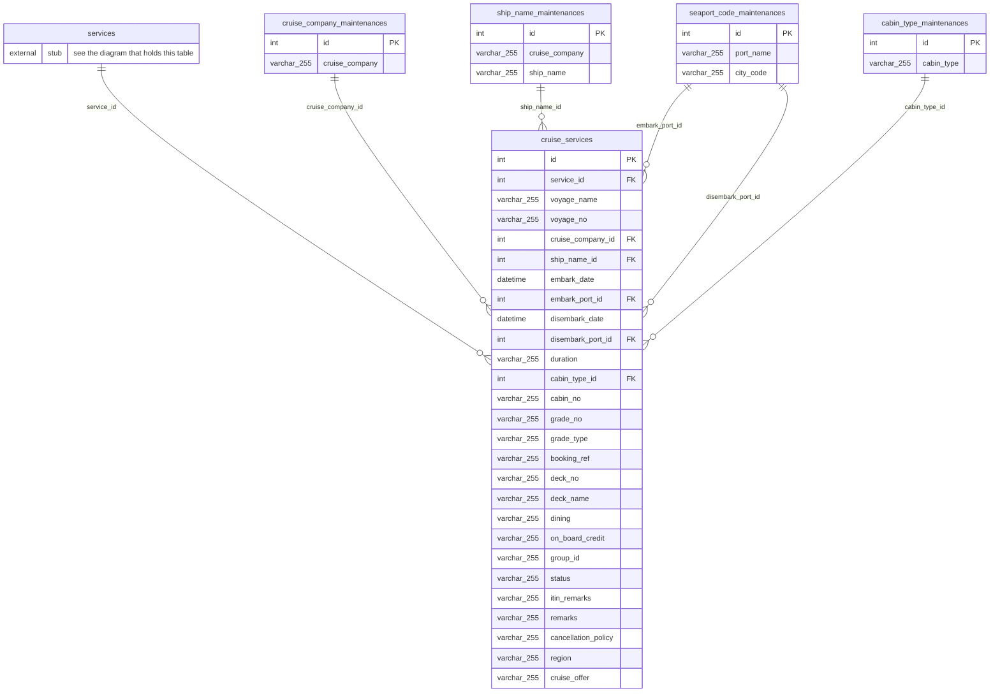
```mermaid
%% Current schema of power_suite (7 of 57: around cruise_services)
erDiagram
    cruise_services {
        int id PK
        int service_id FK
        varchar_255 voyage_name
        varchar_255 voyage_no
        int cruise_company_id FK
        int ship_name_id FK
        datetime embark_date
        int embark_port_id FK
        datetime disembark_date
        int disembark_port_id FK
        varchar_255 duration
        int cabin_type_id FK
        varchar_255 cabin_no
        varchar_255 grade_no
        varchar_255 grade_type
        varchar_255 booking_ref
        varchar_255 deck_no
        varchar_255 deck_name
        varchar_255 dining
        varchar_255 on_board_credit
        varchar_255 group_id
        varchar_255 status
        varchar_255 itin_remarks
        varchar_255 remarks
        varchar_255 cancellation_policy
        varchar_255 region
        varchar_255 cruise_offer
    }
    cabin_type_maintenances {
        int id PK
        varchar_255 cabin_type
    }
    cruise_company_maintenances {
        int id PK
        varchar_255 cruise_company
    }
    seaport_code_maintenances {
        int id PK
        varchar_255 port_name
        varchar_255 city_code
    }
    ship_name_maintenances {
        int id PK
        varchar_255 cruise_company
        varchar_255 ship_name
    }
    services {
        external stub "see the diagram that holds this table"
    }
    services ||--o{ cruise_services : "service_id"
    cruise_company_maintenances ||--o{ cruise_services : "cruise_company_id"
    ship_name_maintenances ||--o{ cruise_services : "ship_name_id"
    seaport_code_maintenances ||--o{ cruise_services : "embark_port_id"
    seaport_code_maintenances ||--o{ cruise_services : "disembark_port_id"
    cabin_type_maintenances ||--o{ cruise_services : "cabin_type_id"
```

#### Current: Current schema of power_suite (8 of 57: around branch_document_template)

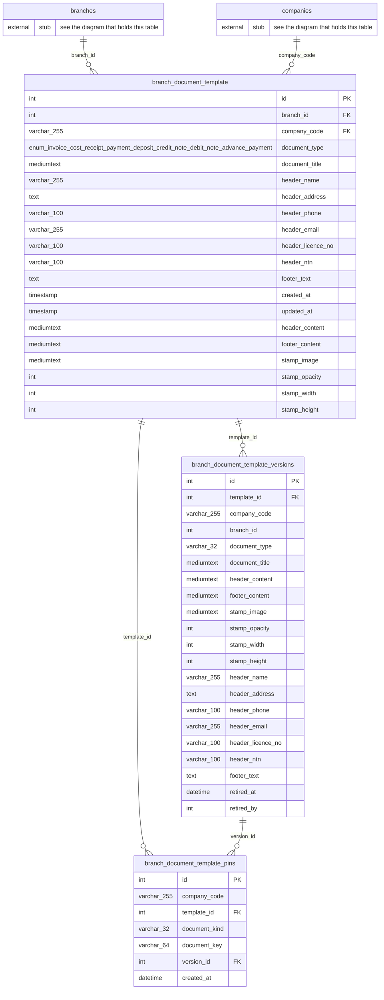
```mermaid
%% Current schema of power_suite (8 of 57: around branch_document_template)
erDiagram
    branch_document_template {
        int id PK
        int branch_id FK
        varchar_255 company_code FK
        enum_invoice_cost_receipt_payment_deposit_credit_note_debit_note_advance_payment document_type
        mediumtext document_title
        varchar_255 header_name
        text header_address
        varchar_100 header_phone
        varchar_255 header_email
        varchar_100 header_licence_no
        varchar_100 header_ntn
        text footer_text
        timestamp created_at
        timestamp updated_at
        mediumtext header_content
        mediumtext footer_content
        mediumtext stamp_image
        int stamp_opacity
        int stamp_width
        int stamp_height
    }
    branch_document_template_pins {
        int id PK
        varchar_255 company_code
        int template_id FK
        varchar_32 document_kind
        varchar_64 document_key
        int version_id FK
        datetime created_at
    }
    branch_document_template_versions {
        int id PK
        int template_id FK
        varchar_255 company_code
        int branch_id
        varchar_32 document_type
        mediumtext document_title
        mediumtext header_content
        mediumtext footer_content
        mediumtext stamp_image
        int stamp_opacity
        int stamp_width
        int stamp_height
        varchar_255 header_name
        text header_address
        varchar_100 header_phone
        varchar_255 header_email
        varchar_100 header_licence_no
        varchar_100 header_ntn
        text footer_text
        datetime retired_at
        int retired_by
    }
    branches {
        external stub "see the diagram that holds this table"
    }
    companies {
        external stub "see the diagram that holds this table"
    }
    branches ||--o{ branch_document_template : "branch_id"
    companies ||--o{ branch_document_template : "company_code"
    branch_document_template ||--o{ branch_document_template_pins : "template_id"
    branch_document_template_versions ||--o{ branch_document_template_pins : "version_id"
    branch_document_template ||--o{ branch_document_template_versions : "template_id"
```

#### Current: Current schema of power_suite (9 of 57: around city_codes)

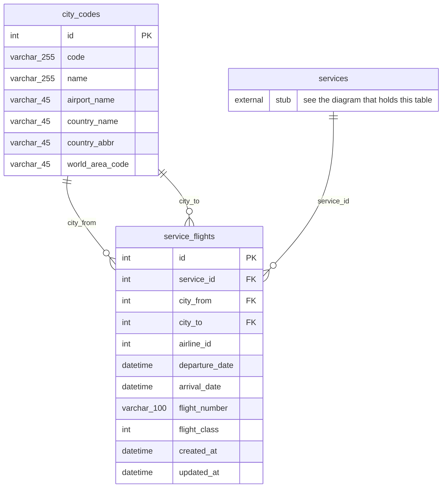
```mermaid
%% Current schema of power_suite (9 of 57: around city_codes)
erDiagram
    city_codes {
        int id PK
        varchar_255 code
        varchar_255 name
        varchar_45 airport_name
        varchar_45 country_name
        varchar_45 country_abbr
        varchar_45 world_area_code
    }
    service_flights {
        int id PK
        int service_id FK
        int city_from FK
        int city_to FK
        int airline_id
        datetime departure_date
        datetime arrival_date
        varchar_100 flight_number
        int flight_class
        datetime created_at
        datetime updated_at
    }
    services {
        external stub "see the diagram that holds this table"
    }
    city_codes ||--o{ service_flights : "city_from"
    city_codes ||--o{ service_flights : "city_to"
    services ||--o{ service_flights : "service_id"
```

#### Current: Current schema of power_suite (10 of 57: around customer_required_data)

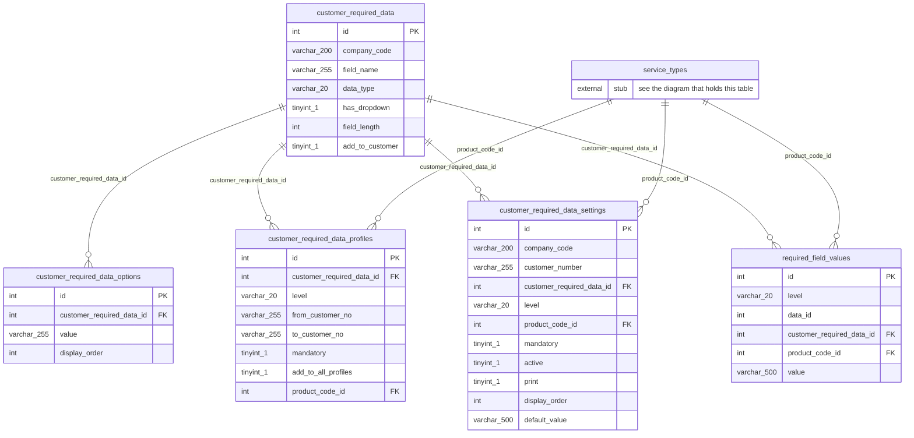
```mermaid
%% Current schema of power_suite (10 of 57: around customer_required_data)
erDiagram
    customer_required_data {
        int id PK
        varchar_200 company_code
        varchar_255 field_name
        varchar_20 data_type
        tinyint_1 has_dropdown
        int field_length
        tinyint_1 add_to_customer
    }
    customer_required_data_options {
        int id PK
        int customer_required_data_id FK
        varchar_255 value
        int display_order
    }
    customer_required_data_profiles {
        int id PK
        int customer_required_data_id FK
        varchar_20 level
        varchar_255 from_customer_no
        varchar_255 to_customer_no
        tinyint_1 mandatory
        tinyint_1 add_to_all_profiles
        int product_code_id FK
    }
    customer_required_data_settings {
        int id PK
        varchar_200 company_code
        varchar_255 customer_number
        int customer_required_data_id FK
        varchar_20 level
        int product_code_id FK
        tinyint_1 mandatory
        tinyint_1 active
        tinyint_1 print
        int display_order
        varchar_500 default_value
    }
    required_field_values {
        int id PK
        varchar_20 level
        int data_id
        int customer_required_data_id FK
        int product_code_id FK
        varchar_500 value
    }
    service_types {
        external stub "see the diagram that holds this table"
    }
    customer_required_data ||--o{ customer_required_data_options : "customer_required_data_id"
    customer_required_data ||--o{ customer_required_data_profiles : "customer_required_data_id"
    service_types ||--o{ customer_required_data_profiles : "product_code_id"
    customer_required_data ||--o{ customer_required_data_settings : "customer_required_data_id"
    service_types ||--o{ customer_required_data_settings : "product_code_id"
    customer_required_data ||--o{ required_field_values : "customer_required_data_id"
    service_types ||--o{ required_field_values : "product_code_id"
```

#### Current: Current schema of power_suite (11 of 57: around gl_settle_accounts)

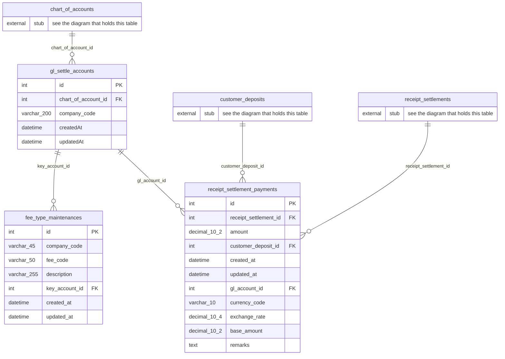
```mermaid
%% Current schema of power_suite (11 of 57: around gl_settle_accounts)
erDiagram
    gl_settle_accounts {
        int id PK
        int chart_of_account_id FK
        varchar_200 company_code
        datetime createdAt
        datetime updatedAt
    }
    fee_type_maintenances {
        int id PK
        varchar_45 company_code
        varchar_50 fee_code
        varchar_255 description
        int key_account_id FK
        datetime created_at
        datetime updated_at
    }
    receipt_settlement_payments {
        int id PK
        int receipt_settlement_id FK
        decimal_10_2 amount
        int customer_deposit_id FK
        datetime created_at
        datetime updated_at
        int gl_account_id FK
        varchar_10 currency_code
        decimal_10_4 exchange_rate
        decimal_10_2 base_amount
        text remarks
    }
    chart_of_accounts {
        external stub "see the diagram that holds this table"
    }
    customer_deposits {
        external stub "see the diagram that holds this table"
    }
    receipt_settlements {
        external stub "see the diagram that holds this table"
    }
    chart_of_accounts ||--o{ gl_settle_accounts : "chart_of_account_id"
    gl_settle_accounts ||--o{ fee_type_maintenances : "key_account_id"
    customer_deposits ||--o{ receipt_settlement_payments : "customer_deposit_id"
    receipt_settlements ||--o{ receipt_settlement_payments : "receipt_settlement_id"
    gl_settle_accounts ||--o{ receipt_settlement_payments : "gl_account_id"
```

#### Current: Current schema of power_suite (12 of 57: around iur_settings)

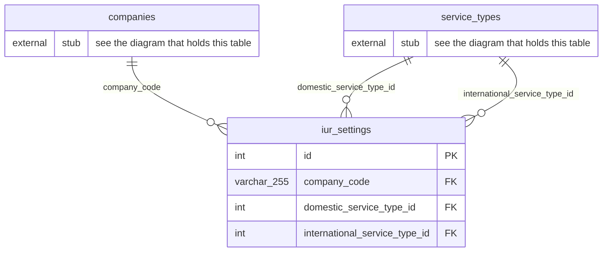
```mermaid
%% Current schema of power_suite (12 of 57: around iur_settings)
erDiagram
    iur_settings {
        int id PK
        varchar_255 company_code FK
        int domestic_service_type_id FK
        int international_service_type_id FK
    }
    companies {
        external stub "see the diagram that holds this table"
    }
    service_types {
        external stub "see the diagram that holds this table"
    }
    companies ||--o{ iur_settings : "company_code"
    service_types ||--o{ iur_settings : "domestic_service_type_id"
    service_types ||--o{ iur_settings : "international_service_type_id"
```

#### Current: Current schema of power_suite (13 of 57: around fee_class_airlines)

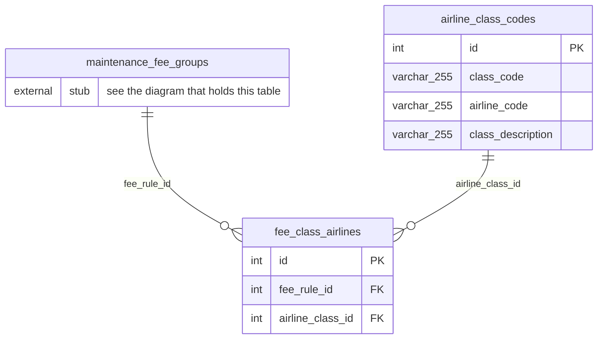
```mermaid
%% Current schema of power_suite (13 of 57: around fee_class_airlines)
erDiagram
    fee_class_airlines {
        int id PK
        int fee_rule_id FK
        int airline_class_id FK
    }
    airline_class_codes {
        int id PK
        varchar_255 class_code
        varchar_255 airline_code
        varchar_255 class_description
    }
    maintenance_fee_groups {
        external stub "see the diagram that holds this table"
    }
    maintenance_fee_groups ||--o{ fee_class_airlines : "fee_rule_id"
    airline_class_codes ||--o{ fee_class_airlines : "airline_class_id"
```

#### Current: Current schema of power_suite (14 of 57: around fee_main_product_codes)

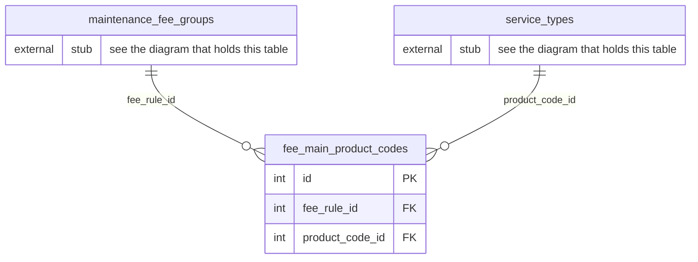
```mermaid
%% Current schema of power_suite (14 of 57: around fee_main_product_codes)
erDiagram
    fee_main_product_codes {
        int id PK
        int fee_rule_id FK
        int product_code_id FK
    }
    maintenance_fee_groups {
        external stub "see the diagram that holds this table"
    }
    service_types {
        external stub "see the diagram that holds this table"
    }
    maintenance_fee_groups ||--o{ fee_main_product_codes : "fee_rule_id"
    service_types ||--o{ fee_main_product_codes : "product_code_id"
```

#### Current: Current schema of power_suite (15 of 57: around integration_sources)

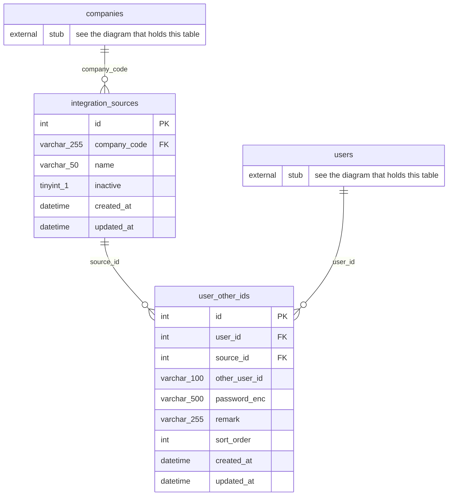
```mermaid
%% Current schema of power_suite (15 of 57: around integration_sources)
erDiagram
    integration_sources {
        int id PK
        varchar_255 company_code FK
        varchar_50 name
        tinyint_1 inactive
        datetime created_at
        datetime updated_at
    }
    user_other_ids {
        int id PK
        int user_id FK
        int source_id FK
        varchar_100 other_user_id
        varchar_500 password_enc
        varchar_255 remark
        int sort_order
        datetime created_at
        datetime updated_at
    }
    companies {
        external stub "see the diagram that holds this table"
    }
    users {
        external stub "see the diagram that holds this table"
    }
    companies ||--o{ integration_sources : "company_code"
    integration_sources ||--o{ user_other_ids : "source_id"
    users ||--o{ user_other_ids : "user_id"
```

#### Current: Current schema of power_suite (16 of 57: around product_account_relations)

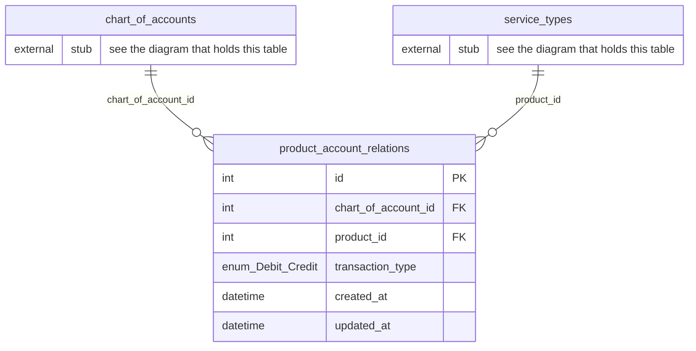
```mermaid
%% Current schema of power_suite (16 of 57: around product_account_relations)
erDiagram
    product_account_relations {
        int id PK
        int chart_of_account_id FK
        int product_id FK
        enum_Debit_Credit transaction_type
        datetime created_at
        datetime updated_at
    }
    chart_of_accounts {
        external stub "see the diagram that holds this table"
    }
    service_types {
        external stub "see the diagram that holds this table"
    }
    chart_of_accounts ||--o{ product_account_relations : "chart_of_account_id"
    service_types ||--o{ product_account_relations : "product_id"
```

#### Current: Current schema of power_suite (17 of 57: around receipt_settlement_credit_notes)

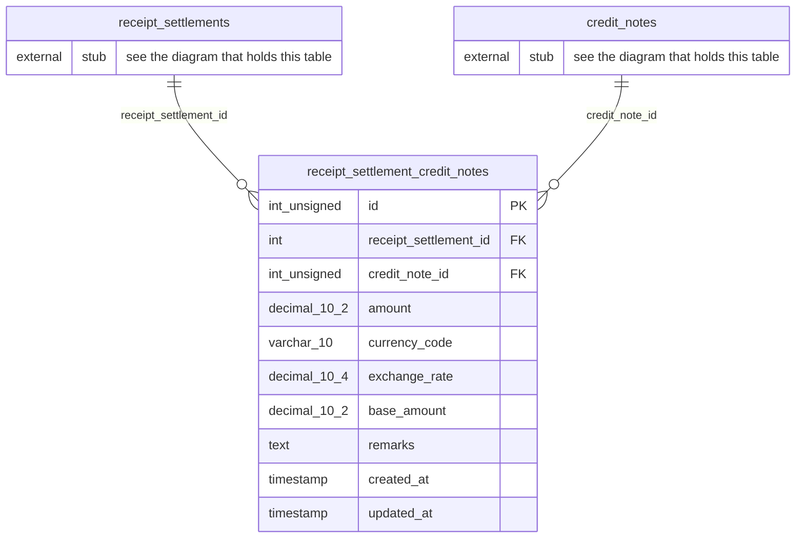
```mermaid
%% Current schema of power_suite (17 of 57: around receipt_settlement_credit_notes)
erDiagram
    receipt_settlement_credit_notes {
        int_unsigned id PK
        int receipt_settlement_id FK
        int_unsigned credit_note_id FK
        decimal_10_2 amount
        varchar_10 currency_code
        decimal_10_4 exchange_rate
        decimal_10_2 base_amount
        text remarks
        timestamp created_at
        timestamp updated_at
    }
    credit_notes {
        external stub "see the diagram that holds this table"
    }
    receipt_settlements {
        external stub "see the diagram that holds this table"
    }
    receipt_settlements ||--o{ receipt_settlement_credit_notes : "receipt_settlement_id"
    credit_notes ||--o{ receipt_settlement_credit_notes : "credit_note_id"
```

#### Current: Current schema of power_suite (18 of 57: around receipt_settlement_deposits)

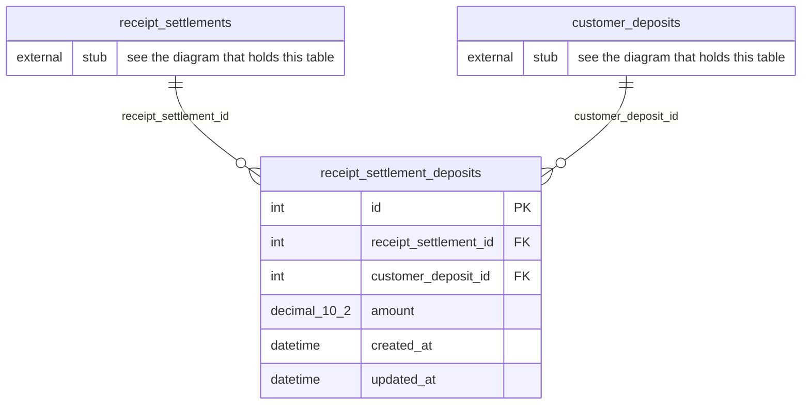
```mermaid
%% Current schema of power_suite (18 of 57: around receipt_settlement_deposits)
erDiagram
    receipt_settlement_deposits {
        int id PK
        int receipt_settlement_id FK
        int customer_deposit_id FK
        decimal_10_2 amount
        datetime created_at
        datetime updated_at
    }
    customer_deposits {
        external stub "see the diagram that holds this table"
    }
    receipt_settlements {
        external stub "see the diagram that holds this table"
    }
    receipt_settlements ||--o{ receipt_settlement_deposits : "receipt_settlement_id"
    customer_deposits ||--o{ receipt_settlement_deposits : "customer_deposit_id"
```

#### Current: Current schema of power_suite (19 of 57: around receipt_settlement_invoices)

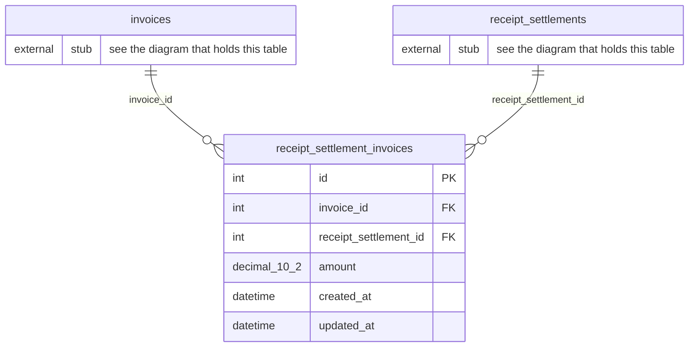
```mermaid
%% Current schema of power_suite (19 of 57: around receipt_settlement_invoices)
erDiagram
    receipt_settlement_invoices {
        int id PK
        int invoice_id FK
        int receipt_settlement_id FK
        decimal_10_2 amount
        datetime created_at
        datetime updated_at
    }
    invoices {
        external stub "see the diagram that holds this table"
    }
    receipt_settlements {
        external stub "see the diagram that holds this table"
    }
    invoices ||--o{ receipt_settlement_invoices : "invoice_id"
    receipt_settlements ||--o{ receipt_settlement_invoices : "receipt_settlement_id"
```

#### Current: Current schema of power_suite (20 of 57: around receipt_settlement_transfers)

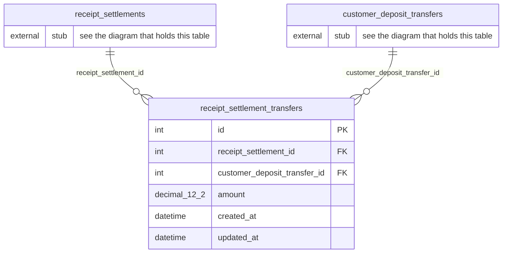
```mermaid
%% Current schema of power_suite (20 of 57: around receipt_settlement_transfers)
erDiagram
    receipt_settlement_transfers {
        int id PK
        int receipt_settlement_id FK
        int customer_deposit_transfer_id FK
        decimal_12_2 amount
        datetime created_at
        datetime updated_at
    }
    customer_deposit_transfers {
        external stub "see the diagram that holds this table"
    }
    receipt_settlements {
        external stub "see the diagram that holds this table"
    }
    receipt_settlements ||--o{ receipt_settlement_transfers : "receipt_settlement_id"
    customer_deposit_transfers ||--o{ receipt_settlement_transfers : "customer_deposit_transfer_id"
```

#### Current: Current schema of power_suite (21 of 57: around service_car_transfers)

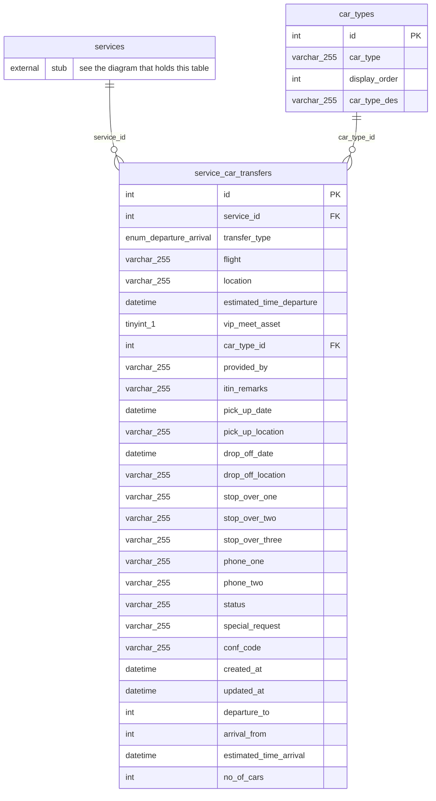
```mermaid
%% Current schema of power_suite (21 of 57: around service_car_transfers)
erDiagram
    service_car_transfers {
        int id PK
        int service_id FK
        enum_departure_arrival transfer_type
        varchar_255 flight
        varchar_255 location
        datetime estimated_time_departure
        tinyint_1 vip_meet_asset
        int car_type_id FK
        varchar_255 provided_by
        varchar_255 itin_remarks
        datetime pick_up_date
        varchar_255 pick_up_location
        datetime drop_off_date
        varchar_255 drop_off_location
        varchar_255 stop_over_one
        varchar_255 stop_over_two
        varchar_255 stop_over_three
        varchar_255 phone_one
        varchar_255 phone_two
        varchar_255 status
        varchar_255 special_request
        varchar_255 conf_code
        datetime created_at
        datetime updated_at
        int departure_to
        int arrival_from
        datetime estimated_time_arrival
        int no_of_cars
    }
    car_types {
        int id PK
        varchar_255 car_type
        int display_order
        varchar_255 car_type_des
    }
    services {
        external stub "see the diagram that holds this table"
    }
    services ||--o{ service_car_transfers : "service_id"
    car_types ||--o{ service_car_transfers : "car_type_id"
```

#### Current: Current schema of power_suite (22 of 57: around visa_code_require_codes)

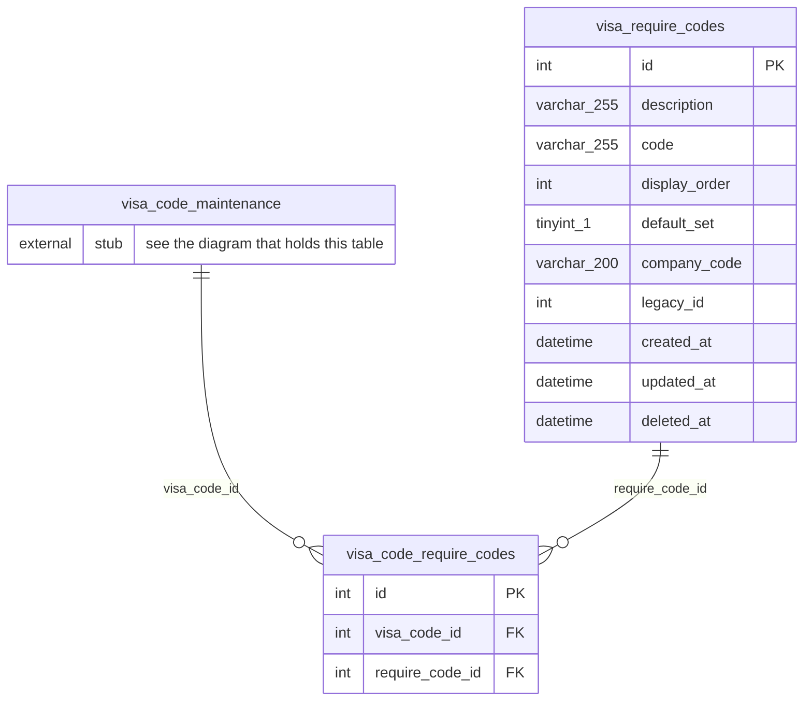
```mermaid
%% Current schema of power_suite (22 of 57: around visa_code_require_codes)
erDiagram
    visa_code_require_codes {
        int id PK
        int visa_code_id FK
        int require_code_id FK
    }
    visa_require_codes {
        int id PK
        varchar_255 description
        varchar_255 code
        int display_order
        tinyint_1 default_set
        varchar_200 company_code
        int legacy_id
        datetime created_at
        datetime updated_at
        datetime deleted_at
    }
    visa_code_maintenance {
        external stub "see the diagram that holds this table"
    }
    visa_code_maintenance ||--o{ visa_code_require_codes : "visa_code_id"
    visa_require_codes ||--o{ visa_code_require_codes : "require_code_id"
```

#### Current: Current schema of power_suite (23 of 57: around visa_length_stays)

```mermaid
%% Current schema of power_suite (23 of 57: around visa_length_stays)
erDiagram
    visa_length_stays {
        int id PK
        varchar_255 length_of_stay
        varchar_255 code
        int display_order
        tinyint_1 default_set
        varchar_200 company_code
        int legacy_id
        datetime created_at
        datetime updated_at
        datetime deleted_at
    }
```

#### Current: Current schema of power_suite (24 of 57: around visa_no_entries)

```mermaid
%% Current schema of power_suite (24 of 57: around visa_no_entries)
erDiagram
    visa_no_entries {
        int id PK
        varchar_255 no_of_entries
        varchar_255 code
        int display_order
        tinyint_1 default_set
        varchar_200 company_code
        int legacy_id
        datetime created_at
        datetime updated_at
        datetime deleted_at
    }
```

#### Current: Current schema of power_suite (25 of 57: around visa_purposes)

```mermaid
%% Current schema of power_suite (25 of 57: around visa_purposes)
erDiagram
    visa_purposes {
        int id PK
        varchar_255 purpose
        varchar_255 code
        int display_order
        tinyint_1 default_set
        varchar_200 company_code
        int legacy_id
        datetime created_at
        datetime updated_at
        datetime deleted_at
    }
```

#### Current: Current schema of power_suite (26 of 57: around visa_status_history)

```mermaid
%% Current schema of power_suite (26 of 57: around visa_status_history)
erDiagram
    visa_status_history {
        int id PK
        int visa_id FK
        varchar_100 status
        datetime status_date
        text remarks
        int changed_by FK
        datetime changed_at
        varchar_100 previous_status
        timestamp created_at
        timestamp updated_at
    }
    service_visas {
        external stub "see the diagram that holds this table"
    }
    users {
        external stub "see the diagram that holds this table"
    }
    users ||--o{ visa_status_history : "changed_by"
    service_visas ||--o{ visa_status_history : "visa_id"
```

#### Current: Current schema of power_suite (27 of 57: around visa_urgencies)

```mermaid
%% Current schema of power_suite (27 of 57: around visa_urgencies)
erDiagram
    visa_urgencies {
        int id PK
        varchar_255 urgency
        varchar_255 code
        int display_order
        tinyint_1 default_set
        varchar_200 company_code
        int legacy_id
        datetime created_at
        datetime updated_at
        datetime deleted_at
    }
```

#### Current: Current schema of power_suite (28 of 57: around visa_validities)

```mermaid
%% Current schema of power_suite (28 of 57: around visa_validities)
erDiagram
    visa_validities {
        int id PK
        varchar_255 validity
        varchar_255 code
        int display_order
        tinyint_1 default_set
        varchar_200 company_code
        int legacy_id
        datetime created_at
        datetime updated_at
        datetime deleted_at
    }
```

#### Current: Current schema of power_suite (29 of 57: around webdav_credentials)

```mermaid
%% Current schema of power_suite (29 of 57: around webdav_credentials)
erDiagram
    webdav_credentials {
        int id PK
        varchar_255 company_code FK
        int user_id FK
        varchar_160 webdav_username
        varchar_200 password_hash
        varchar_200 label
        tinyint_1 inactive
        datetime last_used_at
        varchar_64 last_used_ip
        datetime created_at
        datetime updated_at
    }
    companies {
        external stub "see the diagram that holds this table"
    }
    users {
        external stub "see the diagram that holds this table"
    }
    companies ||--o{ webdav_credentials : "company_code"
    users ||--o{ webdav_credentials : "user_id"
```

#### Current: Current schema of power_suite (30 of 57: around credit_control_pccs)

```mermaid
%% Current schema of power_suite (30 of 57: around credit_control_pccs)
erDiagram
    credit_control_pccs {
        int id PK
        int supplier_id FK
        varchar_255 pseudo_code_one
        varchar_255 pseudo_code_two
        varchar_255 pseudo_code_three
        varchar_255 pseudo_code_four
        datetime created_at
        datetime updated_at
    }
    suppliers {
        external stub "see the diagram that holds this table"
    }
    suppliers ||--o{ credit_control_pccs : "supplier_id"
```

#### Current: Current schema of power_suite (31 of 57: around currencies)

```mermaid
%% Current schema of power_suite (31 of 57: around currencies)
erDiagram
    currencies {
        int id PK
        varchar_255 from_currency
        varchar_255 to_currency
        decimal_10_2 exchange_rate
        varchar_45 company_code
    }
```

#### Current: Current schema of power_suite (32 of 57: around email_templates)

```mermaid
%% Current schema of power_suite (32 of 57: around email_templates)
erDiagram
    email_templates {
        int id PK
        varchar_255 company_code FK
        varchar_255 name
        varchar_255 slug
        varchar_255 subject
        longtext body
        text variables
        varchar_255 description
        tinyint_1 is_active
        datetime created_at
        datetime updated_at
    }
    companies {
        external stub "see the diagram that holds this table"
    }
    companies ||--o{ email_templates : "company_code"
```

#### Current: Current schema of power_suite (33 of 57: around fee_maintenances)

```mermaid
%% Current schema of power_suite (33 of 57: around fee_maintenances)
erDiagram
    fee_maintenances {
        int id PK
        varchar_255 fee_description
        int company_code
    }
```

#### Current: Current schema of power_suite (34 of 57: around hotel_chain_maintenances)

```mermaid
%% Current schema of power_suite (34 of 57: around hotel_chain_maintenances)
erDiagram
    hotel_chain_maintenances {
        int id PK
        varchar_10 hotel_chain_code
        varchar_160 hotel_chain_name
    }
```

#### Current: Current schema of power_suite (35 of 57: around hotel_rate_breakdowns)

```mermaid
%% Current schema of power_suite (35 of 57: around hotel_rate_breakdowns)
erDiagram
    hotel_rate_breakdowns {
        int_unsigned id PK
        decimal_10_2 cost
        decimal_10_2 price
        date date
        int service_id FK
        datetime created_at
        datetime updated_at
        tinyint_1 lumpsum
        double markup
    }
    services {
        external stub "see the diagram that holds this table"
    }
    services ||--o{ hotel_rate_breakdowns : "service_id"
```

#### Current: Current schema of power_suite (36 of 57: around invoice_discounts)

```mermaid
%% Current schema of power_suite (36 of 57: around invoice_discounts)
erDiagram
    invoice_discounts {
        int id PK
        int invoice_id FK
        varchar_255 discount_code
        decimal_10_2 discount_amount
        text remarks
        datetime created_at
        datetime updated_at
    }
    invoices {
        external stub "see the diagram that holds this table"
    }
    invoices ||--o{ invoice_discounts : "invoice_id"
```

#### Current: Current schema of power_suite (37 of 57: around invoice_settings)

```mermaid
%% Current schema of power_suite (37 of 57: around invoice_settings)
erDiagram
    invoice_settings {
        int id PK
        varchar_255 company_code FK
        tinyint_1 hide_transaction_fee
        tinyint_1 hide_tax
        tinyint_1 ticket_issue_date_in_invoice
        tinyint_1 hide_visa_nationality
        tinyint_1 hide_visa_destination
        tinyint_1 hide_visa_code
        tinyint_1 hide_visa_length_of_stay
        tinyint_1 hide_visa_process_days
        tinyint_1 hide_visa_purpose
        tinyint_1 hide_visa_validity_period
        tinyint_1 hide_ins_cheque_no
        tinyint_1 hide_ins_fop
        tinyint_1 hide_ins_plan_type
        tinyint_1 hide_ins_policy_no
        tinyint_1 hide_ins_purchase_date
        tinyint_1 hide_ins_first_coverage_date
        tinyint_1 hide_ins_last_coverage_date
        tinyint_1 hide_ins_expiry_date
        tinyint_1 hide_ins_city
        tinyint_1 hide_ins_city_code
        tinyint_1 hide_ins_pnr
        tinyint_1 hide_car_type
        tinyint_1 hide_car_no_of_cars
        tinyint_1 hide_car_location
        tinyint_1 hide_car_date
        tinyint_1 hide_car_city
    }
    companies {
        external stub "see the diagram that holds this table"
    }
    companies ||--o{ invoice_settings : "company_code"
```

#### Current: Current schema of power_suite (38 of 57: around invoice_taxes)

```mermaid
%% Current schema of power_suite (38 of 57: around invoice_taxes)
erDiagram
    invoice_taxes {
        int id PK
        int invoice_id FK
        varchar_255 tax_code
        decimal_10_2 tax_amount
        text remarks
        datetime created_at
        datetime updated_at
    }
    invoices {
        external stub "see the diagram that holds this table"
    }
    invoices ||--o{ invoice_taxes : "invoice_id"
```

#### Current: Current schema of power_suite (39 of 57: around iur_ingest_claims)

```mermaid
%% Current schema of power_suite (39 of 57: around iur_ingest_claims)
erDiagram
    iur_ingest_claims {
        int id PK
        varchar_255 company_code FK
        varchar_255 file_name
        varchar_160 webdav_username
        varchar_120 claimed_by
        datetime claimed_at
        datetime released_at
        varchar_30 outcome
        datetime created_at
        datetime updated_at
    }
    companies {
        external stub "see the diagram that holds this table"
    }
    companies ||--o{ iur_ingest_claims : "company_code"
```

#### Current: Current schema of power_suite (40 of 57: around journal_periods)

```mermaid
%% Current schema of power_suite (40 of 57: around journal_periods)
erDiagram
    journal_periods {
        int id PK
        varchar_200 company_code FK
        varchar_10 fiscal_year
        int month
        int year
        tinyint_1 status
        datetime start_date
        datetime end_date
        datetime report_date
        datetime created_at
        datetime updated_at
    }
    companies {
        external stub "see the diagram that holds this table"
    }
    companies ||--o{ journal_periods : "company_code"
```

#### Current: Current schema of power_suite (41 of 57: around order_settings)

```mermaid
%% Current schema of power_suite (41 of 57: around order_settings)
erDiagram
    order_settings {
        int id PK
        varchar_255 company_code FK
        tinyint_1 enable_manual_sst
        enum_block_warn status_check_mode
        enum_block_warn_info credit_check_mode
    }
    companies {
        external stub "see the diagram that holds this table"
    }
    companies ||--o{ order_settings : "company_code"
```

#### Current: Current schema of power_suite (42 of 57: around service_hotels)

```mermaid
%% Current schema of power_suite (42 of 57: around service_hotels)
erDiagram
    service_hotels {
        int id PK
        int service_id FK
        varchar_255 city
        varchar_255 hotel_name
        varchar_255 hotel_chain
        date check_in
        date check_out
        tinyint_1 same_day_check_out
        int no_of_nights
        int no_of_rooms
        int room_id
        int room_category_id
        int guest_per_room
        varchar_255 meals
        varchar_255 other_services
        varchar_255 remarks
        varchar_255 address
        varchar_255 rate_description
        varchar_255 tel
        varchar_255 fax
        int status
        varchar_255 itin_remarks
        varchar_255 refrence_code
        varchar_255 confirmation_no
        varchar_255 hotel_code
        datetime confirmation_date
        varchar_255 confirmation_by
        varchar_255 cancellation_policy
        datetime created_at
        datetime updated_at
        int allotment_room_id
        tinyint rooms_released
    }
    services {
        external stub "see the diagram that holds this table"
    }
    services ||--o{ service_hotels : "service_id"
```

#### Current: Current schema of power_suite (43 of 57: around service_insurances)

```mermaid
%% Current schema of power_suite (43 of 57: around service_insurances)
erDiagram
    service_insurances {
        int id PK
        int service_id FK
        int destination
        varchar_255 policy_number
        date purchase_date
        varchar_255 plan_type
        date first_coverage_date
        date last_coverage_date
        date expiry_date
        varchar_255 fop
        varchar_255 cheque_number
        int status
        varchar_255 itin_remarks
        varchar_255 optional_benefit
        varchar_255 special_instruction
    }
    services {
        external stub "see the diagram that holds this table"
    }
    services ||--o{ service_insurances : "service_id"
```

#### Current: Current schema of power_suite (44 of 57: around service_miscellaneous)

```mermaid
%% Current schema of power_suite (44 of 57: around service_miscellaneous)
erDiagram
    service_miscellaneous {
        int id PK
        int service_id FK
        varchar_255 description
        int city
        datetime start_date_time
        varchar_255 start_date_description
        varchar_255 end_date_description
        datetime end_date_time
        int status
        varchar_255 itin_remarks
    }
    services {
        external stub "see the diagram that holds this table"
    }
    services ||--o{ service_miscellaneous : "service_id"
```

#### Current: Current schema of power_suite (45 of 57: around service_rental_cars)

```mermaid
%% Current schema of power_suite (45 of 57: around service_rental_cars)
erDiagram
    service_rental_cars {
        int id PK
        int service_id FK
        int city
        int company_id
        int vehicle_id
        int rate_type_id
        datetime pick_up_date_time
        varchar_255 pick_up_location
        datetime drop_off_date_time
        varchar_255 drop_off_location
        int status
        int no_of_days_hired
        varchar_255 conf_code
        varchar_255 itin_remarks
        datetime created_at
        datetime updated_at
        int no_of_cars
    }
    services {
        external stub "see the diagram that holds this table"
    }
    services ||--o{ service_rental_cars : "service_id"
```

#### Current: Current schema of power_suite (46 of 57: around service_tours)

```mermaid
%% Current schema of power_suite (46 of 57: around service_tours)
erDiagram
    service_tours {
        int id PK
        int service_id FK
        varchar_255 package_name
        varchar_255 package_code
        int status
        int destination
        datetime start_date_time
        datetime end_date_time
        text itin_remarks
        datetime created_at
        datetime updated_at
        text insurance_options
        text hotel_bookings
        text air_travel
        text visa_service
        text other_services
        decimal_15_2 air_travel_cost
        decimal_15_2 air_travel_price
        decimal_15_2 hotel_bookings_cost
        decimal_15_2 hotel_bookings_price
        decimal_15_2 insurance_options_cost
        decimal_15_2 insurance_options_price
        decimal_15_2 visa_service_cost
        decimal_15_2 visa_service_price
        decimal_15_2 itin_remarks_cost
        decimal_15_2 itin_remarks_price
    }
    services {
        external stub "see the diagram that holds this table"
    }
    services ||--o{ service_tours : "service_id"
```

#### Current: Current schema of power_suite (47 of 57: around service_trains)

```mermaid
%% Current schema of power_suite (47 of 57: around service_trains)
erDiagram
    service_trains {
        int id PK
        int service_id FK
        int from_city
        int to_city
        varchar_255 train_class
        varchar_255 company
        datetime departure_date
        datetime arrival_date
        int status
        varchar_255 itin_remarks
    }
    services {
        external stub "see the diagram that holds this table"
    }
    services ||--o{ service_trains : "service_id"
```

#### Current: Current schema of power_suite (48 of 57: around smtp_settings)

```mermaid
%% Current schema of power_suite (48 of 57: around smtp_settings)
erDiagram
    smtp_settings {
        int id PK
        varchar_255 company_code FK
        varchar_255 smtp_host
        int smtp_port
        varchar_255 smtp_user
        varchar_255 smtp_password
        enum_none_ssl_tls smtp_encryption
        varchar_255 from_email
        varchar_255 from_name
        tinyint_1 is_active
    }
    companies {
        external stub "see the diagram that holds this table"
    }
    companies ||--o{ smtp_settings : "company_code"
```

#### Current: Current schema of power_suite (49 of 57: around supplier_amends)

```mermaid
%% Current schema of power_suite (49 of 57: around supplier_amends)
erDiagram
    supplier_amends {
        int id PK
        varchar_255 credit_term_code
        int credit_days_amend
        tinyint_1 credit_days
        tinyint_1 bsp_payment_terms
        tinyint_1 bsp_payment_addon
        tinyint_1 statement_date
        tinyint_1 last_day_month
        tinyint_1 other_due_date
        tinyint_1 weekly
        datetime created_at
        datetime updated_at
    }
```

#### Current: Current schema of power_suite (50 of 57: around supplier_contacts)

```mermaid
%% Current schema of power_suite (50 of 57: around supplier_contacts)
erDiagram
    supplier_contacts {
        int id PK
        int supplier_id FK
        varchar_255 sup_sur_name
        varchar_255 sup_given_name
        varchar_255 title
        varchar_255 tel
        varchar_255 email
        datetime created_at
        datetime updated_at
    }
    suppliers {
        external stub "see the diagram that holds this table"
    }
    suppliers ||--o{ supplier_contacts : "supplier_id"
```

#### Current: Current schema of power_suite (51 of 57: around supplier_types)

```mermaid
%% Current schema of power_suite (51 of 57: around supplier_types)
erDiagram
    supplier_types {
        int id PK
        varchar_255 code
        varchar_255 description
        varchar_45 company_code
    }
```

#### Current: Current schema of power_suite (52 of 57: around visa_ptc_maintenances)

```mermaid
%% Current schema of power_suite (52 of 57: around visa_ptc_maintenances)
erDiagram
    visa_ptc_maintenances {
        int id PK
        varchar_255 code
        varchar_255 description
        int display_order
        tinyint_1 default_set
        varchar_200 company_code
        int legacy_id
        datetime created_at
        datetime updated_at
        datetime deleted_at
    }
```

#### Current: Current schema of power_suite (53 of 57: around visa_types)

```mermaid
%% Current schema of power_suite (53 of 57: around visa_types)
erDiagram
    visa_types {
        int id PK
        varchar_255 document_type
        varchar_255 code
        int display_order
        tinyint_1 default_set
        varchar_200 company_code
        int legacy_id
        datetime created_at
        datetime updated_at
        datetime deleted_at
    }
```

#### Current: Current schema of power_suite (54 of 57: around admin_users)

```mermaid
%% Current schema of power_suite (54 of 57: around admin_users)
erDiagram
    admin_sessions {
        int id PK
        int admin_user_id FK
        char_64 token_hash
        varchar_45 ip_address
        varchar_255 user_agent
        datetime issued_at
        datetime last_seen_at
        datetime expires_at
        datetime revoked_at
    }
    admin_settings {
        varchar_64 setting_key PK
        text value
        int updated_by FK
        datetime updated_at
    }
    admin_users {
        int id PK
        varchar_255 email
        varchar_200 password
        varchar_200 full_name
        enum_owner_operator_viewer role
        tinyint_1 is_active
        varchar_255 mfa_secret
        datetime last_login_at
        int failed_attempts
        datetime locked_until
        datetime created_at
        datetime updated_at
    }
    coa_template_rows {
        bigint id PK
        int template_id FK
        enum_account_posting_rule_lookup row_type
        json payload
    }
    coa_templates {
        int id PK
        varchar_120 name
        int version
        varchar_255 source_company_code
        text note
        int created_by FK
        datetime created_at
    }
    provisioning_runs {
        int id PK
        varchar_255 company_code
        enum_provision_add_branch_repair_rollover kind
        json params
        enum_running_succeeded_failed status
        int current_step
        json step_log
        json verification
        text error
        int started_by FK
        datetime started_at
        datetime heartbeat_at
        datetime finished_at
    }
    admin_users ||--o{ admin_sessions : "admin_user_id"
    admin_users ||--o{ admin_settings : "updated_by"
    coa_templates ||--o{ coa_template_rows : "template_id"
    admin_users ||--o{ coa_templates : "created_by"
    admin_users ||--o{ provisioning_runs : "started_by"
```

#### Current: Current schema of power_suite (55 of 57: around admin_audit_log)

```mermaid
%% Current schema of power_suite (55 of 57: around admin_audit_log)
erDiagram
    admin_audit_log {
        bigint id PK
        int admin_user_id
        varchar_100 action
        varchar_50 target_type
        varchar_100 target_id
        varchar_255 company_code
        json detail
        varchar_45 ip_address
        datetime created_at
    }
    airline_equipments {
        int id PK
        varchar_255 airline_equipment_code
        varchar_255 airline_equipment_description
    }
    car_company_maintenances {
        int id PK
        varchar_255 car_company_code
        varchar_255 car_company_name
    }
    car_rate_maintenances {
        int id PK
        varchar_255 rate_type
        varchar_255 car_rate_type_description
        int display_order
        varchar_255 host_code
    }
    customer_amends {
        int id PK
        varchar_255 credit_term_code
        int credit_days_amend
        tinyint_1 credit_days
        tinyint_1 bsp_payment_terms
        tinyint_1 bsp_payment_addon
        tinyint_1 statement_date
        tinyint_1 last_day_month
        tinyint_1 other_due_date
        tinyint_1 weekly
        datetime created_at
        datetime updated_at
        int customer_id
    }
    customer_categories {
        int id PK
        varchar_45 category
        timestamp created_at
        timestamp updated_at
        varchar_45 company_code
    }
    customer_contacts {
        int id PK
        int customer_id
        enum_contact_emergency contact_type
        varchar_200 name
        varchar_200 surname
        varchar_200 title
        varchar_20 tel1
        varchar_20 tel2
        varchar_20 mobile_number
        varchar_20 ex1
        varchar_20 ex2
        varchar_100 job_title
        varchar_100 role
        varchar_160 email
        timestamp created_at
        timestamp updated_at
    }
    data_migrations {
        varchar_190 name PK
        datetime applied_at
    }
    flyway_schema_history {
        int installed_rank PK
        varchar_50 version
        varchar_200 description
        varchar_20 type
        varchar_1000 script
        int checksum
        varchar_100 installed_by
        timestamp installed_on
        int execution_time
        tinyint_1 success
    }
    hotel_statuses {
        int id PK
        varchar_255 label
        varchar_255 code
        datetime createdAt
        datetime updatedAt
    }
    intake_cache {
        varchar_64 cache_key PK
        json payload
        datetime fetched_at
    }
    intake_items {
        char_36 issue_id PK
        enum_customer_staff created_by_type
        int created_by_customer_id
        int created_by_staff_id
        varchar_255 company_code
        varchar_32 last_notified_status
        varchar_120 last_notified_progress
        datetime submission_notified_at
        datetime created_at
        datetime updated_at
    }
    intake_legacy_company_labels {
        int id PK
        varchar_255 legacy_label
        varchar_255 company_code
        varchar_255 mapped_by
        varchar_500 notes
        datetime created_at
        datetime updated_at
    }
    intake_notifications {
        int id PK
        varchar_128 delivery_id
        char_36 issue_id
        varchar_255 recipient
        datetime sent_at
    }
    intake_sessions {
        int id PK
        enum_customer_staff principal_type
        int principal_id
        char_64 token_hash
        varchar_45 ip_address
        varchar_255 user_agent
        datetime issued_at
        datetime expires_at
        datetime revoked_at
        datetime last_seen_at
    }
    intake_trackers {
        char_36 issue_id PK
        enum_customer_staff principal_type PK
        int principal_id PK
        datetime assigned_at
        tinyint_1 auto_assigned
    }
    integrity_snapshots {
        bigint id PK
        datetime taken_at
        varchar_64 check_key
        varchar_255 company_code
        int count
        json meta
    }
    invoice_footers {
        int id PK
        text invoice_footer
        datetime createdAt
        datetime updatedAt
    }
    issued_document_numbers {
        int id PK
        varchar_200 company_code
        varchar_20 document_type
        varchar_255 document_number
        int first_document_id
        int issued_by
        varchar_30 source
        datetime issued_at
    }
    iur_file_imports {
        int id PK
        varchar_255 company_code
        varchar_255 file_name
        varchar_255 file_key
        varchar_64 content_key
        enum_processing_completed_failed status
        varchar_120 claimed_by
        datetime claimed_at
        datetime settled_at
        int user_id
        varchar_50 pnr
        int order_id
        varchar_50 order_number
        text service_ids
        int service_count
        int voided_count
        text document_numbers
        text message
        int repeat_posts
        datetime last_repeat_at
        datetime created_at
        datetime updated_at
    }
```

#### Current: Current schema of power_suite (56 of 57: around iur_upload_locks)

```mermaid
%% Current schema of power_suite (56 of 57: around iur_upload_locks)
erDiagram
    iur_upload_locks {
        int id PK
        varchar_255 lock_key
        varchar_120 held_by
        datetime acquired_at
    }
    lcc_profile_templates {
        int id PK
        text label
        varchar_10 type
        int company_id
        datetime created_at
        datetime updated_at
    }
    migration_test {
        int id PK
        varchar_255 note
        datetime created_at
    }
    name_titles {
        int id PK
        varchar_255 label
    }
    pay_types {
        int id PK
        varchar_255 label
    }
    payment_settlement_customer_deposits {
        int id PK
        int payment_settlement_id
        int customer_deposit_id
        decimal_20_2 amount
        decimal_10_4 exchange_rate
        decimal_20_2 base_amount
        text remarks
        datetime created_at
        datetime updated_at
    }
    payment_settlement_customer_transfers {
        int id PK
        int payment_settlement_id
        int customer_deposit_transfer_id
        decimal_20_2 amount
        decimal_10_4 exchange_rate
        decimal_20_2 base_amount
        text remarks
        datetime created_at
        datetime updated_at
    }
    payment_settlement_deposits {
        int id PK
        int payment_settlement_id
        int supplier_deposit_id
        decimal_10_2 amount
        datetime created_at
        datetime updated_at
    }
    payment_settlement_opening_invoices {
        int id PK
        int payment_settlement_id
        int invoice_id
        decimal_20_2 amount
        decimal_10_4 exchange_rate
        decimal_20_2 base_amount
        text remarks
        datetime created_at
        datetime updated_at
    }
    personal_dependents {
        int id PK
        varchar_255 code
        varchar_255 label
    }
    personal_genders {
        int id PK
        varchar_255 label
    }
    pk_province {
        int id PK
        varchar_255 name
    }
    report_group {
        int id PK
        varchar_255 code
        varchar_255 description
        varchar_45 company_code
    }
    service_umrah_contacts {
        int id PK
        int service_umrah_id
        varchar_255 location
        varchar_255 name
        varchar_255 phone
        varchar_255 title
        varchar_255 phone2
        datetime created_at
        datetime updated_at
    }
    service_umrah_tours {
        int id PK
        int service_umrah_id
        varchar_255 sector_route
        date date
        varchar_255 vehicle
        varchar_255 type
        int quantity
        datetime created_at
        datetime updated_at
    }
    service_umrah_transports {
        int id PK
        int service_umrah_id
        varchar_255 sector_route
        date date
        varchar_255 vehicle
        varchar_255 type
        int quantity
        datetime created_at
        datetime updated_at
    }
    special_meal {
        int id PK
        varchar_255 code
        varchar_255 description
    }
    special_seat {
        int id PK
        varchar_255 code
        varchar_255 description
    }
    supplier_deposits {
        int id PK
        varchar_50 payment_number
        int user_id
        int supplier_id
        int chart_of_account_id
        int branch_id
        int pay_type_id
        int currency_id
        decimal_10_2 amount
        decimal_10_2 current_amount
        decimal_10_4 exchange_rate
        decimal_10_2 base_amount
        varchar_50 cash_box
        varchar_50 client_refrence
        int bank_id
        varchar_255 bank_name
        varchar_50 check_number
        int card_type_id
        varchar_50 card_number
        varchar_50 voucher_number
        varchar_50 gl_account_box
        int gl_account_id
        varchar_50 account_number
        varchar_255 remarks
        text void_remarks
        date voided_date
        enum_Printed_Raised_Void status
        datetime created_at
        datetime updated_at
        tinyint_1 je_generated
        varchar_50 settled_invoice_number
        date adjustment_date
        tinyint is_edited
        varchar_255 party_name
        varchar_255 party_number
        varchar_500 party_address
        datetime party_captured_at
        int created_by
        int updated_by
    }
    system_date_setting {
        int id PK
        int no_of_days
        varchar_255 company_code
    }
```

#### Current: Current schema of power_suite (57 of 57: around system_table)

```mermaid
%% Current schema of power_suite (57 of 57: around system_table)
erDiagram
    system_table {
        int id PK
        varchar_255 table_name
    }
    tax_rate_maintenance {
        int id PK
        varchar_255 tax_type
        varchar_255 description
        double tax_rate
        int display_order
        varchar_255 created_by
        datetime created_date
        varchar_255 revised_by
        datetime revised_date
        varchar_255 tax_code
        varchar_45 tax_code_type
        int province_id
        int company_code
    }
    tcids {
        int id PK
        varchar_255 code
        varchar_255 name
        varchar_255 manager
        varchar_255 email
        varchar_255 display_email_name
    }
    templates {
        int id PK
        text service_column
        text document_column
        int template_id
        datetime created_at
        datetime updated_at
        enum_mandatory_optional mandatory
        enum_direct_mapping_extraction handling_method
        varchar_50 separator
        int start_position
        int length
        text description
        int row_identitfier
    }
    trade_groups {
        int id PK
        varchar_255 code
        varchar_255 description
    }
    user_branches {
        int id PK
        varchar_255 branch_code
        varchar_255 branch_name
        varchar_255 branch_document
        varchar_255 branch_location
        varchar_255 branch_IATA_NO
        varchar_255 branch_PCC
        varchar_255 branch_City_Codes
        datetime created_at
        datetime updated_at
    }
    vehicle_maintenances {
        int id PK
        varchar_255 vehicle_code
        varchar_255 vehicle_category
    }
    visa_import_logs {
        int id PK
        varchar_255 company_code
        int user_id
        int branch_id
        int template_id
        text order_ids
        varchar_255 file_name
        datetime uploaded_at
        int total_rows
        int orders_created
        int duplicate_count
        int error_count
        int success_count
        enum_success_partial_failed result
        text message
        datetime created_at
        datetime updated_at
    }
    visa_maintenance_history {
        int id PK
        varchar_200 company_code
        varchar_50 list_key
        int record_id
        enum_create_update_delete_reorder action
        varchar_255 label
        varchar_255 old_value
        int user_id
        datetime created_at
    }
    wht_tax {
        int id PK
        varchar_255 tax_type
        varchar_255 description
        double tax_rate
        varchar_255 company_code
        varchar_255 tax_code
    }
```

#### Proposed: Proposed schema of power_suite (1 of 80: around users)

```mermaid
%% Proposed schema of power_suite (1 of 80: around users)
%% 1556 manual or refused plan step(s) are not shown as applied.
erDiagram
    users {
        int id PK
        varchar_255 company_code FK "proposed: changed"
        varchar_160 username
        varchar_200 password
        int user_group_id FK
        varchar_45 search_by
        tinyint sales_person
        tinyint inactive
        varchar_45 first_name
        varchar_45 last_name
        varchar_45 first_name_OTH
        varchar_45 last_name_OTH
        varchar_45 description
        int branch_id FK
        varchar_45 red_apps_only
        varchar_45 tel_no
        varchar_45 fax_no
        int ref_id
        int team_code_id FK "proposed: added"
        varchar_45 email
        varchar_45 email_options
        varchar_45 limit_value "proposed: added"
        varchar_45 amount
        tinyint approval_zero_credit_limit
        tinyint amend_gst
        tinyint accounts
        tinyint acct
        tinyint admin
        tinyint admin_agt
        tinyint res
        varchar_200 smtp_from_email
        varchar_200 smtp_from_name
        varchar_50 host_user_id
        varchar_20 pcc
        varchar_100 default_booking_type
        timestamp created_at
        timestamp updated_at
        varchar_255 created_by "proposed: added"
        varchar_255 updated_by "proposed: added"
    }
    audit_log {
        bigint id PK
        varchar_64 entity_type
        int entity_id
        varchar_64 parent_type
        int parent_id
        varchar_255 field_name
        text ref
        text old_value
        text new_value
        enum_create_update_delete action
        int user_id FK
        varchar_200 company_code
        varchar_255 route
        char_36 request_id
        datetime created_at
        varchar_255 created_by "proposed: added"
        timestamp updated_at "proposed: added"
        timestamp updated_at "proposed: added"
        varchar_255 updated_by "proposed: added"
    }
    branches {
        int id PK
        varchar_255 company_code FK
        varchar_255 code
        varchar_255 name
        varchar_255 document_prefix
        varchar_255 location
        varchar_255 iata_number
        varchar_255 pcc
        int city_code_id FK "proposed: added"
        int province_id
        timestamp created_at "proposed: added"
        varchar_255 created_by "proposed: added"
        timestamp updated_at "proposed: added"
        timestamp updated_at "proposed: added"
        varchar_255 updated_by "proposed: added"
    }
    chart_of_accounts {
        bigint id PK "proposed: changed"
        int user_id FK
        varchar_200 company_code
        varchar_255 key_account
        varchar_255 description
        varchar_255 account_type
        int journal_entry_type_id FK
        int level
        varchar_60 type
        varchar_160 account_number
        tinyint_1 is_status "proposed: added"
        int sub_account_id FK
        tinyint_1 is_ar_ap_control "proposed: added"
        tinyint_1 is_disable_sub_account "proposed: added"
        tinyint_1 is_fx_adjustment "proposed: added"
        tinyint_1 is_petty_cash_account "proposed: added"
        datetime created_at
        datetime updated_at
        varchar_255 created_by "proposed: added"
        varchar_255 updated_by "proposed: added"
    }
    companies {
        int id PK
        varchar_255 code
        varchar_255 name
        varchar_255 address
        varchar_255 phone
        varchar_255 email
        varchar_100 licence_no
        varchar_100 ntn
        varchar_64 timezone
        timestamp created_at "proposed: added"
        varchar_255 created_by "proposed: added"
        timestamp updated_at "proposed: added"
        timestamp updated_at "proposed: added"
        varchar_255 updated_by "proposed: added"
    }
    currency_history {
        int id PK
        int currency_id FK
        int user_id FK
        varchar_255 from_currency
        varchar_255 to_currency
        decimal_10_5 old_rate
        decimal_10_5 new_rate
        enum_create_update action
        datetime created_at
        varchar_255 created_by "proposed: added"
        timestamp updated_at "proposed: added"
        timestamp updated_at "proposed: added"
        varchar_255 updated_by "proposed: added"
    }
    customer_deposit_transfers {
        int id PK
        varchar_50 transfer_number
        varchar_200 company_code
        int branch_id FK
        int customer_deposit_id FK
        int to_customer_deposit_id FK
        int from_customer_id FK
        int to_customer_id FK
        varchar_50 from_customer_number
        varchar_255 from_customer_name
        varchar_50 to_customer_number
        varchar_255 to_customer_name
        varchar_20 relationship
        decimal_14_4 amount "proposed: changed"
        decimal_14_4 current_amount "proposed: changed"
        decimal_14_4 source_balance_before "proposed: changed"
        decimal_14_4 destination_balance_before "proposed: changed"
        enum_Raised_Printed_Partially_Settled_Settled_Void status
        datetime printed_at
        varchar_255 remarks
        text void_remarks
        date voided_date
        tinyint_1 is_je_generated "proposed: added"
        int user_id FK
        date adjustment_date
        datetime created_at
        datetime updated_at
        int created_by
        int updated_by
    }
    customer_deposits {
        bigint id PK "proposed: changed"
        varchar_50 receipt_number
        int user_id FK
        int customer_id FK
        int chart_of_account_id FK
        int branch_id FK
        int pay_type_form_id FK "proposed: added"
        int currency_code_id FK "proposed: added"
        decimal_22_4 amount "proposed: changed"
        decimal_22_4 current_amount "proposed: changed"
        decimal_10_4 exchange_rate
        decimal_22_4 base_amount "proposed: changed"
        varchar_50 cash_box
        varchar_50 client_refrence
        int bank_id FK
        varchar_50 check_number
        int pay_card_type_id FK "proposed: added"
        varchar_50 card_number
        varchar_50 voucher_number
        varchar_50 gl_account_box
        int gl_account_id
        varchar_50 account_number
        varchar_255 remarks
        text void_remarks
        date voided_date
        enum_Printed_Raised_Partially_Settled_Settled_Void status
        datetime created_at
        datetime updated_at
        tinyint_1 is_je_generated "proposed: added"
        varchar_50 settled_invoice_number
        date adjustment_date
        tinyint is_edited
        varchar_255 party_name
        varchar_255 party_number
        varchar_500 party_address
        datetime party_captured_at
        int receipt_settlement_id FK
        int created_by
        int updated_by
    }
    customer_history {
        bigint id PK "proposed: changed"
        int customer_id FK
        int user_id FK
        varchar_255 field_name
        text old_value
        text new_value
        enum_create_update_delete action
        datetime created_at
        int fee_maintenance_id FK "proposed: added"
        varchar_255 created_by "proposed: added"
        timestamp updated_at "proposed: added"
        timestamp updated_at "proposed: added"
        varchar_255 updated_by "proposed: added"
    }
    customers {
        bigint id PK "proposed: changed"
        int customer_type_id FK
        int branch_id FK
        varchar_200 company_code
        int team_code_id FK "proposed: added"
        int sales_id_id FK "proposed: added"
        int user_id FK
        varchar_100 customer_number
        varchar_200 customer_name
        varchar_45 middle_name
        varchar_20 receipt_no
        varchar_20 share_credit_code
        decimal_12_4 deposit_amount "proposed: changed"
        decimal_22_4 credit_limit "proposed: changed"
        timestamp created_at
        timestamp updated_at
        decimal_22_4 addon_credit_limit "proposed: changed"
        int currency_id
        date credit_from_date
        date credit_to_date
        varchar_45 iata
        varchar_45 alpha_code
        varchar_45 project_no
        varchar_100 account_no
        varchar_100 second_account_no
        varchar_100 gds_profile_id
        enum_Single_Married_Divorced_Widowed marital_status
        date date_of_birth_date "proposed: added"
        int country_of_birth
        varchar_200 internet_address
        int nationality1
        int country_code_id FK "proposed: added"
        tinyint absorb_gst
        tinyint optout_crm_campaign
        tinyint default_bill_company
        text policy_file
        text company_groups
        text policy_remarks
        tinyint_1 is_define_headings "proposed: added"
        varchar_255 sales_tax_invoice_heading
        varchar_255 invoice_heading
        tinyint_1 is_deleted "proposed: added"
        int credit_days_1
        int late_payment_charge
        int credit_term_type
        enum_credit_days_BSP_Payment_Term_BSP_PAYMENT_15_days_Statement_Date_Weekly date_type
        enum_Monday_Tuesday_Wednesday_Thursday_Friday_Saturday_Sunday weekly
        tinyint_1 is_last_day_month "proposed: added"
        datetime other_due_at "proposed: added"
        varchar_45 customerscol
        enum_Active_Inactive_Blacklisted_Suspended status
        int group_id
        varchar_45 also_known_as
        varchar_45 company
        varchar_45 surname
        tinyint type
        varchar_45 business_reg_no
        varchar_45 insurance_number
        varchar_45 license_number
        date acc_open_date "proposed: changed"
        date acc_close_date "proposed: changed"
        varchar_45 security_id
        varchar_45 parent_company
        varchar_45 gst_reg_no
        varchar_45 comm_id
        varchar_45 location_code
        varchar_45 country_client_type
        varchar_45 hierarchy_structure
        varchar_45 country_client_code
        varchar_45 country_agency_code
        varchar_45 other_profile_id
        varchar_45 job_title
        varchar_45 employee
        varchar_45 department
        varchar_45 cost_centre
        varchar_45 ta
        int special_seat_id FK
        varchar_45 exit_permit
        date expiry_date
        varchar_45 ic_id_one
        int issue_country_one
        varchar_45 ic_id_two
        int issue_country_two
        varchar_45 insurance
        int special_meal_id FK
        varchar_45 given_name
        int title_id
        int gender_id
        int dependent_id
        tinyint vip
        int trade_group_id FK
        int report_group_id
        varchar_45 tag
        tinyint tc_profile
        tinyint_1 is_mailing_address "proposed: added"
        varchar_255 mailing_suburb_name
        varchar_255 mailing_post_code
        varchar_255 mailing_country_code
        tinyint_1 is_billing_address "proposed: added"
        varchar_255 billing_suburb_name
        varchar_255 billing_post_code
        varchar_255 billing_country_code
        tinyint_1 is_delivery_address "proposed: added"
        varchar_255 delivery_suburb_name
        varchar_255 delivery_post_code
        varchar_255 delivery_country_code
        tinyint_1 is_statement_address "proposed: added"
        varchar_255 statement_suburb_name
        varchar_255 statement_post_code
        varchar_255 statement_country_code
        int payment_type
        varchar_45 customer_sequence
        int customer_category_id FK
        varchar_300 full_address
        tinyint_1 is_auto_invoice "proposed: added"
        tinyint_1 is_auto_email "proposed: added"
        tinyint_1 is_hide_transaction_fee_sst "proposed: added"
        tinyint_1 is_hide_tax_detail "proposed: added"
        tinyint hide_description
        tinyint_1 is_hide_due_date "proposed: added"
        enum_block_warn status_check_mode
        enum_block_warn_info credit_check_mode
        varchar_255 created_by "proposed: added"
        varchar_255 updated_by "proposed: added"
    }
    documents {
        bigint id PK "proposed: changed"
        varchar_255 document_number
        enum_costing_invoice_payment document_type
        int document_id
        int payment_settlement_id FK
        int service_id FK
        varchar_200 company_code
        int user_id FK
        datetime created_at
        datetime updated_at
        varchar_255 created_by "proposed: added"
        varchar_255 updated_by "proposed: added"
    }
    hotel_allotments {
        int id PK
        json product_code_ids
        varchar_255 hotel_name
        text address
        int city_code_id FK "proposed: added"
        int country_code_id FK "proposed: added"
        int currency_code_id FK "proposed: added"
        varchar_60 telephone
        varchar_160 email
        int hotel_chain_maintenance_id FK "proposed: added"
        tinyint_1 is_pt_hotels "proposed: added"
        tinyint_1 is_pt_apartment "proposed: added"
        tinyint_1 is_pt_villas "proposed: added"
        tinyint_1 is_pr_1_star "proposed: added"
        tinyint_1 is_pr_2_stars "proposed: added"
        tinyint_1 is_pr_3_stars "proposed: added"
        tinyint_1 is_pr_4_stars "proposed: added"
        tinyint_1 is_pr_5_stars "proposed: added"
        tinyint_1 is_fac_swimming_pool "proposed: added"
        tinyint_1 is_fac_parking "proposed: added"
        tinyint_1 is_fac_free_wifi "proposed: added"
        tinyint_1 is_fac_hot_tub_jacuzzi "proposed: added"
        tinyint_1 is_fac_spa "proposed: added"
        tinyint_1 is_fac_restaurant "proposed: added"
        tinyint_1 is_fac_airport_shuttle "proposed: added"
        tinyint_1 is_fac_fitness_centre "proposed: added"
        tinyint_1 is_fac_non_smoking_rooms "proposed: added"
        tinyint_1 is_fac_24_hour_front_desk "proposed: added"
        tinyint_1 is_fac_wheelchair_accessible "proposed: added"
        tinyint_1 is_fac_room_service "proposed: added"
        tinyint_1 is_fac_ev_charging_station "proposed: added"
        tinyint_1 is_rf_children_cribs "proposed: added"
        tinyint_1 is_rf_balcony "proposed: added"
        tinyint_1 is_rf_kitchen "proposed: added"
        tinyint_1 is_rf_air_conditioning "proposed: added"
        tinyint_1 is_rf_refrigerator "proposed: added"
        tinyint_1 is_rf_tea_maker "proposed: added"
        tinyint_1 is_rf_electric_kettle "proposed: added"
        tinyint_1 is_rf_tv "proposed: added"
        tinyint_1 is_rf_coffee_machine "proposed: added"
        tinyint_1 is_rs_wonderful "proposed: added"
        tinyint_1 is_rs_very_good "proposed: added"
        tinyint_1 is_rs_good "proposed: added"
        tinyint_1 is_rs_pleasant "proposed: added"
        varchar_60 distance_city_centre
        varchar_60 distance_mecca
        varchar_60 distance_medinah
        int supplier_id FK
        varchar_60 supplier_no
        varchar_255 company_code FK "proposed: changed"
        int user_id FK
        datetime created_at
        datetime updated_at
        varchar_255 created_by "proposed: added"
        varchar_255 updated_by "proposed: added"
    }
    import_batches {
        int id PK
        varchar_50 batch_no
        enum_INV_XO_CN_DN_GL batch_type
        varchar_255 file_name
        int total_rows
        decimal_17_4 total_amount "proposed: changed"
        varchar_10 currency
        varchar_255 branches
        int user_id FK "proposed: added"
        int company_id FK
        datetime created_at
        datetime updated_at
        int journal_batch_id FK
        varchar_255 created_by "proposed: added"
        varchar_255 updated_by "proposed: added"
    }
    iur_file_imports {
        int id PK
        varchar_255 company_code
        varchar_255 file_name
        varchar_255 file_key
        varchar_64 content_key
        enum_processing_completed_failed status
        varchar_120 claimed_by
        datetime claimed_at
        datetime settled_at
        int user_id FK
        varchar_50 pnr
        int order_id FK
        varchar_50 order_number
        text service_ids
        int service_count
        int voided_count
        text document_numbers
        text message
        int repeat_posts
        datetime last_repeat_at
        datetime created_at
        datetime updated_at
        varchar_255 created_by "proposed: added"
        varchar_255 updated_by "proposed: added"
    }
    iur_upload_logs {
        bigint id PK "proposed: changed"
        varchar_255 company_code
        int user_id FK
        int branch_id FK
        varchar_255 file_name
        enum_service_manual_unknown source
        datetime uploaded_at
        tinyint_1 is_backfilled
        varchar_50 pnr
        varchar_5 transaction_type
        tinyint_1 is_ndc
        tinyint_1 is_void
        varchar_20 void_type
        varchar_20 iata
        varchar_10 airline_code
        varchar_50 customer_number
        int customer_id FK
        varchar_255 customer_name
        tinyint customer_auto_invoice
        int order_id FK
        varchar_50 order_number
        enum_auto_created_reused_pending_pnr_void_none order_action
        enum_success_duplicate_warning_failed result
        text message
        int passenger_count
        int service_count
        int emd_count
        int reissue_count
        int voided_count
        text ticket_numbers
        text passenger_names
        text service_ids
        decimal_17_4 invoice_amount "proposed: changed"
        varchar_10 currency
        datetime created_at
        datetime updated_at
        varchar_255 created_by "proposed: added"
        varchar_255 updated_by "proposed: added"
    }
    journal_batches {
        int id PK
        varchar_50 batch_no
        varchar_50 journal_entry_period
        int branch_id FK
        text narratives
        datetime dated
        enum_Manual_JE_System_JE_Opening_JE batch_type
        enum_Open_Drafted_Posted_Void status
        date voided_date
        int created_by FK
        int updated_by FK
        datetime created_at
        datetime updated_at
    }
    login_history {
        bigint id PK "proposed: changed"
        int user_id FK
        datetime login_at "proposed: added"
        datetime logout_at "proposed: added"
        datetime created_at
        datetime updated_at
        varchar_255 created_by "proposed: added"
        varchar_255 updated_by "proposed: added"
    }
    order_history {
        bigint id PK "proposed: changed"
        int order_id FK
        int user_id FK
        varchar_255 field_name
        text ref
        text old_value
        text new_value
        enum_create_update_delete action
        datetime created_at
        varchar_255 created_by "proposed: added"
        timestamp updated_at "proposed: added"
        timestamp updated_at "proposed: added"
        varchar_255 updated_by "proposed: added"
    }
    orders {
        int customer_id FK
        bigint id PK "proposed: changed"
        varchar_50 order_number
        varchar_50 order_type
        varchar_100 booking_type
        varchar_100 destination
        datetime trip_at "proposed: added"
        datetime trip_deadline_at "proposed: added"
        varchar_50 sales_id
        varchar_50 payment_type
        enum_Active_Inactive_Balanced_Ended_Void status
        datetime created_at
        datetime updated_at
        int team_code_id FK "proposed: added"
        int user_id FK
        int tcid_user_id FK
        int branch_id FK
        varchar_200 company_code
        varchar_20 iata
        varchar_255 created_by "proposed: added"
        varchar_255 updated_by "proposed: added"
    }
    payment_settlements {
        int id PK
        varchar_255 payment_number
        int coa_id FK
        int supplier_id FK
        int user_id FK
        varchar_200 company_code
        int branch_id FK
        decimal_12_4 amount "proposed: changed"
        varchar_255 remarks
        text void_remarks
        date voided_date
        datetime created_at
        datetime updated_at
        enum_Printed_Raised_Void status
        int_unsigned credit_note_id FK
        int customer_id FK
        varchar_30 settlement_type
        tinyint_1 je_generated
        date adjustment_date
        varchar_255 party_name
        varchar_255 party_number
        varchar_500 party_address
        datetime party_captured_at
        int created_by
        int updated_by
    }
    banks {
        external stub "see the diagram that holds this table"
    }
    city_codes {
        external stub "see the diagram that holds this table"
    }
    country_codes {
        external stub "see the diagram that holds this table"
    }
    credit_notes {
        external stub "see the diagram that holds this table"
    }
    currencies {
        external stub "see the diagram that holds this table"
    }
    currency_codes {
        external stub "see the diagram that holds this table"
    }
    customer_categories {
        external stub "see the diagram that holds this table"
    }
    customer_types {
        external stub "see the diagram that holds this table"
    }
    fee_maintenances {
        external stub "see the diagram that holds this table"
    }
    hotel_chain_maintenances {
        external stub "see the diagram that holds this table"
    }
    journal_entry_types {
        external stub "see the diagram that holds this table"
    }
    pay_card_types {
        external stub "see the diagram that holds this table"
    }
    pay_type_forms {
        external stub "see the diagram that holds this table"
    }
    receipt_settlements {
        external stub "see the diagram that holds this table"
    }
    sales_id {
        external stub "see the diagram that holds this table"
    }
    services {
        external stub "see the diagram that holds this table"
    }
    special_meal {
        external stub "see the diagram that holds this table"
    }
    special_seat {
        external stub "see the diagram that holds this table"
    }
    sub_accounts {
        external stub "see the diagram that holds this table"
    }
    suppliers {
        external stub "see the diagram that holds this table"
    }
    team_codes {
        external stub "see the diagram that holds this table"
    }
    trade_groups {
        external stub "see the diagram that holds this table"
    }
    user_groups {
        external stub "see the diagram that holds this table"
    }
    branches ||--o{ users : "branch_id"
    companies ||--o{ users : "company_code"
    team_codes ||--o{ users : "team_code_id (proposed)"
    user_groups ||--o{ users : "user_group_id"
    users ||--o{ audit_log : "user_id"
    city_codes ||--o{ branches : "city_code_id (proposed)"
    companies ||--o{ branches : "company_code"
    users ||--o{ chart_of_accounts : "user_id"
    journal_entry_types ||--o{ chart_of_accounts : "journal_entry_type_id"
    sub_accounts ||--o{ chart_of_accounts : "sub_account_id"
    currencies ||--o{ currency_history : "currency_id"
    users ||--o{ currency_history : "user_id"
    branches ||--o{ customer_deposit_transfers : "branch_id"
    customer_deposits ||--o{ customer_deposit_transfers : "customer_deposit_id"
    customers ||--o{ customer_deposit_transfers : "from_customer_id"
    customers ||--o{ customer_deposit_transfers : "to_customer_id"
    customer_deposits ||--o{ customer_deposit_transfers : "to_customer_deposit_id"
    users ||--o{ customer_deposit_transfers : "user_id"
    customers ||--o{ customer_deposits : "customer_id"
    pay_type_forms ||--o{ customer_deposits : "pay_type_form_id (proposed)"
    currency_codes ||--o{ customer_deposits : "currency_code_id (proposed)"
    banks ||--o{ customer_deposits : "bank_id"
    pay_card_types ||--o{ customer_deposits : "pay_card_type_id (proposed)"
    chart_of_accounts ||--o{ customer_deposits : "chart_of_account_id"
    branches ||--o{ customer_deposits : "branch_id (proposed)"
    receipt_settlements ||--o{ customer_deposits : "receipt_settlement_id (proposed)"
    users ||--o{ customer_deposits : "user_id (proposed)"
    customers ||--o{ customer_history : "customer_id"
    fee_maintenances ||--o{ customer_history : "fee_maintenance_id (proposed)"
    users ||--o{ customer_history : "user_id"
    sales_id ||--o{ customers : "sales_id_id (proposed)"
    team_codes ||--o{ customers : "team_code_id (proposed)"
    customer_types ||--o{ customers : "customer_type_id"
    country_codes ||--o{ customers : "country_code_id (proposed)"
    branches ||--o{ customers : "branch_id (proposed)"
    customer_categories ||--o{ customers : "customer_category_id (proposed)"
    special_meal ||--o{ customers : "special_meal_id (proposed)"
    special_seat ||--o{ customers : "special_seat_id (proposed)"
    trade_groups ||--o{ customers : "trade_group_id (proposed)"
    users ||--o{ customers : "user_id (proposed)"
    services ||--o{ documents : "service_id"
    users ||--o{ documents : "user_id"
    payment_settlements ||--o{ documents : "payment_settlement_id"
    city_codes ||--o{ hotel_allotments : "city_code_id (proposed)"
    country_codes ||--o{ hotel_allotments : "country_code_id (proposed)"
    currency_codes ||--o{ hotel_allotments : "currency_code_id (proposed)"
    hotel_chain_maintenances ||--o{ hotel_allotments : "hotel_chain_maintenance_id (proposed)"
    suppliers ||--o{ hotel_allotments : "supplier_id"
    companies ||--o{ hotel_allotments : "company_code"
    users ||--o{ hotel_allotments : "user_id"
    journal_batches ||--o{ import_batches : "journal_batch_id"
    users ||--o{ import_batches : "user_id (proposed)"
    companies ||--o{ import_batches : "company_id (proposed)"
    orders ||--o{ iur_file_imports : "order_id (proposed)"
    users ||--o{ iur_file_imports : "user_id (proposed)"
    branches ||--o{ iur_upload_logs : "branch_id"
    customers ||--o{ iur_upload_logs : "customer_id"
    orders ||--o{ iur_upload_logs : "order_id"
    users ||--o{ iur_upload_logs : "user_id"
    branches ||--o{ journal_batches : "branch_id"
    users ||--o{ journal_batches : "created_by"
    users ||--o{ journal_batches : "updated_by"
    users ||--o{ login_history : "user_id"
    orders ||--o{ order_history : "order_id"
    users ||--o{ order_history : "user_id"
    branches ||--o{ orders : "branch_id"
    users ||--o{ orders : "tcid_user_id"
    customers ||--o{ orders : "customer_id"
    team_codes ||--o{ orders : "team_code_id (proposed)"
    users ||--o{ orders : "user_id"
    credit_notes ||--o{ payment_settlements : "credit_note_id"
    chart_of_accounts ||--o{ payment_settlements : "coa_id"
    suppliers ||--o{ payment_settlements : "supplier_id"
    branches ||--o{ payment_settlements : "branch_id (proposed)"
    customers ||--o{ payment_settlements : "customer_id (proposed)"
    users ||--o{ payment_settlements : "user_id (proposed)"
```

#### Proposed: Proposed schema of power_suite (2 of 80: around services)

```mermaid
%% Proposed schema of power_suite (2 of 80: around services)
%% 1556 manual or refused plan step(s) are not shown as applied.
erDiagram
    services {
        bigint id PK "proposed: changed"
        int service_type_id FK
        int user_id FK
        text description
        varchar_8 pnr
        varchar_100 supplier_reference
        int quantity
        enum_Booked_Confirmed_Cancelled status
        int order_id FK
        varchar_200 company_code
        int supplier_id FK
        datetime created_at
        datetime updated_at
        tinyint processed_iur
        int airline_form
        datetime ticket_issue_at "proposed: added"
        datetime iur_processed_at "proposed: added"
        varchar_50 service_group_id
        enum_ADT_CHD_INF_ALL passenger_type_filter
        varchar_20 iata
        varchar_255 created_by "proposed: added"
        varchar_255 updated_by "proposed: added"
    }
    costs {
        bigint id PK "proposed: changed"
        varchar_255 supplier_reference
        date supplier_due_date
        varchar_255 charge_type
        decimal_12_4 amount "proposed: changed"
        decimal_10_2 published_rate
        varchar_160 spl_fare_code
        decimal_10_5 commission
        decimal_12_2 commission_value
        decimal_10_2 net_rate
        varchar_3 currency
        decimal_10_2 exchange_rate
        int quantity
        decimal_12_4 free_of_cost "proposed: changed"
        int service_id FK
        varchar_200 company_code
        int branch_id FK
        enum_Paid_Partially_Paid_Raised_Void_Printed status
        datetime created_at
        datetime updated_at
        decimal_10_2 staff_comission
        decimal_10_2 sst
        tinyint gst_inclusive
        decimal_17_4 total_costing "proposed: changed"
        tinyint_1 is_je_generated "proposed: added"
        text remarks
        date voided_date
        int credit_days
        tinyint is_opening
        int import_batch_id FK
        varchar_50 xo_number
        decimal_10_2 extra_charges_percent
        text void_remarks
        int passenger_id FK
        varchar_255 party_name
        varchar_255 party_number
        varchar_500 party_address
        datetime party_captured_at
        int created_by
        int updated_by
    }
    cruise_services {
        int id PK
        int service_id FK
        varchar_255 voyage_name
        varchar_255 voyage_no
        int cruise_company_maintenance_id FK "proposed: added"
        int ship_name_maintenance_id FK "proposed: added"
        datetime embark_at "proposed: added"
        int seaport_code_maintenance_id FK "proposed: added"
        datetime disembark_at "proposed: added"
        int seaport_code_maintenance_id FK "proposed: added"
        varchar_255 duration
        int cabin_type_maintenance_id FK "proposed: added"
        varchar_255 cabin_no
        varchar_255 grade_no
        varchar_255 grade_type
        varchar_255 booking_ref
        varchar_255 deck_no
        varchar_255 deck_name
        varchar_255 dining
        varchar_255 on_board_credit
        int group_id "proposed: changed"
        varchar_255 status
        varchar_255 itin_remarks
        varchar_255 remarks
        varchar_255 cancellation_policy
        varchar_255 region
        varchar_255 cruise_offer
        timestamp created_at "proposed: added"
        varchar_255 created_by "proposed: added"
        timestamp updated_at "proposed: added"
        timestamp updated_at "proposed: added"
        varchar_255 updated_by "proposed: added"
    }
    hotel_rate_breakdowns {
        bigint_unsigned id PK "proposed: changed"
        decimal_12_4 cost "proposed: changed"
        decimal_10_2 price
        date date
        int service_id FK
        datetime created_at
        datetime updated_at
        tinyint_1 is_lumpsum "proposed: added"
        double markup
        varchar_255 created_by "proposed: added"
        char_3 currency_code "proposed: added"
        varchar_255 updated_by "proposed: added"
    }
    invoices {
        bigint id PK "proposed: changed"
        varchar_50 invoice_number
        datetime invoice_date
        decimal_12_4 total_amount "proposed: changed"
        varchar_20 currency
        decimal_10_2 markup
        decimal_10_2 price
        decimal_10_6 discount
        decimal_10_6 rebate
        varchar_45 sst
        tinyint_1 manual_sst_override
        int quantity
        varchar_255 free_of_cost
        enum_Raised_Partially_Settled_Printed_Settled_Void status
        int service_id FK
        varchar_200 company_code
        int branch_id FK
        datetime created_at
        datetime updated_at
        varchar_200 customer_no
        decimal_19_4 transaction_fee "proposed: changed"
        tinyint manual_transaction_fee
        decimal_10_2 total_price
        tinyint_1 je_generated
        text remarks
        decimal_10_2 exchange_rate
        decimal_12_4 customer_supplementary_fee "proposed: changed"
        json supplementary_fee_ids
        tinyint is_supplementary_checked
        tinyint is_supplementary_manual
        date due_date
        tinyint_1 is_opening
        int import_batch_id FK
        tinyint manual_markup
        decimal_10_2 transaction_fee_percent
        text void_remarks
        date voided_date
        int passenger_id FK
        varchar_10 manual_sst
        decimal_10_2 sst_value
        varchar_255 party_name
        varchar_255 party_number
        varchar_500 party_address
        datetime party_captured_at
        tinyint_1 bill_to_company
        int created_by
        int updated_by
    }
    refunds {
        int id PK
        varchar_50 order_no
        varchar_50 invoice_no
        varchar_255 cost_document_number
        varchar_500 refund
        varchar_100 form_of_payment
        varchar_45 currency_code
        int currency_code_id FK "proposed: added"
        decimal_10_5 exchange_rate
        date exchange_rate_date
        decimal_17_4 customer_refund_amount "proposed: changed"
        decimal_17_4 customer_refund_amount_base "proposed: changed"
        decimal_15_2 customer_airline_charges
        decimal_15_2 customer_refund_charges
        decimal_17_4 supplier_refund_amount "proposed: changed"
        decimal_17_4 supplier_refund_amount_base "proposed: changed"
        decimal_15_2 supplier_airline_charges
        decimal_15_2 supplier_refund_charges
        text refund_remarks
        date voided_date
        json voucher_no
        varchar_100 bank_in_to
        tinyint customer_refund_complete
        tinyint supplier_refund_complete
        int sales
        varchar_255 supp_name
        longtext passenger_name
        varchar_255 customer_name
        varchar_255 refund_notice
        int branch_id FK
        varchar_200 company_code
        enum_Void_Printed_Raised status
        datetime created_at
        datetime updated_at
        int service_id FK
        enum_Flight_Hotel_Insurance_Tour_CarRental_CarTransfer_VISA_Train_Cruise_Miscellaneous_Hajj_Umrah service_type
        json service_details
        varchar_50 refund_no
        int order_id FK "proposed: added"
        int invoice_id FK
        int cost_id FK
        json selected_tickets
        json selected_segments
        json selected_passengers
        tinyint_1 is_je_generated "proposed: added"
        tinyint_1 is_debit_note_generated "proposed: added"
        json calculator_overrides
        int debit_note_id FK
        int created_by
        int updated_by
    }
    service_car_transfers {
        int id PK
        int service_id FK
        enum_departure_arrival transfer_type
        varchar_255 flight
        varchar_255 location
        datetime estimated_time_departure_at "proposed: added"
        tinyint_1 is_vip_meet_asset "proposed: added"
        int car_type_id FK
        varchar_255 provided_by
        varchar_255 itin_remarks
        datetime pick_up_at "proposed: added"
        varchar_255 pick_up_location
        datetime drop_off_at "proposed: added"
        varchar_255 drop_off_location
        varchar_255 stop_over_one
        varchar_255 stop_over_two
        varchar_255 stop_over_three
        varchar_255 phone_one
        varchar_255 phone_two
        varchar_255 status
        varchar_255 special_request
        varchar_255 conf_code
        datetime created_at
        datetime updated_at
        int departure_to
        int arrival_from
        datetime estimated_time_arrival_at "proposed: added"
        int no_of_cars
        varchar_255 created_by "proposed: added"
        varchar_255 updated_by "proposed: added"
    }
    service_flights {
        bigint id PK "proposed: changed"
        int service_id FK
        int city_code_id FK "proposed: added"
        int city_code_id FK "proposed: added"
        int airline_id
        datetime departure_at "proposed: added"
        datetime arrival_at "proposed: added"
        varchar_100 flight_number
        int flight_class
        datetime created_at
        datetime updated_at
        varchar_255 created_by "proposed: added"
        varchar_255 updated_by "proposed: added"
    }
    service_hajjs {
        int id PK
        int service_id FK
        varchar_255 package_name
        int car_rental_status_id FK "proposed: added"
        datetime departure_at "proposed: added"
        datetime arrival_at "proposed: added"
        varchar_255 airline
        text emergency_notes
        text other_services_notes
        text disclaimer
        text terms_and_conditions
        datetime created_at
        datetime updated_at
        varchar_255 created_by "proposed: added"
        varchar_255 updated_by "proposed: added"
    }
    service_hotels {
        int id PK
        int service_id FK
        varchar_255 city
        varchar_255 hotel_name
        varchar_255 hotel_chain
        date check_in_date "proposed: added"
        date check_out_date "proposed: added"
        tinyint_1 is_same_day_check_out "proposed: added"
        int no_of_nights
        int no_of_rooms
        int room_id
        int room_category_id FK
        int guest_per_room
        varchar_255 meals
        varchar_255 other_services
        varchar_255 remarks
        varchar_255 address
        varchar_255 rate_description
        varchar_255 tel
        varchar_255 fax
        int status
        varchar_255 itin_remarks
        varchar_255 refrence_code
        varchar_255 confirmation_no
        varchar_255 hotel_code
        datetime confirmation_at "proposed: added"
        varchar_255 confirmation_by
        varchar_255 cancellation_policy
        datetime created_at
        datetime updated_at
        int allotment_room_id
        tinyint rooms_released
        varchar_255 created_by "proposed: added"
        varchar_255 updated_by "proposed: added"
    }
    service_insurances {
        int id PK
        int service_id FK
        int destination
        varchar_255 policy_number
        date purchase_date
        varchar_255 plan_type
        date first_coverage_date
        date last_coverage_date
        date expiry_date
        varchar_255 fop
        varchar_255 cheque_number
        int status
        varchar_255 itin_remarks
        varchar_255 optional_benefit
        varchar_255 special_instruction
        timestamp created_at "proposed: added"
        varchar_255 created_by "proposed: added"
        timestamp updated_at "proposed: added"
        timestamp updated_at "proposed: added"
        varchar_255 updated_by "proposed: added"
    }
    service_miscellaneouss {
        int id PK "proposed: added"
        int service_id FK "proposed: added"
        varchar_255 description "proposed: added"
        int city "proposed: added"
        datetime start_date_at "proposed: added"
        varchar_255 start_date_description "proposed: added"
        varchar_255 end_date_description "proposed: added"
        datetime end_date_at "proposed: added"
        int status "proposed: added"
        varchar_255 itin_remarks "proposed: added"
        timestamp created_at "proposed: added"
        varchar_255 created_by "proposed: added"
        timestamp updated_at "proposed: added"
        timestamp updated_at "proposed: added"
        varchar_255 updated_by "proposed: added"
    }
    service_passengers {
        bigint id PK "proposed: changed"
        int service_id FK
        int passenger_id FK
        datetime created_at
        datetime updated_at
        enum_BSP_Temporary stock_type
        varchar_45 ticket_number
        varchar_45 conjection_ticket_number
        tinyint is_processed
        tinyint_1 is_voided
        datetime voided_at
        int voided_by
        enum_IUR_Manual void_source
        varchar_500 void_remarks
        varchar_255 created_by "proposed: added"
        varchar_255 updated_by "proposed: added"
    }
    service_rental_cars {
        int id PK
        int service_id FK
        int city
        int company_id FK
        int vehicle_id
        int rate_type_id
        datetime pick_up_date_at "proposed: added"
        varchar_255 pick_up_location
        datetime drop_off_date_at "proposed: added"
        varchar_255 drop_off_location
        int status
        int no_of_days_hired
        varchar_255 conf_code
        varchar_255 itin_remarks
        datetime created_at
        datetime updated_at
        int no_of_cars
        varchar_255 created_by "proposed: added"
        varchar_255 updated_by "proposed: added"
    }
    service_tours {
        int id PK
        int service_id FK
        varchar_255 package_name
        varchar_255 package_code
        int status
        int destination
        datetime start_date_at "proposed: added"
        datetime end_date_at "proposed: added"
        text itin_remarks
        datetime created_at
        datetime updated_at
        text insurance_options
        text hotel_bookings
        text air_travel
        text visa_service
        text other_services
        decimal_17_4 air_travel_cost "proposed: changed"
        decimal_15_2 air_travel_price
        decimal_17_4 hotel_bookings_cost "proposed: changed"
        decimal_15_2 hotel_bookings_price
        decimal_17_4 insurance_options_cost "proposed: changed"
        decimal_15_2 insurance_options_price
        decimal_17_4 visa_service_cost "proposed: changed"
        decimal_15_2 visa_service_price
        decimal_17_4 itin_remarks_cost "proposed: changed"
        decimal_15_2 itin_remarks_price
        varchar_255 created_by "proposed: added"
        char_3 currency_code "proposed: added"
        varchar_255 updated_by "proposed: added"
    }
    service_trains {
        int id PK
        int service_id FK
        int from_city
        int to_city
        varchar_255 train_class
        varchar_255 company
        datetime departure_at "proposed: added"
        datetime arrival_at "proposed: added"
        int status
        varchar_255 itin_remarks
        timestamp created_at "proposed: added"
        varchar_255 created_by "proposed: added"
        timestamp updated_at "proposed: added"
        timestamp updated_at "proposed: added"
        varchar_255 updated_by "proposed: added"
    }
    service_types {
        int id PK
        varchar_255 type
        varchar_255 product_description
        varchar_255 product_code
        timestamp created_at "proposed: added"
        varchar_255 created_by "proposed: added"
        timestamp updated_at "proposed: added"
        timestamp updated_at "proposed: added"
        varchar_255 updated_by "proposed: added"
    }
    service_umrahs {
        int id PK
        int service_id FK
        varchar_255 package_name
        varchar_255 status
        date departure_date
        date arrival_date
        varchar_255 guest_name
        varchar_255 airline
        text emergency_notes
        text other_services_notes
        text disclaimer
        text terms_and_conditions
        datetime created_at
        datetime updated_at
        varchar_255 created_by "proposed: added"
        varchar_255 updated_by "proposed: added"
    }
    service_visas {
        bigint id PK "proposed: changed"
        int service_id FK
        varchar_255 title
        varchar_255 surname
        int visa_ptc_maintenance_id FK "proposed: added"
        enum_male_female gender
        int country_code_id FK "proposed: added"
        int country_code_id FK "proposed: added"
        int visa_code_maintenance_id FK "proposed: added"
        decimal_10_2 price
        decimal_12_4 cost "proposed: changed"
        varchar_255 passport_type
        varchar_255 passport_number
        varchar_255 mobile
        varchar_255 email
        varchar_45 address
        int visa_no_entry_id FK "proposed: added"
        int visa_purpose_id FK "proposed: added"
        int visa_urgency_id FK "proposed: added"
        int visa_validity_id FK "proposed: added"
        int visa_length_stay_id FK "proposed: added"
        int process_days
        varchar_45 remarks
        varchar_45 given_name
        varchar_200 status
        datetime status_at "proposed: added"
        timestamp created_at "proposed: added"
        varchar_255 created_by "proposed: added"
        timestamp updated_at "proposed: added"
        timestamp updated_at "proposed: added"
        varchar_255 updated_by "proposed: added"
    }
    suppliers {
        int id PK
        int user_id FK
        varchar_200 company_code
        varchar_255 supp_name
        varchar_255 supp_no
        int supplier_type_id FK
        tinyint_1 is_hotel_vendor "proposed: added"
        tinyint_1 is_sundry_profile "proposed: added"
        tinyint_1 BSP
        varchar_255 sabre_code
        varchar_255 default_payee
        varchar_255 interface_account_no
        varchar_255 gst_reg_no
        varchar_255 service_provided
        varchar_255 internet_address
        tinyint_1 is_active "proposed: added"
        varchar_255 remarks
        varchar_255 address
        varchar_255 post_code
        varchar_255 country_code
        decimal_12_4 credit_limit "proposed: changed"
        int currency_code_id FK "proposed: added"
        decimal_10_2 comission
        int credit_days_1
        varchar_255 credit_term_type
        enum_credit_days_BSP_Payment_Term_BSP_PAYMENT_15_days_Statement_Date_Weekly_COA date_type
        enum_Monday_Tuesday_Wednesday_Thursday_Friday_Saturday_Sunday weekly
        tinyint_1 is_last_day_month "proposed: added"
        datetime other_due_at "proposed: added"
        varchar_255 e_Nett
        varchar_255 mint_EFT
        varchar_255 travel_pay_b2b
        varchar_255 beneficiary_bk_name
        varchar_255 bank_code
        varchar_255 bank_address
        varchar_255 remarks_bank
        varchar_255 city_bank
        varchar_255 country_bank
        varchar_255 beneficiary_name
        varchar_255 account_one
        varchar_255 iban_one
        varchar_255 account_two
        varchar_255 iban_two
        varchar_255 account_three
        varchar_255 iban_three
        varchar_255 account_four
        varchar_255 iban_four
        varchar_255 swift_code
        varchar_255 bic
        varchar_255 benef_reamrks
        varchar_255 beneficiary_name_two
        varchar_255 beneficiary_address_two
        varchar_255 beneficiary_account_two
        varchar_255 beneficiary_swiftcode_two
        varchar_255 beneficiary_remarks_two
        varchar_255 beneficiary_name_three
        varchar_255 beneficiary_address_three
        varchar_255 beneficiary_account_three
        varchar_255 beneficiary_swiftcode_three
        varchar_255 beneficiary_remarks_three
        timestamp created_at
        datetime updated_at
        int supplier_amend_id FK "proposed: added"
        decimal_10_2 commission_percentage
        decimal_12_4 commission_amount "proposed: changed"
        enum_active_inactive_blacklist_suspend status
        tinyint_1 is_use_percent_commission "proposed: added"
        enum_block_warn status_check_mode
        enum_block_warn_info credit_check_mode
        varchar_255 created_by "proposed: added"
        varchar_255 updated_by "proposed: added"
    }
    branches {
        external stub "see the diagram that holds this table"
    }
    cabin_type_maintenances {
        external stub "see the diagram that holds this table"
    }
    car_rental_statuses {
        external stub "see the diagram that holds this table"
    }
    car_types {
        external stub "see the diagram that holds this table"
    }
    city_codes {
        external stub "see the diagram that holds this table"
    }
    companies {
        external stub "see the diagram that holds this table"
    }
    country_codes {
        external stub "see the diagram that holds this table"
    }
    cruise_company_maintenances {
        external stub "see the diagram that holds this table"
    }
    currency_codes {
        external stub "see the diagram that holds this table"
    }
    debit_notes {
        external stub "see the diagram that holds this table"
    }
    import_batches {
        external stub "see the diagram that holds this table"
    }
    orders {
        external stub "see the diagram that holds this table"
    }
    passengers {
        external stub "see the diagram that holds this table"
    }
    room_categories {
        external stub "see the diagram that holds this table"
    }
    seaport_code_maintenances {
        external stub "see the diagram that holds this table"
    }
    ship_name_maintenances {
        external stub "see the diagram that holds this table"
    }
    supplier_amends {
        external stub "see the diagram that holds this table"
    }
    supplier_types {
        external stub "see the diagram that holds this table"
    }
    users {
        external stub "see the diagram that holds this table"
    }
    visa_code_maintenance {
        external stub "see the diagram that holds this table"
    }
    visa_length_stays {
        external stub "see the diagram that holds this table"
    }
    visa_no_entries {
        external stub "see the diagram that holds this table"
    }
    visa_ptc_maintenances {
        external stub "see the diagram that holds this table"
    }
    visa_purposes {
        external stub "see the diagram that holds this table"
    }
    visa_urgencies {
        external stub "see the diagram that holds this table"
    }
    visa_validities {
        external stub "see the diagram that holds this table"
    }
    users ||--o{ services : "user_id"
    service_types ||--o{ services : "service_type_id"
    orders ||--o{ services : "order_id"
    suppliers ||--o{ services : "supplier_id"
    services ||--o{ costs : "service_id"
    import_batches ||--o{ costs : "import_batch_id"
    passengers ||--o{ costs : "passenger_id"
    branches ||--o{ costs : "branch_id (proposed)"
    services ||--o{ cruise_services : "service_id"
    cruise_company_maintenances ||--o{ cruise_services : "cruise_company_maintenance_id (proposed)"
    ship_name_maintenances ||--o{ cruise_services : "ship_name_maintenance_id (proposed)"
    seaport_code_maintenances ||--o{ cruise_services : "seaport_code_maintenance_id (proposed)"
    seaport_code_maintenances ||--o{ cruise_services : "seaport_code_maintenance_id (proposed)"
    cabin_type_maintenances ||--o{ cruise_services : "cabin_type_maintenance_id (proposed)"
    services ||--o{ hotel_rate_breakdowns : "service_id"
    import_batches ||--o{ invoices : "import_batch_id"
    passengers ||--o{ invoices : "passenger_id"
    services ||--o{ invoices : "service_id"
    branches ||--o{ invoices : "branch_id (proposed)"
    costs ||--o{ refunds : "cost_id"
    invoices ||--o{ refunds : "invoice_id"
    currency_codes ||--o{ refunds : "currency_code_id (proposed)"
    branches ||--o{ refunds : "branch_id"
    services ||--o{ refunds : "service_id"
    debit_notes ||--o{ refunds : "debit_note_id (proposed)"
    orders ||--o{ refunds : "order_id (proposed)"
    services ||--o{ service_car_transfers : "service_id"
    car_types ||--o{ service_car_transfers : "car_type_id"
    city_codes ||--o{ service_flights : "city_code_id (proposed)"
    city_codes ||--o{ service_flights : "city_code_id (proposed)"
    services ||--o{ service_flights : "service_id"
    car_rental_statuses ||--o{ service_hajjs : "car_rental_status_id (proposed)"
    services ||--o{ service_hajjs : "service_id"
    services ||--o{ service_hotels : "service_id"
    room_categories ||--o{ service_hotels : "room_category_id (proposed)"
    services ||--o{ service_insurances : "service_id"
    services ||--o{ service_miscellaneouss : "service_id (proposed)"
    services ||--o{ service_passengers : "service_id"
    passengers ||--o{ service_passengers : "passenger_id"
    services ||--o{ service_rental_cars : "service_id"
    companies ||--o{ service_rental_cars : "company_id (proposed)"
    services ||--o{ service_tours : "service_id"
    services ||--o{ service_trains : "service_id"
    services ||--o{ service_umrahs : "service_id"
    services ||--o{ service_umrahs : "service_id"
    country_codes ||--o{ service_visas : "country_code_id (proposed)"
    visa_no_entries ||--o{ service_visas : "visa_no_entry_id (proposed)"
    visa_length_stays ||--o{ service_visas : "visa_length_stay_id (proposed)"
    country_codes ||--o{ service_visas : "country_code_id (proposed)"
    visa_ptc_maintenances ||--o{ service_visas : "visa_ptc_maintenance_id (proposed)"
    visa_purposes ||--o{ service_visas : "visa_purpose_id (proposed)"
    services ||--o{ service_visas : "service_id"
    visa_urgencies ||--o{ service_visas : "visa_urgency_id (proposed)"
    visa_validities ||--o{ service_visas : "visa_validity_id (proposed)"
    visa_code_maintenance ||--o{ service_visas : "visa_code_maintenance_id (proposed)"
    users ||--o{ suppliers : "user_id"
    currency_codes ||--o{ suppliers : "currency_code_id (proposed)"
    supplier_amends ||--o{ suppliers : "supplier_amend_id (proposed)"
    supplier_types ||--o{ suppliers : "supplier_type_id"
```

#### Proposed: Proposed schema of power_suite (3 of 80: around credit_notes)

```mermaid
%% Proposed schema of power_suite (3 of 80: around credit_notes)
%% 1556 manual or refused plan step(s) are not shown as applied.
erDiagram
    credit_notes {
        int_unsigned id PK
        int supplier_id FK
        int customer_id FK
        int doc_no
        date doc_date
        int so_no
        varchar_50 doc_type
        decimal_17_4 billing_amount "proposed: changed"
        decimal_17_4 billing_amount_base "proposed: changed"
        varchar_300 to_value "proposed: added"
        int currency_code_id FK "proposed: added"
        int currency_code_id FK "proposed: added"
        decimal_10_5 exchange_rate
        date exchange_rate_date
        decimal_17_4 base_amount "proposed: changed"
        decimal_17_4 base_amount_base "proposed: changed"
        varchar_45 sst_code
        decimal_17_4 sst_amount "proposed: changed"
        int buy_staff_id
        enum_Printed_Raised_Partially_Settled_Settled_Paid_Void doc_status
        int credit_term
        date due_date
        varchar_60 reference
        varchar_45 service_provided
        text remarks
        varchar_50 deposit_no
        date deposit_date
        decimal_10_0 deposit_balance
        decimal_17_4 refund_amount "proposed: changed"
        decimal_17_4 refund_amount_base "proposed: changed"
        decimal_10_0 handling_fee
        varchar_45 transfer_to
        decimal_10_0 sst_handling_fee
        int account_no
        enum_Cash_Cheque_Credit_Card_Direct_Deposit_GL_Account type
        int bank_id FK
        int pay_type_form_id FK "proposed: added"
        int sales_id_id FK "proposed: added"
        decimal_17_4 amount "proposed: changed"
        decimal_17_4 amount_base "proposed: changed"
        varchar_45 cash_box
        int chart_of_account_id FK
        varchar_45 client_refrence
        varchar_45 check_number
        int pay_card_type_id FK "proposed: added"
        varchar_45 card_number
        varchar_45 voucher_number
        varchar_45 gl_account_box
        varchar_45 account_number
        int amount_raw
        varchar_45 request_by
        varchar_45 approved_by
        varchar_45 paid_amount
        varchar_45 internal_remarks
        enum_Miscellaneous_Payment_XO_Payment pr_type
        timestamp created_at
        timestamp updated_at
        tinyint_1 is_je_generated "proposed: added"
        decimal_12_4 used_amount "proposed: changed"
        varchar_50 settled_invoice_number
        varchar_255 paid_payment_number
        int branch_id FK
        varchar_200 company_code
        int refund_id FK
        tinyint is_opening
        int import_batch_id FK
        varchar_255 pax_name
        text void_remarks
        date voided_date
        int passenger_id FK
        int invoice_id FK
        varchar_255 party_name
        varchar_255 party_number
        varchar_500 party_address
        datetime party_captured_at
        int created_by
        int updated_by
    }
    banks {
        int id PK
        varchar_255 name
        varchar_255 code
        int status
        datetime created_at
        datetime updated_at
        varchar_255 created_by "proposed: added"
        varchar_255 updated_by "proposed: added"
    }
    currency_codes {
        int id PK
        varchar_10 currency_code
        text description
        varchar_10 symbol
        timestamp created_at "proposed: added"
        varchar_255 created_by "proposed: added"
        timestamp updated_at "proposed: added"
        timestamp updated_at "proposed: added"
        varchar_255 updated_by "proposed: added"
    }
    passengers {
        bigint id PK "proposed: changed"
        varchar_300 passenger_name
        enum_ADT_CHD_INF passenger_type
        tinyint_1 is_lead_passenger "proposed: added"
        varchar_45 passport_number
        varchar_45 ticket_number
        int order_id FK
        varchar_200 company_code
        int branch_id FK
        timestamp created_at
        timestamp updated_at
        varchar_255 created_by "proposed: added"
        varchar_255 updated_by "proposed: added"
    }
    pay_card_types {
        int id PK
        varchar_255 card_type
        timestamp created_at "proposed: added"
        varchar_255 created_by "proposed: added"
        timestamp updated_at "proposed: added"
        timestamp updated_at "proposed: added"
        varchar_255 updated_by "proposed: added"
    }
    pay_type_forms {
        int id PK
        varchar_255 label
        int chart_of_account_id FK
        varchar_255 account_key
        timestamp created_at "proposed: added"
        varchar_255 created_by "proposed: added"
        timestamp updated_at "proposed: added"
        timestamp updated_at "proposed: added"
        varchar_255 updated_by "proposed: added"
    }
    payment_settlement_credit_notes {
        int id PK
        int payment_settlement_id FK
        int_unsigned credit_note_id FK
        decimal_12_4 amount "proposed: changed"
        varchar_10 currency_code
        decimal_10_4 exchange_rate
        decimal_12_4 base_amount "proposed: changed"
        text remarks
        datetime created_at
        datetime updated_at
        varchar_255 created_by "proposed: added"
        varchar_255 updated_by "proposed: added"
    }
    receipt_settlement_credit_notes {
        int_unsigned id PK
        int receipt_settlement_id FK
        int_unsigned credit_note_id FK
        decimal_12_4 amount "proposed: changed"
        varchar_10 currency_code
        decimal_10_4 exchange_rate
        decimal_12_4 base_amount "proposed: changed"
        text remarks
        timestamp created_at
        timestamp updated_at
        varchar_255 created_by "proposed: added"
        varchar_255 updated_by "proposed: added"
    }
    debit_notes {
        int id PK
        int doc_no
        date doc_date
        varchar_50 doc_type
        varchar_255 reference
        varchar_255 client_reference
        decimal_12_4 amount "proposed: changed"
        decimal_17_4 amount_base "proposed: changed"
        decimal_12_4 billing_amount "proposed: changed"
        decimal_12_4 base_amount "proposed: changed"
        decimal_12_4 refund_amount "proposed: changed"
        int currency_id "proposed: changed"
        int currency_code_id FK "proposed: added"
        decimal_10_5 exchange_rate
        date exchange_rate_date
        enum_Printed_Partially_Paid_Paid_Void doc_status
        int supplier_id FK
        varchar_255 supplier_name
        text supplier_address
        varchar_255 from_company
        text remarks
        varchar_255 request_by
        varchar_255 approved_by
        varchar_50 type
        int bank_id FK
        text bank_details
        int created_by
        int updated_by
        int branch_id FK
        varchar_200 company_code
        timestamp created_at
        timestamp updated_at
        tinyint_1 is_je_generated "proposed: added"
        int refund_id FK
        decimal_12_4 used_amount "proposed: changed"
        varchar_45 settled_payment_number
        tinyint is_opening
        int import_batch_id FK
        varchar_255 pax_name
        text void_remarks
        date voided_date
        int passenger_id FK
        int cost_id FK
        varchar_255 party_name
        varchar_255 party_number
        varchar_500 party_address
        datetime party_captured_at
    }
    payment_settlement_payments {
        bigint id PK "proposed: changed"
        int payment_settlement_id FK
        int bank_id FK
        int currency_id
        varchar_50 check_number
        int card_type_id FK
        varchar_50 card_number
        varchar_50 voucher_number
        varchar_50 gl_account_box
        varchar_50 account_number
        decimal_12_4 amount "proposed: changed"
        int pay_type_id FK
        int chart_of_account_id FK
        int gl_account_id
        varchar_255 remarks
        datetime created_at
        datetime updated_at
        date adjustment_date
        decimal_12_4 overpay_amount "proposed: changed"
        varchar_45 transfer_type
        varchar_45 reference_number
        varchar_255 created_by "proposed: added"
        varchar_255 updated_by "proposed: added"
    }
    supplier_deposits {
        int id PK
        varchar_50 payment_number
        int user_id FK
        int supplier_id FK
        int chart_of_account_id FK
        int branch_id FK
        int pay_type_id
        int currency_id
        decimal_12_4 amount "proposed: changed"
        decimal_12_4 current_amount "proposed: changed"
        decimal_10_4 exchange_rate
        decimal_12_4 base_amount "proposed: changed"
        varchar_50 cash_box
        varchar_50 client_refrence
        int bank_id FK
        varchar_255 bank_name
        varchar_50 check_number
        int card_type_id
        varchar_50 card_number
        varchar_50 voucher_number
        varchar_50 gl_account_box
        int gl_account_id
        varchar_50 account_number
        varchar_255 remarks
        text void_remarks
        date voided_date
        enum_Printed_Raised_Void status
        datetime created_at
        datetime updated_at
        tinyint_1 is_je_generated "proposed: added"
        varchar_50 settled_invoice_number
        date adjustment_date
        tinyint is_edited
        varchar_255 party_name
        varchar_255 party_number
        varchar_500 party_address
        datetime party_captured_at
        int created_by
        int updated_by
    }
    visa_code_maintenances {
        int id PK "proposed: added"
        varchar_200 company_code "proposed: added"
        varchar_255 code "proposed: added"
        varchar_255 description "proposed: added"
        int country_code_id FK "proposed: added"
        int visa_purpose_id FK "proposed: added"
        enum_Yes_No require_visa "proposed: added"
        int country_code_id FK "proposed: added"
        int visa_type_id FK "proposed: added"
        int visa_length_stay_id FK "proposed: added"
        int visa_no_entry_id FK "proposed: added"
        int visa_validity_id FK "proposed: added"
        int visa_urgency_id FK "proposed: added"
        varchar_255 photo "proposed: added"
        enum_Yes_No next_stop "proposed: added"
        text forms "proposed: added"
        enum_Yes_No ticket "proposed: added"
        varchar_255 validity_secondary "proposed: added"
        varchar_255 working_day "proposed: added"
        int currency_code_id FK "proposed: added"
        decimal_15_2 selling_price "proposed: added"
        int currency_code_id FK "proposed: added"
        decimal_17_4 cost_amount "proposed: added"
        tinyint_1 is_approval "proposed: added"
        int visa_require_code_id FK "proposed: added"
        text remark "proposed: added"
        timestamp created_at "proposed: added"
        varchar_255 created_by "proposed: added"
        timestamp updated_at "proposed: added"
        timestamp updated_at "proposed: added"
        varchar_255 updated_by "proposed: added"
    }
    visa_documents {
        int id PK
        int service_id FK
        varchar_45 quantity
        varchar_200 remark
        varchar_100 document_type
        date modified_date
        int passenger_id FK
        int service_visa_id FK "proposed: added"
        timestamp created_at "proposed: added"
        varchar_255 created_by "proposed: added"
        timestamp updated_at "proposed: added"
        varchar_255 updated_by "proposed: added"
    }
    receipt_settlements {
        int id PK
        varchar_255 receipt_number
        int user_id FK
        varchar_200 company_code
        int customer_id FK
        int supplier_id FK
        decimal_12_4 amount "proposed: changed"
        varchar_200 remarks
        varchar_200 internal_remarks
        varchar_200 receipt_reference
        varchar_200 billing_address
        enum_Printed_Raised_Void status
        varchar_30 settlement_type
        datetime created_at
        datetime updated_at
        tinyint_1 is_je_generated "proposed: added"
        date adjustment_date
        text void_remarks
        date voided_date
        varchar_255 party_name
        varchar_255 party_number
        varchar_500 party_address
        datetime party_captured_at
        int created_by
        int updated_by
    }
    payment_settlement_debit_notes {
        int id PK
        int payment_settlement_id FK
        int debit_note_id FK
        decimal_12_4 amount "proposed: changed"
        varchar_10 currency_code
        decimal_10_4 exchange_rate
        decimal_12_4 base_amount "proposed: changed"
        text remarks
        datetime created_at
        datetime updated_at
        varchar_255 created_by "proposed: added"
        varchar_255 updated_by "proposed: added"
    }
    payment_settlement_overpayments {
        int id PK
        int payment_settlement_id FK
        int source_payment_settlement_id FK
        int source_payment_id FK
        decimal_12_4 amount "proposed: changed"
        datetime created_at
        datetime updated_at
        varchar_255 created_by "proposed: added"
        varchar_255 updated_by "proposed: added"
    }
    payment_settlement_deposits {
        int id PK
        int payment_settlement_id FK
        int supplier_deposit_id FK
        decimal_12_4 amount "proposed: changed"
        datetime created_at
        datetime updated_at
        varchar_255 created_by "proposed: added"
        char_3 currency_code "proposed: added"
        varchar_255 updated_by "proposed: added"
    }
    country_codes {
        int id PK
        varchar_45 code
        varchar_100 name
        timestamp created_at "proposed: added"
        varchar_255 created_by "proposed: added"
        timestamp updated_at "proposed: added"
        timestamp updated_at "proposed: added"
        varchar_255 updated_by "proposed: added"
    }
    visa_length_stays {
        int id PK
        varchar_255 length_of_stay
        varchar_255 code
        int display_order
        tinyint_1 is_default_set "proposed: added"
        varchar_200 company_code
        int legacy_id
        datetime created_at
        datetime updated_at
        datetime deleted_at
        varchar_255 created_by "proposed: added"
        varchar_255 updated_by "proposed: added"
    }
    visa_no_entries {
        int id PK
        varchar_255 no_of_entries
        varchar_255 code
        int display_order
        tinyint_1 is_default_set "proposed: added"
        varchar_200 company_code
        int legacy_id
        datetime created_at
        datetime updated_at
        datetime deleted_at
        varchar_255 created_by "proposed: added"
        varchar_255 updated_by "proposed: added"
    }
    branches {
        external stub "see the diagram that holds this table"
    }
    chart_of_accounts {
        external stub "see the diagram that holds this table"
    }
    costs {
        external stub "see the diagram that holds this table"
    }
    customers {
        external stub "see the diagram that holds this table"
    }
    import_batches {
        external stub "see the diagram that holds this table"
    }
    invoices {
        external stub "see the diagram that holds this table"
    }
    orders {
        external stub "see the diagram that holds this table"
    }
    payment_settlements {
        external stub "see the diagram that holds this table"
    }
    refunds {
        external stub "see the diagram that holds this table"
    }
    sales_id {
        external stub "see the diagram that holds this table"
    }
    service_visas {
        external stub "see the diagram that holds this table"
    }
    services {
        external stub "see the diagram that holds this table"
    }
    suppliers {
        external stub "see the diagram that holds this table"
    }
    users {
        external stub "see the diagram that holds this table"
    }
    visa_purposes {
        external stub "see the diagram that holds this table"
    }
    visa_require_codes {
        external stub "see the diagram that holds this table"
    }
    visa_types {
        external stub "see the diagram that holds this table"
    }
    visa_urgencies {
        external stub "see the diagram that holds this table"
    }
    visa_validities {
        external stub "see the diagram that holds this table"
    }
    pay_card_types ||--o{ credit_notes : "pay_card_type_id (proposed)"
    chart_of_accounts ||--o{ credit_notes : "chart_of_account_id"
    banks ||--o{ credit_notes : "bank_id"
    currency_codes ||--o{ credit_notes : "currency_code_id (proposed)"
    import_batches ||--o{ credit_notes : "import_batch_id"
    invoices ||--o{ credit_notes : "invoice_id"
    passengers ||--o{ credit_notes : "passenger_id"
    currency_codes ||--o{ credit_notes : "currency_code_id (proposed)"
    customers ||--o{ credit_notes : "customer_id"
    pay_type_forms ||--o{ credit_notes : "pay_type_form_id (proposed)"
    suppliers ||--o{ credit_notes : "supplier_id"
    sales_id ||--o{ credit_notes : "sales_id_id (proposed)"
    branches ||--o{ credit_notes : "branch_id (proposed)"
    refunds ||--o{ credit_notes : "refund_id (proposed)"
    orders ||--o{ passengers : "order_id"
    branches ||--o{ passengers : "branch_id (proposed)"
    chart_of_accounts ||--o{ pay_type_forms : "chart_of_account_id"
    payment_settlements ||--o{ payment_settlement_credit_notes : "payment_settlement_id"
    credit_notes ||--o{ payment_settlement_credit_notes : "credit_note_id"
    receipt_settlements ||--o{ receipt_settlement_credit_notes : "receipt_settlement_id"
    credit_notes ||--o{ receipt_settlement_credit_notes : "credit_note_id"
    currency_codes ||--o{ debit_notes : "currency_code_id (proposed)"
    costs ||--o{ debit_notes : "cost_id"
    import_batches ||--o{ debit_notes : "import_batch_id"
    passengers ||--o{ debit_notes : "passenger_id"
    banks ||--o{ debit_notes : "bank_id (proposed)"
    branches ||--o{ debit_notes : "branch_id (proposed)"
    refunds ||--o{ debit_notes : "refund_id (proposed)"
    suppliers ||--o{ debit_notes : "supplier_id (proposed)"
    chart_of_accounts ||--o{ payment_settlement_payments : "chart_of_account_id"
    payment_settlements ||--o{ payment_settlement_payments : "payment_settlement_id"
    banks ||--o{ payment_settlement_payments : "bank_id"
    pay_card_types ||--o{ payment_settlement_payments : "card_type_id"
    pay_type_forms ||--o{ payment_settlement_payments : "pay_type_id"
    banks ||--o{ supplier_deposits : "bank_id (proposed)"
    branches ||--o{ supplier_deposits : "branch_id (proposed)"
    chart_of_accounts ||--o{ supplier_deposits : "chart_of_account_id (proposed)"
    suppliers ||--o{ supplier_deposits : "supplier_id (proposed)"
    users ||--o{ supplier_deposits : "user_id (proposed)"
    country_codes ||--o{ visa_code_maintenances : "country_code_id (proposed)"
    currency_codes ||--o{ visa_code_maintenances : "currency_code_id (proposed)"
    visa_require_codes ||--o{ visa_code_maintenances : "visa_require_code_id (proposed)"
    visa_purposes ||--o{ visa_code_maintenances : "visa_purpose_id (proposed)"
    country_codes ||--o{ visa_code_maintenances : "country_code_id (proposed)"
    visa_types ||--o{ visa_code_maintenances : "visa_type_id (proposed)"
    visa_length_stays ||--o{ visa_code_maintenances : "visa_length_stay_id (proposed)"
    visa_no_entries ||--o{ visa_code_maintenances : "visa_no_entry_id (proposed)"
    visa_validities ||--o{ visa_code_maintenances : "visa_validity_id (proposed)"
    visa_urgencies ||--o{ visa_code_maintenances : "visa_urgency_id (proposed)"
    currency_codes ||--o{ visa_code_maintenances : "currency_code_id (proposed)"
    passengers ||--o{ visa_documents : "passenger_id"
    service_visas ||--o{ visa_documents : "service_visa_id (proposed)"
    services ||--o{ visa_documents : "service_id (proposed)"
    customers ||--o{ receipt_settlements : "customer_id"
    suppliers ||--o{ receipt_settlements : "supplier_id"
    users ||--o{ receipt_settlements : "user_id (proposed)"
    payment_settlements ||--o{ payment_settlement_debit_notes : "payment_settlement_id"
    debit_notes ||--o{ payment_settlement_debit_notes : "debit_note_id"
    payment_settlements ||--o{ payment_settlement_overpayments : "payment_settlement_id"
    payment_settlements ||--o{ payment_settlement_overpayments : "source_payment_settlement_id"
    payment_settlement_payments ||--o{ payment_settlement_overpayments : "source_payment_id"
    payment_settlements ||--o{ payment_settlement_deposits : "payment_settlement_id (proposed)"
    supplier_deposits ||--o{ payment_settlement_deposits : "supplier_deposit_id (proposed)"
```

#### Proposed: Proposed schema of power_suite (4 of 80: around posting_rules)

```mermaid
%% Proposed schema of power_suite (4 of 80: around posting_rules)
%% 1556 manual or refused plan step(s) are not shown as applied.
erDiagram
    posting_rules {
        bigint id PK "proposed: changed"
        varchar_255 company_code FK "proposed: changed"
        int journal_entry_type_id FK
        int posting_number_type_id FK
        int posting_number_prefix_id FK
        int customer_type_id FK
        enum_debit_credit debit_credit
        int service_type_id FK
        int sub_account_id FK
        int chart_of_account_id FK
        int branch_id FK
        varchar_10 prefix_code
        enum_Default_Additional record_type
        timestamp created_at "proposed: added"
        varchar_255 created_by "proposed: added"
        timestamp updated_at "proposed: added"
        timestamp updated_at "proposed: added"
        varchar_255 updated_by "proposed: added"
    }
    customer_types {
        int id PK
        varchar_20 type
        varchar_45 company_code
        timestamp created_at "proposed: added"
        varchar_255 created_by "proposed: added"
        timestamp updated_at "proposed: added"
        timestamp updated_at "proposed: added"
        varchar_255 updated_by "proposed: added"
    }
    journal_entry_types {
        int id PK
        varchar_255 code
        varchar_255 description
        timestamp created_at "proposed: added"
        varchar_255 created_by "proposed: added"
        timestamp updated_at "proposed: added"
        timestamp updated_at "proposed: added"
        varchar_255 updated_by "proposed: added"
    }
    posting_number_prefixes {
        int id PK
        int posting_number_type_id FK
        int branch_id FK
        varchar_255 code
        varchar_255 description
        timestamp created_at "proposed: added"
        varchar_255 created_by "proposed: added"
        timestamp updated_at "proposed: added"
        timestamp updated_at "proposed: added"
        varchar_255 updated_by "proposed: added"
    }
    posting_number_types {
        int id PK
        varchar_255 code
        varchar_255 description
        timestamp created_at "proposed: added"
        varchar_255 created_by "proposed: added"
        timestamp updated_at "proposed: added"
        timestamp updated_at "proposed: added"
        varchar_255 updated_by "proposed: added"
    }
    sub_accounts {
        int id PK
        varchar_255 company_code FK "proposed: changed"
        varchar_255 sub_account_no
        varchar_255 description
        varchar_255 interface_account_no
        datetime created_at
        datetime updated_at
        varchar_255 created_by "proposed: added"
        varchar_255 updated_by "proposed: added"
    }
    journal_entries {
        bigint id PK "proposed: changed"
        int entry_no
        int journal_batch_id FK
        varchar_200 company_code
        datetime transaction_date
        int chart_of_account_id FK
        int sub_account_id FK
        decimal_17_4 debit "proposed: changed"
        decimal_17_4 credit "proposed: changed"
        varchar_160 gl_entity_id
        text description
        varchar_160 analysis_code1
        varchar_160 analysis_code2
        varchar_160 analysis_code3
        varchar_160 analysis_code4
        varchar_160 analysis_code5
        varchar_160 analysis_code6
        timestamp created_at "proposed: added"
        varchar_255 created_by "proposed: added"
        char_3 currency_code "proposed: added"
        timestamp updated_at "proposed: added"
        timestamp updated_at "proposed: added"
        varchar_255 updated_by "proposed: added"
    }
    special_account_maintenances {
        int id PK
        enum_CashBox_Account_Special_Income_Account_Payment_Account_Settlement_Account_CCCF_UATP_Account_Credit_Card_Account_Petty_Cash_Account account_type
        int chart_of_account_id FK
        int sub_account_id FK
        tinyint_1 is_adj_account "proposed: added"
        timestamp created_at "proposed: added"
        varchar_255 created_by "proposed: added"
        timestamp updated_at "proposed: added"
        timestamp updated_at "proposed: added"
        varchar_255 updated_by "proposed: added"
    }
    branches {
        external stub "see the diagram that holds this table"
    }
    chart_of_accounts {
        external stub "see the diagram that holds this table"
    }
    companies {
        external stub "see the diagram that holds this table"
    }
    journal_batches {
        external stub "see the diagram that holds this table"
    }
    service_types {
        external stub "see the diagram that holds this table"
    }
    companies ||--o{ posting_rules : "company_code"
    journal_entry_types ||--o{ posting_rules : "journal_entry_type_id"
    posting_number_types ||--o{ posting_rules : "posting_number_type_id"
    posting_number_prefixes ||--o{ posting_rules : "posting_number_prefix_id"
    customer_types ||--o{ posting_rules : "customer_type_id"
    service_types ||--o{ posting_rules : "service_type_id"
    sub_accounts ||--o{ posting_rules : "sub_account_id"
    chart_of_accounts ||--o{ posting_rules : "chart_of_account_id"
    branches ||--o{ posting_rules : "branch_id (proposed)"
    posting_number_types ||--o{ posting_number_prefixes : "posting_number_type_id"
    branches ||--o{ posting_number_prefixes : "branch_id (proposed)"
    companies ||--o{ sub_accounts : "company_code"
    journal_batches ||--o{ journal_entries : "journal_batch_id"
    chart_of_accounts ||--o{ journal_entries : "chart_of_account_id"
    sub_accounts ||--o{ journal_entries : "sub_account_id"
    chart_of_accounts ||--o{ special_account_maintenances : "chart_of_account_id"
    sub_accounts ||--o{ special_account_maintenances : "sub_account_id"
```

#### Proposed: Proposed schema of power_suite (5 of 80: around user_groups)

```mermaid
%% Proposed schema of power_suite (5 of 80: around user_groups)
%% 1556 manual or refused plan step(s) are not shown as applied.
erDiagram
    user_groups {
        int id PK
        varchar_255 name
        varchar_255 company_code
        datetime created_at
        datetime updated_at
        varchar_255 created_by "proposed: added"
        varchar_255 updated_by "proposed: added"
    }
    branch_permissions {
        int id PK
        int branch_id FK
        int user_group_id FK
        tinyint_1 is_active "proposed: added"
        timestamp updated_at "proposed: added"
    }
    customer_permissions {
        bigint id PK "proposed: changed"
        int customer_id FK
        int user_group_id FK
        tinyint_1 is_active "proposed: added"
        timestamp updated_at "proposed: added"
    }
    doc_issue_permissions {
        int id PK
        int doc_issue_id FK
        int user_group_id FK
        tinyint_1 is_active "proposed: added"
        timestamp updated_at "proposed: added"
    }
    permission_groups {
        bigint id PK "proposed: changed"
        int permission_id FK
        int user_group_id FK
        timestamp updated_at "proposed: added"
    }
    product_code_permissions {
        int id PK
        int service_type_id FK "proposed: added"
        int user_group_id FK
        tinyint_1 is_active "proposed: added"
        timestamp updated_at "proposed: added"
    }
    supplier_permissions {
        bigint id PK "proposed: changed"
        int supplier_id FK
        int user_group_id FK
        tinyint_1 is_active "proposed: added"
        timestamp updated_at "proposed: added"
    }
    user_permissions {
        int id PK
        int user_id FK
        int user_group_id FK
        tinyint_1 is_active "proposed: added"
        timestamp updated_at "proposed: added"
    }
    doc_issues {
        int id PK
        varchar_255 type
        varchar_255 description
        varchar_45 company_code
        timestamp created_at "proposed: added"
        varchar_255 created_by "proposed: added"
        timestamp updated_at "proposed: added"
        timestamp updated_at "proposed: added"
        varchar_255 updated_by "proposed: added"
    }
    permissions {
        int id PK
        varchar_255 permission_name
        varchar_255 model_name
        timestamp created_at "proposed: added"
        varchar_255 created_by "proposed: added"
        timestamp updated_at "proposed: added"
        timestamp updated_at "proposed: added"
        varchar_255 updated_by "proposed: added"
    }
    branches {
        external stub "see the diagram that holds this table"
    }
    customers {
        external stub "see the diagram that holds this table"
    }
    service_types {
        external stub "see the diagram that holds this table"
    }
    suppliers {
        external stub "see the diagram that holds this table"
    }
    users {
        external stub "see the diagram that holds this table"
    }
    branches ||--o{ branch_permissions : "branch_id"
    user_groups ||--o{ branch_permissions : "user_group_id"
    customers ||--o{ customer_permissions : "customer_id"
    user_groups ||--o{ customer_permissions : "user_group_id"
    doc_issues ||--o{ doc_issue_permissions : "doc_issue_id"
    user_groups ||--o{ doc_issue_permissions : "user_group_id"
    permissions ||--o{ permission_groups : "permission_id"
    user_groups ||--o{ permission_groups : "user_group_id"
    service_types ||--o{ product_code_permissions : "service_type_id (proposed)"
    user_groups ||--o{ product_code_permissions : "user_group_id"
    suppliers ||--o{ supplier_permissions : "supplier_id"
    user_groups ||--o{ supplier_permissions : "user_group_id"
    users ||--o{ user_permissions : "user_id"
    user_groups ||--o{ user_permissions : "user_group_id"
```

#### Proposed: Proposed schema of power_suite (6 of 80: around airline_codes)

```mermaid
%% Proposed schema of power_suite (6 of 80: around airline_codes)
%% 1556 manual or refused plan step(s) are not shown as applied.
erDiagram
    airline_codes {
        int id PK
        varchar_45 airline_ticket_prefix
        int airline_ticket
        varchar_200 airline_name
        varchar_70 airline_code
        tinyint bsp_airline
        tinyint lcc
        timestamp created_at "proposed: added"
        varchar_255 created_by "proposed: added"
        timestamp updated_at "proposed: added"
        timestamp updated_at "proposed: added"
        varchar_255 updated_by "proposed: added"
    }
    fee_airlines {
        int id PK
        int maintenance_fee_group_id FK "proposed: added"
        int airline_code_id FK "proposed: added"
        timestamp updated_at "proposed: added"
    }
    service_hajj_flights {
        int id PK
        int service_hajj_id FK
        varchar_255 flight
        int airline_code_id FK "proposed: added"
        varchar_255 flight_airline_code
        datetime date_at "proposed: added"
        varchar_255 dep_port
        varchar_255 arr_port
        varchar_255 dep_time
        varchar_255 arr_time
        datetime created_at
        datetime updated_at
        varchar_255 created_by "proposed: added"
        varchar_255 updated_by "proposed: added"
    }
    service_umrah_flights {
        int id PK
        int service_umrah_id FK
        varchar_255 flight
        int airline_code_id FK "proposed: added"
        varchar_255 flight_airline_code
        date date
        varchar_255 dep_port
        varchar_255 arr_port
        varchar_255 dep_time
        varchar_255 arr_time
        datetime created_at
        datetime updated_at
        varchar_255 created_by "proposed: added"
        varchar_255 updated_by "proposed: added"
    }
    ticket_inventory_details {
        int id PK
        int iata_maintenance_id FK "proposed: added"
        int service_type_id FK "proposed: added"
        int airline_code_id FK "proposed: added"
        varchar_45 start_no
        varchar_45 end_no
        int service_passenger_id FK
        int no_of_tickets
        timestamp created_at "proposed: added"
        varchar_255 created_by "proposed: added"
        timestamp updated_at "proposed: added"
        timestamp updated_at "proposed: added"
        varchar_255 updated_by "proposed: added"
    }
    maintenance_fee_groups {
        int id PK
        int group_id
        varchar_255 fee_name
        int iata_no_id
        varchar_255 region_code
        varchar_255 haul
        varchar_255 fare_type
        varchar_255 charge_type
        varchar_255 comm
        varchar_255 booking_channel
        int currency_id FK
        varchar_255 currency_from
        varchar_255 currency_to
        varchar_255 calculation_basis
        varchar_255 tax_option
        varchar_255 international_air
        varchar_255 domestic_air
        varchar_255 other_air
        varchar_255 transaction_fee_method
        bigint transaction_fee_percent "proposed: changed"
        decimal_18_4 transaction_fee_amount "proposed: changed"
        bigint transaction_fee_max_amount "proposed: changed"
        bigint transaction_fee_min_amount "proposed: changed"
        varchar_255 discount
        varchar_255 discount_hold_tax
        varchar_255 remarks
        varchar_45 ticket_type
        varchar_45 airline
        int segment_from
        int segment_to
        varchar_45 air_class
        tinyint use_rbd
        enum_All_International_Domestic_Specific_Routing routing
        tinyint origin_base
        int country_id
        date validity_period_from_date "proposed: added"
        date validity_period_to_date "proposed: added"
        varchar_45 markup_fee_method
        bigint markup_fee_percent "proposed: changed"
        decimal_18_4 markup_fee_amount "proposed: changed"
        tinyint is_markup_fee_rule
        int departure_city_id
        int arrival_city_id
        timestamp created_at "proposed: added"
        varchar_255 created_by "proposed: added"
        timestamp updated_at "proposed: added"
        timestamp updated_at "proposed: added"
        varchar_255 updated_by "proposed: added"
    }
    iata_maintenances {
        int id PK
        int iata_number
        varchar_255 iata_name
        varchar_45 company_code
        tinyint_1 is_def "proposed: added"
        datetime createdAt
        datetime updatedAt
        timestamp created_at "proposed: added"
        varchar_255 created_by "proposed: added"
        timestamp updated_at "proposed: added"
        timestamp updated_at "proposed: added"
        varchar_255 updated_by "proposed: added"
    }
    currencies {
        int id PK
        varchar_255 from_currency
        varchar_255 to_currency
        decimal_10_2 exchange_rate
        varchar_45 company_code
    }
    fee_class_airlines {
        int id PK
        int maintenance_fee_group_id FK "proposed: added"
        int airline_class_code_id FK "proposed: added"
        timestamp updated_at "proposed: added"
    }
    fee_main_product_codes {
        int id PK
        int maintenance_fee_group_id FK "proposed: added"
        int service_type_id FK "proposed: added"
        timestamp updated_at "proposed: added"
    }
    airline_class_codes {
        int id PK
        varchar_255 class_code
        varchar_255 airline_code
        varchar_255 class_description
        timestamp created_at "proposed: added"
        varchar_255 created_by "proposed: added"
        timestamp updated_at "proposed: added"
        timestamp updated_at "proposed: added"
        varchar_255 updated_by "proposed: added"
    }
    service_hajjs {
        external stub "see the diagram that holds this table"
    }
    service_passengers {
        external stub "see the diagram that holds this table"
    }
    service_types {
        external stub "see the diagram that holds this table"
    }
    service_umrahs {
        external stub "see the diagram that holds this table"
    }
    maintenance_fee_groups ||--o{ fee_airlines : "maintenance_fee_group_id (proposed)"
    airline_codes ||--o{ fee_airlines : "airline_code_id (proposed)"
    airline_codes ||--o{ service_hajj_flights : "airline_code_id (proposed)"
    service_hajjs ||--o{ service_hajj_flights : "service_hajj_id"
    service_hajjs ||--o{ service_hajj_flights : "service_hajj_id"
    airline_codes ||--o{ service_umrah_flights : "airline_code_id (proposed)"
    service_umrahs ||--o{ service_umrah_flights : "service_umrah_id (proposed)"
    airline_codes ||--o{ ticket_inventory_details : "airline_code_id (proposed)"
    iata_maintenances ||--o{ ticket_inventory_details : "iata_maintenance_id (proposed)"
    service_types ||--o{ ticket_inventory_details : "service_type_id (proposed)"
    service_passengers ||--o{ ticket_inventory_details : "service_passenger_id"
    currencies ||--o{ maintenance_fee_groups : "currency_id (proposed)"
    maintenance_fee_groups ||--o{ fee_class_airlines : "maintenance_fee_group_id (proposed)"
    airline_class_codes ||--o{ fee_class_airlines : "airline_class_code_id (proposed)"
    maintenance_fee_groups ||--o{ fee_main_product_codes : "maintenance_fee_group_id (proposed)"
    service_types ||--o{ fee_main_product_codes : "service_type_id (proposed)"
```

#### Proposed: Proposed schema of power_suite (7 of 80: around city_codes)

```mermaid
%% Proposed schema of power_suite (7 of 80: around city_codes)
%% 1556 manual or refused plan step(s) are not shown as applied.
erDiagram
    city_codes {
        int id PK
        varchar_255 code
        varchar_255 name
        varchar_45 airport_name
        varchar_45 country_name
        varchar_45 country_abbr
        varchar_45 world_area_code
        timestamp created_at "proposed: added"
        varchar_255 created_by "proposed: added"
        timestamp updated_at "proposed: added"
        timestamp updated_at "proposed: added"
        varchar_255 updated_by "proposed: added"
    }
```

#### Proposed: Proposed schema of power_suite (8 of 80: around customer_required_data)

```mermaid
%% Proposed schema of power_suite (8 of 80: around customer_required_data)
%% 1556 manual or refused plan step(s) are not shown as applied.
erDiagram
    customer_required_data {
        int id PK
        varchar_200 company_code
        varchar_255 field_name
        varchar_20 data_type
        tinyint_1 has_dropdown
        int field_length
        tinyint_1 is_add_to_customer "proposed: added"
        timestamp created_at "proposed: added"
        varchar_255 created_by "proposed: added"
        timestamp updated_at "proposed: added"
        timestamp updated_at "proposed: added"
        varchar_255 updated_by "proposed: added"
    }
    customer_required_data_options {
        int id PK
        int customer_required_data_id FK
        varchar_255 value
        int display_order
        timestamp created_at "proposed: added"
        varchar_255 created_by "proposed: added"
        timestamp updated_at "proposed: added"
        timestamp updated_at "proposed: added"
        varchar_255 updated_by "proposed: added"
    }
    customer_required_data_profiles {
        int id PK
        int customer_required_data_id FK
        varchar_20 level
        varchar_255 from_customer_no
        varchar_255 to_customer_no
        tinyint_1 is_mandatory "proposed: added"
        tinyint_1 is_add_to_all_profiles "proposed: added"
        int service_type_id FK "proposed: added"
        timestamp created_at "proposed: added"
        varchar_255 created_by "proposed: added"
        timestamp updated_at "proposed: added"
        timestamp updated_at "proposed: added"
        varchar_255 updated_by "proposed: added"
    }
    customer_required_data_settings {
        int id PK
        varchar_200 company_code
        varchar_255 customer_number
        int customer_required_data_id FK
        varchar_20 level
        int service_type_id FK "proposed: added"
        tinyint_1 is_mandatory "proposed: added"
        tinyint_1 is_active "proposed: added"
        tinyint_1 is_print "proposed: added"
        int display_order
        varchar_500 default_value
        timestamp created_at "proposed: added"
        varchar_255 created_by "proposed: added"
        timestamp updated_at "proposed: added"
        timestamp updated_at "proposed: added"
        varchar_255 updated_by "proposed: added"
    }
    required_field_values {
        int id PK
        varchar_20 level
        int data_id
        int customer_required_data_id FK
        int service_type_id FK "proposed: added"
        varchar_500 value
        timestamp created_at "proposed: added"
        varchar_255 created_by "proposed: added"
        timestamp updated_at "proposed: added"
        timestamp updated_at "proposed: added"
        varchar_255 updated_by "proposed: added"
    }
    service_types {
        external stub "see the diagram that holds this table"
    }
    customer_required_data ||--o{ customer_required_data_options : "customer_required_data_id"
    customer_required_data ||--o{ customer_required_data_profiles : "customer_required_data_id"
    service_types ||--o{ customer_required_data_profiles : "service_type_id (proposed)"
    customer_required_data ||--o{ customer_required_data_settings : "customer_required_data_id"
    service_types ||--o{ customer_required_data_settings : "service_type_id (proposed)"
    customer_required_data ||--o{ required_field_values : "customer_required_data_id"
    service_types ||--o{ required_field_values : "service_type_id (proposed)"
```

#### Proposed: Proposed schema of power_suite (9 of 80: around bank_accounts)

```mermaid
%% Proposed schema of power_suite (9 of 80: around bank_accounts)
%% 1556 manual or refused plan step(s) are not shown as applied.
erDiagram
    bank_accounts {
        int id PK
        int bank_id "proposed: changed"
        varchar_255 bank_account_code
        varchar_255 account_number
        int chart_of_account_id FK
        varchar_45 company_code
        int status
        tinyint is_manual_bank
        varchar_45 manual_bank_name
        datetime created_at
        datetime updated_at
        varchar_255 created_by "proposed: added"
        varchar_255 updated_by "proposed: added"
    }
    payments {
        bigint id PK "proposed: changed"
        decimal_12_4 amount "proposed: changed"
        datetime payment_date
        varchar_50 payment_method
        int cost_id FK
        int bank_account_id FK
        text report
        varchar_255 remarks
        datetime created_at
        datetime updated_at
        varchar_255 created_by "proposed: added"
        varchar_255 updated_by "proposed: added"
    }
    receipts {
        bigint id PK "proposed: changed"
        varchar_50 receipt_number
        datetime receipt_at "proposed: added"
        decimal_12_4 total_amount "proposed: changed"
        enum_Paid_Unpaid_Partially_Paid status
        varchar_160 payment_method
        int invoice_id FK
        int bank_account_id FK
        text report
        datetime created_at
        datetime updated_at
        varchar_255 created_by "proposed: added"
        varchar_255 updated_by "proposed: added"
    }
    chart_of_accounts {
        external stub "see the diagram that holds this table"
    }
    costs {
        external stub "see the diagram that holds this table"
    }
    invoices {
        external stub "see the diagram that holds this table"
    }
    chart_of_accounts ||--o{ bank_accounts : "chart_of_account_id (proposed)"
    bank_accounts ||--o{ payments : "bank_account_id"
    costs ||--o{ payments : "cost_id"
    bank_accounts ||--o{ receipts : "bank_account_id"
    invoices ||--o{ receipts : "invoice_id"
```

#### Proposed: Proposed schema of power_suite (10 of 80: around branch_document_template_versions)

```mermaid
%% Proposed schema of power_suite (10 of 80: around branch_document_template_versions)
%% 1556 manual or refused plan step(s) are not shown as applied.
erDiagram
    branch_document_template_versions {
        bigint id PK "proposed: changed"
        int branch_document_template_id FK "proposed: added"
        varchar_255 company_code
        int branch_id FK
        varchar_32 document_type
        mediumtext document_title
        mediumtext header_content
        mediumtext footer_content
        mediumtext stamp_image
        int stamp_opacity
        int stamp_width
        int stamp_height
        varchar_255 header_name
        text header_address
        varchar_100 header_phone
        varchar_255 header_email
        varchar_100 header_licence_no
        varchar_100 header_ntn
        text footer_text
        datetime retired_at
        int retired_by
        timestamp created_at "proposed: added"
        varchar_255 created_by "proposed: added"
        timestamp updated_at "proposed: added"
        timestamp updated_at "proposed: added"
        varchar_255 updated_by "proposed: added"
    }
    branch_document_template_pins {
        bigint id PK "proposed: changed"
        varchar_255 company_code
        int branch_document_template_id FK "proposed: added"
        varchar_32 document_kind
        varchar_64 document_key
        int branch_document_template_version_id FK "proposed: added"
        datetime created_at
        varchar_255 created_by "proposed: added"
        timestamp updated_at "proposed: added"
        timestamp updated_at "proposed: added"
        varchar_255 updated_by "proposed: added"
    }
    branch_document_template {
        external stub "see the diagram that holds this table"
    }
    branches {
        external stub "see the diagram that holds this table"
    }
    branch_document_template ||--o{ branch_document_template_versions : "branch_document_template_id (proposed)"
    branches ||--o{ branch_document_template_versions : "branch_id (proposed)"
    branch_document_template ||--o{ branch_document_template_pins : "branch_document_template_id (proposed)"
    branch_document_template_versions ||--o{ branch_document_template_pins : "branch_document_template_version_id (proposed)"
```

#### Proposed: Proposed schema of power_suite (11 of 80: around gl_settle_accounts)

```mermaid
%% Proposed schema of power_suite (11 of 80: around gl_settle_accounts)
%% 1556 manual or refused plan step(s) are not shown as applied.
erDiagram
    gl_settle_accounts {
        int id PK
        int chart_of_account_id FK
        varchar_200 company_code
        datetime createdAt
        datetime updatedAt
        timestamp created_at "proposed: added"
        varchar_255 created_by "proposed: added"
        timestamp updated_at "proposed: added"
        timestamp updated_at "proposed: added"
        varchar_255 updated_by "proposed: added"
    }
    fee_type_maintenances {
        int id PK
        varchar_45 company_code
        varchar_50 fee_code
        varchar_255 description
        int gl_settle_account_id FK "proposed: added"
        datetime created_at
        datetime updated_at
        varchar_255 created_by "proposed: added"
        varchar_255 updated_by "proposed: added"
    }
    receipt_settlement_payments {
        int id PK
        int receipt_settlement_id FK
        decimal_12_4 amount "proposed: changed"
        int customer_deposit_id FK
        datetime created_at
        datetime updated_at
        int gl_account_id FK
        varchar_10 currency_code
        decimal_10_4 exchange_rate
        decimal_12_4 base_amount "proposed: changed"
        text remarks
        varchar_255 created_by "proposed: added"
        varchar_255 updated_by "proposed: added"
    }
    chart_of_accounts {
        external stub "see the diagram that holds this table"
    }
    customer_deposits {
        external stub "see the diagram that holds this table"
    }
    receipt_settlements {
        external stub "see the diagram that holds this table"
    }
    chart_of_accounts ||--o{ gl_settle_accounts : "chart_of_account_id"
    gl_settle_accounts ||--o{ fee_type_maintenances : "gl_settle_account_id (proposed)"
    customer_deposits ||--o{ receipt_settlement_payments : "customer_deposit_id"
    receipt_settlements ||--o{ receipt_settlement_payments : "receipt_settlement_id"
    gl_settle_accounts ||--o{ receipt_settlement_payments : "gl_account_id"
```

#### Proposed: Proposed schema of power_suite (12 of 80: around hotel_allotment_rooms)

```mermaid
%% Proposed schema of power_suite (12 of 80: around hotel_allotment_rooms)
%% 1556 manual or refused plan step(s) are not shown as applied.
erDiagram
    hotel_allotment_rooms {
        int id PK
        int hotel_allotment_id FK
        int room_type_id FK
        int room_category_id FK
        date check_in_date
        date check_out_date
        int no_of_rooms
        int available_rooms
        decimal_14_4 cost "proposed: changed"
        datetime created_at
        datetime updated_at
        varchar_255 created_by "proposed: added"
        varchar_255 updated_by "proposed: added"
    }
    room_categories {
        int id PK
        int display_order
        varchar_255 rm_cat
        varchar_255 hotel_smart_code
        tinyint_1 is_default_new_hotel "proposed: added"
        timestamp created_at "proposed: added"
        varchar_255 created_by "proposed: added"
        timestamp updated_at "proposed: added"
        timestamp updated_at "proposed: added"
        varchar_255 updated_by "proposed: added"
    }
    room_types {
        int id PK
        int display_order
        varchar_255 room_type
        int no_of_guests
        tinyint_1 is_default_new_hotel "proposed: added"
        timestamp created_at "proposed: added"
        varchar_255 created_by "proposed: added"
        timestamp updated_at "proposed: added"
        timestamp updated_at "proposed: added"
        varchar_255 updated_by "proposed: added"
    }
    service_hajj_hotels {
        int id PK
        int service_hajj_id FK
        varchar_255 hotel_name
        varchar_255 city
        varchar_45 distance
        varchar_255 standard
        datetime check_in_at "proposed: added"
        datetime check_out_at "proposed: added"
        int nights
        varchar_255 meal_plan
        varchar_255 view
        int room_type_id FK "proposed: added"
        varchar_255 booking_ref
        varchar_255 conf
        int qty
        int allotment_room_id
        tinyint rooms_released
        datetime created_at
        datetime updated_at
        varchar_255 created_by "proposed: added"
        varchar_255 updated_by "proposed: added"
    }
    service_umrah_hotels {
        int id PK
        int service_umrah_id FK
        varchar_255 hotel_name
        varchar_255 distance
        varchar_255 category
        varchar_255 city
        date check_in_date "proposed: added"
        date check_out_date "proposed: added"
        int nights
        int room_type_id FK "proposed: added"
        varchar_255 view
        int qty
        varchar_255 meal_plan
        varchar_255 status
        int allotment_room_id
        tinyint rooms_released
        datetime created_at
        datetime updated_at
        varchar_255 created_by "proposed: added"
        varchar_255 updated_by "proposed: added"
    }
    hotel_allotments {
        external stub "see the diagram that holds this table"
    }
    service_hajjs {
        external stub "see the diagram that holds this table"
    }
    service_umrahs {
        external stub "see the diagram that holds this table"
    }
    hotel_allotments ||--o{ hotel_allotment_rooms : "hotel_allotment_id"
    room_types ||--o{ hotel_allotment_rooms : "room_type_id"
    room_categories ||--o{ hotel_allotment_rooms : "room_category_id"
    room_types ||--o{ service_hajj_hotels : "room_type_id (proposed)"
    service_hajjs ||--o{ service_hajj_hotels : "service_hajj_id"
    service_hajjs ||--o{ service_hajj_hotels : "service_hajj_id"
    room_types ||--o{ service_umrah_hotels : "room_type_id (proposed)"
    service_umrahs ||--o{ service_umrah_hotels : "service_umrah_id"
```

#### Proposed: Proposed schema of power_suite (13 of 80: around iur_settings)

```mermaid
%% Proposed schema of power_suite (13 of 80: around iur_settings)
%% 1556 manual or refused plan step(s) are not shown as applied.
erDiagram
    iur_settings {
        int id PK
        varchar_255 company_code FK
        int domestic_service_type_id FK
        int international_service_type_id FK
        timestamp updated_at "proposed: added"
    }
    companies {
        external stub "see the diagram that holds this table"
    }
    service_types {
        external stub "see the diagram that holds this table"
    }
    companies ||--o{ iur_settings : "company_code"
    service_types ||--o{ iur_settings : "domestic_service_type_id"
    service_types ||--o{ iur_settings : "international_service_type_id"
```

#### Proposed: Proposed schema of power_suite (14 of 80: around payment_settlement_expenses)

```mermaid
%% Proposed schema of power_suite (14 of 80: around payment_settlement_expenses)
%% 1556 manual or refused plan step(s) are not shown as applied.
erDiagram
    payment_settlement_expenses {
        int id PK
        int payment_settlement_id FK
        int coa_id FK
        int branch_id FK
        varchar_255 remarks
        decimal_12_4 debit "proposed: changed"
        decimal_12_4 credit "proposed: changed"
        datetime created_at
        datetime updated_at
        varchar_255 created_by "proposed: added"
        char_3 currency_code "proposed: added"
        varchar_255 updated_by "proposed: added"
    }
    branches {
        external stub "see the diagram that holds this table"
    }
    chart_of_accounts {
        external stub "see the diagram that holds this table"
    }
    payment_settlements {
        external stub "see the diagram that holds this table"
    }
    chart_of_accounts ||--o{ payment_settlement_expenses : "coa_id"
    payment_settlements ||--o{ payment_settlement_expenses : "payment_settlement_id"
    branches ||--o{ payment_settlement_expenses : "branch_id (proposed)"
```

#### Proposed: Proposed schema of power_suite (15 of 80: around team_codes)

```mermaid
%% Proposed schema of power_suite (15 of 80: around team_codes)
%% 1556 manual or refused plan step(s) are not shown as applied.
erDiagram
    team_codes {
        int id PK
        varchar_45 company_code
        varchar_20 code
        varchar_160 name
        varchar_160 manager
        varchar_200 email
        varchar_200 display_email_name
        timestamp created_at "proposed: added"
        varchar_255 created_by "proposed: added"
        timestamp updated_at "proposed: added"
        timestamp updated_at "proposed: added"
        varchar_255 updated_by "proposed: added"
    }
```

#### Proposed: Proposed schema of power_suite (16 of 80: around visa_import_logs)

```mermaid
%% Proposed schema of power_suite (16 of 80: around visa_import_logs)
%% 1556 manual or refused plan step(s) are not shown as applied.
erDiagram
    visa_import_logs {
        bigint id PK "proposed: changed"
        varchar_255 company_code
        int user_id FK
        int branch_id FK
        int template_id FK
        text order_ids
        varchar_255 file_name
        datetime uploaded_at
        int total_rows
        int orders_created
        int duplicate_count
        int error_count
        int success_count
        enum_success_partial_failed result
        text message
        datetime created_at
        datetime updated_at
        varchar_255 created_by "proposed: added"
        varchar_255 updated_by "proposed: added"
    }
    templates {
        int id PK
        text service_column
        text document_column
        int template_id
        datetime created_at
        datetime updated_at
        enum_mandatory_optional mandatory
        enum_direct_mapping_extraction handling_method
        varchar_50 separator_value "proposed: added"
        int start_position
        int length
        text description
        int row_identitfier
        varchar_255 created_by "proposed: added"
        varchar_255 updated_by "proposed: added"
    }
    branches {
        external stub "see the diagram that holds this table"
    }
    users {
        external stub "see the diagram that holds this table"
    }
    branches ||--o{ visa_import_logs : "branch_id (proposed)"
    templates ||--o{ visa_import_logs : "template_id (proposed)"
    users ||--o{ visa_import_logs : "user_id (proposed)"
```

#### Proposed: Proposed schema of power_suite (17 of 80: around branch_document_templates)

```mermaid
%% Proposed schema of power_suite (17 of 80: around branch_document_templates)
%% 1556 manual or refused plan step(s) are not shown as applied.
erDiagram
    branch_document_templates {
        int id PK "proposed: added"
        int branch_id FK "proposed: added"
        varchar_255 company_code FK "proposed: added"
        enum_invoice_cost_receipt_payment_deposit_credit_note_debit_note_advance_payment document_type "proposed: added"
        mediumtext document_title "proposed: added"
        varchar_255 header_name "proposed: added"
        text header_address "proposed: added"
        varchar_100 header_phone "proposed: added"
        varchar_255 header_email "proposed: added"
        varchar_100 header_licence_no "proposed: added"
        varchar_100 header_ntn "proposed: added"
        text footer_text "proposed: added"
        timestamp created_at "proposed: added"
        timestamp updated_at "proposed: added"
        mediumtext header_content "proposed: added"
        mediumtext footer_content "proposed: added"
        mediumtext stamp_image "proposed: added"
        int stamp_opacity "proposed: added"
        int stamp_width "proposed: added"
        int stamp_height "proposed: added"
        varchar_255 created_by "proposed: added"
        varchar_255 updated_by "proposed: added"
    }
    branches {
        external stub "see the diagram that holds this table"
    }
    companies {
        external stub "see the diagram that holds this table"
    }
    branches ||--o{ branch_document_templates : "branch_id (proposed)"
    companies ||--o{ branch_document_templates : "company_code (proposed)"
```

#### Proposed: Proposed schema of power_suite (18 of 80: around cus_supplementaries)

```mermaid
%% Proposed schema of power_suite (18 of 80: around cus_supplementaries)
%% 1556 manual or refused plan step(s) are not shown as applied.
erDiagram
    cus_supplementaries {
        int id PK
        int customer_id FK
        int fee_code_id
        varchar_255 fee_description
        varchar_255 region_code
        int service_type_id FK "proposed: added"
        decimal_10_0 amount
        datetime created_at
        datetime updated_at
        tinyint unit_fare
        tinyint unit_fare_tax
        varchar_45 product_code_ids
        decimal_10_0 percent_amount
        tinyint active
        varchar_255 created_by "proposed: added"
        varchar_255 updated_by "proposed: added"
    }
    customers {
        external stub "see the diagram that holds this table"
    }
    service_types {
        external stub "see the diagram that holds this table"
    }
    customers ||--o{ cus_supplementaries : "customer_id"
    service_types ||--o{ cus_supplementaries : "service_type_id (proposed)"
```

#### Proposed: Proposed schema of power_suite (19 of 80: around integration_sources)

```mermaid
%% Proposed schema of power_suite (19 of 80: around integration_sources)
%% 1556 manual or refused plan step(s) are not shown as applied.
erDiagram
    integration_sources {
        int id PK
        varchar_255 company_code FK
        varchar_50 name
        tinyint_1 is_inactive "proposed: added"
        datetime created_at
        datetime updated_at
        varchar_255 created_by "proposed: added"
        varchar_255 updated_by "proposed: added"
    }
    user_other_ids {
        bigint id PK "proposed: changed"
        int user_id FK
        int integration_source_id FK "proposed: added"
        varchar_100 other_user_id
        varchar_500 password_enc
        varchar_255 remark
        int sort_order
        datetime created_at
        datetime updated_at
        varchar_255 created_by "proposed: added"
        varchar_255 updated_by "proposed: added"
    }
    companies {
        external stub "see the diagram that holds this table"
    }
    users {
        external stub "see the diagram that holds this table"
    }
    companies ||--o{ integration_sources : "company_code"
    integration_sources ||--o{ user_other_ids : "integration_source_id (proposed)"
    users ||--o{ user_other_ids : "user_id"
```

#### Proposed: Proposed schema of power_suite (20 of 80: around payment_settlement_costs)

```mermaid
%% Proposed schema of power_suite (20 of 80: around payment_settlement_costs)
%% 1556 manual or refused plan step(s) are not shown as applied.
erDiagram
    payment_settlement_costs {
        bigint id PK "proposed: changed"
        int cost_id FK
        int payment_settlement_id FK
        decimal_12_4 amount "proposed: changed"
        datetime created_at
        datetime updated_at
        varchar_255 created_by "proposed: added"
        varchar_255 updated_by "proposed: added"
    }
    costs {
        external stub "see the diagram that holds this table"
    }
    payment_settlements {
        external stub "see the diagram that holds this table"
    }
    costs ||--o{ payment_settlement_costs : "cost_id"
    payment_settlements ||--o{ payment_settlement_costs : "payment_settlement_id"
```

#### Proposed: Proposed schema of power_suite (21 of 80: around payment_settlement_customer_deposits)

```mermaid
%% Proposed schema of power_suite (21 of 80: around payment_settlement_customer_deposits)
%% 1556 manual or refused plan step(s) are not shown as applied.
erDiagram
    payment_settlement_customer_deposits {
        int id PK
        int payment_settlement_id FK
        int customer_deposit_id FK
        decimal_22_4 amount "proposed: changed"
        decimal_10_4 exchange_rate
        decimal_22_4 base_amount "proposed: changed"
        text remarks
        datetime created_at
        datetime updated_at
        varchar_255 created_by "proposed: added"
        char_3 currency_code "proposed: added"
        varchar_255 updated_by "proposed: added"
    }
    customer_deposits {
        external stub "see the diagram that holds this table"
    }
    payment_settlements {
        external stub "see the diagram that holds this table"
    }
    customer_deposits ||--o{ payment_settlement_customer_deposits : "customer_deposit_id (proposed)"
    payment_settlements ||--o{ payment_settlement_customer_deposits : "payment_settlement_id (proposed)"
```

#### Proposed: Proposed schema of power_suite (22 of 80: around payment_settlement_customer_transfers)

```mermaid
%% Proposed schema of power_suite (22 of 80: around payment_settlement_customer_transfers)
%% 1556 manual or refused plan step(s) are not shown as applied.
erDiagram
    payment_settlement_customer_transfers {
        bigint id PK "proposed: changed"
        int payment_settlement_id FK
        int customer_deposit_transfer_id FK
        decimal_22_4 amount "proposed: changed"
        decimal_10_4 exchange_rate
        decimal_22_4 base_amount "proposed: changed"
        text remarks
        datetime created_at
        datetime updated_at
        varchar_255 created_by "proposed: added"
        char_3 currency_code "proposed: added"
        varchar_255 updated_by "proposed: added"
    }
    customer_deposit_transfers {
        external stub "see the diagram that holds this table"
    }
    payment_settlements {
        external stub "see the diagram that holds this table"
    }
    customer_deposit_transfers ||--o{ payment_settlement_customer_transfers : "customer_deposit_transfer_id (proposed)"
    payment_settlements ||--o{ payment_settlement_customer_transfers : "payment_settlement_id (proposed)"
```

#### Proposed: Proposed schema of power_suite (23 of 80: around payment_settlement_opening_invoices)

```mermaid
%% Proposed schema of power_suite (23 of 80: around payment_settlement_opening_invoices)
%% 1556 manual or refused plan step(s) are not shown as applied.
erDiagram
    payment_settlement_opening_invoices {
        bigint id PK "proposed: changed"
        int payment_settlement_id FK
        int invoice_id FK
        decimal_22_4 amount "proposed: changed"
        decimal_10_4 exchange_rate
        decimal_22_4 base_amount "proposed: changed"
        text remarks
        datetime created_at
        datetime updated_at
        varchar_255 created_by "proposed: added"
        char_3 currency_code "proposed: added"
        varchar_255 updated_by "proposed: added"
    }
    invoices {
        external stub "see the diagram that holds this table"
    }
    payment_settlements {
        external stub "see the diagram that holds this table"
    }
    invoices ||--o{ payment_settlement_opening_invoices : "invoice_id (proposed)"
    payment_settlements ||--o{ payment_settlement_opening_invoices : "payment_settlement_id (proposed)"
```

#### Proposed: Proposed schema of power_suite (24 of 80: around product_account_relations)

```mermaid
%% Proposed schema of power_suite (24 of 80: around product_account_relations)
%% 1556 manual or refused plan step(s) are not shown as applied.
erDiagram
    product_account_relations {
        bigint id PK "proposed: changed"
        int chart_of_account_id FK
        int service_type_id FK "proposed: added"
        enum_Debit_Credit transaction_type
        datetime created_at
        datetime updated_at
        varchar_255 created_by "proposed: added"
        varchar_255 updated_by "proposed: added"
    }
    chart_of_accounts {
        external stub "see the diagram that holds this table"
    }
    service_types {
        external stub "see the diagram that holds this table"
    }
    chart_of_accounts ||--o{ product_account_relations : "chart_of_account_id"
    service_types ||--o{ product_account_relations : "service_type_id (proposed)"
```

#### Proposed: Proposed schema of power_suite (25 of 80: around receipt_settlement_deposits)

```mermaid
%% Proposed schema of power_suite (25 of 80: around receipt_settlement_deposits)
%% 1556 manual or refused plan step(s) are not shown as applied.
erDiagram
    receipt_settlement_deposits {
        int id PK
        int receipt_settlement_id FK
        int customer_deposit_id FK
        decimal_12_4 amount "proposed: changed"
        datetime created_at
        datetime updated_at
        varchar_255 created_by "proposed: added"
        varchar_255 updated_by "proposed: added"
    }
    customer_deposits {
        external stub "see the diagram that holds this table"
    }
    receipt_settlements {
        external stub "see the diagram that holds this table"
    }
    receipt_settlements ||--o{ receipt_settlement_deposits : "receipt_settlement_id"
    customer_deposits ||--o{ receipt_settlement_deposits : "customer_deposit_id"
```

#### Proposed: Proposed schema of power_suite (26 of 80: around receipt_settlement_invoices)

```mermaid
%% Proposed schema of power_suite (26 of 80: around receipt_settlement_invoices)
%% 1556 manual or refused plan step(s) are not shown as applied.
erDiagram
    receipt_settlement_invoices {
        bigint id PK "proposed: changed"
        int invoice_id FK
        int receipt_settlement_id FK
        decimal_12_4 amount "proposed: changed"
        datetime created_at
        datetime updated_at
        varchar_255 created_by "proposed: added"
        varchar_255 updated_by "proposed: added"
    }
    invoices {
        external stub "see the diagram that holds this table"
    }
    receipt_settlements {
        external stub "see the diagram that holds this table"
    }
    invoices ||--o{ receipt_settlement_invoices : "invoice_id"
    receipt_settlements ||--o{ receipt_settlement_invoices : "receipt_settlement_id"
```

#### Proposed: Proposed schema of power_suite (27 of 80: around receipt_settlement_transfers)

```mermaid
%% Proposed schema of power_suite (27 of 80: around receipt_settlement_transfers)
%% 1556 manual or refused plan step(s) are not shown as applied.
erDiagram
    receipt_settlement_transfers {
        int id PK
        int receipt_settlement_id FK
        int customer_deposit_transfer_id FK
        decimal_14_4 amount "proposed: changed"
        datetime created_at
        datetime updated_at
        varchar_255 created_by "proposed: added"
        char_3 currency_code "proposed: added"
        varchar_255 updated_by "proposed: added"
    }
    customer_deposit_transfers {
        external stub "see the diagram that holds this table"
    }
    receipt_settlements {
        external stub "see the diagram that holds this table"
    }
    receipt_settlements ||--o{ receipt_settlement_transfers : "receipt_settlement_id"
    customer_deposit_transfers ||--o{ receipt_settlement_transfers : "customer_deposit_transfer_id"
```

#### Proposed: Proposed schema of power_suite (28 of 80: around seaport_code_maintenances)

```mermaid
%% Proposed schema of power_suite (28 of 80: around seaport_code_maintenances)
%% 1556 manual or refused plan step(s) are not shown as applied.
erDiagram
    seaport_code_maintenances {
        int id PK
        varchar_255 port_name
        varchar_255 city_code
        timestamp created_at "proposed: added"
        varchar_255 created_by "proposed: added"
        timestamp updated_at "proposed: added"
        timestamp updated_at "proposed: added"
        varchar_255 updated_by "proposed: added"
    }
```

#### Proposed: Proposed schema of power_suite (29 of 80: around service_hajj_contacts)

```mermaid
%% Proposed schema of power_suite (29 of 80: around service_hajj_contacts)
%% 1556 manual or refused plan step(s) are not shown as applied.
erDiagram
    service_hajj_contacts {
        int id PK
        int service_hajj_id FK
        varchar_255 location
        varchar_255 name
        varchar_255 phone
        varchar_255 title
        varchar_255 phone2
        datetime created_at
        datetime updated_at
        varchar_255 created_by "proposed: added"
        varchar_255 updated_by "proposed: added"
    }
    service_hajjs {
        external stub "see the diagram that holds this table"
    }
    service_hajjs ||--o{ service_hajj_contacts : "service_hajj_id"
    service_hajjs ||--o{ service_hajj_contacts : "service_hajj_id"
```

#### Proposed: Proposed schema of power_suite (30 of 80: around service_hajj_tours)

```mermaid
%% Proposed schema of power_suite (30 of 80: around service_hajj_tours)
%% 1556 manual or refused plan step(s) are not shown as applied.
erDiagram
    service_hajj_tours {
        int id PK
        int service_hajj_id FK
        datetime date_at "proposed: added"
        varchar_255 booking_ref
        varchar_255 vehicle
        varchar_255 location
        varchar_255 type
        datetime created_at
        datetime updated_at
        varchar_255 created_by "proposed: added"
        varchar_255 updated_by "proposed: added"
    }
    service_hajjs {
        external stub "see the diagram that holds this table"
    }
    service_hajjs ||--o{ service_hajj_tours : "service_hajj_id"
    service_hajjs ||--o{ service_hajj_tours : "service_hajj_id"
```

#### Proposed: Proposed schema of power_suite (31 of 80: around service_hajj_transports)

```mermaid
%% Proposed schema of power_suite (31 of 80: around service_hajj_transports)
%% 1556 manual or refused plan step(s) are not shown as applied.
erDiagram
    service_hajj_transports {
        int id PK
        int service_hajj_id FK
        datetime date_at "proposed: added"
        varchar_255 booking_ref
        varchar_255 vehicle
        varchar_255 pick_up
        varchar_255 drop_value "proposed: added"
        varchar_255 type
        datetime created_at
        datetime updated_at
        varchar_255 created_by "proposed: added"
        varchar_255 updated_by "proposed: added"
    }
    service_hajjs {
        external stub "see the diagram that holds this table"
    }
    service_hajjs ||--o{ service_hajj_transports : "service_hajj_id"
    service_hajjs ||--o{ service_hajj_transports : "service_hajj_id"
```

#### Proposed: Proposed schema of power_suite (32 of 80: around tcid_users)

```mermaid
%% Proposed schema of power_suite (32 of 80: around tcid_users)
%% 1556 manual or refused plan step(s) are not shown as applied.
erDiagram
    tcid_users {
        int id PK
        varchar_255 company_code FK
        int user_id FK
        tinyint_1 is_inactive "proposed: added"
        datetime created_at
        datetime updated_at
        varchar_255 created_by "proposed: added"
        varchar_255 updated_by "proposed: added"
    }
    companies {
        external stub "see the diagram that holds this table"
    }
    users {
        external stub "see the diagram that holds this table"
    }
    companies ||--o{ tcid_users : "company_code"
    users ||--o{ tcid_users : "user_id"
```

#### Proposed: Proposed schema of power_suite (33 of 80: around visa_code_require_codes)

```mermaid
%% Proposed schema of power_suite (33 of 80: around visa_code_require_codes)
%% 1556 manual or refused plan step(s) are not shown as applied.
erDiagram
    visa_code_require_codes {
        int id PK
        int visa_code_maintenance_id FK "proposed: added"
        int visa_require_code_id FK "proposed: added"
        timestamp updated_at "proposed: added"
    }
    visa_require_codes {
        int id PK
        varchar_255 description
        varchar_255 code
        int display_order
        tinyint_1 is_default_set "proposed: added"
        varchar_200 company_code
        int legacy_id
        datetime created_at
        datetime updated_at
        datetime deleted_at
        varchar_255 created_by "proposed: added"
        varchar_255 updated_by "proposed: added"
    }
    visa_code_maintenance {
        external stub "see the diagram that holds this table"
    }
    visa_code_maintenance ||--o{ visa_code_require_codes : "visa_code_maintenance_id (proposed)"
    visa_require_codes ||--o{ visa_code_require_codes : "visa_require_code_id (proposed)"
```

#### Proposed: Proposed schema of power_suite (34 of 80: around visa_purposes)

```mermaid
%% Proposed schema of power_suite (34 of 80: around visa_purposes)
%% 1556 manual or refused plan step(s) are not shown as applied.
erDiagram
    visa_purposes {
        int id PK
        varchar_255 purpose
        varchar_255 code
        int display_order
        tinyint_1 is_default_set "proposed: added"
        varchar_200 company_code
        int legacy_id
        datetime created_at
        datetime updated_at
        datetime deleted_at
        varchar_255 created_by "proposed: added"
        varchar_255 updated_by "proposed: added"
    }
```

#### Proposed: Proposed schema of power_suite (35 of 80: around visa_status_history)

```mermaid
%% Proposed schema of power_suite (35 of 80: around visa_status_history)
%% 1556 manual or refused plan step(s) are not shown as applied.
erDiagram
    visa_status_history {
        int id PK
        int service_visa_id FK "proposed: added"
        varchar_100 status
        datetime status_at "proposed: added"
        text remarks
        int user_id FK "proposed: added"
        datetime changed_at
        varchar_100 previous_status
        timestamp created_at
        timestamp updated_at
        varchar_255 created_by "proposed: added"
        varchar_255 updated_by "proposed: added"
    }
    service_visas {
        external stub "see the diagram that holds this table"
    }
    users {
        external stub "see the diagram that holds this table"
    }
    users ||--o{ visa_status_history : "user_id (proposed)"
    service_visas ||--o{ visa_status_history : "service_visa_id (proposed)"
```

#### Proposed: Proposed schema of power_suite (36 of 80: around visa_urgencies)

```mermaid
%% Proposed schema of power_suite (36 of 80: around visa_urgencies)
%% 1556 manual or refused plan step(s) are not shown as applied.
erDiagram
    visa_urgencies {
        int id PK
        varchar_255 urgency
        varchar_255 code
        int display_order
        tinyint_1 is_default_set "proposed: added"
        varchar_200 company_code
        int legacy_id
        datetime created_at
        datetime updated_at
        datetime deleted_at
        varchar_255 created_by "proposed: added"
        varchar_255 updated_by "proposed: added"
    }
```

#### Proposed: Proposed schema of power_suite (37 of 80: around visa_validities)

```mermaid
%% Proposed schema of power_suite (37 of 80: around visa_validities)
%% 1556 manual or refused plan step(s) are not shown as applied.
erDiagram
    visa_validities {
        int id PK
        varchar_255 validity
        varchar_255 code
        int display_order
        tinyint_1 is_default_set "proposed: added"
        varchar_200 company_code
        int legacy_id
        datetime created_at
        datetime updated_at
        datetime deleted_at
        varchar_255 created_by "proposed: added"
        varchar_255 updated_by "proposed: added"
    }
```

#### Proposed: Proposed schema of power_suite (38 of 80: around webdav_credentials)

```mermaid
%% Proposed schema of power_suite (38 of 80: around webdav_credentials)
%% 1556 manual or refused plan step(s) are not shown as applied.
erDiagram
    webdav_credentials {
        int id PK
        varchar_255 company_code FK
        int user_id FK
        varchar_160 webdav_username
        varchar_200 password_hash
        varchar_200 label
        tinyint_1 is_inactive "proposed: added"
        datetime last_used_at
        varchar_64 last_used_ip
        datetime created_at
        datetime updated_at
        varchar_255 created_by "proposed: added"
        varchar_255 updated_by "proposed: added"
    }
    companies {
        external stub "see the diagram that holds this table"
    }
    users {
        external stub "see the diagram that holds this table"
    }
    companies ||--o{ webdav_credentials : "company_code"
    users ||--o{ webdav_credentials : "user_id"
```

#### Proposed: Proposed schema of power_suite (39 of 80: around cabin_type_maintenances)

```mermaid
%% Proposed schema of power_suite (39 of 80: around cabin_type_maintenances)
%% 1556 manual or refused plan step(s) are not shown as applied.
erDiagram
    cabin_type_maintenances {
        int id PK
        varchar_255 cabin_type
        timestamp created_at "proposed: added"
        varchar_255 created_by "proposed: added"
        timestamp updated_at "proposed: added"
        timestamp updated_at "proposed: added"
        varchar_255 updated_by "proposed: added"
    }
```

#### Proposed: Proposed schema of power_suite (40 of 80: around car_rental_statuses)

```mermaid
%% Proposed schema of power_suite (40 of 80: around car_rental_statuses)
%% 1556 manual or refused plan step(s) are not shown as applied.
erDiagram
    car_rental_statuses {
        int id PK
        varchar_255 label
        varchar_45 code
        timestamp created_at "proposed: added"
        varchar_255 created_by "proposed: added"
        timestamp updated_at "proposed: added"
        timestamp updated_at "proposed: added"
        varchar_255 updated_by "proposed: added"
    }
```

#### Proposed: Proposed schema of power_suite (41 of 80: around car_types)

```mermaid
%% Proposed schema of power_suite (41 of 80: around car_types)
%% 1556 manual or refused plan step(s) are not shown as applied.
erDiagram
    car_types {
        int id PK
        varchar_255 car_type
        int display_order
        varchar_255 car_type_des
        timestamp created_at "proposed: added"
        varchar_255 created_by "proposed: added"
        timestamp updated_at "proposed: added"
        timestamp updated_at "proposed: added"
        varchar_255 updated_by "proposed: added"
    }
```

#### Proposed: Proposed schema of power_suite (42 of 80: around cost_taxes)

```mermaid
%% Proposed schema of power_suite (42 of 80: around cost_taxes)
%% 1556 manual or refused plan step(s) are not shown as applied.
erDiagram
    cost_taxes {
        bigint id PK "proposed: changed"
        int cost_id FK
        varchar_255 tax_code
        decimal_12_4 tax_amount "proposed: changed"
        text remarks
        datetime created_at
        datetime updated_at
        varchar_255 created_by "proposed: added"
        varchar_255 updated_by "proposed: added"
    }
    costs {
        external stub "see the diagram that holds this table"
    }
    costs ||--o{ cost_taxes : "cost_id"
```

#### Proposed: Proposed schema of power_suite (43 of 80: around credit_control_pccs)

```mermaid
%% Proposed schema of power_suite (43 of 80: around credit_control_pccs)
%% 1556 manual or refused plan step(s) are not shown as applied.
erDiagram
    credit_control_pccs {
        bigint id PK "proposed: changed"
        int supplier_id FK
        varchar_255 pseudo_code_one
        varchar_255 pseudo_code_two
        varchar_255 pseudo_code_three
        varchar_255 pseudo_code_four
        datetime created_at
        datetime updated_at
        varchar_255 created_by "proposed: added"
        varchar_255 updated_by "proposed: added"
    }
    suppliers {
        external stub "see the diagram that holds this table"
    }
    suppliers ||--o{ credit_control_pccs : "supplier_id"
```

#### Proposed: Proposed schema of power_suite (44 of 80: around cruise_company_maintenances)

```mermaid
%% Proposed schema of power_suite (44 of 80: around cruise_company_maintenances)
%% 1556 manual or refused plan step(s) are not shown as applied.
erDiagram
    cruise_company_maintenances {
        int id PK
        varchar_255 cruise_company
        timestamp created_at "proposed: added"
        varchar_255 created_by "proposed: added"
        timestamp updated_at "proposed: added"
        timestamp updated_at "proposed: added"
        varchar_255 updated_by "proposed: added"
    }
```

#### Proposed: Proposed schema of power_suite (45 of 80: around customer_amends)

```mermaid
%% Proposed schema of power_suite (45 of 80: around customer_amends)
%% 1556 manual or refused plan step(s) are not shown as applied.
erDiagram
    customer_amends {
        bigint id PK "proposed: changed"
        varchar_255 credit_term_code
        int credit_days_amend
        tinyint_1 is_credit_days "proposed: added"
        tinyint_1 is_bsp_payment_terms "proposed: added"
        tinyint_1 is_bsp_payment_addon "proposed: added"
        tinyint_1 is_statement_date "proposed: added"
        tinyint_1 is_last_day_month "proposed: added"
        tinyint_1 is_other_due_date "proposed: added"
        tinyint_1 is_weekly "proposed: added"
        datetime created_at
        datetime updated_at
        int customer_id FK
        varchar_255 created_by "proposed: added"
        varchar_255 updated_by "proposed: added"
    }
    customers {
        external stub "see the diagram that holds this table"
    }
    customers ||--o{ customer_amends : "customer_id (proposed)"
```

#### Proposed: Proposed schema of power_suite (46 of 80: around customer_categories)

```mermaid
%% Proposed schema of power_suite (46 of 80: around customer_categories)
%% 1556 manual or refused plan step(s) are not shown as applied.
erDiagram
    customer_categories {
        int id PK
        varchar_45 category
        timestamp created_at
        timestamp updated_at
        varchar_45 company_code
        varchar_255 created_by "proposed: added"
        varchar_255 updated_by "proposed: added"
    }
```

#### Proposed: Proposed schema of power_suite (47 of 80: around customer_contacts)

```mermaid
%% Proposed schema of power_suite (47 of 80: around customer_contacts)
%% 1556 manual or refused plan step(s) are not shown as applied.
erDiagram
    customer_contacts {
        bigint id PK "proposed: changed"
        int customer_id FK
        enum_contact_emergency contact_type
        varchar_200 name
        varchar_200 surname
        varchar_200 title
        varchar_20 tel1
        varchar_20 tel2
        varchar_20 mobile_number
        varchar_20 ex1
        varchar_20 ex2
        varchar_100 job_title
        varchar_100 role
        varchar_160 email
        timestamp created_at
        timestamp updated_at
        varchar_255 created_by "proposed: added"
        varchar_255 updated_by "proposed: added"
    }
    customers {
        external stub "see the diagram that holds this table"
    }
    customers ||--o{ customer_contacts : "customer_id (proposed)"
```

#### Proposed: Proposed schema of power_suite (48 of 80: around customer_credit_terms)

```mermaid
%% Proposed schema of power_suite (48 of 80: around customer_credit_terms)
%% 1556 manual or refused plan step(s) are not shown as applied.
erDiagram
    customer_credit_terms {
        bigint id PK "proposed: changed"
        int customer_id FK
        int days
        decimal_10_2 charge_percent
        tinyint last_day
        date other_due_date
        varchar_10 weekly
        decimal_10_2 ytd_turnover
        timestamp created_at "proposed: added"
        varchar_255 created_by "proposed: added"
        timestamp updated_at "proposed: added"
        timestamp updated_at "proposed: added"
        varchar_255 updated_by "proposed: added"
    }
    customers {
        external stub "see the diagram that holds this table"
    }
    customers ||--o{ customer_credit_terms : "customer_id"
```

#### Proposed: Proposed schema of power_suite (49 of 80: around customer_memberships)

```mermaid
%% Proposed schema of power_suite (49 of 80: around customer_memberships)
%% 1556 manual or refused plan step(s) are not shown as applied.
erDiagram
    customer_memberships {
        bigint id PK "proposed: changed"
        int customer_id FK
        varchar_255 code
        varchar_255 membership_number
        varchar_255 membership_name
        timestamp issue_at "proposed: added"
        timestamp expiry_at "proposed: added"
        text remarks
        varchar_250 product_type
        timestamp created_at "proposed: added"
        varchar_255 created_by "proposed: added"
        timestamp updated_at "proposed: added"
        timestamp updated_at "proposed: added"
        varchar_255 updated_by "proposed: added"
    }
    customers {
        external stub "see the diagram that holds this table"
    }
    customers ||--o{ customer_memberships : "customer_id"
```

#### Proposed: Proposed schema of power_suite (50 of 80: around customer_special_handlings)

```mermaid
%% Proposed schema of power_suite (50 of 80: around customer_special_handlings)
%% 1556 manual or refused plan step(s) are not shown as applied.
erDiagram
    customer_special_handlings {
        bigint id PK "proposed: added"
        int customer_id FK "proposed: added"
        date effective_date "proposed: added"
        varchar_45 type "proposed: added"
        text description "proposed: added"
        text details "proposed: added"
        timestamp created_at "proposed: added"
        timestamp updated_at "proposed: added"
        varchar_255 created_by "proposed: added"
        varchar_255 updated_by "proposed: added"
    }
    customers {
        external stub "see the diagram that holds this table"
    }
    customers ||--o{ customer_special_handlings : "customer_id (proposed)"
```

#### Proposed: Proposed schema of power_suite (51 of 80: around customer_uploads)

```mermaid
%% Proposed schema of power_suite (51 of 80: around customer_uploads)
%% 1556 manual or refused plan step(s) are not shown as applied.
erDiagram
    customer_uploads {
        bigint id PK "proposed: changed"
        int upload_type_id
        int customer_id FK
        tinyint selected
        tinyint phone_field
        timestamp created_at
        timestamp updated_at
        varchar_255 created_by "proposed: added"
        varchar_255 updated_by "proposed: added"
    }
    customers {
        external stub "see the diagram that holds this table"
    }
    customers ||--o{ customer_uploads : "customer_id"
```

#### Proposed: Proposed schema of power_suite (52 of 80: around customer_visas)

```mermaid
%% Proposed schema of power_suite (52 of 80: around customer_visas)
%% 1556 manual or refused plan step(s) are not shown as applied.
erDiagram
    customer_visas {
        int id PK
        int customer_id FK
        varchar_255 country
        varchar_255 type
        varchar_255 number_of_entries
        timestamp expiry_at "proposed: added"
        varchar_255 visa_number
        varchar_255 issue_country
        varchar_255 passport_number
        varchar_250 purpose
        timestamp issue_at "proposed: added"
        varchar_250 length_of_stay
        timestamp created_at "proposed: added"
        varchar_255 created_by "proposed: added"
        timestamp updated_at "proposed: added"
        timestamp updated_at "proposed: added"
        varchar_255 updated_by "proposed: added"
    }
    customers {
        external stub "see the diagram that holds this table"
    }
    customers ||--o{ customer_visas : "customer_id"
```

#### Proposed: Proposed schema of power_suite (53 of 80: around email_templates)

```mermaid
%% Proposed schema of power_suite (53 of 80: around email_templates)
%% 1556 manual or refused plan step(s) are not shown as applied.
erDiagram
    email_templates {
        int id PK
        varchar_255 company_code FK
        varchar_255 name
        varchar_255 slug
        varchar_255 subject
        longtext body
        text variables
        varchar_255 description
        tinyint_1 is_active
        datetime created_at
        datetime updated_at
        varchar_255 created_by "proposed: added"
        varchar_255 updated_by "proposed: added"
    }
    companies {
        external stub "see the diagram that holds this table"
    }
    companies ||--o{ email_templates : "company_code"
```

#### Proposed: Proposed schema of power_suite (54 of 80: around fee_maintenances)

```mermaid
%% Proposed schema of power_suite (54 of 80: around fee_maintenances)
%% 1556 manual or refused plan step(s) are not shown as applied.
erDiagram
    fee_maintenances {
        int id PK
        varchar_255 fee_description
        varchar_255 company_code "proposed: changed"
        timestamp created_at "proposed: added"
        varchar_255 created_by "proposed: added"
        timestamp updated_at "proposed: added"
        timestamp updated_at "proposed: added"
        varchar_255 updated_by "proposed: added"
    }
```

#### Proposed: Proposed schema of power_suite (55 of 80: around hotel_chain_maintenances)

```mermaid
%% Proposed schema of power_suite (55 of 80: around hotel_chain_maintenances)
%% 1556 manual or refused plan step(s) are not shown as applied.
erDiagram
    hotel_chain_maintenances {
        int id PK
        varchar_10 hotel_chain_code
        varchar_160 hotel_chain_name
        timestamp created_at "proposed: added"
        varchar_255 created_by "proposed: added"
        timestamp updated_at "proposed: added"
        timestamp updated_at "proposed: added"
        varchar_255 updated_by "proposed: added"
    }
```

#### Proposed: Proposed schema of power_suite (56 of 80: around intake_items)

```mermaid
%% Proposed schema of power_suite (56 of 80: around intake_items)
%% 1556 manual or refused plan step(s) are not shown as applied.
erDiagram
    intake_items {
        char_36 issue_id PK
        enum_customer_staff created_by_type
        int created_by_customer_id FK
        int created_by_staff_id
        varchar_255 company_code
        varchar_32 last_notified_status
        varchar_120 last_notified_progress
        datetime submission_notified_at
        datetime created_at
        datetime updated_at
        varchar_255 created_by "proposed: added"
        varchar_255 updated_by "proposed: added"
    }
    customers {
        external stub "see the diagram that holds this table"
    }
    customers ||--o{ intake_items : "created_by_customer_id (proposed)"
```

#### Proposed: Proposed schema of power_suite (57 of 80: around invoice_discounts)

```mermaid
%% Proposed schema of power_suite (57 of 80: around invoice_discounts)
%% 1556 manual or refused plan step(s) are not shown as applied.
erDiagram
    invoice_discounts {
        bigint id PK "proposed: changed"
        int invoice_id FK
        varchar_255 discount_code
        decimal_12_4 discount_amount "proposed: changed"
        text remarks
        datetime created_at
        datetime updated_at
        varchar_255 created_by "proposed: added"
        varchar_255 updated_by "proposed: added"
    }
    invoices {
        external stub "see the diagram that holds this table"
    }
    invoices ||--o{ invoice_discounts : "invoice_id"
```

#### Proposed: Proposed schema of power_suite (58 of 80: around invoice_settings)

```mermaid
%% Proposed schema of power_suite (58 of 80: around invoice_settings)
%% 1556 manual or refused plan step(s) are not shown as applied.
erDiagram
    invoice_settings {
        int id PK
        varchar_255 company_code FK
        tinyint_1 hide_transaction_fee
        tinyint_1 hide_tax
        tinyint_1 ticket_issue_date_in_invoice
        tinyint_1 hide_visa_nationality
        tinyint_1 hide_visa_destination
        tinyint_1 hide_visa_code
        tinyint_1 hide_visa_length_of_stay
        tinyint_1 hide_visa_process_days
        tinyint_1 hide_visa_purpose
        tinyint_1 hide_visa_validity_period
        tinyint_1 hide_ins_cheque_no
        tinyint_1 hide_ins_fop
        tinyint_1 hide_ins_plan_type
        tinyint_1 hide_ins_policy_no
        tinyint_1 hide_ins_purchase_date
        tinyint_1 hide_ins_first_coverage_date
        tinyint_1 hide_ins_last_coverage_date
        tinyint_1 hide_ins_expiry_date
        tinyint_1 hide_ins_city
        tinyint_1 hide_ins_city_code
        tinyint_1 hide_ins_pnr
        tinyint_1 hide_car_type
        tinyint_1 hide_car_no_of_cars
        tinyint_1 hide_car_location
        tinyint_1 hide_car_date
        tinyint_1 hide_car_city
        timestamp created_at "proposed: added"
        varchar_255 created_by "proposed: added"
        timestamp updated_at "proposed: added"
        timestamp updated_at "proposed: added"
        varchar_255 updated_by "proposed: added"
    }
    companies {
        external stub "see the diagram that holds this table"
    }
    companies ||--o{ invoice_settings : "company_code"
```

#### Proposed: Proposed schema of power_suite (59 of 80: around invoice_taxes)

```mermaid
%% Proposed schema of power_suite (59 of 80: around invoice_taxes)
%% 1556 manual or refused plan step(s) are not shown as applied.
erDiagram
    invoice_taxes {
        bigint id PK "proposed: changed"
        int invoice_id FK
        varchar_255 tax_code
        decimal_12_4 tax_amount "proposed: changed"
        text remarks
        datetime created_at
        datetime updated_at
        varchar_255 created_by "proposed: added"
        varchar_255 updated_by "proposed: added"
    }
    invoices {
        external stub "see the diagram that holds this table"
    }
    invoices ||--o{ invoice_taxes : "invoice_id"
```

#### Proposed: Proposed schema of power_suite (60 of 80: around issued_document_numbers)

```mermaid
%% Proposed schema of power_suite (60 of 80: around issued_document_numbers)
%% 1556 manual or refused plan step(s) are not shown as applied.
erDiagram
    issued_document_numbers {
        bigint id PK "proposed: changed"
        varchar_200 company_code
        varchar_20 document_type
        varchar_255 document_number
        int first_document_id FK
        int issued_by
        varchar_30 source
        datetime issued_at
        timestamp created_at "proposed: added"
        varchar_255 created_by "proposed: added"
        timestamp updated_at "proposed: added"
        timestamp updated_at "proposed: added"
        varchar_255 updated_by "proposed: added"
    }
    documents {
        external stub "see the diagram that holds this table"
    }
    documents ||--o{ issued_document_numbers : "first_document_id (proposed)"
```

#### Proposed: Proposed schema of power_suite (61 of 80: around iur_ingest_claims)

```mermaid
%% Proposed schema of power_suite (61 of 80: around iur_ingest_claims)
%% 1556 manual or refused plan step(s) are not shown as applied.
erDiagram
    iur_ingest_claims {
        bigint id PK "proposed: changed"
        varchar_255 company_code FK
        varchar_255 file_name
        varchar_160 webdav_username
        varchar_120 claimed_by
        datetime claimed_at
        datetime released_at
        varchar_30 outcome
        datetime created_at
        datetime updated_at
        varchar_255 created_by "proposed: added"
        varchar_255 updated_by "proposed: added"
    }
    companies {
        external stub "see the diagram that holds this table"
    }
    companies ||--o{ iur_ingest_claims : "company_code"
```

#### Proposed: Proposed schema of power_suite (62 of 80: around journal_periods)

```mermaid
%% Proposed schema of power_suite (62 of 80: around journal_periods)
%% 1556 manual or refused plan step(s) are not shown as applied.
erDiagram
    journal_periods {
        int id PK
        varchar_255 company_code FK "proposed: changed"
        varchar_10 fiscal_year
        int month
        int year
        tinyint_1 status
        datetime start_date
        datetime end_date
        datetime report_date
        datetime created_at
        datetime updated_at
        varchar_255 created_by "proposed: added"
        varchar_255 updated_by "proposed: added"
    }
    companies {
        external stub "see the diagram that holds this table"
    }
    companies ||--o{ journal_periods : "company_code"
```

#### Proposed: Proposed schema of power_suite (63 of 80: around lcc_profile_templates)

```mermaid
%% Proposed schema of power_suite (63 of 80: around lcc_profile_templates)
%% 1556 manual or refused plan step(s) are not shown as applied.
erDiagram
    lcc_profile_templates {
        int id PK
        text label
        varchar_10 type
        int company_id FK
        datetime created_at
        datetime updated_at
        varchar_255 created_by "proposed: added"
        varchar_255 updated_by "proposed: added"
    }
    companies {
        external stub "see the diagram that holds this table"
    }
    companies ||--o{ lcc_profile_templates : "company_id (proposed)"
```

#### Proposed: Proposed schema of power_suite (64 of 80: around order_settings)

```mermaid
%% Proposed schema of power_suite (64 of 80: around order_settings)
%% 1556 manual or refused plan step(s) are not shown as applied.
erDiagram
    order_settings {
        int id PK
        varchar_255 company_code FK
        tinyint_1 is_enable_manual_sst "proposed: added"
        enum_block_warn status_check_mode
        enum_block_warn_info credit_check_mode
        timestamp created_at "proposed: added"
        varchar_255 created_by "proposed: added"
        timestamp updated_at "proposed: added"
        timestamp updated_at "proposed: added"
        varchar_255 updated_by "proposed: added"
    }
    companies {
        external stub "see the diagram that holds this table"
    }
    companies ||--o{ order_settings : "company_code"
```

#### Proposed: Proposed schema of power_suite (65 of 80: around reports)

```mermaid
%% Proposed schema of power_suite (65 of 80: around reports)
%% 1556 manual or refused plan step(s) are not shown as applied.
erDiagram
    reports {
        bigint id PK "proposed: changed"
        varchar_255 report_number
        varchar_60 report_type
        varchar_5 file_type
        int user_id FK
        datetime created_at
        datetime updated_at
        varchar_255 created_by "proposed: added"
        varchar_255 updated_by "proposed: added"
    }
    users {
        external stub "see the diagram that holds this table"
    }
    users ||--o{ reports : "user_id"
```

#### Proposed: Proposed schema of power_suite (66 of 80: around service_umrah_contacts)

```mermaid
%% Proposed schema of power_suite (66 of 80: around service_umrah_contacts)
%% 1556 manual or refused plan step(s) are not shown as applied.
erDiagram
    service_umrah_contacts {
        int id PK
        int service_umrah_id FK
        varchar_255 location
        varchar_255 name
        varchar_255 phone
        varchar_255 title
        varchar_255 phone2
        datetime created_at
        datetime updated_at
        varchar_255 created_by "proposed: added"
        varchar_255 updated_by "proposed: added"
    }
    service_umrahs {
        external stub "see the diagram that holds this table"
    }
    service_umrahs ||--o{ service_umrah_contacts : "service_umrah_id (proposed)"
```

#### Proposed: Proposed schema of power_suite (67 of 80: around service_umrah_tours)

```mermaid
%% Proposed schema of power_suite (67 of 80: around service_umrah_tours)
%% 1556 manual or refused plan step(s) are not shown as applied.
erDiagram
    service_umrah_tours {
        int id PK
        int service_umrah_id FK
        varchar_255 sector_route
        date date
        varchar_255 vehicle
        varchar_255 type
        int quantity
        datetime created_at
        datetime updated_at
        varchar_255 created_by "proposed: added"
        varchar_255 updated_by "proposed: added"
    }
    service_umrahs {
        external stub "see the diagram that holds this table"
    }
    service_umrahs ||--o{ service_umrah_tours : "service_umrah_id (proposed)"
```

#### Proposed: Proposed schema of power_suite (68 of 80: around service_umrah_transports)

```mermaid
%% Proposed schema of power_suite (68 of 80: around service_umrah_transports)
%% 1556 manual or refused plan step(s) are not shown as applied.
erDiagram
    service_umrah_transports {
        int id PK
        int service_umrah_id FK
        varchar_255 sector_route
        date date
        varchar_255 vehicle
        varchar_255 type
        int quantity
        datetime created_at
        datetime updated_at
        varchar_255 created_by "proposed: added"
        varchar_255 updated_by "proposed: added"
    }
    service_umrahs {
        external stub "see the diagram that holds this table"
    }
    service_umrahs ||--o{ service_umrah_transports : "service_umrah_id (proposed)"
```

#### Proposed: Proposed schema of power_suite (69 of 80: around ship_name_maintenances)

```mermaid
%% Proposed schema of power_suite (69 of 80: around ship_name_maintenances)
%% 1556 manual or refused plan step(s) are not shown as applied.
erDiagram
    ship_name_maintenances {
        int id PK
        varchar_255 cruise_company
        varchar_255 ship_name
        timestamp created_at "proposed: added"
        varchar_255 created_by "proposed: added"
        timestamp updated_at "proposed: added"
        timestamp updated_at "proposed: added"
        varchar_255 updated_by "proposed: added"
    }
```

#### Proposed: Proposed schema of power_suite (70 of 80: around smtp_settings)

```mermaid
%% Proposed schema of power_suite (70 of 80: around smtp_settings)
%% 1556 manual or refused plan step(s) are not shown as applied.
erDiagram
    smtp_settings {
        int id PK
        varchar_255 company_code FK
        varchar_255 smtp_host
        int smtp_port
        varchar_255 smtp_user
        varchar_255 smtp_password
        enum_none_ssl_tls smtp_encryption
        varchar_255 from_email
        varchar_255 from_name
        tinyint_1 is_active
        timestamp created_at "proposed: added"
        varchar_255 created_by "proposed: added"
        timestamp updated_at "proposed: added"
        timestamp updated_at "proposed: added"
        varchar_255 updated_by "proposed: added"
    }
    companies {
        external stub "see the diagram that holds this table"
    }
    companies ||--o{ smtp_settings : "company_code"
```

#### Proposed: Proposed schema of power_suite (71 of 80: around supplier_amends)

```mermaid
%% Proposed schema of power_suite (71 of 80: around supplier_amends)
%% 1556 manual or refused plan step(s) are not shown as applied.
erDiagram
    supplier_amends {
        bigint id PK "proposed: changed"
        varchar_255 credit_term_code
        int credit_days_amend
        tinyint_1 is_credit_days "proposed: added"
        tinyint_1 is_bsp_payment_terms "proposed: added"
        tinyint_1 is_bsp_payment_addon "proposed: added"
        tinyint_1 is_statement_date "proposed: added"
        tinyint_1 is_last_day_month "proposed: added"
        tinyint_1 is_other_due_date "proposed: added"
        tinyint_1 is_weekly "proposed: added"
        datetime created_at
        datetime updated_at
        varchar_255 created_by "proposed: added"
        varchar_255 updated_by "proposed: added"
    }
```

#### Proposed: Proposed schema of power_suite (72 of 80: around supplier_contacts)

```mermaid
%% Proposed schema of power_suite (72 of 80: around supplier_contacts)
%% 1556 manual or refused plan step(s) are not shown as applied.
erDiagram
    supplier_contacts {
        int id PK
        int supplier_id FK
        varchar_255 sup_sur_name
        varchar_255 sup_given_name
        varchar_255 title
        varchar_255 tel
        varchar_255 email
        datetime created_at
        datetime updated_at
        varchar_255 created_by "proposed: added"
        varchar_255 updated_by "proposed: added"
    }
    suppliers {
        external stub "see the diagram that holds this table"
    }
    suppliers ||--o{ supplier_contacts : "supplier_id"
```

#### Proposed: Proposed schema of power_suite (73 of 80: around supplier_types)

```mermaid
%% Proposed schema of power_suite (73 of 80: around supplier_types)
%% 1556 manual or refused plan step(s) are not shown as applied.
erDiagram
    supplier_types {
        int id PK
        varchar_255 code
        varchar_255 description
        varchar_45 company_code
        timestamp created_at "proposed: added"
        varchar_255 created_by "proposed: added"
        timestamp updated_at "proposed: added"
        timestamp updated_at "proposed: added"
        varchar_255 updated_by "proposed: added"
    }
```

#### Proposed: Proposed schema of power_suite (74 of 80: around trade_groups)

```mermaid
%% Proposed schema of power_suite (74 of 80: around trade_groups)
%% 1556 manual or refused plan step(s) are not shown as applied.
erDiagram
    trade_groups {
        int id PK
        varchar_255 code
        varchar_255 description
        timestamp created_at "proposed: added"
        varchar_255 created_by "proposed: added"
        timestamp updated_at "proposed: added"
        timestamp updated_at "proposed: added"
        varchar_255 updated_by "proposed: added"
    }
```

#### Proposed: Proposed schema of power_suite (75 of 80: around visa_maintenance_history)

```mermaid
%% Proposed schema of power_suite (75 of 80: around visa_maintenance_history)
%% 1556 manual or refused plan step(s) are not shown as applied.
erDiagram
    visa_maintenance_history {
        int id PK
        varchar_200 company_code
        varchar_50 list_key
        int record_id
        enum_create_update_delete_reorder action
        varchar_255 label
        varchar_255 old_value
        int user_id FK
        datetime created_at
        varchar_255 created_by "proposed: added"
        timestamp updated_at "proposed: added"
        timestamp updated_at "proposed: added"
        varchar_255 updated_by "proposed: added"
    }
    users {
        external stub "see the diagram that holds this table"
    }
    users ||--o{ visa_maintenance_history : "user_id (proposed)"
```

#### Proposed: Proposed schema of power_suite (76 of 80: around visa_ptc_maintenances)

```mermaid
%% Proposed schema of power_suite (76 of 80: around visa_ptc_maintenances)
%% 1556 manual or refused plan step(s) are not shown as applied.
erDiagram
    visa_ptc_maintenances {
        int id PK
        varchar_255 code
        varchar_255 description
        int display_order
        tinyint_1 is_default_set "proposed: added"
        varchar_200 company_code
        int legacy_id
        datetime created_at
        datetime updated_at
        datetime deleted_at
        varchar_255 created_by "proposed: added"
        varchar_255 updated_by "proposed: added"
    }
```

#### Proposed: Proposed schema of power_suite (77 of 80: around visa_types)

```mermaid
%% Proposed schema of power_suite (77 of 80: around visa_types)
%% 1556 manual or refused plan step(s) are not shown as applied.
erDiagram
    visa_types {
        int id PK
        varchar_255 document_type
        varchar_255 code
        int display_order
        tinyint_1 is_default_set "proposed: added"
        varchar_200 company_code
        int legacy_id
        datetime created_at
        datetime updated_at
        datetime deleted_at
        varchar_255 created_by "proposed: added"
        varchar_255 updated_by "proposed: added"
    }
```

#### Proposed: Proposed schema of power_suite (78 of 80: around admin_users)

```mermaid
%% Proposed schema of power_suite (78 of 80: around admin_users)
%% 1556 manual or refused plan step(s) are not shown as applied.
erDiagram
    admin_audit_log {
        bigint id PK
        int admin_user_id FK
        varchar_100 action
        varchar_50 target_type
        varchar_100 target_id
        varchar_255 company_code
        json detail
        varchar_45 ip_address
        datetime created_at
        varchar_255 created_by "proposed: added"
        timestamp updated_at "proposed: added"
        timestamp updated_at "proposed: added"
        varchar_255 updated_by "proposed: added"
    }
    admin_sessions {
        int id PK
        int admin_user_id FK
        char_64 token_hash
        varchar_45 ip_address
        varchar_255 user_agent
        datetime issued_at
        datetime last_seen_at
        datetime expires_at
        datetime revoked_at
        timestamp created_at "proposed: added"
        varchar_255 created_by "proposed: added"
        timestamp updated_at "proposed: added"
        timestamp updated_at "proposed: added"
        varchar_255 updated_by "proposed: added"
    }
    admin_settings {
        varchar_64 setting_key PK
        text value
        int admin_user_id FK "proposed: added"
        datetime updated_at
        timestamp created_at "proposed: added"
        varchar_255 created_by "proposed: added"
    }
    admin_users {
        int id PK
        varchar_255 email
        varchar_200 password
        varchar_200 full_name
        enum_owner_operator_viewer role
        tinyint_1 is_active
        varchar_255 mfa_secret
        datetime last_login_at
        int failed_attempts
        datetime locked_until_at "proposed: added"
        datetime created_at
        datetime updated_at
        varchar_255 created_by "proposed: added"
        varchar_255 updated_by "proposed: added"
    }
    coa_template_rows {
        bigint id PK
        int coa_template_id FK "proposed: added"
        enum_account_posting_rule_lookup row_type
        json payload
        timestamp created_at "proposed: added"
        varchar_255 created_by "proposed: added"
        timestamp updated_at "proposed: added"
        timestamp updated_at "proposed: added"
        varchar_255 updated_by "proposed: added"
    }
    coa_templates {
        bigint id PK "proposed: changed"
        varchar_120 name
        int version
        varchar_255 source_company_code
        text note
        int admin_user_id FK "proposed: added"
        datetime created_at
        timestamp updated_at "proposed: added"
        timestamp updated_at "proposed: added"
        varchar_255 updated_by "proposed: added"
    }
    provisioning_runs {
        int id PK
        varchar_255 company_code
        enum_provision_add_branch_repair_rollover kind
        json params
        enum_running_succeeded_failed status
        int current_step
        json step_log
        json verification
        text error
        int admin_user_id FK "proposed: added"
        datetime started_at
        datetime heartbeat_at
        datetime finished_at
        timestamp created_at "proposed: added"
        varchar_255 created_by "proposed: added"
        timestamp updated_at "proposed: added"
        timestamp updated_at "proposed: added"
        varchar_255 updated_by "proposed: added"
    }
    admin_users ||--o{ admin_audit_log : "admin_user_id (proposed)"
    admin_users ||--o{ admin_sessions : "admin_user_id"
    admin_users ||--o{ admin_settings : "admin_user_id (proposed)"
    coa_templates ||--o{ coa_template_rows : "coa_template_id (proposed)"
    admin_users ||--o{ coa_templates : "admin_user_id (proposed)"
    admin_users ||--o{ provisioning_runs : "admin_user_id (proposed)"
```

#### Proposed: Proposed schema of power_suite (79 of 80: around airline_equipments)

```mermaid
%% Proposed schema of power_suite (79 of 80: around airline_equipments)
%% 1556 manual or refused plan step(s) are not shown as applied.
erDiagram
    airline_equipments {
        int id PK
        varchar_255 airline_equipment_code
        varchar_255 airline_equipment_description
        timestamp created_at "proposed: added"
        varchar_255 created_by "proposed: added"
        timestamp updated_at "proposed: added"
        timestamp updated_at "proposed: added"
        varchar_255 updated_by "proposed: added"
    }
    car_company_maintenances {
        int id PK
        varchar_255 car_company_code
        varchar_255 car_company_name
        timestamp created_at "proposed: added"
        varchar_255 created_by "proposed: added"
        timestamp updated_at "proposed: added"
        timestamp updated_at "proposed: added"
        varchar_255 updated_by "proposed: added"
    }
    car_rate_maintenances {
        int id PK
        varchar_255 rate_type
        varchar_255 car_rate_type_description
        int display_order
        varchar_255 host_code
        timestamp created_at "proposed: added"
        varchar_255 created_by "proposed: added"
        timestamp updated_at "proposed: added"
        timestamp updated_at "proposed: added"
        varchar_255 updated_by "proposed: added"
    }
    data_migrations {
        varchar_190 name PK
        datetime applied_at
        timestamp created_at "proposed: added"
        varchar_255 created_by "proposed: added"
        timestamp updated_at "proposed: added"
        timestamp updated_at "proposed: added"
        varchar_255 updated_by "proposed: added"
    }
    flyway_schema_history {
        int installed_rank PK
        varchar_50 version
        varchar_200 description
        varchar_20 type
        varchar_1000 script
        int checksum
        varchar_100 installed_by
        timestamp installed_on
        int execution_time
        tinyint_1 success
    }
    hotel_statuses {
        int id PK
        varchar_255 label
        varchar_255 code
        datetime createdAt
        datetime updatedAt
        timestamp created_at "proposed: added"
        varchar_255 created_by "proposed: added"
        timestamp updated_at "proposed: added"
        timestamp updated_at "proposed: added"
        varchar_255 updated_by "proposed: added"
    }
    intake_caches {
        varchar_64 cache_key PK "proposed: added"
        json payload "proposed: added"
        datetime fetched_at "proposed: added"
        timestamp created_at "proposed: added"
        varchar_255 created_by "proposed: added"
        timestamp updated_at "proposed: added"
        timestamp updated_at "proposed: added"
        varchar_255 updated_by "proposed: added"
    }
    intake_legacy_company_labels {
        bigint id PK "proposed: changed"
        varchar_255 legacy_label
        varchar_255 company_code
        varchar_255 mapped_by
        varchar_500 notes
        datetime created_at
        datetime updated_at
        varchar_255 created_by "proposed: added"
        varchar_255 updated_by "proposed: added"
    }
    intake_notifications {
        bigint id PK "proposed: changed"
        varchar_128 delivery_id
        char_36 issue_id
        varchar_255 recipient
        datetime sent_at
        timestamp created_at "proposed: added"
        varchar_255 created_by "proposed: added"
        timestamp updated_at "proposed: added"
        timestamp updated_at "proposed: added"
        varchar_255 updated_by "proposed: added"
    }
    intake_sessions {
        int id PK
        enum_customer_staff principal_type
        int principal_id
        char_64 token_hash
        varchar_45 ip_address
        varchar_255 user_agent
        datetime issued_at
        datetime expires_at
        datetime revoked_at
        datetime last_seen_at
        timestamp created_at "proposed: added"
        varchar_255 created_by "proposed: added"
        timestamp updated_at "proposed: added"
        timestamp updated_at "proposed: added"
        varchar_255 updated_by "proposed: added"
    }
    intake_trackers {
        char_36 issue_id PK
        enum_customer_staff principal_type PK
        int principal_id PK
        datetime assigned_at
        tinyint_1 is_auto_assigned "proposed: added"
        timestamp created_at "proposed: added"
        varchar_255 created_by "proposed: added"
        timestamp updated_at "proposed: added"
        timestamp updated_at "proposed: added"
        varchar_255 updated_by "proposed: added"
    }
    integrity_snapshots {
        bigint id PK
        datetime taken_at
        varchar_64 check_key
        varchar_255 company_code
        int count
        json meta
        timestamp created_at "proposed: added"
        varchar_255 created_by "proposed: added"
        timestamp updated_at "proposed: added"
        timestamp updated_at "proposed: added"
        varchar_255 updated_by "proposed: added"
    }
    invoice_footers {
        bigint id PK "proposed: changed"
        text invoice_footer
        datetime createdAt
        datetime updatedAt
        timestamp created_at "proposed: added"
        varchar_255 created_by "proposed: added"
        timestamp updated_at "proposed: added"
        timestamp updated_at "proposed: added"
        varchar_255 updated_by "proposed: added"
    }
    iur_upload_locks {
        bigint id PK "proposed: changed"
        varchar_255 lock_key
        varchar_120 held_by
        datetime acquired_at
        timestamp created_at "proposed: added"
        varchar_255 created_by "proposed: added"
        timestamp updated_at "proposed: added"
        timestamp updated_at "proposed: added"
        varchar_255 updated_by "proposed: added"
    }
    migration_tests {
        int id PK "proposed: added"
        varchar_255 note "proposed: added"
        datetime created_at "proposed: added"
        varchar_255 created_by "proposed: added"
        timestamp updated_at "proposed: added"
        timestamp updated_at "proposed: added"
        varchar_255 updated_by "proposed: added"
    }
    name_titles {
        int id PK
        varchar_255 label
        timestamp created_at "proposed: added"
        varchar_255 created_by "proposed: added"
        timestamp updated_at "proposed: added"
        timestamp updated_at "proposed: added"
        varchar_255 updated_by "proposed: added"
    }
    pay_types {
        int id PK
        varchar_255 label
        timestamp created_at "proposed: added"
        varchar_255 created_by "proposed: added"
        timestamp updated_at "proposed: added"
        timestamp updated_at "proposed: added"
        varchar_255 updated_by "proposed: added"
    }
    personal_dependents {
        int id PK
        varchar_255 code
        varchar_255 label
        timestamp created_at "proposed: added"
        varchar_255 created_by "proposed: added"
        timestamp updated_at "proposed: added"
        timestamp updated_at "proposed: added"
        varchar_255 updated_by "proposed: added"
    }
    personal_genders {
        int id PK
        varchar_255 label
        timestamp created_at "proposed: added"
        varchar_255 created_by "proposed: added"
        timestamp updated_at "proposed: added"
        timestamp updated_at "proposed: added"
        varchar_255 updated_by "proposed: added"
    }
    pk_provinces {
        int id PK "proposed: added"
        varchar_255 name "proposed: added"
        timestamp created_at "proposed: added"
        varchar_255 created_by "proposed: added"
        timestamp updated_at "proposed: added"
        timestamp updated_at "proposed: added"
        varchar_255 updated_by "proposed: added"
    }
```

#### Proposed: Proposed schema of power_suite (80 of 80: around report_groups)

```mermaid
%% Proposed schema of power_suite (80 of 80: around report_groups)
%% 1556 manual or refused plan step(s) are not shown as applied.
erDiagram
    report_groups {
        int id PK "proposed: added"
        varchar_255 code "proposed: added"
        varchar_255 description "proposed: added"
        varchar_45 company_code "proposed: added"
        timestamp created_at "proposed: added"
        varchar_255 created_by "proposed: added"
        timestamp updated_at "proposed: added"
        timestamp updated_at "proposed: added"
        varchar_255 updated_by "proposed: added"
    }
    sales_ids {
        int id PK "proposed: added"
        varchar_45 company_code "proposed: added"
        varchar_160 sales_person_name "proposed: added"
        varchar_20 sales_person_identity "proposed: added"
        decimal_10_2 interest_rate "proposed: added"
        varchar_200 email "proposed: added"
        int team_id "proposed: added"
        timestamp created_at "proposed: added"
        varchar_255 created_by "proposed: added"
        timestamp updated_at "proposed: added"
        timestamp updated_at "proposed: added"
        varchar_255 updated_by "proposed: added"
    }
    special_meals {
        int id PK "proposed: added"
        varchar_255 code "proposed: added"
        varchar_255 description "proposed: added"
        timestamp created_at "proposed: added"
        varchar_255 created_by "proposed: added"
        timestamp updated_at "proposed: added"
        timestamp updated_at "proposed: added"
        varchar_255 updated_by "proposed: added"
    }
    special_seats {
        int id PK "proposed: added"
        varchar_255 code "proposed: added"
        varchar_255 description "proposed: added"
        timestamp created_at "proposed: added"
        varchar_255 created_by "proposed: added"
        timestamp updated_at "proposed: added"
        timestamp updated_at "proposed: added"
        varchar_255 updated_by "proposed: added"
    }
    system_date_settings {
        int id PK "proposed: added"
        int no_of_days "proposed: added"
        varchar_255 company_code "proposed: added"
        timestamp created_at "proposed: added"
        varchar_255 created_by "proposed: added"
        timestamp updated_at "proposed: added"
        timestamp updated_at "proposed: added"
        varchar_255 updated_by "proposed: added"
    }
    system_tables {
        int id PK "proposed: added"
        varchar_255 table_name "proposed: added"
        timestamp created_at "proposed: added"
        varchar_255 created_by "proposed: added"
        timestamp updated_at "proposed: added"
        timestamp updated_at "proposed: added"
        varchar_255 updated_by "proposed: added"
    }
    tax_rate_maintenances {
        int id PK "proposed: added"
        varchar_255 tax_type "proposed: added"
        varchar_255 description "proposed: added"
        double tax_rate "proposed: added"
        int display_order "proposed: added"
        varchar_255 created_by "proposed: added"
        datetime created_date "proposed: added"
        varchar_255 revised_by "proposed: added"
        datetime revised_at "proposed: added"
        varchar_255 tax_code "proposed: added"
        varchar_45 tax_code_type "proposed: added"
        int province_id "proposed: added"
        varchar_255 company_code "proposed: added"
        timestamp created_at "proposed: added"
        timestamp updated_at "proposed: added"
        timestamp updated_at "proposed: added"
        varchar_255 updated_by "proposed: added"
    }
    tcids {
        int id PK
        varchar_255 code
        varchar_255 name
        varchar_255 manager
        varchar_255 email
        varchar_255 display_email_name
        timestamp created_at "proposed: added"
        varchar_255 created_by "proposed: added"
        timestamp updated_at "proposed: added"
        timestamp updated_at "proposed: added"
        varchar_255 updated_by "proposed: added"
    }
    user_branches {
        int id PK
        varchar_255 branch_code
        varchar_255 branch_name
        varchar_255 branch_document
        varchar_255 branch_location
        varchar_255 branch_IATA_NO
        varchar_255 branch_PCC
        varchar_255 branch_City_Codes
        datetime created_at
        datetime updated_at
        varchar_255 created_by "proposed: added"
        varchar_255 updated_by "proposed: added"
    }
    vehicle_maintenances {
        int id PK
        varchar_255 vehicle_code
        varchar_255 vehicle_category
        timestamp created_at "proposed: added"
        varchar_255 created_by "proposed: added"
        timestamp updated_at "proposed: added"
        timestamp updated_at "proposed: added"
        varchar_255 updated_by "proposed: added"
    }
    wht_taxes {
        int id PK "proposed: added"
        varchar_255 tax_type "proposed: added"
        varchar_255 description "proposed: added"
        double tax_rate "proposed: added"
        varchar_255 company_code "proposed: added"
        varchar_255 tax_code "proposed: added"
        timestamp created_at "proposed: added"
        varchar_255 created_by "proposed: added"
        timestamp updated_at "proposed: added"
        timestamp updated_at "proposed: added"
        varchar_255 updated_by "proposed: added"
    }
```

## Improvement roadmap

Phases follow recommendation priority (P1 to P4). A recommendation that another depends on is moved up to the phase of its dependent.

Prerequisites:

- Confirm a verified backup exists and has been restored in a test.
- Review every proposal with the people who own the data.
- Repair data before these steps: M579, M580, M585, M589, M592, M595, M598, M601, M604, M608, M611, M614, M617, M620, M623, M626, M629, M632, M635, M637, M638, M642, M646, M649, M652, M655, M658, M661, M664, M667, M670, M674, M678, M679, M681, M682, M685, M688, M691, M694, M697, M700, M703, M706, M708, M709, M712, M715, M718, M720, M721, M724, M726, M728, M731, M734, M738, M744, M746, M748, M750, M752, M753, M754, M756, M761, M764, M767, M769, M771, M772, M774, M776, M777, M779, M780, M782, M783, M785, M786, M788, M789, M791, M792, M795, M798, M801, M804, M806, M808, M810, M812, M814, M819, M821, M823, M825, M827, M832, M834, M836, M838, M840, M844, M846, M848, M852, M855, M858, M861, M863, M865, M867, M869, M872, M877, M880, M883, M886, M889, M892, M895, M898, M901, M904, M907, M910, M913, M916, M919, M921, M924, M927, M930, M933, M936, M939, M941, M942, M945, M947, M950, M951, M952, M953, M954, M955, M956, M957, M958, M959, M960, M961, M962, M963, M964, M965, M966, M967, M968, M969, M970, M971, M972, M973, M974, M975, M976, M977, M978, M979, M980, M981, M982, M983, M984, M985, M986, M987, M988, M989, M990, M991, M992, M993, M994, M995, M996, M997, M998, M999, M1000, M1001, M1002, M1003, M1004, M1005, M1006, M1007, M1008, M1009, M1010, M1011, M1012, M1013, M1014, M1015, M1016, M1017, M1018, M1019, M1020, M1021, M1022, M1023, M1024, M1025, M1026, M1027, M1028, M1029, M1030, M1031, M1032, M1033, M1034, M1035, M1036, M1037, M1038, M1039, M1040, M1041, M1042, M1043, M1044, M1045, M1046, M1047, M1048, M1049, M1050, M1051.
- Decide the 1556 manual step(s); they carry no SQL.

### Phase 1: Stabilize: critical and high-priority fixes

| Rec | Title | Priority | Score | Steps | Depends on | Moved for |
|---|---|---|---|---|---|---|
| REC-26c28c0713 | Address 14 finding(s) on smtp_settings | P1 | 54.0 | M468, M469, M470, M471, M2607, M2608, M2609, M2610, M2611, M2612, M2613, M2614, M2615 |  |  |

### Phase 2: Strengthen: integrity and security

| Rec | Title | Priority | Score | Steps | Depends on | Moved for |
|---|---|---|---|---|---|---|
| REC-2a369d975e | Address 50 finding(s) on invoices | P2 | 49.0 | M747, M748, M749, M750, M751, M752, M753, M754, M1006, M1062, M1063, M1359, M1360, M1361, M1362, M1412, M1413, M1414, M1415, M2011, M2012, M2013, M2014, M2015, M2016, M2017, M2018, M2019, M2020, M2021, M2022, M2023, M2024, M2025, M2026, M2027, M2028, M2029, M2030, M2031, M2032, M2033, M2034 |  |  |
| REC-4b07e216ed | Address 14 finding(s) on templates | P2 | 48.8 | M518, M519, M1286, M2717, M2718, M2719, M2720, M2721, M2722, M2723 |  |  |
| REC-b5554d9876 | Address 13 finding(s) on intake_items | P2 | 48.8 | M205, M206, M1005, M1046, M1945, M1946, M1947, M1948, M1949, M1950, M1951, M1952 |  |  |
| REC-25c8b4a860 | Address 11 finding(s) on service_umrah_contacts | P2 | 47.5 | M446, M447, M1032, M2533, M2534, M2535, M2536, M2537, M2538, M2539, M2540 |  |  |
| REC-64ec3a1ff8 | Address 36 finding(s) on supplier_deposits | P2 | 47.5 | M923, M924, M925, M926, M927, M928, M929, M930, M931, M1036, M1037, M1038, M1039, M1040, M1274, M2644, M2645, M2646, M2647, M2648, M2649, M2650, M2651, M2652, M2653, M2654, M2655, M2656, M2657, M2658, M2659 |  |  |
| REC-90057ce619 | Address 12 finding(s) on payment_settlement_deposits | P2 | 47.5 | M315, M316, M317, M822, M823, M1017, M1018, M1374, M2198, M2199, M2200, M2201, M2202, M2203 |  |  |
| REC-926ad333ae | Address 10 finding(s) on service_umrah_transports | P2 | 47.5 | M454, M455, M1035, M2565, M2566, M2567, M2568, M2569, M2570, M2571 |  |  |
| REC-a0e90b76db | Address 11 finding(s) on service_umrah_tours | P2 | 47.5 | M452, M453, M1034, M2557, M2558, M2559, M2560, M2561, M2562, M2563, M2564 |  |  |
| REC-b2c5f42ef6 | Address 29 finding(s) on customer_contacts | P2 | 47.5 | M110, M111, M641, M642, M643, M990, M1690, M1691, M1692, M1693, M1694, M1695, M1696, M1697, M1698, M1699, M1700, M1701, M1702, M1703 |  |  |
| REC-c8d4fc6e49 | Address 112 finding(s) on credit_notes | P2 | 45.5 | M607, M608, M609, M610, M611, M612, M613, M614, M615, M616, M617, M618, M619, M620, M621, M622, M623, M624, M625, M626, M627, M628, M629, M630, M631, M632, M633, M634, M635, M636, M951, M952, M987, M988, M1055, M1056, M1085, M1086, M1087, M1088, M1089, M1090, M1091, M1336, M1337, M1338, M1613, M1614, M1615, M1616, M1617, M1618, M1619, M1620, M1621, M1622, M1623, M1624, M1625, M1626, M1627, M1628, M1629, M1630, M1631, M1632, M1633, M1634, M1635, M1636, M1637, M1638, M1639, M1640, M1641, M1642, M1643, M1644, M1645, M1646, M1647, M1648, M1649, M1650, M1651, M1652, M1653 |  |  |
| REC-06439642e0 | Address 11 finding(s) on service_umrah_flights | P2 | 44.5 | M448, M449, M1033, M1250, M2541, M2542, M2543, M2544, M2545, M2546, M2547 |  |  |
| REC-6037bede03 | Address 11 finding(s) on supplier_contacts | P2 | 44.5 | M488, M489, M2635, M2636, M2637, M2638, M2639, M2640, M2641, M2642, M2643 |  |  |
| REC-b9c859450d | Address 14 finding(s) on service_rental_cars | P2 | 44.5 | M433, M434, M1031, M1244, M1245, M2509, M2510, M2511, M2512, M2513, M2514, M2515, M2516, M2517 |  |  |
| REC-df5048b8ac | Address 13 finding(s) on service_hajj_transports | P2 | 43.8 | M417, M418, M1233, M1234, M2461, M2462, M2463, M2464, M2465, M2466, M2467, M2468, M2469 |  |  |
| REC-d5fbf50844 | Address 17 finding(s) on service_passengers | P2 | 42.5 | M431, M432, M894, M895, M896, M2501, M2502, M2503, M2504, M2505, M2506, M2507, M2508 |  |  |
| REC-e8f45f30ee | Address 18 finding(s) on maintenance_fee_groups | P2 | 42.5 | M269, M270, M271, M272, M776, M777, M778, M779, M780, M781, M782, M783, M784, M785, M786, M787, M788, M789, M790, M791, M792, M793, M1011, M1198, M1199, M2115, M2116, M2117, M2118 |  |  |
| REC-a048f59061 | Address 28 finding(s) on users | P2 | 40.8 | M535, M536, M945, M1069, M1292, M1293, M1343, M1344, M2756, M2757, M2758, M2759, M2760, M2761, M2762, M2763, M2764, M2765, M2766, M2767, M2768, M2769, M2770, M2771, M2772, M2773, M2774, M2775 |  |  |
| REC-1589dca844 | Address 39 finding(s) on costs | P2 | 39.5 | M594, M595, M596, M597, M598, M599, M600, M601, M602, M603, M604, M605, M986, M1053, M1054, M1084, M1585, M1586, M1587, M1588, M1589, M1590, M1591, M1592, M1593, M1594, M1595, M1596, M1597, M1598, M1599, M1600, M1601, M1602, M1603, M1604, M1605 |  |  |
| REC-64cb0aa7e8 | Address 146 finding(s) on customers | P2 | 39.5 | M152, M153, M678, M679, M680, M681, M682, M683, M684, M685, M686, M687, M688, M689, M690, M691, M692, M693, M694, M695, M994, M995, M996, M997, M998, M999, M1126, M1127, M1128, M1129, M1130, M1131, M1132, M1133, M1134, M1135, M1136, M1137, M1138, M1139, M1140, M1141, M1142, M1793, M1794, M1795, M1796, M1797, M1798, M1799, M1800, M1801, M1802, M1803, M1804, M1805, M1806, M1807, M1808, M1809, M1810, M1811, M1812, M1813, M1814 |  |  |
| REC-659380eae6 | Address 59 finding(s) on debit_notes | P2 | 39.5 | M696, M697, M698, M699, M700, M701, M702, M703, M704, M705, M706, M707, M708, M709, M710, M711, M712, M713, M714, M715, M716, M954, M1000, M1001, M1002, M1003, M1057, M1058, M1143, M1144, M1819, M1820, M1821, M1822, M1823, M1824, M1825, M1826, M1827, M1828, M1829, M1830, M1831, M1832, M1833, M1834, M1835, M1836, M1837, M1838, M1839, M1840, M1841, M1842, M1843, M1844, M1845 |  |  |
| REC-801fd928bf | Address 21 finding(s) on posting_rules | P2 | 39.5 | M355, M356, M357, M358, M846, M847, M848, M849, M964, M965, M966, M1026, M2284, M2285, M2286, M2287, M2288, M2289, M2290 |  |  |
| REC-ccf853c72f | Address 37 finding(s) on customer_deposits | P2 | 39.5 | M657, M658, M659, M660, M661, M662, M663, M664, M665, M666, M667, M668, M953, M991, M992, M993, M1108, M1109, M1110, M1111, M1728, M1729, M1730, M1731, M1732, M1733, M1734, M1735, M1736, M1737, M1738, M1739, M1740, M1741, M1742, M1743, M1744 |  |  |
| REC-1ad57ef425 | Address 12 finding(s) on intake_notifications | P2 | 39.0 | M209, M210, M211, M212, M737, M738, M739, M1959, M1960, M1961, M1962, M1963, M1964 |  |  |
| REC-5ce2383dc4 | Address 13 finding(s) on intake_trackers | P2 | 39.0 | M217, M218, M219, M220, M1194, M1973, M1974, M1975, M1976, M1977, M1978, M1979 |  |  |
| REC-deaddcd871 | Address 25 finding(s) on journal_entries | P2 | 37.5 | M254, M255, M256, M257, M258, M766, M767, M768, M769, M770, M771, M1064, M1363, M1364, M1365, M1419, M2085, M2086, M2087, M2088, M2089, M2090, M2091, M2092, M2093, M2094 |  |  |
| REC-11a915270f | Address 15 finding(s) on audit_log | P2 | 36.0 | M024, M025, M026, M1475, M1476, M1477, M1478, M1479, M1480, M1481, M1482, M1483 |  |  |
| REC-512bd4edb9 | Address 13 finding(s) on journal_periods | P2 | 35.0 | M263, M264, M772, M962, M1420, M1421, M1422, M1423, M2098, M2099, M2100, M2101, M2102 |  |  |

### Phase 3: Improve: design and maintainability

| Rec | Title | Priority | Score | Steps | Depends on | Moved for |
|---|---|---|---|---|---|---|
| REC-feb455808e | Address 16 finding(s) on visa_status_history | P3 | 33.0 | M565, M566, M1050, M1051, M1314, M1315, M1316, M2850, M2851, M2852, M2853, M2854, M2855, M2856, M2857, M2858 |  |  |
| REC-80b8b6e8ee | Address 52 finding(s) on hotel_allotments | P3 | 30.0 | M182, M183, M726, M1153, M1154, M1155, M1156, M1157, M1158, M1159, M1160, M1161, M1162, M1163, M1164, M1165, M1166, M1167, M1168, M1169, M1170, M1171, M1172, M1173, M1174, M1175, M1176, M1177, M1178, M1179, M1180, M1181, M1182, M1183, M1184, M1185, M1186, M1187, M1188, M1189, M1190, M1901, M1902, M1903, M1904, M1905, M1906, M1907, M1908, M1909, M1910, M1911 |  |  |
| REC-f0d406ce94 | Address 8 finding(s) on sub_accounts | P3 | 30.0 | M484, M485, M921, M2626, M2627, M2628, M2629, M2630 |  |  |
| REC-064ce94328 | Address 14 finding(s) on visa_import_logs | P3 | 28.5 | M550, M551, M949, M1042, M1043, M1044, M2804, M2805, M2806, M2807, M2808, M2809, M2810 |  |  |
| REC-3ea3dac243 | Address 14 finding(s) on payment_settlement_customer_transfers | P3 | 28.5 | M310, M311, M312, M815, M816, M817, M1015, M1016, M2182, M2183, M2184, M2185, M2186 |  |  |
| REC-5af8ff103f | Address 11 finding(s) on admin_audit_log | P3 | 28.5 | M001, M002, M003, M983, M1436, M1437, M1438, M1439, M1440, M1441 |  |  |
| REC-601842db41 | Address 12 finding(s) on payment_settlement_customer_deposits | P3 | 28.5 | M307, M308, M309, M811, M812, M813, M814, M1013, M1014, M1370, M1371, M2177, M2178, M2179, M2180, M2181 |  |  |
| REC-884d2ad1eb | Address 9 finding(s) on lcc_profile_templates | P3 | 28.5 | M265, M266, M1010, M2103, M2104, M2105, M2106, M2107, M2108 |  |  |
| REC-972f65d2f0 | Address 9 finding(s) on visa_maintenance_history | P3 | 28.5 | M554, M555, M556, M1045, M2818, M2819, M2820, M2821 |  |  |
| REC-9ad64ad1cf | Address 22 finding(s) on iur_file_imports | P3 | 28.5 | M243, M244, M1008, M1009, M2038, M2039, M2040, M2041, M2042, M2043, M2044, M2045, M2046 |  |  |
| REC-c49f48be8c | Address 16 finding(s) on customer_amends | P3 | 28.5 | M106, M107, M640, M989, M1100, M1101, M1102, M1103, M1104, M1105, M1106, M1682, M1683, M1684, M1685 |  |  |
| REC-d4419e398e | Address 10 finding(s) on issued_document_numbers | P3 | 28.5 | M239, M240, M241, M242, M755, M756, M757, M1007, M2035, M2036, M2037 |  |  |
| REC-dcda9a2559 | Address 14 finding(s) on payment_settlement_opening_invoices | P3 | 28.5 | M321, M322, M323, M828, M829, M830, M1020, M1021, M2213, M2214, M2215, M2216, M2217 |  |  |
| REC-5b2335abf4 | Address 38 finding(s) on service_hotels | P3 | 25.5 | M421, M422, M977, M1030, M1238, M1239, M1240, M1241, M2477, M2478, M2479, M2480, M2481, M2482, M2483, M2484, M2485, M2486, M2487, M2488 |  |  |
| REC-0f576447a5 | Address 11 finding(s) on user_branches | P3 | 24.2 | M528, M529, M1340, M1341, M1342, M2732, M2733, M2734, M2735, M2736, M2737 |  |  |
| REC-1ccb657266 | Address 12 finding(s) on bank_accounts | P3 | 23.5 | M027, M028, M579, M580, M581, M984, M1484, M1485, M1486, M1487, M1488, M1489, M1490, M1491 |  |  |
| REC-20d4856d03 | Address 29 finding(s) on branch_document_template_versions | P3 | 23.5 | M036, M037, M038, M039, M583, M985, M1074, M1511, M1512, M1513, M1514, M1515, M1516, M1517, M1518, M1519, M1520, M1521, M1522, M1523, M1524, M1525, M1526, M1527, M1528, M1529, M1530 |  |  |
| REC-23cfced90e | Address 11 finding(s) on posting_number_prefixes | P3 | 23.5 | M347, M348, M349, M350, M1025, M2277, M2278, M2279, M2280, M2281 |  |  |
| REC-55e2a8c47e | Address 13 finding(s) on visa_documents | P3 | 23.5 | M546, M547, M548, M549, M1041, M1308, M2797, M2798, M2799, M2800, M2801, M2802, M2803 |  |  |
| REC-adbcd05f38 | Address 16 finding(s) on payment_settlement_expenses | P3 | 23.5 | M318, M319, M320, M824, M825, M826, M827, M1019, M1375, M1376, M1424, M2204, M2205, M2206, M2207, M2208, M2209, M2210, M2211, M2212 |  |  |
| REC-d7625b9c1f | Address 42 finding(s) on refunds | P3 | 21.2 | M876, M877, M878, M879, M880, M881, M882, M883, M884, M885, M886, M887, M971, M972, M973, M974, M1028, M1029, M1211, M1212, M1213, M1214, M2367, M2368, M2369, M2370, M2371, M2372, M2373, M2374, M2375, M2376, M2377, M2378, M2379, M2380, M2381, M2382, M2383, M2384, M2385, M2386, M2387 |  |  |
| REC-38a14e1e9a | Address 16 finding(s) on import_batches | P3 | 20.5 | M199, M200, M733, M734, M735, M1004, M1061, M1193, M1931, M1932, M1933, M1934, M1935, M1936, M1937, M1938, M1939, M1940 |  |  |
| REC-79b25bb15b | Address 25 finding(s) on receipt_settlements | P3 | 20.5 | M871, M872, M873, M970, M1027, M1067, M1209, M2345, M2346, M2347, M2348, M2349, M2350, M2351, M2352, M2353, M2354, M2355, M2356, M2357, M2358 |  |  |
| REC-ce705babbf | Address 14 finding(s) on passengers | P3 | 20.5 | M289, M290, M800, M801, M802, M1012, M1204, M2147, M2148, M2149, M2150, M2151, M2152, M2153, M2154 |  |  |
| REC-d9393ff250 | Address 34 finding(s) on payment_settlements | P3 | 20.5 | M839, M840, M1022, M1023, M1024, M1066, M1381, M1428, M1429, M2235, M2236, M2237, M2238, M2239, M2240, M2241, M2242, M2243, M2244, M2245, M2246, M2247, M2248, M2249, M2250, M2251, M2252, M2253 |  |  |

### Phase 4: Refine: conventions and polish

| Rec | Title | Priority | Score | Steps | Depends on | Moved for |
|---|---|---|---|---|---|---|
| REC-546b68c3b8 | Address 13 finding(s) on intake_sessions | P4 | 19.0 | M213, M214, M215, M216, M1965, M1966, M1967, M1968, M1969, M1970, M1971, M1972 |  |  |
| REC-6253ee3cda | Address 13 finding(s) on team_codes | P4 | 19.0 | M514, M515, M516, M517, M2709, M2710, M2711, M2712, M2713, M2714, M2715, M2716 |  |  |
| REC-6ce2b05cbb | Address 9 finding(s) on tcid_users | P4 | 19.0 | M508, M509, M1068, M1285, M2699, M2700, M2701, M2702, M2703 |  |  |
| REC-8fc6c87806 | Address 9 finding(s) on migration_test | P4 | 19.0 | M273, M274, M275, M1324, M2119, M2120, M2121, M2122 |  |  |
| REC-a583e496df | Address 9 finding(s) on data_migrations | P4 | 19.0 | M154, M155, M156, M157, M1815, M1816, M1817, M1818 |  |  |
| REC-ae3fbde3c5 | Address 13 finding(s) on admin_users | P4 | 19.0 | M010, M011, M1071, M1453, M1454, M1455, M1456, M1457, M1458, M1459, M1460, M1461, M1462 |  |  |
| REC-b37c2f2ca3 | Address 19 finding(s) on documents | P4 | 19.0 | M163, M164, M717, M718, M719, M955, M1059, M1060, M1853, M1854, M1855, M1856, M1857, M1858, M1859, M1860, M1861, M1862 |  |  |
| REC-dd2a5a5815 | Address 11 finding(s) on tax_rate_maintenance | P4 | 19.0 | M505, M506, M507, M941, M942, M943, M1284, M1333, M1354, M2696, M2697, M2698 |  |  |
| REC-e2435b6106 | Address 17 finding(s) on branch_document_template | P4 | 19.0 | M031, M032, M1052, M1321, M1496, M1497, M1498, M1499, M1500, M1501, M1502, M1503, M1504, M1505 |  |  |
| REC-f0bef31177 | Address 10 finding(s) on intake_cache | P4 | 19.0 | M201, M202, M203, M204, M1323, M1941, M1942, M1943, M1944 |  |  |
| REC-f83c8c9830 | Address 11 finding(s) on integrity_snapshots | P4 | 19.0 | M223, M224, M225, M226, M1986, M1987, M1988, M1989, M1990, M1991 |  |  |
| REC-db926dcc20 | Address 12 finding(s) on cus_supplementaries | P4 | 18.5 | M104, M105, M1099, M1339, M1675, M1676, M1677, M1678, M1679, M1680, M1681 |  |  |
| REC-c5f18edd46 | Address 12 finding(s) on iata_maintenances | P4 | 16.5 | M195, M196, M197, M198, M1192, M1345, M1346, M1927, M1928, M1929, M1930 |  |  |
| REC-11c46f098a | Address 7 finding(s) on email_templates | P4 | 16.0 | M165, M166, M1863, M1864, M1865, M1866, M1867 |  |  |
| REC-1a33e4365c | Address 12 finding(s) on admin_sessions | P4 | 16.0 | M004, M005, M006, M007, M1442, M1443, M1444, M1445, M1446, M1447, M1448 |  |  |
| REC-1f41943bc2 | Address 12 finding(s) on visa_ptc_maintenances | P4 | 16.0 | M559, M560, M1311, M2829, M2830, M2831, M2832, M2833, M2834, M2835 |  |  |
| REC-2ee071b070 | Address 10 finding(s) on airline_class_codes | P4 | 16.0 | M012, M013, M014, M015, M1463, M1464, M1465, M1466, M1467 |  |  |
| REC-4522212c5d | Address 10 finding(s) on invoice_taxes | P4 | 16.0 | M237, M238, M743, M744, M745, M746, M1357, M1358, M2005, M2006, M2007, M2008, M2009, M2010 |  |  |
| REC-469d808137 | Address 17 finding(s) on service_tours | P4 | 16.0 | M435, M436, M437, M897, M898, M899, M900, M901, M902, M903, M904, M905, M906, M907, M908, M909, M910, M911, M1246, M1247, M2518, M2519, M2520, M2521, M2522, M2523, M2524 |  |  |
| REC-4dd032d166 | Address 11 finding(s) on service_insurances | P4 | 16.0 | M423, M424, M425, M426, M2489, M2490, M2491, M2492, M2493, M2494 |  |  |
| REC-50a11c6b58 | Address 8 finding(s) on doc_issues | P4 | 16.0 | M159, M160, M161, M162, M1850, M1851, M1852 |  |  |
| REC-64a4b7a0fb | Address 12 finding(s) on login_history | P4 | 16.0 | M267, M268, M773, M774, M775, M1196, M1197, M2109, M2110, M2111, M2112, M2113, M2114 |  |  |
| REC-65221abb27 | Address 14 finding(s) on customer_visas | P4 | 16.0 | M148, M149, M150, M151, M1124, M1125, M1786, M1787, M1788, M1789, M1790, M1791, M1792 |  |  |
| REC-690f9cafe1 | Address 12 finding(s) on provisioning_runs | P4 | 16.0 | M362, M363, M364, M365, M1208, M2303, M2304, M2305, M2306, M2307, M2308 |  |  |
| REC-73b8c388bd | Address 8 finding(s) on admin_settings | P4 | 16.0 | M008, M009, M1070, M1449, M1450, M1451, M1452 |  |  |
| REC-7bf26fd053 | Address 11 finding(s) on fee_type_maintenances | P4 | 16.0 | M174, M175, M1152, M1882, M1883, M1884, M1885, M1886, M1887, M1888, M1889 |  |  |
| REC-7d8e2785cf | Address 10 finding(s) on cost_taxes | P4 | 16.0 | M081, M082, M588, M589, M590, M591, M592, M593, M1579, M1580, M1581, M1582, M1583, M1584 |  |  |
| REC-8ae97b21d1 | Address 25 finding(s) on orders | P4 | 16.0 | M287, M288, M797, M798, M799, M963, M1065, M1201, M1202, M1203, M2136, M2137, M2138, M2139, M2140, M2141, M2142, M2143, M2144, M2145, M2146 |  |  |
| REC-8d4cdef6a6 | Address 10 finding(s) on visa_types | P4 | 16.0 | M567, M568, M1317, M2859, M2860, M2861, M2862, M2863, M2864, M2865 |  |  |
| REC-90dc78fddd | Address 8 finding(s) on hotel_chain_maintenances | P4 | 16.0 | M184, M185, M186, M187, M1912, M1913, M1914 |  |  |
| REC-93d2e540cf | Address 11 finding(s) on companies | P4 | 16.0 | M077, M078, M079, M080, M1573, M1574, M1575, M1576, M1577, M1578 |  |  |
| REC-93f08b899d | Address 8 finding(s) on fee_maintenances | P4 | 16.0 | M170, M171, M172, M173, M720, M721, M722, M1880, M1881 |  |  |
| REC-092d2e572e | Address 3 finding(s) on governance | P4 | 15.0 | M1432, M1433, M1434 |  |  |
| REC-0a9561ea75 | Address 10 finding(s) on tcids | P4 | 14.5 | M510, M511, M512, M513, M2704, M2705, M2706, M2707, M2708 |  |  |
| REC-120c1058cf | Address 8 finding(s) on airline_equipments | P4 | 14.5 | M020, M021, M022, M023, M1472, M1473, M1474 |  |  |
| REC-14fbe3f89f | Address 8 finding(s) on name_titles | P4 | 14.5 | M276, M277, M278, M279, M2123, M2124, M2125 |  |  |
| REC-1adbb9cac5 | Address 8 finding(s) on car_company_maintenances | P4 | 14.5 | M049, M050, M051, M052, M1547, M1548, M1549 |  |  |
| REC-1bb37de8c5 | Address 12 finding(s) on invoice_footers | P4 | 14.5 | M229, M230, M231, M232, M742, M1352, M1353, M1998, M1999, M2000 |  |  |
| REC-20f25dde4f | Address 11 finding(s) on gl_settle_accounts | P4 | 14.5 | M176, M177, M178, M179, M1350, M1351, M1892, M1893, M1894, M1895 |  |  |
| REC-2aa87213e6 | Address 9 finding(s) on system_date_setting | P4 | 14.5 | M497, M498, M499, M500, M1331, M2690, M2691, M2692 |  |  |
| REC-3d18140094 | Address 8 finding(s) on vehicle_maintenances | P4 | 14.5 | M537, M538, M539, M540, M2776, M2777, M2778 |  |  |
| REC-4a0ac2ef0b | Address 9 finding(s) on special_seat | P4 | 14.5 | M480, M481, M482, M483, M1330, M2623, M2624, M2625 |  |  |
| REC-4d48dcce38 | Address 11 finding(s) on wht_tax | P4 | 14.5 | M575, M576, M577, M578, M1335, M2887, M2888, M2889, M2890, M2891 |  |  |
| REC-5155db3405 | Address 10 finding(s) on report_group | P4 | 14.5 | M379, M380, M381, M382, M1326, M2388, M2389, M2390, M2391 |  |  |
| REC-5553028e2f | Address 9 finding(s) on system_table | P4 | 14.5 | M501, M502, M503, M504, M1332, M2693, M2694, M2695 |  |  |
| REC-575c069995 | Address 9 finding(s) on special_meal | P4 | 14.5 | M476, M477, M478, M479, M1329, M2620, M2621, M2622 |  |  |
| REC-72a789323f | Address 8 finding(s) on personal_genders | P4 | 14.5 | M339, M340, M341, M342, M2271, M2272, M2273 |  |  |
| REC-9f7458aa64 | Address 8 finding(s) on pay_types | P4 | 14.5 | M299, M300, M301, M302, M2160, M2161, M2162 |  |  |
| REC-aa6637ea2a | Address 9 finding(s) on pk_province | P4 | 14.5 | M343, M344, M345, M346, M1325, M2274, M2275, M2276 |  |  |
| REC-c19f02053f | Address 8 finding(s) on personal_dependents | P4 | 14.5 | M335, M336, M337, M338, M2268, M2269, M2270 |  |  |
| REC-da64fb85b9 | Address 8 finding(s) on trade_groups | P4 | 14.5 | M524, M525, M526, M527, M2729, M2730, M2731 |  |  |
| REC-f215408314 | Address 8 finding(s) on car_rate_maintenances | P4 | 14.5 | M053, M054, M055, M056, M1550, M1551, M1552 |  |  |
| REC-f72e30b1dd | Address 6 finding(s) on customer_categories | P4 | 14.5 | M108, M109, M1686, M1687, M1688, M1689 |  |  |
| REC-09b48ec420 | Address 13 finding(s) on customer_required_data_settings | P4 | 14.0 | M136, M137, M138, M139, M1120, M1121, M1122, M1123, M1769, M1770, M1771, M1772 |  |  |
| REC-0cb105f9b6 | Address 14 finding(s) on customer_history | P4 | 14.0 | M116, M117, M118, M669, M670, M671, M1112, M1745, M1746, M1747, M1748, M1749, M1750 |  |  |
| REC-149d18b264 | Address 9 finding(s) on currency_history | P4 | 14.0 | M101, M102, M103, M1670, M1671, M1672, M1673, M1674 |  |  |
| REC-2e760907e1 | Address 10 finding(s) on visa_no_entries | P4 | 14.0 | M557, M558, M1310, M2822, M2823, M2824, M2825, M2826, M2827, M2828 |  |  |
| REC-492829e623 | Address 12 finding(s) on iur_upload_locks | P4 | 14.0 | M248, M249, M250, M251, M759, M2057, M2058, M2059, M2060, M2061 |  |  |
| REC-4f108d141b | Address 8 finding(s) on seaport_code_maintenances | P4 | 14.0 | M401, M402, M403, M404, M2410, M2411, M2412 |  |  |
| REC-5530310397 | Address 11 finding(s) on receipt_settlement_transfers | P4 | 14.0 | M374, M375, M376, M868, M869, M870, M2338, M2339, M2340, M2341, M2342, M2343, M2344 |  |  |
| REC-578cca0924 | Address 27 finding(s) on service_car_transfers | P4 | 14.0 | M405, M406, M975, M1047, M1218, M1219, M1220, M1221, M1222, M2413, M2414, M2415, M2416, M2417, M2418, M2419, M2420, M2421, M2422, M2423, M2424 |  |  |
| REC-57c2cb4064 | Address 13 finding(s) on service_hajj_hotels | P4 | 14.0 | M413, M414, M1229, M1230, M1231, M2446, M2447, M2448, M2449, M2450, M2451, M2452, M2453 |  |  |
| REC-5b527c5ee1 | Address 29 finding(s) on iur_upload_logs | P4 | 14.0 | M252, M253, M760, M761, M762, M763, M764, M765, M958, M2062, M2063, M2064, M2065, M2066, M2067, M2068, M2069, M2070, M2071, M2072, M2073, M2074, M2075, M2076, M2077, M2078 |  |  |
| REC-667c7a4254 | Address 12 finding(s) on order_history | P4 | 14.0 | M280, M281, M282, M794, M795, M796, M2126, M2127, M2128, M2129, M2130, M2131 |  |  |
| REC-682919b13c | Address 15 finding(s) on payment_settlement_debit_notes | P4 | 14.0 | M313, M314, M818, M819, M820, M821, M1372, M1373, M2187, M2188, M2189, M2190, M2191, M2192, M2193, M2194, M2195, M2196, M2197 |  |  |
| REC-6a38ad108a | Address 13 finding(s) on receipt_settlement_credit_notes | P4 | 14.0 | M366, M367, M851, M852, M853, M854, M855, M856, M2309, M2310, M2311, M2312, M2313, M2314, M2315, M2316 |  |  |
| REC-7f34845010 | Address 10 finding(s) on visa_validities | P4 | 14.0 | M571, M572, M1319, M2873, M2874, M2875, M2876, M2877, M2878, M2879 |  |  |
| REC-83421df559 | Address 8 finding(s) on hotel_allotment_rooms | P4 | 14.0 | M180, M181, M723, M724, M725, M1896, M1897, M1898, M1899, M1900 |  |  |
| REC-8e44e041ce | Address 10 finding(s) on webdav_credentials | P4 | 14.0 | M573, M574, M1320, M2880, M2881, M2882, M2883, M2884, M2885, M2886 |  |  |
| REC-94254eff68 | Address 13 finding(s) on payment_settlement_credit_notes | P4 | 14.0 | M305, M306, M807, M808, M809, M810, M1368, M1369, M2168, M2169, M2170, M2171, M2172, M2173, M2174, M2175, M2176 |  |  |
| REC-9e8f6b8324 | Address 10 finding(s) on service_hajj_flights | P4 | 14.0 | M411, M412, M1227, M1228, M2440, M2441, M2442, M2443, M2444, M2445 |  |  |
| REC-a7d0301e74 | Address 10 finding(s) on visa_urgencies | P4 | 14.0 | M569, M570, M1318, M2866, M2867, M2868, M2869, M2870, M2871, M2872 |  |  |
| REC-a87ce8fc10 | Address 8 finding(s) on city_codes | P4 | 14.0 | M067, M068, M069, M070, M1563, M1564, M1565 |  |  |
| REC-a9a4c0bfa2 | Address 9 finding(s) on integration_sources | P4 | 14.0 | M221, M222, M1195, M1980, M1981, M1982, M1983, M1984, M1985 |  |  |
| REC-b60d80bb06 | Address 9 finding(s) on receipt_settlement_deposits | P4 | 14.0 | M368, M369, M857, M858, M859, M967, M2317, M2318, M2319, M2320, M2321 |  |  |
| REC-b9422c1189 | Address 14 finding(s) on service_umrah_hotels | P4 | 14.0 | M450, M451, M1251, M1252, M1253, M2548, M2549, M2550, M2551, M2552, M2553, M2554, M2555, M2556 |  |  |
| REC-bc673c9fb3 | Address 10 finding(s) on visa_require_codes | P4 | 14.0 | M563, M564, M1313, M2843, M2844, M2845, M2846, M2847, M2848, M2849 |  |  |
| REC-bcfabad67a | Address 14 finding(s) on service_flights | P4 | 14.0 | M407, M408, M891, M892, M893, M976, M1223, M1224, M1225, M1226, M2425, M2426, M2427, M2428, M2429, M2430 |  |  |
| REC-cb5766a60b | Address 10 finding(s) on visa_purposes | P4 | 14.0 | M561, M562, M1312, M2836, M2837, M2838, M2839, M2840, M2841, M2842 |  |  |
| REC-ceda8581cf | Address 10 finding(s) on intake_legacy_company_labels | P4 | 14.0 | M207, M208, M736, M1953, M1954, M1955, M1956, M1957, M1958 |  |  |
| REC-d23211f1b9 | Address 6 finding(s) on banks | P4 | 14.0 | M029, M030, M1492, M1493, M1494, M1495 |  |  |
| REC-d8e1b27962 | Address 10 finding(s) on visa_length_stays | P4 | 14.0 | M552, M553, M1309, M2811, M2812, M2813, M2814, M2815, M2816, M2817 |  |  |
| REC-d9568ad834 | Address 8 finding(s) on journal_entry_types | P4 | 14.0 | M259, M260, M261, M262, M2095, M2096, M2097 |  |  |
| REC-dac71b0b0e | Address 11 finding(s) on service_umrahs | P4 | 14.0 | M456, M457, M1048, M2572, M2573, M2574, M2575, M2576, M2577, M2578, M2579 |  |  |
| REC-ded883cb23 | Address 11 finding(s) on airline_codes | P4 | 14.0 | M016, M017, M018, M019, M1468, M1469, M1470, M1471 |  |  |
| REC-df3f219978 | Address 10 finding(s) on payment_settlement_overpayments | P4 | 14.0 | M324, M325, M831, M832, M1377, M1425, M2218, M2219, M2220, M2221, M2222, M2223 |  |  |
| REC-e0e187ea0e | Address 16 finding(s) on ticket_inventory_details | P4 | 14.0 | M520, M521, M522, M523, M981, M982, M1287, M1288, M1289, M2724, M2725, M2726, M2727, M2728 |  |  |
| REC-e3e112182a | Address 7 finding(s) on fee_airlines | P4 | 14.0 | M167, M1146, M1147, M1868, M1869, M1870, M1871 |  |  |
| REC-e5363be02b | Address 18 finding(s) on receipt_settlement_payments | P4 | 14.0 | M372, M373, M864, M865, M866, M867, M1384, M1385, M1431, M2328, M2329, M2330, M2331, M2332, M2333, M2334, M2335, M2336, M2337 |  |  |
| REC-e9683fb131 | Address 10 finding(s) on service_hajj_tours | P4 | 14.0 | M415, M416, M1232, M2454, M2455, M2456, M2457, M2458, M2459, M2460 |  |  |
| REC-ecc5d05100 | Address 8 finding(s) on fee_main_product_codes | P4 | 14.0 | M169, M956, M1150, M1151, M1876, M1877, M1878, M1879 |  |  |
| REC-efe2ccced2 | Address 7 finding(s) on fee_class_airlines | P4 | 14.0 | M168, M1148, M1149, M1872, M1873, M1874, M1875 |  |  |
| REC-f072f37d77 | Address 11 finding(s) on service_hajj_contacts | P4 | 14.0 | M409, M410, M2431, M2432, M2433, M2434, M2435, M2436, M2437, M2438, M2439 |  |  |
| REC-966a45f9fa | Address 18 finding(s) on service_miscellaneous | P4 | 11.5 | M427, M428, M429, M430, M978, M1242, M1243, M1328, M2495, M2496, M2497, M2498, M2499, M2500 |  |  |
| REC-a15bba2416 | Address 96 finding(s) on suppliers | P4 | 11.5 | M495, M496, M935, M936, M937, M938, M939, M940, M980, M1276, M1277, M1278, M1279, M1280, M1281, M1282, M1283, M1347, M1348, M1349, M2668, M2669, M2670, M2671, M2672, M2673, M2674, M2675, M2676, M2677, M2678, M2679, M2680, M2681, M2682, M2683, M2684, M2685, M2686, M2687, M2688, M2689 |  |  |
| REC-06752761d2 | Address 15 finding(s) on hotel_rate_breakdowns | P4 | 11.0 | M188, M189, M190, M727, M728, M729, M730, M731, M732, M957, M1191, M1915, M1916, M1917, M1918, M1919, M1920, M1921, M1922 |  |  |
| REC-091c2bd2e8 | Address 25 finding(s) on customer_deposit_transfers | P4 | 11.0 | M645, M646, M647, M648, M649, M650, M651, M652, M653, M654, M655, M656, M1107, M1708, M1709, M1710, M1711, M1712, M1713, M1714, M1715, M1716, M1717, M1718, M1719, M1720, M1721, M1722, M1723, M1724, M1725, M1726, M1727 |  |  |
| REC-0ef232f5d8 | Address 34 finding(s) on visa_code_maintenance | P4 | 11.0 | M541, M542, M543, M544, M946, M947, M948, M1294, M1295, M1296, M1297, M1298, M1299, M1300, M1301, M1302, M1303, M1304, M1305, M1334, M2779, M2780, M2781, M2782, M2783, M2784, M2785, M2786, M2787, M2788, M2789, M2790, M2791, M2792, M2793 |  |  |
| REC-1da1dd7723 | Address 26 finding(s) on payment_settlement_payments | P4 | 11.0 | M326, M327, M833, M834, M835, M836, M837, M838, M1378, M1379, M1380, M1426, M1427, M2224, M2225, M2226, M2227, M2228, M2229, M2230, M2231, M2232, M2233, M2234 |  |  |
| REC-26a7f99643 | Address 12 finding(s) on service_hajjs | P4 | 11.0 | M419, M420, M1235, M1236, M1237, M2470, M2471, M2472, M2473, M2474, M2475, M2476 |  |  |
| REC-272fa3bbfc | Address 15 finding(s) on supplier_amends | P4 | 11.0 | M486, M487, M922, M1267, M1268, M1269, M1270, M1271, M1272, M1273, M2631, M2632, M2633, M2634 |  |  |
| REC-39fd036f72 | Address 11 finding(s) on invoice_discounts | P4 | 11.0 | M227, M228, M740, M741, M1992, M1993, M1994, M1995, M1996, M1997 |  |  |
| REC-3f7d726fd7 | Address 11 finding(s) on iur_ingest_claims | P4 | 11.0 | M245, M246, M758, M2047, M2048, M2049, M2050, M2051, M2052, M2053 |  |  |
| REC-4dd996623a | Address 36 finding(s) on service_visas | P4 | 11.0 | M458, M459, M460, M461, M912, M913, M914, M915, M916, M917, M1049, M1254, M1255, M1256, M1257, M1258, M1259, M1260, M1261, M1262, M1263, M2580, M2581, M2582, M2583, M2584, M2585, M2586, M2587, M2588, M2589, M2590, M2591 |  |  |
| REC-64613ae4dc | Address 9 finding(s) on credit_control_pccs | P4 | 11.0 | M087, M088, M606, M1608, M1609, M1610, M1611, M1612 |  |  |
| REC-6897d2249b | Address 7 finding(s) on user_groups | P4 | 11.0 | M530, M531, M2738, M2739, M2740, M2741, M2742 |  |  |
| REC-9566c367b5 | Address 9 finding(s) on customer_uploads | P4 | 11.0 | M146, M147, M677, M1781, M1782, M1783, M1784, M1785 |  |  |
| REC-979b4b4385 | Address 15 finding(s) on branches | P4 | 11.0 | M041, M042, M043, M044, M1076, M1536, M1537, M1538, M1539, M1540, M1541, M1542, M1543, M1544 |  |  |
| REC-afbbce1e58 | Address 13 finding(s) on journal_batches | P4 | 11.0 | M959, M960, M961, M1416, M1417, M1418, M2079, M2080, M2081, M2082, M2083, M2084 |  |  |
| REC-c0cf4e04fa | Address 23 finding(s) on cruise_services | P4 | 11.0 | M093, M094, M095, M096, M637, M638, M639, M1092, M1093, M1094, M1095, M1096, M1097, M1098, M1656, M1657, M1658, M1659, M1660, M1661, M1662, M1663, M1664, M1665 |  |  |
| REC-c357faddd6 | Address 9 finding(s) on reports | P4 | 11.0 | M383, M384, M888, M889, M890, M2392, M2393, M2394, M2395, M2396, M2397 |  |  |
| REC-eec2b4ffc3 | Address 23 finding(s) on services | P4 | 11.0 | M462, M463, M918, M919, M920, M979, M1264, M1265, M2592, M2593, M2594, M2595, M2596, M2597, M2598, M2599, M2600, M2601, M2602, M2603 |  |  |
| REC-ff73e40d96 | Address 1 finding(s) on reliability_recovery | P4 | 10.1 |  |  |  |
| REC-a0935052cf | Address 2 finding(s) on flyway_schema_history | P4 | 9.8 | M1890, M1891 |  |  |
| REC-a9cdf16549 | Address 11 finding(s) on hotel_statuses | P4 | 9.8 | M191, M192, M193, M194, M1355, M1356, M1923, M1924, M1925, M1926 |  |  |
| REC-2d61ef59c4 | Address 10 finding(s) on special_account_maintenances | P4 | 9.5 | M472, M473, M474, M475, M1266, M2616, M2617, M2618, M2619 |  |  |
| REC-61ea94a51d | Address 11 finding(s) on sales_id | P4 | 9.5 | M397, M398, M399, M400, M1327, M2405, M2406, M2407, M2408, M2409 |  |  |
| REC-3296dcb7df | Address 9 finding(s) on payment_settlement_costs | P4 | 9.0 | M303, M304, M803, M804, M805, M806, M1366, M1367, M2163, M2164, M2165, M2166, M2167 |  |  |
| REC-3caac4934d | Address 10 finding(s) on coa_templates | P4 | 9.0 | M075, M076, M587, M1083, M1569, M1570, M1571, M1572 |  |  |
| REC-6bc1032595 | Address 14 finding(s) on receipts | P4 | 9.0 | M377, M378, M874, M875, M1210, M2359, M2360, M2361, M2362, M2363, M2364, M2365, M2366 |  |  |
| REC-a4ae6ad83f | Address 13 finding(s) on branch_document_template_pins | P4 | 9.0 | M033, M034, M035, M582, M1072, M1073, M1506, M1507, M1508, M1509, M1510 |  |  |
| REC-bcd0b1a2b2 | Address 15 finding(s) on payments | P4 | 9.0 | M328, M329, M841, M842, M1430, M2254, M2255, M2256, M2257, M2258, M2259, M2260, M2261, M2262 |  |  |
| REC-cfc9bbf1bd | Address 13 finding(s) on user_other_ids | P4 | 9.0 | M532, M533, M944, M1290, M2743, M2744, M2745, M2746, M2747, M2748, M2749, M2750 |  |  |
| REC-d1cf0058dc | Address 12 finding(s) on receipt_settlement_invoices | P4 | 9.0 | M370, M371, M860, M861, M862, M863, M968, M969, M1382, M1383, M2322, M2323, M2324, M2325, M2326, M2327 |  |  |
| REC-e7679f8d28 | Address 12 finding(s) on product_account_relations | P4 | 9.0 | M359, M360, M850, M1205, M2291, M2292, M2293, M2294, M2295, M2296, M2297 |  |  |
| REC-0da3387629 | Address 13 finding(s) on service_trains | P4 | 6.8 | M438, M439, M440, M441, M1248, M1249, M2525, M2526, M2527, M2528, M2529, M2530 |  |  |
| REC-2384a54da6 | Address 8 finding(s) on room_categories | P4 | 6.8 | M389, M390, M391, M392, M1216, M2401, M2402 |  |  |
| REC-3262715a0c | Address 10 finding(s) on coa_template_rows | P4 | 6.8 | M071, M072, M073, M074, M1082, M1566, M1567, M1568 |  |  |
| REC-3bed2a0d78 | Address 9 finding(s) on supplier_types | P4 | 6.8 | M491, M492, M493, M494, M2664, M2665, M2666, M2667 |  |  |
| REC-48478e0dba | Address 35 finding(s) on invoice_settings | P4 | 6.8 | M233, M234, M235, M236, M1386, M1387, M1388, M1389, M1390, M1391, M1392, M1393, M1394, M1395, M1396, M1397, M1398, M1399, M1400, M1401, M1402, M1403, M1404, M1405, M1406, M1407, M1408, M1409, M1410, M1411, M2001, M2002, M2003, M2004 |  |  |
| REC-5108af496c | Address 2 finding(s) on currencies | P4 | 6.8 | M1666, M1667 |  |  |
| REC-5ccb5a9e74 | Address 7 finding(s) on car_types | P4 | 6.8 | M061, M062, M063, M064, M1556, M1557 |  |  |
| REC-77e8f0e1f4 | Address 10 finding(s) on order_settings | P4 | 6.8 | M283, M284, M285, M286, M1200, M2132, M2133, M2134, M2135 |  |  |
| REC-881dc7103d | Address 7 finding(s) on cruise_company_maintenances | P4 | 6.8 | M089, M090, M091, M092, M1654, M1655 |  |  |
| REC-8bb7828c8b | Address 7 finding(s) on permissions | P4 | 6.8 | M331, M332, M333, M334, M2266, M2267 |  |  |
| REC-9bdcac2870 | Address 8 finding(s) on ship_name_maintenances | P4 | 6.8 | M464, M465, M466, M467, M2604, M2605, M2606 |  |  |
| REC-c821018a78 | Address 7 finding(s) on cabin_type_maintenances | P4 | 6.8 | M045, M046, M047, M048, M1545, M1546 |  |  |
| REC-d1d6f72826 | Address 8 finding(s) on car_rental_statuses | P4 | 6.8 | M057, M058, M059, M060, M1553, M1554, M1555 |  |  |
| REC-f76aa35f2b | Address 8 finding(s) on customer_required_data_options | P4 | 6.8 | M128, M129, M130, M131, M1763, M1764, M1765 |  |  |
| REC-594558b613 | Address 13 finding(s) on customer_memberships | P4 | 6.2 | M119, M120, M121, M122, M672, M1113, M1114, M1751, M1752, M1753, M1754 |  |  |
| REC-b981a5b516 | Address 10 finding(s) on customer_special_handling | P4 | 6.2 | M140, M141, M676, M1322, M1773, M1774, M1775, M1776, M1777 |  |  |
| REC-d399b2af8a | Address 11 finding(s) on customer_credit_terms | P4 | 6.2 | M112, M113, M114, M115, M644, M1704, M1705, M1706, M1707 |  |  |
| REC-358ec5db35 | Address 17 finding(s) on chart_of_accounts | P4 | 6.0 | M065, M066, M584, M585, M586, M950, M1077, M1078, M1079, M1080, M1081, M1558, M1559, M1560, M1561, M1562 |  |  |
| REC-14c25b5414 | Address 8 finding(s) on product_code_permissions | P4 | 4.8 | M361, M1206, M1207, M2298, M2299, M2300, M2301, M2302 |  |  |
| REC-153db6e4f6 | Address 4 finding(s) on iur_settings | P4 | 4.8 | M247, M2054, M2055, M2056 |  |  |
| REC-2380bd9c02 | Address 6 finding(s) on visa_code_require_codes | P4 | 4.8 | M545, M1306, M1307, M2794, M2795, M2796 |  |  |
| REC-3600a20b01 | Address 10 finding(s) on required_field_values | P4 | 4.8 | M385, M386, M387, M388, M1215, M2398, M2399, M2400 |  |  |
| REC-40f4e1dbe5 | Address 10 finding(s) on customer_required_data | P4 | 4.8 | M124, M125, M126, M127, M1116, M1759, M1760, M1761, M1762 |  |  |
| REC-5863ca2c68 | Address 8 finding(s) on room_types | P4 | 4.8 | M393, M394, M395, M396, M1217, M2403, M2404 |  |  |
| REC-587b4a83fb | Address 7 finding(s) on posting_number_types | P4 | 4.8 | M351, M352, M353, M354, M2282, M2283 |  |  |
| REC-6396e46424 | Address 11 finding(s) on customer_required_data_profiles | P4 | 4.8 | M132, M133, M134, M135, M1117, M1118, M1119, M1766, M1767, M1768 |  |  |
| REC-7a33a5a375 | Address 8 finding(s) on customer_types | P4 | 4.8 | M142, M143, M144, M145, M1778, M1779, M1780 |  |  |
| REC-9013ef42b9 | Address 7 finding(s) on user_permissions | P4 | 4.8 | M534, M1291, M2751, M2752, M2753, M2754, M2755 |  |  |
| REC-953e54f084 | Address 6 finding(s) on doc_issue_permissions | P4 | 4.8 | M158, M1145, M1846, M1847, M1848, M1849 |  |  |
| REC-b9628adefb | Address 7 finding(s) on pay_card_types | P4 | 4.8 | M291, M292, M293, M294, M2155, M2156 |  |  |
| REC-c452beffc3 | Address 8 finding(s) on pay_type_forms | P4 | 4.8 | M295, M296, M297, M298, M2157, M2158, M2159 |  |  |
| REC-d0e7053b29 | Address 7 finding(s) on branch_permissions | P4 | 4.8 | M040, M1075, M1531, M1532, M1533, M1534, M1535 |  |  |
| REC-1d44eecf69 | Address 1 finding(s) on maintainability | P4 | 4.6 | M1435 |  |  |
| REC-3b69e18576 | Address 7 finding(s) on supplier_permissions | P4 | 4.2 | M490, M932, M933, M934, M1275, M2660, M2661, M2662, M2663 |  |  |
| REC-7a106cabd9 | Address 7 finding(s) on customer_permissions | P4 | 4.2 | M123, M673, M674, M675, M1115, M1755, M1756, M1757, M1758 |  |  |
| REC-a36090d403 | Address 5 finding(s) on permission_groups | P4 | 4.2 | M330, M843, M844, M845, M2263, M2264, M2265 |  |  |
| REC-b1ff2e6063 | Address 7 finding(s) on service_types | P4 | 1.8 | M442, M443, M444, M445, M2531, M2532 |  |  |
| REC-e1939af112 | Address 7 finding(s) on country_codes | P4 | 1.8 | M083, M084, M085, M086, M1606, M1607 |  |  |
| REC-f37729b797 | Address 8 finding(s) on currency_codes | P4 | 1.8 | M097, M098, M099, M100, M1668, M1669 |  |  |

## Coverage

92 rules executed, 39 skipped, 0 errors. Inputs available: data, declared_schema.

### Executed

`DE-005`, `DE-006`, `DE-014`, `DE-015`, `DQ-001`, `DQ-002`, `DQ-003`, `DQ-005`, `DQ-006`, `DQ-007`, `DQ-009`, `DQ-011`, `DQ-012`, `DQ-013`, `DQ-014`, `DQ-015`, `DQ-016`, `FINA-001`, `FINA-002`, `FINA-003`, `GVN-001`, `GVN-002`, `GVN-003`, `GVN-004`, `GVN-005`, `GVN-006`, `GVN-007`, `PERF-001`, `PERF-002`, `PERF-003`, `PERF-005`, `PERF-006`, `PERF-030`, `PERF-031`, `PERF-032`, `PERF-033`, `REL-003`, `SCH-001`, `SCH-002`, `SCH-003`, `SCH-004`, `SCH-005`, `SCH-006`, `SCH-007`, `SCH-010`, `SCH-011`, `SCH-012`, `SCH-013`, `SCH-020`, `SCH-021`, `SCH-022`, `SCH-023`, `SCH-024`, `SCH-030`, `SCH-031`, `SCH-032`, `SCH-033`, `SCH-034`, `SCH-035`, `SCH-036`, `SCH-037`, `SCH-038`, `SCH-039`, `SCH-040`, `SCH-041`, `SCH-042`, `SCH-043`, `SCH-044`, `SCH-045`, `SCH-046`, `SCH-047`, `SCH-050`, `SCH-051`, `SCH-052`, `SCH-053`, `SCH-054`, `SCH-055`, `SCH-056`, `SCH-057`, `SCH-058`, `SCH-059`, `SCH-060`, `SCH-061`, `SECA-004`, `SECA-005`, `SECA-006`, `SECA-007`, `SECA-008`, `SECA-009`, `SECA-011`, `SECA-012`, `TENA-010`

### Skipped

| Rule | Reason |
|---|---|
| DE-001 | input not available: pipelines |
| DE-002 | input not available: pipelines |
| DE-003 | input not available: pipelines |
| DE-004 | input not available: pipelines |
| DE-007 | input not available: pipelines |
| DE-008 | input not available: pipelines |
| DE-009 | input not available: pipelines |
| DE-010 | input not available: pipelines |
| DE-011 | input not available: pipelines |
| DE-012 | not applicable to workload OLTP |
| DE-013 | input not available: pipelines |
| DQ-004 | not applicable to workload OLTP |
| DQ-008 | not applicable to workload OLTP |
| DQ-010 | not applicable to workload OLTP |
| PERF-004 | input not available: query_stats |
| PERF-010 | input not available: query_stats |
| PERF-011 | input not available: query_stats |
| PERF-012 | input not available: query_stats |
| PERF-013 | input not available: query_stats |
| PERF-014 | input not available: query_stats |
| PERF-015 | input not available: query_stats |
| PERF-016 | input not available: query_stats |
| PERF-020 | input not available: query_stats |
| PERF-021 | input not available: query_stats |
| REL-001 | input not available: live |
| REL-002 | input not available: live |
| SECA-001 | input not available: security_metadata |
| SECA-002 | input not available: security_metadata |
| SECA-003 | input not available: security_metadata |
| SECA-010 | input not available: security_metadata |
| TENA-001 | not applicable to tenancy none |
| TENA-002 | not applicable to tenancy none |
| TENA-003 | not applicable to tenancy none |
| TENA-004 | not applicable to tenancy none |
| TENA-005 | not applicable to tenancy none |
| TENA-006 | not applicable to tenancy none |
| TENA-007 | not applicable to tenancy none |
| TENA-008 | not applicable to tenancy none |
| TENA-009 | not applicable to tenancy none |

### Errors

None.

## Import warnings (0)

- None.

## Limitations

- Roles and grants were not available, so privilege rules were skipped.
- No query workload was available, so query-level performance rules were skipped.
- No pipeline manifest was supplied, so pipeline rules were skipped.
- The source is an import, not a live server: runtime settings, recovery configuration and real row counts may be absent or different from production.
- No application source was supplied, so application impact was not evaluated.
- Findings are heuristic. Severity and scores are guidance for review, not certification.
- Proposed SQL is untested against your data and must be reviewed before use.
